**前端详细技术方案设计（服创比赛文档用）**

项目名称：AI 模拟面试平台（Web + Electron 桌面端）

文档范围：本文档聚焦“前端实现与工程化方案”，内容依据当前仓库前端代码结构、界面交互与关键业务链路进行整理，包含架构、模块设计、数据流、异常处理、性能优化与桌面端集成等。

---

## 1.1 前端详细技术方案设计（段落式）

### 1.1.1 项目概述与产品

本项目面向“模拟面试训练”场景，前端承担用户可见的交互与呈现，包括登录注册、面试入口与会话创建、文本/语音/视频三种面试形态、面试报告展示与导出、历史记录复盘、能力评估、简历中心与个人中心等功能。为了同时满足“网页展示”和“桌面端交付”，前端采用同一套页面与业务逻辑，在 Web 与 Electron 两种运行时下复用，并把差异约束在路由模式与窗口控制等少量适配点上。

从业务链路上看，平台既支持文本模式下的流式问答（SSE 流），也支持语音/视频模式下的实时通话（LiveKit 实时房间）。在展示层，文本模式提供“打字机式”渐进输出以提升沉浸感；通话模式则将远端音轨自动播放并根据说话人状态驱动界面反馈。面试结束后，系统生成结构化评估报告，前端负责数据清洗、图表渲染（ECharts）与一键导出（PDF），同时把报告能力复用到历史复盘详情中，形成“训练—评估—复盘—成长”的闭环。

为了让评测更贴近个人背景，简历上传被设计为面试的前置条件之一。简历与头像均采用对象存储直传的方式降低后端负载，前端在上传后通过临时下载地址完成预览与展示，并在本地缓存中按用户身份隔离关键数据，避免多账号共用设备时的串号问题。

表：产品侧主要功能模块（节选）

| 模块 | 主要能力 | 对应页面（示例） |
| --- | --- | --- |
| 账号体系 | 登录/注册/找回密码、资料维护 | LoginView、ProfileView |
| 面试入口 | 选择模式/方向/难度/风格、创建会话 | InterviewPortalView、CallSelectionModal |
| 面试对话 | 文本流式、语音回答、实时通话 | InterviewPortalView |
| 报告与导出 | 图表展示、PDF 导出、历史复用 | InterviewDetailView、面试报告区域 |
| 资料中心 | 简历上传/预览/评价、头像直传 | ResumeView、ProfileView |

Mermaid（可导入 draw.io）：简历上传与预览（对象存储直传）

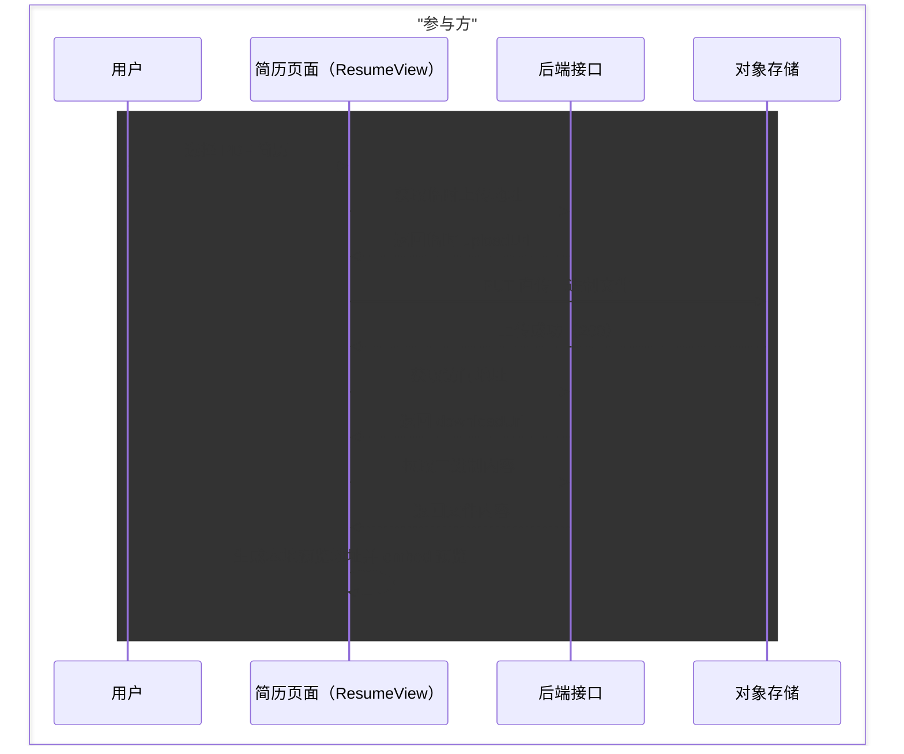

### 1.1.2 前端总体架构与分层设计

本项目采用 Vue 3 + Vite 构建前端应用，并通过 `vite-plugin-electron` 将同一套 UI 与业务在浏览器端和桌面端复用。为了避免页面逻辑“越写越厚”，前端整体遵循“视图层—状态层—接口层—基础设施层”的分层思路：视图层聚焦渲染与交互；状态层聚焦跨组件共享状态与复杂链路编排；接口层聚焦后端 API 的稳定封装；基础设施层聚焦鉴权续期、存储隔离、音频处理、主题变量等共性能力。

这种拆分方式的重点不在于“文件夹长得好看”，而在于把变化频率不同的逻辑隔离开：页面交互变化最频繁，接口参数次之，而鉴权、缓存与媒体处理属于平台性能力，应该被稳定沉淀。尤其在 SSE 流式回答、LiveKit 通话与 Three.js 渲染这类复杂链路中，网络流、媒体流与渲染流各自独立，再通过 Store 状态在 UI 上汇聚，能显著降低排查成本与维护压力。

Mermaid（可导入 draw.io）：前端分层与依赖关系

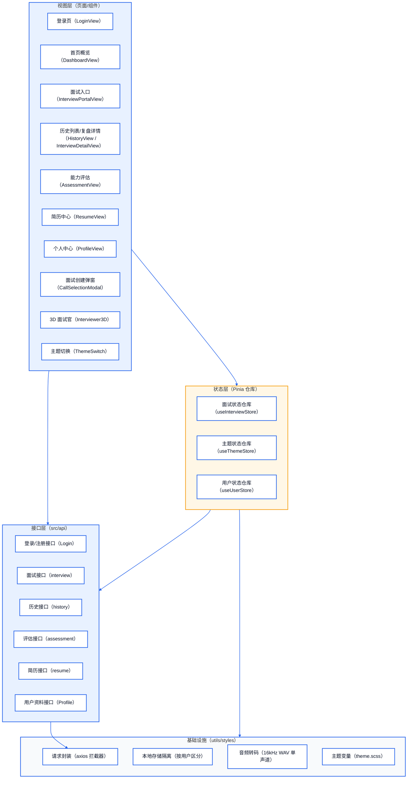

表：分层与代码目录映射（节选）

| 分层 | 责任边界 | 主要目录/文件（示例） |
| --- | --- | --- |
| 视图层 | 页面渲染、交互编排、组件复用 | src/views、src/components、src/layout |
| 状态层 | 会话状态、主题与用户资料、媒体状态 | src/stores |
| 接口层 | 后端 API 适配与参数封装 | src/api |
| 基础设施 | 鉴权续期、缓存隔离、音频工具、主题样式 | src/utils、src/assets/styles |

### 1.1.3 技术栈与工程化方案（Vite + Electron）

前端基础框架采用 Vue 3（组合式 API）+ Vue Router + Pinia，构建工具使用 Vite，以获得更快的开发启动与更清晰的模块边界。UI 组件基于 Element Plus，并通过 CSS 变量建立“简约白/科技蓝/深邃黑”三套主题，使核心页面（登录、布局、弹窗、表单与提示）在不同主题下保持统一的可读性与一致的视觉语义。

在能力支撑上，ECharts 用于评分雷达图与成长趋势折线图；报告导出使用 `html2pdf.js`，在导出过程中把导出容器切换到更适合打印的浅色样式以保证比赛材料可读。多模态方面，文本与语音回答采用 SSE 流式返回实现“边生成边展示”，语音/视频通话使用 LiveKit（WebRTC）承载实时音视频与说话人状态，视频形态再叠加 Three.js 的 3D 面试官增强沉浸感。

Mermaid（可导入 draw.io）：构建与运行形态

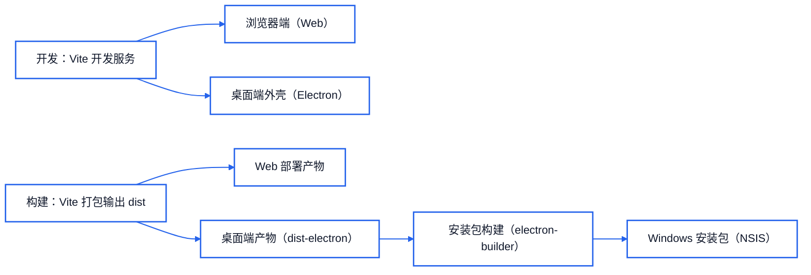

桌面端的差异点主要体现在窗口与路由：Electron 使用无边框窗口（`frame: false`）并由前端自绘标题栏，同时通过 IPC 将最小化/最大化/关闭的指令发送给主进程。路由模式在 Electron 下切换为 HashHistory，规避刷新时路径解析问题；在浏览器端使用 WebHistory 以获得更自然的 URL 体验。

Mermaid（可导入 draw.io）：Electron IPC 窗口控制

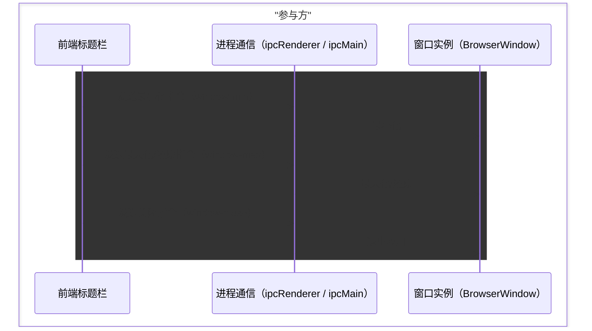

表：关键技术选型（节选）

| 领域 | 方案 | 选择理由（面向比赛交付） |
| --- | --- | --- |
| 框架 | Vue 3 + Router + Pinia | 组合式 API 易组织复杂链路，状态集中便于复盘与演示 |
| 构建 | Vite | 开发体验好，构建速度快，适合迭代与演示 |
| 桌面端 | Electron + electron-builder(NSIS) | 快速形成可安装交付物，降低评审环境差异风险 |
| 实时/流式 | SSE + LiveKit | 覆盖“流式文本”和“实时通话”两类核心交互形态 |
| 可视化/导出 | ECharts + html2pdf.js | 报告可视化直观，支持导出便于材料沉淀 |

### 1.1.4 路由与页面组织（Web/Electron 双运行时分流）

路由以 `MainLayout` 作为根布局承载侧边栏导航与公共行为，内部 children 组织业务页面；同时提供 `/official` 作为浏览器形态的“官网落地页”，以便在比赛展示时形成“落地页—登录—功能体验”的自然路径。鉴权逻辑在路由守卫与请求拦截器中协同完成：路由侧保证未登录不进入主业务页面，请求侧保证 token 自动注入与续期重试，从而减少业务页面对鉴权细节的感知。

Mermaid（可导入 draw.io）：路由跳转与鉴权逻辑

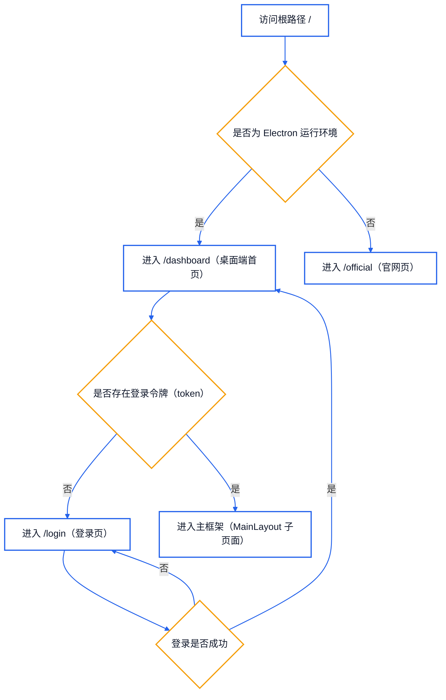

### 1.1.5 请求层与认证体系（axios 拦截器 + Token 续期）

前端通过统一的请求封装建立“可复用、可续期、可降级”的网络层：请求拦截阶段对非 `skipAuth` 请求自动追加 `Authorization: Bearer <token>`；响应拦截阶段同时兼容 JSON 结构化响应、纯文本响应与 SSE 文本响应，并对鉴权失效与窗口期续期做自动处理。对于 code=401/40105 或 HTTP 401 这类场景，请求层会尝试从响应体或响应头提取新 token 写入本地缓存，并对原请求进行一次自动重试，从而在不打断用户操作的前提下完成“无感续期”。

Mermaid（可导入 draw.io）：Token 续期与自动重试

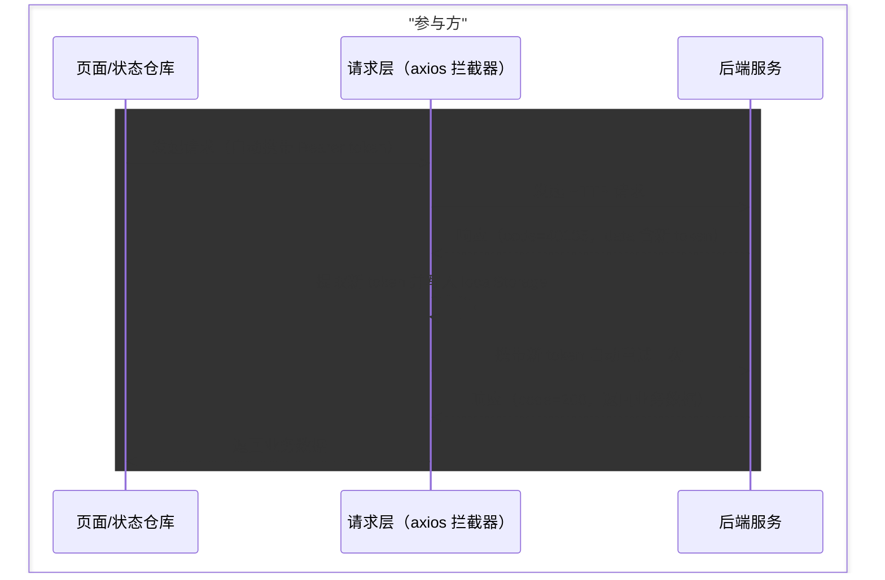

在流式场景中，SSE 返回内容可能混入续期信息，且流式文本不一定具备标准 JSON 包装，因此接口层对 SSE 文本会做额外扫描与提取，形成“请求层拦截器 + SSE 专项处理”的双保险。这样做的核心目的是把鉴权复杂度下沉到基础设施层，业务页面只需要关心“当前是否能拿到有效数据”，而不需要在每个接口调用点重复处理异常分支。

### 1.1.6 状态管理与主题系统（Pinia + CSS 变量）

项目使用 Pinia 进行状态管理，其中用户仓库维护登录态与资料字段，主题仓库维护主题值与持久化策略，面试仓库则汇聚面试链路的核心状态（会话 ID、消息序列、流式输出队列、通话房间对象、远端音轨、报告生成状态等）。由于 LiveKit Room、Three.js 场景与 WebAudio 节点属于“大对象 + 高频事件”的组合，为避免 Vue 深度响应式带来的性能开销，这类对象以 `shallowRef` 或局部变量承载，只暴露必要的轻量状态给 UI 使用。

Mermaid（可导入 draw.io）：面试状态机（抽象）

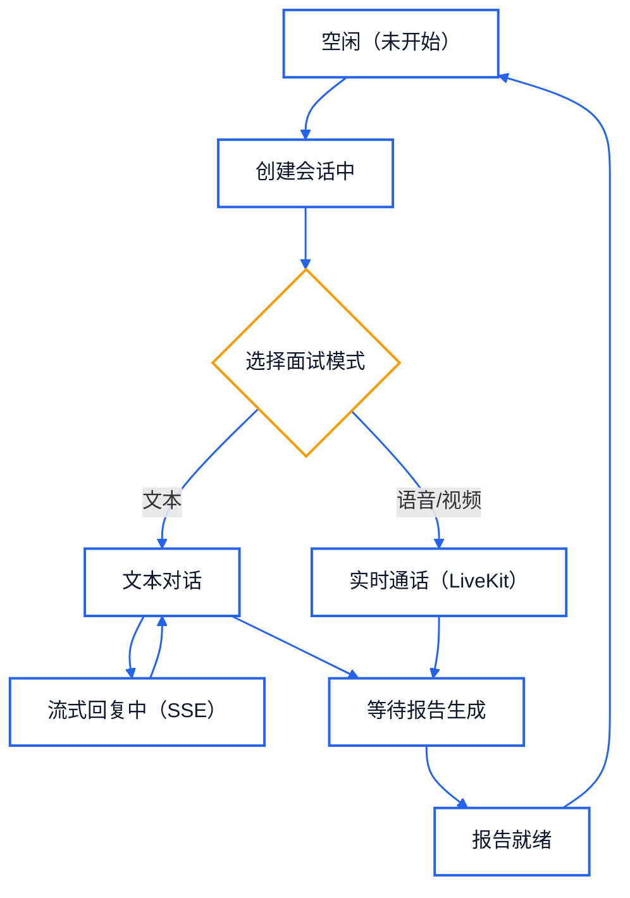

主题系统基于 CSS Variables 实现三套主题，并在全局样式中对 Element Plus 的关键组件做统一适配，以保证弹窗、输入框与提示信息在深色/浅色主题下都具备足够对比度。为了让比赛展示更具质感，主题切换优先使用 View Transitions（若浏览器支持）实现“遮罩扩散”过渡，并在切换瞬间短暂禁用全局 transition/animation，以降低 CSS 变量大规模变化造成的掉帧。

Mermaid（可导入 draw.io）：主题切换执行链

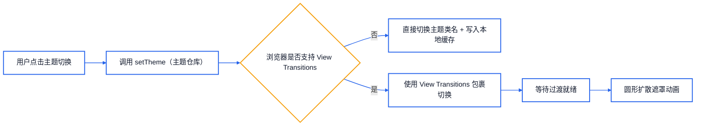

表：核心 Store 与职责（节选）

| Store | 主要状态 | 主要用途 |
| --- | --- | --- |
| useUserStore | 用户资料、登录信息 | 个人中心展示与更新、全局登录态 |
| useThemeStore | 主题值、切换状态 | 全局主题切换、样式一致性 |
| useInterviewStore | 会话/消息/通话/报告 | 统一编排文本流、语音流与通话链路 |

### 1.1.7 面试会话链路（入口、文本/语音流式、实时通话）

面试入口由 `InterviewPortalView` 提供，用户在未开始状态下通过弹窗完成“模式、方向、难度、风格、岗位信息”等参数采集，前端将这些参数视为一次会话的“创建合同”，并以此向后端创建会话。这样做的好处是：同一套参数在文本、语音与视频形态下都能复用，且后续复盘与报告展示可以明确对应到一次会话的上下文。

Mermaid（可导入 draw.io）：面试会话创建流程

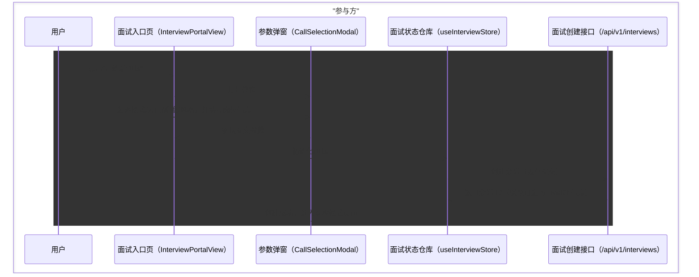

文本模式下，后端以 SSE（`text/event-stream`）返回流式内容，前端以 `responseType: 'text'` 获取文本并在接口层解析事件块，再把增量片段交给 Store 进行“队列化 + 定时输出”，形成“打字机式”的渐进呈现。为保证稳定性，前端识别流内的结束标记并在后台等待报告生成完成，避免 UI 层轮询造成的逻辑分散。

Mermaid（可导入 draw.io）：SSE 消费与打字机逻辑

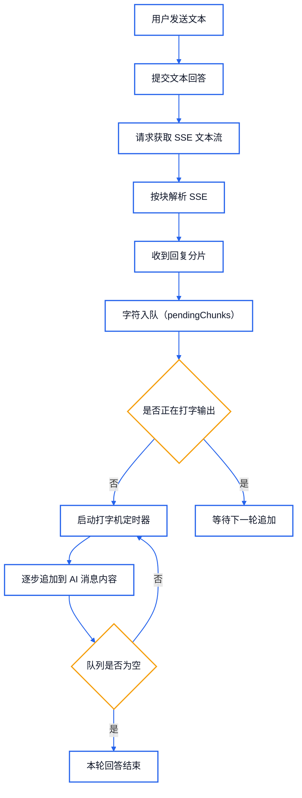

语音回答在前端侧被拆为“录音—转码—上传—流式接收”四段，其中转码环节统一输出 16kHz、16bit、单声道 WAV，以减少后端输入格式兼容的复杂度并提升评测一致性。语音回答的回传仍以文本流式方式呈现，从而复用同一套 SSE 解析与打字机输出逻辑。

Mermaid（可导入 draw.io）：语音回答数据流

语音/视频通话模式使用 LiveKit 实时房间承载媒体链路。前端在创建会话后获取 wsUrl 与 livekitToken，连接房间并订阅远端音频轨道，页面通过隐藏的 `<audio autoplay>` 自动播放远端 AI 声音；同时监听 ActiveSpeakers 事件更新“谁在说话”的状态，用于驱动语音模式的动效与视频模式的 3D 面试官表现。为了提升可恢复性，当连接非用户主动断开时，前端会将其收敛为“正常结束”，并引导用户进入报告与复盘。

Mermaid（可导入 draw.io）：LiveKit 通话链路与断线收敛

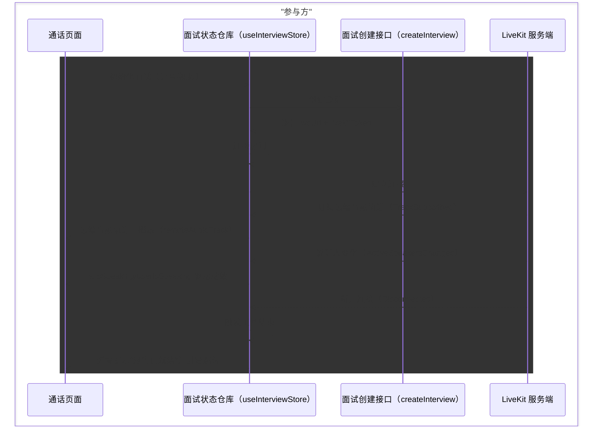

表：三种面试形态对比（节选）

| 形态 | 输入 | 输出呈现 | 核心技术点 |
| --- | --- | --- | --- |
| 文本 | 键盘输入 | SSE 流式 + 打字机 | SSE 解析、队列化输出、续期兜底 |
| 语音回答 | 录音文件 | SSE 流式 + 打字机 | MediaRecorder、端侧转码（WAV 16k） |
| 语音/视频通话 | 实时音视频 | 远端音轨自动播放 + 说话状态驱动 | LiveKit 连接、轨道订阅、断线收敛 |

### 1.1.8 3D 面试官与沉浸式呈现（Three.js + WebAudio）

在视频通话形态中，前端引入 3D 面试官组件以增强“AI 正在交流”的可感知性。Three.js 负责场景、相机与渲染器的初始化，模型以 GLTF/GLB 形式加载，前端通过遍历模型的 morphTarget 字典定位嘴部与眼部表情控制器，并将音频驱动结果映射到表情权重上。为了避免无意义的资源消耗，音频频谱分析仅在 AI 说话时启用，并对目标权重做平滑插值以减少抖动。

Mermaid（可导入 draw.io）：3D 面试官音频驱动闭环

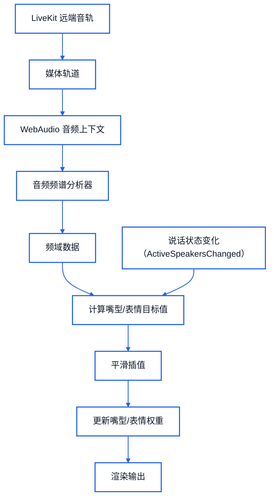

### 1.1.9 报告与复盘、异常与性能、安全与交付

面试报告在面试结束后展示结构化评估结果。前端在渲染前对字段缺失与类型不一致进行规范化处理，保证在比赛演示环境下不会因为单次数据异常导致页面崩溃；在可视化层，使用 ECharts 绘制雷达图与趋势图，帮助用户直观理解多维能力与成长曲线；在导出层，通过 `html2pdf.js` 将报告导出为 PDF，并在导出时对导出容器切换为更适合打印的浅色样式，保证材料清晰。

Mermaid（可导入 draw.io）：报告渲染与导出

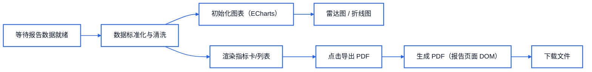

历史复盘模块将面试记录沉淀为“列表—详情”两级结构：列表页用于归档与快速定位，详情页以双标签形式呈现对话全纪录与面试报告，并复用报告页面的渲染与导出能力，从而保持“当次体验”和“事后复盘”在数据与视觉上的一致。

Mermaid（可导入 draw.io）：历史复盘访问路径

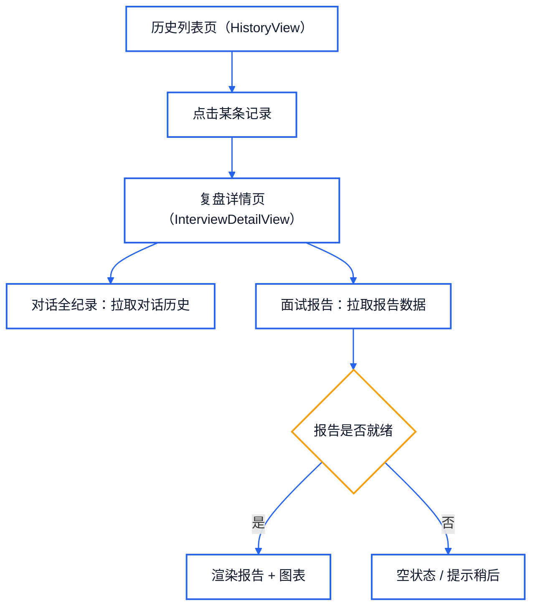

在异常处理上，前端将网络错误、鉴权失效与“面试中离开页面”的场景统一做可感知提示与可恢复收敛：网络错误通过统一提示避免静默失败；鉴权失效会清理本地登录信息并跳转登录，防止进入半登录态；面试过程中若用户尝试切换导航或退出，会进行二次确认并触发后端兜底结束接口，避免产生悬挂会话。性能方面，项目通过 `shallowRef` 降低大对象的响应式开销，通过队列化的打字机输出降低 DOM 高频更新，通过主题切换时禁用全局过渡降低掉帧，并对图表实例初始化与销毁做统一管理以避免内存泄漏。

在安全与合规表述上，本项目采用临时授权/预签名 URL 的方式进行对象存储直传，减少长期上传权限暴露；本地缓存关键数据按用户身份隔离，避免同设备多账号数据串扰；token 存储采用 localStorage 以满足 Electron 与比赛演示的易用性，若面向生产环境可进一步升级为更严格的安全存储或 Cookie 策略。

---

（完）
