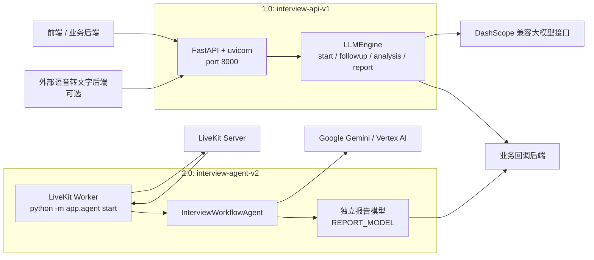

# AI 面试模拟器 ML 服务部署环境说明

> 文档定位：说明 `ml-service` 在当前代码结构下的真实部署环境、运行时拆分、容器镜像、外部依赖与环境变量配置。
>
> 文档目标：这份文档不是部署手册的简单摘要，而是面向项目文档的正式说明，默认你的 `ml-service` 已经作为系统中的独立服务接入，重点描述如何稳定部署和稳定运行。

## 1. 部署拓扑

当前 `ml-service` 不是单一进程，而是两条部署链路：

- 1.0 是 FastAPI HTTP 服务，负责 `start`、`followup`、`analysis`、`report` 这条文本工作流。
- 2.0 是 LiveKit Worker，负责实时面试会话、语音互动和最终报告生成。



### 1.1 关键边界

- 1.0 只处理文本请求。虽然 `schemas.py` 里保留了 `audio` / `video` 字段兼容上游传参，但服务内部不做语音采集、VAD 或 ASR。
- 如果业务上游有音频，必须先由外部后端转成 transcript，再调用 1.0 的 HTTP 接口。
- 2.0 依赖 LiveKit 房间与实时音频链路，属于常驻 worker，不是 HTTP API 服务。

## 2. 运行时形态

### 2.1 1.0：HTTP API 服务

代码入口是 [app/main.py](../app/main.py)。服务特点如下：

- 对外监听 `0.0.0.0:8000`。
- 提供 `/api/v1/interview/start`、`/api/v1/interview/followup`、`/api/v1/interview/analysis`、`/api/v1/interview/report`。
- 提供 `/health` 健康检查接口。
- 使用 `uvicorn` 启动，适合容器化部署。
- 报告生成通过后台任务异步派发，再由回调地址返回业务系统。

### 2.2 2.0：LiveKit Worker

代码入口是 [app/agent.py](../app/agent.py)。服务特点如下：

- 启动方式是 `python -m app.agent start`。
- 通过 `agents.cli.run_app(server)` 运行，不暴露 HTTP 服务端口。
- 从房间元数据中读取会话信息。
- 通过 `AgentSession` 连接实时模型和 LiveKit 房间。
- 会话结束后，调用独立报告模型生成最终报告，再发送回调。

## 3. 基础环境要求

### 3.1 操作系统与容器

- 推荐 Linux 环境。
- 推荐使用 Docker 和 Docker Compose v2。
- 两个镜像都基于 `python:3.11-slim`。

### 3.2 网络与外部依赖

`ml-service` 当前不依赖本地数据库或本地消息队列，但依赖外部平台服务：

- DashScope 兼容模型接口，用于 1.0 的文本面试链路。
- Google Gemini / Vertex AI，用于 2.0 的实时面试和报告模型。
- LiveKit Server，用于 2.0 的实时房间和音视频会话。
- 业务后端回调地址，用于最终报告和失败回调。

### 3.3 代理与网络策略

当前双服务编排文件里，2.0 容器默认带有代理与内网解析配置：

- `HTTP_PROXY=http://host.docker.internal:6591`
- `HTTPS_PROXY=http://host.docker.internal:6591`
- `NO_PROXY=localhost,127.0.0.1,interview-api-v1`
- `extra_hosts` 里把 `host.docker.internal` 指向宿主机网关
- `dns` 里显式配置 `8.8.8.8` 和 `1.1.1.1`

如果你的部署环境没有本地代理，建议移除或替换这些值；如果有公司代理，则需要把地址改成你的真实代理端口。

### 3.4 外部网络

`docker-compose.dual.yml` 使用了外部网络 `ml_service`。部署前需要先确保这个网络存在，否则编排会失败。

```bash
docker network create ml_service
```

## 4. 镜像与系统依赖

### 4.1 1.0 镜像

- Dockerfile：`Dockerfile`
- 基础镜像：`python:3.11-slim`
- 系统依赖：`curl`
- Python 依赖：`fastapi`、`uvicorn[standard]`、`openai`、`PyYAML`、`json-repair`、`Jinja2`、`pydantic`、`httpx`
- 暴露端口：`8000`
- 健康检查：`GET /health`

### 4.2 2.0 镜像

- Dockerfile：`Dockerfile.agent2`
- 基础镜像：`python:3.11-slim`
- 系统依赖：`libportaudio2`、`libasound2`、`ca-certificates`
- Python 依赖：`python-dotenv`、`livekit-agents[images]`、`livekit-plugins-google`、`google-genai`，以及共享的 `PyYAML`、`json-repair`、`Jinja2`、`pydantic`、`httpx`
- 运行方式：Worker 进程，不监听 HTTP 端口

### 4.3 构建策略

两个 Dockerfile 都采用“先安装依赖、再复制代码”的方式，便于利用镜像缓存。也就是说：

1. 先复制 requirements。
2. 再执行 pip install。
3. 最后复制应用代码。

这个顺序适合依赖变动频率低、代码变动频率高的服务。

## 5. 环境变量说明

### 5.1 1.0 服务环境变量

1.0 的环境变量主要分成三类：模型接入、报告回调、日志与性能调优。

| 变量 | 默认值 | 用途 | 是否必需 |
| --- | --- | --- | --- |
| `DASHSCOPE_API_KEY` | 无 | 1.0 文本模型接入凭证 | 是 |
| `DASHSCOPE_BASE_URL` | `https://dashscope.aliyuncs.com/compatible-mode/v1` | OpenAI 兼容接口地址 | 否 |
| `JUDGE_MODEL` | `qwen-turbo` | 面试分析与问答模型 | 否 |
| `SCORING_TEMPERATURE` | `1.0` | 评分模型温度 | 否 |
| `LLM_REQUEST_TIMEOUT_SECONDS` | `30` | 单次模型请求超时 | 否 |
| `LLM_MAX_RETRIES` | `1` | 模型重试次数 | 否 |
| `LLM_RETRY_BACKOFF_SECONDS` | `0.75` | 重试退避时间 | 否 |
| `REPORT_CALLBACK_URL_TEMPLATE` | `https://nas.feixingxr.com/api/v1/interviews/{interviewId}/report-callback` | 报告回调地址模板 | 建议配置 |
| `REPORT_LOG_CALLBACK_BODY` | `true` | 是否打印回调 body | 否 |
| `REPORT_LOG_CALLBACK_BODY_MAX_CHARS` | `20000` | 回调 body 日志截断长度 | 否 |
| `REQUEST_LOG_BODY_MAX_CHARS` | `6000` | 请求日志截断长度 | 否 |
| `LOG_LEVEL` | `INFO` | 服务日志级别 | 否 |

#### 1.0 的上下文裁剪参数

这些变量用于限制 prompt 和历史上下文长度，属于调优参数，不是强制必填项：

- `FOLLOWUP_HISTORY_WINDOW`
- `FOLLOWUP_HISTORY_FIELD_MAX_CHARS`
- `ANALYSIS_CONTEXT_MAX_CHARS`
- `ANALYSIS_HISTORY_SUMMARY_MAX_CHARS`
- `ANALYSIS_QUESTION_MAX_CHARS`
- `ANALYSIS_ANSWER_MAX_CHARS`
- `REPORT_RESULT_TEXT_MAX_CHARS`
- `REPORT_SUGGESTION_MAX_CHARS`
- `REPORT_REASON_MAX_CHARS`

### 5.2 2.0 服务环境变量

2.0 的环境变量主要分成四类：启动配置、实时模型配置、报告模型配置、调试日志。

| 变量 | 默认值 | 用途 | 是否必需 |
| --- | --- | --- | --- |
| `ML_SERVICE_ENV_FILE` | `.env.ml-service` | `.env` 加载路径 | 否 |
| `GEMINI_MODEL` | `gemini-2.5-flash-native-audio-preview-12-2025` | 实时面试模型 | 否 |
| `GEMINI_VOICE` | `Puck` | 实时语音音色 | 否 |
| `GEMINI_TEMPERATURE` | `0.8` | 实时模型温度 | 否 |
| `GOOGLE_API_KEY` | 无 | Gemini API 凭证 | 二选一 |
| `GOOGLE_USE_VERTEXAI` | `false` | 是否使用 Vertex AI | 二选一 |
| `GOOGLE_CLOUD_PROJECT` | 无 | Vertex AI 项目号 | Vertex AI 模式需要 |
| `GOOGLE_CLOUD_LOCATION` | 无 | Vertex AI 区域 | Vertex AI 模式需要 |
| `GOOGLE_ENABLE_CONTEXT_WINDOW_COMPRESSION` | `true` | 是否启用上下文压缩 | 否 |
| `GOOGLE_ENABLE_SESSION_RESUMPTION` | `true` | 是否启用会话续接 | 否 |
| `INTERVIEW_GEMINI_AUTO_ACTIVITY_START_SENSITIVITY` | `HIGH` | 开始说话灵敏度 | 否 |
| `INTERVIEW_GEMINI_AUTO_ACTIVITY_END_SENSITIVITY` | `LOW` | 结束说话灵敏度 | 否 |
| `INTERVIEW_GEMINI_AUTO_ACTIVITY_PREFIX_PADDING_MS` | `300` | 起始前置缓冲 | 否 |
| `INTERVIEW_GEMINI_AUTO_ACTIVITY_SILENCE_DURATION_MS` | `1500` | 静默结束阈值 | 否 |
| `INTERVIEW_ENDPOINTING_MIN_DELAY` | `4.0` | 端点最小延迟 | 否 |
| `INTERVIEW_ENDPOINTING_MAX_DELAY` | `6.0` | 端点最大延迟 | 否 |
| `INTERVIEW_MIN_CONSECUTIVE_SPEECH_DELAY` | `4.0` | 连续说话判定延迟 | 否 |
| `INTERVIEWER_STYLE` | `standard` | 面试风格 | 否 |
| `INTERVIEW_DIFFICULTY` | `medium` | 面试难度 | 否 |
| `COMPANY_CONTEXT` | `通用科技公司文化` | 公司语境 | 否 |
| `INTERVIEW_MODE` | `video` | 会话模式 | 否 |

#### 2.0 的报告模型变量

| 变量 | 默认值 | 用途 |
| --- | --- | --- |
| `REPORT_MODEL` | `gemini-2.5-flash-lite` | 最终报告模型 |
| `REPORT_TEMPERATURE` | `0.2` | 报告生成温度 |
| `REPORT_MAX_OUTPUT_TOKENS` | `4096` | 报告最大输出长度 |
| `REPORT_CALLBACK_URL_TEMPLATE` | `https://nas.feixingxr.com/api/v1/interviews/{interviewId}/report-callback` | 报告回调地址模板 |
| `REPORT_CALLBACK_MAX_ATTEMPTS` | `3` | 回调重试次数 |
| `REPORT_REQUEST_TIMEOUT_SECONDS` | `20` | 回调请求读超时 |

#### 2.0 的调试日志变量

- `INTERVIEW_TRACE_LOG_DETAIL`
- `OFFICIAL_TRACE_LOG_DETAIL`
- `INTERVIEW_TRACE_LOG_MAX_CHARS`
- `OFFICIAL_TRACE_LOG_MAX_CHARS`

这些变量建议在生产环境关闭或严格控制长度，以免日志里打印过多会话信息。

### 5.3 建议的环境划分方式

建议把同一份 `.env.ml-service` 同时供两个容器使用，但按职责保留不同前缀的值：

- 1.0 主要依赖 DashScope 相关变量和回调变量。
- 2.0 主要依赖 Google / Gemini 相关变量、LiveKit 运行时变量和回调变量。

如果你希望更清晰，也可以拆成两个环境文件，再在 compose 里分别注入。

## 6. 部署步骤

### 6.1 准备环境文件

在 `ml-service/` 目录下准备 `.env.ml-service`，至少确认下面这些变量可用：

- `DASHSCOPE_API_KEY`
- `GOOGLE_API_KEY`，或 `GOOGLE_USE_VERTEXAI=true` 时配好 Vertex AI 相关配置
- `REPORT_CALLBACK_URL_TEMPLATE`
- LiveKit 运行时所需的环境变量由你的 LiveKit 部署或平台注入

### 6.2 创建外部网络

```bash
docker network create ml_service
```

### 6.3 构建并启动

```bash
docker compose -f docker-compose.dual.yml up -d --build
```

### 6.4 验证 1.0

```bash
curl http://localhost:8000/health
```

预期返回：

```json
{"status":"ok"}
```

### 6.5 验证 2.0

2.0 没有 HTTP 健康检查接口，建议通过以下方式确认：

- `docker logs interview-agent-v2`
- LiveKit 房间是否成功建立
- Gemini 实时模型是否成功连接
- 候选人是否能正常进入面试会话

### 6.6 本地开发启动

如果你不走 Docker，也可以分别启动：

```bash
uvicorn app.main:app --host 0.0.0.0 --port 8000
python -m app.agent start
```

不过在本项目里，更推荐容器化方式，因为 2.0 依赖的音频和 LiveKit 组件在容器环境下更稳定。

## 7. 运行与排障建议

### 7.1 1.0 常见问题

- `DASHSCOPE_API_KEY` 缺失时，`LLMEngine` 会直接拒绝启动。
- 回调地址不可达时，报告任务会重试并最终失败。
- 如果日志里出现大量 JSON 修复提示，通常说明模型输出格式不稳定，需要检查 Prompt 或模型参数。

### 7.2 2.0 常见问题

- `GOOGLE_API_KEY` 未配置，且没有启用 Vertex AI 时，worker 会在构建实时模型时失败。
- `ml_service` 外部网络缺失，会导致 compose 编排失败。
- 代理配置不正确时，LiveKit 或 Google API 可能无法出网。
- `INTERVIEW_GEMINI_AUTO_ACTIVITY_*` 和 `INTERVIEW_ENDPOINTING_*` 配置过激，会导致抢话或过早结束用户轮次。

### 7.3 运维建议

- 生产环境建议保持 `LOG_LEVEL=INFO` 或更高，不要默认开启详细 trace。
- 回调日志里可能包含完整报告体，建议只在排障时临时开启 `REPORT_LOG_CALLBACK_BODY`。
- `interview-api-v1` 已配置 `restart: unless-stopped` 和健康检查，适合作为稳定的 HTTP 服务。
- `interview-agent-v2` 没有 HTTP healthcheck，建议依赖容器日志和 LiveKit 侧监控判断存活。

## 8. 结论

当前 `ml-service` 的部署环境可以概括成一句话：

**1.0 是一个基于 DashScope 兼容接口的 FastAPI 文本服务，2.0 是一个基于 LiveKit + Gemini 的实时 Worker，二者通过同一业务回调链路闭环。**

这意味着你的部署重点不是“起一个 Python 服务”这么简单，而是要同时保证：

- 1.0 的 HTTP 接口可用、可健康检查、可回调。
- 2.0 的实时会话可连接、可收音、可结束、可报告。
- 外部模型凭证、代理、LiveKit、回调后端都在同一套部署环境里可达。

只要这几层打通，`ml-service` 就可以稳定承担整个面试链路中的在线问答、实时会话和报告生成工作。