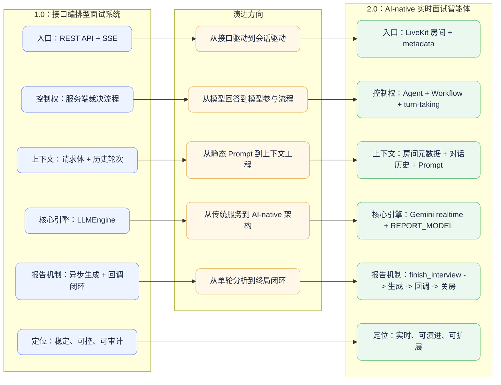
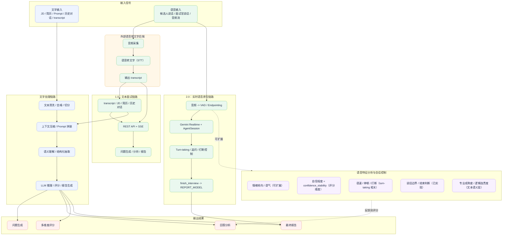

# 人工智能面试模拟器 2.0 项目文档

> 版本定位：LiveKit-first 的实时面试运行时。
> 核心特点：Gemini realtime 负责实时对话，独立的 report model 负责最终报告，系统以工作流方式闭环。

本文是 2.0 的正式项目文档，重点说明实时运行时的架构、Prompt 组织、回合控制、报告生成、回调、部署和最佳实践。

## 1. 项目目标

2.0 的目标不是把 1.0 的接口再包一层，而是把面试过程变成真正的实时会话。

- 会话从 LiveKit 房间启动。
- 候选人的回答通过实时语音或视频进入会话。
- 模型负责自然对话、追问和阶段推进。
- 结束时再切换到独立的报告模型生成最终结果。

> PPT 版一句话定位：2.0 不是“实时语音机器人”，而是一个 AI-native 的实时面试智能体，把模型从内容生成器升级成流程参与者。
>
> 配图建议：这里最适合放一张主架构图，展示 LiveKit、agent、workflow、report model、callback 之间的完整闭环。

这使得 2.0 更接近真实面试体验，也更适合后续扩展到更复杂的人机协同能力。

## 2. 设计原则

### 2.1 会话元数据优先

2.0 的会话上下文首先来自 `room.metadata`，而不是请求体里的临时参数。

### 2.2 Prompt 与运行时分层

- Prompt 负责行为约束、风格约束和输出格式。
- 运行时负责回合控制、房间生命周期、报告触发和回调。

### 2.3 抢话控制前移

“是否该结束用户这一轮”不只是 Prompt 的问题，必须结合 `TurnHandlingOptions` 和 Gemini 的 `automatic_activity_detection` 一起调。

### 2.4 报告与对话解耦

实时模型不直接承担最终报告生成，避免在线对话和离线总结互相干扰。

### 2.5 结果可回调

最终报告由服务端标准化后再发往后端回调地址，保证下游系统可直接消费。

### 2.6 上下文工程优先

2.0 的智能性并不只来自模型本身，而来自对上下文的工程化组织：房间 metadata、Prompt 体系、对话历史、报告上下文和回调结果都被纳入同一条可控链路。

### 2.7 面向演进的 AI 原生架构

2.0 当前已经具备 AI-native 的基本形态：模型不再只是回答问题，而是参与工具调用、阶段切换、结束判定和报告生成。后续接入 RAG、知识图谱或多模态检索时，可以继续沿用这套运行时骨架。

### 2.8 视频模式的数字人扩展

2.0 的视频模式可以叠加 Anam 数字人插件，作为实时模型的可视化输出层。这里不是替换现有的 `AgentSession`，而是在 `mode=video` 时先启动 avatar worker，再启动面试 agent，让模型输出通过头像参与同步音视频发布。

- 启用条件：`INTERVIEW_MODE=video`，并配置 `ANAM_API_KEY` 与 `ANAM_AVATAR_ID`。
- 启动顺序：先创建 `AgentSession`，再创建 `anam.AvatarSession`，然后执行 `await avatar.start(session, room=ctx.room)`，最后执行 `await session.start(...)`。
- Anam 插件内部会先向 `/v1/auth/session-token` 申请会话 token，再通过 LiveKit 的房间接入把模型输出转成同步音视频流。
- 若未配置 Anam，系统会自动回退到普通实时视频会话，不影响主面试流程。

> 观测建议：如果升级到 LiveKit Agents 1.5.12，可结合新加入的 AvatarMetrics 观察 avatar join latency 和 playback latency。

## 3. 总体架构

### 3.1 代码组成

- `app/agent.py`：LiveKit 任务入口、元数据解析、Gemini realtime 模型构建、`AgentSession` 组装。
- `app/official_workflow.py`：人格注册器、工作流 agent、`finish_interview` 工具、报告生成、回调。
- `app/prompts/official/agent_persona_v1.yaml`：全局人格和反抢话指令。
- `app/prompts/official/report_generation_v1.yaml`：最终报告 Prompt 和 JSON 约束。
- `tests/test_2_0_chain.py`：实时运行时回归测试。

> 配图建议：这一节适合配“实时工作流总览图”，把代码文件、职责边界和运行时入口一次画清楚。

### 3.2 运行形态

2.0 是一个常驻 worker，而不是 HTTP 服务。

1. LiveKit 发起任务。
2. `agent.py` 读取房间元数据并启动会话。
3. `AINativeInterviewWorkflowAgent` 接管对话。
4. 候选人和面试官在同一实时会话里完成多轮问答。
5. 结束时调用 `finish_interview`。
6. 系统自动生成报告、发送回调并关闭房间。

### 3.3 技术栈

- LiveKit Agents
- Gemini realtime
- FastAPI 组件仅用于整体工程环境中的辅助能力
- Jinja2
- Pydantic
- HTTPX
- Docker

## 4. 工作流设计

### 4.1 入口流程

`app/agent.py` 是 2.0 的入口。它做四件事：

- 读取环境变量。
- 解析房间元数据。
- 构建 `AgentSession`。
- 启动 `AINativeInterviewWorkflowAgent`。

### 4.2 会话上下文

会话上下文由以下信息拼成：

- `session_id`
- `job_position`
- `jd_summary`
- `resume_content`
- `interviewer_style`
- `difficulty`
- `company_context`
- `mode`
- `metadata_source`

### 4.3 工作流行为

`AINativeInterviewWorkflowAgent` 负责：

- 生成开场。
- 维持自然追问。
- 在候选人明确结束面试时触发 `finish_interview`。
- 异步生成最终报告。
- 回调后关闭房间。

### 4.4 结束行为

`finish_interview` 并不是“立刻退出”，它的真实语义是：

- 切换到报告生成模式。
- 触发独立报告模型。
- 回调完成后再结束房间。

这是 2.0 里最重要的生命周期控制点。

## 5. 房间元数据契约

2.0 依赖 LiveKit 房间元数据来驱动面试。

### 5.1 推荐结构

```json
{
  "session_id": "sess-20260402-001",
  "job_position": "Java后端工程师",
  "jd_summary": "熟悉 Spring Boot、MySQL、Redis、消息队列",
  "resume_content": "3年支付与交易系统经验",
  "interview_config": {
    "mode": "video",
    "interviewer_style": "expert",
    "difficulty": "hard",
    "company_context": "电商交易场景"
  }
}
```

### 5.2 字段说明

- `session_id`：会话主键。
- `job_position`：岗位名称。
- `jd_summary`：岗位描述摘要。
- `resume_content`：候选人简历摘要。
- `interview_config.mode`：`text`、`audio`、`video`。
- `interview_config.interviewer_style`：`standard`、`friendly`、`aggressive`、`expert`。
- `interview_config.difficulty`：`easy`、`medium`、`hard`。
- `interview_config.company_context`：业务语境。

### 5.3 解析规则

- `room.name` 如果以 `room_` 开头，会自动去掉前缀。
- 如果 `metadata.session_id` 和 `room.name` 不一致，运行时会以 metadata 为准。
- `job.metadata` 和 `ctx.metadata` 可以作为兼容来源。
- 元数据为空或非法 JSON 时，会退回默认配置。

## 6. Prompt 体系

### 6.1 全局人格 Prompt

`agent_persona_v1.yaml` 不是简单的角色扮演，而是一个完整的行为约束层，包含：

- `system_role`
- `rules`
- `stage_strategy`
- `deep_dive_strategy`
- `turn_correction`
- `tool_contract`
- `anti_rush_control`
- `interviewer_style_policy`
- `format_requirements`
- `input_context`

#### 行为要点

- 一次只问一个主问题。
- 用户没说完时不要抢话。
- 有高价值追问时优先深挖，不要横跳。
- 候选人明确结束时才调用 `finish_interview`。
- 不要为了流程完整性而提前收尾。

### 6.2 报告 Prompt

`report_generation_v1.yaml` 的职责是生成结构化 JSON 报告本体。

- 只能输出一个 JSON 对象。
- 不能输出 Markdown。
- 不能自己输出 `overall_score`。
- 维度评分必须是 0 到 5，步长为 0.5。
- `conversation_summary` 和 `conversation_transcript` 都会喂给模型，用于终局判断。

## 7. 回合控制与反抢话策略

2.0 的回合控制不是单点开关，而是 Prompt + Session + Gemini 活动检测三层共同作用的结果。

### 7.1 当前会话配置

- `turn_handling.turn_detection = "realtime_llm"`
- `turn_handling.endpointing.min_delay = 4.0`
- `turn_handling.endpointing.max_delay = 6.0`
- `preemptive_generation = False`
- `min_consecutive_speech_delay = 4.0`

### 7.2 Gemini 自动活动检测

`app/agent.py` 会显式传入：

- `INTERVIEW_GEMINI_AUTO_ACTIVITY_START_SENSITIVITY=HIGH`
- `INTERVIEW_GEMINI_AUTO_ACTIVITY_END_SENSITIVITY=LOW`
- `INTERVIEW_GEMINI_AUTO_ACTIVITY_PREFIX_PADDING_MS=300`
- `INTERVIEW_GEMINI_AUTO_ACTIVITY_SILENCE_DURATION_MS=1500`

这些参数的含义是：

- 更容易识别用户开始说话。
- 更不容易过早识别成结束。
- 更愿意容忍短暂停顿。
- 更少出现“用户稍微一停就被抢话”的情况。

### 7.3 最佳实践

如果你还观察到抢话，应该按这个顺序处理：

1. 先调大 `INTERVIEW_GEMINI_AUTO_ACTIVITY_SILENCE_DURATION_MS`。
2. 再调大 `INTERVIEW_ENDPOINTING_MIN_DELAY`。
3. 保持 `preemptive_generation=False`。
4. 最后再优化 Prompt 里的反抢话语句。

不要把“别抢话”只写在 Prompt 里，因为真正控制转场时机的是活动检测和端点判断。

> 配图建议：这一节很适合配“反抢话策略示意图”或“turn-taking 时序图”，把 endpointing、activity detection、preemptive_generation 的关系画出来。

## 8. 报告生成与回调

### 8.1 报告模型分离

2.0 采用单独的 `REPORT_MODEL` 做最终报告生成，默认值为 `gemini-2.5-flash-lite`。

这样做的好处是：

- 实时对话和终局总结解耦。
- 生成报告时可以使用更稳定、更偏分析的上下文组织方式。
- 不会让实时对话被报告任务拖慢。

> 配图建议：这里适合放一张“报告生成闭环图”，把 `finish_interview -> report model -> callback -> close room` 单独画出来。

### 8.2 报告输入内容

报告模型的输入主要来自：

- 当前会话上下文。
- conversation summary。
- conversation transcript。
- `finish_interview` 的触发原因。

### 8.3 评分回算

模型返回后，代码会回算两个层级的结果：

- `dimension_scores`
- `overall_score`

公式与 1.0 保持一致：

```text
professional = 0.20 * technical_correctness + 0.09 * knowledge_match + 0.31 * job_match + 0.40 * engineering_practice
cognition = (logic_structure + problem_solving + system_thinking) / 3
expression = (clarity + confidence_stability + professional_maturity) / 3
overall_score = round((0.5 * professional + 0.3 * cognition + 0.2 * expression) * 20, 1)
```

### 8.4 回调体结构

成功回调发送的是完整报告对象，包含：

- `hiring_recommendation`
- `executive_summary`
- `strengths`
- `weaknesses`
- `ability_trend`
- `detailed_recommendation`
- `professional`
- `cognition`
- `expression`
- `dimension_scores`
- `overall_score`

这是当前 2.0 的一个重要工程特性：回调对象既保留模型的原始判断，也保留代码回算出的标准化得分。

### 8.5 失败回调

如果报告生成失败，会发送错误包装对象：

```json
{
  "code": 500,
  "message": "report_generation_failed",
  "data": {
    "interviewId": "sess-001",
    "session_id": "sess-001",
    "status": "failed",
    "error": "具体错误信息"
  }
}
```

## 9. 部署方式

### 9.1 本地启动

```bash
cd ml-service
conda run -n ml-service python -m app.agent start
```

### 9.2 Docker 启动

```bash
cd ml-service
docker build -f Dockerfile.agent2 -t ai-interview-2-runtime:latest .
docker run --rm -it --env-file .env.ml-service ai-interview-2-runtime:latest
```

### 9.3 双服务编排

`docker-compose.dual.yml` 里已经把 1.0 和 2.0 分成两个服务：

- `interview-api-v1`：1.0 的 HTTP 服务。
- `interview-agent-v2`：2.0 的实时 worker。

这种拆法适合平滑迁移、灰度验证和双轨并行。

### 9.4 运行建议

- 实时 worker 不应该当成 HTTP 服务去访问。
- 2.0 需要保证 LiveKit、Google 模型网关和回调地址都可达。
- 容器环境下要特别注意代理、DNS 和证书链。

## 10. 配置管理

### 10.1 必需配置

- `GOOGLE_API_KEY`
- `GEMINI_MODEL`
- `GEMINI_VOICE`
- `GEMINI_TEMPERATURE`
- `REPORT_MODEL`
- `REPORT_CALLBACK_URL_TEMPLATE`

### 10.2 推荐配置

- `GOOGLE_USE_VERTEXAI`
- `GOOGLE_CLOUD_PROJECT`
- `GOOGLE_CLOUD_LOCATION`
- `GOOGLE_ENABLE_CONTEXT_WINDOW_COMPRESSION`
- `GOOGLE_ENABLE_SESSION_RESUMPTION`
- `INTERVIEW_MIN_CONSECUTIVE_SPEECH_DELAY`
- `INTERVIEW_ENDPOINTING_MIN_DELAY`
- `INTERVIEW_ENDPOINTING_MAX_DELAY`
- `INTERVIEW_GEMINI_AUTO_ACTIVITY_START_SENSITIVITY`
- `INTERVIEW_GEMINI_AUTO_ACTIVITY_END_SENSITIVITY`
- `INTERVIEW_GEMINI_AUTO_ACTIVITY_PREFIX_PADDING_MS`
- `INTERVIEW_GEMINI_AUTO_ACTIVITY_SILENCE_DURATION_MS`
- `REPORT_REQUEST_TIMEOUT_SECONDS`
- `REPORT_CALLBACK_MAX_ATTEMPTS`
- `INTERVIEW_TRACE_LOG_DETAIL`
- `OFFICIAL_TRACE_LOG_MAX_CHARS`

### 10.3 配置原则

- 模型参数尽量走环境变量，不要写死在代码里。
- 对 turn-taking 敏感的参数要留出可调空间。
- 报告模型和实时模型要分别配置，不要混成一个变量。

## 11. 可观测性与测试

### 11.1 关键日志

建议重点关注：

- 元数据解析日志
- Prompt 渲染日志
- `finish_interview` 触发日志
- 报告模型调用日志
- 回调发送日志
- 房间关闭日志

### 11.2 当前测试

当前仓库的核心回归文件是：

```bash
cd ml-service
conda run -n ml-service pytest tests/test_2_0_chain.py -q
```

覆盖点包括：

- Prompt 是否符合 2.0 行为约束。
- Gemini realtime model 是否注入保守的活动检测。
- `AgentSession` 是否按预期组装。
- `finish_interview` 是否触发报告模型和回调。
- 回调是否包含 `dimension_scores` 和 `overall_score`。

### 11.3 真实房间验收

建议按以下顺序验证：

1. 房间 metadata 是否正确被解析。
2. 面试过程中是否还会抢话。
3. 结束工具是否会进入报告生成。
4. 回调是否成功送达。
5. 房间是否会在回调后关闭。

## 12. 风险与最佳实践

### 12.1 不要把所有行为都押在 Prompt 上

2.0 的抢话问题，核心不是“多写几句别抢话”，而是回合检测和活动检测必须保守。

### 12.2 不要让实时模型承担终局总结

实时对话和最终报告是两种任务，职责分离会让系统更稳定。

### 12.3 不要忽略回调幂等

同一 `session_id` 的重复回调在工程上一定会出现，接收端要支持覆盖或去重。

### 12.4 不要忽略长上下文控制

即使是实时系统，也要限制 transcript、summary 和 prompt 长度，否则迟早会遇到性能和稳定性问题。

## 13. 当前版本边界

2.0 的边界非常明确：

- 擅长实时交互。
- 擅长自然问答。
- 擅长基于上下文进行深挖。
- 擅长在结束后自动生成结构化报告。

但它的代价是：

- 运行时复杂度更高。
- 对 LiveKit、模型网关和网络连通性更敏感。
- 需要更强的日志和回调监控能力。

## 14. 总结

2.0 的本质，是一个以实时会话为中心、以模型行为约束为核心、以报告回调闭环为终点的面试系统。
它的优势不在“简单”，而在“更接近真实面试，更适合长期演进”。

## 15. 创新点与优势

### 15.1 PPT 可直接引用的卖点

- 2.0 的核心不是“更会说话”，而是把面试升级成一个 AI-native 的实时工作流系统。
- 模型不再只是生成答案，而是在会话中承担流程控制、结束判定、报告生成等多种角色。
- Prompt、运行时和回调三者分层，让系统既有生成能力，又有工程可控性。
- 实时对话和最终总结分离，避免“边聊边总结”导致的性能抖动和角色混乱。
- 保守的活动检测和端点判断，让面试体验更接近真实面试官，而不是抢话机器人。

### 15.2 适合强调的先进理念

- AI-native：模型不是外挂，而是系统的核心运行时参与者。
- Context engineering：上下文不是临时拼接，而是被显式建模和治理的资产。
- Agentic workflow：`finish_interview`、报告生成、回调闭环都是工具化、可编排的动作。
- Multimodal ready：当前已经支持 text/audio/video 语境，后续可继续扩展更丰富的感知能力。
- 可演进架构：未来无论接 RAG、知识库还是更强的评估器，都可以沿着现有工作流骨架叠加。

### 15.3 建议插图位置

- 3. 总体架构：放一张 2.0 的实时链路图。
- 7. 回合控制与反抢话策略：放一张 turn-taking 或状态机图。
- 8. 报告生成与回调：放一张闭环图。
- 13. 当前版本边界：放一张 1.0 vs 2.0 对比图。

### 15.4 可用于 PPT 的一句话总结

2.0 是一个“AI-native 的实时面试智能体”，把大模型从答题器升级为参与业务流程的运行时核心。

## 16. 1.0 到 2.0 的版本演进图

下面这张图适合直接放进项目文档或 PPT，用来说明 1.0 到 2.0 的演进不是“换个接口”，而是从流程编排系统演进为 AI-native 实时智能体。

> 配图建议：这里建议单独放一张“版本演进图”，最好与 1.0、2.0 的总览图分开，避免信息过载。



### 16.1 这张图想表达什么

- 1.0 的核心是“流程编排”，强调接口契约、后端裁决和结果回调。
- 2.0 的核心是“实时智能体”，强调会话原生、模型参与流程和终局闭环。
- 版本演进的本质，是从“LLM 作为内容生成器”升级成“LLM 作为运行时参与者”。

### 16.2 适合讲给 PPT 听的版本

1.0 解决的是“怎么把面试流程管住”，2.0 解决的是“怎么把面试体验做活”。

### 16.3 如果要再加一张配图

建议再补一张对比图，把 1.0 和 2.0 放在左右两列，分别写清楚：入口、控制权、上下文来源、报告方式、系统定位。

## 17. 文字、音频与外部转写原理图

这一张图更适合讲“系统到底在处理什么”。这里要严格按代码和实际职责来画：**1.0 不在 ml-service 内处理语音**，如果上游有音频，是由**外部后端先做语音转文字**，再把 transcript 送入 1.0 的文本流程；**2.0** 才是实时语音原生链路。

> 配图建议：这张图建议单独放在“原理说明”页，和版本演进图分开。演进图讲版本差异，这张图讲数据怎么流、信号怎么被处理。



### 17.1 这张图想表达什么

- 文字处理，本质上是在做上下文工程：清洗、切分、压缩、拼装、理解和生成。
- 1.0 没有内置语音处理链路；它只接收文本输入。如果业务侧有语音，先由外部后端做 STT，再把 transcript 喂给 1.0。
- 2.0 是语音原生链路，音频直接进入 LiveKit / Gemini realtime 的实时会话控制。
- 语音特征里，真正“已落到代码里的”是回合控制、端点检测、报告中的表达稳定性等；情绪倾向、语气分析更适合标成可扩展能力，不要画成已独立实现的模块。

### 17.2 1.0 和 2.0 的语音处理差异

| 维度 | 1.0 语音处理 | 2.0 语音处理 |
| --- | --- | --- |
| 核心思路 | 外部后端先转写，1.0 只处理文本 | 音频直接进入实时会话 |
| 重点能力 | 文本分析、评分、报告 | VAD、端点检测、回合控制、实时生成 |
| 角色定位 | 1.0 是文本工作流 | 2.0 是语音原生智能体 |
| 典型输出 | 问题、评分、报告 | 追问、打断控制、实时反馈、最终报告 |
| 情感 / 自信度 | 自信程度主要体现在评分维度，不是独立语音模块 | 可作为会话体验信号 + 评分信号 |

### 17.3 语音功能该怎么区分

- **情感倾向 / 语气**：属于可扩展的感知层能力，当前代码没有把它做成独立语音识别模块；如果要加，建议放在外部感知服务或未来扩展层。
- **自信程度**：在现有代码里更适合理解成 `confidence_stability`，它属于报告和评分维度，主要依据回答与会话表现，而不是独立情绪识别。
- **语速 / 停顿 / 打断**：属于实时会话控制能力，主要服务于 `turn-taking`、`endpointing` 和反抢话。
- **轮次边界 / 说话结束判断**：属于 2.0 已经落地的会话控制能力。
- **专业成熟度 / 逻辑连贯度**：属于文本语义层能力，更多来自 transcript、summary 和回答内容本身。

### 17.4 如果放到 PPT 里怎么讲

可以直接这样讲：

“我们的系统不是只处理文本，也不是只处理语音，而是把外部语音转写、文本理解、实时会话控制和评分报告统一成一条链路。1.0 只处理文本输入；2.0 才是语音原生的实时面试智能体。”

### 17.5 建议再补一张图片

如果你后面还想再补图，最值得加的是两张：

1. `1.0 vs 2.0 处理语音能力对比图`。
2. `语音特征 -> 评分维度映射图`，把“语速、停顿、自信、情绪、专业成熟度”画成一个能力矩阵。
