# DevOps 实践指南

[美] Gene Kim Jez Humble Patrick Debois John Willis / 著 刘征 王磊 马博文 曾朝京 / 译

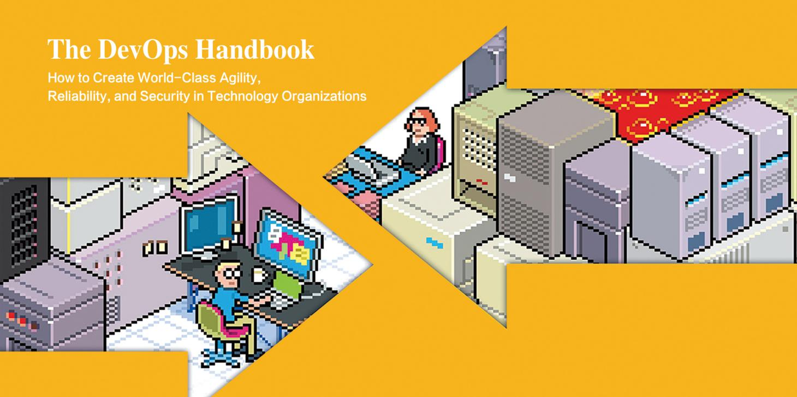

- 畅销全球50万+册的IT运维名著《凤凰项目》姊妹篇 打造高度**敏捷、可靠**和**安全**的技术组织
- 为现代企业**数字化转型**提供从启动到实现所必需的理论、原则和实践案例
- EXIN国际信息科学考试学会DevOps Professional认证指定教材

#### 译者简介

#### 刘征

Nutanix路坦力资深架构师,EXIN首批国内 DevOps Master和DevOps Professional 认证讲师,持有红帽RHCA认证和AWS高级架构师认证,谙熟企业数据中心的IT服务管理。目前致力于推广DevOps相关的理念和实践,在DevOps社区中积极地参与培训和研讨会等活动,是DevOpsDays大会社区在中国的核心组织者和志愿工作者。

#### 王磊

前ThoughtWorks咨询师,EXIN首批国内DevOps Master认证讲师。拥有10多年软件行业经验,以及服务化架构、持续交付和DevOps转型等方面的丰富实践经验。国内较早倡导和实践微服务的先行者,著有国内首本微服务架构相关图书《微服务架构与实践》,是西安DevOps Meetup活动的联合发起人。

#### 马博文

前ThoughtWorks咨询师,AWS认证助理架构师、开发者。拥有多年Web开发和DevOps经验,熟悉持续交付、微服务。曾参与翻译《Scala编程实战》《DevOps实践》等书,是西安DevOps Meetup活动的发起人。

#### 曾朝京

Micro Focus资深解决方案顾问,曾参加 EXIN首批国内Devops Master讲师认证培训。长期从事IT运维管理领域咨询工作,曾 为能源、金融、航空运输、政府行业中的多 个大型企业提供IT运维管理规划。目前致力 于探索DevOps理念在企业IT部门的实践。

# හਁᇇ्ก

图灵社区的电子书没有采用专有客 户端,您可以在任意设备上,用自 己喜欢的浏览器和PDF阅读器进行 阅读。

但您购买的电子书仅供您个人使用, 未经授权,不得进行传播。

我们愿意相信读者具有这样的良知 和觉悟,与我们共同保护知识产权。

如果购买者有侵权行为,我们可能 对该用户实施包括但不限于关闭该 帐号等维权措施,并可能追究法律 责任。

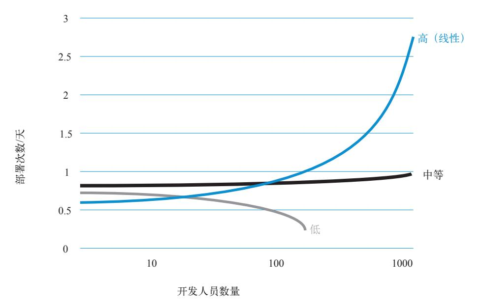

图 0-1 每日部署次数与开发者人数

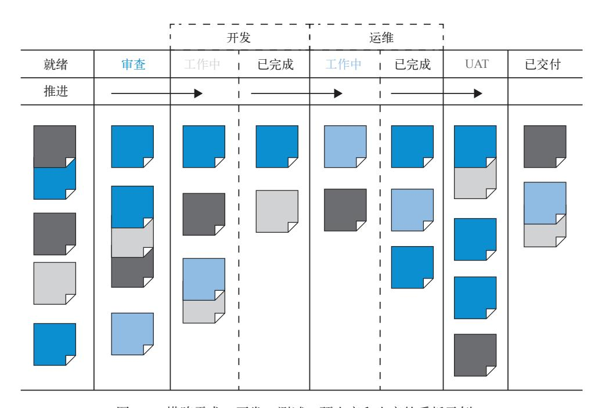

图 2-1 横跨需求、开发、测试、预生产和生产的看板示例

#### 大批量

#### 单件流

图 2-2 模拟"信封游戏"(折叠、插入、封口、盖章)

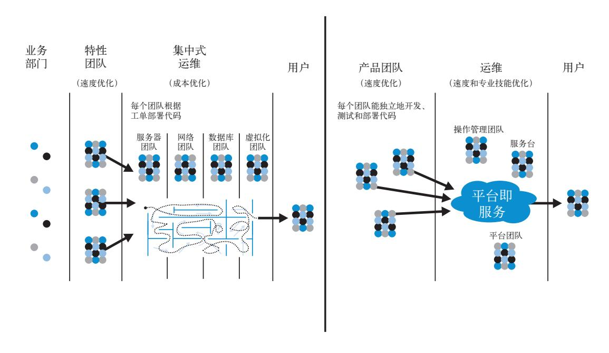

图 7-1 职能导向与市场导向

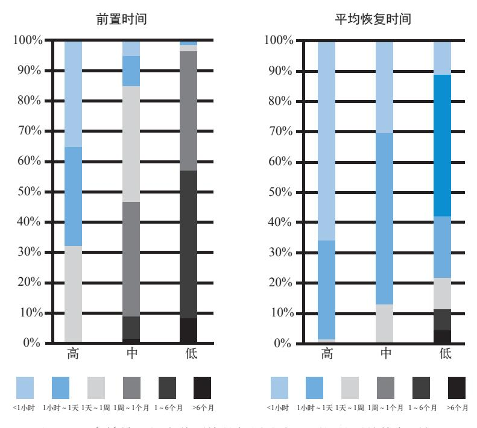

图 12-3 高绩效组织有着更快的部署速度和更短的平均恢复时间

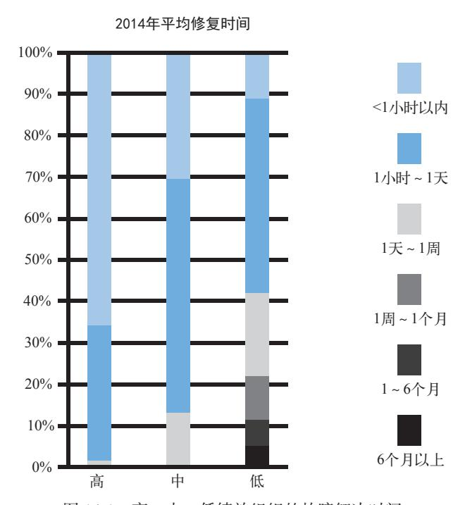

图 14-1 高、中、低绩效组织的故障解决时间

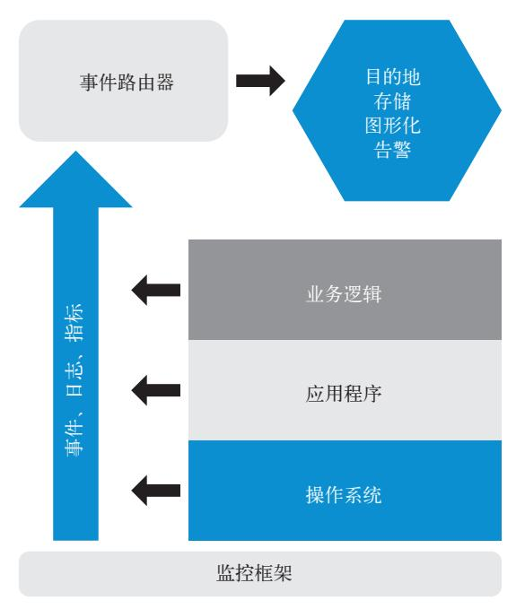

图 14-2 监控框架

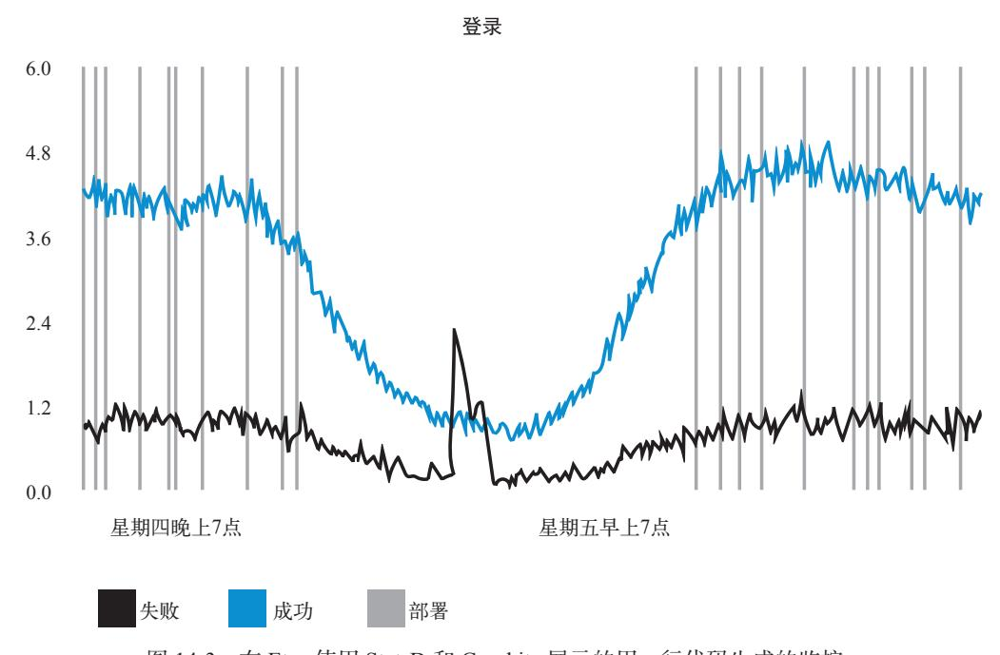

图 14-3 在 Etsy 使用 StatsD 和 Graphite 展示的用一行代码生成的监控

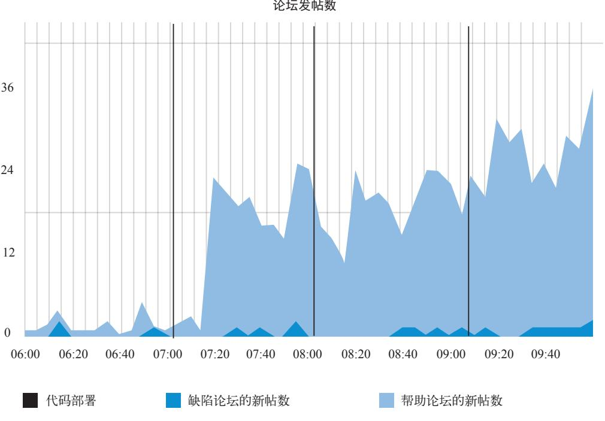

图 14-4 在部署后,用户论坛中对新功能感兴趣的用户数量

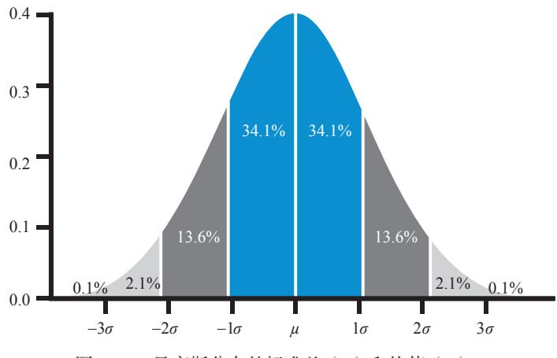

图 15-1 呈高斯分布的标准差(*σ*)和均值(*μ*)

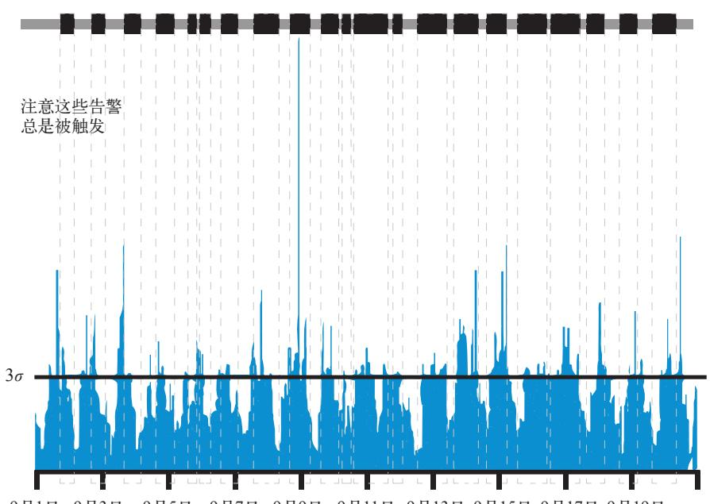

9月1日 9月3日 9月5日 9月7日 9月9日 9月11日 9月13日 9月15日 9月17日 9月19日 图 15-2 每分钟下载量:使用"三个标准差"规则时的过度告警

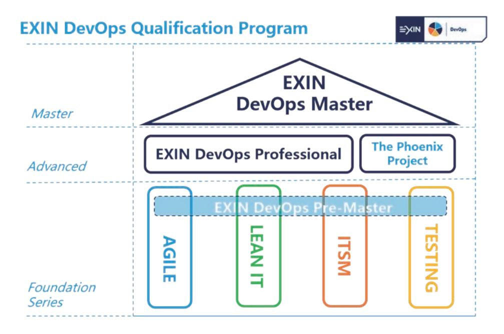

图 B-1

## DevOps Master

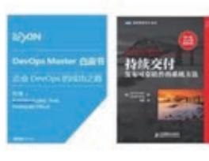

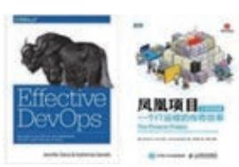

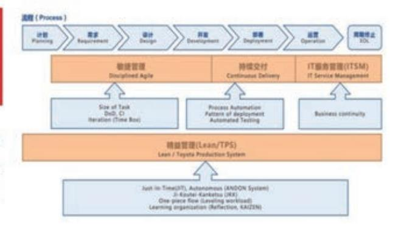

## **DevOps Professional**

## ≝)⁄(IN

#### 核心教材 & 考试内容

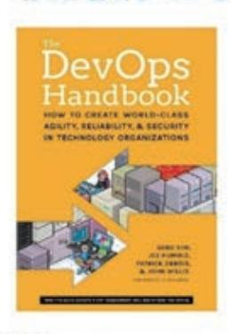

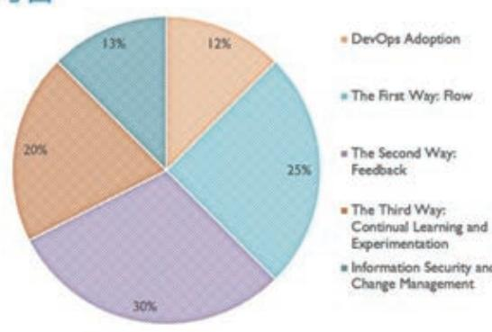

The First Way: Row = The Second Way: Feedback The Third Way:

Information Security and Change Management

#### =>XIN

## **DevOps Pre-Master**

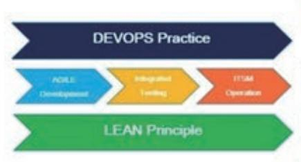

LITA Lean IT Foundation

ITSM Foundation

TMap Testing Engineer

E)KIN

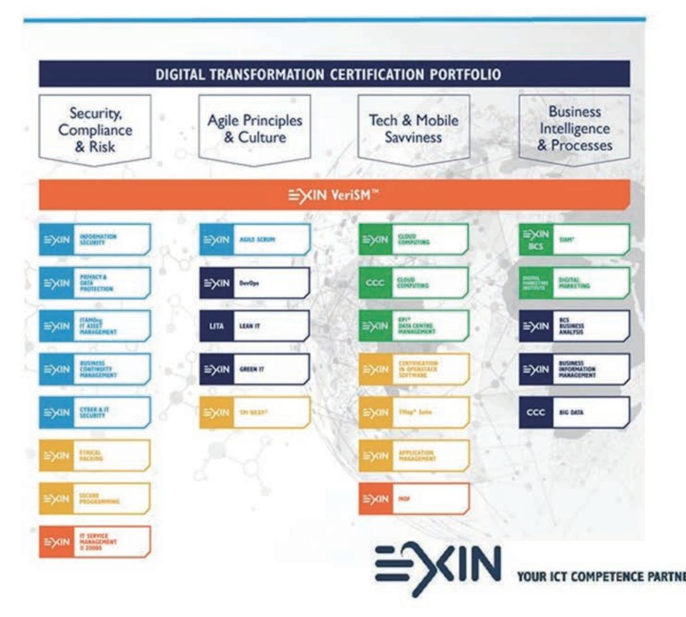

# DevOps 实践指南

[美] Gene Kim Jez Humble Patrick Debois John Willis / 著 刘征 王磊 马博文 曾朝京 / 译

## The DevOps Handbook

How to Create World-Class Agility, Reliability, and Security in Technology Organizations

人民邮电出版社

北京

#### 内 容 提 要

本书共分为 6 个部分 :第一部分概述 DevOps 的历史和三个基本原则,即"三步工作法";第二部分介 绍开启 DevOps 转型的过程 ;第三到五部分深入探讨"三步工作法"的各个要素 ;第六部分关注如何将安全 性和合规性正确集成到日常工作中。全书涵盖 40 余个 DevOps 案例,以谷歌、亚马逊、Facebook 等全球知 名企业和组织的实际调查结果为依据,展示如何通过现代化的运维管理提升管理效率,进而为企业赢得更 大市场、创造更多利润。

本书适合所有互联网企业和传统企业的从业者阅读。

著 [美] Gene Kim Jez Humble Patrick Debois John Willis ◆

译 刘 征 王 磊 马博文 曾朝京

责任编辑 杨 琳 责任印制 周昇亮

人民邮电出版社出版发行 北京市丰台区成寿寺路11号 ◆

邮编 100164 电子邮件 315@ptpress.com.cn

网址 http://www.ptpress.com.cn

北京 印刷

开本:800×1000 1/16 ◆

印张:20.75 彩插:4

字数:496千字 2018年 4 月第 1 版

印数:1 — 4 000册 2018年 4 月北京第 1 次印刷

著作权合同登记号 图字:01-2016-6684号

定价:89.00元

读者服务热线:**(010)51095186**转**600** 印装质量热线:**(010)81055316**

反盗版热线:**(010)81055315**

广告经营许可证:京东工商广登字 **20170147** 号

# 版 权 声 明

*The DevOps Handbook: How to Create World-Class Agility, Reliability, and Security in Technology Organizations* © 2016 Gene Kim, Jez Humble, Patrick Debois, and John Willis. All rights reserved. This edition arranged with C. Fletcher & Company, LLC. through Andrew Nurnberg Associates International Limited.

Simplified Chinese Edition Copyrights © 2018 by Posts & Telecom Press.

本书中文简体字版由 C. Fletcher & Company, LLC.通过 Andrew Nurnberg Associates 授权人民 邮电出版社独家出版。未得书面许可,本书的任何部分和全部不得以任何形式重制。

版权所有,侵权必究。

"以平台化、生态化、智能化和敏捷为主要特征的数字化时代已经到来,需要我们采用与之 匹配的工作方法。DevOps 作为与数字化相适应的方法之一,其作用不可或缺。IT 人员要实现数 字化转型,必须学会此方法,否则将难以胜任当前和未来的工作。"

——李长华,高德纳公司(Gartner)高级高管合伙人

"经历了多年信息化实践,我深感打造坚强IT运维体系和能力对支撑企业经营管理的重要性。 接触和深度了解 DevOps 之后,我最大的感受是,它有利于在改善传统'稳态 IT'运维体系的过 程中寻获到提升价值的诀窍,也是构建云计算时代'敏态 IT'运维体系中不可或缺的柱石。"

——李红,中国中钢集团有限公司信息管理中心总经理

"对很多人而言,DevOps 已经不是一个陌生的概念了,但是其思想精髓该如何融入传统企业 的 IT 管理来助力企业提升商业竞争力呢?这仍然是 CIO 及其团队面临的挑战。本书结合 48 个著 名公司的案例,介绍了高绩效公司是如何利用 DevOps'三步工作法'原则取得成功的,相信一 定会使读者受益匪浅。"

——李炜,中国卫通集团信息中心主任

"在访谈了'DevOps 之父'Patrick Debois 之后,我深刻地理解了'DevOps is the Human Factor' 这句话的真谛。DevOps 是不断演进的,不是能够被固化定义下来的标准化流程体系。DevOps 是 一场关于工作方式的革命和企业文化的运动,同时也是企业数字化转型中高效团队所必备的能 力。本书是继《凤凰项目》之后,Gene Kim 携手全球三位 DevOps 界大咖的扛鼎之作,无愧'全 球 DevOps 畅销书'的美誉。"

——孙振鹏,EXIN 国际信息科学考试学会亚太区总经理,DevOpsDays 中国发起人

"过去的 20 年里,中国大型商业银行逐步构建了以研发、测试、运维团队为主体的 IT 组织 架构,基于 ITIL 建立了信息系统建设和服务的流程。然而,金融科技浪潮的到来要求对产品进 行迭代开发、敏捷测试、快速部署,必须同时满足业务连续性、服务稳定性与业务快速创新的要 求。因此,IT 体系向 DevOps 转型成为了一个备受关注的课题。本书既是国际 DevOps Professional 认证的核心教材,也为 DevOps 转型提供了从启动到实现所必需的理论、原则和实践案例。"

——涂晓军,中国农业银行数据中心总经理

"科技属性正在成为企业能否长期健康成长的核心要素,以个性化和最佳体验为核心的服务 运营模式对业务快速创新迭代能力提出了极高的要求。DevOps 为技术组织提供了卓越的能力, 来实现科技创新和业务发展的高效融合、协同和共赢。"

——徐斌,雪松控股集团 CIO,前壳牌中国 CIO

"为保证交付质量,传统理论和做法是开发、测试、运维各自设定自己的目标和准入、准出 规则,严控变更。IT 人员很累,业务部门却不买账。DevOps 开创了开发、运维一体化的理念、 方法和流程。面对银行正在实施的数字化转型,本书的出版可谓恰逢其时。"

——王燕,中信银行信息技术管理部总经理

(以上为中文版推荐语,按姓氏拼音排序)

"这是一本切合实际、实用性强、具有指导意义的指南,能帮你完成《凤凰项目》中所有令 人拍手叫绝的事情。"

——Tom Limoncelli,Stack Exchange 问答平台 SRE 经理,曾任谷歌公司 SRE/系统管理员

"对于想理解、解释和实现 DevOps 文化、流程和工具,来达成高性能运维的任何人而言, 本书都是不二之选。"

——Quentin Fennessy,埃森哲公司 DevOps 架构经理

"我一直在找探讨如何在大型组织中实现 DevOps 的书,不得不说,本书'一站式'地让我 了解到了许多:不仅包括技术方面,而且包括业务方面。"

——Jumy Mathew,Sogeti 公司首席顾问,欧盟委员会应用架构师

"本书对 DevOps 新手和老手来说都是很好的材料。作为《凤凰项目》小说的续作,它毫不 逊色……强烈推荐。"

——Hamlet Khodaverdian,LMNTRIX 公司美洲区副总裁

"这本书没有大肆宣扬 DevOps,而是公开承认 DevOps 是几种实践的结合,例如精益、ITSM、 敏捷、约束理论等。本书探索了如何搭配使用它们。希望你读得愉快,并且加入这场运动。"

——Daniel Breston,Virtual Clarity 公司 DevOps 顾问

(以上为原版推荐语)

# 译 者 序

在十几年的工作经历中,我见证了国内企业数据中心建设和发展的过程。大型企业的数据中 心拥有几千台服务器和网络设备,拥有全套的监管控平台。当踱步于轰鸣的机架丛林里时,当与 夜间奋战的变更团队一起凝视着命令执行出错的屏幕时,我们可以清晰地感受到 IT 运维组织里 那种特有的恐惧感和紧张感。

这一切是不是都应该去埋怨墙另一侧的开发团队呢?在平日里,应用系统是被圈养的宠物; 而在发生事故的那一刹那,它就变身为一头难以驯服的猛兽。从 IT 组织整体来看,当前运维人 员的痛是深刻而明显的!而开发人员同样是深受夜班出租车司机喜爱的人群。相对于运维团队而 言,他们的精神世界和现实世界要更加美好一些。开发团队实施了很多年的敏捷软件开发,有着 自己的关于完成的定义。即使你现在去翻阅一本最新出版的 Scrum 敏捷开发指南,翻到关于完成 的定义的章节时,还是可以看到类似这样的定义:"冲刺的目标是要产生一个潜在可发布的产品 增量,达到大家一致认可的完成程度。"我对这样的定义感到非常忧虑:它能意味着每个冲刺的 开发结果可以正常地运行在类生产环境中吗?能意味着可以按照业务人员的需要马上开展小范 围的真实用户实验吗?运维人员能否在系统濒临崩溃之前自行关闭这个功能?

可以肯定的是,现在开发和运维还不能在统一的、为客户交付价值的目标下工作,他们像是 生活在不同的星球上。这个问题并不是我国特有的。回顾一下从 2009 年开始的 DevOps 运动吧! 这是一次能让开发和运维感到同样兴奋的技术实践变革,其中也充满了人文变迁。

我在不停地思索,应该怎样破解以上困境。在研究 DevOps 相关技术实践一段时间之后,各 种答案终于陆续浮现。我很幸运地接受了本书的翻译工作。对我来说,这是一次深度的 DevOps 学习研究之旅,组织几个好友共同经历这个过程也非常难得。现在可以确定的是,DevOps 的理 论、原则和实践就一条"更好的道路",就是我们需要的答案;它能让开发和运维深度地融合为 同一支"球队",使他们朝着"进球"这一共同目标协同努力,而不再是彼此对抗和怀疑。它将 测试和信息安全工作一同融入了这个统一的框架当中,将保障质量和安全变为每个人日常工作的 一部分。本书用 DevOps"三步工作法"的形式展示了所有相关细节。它适用于 IT 组织里所有的 级别和角色,值得任何拥有改进想法的人深入学习。

本书对开发和运维具有同样重要的意义,而且覆盖了传统的 QA 测试和信息安全工作;它是 传统的敏捷开发、精益管理和 ITSM 管理等实践各自发展多年以后的首次 IT 管理实践大融合。 本书和 DevOps 本身应该得到更广泛的应用和推广。本书的出版离不开翻译团队和图灵编辑团队 的专业精神,以及双方的共同努力。在此我统一向所有合作者表示感谢。

此外,谨以此书献给我的妻子丽娜和女儿禹含,感谢她们在这 13 个月时光里的支持。特别 让我欣慰的是,女儿不仅明白什么是图书翻译,而且在网络英语课上有很棒的表现,也感谢她能 容忍我因此而减少了与她陪伴和玩耍的时间。

刘征

2018 年 2 月 14 日(丁酉年腊月二十九)

2016 年 9 月的一个周末,当时我正在参加 EXIN 举办的 DevOps Master Trainer 的培训,刘征 向我推荐了这本书,并邀请我共同完成中文版的翻译工作。出于对 Gene Kim 的《凤凰项目》一 书的喜爱,对能够参与本书的翻译工作,我非常期待。

一周后,当我第一次阅读本书的预览章节时,顿时被其中的内容所吸引。本书不仅将敏捷、 精益和持续交付等理念的诠释上升到一个新的高度,而且剖析了在这个安全漏洞频发、交付周期 不断缩短、技术大规模转型的时代,当技术领导者们面对安全性、可靠性和灵活性等诸多挑战时, 为什么 DevOps 能够脱颖而出——它帮助组织缩短价值交付流程,打造高可靠性、高安全性的产 品,并提高了企业竞争力和员工满意度。

本书从业务视角描述了 DevOps 的必要性,分析了为什么 DevOps 是基于精益、约束理论、 丰田生产系统、学习型组织、康威定律等知识体系的集大成者。同时,它系统性地定义了 DevOps "三步工作法":流动原则、反馈原则、持续学习与实验原则,并阐述了 DevOps 实施需遵守的原 则与最佳实践。

- 流动原则:它加速了从开发、运维到交付给客户的正向流程。
- 反馈原则:它使组织构建安全、可靠的工作体系,并获得反馈。
- 持续学习与实验原则:它打造出一种高度信任的文化,并将改进和创新融入日常工作中。

DevOps 对技术行业带来的变化,就如同精益在 20 世纪 80 年代对制造业的变革一样。那些 拥抱 DevOps 的组织将构建出充满激情、持续进步的学习型组织,并能通过创新的方式表现得比 竞争对手更加出色。在本书中,作者引入了大量的业界成功案例,包括谷歌、Etsy、塔吉特、LinkedIn 等一流的互联网公司,描述了他们在 DevOps 转型过程中面临的挑战以及应对方式,指引读者站 在巨人的肩膀上思考。

DevOps 使价值流里的所有参与者都受益匪浅。无论你是开发人员、运维工程师、质量保证 工程师、信息安全人员还是产品经理,它都能够带来开发伟大产品而产生的快感。它能使团队共 同成长并持续获益。相信读过本书之后,你一定会产生强烈的共鸣。

感谢我的妻子晓丽和儿子锦熙,翻译本书占用了我大量业余时间,没有你们的支持,我不可 能完成这项工作。感谢本书的其他几位译者——刘征、马博文、曾朝京,和你们的合作让我获益 良多,也感谢图灵负责本书审校工作的编辑们,你们逐字逐句的检查、校对和修改提高了译文的 质量,谢谢你们!

最后,祝读者们享受 DevOps 的实践之旅!

王磊 2018 年 2 月 20 日

2011~2017 年,我一直在为 ThoughtWorks 的一个海外交付项目工作。我们和客户一起,从 持续集成、两周一次部署,做到了持续交付、随时部署,同时应用架构微服务化,也实现了上云 以及容器化部署。

在这个过程当中,我们切实地采用和执行了业界的良好技术和工程实践,如微服务、蓝绿部 署、不可变部署、基础设施即代码等。我也曾经阅读和翻译过 DevOps 的相关图书,但总觉得还 是和我们的实践有点差距。

在这段时间中,我的角色也从开发者变为 DevOps(我个人不太喜欢这个称呼,因为我认为 DevOps 更多的是实践而不是角色)。同时,我组织了西安 DevOpsMeetup 的活动,期望能通过社 区分享更多关于 DevOps 的知识。每次活动时,总是有朋友问如何实现 DevOps,我却发现即便 亲身经历了这个过程,也无法给出更高层面的回答,而且也没有在别的文章和书籍中找到答案。

很幸运,因为社区活动而结识的刘征向我发出了翻译本书的邀请。在翻译的过程当中,我找 到了如何系统性实现 DevOps 的答案。通过"三步工作法"铺平流程,选择合适的切入点,根据 康威定律调整组织、持续交付、自动化、运维改善等。对于尚未实现 DevOps 的 IT 组织来说,这 是一本不可多得的指南。

翻译本书,收获颇多。本书的作者 Patrick、Gene、Jez 和 John 确实贡献了一本集 DevOps 大 成的著作。希望读者在阅读后也会有相同的感受,能够在团队中逐渐采用本书提供的工作法或者 实践,改进交付速度、质量、软件可用性以及构建高可扩展的组织结构。

翻译是一件费时费力的工作。感谢我的妻子王嘉,能包容我放弃陪她的时间来完成这一项工 作。感谢一起合作的几位译者——刘征、王磊、曾朝京,和你们一起合作非常愉快。感谢 Trent、 Cos 等 REA 的朋友,是你们带我走上了 DevOps 之路。最后,祝各位读者在阅读完本书后,都能 找到实践 DevOps 的方法,并且行动起来,开启 DevOps 的探险之旅并持续从中受益。

> 马博文 2018 年 3 月 4 日

2012 年,我第一次在公司的年度全球会议上接触到 Dev+Ops 的概念。那时候,IT 服务管理 的理念在国内 IT 运维领域已经深入人心,保障生产系统的可靠性和安全性仅仅是运维工作的基 本内容,许多企业的 IT 部门越来越关注对业务部门需求的反应速度和给业务带来的实际成效, 要求进一步提高 IT 服务的工作效率和工作质量。显然,要提高 IT 服务的整体绩效,不能仅仅局 限于运维工作的范畴,也不是 ITIL 最佳实践就能够解决的问题。越来越多的 IT 人员都有相同的 困惑,我也在一直思考:还有什么更好的方法能提高 IT 绩效?!

Dev+Ops 提出将开发和运维团队的工作紧密结合起来,建立持续交付和持续反馈闭环,这个 思路让人耳目一新。但是彼时 DevOps 还在实践中探索,各种阐述 DevOps 的文章还是比较片面 的,甚至有一些见解是相悖的。关于如何开展 DevOps,应该做什么、如何做,业内一直缺乏形 成体系的说明。

随着 DevOps 的概念越来越受到关注,我对开展 DevOps 的困惑也越来越多。当我看到本书 英文版时,虽然只有一个样章,但是它已经能让我确信,关于如何开展 DevOps 的很多问题都会 在其中找到答案。于是,我欣然接受刘征的邀请,参与了本书的翻译工作。

翻译本书的过程就是学习和思考 DevOps 实践方法的过程。在这个过程中,我经常会经历作 者在文中描述的"啊哈"时刻:疑惑解决了,思路豁然开朗。我相信本书的每一位读者都会经历 这样的顿悟时刻。

在这本书的翻译过程中,翻译团队也实践了"三步工作法"中的第二步——反馈原则。反馈 原则的核心思想是:虽然复杂的系统不可避免地存在错误,但是可以通过采取安全措施确保在质 量问题出现之前,快速发现和处理错误。4 个译者在分别翻译了不同的章节之后,都发现了在初 稿中有诸多对原文理解的分歧和名词翻译不统一的问题。大家商议后决定,遵照"三步工作法" 的反馈原则,全组集中从第一个章节开始交叉审阅、按序检查;发现问题及时在小组范围内讨论; 形成一致意见后,分别回到自己负责的章节中修改。这个过程正是在 PDCA 中识别问题、群策群 力解决问题、构建新知识并将局部知识应用到全局的过程。在这个过程中,每一个人也对 DevOps 实践有了更深刻的认识。

本书用大量真实的案例描述了 DevOps 实践产生的过程。他们所遇到的问题和困境,很多 IT 团队都曾经经历、正在经历,甚至在未来不可避免地即将经历。希望本书能在你感到困惑之时, 对你有所启发、有所帮助。

经过 13 个月,本书终于出版在即了。翻译工作占用了我大量的业余时间,感谢我的父亲、 母亲、丈夫和儿子,他们让我在翻译文章的那些夜晚和周末,只做一个繁忙的影子。

感谢一起翻译此书的伙伴们——刘征、王磊和马博文,以及图灵公司的编辑们。

曾朝京 2018 年 3 月 3 日

#### x 译者序

特别感谢 EXIN 国际信息科学考试学会为本书提供的 DevOps Professional 认证考试样题及解 析。《DevOps 实践指南》是 EXIN 国际信息科学考试学会指定的 DevOps Professional 国际认证核 心教材。

# 序 言

许多工程领域在过去都经历了长足的发展,它们不断地"提高"对本学科的认知和理解。虽 然土木、机械、电气、核能等工程领域都有对应的大学课程和专业机构,但事实上,现代社会需 要的是各种形态的工程学科相互交叉影响并从中受益。

想一想高性能车辆的设计工作。机械工程师的工作是在哪个环节结束的?电气工程师的工作 是从哪个环节开始的?拥有空气动力学领域知识的人(对车窗的形状、大小和位置有很好的发言 权)在哪儿(如何以及何时)开始和人体工程学专家协作?在车辆整个使用寿命期间,燃料混 合物和汽油对发动机和变速器材料有什么化学影响?针对汽车设计,我们还能提出很多其他方面 的问题,但最终的结论是一样的:要想在现代技术上取得成功,必然需要多方向和多专业领域的 协作。

任何一个领域或学科想要取得进步和成熟,就需要认真反思它的起源,在反思中寻求不同的 观点,并把这些不同观点的来龙去脉思考清楚,这对预见未来发展是非常有帮助的。

本书代表了这样一种承前启后的观点,它应该被视为软件工程和运维领域(在我看来,它仍 在发展和快速地演变)里一个具有开创性的观点。

无论你处在哪个行业,无论你的公司提供什么产品或服务,这种思维方式对于所有业务和技 术领导者都是至关重要且必不可少的,因为它关乎着企业的存亡。

> John Allspaw Etsy 首席技术官 2016 年 8 月于纽约布鲁克林

# 前 言

#### 啊哈!

本书的写作由来已久。早在 2011 年 2 月,我们几位合著者就开始每周一次的 Skype 通话, 准备写一本通用的 DevOps 参考指南,算作《凤凰项目:一个 IT 运维的传奇故事》①的姊妹篇。

前后历时 5 年多,耗费 2000 多小时,本书终于呈现在你的面前。过程相当漫长,但也是一 个非常有益且难得的学习过程,最终涉及的范围比我们早期预想的更广。在整个写作过程中,所 有合著者都始终坚信 DevOps 的重要性。我们在早期的职业生涯中,都曾经历过"啊哈"的顿悟 时刻,相信很多读者也都会与我们产生共鸣。

#### Gene Kim

——————————

从 1999 年以来,我有幸一直在研究高绩效技术组织,最早的一个发现是:IT 运维、 信息安全和开发等不同职能部门之间的良好合作是成功的关键。我依然清楚地记得第一 次看到由于这些部门目标相左导致恶性循环的场景。

那是在 2006 年,我跟某管理团队待了整整一星期,他们当时正在为一家大的机票 预订公司提供外包 IT 运维的管理服务。他们给我描述了每年要做的软件升级的后果: 每次发布都会让外包商和客户的服务中断;由于客户受到了影响,公司也会根据服务等 级协议(SLA)受到处罚;公司利润下滑,不得不解雇一些很有才华和经验的员工;由 于有大量计划外的工作和紧急任务,剩下的员工无法处理日益增长的客户服务请求;只 好投入中层管理团队一道完成合同要求;所有人都认为 3 年后肯定得重新招标。

这种绝望和无助的感受使我加入了这场道义上的征程。开发似乎总是被视为战略性 的,而 IT 运维则被视为战术性的,因此常常被委托甚至整个外包出去,结果是 5 年后 的情形比当初交接时更加糟糕。

多年来,我们许多人都认为一定有更好的做法。在 2009 年的 Velocity 会议上,我 看到了这样的演讲——介绍了在架构、技术实践和文化方面并举的革新(我们现在称之

① 关于《凤凰项目》,详见 http://www.ituring.com.cn/book/1545。——编者注

为 DevOps)所产生的惊人效果。当时,我非常兴奋,因为它就是我们一直在寻找的那 个更好的方法。传播 DevOps 是我合著《凤凰项目》的动机之一。你可以想象,看到更 广大的社群对那本书做出的反应,说它是如何帮助他们实现自己的"啊哈"时刻的,我 是多么地倍感欣慰!

#### Jez Humble

我的 DevOps"啊哈"时刻发生在 2000 年,当时我就职于一家创业公司,那是我毕 业后的第一份工作。有一段时间,我是公司仅有的两名技术人员之一。我包揽了网络、 编程、支持、系统管理等一切工作。我们通过 FTP 直接从工作站往生产环境部署软件。

我在 2004 年加入了 ThoughtWorks 咨询公司,参与的第一个项目涉及大约 70 人。 我所在的部署团队共 8 名工程师,团队的主要工作就是将软件部署到类生产环境中。刚 开始的时候,工作非常紧张。但几个月后,我们就从需要花两个星期的手动部署,进步 到了只用一个小时的自动化部署。在正常的工作时间段里,我们也可以使用蓝绿部署模 式,以毫秒为单位来发布或者回滚业务的应用。

这个项目对《持续交付:发布可靠软件的系统方法》①和本书的诸多想法都很有启 发意义。对于我和从事该领域工作的其他人而言,动力有两个:我们知道无论是什么限 制,总能做得更好;我们热切希望帮助那些正在奋斗的人们。

#### Patrick Debois

对我来说,DevOps 意味着一系列的回忆。2007 年,我与几个敏捷团队一起,做一 个数据中心迁移项目。我很嫉妒他们的高生产力——能够在很短的时间里做很多的工作。

在接下来的一个项目中,我便开始在运维工作中试验看板方法(Kanban),并看到 了团队的显著变化。后来,在 2008 年的多伦多敏捷大会上,我基于这个实践发表了一 篇 IEEE 论文,不过当时它并没有在敏捷社区里引起广泛的共鸣。我们创建了敏捷系统 管理组(Google Group),但忽视了人这一因素。

在 2009 年的 Velocity 会议上,我听了 John Allspaw 和 Paul Hammond 所分享的"每 日 10 次部署"的演讲以后,确信其他人与我英雄所见略同。因此我决定组织第一次 DevOpsDays 活动,误打误撞地创造了"DevOps"这个词。

DevOpsDays 活动体现了独特的魅力和感染力。当人们开始因 DevOps 改善了他们的 工作而感谢我时,我才真正意识到它的影响力。从那以后,我就开始持续地推广 DevOps。

#### John Willis

——————————

2008 年,我第一次见到 Luke Kanies(Puppet Labs 的创始人)本人,那时我刚刚出

① 关于《持续交付》,详见 http://www.ituring.com.cn/book/758。——编者注

售了专注于大型系统的配置管理和监控(Tivoli)实践的咨询业务。Luke 在 O'Reilly 开 源大会的配置管理分会场里介绍了 Puppet 软件。

演讲刚开始时,我在会场最后一排走来走去消磨时间,心想:"关于配置管理,这 个 20 岁的年轻人能讲些什么呢?"毕竟,我在整个职业生涯中,基本都在帮助世界上 最大的那些企业构建配置管理和其他运维管理方案。然而,他大约讲了 5 分钟后,我就 坐到了第一排,同时意识到在过去 20 年里,我真是一无是处。Luke 所描述的就是现在 我们所说的第二代配置管理。

在他演讲完之后,我找机会和他坐下来一起喝了杯咖啡。我完全被"基础设施即代 码"(infrastructure as code)的理念所折服了。Luke 一边喝着咖啡,一边更详细地向我 阐述了他的想法。他告诉我,他相信运维人员的工作模式可能会变得像开发人员一样, 他们必须在源代码控制系统里维护系统的配置,并在工作中使用持续集成/持续交付 (CI/CD)的模式。作为一名 IT 运维的老兵,我当时的回应大概是"运维人员不会喜欢 你这个想法的"。(显然是我错了。)①

大约又过了一年,在 2009 年 O'Reilly 的 Velocity 会议上,我听了 Andrew Clay Shafer 关于敏捷基础设施的演讲。在演讲中,Andrew 展示了一幅形象的插图,图中的开发部 门和运维部门之间存在一堵高墙,以此隐喻工作被两个部门踢来踢去。他将此称为"混 乱之墙"(the wall of confusion)。这个想法其实和一年前 Luke 的想法如出一辙,这让我 眼前一亮。那年年底,我作为唯一受邀的美国人,参加了比利时根特市的首次 DevOpsDays 活动。在活动结束时,这个所谓 DevOps 的东西已然融入了我的血液。

显然,本书的合著者都有类似的顿悟,尽管他们来自完全不同的方向。有充分的证据表明, 上述这些问题几乎在所有地方都发生过,而那些 DevOps 相关的解决方案也几乎是普遍适用的。

编写本书的目的是描述如何复制我们参与过的或观察到的 DevOps 转型的成功经验,驳斥那 些说DevOps在某些场景里行不通的谬论。以下是我们听说过的关于DevOps的一些最常见的误区。

误区 1:DevOps 只适用于创业公司。虽然谷歌、亚马逊、Netflix 和 Etsy 等互联网"独角兽" 公司是 DevOps 的先行者,但这些公司在过去都面临过巨大的风险,而且他们所遇到的问题和传 统企业相比并无二致:软件的高风险代码容易导致灾难性故障,无法快速发布新功能来击败竞争 对手,存在安全合规性问题,服务无法扩容,开发和运维彼此高度不信任等。

然而,这些公司都能够适时地改变它们的架构、技术实践和文化,如今他们都创造出了惊人 的 DevOps 成果。正如信息安全高管 Branden Williams 博士所说:"不要管 DevOps 是适合独角兽 还是马,只要跑得快就能抵达目的地。"

——————————

① 此处引用了关于 Led Zeppelin 抄袭的八卦。——译者注

误区 2:DevOps 将取代敏捷。DevOps 的原则和实践与敏捷方法一致,许多人认为 DevOps 是自 2001 年开始的敏捷之旅的合理延续。敏捷通常是 DevOps 效率的保障,因为它专注于让小 团队向客户持续交付高品质的代码。

如果我们每次迭代的目标不限于"潜在可交付的代码",而是扩展到让代码始终处于可发布 状态,让开发人员每天都把代码提交到主干,并在类生产环境中做功能演示,那么许多 DevOps 相关的实践就会浮现。

误区 3:DevOps 与 ITIL 不兼容。许多人认为,DevOps 与 1989 年发布的 ITIL(Information Technology Infrastructure Library,IT 基础架构库)或 ITSM(IT Service Management,IT 服务管 理)是背道而驰的。ITIL 广泛影响了好几代运维实践者,包括本书的一位合著者,并且它依然在 演进,是一个不断发展的实践体系,旨在稳定地支撑世界级的 IT 运维,而且横跨服务战略、设 计和支持等流程和实践。

DevOps 实践可以与 ITIL 流程兼容。然而,为了支持 DevOps 所追求的更短的发布周期和更 频繁的部署,ITIL 流程的许多方面需要完全自动化,以解决配置和发布管理流程相关的许多问题, 例如保持配置管理数据库和最终软件库是最新的。由于 DevOps 需要在服务事件发生时进行快速 的定位和恢复,因此这些其实还是和 ITIL 的服务设计、事件和问题管理方面的原则相一致。

误区 4:DevOps 与信息安全及合规活动不兼容。传统控制手段(例如职责分离、变更审批 流程、项目结束时的手动安全审查)的缺位,可能会令信息安全和合规审计人员感到失望。

然而,这并不意味着采用 DevOps 的公司里没有有效的控制,只是它并不一定体现在项目结 束时的安全和合规性活动中,而是集成到了软件开发生命周期的每一项日常工作中,因此会得到 更好的质量、安全性和合规性。

误区 5:DevOps 意味着消除 IT 运维,即"NoOps"。许多人错误地将 DevOps 解释为完全 消除 IT 运维的职能,然而,这种情况是很少见的。虽然 IT 运维工作的性质可能会发生改变,但 它仍然像以前一样重要。IT 运维团队要在软件生命周期的早期就与开发团队开展合作。在代码部 署到生产环境中后,开发团队也要继续与运维团队合作。

IT 运维不只是工单驱动的手动操作,而是能够通过自助服务平台和 API 来提升开发人员的 生产效率,让他们能自助地创建开发环境、测试和部署代码、监控和显示业务运行的状态等。通 过这种方式,IT 运维人员变得更像是开发人员(或者 QA 和信息安全人员),融入到了产品开发 过程中,而该产品则是开发人员在生产中用来安全快速地测试、部署和运行 IT 服务的平台。

误区 6:DevOps 只是"基础设施即代码"或自动化。尽管本书所展示的许多 DevOps 模式 都需要自动化,但是 DevOps 还需要文化规范和架构,以便在 IT 价值流中实现共同的目标。而这 远远超越了自动化的范畴。DevOps 最早的拥护者之一 Christopher Little 也是一名技术主管,他写 道:"DevOps 不仅是自动化,就像天文学不只是望远镜一样。"

误区 7:DevOps 仅适用于开源软件。尽管许多 DevOps成功案例发生在使用 LAMP栈(Linux、 Apache、MySQL、PHP)等构建软件的公司,但实现 DevOps 与所使用的技术无关。在使用 Microsoft .NET、COBOL 和大型机汇编语言以及 SAP 甚至嵌入式系统(如惠普 LaserJet 打印机固 件程序)等编写应用程序的公司,DevOps 也能取得成功。

#### 传播"啊哈"时刻

本书的每一位作者都被 DevOps 社区里发生的惊人创新及成果深深地打动和启发:他们正在 创建安全的工作系统,让小型团队能够快速独立地开发和验证能够为客户安全地部署的代码。我 们相信,DevOps 是创建动态、学习型且强化高度信任的文化规范的公司的一种表现形式,这些 公司一定会持续地在市场上创新并在竞争中脱颖而出。

我们真诚地希望本书能以多种方式为许多人提供价值,它可以是一个 DevOps 转型计划和实 践指南,也可以是一组可供研究和学习的参考案例,可以是一部 DevOps 编年史,也可以是一种 联结产品经理、架构师、开发人员、QA、IT 运维和信息安全团队以实现共同目标的方法,可以 是一条为 DevOps 活动获取高层领导支持的途径,也可以是一种改变技术组织管理方式的道德使 命,以帮助企业提高效率,创造更快乐和更人性化的工作环境,并帮助每个人成为终身学习者。 这不但能帮助每个人实现他们个人的最高目标,而且还能帮助他们的公司取得更大的成功。

# 导言:展望 DevOps 新世界

想象有这样的一个世界:产品经理、开发人员、QA 人员、IT 运维人员和信息安全人员互相 帮助,齐心协力,整个公司的业绩蒸蒸日上。他们朝着一个共同的目标努力奋斗,建立出从产品 计划直至功能上线的端到端的快速服务交付流水线(例如每天执行几十次、数百次甚至上千次代 码部署),在系统稳定性、可靠性、可用性和安全性方面均达到了世界一流的水平。

在那里,跨职能团队严谨地验证他们的假设:哪些功能最能取悦用户并能促进企业目标的实 现。他们不仅关心用户特性的实现,而且还积极地保障交付能够顺畅、频繁地通过整个交付价值 链,同时,IT 运维部门、其他内部或者外部客户的系统都不会出现任何混乱及中断。

在那里,QA 人员、IT 运维人员和信息安全人员也会共同投身于团队文化建设,致力于创造 能使开发人员效率更高、产能更大的工作环境。通过将 QA、IT 运维和信息安全等方面的专业人 员共同融入交付团队,来构建自动化的自助工具和平台,所有团队在日常工作中就能够随时利用 他人的专业技能,而不用再依赖或等待其他团队。

在那里,小团队能够快速独立地开发、测试和部署代码,并且可以快速、安全、可靠地向客 户交付价值。同时,公司能够有效地提高开发人员的生产力,建立学习型公司,提高员工满意度, 并在市场竞争中取胜。

这就是 DevOps 产生的效果。但是,对于我们大多数人来说,这并不是我们所处的现实世界。 在现实中,系统经常被破坏,服务和产品总是不尽如人意,团队的潜力无法得到正常发挥;在现 实中,开发和 IT 运维是对立的,测试和信息安全活动总是在项目晚期才进行,这导致即使发现 了问题也来不及修复;在现实中,产品和服务交付中的关键活动往往全都需要手动操作和互相交 接,我们总是要等待其他人的工作完成才能进行自己的工作;在现实中,特性交付的周期一次次 被拖延,质量也频频出现问题,特别是与生产环境部署相关的部分,进而对客户和业务造成了负 面影响。

结果,不仅是我们的工作无法按预期完成,整个公司也对 IT 部门的业绩不满意,甚至导致 预算被削减,IT 员工没有成就感,感觉无力改变流程及其结果①。怎么办?我们需要改变工作方 式,没错,DevOps 能够给我们指引方向。

——————————

① 这只是在典型的 IT 公司中发现的众多小问题之一。

为了更好地理解 DevOps 革命的潜力,首先让我们来回顾一下 20 世纪 80 年代的制造业革命。 通过采用精益原则和实践,很多制造厂不但大幅提高了生产效率,缩短了交货周期,而且还提高 了产品质量及客户满意度,并在市场竞争中立于不败之地。

在制造业革命前,制造厂的平均交货周期为 6 周,能按时交货的订单不到总量的 70%。随着 精益实践的广泛实施,到 2005 年,产品的平均交货周期缩短到 3 周以下,按时交货的订单超过 总量的 95%。而那些没有实施精益实践的厂商,不但渐渐失去了市场,有的甚至破产了。

另一方面,技术产品和服务的交付标准也在不断提高——几十年前优秀的交付标准如今已然 过时。过去的 40 年中,开发和部署战略型业务功能所需的成本和时间每十年就下降几个数量级。 在 20 世纪七八十年代,新功能大都需要 1~5 年的开发和部署周期,动辄花费数千万美元。

到 21 世纪初,由于技术的快速发展以及敏捷原则和实践的应用,新功能开发所需的时间已 经从几年缩短至几个月,但是部署到生产环境仍然需要几周甚至数月,而且部署过程中还总是伴 随着大量不可预知的状况。

到 2010 年,随着 DevOps 的出现,以及硬件、软件和公有云的不断商品化,任何特性(甚 至整个公司的创建)都可以在几个星期内完成,并在几小时或几分钟内部署到生产环境中——对 于这些公司而言,部署最终进化成了日常的、低风险的工作(见表 0-1)。通过运用 DevOps,这 些公司能够通过测试商业理念发现对客户和整个公司而言最有价值的想法,然后实施开发,并快 速且安全地将其部署到生产环境中。

|       | 1970~1989 年               | 1990~1999 年          | 2000 年至今                                   |
|-------|---------------------------|----------------------|--------------------------------------------|
| 时代    | 主机                        | 客户端/服务器              | 商品化和云计算                                    |
| 标志性技术 | COBOL、运行在 MVS 上的 DB2 等 | C++、Oracle、Solaris 等 | Java、MySQL、Red Hat、Ruby on Rails、 PHP 等 |
| 交付周期  | 1~5 年                     | 3~12 个月              | 2~12 个星期                                   |
| 成本    | 100 万~1 亿美元               | 10 万~1000 万美元        | 1 万~100 万美元                                |
| 风险级别  | 整个公司                      | 产品线或者部门              | 产品特性                                       |
| 失败成本  | 破产、出售公司、大量裁员              | 业务亏损、CIO 革职          | 可忽略不计                                      |

表 0-1 更快、更廉价、更低风险的软件交付趋势正加速发展

(来源:2013 年 11 月,Adrian Cockcroft 在加州旧金山 FlowCon 上发表的演讲"Velocity and Volume (or Speed Wins)")

现在,大部分采用了 DevOps 原则和实践的公司,每天都能完成几百甚至上千次代码部署的 变更。在这个竞争优势需要被快速验证和持续实验的时代,那些还不能应用 DevOps 实践的公司 注定会在市场上败给敏捷的竞争对手,并可能会倒闭,和当年那些没有采取精益原则和实践的制 造厂的下场类似。

今天,不管我们身处什么行业,想要获取客户并向客户交付价值的方式都要依赖于技术价值 流。正如通用电气公司首席执行官伊梅尔特所说:"没有将软件作为核心业务的每一个行业或公 司都会受到影响。"微软技术院士 Jeffrey Snover 也曾说过:"在过去的经济时代,企业通过移动 原子创造价值。而现在,他们必须通过数字创造价值。"

这个问题的严重性毋庸置疑——当今的技术影响着所有的企业,不论其行业、规模和盈利性 质如何。与以往相比,技术工作的管理和有效执行,预示着企业能否在市场上取得优势,甚至能 否生存下去。因此,尝试和采取一些新的原则和方法势在必行,虽然有些方法可能和过去几十年 里曾指导我们成功的做法截然不同(见附录 1)。

我们现在已经明确了 DevOps 解决问题的重要性和紧迫性。接下来要花一些时间来详细探索 问题的本质:这些问题为什么会发生?若不采取措施干预的话,随着时间的推移,这些问题为什 么会更加严重?

#### 问题:在你的公司中有些事情必须改进(否则你不会来翻这本书)

大多数公司都不能在几分钟或几小时内完成变更需要的所有部署,往往需要几周甚至几个月 的时间。他们更不可能每天在生产环境中做到成百上千次的部署,而是在以月甚至以季度为单位 进行部署。对他们而言,生产环境的部署并不是日常工作,因此服务中断和各种事故总是与部署 如影随形,"填坑侠"们总是前赴后继。

目前,快速地切入市场、提供优质的服务以及持续的创新就是一种竞争实力,而上述公司显 然会在这样的竞争中处于劣势。这很大程度上要归咎于技术团队无法解决根本的、长期的冲突。

#### 根本的、长期的冲突

在几乎所有的 IT 公司中,开发部门和 IT 运维部门之间都存在一种固有冲突,这会让公司业 绩下滑,进而导致新产品和新功能的上市时间拉长、质量下降、服务中断时间增加,甚至导致技 术债务量与日俱增。

"技术债务"这个术语是 Ward Cunningham 首次提出的。类似于金融债务,技术债务是指我 们当前所做出的决定会导致一些问题,而这些问题随着时间的推移会越来越难解决,未来可采取 的措施也越来越少。即使我们审慎地承担技术债务,也依然会产生利息。

开发部门和 IT 运维部门的目标是对立的,这通常是产生技术债务的一个因素。IT 公司需要 负责的事情很多,其中包括下面两个必须实现的目标:

- 对变化莫测的市场做出反应;
- 为客户提供稳定、可靠和安全的服务。

开发部门通常负责对市场变化做出响应,以最快的速度将新功能或者变更上线。而 IT 运维部

门则要以为客户提供稳定、可靠和安全的 IT 服务为已任,让任何人都很难甚至无法引入可能会危 害生产环境的变更。这种配置方式让开发部门和 IT 运维部门的目标和动因之间存在巨大的冲突。

制造业管理运动的发起者之一 Eliyahu M. Goldratt博士称这种配置为"根本的、长期的冲突"—— 公司对不同部门的考核和激励不同,阻碍了公司全局目标的实现。①

这种冲突造成了一种恶性循环,阻碍了业务目标的实现,不但波及 IT 公司的内部,而且还 会影响外部。这些长期冲突常常导致技术工作者交付出质量低劣的软件和服务,打造出糟糕的客 户体验,每天都要采用临时解决方案、应对紧急情况。以上情景在产品管理、产品开发、QA、 IT 运维和信息安全管理中不断上演(见附录 2)。

#### 恶性循环三部曲

——————————

大多数的 IT 从业者可能都对恶性循环三部曲很熟悉。

第一部曲开始于 IT 运维,我们的目标是让应用程序和基础设施持续运行,以便公司向客户 交付价值。我们日常工作中的很多问题源于应用程序和基础设施过于复杂、异常脆弱、文档不完 备。这就是我们背负的技术债务,这就是我们每天所处的工作环境。我们总是承诺,一有时间, 我们一定会处理这个烂摊子,但是这个时刻永远都不会到来。

更令人担忧的是,我们最脆弱的组件正支撑着最重要的业务系统或者最关键的项目。换句话 说,那个最容易发生故障的系统就是我们最重要的系统,也是所有紧急变更的中心。当这些变更 失败的时候,那些最重要的公司承诺,例如客户服务可用性、营收目标、客户数据的安全性和财 务报告的精确性等,就会直接受到危害。

第二部曲始于有人必须去弥补最近未兑现的承诺——这可能是某个产品经理承诺了一个更 大规模、更大胆的吸引客户的功能,或者是业务主管设置了一个更高的收益目标。然而,他们无 视技术能实现什么不能实现什么,以及到底为何没能兑现之前的承诺,而是让技术组织按照新的 承诺交付成果。

结果,开发团队被指派去做另一个紧急项目,这个项目必然需要解决新的技术难题,需要利 用各种捷径以赶上承诺的发布日期,而这又导致了技术债务的增加——此时我们又承诺一有时间 就处理这次产生的所有问题。

在这样的背景下,我们进入了第三部曲,也就是最后一部曲。在这里,所有事情都变得更加 困难——所有人都越来越忙,工作所消耗的时间越来越多,沟通变得更加缓慢,工作积压得越来 越多。我们的工作耦合得更加紧密,即使是很小的行动也会导致较大的事故,我们更加害怕和拒

① 制造业存在类似的"根本的、长期的冲突":他们既需要确保按时发货给客户,又要控制成本。解决这种冲突的 方法参见附录 2。

绝做出变更。工作需要更多的沟通、协调和审批;团队必须等待更长的时间,等待相关的工作完 成;我们的工作质量持续恶化。车轮开始嘎嘎作响地缓慢移动,要想使之继续转动,就需要付出 更多的努力(见附录 3)。

尽管当我们身处其中时很难察觉到,但是当你退后一步,就会发现这个恶性循环是显而易见 的。你会注意到产品代码部署消耗的时间更长了,从几分钟到几个小时,再到几天或者几周。更 糟的是,部署的效果越来越差,这导致客户服务中断的次数越来越多,需要运维部门来救急,而 他们也因此无法偿还技术债务。

结果,我们的产品交付周期越来越长,做的项目越来越少,项目目标也越来越小。而且,对 所有人工作(尤其是对来自客户的反馈信号)的反馈越来越慢,且越来越弱。不管我们做出怎样 的尝试,事情似乎总是变得越来越糟糕——面对日新月异的市场竞争,我们不再能够快速响应, 也无法为客户提供稳定、可靠的服务。我们最终因此失去了市场。

我们反复地看到,一个 IT 做得失败的公司,整个公司也都是失败的。正如 Steven J. Spear 在 *The High-Velocity Edge* 一书中指出的,无论破坏"像消耗性疾病一样慢慢地发展"还是迅速得 "像大火焚毁般……其毁灭性都是一样彻底"。

#### 为什么恶性循环无处不在

——————————

十多年以来,本书作者发现这种破坏性的恶性循环发生在各种类型、各种规模的公司里。这 让我们更好地理解了发生这种恶性循环的原因,以及为什么需要用 DevOps 的原则去缓解这种状 况。首先,如前所述,每个 IT 公司都有两个对立的目标;其次,每家公司都是一个科技公司, 不论他们自己是否意识到。

正如软件开发高管和早期的 DevOps 记录者之一 Christopher Little 所说:"每个公司都是科技 公司,无论他们认为自己处在哪个行业。银行也只是拥有银行执照的 IT 公司而已。"①

要说服自己这是事实,考虑一下,绝大多数投资项目都在某种程度上依赖于信息技术。俗话 说:"想要做出一个不会带来任何 IT 变更的商业决策几乎不可能。"

在业务和财务方面,项目都是至关重要的,因为它们是企业内变革的主要机制。项目通常都 需要管理层来审批、做预算和负责,因此,它们是实现企业目标和愿景的机制,无论是成长还是 萎缩。②

项目通常是通过资本投入(即厂房、设备和重大项目,当预计要数年以后才有回报时,支出 就资本化了)来供给资金的,其中 50%是和技术相关的。即便是技术支出最低的"低科技"行业,

① 2003 年,欧洲的汇丰银行雇用的软件开发人员甚至比谷歌公司还多。

② 目前,我们暂且不讨论软件应该作为"项目"还是"产品"来资助。本书后面再讨论。

诸如能源、冶金、资源开采、汽车和建筑行业也是如此。换句话说,企业领导者想要实现业务目 标,对有效 IT 管理的依赖程度远远超出了他们的预想。①

#### 成本:人和经济

困于这种恶性循环中多年,特别是那些处于开发下游的人,经常感觉被困在一个注定失败的 系统中,无力改变结果。伴随这种无力感的是倦怠感,还有疲劳、愤世嫉俗,甚至是无助和绝望。

许多心理学家认为,创建一个让人感觉无能为力的系统,是我们能对人类同胞做的最具破坏 性的一件事——我们剥夺了他人控制自己成果的能力,甚至营造了一种文化,让人们因为害怕遭 受惩罚、失败或危及生存而不敢做正确的事。这创造了"习得性无助"的环境,人们变得不愿或 无法采取行动来避免未来遇到同样的问题。

对于我们的员工而言,这意味着长时间工作、周末加班、生活质量下降,而且影响的不仅仅 是员工,还有所有依赖他们的人,包括他们的家人和朋友。当这种情况发生时,我们失去最好的 员工(除了那些因为责任感和义务而觉得不能离开的人)也就不足为奇了。

除了人们在当前这种工作方式中受煎熬之外,我们能创造的价值的机会成本更令人震惊—— 作者认为,我们每年错失创造约 2.6 万亿美元价值的机会,在撰写本书时,那相当于世界上第六 大经济体法国的年经济总产值。

考虑下面的估算——IDC 和高德纳公司都估计,2011 年,约 5%的全球 GDP(即 3.1 万亿美 元)用于 IT(含硬件、服务和电信)。如果我们估计这 3.1 万亿美元中的 50%用于运营成本和维 护现有系统,而且这 50%的三分之一用于紧急和计划外工作或返工,也就是说大约 5200 亿美元 被浪费了。

如果采用 DevOps 能使我们用更好的管理和卓越的运营减少一半的浪费,并且可以重新部署 员工,让他们去做能产生 5 倍价值的事(不算很高),我们每年就能够创造 2.6 万亿美元的价值。

#### DevOps 的准则:总有更好的方法

——————————

前面描述了根本的、长期的冲突带来的问题和负面影响,从无法实现公司目标,到对人类同 胞造成的损害。通过解决这些问题,DevOps 能够提高公司业绩,实现开发、QA、IT 运维、信息 安全等各职能技术角色的目标,同时改善人们的境遇。

① 例如,Vernon Richardson 博士及其同事发表了这个惊人的发现。他们研究了 184 个公共公司的 10-K SEC 申请(上 市公司向美国证券交易委员会呈递的年度报告),并将其分为 3 组:(A) 公司有重大弱点,存在 IT 相关缺陷;(B) 公 司有重大弱点,没有 IT 相关缺陷;(C) 没有重大弱点的"干净的公司"。A 组公司的 CEO 流动率比 C 组高出 8 倍, 而 A 组的 CFO 流动率比 C 组高出 4 倍。显然,IT 的重要性可能远远超出了我们通常所想。

这个令人振奋的罕见组合可以解释为什么 DevOps 在这么短的时间内激发出了这么大的兴奋 和热情,包括技术领导、工程师,以及我们所处的软件生态系统的大部分。

#### 用 DevOps 打破恶性循环

理想情况下,小团队的开发人员独立地实现自己的功能,在类生产环境中验证其正确性,再 把代码快速、安全、可靠地部署到生产环境里。代码部署是日常的且可预测的工作。部署工作不是 选在周五的午夜开始、鏖战整个周末才完成,而是在每个人都在办公室的工作日进行,大多数时 候甚至不会引起客户的注意(客户兴奋地看到出现了新功能或者旧缺陷被修复了的情况除外)。 由于代码部署是在工作时间段内进行的,几十年来,IT 运维人员第一次可以像其他人一样在正常 工作时间段工作了。

通过在流程中的每一个步骤创建快速反馈回路,每个人都可以立即看到工作效果。只要代码 变更提交到了版本控制系统,就会在类生产环境中运行快速的自动测试,这持续地保证了代码和 环境符合设计预期,并且总是处在安全的可部署状态。

自动化测试可以帮助开发人员快速发现错误(通常在几分钟之内),实现更快速的修复以及 真正的学习。如果错误是在 6 个月后的集成测试中发现的,那时相关的记忆和因果关系早已消退, 想从中学习是不可能的。自动化测试使技术债务不再积累,问题在发现之后就立即被修复了。如 果需要,这还可以调动整个公司参与问题的处理,因为总体目标高于局部目标。

在我们的代码和生产环境中无处不在的遥测技术,保证了问题能被迅速地发现并纠正,确保 一切都能按照预定的方式进行,并且客户能从我们创造的软件中获得价值。

在这样的场景下,每个人都感觉富有成效——这种架构使得小团队能够安全地工作,同时在 架构上和其他团队的工作解耦,这些团队使用了集运维和信息安全最佳实践于一体的自服务平 台。团队独立、高效地处理小批量工作,快速且频繁地为客户提供新的价值,而不是每个人都在 等待,面对大量迟来和紧急的返工。

通过黑启动(dark launch)技术,即便是复杂的产品和功能发布,也变得稀松平常了。早在 发布日期以前,我们就已经将所有功能的代码部署到了生产环境中,它只对内部员工和部分真实 用户可见。这使得我们能够测试和改进其功能,直到达到预期的业务目标。

想要让新功能生效,我们只需要改变一个功能开关或者配置项即可,而不再需要经历数天或 者数周的辛苦工作。这个小变更使新功能对更大规模的客户群可见,一旦出现错误,就会自动地 回滚。因此,发布新功能变得可控、可预测、可逆,且压力也小了。

除了新功能的发布变得更加顺利外,各种问题都能在其规模小、修复容易且成本低的时候发 现并修复。通过每次的问题修复,我们也让公司得到了经验和教训,能够防止问题复发,并且能 在未来更快地定位和修复相似的问题。

此外,每个人都在不断地学习,从而营造出了一种假设驱动的文化,用科学的方法保证一切 都得到了充分的验证——在对产品开发和流程改进进行有目的的衡量和实验之前不做任何工作。

因为我们珍惜大家的时间,所以不会花几年的时间去打造客户不想要的功能,不会部署根本 就不能用的代码,也不会修复非问题根源的缺陷。

由于我们关心目标的实现,所以建立了长期的团队责任制,负责目标的实现。在一般的项目 团队中,每次软件发布以后开发人员就被打散并重新分配了,他们没有机会得到自己工作的反馈; 我们则保持团队的完整性,这样团队可以进行迭代和改进,用团队各成员所学到的经验来更好地 实现目标。对于给外部客户解决问题的产品团队,以及帮助其他团队提高生产力、可靠性和安全 性的内部平台团队来说,这一点同样重要。

我们的团队文化体现了高度的信任与合作,而不是指责,人们会因为冒险而获得回报。他们 可以无所畏惧地讨论问题,而不是把问题隐藏起来或者往后拖延——毕竟,我们只有先认识到了 问题,才能解决问题。

而且,因为所有人都需要对自己的工作质量负完全的责任,所以每个人在日常的工作中都创 建自动化测试,并且使用同行评审的方式来保证在问题影响到客户之前就解决它。与从管理层向 下授权审批的方式相反,上述过程降低了风险,让我们能快速、可靠、安全地交付价值,甚至可 以在挑剔的评审人员面前证明我们拥有一个高效的内部控制系统。

在出现问题时,我们进行不指责的事后分析,这并不是要惩罚某人,而是为了更好地理解导 致事故的原因,以及如何防止事故再次发生。这个方法强化了我们的学习文化。我们还通过举办 内部技术研讨会来提高技能,保证所有人不是在教就是在学。

因为注重质量,所以我们甚至会故意在生产环境中注入故障,从而了解系统是怎样以预期方 式发生故障的。我们按照计划做大规模的故障演练,随机结束生产环境中的进程,中断正在运行 的服务器,同时还注入网络延迟以及其他恶意因素,以此来确保系统的可靠性。这样的方式为我 们的系统带来了更高的可靠性,同时为整个公司提供了更好的学习和提高机会。

在这个世界里,不论处于科技公司的哪个岗位,每个人都是自己工作的主人。他们坚信自己 的工作很重要,并为公司的目标出了一份力,低压力的工作环境以及公司在市场上的成功足以证 明这一切。公司在市场上取得的业绩就是最好的证据。

#### DevOps 的业务价值

对于 DevOps 的业务价值,我们有确凿的证据。从 2013 年到 2016 年,在 Puppet Labs 的年度 DevOps 现状报告中(本书作者 Jez Humble 和 Gene Kim 为报告做出了贡献),我们对 25 000 多名 技术专家进行了数据收集,目的是更好地了解企业应用 DevOps 不同阶段的运维状况和习惯。

这份数据第一个让人震惊的地方就是,应用了 DevOps 的高绩效公司在以下方面的表现远超 低绩效同行:

- 吞吐量指标;
- 代码和变更部署次数(频繁 30 倍);
- 代码和变更部署前置时间(快 200 倍);
- 可靠性指标;
- 生产环境部署(变更成功率高 60 倍);
- 平均服务恢复时间(快 168 倍);
- 组织性能指标;

——————————

- 生产力、市场份额以及营业目标(大约 2 倍以上);
- 市值增长(3 年内高出 50%)。

换句话说,高绩效者要更加敏捷和可靠,这证明 DevOps 能够打破根本的、长期的冲突。高 绩效者部署代码的频率要高出 30 多倍,从"代码提交"到"在生产环境中顺利运行"的速度要 快 200 倍——高绩效者的交付周期是以分钟或小时来计量的,而低绩效者的交付周期则以周、月 甚至季度来计量。

此外,高绩效者有两倍的利润率、市场份额、生产率目标。而且,对于那些已经上市的企业, 我们发现高绩效者在 3 年内的股票市值增长率高出 50%。他们的员工满意度高,员工倦怠程度低, 把公司推荐给朋友的可能性要高出 2.2 倍。①高绩效者信息安全成果也更好。通过将安全目标集 成到开发和运维流程的所有阶段,他们用在安全问题修复上的时间减少了 50%。

#### DevOps 有助于提高开发人员的生产力

当我们增加开发人员的数量时,由于沟通、集成以及测试开销,单个开发人员的生产力通常 会显著下降。Frederick Brooks 在其著名的《人月神话》一书中强调过这一点。他解释说,当项 目延迟时,增加更多的开发人员不仅降低了单个开发人员的生产力,而且也降低了整体的生产力。

另一方面,DevOps 证明了在拥有正确的架构、技术实践和文化规范的情况下,小型开发团 队能够快速、安全、独立地开发、集成、测试和部署变更到生产环境。前谷歌工程总监 Randy Shoup 发现,使用 DevOps 的大型企业"拥有数千名开发人员,但小团队依然能受益于他们的组织架构 和实践,具有像创业公司一般惊人的生产力"。

《2015 年 DevOps 现状报告》不仅调查了"每天的部署次数",还调查了"每天每个开发人员

① 结果基于员工净推荐值(eNPS)。这是一个重大的发现,有研究已经证明:"员工参与度较高的公司的收益增长是 员工参与度较低的公司的 2.5 倍,拥有高度信任的工作环境的上市公司的股票在 1997~2011 年期间高出市场指数 的 1/3。"

的部署次数"。我们假设高绩效公司可以随着团队人员数量的增长而增加部署次数。

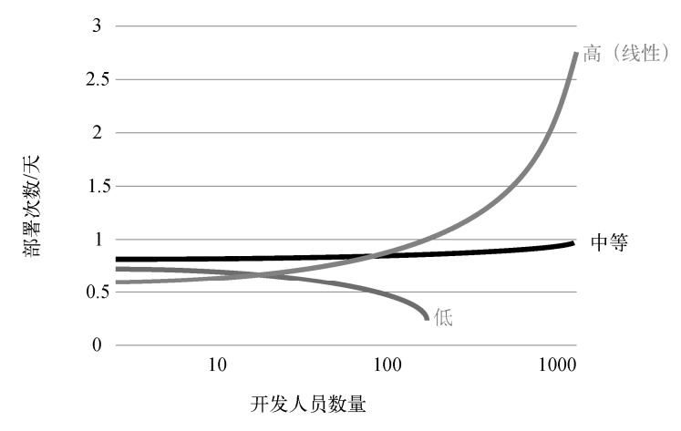

图 0-1 每日部署次数与开发者人数(另见彩插) (来源:Puppet Labs 的《2015 年 DevOps 现状报告》)①

这就是我们的发现。图 0-1 展示了在团队人数增加时,低绩效公司每个开发人员每天的部署 次数在降低,中等绩效公司维持不变,而高绩效公司则线性增加。

换句话说,在应用了 DevOps 的企业中,在开发人员数量增加时,每天的部署次数呈线性增 加趋势;谷歌、亚马逊以及 Netflix 已经做到了。②

#### 解决方案的通用性

——————————

精益制造运动中最有影响力的图书之一是 1984 年由 Eliyahu M. Goldratt 博士写的《目标:简 单而有效的常识管理》。它影响了世界各地整整一代的专业的工厂经理。这是一本关于工厂经理 的小说,书中的主人公必须在 90 天内解决成本和产品交货时间的问题,否则他的工厂将被关闭。

在他的职业生涯后期,Goldratt 博士提到了《目标》的读者反馈信件。这些信件通常写道: "显然你曾经在我们工厂待过,因为你准确地描述了我作为工厂经理的生活……"最重要的是, 这些信件表明,人们能够在自己的工作环境中重现书中描述的业绩突破。

Gene Kim、Kevin Behr 以及 George Spafford 在 2013 年所著的《凤凰项目:一个 IT 运维的传 奇故事》在很大程度上借鉴了《目标》的写法。这本小说的主人公是一位 IT 部门经理,他面对 IT 公司所特有的全部典型问题:项目预算超支,进度一再拖延,为了公司的存亡不得不上线。他 经历了灾难般的部署,也面对过可用性、安全性、合规性等方面的问题。最终,他和他的团队采

① 图上只展示了每天至少部署一次的企业数据。

② 另一个更加极端的例子是亚马逊。2011 年,亚马逊每天部署近 7000 次;到 2015 年,他们每天要部署 130 000 次。

用 DevOps 的原则和实践战胜了以上困难,帮助公司赢得了市场。此外,该小说展示了 DevOps 实践如何改善团队工作环境,让员工参与整个过程,进而减轻了压力并提高了满意度。

和《目标》相同,《凤凰项目》所描述的问题和解决方案很普遍。看看亚马逊上对该书的部 分评价:"我发现自己与《凤凰项目》的人物有共鸣……我在职业生涯中可能遇到过其中的大部 分人。""如果你曾从事 IT、DevOps 或信息安全等方面的工作,一定感同身受。""我能将《凤凰 项目》中的所有人物与自己或者现实生活中所认识的人对应起来……更不要说那些人物面临和克 服的问题了。"

在本书的余下部分里,我们将介绍如何复制《凤凰项目》中所描述的转型,并提供丰富的案 例研究,展示其他公司是如何应用 DevOps 原则和实践来取得这些成果的。

#### 阅读指南

本书的目标是向你提供从启动 DevOps 转型到实现目标成果所必需的理论、原则和实践。这 本指南基于几十年优秀的管理理论、对高绩效科技组织的研究、我们帮助企业实现 DevOps 转型 所做的工作、验证本书中 DevOps 实践的有效性的研究、对相关领域专家的访谈,以及对"DevOps 企业峰会"所分享的近 100 个案例的分析。

本书分为 6 个部分,使用"三步工作法"涵盖了 DevOps 理论及原则。"三步工作法"是《凤 凰项目》一书中提出的,是看待基础理论的一种视角。本书不仅适用于从事或影响技术价值流(通 常包括产品管理、开发、QA、IT 运维和信息安全)中工作的所有人,而且也适用于业务和市场 领导者,大部分技术计划都源自他们。

读者并不需要具备这些领域的丰富知识,也不需要对 DevOps、敏捷、ITIL、精益或流程优 化有全面的认识,因为这些主题会在书中需要的地方予以介绍。

我们的目的是建立起各个领域中核心概念的应用知识,并以此为基础来引入其他必要的内 容,从而帮助实践者与所有同事在整个 IT 价值流中一起工作,并建立共享的目标。

本书对业务领导者和越来越依赖技术组织去实现目标的利益相关者而言将很有价值。

此外,本书也适合所在公司不存在本书中描述的所有问题(例如,部署周期长或部署过程痛 苦)的人。这些幸运的读者也将因理解 DevOps 的原则而受益,特别是那些关于共同目标、反馈 和持续学习的原则。

在第一部分中,我们将简要介绍 DevOps 的历史,并介绍几十年来相关知识体系的理论基础 和关键主题,然后概要地介绍"三步工作法"的原则:流动、反馈和持续学习与实验。

第二部分将描述怎样开始以及从哪里开始,并介绍各种概念,如价值流、组织设计原则与模

式、组织导入模式和案例研究。

第三部分将介绍如何通过构建部署流水线的基础来加速流动:实现快速有效的自动化测试、 持续集成、持续交付和为低风险发布做架构。

第四部分将讨论如何通过建立有效的生产环境遥测来发现和解决问题,从而加速和增强反 馈,更好地预测问题和实现目标,获得反馈以便开发人员和运维人员可以安全地部署变更,将 A/B 测试集成到日常工作中,以及创建审查和协调流程来提高我们的工作质量。

第五部分将描述如何通过建立公正的文化,将本地发现转化为全局性改进,预留出一定的时 间来进行组织学习和提高,从而加速持续学习。

最后,第六部分将介绍如何通过把预防性安全控制集成到共享源代码库和服务中,将安全性 集成到部署流程中,增强遥测以实现更好的检测和恢复,保护部署流水线,以及实现变更管理目 标,从而将安全性和合规性正确集成到日常工作中。

通过整理这些实践,我们希望加速 DevOps 实践的导入和应用,提高 DevOps 计划的成功率, 并降低激活 DevOps 转型所需的能量。

# 目 录

| 第一部分 DevOps 介绍    | 把局部发现转化为全局优化 26 4.3      |
|-------------------------|-----------------------------|
| 章 敏捷、持续交付和三步法 4         | 在日常工作中注入弹性模式 27             |
| 第                       | 4.4                         |
| 1                       | 领导层强化学习文化 27 4.5         |
| 制造业价值流 4                | 小结 29                       |
| 1.1                     | 4.6                         |
| 技术价值流 4                 | 第一部分总结 29                   |
| 1.2                     | 4.7                         |
| 聚焦于部署前置时间 5 1.2.1    |                             |
| 关注返工指标——%C/A 7          | 第二部分                        |
| 1.2.2                   | 从何处开始                       |
| 的基础原则 7                 | 章 选择合适的价值流作为切入点 32          |
| 1.3                     | 第                           |
| 三步工作法:DevOps            | 5                           |
| 小结 8                    | 绿地项目与棕地项目 34                |
| 1.4                     | 5.1                         |
| 章 第一步:流动原则 9 第 2  | 兼顾记录型系统和交互型系统 35 5.2     |
| 使工作可见 9                 | 从最乐于创新的团队开始 36 5.3       |
| 2.1 限制在制品数 10        | 的范围 37 5.4 扩大 DevOps  |
| 2.2                     | 小结 38                       |
| 减小批量大小 11               | 5.5                         |
| 2.3 减少交接次数 13        |                             |
| 2.4 持续识别和改善约束点 14    | 章 理解、可视化和运用价值流 39 第 6 |
| 2.5                     | 确定创造客户价值所需的团队 40            |
| 消除价值流中的困境和浪费 15         | 6.1                         |
| 2.6                     | 针对团队工作绘制价值流图 40             |
| 小结 16                   | 6.2                         |
| 2.7                     | 组建专门的转型团队 42 6.3         |
| 章 第二步:反馈原则 17 第 3 | 拥有共同的目标 43 6.3.1         |
| 在复杂系统中安全地工作 17          | 保持小跨度的改进计划 44               |
| 3.1                     | 6.3.2                       |
| 及时发现问题 18 3.2        | 6.3.3 为非功能性需求预留 20%的  |
| 群策群力,战胜问题获取新知 19 3.3 | 开发时间,减少技术债务 44              |
| 在源头保障质量 21              | 提高工作的可视化程度 47               |
| 3.4                     | 6.3.4                       |
| 为下游工作中心而优化 22           | 用工具强化预期行为 47                |
| 3.5                     | 6.4                         |
| 小结 22                   | 小结 48                       |
| 3.6                     | 6.5                         |
| 章 第三步:持续学习与实验原则 23      | 章 参考康威定律设计组织结构 49           |
| 第                       | 第                           |
| 4                       | 7                           |
| 建立学习型组织和安全文化 23         | 组织原型 51                     |
| 4.1                     | 7.1                         |
| 将日常工作的改进制度化 25          | 过度职能导向的危害("成本优化") 51        |
| 4.2                     | 7.2                         |

| 7.3 组建以市场为导向的团队("速度           | 尽可能并行地快速执行测试 84 10.2.2  |
|----------------------------------|----------------------------|
| 优化") 52                          | 先编写自动化测试 84 10.2.3      |
| 使职能导向有效 53 7.4                | 尽量将手动测试自动化 85 10.2.4    |
| 7.5 将测试、运维和信息安全融入日常           | 在测试套件中集成性能测试 86 10.2.5  |
| 工作 54                            | 10.2.6 在测试套件中集成非功能性     |
| 使团队成员都成为通才 54 7.6             | 需求测试 86                    |
| 投资于服务和产品,而非项目 56 7.7          | 在部署流水线失败时拉下安灯绳 87 10.3  |
| 根据康威定律设定团队边界 56 7.8           | 小结 89 10.4              |
| 7.9 创建松耦合架构,提高生产力和            |                            |
| 安全性 57                           | 章 应用和实践持续集成 90 第 11  |
| 小结 60 7.10                    | 小批量开发与大批量合并 92 11.1     |
| 章 将运维融入日常开发工作 61 第 8       | 应用基于主干的开发实践 93 11.2     |
|                                  | 小结 95 11.3              |
| 创建共享服务,提高开发生产力 62 8.1         | 章 自动化和低风险发布 96 第 12  |
| 将运维工程师融入服务团队 63 8.2           | 自动化部署流程 97 12.1         |
| 为每个服务团队分派运维联络人 64 8.3         | 应用自动化的自助式部署 100 12.1.1  |
| 邀请运维工程师参加开发团队的会议 65 8.4       | 12.1.2 在部署流水线中集成代码      |
| 邀请运维工程师参加每日站会 65 8.4.1        | 部署 101                     |
| 邀请运维工程师参加回顾会议 66 8.4.2        | 将部署与发布解耦 104 12.2       |
| 使用看板图展示运维工作 66 8.4.3          | 基于环境的发布模式 105 12.2.1    |
| 小结 67 8.5                     | 12.2.2 基于应用的发布模式更       |
| 第二部分总结 67 8.6                 | 安全 109                     |
| 第三部分 第一步:流动的技术实践              | 持续交付和持续部署实践的调查 112 12.3 |
|                                  | 小结 113 12.4             |
| 章 为部署流水线奠定基础 70 第 9        |                            |
| 9.1 按需搭建开发环境、测试环境和            | 章 降低发布风险的架构 114 第 13 |
| 生产环境 71                          | 13.1 能提高生产力、可测试性和安全性    |
| 应用统一的代码仓库 72 9.2              | 的架构 115                    |
| 使基础设施的重建更容易 74 9.3            | 架构原型:单体架构与微服务 116 13.2  |
| 运行在类生产环境里才算"完成" 75 9.4        | 安全地演进企业架构 118 13.3      |
| 小结 76 9.5                     | 小结 121 13.4             |
| 章 实现快速可靠的自动化测试 77 第 10     | 第三部分总结 121 13.5         |
|                                  |                            |
| 10.1 对代码和环境做持续构建、测试和 集成 79 | 第四部分 第二步:反馈的技术实践        |
| 构建快速可靠的自动化测试套件 81                | 第 章 建立能发现并解决问题的 14   |
| 10.2                             | 遥测系统 125                   |
| 10.2.1 在自动化测试中尽早发现 错误 83   | 建设集中式监控架构 127 14.1      |
|                                  |                            |

| 14.2    | 建立生产环境的应用程序日志遥测 129       | 18.5    | 人工测试和变更冻结的潜在危害 173          |
|---------|---------------------------|---------|-----------------------------|
| 14.3    | 使用遥测指导问题的解决 131           | 18.6    | 利用结对编程改进代码变更 173            |
| 14.4    | 将建立生产遥测融入日常工作 132         | 18.7    | 消除官僚流程 176                  |
| 14.5    | 建立自助访问的遥测和信息辐射器 133       | 18.8    | 小结 177                      |
| 14.6    | 发现和填补遥测的盲区 135            | 18.9    | 第四部分总结 178                  |
|         | 应用程序和业务度量指标 136 14.6.1 |         |                             |
|         | 基础架构度量指标 137 14.6.2    |         | 第五部分 第三步:持续学习与           |
|         | 显示叠加的指标组合 138 14.6.3   |         | 实验的技术实践                     |
| 14.7    | 小结 139                    | 第 19 | 章 将学习融入日常工作 180             |
| 第 15 | 章 分析遥测数据以更好地预测            | 19.1    | 建立公正和学习的文化 181              |
|         | 故障和实现目标 140               | 19.2    | 举行不指责的事后分析会议 182            |
| 15.1    | 用均值和标准差识别潜在问题 141         | 19.3    | 尽可能广泛地公开事后分析会议              |
| 15.2    | 异常状态的处理和告警 142            |         | 结果 184                      |
| 15.3    | 非高斯分布遥测数据的问题 143          | 19.4    | 降低事故容忍度,寻找更弱的               |
| 15.4    | 应用异常检测技术 146              |         | 故障信号 185                    |
| 15.5    | 小结 149                    | 19.5    | 重新定义失败,鼓励评估风险 186           |
|         |                           | 19.6    | 在生产环境注入故障来恢复和               |
| 第 16 | 章 应用反馈实现安全部署 150          |         | 学习 186                      |
| 16.1    | 通过遥测使部署更安全 151            | 19.7    | 创建故障演练日 187                 |
| 16.2    | 开发和运维共同承担值班工作 153         | 19.8    | 小结 189                      |
| 16.3    | 让开发人员跟踪工作对下游的影响 153       | 第 20 | 章 将局部经验转化为全局改进 190          |
| 16.4    | 让开发人员自行管理生产服务 155         |         |                             |
| 16.5    | 小结 159                    | 20.1    | 使用聊天室和聊天机器人自动积累 组织知识 190 |
| 第 17 | 章 将假设驱动的开发和 A/B        |         |                             |
|         | 测试融入日常工作 160              | 20.2    | 软件中便于重用的自动化、标准化 流程 192   |
| 17.1    | 测试简史 161 A/B           | 20.3    | 创建全组织共享的单一源代码库 192          |
| 17.2    | 测试 162 在功能测试中集成 A/B    | 20.4    | 运用自动化测试记录和交流实践来             |
| 17.3    | 测试 162 在发布中集成 A/B      |         | 传播知识 194                    |
| 17.4    | 测试 163 在功能规划中集成 A/B    | 20.5    | 通过确定非功能性需求来设计运维 194         |
| 17.5    | 小结 165                    | 20.6    | 把可重用的运维用户故事纳入开发 195         |
|         |                           | 20.7    | 确保技术选型有助于实现组织目标 195         |
| 第 18 | 章 建立评审和协作流程以提升            | 20.8    | 小结 197                      |
|         | 当前工作的质量 166               |         |                             |
| 18.1    | 变更审批流程的危险 168             | 第 21 | 章 预留组织学习和改进的时间 198          |
|         | 18.2 "过度控制变更"的潜在危险 168    | 21.1    | 偿还技术债务的制度化惯例 199            |
| 18.3    | 变更的协调和排程 170              | 21.2    | 让所有人教学相长 200                |
| 18.4    | 变更的同行评审 170               | 21.3    | 会议中分享经验 201 在 DevOps     |

| 21.4    | 传播实践的内部顾问和教练 203                 | 23.3         |          | 如何处理常规变更 222                      |  |
|---------|----------------------------------|--------------|----------|-----------------------------------|--|
| 21.5    | 小结 204                           | 23.4         |          | 减少对职责分离的依赖 224                    |  |
| 21.6    | 第五部分总结 204                       | 23.5         |          | 确保为审计人员和合规人员留存                    |  |
|         | 第六部分 集成信息安全、变更管理和 合规性的技术实践 | 23.6 23.7 |          | 文档和证据 226 小结 228 第六部分总结 228 |  |
| 第 22 | 章 将信息安全融入每个人的 日常工作 207        |              |          | 行动起来——本书总结 229                    |  |
| 22.1    | 将安全集成到开发迭代的演示中 207               |              |          | 附加材料                              |  |
| 22.2    | 将安全集成到缺陷跟踪和事后分                   |              |          |                                   |  |
|         | 析会议中 208                         | 附            |          | 录 232                             |  |
| 22.3    | 将预防性安全控制集成到共享源                   |              | 附录 1  | 的大融合 232 DevOps                |  |
|         | 代码库及共享服务中 208                    |              | 附录 2  | 约束理论和核心的长期                        |  |
| 22.4    | 将安全集成到部署流水线中 209                 |              |          | 冲突 234                            |  |
| 22.5    | 保证应用程序的安全性 210                   |              | 附录 3  | 恶性循环列表 235                        |  |
| 22.6    | 确保软件供应链的安全 214                   |              | 附录 4  | 交接和队列的危害 235                      |  |
| 22.7    | 确保环境的安全 215                      |              | 附录 5  | 工业安全神话 236                        |  |
| 22.8    | 将信息安全集成到生产环境遥测中 216              |              | 附录 6  | 丰田安灯绳 237                         |  |
| 22.9    | 在应用程序中建立安全遥测系统 217               |              | 附录 7  | 软件包产品 238                         |  |
| 22.10   | 在环境中建立安全遥测系统 217                 |              | 附录 8  | 事后分析会议 238                        |  |
| 22.11   | 保护部署流水线 219                      |              | 附录 9  | 猿猴军团 239                          |  |
| 22.12   | 小结 219                           |              | 10 附录 | 上线时间透明化 240                       |  |
| 第 23 | 章 保护部署流水线 220                    |              |          | 参考资源 241                          |  |
| 23.1    | 将安全和合规性集成到变更批准 流程中 220        | 致            |          | 谢 243                             |  |
| 23.2    | 将大量低风险变更重新归类为标                   |              |          | 认证备考 EXIN DevOps Professional  |  |
|         | 准变更 221                          |              |          | 指南 & 模拟题① 245                     |  |

# DevOps 介绍

在本书的第一部分中,我们将回顾在管理和技术领域里所发生的几个重大事件,了解它们 是怎样为 DevOps 的诞生奠定了基础的。同时,我们还将介绍"价值流"这个概念,解释为什 么 DevOps 是把精益原则应用到技术价值流中的结果,并探讨 DevOps 的三步工作法 :流动、反 馈以及持续学习与实验。

第一部分包括以下内容。

- 流动原则 :它加速了从开发、运维到交付给客户的流程。
- 反馈原则 :它使我们能建设出更安全可靠的工作体系。
- 持续学习与实验原则 :它打造出一种高度信任的文化和一种科学的工作方式,并将对组 织的改进和创新作为日常工作的一部分。

#### 简史

DevOps 和它所产生的技术、架构及文化实践,体现了哲学和管理学原则的融合。虽说这些 原则是由不同组织独立发现的,但 DevOps 博采众长,形成了 John Willis(本书作者之一)所说 的"DevOps 的大融合",展现了人们思想上的惊人进步和不可思议的相互关联。基于制造业实 践了数十年的管理经验,它是将可靠性组织、信任度管理与 DevOps 实践相结合的产物。

DevOps 基于精益、约束理论、丰田生产系统、柔性工程、学习型组织、安全文化、人员优 化因素等知识体系,并参考了高信任管理文化、服务型领导、组织变动管理等方法论。把所有 这些最可信的原则综合地应用到 IT 价值流中,就产生出 DevOps 这样的成果。将它贯彻于整个 技术价值流中,涉及产品管理、开发、QA、IT 运维和信息安全专员等不同角色,在更低的成本 和努力下,保障产品的高质量、可靠性、稳定性和安全性。

虽然 DevOps 是精益原则、约束理论和丰田套路运动的衍生物,但也被许多人视为始于 2001 年的敏捷运动的延续。

#### 精益运动

价值流映射、看板和全面生产维护这些实践起源于 20 世纪 80 年代的丰田生产系统。1997 年, 精益企业协会开始研究如何将精益理念应用于服务业和医疗行业等其他价值流中。

精益的两个主要原则包括 :坚信前置时间(把原材料转换为成品所需的时间)是提升质量、 客户满意度和员工幸福感的最佳度量指标之一 ;小批量任务的交付是缩短前置时间的一个关键 因素。

精益原则聚焦在如何通过系统性思考为客户创造价值,系统性思考的范围涉及建立持久目 标,拥抱科学思维,创造流和拉动(而非推送)的协作模式,提倡从源头保证质量,以谦逊为导向, 尊重流程中的所有个体。

#### 敏捷宣言

敏捷宣言是在 2001 年由软件领域的 17 位顶尖大师共同提出的。他们希望用一套轻量级的 价值观和原则体系,来优化那些沉重的软件开发流程(如传统的瀑布式开发模型)和方法论(如 统一软件开发过程)。

在敏捷宣言中,一个重要的原则是"频繁地交付可工作的软件,交付周期可以是数星期也 可以是数月,推荐更短的周期",并强调使用小批量任务进行增量发布,而非大规模的作业和瀑 布流程的发布。同时,强调建立自组织的小团队,让成员在高度信任的环境中愉悦地工作。

在很多实施了敏捷的企业里,生产效率显著提升,敏捷也因此获得了越来越广泛的支持和 认可。有趣的是,在 DevOps 的发展历程中,如下所述的几个关键活动都发源于敏捷社区或者 敏捷大会。

#### 敏捷基础设施和Velocity大会

在2008年加拿大多伦多的敏捷大会上,Patrick Debois和Andrew Clay Schafer主持了一场研讨, 提倡将敏捷原则应用到基础设施而不是应用程序的代码上。尽管研讨的参与者数量并没有达到预 期,但是他们还是很幸运地找到了几个志同道合者,其中包括本书作者之一 John Willis。

在 2009 年的 Velocity 大会上,John Allspaw 和 Paul Hammond 分享了题为"每日 10 次部署:

Dev 和 Ops 在 Flickr 的协作"的演讲,讲述了他们如何建立 Dev 和 Ops 共享的目标,并通过运 用持续集成等实践,将部署变成了日常工作的一部分。据当时在场的听众回忆道,所有的参与 者都认为他们见证了这个具有深远意义的历史性时刻。

虽然 Patrick Debois 并不在现场,但他对 Allspaw 和 Hammond 的想法产生了浓厚的兴趣, 并在 2009 年比利时的根特市(他的居住地)发起了第一次 DevOpsDays 活动。"DevOps"这个 术语也应运而生。

#### 持续交付

基于持续构建、测试和集成的开发原则,Jez Humble 和 David Farley 进行了延伸,提出了 持续交付,并首次在 2006 年的敏捷大会上做了分享。在持续交付中,"部署流水线"确保代码 和基础设施始终处于可部署状态,所有提交到主干的代码都可以安全地部署到生产环境。2009年, Tim Fitz 在博客上发表了一篇题为"持续部署"的文章。① 1

#### 丰田套路

Mike Rother 在 2009 年编写了《丰田套路 :转变我们对领导力与管理的认知》一书,书中 融入了他在丰田产品系统(TPS)中所积累的 20 年实践经验。他也曾参与了精益工具箱的制作。 Mike 在读研究生期间,曾和通用汽车公司的高层一起去日本参观丰田工厂,有一件事让他感到 困惑 :所有应用精益原则的公司中,没有一家能达到丰田的水平。

之后,Mike 得出了结论:精益社区中大多数企业都没有抓住精益的核心——改善套路(Kata)。 他解释说,所有企业都有日常的工作流程,而这些日常工作决定了最终的产出。通过设定目标, 制订每周的详细计划,并持续改善日常工作,如此循序渐进,才能达到优化和改进的目的。

以上描述了 DevOps 的发展历史和大事记。在接下来的内容里,我们将主要介绍价值流, 以及如何将精益原则应用到技术价值流中;同时介绍三步工作法:流动、反馈和持续学习与实验。

① 另外,DevOps 还基于并拓展了"基础设施即代码"的实践,该实践由 Mark Burgess 博士、Luke Kanies 和 Adam Jacob 共同提出。在"基础设施即代码"这种实践中,运维工作被最大程度地自动化,并确保任何对基础设施 的操作都通过代码来实现,从而将现代软件的开发实践应用到了整个产品交付中,其特性包括持续集成(由 Grady Booch 提出,是极限编程的 12 个实践之一)、持续交付(由 Jez Humble 和 David Farley 提出)和持续部署 (由 Etsy、Wealthfront 和 Eric Ries 在 IMVU 的工作中提出)。

# 敏捷、持续交付和三步法

本章将阐释精益制造的基础理论和三步工作法原则,从后者能衍生出各种 DevOps 行为。

我们侧重于这些理论和原则,它们记录了制造业、高可靠性企业、高信任管理模型等几十年 的经验,DevOps 实践正是基于这些经验衍生而来的。具体的原则和模式及其在技术价值流中的 应用,会在本书的后续章节中陆续呈现。

#### 1.1 制造业价值流

精益中的一个基本概念叫价值流。我们先在制造业的场景中定义它,再讨论如何将它应用到 DevOps 和技术价值流中。

Karen Martin 和 Mike Osterling 曾在 *Value Stream Mapping* 一书中把价值流定义为"一个组织 基于客户的需求所执行的一系列有序的交付活动",或者是"为了给客户设计、生产和提供产品 或服务所需从事的一系列活动,它包含了信息流和物料流的双重价值"。

在制造业的流程中,价值流随处可见,它始于接收到客户订单并将原材料发往工厂。为了缩 短和预测价值流中的前置时间,通常需要持续地关注如何建立一套流畅的工作流程,包括减小批 量尺寸、减少在制品(Work in Process,WIP)数量、避免返工等,同时还需要确保不会将次品 传递到下游的工作中心,并持续不断地基于全局目标来优化整个系统。

#### 1.2 技术价值流

在制造业中加速物理产品加工流程的原则和模式,同样可以应用到技术工作(及所有知识工 作)中。在 DevOps 中,我们通常将技术价值流定义为"把业务构想转化为向客户交付价值的、 由技术驱动的服务所需要的流程"。

流程的输入是既定的业务目标、概念、创意和假设,始于研发部门接受工作,并将它添加到 待完成工作列表中。

**1** 

接受了工作之后,研发团队将运用敏捷或迭代的开发流程,将那些想法转化为用户故事以及 某种功能性说明,然后通过编写程序代码实现,再将代码签入到版本控制库中,接下来每次变更 都将集成到软件系统并进行整体测试。

应用程序或服务只有在生产环境中按预期正常地运行,并为客户提供服务,所有的工作才产 生价值。所以,我们不但要快速地交付,同时还要保证部署工作不会产生混乱和破坏,如中断客 户服务、性能下降或者信息安全不合规等问题。

#### 1.2.1 聚焦于部署前置时间

部署的前置时间是价值流的一个子集,也是本书讨论的重点。价值流始于工程师①(包括开 发、QA、IT 运维和信息安全人员)向版本控制系统中提交了一个变更,止于变更成功地在生产 环境中运行,为客户提供价值,并生成有效的反馈和监控信息。

在第一个阶段中,工作主要包括设计和开发,它和精益产品开发有很多相似之处:都具有高 度的变化性和不确定性,不仅需要创意,某些工作还可能无法重来,这导致无法确定总体处理时 间。在第二个阶段中,工作主要包括测试和运维,它类似于精益制造。相比前一个阶段,它需要 创造性和专业技能,力求可预见性和自动化,将可变性降到最低(如短的和可预测的前置时间, 接近零缺陷),并满足业务目标。

我们并不提倡在设计、开发中串行地完成了大批量的工作后,再转入测试、运维阶段(如使 用大批量、基于瀑布模型的开发流程,工作在长生命周期的特性分支上)。恰恰相反,我们的目 标是采用测试和运维与设计和开发同步的模式,从而产生更快的价值流和更高的质量。只有当工 作任务是小批量的,并将质量内建到价值流的每个部分时,这种同步的模式才能实现。②

#### 1. 定义前置时间和处理时间

——————————

在精益社区里,前置时间与处理时间(有时候也被称为接触时间或者任务时间)③是度量价 值流性能的两个常用指标。

前置时间在工单创建后开始计时,到工作完成时结束;处理时间则从实际开始处理这个工作 时才开始计时,它不包含这个工作在队列中排队等待的时间(见图 1-1)。

因为前置时间是客户能够体验到的时间,所以我们把重点放在缩短前置时间而不是处理时间 上。不过,处理时间与前置时间的比率是十分重要的效率指标,为了实现快速的流动并缩短前置

① 从目前开始,工程师指的是在我们的价值流中的任何工作者,而不仅仅指开发人员。

② 事实上,使用类似测试驱动开发的技术,测试甚至可以发生在编写第一行程序代码之前。

③ Karen Martin 和 Mike Osterling 曾说:"为了避免混淆,我们不使用'循环时间'这个词,因为它还有其他的同义 词——处理时间、输出速率或输出频率等。"同理,本书中主要使用"处理时间"一词。

时间,必须缩短工作在队列中的等待时间。

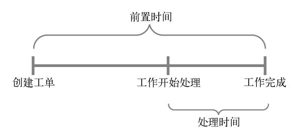

图 1-1 部署工作的前置时间和处理时间

#### 2. 常见的场景:为期数月的部署前置时间

通常,部署前置时间动辄需要好几个月。在大型、复杂的企业里,使用着紧耦合的单体应用, 少有集成测试的环境,测试和生产环境的前置时间很长,并且严重依赖于手动测试,或者需要各 种审批流程,情况更是如此。这种情形下的价值流看起来如图 1-2 所示。

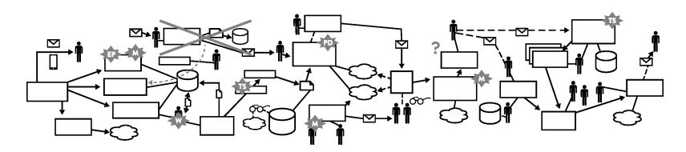

图 1-2 某部署前置时间为期三个多月的技术价值流 (来源:2015 年 Damon Edwards 的"DevOps Kaizen")

部署前置时间一旦变长,那么在价值流的每个阶段,几乎都需要"填坑"能手来补救。通常, 很可能是在项目结束前,将开发团队的变更合并到一起后,才发现整个系统根本无法正常工作, 有时甚至会出现代码都无法通过编译和测试的情况。每一个问题可能都需要几天甚至几周的时间 来定位和修复,因此导致了极其糟糕的客户体验。

#### 3. 我们的目标:分钟级别的部署前置时间

在 DevOps 的理想情况下,开发人员能快速、持续地获得工作反馈,能快速和独立地开发、 集成和验证代码,并能将代码部署到生产环境中(自己部署或者他人部署)。

我们可以通过如下方式达到这个目标:向版本控制系统中持续不断地提交小批量的代码变 更,并对代码做自动化测试和探索测试,然后再将它部署到生产环境中。这样,我们就能对代码 变更在生产环境中的成功运行保持高度自信,同时还能快速地发现并修复可能出现的问题。

为了更容易地实现上述目标,还需要通过模块化、高内聚、低耦合的方式优化架构设计,帮 助小型团队自治地工作。这样即便失败了,也能在可控范围内,而不至于对全局产生影响。

**1** 

通过上述方式,能有效地将前置时间缩短至分钟级别;即便在最坏的情况下,也不会超过小 时级别。其价值流图如图 1-3 所示。

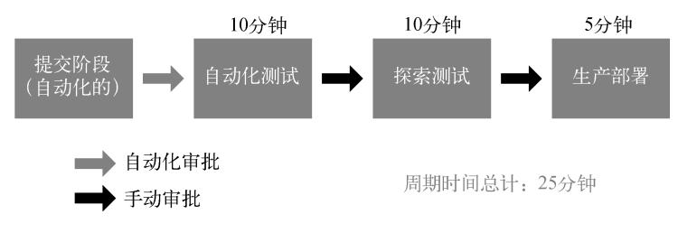

图 1-3 前置时间为分钟级别的技术价值流

#### 1.2.2 关注返工指标——%C/A

除了前置时间和处理时间外,技术价值流中的第三个关键指标是完成时间和精确的总花费时 间的百分比(%C/A)。该指标反映了价值流中的每个步骤的输出质量。Karen Martin 和 Mike Osterling 描述道:"要获取%C/A,可以询问下游客户他们有百分之多少的时间收到了'真正有用 的工作',即他们可以专心做有用的工作,而不必修复错误信息、补充信息,或者澄清那些本该 确定的信息。"

#### 1.3 三步工作法:DevOps 的基础原则

《凤凰项目》把三步工作法作为基础的原则,并由此衍生出了 DevOps的行为和模式(见图 1-4)。

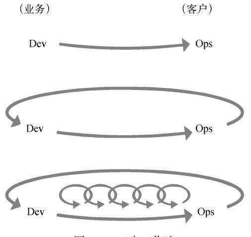

图 1-4 三步工作法

(来源:Gene Kim 在 IT Revolution Press 博客上发布的"三步工作法:DevOps 的基础原则",访问于 2016 年 8 月 9 日, http://itrevolution.com/the-three-ways-principles-underpinning-devops/)

第一步,实现开发到运维的工作快速地从左向右流动。为了最大程度地优化工作流,需要将 工作可视化,减小每批次大小和等待间隔,通过内建质量杜绝向下游传递缺陷,并持续地优化全 局目标。

通过加快技术价值流的流速,缩短满足内部或者外部客户需求所需的前置时间,尤其是缩短 代码部署到生产环境所需的时间,可以有效地提高工作质量和产量,并使企业具有更强的外部竞 争力。

相关的实践包括持续构建、集成、测试和部署,按需进行环境搭建,限制在制品数量,构建 能够安全地实施变更的系统和组织。

第二步,在从右向左的每个阶段中,应用持续、快速的工作反馈机制。该方法通过放大反馈 环防止问题复发,并能缩短问题检测周期,实现快速修复。通过这种方式,我们能从源头控制质 量,并在流程中嵌入相关的知识。这样不仅能创造出更安全的工作系统,还可以在灾难性事故发 生前就检测到并解决它。

及时发现并控制这些问题,直到拥有有效的对策,可以持续地缩短反馈周期和放大反馈环, 这是所有现代流程优化方法的一个核心原则,能够创造出组织学习与改进的机会。

第三步,建立具有创意和高可信度的企业文化,支持动态的、严格的、科学的实验。通过主 动地承担风险,不但能从成功中学习,也能从失败中学习。通过持续地缩短和放大反馈环,不仅 能创造更安全的工作系统,也能承担更多的风险,并进行试验帮助自己比竞争对手改进得更快, 从而在市场竞争中战胜他们。

作为第三步的一部分,我们能够让工作系统事半功倍,将局部优化转化为全局优化。另外, 不管是谁参与了工作,所有经验都可以持续地积累,组织里的人都可以相互借鉴彼此的经验和 智慧。

#### 1.4 小结

本章描述了价值流的概念,同时还介绍了制造业价值流和技术价值流中的一个重要量度指 标——前置时间,最后介绍了三步工作法(支撑 DevOps 的原则)的基本概念。

在后续的章节中,我们将更详细地描述三步工作法。第一步是流动原则,不管是在制造行业 还是在信息技术产业,它都聚焦于在价值交付过程中建立快速的工作流。关于快速流动的更多实 践,将会在本书的第三部分详细描述。

第2章

# 第一步:流动原则

在技术价值流中,工作通常是从开发人员流向运维人员,也就是业务和客户之间的所有职能 部门。本章要描述的第一步工作法,就是建立从开发到运维之间快速的、平滑的、能向客户交付 价值的工作流。要为这个全局目标进行优化,而非围绕一系列局部目标,如功能开发的完成度、 测试中问题的发现率和修正率、运维维护的可用性等。

通过持续加强工作内容的可视化,减小每批次大小和等待间隔,内建质量以防止缺陷向下游 传递,从而增强流动性。通过加速技术价值流的流动,可以缩短满足内部客户和外部客户需求的 前置时间,进一步提高工作质量,并使我们更加敏捷,能够比竞争对手更为出色。

我们的目标是在缩短代码从变更到生产环境上线所需时间的同时,提高服务的质量和可靠 性。实际上,我们可以在制造行业中找到价值流应用的相关线索,帮助我们将精益原则应用到技 术价值流中。

#### 2.1 使工作可见

技术行业的工作内容是不可见的,这是其与制造业价值流相比的一个显著差异。相对于工业 产品的生产过程而言,在技术价值流中很难发现工作过程的阻塞点,例如,在哪里受阻了,在哪 个环节产生了积压。而在制造业的价值流中,工作在不同工作中心间的转移通常是显而易见并且 缓慢的,因为必须真正地转移库存产品。

另一方面,技术工作的流转通过单击一次鼠标就可以完成,譬如将工单重新指派给另一个团 队。由于点击的操作太过容易,所以不同团队可能会因为信息不完整而将工作"踢来踢去",存 在的问题也会被传递到下游工序,而这些问题完全是不易察觉的,直到无法按时向客户交付产品, 或者应用程序在生产环境中出了问题。

为了能识别工作在哪里流动、排队或停滞,就需要将工作尽可能地可视化。可视化工作板是 一种较好的工作方式,如在看板或 Sprint 计划板上,使用纸质或电子卡片将各项工作展示出来。 工作通常从左侧发起(从待办事项中拉取),然后从一个工作中心拉取到下一个工作中心(用列

表示),最后到达工作板的最右侧,而这一列也通常被标记为"完成"或"已上线"。

通过这种方式,不仅能将工作内容可视化,还能有效地管理工作,加速其从左至右的流动。 此外,还可以通过卡片从在看板上创建到移动至"完成"这一列,度量出工作的前置时间。

理想情况下,看板应该覆盖整个价值流;仅当工作到达看板最右侧时,才能算是已完成(见 图 2-1)。开发完成某个功能不能算是"已完成",只有应用程序在生产环境里成功地运行起来, 并开始为客户提供价值的时候,才能算是"已完成"。

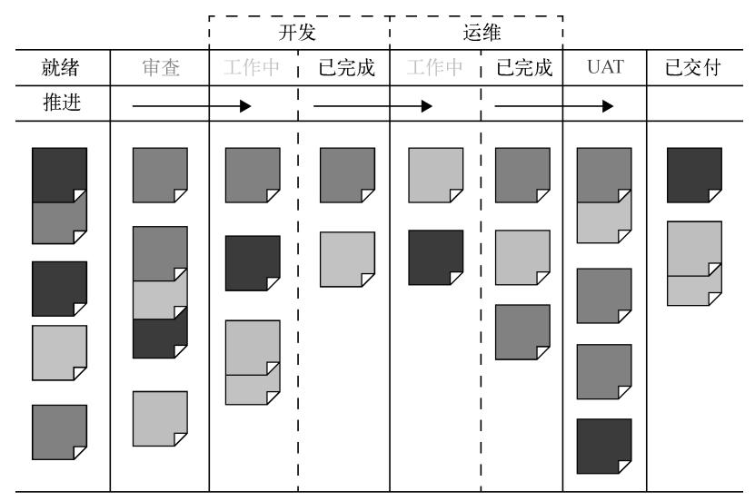

图 2-1 横跨需求、开发、测试、预生产和生产的看板示例(另见彩插) (来源:David J. Andersen 和 Dominica DeGrandis 2012 年的工作坊培训材料"ITOps 的看板")

通过将每个工作中心的所有工作都放进队列中,并且可视化地展示出来,利益干系人更容易 从全局目标出发,确定各项工作的优先级。这样,每个工作中心都能采用单任务的处理方式,从 优先级最高的任务开始,依次完成所有工作,以增加工作中心的吞吐量。

#### 2.2 限制在制品数

制造业的日常工作通常是由定期(如每天、每周)生成的生产计划决定的,根据客户订单、 交货日期、零件库存等条件,确定执行哪些任务。

但技术工作通常是动态的——尤其是存在共享服务的情况下,团队必须要同时满足很多利益 干系人的需求,这导致临时安排控制了日常工作。紧急的工作可能会来自于各种渠道,譬如工单 系统、宕机告警、电子邮件、电话、即时通信的消息或管理层决定的事件。

生产中断在制造业里很显眼,且代价极高,当正进行中的工作戛然而止时,所有的半成品都

将报废,然后再启动一批新作业。这种高昂的代价,让人们不希望中断频繁发生。

但是技术工作者很容易被打断,因为对所有人而言,这个中断的后果似乎是不可见的,即便 它对生产效率的影响比制造业更甚。例如,将一个工程师同时分配到多个项目里,他不得不在多 个任务、认知规则和目标之间来回切换,付出重新进入角色的成本。

研究表明,即便是完成简单任务,如将各种几何形状分类,当同时执行多个任务时,效率也 会显著降低。从认知上看,技术价值流中的工作,显然要比分类几何形状复杂得多,所以多任务 会导致更长的处理时间。

当使用看板管理工作时,可以限制多任务的出现,例如对看板的每一列或每个工作中心设置 在制品数量的限制,并把卡片数量的上限标记在每一列上。

例如,将测试工作的在制品数量上限设置为 3。当测试队列中已有 3 张卡片时,除非某张卡 片完成了,或将 3 张中的一张退回到前一个队列(左侧的那一列),否则禁止添加新卡片。另外, 在把一项工作用卡片的形式显示在看板上之前,任何与之相关的工作都不能开展,这强调了任何 工作都必须可视化。

Dominica DeGrandis 是在 DevOps 中运用看板的专家之一,他指出:"控制队列的长度(即在 制品数)是一个非常强大的管理工具,因为这是影响前置时间的重要因素之一——对于大多数的 工作条目而言,在它们完成以前,其实并无法预测到底需要多长时间。"

通过限制在制品数,还能更容易地发现工作中的阻碍。①例如,当限制在制品时,可能会发 现居然没什么工作可干的,因为要等待其他人。虽然进行一项新工作(即"干点什么总比什么都 不干强")可能很诱人,但此时更好的做法是查明导致等待的原因,并协助解决那个等待的问题。 实际上,糟糕的多任务处理发生的原因,通常是同时给一个人分配多个项目,造成了很多优先级 冲突问题。

正如《看板方法:科技企业渐进变革成功之道》的作者 David J. Anderson 所说:"停止开始, 开始结束。"

#### 2.3 减小批量大小

——————————

建立平滑而快速的工作流的另一个关键点,是通过小批量的模式完成工作。在精益革命以前, 大批量(或规模)生产的方式在制造业司空见惯,在作业配置或作业之间的切换相当耗时且昂贵 时尤其如此。例如,在生产大型汽车时,需要将巨大而沉重的模具放到金属冲压机上,这个过程 可能需要好几天时间。鉴于成本如此高昂,通常会用大批量作业,一次冲压出尽可能多的车身板, 从而减少模具的更换次数。

① 大野耐一把限制在制品比喻为给水库排水来识别出阻碍快速流动的所有问题。

然而,大批量导致在制品的暴涨,并在整个制造工厂中产生流量级联的变化。最后导致前置 时间长、产品质量差的后果——如果发现了一个车身板有问题,整个批次都必须报废。

在精益中,一个重要的经验是:为了缩短前置时间和提高交付物质量,应当持续不断地追求 小批量模式。理论上,最小的批量是单件流,也就是每次操作只执行一个单位产品的处理。①

关于小批量和大批量之间的巨大差异,James P. Womack 和 Daniel T. Jones 在《精益思想》一 书里,通过"模拟邮寄宣传册"的经典案例进行了说明。

这个例子假设要邮寄出 10 本宣传册。邮寄之前,每本宣传册都必须经历 4 个步骤:折叠, 插入信封,给信封封口,盖戳。

如果采用大批量策略(即"大规模生产"),我们会对每本宣传册按顺序执行上述 4 个步骤。 换句话说,首先要将 10 张纸全都折叠完,再将每张纸分别插入信封,然后给所有的信封封口, 最后全部盖章。

另一种方式是小批量策略(即"单件流"),即对每本宣传册顺序地执行所需的所有步骤,然 后再开始处理下一本宣传册。换句话说,先折叠一张纸,将其插入信封,再给信封封口,之后盖 章;然后,取下一张纸,并重复以上过程。

采用大批量和小批量策略之间的差异是巨大的(见图 2-2)。假设对所有 10 个信封都必须采 取如上 4 个步骤,并且每一步操作需要 10 秒。如果使用每批 5 个的大批量策略处理,则完成第 一个盖戳的信封需要用 310 秒。②

——————————

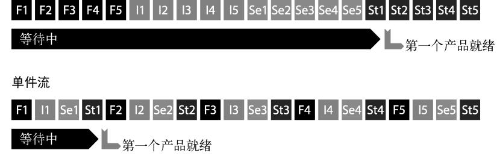

图 2-2 模拟"信封游戏"(折叠、插入、封口、盖章)(另见彩插)

(来源:Stefan Luyten 的文章"单件流:为什么大批量生产不是最有效的处理'工作'的方式", https://medium.com/@stefanluyten/single-piece-flow-5d2c2bec845b#.9o7sn74ns,2014 年 8 月 8 日)

① 也称为"1 的批量大小"或"1×1 流量",该术语表示批量大小和在制品都限制为 1。

② 这里是"5×1 流量",即批量大小为 5,在制品为 1。由于这里是单人模拟的场景,并且一双手同时只能加工一个 信封,所以在制品数量也只能为 1。310 秒 = (5 × 10 + 5 × 10) + (5 × 10 + 5 × 10) + (5 × 10 + 5 × 10) + 10。

更糟糕的是,假设我们在信封封口操作中发现第一步的折叠做错了,在这种情况下,我们能 发现错误的最早时间是在 200 秒之后,那样我们就不得不将这个批次的 10 个小册子再重新折叠 并装回信封中。

相比之下,使用小批量策略时,仅用 40 秒就完成了第一封盖戳信的生产,比大批量策略快 8 倍。如果第一步出错了,只需要返工一本小册子。小批量生产的在制品更少,前置时间更短, 错误检测更快,返工量更少。

对于技术价值流而言,大批量的副作用和制造业一样。我们制订了软件发布的年度计划,将 一整年的开发成果一次性地都发布到生产环境中。这种大批量的发布会造成突发的、大量的在制 品,导致所有下游工作中心①大规模的混乱,其结果是流动性变差,质量下降。这和我们阐述的 经验是类似的,即对生产环境的变更越大,问题的定位和修复就越困难,修复时间也就越长。

Eric Ries 在"创业经验教训"(Startup Lessons Learned)这篇文章中说:"在开发(或 DevOps) 流程中,批量大小是工作产品在不同阶段间移动的单位数。对于软件而言,最容易看到的是代码。 当工程师签入代码时,他们就批量地处理了一定数量的工作。有许多控制批处理的方式,从持续 部署要求的小批量,到相对传统的基于分支的大型模块开发,都是聚合多个开发人员几周或几个 月所工作的代码。"

在技术价值流中,单件流可以通过持续部署实现。②其中,每一个提交到版本控制系统的变 更都会集成、测试并部署到生产环境。具体的实现方法,将在第四部分中进行详细描述。

#### 2.4 减少交接次数

在技术价值流中,如果部署的前置时间以月作为周期单位,通常是因为要将版本控制系统中 的代码部署到生产环境需要数百甚至数千个操作。实际上,代码在价值流流转的过程中,需要各 个不同部门的协同才能完成相关任务,包括功能测试、集成测试、环境搭建、配置服务器、存储 管理、网络、负载均衡设备和信息安全加固等。

一项工作在团队之间交接时,需要大量的沟通——请求、委派、通知、协调,而且经常需要 排优先级、调度、消除冲突、测试和验证。这些工作可能还需要使用不同的工单系统或项目管理 系统,编写技术规范文档,用会议、电子邮件或电话的形式进行沟通,可能还涉及文件共享服务 器、FTP 服务器和 Wiki 页面的使用。

实际上,上述流程中的每个环节都有其潜在的队列,当依赖不同价值流共享的资源(例如集

——————————

① 多是指数据中心的运维部门。——译者注

② 本书强调的是端到端的价值流,只有在部署之后,把价值交付给客户了,一项工作才算完成,因此是持续部署。

中式操作)时,就会出现工作等待。这些请求的前置时间通常会很长,从而导致那些本应按期操 作完的工作持续地延期。

即使在最好的情况下,有些信息或者知识也不可避免地在交接过程中丢失。经历了多次的交 接后,问题的上下文和所支持的组织目标可能会完全丢失。例如,服务器管理员可能会收到一个 关于创建用户账号的新工单,但是他并不知道是什么应用程序或服务会使用这个账号,为什么需 要新建账号,其他的依赖关系是什么,或者这到底是不是一个重复劳动。

为了减少这类问题的出现,要么努力减少交接次数,要么用自动化方式执行大部分操作,要 么重新调整组织结构,让团队不必依赖其他人就可以独立地为客户提供价值。因此,要通过减少 队列中的等待时间以及非增值工作的时间来增加流动性(见附录 4)。

#### 2.5 持续识别和改善约束点

为了缩短前置时间、提高吞吐量,我们需要不断地识别系统中的约束点,提高工作产能。 Goldratt 博士在 *Beyond the Goal* 一书中提到:"在任何价值流中,总是有一个流动方向、一个约 束点,任何不针对此约束点而做的优化都是假象。"如果我们优化约束点之前的那个工作中心, 那么工作必将在这个约束点上更快地积压起来。

反之,如果优化约束点之后的工作中心,那么它还会处于饥饿状态,等待约束点处工作的结 束。对于这种现象,Goldratt 博士给出了解决方案,定义了如下"5 个关键步骤":

- 识别系统的约束点;
- 决定如何利用这个系统约束点;
- 基于上述决定,考虑全局工作;
- 改善系统的约束点;
- 如果约束点已经突破了,请回到第一步,但要杜绝惯性导致的系统约束。

在 DevOps 的转型过程中,如果希望前置时间从月或季度缩短为几分钟,那么一般需要依次 优化下面的约束点。

- 环境搭建:如果生产或测试环境的搭建总是需要数周或数月,则按需部署就无法实现。 解决措施是按需建立完全自服务的环境,保证团队在需要环境的时候,能通过自动化方 式创建。
- 代码部署:如果代码的部署需要花数周或更长时间(譬如每次部署需要 1300 个手动、易 出错的操作,涉及多达 300 名工程师),那么就无法按需部署。解决措施是尽可能自动化 部署的过程,以便让任何开发人员都可以按需自动化地部署。
- 测试的准备和执行:如果每次代码部署都需要两周的时间来完成测试环境的准备和数据 集的配置,手动执行所有的回归测试还需要另外四周时间,那么就无法实现按需部署。

解决措施是实现自动化测试,这样才能在安全、并行地执行部署的同时,使测试的速度 能跟上代码开发的速度。

 紧密耦合的架构:如果架构是紧密耦合的,那也无法实现按需部署,因为每次要做代码 变更时,工程师都不得不从变更评审委员会里获得执行变更的许可。解决措施是创建松 散耦合的架构,这样开发人员才能安全、自主地进行变更,提高生产力。

如果能突破以上的约束点,那么接下来的约束有可能是开发部门或产品经理。因为我们的目 标是让小型开发团队可以独立、快速、可靠地开发、测试和部署,并持续为客户创造价值,所以 这些环节应该是约束点集中的所在。对于高绩效者来说,不管工程师是处于开发、QA、运维还 是信息安全岗位,他们的目标都是尽量提高生产力。

当约束点出现在开发阶段时,我们将仅受限于有多少创意精良的业务假设,以及能否开发出 必要的代码来用真实客户来测试这些假设。

以上所述的约束点在 DevOps 转型中是相当普遍的——在价值流中识别约束点的技术,诸如 如何使用值流映射和度量的方法,以后会详细描述。

#### 2.6 消除价值流中的困境和浪费

丰田生产系统的先驱之一新乡重夫认为,浪费是业务兴盛的最大威胁——精益中对浪费的常 用定义是"使用了超出客户需求和他们愿意支付范围的任何材料或资源的行为"。他定义了制造 业里 7 种主要的浪费类型:库存、过量生产、过度加工、运输、等待、移动和缺陷。

现代化的精益理念解释道:"消除浪费"会有点贬义和不近人情的意味,我们的目标其实是 想通过持续的学习来破除日常工作中的困境,从而更好地实现组织的目标。在本书的后续内容里, "浪费"一词意味着这个更具现代感的定义,因为它更符合 DevOps 所期望的理想境界。

Mary 和 Tom Poppendieck 在 *Implementing Lean Software Development: From Concept to Cash* 一书中描述道:浪费和困境是软件开发过程中导致交付延迟的主要因素。

下面是该书中描述的关于浪费和困境的部分类型。

- 半成品:它指的是价值流里任何还没有彻底完成的工作(例如,需求文档或尚未审核的 变更单)、处于队列中的工作(如等待 QA 审核或服务器管理员审核的工单)。部分完成的 工作会逐渐地过期,随着时间的推移最终失去了价值。
- 额外工序:在交付过程中执行的、并未给客户增值的额外工作,可能包括那些在下游工 作中心从没使用过的文档,或是对输出结果做出的并不增值的评审或审批。额外工序不 仅增加了处理的工作量,还增加了前置时间。

- 额外功能:在交付过程中构建的那些组织或客户完全不需要的功能(如"镀金"①)。额 外功能增加了功能测试和管理的复杂度和工作量。
- 任务切换:将人员分配到多个项目和价值流里后,他们需要进行上下文切换,并管理工 作之间的依赖关系,这会在价值流中耗费额外的工作量和时间。
- 等待:由于资源的竞争而在工作之间产生了等待,这将增加周期时间,延迟了向客户交 付价值。
- 移动:信息或数据在工作中心之间移动的工作量。例如,在一个需要频繁沟通的项目里, 团队成员实际上不在一起办公,无法坐在一起紧密协作,这时人员移动的浪费就产生了。 另外,工作交接也会产生移动的浪费,需要额外的沟通来澄清所有歧义的部分。
- 缺陷:由于信息、材料或产品的错误、残缺或模糊,而需要一定的工作量来确认。缺陷 的产生和被检测出来的时间间隔越长,解决问题就越困难。
- 非标准或手动操作:需要依赖其他人的非标准的或手动的工作,例如使用不能自动化反 复重建的服务器、测试环境和配置。理想情况下,任何依赖运维团队手动完成的操作, 都应该配置成自动化的、按需提供的,或者是自助服务。
- 填坑侠:为了实现组织的目标,不得不把有些人和团队置于不太合理的处境,这甚至会 成为他们的家常便饭(如半夜两点生产环境出现事故,连夜给软件版本提交了上百个工 单)。②

我们的目标是将这些浪费和困境(任何需要填坑侠的场合)都可视化,并系统地进行改进, 减轻或消除这些负担,从而实现快速流动的目标。

#### 2.7 小结

——————————

提升技术价值流的流动性对实施 DevOps 来说至关重要。为此,我们需要将工作可视化,限 制在制品数,减小批量大小,减少交接次数,持续地识别和改进约束点,以及消除日常工作中的 困境。

第四部分将详细描述在 DevOps 价值流中实现快速流动的具体实践。下一章将描述第二步工 作法——反馈原则。

① IT 项目中无用的面子工程和功能。——译者注

② 虽然填坑侠没有包含在 Poppendieck 所说的浪费类型中,但我列在这里是由于这种情况很普遍,特别是在运维共 享服务的情况下。

第3章

# 第二步:反馈原则

第一步工作法描述的原则,使得工作能够在价值流中从左向右快速地流动。第二步工作法描 述的原则,则使得在从右向左的每个阶段中能够快速、持续地获得工作反馈。我们的目标是建立 安全和可靠的工作系统。

这一点对于复杂的系统尤其重要,在这种情况下,发现和纠正错误的最早时机通常是灾难性 事件发生时,例如制造业工人在工作过程中受伤,或核反应堆的堆芯熔毁。

在技术行业,我们的工作几乎都发生在灾难性后果如影随形的复杂系统里。和制造业相似, 通常只有在发生重大故障的时候,才能发现问题所在,例如遇到大规模用户服务中断,或安全漏 洞导致客户数据泄露。

通过在整个价值流和组织中建立快速、频繁、高质量的信息流,包括反馈和前馈回路,可以 让系统更安全。这样,就可以在规模较小、修复成本较低的情况下发现并修复问题,在灾难发生 前消除问题,并创造出组织性学习氛围。同时,我们应该把失败和事故的发生视为宝贵的学习机 会,而不是惩罚和责备的理由。为了实现上述目标,我们先探索复杂系统的本质,以及怎样才能 使它更安全。

#### 3.1 在复杂系统中安全地工作

复杂系统的一个重要特征是,无法将系统视为一个整体,去理解各个部分是如何组合在一 起的。复杂系统的组件之间通常是紧耦合且紧密关联的,不能仅仅依据组件的行为来解释系统的 行为。

Charles Perrow 博士研究了三里岛核事故,他发现没有人能了解核反应堆在所有情况下的行 为,以及在何种情况下会发生故障。当核反应堆的一个组件出现故障时,很难将其与其他组件隔 离,以不可预测的方式快速地流过阻力最小的路径。

Sidney Dekker 博士提出了一些关于安全的重要元素,他发现了复杂系统的另一个特点:相 同的事情做两次,结果未必相同。也正是因为这个特点,即便施行了有价值的静态检查和最佳实 践,还是不足以防止灾难发生(见附录 5)。

复杂系统中的故障是存在且不可避免的。因此,无论在制造业还是信息技术行业,我们都必 须设计出一个安全的工作系统,让员工能无所畏惧地开展工作,确保早在灾难性后果(例如人员 伤害、产品缺陷或负面的客户影响)发生之前,能快速检测出错误。

Steven Spear 博士在他的哈佛商学院博士论文中揭示了丰田生产系统背后的因果机制。他认 为,我们可能无法设计出绝对安全的系统,但是可以通过采取以下 4 项措施让复杂系统更安全地 工作:①

- 管理复杂的工作,从中识别出设计和操作的问题;
- 群策群力解决问题,从而快速地构建新知识;
- 在整个组织中,将区域性的新知识应用到全局范围;
- 领导者要持续培养有以上才能的人。

要在复杂系统中安全地工作,必须具备上述 4 种能力。接下来,我们将描述前两种能力及它 们的重要性,同时还会探讨其他领域是如何实现这些能力的,以及如何在技术价值流中实现它们。 第三项和第四项能力会在第 4 章中描述。

#### 3.2 及时发现问题

——————————

在安全的工作系统中,我们要不断地对设计和假设进行验证。目标是更早、更快、以尽可能 低的成本、从尽可能多的维度增加系统的信息流,并尽可能清晰地确定问题的前因后果。能 排除的假设越多,定位和解决问题的速度就越快,从而提高我们的顺应力、敏捷性以及学习和创 新能力。

我们通过在工作系统中建立反馈和前馈回路的方式实现这一点。Peter Senge 博士在《第五项 修炼:学习型组织的艺术与实践》一书中,描述了反馈回路是学习型组织和系统思维的重要组成 部分。反馈和前馈回路能让系统内各部件之间的关系增强或抵消。

在制造业,如果缺乏有效的反馈机制,往往会酿成重大质量和安全问题。有这样一个典型的 案例:通用汽车的弗里蒙特制造厂既没有有效的流程来检测装配过程中的问题,也没有明确的步 骤来解决问题。结果导致了各种问题,比如发动机倒置,汽车缺少方向盘或轮胎,甚至是由于根 本无法启动,不得不把汽车拖出装配流水线。

相比之下,在高绩效的制造业运营中,整个价值流里存在着快速、频繁和高质量的信息流—— 每个工序的操作都会被度量和监控,任何缺陷或严重偏差都能被快速发现和处理。这些是保证质

① Spear 博士扩展了他的著作,并介绍了一些长期保持成功的企业,譬如丰田供应商网络、美铝以及美国海军的核 动力推进计划。

量、安全和持续学习与改进的基础。

在技术价值流中,由于缺少快速反馈机制,我们经常会得到糟糕的工作结果。例如,在瀑布 型软件项目中,代码的开发可能花上一整年,在开始测试之前(甚至在向客户发布软件前),我 们得不到任何质量反馈。在反馈稀少且滞后的情况下,工作结果是很难达到预期的。

相反,我们的目标应该是在技术价值流的每个阶段(包括产品管理、开发、QA、信息安全 和运维),在所有工作执行的过程中,建立快速的反馈和前馈回路。这包括创建自动化的构建、 集成和测试过程,以便尽早检测出那些可能导致缺陷的代码变更。

我们还要建立全方位的监控系统,监控服务组件在生产环境中的运行状态,以便快速探测到 服务的意外情况。监控系统还能帮助我们度量是否偏离了预期目标,并将监控结果辐射到整个价 值流中,这样就能看到我们的行为是如何影响系统里的其他部分的。

反馈回路不但能让问题的快速探测和修复成为可能,而且还能告诉我们如何防止问题复发。 这样做不但提高了工作系统的质量和安全性,还创造了组织性知识。

Pivotal 软件公司工程副总裁、《探索吧!深入理解探索式软件测试》一书的作者 Elisabeth Hendrickson 说:"在我负责质量验证的时候,我将自己的工作描述为'建立反馈回路'。反馈至 关重要,因为它是我们工作的向导。我们必须不断地验证目标,验证实施是否满足了客户的需求, 而测试仅仅是一种反馈。"

#### 3.3 群策群力,战胜问题获取新知

显然,仅仅检测出意外的发生是远远不够的。一旦问题出现了,我们还必须群策群力,发动 所有相关的人员解决问题。

Spear 博士认为,群策群力的目的是遏制住问题,防止蔓延,然后定位和处理问题,避免复 发。他说:"这样做可以让所有参与者都得到更深入的知识,理解如何管理系统,把无法规避的、 早期的无知阶段变成学习的过程。

这个原则的典范是丰田的"安灯绳"。在丰田制造工厂里,每个工作中心都是一条绳索,每 个工人和经理都受过培训,他们会在出现问题时拉下安灯绳,比如,当零件有缺陷时,当需要的 零件用光时,或者是加工时间比文档中描述的长时。①

在安灯绳被拉动时,团队领导就能第一时间得知并立即着手解决问题。如果问题不能在指定 的时间(如 55 秒)内解决,就会停掉整个生产线,调动整个企业一起协作,直到成功地找出解 决问题的对策。

——————————

① 丰田已经在一些工厂里使用"安灯"按键。

我们不应绕开问题,也不应该用"有更多时间时再解决"来搪塞,而要立刻群策群力修复问 题——这与通用汽车弗里蒙特工厂的做法几乎完全相反。群策群力的原因如下:

- 防止把问题带入下游的处理环节,否则不但修复的成本和工作量会呈指数级增加,而且 还会欠下技术债;
- 防止工作中心启动新的工作,那样可能会在系统中引入新的错误;
- 如果问题还没有得到解决,那么工作中心在下一次操作(如 55 秒后)中,可能还会遇到 相同的问题,需要更高的修复成本(见附录 6)。

这种全民总动员的做法似乎违背了常规管理方法,因为局部问题扰乱了整体的运营。然而, 全民总动员让学习成为了可能。它还能防止由于记忆模糊和情况变化导致的关键信息遗失,这在 复杂系统中显得尤为重要。在复杂的系统里,由于人员、流程、产品、地点和境况中存在着很多 意想不到的、特殊的相互作用,会出现很多问题。随着时间推移,谁都不可能精确地重现问题发 生时的场景①。

正如 Spear 博士所说,全民总动员是"实时的问题识别、定位和处理(在制造业称为对策 或纠正措施)循环的一部分。这就是休哈特提出的循环(即 PDCA 环)——计划(Plan)、实施 (Do)、检查(Check)、改进(Act),后来由爱德华兹·戴明推广并得到了迅猛发展"。

只有尽可能在早期阶段,通过全民总动员的方式来解决小问题,才能把灾难性事故消灭在萌 芽状态。换句话说,当核反应堆的堆芯熔毁了,那就太迟了,已经回天乏术。

为了在技术价值流中实施快速反馈,我们必须建立等同于安灯绳和全民响应的机制。这要求 我们也创造出这样一种文化,让人们在发生问题时就去拉动安灯绳,无论是在生产事故发生时, 还是在价值流的早期出现错误时,并且这个行为是安全的甚至是受鼓励的。例如,当有人提交了 一个代码变更,而这导致了持续构建或测试过程失败的时候。

触发了安灯绳时,我们就聚集在一起解决问题,停止开展任何新工作,直到问题解决。②这 给价值流中的每个人提供了快速反馈(特别是那个导致系统故障的人),让我们能够快速地隔离 和定位问题,避免出现更复杂的状况,导致问题的因果关系变得模糊。

阻止开展新工作有助于实现持续集成和部署,这就是技术价值流中的单件流。能通过持续构 建和集成测试的所有变更都可以部署到生产环境中,任何导致测试失败的变更都会触发安灯绳, 并且会将大家聚集起来解决问题。

——————————

① 事故的发生具有一次性和难追溯性。——译者注

② 令人惊讶的是,当安灯绳的使用次数下降时,工厂经理实际上会降低界值来增加它的使用次数,从而持续地进行 更多的学习和改进,并去检测更微弱的故障信号。

#### 3.4 在源头保障质量

基于对意外和事故的处理模式,我们可能会在无意中把某种不安全的工作系统固化下来。在 复杂的系统中,通过加入更多的检查步骤和审批流程,实际上还增加了故障发生的可能性。做决 策的地方一般远离执行工作的地方,这导致审批流程的有效性有所下降。这样做不仅降低了决策 质量,而且还增加了决策周期,进而减弱了因果关系之间反馈的强度,降低了在成功和失败中学 习的能力。①

在一些相对较小的简单系统中也存在这种状况。通常因为清晰度和及时性不足,自上而下的 官僚主义和控制系统变得无效,导致了"应该做事的人"和"实际做事的人"之间存在巨大差异。

质量控制无效的例子如下。

——————————

- 需要其他团队帮忙完成一系列乏味、易出错和手动执行的任务,这些任务本应该由需求 方自己采用自动化方式完成。
- 需要那些远离实际工作场所且公务繁忙的人批准,迫使他们在不了解工作情况和潜在影 响的情况下做出决策,或者仅仅是例行公事式地盖章批准。
- 编写大量含有可疑细节,且在写后不久就过时了的文档。
- 将大量工作推给运维团队和专家委员去审批和处理,然后等待回复。

相反,在日常工作中,我们需要价值流中的每个人在他们的控制领域里发现并解决问题。通 过这种方式,可以把质量控制、安全责任和决策制定都置于开展工作的场景里,而不是依赖于外 围高层管理者的审批。

根据同行评审来评定所提出的变更,确保这些变更会按照设计运行。尽可能多用自动化方式 执行通常由 QA 和信息安全人员来进行的质量检查。按需执行自动化测试,而无需开发人员向测 试团队请求或发起测试工作。这样,开发人员能够快速地测试自己的代码,甚至把代码的变更部 署到生产环境中。

我们用这种方式真正地让所有人都负起了质量责任,而不是仅让一个部门来负责。信息安全 并不是信息安全部门专属的工作,正如可用性不仅仅是运维部门的专属工作一样。

让开发人员也对系统质量负责,不但能提高系统的质量,而且还能加速学习。这对于开发人 员来说尤为重要,因为通常他们是距离客户最远的团队。正如 Gary Gruver 所说:"当有人因为 6 个月前开发人员所造成的事故而对着他们咆哮时,开发人员其实学不到任何东西——这就是我们

① 18 世纪初的英国政府就是这样一个例子,当时自上而下的官僚指挥显然是无效的。那时候佐治亚州还是英国的殖 民地。虽然英国政府距其 3000 英里(约 4800 千米)之遥,并且关于当地土壤特质、岩石、地形、水源和其他条 件的第一手资料都很匮乏,却试图规划佐治亚州的整个农业经济,结果导致佐治亚州沦为北美 13 个殖民地中最 萧条和人口最少的一个。

必须尽可能快地(几分钟之后,而不是几个月后)向所有人提供反馈的原因。"

#### 3.5 为下游工作中心而优化

20 世纪 80 年代,可制造性设计(Designing for Manufacturability)原则旨在设计零件和工艺 过程,让成品能够以最低的成本、最高的质量和最快的流程生产出来。例如,设计出非对称的部 件以防止装反,设计出螺丝紧固件以免部件被拧得太紧。

这偏离了通常做设计的方式,即过度重视外部客户,而忽视了内部利益干系人,如生产线 工人。

精益定义了我们必须为两类客户而设计:外部客户(最有可能为我们提供的服务付费的人) 和内部客户(紧随我们立即接收和处理工作的人)。根据精益原则,我们最重要的客户是我们的 下游。为他们而优化我们的工作,需要我们对他们的问题给予同情心,从而更好地识别出会阻碍 快速和平滑流动的设计问题。

在技术价值流中,我们通过为运维而设计来为下游工作中心做优化,包括运维的非功能性需 求(如架构、性能、稳定性、可测试性、可配置性和安全性)与用户功能同样重要。

这样,我们就在源头保障了质量,并形成了一套非功能性需求,可以主动地将它们集成到构 建的所有服务中。

#### 3.6 小结

建立快速的反馈机制,对于实现技术价值流中的高质量、可靠性和安全性至关重要。为此, 要在问题发生时识别问题,群策群力解决问题并构建新的知识,在源头控制质量,并且不断地为 下游工作中心做优化。

第四部分会介绍在 DevOps 价值流中实现快速流动的具体实践。下一章,我们会介绍第三步 工作法——持续学习与实验原则。

## 第4章

# 第三步:持续学习与实验原则

第一步建立了从左到右的工作流,第二步建立了从右到左的快速、持续的反馈,第三步要建 立持续学习与实验的文化。通过应用三步工作法能够持续提升个人技能,进而转化为团队和组织 的财富。

在制造业的生产流程中,由于存在系统性的质量和安全问题,所以往往需要严格定义并完成 工作内容。例如,在上一章描述的通用汽车的弗里蒙特制造厂里,工人几乎无法在日常工作中做 出改进或融入所学,即使提出改进建议也很少被接受。

在这样的环境里,通常会弥漫着恐惧和不信任感。工人犯了错就会受到惩罚,那些提出建议 或指出问题的工人则会被认为是告密者或管闲事的人。当发生了上述情况时,领导层会故意压制, 甚至进行惩罚,这导致了质量和安全问题的进一步恶化。

相反,在那些高绩效的组织中,则要求并积极地促进学习。工作不是严格定义的,相反,工 作系统是动态的,生产线工人在日常工作中通过实验来做出新的改进。工作流程是严格标准化的, 工作结果都会写入文档。

技术价值流的核心是建立高度信任的文化。它强调每个人都是持续学习者,必须在日常工作 中承担风险;通过科学的方式改进流程和开发产品,从成功和失败中积累经验教训,从而识别有 价值的想法,摒弃无用的想法。另外,所有局部的经验都会快速转化为全局性的改进,从而帮助 整个组织尝试和实践新技术。

为日常工作的改进预留时间,从而进一步促进和保障学习。通过不断向系统加压的方式,来强化 持续改进。在可控的情况下,我们甚至通过在生产环境里模拟或者注入故障来增强弹性(resilience)。

通过建立持续、动态的学习机制,帮助团队快速并自动地适应不断变化的环境,进而帮助企 业在市场竞争中脱颖而出。

#### 4.1 建立学习型组织和安全文化

在复杂系统中工作时,精确地预测出结果是不现实的。因此,在日常工作中,即便未雨绸缪、

小心谨慎,意外依然会发生,甚至有时还会发生灾难性的事故。

当某些意外影响到客户时,我们努力追本溯源,但根本原因通常会被认定为人为错误,而管 理层的做法往往是点名、责备,甚至羞辱责任人。①而且,管理者还会暗示,犯错的人应当受到 惩罚。他们因此会制定出更多防范错误复发的流程和审批环节。

Sidney Dekker 博士曾定义了安全文化的一些关键要素,并创造了"正义文化"这一术语。 他写道:"不公正的事故和意外处理会阻碍安全调查,让安全工作者感到恐惧(而不是专注),让 整个组织更加官僚(而非更加细致),甚至还会导致信息封闭、责任逃避和滋生自我保全意识。"

这些问题在技术价值流中显得特别突出——技术类工作几乎都是在复杂系统中进行的,管理 层对事故责任人进行惩罚不但会引起恐惧感,还会导致问题和故障的隐瞒不报,直到下一个灾难 性事故的发生。

Ron Westrum 博士是研究企业文化中安全和绩效重要性的鼻祖之一。他曾指出,在医疗机构 中,患者的生命安危高度依赖于医疗机构的"生机"文化。他定义了三种类型的文化,如表 4-1 所示。

- 病态型:病态型组织的特点是组织中存在大量恐惧和威胁。由于政治原因,个体为了保 全自身利益,通常会隐瞒真相或者歪曲事实。在这种组织中,故障和事故经常被隐瞒。
- 官僚型:官僚型组织的特点是规则和流程僵化,所有部门通常都"自扫门前雪"。在这种 组织中,通过评判系统处理事故,结果往往恩威兼施。
- 生机型:生机型组织的特点是积极探索和分享信息,让组织更好地履行使命。在这种组 织中,整个价值流中所有的员工共同承担责任,对事故进行积极反思,并进行真正的根 因调查。

| 病 态 型   | 官 僚 型      | 生 机 型   |
|---------|------------|---------|
| 隐瞒信息    | 忽略信息       | 积极探索信息  |
| 消灭信使    | 不重视信使      | 训练信使    |
| 逃避责任    | 各自担责       | 共担责任    |
| 阻碍团队的互动 | 容忍团队的互动    | 鼓励团队间结盟 |
| 隐瞒事故    | 组织是公道和宽容的  | 调查事故根因  |
| 压制新想法   | 认为新想法会造成麻烦 | 接纳新想法   |

表 4-1 Ron Westrum 的组织类型学模型:组织如何处理信息

(来源:Ron Westrum, "A typology of organisation culture," BMJ Quality & Safety 13, no. 2 (2004), doi:10.1136/qshc.2003.009522)

——————————

①"点名、责备和羞辱"模式是 Sidney Dekker博士批评的"坏苹果理论"的一部分,在他的 *The Field Guide to Understanding Human Error* 一书里有深入的讨论。

与 Westrum 博士在医疗机构中的发现类似,在技术价值流中,高度信任的生机型文化对组织 的绩效也有异曲同工的作用。

在技术价值流中,通过努力打造安全的工作系统,我们能建立起生机文化的基础。在意外和 故障发生时,关注如何重新设计系统,从而防止事故复发,而不是去追究人的问题。

例如,可以在每次事故发生后进行不指责的回顾,对事故发生的原因和过程做出客观解释, 并就优化系统的最佳措施达成一致。在理想情况下,这不但能防止问题复发,还有助于实现更快 的故障定位和恢复。

我们能够通过以上的方式建立学习型组织。Etsy 的工程师 Bethany Macri 发起并开发了事故 回顾记录工具 Morgue,他说:"如果不指责,员工就没有了恐惧,没有了恐惧,就能够做到坦诚, 而坦诚能够有效预防事故。"

Spear 博士认为,消除指责能够有效实现学习型组织,使"组织自我诊断和自我优化,并能 熟练地定位和解决问题"。

Senge 博士描述了学习型组织的诸多特质。他在《第五项修炼:学习型组织的艺术与实践》 一书中写道,这些特质有助于实现客户价值,保证服务质量,揭示事故真相,并打造具有竞争优 势、充满活力和高度忠诚的组织。

#### 4.2 将日常工作的改进制度化

如果团队没有能力或者意愿去改进现有的流程,那么就会持续饱受眼前问题的困扰和折磨, 而且痛苦指数还会与日俱增。Mike Rother 在《丰田套路》一书中指出,就算不去优化现状,流 程也不会是一成不变的——由于混乱和无序,流程会随着时间的推移持续恶化。

在技术价值流中,为了防止灾难性事故的发生,团队陷于实施各种临时解决方案的工作中, 反而没有时间去完那些有价值的工作。因此,用临时方案解决问题的模式往往还会导致问题和技 术债务的累积。所以《精益企业》的作者 Mike Orzen 说:"比日常工作更重要的,是对日常工作 的持续改进。"

通过明确预留时间来改善日常工作,包括预留时间来偿还技术债、修复缺陷、重构和优化代 码和环境。可以在每个开发周期的间歇中预留一段时间,或者安排改善闪电战(kaizen blitze)时 段,让工程师通过自组团队的方式来解决他们感兴趣的问题。

通过采取以上措施,在日常工作中,所有人都始终能在可控的范围内发现和解决问题。在解 决了困扰团队数月甚至几年的重大问题后,接下来就可以消除系统中其他的潜在问题。及早定位 和识别那些潜在的问题,不但能降低解决问题的成本,而且系统承担的风险也会更小。

1987 年,美铝公司(一家铝制造商,当时有 90 000 名雇员,年收入 78 亿美元)改进了工作 场所的安全性。生产铝是需要高温、高压和强腐蚀性化学品的。美铝 1987 年的事故率居高不下, 每年有近 2%的员工受伤,平均每天 7 人左右。当 Paul O'Neil 担任首席执行官时,他设定的第一 个目标是让员工、协作方和访客的伤害数降为零。

Paul O'Neil 要求所有受伤事故必须在 24 小时内通报——这不是为了惩罚,而是为了持续改 进,创造出更安全的工作场所。通过这项举措,美铝在 10 年里将伤害率降低了 95%。

随着伤害率的降低,美铝就可以把精力放在那些较小的问题和潜在的风险上——他们开始识 别潜在的风险,而不仅是在事故发生后通知 Paul O'Neil。①通过这种模式,美铝改善了工作场所 的安全性,在接下来的 20 年里,他们的安全记录在业内一直保持着领先。

Spear 博士写道:"美铝通过识别自身的处境、困难和障碍,逐渐用动态的持续改进模式替代 了传统的应急和救火队模式。在识别了风险、定位并处理了问题之后,他们就去反思其他容易被 忽视的风险,并持续改进。这帮助公司在市场上获得了更大的竞争优势。"

类似地,对于技术价值流而言,让工作系统更加安全也一样有助于发现和解决潜在风险。例 如,一开始我们可能只是对影响客户服务的事故做不指责的事后调查,随着时间的推移,我们将 逐渐地识别其他潜在风险。

#### 4.3 把局部发现转化为全局优化

——————————

一旦在局部范围内取得了成果,就应当把它分享给组织里的其他人,让更多的人从中获益。 换句话说,当单个团队或个人获得了独有的专业知识或经验时,我们的目标是把这些隐性知识(即 很难通过文档或沟通的方式传递的知识)转换为显性知识,从而帮助其他人吸取这些专业知识并 在实践中应用。

这样,当其他人也要完成类似的工作时,就可以参照以往集体的经验和智慧。把局部知识转 化为全局知识的一个著名案例是"美国海军核动力推进计划"(又称海军反应堆,Naval Reactors, NR),它稳定运行的时间超过了 5700 堆年,反应堆至今尚未发生过一次伤亡或核泄漏事故。

NR 以恪守标准化流程而闻名于世,出现任何流程或操作偏差都要写故障报告,以便积累经 验。不管故障信号强弱,或者风险大小如何,都会基于这些经验持续地更新流程和系统设计。

这样带来的结果是:在任何一组新船员出海时,他们都能迅速地从集体长期积累的智慧中获 得成长。同样令人印象深刻的是,他们在海上的经验也会持续添加到这个智慧库中,以帮助以后 的船员安全地执行任务。

① 这是极具教育意义的、真正的提升,我们能看到 Paul O'Neil 对于领导者创造安全工作环境的信念和热忱。

在技术价值流中,我们也应该通过类似的机制建立全局知识库。例如,把所有事故报告转化 成可搜索的知识库,让有需要的团队能更加方便地使用它去解决类似问题,同时建立起组织级的 共享源代码库,让所有人可以方便地使用整个组织的代码、库和配置。这些机制有助于把个人的 专业知识转化为服务更多成员的集体智慧。

#### 4.4 在日常工作中注入弹性模式

低绩效组织想方设法缓解问题,换句话说,他们疲于应付问题。例如,为了降低任务空闲的 风险(货物未到场,或者当前的库存配件都是报废品),管理者可能会在每个工作中心里存放更 大量的在制品。然而,这个缓冲也增加了在制品数量,前文所提到的各种不良后果也会接踵而来。

类似地,为了降低由于机械故障造所导致的生产中断的风险,管理者可能会通过购买更多的 设备、雇用更多的员工或者扩大厂房的方式来增加产能。可是所有这些做法同时也增加了成本。

相对而言,高绩效组织则通过改善日常运营,持续地引入张力提高生产效率,同时在系统中 注入更大的弹性,来实现或达到更佳的结果。

另外一个经典案例是丰田的一个顶级供应商——爱信精机公司的一家工厂。假设他们有两条 生产线,每条生产线每天能产出 100 个单位的产品。在订单不紧急的时候,他们把所有的生产任 务都发送到其中一条生产线上,并尝试用不同的方式来增加产量和识别生产流程中的瓶颈;如果 这条生产线由于过载而发生了故障,他们就会把生产任务发往另一条生产线。

通过在日常工作中持续不断地实验,他们能够持续地提高产能,并且不需要增加任何新设备 或人员。引入这种类型的改进不仅提高了生产效率,而且还提高了弹性,因为组织总是处在紧张 和变化的状态中。知名作者和风险分析师 Nassim Nicholas Taleb 将这种通过加压来增强弹性的做 法称为抗脆弱性(antifragility)。

在技术价值流中,通过缩短部署的前置时间、提高测试覆盖率、缩短测试执行时间,甚至在 必要时解耦架构,都属于在系统中引入类似张力的做法,也都能够提高开发人员的生产效率及可 靠性。

另外,还可以通过演习的方式来预演大规模故障,比如关闭某个数据中心。或者在生产环境 中注入大规模故障(如 Netflix 著名的"捣乱猴",它会随机杀死生产环境中的进程和服务器), 来验证系统的可靠性是否达到了预期。

#### 4.5 领导层强化学习文化

按照传统的管理模式,领导者负责制订目标,分配资源,建立正确的激励机制,同时还要为 组织建立情感基调。换句话说,领导者通过"做出所有正确的决定"来领导团队。

然而,有证据表明,领导力的优秀并非体现在做出的所有决定都是对的。相反,更卓越的领 导力其实是为团队创造条件,让团队能在日常工作中感受到这种卓越。换句话说,这需要领导者 和员工们共同的努力,每个人都相互依存,缺一不可。

《走动管理》的作者 Jim Womack 描述了领导者和一线工作者之间是互补的工作关系,必须互 相尊重。根据 Womack 的说法,这种关系是必要的,因为谁都无法独立解决问题——领导者不会 亲自从事解决问题所需的一线工作,而一线工作者也不了解大的组织环境,或不具备在工作领域 以外做出改变的权力。①

领导者必须强调解决问题的能力和学习的价值。Mike Rother 在他所谓的教练套路(coaching kata)中规范化了这些方法。结果体现了一种科学的方法——明确地描述我们的《真北》②目标, 就像美铝案例中的"零事故"或爱信案例中的"一年内吞吐量翻番"。

在这些战略目标的指导下,我们建立相互嵌套的迭代的短期目标,然后在价值流或工作中心 级别设立目标条件(如在接下来的两周里缩短 10%的前置时间),以实现这些目标。

这些目标条件构成了科学实验的框架:清晰地描述出要解决的问题,对解决方案所做的假设, 验证假设的方法,对结果的解释,以及如何利用经验进行下一个迭代。

领导者可以使用下列问题来帮助和辅导实验者。

- 上一步做了什么?发生了什么?
- 你从中学到了什么?
- 现状如何?

——————————

- 下一个目标条件是什么?
- 当前工作有什么阻碍?
- 下一步做什么?
- 期望的结果是什么?
- 什么时候能进行复查?

领导者帮助一线工作者在日常工作中发现并解决问题,这种方式实际上就是丰田生产系统的 核心,也是学习型组织、改善套路和高可靠性组织的核心。Mike Rother 指出:"丰田之所以是优 秀的组织,根本原因在于他们不断地向员工传授这种独特的行为准则。"

在技术价值流中,这种实验和迭代改进的方法,不但能指导我们改进内部流程,而且还能指 导我们不断地进行实验,保证构建的产品能为内部和外部客户带来价值。

① 领导者负责在更高层面设计和执行流程,其他人在这方面没有足够的洞察力和权力。

② Bill George 和 Peter Sims 著。在这本领导力巨著中,作者深入采访了当今全球最顶尖的 125 位领导者,与读者分 享这些卓越领导者的智慧,探索他们从领导到领袖的心路历程。——编者注

#### 4.6 小结

三步工作法的第三步原则实现了学习型组织,实现了职能部门之间的高度信任和跨部门合 作,接受了"复杂系统中总会发生故障"的事实,并鼓励谈论任何问题以建立一个安全的工作系 统。它还要求将日常工作的改进制度化,把局部成果转化为可供整个组织全局使用和学习的知识, 以及不断向日常工作中注入张力。

虽然培养持续学习与实验的文化是第三步原则,但是它与第一步和第二步的工作方法密不可 分。换句话说,要实现工作的快速流动和快速且持续的反馈,需要使用迭代和实验的方法,包括 设立目标条件,说明设想的解决方案,设计和进行实验,以及评估结果。

第三步工作的成果不仅是获得了高绩效,而且还提升了弹性、员工的工作满意度以及组织的 适应性。

#### 4.7 第一部分总结

在第一部分,我们回顾了 DevOps 的发展史,探讨了 DevOps 组织转型的三步工作法:流动 原则、反馈原则和持续学习与实验原则。在第二部分中,我们将研究如何在组织中启动 DevOps。

| 30 第 | 4 章 第三步:持续学习与实验原则 |  |  |
|---------|-------------------------|--|--|
|         |                         |  |  |
|         |                         |  |  |
|         |                         |  |  |
|         |                         |  |  |
|         |                         |  |  |
|         |                         |  |  |
|         |                         |  |  |
|         |                         |  |  |
|         |                         |  |  |

# *Part 2* 第二部分

# 从何处开始

如何在组织中迈开 DevOps 转型的第一步?谁需要参与?如何组建团队?如何保障团队成 员投入精力并在最大程度上获得成功机会?第二部分将回答这些问题。

接下来的几章将介绍开启 DevOps 转型的过程。首先评估组织的价值流,再找到合适的切 入点,并制定策略,以组建专门的转型团队、设定改进目标并最终进行推广。对于转型所涉及 的每个价值流,本部分将阐述相关工作,并分析最有利于实现转型目标的组织设计策略和组织 原型。

本部分重点讨论如下话题 :

- 选择合适的价值流作为切入点 ;
- 理解待转型价值流中的工作 ;
- 参考康威定律设计组织架构 ;
- 通过价值流中各职能团队间更有效的协作,实现面向市场的产出 ;
- 保护团队,并为其赋能。

任何转型在开始时都充满着不确定性——我们正在策划的旅程有着美好的目的地,可是几 乎所有的中间步骤都是未知的。接下来的几章旨在指导思考和决策,并提供可行的措施及案例 研究。

## 第5章

# 选择合适的价值流作为 切入点

选择合适的价值流进行 DevOps 转型,这一工作值得仔细斟酌。它不仅决定了转型过程的难 度,而且还决定了转型过程的参与者;它不仅影响到如何组建团队,而且还影响到如何让团队及 其成员以最佳方式参与其中。

Etsy 的运营总监 Michael Rembetsy 成功地帮助公司在 2009 年完成了 DevOps 转型。他从另一 个角度阐述了转型的困难。他说:"我们必须认真挑选转型项目,因为在遇到困难时,我们并没 有退路。必须仔细挑选和保护那些最有可能改善组织现状的重点转型项目。"

接下来,我们看看 Nordstrom 是如何在 2013 年开始 DevOps 转型之旅的。Nordstrom 的电子 商务和店面系统技术副总裁 Courtney Kissler 在 2014 年和 2015 年的 DevOps 企业峰会上都分享了 这个故事。

Nordstrom 成立于 1901 年。作为领先的时装零售商,该公司致力于为客户提供完美的购物体 验。2015 年,公司的年销售额高达 135 亿美元。

Nordstrom 的 DevOps 转型之旅始于 2011 年的一次年度董事会会议。增加线上营收的必要性 是当时的一个战略议题。会议研究了 Blockbuster、Borders 和巴诺书店所面临的困境。董事们意 识到,如果传统零售商不能及时地形成可与电商抗衡的竞争力,那么将会面临严重的后果——传 统企业正在丧失市场的领先地位,有的甚至面临倒闭的风险①。

当时,Courtney Kissler 是系统交付及销售技术高级总监,负责技术部门的大部分工作,包括 店内系统和电商网站。她说:"2011 年,Nordstrom 的技术部门非常注重成本优化,很多技术工 作都被外包出去了,公司每年计划发布一大批采用瀑布式开发的新版本。虽然能完成计划、预算 和业务目标的 97%,但随着公司开始追求效率优化而不仅是成本优化,以前的模式无法实现公司 未来 5 年的目标。"

——————————

① 这些企业有时被称为"垂死挣扎的杀人蜂"。

Courtney Kissler 和 Nordstrom 的技术管理团队需要决定从何处开始转型。他们并不想引发整 个系统的巨变,而是想把重点放在非常具体的业务领域上,这样就可以边试边学。他们的目标是 快速取得成功,使所有人都相信这些实践可以用于组织的其他领域。但是,到底该如何转型呢?

最终,他们选择从三个领域入手:面向客户的移动端应用、店内餐厅系统和数字化资产。这 几个领域都有未能完成的业务目标。因此,相关人员更有意愿尝试不同的工作方式。以下是前两 个领域的转型故事。

Nordstrom 的移动端应用有着坎坷的诞生经历。Courtney Kissler 描述道:"客户对这个应用感 到非常失望。自从它在苹果应用商店上线以来,我们收到了大量的负面评价。更糟糕的是,现有 的架构和流程(即'系统')很难扩展,导致每年只能更新两次。"换句话说,对应用所做的任何 更新都必须等待数月才能交付给客户。

他们的第一个目标,是提高发布速度或实现按需发布,从而拥有更强的迭代能力和对客户反 馈的响应能力。为此,他们专门组建了一个为移动端应用提供支持的产品团队,让这个团队能够 独立地开发、测试并向客户交付价值。通过这种方式,该团队不再需要依赖 Nordstrom 内部的其 他团队,也不再需要与它们协作。此外,Courtney Kissler 和同事将一年一次的规划改为持续规划。 这样一来,他们便能根据客户需求为移动端应用制作一份独立的优先级工作清单,从而避免由于 同时支持多个产品而导致的优先级冲突。

第二年,他们把原先单独进行的测试工作纳入每个人的日常工作①。每月交付的特性增加了 一倍,同时缺陷减少了一半,转型初见成效。

Nordstrom 选择的第二个转型领域是其 Café Bistro 店内餐厅的支持系统。这个领域与移动端 应用的价值流不同:移动端应用的业务需求是缩短交付周期和提高开发效率,而餐厅系统的业务 需求是降低成本和提高质量。2013 年,Nordstrom 实施了 11 项"餐厅创新概念",对系统做了一 系列变更,多次对客户造成影响。令人不安的是,公司还计划在 2014 年实施 44 项创新概念,数 量是前一年的 4 倍。

Courtney Kissler 说道:"当时,一位业务高管建议通过把团队规模扩大两倍来处理这些新需 求,但我认为不应该投入更多人力,当务之急是改善现有的工作方式。"

通过找出问题并集中精力加以解决(如改善工作选取流程和部署流程),他们将代码部署时 间缩短了 60%,同时将生产环境的故障数量降低了 60%~90%。

这些成果使团队相信,DevOps 的原则和实践适用于各种价值流。2014 年,Courtney Kissler 晋升为电子商务和店面系统技术副总裁。

——————————

① 依靠项目后期的系统加固阶段来发现问题,往往得不到好的效果,因为这意味着在日常工作中不能及时发现和解 决问题,而这些遗留问题可能像滚雪球一样变成更严重的问题。

2015 年,当谈到帮助销售部门及面向客户的技术部门实现业务目标时,Courtney Kissler 表 示:"……我们需要提高整个技术价值流的效率,而不仅仅是几个试点项目。于是,管理层设立 了一个全局目标:将所有面向客户的服务的上线周期缩短 20%。"

她继续说道:"这是一个巨大的挑战。我们当前的运作方式还有很多问题,譬如各团队无法 统一测量流程和周期,指标也无法可视化。因此,我们的第一个目标就是帮助所有团队测量周期, 使之可视化,并尝试缩短交付周期,然后不断迭代。"

Courtney Kissler 总结道:"从整体上看,我们相信愿景可以通过一些手段实现,如价值流映 射、单件流、持续交付以及微服务。虽然仍在学习中,但我们确信团队正朝着正确的方向前进, 并且每一位团队成员都感受到了来自管理层的支持。"

本章将提供几个模型,你可以用它们复制 Nordstrom团队在选择价值流作为转型切入点时的思 考过程。我们将从多个方面评估入选的价值流,包括是选择绿地项目还是棕地项目,以及是选择交 互型系统还是记录型系统。我们还将权衡转型的风险和收益,并评估相关团队对转型的消极程度。

#### 5.1 绿地项目与棕地项目

软件服务或产品常被分为绿地项目和棕地项目,这两个术语最初用于描述城市规划和建设项 目。绿地项目是指在未开发的土地上建设的项目,而棕地项目则是指在以前用于工业生产的土地 上建设的项目,这样的土地可能受到有毒物质或污染物的侵蚀。在城市的发展过程中,许多因素 使得绿地项目比棕地项目更容易实施——前者既不需要拆除建筑,也不需要清除有毒物质。

在技术领域,绿地项目是指全新的软件项目。这种项目通常还处在规划或实施的早期阶段, 有机会构建全新的应用和基础设施,并没有太多限制。开展绿地软件项目相对更容易,在项目预 算或团队已到位时更是如此。另外,因为是从零开始,所以对已有的代码库、流程和团队没有太 多顾虑。

DevOps 绿地项目通常是指一些试点项目,用于证明公有云或私有云方案的可行性,或者尝 试采用自动化部署工具或相关工具等。2009 年,National Instruments 发布了 Hosted LabVIEW。 这便是一个 DevOps 绿地项目。National Instruments 是一家具有 30 年历史的老牌企业,拥有 5000 名员工,年营业额达 10 亿美元。为了使 Hosted LabVIEW 快速上市,该公司组建了一个新的团队, 并允许该团队在现有的 IT 流程之外运作,同时探索公有云的使用。最初的团队成员包括一名应 用架构师、一名系统架构师、两名开发人员、一名系统自动化开发人员、一名运维负责人和两名 海外运维人员。通过应用 DevOps 实践,团队交付产品的周期比平常缩短了一半时间。

DevOps 棕地项目是指那些已经服务客户长达几年甚至几十年的产品或服务。这种项目通常 背负大量的技术债务,譬如无自动化测试、运行在无人维护的平台上等。在 Nordstrom 的案例中, 店内餐厅系统和电子商务系统都是棕地项目。

虽然很多人认为 DevOps 主要面向绿地项目,但成功应用 DevOps 进行转型的棕地项目比比 皆是。事实上,在 2014 年 DevOps 企业峰会上分享的转型案例中,棕地项目所占的比例超过 60%。 在转型前,这些项目的产品或服务与客户需求存在巨大差异,而 DevOps 转型为它们创造了巨大 的业务价值。

实际上,Puppet Labs 的《2015 年 DevOps 现状报告》通过调查数据指出,应用的年龄并不是影 响性能的主要因素;相反,性能取决于应用架构在当前(或重构后)是否具有可测试性和可部署性。

维护棕地项目的团队可能非常愿意尝试 DevOps,尤其在他们认为传统方法无法实现当前目 标的情况下(特别是当优化已经迫在眉睫时)①。

棕地项目在转型时可能会面临巨大的阻碍,特别是没有自动化测试,或者紧耦合架构导致团 队无法独立开发、测试和部署。本书各章都会讨论如何解决这些问题。

以下是两个成功转型的棕地项目案例。

- CSG 国际:2013 年,CSG 国际的营收为 7.47 亿美元,员工数量超过 3500,其计费服务 涉及 9 万多名客服人员,面向 5000 多万客户提供视频、语音和数据计费服务,总交易次 数超过 60 亿,每月打印和邮寄的纸质账单超过 7000 万张。CSG 国际最初的改进对象是 其票据打印系统。票据打印是公司的一项主要业务,该系统涉及一个通过 COBOL 开发的 大型机应用和 20 个相关技术平台。作为转型的一部分,公司开始每天都在类生产环境中 进行部署,并将发布频率提高了一倍,从每年 2 次增加到 4 次。通过这些措施,公司显著 地提升了应用的可靠性,同时将代码部署时间从两周缩短为不到一天。
- Etsy:2009 年,Etsy 仅有 35 名员工,创造了 8700 万美元的年收入。但是,每当在节假 日零售高峰期间,Etsy 就需要吃力地处理蜂拥而至的订单。因此,公司开始彻底实施转 型,并最终成为最杰出的 DevOps 公司之一,也为 2015 年的 IPO 成功奠定了基础。

#### 5.2 兼顾记录型系统和交互型系统

——————————

高德纳公司近年来帮助双模 IT(bimodal IT)这一概念得到普及。双模 IT 指的是企业能够支 持各种类型的服务演进。在双模 IT 中,传统的记录型系统是指类似于 ERP 的系统(例如 MRP 系统、人力资源系统、财务报表系统等),它的交易和数据的正确性是至关重要的;交互型系统 则是指面向客户或员工的可交互系统,例如电子商务系统和办公软件。

记录型系统的变化速度通常较慢,并且有监管和合规性要求(例如 SOX)。高德纳公司称这 种系统为"类型 1",侧重于"做得正确"。

① 那些潜在商业利益最大的服务系统都是棕地系统,这并不足为奇,毕竟它们是最受依赖的系统,因为它们拥有大 量的既有客户和高额的收入。

交互型系统的变化速度通常较快,因为它需要快速响应反馈,通过实验找到最能满足客户需 求的方式。高德纳公司称这种系统为"类型 2",侧重于"做得快速"。

进行这样的划分也许能够带来便利,但在"做得正确"与"做得快速"之间长期存在矛盾, 而 DevOps 可以有效地解决这个矛盾。Puppet Labs 的报告根据精益制造的经验教训指出,高绩效 组织能够兼顾高水平的生产能力和可靠性。

此外,由于各个系统相互依赖,因此对其中任一系统的改变都受限于最难改变的系统(这往 往就是记录型系统)。

CSG 国际的产品开发副总裁 Scott Prugh 曾说:"我们拒绝采用双模 IT,因为每一位客户都应 同时享有速度和质量。这意味着团队必须追求技术卓越,不管系统是有 30 年历史的大型机应用, 还是 Java 应用,抑或是移动端应用。"

因此,在改进棕地系统时,不但要努力降低复杂性,提高可靠性和稳定性,而且还应该将系 统变得更快、更安全、更容易变更。即使只是为绿地交互型系统增加新功能,也常常会给所依赖 的棕地记录型系统带来可靠性问题。使下游的系统能够进行更安全的变更,可以帮助整个组织更 快速、更安全地实现目标。

#### 5.3 从最乐于创新的团队开始

在每一个组织中,不同的团队或个人都会对创新持有不同的态度。Geoffrey A. Moore 曾经在 《跨越鸿沟》一书中用曲线描绘了这种现象。所谓跨越鸿沟,是指克服困难并找到比创新者和早 期采用者(见图 5-1)更大的群体。

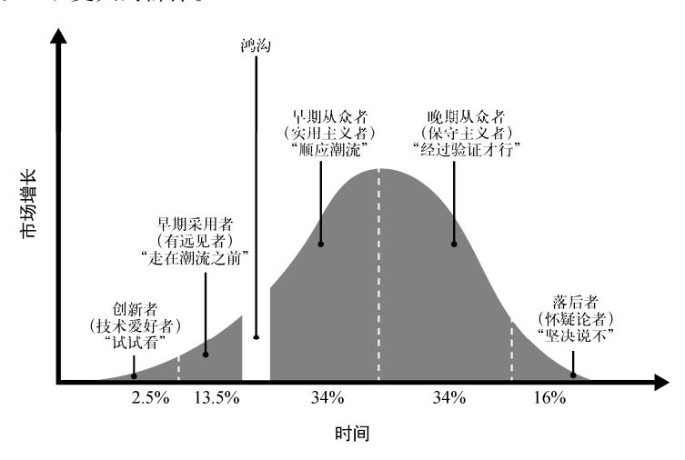

图 5-1 技术采用曲线 (来源:《跨越鸿沟》)

换句话说,创新者和早期采用者往往能迅速接受新的想法,而其他人则较为保守(这些人又 可分为早期从众者、晚期从众者和落后者)。我们的目标是找到那些相信 DevOps 原则和实践, 并有意愿和能力对现有流程进行创新和改进的团队。在理想情况下,这些群体将是 DevOps 转型 的拥趸。

我们不会花费太多时间去改变保守的群体,特别是在早期阶段。相反,应该把精力集中在能 创造成功且愿意承担风险的团队上,并以此为基础慢慢扩大范围(下一节将讨论这个过程)。即 使取得了最高层的支持,也要避免使用"大爆炸"的方式(即遍地开花式的开始),而应该将精 力集中于少数几个试点领域,确保它们取得成功,然后再逐步扩展①。

#### 5.4 扩大 DevOps 的范围

——————————

不管如何选定切入点,都要尽早展示成果,并积极宣传。将大的改进目标分解成渐进式的小 步骤。这样做不但能提高改进速度,还可以在错误选择价值流后及早发现。通过及早发现错误, 团队可以快速回滚和重试,并根据新的经验做出不同的决定。

基于已经取得的成功,逐步扩大 DevOps 计划的应用范围。遵循低风险的顺序,有条不紊地 提高可信度和影响力,并获取支持。以下列表整理自麻省理工学院管理学教授 Roberto Fernandez 博士的课程,介绍了当推进变革时,如何基于已获得的支持扩大影响。

- (1) 发现创新者和早期采用者:一开始,把重点放在真正有意愿改进的团队上。这些同事与 我们志同道合,他们是探索 DevOps 的第一批志愿者。这些同事最好受人尊重,并对组织中的其 他人有着很大的影响力。他们的支持有助于提升创新的可信度。
- (2) 赢得沉默的大多数:在下一阶段,力求将 DevOps 实践扩展到更多的团队和价值流,目标 是建立更稳固的群众基础。通过与接受 DevOps 的团队合作,即便他们并不是最有影响力的团队, 也能对扩大群众基础有所帮助。有了更多的成功之后,就会产生从众效应,进一步增强影响力。 需要谨慎避免与唱反调的人发生冲突。
- (3) 识别"钉子户":所谓"钉子户",是指那些高调的、有影响力的反对者。他们最有可能 抵制(甚至破坏)DevOps 计划。一般来说,只有在获得大多数人的支持并建立起足够稳固的群 众基础后,才考虑如何应对这个群体。

在组织内全面实施 DevOps 绝非易事。转型可能会给个人、部门和整个组织带来风险。Ron van Kemenade 是 ING 集团的首席信息官,帮助该集团成功转型为广为人赞的技术组织。他说过:"变

① 自上而下的大爆炸式转型也不是不可能。PayPal在2012年的敏捷技术转型就是如此,由技术副总裁 Kirsten Wolberg 亲自主导。不过,和任何可持续的成功转型一样,这种转型需要得到最高层的支持,而且需要持续不断地追求各 个阶段必需的成果。

革需要勇气,尤其是当有人不断地挑战和抵制你的时候。但如果从小处做起,就没什么可怕的。 任何领导者都需要勇于分配团队在可控的范围内冒一些险。"

#### 5.5 小结

管理学大师德鲁克说过:"小鱼在小池塘里成为大鱼。"通过谨慎地选择 DevOps 转型的切入 点,我们在组织的某些领域内进行实验、学习并创造价值,但不会给整个组织带来不可逆的后果。 同时,通过这种方式,我们能够建立稳固的群众基础,赢得在组织中推广 DevOps 的机会,从而 获得更多支持者的认可和感激。

## 第6章

# 理解、可视化和运用价值流

一旦确定要应用 DevOps 原则和模式的价值流后,就要深刻理解如何向客户交付价值:做什 么工作?谁来做?该采取什么措施改善流程?

上一章讲述了 Nordstrom 的 Courtney Kissler 领导团队实施 DevOps 转型的案例。Courtney Kissler 和同事根据多年的经验总结出一个开始优化价值流的有效方法,就是和所有核心干系人一 起演练价值流映射,从而帮助团队梳理出创造价值的所有步骤(本章后面会介绍这个演练过程)。

Courtney Kissler 常用一个例子来说明价值流映射的益处。当时,她的团队尝试缩短化妆品业 务管理系统的请求处理周期。该系统是一个 COBOL 大型机应用,为化妆品部的所有门店经理提 供业务支持。

该应用帮助门店经理管理各条产品线的销售人员,跟踪销售提成情况,办理供应商折扣相关 事项等。

以下是 Courtney Kissler 的描述。

我对这个大型机应用非常熟悉,因为在我刚入职的时候,就为它的技术团队提供过 支持。近 10 年来,每当开年度规划会议时,我们都在讨论如何让这个系统迁移出大型 机环境。当然,和大多数组织一样,即使是在得到管理层全面支持的情况下,我们也没 能实施迁移。

我的团队想尝试通过价值流映射演练来判断这个 COBOL 应用是否真的存在问题, 或者还有什么更大的问题需要解决。于是,我们和所有干系人(包括业务合作伙伴、大 型机团队、共享服务团队等)一起举办了一场研讨会。

我们发现,当门店经理提交"产品线分配"请求表单时,系统要求他们输入员工编 号,但大部分情况下他们并不知道编号信息,所以会让那一栏空着或者填写"我不知道"。 更糟糕的是,为了填写这个表单,门店经理不得不离开店面,回到办公室使用计算机完 成提交,结果导致大部分时间都浪费在两头奔波中。

在研讨会期间,参与者尝试了多个解决方案,包括删除表单中的员工编号字段,以及让另一 个部门在随后的处理环节里获取该信息。在门店经理的参与下,这些尝试发现,请求处理时间缩 短了 4 天。后来,团队用 iPad 应用替换了 PC 应用。这样一来,门店经理不需要离开店面就可以 直接提交信息,请求处理时间因而进一步缩短到数秒。

Courtney Kissler 自豪地说:"看到成效之后,再也没有人要求把应用迁移出大型机环境了。 而且,其他部门的业务主管知道这件事后,都纷纷向我们表达了希望能一起探讨优化方案的想法。 业务团队和技术团队的每个成员都兴奋不已,因为他们实实在在地解决了业务问题。更重要的是, 他们在这个过程中得到了成长。"

本章接下来将探讨以下步骤:确定创造客户价值所需的团队;绘制价值流图,把必要的工作 可视化;以价值流图为导向,帮助团队更好、更快速地创造客户价值。通过使用这些方法,我们 就可以复制 Nordstrom 的成功。

#### 6.1 确定创造客户价值所需的团队

Nordstrom 的故事说明,无论价值流的复杂程度如何,其中都没有一个人能够知道为客户创 造价值所要做的每一项工作,尤其是当工作由多个团队完成时。这些团队往往属于不同的部门, 甚至不在同一个办公地点,考核方式也不同。

因此,在选择好 DevOps 试点应用或服务后,必须确定价值流的所有成员,他们有责任共同 为客户创造价值。一般来说,包括以下这些成员。

- 产品负责人:作为业务方的代言人,定义系统需要实现的功能。
- 开发团队:负责开发系统功能。
- QA 团队:给开发团队提供反馈,并确保系统功能符合需求。
- 运维团队:负责维护生产环境,并确保系统能够良好地运行。
- 信息安全团队:负责系统和数据的安全。
- 发布经理:负责管理和协调生产环境部署以及发布流程。
- 技术主管或价值流经理:(根据精益方法论的定义)负责"从始至终地保障价值流的产出 满足或超出客户(和组织)期望"。

#### 6.2 针对团队工作绘制价值流图

确定了价值流的相关成员之后,下一步是深入理解工作方式,并用价值流图进行记录。在价 值流中,最初的工作是确定客户需求或进行业务构思,这由产品负责人完成;然后,开发团队接 手,他们通过编程实现相关功能,并将代码提交到版本控制系统中;接下来,在类生产环境中对 功能进行集成和测试,最后部署到(理想情况下)能为客户创造价值的生产环境中。

在许多传统组织中,上述价值流可能需要数百人参与,包含成百上千个步骤。由于绘制这种 复杂的价值流图需要好几天,因此可以召集所有关键成员,让他们暂停日常工作,来参加持续几 天的研讨会。

绘制价值流图的目标并不是记录所有的步骤和细节,而是识别出阻碍价值流快速流动的环 节,从而缩短前置时间和提高可靠性。在理想情况下,参与研讨会的成员应该有权力改变各自负 责的部分①。

Damon Edwards 是播客节目 DevOps Café 的主持人之一。他是这样描述的:"根据我的经验, 这样的价值流映射演练总是让人大开眼界。很多人通常是第一次看到,为了向客户交付价值,到 底需要完成多少工作。对于运维团队而言,他们可能第一次看到,当开发人员无法获得正确配置 的环境时所产生的后果,以及由此引发的更多的部署工作。对于开发团队而言,他们可能第一次 看到,在自己把特性标记为'完成'之后,仍然要满足测试和运维方面的许多要求才能把代码部 署到生产环境中。"

根据价值流参与团队所提供的全部信息,应该重点分析和优化下面两类工作:

- 需要等待数周甚至数月的工作,例如准备类生产环境、变更审批流程或安全审查流程等;
- 引发或处理重大返工的工作。

价值流图的初始版本应该只包含重要的流程模块。即使是针对复杂的价值流,参与小组通常 也可以在几个小时内绘制出包含 5~15 个模块的价值流图。每个模块至少应包括工作项的前置时 间和处理时间(分别为图 6-1 中的 LT 和 VA②),以及由下游消费者测量的%C/A③。

价值流图中的度量指标可用于指导改进工作。在 Nordstrom 的案例中,他们关注门店经理在 提交请求表单时的低%C/A,因为缺少员工编号信息。其他的情况可能是,当为开发团队搭建和 配置测试环境时,前置时间较长或%C/A 较低;或者在每个软件版本发布前,执行和通过回归测 试的前置时间较长。

一旦确定了想要改进的度量指标,就可以进入分析和度量的下一阶段,以便更好地理解问题。 然后,绘制理想化的价值流图,并以此作为下一阶段(例如,通常 3~12 个月)的改进目标。

领导者帮助确定改进目标,并指导团队就假设和措施集思广益,通过实验探索各种假设,然 后分析结果,以判断假设是否正确。通过不断地重复和迭代,团队把新获得的经验用于下一次实 验和验证。

——————————

① 限制信息的细节程度非常重要,毕竟每个人的时间都很宝贵。

② 在有些情况下,处理时间也叫作增值时间(Value Added Time)。——编者注

③ 相反,也有许多使用了工具而自身的行为并没有发生任何改变的例子,例如,一个组织决定开始使用敏捷规划工 具,但将其用于瀑布式流程,那几乎只能维持现状。

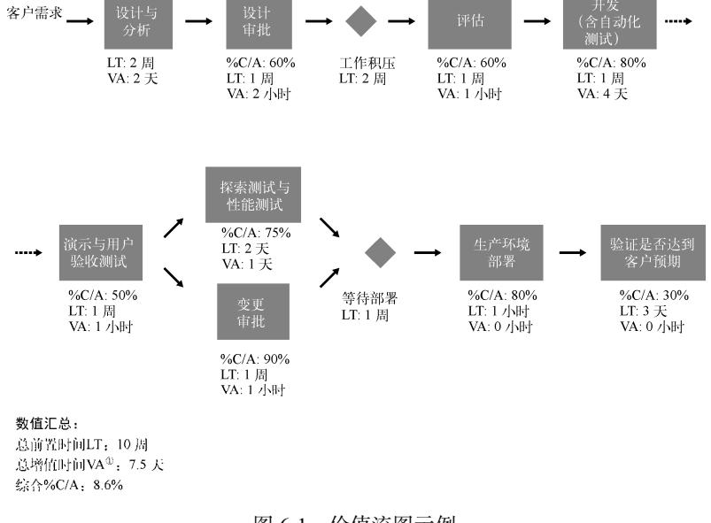

图 6-1 价值流图示例① (来源:《精益企业》②)

#### 6.3 组建专门的转型团队

——————————

DevOps 转型面临的一个固有挑战是与公司当前的业务发生冲突,这不可避免,而且是公司 成功发展的自然结果。任何一个成功运作多年(几年、几十年甚至几百年)的组织都已经建立了 符合自身的实践和运行机制,例如产品开发、订单管理和供应链运营等。

同时,公司还采取各种措施延续和保护当前的运作流程,例如专业化、注重效率和可重复性、 执行审批流程以及防止差异。

虽然这对维持现状很有好处,但为了适应市场的变化,往往需要改变工作方式。这需要颠覆 和创新,必然会和当前负责日常业务和内部流程的群体产生冲突,而且后者往往会胜出。

Vijay Govindarajan 博士和 Chris Trimble 博士都是达特茅斯学院塔克商学院的教授。他们曾在 *The Other Side of Innovation: Solving the Execution Challenge* 一书中描述了如何打破日常运作的惯 性,实现颠覆性创新。他们记录了 Allstate 如何成功开发和销售以客户为导向的汽车保险产品, 《华尔街日报》如何创造盈利的数字出版业务,Timberland 如何开发颇具新意的越野跑鞋,以及

① 图中的增值时间 VA 在有些工作环节里为 0,这并不意味着处理时间为 0,而是指此项工作对于客户和价值流来说 并不增值。——译者注

② 关于《精益企业》,详见 http://www.ituring.com.cn/book/1544。——编者注

宝马公司如何开发第一辆电动汽车。

两位博士的研究成果表明,应该组建专门的转型团队,并使之独立于负责日常运作的部门(他 们称前者为"专职团队",称后者为"绩效引擎")。

最重要的是,这个团队应该负责实现明确定义的、可度量的、系统级的目标(例如,将"从 提交代码到部署至生产环境"这一过程的前置时间减少 50%)。为了做到这一点,应该采取以下 措施:

- 转型团队的成员专门执行 DevOps 转型工作(而不是让他们继续做之前的工作,但要花 20%的时间来做 DevOps 转型);
- 选择熟悉多个领域的通才作为团队成员;
- 选择与其他部门长期保持良好关系的人作为团队成员;
- 如果可能,为团队找一个独立的办公区域,使各位成员尽可能多地相互交流,并和其他 部门保持适当的距离。

如果可能,要将转型团队从诸多现有的规则和规定中解放出来,正如前一章提到的 National Instruments 那样。毕竟,既定的流程属于一种群体意识。专门的转型团队需要创建新的流程,从 而得到想要的结果,创造新的群体意识。

组建专门的转型团队不仅有利于团队本身,而且对"绩效引擎"也有好处。通过让独立的团 队尝试新的实践,组织的其他部门得以避免创新带来的潜在风险。

#### 6.3.1 拥有共同的目标

任何改进计划的首要内容都是为未来 6 个月到 2 年设定可度量的目标。为了实现目标,团队 需要付出相当大的努力,而且目标的实现应该能为整个组织和客户创造出显著的价值。

目标和时限应由管理层确定,并告知组织中所有的人。而且,应该限制同时开展过多的改进 计划,避免组织和管理层负担过重。以下是改进目标的一些例子:

- 把用于产品支持和计划外工作的预算减少 50%;
- 针对 95%的变更,确保将从代码提交到版本发布的周期缩短为一周,甚至更短;
- 确保发布可以在工作时段进行,并且服务不中断;
- 把所有信息安全验证的工作集成到部署流水线中,以满足必需的合规性要求。
- 一旦明确了整体目标,团队就应该制订改进工作的详细计划与节奏。像产品开发工作一样, 转型工作也应该以迭代、增量的方式进行。一般每次迭代在 2~4 周内完成。对于每次迭代,团 队应该制订出一组能够产生价值的小目标,并朝着长期目标靠近。在每次迭代结束时,团队应该 检查进度,并为下一次迭代设定新的目标。

#### 6.3.2 保持小跨度的改进计划

在任何 DevOps 转型项目中,都需要保持小跨度的改进计划,正如创业公司做产品开发或客 户开发一样。应该努力在数周内(最差也应该在数月内)获得可度量的改进成果或者可用的数据。

通过缩短计划跨度和迭代间隔,可以做到以下几点:

- 具备重新计划和更改优先级的能力和灵活性;
- 减少工作从实施到生效的延迟时间,从而加强反馈回路,这将更有可能强化期望的行为—— 初步成功有利于加大投入;
- 从迭代中更快地获得经验,并将其用于下一次迭代;
- 能够更省力地获得改进;
- 在日常工作中更快地实现有意义的差异化改进;
- 降低项目还没有取得成果就被终止的风险。

#### 6.3.3 为非功能性需求预留 20%的开发时间,减少技术债务

如何合理地设置优先级是流程改进工作的一个常见问题。毕竟,急需改进流程的组织大多没 有足够的时间。技术组织则更甚,因为他们还需要偿还技术债务。

当背负沉重的金融债务时,组织只能还利息,从来都无法偿还贷款本金,而且很有可能陷入 连利息都还不起的窘境。同样,无法还清技术债务的组织也会发现,在日常工作中,应付老问题 已经让自己不堪重负,根本无法开展新的工作。换句话说,这些组织目前仅仅是支付技术债务的 利息而已。

为了积极地管理技术债务,要确保至少把 20%的开发和运维时间投入到重构、自动化工作、 架构优化以及非功能性需求(有时也称为"质量属性")上,例如可维护性、可管理性、可扩展 性、可靠性、可测试性、可部署性和安全性等(见图 6-2)。

20 世纪 90 年代后期,eBay 有一次死里逃生的经历。之后,Marty Cagan①写下了关于产品设 计和管理的重要著作《启示录:打造用户喜爱的产品》。他总结了以下内容:

产品负责人和工程师之间的协作是这样的:产品负责人需要考虑把团队 20%的资源 分配给与工程相关的活动,用于重写或重构代码库中有问题的部分,或者工程师认为有 必要改进的部分,从而避免有一天他们对团队说:"我们需要停下来重写所有代码。"如 果情况已经非常糟糕了,那就可能需要投入 30%甚至更多的资源。然而,如果发现团队 认为他们不需要 20%的资源就能做这些事情,我会感到非常担心。

——————————

① Marty Cagan 曾任 eBay 产品与设计高级副总裁。——编者注

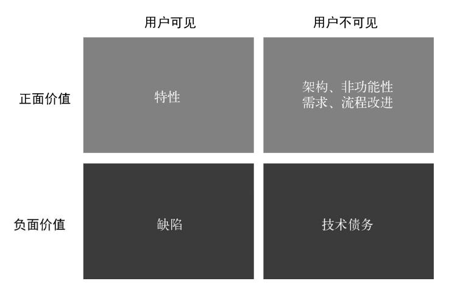

图 6-2 将 20%的时间用于创造用户不可见的正面价值

(来源:播客 Software Engineering Daily 于 2015 年 11 月 17 日播出的节目"D. Sculley 的机器学习和技术债务"①)

Marty Cagan 指出,如果组织不愿意支付这"20%的税",那么技术债务将会最终恶化到耗尽 所有可用资源的程度。终有一天,服务会变得不堪一击,特性交付将停滞不前,所有工程师都在 解决可靠性问题或者寻求临时方案。

通过这 20%的投入,开发人员和运维人员可以为日常工作中所遇到的问题提供长久的对策, 并保证技术债务不会妨碍快速、安全地开发和运营。同时,缓解员工的技术债务压力也可以降低 工作倦怠程度。

#### **\*** 案例研究 **\***

LinkedIn 的"反转行动"(2011 年)

LinkedIn 的"反转行动"(Operation InVersion)是一个有趣的案例,它证明了为什 么要把偿还技术债务作为日常工作的一部分。2011 年,LinkedIn 成功进行了 IPO。但半 年过去了,公司依然在部署问题上苦苦挣扎。于是,他们启动了"反转行动",在两个 月内,停止所有特性开发,并对计算环境、部署和架构进行全面的优化。

LinkedIn 成立于 2003 年,其目标是帮助用户"建立社交网络,以获得更好的就业 机会"。网站在上线后的第一周就获得了 2700 名会员。一年后,会员数超过了 100 万, 并呈指数级增长。截至 2015 年 11 月,LinkedIn 已经拥有超过 3.5 亿名会员,用户每秒 产生数万次请求,后台系统每秒要处理数百万次查询。

起初,LinkedIn 主要运行在自己开发的应用 Leo 上,这是一个单体 Java 应用,通过

——————————

① http://softwareengineeringdaily.com/2015/11/17/machine-learning-and-technical-debt-with-d-sculley/

servlet 服务每个页面,并使用 JDBC 连接后台的 Oracle 数据库。然而,早年为了跟上不 断激增的流量,团队从 Leo 中解耦了两个关键服务:一个是在内存中处理会员连接关系 的查询,另一个是以这个查询为基础进行会员搜索。

截至 2010 年,大多数新开发的特性都以新的服务部署,已经有近百个服务独立于 Leo 运行。但 Leo 本身还是只能每两周部署一次。

LinkedIn 的高级工程经理 Josh Clemm 说,Leo 在 2010 年面临重大挑战。尽管使用 了添加内存和 CPU 的垂直扩容方式,"但在生产环境中,Leo 还是会经常崩溃,并且很 难进行故障排除和恢复,发布新特性也非常困难……很显然,我们需要'终结 Leo', 并将它拆分成许多个有一定功能的小型无状态服务"。

Bloomberg 的记者 Ashlee Vance 在 2013 年描述道:"当 LinkedIn 试图同时发布许多 新特性时,网站经常会崩溃,工程师需要加班到深夜去解决问题。"到 2011 年秋天,工 程师对挑灯夜战已经习以为常。LinkedIn 的一批顶级工程师,包括在 IPO 前 3 个月加入 公司的工程副总裁 Kevin Scott,决定彻底停止新特性的开发工作,把整个部门投入到整 顿网站核心基础设施中去,这被称为"反转行动"。

Kevin Scott 发起"反转行动"的目的是将其"作为一个文化宣言注入团队文化。在 LinkedIn 的系统架构被重构之前,不做任何新特性开发——这是公司和团队需要做的"。

他这样描述其中的压力:"上市以后,所有人都盯着我们,而我们却告诉管理层, 所有的工程师在未来两个月里不会发布任何新特性,他们要全身心投入'反转行动'。 这确实是一件很恐怖的事情。"

然而,Ashlee Vance 却描述了"反转行动"的巨大成果:"LinkedIn 创建了一整套有 助于代码开发的软件和工具。从那以后,新特性不再需要等上好几周才能上线。在工程 师开发完一个新服务后,会有一系列的自动化检查机制,去测试它与现有特性的交互是 否会有潜在问题,然后直接将其发布到 LinkedIn 网站。现在,LinkedIn 的工程师每天将 网站进行 3 次重要升级。"通过建立一套更安全的工作系统,他们不再需要挑灯夜战, 反而有了更多的时间开发富有创意的新特性。

Josh Clemm 在提到 LinkedIn 的规模化时写道:"规模化的效果能在许多维度上进行 度量,包括组织层面。'反转行动'使整个开发部门都专注于改进工具、部署流程、基 础设施和开发人员的生产力。它成功地实现了我们所需的工程敏捷性,从而让我们今天 能够规模化地构建新产品。2010 年,我们已经有超过 150 个独立的服务。今天,我们的 服务超过 750 个。"

Kevin Scott 说:"不管是个人目标,还是团队目标,都是帮助公司盈利。如果你有 机会领导工程师团队,最好从 CEO 的角度看问题,透彻理解公司、业务、市场、竞争 环境需要什么,并将这些理解应用到你的团队中,帮助公司赢得市场。"

通过偿还近 10 年的技术债务,LinkedIn 的"反转行动"实现了稳定性和安全性, 同时为公司下一阶段的成长奠定了基础。然而,它花费了两个月处理非功能性需求,并 以牺牲在 IPO 时向市场承诺的特性为代价。通过在日常工作中发现和解决问题,能有效 地管理技术债务,避免"背水一战"。

#### 6.3.4 提高工作的可视化程度

为了能够明确团队是否正朝着既定目标前进,组织中的每个人都有必要了解当前的工作状 态。将状态进行可视化的方法有很多,最重要的是有效展示最新状态,而且要不断修订,以确保 团队了解最新进展。

下一节将讨论一些模式,帮助实现跨团队及跨职能的可视性和一致性。

#### 6.4 用工具强化预期行为

软件开发高管 Christopher Little 是 DevOps 最早的支持者之一。他指出:"人类学家将工具描 述为一种文化产物。针对人类学会用火之后的文化进行的任何讨论也都和工具有关。"同样,在 DevOps 价值流中,我们也要使用工具来强化文化,并加速实现行为的改变。

我们的目标是强调,开发人员和运维人员不仅有着共同的目标,而且还有同一份任务列表。 在理想情况下,任务列表存储在公共的工作系统中,使用统一的术语,并能全局地进行优先级排序。

采用这种方式,开发人员和运维人员可以创建共享的工作队列,而不是使用不同的工具(例 如,开发人员使用 JIRA,运维人员则使用 ServiceNow)。这样做的显著好处是,当生产事故在开 发人员的工作系统中可见时,人们能清楚地知道事故会在什么时候影响到其他工作,这在使用看 板图时尤为明显。

共享队列的另一个好处是统一了任务列表,每个人都能从全局的角度思考优先级最高的事 情,选择对组织最有价值的工作,或能最大限度地偿还技术债务的工作。在发现技术债务时,如 果不能立即解决,可以将它添加到任务列表中。对于待解决的问题,可以使用为非功能性需求预 留的 20%的时间进行修复。

为了强化共同目标,也可以使用聊天室,例如 IRC 频道、HipChat、Campfire、Slack、Flowdock 和 OpenFire。聊天室可以实现信息的快速共享(而不是通过预定义的工作流处理表单),能够按 需邀请他人加入聊天,能自动记录聊天内容,并且可以在事后对其进行分析。

建立机制并允许团队成员互相帮助,甚至帮助其他团队的成员。这将带来惊人的变化——人

们获取信息的时间或完成工作的时间从几天缩短到几分钟。此外,因为一切都被有效地记录下来, 所以人们之后不再需要向别人求助,而只需要搜索聊天记录即可。

不过,聊天室的快速交流环境也可能存在缺点。Rally 软件公司的创始人兼首席技术官 Ryan Martens 指出:"在聊天室里,如果提问的同事几分钟内没有得到答案,那么他完全可能再次提问, 直到得到想要的答案。"

但是,这种希望立即得到回复的心情会导致一些问题。反复地打断和提问会干扰其他人的正 常工作。因此,团队可以根据具体情况针对某些类型的需求使用更结构化的异步工具。

#### 6.5 小结

本章探讨了如何确定支持价值流的团队,并通过绘制价值流图了解到了向客户交付价值所要 做的工作。价值流图不仅可以显示当前工作状态的基本情况(包括前置时间和 %C/A 等指标), 还可以指导团队确定未来的改进目标。

这样一来,转型团队能够快速迭代,通过实验提高效能。团队分配足够的时间修复已知缺陷 和解决架构问题,包括非功能性需求等。针对 Nordstrom 和 LinkedIn 的案例研究表明,通过在价 值流中发现问题并持续偿还技术债务,前置时间和质量等各个方面都能取得显著改善。

## 第7章

# 参考康威定律设计组织结构

在前面两章中,我们选择了合适的价值流作为 DevOps 转型的切入点,并且确定了共同的目 标和实践,帮助专门的转型团队优化向客户交付价值的方法。

本章将探究如何调整组织结构,从而实现价值流的目标。毕竟,团队的组织方式会影响工作 方式。1968 年,康威博士与一家合同外包服务机构做了一个著名的实验。他们委派 8 人开发一个 COBOL 编译器和一个 ALGOL 编译器。康威在他的论文中写道:"在对工作难度和工作时间进行 了初步评估以后,其中 5 人被分配到了 COBOL 开发小组,剩余 3 人被分配到了 ALGOL 开发小 组。结果是,COBOL 编译器有 5 个执行阶段,ALGOL 编译器则有 3 个。"

之后,康威提出了著名的康威定律。他指出:"系统设计受限于组织自身的沟通结构。组织 的规模越大,灵活性就越差,这种现象也就越明显。"《大教堂与集市》的作者 Eric S. Raymond 在他的"黑客字典"中总结出一个更简单(而且现在更有名)的康威定律:"软件的架构和软件 团队的结构是一致的,说白了就是'如果让 4 个团队开发同一个编译器,那么编译器最后会有 4 个执行阶段'。"

换句话说,软件开发团队的结构对软件产品的架构和成果有着巨大的影响。为了使工作从开发 到运维快速地流动,并保证产品质量和客户满意度,必须利用康威定律发挥团队的优势,并灵活 地组织团队。相反,如果不理解康威定律,就会妨碍团队安全和独立地工作,他们会被紧紧地耦 合在一起,所有工作都相互依赖和等待,即使是很小的变更都有可能导致全局性和灾难性的后果。

康威定律是如何削弱或强化成果的呢?从 Etsy 开发的 Sprouter 技术中,我们可以看到这样一 个例子。Etsy 的 DevOps 之旅始于 2009 年,该公司 2014 年的营收近 2 亿美元,在 2015 年成功上 市,是业界公认的 DevOps 最佳实践组织之一。

Sprouter 诞生于 2007 年,它与人员、流程和技术都密切相关,可是结果很不理想。Sprouter 是 Stored Procedure Router(存储过程路由)的缩写,它的设计初衷是使开发人员和数据库团队更 有效地合作。正如 Etsy 的高级工程师 Ross Snyder 在 2011 年的 Surge 大会上所说:"Sprouter 的设 计初衷是,让开发团队在应用程序中编写 PHP 代码,让 DBA 在 Postgres 数据库中编写 SQL 语句, 通过 Sprouter 让双方协作。"

——————————

Sprouter 处在前端 PHP 应用和 Postgres 数据库之间,前端通过它集中式地访问数据库,从而 在应用层隐藏对数据库访问的逻辑。但是,对业务逻辑所做的任何变更都会导致开发团队和数据 库团队之间出现严重的冲突。正如 Ross Snyder 所说:"对于网站的任何一个新功能,Sprouter 都 会要求 DBA 编写一个新的存储过程。因此,开发团队在添加任何新功能的时候,都要依赖于数 据库团队。在通常情况下,开发团队需要先走完繁琐的流程之后才能开展工作。"也就是说,添 加新功能的开发团队依赖于数据库团队,所以要和数据库团队一起来排工作的优先级、沟通和协 调,这样就导致开发工作面临等待、无休止的会议、漫长的交付时间等。正是由于 Sprouter 的存 在,开发团队和数据库团队之间形成了紧耦合的依赖关系,这阻碍了开发人员独立地进行开发、 测试和部署代码。

此外,由于数据库存储过程和 Sprouter 也是紧耦合的(每当存储过程变更时,Sprouter 也需 要进行相应的变更),因此 Sprouter 成为了越来越严重的单点故障。Ross Snyder 解释说,由于耦合 关系过于紧密,因此双方需要保持高度同步,最后导致每次部署几乎都会造成小规模的服务中断。

Sprouter 的相关问题以及最终的解决方案都可以通过康威定律来解释。起初,Etsy 的开发团 队和数据库团队分别负责应用层和存储过程层。正如康威定律所预测的那样,两个团队工作在两 个层面上。Sprouter 的目标是使两个团队的工作更容易,但实际上却背道而驰——当业务规则发 生变化时,他们不是变更两层,而是 3 层(应用层、存储过程层以及 Sprouter 本身)。由于在 3 个团队之间做协调和排优先级非常繁琐,因此这种方式严重地拖延了交付时间,还引发了可靠性 问题。

2008 年 9 月,Chad Dickerson 加入 Etsy 并任首席技术官。他为 Etsy 的公司文化带来了重大 变化,Ross Snyder 称这些变化为"伟大的 Etsy 文化转型"。Chad Dickerson 做了许多工作,包括 投入巨大的资源用于提升网站的稳定性,允许开发人员直接在生产环境中部署代码,以及在两年 之内消除公司对 Sprouter 的依赖并最终弃用它。

为了消除对 Sprouter 的依赖,团队决定将所有业务逻辑从数据库层迁移到应用层。他们组建 了一个小组,负责编写 PHP 对象关系映射(Object Relational Mapping,ORM)层①,使前端开发 人员能够直接调用访问数据库的接口,同时将变更业务逻辑所需的团队数量从 3个减少到了 1个。

Ross Snyder说道:"我们开始针对网站的新功能使用ORM,同时将已有的功能逐渐从 Sprouter 迁移到 ORM。我们花了两年时间才将全部功能迁移出 Sprouter。虽然在整个过程中大家都在抱 怨 Sprouter,但它一直处于生产环境中。"

通过消除对 Sprouter 的依赖,他们也消除了由于业务逻辑变更而导致的团队协作问题,减少 了工作交接次数,显著提升了生产环境部署的速度和成功率,提高了网站的稳定性。此外,由于

① ORM 有很多特性,它抽象了数据库,使开发人员能够执行查询和数据操作,就好像它们只不过是编程语言中的 对象而已。流行的 ORM 包括 Java 的 Hibernate、Python 的 SQLAlchemy,以及 Ruby on Rails 的 ActiveRecord。

小团队可以独立地开发和部署代码,不再需要别的团队在系统里做变更,因此开发人员的生产力 也得到了显著提高。

2011 年初,Sprouter 终于从 Etsy 的生产环境和版本控制库中消失了。Ross Snyder 如释重负 地说:"哇,这种感觉真好!"①

正如 Ross Snyder 和 Etsy 所经历的那样,组织结构决定了工作方式和工作成果。本章接下来将 探讨康威定律如何对价值流的绩效产生负面影响,更重要的是,如何利用康威定律设计团队结构。

#### 7.1 组织原型

在决策科学领域,主要有 3 种组织结构类型:职能型、矩阵型和市场型。它们可以作为利用 康威定律设计 DevOps 价值流的参考。Roberto Fernandez 博士对这 3 种类型作了如下定义。

- 职能型组织结构注重提高专业技能、优化分工或降低成本。这些组织以专业技能为中心, 有助于促进职业发展和技能发展,并且通常具有多层次的组织结构。运维部门通常采用 这种组织结构(即服务器管理员、网络管理员和数据库管理员等都被划分成单独的小组)。
- 矩阵型组织结构试图结合职能型和市场型。然而,正如许多管理矩阵型组织或身处其中 的人所看到的那样,这种组织结构通常都非常复杂。例如,一名员工可能需要向两个甚 至更多的经理汇报。有时,矩阵型组织既实现不了职能型结构的目标,也实现不了市场 型结构的目标。
- 市场型组织结构注重快速响应客户需求。这种组织往往有着扁平化的结构,由多个跨职 能的部门组成(例如市场营销部门和工程技术部门等),整个组织可能往往存在冗余现象。 很多实施 DevOps 的杰出组织采用了这种结构。举两个极端的例子。在亚马逊和 Netflix, 每个服务团队不仅要负责特性的交付,而且还要负责服务支持。②

了解上述 3 种组织结构类型之后,让我们进一步探讨过度地以职能为导向(尤其是在运维部 门)为何会给技术价值流造成负面影响,就像康威定律所预测的那样。

#### 7.2 过度职能导向的危害("成本优化")

传统的 IT 运维组织往往采用职能型结构,根据专业领域组织团队。数据库管理员被归在一 组,网络管理员被归在另一组,服务器管理员被归在第 3 组,等等。这种方式显然会延长交付周 期,特别是在像大规模部署这样复杂的活动中,不得不向多个团队发出一堆工单并且对工作的交 接情况进行协调,这导致每一个步骤都面临长时间等待。

——————————

① Etsy 在转型过程中弃用了许多技术,Sprouter 只是其中之一。

② 然而,正如后面要讲的那样,如 Etsy 和 GitHub 这些同样杰出的组织却以职能为导向。

让问题变得更复杂的是,执行工作的人通常都不太理解自己的工作与价值流目标有什么关系 ("我之所以要配置这台服务器,是因为别人要我这么做")。这样就无法让员工发挥创造性和主 动性。

如果运维部门的每个职能团队都要同时服务于多个价值流(即多个开发团队),那么问题更 是雪上加霜,因为所有团队的时间都很宝贵。为了使开发团队及时完成工作,运维部门常常不得 不将问题反映到管理层,从经理、总监一直到决策者(通常是总经理),再由决策者按照组织的 全局目标(而不是局部目标)为工作安排优先级。然后,决策再逐级下达至各个职能部门,最后 调整局部的优先级,而这又会降低其他团队的速度。每个团队都在加速工作,而最终的结果却是 所有项目都以同样缓慢的速度向前推进。

除了导致长时间等待和交付周期延长以外,这种情况也会导致糟糕的交接、大量的返工、交 付质量下降、瓶颈和延期等问题。

这种僵局阻碍了组织实现重要目标,而实现这些目标的意义却远远地超过降低成本的愿望。①

同样,职能导向在集中式的 QA 部门和信息安全部门里也很常见,这对于那些无需进行频繁 交付的软件来说可能没有问题(或者说至少能够满足需求)。然而,随着开发团队数量、部署频 率及发布频率的增加,大多数职能型组织将很难维持和交付使人满意的成果,尤其是在工作需要 手动完成时更是如此。接下来,我们将研究市场型组织如何运作。

#### 7.3 组建以市场为导向的团队("速度优化")

——————————

一般来说,为了实现 DevOps,不但要减少职能导向("成本优化")的负面影响,而且还要 更好地运用市场导向("速度优化")的效果,从而使很多小团队能够安全、独立地工作,并快速 地向客户交付价值。

在极端情况下,以市场为导向的团队不但要负责特性开发,而且在整个应用生命周期中还要 负责测试、安全、部署和生产环境的运维。这些跨职能团队可以独立运作——能够设计和开展用 户实验,构建和交付新特性,在生产环境中部署并运行服务,不依赖于其他团队就能修复任何缺 陷,从而加快行动的步伐。亚马逊和 Netflix 正是采用了这种模式,这也是亚马逊快速发展的一 个主要原因。

为了实现以市场为导向,不需要进行自上而下的大规模重组,那样往往会造成大范围的破坏、 恐惧和停滞。相反,将工程师及其专业技能(例如运维、QA 和信息安全)嵌入每个服务团队, 或者向团队提供自助服务平台,其功能包括配置类生产环境、执行自动化测试或进行部署。

① Adrian Cockcroft 说:"对于那些 5 年 IT 外包合同快到期的公司来说,时间好像凝固了。外部世界的技术正在突飞 猛进,而他们却寸步难行。"换句话说,IT 外包是一种通过合同控制成本的策略,合同标有固定的价格。但这经 常导致组织无法响应不断变化的业务需求和技术需求。

这使每个服务团队能够独立地向客户交付价值,而不必提交工单给 IT 运维、QA 或信息安全 等其他部门。①

#### 7.4 使职能导向有效

——————————

前一节建议组建以市场为导向的团队,但值得一提的是,职能导向也可以成就高效运转的组 织(见图 7-1)。组建跨职能和以市场为导向的团队是实现快速流动和可靠性的一种方式,但并不 是唯一的方式。只要价值流中的所有人都能意识到客户和组织的目标,不管他们在组织中处于什 么位置,都可以通过职能导向取得所预期的 DevOps 成果。

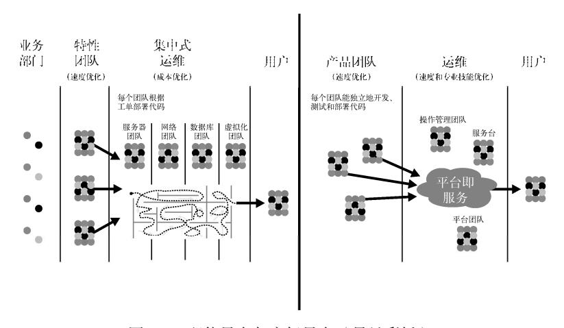

图 7-1 职能导向与市场导向(另见彩插)

左侧为职能导向:所有工作流经集中式 IT 运维团队;右侧为市场导向:所有产品团队能以自助的方式 向生产环境部署松耦合的组件(来源:《精益企业》Kindle 版)

例如,只要服务团队能够快速(最好是按需)从运维团队获得可靠的帮助,那么集中式的职 能型运维组织也可以实现高效运转,反之亦然。包括谷歌、Etsy 和 GitHub 在内的许多著名 DevOps 公司都保留了职能型运维团队。

这些组织的共同之处是拥有高度信任的文化,所有部门都能够有效地协作,所有工作的优先 级设置都是透明的,并且系统预留了足够的容量,能够迅速完成高优先级的工作。这在某种程度 上是依靠自动化的自助服务平台实现的,它保证了产品质量。

在 20 世纪 80 年代的精益制造运动中,许多研究人员对丰田的职能导向感到困惑,因为这与 市场型跨职能团队的最佳实践并不相符。他们甚至为此起了一个名字:"丰田第二悖论"。

① 本书将交替使用服务团队、特性团队、产品团队、开发团队和交付团队这些词。目的是特指服务团队主要从事开 发、测试和保护代码,从而将价值交付给客户。

Mike Rother 在《丰田套路》一书中写道:"尽管看似诱人,但其实无法通过重组的方式获得 持续的改进和适应性。起决定性作用的并不是组织形式,而是人们的行为和反应。丰田成功的根 本原因不在于其组织结构,而在于它的发展能力和员工的工作习惯。实际上,令许多人感到惊讶 的是,丰田大体上是由传统的职能部门构成的。"这种发展能力和员工的工作习惯是下面几节的 重点。

#### 7.5 将测试、运维和信息安全融入日常工作

在高效能组织中,人们有着共同的目标。保证质量、可用性和安全性不是某个部门的职责, 而是所有人日常工作的一部分。

这意味着一天中最紧要的工作可能是开发或部署面向客户的新特性,或者处理严重的生产事 故;也可能是评审同事的代码变更,为生产服务器紧急打安全补丁,或者采取能帮助其他工程师 提高效率的优化措施。

在谈到开发和运维的共同目标时,Ticketmaster 的首席技术官 Jody Mulkey 说:"在过去近 25 年的时间里,我一直用美式橄榄球比赛来比喻 Dev 和 Ops。其中,Ops 是防守组,试图阻止对方 得分;Dev 则是进攻组,其目标是尽全力得分。而有一天,我突然意识到这个比喻并不恰当,因 为 Dev 和 Ops 从来没有在同一时间出现在球场上,他们实际上不属于同一个团队!"

他继续说道:"我现在用的比喻是,Ops 是进攻内锋,Dev 则负责重要位置(如四分卫或外 接手)。Dev 的工作是持球冲锋,Ops 的工作则是保证 Dev 有足够的时间向前冲。"

共同的痛点可以强化团队的共同目标。一个经典的案例是 Facebook。2009 年,Facebook 正 经历着飞速的增长,同时在代码部署方面也遇到了重大问题。虽然并非所有问题都会直接影响到 客户,但团队始终处于没完没了的救火状态中。生产工程总监 Pedro Canahuati 描述了这样一次会 议:与会人员全是运维工程师;有人提议除了正在处理故障的人以外,其他所有人都合上笔记本 电脑,但是没有一个人能做到。

为了提升部署效率,Facebook 采取的最有效的一个措施就是让所有工程师、工程经理和架构 师轮流值班,负责他们自己构建的服务的运维工作。通过这样做,所有构建服务的人都对自己在 上游所负责的架构和代码有了亲身的感受,这对下游的工作产生了巨大的积极影响。

#### 7.6 使团队成员都成为通才

在极端情况下,职能型运维组织的各个部门都拥有各自的专业人员,比如网络管理员、存储 管理员等。当这些部门过于专业化时,就会产生筒仓。Steven Spear 博士描述说,这样的专业化 部门"更像国家一样"。任何复杂的运维活动都需要在基础设施的不同部分之间多次交接和排队,

**7** 

这导致交付时间推迟(例如,每次网络变更都必须由网络部门的某个人实施)。

因为我们依赖的技术越来越多,所以在每个技术领域里,都需要有足够专业和精深的工程师。 然而,我们并不想看到他们停滞不前,或者只能为价值流的特定领域做贡献。

一种对策是让每一位团队成员都成为通才(见表 7-1)。给工程师提供学习必要技能的机会, 让他们有能力构建和运行所负责的系统,并定期让他们在不同的职位间轮岗。全栈工程师这个术 语现在通常是指那些熟悉或至少大致理解整个应用栈(例如代码、数据库、操作系统、网络和云) 的通才。

| I 型(专家)      | T 型(通才)      | E 型                    |
|--------------|--------------|------------------------|
| 精通某个领域       | 精通某个领域       | 精通某几个领域                |
| 其他领域的技能或经验很少 | 拥有很多领域的技能    | 有多个领域的实践经验,执行能力强,能持续创新 |
| 很快遇到瓶颈       | 能突破瓶颈        | 潜力无限                   |
| 对下游的浪费和影响不敏感 | 对下游的浪费和影响敏感  |                        |
| 抵制灵活或可变的计划   | 帮助制订灵活和可变的计划 |                        |

表 7-1 专家、通才与 E 型人才①

(来源:Scott Prugh 的"持续交付"一文,ScaledAgileFramework.com,2013 年 2 月 14 日,http://www.scaledagileframework.com/ guidance-continuous-delivery/)

Scott Prugh 写道,CSG 国际经历了一次重大转型,他们把构建和运行产品所需的大部分资源 都整合到了一个团队中,包括需求分析人员、架构师、开发人员、测试人员和运维人员。他说: "通过交叉培训和提高相关技能,通才能比专业人才做更多的工作,同时通过减少队列中的任务 和等待时间改善整体工作流程。"这种做法与传统的聘用方式不一致,但正如 Scott Prugh 所说, 这是非常值得的:"传统的经理常常会反对聘用通才型工程师,认为成本更高:'聘用一个通才型 运维工程师的钱都够用来聘用两个服务器管理员了。'"然而,更快的工作流所产生的商业价值是 巨大的。此外,正如 Scott Prugh 所说,"多技能交叉培训非常有利于员工的职业发展,也能让所 有员工的工作变得更有意思"。

如果仅仅看重员工现有的技能或成绩,而不考虑他们获取新技能的能力,就会(通常是不经 意间)陷入 Carol Dweck 博士所说的"固定型思维模式",把员工的智慧和能力看作不可改变的 "禀赋"。

相反,我们希望鼓励员工学习,帮助员工克服学习焦虑和获得相关技能,并让他们明确地规 划职业生涯,等等。这样做有助于培养员工的成长型思维模式——毕竟,学习型组织需要的是愿 意学习的人。通过鼓励每位员工积极学习并为其提供培训和支持,我们将以可持续性最强、成本 最低的方式造就强大的团队。

——————————

① E 型人才是指在经验、专业、探索能力和执行能力 4 个方面都表现突出的人。——编者注

迪士尼的系统工程总监 Jason Cox 说:"运维界必须改变招聘方式。我们寻找有好奇心、有勇 气和坦率的人,他们不仅能够成为通才,而且还能引领变革……我们希望促进积极的变革,使业 务不会陷入困境,从而走向未来。"下一节将讨论投资模式如何影响团队的工作结果。

#### 7.7 投资于服务和产品,而非项目

实现高绩效的另一种方法是组建稳定的服务团队,持续提供资金,让他们执行自己的战略 和计划。这些团队应该有工程师专门负责兑现对内部或外部客户的具体承诺,如特性、故事和任 务等。

在传统的开发模型中,开发团队和测试团队被分配到某一个项目中;当项目完成或资金耗尽 后,团队解散,他们又被重新分配到另一个项目中。这种方式导致很多不尽如人意的结果,包括 开发人员无法看到他们所做决策的长期效果(一种反馈形式),以及投资模式只注重和支付软件 生命周期的初始阶段(不幸的是,对于成功的产品或服务而言,初始阶段是成本最低的阶段)。①

基于产品的投资模式注重组织成绩和客户成果,包括公司营收、客户终身价值,以及客户采 用率,同时尽可能减少付出(如时间和精力、代码行数等)。与之形成鲜明对比的是传统项目的 衡量指标,譬如项目是否在既定的预算、时间和范围内完成。

#### 7.8 根据康威定律设定团队边界

——————————

随着组织的发展,保持人员和团队之间的有效沟通和协作成为最大的一个挑战。通常,当团 队处于不同的楼层、不同的办公楼甚至不同的时区时,建立并维持共同目标和相互信任变得更加 困难,这不利于有效协作。当主要的沟通机制是工单或变更请求时,团队协作很难有效地进行。 更糟糕的是,合同有时限制了团队协作,例如具体的工作由外包团队完成。

正如我们在本章开头看到的Etsy Sprouter的例子,不合理的团队组织方式可能产生不良后果, 这就是康威定律的副作用。这些不当的方式包括按职能划分团队(例如将开发人员和测试人员安 置在不同的办公地点,或者完全外包测试人员),以及按架构层次拆分团队(如应用层、数据库 层等)。

不当的组织方式需要各个团队进行大量的沟通和协调,但仍然可能导致大量返工、对需求定 义有分歧、工作交接低效,以及由于等待上游人员完工而造成的人员闲置等。

在理想情况下,软件的架构应该保证小团队能够独立运作,彼此充分解耦,从而避免过多不 必要的沟通和协调。

① 正如 Roche Bros.连锁超市的信息技术副总裁 John Lauderbach 所说:"每一个新的应用就像是免费领养的一只小狗。 要命的不是前期成本,而是持续的维护和支持。"

#### 7.9 创建松耦合架构,提高生产力和安全性

在紧耦合的软件架构中,即使是微小的变更也可能导致大规模的故障。因此,负责某个组件的 开发人员不得不和负责其他组件的开发人员不断地协调与沟通,包括走各种复杂的变更管理流程。

此外,为了测试整个系统是否能工作,需要集成数百个甚至数千个开发人员的代码变更,而 这些开发人员的代码变更可能又依赖于数十个、数百个甚至数千个其他系统。另外,测试需要在 稀缺的集成测试环境中完成,这些环境通常需要花费数周安装和配置。结果不仅延长了交付周期 (交付周期通常是几周或几个月),还导致开发人员的生产力低下和部署质量不佳。

相反,如果架构能够支持小团队独立、安全、快速地进行开发、测试和部署,就可以提高和 维持开发人员的生产力,并改善部署质量。面向服务架构(Service-Oriented Architecture,SOA) 就具有这种特征。面向服务架构这一概念在 20 世纪 90 年代被提出,它是一种支持独立测试和部 署服务的架构方式,其典型特征是由具有限界上下文的松耦合服务组成。①

松耦合的架构意味着在生产环境中可以独立更新某一项服务,而无需更新其他服务。该服务 必须与其他服务以及共享数据库解耦(可以共享数据库服务,但需要保证它们没有共同的数据库 模式)。

限界上下文(bounded context)是 Eric Evans 在《领域驱动设计》②一书中提出的概念。其思 路是开发人员应该能够理解和更新服务的代码,而不必知道其对等服务的内部逻辑。各服务严格 通过 API 交互,因此不必共享数据结构、数据库模式或对象的其他内部表示。限界上下文确保服 务被划分成独立的部分,并具有明确定义的接口,这也使测试更加容易。

谷歌应用引擎的前技术总监 Randy Shoup 指出:"采用面向服务架构的组织(如谷歌和亚马 逊)具有卓越的灵活性和可扩展性。这些组织有成千上万的开发人员,但小团队仍然能够产生惊 人的生产力。"

#### 保持小规模("两个比萨原则")

康威定律帮助我们根据期望的沟通模式设定团队边界,但也鼓励缩小团队规模,减少团队间 的沟通,并保持团队的专业领域小且有界限。

2002 年,亚马逊在试图脱离单一代码库的转型过程中利用"两个比萨原则"保持团队规模 小型化——两个比萨够团队的所有成员吃,这样的团队通常有 5~10 人。

这种规模限制有以下 4 个重要作用。

——————————

① 基于面向服务架构原则的微服务也具有这种特征。基于这些原则的现代 Web 架构模式的一个典型应用是"十二要 素应用"。

② 关于《领域驱动设计》,详见 http://www.ituring.com.cn/book/106。——编者注

- (1) 它确保团队成员对系统有清晰、相同的理解。当团队规模变大时,如果要让所有人都了 解系统状况,需要沟通的信息量就会成倍增加。
- (2) 它限制正在开发的产品或服务的增长率。通过限制团队的规模,系统的发展速度也受到 限制,这也有助于保证团队成员对系统有相同的理解。
- (3) 它分散权力并实现自主。每个"双比萨"团队都尽可能地自主工作。团队负责人直接向 管理层汇报,由他决定团队负责的关键业务指标(又称适应度函数),并将其作为团队实践的总 体评估标准。然后,团队能够自主采取行动来最大限度地提升该指标。①
- (4) 领导"双比萨"团队是让员工获得领导经验的一种方式。在这样的环境中,即使失败了 也不会有灾难性后果。亚马逊的策略有一个关键要素,即"双比萨"团队的组织结构与面向服务 架构之间的联系。

2005 年,亚马逊的首席技术官 Werner Vogels 向 *Baseline* 杂志的 Larry Dignan 解释了这种组 织结构的优势。Larry Dignan 随后写道:

"小团队运作高效……而且不会因为所谓的行政琐事而停滞不前……每个团队全面 负责自己分到的某一特定业务……确定工作范围、设计、构建、实现,而且还要监控并 确保服务能持续运行。这样一来,程序员和架构师能够通过定期会议及非正式的谈话从 他们的用户(业务人员)那里直接获得反馈。"

另外一个关于组织结构可以极大提高生产力的案例是塔吉特公司的"API 启用"项目。

#### **\*** 案例研究 **\***

#### 塔吉特公司的"API 启用"项目(2015 年)

塔吉特是美国第六大零售商,每年在技术方面的投资超过 10 亿美元。塔吉特的开 发总监 Heather Mickman 在描述公司如何踏上 DevOps 之旅时说道:"在那些糟糕的日子 里,我们一度需要 10 个团队协作置备一台服务器。当出现问题时,我们倾向于停止所 有变更,以防问题进一步恶化,然而这使得情况变得更糟。"

搭建环境和执行部署等相关工作给开发团队带来了很大的困难,获取所需的数据也 很困难。正如 Heather Mickman 所说:

我们的大部分核心数据,如存货信息、定价信息和门店信息,都被锁定在 遗留系统和大型机中。这就是问题。电商系统和实体店之间经常存在不同版本 的数据,由不同的团队管理,它们的数据结构和业务优先级都不同……如果一

——————————

① 在 Netflix 的企业文化中,7 个关键价值观之一是"高度一致,松散耦合"。

个新的开发团队希望为客户构建应用,就需要花费 3~6 个月的时间集成现有 系统,才能获得所需的数据;更糟糕的是,团队还需要花费 3~6 个月的时间 进行手动测试,以确保他们没有影响到任何关键业务,而其根本原因在于这个 紧耦合的系统里有很多点到点的集成。因为不得不管理二三十个团队间的协作 以及所有的依赖关系,所以需要许多项目经理参与。这意味着开发人员花费所 有的时间排队等待,而不是交付结果并完成任务。

在记录系统中创建和检索数据的时间较长,这严重影响了组织实现业务目标,例如 整合塔吉特旗下的实体店和电商网站的供应链运营(需要将商品运往门店和顾客家里)。 这超出了供应链的设计范围,原来只考虑到将商品从供应商运往配送中心和门店。

为了解决数据问题,Heather Mickman 在 2012 年领导"API 启用"团队帮助开发团队 在几天内而不是几个月后交付新功能。他们希望塔吉特内部的所有团队都能够方便地获取 和存储所需的数据,比如产品或门店信息,包括营业时间、地理位置以及是否有星巴克等。

时间上的约束在团队建设中发挥了重要的作用。Heather Mickman 解释说:

因为团队需要在几天(而不是几个月)内完成交付,所以必须能够完成实 际的工作,而不是将工作交给外包商。团队需要技术卓越的人,而不是只知道 管理合同的人。另外,为了确保工作有效推进,团队必须负责全栈,这意味着 还需要具备运维能力……我们引入了许多新工具来支持持续集成和持续交付。 而且,因为我们知道,一旦成功就必须以极高的增长速度进行扩展,所以我们 引入了新的工具,如 Cassandra 数据库和 Kafka 消息代理。我们也曾问过是否 能够这样做,结果被告知不行,但我们还是这样做了,因为我们需要它们。

在接下来的两年中,"API 启用"团队交付了 53 个新业务功能,包括商店配送、礼 物登记以及它们与 Instacart 和 Pinterest 的集成。正如 Heather Mickman 所说:"正是因为 我们给 Pinterest 提供了 API,所以与他们的合作突然变得非常简单。"

2014 年,"API 启用"团队支持每月超过 15 亿次的 API 调用。到 2015 年,这一数 字已经达到 170 亿,覆盖 90 种 API。为了保持这种能力,他们每周部署 80 次。

这些改变给塔吉特带来了巨大的商业利益——2014 年圣诞节前后的总在线销售额 增长了 42%,第二季度又增长了 32%。仅 2015 年的"黑色星期五"那一个周末,店内 订单数量就超过了 28 万。他们的目标是,到 2015 年,1800 家门店中有 450 家(之前是 100 家)能够使用数字化系统完成订单交易。

Heather Mickman 说:"'API 启用'团队展示了由充满激情的变革者组成的团队能 做些什么。它帮助我们为下一阶段在整个技术组织中推广 DevOps 打下了基础。"

#### 7.10 小结

从 Etsy 和塔吉特的案例中,我们可以看到架构和组织设计的巨大影响。康威定律运用得好, 团队就能够安全、独立地开发、测试和向客户交付价值;而运用得不好,就会产生不良的后果, 导致安全性和敏捷性遭到破坏。

第8章

# 将运维融入日常开发工作

我们的目标是能够以市场为导向,让小团队快速、独立地为客户提供价值。但在以职能为导 向的集中式运维团队里,实现该目标是有挑战的,因为运维团队不得不满足许多开发团队的各种 迥然不同的需求。结果导致运维工作需要较长的交付周期,并且需要反复地调整工作的优先级, 而且部署结果总是不尽人意。

通过使开发团队拥有更强的运维能力,可以以市场为导向创造出更多的业务成果,并能最终 提高效率和生产力。本章将探索各种实现该目标的方法,不仅涉及组织层面,而且还涉及日常工 作。通过这些方法,运维人员可以显著地提高开发团队的生产力,并实现更好的协作。

大鱼游戏公司(Big Fish Games)是一家全球化的网络软件和游戏制造商,开发和运营着数 百款移动端手游和上千款桌面端游戏,2013 年的收入超过 2.66 亿美元。作为 IT 运维副总裁,Paul Farrall 负责公司运维团队的管理,支持着很多独立的业务部门。

每个业务部门都有自己的开发团队,而且他们经常会选择不同的技术。当这些团队要部署新 功能时,他们不得不竞争共享的稀缺资源——运维团队。此外,每个团队使用的都是不可靠的测 试和集成环境,而且发布流程也相当繁琐。

Paul Farrall 认为解决这个问题的最佳方法是将运维专家融入开发团队。他说:"当开发团队 在测试或部署方面遇到问题时,他们需要的不只是技术或环境,还需要帮助和指导。起初,我们 在每个开发团队中嵌入了运维工程师和架构师,但是并没有足够多的运维工程师来覆盖这么多的 团队。因此,我们采取了所谓的'运维联络人模式',用较少的人帮助更多的团队。"

Paul Farrall 定义了两类运维联络人:业务关系经理和专职发布工程师。业务关系经理与产品 经理、业务线负责人、项目负责人、开发经理及开发人员一起工作,他们非常熟悉产品的业务目 标和路线图,并在运维部门内部支持产品负责人;他们帮助产品团队在运维过程中优先处理重要 的事情,同时保证工作顺畅。

专职发布工程师非常熟悉与产品开发和QA相关的问题,帮助开发团队从运维部门获取支持, 从而更好地实现业务目标。他们熟悉开发人员和 QA 人员对运维的典型请求,并且能够亲自执行

这些工作。他们还会根据实际情况,协助专业领域的运维工程师(例如 DBA、信息安全专家、 存储工程师和网络工程师),确定运维部门需要优先构建哪些类型的自助服务工具。

通过这种方式,Paul Farrall 帮助所有开发团队提高了工作效率,同时实现了更优的业务目标。 另外,他还帮助团队根据整体的运维约束条件设置工作优先级,降低了项目交付过程中的风险, 提高了团队的生产力。

Paul Farrall 指出,以上措施显著地改善了开发团队与运维团队的工作关系,也提升了代码发 布速度。他总结说:"通过采用运维联络人模式,我们将 IT 运维专家融入开发团队和产品团队, 而且这并不需要增加新的人员。"

大鱼游戏公司的 DevOps 转型,展示了集中式运维团队如何取得以市场为导向的成果。以下 是 3 个通用的策略:

- 构建自服务能力,帮助开发人员提高生产力;
- 将运维工程师融入服务团队;
- 如果运维工程师人数紧张,则可以采用运维联络人模式。

稍后会介绍将运维融入日常开发工作的实现方式,包括参加每日站会、计划会议以及回顾会 议等。

#### 8.1 创建共享服务,提高开发生产力

运维部门若想取得以市场为导向的成果,一种做法是创建一套集中式的平台和工具集服务, 让所有开发团队都能够通过使用这套平台和服务来提高生产力,例如搭建类生产环境、部署流水 线、自动化测试工具、生产环境遥测控制台等。①这样,开发团队就能够把更多的精力和时间用 在功能构建上,而不是消耗在获取交付和支持生产环境特性所必需的基础设施上。

在理想情况下,运维提供的所有平台和服务应该是全自动化的,并且能按需提供,不需要开 发人员提交工单,然后再等待运维团队手动处理,这能保证运维不成为客户的瓶颈(例如"我们 已收到您的工单请求,手动配置这些测试环境需要 6 周")。②

这种方式使得产品团队能够及时地取得所需的资源,同时降低了沟通和协作成本。正如 Damon Edwards 所说:"如果没有这些自服务运维平台,云环境只是昂贵的主机托管服务 2.0。"

大多数情况下,我们都不会向内部团队强推这些平台和服务——这些平台团队必须通过令人 满意的服务来赢得内部客户,有时甚至需要同外部供应商竞争。通过在内部建立这种有效的市场

——————————

① 本书将交替使用"平台""共享服务"以及"工具链"这些术语。

② Ernest Mueller 说:"在 Bazaarvoice,工具平台的开发团队接受的是需求,而不是来自其他团队的工作。"

竞争机制,可以确保所提供的平台和服务是最易于使用的,而且是值得选择的(阻力最小的途径)。

例如,可以搭建一个这样的平台:内置可共享的版本控制系统,其中包含可安全使用的库; 提供能自动执行代码质量和安全扫描工具的部署流水线,还能把应用程序部署到装有遥测工具的 生产环境里。在理想情况下,通过使用这种平台,开发团队的工作会变得更轻松,他们会认为使 用这个平台是最简单、最安全、最可靠的工作方式。

通过汇聚包括 QA 人员、运维人员和信息安全人员在内的全体人员的集体经验,我们能够创 建更安全的工作系统。这不仅能提高开发人员的生产力,还让产品团队可以轻松地使用工具和流 程,例如执行自动化测试,以及满足信息安全性和合规性要求。

创建和维护这些平台和工具是真正的产品开发——客户不是外部客户,而是内部开发团队。 像构建任何一个伟大的产品一样,做出一个人见人爱的平台绝非偶然。如果对客户的关注度不够, 则内部平台团队有可能开发出令人讨厌的工具,导致客户迅速放弃它,并去寻找新的替代品,甚 至转向另一个内部平台团队,或者联系外部的供应商。

Netflix 工程工具总监 Dianne Marsh 称,她的团队宗旨是:"以支持工程团队的创新和速度为 先。我们不为这些团队构建、打包或部署任何产品,也不为他们管理配置。相反,我们构建自助 工具。他们可以依赖我们的工具,但不能依赖我们的劳动力。"

平台团队通常还能提供其他服务,帮助客户学习他们的技术,或者做技术转移,甚至还提供 指导和咨询,从而提升组织内部的实践水平。他们提供的共享服务有利于促进标准化,即使他们 在不同团队之间切换,也能让工程师快速进入状态。例如,如果每个产品团队都选择不同的工具 链,则工程师不得不学习一套全新的技术来完成工作,这样就使团队目标优先于全局目标了。

在有些组织中,团队只能使用那些经过批准的工具。在这种情况下,可以尝试对少数团队(例 如 DevOps 转型团队)解除这些限制,从而通过实验发现可以提高团队效率的工具。

内部共享服务团队应该不断地发掘能在组织内部广泛应用的工具链,判断哪些是能通过集中 式平台提供的,并让每个人都可以使用。一般来说,发现经实践验证的工具并拓展其使用范围, 要比从零开始构建这些功能更容易成功。①

#### 8.2 将运维工程师融入服务团队

——————————

若想取得以市场为导向的成果,另一种做法是通过融入运维工程师使产品团队能自给自足, 从而降低对集中式运维的依赖程度。这些产品团队可以完全负责服务的交付和支持。

通过将运维工程师融入开发团队,他们的工作优先级几乎完全受所在产品团队的目标驱动,

① 毕竟,在设计系统时过早地考虑重用性,不仅代价昂贵,也是许多企业架构失败的一个普遍的原因。

而不再专注于解决自己的问题。因此,运维工程师与其内部和外部客户的联系更加紧密了。此外, 产品团队通常有专用的预算雇用这些运维工程师,不过面试和聘用决策可能还是由集中式运维团 队来完成,以确保一致性和员工的素质。

迪士尼的系统工程总监 Jason Cox 说:"迪士尼将运维人员(系统工程师)融入业务部门的产 品团队、开发团队、测试团队,甚至信息安全团队。这完全改变了我们的工作方式。运维工程师 创建工具并转变他人的工作方式甚至想法。在传统的运维模式里,我们只是驾驶别人建造的列车; 而在现代化的运维模式里,我们不仅协助建造,而且还帮助列车安全地行驶。"

对于新的大型开发项目,可以在启动阶段就融入运维工程师。他们的工作包括参与做什么和 如何做的辅助决策,影响产品架构,辅助内部和外部的技术选型,帮助创建内部平台的新功能, 甚至产生新的运维能力。当产品上线之后,运维工程师可以帮助开发团队承担运维责任。

他们将参加开发团队的相关讨论,如计划会议、每日站会以及新特性的演示,并帮助决定可 以交付哪些特性。随着开发团队对运维知识和能力的需求逐渐降低,运维工程师就可以转移到其 他的项目或者工作中,接着按照以上模式进入下一个团队以及相应产品的生命周期。

这种范式有一个重要优势:开发团队和运维工程师的紧密配合和协作是一种极其有效的方 式,能将运维知识通过交叉培训的方式融入服务团队,还可以将运维知识逐渐转换为自动化的代 码,使之更可靠和更广泛地重用。

#### 8.3 为每个服务团队分派运维联络人

由于各种原因(如成本或者资源不足),可能无法给每个产品团队都分派运维工程师,但可 以给每个产品团队指定一位运维联络人,通过这种方式同样也能得到类似的好处。

Etsy 将这种模式称为"派遣的运维工程师"。集中式运维团队依然管理着所有环境(不只是 生产环境,还包括预生产环境),负责确保它们的一致性。派遣的运维工程师的责任是理解下列 内容:

- 新产品的功能是什么,为什么要开发这个产品;
- 它是怎样工作的,可运维性如何,可扩展性和监控能力如何(强烈建议以图示说明);
- 怎样监控和收集指标,如何确认应用的功能正常;
- 架构和模式是否与以往的做法不同,这样做的理由是什么;
- 是否对基础设施有额外的需求,它的使用对基础设施容量的影响如何;
- 特性的发布计划。

此外,与融入运维工程师的模式相同,运维联络人也要参加团队的站会,把团队的需求纳入 整体的运维计划,并且在必要的时候执行相关任务。在发生资源竞争或优先级冲突时,团队依赖 运维联络人推进问题的解决。通过这种方式,我们可以在更宽泛的组织目标背景下,评估和处理 资源竞争和冲突。

相比融入运维工程师的模式而言,分派运维联络人的方式能支持更多的产品团队。我们的目 标是确保运维不会成为产品团队的瓶颈。如果发现由于运维联络人的工作量过大而导致产品团队 无法实现目标,那么就可能需要减少每个联络人所支持的团队数量,或者临时将运维工程师融入 某些产品团队。

#### 8.4 邀请运维工程师参加开发团队的会议

在融入运维工程师或分派运维联络人之后,可以邀请他们参与开发团队的各种会议。我们的 目标是帮助运维工程师和其他非开发人员更好地了解目前开发团队的文化,并主动地参与规划工 作和日常工作,从而使运维团队可以更好地为产品团队植入运维能力,并在产品上线以前就落实 相关工作。下面的内容将描述敏捷开发团队采用的一些会议形式,以及如何让运维工程师融入其 中。这并不意味着敏捷开发实践是一个前提条件——运维工程师的目标是搞清楚产品团队采用何 种会议形式,并融入其中,给他们添砖加瓦。①

Ernest Mueller 说:"如果运维团队也采用与开发团队一样的敏捷会议形式,我相信一定会在 很多运维痛点上取得巨大突破,并更好地与开发团队协作。"

#### 8.4.1 邀请运维工程师参加每日站会

——————————

每日站会是 Scrum 所推崇的形式。这是速战速决的会议,团队的所有成员聚到一起,每个人 都要向大家讲清楚三点:昨天做了什么?今天要做什么?遇到了什么难题?②

每日站会的目的是在整个团队范围内分享信息,同时了解所有正在做和将要完成的工作。通 过让团队成员相互分享信息,可以发现面临难题的任务,然后用互助的方式找到解决方法,从而 从整体上推进工作。此外,团队负责人的到场,还能加速解决优先级和资源冲突问题。

有些信息在开发团队内部是分散的,这是一个常见的问题。通过参加会议的运维工程师,运 维部门可以充分理解开发团队的活动,从而更好地进行规划和准备。例如,当产品团队正在计划 两周内推出一个重要特性时,运维团队可以保证部署和发布所需的人员和资源提前就绪,或者加

① 然而,如果运维工程师发现所有的开发人员整天都坐在办公桌前,并不相互交谈,那么就可能需要找出其他能吸 引他们的方式,例如共进午餐、参加读书俱乐部、轮流在午餐会上分享,或者通过交谈了解他们面临的问题,帮 助他们找到改进方法。

② Scrum 是一种敏捷开发方法论,它被描述为"灵活、整体的产品开发策略,并将开发团队作为一个整体实现共同 的目标"。Ken Schwaber 和 Mike Beedle 在 *Agile Software Development with Scrum* 一书中首次详细描述了这一点。 本书使用"敏捷开发"或"迭代开发"囊括诸如敏捷和 Scrum 等独特的方法所使用的各种技术。

强需要进行更多沟通和准备的方面(例如创建更多的监控点或自动化脚本)。这样做可以降低风 险,解决团队当前面临的问题(例如进行数据库后台调优,而不仅仅靠优化程序代码来提高性能) 或未来可能遇到的问题(例如搭建更多的环境用于集成测试和性能测试)。

#### 8.4.2 邀请运维工程师参加回顾会议

在敏捷开发中,另一个广泛采用的形式是回顾会议。在每个开发周期结束时,团队成员聚在 一起讨论:哪些方面是成功的?哪些方面还需要改进?怎样把所取得的成功和改进应用到下一个 迭代或项目中?团队可以回顾上一个迭代所做的实验,提出比以前更好的设想。这是组织学习和 发展的主要机制,讨论结果可以立即实现,或者加入团队的待办工作清单。

参加回顾会议的运维工程师也可以从中学习和受益。而且,当回顾的时间段里正好有部署或 发布时,运维工程师应该向大家汇报结果,并给产品团队提供反馈。这样做可以改进未来工作的 计划和执行方式,提高工作的质量。运维工程师可以在回顾会议上提供如下反馈。

- "在两周前,我们发现了监控的一个盲点,团队就如何解决也达成了一致意见,该问题目 前已经被解决。上周二,监控系统收到一个告警事件,我们快速地定位到故障,并在客 户服务受到影响之前,就把它处理完毕了。"
- "上周那次部署的难度和所用的时间都是一年之最。这里,我们列出一些改进想法,与大 家分享。"
- "上周所做的市场促销活动比预期的困难多了,我们不应该再搞类似的促销活动了。为了 能完成销售目标,我们其实可以尝试一些其他方案。"
- "在上次部署期间,最大的问题是:生产环境的防火墙规则已经多达数千行了,这导致每 次变更都非常困难,而且风险也很高。我们应该考虑重新设计网络流量的管控规则。"

运维团队的反馈能帮助产品团队更好地认识和理解自己所做出的决策对下游团队的影响。当 产生负面影响时,我们必须做出相应的改变,防止未来再出现类似的状况。同时,运维团队的反 馈也有助于发现更多的问题和缺陷,甚至可以帮助团队发现某些架构问题。

团队的回顾会议也能确定一些改进工作,例如缺陷修复、重构和将手动操作自动化。产品经 理和项目经理会在考虑到客户特性交付的情况下,推迟这些改进工作或者降低它们的优先级。

但是,我们必须提醒所有人,改进日常工作其实比日常工作本身更重要,所有团队都必须为 此预留时间(例如,每个周期都分配 20%的时间用于改进工作,安排每周一天或每月一周,等等)。 如果不这样做,在偿还技术债务的巨大压力之下,团队的生产力肯定会遭到破坏。

#### 8.4.3 使用看板图展示运维工作

通常,开发团队会使用白板或看板图展示工作。不过,使用看板图展示相关的运维工作非常

少见。然而,若想使应用成功运行于生产环境(真正产生客户价值的地方),这些运维工作是必 需的。如果不在看板图上展示运维工作,我们就意识不到运维工作的必要性,除非紧急情况导致 交付延期或生产环境出现故障。

因为运维工作是价值流的一部分,所以应该将它和与产品交付相关的其他工作一起呈现在看 板图上。通过这种方式,团队能够更加清晰地看到将代码发布到生产环境里需要做的所有工作, 并跟踪与产品支持相关的所有运维工作。另外,团队还能够从看板图上看出哪些运维工作受阻, 以及需要改进哪些方面。

看板图是工作可视化管理的理想工具。可视化是将运维工作融入产品价值流的关键。如果在 这方面做得好,不管组织结构如何调整,我们都能取得以市场为导向的成果。

#### 8.5 小结

本章探讨了如何将运维工作融入开发团队的日常工作,以及如何使运维工作可视化。可以采 用三种方式:创建共享服务,提高开发生产力;将运维工程师融入服务团队;为每个服务团队分 派运维联络人。最后,本章描述了运维工程师如何融入开发团队的日常工作,包括参加每日站会、 计划会议和回顾会议。

#### 8.6 第二部分总结

在第二部分中,我们思考并探讨了 DevOps 转型的多个方面,包括选择切入点,理解架构与 组织的关系,以及组建转型团队,还探讨了如何将运维工作融入开发团队的日常工作。

第三部分将探讨如何应用流动的技术实践及其相关原则,使工作从开发到运维快速地流动, 同时避免对下游造成混乱和影响。

| 68 | 第8章 将运维融入日常开发工作 |  |  |
|----|--------------------|--|--|
|    |                    |  |  |
|    |                    |  |  |
|    |                    |  |  |
|    |                    |  |  |
|    |                    |  |  |
|    |                    |  |  |
|    |                    |  |  |
|    |                    |  |  |
|    |                    |  |  |

# 第一步 :流动的技术实践

第三部分的目标是创建必要的技术实践和架构,从而使开发到运维的工作能够稳定地快速 流动,并确保不会造成生产环境的混乱或客户服务的中断。这意味着需要降低在生产环境中部 署和发布变更的风险。这一点可以通过一套被称为持续交付的技术实践来实现。

持续交付包括打好自动化部署流水线的基础,确保团队能够使用自动化测试持续验证代码 是否处于可部署状态,保证开发人员每天都将代码提交到主干,以及构建有利于实现低风险发 布的环境和代码。接下来的几章将重点讨论以下内容 :

- 为部署流水线奠定基础 ;
- 实现快速可靠的自动化测试 ;
- 实现并实践持续集成和持续测试 ;
- 通过自动化、架构解耦等方式实现低风险发布。

这些实践能有效缩短创建类生产环境的前置时间。同时,持续测试可以为每个团队成员快 速提供反馈,让小型团队能够安全、独立地开发、测试和向生产环境部署代码,从而使向生产 环境的部署和发布成为日常工作的一部分。

此外,通过将 QA 人员和运维人员的任务集成到团队的日常工作中,能够减少救火、困境 以及琐事的发生,让团队成员的工作高效且充满乐趣。这不仅能提升团队的工作质量,也能增 强组织的竞争力。

# 为部署流水线奠定基础

为了使工作快速可靠地从开发流向运维,应当保证价值流的每个阶段都使用类生产环境。此 外,这些环境必须能用自动化的方式进行搭建。在理想情况下,应该使用脚本和存储在版本控制 系统中的配置信息按需搭建,而不需要依赖运维团队进行手动操作。部署流水线的目标就是能够 基于版本控制系统中的信息重复搭建整套生产环境。

很多时候,只有在将应用部署到生产环境时,才能看到应用的实际表现。如果发现问题,通 常为时已晚。由于构建的应用与生产环境不匹配,各种问题层出不穷。下文所讲述的是澳大利亚 的一家大型电信公司的案例,该公司在 2009 年实施企业数据仓库项目时遇到了挑战。这个项目 耗资 2 亿美元。Em Campbell-Pretty 作为总项目经理和业务负责人,承担了依托该平台实现所有 战略目标的责任。

在 2014 年 DevOps 企业峰会上的演讲中,Em Campbell-Pretty 解释道:"当时有 10 个工作流 在同步进行。它们采用的全都是瀑布式开发流程,并且进度都明显落后。其中只有一个工作流勉 强按照计划进入了用户验收测试阶段,却又花了 6 个月才完成用户验收测试,而且质量远远低于 预期。该部门在这个项目上如此糟糕的表现,成了他们向敏捷转型的主要催化剂。"

然而,在实施敏捷近一年后,他们的改进不多,而且仍然没有达到预期。在项目回顾会议上, Em Campbell-Pretty 反思道:"我们如何才能将生产力翻番呢?"

在项目的整个过程中,大家都曾抱怨"业务方的参与度低"。然而在回顾会议上,"提高环境 的可用性"却是关注度最高的问题。事后分析表明,开发团队需要准备好环境之后才能开展工作, 而这通常需要等待 8 周的时间。

公司组建了一个新的集成团队,负责"在过程中保证质量,而不是事后检查质量"。刚开始 的时候,集成团队由数据库管理员(DBA)和自动化专家组成,他们负责将环境搭建过程自动化。 这个团队很快发现了一个令人惊讶的事实:在开发和测试环境中,只有 50%的代码能和生产环境 的代码保持一致。

Em Campbell-Pretty 说:"我们忽然意识到为什么每次在新环境里部署代码时,都会遇到那么

**9** 

多问题。我们在所有的环境中不停地修复各种问题,而那些变更并没有在版本控制系统里记录下 来。"

团队仔细地推敲了在不同环境中曾经做过的所有代码变更,然后将结果全都提交到版本控制 系统。他们还完成了环境搭建过程的自动化,以便能够反复、精确地搭建环境。

Em Campbell-Pretty 在描述成果时指出:"获取正确可用环境的等待时间从 8 周缩短到了 1 天。 这项至关重要的优化,使我们的交付周期、交付成本、缺陷数量等指标都能达到目标。"

以上故事反映出很多问题,这些问题可以归咎于不一致的环境和没有将变更纳入版本控制 系统。

本章接下来将讨论如何按需搭建环境,如何使版本控制系统的使用范围包含价值流中的每个 成员,如何使基础设施更容易重复搭建,以及如何确保开发人员在软件开发生命周期的所有阶段 里都可以在类生产环境中运行代码。

#### 9.1 按需搭建开发环境、测试环境和生产环境

——————————

从前文的企业数据仓库案例中可以看出,导致软件发布变得混乱或具有破坏性甚至灾难性结 果的一个主要原因,是在发布过程中才首次看到应用如何在类生产环境中处理真实的数据①。在 很多情况下,开发团队在项目的早期阶段可能已经请求过测试环境了。

然而,由于运维团队交付测试环境的周期长,因此开发团队无法及时获得该环境并执行测试。 更糟糕的是,测试环境的配置通常是错误的,或者与生产环境差异很大,以至于即使在部署前执 行了测试,最终仍然在向生产环境部署时遇到大问题。

在这个阶段里,开发人员最好能按需或自己创建工作站,并在其上运行类生产环境。这样一 来,他们就能把在类生产环境中运行和测试代码作为日常工作的一部分,并且及早且持续获得有 关工作质量的反馈。

与使用文档或维基页面记录生产环境规范不同的是,我们建立了一种通用的构建机制,用以 搭建所有环境,如开发环境、测试环境和生产环境。任何人都可以通过这种机制在几分钟内搭建 好类生产环境,并不需要提交申请单,更不需要等待好几周。②

为了实现这一点,需要清楚定义正确环境,并将其搭建过程自动化。它必须稳定、安全,而

① 这里的环境是指应用栈中除应用本身之外的所有内容,包括数据库、操作系统、网络、虚拟化,以及相关的所有 配置信息。

② 大多数开发人员都想测试自己的代码,他们通常要花很长时间才能获得测试环境。而且,开发人员总是复用旧项 目(通常是很多年以前的项目)的测试环境,或者请有经验的人帮忙找一个测试环境。他们不会问测试环境从哪 里来,而服务器缺失的情况很普遍。

且处于低风险状态,这将体现组织的集体智慧。所有需求都被规范地嵌入自动化的环境搭建过 程,而不需要写入文档,也不需要记忆。

我们不再需要运维团队手动构建和配置环境,而是可以使用自动化的方式完成以下操作:

- 复制虚拟化环境(如 VMware 虚拟机镜像、执行 Vagrant 脚本,以及启动 Amazon EC2 虚 拟机镜像文件);
- 构建"裸金属物理机"的自动化环境搭建流程(例如,使用 PXE 方式通过基线镜像进行 安装);
- 使用"基础设施即代码"的配置管理工具(例如 Puppet、Chef、Ansible、SaltStack、 CFEngine 等);
- 使用操作系统自动化配置工具(例如 Solaris Jumpstart、Red Hat Kickstart 和 Debian preseed);
- 使用一组虚拟镜像或容器(例如 Vagrant 和 Docker)搭建环境;
- 在公有云(例如 Amazon Web Services、Google App Engine 和 Microsoft Azure)、私有云或 其他 PaaS(平台即服务,如 OpenShift 和 Cloud Foundry 等)中创建新环境。

因为提前仔细定义了环境的各个方面,所以不仅能快速地创建新环境,还能确保环境稳定、 可靠、一致和安全。这种方式对团队非常有帮助。

自动化的环境搭建过程确保了一致性,减少了繁琐、易出错的手动操作,运维人员能从这种 快速搭建新环境的能力中获益。开发人员也得到了好处:他们在工作站上就能再现生产环境的必 要部分,并在这个环境中构建、运行和测试代码。通过这种方式,开发人员能在项目初期就发现 并解决许多问题,而不用等到集成测试阶段,更不用等到进入生产环境。

通过获得完全可控的环境,开发人员能在与生产服务和其他共享资源安全隔离的情况下,快 速地重现、定位和修复缺陷。同时,开发人员还可以尝试更改环境和优化创建环境的基础设施代 码(例如配置管理脚本),从而进一步在开发和运维之间共享信息。①

#### 9.2 应用统一的代码仓库

——————————

通过上一阶段的工作,我们已经能够按需创建开发环境、测试环境和生产环境。接下来必须 保证软件系统的所有部分都正常工作。

几十年来,使用版本控制系统管理代码,已经逐渐成为开发人员和开发团队的基本做法②。

① 理想情况下,应该在集成测试前发现缺陷,否则开发人员无法快速获得反馈。如果做不到这一点,很可能说明架 构存在隐患。将可测试性作为系统设计的目标,使开发人员使用非集成式虚拟环境在工作站上尽可能多地发现缺 陷,是架构能够支持快速工作流和快速反馈的关键。

② CDC6600 上的 UPDATE 算得上是第一个版本控制系统(1969 年)。后来陆续出现了 SCCS(1972 年)、VMS 上的 CMS(1978 年)、RCS(1982 年)等系统。

版本控制系统记录了对系统中的文件或文件集合所做的变更。这些文件可以是源代码、资源文件 或软件开发项目的其他文档。一组变更构成一次提交,也称修订。每个修订版本及其元数据(例 如谁在什么时间进行了更改)都以某种方式存储在系统中,从而让我们可以进行提交、对比、合 并以及从仓库中还原出以前修订版本的对象。版本控制系统还能通过把生产环境中的对象回滚到 之前版本来降低风险。(在本书中,以下术语的含义相同:检入版本控制系统、提交到版本控制 系统、提交代码、提交变更,以及提交。)

当开发人员将所有的源文件和配置文件都纳入版本控制系统后,它就变成了唯一精确体现系 统预期状态的代码仓库。然而,因为向客户交付价值同时需要代码及其运行环境,所以还需要把 与环境相关的配置代码也纳入版本控制系统。换句话说,版本控制系统面向价值流中的所有人, 包括 QA 人员、运维人员、信息安全人员以及开发人员。通过将所有相关信息纳入版本控制系统, 我们能够重复和可靠地重新生成软件系统的所有组件,这包括应用和生产环境,以及所有的预生 产环境。

为了确保即使在发生灾难性事故时,也可以重复且精确地(最好还能快速地)恢复生产环境, 必须把下列资源也纳入版本控制系统:

- 应用的所有代码和依赖项(例如库、静态内容等);
- 任何用于创建数据库模式的脚本、应用的参考数据等;
- 上一节描述的所有用于搭建环境的工具和工件(例如 VMware 或 AMI 虚拟机模板、Puppet 或 Chef 配置模块等);
- 任何构建容器所使用的文件(例如 Docker 或 Rocket 的定义文件和 compose 文件等);
- 所有支持自动化测试和手动测试的脚本;

——————————

- 任何支持代码打包、部署、数据库迁移和环境置备的脚本;
- 所有项目工件(例如需求文档、部署过程、发布说明等);
- 所有云平台配置文件(例如 AWS CloudFormation 模板、Microsoft Azure Stack DSC 文件, 以及 OpenStack HEAT 模板文件);
- 创建支持多种基础设施服务(例如企业服务总线、数据库管理系统、DNS 区域文件、防 火墙配置规则和其他网络设备)所需的任何其他脚本或配置信息。①

我们可能有多个针对不同类型的对象和服务的仓库,并在源代码中为它们打上不同的标签或 标记。例如,我们可能在工件仓库(如 Nexus 或 Artifactory)中存储大的虚拟机镜像、ISO 镜像, 以及编译过的二进制文件等;也可能把它们放在二进制大对象存储库(例如 Amazon S3 存储桶) 中,或将 Docker 镜像放入 Docker 镜像仓库。

仅能重现生产环境之前的状态是不够的,还必须能够重现整个预生产环境和构建过程。因此,

① 可以看出,版本控制系统在一定程度上满足了 ITIL 中所定义的最终媒体库(Definitive Media Library,DML)和 配置管理数据库(Configuration Management Database,CMDB)的需求,它记录了重复创建生产环境所需的一切。

需要把构建过程所依赖的一切也都纳入版本控制系统,这包括所用工具(例如编译器和测试工具) 及其所依赖的环境。①

Puppet Labs 在《2014 年 DevOps 现状报告》中,将运维团队使用版本控制列为 IT 效能和组 织绩效的五大预测因子之一。事实上,与开发团队相比,运维团队使用版本控制系统对 IT 效能 和组织绩效的影响更大。

Puppet Labs 的报告强调了版本控制在软件开发过程中的重要性。将对应用和环境所做的所 有变更都一一记录在版本控制系统中,不仅能帮助团队快速地查看可能导致问题的变更,而且还 提供了回滚到以前某个正常状态的途径,帮助团队更快地恢复系统。

相比于对代码进行版本控制,为什么对环境进行版本控制能更好地预测 IT效能和组织绩效呢?

实际上,几乎在所有情况下,环境的可配置参数都要比代码的可配置参数多出好几个量级。 所以,环境最需要使用版本控制。②

版本控制还为价值流中的所有人提供了有效的沟通方式,让开发人员、QA 人员、信息安全 人员和运维人员都能够看到彼此所做的变更。这有助于减少信息不对称,并帮助建立和增强信任 (详见附录 7)。

#### 9.3 使基础设施的重建更容易

——————————

当我们能按需快速地重建应用和环境时,一旦出现问题,便可以快速进行构建,而不必花时 间修复。虽然几乎所有大型互联网公司(即超过 1000 台服务器)都是这么做的,但即使生产环 境只有一台服务器,也应该采用这种做法。

Bill Baker 是微软的一名资深工程师。他曾有一番妙语,称我们过去对待服务器就像对待宠 物:"我们给它们起名字,并在它们生病时悉心照料。现在,我们对待服务器更像对待牲畜:给 它们编号,在它们生病时把它们干掉。"

通过重复创建环境,我们能够将更多的服务器添加到资源池,从而轻松地增加容量(即水平 扩容)。同时,也避免了当不可再现的基础设施发生灾难性故障后必须恢复服务的痛苦。这些灾 难性故障通常是由多年来无记录的手动变更引发的。

为了确保环境的一致性,所有对生产环境的变更(配置变更、打补丁、升级等)都需要被复 制到所有的预生产环境以及新搭建的环境中。

① 在下面的阶段中,我们还将把所有基础设施都纳入版本控制系统,例如自动化测试套件,以及用于持续集成和持 续部署的流水线基础设施。

② 曾经为 ERP 系统(如 SAP、Oracle Financials 等)执行过代码迁移的人,可能都经历过这种情况:代码迁移很少 因编程错误失败。相反,开发环境和测试环境(或测试环境和生产环境)之间的某些差异,更容易导致迁移失败。

**9** 

必须确保所有变更都能自动地被复制到所有环境中并被版本控制系统记录,而不需要手动登 录服务器进行变更操作。

可以依靠自动化配置管理系统保证一致性(例如 Puppet、Chef、Ansible、Salt、Bosh 等), 也可以通过自动化构建机制,创建新的虚拟机或容器,将其部署到生产环境,再销毁或移除旧 资源。①

后一种模式被称为不可变基础设施,即生产环境不再允许任何手动操作。变更生产环境的唯 一途径是把变更先检入版本控制系统,然后从头开始重新构建代码和环境。这样做杜绝了差异蔓 延到生产环境中的可能性。

为了杜绝不受控制的配置差异,可以禁止远程登录生产服务器②,或定期删除和替换生产环 境中的实例,从而确保移除手动变更。这会促使所有人都通过版本控制系统用正确的方式进行变 更。这些措施能系统地减少基础设施偏离已知良好状态的可能性(例如出现配置漂移、脆弱的工 件、摆设、雪花服务器等)。

此外,必须保证预生产环境是最新的,特别是要让开发人员使用最新的环境。开发人员通常 希望待在较旧的环境里,因为他们担心更新环境可能会破坏现有的功能。然而,只有频繁更新环 境,才能在开发周期的最早阶段找出问题。③

#### 9.4 运行在类生产环境里才算"完成"

现在我们已经可以按需搭建环境,而且一切都处于版本控制之下。接下来的目标,是确保开 发团队在日常工作中使用这些环境。需要在离项目结束还有很长一段时间时,或在首次向生产环 境部署前,就确认应用能在类生产环境中正常运行。

大多数现代软件开发方法论都指定采用短的迭代周期,而非大爆炸方法(例如瀑布模型)。 一般来说,部署的间隔时间越长,软件质量越差。例如,在 Scrum 方法论中,冲刺(sprint)是 一个用时固定的开发周期(通常一个月或更短)。在这个时间段内,需要将任务完成,即要产出 "可工作和可交付的代码"。

我们的目标,是在整个项目中,确保开发和 QA 能日益频繁地把代码与类生产环境常规性地 集成起来④。我们通过扩展"完成"的定义来实现这一点。"完成"是指不仅实现了功能正确的代

——————————

① 在 Netflix,AWS 虚拟机实例的平均寿命是 24 天,其中 60%还不到 1 周。

② 或者仅在紧急情况下允许远程登录,同时确保控制台的日志能通过电子邮件自动发送给运维团队。

③ 整个应用栈和环境都可以固化到容器中,这也可以简化整个部署流水线。

④"集成"一词在开发和运维中有着许多彼此略有差别的含义。在开发中,集成通常指代码集成,即在版本控制系统 中将多个代码分支集成到主干。在持续交付和 DevOps 中,集成测试指在类生产环境或集成的测试环境中测试应 用。

码,而且在每个迭代周期结束时,已经在类生产环境中集成和测试了可工作和可交付的代码。

换句话说,"完成"不是指开发人员认为已经完工,而是指可以成功地构建和部署应用,并 且确定它在类生产环境中按照预期运行(最好早在迭代结束之前,就处理过与生产环境类似的负 载和数据集)。这样就能防止应用只能运行在开发人员的笔记本电脑上,而无法在其他地方运行。

开发人员通过在类生产环境中编写、测试和运行自己的代码,就能在日常工作中完成代码与 环境集成的大部分工作,而不需要等到发布时才做。在第一个开发周期结束时,代码和环境已经 被多次集成,应用已被证明能在类生产环境中正确运行。理想情况下,所有步骤都是自动化的。

更棒的是,到项目结束时,我们应该已经在类生产环境中部署和运行几百甚至上千次代码了, 因此能确信大部分生产环境部署的问题都已经被发现和解决了。

最好在预生产环境中使用与生产环境相同的工具,如监控工具、日志记录工具和部署工具等。 这样做能让我们积累经验,熟悉如何在生产环境中顺利部署和运行代码,以及诊断和解决问题。

通过让开发团队和运维团队共同掌握代码和环境互动的方式,并尽早频繁地实施代码部署, 生产环境的部署风险得以显著降低。这也避免了在项目的最后时刻才发现架构问题,并完全消除 了这一类安全隐患。

#### 9.5 小结

构建从开发到运维的快速工作流,需要确保任何人都能按需获得类生产环境。通过让开发人 员在软件项目的最初阶段就使用类生产环境,可以显著降低生产环境出现问题的风险。这也是证 实运维能提高开发效率的诸多实践之一。通过扩展"完成"一词的定义,规定开发人员在类生产 环境中运行代码。

此外,通过把所有生产工件纳入版本控制系统,我们有了"唯一的事实来源",这使我们能 够用快速、可重复和文档化的方式重新搭建整个生产环境,并在运维工作中采用和开发工作一致 的实践。通过使基础设施的重建比修复更容易,我们能够更轻松、更快速地解决问题,团队产能 也更容易提升。

这些实践为实现全面的自动化测试奠定了基础。下一章会探讨自动化测试的内容。

——————————

# 实现快速可靠的自动化测试

在日常工作中,开发人员和 QA 人员使用类生产环境运行应用。对于每个特性而言,代码都 已经在类生产环境中集成和运行,而且所有变更都已经提交到版本控制系统。但是,如果等到所 有的开发工作完成之后再由单独的 QA 部门通过专门的测试阶段发现和修复错误,那么结果往往 并不理想。而且,如果每年只能进行几次测试,那么开发人员就只能在引入变更的几个月后,才 知道他们所犯的错误。到那时,很难查清问题的原因,而开发人员不得不急着解决问题,这极大 地削弱了他们从错误中学习的能力。

自动化测试解决了一个重要且令人不安的问题。Gary Gruver 说:"如果没有自动化测试,那 么我们编写的代码越多,测试代码所花费的时间和金钱也会越多。在大多数情况下,这种商业模 式对于任何技术组织而言都是无法扩展的。"

虽然谷歌现在很重视大规模自动化测试,但过去并非如此。2005 年,Mike Bland 加入谷歌。 当时,Google.com 的部署困难重重,谷歌 Web 服务器(GWS)团队的问题尤其严重。

Mike Bland 说道:"GWS 团队在 2005 年前后备受困扰:Web 服务器运行着处理谷歌主页和 其他许多网页请求的 C++应用,对其进行变更是极其困难的事。尽管 Google.com 赫赫有名,但 是在 GWS 团队里工作并不是一件吸引人的事——它成了其他团队的'垃圾场',这些团队闷头开 发着各自的功能。GWS 团队面临很多问题,例如构建和测试花费的时间长,代码不经测试便进 入生产环境,各个团队偶尔提交的大量代码相互冲突。"

这样的工作方式造成了极其糟糕的后果——搜索结果出错,响应速度有时慢得让人无法接 受。这不仅可能造成经济损失,而且还会失去客户的信任。

Mike Bland在描述部署变更的开发人员时说道:"恐惧是心灵杀手。它使新手不敢变更,因为他 们不了解系统。它也使老手不敢变更,因为他们太了解系统。"①他所在的团队致力于解决这个问题。

① Mike Bland 说,谷歌招聘大量才华横溢的开发人员的一个后果是出现了"冒充者综合征"。这是一个心理学术语, 用于非正式地描述那些无法内化个人成就的人。维基百科指出:"尽管他们的能力已经被外部证据证明了,但是 那些有冒充者综合征的人还是觉得其他人在欺骗自己,并且没有成就感。他们认为自己的成功只是源于运气和机 遇,或者认为自己误使他人以为自己能力超群。"

——————————

Bharat Mediratta 是 GWS 团队的负责人,他相信自动化测试可以解决问题。正如 Mike Bland 所说:"他们制定了一个规则:GWS 团队不接受任何没有通过自动化测试的变更。他们搭建了持 续集成流水线,同时设置了测试覆盖率监控指标,确保逐渐提高测试覆盖率,并编写了测试规范 和指南,坚持让团队内部和外部的相关人员都照章执行。"

这些措施取得了令人惊叹的成果。Mike Bland 继续说道:"GWS 团队迅速成为公司最有效率 的一流团队,每周都会整合来自于不同团队的大量变更,同时还能保持高效的发布计划。团队的 新成员能快速地对这个复杂的系统做出贡献,这些当然归功于良好的测试覆盖率和代码健康度。 最终,他们实施的激进措施让 Google.com 首页的功能迅速扩展,并以惊人的速度在竞争激烈的 技术领域里茁壮成长。"

在谷歌这样规模庞大且快速成长的公司中,GWS 团队只是一个小团队,不过他们希望能在 公司内部推广自己的实践。于是,Testing Grouplet 诞生了,这个非正式团队由工程师组成,他们 希望能整体改进谷歌的自动化测试实践。在随后的 5 年中,他们把自动化测试文化推广到了谷歌 的所有团队。①

现在,当谷歌的开发人员提交代码时,就会自动触发测试套件,它包含成千上万个自动化测 试用例。只有当提交的代码通过自动化测试后,才会被自动地合并到主干,并可以部署到生产环 境。谷歌每小时或每天都在构建很多程序,然后从中选择可发布的版本。所有人都秉持"绿色提 交"(Push on Green)的交付理念。

对于以前的谷歌而言,可能随时发生高度危急的状况,一次代码部署错误就可能造成其他软 件发生故障(例如变更全局基础设施,或者在共享的核心依赖库中引入了一个缺陷)。

Eran Messeri 是谷歌基础设施组的工程师,他指出:"大规模事故偶尔会发生。你会收到不计 其数的告警消息,工程师会亲自找上门来。[当部署流水线坏掉时,]团队必须立即修复它,因为 它阻碍了开发人员提交代码。因此,我们也期望它能轻易回滚。"

谷歌工程师的敬业精神和高度信任的公司文化,让这个系统有效地运转起来。在这样的公司 中,每个人都想做好本职工作,而且都有快速发现并修复问题的能力。Eran Messeri 说:"在谷歌, 并没有硬性的规定,例如'如果你把十几个生产项目都搞砸了,必须按照服务水平协议的要求在 10 分钟内解决问题'。相反,各个团队相互尊重,所有人都为了保证部署流水线正常运行而共同 努力。其实大家都明白:你可能会在某天无意搞砸我的项目,而我在第二天也可能会不小心搞砸 你的项目。"

Mike Bland 和 Testing Grouplet 团队所取得的成就使谷歌成为全世界极具生产力的技术组织。

① 他们制订了培训计划,张贴了著名的"厕所小报"(贴在洗手间里),做了测试认证路线图和认证项目,并举办了 很多"修复日"(即改善闪电战)活动,帮助其他团队优化自动化测试流程。这些举措将 GWS 团队的成果快速地 复制到其他团队。

到 2013 年,谷歌的自动化测试和持续集成使超过 4000 个小型团队协同工作,并保持着高生产力。 他们同时进行着开发、集成、测试和部署。所有的代码都统一存储在包含数十亿文件的共享代码 仓库中,所有文件都经过持续构建和集成,每个月会变更 50%的代码。以下是一些令人印象深刻 的统计数据:

每天 4 万次代码提交;

——————————

- 每天 5 万次代码构建(在工作日中可能超过 9 万次);
- 拥有 12 万个自动化测试套件;
- 每天运行 7500 万个测试用例;
- 拥有 100 多名专门执行测试工程、持续集成和发布工具的工程师,他们负责提升开发人 员的生产效率(占 R&D 人员总数的 0.5%)。

本章接下来将描述如何复制上述实践。

#### 10.1 对代码和环境做持续构建、测试和集成

我们的目标是让开发人员在日常工作中创建自动化测试套件,并在开发早期就保证产品质 量。这样做有利于建立快速的反馈回路,帮助开发人员尽早发现问题,并在约束(例如时间和资 源)最少时快速解决问题。

创建自动化测试套件的目的是提高集成频率,使测试从阶段性活动演变成持续性活动。通过 搭建部署流水线(见图 10-1),当新的变更进入版本控制系统时,就会触发一系列自动化测试。①

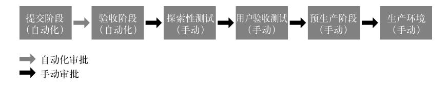

图 10-1 部署流水线 (来源:《持续交付:发布可靠软件的系统方法》)

部署流水线这个词来源于 Jez Humble 和 David Farley 合著的《持续交付:发布可靠软件的系 统方法》一书。部署流水线确保所有检入版本控制系统的代码都是自动化构建的,并在类生产环 境中测试过。这样一来,当开发人员提交代码变更后,立即就能获得关于构建、测试或集成错误 的反馈,从而使开发人员能够立刻修复这些错误。正确的持续集成实践总是可以确保代码处于可 部署和可交付的状态。

**10** 

① 开发过程中的持续集成(continuous integration,CI)通常是指将多个代码分支持续集成到主干中,并确保它们都 会通过单元测试。然而,在持续交付和 DevOps 中,持续集成还要求在类生产环境中运行应用,并且通过集成测 试和验收测试。Jez Humble 和 David Farley 为了消除歧义,称后者为 CI+。本书中的持续集成都是指 CI+实践。

——————————

为了实现这一点,必须在专用环境中创建自动化构建和测试流程。这样做至关重要,原因如下。

- 在任何时候,构建和测试流程都能够运行,无论工程师的个人工作习惯如何。
- 独立的构建和测试流程确保工程师能理解构建、打包、运行和测试代码所需的全部依赖 项(即消除"应用在开发人员的笔记本电脑上能运行,但是在生产环境中不行"的问题)。
- 将应用的可执行文件和配置打包,并可以在环境中重复安装(例如 Linux 上的 RPM、yum 和 npm 或 Windows 上的 OneGet,也可使用开发框架特定的打包格式,如 Java 的 EAR 和 WAR 文件,或 Ruby 的 gem 文件)。
- 将应用打包到可部署的容器中(例如 Docker、Rkt、LXD 和 AMI),而不是把程序代码打 包。
- 以一致、可重复的方式进行类生产环境的配置(例如从环境中移除编译器,关闭调试标 志等)。

每次代码变更之后,部署流水线都会确认代码已经成功地集成到类生产环境中。通过部署流 水线这个平台,测试人员进行验收测试和可用性测试,以及自动化性能测试和安全性验证。

此外,部署流水线将以自服务的方式为用户验收测试、集成测试和安全测试提供环境。随着 不断改进,它还会用来管理所有相关活动,涉及从版本控制系统到部署的全过程。

目前存在各种各样的部署流水线工具,其中许多是开源软件(例如 Jenkins、ThoughtWorks GoCD、Concourse、Bamboo、Microsoft Team Foundation Server、TeamCity 和 GitLab CI,以及基 于云的解决方案,例如 Travis CI 和 Snap)。①

部署流水线的第一个环节是提交阶段,这个阶段完成代码构建和打包,运行自动化单元测试, 并执行其他各种验证,如静态代码分析、测试覆盖率分析、重复代码检查以及代码风格检查等。②如 果成功,就会进入验收阶段,自动地把在提交阶段创建的包部署到类生产环境中,再执行自动化 验收测试。

当版本控制系统检测到代码变更后,将一次性生成软件包。接下来,软件包将在整个部署流 水线中使用。这种方式保证了集成测试环境、类生产环境,以及生产环境的代码一致性,可以有 效减少难定位的下游错误(例如,所使用的编译器、编译器标志参数、库版本或配置不一致)。③

① 如果在部署流水线中使用容器技术,而且采用微服务架构,就能构建不可变的部署包。开发人员在其工作站上使 用和生产环境相同的容器环境,组装和运行服务的所有组件,构建和运行更多的测试,而不只是在测试服务器上 做这些工作。这样做可以提供更快的工作反馈。

② 甚至可能需要在将代码变更提交到版本控制系统之前,就运行这些工具(例如使用预提交钩子)。可以在开发人 员的集成开发环境(IDE,用于编辑、编译和运行代码)中运行这些工具,以得到更快的反馈。

③ 还可以使用 Docker 等容器作为封装机制。容器具有一次打包后,在任何环境里一致运行的能力。这些容器镜像的 创建是构建流程的一部分,它们可以在任何环境中快速地部署和运行。因为所有环境运行同一个容器镜像,所以 容器能够帮助我们构建一致的部署包。

部署流水线的目的是给价值流中的所有成员(特别是开发人员)提供尽可能快速的反馈,帮 助他们及时识别可能让代码偏离可部署状态的变更,包括代码、环境因素、自动化测试甚至部署 流水线基础设施(例如 Jenkins 的设置)的任何改变。

因此,对于开发流程来说,部署流水线基础设施和版本控制系统同等重要。部署流水线还存 储了每一份代码的构建历史,包括某次构建执行过哪些测试,测试结果如何,以及部署到了什么 环境中。结合版本控制系统中的历史信息,可以快速地找到导致部署流水线失败的原因和可能的 修复方法。

这些信息还有助于审计和合规历史数据(证据在日常工作中自动生成)。

有了部署流水线基础设施之后,还必须有持续集成实践,这需要以下 3 个方面的配合:

- 全面且可靠的自动化测试套件,用于验证可部署状态;
- 一种在验证测试失败时,可以"停掉整条生产线"的文化;
- 开发人员在主干上工作,并小批量提交变更,而不是在生命周期很长的特性分支上工作。

下一节将介绍为什么需要实现快速可靠的自动化测试,以及如何实现。

#### 10.2 构建快速可靠的自动化测试套件

自动化测试基础设施用于验证可部署状态,即版本控制系统中的所有内容都处于可构建和可 部署的状态。为何如此强调执行持续集成和持续测试的必要性呢?可以想象一下,如果仅定期执 行这些操作(例如只执行夜间构建),将会发生什么?

假设团队由 10 名开发人员组成,每人每天仅将代码变更检入版本控制系统一次,而某个开 发人员的代码变更导致夜间构建和测试作业失败。在这种情况下,团队第二天才能发现作业失败, 而且可能需要花几个小时才能找出问题的原因和解决方法。

更糟的是,如果问题的原因根本就不是代码变更,而是测试环境(例如某个错误的环境配置), 那么开发团队很可能认为问题已得到解决,因为所有的单元测试都通过了。可是在夜间构建的过 程中,集成测试仍会失败。

让问题变得更复杂的是,开发团队在新的一天里又将向版本控制系统检入 10 个变更,而每 个变更都有可能引入错误,导致自动化测试失败,这进一步增加了定位和解决问题的难度。

总之,反馈不及时或者周期长会带来极大的危害,对于较大的开发团队而言则更甚。当开发 部门有几十、几百,甚至几千个开发人员时,每天所有人都往版本控制系统里提交代码变更, 问题会更加严重。结果将导致代码构建和自动化测试频繁失败,以至于开发人员不再检入变更 ("反正构建和测试总是失败,为什么要自找麻烦?"),转而等到项目结束时,再去集成所有代码。 **10** 

这样一来,所有不期望发生的事情全都会发生,包括大批量和大规模的代码集成,以及生产环境 部署故障等。①

为了避免以上情况出现,每当有新的变更检入版本控制系统时,就需要在构建和测试环境中 运行快速的自动化测试。通过这种方式,可以像谷歌的 GWS 团队那样,立刻发现和解决所有集 成问题。这样就能维持较小的代码集成量,并保证代码始终处于可部署状态。

通常,自动化测试从快到慢分为如下几类。

- 单元测试:通常独立测试每个方法、类或函数。它的目的是确保代码按照开发人员的设 计运行。由于诸多原因(如需要进行快速和无状态的测试),通常会使用打桩(stub out) 的方式,隔离数据库和其他外部依赖(例如,把函数修改为返回静态的预定义值,而不 是调用数据库)。②
- 验收测试:通常整体测试应用,确保各个功能模块按照设计正常工作(例如符合用户故 事的业务验收标准,API 能正确调用),而且没有引入回归错误(即没有破坏以前正常的 功能)。Jez Humble 和 David Farley 认为单元测试和验收测试的区别在于:"单元测试的目 的是证明应用的某一部分符合程序员的预期……验收测试的目的则是证明应用能满足客 户的愿望,而不仅仅是符合程序员的预期。"在构建的版本通过单元测试后,部署流水线 就对其执行验收测试。任何通过验收测试的构建版本通常都可用于手动测试(例如探索 性测试、用户界面测试等)和集成测试。
- 集成测试:保证应用能与生产环境中的其他应用和服务正确地交互,而不再调用打桩的 接口。Jez Humble 和 David Farley 写道:"大部分系统集成测试工作都是在部署应用的新 版本,并使它们能正常协作。在这种情况下,冒烟测试通常是指针对整个应用进行的一 组成熟的验收测试。"只有通过了单元测试和验收测试的构建版本才能执行集成测试。因 为集成测试通常是脆弱的,所以应该尽量减少集成测试的次数,并且要在单元测试和验 收测试期间,尽可能多地找出缺陷。一个至关重要的架构需求是,在执行验收测试时能 够调用虚拟或模拟的远程服务。

当面对项目最后期限的压力时,无论"完成"的定义如何,开发人员都可能不再在日常工作 中编写单元测试。为了发现并杜绝这种情况,需要度量测试覆盖率(取决于类数、代码行数、排 列组合等),还要把度量结果可视化,甚至可以在测试覆盖率低于一定水平时(例如当类的单元 测试率不足 80%时)使测试套件的验证结果显示失败。③

——————————

① 正是这个问题推动了持续集成实践的发展。

② 包括 stub、mock 和服务虚拟化在内的很多架构和测试技术都可用于处理需要外部集成点输入的测试。这对验收测 试和集成测试更加重要,它们依赖的外部状态会更多。

③ 只有当团队已经重视自动化测试之后,才能这样做——开发人员和管理人员很容易在这类指标上进行博弈。

Martin Fowler 曾说:"[通常,]10 分钟的构建[和测试过程]是完全合理的……[我们首先]进行 编译,然后在数据库完全打桩的情况下,在本地执行单元测试。这样的测试非常快,原则上可以 在 10 分钟以内完成。但是,这种测试不会发现大规模交互的 bug,特别是涉及与真实的数据库 交互的 bug。在第二阶段要运行的验收测试则不同,它会访问真实的数据库,并涉及很多端到端 的交互行为。这套测试可能需要运行几个小时。"

#### 10.2.1 在自动化测试中尽早发现错误

自动化测试套件的一个设计目标是能尽早地在测试中发现错误。因此,要在执行那些耗时的 自动化测试(如验收测试和集成测试)之前,执行完速度更快的自动化测试(如单元测试)。这 两种测试都要先于手动测试执行。

根据以上原则,可以得出一个推论:最快速的测试应该尽可能多地发现错误。如果大多数错 误都是在验收测试和集成测试阶段发现的,那么开发人员收到反馈的速度要比单元测试发现错误 时慢上好几个数量级——集成测试需要用到稀缺且复杂的集成测试环境(每次只能供一个团队使 用),因此反馈更慢。

此外,重现集成测试发现的错误不但难度高,而且很耗时,甚至连验证错误已被修复也很困 难(即开发人员编写了修复补丁,但是需要等上 4 小时才能知道是否通过集成测试)。

因此,每当验收测试或集成测试发现一个错误,就应该编写相应的单元测试,以便更快、更 早、更廉价地识别这个错误。Martin Fowler 描述过"理想的测试金字塔"这一概念,即使用单元 测试捕获大部分错误,如图 10-2 所示。相比之下,许多测试项目恰恰相反,人们把大部分时间 和精力都花在手动测试和集成测试上。

图 10-2 理想的测试金字塔与非理想的测试倒金字塔 (来源:Martin Fowler 的"测试金字塔")

**10** 

如果编写和维护单元测试或验收测试既困难又昂贵,说明架构可能过于耦合,即各个模块之 间不再有(或者从来就没有)明显的边界。在这种情况下,需要构建更松散耦合的系统,使模块 可以不依赖于集成环境进行独立测试。即使对于最复杂的应用,也可以在几分钟内完成验收测试。

#### 10.2.2 尽可能并行地快速执行测试

我们希望能快速地执行测试,所以需要设计并行测试,这可能会用到多台服务器。我们还想 并行地运行不同类型的测试,例如,当某次构建通过验收测试后,就可以并行地执行安全测试和 性能测试,如图 10-3 所示。在构建版本通过所有自动化测试之前,手动的探索性测试可以做,也 可以不做(探索性测试可以加快反馈速度,但也可能针对最终会失败的构建版本进行手动测试)。

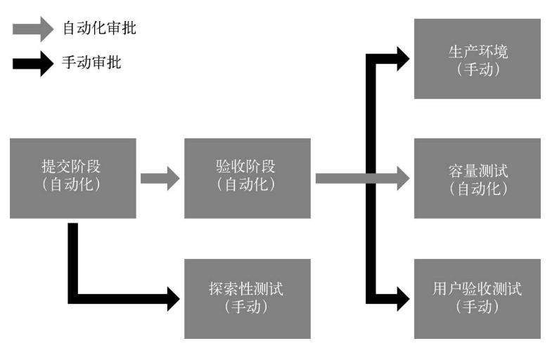

图 10-3 并行地执行自动化测试和手动测试 (来源:《持续交付:发布可靠软件的系统方法》,Kindle 版)

任何通过所有自动化测试的构建版本都可用于探索性测试以及其他形式的手动测试或资源 密集型测试(如性能测试)。应该尽可能频繁和全面地执行所有这些测试,要么持续执行,要么 定期执行。

任何测试人员(包括所有开发人员)都应该使用通过了所有自动化测试的最新版本,而不是 等待开发人员将某个版本打上可测试的标签。这样做可以保证尽早进行测试工作。

#### 10.2.3 先编写自动化测试

要确保自动化测试可靠,最有效的一个方法是通过测试驱动开发(Test-Driven Development, TDD)和验收测试驱动开发(Acceptance Test-Driven Development,ATDD)等技术在日常工作中 编写自动化测试。在对系统做任何变更时,都要先编写一个自动化测试用例,执行并确保测试失

败,然后再编写实现功能的代码,并且让代码通过测试。

Kent Beck 在 20 世纪 90 年代末将 TDD 作为极限编程的一部分提了出来。这项技术共有以下 3 个步骤:

- (1) 确保测试失败,"为想要增加的功能编写测试用例",检入测试用例;
- (2) 确保测试通过,"编写实现功能的代码,直到测试通过",检入代码;
- (3)"重构新旧代码,优化结构",确保测试都能通过,再次检入代码。

自动化测试套件和程序代码一同被检入版本控制系统,以提供一套可用且最新的系统规范。 如果开发人员想了解如何使用系统,可以查看测试套件,找到演示如何调用系统 API 的示例。①

#### 10.2.4 尽量将手动测试自动化

——————————

自动化测试的目的是尽可能多地发现代码错误,并且减少对手动测试的依赖。Elisabeth Hendrickson 在 2013 年的 Flowcon 大会上做了题为"On the Care and Feeding of Feedback Cycles" 的演讲,她提出:"虽然测试可以自动化,但是质量的创造过程不可以。让人类去执行那些本应 该自动化执行的测试是在浪费人类的潜能。"

通过执行自动化测试,所有测试人员(当然包括开发人员)得以去做那些不能被自动化的高 价值活动,如探索性测试或优化测试流程本身。

然而,单纯地将所有手动测试自动化,可能产生不良后果——谁都不希望自动化测试不可靠 或出现误报(即因为代码正确,所以测试本应该通过,可是由于性能不佳、超时、不受控的启动 状态,或者因为使用了数据库打桩或共享的测试环境而导致的非预期状态,使得测试失败)。

产生误报的不可靠测试将导致严重的问题:它们浪费宝贵的时间(例如开发人员不得不再执 行一遍测试,以确认真的存在问题),增加执行和解释测试结果的总工作量,还经常导致开发人 员完全忽略测试结果,甚至彻底关闭自动化测试,从而能够专注于编写代码。

这将导致恶性循环:问题发现得越晚,解决难度就越大,客户得到的结果也就越糟糕,这反 过来又给整个价值流带来压力。

为了解决这个问题,执行少量可靠的自动化测试,往往优于执行大量手动测试或不可靠的自 动化测试。因此,应该专注于将能验证业务目标的测试自动化。如果在放弃某个测试之后,生产 环境出现缺陷,那么应该将这个测试重新加入手动测试套件,但最终还是应该将它自动化。

**10** 

① Nachi Nagappan、E. Michael Maximilien 和 Laurie Williams(分别来自 Microsoft Research、IBM Almaden Labs 和北 卡罗来纳州立大学)曾经做过一项研究。该研究表明,使用 TDD的团队与不使用 TDD 的团队相比,虽然多花 15%~ 35%的时间,但代码的缺陷密度能降低 60%~90%。

正如 Macys.com 的前质量工程、发布工程和运营副总裁 Gary Gruver 所说:"对于该大型零售 电子商务网站,我们从每 10 天执行 1300 个手动测试变为每次代码提交只执行 10 个自动化测试。 执行值得信任的测试远比执行不可靠的测试要好。随着时间的推移,我们的测试套件逐渐壮大, 目前有几十万个自动化测试。"

换言之,应该从少量可靠的自动化测试开始,并随着时间的推移不断增加。这样一来,系统 的保障级别随之提高,并能快速检测出所有让代码偏离可部署状态的变更。

#### 10.2.5 在测试套件中集成性能测试

在集成测试期间或者应用部署到生产环境之后,我们经常会发现应用的性能不佳。性能问题 往往很难检测,性能可能随着时间的推移逐渐变差,在发现问题时早就为时已晚(例如没有索引 的数据库查询)。而且,很多问题都难以解决,尤其是当问题源于以前所做的架构决策时,或者 源于之前没有发现的网络、数据库、存储或其他系统的限制时,更是如此。

编写和执行自动化性能测试的目标是验证整个应用栈(代码、数据库、存储、网络、虚拟化 等)的性能,并把它作为部署流水线的一部分,这样才能尽早发现问题,并以最低的成本和最快 的速度解决问题。

如果能了解应用和环境在类生产负载下的表现,就可以做出更好的容量规划,以及检测出如 下情况:

- 数据库查询时间非线性增加(例如忘记为数据库创建索引,导致页面加载时间从 100 毫 秒增加为 30 秒);
- 代码变更导致数据库调用次数、存储空间使用量或者网络流量增加数倍。

可以将能够并行执行的验收测试作为性能测试的基础。例如,假设对于一个电子商务网站来 说,"搜索"和"结账"是两个高价值功能;即使在高负载下,这两个功能也必须性能良好。为 了测试这一点,可以并行地执行数千个分别针对这两个功能的验收测试。

因为执行性能测试需要大量计算和 I/O 资源,所以搭建性能测试环境很可能比为应用准备生 产环境还要复杂。因此,可能需要在项目启动时就搭建性能测试环境,并确保能够为尽早、正确 地搭建准备好所需资源。

为了能尽早发现性能问题,应该记录所有性能测试结果,并对比上一次结果,评估各项性能 指标。例如,如果性能测试结果与上一次的偏差超过 2%,则可判定本次性能测试失败。

#### 10.2.6 在测试套件中集成非功能性需求测试

除了测试代码并验证它符合预期且能在类生产负载下正常运行,还需要验证系统的其他质量

属性。这些质量属性通常被称为非功能性需求,包括可用性、可扩展性、容量以及安全性等。

许多非功能性需求是通过正确配置环境实现的,因此必须编写相应的自动化测试,用于验证 环境搭建和配置的正确性。例如,应该保证以下几项的一致性和正确性,这是很多非功能性需求 所依赖的(例如安全性、性能和可用性):

- 所使用的应用、数据库和软件库等;
- 编程语言的解释器和编译器等;
- 操作系统(例如启用审核日志记录等);
- 所有依赖项。

——————————

当使用基础设施即代码的配置管理工具时(例如 Puppet、Chef、Ansible、SaltStack 或 Bosh), 可以用测试代码时所用的框架测试环境是否正确配置及正常运行(例如将环境测试编写成 Cucumber 或者 Gherkin 测试)。

此外,与在部署流水线中针对应用进行代码分析一样(如静态代码分析和测试覆盖率分析), 还要用工具(例如 Chef 的 Foodcritic 或 Puppet 的 puppet-lint)对构建环境的代码进行分析。还应 该把所有安全性加固检查作为自动化测试的一部分,以保证所有相关配置都是正确的(例如服务 器规格)。

在任何时候,自动化测试都能够验证代码处于可部署状态。务必建立安灯绳机制,以便在部 署流水线失败时,能够立刻采取一切必要措施将构建版本恢复到绿色状态。

#### 10.3 在部署流水线失败时拉下安灯绳

当构建版本在部署流水线中处于绿色状态时,我们就可以放心地将代码变更部署到生产环境中。

为了让部署流水线始终保持绿色状态,务必创建虚拟的安灯绳,它类似于丰田生产系统中的 那个物理装置。一旦某个开发人员提交的代码变更导致构建或自动化测试失败,在这个问题被解 决之前,不允许提交任何新的变更。如果有人在解决问题时需要帮助,他们能获取任何所需资源, 就像本章开头描述的谷歌的案例那样。

当部署流水线失败时,至少要告知整个团队。所有人要么都去一同解决问题,要么回滚代码, 甚至可以把版本控制系统配置为拒绝后续的代码提交,直到部署流水线的第一阶段(即构建和单 元测试)恢复成绿色状态。如果问题源于自动化测试产生的误报,那么应该重写或删除该测试。① 团队的所有成员都应该有权限进行回滚操作,以便使部署流水线恢复到绿色状态。

Google App Engine的前工程总监Randy Shoup这样描述将部署流水线恢复到绿色状态的重要

**10** 

① 如果并不是所有人都了解回滚代码的流程,那么可以采取结对回滚的对策,以更好地记录回滚操作。

性:"我们认为团队目标高于个人目标——在帮助他人推进工作的同时,也帮助了整个团队。这 包括帮助他人解决构建或自动化测试的问题,甚至进行代码审查。当然,我们也知道,在自己需 要帮助的时候,其他人也会伸出援手。这个系统并不受大量正式的规定或制度约束——每个人都 知道工作不只是'编写代码',更是'运行服务'。这就是要优先考虑所有质量问题的原因,特别 是会把那些与可靠性和可扩展性有关的问题放在最高级别,将其视为具有最高优先级的'绊脚石' 问题。从系统角度看,这些做法让我们不会后退。"

当部署流水线的后期阶段(例如验收测试或性能测试)失败时,不应停止所有新工作,而应 让一部分开发人员和测试人员随时待命,他们负责在问题发生时立即加以解决。这些开发人员和 测试人员还应在部署流水线的早期阶段执行新的测试,用来捕获这些问题引入的回归错误。例如, 如果在验收测试中发现一个缺陷,就应该编写一个单元测试来捕获这个问题。同样,如果在探索 性测试中发现缺陷,就应该编写对应的单元测试或验收测试。

为了更容易发现失败的自动化测试,应该安装非常直观的指示器,以便团队的所有成员都能 看到。很多团队在墙上安装了直观的灯光装置,用于显示当前的构建状态。其他有趣的形式包括 熔岩灯、红绿灯、语音、乐曲和 Klaxon 闹钟等。

从某个角度来说,这个步骤比进行构建和测试服务器更具有挑战性——那些是纯粹的技术活 动,而这个步骤需要改变人的行为和提供激励机制。接下来,我们探讨持续集成和持续交付为何 需要这些改变。

#### 为何拉下安灯绳

——————————

如果不拉下安灯绳,也不立即解决部署流水线的问题,就会导致应用和环境更难恢复到可部 署状态。想想以下情况。

- 有人提交的代码造成构建或自动化测试失败,但没有人修复。
- 其他人在已经失败的构建版本上又提交了一份代码变更。这当然无法通过自动化测试, 但没有人看到这些有助于发现新缺陷的测试结果,更不用说修复了。
- 现有的测试都不能可靠地执行,因此不太可能编写新的测试用例。(为何较这个劲?连当 前的测试都不能通过。)

如果发生上述情况,那么任何环境的部署都会变得不可靠。这就和不用自动化测试或与使用 瀑布式方法一样,大多数问题只能在生产环境中才暴露出来。这个恶性循环导致的必然结果是, 我们又回到了起点,耗时几周乃至几个月去修复 bug 和偿还技术债务,整个团队陷入危机;为了 通过所有测试,迫于最后期限的压力,我们不得不投机取巧,技术债务与日俱增。①

① 这就是常说的瀑布式 Scrum 反模式(water-Scrum-fall anti-pattern):表面上采用敏捷开发实践,但实际上,所有 测试和缺陷修复仍然在项目快结束时才进行。

#### 10.4 小结

在本章中,我们创建了一组全面的自动化测试,用来确保构建始终处于绿色的可部署状态。 我们在部署流水线中组织好了测试套件和测试活动,还建立了规范,要求无论谁的代码变更导致 自动化测试失败,大家都要竭尽全力地将系统恢复到绿色状态。

这种方式为持续集成奠定了基础,使很多小型团队能够独立、安全地开发、测试和部署代码, 从而向客户交付价值。

## 第 11 章

——————————

# 应用和实践持续集成

上一章讨论了自动化测试实践,用以保障开发人员快速获得工作质量的反馈。当开发人员的 数量和版本控制系统中的分支个数增加时,自动化测试会变得更加重要。

分支在版本控制系统中的主要作用是,让开发人员可以并行地工作在软件系统的各个组成部 分,同时避免开发人员提交的代码对主干(trunk,有时候也被称为 master 或 mainline)的稳定性 造成影响,或者引入错误。①

然而,开发人员在自己的分支上独自工作的时间越长,就越难将变更并入主干。事实上,当 分支个数和每个分支上的变更数同时增加时,合并难度会骤增。

集成问题会导致大量的返工,包括不得不通过手动合并解决变更冲突,以及多名开发人员共 同解决导致自动化测试或手动测试失败的合并问题。因为在传统的开发模式里,代码集成工作通 常发生在项目的末期,所以在集成工作消耗过多时间时,我们不得不为了按时发布而偷工减料。

这会导致另一个恶性循环:既然合并代码如此痛苦,那么大家索性就减少合并次数,而这会 使未来的合并工作更加令人痛苦。持续集成旨在通过将合并融入日常工作来解决这个问题。

惠普 LaserJet 固件部门的工程总监 Gary Gruver 的经验告诉我们,持续集成所能解决的问题 的广度惊人。他的部门负责为惠普开发所有扫描仪、打印机和多功能设备的固件。

该团队有 400 名开发人员,分布在美国、巴西和印度。尽管团队的规模很大,但是工作效率 很低。多年以来,该团队都无法按照业务部门的需求快速地交付新特性。

Gary Gruver 描述道:"市场部门有 100 万个吸引客户的想法,而我们只能告诉他们,'请从 这些想法中选出你们想在未来 6~12 个月内实现的两个想法'。"

该团队一年只能发布两个固件版本,大部分的时间都消耗在为了支持新产品而做的代码移植 工作上。Gary Gruver 估计开发新特性的时间仅占 5%,其余时间则全都花在偿还技术债务的工作

① 版本控制系统中的分支功能有很多用途,但最典型的是用于根据发布版本、升级、任务、组件和技术平台等实现 团队成员之间的工作划分。

- 上,如管理多个代码分支以及手动测试,举例如下:
  - 20%的时间用于制订详细的项目计划(团队的生产力低,交付时间长,这些被错误地归咎 于工作量评估得不准,所以团队被要求做更详细的评估);
  - 25%的时间用于移植代码,所有代码的维护工作都在不同的分支上进行;
  - 10%的时间用于集成不同的分支;
  - 15%的时间用于执行手动测试。

Gary Gruver 和团队定下了一个目标,想要把花在创新和新特性开发上的时间增加 10 倍。团 队希望通过以下方式实现这个目标:

- 采用持续集成和基于主干的开发方式;
- 在自动化测试上投入更多的精力;

——————————

- 开发一个硬件模拟器,用于在虚拟平台上执行测试;
- 在开发人员的工作站上重现失败的测试;
- 采用一种新的架构,使用统一的构建和发布方式,支持所有打印机产品。

在此之前,每条产品线都拥有自己的代码分支,每种型号的设备都有一个相应的固件版本, 功能在代码编译时定义。①新架构统一了代码库,任何一个固件版本都可以支持 LaserJet 设备的 所有型号,打印机的所有功能通过一个 XML 配置文件来设定。

4 年以后,该团队基于主干开发的代码库可以支持惠普的 24 条 LaserJet 产品线。Gary Gruver 承认,基于主干的开发方式需要工程师转换思维方式。工程师以前认为基于主干的开发方式不可 行,可是一旦开始这样做,他们就再也不想回到从前了。多年以来,有一些工程师离开了惠普。 有人仍然会打电话告诉 Gary Gruver 说:"新公司在开发方面很落后,在没有持续集成提供反馈的 情况下,很难保证开发效率和版本质量。"

然而,基于主干的开发方式需要创建更有效的自动化测试。Gary Gruver 说:"如果没有自动 化测试,持续集成只能产生一大堆没有经过编译而且不能正确运行的垃圾。"在刚开始时,完整 地执行一套手动测试需要 6 周的时间。

为了使所有的固件版本都能实现自动化测试,团队在打印机模拟器上投入了大量精力,并且 用 6 周的时间搭建了一个测试服务器集群。在之后的几年中,6 个机架上的服务器运行着 2000 多个打印机模拟器,它们负责从部署流水线加载固件版本。持续集成系统运行着全套的自动化单 元测试、验收测试和集成测试,就像上一章所描述的那样。团队有了这样一种文化:当开发人员 的疏忽导致部署流水线失败时,所有工作就会立刻停止,从而保证开发人员能迅速地把系统恢复 到绿色状态。

① 编译标志(#define 和#ifdef)用于启用或禁用代码的执行,如复印功能和支持纸张尺寸等。

自动化测试能够快速地提供反馈,使开发人员可以迅速地确认自己提交的代码能够正常工 作。单元测试在开发人员的工作站上执行,并且会在几分钟内完成。针对每次提交,3 个级别的 自动化测试会每隔 2~4 小时就执行一次。最后,还会每 24 小时执行一次全面的回归测试。以上 工作方式的成果如下:

- 先每天执行 1 次构建,最终实现了每天执行 10~15 次构建;
- 从每天"总构建人"进行大约 20 次代码提交,变为每天所有开发人员进行超过 100 次代 码提交;
- 开发人员每天更改或添加的代码行数达到 7.5 万~10 万;
- 回归测试的周期从 6 周缩短为 1 天。

在应用持续集成以前,这种生产力水平是无法想象的。仅仅是创建一个绿色构建版本,就需 要好几名高手共同奋战好几天。持续集成所带来的商业利益是惊人的:

- 开发人员用于创新和新特性开发的时间从 5%增加到 40%;
- 总开发成本降低了约 40%;
- 处于开发状态的项目增加了约 140%;
- 每个项目的开发成本降低了 78%。

Gary Gruver 的经验表明,在全面应用版本控制以后,想要实现价值流的快速流动,最关键 的一个实践就是持续集成,它使大量开发团队能够独立地开发、测试和交付价值。然而,持续集 成仍然是颇具争议的实践。本章接下来将描述实现持续集成所需的各种实践,以及如何应对常见 的异议。

#### 11.1 小批量开发与大批量合并

如前几章所说,每当提交到版本控制系统的代码变更导致部署流水线失败时,我们就会群策 群力地解决问题,力求尽快将部署流水线恢复到绿色状态。然而,如果开发人员长时间工作在自 己的分支(也称为"特性分支")上,只是偶尔将代码合并到主干,那么他们的每一次合并都会 为主干引入大批量的变更,这会造成严重的问题。正如惠普 LaserJet 的案例所述,为了保持代码 的可发布状态,上述情况必然导致大规模的版本混乱和返工。

Jeff Atwood 是 Stack Overflow 网站的联合创始人,也是博客 *Coding Horror* 的作者。他指出, 尽管分支策略有很多种,但是可以分为以下两类。

 提高个人生产力:所有人都在自己的分支上工作。每个人都独立地工作,并且不能干扰 其他人;然而,代码合并将是一场噩梦。协作将变得相当困难,每个人都不得不谨小慎 微地合并代码,即便是完成系统里最小的部分也是如此。

 提高团队生产力:所有人都在同一个区域里工作。并没有分支,只有一条很长、不可被 中断的主干;也没有规则,因此代码的提交过程很简单。但是,任何一次提交都有可能 破坏整个项目,同时导致项目中断。

Jeff Atwood 的观点完全正确。更准确地说,成功地将分支合并到主干的成本,会随着分支个 数的增加呈指数上升。问题不仅在于"合并噩梦"带来的返工,还在于被延迟的部署流水线反馈。 例如,对于完整的软件系统而言,性能测试只有在开发后期才执行,而它本应该在整个过程中持 续地执行。

此外,如果通过增加开发人员的数量来提高生产力,那么代码变更相互影响的可能性就会随 之增加;当部署流水线失败时,受影响的开发人员也会更多。

大批量合并的另外一个副作用是,合并难度越大,开发人员就越不可能(也越不愿意)改进 和重构代码,因为重构很可能导致其他所有人返工。在这种情况下,人们就更不愿意去修改那些 在整个代码库中都有依赖项的代码。不幸的是,这样的代码往往价值最高。

Ward Cunningham 开发了世界上第一个维基系统,也创造了"技术债务"一词。他在描述技 术债务时说,如果不能主动地重构代码库,它就会慢慢地变得难以修改和维护,新特性的增加速 度也会因此而下降。持续集成和基于主干的开发实践,其主要目的就是解决这些问题,从而在提 高个人生产力的基础之上提高团队生产力。

#### 11.2 应用基于主干的开发实践

解决大批量合并问题的对策是,应用持续集成和基于主干的开发实践,让每个开发人员每天 都至少向主干提交一次代码。这样做能够将代码提交量降低为开发团队每日的工作量。开发人员 提交得越频繁,每次的提交量就越小,他们离理想的单件流状态也就越近。

频繁地向主干提交代码,意味着可以针对整个软件系统执行所有的自动化测试,并且在应用 或接口的某个部分出现问题时,及时收到告警信息。由于合并问题能被及时发现,因此也能被及 时解决。

我们甚至可以对部署流水线进行这样的配置:拒绝接受任何使系统偏离可部署状态的提交 (例如代码变更或环境变更)。这种方式被称为门控提交,即部署流水线要确认所提交的变更能成 功合并和正常构建,并且在合并到主干之前就已经通过了所有的自动化测试。如果测试失败,则 开发人员将收到通知,这样就可以在不影响价值流中的其他人的情况下自己解决问题。

每日提交代码,也迫使开发人员进一步分解工作,同时保持主干处于可发布状态。

版本控制系统为团队间的沟通提供了一套完整的机制——每个人对系统都有了更好的理解, 并且都了解部署流水线的状态,而且能在出现问题时互相帮助,从而实现更高的质量和更快的部 署速度。

应用这些实践后,我们再来修订"完成"的定义(黑体文字为新增内容):"在每个迭代周期 结束时,已经在类生产环境中集成和测试了可工作和可交付的代码;这些代码通过一键式流程在 主干上创建,并已通过自动化测试。"

遵循上述定义的原则有助于进一步提高代码的可测试性和可部署性。通过将代码保持在可部 署状态,就能避免在项目后期才进行单独的测试和 bug 修复。

#### **\*** 案例研究 **\***

#### Bazaarvoice 的持续集成实践(2012 年)

Ernest Mueller 曾经帮助 National Instruments 实施了 DevOps 转型,之后在 2012 年 还帮助 Bazaarvoice 实施了对开发和发布流程的转型。Bazaarvoice 为数千家零售商(如 百思买、耐克和沃尔玛)提供"顾客生成内容"服务,例如针对产品的评价和评分等。

当年,Bazaarvoice 的年收益为 1.2 亿美元,公司正在准备 IPO。①其收益主要依赖 于 Bazaarvoice Conversations 这个应用。这个单体式 Java 应用有近 500 万行代码(有些 甚至写于 2006 年),文件数多达 15 000。该服务运行在 4 个数据中心和多个云服务商提 供的 1200 台服务器上。

在转换到敏捷开发流程,并把迭代周期缩短到两周之后,他们渴望在当时每 10 周 发布一次的基础上进一步提高发布频率。开发人员也开始逐步解耦单体式应用,将其重 构成微服务。

2012 年 1 月,Bazaarvoice 首次尝试每两周发布一次。Ernest Mueller 发现,"刚开始 时并不顺利。情况非常混乱,我们的客户报了 44 个生产事件。管理层的意见基本上就 是'别再这么干了'"。

不久后,Ernest Mueller 开始负责发布流程,他的目标是在不影响客户的前提下实 现每两周发布一次的计划。业务目标包括实现更快速的 A/B 测试(后面几章会讲到), 以及加快新特性进入生产环境的速度。Ernest Mueller 找出了以下 3 个核心问题:

- 缺乏自动化测试,这导致在为期两周的迭代周期中,测试力度不够,不足以预 防大规模故障;
- 版本控制系统的分支策略允许开发人员直接把代码提交到生产环境中;
- 运行微服务的团队也进行独立发布,这经常造成单体发布过程出现问题,反之 亦然。

Ernest Mueller 认为,需要将单体式应用的部署流程稳定下来,这就需要应用持续

——————————

① Bazaarvoice 由于准备 IPO 而推迟了产品发布(IPO 很成功)。

集成。在随后的 6 周里,开发人员停止了特性开发,转而专注于编写自动化测试套件, 包括用 JUnit 执行单元测试,用 Selenium 执行回归测试,以及用 TeamCity 运行部署流 水线。Ernest Mueller 说道:"通过持续地执行这些测试,我们认为变更代码有了一定的 安全保障。最重要的是,我们可以及时发现问题,而不是在部署到生产环境之后,才发 现问题。"

他们还应用了主干/分支发布模型——每两周新建一个专用的发布分支,在非紧急 情况下,该分支不允许任何代码提交;任何变更都需要经过一个审批流程,在内部的维 基系统中按变更单或者按团队进行审批。该分支在完成 QA 流程后,方可进入生产环境。

Bazaarvoice 在可预测性和发布质量方面取得了显著的成果。

- 2012 年 1 月的发布:44 个客户事件(刚开始进行持续集成)
- 2012 年 3 月 6 日的发布:延迟 5 天,5 个客户事件
- 2012 年 3 月 22 日的发布:准时,1 个客户事件
- 2012 年 4 月 5 日的发布:准时,无客户事件

Ernest Mueller 进一步描述了他们的成功之道。

我们成功地做到了每两周发布一次,接着是每周发布一次,这几乎不需要 工程团队做任何改变。由于发布时间非常有规律,因此我们只需在日历上把发 布次数翻倍,然后根据日历发布即可。我们几乎实现了零事件。客户服务和营 销团队因此做出了重大调整,他们不得不改变流程,例如调整每周向客户发送 电子邮件的时间,以保证他们了解新特性。我们随后开始向下一个目标挺进, 最终将测试时间从 3 个多小时缩短为不到 1 个小时,并把环境数量从 4 个减少 为 3 个(开发环境、测试环境和生产环境,去除了预生产环境),还全面地采 用持续交付模式,实现了快速的一键式部署。

#### 11.3 小结

基于主干的开发方式可能是本书中最具争议的实践。许多工程师都认为它行不通,他们更喜 欢在自己的分支上工作,不必与其他开发人员协作。然而,Puppet Labs 的《2015 年 DevOps 现状 报告》表明,基于主干的开发方式能带来更高的生产力、更好的稳定性,甚至更高的工作满意度 和更低的职业倦怠率。

虽然在开始时很难说服开发人员,但是一旦他们认识到显著的优势,就会彻底改变,正如惠 普 LaserJet 和 Bazaarvoice 的开发人员一样。持续集成实践为下一步实现低风险的自动化部署流 程铺平了道路。

## 第 12 章

——————————

# 自动化和低风险发布

Chuck Rossi 是 Facebook 的发布工程总监,负责监管日常代码发布。他在 2012 年这样描述 Facebook 的发布流程:"大约在下午 1 点,我就切换到'运维模式',与团队一起将当天要发布到 Facebook.com 的变更都准备就绪。这些工作给我带来很大的压力。在很大程度上,完成这些工作 依赖于团队的判断力和经验。我们努力保证每个人都能对自己的变更负责,并积极地测试和支持 这些变更。"

在发布之前,所有参与变更的开发人员都必须登录 IRC 聊天工具,并加入相关的聊天频道; 如果没有加入,则开发人员的部署包会被自动删除。Chuck Rossi 继续说道:"如果一切进展顺利, 测试仪表板和金丝雀发布测试①则会显示为绿色,我们就会点击那个红色的发布按钮,Facebook.com 所使用的所有服务器都会立刻开始更新代码。在 20 分钟以内,新的代码就能运行在成千上万台 服务器上,而正在使用 Facebook 的用户对这一切都毫无察觉。"②

不久之后,Chuck Rossi 把代码发布频率提高了一倍,即每天两次。他解释说,第二次发布 是为了给那些不在美国西海岸的工程师一个机会,让他们也可以具备"和公司的其他工程师相 同的快速发布代码和交付的能力",而且,这也给了所有人在同一天中第二次发布和交付特性的 机会(见图 12-1)。

极限编程方法论的创造者 Kent Beck 是测试驱动开发的主要支持者,也是 Facebook 的技术教 练。他在自己的 Facebook 主页上发表过一篇文章,对 Facebook 的代码发布策略做了进一步评论: "Chuck Rossi 发现,Facebook 在单次部署中能够处理的变更数量是固定的。如果要做更多变更, 就需要更多部署。因此在过去的 5 年里,Facebook 的部署频率稳步提高,PHP 代码的部署频率从 每周一次提高到每天一次,再到每天 3 次;移动应用的部署频率从每 6 周一次提高到每 4 周一次, 再到每两周一次。这些改善主要是在发布工程团队的推动下实现的。"

① 金丝雀发布测试是指将软件部署到少量的生产服务器上,用真实的客户流量来测试,以保证软件不会出现严重问题。

② Facebook 的前端代码库主要是用 PHP 编写的。为了提高网站的性能,Facebook 的开发人员在 2010 年使用内部 开发的 HipHop 编译器,把 PHP 代码转换成了 C++代码,然后再进一步编译为 1.5GB 的可执行文件。随后,开发 人员使用点对点传输工具 BitTorrent 把这个可执行文件复制到所有生产服务器上,这个复制操作可以在 15 分钟内 完成。

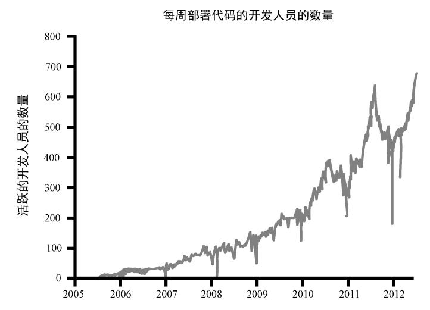

图 12-1 每周部署代码的 Facebook 开发人员的数量 (来源:Chuck Rossi 的文章"Ship early and ship twice as often")

Facebook 通过采用持续集成和低风险的代码部署流程,把代码部署变成了所有人的日常工 作,并且维持了开发人员的生产力。这要求代码的部署操作是自动化、可重复和可预测的。在前 面各章描述的实践中,尽管代码和环境一起通过了测试,但是仍然不能频繁地将代码部署到生产 环境中,因为部署操作依然是手动完成的,这样做既耗时且令人痛苦,也是乏味和易出错的。而 且,开发团队和运维团队通常还需要进行大量繁琐且不可靠的工作交接。

因为手动部署令开发人员极其痛苦,所以他们倾向于减少部署次数,这将导致恶性循环。由 于向生产环境的部署不断推迟,因此等待部署的代码和生产环境中的代码之间的差异越来越大, 这导致批量部署的工作量增加,由于变更所导致的意外风险以及修复难度也会随之增加。

本章旨在通过减小生产环境部署的阻力,使运维团队或开发团队能频繁、轻松地进行部署。 我们通过扩展部署流水线来实现这一点。

与仅将代码持续集成到类生产环境中不同,我们将能够按需地(即一键式发布)或自动化地 (即在构建和测试成功以后,直接进行自动化部署)将已通过自动化测试和验证流程的任何构建 版本发布到生产环境中。

由于本章将描述大量实践,因此为了不打断对核心概念的陈述,示例和扩展内容将以脚注的 形式呈现。

#### 12.1 自动化部署流程

想要像 Facebook 那样取得部署成果,需要一种自动化代码部署机制。如果现有的部署流程

已经存在多年,则需要将流程中的所有步骤完整地记录下来,例如通过研讨会演练价值流映射, 或逐渐将步骤记录在文档中(如使用维基系统)。

当完整记录目前的部署流程以后,下一步的目标便是尽可能地简化和自动化手动步骤,举例 如下:

- 将代码打包成便于部署的格式;
- 创建预配置的虚拟机镜像或容器;
- 将中间件的部署和配置自动化;
- 将安装包或者文件复制到生产服务器;
- 重启服务器、应用或者服务;
- 基于模板生成配置文件;
- 通过执行自动化冒烟测试,确保系统能正常运行,并且配置正确;
- 运行各种测试程序;
- 将数据库迁移工作脚本化和自动化。

如果条件允许,可以重新设计流程,并去除一些步骤,特别是那些耗时的步骤。不但要缩短 前置时间,而且还要尽可能减少交接次数,从而降低出现错误和流失知识的可能性。

如果开发人员能够集中精力优化部署流程并使其自动化,那么就能带来显著的改善。例如, 在做较小的应用配置变更时,不再需要重新部署应用或者重新搭建环境。

然而,开发团队只有和运维团队紧密地合作,才能确保共同创建的工具和流程能在下游正常 使用。疏远运维团队和重复造轮子都是不可行的。

大多数具有持续集成和测试功能的工具,也有扩展部署流水线的能力。通常在生产验收测试 执行完之后,这些工具可以将验证过的构建版本发布到生产环境中(这样的工具包括 Jenkins Build Pipeline插件、ThoughtWorks的GoCD和Snap CI、Microsoft Visual Studio Team Services,以及Pivotal Concourse)。

部署流水线有如下需求。

- 用相同的方式处理所有环境的部署:通过对所有环境(例如开发环境、测试环境和生产 环境)采用相同的部署机制,可以提高生产环境部署的成功率,因为它已经在流水线中 被成功地部署过很多次了。
- 对部署执行冒烟测试:在部署过程中,应该测试依赖的所有系统(例如数据库、消息总 线和外部服务)是否能正常访问,并通过单次测试看看系统是否能正常工作。如果以上 任何一个测试失败,那么部署就是失败的。
- 维持环境的一致性:上述步骤创建了一步搭建环境的流程,使得开发环境、测试环境和 生产环境有了共同的搭建机制。必须持续保证这些环境的搭建方式是一致的。

当然,一旦部署流程出现问题,就要拉下安灯绳,并且群策群力地解决问题,就像应对部署 流水线前期出现的问题一样。

#### **\*** 案例研究 **\***

#### CSG 国际的每日部署(2013 年)

CSG 国际是美国最大的一家票据打印服务公司。为了提高软件版本的可预测性和可 靠性,首席架构师和开发副总裁Scott Prugh将发布频率从每年两次提高到了每年4次(将 部署周期从 28 周缩短为 14 周)。

虽然开发团队每天都通过持续集成将代码部署到测试环境中,但是向生产环境的发 布是由运维团队完成的。Scott Prugh 说道:"我们的开发团队可以每天(甚至更频繁地) 在低风险的测试环境中进行'发布演练',从而优化开发流程和工具。然而,运维团队 却只有极少的演练机会,每年只有两次。更糟糕的是,他们的操作对象是高风险的生产 环境,其各方面都与预生产环境有很大差异——在开发环境里,并没有生产环境中的诸 多设备和约束,如安全策略、防火墙、负载均衡器和 SAN 存储。"

为了解决这个问题,他们成立了一个共享运维团队(Shared Operations Team,SOT), 负责管理所有环境(开发环境、测试环境和生产环境)并执行代码部署工作,包括每天 向开发环境和测试环境部署,以及每 14 周向生产环境部署和发布。因为 SOT 团队每天 都要执行部署操作,所以如果留着某个问题不解决,那么第二天就还会遇到同样的问题。 这极大地刺激了团队,促使他们将繁琐和容易出错的手动操作自动化,以防同样的问题 再次出现。由于在向生产环境发布之前,部署流程已经执行了近百次,因此绝大多数问 题早就被发现和解决了。

以前只有运维团队才会遇到的问题,其实需要价值流中的所有成员参与解决。通过 每日部署,可以快速知晓哪些做法可行,哪些不可行。

SOT 团队还致力于保持所有环境的一致性,包括安全访问权限的约束和负载均衡器 的一致性。Scott Prugh 说道:"我们尽全力保持非生产环境与生产环境的一致性,并且 绞尽脑汁地使用各种技术模拟生产环境。将应用在早期就暴露在生产级别的环境里,这 改变了应用的架构设计,使应用对于这些有各种约束条件的环境来说更加友好。这个模 式让每个人都变得更加明智了。"

Scott Prugh 继续说道:"我们遇到过许多需要变更数据库模式的情况:要么将变更 任务交给 DBA 团队'自行处理',要么用很小(即 100MB)的数据集执行自动化测试, 这导致了一些生产故障。在以前,当发生生产故障后,各个团队会互相推卸责任。后来, 我们建立了一个开发和部署流程,通过交叉培训使开发人员能够每天都进行数据库模式

的自动化变更,这样就不必把变更任务交给 DBA 团队了。我们使用经过整理的客户数 据集,做实际的压力测试,并且尽量每天都进行数据库的迁移和同步。通过这种方式, 在处理真实的流量之前,应用早就已经经历过数百次实战演练了。"①

他们的成果是惊人的。通过进行每日部署和将生产环境发布频率翻倍,生产事故的 发生次数降低了 91%,平均恢复时间(MTTR)缩短了 80%,在"完全免手动操作"的 生产环境里,完成服务部署所需要的时间从 14 天缩短到 1 天(见图 12-2)。

Scott Prugh 说,部署工作变得如此常规化,以至于运维团队在转型的第一天快结束 时,竟然玩起了电子游戏。对于开发团队和运维团队而言,部署工作变得更顺利;除此 之外,在 50%的情况下,客户收获价值的时间缩短了一半。这说明,频繁部署对开发人 员、测试人员、运维人员和客户都大有裨益。

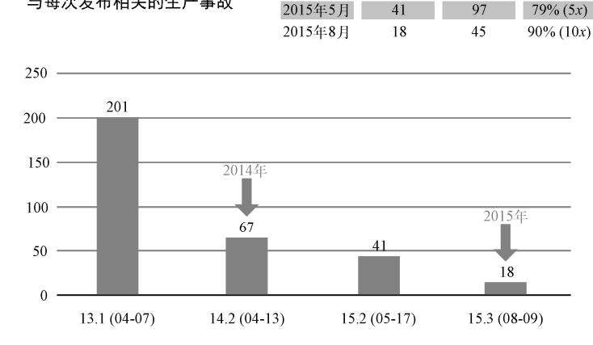

图 12-2 每日部署和提高发布频率,既降低了生产事故发生率,也缩短了平均恢复时间 (来源:Scott Prugh 和 Erica Morrison)

#### 12.1.1 应用自动化的自助式部署

——————————

耐克公司的运维自动化总监 Tim Tischler 曾经描述了一代开发人员的共同经验,他说:"作为 开发人员,我在职业生涯中做过的最有满足感的事情莫过于专注写代码,点击部署按钮,通过监 控指标看到代码能在生产环境中正常运行,以及在代码出错时能亲手修复。"

① 在实践中,CSG 国际发现,无论交由开发团队还是运维团队管理,SOT 团队都能取得成功。前提条件是,为 SOT 团队配备合适的人员,并且团队成员齐心协力地朝目标迈进。

开发人员能够在生产环境中自行部署代码,能够快速看到客户对新特性感到满意,能够快速 修复故障而不必等运维人员提交故障单,这些能力在过去 10 年中逐渐减弱。部分原因是控制和 监管的需要,这也许是由安全和合规需求造成的。

最常见的实践是运维人员执行代码部署,这种职责划分也是被广泛接受的做法,其目的是降 低生产环境中断和欺诈的风险。但是,为了实现 DevOps 的目标,需要通过运用其他等效或更有 效的机制来控制上述风险,例如自动化测试、自动化部署和同行变更评审。

Puppet Labs 的《2013 年 DevOps 现状报告》调查了 4000 多名专业技术人员。统计结果显示, 在代码部署方面,开发人员和运维人员的变更成功率并没有显著差异。

换句话说,如果开发团队和运维团队的目标一致,并且部署结果的责任分配清晰且透明,那 么由谁执行部署操作,其实无关紧要。事实上,测试人员或项目经理等其他角色也能在某些环境 中做部署,从而快速地完成工作,例如在测试环境或 UAT 环境中配置和部署一套用于演示产品 特性的系统。

为了更好地促进工作,需要一个可以由开发人员或运维人员来执行的代码发布流程,并且在 理想情况下,应该不需要任何手动操作或工作交接。这个流程的步骤如下。

- 构建:部署流水线必须基于版本控制系统构建可部署到任何环境(包括生产环境)的软 件包。
- 测试:任何人都应该能够在他们的工作站上或测试系统中运行任何一个自动化测试套件。
- 部署:任何人都应该能够将这些软件包部署到具有访问权限的任何环境,通过执行(已 提交到版本控制系统中的)脚本来完成部署。

以上实践有助于成功地执行部署,谁来执行并不重要。

#### 12.1.2 在部署流水线中集成代码部署

如果代码部署过程是自动化的,就能将其变成部署流水线的一部分。因此,自动化部署必须 具备如下能力:

- 保证在持续集成阶段构建的软件包可以部署到生产环境中;
- 使生产环境的就绪情况一目了然;
- 为能在生产环境中部署的任何代码,建立一键式和自助式的发布机制;
- 自动记录审计和合规管理所需的相关内容,包括在哪台机器上运行了命令,运行了什么 命令,是谁授权的,以及结果如何;
- 通过冒烟测试验证系统正常工作,并且数据库连接字符串等配置正确;
- 为开发人员快速提供反馈,使他们能够尽快了解部署结果(例如部署是否成功,应用是 否能在生产环境中正常运行,等等)。

我们的目标是实现快速部署——不用等待数小时之后才知道部署是否成功,也不用在修复代 码上耗费数小时。运用 Docker 等容器技术,可以在几秒钟或几分钟内完成很复杂的应用部署。 Puppet Labs 的《2014 年 DevOps 现状报告》显示,高绩效组织的部署交付周期以分钟或小时为单 位,而低绩效组织则以月为单位(见图 12-3)。

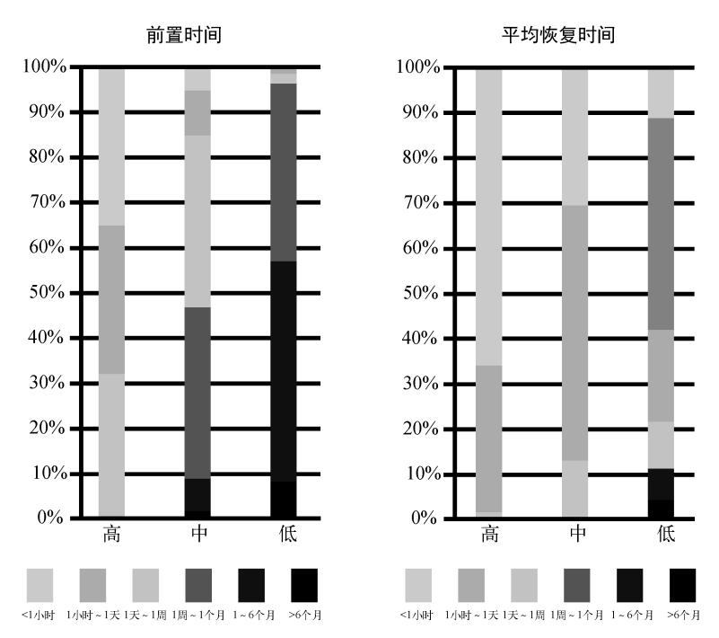

图 12-3 高绩效组织有着更快的部署速度和更短的平均恢复时间(另见彩插) (来源:Puppet Labs 的《2014 年 DevOps 现状报告》)

通过构建上述能力,能够实现一键式代码部署,通过部署流水线将代码和环境变更一起安 全、快速地发布到生产环境中。

#### **\*** 案例研究 **\*** Etsy 持续部署案例——开发人员自助式部署(2014 年)

与 Facebook 让发布工程师来管理部署活动的方式不同,在 Etsy,任何想要执行部 署的人都能直接部署,包括开发人员、运维人员和信息安全人员。Etsy 的部署流程是如 此安全和常规,以至于新入职的工程师在第一天就会执行生产环境部署。当然,Etsy 的 董事会成员也可以执行部署,甚至连"小狗都可以"!

Etsy 的测试架构师 Noah Sussman 是这样描述的:"在一个普通的工作日里,刚到上 午 8 点整,就有大约 15 个人和小狗开始排队。大家都希望在下班之前,一起部署完 25 个变更集。"

想要部署代码的工程师,首先要进入聊天室,并把各自的工作添加到部署队列中。 然后,他们会观察正在进行的部署活动,看看还有谁在队列中,也会广播自己的活动进 展,并在需要帮助的时候,寻求其他工程师的帮助。轮到某个工程师部署时,他会收到 通知。

Etsy 的目标是,尽量使用最少的步骤,使生产环境部署简单且安全。在开发人员提 交代码之前,他们就在自己的工作站上执行了 4500 多个单元测试,而这些测试仅需要 不到一分钟的时间。对外部系统(如数据库)的所有调用都已经打桩了。

在代码变更被提交至主干以后,持续集成服务器上会立即执行 7000 多个自动化测 试用例。Noah Sussman 写道:"通过试错,我们已经可以把测试时间控制在大约 11 分钟 以内。[当某个变更引发问题并且需要修复时,]这给再一次执行自动化测试提供了机会, 使修复时间不会超过规定的 20 分钟太多。"

Noah Sussman 说,如果所有测试都按顺序执行,那么"执行 7000 多个测试用例将 需要大约半个小时。因此,我们把测试分成了几组,使它们并行地运行在由 10 台服务 器组成的 Jenkins[持续集成]服务器集群上。这样做让我们实现了 11 分钟的目标"。

接下来要执行的是冒烟测试,这是系统级测试,用 cURL 来执行 PHPUnit 测试用例。 在冒烟测试之后是功能测试,即对运行中的服务器执行由界面操作触发的端到端测试。 服务器既可以在 QA 环境中,也可以在预生产环境中(即图 12-4 中的 Princess)。实际 上,它是从生产环境中撤回的生产服务器,能保证测试环境和生产环境完全一致。

Erik Kastner 写道:"[当轮到某个工程师部署时,]他会打开部署控制台 Deployinator, 然后点击 Push to QA 按钮。进入预生产环境 Princess……然后,一切都准备就绪时,就 点击 PROD!!!按钮,代码很快就能上线。IRC 聊天频道中的每个人都知道是谁发布了代 码,以及是什么代码。部署完成之后,会返回一个显示部署前后差异的链接。即使是不 在 IRC 上的人,也会收到电子邮件通知,所有人都会收到相同的信息。"(见图 12-4)

Etsy 在 2009 年的部署流程给公司员工带来了压力和恐惧。到 2011 年,部署已经成 了常规操作,每天都有 25~50 次部署,这使得工程师能够快速地发布代码,并向客户 交付价值。

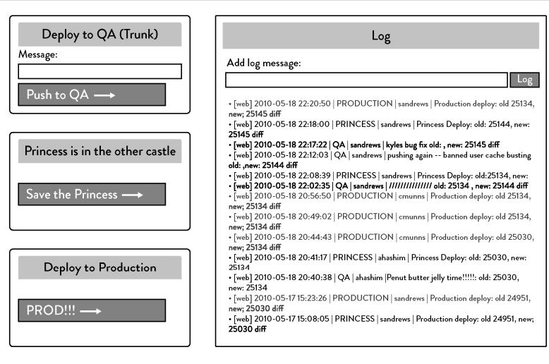

图 12-4 Etsy 的部署控制台 Deployinator

(来源:Erik Kastner 的文章"Quantum of Deployment"①)

#### 12.2 将部署与发布解耦

在传统的软件项目发布模式下,软件由发布日期驱动。在发布日前夜,已完成(或者尽可能 接近完成)的软件被部署到生产环境中。第二天早上,我们向全世界宣布新版本上线,并开始接 受订单和向客户提供新功能。

然而,事情在很多时候都不会按原计划进行。有可能会遇到从未测试过,甚至从未想过的生 产负载,结果导致大规模的服务中断,使客户和组织遭受影响。更糟糕的是,恢复服务可能是一 个令人痛苦的回滚过程,或者是有着同样风险的前向修复操作;在生产环境中直接进行变更操作, 对于操作者来说可能是非常痛苦的经历。在一切都恢复正常以后,所有人才能松口气,然后庆幸 不用经常向生产环境部署和发布代码。

然而,只有进行更频繁的部署,才能实现流畅和快速的工作流。为了实现这一点,需要将生 产环境部署和特性发布解耦。在实践中,人们通常交替使用"部署"和"发布"这两个词。然而, 它们其实是不同的动作,并且有着截然不同的目标。

——————————

① https://codeascraft.com/2010/05/20/quantum-of-deployment/

- 部署是指在特定的环境中安装指定版本的软件(例如,将代码部署到集成测试环境中或 生产环境中)。具体地说,部署可能与某个特性的发布相关,也可能无关。
- 发布是指把一个特性(或者一组特性)提供给所有客户或者一部分客户(例如,向 5%的客 户群开放特性)。代码和环境架构要能够满足这种要求:特性发布不需要变更应用的代码。①

换句话说,如果我们混淆了部署和发布,就很难界定到底由谁来对结果负责。解耦这两个活 动,可以提升开发人员和运维人员快速且频繁部署的能力,同时使产品负责人承担成功发布的责 任(即确保构建和发布特性所花的时间是有价值的)。

本书所描述的实践确保了在特性的开发过程中进行快速和频繁的生产部署,并降低由于部署失 败而造成的风险和影响。但发布风险依然存在:已发布的特性是否能满足客户需求并达到业务目标?

如果部署周期过长,就会限制向市场频繁地发布新特性的能力。然而,假如能够做到按需部 署,那么何时向客户发布新特性,就成了业务和市场决策,而不再是技术决策。通常使用的发布 模式有以下两种。

- 基于环境的发布模式:在两个或更多的环境中部署系统,但实际上只有一个环境处理客 户流量(例如,通过配置负载均衡器切换流量)。将新的代码部署到非生产环境中,然后 再把生产流量切换到这个环境。这种模式非常强大,因为一般只需要对应用做很少的改 变,或者几乎不用改变。这种模式包括蓝绿部署、金丝雀发布和集群免疫系统。我们随 后将讨论这些模式。
- 基于应用的发布模式:对应用进行修改,从而通过细微的配置变更,选择性地发布或开 放应用特性。例如,可以通过特性开关逐渐地开放新特性——先开放给开发团队,再开 放给所有内部员工,然后开放给 1%的客户;或者在确认特性完全符合设计后,直接发布 给全体客户。这就是所谓的黑启动技术——在生产环境里将所有特性都部署完毕,并在 发布前用生产环境的流量做测试。例如,在发布前的几周里,用生产环境的流量来测试 新特性,以便在正式发布之前发现和解决所有问题。

#### 12.2.1 基于环境的发布模式

——————————

解耦部署和发布将极大地改变我们的工作方式。我们不再需要为了降低对客户可能造成的负 面影响而在三更半夜或周末做部署。相反,我们可以在正常的工作时段里进行部署。运维人员终 于能像其他人一样正常下班了。

本小节重点介绍基于环境的发布模式,这种发布模式不需要更改应用的代码。我们使用多套 环境来部署,但实际上只有一套环境处理客户流量。这种方式可以显著地降低生产环境发布的风

① 可以用美军的"沙漠盾牌行动"做一个形象的比喻。从 1990 年 8 月 7 日开始,美军在 4 个多月内将成千上万的人 员和物资安全地部署到了海湾地区。

险,并缩短部署时间。

#### 1. 蓝绿部署模式

蓝绿部署是 3 种模式中最简单的一种。在这种模式下,我们有两个生产环境:蓝环境和绿环 境。在任一时刻,只有其中的一个环境处理客户流量。在图 12-5 中,处理客户流量的是绿环境。

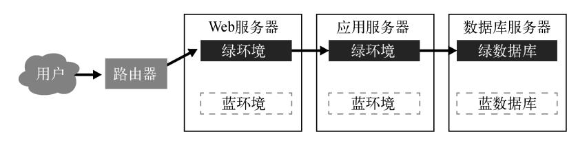

图 12-5 蓝绿部署模式

(来源:《持续交付:发布可靠软件的系统方法》)

在发布新版本的服务时,先把它部署到非在线环境,以便在不影响用户体验的情况下执行测 试。在确信一切都正常以后,再把客户流量切换到蓝环境,用这种方式来交付新版本。之后,蓝 环境就变成了生产环境,绿环境则变为预生产环境。通过把客户流量再重定向回绿环境,还可以 实现回滚。①

蓝绿部署模式比较简单,也非常易于在已有的系统中实现。它有很多好处,例如能使团队在 正常的工作时段内执行部署工作,并在非高峰时段里轻松地实施版本切换(如变更路由配置或符 号链接)。仅这些就能使部署团队的工作境遇得到巨大的改善。

#### 2. 处理数据库变更

——————————

当应用的两个版本依赖同一个数据库时,就会出现问题。如果部署操作需要更改数据库模式, 或者添加、修改或删除表或列,那么数据库将无法同时支持应用的两个版本。一般通过下面两种 方法来解决这个问题。

 创建两个数据库(即蓝数据库和绿数据库):应用的每个版本——蓝色(旧版本)和绿色 (新版本)——都有自己的数据库。在发布期间,将蓝数据库设置为只读模式,然后执行 备份,再恢复到绿数据库,最后将流量切换到绿环境。这种模式的问题是,如果需要回 滚到蓝色版本,就必须先手动地把事务数据从绿数据库迁移回蓝数据库,否则可能丢失 这些数据。

① 可以使用各种技术来实现蓝绿部署模式,包括配置多个 Apache 或 NGINX Web 服务器,让它们监听不同的物理或 虚拟网卡;在 Windows IIS 服务器上,将多个虚拟根目录绑定到不同的网络端口上;使系统的每个版本使用不同 的目录,并用符号链接的方法来设置哪一个是在线的(例如 Ruby on Rails 的 Capistrano);同时运行服务或中间件 的多个版本,使每个实例监听不同的网络端口;使用两个数据中心,在二者之间切换流量,而不是仅仅将它们当 作热备和温备的灾备中心使用(通过轮换使用两个环境,也能始终确保灾难恢复流程按照期望工作);此外,还 可以使用公有云里不同的可用区。

 将数据库变更与应用变更解耦:与支持两个版本的数据库不同,通过执行以下两项操作, 将数据库的变更发布和应用的变更发布解耦:首先,只对数据库进行增量式变更,不更 改已有的数据库对象;其次,应用逻辑对生产环境里的数据库版本不做假设。这与我 们对数据库一贯的思维方式有很大差异,这样做就避免了产生重复数据。IMVU 等公司 在 2009 年前后采用了以上流程,每天能进行 50 次部署,其中的一些是需要变更数据库的 操作。①

#### **\*** 案例研究 **\***

#### Dixons 对 POS 系统进行的蓝绿部署(2008 年)

Dan North 和 David Farley 曾经共同在英国大型零售商 Dixons 的一个项目里工作。 该零售商拥有数千个 POS 系统,这些系统分布在各个品牌旗下的数百家零售商店中。

尽管蓝绿部署一般用于在线 Web 服务,但是 Dan North 和 David Farley 用这种模式 极大地降低了 POS 系统升级的风险,同时缩短了版本切换需要的时间。

通常,升级 POS 系统是庞大的瀑布式项目:POS 客户端和中央服务器将会同步升 级,这需要很长的停机时间(一般是整个周末),而且将新版的 POS 客户端软件推送给 所有零售商店,需要大量的网络带宽。一旦升级工作脱离了原定的计划,就会对商店的 销售业务造成巨大影响。

Dixons 并没有足够的网络带宽条件支持所有的 POS 系统同时升级,因此传统方式 行不通。为了解决这个问题,他们采用了蓝绿部署策略,并创建了两个版本的中央生产 服务器,使它们能够同时支持旧版本和新版本的 POS 客户端。

在完成这些工作之后,他们在计划升级 POS 系统的前几周里,通过缓慢的网络链 路开始向零售商店推送新版本 POS 客户端软件的安装程序,同时将新版本对应的后台服 务器端软件也部署到了系统中,并配置为非活动状态。与此同时,旧版本保持正常运行。

当所有的 POS 客户端都下载完升级包以后(升级版的客户端和服务器端已成功通 过测试,并且新版本已经部署到所有门店),由门店经理来决定什么时间发布新版本。

根据门店各自的业务需求,那些希望立即使用新特性的门店经理可以选择立即升 级,其他门店经理则可以选择稍后再升级。对于门店经理来说,这种方式明显优于 IT 部门替他们选择升级时间。

——————————

① 这个模式也经常被称为"扩展与收缩模式"。Timothy Fitz 描述道:"我们不去改变数据库对象,如已有的列或表。 相反,我们先通过添加新对象使数据库扩展,然后通过删除旧对象使数据库收缩。"此外,有越来越多的技术支 持数据库的虚拟化、版本控制、打标签和回滚,例如 Redgate、Delphix、DBMaestro 和 Datical;DBDeploy 等开源 工具能使数据库变更操作更安全、更快速。

蓝绿部署的成效显著:发布过程明显变得更加顺畅和迅速,门店经理的满意度也提 高了,而且门店销售业务中断的情况也明显改善。另外,这个案例是对胖客户端 PC 应 用执行蓝绿部署。它证明,DevOps 模式可以普遍地应用于不同类型的技术。虽然应用 方式往往出乎人们的意料,但是都能取得显著的成果。

#### 3. 金丝雀发布模式和集群免疫系统发布模式

蓝绿部署模式实现起来比较简单,而且可以显著地提高软件发布的安全性。它有一些变体, 能通过自动化进一步提高安全性和缩短部署时间,但同时可能引入复杂性。

在确定代码能够正常运行以后,金丝雀发布模式将发布过程自动化,并逐步推广到更大、更 关键的环境中。

金丝雀发布这个术语来自于煤矿工人把笼养的金丝雀带入矿井的传统。矿工通过金丝雀来了 解矿井中一氧化碳的浓度。如果一氧化碳的浓度过高,金丝雀就会中毒,从而使矿工知道应该立 刻撤离。

在金丝雀发布模式下,我们会监控软件在每个环境中的运行情况。一旦出现问题,就回滚; 否则就在下一个环境中进行部署。①

图 12-6 显示了 Facebook 为了采用这种发布模式而创建的运行环境组。

A1 组:仅向内部员工提供服务的生产环境服务器。

——————————

- A2 组:仅向一小部分客户提供服务的生产环境服务器,在软件达到某些验收标准后部署 (自动化部署或手动部署均可)。
- A3 组:其余的生产环境服务器,软件在 A2 组中达到某些验收标准后再部署。

集群免疫系统扩展了金丝雀发布模式,将生产环境的监控系统和发布流程联系起来,并在面 向用户的生产系统的性能超出预定范围时(如新用户的转化率低于 15%~20%),自动回滚代码。

这种保护措施有两个明显优势:首先,避免了通过自动化测试难以发现的缺陷,例如使某些 关键的页面元素不可见的页面变更(如 CSS 代码变更);其次,减少了排查和解决变更造成的性 能下降问题所需的时间。②

① 请注意,金丝雀发布模式要求在生产环境中同时运行软件的多个版本。但是,由于每在生产环境中增加一个版本, 就会增加额外的复杂性,因此应当使版本数量最小化。要做到这一点,可能会用到上文描述的扩展与收缩模式。

② Eric Ries在 IMVU 工作期间首次描述了集群免疫系统。Etsy 在其 Feature API库中提供了这个功能,它也被 Netflix 采 用。

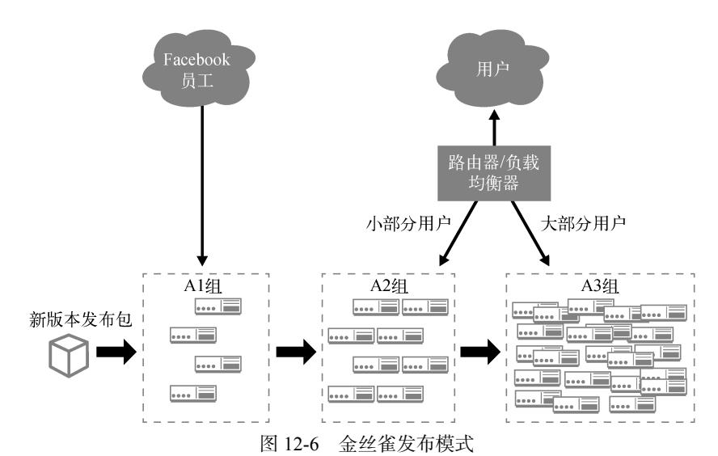

(来源:《持续交付:发布可靠软件的系统方法》)

#### 12.2.2 基于应用的发布模式更安全

上一小节介绍了基于环境的发布模式。它的特点是,通过使用多个环境并在其间切换流量, 实现部署与发布的解耦。这是完全能在基础设施层面上实现的。

本小节将介绍基于应用的发布模式,通过代码来更灵活、更安全地向客户发布新特性(通常 是逐一发布特性)。因为基于应用的发布模式是在应用的代码里实现的,所以需要开发团队的 参与。

#### 1. 实现特性开关

——————————

基于应用的发布模式主要是通过特性开关来实现的。特性开关机制使我们能在不进行生产环 境代码部署的情况下,选择性地启用和禁用特性。通过特性开关,可以将应用的特性向某些特定 用户(例如内部员工和某些客户群)开放。

特性开关的实现机制通常是用条件语句封装应用逻辑或用户界面元素,并根据保存在某处的 配置信息启用或禁用某个特性。可以使用简单的应用配置文件(例如 JSON 或 XML 格式的配 置文件)存储配置信息,也可以通过服务目录来配置,甚至可以专门设计用于管理特性开关的 Web 服务。①

① Facebook 的 Gatekeeper 就是这样的服务。它是 Facebook 开发的内部服务,能基于用户的位置、浏览器类型和用 户资料数据(如年龄和性别)等信息,动态地选择哪些特性对用户可见。例如,可以把某个特性配置成只能被内 部员工或 10%的用户使用,或者只有年龄在 25~35 岁的用户可以使用。其他例子包括 Etsy 的 Feature API 库和 Netflix 的 Archaius 库。

特性开关还具有如下优势。

- 轻松地回滚:只需更改特性开关的设置,就可以在生产环境中,快速安全地禁用出了问 题或造成服务中断的特性。在非频繁部署的情况下,它的价值更大——关掉某一个特性 通常要比回滚整个版本容易得多。
- 缓解性能压力:当服务遭遇极高的负载时,通常需要扩容系统;更糟糕的是,可能导致 生产环境中的服务中断。不过,可以使用特性开关来缓解系统的性能压力。换句话说, 可以通过减少可用的特性,来支持更多的用户(例如,减少使用某特性的客户数量,禁 用推荐等 CPU 密集型特性,等等)。
- 采用面向服务架构提高恢复能力:即便某个特性依赖于还没有上线的服务,仍然可以将 这个特性部署到生产环境中,然后用特性开关把它先隐藏起来。当它所依赖的服务上线 后,就可以启用这个特性。同样,当所依赖的服务中断时,也可以关闭该特性,这样做 不但可以和下游的故障服务隔离,同时还可以保持应用的其余部分正常运行。

为了保证能发现所有特性的缺陷,应该在打开所有特性开关的情况下执行自动化验收测试。 (还应该测试特性开关功能本身是否正常!)

特性开关将代码部署与特性发布解耦。在本书后面的内容中,我们将使用特性开关实现假设 驱动开发和 A/B 测试,从而进一步提高实现业务目标的能力。

#### 2. 实现黑启动

特性开关实现的效果是,将特性部署到生产环境中,但暂时使其不可用。它使黑启动技术成 为可能——先把所有特性都部署到生产环境中,然后对客户不可见的特性执行测试。对于大规模 或高风险的变更来说,黑启动过程往往持续数周,从而保证在正式发布之前使用类生产负载安全 地进行测试。

假设我们使用黑启动技术发布了一个有很大潜在风险的新特性,如新的搜索功能、账户创建 流程或数据库查询。在将所有代码都部署到生产环境中之后,禁用新特性,然后通过修改用户会 话代码调用新函数,不向用户显示调用结果,而仅记录或丢弃测试结果。

例如,我们可以让 1%的在线用户对将要发布的新特性做隐式调用,同时观察新特性在此工 作负载下的表现。在发现并解决完所有问题后,提高用户访问频率并增加用户数量,以此逐渐增 加模拟的负载。通过这种方式,就能够安全地模拟出接近于生产环境的负载,从而确信服务能正 常运行。

此外,在发布特性时,可以采用渐进的方式将其开放给一小部分客户。一旦出现任何问题, 就中止发布。这样做可以把实际使用该特性的客户的数量降至最低,一旦发现缺陷或性能问题, 就关闭该特性。

John Allspaw在 2009年担任 Flickr运营副总裁时,向雅虎高管团队汇报了他们的黑启动流程。 他写道:"黑启动已经让每个人的信心大到几乎对它冷漠的程度,大家根本就不担心负载问题。 我不知道,在过去 5 年里的每一天中,发生过多少次代码部署……我根本就不在乎,因为生产环 境中的变更发生问题的概率极低。当出现问题时,Flickr 的任何工作人员都可以在一个网页上找 到答案:何时做的变更,是谁做的,变更了什么(逐行显示代码变更)。"①

在应用和环境中构建合适的生产遥测系统以后,就可以实现更快的反馈周期。这样一来,当 把某个特性部署到生产环境之后,便可以立刻验证业务假设和结果。

通过这种方式,我们再也不用等到大规模的发布以后才能验证客户对产品的满意度。相反, 在宣布进行重大发布时,我们已经完成了对业务假设的验证,并且在真实的客户中进行了无数次 的改良实验,这些措施有助于提高产品和客户需求的匹配度。

#### **\*** 案例研究 **\***

#### Facebook 聊天功能的黑启动过程(2008 年)

若以网页浏览量和独立访客数量来衡量,Facebook 一直是近 10 年来最受欢迎的一 个网站。2008 年,Facebook 的日活跃用户数超过 7000 万,这给 Facebook 开发聊天功能 的团队带来了挑战。②

聊天功能开发团队的工程师 Eugene Letuchy 描述了并发用户数给软件工程带来的 巨大挑战:"在聊天系统中,最耗费资源的操作并不是发送消息,而是为每个在线用户 都持续更新其好友在线、离开或离线的状态,以便开始聊天。"

Facebook 的团队几乎花了一年的时间才实现这个计算密集型特性。③该项目的复杂 性在于,为了达到所需的性能,需要用到各种编程语言,包括 C++、JavaScript 和 PHP, 并在后端的基础设施中首次使用 Erlang。

在团队这一年的奋斗过程中,他们每天都把代码提交到版本控制系统里,然后至少 每天都做一次生产环境部署。刚开始时,聊天功能只对团队成员开放,后来对所有Facebook 员工开放。通过 Facebook 的特性开关服务 Gatekeeper,聊天功能对外部用户完全不可见。

作为黑启动流程的一部分,每个 Facebook 用户会话(在用户端浏览器中运行 JavaScript代码)都加载了测试工具。虽然聊天功能的用户界面元素被隐藏起来,但浏览器 还是会向已部署在生产环境中的后台聊天服务器发送用户不可见的聊天测试信息,这使开

——————————

① Facebook 的发布工程总监 Chuck Rossi 也谈道:"我们计划在未来 6 个月里推出的特性,其所有的代码都已经被部 署到了生产服务器上。我们要做的就是将它们逐一开放。"

② 到 2015 年,Facebook 的活跃用户数已经超过 10 亿,比前一年增长了 17%。

③ 计算需要极端的立方阶模型。换句话说,计算时间随着在线用户数、好友人数,以及好友状态的变化频率呈指数增加。

发团队能够在整个项目过程中模拟出类生产负载,从而在发布之前找出并解决性能问题。

这种方式使得每个 Facebook 用户都成为大规模负载测试的一份子,开发团队由此 可以相信,系统能够处理真实的负载。聊天功能的发布和启用只需要两个步骤:在 Gatekeeper 上将聊天功能配置为对某些外部用户可见,然后让用户重新加载浏览器中的 JavaScript 代码,使聊天功能的用户界面元素可见,同时禁用测试代码。在出现问题时, 用相反的步骤撤回聊天功能。发布之日相当成功和平静,用户量几乎在一夜之间从零涨 到 7000 万。聊天功能的开放是渐进式的:首先对所有 Facebook 员工开放,然后是 1% 的客户群,再然后是 5%,等等。正如 Eugene Letuchy 所说:"在一夜之间把用户量从零 涨到 7000 万的秘诀就是,千万别想一步登天。"

#### 12.3 持续交付和持续部署实践的调查

在《持续交付:发布可靠软件的系统方法》一书中,Jez Humble 和 David Farley 定义了持续 交付这一概念。持续部署这个术语最早则是由 Tim Fitz 在他的博客文章"IMVU 的持续部署:不 可思议的每天 50 次"中提出的。然而,Jez Humble 在 2015 年参与写作本书时评论道:"在过去 的 5 年里,人们对持续交付和持续部署的区别有所误解。的确,我自己对二者的看法和定义也发 生了改变。每个组织都应该根据自己的需求做出选择。我们不应该关注形式,而应该关注结果: 部署应该是低风险、按需进行的一键式操作。"

他对持续交付和持续部署的新定义如下。

持续交付是指,所有开发人员都在主干上进行小批量工作,或者在短时间存在的特 性分支上工作,并且定期向主干合并,同时始终让主干保持可发布状态,并能做到在正 常的工作时段里按需进行一键式发布。开发人员在引入任何回归错误时(包括缺陷、性 能问题、安全问题、可用性问题等),都能快速得到反馈。一旦发现这类问题,就立即 加以解决,从而保持主干始终处于可部署状态。

持续部署是指,在持续交付的基础上,由开发人员或运维人员自助式地定期向生产 环境部署优质的构建版本,这通常意味着每天每人至少做一次生产环境部署,甚至每当 开发人员提交代码变更时,就触发一次自动化部署。

从上述定义可知,持续交付是持续部署的前提条件,就像持续集成是持续交付的前提条件一 样。持续部署更适用于交付线上的 Web 服务,而持续交付适用于几乎任何对质量、交付速度和 结果的可预测性有要求的低风险部署和发布场景,包括嵌入式系统、商用现货产品和移动应用。

在亚马逊和谷歌,大多数团队都采用持续交付实践,但也有一些团队选择持续部署;因此, 不同团队部署代码的频率和操作方式有很大差异。团队有权根据自己的风险管理能力选择部署方 式。例如,Google App Engine 团队通常每天部署一次,谷歌搜索团队则每周部署多次。

本书中的大多数案例都与持续交付有关,例如在惠普 LaserJet 打印机上运行的嵌入式软件、 在 COBOL 大型机应用等 20 个技术平台上运行的 CSG 票据打印系统,以及 Facebook 和 Etsy。持 续交付可用于很多类型的软件平台,包括手机、控制卫星的地面站等。

#### 12.4 小结

正如 Facebook、Etsy 和 CSG 的案例所示,发布和部署不一定是高风险、状况百出的工作, 也不一定需要几十个甚至几百个工程师加班加点地完成。相反,它们可以成为日常工作的一部分。

将发布和部署融入日常工作,能够把部署时间从几个月缩短到几分钟,使组织能够快速地向 客户交付价值,同时避免意外事故和服务中断。此外,开发人员和运维人员的紧密合作,能使运 维工作变得人性化。

#### 第 13 章

——————————

# 降低发布风险的架构

几乎每个 DevOps 模范公司都曾因为架构问题而身陷绝境,包括 LinkedIn、谷歌、eBay、亚 马逊和 Etsy。这些公司最终都化险为夷,其秘诀是采用更合理的架构,从而在解决问题的同时满 足业务需求。

这就是演进式架构原则,正如 Jez Humble 所说:"任何成功的产品或公司,其架构都必须在 生命周期里不断演进。"Randy Shoup 在加入谷歌以前,曾在 2004~2011 年期间担任 eBay 的首席 工程师和架构师。他曾说:"eBay 和谷歌都曾自上而下地把整个架构进行了 5 次重构。"

他回忆道:"现在看来,当时的一些技术和架构选择很有远见,其他一些则不然。对于组织 当时的目标而言,每个决策都是最好的。如果一开始在 1995 年就试图实现微服务架构,那么我 们极有可能失败,让自己不堪重负,甚至危及整个公司。"①

如何从已有的架构转为新的架构,这是一大挑战。当需要重新设计架构时,eBay 先做了一 个小型试点项目,以此证明对问题的理解是充分和彻底的。例如在 2006 年,Randy Shoup 的团队 计划将网站的某些功能迁移到全栈 Java 架构,他们按业务收入将页面做了排序,从而识别出能 获得最佳投入产出比的网站功能。通过对这些功能进行架构迁移试点,他们避免了付出得不到回 报的问题。

Randy Shoup 的团队在 eBay 做了教科书式的架构设计演进。他们采用了绞杀者应用(strangler application)模式,而不是在无法继续满足组织目标的架构上直接"剥离和替换"旧服务。首先 将已有功能用 API 封装起来,避免对它们做变更;然后在使用新架构的新服务中实现所有的新功 能,只有在必要的时候才调用旧系统的 API。

绞杀者应用模式尤其适用于将单体应用或紧耦合服务的部分功能迁移至松耦合架构。我们 经常发现自己面对的是数年前(或数十年前)设计的紧耦合架构,其各个组件之间的依赖关系非 常强。

① eBay 的架构演进过程如下:Perl 语言加文件系统(v1,1995 年),C++语言加 Oracle 数据库(v2,1997 年),XSL 加 Java 语言(v3,2002 年),全栈 Java 语言(v4,2007 年),Polyglot 微服务(从 2013 年开始)。

过于紧耦合的架构可能带来这样的后果:每当试图提交代码到主干,或将代码发布到生产环 境中时,都有可能导致整个系统出现故障(例如,提交的代码破坏了其他所有人的测试和功能, 或者让整个网站崩溃)。为了避免发生这种情况,任何小规模的变更都需要数天或数周的大量沟 通和协调工作,还可能需要得到所有利益相关者的批准。部署工作也困难重重:每次部署的工作 量增加,集成和测试工作变得更加复杂,问题发生的概率也进一步增加。

即便是进行小规模的部署变更,也可能需要与数百位(甚至数千位)相关的开发人员协调, 其中的任何一个变更操作都有可能引发灾难性故障,而定位并解决问题很可能需要数周的时间。 (这导致了另一个问题:"开发人员只有 15%的时间写代码,其余的时间都花在了会议上。")

上述所有问题共同导致了极不安全的工作系统,即使是小变更也会造成不可预知的灾难性后 果。这样的系统还常常导致对集成和部署代码的恐惧,并形成恶性循环,使部署频率越来越低。

从企业架构的角度来看,这个恶性循环的形成符合热力学第二定律,对于复杂的大型组织来 说更是如此。*Architecture and Patterns for IT Service Management, Resource Planning, and Governance* 一书的作者 Charles Betz 指出:"[IT 项目负责人]并不对整个系统的熵①负责。"换句话说,降低系 统的整体复杂性,以及提高整个开发团队的生产力,几乎从来就不是某一个人的目标。

本章将介绍可以逆转上述恶性循环的措施,同时回顾一些主要的架构原型,探究有助于提高 开发生产力、可测试性、可部署性和安全性的架构特性,以及相关的架构迁移策略,以便从任何 现有架构安全地迁移至能更好地实现组织目标的架构。

#### 13.1 能提高生产力、可测试性和安全性的架构

——————————

紧耦合架构不仅会降低生产力,还会影响安全变更的能力。接口定义清晰的松耦合架构则与 之相反,它优化了模块间的依赖关系,提高了生产力和安全性,让小型且高产的"双比萨"团队 可以执行小的变更,并能安全和独立地进行部署。因为每个服务都有一个定义明确的 API,所以 更容易测试,团队之间的服务等级协议条款也更容易确定。

正如 Randy Shoup 所说:"这种类型的架构极其适合于谷歌。像 Gmail 这样的服务,下面还 有五六层服务,每层服务都专注于某个特定功能。每个服务都由一个小型团队提供支持,他们负 责服务的构建和运行,但每个团队选择的技术各不相同。另一个例子是 Google Cloud Datastore, 它是世界上最大的一个 NoSQL 服务,但其支持团队只有大约 8 个人,这主要是因为它是构建在 一层层可靠的基础服务之上的。"(见图 13-1)

这种面向服务的架构能让小型团队各自负责更小、更简单的开发任务,并且每个团队都可以

① 在热力学中,熵可以被简单地理解为对系统无序程度的表示。根据热力学第二定律,孤立系统的熵值永不减少。

独立、快速和安全地进行部署。Randy Shoup 指出:"谷歌和亚马逊等例子表明,这样的架构能够 影响组织结构,从而使组织拥有灵活性和可扩展性。这些组织都有成千上万的开发人员,但他们 的小型团队仍然能展现出令人难以置信的生产力。"

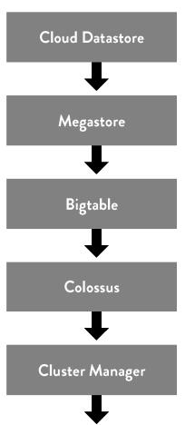

图 13-1 谷歌云数据库服务 Google Cloud Datastore (来源:Randy Shoup,"从单体应用到微服务")

#### 13.2 架构原型:单体架构与微服务

大多数 DevOps 组织都曾深深地被紧耦合的单体架构困扰。虽然单体架构非常成功地帮助这 些组织实现了产品与市场的高度契合,但是当组织规模扩大后,这样的架构却成了很大的隐患(例 如,eBay 在 2001 年的单体 C++应用、亚马逊在 2001 年的单体 Obidos 应用、Twitter 在 2009 年的 单体 Rails 前端,以及 LinkedIn 在 2011 年的单体 Leo 应用)。在这些案例中,每个公司最终都重 构了自己的系统,不仅帮助自己生存下来,而且茁壮成长,并在市场中赢得一席之地。

单体架构的本质并不坏。事实上,在产品生命周期的早期阶段,单体架构通常是最佳的选择。 正如 Randy Shoup 所说:"没有一个可以适用于所有产品和规模的完美架构。任何架构都能满足 特定的一组目标,或一系列需求和条件,例如上市时间、易于功能开发和系统扩展等。随着时间 的推移,任何产品或服务的功能必然都要与时俱进;毫无疑问,架构需求也一样。那些为普通规 模设计的架构,很少能在 10 倍或 100 倍的规模下有效。"

表 13-1 展示了主要的架构原型,每一行对应一个组织需求,后两列分别给出了每种原型的 优点和缺点。从表中可以看出,适用于创业公司的单体架构(例如,需要为新特性快速创建原型, 或者公司的战略目标可能出现重大改变)完全不同于拥有数百个开发团队的公司所采用的架构,

后者的每一个团队都要能够独立地向客户交付价值。通过采用与时俱进的演进式架构,能够确保 组织当下的需求得到满足。

表 13-1 架构原型(来源:Randy Shoup,"从单体应用到微服务")

|                                                    | 优 点                                                                       | 缺 点                                                                                               |
|----------------------------------------------------|------------------------------------------------------------------------------|------------------------------------------------------------------------------------------------------|
| 单体架构 1.0 (所有功能都在一个 应用里)                   | 开始简单  进程间延迟低  一个代码库,一个部署对象  当规模小时,资源利用率高            | 协调成本随团队规模增加  模块划分得不清晰  不容易扩展  部署要么全面成功,要么彻底失败(停机、故障)  构建时间长          |
| 单体架构 2.0 (一组单体层:"前端 展示""应用服务器" "数据库层") | 开始简单  容易做连接查询  一个数据库模式,一个部署对象  当规模小时,资源利用率高         | 耦合程度随时间提高  不容易扩展,冗余能力差(要么全做,要么没有,  仅支持垂直方向扩展) 不容易调优  数据库模式管理要么全面,要么彻底没有  |
| 微服务 (模块化、独立、图形 关系而不是分层、隔 离的持久化)           | 每个单元都是简单的  可扩展性和性能都是独立的  独立的测试和部署  能做性能的调优(缓存、复制等)  | 交互单元很多  需要很多个小代码库  需要更复杂的工具和依赖项管理  网络延迟                                     |

#### **\*** 案例研究 **\***

#### 亚马逊的演进式架构(2002 年)

亚马逊的架构演进是被研究得最多的一个案例。首席技术官 Werner Vogels 在接受 ACM 图灵奖获得者和微软技术院士 Jim Gray 的采访时说:"1996 年,亚马逊始于一个 单体应用,它运行在有后端数据库的 Web 服务器上。这个名为 Obidos 的应用最终拥有 了所有的业务逻辑、显示逻辑,以及亚马逊最著名的功能:相似产品、商品推荐、 Listmania、评论,等等。"

随着时间的推移,Obidos 变得越来越复杂,共享关系的复杂造成某些组件不能按需 扩展。Werner Vogels 告诉 Jim Gray 说:"这意味着,我们所期望那些在优秀的软件架构 中能发生的许多事,都无法实现,因为这是由很多复杂的组件构成的单体系统。它不可 能再继续演进下去了。"

在描述向新架构演进的心路历程时,Werner Vogels 说道:"经过认真的反省后,我 们得出的结论是,只有面向服务的架构才能提供所需的隔离度,从而让我们能够快速且 独立地构建软件组件。"

Werner Vogels 继续说道:"亚马逊在过去的 5 年(这里指 2001~2005 年)里经历了 巨大的架构变迁:从两层的单体架构彻底转为分布式的去中心化服务平台,该平台服务 于大量不同的应用。这一成果依赖于大量创新,我们是这种转型的早期实践者。"亚马 逊的经验教训对我们理解架构转型很重要。

- 经验 1:严格遵从面向服务理念的架构设计能完美地实现隔离,从而达到前所未 有的掌控水平。
- 经验 2:禁止客户端直接访问数据库,使在不涉及客户端的情况下提高服务状态 的可扩展性和可靠性成为可能。
- 经验 3:在切换到面向服务的架构后,开发和运维流程将受益匪浅。服务模式进 一步强化了以客户为中心的团队理念。每个服务都有一个与之对应的团队,该 团队对服务全面负责(从功能规划到架构设计、构建和运维)。

运用以上经验,开发人员的生产力和可靠性将得到极大的提升。2011 年,亚马逊每 天执行大约 15 000 次部署;到 2015 年,日部署量达到近 136 000 次。

#### 13.3 安全地演进企业架构

2004 年,Martin Fowler 创造了绞杀者应用这一术语。这源于他在澳大利亚旅行时由当地藤 类绞杀植物得到的启发。他写道:"它们的种子落在无花果树的顶部,然后藤蔓逐渐沿树干向下 生长,最后在土壤中生根。多年以后,藤蔓形成奇妙和美丽的形状,但同时绞杀了其宿主树。"

如果确信已有的架构过于紧耦合,那么可以在其基础上安全地解耦部分功能。通过这种方式, 负责这些功能的开发团队能够独立且安全地进行开发、测试和部署,同时减少了架构的熵。

如前所述,绞杀者应用模式涉及用 API 封装已有功能,并按照新架构实现新的功能,仅在必 要时调用旧系统。在绞杀者应用模式下,所有服务都通过版本化 API 访问,也称为版本化服务或 不可变服务。

版本化 API 能够在不影响调用者的情况下变更服务,这降低了系统的耦合度。如果需要修改 参数,就创建一个新的 API 版本,并将依赖该服务的团队迁移至新版本。如果允许新的应用与其 他任何服务发生紧耦合(例如直接连接到另一个服务的数据库),那么我们将无法实现重构架构的 目标。

如果调用的服务没有清晰定义的 API,那么就要构建它们,或至少在有清晰 API 定义的客户 端库中,隐藏与这种系统通信的复杂性。

通过不断地从已有的紧耦合系统中解耦功能,工作被逐渐转移到一个安全且充满活力的生态 系统中,这使开发人员的生产力大大提高,同时已有的应用功能逐渐萎缩。当所有业务功能都迁 移至新架构之后,旧应用甚至可能完全消失。

通过创建绞杀者应用,可以避免运用新架构或新技术复制已有功能。现有系统本身的特点使 得业务流程变得过于复杂,因此复制现有流程不可取(通过研究用户,往往能够重新设计业务流 程,用更简单的流程来实现业务目标)。①

Martin Fowler 强调了这种风险:"我在职业生涯的大部分时间里都在重写关键系统。你会认 为这种事情很容易——只是做一个替换旧系统的新系统而已。然而,实际情况要复杂得多,并且 充满了风险。在新旧系统替换日期临近时,你会感到各种压力。虽然新特性(总是有新特性)很 受欢迎,但是有些旧的东西也必须保留下来,甚至经常要把旧系统的 bug 也带入新系统。"

与其他任何转型一样,我们要力求速战速决,并在迭代中持续交付价值。前期分析有助于识 别出最小的突破口,让新架构有效地帮助我们实现业务目标。

#### **\*** 案例研究 **\***

#### Blackboard Learn 的绞杀者应用模式(2011 年)

Blackboard Inc.是给教育机构提供技术的先驱者之一,它在 2011 年的年收入约为 6.5 亿美元。该公司的旗舰产品 Blackboard Learn 是可以安装和运行在客户网站上的软件包, 它的开发团队每天都要面对在 1997 年开发的 J2EE 遗留代码库。首席架构师 David Ashman 描述说:"在我们的代码库中,仍然有以前嵌入的 Perl 代码片段。"

2010 年,David Ashman 注意到旧系统的复杂性和不断延长的交付时间,他说:"我 们的构建、集成和测试流程越来越复杂,也越来越容易出错。产品越大,交付时间就越 长,客户体验也就越差。为了从集成流程中得到反馈,甚至需要等上 24~36 小时。"

根据源代码库自 2005 年以来的情况,David Ashman 通过图示直观地展现了开发人 员的生产力所受到的影响。

在图 13-2 中,上部的曲线表示 Blackboard Learn 单体应用代码库中的代码行数;下 部的柱状图表示代码提交次数。问题很明显:代码提交次数随着代码行数的增加而减少。 这客观地反映出,代码变更越来越困难。David Ashman 指出:"在我看来,我们必须做 些什么,否则这个问题会继续恶化下去。"

——————————

① 绞杀者应用模式循序渐进地将整个遗留系统替换成全新的系统。相反,Paul Hammant 创造的术语抽象分支 (branching by abstraction)描述的是在变更对象之间创建抽象层的技术。抽象分支使应用架构设计可以演进下去, 同时允许每个人在分支上工作并实践持续集成。

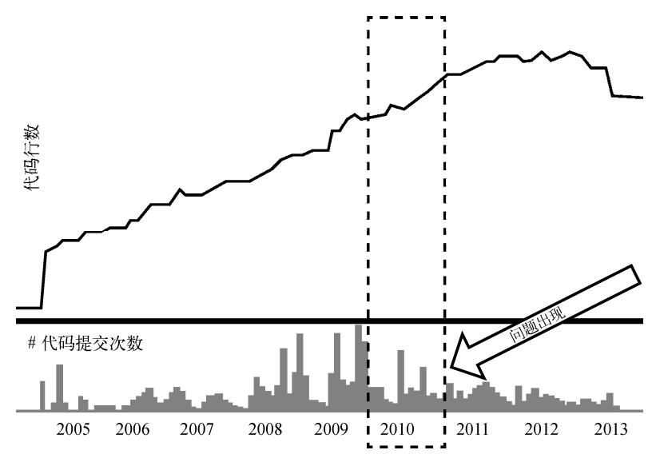

图 13-2 Blackboard Learn 在采用"构建模块"之前的代码库 (来源:David Ashman 在 2014 年的 DevOps 企业峰会上的演讲)

因此,David Ashman 在 2012 年开始专注于运用绞杀者应用模式重构代码。他的团 队通过创建所谓的"构建模块"来实现这一点。"构建模块"使开发人员可以工作在独 立的模块中,这些模块是从单体应用的代码库中解耦出来的,并通过固定的 API 进行访 问。这使团队能够更自主地工作,而不必与其他开发团队不断沟通和协调。

当所有开发人员都用上"构建模块"之后,单体应用的源代码库的规模开始缩减(代 码行数减少)。David Ashman 解释说,这是因为开发人员将他们的代码迁移到了"构建 模块"的源代码库中。他说:"事实上,每一位开发人员都会选择在'构建模块'的代 码库中工作,因为这样做更自主、更自由,也更安全。"

图 13-3 显示了"构建模块"代码库中的代码行数与代码提交次数之间的关系,二 者均呈指数增长。新的"构建模块"代码库使开发工作更加高效和安全,因为错误只会 造成小规模的本地故障,而不会造成系统范围内的严重故障。

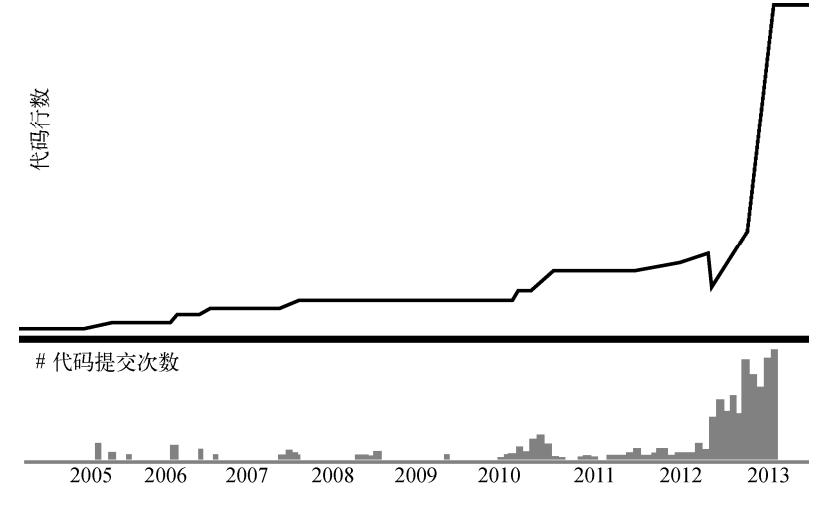

图 13-3 Blackboard Learn 在采用"构建模块"之后的代码库 (来源:David Ashman 在 2014 年的 DevOps 企业峰会上的演讲)

David Ashman 总结说:"使开发人员工作在'构建模块'架构中,可以在代码模块 化方面取得惊人的进步,让他们能够更独立、更自由地工作。随着构建流程的不断完善, 开发人员也能得到更快、更好的反馈,这意味着更高的质量。"

#### 13.4 小结

在很大程度上,服务赖以生存的架构决定了代码的测试和部署方式。这一点已经在 Puppet Labs 的《2015 年 DevOps 现状报告》中得到了验证。该报告显示,架构是影响工程师生产力的首 要因素,它还决定了是否能快速和安全地实施变更。

因为我们通常受制于追求不同方向的组织目标和长期存在的传统架构,所以必须安全地进行 架构演进。本章介绍的案例描述了绞杀者应用模式等技术,这些技术可以帮助我们逐步地推进架 构转型,从而跟上组织需求的变化。

#### 13.5 第三部分总结

在第三部分中,我们实现了使工作从开发到运维快速流动的架构和技术实践,从而快速、安 全地向客户交付价值。

在第四部分中,我们将创建使反馈从右到左快速流动的架构和机制,更快地发现和解决问题, 辐射反馈信息,确保工作取得更好的成果,从而促进组织进一步提高适应能力。

| 122 第 | 13 章 降低发布风险的架构 |  |  |
|----------|----------------------|--|--|
|          |                      |  |  |
|          |                      |  |  |
|          |                      |  |  |
|          |                      |  |  |
|          |                      |  |  |
|          |                      |  |  |
|          |                      |  |  |
|          |                      |  |  |
|          |                      |  |  |

# 第二步 :反馈的技术实践

在第三部分中,我们描述了如何建立从开发到运维的快速流动的工作流,以及它所需要的 架构及技术实践。在第四部分中,我们将描述如何实现第二步工作法的技术实践,创建从运维 到开发的快速且持续的反馈。

这个实践能加快并增强反馈回路,让我们识别出发生的问题,并把这些信息反馈给价值流 中的所有人。这样就可以在软件开发生命周期的早期快速地识别并修复问题 ;在理想情况下, 早在导致灾难性事故发生以前,问题就被处理掉了。

此外,我们将建立这样一个工作系统 :它能把运维团队在下游获得的知识,整合到上游的 开发和产品管理的工作中。这样不管是生产环境问题、软件部署问题、问题的早期迹象,还是 客户的使用模式,我们都可以快速地改进并从中学习。

同时,我们将建立这样一个流程 :每个人都能获得工作反馈,信息可见以便于大家学习, 能快速测试产品假设,帮助我们判断目前开发的特性是否有助于实现组织的业务目标。

我们还将阐述在构建、测试和部署的流程中,如何对用户行为、生产故障、服务中断、合 规问题和安全漏洞进行全面监控。通过放大日常工作中的反馈信号,可以在问题发生的时候, 立刻识别并解决它们,同时将工作系统打造得更加安全,让我们有信心在生产环境中实施变更 的同时开展产品实验,确信能够快速探测和修复故障。为了达到以上效果,需要探索和落实如 下工作 :

- 建立能定位和解决故障的遥测系统 ;
- 使用监控更好地预测故障,感知业务目标的达成情况 ;

- 将用户研究和反馈融入到研发团队的工作中 ;
- 为开发和运维提供反馈,让他们能安全地部署应用 ;
- 用同行评审和结对编程的反馈方式,提高工作质量。

本部分提供的实践模式,有助于强化产品管理、开发、质量保证、运维和信息安全等团队 达到共同的目标,鼓励他们共同承担如下责任 :保障服务在生产环境中正常运行,齐心协力地 优化系统。我们希望尽可能地还原事情的来龙去脉。我们能验证的假设越多,发现和解决问题 的速度就越快,学习和创新的能力也会越强。

在随后的几章里我们将探讨以下内容 :实现反馈回路,促使所有人朝着共同的目标协同工 作,及时地发现问题,快速地探测和修复故障,保证软件能在生产环境中按照预期运行,而且 还实现了组织的业务目标,同时组织也得到了学习和进步。

第 14 章

# 建立能发现并解决问题的 遥测系统

运维团队无法规避的一个问题是发生故障——一个小小的变更也会导致很多意外后果,包括 服务中断,甚至是对所有客户造成影响的全球性故障。事实就是:运维团队面对的是复杂系统, 没有哪个人能了解整个系统,能说清楚系统的每个部分是如何配合的。

当服务中断或发生故障时,我们通常没有解决问题所必需的所有信息。例如,在服务中断期 间,我们可能无法定位造成问题的原因到底是什么。是应用程序故障(如代码有缺陷)、环境故 障(如网络问题、服务器配置问题),还是其他外部原因(如大规模拒绝服务攻击)?

在实际的运维工作中,我们可能会用这种方式处理问题:当生产环境中出现问题时,先重启 这台服务器。如果这样做不起作用,就重启与之关联的服务器。如果这样做还不起作用,就重启 所有的服务器。如果还不行的话,就开始指责开发人员总是引起中断。

与上述方式截然相反,2001 年微软公司的运维框架(MOF)研究发现:在服务级别最高的 组织中,服务器重启的频率比平均水平低 95%,"蓝屏死机率"低 83%。换句话说,在定位和修 复服务故障方面,高绩效组织做得更好。Kevin Behr、Gene Kim 和 George Spafford 在 *The Visible Ops Handbook* 一书中称此为"因果关系文化"。高绩效组织在解决问题方面训练有素,他们使用 生产环境中的遥测系统,分析造成故障的可能因素,这对解决问题有很大帮助。低绩效者则不然, 他们只会盲目地重启服务器。

为了能训练有素地解决问题,我们需要设计出能够持续遥测的系统。遥测被广泛定义为"一 个自动化的通信过程,先在远程采集点上收集度量数据,然后传输给与之对应的接收端用于监 控"。目标是在应用及其环境中建立遥测,包括生产环境、预生产环境和部署流水线。

Michael Rembetsy 和 Patrick McDonnell 曾说,生产环境监控是 Etsy 的 DevOps 转型(始于 2009 年)中关键的组成部分。与此同时,他们将整个技术栈标准化,转型到 LAMP 栈(Linux、Apache、 MySQL 和 PHP)。在转型的过程中,他们抛弃了许多已经在生产环境中使用的技术,因为它们越 来越难以维护。

在 2012 年的 Velocity 会议上,Patrick McDonnell 描述了转型过程中的风险:"我们正在改变 一些最关键的基础设施,理想情况下,客户永远不会感知到。但是,如果我们搞砸了,他们就一 定会发现。我们需要更多指标的支持,使工程团队和非技术(如市场营销)团队都相信,在实施 重大变更时,业务不会受到影响。"

Patrick McDonnell 进一步解释道:"一开始我们使用 Ganglia 监控工具收集所有服务器数据, 然后用 Graphite 显示监控信息指标。公司在 Graphite 这个开源工具上投入巨大。我们开始聚合各 种指标,涵盖从业务指标到部署指标的所有内容。在部署过程中,我们用'非并排和不对称的垂 直线技术'修改了 Graphite,使信息叠加显示在每个指标图上。通过这种方式能更快地发现部署 工作中的任何意外。我们甚至在办公室四周的墙壁上悬挂显示屏幕,让所有人都能看到服务当前 的状态。"

他们让开发人员在日常功能的开发过程中就加入遥测,这样建立了足以保证安全部署的远程 监控指标。到 2011 年,Etsy 持续跟踪 20 多万个生产环境指标,覆盖了应用程序栈的每个层面(如 应用程序的功能、运行状况、数据库、操作系统、存储、网络、安全等),前 30 个最重要的业务 指标被突出地显示在"部署仪表板"上。到 2014 年,跟踪的指标已经超过了 80 万个,这体现了 他们一直坚持不懈的目标:测量一切,并且让工程师轻松地测量一切。

正如 Etsy 的工程师 Ian Malpass 所说:"如果 Etsy 的工程团队有宗教信仰,那肯定是图形 (Graphs)教派的。我们会跟踪任何变化,有时候在事物还没有变化时就开始绘制一个图表,万 一它变化起来了呢……跟踪一切是快速行动的关键,但能毫不费力地跟踪一切是唯一的途 径……我们让工程师能够立即获取所需的信息,而不必把时间消耗在复杂的配置变更或管理流 程里。"

《2015 年 DevOps 现状报告》的调查结果显示:高绩效组织解决生产故障的速度是平均水平 的 168 倍,中等绩效组织的平均修复时间(MTTR)以分钟为单位,而低绩效者的 MTTR 则以天 为单位。在运维中能帮助缩短 MTTR 的两项技术实践,是版本控制和在生产环境中部署更加主 动的监控系统。(2014 年的相关信息见图 14-1。)

正如 Etsy 所做的那样,本章的目标是通过建立全面的监控系统,确保服务在生产环境中正常 运行。在出现问题时,能快速地定位,并做出正确的决策解决问题,而且最好是早在客户受 到影响之前就解决。此外,监控让我们能够汇集对现实最好的理解,并在理解不正确时及时 发现。

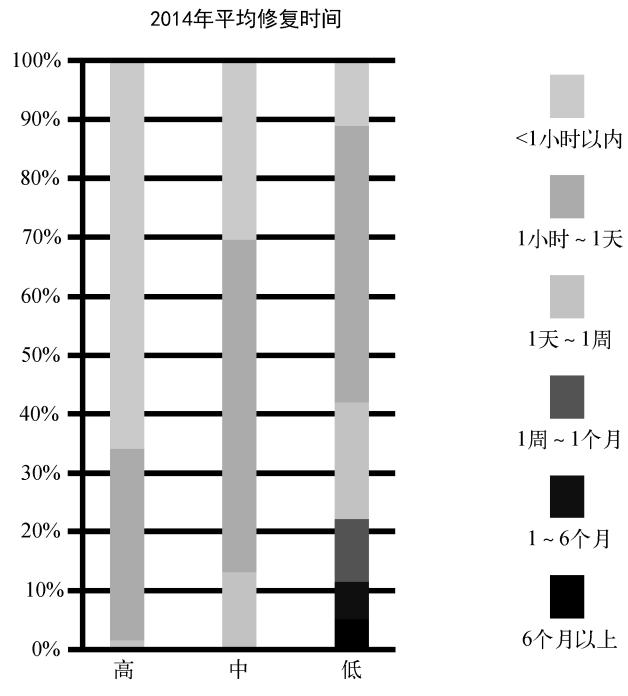

图 14-1 高、中、低绩效组织的故障解决时间(另见彩插) (来源:Puppet Labs 的《2014 年 DevOps 现状报告》)

#### 14.1 建设集中式监控架构

运维监控和日志管理绝对不是新鲜事物,多年以来运维工程师已使用和定制监控框架(例如, HP OpenView、IBM Tivoli 和 BMC Patrol/BladeLogic)来确保生产系统的正常运行。监控数据通 常使用在服务器端运行的代理或通过无代理监控(如 SNMP Trap 或基于轮询的监控)方式来采 集。前端通常会使用图形用户界面展示,而后端经常使用诸如 Crystal Reports 等工具来补充。

类似地,开发具备有效的日志记录功能、便于监控其运行效果的应用程序,这种做法也并不 新鲜——对于几乎所有编程语言,都有各种成熟的日志程序库。

然而,几十年来,我们始终止步于信息孤岛,开发人员只创建他们感兴趣的日志事件,而运 维人员只监视运行环境是否正常运行。这导致在意外事件发生时,没人能够判定为什么整个系统 没有按照设计运行,或者为何特定组件发生了错误,这都严重地阻碍了我们将系统恢复到正常的 工作状态。

为了观察到发生的所有问题,我们必须重新设计和开发应用系统和运行环境,使它们能够产 生足够的监控信息,这样才能够将两者作为一个整体来理解系统是如何运行的。当应用程序栈的 每一层都处在监控和日志记录中时,我们才可以使用其他的重要功能,如绘制和可视化监控指标、 异常事件探测、主动报警和升级等。

在 *The Art of Monitoring* 一书中,James Turnbull 描述了一种现代的监测体系架构,它由大型 互联网公司(例如谷歌、亚马逊、Facebook)的运维工程师开发和使用。该架构通常是由很多开 源工具构成的,例如 Nagios 和 Zenoss,这些工具定制和部署的规模,用当时同类的商业软件是 很难实现的。该体系架构具有以下组成部分。

- 在业务逻辑、应用程序和环境层收集数据: 在每一层中,建立以事件、日志和指标为对 象的监控。日志可以在所有服务器上使用特定文件(如/var/log/httpd-error.log)来存储, 但是最好将所有日志发送到公共日志服务中,这样更利于集中、轮换和清除。大多数操 作系统都提供了这个功能,如 Linux 的 syslog、Windows 的事件日志等。此外,在应用程 序栈的所有层次中收集指标,能更好地了解系统的活动状态。在操作系统级别,可以使 用 collectd、Ganglia 等工具采集状态指标,如 CPU、内存、磁盘或网络的使用率等。使 用其他工具来采集性能指标,这些工具包括 AppDynamics、New Relic 和 Pingdom 等。
- 负责存储和转发事件和指标的事件路由器: 此功能支持监控可视化、趋势分析、告警、 异常检测等。通过采集、存储和聚合所有监控信息,能实现更深入的分析和健康检查。 这里也是存储与服务(和它们支持的应用程序与环境)有关的配置信息的地方,可以实 现基于阈值的告警和健康检查。①

将日志集中后,就可以在事件路由器中对事件计数来转换成度量指标。例如,可以对一个日 志事件(如"子进程 14024 退出信号为段错误")计数,并对它进行统计,作为整个生产环境基 础架构的一个段错误的指标。

通过将日志转换为指标,就可以执行统计操作,比如使用异常检测,在问题周期的早期发现 异常值和方差。例如,如果上一周里一共发生过 10 次'段错误',而在最近的一小时里却发生了 几千次,就可以对其配置一个告警通知,提示要做进一步调查。

除了要对生产服务和环境进行监控采集以外,在发生重大事件时,还必须从部署流水线中 采集数据。例如,自动化测试是否通过,以及什么时候在环境中执行了部署。我们还要采集构 建执行和测试所消耗的时间长短。这样就可以发现一些预示潜在问题的情况。例如,如果性能 测试或构建花费的时间是正常情况的两倍,那么在进入生产环境之前,我们就能发现这个错误 并修复它。

此外,还要保证能方便地在遥测基础设施中输入和检索信息。最好全部通过自助服务的 API 来实现,而不需要通过开工单的方式请求获取某个报告。

——————————

① 示例工具包括 Sensu、Nagios、Zappix、LogsStash、Splunk、Sumo Logic、Datadog 和 Riemann。

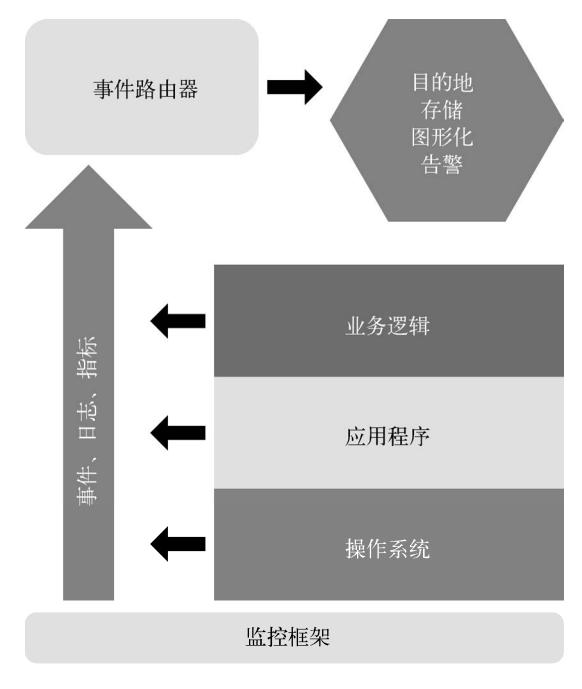

图 14-2 监控框架(另见彩插)

(来源:Turnbull 的 *The Art of Monitoring*,Kindle 版,第 2 章)

理想情况下,我们所建立的遥测会确切地告诉我们感兴趣的事情发生在什么时候、发生在哪 里、情况怎么样。监控数据还要适用于手动和自动分析,即使手里没有生成日志的应用,也应该 能够分析。正如 Adrian Cockcroft 指出的那样:"监控是如此重要,所以监控系统需要比被监控的 系统更具可用性和可扩展性。"

从此,术语遥测可以和度量互换使用,它涵盖了应用程序栈的各层级服务所产生的事件日志 和度量指标,也包括来自所有生产环境、预生产环境和部署流水线的事件日志记录和度量指标。

#### 14.2 建立生产环境的应用程序日志遥测

有了集中的遥测基础架构,我们必须确保对所有正在构建和运维的应用都建立充分的遥测。 要实现这一点,开发和运维工程师必须把建设生产遥测作为日常工作的一部分,不仅仅是对新服 务,对已有的服务也要建立充分的遥测。

CSG 首席架构师兼开发副总裁斯 Scott Prugh 说:"NASA 每次发射火箭时,都用数百万的自 动传感器来报告这一宝贵资产每个组成部分的状态。然而,我们通常不会对软件做同样的事。我 们发现,建设应用和基础设施的遥测是投资回报最高的事情之一。2014 年,我们每天产生了 10 亿多个遥测事件,监控着 10 万多行的代码。

在我们构建和运维的应用程序中,应该监测每个功能。如果某个功能非常重要,需要工程师 实现,那么产生足够的遥测自然也非常重要,这样才能确保它按照设计运行,并且产出了预期的 成果。①

价值流中的所有成员都将以各种方式使用遥测。例如,开发人员可以在应用程序中临时创建 更多的遥测,从而更好地在他们的工作站上诊断问题,而运维工程师可以使用遥测来诊断生产问 题。此外,信息安全和审计师可以通过遥测确认系统所需控制的有效性,产品经理可以用它们来 跟踪业务成果、功能利用程度和转化率。

为了支持以上应用模式,日志还要具有不同的级别,其中的一些可能也会触发告警,举例 如下。

- 调试级别:此级别的信息是相关应用程序中发生的所有事件,最常用于调试的时候。通 常,调试日志在生产中是禁用的,但在故障诊断期间要暂时启用。
- 信息级别:此级别的信息包括用户触发的或系统特定的操作(例如"开始信用卡交易")。
- 警告级别:此级别的信息告诉我们可能的出错情况(例如,调用数据库花费的时间超过 某个特定时长)。可能会因此而触发报警和故障诊断过程,而其他日志消息会有助于更好 地理解事件的原因。
- 错误级别:此级别的信息侧重于错误状况(例如,API 调用失败,内部出错)。
- 致命级别:此级别的信息告诉我们何时发生了中断情况(例如,网络守护进程无法绑定 网络套接字)。

选择正确的日志记录级别很重要。Dan North 是一位前 ThoughtWorks 顾问,他曾经参与了一 些项目,并在这些项目中形成了持续交付理念。他说:"在确定一条消息应该是'错误'还是'警 告'时,设想一下在凌晨 4 点被叫起来处理'错误'吧。打印机报告碳粉不足不是'错误'级别。"

为了帮助确保拥有与服务可靠性和安全操作相关的信息,我们应该保证所有潜在的重大应用 事件都生成日志记录条目,包括高德纳公司 GTP 安全和风险管理小组的研究副总裁 Anton A. Chuvakin 编写的以下清单:

- 认证/授权的结果(包括退出);
- 系统和数据的访问;

——————————

- 系统和应用程序的变更(特别是特权变更);
- 数据的变更,例如增加、修改或删除数据;
- 无效输入(可能的恶意注入、威胁等);

① 各种应用程序日志类库可以帮助开发人员轻松地建立有效的遥测。我们选择的日志类库应该可以将所有的应用程 序日志都发送到集中日志记录基础架构里。集中日志架构是我们在上一节里提出的。比较流行的类库包括:用于 Java 的 rrd4j 和 log4j,以及用于 Ruby 的 log4r 和 ruby-cabin。

- 资源(内存、磁盘、中央处理器、带宽或其他任何具有硬/软限制的资源);
- 健康度和可用性;
- 启动和关闭;
- 故障和错误;
- 断路器跳闸;

——————————

- 延迟;
- 备份成功/失败。

为了更容易地解释和给出所有日志条目的意义,(理想情况下)我们应该对日志记录进行分 级和分类,比如对非功能属性(如性能、安全性)和功能属性(如搜索、排行)。

#### 14.3 使用遥测指导问题的解决

如本章开头所述,高绩效者在解决问题方面是训练有素的,这与依靠道听途说的常见做法形 成鲜明对比,后者的平均清白证明时间(即花多长时间说服其他人,不是我们造成了中断)指标 是非常糟糕的。

如果会针对故障进行问责,那么各个团队可能都不会记录变更,也不会让所有人看到遥测数 据,从而避免遭到指责。

由于公用遥测系统的缺位而造成的其他负面结果还包括:高度紧张的政治气氛、推卸责任, 更糟糕的是,没有人关注事故是如何发生的,以及如何防止这些错误复发,进而无法从错误中系 统地学习并形成知识库。①

相反,遥测技术赋予了我们一种科学的方法,让我们能够对具体问题的原因和解决方案作出 假设。在解决问题的过程中,我们可以回答以下问题。

- 监控系统中有什么证据表明了问题实际上正在发生?
- 在应用程序和环境中,导致问题的可能的相关事件和变更是什么?
- 可以做出什么假设,来证实提出的原因和结果之间的联系?
- 如何验证哪些假设是正确的,能成功地解决问题?

实事求是地解决问题,其价值不仅在于能显著改善 MTTR(和客户体验),而且还强化了一 项认识——开发和运维之间是双赢的关系。

① 2004 年,Kevin Behr、Gene Kim 和 George Spafford 将这个现象描述为缺乏"因果关系文化",他们指出高绩效组 织意识到 80%的中断是由变更引起的,而 80%的 MTTR 耗费在了分析到底什么发生了变更上。

#### 14.4 将建立生产遥测融入日常工作

为了让所有人都能在日常工作中发现并解决问题,我们需要让他们在日常工作中可以轻松地 创建、展示和分析度量指标。因此,必须建立必要的基础设施和库,让任何开发或运维人员都能 很容易地针对任何功能创建遥测。理想情况下,创建一个新的指标,通过仪表板显示出来,让价 值流中的所有人都可以看到它,应该像编写一行代码那样简单。

这个理念指导开发了使用最广泛的度量库之一——StatsD,它由 Etsy 创建并开源。正如 John Allspaw 所描述的:"StatsD 的设计目的是为了防止任何开发人员说'测试代码太麻烦了',现在 他们用一行代码就可以完成。让开发人员认为添加生产遥测并不像更改数据库模式那么难,这对 我们很重要。"

StatsD 可以用一行代码(Ruby、Perl、Python、Java 和其他语言)产生计时器和计数器,经 常结合使用 Graphite 或 Grafana 将度量数据呈现在图形和仪表板上。

图 14-3 显示了用一行代码创建的用户登录事件(在这个例子中,那一行 PHP 代码是: StatsD::increment("login.successes"))。图中显示了每分钟登录成功和失败的次数,图 上的垂直竖线表示一次生产部署。

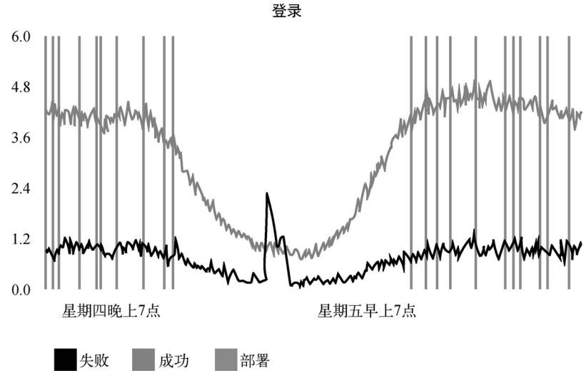

图 14-3 在 Etsy 使用 StatsD 和 Graphite 展示的用一行代码生成的监控(另见彩插) (来源:Ian Malpass 的文章"Measure Anything, Measure Everything")

生产环境发生变更时,会更新这个监控图,因为我们都知道,大部分生产环境问题都是由变 更引起的,包括代码部署。这样,就可以在维持高变更率的同时,维持一个安全的工作系统。

像 StatsD 这样,允许开发人员新建度量指标,同时还能够轻松地聚合和分析的工具还有 JMX

和 codahale metrics。还有其他工具也能够为了解决问题而建立宝贵的度量指标,包括 New Relic、 AppDynamics 和 Dynatrace。munin 和 collectd 等工具可用于创建类似的功能。①

通过将创建生产环境度量指标作为日常工作的一部分,不但可以及时地捕获问题,而且还 可以在设计和运维过程中不断暴露问题,从而能跟踪越来越多的指标,就像 Etsy 的案例研究中 那样。

#### 14.5 建立自助访问的遥测和信息辐射器

在之前的章节中,开发和运维人员能够把创建和改进生产度量指标作为日常工作的一部分。 本节的目标是将监控信息辐射到组织的其他部门,确保任何人想要了解任何当前运行服务的状态 时,都可以方便地获取到所需要的信息,而不需要生产系统的访问权限或特权登录账号,也不用 开一个工单,之后等待数天,由专人为他们配置信息图表。

通过使监控信息可以快速、方便地获取到,并且把数据完全集中化处理,价值流中的所有人 都可以对现状有所了解。这通常意味着将生产度量指标显示到一个由中央服务器(比如 Graphite) 或上一节中提到的任何其他技术实时生成的网页上。

我们希望生产监控指标具有高度的可见性,这意味着要将其放置在开发和运维人员工作区域 的中心,从而使所有感兴趣的人都能看到服务的现状。这至少要包括价值流中的每一个人,比如 开发、运维、产品管理和信息安全。

这通常称为信息辐射器(information radiator),它是由敏捷联盟定义的:"这个通用术语指的 是,团队放置在一个非常显眼位置上的手写、绘制、印刷或电子信息展示,让所有团队成员以及 路过的人都可以快速浏览最新信息:自动化测试次数、速率、事故报告、持续集成状态等。这个 想法起源于丰田生产系统。"

通过将信息辐射器放置在非常显眼的地方,我们在团队成员中传播着责任感,同时也积极地 展示出以下价值观:

- 团队对观察者(客户、利益相关者等)毫无隐藏;
- 团队对自己无所隐藏,他们承认并直面问题。

——————————

现在,我们可以将基础架构生成的生产环境遥测信息辐射到整个组织,还可以将此信息传播 给内部客户,甚至外部客户。例如,创建可以公开浏览的服务状态页面,方便客户了解他们所依 赖的服务的状态。

虽然提供这种透明度可能会有一些阻力,但 Ernest Mueller 描述了这样做的价值:

① 其他监控、聚合和采集工具包括 Splunk、Zabbix、Sumo Logic、DataDog,以及 Nagios、Cacti、Sensu、RRDTool、 Netflix Atlas、Riemann 等。分析师经常将这些广泛的工具归为"应用性能监视器"类型。

——————————

我在组织中所采取的第一个行动,是用信息辐射器来沟通问题,并详尽地显示正在 进行的变更——通常特别受业务部门的欢迎,因为以前他们都被遗忘了。对于必须共同 奋斗以向客户提供服务的开发和运维团队来说,他们需要持续的沟通、通知和反馈。

我们甚至能进一步提高这种透明度,将这些信息传播给外部客户,而不是企图对客户保密相 关的问题。这表明了我们对透明度的重视,有助于建立和赢得客户信任①(见附录 10)。

#### **\*** 案例研究 **\***

#### LinkedIn 创建自助服务指标(2011)

如第三部分所述,LinkedIn 创建于 2003 年,旨在帮助用户"通过您的网络获得更 好的工作机会"。到 2015 年 11 月,LinkedIn 的会员数超过了 3.5 亿,每秒产生千上万次 请求,LinkedIn 的后端系统每秒进行数百万次查询。

LinkedIn 的工程总监 Prachi Gupta 在 2011 年描述了对生产环境遥测的重要性:"在 LinkedIn,我们强调保障网站的正常运行,让顾客随时都可以访问到网站完整的功能。 为了履行这一承诺,我们必须及时地发现故障和瓶颈,并迅速做出响应。因此,我们使 用时间序列图表对站点进行监控,以便在几分钟内识别和响应事件。这种监控技术对工 程师们来说是极好的工具。它让我们能够快速行动,并争取到更多的时间来识别、分类 和修复问题。"

然而在 2010 年,尽管产生的遥测数据数量巨大,但工程师们访问这些数据还是很 困难,更不用说分析数据了。因此,Eric Wong 在 LinkedIn 的暑期实习生项目开始了, 该项目最后转化为生产环境的遥测计划,进而创造了 InGraphs。

Eric Wong 写道:"要获得所有运行着某个服务的主机的 CPU 使用率这样简单的信 息,你只需要填写一份表单,30 分钟后即可得到所需的报表。"

当时,LinkedIn 在使用 Zenoss 采集指标,但正如 Eric Wong 所说的:"要从 Zenoss 里获取所需要的数据,不得不在缓慢的 Web 界面进行挖掘,所以我编写了一些 Python 脚本来简化这个过程。虽然还是要通过手动的方式配置采集指标,但可以减少在 Zenoss 界面上操作的时间。"

整个夏天,Eric Wong 不断地为 InGraphs 添加功能,以帮助工程师准确地看到想看 的内容,还提高了在多个数据集中进行计算的能力,而且能够通过查看每周趋势来进行 历史性能对比,甚至能够自定义仪表板,以便精确地选择在每个页面上要显示的指标。

① 创建一个简单的监控仪表板,应该是构建任何新产品或服务的一部分——利用自动化测试来确保服务和仪表板可 以正常工作,同时帮助客户和我们安全地部署代码。

Prachi Gupta 描述了向 InGraphs 添加功能的成果,以及这些能力的价值。他写道: "我们监控系统的有效性立刻就凸显出来了。当时 InGraphs 监控到了一个重要的 Web 邮 件系统的性能呈下降趋势。当我们联系相关运维人员的时候,他们才意识到系统中存在 这个问题!"

这个项目开始只是一个暑期实习生项目,现在是 LinkedIn 运维系统中可视化做得最 好的系统之一。InGraphs 取得了巨大成功,在工程师的办公区里非常突出地展示着实时 监控图表,让人完全无法忽视它们。

#### 14.6 发现和填补遥测的盲区

现在我们已经创建了必要的基础架构,能够在整个应用程序栈快速建立生产环境遥测,并把 结果向整个组织辐射。

在这个步骤中,我们将识别遥测里的任何盲区,这些盲区正阻碍着我们快速地探测和解决故 障——如果目前的开发和运维团队在遥测方面很弱(甚至没有)的话,这尤其有意义。我们以后 将会使用这些数据更好地预测问题,并让每个人都能收集到所需的信息,从而做出更好的决策, 以实现组织的业务目标。

为此,我们需要在所有环境中,在应用程序栈的每个层级中,以及支持它们的部署流水线中, 建立充分而完整的遥测。我们需要以下层级的度量指标。

- 业务级别:示例包括交易订单的数量、产生的营业额、用户注册数、流失率、A/B 测试的 结果等。
- 应用程序级别:示例包括事务处理时间、用户响应时间、应用程序故障等。
- 基础架构级别(如数据库、操作系统、网络、存储):示例包括 Web 服务器吞吐量、CPU 负载、磁盘使用率等。
- 客户端软件级别(如客户端浏览器上的 JavaScript、移动应用程序):示例包括应用程序 的出错和崩溃、用户端的事务处理时间等。
- 部署流水线级别:示例包括构建流水线状态(例如:各种自动化测试套件的红色或绿色 状态)、变更部署前置时间、部署频率、测试环境上线状态和环境状态。

通过利用遥测完整地覆盖以上领域,我们能够看到服务依赖的所有事物的健康状况,用数据 和事实说明问题,而不是听信传言、指指点点、互相责备。

此外,通过监控所有应用程序和基础设施的故障(例如:程序异常终止、应用程序错误和异 常,以及服务器和存储报错),能够更好地识别出和信息安全有关的事件。在服务崩溃时,这种 遥测能更好地给开发和运维提供信息,而且这些错误通常还能反映出目前存在着安全漏洞。

通过尽早发现并修复问题,我们可以在问题还小、容易修复的时候就修复它们,进而减少对 客户的影响。此外,在每次生产故障之后,我们应该识别是否存在遥测盲区,弥补它们就能更快 地发现故障和恢复服务。更好的做法是,在功能开发阶段,在同行评审的过程中就能识别出这些 盲区。

#### 14.6.1 应用程序和业务度量指标

在应用程序层面,我们的目标是:不仅要确保产生的遥测能够反映应用程序的健康状况(例 如内存使用、事务计数等),还要度量目前组织的业务目标的实现情况(例如用户增长数、用户 登录次数、用户会话时长、活跃用户比例、某些特性的使用频率,等等)。

例如,如果有一个服务为电子商务网站提供支持,那么我们要确保监控所有带来成功交易并 产生收益的用户事件。然后,我们就可以针对客户的业务预期度量所有的用户行为。

这些度量指标根据领域的不同、组织目标的不同而各异。例如,对于电子商务网站,我们可 能希望用户尽量多在网站上花费时间;然而,对于搜索引擎,我们可能希望用户尽快离开网站, 因为会话时间长就证明了用户很难搜索到想要的东西。

一般来说,业务指标将是客户获取渠道的一部分,它是潜在客户购买商品的理论步骤。例如, 在电子商务网站中,可度量的事件包括:用户在线时长、产品链接点击次数、购物车中的商品数 量,以及完成的订单。

Microsoft Visual Studio Team Services 的高级产品经理 Ed Blankenship 表示:"通常情况下,功 能团队会在获取渠道上定义目标,包括每个客户在一天中使用该功能的次数。有时候,在监控的不 同阶段,对用户的非正式称呼分别是'踢轮胎者''活跃用户''成员用户'和'骨灰级用户'等。"

我们的目标是让所有的业务指标都是切实可行的——这些最重要的指标将有助于产品的进 化,并能够进行实验和 A/B 测试。如果指标是不可行的,它们或许就是无价值的指标,不能提供 有用的信息——我们想要存储这些信息,但可能不会显示它们,更不用说设置告警了。

理想情况下,任何查看信息辐射器的人,都能够在预期的业务成果的背景下,理解所显示的 信息,例如:收入目标、用户获取率、转化率等。在功能定义和开发的最初阶段,我们就应该定 义所有的度量指标,并使之与业务成果的度量指标相关联,然后在将功能部署到生产环境中以后, 用其来度量业务成果(见图 14-4)。这样做有助于产品经理向价值流中的所有人描述每个功能的 业务场景。

通过意识到并展示出与高水平的业务规划和运维相关的时间段,可以进一步创建出业务环 境。例如,与节假日销售旺季相关联的交易高峰期,季度末的财务结算期,或例行的合规性审计。 这些信息可用来提醒避免在可用性至关重要的时候进行高风险的变更,或者避免在审计过程中进 行某些活动。

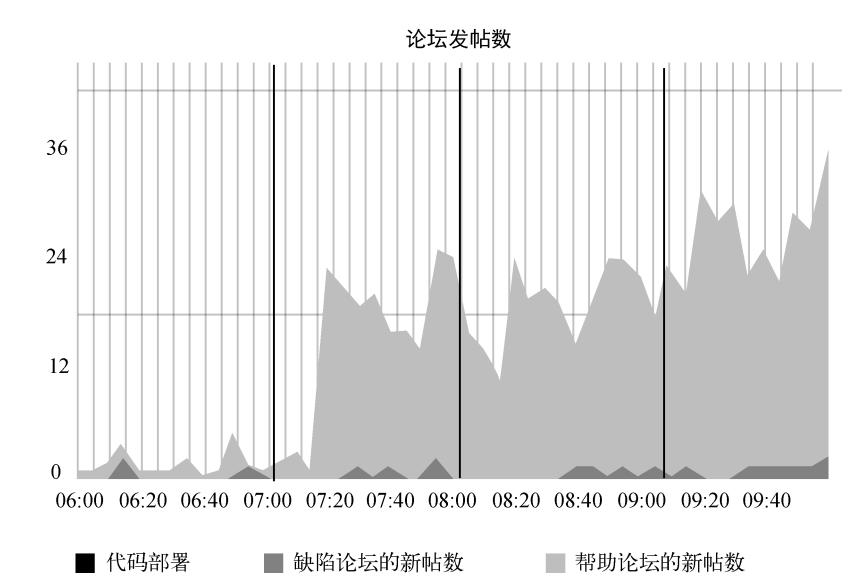

图 14-4 在部署后,用户论坛中对新功能感兴趣的用户数量(另见彩插) (来源:Mike Brittain 于 2010 年 12 月 8 日在 CodeasCraft.com 上发表的文章"跟踪每一个发布版本", https://codeascraft.com/2010/12/08/track-every-release/)

通过传播客户使用功能的情况,可以快速地给开发团队反馈,让他们看到用户是否真的使用 了这些功能,以及它们对实现业务目标有多少帮助。结果,我们强化了文化期望,即把监控和 分析用户的使用情况也作为日常工作的一部分,这样才能更好地理解我们的工作对业务目标的 影响。

#### 14.6.2 基础架构度量指标

与为应用程序度量指标所做的类似,对于生产环境和非生产环境的基础架构,我们的目标是 确保建立全面的遥测指标,以便在任何环境中出现问题时,能够快速定位问题是不是由基础架构 引起的。此外,还必须能够定位到究竟是基础架构的哪个组件引发了问题(例如,数据库、操作 系统、存储、网络等)。

我们希望尽可能多地向所有技术利益干系人展示基础架构的监控信息,而且在理想的情况下 是按照服务或应用程序的逻辑来组织的。换句话说,当环境出现问题时,我们需要准确地知道应 用程序和服务可能会或正在受到什么影响。①

几十年前,在服务和其依赖的生产环境基础架构之间创建连接通常是通过手动来操作的(例 如 ITIL CMDB,或在 Nagios 等报警工具中创建配置定义)。现在,这些连接越来越多地在服务中

——————————

① 在 ITIL 的配置管理数据库中有精确的描述。

自动注册。随后,在生产环境中,通过 Zookeeper、Etcd、Consul 等工具,可以动态地发现和使 用这些服务。

这些工具使服务能够进行自我注册,同时存储了其他服务与之交互所需要的信息(例如,IP 地址、端口号、URI)。这就改变了 ITIL CMDB 里手动操作的情况;当服务由数百(或数千甚至 数百万)个节点组成,并且每个节点都是动态分配 IP 地址时,这些工具是绝对必要的。①

不管服务多么简单或者多么复杂,将业务指标与应用程序和基础架构指标聚合在一起显示, 会有助于发现故障。例如,可能会看到新客户注册数下降到日平均值的 20%,然后还立即发现所 有数据库查询花费的时间是正常情况的 5 倍,这使我们能够把精力集中在解决问题上。

此外,业务度量指标为基础设施度量指标提供了相关性,使开发和运维能够朝着共同的目标 更好地协同工作。正如 Ticketmaster/LiveNation 的首席技术官 Jody Mulkey 所言:"我们不是根据 停机时间来衡量运维,更好的做法是根据停机所造成的实际业务后果来衡量开发和运维团队:我 们应该获得却没有获得的业务收益是多少。"②

请注意,除了要监控生产环境服务,还需要在预生产环境(例如开发、测试、模拟等)中监 控这些服务。这样能够在投产前发现并解决问题,例如,发现由于数据库的表缺少表索引,导致 数据库插入时间的不断增长。

#### 14.6.3 显示叠加的指标组合

——————————

即使搭建了部署流水线,能够进行小而频繁的生产环境变更,变更依旧会产生风险。运维的 副作用不仅仅是宕机,还有严重的服务中断和对运维标准的背离。

为了提高变更的可视化程度,可以在监控图形上叠加显示所有生产环境的部署活动。例如, 对于处理大量入站事务的服务,生产环境变更可能会导致明显的下跌周期,在此期间,应用的性 能由于所有高速缓存查询失效而骤降。

为了更好地理解和保持服务质量,我们要了解性能何时能恢复,并且如果有必要,还要实施 性能提升方案。

同样,我们还想叠加其他有意义的运维活动,例如当服务正在维护或备份时,有可能需要在 某些地方显示告警或者暂停告警。

① Consul 可能特别让人感兴趣,因为它创建了一个抽象层,可以轻松地实现服务映射、监控、锁定和键值配置存储, 以及主机集群化和故障检测。

② 这可能是生产环境停机成本或者功能延迟开发的成本。在产品开发术语中,后者被称为延迟成本,是制定有效优 先级决策的关键。

#### 14.7 小结

从 Etsy 和 LinkedIn 利用有效的生产遥测取得运维提升的案例中可以看出,在问题发生时就 能发现问题是多么地重要,这样才能及时地找出原因,并迅速补救。无论是在应用程序、数据库 还是生产环境中,通过使服务的所有组成部分都发送遥测信息以便进行分析,可以早在故障导致 灾难之前,甚至是早在客户注意到问题之前,就发现并解决问题。这样不仅能使客户更加满意, 而且通过减少救火和危机次数,工作压力也会减轻,倦怠程度也会降低,工作也会更加愉快、更 富有成效。

# 分析遥测数据以更好地预测 故障和实现目标

正如前一章所述,我们需要对应用程序和基础架构进行充分的生产环境遥测,以便在问题 发生时及时发现并解决。本章,我们将创建工具来识别隐藏在生产环境遥测中的差异和微弱的故 障信号,从而避免灾难性故障的发生。本章会介绍大量统计技术,并通过案例研究来讲解它们的 用途。

Netflix 是全球电影和电视连续剧的流媒体供应商,他们就通过分析遥测数据主动地发现并解 决了问题,避免了客户受到影响。2015 年,Netflix 从 7500 万用户中获取的收益为 62 亿美元。他 们的一个目标是为世界各地在线观看视频的用户提供最佳的体验,而这就需要一个稳健的、可伸 缩的、弹性的交付基础架构。Roy Rapoport 描述了管理 Netflix 基于云的视频交付服务的一个挑战: "牛群中的牛在外观和行为上应该都是一样的,哪头牛看起来会与众不同呢?或者更具体地说, 如果我们有一个包含上千节点的无状态计算集群,上面运行着相同的软件,承受着近似的负载, 那么我们面临的挑战就是找出与众不同的节点。"

2012 年,Netflix 团队使用的一项统计技术是异常检测,约克大学的 Victoria J. Hodge 和 Jim Austin 将其定义为检测"可能导致性能显著下降的异常运行状况,诸如航空发动机旋转缺陷或管 道的热流问题"。

Rapoport 解释说:"Netflix 以一种非常简单的方式使用异常检测,即首先在计算集群节点总数 一定的情况下计算出'当前正常值',然后识别出与之不符的节点,并将它们从生产环境中移除。"

Rapoport 继续说道:"我们不需要定义'正常'的行为是什么,就可以自动地标记出异常节 点。因为我们的设计是在云端弹性运行,所以不用告诉运维人员去做什么,只需删除出错或行为 异常的计算节点,然后记录下来,或者通知相关的工程师。"

Rapoport 说,通过实施服务器异常检测的流程,Netflix 已经"大大地降低了识别故障服务器 的成本,更重要的是还大大地缩短了修复时间,提高了服务质量。利用这些技术来保持员工的理 智,保持工作和生活的平衡,以及保持服务质量,其所带来的益处再怎么强调都不为过"。Netflix 的案例突显了使用遥测在客户受到影响之前就处理问题的一个具体做法。

本章会探讨很多统计和可视化技术(包括异常检测),我们可使用它们来分析遥测数据,从 而更好地预测问题。这样,我们就能够以更快的速度、更低的成本,早在客户或组织中的任何人 受到影响之前就解决问题。此外,我们还将创造更多的数据使用场景,帮助我们做出更好的决策, 实现组织的目标。

#### 15.1 用均值和标准差识别潜在问题

分析生产环境度量指标最简单的一种统计技术是计算均值(或平均数)和标准差。通过这种 方式,我们可以创建一个过滤器,用来检测度量指标与正常值显著不同的情况,甚至配置告警, 以便触发修复动作(例如,当数据库查询速度明显低于平均值时,在凌晨 2 点通知生产环境的值 班员进行排查)。

当关键的服务出现问题时,在凌晨 2 点叫醒值班员可能是正确的。然而,如果并不需要对告 警采取行动,或者它本来就是一个误报,那么我们就不必在午夜去折磨值班员了。DevOps 运动 的早期领导者 John Vincent 指出:"现在告警疲劳是我们面临的最大问题……我们需要更智能的 告警,否则大家都要疯掉了。"

我们可以通过提高信噪比、关注差异值或异常值,建立更好的告警。假设现在要分析每天未 经授权的登录次数,收集到的数据呈高斯分布(即呈正态分布或钟形曲线分布),如图 15-1 所示。 钟形曲线中间的垂直线是均值,由其他垂直线表示的第一、第二和第三标准差分别包含 68%、95% 和 99.7%的数据。

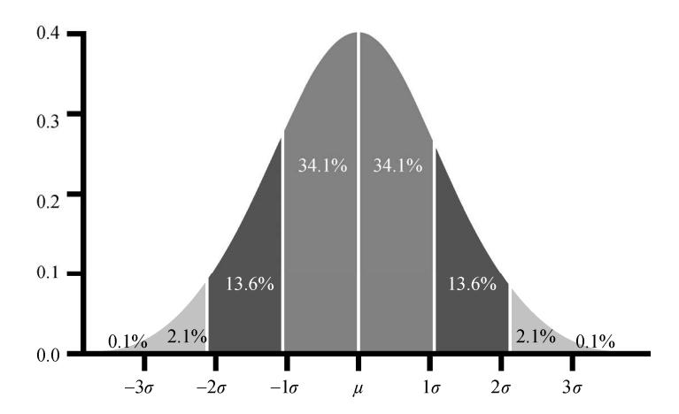

图 15-1 呈高斯分布的标准差(*σ*)和均值(*μ*)(另见彩插) (来源:维基百科的"正态分布"条目,https://en.wikipedia.org/wiki/Normal\_distribution)

标准差的常见用途是,定期检查数据集的某个度量,如果与均值有显著差异就告警。例如, 当每天未经授权的登录次数比均值大三个标准差时就告警。只要这个数据集呈高斯分布,我们就 预计只有 0.3%的数据点会触发告警。

即使只是一种简单的统计分析,它也是有价值的,因为再也不必设置静态阈值——如果跟踪 的是几千或几十万个生产指标,这样是不可行的。

在本书的后续内容里,我们将交换使用术语遥测、度量和数据集。换句话说,度量(例如"页 面加载时间")将映射到一个数据集(例如,2 毫秒、8 毫秒、11 毫秒等),统计学家用后者来描 述一个数据点矩阵,其中每一列代表对其执行统计操作的一个变量。

#### 15.2 异常状态的处理和告警

Tom Limoncelli 是《云系统管理:大规模分布式系统设计与运营》的作者之一,也曾是谷歌 的站点可靠性工程师。他讲述了以下关于监控的故事:"当人们问我需要监控哪些对象时,我开 玩笑说,在理想的世界里,我们会删除目前监控系统里所有的告警。然后,在每一个用户业务中 断以后,我们会问什么指标能预测这个中断,然后再把这些指标加入到监控系统中,并根据需要 告警,再不断重复上面这一过程。这样,我们就只会收到预防中断的告警,而不是在故障发生以 后遭到报警信息的轰炸。"

在当前这个阶段,我们将复制以上实践成果。其中一个最简单的方法是:分析在近期(例如 30 天内)遇到的最严重的事故,并建立一个遥测列表,用来更早、更快地检测和诊断问题,以 及更方便、更快捷地确认已经实施了有效的修复措施。

例如,如果 NGINX Web 服务器停止对请求做出响应,我们会查看主要指标,它们可能已提 前警告我们,我们已开始偏离标准操作。例如:

- 应用级别——网页加载时间正在增加等;
- 操作系统级别——服务器闲置内存不足、磁盘空间不足等;
- 数据库级别——数据库事务处理时间超出正常值等;
- 网络级别——负载均衡器背后运行的服务器数量下降等。

上述所有指标都是生产环境事故的潜在征兆。对于每一个这样的指标,我们将设置告警。当 它们偏离均值足够多时,就发出告警,通知相关人员采取纠正措施。

通过对所有更弱的故障信号重复以上过程,我们就可以在软件的生命周期中更早地发现问 题,从而减少影响客户的事件的发生次数。换句话说,我们不但要主动地预防问题,而且要进行 更快速的探测和修复。

#### 15.3 非高斯分布遥测数据的问题

使用均值和标准差来检测异常是非常实用的。然而,在运维中我们会用到许多个遥测数据集, 对它们都使用这些技术,并不一定会产生预期的结果。正如 Toufic Boubez 博士所说:"我们不只 会在凌晨 2 点接到告警电话,当监控的基础数据并不呈高斯分布的时候,我们还会在凌晨 2:37、 4:13、5:17 接到告警电话。"

换而言之,当数据集里的数据没有呈上述的高斯分布(钟形曲线)时,使用与标准差相关的 属性就不合适了。例如,我们正在监控网站每分钟的文件下载量,需要检测的是下载量异常大的 时段。例如,当下载率比均值大三个标准差时,我们就可能要主动地增加更多的带宽。

图 15-2 显示了随着时间推移每分钟的并发下载量,有一个条形栏覆盖在图形的顶部。黑色 块表示在那段时间(有时被称为"滑动窗口")下载量与均值至少差三个标准差。否则,它就是 灰色的。

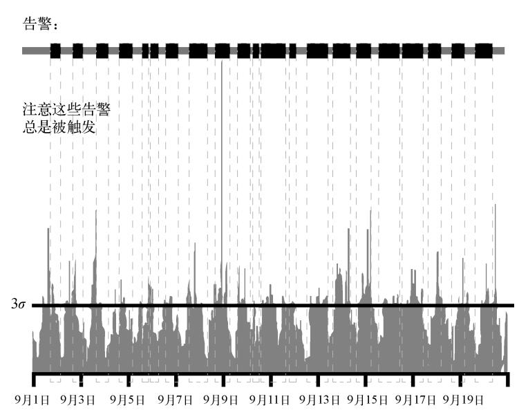

图 15-2 每分钟下载量:使用"三个标准差"规则时的过度告警(另见彩插) (来源:Toufic Boubez 博士的文章"Simple math for anomaly detection")

图中展示出的问题很明显:几乎在所有的时间里都触发了告警。这是因为几乎在任何时间段 里,都有下载量超过三个标准差阈值的情况出现。

为了证实这一点,当我们绘制一个显示每分钟下载频率的直方图(见图 15-3)时,可以看到 它的形状并不是经典的对称钟形曲线。相反,分布很明显倾斜向下,这表示大多数时间里的每分 钟下载量都很低,但经常飙升到高出三个标准差。

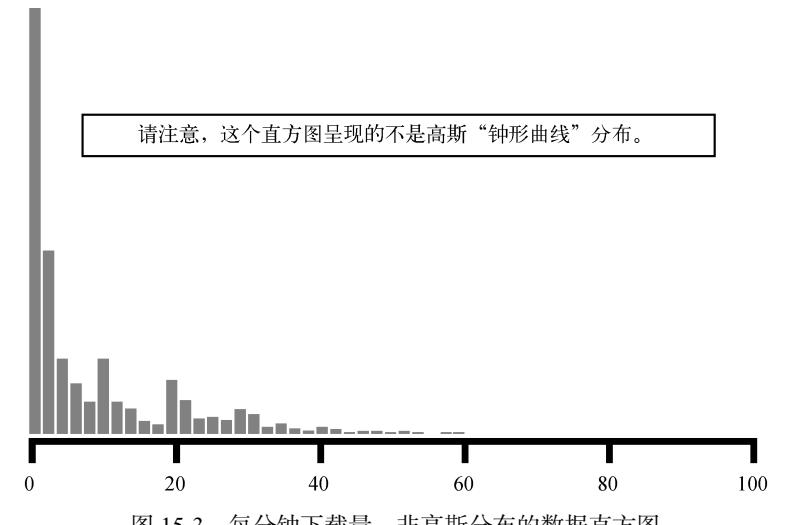

图 15-3 每分钟下载量:非高斯分布的数据直方图

(来源:Toufic Boubez 博士的文章"Simple math for anomaly detection")

大量生产数据集都不是高斯分布的。Nicole Forsgren 博士解释说:"运维中的很多数据集呈 我们所谓的'卡方'分布。对这样的数据使用标准差,不仅会导致告警过度或告警不足,还会产 生荒谬的结果。当并发下载量比均值低三个标准差时,结果会是负数,这显然是讲不通的。"

过度告警导致运维工程师在半夜频繁地被叫醒,甚至是在他们也采取不了恰当的应对措施 时。告警不足的问题同样很大。例如,假设我们正在监控已完成的交易数量,由于一个软件组件 的故障,导致中午时已完成的交易数量下降了 50%。如果此时与均值的差异没超过三个标准差, 就不会触发告警,这意味着客户会比我们先发现这个问题,而届时问题可能更难解决了。"

所幸,即便不是高斯数据集,也可以采用其他异常检测技术。下面将阐述有关内容。

#### **\*** 案例研究 **\***

#### Netflix 的自动扩展能力(2012)

Netflix 开发的另一个提高服务质量的工具是 Scryer,它解决了 AAS(Amazon Auto Scaling,亚马逊自动扩展)的一些不足。AAS 会根据工作负载的数据,动态地增加和 减少 AWS 计算服务器数量。Scryer 通过分析历史使用模式来预测客户的需求,并提供 必要的计算能力。

Scryer 解决了 AAS 的三个问题。第一个问题是处理需求急剧增长的情况。因为 AWS 实例的启动时间可能会长达 10~45 分钟,所以额外的计算能力经常由于交付时间太长, 不能满足快速增长的处理需求。第二个问题是,在出现服务中断之后,由于客户需求快 速下降,导致 AAS 移除了大量的计算能力,结果不能满足随之而来的需求。第三个问

题是,AAS 在调度计算能力时,没有考虑当前的流量使用模式。

Netflix 利用了这样一个事实:其消费者的浏览模式有着惊人的一致性和可预测性, 尽管未呈高斯分布。图 15-4 反映的是在整个工作周内每秒的客户请求数,展示了从周 一到周五客户浏览模式是规律和一致的。

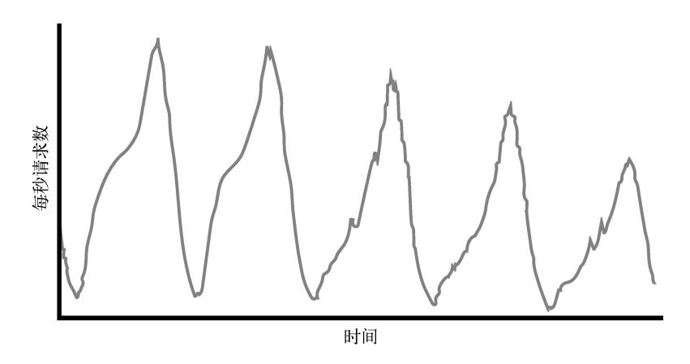

图 15-4 Netflix 客户五天的浏览需求

(来源:Daniel Jacobson、Danny Yuan 和 Neeraj Joshi 于 2013 年 11 月 5 日在 Netflix 技术博客上发表的文章"Scryer:Netflix 的 预测性自动扩展引擎",http://techblog.netflix.com/2013/11/scryer-netflixs-predictive-auto-scaling.html)

Scryer 先使用异常检测组合抛出伪数据点,然后使用诸如快速傅里叶变换(FFT) 和线性回归等技术使数据更加平滑,同时保留在其数据中重现的合法流量峰值。结果是 Netflix 可以以惊人的准确性预测流量需求。

首次将 Scryer 应用到生产环境几个月后,Netflix 就显著地提升了客户的浏览体验, 提高了服务的可用性,同时降低了 Amazon EC2 的成本(见图 15-5)。

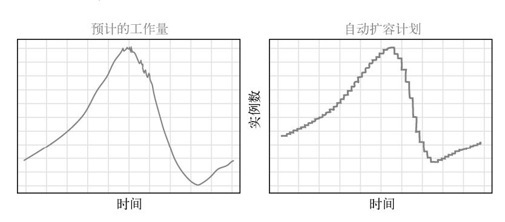

图 15-5 Netflix 根据 Scryer 预测的客户流量来调度 AWS 的计算资源 (来源:Jacobson、Yuan、Joshi 的文章"Scryer:Netflix 的预测性自动扩展引擎")

#### 15.4 应用异常检测技术

——————————

在监控数据并不呈高斯分布的情况下,我们仍然可以使用各种方法来找到值得关注的差异。 这些技术广泛地分类为异常检测,其通常的定义是"搜索不符合预期模式的数据条目或事件"。 其中的一些功能可以在监控工具里找到,而其他功能可能需要统计专家的帮助。

Rally 软件公司的开发和运维副总裁 Tarun Reddy 积极地倡导运维与数据统计之间的积极协 作。他说:"为了提高服务质量,我们将所有生产指标输入到统计分析软件 Tableau 中。我们甚至 雇用了一名受过统计学培训的运维工程师,请他编写 R 语言代码(另一个统计软件包)。这名工 程师有大量的待办事项,大多是来自公司其他团队的需求,他们希望在影响客户的更大事件发生 之前,尽早找到那些差异。"

我们采用了称为平滑的统计技术,它对于时间序列数据特别适用,这意味着每个数据点都有 一个时间戳(例如,下载事件、已完成的事务处理事件等)。平滑技术通常涉及使用移动平均数 (或滚动平均数),它利用每个点与滑动窗口中的所有其他数据的平均值,来转换数据。这样做有 助于抑制短期波动,突出长期趋势和周期。①

图 15-6 中展示了这种平滑技术的效果。黑线表示原始数据,而灰线表示 30 天的移动平均数 (即 30 天的平均值轨迹)。②

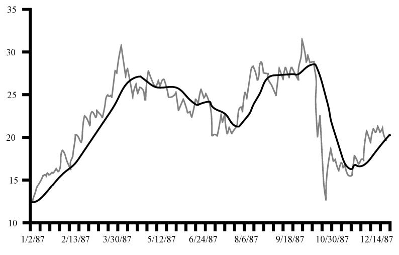

图 15-6 Autodesk 股价和 30 天移动平均数过滤器

(来源:Jacobson、Yuan 和 Joshi 的文章"Scryer:Netflix 的预测性自动扩展引擎")

① 平滑和其他统计技术也会用于图形和音频文件的处理。例如,图像的平滑(或模糊),其中每个像素点被其邻近 的所有像素的平均值替换。

② 平滑滤波器的其他示例有加权移动平均数和指数平滑(分别在较旧的数据点上线性或指数地加权较新的数据点)等。

还有一些更奇特的过滤技术,诸如快速傅里叶变换和 Kolmogorov-Smirnov 检验(Graphite 和 Grafana 工具内嵌),其中前者广泛应用于图像处理,后者经常用于分析周期性/季节性度量数 据的相似性或差异性。

我们可以预期,与用户有关的大量遥测数据将具有周期性/季节性的相似性——网络流量、 零售交易、电影观看以及许多其他用户行为,其每日、每周和每年的模式都是惊人地规律和可预 测。这让我们可以检测出与历史规律有差异的情况,例如,周二下午的订单交易率降至周平均数 的 50%。

由于这些技术在预测方面非常实用,我们或许能在销售或商业智能部门里,找到具备数据分 析知识和技能的人员。我们可能希望找出这些人,和他们一起识别共性的问题,并用改进的异常 检测和事故预测方法解决它们。①

#### **\*** 案例研究 **\***

#### 高级的异常检测(2014)

在 2014 年的 Monitorama 会议上,Toufic Boubez 博士介绍了异常检测技术的威力, 特别强调了 Komogorov-Smirnov 检验的有效性。这种检验技术通常用于统计学中,用来 确定两个数据集是否具有明显差异。当前流行的 Graphite 和 Grafana 工具里已经嵌入了 这种技术。这个案例研究并非旨在作为一个教程,而是为了演示在工作中如何运用这类 统计技术,以及在组织中如何将其应用于完全不同的应用程序。

图 15-7 显示了某电子商务网站每分钟的交易次数。注意在这幅图中,每周的交易 量是在周末下降的。目测第四周发生了特殊的状况,因为周一的交易量并没有恢复到正 常水平。这表明我们应该对这个事件进行调查。

用三个标准差规则只会生成两次告警,缺少了关键的针对周一交易量下降的告警。 在理想情况下,我们希望当交易量数据已经偏离预期的周一模式时,也能收到告警。

Boubez 博士开玩笑说:"虽然我们认为 Kolmogorov-Smirnov 是让人印象深刻的好方 法,但是运维工程师应该告诉统计学家,对于运维数据而言,这些非参数类型的技术是 很好的,因为它们不会做出正态分布或任何其他概率分布的假设,这对我们理解在非常 复杂的系统里到底发生了什么是至关重要的。这些技术比较了两种概率分布,可以用来 比较周期性或季节性的数据,这对检查每日或每周的数据差异非常有帮助。"

——————————

① 为了解决这些类型的问题,我们可以使用的工具包括 Microsoft Excel(它仍然是为一次性目的而处理数据的最简 单和最快速的方法之一),以及 SPSS、SAS 和开源 R 项目等统计软件包 ,其中 R 项目是目前使用最广泛的统计 软件之一。还有许多其他的工具,包括 Etsy 已经开源的一些工具,例如,Oculus(可以找出具有一定相关性的、 形状类似的图形)、Opsweekly(能跟踪告警的数量和频率)和 Skyline(可用于识别系统和应用图形中的异常行为)。

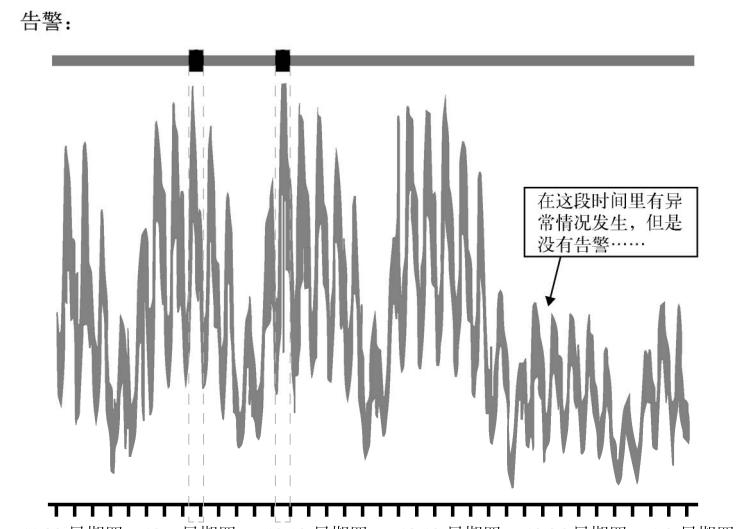

图 15-7 交易量:使用"三个标准差"规则的告警不足

(来源:Toufic Boubez 博士的文章"Simple math for anomaly detection")

图 15-8 中的数据集和图 15-7 相同,应用的是 Kolmogorov-Smirnov 过滤器,第三个 区域突出显示了一个异常的周一,其交易量没有恢复至正常水平。这就提醒了我们,此 时系统中存在一个问题,使用目测或标准差的方式是几乎不可能检测到的。在这种情况 下,这种早期的检测可以防止影响客户的事件的发生,也有助于更好地实现组织的目标。

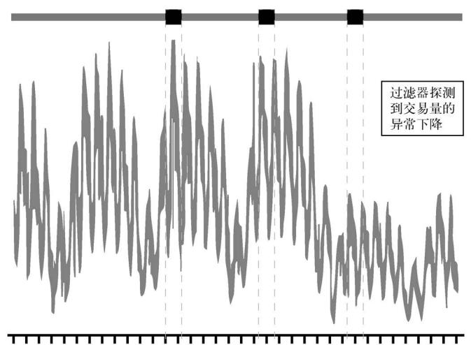

图 15-8 交易量:使用 Kolmogorov-Smirnov 验证检测异常现象并告警 (来源:Toufic Boubez 博士的文章"Simple math for anomaly detection")

#### 15.5 小结

本章探讨了几种用于分析生产环境遥测数据的统计技术,通过它们能更早地发现和解决问 题,并且能在问题较小的时间予以解决,从而避免造成灾难性后果。这些技术使我们能识别出 那些微弱的故障信号,并及时采取行动,从而建立一个更安全的工作系统,同时提高实现目标的 能力。

本章提供了真实的案例研究,包括 Netflix 如何利用这些技术主动地在生产环境中移除计算 服务器,以实现自动扩展的基础架构。此外还讨论了如何使用移动平均数和 Kolmogorov-Smirnov 过滤器,目前流行的遥测图形工具中都使用了它们。

下一章将描述如何将生产环境遥测集成到开发的日常工作中,使部署更安全,同时整体优化 系统架构。

# 应用反馈实现安全部署

2006 年,Nick Galbreath 是 Right Media 公司的工程副总裁,他负责管理在线广告平台的开发 和运维部门,每天由这个平台显示和提供的广告超过 100 亿次。

Galbreath 描述了他们当时在运维方面所遇到的挑战:

在我们的业务中,广告存货是极其动态的,因此我们需要在几分钟内对市场状态做 出反应。这就意味着开发人员必须能够进行快速的代码变更,并尽快发布到生产环境, 否则就会输给速度更快的竞争对手。我们发现将测试甚至是部署工作分配给单独的一个 组太慢了。我们必须将所有这些职能纳入到一个组内,让他们共同承担责任,完成目标。 不管你信不信,我们最大的挑战是让开发人员克服对部署代码的恐惧!

具有讽刺意味的是,开发人员经常抱怨运维人员不敢部署代码。但当开发人员也拥有了部署 代码的权力时,他们自己也开始害怕部署代码了。

代码部署恐惧在 Right Media 公司的开发和运维团队里普遍存在。然而,Galbreath 发现,在 工程师(无论是开发还是运维)部署代码的时候,通过提供更快和更频繁的反馈,以及减少部署 工作的批量大小,可以让他们获得代码部署的安全感,进而重拾信心。

发现很多团队都经历了这种转变以后,Galbreath 描述了他们的发展过程:

刚开始,大家都对生产系统的宕机感到万分恐惧,不管是开发还是运维,没有人愿 意点击那个"部署代码"按钮,去触发全套的自动化代码部署流程。最终,当有人勇敢 地部署了代码以后,由于之前错误的假设或者由于不完全了解生产环境的细节,第一次 生产环境的代码部署都不可避免地出现了问题。当时我们对生产环境的监控不全面,我 们了解到的问题都是客户反映上来的。

为了解决这个问题,团队紧急地修复代码缺陷并再次部署到生产环境,但这一次,我们在应 用程序和环境中增加了更多的生产遥测机制。这样,我们可以确认问题是否得到了修复,服务是 否恢复正常,并且可以在客户之前检测到这类问题。

后来,越来越多的开发人员也开始在生产环境里部署代码了。因为我们都在一个复杂的系统 中工作,所以仍然有可能破坏生产环境中的某些功能,但是这一次,我们能够迅速地探测到应用 功能的故障,并且能快速决定是回滚还是直接修复问题。这是整个团队巨大的胜利,每个人都为 此而庆祝——我们终于走上了正确的道路。

然而,团队希望改进他们的部署结果,所以开发人员开始主动地请同行对他们的代码变更进 行评审(会在第 18 章讲述),大家互相帮助写出更加优质的自动化测试代码,以便在部署前就发 现错误。同时,由于每个人都理解了"对生产环境的变更越小,遇到的问题就越少"这个道理, 开发人员更频繁地在部署流水线中签入更小的代码增量,确保变更在生产环境中能成功运行,然 后再进行下一次代码变更。

现在,我们部署代码的频率比以往任何时候都频繁,而且服务的稳定性也更好了。我们再次 意识到,实现工作稳定和持续流动的诀窍就在于频繁地进行小规模的变更,这样任何人都可以评 审并能轻松理解。

Galbreath 发现,上述改进使所有人都受益,包括开发、运维和信息安全人员。"作为同时负 责安全的人,我很高兴,我们现在可以快速地将补丁程序部署到生产环境中,因为一天 24 小时 都可以部署变更。此外,让我感到惊讶的是,当发现代码有问题时,工程师会迅速地去修复,他 们都参与到了安全加固中。"

Right Media 的案例证明仅仅实现部署流程的自动化是不够的——我们必须要将生产遥测的 监控融入到部署工作中,同时还要建立文化规范,那就是每个人都对整个价值流的健康承担着相 同的责任。

本章将建立反馈机制,让我们在服务生命周期的每个阶段(从产品设计到开发和部署,再到 运维和最终下线),都能够持续地改善价值流的健康状况。这样,就可以保证服务始终处于"就 绪"的状态,即使是在项目的初始阶段,同时还可以从每次发布和生产问题中总结和学习,并将 经验用于未来的工作中,从而提高安全性和每个人的生产力。

#### 16.1 通过遥测使部署更安全

在这个阶段,我们确保在任何人执行生产部署时,都积极主动地监控生产环境的度量指标, 就像 Right Media 的案例那样。这可以让部署人员(无论是开发人员还是运维人员)在新版本在 生产环境中运行以后,快速地确认功能是不是按预期正常运行。毕竟,在这个新版本按预期在生 产环境中运行以前,我们都不应该认为代码部署或生产环境变更已经完成。

我们在部署过程中积极地监控软件功能相关的度量指标,以确保没有无意中破坏自己的服 务,或者更糟糕的是,破坏了另一项服务。如果变更真的破坏或影响了其他功能,我们就会召集

——————————

所有相关人员来诊断和解决问题,迅速恢复服务。①

如第三部分所述,我们的目标是在软件进入生产环境之前,在部署流水线中就发现错误。然 而,还是存在着检测不到的错误,这就要依靠生产环境的遥测来快速恢复服务了。我们可以使用 特性开关关闭出错的功能(这通常是最简单且风险最小的选择,因为它不涉及生产部署),或者 前向修复这个错误(即为了修复缺陷而修改代码,然后通过部署流水线将代码变更部署到生产环 境),或者回退(例如,使用特性开关切换回之前的旧版本,或通过蓝绿部署、金丝雀发布等模 式,将出错的服务器做离线处理)。

虽然前向修复通常是危险的,但是当拥有了自动化测试、快速部署流水线以及全面的遥测之 后,我们就可以快速地确认生产环境中的一切是否正常运行,这样其实是非常安全的。

图 16-1 显示了 Etsy 在一次部署 PHP 代码变更时,PHP 的运行时警告数量产生了一个峰值。 在这种情况下,开发人员在几分钟内就发现了问题,修复了有问题的代码,并将代码变更部署到 生产环境中,总之在 10 分钟内就解决了问题。

由于部署是导致生产环境故障的主要原因之一,每一次的部署和变更事件都会显示到监控视 图上,以保证价值流中的每个人都能了解相关活动,从而实现更好的沟通和协作,以及更快的探 测和故障修复。

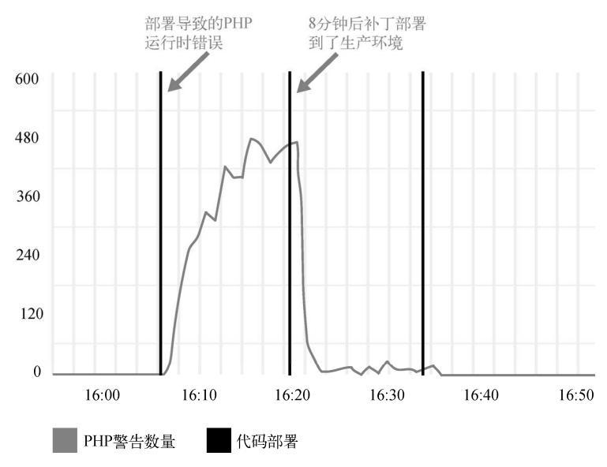

图 16-1 Etsy.com 的部署引发 PHP 运行时警告后的迅速修复 (来源:Mike Brittain 的文章"Tracking Every Release")

① 通过这种方式,并结合所需的架构,我们"优化了平均恢复时间,而不是平均故障间隔时间"。这是一条流行的 DevOps 准则,它强调的是持续提升从故障中快速恢复的能力,而不是企图避免发生故障。

#### 16.2 开发和运维共同承担值班工作

即便生产环境中的部署和发布工作已经做得无懈可击了,对于任何复杂的服务而言,仍然会 有意外情况发生,例如每天凌晨 2 点的告警和宕机。如果不修复,可能会导致问题复发,会使下 游的运维工程师苦不堪言,尤其是当造成问题的上游程序员看不到这些问题时,情况会更严重。

即使把这些问题提交给了开发团队,修复这些问题的优先级很可能比交付新特性的优先级 低。这些问题会反复发作数周、数月甚至数年,导致运维工作持续混乱和中断。这个例子说明, 上游工作中心只做本地的局部优化时,实际上降低了整个价值流的性能。

为了防止发生以上状况,我们会让价值流中的所有人共同承担处理运维事故的下游责任。为 此,我们会让开发人员、开发经理和架构师轮流和运维团队共同值班,就如 Facebook 的生产品 工程总监 Pedro Canahuat 在 2009 年所做的一样。这确保了价值流中的所有人能够就他们所做的 上游架构和编码决策得到直接的反馈。

这样,运维人员不再独自、孤立地解决生产环境中的代码缺陷;相反,所有人都会帮忙在修 复生产环境缺陷和开发新功能之间实现平衡,而不管他们来自价值流中的哪一环。正如 2011 年 New Relic 产品管理高级副总裁 Patrick Lightbody 所说:"我们发现,当凌晨 2 点请开发人员上线 一起修复故障时,问题解决的速度要比以前快得多。"

以上实践还帮助开发管理人员意识到,每一项产品功能都标记为"完成"并不代表业务目标 已经实现。相反,所有功能都在生产环境中按照设计正常地运行,没有引起重大的故障,也没有 引发计划外的运维或开发工作,才是真的"完成"。①

这种做法对各种团队都适用,包括面向市场的团队、负责开发和运行功能的团队,以及以职 能为导向的团队。PagerDuty 的运维工程经理 Arup Chakrabarti 在 2014 年的一次演讲中谈到:"在 公司里设置专门的、随叫随到的救火队已经越来越罕见了。相反,在发生宕机时,与生产代码和 环境有关的每个人都应该能联系上。"

不管团队的组织结构怎样,基本原则是不变的:当开发人员获得应用程序在生产环境中运行的 反馈时,包括故障的修复状况,他们与客户之间的距离就更近了,这会使价值流中的所有人都受益。

#### 16.3 让开发人员跟踪工作对下游的影响

——————————

交互和用户体验设计中最强大的技术之一是情境访谈。产品开发团队观察客户在他们的自然 环境中(通常是在他们的办公桌前)使用应用程序,这就是情境访谈。通过情境访谈,通常会发 现客户在使用产品的过程中所遇到的困难,例如,在日常工作中执行一项简单的任务也需要很多

① ITIL 将"保证"定义为服务能在生产环境中可靠地运行一段预定时间(例如两周)而无需干预。理想情况下,这 个"保证"的定义应该纳入到"完成"的定义中。

——————————

次点击操作,需要在多个屏幕之间复制和粘贴文本,或者需要在纸上记录信息。其实这些都是补 偿性行为,是由应用程序的可用性不足造成的。

在进行以上客户观察后,开发人员通常会感到非常沮丧,常常会说:"原来我们给客户造成 了痛苦,真是太糟糕了!"显然客户观察是一种非常好的学习形式,并且会激发开发人员去改善 客户体验。

我们的目标是运用这种技术观察我们的工作对内部客户产生的影响。开发人员应该跟踪他们 的工作,这样可以看到下游工作中心在生产环境中是如何与他们开发的产品交互的。①

开发人员希望跟踪他们的工作对下游的影响——通过亲见客户所面临的困难,他们会在日常 开发工作中做出更好和更明智的决策。

通过这种方式,我们获得了对代码的非功能方面(包括所有与面向客户的功能无关的元素) 的反馈,并能找到提高应用程序的可部署性、可管理性、可维护性等的方式。

用户体验观察通常对观察者有极大的影响。Gene Kim 是 Tripwire 公司的创始人,并担任公 司首席技术官 13 年之久,也是本书的合著者。回忆自己第一次做客户观察的情景时,他说:

2006 年的那次经历是我职业生涯中最糟糕的时刻之一。当时,整个上午我都在观 察一位客户使用我们的产品。我在观察用户执行一个操作,这个操作我们预期客户每周 都会做。但是让我们感到非常恐怖的是,这项工作一共需要点击鼠标 63 次才能完成。 那位客户不断地道歉:"对不起,或许有更好的操作方式。"

不幸的是,并没有更好的方式完成这个操作。另一个客户描述到,产品的初始化配 置需要 1300 步。突然间,我理解了为何管理产品的工作总是分配给团队中新来的工程 师——因为根本没人想做运行产品的工作。这是我在公司里帮助创建用户体验实践的原 因之一,目的是为了解决我们给客户带来痛苦体验的问题。

通过进行用户体验观察,能够在源头保证质量,并对价值流中的其他团队成员产生同理心。 理想情况下,用户体验观察有助于我们创建应用的非功能需求,并将其放入共享的待办工作中去, 最终我们可以主动地将它们落实到构建的所有服务中,这是 DevOps 文化建设工作的一个重要组 成部分。②

① 跟踪工作结果有助于发现改进流程的方式,例如:自动化复杂的手动操作(如配置好一个应用服务器集群需要 6 个小时才能完成);只执行一次代码打包,而不是在 QA 和生产环境部署的不同阶段多次打包;与测试人员一起 自动化手动测试套件,从而消除频繁部署的常见瓶颈;创建更有用的文档,而不是让其他人基于开发人员所写的 应用注释去构建程序安装包。

② 最近,Jeff Sussna在他所谓的"数字对话"中试图进一步解释如何更好地实现用户体验目标。这个对话旨在帮助组织 将客户的产品体验之旅视为一个复杂系统,同时拓宽质量的范畴。关键概念包括:设计的是服务而不是软件;最小 化延迟,最大化反馈的强度;设计产品时考虑到故障,并在操作中学习;把运维作为设计的输入;追求建立同理心。

#### 16.4 让开发人员自行管理生产服务

即使开发人员平时在类生产环境中编写和运行代码,运维团队仍有可能遇到导致灾难性事故 的产品发布,因为这其实是我们第一次看到代码在真实生产条件下的表现。出现这种结果的原因 是,在软件生命周期中运维学习往往进行得太晚了。

如果不解决这个问题,往往会导致生产软件难以平稳运行。一名匿名运维工程师曾经说过: "在我们的团队中,大多数系统管理员只工作 6 个月。生产环境中总是发生故障,那些时刻太让 人抓狂了,部署应用程序的痛苦简直让人难以置信。最糟糕的是配置应用程序服务器集群,整整 花了我们 6 个小时。我们无时无刻不在想:这些开发人员是故意整蛊我们。"

如果没有足够的运维工程师来支持所有的产品团队和现有的生产服务,就会导致这样的结 果。这种状况既会在功能导向的团队里发生,也会在市场导向的团队里发生。

为了解决这一问题,谷歌的一项实践是值得参考的。他们先让开发团队自己在生产环境中管 理他们开发的服务,然后才能交由集中的运维团队管理。通过让开发人员自己负责部署工作并且 在生产环境中提供支持,他们所开发的产品更有可能顺利地过渡给运维团队去管理。①

为了防止有问题的自管理服务进入生产环境,带来组织性风险,我们可以定义服务的发布要 求。只有满足这些要求,服务才能与真实客户交互,并暴露给生产环境流量。此外,为了帮助产 品团队,运维工程师应该担当顾问,帮助他们做好将服务部署到生产环境的准备。

通过建立服务发布指南,有助于确保用整个组织的集体智慧,特别是运维团队所累积的经验, 去帮助每一个产品开发团队。服务发布指南和要求可能包括以下内容。

缺陷计数和严重性:应用程序是按设计运行的吗?

——————————

- 告警的类型/频率:在生产环境中应用程序所产生的告警数量是否太多,无法得到支持?
- 监控覆盖率:监控覆盖的范围是否够大,能够为恢复故障服务提供足够的信息?
- 系统架构:服务松耦合的程度是否足以支持生产环境中高频率的变更和部署?
- 部署过程:在生产环境中代码部署的过程是不是可预测的、确定性的和足够自动化的?
- 生产环境的整洁:是否有迹象表明生产习惯已经足够好,可以让其他任何人提供生产 支持?

从表面上看,这些要求类似于过去我们对传统生产环境的管理。然而,关键的差异在于,我 们需要有效的监控,部署可靠且确定,应用架构能够支持快速和频繁的部署。

如果在审查期间发现了任何缺陷,指派的运维工程师应该帮助功能开发团队解决问题,甚至 在必要时帮助他们重新设计服务,以便在生产环境中轻松地部署和管理。

① 通过保持开发团队的完整性,且在项目完成后也不解散团队,进一步增加了解决生产问题的可能性。

目前,我们还可能想了解,现在或者未来,这项服务是否要遵从任何监管目标。

- 服务是否产生了大量的收益?(例如,如果其收入是美国一家上市公司总收入的 5%以上, 那么它就是一个"重要账户",必须遵守 2002 年《萨班斯奥克斯利法案》第 404 条。)
- 服务的用户流量或停机/损害成本是否很高?(即运维问题是否会导致可用性或声誉风 险?)
- 服务是否存储付款卡持有者信息(如信用卡号)或个人身份信息(如社会安全号码或病 人护理记录)?是否存在可能产生监管、合同义务、隐私或声誉风险的其他安全问题?
- 服务是否有任何其他监管或合同要求,如美国出口监管、PCI-DSS、HIPAA 等?

以上信息将确保我们有效地管理与服务相关的技术风险,以及潜在的安全和合规风险。它还 为生产环境的控制和设计提供了重要的输入。

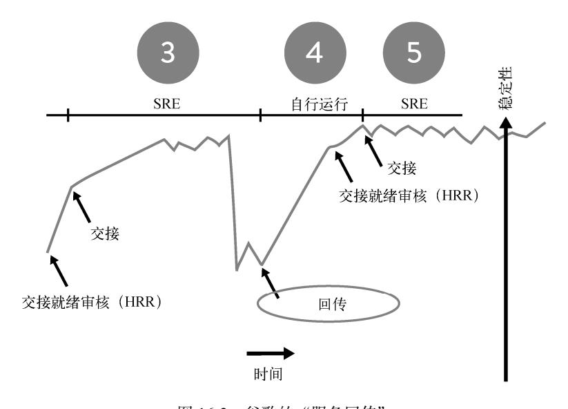

图 16-2 谷歌的"服务回传"

(来源:YouTube 视频"SRE@Google: Thousands of DevOps Since 2004",45:57,USENIX 发布于 2012 年 1 月 12 日, https://www.youtube.com/watch?v=iIuTnhdTzK)

通过在开发过程的最初阶段融入可运维性需求,并让开发人员先自行管理自己的应用程序和 服务,可使新服务发布到生产环境的过程变得更加顺畅、容易和可预测。然而,对于生产环境中 的现有服务而言,我们需要另外一种机制来保证运维不会陷在无法支持的服务中无法自拔。这对 于功能导向的运维组织尤其重要。

在这个阶段,我们可以建立服务回传机制。换句话说,当生产环境中的一个服务变得非常脆 弱时,运维部门能把支持这个服务的责任交回给开发部门。

在服务变为由开发人员管理时,运维部门的角色就从提供生产支持变为开发部门的顾问,帮 助开发团队再次将服务变成生产环境就绪状态。

这种机制对于运维人员来说就像是减压阀,它确保运维团队不会陷入这种境地:不得不管理 脆弱的服务,同时技术债务不断累积,局部问题扩大为全局问题。这一机制还有助于保障运维部 门拥有足够的能力去开展改进工作和预防性项目。

回传这一实践在谷歌由来已久,也许这是开发和运维工程师互相尊重的最佳体现。通过采用 这种实践,开发部门能快速地开发新服务;当一个服务对公司具有战略意义时,会有运维工程师 加入团队;只在极少数情况下,当服务在生产环境中难以管理的时候,才会回传给开发人员。① 下面有关谷歌站点可靠性工程的案例研究中,描述了"交接就绪审核"(Hand-off Readiness Review,HRR)和"上线就绪审核"(Launch Readiness Review,LRR)流程是怎样演进的及其 所带来的好处。

#### **\*** 案例研究 **\***

#### 谷歌的 HRR 和 LRR(2010)

谷歌的很多实践都是令人称奇的,其一是他们对运维工程师有一个职能定位,即"站 点可靠性工程师"(Site Reliability Engineer,SRE),这个术语是由 Ben Treynor Sloss 在 2004 年提出的。② 那一年,Treynor Sloss 只有 7 名 SRE,到 2014 年 SRE 已增加到 1200 多人。Treynor Sloss 说:"要是谷歌发生了宕机事故,就是我的错。"虽然 Treynor Sloss 反对用一句话来定义 SRE,但他曾说:"SRE 就是软件开发工程师负责了以前所说的运 维工作。"

所有的 SRE 都向 Treynor Sloss 的组织汇报,从而保证分配的员工和招聘的人员质 量一致,并将他们都融入到谷歌(还提供资金)的产品开发团队。然而,相对而言 SRE 仍然非常稀少,所以只会将他们分配给对公司来说最重要的产品团队,或者必须遵从监 管要求的产品团队。此外,这些服务的运维负担必须比较低。那些不符合必要条件的产 品仍由开发人员管理。

即使新产品非常重要,已经到了需要公司分配 SRE 的程度,开发人员仍然必须在 生产环境中管理他们的服务至少 6 个月,然后产品团队才有资格分配到 SRE 人员。

——————————

为了帮助这些自己管理产品的团队,确保他们依然能得益于 SRE 组织的集体经验,

① 在按项目支配资金的组织中,由于团队已经解散了,或者没有承担服务责任的预算和时间,可能就没有能接受服 务回传的开发人员了。潜在的对策包括开展一个突击行动来改善服务,为改善服务临时提供资金或雇用人员,或 者将这个服务下线。

② 在本书中,我们使用"运维工程师"这个术语,但"运维工程师"和"站点可靠性工程师"这两个术语其实是可 以互换的。

谷歌为发布新服务的两个关键阶段建立了两套安全检查,分别是交接就绪审核(LRR) 和上线就绪审核(HRR)。

谷歌在将任何新服务公开给客户并且接收生产流量之前,必须进行 LRR,而且要 签字验收,而当将服务转换到运维管理状态后(通常是在 LRR 几个月之后)执行 HRR。 LRR 和 HRR 审核清单其实是相似的,但是 HRR 更加严格,并且验收标准更高,而 LRR 是由产品团队自行执行并上报的。

任何通过了 LRR 或 HRR 的产品团队都会分配到一名 SRE 人员,帮助他们了解和 实现需求(见图 16-3)。随着时间的推移,LRR 和 HRR 发布清单也在不断地发展,这 样所有团队都可以受益于以前所有的集体经验,不论发布是成功还是失败。Tom Limoncelli 在他 2012 年的演讲"SRE@Google: Thousands of DevOps Since 2004"中指出: "我们在每次发布时都会学到东西。总有一些人的发布和交接经验比其他人少。LRR 和 HRR 审核清单是建立组织记忆的一种方式。"

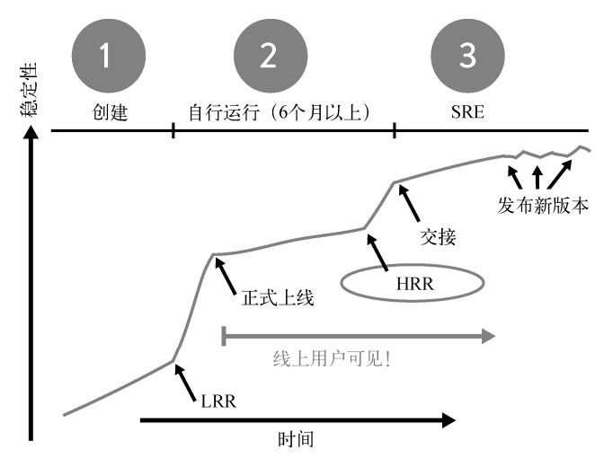

图 16-3 "上线就绪审核"和"交接就绪审核"

(来源:YouTube 视频"SRE@Google: Thousands of DevOps Since 2004",45:57,USENIX 发布于 2012 年 1 月 12 日, https://www.youtube.com/watch?v=iIuTnhdTzK0)

要求产品团队在生产环境中管理自己开发的服务,会促使开发人员转换到运维的工 作视角,但这是在 LRR 和 HRR 的指导下进行的,这不仅使服务转换变得更容易、更可 预测,而且有助于在上游与下游工作中心之间建立同理心。

Limoncelli 指出:"在最好的情况下,产品团队一直在使用 LRR 清单作为指导,在 开发服务的同时满足它的要求,并且平时主动地联系 SRE,以便在需要的时候得到他们 的帮助。"

此外,Limoncelli 还发现:"从早期的设计阶段到发布上线,与 SRE 越早合作的开 发团队,往往是最快通过 HRR 的团队。非常棒的一点是,很容易找到一名 SRE 来为项 目提供帮助。所有的 SRE 都认为,尽早地为项目团队提供建议是很有价值的,而且他 们很可能愿意花几个小时或是几天来做这件事。"

SRE 在项目的早期阶段就帮助产品团队,这是谷歌不断强化的一个重要的文化规 范。Limoncelli 解释说:"SRE 帮助产品团队是一项长期投入,要在多个月以后,发布服 务的时候,才能看到回报。这是重要的"优秀公民"和"社区服务"的一种形式,在评 估工程师能否提升为 SRE 时,通常会考虑这个因素。"

#### 16.5 小结

本章讨论了反馈机制,它使得我们可以在日常工作的每个阶段改进服务,不管是将变更部署 到生产环境,在出现问题时请求工程师修复代码,让开发人员跟踪下游工作,建立非功能性需求 来帮助开发团队编写更优的生产就绪代码,还是将有问题的服务交回给开发团队自己管理。

通过创建这些反馈回路,可以使生产环境的部署更安全,提高所开发代码的生产就绪程度, 并且通过强化共同的目标、责任和同理心,在开发和运维团队之间建立更好的工作关系。

下一章将探讨如何通过遥测进行假设驱动的开发和 A/B 测试,帮助我们实现组织的目标并在 市场中赢得胜利。

## 第 17 章

# 将假设驱动的开发和A/B测试 融入日常工作

在软件项目中,开发人员往往花几个月或几年的时间开发功能,期间经历多次发布,却从未 确认过业务需求是否得到了满足,例如某个功能是否达到了所期望的效果,甚至是否被用过。

更糟糕的是,即使发现了某个功能没有达到预期的效果,开发新功能的优先级也可能高于对 它进行修正的优先级,结果导致那些效果欠佳的功能永远也无法实现预期的业务目标。Jez Humble 指出:"验证业务模式或产品理念的最低效的方法,是构建完整的产品以查看设想中的需 求是否真实存在。"

在构建一项功能之前,我们应该严肃地问问自己:"应该构建它吗?理由是什么?"然后开 展最廉价、最快速的实验,通过用户研究来验证设想的功能能否产生预想的业务成果。我们可以 使用假设驱动的开发、客户获取渠道和 A/B 测试等技术,这些概念都将在本章中探讨。Intuit 公 司的案例生动地说明了组织如何使用这些技术来创建客户喜欢的产品、促进组织学习并在市场 中获胜。

Intuit 专注于构建业务和财务管理方面的解决方案,以简化小型企业、消费者和会计专业人 员的工作。2012 年,Intuit 有 8500 名员工,营业收入为 45 亿美元,旗舰产品包括 QuickBooks、 TurboTax、Mint,以及最近才发布的 Quicken。①

Intuit 的创始人 Scott Cook 一直倡导建立创新文化,鼓励团队采用实验的方法进行产品开发, 并号召领导层都支持这种做法。正如他所说:"这与靠领导层拍板的做法完全不同……我们强调 的是,要获取真实用户在真实实验中的真实行为,并以此为基础做出开发决策。"这是典型的科 学的产品开发方式。

Cook 解释说,他们需要的是"这样一个系统:每个员工都可以进行快速的实验……Dan Maurer 负责消费者部门,他们管理 TurboTax 网站。在他接管后,我们一年大约做 7 次实验"。

——————————

① 2016 年,Intuit 将 Quicken 业务出售给了私募股权公司 H.I.G 资本。

他继续说:"通过在 2010 年积极地推行创新文化,现在他们在为期 3 个月的美国报税季度中 开展 165 次实验。取得的业务成果是什么呢?网站的转化率上升了 50%……团队成员非常喜爱这 种方式,因为现在他们的创意可以快速地投入市场了。"

除了网站转化率的提升,这个故事的惊人之处还在于,TurboTax 是在交易的高峰期开展的生 产环境实验。几十年来,尤其是在零售业,节假日期间服务中断对营业收入造成影响的风险是最 高的,所以从 10 月中旬到 1 月中旬,通常会暂停所有的系统变更。

然而,通过使软件部署与发布变得快速和安全,TurboTax 团队进行了在线用户实验,所需的 生产环境变更都变成了低风险活动,可以在流量最高的收入高峰期开展。

显然,这也证明了一个观点,即最有价值的实验时段是业务高峰期。如果 TurboTax 团队等 到 4 月 16 日,即美国报税截止日期的第二天,才去实施这些变更,那么公司可能已经失去了大 量的潜在客户,甚至一些老客户也可能会流失,成为了竞争对手的用户。

越快地实验、迭代并将反馈集成到产品或服务中,我们就可以越快地学习和超越竞争对手。 集成反馈的速度取决于部署和发布软件的能力。

Intuit 的例子表明,TurboTax 团队能够成功运用以上实践并在市场竞争中取胜。

#### 17.1 A/B 测试简史

正如 Intuit TurboTax 的故事所体现的,一项极其强大的用户研究技术是定义客户获取渠道并 执行 A/B 测试。A/B 测试技术是在直效营销中率先使用的,它是两大类营销策略之一。另一类称 为大众营销或品牌营销,通常通过向公众投放尽可能多的广告来影响人们的购买决策。

在电子邮件和社交媒体出现之前,直效营销意味着通过邮寄的方式发出数以千计的明信片或 传单,并要求潜在客户拨打电话号码、寄回明信片或者直接下订单的方式接受报盘。

在这些营销活动中,通过做实验来确定哪种形式的转化率最高。他们尝试修改和调整报价、 重新报价、改进文案的风格、设计、排版和包装等,从而确定哪种方式能最有效地产生预期的行 动(例如,回拨销售热线电话、订购产品)。

通常,每个实验都需要重新做一次设计和印刷,再将成千上万份产品报盘邮寄出去,然后等 待几个星期之后反馈回来。每次实验通常花费数万美元,并且需要几周或几个月的时间才能完成。 然而,尽管有一定的开销,但如果转换率显著地提高了(例如,订购产品者从 3%增加到 12%), 前几轮测试也是很容易得到回报的。

有良好文档记录的 A/B 测试案例包括竞选筹款、互联网营销和精益创业方法论。有意思的是,

英国政府也采用 A/B 测试来确定哪些信件能最有效地收回逾期税收。①

#### 17.2 在功能测试中集成 A/B 测试

在现代用户体验实践中,最常用的 A/B 测试技术是,在一个网站上,给访问者随机地展示一 个页面的两个版本之一,即控制组(A)或实验组(B)。基于对这两组用户后续行为的统计分析, 可以判断这两者的结果是否存在显著差异,从而找出实验组(例如,功能的变化、设计元素、背 景颜色)和结果(例如,转化率、平均订单大小)之间的因果联系。

例如,我们可以通过一项实验,看看改变"购买"按钮上的文字或颜色是否会增加收入,或 者减慢网站的响应速度(故意给实验组制造延迟)是否会造成收入降低。这种类型的 A/B 测试让 我们在性能优化方面建立了金钱价值观。

有时,A/B 测试也称为在线控制实验和拆分测试。在实验的过程中还支持多个变量,从而观 察变量之间的相互作用,这种技术称为多变量测试。

A/B 测试通常会带来惊人的结果。微软分析与实验小组的杰出工程师兼总经理 Ronny Kohavi 指出:"在评估旨在提高关键指标的设计良好且良好执行的实验后,只有约三分之一的功能成功 地提升了关键指标!"换句话说,其他三分之二的功能所产生的影响可以忽略不计,甚至会使情 况变得更糟。Kohavi 继续指出,这些功能最初都被认为是合理的好想法,而测试结果进一步提升 了对用户测试的需求,而这种需求高于直觉和专家意见。

Kohavi 数据的意义是令人吃惊的。如果不进行用户研究,那么我们构建的三分之二的功能对 组织的价值很可能为零或者为负,因为它们增加了代码的复杂度,而随着时间的推移,应用维护 的成本将增加,软件也变得更加难以修改。此外,构建这些功能往往是以牺牲真正有价值的功能 (机会成本)为代价的。Jez Humble 开玩笑说:"极端地说,与其构建这些没有价值的功能,还不 如让整个团队好好地度个假,这样对组织和客户而言反而更好。"

我们的对策是将 A/B 测试整合到设计、实现、测试和部署功能的过程中。通过进行有意义的 用户研究和实验,确保我们的努力有助于实现客户和组织的目标,并能帮助我们赢得市场。

#### 17.3 在发布中集成 A/B 测试

——————————

通过在生产环境中快速轻松地按需部署,利用特性开关将软件的多个版本同时交付给多个用

① 在进行产品研发以前,还有许多其他进行用户研究的方式。最廉价的方法包括进行调查、创造原型(使用 Balsamiq 等工具进行模拟,或使用代码编写的可交互版本)以及进行可用度测试。谷歌的工程总监 Alberto Savoia 创造了 "原型法"这个术语,指的是通过原型来验证当前是否在创造正确的东西。相对于编码实现一个无用的功能,用 户研究非常廉价而且容易实现。所以,几乎在任何情况下,都不应该未经验证就设置功能的优先级。

户群,可以进行快速、迭代的 A/B 测试。要实现这一点,需要在应用程序栈的各个层次上进行全 面的生产环境遥测。

通过勾选特性开关中的选项,可以控制能看到实验组版本的用户比例。例如,可以让一半的 客户成为实验组,向其显示"与购物车中失效商品相似商品的链接"。在实验中,我们对比控制 组(无选择)和实验组(有选择)的用户行为,可能是衡量在此期间的购买数。

Etsy 开源了他们的实验框架 Feature API(以前称为 Etsy A/B API),它不仅支持 A/B 测试, 还支持在线调整,能对实验组进行限流。其他具有 A/B 测试功能的软件产品包括 Optimizely、 Google Analytics 等。

在 2014 年接受 Apptimize 的 Kendrick Wang 的采访时,Etsy 的 Lacy Rhoades 描述了他们的旅 程:"在 Etsy,实验的目的是做出明智的决策,确保向数百万的会员推出可用的功能。我们经常 在一些功能上投入了大量时间,而且不得不维护,但没有证据表明它们是成功的或者受到了用户 的欢迎。A/B 测试让我们可以在开发过程中就判断一项功能是否值得继续投入。"

#### 17.4 在功能规划中集成 A/B 测试

一旦拥有了支持 A/B 功能发布和测试的基础设施,我们还必须确保产品经理将每个功能都视 为一个假设,并基于在生产环境中实际的用户实验结果来证明或反驳这些假设。构建实验应该在 客户获取渠道的整个背景下设计。《精益企业:高效能组织如何规模化创新》的合著者 Barry O'Reilly 描述了在功能开发中如何通过如下形式构建假设:

我们相信,增大预订页面上酒店图片的大小

将会提升客户的参与度和转化率

如果在 48 小时内查看酒店图片并预订房间的客户增加了 5%,我们将有信心进行这 个改变。

采用实验的方法进行产品开发,不但需要将工作分解成更小的单元(故事或需求),而且还 要验证每个工作单元是否能够实现预期的结果。如果没有达到预期,就用替代方案修改工作路线 图,并最终实现业务成果。

#### **\*** 案例研究 **\***

快速的发布周期实验使 Yahoo! Answers 收入翻番(2010)

越快地迭代并将反馈集成到向客户提供的产品或服务中,学习的速度就越快,产生 的影响也越大。Yahoo! Answers 的案例证明了更快的迭代周期能显著地影响结果。他们 经历了从每六周发布一次到每周发布多次的改变。

2009 年,Jim Stoneham 是 Yahoo! Communities 小组(包括 Flickr 和 Answers)的总 经理。之前,他主要负责 Yahoo! Answers,与其他问答公司进行竞争,如 Quora、Aardvark 和 Stack Exchange 等。

当时,Answers 每月的访问者将近 1.4 亿,其中有 2000 多万活跃用户,他们使用 20 多种不同的语言回答问题。然而,用户增长和收入已经进入瓶颈期,用户参与度在下降。

Stoneham 说:"Yahoo! Answers 曾是并仍然是互联网上最大的社交游戏之一。数千 万的用户在积极地以比社区其他成员更快的速度为问题提供优质答案,以期获得'升 级'。网站有很多机会去调整游戏机制、病毒式营销以及与其他社区的交互。在处理这 些人类行为时,你必须能进行快速的迭代和测试,以便发现大家喜欢什么。"

他继续说道:"Twitter、Facebook 和 Zynga 在实验方面做得非常好。这些组织每周 至少进行两次实验,他们甚至在部署之前还在审核要做的变更,以确保没有偏离正轨。 因此,在这个互联网上最大的问答网站里,我们也想进行快速迭代的功能测试,但是我 们最快四周才能发布一次。相比之下,市场上其他人的反馈回路比我们快了 10 倍。"

Stoneham 发现,就像产品经理和开发人员谈论指标驱动一样,如果不能频繁地(每 天或每周)进行实验,日常工作的重点就只能放在功能开发而不是客户成果上了。

由于 Yahoo! Answers 团队能够做到每周部署一次,之后又提升到了每周部署多次, 他们实验新功能的能力显著增强。在随后 12 个月的实验中,他们取得了惊人的成果, 包括月访问量上升了 72%,用户参与度提升了 3 倍,业务收入翻了一番。为了继续扩大 战果,该团队专注于优化以下几个最重要的指标。

- 首次回答时间:回答一个用户问题的速度有多快?
- 最佳答案时间:用户社区给出最佳答案的速度有多快?
- 答案点赞数:一个答案被用户社区点赞的次数?
- 回答次数/周/人:用户创建了多少个答案?
- 二次搜索率:访问者需要二次搜索以获得答案的频率?(越低越好)

Stoneham 总结说:"这正是我们为了赢得市场需要学习的,而且它不止改变了我们 推出功能的速度。我们的心态也从打工者转变成了企业的主人。当你以这种速度运转, 并且每天都看各种数字和结果时,你的投资水平会发生根本性的变化。"

#### 17.5 小结

成功不但需要快速地部署和发布软件,还要在实验方面超越竞争对手。采用假设驱动的开发、 定义和度量客户获取渠道,以及 A/B 测试等技术,能够安全、轻松地进行用户实验,从而让员工 发挥出创造力和创新能力,并进行组织性学习。虽然成功很重要,但源于实验的组织性学习也能 让员工积极主动地去实现业务目标和客户满意度。下一章将通过研究和创建评审和协作流程,来 提高当前工作的质量。

# 建立评审和协作流程以提升 当前工作的质量

在前面的章节中,我们建立了必要的遥测机制,用来在生产环境和部署流水线的所有阶段中 监控和解决问题。同时,建立了快速的端到端的反馈回路来帮助强化组织学习,鼓励主动提升客 户满意度和功能表现,进而帮助我们取得成功。

本章的目标是帮助开发人员和运维人员在实施生产环境变更前降低变更的风险。按照传统的 做法,当我们评审将要部署的变更时,往往主要依赖部署之前的评审、审核和审批环节。审批者 通常来自外部团队,他们对实际工作不了解,所以其实无法准确评判变更是否有风险,而且为了 获得全部必要的审批需要花费不少时间,这进一步延长了变更的交付时间。

GitHub 的同行评审流程是一个典型的范例,它说明了评审是怎样提高代码质量、使部署更 安全的,以及如何将其融合进每个人的日常工作流程中。他们创建了一种称为 Pull Request 的流 程,这也是在开发和运维团队中最为流行的一种同行评审形式(见图 18-1)。

GitHub 的首席信息官和联合创始人 Scott Chacon 在他的网站上写道,Pull Request 是这样一 种机制:让工程师告诉其他所有人,他向 GitHub 上的仓库推送了一些代码变更。一旦提交了 Pull Request,相关人员就能评审所有的代码变更,讨论可能的修改,甚至在必要时推进后续行动。 提交 Pull Request 的工程师通常会请求大家投票,例如在评论中回复"+1""+2"等,具体取决于 他们需要多少评论,又或者使用"@评审人"的形式通知他们所希望的工程师来评审。

在 GitHub,Pull Request 也用来通过他们称为"GitHub Flow"的一套实践,将代码部署到生 产环境中。这套实践包括工程师如何请求代码评审、收集和集成反馈,并最终确定代码将会部署 到生产环境(例如"主干"分支)。

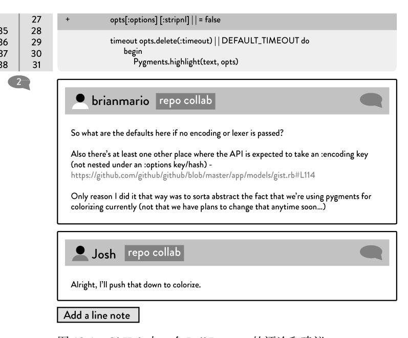

图 18-1 GitHub 中一个 Pull Request 的评论和建议

(来源:Scott Chacon 于 2011 年 8 月 31 日在 ScottChacon.com 上发表的博客文章"GitHub Flow", http://scottchacon.com/2011/08/31/github-flow.html)

GitHub Flow 由如下 5 个步骤组成。

- (1) 工程师为了实现一项新功能需求,要基于主干建立一个命名清晰的分支(例如,newoauth2-scopes)。
  - (2) 工程师提交代码到本地分支,并定期将工作成果推送到远端服务器的同名分支上。
- (3) 当他们需要反馈或帮助时,或者准备将这个分支的代码合并到主干时,就会提交一个新 的 Pull Request。
  - (4) 在他们获得期望的评审并通过必要的审核后,就可以将代码合并到主干了。
  - (5) 一旦将代码变更合并进了主干,工程师就可以将其部署到生产环境了。

这些做法将代码评审和团队协作融入日常工作中,因此 GitHub 可以快速、安全地向市场交 付高质量且可靠的功能。例如,2012 年,GitHub 进行了数量惊人的 12 602 次部署。特别是在 8 月 23 日(即在全公司范围的峰会召开之后,峰会上头脑风暴并讨论了很多令人兴奋的想法),公 司迎来了史上最繁忙的一天,执行了 563 次构建,成功地在生产环境中部署了 175 次——是 Pull Request 使这一切成为可能。

本章会将诸如 GitHub 的实践整合到日常工作中,我们将摆脱对定期检查和审批的依赖,用

不间断的同行评审取而代之。我们的目标是确保开发人员、运维人员和信息安全人员始终紧密协 作,从而使系统所做的变更可靠、安全、符合设计。

#### 18.1 变更审批流程的危险

Knight Capital 的宕机事件是近期最突出的软件部署事故之一。15 分钟的部署事故造成了 4.4 亿美元的交易损失,在此期间工程团队也无法终止生产服务。财务损失使公司的运营陷入困境。 为了继续经营下去,避免危及整个金融系统,该公司在一周之后被迫出售。

John Allspaw 发现,当发生像 Knight Capital 部署事故这样备受瞩目的事件时,对于事故发生 的原因通常有两种反事实的叙述。①

第一种叙述是:此次事故是由于变更控制失效导致的。这听起来很合理,因为我们可以想象, 如果采用更好的变更控制实践,就能够更早地识别出风险,并阻止将变更部署到生产环境。如果 我们无法阻止部署,则可以采取其他措施实现更快的检测和恢复。

第二种叙述是:此次事故是由于测试失败导致的。这似乎也有道理,因为通过更完备的测试 实践,就可以更早地发现风险,并取消这次有风险的部署,或者至少可以采取某些措施来实现更 快的检测和恢复。

但现实是,在低信任度的指挥与控制型文化环境中,这些变更控制和测试实践反而会增加问 题复发的几率,甚至造成更严重的后果。

Gene Kim(本书作者之一)描述了他的见解,即变更和测试控制可能具有与"我的职业生涯 中最重要的时刻之一"相反的效果。"我是在 2013 年与 John Allspaw 和 Jez Humble 谈论 Knight Capital 事故时意识到这一点的。这让我对过去 10 年中形成的一些核心信念产生了怀疑,尤其是 作为受过培训的审计员。"

他继续说道:"虽然令人心烦意乱,可是这对我来说也是个非常关键的时刻。他们不但说服 了我他们是正确的,我们还用《2014 年 DevOps 现状报告》测试了这些信念,并发现了一些令人 惊讶的结果,再次强化了建设高度信任的文化可能是未来 10 年最大的管理挑战。"

#### 18.2 "过度控制变更"的潜在危险

——————————

传统的变更控制可能会导致意想不到的后果,例如延长交付时间,降低部署过程中反馈的强 度和即时性。为了更好地理解这是怎么发生的,我们回顾一下在变更控制失败发生时通常正在实 施的控制。

① 反事实思维是心理学术语,指人们往往针对已经发生的生活事件创建其他可能的叙述。在可靠性工程中,反事实 思维通常涉及对"想象中系统"而非"现实系统"的叙述。

- 在变更请求表单中添加更多需要回答的问题。
- 经过更多重授权,例如多加一级管理层(例如不但要运营副总裁批准,还需要首席信息 官的批准)或更多利益干系人(例如网络工程、架构评审员会等)的审批。
- 变更审批需要更长的前置时间,这样变更请求才能被适当地评估。

这些控制带来了大量额外的步骤和审批,增加了部署过程的阻力,同时增加了批量尺寸和部 署的前置时间。我们知道,对于开发和运维来说,这降低了收获成功的工作成果的可能性。这些 控制也降低了我们获得反馈的速度。

丰田生产系统的核心理念之一是"最了解问题的人通常是离问题最近的人"。随着工作和工 作系统变得越来越复杂和动态——这在 DevOps 的价值流中是很典型的,这个道理就越发显而易 见。在这种情况下,让距离工作越来越远的人来做相关审批的步骤,这实际上可能会降低工作成 功的概率。就像之前就已经证明过的一样,开展工作的人(即变更实施者)和决定做这项工作的 人(即变更授权人)之间的距离越远,审批流程的结果就越差。

在 Puppet Labs 发布的《2014 年 DevOps 现状报告》中,一项主要的发现是高绩效组织更多 地依赖同行评审,更少地依赖外部变更批准。如图 18-2 所示,组织越依赖变更审批,它在稳定 性(平均服务恢复时间和更改失败率)和吞吐量(部署前置时间、部署频率)方面的表现就越差。

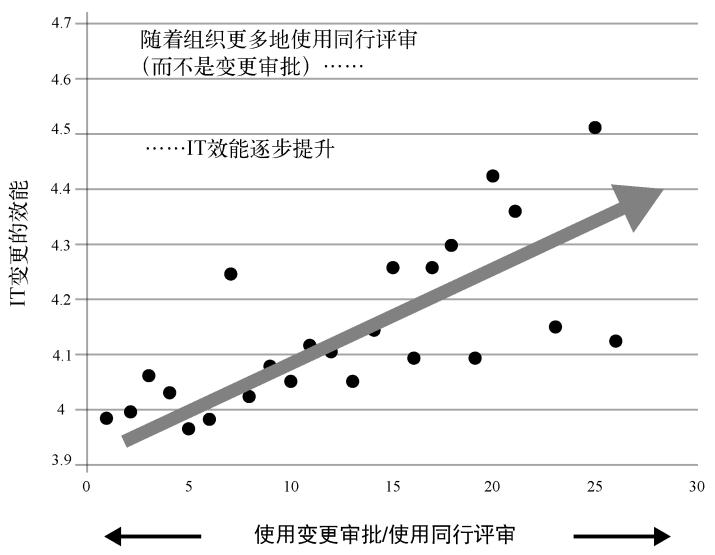

图 18-2 使用同行评审的组织优于使用变更审批的组织 (来源:Puppet Labs 2014 年的 DevOps 实践调查)

在许多组织中,变更咨询委员会在 IT 服务交付过程中发挥着重要的协调和管理职能,但是

他们的工作不应该是手动评估每一个变更,ITIL 中也不强制要求这样做。

为了理解为什么是这样,就要考虑一下变更咨询委员会所处的困境。他们通常评审的变更是 非常复杂的,可能和数百名工程师做的数十万行代码变更相关。

一方面,只是通过审阅变更单中一百多字的变更描述,或者核对某个清单是否已经完成,是 不可能准确地预测出变更是否会成功的。另一方面,当评审的变更有关于数千行的代码变更,尤 其是当变更发生在复杂的系统内时,评审很难得出新的见解。即便是那些每天都工作在代码库上 的工程师们,也经常对那些低风险变更所带来的负作用而感到诧异。

出于上述所有原因,我们需要创建的控制实践应该更类似于同行评审,减少对外部相关组织 变更授权的依赖。此外还需要有效地协调和安排变更相关的活动。在接下来的两节中将具体探讨。

#### 18.3 变更的协调和排程

每当多个团队在共享依赖关系的系统上工作时,就可能需要协调变更,以确保它们不会相互 干扰(例如,编组、批处理和变更的排程)。一般来说,组织的架构越是松耦合,组件团队之间 需要沟通和协调的事情就越少。当系统架构真正做到了以服务为导向时,每个团队就可以进行高 度自主的变更了,因为局部的变更不太可能造成全局的中断。

然而,即使是在松耦合的架构里,当多个团队每天进行数百个独立的部署时,变更彼此干扰 的风险(例如,同时进行的 A/B 测试)可能依然存在。为了降低这些风险,我们可能会使用聊天 室的方式,发布变更通告,并主动地搜索可能存在的冲突。

对于复杂的组织,以及系统架构耦合程度高的组织来说,我们可能需要更加小心地来安排变 更。各个团队的变更代表要聚在一起,他们并不是做变更授权,而是做变更工作的排程和序列化, 目的是最小化事故风险。

然而,在某些领域,诸如底层基础设施变更(例如核心网络交换机变更),将总是伴随着较 高的风险。这类变更将始终需要技术性的保障措施,如冗余备份系统、故障切换、综合测试和变 更模拟(理想情况下)。

#### 18.4 变更的同行评审

——————————

与在部署之前需要外部组织的审批不同,同行评审是要求工程师请同行对他们的变更进行评 审。在开发中,这种实践被称为代码评审,但它同样适用于对应用程序或环境(包括服务器、网 络和数据库)进行的任何变更。①同行评审的目标是通过工程师同事的仔细核查来减少变更错误。

① 在本书中,术语代码评审和变更评审将交替使用。

这种形式的评审不仅提高了变更的质量,还相当于进行了交叉培训,对互相学习和技能提升非常 有好处。

进行同行评审的合理时机,是将代码向版本控制系统中的主干提交时,这个时候变更可能会 影响到整个团队,或者造成全局影响。至少,工程师同事应该审核我们的变更,但是对于风险更 高的领域,例如数据库变更,或者在自动化测试覆盖率不高的情况下对业务的关键组件进行变更, 可能就需要领域专家(例如信息安全工程师、数据库工程师)做进一步的审查,或者做多重评审 (例如,用"+2"做评论,而不是"+1")。

保持小批量尺寸的原则也适用于代码评审。变更的批量越大,评审工程师理解这些工作需要 花费的时间就越长,他们的负担也越大。正如 Randy Shoup 所说:"变更的批量与整合这个变更 的潜在风险之间存在着非线性的关系——从 10 行代码的变更到 100 行代码的变更,发生错误的 风险不止高出 10 倍,等等。"这就是开发人员要以小的、渐进式的步骤工作,而不应在功能分支 里长时间工作的原因。

此外,随着变更尺寸的增加,我们对代码变更进行有意义的评判的能力也随之下降。正如 Giray Özil 在 Twitter 上所说的:"请程序员来审查 10 行代码,他会找到 10 个问题。请他审查 500 行代码,他会说看起来都不错。"

代码评审的指导原则如下。

- 每个人在将代码提交到主干以前,必须要有同行来评审他们的变更(例如代码、环境等)。
- 每个人都应该持续关注其他成员的提交活动,以便识别和审查出潜在的冲突。
- 定义哪些变更属于高风险的变更,从而决定是否需要请领域专家(例如数据库变更、安 全性敏感的身份验证模块等)来进行审查。①
- 如果提交的变更尺寸太大了,以至于让人很难理解——换句话说,阅读了几遍代码还无 法理解,或者需要提交者进行解释——那么这个变更就需要分解成多个较小的变更来提 交,使之一目了然。

为了避免形式主义的评审,可能还要检查一下代码评审的统计数据,从而确定有多少个代码 提交通过了评审,有多少个没有通过,也可以对特定的代码评审进行抽样和检查。

代码评审有如下几种形式。

——————————

- 结对编程:程序员结对地在一起工作(见下节)。
- "肩并肩":在一名程序员编写了一段代码后,评审程序员接着就逐行阅读他的代码。
- 电子邮件送审:在代码被签入到代码管理系统中后,系统就立刻自动向评审者们邮寄一 份代码。

① 顺便说一下,变更咨询委员会很可能已经创建了高风险代码和环境相关的列表。

 工具辅助评审:编码者和审阅者都使用专门用于代码评审的工具(例如,Gerrit、GitHub 的 Pull Request 等)或由源代码仓库(例如,GitHub、Mercurial、Subversion,以及 Gerrit、

通过对变更进行各种形式的仔细检查,有助于发现那些曾经忽视的错误。代码评审还可以辅 助增量代码的提交和生产环境部署,并支持基于主干的部署和大规模持续交付。我们将在下面的 案例研究中看到这些作用。

Atlassian Stash 和 Atlassian Crucible 等其他平台)提供的类似功能。

#### **\*** 案例研究 **\***

#### 谷歌的代码评审(2010)

谷歌就是一个采用基于主干的开发并进行大规模持续交付的最佳案例。就像本书前 面指出的,Eran Messeri 描述道,2013 年,谷歌的开发流程允许 13 000 多名开发人员在 一个源代码库上使用主干开发实践,每周代码提交的次数超过了 5500 次,每周进行数 百次生产环境部署。2010 年,每分钟有 20 多个代码变更签入主干,因此每个月代码库 中 50%的代码都会被修改。

这需要谷歌的团队成员遵守严格的纪律和强制性的代码评审,这涵盖以了下几个 方面:

- 语言的代码可读性(强制编码样式);
- 代码分支所有权的分配,并负责保证一致性和正确性;
- 在团队中提倡代码的透明度和贡献度。

图 18-3 显示了代码变更的大小是怎样影响代码评审的前置时间的。*x* 轴表示代码变 更的大小,*y* 轴表示代码评审过程的前置时间。一般来说,需要代码评审的变更批量越 大,代码评审所需的前置时间就越长。左上角的数据点表示更复杂和更具潜在风险的变 更,它们需要更多的审议和讨论。

在 Randy Shoup 担任谷歌工程总监期间,他启动了一个个人项目去解决公司当时面 临的一个技术问题。他说:"我在这个项目上工作了几个星期后,请了一位领域专家来 评审我的代码。这个项目有接近 3000 行代码,这位专家花了好几天的时间才完成评审。 之后他对我说:'请不要再这么折磨我了。'我很感激这位工程师所花的时间。我因此学 到了一个经验,即应该将代码评审作为日常工作的一部分。"

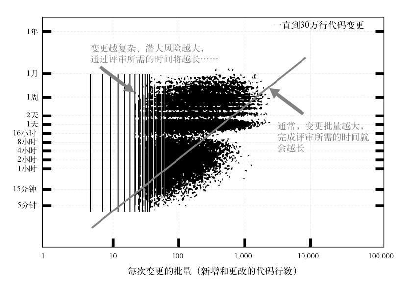

图 18-3 谷歌的变更批量大小与变更前置时间

(来源:Ashish Kumar 在 2010 年旧金山 QCon 上的演讲"谷歌的开发速度和规模",https://qconsf.com/sf2010/dl/ qcon-sanfran-2010/slides/AshishKumar\_Developing-ProductsattheSpeedandScaleofGoogle.pdf)

#### 18.5 人工测试和变更冻结的潜在危害

现在,我们已经建立了同行评审,用来降低风险,缩短与变更审批流程相关的前置时间,并 实现大规模的持续交付,就像在谷歌的案例研究中看到的效果。下面让我们来看一下测试弄巧成 拙的情况。在测试失败时,我们通常的反应是应该做更多的测试。但是,如果只是在项目结束时 去进行更多的测试,可能会导致更糟糕的结果。

尤其在做人工测试的时候更是如此,因为人工测试本来就比自动化测试更慢、更乏味,而且 完成"附加测试"的时间通常更长,这意味着部署频率更低,进而部署的批量尺寸也增大了。从 理论和实践两个方面讲,我们都知道部署的批量尺寸越大,变更的成功率就越低,事故发生的数 量和平均故障恢复时间(MTTR)也都随之上升——这个结果与我们期望的恰恰相反。

我们不想在变更冻结期间安排大量的变更测试,而是要全面测试我们的日常工作,作为顺利 连续生产过程的一部分,同时提高部署的频率。通过这种方式,我们可以实现内建质量,能够以 更小的批量尺寸进行测试、部署和发布。

#### 18.6 利用结对编程改进代码变更

结对编程就是两名软件开发工程师同时在同一台工作站上工作的开发方法,它是一种在 21

世纪初由极限编程和敏捷开发广泛推广的实践。与代码评审一样,这种实践始于开发过程,但是 在价值流中,它也适用于与工程师相关的其他工作。在本书中,术语结对和结对编程的含义是相 同的,以表明这种实践不只适用于开发人员。

在常见的结对模式中,一名工程师扮演驾驶者角色,他是实际上编写代码的人,而另一名工 程师则作为导航员、观察者或督导者,他会检查驾驶者正在进行的工作。在检查的过程中,观察 者也可以根据工作的战略方向,提出改进的思路以及将来可能遇到的问题。有了观察者作为安全 网和指导,驾驶者可以将全部的注意力都放在完成任务的战术方面。当两人具有不同的特长时, 他们可以互相取长补短,不管是通过专门的培训还是通过分享技术和变通办法。

另一种结对编程的模式是通过测试驱动开发进行的,这是指一名工程师编写自动化测试,另 外一名工程师编写代码。Stack Exchange 的联合创始人 Jeff Atwood 写道:"我不禁想,结对编程 只不过是增强版的代码评审……结对编程的优势是及时性:评审者就坐你旁边时,你是不可能忽 略他的。"

他继续说道:"如果可以选择的话,大多数人很可能会放弃代码审查,而在结对编程时,这 是不可能的。结对的双方都必须理解当下的代码。结对可能是侵入性的,但这也会迫使人们达到 前所未有的沟通水平。"

Laurie Williams 博士在 2001 年进行了一项研究,研究结果显示:"结对的程序员比两个独立 工作的程序员慢了 15%,而'无错误'代码量却从 70%增加到了 85%。由于测试和调试程序的成 本通常比初始编程高出很多倍,这是一个惊人的结论。相比独立工作的程序员,结对通常会考虑 到更多种设计选择,进而获得更简洁且更可维护的设计方案,同时也能更早地发现设计的缺陷。" Laurie Williams 博士的报告中还说,96%的受访者表示,他们比独立编程时更喜欢工作了。①

结对编程还能有益于知识在组织内的传播,以及信息在团队内部的流动。让经验丰富的工程 师在经验不足的工程师实现代码时同步地评审,这也是一种有效的教学和学习的方式。

#### **\*** 案例研究 **\***

#### 在 Pivotal 实验室利用结对编程代替破碎的代码评审流程(2011)

Elisabeth Hendrickson 是 Pivotal 软件公司的工程副总裁,也是《探索吧!深入理解 探索式软件测试》一书的作者。她广泛地发表的观点是:每个团队都应该对自己的质量 负责,而不是让单独的部门来负责。她认为这样做不仅可以提高质量,而且会加快工作 流入生产环境的速度。

——————————

① 一些组织可能需要结对编程,而在其他组织中,工程师在需要更仔细的检查(如代码签入前),或面临挑战性的 工作任务时,会找人进行结对编程。另一种常见做法是,在工作日里设置结对时间,这可以是上午 10 点左右到 下午 3 点左右的 4 个小时。

在 2015 年 DevOps 企业峰会的演讲中,她描述了在 2011 年 Pivotal 是如何接受两种 代码评审方法的:结对编程(确保每行代码都受到两个人的检查)或者受到 Gerrit 管理 的代码评审过程(它确保提交的每行代码都有两个人员对变更进行"+1"的评论,然后 才能并入主干)。

Hendrickson 在 Gerrit 代码评审流程中观察到的问题是,开发人员通常需要等待整整 一周的时间,才能得到他们所需要的评审结果。更糟糕的是高级开发人员的感受:"即 使是一个简单的变更,也无法迅速地进入代码库,这是令人非常沮丧和崩溃的体验,因 为我们无意中创造了一个让人无法忍受的瓶颈。"

Hendrickson 感叹道:"有能力对变更评论'+1'的人都是高级工程师,他们还有许 多其他职责,所以通常对初级开发人员所做的修复或生产力不太关心。这会导致一个可 怕的情况——当你在等待变更评审时,其他开发人员正在提交他们的变更。所以在随后 的一个星期里,你不得不把他们所有的代码变更都合并到你本地的笔记本电脑里,再重 新运行所有测试,并确保自已所做的一切变更仍然有效,并且(有时)必须重新提交变 更等待评审!"

为了解决以上问题,并消除所有延迟,他们最终撤销了整个 Gerrit 代码评审流程, 然后应用结对编程来实现系统里的代码变更。通过这种方式,他们将代码评审所需要的 时间从几周缩短到了几小时。

Hendrickson 很快注意到,许多组织能正常地执行代码评审,他们靠的是一种文化, 即认可评审代码的价值不低于编写代码的价值。当尚未建立这种文化时,在过渡时期, 结对编程可以作为一种宝贵的实践。

#### 评估 Pull Request 的有效性

——————————

因为同行评审是我们控制环境的重要组成部分,所以需要确保它能有效地工作。一种方法是 在出现生产中断的时候,检查任何与之相关的变更,并检查所有相关的同行评审过程。

另一种方法来自 Ryan Tomayko,他是 GitHub 的首席信息官和联合创始人,同时也是 Pull Request 处理的发明人之一。当他被问到一个糟糕的 Pull Request 和一个有效的 Pull Request 有何 差异时,他说,这与它们在生产环境中的结果其实没有什么关联。相反,一个糟糕的 Pull Request 其实没有为读者提供足够的内容,有些甚至连说明变更目的的文档都没有。例如,一个Pull Request 仅仅提供了这样的文字:"修复故障单#3616 和#3841"。①

① Gene Kim 很感谢 Shawn Davenport、James Fryman、Will Farr 和 Ryan Tomayko 在 GitHub 上讨论了有效的和糟糕的 Pull Request 之间的差异。

这是 GitHub 内部一个真实的 Pull Request,Tomayko 评论说:"这很可能是一名新来的工程 师写的。首先,他没有用@的方式提及任何人——他至少应该提及他的导师或某个领域专家,并 确保他所作出的改动会有合适的人员来进行评审。更糟的是,对于变更实际上是什么,为什么它 很重要,或实施者的想法是什么,都没有任何解释和说明。"

另一方面,在被要求描述一个好的、表明评审过程有效的 Pull Request 时,Tomayko 迅速地 列出了基本的要素:必须足够详细地说明变更的原因、如何做的变更,以及任何已识别的风险和 应对措施。

Tomayko 也在寻找关于变更的有益讨论,这些讨论通常是由如何描述 Pull Request 而引发的。 通常,它还会提出额外的风险,为实现期望的变更而提出更好的思路,对如何更好地降低风险提 出想法,等等。如果在部署时发生了糟糕的或意外的事情,它还会被添加到 Pull Request 中,并 带有一个指向相应问题的链接。所有的讨论中都没有责备,相反,大家对于如何防止问题的复发 展开了一场坦诚的对话。

例如,Tomayko 还展示了另一个 GitHub 内部的关于数据库迁移的 Pull Request。它用了大量 的篇幅论述潜在的风险,Pull Request 的作者是这样说明的:"我正在修复一件事。由于持续集成 服务器的数据库里缺少了一列,这导致目前分支的构建失败了。(事后剖析的链接是:MySQL 宕 机。)"

然后,变更提交者为宕机道歉,并描述了导致事故发生的条件和错误假设,同时为了防止问 题的复发,提出了各种对策。接下来是大家对此一页又一页的讨论。在翻阅这个 Pull Request 的 时候,Tomayko 笑着说:"这才是一个 Pull Request 的范例。"

如上所述,我们可以从全部 Pull Request 与生产事故相关的 Pull Request 中抽样检查,来评估 同行评审过程的有效性。

#### 18.7 消除官僚流程

到目前为止,我们已经讨论了同行评审和结对编程的流程,它们能够在不需要依赖外部变更 审批的情况下,提高工作质量。然而,许多公司仍然存在着由来已久的、动辄需要数月的审批流 程。这些审批流程大大延长了前置时间,不仅阻碍了快速地向客户交付价值,可能还给实现组织 目标平添了风险。当发生这种情况时,我们必须重新设计流程,才便更快、更安全地实现目标。

就像 Adrian Cockcroft 所说的那样:"应该广泛发布的一个有用指标是,为执行一次发布,不 得不召集的会议和处理的工单数量——目标是大大降低工程师为完成工作并交付给客户所需付 出的努力。"

类似地,第一资本银行的技术研究员 Tapabrata Pal 博士,描述了该公司一个名为 Got Goo 的

项目,该项目中有一个团队专门负责消除工作障碍,包括工具、流程和审批等方面。迪士尼公司 系统工程高级总监 Jason Cox 在 2015 年 DevOps 企业峰会的演讲中,描述了一个名为"加入叛乱" (Join The Rebellion)的计划,旨在消除日常工作中的琐事和障碍。

2012 年,塔吉特公司采用了技术企业适用流程(Technology Enterprise Adoption Process)和 首席架构审查委员会(Lead Architecture Review Board)(TEAP-LARB 流程)的组合模式,结果 导致了异常的复杂性,引进新技术要经历长时间的审批流程。任何想引进新技术(例如新的数据 库或监测技术)的人都需要填写 TEAP 表格。这些提议需要经过评估,合适的提议还要纳入 LARB 的月度会议议程。

塔吉特公司开发总监 Heather Mickman 和运营总监 Ross Clanton,领导了该公司的 DevOps 运动。在他们执行 DevOps 计划期间,Mickman 已经确定了一项用来支撑业务(Tomcat 和 Cassandra)的技术需求。LARB 做出的决定是,运维部门在当时无法提供技术支持。然而,因为 Mickman 深信这项技术是必不可少的,所以她建议由她的开发团队来负责提供服务支持,以及集 成性、可用性和安全性方面的支持,而不是依赖运维团队。

"在我们经历这个过程时,我想更好地理解为什么通过 TEAP-LARB 流程需要这么长的时间。 我使用了'五个为什么'的技巧……最后我想到的问题是,为什么当初我们会建立 TEAP-LARB 这个流程?令人惊讶的是,没有人知道原因,除了有一个模糊的想法——我们需要一种治理流程。 许多人都知道多年前曾经发生过的灾难,也知道它可能永远不会复发,但是没有人准确地记得那 个灾难是什么。"Mickman 说道。

Mickman 的结论是,如果她的团队要对所引入的技术承担运维责任,那么他们其实不需要这 个流程。她补充说:"我要让大家都知道,以后对任何新技术的支持,都不需要通过 TEAP-LARB 流程。"

结果是塔吉特成功地引入了 Cassandra 技术,并最终得到了广泛采用。此外,还彻底撤销了 TEAP-LARB 流程。为了感谢 Mickman 消除了在塔吉特内部完成技术工作的障碍,团队授予 Mickman"终身成就奖"。

#### 18.8 小结

本章讨论了一些要整合到日常工作中的技术实践,它们能够提高变更的质量,降低部署出错 的风险,减少对审批流程的依赖。GitHub 和塔吉特的案例研究表明,这些实践不仅改善了工作成 果,而且还极大地缩短了前置时间,并提高了开发人员的生产力。这些工作需要高度信任的文化。

John Allspaw 讲述了一个关于新招聘的初级工程师的故事。这位工程师问是否可以部署一个 小的 HTML 变更,Allspaw 回答说:"我不知道。可以吗?"他接着问:"有人审核过你的变更吗? 你知道谁是咨询这类变更的最佳人选吗?你能保证这种变更会按照设计在生产环境中运行吗? 如果你的回答是肯定的,那么不用来问我了,直接变更好了!"

通过这种回应方式,Allspaw 提醒了那位工程师,她要对自己的变更质量负全责。如果她做 了能做的一切,确信变更会正常工作,那么她就不需要请求任何人的批准,她应该去实施这个 变更。

创造条件,让变更实施者完全掌控自己的变更质量,这是我们努力建设的高度信任的、生成 性文化的重要组成部分。而且,这些条件能使我们创造出一个更加安全的工作系统,我们在实现 目标的过程中相互帮助,跨越任何必须跨越的边界。

#### 18.9 第四部分总结

第四部分向我们展示了,通过实施反馈回路,可以让每个人都为实现共同的目标而协作,当 发生问题时及时发现问题,并通过快速检测和恢复的机制,保障所有功能不仅能按照设计在生产 环境中运行,而且还实现了组织目标和组织学习。我们还研究了如何让开发和运维共享目标,从 而提高整个价值流的健康程度。

我们即将进入第五部分"第三步:持续学习与实验的技术实践",以便更早、更快、更廉价 地创造学习机会,这样才能打造创新和实验文化,使每个人都通过从事有意义的工作,帮助组织 取得成功。

# *Part 5* 第五部分

# 第三步 :持续学习与实验的技术实践

在第三部分中,我们讨论了在价值流里建立快速工作流所需的技术实践。在第四部分中, 我们的目标是从工作系统里尽可能多的领域中建立尽可能多的反馈,并且更及时、更迅速、更 廉价。

在第五部分中,我们会展示一些能尽量快速、频繁、经济地创造更多学习机会的实践。这 包括从事故和故障中学习,因为当我们在复杂的系统中工作时,故障是不可避免的 ;还包括组 织和设计工作系统,使我们能不断地尝试和学习,让系统更加安全。期望达到的成果包括获得 更高的弹性,以及对系统实际工作机制的日益丰富的集体知识,从而能让我们更好地实现目标。

在接下来的几章中,我们将通过以下方式制定有关提高安全性、持续改进和边做边学的制度:

- 建立公正的文化,使人们有安全感 ;
- 通过故障注入的方式,增强生产环境的可靠性 ;
- 将局部发现的经验知识转化成全局的提升 ;
- 预留专门的时间段,用来开展组织性的改进和学习活动。

我们还将创造一种机制,将团队在某个领域里学到的经验迅速地应用和推广到整个组织里, 将局部的改进转化成全局的优化。这样,不仅学习速度会比竞争对手更快,有助于在市场竞争 中取胜,而且能创造出一种更安全、更有弹性的工作文化,让团队成员乐于参与其中,并帮助 他们在最大程度上激发潜能。

## 第 19 章

——————————

# 将学习融入日常工作

在复杂的系统中工作时,我们不可能预测到所有可能的结果。即使使用了静态预防性工具, 如核对表和标准化操作手册等,可还是会有意外发生,有时候甚至是灾难性的事故。这些工具只 是记录了我们当前对系统的理解。

为了在复杂系统中安全地工作,组织一定要能够进行更好的自我诊断和自我改进,而且必须 熟练地发现和解决问题,并通过在整个组织中传播解决方案来扩大效果。这种方式会创造出一个 动态的学习系统,让我们理解错误,并将理解转化为防止这些错误复发的行动。

这就像 Steven Spear 博士所说的"可恢复型组织",能够"熟练地发现问题,解决问题,并 通过在整个组织中提供解决方案来扩大经验的效果"。这些组织具有自我愈合的能力。"对于这样 的组织,应对危机并不是什么特殊的工作,而是每时每刻都在做的事情。这种响应能力是可靠性 的源泉。"

2011 年 4 月 21 日,当亚马逊 AWS 整个美国东部(US East)可用性区域宕机时,我们看到 了这些原则和实践产生了难以置信的恢复力。在这个区域中,几乎所有依赖 AWS 的用户都受到 了影响,包括 Reddit 和 Quora。①然而,Netflix 却是一个惊人的例外,似乎并没有受到这次 AWS 大规模服务中断的影响。

在这次事件之后,有很多关于 Netflix 如何维持服务可用性的猜测。一个流行的说法是,因 为 Neflix 是 AWS 的顶级用户,所以得到了某些保证服务的特殊待遇。然而,一个名为"Neflix 工 程"的博客发文解释说,正是他们在 2009 年的架构设计决策,为这种超常的恢复力奠定了基础。

早在 2008 年,Netflix 的在线视频交付服务还运行在一个单体的 J2EE 应用程序上,这个应用 程序托管在一个数据中心。然而,从 2009 年起,他们就开始了系统的重构,结果就是所谓的云 原生(cloud native)——系统完全运行在亚马逊 AWS 公有云中,而且具备足够的可恢复性,能 够幸免于难。

① 在 2013 年 1 月的 re:Invent 大会上,AWS 副总裁兼杰出工程师 James Hamilton 讲到,AWS 的美国东部区本身拥有 十多个数据中心。他还补充说,在一个典型的数据中心里有 5 万~8 万台服务器。根据这个数字推算,2011 年的 这次 EC2 服务中断影响了客户的 50 多万个虚拟机服务器。

他们有一个特别的设计目标,那就是即使 AWS 的整个可用区域都发生了故障,就像这次美 国东部区的事故,也要确保 Netflix 的服务能够持续运行。要达到这一点就需要系统架构是松耦 合的,每个组件都有特别敏感的超时设计,从而保证出现故障的组件不会拖垮整个系统。作为替 代,Netflix 每个功能和组件都设计为具有完全降级的能力。例如,当流量剧增造成了 CPU 使用 率暴涨的时候,就不向用户显示个性化的电影推荐列表,而是只显示已经缓存的静态内容,从而 减少计算资源的需求。

此外,这篇博客文章还解释,除了实施这些架构模式,他们还构建并运行了一个令人吃惊的 大胆服务,称为"捣乱猴"(Chaos Monkey)。它会不断地随机删除生产服务器,来模拟 AWS 环 境故障。他们这样做是希望所有的"工程团队习惯于在常规的故障水平上工作",使得服务能够 "在没有任何人工干预的情况下,自动恢复正常"。

换句话说,Netflix 团队通过运行"捣乱猴"不断地将故障注入到预生产和生产环境中,从而 实现了运维上的恢复性目标。

可以想见,当他们在生产环境中首次运行"捣乱猴"的时候,服务发生的故障超出了想象。 通过在正常工作时间里不断地探测和解决这些问题,Netflix 的工程师们很快反复打磨出这项弹性 十足的服务,同时创造出了组织学习成果(在正常工作时间里!),从而能够开发出超越所有竞争 对手的系统。

"捣乱猴"只是将学习融入日常工作中的一个例子。这个故事还展示了学习型组织是如何思 考故障、事故和错误的——将其视为学习的机遇,而不是惩罚的机会。本章探讨如何创建学习系 统,如何建立公正文化,以及如何通过定期演练和人为模拟故障的方式加速学习。

#### 19.1 建立公正和学习的文化

学习型文化的先决条件之一是,当发生事故时(这是毫无疑问的),对待它的反应要"公正"。 Sidney Dekker 博士整理了一些有关安全文化方面的关键要素,并且使用了公正文化这个术语。 他写道:"如果对待事件和事故的反应被认为是不公正的,就可能阻碍安全调查,从而在从事安 全关键性工作的人员中引发恐惧而非正念,使组织更加官僚而不是更加小心谨慎,并且诱发职业 性保密、逃避和自我保护。"

在整个 20 世纪里,这种惩罚的观念一直出现在很多经理人采用的运营方式中,或微妙、或 明显。这种思想是,为了实现组织的目标,领导者必须通过命令、控制和建立流程的方式来消除 错误,并且强制遵守这些流程。

Sidney Dekker 博士将这种通过消除肇事者而消除错误的观念叫作坏苹果理论。他断言这是 无效的,因为"人为错误并不是问题的原因;恰恰相反,人为错误是我们提供的工具存在设计问 题而造成的后果"。

如果事故并不是"坏苹果"引起的,而是由于我们所建立的复杂系统中存在着不可避免的设 计问题而导致的,那么就不应该对造成故障的人进行"点名、责备和羞辱"。我们的目标应该总 是最大限度地抓住组织学习的机会,持续强调我们重视广泛地揭示和交流日常工作中的问题。这 样才能提高我们所在系统的质量和安全性,并强化系统内所有人之间的关系。

通过将信息转化为知识,并将学习到的结果构建到系统中,我们就开始实现公正文化的目标 了,同时平衡了安全和问责的需求。正如 Etsy 首席技术官 John Allspaw 所说:"我们在 Etsy 的目 标是从学习的角度看待错误、报错、失误、过失等。"

当工程师犯错误时,如果可以有安全感地给出详细信息,那么他们不仅愿意对事情负责,而 且会热情地帮助其他人避免同样的错误发生。这就创造了组织学习。与之相反,如果惩罚那个工 程师,每个人都没有了提供必要细节的积极性,想了解故障的机制、原理和操作就无从谈起了, 那么这个故障肯定还会再次发生。

有两个有效的实践有助于创造公正的学习型文化:一是不指责的事后分析;二是在生产环境 中引入受控的人为故障,用于创造机会针对复杂系统中不可避免的问题进行练习。下面首先看看 不指责的事后分析,并探索为什么失败可以是一件好事。

#### 19.2 举行不指责的事后分析会议

为了有助于建立公正文化,当事故和重大事件发生时(例如,部署失败,影响到客户的生产 事件),应该在问题解决以后进行不指责的事后分析。①这个词是 John Allspaw 提出的,可以帮助 我们检查"不只是事故本身,而且关注事故发生的机制和情景,以及事故相关人的决策过程"。

想要做到这一点,我们要在事故发生之后,记忆消退、因果关系变模糊、环境改变之前,就 尽快地安排事后分析会议。(当然,我们会等到问题解决之后,以免干扰到仍在积极处理这个问 题的人。)

在不指责的事后分析会议上,我们会做以下事情:

——————————

- 构建时间表,从多个角度收集关于故障的所有细节,保证不会惩罚犯错误的人;
- 通过让所有工程师详细说明自己如何导致了故障,使他们能够提高安全性;
- 允许并鼓励那些犯错误的人成为教育他人以后不会犯同样错误的专家;
- 营造一个自由决策的空间,让人们决定是否采取行动,并且把对所做决定的评判放在 事后;
- 制定预防类似事故的对策,并确保记录这些对策、目标日期和负责人,以便进行跟踪。

① 这种做法也称为对事不对人的事后分析或者事后反思。值得注意的是还有一个类似的常规回顾,是许多迭代和敏 捷开发实践的一部分。

为了获得足够的理解,以下利益干系人需要出席会议:

- 参与相关问题决策的人;
- 识别问题的人;
- 响应问题的人;
- 诊断出问题的人;
- 受问题影响的人;
- 任何有兴趣参加会议的人。

召开不指责的事后分析会议时,首要任务是梳理所有相关事件的时间表并将对其的最佳理解 记录下来。这包括采取的所有行动及其时间(理想情况下,通过查阅聊天日志获取,如 IRC 或 Slack),观察到的现象(理想情况下,按照生产环境遥测系统里的具体监控指标,而不仅仅是人 们的主观叙述),经历的所有调查路径,以及曾经考虑到的各种解决方案。

为了实现以上效果,必须关注细节的记录并强化这样一种文化:信息是能够分享的,不必害 怕因此受到惩罚或报复。正因为如此,找一个受过训练的、和事故无关的人来组织并引导会议很 有帮助,特别是在召开头几次事后分析会议时。

在会议和决议的过程中,应该明确禁止使用"原来应该"或"原本可以"等词语,因为它们 是反事实的陈述,源于人类倾向于为已经发生的事件创造可能的选择。

例如"我原本可以……"或"如果我知道这一点,就应该……"的反事实陈述都是用想象的 方式来定义问题,而不是以事实为依据。我们要限制自己使用这样的语境(见附录 8)。

这些会议可能会出现一种令人惊讶的结果,那就是人们常常会为自己控制之外的事情而责怪 自己或质疑自己的能力。Etsy 的工程师 Ian Malpass 说:"当我们的操作导致整个网站都宕机的时 候,感觉就像晴天霹雳,头脑中的第一个想法可能就是'我太差劲了,完全不知道自己在做什么'。" 可是我们不能这么想,因为这是一条通往疯狂、绝望和自我怀疑的道路,我们不能让训练有素 的工程师产生这样的情绪。最好关注一个更好的问题:"在进行那个操作的时候,为什么我觉得 可行?"

会议必须预留足够的时间,开展头脑风暴和决定应对措施。一旦确定了对策,就必须排定工 作的优先次序,指定负责人和实施时间表。这进一步表明,我们对改进日常工作的重视程度超过 日常工作本身。

Hubspot 首席工程师 Dan Milstein 写到,对于所有不指责的事后分析会议,他都以这句话开 场:"我们正在为未来做准备,那时的我们会和现在一样愚蠢。"换句话说,只是说"更小心"或 "别犯蠢"是不可接受的,必须得出真正的应对措施,防止这些错误再次发生。

这些应对措施的范例包括:新增能检测部署流水线异常状况的自动化测试,添加更深入的生

产环境遥测指标,识别需要额外同行评审的变更类型,以及在定期的演练日里进行针对此类故障 的演习。

#### 19.3 尽可能广泛地公开事后分析会议结果

开完不指责的事后分析会议以后,应该广泛地公开会议记录和所有相关文档资料(例如,时 间表、IRC 聊天日志、外部沟通)。在理想情况下,公开的信息应该放在一个集中的位置,方便 整个组织里的所有人访问,从过去的事故中学习。事后分析会议非常重要,我们甚至可以将完成 事后分析会议作为整个生产事故处理过程结束的标志。

这样做有助于将项目中的学习和改进转化为整个组织的学习和改进。Google App Engine 的前 工程总监 Randy Shoup 描述了事后分析会议的文档如何为组织中的其他人带来巨大价值:"在谷 歌,你能想到的一切都可以搜索出来。谷歌员工可以看到所有的事后分析文档。相信我,每当有 团队遇到似曾相识的事故,他们第一时间阅读和研究的资料就包括这些事后分析文档。"①

广泛地公开这些事后分析文档并鼓励组织中的其他人阅读,能增进组织学习。对于提供线上 服务的公司来说,针对影响到客户的事故发布事后分析报告也越来越普遍。这通常显著提高了我 们对内部和外部客户的透明度,也反过来增强了客户对我们的信任。

在 Etsy,想尽可能多地举行不指责的事后分析会议的愿望也带来了一些麻烦。在 4 年的时间 里,Etsy 在自己的维基页面里积累了大量的事后分析会议记录,对这些记录的搜索、存储和协作 变得越来困难。

为了解决这个问题,他们开发了一个名为 Morgue 的工具,来更加轻松地记录每个事故各方 面的细节[例如平均恢复时间(MTTR)和严重性],更好地解决时区问题(随着 Etsy 拥有越来 越多远程工作的员工,时区信息变得更重要了),以及纳入其他数据(例如 Markdown 格式的富 文本、插入的图片、标签和历史记录等)。

Morgue 的设计宗旨是让团队更加轻松地记录:

- 该问题是由于计划中还是计划外的事件引起的;
- 事后分析会议的负责人;

——————————

- 相关 IRC 聊天日志(对于凌晨 3 点发生的夜间事故尤其重要,因为可能没有准确的笔记);
- 相关的 JIRA 工单,包含纠正措施及其到期时间(对于管理而言是特别重要的信息);
- 到客户论坛帖子的链接(客户在那里对问题发牢骚)。

① 我们还可以选择将"透明的正常运行时"理念进一步扩展到事后分析报告上。除了为公众提供服务仪表板之外, 还可以选择向公众发布事后分析报告(可能是精简版)。最受好评的事后分析报告包括 Google App Engine 团队在 2010 年发生严重服务中断后发布的报告,以及 2015 年 Amazon DynamoDB 服务中断后发布的报告。有趣的是, Chef 在博客上发布了很多事后分析会议记录,还有实际会议的视频。

与之前使用维基页面相比,在开发和使用了 Morgue 以后,Etsy 记录的事后分析数量显著增 加了,特别是 P2、P3 和 P4 级别的事故(严重性较低的问题)。这个结果证实了一个假设:如果 可以用类似 Morgue 的工具更方便地记录事后分析,就会有越来越多的人记录并详细说明事后分 析会议的结果,从而促进组织学习。

哈佛商学院领导与管理学诺华教授、*Building the Future: Big Teaming for Audacious Innovation* 一书的合著者 Amy C. Edmondson 博士写道:

再次强调,补救措施是为了降低故障的影响,它并不一定需要很多的时间和费用。 自 20 世纪 90 年代初开始,礼来公司通过举办"失败派对"来向那些没有实现预期结果 的高质量科学实验致敬。派对的开销并不高,而且尽早将宝贵的资源——特别是科学 家——重新部署到新项目里,就可以节省数十万美元,更不用说启动有潜力的新发现了。

#### 19.4 降低事故容忍度,寻找更弱的故障信号

随着组织学到如何有效地看待和解决问题,就需要降低判定故障的阈值,以便更深入地学习。 为此,我们想放大那些微弱的故障信号。就如第 4 章所述,当美铝公司能够降低工作场所里的事 故发生率、使故障不再经常发生时,首席执行官保 Paul O'Neill 除了关注工作场所发生的事故, 还开始关注那些接近于事故的事件。

Steven Spear 博士总结了 O'Neill 在美铝公司的成就:"虽然他们起初关注的是与工作场所安 全相关的问题,但很快就发现安全问题其实反映了对流程的无知,而这种无知也会体现在其他类 型的问题上,如质量、时间以及产量与次品"。

在复杂系统中工作时,放大微弱的故障信号对于防范灾难性故障是至关重要的。NASA 在航 天飞机时代处理故障信号的方式可以证明这一点。2003 年,哥伦比亚号航天飞机于执行任务的 第 16 天,在重新进入地球大气层时爆炸了。我们现在知道,在它起飞时,一块绝缘泡沫击穿了 外部燃料箱。

然而,在哥伦比亚号返航前,一些中级 NASA 工程师就已经报告了这个事件,但是他们的 意见并没有得到重视。他们在发射后的回顾会议期间通过监视器观察到了泡沫块的撞击,并立即 向 NASA 的管理人员报告。不过他们被告知,泡沫问题并不是什么新鲜事。在以前的发射中, 泡沫漂移曾经损坏过飞船,但从未导致重大事故。NASA 将这次事件定性为维护问题,并没有采 取任何行动。直到最后事故发生,一切都晚了。

Michael Roberto、Richard M. J. Bohmer 和 Amy C. Edmondson 在 2006 年《哈佛商业评论》的 一篇文章中写到了 NASA 的文化是怎样造成这起事故的。他们描述了两种典型的组织结构模型: 标准化模型用制度和系统管理一切,包括严格遵守时间表和预算;实验模型在一种类似于研究和 设计的实验室文化中,对每天的每次实验和每条新信息进行评估和辩论。

他们观察到,"当企业在组织里运用错误的思维方式时,就会陷入困境(这决定了他们如何 处理不明确的威胁,用本书的术语来说就是微弱的故障信号)……到了 20 世纪 70 年代,NASA 营造出了一种僵化的标准化文化,向国会把航天飞机宣传为一种可重复使用的廉价航天器"。 NASA 严格遵从流程合规性而不是实验模型,对每条信息都进行评估,确认没有发生偏差。缺乏 持续学习和实验的后果是很可怕的。作者的结论是,文化和思维模式是至关重要的,只有"谨慎" 远远不够。他们写道:"单靠警惕不能防止不明确的威胁(微弱故障信号)变成代价惨重的事故 (有时是悲剧)。"

我们在技术价值流中的工作就如同太空旅行,应该将其作为基础的实验性尝试,并以这种方 式进行管理。我们所做的全部工作都是潜在的重要假设和数据来源,而不是重复的例行公事或对 过去实践的验证。不能将技术工作看成是完全标准化的,力图实现流程合规。相反,必须持续不 断地寻找越来越弱的故障信号,进而更好地理解和管理运维中的系统。

#### 19.5 重新定义失败,鼓励评估风险

无论有意还是无意,组织的领导者都会通过行动来加强组织文化和价值观。审计、会计和道 德专家长期以来一直认为,"高层的声音"可能意味着欺诈和其他不道德行径。为了加强学习和 评估风险的文化,领导者需要不断强调:每个人都应该坦然面对失败并承担责任,并能够从失败 中学习。

关于失败,来自 Netflix 的 Roy Rapoport 表示:"《2014 年 DevOps 现状报告》证明,高效能 DevOps 组织会更频繁地失败和犯错误。这不但是可以接受的,更是组织所需要的!你甚至可以 在数据中看出这一点:如果高效能 DevOps 组织的变更频率是平均水平的 30 倍,即使失败率只 有平均水平的一半,也显然有更多故障。"

他补充说:"我和一个同事谈论了 Netflix 刚刚发生的一次大规模服务中断——坦率地说,这 是由一个低级错误引发的。事实上,造成此次事故的工程师在过去 18 个月内曾经让 Netflix 宕机 两次。然而他是我们绝不会开除的人。在过去的 18 个月里,这名工程师大幅改进了运维和自动 化的状态,进步不是以'千米'而是以'光年'衡量,成绩突出。他的工作成果使我们每天能够 安全地进行部署,而且他亲自执行了大量的生产环境部署。"

他总结道:"DevOps 必须允许这种创新,并接受因此带来的风险。是的,在生产环境中会遇 到更多的失败。但这是一件好事,不应该惩罚。"

#### 19.6 在生产环境注入故障来恢复和学习

正如本章开头介绍的,将错误注入到生产环境中(如使用"捣乱猴")是提高可恢复性的一 种方式。本节描述在系统中演练和注入故障的过程,以确保正确地设计和构建系统,进而让故障 以特定和受控的方式发生。我们通过定期(甚至持续不断地)执行测试来确保系统正常失败。

《发布!软件的设计与部署》①的作者 Michael Nygard 评论:"就像在汽车里构建撞击缓冲区 来吸收碰撞的能量、保护乘客安全一样,你可以决定哪些系统功能是不可或缺的,并内建使危险 远离这些功能的失败模式。如果不设计失败模式,就会出现不可预测的情况,通常很危险。"

可恢复性要求我们首先定义故障模式,然后进行测试,以确保这些故障模式是按照设计运行 的。一种做法是,在生产环境中注入故障,并且演练大规模故障。这样才能自信系统在事故发生 时能够自我恢复,在理想情况下,甚至不会影响到客户。

关于 2012 年 Netflix 和 AWS 美国东部区服务全面中断的故事只是其中一个例子。关于 Netflix 的可恢复性,还有一个更有趣的案例。在"2014 年亚马逊 EC2 服务器大规模重启"事件中,为 了给 Xen 安装紧急安全补丁,将近 10%的亚马逊 EC2 服务器必须重新启动。Netflix 的云数据库 工程师 Christos Kalantzis 回忆:"得到有关 EC2 紧急重新启动的通知时,我们的下巴都快掉到地 上了。当我们拿到受影响的 Cassandra 节点清单时,我觉得很担心"。但是,Kalantzis 继续说:"然 后我想起了所有经历过的'捣乱猴'演习。我的反应是:'放马过来!'。"

结果再次让人感到惊讶。在生产环境里有 2700 多个 Cassandra 节点,其中的 218 个重新启动 了,22 个没有启动成功。来自 Netflix 混乱工程部门(Chaos Engineering)的 Kalantzis 和 Bruce Wong 写道:"Netflix 在那个周末里的宕机时间为 0 秒。即使在持久化的(数据库)层,也要定期反复 执行故障演练,这应该是所有公司可恢复性规划的一部分。如果 Cassandra 数据库部门没有参与 "捣乱猴"演练的话,这个故事的结局可能会大为不同。

更让人吃惊的是,不仅没有人由于 Cassandra 节点的事故而加班工作,他们的办公室里甚至 连人都没有——他们都去好莱坞参加一个庆祝收购里程碑的聚会了。这个例子从另一个方面说 明,主动关注可恢复性意味着公司能够以常规、平常的方式处理可能在大多数组织里引发危机的 事件。②(见附录 9。)

#### 19.7 创建故障演练日

——————————

本节将描述一种特别的灾难恢复演练,称为演练日(Game Day)。这个词的流行有赖于 Velocity 大会社区联合创始人兼 Chef 联合创始人 Jesse Robbins 在亚马逊的工作。当时他负责保障

① 关于《发布!软件的设计与部署》,详见 http://www.ituring.com.cn/book/1606。——编者注

② 他们实现的特定架构模式包括快速失败(设置主动的超时,从而使失败的组件不会造成整个系统中止)、回退(设 计每个功能,使其能降级或回退到较低的质量表现)以及功能移除(从任何运行缓慢的特定页面上删除非关键功 能,以防用户体验受到影响)。除了在 AWS 宕机期间保持了业务连续性以外,Netflix 团队创造的恢复力还有一个 令人惊奇的例子。在 AWS 宕机事故发生 6 个小时以后,Netflix 才对外声明了一级(Sev 1)事故,假设 AWS 服 务最终将恢复正常("AWS 会恢复的……一般都是这样,对吧?")。在 AWS 服务中断 6 小时以后,他们才启动 了所有的业务连续性流程。

网站可用性的计划,亚马逊内部称他为"灾难大师"。演练日的概念来源于弹性工程学科。Robbins 将弹性工程定义为"旨在通过向关键系统中注入大规模故障来提高可恢复性的练习"。

Robbins 观察到:"在开始设计大规模的系统时,理想情况是在完全不可靠的组件之上构建可 靠的软件平台。这让你处于复杂故障不可避免也不可预测的境地。"

因此,我们必须尽可能确保发生故障时整个系统服务依然可以持续运行,理想情况下不会发 生危机,甚至不需要人工干预。正如 Robbins 所说:"如果没有让一个服务在生产环境里宕机过, 它就不算真正被测试过。"

演练日的目标是帮助团队模拟和演练事故,使其具备实战能力。首先,计划一个灾难性事件, 例如模拟整个数据中心在未来的某个时间点遭到破坏。然后,给团队准备的时间来消除所有的单 点故障,并创建必要的监控程序和故障切换程序等。

团队在演练日定义并执行各种演习。例如,进行数据库故障转移(即模拟数据库故障,并保 证辅助数据库能正常工作),或通过中断重要的网络连接,在既定的流程中暴露问题。在此过程 中遇到的任何问题和困境,都要重新识别、解决和测试。

我们在预定的时间执行中断。正如 Robbins 所描述的,他们在亚马逊"会不作提前通知,直 接关掉一个机房的电源,然后让系统自然地发生故障,并[允许]人们跟随其流程操作"。

通过这样做,我们开始暴露系统中的潜在缺陷。正是因为在系统中注入了故障,才让这些问 题浮出水面。Robbins 解释:"你可能会发现,对于恢复过程至关重要的某些监控或管理系统,终 将在故障编排的一个步骤里关闭。[或者]你会发现一些未知的单点故障。"然后,以越来越深刻和 复杂的方式进行演练,目的是使人们觉得,这就是日常工作的一部分。

通过在演练日逐步创建更具恢复力的服务和更高程度的确定性,我们能在发生意外事件时恢 复正常运行,同时创造更多的学习机会和更具可恢复性的组织。

谷歌的灾难恢复计划(DiRT)是模拟灾难的一个优秀例子。Kripa Krishnan 是谷歌的技术计 划总监;在本书写作时,他已经领导该计划超过了 7 年。在此期间,他们模拟了硅谷的地震,导 致整个山景城园区断网;主要数据中心完全断电;甚至外星人攻击工程师居住的城市。

正如 Krishnan 所写,"测试中一个经常被忽略的领域是业务流程和通信。系统和流程是高度 纠缠在一起的,把对系统的测试和对业务流程的测试隔离开来是不现实的:业务系统中的一个故 障会影响到业务流程;反过来,正常运行的系统离开恰当的人员也不会太有用"。

在这些灾难中学到的东西包括:

当网络连接中断时,做不到用工程师的工作站进行失效备援;

- 工程师不知道如何接入电话会议桥接器或只能容纳 50 人的桥接器,抑或需要一个新的电 话会议提供商,好踢掉那个让电话会议中所有人等待的工程师;
- 当数据中心里备用发电机的柴油耗尽时,没有人知道通过供应商进行紧急采购的流程, 导致有人使用个人信用卡购买了价值 5 万美元的柴油。

通过在受控的情况下引入故障,我们可以实践、建立所需的操作手册。演练日的另一个输出 是,人们确实知道了应该给谁打电话、应该与谁交谈。这样会让他们与其他部门的人建立关系, 以便在发生事故时一起工作,将有意识的行动转变为下意识的行动,然后进一步成为惯例。

#### 19.8 小结

为了创造能够实现组织学习的公正文化,我们必须重新描述所谓的失败。当我们正确处理错 误时,复杂系统中固有的错误能够为我们创造一个动态的学习环境,其中的所有利益干系人都有 足够的安全感来提出想法和见解,而且团队能够更容易地从未能如期执行的项目中恢复。

不指责的事后分析会议和在生产环境中注入故障都强化了这样一种文化:每个人都应该坦然 面对失败,承担责任,并从失败中学习。事实上,当事故数量大幅降低时,容忍度同时也下降了, 从而让我们能够继续学习。正如 Peter Senge 所说:"组织唯一的可持续竞争优势就是比对手更快 的学习能力。"

第 20 章

# 将局部经验转化为全局改进

在上一章中,我们讨论了鼓励每个人通过不指责的事后分析会议探讨错误和事故,从而建立 一种安全的学习文化。还探索了发现并响应微弱的故障信号,以及加强和奖励实验与冒险。此外, 通过定期开展故障场景演练,我们帮助提高了工作系统的弹性,而且通过发现并修复系统的潜在 缺陷,提高了系统的安全性。

本章将建立一种机制,在整个组织的全局范围里共享和应用局部获得的新经验和优化方法, 从而大大提高组织的全局知识和改进效果。这将提升整个组织的实践状态,使每个人都在工作中 从组织积累的经验里受益。

#### 20.1 使用聊天室和聊天机器人自动积累组织知识

许多组织已经建立了用于促进内部快速沟通的聊天室。不过,聊天室也可以用于触发自动化 运维。

这个技术实践最早始于 GitHub 的 ChatOps 方法,目标是将自动化工具集成到聊天室的会话中, 帮助确立工作透明度和创建工作文档。GitHub 的系统工程师 Jesse Newland 称:"即使是团队里的 新人,也可以查看聊天日志,了解所有工作是怎样完成的。你就像全程在和他们进行结对编程。"

他们发明了一个名叫 Hubot 的聊天应用软件,用来在聊天室中和运维团队进行交互。人们可 以通过发送指令(例如,"@hubot deploy owl to production")来指示它执行某些运维操作。操作 的结果也会由它发送回聊天室。

在聊天室中自动化执行操作具有许多优点(和通过命令行运行自动化脚本相比):

- 每个人都能看到发生的一切;
- 新来的工程师也可以看到团队的日常工作及其执行方式;
- 看到其他人互相帮助时,人们也会更倾向于寻求帮助;
- 建立起组织学习,知识得到快速积累。

此外,除了以上得到广泛验证的好处之外,聊天室还以固有的方式记录并公开所有的沟通 信息。相比之下,电子邮件的交流在默认情况下是私密的,而且其中的信息无法方便地在组织内 传播。

将自动化运维和聊天室集成在一起有助于记录和分享我们的观察和问题解决过程,使其成为 日常工作中不可分割的一部分。这还加强了透明、协作的文化,有益于我们所有的工作。

这也是一种将局部学习转化为全局知识的极其有效的方法。GitHub 的所有运维人员都是远 程工作的——事实上,没有工程师在同一个城市工作。正如 GitHub 前运维副总裁 Mark Imbriaco 所说:"在 GitHub,没有能让人们碰面谈话的饮水机。聊天室就是这台'饮水机'。"

GitHub 的 Hubot 能够触发各种自动化工具,包括 Puppet、Capistrano、Jenkins、Resque(一 个 Redis 维护的、创建后台作业队列的库)和 GraphMe(从 Graphite 生成图形)。

通过 Hubot 执行的操作包括检查服务的健康状况,执行 Puppet 推送或在生产环境中部署代 码,以及当服务进入维护模式时,屏蔽它的监控警报。重复执行的操作都可以用 Hubot 来完成。 例如,在部署失败时调出冒烟测试日志,将生产服务器从服务群集里撤出,将生产的前端服务回 退到之前的版本,甚至向值班工程师道歉。①

类似地,不管是向源代码库提交代码,还是触发生产环境部署的命令,都会向聊天室发送消 息。此外,随着部署流水线中不断发生变动,所有相关状态信息也都会发布在聊天室中。

聊天室里典型的快速信息交流如下。

"@sr:@jnewland,你是怎么获取那一大批安装源的清单的?用 disk\_hogs 还是其 他什么?"

"@jnewland:/disk-hogs"

——————————

Newland 还注意到,对于曾经在项目中问过的问题,现在很少再有人问了。例如工程师可能 会问的"如何进行部署""你正在部署吗?还是应该我来做"或"现在的负载怎么样"。

在 Newland 描述的所有好处里(包括帮助新工程师更快地融入,提高所有工程师的工作效 率),他认为最重要的是:运维工作变得更加人性化,运维工程师能够更快速、更容易地发现问 题和互相帮助。

GitHub 创造的协作环境能够将在局部学习到的知识转化为整个组织的经验。随后,我们将 探讨如何创建和加速传播组织学习。

① Hubot 经常通过调用 shell 脚本的方式执行任务。shell 脚本可以在任何地方的聊天室使用,包括工程师手机上的 聊天室。

#### 20.2 软件中便于重用的自动化、标准化流程

我们经常把架构、测试、部署和基础设施管理的标准和流程编写成文,存储为 Word 文档, 并上传到某个服务器里。然而问题是,那些正在构建新应用或新环境的工程师往往不知道这些文 档的存在,或者根本没有时间按照文档中的标准去实施。结果就是,他们创建了自己的工具和 流程,结局令人失望:应用和环境脆弱、不安全、无法维护,而且运行、维护和更新的成本都 很昂贵。

与其将专业知识写到 Word 文档中,倒不如将完整包含组织学习和知识的各种标准和流程转 化为一种便于执行的形式,使之更容易重用。实现这种知识重用的一种好方法是:将其保存在集 中的源代码库里,使之成为所有人都可以搜索和使用的工具。

2013 年,曾任 GE Capital 首席架构师的 Justin Arbuckle 说:"我们需要创建一种机制,使团 队能够轻松地遵从国家、地区政策,以及横跨数十个监管框架的行业法规,涉及的范围包括数十 个数据中心里数万台服务器上运行的数千个应用程序。"

他们创建了一种称为 ArchOps 的机制,"使工程师成为构建者,而不是砌砖工。通过将设计 标准转换成可以自动化执行的蓝图,使任何人都能轻松地使用,我们实现了副产品的一致性"。

通过将手动操作流程转换为可自动化执行的代码,流程得到了广泛采纳,并为所有的使用者 提供了价值。Arbuckle 总结道:"组织的实际合规性与其用代码表达政策的程度成正比。"

把自动化流程变为实现目标的最简单方式,可以让实践得到广泛采纳——甚至可以考虑将其 转换为由组织支持的共享服务。

#### 20.3 创建全组织共享的单一源代码库

——————————

在全企业范围内建立共享的源代码库是一种用来整合组织内所有局部发现的强大机制。当源 代码库(例如,共享库)中的任意东西更新时,都会被自动地迅速传播给所有调用它的其他服务, 并且通过每个团队的部署流水线进行集成。

谷歌是在组织范围内应用共享源代码库的最大企业之一。截至 2015 年,谷歌的单一共享源 代码库存储了 10 亿多个文件,超过 20 亿行代码。25 万名工程师都在使用这个代码库,涵盖了全 部的谷歌产品:谷歌搜索、谷歌地图、谷歌文档、Google+、谷歌日历、Gmail 和 YouTube 等。①

一个宝贵的成果是:工程师们可以利用组织内每个人的多元化专业知识。负责开发者基础设 施团队的谷歌工程经理 Rachel Potvin 告诉《连线》杂志,每个谷歌工程师都可以访问"大量有价 值的库",因为"需要的一切几乎都已经完成了"。

① Chrome 和 Android 项目驻留在单独的源代码库中,有些需要保密的算法(如 PageRank)仅对某些团队开放。

此外,谷歌开发者基础设施团队的工程师 Eran Messeri 解释,使用单一源代码库的一个优点 是,每个用户都可以方便地访问到所有最新的代码,不需要进行协调。

我们保存在共享源代码库里的不仅是源代码,还有包含其他学习经验和知识的工件:

- 程序库、基础设施和环境(Chef 的配方文件、Puppet 类文件等)的配置标准;
- 部署工具;
- 测试标准和工具,包括安全方面;
- 部署流水线工具;
- 监测和分析工具;
- 教程和标准。

通这个代码库汇聚和分享知识是一种传播知识的强大机制。正如 Randy Shoup 描述的:"防 止谷歌发生故障的最强大机制就是单一代码库。每当有人向代码库里提交更新时,都会触发一个 新的构建,它使用的所有依赖也都是最新的。一切都是由源代码构建而成的,而不是运行时的动 态链接——总是只有单一版本的库可用,也就是当前使用的那个,而它是在构建的过程中静态链 接的。"

Tom Limoncelli 是《云系统管理:大规模分布式系统设计与运营》一书的合著者,曾经是谷 歌的站点可靠性工程师。他在书中指出,为整个组织提供单一代码库的价值难以言喻。

你可以编写一个工具一次,并将其用于所有项目。你 100%精确地了解谁依赖于某 个程序库;因此,你可以重构它,而且 100%确定谁会受到影响、谁需要为此做测试。 我也许还能列举一百多个例子。我无法用语言表达它给谷歌带来了多大的竞争优势。

在谷歌,每个程序库(例如,libc、OpenSSL 以及内部开发的库,如 Java 线程库)都有一个 所有者。他不仅要保证这个库的成功编译,而且要让所有依赖它的项目都通过测试,很像真实世 界里的图书管理员。该所有者还负责将每个项目迁移到下一个版本。

看一个现实中的例子。一个组织在生产环境中运行的 Java Struts 框架库有 81 个不同的版 本——除了一个版本之外,其余 80 个都具有严重的安全漏洞,它们各自的怪癖和特性给运维带 来了极大的负担和压力。此外,这些差异使版本升级充满风险和不安全因素,导致开发人员不愿 意升级。恶性循环由此开始。

单一源代码库基本上解决了这个问题,再加上开展自动化测试,使所有团队都能安全、自信 地迁移到新版本。

如果不能构建单一的源代码树(源代码库),就必须找到另一种维护程序库的方法,从而保 证依赖程序库的都是已知的可用版本。例如,可能要搭建一个全组织范围的仓库,如 Nexus、 Artifactory 或者一个 Debian 或 RPM 库,然后针对已知的安全漏洞同时更新这些仓库和生产系统。

#### 20.4 运用自动化测试记录和交流实践来传播知识

当整个组织都使用了共享程序库时,我们应该能够快速传播专业知识和改进方法。确保这些 程序库里有大量的自动化测试,意味着这些库能够自动记录并显示其他工程师是如何使用它们的。

如果采用测试驱动开发(TDD)实践,即在编写代码之前编写自动化测试,好处是测试几乎 全部自动化。这个原则将测试套件变成活跃、保持更新的系统规范。任何想知道如何使用系统的 工程师都可以查看测试套件,找到系统 API 的可行使用示例。

理想情况下,每个程序库都有一个所有者或支持团队,他们拥有相关的知识和专长。此外, 我们应该(最好)只允许在生产环境中使用一个版本,确保生产的一切都用到了组织的最佳集体 知识。

在这个模型中,程序库的所有者还需要帮助每个依赖它的团队安全地从一个版本迁移到下一 个版本。这反过来要求我们对所有依赖它的系统进行综合的自动化测试和持续集成,从而迅速发 现回归误差。

为了更快地传播知识,还可以为每个程序库或服务建立讨论组或聊天室。任何有问题的人都 可以在此得到其他用户的反馈,响应速度通常比开发人员还要快。

相比分散在组织各处的专业知识,通过使用这种类型的沟通工具能够促进知识和经验的交 流,确保员工在问题和新模式上互相帮助。

#### 20.5 通过确定非功能性需求来设计运维

当开发部门跟进下游工作、参与生产事故的解决过程时,应用程序的可维护性就会设计得更 好。此外,当我们为了适应快速的流动和可部署性,开始谨慎地设计代码和应用程序时,可能会 确定一套非功能性需求,并将其集成到所有的生产服务中。

实现这些非功能性需求会使我们的生产服务更易于部署并持续运行,从而可以快速地检测并 修复问题,还能保证在服务组件出现故障时正常降级。下面是应该具备的非功能性需求示例:

- 对各种应用和环境进行充分的遥测;
- 准确跟踪依赖关系的能力;
- 具有弹性并能正常降级的服务;
- 各版本之间具有向前和向后的兼容性;
- 归档数据来管理生产数据集的能力;
- 轻松搜索和理解各种服务日志信息的能力;
- 通过多个服务跟踪用户请求的能力;

**20** 

使用功能开关或其他方法实现简便、集中式的运行时配置。

通过确定这些非功能性需求,能更容易地把集体知识和经验运用到新服务和已有服务上。这 些责任都由构建服务的团队承担。

#### 20.6 把可重用的运维用户故事纳入开发

如果某些运维工作无法完全自动化或自助化,我们的目标是尽量将这种反复发生的工作变得 能够重复、确定地执行。我们通过将所需工作标准化、使其尽可能自动化并且记录下所做工作来 做到这一点,从而使产品团队能够最好地为这种活动建言献策。

与其手动搭建服务器,然后按照检查清单逐条核对并在生产环境里投产上线,不如尽可能地 自动化这些工作。如果某些操作步骤是不能自动化的(例如,手动进行服务器上架,然后让网络 组连接电缆),就应该将工作交接内容定义得尽量清晰,以缩短前置时间和错误。这也便于以后 更好地计划和安排这些步骤。例如,可以使用诸如 Rundeck 之类的工具来自动执行工作流,或者 使用 JIRA 或 ServiceNow 等工单系统。

理想情况下,对于所有反复发生的运维工作,都要明白:需要做什么,需要谁去执行,完成 这个工作的所有步骤,等等。例如,"我们知道一次高可用性群集部署需要 14 个步骤,由 4 个不 同的团队执行。最近 5 次进行这项工作时,平均每次需要 3 天时间"。

就像在开发阶段中创建用户故事,将其放入待办事项然后编码实现一样,我们也可以创建定 义明确的"运维用户故事",说明那些在所有项目中(例如部署、容量规划、安全性加固等)可 以重用的工作活动。通过创建这些明确定义的运维用户故事,我们把可重复的 IT 运维工作和相 关开发工作共同展现出来,从而创造更好的工作计划和更多的可重复成果。

#### 20.7 确保技术选型有助于实现组织目标

当我们使用面向服务的架构,并且目标之一是最大化开发人员的生产力时,小型服务团队可 以使用最适合特定需求的语言或框架来构建和运行服务。在某些情况下,这是我们实现组织目标 的最佳方式。

然而,有时会出现相反的情况。例如只有一个团队掌握了关键服务的专业技术,而且只有该 团队才能进行问题的变更或修复,这就形成了瓶颈。换句话说,我们可能已经优化了团队生产力, 但却在无意中阻碍了组织目标的实现。

如果一个面向职能的运维团队负责支持服务的所有层面,这种问题就会经常发生。在这种情 况下,为了确保深入研究某些特定的技术,我们希望运维团队参与生产环境的技术选型,或者不 让他们对没有支持的平台负责。

如果还没有开发和运维共同制定的、组织支持的技术清单,就应该系统地研究生产环境基础 设施和服务,以及当前支持的底层技术,从而识别出造成了一定无谓故障和计划外工作的技术。 我们需要识别有下列特征的技术:

阻止或减慢了工作流;

——————————

- 造成了不成比例的大量计划外工作;
- 产生了不成比例的大量支持请求;
- 与我们所需的架构结果(例如吞吐量、稳定性、安全性、可靠性和业务连续性)完全不 一致。

通过从运维团队支持的技术中排除这些有问题的基础设施和平台,运维团队就可以专注于最 有助于实现组织全局目标的基础设施。

Tom Limoncelli 说过:"我在谷歌工作时,有一个官方编译语言、一个官方脚本语言和一个官 方用户界面(UI)语言。是的,尽管也可以通过某些方式支持其他语言,但坚持这"三大语言" 意味着支持程序库、工具,以及更便于找到合作者的方式。"①这些标准还通过代码评审流程以及 内部平台支持的语言得到了强化。

在 2015 年的 DevOps 企业峰会上,惠普首席信息官 Ralph Loura 在与 Olivier Jacques 和 Rafael Garcia 的合作演讲中指出:

我们在内部将目标描述为创建"浮标,而不是边界"。我们不是严格地规定每个人 必须恪守的边界,而是用浮标的方式指出渠道中哪些更深层次的领域是安全和获得支持 的。只要遵循组织原则,就可以越过浮标。毕竟,如果不在边缘探索和测试,如何获得 下一个有助于成功的创新呢?作为领导者,我们需要在渠道中导航,做出标记,从而让 人们不断探索浮标之外的地方。"

#### **\*** 案例研究 **\***

#### Etsy 对新技术栈的标准化(2010)

在许多应用 DevOps 的组织中,开发人员都会讲述同样的经历:"运维提供不了我 们需要的东西,所以只能自己构建和支持。"然而,在 Etsy 转型早期,技术领导采取了 相反的做法,大量削减了在生产环境中支持的技术。

① 谷歌使用 C++作为官方编译语言,使用 Python(后来是 Go)作为官方脚本语言,并使用 Java 和 JavaScript(通过 Google Web Toolkit)作为官方 UI 语言。

**20** 

2010 年,在经历了一个几乎灾难性的节假日业务高峰期之后,Etsy 团队决定大量 减少生产环境中的技术,具体做法是选出几个可以在组织里全面支持的技术,并将其 余清除。①

他们的目标是标准化,故意减少支持的基础设施和配置。其早期决定之一是将 Etsy 全面迁移到 PHP 和 MySQL 平台。与其说这是一个技术决策,不如说是一个哲学决策— —他们希望开发和运维都能够理解整个技术栈,让所有人都可以为这个单一平台做贡 献,并且让每个人都能够阅读、重构和修复他人的代码。Etsy 当时的运营总监 Michael Rembetsy 回忆,在接下来的几年里,"我们在生产环境中停用了一批优秀的技术,其中 包括 lighttpd、Postgres、MongoDB、Scala、CoffeeScript、Python 以及很多其他技术"。

同样,在 2010 年将 MongoDB 引入 Etsy 的功能团队开发人员 Dan McKinley 在博客 上写到,无模式数据库的所有优势都被它们引发的运维问题抵消了。这些问题涉及日志 记录、图形绘制、监控、生产遥测、备份和恢复等,还有开发人员通常不需要关心的大 量问题。最终的结果是我们放弃了 MongoDB,将新服务都迁移到目前支持的 MySQL 数据库基础设施上来。

#### 20.8 小结

——————————

本章介绍的技术能将一点一滴新的学习纳入组织的集体知识,并成倍地发挥其效果。我们通 过主动和广泛地传播新知识来实现这个目标,例如采用聊天室、架构即代码、共享源代码库、技 术标准化等方法。这样做不仅能提升开发和运维团队,更能提升整个组织,因此组织中的每个工 作者都在为积累集体经验添砖加瓦。

① 当时,Etsy 使用了 PHP、lighttpd、Postgres、MongoDB、Scala、CoffeeScript、Python 以及许多其他平台和语言。

# 预留组织学习和改进的时间

有一种称作改善闪电战(improvement blitz 或 kaizen blitz)的实践,是丰田生产系统的重要 组成部分,指的是在一个专门集中的时间段里解决特定问题,通常长达几天。Steven Spear 博士 解释:"改善闪电战经常采取的形式是,一个小组聚在一起,专注探究一个存在问题的流程…… 改善闪电战通常持续几天,目标是优化流程,方法则是集中地让流程之外的人给通常在流程里的 人提建议。"

Spear 观察到,这个团队的输出通常是一个解决问题的新方法,例如新的设备布局、传输材 料和信息的新方法、更加井井有条的工作空间或者标准化的工作。他们还可能会留下一个等待日 后变更的待办事项清单。

DevOps 改善闪电战的一个案例是在塔吉特公司 DevOps 道场举行的每月挑战计划。塔吉特 运营总监 Ross Clanton 负责加速 DevOps 的运用。"技术创新中心"是他的一个主要方法,还有个 更广为人知的名字就是"DevOp 道场"。

DevOps 道场使用一个面积约 1700 平方米的开放办公空间,供 DevOps 教练帮助塔吉特技术 团队提升实践水平。强度最大的是所谓的"30 天挑战",让内部开发团队在一个月时间里与专职 道场教练和工程师一起工作。开发团队带着工作进入道场,目标是解决长期困扰他们的内部问题, 并且在 30 天里取得突破。

在整整 30 天中,他们针对问题与道场教练密切合作——规划、工作,并在为期两天的冲刺 中做演示。在 30 天挑战结束以后,这些内部团队又会回到各自的业务条线。他们不仅解决了一 个重大问题,而且把新学到的知识带回了团队。

Clanton 说:"因为目前只能容纳 8 个团队同时进行 30 天挑战,所以选择的都是组织里最具 战略性的项目。到目前为止,我们已经通过道场实现了一些最关键的能力,包括销售网点(POS)、 库存管理、定价和促销等。"

通过配备全职道场员工并且只专注于一个目标,团队在 30 天挑战之后会得到令人难以置信 的提升。

塔吉特开发经理 Ravi Pandey 解释:"过去,我们需要等待 6 个星期才能获得测试环境。现在, 只需要几分钟就可以。运维工程师与我们并肩工作,帮助我们提高生产力、构建工具,最终实现 目标。"Clanton 补充说:"以前通常需要 3~6 个月才能完成的工作,现在几天就能完成的情况并 不少见。到目前为止,有 200 名员工通过道场进行了学习,共完成了 14 个挑战。"

道场还提供较低强度的参与模式,其中包括"闪速构建",指的是多个团队在一起参加一次 为期 1~3 天的活动,目标是在结束时交付最小化可行产品(MVP)或一种能力。每两周还举行 一次"开放实验室",任何人都可以来道场和道场教练交谈、参加演示或接受培训。

本章随后介绍多种方法,用于为组织学习和改进预留时间,以及进一步将投入时间改进日常 工作的做法制度化。

#### 21.1 偿还技术债务的制度化惯例

——————————

本节介绍的惯例做法,有助于加强为改进工作预留开发和运维时间的实践,如非功能性需求 和自动化等。一个最简单的方法就是,安排和进行为期几天或几周的改善闪电战,让团队里的每 个人(或整个组织)自行组织来解决关心的问题——不允许进行任何功能性工作。可以着眼于代 码、环境、架构、工具等的一个问题点。这些团队经常由开发、运维和信息安全工程师组成,横 跨整个价值流。一般不在一起工作的团队可以把各自的技能和努力结合起来,改进选定的领域, 然后向公司中的其他人展示成果。

除了源于精益的术语"改善闪电战"之外,为改进工作而专门实行的惯例还有春季/秋季大 扫除、记票队列反转周。其他术语还包括黑客日、黑客马拉松①和 20%的创新时间等。遗憾的是, 这些特别的惯例有时候侧重于产品创新和为新的市场想法设计原型,而不是改进工作。更糟的是, 它们通常只针对开发人员——这与改善闪电战的初衷相去甚远。

我们在这些闪电战期间的目标不是简单地为了测试新技术而进行实验和创新,而是改进日常 工作,如找出日常工作中的变通方案。虽然实验也会带来一定的改进,但是改善闪电战的重点是 解决日常工作中遇到的具体问题。

我们可以安排为期一周的改善闪电战,优先让开发和运维人员共同工作,以实现改进目标。 这些改善闪电战易于管理:选择一周时间,让技术部门的所有人同时参与改进活动。结束时,每 个团队向同行展示自己处理的问题和构建的成果。这种做法加强了工程师在整个价值流中解决问 题的文化。此外,它还将解决问题强化为日常工作的一部分,并表明我们重视偿还技术债务。

改善闪电战之所以如此强大,是因为我们赋予了一线工作人员不断识别和解决问题的能力。

① 从这里开始,"黑客周"和"黑客马拉松"等术语与"改善闪电战"意义相同,并不是指"你可以做喜欢的任何 项目工作"。

把复杂系统想象成一张蜘蛛网,相互交织的蛛丝会不断变弱、断裂。如果蛛丝正确的组合方式被 破坏,那么整张蜘蛛网都会崩溃。即使有再多的指挥和控制管理,也不能指导工作人员逐一修复 所有问题。相反,我们必须创造一种组织文化和规范,让所有人将发现和修复断裂的"蛛丝"作 为日常工作的一部分。正如 Spear 博士所言:"难怪蜘蛛会不停修复蜘蛛网破损的部分,而不会 等到网变得无法修复。"

Facebook 首席执行官马克·扎克伯格讲过改善闪电战概念的一个成功案例。他在接受来自 Inc.com 的 Jessica Stillman 采访时说:"我们每隔几个月就举行一次黑客马拉松,每个人都为自己 的新想法设计原型。最后,整个团队聚在一起,检阅所有已经完成的工作。我们许多最成功的产 品都来自于黑客马拉松,包括 Timeline、聊天、视频、移动开发框架和一些最重要的基础设施, 如 HipHop 编译器。"

特别让人感兴趣的就是 HipHop PHP 编译器。2008 年,Facebook 面临严重的容量问题——活 跃用户超过 1 亿,而且仍在迅猛增长。这给整个工程团队带来了巨大的麻烦。在一次黑客日里, Facebook 高级服务器工程师赵海平开始尝试将 PHP 代码转换为可编译的 C++代码,希望能够大 幅度提升现有基础架构的容量。在接下来的两年中,一个小团队集结并构建了这个称为 HipHop 编译器,将 Facebook 的所有生产服务从解释型的 PHP 程序文件转换为了编译型的 C++二进制文 件。HipHop 使 Facebook 的平台能够处理比原生 PHP 程序高 6 倍的生产负载。

在接受《连线》杂志的 Cade Metz 采访时,参与该项目的工程师 Drew Paroski 说:"在那段 时间里,如果没有 HipHop 的话,我们可能会身陷水深火热当中。网站本来需要更多服务器,但 我们根本来不及准备好。还好它成功了,在最后关头化险为夷。"

后来,Paroski 以及同事 Keith Adams 和 Jason Evans 决定进一步提高 HipHop 编译器的性能, 并降低它对开发人员生产力的限制。采用即时编译方式的 HipHop 虚拟机项目(HHVM)就此诞 生。到 2012 年,HHVM 在生产环境中完全取代了 HipHop 编译器,有近 20 名工程师曾为此项目 做出了贡献。

通过定期举办改善闪电战和黑客周,价值流中的所有人都自豪地以主人翁精神来进行创新, 不断地将改进整合到系统中,进一步提高了安全性、可靠性和学识。

#### 21.2 让所有人教学相长

不论是通过传统的说教方式(如上课、培训),还是通过更具实验性或开放式的方法(例如 会议、工作坊、指导),动态的学习文化都不仅能为每个人创造学习条件,还能创造教学的机会。 我们可以投入专门的组织时间来促进这种教和学。

全美互惠保险公司技术副总裁 Steve Farley 说:"我们有 5000 名专业技术人员,称为'同伴'。 自 2011 年以来,我们一直致力于打造一种学习文化——其中的一部分是所谓的'周四教学',这

是为同伴安排的每周一次的学习时间。在两个小时的学习时间里,每个同伴都既要自己学习,又 要教别人。主题都是他们想要学习的内容,有些关于技术,有些关于新软件开发或流程改进方法, 有些甚至关于如何更好地进行职业管理。任何同伴都能做到的最有价值的事情,就是指导其他同 伴,或者向其他同伴学习。"

从本书中可以明显发现,所有工程师都越来越需要某些技能,而不只是开发人员如此。例如, 对于所有运维和测试工程师来说,熟悉开发技术、惯例和技能变得越来越重要,例如版本控制、 自动化测试、部署流水线、配置管理和自动化。熟悉开发技术有助于运维工程师保持相关性,因 为越来越多的技术价值流采用了 DevOps 的原则和模式。

虽然人们学习新东西时可能会觉得害怕、尴尬或羞耻,但其实不必如此。毕竟,我们都是终 身学习者,向同行学习是最好的学习方式之一。Karthik Gaekwad 是国家仪器 DevOps 转型的参与 者,他说:"对于正在学习自动化的运维人员来说,不要觉得畏惧——尽管去咨询友好的开发人 员,他们会乐于回答的。"

开发和运维团队可以通过共同执行代码审查,在日常工作中进一步教授技能,从而在做中学, 并且一起解决一些小问题。例如,开发人员可以向运维人员演示应用程序如何认证用户,登录应 用程序,以及进行各个组件的自动化测试,从而确保关键组件正常工作(例如,应用程序的核心 功能、数据库事务、消息队列)。然后,将这个新的自动化测试集成到部署流水线中并定期运行, 把测试结果发送到监控和告警系统,以便在关键组件出现故障时及早发现。

Forrester Research 的 Glenn O'Donnell 在 2014 年 DevOps 企业峰会的演讲中说:"对于所有热 爱创新、热爱变革的专业技术人士来说,我们的前方是美好而充满活力的未来。"

#### 21.3 在 DevOps 会议中分享经验

在许多注重成本的组织中,工程师常常不愿参加会议和向同行学习。为了建立起学习型组织, 我们应该鼓励工程师(来自开发和运维部门)参加会议,并在必要时自己创建和组织内部或外部 会议。

在自发组织的系列会议中,DevOpsDays 目前仍然是最有活力的一个。在其活动中,已经公 布和分享了许多 DevOps 实践。它由充满活力的从业者和供应商社区支持,一直保持免费或几乎 免费。

DevOps 企业峰会于 2014 年成立,旨在让技术领导者分享在大型复杂组织中采用 DevOps 原 则和实践的经验。该计划的开展主要围绕 DevOps 旅程中的技术领导者以及社区选定主题的相关 专家所撰写的经验报告。

——————————

#### **\*** 案例研究 **\***

#### 全美互惠保险、第一资本银行和塔吉特的内部技术会议(2014)

除了参加外部会议之外,许多公司(包括本节所述的公司)还会为技术人员举办内 部会议。

全美互惠保险是一家领先的保险和金融服务提供商,遵守严格的行业规定。他们有 许多产品,包括汽车和房产保险,而且是公共部门退休计划和宠物保险的顶级提供商。 截至 2014年,其资产价值为 1950亿美元,营业收入为 240亿美元。自 2005年以来,他们 一直应用敏捷和精益原则来提升 5000 名技术专业人员的实践状态,从而实现基层创新。

信息技术副总裁 Steve Farley 回忆:"那时候,开始出现了令人兴奋的技术会议,例 如敏捷会议。2011 年,全美互惠的技术领导一致同意举办名为 TechCon 的技术会议。 我们想通过这一活动建立一种更好的自我教育方式,并确保这一切与全美互惠的背景相 关,而不是把每个人派出去参加外部会议。"

第一资本是美国最大的银行之一,在 2015 年拥有超过 2980 亿美元的资产和 240 亿 美元的收入。他们于 2015 年举办了第一次内部软件工程会议,这是其建立世界级技术 组织目标的一部分。会议的任务是促进共享和协作的文化,并在技术专业人员之间建立 良好的关系,使组织学习成为可能。该会议包含 13 个技术学习专场、52 个主题会议, 有超过 1200 名内部员工参加。

首席技术官和会议组织者之一的 Tapabrata Pal 博士说:"我们甚至设立了一个展厅, 在其中的 28 个展位上,第一资本的内部团队展示了正在实现的所有惊人能力。因为我 们的关注点在第一资本的组织目标上,所以故意没有邀请任何供应商参展。"

塔吉特是美国的第六大零售商,2014 年的收入为 720 亿美元,全球共有 1799 家零 售店和 34.7 万名员工。研发总监 Heather Mickman 和 Ross Clanton 自 2014 年以来举办了 6 次内部 DevOpsDays 活动,在内部技术社区里拥有 975 名粉丝。他们采用的活动模式 参照了 2013 年在荷兰阿姆斯特丹 ING 举行的 DevOpsDays。①

于 2014 年参加 DevOps 企业峰会之后,Mickman 和 Clanton 举行了自己的内部会议, 邀请了很多外部公司的演讲者,以此为高层领导重现参会的亲身体验。Clanton 描述:"我 们在 2015 年得到了领导层的重视,势头也开始逐渐好转。在那次活动后,很多人主动 来找我们咨询如何参与和帮忙。"

① 顺便一提,ING 团队的一些成员参加了 2013 年巴黎的 DevOpsDays 活动。之后,Ingrid Algra、Jan-Joost Bouwman、 Evelijn Van Leeuwen 和 Kris Buytaert 在 2013 年组织了第一次 ING 内部的 DevOpsDays 活动,塔吉特的第一个内部 DevOpsDays 活动正是借鉴其模式举行的。

#### **21**

#### 21.4 传播实践的内部顾问和教练

成立内部的教练和咨询组织是一种在组织内传播专业知识的常见方法。它可以有许多形式。 在第一资本银行里,所有领域专家都会指定一些时段用于接受任何人的咨询,以及回答提出的 问题。

在本书前面,我们讲述了谷歌的测试小组 Testing Grouplet 如何从 2005 年开始在谷歌内部建 立起世界级的自动化测试文化。他们的故事还在不断向前发展——为了全面提升谷歌内部的自动 化测试实践,他们使用了改善闪电战、内部教练,甚至内部认证计划。

Bland 说,当时谷歌有一个 20%创新时间政策,让开发人员可以拿出每周的一天时间花在主 要责任范围之外但与谷歌相关的项目上。有些志同道合的工程师自发组成小组,集中利用这 20% 的时间专注于改善闪电战。

Bharat Mediratta 和 Nick Lesiecki 组成了一个测试小组,旨在于谷歌内部推广自动化测试。虽 然他们没有预算,也没有正式的授权,但是正如 Mike Bland 所说,"我们同样没有明确的约束, 这成了我们的一个优势"。

他们使用了好几种推广机制,其中最有名的是测试周刊"厕所测试"(TotT)。每周,他们都 会发布一份新闻简报,放在谷歌全球范围内的几乎每个办公室的每个卫生间里。Bland 说:"这样 做的目标是提高整个公司的测试知识和熟练程度。我们怀疑在线出版物难以让人们有同样的参与 程度。"

Bland 还说:"影响最大的一期 TotT 标题为'测试认证:糟糕的名字,美好的结局',因为它 概述的两项举措在提高自动化测试水平方面功不可没。"

测试认证(TC)提供了改进自动化测试实践的路线图。正如 Bland 所描述的那样,"它旨在 发扬谷歌文化中优先关注度量指标的特点……同时克服无从下手的心理恐惧。第 1 级是快速建立 基准度量指标,第 2 级是设置配套策略并达到自动化测试的覆盖率目标,第 3 级是努力实现长期 的覆盖率目标"。

此外,它还为任何需要咨询或帮助的团队提供了测试认证导师和"测试雇佣兵"(即全职内 部教练和顾问团队),让他们与团队一起改进测试实践和代码质量。"测试雇佣兵"通过将测试小 组的知识、工具和技术应用到团队的代码上,将测试认证作为指南和目标来实现。2006~2007 年,Bland 是测试小组的领导者;2007~2009 年,他成为了"测试雇佣兵"中的一员。

Bland 说:"我们的目标是让所有团队都达到 TC 的第 3 级,不管他们是否参加了我们的计划。 我们还与内部测试工具团队密切协作,在与产品团队共同解决测试挑战时提供反馈。我们脚踏实 地,应用自己构建的工具,最终消灭了'我没有时间测试'的借口。"

他补充道:"TC 的各个层级发扬了谷歌指标驱动的文化,因为测试的三个层级是人们可以在

绩效评审时讨论和夸耀的。测试小组最终为'测试雇佣兵'取得了经费。这是很重要的一步,因 为它现在得到了管理层的全面支持——不仅限于政令,还有真金白银。"

另一项重要的举措是,在公司范围内开展 Fixit 改善闪电战。Bland 将 Fixit 描述为"从谷歌 所有工程师中召集那些有想法、有使命感的普通工程师,在一天内进行密集的代码重构冲刺和 工具应用"。他在公司范围里组织了 4 次 Fixit,有两次是纯测的,另外两次是工具相关的,其中 最后一次有来自 13 个国家的 20 多个办公室的 100 多名志愿者参与其中。他在 2007~2008 年也 领导了 Fixit 小组。

Bland 描述,Fixit 有意地在一些关键时间点提出一些焦点任务来激发人们的兴趣和能量,这 有助于发展最先进的技术。每一次卓有成效的努力都会帮助我们把长期文化变革的使命推向一个 新的高度。

本书展示了谷歌取得的许多惊人成就,从中可以看出测试文化的成果。

#### 21.5 小结

本章描述了如何建立一系列惯例,来帮助强化终身学习以及重视在日常工作中改进日常工作 的文化。具体实现方法是:预留偿还技术债务的时间;创建论坛,使大家能够在组织内部和外部 互相学习和指导;通过辅导、咨询,或者仅仅设置一段面谈时间,让专家能够为内部团队提供 帮助。

通过使所有人都在日常工作中相互学习,我们比在竞争中学到的更多,从而能够赢得市场。 与此同时,我们也在帮助彼此激发出人类的全部潜力。

#### 21.6 第五部分总结

在第五部分中,我们探讨了在组织中创造学习和实验文化的实践。当我们在复杂系统中工作 时,从事故中学习,创建共享代码库和共享知识是必不可少的,这有助于工作文化更公正,系统 更安全、更具弹性。

在第六部分中,我们将探讨如何扩展流动、反馈、学习和实验,让它们同时帮助我们实现信 息安全目标。

# 集成信息安全、变更管理和 合规性的技术实践

在前几章中,我们讨论了如何构建从代码提交到发布的快速工作流,以及反向的快速反馈流。 我们还探索了加强组织学习和放大微弱故障信号的文化惯例,有助于创造更安全的工作系统。

在第六部分中,我们会进一步扩展这些活动,不仅实现开发和运维目标,还要同时实现信 息安全目标,保障提高服务和数据的保密性、完整性和可用性。

我们不是在开发流程结束时才进行产品的安全性检查,而是要把安全控制整合到开发和运 维团队的日常工作中,让安全成为所有人日常工作的一部分。理想情况下,这项工作将以自动 化的形式集成到部署流水线里。此外,我们还将通过自动化控制来优化手动操作、验收和审批 流程,逐渐降低对职责分立和变更审批流程等控制的依赖。

通过将这些活动自动化,可以在需要时向审计师、评估员或价值流中的任何人证明控制措 施正在有效运行。

最后,我们不仅要提高安全性,而且还要创建更易于审计、能证明控制有效性的流程,以 遵从监管义务和合同义务。相关的举措如下:

- 使安全成为每个人工作的一部分 ;
- 将预防性的控制代码集成到共享代码库中 ;
- 将安全性与部署流水线集成 ;
- 将安全性与监控集成,从而更好地检测和恢复 ;

- 保护部署流水线 ;
- 将部署活动与变更审批流程集成 ;
- 减少对职责分离的依赖。

当我们将安全工作整合到所有人的日常工作中,并使之成为每个人的责任时,组织就会获 得更好的安全性。更好的安全性意味着我们可以防护数据、理智地对待数据。这又意味着可靠 性和业务持续性,因为可用性更好,能更容易地从故障中恢复。我们能在灾难性后果发生之前 解决安全问题,并且增加系统的可预测性。最重要的也许是,我们可以在系统和数据的防护方 面做得比以往任何时候都好。

# 将信息安全融入每个人的 日常工作

一直以来,实施 DevOps 原则和模式的最大阻碍就是"信息安全和合规性不允许"。然而,在 技术价值流中,要将信息安全更好地集成到每个人日常工作中去,DevOps 可能是最佳的一个方式。

当信息安全工作由开发和运维以外的团队单独负责时,就会出现更多问题。Gauntlt 安全工 具联合创始人、奥斯汀 DevOpsDays 及 Lonestar 应用安全会议组织者 James Wickett 观察到:

对 DevOps 有这样一种解读:它来自于提高开发人员生产力的诉求,因为随着开发 人员数量的增长,处理所有部署工作的运维人员数量就会不足。对于信息安全而言,这 种人员不足的情况尤其严重——在典型的技术组织中,开发、运维和信息安全工程师的 比例是 100∶10∶1。当信息安全人员较少,相关工作还没有自动化、没有融入开发和 运维团队的日常工作中时,在信息安全方面能做的只有合规性检查,而这与安全工程相 悖。不仅如此,这还让每个人都讨厌我们。

James Wickett 和 Sonatype 公司前首席技术官、备受尊敬的信息安全研究员 Josh Corman 撰写 了一系列将信息安全融入 DevOps 的实践和原则,命名为 Rugged DevOps。第一资本总监兼平台 工程技术研究员 Tapabrata Pal 博士及其团队也提出了类似的想法,将信息安全工作集成到软件开 发生命周期(SDLC)的各个阶段里,并将该流程称为 DevOpsSec。Rugged DevOps 的历史可以 追溯到由 Gene Kim、Paul Love 和 George Spafford 联合撰写的 *Visible Ops Security* 一书。

贯穿本书,我们探讨了如何在技术价值流中全面整合 QA 和运维目标。本章将介绍如何类似 地将信息安全目标整合到日常工作中,从而在提高开发和运维人员效率的同时,增加系统安全程 度,提高信息安全性。

#### 22.1 将安全集成到开发迭代的演示中

我们的一个目标是让特性团队尽早与信息安全团队协作,而不是等到项目结束阶段才开展相

**22** 

关工作。这样做的一种方法是:在每次开发间隔的最后,邀请信息安全人员参加产品演示,使他 们能够在组织目标背景下更好地理解开发团队的目标,观察开发团队的实施和构建过程,并在项 目的最早期阶段就提出指导和反馈,从而为问题修复留出更多的时间和自由度。

GE 资本的前首席架构师 Justin Arbuckle 指出:"当涉及信息安全和合规性时,我们发现在项 目结束时解决项目阻塞比开始阶段更加昂贵,其中信息安全阻塞的成本最高。在此过程中,'用 演示证明合规性'成为了我们尽早消除所有复杂性的一个惯例。"

他接着说:"通过让信息安全人员参与到所有新功能创建的过程中,能够显著地减少静态核 对表的使用,也会在整个软件开发过程中更加依赖信息安全人员的专业知识。"

这有助于实现组织的目标。GE 资本美洲公司企业架构(EA)前首席信息官 Snehal Antani 曾说,他们的三大关键业务衡量标准是"开发速度(即向市场提供功能的速度)、客户交互的故 障(即服务中断、报错)和合规响应时间 (即从审计提出请求到提供所有必需的定量和定性信 息的时间)"。

当信息安全人员变成团队的一部分时,即使参与方式只是收到通知和观察流程,他们也会获 得所需要的业务环境信息,用于做出更好的安全风险决策。此外,信息安全人员还能够帮助特性 团队理解需要什么才能达到安全和合规性目标。

#### 22.2 将安全集成到缺陷跟踪和事后分析会议中

如果可能,我们希望使用开发和运维团队的问题跟踪系统来管理所有已知的安全问题,以确 保安全工作的可视性,以及能够将它与其他工作放到一起来安排优先级。这与信息安全管理的传 统工作方式完全不同。以前,所有的安全漏洞都存储在只有信息安全人员才能够访问的 GRC(治 理、风险和合规性)工具中;而现在,我们将把所有要做的工作都放在开发和运维使用的系统中。

在 2012 年的奥斯汀 DevOpsDays 中,负责 Etsy 信息安全多年的 Nick Galbreath 在演讲中介绍 了他们处理安全问题的方式:"我们将所有的安全问题都纳入到了 JIRA 系统里。这是一个所有工 程师日常使用的系统,将问题标记为 P1 和 P2,分别表示必须立即修复或在周末前修复,即使只 是一个内部应用程序的问题也要如此处理。"

他还说:"每当出现安全问题的时候,我们都会召开事后分析会议,因为它可以更好地教育 工程师如何防止问题复发,也是将安全知识传递给工程团队的绝佳机制。"

#### 22.3 将预防性安全控制集成到共享源代码库及共享服务中

在第 20 章中,我们创建了一个共享的源代码库,方便任何人轻松地找到和重用组织的集体 知识——不仅仅是代码,还有工具链、部署流水线、标准等。这让每个人都可以受益于组织中所

现在,我们要把任何有助于确保应用程序和环境安全性的机制和工具都添加到共享源代码库 中。我们将添加用来满足特定信息安全目标的受安全保护的程序库,例如身份验证和加密库及服 务。由于 DevOps 价值流中的所有人都使用版本控制系统来管理构建和支持的内容,把信息安全 工件放在那里就能更容易地影响到开发和运维的日常工作,因为我们创建的任何内容都是可访 问、可搜索和可重用的。版本控制系统还可以作为全方位沟通机制,保证所有人都知道发生了什 么变更。

如果有一个集中的共享服务组织,也可以与之协作,创建和运行与安全相关的共享平台服务, 例如认证、授权、日志记录,以及开发和运维所需要的其他安全和审计服务。当工程师开发的一 些应用模块使用了这些预定义库或服务时,他们就不需要再安排单独的安全设计评审了,而是会 使用我们所创建的关于配置加固、数据库安全设置、密钥长度等的安全指导原则。

为使所提供的服务和程序库尽可能得到正确使用,我们可以向开发和运维团队提供安全培训, 帮他们评审项目产品,以确保安全目标的正确实施,特别是在团队第一次使用这些工具的时候。

我们的终极目标是为所有现代应用程序或环境提供所需的安全类库或服务,例如启用用户身 份验证、授权、密码管理、数据加密等。此外,也可以为开发和运维团队应用程序栈中用到的组 件提供安全方面的有效配置,例如用于日志记录、身份验证和加密。还可能包括以下相关内容:

- 代码库及其推荐的配置[例如,2FA(双因素认证库)、bcrypt 密码散列、日志记录];
- 使用 Vault、sneaker、Keywhiz、credstash、Trousseau、Red October 等工具进行秘钥、密 码管理(例如连接设置,加密密钥);
- 操作系统软件包和构建(例如,用于时间同步的 NTP,正确配置的安全版本的 OpenSSL, 用于文件完整性监视的 OSSEC 或 Tripwire,用于确保将关键安全性日志都记录到集中式 ELK 系统里的 syslog 日志配置)。

通过将上述内容都保存在共享的源代码库中,任何工程师都能够在应用程序和环境中轻松、 正确地使用日志记录和加密标准,而无需额外的工作。

我们还应该与运维团队合作,创建基础的配置手册或构建操作系统、数据库和其他基础设施 (例如,NGINX、Apache、Tomcat)的镜像,确保它们都处在已知、安全和低风险的状态。共享 源代码库不仅是获得最新版本的地方,而且也是与其他工程师协作的地方,是对安全敏感模块变 更进行监视和报警的地方。

#### 22.4 将安全集成到部署流水线中

以前,为了对应用程序进行安全加固,我们会在开发工作完成之后开始进行安全审查。通常,

**22** 

开发和运维可能会收到长达数百页的 PDF 文档,这些审查结果描述了各种安全漏洞。由于在整 个软件生命周期中发现得太晚,已经错失了轻易修复的机会,或迫于项目期限的压力,这些问题 最终很难得到修复。

现在,我们将在这一步尽可能地自动化信息安全测试。这样,(在理想情况下)每当开发或 运维人员代码提交时,甚至在软件项目的最早期阶段,就可以在部署流水线中与其他所有测试一 起运行安全测试。

我们的目标是为开发和运维人员提供快速反馈,以便在他们提交有安全隐患的变更时,及时 发出通知。这样就可以快速地检测和修复安全问题,并将这部分工作融入日常工作中,在学习的 同时杜绝问题复发。

理想情况下,在部署流水线中,这些自动化安全测试将与其他静态代码分析工具同步运行。

诸如 Gauntlt 这样的工具可以集成到部署流水线中,针对应用程序、应用程序依赖、环境等 进行自动化安全测试。值得注意的是,Gauntlt 所有的安全测试都使用 Gherkin 语法格式的测试脚 本,而后者被开发人员广泛地用在单元测试和功能测试中。这样就可以用已经熟知的框架进行安 全测试了(见图 22-1),还能够在每次提交代码变更的时候,轻松地在部署流水线中执行安全测 试,例如静态代码分析、依赖组件的漏洞检查或动态测试。

| Jenk | Jenkins |              |          |          |        |  |
|------|---------|--------------|----------|----------|--------|--|
| 状态   | 天气      | 名称           | 最近成功时间   | 最近失败时间   | 最近耗时   |  |
|      | -       | 静态分析扫描       | 7天1小时-#2 | N/A      | 6.3秒   |  |
| •    | Ħ       | 依赖组件的已知漏洞检查  | N/A      | 7天1小时-#2 | 1.6秒   |  |
|      | -       | 下载和单元测试      | 7天1小时-#2 | N/A      | 32秒    |  |
| •    | -       | 用OWASP ZAP扫描 | 7天1小时-#2 | N/A      | 4分钟43秒 |  |
|      | ٠       | 开始           | 7天1小时-#2 | N/A      | 5分钟46秒 |  |
| •    | ٠       | 病毒扫描         | 7天1小时-#2 | N/A      | 4.7秒   |  |

图 22-1 Jenkins 运行自动化安全测试

(来源:James Wicket 和 Gareth Rushgrove 在 Velocity 2014 会议上的演讲"没有战斗的战斗测试代码",发布于 Speakerdeck.com, 2014 年 6 月 24 日,https://speakerdeck.com/garethr/battle-tested-code-without-the-battle)

我们通过以上方式为价值流中的所有人尽快提供安全性相关的反馈,使开发和运维工程师能 够快速定位并解决相关问题。

#### 22.5 保证应用程序的安全性

通常,开发阶段的测试关注功能的正确性,着眼点是正确的逻辑流程。这种类型的测试通常 称为愉快路径(happy path),它验证的是用户的正常操作流程(有时候存在几个可选的路径)——

另一方面,QA 人员、信息安全人员和欺诈者其实经常关注不愉快路径(sad path),它在事 情出错时发生,尤其与安全相关的错误状况有关。(这类安全特定状况常被戏称为坏路径。)

例如,假设有一个电子商务网站,客户下单时要在表单里输入信用卡号码。我们想要定义所 有的不愉快路径和坏路径,以确保拒绝无效的信用卡,从而防止欺诈和安全漏洞,如 SQL 注入、 缓冲区溢出和其他不良后果。

理想情况下,我们将其作为自动化单元或功能测试的一部分生成,而不是手动执行,以便在 部署流水线中持续运行这些测试。我们期望包含以下内容作为测试的一部分。

- 静态分析:这是我们在非运行时环境中执行的测试,期望在部署流水线中进行。通常, 静态分析工具将检查程序代码所有可能的运行时行为,并查找编码缺陷、后门和潜在的 恶意代码(有时称为"从内向外测试")。此类工具包括 Brakeman、Code Climate 和搜索 禁止代码功能(例如,exec())。
- 动态分析:与静态测试相反,动态分析由一系列在程序运行时执行的测试组成。动态测 试监视诸如系统内存、功能行为、响应时间和系统整体性能等项目。这种方法(有时称 为"从外向内测试")就好像有恶意的第三方与应用程序交互。此类工具包括 Arachni 和 OWASP ZAP(Zed 攻击代理)。①有些渗透测试也可以自动执行,而且应该作为 Nmap 和 Metasploit 等动态分析工具的一部分使用。理想情况下,自动化动态测试应该在部署流水 线的自动化功能测试阶段执行,甚至针对生产环境中的服务执行。为了确保安全性措施 的有效性,可以把 OWASP ZAP 等工具配置为攻击服务的浏览器代理,并在测试工具中 检视网络流量。
- 依赖组件扫描:这是另一种静态测试,通常于构建时在部署流水线里执行。它会清点二 进制文件和可执行文件依赖的所有包和库,并确保这些依赖组件(我们通常无法控制) 没有漏洞或恶意二进制文件。Ruby 的 Gemnasium 和 bundler 审核,Java 的 Maven 以及 OWASP 依赖性检查就是其中的几个例子。
- 源代码完整性和代码签名:所有开发人员都应该有自己的 PGP 密钥,可以在诸如 keybase.io 之类的系统中创建和管理。向版本控制系统中提交的一切都应该签名——使用 开放源代码工具 gpg 和 git 直接配置。此外,CI 创建的所有包都应该签名,并且将其散列 值记录在集中式日志记录服务中,为审计所用。

此外,我们应该定义设计模式,帮助开发人员编写防止滥用的代码,例如为服务设置速率限 制,将按下的提交按钮变为无法点击的状态。OWASP 发布了大量有用的指导,如 Cheat Sheet 系 列,包括如下内容:

——————————

**22** 

① OWASP(开放 Web 应用程序安全项目)是一个致力于提高软件安全性的非营利组织。

如何存储密码;

——————————

- 如何处理忘记的密码;
- 如何处理日志记录;
- 如何防止跨站点脚本(XSS)漏洞。

#### **\*** 案例研究 **\***

#### Twitter 的静态安全测试(2009)

John Allspaw 和 Paul Hammond 在 2009 年的"每日 10 次部署:Dev 和 Ops 在 Flickr 的协作"演讲是开发和运维社区的著名催化剂。在信息安全社区中具有相同影响力的, 可能是 Justin Collins、Alex Smolen 和 Neil Matatall 在 2012 年的 AppSecUSA 会议上所做 的关于 Twitter 公司信息安全转型工作的演讲。

由于增长迅猛,Twitter 面临很多挑战。多年来,当 Twitter 没有足够的处理能力来 响应用户请求的时候,就会显示著名的"失败的鲸鱼"错误页面,就是一张由八只鸟把 一条鲸鱼悬在空中的图片。Twitter 用户的增长规模惊人,仅在 2009 年 1~3 月,Twitter 的活跃用户就从 250 万增加到了 1000 万。

在此期间,Twitter 也有一些安全问题。2009 年初出现了两个严重的安全漏洞。先 是 1 月份,当时美国总统的 Twitter 账户@BarackObama 被黑。然后是 4 月份,Twitter 的管理账户遭到暴力字典攻击。这些事件导致联邦贸易委员会认为 Twitter 并不能保证 用户账户的安全性,并发出了 FTC 同意令。

同意令要求 Twitter 在 60 天内遵从如下一系列规定流程,并且在接下来的 20 年内 强制实施:

- 指定一名或者多名员工负责 Twitter 的信息安全计划;
- 正确地识别来自内部和外部、可能导致入侵事件的可预见性风险,并制定和实 施消除这些风险的工作计划;①
- 不仅从外部也从内部保护用户的隐私信息,列出可行的大纲来验证和测试这些 实现措施的安全性和正确性。

有一个工程师小组受命解决这个问题。他们必须将安全性集成到开发和运维的日常 工作中,并封堵那些曾经默许的违规安全漏洞。

在上述演讲中,Collins、Smolen 和 Matatall 发现了几个有待解决的问题。

① 管理这些风险的策略包括提供员工培训和管控,重新思考信息系统的设计,如网络和软件,以及制定旨在预防、 检测和应对攻击的流程。

- 防止安全错误的重复发生:他们发现自己总在修复相同的缺陷和漏洞。需要改 进工作系统和自动化工具,以防止这些问题复发。
- 将安全目标集成到开发人员的工具中:他们早期发现的漏洞主要来自代码问题。 他们并不会运行能生成长篇 PDF 报告的工具,再通过电子邮件发送给开发或运 维人员。相反,他们要做的是给引起该漏洞的开发人员提供修复问题所需要的准 确信息。
- 获得开发人员的信任:需要赢得和保有开发人员的信任。这意味着需要知道什么 时候给开发人员发送误报,让他们解决引发该误报的错误,避免浪费开发时间。
- 通过自动化保持信息安全的快速流:即使代码漏洞扫描已经自动化,可是信息 安全人员仍然必须进行大量手动工作以及等待。他们不得不等待扫描完成,取 回并解释大量报告,然后找出负责修复的人。在代码有改动时,还要重复以上 过程。通过自动化这个手动流程,执行这个任务简单到只需要"点几次按钮" 就能完成,迫使他们运用更多创造力和判断力。
- 尽可能使所有安全信息自助化:他们相信大多数人想要做正确的事情,因此有 必要为其提供解决问题所需的所有相关信息。
- 采取全盘方式来实现信息安全目标:他们的目标是从所有角度进行分析,包括 源代码、生产环境,甚至客户的看法。

信息安全团队的第一个重大突破发生在公司的黑客周,将静态代码分析集成到了 Twitter 构建过程中。该团队使用的是扫描 Ruby on Rails 应用程序漏洞的工具 Brakeman。 目标是将安全扫描集成到开发过程的最早期阶段,而不只是将代码提交到源代码库中。

将安全测试集成到开发过程中产生的结果令人震惊。多年来,通过在开发人员编写 不安全的代码时提供快速反馈,以及展示如何解决这些漏洞,Brakeman 已经将漏洞发 现率降低了 60%,如图 22-2 所示。(峰值通常与使用了新版本的 Brakeman 有关。)

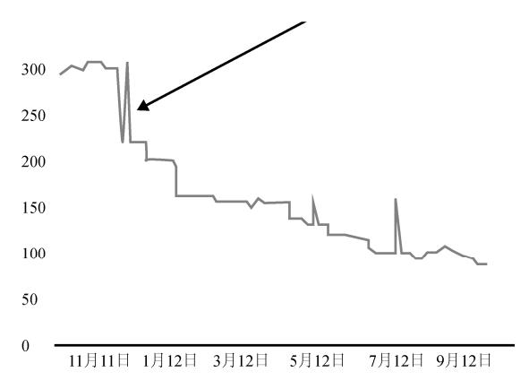

图 22-2 Brakeman 检测到的安全漏洞数

这个案例说明了将安全集成到 DevOps 日常工作和工具中的必要性,以及这种工作 模式的有效性。这样可以减轻安全风险,降低系统中出现漏洞的概率,并有助于指导开 发人员编写更安全的代码。

#### 22.6 确保软件供应链的安全

Josh Corman 指出,作为开发人员,"我们不再编写自定义软件,而是组装所需要的开源组件, 这已经成为我们非常依赖的软件供应链了"。换句话说,当我们在软件中使用各种(商业或开源 的)组件或库时,不仅继承了它们的功能,而且包括任何相关的安全漏洞。

在选择软件时,我们检测软件项目是否依赖有已知漏洞的组件或库,并帮助开发人员慎重地 选择要使用的组件——选择那些曾经得到验证、软件漏洞可以快速修复的组件(例如开源项目)。 我们还要找出在生产环境中所用库的多个版本,特别是存在已知漏洞的旧版本。

对持卡人数据泄露的检查显示了,我们选择的开源组件对于安全性而言有多么重要。自 2008 年以来,年度 Verizon PCI 数据泄露调查报告(DBIR)是关于因持卡人数据丢失或被盗而造成数 据泄露的最权威意见。在 2014 年的报告中,他们研究了 85 000 个数据泄露事件,更好地理解了 攻击的来源,持卡人数据如何被盗,以及导致数据泄露的因素。

DBIR 发现在 2014 年所研究的持卡人数据泄露事件中,有 10 个漏洞(即 CVE)导致了近 97% 的事件发生。在这 10 个漏洞中,有 8 个已经存在 10 多年了。

"2015 年 Sonatype 软件供应链报告"进一步分析了 Nexus Central Repository 存储库里的漏洞 数据。2015 年,该存储库为超过 605 000 个开源项目提供了构建工件,响应了来自 106 000 个组 织的超过 170 亿个工件和依赖项的下载请求,主要集中在 Java 平台。

报告里有如下惊人的发现:

——————————

- 一个典型的组织依赖于 7601 个构建工件(即软件供应商或组件)并使用 18 614 个不同版 本(即软件构件);
- 在这些用到的组件中,7.5%存在已知漏洞,其中超过 66%的漏洞已经存在两年以上,并 且尚未修复。

最后一个统计数据证实了 Dan Geer 博士和 Josh Corman 博士的另一项信息安全研究。该研究 显示,在美国国家漏洞数据库里已注册的有已知漏洞的开源项目中,只有 41%得到了修复,而且 平均 390 天才发布一个补丁。对于那些标记为最高严重性(即评分为 CVSS 级别 10)的漏洞,修 复需要 224 天。①

① 有助于确保软件依赖完整性的工具包括 OWASP 依赖性检查和 Sonatype Nexus Lifecycle。

——————————

在这个步骤里,任何有助于加固环境、降低风险的工作都应该做。虽然我们可能已经建立 了已知的良好配置,但还是必须通过监控的手段确保所有生产服务器都与这些已知的良好状态 匹配。

我们利用自动化测试的方式来保证已正确应用了所有必要的设置,包括安全加固配置、数据 库安全设置、密钥长度等。此外,我们将使用测试来扫描环境中的已知漏洞。①

另一类安全性验证方法是理解实际环境(即"实际的状态")。此类工具包括用来确保只开放 预期端口的 Nmap,以及用来确保特定已知漏洞已经充分加固的 Metasploit,例如使用 SQL 注入 攻击进行扫描。应该将这些工具的输出放入工件库中,并与以前的版本进行比较,从而作为功能 测试过程的一部分。这样,只要发生任何不良变化,就可以立即检测到。

#### **\*** 案例研究 **\***

#### 18F 用 compliance masonry 为美国联邦政府实现合规自动化

美国联邦政府机构预计,2016 年将在信息技术方面花费近 800 亿美元,用于支持所 有政令的实施。不论哪个政府机构想将任何系统从"开发完成"的状态上线为"生产 环境运行"状态,都需要从审批机构(DAA)获得运营授权(ATO)。美国联邦政府的 合规性法律和政策包含数十个文档,共有 4000 多页,上面充斥着 FISMA、FedRAMP 和 FITARA 等缩写。即使是保密性、完整性和可用性要求很低的系统,也必须实施、记录 和测试 100 多条控制项。想要在"开发完成"状态得到 ATO 授权,通常还需要等 8~14 个月。

美国联邦政府总务管理局的 18F 小组采取多管齐下的方法来解决这个问题。Mike Bland 解释说:"在总务管理局成立 18F 团队的目标是,利用 Healthcare.gov 恢复带来的 良好势头来改革政府构建和购买软件的方式。"

18F 的一项努力是建设基于开源组件的平台即服务(PaaS),名为 Cloud.gov。 Cloud.gov 目前运行在 AWS GovCloud 上。该平台不仅能处理很多交付团队可能要处理 的运维问题,例如日志记录、监控、警报和服务生命周期管理,而且能解决大量的合规 性问题。通过在这个平台上运行系统,大多数必须实现的政府控制都可以在基础设施和 平台级别上做好。然后,就只需要在应用层范围里进行相关控制的记录和测试即可,从 而显著减少合规工作的负担和获得 ATO 授权所需的时间。

**22** 

① 有助于进行安全矫正测试(即"该有的状态")的工具包括自动配置管理系统(例如,Puppet、Chef、Ansible、Salt) 以及 ServerSpec 和 Netflix Simian Army 等工具(例如,"一致性猴子""安全猴子"等)。

AWS GovCloud 已经被批准用于所有类型的美国联邦政府系统,包括保密性、完整 性和可用性需求为高级别的系统。本书上市时,预计 Cloud.gov 将被批准用于所有中等 级别需求的系统。①

此外,Cloud.gov 团队正在构建一个自动创建系统安全计划(SSP)的框架,它是"对 系统架构、实施控制和总体安全状态的全面描述……通常非常复杂,文档长达几百页"。 他们开发了一个名为 compliance masonry 的原型工具,以便将 SSP 数据存储为机器可读 的 YAML 文件,然后自动转化为 GitBook 和 PDF 格式。

18F 致力于工作的开放性,并将工作成果开源给公众。你可以在 18F 的 GitHub 代 码库中找到 compliance masonry 和 Cloud.gov 的组件,甚至可以构建自己的 Cloud.gov 实例。SSP 开放文档是与 OpenControl 社区密切合作完成的。

#### 22.8 将信息安全集成到生产环境遥测中

Verizon 的数据泄露研究员 Marcus Sachs 在 2010 年说:"年复一年,在绝大多数持卡人数据 泄露事件中,组织在几个月甚至几个季度之后才检测到安全违规行为。更糟糕的是,检测到违规 行为的并不是内部的监控系统,而更可能是组织外部的人,通常是发现欺诈交易的商业伙伴或客 户。这里的一个主要原因是,组织中没有人定期审查日志文件。"

换句话说,内部安全控制通常无法及时、成功地检测到违规行为。这是由于监控中存在盲点, 或者组织中没有人在日常工作中检查相关的遥测。

在第 14 章中,我们讨论了在开发和运维中创建一种文化,让价值流中的每个人参与建立生 产遥测系统和指标,将所有监控信息公开,使每个人都可以看到服务在生产环境中的表现。此外, 我们还探索了不懈寻找微弱故障信号的必要性,从而可以在灾难性故障发生之前就定位并解决 问题。

这里,我们部署必要的监控、日志记录和告警系统,以在应用程序和环境中全面实现信息安 全目标,并确保其充分集中化,以便进行简单、有意义的分析和响应。

通过将安全遥测集成到开发、QA 以及运维使用的工具中,价值流中的每个人都可以看到应 用程序和环境在恶意威胁入侵中的表现,包括:攻击者不断尝试利用漏洞,获得未经授权的访问, 植入后门,执行欺诈,拒绝服务等破坏活动。

公开将服务在生产环境中遭遇攻击的过程展示给所有人,能迫使每个人考虑安全风险,并且 在日常工作中设计对策。

——————————

① 这些批准称为 FedRAMP JAB P-ATO。

#### 22.9 在应用程序中建立安全遥测系统

有问题的用户行为可以揭示或引发欺诈和未授权的访问,为了进行检测,必须在应用程序中 创建相关的遥测系统。

这样的例子包括:

- 成功和不成功的用户登录;
- 用户密码重置;
- 用户电子邮件地址重置;
- 用户信用卡更改。

例如,暴力登录是企图获取非法访问权限的早期迹象,因此可以显示失败和成功登录次数的 比率。当然,我们应该对这些重要事件建立告警策略,以确保能够快速检测和纠正问题。

#### 22.10 在环境中建立安全遥测系统

除了完善应用程序,还需要在环境中创建全面的遥测系统,以便能够尽早检测未授权访问的 迹象,特别是对于运行在非受控基础设施上(例如,托管环境、云端)的组件。

我们需要对某些事件做监控和告警,包括:

- 操作系统的变更(例如,生产环境中、构建基础设施中);
- 安全组的变更;
- 配置的变更(例如,OSSEC、Puppet、Chef、Tripwire);
- 云基础设施变更(例如,VPC、安全组、用户和权限);
- XSS 尝试(即"跨站点脚本攻击");
- SQLi 尝试(即"SQL 注入攻击");
- Web 服务器错误(例如,4××和 5××错误)。

我们还要确认已正确配置了日志记录,以便将所有遥测信息发送到正确的地方。在监测攻击 时,除了记录事件,还可以选择拦截访问,并保存访问来源和目标的信息,以帮助我们选择最佳 的规避措施。

#### **\*** 案例研究 **\***

完善 Etsy 的环境(2010)

2010 年,Nick Galbreath 在 Etsy 担任工程总监,负责信息安全、欺诈控制和隐私。 Galbreath 将欺诈定义为,当"系统运行不正确时,让无效或未经检查的输入进入系统, **22** 

从而造成财务损失、数据丢失/被盗、系统停机、破坏,或者对另一个系统的攻击"。

Galbreath 没有为了实现这些目标组建单独的反欺诈或信息安全部门,而是将这些责 任融入到了 DevOps 价值流中。

Galbreath 创建了安全相关的遥测系统,将其与每个 Etsy 工程师日常关注的、面向 开发和运维的监控指标显示在一起,包括如下内容。

- 生产程序的异常终止(例如,段错误、内核转储等):"需要特别关注的是,为 什么某些进程在整个生产环境中持续发生的内核转储全都是被来自同一个 IP 地 址的流量反复触发的。同样需要关注的还有那些 HTTP 报错信息'500 内部服务 器错误'。这些指标表明一个漏洞正在被利用,有人想非法访问我们的系统,并 且需要紧急给应用打补丁。"
- 数据库语法错误:"我们一直在代码中寻找数据库语法错误——这些错误要么会 遭到 SQL 注入攻击,要么是正在进行的攻击。因此,我们不能忍受代码里有数 据库语法错误,它仍然是用于危害系统的主要攻击向量。"
- **SQL** 注入攻击的迹象:"有一个简单得荒谬的测试——我们只需要对用户输入字 段设置关键字为 UNION ALL 的告警,因为它几乎总是表明 SQL 注入攻击。我 们还添加了单元测试,以确保这种不受控制的用户输入类型永远不能进入数据 库查询。"

图22-3是每个开发人员将看到的监控指标图表,其中显示了生产环境中潜在的SQL 注入攻击数量。正如 Galbreath 所说,"没有什么比实时地看到自己的代码在遭到攻击更 能帮助开发人员理解运作环境危机四伏了"。

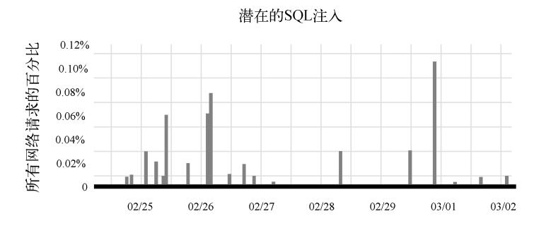

图 22-3 开发人员在 Etsy 的 Graphite 中看到的 SQL 注入攻击

(来源:Nick Galbreath 在 2012 年奥斯汀 DevOpsDays 的演讲"DevOpsSec:将 DevOps 实践应用于安全",发布于 SlideShare.net, 2012 年 4 月 12 日,http://www.slideshare.net/nickgsuperstar/devopssec-apply-devops-principles-to-security)。

Galbreath 评价道:"展示该图表的一个结果是,开发人员意识到了他们一直在遭受 攻击!这好极了,因为它改变了开发人员编码时对代码安全性的考量。"

#### 22.11 保护部署流水线

支持持续集成和持续部署流程的基础设施,也成了易受攻击的新领域。例如,如果有人攻陷 了运行部署流水线的服务器,而且该部署流水线保存着版本控制系统的登录账户信息,他们就能 窃取程序的源代码。更糟的是,如果部署流水线里的账户具有写访问权限,攻击者还可能将恶意 更改注入版本控制系统,从而将恶意更改注入应用程序和服务中。

正如 TrustWave SpiderLabs 前高级安全测试员 Jonathan Claudius 所说:"持续构建和测试服务 器太棒了,我自己也会使用。但我不禁开始思考如何将 CI/CD 用作恶意代码注入方式。这引发了 一个问题:哪里是隐藏恶意代码的好地方?答案很明显,就是单元测试中。没有人真正注意单元 测试,而它们在每次提交代码的时候都会运行。"

这表明,为了充分保护应用程序和环境的完整性,还必须减少针对部署流水线的攻击向量。 风险包括开发人员引入导致未授权访问的代码(通过代码测试、代码评审和渗透测试等控制措施 缓解),以及未经授权的用户获取应用或者环境的访问权限(通过以下控制措施减缓:确保配置 始终处于已知和良好的状态,及时有效地打补丁)。

然而,为了保护持续构建、集成或部署流水线,缓解风险的措施还可能包括:

- 加固持续构建和集成服务器,并确保可以用自动化的方式重建它们,就像构建面向客户 的生产服务基础架构一样,防止持续构建和集成服务器受到破坏;
- 审查任何提交到版本控制系统的变更——可以在提交时进行结对编程,也可以在提交和 主干合并之间设置代码评审流程——从而防止持续集成服务器运行不受控代码(例如, 单元测试可能包含允许或触发未授权访问的恶意代码);
- 检测包含可疑 API 调用的测试代码(例如,访问文件系统或网络的单元测试)是何时签 入到代码库中的,然后可以立即隔离并触发代码审查;
- 确保每个 CI 流程都运行在自己的隔离容器或虚拟机里;
- 确保 CI 系统使用的版本控制凭据是只读的。

#### 22.12 小结

本章介绍了将信息安全目标融入日常工作中所有阶段的方法。那就是通过将安全控制集成到 已经创建的机制中,确保所有按需环境都处于加固的低风险状态,以及通过将安全测试集成到部 署流水线中,确保在预生产和生产环境中创建安全遥测系统。这样,我们可以在提高开发和运维 效率的同时,提高整体安全性。接下来,我们将保护部署流水线。

# 保护部署流水线

本章将探讨如何保护部署流水线,以及如何在控制环境里实现安全和合规性目标,包括变更 管理和职责分离。

#### 23.1 将安全和合规性集成到变更批准流程中

拥有一定规模的 IT 组织几乎都有自己的变更管理流程,这是减少运维和安全风险的主要控 制手段。合规经理和安全经理依赖变更管理流程来满足合规性需求,并且通常需要证据表明所有 变更都已得到了适当授权。

如果正确构建了部署流水线来降低部署风险,那么大部分变更就不需要经过手动审批流程 了,因为我们将依赖于自动化测试和主动生产环境监控等控制措施。

在这个步骤里,我们将采取措施确保将安全和合规性成功地整合到任何已有的变更管理流程 中。有效的变更管理政策将认识到不同的类型变更会带来不同的风险,并且有不同的方式来处理 不同的变更。ITIL 定义了这些流程,将变更分为如下 3 种类型。

- 标准变更:遵循既定批准流程的低风险变更,但也可以是预批准的。这种类型的变更包 括应用程序税表或国家/地区代码的每月更新,网站的内容和样式变更,以及有已知影响 的应用或操作系统补丁。变更申请人在部署变更之前是不需要审批的,变更的部署可以 完全自动化,而且应该留下用于追溯的日志。
- 常规变更:风险更高、需要权威机构评审或批准的变更。在许多组织中,将审批职责交 给变更顾问委员会(CAB)或紧急变更顾问委员会(ECAB)是不太合理的,因为他们可 能缺乏理解变更全部影响的必要专业知识,往往导致令人无法忍受的漫长交付周期。对 于大规模代码部署而言,这个问题尤为严重。大规模部署可能包含几百名开发人员在几 个月的开发过程中提交的数十万(甚至数百万)行代码。为了完成对常规变更的授权, 变更顾问委员会几乎肯定会要求提供定义清晰的变更请求单(RFC),为做决策提供所需

信息。变更请求单通常包含期望的业务结果、计划的效用和保障①、写明风险和规避方案 的业务案例,以及建议的时间表。②

 紧急变更:在紧急情况下必须立即投入生产环境的变更(例如,紧急安全补丁、恢复服 务),属于潜在的高风险变更。这些变更通常需要得到高级管理层批准,但也允许先执行 变更操作,之后补上文档。DevOps 实践的一个关键目标是简化常规变更流程,使其同样 适用于紧急变更。

#### 23.2 将大量低风险变更重新归类为标准变更

理想情况下,通过建立可靠的部署流程,我们已经因快速、可靠和非剧烈的部署而名声在外 了。在此基础之上,应该让运维部门和相关变更机构认同我们所做的变更风险很低,可以归类为 变更顾问委员会预审批的标准变更。这样,无需进一步的审批就可以直接部署到生产环境,不过 当然还是应该正确记录这些变更。

为了证明变更的风险较低,一种参考做法是:展示相当长时间里(例如,几个月或一个季度) 的变更历史记录,并且整理出同期生产环境里的完整问题清单。如果能够证实变更成功率高,而 且平均故障恢复时间(MTTR)短,那么就能断言我们处在能有效预防部署错误的可控环境中, 同时证明了能够快速检测和纠正任何问题。

即使将这些变更归类为标准变更,出于可视化管理的需求,仍然需要记录在变更管理系统中 (例如,Remedy 或 ServiceNow)。理想情况下,将使用配置管理工具和部署流水线工具(例如, Puppet、Chef、Jenkins)自动执行部署,并且自动记录部署结果。这样,组织中的每个人(不论 是否为 DevOps)都能了解到我们的变更,并且也能了解组织中发生的所有其他变更了。

我们可以自动将这些变更请求单链接到工作计划工具(例如,JIRA、Rally、LeanKit、 ThoughtWorks Mingle)里的特定工作条目上,以便为变更创建更多上下文,例如链接到特性缺陷、 生产事件或用户故事。也可以采用一种轻量级的实现方式,在版本控制系统中所签入代码的注释 里包含项目计划工具的票单号③。这样就可以把生产环境部署追溯到版本控制中的变更,并进一 步追溯到项目计划工具中对应的票单。④

——————————

——译者注

**23** 

① ITIL 将效用定义为"服务能为用户做什么",将保障定义为"怎样交付服务和可以怎样使用服务,用来确定服务 是否'合用'"。

② 为了进一步管理有风险的变更,可能需要定义一些规则,比如某些变更只能由某个小组或某个人实施(例如,只 有 DBA 可以部署数据库模式变更)。传统上,变更顾问委员会每周举行一次变更请求的批准和排程会议。从 ITIL v3 开始,使用电子形式的变更管理工具实时批准变更成为了可接受的方式。它还特别建议"在利用变更管理流程 优化效率时,应尽早识别所有标准变更。否则,会给变更管理的实施带来大量不必要的管理工作和阻力"。

③ 术语"票单"一般用于表示任何工作条目的唯一标识。

④ 这里描述的追溯路径是:变更单(Remedy)→代码库里的代码提交(GitLab)→项目计划工具(JIRA)。

建立这种可追溯性和上下文联系应该很容易,不应该为工程师造成太繁重或耗时的工作负 担。链接到用户故事、需求或缺陷几乎已经完全够用了,更多细节(例如,为版本控制系统中的 每次代码提交都建立一个票单)可能没意义、也没必要,因为会显著增加日常工作的阻力。

#### 23.3 如何处理常规变更

不能归类为标准变更的变更属于常规变更,在部署前至少需要得到变更顾问委员会部分成员 的批准。在这种情况下,即使部署工作并不是完全自动化的,我们的目标仍然是保障快速部署。

在这种情况下,必须确保提交的变更请求单尽可能完整、准确,为变更顾问委员会提供正确 评估所需的一切信息。如果变更请求的格式不正确或信息不完整,就会被退回,这除了会增加 进入生产环境所需的时间之外,还会让我们对自己是否真正理解了变更管理流程的真实目标产生 怀疑。

我们基本上一定能自动化创建信息完整和准确的变更请求单,在票单中填入正确的详细变更 信息。例如,可以自动化创建一个 ServiceNow 变更票单,并在里面包含 JIRA 中用户故事的链接, 来自部署流水线工具的构建清单和测试输出,以及将要执行的 Puppet/Chef 脚本的链接。

因为提交的变更将被手动评估,所以对变更上下文的描述显得愈发重要。这包括指出变更的 原因(例如,提供指向特性、缺陷或事件的链接),变更影响到的人员,以及变更的内容。

我们的目标是分享让我们充满信心的证据和工件,它们保证变更在生产环境里会像设计的那 样起作用。虽然变更请求单通常包含自由格式的文本框字段,但我们应提供指向机器可读数据的 链接,从而为其他人集成和处理我们的数据(例如,指向 JSON 文件的链接)提供便利。

在许多工具链中,以上工作能以兼容和完全自动化的方式完成。例如,ThoughtWorks的 Mingle 和 GoCD①可以自动将很多信息链接到一起并放入变更请求单,如形成与变更相关的缺陷补丁和 新功能列表。

提交变更请求单后,变更顾问委员会的相关成员将审核、处理和批准变更。所有变更请求单 的处理方式都与此相同。如果一切顺利,变更机构会赞赏变更单的周密程度和丰富细节,因为我 们让他们可以快速地校验我们提交的这些信息的正确性(例如,查看部署流水线工具链接到的工 件)。然而,我们的目标应该是持续展示成功变更的样板记录,从而最终使其认同能将自动化变 更安全地归类为标准变更。

——————————

① Mingle 和 GoCD 分别是项目管理软件和流水线工具。——译者注

#### **\*** 案例研究 **\***

#### Salesforce.com 将自动化基础架构变更归类为标准变更(2012)

Salesforce 成立于 2000 年,旨在让客户关系管理触手可及,并将其作为一项可交付 的服务提供。Salesforce 的服务在市场上广受欢迎,因此在 2004 年成功完成了 IPO。到 2007 年,公司拥有 59 000 多个企业客户,每天处理数亿次交易,年收入为 4.97 亿美元。

然而,大约在同一时期,他们为客户开发和发布新功能的能力几乎停滞了。2006 年,他们为客户做了四次重大发布;到了 2007 年,尽管雇用的工程师更多,但是只能 够实现一次发布。结果是,每个团队交付的功能数量持续减少,主要发布之间的时间间 隔持续增加。

此外,由于每次发布的批量大小不断变大,部署的结果也不断恶化。当时的基础架 构工程副总裁 Karthik Rajan 在 2013 年的一次演讲中表示,2007 年标志着"用瀑布流程 进行软件研发和交付的最后一年,之后更多转向了增量交付过程"。

在 2014 年的 DevOps 企业峰会上,Dave Mangot 和 Reena Mathew 描述了始于 2009 年并持续多年的 DevOps 转型。据说,通过实施 DevOps 原则和实践,该公司截至 2013 年将部署前置时间从 6 天缩短为 5 分钟。因此,他们可以轻松扩容,每天能处理超过 10 亿次交易。

Salesforce 转型的主题之一是使质量工程成为每个人的任务,不管是开发、运维, 还是信息安全人员。为此,他们将自动化测试集成到了应用程序和环境创建的各个阶段, 以及持续集成和持续部署的过程中,并创建了开源工具 Rouster 来进行 Puppet 模块的功 能测试。

他们还开始定期进行破坏性测试。这是制造业的术语,指的是在最严酷的操作条件 下执行长时间的耐久性测试,直到摧毁测试部件。Salesforce 团队开始定期使用逐渐上 升的负载执行破坏性测试,直到服务崩溃。这帮助他们理解了各种故障模式,并进行了 相应的纠正。不出所料,在正常生产负荷下,服务质量得到了大幅提高。

在项目的最初阶段,信息安全部门还与质量工程部门合作,在架构和测试设计等关 键阶段不断协作,很好地将安全工具集成到了自动化测试流程之中。

变更管理团队告诉 Mangot 和 Mathew,"通过 Puppet 实施的基础架构变更现在变成 了'标准变更',有时甚至不需要变更顾问委员会审批"。对于他们来说,这是在流程里 导入重复性和严格性的一个重大成就。此外,他们指出"还是需要对基础架构的手动变 更进行审批"。

这不仅将 DevOps 流程和变更管理流程集成了起来,还为更多的基础架构自动化变 更流程创造了前进的动力。

#### 23.4 减少对职责分离的依赖

几十年来,我们将职责分离用作减少软件开发过程中欺诈或犯错风险的主要控制手段之一。 大多数软件开发生命周期都已经接受的做法是:要求将开发人员变更提交给代码库管理员接受审 查和批准变更,然后由 IT 运维将变更部署到生产环境。

运维工作中也有很多争议并不太大的职责分离案例。例如,理想情况下服务器管理员能够查 看日志但不能删除或修改,从而防止有权限的人删除欺诈或其他罪行的证据。

当生产环境部署不太频繁(如每年一次)且工作尚不复杂时,工作划分和工作交接是可行的 业务方式。然而,随着复杂性和部署频率的提升,成功地执行生产环境部署就愈发要求价值流中 的所有人都能迅速看到工作的执行结果。

职责分离会减慢和减少工程师在工作中获得反馈,可能对上述要求造成阻碍。这妨碍了工程 师对工作质量承担全部责任,降低了企业创建组织学习的能力。

因此,在可能的情况下,应避免使用职责分离作为控制手段。我们应该选择结对编程、持续 检查代码签入和代码审查等,它们能为工作质量提供必要的保障。此外,实施这些控制手段之后, 如果需要分离职责,我们也能证明已经创建的控制手段能实现同样的结果。

#### **\*** 案例研究 **\***

#### Etsy 的 PCI 合规性和一个关于职责分离的警世故事(2014)

Bill Massie 是 Etsy 的开发经理,负责名为 ICHT(I Can Haz Tokens)的支付应用。 ICHT 通过一组内部开发的支付处理应用程序来处理客户的信用订单。这些应用程序是 这样处理线上订单输入的:获取并标记客户输入的持卡人数据,与支付处理器通信,完 成订单交易。①

因为支付卡行业数据安全标准(PCI DSS)声明持卡人数据环境(CDE)的范围是 "存储、处理或传输持卡人数据或敏感认证数据的人员、过程和技术",包括连接的任何 系统组件,所以 ICHT 应用程序在 PCI DSS 的范围之内。

为了涵盖 PCI DSS 的范围,ICHT 应用程序在物理和逻辑上与 Etsy 组织的其他事务 分离,由一个完全独立的应用程序团队管理,其中有开发人员、数据库工程师、网络工 程师和运维工程师。每个团队成员都有两台笔记本电脑:一台用于 ICHT(为满足 DSS 要求而配置不同,而且不使用时锁在保险柜中),一台用于 Etsy 的其余事务。

——————————

① 感谢 Bill Massie 和 John Allspaw 用一整天时间与 Gene Kim 分享他们的合规经验。

这样,他们能将持卡人数据环境与 Etsy 组织的其余环境分离,将 PCI DSS 规则的 范围限制在一个隔离区域中。组成持卡人数据环境的系统在物理、网络、源代码和逻辑 基础架构层次上都与 Etsy 的其他环境分离(管理也不同)。此外,持卡人数据环境是由 一个只负责 CDE 的跨职能团队构建和运维的。

ICHT 团队不得不改变他们的持续交付实践,以满足代码审批的需要。根据 PCI DSS v3.1 的 6.3.2 节,小组应检视:

发布到生产环境或交付客户之前的所有自定义代码,以便(手动或自动) 识别任何潜在的编码漏洞,如下所示。

- 代码变更是由原始作者之外的个人审查的吗?是由熟悉代码审查技术 和安全编码实践的个人审查的吗?
- 代码审查是否确保了代码是根据安全编码指南开发的?
- 在发布前是否进行了适当的修正?
- 在发布前,管理层是否对代码审查结果进行了审核和批准?

为了满足这一要求,团队最初指定 Bill Massie 担任变更审批人,负责所有部署到生 产环境中的变更。目标部署标记在 JIRA 中,Massie 会将其标记为已审核和已批准,并 手动部署到 ICHT 的生产环境中。

这使 Etsy 满足了 PCI DSS 的要求,并获得了评估员签署的合规报告。然而,团队 却产生了严重的问题。

Massie 观察到,一个令人不安的副作用"是在 ICHT 团队中发生的'分化',而这 在 Etsy 的其他团队都没有出现过。实施了 PCI DSS 合规性所要求的职责分离和其他控 制手段以后,在这种环境里再也没有人能够成为全栈工程师了"。

因此,尽管 Etsy 的其他开发和运维团队能密切合作,顺利而有信心地进行部署变 更,但是 Massie 指出:"在我们的 PCI 环境中,存在着对部署和维护的恐惧和抗拒,因 为没有人能够看到自己软件栈以外的部分。我们对工作方式所做的改变看似微小,但似 乎已经在开发人员和运维人员之间筑造了一道难以逾越的壁垒。不可否认,这导致了一 种紧张的局面。自 2008 年以来,Etsy 还没有没有出现过这样的情况。即使你对自己的 这一部分有信心,也很难相信别人的变更不会对其造成破坏。"

本案例研究表明,在应用 DevOps 的组织中可以实现合规性。然而,需要注意的是, 与高绩效 DevOps 团队相关的所有优势都是脆弱的——即使对于具有高度信任和共同目 标的团队而言,实施低信任控制机制也可能让成员陷入挣扎。

#### 23.5 确保为审计人员和合规人员留存文档和证据

随着技术组织越来越多地应用 DevOps 模式,IT 和审计之间的关系变得比以往任何时候都更 加紧张。这些新的 DevOps 模式挑战了有关审计、控制和风险规避的传统思维。

亚马逊云服务(AWS)的首席安全解决方案架构师 Bill Shinn 指出:"DevOps 弥补了开发和 运维之间的鸿沟。从某些方面看,弥合 DevOps 与审计和合规人员之间缺口的挑战性则更大。举 个例子,有多少审计人员能读懂代码?有多少开发人员能读懂 NIST 800-37 或 Gramm-Leach-Bliley 法案?这造成了知识的鸿沟,而 DevOps 社区需要帮助弥合这一鸿沟。"

#### **\*** 案例研究 **\***

#### 证明监管环境下的合规性(2015)

Bill Shinn 作为 AWS 首席安全解决方案架构师的职责之一是,帮助大型企业客户证 明他们仍然能遵从所有相关法律法规。多年来,他曾与 1000 多家企业客户一起工作, 包括 Hearst Media、通用电气、飞利浦和太平洋人寿。这些企业曾公开提及将公有云用 于高度监管的环境。

Shinn 指出:"一个问题是,审计人员受训的工作方法不太适用于现在的 DevOps 工 作模式。例如,如果审计人员看到一个有 10 000 台生产服务器的环境,那么按照所受 的传统训练,他需要 1000 台服务器的采样数据,以及在资产管理、访问控制设置、代 理安装、服务器日志等方面的屏幕截图证据。"

"这对于物理环境来说是没有问题的,"Shinn 补充说,"但是在基础设施即代码的实 践中,当自动扩展总是不断创建和销毁服务器时,又该如何采样呢?在运行部署流水线 时,也会遇到相同的问题——做法与一个团队编写代码、另外一个团队将代码部署到生 产环境中的传统软件开发过程完全不同。"

他解释道:"在现场审计工作中,收集证据的最常见方式仍然是屏幕截图,以及填 有配置设置和日志内容的 CSV 文件。我们的目标是:创建提供数据的替代方法,用来 清楚地向审计人员展示控制手段的运行方式和有效性。"

为了帮助弥合之前提到的知识鸿沟,他在设计控制的过程中就开始与审计人员合 作。他们使用迭代方法,在每个冲刺里加入一项控制手段,以确认审计需要什么作为证 据。这有助于确保当服务在生产环境中运行时,审计人员能完全按需地获取所需的信息。

Shinn 认为,实现这一目标的最好方法是"将所有数据发送到遥测系统,如 Splunk 或 Kibana。这样,审计员完全可以用自助的方式得到所需的信息。他们不需要请求数据 采样,而是先登录 Kibana 系统,然后搜索特定时间段里的审计信息。理想情况下,他 们很快就能看到控制手段有效的支撑证据"。

Shinn 还说:"使用最新的审计日志记录、聊天室和部署流水线之后,生产环境有了 前所未有的可见性和透明度,特别是与过去传统的运维方式比较而言,引入错误和安全 漏洞的可能性都远远降低。因此,我们的挑战成了怎样把所有证据变成审计人员认可的 东西。"

这需要从实际的法规中推导出工程要求。Shinn 解释:"要从信息安全角度发掘 HIPAA 的需求,必须浏览 45 CFR Part 160 法案,并查看 Part 164 的 A 和 C 分章。不仅 如此,还需要继续阅读到"技术保障和审计控制"。只有这样你才会明白需求是什么: 确定要跟踪和审计哪些与患者医疗信息相关的活动,记录和实施这些控制点,最终审查 并收集所需的信息。"

Shinn 接着说:"关于如何满足这些需求,要在合规和监管人员以及安全和 DevOps 团队之间进行讨论,特别是关于怎样预防、检测和纠正问题。有些需求可以通过版本控 制中的配置设置来满足,其他需求则要用监控进行控制。"

Shinn 举例:"我们可以选择 AWS CloudWatch 实现其中一个控制手段,并能通过命 令行测试控制是否工作正常。此外,我们需要展示日志的存储位置——理想情况下,将 所有控制状态都推送进日志记录系统,在此将审计证据与实际控制要求链接起来。"

为了解决这个问题,"DevOps 审计防御工具包"完整描述了一个虚拟组织(《凤凰 项目》中的无极限零部件公司)的合规性和审计流程。它首先描述了其组织目标、业务 流程、最高风险、由此产生的控制环境,以及管理层如何成功证明了控制确实存在和有 效。它还提出了一系列审计缺陷,以及如何克服。

该文档描述了如何在部署流水线中设计控制以缓解所述风险,并且提供了控制证明和 控制工件的示例以证明控制的有效性。它旨在指导所有控制目标,包括对准确财务报告 的支持、监管合规(例如,SEC SOX-404、HIPAA、FedRAMP、欧盟示范合同和拟议的 SEC Reg-SCI 法规)、合同义务(例如,PCI DSS、DOD DISA),以及有效和高效的运作。

#### **\*** 案例研究 **\***

#### 依靠生产遥测的 ATM 系统

Mary Smith(化名)领导了美国一家大型金融服务组织的消费者银行业务的 DevOps 转型。她指出,信息安全人员、审计人员和监管机构通常过度依赖代码审查来检测欺诈。 相反,除了自动化测试、代码评审和审批,他们还应该依靠生产监控控制,从而有效降 低错误和欺诈带来的风险。

她说:

许多年前,我们的一个开发人员在部署到自动柜员机(ATM)的代码中埋 藏了一个后门。该开发人员能够在特定时间将 ATM 设置为维护模式,以便从 ATM 中取走现金。我们很快检测到了这个欺诈行为,但并不是通过代码评审。 当犯罪者有足够的手段、动机和机会时,甄别这些类型的后门很难,甚至是不 可能的。

然而,我们在定期的运维审查会议上迅速发现了欺诈,因为有人注意到一 个城市中的 ATM 在非计划时间里进入了维护模式。我们甚至在预定的现金审 计之前就发现了欺诈,也就是将 ATM 中的现金数量与授权交易对账之前。

在本案例研究中,尽管开发与运维之间的职责分离,而且有变更批准流程,可是欺 诈仍然发生了,不过通过有效的生产遥测迅速发现和纠正了这个问题。

#### 23.6 小结

本章讨论了让每个人都承担信息安全责任的实践,将所有的信息安全目标都纳入价值流中每 个人的日常工作。这样显著提高了控制的有效性,能更好地预防安全漏洞,更快地检测到安全漏 洞并从中恢复。此外,还大大减少了准备和通过合规审计的工作时间。

#### 23.7 第六部分总结

第六部分探讨了如何将 DevOps 原则应用于信息安全,帮助我们实现目标,并确保安全是所 有人日常工作的一部分。更好的安全性确保了我们能防护数据、理智地对待数据,能在安全问题 酿成灾难以前恢复。最重要的是,我们可以让系统和数据的安全性变得比以往更好。

# 行动起来——本书总结

我们已经对 DevOps 的原理和技术实践进行了详细的探讨。在这个安全漏洞频发、交付周期 不断缩短、技术大规模转型的时代,在技术领导者们要同时应对安全性、可靠性和灵活性的挑战 时,DevOps 应运而生。希望本书能对读者深入理解问题并找到解决问题的方案有所帮助。

正如本书一直强调的,若管理不当,开发人员与运维人员之间存在的冲突会日益恶化,导致 新产品和功能上线时间长,质量不如人意,损耗增加,技术债越积越多,生产力低下,员工的不 满和倦怠情绪也会越来越严重。

DevOps 的原则和模式能够化解这个核心冲突。在阅读完本书后,希望读者能明白 DevOps 转型如何能创建学习型组织,如何加快流程、打造一流可靠性和安全性的产品,如何提高企业竞 争力和员工满意度。

DevOps 的践行需要新的企业文化和管理规范,同时会变革技术实践和架构。跨部门协作至 关重要,包括管理层、产品管理部门、开发团队、质量保证团队、IT 运维、信息安全甚至市场营 销人员在内,所有部门通力协作,才能有效构建出一个安全的工作系统,从而帮助小团队快速、 自主地开发和验证,并安全地部署客户服务相关的代码,也才有可能有技术创新。这种方式可以 最大程度地提高开发人员的生产力、学习积极性、满意度以及提高组织赢得市场的能力。

本书的目的是充分展示 DevOps 的原则和实践,让其他组织可以复制 DevOps 社区所取得的 卓越成果。同时,我们也希望加速组织应用 DevOps 的进程,协助他们成功实施 DevOps 并降低 DevOps 转型的风险。

我们知道固步自封、不思进取的危害以及改变日常工作习惯的不易,也理解组织引进新工作 方式所带来的风险和成本。我们也清楚,DevOps 也只是历史长河中的一沙,很快就会被新的流 行方法取代。

但我们坚信,DevOps 对技术行业带来的转变,就如同精益在 20 世纪 80 年代对制造业的变 革一样。那些拥抱 DevOps 的组织将在市场上赢得胜利,拒绝 DevOps 的组织将为此付出代价。 拥抱 DevOps 的组织将打造出充满激情并持续进步的学习型组织,并通过创新的方式表现得比竞 争对手更加出色。

因此,DevOps 不仅仅是技术层面的当务之急,也是组织层面的迫切要务。最关键的一点, DevOps 普适,尤其适用于这样的组织:必须通过技术手段改进工作流程,同时保证产品的高质 量、可靠性和安全性。

我们呼吁大家行动起来:无论你在组织中扮演什么角色,请即刻开始寻找有意愿优化本职工 作的同事。把本书推荐给他们,和所有志同道合的人结盟,要求组织的决策者支持这些改进。你 最好能发起并带领大家进行 DevOps 实践。

最后,给阅读到最后的读者一点儿福利,与你分享一个秘密。在我们研究的许多案例中,在 取得突破性成果的同时,大部分变革者都得到了晋升。不过,也有这样的情况:领导层随后发生 变化,导致变革者离开,他们所创造的变化也会被组织回滚。

不要为此愤世嫉俗。参与变革的人都明白,他们做的事情当然可能会失败,但无论成败如何, 他们总要试试。尝试的最大意义在于,通过实践鼓舞他人。不承担风险,创新是不可能成功的。 如果你没有使某些管理层不安,那证明你可能还不够努力。不要让组织的免疫系统阻止或干扰了 你的愿景。正如亚马逊的前"灾难大师"Jesse Robbins 所说:"做正确的事情,等着被开除。"

DevOps 会使技术价值流里的所有参与者都受益匪浅,无论我们是开发人员、运维工程师、 质量保证工程师、信息安全人员、产品经理或者客户,它都能够带给我们那种开发伟大产品而产 生的快感。它提供人性化的工作条件,让我们有更多时间陪伴亲人。它能使团队共同努力、学习、 成长、取悦客户并使之获益,同时帮助组织取得成功。

我们真诚希望本书可以帮助你实现这些目标。

# *ADDITIONAL MATERIAL*

# 附加材料

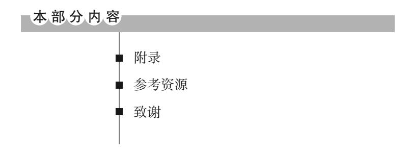

# 附 录

#### 附录 1 DevOps 的大融合

我们认为 DevOps 正在得益于一场令人难以置信的管理实践大融合,各种实践相互促进和衔 接在一起,并形成了一种独特的实践集合,它能对组织的软件开发转型和 IT 产品或服务交付模 式的转型产生极大的帮助。

John Willis 称之为"DevOps 的大融合"。下面尽量按时间顺序介绍这次大融合里的各种元素。 (请注意,这里并不详细介绍它们,而只是概要地介绍各种思维的演进,以及发生在它们之间的 难以置信的链接,最终导致了 DevOps 的应运而生。)

#### 精益运动

精益运动始于 20 世纪 80 年代,衍生自丰田生产系统(TPS)。TPS 包括价值流映射、看板和 全面生产维护等。

精益的两个主要原则是:(1) 坚信前置时间(把原材料转换为成品所需的时间)是提升质量、 客户满意度和员工幸福感的最佳预测指标;(2) 小批量尺寸是短前置时间的一个最佳预测指标, 理论上讲最理想的批量尺寸是"单件流"(即"1×1"的流,库存为 1,批量尺寸为 1)。

精益原则专注于为客户创造价值,要求系统性思考,持之以恒,拥抱科学思维,创建流和拉 动(而不是推动)的模式,从源头保证质量,以谦逊为导向,尊重每一个人。

#### 敏捷运动

始于 2001 年。"敏捷宣言"是由 17 位软件开发领域的顶尖大师编写的,目的是掀起一场推 广轻量级软件开发方法(如 DP 和 DSDM-动态系统开发方法)的运动,用敏捷替代瀑布式等重 量级软件开发过程以及替代统一软件开发过程(RUP)这样的方法论。

它的一个关键原则是:"频繁地交付可工作的软件,交付周期可以是数星期也可以是数月, 推荐更短的周期。"另外还有两个原则,一个是小型的、自我激励的团队应工作在高度信任的模 式下,一个强调小批量尺寸。敏捷还和一系列的工具和实践相关,如 Scrum、站会等。

#### Velocity 大会运动

从 2007 年开始,由 Steve Souders、John Allspaw 和 Jesse Robbins 等人组织并发起了 Velocity 大会,目的是为 IT 运维和网站性能调优人员提供一个聚首的机会。在 2009 年的 Velocity 会议上, John Allspaw 和 Paul Hammond 做了主题为"每日 10 次部署:Dev 和 Ops 在 Flickr 的协作"的 演讲。

#### 敏捷基础设施运动

在 2008 年的多伦多敏捷会议上,Patrick Debois 和 Andrew Schafer 主持了一场名为"羽毛之 鸟"专题研讨,探讨如何将敏捷原则应用于基础设施,而不仅限于应用程序代码。他们很快得到 了一些志同道合的思考者的响应,其中也包括 John Willis。后来,Patrick 又深受 John 和 Hammond 的"每日 10 次部署:Dev 和 Ops 在 Flickr 的协作"演讲的鼓舞,于 2009 年在比利时的根特市, 举办了第一次 DevOpsDays 活动,创造了"DevOps"这个词。

#### 持续交付运动

在持续构建、测试和集成等开发实践的基础上,Jez Humble 和 David Farley 发展出了持续交 付的理念,其中包括确保将代码和基础设施始终处于可部署状态的"部署流水线",并且确保所 有提交到主干的代码都能安全地部署到生产环境里。

这个想法最早是在 2006 年的敏捷大会上公布于众的,Tim Fitz 在他的一篇名为"持续部署" 的博文中完善了这个概念。

#### 丰田套路运动

在 2009 年,Mike Rother 编写了《丰田套路:转变我们对领导力与管理的认知》一书,书中 描述了他对丰田 20 年研究的收获。这期间他理解了丰田生产系统(TPS)的因果机制并对其作 了综述。书中介绍了"丰田成功背后隐形的管理例程和思维模式及其不断改进和调整……以及其 他公司如何在他们的组织中践行类似的例程和思维模式"。

他的结论是,精益社区错失了与所谓的"改善套路"相关的最重要的实践。 他解释说,每 个组织都有工作日程,丰田成功的关键因素是改进了工作习惯,并将其植入到组织里每个人的日 常工作中。丰田套路建立了一种迭代、增量、科学的解决问题的方法,追求共同的企业目标。

#### 精益创业运动

在 2011 年,Eric Ries 编写了《精益创业:新创企业的成长思维》一书,总结了他在一家硅 谷创业公司 IMVU 的经验教训。这本书的核心思想基于 Steve Blank 的《四步创业法》一书和持 续部署技术。Eric Ries 还给出了相关实践并定义了一些术语,包括最小化可行产品(MVP)、构 建度量学习的循环,以及很多持续部署的技术模式。

#### 精益用户体验运动

在 2013 年,Jeff Gothelf 撰写了《精益设计:设计团队如何改善用户体验》一书,其中描写 了如何改进"模糊前端",并解释了产品经理如何在投入时间和资源以前制定业务假设实验,籍 此获取关于业务的信心。有了精益设计,全面优化业务假设、功能开发、测试、部署和为客户发 布服务的工具就齐了。

#### Rugged Computing 运动

2011 年,Joshua Corman、David Rice 和 Jeff Williams 深入考察了软件开发周期晚期进行应用 程序和环境安全加固的无效性。 根据考察结果,他们提出了名为 Rugged Computing 的哲学,旨 在构建包含稳定性、可扩展性、可用性、生存性、可持续性、安全性、可支持性、可管理性和防 御性等的非功能性需求框架。

DevOps 强调高频率发布,可能会给质量保证(QA)和信息安全(Infosec)带来巨大的压力, 因为当部署频率从每月或每季度一次提升到每天数百或数千次时,信息安全或质量保证的工作周 期就不再是两周一次了。Rugged Computing 运动假设当前的多数信息安全防护措施是没用的。

#### 附录 2 约束理论和核心的长期冲突

约束理论主要讨论核心冲突云(通常称为"C3 ")的作用。图 A-1 是 IT 的冲突云示意图。

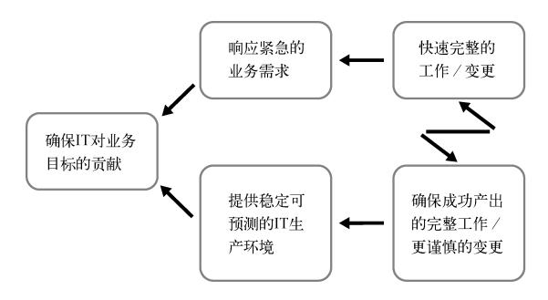

图 A-1 每个 IT 组织都面临的核心的长期冲突

在 20 世纪 80 年代,在制造业里核心的长期冲突非常普遍。所有工厂经理都有两项重要的业 务目标:提高销量,降低成本。 问题是,为了保持销量,库存就要增加,以确保始终能满足客 户需求。

然而,要降低成本,就应该减少库存,以确保资金没有占用在在制品上。在制品指按客户订 单生产的但还不能立即发货的产品。

应用精益原则能解决以上冲突,例如减小批量尺寸,减少在制品数量,以及缩短和放大反馈 回路。 这样工厂的生产率、产品质量和客户满意度都会得到显著提高。

DevOps 工作模式背后的原理与制造业变革的原则是相同的,那就是优化 IT 价值流,将业务 需求转化成为向客户提供价值的能力和服务。

#### 附录 3 恶性循环列表

《凤凰项目》中描绘的恶性循环如表 A-1 所示。

表 A-1 恶性循环

| IT 运维人员的感受        | 开发人员的感受                     |  |  |
|-------------------|-----------------------------|--|--|
| 脆弱的应用程序容易出现故障     | 脆弱的应用程序容易出现故障               |  |  |
| 需要很长的时间来判断哪个字节被改了 | 更紧急、工期更紧张的工作列入日程            |  |  |
| 销售人员负责检查性控制       | 更多不安全的代码发布                  |  |  |
| 恢复服务所需的时间过长       | 发布的版本越多部署就越混乱               |  |  |
| 紧急救火和计划外工作太多      | 发布周期延长导致部署成本增加              |  |  |
| 紧急安全性返工和补救        | 失败的大规模部署更难判别具体问题所在          |  |  |
| 计划内工作无法完成         | 大多数资深的 IT 运维人员都没有时间解决底层流程问题 |  |  |
| 客户感到沮丧并流失         | 有助于提升业务的工作越积越多              |  |  |
| 市场份额下降            | IT 运维、开发、产品设计之间的关系越来越紧张     |  |  |
| 企业没有兑现给华尔街的承诺     |                             |  |  |
| 业务部门对华尔街做出更多承诺    |                             |  |  |

#### 附录 4 交接和队列的危害

队列等待时间会随着交接次数的增加而延长,因为队列是由于交接而产生的。图 A-2 显示了 一个工作中心资源的繁忙程度与等待时间的关系。渐变的曲线显示了为什么"一个 30 分钟的简 单变更"通常却需要几周的时间才能完成。某些工程师和项目组若过于繁忙,通常就会变成瓶颈。 当一个项目组满负荷时,任何需要它完成的任务都会被淹没在队列里,如果没有人进行催促或提 高优先级,该任务将永远也不能完成。

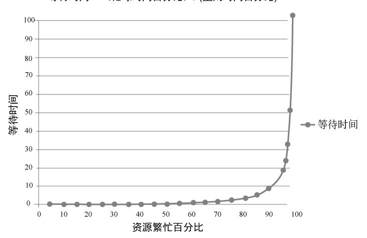

图 A-2 队列长度和等待时间与利用百分比的关系(引自《凤凰项目》一书)

在图 A-2 中,横坐标表示在一个项目组里某特定资源的繁忙百分比,纵坐标是等待时间(或 者更准确地说是队列长度)。曲线的形状表明,在资源利用率超过 80%以后,等待时间会急速攀 升到顶点。

《凤凰项目》一书描写了比尔和他的团队是如何意识到这个关系对他们向项目管理部门承诺 的交付周期产生了灾难性的影响的。

我告诉他们,埃瑞克在 MRP-8 对我说过,等待时间取决于资源使用率。"等待时间 是'忙碌时间百分比'除以'空闲时间百分比'。也就是说,如果一个资源的忙碌时间 是 50%,那么它的空闲时间也是 50%。等待时间就是 50%除以 50%,也就是一个时间 单位。就说是一小时吧。所以平均来说,一个任务在处理前的排队等待时间为一小时。"

"如果一个资源 90%的时间是忙碌的,等待时间就是'90%除以 10%',也就是 9 小 时。换言之,我们的任务排队等待的时间,将是资源有 50%空闲时的 9 倍。"

我得出结论:"因此,对这个凤凰任务来说,假设我们有 7 个交接步骤,而且每一 个资源都有 90%的时间是忙碌的,那么任务排队等待的总时间就是 9 小时乘以 7……"

"什么?只是排队等待的时间就要 63 小时?"韦斯仍然一副难以置信的表情,"这 不可能!"

帕蒂似笑非笑地说:"哦,是啊。因为输入字符只需要 30 秒,对不对?"

#### 附录 5 工业安全误区

对复杂系统几十年的研究表明,人们的处理策略都是基于几个误区。在 Denis Besnard 和 Erik

Hollnagel 的"工业安全误区"一文中,他们是这么总结的。

- 误区 1:人为错误是意外和事故最主要且唯一的根源。
- 误区 2:如果人遵守了既定的规程,那么系统就是安全的。
- 误区 3:安全性可以通过设置权限和防护来提升。保护层次越多,安全性就越高。
- 误区 4:事故发生的根本原因("真相")可以通过事故分析来确定。
- 误区 5:事故调查就是识别事实和原因之间的逻辑和关联关系。
- 误区 6:安全性总是优先级最高的,不容降低。

误区与真相之间的区别如表 A-2 所示。

表 A-2 神话与真相

| 误 区                  | 真 相                                 |
|-------------------------|----------------------------------------|
| 人为错误被视为事故原因             | 人为错误被视为组织内更深层次的系统性漏洞的后果                |
| 陈述"人们当时应该怎么做"就是对失败的最好总结 | "人们当时应该怎么做"并不能解释"为什么他们觉得当 时那么做是合理的" |
| 告诉人们更加小心就可以消除问题         | 只有不断寻找组织的漏洞,才能提高安全性                    |

#### 附录 6 丰田安灯绳

许多人问,如果安灯绳每天被拉了 5000 次,那么生产工作怎么会完成呢?确切地说,并不 是每个安灯绳都会导致整个装配线的停止。相反,当安灯拉绳被拉下时,监督那个工作中心的团 队领导有 50 秒时间解决这个问题。如果在 50 秒内问题没解决,没有装配完毕的车辆就将越过地 板上画的那条线,然后这条装配线才会停止(见图 A-3)。

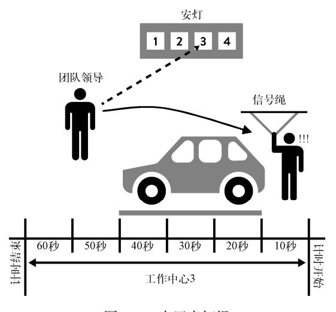

图 A-3 丰田安灯绳

#### 附录 7 软件包产品

为了将复杂的软件包产品(COTS,commercial off-the-shelf software;如 SAP、IBM WebSphere、 Oracle WebLogic)也纳入版本控制,我们可能不得不去掉厂商提供的图形化的点击操作模式的安 装工具。为此需要了解厂商提供的工具的用途,还需要一个干净的服务器安装图片,需要比对文 件系统,并将新增的文件纳入版本控制。将那些与安装环境无关的文件都放在同一个位置("基 础安装"),将环境有关的文件放入各自的目录("测试"或者"生产")。通过这种方式,软件安 装操作就变成了版本控制的操作,可视化效果和可重复性都更好了,速度也提升了。

我们可能还要转换应用配置设置,把它们也纳入版本控制。例如,可以将存储在数据库里的 应用配置转换为 XML 文件,XML 文件也可以转换为应用配置。

#### 附录 8 事后分析会议

事后分析会议的议程样例如下。

 首先由会议主持或协调人做会议启动发言,强调这个会议是对事不对人的事后分析会议, 我们的重点不是发生过的事,也不会去推测"本来会怎样"或"本来有可能怎样"。协调 人可以宣读来自 Retrospective.com 网站的"回顾基本指导原则"。

此外,协调人将提醒大家,得出的任何对策都一定要分配到具体的人,如果纠正措施不 能成为这个会议后的首要任务,那么这就不是纠正措施。(这是为了防止会议上讨论了一 系列好想法,可是永远也不付诸行动。)

 在会议期间要对事故完整的时间表达成一致的认识。包括在什么时间、是谁发现的问题, 通过什么途径发现的问题(例如,自动监测、手动检测、客户反馈),在什么时间服务得 到了彻底的恢复,等等。我们还将在事故发生期间所有的外部讨论归纳到时间表中。

提到"时间表",大家可能会理解为调查问题并解决问题的步骤。实际上,特别是在复杂 的系统中,导致事故发生的事件可能会有许多,并且将会采取多种解决问题的故障排查 方案和措施。 在这项活动中,我们试图记录所有的事件和所有参与者的观点,并尽可能 地建立出各种可能的因果关系的假设。

 事后分析团队将列出所有造成事故的人为因素和技术因素,并将其归类,如"设计决策" "修复""发现的问题"等。团队将使用头脑风暴和"十万个怎么样"方法,对他们认为 特别重要的诱因进行深入挖掘,从而探索更深层次的诱因。所有的观点都应当得到包容 和尊重,不允许争论或否认其他人已经确认的诱因。会议协调人特别需要注意的是,必 须确保做这项活动的时间充足,而且团队不应尝试去异存同,不要试图确定出一个或几 个"根本原因"。

 与会人员要就会后首要任务清单达成一致意见。清单所列内容需要集思广益,并选择能 防止问题复发的任务,或者能更快发现问题并复原的任务。列表还可以包括改进系统的 其他方式。

我们的目标是确定实现预期结果的最小增量步骤,而不是"大爆炸"式的变更,因为那 不仅需要更长的实施时间,还会推迟改进。

我们还会生成一份单独的列表,列出那些优先级较低的任务,并为其分配一个负责人。如 果将来发生类似的问题,就可以基于这些任务制定对策。

- 与会人员还要讨论事故的衡量指标和事故对组织造成的影响。例如,我们可以使用下列 指标来定量描述事故。
  - 事件严重性:这个问题的严重程度。严重性会直接影响服务和客户。
  - 总停机时间:服务完全不可用的时间。
  - 检测时间:发现问题所需的时间。
  - 解决时间:知道问题以后恢复服务所用时间。

Etsy 公司的 Bethany Macri 是这么总结的:"在事故分析中对事不对人并不意味着没有人承担 责任,而是想了解在什么情况下允许人员执行变更,或者谁引入的问题。没有责难,就没有顾虑; 没有了顾虑,就可以坦诚相待。"

#### 附录 9 猿猴军团

在 2011 年 AWS 的美东服务中断事故之后,Netflix 曾就如何自动处理系统故障讨论过多次。 一个名为"捣乱猴"的服务就是这些讨论的结果。

此后,捣乱猴逐渐演变成了一套全系列的工具,内部称之为"Netflix 猿猴军团",用来模拟 灾难的不同程度。

- 捣乱大猩猩:模拟整个 AWS 可用区域(ZA)的故障。
- 捣乱金刚:模拟整个 AWS 地区(Region)的故障,如北美或欧洲。

猿猴军团的其他成员如下。

- 延迟猴子:在其 RESTful 客户端服务器的通信层人为引入的延迟或停机,以模拟服务降 级,并确保相关服务正常工作。
- 一致性猴子:查找并关闭不符合最佳实践的 AWS 实例(例如,实例不属于任何自动伸缩 组,或服务目录中没有值班工程师的电子邮件地址)。

- 医生猴子:检查每个运行的实例,找到不健康的实例,如果负责人没有及时修复,就主 动关闭实例。
- 看门猴子:确保他们的云环境没有混乱和浪费,搜索未使用的资源并处理。
- 安全猴子:一致性猴子的升级版,找到并终止有安全违规或漏洞的实例,例如 AWS 安全 组配置错误。

#### 附录 10 上线时间透明化

Lenny Rachitsky 这么陈述他所谓的"上线时间透明化"的优势。

- (1) 支持的成本下降。因为用户能够自己识别系统里的问题,无需打电话或发电子邮件给支 持部门。用户不再需要猜测是本地问题还是全局性问题,并且可以在跟运维抱怨之前更快速地定 位问题。
- (2) 在宕机期间能与客户更良性沟通。利用互联网传播的优势而不是电子邮件、电话这种一 对一性方式,能实现更好的沟通效果。在客户沟通上省事了,就有更多时间来解决问题。
- (3) 让客户在发生宕机事故时有明确的可寻求帮助的途径,不必再四处搜索论坛、Twitter 或 博客。
- (4) 信任是所有 SaaS 应用成功的基石。客户将自己的业务和生计都押宝在了你的服务或平台 上。现有和潜在的客户都需要信任服务。他们想确保当服务出现问题时自己也有知情权。让他们 实时了解意外事件是建立信任的最佳方法,向客户隐瞒实情不再可取。
- (5) 认真负责的 SaaS 提供商早晚都会提供公开的健康度仪表板,这只是时间问题,因为用户 有这样的需求。

# 参考资源

- 在《凤凰项目:一个 IT 运维的传奇故事》这本书的前半部分中,讨论了很多 IT 组织面临 的常见问题。作者是 Gene Kim、Kevin Behr 和 George Spafford。
- Paul O'Neil 所做的一个演讲,关于他在美铝担任 CEO 的体会,其中有一段介绍他所参与 的一个某美铝工厂青年工人遇害事故调查。视频地址:https://www.youtube.com/watch? v=tC2ucDs\_XJY。
- 关于价值流映射的更详细信息可以参考 *Value Stream Mapping: How to Visualize Work and Align Leadership for Organizational Transformation*一书,作者是Karen Martin和Mike Osterling。
- 更多有关 ORM 的信息,请访问 Stack Overflow 网站:http://stackoverflow.com/questions/ 1279613/what-is-an-orm-and-where-can-i-learn-more-about-it。
- 敏捷开发方法以及如何将它们应用到 IT 运维工作中,可以在 Agile Admin 博客中找到: http://theagileadmin.com/2011/02/21/scrum-for-operations-what-is-scrum/。
- 更多关于快速构建架构技术的信息,请见 Daniel Worthington Bodart的博客文章"Crazy Fast Build Times (or When 10 Seconds Starts to Make You Nervous)":http://dan.bodar.com/2012/ 02/28/crazy-fast-build-times-or-when-10-seconds-starts-to-make-you-nervous/。
- 更多关于 Facebook 性能测试的细节以及一些相关的发布流程细节信息,请参考 Chuck Rossi 的名为"The Facebook Release Process"的演讲:http://www.infoq.com/presentations/ Facebook-Release-Process。
- 更多黑启动形式可以在《云系统管理:大规模分布式系统设计与运营》一书中找到,作 者是 Thomas A. Limoncelli、Strata R. Chalup 和 Christina J. Hogan。
- 这里有一个关于特性开关的精彩技术讨论:http://martinfowler.com/articles/feature-toggles. html。
- 关于发布的更详细讨论,请参考以下图书:《云系统管理:大规模分布式系统设计与运营》 (作者 Thomas A. Limoncelli、 Strata R. Chalup 和 Christina J. Hogan)《持续交付:发布可 靠软件的系统方法》(作者 Jez Humble 和 David Farley)《发布!软件的设计与部署》(作 者 Michael Nygard)。
- 有关熔断模式的介绍可以参考:http://martinfowler.com/bliki/CircuitBreaker.html。
- 了解更多延迟的成本,请参考 *The Principles of Product Development Flow: Second Generation Lean Product Development* 一书,作者 Donald G. Reinertsen。

- 关于预防 Amazon S3 服务故障的更深入讨论:https://qconsf.com/sf2010/dl/qcon-sanfran-2009/slides/JasonMcHugh\_AmazonS3ArchitectingForResiliencyInTheFaceOfFailures.pdf。
- 关于开展用户研究的探讨,参见《精益设计:设计团队如何改善用户体验》一书,作者 Jeff Gothelf 和 Josh Seiden。
- Which Test Won 是一个真实 A/B 测试案例的网站,上面有数百个测试案例,让浏览者猜 测哪个测试表现更好。它的主旨是提倡做实际测试,凭猜测是无法得出正确结论的。网 址:http://whichtestwon.com/。
- 架构模式清单可在 Michael Nygard 所著的《发布!软件的设计与部署》一书中找到。
- Chef发布了一个事后回顾会议的例子,文字版见 https://www.chef.io/blog/2014/08/14/cookbookdependency-api-postmortem/,视频版见 https://www.youtube.com/watch?v=Rmi1Tn5oWfI。
- DevOpsDays 活动的日程更新可以在 DevOpsDays 的网站上看到:http://www.devopsdays.org/。 关于组织一次 DevOpsDays 活动的指导信息,请见网页"DevOpsDay Organizing Guide": http://www.devopsdays.org/pages/organizing/。
- 更多管理密码的工具请见 Noah Kantrowitz 的博文"Secrets Management and Chef": https://coderanger.net/chef-secrets/。
- James Wickett和Gareth Rushgrove已经将他们所有安全加固流水线的示例代码放到了GitHub 网站上:https://github.com/secure-pipeline。
- 美国国家漏洞数据网站和 XML 数据访问点:https://nvd.nist.gov/。
- Puppet、ThoughtWorks 的 GoCD 和 Mingle(一个项目管理应用)融合的具体场景参见 Puppet Lab 的博客文章:https://puppetlabs.com/blog/a-deployment-pipeline-for-infrastructure。 作者是 Andrew Cunningham 和 Andrew Myers,由 Jez Humble 编辑。
- 关于准备和通过合规审计的更多讨论,见 Jason Chan 在 2015 年题为"SEC310: Splitting the Check on Compliance and Security: Keeping Developers and Auditors Happy in the Cloud"的 演讲:https://www.youtube.com/watch?v=Io00\_K4v12Y&feature=youtu.be。
- Jez Humble 和 David Farley 的关于 Oracle WebLogic 应用配置转型的故事参见他们的《持 续交付:发布可靠软件的系统方法》,关于将微雇用描述成更通用的流程的文档位于: http://notafactoryanymore.com/2015/10/19/devops-for-systems-of-record-a-new-hope-previewof-does-talk/。
- DevOps 的一个可维护性需求的清单实例,见网页:http://blog.devopsguys.com/2013/12/19/ the-top-ten-devops-operational-requirements/。

# 致 谢

#### Jez Humble

参与本书主要是出于对 Gene 的好感。能与 Gene 及其他两位合著者 John 和 Patrick 合作,荣 幸至极,也非常愉快。还要感谢 Todd、Anna、Robyn 以及 IT Revolution 的编辑和制作团队,感 谢他们在幕后所做的大量工作。我也想感谢Nicole Forsgren,过去三年中她与Gene、Alanna Brown、 Nigel Kersten 一直与我一起投入在 PuppetLabs / DORA 的"DevOps 现状报告"项目上,对开发、 测试和优化本书中的许多想法提供了不少帮助。在我写作本书期间,我的妻子 Rani 和两个女儿 Amrita 和 Reshmi 一如既往地给了我无限的爱和支持。谢谢。我爱你们。最后,能成为 DevOps 社区的一员我感到无比幸运,这是一个践行共情、互相尊重、共同成长的社区。感谢你们每一 个人。

#### John Willis

我最要感谢的是我贤惠的妻子,她对我投入疯狂的事业一直包容有加。感谢合著者 Patrick、 Gene 和 Jez,我从他们那里学到的东西都足够再写一本书了。感谢 Mark Hinkle、Mark Burgess、 Andrew Clay Shafer 和 Michael Cote,他们对我的人生有重要的影响和指导。我也想感谢 Adam Jacob 雇用我加盟 Chef,并给予我探索 DevOps 的自由。最后感谢我的工作伙伴、Devops Café 搭 档 Damon Edwards。

#### Patrick Debois

我要感谢那些曾经与我一起为本书的出版而奋斗的伙伴,非常感谢大家。

#### Gene Kim

我要感谢 Margueritte,给我近 11 年梦幻岁月的爱妻,感谢她容忍我 5 年多都处于赶工状态; 感谢我的儿子 Reid、Parker 和 Grant。感谢我的父母 Ben 和 Kai Kim,让我很早就成为一个书呆

子。我也要感谢合著者们,我从他们那里获益良多。感谢 Anna Noak、Aly Hoffman、Robyn Crummer-Olsen、Todd Sattersten 和将这本书交付完成的 IT Revolution 团队的所有成员。

我也向以下良师益友表示感谢,没有他们,就没有这本书:John Allspaw (Etsy)、 Alanna Brown (Puppet)、Adrian Cockcroft(Battery Ventures)、Justin Collins(Brakeman Pro)、Josh Corman(Atlantic Council)、Jason Cox(The Walt Disney Company)、Dominica DeGrandis(LeanKit)、Damon Edwards (DTO Solutions)Nicole Forsgren 博士(Chef)、Gary Gruver、Sam Guckenheimer(Microsoft)、 Elisabeth Hendrickson(Pivotal Software)、Nick Galbreath(Signal Sciences)Tom Limoncelli(Stack Exchange)Chris Little、Ryan Martens、 Ernest Mueller(AlienVault)、Mike Orzen、Scott Prugh(CSG International)、Roy Rapoport(Netflix)、Tarun Reddy(CA/Rally)、Jesse Robbins(Orion Labs)、 Ben Rockwood(Chef)、Andrew Shafer(Pivotal)、Randy Shoup(Stitch Fix)、James Turnbull (Kickstarter)、James Wickett(Signal Sciences)。

感谢以下人员与我们分享他们的 DevOps 经验:Justin Arbuckle、David Ashman、Charlie Betz、 Mike Bland、Toufic Boubez 博士、Em Campbell-Pretty、Jason Chan、Pete Cheslock、Ross Clanton、 Jonathan Claudius、 Shawn Davenport、James DeLuccia、Rob England、John Esser、James Fryman、 Paul Farrall、Nathen Harvey、Mirco Hering、Adam Jacob、Luke Kanies、Kaimar Karu、Nigel Kersten、 Courtney Kissler、Bethany Macri、 Simon Morris、Ian Malpass、Dianne Marsh、Norman Marks、 Bill Massie、Neil Matatall、Michael Nygard、Patrick McDonnell、Eran Messeri、Heather Mickman、 Jody Mulkey、Paul Muller、Jesse Newland、Dan North、Tapabrata Pal 博士、Michael Rembetsy、 Mike Rother、Paul Stack、Gareth Rushgrove、Mark Schwartz、Nathan Shimek、Bill Shinn、JP Schneider、 Steven Spear、Laurence Sweeney、Jim Stoneham、Ryan Tomayko。

感谢以下图书审校人员,他们为本书提供了很多宝贵意见和建议:Will Albenzi、JT Armstrong、 Paul Auclair、Ed Bellis、Daniel Blander、Matt Brender、Alanna Brown、Branden Burton、Ross Clanton、 Adrian Cockcroft、Jennifer Davis、Jessica DeVita、Stephen Feldman、Martin Fisher、Stephen Fishman、 Je Gallimore、Becky Hartman、Matt Hatch、William Hertling、Rob Hirschfeld、Tim Hunter、Stein Inge Morisbak、Mark Klein、Alan Kraft、Bridget Kromhaut、Chris Leavory、Chris Leavoy、Jenny Ma dorsky、 Dave Mangot、Chris McDevitt、Chris McEniry、Mike McGarr、Thomas McGonagle、Sam McLeod、 Byron Miller、David Mortman、Chivas Nambiar、Charles Nelles、John Osborne、Matt O'Keefe、 Manuel Pais、Gary Pedretti、Dan Piessens、Brian Prince、Dennis Ravenelle、Pete Reid、Markos Rendell、 Trevor Roberts、Jr. Frederick Scholl、Matthew Selheimer、David Severski、Samir Shah、Paul Stack、 Scott Stockton、Dave Tempero、Todd Varland、Jeremy Voorhis、Branden Williams。

利用现代工具进行写作是什么场景?感谢以下人员给我提供的神奇体验:O'Reilly Media 公 司的 Andrew Odewahn 让我们使用超炫的 Chimera 审校平台,Kickstarter 的 James Turnbull 帮助我 创建了我的第一个出版提交工具链,GitHub 公司的 Scott Chacon 为写作者们创建了 GitHub Flow。

# **EXIN DevOps Professional**

认证备考指南 & 模拟题

**201712** 版

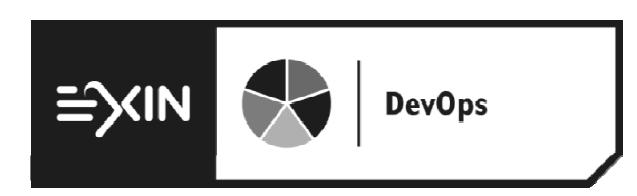

#### 特别致谢:

文档第二部分和第三部分中的 EXIN DevOps Professional™基础术语表和认证考试样题 分别由以下几位老师共同修订,特此声明,以表感谢。

以下排名不分先后:

术语提交&翻译:刘征、张乐、许峰、汪珺

术语整理&修订:卢梦纯

考试大纲&细则修订:卢梦纯

样题审校:刘征、张乐、许峰、汪珺

样题整理:卢梦纯

#### 术语反馈:

如对术语翻译有修改建议,或提交新的术语,请发送邮件至 info.china@exin.com,经 确认后,将在下一版本更新中进行修订。

版权所有 © 2017 EXIN

EXIN®为 EXIN Holding B.V.的注册商标。

DevOps Master™ 为 EXIN Holding B.V.的注册商标。

在未获得 EXIN 的事先书面许可的情况下,不得对本文件的部分或全部内容进行发表、转载、 复制或存储在数据处理系统中,不得以打印、照片打印、微缩照片或任何其他手段和方式对其 进行传播。

Lean IT Foundation®为 Lean IT Association 的注册商标。

## 第一部分 | EXIN DevOps 认证体系概览

#### 1. DevOps 体系框架

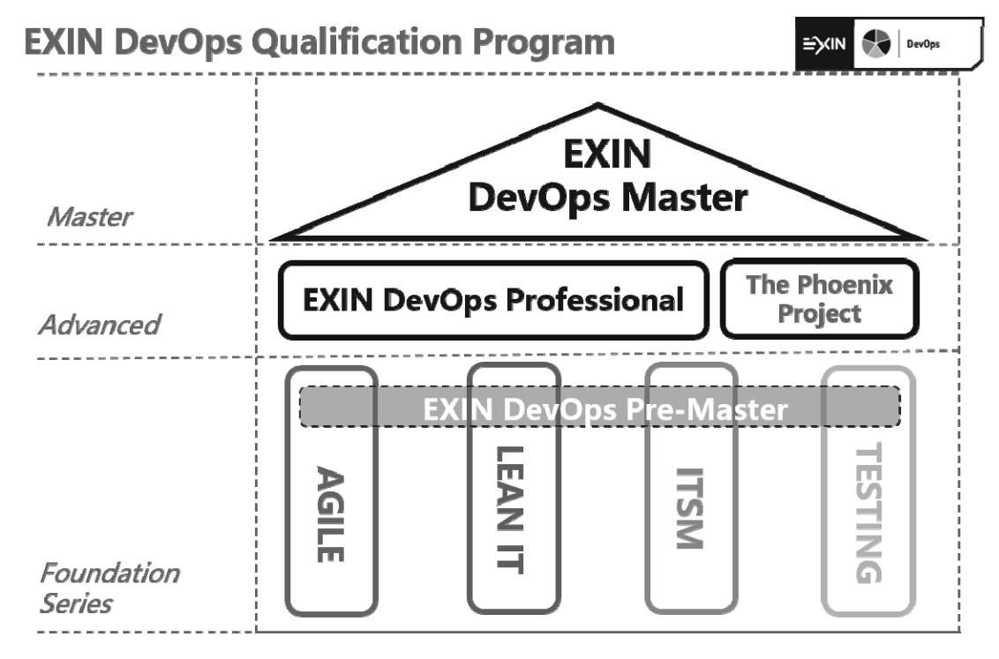

图 B-1(另见彩插)

EXIN DevOps 认证体系已搭建起完整的框架。请注意,EXIN DevOps 认证体系中各门认证均无 前置认证要求,考生可根据自身情况选择考取合适的认证。

#### 2. DevOps 系列认证模块

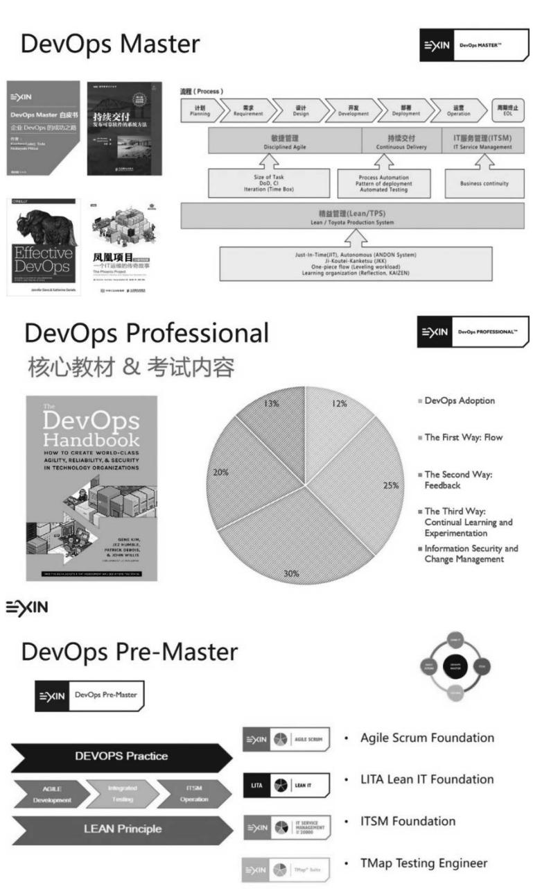

图 B-2(另见彩插)

## 第二部分 | EXIN DevOps Professional 认证备考指南

#### 1. 概述

EXIN DevOps Professional™ (DEVOPSP.CH)

#### 概述

DevOps 不仅在软件服务领域享有盛名,其法则也同样被应用到与快速交付可靠的产品和服务相 关的所有环境。DevOps 一方面促进敏捷开发、服务管理和精益改进的协同作用,另一方面在持 续交付流水线中确保安全性和保持控制,以此为整个组织的成功做出贡献。

本模块的主要目的是测试考生是否熟悉 DevOps 实践"三步工作法":流动、反馈、持续学习和 实验。通过学习和考试,考生将理解这些组织层面和技术层面的变革对其日常工作的影响。

#### 总结

DevOps 是"开发"和"运维"这两个词的缩写。DevOps 是一套最佳实践方法论,旨在在应用 和服务的生命周期中促进 IT 专业人员(开发人员、运维人员和支持人员)之间的协作和交流, 最终实现:

- 持续集成——每天数次将所有开发工作副本并入共享主线;
- 持续部署——持续发布,或尽可能经常地发布;
- 持续反馈——在生命周期的各个阶段寻求来自利益干系人的反馈。

本认证涵盖的 DevOps 实践源自三步工作法:

- 第一步是从开发到运维再到客户,实现从左到右快速流动;
- 第二步是从所有利益干系人到价值流,实现从右到左快速反馈;
- 第三步是通过创建高度信任的实验和风险承担文化,促进学习。

此外,还涵盖了各个阶段至关重要的安全问题及在变更期间保持合规性。

本认证的研发集结了 DevOps 工作领域的各方专家协作完成。

#### 背景信息

EXIN DevOps 认证项目:

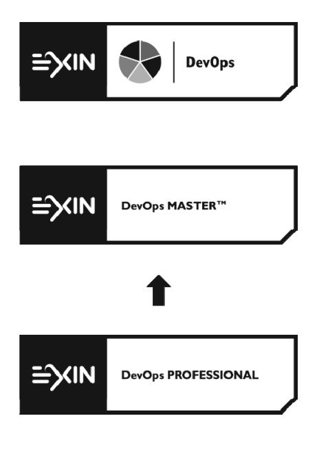

图 B-3

#### 目标群体

EXIN DevOps Professional™认证的目标人群是在 DevOps 环境中工作的所有人员或考虑向 DevOps 工作法过渡的组织中的所有员工。

目标群体包括(不限于):

- 软件和网站开发人员
- 系统工程师
- DevOps 工程师
- 产品和服务负责人
- 项目经理
- 测试工程师
- IT 服务管理操作和支持人员
- 流程经理
- 精益 IT 从业人员
- Agile Scrum 从业者

#### 认证要求

- 顺利通过 DevOps Professional™考试。
- 建议预先了解敏捷、精益和/或 IT 服务管理,例如通过 EXIN Agile Scrum Foundation 考试、 LITA Lean IT Foundation 考试,或基于 ISO/IEC 20000 的 EXIN IT Service Management Foundation 考试。

#### 布鲁姆级别

EXIN DevOps Professional™认证根据布鲁姆分类学修订版对考生进行布鲁姆 2 级和 3 级测试。

 布鲁姆 2 级:理解——记忆(1 级)之上的步骤。理解表明考生能够理解呈现的内容,并能 够评估如何将学习资料应用到个人所在的环境中。

这类题目旨在证明考生能够整理、对比、说明并选择有关事实和想法的正确描述。

 布鲁姆 3 级:应用——表明考生有能力在与学习环境不同的背景下使用所学信息。 这类题目旨在证明考生能够以不同的方式或新的方式应用所掌握的知识、实例、方法和规则, 在新的情况下解决问题。这类题目通常包含一个简短的场景。

#### 考试细节

考试类型: 计算机考试或笔答考试,单选题

题目数量: 40

通过分数: 65%

是否开卷考试: 否

是否允许携带电子设备/辅助设备: 否

考试时间: 90 分钟

EXIN 的考试规则和规定适用于此门考试。

#### 培训

#### 培训时长

建议本培训课程的培训时长为 16 小时,该时长包括学员分组、备考和短暂休息。该时长不包括 家庭作业、考试和午餐休息时间。

#### 建议个人学习量

60 小时,根据现有知识的掌握情况可能有所不同。

#### 培训机构

可通过 www.exin.com 查找该认证的授权培训机构。

#### 2. 考试要求和规范

| 考试要求            | 考试规范      | 比重                   |       |
|-----------------|-----------|----------------------|-------|
| 1. DevOps 应用 |           |                      | 12.5% |
|                 | 1.1       | DevOps 的基本概念      |       |
|                 | 1.2       | 三步工作法的原则             |       |
|                 | 1.3       | 组织                   |       |
| 2. 第一步:流动       |           |                      | 25%   |
|                 | 2.1       | 部署流水线                |       |
|                 | 2.2       | 自动化测试                |       |
|                 | 2.3       | 持续集成                 |       |
|                 | 2.4       | 低风险发布                |       |
| 3. 第二步:反馈       |           |                      | 30%   |
|                 | 3.1 遥测 |                      |       |
|                 | 3.2 反馈 |                      |       |
|                 | 3.3       | A/B 测试 假设驱动开发和 |       |
| 3.4 评审和协调    |           |                      |       |
| 4. 第三步:持续学习和实验  |           |                      | 20%   |
|                 | 4.1       | 学习                   |       |
|                 | 4.2       | 发现                   |       |
| 5. 信息安全与变更管理    |           | 12.5%                |       |
|                 | 5.1       | 信息安全                 |       |
|                 | 5.2       | 变更管理                 |       |
| 合计              |           |                      | 100%  |

#### 考试规范

**1. DevOps** 应用 **12.5%**  1.1 DevOps 的基本概念 2.5% 考生能够…… 说明 DevOps 的基本概念,如持续交付、敏捷基础架构、Kata、在制品、技术债 务、前置时间。 1.2 三步工作法的原则 3.75% 考生能够…… 1.2.1 区分流动、反馈及持续学习和实验的原则。 1.2.2 说明交互系统(SoE)和记录系统(SoR)与 DevOps 之间的关系的区别。 1.3 组织 6.25% 考生能够…… 1.3.1 说明 DevOps 角色如何为了增加业务价值而协作。 1.3.2 说明 I 型、T 型、E 型与 DevOps 之间的关系的区别。 1.3.3 说明如何将运维与日常开发工作相结合。 **2.** 第一步:流动 **25%**  2.1 部署流水线 12.5% 考生能够…… 2.1.1 选择解决部署流水线问题的方法,如基础设施即代码、容器。 2.1.2 选择优化价值流的最佳解决方案。 2.1.3 评估共享版本控制库的完整性。 2.1.4 调整完成的定义(DoD),以反映 DevOps 原则。 2.1.5 说明如何将工具用于环境构建和配置自动化。 2.2 自动化测试 5% 考生能够…… 2.2.1 说明非理想测试金字塔模型和理想测试金字塔模型之间的区别。 2.2.2 选择测试驱动开发在流动中的使用目的。 2.3 持续集成 5% 考生能够…… 2.3.1 选择最佳的分支策略。 2.3.2 说明技术债务对流动的影响。

| 2.3.3 说明如何消除技术债务。                       |      |
|-----------------------------------------|------|
| 2.4 低风险发布                               | 2.5% |
| 考生能够                                    |      |
| 2.4.1 区分不同的发布和部署模式,从而实现低风险发布。           |      |
| 2.4.2 选择 可供使用的合适的架构原型。               |      |
| 3. 第二步:反馈                               | 30%  |
| 3.1 遥测                                  | 7.5% |
| 考生能够                                    |      |
| 3.1.1 描述遥测如何促进价值流的优化。                   |      |
| 3.1.2 描述监控框架组件。                         |      |
| 3.1.3 说明自助使用遥测的附加值。                     |      |
| 3.2 反馈                                  | 10%  |
| 考生能够                                    |      |
| 3.2.1 使用前滚和回滚方法解决部署问题。                  |      |
| 3.2.2 变更发布指导要求清单,使其与 DevOps 指导相符。 |      |
| 3.2.3 使用投产就绪评审(LRR)及交接就绪评审(HRR)执行安全检查。  |      |
| 3.2.4 说明如何将用户体验(UX)设计用作反馈机制。            |      |
| 3.3 假设驱动开发和 A/B 测试                | 5%   |
| 考生能够                                    |      |
| 3.3.1 说明如何将 A/B 测试与发布和特性测试相结合。    |      |
| 3.3.2 说明假设驱动开发如何促进预期结果的交付。              |      |
| 3.4 评审和协调                               | 7.5% |
| 考生能够                                    |      |
| 3.4.1 检查拉动请求流程的有效性。                     |      |
| 3.4.2 说明评审方法、同行评审、观察者评审、结对编程、和工具辅助评审。   |      |
| 3.4.3 根据特定情况选择最合适的评审方法。                 |      |
| 4. 第三步:持续学习和实验                          | 20%  |
| 4.1 学习                                  | 10%  |
| 考生能够                                    |      |
| 4.1.1 区分猿猴军团中不同种类的猴子,以改进学习方式。           |      |

4.1.2 召开免责事后分析会议。

- 4.1.3 说明如何通过在生产环境中嵌入故障来产生恢复能力。
- 4.1.4 说明何时使用游戏日。

4.2 发现 10%

考生能够……

- 4.2.1 描述如何使用(成文的)非功能性需求(NFR)进行运维设计。
- 4.2.2 说明如何将可重复使用的运维用户故事嵌入开发之中。
- 4.2.3 说明哪些对象应存储在单一共享源代码存储库中。
- 4.2.4 说明如何将局部发现转化成整体改进成果。

**5.** 信息安全与变更管理 **12.5%** 

5.1 信息安全 7.5%

考生能够……

- 5.1.1 说明如何整合预防性安全控制措施。
- 5.1.2 说明如何在部署流水线中整合安全措施。
- 5.1.3 说明如何使用遥测增强安全。

5.2 变更管理 5%

考生能够……

- 5.2.1 说明如何在变更期间保持安全。
- 5.2.2 说明如何在变更期间保持合规性。

#### 3. 基本概念列表

本场包含考生应熟知的术语和缩写。

请注意,单靠这些术语并不能满足考试要求。考生必须了解这些概念,并能够举例。

| (DOP & Handbook Glossary)                 |           |
|-------------------------------------------|-----------|
| 英文                                        | 中文        |
| A/B Testing                               | A/B 测试 |
| Acceptance Stage                          | 验收阶段      |
| Acceptance Test-Driven Development (ATDD) | 验收测试驱动开发  |
| Acceptance Test                           | 验收测试      |
| Accident                                  | 事故        |
| Affinity                                  | 亲和        |
| Agile                                     | 敏捷        |
| Andon Cord                                | 安灯绳       |
| Anomaly Detection Technique               | 异常探测技术    |
| Antifragility                             | 抗脆弱性      |
| Application Deployment                    | 应用部署      |
| Artifact Management                       | 构件制品库管理   |
| Artifact                                  | 制品        |
| Automated Test                            | 自动化测试     |
| Automation                                | 自动化       |
| Backlog                                   | 待办事项列表    |
| Bad Apple Theory                          | 坏苹果理论     |
| Bad Path                                  | 坏路径       |
| Batch Size                                | 批次尺寸、批量大小 |
| Blame                                     | 指责        |
| Blameless Post Mortem                     | 不指责的事后分析  |
| Blamelessness                             | 免责        |
| Blue-Green Deployment                     | 蓝绿部署      |
| Blue-Green Deployment Pattern             | 蓝绿部署模式    |
| Branching Strategy                        | 分支策略      |
| Brownfield                                | 棕地        |
| Build                                     | 构建        |
| Business Value                            | 业务价值      |
| Canary Release                            | 金丝雀发布     |

| 英文                                    | 中文           |
|---------------------------------------|--------------|
| Canary Release Pattern                | 金丝雀发布模式      |
| Card                                  | 卡片           |
| Change Category                       | 变更类别         |
| Change Schedule                       | 变更计划         |
| Cloud Computing                       | 云计算          |
| Cloud Configuration File              | 云配置文件        |
| Cluster Immune System Release Pattern | 集群免疫系统发布模式   |
| Code Branch                           | 代码分支         |
| Code Review Form                      | 代码审查表        |
| Codified Nfr                          | 成文的非功能需求     |
| Collaboration                         | 协作           |
| Commit Stage                          | 提交阶段         |
| Commit Code                           | 提交代码         |
| Compliance Requirement                | 合规性要求        |
| Compliance Checking                   | 合规性检查        |
| Compliancy Officer                    | 合规检测官        |
| Configuration Management              | 配置管理         |
| Container                             | 容器           |
| Continuous Deployment                 | 持续部署         |
| Continuous Integration                | 持续集成(CI)     |
| Continuous Delivery                   | 持续交付(CD)     |
| Conways Law                           | 康威定律         |
| Cycle Time                            | 周期时间         |
| Defect Tracking                       | 缺陷跟踪         |
| Definition Of Done (DoD)              | 完成的定义        |
| Dev Ritual                            | 开发惯例         |
| Developer                             | 开发人员         |
| Development                           | 开发           |
| Devops Transformation                 | DevOps 转型 |
| Downstream/Upstream                   | 下游/上游        |
| Downwards Spiral                      | 恶性循环         |
| E-Mail Pass-Around                    | 电子邮件轮查       |
| Expand/Contract Pattern               | 扩张/收缩模式      |
| Exploratory Test                      | 探索性测试        |
| Fast Feedback                         | 快速反馈         |
| Feature                               | 特性           |
|                                       |              |

|                                     | (续)                  |
|-------------------------------------|----------------------|
| 英文                                  | 中文                   |
| Feature Flag                        | 特性标志                 |
| Feature Toggle                      | 特性开关                 |
| Feedback/Feedback Loop              | 反馈/反馈回路              |
| Feedforward/Feedforward Loop        | 前馈/前馈回路              |
| Flow                                | 流动                   |
| Gated Commit                        | 门控提交                 |
| Gaussian Distribution               | 高斯分布                 |
| Green Build                         | 绿色构建                 |
| Greenfield                          | 绿地                   |
| Handoff                             | 交接                   |
| Hand-Off Readiness Review           | 交接就绪评审               |
| Happy Path                          | 愉快路径                 |
| Hypothesis-Driven Development       | 假设驱动开发               |
| Incident                            | 事件                   |
| Information Radiator                | 信息辐射器                |
| Infosec                             | 信息安全                 |
| Infrastructure Automation           | 基础架构自动化              |
| Infrastructure As Code              | 基础架构即代码              |
| Integration Tests                   | 集成测试                 |
| I-Shaped, T-Shaped, E-Shaped        | I 型、T 型、E 型 |
| Iteration                           | 迭代                   |
| Itsm (It Service Management)        | IT 服务管理           |
| Ji-Kotei-Kanketsu (JKK)             | 质量检查(JKK)            |
| Just Culture                        | 公正文化                 |
| Just-In-Time (JIT)                  | 准时制                  |
| Kaizen (In Lean)                    | 改善                   |
| Kaizen Blitz (Or Improvement Blitz) | 改善闪电战                |
| Kanban                              | 看板                   |
| Kata                                | Kata                 |
| Large Batch Size Merge              | 大批量合并                |
| Latent Defect                       | 潜在缺陷                 |
| Lauching Guidance                   | 发布指导                 |
| Launch Readiness Review             | 投产就绪评审               |
| Lead Time                           | 前置时间                 |
| Lean                                | 精益                   |
| Learning Culture                    | 学习文化                 |
|                                     |                      |

| 英文                                       | 中文                 |  |
|------------------------------------------|--------------------|--|
| Logging Level                            | 日志级别               |  |
| Loosely Coupled Architecture             | 松耦合架构              |  |
| Micro-Service                            | 微服务                |  |
| Minimum Viable Product                   | 最小化可行产品            |  |
| Monitoring Framework                     | 监控框架               |  |
| Monolithic Application                   | 单体应用               |  |
| Monolytics                               |                    |  |
| MTTR                                     | 单体应用               |  |
| Non-Functional Requirement (NFR)         | 平均恢复时间             |  |
|                                          | 非功能性需求             |  |
| Non-Functional Requirement (NFR) Testing | 非功能需求测试            |  |
| (Non) Ideal Testing Pyramid              | (非)理想测试金字塔模型       |  |
| One-Piece-Flow                           | 单件流                |  |
| Operations                               | 运维                 |  |
| Operations Story                         | 运维故事               |  |
| Ops Liaison                              | 运维联络人              |  |
| Organisational Typology Model            | 组织结构模型             |  |
| Organization Archetype                   | 组织原型               |  |
| Organizational Learning                  | 组织级学习              |  |
| Over-The-Shoulder                        | 观察者评审              |  |
| Package                                  | 包                  |  |
| Pair Programming                         | 结对编程               |  |
| Peer Review                              | 同行评审               |  |
| Pilot                                    | 试点                 |  |
| Pipeline                                 | 流水线                |  |
| Plan-Do-Check-Act Cycle (PDCA Cycle)     | 计划实施检查改进循环(戴明环) |  |
| Post-Mortem                              | 事后分析               |  |
| Process Time                             | 处理时间               |  |
| Product Owner                            | 产品负责人              |  |
| Pull Request Process                     | 拉动请求流程             |  |
| QA                                       | 质量保证               |  |
| Reduce Batch Size                        | 降低批次尺寸             |  |
| Reduce Number Of Handoffs                | 减少交接次数             |  |
| Regression Test                          | 回归测试               |  |
| Release Branch                           | 发布分支               |  |
| Release Manager                          | 发布经理               |  |

| 英文 中文 Release Pattern 发布模式 Retrospective 回顾 Rhythm 节奏 Roll-Back 回滚 Sad Path 不愉快路径 Safety Culture 安全文化 Safety Conditions 安全条件 Scaling 规模化 Scrum Scrum Scrum Master Scrum Master Security Testing 安全测试 Self Service Capability 自服务能力 Service Deployment 服务部署 Service Level Agreement (SLA) 服务级别协议(SLA) Shared Goal 共同目标 Shared Operations Team (SOT) 共享运维团队 Shared Version Control 共享版本控制 Single Repository 单一存储库 Smoke Testing 冒烟测试 Sprint 冲刺 Staging Staging Staging Environments, SIT 准生产环境 Stakeholder 利益干系人 Standard Deviation 标准差 Standard Operations 标准运维 Static Code Analysis 静态代码分析 Swarm 聚集、聚焦、会诊、围观(动词) Swarming 聚集 System Of Engagement (SOE) 交互系统 System Of Records (SOR) 记录系统 Technical Debt 技术债务 Technology Adaption Curve 技术适应曲线 Technology Executive 技术主管 Telemetry 遥测 |                        | (续)     |  |
|------------------------------------------------------------------------------------------------------------------------------------------------------------------------------------------------------------------------------------------------------------------------------------------------------------------------------------------------------------------------------------------------------------------------------------------------------------------------------------------------------------------------------------------------------------------------------------------------------------------------------------------------------------------------------------------------------------------------------------------------------------------------------------------------------------------------------------------------------------------------------------------------------------------------------------------------------------------------------------------------------|------------------------|---------|--|
|                                                                                                                                                                                                                                                                                                                                                                                                                                                                                                                                                                                                                                                                                                                                                                                                                                                                                                                                                                                                      |                        |         |  |
|                                                                                                                                                                                                                                                                                                                                                                                                                                                                                                                                                                                                                                                                                                                                                                                                                                                                                                                                                                                                      |                        |         |  |
|                                                                                                                                                                                                                                                                                                                                                                                                                                                                                                                                                                                                                                                                                                                                                                                                                                                                                                                                                                                                      |                        |         |  |
|                                                                                                                                                                                                                                                                                                                                                                                                                                                                                                                                                                                                                                                                                                                                                                                                                                                                                                                                                                                                      |                        |         |  |
|                                                                                                                                                                                                                                                                                                                                                                                                                                                                                                                                                                                                                                                                                                                                                                                                                                                                                                                                                                                                      |                        |         |  |
|                                                                                                                                                                                                                                                                                                                                                                                                                                                                                                                                                                                                                                                                                                                                                                                                                                                                                                                                                                                                      |                        |         |  |
|                                                                                                                                                                                                                                                                                                                                                                                                                                                                                                                                                                                                                                                                                                                                                                                                                                                                                                                                                                                                      |                        |         |  |
|                                                                                                                                                                                                                                                                                                                                                                                                                                                                                                                                                                                                                                                                                                                                                                                                                                                                                                                                                                                                      |                        |         |  |
|                                                                                                                                                                                                                                                                                                                                                                                                                                                                                                                                                                                                                                                                                                                                                                                                                                                                                                                                                                                                      |                        |         |  |
|                                                                                                                                                                                                                                                                                                                                                                                                                                                                                                                                                                                                                                                                                                                                                                                                                                                                                                                                                                                                      |                        |         |  |
|                                                                                                                                                                                                                                                                                                                                                                                                                                                                                                                                                                                                                                                                                                                                                                                                                                                                                                                                                                                                      |                        |         |  |
|                                                                                                                                                                                                                                                                                                                                                                                                                                                                                                                                                                                                                                                                                                                                                                                                                                                                                                                                                                                                      |                        |         |  |
|                                                                                                                                                                                                                                                                                                                                                                                                                                                                                                                                                                                                                                                                                                                                                                                                                                                                                                                                                                                                      |                        |         |  |
|                                                                                                                                                                                                                                                                                                                                                                                                                                                                                                                                                                                                                                                                                                                                                                                                                                                                                                                                                                                                      |                        |         |  |
|                                                                                                                                                                                                                                                                                                                                                                                                                                                                                                                                                                                                                                                                                                                                                                                                                                                                                                                                                                                                      |                        |         |  |
|                                                                                                                                                                                                                                                                                                                                                                                                                                                                                                                                                                                                                                                                                                                                                                                                                                                                                                                                                                                                      |                        |         |  |
|                                                                                                                                                                                                                                                                                                                                                                                                                                                                                                                                                                                                                                                                                                                                                                                                                                                                                                                                                                                                      |                        |         |  |
|                                                                                                                                                                                                                                                                                                                                                                                                                                                                                                                                                                                                                                                                                                                                                                                                                                                                                                                                                                                                      |                        |         |  |
|                                                                                                                                                                                                                                                                                                                                                                                                                                                                                                                                                                                                                                                                                                                                                                                                                                                                                                                                                                                                      |                        |         |  |
|                                                                                                                                                                                                                                                                                                                                                                                                                                                                                                                                                                                                                                                                                                                                                                                                                                                                                                                                                                                                      |                        |         |  |
|                                                                                                                                                                                                                                                                                                                                                                                                                                                                                                                                                                                                                                                                                                                                                                                                                                                                                                                                                                                                      |                        |         |  |
|                                                                                                                                                                                                                                                                                                                                                                                                                                                                                                                                                                                                                                                                                                                                                                                                                                                                                                                                                                                                      |                        |         |  |
|                                                                                                                                                                                                                                                                                                                                                                                                                                                                                                                                                                                                                                                                                                                                                                                                                                                                                                                                                                                                      |                        |         |  |
|                                                                                                                                                                                                                                                                                                                                                                                                                                                                                                                                                                                                                                                                                                                                                                                                                                                                                                                                                                                                      |                        |         |  |
|                                                                                                                                                                                                                                                                                                                                                                                                                                                                                                                                                                                                                                                                                                                                                                                                                                                                                                                                                                                                      |                        |         |  |
|                                                                                                                                                                                                                                                                                                                                                                                                                                                                                                                                                                                                                                                                                                                                                                                                                                                                                                                                                                                                      |                        |         |  |
|                                                                                                                                                                                                                                                                                                                                                                                                                                                                                                                                                                                                                                                                                                                                                                                                                                                                                                                                                                                                      |                        |         |  |
|                                                                                                                                                                                                                                                                                                                                                                                                                                                                                                                                                                                                                                                                                                                                                                                                                                                                                                                                                                                                      |                        |         |  |
|                                                                                                                                                                                                                                                                                                                                                                                                                                                                                                                                                                                                                                                                                                                                                                                                                                                                                                                                                                                                      |                        |         |  |
|                                                                                                                                                                                                                                                                                                                                                                                                                                                                                                                                                                                                                                                                                                                                                                                                                                                                                                                                                                                                      |                        |         |  |
|                                                                                                                                                                                                                                                                                                                                                                                                                                                                                                                                                                                                                                                                                                                                                                                                                                                                                                                                                                                                      |                        |         |  |
|                                                                                                                                                                                                                                                                                                                                                                                                                                                                                                                                                                                                                                                                                                                                                                                                                                                                                                                                                                                                      |                        |         |  |
|                                                                                                                                                                                                                                                                                                                                                                                                                                                                                                                                                                                                                                                                                                                                                                                                                                                                                                                                                                                                      |                        |         |  |
|                                                                                                                                                                                                                                                                                                                                                                                                                                                                                                                                                                                                                                                                                                                                                                                                                                                                                                                                                                                                      |                        |         |  |
|                                                                                                                                                                                                                                                                                                                                                                                                                                                                                                                                                                                                                                                                                                                                                                                                                                                                                                                                                                                                      |                        |         |  |
|                                                                                                                                                                                                                                                                                                                                                                                                                                                                                                                                                                                                                                                                                                                                                                                                                                                                                                                                                                                                      | Test Coverage Analysis | 测试覆盖率分析 |  |

| 英文                                                                                                                                                                              | 中文                                                                                                          |
|---------------------------------------------------------------------------------------------------------------------------------------------------------------------------------|-------------------------------------------------------------------------------------------------------------|
| Test Story                                                                                                                                                                      | 测试故事                                                                                                        |
| Test-Driven Development                                                                                                                                                         | 测试驱动开发                                                                                                      |
| The Downward Spiral - TDS                                                                                                                                                       | 下行螺旋                                                                                                        |
| The Agile Manifesto                                                                                                                                                             | 敏捷宣言                                                                                                        |
| The Lean Movement                                                                                                                                                               | 精益运动                                                                                                        |
| The Simian Army:  Chaos Gorilla  Chaos Kong  Conformity Monkey  Doctor Monkey  Janitor Monkey  Latency Monkey  Security Monkey | 猿猴军团(可靠性监控服务):  捣乱大猩猩  捣乱金刚  一致性猴子  医生猴子  看门猴子  延迟猴子  安全猴子 |
| The Three Ways                                                                                                                                                                  | 三步工作法                                                                                                       |
| Theory Of Constraints                                                                                                                                                           | 约束理论                                                                                                        |
| Ticketing System                                                                                                                                                                | 工单系统                                                                                                        |
| Tightly-Coupled                                                                                                                                                                 | 紧耦合                                                                                                         |
| Tool-Assisted Review                                                                                                                                                            | 工具辅助评审                                                                                                      |
| Tool                                                                                                                                                                            | 工具                                                                                                          |
| Toyota Production System (TPS)                                                                                                                                                  | 丰田生产系统                                                                                                      |
| Toyoto Kata                                                                                                                                                                     | 丰田套路                                                                                                        |
| Transformation Team                                                                                                                                                             | 转型团队                                                                                                        |
| Trunk                                                                                                                                                                           | 主干                                                                                                          |
| User Story                                                                                                                                                                      | 用户故事                                                                                                        |
| Value Stream Mapping                                                                                                                                                            | 价值流映射                                                                                                       |
| Value Stream                                                                                                                                                                    | 价值流                                                                                                         |
| Velocity                                                                                                                                                                        | 速率                                                                                                          |
| Version Control                                                                                                                                                                 | 版本控制                                                                                                        |
| Virtualized Environment                                                                                                                                                         | 虚拟化环境                                                                                                       |
| Visible                                                                                                                                                                         | 可视的                                                                                                         |
| Visualisation                                                                                                                                                                   | 可视化                                                                                                         |
| Waste                                                                                                                                                                           | 浪费                                                                                                          |
| Waste Reduction                                                                                                                                                                 | 减少浪费                                                                                                        |
| Waterfall                                                                                                                                                                       | 瀑布式                                                                                                         |
| WIP (Work In Progress / Process)                                                                                                                                                | 在制品                                                                                                         |
| WIP Limit                                                                                                                                                                       | 在制品限制                                                                                                       |
| Work Center                                                                                                                                                                     | 工作中心                                                                                                        |
|                                                                                                                                                                                 |                                                                                                             |

#### 文献

#### 必选教材

*A The DevOps Handbook: How to Create World-Class Agility, Reliability, and Security in Technology Organizations* 

作者:Gene Kim, Jez Humble, Patrick Debois, John Willis

国际标准书号:ISBN-10: 1942788002;ISBN-13: 978-1942788003

出版社:IT Revolution Press;第 1 版(2016 年)

(即本书主体《DevOps 实践指南》)

#### 可选教材

**B** *DevOps Best Practices*

作者:Bart de Best

国际标准书号:ISBN-13: 978-94-92618-07-8

出版社:Leonon Media(2017 年)

**C** *The Phoenix Project: A Novel About IT, DevOps, and Helping Your Business Win*

作者:Gene Kim, Kevin Behr, George Spafford

国际标准书号:ISBN-10: 0988262576;ISBN-13: 978-0988262577

出版社:IT Revolution Press(2013 年 1 月 10 日)

该文献目前已有中文版《凤凰项目:一个 IT 运维的传奇故事》

译者:成小留

书号:ISBN 9787-7-115-40365-0

**D** 其他来源:

http://newrelic.com/devops

http://devops.com/

备注:可选教材仅作为参考和其他深度学习使用。

#### 文献考点分布矩阵

| 考试要求 | 考试规范 | 文献 | 文献参考章节                |  |
|------|------|----|-----------------------|--|
| 1    | 1.1  | A  | 前言,第一部分介绍,第 1、21 章 |  |
|      | 1.2  | A  | 第 2、3、4、5 章           |  |
|      | 1.3  | A  | 第 2、6、7、8 章           |  |
|      |      |    |                       |  |
| 2    | 2.1  | A  | 第 5、6、7、8、9 、11 章  |  |
|      | 2.2  | A  | 第 10 章             |  |
|      | 2.3  | A  | 第 11、21、22 章          |  |
|      | 2.4  | A  | 第 12、23 章          |  |
|      |      |    |                       |  |
| 3    | 3.1  | A  | 第 14、15 章          |  |
|      | 3.2  | A  | 第 16 章             |  |
|      | 3.3  | A  | 第 17 章             |  |
|      | 3.4  | A  | 第 18 章             |  |
|      |      |    |                       |  |
| 4    | 4.1  | A  | 第 19 章、附录 9        |  |
|      | 4.2  | A  | 第 20 章             |  |
|      |      |    |                       |  |
| 5    | 5.1  | A  | 第 22 章             |  |
|      | 5.2  | A  | 第 23 章             |  |

## 第三部分 | EXIN DevOps Professional 认证样题&解析

#### 1. 考试说明

本试卷基于 EXIN DevOps Professional。EXIN 考试准则适用于该考试。

本试卷由 40 道单项选择题组成。每道选择题有多个选项,但这些选项中只有一个是正确答案。

本试卷的总分是 40 分,每道题的分数是 1 分。每答对一题获得 1 分。如果考生获得的总分数为 26 分或以上,证明通过本考试。

考试时间为 90 分钟。

祝你好运!

#### 2. 样题

#### **1 / 40**

敏捷宣言的原则是什么?

- A) 创建持续和动态学习的文化。
- B) 在工作系统中生成反馈和前馈回路。
- C) 高频次交付可工作的软件,间隔从几星期到两三个月不等。
- D) 使工作可见,缩小批次尺寸并缩短工作间隔,构建质量,从而增强流动。

#### **2 / 40**

"将日常工作的改进制度化"属于三步工作法中的哪一步?

- A) 持续学习和实验
- B) 反馈
- C) 流动

#### **3 / 40**

交互系统(SoE)和记录系统(SoR)在变更速度上有何区别?

- A) 一般而言,SoE 和 SoR 的变更速度同步。
- B) 一般而言,SoE 的变更速度显著高于 SoR。
- C) 一般而言,SoE 的变更速度显著低于 SoR。
- D) SoE 和 SoR 间变更速度的关系取决于不同的信息系统。

#### **4 / 40**

让开发和运维使用共享工具的益处是什么?

- A) 生成统一的待办事项列表,便于每个人从全局角度优先考虑改进项目。
- B) 开发人员能够得到关于应用程序在生产环境中运行表现的反馈,其中包括生产中断时的修复。
- C) 使团队能够在正常的营业时间内进行部署并进行简单的转换。
- D) 将运维的知识转换为自动化代码,这样更加可靠,并且可以被广泛地重复使用。

将运维能力更好地赋能给开发团队,可以产生更多以市场为导向的成果,提高效率和生产力。

以下哪一项是实现这一点最有效的方法?

- A) 为运维团队派遣开发人员联络员
- B) 创建基础架构自服务
- C) 将运维团队外包
- D) 培训开发人员,使其能够开展运维工作

#### **6 / 40**

由于运维工程师延误了新环境的生成,银行需要更长的时间将新的或发生变化的产品投入市场。

以下哪一项是关于自动生成环境的正确说法?

- A) 自动生成的环境可用于所有环境。
- B) 由于安全限制,自动生成的环境可用于生产环境以外的所有环境。
- C) 基于四眼原则,在生产中使用自动生成的环境时,DevOps 要求运维人员评审。
- D) 基于四眼原则,在生产中使用自动生成的环境时,DevOps 要求运维人员的手动同意。

#### **7 / 40**

价值流图过程块应包含哪种价值?

- A) 应用程序遥测
- B) 完整和准确的百分比
- C) 团队速率
- D) 在制品(WIP)

#### **8 / 40**

为了尽量降低 DevOps 中的业务风险,下面哪一项是版本控制的主要目标?

- A) 配置偏离理想状态时,保证警报功能
- B) 保证重新生成先前的最佳环境状态的功能

- C) 保证重新生成生产环境以及构建流程的功能
- D) 保证不同的开发团队共享源代码的功能

所有 IT 团队成员集结到一起,共同评审应进行的变更,以便进一步实施 DevOps。团队成员需 要就与 DevOps 原则相符的完成的定义(DoD)达成一致。

以下哪一项完成的定义(DoD)适用于 DevOps?

- A) 代码已并入主分支,并通过了自动化单元测试。
- B) 代码在开发人员的电脑中如期运行,已通过单元测试。
- C) 代码在类似生产的环境中运行,已通过用户验收测试。

#### **10 / 40**

以下哪一项是实现环境搭建和环境配置自动化的最有效工具?

- A) 提供开发、测试或验收环境的工单系统
- B) 将生产环境设置复制到开发、测试和验收环境的工具
- C) (为保持环境同步)各环境下手动分发和维护的配置文件
- D) 便于程序员自行变更环境的基础设施即代码配置管理工具

#### **11 / 40**

自动化测试套件的特定设计目标是尽可能早地在测试中找到错误。理想自动化测试金字塔模型 显示了须执行测试的正确顺序。

需首先执行哪一个测试?

- A) 自动化 API 测试
- B) 自动化组件测试
- C) 自动化集成测试
- D) 自动化单元测试

DevOps 团队希望通过测试驱动开发来提高速率。

下面哪一项是正确的操作顺序?

#### A) 重构

书写测试用例 书写功能代码

- B) 书写功能代码 书写测试用例 重构
- C) 书写测试用例 书写功能代码 重构

#### **13 / 40**

一家保险公司聘请 DevOps 专家为其 DevOps 团队的分支策略选择提供建议。DevOps 专家评估 了两种策略:

- 1. 优化个人生产力
- 2. 优化团队生产力

关于这两种策略,下面哪一种说法是正确的?

- A) 两种策略产生的合并工作量是相等的。
- B) 策略 1 产生的合并工作量高于策略 2。
- C) 策略 2 产生的合并工作量高于策略 1。

#### **14 / 40**

一家零售公司彻底从瀑布式开发流程转向 DevOps。短时间内作出了很多选择。这就产生了技术 债务。例如,产品上市时间(time to market)显著增加。但也有消除诸多延误的方法。

价值流图显示 20%的冲刺时间都花在移植代码上,所有代码均在单独的代码分支上实现维护。

以下哪种技术债务解决方案会实现更快的流动(faster flow)?

- A) 采用基于主干的开发
- B) 在开发人员工作站复制测试故障
- C) 开始金丝雀发布
- D) 使用更多遥测

实现高生产力、可测试性和安全的架构的特征是什么?

- A) 定义含糊的接口
- B) 紧耦合
- C) 定义明确的 API

#### **16 / 40**

解决 DevOps 问题的最佳的遥测方法是什么?

- A) 投资遥测工具非常重要,重点应为生产环境、部署流水线和预生产环境。
- B) 投资遥测工具非常重要,仅需重视生产环境。
- C) 投资遥测工具不重要。重点是重启成本更低的冗余服务。
- D) 投资遥测工具不重要。重点是应用程序用户。原因在于用户提供更全面、成本更低的监控。

#### **17 / 40**

在监控框架内,应从三个层次收集数据。

下面哪一项不属于这三层?

- A) 应用程序
- B) 业务逻辑
- C) 业务指标
- D) 运维系统

#### **18 / 40**

自助遥测帮助下面哪一种人员实现增值?

- A) 仅开发人员
- B) 仅开发人员和运维人员
- C) 仅开发人员、运维人员和利益干系人
- D) 开发人员、运维人员、利益干系人以及客户

在兼具自动化测试、快速部署流程和充分遥测的环境下,下面哪一种方法为业务提供最多 DevOps 方向的益处?

- A) 前滚
- B) 回滚
- C) 移除有故障的服务器
- D) 关闭故障特性

#### **20 / 40**

某软件公司编写了下列发布指导要求。

- ·缺陷计数和严重程度:应用程序是否按照设计要求运行?
- ·监控范围:发生故障时,监控范围是否足以恢复服务?
- ·系统架构:服务是否紧耦合,足以解决生产中的高事件率?
- ·传呼机警报类型/频率:应用程序是否在生产中生成过量警报?

下面哪一项发布指导要求不符合 DevOps 工作法?

- A) 缺陷计数和严重程度:应用程序是否确实按照设计要求运行?
- B) 监控范围:发生故障时,监控范围是否足以恢复服务?
- C) 系统架构:服务是否紧耦合,足以解决生产中的高事件率?
- D) 传呼机警报类型/频率:应用程序是否在生产中生成过量警报?

#### **21 / 40**

以下哪一项是交接就绪评审(HRR)[而非投产就绪评审(LRR)]的独有特点?

- A) HRR 更严格,验收标准更高。
- B) HRR 由产品团队自行汇报。

- C) HRR 需要在新服务对外发布前签字。
- D) HRR 需要在新服务接收到真实生产流量前签字。

在交互、用户体验(UX)设计领域,最强大的方法之一是情景调查。 以下哪一项是关于情景调查最佳说法?

- A) 产品团队要求用户对团队对应用程序演示做出响应。
- B) 产品团队向用户询问,应用程序在家中的使用情况。
- C) 产品团队观察用户在用户的日常使用状态下,使用此应用的行为。
- D) 在用户验收测试期间,产品团队在配备测试设备的专用房间内研究用户行为。

#### **23 / 40**

初创公司 ABC 在根据用户期望开发移动导航应用程序的特性上面临严峻挑战。 下面哪一项是确保 UX 移动导航应用程序的特性与用户期望相符的最佳方法?

- A) 在移动导航应用程序中,更为全面的开发足够多的特性,从而为客户提供更高级和更多的选 择,使其通过更多选项来自定义功能,来优化用户体验。
- B) 开发多个版本的移动导航应用程序,随机选择部分用户,展示不同版本的应用,来获取并对 比用户体验。版本分为主控型版本与升级型版本,用户被随机挑选并使用其中一个版本
- C) 修改移动导航应用程序当前的 UX 特性,以便 ABC 在不牺牲质量的前提下保留 UX 的核心 功能。
- D) 提前三周发布移动导航应用程序的一个新特性,从而收集客户对此特性的反馈。

#### **24 / 40**

开发团队可通过下列哪种方法促进交付预期的业务成果?

- A) 认真开展大量实验
- B) 完整的回归测试
- C) 假设驱动开发
- D) SDLC

ABC 公司在系统"工资单应用程序"上,遇到了代码变更的问题。目前,已经执行的代码变更 未能有完善的记录。例如,最新的代码修复记录如下:"修复#1801 工资单应用程序问题。" 公司注意到这是描述不当的"拉动"记录请求。

恰当的"拉动"请求包括以下内容:

- ·为什么要进行修复?
- ·由谁进行修复?

恰当的"拉动"请求必须包含哪些其他内容?

- A) 受到修复影响的业务部门
- B) 执行修复的潜在风险以及对策
- C) 执行修复的支持发布计划表

#### **26 / 40**

请考虑以下情境:

"在开发人员查看代码的同时,同事提供反馈。"

此处描述的是哪一种评审方法?

- A) 观察者评审
- B) 结对编程
- C) 同行评审
- D) 工具辅助评审

#### **27 / 40**

下面哪种评审方法会直接减少编码错误?

- A) 观察者评审
- B) 结对编程
- C) 同行评审
- D) 工具辅助评审

云服务提供商希望通过使用猿猴军团(可靠性监控服务)提高服务容量。

这种情况需要使用下面哪种猴子?

- A) 医生猴子(Doctor Monkey)
- B) 看门猴子(Janitor Monkey)
- C) 延迟猴子(Latency Monkey)

#### **29 / 40**

ABC 公司采用 DevOps 工作法,希望推广开放、免责的学习环境。近期,ABC 公司经历了一次 重大的应用程序故障,但随后恢复了应用程序服务。

下面哪一项是不指责事后分析会议上必须完成的第一要务?

- A) 为重大的应用程序故障期间发生的相关事件建立时间表。
- B) 确定对策,防止未来再次发生重大的应用程序故障。
- C) 确定重大的应用程序故障的根本原因,提出纠正措施,防止未来再次发生重大的应用程序故障。
- D) 在整个组织都可以接近的集中位置公布事后回顾,从重大的应用程序故障中吸取教训。

#### **30 / 40**

在通过注入生产故障来产生恢复能力的实践中,要求以下哪一项?

- A) 定义故障模式
- B) 组织事后回顾会议
- C) 培训人员
- D) 使用测试环境

#### **31 / 40**

以下哪一项是执行演练日(game day)计划的第一个步骤?

- A) 定义和执行演习
- B) 识别并解决问题,接着测试

- C) 计划断电
- D) 准备和消除单点故障

以下哪一项属于非功能需求?

- A) 在不同的版本间兼具向前和向后的兼容性
- B) 可以生成被推迟的工作进度的报表
- C) 为酒店预订系统登记财务交易

#### **33 / 40**

为了成功创建可重复使用的运维用户故事,应执行以下哪项操作?

- A) 将运维用户故事与相关的研发功能提升和缺陷关联起来
- B) 定义交接流程中的操作,接着使用适当工具和辅助性的工作流将这些操作自动化
- C) 确认所有必要的运维操作和须完成操作的人员

#### **34 / 40**

请考虑以下要素:

- 1. 变更请求
- 2. 部署流水线工具
- 3. 编译后的可执行文件
- 4. 操作指南和标准

其中哪两个要素一般存储在统一的共享源代码存储库里?

- A) 1 和 2
- B) 1 和 4
- C) 2 和 3
- D) 2 和 4

#### **35 / 40**

将局部发现转化成全局改进成果的目标是什么?

A) 提升实践的状态,不只是 Dev 和 Ops 实践,还包含整个组织各个方面的实践。

- B) 使所有新服务和现有服务都能够更加方便地利用到集体知识。
- C) 创造协作性更好的企业文化以及更安全、更具弹性的系统。
- D) 强化让每个人都感受到舒适、可靠的文化。

开发人员可以为任何工程师提供便利,便于他们在应用程序和环境中准确地生成并使用日志记 录和加密标准。

以下哪一个不是通过共享的源代码存储库提供支持的?

- A) 代码库及其推荐的配置
- B) 部署包
- C) 操作系统(OS)包和应用的构建
- D) 加密管理工具

#### **37 / 40**

开发人员编写了新的代码时,始终伴随着非授权访问的风险。

以下哪一种控制措施不能规避此风险?

- A) 代码评审
- B) 代码测试
- C) 有效地打补丁
- D) 渗透测试

#### **38 / 40**

下列哪种情况属于应用程序的遥测?

- A) 操作系统(OS)的变更
- B) 每日评审系统日志
- C) 安全组的变更
- D) 用户密码的重置

以下哪个流程支持合规性要求,同时也是降低运维和安全风险的主要控制措施?

- A) 变更管理流程
- B) 配置管理流程
- C) 发布和部署管理流程
- D) 服务级别管理流程

#### **40 / 40**

以下哪一项属于采用职责分离控制措施的缺点?

- A) 职责分离控制措施通常会减少工程师收到的关于其工作的反馈,并使接收反馈的速度变 慢,阻碍了开发工作。
- B) 职责分离控制措施要求开发人员向代码管理员提交变更内容,由代码管理员评审、审批变 更,接着再应用到生产。
- C) 职责分离控制措施要求检查每一次代码提交,并进行代码评审,从而为工作质量提供必要 保证。但职责分离控制措施会产生不必要的工作。

#### 3. 答案解析

#### **1 / 40**

敏捷宣言的原则是什么?

- A) 创建持续和动态学习的文化。
- B) 在工作系统中生成反馈和前馈回路。
- C) 高频次交付可工作的软件,间隔从几星期到两三个月不等。
- D) 使工作可见,缩小批次尺寸并缩短工作间隔,构建质量,从而增强流动。
- A) 错误。这属于持续学习和实验的原则。
- B) 错误。这属于反馈原则。
- C) 正确。这是敏捷宣言的主要原则之一。其他原则对于自我激励的小型团队及在高度信任的管 理模式下工作必不可少。(文献:A 第 1 部分简介)
- D) 错误。这属于流动原则。

#### **2 / 40**

"将日常工作的改进制度化"属于三步工作法中的哪一步?

- A) 持续学习和实验
- B) 反馈
- C) 流动
- A) 正确。三步工作法的原则要求将日常工作的改进制度化,将局部学习转换为可供整个组织使 用的整体学习,并在日常工作中持续注入压力。(文献:A 第 4 章)
- B) 错误。"将日常工作的改进制度化"属于持续学习和实验原则。
- C) 错误。"将日常工作的改进制度化"属于持续学习和实验原则。

#### **3 / 40**

交互系统(SoE)和记录系统(SoR)在变更速度上有何区别?

A) 一般而言,SoE 和 SoR 的变更速度同步。

- B) 一般而言,SoE 的变更速度显著高于 SoR。
- C) 一般而言,SoE 的变更速度显著低于 SoR。
- D) SoE 和 SoR 间变更速度的关系取决于不同的信息系统。
- A) 错误。一般而言,SoE 的变更速度显著高于 SoR。
- B) 正确。SoE 代表用户界面。因此,SoE 的变更速度更快。此外,SoR 的变更较为复杂。(文 献:A 第 5 章)
- C) 错误。一般而言,SoE 的变更速度显著高于 SoR。
- D) 错误。可以给出一个通用说法:一般而言,SoE 的变更速度显著高于 SoR。

让开发和运维使用共享工具的益处是什么?

- A) 生成统一的待办事项列表,便于每个人从全局角度优先考虑改进项目。
- B) 开发人员能够得到关于应用程序在生产环境中运行表现的反馈,其中包括生产中断时的修复。
- C) 使团队能够在正常的营业时间内进行部署并进行简单的转换。
- D) 将运维的知识转换为自动化代码,这样更加可靠,并且可以被广泛地重复使用。
- A) 正确。通过统一的待办事项列表,每个人能够从全局角度优先考虑改进项目,选择对于组 织具有最高价值的工作或对降低技术债务的影响最大的工作。(文献:A 第 6 章)
- B) 错误。这是开发与运维轮值值守的益处。
- C) 错误。益处是自动化和实现低风险发布。
- D) 错误。益处是在服务团队中嵌入运维工程师。

#### **5 / 40**

将运维能力更好地赋能给开发团队,可以产生更多以市场为导向的成果,提高效率和生产力。

以下哪一项是实现这一点最有效的方法?

- A) 为运维团队派遣开发人员联络员
- B) 创建基础架构自服务
- C) 将运维团队外包
- D) 培训开发人员,使其能够开展运维工作

- A) 错误。应采用其他方式:"为开发团队派遣运维联络员。"
- B) 正确。这是将运维和开发相结合的三种综合策略中的一种:生成自服务能力,以便服务团队 中的开发人员具备高生产力;在服务团队中安排运维工程师;如果无法安排运维工程师,为 服务团队派遣运维联络员。(文献:A 第 8 章)
- C) 错误。不建议将外包作为策略。外包商的员工与开发团队的距离甚至更远。
- D) 错误。开发人员可以使用基础设施即代码。但这样不会淘汰运维的作用。

由于运维工程师延误了新环境的生成,银行需要更长的时间将新的或发生变化的产品投入市场。

以下哪一项是关于自动生成环境的正确说法?

- A) 自动生成的环境可用于所有环境。
- B) 由于安全限制,自动生成的环境可用于生产环境以外的所有环境。
- C) 基于四眼原则,在生产中使用自动生成的环境时,DevOps 要求运维人员评审。
- D) 基于四眼原则,在生产中使用自动生成的环境时,DevOps 要求运维人员的手动同意。
- A) 正确。持续部署不需要使用脚本进行手动操作。这类脚本应自动化。这适用于所有环境。 (文献:A 第 9 章)
- B) 错误。生产环境的生成和维护应充分自动化。
- C) 错误。无需评审自动化脚本。自动化流程受监控。
- D) 错误。无需四眼原则指南。原因在于脚本验收和脚本部署工具都受变更控制。

#### **7 / 40**

价值流图过程块应包含哪种价值?

- A) 应用程序遥测
- B) 完整和准确的百分比
- C) 团队速率
- D) 在制品(WIP)

- A) 错误。应用程序遥测用于监控运行中的应用程序的行为,从而报告程序的健康状况,提供 准确、快速反馈并发现错误。
- B) 正确。应包含在价值流图过程块内。原因在于这是了解价值流根据业务要求交付的质量的 关键指标之一。(文献:A 第 6 章)
- C) 错误。团队速率是在冲刺中衡量,在冲刺会议上使用,用于评估冲刺阶段可完成的工作量。
- D) 错误。在制品是应包含在或源自于看板的概念,不属于价值流图的组成部分,也不会为价 值流分析提供任何价值。

为了尽量降低 DevOps 中的业务风险,下面哪一项是版本控制的主要目标?

- A) 配置偏离理想状态时,保证警报功能
- B) 保证重新生成先前的最佳环境状态的功能
- C) 保证重新生成生产环境以及构建流程的功能
- D) 保证不同的开发团队共享源代码的功能
- A) 错误。尽管版本控制非常关键,便于其他工具使用相关信息发现配置偏离理想状态,但这 不是版本控制的目标,也不是此处的最佳答案。这是因为版本控制应允许以更快的速度重 新生成环境,保持服务和流的质量。
- B) 错误。这是版本控制的益处,但不是在 DevOps 内的主要目标。此外,测试环境通常针对各 次测试重新构建,重新生成先前的状态不太有用。
- C) 正确。DevOps 内的版本控制应允许重新生成生产环境以及构建流程。采用此方法的组织比 其他组织表现得更加出色。(文献:A 第 9 章)
- D) 错误。这是版本控制的目的,但前提是仅以开发为重点。这不是在 DevOps 内的目标。原因 在于 DevOps 内的版本控制要求所有区域将制品、工具和流程存储其中,以实现性能、流、 团队沟通及在所有环境下减少浪费的预见性。

#### **9 / 40**

所有 IT 团队成员集结到一起,共同评审应进行的变更,以便进一步实施 DevOps。团队成员需 要就与 DevOps 原则相符的完成的定义(DoD)达成一致。

以下哪一项完成的定义(DoD)适用于 DevOps?

A) 代码已并入主分支,并通过了自动化单元测试。

- B) 代码在开发人员的电脑中如期运行,已通过单元测试。
- C) 代码在类似生产的环境中运行,已通过用户验收测试。
- A) 错误。从开发人员角度,这是标准的完成的定义(DoD),但未能实现 DevOps 目标,即交 付业务价值。因此,完成的定义(DoD)应包含将工作代码传输至类似生产的环境,而不是 并入主分支。
- B) 错误。所有工作都在开发人员的电脑中执行这一情况并不能保证其会在类似生产的环境中 运行。
- C) 正确。保证代码如期运行,并且可传输。(文献:A 第 9 章)

以下哪一项是实现环境搭建和环境配置自动化的最有效工具?

- A) 提供开发、测试或验收环境的工单系统
- B) 将生产环境设置复制到开发、测试和验收环境的工具
- C) (为保持环境同步)各环境下手动分发和维护的配置文件
- D) 便于程序员自行变更环境的基础设施即代码配置管理工具
- A) 错误。提供环境的工单系统会阻碍部署流水线中的流动,增加了交接次数,因而造成浪费。 应通过工具的使用实现环境的自动提供。
- B) 错误。在 DevOps 内,不建议采用这种工作法。环境必须从头开始构建。此外,不允许将生 产数据用于 D-T-A 环境。
- C) 错误。环境的配置文件必须自动分发。
- D) 正确。这是环境构建和配置自动化的选项之一。开发人员可将基础设施即代码用于自行构建 和配置环境。(文献:A 第 9 章)

#### **11 / 40**

自动化测试套件的特定设计目标是尽可能早地在测试中找到错误。理想自动化测试金字塔模型 显示了须执行测试的正确顺序。

需首先执行哪一个测试?

A) 自动化 API 测试

- B) 自动化组件测试
- C) 自动化集成测试
- D) 自动化单元测试
- A) 错误。必须首先执行自动化单元测试。在 5 个测试中,这个测试排序第四。
- B) 错误。必须首先执行自动化单元测试。在 5 个测试中,这个测试排序第二。
- C) 错误。必须首先执行自动化单元测试。在 5 个测试中,这个测试排序第三。
- D) 正确。这个测试排序第一。(文献:A 第 10 章)

DevOps 团队希望通过测试驱动开发来提高速率。

下面哪一项是正确的操作顺序?

#### A) 重构

书写测试用例 书写功能代码

- B) 书写功能代码 书写测试用例 重构
- C) 书写测试用例 书写功能代码 重构
- A) 错误。首先进行测试,接着编码。第三步是重构。
- B) 错误。首先进行测试,接着编码。第三步是重构。
- C) 正确。首先进行测试,接着编码。第三步是重构。(文献:A 第 10 章)

#### **13 / 40**

一家保险公司聘请 DevOps 专家为其 DevOps 团队的分支策略选择提供建议。DevOps 专家评估 了两种策略:

- 1. 优化个人生产力
- 2. 优化团队生产力

关于这两种策略,下面哪一种说法是正确的?

- A) 两种策略产生的合并工作量是相等的。
- B) 策略 1 产生的合并工作量高于策略 2。
- C) 策略 2 产生的合并工作量高于策略 1。
- A) 错误。策略 1 导致一人一分支。因此,合并会变为一场噩梦。无论使用哪个版本的管理系 统,策略 2 都更加适合。
- B) 正确。个人生产力优先意味着每个 DevOps 开发人员一个独立分支,无需合并即可独立生产 软件。而策略 2 实际上没有真正的分支,开发是在"连续不断的主线"上进行。(文献:A 第 11 章)
- C) 错误。策略 2 的合并工作量更低。这是因为每个人都在共同区域内工作。

#### **14 / 40**

一家零售公司彻底从瀑布式开发流程转向 DevOps。短时间内作出了很多选择。这就产生了技术 债务。例如,产品上市时间(time to market)显著增加。但也有消除诸多延误的方法。

价值流图显示 20%的冲刺时间都花在移植代码上,所有代码均在单独的代码分支上实现维护。

以下哪种技术债务解决方案会实现更快的流动(faster flow)?

- A) 采用基于主干的开发
- B) 在开发人员工作站复制测试故障
- C) 开始金丝雀发布
- D) 使用更多遥测
- A) 正确。基于主干的开发意味着不允许存在分支。因此,不再需要合并。(文献:A 第 11 章)
- B) 错误。问题是在分支造成合并过程中的问题。测试无法解决延迟问题。
- C) 错误。金丝雀发布本会对持续部署产生积极影响,但测试无法解决延迟问题。
- D) 错误。遥测无法解决合并问题。

实现高生产力、可测试性和安全的架构的特征是什么?

- A) 定义含糊的接口
- B) 紧耦合
- C) 定义明确的 API
- A) 错误。定义明确的接口是实现高生产力、可测试性和安全的架构的特征,通过强制说明各个 模块如何连通而实现。定义含糊的界面则相反。
- B) 错误。紧耦合架构为单体应用或包含连接非常紧密的模块。每一次尝试提交代码至主干时, 都存在发生全局故障的风险。每一次小变更都需要数日大量沟通、协调以及可能被影响的团 队的批准。
- C) 正确。定义明确的应用程序接口(API)使得高生产力、更容易的服务测试和安全的架构成 为可能。(文献:A 第 13 章)

#### **16 / 40**

解决 DevOps 问题的最佳的遥测方法是什么?

- A) 投资遥测工具非常重要,重点应为生产环境、部署流水线和预生产环境。
- B) 投资遥测工具非常重要,仅需重视生产环境。
- C) 投资遥测工具不重要。重点是重启成本更低的冗余服务。
- D) 投资遥测工具不重要。重点是应用程序用户。原因在于用户提供更全面、成本更低的监控。
- A) 正确。问题不仅出现在生产环境,也会出现在别处。DevOps 要求快速反馈。反馈在流水线 起点开始。(文献:A 第 14 章)
- B) 错误。仅重视生产环境是不够的。部署流水线和预生产环境对于尽快发现问题也很重要。
- C) 错误。重启的成本并不低。大量生产时间都浪费在寻找错误上。
- D) 错误。如果用户是服务的唯一监控人,那么将损失大量生产时间。这是因为监控能够更快地 发现问题所在及出现问题的位置(在正确实施的情况下),而且并不是所有问题都是用户发 现的。仅仅是用户可看到的错误被发现,而非那些发生在隐蔽位置的错误。

在监控框架内,应从三个层次收集数据。

下面哪一项不属于这三层?

- A) 应用程序
- B) 业务逻辑
- C) 业务指标
- D) 运维系统
- A) 错误。应用程序是三层中的一层,数据收集应在监控框架内完成。
- B) 错误。业务逻辑是三层中的一层,数据收集应在监控框架内完成。
- C) 正确。业务指标不属于三层中的组成部分,数据收集应在监控框架内完成。业务指标是监控 的结果。(文献:A 第 14 章)
- D) 错误。运维系统是三层中的一层,数据收集应在监控框架内完成。

#### **18 / 40**

自助遥测帮助下面哪一种人员实现增值?

- A) 仅开发人员
- B) 仅开发人员和运维人员
- C) 仅开发人员、运维人员和利益干系人
- D) 开发人员、运维人员、利益干系人以及客户
- A) 错误。也为用户、利益干系人和运维人员增加价值。
- B) 错误。也为用户和利益干系人增加价值。
- C) 错误。也为用户增加价值。
- D) 正确。自助使用遥测为所有访客增加价值。(文献:A 第 14 章)

#### **19 / 40**

在兼具自动化测试、快速部署流程和充分遥测的环境下,下面哪一种方法为业务提供最多 DevOps 方向的益处?

- A) 前滚
- B) 回滚
- C) 移除有故障的服务器
- D) 关闭故障特性
- A) 正确。尽管存在风险,在兼具自动化测试、快速部署流程和充分遥测的环境下,这个选择 非常安全。这样有助于快速确认生产中的每一个环节是否正确运行并为业务增加新的功能 和价值。附加值是错误得以纠正,而不是移除新功能特性或有故障的服务器。(文献:A 第 16 章)
- B) 错误。正如"关闭故障特性","回滚"的作用是将部署回滚到先前的状态,通过移除引发 错误的特性来解决问题。因此,这一做法并没有修复错误,而且也把新增加的价值从生产 中去除了。
- C) 错误。这个选项的聚焦于服务的连续性。但考虑到适当的流程、遥测和测试落实到位,更 好的选项是交付新的业务价值。
- D) 错误。关闭故障特性是风险最低的选项,但这一做法并没有修复错误,而且也把新增加的 价值从生产中去除了。

某软件公司编写了下列发布指导要求。

- ·缺陷计数和严重程度:应用程序是否按照设计要求运行?
- ·监控范围:发生故障时,监控范围是否足以恢复服务?
- ·系统架构:服务是否紧耦合,足以解决生产中的高事件率?
- ·传呼机警报类型/频率:应用程序是否在生产中生成过量警报?

下面哪一项发布指导要求不符合 DevOps 工作法?

- A) 缺陷计数和严重程度:应用程序是否确实按照设计要求运行?
- B) 监控范围:发生故障时,监控范围是否足以恢复服务?
- C) 系统架构:服务是否紧耦合,足以解决生产中的高事件率?
- D) 传呼机警报类型/频率:应用程序是否在生产中生成过量警报?
- A) 错误。这个要求符合 DevOps 工作法。
- B) 错误。这个要求符合 DevOps 工作法。

- C) 正确。在 DevOps 工作法内,应采用松耦合架构,而不是紧耦合架构。服务应为松耦合,从 而为生产过程中的高速变更和部署提供支持。(文献:A 第 16 章)
- D) 错误。这个要求符合 DevOps 工作法。

以下哪一项是交接就绪评审(HRR)[而非投产就绪评审(LRR)]的独有特点?

- A) HRR 更严格,验收标准更高。
- B) HRR 由产品团队自行汇报。
- C) HRR 需要在新服务对外发布前签字。
- D) HRR 需要在新服务接收到真实生产流量前签字。
- A) 正确。这是 HRR 的独特之处。原因在于 HRR 在服务过渡到运维管理状态时需要签署确认验 证通过。(文献:A 第 16 章)
- B) 错误。这是 LRR(而非 HRR)的独有特点。
- C) 错误。这是 LRR(而非 HRR)的独有特点。
- D) 错误。这是 LRR(而非 HRR)的独有特点。

#### **22 / 40**

在交互、用户体验(UX)设计领域,最强大的方法之一是情景调查。 以下哪一项是关于情景调查最佳说法?

- A) 产品团队要求用户对团队对应用程序演示做出响应。
- B) 产品团队向用户询问,应用程序在家中的使用情况。
- C) 产品团队观察用户在用户的日常使用状态下,使用此应用的行为。
- D) 在用户验收测试期间,产品团队在配备测试设备的专用房间内研究用户行为。
- A) 错误。现场调查是观察用户如何使用应用程序,而不是由供应商演示应用程序。
- B) 错误。现场调查是直接观察用户如何使用应用程序,但不涉及询问应用程序的用途。
- C) 正确。此方法是观察客户如何在自然环境下使用应用程序。(文献:A 第 16 章)
- D) 错误。现场调查是观察用户如何在自然环境下(而不是在配备测试设备的专用房间内)使 用应用程序。

初创公司 ABC 在根据用户期望开发移动导航应用程序的特性上面临严峻挑战。 下面哪一项是确保 UX 移动导航应用程序的特性与用户期望相符的最佳方法?

- A) 在移动导航应用程序中,更为全面的开发足够多的特性,从而为客户提供更高级和更多的 选择,使其通过更多选项来自定义功能,来优化用户体验。
- B) 开发多个版本的移动导航应用程序,随机选择部分用户,展示不同版本的应用,来获取并 对比用户体验。版本分为主控型版本与升级型版本,用户被随机挑选并使用其中一个版本
- C) 修改移动导航应用程序当前的 UX 特性,以便 ABC 在不牺牲质量的前提下保留 UX 的核心 功能。
- D) 提前三周发布移动导航应用程序的一个新特性,从而收集客户对此特性的反馈。
- A) 错误。我们发现特定的特性未能达到预期结果后,新增更多功能或提升特性可能会被其他 新的特性取代,确保表现不佳的特性不会实现其预期的业务目标。
- B) 正确。在现代 UX 实践中最常用的 A/B 测试方法。如网站可以随机选择不同客户访问其不 同特性的网页,向其展示两种特性页面中的一版,呈现为主控版本(A)或升级版本(B) 的一种。根据对这用户在两类站点后续行为的统计分析,我们论证他们的价值产出是否存 在显著差异,从而在升级和结论之间获取论证依据。(文献:A 第 17 章)
- C) 错误。我们发现特定的特性未能达到预期结果后,修改此特性的优先级并不高,所以我们 要确保识别出哪些表现不佳的特性无法实现其预期的业务目标。
- D) 错误。一般而言,每场实验都非常费时,需要数周、甚至数月才能完成。

#### **24 / 40**

开发团队可通过下列哪种方法促进交付预期的业务成果?

- A) 认真开展大量实验
- B) 完整的回归测试
- C) 假设驱动开发
- D) SDLC
- A) 错误。这种方法不能促进交付预期的业务成果。
- B) 错误。这种方法不能促进交付预期的业务成果。
- C) 正确。这种方法能够最有效地促进交付的业务成果满足客户预期。(文献:A 第 17 章)

D) 错误。这种方法不能促进交付预期的业务成果。

#### **25 / 40**

ABC 公司在系统"工资单应用程序"上,遇到了代码变更的问题。目前,已经执行的代码变更 未能有完善的记录。例如,最新的代码修复记录如下:"修复#1801 工资单应用程序问题。"公 司注意到这是描述不当的"拉动"记录请求。

恰当的"拉动"请求包括以下内容:

- ·为什么要进行修复?
- ·由谁进行修复?

恰当的"拉动"请求必须包含哪些其他内容?

- A) 受到修复影响的业务部门
- B) 执行修复的潜在风险以及对策
- C) 执行修复的支持发布计划表
- A) 错误。修复的潜在风险以及对策必须包含在内。
- B) 正确。有效的拉动请求需要提供下列详细信息:为什么进行修复;由谁进行修复;执行修 复的潜在风险及对策。(文献:A 第 18 章)
- C) 错误。执行修复的潜在风险以及对策必须包含在内。

#### **26 / 40**

请考虑以下情境:

"在开发人员查看代码的同时,同事提供反馈。"

此处描述的是哪一种评审方法?

- A) 观察者评审
- B) 结对编程
- C) 同行评审
- D) 工具辅助评审

- A) 正确。观察者评审方法是编写代码后编写者与同事的相互作用。(文献:A 第 18 章)
- B) 错误。这种评审方法是在编码过程中(而不是编码之后)进行的。
- C) 错误。这种方法在编码之后进行,但编写者无需在场。
- D) 错误。这种评审由工具执行,无需人员参与。

下面哪种评审方法会直接减少编码错误?

- A) 观察者评审
- B) 结对编程
- C) 同行评审
- D) 工具辅助评审
- A) 错误。允许在浏览已编写的软件的同时进行反馈。
- B) 正确。结对编程表示共同编写软件。一人打字,另一人检查。这样有助于直接反馈,减少 错误。(文献:A 第 18 章)
- C) 错误。同行评审是在软件编写完成后进行的评审。
- D) 错误。工具辅助评审的反馈有限,诸多检查在记录代码以后进行。

#### **28 / 40**

云服务提供商希望通过使用猿猴军团(可靠性监控服务)提高服务容量。

这种情况需要使用下面哪种猴子?

- A) 医生猴子(Doctor Monkey)
- B) 看门猴子(Janitor Monkey)
- C) 延迟猴子(Latency Monkey)
- A) 错误。医生猴子开始在各实例下运行健康检查。发现不健康的实例后,如果负责人未能及时 解决根源问题,医生猴子会主动关闭该实例。这样并未提升容量。
- B) 正确。看门猴子通过搜索并处理未使用的资源,确保云环境的运行不存在混乱和浪费。(文 献:A 附录 9 )
- C) 错误。延迟猴子通过在 RESTful 进行模拟的延迟或宕机,从而模拟服务退化,验证其确保依 赖的服务机制可以适当响应。这样并未有改善容量的功能。

ABC 公司采用 DevOps 工作法,希望推广开放、免责的学习环境。近期,ABC 公司经历了一次 重大的应用程序故障,但随后恢复了应用程序服务。

以下哪一项是不指责事后分析会议上必须完成的第一要务?

- A) 为重大的应用程序故障期间发生的相关事件建立时间表。
- B) 确定对策,防止未来再次发生重大的应用程序故障。
- C) 确定重大的应用程序故障的根本原因,提出纠正措施,防止未来再次发生重大的应用程序 故障。
- D) 在整个组织都可以接近的集中位置公布事后回顾,从重大的应用程序故障中吸取教训。
- A) 正确。不指责事后分析会议的第一要务是记录对发生的相关事件的时间线的最佳理解情况。 包括采取的所有措施及具体时间(最好有 IRC、Slack 等聊天记录证明)、观察到的影响(最 好是采用生产遥测得出的具体指标的形式,而不仅仅是个人的主观叙述)、遵循的调查路 径、考虑的解决方法。(文献:A 第 19 章)
- B) 错误。确定对策不是召开不指责事后分析会议的第一要务。这个措施会在建立时间表后实施。
- C) 错误。确定根本原因不是召开不指责事后分析会议的第一要务。这个措施会在建立时间表 后实施。
- D) 错误。公布事后剖析结果不是召开免责事后分析会议的第一要务。这个措施仅会在充分记录 事后分析结果后实施。

#### **30 / 40**

在通过注入生产故障来产生恢复能力的实践中,要求以下哪一项?

- A) 定义故障模式
- B) 组织事后回顾会议
- C) 培训人员
- D) 使用测试环境
- A) 正确。故障模式定义很重要,有助于保证这些故障模式按照设计要求运行。(文献:A 第 19 章)
- B) 错误。事后回顾会议不属于注入方法的组成部分。

- C) 错误。通过故障注入吸取经验。
- D) 错误。仅需要生产环境。

以下哪一项是执行演练日(game day)计划的第一个步骤?

- A) 定义和执行演习
- B) 识别并解决问题,接着测试
- C) 计划断电
- D) 准备和消除单点故障
- A) 错误。计划的第一个步骤是"通过计划电厂断电的方式注入大规模的故障"。"制定计划并执 行演习"是游戏设计者的任务。
- B) 错误。计划的第一个步骤是"通过计划电厂断电的方式注入大规模的故障"。
- C) 正确。步骤如下:(1)第一个步骤是断电;(2)根据此计划,团队采取措施,为断电做准备; (3)措施可以包含需测试的流程;(4)按计划进行断电;(5)必须遵循预定义的流程进行。 (文献:A 第 19 章)
- D) 错误。计划的第一个步骤是"通过计划电厂断电的方式注入大规模的故障"。

#### **32 / 40**

以下哪一项属于非功能需求?

- A) 在不同的版本间兼具向前和向后的兼容性
- B) 可以生成被推迟的工作进度的报表
- C) 为酒店预订系统登记财务交易
- A) 正确。版本间的正向兼容性和反向兼容性属于非功能需求。(文献:A 第 20 章)
- B) 错误。报表是一种功能。因此,不属于非功能需求。
- C) 错误。财务交易是一种功能。非功能需求大多和系统的质量相关。

#### **33 / 40**

为了成功创建可重复使用的运维用户故事,应执行以下哪项操作?

- A) 将运维用户故事与相关的研发功能提升和缺陷关联起来
- B) 定义交接流程中的操作,接着使用适当工具和辅助性的工作流将这些操作自动化
- C) 确认所有必要的运维操作和须完成操作的人员
- A) 错误。为了顺利生成可重复使用的运维用户故事,不一定要考虑这个操作。
- B) 正确。为了顺利生成可重复使用的运维用户故事,必须考虑这个操作。(文献:A 第 20 章)
- C) 错误。为了顺利生成可重复使用的运维用户故事,不一定要考虑这个操作。

请考虑以下要素:

- 1. 变更请求
- 2. 部署流水线工具
- 3. 编译后的可执行文件
- 4. 操作指南和标准

其中哪两个要素一般存储在统一的共享源代码存储库里?

- A) 1 和 2
- B) 1 和 4
- C) 2 和 3
- D) 2 和 4
- A) 错误。变更请求(1)不是具备知识性和可学习性的制品。因此,不应该存储在统一共享源 代码存储库里。变更请求已经记录在产品的待办事项列表中,而不应该在共享源代码存储 库里。部署流水线(2)工具应当存储在统一共享源代码存储库里。
- B) 错误。变更请求(1)不是具备知识性和可学习性的制品。因此,不应该存储在统一共享源 代码存储库里。变更请求已经记录在产品的待办事项列表中,而不应该在共享源代码存储 库里。操作指南和标准(4)应当存储在统一共享源代码存储库里。
- C) 错误。编译后的可执行文件(3)不是具备知识性和可学习性的制品。因此,不应存储在统 一共享源代码存储库里。可执行文件以二进制的形式存储在制品仓库(部署流水线的输出 端),而非统一共享源代码存储库(部署流水线的输入端)。部署流水线(2)工具应当存储 在统一共享源代码存储库里。
- D) 正确。部署流水线工具(2)及操作指南和标准(4)是具备知识性和可学习性的制品。因 此,要存储在统一共享源代码存储库里。(文献:A 第 20 章)

将局部发现转化成全局改进成果的目标是什么?

- A) 提升实践的状态,不只是 Dev 和 Ops 实践,还包含整个组织各个方面的实践。
- B) 使所有新服务和现有服务都能够更加方便地利用到集体知识。
- C) 创造协作性更好的企业文化以及更安全、更具弹性的系统。
- D) 强化让每个人都感受到舒适、可靠的文化。
- A) 正确。这是将局部发现转化成全局改进的目标。(文献:A 第 20 章)
- B) 错误。这个目标是通过成文的非功能性需求(NFR)进行运维基础设计。
- C) 错误。这个目标是预留时间,创建组织级学习和改进。
- D) 错误。这个目标是促进并将学习融入于日常工作中。

#### **36 / 40**

开发人员可以为任何工程师提供便利,便于他们在应用程序和环境中准确地生成并使用日志记 录和加密标准。

以下哪一个不是通过共享的源代码存储库提供支持的?

- A) 代码库及其推荐的配置
- B) 部署包
- C) 操作系统(OS)包和应用的构建
- D) 加密管理工具
- A) 错误。代码库及其推荐配置提供了有效的安全配置设置,专为其应用于应用程序的组件设计 中,从而便于工程师准确地生成并使用日志记录和加密标准。
- B) 正确。部署包是工程师(运维)而非开发人员(开发)的交付物,因而不提供支持。问题是 开发人员可以采取哪些措施使工程师在应用程序中准确生成并使用日志记录和加密标准。 (文献:A 第 22 章)
- C) 错误。OS 包和构应用的构建,专为在应用程序中使用的组件而设计,为其提供有效的安全 配置设置,使工程师能够更方便地在应用程序中准确生成并使用日志记录和加密标准。
- D) 错误。加密管理工具提供有效的安全配置设置,如连接设置、加密秘钥等,使工程师能够更 方便地在应用程序中准确生成并使用日志记录和加密标准。

开发人员编写了新的代码时,始终伴随着非授权访问的风险。

以下哪一种控制措施不能规避此风险?

- A) 代码评审
- B) 代码测试
- C) 有效地打补丁
- D) 渗透测试
- A) 错误。代码评审可以发现恶意软件代码(利用这种代码,可以经由后门访问)。
- B) 错误。代码测试可以发现非授权访问的情况。
- C) 正确。有效地打补丁不能发现开发人员新编写的代码,只能解决缺陷。(文献:A 第 22 章)
- D) 错误。渗透测试可以发现应用程序中生成的或故意留下的漏洞(可以利用漏洞进行非授权 访问)。

#### **38 / 40**

下列哪种情况属于应用程序的遥测?

- A) 操作系统(OS)的变更
- B) 每日评审系统日志
- C) 安全组的变更
- D) 用户密码的重置
- A) 错误。这属于应用程序宿主基础设施环境的遥测范围,并非专门针对应用程序。
- B) 错误。这属于应用程序宿主基础设施环境的遥测范围,并非专门针对应用程序。
- C) 错误。这属于应用程序宿主基础设施环境的遥测范围,并非专门针对应用程序。
- D) 正确。这是针对应用程序的遥测范围。(文献:A 第 22 章)

#### **39 / 40**

以下哪个流程支持合规性要求,同时也是降低运维和安全风险的主要控制措施?

A) 变更管理流程

- B) 配置管理流程
- C) 发布和部署管理流程
- D) 服务级别管理流程
- A) 正确。几乎所有的大型 IT 企业目前都设置了变更管理流程。这是降低运维和安全风险的主 要控制措施。合规性和安全管理员依靠变更管理流程,以满足合规性要求。他们一般要求提 供证明,即所有变更已获得了适当授权。(文献:A 第 23 章)
- B) 错误。本流程提供有关服务和各配置项的信息,可用于发现并分析潜在风险和改进目标,但 并不有助于降低风险。配置管理计划、实施、控制、报告并核实配置项。
- C) 错误。发布和部署管理流程落实软件发布审批的流程,包括诸多变更的审批。变更管理流程 控制、审批变更,接着协调发布和部署管理流程中各方的努力。
- D) 错误。SLM 流程为按需交付服务级别提供保障,满足业务要求。此流程声明了所需的合规 性和安全要求,但并非直接有助于降低风险。

以下哪一项属于采用职责分离控制措施的缺点?

- A) 职责分离控制措施通常会减少工程师收到的关于其工作的反馈,并使接收反馈的速度变慢, 阻碍了开发工作。
- B) 职责分离控制措施要求开发人员向代码管理员提交变更内容,由代码管理员评审、审批变 更,接着再应用到生产。
- C) 职责分离控制措施要求检查每一次代码提交,并进行代码评审,从而为工作质量提供必要保 证。但职责分离控制措施会产生不必要的工作。
- A) 正确。职责分离通常会减少工程师收到的关于其工作的反馈并使接收反馈的速度变慢,阻碍 工作。这样会妨碍工程师对工作质量承担全部责任,也减弱了企业创建组织级学习的能力。 因此,在可能情况下,我们应该避免将职责分离作为控制措施,而应选择结对编程、持续检 查每一次代码提交、代码评审等控制措施。(文献:A 第 23 章)
- B) 错误。这是过时的支持软件开发生命周期(SDLC)的方法,而不是 DevOps。DevOps 推荐 的控制措施包括结对编程、持续检查每一次代码提交及代码评审。这些控制措施为工作质量 提供必要保证。此外,将这些控制措施落实到位后,如果要求职责分离,可以利用已经建立 的控制措施,证明我们实现了等效结果。
- C) 错误。我们应该避免将职责分离作为控制措施,而应选择结对编程、持续检查每次代码提 交、代码评审等控制措施。此外,将这些控制措施落实到位后,如果要求职责分离,可以利 用已经建立的控制措施,证明我们实现了等效结果。

## 4. 试题评分

如下表格为套样题的正确答案选项,供参考使用。

| 编号 | 答案 | 编号 | 答案 |
|----|----|----|----|
| 1  | С  | 21 | A  |
| 2  | A  | 22 | С  |
| 3  | В  | 23 | В  |
| 4  | A  | 24 | С  |
| 5  | В  | 25 | В  |
| 6  | A  | 26 | A  |
| 7  | В  | 27 | В  |
| 8  | С  | 28 | В  |
| 9  | С  | 29 | A  |
| 10 | D  | 30 | A  |
| 11 | D  | 31 | С  |
| 12 | С  | 32 | A  |
| 13 | В  | 33 | В  |
| 14 | A  | 34 | D  |
| 15 | C  | 35 | A  |
| 16 | A  | 36 | В  |
| 17 | C  | 37 | С  |
| 18 | D  | 38 | D  |
| 19 | A  | 39 | A  |
| 20 | С  | 40 | A  |

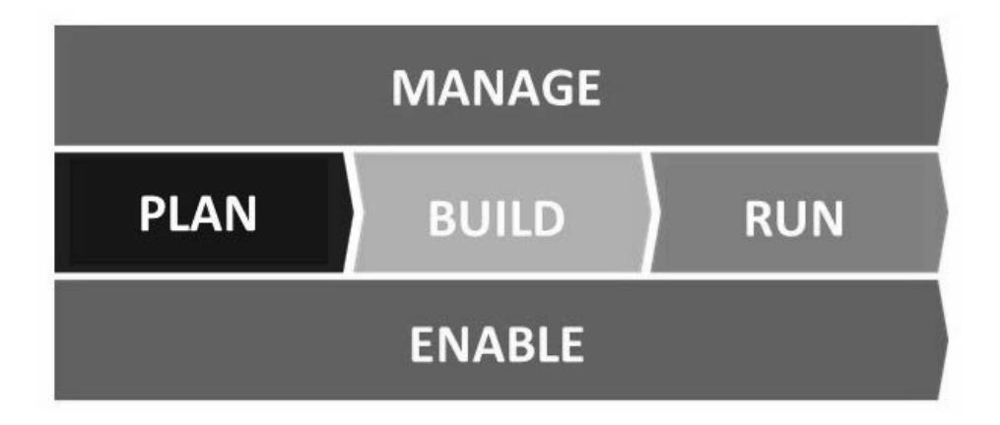

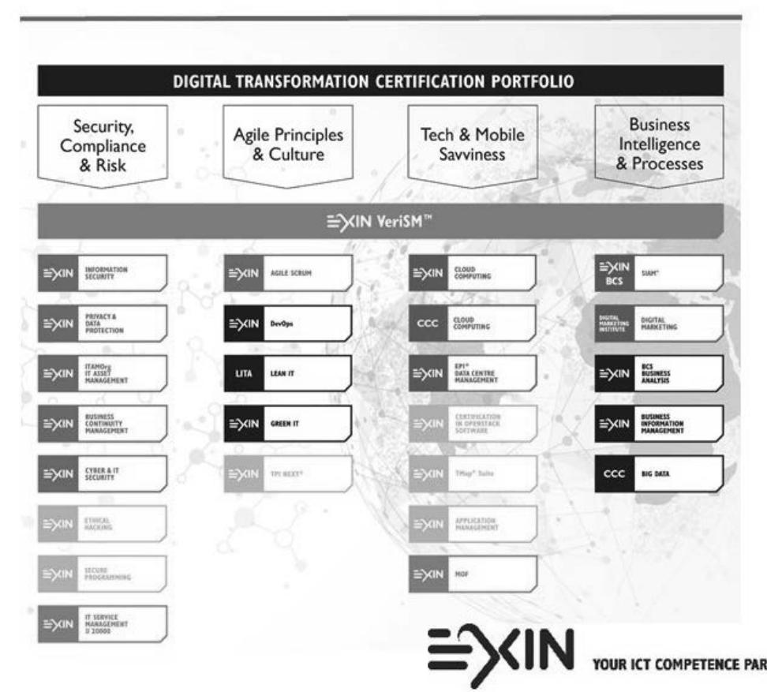

图 B-4(另见彩插)

#### EXIN DevOps Professional 样题微信小程序

EXIN 国际信息科学考试学会

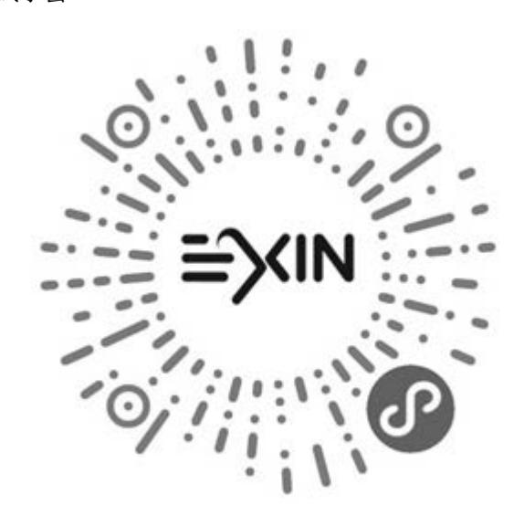

#### 关于折扣码的使用和说明

获取刮刮卡上的折扣码,有机会享受 DevOpsDays 中国站活动和 DevOps Professional 认证考试 的九折优惠。折扣码使用规则的最终解释权归 DevOpsDays 中国站主办方(微信公众号: OfficialDevOpsDays)和 EXIN 国际信息科学考试学会(微信公众号:ExamInstitute)所有。

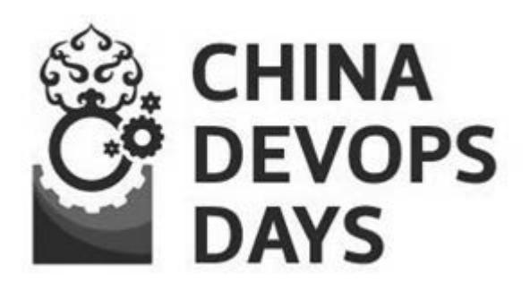

微信连接

回复"运维"查看相关书单

微博连接

关注@图灵教育 每日分享IT好书

QQ连接

图灵读者官方群I: 218139230 图灵读者官方群II: 164939616

#### 图灵社区 iTuring.cn

在线出版,电子书,《码农》杂志,图灵访谈

EXIN国际信息科学考试学会

高德纳公司(Gartner)高级高管合伙人/李长华

中国中钢集团有限公司信息管理中心总经理 / 李红

中国卫通集团信息中心主任 / 李炜

EXIN国际信息科学考试学会亚太区总经理 / 孙振鹏 DevOpsDays中国发起人

中国农业银行数据中心总经理 / 涂晓军

雪松控股集团CIO、前壳牌中国CIO / 徐斌

中信银行信息技术管理部总经理 / 王燕

联合推荐

Gene Kim

Tripwire创始人、前CTO,IT Revolution创始人,DevOps企业峰会主办

| | 人,畅销书《凤凰项目》合著者。 |

DevOps Research and Assessment公司CTO,加州大学伯克利分校信息 Jez Humble 学院讲师;曾任ThoughtWorks首席顾问。《精益企业》和Jolt大奖图书《持

续交付》的合著者。

Patrick Debois DevOps之父,致力于通过在开发、项目管理和系统管理之中应用敏捷技术

来填补项目和运维之间的鸿沟。

John Willis Chain Bridge System创始人,曾任Docker公司布道师,现就职于SJ

Technologies公司。

#### 延展阅读 >> 《凤凰项目:一个IT运维的传奇故事》

Amazon.com超级畅销书、IT运维管理名著

● 用讲故事的方式推演运维体系建设,阐明DevOps本质

作者: Gene Kim Kevin Behr George Spafford

译者:成小留

书号: 9787115403650

图灵社区: iTuring.cn

热线: (010)51095186转600

分类建议 计算机/运维管理

人民邮电出版社网址: www.ptpress.com.cn

ISBN 978-7-115-48017-0 定价: 89.00元

# ፡ਠԧ

ইຎԡٖํወᳯ҅ݎݢᮒկᛗFRQWDFW#WXULQJERRNFRP҅տํᖫᬋ֢ ᦲᘏܐۗᒼወ̶Ԟݢᦢᳯࢶᅎᐒ܄҅݇Өԡᦎᦞ̶

ইຎฎํىኪৼԡጱୌᦓᳯ᷌҅᧗ᘶᔮӫአਮ๐ᮒᓟ HERRN#WXULQJERRNFRP̶

#### ౯ժکզತݢᬯࣁ

ஙܗ#ࢶᅎරᙙঅԡ̵ၚۖྯ෭ඎಸ

ஙܗ#ࢶᅎᐒ܄ኪৼԡঅᒍጱၾ௳

ᅎරᙙጱᑀฦੜᕟࢶᅎෛᎣࢶ#ܗங

ஙמࢶᅎᦢ᧨LWXULQJBLQWHUYLHZ҅ᦖᬿᎱ١ᔜՈኞ

ஙמࢶᅎරᙙWXULQJERRNV