#### 乔梁

《持续交付2.0》作者

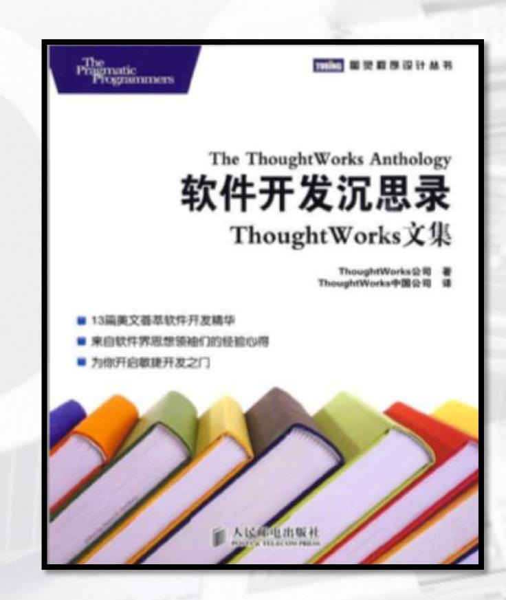

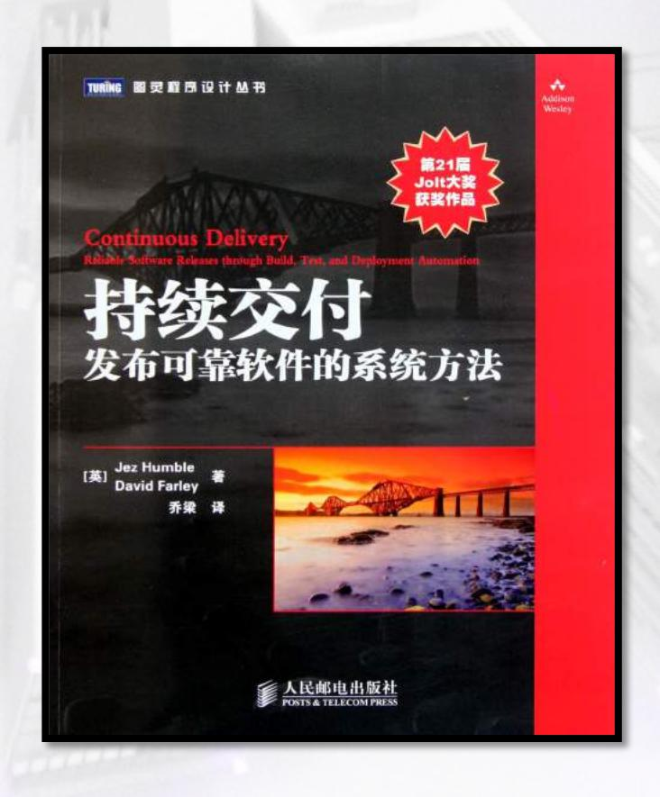

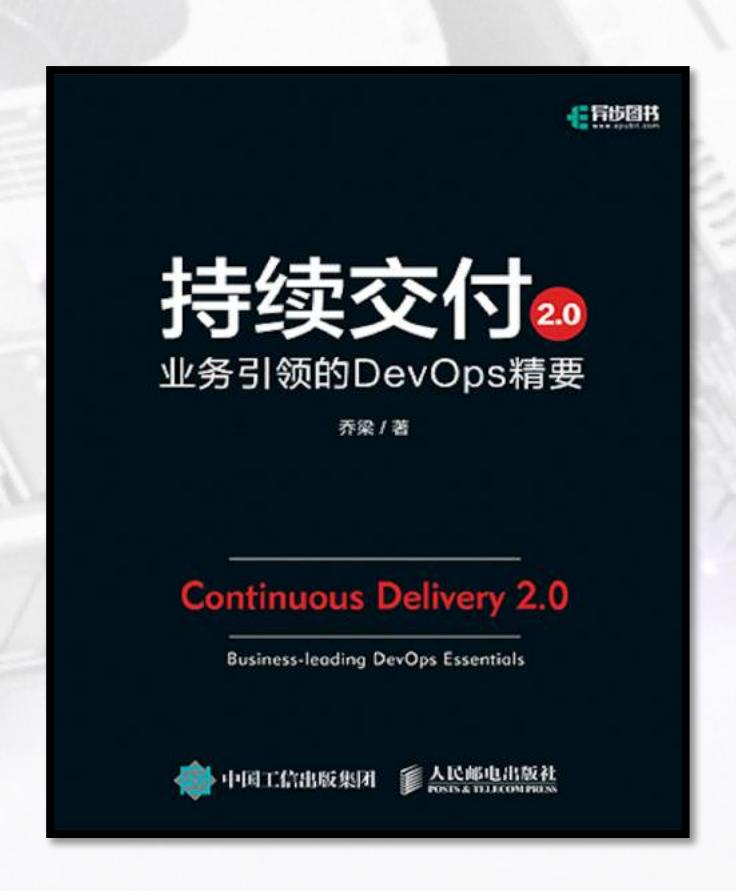

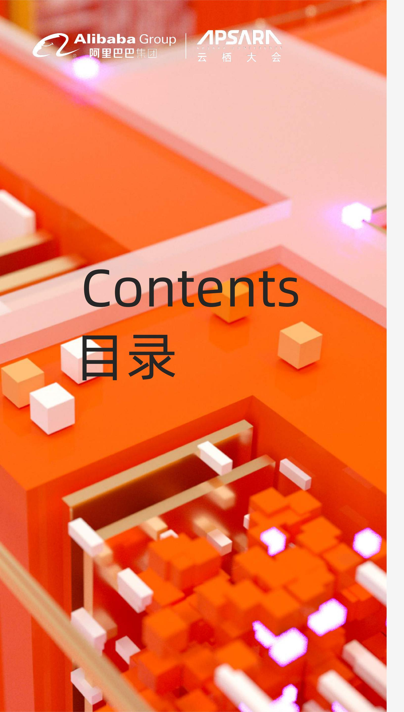

01 㑳偟‖⁊ 'HY2SVѬᾬ′Ὰ₌⍬䔢Ѵ

02 䦆╃㚺副Ѭ⫴㚫慍Ѵ

03 ᾜ⽗䭽副␍Ѭ⫴㕂ⒹѴ

#### 一万次实验法则

66

亚马逊的成功是每年、每月、每周、每天进行多次实验的结果。

"

66

我最为自豪的事情之一是我们成功的关键在于测试框架.....

在任何时候,都不只有一个Facebook版本正在运行,而是一万个左右

## 持续交付和DevOps, 是业务增长的必然要求

业务验证

数据驱动

快速交付

# 持续交付2.0 双环模型

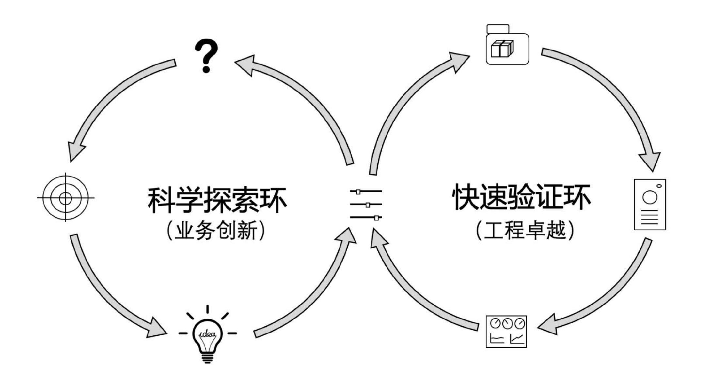

不确定性

#### 一个包含数字的故事

从 2~3-1 到 1-1-1

## 改造过程

## 㱨⧂⑪⺜ẙ㮺

|    |       |       |       |       |  |
|-------|-------|-------|-------|-------|--|
| 8)    | 'RVNG | 'RVNG | 'RVNG | 'RVNG |  |
| 8)    | 'RVNG | 'RVNG | 'RVNG | 'RVNG |  |
| 8)    | 'RVNG | 'RVNG | 'RVNG | 'RVNG |  |
| 8)685 | 'RVNG | 'RVNG | 'RVNG | 'RVNG |  |

# 工具平台支持,流程规则简化

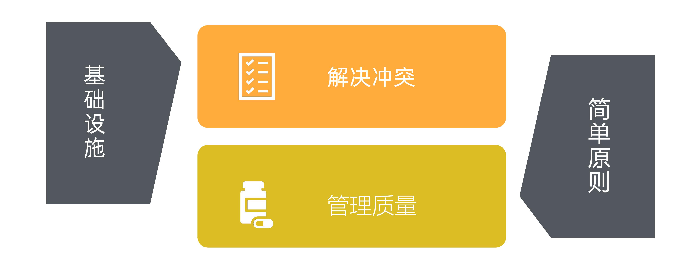

# 持续交付2.0 百变七巧板

基础设施

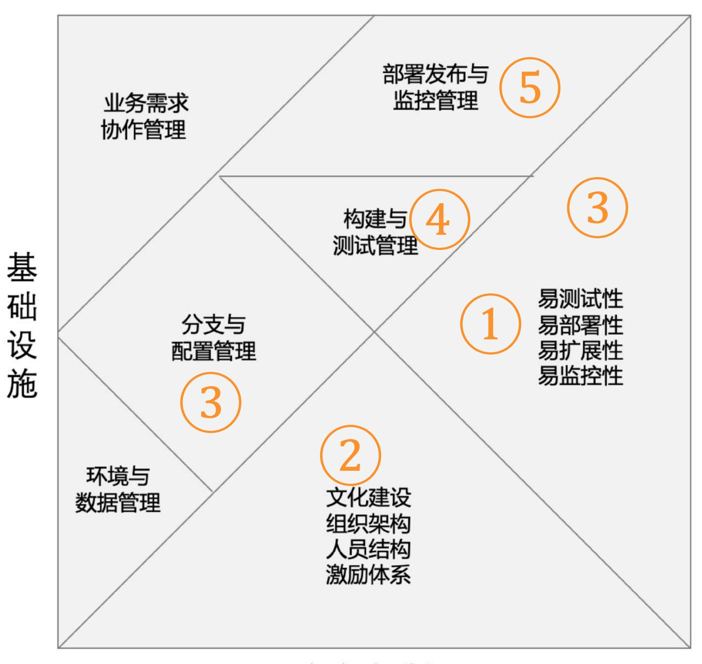

软

件

架

构

组织机制

#### 十倍速法则

如果你希望自己的车子能达到50英里的时速,可能只要对车子稍加改造即可。

然而,如果让它只用1加仑汽油跑500英里,就要对它重新设计了。

——阿斯特罗·泰勒,Google X

#### 十倍速法则

不断重复你一贯的做法,你当然只会得到与以前一样的结果!

只有达到远超要求的水平, 才能轻松实现被要求的结果!

### 研发效能的基本点

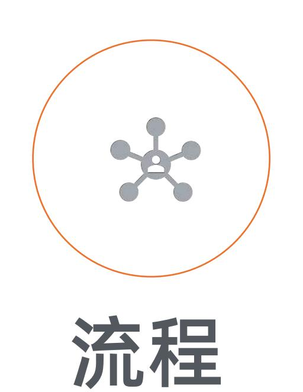

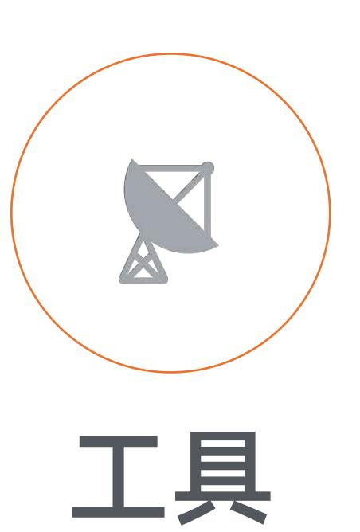

## 研发效能的基本点

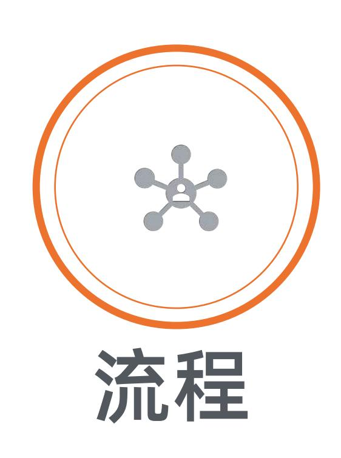

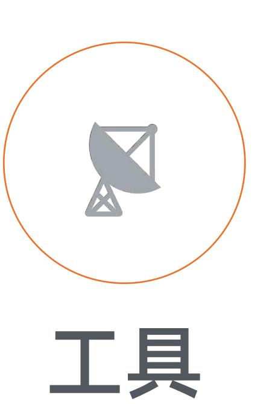

# 小业务单元的协同

less communication, more alignment

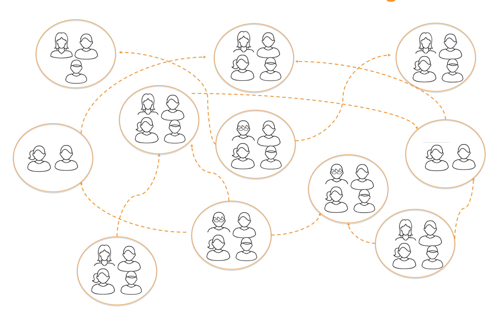

## 研发效能的基本点

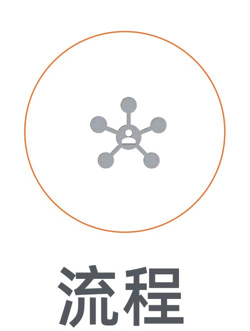

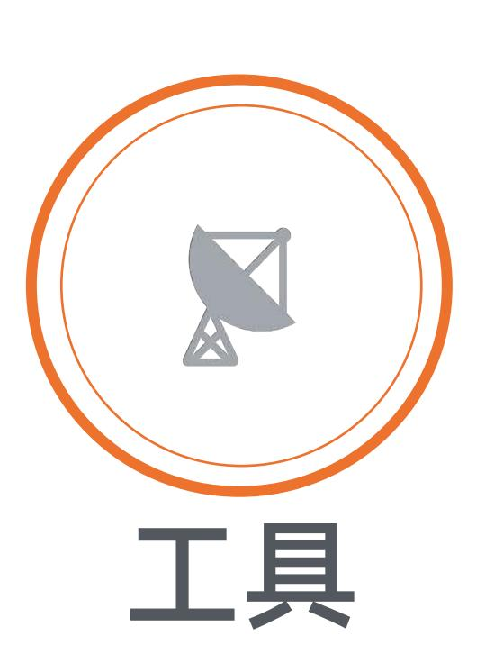

# 更少的重复性事务

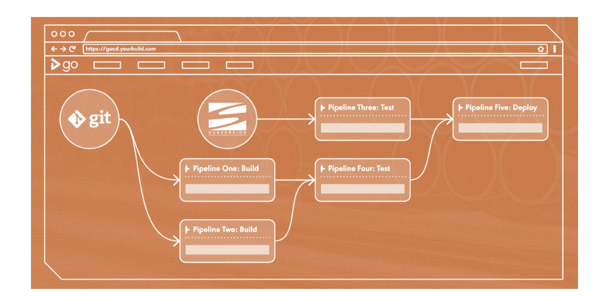

## 研发效能的基本点

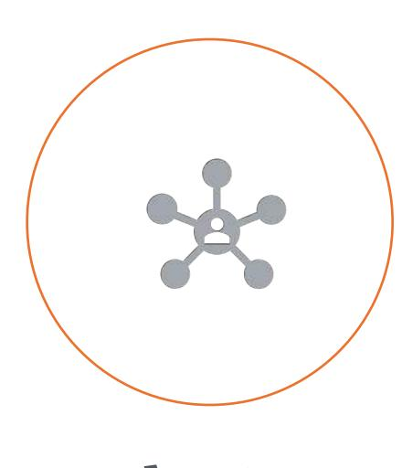

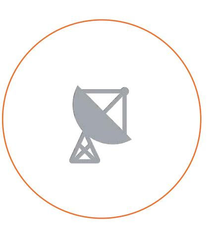

工具

#### 更高的职业化水平

企业与个人的未来之重

业务

产品

开发

测试

运维

# 著名的"烟斗曲线"

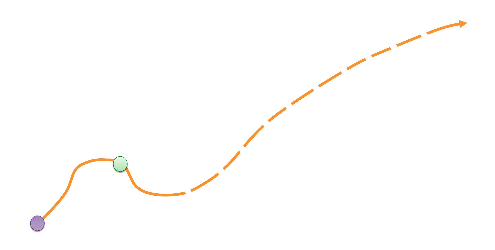

# 一万小时定律

刻意练习

## Ⲩ佬

㑳偟‖⁊ Ѭ ᾌ␓ょ槸䟶'HY2SV丰嫳

┾䔡㮓⣽Ѭ䧠ⴌ㆙ᾀ䧠ⴌ㆙⍸䬭

䭃Ⳙ㔔五Ѭㄷ槭慯㶴⽗䭽䟶Ⓟ廼

䟰╊ή⽙㣱Ѭ㞡倶倹㚫慍䟶⢢⡰㑹ょ

䦆╃㚺副Ѭ嫳㶴㕂Ⓓᾜ䟶冾ᾌ⒈㶦

⒳ⅿ憑┑⎋Ѭ崛⃒廢ㄉ㡦ㅝ㡦慎

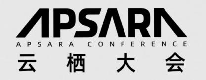

