阿里云·云效

# 阿里巴巴DevOps 实践手册

阿里巴巴DevOps演进史、核心理念与最佳实践

DevOps文化/敏捷开发/持续交付/ 代码管理/测试管理/云原生

阿里云开发者电子书系列

阿里云开发者社区

钉钉扫码或搜索群号35236467 加入阿里DevOps 交流群, 获取2020阿里巴巴研发效能峰会 视频回放及PPT等更多干货

阿里云开发者"藏经阁" 海量免费电子书下载

# 目录

| 开篇  |                             | 5  |
|-----|-----------------------------|----|
|     | 阿里巴巴 DevOps 文化浅谈      | 5  |
| 1.1 | 火遍全球的 DevOps 到底是什么?         | 5  |
| 1.2 | 如何利用 DevOps 进行高效能研发?        | 7  |
| 1.3 | 阿里巴巴是怎样快速落地 DevOps 的?       | 8  |
| 1.4 | 如何享受 DevOps 红利,打造自己的精英交付团队? | 12 |
|     | 敏捷研发篇                       | 16 |
|     | 业务驱动的精益敏捷实践                 | 16 |
| 2.1 | 影响研发效能提升的三大问题               | 17 |
| 2.2 | 实现精益敏捷研发的四大步骤               | 18 |
|     | 代码管理篇                       | 32 |
|     | 阿里巴巴自研代码管理平台技术解密            | 32 |
| 3.1 | 阿里巴巴为什么要自研代码管理平台?           | 32 |
| 3.2 | 阿里巴巴代码管理平台的整体策略             | 33 |
| 3.3 | 云效代码管理平台的核心能力               | 35 |
| 3.4 | 云效代码管理平台的系统架构               | 36 |
| 3.5 | 人工智能技术助力敏感信息监测              | 38 |
| 3.6 | 代码质量—饱受好评的 P3C 代码规约检测插件     | 39 |
| 3.7 | 代码质量—缺陷检测技术 PRECFIX 技术揭秘    | 40 |
| 3.8 | 代码安全—敏感信息检测 SecretRadar     | 41 |
| 3.9 | 智能评审助力开发者提升研发效能             | 43 |

|     | 新一代高效 Git 协同模型详解              | 45 |
|-----|-------------------------------------|----|
| 4.1 | Git 工作流概述及 AGit-Flow 的优势简介          | 45 |
| 4.2 | 在阿里巴巴,我们如何使用 AGit-Flow              | 48 |
| 4.3 | AGit-Flow 实现原理                      | 49 |
| 4.4 | AGit-Flow 实现的技术细节                   | 50 |
| 4.5 | 阿里巴巴开源的客户端工具 git-repo 简介            | 54 |
|     | 持续交付篇                               | 56 |
|     | 企业如何规模化落地 CICD ?              | 56 |
| 5.1 | 如何实现持续交付在阿里巴巴的规模化?                  | 57 |
| 5.2 | 阿里巴巴实现持续交付规模化落地的两大研发实践              | 57 |
| 5.3 | 如何进行全局风险管控?                         | 59 |
| 5.4 | 规模化落地 CICD 的重要一步                    | 60 |
|     | 云原生下的开发测试                           | 62 |
| 6.1 | 如何通过 kt-connect 解决本地与集群双向互通问题?      | 63 |
| 6.2 | KT-Connect 背后的原理                    | 65 |
| 6.3 | 共用测试环境相互干扰问题及常见解决方案                 | 67 |
| 6.4 | 如何使用 kt-virtual-environment 打造项目环境? | 71 |
| 6.5 | 阿里巴巴使用项目环境的最佳实践                     | 72 |
|     | 解决方案篇                               | 74 |
|     | 云效架构师手把手教你搭建 DevOps 平台        | 74 |
| 7.1 | 背景诉求与推进策略                           | 74 |
| 7.2 | 云效与平台能力                             | 77 |
| 7.3 | 一站式 DevOps 解决方案与详细介绍                | 79 |
| 7.4 | 三大案例分析                              | 88 |
| 7.5 | 手把手带你完成一个项目                         | 91 |

# [开篇](#page-2-0)

# [阿里巴巴 DevOps 文化浅谈](#page-2-0)

本文整理自阿里巴巴资深技术专家陈鑫(花名:神秀)的分享《阿里巴巴 DevOps 文化浅谈》。

# 1.1 [火遍全球的 DevOps 到底是什么?](#page-2-0)

首先我们简单看一下什么是 DevOps,这个词从何而来。我在这里把 DevOps 发展历史分为三个阶段:诞生期、定义期和落地期。

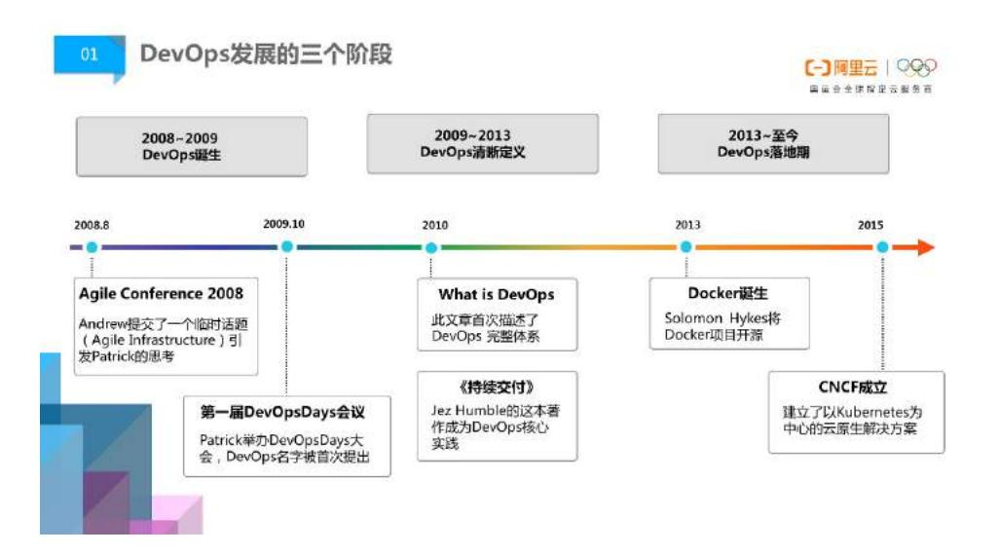

DevOps 的"祖师爷"是比利时一名独立 IT 咨询师 Patrick Debois。2007 年, 他负责一个大型项目的测试和验证工作,一边和开发对接测试代码,一边和运维对接 "发版"。他发现项目组里的开发和运维两个角色的思维方式差异巨大,一边希望"快

快快",一边希望"稳稳稳",这让他有点崩溃。

在 2008 Agile Conference 大会上,Patrick 遇到了 Andrew,两个人一拍即 合,开始琢磨如何改变这种 Dev 和 Ops 水火不容的现状。

2009 年 10 月,Patrick 通过 Twitter 召集开发工程师和运维工程师在比利时根 特市举办了首届"DevOpsDays"大会,开始大规模讨论 Dev 和 Ops 的协作话题。 后来为了便于传播"DevOpsDays"被缩写为"DevOps"。

在 2009 年以后,DevOps 开始火遍全球。2010 年,The Agile Admin 博客发 表文章《What is DevOps》,详细阐述了 DevOps 的定义,包括一系列价值观、原 则、方法、实践以及对应的工具。

同样是 2010 年,《持续交付》的作者 Jez Humble 出席第二届的 DevOpsDays 大会,并做了"持续交付"的演讲。这是非常重要的里程碑,可以说《持续交付》这 本书就是 DevOps 的最佳实践,以至于国内搞研发效能的同学人手一本。也正是这 本书,加速了业界对 DevOps 的理解以及落地。

但我认为业界真正开始大规模落地 DevOps,还是不能离开容器化技术的功劳。 "Docker"起到了决定性作用,通过编写 Dockerfile,第一次可以让开发者轻松定 义软件运行环境,并且能通过 CI/CD 标准化流程去交付它。不过这么多容器运维起 来仍然麻烦,于是 google 在 2014 年开源"k8s"(Kubernetes);2015 年 CNCF (Cloud Native Computing Foundation 云原生计算基金会)成立,正式将"k8s" 作为核心,建立了一个巨大的生态系统。有了"docker"和"k8s"技术上助力,加 速了开发和运维角色的融合,于是 DevOps 不再是空中楼阁。

回顾完历史,我们对照下自身,通过三个小问题来看看自己的团队是不是已经是 "DevOps"了。

- 1. 我每次写完代码都可以部署生产环境,不需要别人帮助。
- 2. 有很多监控、运维工具可以任我使用,轻松处理线上各种问题和故障。

3. 我直接为线上用户的体验负责,不管是代码缺陷还是运维故障,自己搞的自 己背锅。

以上我三个问题,其实分别涉及到了 DevOps 最重要的三个方面,做法、工具、 文化,这三者缺一不可。

# 1.2 [如何利用 DevOps 进行高效能研发?](#page-2-0)

| 软件交付效能的度量                                                                                    | 精美             | 高效能                | 中等效能              | 低效能             |
|----------------------------------------------------------------------------------------------|----------------|--------------------|-------------------|-----------------|
| 部劃放率 针对正在工作的主要培用或服务。你的组织除署代码的规率?                                                          | 信器(有关多次 图者) | 行于幕小时1次 科赛天1次之间 | 介于每周1次和每 月1次之间 | 介于每周1次 月1次之间 |
| 变更前置时间 针对正在工作的主要应用或服务,变更的紧置时间(可从代码类交到代码成功运行在生产 环境需要系长时间)!                              | 0-1-14-H       | 介于(天和)周 之间      | 介于1周和1个 月之前"   | 介于1十月 和6个月之间 |
| <b>證券恢复时间</b> 针对还在工作由主英应用或服务,发生服务过程(领如:针划外中期、服务 受损),依复国务适保需要多条时间?                      | d-于1合时         | 小子1天               | 小于1英              | 介于1周和1月 之间   |
| <b>变塑失效率</b> 针对正在工作的主要运用观照务,有多少百分比的变更全等效量务龄级或需要事后补查? (例如:导致服务变统或服务中部,需要出修复、回滚、运向修复。补丁) | 0-15%          | 0-15%              | 0-15%             | 46 60%          |

什么是高效能研发团队呢?我们可以参考《2018 DevOps 现状报告》里这张表 格:能做到每小时 1 次或者每天 1 次部署,1 天或 1 周能够上线 1 个版本,服务恢复 时间小于 1 天,变更失败率小于 15%。不过这个数字其实并不好看,以我们自己举 例,阿里巴巴研发平台团队,可以轻松做到 1 天多次发布生产,可用性 99.95%,变 更失败率小于 5%。

这些要求在阿里巴巴看起来稀疏平常,那阿里是怎么一步一步走过来的,我们其他 企业应该如何复制这些经验。让我们进入下一节,阿里巴巴的 DevOps 文化落地要诀。

# 1.3 [阿里巴巴是怎样快速落地 DevOps 的?](#page-2-0)

### 1.3.1 阿里巴巴 DevOps 的发展阶段

DevOps 的发展永远离不开技术的变革,在 2008 年的时候,淘宝启动了服务 化 改 造 的 历 程, 创 造 了 Dubbo、Apache Alibaba RocketMQ、TDDL(Taobao Distributed Data Layer)等业界知名的中间件。同时淘宝的巨型应用被拆分,变成 了下单、会员、优惠等一系列应用,而围绕各个子业务场景更是诞生了成百上千个前 台应用。大家可以想象一下当时的开发是怎样的,每周一个固定发布窗口,几百位工 程师在临近发布时提交代码、修改 bug、提交测试。在发布日晚上开始按照顺序进行 逐个发布,如果发布后出现重大 bug,要么当场 Hotfix(修补程序),要么回滚,宣告 发布失败。所有人都被发布日搞的筋疲力尽。第一代自动化发布工具的出现,将发布 能力交还给了开发者,同时也迫使开发者去解耦应用依赖,做到独立发布,业务交付 速度得到了质的提升。后来大家给它起了一个名字,就是"微服务"。

没过两年,随着研发人员越来越多,出现了各种复杂研发规范、各种复杂脚 本、各种 "挖坑""踩坑"等情况,让研发工程师苦不堪言。"这一切必须规范起来", 2013 年时我们建立了统一构建部署平台,将阿里巴巴集团从代码变更到线上发布环 节完全统一起来,进行严管控。

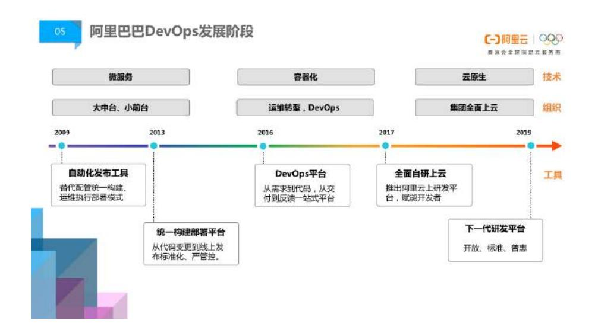

在 2016 年我们又遇到了新问题,当时线上操作需要运维同学统一来做,而运维 同学天然不想去做变更。可以理解,什么都不改的情况下服务是最稳定的。可这在某 种程度上限制了开发者的创新,而且明确的职责分工也限制了开发者去关注自己应用 的线上状态。这种情况,导致研发过程中出现明显瓶颈,这也是为什么阿里巴巴要做 DevOps 的根本原因。随着"容器化"的浪潮来临,我们研发平台再一次升级,将线 上容器定义、运维监控责任全部交给了开发者,应用运维岗位不复存在。

而今天随着云原生技术的逐步成熟,上云已经变成企业标配,围绕云原生去定义 下一代研发平台成为必然。

综上,技术的推动、组织的变化和研发工具的建设,这三者的有机结合才促成了 我们阿里巴巴 DevOps 一步步走向成熟。

### 1.3.2 阿里巴巴 DevOps 落地的工具

前面介绍了宏观上技术和平台的发展,具体来看有以下几个工具对阿里巴巴 DevOps 落地以及研发效能提升发挥了重大作用。

首先是 DevOps 平台"云效",大家常见的开源软件 Gitlab、Jenkins、Jira 这 些平台也曾经是阿里巴巴的一个选择,但是后来我们发现,纯工具类型的软件只能解 决一些单点自动化问题,比如代码管理、构建打包等等。其实在实际开发过程中还有 很多工作无法自动化,比如需求流转的规则,分支管理的规则,开发、测试、运维沟 通的模式等。这些工作我们可以统称为"协作"。

要做好"协作能力"需要的是对人和流程以及效率有深刻的理解,并且将这些 理解抽象成方法,最终做成产品。阿里巴巴通过数年积累,产出了众多独特的研发管 理方法,比如 Aone-flow 代码管理模式、测试环境管理模式、 AGit-Flow 代码管 理模式、双十一分层项目管理模式等等。我们把这些研发管理方法都落地在云效平台 上,最后作用在人身上,潜移默化的影响着开发者协作的文化,也可以说是 DevOps 文化。

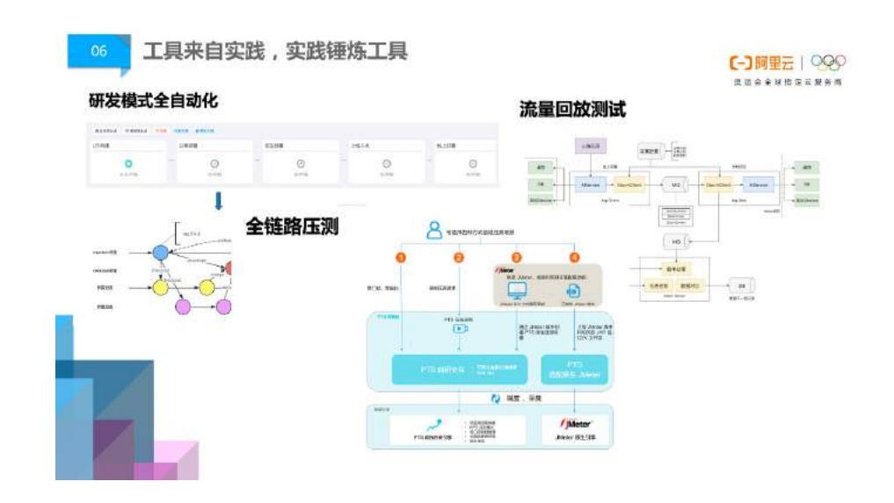

第二个是流量回放测试技术。这项技术的创新给测试团队带来了很大影响,通过 线上流量复制到线下,低成本的解决了测试回归的问题,将传统通过编写用例进行测 试,简化为编排数据进行测试。第二层是 Mock 技术的应用,将一个分布式系统问 题,转化为单机问题,可以在几秒钟完成上千个用例运行。有了这两个基础技术后, 在上层可以发展测试平台,通过算法的手段去识别有效流量,去自动化处理数据,去 识别异常流量背后的缺陷。通过这三层面的变革,可以说让阿里巴巴测试效率有了质 的变化。

第三个是全链路压测技术(对应阿里云上的产品叫 PTS)。双 11 大家之所以能 放心剁手,一年比一年顺滑,核心就是这项技术在每次大促前帮助开发者发现风险。 发现以后就需要快速的响应,通过 DevOps 工具去解决线上问题。每次压测都是一 次练兵,有点类似于军事演习,快速发现问题,快速解决,不断锤炼团队 DevOps 能力,也可以这样说阿里巴巴的 DevOps 能力正是一次一次"双 11"给练出来的。

### 1.3.3 阿里巴巴 DevOps 两大核心理念

当开发开始定义运维,接手运维的时候。我们管理者会不会有些担忧,比如会不 会开发任意操作导致线上故障,随意发布导致稳定性问题等等。

### 阿里巴巴 DevOps 有一个核心理念是松管控和强卡点。

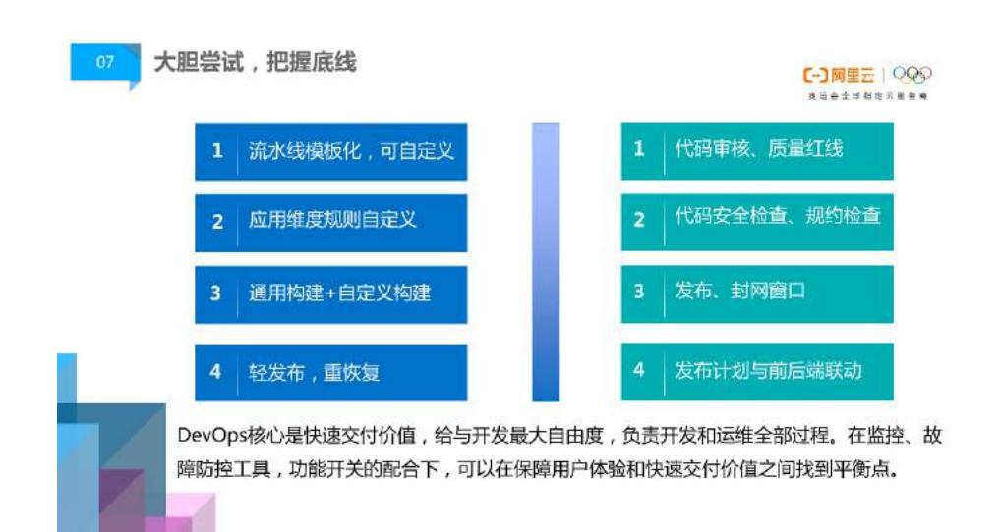

先看"松"在哪里?"松"是指我们有多种流水线可以供开发选择,应用 Owner 可以完整定义这个应用的各种规则,比如如何发布,如何测试,如何进行资源、环境 配置等。我们有通用构建和自定义构建,可以给用户最大自由度。最后是"轻发布, 重恢复"。在每一个应用维度,开发可以随时使用流水线来交付代码,而并不需要特 别的限制,仅仅需要思考的是如果出问题,我们应该如何快速恢复。

在足够的自由度下,我们必须要设置一些"卡点"。比如代码审核和质量红线; 代码安全检查、规约检查;发布、封网窗口等。还有所谓"变更三板斧":可灰度、 可监控、可回滚。这些卡点是为了保障阿里巴巴集团所有开发工程师步调统一,交付 合格的产品。

总结:DevOps 核心是快速交付价值,给与开发最大自由度,负责开发和运维全 部过程。在监控、故障防控工具,功能开关的配合下,可以在保障用户体验和快速交 付价值之间找到平衡点。

另外一个核心理念就是:以应用为中心的 DevOps 理念。应用信息其实可以归 纳为 CMDB 中的一种数据。它对于研发人员天然是亲切的,它可以直接对应一个服 务,一个代码库。以代码为起点,我们又可以串联流水线、环境、测试、资源。最外 围是工具链:监控、DB、运维、中间件等等。

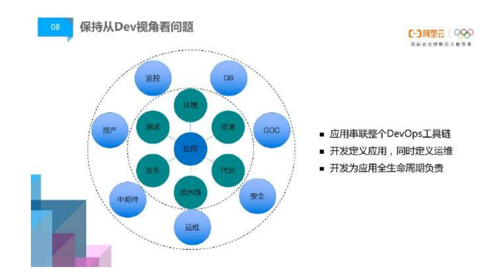

用应用串联整个工具链,可以让开发人员很好的理解和打通 DevOps 整体过程。 不会存在"开发说代码、服务,运维说机器、机房",这种鸡同鸭讲的情况出现。

当工具通过应用打通后,开发人员就可以顺理成章的在平台上定义它的应用,同 时也在定义运维规则。比如,规划环境、创建资源、设置发布策略等等,这些都可以 由开发人员完成。

完成应用和运维定义后,"谁定义就要谁负责",因此在阿里巴巴,开发人员需要 为应用全生命周期负责。通过类似理念和运维工具自动化的推进,"Dev"潜移默化 的接手了"Ops"的工作。这时,你会发现原来"DevOps"并没有那么复杂。

# 1.4 [如何享受 DevOps 红利,打造自己的精英交付团队?](#page-2-0)

通过我们前面提到的阿里巴巴在实践中锤炼的 DevOps 工具,"松管控、强卡 点"和"以应用为中心"的 DevOps 理念,阿里巴巴的 DevOps 得以落地,并获取 实实在在的效率红利。它消除对个人的依赖,降低团队之间的损耗,降低测试成本提 升质量,降低发布软件风险。最终加快企业创新速度,让阿里巴巴在一场一场机会中 可以快速响应。

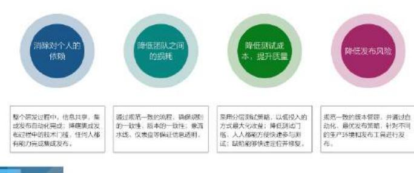

上图是 2018 年我们发布的一些数据,首次提出了"211" 概念:85% 以上的需 求可以在两周内交付;85% 以上的需求可以在一周内开发完成;提交代码后可以在 1 小时内完成发布。我也建议大家能够以"211"来作为自己企业的效能目标,通过先 进的 DevOps 工具、实践和文化,三管齐下,带来红利,而不要为了做而做。

### 1.4.1 云时代带来的新机会

通过前面对阿里巴巴 DevOps 发展的介绍,我们不难发现这样一个循环:我们 在软件研发过程中不断的遇到新的问题,从而催生出新的技术(比如微服务、容器 化);然后新的技术又带来了架构的变革(比如服务化、技术中台);最终形成了软件研 发的新模式。现在云原生技术来了,这项新技术能给我们带来哪些机会呢?

云原生是什么?业界有各种各样的解读,有观点认为:完全使用云来构建应用系 统就是云原生。而从软件研发的角度来看,我认为云原生带来最大的变化是开发者仅 需关注业务逻辑,从而带来极大地效能提升。这是怎么做到的呢?我们对比下传统应 用和云原生应用。

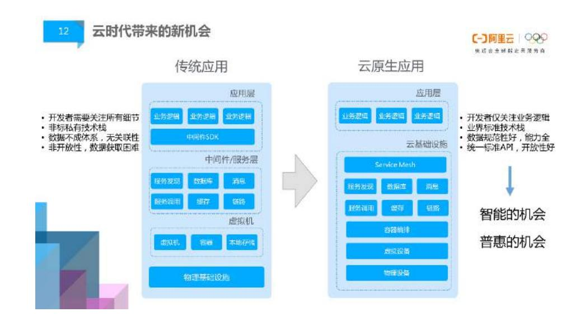

在传统软件研发过程中,开发者的代码会深度耦合中间件,需要关注服务发现、 分库分表、消息处理等多方面。往下也同样需要关注软件部署在哪,需要多少容量, 甚至还需要关注操作系统、存储等问题。

在云原生时代会很不一样,中间件核心能力会下沉到云基础设施之中,一些常见 的限流、降级、鉴权等能力都不需要关心了,数据库、运行环境等都是动态伸缩的, 常见的运维问题也不需要关心。只需要开发好代码,通过软件交付平台自动化的发布 到云端。

软件开发的复杂度其实不会消失,而是换一种方式存在。云原生技术下这种复杂 度会下沉到云基础设施层,通过云去屏蔽这种复杂性。

那这种复杂性怎么解决,其中一个核心就是用数据去解决。在云原生下我们拥有 业界统一的技术标准,比如中间件标准、容器标准等。拥有规范的数据和强大的基础 设施,也可以轻松获取到这些数据。有了这些数据,我们就有机会去创造出各种智能 工具,去解决我们软件开发的复杂度,或者是通过工具帮助开发者工作,降低这种复 杂度。

因此在云原生技术下,我们拥有了前所未有的智能的机会和普惠的机会。

### 1.4.2 云原生时代影响开发者的三大技术体系

在云原生时代,我认为会有这三个技术会给开发者带全新的体验。分别是开 发 态 的 CloudIDE、 运 行 态 的 Service Mesh、 以 及 运 维 态 的 Serverless 技 术。 CloudIDE 将开发环境搬到了云上,而且可以和研发平台深度整合,为开发者提供极 致的编程体验,再也不用关心我在哪里开发,只要有浏览器,打开就可以编码。

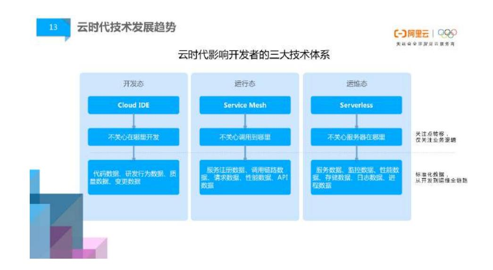

中间件在云时代会逐渐融入到 Service Mesh 技术下,服务路由、限流降级等开 发者将不再关心。

Serverless 技术,让自动扩缩,容量评估变为历史,开发者再也不关心机器在哪。

这三项技术将研发全链路云化,并且产生了大量研发数据、服务数据、运行时数 据。阿里巴巴在最近几年已经开始投入这些数据的挖掘和研究工作,并且和学界保持 着密切的合作关系。

# [敏捷研发篇](#page-2-0)

# [业务驱动的精益敏捷实践](#page-2-0)

本文整理自洪永潮 ( 舍卫 ) 的直播分享《业务驱动的精益敏捷实施》。

随着 5G、人工智能、IOT 等新技术的迅猛发展,企业的业务都将构架在软件和 互联网之上。软件交付能力成为企业的核心竞争力,随着市场竞争的加剧,企业对研 发效能的期望越来越高。

然而新技术、新业态的不断涌现,又使企业的业务变得越来越复杂,各个团队之 间的协作也越来越困难,企业的研发效能呈现降低趋势。"期望"与"现实"之间产 生了巨大的"Gap",正是我们要努力的方向。这就是为什么我们要提升研发效能的 根本原因。

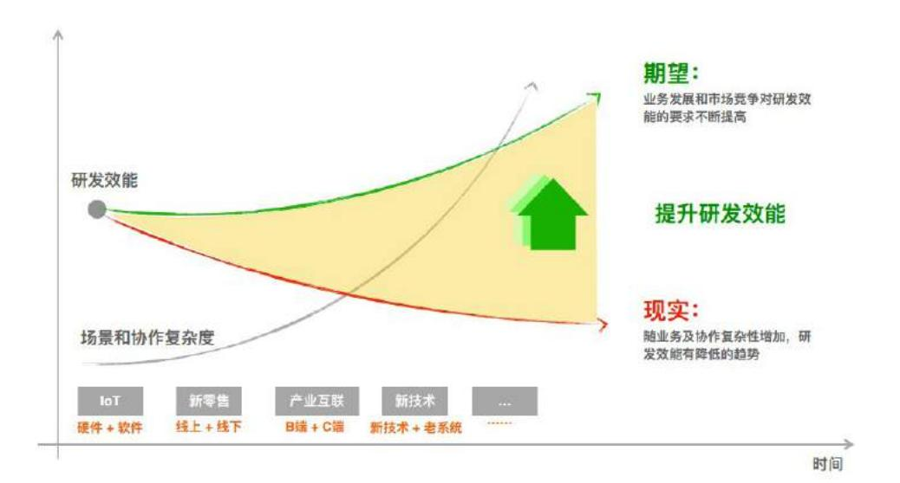

# 2.1 [影响研发效能提升的三大问题](#page-2-0)

为了提升研发效能,我们首先要知道是什么影响了研发效能——我们究竟面临怎 样的挑战?这里有三个"不等于":

### 局部效率 ≠ 高效交付

如何提升"研发效率",很自然想到是让大家都忙起来,也就是提升运营、产品 和技术人员(包括开发、测试和运维)的效率或延长工作时间。大家都忙起来,局部 的效率可能是提高了,但这就意味着高效交付吗?

很多时候,运营、产品、技术各自为战,虽然都很忙碌,但是却"不出活"。这 个"活"不是由我们定义的,而是由用户来定义的。用户不会因为你的繁忙买单,只 会因为你的交付买单。

### 高效交付 ≠ 持续高效

我们如果做到了"高效交付",就可以做到"持续高效"吗?其实也不一定。有 可能是你的团队突击加班了,暂时提升了交付效率,但是无法做到持续高效。也有可 能你暂时产出了软件,却留下了一系列的技术债。软件的质量很差,也没有相应的测 试去维护,也没有去建立工程能力,还是不会持续高效的。

### 高效交付 ≠ 业务成功

即使我们做到了"高效交付",甚至"持续高效",那么业务就一定会成功吗?其 实也不一定。你可能交付了很多需求,但这些不是用户真正要的,用户绝不会长久为 此买单。你能不能吸引用户、并留住用户,产生利润,这才是业务成功的关键。真正 的业务成功,是要能解决用户真正的问题,所以高效交付也不等于业务成功。

### 精益和敏捷的方案是需要解决上面的三个问题:

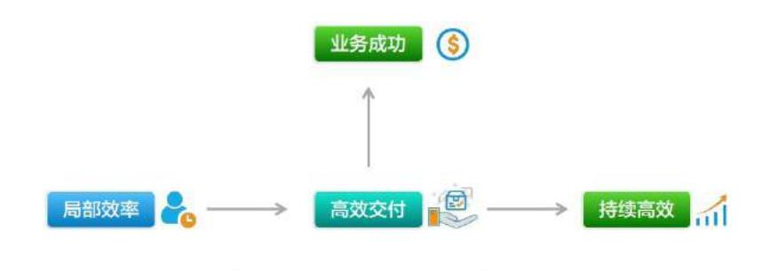

- 从局部效率到高效交付,我们需要做到:顺畅高质量交付。
- 从高效交付到持续高效,我们需要做到:持续地顺畅高质量地交付。对于代码设 计和质量的长期维护和提高,持续工程能力的积累,持续交付实践的实施等。
- 从高效交付到业务成功,我们需要做到:持续地顺畅高质量交付有效价值。

至此,我们定义了问题,也分解了问题,并明确了方向:持续地顺畅高质量地交 付有效价值。

## 2.2 [实现精益敏捷研发的四大步骤](#page-2-0)

### 精益敏捷研发实践框架

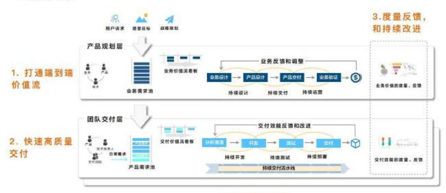

精益敏捷研发实践框架分为三层,第一层是战略和目标,主要包含用户诉求、愿 景目标和战略规划。第二层是产品规划层,这里需要业务、产品、技术之间的敏捷协 作,将战略和目标层的业务诉求形成业务诉求条目后录入业务需求池,然后通过业务 设计、产品设计、产品交付等环节,交付有效价值,并根据业务验证结果,建立业务 反馈进行调整,最终达成业务结果。第三层是团队交付层,在这一层需要产品和技术 团队高效协作,持续澄清,开发和验证需求,并通过自动化交付流水线和持续交付机 制实现快速交付需求。

如何实现精益敏捷研发呢?我们需要做到以下四步:

第一步,我们需要打通端到端的业务价值流。什么叫"端到端"呢?就是要关注 从用户的需求到用户问题的解决这一全过程,而不是中间的某一个阶段。这就需要我 们的业务、产品、技术进行协作。

第二步,快速高质量交付,即更快更好地交付需求。

第三步,度量反馈和持续改进。我们期望产品交付过程是可被度量的,同时可驱 动交付团队持续改进。

第四步,规模化实施。有了以上三步,其实还不够,我们需要赋能整个企业或组 织,进行规模化实施。

后面,我会详细介绍这四步如何实施。

精益敏捷研发第一步:打通端到端的业务价值流

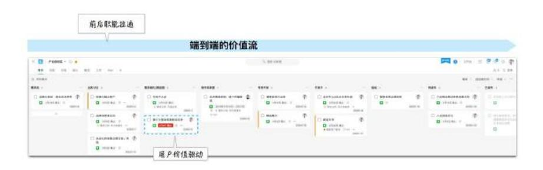

可见,是协作的基础。我们可以通过云效的"看板"实现端到端需求流动过程的 可视化,如上图所示在"看板"的最左端是需求池,最右端是"已发布",其中包含 了业务、产品、开发、测试和运维在内的端到端交付过程。打通端到端的业务价值流 必须做到:用户价值驱动,即每一个流动单元体现的都是具有用户价值的业务需求; 前后职能拉通,即拉通业务、产品、开发、测试等各个职能一起来看整个链路,始于 用户问题的提出,终于用户问题的解决。

建立端到端的需求流动过程,并利用云效看板实现可视化,这是提升效能的基 础。下一步需要明确各阶段的准入准出标准。

明确各阶段的准入准出标准,即明确流转规则,是内建质量的重要手段。团队要 达成对规则的一致理解并共同守护和持续改进。

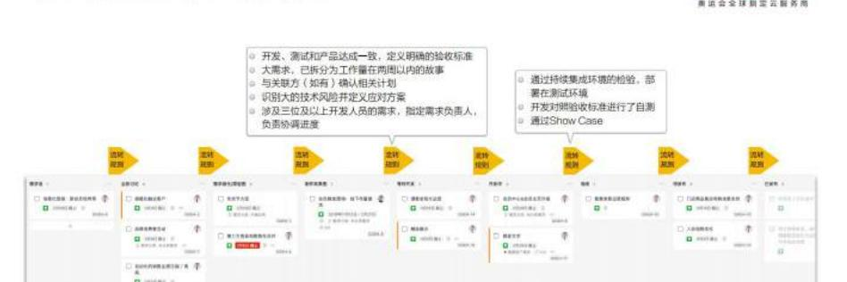

如上图所示,从阶段"业务讨论"开始到"已发布"都需要有明确的准入规则。 举两个具体的例子,一个是从"产品"流入"开发"的规则:

- 开发、测试和产品达成一致,定义明确的验收标准。
- 大需求,需拆分为工作量在两周以内的故事。
- 与关联方(如有)确认相关计划;- 识别大的技术风险并定义应对方案。
- 涉及三位及以上开发人员的需求,指定需求负责人,负责协调进度。

- 第二个例子是从"开发"到"测试"的流转规则。
- 通过持续集成环境的检验,部署在测试环境;
- 开发对照验收标准进行了自测。
- 通过 Show Case。

从"业务讨论"到"已发布"每个环节都需要有一个明确的准入准出规则,这里 不再赘述,大家可以根据实际情况去定义自己的规则,这些规则不是一成不变的而是 需要持续更新、持续迭代。

明确准入准出标准,是为了保证有质量的流转。为了更好的达成业务效果,接下 来需要建立业务价值反馈闭环。

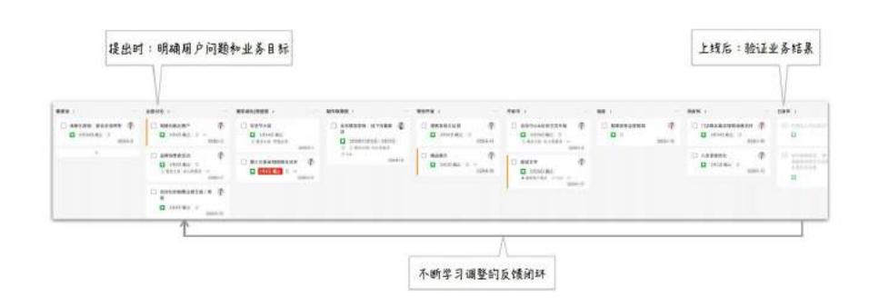

针对已上线的需求,经过一定的时间后(钉钉是需求上线后的 7 天,查看业务效 果,即 T+7 读数会,不同业务可以根据自己的情况设定时长),根据产品规划时明确 的业务目标和要解决的用户问题,去验证业务目标是否已达成,用户问题是否已被解 决,然后做相应的优化和调整。

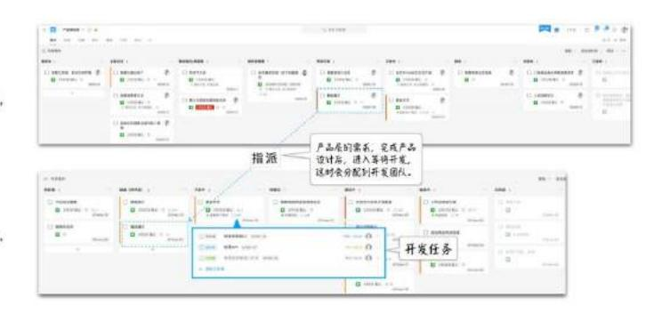

什么样的需求才能流转到开发中呢?我们需要为交付团队提供高质量的需求。在 产品规划层:需要聚焦端到端的流动效率,并形成价值反馈闭环。而在团队交付层: 需要聚焦快速交付业务需求,并保证交付质量。当需求从"产品规划层"流转到"等 待开发"这个阶段的时候,需要"指派"给开发团队。需求进入开发团队后,开发同 学会把它拆分为"任务",比如说按照"前后端"会拆分为"前端任务""后端任务", 针对无线端的任务会拆分为"iOS 任务""安卓任务"等。只有当所有"任务"开发 完成后,满足"提交测试"要求了,才能"提测"。

### 精益敏捷研发第二步:快速高质量交付

下面我们接着讲精益敏捷研发第二步,如何快速高质量交付。在软件研发过程 中,大多数的时间浪费不是协作上的等待,而是做了很多无价值的需求,以及需求不 停地返工。因此发生在软件开发之前的需求澄清工作至关重要。

如何做好需求澄清呢?首先,实例化需求。我们的经验是业务、产品、开发和测 试一起坐在一起,从场景出发,以用户的操作实例来澄清需求。实例是具体的,其典 型形式是:"在什么情况下,做什么操作,会得到什么结果"。基于具体的实例,更加 便于沟通中的双向确认,保证理解的一致和场景覆盖。

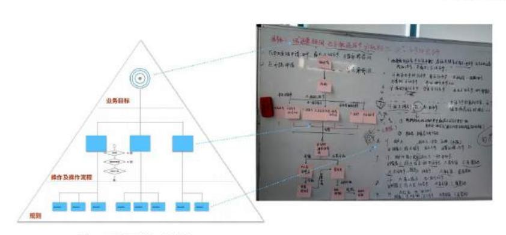

在需求澄清时需要注意:以终为始,确保需求输入质量。如上图左侧的"三角" 所示,首先要讲解业务目标,也就是要解决用户或业务什么问题。 其次操作及操作流 程,为了实现上面目标,系统需要支持哪些用户操作?这些操作的流程是什么样的? 再次是业务规则,各个操作步骤对应的业务规则是什么样的?业务规则会转化成验收 标准。

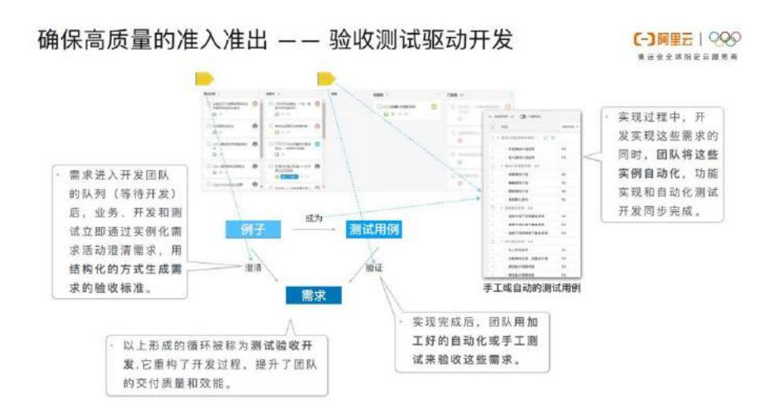

完成需求澄清之后,我们进入第二步,验收测试驱动开发,确保高质量的准入准 出。如上图所示:

- 需求进入开发团队的队列(等待开发)后,业务、开发和测试立即通过实例化 需求活动澄清需求,用结构化的方式生成需求的验收标准。
- 在开发实现这些需求的同时,团队会将这些需求实例会转化成测试用例,并把 部分测试用例自动化,做到功能实现和自动化测试开发同步完成。
- 需求实现完成后,团队会有加工好的测试用例来验收这些需求。甚至可以将部 分测试用例提前给到开发人员,让开发提前进行自测。

以上形成的循环被称为验收测试驱动开发 , 这个研发实践在阿里巴巴集团内部和 外部都得到大量应用,它重构了开发过程,可有效提升团队的交付质量和效能。

当业务需求由产品规划层进入到团队交付层之后,会有两种研发模式来完成需求 的开发,持续交付模式和迭代交付模式。我们先来分享一个持续交付模式的实践:限 制在制品数量,提高交付速度。

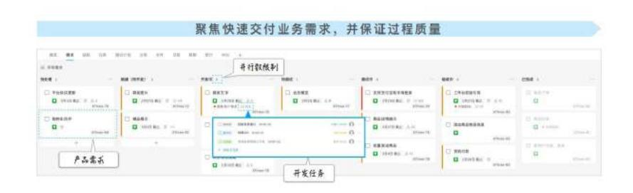

如上图在云效的"看板"上,我们可以看到这里的一个"卡片"代表一个业务 需求,在"开发中"后面有一个数字(上图中是 3),这代表着并行开发的需求数量。 限制并行需求的数量,目的是尽快完成已开始需求,加速需求的流动。更重要的是, "限制并行"能更快暴露问题。因为并行开发的需求有限,当某个需求发生阻塞时, 很容易被发现。

并行的需求又被称为"在制品"。在云效看板上,所有已经开始,但还没有完成 的需求(或其他工作)都是在制品。限制在制品数量的基本原则是:"聚焦完成,暂缓 开始"。一般而言,在制品数量越少,交付速度越快。源自"精益思想"的"利特尔 法则"解释了背后的原理,感兴趣的同学可以自己去搜索了解,这里不再赘述。

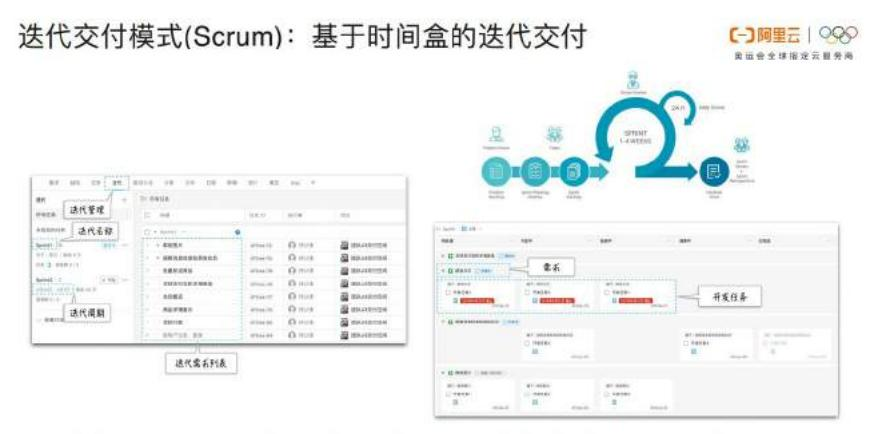

云效也支持迭代交付模式,并提供迭代管理、迭代需求管理、迭代活动管理、测 试用例管理、缺陷管理、度量统计等功能,大家可以去云效官网试用体验。关于迭代 交付模式 (Scrum) 业界有很多介绍,我们这里不详细讨论。

### 精益敏捷研发第三步:度量反馈和持续改进

怎样知道研发团队真的做到了高效交付呢?我们需要对研发效能进行度量,并建 立反馈闭环,持续改进。

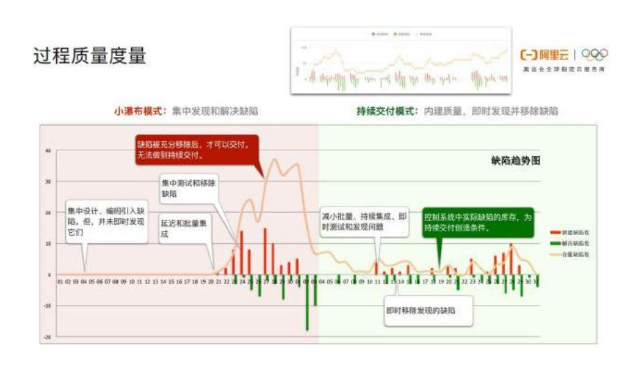

我们一般用"缺陷趋势图"来度量"交付质量"。如上图所示,图形的横坐标是 日期,横坐标上方红色竖条代表这一天发现缺陷数量;横坐标下方绿色竖条代表当天 解决的缺陷数量;橙色曲线代表缺陷存量。图中左右两个部分比较了两种交付模式。

左半部分,团队属于小瀑布的开发模式。"迭代"前期,团队集中设计、编码, 引入缺陷,但并未即时地集成和验证。缺陷一直掩藏在系统中,直到项目后期,团队 才开始集成和测试,缺陷集中爆发。

小瀑布模式下,交付质量差,带来大量的返工、延期和交付质量问题。该模式 下,产品的交付时间依赖于何时缺陷能被充分移除,当然不能做到持续交付,也无法 快速响应外部的需求和变化。并且这一模式通常都导致后期的赶工,埋下交付质量隐患。

右半部分,团队开始向持续交付模式演进。在整个迭代过程中,团队以小粒度 的需求为单位开发,持续地集成和测试它们,即时发现和解决问题。缺陷库存得到控 制,系统始终处于接近可发布状态。这一模式更接近持续发布状态,团队对外的响应 能力随之增强。

缺陷趋势图从一个侧面反映了团队的开发和交付模式。它引导团队持续且尽早发 现缺陷并及时移除它们。控制缺陷库存,让系统始终处于接近可发布状态,保障了持 续交付能力和对外响应能力。

云效其实已经有了这种"缺陷趋势图",而且是自动产生的,不需要手动绘制。

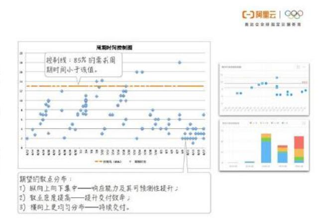

我们使用"周期时间控制图"来度量"交付效率"。如上图所示,横轴代表日期,竖 轴是天数,一个一个蓝色的点代表已经发布的需求。期望这些蓝色的散点进行如下分布。

- 1. 纵向上向下集中——需求交付周期和开发周期越短,业务响应能力及其可预 测性越高。
- 2. 散点密度提高——散点密度越高代表发布频率越高,发布的能力就越强。
- 3. 横向上更均匀分布——横向上的需求分布是均匀的,代表是持续交付的。

在度量一个研发团队的交付效率时,我们会看这些散点分布的趋势是否是往下 走的,如果是往下走的,说明交付效率在变好。此外,还会看"控制线",在上图中, 我们看到这个研发团队的周期控制线是 13 天,这表示 85% 的需求周期时间都要小 于 13 天,这也代表了该研发团队的交付效率。

在云效上也提供了"需求开发周期控制图",同时提供了"需求开发周期报表", 这个报表不但包含了"吞吐量",还包含这个需求是多长时间内交付的等信息。

在阿里巴巴集团内部,也有一套可行动的效能度量体系,包含需求响应周期、持 续发布能力、交付吞吐率、交付过程质量、交付质量等五组指标。

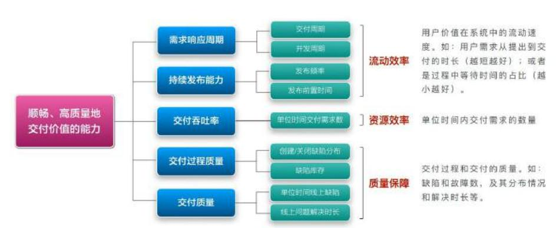

这五组度量指标内容又被归纳为三个维度,即流动效率、资源效率和质量保障。 其中,持续发布能力和需求响应周期这两组指标反映价值的流动效率;交付吞吐率反

映资源效率;交付过程质量和对外交付质量这两组指标共同反映质量水平。用六个字 来概括这三个维度就是:又快、又多、又好。

有了度量标准之后,我们还要建立效能反馈和改进闭环,才能更好地提升研发效能。

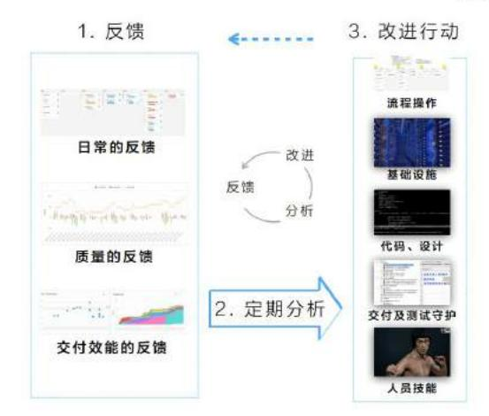

通过日常反馈,质量和交付效能的反馈,并定期进行复盘分析,形成流程操作、 基础设施、代码与设计、交付及测试守护和人员技能等五个方面的改进行动,然后持 续反馈、分析和改进。

在实际的操作中,我们发现经过复盘会议后,会产生一些"改进的行动项",但 是这些"Action"的跟进却很困难,往往跟着跟着就跟丢了。在云效当中有一个比较 实用的功能,可以将改进的行动项转换成督办任务进行跟进,让行动项妥妥落实,持 续促进组织效能提升。

### 精益敏捷研发第四步:规模化实施

在讲"规模化实施"之前,我们先来学习一句话。斯蒂芬·丹宁(Stephen Denning)曾说"我们需要的是敏捷的规模化,而不是规模化敏捷(方法)"。什么意 思呢?我们希望持续地顺畅高质量交付有效价值的能力被规模化,而不是简单地规模 化这种方法。

如果一个研发团队做到了前面三步,即"打通端到端的业务价值流""快速高质 量交付""度量反馈和持续改进",我们认为该团队具备了持续地顺畅高质量交付有效 价值的能力,但是这还不够,我们需要将这种能力规模化,并赋能整个企业。

前面主要讲述的是"单产品单交付团队"的敏捷研发模式,下面我们来看一下如 何将这种能力拓展至"单产品多交付团队"及"多产品多交付团队"。

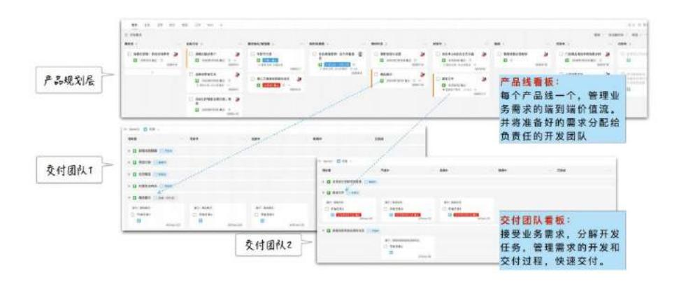

如上图所示,是一个"单产品线多交付团队"的案例。在产品规划层,具有一个 产品线看板, 管理业务需求的端到端价值流,并将准备好的需求分配给负责任的开发 团队(指派给交付团队 1 或交付团队 2)。在交付团队层,有两个独立的交付团队,他 们的操作其实跟单产品线单交付团队时并没有不同。只需要接受业务需求,分解开发 任务,管理需求的开发和交付过程,快速交付。

在企业中也常常会出现"多条产品线多交付团队"的情况,比如下图所示是一家 物流企业的实际案例。

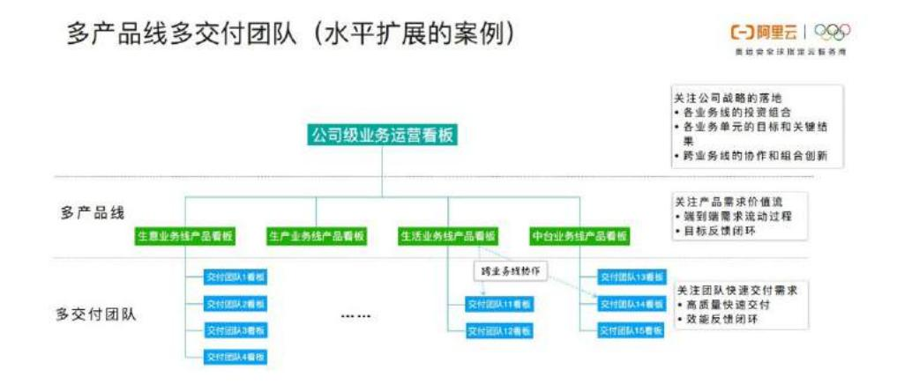

他们有三层看板。第一层是公司级业务运营看板,关注公司战略的落地,如各业 务线的投资组合,各业务单元的目标和关键结果,跨业务线的协作和组合创新等。第 二层是产品线看板,主要关注产品需求价值流,如端到端需求流动过程,目标反馈闭 环等。第三层是交付团队层,主要关注团队快速交付需求,如高质量快速交付,效能 反馈闭环等。

我们可以看到每条产品线都对应多个不同的交付团队,如果各个产品线之间没 有任何"交叉"就比较简单了,操作方式类似前面提到的"单产品线多交付团队"模 式。但是也可能出现"跨业务线协作",这就需要在产品规划层进行拉通。比如在这 个例子中"生活业务线产品" 的某个功能可能要依赖"中台业务线产品"的某个功能, 生活业务线的产品经理就需要将开发需求"指派"到"交付团队 14",让"交付团队 11"和"交付团队 14"协作完成需求的开发。

### 总结

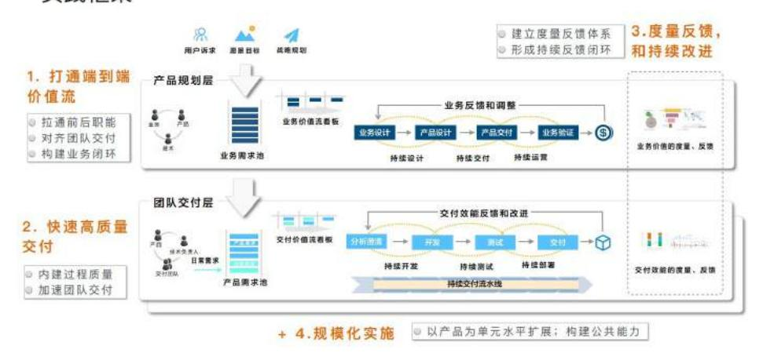

前面我们讲到了提升研发效能的方向是要持续地顺畅高质量交付有效价值。介绍 了敏捷研发实践的三层框架:目标层、产品规划层、团队交付层。最重要的是精益敏 捷研发的四个步骤:打通端到端价值流;快速高质量交付;度量反馈和持续改进;规 模化实施。

想要落地精益敏捷开发,欢迎体验云效项目协作,

立即前往:https://www.aliyun.com/product/yunxiao/codeup?spm=dianzishu 30 人以下企业还可申请小微企业扶持计划,免费使用云效 DevOps 一站式套餐。

# [代码管理篇](#page-2-0)

# [阿里巴巴自研代码管理平台技术解密](#page-2-0)

# 3.1 [阿里巴巴为什么要自研代码管理平台?](#page-2-0)

也许你会问:为什么阿里巴巴要重新做一套代码管理平台,继续用 GitLab 版本 不是挺好的吗?接下来从我个人的角度在这里尝试进行解答。

由于历史原因,在阿里巴巴集团内部代码平台是整个 DevOps 领域中起步相对 较晚的一块业务域,相比于发布域、测试域有着多年的积累和沉淀来讲,2017 年时 的代码平台可以说是为了满足整体业务需求由几个系统强行拼凑起来的。

为了支撑起阿里巴巴整体的业务发展,研发团队要同时维护 6 个系统,分别是 负责代码托管的 GitLab、Svn、Gerrit,以及负责上层代码服务的 Phabricator、 CodeCenter、ScmCenter。且其中除了 CodeCenter、ScmCenter 之外,其它 四个均是在开源系统之上二次封装改造而来的。其中 Gitlab 技术栈是基于 Ruby, Phabricator 基于 PHP,SVN 基于 C,Gerrit 基于 Java, 这给我们日常的开发和维 护工作增加了很多负担。

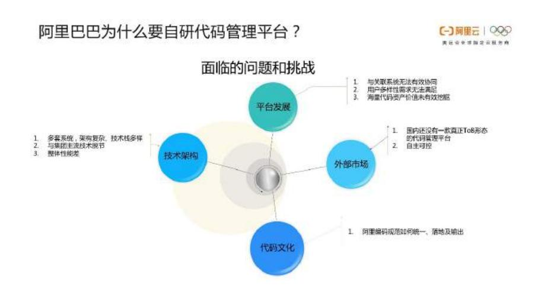

当时代码平台遇到的困难和挑战主要有四个方面:

- 一、技术架构方面:多套系统架构,多种开发语言,不仅维护成本高,且与阿里 集团的主流技术脱节,研发团队同学每天疲于填坑,然而整体上却得不到大的改善。
- 二、平台发展方面:单纯的 Gitlab、Svn、Gerrit 均无法与周边关联系统做到有 效协同,且用户的多样性需求也很难在某个单一系统中得到满足,最关键的一点是我 们虽然手握海量代码资产,但其宝贵价值却未有效挖掘出来。
- 三、外部市场方面:代码托管领域的市场是很有发展潜力的,但国内还没有一款 真正 To B 形态的代码管理平台。这是因为对于科技企业来讲,代码是最核心的资产, 企业把代码托管到谁的平台就等于把身家性命托付给了谁。因此一款 To B 形态的代 码管理平台必须具备丰富的企业级特性以及完备的安全能力,然而在这一方面国内代 码托管产品还有很长的路要走。

同时这也是"自主可控"的需要。作为托管代码的基础平台进行国产化既是大势 所趋也是时代所需。只有将核心技术和产品把控在我们中国人自己手里才能从容面对 未来各种不确定性。

四、代码文化方面:即如何正向推动阿里巴巴的代码文化传承。

# 3.2 [阿里巴巴代码管理平台的整体策略](#page-2-0)

针对于以上代码平台所面临的四个方面的问题和挑战,该如何去解决,我们的整 体思考和策略如下:

- 第一、统一架构,夯实基础:必须要统一架构,不能再在开源系统上拼拼凑凑, 需要有一套完全能自主掌控的自研系统,从头夯实好基础。
- 第二、全面融合,高效协同:需要解决 6 套老系统如何与该自研系统过渡,同时 该系统应该与 DevOps 领域中其它上下游系统能够方便的打通、协同。

第三,代码文化,品牌建设:在代码平台建设的同时,要考虑如何对阿里巴巴的 代码文化和理念进行正向引导,从而做到以工具和平台作为载体,使代码文化进行有 效落地。同时还要进行我们自己产品的品牌建设。

第四,拥抱智能,弯道超车:面对竞品我们如何才能真正脱颖而出、打出差异 性,答案就是拥抱智能,通过智能化的手段进行弯道超车。

基于以上策略,我们开始了自研之路,全新的代码管理平台先是在阿里巴巴集团 内部进行落地,进而解决了前文中提到的四个方面的问题。

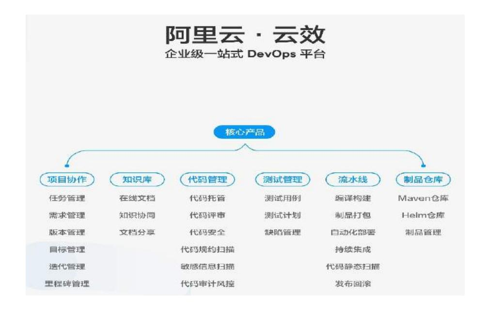

经过充足的准备,我们将这款自研代码管理平台集成到云效中,成为了"云效代 码管理平台",即 Codeup,目前开发者可从云效官网访问并免费使用。"云效代码管 理"(Codeup)是一款企业级代码管理平台,提供代码托管、代码评审、代码扫描、 质量检测等功能,保护企业代码资产,实现安全、稳定、高效的研发生产。抛开产品 设计或团队打造这些方面,我们在技术上究竟是如何做的,这个我会在后面进行详细 介绍。

# 3.3 云效代码管理平台的核心能力

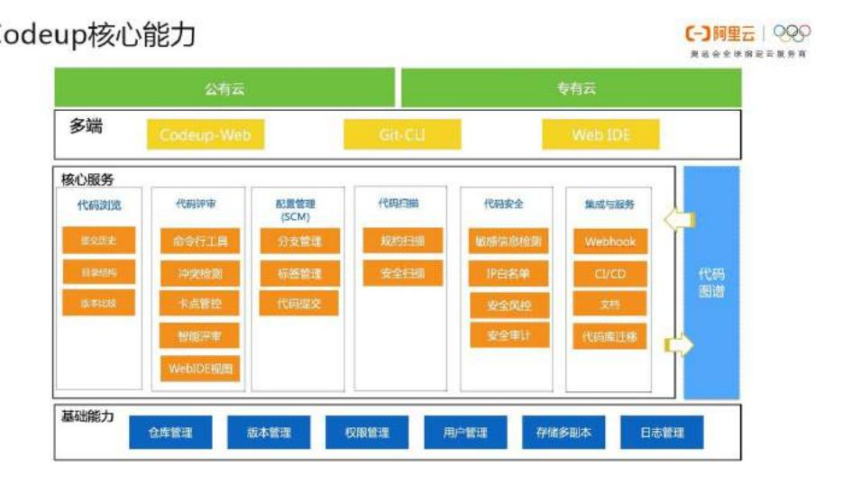

云效代码管理(Codeup)主要提供代码浏览、代码评审、配置管理(SCM)、代 码扫描、代码安全、CI/CD、文档、代码库迁移等能力和服务。

很多企业的技术负责人也许会纠结一个问题:将代码托管到云上是否安全?

一些企业在最终进行代码托管时,均会选择自己搭建代码托管系统,其实阿里早 期也是如此,因此我们深知其中利弊。自己搭建代码托管系统,就需要做以下相关工 作:首先,需要选择适合企业代码托管场景的开源软件;其次,准备托管的硬件设施。 在此过程中,必须满足一些特定的要求,如需要对开源软件比较熟悉的技术人员进行 搭建与维护;需要花费成本去购买实体或云端服务器;同时需要投入人力来负责安全 及稳定性,否则就可能因为系统的稳定性而影响研发效率。

如果采用成熟的云端代码托管平台,就可以很好的避免上述问题。以云效代码管 理平台(Codeup)为例,在代码存储方面,我们采用多副本高可用架构,数据自动备 份;在代码安全方面,我们提供完善的安全权限机制和保护措施,降低内部成员泄露 代码数据和外部黑客攻击的风险。

综合来看,对于中小企业及大型企业的开发人员,选择成熟的云端代码托管平 台,是更安全更省心更经济的选择。

# 3.4 [云效代码管理平台的系统架构](#page-2-0)

早些年,阿里巴巴集团内部采用的是 AliGitLab 系统架构,虽然在 Gitlab 上进行 了分布式的改造,使这套系统的承载能力得到很大的提升。但是 AliGitLab 在架构上 仍然属于单层分片架构,因为 Web 服务和 Git 托管这两个核心组件其实是部署在同 一台机器上的,耦合十分严重,扩展能力非常差,且整个服务模块都是基于 Ruby 技 术栈。这就使整个架构存在两个弊端:一是整个体系基于 Ruby,导致维护、扩展以 及人员培养成本都很大;二是 Web 服务和 Git 托管耦合在一起,很多情况下会因为 某个节点上代码库读写占用大量资源而对用户在该节点上的页面访问或 API 服务请求 造成影响。

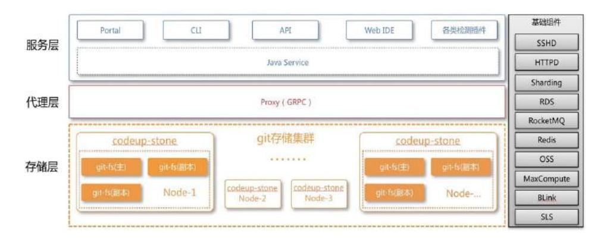

针对上述问题,我们在云效代码管理平台(Codeup)上实现了全新的架构。通 过明确的抽象、分层,将 Codeup 整体划分为三层,即由下至上为存储层、代理层 和服务层。同时抽取出 5 个系统核心组件,服务组件间彼此职责单一、分离,上层 Service 和 Portal 基于 Java 进行实现,无状态;存储层及代理层组件全部用 Go 语 言编写。Codeup-stone 主要负责文件存储及底层 Git 操作的封装,其上抽取一个中 间代理层,各层之间基于 GRPC 协议进行高效的数据传输。服务层的各项请求都基于 Codeup-Proxy 去与存储层打交道,从整体上大幅增强了系统的容灾能力和扩展性, 每一层都可以做到方便的扩容、缩容。这套自研系统架构经过多年打磨和演进,在阿里 巴巴集团内部承载起了数万工程师,上百系统的大规模、高并发的日常调用压力。

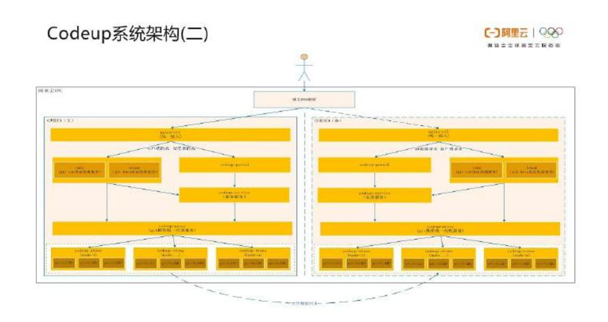

在开发者最关心的稳定性和文件存储方面,我们采用了多节点"分片"和单节点 "一主多备"以及跨机房"冷备"的手段,来保障数据的高安全和高可靠性。同时云 效代码管理平台(Codeup)全部组件均架构在阿里云基础设施之上,以此来确保存 储、应用服务器、网络等硬件方面的安全稳定。

在数据存储和高可用方面,我们具体采取了以下三点措施:一、在底层存储节点 上,对代码库进行哈希散列处理,从而避免存储节点因为仓库分布不均匀而成为"热 点";二、针对单个节点可能因为存储"大库"而成为"热点"的问题,Codeup 通 过多副本的方式对单个节点的请求进行负载均衡,根据实际流量,可以进行快速的扩 容或缩容;三、在仓库数据备份方面,我们采取了多份热备份和一份冷备份的方案。 其中,热备份至少会存在两份,冷备份存储全量的数据快照。针对用户由于误操作产 生的数据删除等不可逆的问题时,我们可以通过冷备份的数据快照进行恢复。目前快 照数据保存的周期为一周。

除了基础架构,我们在代码智能化、代码规范化等方面也做了大量的投入。基 于阿里巴巴集团内部海量的代码数据,在代码安全、代码质量和研发提效等方面 的我们都进行了大量探索和创新。这次也是希望借助我们自研的云效代码管理平 台(Codeup)将这些优秀的能力开放出去,普惠更多中小企业。接下来,我会针对 Codeup 上代表性的功能和工具进行详细介绍。

## 3.5 [人工智能技术助力敏感信息监测](#page-2-0)

首先,我们来了解一下云效代码管理平台(Codeup)在企业智能安全方面的功 能。我们为企业管理者提供了安全风控、审计日志、IP 白名单等把控代码库安全的核 心能力。今天主要介绍一下敏感行为监测,我们是如何做的。

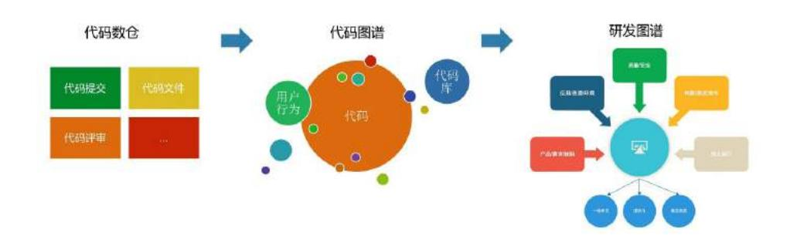

首先,我们以代码数仓为基础构建了代码图谱,通过对代码库、代码、工程师 进行抽象将其转化为实体,并通过实体的标签化构建代码画像、用户画像等。为智能 服务提供有力的数据支持,为平台业务提供推理关系查询。在敏感行为检测这个例子 中,我们提取出了代码库重要度、文件重要度、代码段重要度、开发人员近期浏览行 为、开发人员画像作为安全防护的支撑内容。一旦有重要库、重要文件发生敏感操 作,如突然的大量代码库下载、删库、权限变更等行为,我们会立刻给订阅用户发送 通知告警,帮助企业管理者感知风险,及时止损。

# 3.6 [代码质量—饱受好评的 P3C 代码规约检测插件](#page-2-0)

在代码质量方面,云效代码管理平台(Codeup)内置了我们自研的 P3C 代码规 划检测插件。这款插件在阿里巴巴内部饱受好评,使用广泛;目前已经开源,在业界 也很受欢迎,无论是插件的下载量,还是在 Github 源码工程上的加星数都很高。 那 么,P3C 技术上是如何实现的呢 ?

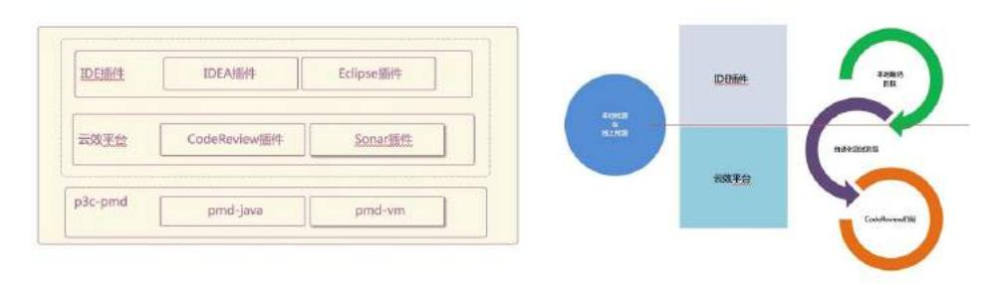

经过多次调研和探讨,我们选择了开源代码扫描工具 PMD 去做资源与规则扩 展,主要是看中了其规则扩展方便,集成到其它通用平台和插件上更灵活的特性。但 PMD 也有其局限性,即不支持跨文件扫描(例如:对过时方法的检测),所以那些需 要针对跨文件扫描的规则我们提到了 Sonar、IDE 等上层工具去实现。

- 方案选定后,我们基于开源的 pmd-core 三方 Jar 的能力上,扩展了约 60 个 规约扫描规则,并封装出 P3C-PMD 组件。
- 在 P3C-PMD 组件基础上,基于 Sonar 插件扩展标准,我们提供了 sonarp3c-pmd-plugin,也就是封装出了一个标准的 Sonar 插件。此插件主要用于 代码库全量自动化扫描阶段。
- CodeReview 插件采用直接类似于命令行调用的方式集成了 p3c-pmd,主要 针对于增量代码检测阶段。

- ● 在 P3C-PMD 组件基础上,基于 IDEA 的 Inspection 机制,以及 Running Inspection By Name 的功能自主实现了 IDEA 插件。
- Eclipse 插件主要是基于原生已有的 Eclipse PMD 插件进行的规则替换开发。 我们通过 IDE 插件的实现,进而解决了本地代码规约检测的问题。

综上所述,我们通过不同的插件覆盖了不同研发阶段(如本地编码阶段,自动化 全量测试阶段、CodeReview 增量检测阶段)的代码规约检测。通过本地结合线上、 全量结合增量的策略,我们实现了一套规则落地多端,进而将阿里巴巴 Java 编码规 约通过工具化平台化的手段在阿里内部进行了充分落地。2017 年 10 月份,我们在 GitHub 上将 P3C 规则和工具的源码正式对外开源。

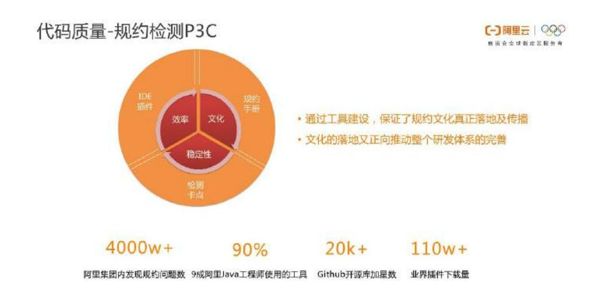

通过以上努力,我们不仅将 P3C 工具在阿里巴巴集团内部进行了有效落地,同 时在集团外也树立了很强的品牌影响力。规约检测工具保证了规约文化的落地及传 播,同时规约文化又从效能、人才、稳定性等方面正向推动了整个研发体系的完善。

# 3.7 [代码质量—缺陷检测技术 PRECFIX 技术揭秘](#page-2-0)

由于阿里巴巴集团业务发展的复杂性,上文提到的 P3C、PMD 等传统自动化 检测工具不能完全解决阿里巴巴面临的代码质量问题。因为传统工具多是基于规则匹 配,不需要了解特定的场景,基于业务场景的 BUG 很难通过这些自动化工具识别出 来。例如有众多的缺陷类型难以定义,这样就没办法提取出有效的匹配规则。因此 我们希望有一种对缺陷类型泛化能力比较强的缺陷检测方法或者工具,于是提出了 PRECFIX 方法(Patch Recommendation by Empirically Clustering)。

PRECFIX 的技术思路其实并不复杂,主要分为三步,首先从代码提交数据中提 取"缺陷修复对",然后将相似的"缺陷修复对"聚类,最后对聚类结果进行模板提 取,这个缺陷检测和补丁推荐技术可以用于代码评审,全库离线扫描等等。用户的反 馈以及我们人工的审查可以进一步提高模型推荐质量。

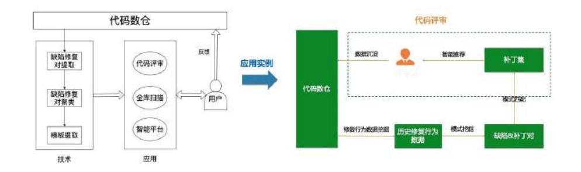

与国外友商的产品对比,PRECFIXP 具有毫秒级检测,覆盖较多的场景,能修 复部分偏业务缺陷等特性。

PRECFIX 方法已经在阿里巴巴集团内部落地,在内部公开库中扫描出了 800 多种缺陷类型,3 万多个缺陷,提取出了 3000 多个模板。此功能将在这个月底前 (2020 年 4 月)通过云效代码管理平台(Codeup)开放给用户使用。

# 3.8 [代码安全—敏感信息检测 SecretRadar](#page-2-0)

我们知道每天都有成千上万条诸如 API Key、 Database credential、Private

token 等敏感信息通过某些站点被无意识的泄露出去。为了预防这类问题,我们决定 在云效代码管理平台(Codeup)提供敏感信息检测的能力。

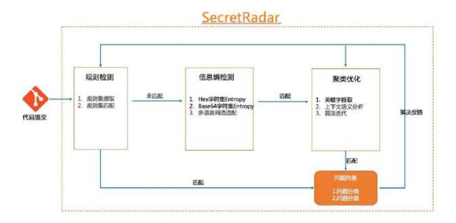

因 此 调 研 了 业 内 多 款 敏 感 信 息 检 测 产 品, 包 括 比 较 知 名 的 Truffle Hog、 Watchtower 等。但是这些工具要么单纯考虑规则匹配,要么采用信息熵技术,召回 率或准确率无法满足我们的预期,模型最终效果都不是非常理想。因此,我们在规则 匹配和信息熵技术的基础上,结合了多层检测模型和上下文语义检测,打造了一款敏 感信息检测工具 ——SecretRadar,从而使识别效果得到了显著提升。

SecretRadar 的实现思路主要分为三个层面,第一层我们采用传统敏感信息识 别技术通过丰富的规则集来保证模型基础能力的稳定和可靠,同时确保了模型良好的 可扩展性,以此来支持后续用户自定义的能力。但是这种方法非常依赖固化的长度、 前缀、变量名等,匹配效果上容易造成漏报。因此针对难以固定规则捕捉的场景,在 第二层我们采用了信息熵算法。信息熵可以用来衡量数据集的信息量大小,也就是其 不确定程度。所以数据集的信息熵越大,无序程度就越高。通过计算信息熵,可以有 效识别随机生成的密文信息,从而提升模型的召回能力,补足基于规则手段的漏报问 题。同样信息熵算法也有其局限性,伴随召回的提升是误报率的增加。因此在第三层 我们采用了模板聚类的方法,进行了过滤优化。针对信息熵结果集聚合提取常见关键

字,并结合上下文分析,来完成二次过滤。同时通过问题的修复情况,建立二分类数 据集,完成算法优化。进而从词法识别迭代为语义识别。

# 3.9 [智能评审助力开发者提升研发效能](#page-2-0)

在研发提效方面,我们认为代码评审是一个很好的抓手。在调研、学习了国际上 多款优秀产品的基础上,结合阿里巴巴复杂、多样的研发场景,我们历时两年打磨出 来一套非常好用的代码评审模块。结合人工智能技术,我们在业内首创了评审耗时预 估、评审人自动推荐等功能。

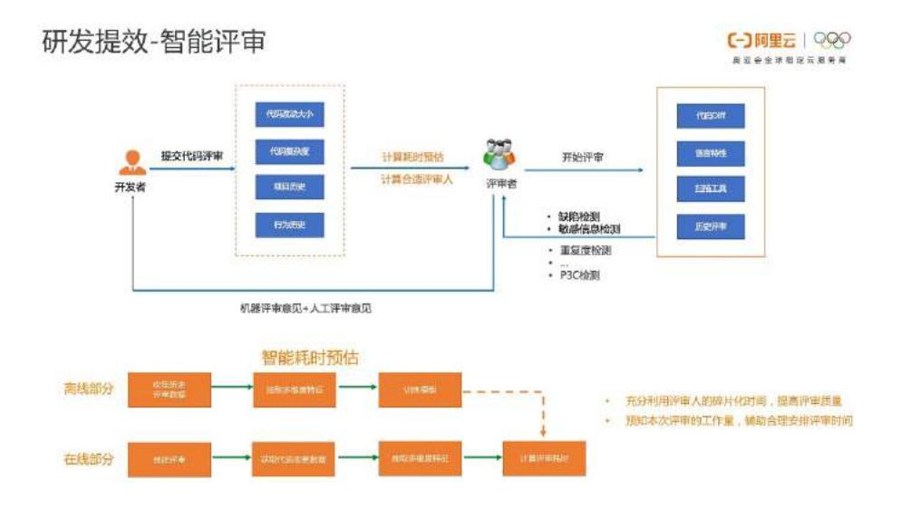

接下来我们详细了解一下评审耗时预估。"评审耗时预估"有什么意义呢?我们 都知道,代码评审的工作量"可大可小",主要取决于评审代码改动量的大小和业务 逻辑的复杂度。作为软件开发工程师,大家平时的工作都很忙,只能在开会或编码的 间隙中抽出特定时间来做代码评审。但往往代码评审的工作量超出了评审者的预期。 同时也存在一些极端情况,某些小的评审可能只需要几十秒就可以评审完毕,但是评 审者在不知情的情况下却为它安排了大段的评审时间。

"评审耗时预估"主要服务于两种场景,第一个场景是用户在未进行评审之前,

可以在第一时间知晓评审的工作量,辅助他合理安排评审时间;第二个场景是对于那 些同时要进行多个代码评审的用户,可以帮助他们合理安排评审的优先级。

"评审耗时预估"到底是如何实现的呢?首先我们基于阿里巴巴集团内部海量的 公开代码数据,收集了几百万次的评审文件浏览数据,提取了包括文本改动、项目历 史、行为历史在内的数十种特种,训练了机器学习模型。当开发者提交代码评审之 时,我们根据他提交代码的 Diff 内容,自动估算出评审耗时,并伴随代码评审通知一 起来告知评审者,帮助他合理安排评审时间。以上能力会在用户授权的情况下,陆续 在云效代码管理平台上开放给大家使用。

最后,感兴趣的朋友,欢迎体验云效代码管理,领养你的 AI 研发助手。 30 人以下企业还可申请小微企业扶持计划,免费使用云效 DevOps 一站式套餐。 立即前往:https://www.aliyun.com/product/yunxiao/project?spm=dianzishu

# [新一代高效 Git 协同模型详解](#page-3-0)

本文整理自阿里巴巴资深技术专家蒋鑫 ( 知忧 ) 的分享《AGit-Flow:新一代高 效 Git 协同模型》。

# 4.1 [Git 工作流概述及 AGit-Flow 的优势简介](#page-3-0)

目前,Git 已成为源代码管理的标准和基础设施。"为什么 Git 能这么成功"? Git 的创建者 Linux 在 Git 十周年的一次采访中,道出了其中的奥秘:

The big thing about distributed source control is that it makes one of the main issues with SCM's go away – the politics around "who can make changes."

他认为 Git 能成功最关键的不是因为它更快、更安全,也不是因为 Git 是分布式 的,而是解决了"到底谁能够贡献代码"这个问题。传统的集中式版本控制系统只能 针对核心用户开放写授权,长期来看这对项目做大、做强是不利的。而 Git 改变了传 统版本控制系统不能够让跟多开发者贡献代码这个顽疾,让"只读用户"也可以通过 "代码评审"的方式参与到项目开发中。

当前业界有两种最常用 Git 工作流:GitHub 和 Gerrit。他们都具备仓库的授权 模型简单,只读用户可参与代码贡献的特点。

|        | GitHub                                               | Gerrit                                                                                        |
|--------|------------------------------------------------------|-----------------------------------------------------------------------------------------------|
| 代码评审模式 | 每个特性一个 pull request                                  | 每个提交一个 change                                                                                 |
| 工作流类型  | 分布式                                                  | 集中式                                                                                           |
| 实现细节   | Fork     Pull Request     Git                        | <ul><li>git push origin HEAD:refs/for/master</li><li>客户端钩子: commit-msg</li><li>JGit</li></ul> |
| 优点     | 简单易用;对派生仓的完全控制; 跨项目社区                             | 多仓库项目:严格项目管控                                                                                  |
| 缺点     | 服务端数据冗余。管理包含多仓库的项目(如何管理像 Android 那样包含1000个代码仓库的大项目?) | 碎片化: 一个项目架设一个 Gerrit 服务                                                                       |

如上图所示,我对这两种 GIT 工作流做了优劣势分析:

代码评审模式不同:GitHub 的代码评审称为 "pull request",每个特性改动生 成一次代码评审。Gerrit 的代码评审称为 "Change",每个提交生都会生成一个"变 更单",这个变更单就是一次代码评审。

工作流类型不同:GitHub 的工作流属于分布式,当开发者需要参与项目的时候, 虽然没有"写"的权限,但是可以通过"Fork"的方式创建一个个人仓库(派生仓 库),他就可以在这个派生仓库中去创建代码分支,创建 pull request。GitHub 底层 采用的是原生的 Git(即 CGit)。

Gerrit 的工作流是集中式,所有用户工作在统一管控的集中式仓库中。Gerrit 要 求用户在本地克隆仓库中安装一个 "commit-msg" 钩子,以便在生成的提交中插入 唯一的"Change-Id",向服务器推送要使用特殊的 git push 命令。Gerrit 采用的是 JGit(Java 的 Git 实现)。

各自优势:GitHub 简单易用,使用标准 Git 命令即可完成代码贡献;对派生仓 拥有完全控制力,不受上游项目影响;可以创建跨项目的开源社区,全球开发者大协 同,这也是 GIT 可以形成全球最大的开源社区的原因之一。

Gerrit 因为采用集中式的工作流,管理员可以对项目进行严格管控,可以严格控

制谁可以访问仓库,谁可以对我的仓库做贡献。Gerrit 另外一个优势是可以实现多仓 库项目管理。我们知道"Android"项目具有 1000 多个仓库,就是使用 Gerrit 进行 管理的,很难想象如何使用 GitHub 来管理 Android 的 1000 多个仓库。

各自劣势:正如前面所说 GitHub 很难管理类似 Android 的多仓库项目。另外因 为 GitHub 使用派生仓库的工作模式,会产生服务端数据冗余的问题。

Gerrit 需要集中管控,由管理员负责创建项目,而普通用户不能创建项目,这就 使得一个 Gerrit 实例通常只管理一个项目或一个组织内的项目,难以在项目之间形成 代码复用,也很难汇集跨项目的开发者组成开发者社区。

通过对 GitHub 和 Gerrit 等 Git 工作流的调研和学习,我们"取长补短"创建了 阿里巴巴的 Git 工作流,即 AGit-Flow。

|                                                                                                            | GitHub                           | Gerrit                                                                                                                   |  |
|------------------------------------------------------------------------------------------------------------|----------------------------------|--------------------------------------------------------------------------------------------------------------------------|--|
| 代码评审模式                                                                                                     | 每个特性一个 pull rec                  | quest ✓ 每个提交一个 change                                                                                                    |  |
| 工作流类型                                                                                                      | 分布式                              | 集中式                                                                                                                      |  |
| 实现细节                                                                                                       | • Fork • Pull Request ✓ • CGit ✓ | <ul> <li>git push origin HEAD:refs/for/master /session </li> <li>Hook (client side): commit-msg</li> <li>JGit</li> </ul> |  |
| 单仓库代码协同  • git branch -u origin/master  • git pr / git peer-review  • git download 123  • git prchange 123 |                                  | 多仓库代码协同 - git repo init -u <manifest-repository> - git repo sync - git repo start git repo upload</manifest-repository>  |  |

在阿里巴巴,我们喜欢 pull request、CGit,喜欢在命令行直接创建代码评审的 集中式工作流,喜欢开放的开发者社区。我们不喜欢 "commit-msg" 钩子方式关联 提交的代码评审,我们不喜欢一个一个分散的代码平台。

我们还开发了配套的客户端工具 "git-repo",既能在单仓库下工作,又支持类 似 Android 的多仓库项目协同。

# 4.2 [在阿里巴巴,我们如何使用 AGit-Flow](#page-3-0)

下面给大家演示一下,在阿里巴巴内部,我们是如何使用 AGit-Flow 工作的。

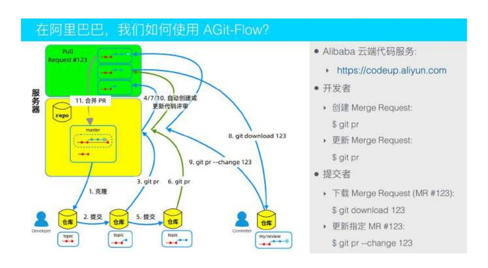

我们首先使用 Git 标准命令将仓库克隆到本地,然后在本地仓库内开发,创建提 交。在工作区中执行 git pr 命令,推送本地提交到服务器,服务器端会自动创建一个 新的代码评审,例如:pull request #123。团队的代码评审者就可以打开编号"123" 的代码评审提交评审意见。开发者根据评审意见,在本地工作区继续开发、新增或修 改提交。工作区中再次执行 git pr 命令,推送本地提交到服务器。服务器发现目标分 支上已经存在来自同一用户、同一本地分支的 pull request,因此用户此次推送没有 创建新的 pull request,而是更新已经存在的 pull request。

如果经过多次修改,代码依然不 OK。代码评审者也可以直接发起对评审代码的 修改,帮助原开发者更新 pull request。代码评审者可以使用 git download 123 下 载编号为 123 的 pull request 到本地仓库,代码修改完毕后,执行 git pr --change 123 命令,将本地修改推送到服务端。服务端接收到代码评审者的特殊 git push 命 令,更新之前由开发者创建的 pull request。项目管理者通过点击 pull request 评审 界面的合并按钮,将 pull request 合入 master 分支。master 分支被更新,同时关 闭 pull request。

使用 AGit-Flow 工作流无需在服务器上创建新的分支,不需要给新加入的同学 创建写入权限,可以对所有开发者只分配读取权限,然后通过创建代码评审再合并到 主干的方式更新主干代码。这也是目前比较流行的主干研发模式。

目前大家可以通过云效代码管理平台(Codeup)来实现 AGit-Flow 工作流。

# 4.3 [AGit-Flow 实现原理](#page-3-0)

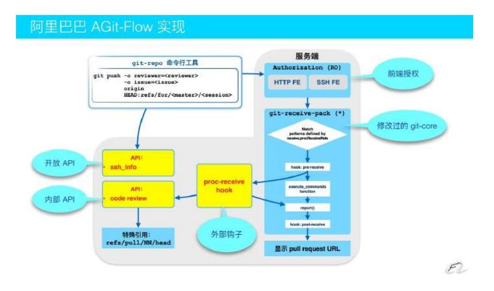

AGit-Flow 是如何实现的呢? 首先客户端使用特殊的 git push 命令向服务端发 起代码推送请求,触发 AGit-Flow 工作流。为什么说这个 git push 命令特殊呢?因 为它的目标分支是一个包含特殊的前缀 "refs/for/"的代码分支,分支后面又跟了一 个 "" 。这个""用于区分本地分支名,不同开发者提交的代码评审包含不同的"", 所以不会相互覆盖。

我们还可以通过"-o"来传递不同的参数,比如可以指定由谁来对我的代码进 行评审,我的代码评审会关联哪个"issue"。这些操作都可以通过"git push"命令 完成,后来我们发现这个 git push 命令比较复杂,于是我们封装了一个命令行工具 git-repo。目前 git-repo 已经对外开源,大家可以免费使用。

接下来这个"Push"命令就会打入到服务端,服务器端会启动一个进程"gitreceive-pack"。(我们对服务器端的前端授权模块做了一些修改,使其能够识别这 个特殊的 git push 命令,允许只读用户也能"Push")如上图所示,"git-receivepack"我做了星号标记,因为它是一个特殊的"git-receive-pack"。当它发现 push 命令的目标是一个特殊的引用后,它不会走 Git 原来内部的工作流,而是走"外部钩 子"。通过"外部钩子"完成一些好玩的操作,比如创建代码评审。

在今年(2020 年)3 月份,我们已经把这个修改过的 git-core 贡献给了 Git 社 区,目前正在评审中,后续 Git 新版本会包含这个新特性:proc-receive。此特性已经 历经 15 次迭代,从最初的服务端扩展到集合了服务端扩展和客户端协议升级的完整解 决方案。我们将这个技术开源,一方面繁荣了 Git 生态,让更多人能从阿里巴巴的技术 中获益;另外一方面,阿里巴巴也得到了收益,我们的代码贡献得到了 Git 客户端的支 持, Git 适配了我们新的玩法,让包含阿里巴巴在内的 Git 用户得到了更好的体验。

# 4.4 [AGit-Flow 实现的技术细节](#page-3-0)

为了解释 AGit-Flow 实现的技术细节,我们先来了解一下 git push 命令原有的 实现方式。

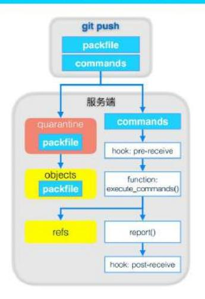

如上图左侧所示, git push 命令包含两部分信息,一个是被打成包的数据,叫 "packfile"; 另 一 个 是 推 送 的 命 令, 叫"commands"。 "packfile" 和"commands"被推送到服务端后,"packfile"会走左侧的路径,首先进入"quarantine" 中,进行"隔离"。 当"commands"经过"pre-receive" 钩子检查,认为用户的 权限 OK、提交说明 OK、提交修改的文件 ok,"packfile"才会从隔离区释放出来, 进入对象库(objects)。(如果 "pre-receive" 钩子脚本失败,则删除隔离区,并返 回错误信息,终止推送命令的执行。)

接下来"commands"会传递给内置的 "execute\_commands()" 函数,实现 分支的创建、更新、删除等操作。然后通过"repor()"函数报告给客户端,最后执 行 "post-receive"钩子脚本,完成事件通知。

新钩子,新生态 : AGit-Flow 对 "git-receive-pack" 的源码做了改动,新的流 程如下图所示:

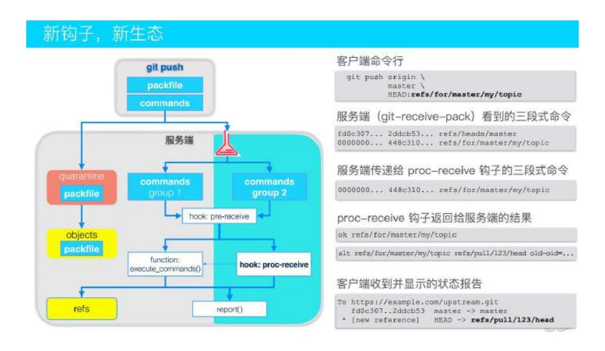

当客户端执行新的 git push 命令后,"packfile"的传播路径没有改变,但是我 们更改了"git-receive-pack"命令,增加了一个"过滤器"(图中漏斗部分)。过 滤器将 "commands" 分成两组,一组是标准的 Git 命令(group1),一组是 AGit-

Flow 特殊的命令(group2)。这两组命令经过"pre-receive" 钩子检查后,左侧 普通的命令(group1)会执行 Git 内置的 execute\_commands 函数,生成新的 引用,进行分支的创建、更新等。右侧这个特殊的命令会调用一个新的外部钩子 "proc-receive" ,然后创建一个特殊的代码评审引用,如"refs/pull/123/head", 并且可以用过特殊的 Git 命令将它下载到本地。

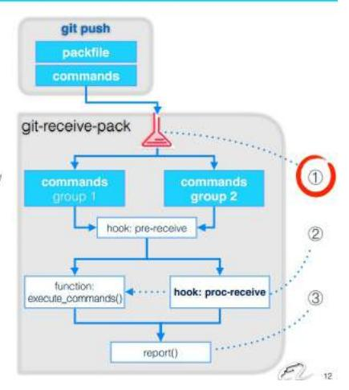

我们为 Git 贡献的这个新特性,由三部分组成。第一个部分就是"过滤器",通 过在服务端新增新配置变量 "receive.procReceiveRefs"来实现。只要定义了这个 特殊的配置变量,当客户端使用 git push 命令推送的时候,Git 就会根据配置变量去 匹配,当匹配到相应的命令时,这个命令就会走特殊流程。这个配置变量属于多值变 量,例如阿里巴巴代码平台的设置是:

- git config --add receive.procReceiveRefs refs/for
- git config --add receive.procReceiveRefs refs/drafts
- git config --add receive.procReceiveRefs refs/for-review

这三条配置变量对应 git pr 的三种推送模式,会产生标准的 pull request、草稿 模式的 pull request,或者一个代码评审者想推送指定的 pull request。

第二部分是 proc-receive 钩子。我们这个钩子应该说是 Git 中有史以来最复杂 的一个钩子,它可以和服务端(git-receive-pack)进行双向通讯。首先服务端和钩 子会做"版本协商",因为我们认为这个协议后续会升级,为了保证向后兼容,所以 我们首先要协商一个版本。服务端告诉钩子我是哪个版本,客户端告诉钩子我支持哪 个版本,后面 Git 就可以用相应的版本协议与钩子进行通讯。服务端会用"pkt-line" 编码命令,这个命令是三段式的,包含老的 ID,新的 ID 和需要更新的引用名称。服 务端会把命令和参数发送给钩子。钩子会对这些命令和参数进行处理,这些处理由开 发者以 API 调用的方式实现,然后将处理结果报告给钩子。钩子再把这个执行结果以 特殊的方式报告给服务端。

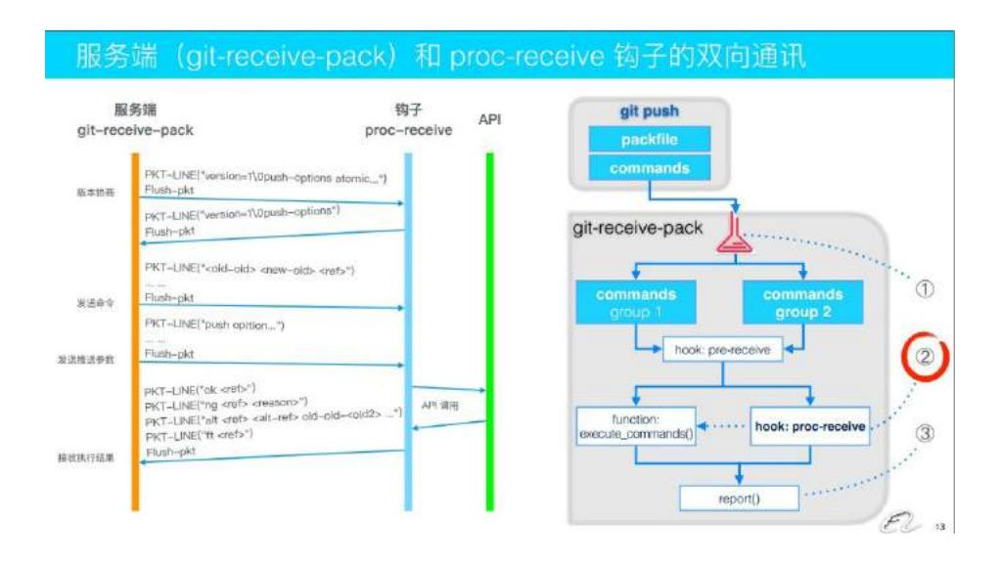

第三部分是可定制的客户端状态报告。在上图右侧部分,大家可以看到有一 条 虚 线 由"proc-receive" 钩 子 指 向"execute-commands" 函 数, 这 个 代 表 有些钩子无法处理的命令会返回给"execute-commands"函数进行处理。当 "execute-commands"和"execute-commands"钩子处理完全部命令后,会 统一进行"report()"(报告)。我们这个"report()"相比于 Gerrit 有一个优势,能 够让客户端知道你没有改成"refs/for"引用,而是改成了另外一个引用。此外,我 们也考虑了向下兼容问题,让老版本的 Git,在遇到新版本的 Git 服务器的时候一样

可以收到报告信息。例如老版本的 Git 会认为你创建了"refs/for/master";但是新 版本的 Git 懂得扩展协议,可以识别出你创建了特殊的引用,比如知道你创建的不是 "refs/for/master"而是"refs/pull/123"这样的引用。

# 4.5 [阿里巴巴开源的客户端工具 git-repo 简介](#page-3-0)

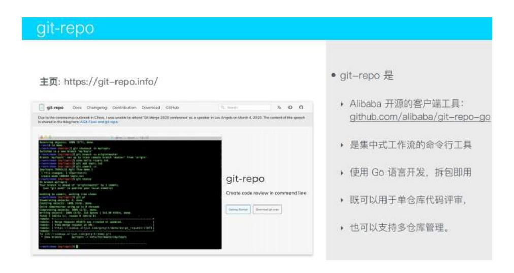

git-repo 是阿里巴巴开源的一款集中式工作流命令行工具,对原生 Git 命令做了 封装,简化了使用 AGit-Flow 等集中式工作流时稍嫌繁琐的 Git 命令。git-repo 是 使用 Go 语言开发,运行时除 Git 外不依赖其他软件,所有具有拆包即用的优点。

git-repo 具 有 良 好 的 兼 容 性, 可 以 支 持 AGit-Flow 兼 容 的 代 码 平 台 以 及 Gerrit。可以跨平台,目前支持 Linux、Mac、 windows 系统,其中 Windows 是 Beta 版本。除了具备 Android repo 的多仓库管理能力外,还可以对单独的代码仓库 进行操作。

如何下载安装 git-repo 呢? git-repo 目前已经开源到 Git hub 中,你可以访问 https://github.com/alibaba/git-repo-go/releases 页面下载合适的安装包。然后将 解压缩后的 git-repo 文件移动到可执行目录中(如 Linux 下的 /usr/local/bin 目录), 即完成安装。详细的使用方法此处不再赘述,大家可以访问 git-repo 主页了解。

### 总结

AGit-Flow 是阿里巴巴研发的 Git 集中式协同协议,目前已经在阿里巴巴集团 内部生根开花,在外部,通过云效代码管理平台提供支持。

AGit-Flow 的核心组件已经开源,将已经成为 Git 的核心组件。

为了方便开发者操作,我们开发了 git-repo 命令行工具。git-repo 使用 Go 语 言开发,具有拆包即用、跨平台、兼容性好、可扩展等特点。git-repo 已经开源道 Git hub 社区大家可以进入产品主页免费下载使用。

# [持续交付篇](#page-3-0)

# [企业如何规模化落地 CICD ?](#page-3-0)

本文整理自阿里巴巴技术专家崔力强(怀虎)的分享《企业 CICD 规模化落地》。

持续交付是随着互联网的迅猛发展逐渐普及的一种研发模式,它具有"快速反 馈""质量内建""自动化""开发自运维"等特点。

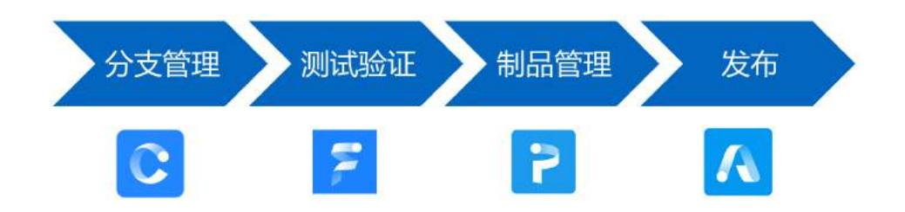

这种研发模式主要包含如上图所示的四个环节,"分支管理""测试验证""制品 管理"和"发布"。在业界有很多工具支持这些操作,在云效产品矩阵中也有对应的 产品提供相应功能。

在一个中小型的研发团队(比如 5-10 人),无论你是使用商业软件还是开源的工 具,经过一段时间的学习,你都可以把"持续交付"做起来。但是当需要规模化落地 之后,就有更多的问题需要考虑,如:

- 如何提高协作效率。
- 新团队如何快速接入。
- 如何进行全局风险的控制。
- 研发流程如何全局更新。

# 5.1 [如何实现持续交付在阿里巴巴的规模化?](#page-3-0)

接下来简单了解一下"持续交付"研发工具在阿里巴巴内部的演化历程。2009 年,我们开发了自动化发布工具;2013 年,建立统一构建部署平台;到了 2016 年 我们已经有了持续交付平台,内部称为"Aone",该产品包含了从代码开发、构建、 发布等功能,以一个一站式的研发平台,这个产品到现在也一直在演进;2017 年 时,我们将"Aone"的核心功能开放出来,供广大开发者使用,就是我们的"阿里 云·云效"。目前该产品在公测中,大家可以登录阿里云官网进行访问、使用。

# 5.2 [阿里巴巴实现持续交付规模化落地的两大研发实践](#page-3-0)

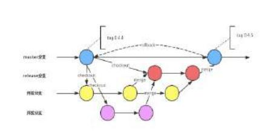

要使持续交付规模化落地,很重要的一点是需要有一套工具对研发模式进行全 自动支持。 "研发模式"是指你做事情的一种方式,在这里主要是指代码发布模式以 及对应的分支使用方式,比如"主干模式",这也是持续交付比较提倡的一种研发模 式。但是"主干模式"对研发人员的要求比较高,并且也不能很好的体现出当前要进 行发布的内容。作为一位研发负责人,你可能会选择更灵活一些的研发模式,比如 "Aone Flow"或者 "Git Flow"等,这两种模式都需要一定的自动化工具进行支持。

其中 Aone Flow 是在阿里巴巴内部主流的一种发布模式及分支管理方式,我们

这里简单介绍一下,感兴趣的同学可以在网上搜索相关文章了解。Aone Flow 使用 三种分支类型:主干分支、特性分支、发布分支。主干分支上的代码跟线上版本的代 码是一致的,当你要开发一个新的功能时,就会拉取一个特性分支作为开发分支,然 后在这个分支上提交代码修改。当你需要发布的时候,需要先将不同的特性分支合并 为开发分支再进行发布。发布到线上正式环境后,合并相应的发布分支到主干,在主 干添加标签,同时删除该发布分支关联的特性分支。这个过程中涉及到大量的"拉分 支""合分支""打标签""回滚版本"等等复杂操作,这就需要有一系列自动化工具 进行支持。在阿里巴巴内部我们是通过 Aone 平台(即云效的内部版本)提供自动化 支持的。

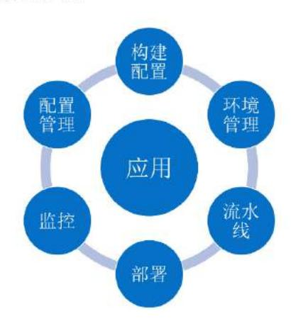

第二个实践是以应用为核心的一站式研发体验。"应用"是指一个服务或者微服 务,可以直接对应一个代码库。以应用为中心,我们又可以串联流水线、环境管理、 构建配置、部署等工具链。可以让开发人员很好的理解和打通整个研发流程,同时也 可以帮助一个新团队快速上手。

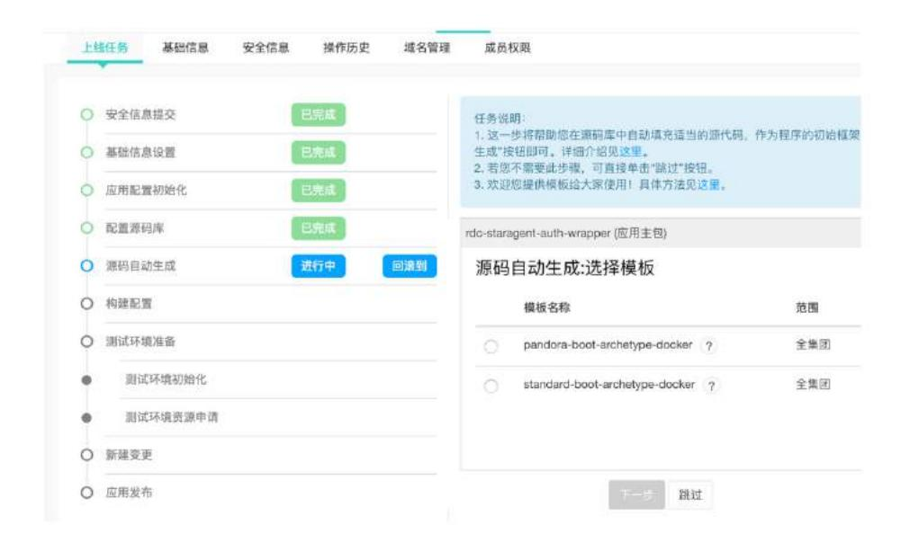

上图是我们内部一个产品研发过程的截图,会有一个研发向导帮助你提交各种信 息、初始化代码库、源码自动生成、申请测试环境、进行线上发布等一系列操作。这 种"以应用为核心的一站式体验"非常爽,可以帮助研发团队节省很多耗费在协作上 的时间,而且有了这套流程之后,只要按照向导的提示去做就好了,很少出错。

# 5.3 [如何进行全局风险管控?](#page-3-0)

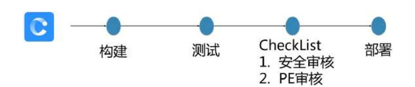

在部署正式环境之前,会有一个 Checklist,进行安全审核、PE 审核等等,我 们很多对外发布的应用都会经过这样的安全审核。在前 DevOps 时代(2016 年以 前),阿里巴巴内部还是有专门的运维团队的,我们叫 PE 团队。在正式发布前,他 们会去审核发布的时间点、配置参数等。这就是全局风险管控,这些卡点会强制在一 个流程中实施,不能够取消。(当然现在已经阿里巴巴内部已经取消了 PE 团队,这 些卡点会通过自动化工具实现)

# 5.4 [规模化落地 CICD 的重要一步](#page-3-0)

通过以上几个措施,就能够在阿里巴巴内部规模化的落地 CICD,当新的研发团 队加入时,也不用花费太多的时间去理解这个事情,而是很快上手去操作。但是我们 这一套流程也遇到一些问题,这套流程面向 Web 端服务是可以很好去应对的,比如 我们只有一个版本的"天猫""淘宝",永远是面向最新版去交付的;但是随着阿里云 业务的发展,特别是出现了混合云的业务,出现了面向多 Region 和多版本交付的情 况,我们这套研发流程就有点捉襟见肘了;因为我们的研发理念是"以应用为中心", 当遇到一些跟应用无关的交付场景时这套研发流程也会显得不合时宜。

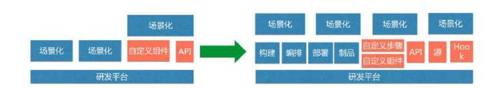

如何提高阿里巴巴持续交付平台的灵活性呢?我们最早的研发架构如上图左侧所 示,底层是研发平台,上面我们做了很多"场景化"的研发组件,同时保留了一定的 扩展性,比如"自定义组件",用户可以把自己的组件接入到我们的流水线里来;也 暴露了一部分 API,主要只读接口,其他团队可以在这上面做一些他的场景化。

我们认为这种研发架构的灵活性和扩展能力是不足的,(如上图右侧所示)后来我 们就把构建、编排、部署、制品这些能力单独拎出来,并开放对应的 API,上层我们 再去编纂"场景化",而且有可能这些"场景"都不是我们开发的,而是使用这个产 品的用户自己去开发,重点是我们需要将这种扩展能力暴露出来。我们还会有"自定 义步骤"和"自定义组件",这两个功能已经在云效产品中提供。同时,我们还会开 发更多 API、支持更多的源,也可以通过配置 webhook 在流水线的生命周期中(失 败、成功、暂停等)通知第三方。

这样的研发架构就具备了一定的灵活性和可扩展性,但对于企业来讲这是不够, 还必须具有开箱即用的能力。

云效内置代码扫描、 安全扫描和各种自动化测试能力,并通过流水线模板串联起 来。如上图右侧所示,针对主流的开发语言 Java、PHP、Node.js、Go、Python 等提供从构建到部署发布的各种模板,可以帮助你快速开始。

模板化能力其实是推进 CICD 规模化落地的关键,云效不仅提供了数十种通用的 模版来帮助你快速创建流水线,同时提供定制化能力,支持定制企业自有模版来管理 企业持续集成和持续交付流程,将复杂的流程通过可视化编排和结果展现,保障交付 可见可控可度量。

### 总结

当你已经对 CICD 有一定了解,怎么样更好的在组织内规模化落地呢?第一,你 需要选择一款兼具灵活性和规范性的工具平台。第二,制定适合自己企业的研发模 式,并将其固化下来;第三,研发模式的变更可以应用到已有的团队;第四,通过适 当的卡点来控制全局风险。

最后,感兴趣的朋友,欢迎体验云效流水线,构建自己的集成交付流水线。 30 人以下企业还可申请小微企业扶持计划,免费使用云效 DevOps 一站式套餐。 立即前往:https://www.aliyun.com/product/yunxiao/flow?spm=dianzishu

# [云原生下的开发测试](#page-3-0)

本文整理自阿里巴巴技术专家林帆(金戟)和郑云龙(砧木)的视频分享《云原生 下的开发测试》。

在云原生时代下,软件的迭代速度越来越快,对测试的要求也越来越高,很多开 发者开始使用 Kubernetes 来管理测试环境。在这个过程中,开发者会遇到很多困 难,其中最主要的两个问题是:一、本地环境与 Kubernetes 集群网络不通问题;二、 共用测试环境时,相互干扰的问题。

在阿里巴巴内部,我们主要通过扁平的内网 IP 和项目环境两个机制来解决以 上痛点。扁平的内网 IP 主要是基于 CNI(Conteinre Network Interface) 机制改造 Kubernetes 的 IP 逻辑实现的,可以使集群中的每个 Pod 分配到的 IP 与本地机器分 配到的 IP 处于一个大的网络环境下,这样就可以解决本地环境和集群之间互通的问 题。项目环境是基于 RPC、消息中间件的虚拟环境,从表面上看,每个项目环境都 是一套独立完整的测试环境,由一系列服务组成集群,而实际上,除了个别当前使用 者想要测试的服务,其余服务都是通过路由系统和消息中间件虚拟出来的,指向公共 基础环境的相应服务。这样操作的好处是,第一不会占用大量的开发资源;第二,不 会影响公共基础环境的稳定性。


阿里巴巴的这种测试环境带来的测试体验非常爽,本地与集群双向互通,每个 子项目都可以独占一个"项目环境",彼此不会干扰。但是这种测试环境管理方式实 施起来比较复杂,只适合大型的集团公司,我们希望将这种测试体验以 "更轻"的方 式实现,普惠更多开发者。于是云效团队推出了云原生测试环境工具箱,主要包括 kt-connect 和 kt-virtual-environment 这两个开源工具。

## 6.1 [如何通过 kt-connect 解决本地与集群双向互通问题?](#page-3-0)

首先,我们来聊一聊如何使用 Kubernetes 测试环境开源工具箱中的 kt-connect 解决 "本地与集群双向互通"的问题。

我们假设有一位主人公叫"程序员小黑",他所在公司采用了微服务相关的技术 实践。小黑在做本地开发的过程中,会遇到两种联调场景,即我需要联调其它服务和 其它服务调用我。

我们先来看第一个场景:联调其它服务。前面讲到本地环境和 K8S 集群中的网 络是相互隔离的,那么在本地完成代码开发后,如何高效的与其它服务进行联调呢? 最"简单粗暴"的一种方式,就是在本地完整的部署一套测试环境,这种方式的优点 很明显,效率最高,而且没有外部依赖。缺点也同样明显,一是对开发人员的素质要 求非常高,二是要占用大量本地的开发资源,对本地开发机的性能要求很高。第二种 方式是利用 Kubernetes 等工具在本地部署一套 K8S 集群,这种方式可以在一定程 度上降低开发人员"上手成本",但是也同样存在占用大量本地开发资源的问题。还 有一种处理方式是利用 VPN 调用 K8S 集群中的服务,这种方式存在两个问题,一个 是本地的服务调用是脱离了 Istio 的流量控制的,第二个问题 VPN 这种方式只解决了 本地到集群的通讯,对于回调这种方式是解决不了的。

那么,有没有更简单的方式呢?答案是肯定的,通过 KT-Connect 工具可以 让开发者一键建立本地到 Kubernetes 集群的网络连接。开发者只需要运行一个 "connect"命令,就可以自动在集群中创建一个代理容器,并且通过这个代理容器建 立本地与集群的 VPN 连接,同时 KT-Connect 也会内置 DNS 服务,本地服务可以 直接通过服务的名称进行服务调用,就好像本地的程序运行在 K8S 集群中一样。 在 KT-Connect 中,我们给这个代理容器取了一个名字"shadow pod",即"影子"。 它就像是本地服务在集群中的影子,通过它来完成本地服务与集群中服务的相互调用。


接下来,我们来看第二个场景:其它服务调用我。在联调时,小黑不仅需要调用其 它人的服务,同时作为服务的生产者又会被其它服务调用。这时只打通本地到集群的 服务是不能满足联调测试需求的,必须同时让集群中的服务也可以访问本地的服务。


这就需要使用 KT-Connect 的第二个命令——"Exchange"。Exchange(交 换)命令会在集群内部署一个代理容器,并替换集群中指定服务的目标容器,从而 将发往该服务的所有流量拦截并转发到本地端口。这是一种"完全替换",这就意 味着在同一时间点,只有一位开发者可以将他本地的服务加入到集群中。为了解决 这个问题,KT-Connect 提供了第三个命令——Mesh(混合)。当我们在本地运营 "Mesh"命令后,我们同样会把本地服务加入到集群里面,但是会保持原有的目标服 务状态不变,并且本地服务会继承目标服务中所有的标签。依照 K8S 本身服务发现 的原理,请求流量会被随机地转发到原有服务或本地的服务。同时配合 Istio 的流量 规则,就可以让所有正常流量依然保持对原应用的访问,而只对一些有特殊标记的的 请求转发到本地。从而可以实现在一套公用测试环境的基础上各自独立的完成本地的 集成联调。

# 6.2 [KT-Connect 背后的原理](#page-3-0)

我们通过 KT-Connect 的"connect""Exchange" "Mesh"命令实现了本地 到集群的双向网络互通,看起来似乎很神奇,其实背后并没有什么黑科技。我们只是 综合利用了 Kubernetes 原有的特性及 SSH 这个我们经常会用到的网络协议,通过 Kubectl 的端口转发可以实现将集群中服务的端口映射到本地,通过 SSH 协议建立 本地与集群之间的隧道。


以"Connect"命令为例,了解一下 KT-Connect 背后的原理。如上图所示, 当开发者在本地运行"Connect"命令后,首先会创建一个代理容器(shadow pod),这个代理容器会运行"SSH Server"和"DNS Server"。当代理容器启 动成功之后,就可以通过"port-forward"将代理容器的 22 端口转映射到本 地,如 2222 端口。此时,本地服务就可以通过本地的 2222 端口建立与集群内部 的连接。


"Exchange" 和 与"Connect" 命 令 背 后 的 原 理 类 似, 我 们 也 会 先 创 建 一 个代理容器,并通过"port-forward"将代理容器的端口映射到本地。然后根据 Exchange 的目标服务,判断将代理容器的哪一个端口的请求全部转发到本地的特定 端口。

"Mesh"与"Exchange"的最大的差异在于"Exchange"会将原应用的副本 数直接降到 0,会将集群内所有对原应用的流量全部转发到本地。而 "Mesh"则是 在保持原有应用 Pod 不变的前提下,创建一个新的代理容器并且继承原应用的所有 标签,还会增加一个随机的 version 标签。这时我们就可以通过 Istio 规则, 精确控制 流量。


如前文所述,通过 KT-Connect 我们可以实现从本地到集群的双向互通。我们 可以看到这样一个有趣的场景:小黑 A 可以通过"Mesh"命令把本地服务加入到测 试环境里,并且可以让集群中一部分特定的流量转发到本地,这样他可以与集群中的 其它服务进行联调。小黑 B 通过"Connect"命令连接到集群,直接在本地进行测 试。在某些情况下,小黑 B 需要依赖的服务刚好是小黑 A 正在开发的版本,小黑 B 只要按照 Istio 的流量规则设置可以调用小黑 A 服务的值,就可以跟小黑 A 的服务进 行联调。对于小黑 C,他既需要调用集群中的服务,又需要集群中的服务回调到本 地,所以他在本地既运营了 "Connect"又运行了"Mesh"。

上文描述的其实是一种理想情况,需要建立在我们的测试环境是一种稳定状态的 基础之上。但在现实情况下,由于频繁的代码变更测试环境往往处于一种不太稳定的 状态。接下来我们会介绍如何使用云原生测试环境工具箱中的 kt-virtual-environment 打造稳定的测试环境,让开发者可以更好地进行协同研发工作。

# 6.3 [共用测试环境相互干扰问题及常见解决方案](#page-3-0)

在一个中大规模研发团队负责的项目中,往往一个系统里包含许多 ( 微 ) 服务, 而且服务之间存在链式依赖,难以独立启动运行。这时就很容易出现"共用测试环境 相互干扰"的问题,比如一个开发者重新部署、重启测试环境时,可能会打断所有正

在测试的开发者;一个开发者提交了有 BUG 的代码,所有开发者都可能受影响;一 个开发者为了排查问题,单步调试测试环境服务时,所有开发者测试请求会被拦截。

如何来解决这个问题呢?以往的思路是准备多套测试环境。虽然这种方式可以暂 时缓解开发过程中的相互影响,但是这会带来额外的资源分配和管理问题,特别是当 没有那么多并行开发时会产生非常严重的资源浪费。

于是出现了一种"改进"方法,企业通过用 helm 或自制工具自动化地快速创建 一套环境,用完即删。该方法在一定程度上解决闲置资源回收的问题,但是也没有那 么"完美"。在实际操作过程中,环境的创建其实并没有那么"快速",往往需要等待 几分钟甚至几十分钟的时间。而且如果为每个子项目的成员分别拉一套环境,资源浪 费依然严重。

在多人协同场景下,如何做到测试环境不相互干扰又不产生极大的资源浪费呢? 在阿里巴巴内部主要通过"项目环境"的方案解决。

"项目环境"的本质是基于路由隔离实现的一个"虚拟环境"。我们通过一个实例 来简单了解一下。


如上图中蓝色部分所示,由服务 A、服务 B、服务 C、服务 D 组成一个完整的 测试环境,我们称为"公共基础环境"(也称默认环境)。当某位开发者需要进行项目 开发的时候,他不需要把应用或服务部署到公共基础环境中,而是单拉出来一部分资 源(服务 C 和服务 D)并复用部分公共基础环境资源(服务 A 和服务 B)形成 "项目环 境"。这样操作的好处是,第一不会占用大量的开发资源;第二,不会影响公共基础 环境的稳定性。

我们主要通过打"环境标"的形式形成独立的"隔离域",比如 [dev] 代表公共 基础服务实例的标签值,[dev.proj] 代表项目环境的服务实例。同一个环境标形成一 个独立的"隔离域",这是基于路由规则实现的。如果服务请求是来自一个有环境标 的服务实例,它的服务请求会优先寻找跟它具有相同环境标的实例,如果没有,会寻 找它上一级的环境标,这叫做"路由兜底"。比如上图中服务请求来自带有 [dev.proj] 环境标的实例 C,需要调用服务 B,但是发现没有带环境标 [dev.proj] 的服务 B,于 是寻找带有上一级环境标 [dev] 的服务 B。


我们还可以将本地开发机加入项目环境。比如开发者"小黑"在本地启动了一个 服务实例 C,他给这个服务实例打的环境标是 [dev.proj.local],通过前面介绍路由 规则我们了解到带环境标的服务发出的请求会优先寻找带相同环境标的服务,如果找 不到则会寻找带有上一级环境标的服务,于是服务 C[dev.proj.local]、服务 D[dev.

proj] 和公共基础环境中服务 A[dev]、服务 B[dev] 就组成了一个新的的"项目环境" (图中红色部分)。


这时"小黑"的同事也加入了项目,他在本地启动了一个服务 A,如果他没有对 这个服务打"环境标"的话,他会默认使用"公共基础环境"进行测试。这时小黑在 他自己的"项目环境"中的任何调试都不会影响到小黑的同事,反之亦然。


后来小黑的同事和小黑加入了同一个子项目,他们之间需要"联调"。这时,小 黑的同事只要给他本地的服务打上一个和小黑的"项目环境"相同的环境标即可,如 上图红色部分。

总结一下前面介绍的概念:"隔离域"是由路由规则形成的虚拟边界;每个"环境

标"都会形成一个独立的"隔离域";"隔离域"之间可以存在部分或完全重合;"隔离 域"的成员会随集群中服务实例所带"环境标"动态变化。

# 6.4 [如何使用 kt-virtual-environment](#page-3-0) 打造项目环境?

kt-virtual-environment 是一种基于 Service Mesh 的微服务环境复用工具, 源于阿里巴巴内部的项目环境实践。通过 Pod 上的虚拟环境标签,kt-virtual-environment 能够自动将测试环境网络动态隔离成多个虚拟隔离域,同时以简单规则在隔 离域间局部复用 Pod 实例,从而达到只需很少资源成本即可创建大量不同微服务版 本组合的独立测试环境的目的。


下面我们来了解一下如何使用 kt-virtual-environment 打造项目环境。通过 前面的介绍,我们知道相同的"环境标"会形成一个独立的"隔离域"。所以首先我 们需要为服务实例打上环境标,在 kt-virtual-environment 中是通过为为 pod(或 容器)添加约定的 Label 的方式实现的。在服务调用过程中,需要为应用程序添加 一些逻辑,才能让"环境标"顺利在上下文之间传递,这个过程类似 SkyWalking、 Zipkin 等链路追踪工具的 SDK 端所做的事情,让"环境标"通过 HTTP 头在请求链 路上一直保持传递。第三步,我们需要在集群中配置 Virtual Environment 类型的资 源实例,详细配置的结构如上图所示。

- 


kt-virtual-environment 实现的基本原理是:观察并持续监听环境中的所有服 务和开发资源,动态生成 Service Mesh 控制面规则,实现核心隔离逻辑 。当前 kt-virtual-environment 仅支持基于 Istio 的规则,未来会增加基于其它 控制面的 Service Mesh 规则的实现。

# 6.5 [阿里巴巴使用项目环境的最佳实践](#page-3-0)


"项目环境"在阿里巴巴内部已近发展多年,下面我将一些优秀的实践分享给大 家。理论上,"环境标"的层级可以无限多,但是我们的经验是最好不要超过三级。 因为三层的"环境标"基本上可以满足 95% 以上的研发场景。

以三层环境标实现的项目环境举例。第一层一般只有一个环境标,比如 [dev], 这是对应默认隔离域(公共环境)使用的环境标,这样做会让整个路由规则比较简 单,大家不用猜测"路由兜底"最后会"兜"到哪里去。这个顶级的 [dev] 环境标对 应的测试环境是不需要开发者自己去部署的,一般是通过"流水线"等自动化工具部 署的稳定版本。对于某个子项目,我们可以基于顶级环境标建立一个二级环境标,如 [dev.proj1],这样会形成这个子项目的隔离域(项目环境)。在这个隔离域中,只需要 开发者自己部署需要改动的服务实例即可,其它不需要改动的服务实例可以复用公共 环境中实例。有的时候,某位开发者可能要对某服务进行比较大的改动或者他不希望 这个服务被其它同事访问到,他可以基于"项目环境"再创建一个"个人环境"。在 这个个人环境中,他既可以调用子项目中的服务,也可以调试本地开发的新的服务版 本,并且不会影响到其他开发者。以上,是我们比较推荐的项目环境的用法。

总结:云原生测试环境工具箱共包含两款独立的工具:kt-connect 和 kt-virtual-environment。kt-connect 是一款本地工具,主要是帮助开发者打通本地和集群 网络,实现本地加入隔离域。kt-virtual-environment 是一种基于 Service Mesh 的微服务环境复用工具,通过观察并持续监听环境中的所有服务和开发资源,动态生 成 Service Mesh 控制面规则,实现核心隔离逻辑 。只需要一次性部署,开发者不 会频繁使用到。目前两款工具已经开源,大家可以进入 Github 社区进行下载使用。


# [解决方案篇](#page-3-0)

# [云效架构师手把手教你搭建 DevOps 平台](#page-3-0)

本文整理自阿里巴巴云效研发解决方案架构师红英的分享《云效架构师手把手教 你搭建 DevOps 平台》;

由阿里云开发者社区志愿者徐海轩整理。

# 7.1 [背景诉求与推进策略](#page-3-0)

## 方案背景

### 一站式 DevOps 解决方案致力于顺畅高质量地交付有效价值:

顺畅指交付过程中不存在反复和阻碍,快速完成;高质量表示交付过程中产生曲 线较少,交付后线上故障较少;有效价值指做出的需求真正是用户想要的。

当今世界是个节奏加速的世界,大鱼吃小鱼,快鱼吃慢鱼,每家公司都多少与软 件业务相关联 ,软件交付和创新已经成为企业核心竞争力。随着业务发展和市场竞争 的加剧,对软件研发效能的要求不断提高。同时但随着 ioT 和新零售等业务场景出线 和相关协作复杂度的提升,研发效能反而有降低的趋势。

# 互联网时代下企业的 DevOps 诉求

互联网时代下,企业的 DevOps 诉求主要分为以下六个维度:


平台化与相应融合:每个公司都有很多平台,众多平台在企业内通常是封闭的孤 岛,缺乏良好的信息沟通,公司有相应诉求来打造契合企业一站式的研发协作平台, 打破孤岛 ,汇作信息互通。

研发模式多样化:研发模式指需求管理,其服务端比较适合持续精益发布模式, app 端则比较适合迭代发布模式,多种研发模式并存是最优解。同时由于团队之间水 平的参差不齐,也要对应提供多种模式,不能一刀切。企业的研发模式多样化并存和 形成研发流程统一管控规范看似很矛盾,却是企业研发中的真实诉求。

质量防控和质量内建:产品交给研发的需求是否达到相应质量?开发交给测试的 代码是否充分测试和理解?这时就存在一个质量内建的问题,为了避免 garbage in, garbage out 的尴尬局面,就要体系化建设代码质量,构筑自动化回归方面的质量体系 建设。人工测试曾经是主流的模式,但现在随着自动化测试的发展,代码扫描检查做 相应单元测试,回归接口测试等一系列自动化测试都可以进行相应的质量体系建设。

效率提升:建设研发基础平台,适配相应技术中台和进行一站式交付,利用环境 管理和测试与发布的自动化都能一定程度满足相应的效率提升诉求,传统的手工模式 已然过时。

数据度量:从需求代码发布,回滚,质量等一系列数据平台记录,到数据报表的 展现,才能发现交付过程中问题出现在哪,从而基于数据进行改进。

研发资产沉淀:将个人能力沉淀为组织能力,需求上的沟通与协作,代码质量,测 试资产,发布与构建的质量和相关线上故障等都是公司软件研发资产,进行需要沉淀。

### Devops 落地推进策略

这一策略主要分为四个维度阐述:

| 平台化                                           | 标准化                                                                    | 自动化                                                                                   | 可视化                         |
|-----------------------------------------------|------------------------------------------------------------------------|---------------------------------------------------------------------------------------|-----------------------------|
| 建设项目管理、研发、 测试、发布一站式平台 所有数据沉淀到线上 持续改进 | <ul><li>需求变更规范</li><li>代码规范</li><li>编译打包规范</li><li>自动化部署流程规范</li></ul> | <ul><li>编译打包自动化</li><li>代码扫描自动化</li><li>环境管理自动化</li><li>部署自动化</li><li>测试自动化</li></ul> | 研发效能度量     研发质量度量     自动化度量 |

平台化:企业建设项目管理、研发、测试、发布一站式平台,各个孤岛打通进行 相应协作,将所有数据沉淀到线上并基于数据持续改进。

标准化:做到需求变更规范标准化:例如准入准出需求。研发人员代码规范标准 化:例如代码规约,定义方法等。编译打包规范标准化:要求一次相同代码在所有环 境下打包一致,不能出现这次 A 包下次 B 包的问题。自动化部署流程规范标准化: 如果没有相应红线质量规范,手工去做相应发布的触发很容易引发线上故障,产生 事故。

自动化:DevOps 推进过程中希望一切都由机器操作,从而展现自动化速度快的 优势并降低出错率。自动化方面从编译打包自动化,代码扫描自动化,环境管理自动 化,部署自动化和测试自动化五个维度实现 DevOps 落地。

可视化:可视化的目的是希望一切信息对所有人透明:例如研发效能,质量,自 动化数据度量等。再按照可视化的数据进行相应改进。

# 7.2 [云效与平台能力](#page-3-0)

### 云效平台介绍


云效是阿里巴巴的企业级一站式 DevOps 解决方案,源于阿里巴巴先进的管理 理念和工程实践,致力于成为数字企业的研发效能引擎。云效提供从"需求 -> 开 发 -> 测试 -> 发布 -> 运维 -> 运营"端到端的协同服务和研发工具,支持公共云、 专有云和混合云多种部署形态,通过人工智能、自动化技术的应用助力开发者提升 研发效能,持续快速交付有效价值。可能有人会问一站式解决方案能不能只用其 中的一部分,答案是肯定的,云效支持单独使用协作,code 和发布的流水线等相 关模块。

云效存在先进的管理理念,智能的技术应用,全方面的安全保障,高效的过程交 付,高效的团队协作以及灵活开放的产品策略,众多方面我们将在下文中逐一进行后 续介绍。

### 云效平台能力

云效具备六大模块构成平台能力:


前两个模块是项目协作,包括需求管理模块和质量管理模块。需求管理又分为精 益模式和迭代模式,质量管理则体现在测试用例库的管理。针对每个版本发布测试 计划,将测试用例拷入进行测试,对产生缺陷做缺陷跟踪,待版本迭代上线后做质 量分析。

第三大模块是代码托管平台,主要进行代码托管,代码提交以及分支管理,研发 人员提交代码后能够自动触发扫描,并在通过后进行代码评审和分支合并。

第四模块是流水线,开发写完代码触发流水线做版本构建 构建完做版本正式环 境部署 流水线过程中会构建出相应包,该包触发第五个模块制品仓库,它同时支持公 库与私库, 私库内具备二方包和构建出来的产物,并将产物存储到 OSS 上或镜像仓 库内。

第六个模块是知识库管理,涵盖产生需求过程中的需求文档,研发做详细概要设 计产生技术文档,会议讨论纪要,将这些记录用于改进总结和沉淀。

因此,云效是集成阿里巴巴最佳实践、一站式软件研发全生命周期管理的协作 平台。

# 7.3 [一站式 DevOps 解决方案与详细介绍](#page-3-0)

### 一站式 DevOps 解决方案


一站式 DevOps 解决方案分为六个步骤,从云效看板模式的需求管理开始,涵 盖产品运营的需求反馈,产品经理的产品需求组织规划,并将基于交付协作的看板协 作任务分配给研发,由研发人员接到需求后执行任务。

而后创建特性变更分支,完成代码并 git push 到远端仓库,进行代码的自动监 听,扫描以及评审,并在完成后进入特性分支监听触发并形成触发流水线,将编译构 建产物上传镜像仓库。

随后开发验证,SIT 验证,预发验证,上线审核,以及生产发布等环境触发内 容则交付 Kubernetes 做相应部署,并在接下来从镜像仓库拉取 docker 推送到项目 环境,SIT 环境,预发环境和生产环境中,前三者面向测试人员,而生产环境则交付 用户进行访问,并进行最终反馈,整个解决方案的体系中每一步都存在对应的反馈机 制,从而能在出问题及时反馈以进行质量管理和缺陷管理。

云效的一站式 DevOps 解决方案存在一套 1-1-1 的理念目标:

研发从写代码到提交缩短到 1 小时发布前置时长;每天至少有 1 个可发布版本达 成持续集成;每周至少能发布 1 次保证高持续发布频率。下面是模块实现详细介绍。

## 项目协同 - 看板模式


其一是端到端的价值交付过程,包含需求池,已选择,分析中,待发布和已发布 五个环节,是从需求收集到需求发布的一个整体的端到端交付过程。过程中涉及的产 品经理,开发,测试,运维人员等各个角色的前后职能都得以拉通,并将需求的进度 展示在同一看板上。 并保证了需求中每个卡片都是用户价值驱动的,同一个需求可以 拆分前后端,安卓与 iOS 等子功能,形成左右模块的对齐。

### 项目协同 - 迭代模式


有迭代需求后,例如一个两周更新一次的 app,即可创造对应的迭代规划。例如 图中的 Sprint01.08-01.15 是版本时间,36/39 则是任务数,它们构成了整体的交 付过程,并保证了迭代创建完成后能够规划迭代,同时执行者和状态都一目了然。

### 测试管理


测试用例部分是针对产品来说的,测试人员用「测试用例」管理沉淀用例内容, 用例可以被重复使用,减少测试人员重复工作量,提高企业测试用例编写规范。

测试计划则针对每个发布版本,与特定内容对应,例如功能测试和回归测试等, 测试人员在具体项目内用「测试计划」做测试工作的执行过程管理,帮助测试人员对 测试过程进行记录和协同,可以全面提升测试效率和软件交付质量。

发现缺陷后则进行缺陷管理,测试人员通过自定义的工作流来管理缺陷「提交 - 修复 - 验证关闭」流程,强制流转规则保证信息的完整性;通过缺陷类型、严重程 度、优先级、标签、等字段定义缺陷属性,进行细分管理,并分配给对应的开发人员 进行修复。

通过测试管理的用例,计划,缺陷三个管理方向,能够串联测试人员的测试计 划,提高相应测试效率和软件交付质量。

### 代码安全


代码安全的构筑分为三层,最底层的数据安全,指代码存储在 code 平台的数据 具备足够的安全性,做到自动快照和分布式存储,并置于最高等级机房内,保证数据 传输的安全与加密,并由阿里安全位攻击防范措施保驾护航。

中层是人员安全,这里的人员主要是指云效工作人员,做到服务器权限严格管控 和全操作留痕,同时采用自动化更新减少人工操作量,并定期审计确保及时发现问题。

上层分为两个维度,即企业行为安全和企业代码安全, 这两个维度又可细化成事 前,事中,事后三个方向。

事前防控包括 IP 白名单访问:非 IP 无法访问和进行代码处理;企业级,git 组和 git 库的三级权限控制;离职人员权限的清理。

事中预警包括代码扫描敏感信息:代码中是否有数据库密码关键 key;敏感行为 的监测 :是否存在频繁下载代码等; 高风险通知:例如删库,公开库等操作能即时让 负责人知情。

事后追溯则主要是形成可参照信息记录,供审计和追溯,包括库管理日志,代码 行为日志,和管理员设置日志,从而保证代码放在平台上的安全性。

# 代码通用协作方案


研发人员和代码打交道,主要对象是远程仓库代码,接到研发任务后即可创建特 性分支,再在远端 clonepull 到本地完成代码,并在本地提交后再 push 远端,每次 push 都会自动触发代码扫描,扫描通过后才能通过合并请求和触发代码评审,并在 过后再自动合并到代码 master 分支。

代码评审分三个维度:轻 CR:只要提交和并请求通过即可,没有评审过程; 重 CR:为保证任务质量需要人员介入,由团队资深同学评审;自动化辅助 CR:用于提 高效率,只要代码扫描没有问题就自动合并代码。

### 流水线方案


流水线分为持续集成和持续发布两个部分。持续集成是由开发者提交代码,或合 并其开发分支到集成分支,触发发布流水线的运行。软件自动完成代码扫描、软件构 建、部著到测试环境,完成集成测试。如果成功完成验证,自动合并到待发布分支。 目标是每天至少存在一个待发布版本。

持续发布则是软件达到可发布状态后,通知发布负责人,发布到生产环境。同时 准备回滚预案。最终可发布版本的发布部署由发布窗口及人工审核来决定。目标是一 周至少一次。整个流水线方案过程中都可以用钉钉消息进行沟通,并反馈发布结果给 研发人员。

### ECS 部署


前面和通用步骤一致,区别在于编译和构建。编译出的部署包存储在包服务器 上,测试部署时触发脚本进行部署,从服务器 getpull 包,到机器上触发 Agen 进行 部署。部署策略分为分批首批暂停,分批每批暂停和分批不暂停三种,还支持快速回 滚。生产发现问题并非在线上定位和修复,而是直接快速回滚,在线下验证和进行日 志分析,不影响线上业务,整体部署环境支持阿里,自建 IDC 和其他云,硬件上支 持 ECS 物理机神龙等各种形式的机器,并可以划分出项目,SIT,预发和生产四大 环境。

### K8S 部署


前面也与通用步骤一致,区别只是编译出构建的产物是镜像,并将其追踪到镜像 仓库。部署的时候会触发 kubernetes,从镜像仓库中拉取 docker 再部署到生产环 境中。部署策略支持滚动升级,蓝色部署,分批第一批暂停和分批每批暂停四种。机 器上支持阿里云 K8S 和原生自建 K8s,环境类似都是项目,SIT,预发和生产四个, 只是区分于部署的内容非包,而是镜像。

### 反馈改进机制


反馈机制分为日常质量和交付效能反馈三个方面:日常反馈主要基于看板是否顺 畅,构成时是是否有阻碍与反复。质量反馈旨在反馈故障和缺陷的多少和故障修复是 否及时。交付效能反馈主要分为研发效能,开发需求交付等几种维度。

基于这些反馈定期进行的分析可以从迭代或者月度 review 会议的形式着手,并 在分析后制定改进 action,从易到难落实流程操作改进,基础设施改进,代码设计改 进,交付和测试守护改进以及人员技能的改进,来保证改进行动的可持续性。每次改 进的 action 不宜设置太多,防止落地效果变差,同时,宜将每个 action 都落实到个 人保证产生效果,从而形成持续的反馈,分析,改进的 PDC 循环。

# 云效 DevOps 培训


针对人员技能理念,阿里云有对应的培训和解决方案包,帮助企业不仅在工具层 面建好 DevOps,同时能做到持续改进过程中,利用最佳实践和解决方案辅助提升研 发效能。这套培训共有两大系列,八大课程,七种方案的解决方案包,可以联系相关 负责人进行咨询。

# 7.4 [三大案例分析](#page-3-0)

### 案例 1 星汉博纳


在星汉博纳上,云效实现了一套持续的改进过程,做到了过程有追溯,资产有沉 淀,改进有依据,使得原本散落的各个企业平台能在端到端中实现打通。

首先是需求收集和产品管理,由运营人员收集需求池进行任务排期和项目管理, 并使需求透明化,让提需求的人能看到进展,研发和测试人员能看到排期,需求排期 后转入团队交付看板进行迭代,版本与缺陷方面的管理,再交由开发人员做产品的 代码编码和测试用例实现,并接下来将代码提交进代码库,做 code review 和测 试管理。

图像中曾经只作为规划功能的两条虚线:代码 commit 关联工作项与缺陷,发现 状态自动同步工作项和缺陷目前都已经全部实现,代码通过后继承触发应用集成发布 的流水线。测试服务方面支持测试用例管理和根据用例计划缺陷自动化接入 SaaS 服 务,环境上也做了日常环境,预发环境和生产环境的划分。

通过云效一站式解决方案,星汉博纳成功实现了追溯过程,沉淀资产和按需改进 的目标。

### 案例 2 杭州幻熊


杭州幻熊案例核心的功能实现在于流程图右上角的方框:达到每日的持续交付, 将单应用发布时间从半小时缩窄到两分钟,将整个产品的发布时间从 10 小时缩窄到 二十分钟。这其中云效系统从代码平台,流水线和环境管理三个方向切入。

代码平台方面,开发人员先 push 代码到特性分支,并自发触发代码扫描,通过 后进行 MR,代码评审与合并,并集成分支。

流水线分则为持续集成与持续发布两条。集成分支后,自动触发监听进入持续集 成流水线,包括编译构建,测试部署,测试验证,验证通过,并最终代码合并到发布 分支,此时需要核心研发人员或运维人员触发部署持续发布流水线:共有编译构建, 预发部署,预发验证,验证通过,发布审核,生产部署六个步骤,并最后通过钉钉反 馈,从而在测试预发和生产三个环境都实现规范化和自动化。

### 案例 3 商米科技


这个案例中,被替代的方案分为需求流和代码流,需求流的迭代模式存在时间 盒,迭代计划批量进出,整个过程位于黑盒,只有实际测试发布后才能发现问题,导 致发布经常延期,不仅质量不高还需要大量人员的加班加点。

代码流则受限于环境准备,本地开发从 master 拉取分支写代码会显著延长调试 时间,每天只能进行两次 push 到特性分支,同时人工触发联调。每个版本都要等环 境,手工维护拉取分支编译触发修改脚本要一天以上,再去做相应的预发布还需要 1-3 天测试,提测后合并发布要两周一次,特别冗长。

而如今,在云效进行 DevOps 改进后,商米提出了 1-1-1 的三个愿景目标:每 个组每周至少发布一次,每天都有可发布的 build,每次发布前置时长 1 小时。


由目标作牵引,云效将新方案分为需求价值流和代码变更流。需求价值流一改原 本迭代时间盒在批量迭代需求多过程不透明的缺点,将迭代过程改进为单个需求价值 的流动,实现开发就绪→开发中→测试中→待发布→已发布全部环节的可视化。任何 需求有问题都会即刻暴露,并可以在当前版本不做发布,只发布达到版本的需求。

代码流同样进行了很多改进:从本地开发到 get push 自动触发,研发人员写 完功能就可以即时进行 push,不再受限于一天两次。而后自动触发相应的代码扫 描,这些扫描支持增量,速度很快,通过后开发人员可以在五到十分钟实现 code review,再由开发者进行变更验证,随后的自动化环境部署可以在两到五分钟内完成。

同时,云效还增加了自动化测试的步骤,测试通过后会自动触发 SIT 环境,即测试 人员需要测试的环境,自动化 UI 测试以及手工测试接续在一起能够在一小时左右完成, 并随即触发 UAT 预发验证,由运维审合发布到线上,从而实现 1-1-1 的愿景目标。

# 7.5 [手把手带你完成一个项目](#page-3-0)

本文整理自阿里巴巴云效研发高级解决方案工程师圻心对实践性搭建 DevOps 平台快速提升研发效能的精彩分享。

由阿里云开发者社区志愿者徐海轩整理。


现在开始开始介绍产品的实操演示,图中页面就是云效 2020 新版产品页面,重 点介绍代码平台,项目管理以及流水线。


利用左边 dock 登录个人工作台,打开左上角可以看到产品,包括知识库,文档 托管平台,流水线,代码管理,制品仓库,测试管理(管理测试计划和测试用例),工 作台(可以理解为项目管理平台),企业成员和企业管理后台是企业成员级的设置。

### 项目管理内容简单介绍


刚开始第一步新建项目:右上角点击加号进入项目菜单,能看到这里提供了多种 项目模板。产品研发类企业选择研发分组,这里有很多模板,包括 DevOps 研发工 作流,敏捷迭代研发工作流,需求管理工作流。缺陷管理工作流,假设你只需要存放 缺陷的话就可以选择缺陷管理模板,以此类推。

介绍一下 DevOps 模板,选择后即可提供一站式端到端的场景,你可以针对需 求界面创建分支 分支提交可以自动关联流水线,都可以在需求空间下看到完成这样的 场景。


重点介绍敏捷开发场景 点击进入一个敏捷开发项目空间 可以看到需求任务迭代 等目录选项 首先从日常工作开始,首先会基于一项需求开始生命的一个开端,提前 做了一些 demo 数据,以笔记应用作为需求,左上角可以看到针对笔记应用的需求分 类,例如笔记本,笔记操作,权限,模板等。


有日常需求即可按加号新建,在需求界面里可以设置需求的起止时间,关联迭

代,分类和标签等等,如果需要做一些产品 PRD 等输入或管理一些文档,可以通过 关联内容的方式添加进来。


接下来看需求池页面,此时已经有大量需求,接下来针对池内的需求,围绕着业 务目标或需求优先级做迭代规划。


此时右上方点击前往【迭代】规划需求按钮,可以看到提前建了一个 Sprint002 的需求迭代,并已经关联了一部分需求在内,此时即可进行需求迭代开发工作。


如果第一次去新规划迭代,则可以在迭代窗口右上角点击加号,以创建新迭代, 可以自建名称,选择交付时间和负责人 刚创建好的页面是空的,此时点击规划迭代即 可开始规划。


此时可以看见左右各存在一个框区,左侧是需求池中未规划的任务,可以快速将 这次需要纳入迭代的需求加入到本期的迭代版本中,这样就可以快速的创建新的迭代 版本,如果基于新的迭代版本已经规划好了,需求已经录入了,接下来就可以做一些 具体研发任务的拆分。


比如笔记支持移动到不同的笔记本,打开需求即可围绕需求指派不同的子任务, 例如 Android Web 和 iOS 端的开发,就可以将这些任务分配给开发人员,进入任务 开发实现的阶段。

至此,实现了从需求池开始的需求规划到纳入迭代管理这部分的过程,如果进入 到开发的任务交互过程中,那么开发任务完成后下一部就要开始提测了。

### 接下来介绍测试方面的内容


点开 dock 能看到测试管理模块,主要是管理用例库的,点击右上角即可创建笔 记任务的用例库空间,可以编写测试用例,定义不同场景分组进行规划,因为这是企 业级的用例,所以进行管理后可以直接在相关项目中对这些用例库进行调用。


接下来回归项目空间,很容易看到上方有一个测试计划,点击测试计划服务页 面,首先,围绕 sprint002 这样一个迭代版本,可以看到左侧分好组的不同测试用 例,可以基于分组创建用例,也可以根据之前做好的用例库规划用例。


创建用例后,紧接着就是对用例进行相关评审,可以在评审中对用例进行确认, 已通过即可选择已通过状态,未达成一致则可以调成未通过等待后续优化,在日常的 开发提交到测试环节,测试验收过程中,可能会围绕用例发现一些问题,比如存在 未通过的用例,此时就可以点击右上角提交缺陷来统一评审和进行状态修改,包括 修改用例等级等说完了测试用例和测试计划,缺陷服务也是测试过程中很常用的一个 模块。


这里可以针对缺陷进行分类,比如围绕需求的不同进行分组,便于直观的进行查看。


还有一些其它的服务能力,例如日程能力,这里可以添加一些项目的周会或其他 会议。设置日程时间,进行提前提醒,创建好的日程会被划入日历。


在日历中即可清晰的查看个人的工作日程和会议安排等内容。


然后是统计能力,这里主要围绕着一些度量数据做解读和分析。


统计右上角有新建项目报表的功能,它支持多种报表模式,例如你比较关心一些 效能分析方面的指标,就可以启动交付周期报表,需求控制图或者需求累计流图。


缺陷统计中,同样可以根据场景和诉求新建各种报表,例如缺陷的变化趋势,累 计趋势以及缺陷按迭代分布等,便于去分析问题和进行下一阶段的计划改进。

### 结束统计方面,接下来看后边的知识库:


知识库是一个文档管理的平台,能够进行对外发布,即企业外部成员可以通过外 部访问地址快速查看信息,如果项目涉及和其他方的合作,就可以通过知识库的方式 传递和共享内容。


在知识库中可以管理产品需求,会议纪要等日常文档和企业知识沉淀。

### 代码管理详述


这里就是代码管理平台的页面,对代码管理的介绍分两部分,一个是企业级代码 平台设置,另一个是用户级的代码平台设置内容。我们第一时间即可感受到平台的安 全性,这一安全性在事前防范,事中应对和事后追溯方面都有相应的体现。


首先来看企业级的代码设置内容,首先是通用功能,可以设置创建代码库的权 限,哪些人或角色可以创建代码库或代码组,决定代码库是否公开。


安全层面可以进行 IP 白名单的设置,例如设置在某一 IP 网段内才允许进行代码 库访问,令非 IP 白名单内地址无法进行克隆,下载,提交,合并等常规代码操作。


安全层面的第二部分是安全通知,对代码库的所有操作都是留痕的,比如公开原本 私有的代码库,删库等等,这些过程都可以根据需求选择进行站内或邮箱通知。安全 通知记录可以用右上角的导出键导出,一次最多一万条,方便企业用于分析和排查。

回到代码管理首页,还有一个重点内容是审计日志。


第一个是库管理日志,这个日志中可以看到基于库曾经进行的操作,例如添加或 删除成员,目录操作,以及成员权限的更新都能一览无余。


代码行为日志可以看到克隆行为历史,比如发现有人在某段时间内大量克隆很多 和业务不相关的代码,就应当重点关注这一个体。从而起到事前预警和通知的作用。

类似的还有组管理日志和企业管理日志,所有的日志都可以用于安全审计并支持 导出。

### 代码库简述


这里是几个创建好的 Demo 代码示例,进入一个例子。


首先介绍设置菜单内的一些能力,点击右上角设置,点选集成与服务进入集成服 务界面,这里介绍和代码质量高度相关的能力,例如 Java 开发规约和敏感信息监测 等,这一部分企业可以根据自身需求决定开启或关闭。

很多企业都非常关注质量话题,它是效能提升的重要保障,通常情况下,代码质 量更受测试人员关注,但研发过程中提前重视这一过程将非常有利于软件交付质量的 提升。这时就可以前置部分检查,例如开启 java 规范扫描或敏感信息检测等,对此 可以设定一些触发方式,如代码提交触发和合并请求触发,作为提交的卡点要求。


接下来介绍分支设置,分支设置中主要想介绍代码评审能力,主要是用新建保护 分支的方式进行归纳,例如可以新建 master 保护分支,并调节推送规则,规定那种 角色的人员在完成怎样的动作后才能 push 到分支上,达到提交的标准。


例如可以开启合并前的代码评审,这里通常不允许创建者通过。评审支持普通模 式和 CodeOwner 模式,普通模式中可以设置评审通过的最少人数和默认的评审人员。 下方是可供选择的合并前卡点要求,例如必须经过 Java 预约扫描或敏感信息检测。


接下来用实例演示开发从拉取分支到代码和并请求的场景,首先进入分支界面, 从 master 进行拉取新建一个分支并确定。


快速基于此分支提交文件后,能够看到刚刚创建的分支正在运行,进行 Java 开 发规约以及敏感信息的扫描,点击即可看到详细的扫描内容,扫描多少文件,是否出 现问题。这一步可以用来进行问题分析,确认无误后即可进行合并请求的新建。


进入合并请求界面,可以看见设置的刚刚的卡点要求需要通过,对应着正在进行 的自动化检查和代码的人工评审。此时可在界面右侧添加评审人,此时相关评审人就

### 会收到通知,并可以对评审进行通过。


审核通过后,即可点击右上角合并选项进行提交,完成整个合并过程。

### 流水线的能力


进入流水线 flow 页面后,就能看到产品流水线的工作台,默认定位在个人参与

的流水线中,并可以修改定位至全部流水线,这里可以进行一些个人权限的控制,例 如谁仅能查看流水线,谁可以进行编辑。


这里介绍一个主机部署的场景,这是一个持续集成的流水线,分为测试,构建, 环境部署,测试验证,在通过后合并到发布分支,并转进持续发布的流水线。


持续发布流水线主要作用于生产环境,从构建上传开始,到预发环境部署,预发 环境验证,验证通过后进入发布审核和正式环境的部署。考虑到快速创建流水线标准 版本的需求,可以在右上菜单中将场景快速保存流水线模板。


为了处理发布完成后线上出现问题的情况,平台也提供了一些快速回滚的能力, 点击右上角回滚,它会定位到部署的所有历史版本中,点击某一所需版本即可进行相 应回滚,从而回到从前的稳定的版本。


最后快速演示一下新建流水线的过程,回到流水线主界面,点击右上角新建流水 线 , 这里可以看到许多设置好的模板,初次使用时可以在左侧根据开发语言进行选择, 例如根据 Java 主机部署场景快速创建。


流水线的出发源可以是业界所有的主流代码仓库,例如 Codeup,Github 等, 也可以绑定 Jenkins 账号进行任务对接。


添加流水线源时可以开启代码源的触发机制,做到提交代码,创建 tag 或完成合 并请求后立即触发流水线,保存即可看到初步搭建好的流水线场景。


流水线支持并行任务,如果需要多任务在流水线同一环节并行完成,可以选择并 行任务,左侧有丰富的阶段任务组可供添加,例如加入一些安全类的扫描或静态扫描。


打开流水线的部署阶段,这是一个主机部署的例子,所以要首先选择制品作为构 建完成的产物,主机组就是关联不同环境的机器资源,首次配置需要新建,支持的主 机类型有阿里云的 ECS 和非阿里云的公网自有主机。


这里可以根据应用环境的不同进行主机组的划分,例如测试环境和日常环境下。 后续会加入一个轻应用的概念,通过应用的不同进行主机资源和环境的管理。


主机组选择后即可进行其它配置,例如部署脚本的输入,暂停方式的选择,是每 批暂停或者仅首批暂停,可以根据企业要求灵活进行配置。


同时支持钉钉插件功能,拷贝好 webhook 地址即可接入钉钉机器人通知,在流 水线构建成功,失败或取消构建时可以即刻分享到钉钉群内进行通知,便于快速排查 定位或解决问题。


整个流水线全部编辑完成后,点击保存并运行即可进入直观可视化的运行页面, 首次可能会有一个较长的运行过程,后续速度会明显加快。

### 118 > 云效架构师手把手教你搭建DevOps平台

最后,感兴趣的朋友,欢迎体验云效新一代 DevOps 平台,建设自己的研发流 程,提升研发效能。

30 人以下企业还可申请小微企业扶持计划,免费使用云效 DevOps 一站式套餐 立即体验:https://www.aliyun.com/product/yunxiao?spm=dianzishu

钉钉扫码或搜索群号35236467 加入阿里DevOps 交流群, 获取2020阿里巴巴研发效能峰会 视频回放及PPT等更多干货

阿里云开发者"藏经阁" 海量免费电子书下载