会允许你生成一个这样的类文件:该类文件中有未初始化的变量或者可以通过另一个类来访问该类的某个私有实例域。实际上,用 Java 语言编译器生成的类文件总是可以通过校验的。然而,类文件中使用的字节码格式是做过详细归档的,对于具有汇编程序设计经验并且拥有十六进制编辑器的人来说,要手工地创建一个由对 Java 虚拟机来说合法但是不安全的指令构成的类文件,是一件非常容易的事情。再次提醒你,要记住,校验器总是在防范被故意篡改的类文件,而不只是检查编译器产生的类文件。

下面的例子将展示如何创建一个变动过的类文件。我们从程序清单 10-3 中的程序 VerifierTest.java 开始。这是一个简单的程序,它调用一个方法,并且显示方法的运行结果。 其中的 fun 方法本身只是负责计算 1+2。

```
static int fun()
{
    int m;
    int n;
    m = 1;
    n = 2;
    int r = m + n;
    return r;
}
```

#### 程序清单 10-3 verifier/VerifierTest.java

```
package verifier;
2
3
   import java.awt.*;
4
5
   * This application demonstrates the bytecode verifier of the virtual machine. If you use a
    * hex editor to modify the class file, then the virtual machine should detect the tampering.
   * @version 1.10 2018-05-05
8
    * @author Cay Horstmann
    */
10
11
   public class VerifierTest
12
      public static void main(String[] args)
13
14
         System.out.println("1 + 2 == " + fun());
15
      }
16
17
18
       * A function that computes 1 + 2.
19
       * @return 3, if the code has not been corrupted
28
21
      public static int fun()
22
23
         int m:
24
         int n:
25
26
         m = 1;
         n = 2;
27
         // use hex editor to change to "m = 2" in class file
28
         int r = m + n;
```

```
30 return r;
31 }
32 }
```

作为一次实验,请尝试编译下面这个对该程序进行修改后的文件。

```
static int fun()
{
    int m = 1;
    int n;
    m = 1;
    m = 2;
    int r = m + n;
    return r;
}
```

在这种情况下,n没有被初始化,它可以是任何随机值。当然,编译器能够检测到这个问题并拒绝编译该程序。如果要建立一个不良的类文件,我们必须得多花点工夫。首先,运行 javap 程序,以便知晓编译器是如何翻译 fun 方法的。命令

javap -c verifier. VerifierTest

用助记 (mnemonic) 格式显示了类文件中的字节码。

```
Method int fun()
0 iconst_1
1 istore_0
2 iconst_2
3 istore_1
4 iload_0
5 iload_1
6 iadd
7 istore_2
8 iload_2
9 ireturn
```

我们使用一个十六进制编辑器将指令 3 从 istore\_1 改为 istore\_0, 也就是说, 局部变量 0 (即 m) 被初始化了两次, 而局部变量 1 (即 n) 则根本没有初始化。我们必须知道这些指令的十六进制值, 这些值可以从 Java 虚拟机规范中获知: https://docs.oracle.com/javase/specs/jvms/sel1/html/index.html。

```
0 iconst_1 04
1 istore_0 3B
2 iconst_2 05
3 istore_1 3C
4 iload_0 1A
5 iload_1 1B
6 iadd 60
7 istore_2 3D
8 iload_2 1C
9 ireturn AC
```

可以使用任何十六进制编辑器来执行这种修改。在图 10-4 中,你可以看到类文件 VerifierTest.class 被加载到了 Gnome 十六进制编辑器中,fun 方法的字节码已经被选定。

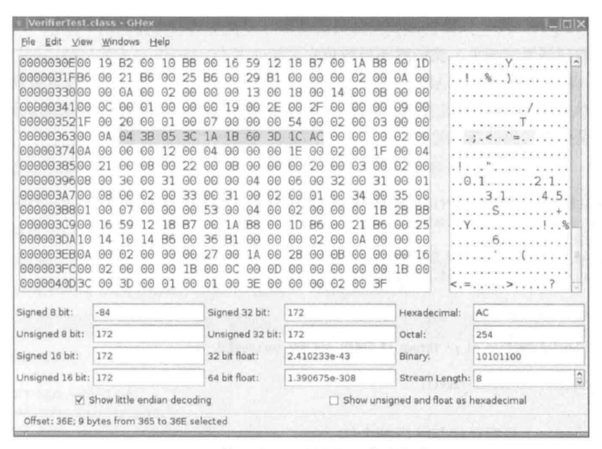

图 10-4 使用十六进制编辑器修改字节码

将 3C 改为 3B 并保存类文件, 然后尝试运行 VerifierTest 程序, 将会看到下面的出错信息:

Exception in thread "main" java.lang.VerifyError: (class: VerifierTest, method:fun signature: ()I) Accessing value from uninitialized register 1

这很好——虚拟机发现了我们所做的修改。

现在用 -noverify 选项 (或者 -Xverify:none) 来运行程序:

java -noverify verifier. VerifierTest

从表面上看, fun 方法似乎返回了一个随机值。但实际上, 该值是 2 与存储在尚未初始化的变量 n 中的值相加得到的结果。下面是典型的输出结果:

1 + 2 == 15102330

## 10.2 用户认证

Java API 提供了一个名为 Java 认证和授权服务(JAAS)的框架,它提供了对平台提供的和客户定制的认证机制的访问管理。我们将在以下各节中讨论 JAAS 框架。

## 10.2.1 JAAS 框架

正如其名字所表示的, Java 认证和授权服务 (JAAS, Java Authentication and Authorization

Service) 包含两部分:"认证"部分主要负责确定程序使用者的身份,而"授权"与已经被弃用的安全管理器紧密相关,我们就不再讨论它了。

JAAS 是一个可插拔的 API,可以将 Java 应用程序与实现认证的特定技术分离开来。除此之外, JAAS 还支持 UNIX 登录、Windows 登录、Kerberos 认证和基于证书的认证。

下面是登录代码的基本轮廓:

```
f
    System.setSecurityManager(new SecurityManager());
    var context = new LoginContext("Login1"); // defined in JAAS configuration file
    context.login();
    // get the authenticated Subject
    Subject subject = context.getSubject();
    context.logout();
}
catch (LoginException e) // thrown if login was not successful
{
    exception.printStackTrace();
}
```

这里, subject 是指已经被认证的个体。

LoginContext 构造器中的字符串参数 "Login1" 是指 JAAS 配置文件中具有相同名字的项。下面是一个简单的配置文件:

```
Login1
{
   com.sun.security.auth.module.UnixLoginModule required;
   com.whizzbang.auth.module.RetinaScanModule sufficient;
};
Login2
{
   ...
}:
```

当然, JDK 中没有包含任何使用 biometric 的登录模块。JDK 在 com.sun.security.auth. module 包中包含以下模块:

UnixLoginModule NTLoginModule Krb5LoginModule JndiLoginModule KeyStoreLoginModule

登录策略由登录模块序列组成,每个模块被标记为 required、sufficient, requisite 或 optional。这些关键字的含义在下面的算法中进行了描述:

- 1. 模块依次执行,直至某个 sufficient 模块认证成功,某个 requisite 模块认证失败,或者到达模块列表末尾。
  - 2. 如果所有 required 和 requisite 模块都认证成功,或者没有执行过任何这两类模块,抑

或是至少有一个 sufficient 或 optional 模块认证成功,则认证成功。

登录时要对登录的主体(subject)进行认证,该主体可以拥有多个特征(principal)。特征描述了主体的某些属性,比如用户名、组 ID 或角色等。com.sun.security.auth.UnixPrincipal 类描述了 UNIX 登录名,UnixNumericGroupPrincipal 类可以用来检测用户是否归属于某个 UNIX 用户组。

程序清单 10-4 展示了当前登录用户的特征。可以像下面这样运行该程序

java -Djava.security.auth.login.config=auth/jaas.config auth.AuthTest

程序清单 10-5 展示了登录配置。

在 Windows 运行时,需要将 AuthTest.policy 中的 UnixPrincipal 修改为 NTUserPrincipal,并且需要将 jaas.config 中的 UnixLoginModule 修改为 NTLoginModule。

#### 程序清单 10-4 auth/AuthTest.java

```
1 package auth;
2
  import java.security.*:
   import javax.security.auth.*;
   import javax.security.auth.login.*;
    * This program obtains information about a user's Unix login
    * @version 1.03 2021-11-29
    * @author Cay Horstmann
11
   public class AuthTest
12
13
      public static void main(final String[] args)
14
15
         try
16
17
            var context = new LoginContext("Login1");
18
            context.login();
19
            System.out.println("Authentication successful.");
28
            Subject subject = context.getSubject();
21
             for (Principal p : subject.getPrincipals())
22
             {
23
                System.out.println(p.getClass().getName() + ": " + p.getName());
24
25
             context.logout():
26
27
         catch (LoginException e)
28
29
             System.out.println("Authentication failed.");
38
             e.printStackTrace();
31
32
      }
33
34 }
```

# *序清单 10-5 auth/jaas.config*

- *<sup>1</sup> Loginl*
- *2 {*
- *<sup>3</sup> com.sun.security.auth.module.UnixLoginModule required;*

## *aw] j avax.security.auth.login.LoginContext*

- *• LoginContext(String name) 创建一个 录上下文。name对应于JAAS 文件中 录描 。*
- *• void login()*

*建 一个 录操作 如果 录失 ij抛出一个LoginExc印tion异常。它会 JAAS 文件中 器上 login方法。*

*• void logout()*

*Subject 出 录。它会 JAAS配置文件中的管理器上 logout方法。*

*• Subject getSubjectO 回认证过的Subject。*

## *api<sup>I</sup> j avax. secu rity. aut h. Sub j ect*

*• Set<Principal> getPrincipalsO 取 Subject 各个Principalo*

## *奶j java.security.Principal*

*• String getName() 回 征 标 名。*

# *10.2.2 JAAS 录模块*

*在本 中 我们将 一个JAAS例子向 介*

- *如何实 己 录模块*
- *如何实 基于角色的认证。*

*如果 录信息存储在数据库中 么使 己 录模块就 常有 。*

*录模块 工作之一是 主体 征 。如果一个 录模块支持某些 , 模块就会添加Principal对 来描 些 。Java 库并没有提供 应 所以我们写 <sup>了</sup> <sup>己</sup> ( 序清单10-6 )0该类直接存储了一个描 /值对 例如role=admin0 getName方法 于 回 描 /值对。*

*我们 录模块会在包含如下 文本文件中査找 户、密 和角色*

*harry|secretladmin carl|guessi)e|HR*

*当然 在实 录模块中 你可 会将 些信息存储在数据库或 录中。*

在程序清单 10-7 中可以找到 SimpleLoginModule 的代码,其 checkLogin 方法用于检查输入的用户名和密码是否与密码文件中的用户记录相匹配。如果匹配成功,则会添加两个 SimplePrincipal 对象到主体的特征集中。

```
Set<Principal> principals = subject.getPrincipals();
principals.add(new SimplePrincipal("username", username));
principals.add(new SimplePrincipal("role", role));
```

SimpleLoginModule 剩余的部分就非常直截了当了。initialize 方法接收下面几个参数:

- 用于认证的 Subject。
- · 一个获取登录信息的 handler。
- 一个 sharedState 映射表,它可以用于登录模块之间的通信。
- 一个 options 映射表,它包含了登录配置文件中设置的名 / 值对。

例如, 我们将模块做如下配置:

SimpleLoginModule required pwfile="password.txt";

则登录模块可以从 options 映射表中获取 pwfile 设置。

该登录模块并没有收集用户名和密码,这是单独的 handler 需要做的工作。这种功能上的分离有助于在各种情况下使用相同的登录模块,而不用关心登录信息是来自 GUI 对话框、控制台提示符还是配置文件。

handler 是在创建 LoginContext 时指定的。例如,

```
var context = new LoginContext("Login1",
   new com.sun.security.auth.callback.DialogCallbackHandler());
```

DialogCallbackHandler 会弹出一个简单的 GUI 对话框,以获取用户名和密码。而 com.sun. security.auth.callback.TextCallbackHandler 则从控制 台获取这些信息。

但是,在我们的应用程序中,是通过自己编写的 GUI 来获得用户名和密码的(参见图 10-5)。 我们创建了一个简单的 handler,仅仅用于存储和返回这些信息(见程序清单 10-8)。


图 10-5 一个定制的登录模块

该 handler 有一个简单的方法 handle,用于处理 Callback 对象数组。有很多预定义类,比如 NameCallback 和 PasswordCallback 等,都实现了 Callback 接口。也可以添加自己的类,比如 Retina-ScanCallback 等。下面这段 handler 代码可能有些不雅致,因为它要分析 callback 对象的类型:

```
public void handle(Callback[] callbacks)
{
   for (Callback callback : callbacks)
   {
      if (callback instanceof NameCallback) . . .
      else if (callback instanceof PasswordCallback) . . .
      else . . .
}
```

登录模块提供 callback 数组以满足认证的需要。

```
var nameCall = new NameCallback("username: ");
var passCall = new PasswordCallback("password: ", false);
callbackHandler.handle(new Callback[] { nameCall, passCall });
```

然后它从 callback 中获取所要的信息。

程序清单 10-9 中的程序将显示一个窗体,用于输入登录信息。如果登录成功(见程序清单 10-10 ),就会显示 Principal,可以像下面这样运行该程序: java-Djava.security.auth.login. config = jaas/jaas.config jaas.JAASTest。

註釋:有些应用有可能需要支持更复杂的两阶段协议,即只有登录配置文件中的所有模块都认证成功,该登录才会被提交。更多详细信息,请参阅下面地址的登录模块开发指南: http://docs.oracle.com/javase/8/docs/technotes/guides/security/jaas/JAASLMDevGuide.html。

#### 程序清单 10-6 jaas/SimplePrincipal.java

```
1 package jaas;
2
3 import java.security.*;
4 import java.util.*;
5
6 /**
   * A principal with a named value (such as "role=HR" or "username=harry").
7
9 public class SimplePrincipal implements Principal
10
      private String descr;
11
      private String value;
12
13
14
       * Constructs a SimplePrincipal to hold a description and a value.
15
       * @param descr the description
16
       * @param value the associated value
17
18
      public SimplePrincipal(String descr, String value)
19
28
         this.descr = descr;
21
         this.value = value;
22
      }
23
24
      public SimplePrincipal(String descrAndValue)
25
26
         String[] dv = descrAndValue.split("=");
27
         this.descr = dv[0]:
28
         this.value = dv[1];
79
38
      }
31
32
       * @return the description and value of this simple principal.
33
34
35
      public String getName()
```

```
36
         return descr + "=" + value;
37
38
39
      public boolean equals(Object otherObject)
48
41
         if (this == otherObject) return true;
42
         if (otherObject == null) return false;
43
         if (getClass() != otherObject.getClass()) return false;
44
         var other = (SimplePrincipal) otherObject;
45
         return Objects.equals(getName(), other.getName());
45
47
48
      public int hashCode()
49
50
         return Objects.hashCode(getName());
51
52
  }
53
```

## 程序清单 10-7 jaas/SimpleLoginModule.java

```
1 package jaas;
2
   import java.io.*;
4 import java.nio.charset.*;
  import java.nio.file.*;
6 import java.security.*;
7 import java.util.*;
   import javax.security.auth.*;
   import javax.security.auth.callback.*;
   import javax.security.auth.login.*;
   import javax.security.auth.spi.*;
12
13
    * This login module authenticates users by reading usernames, passwords, and roles from
    * a text file.
15
    */
16
   public class SimpleLoginModule implements LoginModule
17
18
      private Subject subject;
19
      private CallbackHandler callbackHandler;
20
      private Map<String, ?> options;
21
22
      public void initialize(Subject subject, CallbackHandler callbackHandler,
23
            Map<String, ?> sharedState, Map<String, ?> options)
24
25
         this.subject = subject;
26
27
         this.callbackHandler = callbackHandler;
         this.options = options;
28
29
30
      public boolean login() throws LoginException
31
32
         if (callbackHandler == null) throw new LoginException("no handler");
33
```

```
34
         var nameCall = new NameCallback("username: ");
35
         var passCall = new PasswordCallback("password: ", false);
36
         try
37
         {
38
            callbackHandler.handle(new Callback[] { nameCall, passCall });
30
48
         catch (UnsupportedCallbackException e)
41
         1
42
            var e2 = new LoginException("Unsupported callback");
43
            e2.initCause(e);
44
             throw e2;
45
46
         catch (IOException e)
47
             var e2 = new LoginException("I/O exception in callback");
49
             e2.initCause(e);
SA
             throw e2;
51
          }
52
53
          try
55
56
             return checkLogin(nameCall.getName(), passCall.getPassword());
          catch (IOException e)
58
             var e2 = new LoginException();
60
             e2.initCause(e):
61
             throw e2;
62
          }
63
      }
64
65
66
        * Checks whether the authentication information is valid. If it is, the subject acquires
67
        * principals for the user name and role.
        * @param username the user name
69
        * @param password a character array containing the password
70
        * @return true if the authentication information is valid
71
72
       private boolean checkLogin(String username, char[] password)
73
             throws LoginException, IOException
74
75
          try (var in = new Scanner(
76
                Path.of("" + options.get("pwfile")), StandardCharsets.UTF 8))
77
78
             while (in.hasNextLine())
79
80
                String[] inputs = in.nextLine().split("\\\");
81
                if (inputs[0].equals(username)
82
                       && Arrays.equals(inputs[1].toCharArray(), password))
83
84
                   String role = inputs[2];
                   Set<Principal> principals = subject.getPrincipals();
86
                   principals.add(new SimplePrincipal("username", username));
87
                   principals.add(new SimplePrincipal("role", role));
88
```

```
return true;
89
90
91
              return false;
92
93
94
95
       public boolean logout()
96
97
       {
98
          return true;
99
100
       public boolean abort()
101
192
103
          return true;
104
105
       public boolean commit()
106
107
          return true;
108
109
110 }
```

## 程序清单 10-8 jaas/SimpleCallbackHandler.java

```
1 package jaas;
2
   import javax.security.auth.callback.*;
4
5
    * This simple callback handler presents the given user name and password.
7
   public class SimpleCallbackHandler implements CallbackHandler
8
   {
9
      private String username;
10
      private char[] password;
11
12
13
14
       * Constructs the callback handler.
       * Oparam username the user name
15
       * @param password a character array containing the password
16
17
      public SimpleCallbackHandler(String username, char[] password)
18
19
         this.username = username;
20
         this.password = password;
71
22
23
      public void handle(Callback[] callbacks)
24
25
         for (Callback callback: callbacks)
26
27
            if (callback instanceof NameCallback c)
28
            {
29
```

```
438
```

```
c.setName(username);
}

c.setName(username);
}
\nelse if (callback instanceof PasswordCallback c)

{
    c.setPassword(password);
}

}

}

}

}
```

#### 程序清单 10-9 jaas/JAASTest.java

```
package jaas;
3 import java.awt.*;
4 import javax.swing.*;
  /**
   * This program authenticates a user via a custom login
   * @version 1.04 2021-05-30
    * @author Cay Horstmann
10
11 public class JAASTest
12 {
13
      public static void main(final String[] args)
14
         EventQueue.invokeLater(() ->
15
            1
16
               var frame = new JAASFrame();
17
               frame.setDefaultCloseOperation(JFrame.EXIT ON CLOSE);
18
               frame.setTitle("JAASTest");
19
               frame.setVisible(true);
28
            });
21
      }
22
23 }
```

#### 程序清单 10-10 jaas/jaas.config

```
1 Login1
2 {
3     jaas.SimpleLoginModule required pwfile="jaas/password.txt" debug=true;
4 };
```

## api javax.security.auth.callback.CallbackHandler

void handle(Callback[] callbacks)
 处理给定的 callback,如果愿意,可以与用户进行交互,并且将安全信息存储到 callback 对象中。

## javax.security.auth.callback.NameCallback

NameCallback(String prompt)

- NameCallback(String prompt, String defaultName)
   用给定的提示符和默认的名字构建一个 NameCallback。
- String getName()
- void setName(String name)
   设置或者获取该 callback 所收集到的名字。
- String getPrompt()
   获取查询该名字时所使用的提示符。
- String getDefaultName()
   获取查询该名字时所使用的默认名字。

#### API javax.security.auth.callback.PasswordCallback

- PasswordCallback(String prompt, boolean echoOn)
   用给定提示符和回显标记构建一个 PasswordCallback。
- char[] getPassword()
- void setPassword(char[] password)
   设置或者获取该 callback 所收集到的密码。
- String getPrompt()
   获取查询该密码时所使用的提示符。
- boolean isEchoOn()
   获取查询该密码时所使用的回显标记。

## API javax.security.auth.spi.LoginModule

 void initialize(Subject subject, CallbackHandler handler, Map<String,?> sharedState, Map<String,?> options)

为了认证给定的 subject, 初始化该 LoginModule。在登录处理期间, 用给定的 handler 来收集登录信息; 使用 sharedState 映射表与其他登录模块进行通信; options 映射表包含该模块实例的登录配置中指定的名 / 值对。

- boolean login()
   执行认证过程,并组装主体的特征集。如果登录成功,则返回 true。
- boolean commit()
   对于需要两阶段提交的登录场景,当所有的登录模块都成功后,调用该方法。如果操作成功,则返回 true。
- boolean abort()
   如果某一登录模块失败导致登录过程中断,就调用该方法。如果操作成功,则返回true。
- boolean logout()
   注销当前的主体。如果操作成功,则返回 true。

## 10.3 数字签名

正如我们前面所说,applet 是在 Java 平台上开始流行起来的。实际上,人们发现尽管他们可以编写出像著名的"nervous text"那样栩栩如生的 applet,但是在 JDK 1.0 安全模式下无法发挥其一整套非常有用的作用。例如,由于 JDK 1.0 下的 applet 要受到严密的监管,因此,即使 applet 在公司安全内部网上运行时风险相对较小,applet 也无法在企业内部网上发挥很大的作用。Sun 公司很快就认识到,要使 applet 真正变得非常有用,用户必须可以根据 applet 的来源为其分配不同的安全级别。如果 applet 来自值得信赖的提供商,并且没有被篡改过,那么 applet 的用户就可以决定是否给 applet 授予更多的运行特权。

如果要给予一个 applet 更多的信任, 你必须知道下面两件事:

- 1. 这个 applet 来自哪里?
- 2. 在传输过程中代码是否被破坏?

在过去的 50 年里,数学家和计算机科学家已经开发出各种各样成熟的算法,用于确保数据和电子签名的完整性,在 java.security 包中包含了许多这类算法的实现,而且幸运的是,你无须掌握相应的数学基础知识,就可以使用 java.security 包中的算法。在下面几节中,我们将要介绍消息摘要是如何检测数据文件中的变化的,以及数字签名是如何证明签名者的身份的。

## 10.3.1 消息摘要

消息摘要(message digest)是数据块的数字指纹。例如,所谓的 SHA1(安全散列算法#1)可将任何数据块,无论其数据有多长,都压缩为 160 位(20 字节)的序列。与真实的指纹一样,人们希望任何两条不同的消息都不会有相同的 SHA1 指纹。当然,这是不可能的一因为只存在 2<sup>160</sup> 个 SHA1 指纹,所以肯定会有某些消息具有相同的指纹。因为 2<sup>160</sup> 是一个很大的数字,所以存在重复指纹的可能性微乎其微,那么这种重复的可能性到底小到什么程度呢?根据 James Walsh 在他的 True Odds: How Risks Affect Your Everyday Life (Merritt Publishing 出版社 1996 年出版)一书中所叙述的,人死于雷击的概率为三万分之一。现在,假设有 9 个人,比如你最不喜欢的 9 个经理或者教授,你和他们所有的人都死于雷击的概率,比伪造的消息与原有消息具有相同的 SHA1 指纹的概率还要高。(当然,可能有你不认识的其他 10 个以上的人会死于雷击,但这里我们讨论的是你选择的特定的人的死亡概率。)

消息摘要具有两个基本属性:

- 1. 如果数据的 1 位或者几位改变了,那么消息摘要也将改变。
- 2. 拥有给定消息的伪造者无法创建与原消息具有相同摘要的假消息。

当然, 第二个属性又是一个概率问题。让我们来看看下面这位亿万富翁留下的遗嘱:

"我死了之后,我的财产将由我的孩子平分,但是,我的儿子 George 应该拿不到一个子。" 这份遗嘱的 SHA1 指纹为:

12 5F 09 03 E7 31 30 19 2E A6 E7 E4 90 43 84 B4 38 99 8F 67

这位有疑心病的父亲将这份遗嘱交给一位律师保存,而将指纹交给另一位律师保存。现在,假设 George 能够贿赂那位保存遗嘱的律师,他想修改这份遗嘱,使得 Bill 一无所得。当然,这需要将原指纹改为下面这样完全不同的位模式:

7D F6 AB 08 EB 40 EC CD AB 74 ED E9 86 F9 ED 99 D1 45 B1 57

那么 George 能够找到与该指纹相匹配的其他措辞吗?如果从地球形成之时,他就很自豪地拥有 10 亿台计算机,每台计算机每秒钟能处理一百万条信息,他依然无法找到一个能够替换的遗嘱。

人们已经设计出大量的算法,用于计算这些消息摘要,其中最著名的两种算法是 SHA1 和 MD5。SHA1 是由美国国家标准和技术学会开发的加密散列算法,MD5 是由麻省理工学院的 Ronald Rivest 发明的算法。这两种算法都使用了独特巧妙的方法对消息中的各个位进行扰乱。如果要了解这些方法的详细信息,请参阅 William Stallings 撰写的 Cryptography and Network Security (第 7 版) 一书,该书由 Prentice Hall 出版社于 2017 年出版。但是,人们在这两种算法中发现了某些微妙的规律性,因此美国国家标准和技术学会建议切换到更强的加密算法上,Java 支持 SHA-2 和 SHA-3 算法集。

MessageDigest 类是用于创建封装了指纹算法的对象的"工厂",它的静态方法 getInstance 返回继承了 MessageDigest 类的某个类的对象。这意味着 MessageDigest 类能够承担下面的双重职责:

- 作为一个工厂类。
- 作为所有消息摘要算法的超类。

例如,下面是如何获取一个能够计算 SHA 指纹的对象的方法:

MessageDigest alg = MessageDigest.getInstance("SHA-1");

在获取 MessageDigest 对象之后,可以通过反复调用 update 方法,将信息中的所有字节提供给该对象。例如,下面的代码将文件中的所有字节传给上面创建的 alg 对象,以执行指纹算法:

```
InputStream in = . . .;\nint ch;
while ((ch = in.read()) != -1)
   alg.update((byte) ch);
```

另外,如果这些字节存放在一个数组中,那就可以一次完成整个数组的更新:

```
byte[] bytes = . . .;
alg.update(bytes);
```

当完成上述操作后,调用 digest 方法。该方法按照指纹算法的要求补齐输入,并且进行相应的计算,然后以字节数组的形式返回消息摘要。

```
byte[] hash = alg.digest();
```

程序清单 10-11 中的程序计算了一个消息摘要,可以在命令行中指定文件和算法: java hash.Digest hash/input.txt SHA-1

如果没有提供命令行参数,那么就会提示你输入文件名和算法名。

#### 程序清单 10-11 hash/Digest.java

```
1 package hash;
2
3 import java.io.*;
4 import java.nio.file.*;
5 import java.security.*;
6 import java.util.*;
7
  /**
8
   * This program computes the message digest of a file.
9
    * @version 1.21 2018-04-10
    * @author Cay Horstmann
11
12
   public class Digest
13
   {
14
15
       * @param args args[0] is the filename, args[1] is optionally the algorithm
16
       * (SHA-1, SHA-256, or MD5)
17
18
      public static void main(String[] args) throws IOException, GeneralSecurityException
19
20
         var in = new Scanner(System.in);
21
         String filename;
22
         if (args.length >= 1)
23
             filename = args[\theta];
24
         else
25
26
             System.out.print("File name: ");
27
             filename = in.nextLine();
28
29
          String algname;
30
          if (args.length >= 2)
31
             algname = args[1];
32
          else
33
34
             System.out.println("Select one of the following algorithms: ");
35
             for (Provider p : Security.getProviders())
36
                for (Provider.Service s : p.getServices())
37
                    if (s.getType().equals("MessageDigest"))
38
                       System.out.println(s.getAlgorithm());
39
             System.out.print("Algorithm: ");
48
             algname = in.nextLine();
41
42
          MessageDigest alg = MessageDigest.getInstance(algname);
43
          byte[] input = Files.readAllBytes(Path.of(filename));
          byte[] hash = alg.digest(input);
45
          for (int i = 0; i < hash.length; i++)
46
             System.out.printf("%02X ", hash[i] & 0xFF);
          System.out.println();
48
49
50 }
```

## API java.security.MessageDigest

- static MessageDigest getInstance(String algorithmName)
   返回实现指定算法的 MessageDigest 对象。如果没有提供算法,则抛出一个 NoSuch-AlgorithmException 异常。
- void update(byte input)
- void update(byte[] input)
- void update(byte[] input, int offset, int len)
   使用指定的字节来更新摘要。
- byte[] digest()完成散列计算,返回计算所得的摘要,并复位算法对象。
- void reset()重置摘要。

#### 10.3.2 消息签名

在上一节中,我们介绍了如何计算消息摘要,即原始消息的指纹的方法。如果消息改变了,那么改变后的消息的指纹与原消息的指纹将不匹配。如果消息和它的指纹是分开传送的,那么接收者就可以检查消息是否被篡改过。但是,如果消息和指纹同时被截获了,对消息进行修改,再重新计算指纹,就是一件很容易的事情。毕竟,消息摘要算法是公开的,不需要使用任何密钥。在这种情况下,假消息和新指纹的接收者永远不会知道消息已经被篡改。数字签名解决了这个问题。

为了了解数字签名的工作原理,我们需要解释关于公共密钥加密技术领域中的几个概念。公共密钥加密技术是基于公共密钥和私有密钥这两个基本概念的。它的设计思想是你可以将公共密钥告诉世界上的任何人,但是,只有自己才持有私有密钥,重要的是你要保护你的私有密钥,不将它泄漏给其他任何人。这些密钥之间存在一定的数学关系,但是这种关系的具体性质对于实际的编程来说并不重要。(如果你有兴趣,可以参阅 http://www.cacr.math.uwaterloo.ca/ hac/ 站点上的 The Handbook of Applied Cryptography 一书。)

密钥非常长,而且很复杂。例如,下面是一对匹配的数字签名算法(DSA)的公共密钥和私有密钥。

## 公共密钥:

- p: fca682ce8e12caba26efccf7110e526db078b05edecbcd1eb4a208f3ae1617ae01f35b91a47e6df63413c5e12ed0899bcd132acd50d99151bdc43ee737592e17
- g: 962eddcc369cba8ebb260ee6b6a126d9346e38c5
- g: 678471b27a9cf44ee91a49c5147db1a9aaf244f05a434d6486931d2d14271b9e35030b71fd73da179069b32e2 935630e1c2062354d0da20a6c416e50be794ca4
- y: c0b6e67b4ac098eb1a32c5f8c4c1f0e7e6fb9d832532e27d0bdab9ca2d2a8123ce5a8018b8161a760480fadd0 40b927281ddb22cb9bc4df596d7de4d1b977d50

## *有密*

- *p: fca682ce8el2caba26efccf7110e526db078b 5edecbcdleb4a208f3ael617ae01f35b91a47e6df63413c5el2 ed 99bcdl32acd5Gd99151bdc43ee737592el7*
- *q: 962eddcc369cba8ebb260ee6b6al26d9346e38c5*
- *g: 678471b27a9cf44ee91a49c5147dbla9aaf244fe5a434d6486931d2dl4271b9e35e3eb71fd73dal79069b32e2 935636elc2062354d6da2ea6c416e5ebe794ca4*
- *x: 146c09f881656cc6c51f27ea6c3a91b85edld7 <sup>a</sup>*

*在 实中 几乎不可 一个密 去推 出另一个密 。也就是 即使每个人都知道 你 公共密 不 他们拥有多少 源 他们一 子也无法 出你 有密 。*

*任何人 无法根据公共密 来推 有密 似乎 人 以 信。但是时 今日 没有人 够找到一 法 来为 在常 加密 法 推 。如果密钥足够 么 是使 举法一一就是 接 所有可 密 — 所需要的计算机将比 太阳系中 所有原子来制造的计算机还要多 且 得 数千年 时 。当然 可 会有人提出比 举更灵活 密 法。例如 RSA 法 加密 法 Rivest、Shamir和Adleman<sup>发</sup> 明 就利 了对数值巨大 数字 因数分 困 性。在最 20年 多优秀的数学家 在尝 提出好 因数分 法 但是 今为止 没有成功。据此 大多数密 学 为 拥有2000位或 更多位"模数" 密 前是完全安全 可以抵御任何攻击。DSA被认 为具有 似 安全性。*

*图10-6展 了实 中 机制是如何工作 。*

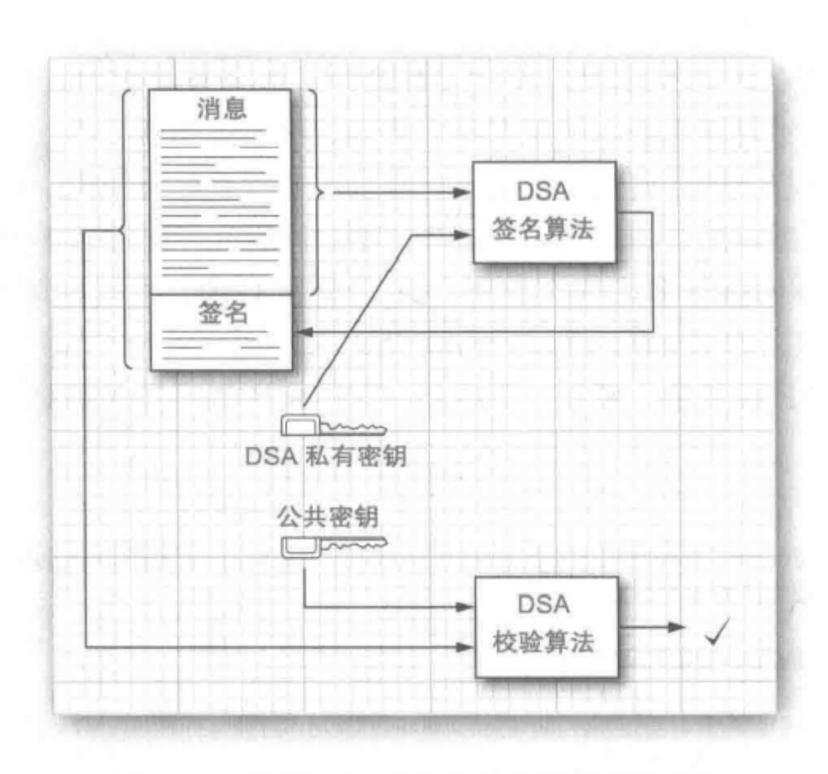

*假 Alice想 Bob发 一个消息 Bob想 消息是否来 Alice 不是冒名 替 。*

Alice 写好了消息,并且用她的私有密钥对该消息摘要签名。Bob 得到了她的公共密钥的拷贝,然后 Bob 用该公共密钥对该签名进行校验。如果通过了校验,则 Bob 可以确认以下两个事实:

- 1. 原始消息没有被篡改过。
- 2. 该消息是由 Alice 签名的, 她是私有密钥的持有者, 该私有密钥就是与 Bob 用于校验的公共密钥相匹配的密钥。

你可以看到私有密钥的安全性为什么是最重要的。如果某个人偷了 Alice 的私有密钥,或者政府要求她交出私有密钥,那么她就麻烦了。小偷或者政府代表就可以假扮她的身份来发送消息,例如资金转账指令,而其他人则会相信这些消息确实来自于 Alice。

#### 10.3.3 校验签名

JDK 配有一个 keytool 程序,该程序是一个命令行工具,用于生成和管理一组证书。我们期望该工具的功能最终能够被嵌入到其他更加用户友好的程序中去。但我们现在要做的是,使用 keytool 工具来展示 Alice 是如何对一个文档进行签名并且将它发送给 Bob 的,而 Bob 又是如何校验该文档确实是由 Alice 签名,而不是冒名顶替的。

keytool 程序负责管理密钥库、证书数据库和私有 / 公有密钥对。密钥库中的每一项都有一个"别名"。下面展示的是 Alice 如何创建一个密钥库 alice.certs 并且用别名生成一个密钥对。

keytool -genkeypair -keystore alice.certs -alias alice

当新建或者打开一个密钥库时,系统将提示输入密钥库口令,在下面的这个例子中,口令就使用 secret,如果要将 keytool 生成的密钥库用于重要的应用,那么需要选择一个好的口令来保护这个文件。

当生成一个密钥时,系统提示输入下面这些信息:

Enter keystore password: secret Reenter new password: secret What is your first and last name?

[Unknown]: Alice Lee

What is the name of your organizational unit?

[Unknown]: Engineering

What is the name of your organization?

[Unknown]: ACME Software

What is the name of your City or Locality?

[Unknown]: San Francisco

What is the name of your State or Province?

[Unknown]: CA

What is the two-letter country code for this unit?

[Unknown]: US

Is <CN=Alice Lee, OU=Engineering, O=ACME Software, L=San Francisco, ST=CA, C=US> correct?

[no]: yes

keytool 工具使用 X.500 格式的名字,它包含常用名(CN)、机构单位(OU)、机构(O)、地点(L)、州(ST)和国别(C)等成分,以确定密钥持有者和证书发行者的身份。

最后,必须设定一个密钥口令,或者按回车键,将密钥库口令作为密钥口令来使用。

假设 Alice 想把她的公共密钥提供给 Bob, 她必须导出一个证书文件:

keytool -exportcert -keystore alice.certs -alias alice -file alice.cer

这时, Alice 就可以把证书发送给 Bob。当 Bob 收到该证书时, 他就可以将证书打印出来: keytool -printcert -file alice.cer

#### 打印的结果如下:

Owner: CN=Alice Lee, OU=Engineering, O=ACME Software, L=San Francisco, ST=CA, C=US Issuer: CN=Alice Lee, OU=Engineering, O=ACME Software, L=San Francisco, ST=CA, C=US

Serial number: 470835ce

Valid from: Sat Oct 06 18:26:38 PDT 2007 until: Fri Jan 04 17:26:38 PST 2008

Certificate fingerprints:

MD5: BC:18:15:27:85:69:48:B1:5A:C3:0B:1C:C6:11:B7:81

SHA1: 31:0A:A0:B8:C2:8B:3B:B6:85:7C:EF:C0:57:E5:94:95:61:47:6D:34

Signature algorithm name: SHA1withDSA

Version: 3

如果 Bob 想检查他是否得到了正确的证书,可以给 Alice 打电话,让她在电话里读出证书的指纹。

i 注释:有些证书发放者将证书指纹公布在他们的网站上。例如,要检查 jre/lib/security/cacerts 目录中的密钥库里的 DigiCert 公司的证书,可以使用 -list 选项:

keytool -list -v -keystore jre/lib/security/cacerts

该密钥库的口令是 changeit。在该密钥库中有一个证书是:

Owner: CN=DigiCert Assured ID Root G3, OU=www.digicert.com, O=DigiCert Inc, C=US Issuer: CN=DigiCert Assured ID Root G3, OU=www.digicert.com, O=DigiCert Inc, C=US

Serial number: bal5afalddfa0b54944afcd24a06cec

Valid from: Thu Aug 01 14:00:00 CEST 2013 until: Fri Jan 15 13:00:00 CET 2038

Certificate fingerprints:

SHA1: F5:17:A2:4F:9A:48:C6:C9:F8:A2:00:26:9F:DC:0F:48:2C:AB:30:89 SHA256: 7E:37:CB:8B:4C:47:09:0C:AB:36:55:1B:A6:F4:5D:B8:40:68:0F:BA: 16:6A:95:2D:B1:00:71:7F:43:05:3F:C2

通过访问网址 www.digicert.com/digicert-root-certificates.htm., 就可以核实该证书的有效性。

一旦 Bob 信任该证书,他就可以将它导入密钥库中。

keytool -importcert -keystore bob.certs -alias alice -file alice.cer

● 警告:绝对不要将你并不完全信任的证书导入到密钥库中。一旦证书添加到密钥库中,使用密钥库的任何程序都会认为这些证书可以用来对签名进行校验。

现在 Alice 就可以给 Bob 发送签过名的文档了。 jarsigner 工具负责对 JAR 文件进行签名和校验, Alice 只需要将文档添加到要签名的 JAR 文件中。

jar cvf document.jar document.txt

然后她使用 jarsigner 工具将签名添加到文件中,她必须指定要使用的密钥库、JAR 文件和密钥的别名。

*jarsigner -keystore alice.certs document.jar alice*

*当Bob收到JAR文件时 他可以使 jarsigner 序 -verify 对文件 校 。 jarsigner -verify -keystore bob.certs document.jar*

*Bob不 定密 别名。jarsigner 序会在数字 名中找到密 所有者的X.500名字 并在密 库中搜寻匹 书。*

*如果JAR文件没有受到 坏 且 名匹 么jarsigner 序将打印 jar verified.*

*否则 序将显 一个出 消息。*

## *10.3.4认证问题*

*假 你从朋友Alice 接收到一个消息 消息是Alice 她的私有密钥签名 使 名方法就是我们刚刚介绍的方法。你可 已 有了她 公共密 或 你 够容易地 得 她 公共密 比如 她 一个密 拷 或 从她 Web 中 得密 。 时 你就可以 校 消息是否是Alice 名 并且有没有 坏 。 在 假 你从一个声 代 某 名 件公司 人 得了一个消息 他 求你 消息 带 序。 个 人 将他 公共密钥的拷 发送给你 以便 你校 他是否是 消息 作 。你检査后会发 名是有效 就 明 消息是 匹 有密 名 并且没有 到 坏。*

*此时你 小心 你仍然不清楚 写 条消息。任何人 可以 成一对公共密 和 有 密 再 有密 对消息 名 然后把 名好 消息和公共密 发 你。 定 发送者身份的问题称为"认证问题"。*

*决 个 常做法是比 单 。假 人和你有一个你们俩 值得信 共同 人。假 人亲 了 人 将包含公共密 交 了他。后来 你 人与你见面 向你担保他与 人 了 并且 人 实在 家 名 件公司工 <sup>作</sup> 然后将 <sup>交</sup> <sup>你</sup> <sup>参</sup> <sup>图</sup>10-7 o 样一来 <sup>你</sup> 人就 明了 <sup>人</sup> <sup>份</sup> 实性。*

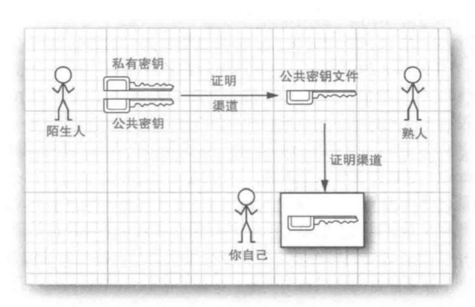

*图10-7 一个值得信 <sup>中</sup> <sup>人</sup>*

*事实上 你 人并不 与你 。取 代之 是 他可以将他 有 名应 于 人 公共密 文件之上即可 参 图10-8 <sup>o</sup>*

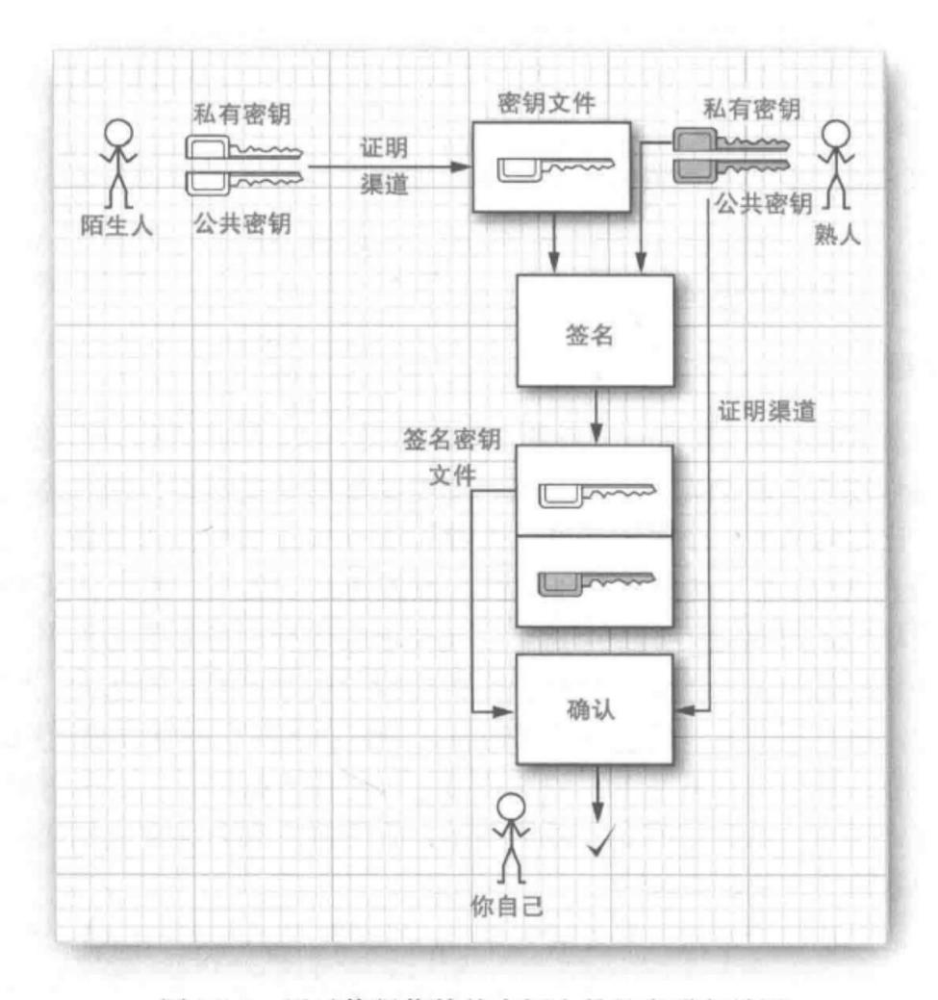

*图10-8 值得信 <sup>中</sup> <sup>人</sup> <sup>名</sup>*

*当你拿到公共密 文件之后 就可以检 你 人 名是否 实 于你信任他 因 此你 信他在添加他 名之前 实核实了 人 份。*

*然 你们之 可 没有共同 人。有些信任模型假 你们之 总是存在一个"信 任 "— 即一个共同 人的链路— 样你就可以信任 中 每个成员。当然 实 情况并不总是 样。你可 信任你 人Alice, 且你知道Alice信任Bob,但是你不了 Bob,因此你没有把握 是不是 信任他。其他 信任模型则假 有一个我们大家 信 任 慈善大佬 即一家我们大家 信任 公司。在 样 公司中 如 有DigiCert. GlobalSign和Entrust,它们 提供 服务。*

*你常常会 到 担保他人 份 一个或多个实体 数字 名 你必 估一下 够在多大 度上信任 些 份 人。你可 常信 某 定 书授权 因为也 你在 多 中 到 他们 标志 或 你曾 听 每当有新 万 密 产 时, 他们就会 求在一个 常保密 会 室中 众多揣 公文包 人 商。*

*然 对于实际被认证的对 你应 抱有一个 合实 期望 接在Web页面上*

*填一份 <sup>格</sup> 并支付少 就可以 得一个" <sup>一</sup> " (classl) ID.包含在 书中 密 将 发 到指定 件地址。因此 你有理由相信该电子 件是 实 但是密 人也可 是 意填入 名字和机构。 有其他对 份信息 检 更加严格 ID 别。例如 如果是" <sup>三</sup> "(class3) 1D, 书授权将 求密 人必 份公 <sup>公</sup> 机构将 核实企业申请者的财务信用资质。其他 机构将 不同 序。因此 当你收到 一条 消息时 是你应 明 它实 上 了什么。*

## *10.3.5 书 名*

*在10.3.3 中 你已经看到了 Alice如何使 名 书向Bob分发公共密 。但是 Bob 校 Alice 指 以 保 个 书是有效 。*

*假 Alice想要给同事Cindy发 一条 名 消息 但是Cindy并不希望因为 校 多 名指 受到困扰。因此 假 有一个Cindy信任 实体来校 些 名。在 个 例子中 Cindy信任ACME 件公司 信息 源 。*

*个部门负责证书授权(CA) 作。ACME 每个人在其密 库中 有CA 公共密 是 一个专 核査密 指 员安 。CA对ACME 员 密 名 当他们在安 彼此 密 时 密 库将 含地信任 些密 因为它们是 一个 可信任 密 名 。*

*下 展 了可以如何模仿 个 。 先需要创建一个密 库aonesoft.Certs, 成一个 密 对并导出公共密 。*

*keytool -genkeypair • keystore acmesoft.certs -alias acnveroot keytool -exportcert -keystore acmesoft.certs -alias acrneroot -file acmeroot.cer*

*其中 公共密 导入到了一个 名 书中 然后将其添加到每个 员 密 库中 keytool -importcert -keystore cindy.certs -alias acmeroot -file acmeroot.cer*

*如果Alice 发 消息 Cindy以及ACME 件公司 其他任何人 她 将她 己 书 名一并提交 信息 源 。但是 个功 在keytool 序中是 失 。在本书 带 代 中 我们提供了一个Certificatesigner 来弥 个 。ACME 件公司 授权机构 成员将 核实Alice的身份 并且 成如下 名 书*

*java Certificatesigner -keystore acmesoft.certs -alias acmeroot \ -infile alice.cer -outfile alice\_signedby acmeroot.cer*

*书 名器 序必 拥有对ACME 件公司密 库 权 并且 公司成员必 密 库 口令 显然 是一 敏感 操作。*

*在Alice将文件alice\_signedby\_acmeroot. cert交 Cindy和ACME 件公司 其他任 何人。或 ACME 件公司 接将 文件存储在公司 录中。 住 文件包含了 Alice 公共密 和ACME 件公司 声明 明 密 实属于Alice。*

*在 Cindy将 名的证书导人到她 密 库中*

*keytool -import cert -key st ore cindy. certs -alias alice -file alicesignedby acmeroot. cer*

*密 库 校 以 定 密 是 密 库中已有 受信任 根密 名 。Cindy 就不必对 书 指 校 了。*

*一旦Cindy添加了根 书和 常 她发 文档 人 书后 她就再也不 担心密 库了。*

## *10.3.6 书 求*

*在前一 中 我们 密 库和Certificatesigner工具模拟了一个CA。但是 大多数CA 更加复杂 件来 书 并且使 书格式也 有不同。本 将展 与 些 件包进行交互时需要增加 处 步 <sup>O</sup>*

*我们将 OpenSSL 件包作为实例。 多Linux 和Mac OS X <sup>了</sup> <sup>个</sup> <sup>件</sup> <sup>并</sup> 且 于Windows Cygwin 口也可 个 件 你也可以到http://www.openssl.org 下 。*

*为了创建一个CA, CA 本 其 切位 依 于你 操作 。在Ubuntu 上 运行*

*/usr/Ub/ssl/misc/CA.pl -newca*

*个 本会在当前 录中创建一个demoCA子 录 个 录包含了一个根密 对 并 存储了 书与 书撤 列 。*

*你希望将 个公共密 导入到所有 员 Java密 库中 但是它 格式是 增强型 件 PEM 格式 不是密 库更容易接受 DER格式。将文件demoCA/cacert.pem复制成文 件acmeroot.pem,然后在文本 器中打开 个文件。 下 之前 所有内容*

*… BEGIN CERTIFICATE•••••*

*以及下 之后 所有内容*

*… END CERTIFICATE…*

*在可以按照 常 方式将acmeroot.pem导人到每个密 库中了*

*keytool -importcert -keystore cindy.certs -alias alice -file acmeroot.pem*

*这看起来有点不可思 keytool 然不 己去执 操作。*

*对Alice 公共密 名 需要生成一个 书 求 它包含 个PEM格式的证书*

*keytool -certreq -keystore alice.store -alias alice -file alice.pem*

*名 个 书*

*openssl ca -in alice.pern -out alice signedby acmeroot.pem*

*与前 一样 <sup>在</sup> alice\_signedby\_acmeroot.pem 中剔 BEGIN CERTIFICATE/END CERTIFICATE 标 之 外 所有内容。然后 将其导人到密 库中*

*keytool -importcert -keystore cindy.certs -alias alice -file alice signedby acmeroot.pem*

*你可以使用相同 步 使一个 书得到公共 书权威机构 名。*

## *10.3.7代 名*

*技术最 一个应 是对可执 序 名。如果从 上下 一个 序 然*

会关心该程序可能带来的危害,例如,该程序可能已经感染了病毒。如果知道代码从何而来,并且确信它从离开源头后就没有被篡改过,那么放心程度会比不清楚这些信息时要高得多。

本节将展示如何对 JAR 文件签名,以及如何配置 Java 以校验这种签名。这种能力是为 applet 和 Java Web Start 应用而设计的。这些技术已经不再被广泛使用了,但是你可能仍旧需要在遗留产品中支持它们。

当 Java 首次发布时,applet 在加载之后就运行于具有有限权限的"沙盒"之中。如果用户想要使用可以访问本地文件系统、创建网络连接等诸如此类功能的applet,那么就必须明确同意允许其运行。为了确保applet 代码不会在传输过程中被篡改,必须对其进行数字签名。

下面是一个具体例子。假设当你在因特网上冲浪时,遇到了一个 Web 站点,倘若你为它 授予了需要的权限,它就会运行一个来自不明提供商的 applet (参见图 10-9)。这样的程序是由 Java 运行时环境信任的证书权威机构发放的"软件开发者"证书进行签名的。弹出的对话 框用于确定软件开发者和证书发放者的身份。现在,你需要决定是否对该程序授权。


图 10-9 启动一个签过名的 applet

那么什么样的因素可能会影响你的决定呢?假设下面是你已经了解的情况:

- 1. Thawte 公司将一个证书卖给了软件开发人员。
- 2. 程序确实是用该证书签名的,并且在传输过程中没有被篡改过。
- 3. 该证书确实是由 Thawte 签名的,它是用本地 cacerts 文件中的公共密钥校验的。

当然,上面这些信息都不能告诉你代码是否可以安全运行。如果你只知道供应商的名

字,以及Thawte公司卖给了他们一个软件开发者证书这个事实,那么你会信赖该供应商吗?这种方式显然没什么意义。

对内联网部署,证书更有用。管理员可以在本地机器上安装策略文件和证书,使在启动从受信源而来的代码时可以无须任何用户交互。但是,随着安全管理器淡出 Java,这种方式已经变得不可行了。

## 10.4 加密

到现在为止,我们已经介绍了一种在 Java 安全 API 中实现的重要密码技术,即通过数字签名进行的认证。安全性的第二个重要方面是加密。当信息通过认证之后,该信息本身是直白可见的。数字签名只不过负责检验信息有没有被篡改过。相比之下,信息被加密后,是不可见的,只能用匹配的密钥进行解密。

认证对于代码签名已足够了——没必要将代码隐藏起来。但是,当应用程序传输机密信息时,比如信用卡号码和其他个人数据等,就有必要进行加密了。

过去,由于专利和出口控制的原因,许多公司被禁止提供高强度的加密技术。幸运的是,现在对加密技术的出口控制已经不是那么严格了,某些重要算法的专利也已到期。现在,Java 已经有了出色的加密支持,它已经成为标准类库的一部分。

## 10.4.1 对称密码

"Java 密码扩展"包含了一个 Cipher 类,该类是所有加密算法的超类。通过调用下面的 getInstance 方法可以获得一个密码对象:

Cipher cipher = Cipher.getInstance(algorithmName);

或者调用下面这个方法:

Cipher cipher = Cipher.getInstance(algorithmName, providerName);

JDK 中是由名为"SunJCE"的提供商提供密码的,如果没有指定其他提供商,则会默认为该提供商。如果要使用特定的算法,而对该算法 Oracle 公司又没有提供支持,那么也可以指定其他的提供商。

算法名称是一个字符串,比如"AES"或者"DES/CBC/PKCS5Padding"。

DES,即数据加密标准,是一个密钥长度为 56 位的古老的分组密码。DES 加密算法在现在看来已经是过时了,因为可以用穷举法将它破译。更好的选择是采用它的后续版本,即高级加密标准(AES),更多详细信息,请访问网址 https://nvlpubs.nist.gov/nistpubs/FIPS/NIST.FIPS.197.pdf。我们在示例中使用了 AES。

一旦获得了一个密码对象, 就可以通过设置模式和密钥来对它初始化。

int mode = . . .;
Key key = . . .;
cipher.init(mode, key);

#### 模式有以下几种:

Cipher.ENCRYPT\_MODE Cipher.DECRYPT\_MODE Cipher.WRAP\_MODE Cipher.UNWRAP\_MODE

wrap 和 unwrap 模式会用一个密钥对另一个密钥进行加密,具体例子请参见下一节。 现在可以反复调用 update 方法来对数据块进行加密。

```
int blockSize = cipher.getBlockSize();
var inBytes = new byte[blockSize];
. . . // read inBytes\nint outputSize= cipher.getOutputSize(blockSize);
var outBytes = new byte[outputSize];\nint outLength = cipher.update(inBytes, θ, outputSize, outBytes);
. . . // write outBytes
```

完成上述操作后,还必须调用一次 doFinal 方法。如果还有最后一个输入数据块(其字节数小于 blockSize),那么就要调用:

outBytes = cipher.doFinal(inBytes, 0, inLength);

如果所有的输入数据都已经加密,则用下面的方法调用来代替:

outBytes = cipher.doFinal();

对 doFinal 的调用是必需的,因为它会对最后的块进行"填充"。就拿 DES 密码来说,它的数据块的大小是 8 字节。假设输入数据的最后一个数据块少于 8 字节,当然我们可以将其余的字节全部用 0 填充,从而得到一个 8 字节的最终数据块,然后对它进行加密。但是,当对数据块进行解密时,数据块的结尾会附加若干个 0 字节,因此它与原始输入文件之间会略有不同。这肯定是个问题,我们需要一个填充方案来避免这个问题。常用的填充方案是 RSA Security 公司在公共密钥密码标准# 5 中(Public Key Cryptography Standard,PKCS)描述的方案(该方案的网址为 https://tools.ietf.org/html/rfc2898)。

在该方案中,最后一个数据块不是全部用填充值 0 进行填充,而是用等于填充字节数量的值作为填充值进行填充。换句话说,如果 L 是最后一个(不完整的)数据块,那么它将按如下方式进行填充:

最后,如果输入的数据长度确实能被8整除,那么就会将下面这个数据块:

08 08 08 08 08 08 08 08

附加到输入数据的后面,并进行加密。在解密时,明文的最后一个字节就是要丢弃的填充字符数。

#### 10.4.2 密钥生成

为了加密,我们需要生成密钥。每个密码都有不同的用于密钥的格式,我们需要确保密钥的生成是随机的。这需要遵循下面的步骤:

- 1. 为加密算法获取 KeyGenerator。
- 2. 用随机源来初始化密钥发生器。如果密码块的长度是可变的,还需要指定期望的密码块长度。
  - 3. 调用 generateKey 方法。

例如,下面是如何生成 AES 密钥的方法:

KeyGenerator keygen = KeyGenerator.getInstance("AES");
var random = new SecureRandom(); // see below
keygen.init(random);
Key key = keygen.generateKey();

或者,可以从一组固定的原生数据(也许是由口令或者随机击键产生的)中生成一个密钥,这时可以使用如下的 SecretKeyFactory:

```
byte[] keyData = . . .; // 16 bytes for AES
var key = new SecretKeySpec(keyData, "AES");
```

如果要生成密钥,必须使用"真正的随机"数。例如,在 Random 类中的常规的随机数发生器是根据当前的日期和时间来产生随机数的,因此它不够随机。假设计算机时钟可以精确到 1/10 秒,那么,每天最多存在 864 000 个种子。如果攻击者知道发布密钥的日期(通常可以由消息日期或证书有效日期推算出来),那么就可以很容易地生成那一天所有可能的种子。

SecureRandom 类产生的随机数,远比由 Random 类产生的那些数字安全得多。你仍然需要提供一个种子,以便在一个随机点上开始生成数字序列。要这样做,最好的方法是从一个诸如白噪声发生器之类的硬件设备那里获取输入。另一个合理的随机输入源是请用户在键盘上进行随心所欲的盲打,但是每次敲击键盘只为随机种子提供 1 位或者 2 位。一旦你在字节数组中收集到这种随机位后,就可以将它传递给 setSeed 方法。

```
var random = new SecureRandom();
var b = new byte[20];
// fill with truly random bits
random.setSeed(b);
```

如果没有为随机数发生器提供种子,那么它将通过启动线程,使它们睡眠,然后测量它们被唤醒的准确时间,以此来计算自己的 20 个字节的种子。

**注释**: 这个算法仍然未被认为是安全的。而且,在过去,依靠对诸如硬盘访问时间之 类的其他的计算机组件进行计时的算法,后来也被证明并不是完全随机的。

本节结尾处的示例程序将应用 AES 密码(参见程序清单 10-12)。程序清单 10-13 中的 crypt 工具方法将会在其他示例中被复用。如果要使用该程序,首先要生成一个密钥,运行如下命令行:

java aes.AESTest -genkey secret.key

密钥就被保存在 secret.key 文件中了。

现在可以用如下命令进行加密:

java aes.AESTest -encrypt plaintextFile encryptedFile secret.key

用如下命令进行解密:

java aes.AESTest -decrypt encryptedFile decryptedFile secret.key

该程序非常直观。使用-genkey 选项将产生一个新的密钥,并且将其序列化到给定的文件中。该操作需要花费较长的时间,因为密钥随机生成器的初始化非常耗费时间。-encrypt和-decrypt 选项都调用相同的 crypt 方法,而 crypt 方法会调用密码的 update 和 doFinal 方法。请注意 update 方法和 doFinal 方法是怎样被调用的,只要输入数据块具有全长度(长度能够被8整除),就要调用 update 方法,而如果输入数据块不具有全长度(长度不能被8整除,此时需要填充),或者没有更多额外的数据(以便生成一个填充字节),那么就要调用 doFinal 方法。

#### 程序清单 10-12 aes/AESTest.java

```
1 package aes;
2
3 import java.jo.*:
4 import java.security.*;
5 import javax.crypto.*;
6
   /**
7
   * This program tests the AES cipher. Usage:<br/>
R
   * java aes.AESTest -genkey keyfile<br>
   * java aes.AESTest -encrypt plaintext encrypted keyfile<br>
10
   * java aes.AESTest -decrypt encrypted decrypted keyfile<br>
11
   * @author Cay Horstmann
12
    * @version 1.02 2018-05-01
13
14
   public class AESTest
15
16
      public static void main(String[] args)
17
            throws IOException, GeneralSecurityException, ClassNotFoundException
18
19
         if (args[0].equals("-genkey"))
20
21
            KeyGenerator keygen = KeyGenerator.getInstance("AES");
22
            var random = new SecureRandom();
23
            keygen.init(random);
24
            SecretKey key = keygen.generateKey();
25
            try (var out = new ObjectOutputStream(new FileOutputStream(args[1])))
26
27
               out.writeObject(key);
28
29
38
         else
```

```
{
32
             int mode;
33
            if (args[0].equals("-encrypt")) mode = Cipher.ENCRYPT MODE;
34
             else mode = Cipher.DECRYPT_MODE;
35
36
             try (var keyIn = new ObjectInputStream(new FileInputStream(args[3]));
37
                   var in = new FileInputStream(args[1]);
38
                   var out = new FileOutputStream(args[2]))
39
48
                var key = (Key) keyIn.readObject();
41
                Cipher cipher = Cipher.getInstance("AES");
42
                cipher.init(mode, key);
43
                Util.crypt(in, out, cipher);
44
45
46
      }
47
48
```

#### 程序清单 10-13 aes/Util.java

```
1 package aes;
  import java.io.*;
4 import java.security.*;
  import javax.crypto.*;
   public class Util
7
8
9
       * Uses a cipher to transform the bytes in an input stream and sends the transformed bytes
18
11
       * to an output stream.
       * @param in the input stream
       * @param out the output stream
13
       * Oparam cipher the cipher that transforms the bytes
14
15
      public static void crypt(InputStream in, OutputStream out, Cipher cipher)
16
            throws IOException, GeneralSecurityException
17
18
         int blockSize = cipher.getBlockSize();
19
         int outputSize = cipher.getOutputSize(blockSize);
28
         var inBytes = new byte[blockSize];
21
         var outBytes = new byte[outputSize];
22
23
         int inLength = 0;
24
25
         boolean done = false;
         while (!done)
26
27
            inLength = in.read(inBytes);
28
            if (inLength == blockSize)
29
30
            {
                int outLength = cipher.update(inBytes, θ, blockSize, outBytes);
31
                out.write(outBytes, 0, outLength);
37
33
             else done = true;
34
         }
35
```

```
if (inLength > 0) outBytes = cipher.doFinal(inBytes, 0, inLength);\nelse outBytes = cipher.doFinal();
out.write(outBytes);
}
```

#### API javax.crypto.Cipher

- static Cipher getInstance(String algorithmName)
- static Cipher getInstance(String algorithmName, String providerName)
   返回实现了指定加密算法的 Cipher 对象。如果未提供该算法,则抛出一个 NoSuchAlgorithm-Exception 异常。
- int getBlockSize() 返回密码块的大小,如果该密码不是一个分组密码,则返回 0。
- int getOutputSize(int inputLength)
   如果下一个输入数据块拥有给定的字节数,则返回所需的输出缓冲区的大小。本方法的运行要考虑到密码对象中所有已缓冲的字节数量。
- void init(int mode, Key key)
   对加密算法对象进行初始化。Mode 是 ENCRYPT\_MODE, DECRYPT\_MODE, WRAP\_MODE, 或者 UNWRAP\_MODE 之一。
- byte[] update(byte[] in)
- byte[] update(byte[] in, int offset, int length)
- int update(byte[] in, int offset, int length, byte[] out)
   对输入数据块进行转换。前两个方法返回输出,第三个方法返回放入 out 的字节数。
- byte[] doFinal()
- byte[] doFinal(byte[] in)
- byte[] doFinal(byte[] in, int offset, int length)
- int doFinal(byte[] in, int offset, int length, byte[] out)
   转换输入的最后一个数据块,并刷新该加密算法对象的缓冲。前三个方法返回输出, 第四个方法返回放入 out 的字节数。

## API javax.crypto.KeyGenerator

- static KeyGenerator getInstance(String algorithmName)
   返回实现指定加密算法的 KeyGenerator 对象。如果未提供该加密算法,则抛出一个 NoSuch-AlgorithmException 异常。
- void init(SecureRandom random)
- void init(int keySize, SecureRandom random)
   对密钥生成器进行初始化。
- SecretKey generateKey()
   生成一个新的密钥。

## API javax.crypto.spec.SecretKeySpec

SecretKeySpec(byte[] key, String algorithmName)
 创建一个密钥描述规格说明。

#### 10.4.3 密码流

JCE 库提供了一组使用便捷的流类,用于对流数据进行自动加密或解密。例如,下面是对文件数据进行加密的方法:

```
Cipher cipher = . . .;
cipher.init(Cipher.ENCRYPT MODE, key);
var out = new CipherOutputStream(new FileOutputStream(outputFileName), cipher);
var bytes = new byte[BLOCKSIZE];
int inLength = getData(bytes); // get data from data source
while (inLength != -1)
   out.write(bytes, θ, inLength);
   inLength = getData(bytes); // get more data from data source
out.flush();
同样,可以使用 CipherInputStream,对文件的数据进行读取和解密:
Cipher cipher = . . .;
cipher.init(Cipher.DECRYPT MODE, key);
var in = new CipherInputStream(new FileInputStream(inputFileName), cipher);
var bytes = new byte[BLOCKSIZE];
int inLength = in.read(bytes);
while (inLength != -1)
{
   putData(bytes, inLength); // put data to destination
   inLength = in.read(bytes);
}
```

密码流类能够透明地调用 update 和 doFinal 方法, 所以非常方便。

## api javax.crypto.CipherInputStream

- CipherInputStream(InputStream in, Cipher cipher)
   构建一个输入流,以读取 in 中的数据,并且使用指定的密码对数据进行解密和加密。
- int read()
- int read(byte[] b, int off, int len)
   读取输入流中的数据,该数据会被自动解密和加密。

## javax.crypto.CipherOutputStream

- CipherOutputStream(OutputStream out, Cipher cipher)
   构建一个输出流,以便将数据写入 out,并且使用指定的密码对数据进行加密和解密。
- void write(int ch)
- void write(byte[] b, int off, int len)

将数据写入输出流,该数据会被自动加密和解密。

• void flush() 刷新密码缓冲区,如果需要的话,执行填充操作。

#### 10.4.4 公共密钥密码

在前面的小节中看到的 AES 密码是一种对称密码,加密和解密都使用相同的密钥。对称密码的致命缺点在于密码的分发。如果 Alice 给 Bob 发送了一个加密的方法,那么 Bob 需要使用与 Alice 相同的密钥。如果 Alice 修改了密钥,那么她必须在给 Bob 发送信息的同时,还要通过安全信道发送新的密钥,但是也许她并没有到达 Bob 的安全信道,这也正是她必须对她发送给 Bob 的信息进行加密的原因。

公共密钥密码技术解决了这个问题。在公共密钥密码中,Bob 拥有一个密钥对,包括一个公共密钥和一个相匹配的私有密钥。Bob 可以在任何地方发布公共密钥,但是他必须严格保守他的私有密钥。Alice 只需要使用公共密钥对她发送给 Bob 的信息进行加密即可。

实际上,加密过程并没有那么简单。所有已知的公共密钥算法的操作速度都比对称密钥算法(比如 DES 或 AES 等)慢得多,使用公共密钥算法对大量的信息进行加密是不切实际的。但是,如果像下面这样,将公共密钥密码与快速的对称密码结合起来,这个问题就可以得到解决:

- 1. Alice 生成一个随机对称加密密钥, 她用该密钥对明文进行加密。
- 2. Alice 用 Bob 的公共密钥给对称密钥进行加密。
- 3. Alice 将加密后的对称密钥和加密后的明文同时发送给 Bob。
- 4. Bob 用他的私有密钥给对称密钥解密。
- 5. Bob 用解密后的对称密钥给信息解密。

除了 Bob 之外,其他人无法给对称密钥进行解密,因为只有 Bob 拥有解密的私有密钥。这样,昂贵的公共密钥加密技术就可以只应用于少量的关键数据的加密。

最常见的公共密钥算法是 Rivest、Shamir 和 Adleman 发明的 RSA 算法。直到 2000 年 10 月,该算法一直受 RSA Security 公司授予的专利保护。该专利的转让许可证价格昂贵,通常 要支付 3% 的专利权使用费,每年至少付款 50 000 美元。现在该加密算法已经公开。

如果要使用 RSA 算法,就需要一对公共/私有密钥。你可以按如下方法使用 Key-Pair-Generator 来获得:

KeyPairGenerator pairgen = KeyPairGenerator.getInstance("RSA");
var random = new SecureRandom();
pairgen.initialize(KEYSIZE, random);
KeyPair keyPair = pairgen.generateKeyPair();
Key publicKey = keyPair.getPublic();
Key privateKey = keyPair.getPrivate();

程序清单 10-14 中的程序有三个选项。-genkey 选项用于产生一个密钥对, -encrypt 选项用于生成 AES 密钥, 并且用公共密钥对其进行包装。

```
Key key = . . .; // an AES key
Key publicKey = . . .; // a public RSA key
Cipher cipher = Cipher.getInstance("RSA");
cipher.init(Cipher.WRAP_MODE, publicKey);
byte[] wrappedKey = cipher.wrap(key);
```

然后它会生成一个包含下列内容的文件:

- 包装过的密钥的长度。
- 包装过的密钥字节。
- 用 AES 密钥加密的明文。

-decrypt 选项用于对这样的文件进行解密。请试运行该程序,首先生成 RSA 密钥:

java rsa.RSATest -genkey public.key private.key

然后对一个文件进行加密:

java rsa.RSATest -encrypt plaintextFile encryptedFile public.key

最后,对该文件进行解密,并且检验解密后的文件是否与明文相匹配:

java rsa.RSATest -decrypt encryptedFile decryptedFile private.key

#### 程序清单 10-14 rsa/RSATest.java

```
1 package rsa;
2
3 import java.io.*;
4 import java.security.*;
5 import javax.crypto.*;
7 /**
   * This program tests the RSA cipher. Usage:<br>
   * java rsa.RSATest -genkey public private<br>
  * java rsa.RSATest -encrypt plaintext encrypted public<br>
    * java rsa.RSATest -decrypt encrypted decrypted private<br>
11
    * @author Cay Horstmann
12
   * @version 1.02 2018-05-01
13
   */
14
15 public class RSATest
  {
16
      private static final int KEYSIZE = 512;
17
18
      public static void main(String[] args)
19
            throws IOException, GeneralSecurityException, ClassNotFoundException
28
21
         if (args[0].equals("-genkey"))
22
23
            KeyPairGenerator pairgen = KeyPairGenerator.getInstance("RSA");
24
            var random = new SecureRandom();
25
            pairgen.initialize(KEYSIZE, random);
26
            KeyPair keyPair = pairgen.generateKeyPair();
27
            try (var out = new ObjectOutputStream(new FileOutputStream(args[1])))
28
29
                out.writeObject(keyPair.getPublic());
38
31
```

```
try (var out = new ObjectOutputStream(new FileOutputStream(args[2])))
32
33
                out.writeObject(keyPair.getPrivate());
34
            }
35
36
         else if (args[0].equals("-encrypt"))
37
38
            KeyGenerator keygen = KeyGenerator.getInstance("AES");
39
             var random = new SecureRandom();
48
             keygen.init(random);
41
             SecretKey key = keygen.generateKey();
42
43
             // wrap with RSA public key
             try (var keyIn = new ObjectInputStream(new FileInputStream(args[3]));
45
                   var out = new DataOutputStream(new FileOutputStream(args[2]));
46
47
                   var in = new FileInputStream(args[1]) )
48
                var publicKey = (Key) keyIn.readObject();
49
                Cipher cipher = Cipher.getInstance("RSA");
50
                cipher.init(Cipher.WRAP MODE, publicKey);
51
                byte[] wrappedKey = cipher.wrap(key);
52
53
                out.writeInt(wrappedKey.length);
                out.write(wrappedKey);
54
55
                cipher = Cipher.getInstance("AES");
56
                cipher.init(Cipher.ENCRYPT MODE, key);
57
58
                Util.crypt(in, out, cipher);
59
         }
68
         else
61
          {
62
             try (var in = new DataInputStream(new FileInputStream(args[1]));
63
                   var keyIn = new ObjectInputStream(new FileInputStream(args[3]));
64
65
                   var out = new FileOutputStream(args[2]))
             {
66
                int length = in.readInt();
67
68
                var wrappedKey = new byte[length];
                in.read(wrappedKey, 0, length);
69
78
                // unwrap with RSA private key
71
                var privateKey = (Key) keyIn.readObject();
77
73
                Cipher cipher = Cipher.getInstance("RSA");
74
                cipher.init(Cipher.UNWRAP MODE, privateKey);
75
                Key key = cipher.unwrap(wrappedKey, "AES", Cipher.SECRET KEY);
76
77
                cipher = Cipher.getInstance("AES");
78
                cipher.init(Cipher.DECRYPT MODE, key);
79
RR
81
                Util.crypt(in, out, cipher);
82
83
84
   }
85
```

*在本 你已 初步了 了 加 器 并且领略了 Java 库提供 和加密机制。 下来 对于基于安全 器和代 名 典Java安全架构已 成为 回忆 你可 会 扼 不已 就 它 吧。*

*下一 我们将深入 Swing 和图形化。*

## 第 11 章 高级 Swing 和图形化编程

▲ 表格

▲ 像素图

▲ 树

▲ 打印

▲ 高级 AWT

在本章中,我们继续对卷 I 的 Swing 用户界面工具包和 AWT 图形化编程进行讨论。我们聚焦于可以同时应用于客户端用户界面和服务器端图形图像生成的技术。Swing 有很多复杂的构件来绘制表格和树。通过使用 2D 图形化 API,我们可以产生具有任意复杂度的向量艺术品。ImageIO API 使我们可以操作像素图像。最终,可以使用打印 API 来生成打印资料和 PostScript 文件。

## 11.1 表格

JTable 构件用于显示二维对象表格。当然,表格在用户界面中很常见。Swing 开发小组将大量的精力投入到了表格控件上。表格本身比较复杂,但是它可能比其他 Swing 类更为成功,因为 JTable 构件隐藏了更多的复杂性。只需编写几行代码就能够产生具有完整功能的、行为丰富的表格。当然,还可以编写更多的代码,为具体应用定制显示外观和运行特性。

在本节中,我们将着重讲解怎样产生简单表格,用户怎样与它们交互,以及怎样进行一些最常见的调整操作。与其他一些复杂的 Swing 构件一样,我们不可能覆盖所有的细节。如果想获得详细信息,请查阅 David M. Geary 撰写的 *Graphic Java*(第 3 版,Prentice Hall,1999)或 Kim Topley 撰写的 *Core Swing*(Prentice Hall,1999)。

## 11.1.1 一个简单表格

JTable 并不存储它自己的数据,而是从一个表格模型中获取数据。JTable 类有一个构造

器,能够将二维对象数组包装进一个默认的模型。这 也正是我们第一个示例程序要用到的策略。在本章的 后续部分,我们将转向介绍表格模型。

图 11-1 展示了一个典型的表格,用于描述太阳系各个行星的属性。(如果一个行星主要由氢气和氦气组成,那么它就是气态行星。对于"Color"项,你不必太当真,我们之所以将它添加为一列是因为在后面的

| Planet  | Radius  | Moons | Gaseous | Color       |     |
|---------|---------|-------|---------|-------------|-----|
| Mercury | 2440.0  | 0     | false   | java awt C. |     |
| Venus   | 6052.0  | 0     | false   | java.awi.C. | П   |
| Earth   | 6378.0  | 1     | false   | java.awt.C  |     |
| Mars    | 3397.0  | 2     | false   | java.awr.C  | -14 |
| Jupiter | 71492.0 | 16    | true    | java.awt.C. |     |
| Saturn  | 60268.0 | 18    | true    | java.awt.C  | ŀ   |
| Uranus  | 25559.0 | 17    | true    | java.awt.C  | -   |
| Montuno | 24766.0 | 0     | THE LOT | inun out C  | 13  |

图 11-1 简单表格

#### 示例代码中它会很有用。)

正如在程序清单 11-1 中看到的那样,表格中的数据是以 Object 值的二维数组的形式存储的:

```
Object[][] cells =
```

直 注释: 这里,我们充分利用了自动装箱机制。第二列、第三列、第四列中的项会自动转换成类型为 Double、Integer 和 Boolean 的对象。

该表格直接调用每个对象上的 toString 方法来显示它们,这也正是颜色显示为 java. awt.Color[r=...,g=...] 的原因所在。

可以用一个单独的字符串数组来提供列名:

String[] columnNames = { "Planet", "Radius", "Moons", "Gaseous", "Color" };

接着,就可以从单元格和列名数组中构建一个表格:

var table = new JTable(cells, columnNames);

最后,通过将表格包装到一个 JScroll Pane 中这种常用方法来添加滚动条:

var pane = new JScrollPane(table);

在滚动表格时,表头并不会滑到视图的外面。

接着,单击列表头的某一列,并且向左或向右拖拉。看看整个列是怎样移开的(参见图 11-2),还可以将它放到别的位置上。这种列的重新排列只是视图上的重新排列,对数据模型没有任何影响。

如果要调整列的尺寸大小,只需将鼠标移到两列之间,直到鼠标的形状变成箭头为止,然后将列的边界拖移到你期望的位置上(参见图 11-3)。

| Planet  | Radius       | ons   | Gaseous | Color       | J  |
|---------|--------------|-------|---------|-------------|----|
| Mercury | 24640.0      |       | false   | java.awt.C. | -  |
| Venus   | 6052 0       |       | false   | Java awt C  | П  |
| Earth   | 6378.0       |       | false   | java.awt C  | П  |
| Mars    | 3397.0       |       | false   | lava.awt.C  | H  |
| Jupiter | 71492.0      |       | true    | Java awt C  | 11 |
| Saturn  | 60268.0      |       | true    | Java.awt.C  | L  |
| Uranus  | 25559.0      |       | true    | java.awr.C  | ]- |
| Montuna | 7.47EE.A     | 1     | arian.  | lain aut.   | 1. |
|         | J941.061 \$E | Print |         |             |    |

图 11-2 移动表格中的一列

| Planet  | Radius  | Moons | Gas.  | Color               | 1  |
|---------|---------|-------|-------|---------------------|----|
| Mercury | 2440.0  | 0     | false | java.awt.Color[r=   | -  |
| Venus   | 6052.0  | 0     | false | java.awt.Color[r=   | П  |
| Earth   | 6378.0  | 1     | false | java awt Color[r=   | 1  |
| Mars    | 3397.0  | 2     | false | java awt. Color[r=_ | 70 |
| Jupiter | 71492.0 | 16    | true  | java.awt.Color[r= . |    |
| Saturn  | 60268.0 | 18    | true  | ava.awt.Color(r=    | 1  |
| Uranus  | 25559.0 | 17    | true  | java awt Color[r=   | 1- |
| Mantuna | 24766.0 | 0     | 20105 | Inn aux Colorie     | 7  |

图 11-3 调整列的尺寸大小

用户可以通过点击行中任何一个地方来选中一行,而选中的行会高亮显示。通过单击一个单元格并键入数据,用户还可以编辑表格中的各个项。不过,在这个代码示例中,这些编辑并没有改变底层的数据。在程序中,应该要么使这些单元格不可编辑,要么处理单元格编辑事件并更新模型。我们将会在本节的后面对这些问题进行讨论。

最后,点击列的头,行就会自动排序。如果再次点击,排序顺序就会反过来。这个行为

#### 是通过下面的调用激活的:

```
table.setAutoCreateRowSorter(true);
可以使用下面的调用对表格进行打印:
table.print();
```

● 警告:如果没有将表格包装在滚动面板中,那么就需要显式地添加表头: add(table.getTableHeader(), BorderLayout.NORTH);

#### 程序清单 11-1 table/TableTest.java

```
package table;
2
  import java.awt.*;
4 import java.awt.print.*;
  import javax.swing.*;
7
8
   * This program demonstrates how to show a simple table.
   * @version 1.14 2018-05-01
10
11
   * @author Cay Horstmann
12
   public class TableTest
13
14
      public static void main(String[] args)
15
      {
16
         EventQueue.invokeLater(() ->
17
            1
18
               var frame = new PlanetTableFrame();
19
               frame.setTitle("TableTest");
20
               frame.setDefaultCloseOperation(JFrame.EXIT ON CLOSE);
21
               frame.setVisible(true);
22
            });
23
24
25
26
27
    * This frame contains a table of planet data.
29
   class PlanetTableFrame extends JFrame
31
      private String[] columnNames = { "Planet", "Radius", "Moons", "Gaseous", "Color" };
32
      private Object[][] cells =
33
34
            { "Mercury", 2440.0, 0, false, Color.YELLOW },
35
            { "Venus", 6052.0, 0, false, Color.YELLOW },
36
            { "Earth", 6378.0, 1, false, Color.BLUE },
37
            { "Mars", 3397.0, 2, false, Color.RED },
38
            { "Jupiter", 71492.0, 16, true, Color.ORANGE },
39
            { "Saturn", 60268.0, 18, true, Color.ORANGE },
40
            { "Uranus", 25559.0, 17, true, Color.BLUE },
```

```
{ "Neptune", 24766.0, 8, true, Color.BLUE },
42
            { "Pluto", 1137.0, 1, false, Color.BLACK }
43
44
      public PlanetTableFrame()
46
47
         var table = new JTable(cells, columnNames);
48
         table.setAutoCreateRowSorter(true);
40
         add(new JScrollPane(table), BorderLayout.CENTER);
58
         var printButton = new JButton("Print");
51
         printButton.addActionListener(event ->
52
53
               try { table.print(); }
54
               catch (SecurityException | PrinterException e) { e.printStackTrace(); }
55
56
         var buttonPanel = new JPanel();
57
         buttonPanel.add(printButton);
58
         add(buttonPanel, BorderLayout.SOUTH);
59
         pack();
68
51
62 }
```

#### API javax.swing.JTable 1.2

- JTable(Object[][] entries, Object[] columnNames)
   用默认的表格模型构建一个表格。
- void print() 5.0
   显示打印对话框,并打印该表格。
- boolean getAutoCreateRowSorter()
- void setAutoCreateRowSorter(boolean newValue)
   获取或设置 autoCreateRowSorter 属性,默认值为 false。如果进行了设置,只要模型发生变化,就会自动设置一个默认的行排序器。
- boolean getFillsViewportHeight()
- void setFillsViewportHeight(boolean newValue)
   获取或设置 fillsViewportHeight 属性,默认值为 false。如果进行了设置,该表格就总是会填充其外围的视图。

## 11.1.2 表格模型

在上一个示例中,表格数据是存储在一个二维数组中的。不过,通常不应该在自己的代码中使用这种策略。如果你发现自己在将数据装入一个数组中,然后作为一个表格显示出来,那么就应该考虑实现自己的表格模型了。

表格模型实现起来特别简单,因为可以充分利用 AbstractTableModel 类,它实现了大部分必需的方法。你仅仅需要提供下面三个方法便可:

```
public int getRowCount();
public int getColumnCount();
public Object getValueAt(int row, int column);
```

实现 getValueAt 方法有多种途径。例如,如果想显示包含数据库查询结果的 RowSet 的内容,只需提供下面的方法:

```
public Object getValueAt(int r, int c)
{
    try
    {
       rowSet.absolute(r + 1);
       return rowSet.getObject(c + 1);
    }
    catch (SQLException e)
    {
       e.printStackTrace();
       return null;
    }
}
```

我们的示例程序相当简单。我们构建了一个只是用来显示某些计算结果的 表格,这些计算结果也就是在不同利率 条件下的投资增长额(参见图 11-4)。

getValueAt 方法计算出正确值,并将其格式化:

```
public Object getValueAt(int r, int c)

{
    double rate = (c + minRate) / 100.0;
    int nperiods = r;
    double futureBalance = INITIAL BALANCE * Math.pow(1 + rate, nperiods);
    return "%.2f".formatted(futureBalance);
}
```

getrowCount 和 getColumnCount 方法只是返回行数和列数。

```
public int getRowCount() { return years; }
public int getColumnCount() { return maxRate - minRate + 1; }
```

如果不提供列名,那么 AbstractTableModel 的 getColumnName 方法会将列命名为 A、B、C等。如果要改变默认的列名,请覆盖 getColumnName 方法。通常需要覆盖默认的行为。在这个示例中,我们只是将每列用利率标识了出来。

```
public String getColumnName(int c) { return (c + minRate) + "%"; }
```

程序清单 11-2 中显示了完整的源代码。

#### 程序清单 11-2 tableModel/InvestmentTable.java

```
package tableModel;\nimport java.awt.*;
```

| Investment lable

图 11-4 投资增长额

```
5 import javax.swing.*;
6 import javax.swing.table.*;
7
8
   * This program shows how to build a table from a table model.
   * @version 1.05 2021-09-09
    * @author Cay Horstmann
12
   public class InvestmentTable
14
      public static void main(String[] args)
15
16
         EventQueue.invokeLater(() ->
17
18
            {
               var frame = new InvestmentTableFrame();
19
               frame.setTitle("InvestmentTable");
28
               frame.setDefaultCloseOperation(JFrame.EXIT ON CLOSE);
21
                frame.setVisible(true);
            });
23
24
25
76
    * This frame contains the investment table.
29
   class InvestmentTableFrame extends JFrame
31
      public InvestmentTableFrame()
32
33
         var model = new InvestmentTableModel(30, 5, 10);
34
         var table = new JTable(model);
35
         add(new JScrollPane(table));
36
         pack();
37
38
39
48
41
    * This table model computes the cell entries each time they are requested. The table contents
47
    * shows the growth of an investment for a number of years under different interest rates.
   class InvestmentTableModel extends AbstractTableModel
45
46
      private static double INITIAL BALANCE = 100000.0;
47
48
      private int years;
49
      private int minRate;
50
      private int maxRate;
51
52
53
       * Constructs an investment table model.
54
        * @param y the number of years
55
       * @param rl the lowest interest rate to tabulate
56
        * @param r2 the highest interest rate to tabulate
57
        */
58
```

```
public InvestmentTableModel(int y, int r1, int r2)
59
60
61
         years = y;
         minRate = r1;
62
63
         maxRate = r2:
64
65
      public int getRowCount()
66
67
         return years;
68
69
70
      public int getColumnCount()
71
72
          return maxRate - minRate + 1;
73
74
75
      public Object getValueAt(int r, int c)
76
77
          double rate = (c + minRate) / 100.0;
78
          int nperiods = r;
79
RA
          double futureBalance = INITIAL BALANCE * Math.pow(1 + rate, nperiods);
          return "%.2f".formatted(futureBalance):
81
82
83
84
      public String getColumnName(int c)
85
          return (c + minRate) + "%";
86
87
      }
88 }
```

## API javax.swing.table.TableModel

- int getRowCount()
- int getColumnCount()获取表模型中的行和列的数量。
- Object getValueAt(int row, int column)
   获取在给定的行和列所确定的位置处的值。
- void setValueAt(Object newValue, int row, int column) 设置在给定的行和列所确定的位置处的值。
- boolean isCellEditable(int row, int column)
  如果在给定的行和列所确定的位置处的值是可编辑的,则返回 true。
- String getColumnName(int column)
   获取列的名字。

## 11.1.3 对行和列的操作

在本小节中, 你会看到怎样操作一个表格中的行和列。在你阅读本材料的整个过程中,

*Swing中 格是 当不对 也就是你可以实施 操作和列操作会有所不同。 格构件已经被优化 以便 够显 具有 同 构的行信息 例如一次数据库査 果 不是任意 二 对象表格。你将会 到 不对 性 于本小 。*

## *11.1.3.1各 列*

*在下一个 例中 我们将再次展 星数据 不 次我们会 出更多 有关 格列 型 信息。 是 在 格模型中定义下 个方法来实*

*Class<?> getColumnClassdnt columnlndex*

*个方法可以 回一个描 列 型的类。*

*JTable 会为 取合 制器 11-1显 了 汄 制动作。*

| 型       | 制<br>果 |
|---------|--------|
| Boolean | 复<br>框 |
| Icon    | 图像     |
| Object  | 字<br>串 |

*11-1默认的绘制动作*

*可以在图11-5中 到复 框和图像。 感 Jim Evins提供了 些 星图像。*

| E Rows      | US     | Moons | Gaseous | Color                            | Image |
|-------------|--------|-------|---------|----------------------------------|-------|
| Colum Cells | ns 052 | 0     |         | java awt Color[r=255,g=255,b=0]  | -     |
| Earth       | 6,378  | 1     |         | Java awt Color[r=0,g=0,b=255]    | 3     |
| Mars        | 3,397  | 2     |         | java.awt.Color[r=255,g=0,b=0]    | 9     |
| Jupaer      | 71,492 | 16    | R       | java awt Color[r=255, g=200,b=0] | 3     |
| Saturn      | 60,268 | 18    | W)      | Java awr.Color[r=255,g=200,b=0]  | 1     |

*图11-5具有单元格 制器 <sup>格</sup>*

*要绘制其他 型 需要安 定制的绘制器 参 11.1.4 。*

## *11.1.3.2访问表格列*

*JTable 将有关 格列 信息存放在 型为TableColumn 对 中 一个TableColumn-Model对 些列。 图11-6展 了最重要的表格 之间的关 。 如果不想动态地* 插入或删除,那么最好不要过多地使用表格列模型。列模型最常见的用法是直接获取一个TableColumn对象:

int columnIndex = . .;
TableColumn column = table.getColumnModel().getColumn(columnIndex);

#### 11.1.3.3 改变列的大小

TableColumn 类可以控制更改列的大小的行为。使用下面这些方法,可以设置首选的、最小的以及最大的宽度:

void setPreferredWidth(int width)
void setMinWidth(int width)

void setMaxWidth(int width)

这些信息将提供给表格构件,以便对 列进行布局。

#### 使用方法

void setResizable(boolean resizable)

可以控制是否允许用户改变列的大小。

可以使用下面这个方法在程序中改变列的大小:

void setWidth(int width)

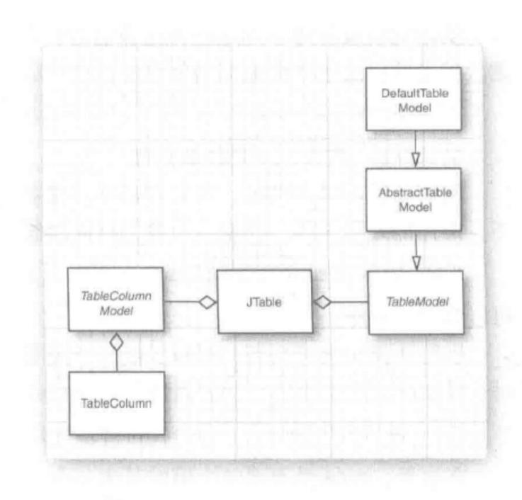

图 11-6 表格类之间的关系图

调整一个列的大小时,默认情况下表格的总体大小会保持不变。当然,更改过大小的列的宽度的增加值或减小值会分摊到其他列上。默认方式是更改那些在被改变了大小的列右边的所有列的大小。这是一种很好的默认方式,因为这样使得用户可以通过从左到右移动,将所有列调整为自己所期望的宽度。

使用下面这个方法,可以设置表 11-2 中列出的 JTable 类的其他行为:

void setAutoResizeMode(int mode)

模式

AUTO\_RESIZE\_OFF

AUTO\_RESIZE\_NEXT\_COLUMN

AUTO\_RESIZE\_NEXT\_COLUMN

AUTO\_RESIZE\_SUBSEQUENT\_COLUMNS

AUTO\_RESIZE\_LAST\_COLUMN

AUTO\_RESIZE\_LAST\_COLUMN

AUTO\_RESIZE\_LAST\_COLUMN

AUTO\_RESIZE\_ALL\_COLUMNS

D文表格中的所有列的大小,这并不是一种很明智的选择,因为这阻碍了用户只对几列而不是整个表进行调整以达到自己期望大小的行为

表 11-2 变更列大小的模式

## 11.1.3.4 改变行的大小

行的高度是直接由 JTable 类管理的。如果单元格比默认值高,那么可以像下面这样设置行的高度:

table.setRowHeight(height);

默认情况下,表格中的所有行都具有相同的高度,可以用下面的调用来为每一行单独设置高度:

table.setRowHeight(row, height);

实际的行高度等于用这些方法设置的行高度减去行边距,其中行边距的默认值是1个像素,但是可以通过下面的调用来修改它:

table.setRowMargin(margin);

#### 11.1.3.5 选择行、列和单元格

利用不同的选择模式,用户可以分别选择表格中的行、列或者单个的单元格。默认情况下,启用的是行选择,点击一个单元格的内部就可以选择整行(参见图 11-5)。调用

table.setRowSelectionAllowed(false);

可以禁用行选择。

当行选择功能可用时,可以控制用户是否可以选择单一行、连续几行或者任意几行。此时,需要获取选择模式,然后调用它的 setSelectionMode 方法:

table.getSelectionModel().setSelectionMode(mode);

在这里, mode 是下面三个值的其中一个:

ListSelectionModel.SINGLE SELECTION

ListSelectionModel.SINGLE INTERVAL SELECTION

ListSelectionModel.MULTIPLE INTERVAL SELECTION

默认情况下,列选择是禁用的。不过可以调用下面这个方法启用列选择:

table.setColumnSelectionAllowed(true);

同时启用行选择和列选择等价于启用单元格选择,这样用户就可以选择一定范围内的单元格(参见图 11-7)。也可以使用下面的调用完成这项设置:

table.setCellSelectionEnabled(true);

可以运行程序清单 11-3 中的程序,观察一下单元格选择的运行情况。启用 Selection 菜单中的行、列或单元格选项,然后观察选择行为是如何改变的。

可以通过调用 getSelectedRows 方法和 getSelectedColumns 方法来查看选中了哪些行及哪些列。这两个方法都返回一个由被选定项的索引构成的 int[] 数组。注意,这些索引值是表格视图中的索引值,而不是底层表格模型中的索引值。尝试着选择一些行和列,然后将列拖拽到不同的位置,并通过点击列头来对这些行进行排序。使用 Print Selection 菜单项来查看它会报告哪些行和列被选中。

如果要将表格索引值转译为表格模型索引值,可以使用 JTable 的 ConvertRowIndexToModel 和 convertColumnIndexToModel 方法。

#### 11.1.3.6 对行排序

正如在第一个表格示例中看到的那样,向 JTable 中添加行排序机制是很容易的,只需调

用 setAutoCreateRowSorter 方法。但是,要对排序行为进行细粒度的控制,就必须向 JTable 中安装一个 TableRowSorter
对象,并对其进行定制化。类型参数 M 表示表格模型,它必须是 TableModel 接口的子类型。

var sorter = new TableRowSorter<TableModel>(model);
table.setRowSorter(sorter);

| Planet  | Radius | Moons | Gaseous | Color                           | Image |  |
|---------|--------|-------|---------|---------------------------------|-------|--|
| Mars    | 3,397  | 2     |         | java awt Color[r=255,g=0,b=0]   | 9     |  |
| lupiter | 71,492 | 16    |         | java.awt.Color[r=255,g=200,b=0] | 3     |  |
| Saturn  | 60,268 | 18    | ¥       | java.awt.Color[r=255,g=200,b=0] | 1     |  |
| Uranus  | 25,559 | 17    | 4       | java awt Color[r=0,g=0,b=255]   | 0     |  |

图 11-7 选择一个单元格范围

某些列是不可排序的,例如,在我们的行星数据中的图像列,可以通过下面的调用来关闭排序机制:

sorter.setSortable(IMAGE\_COLUMN, false);

可以对每个列都安装一个定制的比较器。在我们的示例中,将对 Color 列中的颜色进行排序,因为我们相对于红色来说,更喜欢蓝色和绿色。当点击 Color 列时,将会看到蓝色行星出现在表格底部,这是通过下面的调用完成的:

```
sorter.setComparator(COLOR_COLUMN, new Comparator<Color>()
```

如果不指定列的比较器,那么排列顺序就是按照下面的原则确定的:

- 474
- 1. 如果列所属的类是 String, 就使用 Collator.getInstance() 方法返回的默认比较器。它按照适用于当前 locale 的方式对字符串排序。(参见第7章以了解 locale 和比较器的更多信息)。
  - 2. 如果列所属的类型实现了 Comparable,则使用它的 compareTo 方法。
- 3. 如果已经为排序器设置过 TableStringConverter, 就用默认比较器对转换器的 toString 方法返回的字符串进行排序。如果要使用该方法,可以像下面这样定义转换器:

```
sorter.setStringConverter(new TableStringConverter()
{
   public String toString(TableModel model, int row, int column)
   {
      Object value = model.getValueAt(row, column);
      convert value to a string and return it
   }
});
```

4. 否则,在单元格的值上调用 toString 方法,然后用默认比较器对它们进行比较。

#### 11.1.3.7 过滤行

除了可以对行排序之外, TableRowSorter 还可以有选择性地隐藏行, 这种处理称为过滤 (filtering)。要想激活过滤机制,需要设置 RowFilter。例如,要包含所有至少有一个卫星的 行星行,可以调用:

sorter.setRowFilter(RowFilter.numberFilter(ComparisonType.NOT\_EQUAL, θ, MOONS\_COLUMN));

这里我们使用了预定义的过滤器,即数字过滤器。要构建数字过滤器,需要提供:

- 比较类型(EQUAL、NOT\_EQUAL、AFTER 和 BEFORE 之一)。
- Number 的某个子类的一个对象(例如 Integer 和 Double),只有与给定的 Number 对象属于相同的类的对象才在考虑的范围内。
- 0 或多列的索引值,如果不提供任何索引值,那么所有的列都被搜索。

静态的 RowFilter.dateFilter 方法以相同的方式构建了日期过滤器,这里需要提供 Date 对象而不是 Number 对象。

最后,静态的 RowFilter.regexFilter 方法构建的过滤器可以查找匹配某个正则表达式的字符串。例如:

sorter.setRowFilter(RowFilter.regexFilter(".\*[^s]\$", PLANET\_COLUMN));

将只显示那些名字以"s"结尾的行星(参见第2章以了解有关正则表达式的更多信息)。

还可以用 and Filter、or Filter 和 not Filter 方法来组合过滤器,例如,要过滤掉名字不是以"s"结尾,并且至少有一颗卫星的行星,可以使用下面的过滤器组合:

```
sorter.setRowFilter(RowFilter.andFilter(List.of(
   RowFilter.regexFilter(".*[^s]$", PLANET_COLUMN),
   RowFilter.numberFilter(ComparisonType.NOT_EQUAL, 0, MOONS_COLUMN))));
```

要实现自己的过滤器,需要提供 RowFilter 的一个子类,并实现 include 方法来表示哪些行应该显示。这很容易实现,但是 RowFilter 类卓越的普适性令它有点可怕。

RowFilter<M, I>类有两个类型参数:模型的类型和行标识符的类型。在处理表格时,模

型总是 TableModel 的某个子类型,而标识符类型总是 Integer。(在将来的某个时刻,其他构件可能也会支持行过滤机制。例如,要过滤 JTree 中的行,就可能可以使用 RowFilter <Tree-Model, TreePath> 了。)

行过滤器必须实现下面的方法:

public boolean include(RowFilter.Entry<? extends M, ? extends I> entry)

RowFilter.Entry类提供了获取模型、行标识符和给定索引处的值等内容的方法,因此,按照行标识符和行的内容都可以进行过滤。

例如,下面的过滤器将隔行显示:

```
var filter = new RowFilter<TableModel, Integer>()
    {
      public boolean include(Entry<? extends TableModel, ? extends Integer> entry)
      {
          return entry.getIdentifier() % 2 == 0;
      }
};
```

如果想要只包含那些具有偶数个卫星的行星,可以将上面的测试条件替换为下面的内容: ((Integer) entry.getValue(MOONS COLUMN)) % 2 = 0

在我们的示例程序中,允许用户隐藏任意多行,我们在一个 set 中存储了所有隐藏的行的索引。而其中的行过滤器将包含那些索引不在这个 set 中的所有行。

过滤机制并不是为那些过滤标准在不时地发生变化的过滤器而设计的。因此,在我们的示例程序中,只要隐藏行的 set 发生了变化,我们就会调用下面的语句:

sorter.setRowFilter(filter);

过滤器一旦被设置,就会立即得到应用。

#### 11.1.3.8 隐藏和显示列

正如在前一节中看到的,可以根据内容或标识符来过滤表格行,而隐藏表格列使用的是完全不同的机制。

JTable 类的 removeColumn 方法可以将一列从表格视图中移除。该列的数据实际上并没有从模型中移除,它们只是在视图中被隐藏了起来。removeColumn 方法接受一个 TableColumn 参数,如果你有的是一个列号(比如来自 getSelectedColumns 的调用结果),那就需要向表格模型请求实际的列对象:

```
TableColumnModel columnModel = table.getColumnModel();
TableColumn column = columnModel.getColumn(i);
table.removeColumn(column);
```

如果你记得住该列,那么将来就可以再把它添加回去:

```
table.addColumn(column):
```

该方法将该列添加到表格的最后面。如果想让它出现在表格中的其他任何地方,那么可以调用 moveColumn 方法。

476

通过添加一个新的 TableColumn 对象,还可以添加一个对应于表格模型中的一个列索引的新列。

table.addColumn(new TableColumn(modelColumnIndex)); 可以让多个表格列展示模型中的同一列。 程序清单 11-3 展示了如何选择和过滤行与列。

#### 程序清单 11-3 tableRowColumn/planetTableFrame.java

```
package tableRowColumn;
2
3 import java.awt.*;
4 import java.util.*;
5
   import javax.swing.*;
6
   import javax.swing.table.*;
R
9
    * This frame contains a table of planet data.
10
11
   public class PlanetTableFrame extends JFrame
12
13
   {
      private static final int DEFAULT WIDTH = 600;
14
      private static final int DEFAULT HEIGHT = 500;
15
16
      public static final int COLOR COLUMN = 4;
17
      public static final int IMAGE_COLUMN = 5;
18
19
28
      private JTable table:
      private HashSet<Integer> removedRowIndices;
      private ArrayList<TableColumn> removedColumns;
22
      private JCheckBoxMenuItem rowsItem;
23
      private JCheckBoxMenuItem columnsItem;
      private JCheckBoxMenuItem cellsItem;
25
26
      private String[] columnNames = { "Planet", "Radius", "Moons", "Gaseous", "Color", "Image" };
27
28
      private Object[][] cells =
29
38
            { "Mercury", 2440.0, 0, false, Color.YELLOW,
31
                new ImageIcon(getClass().getResource("Mercury.gif")) },
37
             { "Venus", 6052.0, 0, false, Color.YELLOW,
33
                new ImageIcon(getClass().getResource("Venus.gif")) },
34
             { "Earth", 6378.0, 1, false, Color.BLUE,
35
                new ImageIcon(getClass().getResource("Earth.gif")) },
36
             { "Mars", 3397.0, 2, false, Color.RED,
37
                new ImageIcon(getClass().getResource("Mars.gif")) },
38
             { "Jupiter", 71492.0, 16, true, Color.ORANGE,
39
                new ImageIcon(getClass().getResource("Jupiter.gif")) },
48
             { "Saturn", 60268.0, 18, true, Color.ORANGE,
41
                new ImageIcon(getClass().getResource("Saturn.gif")) },
42
             { "Uranus", 25559.0, 17, true, Color.BLUE,
43
                new ImageIcon(getClass().getResource("Uranus.gif")) },
```

```
{ "Neptune", 24766.0, 8, true, Color.BLUE,
45
               new ImageIcon(getClass().getResource("Neptune.gif")) },
46
             { "Pluto", 1137.0, 1, false, Color.BLACK,
47
               new ImageIcon(getClass().getResource("Pluto.gif")) }
48
         }:
49
58
      public PlanetTableFrame()
51
52
         setSize(DEFAULT WIDTH, DEFAULT HEIGHT);
53
54
         var model = new DefaultTableModel(cells, columnNames)
55
56
                public Class<?> getColumnClass(int c)
57
58
                   return cells[0][c].getClass();
59
             };
61
62
         table = new JTable(model);
63
64
          table.setRowHeight(100):
65
          table.getColumnModel().getColumn(COLOR COLUMN).setMinWidth(250);
66
          table.getColumnModel().getColumn(IMAGE COLUMN).setMinWidth(100);
67
68
         var sorter = new TableRowSorter<TableModel>(model);
69
         table.setRowSorter(sorter);
78
          sorter.setComparator(COLOR COLUMN, Comparator.comparing(Color::getBlue)
71
             .thenComparing(Color::getGreen).thenComparing(Color::getRed));
72
          sorter.setSortable(IMAGE COLUMN, false);
73
          add(new JScrollPane(table), BorderLayout.CENTER);
74
75
          removedRowIndices = new HashSet<>():
76
          removedColumns = new ArrayList<>();
77
78
          var filter = new RowFilter<TableModel, Integer>()
79
             {
88
                public boolean include(Entry<? extends TableModel, ? extends Integer> entry)
81
82
                   return !removedRowIndices.contains(entry.getIdentifier());
83
R4
             };
85
86
          // create menu
87
RR
          var menuBar = new JMenuBar();
89
          setJMenuBar(menuBar);
98
91
          var selectionMenu = new JMenu("Selection");
92
          menuBar.add(selectionMenu);
93
94
          rowsItem = new JCheckBoxMenuItem("Rows");
95
          columnsItem = new JCheckBoxMenuItem("Columns");
96
          cellsItem = new JCheckBoxMenuItem("Cells");
97
98
99
          rowsItem.setSelected(table.getRowSelectionAllowed());
```

```
columnsItem.setSelected(table.getColumnSelectionAllowed());
188
          cellsItem.setSelected(table.getCellSelectionEnabled());
101
182
          rowsItem.addActionListener(event ->
183
104
                table.clearSelection();
185
                table.setRowSelectionAllowed(rowsItem.isSelected()):
106
                updateCheckboxMenuItems();
197
            });
188
          selectionMenu.add(rowsItem);
109
110
          columnsItem.addActionListener(event ->
111
117
                table.clearSelection();
113
                table.setColumnSelectionAllowed(columnsItem.isSelected());
114
                updateCheckboxMenuItems();
             });
116
          selectionMenu.add(columnsItem);
117
          cellsItem.addActionListener(event ->
119
             {
129
                table.clearSelection();
                table.setCellSelectionEnabled(cellsItem.isSelected());
122
                updateCheckboxMenuItems();
123
124
          selectionMenu.add(cellsItem);
125
126
          var tableMenu = new JMenu("Edit");
127
          menuBar.add(tableMenu);
128
129
          var hideColumnsItem = new JMenuItem("Hide Columns");
130
          hideColumnsItem.addActionListener(event ->
131
                int[] selected = table.getSelectedColumns();
133
                TableColumnModel columnModel = table.getColumnModel();
134
135
                // remove columns from view, starting at the last
136
                // index so that column numbers aren't affected
137
138
                for (int i = selected.length - 1; i >= 0; i--)
130
148
                   TableColumn column = columnModel.getColumn(selected[i]);
141
                   table.removeColumn(column);
142
143
                    // store removed columns for "show columns" command
144
145
                    removedColumns.add(column);
146
147
             });
148
          tableMenu.add(hideColumnsItem);
149
150
          var showColumnsItem = new JMenuItem("Show Columns"):
151
          showColumnsItem.addActionListener(event ->
153
                // restore all removed columns
154
```

```
for (TableColumn tc : removedColumns)
155
                   table.addColumn(tc);
156
               removedColumns.clear();
157
            });
158
         tableMenu.add(showColumnsItem);
159
168
         var hideRowsItem = new JMenuItem("Hide Rows");
161
         hideRowsItem.addActionListener(event ->
162
            {
163
                int[] selected = table.getSelectedRows();
164
                for (int i : selected)
165
                   removedRowIndices.add(table.convertRowIndexToModel(i));
166
                sorter.setRowFilter(filter);
167
168
         tableMenu.add(hideRowsItem);
169
170
         var showRowsItem = new JMenuItem("Show Rows");
171
         showRowsItem.addActionListener(event ->
            {
173
                removedRowIndices.clear();
174
                sorter.setRowFilter(filter);
            1):
176
          tableMenu.add(showRowsItem);
177
          var printSelectionItem = new JMenuItem("Print Selection");
179
          printSelectionItem.addActionListener(event ->
189
181
                int[] selected = table.getSelectedRows();
187
                System.out.println("Selected rows: " + Arrays.toString(selected));
183
                selected = table.getSelectedColumns();
184
                System.out.println("Selected columns: " + Arrays.toString(selected));
185
          tableMenu.add(printSelectionItem);
      }
188
189
      private void updateCheckboxMenuItems()
191
          rowsItem.setSelected(table.getRowSelectionAllowed());
192
          columnsItem.setSelected(table.getColumnSelectionAllowed());
193
          cellsItem.setSelected(table.getCellSelectionEnabled());
194
       }
195
196 }
```

## API javax.swing.table.TableModel

Class getColumnClass(int columnIndex)
 获取该列中的值的类。该信息用于排序或绘制。

## API javax.swing.JTable

TableColumnModel getColumnModel()
 获取描述表格列布局安排的"列模式"。

void setAutoResizeMode(int mode)
 设置自动更改表格列大小的模式。

参数: mode AUTO\_RESIZE\_OFF、AUTO\_RESIZE\_NEXT\_COLUMN、AUTO\_RESIZE\_SUBSEQUENT\_ COLUMNS、AUTO\_RESIZE\_LAST\_COLUMN 以及 AUTO\_RESIZE\_ALL\_COLUMNS 其中之一。

- int getRowHeight()
- void setRowMargin(int margin)
   获取和设置相邻行中单元格之间的间隔大小。
- int getRowHeight()
- void setRowHeight(int height)
   获取和设置表格中所有行的默认高度。
- int getRowHeight(int row)
- void setRowHeight(int row, int height)
   获取和设置表格中给定行的高度。
- ListSelectionModel getSelectionModel()
   返回列表的选择模式。你需要该模式以便在行、列以及单元格之间进行选择。
- boolean getRowSelectionAllowed()
- void setRowSelectionAllowed(boolean b)
   获取和设置 rowSelectionAllowed 属性。如果为 true,那么当用户点击单元格的时候,可以选定行。
- boolean getColumnSelectionAllowed()
- void setColumnSelectionAllowed(boolean b)
   获取和设置 columnSelectionAllowed 属性。如果为 true,那么当用户点击单元格的时候,可以选定列。
- boolean getCellSelectionEnabled()
   如果既允许选定行又允许选定列,则返回 true。
- void setCellSelectionEnabled(boolean b)
   同时将 rowSelectionAllowed 和 columnSelectionAllowed 设置为 b。
- void addColumn(TableColumn column)
   向表格视图中添加一列作为最后一列。
- void moveColumn(int from, int to)
   移动表格 from 索引位置中的列, 使它的索引变成 to。该操作仅仅影响到视图。
- void removeColumn(TableColumn column) 将给定的列从视图中移除。
- int convertRowIndexToModel(int index) 6
- int convertColumnIndexToModel(int index)
   返回具有给定索引的行或列的模型索引,这个值与行被排序和过滤,以及列被移动和

移除时的索引不同。

void setRowSorter(RowSorter<? extends TableModel> sorter)
 设置行排序器。

#### API javax.swing.table.TableColumnModel 1.2

TableColumn getColumn(int index)
 获取表格的列对象,用于描述给定索引的列。

#### API javax.swing.table.TableColumn 1.2

- TableColumn(int modelColumnIndex)
   构建一个表格列,用以显示给定索引位置上的模型列。
- void setPreferredWidth(int width)
- void setMinWidth(int width)
- void setMaxWidth(int width)
   将表格的首选宽度、最小宽度以及最大宽度设置为 width。
- void setWidth(int width)设置该列的实际宽度为 width。
- void setResizable(boolean b)
   如果 b 为 true,那么该列可以更改大小。

## API javax.swing.ListSelectionModel

void setSelectionMode(int mode)

参数: mode SINGLE\_SELECTION、SINGLE\_INTERVAL\_SELECTION 与 MULTIPLE\_INTERVAL\_ SELECTION 之一。

## API javax.swing.DefaultRowSorter<M, I> 6

- void setComparator(int column, Comparator<?> comparator)
   设置用于给定列的比较器。
- void setSortable(int column, boolean enabled)
   使对给定列的排序可用或禁用。
- void setRowFilter(RowFilter<? super M,? super I> filter)
   设置行过滤器。

## | javax.swing.table.TableRowSorter<M extends TableModel> |

void setStringConverter(TableStringConverter stringConverter)
 设置用于排序和过滤的字符串转换器。

## API javax.swing.table.TableStringConverter

abstract String toString(TableModel model, int row, int column)

将给定位置的模型值转换为字符串, 你可以覆盖这个方法。

## API javax.swing.RowFilter<M, I>

- boolean include(RowFilter.Entry<? extends M,? extends I> entry)
   指定要保留的行,你可以覆盖这个方法。
- static <M,I> RowFilter<M,I> numberFilter(RowFilter.ComparisonType type, Number number, int... indices)
- static <M,I> RowFilter<M,I> dateFilter(RowFilter.ComparisonType type, Date date, int...\nindices)

返回一个过滤器,它包含的行是那些与给定的数字或日期进行给定比较后匹配的行。 比较类型是 EQUAL、NOT\_EQUAL、AFTER 或 BEFORE 之一。如果给定了列模型索引,则只 搜索这些列。否则,将搜索所有列。对于数字过滤器,单元格的值所属的类必须与给 定数字的类匹配。

- static <M,I> RowFilter<M,I> regexFilter(String regex, int... indices)
   返回一个过滤器,它包含的行含有与给定的正则表达式匹配的字符串。如果给定了列模型索引,则只搜索这些列。否则,将搜索所有列。注意,RowFilter.Entry的getStringValue方法返回的字符串是匹配的。
- static <M,I> RowFilter<M,I> andFilter(Iterable<? extends RowFilter<? super M,? super I>> filters)
- static <M,I> RowFilter<M,I> orFilter(Iterable<? extends RowFilter<? super M,? super I>> filters)

返回一个过滤器,它包含的项是那些包含在所有的过滤器或至少包含在一个过滤器中的项。

• static <M, I> RowFilter<M, I> notFilter(RowFilter<M, I> filter) 返回一个过滤器,它包含的项是那些不包含在给定过滤器中的项。

## API javax.swing.RowFilter.Entry<M, I> 6

- I getIdentifier()返回这个行的标识符。
- M getModel()返回这个行的模型。
- Object getValue(int index)
   返回在这个行的给定索引处存储的值。
- int getValueCount()
   返回在这个行中存储的值的数量。
- String getStringValue()
   返回在这个行的给定索引处存储的值转换成的字符串。由 TableRowSorter 产生的项的 getStringValue 方法会调用排序器的字符串转换器。

#### 11.1.4 单元格的绘制和编辑

正如在11.1.3.2 节中看到的,列的类型确定了单元格应该如何绘制。Boolean 和 Icon 类型有默认的绘制器,它们将绘制复选框或图标,而对于其他所有类型,都需要安装定制的绘制器。

#### 11.1.4.1 绘制单元格

表格的单元格绘制器与你在前面看到的列表单元格绘制器类似。它们都实现了 TableCell Renderer 接口,并只有一个方法:

Component getTableCellRendererComponent(JTable table, Object value, boolean isSelected, boolean hasFocus, int row, int column)

该方法在表格需要绘制单元格的时候被调用。它会返回一个构件,接着该构件的 paint 方法会被调用,以填充单元格区域。

在图 11-8 中的表格包含类型为 Color 的单元格, 绘制器直接返回一个面板, 其背景颜色设置为存储在该单元格中的颜色对象, 该颜色是作为 value 参数传递的。

```
class ColorTableCellRenderer extends JPanel implements TableCellRenderer
{
   public Component getTableCellRendererComponent(JTable table, Object value,
```

| Planet | Radius |    | Gaseous | Color | lmage |
|--------|--------|----|---------|-------|-------|
| 4ars   | 3,397  | 2  |         |       | 9     |
| upiter | 71,492 | 16 | V       |       | 3     |
| aturn  | 50,268 | 19 | ¥       |       | 4     |

图 11-8 具有单元格绘制器的表格

正如你看到的那样,当该单元格获得焦点的时候,绘制器会画出一个边框。(请求

*UIManager 制合 框 想 以参数形式向其传 框 到底是什么 可以深 人DefaultTableCeURenderer类的源 内部看个究竟。)*

*€?提 如果你 制器只是 制一个文本字 串或 一个图标 么可以 承 DefaultTableCeURenderer 个 。 会 制焦点和 择 态。*

*你必 告 格 使 个 制器去 制所有 型为Color 对 。JTable setDefaultRenderer方法可以 你建 它们之 。你 提供一个Class对 和 制器<sup>c</sup>*

*table.setDefaultRenderer(Color.class<sup>f</sup> new ColorTableCellRenderer()):*

*在 个 制器就可以 于 格中具有 定 型 所有对 了。*

*如果想 基于其他标准 择 制器 则 从JTable 中扩展子 并覆盖getCeURender 方法。*

## *11.1.4.2 制 头*

*为了在 头中显 图标 头值。*

*moonColumn.setHeaderValue(new Imagelcon("Moons.gif\*));*

*然 头 未智 到可以为 头值 择一个合 制器 因此 制器 手工安 。例如 在列头显 图像图标 可以*

*moonColunin.setHeaderRenderer(table.getDefaul.tRenderer(IinageIcon.class));*

## *11.1.4.3单元格编辑*

*为了使单元格可 格模型必须通过定义isCeUEditable方法来指明哪些单元格是 可 。最常 情况是 你可 想使某几列可 。在 个 例 序中 我们允 对 格中 四列 。*

```
public boolean isCeUEditable(int rf int c)
{
   return c == PLANET COLUMN || c = MOONS COLUMN || c == GASEOUS_COLUMN
      || c = COLOR_COLUMN;
}
```

*@ <sup>注</sup> AbstractTableModel 定义 isCeUEditable 方法总是 <sup>回</sup> false。DefaultTableModel 了 方法以便总是 回true。*

*一下 序清单11«4到 序清单11-7 序就会注意到 可以点击Gaseous列屮 复 框 并 中或取消复 标 。如果点击Moons列中 某个单元格 就会出 一个 合框 (参 <sup>图</sup>11-9 )0你很快就会 到怎样将 样一个 合框作为一个单元格 器安 <sup>到</sup> 格上。*

*最后 点击 一列中 某个单元格 单元格就会 取焦点。你就可以开始 人数据 单元格 内容也会 之更改。*

*你刚刚 到 是DefaultCellEditor类的三 变型。DefaultCeUEditor可以 JTextField. JCheckBox或 JComboBox来构 。JTable 会 动为Boolean 型 单元格安 一个复 框 器 并为所有可 但未提供它们 己 制器 单元格安 一个文本 器。文本框*

*可以让用户去编辑那些对 格模型getValueAt方法 回值执 toString操作 产生的字 串。*

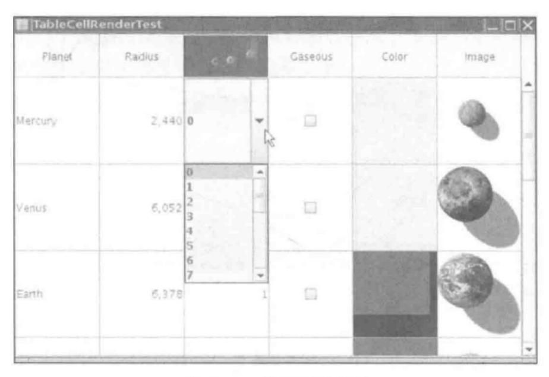

*图11-9单元格 <sup>器</sup>*

*一旦 完成 器 getCeUEditorValue方法就可以 取 值。 方法应 回一个正 型 值(也就是模型 getColumnType方法 回 型)。*

*为了 得一个 合框 器 你 手动 单元格 器 因为JTable构件并不 什么样 值对某一 殊 型来 是 合 。对于Moons列来 我们希望可以让用户 择 0~20之 任何值。下 是对 合框 初始化 代 。*

```
var moonCombo = new JComboBoxO;
for (int i = 0; i <= 2B; i++) 
   moonCombo.addlteffi(i);
```

*为了构 一个DefaultCellEditor, 在 构 器中提供一个 合框。*

*var moonEditor <sup>=</sup> new DefaultCell.Editor(inoonCofnbo);*

*接下来 我们 安 个 器。与 单元格 制器不同 个编辑器不依 于对 象类型 我们未必想 把它作 于 型为Integer 所有对 上。 反 我们 把它安 到一个 定列中*

*ooonColunn. setCellEditor (RoonEditor);*

## *11.1.4.4定制编辑器*

*再次 一下 例 序并点击一 。 时会弹出一个 择器 你为 星 择一 新颜色。 中一 然后点击0K,单元格 就会 之更新(参 <sup>图</sup>11-10)。*

*单元格 器并不是一 标准 格单元格 器 是一 定制实 器。 为了创建一个定制 单元格 器 实 TableCeUEditor接口。 个接口有点拖沓冗 Java SE提供了 AbstractCeUEditor 于 事件处 。*

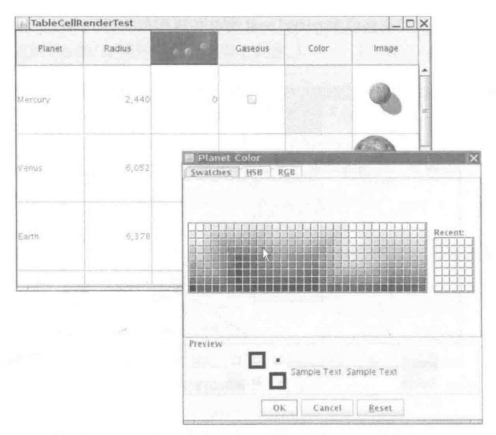

*图1M0<sup>使</sup> 择器对单元格*

*TableCellEditor接口 getTableCeUEditorComponent方法 求某个构件去 制单元格<sup>o</sup> 了没有 focus 参数之外 它和 TableCellRenderer 接口 getTableCeURendererComponent 方 法极为 似。因为我们 单元格 所以假 它 得了焦点。在 中 编辑器构件 会暂时取代 制器。在我们 例中 回 是一个没有 板。 只是告 户 单元格正在 。*

*接下来 当 户点击单元格时 你希望 弹出 己 器。*

*JTable类用一个事件(例如 标点击)去调用你的编辑器 以便 定 事件是否可以 接受去启动 。AbstractCellEditor将 方法定义为 够接收所有 事件 型。*

```
public boolean isCellEditable(EventObj ect anEvent)
{
   return true;
}
```

*然 如 将 方法 成false, 么 格模型就不会 到插人 件 样 烦了。 一旦安 了编辑器构件 假 我们使 是 同 事件 么shouldSelectCeU方法就 会被调用。应 在 个方法中启动 例如 弹出一个外 对 框。*

```
public boolean shouldSelectCeU(Eventobject anEvent)
{
   colorDialog.setVisible(true);
   return true;
}
```

如果用户取消编辑,表格会调用 cancelCellEditing 方法。如果用户已经点击了另一个表格单元,那么表格会调用 stopCellEditing 方法。在这两种情况中,都应该将对话框隐藏起来。当 stopCellEditing 方法被调用时,表格可能会使用被部分编辑的值。如果当前值有效,那么应该返回 true。在颜色选择器中,任何值都是有效的。但是如果编辑的是其他数据,那么应该保证只有有效的数据才能从编辑器中读取出来。

另外,应该调用超类的方法,以便进行事件的触发,否则,编辑事件就无法正确地 取消。

```
public void cancelCellEditing()
{
    colorDialog.setVisible(false);
    super.cancelCellEditing();
}
最后,必须提供一个方法,以便产生用户在编辑过程中所提供的值。
public Object getCellEditorValue()
{
    return colorChooser.getColor();
}
```

总结一下, 定制编辑器应该遵循下面几点:

- 1. 继承 AbstractCellEditor 类, 并实现 TableCellEditor 接口。
- 2. 定义 getTableCellEditorComponent 方法以提供一个构件。它可以是一个哑构件(如果是要弹出一个对话框)或者是用于就地编辑的构件,例如复选框或文本框。
- 3. 定义 shouldSelectCell、stopCellEditing 及 cancelCellEditing 方法,来处理编辑过程的启动、完成以及取消。stopCellEditing 和 cancelCellEditing 方法应该调用超类方法以保证监听器能够接收到通知。
  - 4. 定义 getCellEditorValue 方法返回编辑结果的值。

最后,通过调用 stopCellEditing 和 cancelCellEditing 方法,以表明用户什么时间完成了编辑操作。在构建颜色对话框的时候,我们安装了接受和取消的回调,用于触发这些事件。

```
colorDialog = JColorChooser.createDialog(null, "Planet Color", false, colorChooser,
    EventHandler.create(ActionListener.class, this, "stopCellEditing"),
    EventHandler.create(ActionListener.class, this, "cancelCellEditing"));
```

这样就完成了定制编辑器的实现过程。

你现在已经知道了怎样使一个单元格可编辑,以及怎样安装一个编辑器。还剩下一个问题,即怎样使用用户编辑过的值来更新表格模型。当编辑完成的时候,JTable 类会调用表格模型的下面这个方法:

```
void setValueAt(Object value, int r, int c)
```

需要覆盖这个方法以便存储新值。value参数是单元格编辑器返回的对象。如果实现了单元格编辑器,那么你就知道从 getCellEditorValue 方法返回的是什么类型的对象。在 DefaultCellEditor 这种情况中,这个值有三种可能:如果单元格编辑器是复选框,那么它就

是 Boolean 值;如果是一个文本框,那么它就是一个字符串;如果这个值来源于组合框,那么就是用户选定的对象。

如果 value 对象不具有合适的类型,那么需要对它进行转换。例如,在一个文本框中编辑一个数字,这种情况最常发生。在我们的示例中,我们是将组合框组装成了 Integer 对象,所以不需要任何转换。

#### 程序清单 11-4 tableCellRender/TableCellRenderFrame.java

```
package tableCellRender;
2
3 import java.awt.*;
4 import javax.swing.*;
  import javax.swing.table.*;
5
   /**
7
    * This frame contains a table of planet data.
8
   public class TableCellRenderFrame extends JFrame
10
11
      private static final int DEFAULT WIDTH = 600;
12
      private static final int DEFAULT HEIGHT = 400;
73
      public TableCellRenderFrame()
15
16
         setSize(DEFAULT WIDTH, DEFAULT HEIGHT);
17
18
         var model = new PlanetTableModel();
19
         var table = new JTable(model):
         table.setRowSelectionAllowed(false);
21
22
         // set up renderers and editors
23
24
         table.setDefaultRenderer(Color.class.new ColorTableCellRenderer()):
25
         table.setDefaultEditor(Color.class, new ColorTableCellEditor());
26
27
         var moonCombo = new JComboBox<Integer>();
28
         for (int i = 0; i \le 20; i++)
29
            moonCombo.addItem(i);
38
31
         TableColumnModel columnModel = table.getColumnModel();
32
         TableColumn moonColumn = columnModel.getColumn(PlanetTableModel.MOONS COLUMN);
33
         moonColumn.setCellEditor(new DefaultCellEditor(moonCombo));
34
         moonColumn.setHeaderRenderer(table.getDefaultRenderer(ImageIcon.class));
35
         moonColumn.setHeaderValue(new ImageIcon(getClass().getResource("Moons.gif")));
36
37
         // show table
38
39
         table.setRowHeight(100);
48
         add(new JScrollPane(table), BorderLayout.CENTER);
41
42
   }
43
```

#### 程序清单 11-5 tableCellRender/PlanetTableModel.java

```
package tableCellRender;
2
3 import java.awt.*;
4 import javax.swing.*;
5 import javax.swing.table.*;
6
   /**
7
    * The planet table model specifies the values, rendering and editing properties for the
    * planet data.
10
11 public class PlanetTableModel extends AbstractTableModel
  {
12
      public static final int PLANET COLUMN = \theta;
13
      public static final int MOONS COLUMN = 2;
14
      public static final int GASEOUS COLUMN = 3;
15
      public static final int COLOR COLUMN = 4;
16
17
      private Object[][] cells =
18
19
             { "Mercury", 2440.0, 0, false, Color.YELLOW,
20
21
                new ImageIcon(getClass().getResource("Mercury.gif")) },
             { "Venus", 6052.0, 0, false, Color.YELLOW,
22
                new ImageIcon(getClass().getResource("Venus.gif")) },
23
             { "Earth", 6378.0, 1, false, Color.BLUE,
24
                new ImageIcon(getClass().getResource("Earth.gif")) },
25
             { "Mars", 3397.0, 2, false, Color.RED,
26
                new ImageIcon(getClass().getResource("Mars.gif")) },
27
             { "Jupiter", 71492.0, 16, true, Color.ORANGE,
28
                new ImageIcon(getClass().getResource("Jupiter.gif")) },
29
             { "Saturn", 60268.0, 18, true, Color.ORANGE,
38
                new ImageIcon(getClass().getResource("Saturn.gif")) },
31
             { "Uranus", 25559.0, 17, true, Color.BLUE,
32
                new ImageIcon(getClass().getResource("Uranus.gif")) },
             { "Neptune", 24766.0, 8, true, Color.BLUE,
34
                new ImageIcon(getClass().getResource("Neptune.gif")) },
35
             { "Pluto", 1137.0, 1, false, Color.BLACK,
                new ImageIcon(getClass().getResource("Pluto.gif")) }
37
38
         };
39
       private String[] columnNames = { "Planet", "Radius", "Moons", "Gaseous",
48
             "Color", "Image" };
41
42
      public String getColumnName(int c)
43
44
         return columnNames[c];
45
46
47
      public Class<?> getColumnClass(int c)
48
49
          return cells[θ][c].getClass();
58
51
52
       public int getColumnCount()
53
```

```
54
          return cells[0].length;
55
56
57
      public int getRowCount()
58
59
          return cells.length;
60
61
62
      public Object getValueAt(int r, int c)
63
          return cells[r][c];
65
66
67
       public void setValueAt(Object obj, int r, int c)
68
69
          cells[r][c] = obj;
70
71
72
       public boolean isCellEditable(int r, int c)
73
74
          return c == PLANET COLUMN || c == MOONS COLUMN || c == GASEOUS COLUMN
75
                 || c == COLOR COLUMN;
76
77
   }
78
```

## 程序清单 11-6 tableCellRender/ColorTableCellRenderer.java

```
package tableCellRender;
2
3 import java.awt.*;
4 import javax.swing.*;
5 import javax.swing.table.*;
6
  /**
7
   * This renderer renders a color value as a panel with the given color.
9
  public class ColorTableCellRenderer extends JPanel implements TableCellRenderer
11
      public Component getTableCellRendererComponent(JTable table, Object value,
12
            boolean isSelected, boolean hasFocus, int row, int column)
13
14
         setBackground((Color) value);
15
         if (hasFocus) setBorder(UIManager.getBorder("Table.focusCellHighlightBorder"));
16
         else setBorder(null);
17
         return this;
18
      }
19
20 }
```

#### 程序清单 11-7 tableCellRender/ColorTableCellEditor.java

```
package tableCellRender;\nimport java.awt.*;
```

```
4 import java.awt.event.*;
5 import java.beans.*;
6 import java.util.*;
7 import javax.swing.*;
   import javax.swing.table.*;
9
10
    * This editor pops up a color dialog to edit a cell value.
11
12
   public class ColorTableCellEditor extends AbstractCellEditor implements TableCellEditor
14
      private JColorChooser colorChooser;
15
      private JDialog colorDialog;
16
      private JPanel panel;
17
18
      public ColorTableCellEditor()
19
28
         panel = new JPanel();
21
         // prepare color dialog
22
23
         colorChooser = new JColorChooser();
74
         colorDialog = JColorChooser.createDialog(null, "Planet Color", false, colorChooser,
25
                EventHandler.create(ActionListener.class, this, "stopCellEditing"),
26
                EventHandler.create(ActionListener.class, this, "cancelCellEditing"));
27
28
29
38
      public Component getTableCellEditorComponent(JTable table, Object value,
             boolean isSelected, int row, int column)
31
37
         // this is where we get the current Color value. We store it in the dialog in case the
33
34
         // user starts editing
          colorChooser.setColor((Color) value);
35
36
          return panel;
37
38
      public boolean shouldSelectCell(EventObject anEvent)
39
AR
         // start editing
41
          colorDialog.setVisible(true);
43
          // tell caller it is ok to select this cell
44
45
          return true;
46
47
      public void cancelCellEditing()
48
49
          // editing is canceled--hide dialog
58
          colorDialog.setVisible(false);
51
          super.cancelCellEditing();
52
53
54
      public boolean stopCellEditing()
55
56
          // editing is complete--hide dialog
57
```

```
colorDialog.setVisible(false);
58
         super.stopCellEditing();
59
68
         // tell caller it is ok to use color value
61
          return true;
62
63
64
      public Object getCellEditorValue()
65
66
          return colorChooser.getColor();
67
      }
68
69 }
```

#### API javax.swing.JTable

- TableCellRenderer getDefaultRenderer(Class<?> type)
   获取给定类型的默认绘制器。
- TableCellEditor getDefaultEditor(Class<?> type)
   获取给定类型的默认编辑器。

#### API javax.swing.table.TableCellRenderer

 Component getTableCellRendererComponent(JTable table, Object value, boolean selected, boolean hasFocus, int row, int column)

返回一个构件,它的 paint 方法将被调用以便绘制一个表格单元格。

参数: table

该表格包含要绘制的单元格

value

要绘制的单元格

selected

如果该单元格当前已被选中,则为 true

hasFocus

如果该单元格当前具有焦点,则为 true

row, column 单元格的行及列

## API javax.swing.table.TableColumn

- void setCellEditor(TableCellEditor editor)
- void setCellRenderer(TableCellRenderer renderer)
   为该列中的所有单元格设置单元格编辑器或绘制器。
- void setHeaderRenderer(TableCellRenderer renderer)
   为该列中的所有表头单元格设置单元格绘制器。
- void setHeaderValue(Object value)
   为该列中的表头设置用于显示的值。

## API javax.swing.DefaultCellEditor

DefaultCellEditor(JComboBox comboBox)
 构建一个单元格编辑器,并以一个组合框的形式显示出来,用于选择单元格的值。

#### API javax.swing.table.TableCellEditor 12

 Component getTableCellEditorComponent(JTable table, Object value, boolean selected, int row, int column)

返回一个构件,它的 paint 方法用于绘制表格的单元格。

参数: table

包含要绘制的单元格的表格

value

要绘制的单元格

selected

如果该单元格已被当前选中,则为 true

row.colum

单元格的行及列

## API javax.swing.CellEditor 1.2

boolean isCellEditable(EventObject event)
 如果该事件能够启动对该单元格的编辑过程,那么返回 true。

boolean shouldSelectCell(EventObject anEvent)

启动编辑过程。如果被编辑的单元格应该被选中,则返回 true。通常情况下,你希望返回的是 true,不过,如果你不希望在编辑过程中改变单元格被选中的情况,那么你可以返回 false。

void cancelCellEditing()

取消编辑过程。你可以放弃已进行了部分编辑的操作。

boolean stopCellEditing()

出于使用编辑结果的目的,停止编辑过程。如果被编辑的值对读取来说处于适合的状态,则返回 true。

Object getCellEditorValue()

返回编辑结果。

- void addCellEditorListener(CellEditorListener l)
- void removeCellEditorListener(CellEditorListener l)
   添加或移除必需的单元格编辑器的监听器。

## 11.2 树

每个使用过分层结构的文件系统的计算机用户都见过树状显示。当然,目录和文件形式 仅仅是树状组织结构中的一种。日常生活中还有很多这样的树结构,例如国家、州以及城市 之间的层次结构,如图 11-11 所示。

作为一名编程人员,我们经常需要显示这些树形结构。幸运的是,Swing 类库中有一个正是用于此目的的 JTree 类。JTree 类(以及它的辅助类)负责布局树状结构,按照用户请求展开或折叠树的节点。在本节中,我们将介绍怎样使用 JTree 类。

与其他复杂的 Swing 构件一样,我们必须集中介绍一些常用方法,无法涉及所有的细节。如果读者想获得与众不同的效果,我们推荐你参考 David M. Geary 撰写的 Graphic Java

## (第3版)和Kim Topley编写的Core Swing。

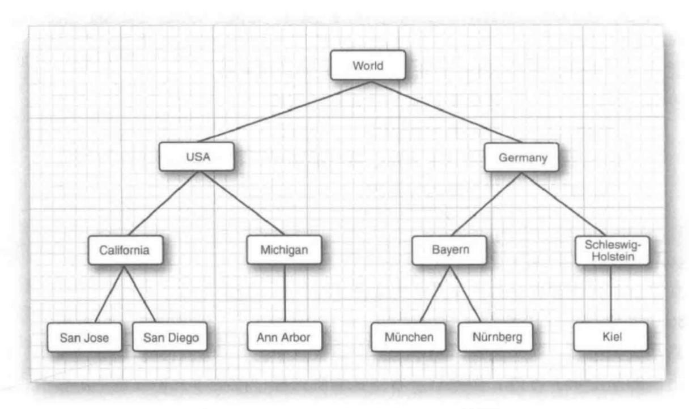

图 11-11 国家、州及城市的层次结构

在我们深入展开之前, 先介绍一些术语 (参见图 11-12)。一棵树由一些节点 (node) 组

成。每个节点要么是叶节点 (leaf) 要么是 有孩子节点 (child node) 的节点。除了根 节点 (root node),每一个节点都有一个唯 一的父节点 (parent node)。一棵树只有一 个根节点。有时, 你可能有一个树的集合, 其中每棵树都有自己的根节点。这样的集 合称作森林 (forest)。

## 11.2.1 简单的树

在第一个示例程序中, 我们仅仅展示 了一个具有几个节点的树(参见图 11-14)。

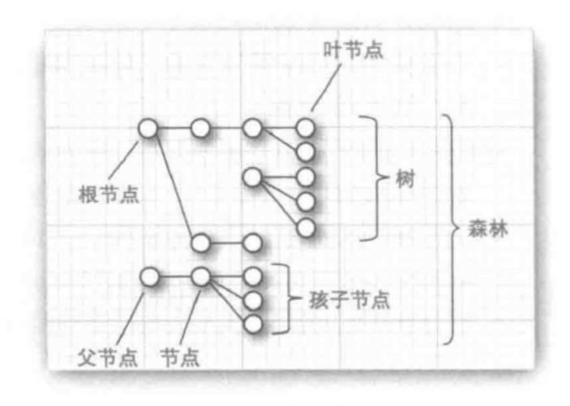

图 11-12 树中的术语

如同大多数 Swing 构件一样,只要提供一个数据模型,构件就可以将它显示出来。为了构建 JTree, 需要在构造器中提供这样一个树模型:

TreeModel model = . . .; var tree = new JTree(model);

## 注释:还有一些构造器可以用一些元素的集合来构建树。

JTree(Object[] nodes) JTree(Vector<?> nodes)

JTree(Hashtable<?, ?> nodes) // the values become the nodes

*些构 器不是 别有 。它们仅仅是创建出一个包含了 干棵树 森林 其中 每棵树只有一个 点。 三个构 器显得 别没 因为 些 点实 显 次序是 散列 定 。*

*怎样才能获得一个树模型呢 可以 创建一个实 了 TreeModel接口 来构建 己 树模型。在本 后 分 将会介 应 如何实 。 在 我们仍坚持使 Swing 库 提供 DefaultTreeModel 模型。*

*为了构建一个 树模型 必 提供一个根 点。*

*TreeNode root =.. var model <sup>=</sup> new DefaultTreeModel(root):*

*TreeNode是另外一个接口。可以将任何实 了 个接口 对 到 树模型 <sup>中</sup>。这里 我们使 <sup>是</sup>Swing提供 具体 <sup>点</sup> 叫作DefaultMutableTreeNode0 <sup>个</sup> <sup>实</sup> <sup>了</sup> MutableTreeNode接口 接口是TreeNode 一个子接口(参 图11-13 )。*

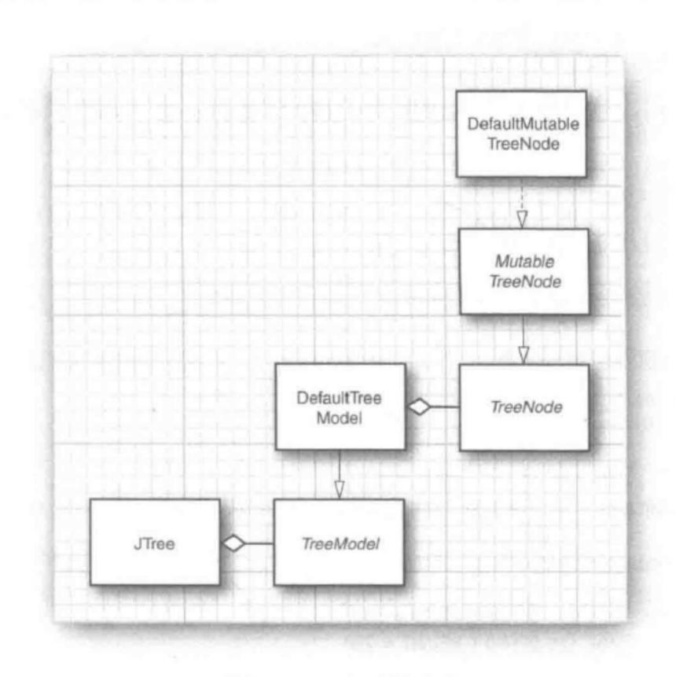

*图11-13有关树的类*

*任何一个 可变树 点 存放 一个对 即 户对 (user object)。树会为所有 点 制 些 户对 。 指定一个 制器 否则树将 接显 执 完toString方法之 后的结果字 串。*

*在 一个 例 序中 我们使 了字 串作为 户对 。实 应 中 常会在树中 更具 力 户对 。例如 当显 一个 录树时 将File对 于 点将具有实 意义。*

可以在构造器中设定用户对象,也可以稍后在 setUserObject 方法中设定用户对象:

```
var node = new DefaultMutableTreeNode("Texas");
. . .
node.setUserObject("California");
```

接下来,可以建立节点之间的父/子关系。从根节点开始,使用 add 方法来添加子节点:

```
var root = new DefaultMutableTreeNode("World");
var country = new DefaultMutableTreeNode("USA");
root.add(country);
var state = new DefaultMutableTreeNode("California");
country.add(state);
```

图 11-14 显示了这棵树的外观。

按照这种方式将所有的节点链接起来。然后用根节 点构建一个 DefaultTreeModel。最后,用这个树模型构建 一个 JTree。

```
var treeModel = new DefaultTreeModel(root);
var tree = new JTree(treeModel);
```

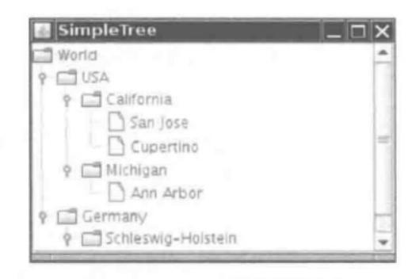

图 11-14 一棵简单的树

或者,使用快捷方式,直接将根节点传递给 JTree 构造器。那么这棵树就会自动构建一个默认的树模型:

```
var tree = new JTree(root);
```

程序清单 11-8 给出了完整的代码。

#### 程序清单 11-8 tree/SimpleTreeFrame.java

```
1 package tree;
3 import javax.swing.*;
4 import javax.swing.tree.*;
6
   * This frame contains a simple tree that displays a manually constructed tree model.
8
   public class SimpleTreeFrame extends JFrame
9
10
      private static final int DEFAULT WIDTH = 300;
11
      private static final int DEFAULT HEIGHT = 200;
12
13
      public SimpleTreeFrame()
14
15
         setSize(DEFAULT WIDTH, DEFAULT HEIGHT);
16
17
         // set up tree model data
18
19
         var root = new DefaultMutableTreeNode("World");
28
21
         var country = new DefaultMutableTreeNode("USA");
        root.add(country);
22
         var state = new DefaultMutableTreeNode("California");
23
         country.add(state);
24
```

```
var city = new DefaultMutableTreeNode("San Jose");
25
         state.add(city);
26
         city = new DefaultMutableTreeNode("Cupertino");
27
         state.add(city);
28
         state = new DefaultMutableTreeNode("Michigan");
29
         country.add(state);
38
         city = new DefaultMutableTreeNode("Ann Arbor");
31
         state.add(city);
32
         country = new DefaultMutableTreeNode("Germany");
33
         root.add(country);
34
         state = new DefaultMutableTreeNode("Schleswig-Holstein");
35
         country.add(state):
36
         city = new DefaultMutableTreeNode("Kiel");
37
         state.add(city);
38
39
48
         // construct tree and put it in a scroll pane
41
         var tree = new JTree(root):
42
         add(new JScrollPane(tree));
43
44
45 }
```

运行这段程序代码时,最初的树外观如图 11-15 所示。只有根节点和它的子节点可见。单击圆圈图标(把手)展开子树。当子树折叠起来时,把手图标的线伸出指向右边,当子树展开时,把手图标的线伸出指向下方(参见图 11-16)。虽然我们无法得知 Metal 外观的设计者当时是如何构想的,但是我们可以将这个图标看作一个门把手,按下把手就可以打开子树。

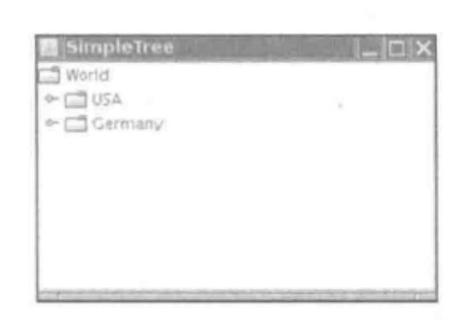

图 11-15 最初的树的显示

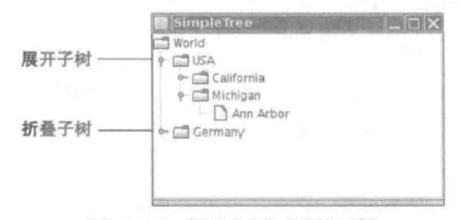

图 11-16 折叠和展开后的子树

這一注釋: 当然, 树的显示还依赖于所选择的外观模式。我们这里只讨论 Metal 这种外观模式。在 Windows 外观模式中, 把手则具有我们更熟悉的外观, 即带有"−"或"+"的框结构(参见图 11-17)。

可以使用下面这句神奇的代码取消父子节点之间的连接线(参见图 11-18):

tree.putClientProperty("JTree.lineStyle", "None");

相反地, 如果要确保显示这些线条, 则可以使用:

tree.putClientProperty("JTree.lineStyle", "Angled");

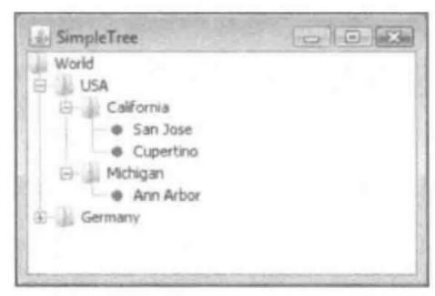

图 11-17 一棵具有 Windows 外观的树

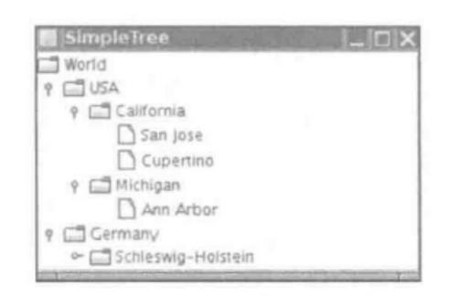

图 11-18 不带连接线的树

另一种线条样式,"水平线",如图 11-19 所示。这棵树显示有水平线,而这些水平线只是用来将根节点的孩子节点分离开来。我们也说不清楚这样做的好处。

默认情况下,这种树中的根节点没有用于折叠的把手。如果需要的话,可以通过下面的调用来添加一个把手:

tree.setShowsRootHandles(true);

图 11-20 显示了调用后的结果。现在就可以将整棵树折叠到根节点中了。

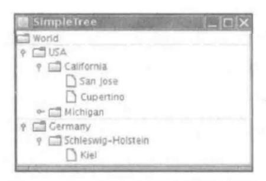

图 11-19 具有水平线样式的树

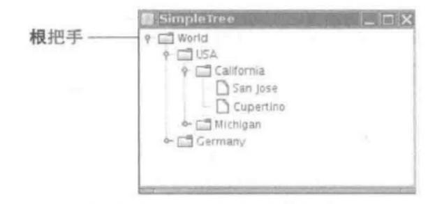

图 11-20 具有一个根把手的树

相反地,也可以将根节点完全隐藏起来。这样做只是为了显示一个森林,即一个树集,每棵树都有它自己的根节点。但是仍然必须将森林中的所有树都放到一个公共节点下。因此,可以使用下面这条指令将根节点隐藏起来。

tree.setRootVisible(false);

请观察图 11-21。它看起来似乎有两个根节点,分别用"USA"和"Germany"标识了出来,而实际上将二者合并起来的根节点是不可见的。

让我们将注意力从树的根节点转移到叶节点。注意,这些叶节点的图标和其他节点的图标是不同的(参见图 11-22)。

在显示这棵树的时候,每个节点都绘有一个图标。实际上一共有三种图标:叶节点图标、展开的非叶节点图标以及闭合的非叶节点图标。为了简化起见,我们将后面两种图标称为文件夹图标。

节点绘制器必须知道每个节点要使用什么样的图标。默认情况下,这个决策过程是这样的:如果某个节点的 isLeaf 方法返回的是 true,那么就使用叶节点图标,否则,使用文件夹图标。

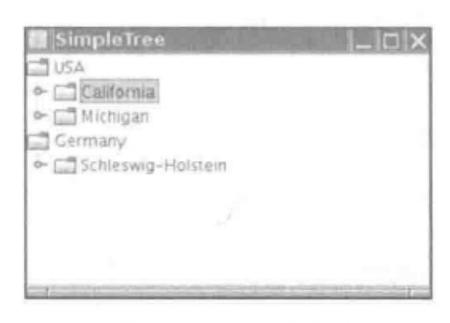

图 11-21 一个森林

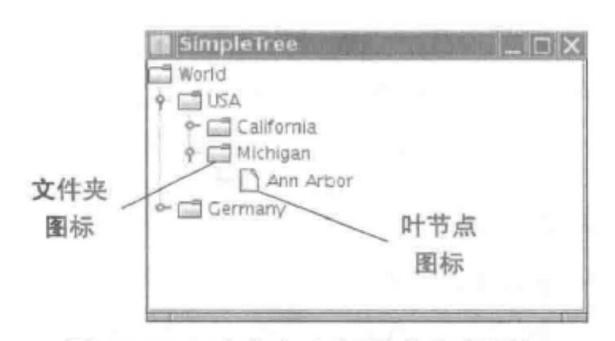

图 11-22 叶节点和折叠节点的图标

如果某个节点没有任何儿子节点,那么 DefaultMutableTreeNode 类的 isLeaf 方法将返回 true。因此,具有儿子节点的节点使用文件夹图标,没有儿子节点的节点使用叶节点图标。

有时,这种做法并不合适。假设我们要向我们那棵简单的树中添加一个"Montana"节点,但是我们还不知道要添加什么城市。此时,我们并不希望一个州节点使用叶节点图标,因为从概念上来讲,只有城市才使用叶节点。

JTree 类无法知道哪些节点是叶节点,它要询问树模型。如果一个没有任何子节点的节点不应该自动地被设置为概念上的叶节点,那么可以让树模型对这些叶节点使用一个不同的标准,即可以查询其"允许有子节点"的节点属性。

对于那些不应该有子节点的节点, 调用

node.setAllowsChildren(false);

然后,告诉树模型去查询"允许有子节点"的属性值以确定一个节点是否应该显示成叶子图标。可以使用 DefaultTreeModel 类中的方法 setAsksAllowsChildren 设定此动作:

model.setAsksAllowsChildren(true);

有了这个判定规则,允许有子节点的节点就可以获得文件夹图标,而不允许有子节点的节点将获得叶子图标。

另外,如果是通过提供根节点来构建一棵树的,那么请在构造器中直接提供"询问允许有子节点"属性值的设置。

var tree = new JTree(root, true); // nodes that don't allow children get leaf icons

## API javax.swing.JTree 1.2

- JTree(TreeModel model)
   根据一个树模型构造一棵树。
- JTree(TreeNode root)
- JTree(TreeNode root, boolean asksAllowChildren)
   使用默认的树模型构造一棵树,显示根节点和它的子节点。

参数: root 根节点

asksAllowChildren如果设置为 true,则使用"允许有子节点"的节点属性来确定一个节点是否是叶节点

void setShowsRootHandles(boolean b)

如果 b 为 true,则根节点具有折叠或展开它的子节点的把手图标。

void setRootVisible(boolean b)
 如果 b 为 true,则显示根节点,否则隐藏根节点。

## API javax.swing.tree.TreeNode

500

- boolean isLeaf()
   如果该节点是一个概念上的叶节点,则返回 true。
- boolean getAllowsChildren()
   如果该节点可以拥有子节点,则返回 true。

## API javax.swing.tree.MutableTreeNode 12

void setUserObject(Object userObject)
 设置树节点用于绘制的"用户对象"。

## API javax.swing.tree.TreeModel

boolean isLeaf(Object node)
 如果该节点应该以叶节点的形式显示,则返回 true。

## API javax.swing.tree.DefaultTreeModel

void setAsksAllowsChildren(boolean b)
 如果 b 为 true,那么当节点的 getAllowsChildren 方法返回 false 时,这些节点显示为叶节点。否则,当节点的 isLeaf 方法返回 true 时,它们显示为叶节点。

## API javax.swing.tree.DefaultMutableTreeNode

- DefaultMutableTreeNode(Object userObject)
   用给定的用户对象构建一个可变树节点。
- void add(MutableTreeNode child)
   将一个节点添加为该节点最后一个子节点。
- void setAllowsChildren(boolean b)
   如果 b 为 true,则可以向该节点添加子节点。

## API javax.swing.JComponent 12

void putClientProperty(Object key, Object value)
 将一个键/值对添加到一个小表格中,每一个构件都管理着这样的一个小表格。这是一种"紧急逃生"机制,很多 Swing 构件用它来存放与外观相关的属性。

## 编辑树和树的路径

在下面的一个示例程序中,将会看到怎样编辑一棵树。图 11-23 显示了用户界面。如果点击"Add Sibling"(添加兄弟节点)或"Add Child"(添加子节点)按钮,该程序将向树中添加一个新节点(带有"New"标题)。如果你点击"Delete"(删除)按钮,该程序将删除当

前选中的节点。

为了实现这种行为,需要弄清楚当前选定的是哪个节点。JTree 类用的是一种令人惊讶的方式来标识树中的节点。它并不处理树的节点,而是处理对象路径(称为树路径)。一个树路径从根节点开始,由一个子节点序列构成,参见图 11-24。

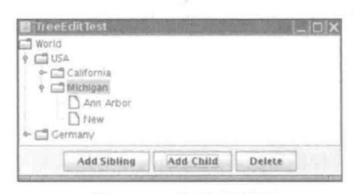

图 11-23 编辑一棵树

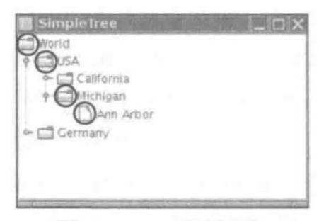

图 11-24 一个树路径

你可能要怀疑 JTree 类为什么需要整个路径。它不能只获得一个 TreeNode,然后不断调用 getParent 方法吗?实际上,JTree 类一点都不清楚 TreeNode 接口的情况。该接口从来没有被 TreeModel 接口用到过,它只被 DefaultTreeModel 的实现用到了。你完全有可能持有的是其他的树模型,这些树模型中的节点可能根本就没有实现 TreeNode 接口。如果你使用的是一个管理其他类型对象的树模型,那么这些对象有可能根本就没有 getParent 和 getChild 方法,而它们彼此之间当然会有其他某种连接。将其他节点连接起来这是树模型的职责,JTree 类本身并没有节点之间连接属性的任何线索。因此,JTree 类总是需要用完整的路径来工作。

TreePath 类管理着一个 Object (不是 TreeNode!)引用序列。有很多 JTree 的方法都可以返回 TreePath 对象。当拥有一个树路径时,通常只需要知道其终端节点,该节点可以通过 getLastPathComponent 方法得到。例如,如果要查找一棵树中当前选定的节点,可以使用 JTree 类中的 getSelectionPath 方法。它将返回一个 TreePath 对象,根据这个对象就可以检索实际的节点。

TreePath selectionPath = tree.getSelectionPath();
var selectedNode = (DefaultMutableTreeNode) selectionPath.getLastPathComponent();

实际上,由于这种特定查询经常被使用到,因此还提供了一个更方便的方法,它能够立即给出选定的节点。

var selectedNode = (DefaultMutableTreeNode) tree.getLastSelectedPathComponent();

该方法之所以没有被称为 getSelectedNode,是因为树并不了解它包含的节点,它的树模型只处理对象的路径。

註釋: 树路径是 JTree 类描述节点的两种方式之一。JTree 有许多方法可以接收或返回一个整数索引──行的位置。行的位置仅仅是节点在树中显示的一个行号(从0开始)。只有那些可视节点才有行号,并且如果一个节点之前的其他节点展开、折叠或者被修改过,这个节点的行号也会随之改变。因此,你应该避免使用行的位置。所有使用行的 JTree 方法都有一个与之等价的使用树路径的方法。

*一旦 定了某个 点 么就可以它进行编辑了。不 不 接向树 点添加子 点 selectedNode.add(newNode): // No!*

*如果改变了 点 构 么改变 只是树模型 关 图却没有 到。我们 可以 己发 一个 消息 但是如果使 DefaultTreeModel类的insertNodelnto方法 么 模型 会全权 件事情。例如 下 可以将一个新 点作为 定 点 最后 子 点添加到树中 并 树 图。*

*model.insertNodelnto(newNode• selectedNode, selectedNode.getChildCount());*

*似的调用removeNodeFromParent可以 一个 点并 树 图*

*model.removeNodeFromParent(selectedNode);*

*如果想保持 点 构 但是 改变 户对 么可以 下 个方法*

*model.nodeChanged(changedNode);*

*动 是使 DefaultTreeModel 主 优势。如果你提供 己 树模型 么必须自 己动手实 动 。(详见Kim Topley撰写 Core Swingo)*

*0 <sup>告</sup> DefaultTreeModel有一个reload方法 够将整个模型 <sup>新</sup> <sup>入</sup>。但是 <sup>不</sup> <sup>在</sup> 了少数几个修改之后 只是为了更新树 reload方法。在 建一棵树 时 候 根 点 子 点之后 所有 点将全 再次折叠 来。如果你 户在每次修改 之后 不断地展开整棵树 实是一件令人烦心 事。*

*当 图接收到 点 构 改变 时 它会更新显 树 图 但是不会 动展开某 个 点以展 新添加 子 点。 别是在我们上 个 例 序中 如果 户将一个新 点 添加到其子 点正处于折叠 态 点上 么 个新添加 点就 悄无声息地添加到了 一个处于折叠 态 子树中 就没有 户提供任何反 信息以告 户已 执 了 命 令。在 情况下 你可 别 劲地展开所有 点 以便 新添加 点成为可 点。可以使用类JTree中 方法makeVisible实 个 。makeVisible方法将接受一 个树 径作为参数 树 径指向应 变为可视的节点。*

*因此 构建一个从根 点到新添加 点 树 径。为了 得一个 样 树 径 先 DefaultTreeModel 中 getPathToRoot方法 它 回一个包含了某一 点到根 点之 所有 点 数 TreeNode[]。可以将 个数 传 一个TreePath构 器。*

*例如 下 展 了怎样将一个新 点变成可*

*TreeNode[] nodes <sup>=</sup> model.getPathToRoot(newNode); var path <sup>=</sup> new TreePath(nodes); tree.makeVisible(path);*

*El<sup>注</sup> 令人惊奇 <sup>是</sup> DefaultTreeModel 好像完全忽 <sup>了</sup> TreePath <sup>尽</sup> <sup>它</sup> 是与一个JTree 信。JTree 大 地使 到了树 径 它从不使用节点对 數 。*

但是,现在假设你的树是放在一个滚动面板里面,在展开树节点之后,新节点仍是不可见的,因为它落在视图之外。为了克服这个问题,请调用

tree.scrollPathToVisible(path);

而不是调用 makeVisible。这个调用将展开路径中的所有节点,并告诉外围的滚动面板将路径末端的节点滚动到视图中(参见图 11-25)。

默认情况下,这些树节点是不可编辑的。不过,如果调用

tree.setEditable(true);

那么,用户就可以编辑某一节点了。可以先双击该节点,然后编辑字符串,最后按下回车键。双击操作会调用默认单元格编辑器,它实现了DefaultCellEditor类(参见图11-26)。也可以安装其他一些单元格编辑器,其过程与表格单元格编辑器中讨论的过程一样。

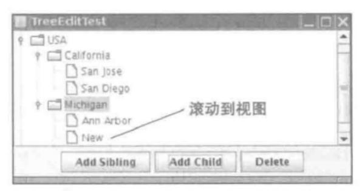

图 11-25 滚动以显示新节点的滚动面板

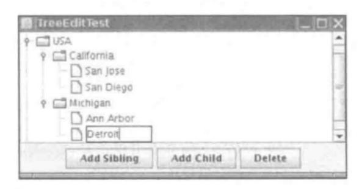

图 11-26 默认的单元格编辑器

程序清单 11-9 展示了树编辑程序的完整源代码。运行该程序,添加几个新节点,然后通过双击它们进行编辑操作。请观察折叠的节点是怎样展开以显现添加的子节点的,以及滚动面板是怎样让添加的节点保持在视图中的。

#### 程序清单 11-9 treeEdit/TreeEditFrame.java

```
package treeEdit;
2
3 import java.awt.*;
4 import javax.swing.*;
5 import javax.swing.tree.*;
6
  /**
7
   * A frame with a tree and buttons to edit the tree.
R
9
   public class TreeEditFrame extends JFrame
10
11
      private static final int DEFAULT WIDTH = 400;
12
      private static final int DEFAULT HEIGHT = 200;
13
14
      private DefaultTreeModel model;
15
      private JTree tree;
16
17
      public TreeEditFrame()
18
19
         setSize(DEFAULT WIDTH, DEFAULT HEIGHT);
28
```

```
21
22
         // construct tree
23
         TreeNode root = makeSampleTree();
24
         model = new DefaultTreeModel(root);
25
         tree = new JTree(model);
26
         tree.setEditable(true);
28
         // add scroll pane with tree
29
30
         var scrollPane = new JScrollPane(tree);
31
         add(scrollPane, BorderLayout.CENTER);
32
33
         makeButtons();
34
35
36
      public TreeNode makeSampleTree()
37
38
         var root = new DefaultMutableTreeNode("World");
30
         var country = new DefaultMutableTreeNode("USA");
40
          root.add(country);
41
         var state = new DefaultMutableTreeNode("California");
47
          country.add(state):
43
         var city = new DefaultMutableTreeNode("San Jose");
44
          state.add(city);
45
          city = new DefaultMutableTreeNode("San Diego");
          state.add(city);
47
          state = new DefaultMutableTreeNode("Michigan");
48
          country.add(state);
49
          city = new DefaultMutableTreeNode("Ann Arbor");
58
51
          state.add(city);
          country = new DefaultMutableTreeNode("Germany");
          root.add(country);
53
          state = new DefaultMutableTreeNode("Schleswig-Holstein");
54
55
          country.add(state);
          city = new DefaultMutableTreeNode("Kiel");
56
          state.add(city);
57
          return root;
58
59
68
61
       * Makes the buttons to add a sibling, add a child, and delete a node.
62
63
       public void makeButtons()
64
65
          var panel = new JPanel();
66
          var addSiblingButton = new JButton("Add Sibling");
          addSiblingButton.addActionListener(event ->
68
69
                var selectedNode = (DefaultMutableTreeNode) tree.getLastSelectedPathComponent();
78
71
                if (selectedNode == null) return;
72
73
                var parent = (DefaultMutableTreeNode) selectedNode.getParent();
74
75
```

```
if (parent == null) return;
77
               var newNode = new DefaultMutableTreeNode("New");
78
79
               int selectedIndex = parent.getIndex(selectedNode);
88
               model.insertNodeInto(newNode, parent, selectedIndex + 1);
81
82
               // now display new node
83
84
               TreeNode[] nodes = model.getPathToRoot(newNode);
85
                var path = new TreePath(nodes);
86
                tree.scrollPathToVisible(path);
87
88
          panel.add(addSiblingButton);
89
          var addChildButton = new JButton("Add Child");
91
          addChildButton.addActionListener(event ->
92
                var selectedNode = (DefaultMutableTreeNode) tree.getLastSelectedPathComponent();
94
95
                if (selectedNode == null) return;
97
                var newNode = new DefaultMutableTreeNode("New");
98
                model.insertNodeInto(newNode, selectedNode, selectedNode.getChildCount());
99
199
                // now display new node
191
192
                TreeNode[] nodes = model.getPathToRoot(newNode);
183
                var path = new TreePath(nodes);
194
                tree.scrollPathToVisible(path);
105
             11:
196
          panel.add(addChildButton);
107
108
          var deleteButton = new JButton("Delete");
199
          deleteButton.addActionListener(event ->
110
111
             {
                var selectedNode = (DefaultMutableTreeNode) tree.getLastSelectedPathComponent();
112
113
                if (selectedNode != null && selectedNode.getParent() != null) model
114
                       . removeNodeFromParent(selectedNode);
115
             });
116
          panel.add(deleteButton);
117
118
          add(panel, BorderLayout.SOUTH);
119
120 }
```

## API javax.swing.JTree

- TreePath getSelectionPath()
   获取到当前选定节点的路径,如果选定多个节点,则获取到第一个选定节点的路径。如果没有选定任何节点,则返回 null。
- Object getLastSelectedPathComponent()

获取表示当前选定节点的节点对象,如果选定多个节点,则获取第一个选定的节点。如果没有选定任何节点,则返回 null。

- void makeVisible(TreePath path)
   展开该路径中的所有节点。
- void scrollPathToVisible(TreePath path)
   展开该路径中的所有节点,如果这棵树是置于滚动面板中的,则滚动以确保该路径中的最后一个节点是可见的。

## API javax.swing.tree.TreePath

Object getLastPathComponent()
 获取该路径中最后一个节点,也就该路径代表的节点对象。

#### API javax.swing.tree.TreeNode

- TreeNode getParent()返回该节点的父节点。
- TreeNode getChildAt(int index)
   查找给定索引号上的子节点。该索引号必须在 0 和 getChildCount()-1 之间。
- int getChildCount()返回该节点的子节点个数。
- Enumeration children()
   返回一个枚举对象,可以迭代遍历该节点的所有子节点。

## javax.swing.tree.DefaultTreeModel

- void insertNodeInto(MutableTreeNode newChild, MutableTreeNode parent, int index)
   将 newChild 作为 parent 的新子节点添加到给定的索引位置上,并通知树模型的监听器。
- void removeNodeFromParent(MutableTreeNode node)
   将节点 node 从该模型中删除,并通知树模型的监听器。
- void nodeChanged(TreeNode node)
   通知树模型的监听器: 节点 node 发生了改变。
- void nodesChanged(TreeNode parent, int[] changedChildIndexes)
   通知树模型的监听器:节点 parent 所有在给定索引位置上的子节点发生了改变。
- void reload()
   将所有节点重新载入到树模型中。这是一项动作剧烈的操作,只有当由于一些外部作用,导致树的节点完全改变时,才应该使用该方法。

## 11.2.2 节点枚举

有时为了查找树中一个节点,必须从根节点开始,遍历所有子节点直到找到相匹配的节点。DefaultMutableTreeNode类有几个很方便的方法用于迭代遍历所有节点。

breadthFirstEnumeration 方法和 depthFirstEnumeration 方法分别使用广度优先或深度优先的遍历方式,返回枚举对象,它们的 nextElement 方法能够访问当前节点的所有子节点。图 11-27 显示了对示例树进行遍历的情况,节点标签则指示遍历节点时的先后次序。

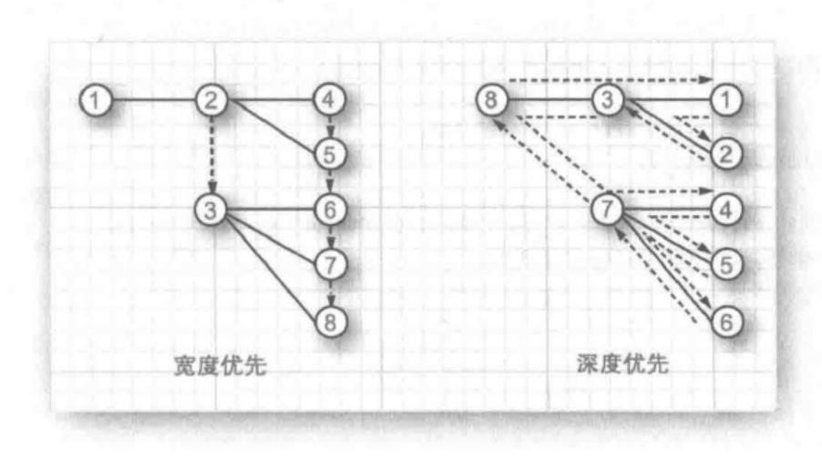

图 11-27 树的遍历顺序

按照广度优先的方式进行枚举是最容易可视化的。树是以层的形式遍历的,首先访问根节点,然后是它的所有子节点,接着是它的孙子节点,以此类推。

为了可视化深度优先的枚举,让我们想象一只老鼠陷入一个树状陷阱的情形。它沿着第一条路径迅速爬行,直到到达一个叶节点位置。然后,原路返回并转入下一条路径,以此类推。

计算机科学家也将其称为后序遍历(postorder traversal),因为整个查找过程是先访问到子节点,然后才访问到父节点。postOrderTraversal 方法是 depthFirstTraversal 的同义语。为了完整性,还存在一个 preOrderTraversal 方法,它也是一种深度优先搜索方法,但是它首先枚举父节点,然后是子节点。

下面是一种典型的使用模式:

Enumeration breadthFirst = node.breadthFirstEnumeration();
while (breadthFirst.hasMoreElements())
 do something with breadthFirst.nextElement();

最后,还有一个相关方法 pathFromAncestorEnumeration,用于查找一条从祖先节点到给定节点

之间的路径,然后枚举出该路径中的所有节点。整个过程并不需要大量的处理操作,只需要不断调用 getParent 直到发现祖先节点,然后将该路径倒置过来存放即可。

在我们的下个示例程序中,将运用 到节点枚举。该程序显示了类之间的继 承树。向窗体最下面的文本框中输入一 个类名,该类以及它的所有父类就会添 加到树中(参见图 11-28)。

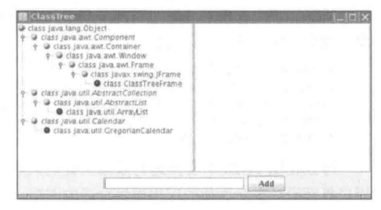

图 11-28 一棵继承树

在这个示例中,我们充分利用了这个事实,即树节点的用户对象可以是任何类型的对象。因为我们这里的节点是用来描述类的,因此我们在这些节点中存储的是 Class 对象。

当然,我们不想对同一个类对象添加两次,因此我们必须检查一个类是否已经存在于树中。如果在树中存在给定用户对象的节点,那么下面这个方法就可以用来查找该节点。

```
public DefaultMutableTreeNode findUserObject(Object obj)
{
    Enumeration e = root.breadthFirstEnumeration();
    while (e.hasMoreElements())
    {
        DefaultMutableTreeNode node = (DefaultMutableTreeNode) e.nextElement();
        if (node.getUserObject().equals(obj))
            return node;
    }
    return null;
}
```

#### 11.2.3 绘制节点

在应用中可能会经常需要改变树构件绘制节点的方式,最常见的改变当然是为节点和叶节点选取不同的图标,其他一些改变可能涉及节点标签的字体或节点上的图像绘制等方面。 所有这些改变都可以通过向树中安装一个新的树单元格绘制器来实现。在默认情况下,JTree 类使用 DefaultTreeCellRenderer 对象来绘制每个节点。DefaultTreeCellRenderer 类继承自 JLabel 类,该标签包含节点图标和节点标签。

**注释**:单元格绘制器并不能绘制用于展开或折叠子树的"把手"图标。这些把手是外观模式的一部分、建议最好不要试图改变它们。

可以通过以下三种方式定制显示外观:

- 可以使用 DefaultTreeCellRenderer 改变图标、字体以及背景颜色。这些设置适用于树中所有节点。
- 可以安装一个继承了DefaultTreeCellRenderer类的绘制器,用于改变每个节点的图标、字体以及背景颜色。
- 可以安装一个实现了TreeCellRenderer接口的绘制器,为每个节点绘制自定义的图像。
   让我们逐个研究这几种可能。最简单的定制方法是构建一个DefaultTreeCellRenderer对象,改变图标,然后将它安装到树中:

```
var renderer = new DefaultTreeCellRenderer();
renderer.setLeafIcon(new ImageIcon("blue-ball.gif")); // used for leaf nodes
renderer.setClosedIcon(new ImageIcon("red-ball.gif")); // used for collapsed nodes
renderer.setOpenIcon(new ImageIcon("yellow-ball.gif")); // used for expanded nodes
tree.setCellRenderer(renderer);
```

可以在图 11-28 中看到运行效果。我们只是使用"球"图标作为占位符,这里假设你的用户界面设计者会为你的应用提供合适的图标。

我们不建议改变整棵树中的字体或背景颜色, 因为这实际上是外观设置的职责所在。

不过,改变树中个别节点的字体,以突显某些节点还是很有用的。如果仔细观察图 11-28,你会看到抽象类是设成斜体字的。

为了改变单个节点的外观,需要安装一个树单元格绘制器。树单元格绘制器与我们在本章前一节讨论的列表单元格绘制器很相似。TreeCellRenderer接口只有下面这个单一方法:

Component getTreeCellRendererComponent(JTree tree, Object value, boolean selected, boolean expanded, boolean leaf, int row, boolean hasFocus)

DefaultTreeCellRenderer 类的 getTreeCellRendererComponent 方法返回的是 this,换句话说,就是一个标签(DefaultTreeCellRenderer 类继承了 JLabel 类)。如果要定制一个构件,需要继承 DefaultTreeCellRenderer 类。按照以下方式覆盖 getTreeCell RendererComponent 方法:调用超类中的方法,以便准备标签的数据,然后定制标签属性,最后返回 this。

```
class MyTreeCellRenderer extends DefaultTreeCellRenderer
{
   public Component getTreeCellRendererComponent(JTree tree, Object value, boolean selected,
```

- 警告: getTreeCellRendererComponent 方法的 value 参数是节点对象,而不是用户对象! 请记住,用户对象是 DefaultMutableTreeNode 的一个特性,而 JTree 可以包含任意类型的节点。如果树使用的是 DefaultMutableTreeNode 节点,那么必须在第二个步骤中获取这个用户对象,正如我们在上一个代码示例中所做的那样。
- ◆ 警告: DefaultTreeCellRenderer 为所有节点使用的是相同的标签对象,仅仅是为每个节点改变标签文本而已。如果想为某个特定节点更改字体,那么必须在该方法再次调用的时候将它设置回默认值。否则,随后的所有节点都会以更改过的字体进行绘制!见程序清单 11-10 中的程序代码,看看它是怎样将字体恢复到其默认值的。

根据 Class 对象有无 ABSTRACT 修饰符,程序清单 11-10 中的 ClassNameTreeCellRenderer 会将类名设置为标准字体或斜体字体。我们不想设置成特殊的字体,因为我们不想改变任何通常用于显示标签的字体外观。因此,我们使用来自标签本身的字体以及从它衍生而来的一个斜体字体。请回忆一下,全部的调用只返回一个共享的单一的 JLabel 对象。因此,我们需要保存初始字体,并在下一次调用 gettreeCellRendererComponent 方法时将其恢复为初始值。

同时,注意一下我们是如何改变 ClassTreeFrame 构造器中的节点图标的。

## API javax.swing.tree.DefaultMutableTreeNode

- Enumeration breadthFirstEnumeration()
- Enumeration depthFirstEnumeration()
- Enumeration preOrderEnumeration()
- Enumeration postOrderEnumeration()

返回枚举对象,用于按照某种特定顺序访问树模型中的所有节点。在广度优先遍历中,先访问离根节点更近的子节点,再访问那些离根节点远的节点。在深度优先遍历中,先访问一个节点的所有子节点,然后再访问它的兄弟节点。post0rderEnumeration方法与depthFirstEnumeration基本上相似。除了先访问父节点,后访问子节点之外,先序遍历和后序遍历基本上一样。

## API javax.swing.tree.TreeCellRenderer

 Component getTreeCellRendererComponent(JTree tree, Object value, boolean selected, boolean expanded, boolean leaf, int row, boolean hasFocus)

返回一个 paint 方法被调用的构件,以便绘制树的一个单元格。

参数: tree

包含要绘制节点的树

value

要绘制的节点

selected

如果该节点是当前选定的节点,则为 true

expanded

如果该节点的子节点可见,则为 true

leaf

如果该节点应该显示为叶节点,则为 true

row

显示包含该节点的那行

hasFocus

如果当前选定的节点拥有输入焦点,则为 true

## api javax.swing.tree.DefaultTreeCellRenderer

- void setLeafIcon(Icon icon)
- void setOpenIcon(Icon icon)
- void setClosedIcon(Icon icon)
   设置叶节点、展开节点以及折叠节点的显示图标。

## 11.2.4 监听树事件

通常情况下,一个树构件会成对地 伴随着其他某个构件一起出现。当用户 选定了一些树节点时,某些信息就会在 其他窗口中显示出来。参见图 11-29 的示 例。当用户选定一个类时,这个类的实 例及静态变量信息就会在右边的文本区 显示出来。

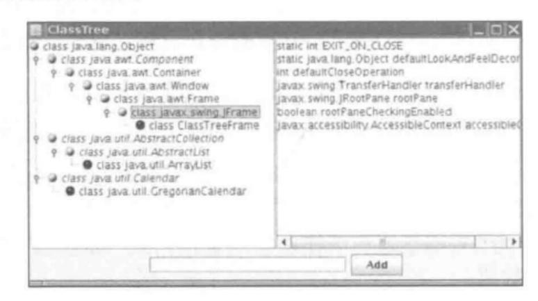

图 11-29 一个类浏览器

为了获得这项功能,可以安装一个树选择监听器。该监听器必须实现 TreeSelection-Listener 接口,这是一个只有下面这个单一方法的接口:

void valueChanged(TreeSelectionEvent event)

每当用户选定或者撤销选定树节点的时候,这个方法就会被调用。

可以按照下面这种通常方式向树中添加监听器:

tree.addTreeSelectionListener(listener);

可以设定是否允许用户选定一个单一的节点、连续区间内的节点或者一个任意的、可能不连续的节点集。JTree 类使用 TreeSelectionModel 来管理节点的选择。必须先获取模型,然后将选择状态设置为 SINGLE\_TREE\_SELECTION、CONTIGUOUS\_TREE\_SELECTION或 DISCONTIGUOUS\_TREE\_SELECTION 三种状态之一。(在默认情况下是非连续的选择模式。)例如,在我们的类浏览器中,我们希望只允许选择单个类:

int mode = TreeSelectionModel.SINGLE\_TREE\_SELECTION; tree.getSelectionModel().setSelectionMode(mode);

除了设置选择模式之外,并不需要担心树的选择模型。

這程:用户怎样选定多个项则依赖于外观。在Metal 外观中,按下CTRL键,同时点击一个项将它添加到项集中,如果当前已经选定了该项,则将其从项集中删除。按下SHIFT键,同时点击一个项,可以选定一个项范围,它从先前已选定的项延伸到新选定的项。

要找出当前的项集,可以用 getSelectionPaths 方法来查询树:

TreePath[] selectedPaths = tree.getSelectionPaths();

如果想限制用户只能做单项选择,那么可以使用便捷的 getSelectionPath 方法,它将返回第一个被选择的路径,或者是 null (如果没有任何路径被选)。

◆ 警告: TreeSelectionEvent 类具有一个 getPaths 方法,它将返回一个 TreePath 对象数组,但是该数组描述的是项集的变化,而不是当前的项集。

程序清单 11-10 显示了类树这个程序的窗体类。该程序可以显示继承的层次结构,并且将抽象类定制显示为斜体字(参见程序清单 11-11 的单元格绘制器)。可以在窗体底部的文本框中输入任何类名,按下 Enter 键或者点击 "Add"按钮,将该类及其超类添加到树中。必须输入完整的包名,例如 java.util.ArrayList。

#### 程序清单 11-10 treeRender/ClassTreeFrame.java

- package treeRender;
- 3 import java.awt.\*;
- 4 import java.awt.event.\*;
- 5 import java.lang.reflect.\*;
- 6 import java.util.\*;

```
512
```

```
8 import javax.swing.*;
9 import javax.swing.tree.*;
18
11 /**
   * This frame displays the class tree, a text field, and an "Add" button to add more classes
   * into the tree.
13
   public class ClassTreeFrame extends JFrame
16
      private static final int DEFAULT WIDTH = 400;
17
      private static final int DEFAULT HEIGHT = 300;
18
19
      private DefaultMutableTreeNode root;
28
      private DefaultTreeModel model;
      private JTree tree:
22
      private JTextField textField;
23
      private JTextArea textArea;
24
25
26
      public ClassTreeFrame()
27
28
         setSize(DEFAULT WIDTH, DEFAULT HEIGHT);
29
         // the root of the class tree is Object
38
         root = new DefaultMutableTreeNode(java.lang.Object.class);
31
         model = new DefaultTreeModel(root);
32
         tree = new JTree(model);
33
         // add this class to populate the tree with some data
35
36
         addClass(getClass());
         // set up node icons
38
         var renderer = new ClassNameTreeCellRenderer():
39
         renderer.setClosedIcon(new ImageIcon(getClass().getResource("red-ball.gif")));
         renderer.setOpenIcon(new ImageIcon(getClass().getResource("yellow-ball.gif")));
41
         renderer.setLeafIcon(new ImageIcon(getClass().getResource("blue-ball.gif")));
42
         tree.setCellRenderer(renderer):
43
         // set up selection mode
45
         tree.addTreeSelectionListener(event ->
46
47
               // the user selected a different node--update description
48
               TreePath path = tree.getSelectionPath();
49
                if (path == null) return;
                var selectedNode = (DefaultMutableTreeNode) path.getLastPathComponent();
51
                Class<?> c = (Class<?>) selectedNode.getUserObject();
52
                String description = getFieldDescription(c);
                textArea.setText(description);
54
55
         int mode = TreeSelectionModel.SINGLE TREE SELECTION;
         tree.getSelectionModel().setSelectionMode(mode);
57
58
         // this text area holds the class description
59
         textArea = new JTextArea();
60
61
```

```
// add tree and text area
62
         var panel = new JPanel();
63
         panel.setLayout(new GridLayout(1, 2));
64
         panel.add(new JScrollPane(tree));
65
         panel.add(new JScrollPane(textArea));
66
67
68
         add(panel, BorderLayout.CENTER);
69
         addTextField();
79
      }
71
72
73
       * Add the text field and "Add" button to add a new class.
74
       */
75
      public void addTextField()
76
77
         var panel = new JPanel();
78
79
         ActionListener addListener = event ->
88
81
                // add the class whose name is in the text field
87
83
                try
                {
84
                   String text = textField.getText();
85
                   addClass(Class.forName(text)); // clear text field to indicate success
                   textField.setText("");
87
88
                catch (ClassNotFoundException e)
89
98
                   JOptionPane.showMessageDialog(null, "Class not found");
91
                }
92
             };
93
94
          // new class names are typed into this text field
95
          textField = new JTextField(20);
96
          textField.addActionListener(addListener);
97
          panel.add(textField);
98
99
          var addButton = new JButton("Add");
100
          addButton.addActionListener(addListener);
101
          panel.add(addButton);
102
183
104
          add(panel, BorderLayout.SOUTH);
105
186
107
        * Finds an object in the tree.
188
        * @param obj the object to find
109
        * @return the node containing the object or null if the object is not present in the tree
110
111
       public DefaultMutableTreeNode findUserObject(Object obj)
112
113
          // find the node containing a user object
114
115
          var e = (Enumeration<TreeNode>) root.breadthFirstEnumeration();
          while (e.hasMoreElements())
116
```

```
117
             var node = (DefaultMutableTreeNode) e.nextElement();
118
             if (node.getUserObject().equals(obj)) return node;
119
120
         return null;
121
122
123
124
       * Adds a new class and any parent classes that aren't yet part of the tree.
125
       * @param c the class to add
126
       * @return the newly added node
127
       */
128
      public DefaultMutableTreeNode addClass(Class<?> c)
129
138
         // add a new class to the tree
131
132
          // skip non-class types
133
         if (c.isInterface() || c.isPrimitive()) return null;
134
135
          // if the class is already in the tree, return its node
         DefaultMutableTreeNode node = findUserObject(c);
137
          if (node != null) return node;
138
130
          // class isn't present--first add class parent recursively
141
          Class<?> s = c.getSuperclass();
142
143
          DefaultMutableTreeNode parent;
144
          if (s == null) parent = root;
145
          else parent = addClass(s);
146
147
          // add the class as a child to the parent
148
          var newNode = new DefaultMutableTreeNode(c);
149
          model.insertNodeInto(newNode, parent, parent.getChildCount());
15A
151
          // make node visible
152
          var path = new TreePath(model.getPathToRoot(newNode));
153
          tree.makeVisible(path);
154
155
          return newNode;
156
157
       }
158
159
        * Returns a description of the fields of a class.
168
        * @param c the class to be described
161
        * @return a string containing all field types and names
162
163
       public static String getFieldDescription(Class<?> c)
164
       {
165
          // use reflection to find types and names of fields
166
          var r = new StringBuilder();
167
          Field[] fields = c.getDeclaredFields();
168
          for (int i = 0; i < fields.length; i++)
169
          {
178
```

```
Field f = fields[i];
171
             if ((f.getModifiers() & Modifier.STATIC) != 0) r.append("static ");
172
             r.append(f.getType().getName());
173
             r.append(" ");
174
             r.append(f.getName());
175
             r.append("\n");
176
177
         return r.toString();
178
179
180 }
```

#### 程序清单 11-11 treeRender/ClassNameTreeCellRenderer.java

```
package treeRender;
2
3 import java.awt.*;
 4 import java.lang.reflect.*;
   import javax.swing.*;
   import javax.swing.tree.*;
8
    * This class renders a class name either in plain or italic. Abstract classes are italic.
9
10
   public class ClassNameTreeCellRenderer extends DefaultTreeCellRenderer
11
12
   {
      private Font plainFont = null;
13
      private Font italicFont = null;
14
15
16
      public Component getTreeCellRendererComponent(JTree tree, Object value, boolean selected,
            boolean expanded, boolean leaf, int row, boolean hasFocus)
17
18
         super.getTreeCellRendererComponent(tree, value, selected, expanded, leaf,
19
               row, hasFocus);
28
         // get the user object
21
         var node = (DefaultMutableTreeNode) value;
22
         Class<?> c = (Class<?>) node.getUserObject();
23
         // the first time, derive italic font from plain font
25
         if (plainFont == null)
26
         {
27
             plainFont = getFont();
28
            // the tree cell renderer is sometimes called with a label that has a null font
29
             if (plainFont != null) italicFont = plainFont.deriveFont(Font.ITALIC);
38
31
32
         // set font to italic if the class is abstract, plain otherwise
33
         if ((c.getModifiers() & Modifier.ABSTRACT) == 0) setFont(plainFont);
34
         else setFont(italicFont);
         return this;
36
37
38 }
```

这个程序用到了一点小小的技巧,它是通过反射机制来构建这棵类树的。这项操作包含在addClass 方法内。(细节倒不那么重要,在这个例子中,我们之所以使用类树,是因为继承树不需要怎么费劲地编码就能生成一棵丰满的树。如果想在自己的应用中显示树,那么你需要准备自己的层次结构数据的来源。)该方法使用广度优先的搜索算法,通过调用我们在前一节实现的 findUserObject 方法,来确定当前的类是否已经存在于树中。如果这个类还不存在于树中,那么我们将其超类添加到这棵树中,然后将新节点作为它的子节点,并使该节点成为可见的。

在选择树的一个节点时,右侧的文本域将填充为选中的类的属性。在窗体构造器中,限制用户只能进行单项的选择,并添加了一个树选择监听器。当调用 valueChanged 方法时,我们忽略它的事件参数,只向该树询问当前的选定路径。正如通常情况那样,我们必须获得路径中的最后一个节点,并且查看它的用户对象。然后调用 getFieldDescription 方法,该方法使用反射机制将所选类的所有属性组装成一个字符串。

## API javax.swing.JTree 12

- TreePath getSelectionPath()
- TreePath[] getSelectionPaths()
   返回第一个选定的路径,或者一个包含所有选定节点的数组。如果没有选定任何路径,这两个方法都返回为 null。

## API javax.swing.event.TreeSelectionListener

void valueChanged(TreeSelectionEvent event)
 每当选定节点或撤销选定的时候,该方法就被调用。

## API javax.swing.event.TreeSelectionEvent

- TreePath getPath()
- TreePath[] getPaths()
   获取在该选择事件中已经发生更改的第一个路径或所有路径。如果你想知道当前的选择路径,而不是选择路径的更改情况,那么应该调用 JTree.getSelectionPaths。

## 11.2.5 定制树模型

在最后一个示例中,我们实现了一个能够查看变量内容的程序,正如调试器所做的那样(参见图 11-30)。

在继续深入之前,请先编译运行这个示例程序。 其中每个节点对应于一个实例域。如果该域是一个 对象,那么可以展开该节点以便查看它自己的实例 域。该程序会审视窗体中的内容。如果你浏览了好 几个实例域,那么你将会发现一些熟悉的类,还会 对复杂的 Swing 用户界面构件有所了解。

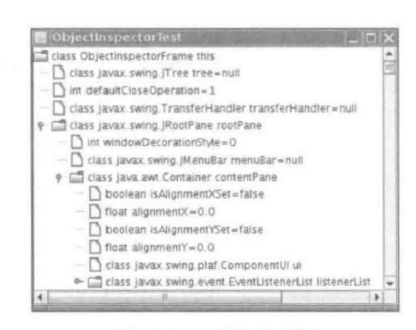

图 11-30 对象查看树

该程序的不同之处在于它的树并没有使用 DefaultTreeModel。如果你已经拥有按照层次结构组织的数据,那么你可能并不想花精力去再创建一棵副本树,而且创建副本树还要担心怎样保持两棵树的一致性。这正是我们要讨论的情形:通过对象的引用,被审视的对象已经彼此连接起来了,因此在这里就不需要复制这种连接结构了。

TreeModel 接口只有几个方法。第一组方法使得 JTree 能够按照先是根节点,然后是子节点的顺序找到树中的节点。JTree 类只在用户真正展开一个节点的时候才会调用这些方法。

```
Object getRoot()\nint getChildCount(Object parent)
Object getChild(Object parent, int index)
```

这个示例显示了为什么 TreeModel 接口像 JTree 类那样,不需要明确的用于描述节点的概念。根节点和子节点可以是任何对象, TreeModel 负责告知 JTree 它们是怎样联系起来的。

TreeModel 接口的下一个方法与 getChild 相反:

int getIndexOfChild(Object parent, Object child)

实际上,这个方法可以用前面的三个方法实现,参见程序清单 11-12 中的代码。

#### 程序清单 11-12 treeModel/ObjectInspectorFrame.java

```
package treeModel;
2
3 import java.awt.*;
4 import javax.swing.*;
5
    * This frame holds the object tree.
   public class ObjectInspectorFrame extends JFrame
9
10 {
      private JTree tree;
11
      private static final int DEFAULT WIDTH = 400;
12
      private static final int DEFAULT HEIGHT = 300;
13
14
      public ObjectInspectorFrame()
15
16
         setSize(DEFAULT WIDTH, DEFAULT HEIGHT):
17
18
         // we inspect this frame object
19
28
         var v = new Variable(getClass(), "this", this);
21
         var model = new ObjectTreeModel();
22
         model.setRoot(v);
23
24
         // construct and show tree
25
         tree = new JTree(model);
27
         add(new JScrollPane(tree), BorderLayout.CENTER);
28
      }
29
30 }
```

树模型会告诉 JTree 哪些节点应该显示成叶节点:

boolean isLeaf(Object node)

如果你的代码更改了树模型,那么必须告知这棵树以便它能够对自己进行重新绘制。树是将它自己作为一个 TreeModelListener 添加到模型中的,因此,模型必须支持通常的监听器管理方法:

```
void addTreeModelListener(TreeModelListener l)
void removeTreeModelListener(TreeModelListener l)
```

可以在程序清单 11-13 中看到这些方法的具体实现。

#### 程序清单 11-13 treeModel/ObjectTreeModel.java

```
package treeModel;
3 import java.lang.reflect.*;
4 import java.util.*;
5 import javax.swing.event.*;
6 import javax.swing.tree.*;
  /**
8
   * This tree model describes the tree structure of a Java object. Children are the objects
   * that are stored in instance variables.
11
   public class ObjectTreeModel implements TreeModel
12
   {
13
      private Variable root;
14
      private EventListenerList listenerList = new EventListenerList();
15
16
17
       * Constructs an empty tree.
18
19
      public ObjectTreeModel()
20
21
         root = null;
22
23
24
25
       * Sets the root to a given variable.
26
       * @param v the variable that is being described by this tree
27
28
      public void setRoot(Variable v)
29
38
         Variable oldRoot = v;
31
         root = v;
32
         fireTreeStructureChanged(oldRoot);
33
34
35
      public Object getRoot()
36
37
          return root;
38
39
49
```

```
public int getChildCount(Object parent)
41
42
      {
         return ((Variable) parent).getFields().size();
43
44
45
      public Object getChild(Object parent, int index)
46
47
         ArrayList<Field> fields = ((Variable) parent).getFields();
48
         var f = (Field) fields.get(index);
49
         Object parentValue = ((Variable) parent).getValue();
50
51
52
             return new Variable(f.getType(), f.getName(), f.get(parentValue));
53
54
         }
         catch (IllegalAccessException e)
55
56
             return null;
57
         }
58
59
60
      public int getIndexOfChild(Object parent, Object child)
61
62
         int n = getChildCount(parent);
63
         for (int i = 0; i < n; i++)
64
             if (getChild(parent, i).equals(child)) return i;
65
          return -1:
66
67
68
69
      public boolean isLeaf(Object node)
79
          return getChildCount(node) == 0;
71
72
73
       public void valueForPathChanged(TreePath path, Object newValue)
74
75
       }
76
77
       public void addTreeModelListener(TreeModelListener 1)
78
79
          listenerList.add(TreeModelListener.class, 1);
80
81
82
       public void removeTreeModelListener(TreeModelListener l)
83
84
          listenerList.remove(TreeModelListener.class, 1);
85
86
87
       protected void fireTreeStructureChanged(Object oldRoot)
88
89
          var event = new TreeModelEvent(this, new Object[] { oldRoot });
98
          for (TreeModelListener l : listenerList.getListeners(TreeModelListener.class))
91
             1.treeStructureChanged(event);
92
93
   }
94
```

当模型修改了树的内容时,它会调用 TreeModelListener 接口中下面 4 个方法中的某一个:

void treeNodesChanged(TreeModelEvent e)

void treeNodesInserted(TreeModelEvent e)

void treeNodesRemoved(TreeModelEvent e)

void treeStructureChanged(TreeModelEvent e)

TreeModelEvent 对象用于描述修改的位置。对描述插入或移除事件的树模型事件进行组装的细节是相当技术性的。如果树中确实有要添加或移除的节点,只需要考虑如何触发这些事件。在程序清单 11-12 中,我们展示了怎样触发一个事件:将根节点替换为一个新的对象。

☑ 提示: 为了简化事件触发的代码, 我们使用了 javax.swing.EventListenerList 这个使用方便、能够收集监听器的类。程序清单 11-13 中最后 3 个方法展示了如何使用这个类。

最后,如果用户要编辑树节点,那么就要用所做的修改调用模型:

void valueForPathChanged(TreePath path, Object newValue)

如果不允许编辑,则永远不会调用到该方法。

如果不支持编辑功能,那么构建一个树模型就变得相当容易了。我们要实现下面3个方法:

Object getRoot()\nint getChildCount(Object parent)
Object getChild(Object parent, int index)

这3个方法用于描述树的结构。还要提供另外5个方法的常规实现,如程序清单11-12 那样,然后就可以准备显示你的树了。

现在让我们转向示例程序的具体实现,我们的树将包含类型为 Variable 的对象。

**注释:** 一旦使用了 DefaultTreeModel, 我们的节点就可以持有类型为 DefaultMutable-TreeNode、用户对象类型为 Variable 的对象。

例如, 假设我们查看下面这个变量

Employee joe;

该变量的类型为 Employee.class,名字为 joe,值为对象引用 joe 的值。在程序清单 11-14 中,我们定义了 Variable 这个类,用来描述程序中的变量:

var v = new Variable(Employee.class, "joe", joe);

#### 程序清单 11-14 treeModel/Variable.java

```
package treeModel;
\nimport java.lang.reflect.*;\nimport java.util.*;

/**

A variable with a type, name, and value.

*/
```

```
9 public class Variable
10
   {
      private Class<?> type;
11
      private String name;
12
      private Object value;
13
      private ArrayList<Field> fields;
14
15
      /**
16
       * Construct a variable.
17
       * @param aType the type
18
       * @param aName the name
19
       * @param aValue the value
28
21
      public Variable(Class<?> aType, String aName, Object aValue)
22
73
24
          type = aType;
          name = aName;
25
          value = aValue;
26
          fields = new ArrayList<>();
27
28
          // find all fields if we have a class type except we don't expand strings and
29
         // null values
38
31
          if (!type.isPrimitive() && !type.isArray() && !type.equals(String.class)
37
                && value != null)
33
          {
34
             // get fields from the class and all superclasses
35
             for (Class<?> c = value.getClass(); c != null; c = c.getSuperclass())
36
             {
37
                Field[] fs = c.getDeclaredFields();
38
                AccessibleObject.setAccessible(fs, true);
39
ΔA
                // get all nonstatic fields
41
                for (Field f : fs)
42
                   if ((f.getModifiers() & Modifier.STATIC) == 0) fields.add(f);
43
             }
          }
45
       }
46
47
48
        * Gets the value of this variable.
49
        * @return the value
50
51
       public Object getValue()
52
53
          return value;
54
55
56
57
        * Gets all nonstatic fields of this variable.
58
        * @return an array list of variables describing the fields
59
60
       public ArrayList<Field> getFields()
61
62
          return fields;
63
```

```
65
      public String toString()
66
67
         String r = type + " " + name;
68
         if (type.isPrimitive()) r += "=" + value;
69
         else if (type.equals(String.class)) r += "=" + value;
70
         else if (value == null) r += "=null";
71
         return r;
      7
73
74 }
```

如果该变量的类型为基本类型,必须为这个值使用对象包装器。

new Variable(double.class, "salary", new Double(salary));

如果变量的类型是一个类,那么该变量就会拥有一些域。使用反射机制可以将所有域枚举出来,并将它们收集存放到一个 ArrayList 中。因为 Class 类的 getFields 方法不返回超类的任何域,因此还必须调用超类中的 getFields 方法,可以在 Variable 构造器中找到这些代码。Variable 类的 getFields 方法将返回一个包含了各类域的数组。最后,Variable 类的 toString 方法将节点格式化为标签,这个标签通常包含变量的类型和名称。如果变量不是一个类,那么该标签还将包含变量的值。

這一注釋:如果类型是一个数组,那么我们不会显示数组中的元素。这并不难实现,因此我们就把它留作众所周知的"读者练习"了。

让我们继续介绍树模型,头两个方法很简单。

```
public Object getRoot()
{
   return root;
}

public int getChildCount(Object parent)
{
   return ((Variable) parent).getFields().size();
}
```

getChild 方法返回一个新的 Variable 对象,用于描述给定索引位置上的域。Field 类的 getType 方法和 getName 方法用于产生域的类型和名称。通过使用反射机制,就可以按照 f.get(parentValue) 这种方式读取域的值。该方法可以抛出一个异常 IllegalAccessException,不过,我们可以让所有域在 Variable 构造器中都是可访问的,这样在实际应用中就不会发生这种抛出异常的情况。

下面是 getChild 方法的完整代码。

```
public Object getChild(Object parent, int index)
{
   ArrayList fields = ((Variable) parent).getFields();
   var f = (Field) fields.get(index);
   Object parentValue = ((Variable) parent).getValue();
```

```
try
{
    return new Variable(f.getType(), f.getName(), f.get(parentValue));
}
catch (IllegalAccessException e)
{
    return null;
}
```

这 3 个方法展示了对象树到 JTree 构件之间的结构, 其余的方法是一些常规方法, 源代码请见程序清单 11-13。

关于该树模型,有一个不同寻常之处:它实际上描述的是一棵无限树。可以通过追踪 WeakReference 对象来证实这一点。当你点击名字为 referent 的变量时,它会引导你回到初始的对象。你将获得一棵相同的子树,并且可以再次展开它的 WeakReference 对象,周而复始,无穷无尽。当然,你无法存储一个无限的节点集合。树模型只是在用户展开父节点时,按照需要来产生这些节点。

程序清单 11-12 展示了样例程序的框体类。

## API javax.swing.tree.TreeModel

- Object getRoot()返回根节点。
- int getChildCount(Object parent)
   获取 parent 节点的子节点个数。
- Object getChild(Object parent, int index) 获取给定索引位置上 parent 节点的子节点。
- int getIndexOfChild(Object parent, Object child)
   获取 parent 节点的子节点 child 的索引位置。如果在树模型中 child 节点不是 parent 的一个子节点,则返回 -1。
- boolean isLeaf(Object node)
   如果节点 node 从概念上讲是一个叶节点,则返回 true。
- void addTreeModelListener(TreeModelListener l)
- void removeTreeModelListener(TreeModelListener l)
   当模型中的信息发生变化时,告知添加和移除监听器。
- void valueForPathChanged(TreePath path, Object newValue)
   当一个单元格编辑器修改了节点值的时候,该方法被调用。

参数: path 到被编辑节点的树路径 newValue 编辑器返回的修改值

## API javax.swing.event.TreeModelListener

void treeNodesChanged(TreeModelEvent e)

- 524
  - void treeNodesInserted(TreeModelEvent e)
  - void treeNodesRemoved(TreeModelEvent e)
  - void treeStructureChanged(TreeModelEvent e) 如果树被修改过,树模型将调用该方法。

#### API javax.swing.event.TreeModelEvent

 TreeModelEvent(Object eventSource, TreePath node) 构建一个树模型事件。

参数: eventSource 产生该事件的树模型 node 到达要修改节点的树路径

## 11.3 高级 AWT

Graphics 类有多种方法可以用来创建简单的图形。这些方法对于简单的应用来说已经绰 绰有余了, 但是当你创建复杂的图形或者需要全面控制图形的外观时, 它们就显得力不从心 了。Java 2D API 是一个更加成熟的类库,可以用它产生高质量的图形。下面我们将概要地介 绍一下该 API。

#### 11.3.1 绘图操作流程

在最初的 JDK 1.0 中, 用来绘制形状的是一种非常简单的机制, 即选择颜色和画图的模式, 并调用 Graphics 类的各种方法,比如 drawRect 或者 fillOval。而 Java 2D API 支持更多的功能:

- 可以很容易地绘制各式各样的形状。
- 可以控制绘制形状的笔画、即控制跟踪形状边界的绘图笔。
- 可以用单色、变化的色调和重复的模式来填充各种形状。
- 可以使用变换法,对各种形状进行移动、缩放、旋转和拉伸。
- 可以对形状进行剪切,将其限制在任意的区域内。
- 可以选择各种组合规则,来描述如何将新形状的像素与现有的像素组合起来。

如果要绘制一个形状,可以按照如下步骤操作:

1. 获得一个 Graphics 2D 类的对象,该类是 Graphics 类的子类。自 Java 1.2 以来,像 paint 和 paintComponent 之类的方法就能够自动地接收一个 Graphics2D 类的对象,这时可以直接使 用如下的转型:

```
public void paintComponent(Graphics g)
  var g2 = (Graphics2D) q;
```

2. 使用 setRenderingHints 方法来设置绘图提示,它提供了速度与绘图质量之间的一种 平衡。

```
RenderingHints hints =...; 
g2.setRenderingHints(hints);
```

*3. 使 setstroke方法来 于 制形 框。可以 择 框的粗细和 段的虚实。*

```
Stroke stroke =...; 
g2.setStroke(stroke);
```

*4. 使 setPaint方法来 法 法 于填充 如 径或 形 内 区域 。可以创建单 、渐变 或 平 填充模式。*

```
Paint paint ..
g2.setPaint(paint);
```

*5. 使 clip方法来 剪切区域。*

```
Shape clip =..
g2.cUp(clip);
```

*6. 使 transform方法 一个从 户 到 备 变换方式。如果使 变换方式 比使 像 坐标更容易定义在定制坐标 中 形 么就可以使 变换方式。*

```
AffineTransform transform =...;
g2.transfonw(transfonn);
```

*7. 使 setComposite方法设置一个 合 则 来描 如何将新像 与 有 像 合*

```
Composite composite « ..
g2・ setComposite(composite);
```

*8. 构建一个形 Java 2D API提供了 来 合各 形 多形 对 和方法。*

```
Shape shape =..
```

*9. 制或 填充 形 。如果 制 形 么它 框就会 出来。如果 填充 形 么它 内 就会 。*

```
g2.draw(shape);
g2.fill(shape);
```

*当然 在 多实 境中 并不 所有 些操作步 。Java 2D图形上下文中 有合 。只有当你 实想 改变 时 再去修改 些 。*

*在下 几 中 我们将 介 如何描 形 、笔画、着色、变换及 合 则。*

*各 不同 set方法只是 于 2D图形上下文 态 它们并不 任何实 图操作。同样 在构建shape<sup>对</sup> <sup>时</sup> 也不进行任何 图操作。只有在调用draw<sup>或</sup> fill 方法时 才会 制出图形 形 就在此刻 个新 图形 图操作流 出来(参 <sup>图</sup> 11-31 )<sup>o</sup>*

*在 图流 中 以下 些操作步 来 制一个形*

- *1. 出形 条*
- *2. 对形 变换操作*


*图11-31 图操作流*

- *3. 对形 剪切。如果形 与剪切区域之 没有任何 交 地方 么就不 执 操作*
  - *4. 对剪切后 形 填充*
- *5. 把填充后 形 与已有 形 合(在图11-31中 圆形是已有像 分 杯子 形 叠加在它 上 )。*

*在下一 中 将会 如何对形 定义。然后 我们将 对2D图形上下文 介 。*

## *gjava.awt.Graphics2D*

*• void draw(Shape s)*

*当前 来 制 定形 框。*

*• void fill(Shape s)*

*当前 方案来填充 定形 内 。*

## *11.3.2<sup>形</sup>*

*下 是Graphics 中 制形 干方法*

*drawLine*

*drawRectangle*

*drawRoundRect*

*draw3DRect*

*drawPolygon*

*drawPolyline*

*drawOval*

*drawArc*

*它们 有对应 fill方法 些方法从JDK 1.0 <sup>就</sup> 人到Graphics 中了。Java 2D API使 了一套完全不同的面向对象的处 方法 即不再使 方法 是使 下 些*

*Line2D*

*Rectangle2D*

*RoundRectangle2D*

*Ellipse2D*

*Arc2D*

*QuadCurve2D*

CubicCurve2D GeneralPath

这些类全部都实现了 Shape 接口, 我们将在下面各小节中——审视它们。

#### 11.3.2.1 形状类层次结构

Line2D、Rectangle2D、RoundRectangle2D、Ellipse2D和Arc2D等这些类对应于drawLine、drawRectangle、drawRoundRect、drawOval和drawArc等方法。("3D矩形"的概念已经理所当然地过时了,因而没有与draw3DRect方法相对应的类。) Java 2D API 提供了两个补充类,即二次曲线类和三次曲线类。我们将在本节的后面部分阐释这些形状。Java 2D API 中没有任何Polygon2D类。相反,它用GeneralPath类来描述由线条、二次曲线、三次曲线构成的线条路径。可以使用GeneralPath来描述一个多边形;我们将在本节的后面部分对它进行介绍。

如果要绘制一个形状,首先要创建一个实现了Shape接口的类的对象,然后调用Graphics2D类的draw方法。

下面这些类:

Rectangle2D RoundRectangle2D Ellipse2D Arc2D

都是从一个公共超类 Rectangular Shape 继承而来的。诚然,椭圆形和弧形都不是矩形,但是它们都有一个矩形的边界框(参见图 11-32)。

名字以"2D"结尾的每个类都有两个子类,用于指定坐标是 float 类型的还是double 类型的。在本书的卷 I 中,我们已经介绍了 Rectangle2D.Float 和 Rectangle2D.Double。

其他类也使用了相同的模式,比如Arc2D.Float和Arc2D.Double。

从内部来讲、所有的图形类使用的都

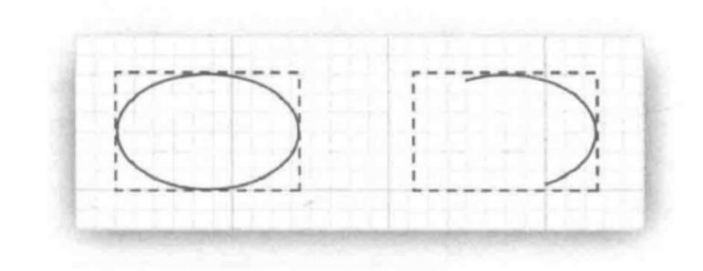

图 11-32 椭圆形和弧形的矩形边界框

是 float 类型的坐标,因为 float 类型的数占用较少的存储空间,而且它们有足够高的几何 计算精度。然而,Java 编程语言使得对 float 类型的数的操作要稍微复杂些。由于这个原因,图形类的大多数方法使用的都是 double 类型的参数和返回值。只有在创建一个 2D 对象的时候,才需要选择究竟是使用带有 float 类型坐标的构造器,还是使用带有 double 类型坐标的构造器。例如:

var floatRect = new Rectangle2D.Float(5F, 10F, 7.5F, 15F);
var doubleRect = new Rectangle2D.Double(5, 10, 7.5, 15);

Xxx2D.Float 和 Xxx2D.Double 两个类都是 Xxx2D 类的子类,在对象被构建之后,再记住 其确切的子类型实质上已经没有任何额外的好处了,因此可以将刚被构建的对象存储为一个 超类变量,正如上面代码示例中所阐释的那样。

从这些类古怪的名字中就可以判断出, Xxx2D.Float 和 Xxx2D.Double 两个类同时也是

Xxx20 类的内部类。这只是为了在语法上比较方便,以避免外部类的名字变得太长。

最后,还有一个Point2D类,它用x和y坐标来描述一个点。点对于定义形状非常有用,不过它们本身并不是形状。

图 11-33 显示了各个形状类之间的关系。不过图中省略了 Double 和 Float 子类,并且来 自以前的 2D 类库的遗留类用灰色的填充色标识。

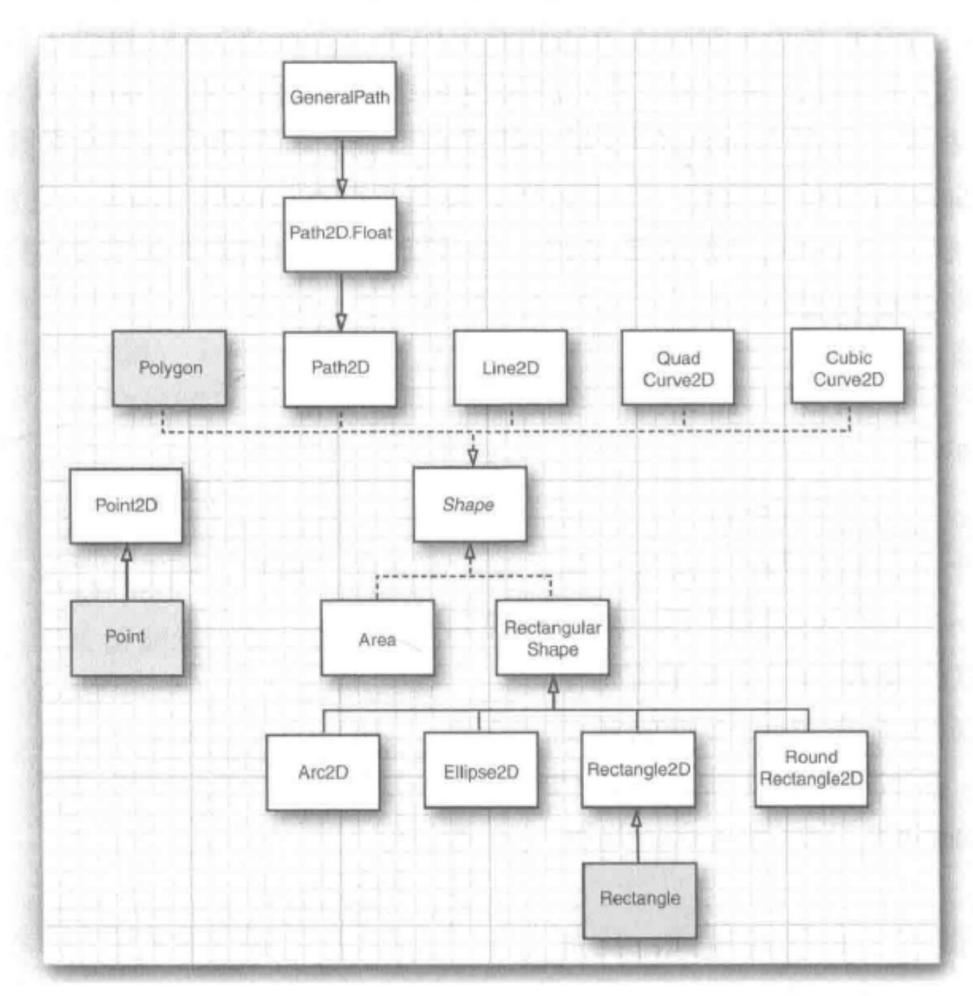

图 11-33 形状类之间的关系

## 11.3.2.2 使用形状类

我们在本书的卷 I 第 10 章中介绍了如何使用 Rectangle2D、Ellipse2D 和 Line2D 类的方法。本节将介绍如何使用其他的 2D 形状。

如果要构建一个 RoundRectangle2D 形状,应该设定左上角、宽度、高度及应该变成圆角的边角区的 x 和 y 的坐标尺寸(参见图 11-34)。例如,调用下面的方法:

var r = new RoundRectangle2D.Double(150, 200, 100, 50, 20, 20);

便产生了一个带圆角的矩形,每个角的圆半径为20。

如果要构建一个弧形,首先应该设定边界框,接着设定它的起始角度和弧形跨越的角度 (见图 11-35),并且设定弧形闭合的类型,即 Arc2D.OPEN、Arc2D.PIE 或者 Arc2D.CHORD 这几种类型中的一个。

*var <sup>a</sup> <sup>=</sup> new Arc2D(x, y, width, height, startAngle, arcAngle, closureType);*

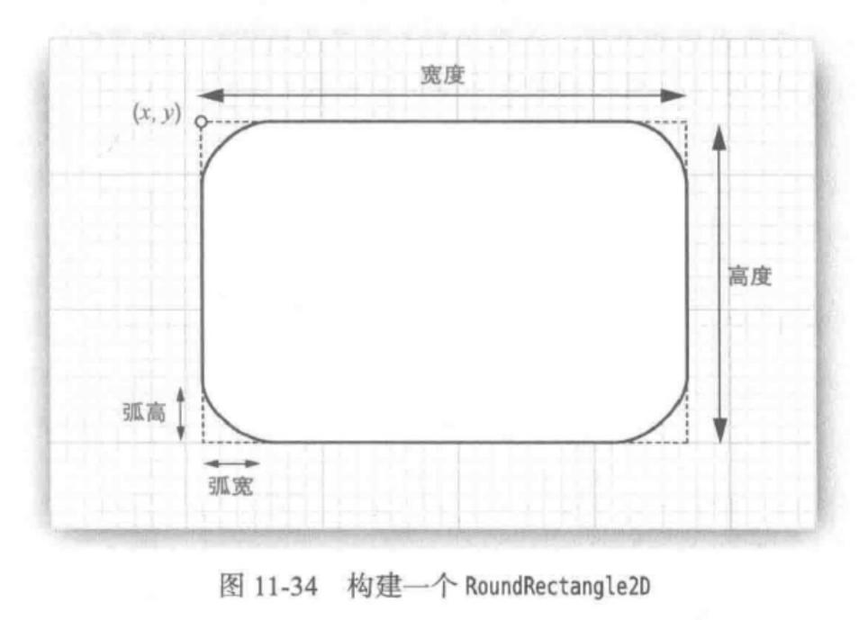

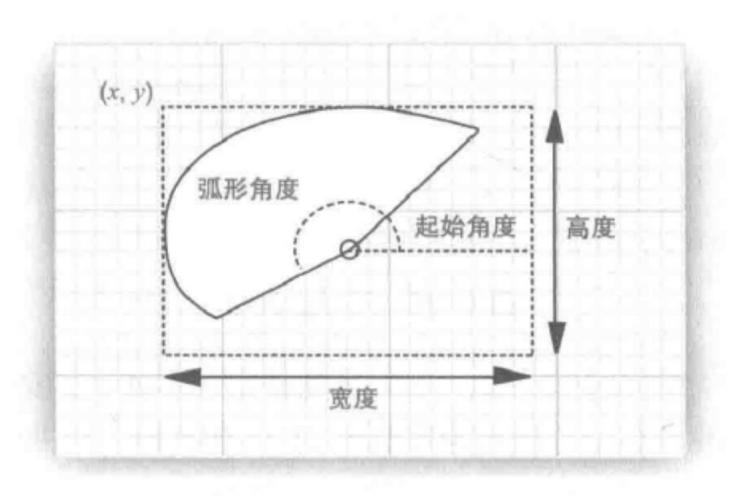

*图11-35构建一个椭圆弧形*

*图11-36显 了几 弧形的类型。*

*0 <sup>告</sup> 如果弧形是椭圆 么弧形 就不是很 接了。API文档中描 <sup>到</sup> " 是 对于 正方形 形 框指定 以使得45度总是 到了从椭圆中心指向 形 框右上角的方向上。因此 如果 形 框 一条 比另一条 明显长许多 么 弧形段 始点和 止点就会与 框中 斜交。"但是 文档中并没有 明如何 "斜交"。下 是其*

*假 弧形 中心是原点 且点(X,少)在弧形上。 么我们可以 下 公式来 得 个斜交*

*skewedAngle <sup>=</sup> Math.toDegrees(Math.atan2(-y height, <sup>x</sup> \* width));*

*个值介于-180到180之 。按照 方式 斜交 始 和 止 然后*

*两个斜交 之间的差 如果 始 或 差是 数 则加上360。之后 将 始 和 差提供 弧形 构 器。如果 本 末尾 序 你 就 察到 计算所产生的用于弧形构 器 值是正确的。可参 本幸图11-39。*

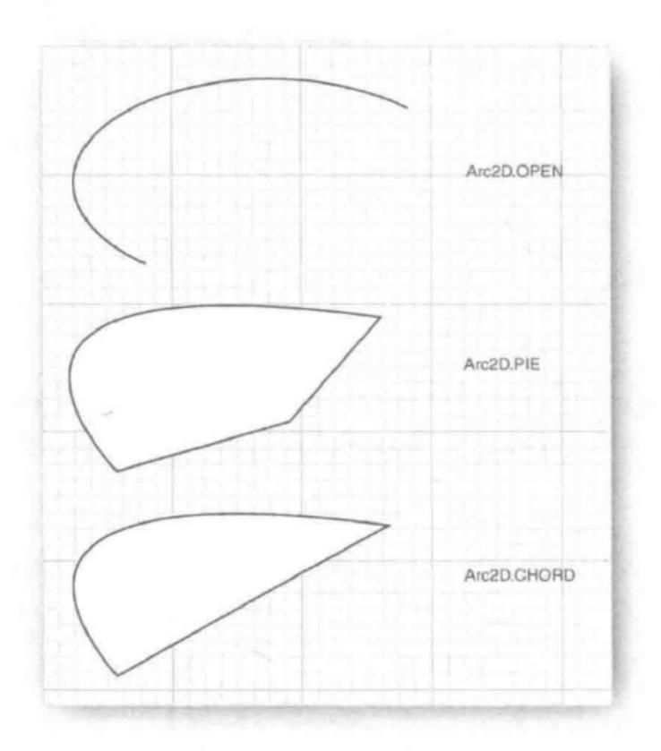

*图11-36弧形的类型*

*Java 2D API提供了对二次曲 和三次曲 支持。在本 中 我们并不会深人介 些 曲 数学 征。我们建 你 序清单11-15 代 对曲 形 有一个感性 认识。正如在图11-37和图11-38中 到 样 二次曲 和三次曲 是 两个 点和一个 或两个控制点来 定 。 动控制点 曲 形 就会改变。*

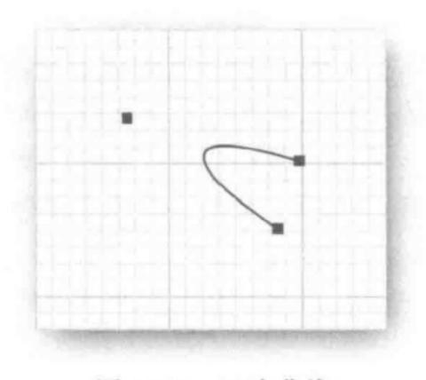

*图11-37二次曲*

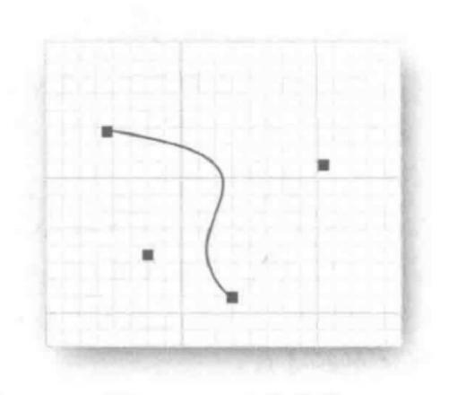

*如果 构建二次曲 和三次曲 出两个 点和控制点 坐标。例如,*

```
var q = new QuadCurve2D.Double(startX, startY, controlX, controlY, endX, endY);
var c = new CubicCurve2D.Double(startX, startY, control1X, control1Y,
```

二次曲线不是非常灵活,所以实际上它并不常用。三次曲线(比如用 CubicCurve2D 类绘制的贝塞尔(Bézier)曲线)却是非常常用的。通过将三次曲线组合起来,使得连接点的斜率互相匹配,就能够创建复杂的、外观平滑的曲线形状。如果要了解这方面的详细信息,请参阅 James D. Foley、Andries van Dam 和 Steven K. Feiner 等人合作撰写的 Computer Graphics: Principles and Practice (第 3 版),Addison Wesley 出版社 2013 年出版。

可以建立线段、二次曲线和三次曲线的任意序列,并把它们存放到一个 General Path 对象中去。可以用 moveTo 方法来指定路径的第一个坐标,例如,

```
var path = new GeneralPath();
path.moveTo(10, 20);
```

然后,可以通过调用 lineTo、quadTo 或 curveTo 三种方法之一来扩展路径,这些方法分别用线条、二次曲线或者三次曲线来扩展路径。如果要调用 lineTo 方法,需要提供它的端点。而对两个曲线方法的调用,应该先提供控制点,然后提供端点。例如,

```
path.lineTo(20, 30);
path.curveTo(control1X, control1Y, control2X, control2Y, endX, endY);
```

可以调用 closePath 方法来闭合路径,它能够绘制一条回到路径起始点的线条。

如果要绘制一个多边形,只需调用 moveTo 方法,以到达第一个拐角点,然后反复调用 lineTo 方法,以便到达其他的拐角点。最后调用 closePath 方法来闭合多边形。程序清单 11-15 更加详细地展示了构建多边形的方法。

#### 程序清单 11-15 shape/ShapeTest.java

```
1 package shape;
3 import java.awt.*;
4 import java.awt.event.*:
5 import java.awt.geom.*;
6 import java.util.*;
7 import javax.swing.*;
8
9 /**
   * This program demonstrates the various 2D shapes.
   * @version 1.04 2018-05-01
   * @author Cav Horstmann
12
  */
14 public class ShapeTest
15 {
     public static void main(String[] args)
16
17
         EventQueue.invokeLater(() ->
18
19
               var frame = new ShapeTestFrame();
28
               frame.setTitle("ShapeTest");
21
```

```
frame.setDefaultCloseOperation(JFrame.EXIT ON CLOSE);
22
                frame.setVisible(true);
23
            });
24
25
   }
26
27
28
    * This frame contains a combo box to select a shape and a component to draw it.
29
  class ShapeTestFrame extends JFrame
31
32
      public ShapeTestFrame()
33
34
         var comp = new ShapeComponent();
35
         add(comp, BorderLayout.CENTER);
36
         var comboBox = new JComboBox<ShapeMaker>();
37
         comboBox.addItem(new LineMaker());
38
         comboBox.addItem(new RectangleMaker());
39
         comboBox.addItem(new RoundRectangleMaker());
48
         comboBox.addItem(new EllipseMaker());
41
         comboBox.addItem(new ArcMaker());
42
         comboBox.addItem(new PolygonMaker());
43
         comboBox.addItem(new OuadCurveMaker());
44
         comboBox.addItem(new CubicCurveMaker());
45
         comboBox.addActionListener(event ->
46
47
                ShapeMaker shapeMaker = comboBox.getItemAt(comboBox.getSelectedIndex());
                comp.setShapeMaker(shapeMaker);
49
            });
58
         add(comboBox, BorderLayout.NORTH);
51
         comp.setShapeMaker((ShapeMaker) comboBox.getItemAt(0));
52
53
         pack();
54
55
56
57
    * This component draws a shape and allows the user to move the points that define it.
58
59
   class ShapeComponent extends JComponent
68
61
       private static final Dimension PREFERRED SIZE = new Dimension(300, 200);
62
       private Point2D[] points;
63
       private static Random generator = new Random();
       private static int SIZE = 10;
65
       private int current;
66
       private ShapeMaker shapeMaker;
68
       public ShapeComponent()
69
78
          addMouseListener(new MouseAdapter()
71
72
                public void mousePressed(MouseEvent event)
73
74
75
                    Point p = event.getPoint();
                    for (int i = 0; i < points.length; i++)
76
```

```
{
77
                      double x = points[i].getX() - SIZE / 2;
78
79
                      double y = points[i].getY() - SIZE / 2;
                      var r = new Rectangle2D.Double(x, y, SIZE, SIZE);
88
                      if (r.contains(p))
81
82
                         current = i;
83
                          return:
84
85
                   }
86
                }
87
88
                public void mouseReleased(MouseEvent event)
29
90
                {
                   current = -1;
91
                }
92
            });
93
         addMouseMotionListener(new MouseMotionAdapter()
94
             {
95
                public void mouseDragged(MouseEvent event)
                {
97
98
                   if (current == -1) return;
                   points[current] = event.getPoint();
                   repaint();
188
101
102
             }):
         current = -1;
103
194
105
106
107
       * Set a shape maker and initialize it with a random point set.
       * @param aShapeMaker a shape maker that defines a shape from a point set
188
       */
189
      public void setShapeMaker(ShapeMaker aShapeMaker)
110
111
         shapeMaker = aShapeMaker;
112
         int n = shapeMaker.getPointCount();
113
         points = new Point2D[n];
114
         for (int i = 0; i < n; i++)
115
116
             double x = generator.nextDouble() * getWidth();
117
             double y = generator.nextDouble() * getHeight();
118
             points[i] = new Point2D.Double(x, y);
119
128
121
         repaint();
122
123
       public void paintComponent(Graphics g)
124
125
126
         if (points == null) return;
         var g2 = (Graphics2D) g;
127
         for (int i = 0; i < points.length; i++)
128
129
             double x = points[i].getX() - SIZE / 2;
130
             double y = points[i].getY() - SIZE / 2;
131
```

```
g2.fill(new Rectangle2D.Double(x, y, SIZE, SIZE));
132
         }
133
134
         g2.draw(shapeMaker.makeShape(points));
135
136
137
      public Dimension getPreferredSize() { return PREFERRED SIZE; }
138
139 }
140
141 /**
    * A shape maker can make a shape from a point set. Concrete subclasses must return a shape in
142
    * the makeShape method.
    */
145 abstract class ShapeMaker
      private int pointCount;
147
148
149
       * Constructs a shape maker.
150
       * @param pointCount the number of points needed to define this shape
151
152
      public ShapeMaker(int pointCount)
153
154
          this.pointCount = pointCount;
155
      }
156
157
158
        * Gets the number of points needed to define this shape.
159
       * @return the point count
160
161
       public int getPointCount()
162
          return pointCount;
154
       }
165
166
167
        * Makes a shape out of the given point set.
158
        * @param p the points that define the shape
        * @return the shape defined by the points
170
171
       public abstract Shape makeShape(Point2D[] p);
172
173
       public String toString()
174
175
          return getClass().getName();
176
178
179
180 /**
     * Makes a line that joins two given points.
182
183 class LineMaker extends ShapeMaker
184 {
185
       public LineMaker()
       {
186
```

```
super(2);
187
188
189
      public Shape makeShape(Point2D[] p)
190
191
         return new Line2D.Double(p[0], p[1]);
192
193
194 }
195
196
    * Makes a rectangle that joins two given corner points.
197
198
   class RectangleMaker extends ShapeMaker
199
200
      public RectangleMaker()
201
      {
292
         super(2);
203
204
205
206
      public Shape makeShape(Point2D[] p)
207
208
         var s = new Rectangle2D.Double();
         s.setFrameFromDiagonal(p[0], p[1]);
289
         return s;
210
211
212 }
213
214
    * Makes a round rectangle that joins two given corner points.
216
217 class RoundRectangleMaker extends ShapeMaker
218
      public RoundRectangleMaker()
219
228
         super(2);
221
222
223
      public Shape makeShape(Point2D[] p)
224
225
         var s = new RoundRectangle2D.Double(0, 0, 0, 0, 20, 20);
226
         s.setFrameFromDiagonal(p[0], p[1]);
227
          return s;
228
229
230 }
231
232
    * Makes an ellipse contained in a bounding box with two given corner points.
233
234
235 class EllipseMaker extends ShapeMaker
236
      public EllipseMaker()
237
      {
238
         super(2);
239
240
241
```

```
public Shape makeShape(Point2D[] p)
242
      {
243
         var s = new Ellipse2D.Double();
244
         s.setFrameFromDiagonal(p[0], p[1]);
245
         return s;
246
247
248 }
249
258 /**
    * Makes an arc contained in a bounding box with two given corner points, and with starting
251
    * and ending angles given by lines emanating from the center of the bounding box and ending
    * in two given points. To show the correctness of the angle computation, the returned shape
    * contains the arc, the bounding box, and the lines.
255
256 class ArcMaker extends ShapeMaker
257 {
      public ArcMaker()
258
259
         super(4);
260
261
262
263
      public Shape makeShape(Point2D[] p)
264
          double centerX = (p[0].getX() + p[1].getX()) / 2;
265
          double centerY = (p[0].getY() + p[1].getY()) / 2;
266
          double width = Math.abs(p[1].getX() - p[0].getX());
267
          double height = Math.abs(p[1].getY() - p[θ].getY());
268
269
          double skewedStartAngle = Math.toDegrees(Math.atan2(-(p[2].getY() - centerY) * width,
278
             (p[2].getX() - centerX) * height));
271
          double skewedEndAngle = Math.toDegrees(Math.atan2(-(p[3].getY() - centerY) * width,
272
             (p[3].getX() - centerX) * height));
272
274
          double skewedAngleDifference = skewedEndAngle - skewedStartAngle;
          if (skewedStartAngle < 0) skewedStartAngle += 360;</pre>
275
          if (skewedAngleDifference < 0) skewedAngleDifference += 360;
276
277
          var s = new Arc2D.Double(0, 0, 0, 0, 0, 0, 0, 0, 0, 0, 0, 0, 0, 0
278
             skewedStartAngle, skewedAngleDifference, Arc2D.OPEN);
279
          s.setFrameFromDiagonal(p[0], p[1]);
281
          var g = new GeneralPath();
282
283
          g.append(s, false);
          var r = new Rectangle2D.Double();
284
          r.setFrameFromDiagonal(p[0], p[1]);
285
          q.append(r, false);
          var center = new Point2D.Double(centerX, centerY);
287
          g.append(new Line2D.Double(center, p[2]), false);
288
          g.append(new Line2D.Double(center, p[3]), false);
          return g;
298
291
292 }
293
    * Makes a polygon defined by six corner points.
    */
296
```

```
297 class PolygonMaker extends ShapeMaker
298 {
      public PolygonMaker()
299
300
         super(6);
301
382
303
      public Shape makeShape(Point2D[] p)
384
385
         var s = new GeneralPath();
386
         s.moveTo((float) p[0].getX(), (float) p[0].getY());
307
          for (int i = 1; i < p.length; i++)
308
             s.lineTo((float) p[i].getX(), (float) p[i].getY());
          s.closePath();
310
          return s;
311
312
313
314
315 /**
    * Makes a quad curve defined by two end points and a control point.
316
318 class QuadCurveMaker extends ShapeMaker
319 {
      public QuadCurveMaker()
320
321
          super(3);
322
323
324
      public Shape makeShape(Point2D[] p)
325
326
          return new QuadCurve2D.Double(p[0].getX(), p[0].getY(), p[1].getX(), p[1].getY(),
327
             p[2].getX(), p[2].getY());
328
329
330
331
    * Makes a cubic curve defined by two end points and two control points.
333
334
335 class CubicCurveMaker extends ShapeMaker
336
      public CubicCurveMaker()
337
338
          super(4);
330
340
341
      public Shape makeShape(Point2D[] p)
342
343
          return new CubicCurve2D.Double(p[0].getX(), p[0].getY(), p[1].getX(), p[1].getY(),
344
345
             p[2].getX(), p[2].getY(), p[3].getX(), p[3].getY());
346
347 }
```

*个新 径段。*

*最后 可以使 append方法 向普通路径添加任意个Shape对 。如果新建 形 应 接到 径 最后一个 点 么append方法 二个参数值就是true,如果不应该连接 么 参数值就是false 例如 下 方法*

*Rectangle2D <sup>r</sup> =.. path.append(r, false);*

*可以把 形 框添加到 径中 但并不与 有 径 接在一 。 下面的方法调用 path.append(r<sup>f</sup> true);*

*则是在 径 点和 形 点之 添加了一条 然后将 形 框添加到 径中。*

*序清单11-15中 序使你 够构建 多 例 径。图11-37和图11-38显 了运行 序 例 果。你可以从 合框中 择一个形 制器 序包含 形 制器可以 来 制*

- *e <sup>形</sup>、<sup>圆</sup> 形和椭圆形*
- *弧形( 了显 弧形本 外 可以显 形 框 条和 始 度及 束 度h*
- *多 形(使 GeneralPath方法)*
- *e二次曲 和三次曲 。*

*可以 标来 整控制点。当 动控制点时 形 会 地 。*

*序有些复杂 因为它可以 来处 多 不同 形 并且支持对控制点 拖拽操作。 抽 ShapeMake「封 了形 制器 共性 征。每个形 拥有固定数 控制 点 户可以在控制点周围 意 动 getPointCount方法 于 回控制点 数 。下 个抽 方法*

*Shape makeShape(Point2D 】points)*

*将在 定控制点 当前位 情况下 实 形 。toString方法 于 回 名 字 样 ShapeMaker对 就 够放 到一个JComboBox中。*

*为了激活控制点 拖拽 征 ShapePanel 同 时处 标事件和 标 动事件。当 标在一个 形 上 按下时 么拖拽 标就可以 动 形了。*

*大 分形状绘制器类都很 单 它们 makeShape 方法只是 于构建和 回 形 。然 当使 ArcMaker 时候 需要计算弧形 变形 始 度和 束 度。此外 为了 明 些 实是正 回 形 应 是包含 弧本 、 形 框和从弧形 中心到 度控制点之间的线条等的GeneralPath (参 <sup>图</sup>11-39 )<sup>o</sup> <sup>图</sup>11-39 ShapeTest <sup>序</sup> <sup>果</sup>*

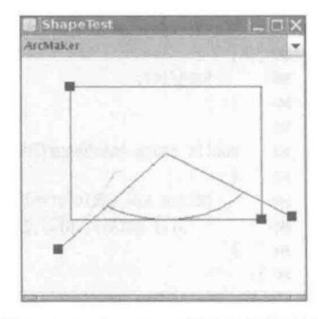

#### API java.awt.geom.RoundRectangle2D.Double

 RoundRectangle2D.Double(double x, double y, double width, double height, double arcWidth, double arcHeight)

用给定的矩形边框和弧形尺寸构建一个圆角矩形。参见图 11-34 有关 arcWidth 和 arcHeight 参数的解释。

#### API java.awt.geom.Arc2D.Double

 Arc2D.Double(double x, double y, double w, double h, double startAngle, double arcAngle, int type)

用给定的矩形边框、起始角度、弧形角度和弧形类型构建一个弧形。startAngle 和 arcAngle 在图 11-35 中已做介绍,type 是 Arc2D.OPEN、Arc2D.PIE 和 Arc2D.CHORD 之一。

## API java.awt.geom.QuadCurve2D.Double

QuadCurve2D.Double(double x1, double y1, double ctrlx, double ctrly, double x2, double y2)
 用起始点、控制点和结束点构建一条二次曲线。

## API java.awt.geom.CubicCurve2D.Double

 CubicCurve2D.Double(double x1, double y1, double ctrlx1, double ctrly1, double ctrlx2, double ctrly2, double x2, double y2)

用起始点、两个控制点和结束点构建一条三次曲线。

## API java.awt.geom.GeneralPath

GeneralPath()构建一条空的普通路径。

## API java.awt.geom.Path2D.Float

- void moveTo(float x, float y)
   使(x, y) 成为当前点,也就是下一个线段的起始点。
- void lineTo(float x, float y)
- void quadTo(float ctrlx, float ctrly, float x, float y)
- void curveTo(float ctrl1x, float ctrl1y, float ctrl2x, float ctrl2y, float x, float y)
   从当前点绘制一个线条、二次曲线或者三次曲线到达结束点(x,y),并且使该结束点成为当前点。

## api java.awt.geom.Path2D

void append(Shape s, boolean connect)
 将给定形状的边框添加到普通路径中去。如果布尔型变量 connect 的值是 true,那么该普通路径的当前点与添加进来的形状的起始点之间用一条直线连接起来。

void closePath()
 从当前点到路径的第一点之间绘制一条直线,从而使路径闭合。

#### 11.3.3 区域

在上一节中,我们介绍了如何通过构建由线条和曲线构成的普通路径来绘制复杂的形状。通过使用足够数量的线条和曲线可以绘制出任何一种形状,例如,在屏幕上和打印文件上看到的字符的各种字体形状,都是由线条和三次曲线构成的。

有时候,使用各种不同形状的区域,比如矩形、多边形和椭圆形来建立形状,可能会更加容易描述。Java 2D API 支持四种区域几何作图(constructive area geometry)操作,用于将两个区域组合成一个区域。

- add: 组合区域包含了所有位于第一个区域或第二个区域内的点。
- subtract:组合区域包含了所有位于第一个区域内的点,但是不包括任何位于第二个区域内的点。
- intersect: 组合区域包含了所有既位于第一个区域内, 又位于第二个区域内的点。
- exclusiveOr:组合区域包含了所有位于第一个区域内,或者是位于第二个区域内的所有点,但是这些点不能同时位于两个区域内。

图 11-40 显示了这些操作的结果。

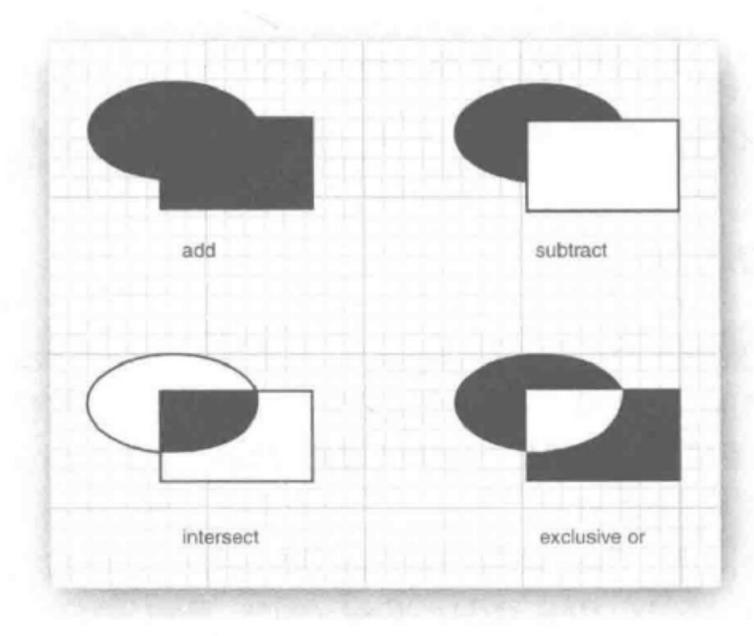

图 11-40 区域几何作图操作

如果要构建一个复杂的区域,可以使用下面的方法先创建一个默认的区域对象。 var a = new Area();

然后,将该区域和其他的形状组合起来:

- a.add(new Rectangle2D.Double(. . .));
- a.subtract(path);

Area 类实现了 Shape 接口。可以用 draw 方法勾勒出该区域的边界,或者使用 Graphics 2D 类的 fill 方法给区域的内部着色。

#### API java.awt.geom.Area

- void add(Area other)
- void subtract(Area other)
- void intersect(Area other)
- void exclusiveOr(Area other)
   对该区域和 other 所代表的另一个区域执行区域几何作图操作,并且将该区域设置为 执行后的结果。

#### 11.3.4 笔画

Graphics2D 类的 draw 操作通过使用当前选定的笔画来绘制一个形状的边界。在默认的情况下,笔画是一条宽度为一个像素的实线。可以通过调用 setStroke 方法来选定不同的笔画,此时要提供一个实现了 Stroke 接口的类的对象。Java 2D API 只定义了一个这样的类,即 BasicStroke 类。在本节中,我们将介绍 BasicStroke 类的功能。

你可以构建任意粗细的笔画。例如,下面的方法就绘制了一条粗细为10个像素的线条。

g2.setStroke(new BasicStroke(10.0F));

g2.draw(new Line2D.Double(. . .));

当一个笔画的粗细大于一个像素的宽度时,笔画的末端可采用不同的样式。图 11-41 显示了这些所谓的端头样式。端头样式有下面三种:

- 平头样式 (butt cap) 在笔画的末端处就结束了;
- 圆头样式 (round cap) 在笔画的末端处加了一个半圆;
- 方头样式 (square cap) 在笔画的末端处加了半个方块。

当两个较粗的笔画相遇时,有三种笔画的连接样式可供选择(参见图 11-42):


图 11-41 笔画的端头样式


图 11-42 笔画的连接样式

- 針连接(bevel join),用一条直线将两个笔画连接起来,该直线与两个笔画之间的夹角的平分线相垂直。
- 圆连接 (round join), 延长了每个笔画, 并使其带有一个圆头。
- 斜尖连接 (miter join), 通过增加一个尖峰, 从而同时延长了两个笔画。

如果两条线以非常小的角度按照斜尖连接方式连接在一起,那么为了防止出现过长的尖峰,应该改用斜连接。"斜尖限制"可以用于控制这种转换。在技术上,斜尖限制是指尖峰的内角和外角的距离除以笔画宽度的比例。默认的斜尖限制是 10,对应于大约 11 度的角度。

可以在 BasicStroke 构造器中设定这些选择,例如:

```
g2.setStroke(new BasicStroke(10.0F, BasicStroke.CAP_ROUND, BasicStroke.JOIN_ROUND));
g2.setStroke(new BasicStroke(10.0F, BasicStroke.CAP_BUTT, BasicStroke.JOIN_MITER,
```

最后,通过设置虚线模式来创建虚线。在程序清单 11-16 的程序中,可以选择一个虚线模式,拼出摩斯电码中的 SOS 代码。虚线模式是一个 float[] 类型的数组,它包含了笔画中"连接"(on)和"断开"(off)的长度(见图 11-43)。

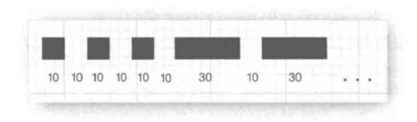

图 11-43 一种虚线图案

#### 程序清单 11-16 stroke/StrokeTest.java

```
1 package stroke;
3 import java.awt.*;
4 import java.awt.event.*;
5 import java.awt.geom.*;
  import javax.swing.*;
   * This program demonstrates different stroke types.
   * @version 1.05 2018-05-01
    * @author Cay Horstmann
12
  public class StrokeTest
14
      public static void main(String[] args)
15
16
         EventQueue.invokeLater(() ->
17
18
               var frame = new StrokeTestFrame():
               frame.setTitle("StrokeTest");
28
               frame.setDefaultCloseOperation(JFrame.EXIT ON CLOSE);
21
               frame.setVisible(true);
```

```
});
23
24
25
26
27
    * This frame lets the user choose the cap, join, and line style, and shows the resulting
28
   * stroke.
29
    */
30
   class StrokeTestFrame extends JFrame
31
32
      private StrokeComponent canvas;
33
      private JPanel buttonPanel;
34
35
      public StrokeTestFrame()
36
37
          canvas = new StrokeComponent();
38
          add(canvas, BorderLayout.CENTER);
39
48
          buttonPanel = new JPanel();
41
          buttonPanel.setLayout(new GridLayout(3, 3));
          add(buttonPanel, BorderLayout.NORTH);
43
44
          var group1 = new ButtonGroup();
          makeCapButton("Butt Cap", BasicStroke.CAP BUTT, group1);
46
          makeCapButton("Round Cap", BasicStroke.CAP ROUND, group1);
47
          makeCapButton("Square Cap", BasicStroke.CAP SQUARE, group1);
48
49
          var group2 = new ButtonGroup();
50
          makeJoinButton("Miter Join", BasicStroke.JOIN MITER, group2);
51
          makeJoinButton("Bevel Join", BasicStroke.JOIN BEVEL, group2);
52
          makeJoinButton("Round Join", BasicStroke.JOIN ROUND, group2);
53
54
          var group3 = new ButtonGroup();
55
          makeDashButton("Solid Line", false, group3);
56
          makeDashButton("Dashed Line", true, group3);
57
       }
58
59
68
        * Makes a radio button to change the cap style.
61
        * @param label the button label
62
        * @param style the cap style
63
        * @param group the radio button group
64
65
       private void makeCapButton(String label, final int style, ButtonGroup group)
66
67
          // select first button in group
 68
          boolean selected = group.getButtonCount() == 0;
 69
          var button = new JRadioButton(label, selected);
70
          buttonPanel.add(button);
 71
          group.add(button);
72
          button.addActionListener(event -> canvas.setCap(style));
 73
          pack():
 74
 75
 76
       /**
 77
```

```
* Makes a radio button to change the join style.
       * @param label the button label
79
       * @param style the join style
88
       * @param group the radio button group
81
82
      private void makeJoinButton(String label, final int style, ButtonGroup group)
83
84
         // select first button in group
RS
         boolean selected = group.getButtonCount() == θ;
86
         var button = new JRadioButton(label, selected);
87
         buttonPanel.add(button);
88
         group.add(button);
89
         button.addActionListener(event -> canvas.setJoin(style));
98
91
92
      /**
93
       * Makes a radio button to set solid or dashed lines.
94
       * @param label the button label
95
       * @param style false for solid, true for dashed lines
96
       * @param group the radio button group
97
       */
QR
99
      private void makeDashButton(String label, final boolean style, ButtonGroup group)
100
         // select first button in group
191
         boolean selected = group.getButtonCount() == 0;
182
         var button = new JRadioButton(label, selected);
103
         buttonPanel.add(button);
184
         group.add(button);
105
         button.addActionListener(event -> canvas.setDash(style));
106
107
108 }
109
110 /**
   * This component draws two joined lines, using different stroke objects, and allows the user
* to drag the three points defining the lines.
113 */
114 class StrokeComponent extends JComponent
115 {
      private static final Dimension PREFERRED SIZE = new Dimension(400, 400);
116
      private static int SIZE = 10;
118
119
      private Point2D[] points;
120
      private int current;
      private float width;
121
      private int cap;
122
      private int join;
123
      private boolean dash;
124
125
      public StrokeComponent()
126
127
          addMouseListener(new MouseAdapter()
128
129
                public void mousePressed(MouseEvent event)
130
131
```

```
Point p = event.getPoint();
132
                             for (int i = 0; i < points.length; i++)
133
134
                                 double x = points[i].getX() - SIZE / 2;
135
                                 double y = points[i].getY() - SIZE / 2;
136
                                 var r = new Rectangle2D.Double(x, y, SIZE, SIZE);
137
138
                                 if (r.contains(p))
139
                                      current = i;
148
                                      return;
141
142
                             }
143
                        }
144
145
                        public void mouseReleased(MouseEvent event)
146
                             current = -1;
148
149
                   });
151
               addMouseMotionListener(new MouseMotionAdapter()
152
                   {
                        public void mouseDragged(MouseEvent event)
154
155
                             if (current == -1) return;
                             points[current] = event.getPoint();
157
                             repaint();
158
                   });
160
161
               points = new Point2D[3];
162
               points[0] = new Point2D.Double(200, 100);
163
164
               points[1] = new Point2D.Double(100, 200);
               points[2] = new Point2D.Double(200, 200);
165
               current = -1;
166
               width = 8.0F;
167
          }
168
169
          public void paintComponent(Graphics q)
 170
171
               var g2 = (Graphics2D) g;
172
               var path = new GeneralPath();
 173
               path.moveTo((float) points[0].getX(), (float) points[0].getY());
174
               for (int i = 1; i < points.length; i++)
 175
                    path.lineTo((float) points[i].getX(), (float) points[i].getY());
 176
 177
               BasicStroke stroke;
               if (dash)
 178
 179
                    float miterLimit = 10.0F;
 189
                    float[] dashPattern = { 10F, 10F, 10F, 10F, 10F, 30F, 10F, 30F, 10F, 30F, 10F, 30F, 10F, 30F, 10F, 30F, 10F, 30F, 10F, 30F, 10F, 30F, 10F, 30F, 10F, 30F, 10F, 30F, 10F, 30F, 10F, 30F, 10F, 30F, 10F, 30F, 10F, 30F, 10F, 30F, 10F, 30F, 10F, 30F, 10F, 30F, 10F, 30F, 10F, 30F, 10F, 30F, 10F, 30F, 10F, 30F, 10F, 30F, 10F, 30F, 10F, 30F, 10F, 30F, 10F, 30F, 10F, 30F, 10F, 30F, 10F, 30F, 10F, 30F, 10F, 30F, 10F, 30F, 10F, 30F, 10F, 30F, 10F, 30F, 10F, 30F, 10F, 30F, 10F, 30F, 10F, 30F, 10F, 30F, 10F, 30F, 10F, 30F, 10F, 30F, 10F, 30F, 10F, 30F, 10F, 30F, 10F, 30F, 10F, 30F, 10F, 30F, 10F, 30F, 10F, 30F, 10F, 30F, 10F, 30F, 10F, 30F, 10F, 30F, 10F, 30F, 10F, 30F, 10F, 30F, 10F, 30F, 10F, 30F, 10F, 30F, 30F, 30F, 30F, 30F, 30F, 30F, 3
 181
                             10F, 10F, 10F, 10F, 10F, 30F };
 182
                    float dashPhase = \theta;
 183
                    stroke = new BasicStroke(width, cap, join, miterLimit, dashPattern, dashPhase);
               }
 185
```

```
else stroke = new BasicStroke(width, cap, join);
186
187
          q2.setStroke(stroke);
          g2.draw(path);
188
189
190
191
       * Sets the join style.
192
       * @param j the join style
193
194
195
       public void setJoin(int j)
196
          join = i;
197
          repaint();
198
199
200
       /**
201
       * Sets the cap style.
282
       * @param c the cap style
203
284
       public void setCap(int c)
285
286
          cap = c;
297
          repaint();
208
289
210
211
        * Sets solid or dashed lines.
212
        * @param d false for solid, true for dashed lines
213
214
       public void setDash(boolean d)
215
       {
216
217
          dash = d;
          repaint();
218
219
220
       public Dimension getPreferredSize() { return PREFERRED SIZE; }
221
222 }
```

当构建 BasicStroke 时,可以指定虚线模式和虚线相位(dash phase)。虚线相位用来表示每条线应该从虚线模式的何处开始。通常情况下,应该把它的值设置为 0。

```
float[] dashPattern = { 10, 10, 10, 10, 10, 10, 30, 10, 30, . . . };
g2.setStroke(new BasicStroke(10.0F, BasicStroke.CAP_BUTT, BasicStroke.JOIN_MITER,
```

## 註釋:在虚线模式中,每一条虚线的末端都可以应用端头样式。

程序清单 11-16 中的程序可以设定端头样式、连接样式和虚线(见图 11-44)。可以移动线段的端头,用以测试斜尖连接的最小角度:首先选定斜尖连接;然后,移动线段末端形成一个非常尖的锐角。可以看到斜尖连接变成了一个斜连接。

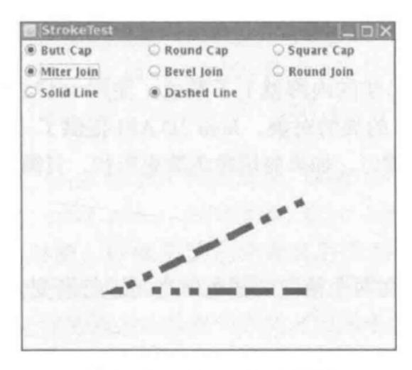

*图 1144 StrokeTest 序*

*个 序 似于 序清单11-15 序。当点击一个 段 末 时 标 听器就会 下操作 标动作 听器则 听对 点 拖曳操作。一 单 按 以 户 择 的端头样式、 接样式以及实 或 。StrokePanel paintC⑽ponent方法构建了一个 GeneralPath,它 接 户可以 标 动 三个点 两条 段构成。然后 它根据 户 择构建一个BasicStroke,最后 制出 个 径。*

#### *Awjjava.awt.Graphics2D*

*• void setStroke(Stroke s) 将 图形上下文 为实 了 Stroke接口 定对 。*

## *java.awt.BasicStroke*

- *• BasicStroke(float width)*
- *• BasicStroke(float width, int cap, int join)*
- *• BasicStroke(float width, int cap<sup>f</sup> int join, float miterlimit}*
- *• BasicStroke(float width, int cap, int join, float miterlimit, float[] dash, float dashPhase) 定 属性构建一个 对 。*

*参数:width 画笔的宽度*

> *cap 头样式 它是CAP\_BUTT、CAP\_R0UND和CAP\_SQUARE三 样式中 一个*

> *join 接样式 它是JOIN BEVEL. JOIN MITER和JOIN ROUND三 样式中 一个*

> *miterlimit 接处 外 和内 与 宽度 比例 如果小于 个比例 斜尖 接将呈 为斜 接*

*dash 填充 分和 分交替出 一 度*

*dashPhase 虚线模式 " 位" 位于 始点前 段 度 假 为已 应 了 模式*

## *11.3.5*

*当填充一个形 时 形 内 就上了 。使 setPaint方法 可以把颜色的样式 定为一个实 了 Paint接口 对 。Java 2D API提供了三个 样*

- *• Color <sup>实</sup> <sup>了</sup> Paint接口。如果要用单 填充形 只 Colo「对 setPaint 方法即可 例如*
  - *g2.setPaint(Color.red);*
- *• GradientPaint 在两个 定 值之 渐变 从 改变使 (参 <sup>图</sup> 11-45 )<sup>o</sup>*
- *• TexturePaint 一个图像 复地对一个区域 ( 图11-46 )□*

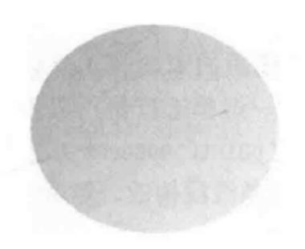

*图11-45渐变着色 图11-46*


*可以 指定两个点以及在 两个点上想使 来构建一个GradientPaint对 即 g2.setPaint(new GradientPaint(pl, Color.RED, p2, Color.YELLOW)h*

*上 句将沿 接两个点之 方向对 渐变 沿 与 接 垂 方向上 条 则是不变 。超过线条 点 各个点被赋予 点上的颜色。*

*另外 如果 GradientPaint构 器时cyclic参数 值为true,即*

*g2.setPaint(new GradientPaint(pl, Color.RED, p2, Color.YELLOW, true));*

*么 将循 变换 并且在 点之外仍然保持 变换。*

*如果 构建一个TexturePaint对 指定一个Bufferedlmage和一个 位 形。*

*g2.setPaint(new TexturePaint(bufferedlmage, anchorRectangle));*

*在本 后 分 图像时 我们再介 Bufferedlmage 。 取 冲图像最 单 方式就是 人图像文件*

*bufferedlmage <sup>=</sup> ImagelO. read (new File(Mblue-baU.gifB));*

*位 形在x和y方向上将不断地 复延伸 使之平 到整个坐标平 。图像可以伸 以便 入 位 然后复制到每一个平 显 区中。*

## *AFij java・awt・Graphics2D*

*• void setPaint(Paint s) 将图形上下文的着色设置为实 了 Paint接口 定对 。*

## API java.awt.GradientPaint

- GradientPaint(float x1, float y1, Color color1, float x2, float y2, Color color2)
- GradientPaint(float x1, float y1, Color color1, float x2, float y2, Color color2, boolean cyclic)
- GradientPaint(Point2D pl, Color color1, Point2D p2, Color color2)
- GradientPaint(Point2D p1, Color color1, Point2D p2, Color color2, boolean cyclic) 构建一个渐变着色的对象,以便用颜色来填充各个形状,其中,起始点的颜色为 color1,结束点的颜色为 color2,而两个点之间的颜色则是以线性的方式渐变。沿着 连接起始点和结束点之间的线条相垂直的方向上的线条颜色是恒定不变的。在默认的情况下,渐变着色不是循环变换的。也就是说,起始点和结束点之外的各个点的颜色是分别与起始点和结束点的颜色相同的。如果渐变着色是循环的,那么颜色是连续变换的,首先返回到起始点的颜色,然后在两个方向上无限地重复。

#### API java.awt.TexturePaint 1.2

TexturePaint(BufferedImage texture, Rectangle2D anchor)
 建立纹理着色对象。锚位矩形定义了着色的平铺空间,该矩形在x和y方向上不断地重复延伸,纹理图像则被缩放,以便填充每个平铺空间。

#### 11.3.6 坐标变换

假设我们要绘制一个对象,比如汽车。从制造商的规格说明书中可以了解到汽车的高度、轴距和整个车身的长度。如果设定了每米的像素个数,当然就可以计算出所有像素的位置。但是,可以使用更加容易的方法:让图形上下文来执行这种转换。

```
g2.scale(pixelsPerMeter, pixelsPerMeter);
g2.draw(new Line2D.Double(coordinates in meters)); // converts to pixels and
```

Graphics2D 类的 scale 方法可以将图形上下文中的坐标变换设置为一个比例变换。这种变换能够将用户坐标(用户设定的单元)转换成设备坐标(pixel,即像素)。图 11-47 显示了如何进行这种变换的方法。


图 11-47 用户坐标与设备坐标

*坐标变换在实 应 中 常有 序员可以使 方便 坐标值 各 操作 图形上 下文则 执 将坐标值变换成像 复杂工作。*

*这里有四 基本 变换*

- *比例 放 放大和 小从一个固定点出发 所有 。*
- *旋 一个固定中心旋 所有点。*
- *平 将所有 点 动一个固定 。*
- *切变 使一个 条固定不变 再按照与 固定 条之 成比例地将与 条 平 各个 条"滑动" 一个距离量。*

*图11-48显 了对一个单位 正方形 四 基本变换操作 效果。*

*Graphics2D scale、rotate、translate和shear 方法 以将图形上下文中 坐标 变换 成为以上 些基本变换中 一 。*

*可以 合不同 变换操作。例如 你可 想对图形 旋 和两倍尺寸放大 操作 时 可以同时提供旋 和比例 放 变换*

```
g2.rotate(angle);
g2.scale(2f 2);
g2.draw(...);
```

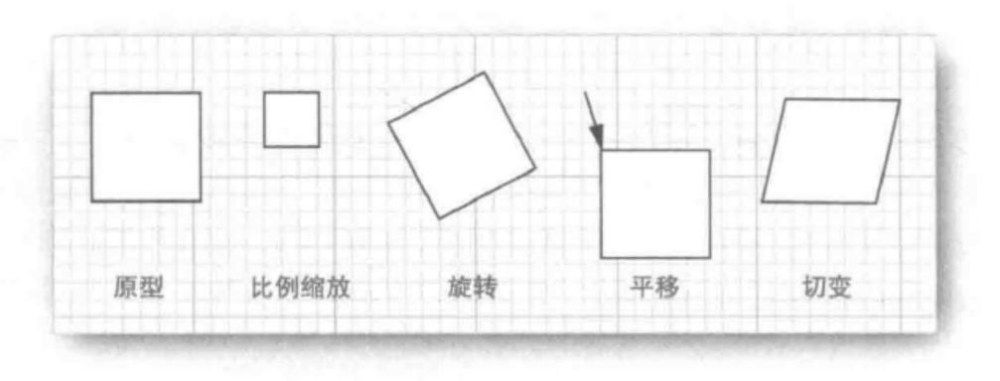

*在 情况下 变换方法 序是无关 。然 在大多数变换操作中 序却是 很重要的。例如 如果想对形 旋 和切变操作 么两 变换操作 不同执 序列 将会产 不同 图形。你必 明 想 得到 是什么样 图形 图形上下文将按照你所提供 反 序来应 些变换操作。也就是 你最后提供 方法会 最先应 。*

*可以根据你 提供任意多 变换操作。例如 假 你提供了下 个变换操作序列*

```
g2.translate(x, y);
g2. rotate⑻
g2.translate(-x, -y);
```

*最后一个变换操作(它是 一个 <sup>应</sup> )将把某个形 从点(x, y) 动到原点 二个变换将使 形 围 原点旋 一个 度a 最后一个变换方法又 新把 形 从原 <sup>点</sup> 动到点(x, y)<sup>处</sup>。总休效果就是 <sup>形</sup> <sup>围</sup> 中心点(x, y) 了一次旋 (参 图11-49 )o<sup>围</sup> 原点之外 任意点 <sup>旋</sup> 是一个很常 操作 所以我们 <sup>下</sup> <sup>快</sup>* 捷方法:

g2.rotate(a, x, y);

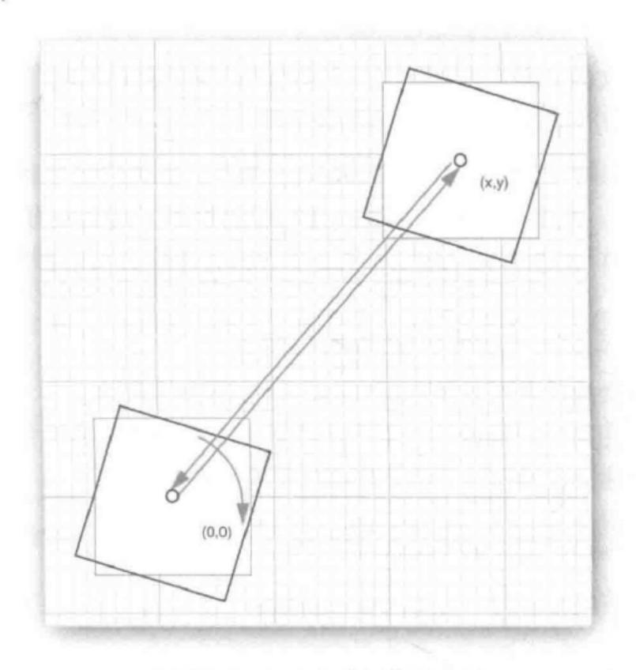

图 11-49 组合变换操作的应用

如果对矩阵论有所了解,那么就会知道所有操作(诸如旋转、平移、缩放、切变)和由这些操作组合起来的操作都能够以如下矩阵变换的形式表示出来:

$$\begin{bmatrix} x_{\text{new}} \\ y_{\text{new}} \\ 1 \end{bmatrix} = \begin{bmatrix} a & c & e \\ b & d & f \\ 0 & 0 & 1 \end{bmatrix} \cdot \begin{bmatrix} x \\ y \\ 1 \end{bmatrix}$$

这种变换称为仿射变换 (affine transformation)。Java 2D API 中的 AffineTransform 类就是用于描述这种变换的。如果你知道某个特定变换矩阵的组成元素,就可以用下面的方法直接构造它:

var t = new AffineTransform(a, b, c, d, e, f);

另外,工厂方法 getRotateInstance、getScaleInstance、getTranslateInstance和 getShearInstance 能够构建出表示相应变换类型的矩阵。例如,调用下面的方法:

t = AffineTransform.getScaleInstance(2.0F, 0.5F);

将返回一个与下面这个矩阵相一致的变换。

$$\begin{bmatrix} 2 & 0 & 0 \\ 0 & 0.5 & 0 \\ 0 & 0 & 1 \end{bmatrix}$$

最后,实例方法 setToRotation、setToScale、setToTranslation 和 setToShear 用于将变换对象设置为一个新的类型。下面是一个例子:

t.setToRotation(angle); // sets t to a rotation

可以把图形上下文的坐标变换设置为一个 AffineTransform 对象:

q2.setTransform(t); // replaces current transformation

不过,在实际运用中,不要调用 setTransform 操作,因为它会取代图形上下文中可能存在的任何现有的变换。例如,一个用以横向打印的图形上下文已经有了一个 90°的旋转变换,如果调用方法 setTransfrom,就会删除这样的旋转操作。可以调用 transform 方法作为替代方案:

g2.transform(t); // composes current transformation with t

它会把现有的变换操作和新的 AffineTransform 对象组合起来。

如果只想临时应用某个变换操作,那么应该首先获得旧的变换操作,然后和新的变换操作组合起来,最后当你完成操作时,再还原旧的变换操作:

AffineTransform oldTransform = g2.getTransform(); // save old transform g2.transform(t); // apply temporary transform draw on g2 g2.setTransform(oldTransform); // restore old transform

## api java.awt.geom.AffineTransform

- AffineTransform(double a, double b, double c, double d, double e, double f)
- AffineTransform(float a, float b, float c, float d, float e, float f)
   用下面的矩阵构建该仿射变换。

$$\begin{bmatrix} a & c & e \\ b & d & f \\ 0 & 0 & 1 \end{bmatrix}$$

- AffineTransform(double[] m)
- AffineTransform(float[] m)用下面的矩阵构建该仿射变换。

static AffineTransform getRotateInstance(double a)
 创建一个围绕原点、旋转角度为 a (弧度)的旋转变换。其变换矩阵是:

$$\begin{array}{cccccccccccccccccccccccccccccccccccc$$

如果 a 在 0 到  $\pi/2$  之间,那么图形将沿着 x 轴正半轴向 y 轴正半轴的方向旋转。

- static AffineTransform getRotateInstance(double a, double x, double y)
   创建一个围绕点 (x, y)、旋转角度为 a (弧度)的旋转变换。
- static AffineTransform getScaleInstance(double sx, double sy)
   创建一个比例缩放变换。x 轴缩放幅度为 sx; y 轴缩放幅度为 sy。其变换矩阵是:

static AffineTransform getShearInstance(double shx, double shy)
 创建一个切变变换。x 轴切变 shx; y 轴切变 shy。其变换矩阵是:

$$\begin{bmatrix} 1 & \text{shx } 0 \\ \text{shy } 1 & 0 \\ 0 & 0 & 1 \end{bmatrix}$$

static AffineTransform getTranslateInstance(double tx, double ty)
 创建一个平移变换。x 轴平移 tx; y 轴平移 ty。其变换矩阵是:

- void setToRotation(double a)
- void setToRotation(double a, double x, double y)
- void setToScale(double sx, double sy)
- void setToShear(double sx, double sy)
- void setToTranslation(double tx, double ty)
   用给定的参数将该变换设置为一个基本变换。如果要了解基本变换和它们的参数说明,请参见 getXxxInstance 方法。

## API java.awt.Graphics2D 1.2

- void setTransform(AffineTransform t)
   以t来取代该图形上下文中现有的坐标变换。
- void transform(AffineTransform t)
   将该图形上下文的现有坐标变换和t组合起来。
- void rotate(double a)
- void rotate(double a, double x, double y)
- void scale(double sx, double sy)
- void shear(double sx, double sy)
- void translate(double tx, double ty)

将该图形上下文中现有的坐标变换和一个带有给定参数的基本变换组合起来。如果要了解基本变换和它们的参数说明,请参见 AffineTransform.getXxxInstance 方法。

#### 11.3.7 剪切

通过在图形上下文中设置一个剪切形状,就可以将所有的绘图操作限制在该剪切形状内部来进行。

g2.setClip(clipShape); // but see below
g2.draw(shape); // draws only the part that falls inside the clipping shape

但是,在实际应用中,不应该调用这个 setClip 操作,因为它会取代图形上下文中可能存在的任何剪切形状。例如,正如在本章的后面部分所看到的那样,用于打印操作的图形上下文就具有一个剪切矩形,以确保你不会在页边距上绘图。相反,你应该调用 clip 方法。

g2.clip(clipShape); // better

clip方法将你所提供的新的剪切形状同现有的剪切形状相交。

如果只想临时地使用一个剪切区域的话,那么应该首先获得旧的剪切形状,然后添加新的剪切形状,最后,在完成操作时,再还原旧的剪切形状:

Shape oldClip = g2.getClip(); // save old clip
g2.clip(clipShape); // apply temporary clip
draw on g2
g2.setClip(oldClip); // restore old clip

在图 11-50 的例子中, 我们炫耀了一下剪切的功能, 它绘制了一个按照复杂形状进行剪切的相当出色的线条图案, 即一组字符的轮廓。

如果要获得字符的外形,需要一个字体渲染上下文(font render context)。请使用 Graphics2D 类的 getFontRenderContext 方法:

FontRenderContext context = q2.getFontRenderContext();

接着,使用某个字符串、某种字体和字体渲染上下文来 创建一个 TextLayout 对象:

var layout = new TextLayout("Hello", font, context);

图 11-50 按照字母形状剪切出

的线条图案

这个文本布局对象用于描述由特定字体渲染上下文所渲染的一个字符序列的布局。这种布局依赖于字体渲染上下文,相同的字符在屏幕上或者打印机上看起来会有不同的显示。

对我们当前的应用来说,更重要的是,getOutline 方法将会返回一个 Shape 对象,这个 Shape 对象用以描述在文本布局中的各个字符轮廓的形状。字符轮廓的形状从原点(0,0)开始,这并不适合大多数的绘图操作。因此,必须为 getOutline 操作提供一个仿射变换操作,以便设定想要的字体轮廓所显示的位置:

AffineTransform transform = AffineTransform.getTranslateInstance(0, 100); Shape outline = layout.getOutline(transform);

#### 接着, 我们把字体的轮廓附加给剪切的形状:

```
var clipShape = new GeneralPath(); clipShape.append(outline, false); 最后,我们设置剪切形状,并
```

最后,我们设置剪切形状,并且绘制一组线条。线条仅仅在字符边界的内部显示:

```
g2.setClip(clipShape);
var p = new Point2D.Double(0, 0);
for (int i = 0; i < NLINES; i++)
{
   double x = . . .;
   double y = . . .;
   var q = new Point2D.Double(x, y);
   g2.draw(new Line2D.Double(p, q)); // lines are clipped
}</pre>
```

#### API java.awt.Graphics

- void setClip(Shape s) 1.2将当前的剪切形状设置为形状 s。
- Shape getClip() 1.2
   返回当前的剪切形状。

#### API java.awt.Graphics2D

- void clip(Shape s)
   将当前的剪切形状和形状 s 相交。
- FontRenderContext getFontRenderContext()
   返回一个构建 TextLayout 对象所必需的字体渲染上下文。

## API java.awt.font.TextLayout

- TextLayout(String s, Font f, FontRenderContext context)
   根据给定的字符串和字体来构建文本布局对象。方法中使用字体渲染上下文来获取特定设备的字体属性。
- float getAdvance()返回该文本布局的宽度。
- float getAscent()
- float getDescent()返回基准线上方和下方该文本布局的高度。
- float getLeading()
   返回该文本布局使用的字体中相邻两行之间的距离。

## 11.3.8 透明与组合

在标准的 RGB 颜色模型中,每种颜色都是由它的红、绿和蓝这三种成分来描述的。但

是,用它来描述透明或者部分透明的图像区域也是非常方便的。当你将一个图像置于现有图

像的上面时,透明的像素完全不会遮挡它们下面的像素,而部分透明的像素则与它们下面的像素相混合。图 11-51 显示了一个部分透明的矩形和一个图像相重叠时所产生的效果,我们仍然可以透过矩形看到该图像的细节。

在 Java 2D API 中,透明是由一个透明度通道 (alpha channel)来描述的。每个像素,除了它的红、


图 11-51 一个部分透明的矩形和一个图 像相重叠时所显示的效果

绿和蓝色部分外,还有一个介于 0 (完全透明) 和 1 (部分透明)之间的透明度 (alpha) 值。例如,图 11-51 中的矩形填充了一种淡黄色,透明度为 50%:

new Color(0.7F, 0.7F, 0.0F, 0.5F);

现在让我们看一看如果将两个形状重叠在一起时将会出现什么情况。必须把源像素和目标像素的颜色和透明度值混合或者组合起来。从事计算机图形学研究的 Porter 和 Duff 已经阐明了在这个混合过程中的 12 种可能的组合原则,Java 2D API 实现了所有的这些原则。在继续介绍这个问题之前,需要指出的是,这些原则中只有两个原则有实际的意义。如果你发现这些原则晦涩难懂或者难以搞清楚,那么只使用 SRC\_OVER 原则就可以了。它是 Graphics 2D 对象的默认原则,并且它产生的结果最直接。

下面是这些规则的原理。假设你有了一个透明度值为  $a_s$  的源像素,在该图像中,已经存在了一个透明度值为  $a_0$  的目标像素,你想把两个像素组合起来。图 11-52 的示意图显示了如何设计一个像素的组合原则。

Porter 和 Duff 将透明度值作为像素颜色将被使用的概率。从源像素的角度来看,存在一个概率  $a_s$ ,它是源像素颜色被使用的概率;还存在一个概率  $1-a_s$ ,它是不在乎是否使用该像素颜色的概率。同样的原则也适用于目标像素。当组合颜色时,我们假设源像素的概率和目标像素的概率是不相关的。那么正如图 11-52 所示,有四种组合情况。

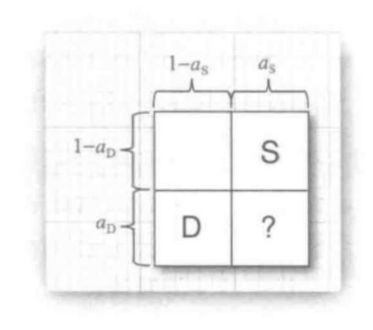

图 11-52 设计一个像素组合的原则

如果源像素想要使用它的颜色,而目标像素也不在乎,那么很自然的,我们就只使用源像素的颜色。这也是为什么右上角的矩形框用 "S"来标志的原因了,这种情况的概率为  $a_s$  ·  $(1-a_D)$ 。同理,左下角的矩形框用 "D"来标志。如果源像素和目标像素都想选择自己的颜色,那该怎么办才好呢?这里就要应用 Porter-Duff 原则了。如果我们认为源像素比较重要,那么我们在右下角的矩形框内也标志上一个 "S"。这个规则被称为 SRC\_0VER。在这个规则中,我们赋予源像素颜色的权值  $a_s$ ,目标像素颜色的权值为  $(1-a_s) \cdot a_D$ ,然后将它们组合起来。

这样产生的视觉效果是源像素与目标像素相混合的结果, 并且优先选择给定的源像素的

*颜色。 别是 如果七为1, 么根本就不 标像 。如果七为0, 么源像 将是完全 明 标像 则是不变 。*

*有其他的规则 可以根据 于概 意图各个框中 字母来 些 则 概念。 11-3和图11-53显 了 Java 2D API支持 所有 些 则。图11-53中 各个图像显 了 当你使 明度值为0.75 形源区域和 明度值为1.0 楠圆 标区域 合时 所显示的 各种组合效果。*

| 则           | 解释                               |
|-------------|----------------------------------|
| CLEAR       | 源像<br>清<br>冃标像                   |
| SRC         | 源像<br>标像<br>和<br>像               |
| DST         | 源像<br>不影响<br>标像                  |
| SRC OVER    | 源像<br>和<br>标像<br>混合<br>并且覆盖空像    |
| DST<br>OVER | 源像<br>不影响<br>标像<br>并且不<br>像      |
| IN<br>SRC   | 源像素覆盖目标像                         |
| SRC OUT     | 源像<br>清<br>标像<br>并且<br>像         |
| IN<br>DST   | 源像<br>明度值修改<br>标像<br>明度值         |
| DST<br>OUT  | 源像<br>明度值取反修改<br>标像<br>明度值       |
| SRC ATOP    | 源像<br>和<br>标像素相混合                |
| DST ATOP    | 源像<br>明度值修改<br>标像<br>明度值。源像<br>像 |
| XOR         | 源像<br>明度值取反修改冃标像<br>明度值。源像素覆盖空像  |

*11-3 Porter-Duff 合 则*

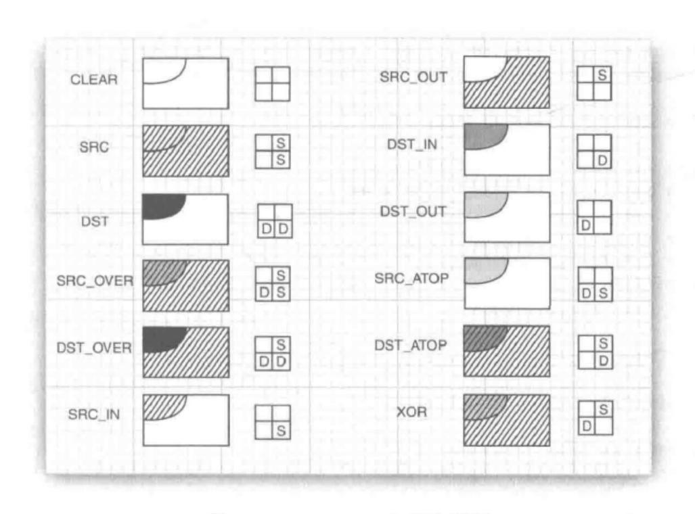

*图11-53 Porter-Duff 合 则*

*如你所 大多数 则并不是 常有 。例如 DST IN 则就是一个极 例子。它根*

本不考虑源像素颜色,但是却使用了源像素的透明度值来影响目标像素。SRC 规则可能是有用的,它强制使用源像素颜色,而且关闭了与目标像素相混合的特性。

你可以使用 Graphics2D 类的 setComposite 方法安装一个实现了 Composite 接口的类的对象。Java 2D API 提供了这样的一个类,即 AlphaComposite 它实现了图 11-53 中的所有的 Porter-Duff 规则。

AlphaComposite 类的工厂方法 getInstance 用来产生 AlphaComposite 对象,此时需要提供用于源像素的规则和透明度值。例如,可以考虑使用下面的代码:

```
int rule = AlphaComposite.SRC_OVER;
float alpha = 0.5f;
g2.setComposite(AlphaComposite.getInstance(rule, alpha));
g2.setPaint(Color.blue);
g2.fill(rectangle);
```

这时,矩形将使用蓝色和值为 0.5 的透明度进行着色。因为该组合规则是 SRC\_OVER,所以它透明地置于现有图像的上面。

程序清单 11-17 中的程序深入地研究了这些组合规则。可以从组合框中选择一个规则,调节滑动条来设置 AlphaComposite 对象的透明度值。

#### 程序清单 11-17 composite/CompositeTestFrame.java

```
1 package composite;
3 import java.awt.*;
4 import javax.swing.*;
6 /**
   * This frame contains a combo box to choose a composition rule, a slider to change the
   * source alpha channel, and a component that shows the composition.
  class CompositeTestFrame extends JFrame
11 {
      private static final int DEFAULT WIDTH = 400:
12
      private static final int DEFAULT HEIGHT = 400;
13
14
      private CompositeComponent canvas:
15
      private JComboBox<Rule> ruleCombo:
      private JSlider alphaSlider;
17
      private JTextField explanation;
18
19
      public CompositeTestFrame()
28
21
         setSize(DEFAULT WIDTH, DEFAULT HEIGHT);
22
23
         canvas = new CompositeComponent():
24
         add(canvas, BorderLayout.CENTER);
25
26
         ruleCombo = new JComboBox <> (new Rule[]
27
            {
28
               new Rule("CLEAR", " ", " "),
29
               new Rule("SRC", " S", " S"), new Rule("DST", " ", "DD"),
38
```

```
new Rule("SRC OVER", "S", "DS"), new Rule("DST OVER", "S", "DD"),
               new Rule("SRC IN", " ", " S"), new Rule("SRC OUT", " S", " "),
32
               new Rule("DST_IN", " "
                                          " D"), new Rule("DST OUT", " ", "D "),
33
               new Rule("DSI_IN", " ", "D"), new Rule("DSI_OUI", " ", "D "), new Rule("DST_ATOP", " S", " D"),
34
               new Rule("XOR", " S", "D "),
35
36
            1):
         ruleCombo.addActionListener(event ->
37
38
               var r = (Rule) ruleCombo.getSelectedItem();
39
                canvas.setRule(r.getValue());
                explanation.setText(r.getExplanation());
41
            1):
42
43
         alphaSlider = new JSlider(0, 100, 75);
44
         alphaSlider.addChangeListener(event -> canvas.setAlpha(alphaSlider.getValue()));
45
         var panel = new JPanel();
46
         panel.add(ruleCombo);
47
         panel.add(new JLabel("Alpha"));
48
         panel.add(alphaSlider);
49
         add(panel, BorderLayout, NORTH);
50
51
         explanation = new JTextField();
52
53
          add(explanation, BorderLayout.SOUTH);
54
         canvas.setAlpha(alphaSlider.getValue());
55
         Rule r = ruleCombo.getItemAt(ruleCombo.getSelectedIndex());
56
          canvas.setRule(r.getValue());
57
         explanation.setText(r.getExplanation());
58
      }
59
60 }
```

此外,对每一条规则该程序都显示了一条文字描述。请注意,描述是根据组合规则表计算而来的。例如,第二行中的"DS"表示的就是"与目标像素相混合"。

该程序有一个重要的缺陷:它不能保证和屏幕相对应的图形上下文一定具有透明通道。 (实际上,它通常没有这个透明通道)。当像素被放到没有透明通道的目标像素之上的时候, 这些像素的颜色会与目标像素的透明度值相乘,而其透明度值却被弃用了。因为许多 Porter-Duff 规则都使用目标像素的透明度值,因此目标像素的透明通道是很重要的。由于这个原 因,我们使用了一个采用 ARGB 颜色模型的缓存图像来组合各种形状。在图像被组合后,我 们就将产生的图像在屏幕上绘制出来:

```
var image = new BufferedImage(getWidth(), getHeight(), BufferedImage.TYPE_INT_ARGB);
Graphics2D gImage = image.createGraphics();
// now draw to gImage
g2.drawImage(image, null, θ, θ);
```

程序清单 11-17 和程序清单 11-18 展示了框体和构件类,程序清单 11-19 中的 Rule 类提供了对每条规则的简要解释,如图 11-54 所示。在运行这个程序的时候,从左到右地移动 Alpha 滑动条,就可以观察到所产生的组合形状的效果。特别是,请注意 DST\_IN 与 DST\_OUT 规则之间唯一的差别,那就是,当你改变源像素的透明度值时,目标(!)颜色将会发生什

#### 么样的变化。

## 程序清单 11-18 composite/CompositeComponent.java

```
package composite;
2
3 import java.awt.*;
4 import java.awt.geom.*;
5 import java.awt.image.*;
6 import javax.swing.*;
    * This component draws two shapes, composed with a composition rule.
q
18
   class CompositeComponent extends JComponent
11
12
13
      private int rule;
      private Shape shape1;
14
      private Shape shape2;
15
16
      private float alpha;
17
      public CompositeComponent()
18
19
         shape1 = new Ellipse2D.Double(100, 100, 150, 100);
28
21
         shape2 = new Rectangle2D.Double(150, 150, 150, 100);
22
23
      public void paintComponent(Graphics q)
24
25
         var g2 = (Graphics2D) g;
26
27
         var image = new BufferedImage(getWidth(), getHeight(), BufferedImage.TYPE INT ARGB);
29
         Graphics2D gImage = image.createGraphics();
          gImage.setPaint(Color.red);
30
         gImage.fill(shape1);
         AlphaComposite composite = AlphaComposite.getInstance(rule, alpha);
32
          gImage.setComposite(composite);
33
          gImage.setPaint(Color.blue);
34
          gImage.fill(shape2);
35
          g2.drawImage(image, null, 0, 0);
36
      }
37
38
39
        * Sets the composition rule.
48
        * @param r the rule (as an AlphaComposite constant)
41
42
      public void setRule(int r)
43
44
          rule = r;
45
          repaint();
46
       }
47
48
49
        * Sets the alpha of the source.
50
        * @param a the alpha value between 0 and 100
51
```

```
52  */
53  public void setAlpha(int a)
54  {
55    alpha = (float) a / 100.0F;
56    repaint();
57  }
58 }
```

#### 程序清单 11-19 composite/Rule.java

```
1 package composite;
2
  import java.awt.*;
4
5
   * This class describes a Porter-Duff rule.
    */
   class Rule
9
10
      private String name;
      private String porterDuffl;
      private String porterDuff2;
12
13
      /**
14
       * Constructs a Porter-Duff rule.
15
       * @param n the rule name
16
       * @param pdl the first row of the Porter-Duff square
17
       * @param pd2 the second row of the Porter-Duff square
18
19
      public Rule(String n, String pd1, String pd2)
28
21
         name = n;
22
         porterDuff1 = pd1;
23
         porterDuff2 = pd2;
24
      }
25
26
27
       * Gets an explanation of the behavior of this rule.
28
       * @return the explanation
29
30
      public String getExplanation()
31
32
         var r = new StringBuilder("Source ");
33
         if (porterDuff2.equals(" ")) r.append("clears");
34
         if (porterDuff2.equals(" S")) r.append("overwrites");
35
         if (porterDuff2.equals("DS")) r.append("blends with");
36
         if (porterDuff2.equals(" D")) r.append("alpha modifies");
37
         if (porterDuff2.equals("D ")) r.append("alpha complement modifies");
38
         if (porterDuff2.equals("DD")) r.append("does not affect");
39
          r.append(" destination");
40
         if (porterDuff1.equals(" S")) r.append(" and overwrites empty pixels");
41
42
         r.append(".");
         return r.toString();
43
      }
44
45
```

```
46
47
48
49
58
59
66
61
62
63
64
65
66 }
       public String toStringO
       {
          return name;
       }
       / *
          Gets the value of this rule in the AlphaComposite class.
        • ®return the AlphaComposite constant value, or -1 if there is no matching constant
       public int getValue()
       {
          try
              return (Integer) AlphaComposite.class.getField(name).get(null);
          }
          catch (Exception e)
          {
              return -1;
          }
       }
```

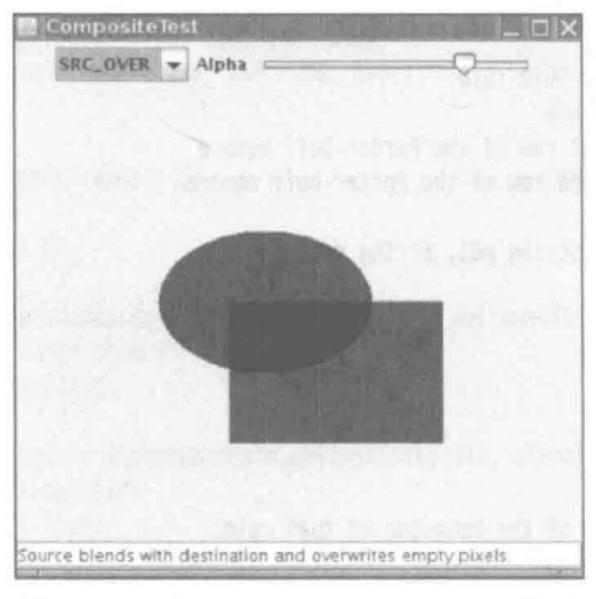

*图11-54 CompositeTest 序运行的结果*

## *AFij java.awt.Graphics2D*

*• void setComposite(Composite s) 把图形上下文 合方式 为实 了 Composite接口 定对 。*

## *ah] java. awt.AlphaConposite*

- *• static AlphaComposite getlnstance(int rule)*
- *• static AlphaComposite getlnstance(int rule, float sourceAlpha) 构建一个 明度(alpha)<sup>值</sup> 合对 。 则是CLEAR、SRC、SRC一OVER、DST\_0VER、*

SRC\_IN、SRC\_OUT、DST\_IN、DST\_OUT、DST、DST\_ATOP、SRC\_ATOP、XOR 等值之一。

## 11.4 像素图

Java2D API 使得我们可以创建由直线、曲线和区域构成的图。它是一个"向量"API, 因为我们需要指定各种形状的数学属性。但是,对于处理由像素构成的图像,我们希望能够操作由颜色数据构成的"栅格"。下面将展示 Java 中的像素图。

#### 11.4.1 图像的读取器和写入器

javax.imageio 包包含了对读取和写入数种常用文件格式进行支持的"非常方便的"特性。同时还包含了一个框架,使得第三方能够为其他图像格式的文件添加读取器和写入器。GIF、JPEG、PNG、BMP(Windows 位图)和 WBMP(无线位图)等文件格式都得到了支持。

该类库的基本应用是极其直接的。要想装载一个图像,可以使用 ImageI0 类的静态 read 方法。

```
File f = . . .;
BufferedImage image = ImageIO.read(f);
```

ImageI0 类会根据文件的类型,选择一个合适的读取器。它可以参考文件的扩展名和文件开头的专用于此目的的"幻数"(magic number)来选择读取器。如果没有找到合适的读取器或者读取器不能解码文件的内容,那么 read 方法将返回 null。

把图像写入到文件中也是一样地简单。

```
File f = . . .;
String format = . . .;
ImageIO.write(image, format, f);
```

这里, format 字符串用来标识图像的格式, 比如"JPEG"或者"PNG"。ImageI0 类将 选择一个合适的写人器以存储文件。

## 11.4.1.1 获得适合图像文件类型的读取器和写入器

对于那些超出 ImageI0 类的静态 read 和 write 方法能力范围的高级图像读取和写入操作来说,首先需要获得合适的 ImageReader 和 ImageWriter 对象。ImageI0 类枚举了匹配下列条件之一的读取器和写入器。

- 图像格式 (比如 "JPEG")
- 文件后缀(比如"jpg")
- MIME类型(比如"image/jpeg")
- **注释:** MIME (Multipurpose Internet Mail Extensions standard) 是 "多用途因特网邮件 扩展标准"的英文缩写。MIME 标准定义了常用的数据格式,比如"image/jpeg"和"application/pdf"等。

例如,可以用下面的代码来获取一个 JPEG 格式文件的读取器。

ImageReader reader = null; Iterator<ImageReader> iter = ImageIO.getImageReadersByFormatName("JPEG"); if (iter.hasNext()) reader = iter.next();

getImageReadersBySuffix 和 getImageReadersByMIMEType 这两个方法用于枚举与文件扩展名或 MIME 类型相匹配的读取器。

ImageI0类可能会找到多个读取器,而它们都能够读取某一特殊类型的图像文件。在这种情况下,必须从中选择一个,但是也许你不清楚怎样才能选择一个最好的。如果要了解更多的关于读取器的信息,就要获取它的服务提供者接口:

ImageReaderSpi spi = reader.getOriginatingProvider();

然后,可以获得供应商的名字和版本号:

String vendor = spi.getVendor();
String version = spi.getVersion();

也许该信息能够帮助你决定选择哪一种读取器,或者你可以为你的程序用户提供一个读取器的列表,让他们做出选择。然而,目前来说,我们假定第一个列出来的读取器就能够满足用户的需求。

在程序清单 11-20 中, 我们想查找所有可获得的读取器能够处理的文件的所有后缀, 这样我们就可以在文件过滤器中使用它们。我们可以使用静态的 ImageIO.getReader-FileSuffixes 方法来达到此目的:

String[] extensions = ImageIO.getWriterFileSuffixes();
chooser.setFileFilter(new FileNameExtensionFilter("Image files", extensions));

对于保存文件,相对来说更麻烦一些:我们希望为用户展示一个支持所有图像类型的菜单。可惜,IOImage 类的 getWriterFormateNames 方法返回了一个相当奇怪的列表,里边包含了许多冗余的名字,比如:

jpg, BMP, bmp, JPG, jpeg, wbmp, png, JPEG, PNG, WBMP, GIF, gif

这些并不是人们想要在菜单中显示的东西,我们所需要的是"首选"格式名列表。我们提供了一个用于此目的的助手方法 getWriterFormats (参见程序清单 11-20)。我们查找与每一种格式名相关的第一个写入器,然后,询问该写入器它支持的格式名是什么,从而希望它能够将最流行的一个格式名列在首位。实际上,对 JPEG写人器来说,这种方法确实很有效:它将"JPEG"列在其他选项的前面。(另一方面,PNG写人器把小写字母的"png"列在"PNG"的前面。我们希望这种行为能够在将来的某个时候得以解决。此刻,我们强制将全小写名字转换为大写)。一旦挑选了首选名,我们就会将所有其他的候选名从最初的名字集中移除。之后,我们会继续执行直至所有的格式名都得到处理。

## 11.4.1.2 读取和写入带有多个图像的文件

有些文件,特别是 GIF 动画文件,都包含了多个图像。Image IO 类的 read 方法只能够读取单个图像。为了读取多个图像,应该将输入源(例如,输入流或者输入文件)转换成一个

## ImageInputStream<sub>o</sub>

InputStream in = . . .;

ImageInputStream imageIn = ImageIO.createImageInputStream(in);

接着把图像输入流作为参数传递给读取器的 setInput 方法:

reader.setInput(imageIn, true);

方法中的第二个参数值表示输入的方式是"只向前搜索",否则,就采用随机访问的方式,要么是在读取时缓冲输入流,要么是使用随机文件访问。对于某些操作来说,必须使用随机访问的方法。例如,为了在一个 GIF 文件中查寻图像的个数,就需要读入整个文件。这时,如果想获取某一图像的话,必须再次读入该输入文件。

只有当从一个流中读取图像,并且输入流中包含多个图像,而且在文件头中的图像格式部分没有所需要的信息(比如图像的个数)时,考虑使用上面的方法才是合适的。如果要从一个文件中读取图像信息的话,可直接使用下面的方法:

File f = . . .:

ImageInputStream imageIn = ImageIO.createImageInputStream(f);
reader.setInput(imageIn);

一旦拥有了一个读取器后,就可以通过调用下面的方法来读取输入流中的图像。

BufferedImage image = reader.read(index);

其中 index 是图像的索引, 其值从 0 开始。

如果输入流采用"只向前搜索"的方式,那么应该持续不断地读取图像,直到 read 方法 抛出一个 IndexOutOfBoundsException 为止。否则,可以调用 getNumImages 方法:

int n = reader.getNumImages(true);

在该方法中,它的参数表示允许搜索输入流以确定图像的数目。如果输入流采用"只向前搜索"的方式,那么该方法将抛出一个 IllegalStateException 异常。要不然,可以把是否"允许搜索"参数设置为 false。如果 getNumImages 方法在不搜索输入流的情况下无法确定图像的数目,那么它将返回 - 1。在这种情况下,必须转换到 B 方案,那就是持续不断地读取图像,直到获得一个 IndexOutOfBoundsException 异常为止。

有些文件包含一些缩略图,也就是图像用来预览的小版本。可以通过调用下面的方法来 获得某个图像的缩略图数量。

int count = reader.getNumThumbnails(index);

然后可以按如下方式得到一个特定索引:

BufferedImage thumbnail = reader.getThumbnail(index, thumbnailIndex);

另一个问题是,有时你想在实际获得图像之前,了解该图像的大小。特别是,当图像很大,或者是从一个较慢的网络连接中获取的时候,你更加希望能够事先了解到该图像的大小。那么请使用下面的方法:

int width = reader.getWidth(index);\nint height = reader.getHeight(index);

通过上面两个方法可以获得具有给定索引的图像的大小。

如果要将多个图像写入到一个文件中,首先需要一个 ImageWriter。ImageI0 类能够枚举可以写入某种特定图像格式的所有写入器。

```
String format = . . .;
ImageWriter writer = null;
Iterator<ImageWriter> iter = ImageIO.getImageWritersByFormatName(format);\nif (iter.hasNext()) writer = iter.next();
```

接着,将一个输出流或者输出文件转换成 ImageOutputStream, 并且将其作为参数传给写入器。例如,

```
File f = . . .;
ImageOutputStream imageOut = ImageIO.createImageOutputStream(f);
writer.setOutput(imageOut);
```

必须将每一个图像都包装到 IIOImage 对象中。可以根据情况提供一个缩略图和图像元数据(比如,图像的压缩算法和颜色信息)的列表。在本例中,我们把两者都设置为 null;如果要了解详细信息,请参阅 API 文档。

```
var iioImage = new IIOImage(images[i], null, null);
```

使用 write 方法,可以写出第一个图像:

writer.write(new IIOImage(images[0], null, null));

对于后续的图像,使用下面的方法:

```
if (writer.canInsertImage(i))
  writer.writeInsert(i, iioImage, null);
```

上面方法中的第三个参数可以包含一个 Image-WriteParam 对象,用以设置图像写入的详细信息,比如是平铺还是压缩;可以用 null 作为其默认值。

并不是所有的图像格式都能够处理多个图像。 在这种情况下,如果 i>0, canInsertImage 方法将 返回 false 值,而且只保存单一图像。

程序清单 11-20 中的程序使用 Java 类库所提供的读取器和写入器支持的格式来加载和保持文件。该程序显示了多个图像(见图 11-55),但是没有缩略图。

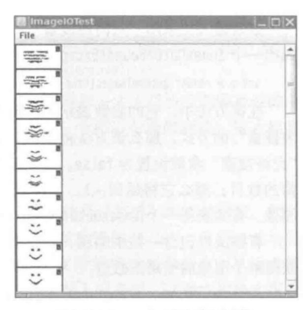

图 11-55 一个 GIF 动画图像

## 程序清单 11-20 imagelO/ImagelOFrame.java

```
package imageI0;\nimport java.awt.image.*;\nimport java.io.*;\nimport java.util.*;
```

```
7 import javax.imageio.*;
8 import javax.imageio.stream.*;
   import javax.swing.*;
   import javax.swing.filechooser.*;
11
12
  /**
   * This frame displays the loaded images. The menu has items for loading and saving files.
13
14
   public class ImageIOFrame extends JFrame
15
16
17
      private static final int DEFAULT WIDTH = 400;
      private static final int DEFAULT HEIGHT = 400;
18
19
      private static Set<String> writerFormats = getWriterFormats();
20
21
      private BufferedImage[] images;
22
23
      public ImageIOFrame()
24
25
         setSize(DEFAULT WIDTH, DEFAULT HEIGHT);
26
27
28
         var fileMenu = new JMenu("File");
         var openItem = new JMenuItem("Open");
29
          openItem.addActionListener(event -> openFile());
38
          fileMenu.add(openItem);
31
32
         var saveMenu = new JMenu("Save");
33
34
          fileMenu.add(saveMenu);
         Iterator<String> iter = writerFormats.iterator();
35
         while (iter.hasNext())
36
37
             final String formatName = iter.next();
38
             var formatItem = new JMenuItem(formatName);
39
             saveMenu.add(formatItem);
             formatItem.addActionListener(event -> saveFile(formatName));
41
42
43
          var exitItem = new JMenuItem("Exit");
44
          exitItem.addActionListener(event -> System.exit(0));
45
          fileMenu.add(exitItem);
46
47
          var menuBar = new JMenuBar();
48
          menuBar.add(fileMenu);
49
          setJMenuBar(menuBar);
50
51
52
      /**
53
       * Open a file and load the images.
54
55
      public void openFile()
56
57
          var chooser = new JFileChooser();
58
59
          chooser.setCurrentDirectory(new File("."));
          String[] extensions = ImageIO.getReaderFileSuffixes();
60
          chooser.setFileFilter(new FileNameExtensionFilter("Image files", extensions));
61
```

```
int r = chooser.showOpenDialog(this);
62
         if (r != JFileChooser.APPROVE OPTION) return;
63
         File f = chooser.getSelectedFile();
64
         Box box = Box.createVerticalBox();
65
         try
66
         {
67
             String name = f.getName();
             String suffix = name.substring(name.lastIndexOf('.') + 1);
69
             Iterator<ImageReader> iter = ImageIO.getImageReadersBySuffix(suffix);
76
             ImageReader reader = iter.next();
             ImageInputStream imageIn = ImageIO.createImageInputStream(f);
72
             reader.setInput(imageIn);
73
             int count = reader.getNumImages(true);
             images = new BufferedImage[count];
75
76
             for (int i = 0; i < count; i++)
             {
77
                images[i] = reader.read(i);
78
                box.add(new JLabel(new ImageIcon(images[i])));
88
81
         catch (IOException e)
82
83
             JOptionPane.showMessageDialog(this, e);
84
85
          setContentPane(new JScrollPane(box));
86
87
          validate();
      }
88
20
98
       * Save the current image in a file.
91
        * @param formatName the file format
92
93
       public void saveFile(final String formatName)
94
95
          if (images == null) return;
96
          Iterator<ImageWriter> iter = ImageIO.getImageWritersByFormatName(formatName);
97
          ImageWriter writer = iter.next();
98
          var chooser = new JFileChooser();
          chooser.setCurrentDirectory(new File("."));
188
          String[] extensions = writer.getOriginatingProvider().getFileSuffixes();
101
          chooser.setFileFilter(new FileNameExtensionFilter("Image files", extensions));
182
183
104
          int r = chooser.showSaveDialog(this);
          if (r != JFileChooser.APPROVE OPTION) return;
105
          File f = chooser.getSelectedFile();
186
          try
107
108
             ImageOutputStream imageOut = ImageIO.createImageOutputStream(f);
189
110
             writer.setOutput(imageOut);
111
             writer.write(new IIOImage(images[0], null, null));
112
             for (int i = 1; i < images.length; i++)
113
114
             {
                var iioImage = new IIOImage(images[i], null, null);
115
                if (writer.canInsertImage(i)) writer.writeInsert(i, iioImage, null);
116
```

```
117
118
119
         catch (IOException e)
128
            JOptionPane.showMessageDialog(this, e);
121
122
      }
123
124
125
       * Gets a set of "preferred" format names of all image writers. The preferred format name
126
       * is the first format name that a writer specifies.
127
       * Greturn the format name set
128
129
      public static Set<String> getWriterFormats()
130
131
         var writerFormats = new TreeSet<String>();
132
          var formatNames = List.of(ImageIO.getWriterFormatNames());
133
          while (formatNames.size() > 0)
134
135
             String name = formatNames.iterator().next();
             Iterator<ImageWriter> iter = ImageIO.getImageWritersByFormatName(name);
137
138
             ImageWriter writer = iter.next();
             String[] names = writer.getOriginatingProvider().getFormatNames();
139
             String format = names[0];
149
             if (format.equals(format.toLowerCase())) format = format.toUpperCase();
141
             writerFormats.add(format);
             formatNames.removeAll(List.of(names));
143
144
          return writerFormats;
145
146
147 }
```

#### API javax.imageio.ImageIO

- static BufferedImage read(File input)
- static BufferedImage read(InputStream input)
- static BufferedImage read(URL input)
   从 input 中读取一个图像。
- static boolean write(RenderedImage image, String formatName, File output)
- static boolean write(RenderedImage image, String formatName, OutputStream output)
   将给定格式的图像写入 output 中。如果没有找到合适的写入器,则返回 false。
- static Iterator<ImageReader> getImageReadersByFormatName(String formatName)
- static Iterator<ImageReader> getImageReadersBySuffix(String fileSuffix)
- static Iterator<ImageReader> getImageReadersByMIMEType(String mimeType)
- static Iterator<ImageWriter> getImageWritersByFormatName(String formatName)
- static Iterator<ImageWriter> getImageWritersBySuffix(String fileSuffix)
- static Iterator<ImageWriter> getImageWritersByMIMEType(String mimeType)

获得能够处理给定格式(例如 "JPEG")、文件后缀(例如 "jpg") 或者 MIME 类型(例如 "image/jpeg")的所有读取器和写入器。

- static String[] getReaderFormatNames()
- static String[] getReaderMIMETypes()
- static String[] getWriterFormatNames()
- static String[] getWriterMIMETypes()
- static String[] getReaderFileSuffixes() 6
- static String[] getWriterFileSuffixes()
   获取读取器和写入器所支持的所有格式名、MIME类型名和文件后缀。
- ImageInputStream createImageInputStream(Object input)
- ImageOutputStream createImageOutputStream(Object output)
  根据给定的对象来创建一个图像输入流或者图像输出流。该对象可能是一个文件、一个流、一个 RandomAccessFile 或者某个服务提供商能够处理的其他类型的对象。如果没有任何注册过的服务提供器能够处理这个对象,那么返回 null 值。

#### API javax.imageio.ImageReader

- void setInput(Object input)
- void setInput(Object input, boolean seekForwardOnly)
   设置读取器的输入源。

参数: input — 个 ImageInputStream 对象或者是这个读取器能够接受的其他对象 seekForwardOnly 如果读取器只应该向前读取,则返回 true。默认地,读取器会 采用随机访问的方式,如果有必要,将会缓存图像数据

- BufferedImage read(int index)
   读取给定索引的图像(索引从0开始)。如果没有这个图像,则抛出一个 IndexOutOfBounds-Exception 异常。
- int getNumImages(boolean allowSearch)
   获取读取器中图像的数目。如果 allowSearch 值为 false,并且不向前阅读就无法确定图像的数目,那么它将返回 -1。如果 allowSearch 值是 true,并且读取器采用了"只向前搜索"方式,那么就会抛出 IllegalStateException 异常。
- int getNumThumbnails(int index)
   获取给定索引的图像的缩略图的数量。
- BufferedImage readThumbnail(int index, int thumbnailIndex)
   获取给定索引的图像的索引号为 thumbnailIndex 的缩略图。
- int getWidth(int index)
- int getHeight(int index)
   获取给定索引的图像的宽度和高度。如果没有这样的图像,就抛出一个 IndexOutOfBounds-

Exception异常。

ImageReaderSpi getOriginatingProvider()
 获取构建该读取器的服务提供者。

## API javax.imageio.spi.IIOServiceProvider

- String getVendorName()
- String getVersion()

获取该服务提供者的提供商的名字和版本。

## API javax.imageio.spi.ImageReaderWriterSpi

- String[] getFormatNames()
- String[] getFileSuffixes()
- String[] getMIMETypes()

获取由该服务提供者创建的读取器或者写入器所支持的图像格式名、文件的后缀和 MIME 类型。

## API javax.imageio.ImageWriter 1.4

void setOutput(Object output)设置该写人器的输出目标。

参数: output 一个 ImageOutputSteam 对象或者这个写人器能够接受的其他对象

- void write(IIOImage image)
- void write(RenderedImage image)
   把单一的图像写入到输出流中。
- void writeInsert(int index, IIOImage image, ImageWriteParam param)
   把一个图像写入到一个包含多个图像的文件中。
- boolean canInsertImage(int index)
   如果在给定的索引处可以插入一个图像的话,则返回 true 值。
- ImageWriterSpi getOriginatingProvider()
   获取构建该写入器的服务提供者。

## API javax.imageio.IIOImage

IIOImage(RenderedImage image, List thumbnails, IIOMetadata metadata)
 根据一个图像、可选的缩略图和可选的元数据来构建一个 IIOImage 对象。

## 11.4.2 图像处理

假设你有一个图像,并且希望改善图像的外观。这时需要访问该图像的每一个像素,并用其他的像素来取代这些像素。或者,你也许想要从头计算某个图像的像素,例如,你想显示一下物理测量或者数学计算的结果。BufferedImage类提供了对图像中像素的控制能力,而

实现了 BufferedImageOP 接口的类都可以对图像进行变换操作。

註釋: JDK1.0 有一个完全不同且复杂得多的图像框架,它得到了优化,以支持对从 Web 下载的图像进行增量渲染 (incremental rendering),即一次绘制一个扫描行。但 是,操作这些图像很困难。我们在本书中不讨论这个框架。

#### 11.4.2.1 构建像素图

你处理的大多数图像都是直接从图像文件中读入的。这些图像有的可能是数码相机产生的,有的是扫描仪扫描而产生的,还有的一些图像是绘图程序产生的。在本节中,我们将介绍一种不同的构建图像技术,也就是每次为图像增加一个像素。

为了创建一个图像,需要以通常的方法构建一个 Buffered Image 对象:

image = new BufferedImage(width, height, BufferedImage.TYPE\_INT\_ARGB);

现在,调用 getRaster 方法来获得一个类型为 WritableRaster 的对象,后面将使用这个对象来访问和修改该图像的各个像素:

WritableRaster raster = image.getRaster();

使用 setPixel 方法可以设置一个单独的像素。这项操作的复杂性在于不能只是为该像素设置一个 Color 值,还必须知道存放在缓冲中的图像是如何设定颜色的,这依赖于图像的类型。如果图像类型为 TYPE\_INT\_ARGB,那么每一个像素都用四个值来描述,即:红、绿、蓝和透明度(alpha),每个值的取值范围都介于 0 和 255 之间,这需要以包含四个整数值的一个数组的形式给出:

```
int[] black = { 0, 0, 0, 255 };
raster.setPixel(i, j, black);
```

用 Java 2D API 的行话来说,这些值被称为像素的样本值。

● 警告: 还有一些参数值是 float[] 和 double[] 类型的 setPixel 方法。然而,需要在这些数组中放置的值并不是介于 0.0 和 1.0 之间的规格化的颜色值:

```
float[] red = { 1.0F, 0.0F, 0.0F, 1.0F };
raster.setPixel(i, j, red); // ERROR
```

无论数组属于什么类型,都必须提供介于0和255之间的某个值。

可以使用 setPixels 方法提供批量的像素。需要设置矩形的起始像素的位置和矩形的宽度和高度。接着,提供一个包含所有像素的样本值的一个数组。例如,如果你缓冲的图像类型为 TYPE\_INT\_ARGB, 那么就应该提供第一个像素的红、绿、蓝和透明度的值(alpha), 然后,提供第二个像素的红、绿、蓝和透明度的值,以此类推:

```
var pixels = new int[4 * width * height];
pixels[0] = . . .; // red value for first pixel
pixels[1] = . . .; // green value for first pixel
pixels[2] = . . .; // blue value for first pixel
pixels[3] = . . .; // alpha value for first pixel
. . .
raster.setPixels(x, y, width, height, pixels);
```

反过来,如果要读入一个像素,可以使用 getPixel 方法。这需要提供一个含有四个整数的数组,用以存放各个样本值:

var sample = new int[4];
raster.getPixel(x, y, sample);
var color = new Color(sample[0], sample[1], sample[2], sample[3]);

可以使用 getPixels 方法来读取多个像素:

raster.getPixels(x, y, width, height, samples);

如果使用的图像类型不是 TYPE\_INT\_ARGB, 并且已知该类型是如何表示像素值的, 那么仍旧可以使用 getPixel/setPixel 方法。不过, 必须要知道该特定图像类型的样本值是如何进行编码的。

如果需要对任意未知类型的图像进行处理,那么你就要费神了。每一个图像类型都有一个颜色模型,它能够在样本值数组和标准的 RGB 颜色模型之间进行转换。

i 注释: RGB 颜色模型并不像你想象中的那么标准。颜色值的确切样子依赖于成像设备的特性。数码相机、扫描仪、控制器和 LCD 显示器等都有它们独有的特性。结果是,同样的 RGB 值在不同的设备上看上去就存在很大的差别。国际配色联盟 (http://www.color.org) 推荐,所有的颜色数据都应该配有一个 ICC 配置特性,它用以设定各种颜色是如何映射到标准格式的,比如 1931 CIE XYZ 颜色技术规范。该规范是由国际照明委员会即 CIE (Commission Internationale de l'Eclairage, 其网址为: http://www.cie.co.at) 制定的。该委员会是负责提供涉及照明和颜色等相关领域事务的技术指导的国际性机构。该规范是显示肉眼能够察觉到的所有颜色的一个标准化方法。它采用称为 X、Y、Z 三元组坐标的方式来显示颜色。(关于 1931 CIE XYZ 规范的详尽信息,可以参阅 John F. Hughes 等人所撰写的 Computer Graphics: Principles and Practice 第 3 版一书的第 28 章。)

ICC配置特性非常复杂。然而,我们建议使用一个相对简单的标准,称为 sRGB (请访问其网址 http://www.w3.org/Color/sRGB.html)。它设定了 RGB 值与 1931 CIE XYZ 值之间的具体转换方法,它可以非常出色地在通用的彩色监视器上应用。当需要在 RGB 与其他颜色空间之间进行转换的时候, Java 2D API 就使用这种转换方式。

getColorModel 方法返回一个颜色模型:

ColorModel model = image.getColorModel();

为了了解一个像素的颜色值,可以调用 Raster 类的 getDataElements 方法。这个方法返回了一个 Object,它包含了有关该颜色值的与特定颜色模型相关的描述:

Object data = raster.getDataElements(x, y, null);

直 注释: getDataElements 方法返回的对象实际上是一个样本值的数组。在处理这个对象时,不必要了解这些。但是,它却解释了为什么这个方法名叫作 getDataElements 的原因。

颜色模型能够将该对象转换成标准的 ARGB 的值。getRGB 方法返回一个 int 类型的值, 它把透明度(alpha)、红、绿和蓝的值打包成四个块,每块包含 8 位。也可以使用 Color(int argb, boolean hasAlpha) 构造器来构建一个颜色的值:

```
int argb = model.getRGB(data);
var color = new Color(argb, true);
```

如果要把一个像素设置为某个特定的颜色值,需要按与上述相反的步骤进行操作。 Color 类的 getRGB 方法会产生一个包含透明度、红、绿和蓝值的 int 型值。把这个值提供给 ColorModel 类的 getDataElements 方法,其返回值是一个包含了该颜色值的特定颜色模型描述 的 Object。再将这个对象传递给 WritableRaster 类的 setDataElements 方法:

```
int argb = color.getRGB();
Object data = model.getDataElements(argb, null);
raster.setDataElements(x, y, data);
```

为了阐明如何使用这些方法来用各个像素构建图像,我们按照传统,绘制了一个 Mandelbrot 集,如图 11-56 所示。

Mandelbrot 集的思想就是把平面上的每一点和一个数 字序列关联在一起。如果数字序列是收敛的, 该点就被着 色。如果数字序列是发散的,该点就处于透明状态。

下面就是构建简单 Mandelbrot 集的方法。对于每一 个点 (a,b), 你都能按照如下的公式得到一个点集序列, 其开始于点 (x, y) = (0, 0), 反复进行迭代:

$$x_{\text{new}} = x^2 - y^2 + a$$
$$y_{\text{new}} = 2 \cdot x \cdot y + b$$

结果证明,如果x或者y的值大于2,那么序列就是 发散的。仅有那些与导致数字序列收敛的点(a,b)相对

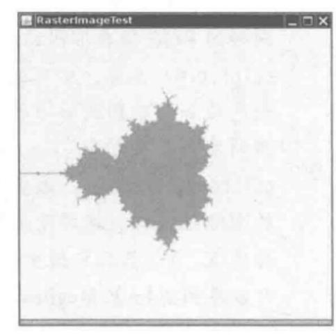

图 11-56 Mandelbrot 集

应的像素才会被着色。(该数字序列的计算公式基本上是从复杂的数学概念中推导出来的。我 们只使用现成的公式。)

程序清单 11-21 显示了该代码。在此程序中, 我们展示了如何使用 ColorModel 类将 Color 值转换成像素数据。这个过程和图像的类型是不相关的。为了增加些趣味、你可以把 缓冲图像的颜色类型改变为 TYPE BYTE GRAY。不必改变程序中的任何代码,该图像的颜色模 型会自动地负责把颜色转换为样本值。

## 程序清单 11-21 rasterImage/RasterImageFrame.java

```
package rasterImage;
3 import java.awt.*;
4 import java.awt.image.*;
5 import javax.swing.*;
7 /**
```

```
* This frame shows an image with a Mandelbrot set.
    */
9
  public class RasterImageFrame extends JFrame
10
11
      private static final double XMIN = -2;
12
      private static final double XMAX = 2;
13
      private static final double YMIN = -2;
14
      private static final double YMAX = 2;
15
      private static final int MAX ITERATIONS = 16;
16
      private static final int IMAGE WIDTH = 400;
17
      private static final int IMAGE HEIGHT = 400;
18
19
      public RasterImageFrame()
28
21
      {
          BufferedImage image = makeMandelbrot(IMAGE WIDTH, IMAGE HEIGHT);
22
          add(new JLabel(new ImageIcon(image)));
23
24
          pack();
25
      }
26
27
       * Makes the Mandelbrot image.
28
       * @param width the width
29
       * @parah height the height
38
       * @return the image
31
32
33
      public BufferedImage makeMandelbrot(int width, int height)
34
          var image = new BufferedImage(width, height, BufferedImage.TYPE INT ARGB);
35
          WritableRaster raster = image.getRaster();
36
          ColorModel model = image.getColorModel();
37
38
          Color fractalColor = Color.RED;
39
          int argb = fractalColor.getRGB();
48
          Object colorData = model.getDataElements(argb, null);
41
42
          for (int i = 0; i < width; i++)
43
             for (int j = 0; j < height; j++)
44
             {
45
                double a = XMIN + i * (XMAX - XMIN) / width;
46
                double b = YMIN + j * (YMAX - YMIN) / height;
47
                if (!escapesToInfinity(a, b)) raster.setDataElements(i, j, colorData);
48
49
50
          return image;
51
52
       private boolean escapesToInfinity(double a, double b)
53
54
          double x = 0.0;
55
          double y = 0.0;
56
57
          int iterations = \theta;
          while (x <= 2 && y <= 2 && iterations < MAX ITERATIONS)
58
59
             double xnew = x * x - y * y + a;
60
             double ynew = 2 * x * y + b;
61
             x = xnew;
62
```

```
63
```

## API java.awt.image.BufferedImage

BufferedImage(int width, int height, int imageType)

构建一个被缓存的图像对象。

参数: width, height 图像的尺寸

imageType 图像的类型,最常用的类型是TYPE\_INT\_RGB、TYPE\_INT\_ARGB、TYPE\_BYTE\_GRAY和TYPE\_BYTE\_INDEXED

- ColorModel getColorModel()
   返回被缓存图像的颜色模型。
- WritableRaster getRaster()
   获得访问和修改该缓存图像的像素栅格。

#### API java.awt.image.Raster 1.2

- Object getDataElements(int x, int y, Object data)
   返回某个栅格点的样本数据,该数据位于一个数组中,而该数组的长度和类型依赖于颜色模型。如果 data 不为 null,那么它将被视为是适合于存放样本数据的数组,从而被充填。如果 data 为 null,那么将分配一个新的数组,其元素的类型和长度依赖于颜色模型。
- int[] getPixel(int x, int y, int[] sampleValues)
- float[] getPixel(int x, int y, float[] sampleValues)
- double[] getPixel(int x, int y, double[] sampleValues)
- int[] getPixels(int x, int y, int width, int height, int[] sampleValues)
- float[] getPixels(int x, int y, int width, int height, float[] sampleValues)
- double[] getPixels(int x, int y, int width, int height, double[] sampleValues)
   返回某个栅格点或者是由栅格点组成的某个矩形的样本值,该数据位于一个数组中,数组的长度依赖于颜色模型。如果 sampleValues 不为 null,那么该数组被视为长度足够存放样本值,从而该数组被填充。如果 sampleValues 为 null,就要分配一个新数组。仅当你知道某一颜色模型的样本值的具体含义的时候,这些方法才会有用。

## API java.awt.image.WritableRaster 1.2

void setDataElements(int x, int y, Object data)
 设置栅格点的样本数据。data 是一个已经填入了某一像素样本值的数组。数组元素的

类型和长度依赖于颜色模型。

- void setPixel(int x, int y, int[] sampleValues)
- void setPixel(int x, int y, float[] sampleValues)
- void setPixel(int x, int y, double[] sampleValues)
- void setPixels(int x, int y, int width, int height, int[] sampleValues)
- void setPixels(int x, int y, int width, int height, float[] sampleValues)
- void setPixels(int x, int y, int width, int height, double[] sampleValues)
   设置某个栅格点或由多个栅格点组成的矩形的样本值。只有当你知道颜色模型样本值的编码规则时,这些方法才会有用。

## papa java.awt.image.ColorModel

- int getRGB(Object data)
   返回对应于 data 数组中传递的样本数据的 ARGB 值。其元素的类型和长度依赖于颜色模型。
- Object getDataElements(int argb, Object data)
   返回某个颜色值的样本数据。如果 data 不为 null,那么该数组被视为非常适合于存放样本值,进而该数组被填充。如果 data 为 null,那么将分配一个新的数组。data 是一个填充了用于某个像素的样本数据的数组,其元素的类型和长度依赖于该颜色模型。

## API java.awt.Color 1.0

- Color(int argb, boolean hasAlpha) 1.2
   如果 hasAlpha 的值是 true,则用指定的 ARGB 组合值创建一种颜色。如果 hasAlpha 的值是 false,则用指定的 RGB 值创建一种颜色。
- int getRGB()
   返回和该颜色相对应的 ARGB 颜色值。

#### 11.4.2.2 图像过滤

在前面的章节中,我们介绍了从头开始构建图像的方法。然而,你常常是因为另一个原因去访问图像数据的:你已经拥有了一个图像,并且想从某些方面对图像进行改进。

当然,可以使用前一节中的 getPixel/getDataElements 方法来读取和处理图像数据,然后把图像数据写回到文件中。不过,幸运的是, Java 2D API 已经提供了许多过滤器,它们能够执行常用的图像处理操作。

图像处理都实现了BufferedImageOp接口。构建了图像处理的操作之后,只需调用filter方法,就可以把该图像转换成另一个图像。

BufferedImageOp op = . . .;
BufferedImage filteredImage

有些图像操作可以就地 (例如 op. filter(image, image)) 转换一个图像, 但是大多数的图

像操作都做不到这一点。

以下五个类实现了 Buffered ImageOp 接口。

AffineTransformOp RescaleOp LookupOp ColorConvertOp ConvolveOp

AffineTransform0p类用于对各个像素执行仿射变换。例如,下面的代码就说明了如何使一个图像围绕着它的中心旋转。

```
AffineTransform transform = AffineTransform.getRotateInstance(Math.toRadians(angle),
   image.getWidth() / 2, image.getHeight() / 2);
var op = new AffineTransformOp(transform, interpolation);
op.filter(image, filteredImage);
```

AffineTransformOp 构造器需要一个仿射变换和一个渐变变换策略。如果源像素在目标像素之间的某处会发生变换的话,那么就必须使用渐变变换策略来确定目标图像的像素。例如,如果旋转源像素,那么通常它们不会精确地落在目标像素上。有两种渐变变换策略: Affine-TransformOp.TYPE\_BILINEAR 和 AffineTransformOp.TYPE\_NEAREST\_NEIGHBOR。双线性(Bilinear)渐变变换需要的时间较长,但是变换的效果却更好。

使用程序清单 11-22 的程序,可以把一个图像旋转 5° (参见图 11-57)。

RescaleOp 用于为图像中的所有的颜色构件执行一个调整其大小的变换操作(透明度构件不受影响):

$$x_{\text{new}} = a \cdot x + b$$

用 a>1 进行调整,那么调整后的效果是使图像变亮。可以通过设定调整大小的参数和可选的绘图提示来构建 RescaleOp。在程序清单 11-22 中,我们使用下面的设置:

```
float a = 1.1f;
float b = 20.0f;
var op = new RescaleOp(a, b, null);
```

也可以为每个颜色构件提供单独的缩放值,参见 API 说明。使用 Lookup0p 操作,可以为样本值设定任意的映射方式。

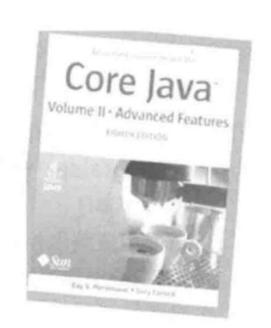

图 11-57 一个旋转的图像

你可以提供一张表格,用于设定每一个样本值应该如何进行映射。在示例程序中,我们计算了所有颜色的反,即将颜色 c 变成 255-c。

LookupOp 构造器需要一个类型是 LookupTable 的对象和一个选项提示映射表。LookupTable 是抽象类,其有两个实体子类: ByteLookupTable 和 ShortLookupTable。因为 RGB 颜色值是由字节组成的,所以 ByteLookupTable 类应该就够用了。但是,考虑到在 http://bugs.sun.com/bugdatabase/view\_bug.do?bug\_id=6183251 中描述的缺陷,我们将使用 ShortLookupTable。下面的代码说明了我们在程序清单中是如何构建一个 LookupOp 类的:

```
var negative = new short[256];
for (int i = 0; i < 256; i++) negative[i] = (short) (255 - i);
```

var table = new ShortLookupTable(0, negative); var op = new LookupOp(table, null);

此项操作可以分别应用于每个颜色构件,但是不能应用于透明度值。也可以为每个颜色构件提供单独的查找表,参见 API 说明。

這程:不能将 LookupOp 用于带有索引颜色模型的图像。(在这些图像中,每个样本值都是调色板中的一个偏移量。)

ColorConvertOp 对于颜色空间的转换非常有用。我们不准备在这里讨论这个问题了。

ConvolveOp 是功能最强大的转换操作,它用于执行卷积变换。我们不想过分深入地介绍 卷积变换的详尽细节。不过,其基本概念还是比较简单的。我们不妨看一下模糊过滤器的例 子(见图 11-58)。

这种模糊的效果是通过用像素和该像素临近的8个像素的平均值来取代每一个像素值而 达到的。凭借直观感觉,就可以知道为什么这种变换操作能使得图像变模糊了。从数学理论 上来说,这种平均法可以表示为一个以下面这个矩阵为内核的卷积变换操作:

卷积变换操作的卷积核是一个矩阵,用以说明在临近的像素点上应用的权重。应用上面的卷积核进行卷积变换,就会产生一个模糊图像。下面这个不同的卷积核用以进行图像的边缘检测,查找图像颜色变化的区域:

$$\begin{bmatrix} 0 & -1 & 0 \\ -1 & 4 & -1 \\ 0 & -1 & 0 \end{bmatrix}$$

边缘检测是在分析摄影图片时使用的一项非常重要的技术(参见图 11-59)。

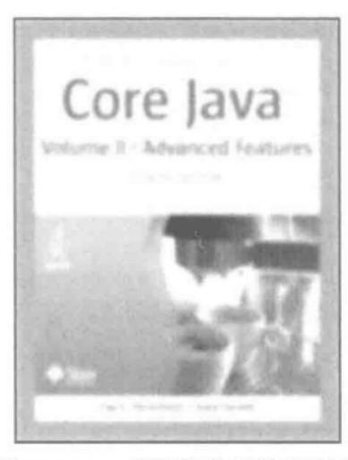

图 11-58 对图像进行模糊处理

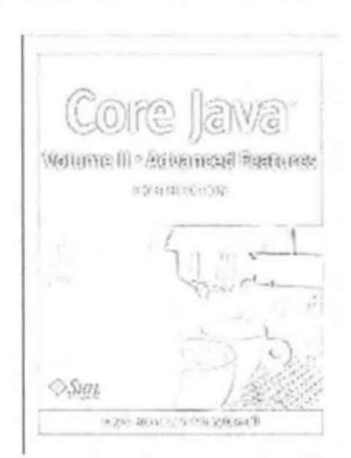

图 11-59 边缘检测

如果要构建一个卷积变换操作,首先应设置一个包含卷积核各个值的数组,并且构建一

个 Kernel 对象。接着,根据卷积核构建一个 ConvolveOp 对象,进而执行过滤操作。

```
float[] elements =
      {
          0.0f, -1.0f, 0.0f,
          -1.0f, 4.f, -1.0f,
          0.0f, -1.0f, 0.0f
      };
var kernel = new Kernel(3, 3, elements);
var op = new ConvolveOp(kernel);
op.filter(image, filteredImage);
```

使用程序清单 11-22 的程序,用户可以装载一个 GIF 或者 JPEG 图像,并且执行我们已 经介绍过的各种图像处理的操作。由于 Java 2D API 的图像处理的功能很强大,下面的程序 非常简单。

#### 程序清单 11-22 imageProcessing/ImageProcessingFrame.java

```
package imageProcessing;
3 import java.awt.*;
4 import java.awt.geom.*;
5 import java.awt.image.*;
6 import java.io.*;
8 import javax.imageio.*;
9 import javax.swing.*;
import javax.swing.filechooser.*;
11
12 /**
   * This frame has a menu to load an image and to specify various transformations, and a
   * component to show the resulting image.
14
15
16 public class ImageProcessingFrame extends JFrame
17 {
      private static final int DEFAULT WIDTH = 400;
18
      private static final int DEFAULT HEIGHT = 400;
19
28
      private BufferedImage image;
21
22
      public ImageProcessingFrame()
23
24
         setTitle("ImageProcessingTest");
75
         setSize(DEFAULT WIDTH, DEFAULT HEIGHT);
26
27
         add(new JComponent()
28
29
               public void paintComponent(Graphics q)
30
31
                   if (image != null) g.drawImage(image, 0, 0, null);
37
33
            });
34
35
         var fileMenu = new JMenu("File");
36
         var openItem = new JMenuItem("Open");
37
```

```
openItem.addActionListener(event -> openFile());
38
39
         fileMenu.add(openItem);
         var exitItem = new JMenuItem("Exit");
41
         exitItem.addActionListener(event -> System.exit(θ));
42
         fileMenu.add(exitItem);
43
44
         var editMenu = new JMenu("Edit");
45
         var blurItem = new JMenuItem("Blur");
46
47
         blurItem.addActionListener(event ->
4R
                float weight = 1.0f / 9.0f;
49
                float[] elements = new float[9];
                for (int i = 0; i < 9; i++)
51
                   elements[i] = weight;
52
                convolve(elements);
53
            1);
54
         editMenu.add(blurItem);
55
56
         var sharpenItem = new JMenuItem("Sharpen");
57
         sharpenItem.addActionListener(event ->
58
59
                float[] elements = { 0.0f, -1.0f, 0.0f, -1.0f, 5.f, -1.0f, 0.0f, -1.0f, 0.0f };
68
                convolve(elements):
61
             });
62
         editMenu.add(sharpenItem);
63
54
         var brightenItem = new JMenuItem("Brighten");
65
         brightenItem.addActionListener(event ->
66
67
                float a = 1.1f;
68
                float b = 20.0f:
69
                var op = new RescaleOp(a, b, null);
78
                filter(op);
71
72
             1):
         editMenu.add(brightenItem);
73
74
         var edgeDetectItem = new JMenuItem("Edge detect");
75
         edgeDetectItem.addActionListener(event ->
76
             {
77
                float[] elements = { 0.0f, -1.0f, 0.0f, -1.0f, 4.f, -1.0f, 0.0f, -1.0f, 0.0f };
78
                convolve(elements);
79
             1):
88
81
         editMenu.add(edgeDetectItem);
82
         var negativeItem = new JMenuItem("Negative");
83
         negativeItem.addActionListener(event ->
84
             {
85
                short[] negative = new short[256 * 1];
86
                for (int i = 0; i < 256; i++)
87
                   negative[i] = (short) (255 - i);
88
                var table = new ShortLookupTable(0, negative);
89
                var op = new LookupOp(table, null);
QA
                filter(op);
91
92
             1):
```

```
editMenu.add(negativeItem);
93
94
         var rotateItem = new JMenuItem("Rotate");
95
         rotateItem.addActionListener(event ->
96
97
                if (image == null) return;
98
                var transform = AffineTransform.getRotateInstance(Math.toRadians(5),
99
                      image.getWidth() / 2, image.getHeight() / 2);
188
                var op = new AffineTransformOp(transform,
101
                      AffineTransformOp.TYPE BICUBIC);
102
103
                filter(op);
             });
184
         editMenu.add(rotateItem);
105
106
         var menuBar = new JMenuBar();
107
         menuBar.add(fileMenu);
108
         menuBar.add(editMenu);
109
         setJMenuBar(menuBar);
118
111
112
      /**
113
       * Open a file and load the image.
114
115
      public void openFile()
116
117
         var chooser = new JFileChooser(".");
118
          chooser.setCurrentDirectory(new File(getClass().getPackage().getName()));
119
         String[] extensions = ImageIO.getReaderFileSuffixes();
120
         chooser.setFileFilter(new FileNameExtensionFilter("Image files", extensions));
121
         int r = chooser.showOpenDialog(this);
122
         if (r != JFileChooser.APPROVE OPTION) return;
123
124
         try
125
126
             Image img = ImageIO.read(chooser.getSelectedFile());
127
             image = new BufferedImage(img.getWidth(null), img.getHeight(null),
128
                   BufferedImage.TYPE INT RGB);
129
138
             image.getGraphics().drawImage(img, 0, 0, null);
131
          catch (IOException e)
132
133
134
             JOptionPane.showMessageDialog(this, e);
135
136
          repaint();
      }
137
138
139
       * Apply a filter and repaint.
        * @param op the image operation to apply
141
       */
142
      private void filter(BufferedImageOp op)
143
144
          if (image == null) return;
145
          image = op.filter(image, null);
146
          repaint();
147
```

```
148
      }
149
150
       * Apply a convolution and repaint.
151
       * @param elements the convolution kernel (an array of 9 matrix elements)
153
      private void convolve(float[] elements)
154
155
         var kernel = new Kernel(3, 3, elements);
156
         var op = new ConvolveOp(kernel);
157
         filter(op);
158
      }
159
160 }
```

#### API java.awt.image.BufferedImageOp

 BufferedImage filter(BufferedImage source, BufferedImage dest)
 将图像操作应用于源图像,并且将操作的结果存放在目标图像中。如果 dest 为 null, 一个新的目标图像将被创建。该目标图像将被返回。

#### API java.awt.image.AffineTransformOp

● AffineTransformOp(AffineTransform t, int interpolationType)
构建一个仿射变换操作符。渐变变换的类型是 TYPE\_BILINEAR、TYPE\_BICUBIC 或者 TYPE NEAREST NEIGHBOR 中的一个。

## API java.awt.image.RescaleOp 1.2

- RescaleOp(float a, float b, RenderingHints hints)
- RescaleOp(float[] as, float[] bs, RenderingHints hints)
   构建一个进行尺寸调整的操作符,它会执行缩放操作 x<sub>new</sub> = a · x + b。当使用第一个构造器时,所有的颜色构件(但不包括透明度构件)都将按照相同的系数进行缩放。当使用第二个构造器时,可以为每个颜色构件提供单独的值,在这种情况下,透明度构件不受影响,或者为每个颜色构件和透明度构件都提供单独的值。

## API java.awt.image.LookupOp

LookupOp(LookupTable table, RenderingHints hints)
 为给定的查找表构建一个查找操作符。

## API java.awt.image.ByteLookupTable

- ByteLookupTable(int offset, byte[] data)
- ByteLookupTable(int offset, byte[][] data)
   为转化 byte 值构建一个字节查找表。在查找之前,从输入中减去偏移量。在第一个构造器中的值将提供给所有的颜色构件,但不包括透明度构件。当使用第二个构造器时,可以为每个颜色构件提供单独的值,在这种情况下,透明度构件不受影响,或者

为每个颜色构件和透明度构件都提供单独的值。

## API java.awt.image.ShortLookupTable

- ShortLookupTable(int offset, short[] data)
- ShortLookupTable(int offset, short[][] data)
  为转化 short 值构建一个字节查找表。在查找之前,从输入中减去偏移量。在第一个构造器中的值将提供给所有的颜色构件,但不包括透明度构件。当使用第二个构造器时,可以为每个颜色构件提供单独的值,在这种情况下,透明度构件不受影响,或者为每个颜色构件和透明度构件都提供单独的值。

## API java.awt.image.ConvolveOp

- ConvolveOp(Kernel kernel)
- ConvolveOp(Kernel kernel, int edgeCondition, RenderingHints hints)
   构建一个卷积变换操作符。边界条件是 EDGE\_NO\_OP 和 EDGE\_ZERO\_FILL 两种方式之一。由于边界值没有足够的临近值来进行卷积变换的计算,所以边界值必须被特殊处理,其默认值是 EDGE\_ZERO\_FILL。

#### API java.awt.image.Kernel 12

Kernel(int width, int height, float[] matrixElements)
 用指定的矩阵构建一个卷积核。

## 11.5 打印

在本节中,我们将介绍如何在单页纸上轻松地打印出一幅图画,如何来管理多页打印输出,以及如何将打印内容存储为 PostScript 文件。

## 11.5.1 图形打印

在本节中,我们将处理最常用的打印情景,即打印一个 2D 图形,当然该图形可以含有不同字体组成的文本,甚至可能完全由文本构成。

如果要生成打印输出,必须完成下面这两个任务:

- 提供一个实现了 Printable 接口的对象。
- 启动一个打印作业。

Printable 接口只有下面一个方法:

int print(Graphics g, PageFormat format, int page)

每当打印引擎需要对某一页面进行排版以便打印时,都要调用这个方法。你的代码绘制了准备在图形上下文上打印的文本和图像,页面排版显示了纸张的大小和页边距,页号显示了将要打印的页。

如果要启动一个打印作业,需要使用 PrinterJob 类。首先,应该调用静态方法 get-PrinterJob 来获取一个打印作业对象。然后,设置要打印的 Printable 对象。

```
Printable canvas = . . .;
PrinterJob job = PrinterJob.getPrinterJob();
job.setPrintable(canvas);
```

● 警告: PrintJob 这个类处理的是 JDK1.1 风格的打印操作,这个类已经被弃用了。请不要把 PrinterJob 类同其混淆在一起。

在开始打印作业之前,应该调用 printDialog 方法来显示一个打印对话框(见图 11-60)。

这个对话框为用户提供了机会去选择要使用的 打印机(在有多个打印机可用的情况下),选择 将要打印的页的范围,以及选择打印机的各种 设置。

可以在一个实现了PrintRequestAttributeSet 接口的类的对象中收集到各种打印机的设置, 例如 HashPrintRequestAttributeSet 类:

var attributes = new HashPrintRequestAttributeSet();

你可以添加属性设置,并且把 attributes 对象传递给 printDialog 方法。

如果用户点击OK,那么printDialog方法将返回true;如果用户关掉对话框,那么该

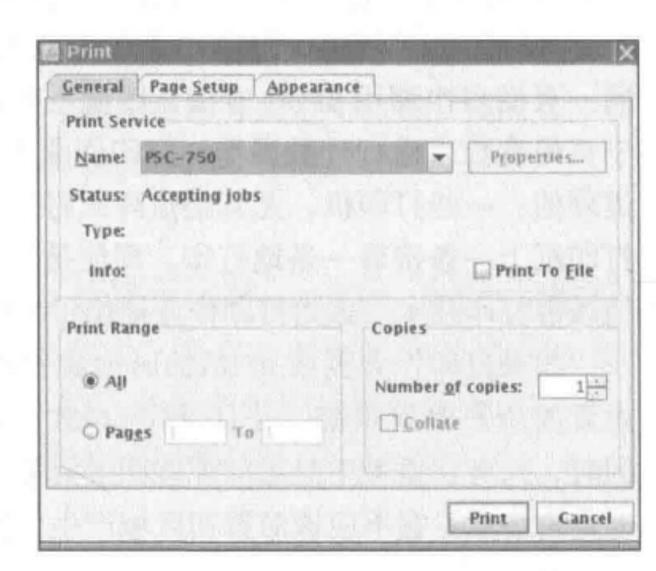

图 11-60 一个跨平台的打印对话框

方法将返回 false。如果用户接受了设置,那么就可以调用 PrinterJob 类的 print 方法来启动打印进程。print 方法可能会抛出一个 PrinterException 异常。下面是打印代码的基本框架:

```
if (job.printDialog(attributes))
{
    try
    {
        job.print(attributes);
    }
    catch (PrinterException e)
    {
        . . .
    }
}
```

直 注释:在JDK1.4之前,打印系统使用的都是宿主平台本地的打印和页面设置对话框。要展示本地打印对话框,可以调用没有任何参数的 printDialog 方法。(不存在任何方式可以用来将用户的设置收集到一个属性集中。)

在执行打印操作时, PrinterJob类的 print 方法不断地调用和此项打印作业相关的

Printable 对象的 print 方法。

由于打印作业不知道用户想要打印的页数,所以它只是不断地调用 print 方法。只要该 print 方法的返回值是 Printable. PAGE\_EXISTS,打印作业就不断地产生输出页。当 print 方法 返回 Pringtable. NO\_SUCH\_PAGE 时,打印作业就停止。

● 警告: 打印作业传递到 print 方法的打印页号是从 0 开始的。

因此,在打印操作完成之前,打印作业并不知道准确的打印页数。为此,打印对话框无法显示正确的页码范围,而只能显示"Pages 1 to 1"(从第一页到第一页)。在下一节中,我们将介绍如何通过为打印作业提供一个 Book 对象来避免这个缺陷。

在打印的过程中,打印作业反复地调用 Printable 对象的 print 方法。打印作业可以对同一页面多次调用 print 方法,因此不应该在 print 方法内对页进行计数,而是应始终依赖于页码参数来进行计数操作。打印作业之所以能够对某一页反复地调用 print 方法是有一定道理的:一些打印机,尤其是点阵式打印机和喷墨式打印机,都使用条带打印技术,它们在打印纸上一条接着一条地打印。即使是每次打印一整页的激光打印机,打印作业都有可能使用条带打印技术。这为打印作业提供了一种对假脱机文件的大小进行管理的方法。

如果打印作业需要 printable 对象打印一个条带,那么它可以将图形上下文的剪切区域设置为所需要的条带,并且调用 print 方法。它的绘图操作将按照条带矩形区域进行剪切,同时,只有在条带中显示的那些图形元素才会被绘制出来。你的 print 方法不必晓得该过程,但是请注意:它不应该对剪切区域产生任何干扰。

● 警告: 你的 print 方法获得的 Graphics 对象也是按照页边距进行剪切的。如果替换了剪切区域,那么就可以在边距外面进行绘图操作。尤其是在打印机的绘图上下文中,剪切区域是被严格遵守的。如果想进一步地限制剪切区域,可以调用 clip 方法,而不是 setClip 方法。如果必须要移除一个剪切区域,那么请务必在你的 print 方法开始处调用 getClip 方法,并还原该剪切区域。

print 方法的 PageFormat 参数包含有关被打印页的信息。getWidth 方法和 getHeight 方法返回该纸张的大小,它以磅为计量单位。1 磅等于 1/72 英寸 $^{\odot}$ 。例如,A4 纸的大小大约是  $595 \times 842$  磅,美国人使用的信纸大小为  $612 \times 792$  磅。

磅是美国印刷业中通用的计量单位,让世界上其他地方的人感到苦恼的是,打印软件包使用的是磅这种计量单位。使用磅有两个原因,即纸张的大小和纸张的页边距都是用磅来计量的。对所有的图形上下文来说,默认的计量单位就是1磅。你可以在本节后面的示例程序中证明这一点。该程序打印了两行文本,这两行文本之间的距离为72磅。运行一下示例程序,并且测量一下基准线之间的距离。它们之间的距离恰好是1英寸或是25.4毫米。

PageFormat 类的 getWidth 和 getHeight 方法给你的信息是完整的页面大小,但并不是所

<sup>○ 1</sup>英寸=0.0254米。——编辑注

*有 张区域 会 来打印。 常 情况是 户会 择 即使他们没有 择页边 打印机也 某 方法来夹住 张 因此在 张 周围就出 了一个不 打印 区域。*

*getlmageableWidth和getlmageableHeight方法可以告 你 够 正 来打印 区域 大 小。然 没有必 是对 所以 必 可打印区域 左上 图11-61, 它们可以 getlmageableX和getlmageableY方法来 得。*

*提 在print方法中接收到 图形上下文是 剪切后 图形上下文 它不包括 边距。但是 坐标 原点仍然是 张 左上 。应 将 坐标系统转换成可打印 区域 左上 并以其为 点。 只 print方法以下 代 开始即可*

*<sup>g</sup>.translate(pageFomat.getImageableX(), pageFormat.getlniageableY());*

*如果想 户来 定 或 户在 向和横向打印方式之 切换 同时并不涉 及 其他打印属性 么就应 Printerjob pageDialog方法。*

*PageFomat format <sup>=</sup> job.pageDialog(attributes);*

*H <sup>注</sup> 打印对 框中有一个 卡包含了 <sup>对</sup> 框(参 <sup>图</sup>11-62)。在打 印前 你仍然可以为 户提供 来 格式。 别是 如果你 序 出 了一个待打印 "所 即所得" 显 屏幕 么就更应 提供 样 。 pageDialog方法 回了一个含有 户 PageFormat对 。*

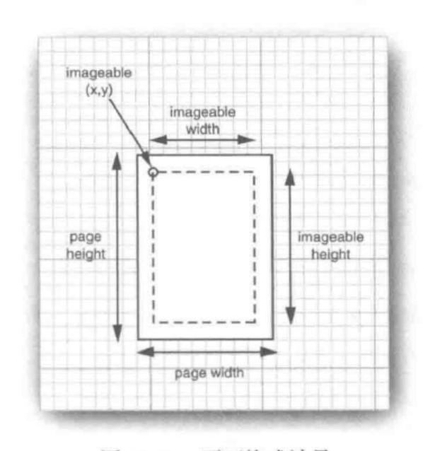

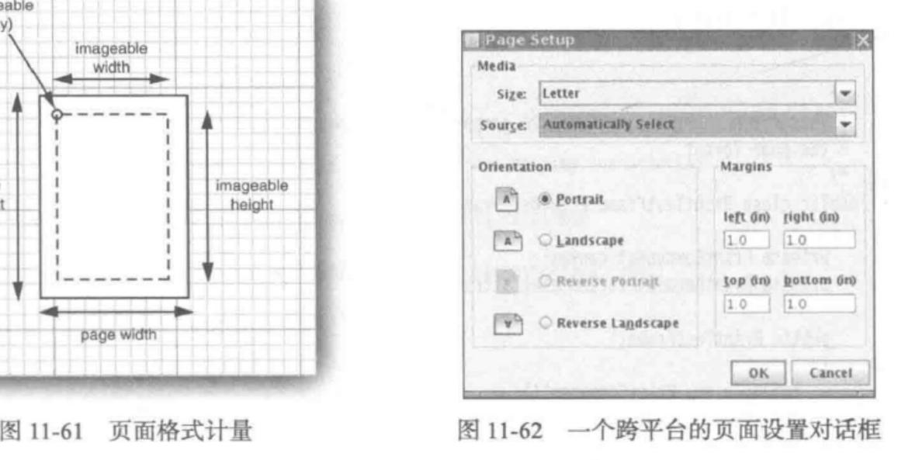

*序清单11-23和 序清单11-24显 了如何在屏幕和打印 上 制 同 一 形 方法。Jpanel类的一个子 实 了 Printable接口 该类中 paintComponent和print<sup>方</sup> 法 了 同 方法来执 实 图操作。*

*class PrintPanel extends JPanel implements Printable*

```
public void paintComponent(Graphics g)
{
    super.paintComponent(g);
    var g2 = (Graphics2D) g;
    drawPage(g2);
}
public int print(Graphics g, PageFormat pf, int page) throws PrinterException
{
    if (page >= 1) return Printable.NO_SUCH_PAGE;
    var g2 = (Graphics2D) g;
    g2.translate(pf.getImageableX(), pf.getImageableY());
    drawPage(g2);
    return Printable.PAGE_EXISTS;
}

public void drawPage(Graphics2D g2)
{
    // shared drawing code goes here
    . . .
}
. . .
}
```

#### 程序清单 11-23 print/PrintTestFrame.java

```
package print;
2
3 import java.awt.*;
4 import java.awt.print.*;
6 import javax.print.attribute.*;
7 import javax.swing.*;
8
    * This frame shows a panel with 2D graphics and buttons to print the graphics and to set up
    * the page format.
11
12
  public class PrintTestFrame extends JFrame
13
14
  {
      private PrintComponent canvas;
15
      private PrintRequestAttributeSet attributes;
16
17
      public PrintTestFrame()
18
19
         canvas = new PrintComponent();
20
         add(canvas, BorderLayout.CENTER);
21
22
         attributes = new HashPrintRequestAttributeSet();
23
         var buttonPanel = new JPanel();
25
         var printButton = new JButton("Print");
26
         buttonPanel.add(printButton);
27
         printButton.addActionListener(event ->
28
29
               try
38
```

```
{
31
                   PrinterJob job = PrinterJob.getPrinterJob();
32
33
                   job.setPrintable(canvas);
                   if (job.printDialog(attributes)) job.print(attributes);
34
35
                catch (PrinterException e)
36
37
                   JOptionPane.showMessageDialog(PrintTestFrame.this, e);
38
39
            });
48
41
         var pageSetupButton = new JButton("Page setup");
42
         buttonPanel.add(pageSetupButton);
43
         pageSetupButton.addActionListener(event ->
44
45
                PrinterJob job = PrinterJob.getPrinterJob();
46
                job.pageDialog(attributes);
47
48
             });
49
          add(buttonPanel, BorderLayout.NORTH);
50
          pack();
51
      }
52
   }
53
```

#### 程序清单 11-24 print/PrintComponent.java

```
package print;
2
3 import java.awt.*;
4 import java.awt.font.*;
5 import java.awt.geom.*;
   import java.awt.print.*;
   import javax.swing.*;
8
   /**
9
    * This component generates a 2D graphics image for screen display and printing.
10
11
   public class PrintComponent extends JComponent implements Printable
12
   {
13
14
      private static final Dimension PREFERRED SIZE = new Dimension(300, 300);
15
      public void paintComponent(Graphics g)
16
17
         var g2 = (Graphics2D) g;
18
         drawPage(g2);
19
20
21
      public int print(Graphics g, PageFormat pf, int page) throws PrinterException
22
23
         if (page >= 1) return Printable.NO SUCH PAGE;
24
25
         var g2 = (Graphics2D) g;
         g2.translate(pf.getImageableX(), pf.getImageableY());
26
         g2.draw(new Rectangle2D.Double(0, 0, pf.getImageableWidth(), pf.getImageableHeight()));
27
28
```

```
drawPage(g2);
29
         return Printable.PAGE EXISTS;
30
      }
31
32
33
       * This method draws the page both on the screen and the printer graphics context.
34
       * @param g2 the graphics context
35
36
      public void drawPage(Graphics2D g2)
37
38
         FontRenderContext context = q2.getFontRenderContext();
39
         var f = new Font("Serif", Font.PLAIN, 72);
40
         var clipShape = new GeneralPath();
41
47
43
         var layout = new TextLayout("Hello", f, context);
         AffineTransform transform = AffineTransform.getTranslateInstance(0, 72);
44
         Shape outline = layout.getOutline(transform);
45
         clipShape.append(outline, false);
46
47
         layout = new TextLayout("World", f, context);
48
49
         transform = AffineTransform.getTranslateInstance(0, 144);
         outline = layout.getOutline(transform);
50
         clipShape.append(outline, false);
51
         g2.draw(clipShape);
53
         g2.clip(clipShape);
54
         final int NLINES = 50;
56
         var p = new Point2D.Double(0, 0);
57
         for (int i = \theta; i < NLINES; i++)
59
             double x = (2 * getWidth() * i) / NLINES;
60
             double y = (2 * getHeight() * (NLINES - 1 - i)) / NLINES;
61
             var q = new Point2D.Double(x, y);
62
             q2.draw(new Line2D.Double(p, q));
63
64
         }
65
      public Dimension getPreferredSize() { return PREFERRED SIZE; }
67
68 }
```

该示例代码显示并且打印了图 11-50,即被用作线条模式的剪切区域的消息"Hello,World"的边框。

可以点击 Print 按钮来启动打印,或者点击页面设置按钮来打开页面设置对话框。程序清单 11-23 显示了它的代码。

直注释: 为了显示本地页面设置对话框,需要将默认的 PageFormat 对象传递给 pageDialog 方法。该方法会克隆这个对象,并根据用户在对话框中的选择来修改它, 然后返回这个克隆的对象。

## API java.awt.print.Printable 1.2

int print(Graphics g, PageFormat format, int pageNumber)
 绘制一个页面,并且返回 PAGE EXISTS,或者返回 NO SUCH PAGE。

参数: q

在上面绘制页面的图形上下文

format

要绘制的页面的格式

pageNumber 所请求页面的页码

#### API java.awt.print.PrinterJob 12

- static PrinterJob getPrinterJob()
   返回一个打印机作业对象。
- PageFormat defaultPage()
   为该打印机返回默认的页面格式。
- boolean printDialog(PrintRequestAttributeSet attributes)
- boolean printDialog()

打开打印对话框,允许用户选择将要打印的页面,并且改变打印设置。第一个方法将显示一个跨平台的打印对话框,第二个方法将显示一个本地的打印对话框。第一个方法修改了 attributes 对象来反映用户的设置。如果用户接受默认的设置,两种方法都返回 true。

- PageFormat pageDialog(PrintRequestAttributeSet attributes)
- PageFormat pageDialog(PageFormat defaults)

显示页面设置对话框。第一个方法将显示一个跨平台的对话框,第二个方法将显示一个本地的页面设置对话框。两种方法都返回了一个 PageFormat 对象,对象的格式是用户在对话框中所请求的格式。第一个方法修改了 attributes 对象以反映用户的设置。第二个对象不修改 defaults 对象。

- void setPrintable(Printable p)
- void setPrintable(Printable p, PageFormat format)
   设置该打印作业的 Printable 和可选的页面格式。
- void print()
- void print(PrintRequestAttributeSet attributes)
   反复地调用 print 方法,以打印当前的 Printable,并将绘制的页面发送给打印机,直到没有更多的页面需要打印为止。

## API java.awt.print.PageFormat

- double getWidth()
- double getHeight()返回页面的宽度和高度。

- double getImageableWidth()
- double getImageableHeight()
   返回可打印区域的页面宽度和高度。
- double getImageableX()
- double getImageableY()
   返回可打印区域的左上角的位置。
- int getOrientation()

返回 PORTARIT、LANDSCAPE 和 REVERSE\_LANDSCAPE 三者之一。页面打印的方向对程序员来说是透明的,因为打印格式和图形上下文自动地反映了页面的打印方向。

#### 11.5.2 打印多页文件

在实际的打印操作中,通常不应该将原生的 Printable 对象传递给打印作业。相反,应该获取一个实现了 Pageable 接口的类的对象。Java 平台提供了这样的一个被称为 Book 的类。一本书是由很多章节组成的,而每个章节都是一个 Printable 对象。可以通过添加 Printable 对象和相应的页数来构建一个 Book 对象。

```
var book = new Book();
Printable coverPage = . . .;
Printable bodyPages = . . .;
book.append(coverPage, pageFormat); // append 1 page
book.append(bodyPages, pageFormat, pageCount);
```

然后,可以使用 setPageable 方法把 Book 对象传递给打印作业。

printJob.setPageable(book);

现在,打印作业就知道将要打印的确切页数了。然后,打印对话框显示一个准确的页面范围,用户可以选择整个页面范围或可选择它的一个子范围。

● 警告: 当打印作业调用 Printable 章节的 print 方法时,它传递的是该书的当前页码, 而不是每个章节的页码。这让人非常痛苦,因为每个章节必须知道它之前所有章节的 页数,这样才能使得页码参数有意义。

从程序员的视角来看,使用 Book 类最大的挑战就是,当你打印它时,必须知道每一个章节究竟有多少页。你的 Printable 类需要一个布局算法,以便用来计算在打印页面上的素材的布局。在打印开始前,要调用这个算法来计算出分页符的位置和页数。可以保留此布局信息,从而可以在打印的过程中方便地使用它。

必须警惕 "用户已经修改过页面格式"这种情况的发生。如果用户修改了页面格式,即 使是所打印的信息没有发生任何改变,也必须要重新计算布局。

程序清单 11-26 中显示了如何产生一个多页打印输出。该程序用很大的字符在多个页面上打印了一条消息(见图 11-63)。然后,可以剪裁掉页边缘,并将这些页面粘连起来,形成

## 一个标语。

Banner 类的 layoutPages 方法用以计算页面的布局。我们首先展示了一个字体为 72 磅的消息字符串。然后,我们计算产生的字符串的高度,并且将其与该页面的可打印高度进行比较。我们根据这两个高度值得出一个比例因子,当打印该字符串时,我们按照比例因子来放大此字符串。


图 11-63 一幅标语

● 警告:如果要准确地布局打印信息,通常需要访问打印机的图形上下文。遗憾的是, 只有当打印真正开始时,才能获得打印机的图形上下文。在我们的示例程序中使用的 是屏幕的图形上下文,并且希望屏幕的字体度量单位与打印机的相匹配。

Banner 类的 getPageCount 方法首先调用布局方法。然后,扩展字符串的宽度,并且将该宽度除以每一页的可打印宽度。得到的商向上取整,就是要打印的页数。

由于字符可以断开分布到多个页面上, 所以上面打印标语的操作好像会有困难。然而,

感谢 Java 2D API 提供的强大功能,这个问题现在不过是小菜一碟。当需要打印某一页时,我们只需要调用 Graphics2D 类的 translate 方法,将字符串的左上角向左平移。接着,设置一个大小是当前页面的剪切矩形(参见图 11-64)。最后,我们用布局方法计算出的比例因子来扩展该图形上下文。

这个例子显示了图形变换操作的强大功能。 绘图代码很简单,而图形变换操作负责执行将图 形放到恰当位置上的所有操作。最后,剪切操 作负责将落在页面外面的图像剪切掉。程序清


图 11-64 打印一个标语页面

单 11-27 和程序清单 11-28 展示了另一种必须使用变换操作的情况,即显示页面的打印预览。

## 程序清单 11-25 book/BookTestFrame.java

```
package book;
\nimport java.awt.*;\nimport java.awt.print.*;
\nimport javax.print.attribute.*;\nimport javax.swing.*;

/**

* This frame has a text field for the banner text and buttons for printing, page setup, and
print preview.

*/
```

```
13 public class BookTestFrame extends JFrame
   1
14
      private JTextField text;
15
      private PageFormat pageFormat;
16
      private PrintRequestAttributeSet attributes;
17
18
      public BookTestFrame()
19
20
21
         text = new JTextField();
         add(text, BorderLayout.NORTH);
22
23
         attributes = new HashPrintRequestAttributeSet();
24
25
         var buttonPanel = new JPanel();
26
27
         var printButton = new JButton("Print");
28
          buttonPanel.add(printButton);
29
         printButton.addActionListener(event ->
30
31
                try
37
33
                   PrinterJob job = PrinterJob.getPrinterJob();
34
                   job.setPageable(makeBook());
35
                   if (job.printDialog(attributes))
37
                      job.print(attributes);
38
39
49
                catch (PrinterException e)
41
47
                   JOptionPane.showMessageDialog(BookTestFrame.this, e);
43
             });
45
46
          var pageSetupButton = new JButton("Page setup");
          buttonPanel.add(pageSetupButton);
48
          pageSetupButton.addActionListener(event ->
49
             {
58
                PrinterJob job = PrinterJob.getPrinterJob();
51
                pageFormat = job.pageDialog(attributes);
52
             });
53
54
          var printPreviewButton = new JButton("Print preview");
55
          buttonPanel.add(printPreviewButton);
56
          printPreviewButton.addActionListener(event ->
57
             {
58
                var dialog = new PrintPreviewDialog(makeBook());
59
                dialog.setVisible(true);
68
             1);
61
62
          add(buttonPanel, BorderLayout.SOUTH);
63
64
          pack();
65
66
       /**
67
```

```
* Makes a book that contains a cover page and the pages for the banner.
68
       */
69
      public Book makeBook()
70
71
         if (pageFormat == null)
72
73
            PrinterJob job = PrinterJob.getPrinterJob();
74
            pageFormat = job.defaultPage();
75
76
         var book = new Book();
77
         String message = text.getText();
78
         var banner = new Banner(message);
79
         int pageCount = banner.getPageCount((Graphics2D) getGraphics(), pageFormat);
         book.append(new CoverPage(message + " (" + pageCount + " pages)"), pageFormat);
81
82
         book.append(banner, pageFormat, pageCount);
         return book;
83
      }
84
85
```

#### 程序清单 11-26 book/Banner.java

```
1 package book;
2
3 import java.awt.*;
4 import java.awt.font.*;
5 import java.awt.geom.*;
   import java.awt.print.*;
  /**
8
    * A banner that prints a text string on multiple pages.
9
18
   public class Banner implements Printable
11
12
      private String message;
13
      private double scale;
14
15
16
       * Constructs a banner.
17
       * @param m the message string
18
19
      public Banner(String m)
20
      {
21
         message = m;
22
23
24
25
       * Gets the page count of this section.
26
27
       * @param g2 the graphics context
       * @param pf the page format
28
       * @return the number of pages needed
29
30
      public int getPageCount(Graphics2D g2, PageFormat pf)
31
32
         if (message.equals("")) return 0;
33
```

```
FontRenderContext context = q2.getFontRenderContext();
34
         var f = new Font("Serif", Font.PLAIN, 72);
35
         Rectangle2D bounds = f.getStringBounds(message, context);
36
         scale = pf.getImageableHeight() / bounds.getHeight();
37
         double width = scale * bounds.getWidth();
38
         int pages = (int) Math.ceil(width / pf.getImageableWidth());
39
         return pages;
48
41
47
      public int print(Graphics g, PageFormat pf, int page) throws PrinterException
43
44
         var q2 = (Graphics2D) q;
45
         if (page > getPageCount(g2, pf)) return Printable.NO SUCH PAGE;
46
         g2.translate(pf.getImageableX(), pf.getImageableY());
47
48
         drawPage(g2, pf, page);
49
         return Printable.PAGE EXISTS;
50
      }
51
52
      public void drawPage(Graphics2D g2, PageFormat pf, int page)
53
      {
54
55
         if (message.equals("")) return;
         page --: // account for cover page
56
57
         drawCropMarks(g2, pf);
58
         q2.clip(new Rectangle2D.Double(θ, θ, pf.getImageableWidth(), pf.getImageableHeight()));
59
         q2.translate(-page * pf.getImageableWidth(), θ);
68
         q2.scale(scale, scale);
61
         FontRenderContext context = g2.getFontRenderContext();
62
         var f = new Font("Serif", Font.PLAIN, 72);
63
         var layout = new TextLayout(message, f, context);
64
         AffineTransform transform = AffineTransform.getTranslateInstance(0, layout.getAscent());
65
         Shape outline = layout.getOutline(transform);
66
         q2.draw(outline);
67
      }
68
69
70
        * Draws 1/2" crop marks in the corners of the page.
71
        * @param g2 the graphics context
72
        * @param pf the page format
73
74
      public void drawCropMarks(Graphics2D g2, PageFormat pf)
75
76
          final double C = 36; // crop mark length = 1/2 inch
77
          double w = pf.getImageableWidth();
78
          double h = pf.getImageableHeight();
79
          q2.draw(new Line2D.Double(0, 0, 0, C));
88
          g2.draw(new Line2D.Double(0, 0, C, 0));
81
82
          g2.draw(new Line2D.Double(w, 0, w, C));
          g2.draw(new Line2D.Double(w, 0, w - C, 0));
83
          g2.draw(new Line2D.Double(0, h, 0, h - C));
84
          g2.draw(new Line2D.Double(θ, h, C, h));
85
          g2.draw(new Line2D.Double(w, h, w, h - C));
86
          q2.draw(new Line2D.Double(w, h, w - C, h));
87
88
```

```
89
90
91
    * This class prints a cover page with a title.
92
93
   class CoverPage implements Printable
94
95
   {
      private String title;
96
97
98
       * Constructs a cover page.
99
       * @param t the title
188
181
      public CoverPage(String t)
102
183
184
         title = t;
185
196
      public int print(Graphics g, PageFormat pf, int page) throws PrinterException
107
188
         if (page >= 1) return Printable.NO SUCH PAGE;
189
         var g2 = (Graphics2D) g;
110
         g2.setPaint(Color.black);
111
          g2.translate(pf.getImageableX(), pf.getImageableY());
112
          FontRenderContext context = g2.getFontRenderContext();
          Font f = g2.getFont();
114
          var layout = new TextLayout(title, f, context);
115
          float ascent = layout.getAscent();
116
          g2.drawString(title, 0, ascent);
117
          return Printable.PAGE EXISTS;
118
119
120 }
```

## 程序清单 11-27 book/PrintPreviewDialog.java

```
1 package book;
3 import java.awt.*;
   import java.awt.print.*;
4
   import javax.swing.*;
7
8
    * This class implements a generic print preview dialog.
18
   public class PrintPreviewDialog extends JDialog
11
12
      private static final int DEFAULT WIDTH = 300;
13
      private static final int DEFAULT HEIGHT = 300;
14
15
      private PrintPreviewCanvas canvas;
16
17
      /**
18
       * Constructs a print preview dialog.
19
```

```
* @param p a Printable
       * @param pf the page format
21
       * @param pages the number of pages in p
22
23
      public PrintPreviewDialog(Printable p, PageFormat pf, int pages)
24
25
         var book = new Book();
26
         book.append(p, pf, pages);
27
         layoutUI(book);
28
      }
29
38
31
       * Constructs a print preview dialog.
32
       * @param b a Book
33
34
      public PrintPreviewDialog(Book b)
35
36
37
         layoutUI(b);
38
39
48
       * Lays out the UI of the dialog.
41
       * @param book the book to be previewed
42
43
      public void layoutUI(Book book)
44
45
46
         setSize(DEFAULT WIDTH, DEFAULT HEIGHT);
47
         canvas = new PrintPreviewCanvas(book);
48
         add(canvas, BorderLayout.CENTER);
49
50
         var buttonPanel = new JPanel();
51
         var nextButton = new JButton("Next");
         buttonPanel.add(nextButton);
54
         nextButton.addActionListener(event -> canvas.flipPage(1));
55
56
         var previousButton = new JButton("Previous");
57
         buttonPanel.add(previousButton);
         previousButton.addActionListener(event -> canvas.flipPage(-1));
59
60
         var closeButton = new JButton("Close");
61
         buttonPanel.add(closeButton);
62
63
         closeButton.addActionListener(event -> setVisible(false));
64
65
         add(buttonPanel, BorderLayout.SOUTH);
      }
66
67 }
```

## 程序清单 11-28 book/PrintPreviewCanvas.java

```
package book;\nimport java.awt.*;
```

```
4 import java.awt.geom.*;
5 import java.awt.print.*;
6 import javax.swing.*;
7
8
   * The canvas for displaying the print preview.
10
   class PrintPreviewCanvas extends JComponent
11
12
      private Book book;
13
14
      private int currentPage;
15
      /**
16
       * Constructs a print preview canvas.
17
       * @param b the book to be previewed
18
19
      public PrintPreviewCanvas(Book b)
28
21
          book = b;
22
          currentPage = 0;
23
24
25
      public void paintComponent(Graphics g)
26
27
          var q2 = (Graphics2D) q;
28
          PageFormat pageFormat = book.getPageFormat(currentPage);
29
38
          double xoff; // x offset of page start in window
31
          double yoff; // y offset of page start in window
32
          double scale; // scale factor to fit page in window
33
          double px = pageFormat.getWidth();
34
          double py = pageFormat.getHeight();
35
          double sx = getWidth() - 1;
36
          double sy = getHeight() - 1;
37
          if (px / py < sx / sy) // center horizontally
38
39
             scale = sy / py;
             xoff = 0.5 * (sx - scale * px);
41
             yoff = \theta:
42
          }
43
          else
44
45
          // center vertically
46
             scale = sx / px;
47
             xoff = 0;
             yoff = 0.5 * (sy - scale * py);
49
50
          g2.translate((float) xoff, (float) yoff);
51
          g2.scale((float) scale, (float) scale);
52
53
          // draw page outline (ignoring margins)
54
          var page = new Rectangle2D.Double(0, 0, px, py);
55
          q2.setPaint(Color.white);
56
          g2.fill(page);
57
          g2.setPaint(Color.black);
58
```

```
g2.draw(page);
59
68
         Printable printable = book.getPrintable(currentPage);
61
67
         {
63
            printable.print(g2, pageFormat, currentPage);
64
65
         catch (PrinterException e)
67
            g2.draw(new Line2D.Double(0, 0, px, py));
68
            g2.draw(new Line2D.Double(px, θ, θ, py));
78
71
72
73
       * Flip the book by the given number of pages.
       * @param by the number of pages to flip by. Negative values flip backwards.
75
76
      public void flipPage(int by)
77
78
         int newPage = currentPage + by;
79
         if (0 <= newPage && newPage < book.getNumberOfPages())
88
81
             currentPage = newPage;
82
83
             repaint();
84
      }
85
86 }
```

## 11.5.3 打印服务程序

到目前为止,我们已经介绍了如何打印 2D 图形。然而,打印 API 提供了更大的灵活性。该 API 定义了大量的数据类型,并且可以让你找到能够打印这些数据类型的打印服务程序。这些类型有:

- GIF、JPEG 或者 PNG 格式的图像。
- 纯文本、HTML、PostScript 或者 PDF 格式的文档。
- 原始的打印机编码数据。
- 实现了 Printable、Pageable 或 Renderable Image 的某个类的对象。

数据本身可以存放在一个字节源或字符源中,比如一个输入流、一个 URL 或者一个数组中。文档风格(document flavor)描述了一个数据源和一个数据类型的组合。DocFlavor 类为不同的数据源定义了许多内部类,每一个内部类都定义了指定风格的常量。例如,常量

DocFlavor.INPUT STREAM.GIF

描述了从输入流中读入一个 GIF 格式的图像。表 11-4 中列出了数据源和数据类型的各种组合。

BAIRAT NATI

| 数据源               | 数据类型                | MIME 类型                              |
|-------------------|---------------------|--------------------------------------|
| INPUT_STREAM      | GIF                 | image/gif                            |
| URL               | JPEG                | image/jpeg                           |
| BYTE_ARRAY        | PNG                 | image/png                            |
|                   | POSTSCRIPT          | application/postscript               |
|                   | PDF                 | application/pdf                      |
|                   | TEXT_HML_H0ST       | text/html (使用主机编码)                   |
|                   | TEXT_HTML_US_ASCII  | text/html; charset=us-ascii          |
|                   | TEXT_HTML_UTF_8     | text/html; charset=utf-8             |
|                   | TEXT_HTML_UTF_16    | text/html; charset=utf-16            |
|                   | TEXT_HTML_UTF_16LE  | text/html; charset=utf-16le (小尾数法)   |
|                   | TEXT_HTML_UTF_16BE  | text/html; charset=utf-16be (大尾数法)   |
|                   | TEXT_PLAIN_HOST     | text/plain (使用主机编码)                  |
|                   | TEXT_PLAIN_US_ASCII | text/plain; charset=us-ascii         |
|                   | TEXT_PLAIN_UTF_8    | text/plain; charset=utf-8            |
|                   | TEXT_PLAIN_UTF_16   | text/plain; charset=utf-16           |
|                   | TEXT_PLAIN_UTF_16LE | text/plain; charset=utf-16le (小尾数法)  |
|                   | TEXT_PLAIN_UTF_16BE | text/plain; charset=utf-16be (大尾数法)  |
| ,                 | PCL                 | application/vnd.hp-PCL (惠普公司打印机控制语言) |
|                   | AUTOSENSE           | application/octet-stream (原始打印数据)    |
| READER            | TEXT_HTML           | text/html; charset=utf-16            |
| STRING            | TEXT_PLAIN          | text/plain; charset=utf-16           |
| CHAR_ARRAY        |                     |                                      |
| SERVICE_FORMATTED | PRINTABLE           | 无                                    |
|                   | PAGEABLE            | 无                                    |
|                   | RENDERABLE_IMAGE    | 无                                    |

表 11-4 打印服务的文档风格

WALLEY YES

假设我们想打印一个位于文件中的 GIF 格式的图像。首先,确认是否有能够处理该打印任务的打印服务程序。PrintServiceLookup 类的静态 lookupPrintServices 方法返回一个能够处理给定文档风格的 PrintService 对象的数组。

DocFlavor flavor = DocFlavor.INPUT\_STREAM.GIF;
PrintService[] services = PrintServiceLookup.lookupPrintServices(flavor, null);

当 lookupPrintServices 方法的第二个参数值为 null 时,表示我们不想通过设定打印机属性来限制对文档的搜索。我们在下一节中介绍打印机的属性。

如果对打印服务程序的查找返回的数组带有多个元素的话,那就需要从打印服务程序列表中选择所需的打印服务程序。通过调用 PrintService 类的 getName 方法,可以获得打印机的名称,然后让用户进行选择。

接着,从该打印服务获取一个文档打印作业:

*DocPrintJob job « services[i].createPrintJob();*

*如果 执 打印操作 需要一个实 了 Doc接口 对 。Java为此提供了一个Simple-Doc 。SimpleDoc 构 器必 包含数据源对 、文档 格和一个可 属性 。例如*

*var in <sup>=</sup> new FilelnputStreani(fileNaine); var doc <sup>=</sup> new SimpleDoc(in, flavor, null);*

*最后 就可以执 打印 出了。*

*job.p「int(doc, null);*

*与前 一样 nuU参数可以 一个属性 取代。*

*注意 个打印 和上一 打印 之 有很大 差异。 不 户 打 印对 框来 交互式操作。例如 可以实 一个服务器 打印机制 样 户就可以 Web 单提交打印作业了。*

## *Awj j avax.print.PrintServiceLookup*

*• PrintServicel] lookupPrintServices(DocFlavor flavor, AttributeSet attributes) 査找 够处 定文档 格和属性 打印服务 序。*

*参数 flavor 文档 格 attributes 打印属性 如果不 打印属性 其值应 为null*

## *<sup>奶</sup><sup>|</sup> j avax.print,Printservice*

*• DocPrintJob createPrintJob() 为了打印实 了 Doc接口(如SimpleDoc) 对 创建一个打印作业。*

## *javax.print.DocPrintJob*

*• void print(Doc doc, PrintRequestAttributeSet attributes) 打印带有 定属性 定文档。*

*参数 doc 打印 Doc*

*attributes 打印属性 如果不 任何打印属性 其值为null*

## *am. javax.print.SiipleDoc*

*• SimpleDoc(Object data, DocFlavor flavor, DocAttributeSet attributes) 构建一个 够 DocPrintJob打印 SimpleDoc对 。*

*参数 data 带有打印数据 对 比如一个 入流或 一个Printable flavor 打印数据 文档 格*

*attributes文档属性 如果不 文档属性 其值为nuU*

## *11.5.4流打印服务 序*

*打印服务 序将打印数据发 打印机。流打印服务 序产 同样 打印数据 但是并 不把数据发送给打印机 是发 流。 么做 也 是为了延 打印或 因为打印数据* 格式可以由其他程序来进行解释。尤其是,如果打印数据格式是 PostScript 时,那么可将打印数据保存到一个文件中,因为有许多程序都能够处理 PostScript 文件。Java 平台引入了一个流打印服务程序,它能够从图像和 2D 图形中产生 PostScript 输出。可以在任何系统中使用这种服务程序,即使这些系统中没有本地打印机,也可以使用该服务程序。

枚举流打印服务程序要比定位普通的打印服务程序复杂一些。既需要打印对象的 DocFlavor 又需要流输出的 MIME 类型,接着获得一个 StreamPrintServiceFactory 类型的数组,如下所示:

DocFlavor flavor = DocFlavor.SERVICE\_FORMATTED.PRINTABLE;
String mimeType = "application/postscript";
StreamPrintServiceFactory[] factories

StreamPrintServiceFactory类没有任何方法能够帮助我们区分不同的 factory,所以我们只提取 factories[0]。我们调用带有输出流参数的 getPrintService 方法来获得一个 StreamPrintService 对象。

var out = new FileOutputStream(fileName);
StreamPrintService service = factories[θ].getPrintService(out);

StreamPrintService 类是 PrintService 的子类。如果要产生一个打印输出,只要按照上一节介绍的步骤进行操作即可。

#### API javax.print.StreamPrintServiceFactory

 StreamPrintServiceFactory[] lookupStreamPrintServiceFactories(DocFlavor flavor, String mimeType)

查找所需的流打印服务程序工厂,它能够打印给定文档风格,并且产生一个给定 MIME 类型的输出流。

StreamPrintService getPrintService(OutputStream out)
 获得一个打印服务程序,以便将打印输出发送到指定的输出流中。

程序清单 11-29 展示了如何使用流打印服务程序将 Java 2D 的形状打印到 PostScript 文件中。你可以用任何生成 Java 2D 形状的代码替换其中的样例绘图代码,然后将这些形状转换为 PostScript。然后,通过使用外部工具,你可以很容易地将得到的结果转换成 PDF 或 EPS。(遗憾的是, Java 不支持直接打印成 PDF。)

直 注释:在这个示例中,我们在 Graphics2D 对象上调用了绘制 Java 2D 形状的 draw 方法。如果想要绘制一个构件(例如表格或树)的表层,那么使用下面的代码:

```
private static int IMAGE_WIDTH = component.getWidth();
private static int IMAGE_HEIGHT = component.getHeight();
public static void draw(Graphics2D g2) { component.paint(g2); }
```

#### 程序清单 11-29 printService/PrintServiceTest.java

package printService;

```
3 import java.awt.*;
4 import java.awt.font.*;
5 import java.awt.geom.*;
6 import java.awt.print.*;
7 import java.io.*;
  import javax.print.*;
  import javax.print.attribute.*;
18
11
    * This program demonstrates the use of stream print services. The program prints
12
   * Java 2D shapes to a PostScript file. If you don't supply a file name on the command
    * line, the output is saved to out.ps.
    * @version 1.0 2018-06-01
15
    * @author Cay Horstmann
    */
17
   public class PrintServiceTest
18
19
      // Set your image dimensions here
20
      private static int IMAGE WIDTH = 300;
21
      private static int IMAGE HEIGHT = 300;
22
23
      public static void draw(Graphics2D g2)
24
25
         // Your drawing instructions go here
26
27
         FontRenderContext context = g2.getFontRenderContext();
         var f = new Font("Serif", Font.PLAIN, 72);
28
         var clipShape = new GeneralPath();
29
30
         var layout = new TextLayout("Hello", f, context);
31
         AffineTransform transform = AffineTransform.getTranslateInstance(0, 72);
32
          Shape outline = layout.getOutline(transform);
33
         clipShape.append(outline, false);
34
35
          layout = new TextLayout("World", f, context);
36
          transform = AffineTransform.getTranslateInstance(0, 144);
37
          outline = layout.getOutline(transform);
38
39
          clipShape.append(outline, false);
48
          g2.draw(clipShape);
41
          g2.clip(clipShape);
42
43
44
          final int NLINES = 50;
          var p = new Point2D.Double(0, 0);
45
          for (int i = 0; i < NLINES; i++)
46
          {
47
             double x = (2 * IMAGE WIDTH * i) / NLINES;
48
             double y = (2 * IMAGE HEIGHT * (NLINES - 1 - i)) / NLINES;
49
             var q = new Point2D.Double(x, y);
58
             g2.draw(new Line2D.Double(p, q));
51
52
53
54
       public static void main(String[] args) throws IOException, PrintException
55
56
          String fileName = args.length > 0 ? args[0] : "out.ps";
57
```

```
DocFlavor flavor = DocFlavor.SERVICE FORMATTED.PRINTABLE;
58
         String mimeType = "application/postscript";
59
68
         StreamPrintServiceFactory[] factories
            = StreamPrintServiceFactory.lookupStreamPrintServiceFactories(flavor, mimeType);
61
         var out = new FileOutputStream(fileName);
62
         if (factories.length > 0)
63
64
            PrintService service = factories[0].getPrintService(out);
65
            var doc = new SimpleDoc(new Printable()
66
                {
67
                   public int print(Graphics g, PageFormat pf, int page)
68
69
                      if (page >= 1) return Printable.NO SUCH PAGE;
78
                      else
71
72
                         double sf1 = pf.getImageableWidth() / (IMAGE WIDTH + 1);
73
                         double sf2 = pf.getImageableHeight() / (IMAGE HEIGHT + 1);
74
                         double s = Math.min(sf1, sf2);
75
                         var g2 = (Graphics2D) g;
76
                         q2.translate((pf.getWidth() - pf.getImageableWidth()) / 2,
77
                             (pf.getHeight() - pf.getImageableHeight()) / 2);
78
                         q2.scale(s, s);
79
88
                         draw(q2);
81
                         return Printable. PAGE EXISTS;
82
83
84
                }, flavor, null);
85
             DocPrintJob job = service.createPrintJob();
             var attributes = new HashPrintRequestAttributeSet();
87
             iob.print(doc, attributes);
88
         1
99
          else
98
             System.out.println("No factories for " + mimeType);
91
      }
92
93
```

#### 11.5.5 打印属性

打印服务程序 API 包含了一组复杂的接口和类,用以设定不同种类的属性。重要的属性 共有四组,前两组属性用于设定对打印机的访问请求。

- 打印请求属性(Print request attribute)为一个打印作业中的所有 doc 对象请求特定的 打印属性,例如,双面打印或者纸张的大小。
- Doc 属性 (Doc attribute) 是仅作用在单个 doc 对象上的请求属性。

另外两组属性包含关于打印机和作业状态的信息。

- 打印服务属性(Print service attribute)提供了关于打印服务程序的信息,比如打印机的种类和型号,或者打印机当前是否接受打印作业。
- 打印作业属性(Print job attribute)提供了关于某个特定打印作业状态的信息,比如该打印作业是否已经完成。

*如果 描 各 不同 打印属性 可以使 带有如下子接口 Attribute接口。*

*PrintRequestAttribute DocAttribute PrintServiceAttribute PrintJobAttribute SupportedValuesAttribute*

*各个属性 实 了上 一个或几个接口。例如 Copies 对 描 了一个打印 出 拷 数 就实 了 PrintRequestAttribute和Print JobAttribute两个接口。显然 一个打印 求可以包含一个 多个拷 求。反 来 打印作业 某个属性可 是实 上打印出 来 拷 数 。 个拷 数 可 很小 也 是因为打印机 制或 是因为打印机 张已 完了。*

*Suppo rtedValuesAtt ribute接口 某个属性值反映 不是实 打印 求或 态数据, 是某个服务 序 力。例如 实 了 SupportedValuesAttribute接口 CopiesSupported 该类的对 可以 来描 某个打印机 够支持<sup>1</sup>〜<sup>99</sup>份拷 打印 <sup>出</sup>。 <sup>图</sup>11-65<sup>显</sup> 了属性分层 <sup>构</sup> <sup>图</sup>。*

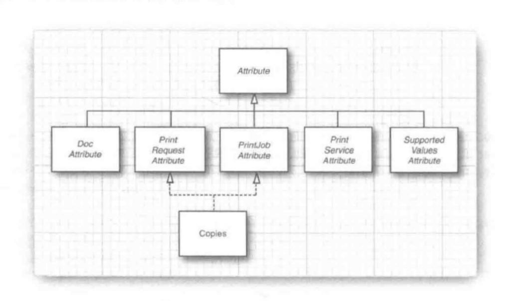

*图11-65属性分层 构 图*

*了为各个属性定义 接口和 以外 打印服务 序API 为属性 定义了接口和 。 接口 AttributeSet有4个子接口*

*PrintRequestAttributeSet DocAttributeSet PrintServiceAttributeSet PrintJobAttributeSet .*

*对于每个 样 接口 有一个实 因此会产 下 5个*

*HashAttributeSet HashPrintRequestAttributeSet HashDocAttributeSet HashPrintServiceAttributeSet HashPrintJobAttributeSet*

*图11-66显 了属性 分层 构 图。*

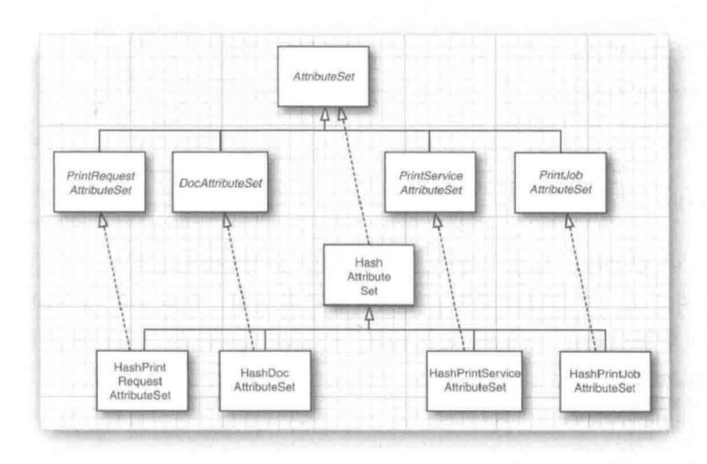

*圈11-66属性集的分M <sup>构</sup>*

*例如 可以 如下 方式构建一个打印 求属性 。*

*var attributes <sup>=</sup> new HashPrintRequestAttributeSetO;*

*当构建完属性 后 就不 担心使 Hash前 了。*

*为什么 有所有 些接口呢 因为 它们使"检査属性是否 正 使 "成为可 。 例如 DocAttributeSet只接受实 了 DocAttribute接口 对 添加其他属性 任何尝 会导 期 产 。*

*属性 是一个 殊 映射 其 是Class 型 值是一个实 了 Attribute接口 。例如 如果 插人一个对*

*new Copies(16)*

*到属性 中 么它 就是Class对 Copies.classo 为属性 别。Attribute 接口声明了下 样一个方法*

*Class getCategoryO*

*方法可以 回属性 别。Copies 定义了 以 回Copies.class对象的方法。但 是 属性 别和属性 没有必 是 同 。*

*当将一个属性添加到属性 中时 属性 别就会 动地 取。你只 添加 属性 值 attributes.add(new Copies(lB));*

*如果后来添加了一个具有 同 别 另一个属性 么新属性就会 一个属性。如 果 检 一个属性 使 它 别作为 例如*

*AttributeSet attributes <sup>=</sup> job.getAttributesO; var copies <sup>=</sup> (Copies) attribute.get(Copies.class):*

*最后 属性是按照它们拥有 值来进行组织的。Copies属性 够拥有任何整数值。 Copies类继承了 IntegerSyntax 处 所有带有整数值 属性。getValue方法将 回属性 整数值 例如*

*int <sup>n</sup> <sup>=</sup> copies.getValueO;*

## *下面这些*

*TextSyntax DateTimeSyntax URISyntax*

*于封 一个字 <sup>串</sup>、日期与时 <sup>或</sup> URI ( 源标 )。*

*最后 明 是 多属性 够接受数 有 值。例如 PrintQuality属性有三个 <sup>值</sup> draft (草稿质量)、normal (正常 )和high ( ) 它们 三个常 来表示*

*PrintQuality.DRAFT PrintQuality.NORMAL PrintQuality.HIGH*

*拥有有 数W:值 属性 承了 EnumSyntax 提供了 多便利 方法 来以 型安全 方式 些枚举。当使 样 属性时 不必担心 机制 只需要将带有名字 值添加 属性 即可*

*attributes.add(PrintQuality.HIGH);*

*下 代 明了如何来检査一个属性 值*

*if (attributes.get(PrintQuaUty.class) — PrintQuality.HIGH)*

*11-5列出了各个打印属性。 中 二列列出了属性 (例如 Copies属性 Integersyntax )或 是具有一 有 值属性 枚举值。最后四列表示该属性是否实 了 DocAttribute (DA)、PrintJobAttribute (PJA)、PrintRequestAttribute (PRA)和 PrintServiceAttribute (PSA) 几个接口。*

| 厲性                    | 或枚举常                          | DA | PJA | PRA | PSA |
|-----------------------|-------------------------------|----|-----|-----|-----|
| Chromaticity          | MONOCHROME, COLOR             | V  | V   | V   |     |
| ColorSupported        | SUPPORTED, NOT SUPPORT印       |    |     |     | V   |
| Compression           | COMPRESS, DEFLATE, GZIP, NONE | V  |     |     |     |
| Copies                | Integersyntax                 |    | V   | V   |     |
| DateTineAtConpleted   | DateTineSyntax                |    | V   |     |     |
| DateTimeAtCreation    | DateTimeSyntax                |    | V   |     |     |
| DateTiineAtProcessing | DateTimeSyntax                |    | V   |     |     |
| Destination           | URISyntax                     |    | V   | V   |     |
| DocunentName          | TextSyntax                    | V  |     |     |     |
| Fidelity              | FIDELm TRUE, FIDELITY FALSE   |    | V   | V   |     |

*11-5打印属性一*

(续)

|                          |                                                                                                                                 |    |     | (绥) |     |
|--------------------------|---------------------------------------------------------------------------------------------------------------------------------|----|-----|-----|-----|
| 属性                       | 超类或枚举常量                                                                                                                         | DA | PJA | PRA | PSA |
| Finishings               | NONE, STAPLE, EDGE_STITCH, BIND, SADDLE_STITCH, COVER,                                                                          | V  | V   | V   |     |
| JobHoldUntil             | DateTimeSyntax                                                                                                                  |    | V   | V   |     |
| JobImpressions           | IntegerSyntax                                                                                                                   |    | V   | V   |     |
| JobImpressionsCompleted  | IntegerSyntax                                                                                                                   |    | V   |     |     |
| JobK0ctets               | IntegerSyntax                                                                                                                   |    | V   | V   |     |
| JobK0ctetsProcessed      | IntegerSyntax                                                                                                                   |    | V   |     |     |
| JobMediaSheets           | IntegerSyntax                                                                                                                   |    | V   | V   |     |
| JobMediaSheetsCompleted  | IntegerSyntax                                                                                                                   |    | V   |     |     |
| JobMessageFromOperator   | TextSyntax                                                                                                                      |    | V   |     |     |
| JobName                  | TextSyntax                                                                                                                      |    | V   | V   |     |
| JobOriginatingUserName   | TextSyntax                                                                                                                      |    | V   |     |     |
| JobPriority              | IntegerSyntax                                                                                                                   |    | V   | V   |     |
| JobSheets                | STANDARD, NONE                                                                                                                  |    | V   | V   |     |
| JobState                 | ABORTED, CANCELED, COMPLETED, PENDING, PENDING_HELD, PROCESSING, PROCESSING_STOPPED                                             |    | V   |     |     |
| JobStateReason           | ABORTED_BY_SYSTEM, DOCUMENT_FORMAT_ERROR, 其他                                                                                    |    |     |     |     |
| JobStateReasons          | HashSet                                                                                                                         |    | V   |     |     |
| MediaName                | ISO_A4_WHITE, ISO_A4_TRANSPARENT, NA_LETTER_WHITE, NA_LETTER_ TRANSPARENT                                                       | V  | V   | V   |     |
| MediaSize                | ISO.AO-ISO.A10, ISO.BO-ISO.B10, ISO.CO-ISO.C10, NA.LETTER, NA.LEGAL, 各种其他纸张和信封尺寸                                                |    |     |     |     |
| MediaSizeName            | ISO_A0-ISO_A10, ISO_B0-ISO_B10, ISO_C0-ISO_C10, NA_LETTER, NA_LEGAL, 各种其他纸张和信封尺寸名称                                              | V  | V   | V   |     |
| MediaTray                | TOP, MIDDLE, BOTTOM, SIDE, ENVELOPE, LARGE_CAPACITY, MAIN, MANUAL                                                               | V  | V   | V   | 7   |
| MultipleDocumentHandling | SINGLE_DOCUMENT, SINGLE_DOCUMENT_NEW_SHEET, SEPARATE_DOCUMENTS_ COLLATED_COPIES, SEPARATE_DOCUMENTS_UNCOLLATED_COPIES           |    | V   | V   |     |
| NumberOfDocuments        | IntegerSyntax                                                                                                                   |    | V   |     |     |
| NumberOfInterveningJobs  | IntegerSyntax                                                                                                                   |    | V   |     |     |
| NumberUp                 | IntegerSyntax                                                                                                                   | V  | V   | V   |     |
| OrientationRequested     | PORTRAIT, LANDSCAPE, REVERSE_PORTRAIT, REVERSE_LANDSCAPE                                                                        | V  | V   | V   |     |
| OutputDeviceAssigned     | TextSyntax                                                                                                                      |    | V   |     |     |
| PageRanges               | SetOfInteger                                                                                                                    | V  | V   | V   |     |
| PagesPerMinute           | IntegerSyntax                                                                                                                   |    |     |     | V   |
| PagesPerMinuteColor      | IntegerSyntax                                                                                                                   |    |     |     | V   |
| PDL0verrideSupported     | ATTEMPTED, NOT_ATTEMPTED                                                                                                        |    |     |     | V   |
| PresentationDirection    | TORIGHT_TOBOTTOM, TORIGHT_TOTOP, TOBOTTOM_TORIGHT, TOBOTTOM_ TOLEFT, TOLEFT_TOBOTTOM, TOLEFT_TOTOP, TOTOP_TORIGHT, TOTOP_TOLEFT |    | V   | V   |     |
| PrinterInfo              | TextSyntax                                                                                                                      |    |     |     | V   |
| PrinterIsAcceptingJobs   | ACCEPTING JOBS, NOT ACCEPTING JOBS                                                                                              |    |     |     | V   |

(续)

| 属 性                          | 超类或枚举常量                                                                        | DA | PJA | PRA | PSA |
|------------------------------|--------------------------------------------------------------------------------|----|-----|-----|-----|
| PrinterLocation              | TextSyntax                                                                     |    |     |     | V   |
| PrinterMakeAndModel          | TextSyntax                                                                     |    |     |     | V   |
| PrinterMessageFromOperator   | TextSyntax                                                                     |    |     |     | V   |
| PrinterMoreInfo              | URISyntax                                                                      |    |     |     | V   |
| PrinterMoreInfoManufacturer  | URISyntax                                                                      |    |     |     | V   |
| PrinterName                  | TextSyntax                                                                     |    |     |     | V   |
| PrinterResolution            | ResolutionSyntax                                                               | V  | V   | V   |     |
| PrinterState                 | PROCESSING, IDLE, STOPPED, UNKNOWN                                             |    |     |     | V   |
| PrinterStateReason           | COVER_OPEN, FUSER_OVER_TEMP, MEDIA_JAM, 其他                                     |    |     |     |     |
| PrinterStateReasons          | HashMap                                                                        |    |     |     |     |
| PrinterURI                   | URISyntax                                                                      |    |     |     | V   |
| PrintQuality                 | DRAFT, NORMAL, HIGH                                                            | V  | V   | V   |     |
| QueuedJobCount               | IntegerSyntax                                                                  |    |     |     | V   |
| ReferenceUriSchemesSupported | FILE, FTP, GOPHER, HTTP, HTTPS, NEWS, NNTP, WAIS                               |    |     |     |     |
| RequestingUserName           | TextSyntax                                                                     |    |     | V   |     |
| Severity                     | ERROR, REPORT, WARNING                                                         |    |     |     |     |
| SheetCollate                 | COLLATED, UNCOLLATED                                                           | V  | V   | V   |     |
| Sides                        | ONE_SIDED, DUPLEX (= TWO_SIDED_LONG_EDGE), TUMBLE (= TWO_SIDED_<br>SHORT_EDGE) | V  | V   | V   |     |

- 注释:可以看到,属性的数量很多,其中许多属性都是专用的。大多数属性都来源于 因特网打印协议 1.1 版 (RFC 2911)。
- 直 注释: 打印 API 的早期版本引入了 JobAttributes 和 PageAttributes 类, 其目的与本 节所介绍的打印属性类似。这些类现在已经弃用了。

## API javax.print.attribute.Attribute

- Class getCategory() 获取该属性的类别。
- String getName()获取该属性的名字。

## api javax.print.attribute.AttributeSet 1.4

- boolean add(Attribute attr)
   向属性集中添加一个属性。如果集中有另一个属性和此属性有相同的类别,那么集中的 属性被新添加的属性所取代。如果由于添加属性的操作改变了属性集,则返回 true。
- Attribute get(Class category)
   检索带有指定属性类别键的属性,如果该属性不存在,则返回 null。

- *• boolean remove(Attribute attr)*
- *• boolean remove(Class category) 从属性 中删 定属性 或 删 具有指定 别 属性。如果 于 个操作改变了 属性 则 回true。*
- *• Attributed toArrayO 回一个带有 属性 中所有属性 数 。*

## *javax.print.Printservice*

*• PrintSe rviceAtt ributeSet getAttributesO 取打印服务 序 属性。*

## *aw] javax.print.DocPrintJob*

*• PrintJobAttributeSet getAttributesO 取打印作业 属性。*

*在 我们来到了本章的尾声 一 涵 了 Swing和AWT 性。在最后 一 我们将 Java 另一个完全不同 方 在同一台机器上与 其他 言编写 "本地"代 交互。*

# *12 本地方法*

- *▲从Java 序中调用C函数*
- *▲数值参数与 回值*
- *▲<sup>字</sup> 串参数*
- *▲ <sup>域</sup>*
- *▲ <sup>名</sup>*
- *▲调用Java方法*

- *▲访问数 元*
- *▲ 处*
- *▲使 API*
- *▲完整的示例 Windows注册*
- *▲外 函数 展望未来*

*原则上 "100% Java" 决方案是 常好 但有时你也会想要编写或使 其他 语言的代 代 常 为本地代 。*

*別是在Java 早期 <sup>段</sup> 多人 为使 C或C4来加 Java<sup>应</sup> 中关 分是 个好主意。但是 实 上 基本上是徒劳 。1996年JavaOne会 上有一个演 很明 地 明了 一点 来 Sun Microsystems 密 库 实 报告 他们 加密函数 Java<sup>平</sup> 台实 已 化境。他们 代 实没有已有 C实 快 但是事实 明 无关 。Java平 台实 比 I/O 快得多 后 是 正 。*

*当然 求助于木地代 是有 。如果应 某个 分是 其他 写 么就必 <sup>为</sup> 支持 每个平台 提供一个单 本地 <sup>库</sup>。 C或C# <sup>写</sup> <sup>代</sup> 没有对 <sup>使</sup> <sup>无</sup> 效指 所 成 内存 写提供任何保护。 写本地代 很容易 坏你 序 并感染操作 。*

*因此 我们建 只有在必 时候才使 本地代 。 別是在以下三 情况下 使 本 地代 也 是正 择*

- *你 应 性和 备 Java平台是无法实 。*
- *你已 有了大 测 和 另一 写 代 并且知道如何将其导出 到所有 标平台上。*
- *通过基准测 你发 所 写 Java代 比 其他 写 价代 慢得多。*

*Java平台有一个 于和本地C代 互操作 API, 为Java本地接口 JNI 。我们 将在本章讨论JNI 。*

*9 C++<sup>注</sup> 你可以使 O+代替c<sup>来</sup> 写本地方法。 样会有一些好处 型检查 会更严格一些 访问JNI函數会更便捷一些。然 JNI并不支持Java 和C"H■ <sup>之</sup> 任何映射机制。*

*如你将 到 在Java与本地代 之 提供 定层在一定 度上会显得很乏味冗 。 在Java 17中 作为一 <sup>性</sup> 提供了一个可以 来 "<sup>外</sup> "函数和内存 API,<sup>它</sup> 比JNI 方便 多。在本 末尾 你将会一 此API。*

## 12.1 从 Java 程序中调用 C 函数

假设你有一个 C 函数,它能为你实现某个功能,因为某种原因,你不想费事使用 Java 编程语言重新实现它。为了方便说明问题,我们从一个很简单的打印问候语的 C 函数入手。

Java 编程语言使用关键字 native 表示本地方法,而且很显然,你还需要在类中放置一个方法。其结果显示在程序清单 12-1 中。

关键字 native 提醒编译器该方法将在外部定义。当然,本地方法不包含任何 Java 编程语言编写的代码,而且方法头后面直接跟着一个表示终结的分号。因此,本地方法声明看上去和抽象方法声明类似。

#### 程序清单 12-1 helloNative/HelloNative.java

```
1 /**
2 * @version 1.11 2007-10-26
3 * @author Cay Horstmann
4 */
5 class HelloNative
6 {
7  public static native void greeting();
8 }
```

## 注释:与前一章一样,为了保持样例的简单性,我们在这里也不使用包。

在这个特定示例中,本地方法也被声明为 static。本地方法既可以是静态的也可以是非静态的,使用静态方法是因为我们此刻还不想处理参数传递。

你实际上可以编译这个类,但是在程序中使用它时,虚拟机就会告诉你它不知道如何找到 greeting,它会报告一个 UnsatisfiedLinkError 异常。为了实现本地代码,需要编写一个相应的 C 函数,你必须完全按照 Java 虚拟机预期的那样来命名这个函数。其规则是:

- 1. 使用完整的 Java 方法名,比如:HelloNative.greeting。如果该类属于某个包,那么在前面添加包名,比如:com.horstmann.HelloNative.greeting。
- 2. 用下划线替换掉所有的句号,并加上 Java\_前缀,例如,Java\_HelloNative\_greeting或 Java\_com\_horstmann\_HelloNative\_greeting。
- 3. 如果类名含有非 ASCII 字母或数字,如'\_'、'\$'或是大于 '\u007F' 的 Unicode 字符,用 \_0xxxx 来替代它们,xxxx 是该字符的 Unicode 值的 4 个十六进制数序列。
  - 註解:如果你重載了本地方法,也就是说,你用相同的名字提供了多个本地方法,那么你必须在名称后附加两个下划线,后面再加上已编码的参数类型。在本章后面,我们将描述参数类型的编码方法。例如,如果你有一个本地方法 greeting 和另一个本地方法 greeting(int repeat),那么,第一个称为 Java HelloNative greeting I。

实际上,没人会手工完成这些操作。相反,你应该用-h标志运行 javac,并提供头文件

## 放置的目录:

614

javac -h . HelloNative.java

这条命令在当前目录中创建了一个名为 HelloNative.h 的头文件, 正如程序清单 12-2 所示。

#### 程序清单 12-2 helloNative/HelloNative.h

```
1 /* DO NOT EDIT THIS FILE - it is machine generated */
2 #include <ini.h>
3 /* Header for class HelloNative */
5 #ifndef Included HelloNative
6 #define Included HelloNative
7 #ifdef cplusplus
8 extern "C" {
9 #endif
10 /*
   * Class:
                HelloNative
  * Method:
                greeting
12
   * Signature: ()V
13
15 JNIEXPORT void JNICALL Java HelloNative greeting
    (JNIEnv *, jclass);
16
17
18 #ifdef cplusplus
19 }
20 #endif
21 #endif
```

如你所见,这个文件包含了函数 Java\_HelloNative\_greeting 的声明(宏 JNIEXPORT 和 JNICALL 是在头文件 jni.h 中定义的,它们为那些来自动态装载库的导出函数标明了依赖于编译器的说明符)。

现在,需要将函数原型从头文件复制到源文件中,并且给出函数的实现代码,如程序清单 12-3 所示。

#### 程序清单 12-3 helloNative/HelloNative.c

```
1 /*
2  @version 1.10 1997-07-01
3  @author Cay Horstmann
4 */
5  #include "HelloNative.h"
7  #include <stdio.h>
8  JNIEXPORT void JNICALL Java_HelloNative_greeting(JNIEnv* env, jclass cl)
10  {
11    printf("Hello, Native World!\n");
12 }
```

在这个简单的函数中, 我们忽略了 env 和 cl 参数。后面你会看到它们的用处。

C++ 注释: 你可以使用 C++ 实现本地方法。然而, 那样你必须将实现本地方法的函数 声明为 extern "C" (这可以阻止 C++ 编译器混编方法名)。例如:

```
extern "C"
JNIEXPORT void JNICALL Java_HelloNative_greeting(JNIEnv* env, jclass cl)
{
   cout << "Hello, Native World!" << endl;
}</pre>
```

将本地 C 代码编译到一个动态装载库中, 具体方法依赖于编译器。

例如, Linux 下的 Gnu C 编译器, 使用如下命令:

gcc -fPIC -I jdk/include -I jdk/include/linux -shared -o libHelloNative.so HelloNative.c

用 Windows 下的微软编译器,命令是:

cl -I jdk\include -I jdk\include\win32 -LD HelloNative.c -FeHelloNative.dll

这里jdk是含有JDK的目录。

☑ 提示: 如果你要从命令 shell 中使用微软的编译器,首先要运行批处理文件 vcvars32. bat 或 vcvarsall.bat。这个批处理文件设置了编译器需要的路径和环境变量。你可以在目录 c:\Program Files\Microsoft Visual Studio .14.0\Common7\Tools,或类似位置找到该文件,细节请查看 Visual Studio 的文档。

也可以使用可从 http://www.cygwin.com 处免费获取的 Cygwin 编程环境。它包含了 GNU C 编译器和 Windows 下的 UNIX 风格编程的库。使用 Cygwin 时,用以下命令:

gcc -mno-cygwin -D \_\_int64="long long" -I jdk/include/ -I jdk/include/win32 \
 -shared -Wl,--add-stdcall-alias -o HelloNative.dll HelloNative.c

i 注释: Windows 版本的头文件 jni\_md.h 含有如下类型声明:

typedef int64 jlong;

它是专门用于微软编译器的。如果你使用的是 GNU 编译器,那么你可能需要编辑这个文件,例如:

```
#ifdef __GNUC__
    typedef long long jlong;
#else
    typedef __int64 jlong;
#endif
```

或者,如编译器调用的示例那样,使用 -D \_\_int64="long long" 进行编译。

最后,我们要在程序中添加一个对 System.loadLibrary 方法的调用。为了确保虚拟机在第一次使用该类之前就装载这个库,需要使用静态初始化代码块,如程序清单 12-4 所示。

#### 程序清单 12-4 helloNative/HelloNativeTest.java

```
1 /**
   * @version 1.11 2007-10-26
   * @author Cay Horstmann
5 class HelloNativeTest
6 {
     public static void main(String[] args)
         HelloNative.greeting();
18
11
      static
12
13
         System.loadLibrary("HelloNative");
14
15
16 }
```

图 12-1 给出了对本地代码处理的总结。

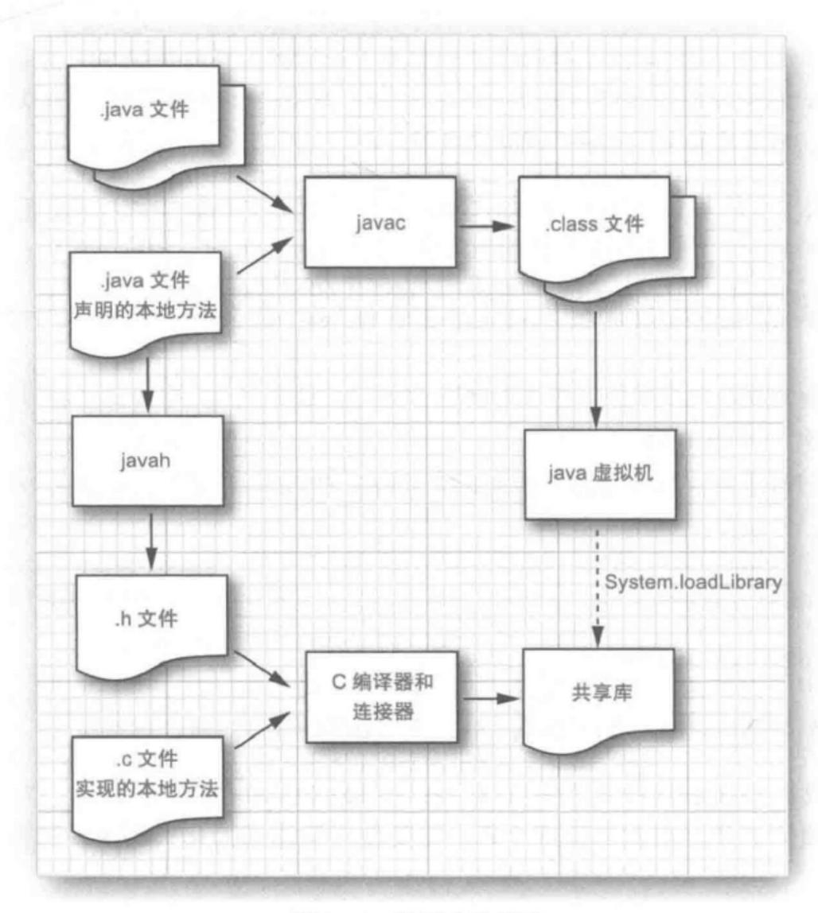

图 12-1 处理本地代码

如果编译并运行该程序,终端窗口会显示消息 "Hello, Native World!"。

直 注释:如果运行在Linux下,必须把当前目录添加到库路径中。实现方式可以是通过设置LD LIBRARY PATH 环境变量:

export LD LIBRARY PATH=.:\$LD LIBRARY PATH

或者是设置 java.library.path 系统属性:

java -Djava.library.path=. HelloNativeTest

当然,这个消息本身并不会给人留下深刻印象。然而,如果你记得这个信息是由 C 的 printf 命令产生而不是由任何 Java 编程语言代码产生的话,你就会明白我们已经在连接两种语言上走出了第一步。

总之,遵循下面的步骤就可以将一个本地方法链接到 Java 程序中:

- 1. 在 Java 类中声明一个本地方法。
- 2. 运行 javac-h 以获得包含该方法的 C 声明的头文件。
- 3. 用 C 实现该本地方法。
- 4. 将代码置于共享类库中。
- 5. 在 Java 程序中加载该类库。

## API java.lang.System 1.0

- void loadLibrary(String libname)
   装载指定名字的库,该库位于库搜索路径中。定位该库的确切方法依赖于操作系统。
- 直注释:一些本地代码的共享库必须先运行初始化代码。你可以把初始化代码放到 JNI\_OnLoad 方法中。类似地,如果你提供该方法,当虚拟机关闭时,将会调用 JNI\_ OnUnload 方法。它们的原型是:

jint JNI\_OnLoad(JavaVM\* vm, void\* reserved);
void JNI OnUnload(JavaVM\* vm, void\* reserved);

JNI\_OnLoad 方法要返回它所需的虚拟机的最低版本,例如: JNI\_VERSION\_1\_2。

## 12.2 数值参数与返回值

当在 C 和 Java 之间传递数字时,应该知道它们彼此之间的对应类型。例如,C 也有 int 和 long 的数据类型,但是它们的实现却是取决于平台的。在一些平台上,int 类型是 16 位的,在另外一些平台上是 32 位的。然而,在 Java 平台上 int 类型总是 32 位的整数。基于这个原因,Java 本地接口定义了 jint、jlong 等类型。

表 12-1 显示了 Java 数据类型和 C 数据类型的对应关系。

| Java 编程语言 | C编程语言    | 字 节 | Java 编程语言 | C编程语言   | 字 节 |
|-----------|----------|-----|-----------|---------|-----|
| boolean   | jboolean | 1   | int       | jint    | 4   |
| byte      | jbyte    | 1   | long      | jlong   | 8   |
| char      | jchar    | 2   | float     | jfloat  | 4   |
| short     | jshort   | 2   | double    | jdouble | 8   |

表 12-1 Java 数据类型和 C 数据类型

在头文件 jni.h 中,这些类型被 typedef 语句声明为在目标平台上等价的类型。该头文件还定义了常量  $JNI_FALSE = 0$  和  $JNI_TRUE = 1$ 。

直到 Java 5.0, Java 才有了与 C 语言的 printf 函数相类似的方法。在下面的示例中,我们假设你依然坚持使用古老版本的 JDK,并且决定通过调用本地方法中的 C 的 printf 函数来实现同样的功能。

程序清单 12-5 给出了一个名为 Printf1 的类,它使用本地方法来打印给定域宽度和精度的浮点数。

#### 程序清单 12-5 printf1/Printf1.java

```
1 /**
2 * @version 1.10 1997-07-01
3 * @author Cay Horstmann
4 */
5 class Printf1
6 {
7  public static native int print(int width, int precision, double x);
8  static
10  {
11    System.loadLibrary("Printf1");
12  }
13 }
```

注意,用C实现该方法时,所有的 int 和 double 参数都要转换成 jint 和 jdouble,如程序清单 12-6 所示。

#### 程序清单 12-6 printf1/Printf1.c

```
1 /**
2  @version 1.10 1997-07-01
3  @author Cay Horstmann
4 */
5  #include "Printf1.h"
7  #include <stdio.h>
8  
9  JNIEXPORT jint JNICALL Java Printf1_print(JNIEnv* env, jclass cl, jint width, jint precision, jdouble x)
11 {
12    char fmt[30];
```

```
jint ret;
sprintf(fmt, "%%d.%df", width, precision);
ret = printf(fmt, x);
fflush(stdout);
return ret;
}
```

该函数只是装配了变量 fmt 中的格式字符串 "%w.pf", 然后调用 printf 函数,接着返回打印出的字符的个数。

程序清单 12-7 给出了验证 Printf1 类的测试程序。

## 程序清单 12-7 printf1/Printf1Test.java

```
1 /**
* @version 1.10 1997-07-01
* @author Cay Horstmann
4 */
5 class PrintflTest
6 {
7
     public static void main(String[] args)
        int count = Printf1.print(8, 4, 3.14);
9
         count += Printfl.print(8, 4, count);
10
11
         System.out.println();
         for (int i = 0; i < count; i++)
12
           System.out.print("-");
13
        System.out.println();
14
    }
15
16 }
```

## 12.3 字符串参数

接着,我们要考虑怎样把字符串传入、传出本地方法。字符串在这两种语言中很不一样,Java 编程语言中的字符串是 UTF-16 编码点的序列,而 C 的字符串则是以 null 结尾的字节序列。JNI 有两组操作字符串的函数,一组把 Java 字符串转换成 "modified UTF-8"字节序列,另一组将它们转换成 UTF-16 数值的数组,也就是说转换成 jchar 数组。(UTF-8、"modified UTF-8"和 UTF-16 格式都已经在第 2 章中讨论过了,请回忆一下,UTF-8 和"modified UTF-8"编码保持 ASCII 字符不变,但是其他所有 Unicode 字符都被编码为多字节序列。)

i 注释:标准 UTF-8 编码和"modified UTF-8"编码的差别仅在于编码大于 0xFFFF 的 增补字符。在标准 UTF-8 编码中,这些字符编码为 4 字节序列;然而,在 modified UTF-8 编码中,这些字符首先被编码为一对 UTF-16 编码的"替代品",然后再对每个替代品用 UTF-8 编码,总共产生 6 字节编码。这有点笨拙,但这是个由历史原因造成的意外,编写 Java 虚拟机规范的时候 Unicode 还局限在 16 位。

如果你的 C 代码已经使用了 Unicode, 那么你可以使用第二组转换函数。另外, 如果你的字符串都仅限于使用 ASCII 字符, 那么就可以使用 "modified UTF-8"转换函数。

带有字符串参数的本地方法实际上都要接受一个 jstring 类型的值,而带有字符串参数返回值的本地方法必须返回一个 jstring 类型的值。JNI 函数将读入并构造出这些 jstring 对象。例如,NewStringUTF 函数会从包含 ASCII 字符的字符数组,或者是更一般的"modified UTF-8"编码的字节序列中,创建一个新的 jstring 对象。

JNI 函数有一个有些古怪的调用惯例。下面是对 NewStringUTF 函数的一个调用:

```
JNIEXPORT jstring JNICALL Java_HelloNative_getGreeting(JNIEnv* env, jclass cl)
{
    jstring jstr;
    char greeting[] = "Hello, Native World\n";
    jstr = (*env)->NewStringUTF(env, greeting);
    return jstr;
}
```

## 註釋:本章中的所有代码都是 C 代码,除了指明为其他代码以外。

所有对 JNI 函数的调用都使用了 env 指针,该指针是每一个本地方法的第一个参数。 env 指针是指向函数指针表的指针(参见图 12-2)。所以,你必须在每个 JNI 调用前面加上(\*env)->,以便解析对函数指针的引用。而且,env 是每个 JNI 函数的第一个参数。

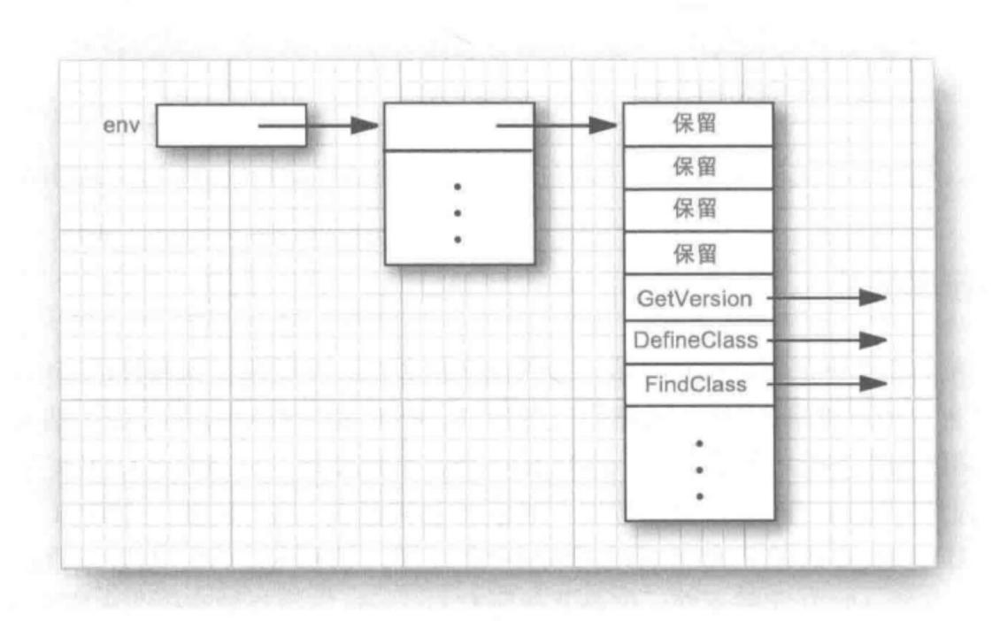

图 12-2 env 指针

C++ 注释: C++ 中对 JNI 函数的访问要简单一些。JNIEnv 类的 C++ 版本有一个内联成员函数,它负责帮你查找函数指针。例如,你可以这样调用 NewStringUTF 函数:

istr = env->NewStringUTF(greeting);

注意,这里删除了该调用的参数列表里的 JNIEnv 指针。

NewStringUTF 函数可以用来构造一个新的 jstring, 而读取现有 jstring 对象的内容,需要使用 GetStringUTFChars 函数。该函数返回指向描述字符串的"modified UTF-8"字符的 const jbyte\*指针。注意,具体的虚拟机可以为其内部的字符串表示方法自由地选择编码机制。所以,你可以得到实际的 Java 字符串的字符指针。因为 Java 字符串是不可变的,所以慎重处理 const 就显得非常重要,不要试图将数据写到该字符数组中。另外,如果虚拟机使用 UTF-16 或 UTF-32 字符作为其内部字符串的表示,那么该函数会分配一个新的内存块来存储等价的"modified UTF-8"编码字符。

虚拟机必须知道你何时使用完字符串,这样它就能进行垃圾回收(垃圾回收器是在一个独立线程中运行的,它能够中断本地方法的执行)。基于这个原因,你必须调用ReleaseStringUTFChars 函数。

另外,可以通过调用 GetStringRegion 或 GetStringUTFRegion 方法来提供你自己的缓存,以存放字符串的字符。

最后, GetStringUTFLength 函数返回字符串的 "modified UTF-8"编码所需的字符个数。

直 注释: 你可以在 http://docs.oracle.com/javase/7/docs/technotes/guides/jni 处找到 JNI API。

#### API 从 C 代码访问 Java 字符串

- jstring NewStringUTF(JNIEnv\* env, const char bytes[])
   根据以全0字节结尾的"modified UTF-8"字节序列,返回一个新的 Java 字符串对象,或者当字符串无法构建时,返回 NULL。
- jsize GetStringUTFLength(JNIEnv\* env, jstring string)
   返回进行 "modified UTF-8" 编码所需的字节个数(作为终止符的全0字节不计入内)。
- const jbyte\* GetStringUTFChars(JNIEnv\* env, jstring string, jboolean\* isCopy) 返回指向字符串的"modified UTF-8"编码的指针,或者当不能构建字符数组时返回 NULL。直到 ReleaseStringUTFChars 函数调用前,该指针一直有效。isCopy 指向一个 jboolean,如果进行了复制,则填入 JNI\_TRUE,否则填入 JNI\_FALSE。
- void ReleaseStringUTFChars(JNIEnv\* env, jstring string, const jbyte bytes[])
   通知虚拟机本地代码不再需要通过 bytes(GetStringUTFChars 返回的指针) 访问 Java 字符串。
- void GetStringRegion(JNIEnv \*env, jstring string, jsize start, jsize length, jchar \*buffer) 将一个 UTF-16 双字节序列从字符串复制到用户提供的尺寸至少大于 2×length 的缓存中。
- void GetStringUTFRegion(JNIEnv \*env, jstring string, jsize start, jsize length, jbyte \*buffer)
  - 将一个"modified UTF-8"字符序列从字符串复制到用户提供的缓存中。为了存放要复制的字节,该缓存必须足够长。最坏情况下,要复制 3×length 个字节。
- jstring NewString(JNIEnv\* env, const jchar chars[], jsize length)

根据 Unicode 字符串返回一个新的 Java 字符串对象,或者在不能构建时返回 NULL。

- jsize GetStringLength(JNIEnv\* env, jstring string)
   返回字符串中字符的个数。
- const jchar\* GetStringChars(JNIEnv\* env, jstring string, jboolean\* isCopy) 返回指向字符串的 Unicode 编码的指针,或者当不能构建字符数组时返回 NULL。直到 ReleaseStringChars 函数调用前,该指针一直有效。isCopy 要么为 NULL; 要么在进行了复制时,指向用 JNI TRUE 填充的 jboolean,否则指向用 JNI FALSE 填充的 jboolean。
- void ReleaseStringChars(JNIEnv\* env, jstring string, const jchar chars[])
   通知虚拟机本地代码不再需要通过 chars (GetStringChars 返回的指针) 访问 Java 字符串。
   让我们使用这些函数来编写一个调用 C 函数 sprintf 的类,我们要像程序清单 12-8 所示那样调用这个函数。

#### 程序清单 12-8 printf2/Printf2Test.java

```
* @version 1.10 1997-07-01
   * @author Cay Horstmann
5 class Printf2Test
6 {
7
      public static void main(String[] args)
8
         double price = 44.95;
9
         double tax = 7.75;
10
         double amountDue = price * (1 + tax / 100);
11
12
         String s = Printf2.sprint("Amount due = %8.2f", amountDue);
13
         System.out.println(s);
      }
15
16 }
```

程序清单 12-9 给出了带有本地 sprint 方法的类。

#### 程序清单 12-9 printf2/Printf2.java

```
* @version 1.10 1997-07-01
   * @author Cay Horstmann
4 */
5 class Printf2
6
      public static native String sprint(String format, double x);
7
8
9
      static
      {
10
         System.loadLibrary("Printf2");
11
12
13 }
```

因此,格式化浮点数的 C 函数原型如下:

```
JNIEXPORT jstring JNICALL Java_Printf2_sprint(JNIEnv* env, jclass cl,
```

程序清单 12-10 给出了 C 的实现代码。注意,我们通过调用 GetStringUTFChars 来读取格式参数,通过调用 NewStringUTF 来产生返回值,通过调用 ReleaseStringUTFChars 来通知虚拟机不再需要访问该字符串。

#### 程序清单 12-10 printf2/Printf2.c

```
1 /**
      @version 1.10 1997-07-01
2
      @author Cay Horstmann
4 */
6 #include "Printf2.h"
7 #include <string.h>
8 #include <stdlib.h>
9 #include <float.h>
18
11 /**
      @param format a string containing a printf format specifier
12
      (such as "%8.2f"). Substrings "%%" are skipped.
13
14
      @return a pointer to the format specifier (skipping the '%')
      or NULL if there wasn't a unique format specifier
15
16 */
17 char* find format(const char format[])
18 {
      char* p:
19
      char* q;
28
21
      p = strchr(format, '%');
22
      while (p != NULL && *(p + 1) == '%') /* skip %% */
23
         p = strchr(p + 2, '%');
74
      if (p == NULL) return NULL;
25
      /* now check that % is unique */
26
      p++;
27
      q = strchr(p, '%');
28
      while (q != NULL && *(q + 1) == '%') /* skip %% */
29
         q = strchr(q + 2, '%');
38
31
      if (q != NULL) return NULL; /* % not unique */
      q = p + strspn(p, " -0+#"); /* skip past flags */
32
      q += strspn(q, "0123456789"); /* skip past field width */
33
      if (*q == '.') { q++; q += strspn(q, "0123456789"); }
         /* skip past precision */
35
      if (strchr("eEfFgG", *q) == NULL) return NULL;
36
         /* not a floating-point format */
      return p;
38
39 }
   JNIEXPORT jstring JNICALL Java Printf2 sprint(JNIEnv* env, jclass cl,
41
42
         jstring format, jdouble x)
43 {
44
      const char* cformat:
```

```
char* fmt;
45
      jstring ret;
45
47
      cformat = (*env)->GetStringUTFChars(env, format, NULL);
48
      fmt = find format(cformat);
49
      if (fmt == NULL)
50
         ret = format;
51
      else
52
53
         char* cret:
54
         int width = atoi(fmt);
55
         if (width == 0) width = DBL DIG + 10;
56
         cret = (char*) malloc(strlen(cformat) + width);
57
         sprintf(cret, cformat, x);
58
         ret = (*env)->NewStringUTF(env, cret);
59
         free(cret):
68
61
      (*env)->ReleaseStringUTFChars(env, format, cformat);
62
      return ret;
63
64 }
```

在本函数中,我们选择简化错误处理。如果打印浮点数的格式代码不是 ww.pc 形式的 (其中 c 是 e、E、f、g 或 G 中的一个),那么我们将不对数字进行格式化。后面我们会介绍如何让本地方法抛出异常。

## 12.4 访问域

目前为止你看到的所有本地方法都是带有数字或字符串参数的静态方法。下面,我们考虑在对象上进行操作的本地方法。作为练习,我们用本地方法实现卷 I 第 4 章中的 Employee 类的一个方法。通常情况下并不需要这么做,但是这里演示了当你需要的时候可以怎样从本地方法访问对象域。

## 12.4.1 访问实例域

为了了解怎样从本地方法访问实例域,我们用 Java 重新实现了 raiseSalary 方法。其代码很简单:

```
public void raiseSalary(double byPercent)
{
   salary *= 1 + byPercent / 100;
}
```

让我们重写代码,使其成为一个本地方法。与此前的本地方法不同,它并不是一个静态方法。运行 javac-h 给出以下原型:

JNIEXPORT void JNICALL Java\_Employee\_raiseSalary(JNIEnv \*, jobject, jdouble);

注意,第二个参数不再是 jclass 类型而是 jobject 类型。实际上,它和 this 引用等价。静态方法得到的是类的引用,而非静态方法得到的是对隐式的 this 参数对象的引用。

现在,我们访问隐式参数的 salary 域。在 Java 1.0 中"原生的" Java 到 C 的绑定中,这 很简单,程序员可以直接访问对象数据域。然而,直接访问要求虚拟机暴露它们的内部数据 布局。基于这个原因, JNI 要求程序员通过调用特殊的 JNI 函数来获取和设置数据的值。

在我们的例子里,要使用 GetdoubleField 和 SetDoubleField 函数,因为 salary 是 double 类型的。对于其他类型,可以使用的函数有 GetIntField/SetIntField、GetObjectField/SetObjectField等。其通用语法是:

```
x = (*env)->GetXxxField(env, this_obj, fieldID);
(*env)->SetXxxField(env, this obj, fieldID, x);
```

这里, fieldID 是一个特殊类型 jfieldID 的值, jfieldID 标识结构中的一个域, 而 Xxx 代表 Java 数据类型 (Object、Boolean、Byte 或其他)。为了获得 fieldID, 必须先获得一个表示类的值, 有两种方法可以实现此目的。GetObjectClass 函数可以返回任意对象的类。例如:

```
jclass class_Employee = (*env)->GetObjectClass(env, this_obj);
```

FindClass 函数可以让你以字符串形式来指定类名(有点奇怪的是,要以/代替句号作为包名之间的分隔符)。

```
jclass class String = (*env)->FindClass(env, "java/lang/String");
```

之后,可以使用 GetFieldID 函数来获得 fieldID。必须提供域的名字、它的签名以及它的类型的编码。例如,下面是从 salary 域得到域 ID 的代码:

```
ifieldID id salary = (*env)->GetFieldID(env, class Employee, "salary", "D");
```

字符串 "D" 表示类型是 double。你将在下一节中学习到编码签名的全部规则。

你可能会认为访问数据域相当令人费解。JNI 的设计者不想把数据域直接暴露在外,所以他们不得不提供获取和设置数据域值的函数。为了使这些函数的开销最小化,从域名计算域 ID (代价最大的一个步骤)被分解出来作为单独的一步操作。也就是说,如果你反复地获取和设置一个特定的域,你计算域标识符的开销就只有一次。

让我们把各部分汇总起来,下面的代码以本地方法形式重新实现了 raiseSalary 方法。

```
JNIEXPORT void JNICALL Java_Employee_raiseSalary(JNIEnv* env, jobject this_obj,
```

● 警告: 类引用只在本地方法返回之前有效。因此,不能在你的代码中缓存 GetObject-Class 的返回值。不要将类引用保存下来以供以后的方法调用重复使用。必须在每次执行本地方法时都调用 GetObjectClass。如果你无法忍受这一点,必须调用 NewGlobalRef 来锁定该引用:

```
static jclass class_X = 0;
static jfieldID id_a;
...\nif (class_X == 0)
{
    jclass cx = (*env)->GetObjectClass(env, obj);
    class_X = (*env)->NewGlobalRef(env, cx);
    id_a = (*env)->GetFieldID(env, class_X, "a", "...");
}
```

现在,你可以在后面的调用中使用类引用和域 ID 了。当你结束对类的使用时,务必调用: (\*env)->DeleteGlobalRef(env, class\_X);

程序清单 12-11 和程序清单 12-12 给出了测试程序和 Employee 类的 Java 代码。程序清单 12-13 包含了本地 raiseSalary 方法的 C 代码。

#### 程序清单 12-11 employee/EmployeeTest.java

```
1 /**
    * @version 1.11 2018-05-01
3
    * @author Cay Horstmann
   */
4
5
   public class EmployeeTest
6
7
      public static void main(String[] args)
8
9
         var staff = new Employee[3];
10
11
         staff[0] = new Employee("Harry Hacker", 35000);
12
         staff[1] = new Employee("Carl Cracker", 75000);
13
         staff[2] = new Employee("Tony Tester", 38000);
14
15
         for (Employee e : staff)
16
            e.raiseSalary(5);
17
         for (Employee e : staff)
18
            e.print();
19
28
21 }
```

## 程序清单 12-12 employee/Employee.java

```
1 /**
2 * @version 1.10 1999-11-13
3 * @author Cay Horstmann
4 */
```

```
6 public class Employee
7 {
      private String name;
8
      private double salary;
9
10
      public native void raiseSalary(double byPercent);
11
12
      public Employee(String n, double s)
13
      {
14
         name = n:
15
         salary = s;
16
17
18
      public void print()
19
28
         System.out.println(name + " " + salary);
21
      }
22
23
      static
24
25
          System.loadLibrary("Employee");
26
27
28
```

#### 程序清单 12-13 employee/Employee.c

```
1 1/**
      @version 1.10 1999-11-13
      @author Cay Horstmann
3
4
5
  #include "Employee.h"
   #include <stdio.h>
9
   JNIEXPORT void JNICALL Java Employee raiseSalary(
10
         JNIEnv* env, jobject this obj, jdouble byPercent)
11
12
      /* get the class */
13
      jclass class Employee = (*env)->GetObjectClass(env, this obj);
14
15
16
      /* get the field ID */
      jfieldID id salary = (*env)->GetFieldID(env, class Employee, "salary", "D");
17
18
      /* get the field value */
19
      jdouble salary = (*env)->GetDoubleField(env, this obj, id salary);
28
21
      salary *= 1 + byPercent / 100;
22
23
      /* set the field value */
24
      (*env)->SetDoubleField(env, this_obj, id_salary, salary);
25
26 }
27
```

## 12.4.2 访问静态域

访问静态域和访问非静态域类似,要使用 GetStaticFieldID 和 GetStaticXxxField/ SetStatic-XxxField 函数。它们几乎与非静态的情形一样,只有两个区别:

- 由于没有对象, 所以必须使用 FindClass 代替 GetObjectClass 来获得类引用。
- 访问域时, 要提供类而非实例对象。

例如,下面给出的是怎样得到 System.out 的引用的代码:

```
/* get the class */
jclass class_System = (*env)->FindClass(env, "java/lang/System");
/* get the field ID */
jfieldID id_out = (*env)->GetStaticFieldID(env, class_System, "out",
    "Ljava/io/PrintStream;");
/* get the field value */
jobject obj_out = (*env)->GetStaticObjectField(env, class_System, id_out);
```

#### API 访问实例域

- jfieldID GetFieldID(JNIEnv \*env, jclass cl, const char name[], const char fieldSignature[])
   返回类中一个域的标识符。
- Xxx GetXxxField(JNIEnv \*env, jobject obj, jfieldID id)
   返回域的值。域类型 Xxx 是 Object、Boolean、Byte、Char、Short、Int、Long、Float 或 Double 之一。
- void SetXxxField(JNIEnv \*env, jobject obj, jfieldID id, Xxx value)
   把某个域设置为一个新值。域类型 Xxx 是 Object、Boolean、Byte、Char、Short、Int、Long、Float 或 Double 之一。
- jfieldID GetStaticFieldID(JNIEnv \*env, jclass cl, const char name[], const char fieldSignature[])

返回某类型的一个静态域的标识符。

- Xxx GetStaticXxxField(JNIEnv \*env, jclass cl, jfieldID id)
   返回某静态域的值。域类型 Xxx 是 Object、Boolean、Byte、Char、Short、Int、Long、Float 或 Double 之一。
- void SetStaticXxxField(JNIEnv \*env, jclass cl, jfieldID id, Xxx value)
   把某个静态域设置为一个新值。域类型 Xxx 是 Object、Boolean、Byte、Char、Short、Int、Long、Float 或 Double 之一。

## 12.5 编码签名

为了访问实例域和调用用 Java 编程语言定义的方法, 你必须学习将数据类型的名称和方法签名进行"混编"的规则(方法签名描述了参数和该方法返回值的类型)。下面是编码方案:

```
B
C
D
F
I
J
Lclassname;
S
V
I
                    byte
                    char
                    double
                    float
                    int
                    long
                             型
                    short
                    void
                    boolean
```

*为了描 数 型 使 [。例如 一个字 串数 如下*

*[Ljava/lang/String;*

*一个float[][】可以描 为*

*[F*

*建 一个方法 完整 名 把括号内 参数 型 列出来 然后列出 回值 型。例如 一个接收两个整型参数并 回一个整数 方法 为*

*(n)i*

*12.3 中 sprint方法有下 混 名*

*(Ljava/lang/String;D)Ljava/lang/String;*

*也就是 方法接收一个String和一个double, 回值是一个String。*

*注意 在L 式 尾处 分号是 型 式 止 不是参数之 分 。<sup>例</sup> 如 构 器*

*Employee(java.lang.String, double, java.util.Date)*

*具有如下 名*

*\*(Ljava/lang/String;DLjava/util/Date;)V\_*

*注意 在D和Ljava/util/Date;之 没有分 。另外 注意在 个 方案中 必 /代替.来分 包和 名。 尾 V 回 型为void 即使对Java 构 器没有指定 回 型 也 将V添加到 拟机 名中。*

*提 可以使 带有 -s javap命令来从 文件中产 方法 名。例如 javap -s -private Employee*

*可以得到以下显 所有域和方法 出*

*Compiled from "Employee.java" public class Employee extends java.lang.Object{ private java.lang.String name; Signature: Ljava/lang/String; private double salary Signature <sup>D</sup> public Employee(java.lang.String <sup>f</sup> double);*

```
Signature: (Ljava/lang/String;D)V
public native void raiseSalary(double);
  Signature: (D)V
public void print();
  Signature: ()V
static {};
  Signature: ()V
}
```

*Q <sup>注</sup> 没有任何 <sup>强</sup> 序员使 <sup>混</sup> 方案来描 <sup>名</sup>。本地 机制 可以 常容易地 写一个函数来 取Java 格 名 比如void (int,java. lang. String),并且将它们编码为他们喜欢 <sup>某</sup> 内部表示法。再 <sup>使</sup> 混 名使你 够分享接 拟机 奥 。*

## *12.6调用Java方法*

*当然 Java 函数可以 C函数 正是本地方法 做 。我们 不 反 其 之呢 为什么我们 么做 案是 本地方法常常 从传 它 对 得 到某 服务。我们 先介 态方法如何 操作 然后介 态方法如何 操作。*

## *12.6.1实例方法*

*作为从本地代码调用Java方法 一个例子 我们先增强Printf 它增加一个与<sup>C</sup> 函数fprintf 似 方法。也就是 它 够在任意Printwriter对 上打印一个字 串。<sup>下</sup> 是 Java 写 方法 定义*

```
class Printf3
{
   public native static void fprint(PrintWriter out, String s, double x);
   • • •
}
```

*我们 先把 打印 <sup>字</sup> <sup>串</sup> 成一个String<sup>对</sup> str,就像我们在sprint方法中已 实现的那样。然后 我们从实 本地方法 C函数中调用Printwriter print方法。*

*使 如下函数 可以从C中调用任何Java方法*

*(\*env) ->Cal.lXrxttethod(env, implicit parameter, methodID• explicit parameters)*

*根据方法 回 型 Void Int Object 来替换Air 就像 一个fieldID<sup>来</sup> 某个对 一个域一样 一个方法 ID来调用方法。可以 JNI函数 GetMethodID,并且提供 、方法 名字和方法 名来 得方法ID*

*在我们 例子中 我们想 得Printwriter print方法 ID Printwriter 有几 个名为print的重载方法。基于 个原因 必 提供一个字 串 描 想 使 定函* 数的参数和返回值。例如,我们想要使用 void print(java.lang.String),正如前一节讲到的那样,我们必须把签名"混编"为字符串 "(Ljava/lang/String;)V"。

下面是进行方法调用的完整代码:

```
/* get the class of the implicit parameter */
class_PrintWriter = (*env)->GetObjectClass(env, out);

/* get the method ID */\nid_print = (*env)->GetMethodID(env, class_PrintWriter, "print", "(Ljava/lang/String;)V");

/* call the method */
(*env)->CallVoidMethod(env, out, id_print, str);
```

程序清单 12-14 和程序清单 12-15 给出了测试程序和 Printf3 类的 Java 代码。程序清单 12-16 包含了本地 fprintf 方法的 C 代码。

**注释**:数值型的方法 ID 和域 ID 在概念上和反射 API 中的 Method 和 Field 对象相似。可以使用以下函数在两者间进行转换:

```
jobject ToReflectedMethod(JNIEnv* env, jclass class, jmethodID methodID);
  // returns Method object
methodID FromReflectedMethod(JNIEnv* env, jobject method);
jobject ToReflectedField(JNIEnv* env, jclass class, jfieldID fieldID);
  // returns Field object
fieldID FromReflectedField(JNIEnv* env, jobject field);
```

## 程序清单 12-14 printf3/Printf3Test.java

```
import java.io.*;
2
3 /**
   * @version 1.11 2018-05-01
  * @author Cay Horstmann
6 */
7 class Printf3Test
      public static void main(String[] args)
9
18
         double price = 44.95;
11
         double tax = 7.75;
12
         double amountDue = price * (1 + tax / 100);
13
         var out = new PrintWriter(System.out);
         Printf3.fprint(out, "Amount due = %8.2f\n", amountDue);
15
         out.flush();
16
     }
17
18 }
```

## 程序清单 12-15 printf3/Printf3.java

```
import java.io.*;

/**
weeksion 1.10 1997-07-01
```

```
* @author Cay Horstmann
   */
6
7 class Printf3
8 {
      public static native void fprint(PrintWriter out, String format, double x);
9
10
      static
11
12
      {
         System.loadLibrary("Printf3");
13
14
15 }
```

#### 程序清单 12-16 printf3/Printf3.c

```
@version 1.10 1997-07-01
      @author Cay Horstmann
3
4 */
5
6 #include "Printf3.h"
7 #include <string.h>
8 #include <stdlib.h>
9 #include <float.h>
10
11
      Oparam format a string containing a printf format specifier
12
      (such as "%8.2f"). Substrings "%" are skipped.
13
      @return a pointer to the format specifier (skipping the '%')
14
15
      or NULL if there wasn't a unique format specifier
17 char* find format(const char format[])
18
      char* p;
19
      char* q;
28
21
      p = strchr(format, '%');
22
      while (p != NULL && *(p + 1) == '%') /* skip %% */
23
         p = strchr(p + 2, '%');
24
      if (p == NULL) return NULL;
25
      /* now check that % is unique */
26
27
      p++;
      q = strchr(p, '%');
28
      while (q != NULL && *(q + 1) == '%') /* skip %% */
29
         q = strchr(q + 2, '%');
30
      if (q != NULL) return NULL; /* % not unique */
31
      q = p + strspn(p, " -0+#"); /* skip past flags */
32
      q += strspn(q, "0123456789"); /* skip past field width */
33
      if (*q == '.') { q++; q += strspn(q, "0123456789"); }
34
         /* skip past precision */
35
      if (strchr("eEfFgG", *q) == NULL) return NULL;
36
         /* not a floating-point format */
37
      return p;
38
   }
39
48
```

```
41 JNIEXPORT void JNICALL Java Printf3 fprint(JNIEnv* env, jclass cl,
         jobject out, jstring format, jdouble x)
42
43 {
      const char* cformat:
44
      char* fmt;
45
      jstring str;
46
      jclass class PrintWriter;
47
      jmethodID id print;
48
40
      cformat = (*env)->GetStringUTFChars(env, format, NULL);
50
      fmt = find format(cformat);
51
      if (fmt == NULL)
52
         str = format:
53
      else
54
55
         char* cstr:
56
         int width = atoi(fmt);
57
         if (width == 0) width = DBL DIG + 10;
58
         cstr = (char*) malloc(strlen(cformat) + width);
59
         sprintf(cstr, cformat, x);
68
         str = (*env)->NewStringUTF(env, cstr);
61
62
         free(cstr):
63
      (*env)->ReleaseStringUTFChars(env, format, cformat);
64
65
      /* now call out.print(str) */
66
67
      /* get the class */
68
      class PrintWriter = (*env)->GetObjectClass(env, out);
69
70
      /* get the method ID */
71
      id print = (*env)->GetMethodID(env, class PrintWriter, "print", "(Ljava/lang/String;)V");
72
73
      /* call the method */
      (*env)->CallVoidMethod(env, out, id print, str);
75
76 }
```

#### 12.6.2 静态方法

从本地方法调用静态方法与调用非静态方法类似。两者的差别是:

- 要使用 GetStaticMethodID 和 CallStaticXxxMethod 函数。
- 当调用方法时,要提供类对象,而不是隐式的参数对象。

作为一个例子, 让我们从本地方法调用以下静态方法:

System.getProperty("java.class.path")

这个调用的返回值是给出了当前类路径的字符串。

首先,我们必须找到要用的类。因为没有 System 类的对象可供使用,所以我们使用 FindClass 而非 GetObjectClass:

```
jclass class_System = (*env)->FindClass(env, "java/lang/System");
```

*接 我们 态getProperty方法 ID 方法 名是*

*・(Ljava/lang/String;)Ljava/lang/String; ■*

*因为参数和 回值 是字 串。 此 我们 样 取方法ID:*

*jmethodID idgetPr叩erty <sup>=</sup> (\*env) ->GetStaticMethodID(env, class\_System, "getProperty", "(Ljava/lang/String;)Ljava/lang/String*

*最后 我们 。注意 对 传 了 CaUStaticObjectMethod函数。*

*jobject obj ret = (\*env)->CaUStaticObjectMethod(env, class\_System, id getProperty, (\*env)->NewStringUTF(env, java• class • path•')};*

*方法 回值是jobject 型 。如果我们想 把它当作字 串操作 必 把它 型 为 jstring*

*jstring strret <sup>=</sup> (jstring) obj\_ret;*

*9 C++<sup>注</sup> <sup>在</sup>C<sup>中</sup> jstring和jdass 型同后 <sup>将</sup> <sup>介</sup> <sup>数</sup> 型一样 是与 jobject 价的类型。因此 在C 中 前 例子中 型并不是严格必 。但 是在C杆中 些 型 定义为指向拥有正 承层次关 "哑 " 指 。<sup>例</sup> 如 将一个jstring不 型便 jobject在Ch 中是合法 但是将jobject 赋给jstring必 先 型。*

## *12.6.3<sup>构</sup> <sup>器</sup>*

*本地方法可以 构 器来创建新 Java对 。可以 NewObject函数来 构 器。 jobject obj new <sup>=</sup> (\*env)->NewObject(env, class, methodID, construction parameters),*

*可以 指定方法名为"<init>",并指定构 器( 回值为void)的编码签名 <sup>从</sup> GetMethodID函数中 取 必 方法ID 例如 下 是本地方法创建FileOutputStream 对象的情形*

```
const chart】fileName =・・ .
jstring str_fileName = (*env)■>NewStringUTF(env, fileName);
jclass class FileOutputStream = (*env)->Findd.ass(env, "java/io/FileOutputStreamM);
jmethodlD id FileOutputStream
  « (*env)-^GetMethodID (env, classFileOutputStreara, "<init>", (Ljava/lang/String;)V");
jobject obj_stream
  =(*env)->NewObject(env, class_FileOutputStream, idJileOutputStream, strJileName);
```

*注意 构 器的签名接受一个java. lang. String 型 参数 回 型为void*

## *12.6.4另一 方法*

*有 干 JNI函数 变体 可以从本地代码调用Java方法。它们没有我们已 些函数 么 但偶尔也会很有 。*

*CallNonvirtuamxMethod函数接受一个 式参数、一个方法ID 一个 对 (必 对应 于 式参数 )和一个显式参数。 个函数将调用指定的类中 指定 本 方法 不* 使用常规的动态调度机制。

所有调用函数都有后缀 "A" 和 "V" 的版本,用于接收数组中或 va\_list 中的显式参数 (就像在 C 头文件 stdarq.h 中所定义的那样)。

#### API 执行 Java 方法

- jmethodID GetMethodID(JNIEnv \*env, jclass cl, const char name[], const char methodSignature[])
   返回类中某个方法的标识符。
- Xxx CallXxxMethod(JNIEnv \*env, jobject obj, jmethodID id, args)
- Xxx CallXxxMethodA(JNIEnv \*env, jobject obj, jmethodID id, jvalue args[])
- Xxx CallXxxMethodV(JNIEnv \*env, jobject obj, jmethodID id, va\_list args)
   调用一个方法。返回类型 Xxx 是 Object、Boolean、Byte、Char、Short、Int、Long、Float或 Double 之一。第一个函数有可变数量参数,只要把方法参数附加到方法 ID 之后即可。
   第二个函数接受 jvalue 数组中的方法参数,其中 jvalue 是一个联合体、定义如下:

```
typedef union jvalue
{
   jboolean z;
   jbyte b;
   jchar c;
   jshort s;
   jint i;
   jlong j;
   jfloat f;
   jdouble d;
   jobject l;
} jvalue;
```

第三个函数接受 C 头文件 stdarg.h 中定义的 va list 中的方法参数。

- Xxx CallNonvirtualXxxMethod(JNIEnv \*env, jobject obj, jclass cl, jmethodID id, args)
- Xxx CallNonvirtualXxxMethodA(JNIEnv \*env, jobject obj, jclass cl, jmethodID id, jvalue args[])
- Xxx CallNonvirtualXxxMethodV(JNIEnv \*env, jobject obj, jclass cl, jmethodID id, va\_list args)

调用一个方法,并绕过动态调度。返回类型 Xxx 是 Object、Boolean、Byte、Char、Short、Int、Long、Float 或 Double 之一。第一个函数有可变数量参数,只要把方法参数附加到方法 ID 之后即可。第二个函数接受 f f f f f f f f f f

- jmethodID GetStaticMethodID(JNIEnv \*env, jclass cl, const char name[], const char methodSignature[])
  - 返回类的某个静态方法的标识符。
- Xxx CallStaticXxxMethod(JNIEnv \*env, jclass cl, jmethodID id, args)
- Xxx CallStaticXxxMethodA(JNIEnv \*env, jclass cl, jmethodID id, jvalue args[])

- Xxx CallStaticXxxMethodV(JNIEnv \*env, jclass cl, jmethodID id, va\_list args)
   调用一个静态方法。返回类型 Xxx 是 Object、Boolean、Byte、Char、Short、Int、Long、Float 或 Double 之一。第一个函数有可变数量参数,只要把方法参数附加到方法 ID 之后即可。第二个函数接受 jvalue 数组中的方法参数。第三个函数接受 C 头文件 stdarg.h 中定义的 va list 中的方法参数。
- jobject NewObject(JNIEnv \*env, jclass cl, jmethodID id, args)
- jobject NewObjectA(JNIEnv \*env, jclass cl, jmethodID id, jvalue args[])
- jobject NewObjectV(JNIEnv \*env, jclass cl, jmethodID id, va\_list args) 调用构造器。函数 ID 从带有函数名为 "<init>" 和返回类型为 void 的 GetMethodID 获取。第一个函数有可变数量参数,只要把方法参数附加到方法 ID 之后即可。第二个函数接受 jvalue 数组中的方法参数。第三个函数接受 C 头文件 stdarg.h 中定义的 va list 中的方法参数。

## 12.7 访问数组元素

Java 编程语言的所有数组类型都有相对应的 C 语言类型, 见表 12-2。

| Java 数组类型 | C数组类型         | Java 数组类型 | C数组类型        |
|-----------|---------------|-----------|--------------|
| boolean[] | jbooleanArray | long[]    | jlongArray   |
| byte[]    | jbyteArray    | float[]   | jfloatArray  |
| char[]    | jcharArray    | double[]  | jdoubleArray |
| int[]     | jintArray     | Object[]  | jobjectArray |
| short[]   | jshortArray   |           |              |

表 12-2 Java 数组类型和 C 数组类型之间的对应关系

C++ 注释: 在 C 中, 所有这些数组类型实际上都是 jobject 的同义类型。然而, 在 C++ 中它们被安排在如图 12-3 所示的继承层次结构中。jarray 类型表示一个泛型数组。

GetArrayLength 函数返回数组的长度。

```
jarray array = . . .;
jsize length = (*env)->GetArrayLength(env, array);
```

怎样访问数组元素取决于数组中存储的是对象还是基本类型的数据(如 bool、char 或数值类型)。可以通过 GetObjectArrayElement 和 SetObjectArrayElement 方法访问对象数组的元素。

```
jobjectArray array = . . .;\nint i, j;
jobject x = (*env)->GetObjectArrayElement(env, array, i);
(*env)->SetObjectArrayElement(env, array, j, x);
```

这个方法虽然简单,但是效率明显低下,当想要直接访问数组元素,特别是在进行向量

#### 637

或矩阵计算时更是如此。

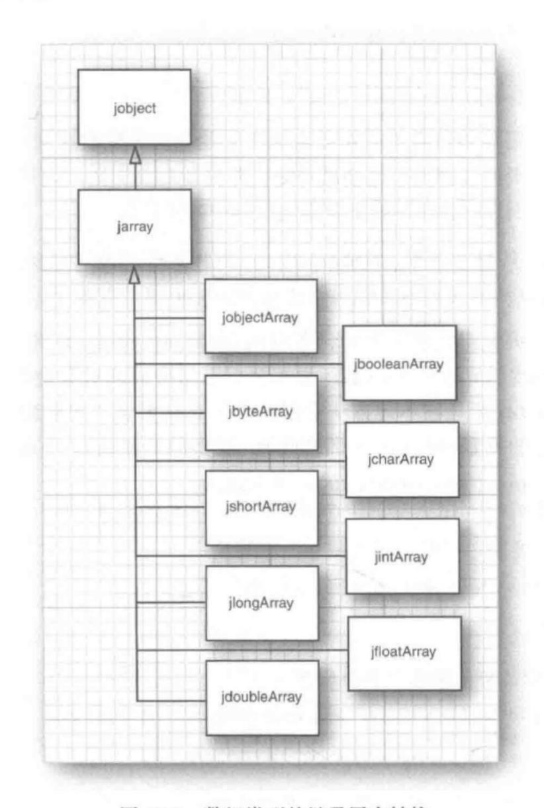

图 12-3 数组类型的继承层次结构

GetXxxArrayElements 函数返回一个指向数组起始元素的 C 指针。与普通的字符串一样,当不再需要该指针时,必须记得要调用 ReleaseXxxArrayElements 函数通知虚拟机。这里,类型 Xxx 必须是基本类型,也就是说,不能是 Object。这样就可以直接读写数组元素了。另一方面,由于指针可能会指向一个副本,只有调用相应的 ReleaseXxxArrayElements 函数时,所做的改变才能保证在源数组里得到反映。

**注释**:通过把一个指向 jboolean 变量的指针作为第三个参数传递给 GetXxxArrayElements 方法,就可以发现一个数组是不是副本了。如果是副本,则该变量用 JNI\_TRUE 填充。如果对这个信息不感兴趣,传一个空指针即可。

下面是对 double 类型数组中的所有元素乘以一个常量的示例代码。我们获取一个 Java 数组的 C 指针 a, 并用 a[i] 访问各个元素。

```
jdoubleArray array_a = . . .;
double scaleFactor = . . .;
double* a = (*env)->GetDoubleArrayElements(env, array_a, NULL);
for (i = 0; i < (*env)->GetArrayLength(env, array_a); i++)
    a[i] = a[i] * scaleFactor;
(*env)->ReleaseDoubleArrayElements(env, array a, a, 0);
```

虚拟机是否确实需要对数组进行拷贝取决于它是如何分配数组和如何进行垃圾回收的。有些"拷贝"型的垃圾回收器例行地移动对象,并更新对象引用。该策略与将数组锁定在特定位置是不兼容的,因为回收器不能更新本地代码中的指针值。

**注释:** Oracle 的 JVM 实现中, boolean 数组是用打包的 32 位字数组表示的。GetBoolean-ArrayElements 方法能将它们复制到拆包的 jboolean 值的数组中。

如果要访问一个大数组的多个元素,可以用 GetXxxArrayRegion 和 SetXxxArrayRegion 方法,它能把一定范围内的元素从 Java 数组复制到 C 数组中或从 C 数组复制到 Java 数组中。

可以用 NewXxxArray 函数在本地方法中创建新的 Java 数组。要创建新的对象数组,需要指定长度、数组元素的类型和所有元素的初始值(典型的是 NULL)。下面是一个例子。

```
jclass class_Employee = (*env)->FindClass(env, "Employee");
jobjectArray array_e = (*env)->NewObjectArray(env, 100, class_Employee, NULL);
基本类型的数组要简单一些。只需提供数组长度。
jdoubleArray array_d = (*env)->NewDoubleArray(env, 100);
该数组用 0 填充。
```

## ■ 注释:下面的方法用来操作"直接缓存":

```
jobject NewDirectByteBuffer(JNIEnv* env, void* address, jlong capacity)
void* GetDirectBufferAddress(JNIEnv* env, jobject buf)
jlong GetDirectBufferCapacity(JNIEnv* env, jobject buf)
```

java.nio包中使用了直接缓存来支持更高效的输入输出操作,并尽可能减少本地和Java数组之间的复制操作。

## API 操作 Java 数组

- jsize GetArrayLength(JNIEnv \*env, jarray array)
   返回数组中的元素个数。
- jobject GetObjectArrayElement(JNIEnv \*env, jobjectArray array, jsize index)
   返回数组元素的值。
- void SetObjectArrayElement(JNIEnv \*env, jobjectArray array, jsize index, jobject value)
   将数组元素设为新值。
- Xxx\* GetXxxArrayElements(JNIEnv \*env, jarray array, jboolean\* isCopy)
   产生一个指向 Java 数组元素的 C 指针。域类型 Xxx 是 Boolean、Byte、Char、Short、Int、Long、Float 或 Double 之一。指针不再使用时,该指针必须传递给 ReleaseXxxArrayElements。

iscopy 可能是 NULL,或者在进行了复制时,指向用 JNI\_TRUE 填充的 jboolean;否则,指向用 JNI\_FALSE 填充的 jboolean。

- void ReleaseXxxArrayElements(JNIEnv \*env, jarray array, Xxx elems[], jint mode)
   通知虚拟机通过 GetXxxArrayElements 获得的一个指针已经不再需要了。mode 是 0 (更新数组元素后释放 elems 缓存)、JNI\_COMMIT (更新数组元素后不释放 elems 缓存)或JNI\_ABORT (不更新数组元素便释放 elems 缓存)之一。
- void GetXxxArrayRegion(JNIEnv \*env, jarray array, jint start, jint length, Xxx elems[]) 将 Java 数组的元素复制到 C 数组中。域类型 Xxx 是 Boolean、Byte、Char、Short、Int、Long、Float 或 Double 之一。
- void SetXxxArrayRegion(JNIEnv \*env, jarray array, jint start, jint length, Xxx elems[])
   将C数组的元素复制到Java数组中。域类型Xxx 是Boolean、Byte、Char、Short、Int、Long、Float或Double之一。

## 12.8 错误处理

使用本地方法对于 Java 程序来说是要冒很大的安全风险的。C 的运行期系统对数组越界错误、不良指针造成的间接错误等不提供任何防护。所以,对于本地方法的程序员来说,处理所有的出错条件以保持 Java 平台的完整性显得格外重要。尤其是,当本地方法诊断出一个它无法解决的问题时,那么它应该将此问题报告给 Java 虚拟机。

在这种情况下,很自然地会抛出一个异常。然而,C语言没有异常,必须调用Throw或ThrowNew 函数来创建一个新的异常对象。当本地方法退出时,Java 虚拟机就会抛出该异常。

要使用 Throw 函数,需要调用 NewObject 来创建一个 Throwable 的子类型的对象。例如,下面我们分配了一个 EOFException 对象,然后将它抛出。

```
jclass class_EOFException = (*env)->FindClass(env, "java/io/EOFException");
jmethodID id_EOFException = (*env)->GetMethodID(env, class_EOFException, "<init>", "()V");
    /* ID of no-argument constructor */
jthrowable obj_exc = (*env)->NewObject(env, class_EOFException, id_EOFException);
(*env)->Throw(env, obj_exc);
```

通常调用 ThrowNew 会更加方便,因为只需提供一个类和一个"modified UTF-8"字节序列,该函数就可以构建一个异常对象。

```
(*env)->ThrowNew(env, (*env)->FindClass(env, "java/io/E0FException"),
   "Unexpected end of file");
```

Throw 和 ThrowNew 都只是发布异常,它们不会中断本地方法的控制流。只有当该方法返回时, Java 虚拟机才会抛出异常。所以,每一个对 Throw 和 ThrowNew 的调用语句之后总是紧跟着 return 语句。

C++ 注释: 如果用 C++ 实现本地方法,那么就无法用 C++ 代码抛出 Java 异常。在 C++ 绑定中,是可以实现在 C++ 异常和 Java 异常之间的转换的。然而,到目前为止

*没有实 个功 。需要在本地方法中使 Throw或ThrowNew函数来抛出Java<sup>异</sup> <sup>常</sup> 并且 保你 本地方法不抛出O+异常。*

*常 本地代 不 捕 Java异常。但是 当本地方法 Java方法时 方 法可 会抛出异常。 且 一些JNI函数也会抛出异常。例如 如果 引越界 SetObject-ArrayElement方法会抛出一个ArraylndexOutOfBoundsException异常 如果所存储 对象的类 不是数 元素类的子 方法会抛出一个ArrayStoreException异常。在 情况下 本地 方法应 ExceptionOccurred方法来确认是否有异常抛出。如果没有任何异常 待处 则下*

*jthrowable obj exc = (\*env) ->ExceptionOccurrecl(env);*

*将 回NULL 否则 回一个当前异常对 引 。如果只 检査是否有异常抛出 不 要获得异常对象的引 么应使*

*jboolean occurred <sup>=</sup> (#env)->ExceptionCheck(env);*

*常 有异常出 时 本地方法应 接 回。 样 拟机就会将 异常传 Java 代 。但是 本地方法也可以分析异常对 定它是否 够处 异常。如果 够处 么必 下 函数来关 异常*

*( env)->ExceptionClear(env):*

*在我们 例子中 我们实 了 fprint本地方法 是基于 方法 合 写为本地方法 假 实 。下 是我们抛出 异常*

- *如果格式字 串是NULL,则抛出NuUPointerException异常。*
- *如果格式字 串不含 合打印double所 明 则抛出IllegalArgumentException 异常。*
- *如果 malloc失 则抛出OutOfMemoryError异常。*

*最后 为了 明本地方法调用Java方法时 怎样检査异常 我们将一个字 串发 数 据流 一次一个字 并且在每次 Java方法后调用ExceptionOccurredo 序清单12-17 出了本地方法 代 序清单12-18展 了含有本地方法 定义。注意 在调用 Printwriter.print出 异常时 本地方法并不会 即 止执 它会 先 放cstr 存。 当本地方法 回时 拟机再次抛出异常。 序清单12-19 测 序 明了当格式字 串 无效时 本地方法是如何抛出异常 。*

#### *序清单 12-17 printf4/Printf4.c*

```
1 /*
2 ^version 1.10 1997-07-fll
3 @author Cay Horstmann
4 /
5
6 finclude "Printf4.h"
```

*<sup>7</sup> finclude string.h>*

```
8 #include <stdlib.h>
9 #include <float.h>
11 /**
      Oparam format a string containing a printf format specifier
12
      (such as "%8.2f"). Substrings "%" are skipped.
13
      @return a pointer to the format specifier (skipping the '%')
14
      or NULL if there wasn't a unique format specifier
15
16
   char* find format(const char format[])
17
18
      char* p;
19
      char* q;
20
21
      p = strchr(format, '%');
22
      while (p != NULL && *(p + 1) == '%') /* skip % */
23
         p = strchr(p + 2, '%');
24
      if (p == NULL) return NULL;
25
      /* now check that % is unique */
26
27
      q = strchr(p, '%');
28
      while (q != NULL && *(q + 1) == '%') /* skip % */
29
38
         q = strchr(q + 2, '%');
      if (q != NULL) return NULL; /* % not unique */
31
      q = p + strspn(p, " -0+#"); /* skip past flags */
32
      q += strspn(q, "0123456789"); /* skip past field width */
33
      if (*q == '.') { q++; q += strspn(q, "0123456789"); }
34
          /* skip past precision */
35
      if (strchr("eEfFgG", *q) == NULL) return NULL;
36
          /* not a floating-point format */
37
      return p;
38
39
   }
49
   JNIEXPORT void JNICALL Java Printf4 fprint(JNIEnv* env, jclass cl,
41
          jobject out, jstring format, jdouble x)
   {
43
      const char* cformat;
44
45
      char* fmt;
      jclass class PrintWriter;
46
      jmethodID id print;
47
      char* cstr;
48
      int width;
49
      int i;
50
51
52
      if (format == NULL)
53
          (*env)->ThrowNew(env,
54
             (*env)->FindClass(env,
55
             "java/lang/NullPointerException"),
             "Printf4.fprint: format is null");
57
58
          return;
      }
59
```

cformat = (\*env)->GetStringUTFChars(env, format, NULL);

fmt = find format(cformat);

68

61

```
63
      if (fmt == NULL)
64
65
          (*env) -> ThrowNew (env,
66
             (*env)->FindClass(env,
67
             "java/lang/IllegalArgumentException"),
68
             "Printf4.fprint: format is invalid");
69
78
          return;
      }
71
72
      width = atoi(fmt);
73
      if (width == 0) width = DBL DIG + 10;
74
      cstr = (char*)malloc(strlen(cformat) + width);
75
76
      if (cstr == NULL)
77
78
      {
          (*env) ->ThrowNew(env,
79
             (*env)->FindClass(env, "java/lang/OutOfMemoryError"),
89
             "Printf4.fprint: malloc failed");
81
82
          return;
83
84
      sprintf(cstr, cformat, x);
85
26
       (*env)->ReleaseStringUTFChars(env, format, cformat);
87
88
      /* now call ps.print(str) */
89
90
       /* get the class */
91
       class PrintWriter = (*env)->GetObjectClass(env, out);
92
93
       /* get the method ID */
94
       id print = (*env)->GetMethodID(env, class PrintWriter, "print", "(C)V");
95
96
       /* call the method */
97
       for (i = 0; cstr[i] != 0 \&\& !(*env) -> Exception 0 ccurred(env); i++)
98
          (*env)->CallVoidMethod(env, out, id print, cstr[i]);
99
188
       free(cstr);
101
102 }
```

## 程序清单 12-18 printf4/Printf4.java

```
import java.io.*;

/**

* @version 1.10 1997-07-01

* @author Cay Horstmann

*/

class Printf4

{
 public static native void fprint(PrintWriter ps, String format, double x);

static
```

```
12 {
13     System.loadLibrary("Printf4");
14  }
15 }
```

#### 程序清单 12-19 printf4/Printf4Test.java

```
1 import java.io.*;
2
3 /**
   * @version 1.11 2018-05-01
  * @author Cay Horstmann
  */
7 class Printf4Test
      public static void main(String[] args)
9
10
         double price = 44.95;
         double tax = 7.75;
12
         double amountDue = price * (1 + tax / 100);
13
         var out = new PrintWriter(System.out);
         /* This call will throw an exception--note the %% */
15
         Printf4.fprint(out, "Amount due = %8.2f\n", amountDue);
16
         out.flush();
17
      }
18
19 }
```

#### API 处理 Java 异常

- jint Throw(JNIEnv \*env, jthrowable obj)
   准备一个在本地代码退出时抛出的异常。成功时返回 0,失败时返回一个负值。
- jint ThrowNew(JNIEnv \*env, jclass cl, const char msg[])
   准备一个在本地代码退出时抛出的类型为 cl 的异常。成功时返回 0, 失败时返回一个负值。msq 是表示异常对象的 String 构造参数的 "modified UTF-8"字节序列。
- jthrowable ExceptionOccurred(JNIEnv \*env) 如果有异常挂起,则返回该异常对象,否则返回 NULL。
- jboolean ExceptionCheck(JNIEnv \*env)
   如果有异常挂起,则返回 true。
- void ExceptionClear(JNIEnv \*env)
   清除挂起的异常。

## 12.9 使用调用 API

到现在为止,我们主要讨论的都是进行了一些 C 调用的用 Java 编程语言编写的程序,

*大概是因为C 度更快一些 或 允 一些Java平台无法 功 。假 在 反 情况下 你有一个C或 CM的程序 并且想 一些Java代 。调用API (invocation API)使你 够把Java 拟机嵌人到C<sup>或</sup> 0<sup>十</sup> 序中。<sup>下</sup> 是初始化 拟机所 基本代 。*

```
JavaVMOption options[l];
JavaVMInitArgs va args;
JavaVM *jvm;
JNIEnv *env;
options[6].叩tionString = "-Djava.class.path=.";
meffiset(&vm args, sizeof(vm args));
vm args.version = JNI VERSION 12;
vmargs. nOptions = 1;
vm args.options = options;
JNI_CreateJavaVM(&jvm, (void**) &env, Svm args);
```

*对JNI\_CreateJavaVM的调用将创建 拟机 并且使指 jvm指向 拟机 使指 env<sup>指</sup> 向执*

*可以给虚拟机提供任意数目的选项 只 增加 数 大小和vm\_args.nOptions 值。例如*

*optionsli].optionstring = <sup>M</sup>-Djava.compiler=NONEw;*

*可以 化即时 器。*

*0 <sup>提</sup> 当你 <sup>入</sup> 烦导 序崩溃 <sup>从</sup> <sup>不</sup> 初始化JVM<sup>或</sup> <sup>不</sup> <sup>你</sup> <sup>时</sup> 打开JNI 模式。 一个 如下*

*options[i].optionString <sup>=</sup> "-verbose*

*你会 到一 列 明JVM初始化 消息。如果 不到你装载的类 检查你 径和 径 。*

*一旦 完 拟机 就可以如前 小 介绍的那样调用Java方法了。只 按常 方法使 env指 即可。*

*只有在调用API中 其他函数时 才需要jvm指 。 前 只有四个 样 函数。最 一个是 止 拟机 函数*

*( jvu)->DestroyJavaVM(jvin);*

*憾 是 在 Windows下 动态 接到 jre/bin/client/jvm.dU 中 JNI\_CreateJavaVM 函数变得 常困 因为Vista改变了 接 则 Oracle 库仍旧依 于旧 本 C 时 库。我们 例 序 手工加 库 决了 个 这种方式与Java 序所使 方式一样 参 JDK中 src.jar文件里的launcher/javajnd.c文件。*

*序清单12-20 C 序 了 拟机 然后调用了 Welcome类的main方法 个 在 <sup>卷</sup>I <sup>2</sup> <sup>中</sup> (在开始启 <sup>测</sup> 序之前 务必 Welcome, java文件)。*

#### 程序清单 12-20 invocation/InvocationTest.c

```
@version 1.20 2007-10-26
      @author Cay Horstmann
3
4 */
5
6 #include <jni.h>
7 #include <stdlib.h>
9 #ifdef WINDOWS
10
11 #include <windows.h>
12 static HINSTANCE loadJVMLibrary(void);
13 typedef jint (JNICALL *CreateJavaVM t)(JavaVM **, void **, JavaVMInitArgs *);
14
  #endif
16
17 int main()
      JavaVMOption options[2];
19
      JavaVMInitArgs vm args;
20
      JavaVM *jvm;
      JNIEnv *env;
22
      long status;
23
24
      jclass class Welcome;
25
      jclass class String;
26
27
      jobjectArray args;
      jmethodID id main;
28
29
30 #ifdef WINDOWS
      HINSTANCE hjvmlib;
31
      CreateJavaVM t createJavaVM;
32
  #endif
33
34
      options[0].optionString = "-Djava.class.path=.";
35
36
      memset(&vm_args, 0, sizeof(vm_args));
37
      vm args.version = JNI VERSION 1 2;
38
      vm args.nOptions = 1;
39
      vm args.options = options;
40
41
  #ifdef WINDOWS
42
43
      hjvmlib = loadJVMLibrary():
      createJavaVM = (CreateJavaVM t) GetProcAddress(hjvmlib, "JNI CreateJavaVM");
44
      status = (*createJavaVM)(&jvm, (void **) &env, &vm args);
45
      status = JNI CreateJavaVM(&jvm, (void **) &env, &vm args);
47
   #endif
48
49
      if (status == JNI ERR)
58
51
         fprintf(stderr, "Error creating VM\n");
52
         return 1;
53
```

```
54
55
      class Welcome = (*env)->FindClass(env, "Welcome");
56
      id main = (*env)->GetStaticMethodID(env, class Welcome, "main", "([Ljava/lang/String;)V");
57
58
      class String = (*env)->FindClass(env, "java/lang/String");
59
      args = (*env)->NewObjectArray(env, θ, class String, NULL);
60
      (*env)->CallStaticVoidMethod(env, class Welcome, id main, args);
61
62
      (*jvm)->DestroyJavaVM(jvm);
63
64
      return 0;
65
   }
66
67
   #ifdef WINDOWS
68
69
  static int GetStringFromRegistry(HKEY key, const char *name, char *buf, jint bufsize)
78
71
      DWORD type, size;
72
73
      return RegQueryValueEx(key, name, 0, &type, 0, &size) == 0
74
         && type == REG SZ
75
         && size < (unsigned int) bufsize
76
         && RegQueryValueEx(key, name, 0, 0, buf, &size) == 0;
77
78
79
   static void GetPublicJREHome(char *buf, jint bufsize)
86
81
      HKEY key, subkey;
82
      char version[MAX PATH];
83
84
      /* Find the current version of the JRE */
85
      char *JRE KEY = "Software\\JavaSoft\\Java Runtime Environment";
86
      if (RegOpenKeyEx(HKEY LOCAL MACHINE, JRE KEY, 0, KEY READ, &key) != 0)
87
88
          fprintf(stderr, "Error opening registry key '%s'\n", JRE KEY);
89
          exit(1);
98
      }
91
92
      if (!GetStringFromRegistry(key, "CurrentVersion", version, sizeof(version)))
93
94
          fprintf(stderr, "Failed reading value of registry key:\n\t%s\\CurrentVersion\n",
95
96
             JRE KEY);
          RegCloseKey(key);
97
          exit(1);
98
       }
99
100
       /* Find directory where the current version is installed. */
101
       if (RegOpenKeyEx(key, version, θ, KEY READ, &subkey) != θ)
102
       {
103
          fprintf(stderr, "Error opening registry key '%s\\%s'\n", JRE KEY, version);
184
          RegCloseKey(key);
185
          exit(1);
106
187
108
```

```
109
      if (!GetStringFromRegistry(subkey, "JavaHome", buf, bufsize))
110
          fprintf(stderr, "Failed reading value of registry key:\n\t%s\\3avaHome\n",
111
             JRE KEY, version);
112
         RegCloseKey(key);
113
         RegCloseKey(subkey);
114
115
         exit(1):
116
117
      RegCloseKey(key);
118
      RegCloseKey(subkey);
119
120 }
121
122 static HINSTANCE loadJVMLibrary(void)
123 {
124
      HINSTANCE h1, h2;
      char msvcdll[MAX PATH];
125
      char javadll[MAX PATH];
126
      GetPublicJREHome(msvcdll, MAX PATH);
      strcpy(javadll, msvcdll);
128
      strncat(msvcdll, "\\bin\\msvcr71.dll", MAX_PATH - strlen(msvcdll));
129
      msvcdll[MAX PATH - 1] = '\0';
      strncat(javadll, "\\bin\\client\\jvm.dll", MAX PATH - strlen(javadll));
131
      javadll[MAX PATH - 1] = '\0';
132
133
      h1 = LoadLibrary(msvcdll);
134
135
      if (h1 == NULL)
136
          fprintf(stderr, "Can't load library msvcr71.dll\n");
137
          exit(1);
138
139
      }
148
      h2 = LoadLibrary(javadll);
      if (h2 == NULL)
142
143
          fprintf(stderr, "Can't load library jvm.dll\n");
144
145
          exit(1);
       }
146
147
       return h2;
148 }
149
150 #endif
```

## 要在 Linux 下编译该程序,请用:

```
gcc -I jdk/include -I jdk/include/linux -o InvocationTest \
  -L jdk/jre/lib/i386/client -ljvm InvocationTest.c
```

在 Windows 下用微软的编译器时,请用下面的命令行:

```
cl -D_WINDOWS -I jdk\include -I jdk\include\win32 InvocationTest.c \\\\jdk\lib\jvm.lib advapi32.lib
```

需要确保 INCLUDE 和 LIB 环境变量包含了 Windows API 头文件和库文件的路径。

*Cygwin时 下 句*

*gcc -D WINDOWS -uno-cygwin -I ;rfk\include -I ;dfc\include\win32 •D\_\_int64= long long" \ -I c:\cygwin\usr\include\w32api -o InvocationTest*

*<sup>在</sup>Linux/UNIX<sup>下</sup> 序之前 需要确保LD LIBRARY PATH包含了共享 <sup>库</sup> <sup>R</sup>录。 例如 如果使 Linux上 bash命令 则 执 下 命令*

*export LD LIBRARY PATH^/dk/j re八ib八386/cUent: \$LD\_LIBRARY PATH*

## *g调用API函数*

- *• jint JNI CreateJavaVM(JavaVM\*\* pjvm, void\*\* <sup>p</sup> env, JavaVMInitArgs\* vm\_args) 初始化Java 拟机。如果成功 则 否则 回JNI\_ERR。p\_jvm参数是指向 API函数 指 p^env是指向JNI函数 指 。*
- *• jint DestroyJavaVM(JavaVM\* jvm) 毁 拟机。如果成功 则 回0 否则 回一个 值。 函数必 一个 拟机 指 。例如 (\*jvm)->DestroyJavaVM(jvm)<sup>0</sup>*

## *12.10完整的示例 Windows注册*

*在本 中 我们介 一个完整 可 例子 涵 了我们在本章讨论的所有内容 使 带有字 串、数 和对象的本地方法 构 器调用和错误处 。我们将展 如何 Java 平台包 器来包 普 基于C API子 于 Windows注册 操作。当然 <sup>于</sup> Windows 具体 性 使 Windows注册表的程序天 就不可 植。基于 个原因 标准 Java库不支持注册 所以使 本地方法 注册 是有意义 。 12.10.1 Windows注册 <sup>概</sup>*

*Windows注册 是一个存放Windows操作 和应 序 信息 数据仓库。它 提供了对 和应 序参数 单点 和备份。其不 方 是 注册 也是单点 。如果你弄乱了注册 你 就会出故 无法启动。*

*我们不建 你使 注册 来存储Java <sup>序</sup> 参数。Java偏好API ( preferences API) 是一个更好 决方案(更多信息 <sup>参</sup> <sup>卷</sup>I <sup>10</sup> )。我们使 注册 只是为了 明怎样 把重要的本地API包 成Java 。*

*检査注册 主 工具是注册 器。 于可 存在幼 热 户 所以Windows 没有 备任何图标来启动注册 <sup>器</sup>。你必 启动DOS shell (或打开"开始"-> "运行" 对 框)然后 入regedito图12-4 出了一个运行中 注册表编辑器。*

*左 是树形 构排列 注册 。 注意 每个键都以HKEY 点幵始 如*

*HKEY\_CLASSES ROOT HKEY\_CURRENT\_USER HKEY LOCAL MACHINE*

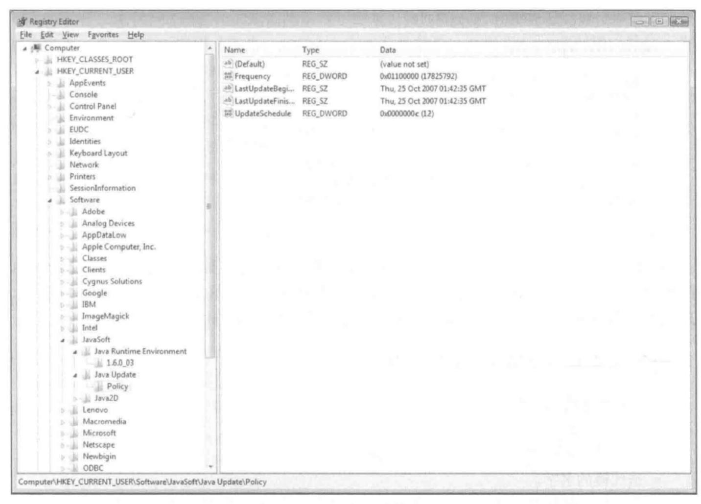

*图12-4注册表编辑器*

*右 是与 定 关 名/值对。例如 如果你安 <sup>了</sup> Java 17, 么*

*HKEY\_LOCAL\_MACHINE\Software\JavaSoft\Java Runtime Environment*

## *就包含下 样 名值对*

*CurrentVersion=u17. 10"*

*在本例中 值是字 串。值也可以是整数或字 数 。*

## *12.10.2 注册 Java平台接口*

*我们创建了一个从Java代 注册 单接口 然后 本地代 实 了 个 接口。我们 接口只允 几个注册 操作 为了保持 小 代 模 我们 了其他 重要的操作 如 添加、删 和枚举注册表键 添加剩余的这些注册 API函数是很容 易 。*

*即使使 我们提供 受限的子 你也可以*

- *枚举某个 中存储 所有名字。*
- *出 某个名字存储 值。*
- *某个名字存储 值。*

## 下面是封装注册表键的 Java 类:

```
public class Win32RegKey
{
   public Win32RegKey(int theRoot, String thePath) { . . . }
   public Enumeration names() { . . . }
   public native Object getValue(String name);
   public native void setValue(String name, Object value);

public static final int HKEY_CLASSES_ROOT = 0×80000000;
   public static final int HKEY_CURRENT_USER = 0×80000001;
   public static final int HKEY_LOCAL_MACHINE = 0×80000002;
}
```

names 方法返回与该键存放在一起的所有名字的一个枚举,你可以用你熟悉的 hasMore-Elements/nextElement 方法获取它们。getValue 方法返回一个对象,该对象可以是字符串、Integer 对象或字节数组。setValue 方法的 value 参数也必须是上述三种类型之一。

#### 12.10.3 以本地方法实现注册表访问函数

我们需要实现三个操作:

- 获取某个键的值。
- 设置某个键的值。
- 迭代键的名字。

在本章中,你基本上已经看到了所有必需的工具,如 Java 字符串和数组到 C 的字符串和数组的转换,还了解了如何在出错时抛出异常。

有两个问题使得这些本地方法比之前的例子更加复杂。getValue 和 setValue 方法处理的是 Object 类型,它可以是 String、Integer 或 byte[]之一。枚举对象需要用来存放连续的对 hasMoreElements 和 nextElement 的调用之间的状态。

让我们先看一下 getValue 方法, 该方法(见程序清单 12-22)经历了以下几个步骤:

- 1. 打开注册表键。为了读取它们的值,注册表 API 要求这些键是开放的。
- 2. 查询与名字关联的值的类型和大小。
- 3. 把数据读到缓存。
- 4. 如果类型是 REG\_SZ (字符串),调用 NewStringUTF,用该值来创建一个新的字符串。
- 5. 如果类型是 REG\_DWORD (32 位整数), 调用 Integer 构造器。
- 6. 如果类型是 REG\_BINARY, 调用 NewByteArray 来创建一个新的字节数组, 并调用 SetByte-ArrayRegion, 把值数据复制到该字节数组中。
- 7. 如果不是以上类型或调用 API 函数时出现错误,那就抛出异常,并小心地释放到此为止所获得的所有资源。
  - 8. 关闭键,并返回创建的对象(String、Integer 或 byte[])。 如你所见,这个例子很好地说明了怎样产生不同类型的 Java 对象。

*在本地方法中 <sup>处</sup> 泛化 <sup>回</sup> 型并不困 <sup>j</sup> st ring, <sup>j</sup> object或jarray引用都可以 接作为一个jobject 回。但是 setvalue方法接受 是一个对Object 引 并且 为 了把 Object保存为字 串、整数或字 数 必须确定 Object的确切 型。我们可以 査 value 对 找出对 java. lang. St ring、java.lang.Integer 和 byte[] 引 , 将其与IsAssignableFrom函数 比 从 定它 切 型。*

*如果classl和dass2是两个 引 么*

*(\*env)->IsAssignableFrom(env<sup>f</sup> classl, class2)*

*当classl和class2是同一个 或classl是class2 子 时 回JNI\_TRUEO在 两 情况下 classl对 引 可以 型到class2。例如 当*

```
( env)->IsAssignableFrom(env, (*env)->GetObj ectClass(env, value)•
   (*env)->FindClass(envf M[B"))
```

*为true时 我们就 值是一个字 数 。*

*下 是对setvalue方法中 步 概*

- *1. 打开注册 以便写人。*
- *2. 找出 写人 值 型。*
- *3. 如果 型是String, GetStringUTFChars 取一个指向 些字 指 。*
- *4. 如果 型是Integer,调用intValue方法 取 包 器对 中存储 整数。*
- *5. 如果 型是byte[],调用GetByteArrayElements 取指向 些字 指 。*
- *6. 把数据和 度传 注册 。*
- *7. 关闭键。*
- *8. 如果 型是String或byte[】 么 放指向数据 指 。*

*最后 我们介 枚举 本地方法。 些方法属于Win32RegKeyNameEnumention (参 序清单12-21)。当枚举 开始时 我们必 打开 。在枚举 中 我们必 保持 句柄。也就是 句柄必 与枚举对 存放在一 。键的句柄是DWORD 型 它 是一个32位数 所以可以存放在一个Java 整数中。它 存放在枚举类的hkey域中 当枚 举开始时 SetlntField初始化 域 后 GetlntField来 取其值。*

## *序清单12-21 win32reg/Win32RegKey.java*

```
1 import java.util.*;
2
3 / *
4 * A Win32RegKey object can be used to get and set values of a registry key in the Windows
5 * registry.
6 * ^version 1.90 1997-07-91
7 ^author Cay Horstmann
8 */
9 public class Win32RegKey
l
n public static final int HKEY_CLASSES_ROOT = 0x8000000
u public static final int HKEY CURRENT^USER = 0x 606001;
```

```
public static final int HKEY_LOCAL_MACHINE = 0x80000002;
13
      public static final int HKEY USERS = 0x80000003;
14
      public static final int HKEY CURRENT CONFIG = 0x80000005;
15
      public static final int HKEY DYN DATA = 0x80000006;
16
17
      private int root;
18
      private String path;
19
20
21
       * Gets the value of a registry entry.
22
       * @param name the entry name
23
       * @return the associated value
74
25
      public native Object getValue(String name);
26
27
28
       * Sets the value of a registry entry.
29
       * @param name the entry name
30
       * @param value the new value
31
32
      public native void setValue(String name, Object value);
33
34
35
       * Construct a registry key object.
36
       * @param theRoot one of HKEY CLASSES ROOT, HKEY CURRENT USER, HKEY LOCAL MACHINE,
37
       * HKEY USERS, HKEY CURRENT CONFIG, HKEY DYN DATA
38
       * @param thePath the registry key path
39
       */
48
      public Win32RegKey(int theRoot, String thePath)
41
42
          root = theRoot;
43
          path = thePath;
44
45
46
47
        * Enumerates all names of registry entries under the path that this object describes.
48
        * @return an enumeration listing all entry names
49
50
       public Enumeration<String> names()
51
52
          return new Win32RegKeyNameEnumeration(root, path);
53
      }
54
55
      static
56
57
          System.loadLibrary("Win32RegKey");
58
59
68
61
   class Win32RegKeyNameEnumeration implements Enumeration<String>
62
63
       public native String nextElement();
64
65
       public native boolean hasMoreElements();
       private int root;
66
       private String path;
67
```

```
private int index = -1;
      private int hkey =
      private int maxsize;
      private int count;
      Win32RegKeyNameEnumeration(int theRoot f String thePath) 
       {
          root = theRoot;
          path = thePath;
       }
   }
   class Win32RegKeyException extends RuntineException
   {
       public Win32RegKeyException(}
       {
       }
       public Win32RegKeyException(String why)
       {
          super(why);
       }
s
69
7ne
73
74
76n
78
79M
81
82
B3M
85w
87
88
89M
```

*在 个例子 我们 枚举对 存放了另外三个数据 。当枚举一开始 我们可以从注 册 中査 到名/值对 个数和最 名字 度 我们 些信息 因此我们分 C字 数 以保存 些名字。 些值存放在枚举对 count和maxsize域中。最后 index域 初 始化为-1 枚举 开始。一旦其他实例域 初始化 index域就被置为0,在完成每个枚 举步 之后 会 增。*

*我们简要介 一下支持枚举 本地方法。hasMoreElements方法很 单*

- *1. 取 index 和 count 域。*
- *<sup>2</sup>. 如果index是-1, startNameEnumeration函数打开 <sup>査</sup> <sup>数</sup> 和最大 <sup>度</sup> <sup>初</sup> 始化 hkey、count、maxsize <sup>和</sup> index 域。*
  - *<sup>3</sup>. 如果index小于count,<sup>则</sup> <sup>回</sup>JNI TRUE,否则 <sup>回</sup>JNI\_FALSE。 nextElement方法 复杂一些。*
  - *1. 取 index 和 count 域。*
- *<sup>2</sup>. 如果index是-1, startNameEnumeration函数打幵 <sup>査</sup> <sup>数</sup> 和最大 <sup>度</sup> <sup>初</sup> 始化 hkey、count、maxsize 和 index 域。*
  - *3. 如果 index 于 count,抛出一个 NoSuchElementException 异常。*
  - *4. 从注册 中 入下一个名字。*
  - *5. 增 indexo*
  - *6. 如果index 于count,则关 。*

*在编译之前 得在Win32RegKey <sup>和</sup>Win32RegKeyNameEnume「ation 上都要运行 javac -h<sup>0</sup> 微软编译器 完整命令 如下*

cl -I jdk\include -I jdk\include\win32 -LD Win32RegKey.c advapi32.lib -FeWin32RegKey.dll

## Cygwin 系统上, 请使用:

```
gcc -mno-cygwin -D __int64="long long" -I jdk\include -I jdk\include\win32 \ -I c:\cygwin\usr\include\w32api -shared -Wl,--add-stdcall-alias -o Win32RegKey.dll Win32RegKey.c
```

因为注册表 API 是针对 Windows 的, 所以这个程序不能在其他操作系统上运行。

程序清单 12-23 给出了测试我们新的注册表函数的程序。我们在键中添加了三个名值对: -个字符串、一个整数和一个字节数组。

HKEY CURRENT USER\Software\JavaSoft\Java Runtime Environment

然后,我们枚举该键的所有名字并获取它们的值。该程序应该打印如下信息:

```
Default user=Harry Hacker
Lucky number=13
Small primes=2 3 5 7 11 13
```

虽然在该键中添加这些名值对不会有什么危害,但是在运行该程序后,你可能还是想使 用注册表编辑器去移除它们。

#### 程序清单 12-22 win32reg/Win32RegKey.c

```
1 /**
      @version 1.00 1997-07-01
2
      @author Cay Horstmann
3
6 #include "Win32RegKey.h"
7 #include "Win32RegKevNameEnumeration.h"
8 #include <string.h>
9 #include <stdlib.h>
10 #include <windows.h>
12 JNIEXPORT jobject JNICALL Java Win32RegKey getValue(
         JNIEnv* env, jobject this obj, jobject name)
13
14 {
      const char* cname:
15
      jstring path;
      const char* cpath;
17
      HKEY hkey;
18
      DWORD type;
19
      DWORD size;
28
     jclass this class;
21
     ifieldID id root;
      jfieldID id path;
23
      HKEY root:
24
     jobject ret;
25
      char* cret;
26
27
      /* get the class */
28
      this class = (*env)->GetObjectClass(env, this obj);
29
38
```

```
/* get the field IDs */
31
      id root = (*env)->GetFieldID(env, this class, "root", "I");
32
33
      id path = (*env)->GetFieldID(env, this class, "path", "Ljava/lang/String;");
34
35
      /* get the fields */
      root = (HKEY) (*env)->GetIntField(env, this obj, id root);
36
      path = (jstring)(*env)->GetObjectField(env, this obj, id path);
37
      cpath = (*env)->GetStringUTFChars(env, path, NULL);
38
39
      /* open the registry key */
49
      if (RegOpenKeyEx(root, cpath, 0, KEY READ, &hkey) != ERROR SUCCESS)
41
42
         (*env)->ThrowNew(env, (*env)->FindClass(env, "Win32RegKeyException"),
43
                "Open key failed");
44
         (*env)->ReleaseStringUTFChars(env, path, cpath);
45
         return NULL:
45
47
48
      (*env)->ReleaseStringUTFChars(env, path, cpath);
49
      cname = (*env)->GetStringUTFChars(env, name, NULL);
50
51
      /* find the type and size of the value */
52
      if (RegQueryValueEx(hkey, cname, NULL, &type, NULL, &size) != ERROR SUCCESS)
53
54
          (*env)->ThrowNew(env, (*env)->FindClass(env, "Win32RegKeyException"),
55
                "Query value key failed");
56
         RegCloseKey(hkey);
57
          (*env)->ReleaseStringUTFChars(env, name, cname);
58
         return NULL;
59
60
61
      /* get memory to hold the value */
67
63
      cret = (char*)malloc(size);
64
      /* read the value */
65
      if (RegQueryValueEx(hkey, cname, NULL, &type, cret, &size) != ERROR SUCCESS)
66
67
          (*env)->ThrowNew(env, (*env)->FindClass(env, "Win32RegKeyException"),
68
                "Query value key failed");
69
         free(cret);
78
          RegCloseKey(hkey);
71
72
          (*env)->ReleaseStringUTFChars(env, name, cname);
          return NULL;
73
      }
74
75
76
      /* depending on the type, store the value in a string,
          integer, or byte array */
77
      if (type == REG SZ)
78
79
88
          ret = (*env) -> NewStringUTF(env, cret);
81
      else if (type == REG DWORD)
97
83
          jclass class Integer = (*env)->FindClass(env, "java/lang/Integer");
84
          /* get the method ID of the constructor */
85
```

```
jmethodID id Integer = (*env)->GetMethodID(env, class Integer, "<init>", "(I)V");
86
87
         int value = *(int*) cret;
         /* invoke the constructor */
88
         ret = (*env)->NewObject(env, class_Integer, id_Integer, value);
89
98
91
      else if (type == REG BINARY)
92
93
         ret = (*env)->NewByteArray(env, size);
          (*env)->SetByteArrayRegion(env, (jarray) ret, θ, size, cret);
94
      }
95
      else
96
97
          (*env)->ThrowNew(env, (*env)->FindClass(env, "Win32RegKeyException"),
98
                "Unsupported value type");
99
         ret = NULL;
100
      }
101
102
      free(cret);
183
      RegCloseKey(hkey);
184
      (*env)->ReleaseStringUTFChars(env, name, cname);
105
186
      return ret;
107
108 }
109
110 JNIEXPORT void JNICALL Java Win32RegKey setValue(JNIEnv* env, jobject this obj,
         jstring name, jobject value)
111
112 {
      const char* cname;
113
      jstring path;
114
      const char* cpath;
115
      HKEY hkey;
116
      DWORD type;
117
      DWORD size;
118
      jclass this class;
119
      jclass class value;
120
      jclass class Integer;
121
      jfieldID id root;
122
      jfieldID id path;
123
      HKEY root;
      const char* cvalue;
125
      int ivalue;
126
127
      /* get the class */
128
      this class = (*env)->GetObjectClass(env, this obj);
129
130
      /* get the field IDs */
131
      id root = (*env)->GetFieldID(env, this class, "root", "I");
132
      id path = (*env)->GetFieldID(env, this class, "path", "Ljava/lang/String;");
133
134
      /* get the fields */
135
      root = (HKEY)(*env)->GetIntField(env, this obj, id root);
136
      path = (jstring)(*env)->GetObjectField(env, this_obj, id_path);
137
138
      cpath = (*env)->GetStringUTFChars(env, path, NULL);
139
      /* open the registry key */
148
```

```
if (RegOpenKeyEx(root, cpath, 0, KEY WRITE, &hkey) != ERROR SUCCESS)
142
         (*env)->ThrowNew(env, (*env)->FindClass(env, "Win32RegKeyException"),
143
                "Open key failed");
         (*env)->ReleaseStringUTFChars(env, path, cpath);
145
146
         return;
147
148
      (*env)->ReleaseStringUTFChars(env, path, cpath);
149
      cname = (*env)->GetStringUTFChars(env, name, NULL);
158
151
      class value = (*env)->GetObjectClass(env, value);
152
      class Integer = (*env)->FindClass(env, "java/lang/Integer");
153
      /* determine the type of the value object */
154
      if ((*env)->IsAssignableFrom(env, class value, (*env)->FindClass(env, "java/lang/String")))
155
156
         /* it is a string--get a pointer to the characters */
157
         cvalue = (*env)->GetStringUTFChars(env, (jstring) value, NULL);
158
         type = REG SZ;
159
         size = (*env)->GetStringLength(env, (jstring) value) + 1;
160
      else if ((*env)->IsAssignableFrom(env, class value, class Integer))
162
163
         /* it is an integer--call intValue to get the value */
         imethodID id intValue = (*env)->GetMethodID(env, class Integer, "intValue", "()I");
165
         ivalue = (*env)->CallIntMethod(env, value, id intValue);
166
         type = REG DWORD;
         cvalue = (char*)&ivalue:
168
         size = 4;
169
179
      else if ((*env)->IsAssignableFrom(env, class value, (*env)->FindClass(env, "[B")))
171
172
         /* it is a byte array--get a pointer to the bytes */
173
174
         type = REG BINARY;
         cvalue = (char*)(*env)->GetByteArrayElements(env, (jarray) value, NULL);
         size = (*env)->GetArrayLength(env, (jarray) value);
176
177
      else
178
179
         /* we don't know how to handle this type */
180
          (*env)->ThrowNew(env, (*env)->FindClass(env, "Win32RegKeyException"),
181
                "Unsupported value type");
182
         RegCloseKey(hkey);
183
          (*env)->ReleaseStringUTFChars(env, name, cname);
184
         return;
185
186
187
      /* set the value */
188
      if (RegSetValueEx(hkey, cname, 0, type, cvalue, size) != ERROR SUCCESS)
189
198
          (*env)->ThrowNew(env, (*env)->FindClass(env, "Win32RegKeyException"),
191
                "Set value failed");
192
193
194
195
      RegCloseKey(hkey);
```

```
(*env)->ReleaseStringUTFChars(env, name, cname);
197
      /* if the value was a string or byte array, release the pointer */
198
      if (type == REG SZ)
288
         (*env)->ReleaseStringUTFChars(env, (jstring) value, cvalue);
201
202
      else if (type == REG BINARY)
203
284
         (*env)->ReleaseByteArrayElements(env, (jarray) value, (jbyte*) cvalue, 0);
205
286
287 }
288
289 /* helper function to start enumeration of names */
210 static int startNameEnumeration(JNIEnv* env, jobject this obj, jclass this class)
211 {
212
      ifieldID id index:
      jfieldID id count;
213
      jfieldID id root;
214
      ifieldID id path;
215
216
      jfieldID id hkey;
      jfieldID id maxsize;
217
218
      HKEY root;
219
      istring path;
228
      const char* cpath;
221
      HKEY hkey;
222
223
      DWORD maxsize = \theta;
      DWORD count = 0;
224
225
      /* get the field IDs */
226
      id root = (*env)->GetFieldID(env, this class, "root", "I");
227
      id path = (*env)->GetFieldID(env, this class, "path", "Ljava/lang/String;");
228
      id hkey = (*env)->GetFieldID(env, this class, "hkey", "I");
229
      id maxsize = (*env)->GetFieldID(env, this class, "maxsize", "I");
      id index = (*env)->GetFieldID(env, this class, "index", "I");
231
       id count = (*env)->GetFieldID(env, this class, "count", "I");
232
233
      /* get the field values */
234
       root = (HKEY)(*env)->GetIntField(env, this obj, id root);
235
       path = (jstring)(*env)->GetObjectField(env, this obj, id path);
236
       cpath = (*env)->GetStringUTFChars(env, path, NULL);
237
238
       /* open the registry key */
239
       if (RegOpenKeyEx(root, cpath, 0, KEY READ, &hkey) != ERROR SUCCESS)
248
241
          (*env)->ThrowNew(env, (*env)->FindClass(env, "Win32RegKeyException"),
242
                "Open key failed");
243
          (*env)->ReleaseStringUTFChars(env, path, cpath);
744
245
          return -1;
246
       (*env)->ReleaseStringUTFChars(env, path, cpath);
247
248
       /* query count and max length of names */
249
       if (RegQueryInfoKey(hkey, NULL, NULL, NULL, NULL, NULL, NULL, &count, &maxsize,
250
```

```
NULL, NULL, NULL) != ERROR SUCCESS)
251
252
253
          (*env)->ThrowNew(env, (*env)->FindClass(env, "Win32RegKeyException"),
                "Query info key failed");
254
          RegCloseKey(hkey);
255
          return -1;
256
      }
257
258
      /* set the field values */
259
      (*env)->SetIntField(env, this obj, id hkey, (DWORD) hkey);
268
       (*env)->SetIntField(env, this obj, id maxsize, maxsize + 1);
261
       (*env)->SetIntField(env, this obj, id index, 0);
262
       (*env)->SetIntField(env, this obj, id count, count);
263
      return count;
264
265 }
266
   JNIEXPORT jboolean JNICALL Java Win32RegKeyNameEnumeration hasMoreElements(JNIEnv* env,
267
          jobject this obj)
268
269 {
278
      jclass this class;
      jfieldID id index;
271
272
      jfieldID id count;
      int index;
273
      int count:
274
      /* get the class */
275
      this_class = (*env)->GetObjectClass(env, this_obj);
276
277
      /* get the field IDs */
278
      id_index = (*env)->GetFieldID(env, this class, "index", "I");
279
288
      id count = (*env)->GetFieldID(env, this class, "count", "I");
281
      index = (*env)->GetIntField(env, this obj, id index);
282
      if (index == -1) /* first time */
283
      {
284
          count = startNameEnumeration(env, this obj, this class);
285
          index = \theta:
286
      }
287
      else
288
          count = (*env)->GetIntField(env, this obj, id count);
289
      return index < count;
298
291 }
292
   JNIEXPORT jobject JNICALL Java Win32RegKeyNameEnumeration nextElement(JNIEnv* env,
293
          jobject this obj)
294
295 {
      jclass this class;
296
      jfieldID id index;
297
      jfieldID id hkey;
298
      jfieldID id count;
299
      jfieldID id maxsize;
300
301
      HKEY hkey;
382
303
      int index;
      int count;
304
      DWORD maxsize:
385
```

```
306
      char* cret:
307
      jstring ret;
309
      /* get the class */
310
      this class = (*env)->GetObjectClass(env, this obj);
311
312
      /* get the field IDs */
313
      id index = (*env)->GetFieldID(env, this class, "index", "I");
314
      id count = (*env)->GetFieldID(env, this class, "count", "I");
315
      id hkey = (*env)->GetFieldID(env, this class, "hkey", "I");
316
      id maxsize = (*env)->GetFieldID(env, this class, "maxsize", "I");
317
318
      index = (*env)->GetIntField(env, this obj, id index);
319
      if (index == -1) /* first time */
328
321
         count = startNameEnumeration(env, this obj, this class);
322
         index = 0:
323
324
325
      else
          count = (*env)->GetIntField(env, this obj, id count);
326
327
      if (index >= count) /* already at end */
328
379
          (*env)->ThrowNew(env, (*env)->FindClass(env, "java/util/NoSuchElementException"),
330
                "past end of enumeration");
331
332
          return NULL;
       }
333
334
       maxsize = (*env)->GetIntField(env, this obj, id maxsize);
335
       hkey = (HKEY)(*env)->GetIntField(env, this obj, id hkey);
336
       cret = (char*)malloc(maxsize);
337
338
       /* find the next name */
339
       if (RegEnumValue(hkey, index, cret, &maxsize, NULL, NULL, NULL, NULL) != ERROR SUCCESS)
348
341
          (*env)->ThrowNew(env, (*env)->FindClass(env, "Win32RegKeyException"),
342
                "Enum value failed");
343
          free(cret);
344
          RegCloseKey(hkey);
345
          (*env)->SetIntField(env, this obj, id index, count);
346
          return NULL;
347
348
349
       ret = (*env)->NewStringUTF(env, cret);
350
       free(cret);
351
352
       /* increment index */
353
354
       (*env)->SetIntField(env, this obj, id index, index);
355
356
       if (index == count) /* at end */
357
358
          RegCloseKey(hkey);
359
```

```
360 }
361
362 return ret;
363 }
```

## 程序清单 12-23 win32reg/Win32RegKeyTest.java

```
import java.util.*;
2
      @version 1.04 2021-05-30
      @author Cay Horstmann
   public class Win32RegKeyTest
8
      public static void main(String[] args)
18
         var key = new Win32RegKey(
11
            Win32RegKey.HKEY CURRENT USER, "Software\\JavaSoft\\Java Runtime Environment");
12
13
         key.setValue("Default user", "Harry Hacker");
14
         key.setValue("Lucky number", Integer.valueOf(13));
15
         key.setValue("Small primes", new byte[] { 2, 3, 5, 7, 11 });
16
17
         Enumeration<String> e = key.names();
18
19
         while (e.hasMoreElements())
28
21
            String name = e.nextElement();
22
            System.out.print(name + "=");
23
24
            Object value = key.getValue(name);
25
26
             if (value instanceof byte[] bytes)
27
                for (byte b : bytes) System.out.print((b & 0xFF) + " ");
28
             else
29
                System.out.print(value);
38
31
             System.out.println();
32
33
34
35 }
```

## API 类型质询函数

- jboolean IsAssignableFrom(JNIEnv \*env, jclass cl1, jclass cl2)
   如果第一个类的对象可以赋给第二个类的对象,则返回 JNI\_TRUE,否则返回 JNI\_FALSE。这个函数可以测试:两个类是否相同,cl1是否 cl2 的子类,cl2是否表示一个由 cl1或它的一个超类实现的接口。
- jclass GetSuperclass(JNIEnv \*env, jclass cl) 返回某个类的超类。如果 cl 表示 Object 类或一个接口,则返回 NULL。

## *12.11外 函数 展望未来*

*在使 JNI时 我们必 写C代 来访问Java数据 构、调用需要的C函数 <sup>然</sup> 后将 <sup>果</sup> 换回Java。 样就必 <sup>将</sup>C<sup>代</sup> 接到平台 <sup>关</sup> 库中。在"巴拿马项目" (Project Panama)中开发了一个 于访问"外 "函数和内存 API,它使我们可以 Java 来 写 代 。*

*在Java <sup>17</sup><sup>中</sup> <sup>个</sup>API 是一 <sup>性</sup> <sup>其</sup> 在最 发布之前 会有所变化。 序清单12-24中 序是 个 API 一个 常 单 演示程序。*

*个 序 接 了 printf函数 不 任何 外 C代 。 函数是 一个Java MethodHandle对象被调用的 个对 常 来 Java函数。*

*想 C函数 先创建一个CLinker对 。在 定一个C函数 地址和 型描 后 CLinker对 就可以产 于 个C函数 Java方法句柄。 个API 在不断变 化中 所以我们 无法 定在它上 。*

*个API包含 方法可以将Java对 换为可以传 C函数 内存块。在演示程序 中 你 向char\*提供一个来 Java String对象的字 。CLinker会提供 换功 。*

*内存分 到了一个Resourcescope对 中 样就可以控制对它 回收。在 我们 使 是 定作 域 所以它是可 动关闭的 并且close方法会回收所有分 它 内存。*

*正如你可以 到 个API与JNI 比 单了 多 也更方便了。演示程序只是展 了 个AI>I 一些 毛 有 多方法可以 于 取、写入和 内存块。你 可以将Java 函数作为回 传 C函数。*

*想 个演 序 使 下*

*javac --enable-preview --source <sup>17</sup> --add-modules \ jdk.incubator.foreign panama/PanamaDemo.java*

*外 函数和内存API本 上是不安全 因为它们提供了对不受控内存 力。你 可以使 时标志来允 某个模块使 API。典型情况下 我们可以将Java API和C 库之 桥接代 放到一个单 模块中。但是 在演 序中 本地 发 在不具名模 块中。下 是 序 命令*

*java --add-modules jdk.incubator.foreign \ •-enable-native-access=ALL•UNNAMED panama•PanamaDemo*

*前 你仍旧 使 JNI作为一个与本地代 交互的稳定 API。当外 函数和内存 API发展成 时 它将会成为全 JNI 替代 。*

# *序清单 12-24 panama/PanamaDemo.java*

- *<sup>1</sup> package panama;*
- *2 <sup>3</sup> import java.lang.reflect.\*;*
- *<sup>&</sup>lt; import java.lang.invoke.\*;*
- *<sup>5</sup> import jdk.incubator.foreign.\*;*

```
6 import static jdk.incubator.foreign.MemoryLayouts.*;
7
8
9
  javac --enable-preview --source 17 --add-modules jdk.incubator.foreign panama/PanamaDemo.java
10
11
  java --add-modules jdk.incubator.foreign --enable-native-access=ALL-UNNAMED panama.PanamaDemo
13
14
15
16 public class PanamaDemo
17
      public static void main(String[] args) throws Throwable
18
      {
19
         CLinker linker = CLinker.getInstance();
20
         MethodHandle printf = linker.downcallHandle(
21
            CLinker.systemLookup().lookup("printf").get(),
22
            MethodType.methodType(int.class, MemoryAddress.class),
23
            FunctionDescriptor.of(CLinker.C INT, CLinker.C POINTER));
24
25
         try (ResourceScope scope = ResourceScope.newConfinedScope())
26
27
            var cString = CLinker.toCString("Hello, World!\n", scope);
28
            int result = (int) printf.invoke(cString.address());
29
            System.out.println("Printed %d characters.".formatted(result));
30
31
32
   }
33
```

一路走来,大家已经学习了许多高级 API, 现在,终于要结束《 Java 核心技术 卷 II: 高级特性》之旅了。我们从每位 Java 程序员都应该了解的主题开始,即流、XML、网络、数据库和国际化,又用了非常技术性的几章结尾,即安全、注解处理、高级图形化编程和本地方法。我们希望你能够真正享受这个旅程,掌握这些涉及领域广泛的 Java API, 并能够将这些新知识应用到你的项目中。

# 核心技术 卷II 高级特性

## **ORACLE PRESS**

阅读完本书, 你将能够:

- 掌握用于编写可靠Java代码所需的 高级技术、惯用法和最佳实践。
- 充分利用改进的Java I/O API、对 象序列化和正则表达式。
- 高效地连接到网络服务、实现服务 器和新的HTTP/2客户端程序以及 获取Web数据。
- 通过使用脚本和编译器API处理 代码,以及使用注解生成代码和 文件。
- 加深对Java平台模块系统的理解, 包括其最新的优化。
- 充分利用Java安全模型、用户认 证,以及安全库的密码功能。
- 预览功能强大的用于访问"外部" 函数和存储的新API。

## Core Java, Volume II: Advanced Features Twelfth Edition

对经验丰富的程序员来说,如果希望为实际应用编写出健壮的代 码,那么《Java核心技术》绝对是一本业内领先的、言简意赅的宝 典。如今、《Java核心技术 卷II: 高级特性(原书第12版)》针对 Java 17的新特性和改进进行了修订。与以往一样,所有的章节都做 了全面更新,移除了过时的内容,并且详细讨论了各种新API。

本书专注于程序员进行专业软件开发时必须了解的高级主题,对 诸多内容进行了细致剖析,涵盖企业级程序设计、网络、数据库、安 全、模块化、国际化、代码处理和本地方法,并且对流、XML、日期 和时间API分别用整章进行了阐述。此外,有关高级Swing和图形化编 程的章节涵盖了对客户端用户界面以及服务器端图形和图像生成都适 用的各项技术。

本书对Java复杂的新特性进行了深入而全面的阐释,展示了如何 使用它们来构建具有专业品质的应用程序。作者所设计的经过全面、 完整测试的示例代码反映了当今的Java风格和最佳实践,这些示例设 计精心、易于理解且实践价值极高,读者可编写以这些示例为基础的 代码。

欢迎阅读《Java核心技术 卷I: 开发基础(原书第12版)》,该书 对Java编程基础知识进行了阐述,包括对象、泛型、集合、lambda表 达式、并发和函数式编程等。


定价: 149.00元

客服电话: (010) 88361066 68326294