接口的新类。只有在编译时无法确定需要实现哪个接 才有必要使用代理,对于编写应用 程序的程序员来说,这种情况很少见,所以如果对这种高级技术不感兴趣,完全可以跳过本 节内容。不过,对于某些系统应用,代理提供的灵活性可能十分重要。

## 6,5.1 何时使用代理

假设你想构造一个类的对象,这个类实现了一个或多个接口,但是在编译时你可能并不 知道这些接口到底是什么. 这个问题确实有些难度。要想构造一个具体的类,只需要使用 ncwlnstance 方法或者使用反射找出构造器才 但是. 不能实例化接口。需要在运行的程序中定 义一个新类。

为了解决这个问题,有些程序会生成代码,将这些代码放在一个文件中,调用编译器, 然后再加载得到的类文件。很自然地,这样做的速度会比较慢,并且需要部署编译器以及程 序。而代理机制则是一种更好的解决方案。代理类可以在运行时创建全新的类。这样一个代 理类能够实现你指定的接口。具体地. 代理类包含以下方法:

- 指定接 需要的全部方法口
- Object 类中定义的全部方法 ( toSt「ing、 equals 等)。

不过,不能在运行时为这些方法定义新代码。实际上. 必须提供一个调用 处理器 ( invocation handler) <sup>o</sup> 调用处理器是实现了 InvocationHandle「接 类的对象二, 这个接口只有 一个方法:

Object invoke(Object proxy, Method method. Object[] args)

无论何时调用代理对象的方法,都会调用这个调用处理器的 invoke 方法,并提供 Method 对象和原调用的参数「 之后,调用处理器必须确定如何处理这个调用。

## 6.5.2 创建代理对象

要想创建一个代理对象,需要使用 <sup>P</sup>「oxy 类的 newPexylnstwce 方法。这个方法有三个 参数:

- 一个类加载器 ( class loa加r)。作为 Java 安全模型的一部分,对于平台和应用类、从 因特网下载的类等等可以使用不同的类加载器。有关类加载器的详细内容将在卷 II 第 9 章中讨论。在这个例子中,我们指定了加载平台和应用类的"系统类加载器工
- 一个 Class 对象数组,每个元素对应需要实现的各个接口。 ,一个调用处理器。

还有两个需要解决的问题。如何定义处理器?另外,对于得到的代理对象能够做些什 么?当然,这两个问题的答案取决于我们想要用代理机制解决什么问题<sup>Q</sup> 使用代理可能出于 很多目的,例如:

- 将方法调用路由到远程服务器。
- 将用户界面事件与正在运行的程序中的动作关联起来。
- 为了调试而跟踪方法调用I

在示例程序中,我们要使用代理和调用处理器跟踪方法调用。我们定义了一个TraceHandler包装器类存储一个包装的对象,其 invoke 方法会打印所调用方法的名字和参数,随后调用这个方法,并提供所包装的对象作为隐式参数。

```
class TraceHandler implements InvocationHandler
   private Object target;
   public TraceHandler(Object t)
     target = t;
   public Object invoke(Object proxy, Method m, Object[] args)
        throws Throwable
     // print method name and parameters
     // invoke actual method
     return m.invoke(target, args);
可以如下构造一个代理对象,只要调用它的某个方法,就会触发跟踪行为:
Object value = . . .;
// construct wrapper
var handler = new TraceHandler(value);
// construct proxy for one or more interfaces
var interfaces = new Class[] { Comparable.class};
Object proxy = Proxy.newProxyInstance(
   ClassLoader.getSystemClassLoader(),
   new Class[] { Comparable.class } , handler);
```

现在,只要在 proxy 上调用了某个接口的方法,就会打印这个方法的名字和参数,之后再用 value 调用这个方法。

在程序清单 6-10 所示的程序中,我们使用代理对象跟踪一个二分查找。这里首先在数组中填充整数 1~ 1000 的代理,然后调用 Arrays 类的 binarySearch 方法在数组中查找一个随机整数。最后,打印出匹配的元素。

```
var elements = new Object[1000];
// fill elements with proxies for the integers 1 . . . 1000
for (int i = 0; i < elements.length; i++)
{
    Integer value = i + 1;
    elements[i] = Proxy.newProxyInstance(. . .); // proxy for value;
}

// construct a random integer
Integer key = (int) (Math.random() * elements.length) + 1;

// search for the key\nint result = Arrays.binarySearch(elements, key);

// print match if found\nif (result >= 0) System.out.println(elements[result]);
```

Integer 类实现了 Comparable 接口。代理对象属于在运行时定义的一个类(它有一个类似 \$Proxy0 的名字)。这个类也实现了 Comparable 接口。不过,它的 compareTo 方法调用了代理对象处理器的 invoke 方法。

注释: 在本章前面已经看到, Integer 类实际上实现了 Comparable Integer 。不过, 在运行时, 所有的泛型类型都会擦除, 会用对应原始 Comparable 类的类对象构造代理。

binarySearch 方法有以下调用:

```
if (elements[i].compareTo(key) < 0) . . .
```

由于数组中填充了代理对象,所以 compareTo 会调用 TraceHander 类中的 invoke 方法。这个方法会打印方法名和参数,之后在包装的 Integer 对象上调用 compareTo。

最后, 在示例程序的最后调用:

System.out.println(elements[result]);

这个 println 方法调用代理对象的 toString, 这个调用也会重定向到调用处理器。 下面是程序运行时完整的跟踪结果:

```
500.compareTo(288)
250.compareTo(288)
375.compareTo(288)
312.compareTo(288)
281.compareTo(288)
296.compareTo(288)
288.compareTo(288)
288.toString()
```

可以看到二分查找算法是如何查找 key 值的,每一步都会将查找区间缩减一半。注意,尽管 toString 方法不属于 Comparable 接口,但这个方法也会被代理。在下一节中会看到,某些 Object 方法总是会被代理。

## 程序清单 6-10 proxy/ProxyTest.java

```
1 package proxy;
2
   import java.lang.reflect.*;
   import java.util.*;
5
   /**
6
    * This program demonstrates the use of proxies.
    * @version 1.02 2021-06-16
     @author Cay Horstmann
  public class ProxyTest
11
12
      public static void main(String[] args)
13
14
         var elements = new Object[1000];
15
16
         // fill elements with proxies for the integers 1 . . . 1000
17
```

```
for (int i = 0; i < elements.length; i++)
18
19
            Integer value = i + 1;
20
            var handler = new TraceHandler(value);
21
            Object proxy = Proxy.newProxyInstance(
22
                ClassLoader.getSystemClassLoader(),
23
                new Class[] { Comparable.class }, handler);
24
            elements[i] = proxy;
25
26
27
         // construct a random integer
28
         Integer key = (int) (Math.random() * elements.length) + 1;
29
30
         // search for the key
31
         int result = Arrays.binarySearch(elements, key);
32
33
         // print match if found
34
         if (result >= 0) System.out.println(elements[result]);
35
36
37
38
39
    * An invocation handler that prints out the method name and parameters, then
    * invokes the original method
   class TraceHandler implements InvocationHandler
44
      private Object target;
45
46
       /**
47
       * Constructs a TraceHandler
48
        * @param t the implicit parameter of the method call
49
        */
50
       public TraceHandler(Object t)
51
52
         target = t;
53
54
55
      public Object invoke(Object proxy, Method m, Object[] args) throws Throwable
56
57
          // print implicit argument
58
          System.out.print(target);
59
          // print method name
60
          System.out.print("." + m.getName() + "(");
61
          // print explicit arguments
62
          if (args != null)
63
64
             for (int i = 0; i < args.length; i++)
65
66
                System.out.print(args[i]);
67
                if (i < args.length - 1) System.out.print(", ");
68
69
70
          System.out.println(")");
71
72
```

```
73 // invoke actual method
74 return m .invoke (target, args);
```

## 6.5.3 代理类的特性

我们已经看到了代理类的具体便用,接下来了解它们的一些特性。需要记住,代理类是 在程序运行过程中动态创建的。不过,一旦创建,它们就是常规的类,与虚拟机中的任何其 他类没有什么区别。

所有的代理类都扩展 Proxy 类. 一个代理类只有一个实例字段——即调用处理器,它在 Proxy 超类中定义。完成代理对象任务所需要的任何额外数据都必须存储在调用处理器中0 例 如, 在程序清单 6/0 给出的程序中,代理 SnpaQtM 对象时,丁际映映B 就包装了具体的对象。

所有的代理类都要覆盖厕ect 类的 "String、equals 和 hashCo加 方法。如同所有代理方法 一样,这些方法只是在调用处理器上调用invoke。Qbj<sup>式</sup>t 类中的其他方法 (如 done <sup>和</sup> getC心55) 没有重新定义。

没有定义代理类的名字,Omcle 虚拟机中的 P「oxy 类会生成以字符串 \$P「oxy 开头的类名。

对于一个特定的类加载器和一组接口,只能有一个代理类口 也就是说,如果使用同一个 类加载器和接口数组调用两次 newP「oxyIr15tMee 方法,将得到同一个类的两个对象口 也可以利 用 getProxyClass 方法获得这个类:

**Class proxyClass - Proxy.getProxyClass(null, interfaces);**

代理类总是 public 和 final. 如果代理类实现的所有接口都是 public, 这个代理类就不属于 任何特定的包;否则,所有非公共的接口都必须属于同一个包,而且代理类也属于这个包。

可以通过调用Proxy 类的谢「oxyCn黠 方法检测一个特定的 Class 对象是否表示一个代 理类。

Q 注释:调用一个目标代理的默认方法会触发碉用处理器,要具体调用这小方法,可以 使用 InvocationHandler 接口的静态方法 invokeDefault;例如. 下面是一个调用处理器, 它会调用默认方法,并把抽象方法传递到另一个目标:

```
return method.invoke(target, args);
      if (method-isDefault(l)
         return InvocationHandler.invokeDefault (proxy, method, args)
InvocationHandler handler = (proxy, methodr
                                             args) ->
```

#### aw] **javalang, reflect-Invocationttandler 1.3**

• Object invoke)Object proxy. Method methodr Object[] args) 定义这个方法包含一个动作,你希望只要在代理对象上调用一个方法就完成这个动作凸 • static Object invokeDefault(Object proxy, Method method, Object... args) 16 绕过调用处理器,用给定参数调用代理实例的一个默认方法。

## API java.lang.reflect.Proxy 1.3

- static Class<?> getProxyClass(ClassLoader loader, Class<?>... interfaces)
   返回实现指定接口的代理类。
- static Object newProxyInstance(ClassLoader loader, Class<?>[] interfaces, InvocationHandler handler)

构造实现指定接口的代理类的一个新实例。所有方法都调用给定处理器对象的 invoke 方法。

static boolean isProxyClass(Class<?> cl)
 如果 cl 是一个代理类则返回 true。

到此为止, Java 程序设计语言的面向对象特性就介绍完毕了。接口、lambda 表达式和内部类是我们经常会遇到的几个概念,不过,克隆、服务加载器和代理等高级技术主要是设计库及构建工具的程序员感兴趣,开发应用程序的程序员对此可能不太关心。接下来可以在第7章学习如何处理程序中的异常情况。

# 第 7章 异常、断言和日志

捕获异常

使用异常的技巧 调试技巧

处理错误 使用断言

在理想世界里,用户输入数据的格式永远都是正确的. 选择打开的文件也一定存在. 代 码永远不会出现 bug.迄今为止,本书呈现给大家的代码似乎都处在这样一个理想世界中。 不过,在现实世界中却充满了不良的数据和有问题的代码. 现在该讨论 Java 程序设计语言中 处理这些问题的机制了1

人们在遇到错误时会感觉不爽。如果由于程序的错误或一些外部环境的影响,导致用户 在运行程序期间做的所有工作统统丢失,这个用户有可能永远不会再使用这个程序了。为了 尽量避免这类事情的发生,至少应该做到以下几点:

- 向用户通知错误;
- 保存所有工作;
- 允许用户妥善地退出程序。

对于异常情况,例如,可能造成程序崩溃的糟糕的输人数据,Java 使用了一种称为异常 处理 ( exception handing ) 的错误捕获机制m Java 中的异常处理与 ~或 Delphi 中的异常处 理十分类似。本章的第 <sup>1</sup> 部分先介绍 Java 的异常,

在测试期间,需要运行大量检杳以确保程序操作的正确性。不过,这些检查可能非常耗 时,在测试完成后也没有必要保留。你可以简单地将这些检查删除,需要另做测试时再将 它们粘贴回来. 不过这样做会很烦琐。本章的第 2 部分将介绍如何使用断言有选择地启用 检查中

当程序出现错误时,你并不总能与用户或终端沟通 此时,我们可能希望记录出现的问 题,以备日后进行分析。本章的第 3 部分将讨论标准 Java 日志框架。

## 7.1 处理错误

假设在 Java 程序运行期间出现了一个错误。这个错误可能是包含错误信息的文件导 致的,或者是网络连接出现问题造成的,也有可能 (我真是不想提到这一点) 是因为使用 了非法的数组索引,或者试图使用一个还没有指定对象的对象引用中 用户期望在出现错误 时. 程序能够采取合理的行为。如果由于出现错误而导致一个操作无法完成. 程序应该返 回到一种安全状态,并允许用户执行其他的命令,或者允许用户保存所有工作. 并妥善地

终止程序.

要做到这些并不是一件容易的事情。其原因是检测(或者甚至引发)错误条件的代码通 常与那些能够让数据回滚到安全状态或者能够保存用户工作并妥善退出程序的代码相距很 远口 异常处理的任务就是将控制权从产生错误的地方转移到能够处理这种情况的一个错误处 理器,为了在程序中处理异常情况,必须考虑程序中可能出现的错误和问即。那么需要考虑 哪些问题呢?

- 用 卢输入错误。除了那些不可避免的键盘输人错误外,有些用户喜欢自行其是,而不 遵守程序的要求n 例如. 假设有一个用户请求连接一个 URL, 而提供的 URL 语法不 正确,你的代码本应该检查语法,但如果没有检查,网络层就会报错<sup>G</sup>
- 设备错误一 硬件并不总是让它做什么,它就做什么。打印机可能被关掉了口 网页可能 临时不能浏览。设备经常在完成任务的过程中出问题口 例如,打印机在打印过程中可 能没有纸了。
- 物理限制。磁盘已满,你可能已经用尽了所有可用内存口
- 代码错误。方法有可能没有正确地完成工作。例如,方法可能返回了一个错误的答 案,或者错误地使用了其他方法。计算一个非法的数组索引,试图在散列表中查 找一个不存在的记录,或者试图让一个空栈执行弹出操作,这些都是代码错误的 例子。

对于方法中的错误,传统的处理方法是返回一个特殊的错误码,由调用方法分析。例 如, 对于从文件中读取信息的方法,通常返回一个特殊值 "(而不是一个标准字符)表示文 件结束」这对于处理很多异常状况都是很高效的方法。还有一个表示错误状况的常用返回值 是 null 引用「

遗憾的是,并不是任何情况下都能够返回一个错误码。有可能无法明确地区分合法数据 与非法数据:一个返回整型的方法就不能简单地返回 表示错误,因为」很可能是一个完 全合法的结果。

正如第 5 章中所提到的那样,Java 允许每个方法有一个候选的退出路径,如果这个方法 不能以正常的方式完成它的任务,就会选择这个退出路径. 在这种情况下,方法不会返回一 个值,而是抛出(throw)一个封装了错误信息的对象口 需要注意的是, 这个方法会立刻退 出,并不返回正常值(或任何值八 此外,也不会从调用这个方法的代码继续执行,取而代之 的是,异常处理机制开始搜索一个能够处理这种异常状况的异常处理器(exception handler)o

异常有自己的语法和一个特殊的继承层次结构台 下面首先介绍语法,然后再给出一些提 示,告诉你如何有效地使用这种语言特性。

# M.1 异常分类

在 Java 程序设计语言中,异常对象都是派生于 Thromble 类的一个类的实例中 稍后还会看 到,如果 Java 中内置的异常类不能满足需求,用户还可以创建自己的异常类口

图 7-1 是 Java 异常层次结构的一个简化示意图。 \_

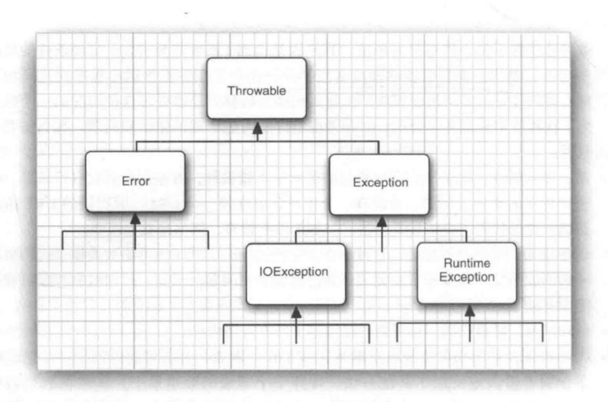

图 **7-1 Java** 中的异常层次结构

需要注意的是, 所有的异常都是由 Th「owable 继承而来. 但在这个层次结构中,下一层立 即分为两个分支:Error 和 EKcepti孙

「mr <sup>E</sup> 类层次结构描述了Java 运行时系统的内部错误和资源耗尽问题 你不应该抛出这 种类型的对象口 如果出现了这样的内部错误,除了通知用户,并尽力妥善地终止程序之外, 你几乎无能为力。这种情况很少出现。

编写 Java 程序时,要重点关注 Exception 层次结构 这个 Excuption 层次结构又分为两个 分支:一个分支派生于 RuntimeExc即tion ;另一个分支包括其他异常,不继承这个类,: 一般规 则是:由编程错误导致的异常属于 RuntimeExceptio<sup>n</sup> ;如果程序本身没有问题,但由于 DO 错 误之类的问题导致的异常属于其他异常.

继承自 RuntimeException 的异常包括以下问题:

- 错误的强制类型转换.
- 越界的数组访问。
- 访问 null 指针.

不继承口 Runti昵Exception 的异常包括二

- 试图越过文件末尾继续读取数据,
- 试图打开一个不存在的文件。
- 试图根据给定的字符串查找口第5 对象,而这个字符串表示的类并不存在「

"如果出现 RuntuneException 异常,那么一定是你的问题,这个规则很有道理,应该通过 检测数组索引是否越界来避免 AiraylrKfexOutOfBoundsException 异常:如果你在使用变量之前先 检查它是否为 null, NullPointerException 异常就不会发生。

如何处理不存在的文件呢?难道不能先检查文件是否存在再打开它吗?嗯,这个文件有可能在你检查它是否存在之后就被立即删除。因此,"是否存在"取决于环境,而不只是取决于你的代码。

Java 语言规范将派生于 Error 类或 RuntimeException 类的所有异常称为非检查型 (unchecked) 异常, 所有其他异常称为检查型 (checked) 异常。这是很有用的术语, 这本书中也会采用这些术语。编译器将检查你是否为所有的检查型异常提供了异常处理器。

- 注释: RuntimeException 这个名字很容易让人混淆。当然了,我们讨论的所有错误都发生在运行时。这个名字可以追溯到很久很久以前,那时 Oak (Java 的前身)的"运行时"会生成越界异常和 null 指针异常。I/O 异常可能由某个其他组件生成。
- C++ 注释:如果熟悉标准 C++ 类库中 (更为受限)的异常层次结构,可能会很困惑。C++ 有两个基本的异常类,一个是 runtime\_error;另一个是 logic\_error。logic\_error类相当于 Java 中的 RuntimeException,也表示程序中的逻辑错误;runtime\_error类是所有由于不可预测的问题所引发的异常的基类。它相当于 Java 中非 RuntimeException类型的异常。

## 7.1.2 声明检查型异常

如果遇到了无法处理的情况,Java 方法可以抛出一个异常。这个道理很简单:方法不仅需要告诉编译器将要返回什么值,还要告诉编译器有可能发生什么错误。例如,一段读取文件的代码知道读取的文件有可能不存在,或者文件可能为空,因此,试图处理文件信息的代码就需要通知编译器可能会抛出 IOException 类的异常。

要在方法的首部指出这个方法可能抛出一个异常,所以要修改方法首部,以反映这个方法可能抛出的检查型异常。例如,下面是标准类库中 FileInputStream 类的一个构造器的声明 (有关输入和输出的更多信息请参见卷 II 的第 1 章)。

public FileInputStream(String name) throws FileNotFoundException

这个声明表示这个构造器将根据给定的 String 参数生成一个 FileInputStream 对象,但也有可能出错而抛出一个 FileNotFoundException 异常。如果真的发生了这种糟糕的情况,构造器将不会初始化一个新的 FileInputStream 对象,而是抛出一个 FileNotFoundException 类对象。如果这个方法真的抛出了这样一个异常对象,运行时系统就会开始搜索知道如何处理 FileNotFoundException 对象的异常处理器。

编写你自己的方法时,不必声明你的方法可能抛出的所有 throwable 对象。至于什么时候需要在所写的方法中用 throws 子句声明异常,以及要用 throws 子句声明哪些异常,需要记住在遇到下面 4 种情况时会抛出异常:

• 调用了一个抛出检查型异常的方法,例如,FileInputStream 构造器。

- 检测到一个错误,并且利用 th「ow 语句抛出一个检查型异常 (下一节将洋细介绍 throw 语句)。
- 程序出现错误. 例如,前 -11=6 会抛出一个非检查型异常 (这里会抛出 ArraylndexOutOfBoundsException )<sup>o</sup>
- •Java 虚拟机或运行时库出现内部错误.

如果出现前两种情况,则必须告诉使用这个方法的程序员有可能抛出异常。为什么?因 为任何一个抛出异常的方法都有可能是一个死亡陷阱。如果没有处理器捕获这个异常,当前 的执行线程就会终止0

有些 Java 方法包含在对外提供的类中,对于这些方法,应该通过方法首部的异常规范 (exception specification) 声明这个方法可能抛出异常。

```
class MyAnimation
   public Inage loadinage(String s) throws lOException
   {
   }
J
```

如果一个方法有可能抛出多个检查型异常类型,那么就必须在方法的首部列出所有的异 常类。每个异常类之间用逗号隔开。如下面这个例子所示:

```
class HyAnimation
{
   public Image loadlmagefString s) throws FileNotFoundExcaption, EOFExt即tion
   {
   }
}
```

但是,不需要声明 Java 的内部错误,即从「回<sup>E</sup> 继承的异常。任何代码都有可能抛出那 些异常,而我们对此完全无法控制。

类似地,也不应该声明从 RuntimeException 继承的那些非检查型异常

```
class MyAnimation
{
   void drawlmage(int i) throws ArraylndexOutOfBoundsExceptioii // bad style
```

这些运行时错误完全在我们的控制之中「 如果特别担心数组索引错误. 就应该多花时间 修正这些错误,而不只是声明这些错误有可能发生。

总之. 一个方法必须声明所有可能抛出的检查型异常,而非检查型异常要么在你的控制 之外 ( E「「o『), 要么是由从一开始就应该避免的情况导致的 ( RuntimeExsptioiO。 如果你的方法 没有诚实地声明所有可能发生的检查型异常,编译器就会发出一个错误消息。

当然,从前面的示例中可以知道:不只是声明异常,你还可以捕获异常。这样就不会从这个方法抛出这个异常,所以也没有必要使用 throws。本章后面将会讨论如何决定究竟是捕获一个异常,还是将其抛出由其他人捕获。

● 警告:如果在子类中覆盖了超类的一个方法,子类方法中声明的检查型异常不能比超 类方法中声明的异常更通用(子类方法可以抛出更特定的异常,或者根本不抛出任何 异常)。特别需要说明的是,如果超类方法没有抛出任何检查型异常,子类也不能抛出 任何检查型异常。例如,如果覆盖 JComponent.paintComponent 方法,由于超类中这个方 法没有抛出任何检查型异常,所以,你的 paintComponent 也不能抛出任何检查型异常。

如果类中的一个方法声明它会抛出一个异常,而这个异常是某个特定类的实例,那么这个方法抛出的异常可能属于这个类,也可能属于这个类的任意一个子类。例如,FileInputStream 构造器声明有可能抛出一个 IOExcetion 异常,在这种情况下,你并不知道具体是哪种 IOException 异常。它既可能是 IOException,也可能是其某个子类的对象,例如,FileNotFoundException。

C++ 注释: Java 中的 throws 说明符与 C++ 中的 throw 说明符基本类似,但有一点重要的区别。在 C++ 中, throw 说明符在运行时执行,而不是在编译时执行。也就是说, C++ 编译器并不关注异常规范。但是,如果函数抛出的异常没有出现在 throw 列表中,就会调用 unexpected 函数,默认情况下,程序会终止。

另外,在C++中,如果没有给出throw异常规范,函数可能会抛出任何异常。而在 Java 中,没有 throws 说明符的方法根本不会抛出任何检查型异常。

## 7.1.3 如何抛出异常

现在假设在程序代码中发生了糟糕的事情。一个名为 readData 的方法正在读取一个文件, 文件首部承诺文件长度为 1024 个字符:

Content-length: 1024

不过,读到733个字符之后文件就结束了。你可能认为这是一种不正常的情况,希望抛出一个异常。

首先要决定应该抛出什么类型的异常。可能某种 IOException 是个不错的选择。仔细地阅读 Java API 文档之后会发现,EOFException 异常的描述是:"指示输入过程中意外遇到了EOF"。完美,这正是我们要抛出的异常。可以如下抛出这个异常:

throw new EOFException();

或者, 也可以写为

var e = new EOFException();
throw e;

下面给出完整的代码:

```
String readData(Scanner in) throws EOFException
{
    ...
    while (...)
    {
        if (!in.hasNext()) // EOF encountered
        {
            if (n < len)
```

E0FException 类还有一个带一个字符串参数的构造器。你可以很好地利用这个构造器,更细致地描述异常情况。

```
String gripe = "Content-length: " + len + ", Received: " + n;
throw new EOFException(gripe);
```

在前面已经看到,如果一个已有的异常类能够满足你的要求,抛出这个异常非常容易。 在这种情况下:

- 1. 找到一个合适的异常类。
- 2. 创建这个类的一个对象。
- 3. 将对象抛出。
- 一旦方法抛出了异常,这个方法就不会返回到调用者。也就是说,你不必操心建立一个 默认的返回值或错误码。
- C++ 注释: 在 C++ 与 Java 中, 抛出异常的过程基本相同, 只有一点微小的差别。在 Java 中, 只能抛出 Throwable 子类的对象, 而在 C++ 中, 却可以抛出任何类型的值。

## 7.1.4 创建异常类

你的代码可能会遇到任何标准异常类都无法描述清楚的问题。在这种情况下,创建自己的异常类就是一件顺理成章的事情了,这也很容易。我们要做的只是定义一个派生于 Exception 的类,或者派生于 Exception 的某个子类,如 IOException。习惯做法是,自定义的这个类应该包含两个构造器,一个是默认的构造器,另一个是包含详细描述信息的构造器(超类 Throwable 的 toString 方法会返回一个字符串,其中包含这个详细信息,这在调试中非常有用)。

```
class FileFormatException extends IOException
{
   public FileFormatException() {}
   public FileFormatException(String gripe)
   {
      super(gripe);
   }
}
```

现在,就可以抛出你自己定义的异常类型了。

```
String readData (Scanner in) throws FileFormatException
(
   while (, . J
   {
      if (ch — -1) // EOF encountered
      {
         if (n m len)
            throH new FileFomattxceptionO;
      }
   }
   return s;
}
```

## ah] **javaAangJhrowable 1.0**

- Throwable() 构造一个新的 Throwable 对象,但没有详细的描述信息。
- Throwable(String message) 构造一个新的 Throw油le 对象,带有指定的详细描述信息。按惯例,所有派生的异常类 都支持一个默认构造器和一个带有详细描述信息的构造器。
- String getMessagel ) 获得 Throw册le 对象的详细描述信息。

## 7.2 捕获异常

你现在已经知道了如何抛出一个异常。这非常容易,只要将其抛出就不用理睬了。当 然,有些代码必须捕获异常。捕获异常需要做更多规划。这正是下面几节要介绍的内容

## **72.1** 捕获异常概述

如果发生了某个异常,但没有在任何地方捕获这个异常. 程序就会终止,并在控制台上 打印一个消息. 其中包括这个异常的类型和一个栈轨迹。不过,图形用户界面 ( GUI) 程序 可能会捕获异常. 打印栈轨迹消息,然后返回用户界面处理循环。(在调试 GUI 程序时,最 好保证控制台窗口可见,并且没有最小化。)

要想捕获一个异常,需要建立 try/stch 语句块口 最简单的 try 语句块如下所示:

```
try
 code
 more code
 more code
} — catch {ExceptionType e}
(
 handlerRr this type
```

如果 try 语句块中的任何代码抛出了 catch 子句中指定的一个异常类,那么

- 1. 程序将跳过 try 语句块的其余代码。
- 2. 程序将执行 catch 子句中的处理器代码。

如果 try 语句块中的代码没有抛出任何异常,那么程序将跳过 catch 子句。

如果方法中的任何代码抛出了一个异常,但不是 catch 子句中指定的异常类型,那么这个方法会立即退出(希望它的调用者为这种类型的异常提供了 catch 子句)。

为了展示捕获异常的过程,下面给出一个很典型的读取数据的代码:

```
public void read(String filename)
{
    try
    {
       var in = new FileInputStream(filename);
       int b;
       while ((b = in.read()) != -1)
       {
            process input
       }
    }
    catch (IOException exception)
    {
        exception.printStackTrace();
    }
}
```

需要注意的是, try 子句中的大多数代码都很容易理解: 读取并处理字节, 直到遇到文件结束符为止。正如在 Java API 中看到的那样, read 方法有可能抛出一个 IOException 异常。在这种情况下,将跳出整个 while 循环,进入 catch 子句,并生成一个栈轨迹。对于一个"玩具类"的简单程序来说,这样处理异常看上去很有道理。还有其他的选择吗?

通常,最好的选择是什么也不做,而只是将异常继续传递给调用者。如果 read 方法出现了错误,就让 read 方法的调用者去操心这个问题!如果采用这种处理方式,就必须声明这个方法可能会抛出一个 IOException。

```
public void read(String filename) throws IOException
{
   var in = new FileInputStream(filename);
   int b;
   while ((b = in.read()) != -1)
   {
      process input
   }
}
```

请记住,编译器严格地执行 throws 说明符。如果调用了一个抛出检查型异常的方法,就必须处理这个异常,或者继续传递这个异常。

哪种方法更好呢?一般经验是,要捕获那些你知道如何处理的异常,而继续传播那些你 不知道怎样处理的异常。

如果想传播一个异常,就必须在方法的首部添加一个 throws 说明符,提醒调用者这个方

法可能会抛出一个异常。

查看 Java API 文档,可以看到每个方法可能会抛出哪些异常,然后再决定是由自己处理,还是添加到 throws 列表中。对于后一种选择,不用感到难堪。将异常交给胜任的处理器进行处理要比压制这个异常更好。

同时请记住,前面曾经提到过,这个规则有一个例外。如果编写一个覆盖超类方法的方法,而这个超类方法没有抛出异常(如 JComponent 中的 paintComponent),就必须捕获你的方法代码中出现的每一个检查型异常。子类的 throws 列表中不允许出现超类方法中未列出的异常类。

# C++ 注释: 在 Java 与 C++ 中, 捕获异常的方式基本相同。严格地说, 以下代码 catch (Exception e) // Java

与

catch (Exception& e) // C++

是一样的。

在 Java 中,没有与 C++ 中的 catch(...) 对应的东西。这在 Java 中并不需要,因为所有异常类都派生于一个公共的超类。

#### 7.2.2 捕获多个异常

在一个 try 语句块中可以捕获多个异常类型,并对不同类型的异常做出不同的处理。要为每个异常类型使用一个单独的 catch 子句,如下例所示:

```
try
{
    code that might throw exceptions
}
catch (FileNotFoundException e)
{
    emergency action for missing files
}
catch (UnknownHostException e)
{
    emergency action for unknown hosts
}
catch (IOException e)
{
    emergency action for all other I/O problems
}
```

异常对象可能包含有关异常性质的信息。要想获得这个对象的更多信息,可以尝试使用 e.getMessage()

得到详细的错误消息 (如果有的话),或者使用

e.getClass().getName()

得到异常对象的实际类型。

在 Java 7 中,同一个 catch 子句中可以捕获多个异常类型。例如,假设对应缺少文件和未知主机异常的动作是一样的,就可以合并 catch 子句:

```
try
{
    code that might throw exceptions
}
catch (FileNotFoundException | UnknownHostException e)
{
    emergency action for missing files and unknown hosts
}
catch (IOException e)
{
    emergency action for all other I/O problems
}
```

只有当捕获的异常类型彼此之间不存在子类关系时才需要这个特性。

□ 注释: 捕获多个异常时, 异常变量隐含为 final 变量。例如, 在以下子句体中不能为 e 赋一个不同的值:

catch (FileNotFoundException | UnknownHostException e) { . . . }

註释: 捕获多个异常不仅会让你的代码看起来更简单,还会更高效。生成的字节码只包含对应公共 catch 子句的一个代码块。

## 7.2.3 再次抛出异常与异常链

可以在 catch 子句中抛出一个异常。通常,希望改变异常的类型时会这样做。如果开发了一个供其他程序员使用的子系统,就可以使用一个指示子系统故障的异常类型,这很有道理。ServletException 就是这样一个异常类型的例子。执行一个 servlet 的代码可能不想知道发生错误的细节,但肯定希望知道这个 servlet 是否有问题。

可以如下捕获异常并将它再次抛出:

```
try {
    access the database
} catch (SQLException e) {
    throw new ServletException("database error: " + e.getMessage());
}
在这里,构造 ServleException 时提供了异常的消息文本。
不过,还有一种更好的想法,可以把原始异常设置为新异常的"原因":
try {
    access the database
} catch (SQLException original)
{
```

```
var e = new ServletException("database error");\ne.initCause(original);
throw e;
```

捕获到这个异常时,可以使用下面这条语句获取原始异常:

Throwable original = caughtException.getCause();

强烈建议使用这种包装技术。这样可以在子系统中抛出高层异常,而不会丢失原始异常的细节信息。

● 提示:如果在一个方法中出现了一个检查型异常,但这个方法不允许抛出检查型异常,这种情况下包装技术也很有用。我们可以捕获这个检查型异常,并将它包装成一个运行时异常。

有时你可能只想记录一个异常,再将它重新抛出,而不做任何改变:

```
try
{
    access the database
}
catch (Exception e)
{
    logger.log(level, message, e);
    throw e;
}
```

在 Java 7 之前,这种方法存在一个问题。假设这个代码在以下方法中:

public void updateRecord() throws SQLException

Java 编译器查看 catch 块中的 throw 语句,然后查看 e 的类型,会指出这个方法可能抛出任何 Exception 而不只是 SQLException。现在这个问题已经得到改进。编译器会跟踪到 e 来自try 块。假设这个 try 块中仅有的检查型异常是 SQLException 实例,另外假设 e 在 catch 块中未改变,将外围方法声明为 throws SQLException 就是合法的。

## 7.2.4 finally 子句

代码抛出一个异常时,就会停止处理这个方法中剩余的代码,并退出这个方法。如果这个方法已经获得了只有它自己知道的一些本地资源,而且这些资源必须清理,这就会有问题。一种解决方案是捕获所有异常,完成资源的清理,再重新抛出异常。但是,这种解决方案比较烦琐,因为需要在两个地方清理资源分配,一个是在正常的代码中,另一个是在异常代码中。finally子句可以解决这个问题。

注释:在 Java 7之后,还有一种更精巧的解决方案,即 try-with-resources 语句(下一节将介绍这个内容)。我们之所以要详细讨论 finally 机制,是因为这是概念基础。不过在实际中, try-with-resources 语句可能比 finally 子句更常使用。

不管是否捕获到异常, finally 子句中的代码都会执行。在下面的示例中, 所有情况下程

序都将关闭输入流。

```
var in = new FileInputStream(. . .);
try
{
    // 1
    code that might throw exceptions
    // 2
}
catch (IOException e)
{
    // 3
    show error message
    // 4
}
finally
{
    // 5
    in.close();
}
// 6
```

下面来看这个程序执行 finally 子句的 3 种可能的情况:

- 1. 代码没有抛出异常。在这种情况下,程序首先执行 try 语句块中的全部代码,然后执行 finally 子句中的代码。随后,继续执行 finally 子句之后的第一条语句。也就是说,执行的顺序是 1、2、5、6。
- 2. 代码抛出一个异常,并在一个 catch 子句中捕获。在上面的示例中就是 IOException 异常。在这种情况下,程序将执行 try 语句块中的所有代码,直到抛出异常为止。此时,将跳过 try 语句块中的剩余代码,转去执行与该异常匹配的 catch 子句中的代码,然后执行 finally 子句中的代码。

如果 catch 子句没有抛出异常,程序将执行 finally 子句之后的第一条语句。在这种情况下,执行顺序是 1、3、4、5、6。

如果 catch 子句抛出了一个异常, 异常将被抛回到这个方法的调用者。执行顺序则只是 1、3、5。

3. 代码抛出了一个异常,但没有任何 catch 子句捕获这个异常。在这种情况下,程序将执行 try 语句块中的所有语句,直到抛出异常为止。此时,将跳过 try 语句块中的剩余代码,然后执行 finally 子句中的语句,并将异常抛回给这个方法的调用者。在这里,执行顺序只是 1、5。

try 语句可以只有 finally 子句,而没有 catch 子句。例如,下面这条 try 语句:

```
InputStream in = . . .;
try
{
    code that might throw exceptions
}
finally
{
    in.close();
}
```

无论在 try 语句块中是否遇到异常, finally 子句中的 in.close() 语句都会执行。当然,如果真的遇到一个异常,这个异常将会被重新抛出,并且必须由另一个 catch 子句捕获。

```
InputStream in = . . .;
try
{
    try
    {
       code that might throw exceptions
    }
    finally
    {
       in.close();
    }
}
catch (IOException e)
{
    show error message
}
```

内层的 try 语句块只有一个职责,就是确保关闭输入流。外层的 try 语句块也只有一个职责,就是确保报告出现的错误。这种解决方案不仅更清楚,而且功能更强:将会报告 finally 子句中出现的错误。

● 警告: 当 finally 子句包含 return 语句时,有可能产生意想不到的结果。假设由 return 语句从 try 语句块中间退出。在方法返回前,会执行 finally 子句块。如果 finally 块也有一个 return 语句,这个返回值将会遮蔽原来的返回值。来看下面这个例子:

```
public static int parseInt(String s)
{
    try
    {
       return Integer.parseInt(s);
    }
    finally
    {
       return 0; // ERROR
    }
}
```

看起来在 parseInt("42")调用中, try块的体会返回整数 42。不过,这个方法真正返回之前,会执行 finally 子句,这就使得方法最后会返回 0,而忽略原先的返回值。

更糟糕的是, 考虑调用 parseInt("zero")。Integer.parseInt 方法会抛出一个 NumberFormat-Exception, 然后执行 finally 子句, return 语句甚至"吞掉"了这个异常!

finally 子句的体要用于清理资源。不要把改变控制流的语句(return, throw, break, continue) 放在 finally 子句中。

## 7.2.5 try-with-Resources 语句

在 Java 7 中,对于以下代码模式:

```
open a resource
try
{
    work with the resource
}
finally
{
    close the resource
}
```

假设这个资源属于一个实现了 AutoCloseable 接口的类, Java 7 为这种代码模式提供了一个很有用的快捷方式。AutoCloseable 接口有一个方法:

void close() throws Exception

注释:另外,还有一个Closeable 接口。这是 AutoCloseable 的子接口,也只包含一个close 方法。不过,这个方法声明为抛出一个 IOException。

try-with-resources 语句(带资源的 try 语句)的最简形式为:

```
try (Resource res = . . .)
{
   work with res
}
```

try 块退出时,会自动调用 res.close()。下面给出一个典型的例子,这里要读取一个文件中的所有单词:

```
try (var in = new Scanner(Path.of("in.txt"), StandardCharsets.UTF_8))
{
   while (in.hasNext())
      System.out.println(in.next());
}
```

这个块正常退出时,或者存在一个异常时,都会调用 in.close()方法,就好像使用了 finally 块一样。

还可以指定多个资源。例如:

```
try (var in = new Scanner(Path.of("in.txt"), StandardCharsets.UTF_8);
    var out = new PrintWriter("out.txt", StandardCharsets.UTF_8))
{
    while (in.hasNext())
      out.println(in.next().toUpperCase());
}
```

不论这个块如何退出, in 和 out 都会关闭。如果用常规方式手动编程,就需要两个嵌套的 try/finally 语句。

在 Java 9 中,可以在 try 首部提供之前声明的事实最终变量:

```
public static void printAll(String[] lines, PrintWriter out)
{
   try (out)
   { // effectively final variable
      for (String line : lines)
```

```
out « printin(line);
   } // cut. closet) called here
)
```

如果 「y t 块抛出一个异常,而且 clo转方法也抛出一个异常,这就会带来一个难题。「t a wihresource<sup>w</sup> 语句可以很好地处理这种情况。原来的异常会重新抛出, 而 else 方法抛出的 所有异常会"被抑制,这些异常将被自动捕获,并由 addSuppressM 方法添加到原来的异常中 去. 如果对这些异常感兴趣,可以调用龚ts叩pressed 方法,它会生成一个数组,其中包含从 dose 方法抛出的被抑制的异常中

你肯定不想手动编程来处理这些问题才 只要需要关闭资源,就要尽可能使用 try-withresources 语句勺

El 注释:try-with-resources 语句自 身也可以有stth 子句,甚至还可以有一个 finally <sup>子</sup> 句 这些子句会在关闭资源之后执行。

## 72.6 分析栈轨迹元素

栈轨迹 ( suck trace) 是程序执行过程中某个特定点上所有挂起的方法调用的一个列表。 你肯定已经看到过这种栈轨迹列表,当 Java 程序因为一个未捕获的异常而终止时,就会显示 栈轨迹。

可以调用 Throwabte 类的 printStackTrace 方法访问栈轨迹的文本描述信息口

```
var t = new Throwable();
var out = new StringWriterOj
t.printStacklracef new PrintWriter(out)|;
String description = OLit.toStringO;
```

一种更灵活的方法是使用 StackWalke「类,它会生成一个 5均0姗凯依「.5公60:「加2实例流,其 中每个实例分别描述一个栈帧 (stack frame)o 可以利用以下调用迭代处理这些栈帧:

```
StackWalker walker = StackWalker.getlnstance();
walker, forEach( frame -> analyze frame)
```

如果想要以懒方式处理 Stream<StackWalker.StackFrame>, 可以调用:

**walker-walk[stream •>** *process* **stream)**

流处理将在本书卷 <sup>n</sup>的第 i章详细介绍<sup>0</sup>

StackWalk电MtaekFra鹤类有一些方法可以得到正在执行的代码行的文件名和行号,以及类 对象和方法名. toSt「ing 方法会生成一个格式化字符串,其中包含所有这些信息1

口 注释二 <sup>在</sup> Java <sup>9</sup> 之前. Th「owdble,gct5tackT「a£e <sup>方</sup> 法会生成一个 StackTQceElementU 羲组, 其中 包含与 5txk厢lker,5tackF「加已 实例流类似的信息口 不过,这个调用的效率不高,因 为它要得到整个栈,即使调用者可能只需要几个栈帧口 另 外它只允许访问挂起方法的 类名,而不能访问类对象。

程序清单 <sup>7</sup><sup>门</sup> 打印 了递归阶乘函数的核轨迹. 例如,如果计算 facto由1(3),会有以下输出:

38 }

```
factorial(3):
    stackTrace.StackTraceTest.factorial(StackTraceTest.java:20)
    stackTrace.StackTraceTest.main(StackTraceTest.java:36)
    factorial(2):
    stackTrace.StackTraceTest.factorial(StackTraceTest.java:20)
    stackTrace.StackTraceTest.factorial(StackTraceTest.java:26)
    stackTrace.StackTraceTest.main(StackTraceTest.java:36)
    factorial(1):
    stackTrace.StackTraceTest.factorial(StackTraceTest.java:20)
    stackTrace.StackTraceTest.factorial(StackTraceTest.java:26)
    stackTrace.StackTraceTest.factorial(StackTraceTest.java:26)
    stackTrace.StackTraceTest.main(StackTraceTest.java:36)
    return 1
    return 2
    return 6
```

#### 程序清单 7-1 stackTrace/StackTraceTest.java

```
package stackTrace;
   import java.util.*;
    * A program that displays a trace feature of a recursive method call.
    * @version 1.10 2017-12-14
    * @author Cay Horstmann
    */
   public class StackTraceTest
11 {
12
       * Computes the factorial of a number
13
       * @param n a non-negative integer
14
       * @return n! = 1 * 2 * . . . * n
15
16
      public static int factorial(int n)
17
18
         System.out.println("factorial(" + n + "):");
19
         var walker = StackWalker.getInstance();
20
         walker.forEach(System.out::println);
21
         int r;
22
         if (n \le 1) r = 1;
23
         else r = n * factorial(n - 1);
24
         System.out.println("return " + r);
25
         return r;
26
27
28
      public static void main(String[] args)
29
30
         try (var in = new Scanner(System.in))
31
32
            System.out.print("Enter n: ");
33
            int n = in.nextInt();
34
            factorial(n);
35
36
37
```

307

## API java.lang.Throwable 1.0

- Throwable (Throwable cause) 1.4
- Throwable(String message, Throwable cause) 1.4
   用给定的 cause (原因) 构造一个 Throwable 对象。
- Throwable initCause(Throwable cause) 1.4
   为这个对象设置原因,如果这个对象已经有原因,则抛出一个异常。返回 this。
- Throwable getCause() 1.4
   获得设置为这个对象的原因的异常对象。如果没有设置原因,则返回 null。
- StackTraceElement[] getStackTrace() **1.4** 获得构造这个对象时调用栈的轨迹。
- void addSuppressed(Throwable t) **7** 为这个异常添加一个"被抑制"的异常。这出现在 try-with-resources 语句中, 其中 t 是 close 方法抛出的一个异常。
- Throwable[] getSuppressed() 7
   得到这个异常的所有"被抑制"的异常。一般来说,这些是 try-with-resources 语句中 close 方法抛出的异常。

#### API java.lang.Exception 1.0

- Exception(Throwable cause) 1.4
- Exception(String message, Throwable cause)
   用给定的 cause (原因)构造一个 Exception 对象。

## API java.lang.RuntimeException 1.0

- RuntimeException(Throwable cause) 1.4
- RuntimeException(String message, Throwable cause) 1.4
   用给定的 cause (原因) 构造一个 RuntimeException 对象。

## API java.lang.StackWalker 9

- static StackWalker getInstance()
- static StackWalker getInstance(StackWalker.Option option)
- static StackWalker getInstance(Set<StackWalker.Option> options)
   得到一个 StackWalker 实例。选项包括 StackWalker.Option 枚举中的 RETAIN\_CLASS\_REFERENCE、
   SHOW\_HIDDEN\_FRAMES 和 SHOW\_REFLECT\_FRAMES。
- forEach(Consumer<? super StackWalker.StackFrame> action)
   在每个栈帧上完成给定的动作,从最近调用的方法开始。
- walk(Function<? super Stream<StackWalker.StackFrame>,? extends T> function)
   对栈帧流应用给定的函数,返回这个函数的结果。

## API java.lang.StackWalker.StackFrame 9

- String getFileName()
   得到包含该元素执行点的源文件的文件名,如果这个信息不可用则返回 null。
- int getLineNumber()
   得到包含该元素执行点的源文件的行号,如果这个信息不可用则返回 -1。
- String getClassName()
   对于包含该元素执行点的方法,得到这个方法所在的类的完全限定名。
- String getDeclaringClass()
   对于包含该元素执行点的方法,得到这个方法所在的类的 Class 对象。如果这个栈遍历器 (stack walker) 不是用 RETAIN CLASS REFERENCE 选项构造的,则会抛出一个异常。
- String getMethodName()
   得到包含该元素执行点的方法的方法名。构造器名为 <init>。静态初始化器名为 <clinit>。无法区分同名的重载方法。
- boolean isNativeMethod()
   如果这个元素的执行点在一个原生方法中,则返回 true。
- String toString()
   返回一个格式化字符串,包含类和方法名、文件名以及行号(如果这些信息可用)。

## API java.lang.StackTraceElement 1.4

- String getFileName()
   得到包含该元素执行点的源文件的文件名,如果这个信息不可用则返回 null。
- int getLineNumber() 得到包含该元素执行点的源文件的行号,如果这个信息不可用则返回 -1。
- String getClassName()得到包含该元素执行点的类的完全限定名。
- String getMethodName()
   得到包含该元素执行点的方法的方法名。构造器名为 <init>。静态初始化器名为 <clinit>。无法区分同名的重载方法。
- boolean isNativeMethod()
   如果这个元素的执行点在一个原生方法中,则返回 true。
- String toString()
   返回一个格式化字符串,包含类和方法名、文件名以及行号(如果这些信息可用)。

# 7.3 使用异常的技巧

关于如何适当地使用异常还有很大的争议。有些程序员认为所有检查型异常都令人厌

恶,也有些程序员认为抛出的异常还不够多。我们认为异常(甚至是检查型异常)还是有其存在的意义。下面给出适当使用异常的一些技巧。

1. 异常处理不能代替简单的测试。

作为一个示例,假设有一段代码尝试将一个空栈弹出 10 000 000 次。第一种做法是:首 先查看栈是否为空。

```
if (!s.empty()) s.pop();
```

再看第二种做法,我们强制要求不管怎样都执行弹出操作,然后捕获 EmptyStack-Exception 异常来告诉我们不该这样做。

```
try
{
    s.pop();
}
catch (EmptyStackException e)
{
}
```

在我的测试机器上,调用 isEmpty 的版本运行时间为 646 毫秒。捕获 EmptyStackException 的版本运行时间为 21 739 毫秒。

可以看出,与完成简单的测试相比,捕获异常所花费的时间大大超过了前者,因此使用异常的基本规则是:只在异常情况下使用异常。

2. 不要过分地细化异常。

很多程序员将每一条语句都分装在一个单独的 try 语句块中。

```
PrintStream out;
Stack s;

for (i = 0; i < 100; i++)
{
    try
    {
        n = s.pop();
    }
    catch (EmptyStackException e)
    {
        // stack was empty
    }
    try
    {
        out.writeInt(n);
    }
    catch (IOException e)
    {
        // problem writing to file
    }
}</pre>
```

这种编程方式将导致代码量的急剧膨胀。首先来看你希望这段代码完成的任务。在这里,我们希望从栈中弹出 100 个数,将它们存入一个文件中。(别考虑为什么这么做,这只是

一个"玩具"例子。)如果出现问题,我们什么也做不了。如果栈是空的,它不会变成非空状态;如果文件包含错误,这个错误也不会神奇地消失。因此,合理的做法是将整个任务包在一个 try 语句块中,这样,当任何一个操作出现问题时,就可以取消整个任务。

```
try
{
    for (i = 0; i < 100; i++)
    {
        n = s.pop();
        out.writeInt(n);
    }
} catch (IOException e)
{
    // problem writing to file
} catch (EmptyStackException e)
{
    // stack was empty
}</pre>
```

这段代码看起来清晰多了。这样也满足了异常处理的一个承诺:将正常处理与错误处理分升。 3. 合理利用异常层次结构。

不要只抛出 RuntimeException 异常。应该寻找一个适合的子类或创建你自己的异常类。不要只捕获 Throwable 异常,否则,这会使你的代码很难读、很难维护。

考虑检查型异常与非检查型异常的区别。检查型异常本质上开销较大,不要为逻辑错误抛出这些异常。(例如,反射库的做法就不正确。调用者经常需要捕获那些他们知道不可能发生的异常。)

如果能够将一种异常转换成另一种更加适合的异常,那么不要犹豫。例如,在解析某个文件中的一个整数时,可以捕获 NumberFormatException 异常,然后将它转换成 IOException 的一个子类或 MySubsystemException。

#### 4. 不要压制异常。

在 Java 中,往往非常希望关闭异常。如果你编写了一个方法要调用另一个方法,而那个方法有可能 100 年才抛出一个异常,但是,如果没有在你的方法的 throws 列表中声明这个异常,编译器就会报错。你不想把它放在 throws 列表中,因为这样一来,编译器会对调用你的方法的所有方法都报错。因此,你会关闭这个异常:

```
public Image loadImage(String s)
{
    try
    {
       code that threatens to throw checked exceptions
    }
    catch (Exception e)
    {} // so there
}
```

现在你的代码可以顺利通过编译了。它能很好地运行,除非出现异常。然后这个异常会被悄无声息地忽略。如果你认为异常都非常重要,就应该适当地进行处理。

5.在检测错误时,"苛刻"要比放任更好。

检测到错误的时候,有些程序员对抛出异常很担心口 调用一个方法时,如果提供了非法 的参数,返回一个虚拟值是不是比抛出一个异常更好?例如,当栈为空时,Stack.p叩 是该返 回 null, 还是要抛出一个异常?我们认为:最好在出错的地方抛出一个 Empty沁ckEKception 异 常. 这要好于以后出现一个 NullPointerException 异常

6,不要羞于传递异常口

很多程序员感觉应该捕获抛出的全部异常。如果他们调用了一个抛出异常的方法. 例 如,FilEI即utSt「mn构造器或r网Une方法,他们就会本能地捕获可能产生的异常白 其实,很 多情况下. 更好的做法是继续传递这个异常,而不是由己捕获:

```
public void readstuff(String filenane) throws lOException // not a sign of shame!
{
   var in = new FilelnputStream( filename ( StandsrdCharset s. JTF 8 ) ;
}
```

更高层的方法通常可以更好地通知用户发生了错误,或者放弃不成功的命令。

7.便用标准方法报告 null 指针和越界异常。

Objects 包含以下方法:

```
requireNonNull
checkindex
checkFromToIndex
checkFronlndexSize
来完成这些常见的检查。要用这些方法来完成参数检验:
public void putDatafint position, Object newValue)
{
   Object $ . checkindex (position f dmta.length};
   Objects* requireNonNtU(newValue);
```

如果调用方法时提供了一个非法索弓I或一个 null 参数,要用我们熟悉的 Java 库使用的消 息抛出一个异常。

**8.** 不要向最终用户宣示栈轨迹口

如果你的程序遇到一个预料之外的异常,看起来显示一个栈轨迹是个好主意,这样用户 就能报告这个错误,使你能更容易地找出问题所在。不过,栈轨迹可能包含你不想暴露给潜 在攻击者的实现细节,例如你使用的库的版本。

应该将栈轨迹记人日志,以便以后获取,而只向用户显示一个总结消息。

直1 注释:规则 5、6 可以归纲为 "早抛出,晚捕获二

# 7.4 使用断言

**}**

在一个具有自我保护能力的程序中,断言很常用。在下面的小节中,你会了解如何有效

地使用断言。

#### 7.4.1 断言的概念

假设你确信满足某个特定属性,并且代码依赖于这个属性。例如,可能需要计算 double y = Math.sqrt(x);

你确信这里的 x 是一个非负数。原因可能是: x 是另外一个计算的结果,而这个计算的结果不可能为负;或者 x 是一个方法的参数,这个方法要求它的调用者只能提供一个正数输入。不过,你可能还是想再做一次检查,不希望计算中潜入让人困惑的"不是一个数"(NaN)浮点值。当然,也可以抛出一个异常:

if (x < 0) throw new IllegalArgumentException("x < 0");

即使测试完成后,这个测试代码还一直保留在程序中。如果在程序中含有大量这种检查,程序运行起来会比应有的速度慢一些。

断言(assertion)机制允许你在测试期间在代码中插入一些检查,而在生产代码中自动删除这些检查。

Java 语言有一个关键字 assert。这个关键字有两种形式:

assert condition;

和

assert condition : expression;

这两个语句都会计算条件 (condition),如果结果为 false,则抛出一个 AssertionError 异常。在第二个语句中,表达式 (expression)将传入 AssertionError 对象的构造器,并转换成一个消息字符串。

注释:表达式(expression)部分的唯一目的是生成一个消息字符串。AssertionError对象并不存储具体的表达式值,因此,以后无法得到这个表达式值。正如 JDK 文档所描述的那样:如果能得到表达式的值,"就会鼓励程序员尝试从断言失败恢复,这有违于断言机制的初衷"。

要想断言x是一个非负数,只需要使用下面这条语句

assert x >= 0;

或者将 x 的具体值传递给 AssertionError 对象,以便以后显示。

assert  $x >= \theta : x$ ;

C++ 注释: C语言中的 assert 宏将断言条件转换成一个字符串。当断言失败时,就会打印这个字符串。例如,若 assert(x>=0)失败,就会打印失败条件 "x>=0"。在 Java 中,条件并不会自动地成为错误报告中的一部分。如果希望看到这个条件,就必须将它作为字符串传递给 AssertionError 对象: assert x >= 0: "x >= 0"。

#### 7.4.2 启用和禁用断言

在默认情况下, 断言是禁用的。可以在运行程序时用 -enableassertions 或 -ea 选项启用断言:

java -enableassertions MyApp

需要注意的是,不必重新编译程序来启用或禁用断言。启用或禁用断言是类加载器 (class loader)的功能。禁用断言时,类加载器会去除断言代码,因此,不会降低程序运行的速度。

甚至可以在特定的类或整个包中启用断言,例如:

java -ea:MyClass -ea:com.mycompany.mylib MyApp

这条命令将为 MyClass 类以及 com.mycompany.mylib 包及其子包中的所有类打开断言。选项 -ea 将为无名包中的所有类打开断言。

也可以用选项 -disableassertions 或 -da 在特定的类和包中禁用断言:

java -ea:... -da:MyClass MyApp

有些类不是由类加载器加载,而是直接由虚拟机加载。可以使用这些开关有选择地启用或禁用那些类中的断言。

不过, 启用和禁用所有断言的 -ea 和 -da 开关不能应用于那些没有类加载器的"系统类"。需要使用 -enablesystemassertions/-esa 开关启用系统类中的断言。

也可以通过编程控制类加载器的断言状态。有关这方面的内容请参见本节末尾的API注释。

直 注释: Java 类库的源代码有超过 400 个被注释掉的断言。有些程序员在完成测试之后会把断言注释掉,否则这会占据类文件的空间。如果你担心这样不妥,可以有选择地包含断言,如下所示:

public static final boolean asserts = true; // Recompile with false for production . . . if (asserts) assert x >= 0;

## 7.4.3 使用断言完成参数检查

在 Java 语言中, 提供了 3 种处理系统错误的机制:

- 抛出一个异常。
- 记录日志。
- 使用断言。

什么时候应该选择使用断言呢?请记住下面几点:

- 断言失败是致命的、不可恢复的错误。
- 断言检查只在开发和测试阶段打开(这种做法有时候被戏称为"在靠近海岸时穿上救生衣,但在海里就把救生衣抛掉")。

因此,不应该使用断言向程序的其他部分通知发生了可恢复性的错误,或者,不应该利

用断言与程序用户沟通问题。断言只应该用于在测试阶段确定程序内部错误的位置。

下面看一个常见的场景:检查方法的参数。是否应该使用断言来检查非法的索引值或null引用呢?要想回答这个问题,首先来看这个方法的文档。假设你要实现一个排序方法。

/\*\*
 Sorts the specified range of the specified array in ascending numerical order.
 The range to be sorted extends from fromIndex, inclusive, to toIndex, exclusive.
 @param a the array to be sorted.
 @param fromIndex the index of the first element (inclusive) to be sorted.
 @param toIndex the index of the last element (exclusive) to be sorted.
 @throws IllegalArgumentException if fromIndex > toIndex
 @throws ArrayIndexOutOfBoundsException if fromIndex < 0 or toIndex > a.length
\*/
static void sort(int[] a, int fromIndex, int toIndex)

文档指出,如果索引值不正确,这个方法会抛出一个异常。这是方法与其调用者之间约定的行为。如果实现这个方法,那就必须要遵守这个约定,抛出表示索引值有误的异常。这里使用断言不太合适。

是否应该断言 a 不是 null 呢?这也不太合适。这个方法的文档没有指出当 a 是 null 时应该采取什么行为。在这种情况下,调用者可以认为这个方法将会成功地返回,而不会抛出一个断言错误。

不过, 假设对这个方法的约定做一点微小的改动:

@param a the array to be sorted (must not be null).

现在,这个方法的调用者就必须注意:对 null 数组调用这个方法是不合法的。这样一来,就可以在这个方法的开头使用断言:

assert a != null;

计算机科学家将这种约定称为前置条件(Precondition)。原先的方法对参数没有前置条件,它承诺在任何情况下都有明确的行为。修改后的方法有一个前置条件,即 a 非 null。如果调用者没有满足这个前置条件,断言会失败,这个方法就能"为所欲为"。事实上,由于有这个断言,当方法被非法调用时,它的行为将是难以预料的。有时候会抛出一个断言错误,有时候会产生一个 null 指针异常,这完全取决于它的类加载器如何配置。

## 7.4.4 使用断言提供假设文档

通常,很多程序员使用注释来提供底层假设的文档。考虑 http://docs.oracle.com/javase/8/docs/technotes/guides/language/assert.html 上的一个示例:

if (i % 3 == 0)\nelse if (i % 3 == 1)\nelse // (i % 3 == 2)

在这种情况下,使用断言会更合适。

```
if (i % 3 == 0)
    . . .\nelse if (i % 3 == 1)
    . . .\nelse
{
    assert i % 3 == 2;
    . . .
}
```

当然,更好的做法是全面地考虑这个问题。i%3的值会是什么?如果i是正值,那么余数肯定是0、1或2。如果i是负值,余数可以是-1和-2。因此,真正的假设是i是非负值。最好是在if语句之前使用以下断言:

assert i >= 0;

无论如何,这个示例说明了程序员应该充分使用断言来进行自我检查。你会看到,断言是一种用于测试和调试的战术性工具;与之不同,日志是一种用于程序整个生命周期的战略性工具。下一节将介绍日志。

#### API java.lang.ClassLoader 1.0

- void setDefaultAssertionStatus(boolean b) 1.4
   为通过这个类加载器加载的所有类(没有显式的类或包断言状态)启用或禁用断言。
- void setClassAssertionStatus(String className, boolean b) **1.4** 为给定的类和它的内部类启用或禁用断言。
- void setPackageAssertionStatus(String packageName, boolean b) **1.4** 为给定包及其子包中的所有类启用或禁用断言。
- void clearAssertionStatus() 1.4
   删除所有显式的类和包断言状态设置,并禁用通过这个类加载器加载的所有类的断言。

## 7.5 日志

每个 Java 程序员都很熟悉在有问题的代码中插入一些 System.out.println 方法调用来帮助观察程序的行为。当然,一旦发现问题的根源,就要将这些 print 语句从代码中删去。如果接下来又出现了问题,只好再插入几个 print 语句。日志 API 就是为了解决这个问题而设计的。下面先讨论这个 API 的主要优点。

- 可以很容易地抑制全部日志记录,或者只抑制某个级别以下的日志,而且再次打开这些日志也很容易。
- 被抑制的日志开销低廉, 因此, 将这些日志代码留在应用中只有很小的开销。
- 日志记录可以定向到不同的处理器,如在控制台显示、写至文件,等等。
- 日志记录器和处理器都可以对记录进行过滤。过滤器可以根据实现过滤器的程序员提

供的标准丢弃那些无用的日志记录。

- 日志记录可以采用不同的方式格式化,例如,纯文本或 XMJ
- 应用程序可以使用多个日志记录器,它们使用与包名类似的有层次的名字,例如, com. mycompany tmyappo
- 日志系统的配置由配置文件控制口
- HI 注释二很多应用会使用其他日志框架, Log4J 2 (https://logqing.apache.Org/Log4j/2.x) 和Logback ( https://logback.qos.ch), 它们能提供比标准 Java 日 志框架 更高的性能口 这 些框架的 API 稍有区别 SLF4J ( https://www.slf4j.org) 和 Commons Logging (https:// commons .apache.org/proper/comons\*logging) 等日 志门面 ( Logging facades) 提供了一个统 一的 API, 利 用这个 API, 你无须重写应用就可以替换日志枢架口 让人更混乱的是, Log4J <sup>2</sup> 也可以是使用 SLF4J 的组件的门面.在本书中,我们只介绍标准 Java 日志框 架,对于很 多用途来说,这个框架已经足够好,而且学 习这个框架的 API 也可以让你 做好准备去理解其他框架。
- Q 注释:在 Java <sup>9</sup> 中,Javs 平台有一个单独的轻量级日志系统,它不依赖于 java Jogging 模块 (这个模块包含标准 Java 日志框架)<sup>a</sup> 这个系统只用于 Java API」如果有 jh业 logging 模块,日 志消息会自动地转发给它口 第三方日志框架可以提供适配器来接收平 台日志消息。我们不打算介绍平台日志,因 为开发应用程序的程序员不 太会用到平台 日志<sup>o</sup>

## 7,5.1 基本日志

对于简单的日志记录,可以便用全局日志记录器 ( globallogger) 并调用其 iMo 方法: **Logger.getGlobal**( )**.info(\*File~>€pen menu item selected');**

在默认情况下,会如下打印这个记录:

**May** 1<sup>瓦</sup> 2813 10:12:15 **PM LoggingimageViewer fileOpen INFO: File-\*Open menu item selected**

但是,如果在适当的地方 (如幅in的最前面) 调用 **Logger,getGlobal().setLevel(Level.OFF);**

将会抑制所有日志.

## 7,5.2 高级日志

既然已经了解了基本日志,下面再来看更高级的专业级日志。在一个专业的应用程序中, 你肯定不想招所有的日志都记录到一个全局日志记录器中。你可以定义自己的日志记录器

可以调用 getLogger 方法创建或获取一个日志记录器:

**private static final Logger myLogger** <sup>工</sup> **Logge**「.get**Lngge**「(\***com.mycompany.myapp");**

● 提示:未被任何变量引用的日志记录器可能会被垃圾回收。为了防止这种情况发生,要像上面的例子中一样,用静态变量存储日志记录器的一个引用。

与包名类似,日志记录器名也有层次。事实上,与包相比,日志记录器的层次性更强。对于包来说,包与父包之间没有语义关系,但是日志记录器的父与子之间会共享某些属性。例如,如果对日志记录器"com.mycompany"设置了日志级别,它的子日志记录器也会继承这个级别。

通常,有以下7个日志级别:

- SEVERE
- WARNING
- INFO
- CONFIG
- FINE
- FINER
- FINEST

在默认情况下,实际上只记录前3个级别。也可以设置一个不同的级别,例如,

logger.setLevel(Level.FINE);

现在,会记录 FINE 以及所有更高级别的日志。

另外,还可以使用Level.ALL 开启所有级别的日志记录,或者使用 Level.0FF 关闭所有日志。

所有级别都有日志记录方法,如:

logger.warning(message);

logger.fine(message);

或者, 还可以使用 log 方法并指定级别, 例如:

logger.log(Level.FINE, message);

- 提示: 默认的日志配置会记录 INFO 或更高级别的所有日志,因此,对于那些有助于诊断但对用户意义不大的调试信息,应该使用 CONFIG、FINE、FINER 和 FINEST 级别。
- 警告:如果将记录级别设置为比 INFO 更低的级别,还需要修改日志处理器的配置。默认的日志处理器会抑制低于 INFO 级别的消息。有关的详细内容请参见下一节。

默认的日志记录会显示包含日志调用的类和方法的名字(根据调用栈得出)。不过,如果虚拟机对执行过程进行了优化,就可能得不到准确的调用信息。此时,可以使用 logp 方法获得调用类和方法的确切位置,这个方法的签名为:

void logp(Level 1, String className, String methodName, String message)

有一些用来跟踪执行流的便利方法:

```
void entering(String className, String methodName)
void entering(String className, String methodName, Object param)
void entering(String className, String methodName, Object[] params)
void exiting(String className, String methodName)
void exiting(String className, String methodName, Object result)

例如:\nint read(String file, String pattern)
{
  logger.entering("com.mycompany.mylib.Reader", "read",
```

这些调用将生成 FINER 级别而且以字符串 ENTRY 和 RETURN 开头的日志记录。

注释: 在将来某个时候,带 Object[]参数的日志记录方法可能会被重写,以支持可变参数列表("varargs")。那时就可以做出类似 logger.entering("com.mycompany.mylib. Reader", "read", file, pattern)的调用了。

记录日志的一个常见用途是记录那些预料之外的异常。可以使用下面两个便利方法在日志记录中包含异常的描述。

```
void throwing(String className, String methodName, Throwable t)
void log(Level l, String message, Throwable t)

典型的用法是:
\nif (. . .)
{
    var e = new IOException(". . .");
    logger.throwing("com.mycompany.mylib.Reader", "read", e);
    throw e;
}

和

try
{
    . . .
}
catch (IOException e)
{
    Logger.getLogger("com.mycompany.myapp").log(Level.WARNING, "Reading image", e);
}
```

throwing 调用可以记录一条 FINER 级别的日志记录和一个以 THROW 开头的消息。

## 7.5.3 修改日志管理器配置

可以通过编辑配置文件来修改日志系统的各个属性。默认的配置文件位于: jdk/conf/logging.properties (或者在 Java 9 之前,位于 jre/lib/logging.properties。)

耍想使用另一个配置文件,就要将 "MutiLlogging.config.file 属性设置为那个文件的位 置,为此要用以下命令启动你的应用程序:

java -Djava.utiLlogging.config.*hlt^configFile MainClass*

要想修改默认的日志级别,需要编辑配置文件,并修改下面这行设置:

.leveMNFO

可以为你自己的日志记录器指定日志级别,例如,可以增加下面这行设置:

com.fflycompany.myapp.level-FINE

也就是说,在日志记录器名后面追加后缀 ,level。

稍后可以看到,日志记录器并不将消息发送到控制台,那是处理器的任务口 处理器也有 级别。要想在控制台上看到 FINE 级别的消息,就需要如下设置:

java,utiLlogging\* ConsoleHandler.level=FINE

0 警告:日志管理器配置中的属性设置不是 系统属性,因此,用 -Dcom.mycompany.inyapp» leve> FINE 启动程序不会对日志记录器产生任何影响》

日志管理器在虚拟机启动时初始化,也就是在 main 方法执行前。如果想要定制日志属性, 但是没有用 -Djava.utiLlogging.config,file 命令行选项启动应用,可以在程序中调用 System, setProperty( " java.util.logging.config.file", file) <sup>Q</sup> 不过,这样一来,你还必须调用 LogManager. getLogManagerl ).readConfiguration( ) 重新初始化日志管理器口

在 Java 9 中,可以通过调用以下方法更新日志配置:

LogManager-getLogHanagerl) ,updateConfiguration(mapper);

这样就会从 java.util.logging.config.file 系统属性指定的位置读取一个新配置口 然后应用 这个映射器来解析新老配置中所有键的值。映射器是一个 FunctionmSteing, BiFunction<Stringf String, String»o 它将现有配置中的键映射到替换函数口 每个替换函数接收到与键关联的老值 和新值 (或者,如果没有关联的值则得到 null), 生成一个替换,或者如果要在更新中删除这 个键则返回 null<sup>q</sup>

这听起来相当复杂,所以我们来看几个例子。一种很有用的映射机制是合并老配置和新 配置. 如果一个键在老配置和新配置中都出现,则优先选择新值。这样一个映射器 ( mapper) 就是:

key -> ({oldValue, newValue) -> nMValue = null ? oldValue : ne^alue)

或者你可能只想更新以 commycompany 开头的键,而其他的键保持不变:

key -> key ,startsWith( \*com.mycompany") ? ((oldValue, newValueJ -> newValue) : {(oldValue, newValue} -> oldValue)

还可以使用 jconsole 程序改变一个正在运行的程序的日志级别。有关的信息参见 www, oracle.co(n/technetwork/articles/java/jconsole-1564139.html#LoggingControlo

目注释:日 志属性 文件由 java.util.logging.LogManage「类 处理 可以通过将 java.util. logging.manager 系统属性设互为某个子类的名字来指定一个不同的日志管理器 或者, 可以保留标准日志管理器,而绕过从日志属性文件初始化,可以将 jav击util.logging, config.class 系统属性设置 为某个类名,该类再以 另外某种方式设置日志管理 器属性 有关的更多信息请参见 LogManage「类的 API 文档。

## 7.5.4 本地化

你可能希望将日志消息本地化,以便全球用户都可以阅读。应用程序的国际化问题将在 卷 II 的第 7章中讨论。下面简要说明本地化日志消息时需要牢记的一些要点。

本地化的应用程序包含资源包 ( resourcebundle) 中的本地特定信息口 资源包包括一 组映射,分别对应各个本地化环境 (如美国或德国)。例如,一个资源包可能将字符串 N readingFileH 映射为英文的 "Reading file" 或者德文的 "Achtung! Datei wind eingelesen"o

一个程序可以包含多个资源包,例如一个用于菜单,另一个用于日志消息口 每个资源包 都有一个名字 (如 kommyconipanyjQgme55age4)<sup>口</sup> 要想为资源包增加映射,需要对应每个本地 化环境提供一个文件1 英文消息映射位于 com/mycompdr^logmessages\_en.pmperties 文件中,德文 消息映射位于 com/mycompany/logmessages de.properties 文件中。( en 和 de 是语言编码。) 可以将这 些文件与应用程序的类文件放在一起,以便能wunzeBundk 类自动找到它们。这些文件都是纯 文本文件,包含如下所示的条目:

readingFile=Achtung! Datei wird eingelesen renamingFile=Oatei wird umbenannt

请求一个日志记录器时,可以指定一个资源包:

Logger logger <sup>=</sup> Logger.getLogger(loggerhame, com.myconipany.logmes sages <sup>B</sup> ;

然后,为日志消息指定资源包的键,而不是具体的日志消息字符串:

logger,infof readingFile1);

通常需要在本地化的消息中包含一些参数,因此,消息可以包括占位符{价、{1} 等。例 如,要想在日志消息中包含文件名,可以如下使用占位符:

Reading file {®}・

Actitung! Datei "} wird eingelesen.

然后,通过调用下面的一个方法向占位符传递具体的值:

logger.log(Level.INFO, \*readingFile", filename) ;

logger.log(Level.ENFOf \*renamingFile'\ new Object!] { oldNaise, newName });

或者,在 Java9 中,可以在 1。9M 方法中指定资源包对象 (而不是名字上

logger.logrb(Level,INFO ( bundle, " renamingFile" ( oldName, newName) ;

目注释:这是唯一一个可以为消息参数使用可变参数的日志记录方法。

#### 7.5.5 处理器

在默认情况下,日志记录器将记录发送到ConsoleHandler,它会将记录输出到System.err流。具体地,日志记录器会把记录发送到父处理器,而最终的祖先处理器(名为"")有一个ConsoleHandler。

与日志记录器一样,处理器也有日志级别。对于一个要记录的日志记录,它的日志级别 必须高于日志记录器和处理器二者的阈值。日志管理器配置文件将默认的控制台处理器的日 志级别设置为

java.util.logging.ConsoleHandler.level=INFO

要想记录 FINE 级别的日志,就必须修改配置文件中的默认日志记录器级别和处理器级别。或者,还可以绕过配置文件,安装你自己的处理器。

```
Logger logger = Logger.getLogger("com.mycompany.myapp");
logger.setLevel(Level.FINE);
logger.setUseParentHandlers(false);
var handler = new ConsoleHandler();
handler.setLevel(Level.FINE);
logger.addHandler(handler);
```

在默认情况下,日志记录器将记录发送到自己的处理器和父日志记录器的处理器。我们的日志记录器是祖先日志记录器(名为 "")的子类,而这个祖先日志记录器会把所有等于或高于 INFO 级别的记录发送到控制台。不过,我们并不想两次看到这些记录,因此应该将 useParentHandlers 属性设置为 false。

要想将日志记录发送到其他地方,就要添加其他的处理器。日志 API 为此提供了两个很有用的处理器,一个是 FileHandler,另一个是 SocketHandler。SocketHandler 将记录发送到指定的主机和端口。而更令人感兴趣的是 FileHandler,它可以将记录收集到一个文件中。

可以如下直接将记录发送到默认文件处理器:

```
var handler = new FileHandler();
logger.addHandler(handler);
```

这些记录被发送到用户主目录的 javan.log 文件中, n 是保证文件唯一的一个编号。如果用户系统没有主目录的概念(例如,在 Windows95/98/ME 中),文件就存储在一个默认位置(如 C:\Windows)。默认情况下,记录会格式化为 XML。一个典型的日志记录形式如下:

```
<record>
```

可以通过设置日志管理器配置文件中的不同参数(请参见表 7-1),或者使用另一个构造

器(请参见本节后面给出的 API 注释),来修改文件处理器的默认行为。

| 配置属性                                    | 描述                                                  | 默认值                                              |  |
|-----------------------------------------|-----------------------------------------------------|--------------------------------------------------|--|
| java.util.logging.FileHandler.level     | 处理器级别                                               | Level.ALL                                        |  |
| java.util.logging.FileHandler.append    | 控制应该将处理器追加到一个已经<br>存在的文件末尾,还是应该为每个运<br>行的程序打开一个新文件。 | false                                            |  |
| java.util.logging.FileHandler.limit     | 在打开另一个文件之前允许写入一<br>个文件的近似最大字节数(θ表示无<br>限制)          | 在 FileHandler 类中为 0 (表示无限制),在默认日志管理器配置文件中为 50000 |  |
| java.util.logging.FileHandler.pattern   | 日志文件名的模式,参见表 7-2 中的模式变量。                            | %h/java%u.log                                    |  |
| java.util.logging.FileHandler.count     | 循环序列中的日志记录数                                         | 1(不循环)                                           |  |
| java.util.logging.FileHandler.filter    | 要使用的过滤器类                                            | 不过滤                                              |  |
| java.util.logging.FileHandler.encoding  | 要使用的字符编码                                            | 平台的编码                                            |  |
| java.util.logging.FileHandler.formatter | 记录格式化器                                              | java.util.logging.XMLFormatter                   |  |

表 7-1 文件处理器配置参数

也有可能不想使用默认的日志文件名,因此,应该使用另一种模式,例如,%h/myapp.log (有关模式变量的解释请参见表 7-2)。

| 变量 | 描述                                      |  |
|----|-----------------------------------------|--|
| %h | 系统属性 user.home 的值                       |  |
| %t | 系统临时目录                                  |  |
| %U | 用于解决冲突的唯一编号                             |  |
| %g | 循环日志的生成编号(如果指定了循环而且模式不包含 %g,则使用 .%g 后缀) |  |
| ** | %字符                                     |  |

表 7-2 日志记录文件模式变量

如果多个应用程序(或者同一个应用程序的多个副本)使用同一个日志文件,就应该打开 append 标志。或者,应该在文件名模式中使用 %u,这样每个应用程序会创建日志的唯一副本。

打开文件循环功能也是一个不错的主意。日志文件以循环序列的形式保存(如 myapp. log.0, myapp.log.1, myapp.log.2等)。只要文件超出了大小限制,最老的文件就会被删除,其他的文件将重新命名,同时创建一个新文件,其生成编号为 0。

● 提示:很多程序员将日志记录作为辅助文档提供给技术支持人员。如果程序的行为有误,用户可以发回日志文件来查看原因。在这种情况下,应该打开 append 标志,或者使用循环日志,也可以二者同时使用。

还可以通过扩展 Handler 类或 StreamHandler 类自定义处理器。在本节末尾的示例程序中就

定义了这样一个处理器口 这个处理器将在一个窗口中显示日志记录(如图 7.2 所示)。

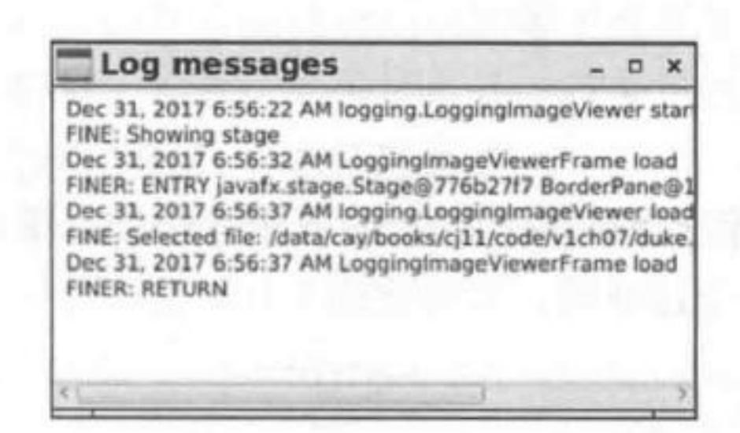

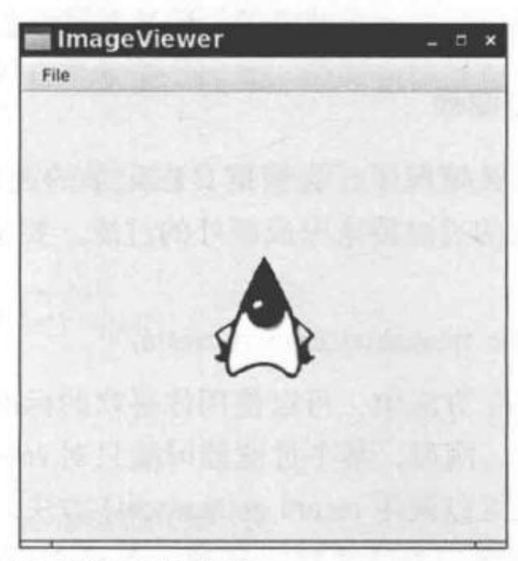

图 7-2 在窗口中显示日志记录的日志处理器

这个处理器扩展了 StreamHandle「类,并安装了一个流,这个流的 write 方法将流输出显示 到一个文本区中立

```
class WindowKandkr extends StreanHandler
{
   public WindawHandlerf)
      var output = new JTextArea{) ;
      setOutputStream(new
         Outputstream()
         {
            public void write(int b) {} // not called
            public void write(byte[] 瓦 int off, int len)
            {
               output.append (new String(b( off, len));
            }
         });
```

使用这种方式只有一个问题,这就是处理器会缓存记录,并且只有在缓冲区满的时候才 将它们写人流中。因此, 需要覆盖 publish 方法,使得处理器获得每个记录之后就会刷新输出 缓冲区.

```
class WindowHandler extends StreamHandler
   public void publish(LogRecord record)
   {
      super.publish)record);
      flush!);
   J
```

如果希望编写更加复杂的流处理器,可以扩展 Handle<sup>r</sup> 类,并定义 pubWh 、 flu的和 rhs<sup>电</sup> 方法0

## 7,5.6 过滤器

在默认情况下,会根据日志记录的级别进行过滤。每个日志记录器和处理器都可以有 一个可选的过滤器来完成额外的过滤<sup>c</sup> 要定义一个过滤器, 需要实现 Filte「接口并定义以下 方法:

**boolean isLoggable(LogRecord record)**

在这个方法中. 可以使用你喜欢的标准分析日志记录,对那些应该包含在日志中的记录 返回「ug t 例如,某个过滤器可能只对加归「ing 方法和 exiting 方法生成的消息感兴趣. 这个 过滤器就可以调用 record.getMessageO 方法,并检查消息是否以 ENTRY 或 RETURN 开头口

要想将一个过滤器安装到一个日志记录器或处理器中,只需要调用 <sup>s</sup>nFilte「方法口 <sup>注</sup> 意,一次最多只能有一个过滤器二

## 7.57 格式化器

ConsoleHandle「类和 FileHandle「类可以生成文本和 XML 格式的日志记录. 不过. 你也可 以自定义格式。这需要扩展 Formatte「类并覆盖下面这个方法:

**String format (LogRecord record)**

可以用你喜欢的任何方式对记录中的信息进行格式化,并返回结果字符串:在 format 方 法中,可能会调用下面这个方法:

**String fomatftessageI LogRecord record)**

这个方法对记录中的消息部分进行格式化,将替换参数并应用本地化姓理口

很多文件格式 (如 XML) 需要在已格式化的记录的前后加上一个头部和尾部? 为此, 要 覆盖下面两个方法:

**String getHeadf Handler h) String getTail(Handler h)**

最后,调用 EetFonnatte「方法将格式化器安装到处理器中。

## 7.5.8 日志技巧

面对日志记录如此之多的选项,很容易让人忘记了最基本的东西。下面的技巧总结了一 些最常用的操作。

L 对一个简单的应用,选择一个口志记录器口 可以把日志记录器命名为与主应用包同 名,例如. commymp/ymyp「叫 这是一个好主意。总是可以通过以下调用得到日志记录器:

**Logger logger** = **Logger** ,**getLogger**( **com.mycompany.myprcg" );**

- 为方便起见,你可能希望为有大量日志记录活动的类增加静态字段: private static final Logger logger = Logger.getLogger("com.mycompany.myprog");

2. 默认的日志配置会把级别等于或高于 INFO 的所有消息记录到控制台。用户可以覆盖这个默认配置。但是正如前面所述,改变配置的过程有些复杂。因此,最好在你的应用中安装一个更合适的默认日志处理器。

以下代码确保将所有的消息记录到应用特定的一个文件中。可以将这段代码放置在应用程序的 main 方法中。

```
if (System.getProperty("java.util.logging.config.class") == null
    && System.getProperty("java.util.logging.config.file") == null)
{
    try
    {
        Logger.getLogger("").setLevel(Level.ALL);
        final int LOG_ROTATION_COUNT = 10;
        var handler = new FileHandler("%h/myapp.log", 0, LOG_ROTATION_COUNT);
        Logger.getLogger("").addHandler(handler);
    }
    catch (IOException e)
    {
        logger.log(Level.SEVERE, "Can't create log file handler", e);
    }
}
```

3. 现在,可以记录自己想要的内容了。需要牢记: 所有级别为 INFO、WARNING 和 SEVERE 的消息都将显示到控制台上。因此,要记录对程序用户有意义的消息,可以使用这几个级别。对于程序员想要的日志消息, FINE 级别是一个很好的选择。

想要调用 System.out.println 时,可以换成发出以下日志消息:

```
logger.fine("File open dialog canceled");
```

记录那些预料之外的异常也是一个不错的想法,例如:

```
try
{
    ...
}
catch (SomeException e)
{
    logger.log(Level.FINE, "explanation", e);
}
```

程序清单 7-2 具体使用了上述技巧,还稍做了一点调整:日志记录消息还会显示在一个日志窗口中。

## 程序清单 7-2 logging/LoggingImageViewer.java

```
package logging;\nimport java.awt.*;\nimport java.awt.event.*;\nimport java.io.*;\nimport java.util.logging.*;\nimport javax.swing.*;
```

```
8
   /**
9
    * A modification of the image viewer program that logs various events.
10
    * @version 1.03 2015-08-20
11
    * @author Cay Horstmann
12
13
   public class LoggingImageViewer
15
      public static void main(String[] args)
16
17
         if (System.getProperty("java.util.logging.config.class") == null
18
               && System.getProperty("java.util.logging.config.file") == null)
19
20
            try
21
22
               Logger.getLogger("com.horstmann.corejava").setLevel(Level.ALL);
23
               final int LOG ROTATION COUNT = 10;
               var handler = new FileHandler("%h/LoggingImageViewer.log", 0, LOG ROTATION COUNT);
25
               Logger.getLogger("com.horstmann.corejava").addHandler(handler);
26
27
            catch (IOException e)
28
               Logger.getLogger("com.horstmann.corejava").log(Level.SEVERE,
                   "Can't create log file handler", e);
31
32
33
34
         EventQueue.invokeLater(() ->
35
36
               var windowHandler = new WindowHandler();
37
               windowHandler.setLevel(Level.ALL);
38
               Logger.getLogger("com.horstmann.corejava").addHandler(windowHandler);
39
48
               var frame = new ImageViewerFrame();
41
                frame.setTitle("LoggingImageViewer");
42
               frame.setDefaultCloseOperation(JFrame.EXIT ON CLOSE);
                Logger.getLogger("com.horstmann.corejava").fine("Showing frame");
               frame.setVisible(true);
            });
49
58
51
    * The frame that shows the image.
52
53
   class ImageViewerFrame extends JFrame
55
      private static final int DEFAULT WIDTH = 300;
56
      private static final int DEFAULT HEIGHT = 400;
57
58
      private JLabel label;
59
      private static Logger logger = Logger.getLogger("com.horstmann.corejava");
61
```

```
public ImageViewerFrame()
62
63
         logger.entering("ImageViewerFrame", "<init>");
64
         setSize(DEFAULT WIDTH, DEFAULT HEIGHT);
65
66
         // set up menu bar
67
         var menuBar = new JMenuBar();
68
         setJMenuBar(menuBar);
69
70
         var menu = new JMenu("File");
71
         menuBar.add(menu);
72
73
         var openItem = new JMenuItem("Open");
74
         menu.add(openItem);
75
         openItem.addActionListener(new FileOpenListener());
76
77
         var exitItem = new JMenuItem("Exit");
78
         menu.add(exitItem);
79
         exitItem.addActionListener(new ActionListener()
88
81
                public void actionPerformed(ActionEvent event)
82
83
                   logger.fine("Exiting.");
84
                   System.exit(0);
85
86
            });
87
88
         // use a label to display the images
89
         label = new JLabel();
90
         add(label);
91
         logger.exiting("ImageViewerFrame", "<init>");
92
93
94
      private class FileOpenListener implements ActionListener
95
96
         public void actionPerformed(ActionEvent event)
97
98
             logger.entering("ImageViewerFrame.FileOpenListener", "actionPerformed", event);
99
100
             // set up file chooser
101
             var chooser = new JFileChooser();
162
             chooser.setCurrentDirectory(new File("."));
103
194
             // accept all files ending with .gif
185
             chooser.setFileFilter(new javax.swing.filechooser.FileFilter()
186
107
                   public boolean accept(File f)
108
189
                      return f.getName().toLowerCase().endsWith(".gif") || f.isDirectory();
110
111
112
                   public String getDescription()
113
114
                      return "GIF Images";
115
```

```
116
                });
117
118
            // show file chooser dialog
119
            int r = chooser.showOpenDialog(ImageViewerFrame.this);
120
121
            // if image file accepted, set it as icon of the label
122
            if (r == JFileChooser.APPROVE OPTION)
123
124
                String name = chooser.getSelectedFile().getPath();
125
                logger.log(Level.FINE, "Reading file {0}", name);
126
                label.setIcon(new ImageIcon(name));
127
128
             else logger.fine("File open dialog canceled.");
129
             logger.exiting("ImageViewerFrame.FileOpenListener", "actionPerformed");
138
131
132
133 }
134
135 /**
    * A handler for displaying log records in a window.
    */
137
138 class WindowHandler extends StreamHandler
139 {
      private JFrame frame;
140
141
      public WindowHandler()
142
143
          frame = new JFrame();
144
          var output = new JTextArea();
145
          output.setEditable(false);
146
          frame.setSize(200, 200);
147
          frame.add(new JScrollPane(output));
148
          frame.setFocusableWindowState(false);
149
          frame.setVisible(true);
150
          setOutputStream(new OutputStream()
151
152
                public void write(int b)
153
154
                } // not called
155
156
                public void write(byte[] b, int off, int len)
157
158
                   output.append(new String(b, off, len));
159
160
             });
161
162
163
      public void publish(LogRecord record)
164
165
          if (!frame.isVisible()) return;
166
          super.publish(record);
167
          flush();
168
169
170 }
```

## API java.util.logging.Logger 1.4

- Logger getLogger(String loggerName)
- Logger getLogger(String loggerName, String bundleName)
   获得给定名字的日志记录器。如果这个日志记录器不存在,就创建一个日志记录器。
   本地化消息位于名为 bundleName 的资源包中。
- void severe(String message)
- void warning(String message)
- void info(String message)
- void config(String message)
- void fine(String message)
- void finer(String message)
- void finest(String message)
   记录一个日志记录,包含方法名指示的级别和给定的消息。
- void entering(String className, String methodName)
- void entering(String className, String methodName, Object param)
- void entering(String className, String methodName, Object[] param)
- void exiting(String className, String methodName)
- void exiting(String className, String methodName, Object result)
   记录一个日志记录,描述进入/退出一个方法(有给定的参数和返回值)。
- void throwing(String className, String methodName, Throwable t) 记录一个日志记录,描述抛出了给定的异常对象。
- void log(Level level, String message)
- void log(Level level, String message, Object obj)
- void log(Level level, String message, Object[] objs)
- void log(Level level, String message, Throwable t)
   记录一个有给定级别和消息的日志记录,其中可以包括对象或者一个可抛出对象(throwable)。要包括对象,消息中必须包含格式化占位符 {0}、{1}等。
- void logp(Level level, String className, String methodName, String message)
- void logp(Level level, String className, String methodName, String message, Object obj)
- void logp(Level level, String className, String methodName, String message, Object[] objs)
- void logp(Level level, String className, String methodName, String message, Throwable t)
   记录一个有给定级别、准确的调用者信息和消息的日志记录,其中可以包括对象或一个可抛出对象。
- void logrb(Level level, String className, String methodName, ResourceBundle bundle, String message, Object... params)
- void logrb(Level level, String className, String methodName, ResourceBundle bundle, String

message, Throwable thrown) 9

记录一个有给定级别、准确调用者信息、资源包和消息的日志记录,其中可以包括对象或一个可抛出对象。

- Level getLevel()
- void setLevel(Level l)
   获得和设置这个日志记录器的级别。
- Logger getParent()
- void setParent(Logger l)
   获得和设置这个日志记录器的父日志记录器。
- Handler[] getHandlers()
   获得这个日志记录器的所有处理器。
- void addHandler(Handler h)
- void removeHandler(Handler h)
   为这个日志记录器增加或删除一个处理器。
- boolean getUseParentHandlers()
- void setUseParentHandlers(boolean b)
   获得和设置"使用父处理器"属性。如果这个属性是 true, 日志记录器会将全部日志记录转发给它的父日志记录器的处理器。
- Filter getFilter()
- void setFilter(Filter f)
   获得和设置这个日志记录器的过滤器。

## java.util.logging.Handler 1.4

- abstract void publish(LogRecord record)
   将日志记录发送到希望的目的地。
- abstract void flush()
   刷新输出所有已缓冲的数据。
- abstract void close()
   刷新输出所有已缓冲的数据,并释放所有相关的资源。
- Filter getFilter()
- void setFilter(Filter f)
   获得和设置这个处理器的过滤器。
- Formatter getFormatter()
- void setFormatter(Formatter f)
   获得和设置这个处理器的格式化器。
- Level getLevel()

void setLevel(Level l)
 获得和设置这个处理器的级别。

## am java.util.logging.ConsoleHandler 1.4

ConsoleHandler()
 构造一个新的控制台处理器。

## API java.util.logging.FileHandler 1.4

- FileHandler(String pattern)
- FileHandler(String pattern, boolean append)
- FileHandler(String pattern, int limit, int count)
- FileHandler(String pattern, int limit, int count, boolean append)
- FileHandler(String pattern, long limit, int count, boolean append) 9
   构造一个文件处理器。模式格式参见表 7-2。limit 是在打开一个新日志文件之前,日志文件可以包含的近似最大字节数。count 是循环序列的文件数量。如果 append 为 true,记录则应该追加在一个已存在的日志文件末尾。

#### API java.util.logging.LogRecord 1.4

- Level getLevel()
   获得这个日志记录的日志级别。
- String getLoggerName()
   获得记录这个日志记录的日志记录器的名字。
- ResourceBundle getResourceBundle()
- String getResourceBundleName()
   获得用于本地化消息的资源包或资源包名。如果没有提供资源包,则返回 null。
- String getMessage()
   获得本地化或格式化之前的"原始"消息。
- Object[] getParameters() 获得参数对象。如果没有提供,则返回 null。
- Throwable getThrown()
   获得所抛出的对象。如果没有提供,则返回 null。
- String getSourceClassName()
- String getSourceMethodName()

获得记录这个日志记录的代码位置。这个信息有可能是由日志记录代码提供的,也有可能是从运行时栈自动推导得出。如果日志记录代码提供的值有误,或者运行时代码由于优化而无法推导出确切的位置,这两个方法的返回值就有可能不准确。

long getMillis()
 获得创建时间(从1970年开始),以毫秒为单位。

- •Instant getlnstantf) <sup>9</sup> 获得创建时间, 作为向a.time.Instant 返回 (参见本书卷 0 的第 6 章)。
- •long getSequenceHumber 获得这个日志记录的唯一序列号。
- •long getLongThreadlDf) <sup>16</sup>

获得创建这个日志记录的线程的唯一 ID 这些 ID 是由 LogRecord 类分配的,与其他线 程的 ID 无关口 ( getThreadID 方法返回 intlk 现在这个方法已经废弃. 因为一个长时间 运行的程序生成的日志记录数量可能会超过 Integer.MAX\_VALUE...)

# 回**java.util.logging.LogManager 1\*4**

- •static LogManager getLogManagerf) 获得全局 LogMm吨cr 实例口
- •void readConfigurationO
- •void readconfiguration(InputStream in) 从系统属性食河山1.1四我叫阿仪.自恒指定的文件或者给定的输人流读取日志配置.
- •void updateConfiguration{InputStream in, Function<String <sup>F</sup> BiFunction<String,Stringf String» fnapper) **9**
- •void updateConfiguration(Function<String,BiFunction<String,String,String» mapper) **<sup>9</sup>** 将口志配置与系统属性 java .utILloggingiconfig,file 指定的文件或给定的输入流合并. 参见 753 节,其中给出了阳叩pc「参数的描述。

# 且 [四**g%g・Filt&r 1.4**

•boolean isLoggablefLogRecord record) 如果给定日志记录需要记录,则返回 tnie。

#### **w] java,util.logging・ Fonnatter 1,4**

- abstract String format (LogRecord record) 返回格式化给定日志记录后得到的字符串。
- String getHead(Handler h)
- String getTail(Handler h) 返回应该出现在包含日志记录的文档开头和结尾的字符串,Fomatt时塔类将这些方法 定义为只返回空字符串。如果必要,可以覆盖这些方法口
- String formatMes sage( LogRecord record) 返回日志记录的本地化和格式化消息部分。

# **7.6** 调试技巧

假设你写了一个程序,捕获并且恰当地处理了所有的异常以保证它万无一失口 然后,运

行这个程序,但还是出现问题,现在该怎么办呢?(如果你从来没有遇到过这种情况,可以跳 过本章的剩余部分1)

当然,最好有一个方便且功能强大的调试器.像 Eclipse、imellij 和 NetBuans 之类的专 业集成开发环境都提供了调试器口 不过在使用调试器之前,这一节中我们会告诉你一些值得 尝试的技巧。

1- 可以用下面的代码打印或记录任意变量的值:

```
Systern.out.printIn( "x=" + x);
```

或

Logger.getGloballhinfd(,fx=u + x);

如果 <sup>x</sup> 是一个值,会转换成等价的字符串口如果 x 是一个对象,那么 Java 会调用这个对 象的 toString 方法。要想获得隐式参数对象的状态,可以打印 this 对象的状态。

```
Logger.getSlobal().info('this=a + this);
```

Java 类库中的绝大多数类都覆^了 toString 方法,从而能够提供有用的类信息口 这样会 使调试更加便捷。在你自定义的类中也应该这样做」

2.还有一个不太为人所知但非常有效的技巧,可以在每一个类中放置一个单独的 main <sup>方</sup> 法。这样就可以提供一个单元测试桩 Stub), 允许你独立地测试类。

```
public class MyClass
{
   methods and fields
   public static void nain(String[] args)
   {
      fest code
   }
```

可以创建一些对象,调用所有的方法,检查每个方法是否能够正确地完成工作。另外, 可以保留所有这些唱in 方法,然后分别对各个文件启动 Java 虚拟机来运行测试,运行 applet 时, 这些 main 方法不会被调用. 而在运行应用程序时,Java 虚拟机只调用启动类的帕in 方法口

- 3.如果喜欢使用前面介绍的那个技巧. 可以在 http;"junit,o「g 网站上查看 JUn储 JUnit 是一个非常流行的单元测试框架,利用它可以很容易地组织测试用例套件中 只要对类做了修 改,就需要运行测试自 一旦发现 bug, 则要再补充另一个测试用例口
- 4. 日志代理 (loggingproxy) 是一个子类的对象,它可以截获方法调用,照这些调用记人 日志,然后调用超类中的方法。例如,如果在调用 Random 类的 nExtDuub怕方法时出现了问 题. 可以如下创建一个代理对象,这是一个匿名子类的实例:

```
var generator =
                new Random(}
   {
      public double nextDoublet)
      {
         double result = super.nextDoubled;
         Logger, getGlobal!),infoCnextDouble: * + result);
```

```
return result;
}
};
```

只要调用 nextDouble 方法,就会生成一个日志消息。

要想知道谁调用了这个方法,可以生成一个栈轨迹。

5. 利用 Throwable 类的 printStackTrace 方法,可以从任意的异常对象获得栈轨迹。下面的代码将捕获任意的异常,打印这个异常对象和栈轨迹,然后,重新抛出异常,以便找到相应的处理器。

```
try
{
    ...
}
catch (Throwable t)
{
    t.printStackTrace();
    throw t;
}
```

甚至不需要捕获异常来生成栈轨迹。只要在代码的某个位置插入下面这条语句就可以获 得栈轨迹:

Thread.dumpStack();

6. 一般来说, 栈轨迹显示在 System.err 上。如果想要记录或显示栈轨迹, 可以如下将它捕获到一个字符串中:

```
var out = new StringWriter();
new Throwable().printStackTrace(new PrintWriter(out));
String description = out.toString();
```

7. 通常,将程序错误记入一个文件会很有用。不过,错误会发送到 System.err,而不是 System.out。因此,不能通过运行下面的命令来获取错误:

java MyProgram > errors.txt

而应当如下捕获错误流:

java MyProgram 2> errors.txt

要想在同一个文件中同时捕获 System.err 和 System.out, 需要使用以下命令:

java MyProgram 1> errors.txt 2>&1

这在 bash 和 Windows shell 中都有效。

8. 在 System.err 中显示未捕获的异常的栈轨迹并不是一个理想的方法。如果最终用户碰巧看到了这些消息,就会很慌乱,而且在真正需要诊断错误原因时却又无法得到这些消息。更好的方法是将这些消息记录到一个文件中。可以用静态方法 Thread.setDefaultUncaughtExceptionHandler改变未捕获异常的处理器:

Thread.setDefaultUncaughtExceptionHandler( new Thread.UncaughtExceptionHandler()

```
public void uncaughtException(Thread t, Throwable e)
{
    save information in log file
};
});
```

9. 要想观察类的加载过程, 启动 Java 虚拟机时可以使用 -verbose 标志。这样就可以看到如下所示的输出:

```
[0.012s][info][class,load] opened: /opt/jdk-17.0.1/lib/modules
[0.034s][info][class,load] java.lang.Object source: jrt:/java.base
[0.035s][info][class,load] java.io.Serializable source: jrt:/java.base
[0.035s][info][class,load] java.lang.Comparable source: jrt:/java.base
[0.035s][info][class,load] java.lang.CharSequence source: jrt:/java.base
[0.035s][info][class,load] java.lang.String source: jrt:/java.base
[0.036s][info][class,load] java.lang.reflect.AnnotatedElement source: jrt:/java.base
[0.036s][info][class,load] java.lang.reflect.GenericDeclaration source: jrt:/java.base
[0.036s][info][class,load] java.lang.reflect.Type source: jrt:/java.base
[0.036s][info][class,load] java.lang.Class source: jrt:/java.base
[0.036s][info][class,load] java.lang.Cloneable source: jrt:/java.base
[0.037s][info][class,load] java.lang.ClassLoader source: jrt:/java.base
[0.037s][info][class,load] java.lang.System source: jrt:/java.base
[0.037s][info][class,load] java.lang.Throwable source: jrt:/java.base
[0.037s][info][class,load] java.lang.Error source: jrt:/java.base
[0.037s][info][class,load] java.lang.ThreadDeath source: jrt:/java.base
[0.037s][info][class,load] java.lang.Exception source: jrt:/java.base
[0.037s][info][class,load] java.lang.RuntimeException source: jrt:/java.base
[0.038s][info][class,load] java.lang.SecurityManager source: jrt:/java.base
```

有时候,这对诊断类路径问题会很有帮助。

10. -Xlint 选项告诉编译器找出常见的代码问题。例如,如果使用下面这条命令编译程序: javac -Xlint sourceFiles

当 switch 语句中缺少 break 语句时,编译器就会报告这个问题(术语"lint"最初用来描述一种查找 C 程序中潜在问题的工具,不过现在通常用来描述查找问题代码的工具,这些工具可以找出代码中有问题但不违背语法规则的构造)。

你会得到类似下面的消息:

warning: [fallthrough] possible fall-through into case

中括号内的字符串标识了警告类别。可以启用和禁用各种类别的警告。因为它们大多数都很有用,所以最好还是保留这些警告,只禁用那些你不感兴趣的消息,如下所示:

 $\verb|javac -Xlint:all,-fallthrough,-serial| sourceFiles$ 

可以用以下命令得到所有警告的一个列表:

javac --help -X

11. Java 虚拟机提供了对 Java 应用的监控(monitoring)和管理(management)支持,允许在虚拟机中安装代理来跟踪内存消耗、线程使用、类加载等情况。这个特性对于规模很大而且长时间运行的 Java 程序(如应用服务器)尤其重要。作为展示这些功能的一个例子,

JDK 提供了一个名为 jansole 的图形工具. 可以显示有关虚拟机性能的统计结果,如图 7-3 所示口 启动你的程序,然后启动 jansole, 从正在运行的 Java 程序列表中选择你的程序口

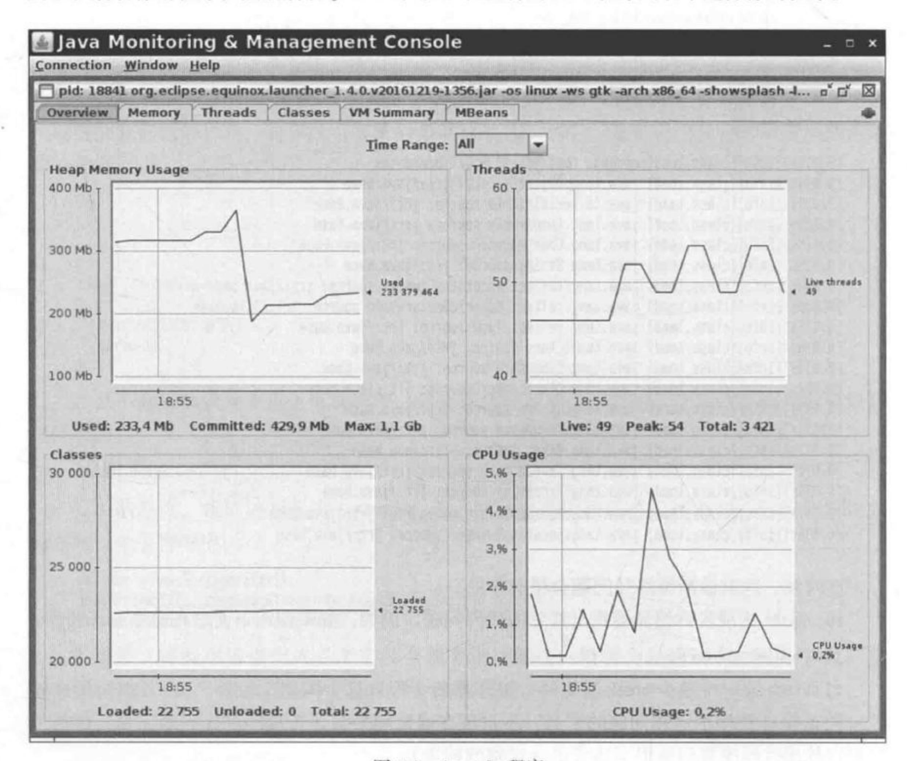

图 7-3 jconsole 程序

控制台会给出正在运行的这个程序的大量信息』更详细的信息参见 WWW.0QCIjran/ technetwork/articles/java/jconsole\*1564139 <sup>+</sup>html <sup>0</sup>

12. Java 任务控制器 ( Java Mission Congl) 是一个专业级性能分析和诊断工具,可以 从 https://adoptopenjdk.net/jmc.html 得到口 类似于 jconsole, Java Mission Control 可以关联到正 在运行的虚拟机口 它还能分析 Java 飞行记录器 ( JavaFlight Recorder) 的输出,这个工具可 以从一个正在运行的 Java 应用收集诊断和性能分析数据i https://github.coni/thegreystone/ tutorial 提供了一个全面的教程。

本章介绍了异常处理和日志,另外还了解了关于测试和调试的一些有用的技巧口 接下来 两章会介绍泛型程序设计和它最重要的应用:Java 集合框架。

# 第8章 泛型程序设计

- ▲ 为什么要使用泛型程序设计
- ▲ 定义简单泛型类
- ▲ 泛型方法
- ▲ 类型变量的限定
- ▲ 泛型代码和虚拟机

- ▲ 限制与局限性
- ▲ 泛型类型的继承规则
- ▲ 通配符类型
- ▲ 反射和泛型

泛型类和泛型方法有类型参数,这使得它们可以准确地描述用特定类型实例化时会发生什么。在有泛型类之前,程序员必须使用 Object 编写适用于多种类型的代码。这很烦琐,也很不安全。

随着泛型的引入, Java 有了一个表述能力很强的类型系统, 允许设计者详细地描述变量和方法的类型要如何变化。对于简单的情况, 你会发现实现泛型代码很容易。不过, 在更高级的情况下, 对于实现者来说这会相当复杂。其目标是提供让其他程序员可以轻松使用的类和方法而不会出现意外。

Java 5 中泛型的引入成为 Java 程序设计语言自最初发行以来最显著的变化。Java 的一个主要设计目标是支持与之前版本的向后兼容性。因此, Java 的泛型有一些让人不快的局限性。在本章中, 你会了解泛型程序设计的优点以及存在的问题。

# 8.1 为什么要使用泛型程序设计

泛型程序设计(generic programming)意味着编写的代码可以对多种不同类型的对象重用。例如,你并不希望为收集 String 和 File 对象分别编写不同的类。实际上,也不需要这样做,因为一个 ArrayList 类就可以收集任何类的对象。这就是泛型程序设计的一个例子。

实际上,在 Java 有泛型类之前已经有一个 ArrayList 类。下面来研究泛型程序设计的机制是如何演变的,另外还会介绍这对于用户和实现者来说意味着什么。

## 8.1.1 类型参数的好处

在 Java 中增加泛型类之前,泛型程序设计是用继承 (inheritance)实现的。ArrayList 类只维护一个 Object 引用的数组:

public class ArrayList // before generic classes
{
 private Object[] elementData;

```
public Object get(int i) { . . . }
public void add(Object o) { . . . }
}
```

这种方法存在两个问题。获取一个值时必须进行强制类型转换:

ArrayList files = new ArrayList();

String filename = (String) files.get(0);

此外,这里没有错误检查。可以向数组列表中添加任何类的值:

files.add(new File(". . ."));

对于这个调用,编译和运行都不会出错。不过在其他地方,如果将 get 的结果强制类型 转换为 String 类型,就会产生一个错误。

泛型提供了一个更好的解决方案: 类型参数 (type parameter)。ArrayList 类现在有一个类型参数用来指示元素的类型:

var files = new ArrayList<String>();

这使得代码具有更好的可读性。人们一看就知道这个数组列表中包含的是 String 对象。

直 注释:如果用一个明确的类型而不是 var 声明一个变量,则可以通过使用"菱形"语 法省略构造器中的类型参数:

ArrayList<String> files = new ArrayList<>();

省略的类型可以从变量的类型推断得出。

Java 9 扩展了菱形语法的使用范围,原先不接受这种语法的地方现在也可以使用了。例如,现在可以对匿名子类使用菱形语法:

```
ArrayList<String> passwords = new ArrayList<>() // diamond OK in Java 9
      {
          public String get(int n) { return super.get(n).replaceAll(".", "*"); }
      };
```

编译器也可以充分利用这个类型信息。调用 get 的时候,不再需要强制类型转换。编译器知道返回值类型为 String,而不是 Object:

String filename = files.get(0);

编译器还知道 ArrayList<String> 的 add 方法有一个类型为 String 的参数,这比有一个 Object 类型的参数要安全得多。现在,编译器会检查,防止你插入错误类型的对象。例如,以下语句

files.add(new File(". . .")); // can only add String objects to an ArrayList<String>

是无法通过编译的。不过,得到编译错误要比运行时出现类的强制类型转换异常好得多。

这正是类型参数的魅力所在:它们会让你的程序更易读,也更安全。

## 8.1.2 谁想成为泛型程序员

使用类似 ArrayList 的泛型类很容易。大多数 Java 程序员使用 ArrayList<String> 之类的类

型时就好像它们是 Ja调 语言内置的类型一样 (就像 5t ring【l 数组)© (当然, 数组列表比数组 更好,因为数组列表可以自动扩展1)

但是, 实现一个泛型类可没有那么容易:使用你的代码的程序员可能会插人各种各样的类 作为类型参数,他们希望一切都能正常工作,不会有恼人的限制,也不会有让人混乱的错误消 息口 因此,作为一个泛型程序员,你的任务就是要预计到你的泛型类将来所有可能的用法。

这个任务 会有多难呢?下 面来看让标准类库的设计者饱受折磨的一个典型问题口 AbayLi式 类有一个方法 mddAll, 用来添加另一个集合的全部元素。一个程序员可能想要将一 个 ArrayList<Manager> 中的所有元素添加到一个 ArrayList<Employee> 中去。不过,当然反过来应 该不合法 如何允许前一个调用,而不允许后一个调用呢? Java 语言的设计者发明了一个具 有独创性的新概念来解决这个问题,即通配符类型 ( wildcardtype)。通配符类型非常抽象. 不过,利用通配符类型,构建类库的程序员可以编写出尽可能灵活的方法。

泛型程序设计可以分为 3 个能力水平。基本水平是,仅仅使用泛型类 (比较典型的是像 ArrayLE这样的集合),而不考虑它们如何工作以及为什么这样做, 大多数应用程序员都希 望保持在这一水平,除非出现了问题口 不过. 当混合使用不同的泛型类时,或者要与对类型 参数一无所知的遗留代码交互时,你可能会看到让人困惑的错误消息口 那时你就需要对 Java 泛型有足够的了解,才能系统地解决问题,而不是胡乱地猜测, 当然,最终你可能想要实现 自己的泛型类与泛型方法口

应用程序员很可能不会编写太多的泛型代码:JDK 开发人员已经做出了很大的努力, 为所有的集合类提供了类型参数。凭经验来说,只有原本涉及大量通用类型 (如 Object 或 Comparable 接口)的强制类型转换的代码才会因使用类型参数而受益占

本章将介绍实现自己的泛型代码所需了解的全部知识. 不过,希望大多数读者主要利用 这些知识来帮助排除代码的问题,以及满足想要了解参数化集合类内部工作原理的好奇心.

# 8.2 定义简单泛型类

泛型类 ( genericclass) 就是有一个或多个类型变量的类口 本章使用一个简单的就「类作为例 子二 这个类使我们可以只关注泛型,而不用为数据存储的细节而分心口 下面是泛型 Pai 「类的代码:

```
public Class Pair<T>
{
   private T first;
   private T second;
   public Pair(} { first 肆 null; second = null; }
   public Pair(T first( T second) { this*first = first;this.secand = second:}
   public T getFirstf) { return first; }
   public T getSecond() { return second; )
   public void setFirst(7 newValue) { first = newValue; }
   public void setSecondfT newValue) { second = newValue; }
```

Pair 类引入了一个类型变量 T, 用尖括号(<) 括起来, 放在类名的后面。泛型类可以有多个类型变量。例如,可以定义 Pair 类, 其中第一个字段和第二个字段使用不同的类型:

```
public class Pair<T, U> { . . . }
```

类型变量在整个类定义中用于指定方法的返回类型以及字段和局部变量的类型。例如, private T first; // uses the type variable

■ 注释: 常见的做法是类型变量使用大写字母,而且很简短。Java 类库使用变量 E表示集合的元素类型, K和 V分别表示表的键和值的类型。T(必要时还可以用相邻的字母 U和 S)表示"任意类型"。

可以用具体的类型替换类型变量来实例化 (instantiate) 泛型类型,例如:

Pair<String>

可以把结果想象成一个普通类,它有以下构造器:

```
Pair<String>()
Pair<String>(String, String)
```

#### 以及以下方法:

```
String getFirst()
String getSecond()
void setFirst(String)
void setSecond(String)
```

换句话说, 泛型类相当于普通类的工厂。

程序清单 8-1 中的程序具体使用了 Pair 类。静态方法 minmax 会遍历数组并同时计算出最小值和最大值。它用一个 Pair 对象同时返回两个结果。回想一下:用 compareTo 方法比较两个字符串,如果字符串相同则返回 0;按照字典顺序,如果第一个字符串比第二个字符串靠前,就返回一个负整数,否则返回一个正整数。

## 程序清单 8-1 pair1/PairTest1.java

```
package pairl;
2
3
     @version 1.01 2012-01-26
    * @author Cay Horstmann
   public class PairTest1
8
      public static void main(String[] args)
9
10
         String[] words = { "Mary", "had", "a", "little", "lamb" };
11
         Pair<String> mm = ArrayAlg.minmax(words);
12
         System.out.println("min = " + mm.getFirst());
13
         System.out.println("max = " + mm.getSecond());
14
15
16 }
```

```
17
   class ArrayAlg
19
28
       * Gets the minimum and maximum of an array of strings.
21
       * @param a an array of strings
22
       * @return a pair with the min and max values, or null if a is null or empty
23
24
      public static Pair<String> minmax(String[] a)
25
26
         if (a == null || a.length == 0) return null;
27
         String min = a[\theta];
28
         String max = a[0];
29
          for (int i = 1; i < a.length; i++)
31
             if (\min.compareTo(a[i]) > 0) \min = a[i];
32
            if (\max.compareTo(a[i]) < 0) \max = a[i];
33
34
          return new Pair > (min, max);
35
36
37 }
```

C++ 注释: 从表面上看, Java 的泛型类类似于 C++ 的模板类。唯一明显的不同是 Java 没有特殊的 template 关键字。但是, 在本章中你将会看到, 这两种机制有着本质的区别。

## 8.3 泛型方法

上一节已经介绍了如何定义一个泛型类。还可以定义一个带有类型参数的方法。

```
class ArrayAlg
{
  public static <T> T getMiddle(T... a)
  {
    return a[a.length / 2];
  }
}
```

这个方法是在普通类中定义的,而不是在泛型类中。不过,这是一个泛型方法,可以从尖括号和类型变量看出这一点。注意,类型变量放在修饰符(这里的修饰符就是 public static)的后面,并在返回类型的前面。

可以在普通类中定义泛型方法,也可以在泛型类中定义。

当调用一个泛型方法时,可以把具体类型包围在尖括号中,放在方法名前面:

String middle = ArrayAlg.<String>getMiddle("John", "Q.", "Public");

在这种情况下(实际也是大多数情况下),方法调用中可以省略 <String> 类型参数。编译器有足够的信息推断出你想要的方法。它将参数的类型与泛型类型 T... 进行匹配,推断出 T 一定是 String。也就是说,可以简单地调用

String middle = ArrayAlg.getMiddle("John", "Q.", "Public");

几乎在所有情况下,泛型方法的类型推导都能正常工作。偶尔,编译器也会提示错误, 此时你就需要解译错误报告。考虑下面这个示例:

double middle = ArrayAlg.getMiddle(3.14, 1729, 0);

错误消息以晦涩的方式指出(不同的编译器版本给出的错误消息可能有所不同):解释这个代码有两种方式,而且这两种方式都是合法的。简单地说,编译器将把参数自动装箱为1个Double和2个Integer对象,然后寻找这些类的共同超类型。事实上,它找到了2个超类型:Number和Comparable接口,Comparable接口本身也是一个泛型类型。在这种情况下,可以采取的补救措施是将所有的参数都写为double值。

● 提示:如果想知道编译器对一个泛型方法调用最终推断出哪种类型,Peter von der Ahé 推荐了这样一个窍门:故意引入一个错误,然后研究所得到的错误消息。例如,考虑 调用 ArrayAlg.getMiddle("Hello", 0, null)。将结果赋给 JButton,这肯定是不对的。将会得 到一个错误报告:

```
found:
```

java.lang.Object&java.io.Serializable&java.lang.Comparable<? extends java.lang.Object&java.io.Serializable&java.lang.Comparable<?>>

大致的意思是:可以将结果赋给 Object、Serializable 或 Comparable。

C++ 注释: 在 C++ 中, 要将类型参数放在方法名后面。这有可能会导致烦人的解析二义性。例如, g(f<a, b>(c)) 可以理解为 "用 f<a, b>(c) 的结果调用 g", 或者理解为 "用 两个布尔值 f<a 和 b>(c) 调用 g"。

## 8.4 类型变量的限定

有时,类或方法需要对类型变量加以约束。下面是一个典型的例子。我们要计算数组中的最小元素:

```
class ArrayAlg
{
  public static <T> T min(T[] a) // almost correct
  {
    if (a == null || a.length == 0) return null;
    T smallest = a[0];
    for (int i = 1; i < a.length; i++)
        if (smallest.compareTo(a[i]) > 0) smallest = a[i];
    return smallest;
  }
}
```

但是,这里有一个问题。请看 min 方法的代码。变量 smallest 的类型为 T,这意味着它可以是任何一个类的对象。如何知道 T 所属的类有一个 compareTo 方法呢?

解决这个问题的办法是限制 T 只能是实现了 Comparable 接口(包含一个方法 compareTo 的标准接口)的一个类。可以通过对类型变量 T 设置一个限定(bound)来实现这一点:

public static <T extends Comparable> T min(T[] a) . . .

实际上 Comparable 接口本身就是一个泛型类型。目前,我们先忽略其复杂性以及编译器产生的警告。8.8 节会讨论如何在 Comparable 接口中适当地使用类型参数。

现在,泛型方法 min 只能在实现了 Comparable 接口的类 (如 String、LocalDate 等)的数组上调用。因为 Rectangle 类没有实现 Comparable 接口,所以在 Rectangle 数组上调用 min 将会得到一个编译错误。

C++ 注释: 在 C++ 中,不能对模板参数的类型加以限制。如果程序员用一个不适当的 类型实例化一个模板,将会在模板代码中报告一个(通常含糊不清的)错误消息。

你或许会感到奇怪——在这里我们为什么使用关键字 extends 而不是 implements ? 毕竟, Comparable 是一个接口。下面的记法

<T extends BoundingType>

表示 T 应该是限定类型 (bounding type) 的子类型 (subtype)。T 和限定类型可以是类,也可以是接口。选择关键字 extends 的原因是它更接近子类型的概念,并且 Java 的设计者也不打算在语言中再添加一个新的关键字 (如 sub)。

一个类型变量或通配符可以有多个限定,例如:

T extends Comparable & Serializable

限定类型用"&"分隔,而逗号用来分隔类型变量。

按照 Java 继承机制,可以根据需要拥有多个接口超类型,但最多有一个限定可以是类。如果有一个类作为限定,它必须是限定列表中的第一个限定。

在程序清单 8-2 中, 我们把 minmax 重写为一个泛型方法。这个方法可以计算泛型数组的最大值和最小值, 并返回一个 Pair<T>。

### 程序清单 8-2 pair2/PairTest2.java

```
package pair2;\nimport java.time.*;

/**
  * @version 1.02 2015-06-21
  * @author Cay Horstmann
  */
public class PairTest2

public static void main(String[] args)

LocalDate[] birthdays =

LocalDate.of(1906, 12, 9), // G. Hopper
```

```
LocalDate.of(1815, 12, 10), // A. Lovelace
                LocalDate.of(1903, 12, 3), // J. von Neumann
17
                LocalDate.of(1910, 6, 22), // K. Zuse
18
            };
19
         Pair<LocalDate> mm = ArrayAlg.minmax(birthdays);
20
         System.out.println("min = " + mm.getFirst());
21
         System.out.println("max = " + mm.getSecond());
22
23
24
25
   class ArrayAlg
27
28
         Gets the minimum and maximum of an array of objects of type T.
29
         @param a an array of objects of type T
30
         @return a pair with the min and max values, or null if a is null or empty
31
32
      public static <T extends Comparable> Pair<T> minmax(T[] a)
33
34
         if (a == null || a.length == 0) return null;
35
         T \min = a[\theta];
36
         T \max = a[\theta];
37
         for (int i = 1; i < a.length; i++)
38
39
             if (\min.compareTo(a[i]) > 0) \min = a[i];
40
             if (\max.compareTo(a[i]) < \theta) \max = a[i];
41
42
          return new Pair<>(min, max);
43
44
45 }
```

## 8.5 泛型代码和虚拟机

虚拟机没有泛型类型对象——所有对象都属于普通类。在泛型实现的早期版本中,甚至能够将使用泛型的程序编译为在 1.0 虚拟机上运行的类文件!在下面的小节中你会看到编译器如何"擦除"类型参数,以及这个过程对 Java 程序员有什么影响。

## 8.5.1 类型擦除

无论何时定义一个泛型类型,都会自动提供一个相应的原始类型(raw type)。这个原始类型的名字就是去掉类型参数后的泛型类型名。类型变量会被擦除(erased),并替换为其限定类型(或者,对于无限定的变量则替换为 0bject)。

例如, Pair<T>的原始类型如下所示:

```
public class Pair
{
   private Object first;
   private Object second;

public Pair(Object first, Object second)
```

```
this.first = first;
  this.second = second;
}

public Object getFirst() { return first; }
  public Object getSecond() { return second; }

public void setFirst(Object newValue) { first = newValue; }
  public void setSecond(Object newValue) { second = newValue; }
}
```

因为T是一个无限定的类型变量, 所以直接替换为 Object。

其结果是一个普通类,就好像 Java 语言中引入泛型之前实现的类一样。

在程序中可以包含不同类型的 Pair,例如,Pair<String>或 Pair<LocalDate>。不过擦除类型后,它们都会变成原始的 Pair 类型。

6 C++ 注释: 就这点而言, Java 泛型与 C++ 模板有很大的区别。C++ 会为每个模板的实例化生成不同的类型, 这一现象称为"模板代码膨胀"。Java 不受这个问题的困扰。

原始类型用第一个限定来替换类型变量,或者,如果没有给定限定,就替换为 Object。例如,类 Pair<T>中的类型变量没有显式的限定,因此,原始类型用 Object 替换 T。假定我们声明了一个稍有不同的类型:

```
public class Interval<T extends Comparable & Serializable> implements Serializable {
    private T lower;
    private T upper;
    ...
    public Interval(T first, T second)
    {
        if (first.compareTo(second) <= 0) { lower = first; upper = second; }
        else { lower = second; upper = first; }
    }
}

ß

ß

ß

public class Interval 如下所示:

public class Interval implements Serializable
{
    private Comparable lower;
    private Comparable upper;
    ...
    public Interval(Comparable first, Comparable second) { . . . }
}
```

注释: 你可能想要知道限定切换为 class Interval<T extends Serializable & Comparable> 会发生什么。如果这样做,原始类型会用 Serializable 替换 T,而且编译器会在必要时插入转换为 Comparable 的强制类型转换。为了提高效率,应该将标记(tagging)接口(即没有方法的接口)放在限定列表的末尾。

# 852 转换泛型表达式

编写一个泛型方法调用时,如果擦除了返回类型. 编译器会插入强制类型转换. 例如, 对于下面这个语句序列:

```
Pair<Employee> buddies = ・ ,.;
Employee buddy 二 biddies.getFirstl);
```

getFir5t 擦除类型后的返回类型是 Object <sup>o</sup> 编译器自动插人转换到 Employee 的强制类型转换, 也就是说,编译器把这个方法调用转换为两条虚拟机指令:

- 调用原始方法 Pair.getFirst^
- \* 将返回的 Object 类型强制转换为 Employee 类型。

访问一个泛型字段时也会插入强制类型转换。假设 Pair 类的 n风 字段和 second 字段都 是公共的 (也许这不是一种好的编程风格,但在 Java 中是合法的)■ 以下表达式

Employee buddy = buddies .first;

也会在结果字节码中插入强制类型转换口

# 8.53 转换泛型方法

类型擦除也会出现在泛型方法中。程序员通常认为类似下面的泛型方法 public static <T extends Conparablo <sup>T</sup> Hn(T[] a)

是整个一组方法. 而擦除类型之后,只剩下一个方法:

```
public static Comparable ninlCompa rable[] a}
```

注意,类型参数 <sup>T</sup> 已经被擦除了,只留下了它的限定类型 C。呷b®同薪 方法的擦除带来了两个复杂问题。考虑下面这个示例:

```
class Dateinterval extends Pair<ocaiDate>
{
   public void setSecond(LocalDate second)
   (
      if { second.conipareTo(getFirstO) >= 的
         super, setSecond(second);
   }
}
```

0 期区间是一对 LocmDate 对象,而且我们想覆盖这个方法来确保第二个值永远不小于第 一个值. 这个类擦除后变成

```
class Dateinterval extends Pair // after erasure
{
   public void setSecond(LocaWate second) { ・・ *
                                                  }
}
  …
```

令人感到奇怪的是,还有另一个从 阳江 继承的 set5econd 方法,即 public void setSecondf Object second)

这显然是一个不同的方法,因为它有一个不同类型的参数——Object,而不是LocalDate。不过,它不应该不一样。考虑下面的语句序列:

```
var interval = new DateInterval(. . .);
Pair<LocalDate> pair = interval; // OK--assignment to superclass
pair.setSecond(aDate);
```

这里,我们希望 setSecond 调用具有多态性,应该调用适当的方法。因为 pair 引用一个 DateInterval 对象,所以应该调用 DateInterval.setSecond。问题在于类型擦除与多态发生了冲突。为了解决这个问题,编译器在 DateInterval 类中生成一个桥方法 (bridge method):

public void setSecond(Object second) { setSecond((LocalDate) second); }

要想了解为什么这样可行,请仔细跟踪以下语句的执行:

pair.setSecond(aDate)

变量 pair 已经声明为类型 Pair<LocalDate>,并且这个类型只有一个名为 setSecond 的方法,即 setSecond(Object)。虚拟机在 pair 引用的对象上调用这个方法。这个对象是 DateInterval 类型,因而将会调用 DateInterval.setSecond(Object)方法。这个方法是合成的桥方法。它会调用 DateInterval.setSecond(LocalDate),这正是我们想要的。

桥方法可能会变得更奇怪。假设 DateInterval 类也覆盖了 getSecond 方法:

```
class DateInterval extends Pair<LocalDate>
{
   public LocalDate getSecond() { return (LocalDate) super.getSecond(); }
   . . .
}
```

在 DateInterval 类中,有两个 getSecond 方法:

LocalDate getSecond() // defined in DateInterval
Object getSecond() // overrides the method defined in Pair to call the first method

你不能编写这样的 Java 代码 (两个方法有相同的参数类型是不合法的,在这里,两个方法都没有参数)。但是,在虚拟机中,会由参数类型以及返回类型共同指定一个方法。因此,编译器可以为两个仅返回类型不同的方法生成字节码,虚拟机能够正确地处理这种情况。

□ 注释: 桥方法不只是用于泛型类型。第5章已经讲过,一个方法覆盖另一个方法时,可以指定一个更严格的返回类型,这是合法的。例如:

```
public class Employee implements Cloneable
{
   public Employee clone() throws CloneNotSupportedException { . . . }
}
```

Object.clone 和 Employee.clone 方法被称为有协变的返回类型 (covariant return type)。 实际上, Employee 类有两个克隆方法:

Employee clone() // defined above
Object clone() // synthesized bridge method, overrides Object.clone

合成的桥方法会调用新定义的方法。

总之,对于 Java 泛型的转换,需要记住以下几点:

- 虚拟机中没有泛型,只有普通的类和方法。
- 所有的类型参数都会替换为它们的限定类型。
- 会合成桥方法来保持多态。
- 为保持类型安全性,必要时会插入强制类型转换。

#### 8.5.4 调用遗留代码

设计 Java 泛型时,主要目标是允许泛型代码和遗留代码之间能够互操作。下面看有关遗留代码的一个具体示例。Swing 用户界面工具包提供了一个 JSlider 类,它的"刻度"(tick)可以定制为包含文本或图像的标签。这些标签用以下调用设置:

void setLabelTable(Dictionary table)

Dictionary 类将整数映射到标签。在 Java 5 之前,这个类实现为一个 Object 实例映射。 Java 5 把 Dictionary 实现为一个泛型类,不过 JSlider 从未更新。此时,没有类型参数的 Dictionary 是一个原始类型。这里就存在兼容性问题。

填充字典时,可以使用泛型类型。

Dictionary<Integer, Component> labelTable = new Hashtable<>();
labelTable.put(θ, new JLabel(new ImageIcon("nine.gif")));
labelTable.put(2θ, new JLabel(new ImageIcon("ten.gif")));

将 Dictionary<Integer, Component> 对象传递给 setLabelTable 时,编译器会发出一个警告。 slider.setLabelTable(labelTable); // warning

毕竟,编译器无法确定 setLabelTable 可能会对 Dictionary 对象做什么操作。这个方法可能会把字典的所有键替换为字符串。这就打破了键类型必须为 Integer 的承诺,未来的操作有可能导致糟糕的强制类型转换异常。

要仔细考虑这个问题,想想看 JSlider 到底会用 Dictionary 对象做什么。在这里十分清楚, JSlider 只读取这个信息,因此可以忽略这个警告。

现在看一个相反的情形,由一个遗留类得到一个原始类型的对象。可以将它赋给一个类型使用了泛型的变量,当然,这样做会得到一个警告。例如:

Dictionary<Integer, Components> labelTable = slider.getLabelTable(); // warning

没关系。查看这个警告,确保标签表确实包含 Integer 和 Component 对象。当然,从来没有绝对的保证。恶意的程序员可能会在滑动条中安装一个不同的 Dictionary。不过,这种情况并不会比有泛型之前的情况更糟糕。最差的情况也就是程序抛出一个异常。

考虑了这个警告之后,可以使用注解(annotation)使之消失。可以对一个局部变量加注解,如下所示:

@SuppressWarnings("unchecked")

Dictionary<Integer, Components> labelTable = slider.getLabelTable(); // no warning

或者,可以对整个方法加注解,如下所示:

@SuppressWarnings("unchecked")
public void configureSlider() { . . . }

这个注解会关闭对方法中所有代码的检查。

## 8.6 限制与局限性

在下面几节中,我们将讨论使用 Java 泛型时需要考虑的一些限制。大多数限制都是由类型擦除引起的。

#### 8.6.1 不能用基本类型实例化类型参数

不能用基本类型代替类型参数。因此,没有 Pair<double>,只有 Pair<Double>。当然,其原因就在于类型擦除。擦除之后,Pair类含有 Object 类型的字段,而 Object 不能存储 double 值。

这的确令人烦恼。但是,这样做与 Java 语言中基本类型的独立状态相一致。这并不是一个致命的缺陷——只有 8 种基本类型,而且即使不能接受包装器类型(wrapper type),也可以使用单独的类和方法来处理。

#### 8.6.2 运行时类型查询只适用于原始类型

虚拟机中的对象总是有一个特定的非泛型类型。因此,所有的类型查询只生成原始类型。例如,

if (a instanceof Pair<String>) // ERROR

实际上仅仅测试 a 是否是任意类型的一个 Pair。下面的测试同样如此:

if (a instanceof Pair<T>) // ERROR

或以下强制类型转换也是如此:

Pair<String> p = (Pair<String>) a; // warning--can only test that a is a Pair

为了提醒这一风险,如果试图查询一个对象是否属于某个泛型类型,你会得到一个编译器错误(使用 instanceof 时),或者得到一个警告(使用强制类型转换时)。

同样的道理, getClass 方法总是返回原始类型。例如:

Pair<String> stringPair = . . .;
Pair<Employee> employeePair = . . .;

if (stringPair.getClass() == employeePair.getClass()) // they are equal

这个比较的结果是 true, 因为两个 getClass 调用都返回 Pair.class。

## 8.6.3 不能创建参数化类型的数组

不能实例化参数化类型的数组,例如:

var table = new Pair<String>[10]; // ERROR

这有什么问题呢?擦除之后,table的类型是Pair[]。可以把它转换为Object[]:

Object[] objarray = table;

数组会记住它的元素类型,如果试图存储类型不正确的元素,就会抛出一个 ArrayStore-Exception 异常:

objarray[0] = "Hello"; // ERROR--component type is Pair

不过对于泛型类型,擦除会使这种机制无效。以下赋值

objarray[0] = new Pair<Employee>();

尽管能够通过数组存储的检查,但仍会导致一个类型错误。出于这个原因,不允许创建参数 化类型的数组。

需要说明的是,只是不允许创建这些数组,而声明类型为 Pair<String>[] 的变量仍是合法的。不过不能用 new Pair<String>[10] 初始化这个变量。

■ 注释:可以声明通配类型的数组,然后进行强制类型转换:

var table = (Pair<String>[]) new Pair<?>[10];

结果将是不安全的。如果在 table[0] 中存储一个 Pair<Employee>, 然后对 table[0].getFirst() 调用一个 String 方法, 会得到一个 ClassCastException 异常。

● 提示:如果需要收集参数化类型对象,可以直接使用 ArrayList: ArrayList<Pair<String>> 很安全也很有效。

## 8.6.4 Varargs 警告

上一节中已经了解到, Java 不支持泛型类型的数组。这一节中我们再来讨论一个相关的问题: 向参数个数可变的方法传递一个泛型类型的实例。

考虑下面这个简单的方法,它的参数个数是可变的:

```
public static <T> void addAll(Collection<T> coll, T... ts)
{
   for (T t : ts) coll.add(t);
}
```

回忆一下,实际上参数 ts 是一个数组,包含提供的所有实参。

现在考虑以下调用:

```
Collection<Pair<String>> table = . . .;
Pair<String> pair1 = . . .;
Pair<String> pair2 = . . .;
addAll(table, pair1, pair2);
```

为了调用这个方法, Java 虚拟机必须建立一个 Pair<String> 数组,这就违反了规则。不过,对于这种情况,规则有所放松,你只会得到一个警告,而不是错误。

可以采用两种方法来抑制这个警告。一种方法是为包含 addAll 调用的方法增加注解 @SuppressWarnings("unchecked")。或者在 Java 7 中,还可以用 @SafeVarargs 直接注解 addAll 方法:

@SafeVarargs
public static <T> void addAll(Collection<T> coll, T... ts)

现在就可以提供泛型类型来调用这个方法了。对于任何只需要读取参数数组元素的方法(这肯定是最常见的情况),都可以使用这个注解。

@SafeVarargs 只能用于声明为 static、final 或 (Java 9 中) private 的构造器和方法。所有其他方法都可能被覆盖,这会使这个注解失去意义。

注释:可以使用 @SafeVarargs 注解来消除创建泛型数组的有关限制,方法如下:

@SafeVarargs static <E> E[] array(E... array) { return array; }

现在可以调用:

Pair<String>[] table = array(pair1, pair2);

这看起来很方便,不过隐藏着危险。以下代码

Object[] objarray = table; objarray[θ] = new Pair<Employee>();

能顺利运行而不会出现 ArrayStoreException 异常 (因为数组存储只会检查擦除后的类型), 但在处理 table [θ] 时, 你会在别处得到一个异常。

## 8.6.5 不能实例化类型变量

不能在类似 new T(...) 的表达式中使用类型变量。例如,下面的 Pair<T> 构造器就是非法的: public Pair() { first = new T(); second = new T(); } // ERROR

类型擦除将 T 变成 Object, 而你肯定不希望调用 new Object()。

在 Java 8 之后, 最好的解决办法是让调用者提供一个构造器表达式。例如:

Pair<String> p = Pair.makePair(String::new);

makePair 方法接收一个 Supplier<T>, 这是一个函数式接口,表示一个无参数而且返回类型为 T的函数:

```
public static <T> Pair<T> makePair(Supplier<T> constr)
{
   return new Pair<>(constr.get(), constr.get());
}
```

比较传统的解决方法是通过反射调用 Constructor.newInstance 方法来构造泛型对象。遗憾的是,细节有点复杂。不能如下调用:

first = T.class.getConstructor().newInstance(); // ERROR

表达式 T.class 是不合法的, 因为它会擦除为 Object.class。必须适当地设计 API 以便得到一个 Class 对象, 如下所示:

```
public static <T> Pair<T> makePair(Class<T> cl)
{
   try
```

```
{
    return new Pair (cl.getConstructor().newInstance(),
```

注意, Class 类本身是泛型的。例如, String.class 是 Class<String>的一个实例(事实上,它是唯一的实例)。因此, makePair 方法能够推断出所建立的对组(pair)的类型。

#### 8.6.6 不能构造泛型数组

就像不能实例化泛型实例一样,也不能实例化数组。不过原因有所不同,毕竟数组可以填充 null 值,看上去好像可以安全地构造数组。不过,数组本身也带有类型,用来监控虚拟机中的数组存储。这个类型会被擦除。例如,考虑下面的例子:

```
public static <T extends Comparable> T[] minmax(T... a)
{
    T[] mm = new T[2]; // ERROR
    . . .
}
```

类型擦除会让这个方法总是构造 Comparable[2] 数组。

如果数组仅仅作为一个类的私有实例字段,那么可以将这个数组的元素类型声明为擦除后的类型并使用强制类型转换。例如,ArrayList类可以如下实现:

```
public class ArrayList<E>
{
    private Object[] elements;
    ...
    @SuppressWarnings("unchecked") public E get(int n) { return (E) elements[n]; }
    public void set(int n, E e) { elements[n] = e; } // no cast needed
}

但实际的实现没有这么清晰:
public class ArrayList<E>
{
    private E[] elements;
    ...
    public ArrayList() { elements = (E[]) new Object[10]; }
}
```

这里,强制类型转换 E[]是一个假象,而类型擦除使其无法察觉。

这个技术并不适用于我们的 minmax 方法,因为 minmax 方法返回一个 T[]数组,如果我们对类型 "作假",使用擦除后的类型,就会得到运行时错误结果。假设实现以下代码:

```
public static <T extends Comparable> T[] minmax(T... a)
{
  var result = new Comparable[2]; // array of erased type
```

```
return (T[]) result; // compiles with warning
}
以下调用
String[] names = ArrayAlg.minmax("Tom", "Dick", "Harry");
```

编译时不会有任何警告。当方法返回后 Comparable[] 引用被强制转换为 String[] 时,将会出现 ClassCastException 异常。

在这种情况下,最好让用户提供一个数组构造器表达式:

String[] names = ArrayAlg.minmax(String[]::new, "Tom", "Dick", "Harry");

构造器表达式 String::new 指示一个函数, 给定所需的长度, 会构造一个指定长度的 String 数组。minmax 方法使用这个参数生成一个有正确类型的数组:

```
public static <T extends Comparable> T[] minmax(IntFunction<T[]> constr, T... a)
{
    T[] result = constr.apply(2);
}
比较老式的方法是利用反射,并调用 Array.newInstance;
public static <T extends Comparable> T[] minmax(T... a)
{
    var result = (T[]) Array.newInstance(a.getClass().getComponentType(), 2);
}
```

ArrayList 类的 toArray 方法就没有这么幸运。它需要生成一个 T[] 数组,但没有元素类型。因此,有下面两种不同的形式:

```
Object[] toArray()
T[] toArray(T[] result)
```

第二个方法接收一个数组参数。如果数组足够大,就使用这个数组。否则,用 result 的元素类型构造一个足够大的新数组。

## 8.6.7 泛型类的静态上下文中类型变量无效

不能在静态字段或方法中引用类型变量。例如,下面的做法看起来很聪明,但实际上行不通:
public class Singleton<T>
{

```
private static T singleInstance; // ERROR

public static T getSingleInstance() // ERROR
\nif (singleInstance == null) construct new instance of T return singleInstance;
}
```

如果这样可行,程序就可以声明一个 Singleton<Random> 以共享一个随机数生成器,另外声明一个 Singleton<JFileChooser> 以共享一个文件选择器对话框。但是,这样是行不通的。类型

擦除之后,只剩下 Singleton 类,它只包含一个 singleInstance 字段。因此,带有类型变量的静态字段和方法是完全非法的。

## 8.6.8 不能抛出或捕获泛型类的实例

既不能抛出也不能捕获泛型类的对象。实际上,甚至泛型类扩展 Throwable 都是不合法的。例如,以下定义就不能编译:

```
public class Problem<T> extends Exception { /* . . . */ }
```

#### 8.6.9 可以取消对检查型异常的检查

Java 异常处理的一个基本原则是,必须为所有检查型异常提供一个处理器。不过可以利用泛型取消这个机制。关键在于以下方法:

```
@SuppressWarnings("unchecked")
static <T extends Throwable> void throwAs(Throwable t) throws T
{
    throw (T) t;
}
```

假设这个方法包含在接口 Task 中,如果有一个检查型异常 e,并调用

Task.<RuntimeException>throwAs(e);

编译器就会认为 e 是一个非检查型异常。以下代码会把所有异常都转换为编译器所认为的非检查型异常:

```
try
{
    do work
}
catch (Throwable t)
{
    Task.<RuntimeException>throwAs(t);
}
```

下面使用这个技术解决一个棘手的问题。要在一个线程中运行代码,需要把代码放在一个实现了 Runnable 接口的类的 run 方法中。不过这个方法不允许抛出检查型异常。我们将提供一个从 Task 到 Runnable 的适配器,它的 run 方法可以抛出任意的异常。

```
interface Task
   void run() throws Exception;
   @SuppressWarnings("unchecked")
   static <T extends Throwable> void throwAs(Throwable t) throws T
     throw (T) t;
   static Runnable asRunnable(Task task)
     return () ->
           try
              task.run();
           catch (Exception e)
              Task. < RuntimeException > throwAs(e);
例如,以下程序运行了一个线程,它会抛出一个检查型异常。
public class Test
   public static void main(String[] args)
      var thread = new Thread(Task.asRunnable(() ->
           Thread.sleep(1000);
           System.out.println("Hello, World!");
           throw new Exception("Check this out!");
        }));
      thread.start();
```

Thread.sleep 方法声明为抛出一个 InterruptedException, 我们不再需要捕获这个异常。因为我们没有中断这个线程, 所以不会抛出这个异常。不过,程序会抛出一个检查型异常。运行

程序时,你会得到一个栈轨迹。

这有什么意义呢?正常情况下,你必须捕获一个 RuWk 的 方法中的所有检查型异 常,把它们 "包装"到非检查型异常中. 因为M<sup>1</sup> 方法声明为不抛出任何检查型异常.

不过在这里并没有做这种 "包装"。我们只是抛出异常,并 "哄骗" 编译器,让它相信 这不是一个检查型异常.

通过使用泛型类、擦除和 @5upp「essWaming5 注解, 我们就能消除 Java 类型系统的一个基 本限制。

## 区6J0 注意擦除后的冲突

擦除泛型类型后,不允许创建引发冲突的条件. 下面来看一个示例】 假定为 Pai「类增加 一个 equals 方法,如下所示:

```
public class Pair<T>
  public boolean equals(T value) { return first.equals(value) 甜 second. equals (value); }
}
  …
考虑一个 Pair<St「ing>D 从概念上讲,它有两个耶矶5 方法:
boolean equals(String) // defined in Pair<T>
boolean equals(Object) // inherited from Object
但是. 直觉把我们引入歧途白 方法
boolean equals(T)
```

#### 擦除后就是

boolean equals (Object)

这会与 Object .equal5 方法发生冲突。

当然,补救的办法是重新命名引发冲突的方法。

泛型规范还指出了另外一个规则:"为了支持擦除转换,我们要施加一个限制:倘若两 个接口类型是同一接口的不同参数化, 一个类或类型变量就不能同时作为这两个接口类型的 子类J 例如, 下面的代码是非法的:

```
class Employee implements Comparable<Employee> ( .
                                                     *
                                                       . }
Kass Manager extends Employee implenients Comparable<Manager> {
                                                                  ^ •
                                                                         } // ERROR
```

如果以上代码可行,Manager 就会实现 Coinparable<Employ€e> 和 Comparable<Manager>. 而它们是 同一接口的不同参数化。

这一限制与类型擦除的关系并不十分明显。毕竟,以下非泛型版本是合法的口

```
class Employee implements Comparable { . . . }
class Manager extends Employee implements Comparable { ,・ • }
```

其原因非常微妙,这有可能与合成的桥方法产生冲突口 实现了1呼3M)10的类会获得一个桥方法: public int compareTo(Object other) { return compareTo((X) other); }

不可能对不同的类型 <sup>X</sup> 有两个这样的方法.

## 8.7 泛型类型的继承规则

使用泛型类时,需要了解有关继承和子类型的一些规则。下面先从许多程序员感觉不太直观的情况开始介绍。考虑一个类和一个子类,如 Employee 和 Manager。Pair<Manager>是 Pair<Employee>的一个子类型吗?或许人们会感到奇怪,答案是"不是"。例如,下面的代码将不能成功编译:

Pair<Employee> buddies = new Pair<Manager>(ceo, cfo); // illegal

一般来讲,无论 S 与 T 有什么关系, Pair<S> 与 Pair<T> 都没有任何关系(如图 8-1 所示)。

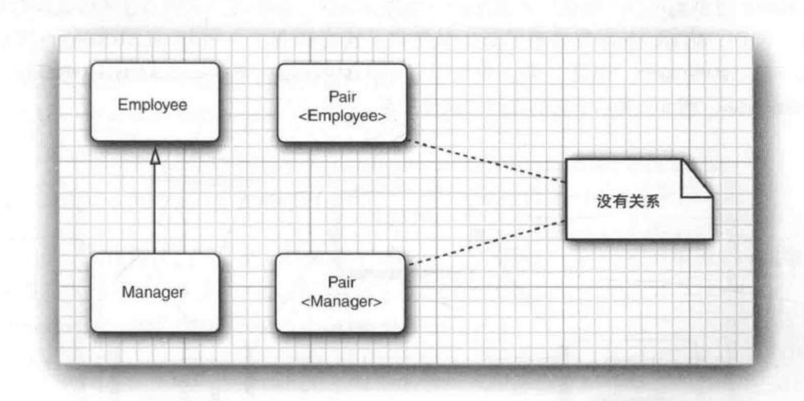

图 8-1 pair 类之间没有继承关系

这看起来是一个很严格的限制,不过对于类型安全非常必要。假设允许将 Pair Manager> 转换为 Pair < Employee>。考虑下面的代码:

var managerBuddies = new Pair<Manager>(ceo, cfo);
Pair<Employee> employeeBuddies = managerBuddies; // illegal, but suppose it wasn't\nemployeeBuddies.setFirst(lowlyEmployee);

显然,最后一句是合法的。但是 employeeBuddies 和 managerBuddies 引用了同样的对象。现在我们会把 CFO 和一个底层员工组成一对,这对于 Pair<Manager> 来说应该是不可能的。

直 注释: 前面看到的是泛型类型与 Java 数组之间的一个重要区别。可以将一个 Manager[]数组赋给一个类型为 Employee[]的变量:

Manager[] managerBuddies = { ceo, cfo };
Employee[] employeeBuddies = managerBuddies; // OK

不过,数组有特别的保护。如果试图将一个底层员工存储到 employeeBuddies[0],虚拟机将会抛出 ArrayStoreException 异常。

总是可以将参数化类型转换为一个原始类型。例如, Pair<Employee> 是原始类型 Pair 的一个子类型。在与遗留代码交互时,这个转换非常必要。

转换成原始类型会导致类型错误吗? 很遗憾, 会! 看一看下面这个示例:

var managerBuddies = new Pair<Manager>(ceo, cfo);
Pair rawBuddies = managerBuddies; // OK
rawBuddies.setFirst(new File("...")); // only a compile-time warning

听起来有点吓人。但是,请记住现在的状况不会比更老版本的 Java 更糟糕。虚拟机的安全性还没有到生死攸关的程度。当使用 getFirst 获得外来对象并赋给 Manager 变量时,与以往一样,会抛出 ClassCastException 异常。这里失去的只是泛型程序设计提供的附加安全性。

最后,泛型类可以扩展或实现其他的泛型类。就这一点而言,它们与普通的类没有什么区别。例如,ArrayList<T>类实现了List<T>接口。这意味着,一个ArrayList<Manager>可以转换为一个List<Manager>。但是,如前面所见,ArrayList<Manager>不是一个ArrayList<Employee>或List<Employee>。图 8-2 展示了它们之间的这种关系。

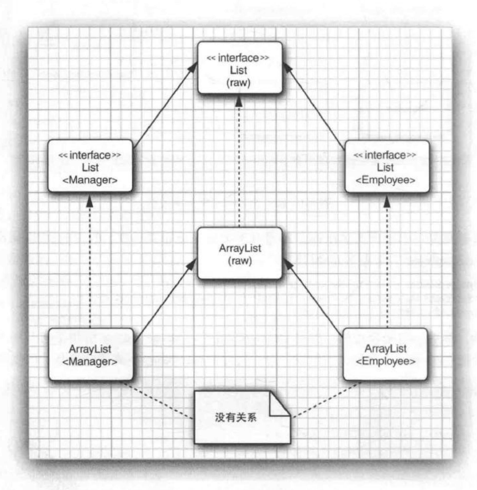

图 8-2 泛型列表类型之间的子类型关系

## 8.8 通配符类型

严格的泛型类型系统使用起来并不那么令人愉快,类型系统的研究人员知道这一点已 经有一段时间了。Java 的设计者发明了一种巧妙的《但很安全的)"逃生出口":通配符类型 ( wildcard type)a 下面几小节会介绍如何使用通配符:

# 881 通配符概念

在通配符类型中,允许类型参数变化口 例如,通配符类型 **Pair<? extends Employee>**

表示任何泛型 Pai 「类型. 它的类型参数是 Employ跑的子类,in Pair<Manager>, 但不能是 Pa<sup>订</sup> <String>0

假设要编写一个打印员工对的方法,如下所示:

```
public static void priTitBuddies(Pair<Employee> p)
{
   Employee fi「5t = p.getFirst();
   Employee second = p +getSecond();
   System, out .printin{ first. getName ( ) +
                                           • and " + second. getNameO + " are buddies.");
}
```

正如前面讲到的. 不能将 PaiBfan叫er> 传递给这个方法. 这一点很有限制。不过解决的 方法很简单——可以使用一个通配符类型:

**public static void printBuddies**(**Pair<? extends Employee> p)**

类型 PaiManager> 是 Pai「<? extends Employee〉的子类型 (如图 8-3 所示)口

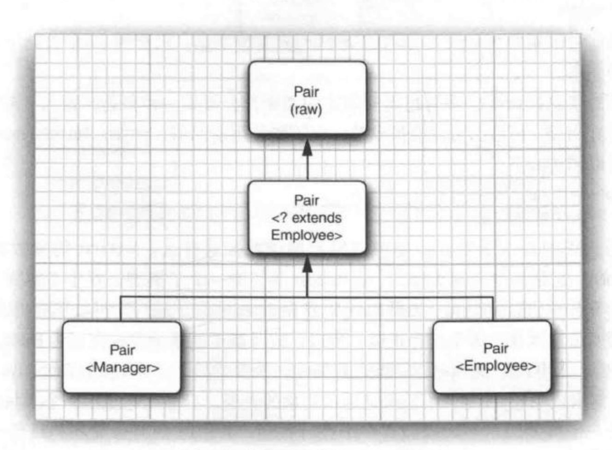

图 **"3** 使用通配符的子类型关系

使用通配符会通过 Pair<? extends Employee> 的引用破坏 Pair<Manager> 吗?

var managerBuddies = new Pair<Manager>(ceo, cfo);
Pair<? extends Employee> wildcardBuddies = managerBuddies; // OK
wildcardBuddies.setFirst(lowlyEmployee); // compile-time error

这不可能引起破坏。对 setFirst 的调用有一个类型错误。要了解其中的缘由,请仔细看一看类型 Pair<? extends Employee>。它的方法如下:

? extends Employee getFirst()
void setFirst(? extends Employee)

不可能调用 setFirst 方法。考虑调用 wildcardBuddies.setFirst(lowlyEmployee),编译器知道 setFirst 的参数有某个特定的类型,这个类型扩展了 Employee。这个特定类型是 Employee 吗? 是 Manager 吗?还是另外某个子类?编译器无法知道。因此,编译器不能接受 lowlyEmployee。出于同样的原因,调用 wildcardBuddies.setFirst(cio)(其中 cio 是一个 Manager 实例)也会出错。除了 null,编译器必须拒绝传入 setFirst 的所有参数。

getFirst 方法则可以继续工作。getFirst 的返回值是某个特定类型的实例,这是 Employee 的一个子类型。编译器不知道这个特定类型是什么,但它可以保证对 Employee 引用的赋值是安全的。

这就是引入有限定的通配符的关键之处。现在我们已经有办法区分安全的访问器方法和不安全的更改器方法了。

#### 8.8.2 通配符的超类型限定

通配符限定与类型变量限定十分类似,但是,它们还有一个附加的能力,你可以指定一个超类型限定(supertype bound),如下所示:

? super Manager

这个通配符限制为 Manager 的所有超类型。(真是很幸运,已有的 super 关键字十分准确地描述了这种关系。)

为什么想要这样做呢?带有超类型限定的通配符会提供一种行为,这与 8.8 节介绍的通配符行为正好相反。可以为方法提供参数,但不能使用返回值。例如,Pair<? super Manager>有一些方法可以描述如下:

void setFirst(? super Manager)
? super Manager getFirst()

这不是真正的 Java 语法,但是可以展示编译器知道什么。setFirst 的参数类型表示为 ? super Manager,这是某个特定类型 T,而 Manager 是 T的一个子类型。对于 T实际上有 3 种选择: Object、Employee 或 Manager。(如果 Manager 或 Employee 实现了接口,可能还有更多选择)。不过,编译器无法知道其中哪个选择正确。所以,编译器不能接受参数类型为 Employee 或 Object 的调用。毕竟,T可能是 Manager。只能传递 Manager 类型或某个子类型(如 Executive)的对象。

另外,如果调用 getFirst,不能保证返回对象的类型。只能把它赋给一个 Object。

下面是一个典型的示例。我们有一个经理数组,并且想把奖金最高和最低的经理放在一个 Pair 对象中。Pair 的类型是什么?在这里, Pair Employee>是合理的,或者对此而言,

Pair<Object> 也是合理的(如图 8-4 所示)。下面的方法将接受任何合适的 Pair:

```
public static void minmaxBonus(Manager[] a, Pair<? super Manager> result)
{
   if (a.length == 0) return;
   Manager min = a[0];
   Manager max = a[0];
   for (int i = 1; i < a.length; i++)
   {
      if (min.getBonus() > a[i].getBonus()) min = a[i];
      if (max.getBonus() < a[i].getBonus()) max = a[i];
   }
   result.setFirst(min);
   result.setSecond(max);
}</pre>
```

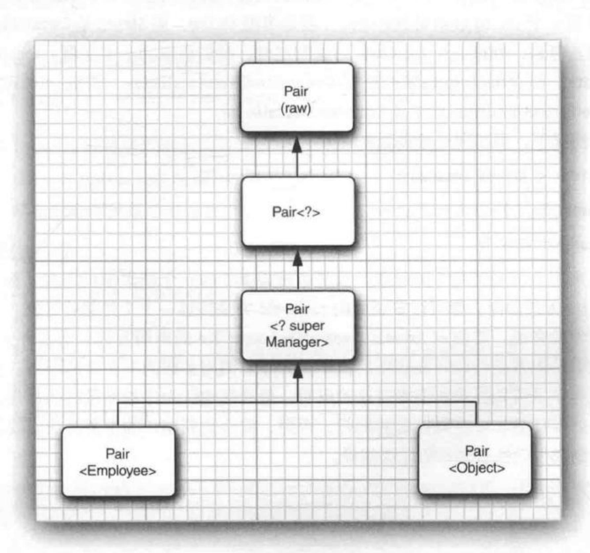

图 8-4 带有超类型限定的通配符

直观地讲,带有超类型限定的通配符允许你写入一个泛型对象,而带有子类型限定的通配符允许你读取一个泛型对象。

下面是超类型限定的另一种应用。Comparable 接口本身就是一个泛型类型。声明如下:
public interface Comparable<T>
public int compareTo(T other);

在这里, 类型变量指示了。the「参数的类型。例如,String 类实现了 <sup>C</sup>。呷新前l"String', 它的 compareTo 方法声明为

public int compareTo(String other)

这很好,显式参数有正确的类型。接口是泛型接口之前,other 是一个 Object, 这个方法 的实现中必须有一个强制类型转换口

由于 <sup>C</sup>。叩<sup>a</sup> Qble 是一个泛型类型,对于 ArrayAlg 类的 minmax 方法,也许我们还能做得更好 一些?可以将它声明为:

public static <T extends Comparable<T» Pair<T> ninniax{T[] a)

看起来,这样比只使用Textents Comparable 更彻底,而且对于很多类都能很好地工作. 例 如, 如果计算一个 String 数组的最小值,<sup>T</sup> 就是类型 String, <sup>而</sup> String 是 Comparable<String> 的 一个子类型. 但是,处理一个 LocalDate 对象数组时,我们会遇到一个问题. LocalDdte 实现了 ChronoLocalDate, 而 ChronoLocalDate iT展了Comparable<ChronoLocalDate>3 因此,LocalDate 实现的 是 Comparable<ChronoLocalDate> 而不是 Comparable<LocaWate>0

在这种情况下,可以利用超类型来解决:

public static <T extends Comparable\*? super T» Pair<T> minmax(T[] a)

现在 compareTo 方法形式如下:

int compareTo {? super T)

它可以声明为接受类型 <sup>T</sup> 的对象,或者也可以是 <sup>T</sup> 的一个超类型的对象 (例如,当 <sup>T</sup> 是 LocalDatm 时)。无论如何,都可以安全地向 co叩好eTo 方法传递一个 <sup>T</sup> 类型的对象1

对于初学者来说,类似 <T extends Comparable? super T»的声明看起来有点吓人。很遗憾. 因为这个声明的本意是帮助开发应用的程序员去除对调用参数的不必要的限制。对泛型没有 兴趣的应用程序员可能很快就会略过这些声明,想当然地认为库程序员做的都是正确的.<sup>如</sup> 果你是一名库程序员,一定要熟悉通配符,否则,就会受到用户的责备,他们要在代码中随 机地添加强制类型转换直至代码能够编译。

Q 注释:超类型限定的 另一个常见的 用法是作为一个函数式接口的参数类型。例如, Collection 接口有一个方法:

default boolean renovelf(PredicatecT super E> filter)

这个方法会删除所有满足给定谓词条件的元素。例如,如果你不喜欢有奇怪散列 码的 员工,就可以如下将他们删除:

ArrayList<Employee> staff <sup>=</sup> . . .; Predicate<Object> oddHashCode = obj \*> obj.hashCode() \*2 != 8; staff . removelf(oddHashCode) ;

你希望能够传入一个 <sup>P</sup>「edicate<Object>, 而不只是 Predicate<Ejnployee> super 通酉己符 可以使这个愿望成真。

# &8.3 无限定通配符

甚至还可以使用根本无限定的通配符,例如,Pair<?>D 初看起来,这好像与原始的需江 类型一样。实际上,这两种类型有很大的不同。类型内订<?> 有以下方法:

```
? getFirstf)
void setFirstt?)
```

gMFi「5t 的返回值只能赋给一个 Objecto mtF订st 方法不能调用,甚至不能用 Object 调用。 Pair<?a 和 Pdi 「本质的不同在于:你可以用任意 Object 对象调用原始 Pair 类的 setFir5t 方法。

#### 居1 注释: 可以调用罪tFirst(null%

为什么要使用这样一个脆弱的类型?它对于很多简单操作很有用。例如. 下面这个方法 可用来测试一个对组是否包含一个 null 引用,它不需要具体的类型。

```
public static boolean hasNulls(Pair<?> p)
{
  return p.getFirstf) -- null || p.getSecondf) = null;
}
通过将 hasNulls 转换成泛型方法,可以避免使用通配符类型:
public static boolean hasNuUs{?air<T> p)
但是,带有通配符的版本可读性更好。
```

## 8.8.4 通配符捕获

下面编写一个方法来交换对组的元素:

public static void swap(Pair<?> p)

通配符不是类型变量,因此,不能编写使用?作为一种类型的代码卓 也就是说才 下面的 代码是非法的:

```
? t
    =
      p.getFirstf);〃ERROR
p.setFirst(p.getSecondO);
p,setSecond(t);
```

这里有一个问题,因为在交换的时候,必须临时保存第一个元素。幸运的是,这个问题 有一个有趣的解决方案口 我们可以写一个辅助方法 wapHelper, 如下所示:

```
public static <T> void swapHelper(Pair<T> p)
{
   T t = p,getFirst();
   p.setFirst(p.getSecond{ ) ) ;
   p.setSecondlt) ;
}
```

注意,与距pHmpe「是一个泛型方法,而 sw却不是, 它有一个固定的即订<?> 类型的参数口 现在可以由 5响<sup>p</sup> 调用 swapHelper:

```
public static void swap(Pair<?> p) { swapHelperfp}; }
```

在这种情况下, 「方法的参数 <sup>T</sup> 捕获通配符办 并不知道通配符指示哪种类型,但

是,这是一个明确的类型,并且从 <T>swapHelper 的定义可以清楚地看到 T 指示那个类型。

当然,在这种情况下,并不是一定要使用通配符。我们也可以直接把 <T> void swap(Pair<T> p) 实现为一个没有通配符的泛型方法。不过,考虑下面这个例子,这里通配符类型很自然地出现在一个计算中间:

```
public static void maxminBonus(Manager[] a, Pair<? super Manager> result)
{
    minmaxBonus(a, result);
    PairAlg.swapHelper(result); // OK--swapHelper captures wildcard type
}
```

在这里,通配符捕获机制是不可避免的。

通配符捕获只有在非常有限的情况下是合法的。编译器必须能够保证通配符表示单个确定的类型。例如, ArrayList<Pair<T>> 中的 T 绝对不能捕获 ArrayList<Pair<?>> 中的通配符。数组列表可能包含两个 Pair<?>, 其中的?可能分别有不同的类型。

程序清单 8-3 中的测试程序将前几节讨论的各种方法综合在一起,以便我们了解它们的具体使用。

#### 程序清单 8-3 pair3/PairTest3.java

```
package pair3;
    * @version 1.01 2012-01-26
    * @author Cay Horstmann
  public class PairTest3
8
      public static void main(String[] args)
         var ceo = new Manager("Gus Greedy", 800000, 2003, 12, 15);
11
         var cfo = new Manager("Sid Sneaky", 600000, 2003, 12, 15);
12
13
         var buddies = new Pair<Manager>(ceo, cfo);
         printBuddies(buddies);
14
15
         ceo.setBonus(1000000);
16
         cfo.setBonus(500000);
17
         Manager[] managers = { ceo, cfo };
18
19
         var result = new Pair<Employee>();
20
         minmaxBonus(managers, result);
21
         System.out.println("first: " + result.getFirst().getName()
22
            + ", second: " + result.getSecond().getName());
23
         maxminBonus(managers, result);
24
         System.out.println("first: " + result.getFirst().getName()
25
            + ", second: " + result.getSecond().getName());
26
27
28
      public static void printBuddies(Pair<? extends Employee> p)
29
30
         Employee first = p.getFirst();
31
         Employee second = p.getSecond();
```

```
System.out.println(first.getName() + " and " + second.getName() + " are buddies.");
33
34
35
      public static void minmaxBonus(Manager[] a, Pair<? super Manager> result)
36
37
         if (a.length == 0) return;
38
         Manager min = a[\theta];
39
         Manager max = a[0];
48
         for (int i = 1; i < a.length; i++)
41
42
            if (min.getBonus() > a[i].getBonus()) min = a[i];
43
            if (max.getBonus() < a[i].getBonus()) max = a[i];
44
45
         result.setFirst(min);
46
         result.setSecond(max);
47
48
49
      public static void maxminBonus(Manager[] a, Pair<? super Manager> result)
50
51
         minmaxBonus(a, result);
52
         PairAlg.swapHelper(result); // OK--swapHelper captures wildcard type
53
54
      // can't write public static <T super manager>
55
56
57
   class PairAlg
58
59
      public static boolean hasNulls(Pair<?> p)
60
61
         return p.getFirst() == null || p.getSecond() == null;
62
63
64
      public static void swap(Pair<?> p) { swapHelper(p); }
65
66
      public static <T> void swapHelper(Pair<T> p)
67
68
         T t = p.getFirst();
69
         p.setFirst(p.getSecond());
78
         p.setSecond(t);
71
72
73 }
```

## 8.9 反射和泛型

反射允许你在运行时分析任意对象。如果对象是泛型类的实例,关于泛型类型参数,你可能得不到多少信息,因为它们已经被擦除了。在下面的小节中,我们将学习利用反射可以获得泛型类的哪些信息。

## 8.9.1 泛型 Class 类

现在, Class 类是泛型类。例如, String.class 实际上是一个 Class<String> 类的对象(事实

#### 上,也是唯一的对象)。

类型参数十分有用,这是因为它允许 Class<T> 的方法有更特定的返回类型。Class<T> 的以下方法就利用了类型参数:

T newInstance()
T cast(Object obj)
T[] getEnumConstants()
Class<? super T> getSuperclass()
Constructor<T> getConstructor(Class... parameterTypes)
Constructor<T> getDeclaredConstructor(Class... parameterTypes)

newInstance 方法返回这个类的一个实例,由无参数构造器获得。它的返回类型现在声明为 T, 其类型与 Class<T> 描述的类相同,这样就免除了强制类型转换。

cast 方法返回给定的对象,如果给定对象的类型实际上是T的一个子类型,现在会声明为类型T,否则,会抛出一个BadCastException异常。

如果这个类不是一个 enum 类或 T 类型枚举值的一个数组, getEnumConstants 方法将返回 null。最后, getConstructor 与 getDeclaredConstructor 方法返回一个 Constructor<T> 对象。Constructor 类也已经变成泛型,使得它的 newInstance 方法有一个正确的返回类型。

## API java.lang.Class<T> 1.0

- T newInstance()
   返回无参数构造器构造的一个新实例。
- T cast(Object obj)
   如果 obj 为 null 或者可以转换成类型 T, 则返回 obj; 否则抛出一个 BadCastException 异常。
- T[] getEnumConstants() 5
   如果T是枚举类型,则返回所有值组成的一个数组,否则返回null。
- Class<? super T> getSuperclass()
   返回这个类的超类。如果 T 不是一个类或者如果 T 是 Object 类,则返回 null。
- Constructor<T> getConstructor(Class... parameterTypes) 1.1
- Constructor<T> getDeclaredConstructor(Class... parameterTypes) 1.1 获得公共构造器,或者有给定参数类型的构造器。

## API java.lang.reflect.Constructor<T> 1.1

T newInstance(Object... parameters)
 返回用指定参数构造的新实例。

## 8.9.2 使用 Class<T> 参数进行类型匹配

匹配泛型方法中 Class<T> 参数的类型变量有时会很有用。下面是一个标准的示例:
public static <T> Pair<T> makePair(Class<T> c) throws InstantiationException,

```
return new Pair <> (c.newInstance(), c.newInstance());
}
```

如果调用

makePair(Employee.class)

Employee.class 是一个 Class<Employee> 类型的对象。makePair 方法的类型参数 T 与 Employee 匹配,编译器可以推断出这个方法将返回一个 Pair<Employee>。

#### 8.9.3 虚拟机中的泛型类型信息

Java 泛型的突出特性之一是在虚拟机中擦除泛型类型。令人奇怪的是,擦除的类仍然保留原先泛型的一些微弱记忆。例如,原始 Pair 类知道它源于泛型类 Pair <T>,尽管一个 Pair 类型的对象无法区分它构造为 Pair <String> 还是 Pair <Employee>。

类似地,考虑以下方法:

public static Comparable min(Comparable[] a)

这是擦除以下泛型方法得到的:

public static <T extends Comparable<? super T>> T min(T[] a)

可以使用反射 API 确定:

- 这个泛型方法有一个名为T的类型参数。
- 这个类型参数有一个子类型限定,其自身又是一个泛型类型。
- 这个限定类型有一个通配符参数。
- 这个通配符参数有一个超类型限定。
- 这个泛型方法有一个泛型数组参数。

换句话说,你可以重新构造实现者声明的泛型类和方法的所有有关内容。但是,你不会知道对于特定的对象或方法调用会如何解析类型参数。

为了描述泛型类型声明,可以使用 java.lang.reflect 包中的接口 Type。这个接口有以下子类型:

- Class 类, 描述具体类型。
- TypeVariable 接口,描述类型变量(如 T extends Comparable<? super T>)。
- WildcardType 接口, 描述通配符(如?super T)。
- ParameterizedType 接口, 描述泛型类或接口类型(如 Comparable<? super T>)。
- GenericArrayType 接口, 描述泛型数组(如 T[])。

图 8-5 给出了继承层次结构。注意,最后 4 个子类型是接口,虚拟机会实例化实现这些接口的适当的类。

程序清单 8-4 使用泛型反射 API 来打印它发现的一个给定类的有关信息。如果对 Pair 类运行这个程序,将会得到以下报告:

class Pair<T> extends java.lang.Object
public T getFirst()

```
public T getSecond()
public void setFirst(T)
public void setSecond(T)

如果对 PairTest2 目录下的 ArrayAlg 运行这个程序,报告会显示以下方法:
public static <T extends java.lang.Comparable> Pair<T> minmax(T[])
```

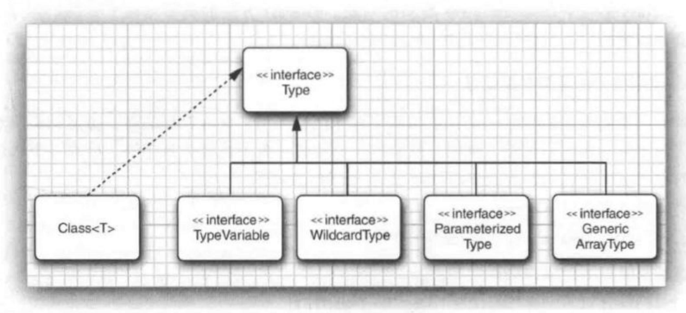

图 8-5 Type 接口及其子类型

### 程序清单 8-4 genericReflection/GenericReflectionTest.java

```
package genericReflection;
3 import java.lang.reflect.*;
   import java.util.*;
    * @version 1.12 2021-05-30
    * @author Cay Horstmann
10 public class GenericReflectionTest
11
      public static void main(String[] args)
12
13
         // read class name from command line args or user input
14
         String name;
15
         if (args.length > \theta) name = args[\theta];
         else
18
             try (var in = new Scanner(System.in))
19
20
                System.out.println("Enter class name (e.g., java.util.Collections): ");
21
                name = in.next();
22
23
24
25
         try
26
27
             // print generic info for class and public methods
28
             Class<?> cl = Class.forName(name);
29
```

```
printClass(cl);
38
            for (Method m : cl.getDeclaredMethods())
31
               printMethod(m);
32
33
         catch (ClassNotFoundException e)
34
35
            e.printStackTrace();
36
37
38
39
      public static void printClass(Class<?> cl)
40
41
         System.out.print(cl);
42
         printTypes(cl.getTypeParameters(), "<", ", ", ">", true);
43
         Type sc = cl.getGenericSuperclass();
44
         if (sc != null)
45
46
             System.out.print(" extends ");
47
             printType(sc, false);
48
49
         printTypes(cl.getGenericInterfaces(), " implements ", ", ", "", false);
50
         System.out.println();
51
52
53
      public static void printMethod(Method m)
54
55
         String name = m.getName();
56
         System.out.print(Modifier.toString(m.getModifiers()));
57
         System.out.print(" ");
58
         printTypes(m.getTypeParameters(), "<", ", ", ">", true);
59
68
         printType(m.getGenericReturnType(), false);
61
         System.out.print(" ");
62
         System.out.print(name);
63
         System.out.print("(");
64
         printTypes(m.getGenericParameterTypes(), "", ", ", ", false);
65
         System.out.println(")");
66
67
68
      public static void printTypes(Type[] types, String pre, String sep, String suf,
69
             boolean isDefinition)
78
71
         if (pre.equals(" extends ") && Arrays.equals(types, new Type[] { Object.class }))
72
             return;
73
         if (types.length > 0) System.out.print(pre);
74
          for (int i = \theta; i < types.length; <math>i++)
75
76
             if (i > 0) System.out.print(sep);
77
             printType(types[i], isDefinition);
78
79
          if (types.length > 0) System.out.print(suf);
80
81
82
       public static void printType(Type type, boolean isDefinition)
83
```

```
84
         if (type instanceof Class t)
 85
 86
             System.out.print(t.getName());
 87
         else if (type instanceof TypeVariable t)
 89
 90
             System.out.print(t.getName());
 91
             if (isDefinition)
 92
                printTypes(t.getBounds(), " extends ", " & ", "", false);
 93
 94
         else if (type instanceof WildcardType t)
 95
 96
             System.out.print("?");
 97
             printTypes(t.getUpperBounds(), " extends ", " & ", "", false);
 98
             printTypes(t.getLowerBounds(), " super ", " & ", "", false);
100
         else if (type instanceof ParameterizedType t)
101
102
             Type owner = t.getOwnerType();
103
             if (owner != null)
104
185
                printType(owner, false);
106
                System.out.print(".");
197
108
             printType(t.getRawType(), false);
109
             printTypes(t.getActualTypeArguments(),
110
111
         else if (type instanceof GenericArrayType t)
112
113
             System.out.print("");
114
             printType(t.getGenericComponentType(), isDefinition);
115
             System.out.print("[]");
116
117
118
119 }
```

## 8.9.4 类型字面量

有时,你会希望由值的类型决定程序的行为。例如,在一种持久存储机制中,你可能希望用户指定一种方法来保存某个特定类的对象。通常的实现方法是将 Class 对象与一个动作关联。

不过,如果有泛型类,擦除会带来问题。比如说,既然 ArrayList<Integer>和 ArrayList <String>都擦除为同一个原始类型 ArrayList,如何让它们有不同的动作呢?

这里有一个技巧,在某些情况下可以解决这个问题。可以捕获 Type 接口(上一节介绍过)的一个实例。然后构造一个匿名子类,如下所示:

```
var type = new TypeLiteral<ArrayList<Integer>>(){} // note the {}
```

TypeLiteral 构造器会捕获泛型超类型:

```
class TypeLiteral
{
   public TypeLiteral()
   {
      Type parentType = getClass().getGenericSuperclass();
      if (parentType instanceof ParameterizedType paramType)
           type = paramType.getActualTypeArguments()[0];
      else
           throw new UnsupportedOperationException(
```

如果运行时有一个泛型类型,可以将它与TypeLiteral 匹配。我们无法从一个对象得到泛型类型(已经被擦除)。不过,正如上一节看到的,字段和方法参数的泛型类型还留存在虚拟机中。

CDI和 Guice 等注入框架 (Injection framework) 就使用类型字面量来控制泛型类型的注入。程序清单 8-5 给出了一个更简单的例子。给定一个对象,我们可以罗列它的字段,哪些有泛型类型,并查找相关联的格式化动作。

#### 程序清单 8-5 genericReflection/TypeLiterals.java

```
package genericReflection;
      @version 1.02 2021-05-30
      @author Cay Horstmann
   */
   import java.lang.reflect.*;
   import java.util.*;
   import java.util.function.*;
11
   /**
12
    * A type literal describes a type that can be generic, such as
13
    * ArrayList<String>.
14
15
   class TypeLiteral<T>
17
      private Type type;
18
19
28
       * This constructor must be invoked from an anonymous subclass
21
       * as new TypeLiteral<. . .>(){}.
22
23
      public TypeLiteral()
24
25
         Type parentType = getClass().getGenericSuperclass();
26
         if (parentType instanceof ParameterizedType paramType)
27
            type = paramType.getActualTypeArguments()[0];
28
```

```
else
29
            throw new UnsupportedOperationException(
30
                "Construct as new TypeLiteral<. . .>(){}");
31
32
33
      private TypeLiteral(Type type)
34
35
         this.type = type;
36
37
38
      /**
39
       * Yields a type literal that describes the given type.
48
41
      public static TypeLiteral<?> of(Type type)
42
43
         return new TypeLiteral<Object>(type);
45
      public String toString()
47
48
         if (type instanceof Class clazz) return clazz.getName();
         else return type.toString();
50
51
52
      public boolean equals(Object otherObject)
53
54
         return otherObject instanceof TypeLiteral otherLiteral
55
            && type.equals(otherLiteral.type);
56
57
58
      public int hashCode()
59
60
          return type.hashCode();
61
62
65
    * Formats objects, using rules that associate types with formatting functions.
    */
67
   class Formatter
69
      private Map<TypeLiteral<?>, Function<?, String>> rules = new HashMap<>();
78
71
72
       * Add a formatting rule to this formatter.
73
       * @param type the type to which this rule applies
74
       * @param formatterForType the function that formats objects of this type
75
       */
76
      public <T> void forType(TypeLiteral<T> type, Function<T, String> formatterForType)
77
78
          rules.put(type, formatterForType);
79
80
81
       /**
82
```

```
* Formats all fields of an object using the rules of this formatter.
83
       * @param obj an object
84
       * @return a string with all field names and formatted values
85
86
      public String formatFields(Object obj)
87
            throws IllegalArgumentException, IllegalAccessException
88
89
         var result = new StringBuilder();
99
         for (Field f : obj.getClass().getDeclaredFields())
91
92
            result.append(f.getName());
93
            result.append("=");
94
            f.setAccessible(true);
95
            Function<?, String> formatterForType = rules.get(TypeLiteral.of(f.getGenericType()));
96
            if (formatterForType != null)
97
98
                // formatterForType has parameter type ?. Nothing can be passed to its apply
99
                // method. Cast makes the parameter type to Object so we can invoke it.
100
               @SuppressWarnings("unchecked")
101
                Function<Object, String> objectFormatter
102
                   = (Function<Object, String>) formatterForType;
103
                result.append(objectFormatter.apply(f.get(obj)));
184
105
            else
                result.append(f.get(obj).toString());
107
            result.append("\n");
108
109
         return result.toString();
110
111
112
113
114 public class TypeLiterals
115 .
      public static class Sample
116
117
         ArrayList<Integer> nums;
118
         ArrayList<Character> chars;
119
         ArrayList<String> strings;
120
         public Sample()
121
122
            nums = new ArrayList<>();
123
            nums.add(42); nums.add(1729);
124
            chars = new ArrayList<>();
125
            chars.add('H'); chars.add('i');
126
            strings = new ArrayList<>();
127
            strings.add("Hello"); strings.add("World");
128
129
130
131
      private static <T> String join(String separator, ArrayList<T> elements)
132
133
         var result = new StringBuilder();
134
         for (T e : elements)
135
136
```

```
if (result.length() > 0) result.append(separator);
137
            result.append(e.toString());
138
139
         return result.toString();
149
141
142
      public static void main(String[] args) throws Exception
143
144
         var formatter = new Formatter();
145
         formatter.forType(new TypeLiteral<ArrayList<Integer>>(){},
146
            lst -> join(" ", lst));
147
         formatter.forType(new TypeLiteral<ArrayList<Character>>(){},
148
            lst -> "\"" + join("", lst) + "\"");
149
         System.out.println(formatter.formatFields(new Sample()));
150
151
152 }
```

我们将对一个ArrayList<Integer>进行格式化,各个值之间用空格分隔;另外还会格式化一个ArrayList<Character>,将字符连接成一个字符串。所有其他数组列表都由ArrayList.toString格式化。

#### API java.lang.Class<T> 1.0

- TypeVariable[] getTypeParameters() 5
   如果这个类型声明为泛型类型,则获得泛型类型变量,否则获得一个长度为 0 的数组。
- Type getGenericSuperclass() 5
   获得这个类型所声明超类的泛型类型;如果这个类型是 Object 或者不是类类型(class type),则返回 null。
- Type[] getGenericInterfaces() 5
   获得这个类型所声明接口的泛型类型(按照声明的次序),否则,如果这个类型没有实现接口,则返回长度为0的数组。

## API java.lang.reflect.Method 1.1

- TypeVariable[] getTypeParameters() 5
   如果这个方法声明为一个泛型方法,则获得泛型类型变量,否则返回长度为0的数组。
- Type getGenericReturnType() 5
   获得这个方法声明的泛型返回类型。
- Type[] getGenericParameterTypes() 5
   获得这个方法声明的泛型参数类型。如果这个方法没有参数,返回长度为 0 的数组。

## API java.lang.reflect.TypeVariable 5

- String getName()获得这个类型变量的名字。
- Type[] getBounds()

获得这个类型变量的子类限定,否则,如果该变量无限定,则返回长度为。的数组。

# 同 **java,***U119.***reflect.WWcardType** 5

- Type[] getUpperBoundst) 获得这个类型变量的子类( extends)限定,否则,如果这个变量没有子类限定,则返 回长度为 0的数组。
- Typefl getLowerBounds(} 获得这个类型变量的超类( supe「)限定,否则,如果这个变量没有超类限定,则返回 长度为 0 的数组<sup>Q</sup>

## 耐 **java\* lang\* reflect. ParaineterizedType 5**

- Type getRawTypeO 获得这个参数化类型的原始类型。
- Type[] getActualTypeA「gument5() 获得这个参数化类型声明的类型参数。
- Type getOwnerTypef) 如果是内部类型,则返回其外部类类型;如果这是一个顶级类型,则返回 null。

## 词**java. Uftj.reflect.***GenericArrayType* **5**

• Type getGenericComponentTypel) 获得这个数组类型声明的泛型元素类型。

现在我们已经了解了如何使用泛型类,以及在必要时如何编写自己的泛型类和泛型 方法。同样重要的是,你知道了如何理解 API 文档和错误消息中可能遇到的泛型类型声 明二 要想全面地了解有关 Java 泛型的详尽信息,可以看看 Angelika Langer 提供的一个很 不错的常见问题(也有一些问题不太常见)列表( http://angelikalanger.com/GenericsFAQ/ JavaGenericsFAQ.html)。

在下一章中,我们将学习 Java 集合框架如何使用泛型。

# 第 9章 集 合

- Java 集合框架
- 集合框架中的接口
- 具体集合
- 映射

- 副本与视图
- 算法
- 遗留的集合

以自然的方式实现方法或者非常关注性能时,你选择的不同数据结构会带来很大差异。 是否需要快速地搜索成千上万(甚至上百万)个有序的数据项?是否需要快速地在有序序列 中间插人元素或删除元素?是否需要在键与值之间建立关联?

本章将介绍如何利用 Java 类库帮助我们实现程序设计所需的传统数据结构. 在大学的计 算机科学课程中,有一门数据结构( DataStructure)课程,通常要讲授一个学期,因此. 有 许许多多专门探讨这个重要主题的书籍口 与大学课程所讲述的内容不同. 这里将跳过理论部 分,仅介绍如何使用标准库中的集合类。

## 9.1 Java 集合框架

Java 最初的版本只为最常用的数据结构提供了很少的一组类:Vector. Stack. Hashtable. BitSet <sup>与</sup> Enume由ion 接口,其中 Enu肥「ation 接口提供了一种抽象机制,用于访问任意容器中 的元素。这是一个很明智的选择,要想建立一个全面的集合类库,这需要大量的时间和高超 的技能口

随着 Java L2 的问世,设计人员感到是时候推出一组功能完备的数据结构了。面对一大 堆相互冲突的设计问题,他们希望让类库规模很小而且要易于学习,不希望像 C++ 的"标 准模板库"(即 STL)那样复杂,但又希望能够得到 STL 率先提出的"泛型算法"所具有的优 点。他们还希望遗留的类能融人这个新框架口 与集合类库的所有设计者一样.他们必须做出 一些艰难的选择,于是,在这个过程中,他们做出了一些独具特色的设计决定。这一节将介 绍 Java 集合框架的基本设计,展示如何具体使用. 并解释一些颇具争议的特性背后的考虑。

## 9-1.1 集合接口与实现分离

与现代的数据结构类库的常见做法一样,Java 集合类库也将接口(interface)与实现 (implementation)分离口 下面利用我们熟悉的一个数据结构一^队列( queue)来说明接口与 实现如何分离。

队列接口( queueinte命ce)指出可以在队尾添加元素,在队头删除元素,并且可以查找

队列中元素的个数。当需要收集对象并按照"先进先出"方式获取对象时,就应该使用队列(见图 9-1)。

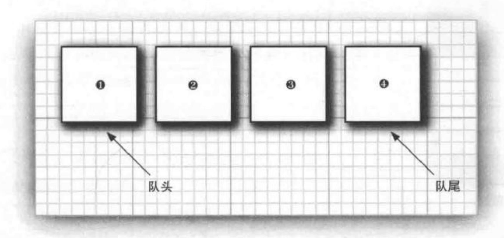

图 9-1 队列

队列接口的最简形式可能如下所示:

```
public interface Queue<E> // a simplified form of the interface in the standard library
{
   void add(E element);
   E remove();
   int size();
}
```

这个接口并没有说明队列是如何实现的。队列通常有两种实现方式:一种是使用循环数组;另一种是使用链表(见图 9-2)。

每个实现都可以用一个实现了 Queue 接口的类表示。

```
public class CircularArrayQueue<E> implements Queue<E> // not an actual library class
{
    private int head;
    private int tail;

    CircularArrayQueue(int capacity) { . . . }
    public void add(E element) { . . . }
    public E remove() { . . . }
    public int size() { . . . }
    private E[] elements;
}

public class LinkedListQueue<E> implements Queue<E> // not an actual library class
{
    private Link head;
    private Link tail;

    LinkedListQueue() { . . . }
    public void add(E element) { . . . }
    public E remove() { . . . }
    public int size() { . . . }
}
```

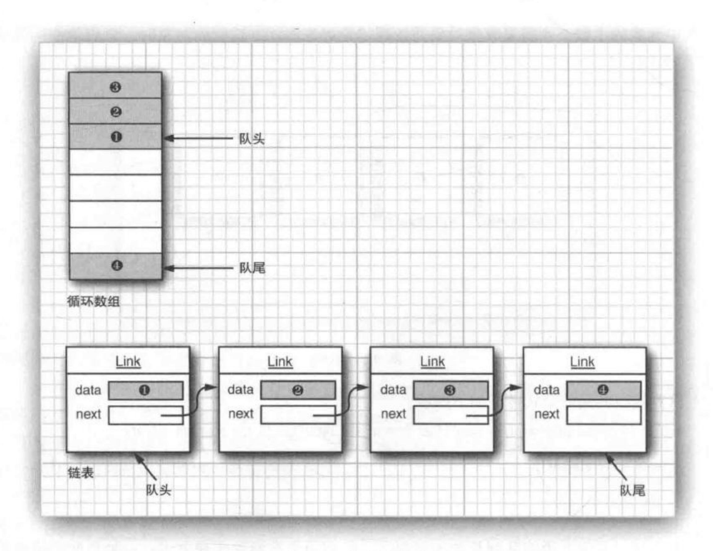

图%2 队列的实现

图 注释: 实际上,Java 类库没有名为 CinzularArriyQueug <sup>和</sup> LinkEdListQumue 的类 这里只是 以这些类为例 来解释集合接口与实现在概念上的 区分\* 如果需要一个循环数组队列, 可以使用 ArrayDeque 类 , 如果需要一个链表队列,就直接使用 LinkedList 类,这个类实 现了 Queue 接口口

在程序中使用队列时,一旦已经构造了集合,你不需要知道究竟使用了哪种实现。因此, 只是在构造集合对象时,才会使用具体的类。可以使用接口类型 ( **interface type)** 存放集合引用。

**Que«fr<Custoner> expressLane - new CircularArrayt)ueue<>[ 169); expre ssLane . add(new CustomsrC'Harry1'));**

利用这种方法,一旦改变了想法,你可以很轻松地使用另外一种不同的实现口 只需要修 改程序中的一个地方 (即调用构造器的语句八 如果觉得 **LinkedListQueue** 是个更好的选择,就 将代码修改为:

**flueue<usto®er> expressLane** = **new** LinkedListQueueoD; **expressLane**力**dd { new Custome** r("Harryh));

为什么选择这种实现,而不选择其他实现呢?接口本身并不能说明一种实现的效率如 何。某种程度上讲,循环数组要比链表更高效,因此多数人优先选择循环数组。不过,通常 来讲,这样做也需要付出一定的代价.

循环数组是一个有界( bounded)集合,它的容量有限。如果程序中要收集的对象数量没 有上限,就最好使用链表实现。

在研究 API 文档时,会发现另外一组名字以此5t「Mt 开头的类,例如,AbstractQueue. 这 些类是为类库实现者而设计的。如果想要实现自己的队列类(也许不太可能), 会发现扩展 AbstractQueue 类要比实现 Queue 接口中的所有方法更容易。

## 9,1.2 CoUection 接口

在 Java 类库中,集合类的基本接口是 Collection 接口. 这个接口有两个基本方法:

```
public interface CoUection<E>
(
   boolean a— eleinent);
   Iteratar<E> iterator!);
 }
```

除了这两个方法之外,还有几个方法,稍后将会介绍<sup>0</sup>

add 方法用于向集合中添加元素。如果添加元素确实改变了集合就返回 true;如果集合没 有发生变化就返回 <sup>后</sup>1驱。例如, 如果试图向集( m[)中添加一个对象. 而这个对象在集中已 经存在,这个 add 请求就没有实效,因为集中不允许有重复的对象.

iterator 方法用于返回一个实现了 Iterato「接口的对象。可以使用这个迭代器对象依次访 问集合中的元素。下一节讨论迭代器。

## 9.1.3 迭代器

```
Iterator 接口包含 4 个方法:
public interface Iterator<E>
   E next();
   boolean hasNextf};
   void remove!);
   default void forEachR^maining (Consumer? Rpc「 E> action);
```

通过反复调用 next 方法,可以逐个访问集合中的每个元素:但是,如果到达了集合的 末尾,next 方法将抛出一个 NoSuchElementException.. 因此,在调用 next 之前需要调用 hasNext 方法。如果迭代器对象还有更多可以访问的元素,这个方法就返回「uel t 如果想要查看 集合中的所有元素,就请求一个迭代器,当血Next 返回 「ue t 时就反复地调用 next 方法。 例如:

```
CoUection<String> c - . . ;
Iterator<String? iter = c.iterator!);
while (iter.hasNextO)
   String element = iter,next();
```

```
do something with element
}
可以更加简洁地将这个循环写为 "for each" 循环:
for (String element ; c)
{
  do something with element
}
编译器会把 "for each" 循环转换为一个带迭代器的循环。
o
 for each¬ 循环可以处理任何实现了 IteQble 接口的对象,这个接口只有一个抽象方法:
public interface Iterable<E>
  Iterator<E> iterator!);
}
```

Collection 接口扩展了Ite「油le 接口。因此,对于标准类库中的任何集合都可以使用 "for each" 循环<sup>o</sup>

也可以不写循环,而是调用 fo「EachRemaining 方法并提供一个 lambda 表达式 (它会处理一 个元素)。将对迭代器的每一个元素调用这个 lambda 表达式,直到再没有元素为止」

**iterator,forEachRemaining(element ->** *do something unth* **element);**

访问元素的顺序取决于集合类型。如果迭代处理一个 「「ayList, <sup>A</sup> 迭代器将从索引 0 开始. 每迭代一次,索引值加建 不过,如果访问 HashS对中的元素,会按照一种基本上随机的顺序 获得元素。虽然可以确保在迭代过程中能够遍历到集合中的所有元素. 但是无法预知访问各 元素的顺序。这通常并不是什么问题,因为对于计算总和或统计匹配之类的计算,顺序并不 重要口

回 注释:编程老手会注意到:Iterator 接口的 next <sup>和</sup> hasNext 方法与 Enumeration 接口的 nextE】ement 和 hasMoreElements 方法的作用一样。Java 集合类库的设计者本来可以选 择使用 Enumeration 接口,但是他们不喜欢这个接口累赘的方法名,于是引入了有较 短方法名的一个新接口<sup>q</sup>

Java 集合类库中的迭代器与其他类库中的迭代器在概念上有一个重要的区别<sup>0</sup> 在传统的 集合类库中,例如,CH的标准模板库,迭代器是根据数组索引创建的口 如果给定这样一个 迭代器,可以查找存储在指定位置上的元素,就像如果知道数组索引i, 就可以查找数组元 <sup>素</sup> alih 不需要查找元素,也可以将迭代器向前移动一个位置. 这与不执行查找而通过调用 向前移动数组索引的操作一样。但是,Java 迭代器并不是这样处理的。查找操作与位置 变化紧密耦合。查找一个元素的唯一方法是调用 next, 而在执行查找操作的同时,迭代器的 位置就会随之向前移动口

因此,可以认为 Java 迭代器位于两个元素之间口 当调用 next 时,迭代器就越过下一个元 素,并返回刚刚越过的那个元索的引用 (见图 9-3)。

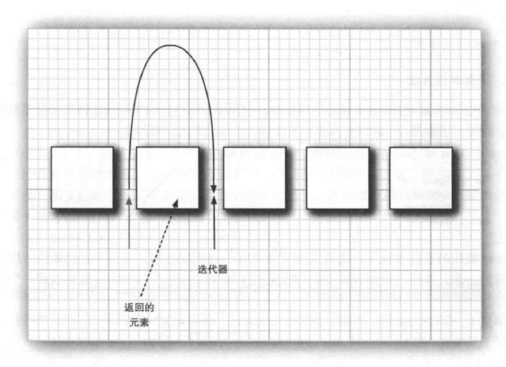

图 9-3 向前移动迭代器

注释:这里还可以做一个有用的对比。可以认为 Iterator.next 等价于 InputStream.read。 从数据流中读取一个字节就会自动地"消耗掉"这个字节。下一次调用 read 将会消耗并返回输入中的下一个字节。类似地,反复地调用 next 就可以读取集合中的所有元素。

Iterator接口的 remove 方法会删除上次调用 next 方法返回的元素。在大多数情况下,这是有道理的,在决定某个元素确实是要删除的元素之前,应该先看一下这个元素。不过,如果想要删除指定位置上的元素,仍然需要越过这个元素。例如,可以如下删除一个字符串集合中的第一个元素:

Iterator<String> it = c.iterator();\nit.next(); // skip over the first element\nit.remove(); // now remove it

更重要的是, next 方法和 remove 方法调用之间存在依赖性。调用 remove 之前没有调用 next, 将是不合法的。如果这样做,将会抛出一个 IllegalStateException 异常。

如果想删除两个相邻的元素,不能直接这样调用:

it.remove();

it.remove(); // ERROR

实际上,必须先调用 next 越过将要删除的元素。

```
it.remove();\nit.next();\nit.remove(); // OK
```

#### 9.1.4 泛型实用方法

由于 Collection 与 Iterator 都是泛型接口,这意味着你可以编写处理任何集合类型的实用方法。例如,下面是一个检测任意集合是否包含指定元素的泛型方法:

```
public static <E> boolean contains(Collection<E> c, Object obj)
{
   for (E element : c)
     if (element.equals(obj))
       return true;
   return false;
}
```

Java 类库的设计者认为:这些实用方法中有一些非常有用,应该将它们提供给用户使用。这样一来,类库的使用者就不必自己重新实现这些方法了。contains 就是这样一个实用方法。

事实上, Collection 接口声明了很多有用的方法, 所有的实现类都必须提供这些方法。下面列举了其中的一部分:

```
int size()
boolean isEmpty()
boolean contains(Object obj)
boolean containsAll(Collection<?> c)
boolean equals(Object other)
boolean addAll(Collection<? extends E> from)
boolean remove(Object obj)
boolean removeAll(Collection<?> c)
void clear()
boolean retainAll(Collection<?> c)
Object[] toArray()
```

在这些方法中,有许多方法的功能非常明确,不需要过多的解释。在本节末尾的 API 注释中可以找到有关它们的完整说明。

当然,如果实现 Collection 接口的每一个类都要提供如此多的例行方法,这将是一件很烦人的事情。为了能够让实现者更轻松一些,Java 类库提供了一个类 AbstractCollection,其中保持基础方法 size 和 iterator 仍为抽象方法,但是为实现者实现了其他例行方法。例如:

```
public abstract class AbstractCollection<E>
    implements Collection<E>
{
        public abstract Iterator<E> iterator();

public boolean contains(Object obj)
        {
            for (E element : this) // calls iterator()
```

```
if (element.equals(obj))
     return true;
   return false;
}
...
```

这样一来,具体集合类可以扩展 AbstractCollection 类。现在要由具体的集合类提供 iterator 方法,而 contains 方法已由 AbstractCollection 超类提供。不过,如果子类有更加高效的方式实现 contains 方法,也完全可以提供 contains 方法。

这种做法有些过时了。这些方法最好是 Collection 接口的默认方法。但实际上并不是这样。不过,确实已经增加了很多默认方法。其中大部分方法都与流的处理有关(有关内容将在卷Ⅱ中讨论)。另外,还有一个很有用的方法:

default boolean removeIf(Predicate<? super E> filter) 这个方法用于删除满足某个条件的元素。

## API java.util.Collection<E> 1.2

- Iterator<E> iterator() 返回一个迭代器,可以用于访问集合中的元素。
- int size() 返回当前存储在集合中的元素个数。
- boolean isEmpty()
   如果集合中没有元素,返回 true。
- boolean contains(Object obj)
   如果集合中包含一个与 obj 相等的对象, 返回 true。
- boolean containsAll(Collection<?> other)
   如果这个集合中包含 other 集合中的所有元素,返回 true。
- boolean add(E element)
   将一个元素添加到集合中。如果由于这个调用改变了集合,返回 true。
- boolean addAll(Collection<? extends E> other)
   将 other 集合中的所有元素添加到这个集合。如果由于这个调用改变了集合,返回true。
- boolean remove(Object obj)
   从这个集合中删除等于 obj 的对象。如果有匹配的对象被删除,返回 true。
- boolean removeAll(Collection<?> other)
   从这个集合中删除 other 集合中的所有元素。如果由于这个调用改变了集合,返回 true。
- default boolean removeIf(Predicate<? super E> filter) 8
   从这个集合删除让 filter 返回 true 的所有元素。如果由于这个调用改变了集合,则返回 true。

- •void clear!) 从这个集合中删除所有元素口
- •boolean retainAU(CoUection<?> other) 从这个集合中删除所有与 othe「集合中元素不同的元素口 如果由于这个调用改变了集 合. 返回true。
- Object[] toArray() 返回这个集合中的对象的数组。
- <T> T[] toArray( IntFunction<T[ ]> generator) 11 返回这个集合中的对象的数组。这个数组用 ge依闭「构0 造. 这通常是一个构造器表达 式 TH::newo

## jaua.utiLIterators 1.2

- •boolean hasNextf) 如果存在另一个可访问的元素,返回 t「u期
- E next() 返回将要访问的下一个对象口 如果已经到达了集合的末尾,将抛出一个 NoSuchElemst-Exception
- •void remove!) 删除上次访问的对象。这个方法必须紧跟在访问一个元素之后。如果访问上一个元素 之后集合已经发生了变化,这个方法将抛出一个 IUegalStateExceptionQ
- •default void <sup>f</sup> orEachRemaining(Consumer<? super E> action) <sup>8</sup> 访问元素,并传递到指定的动作,直到再没有更多元素,或者这个动作抛出一个异常"

## 9.2 集合框架中的接口

Java 集合框架为不同类型的集合定义了大量接口,如图 9-4 所示。

集合有两个基本接口:Sllectim 和 Map . 我们已经看到,可以用以下方法在集合中插入元素: boolean add(E element)

不过,映射包含键 / 值对,要用 put 方法在映射中插入元素:

V **put(K key,** V **value}**

要从集合读取元素,可以用迭代器访问元素. 不过,可以使用 get 方法从映射中读取值: V **get(K key)**

List 是一个有序集合 ( or加redsliectionL 元素会增加到容器中的特定位置口 可以采用 两种方式访问元素:使用迭代器访问,或者使用一个整数索引来访问。后面这种方法称为随 机访问 (random access), 因为这样可以按任意顺序访问元素。与之不同,使用迭代器访问 时,必须顺序地访问元素。

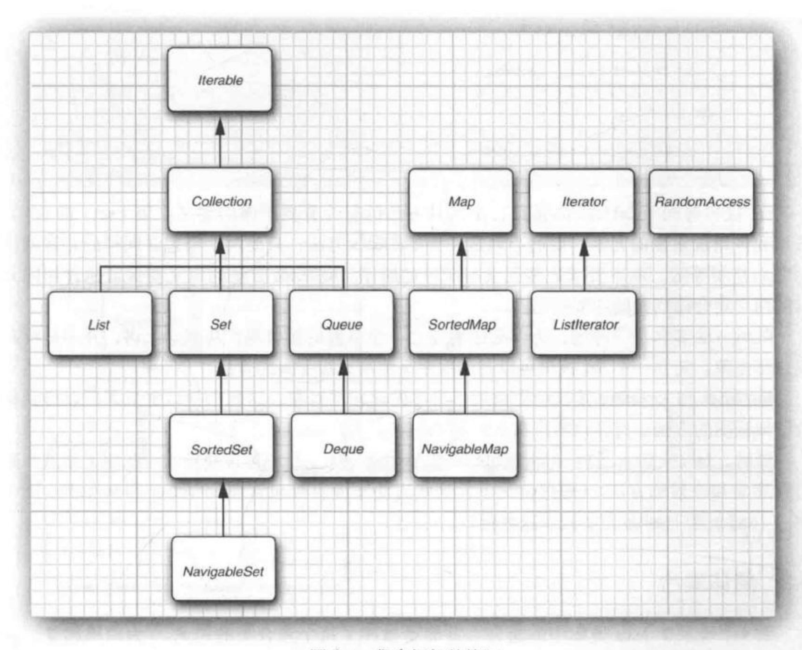

图 9T 集合框架的接口

List 接口定义了多个用于随机访问的方法:

**void add(int index, <sup>E</sup> element) mid refliovelint index) <sup>E</sup> getfint index) <sup>E</sup> setfint index, <sup>E</sup> element)**

Listlteetor 接口是 Itemto「的一个子接 定义了一个方法用于在迭代器位置前面增 加一个元素:

**void add element)**

坦率地讲,集合框架的这个方面设计得很不好。实际上有两种有序集合,其性能开销有 很大差异。由数组支持的有序集合可以快速地随机访问,因此适合使用 List 方法并提供一个 整数索引来访问。与之不同,链表尽管也是有序的,但是随机访问很慢,所以最好使用迭代 器来遍历。如果原先提供两个接口就会容易一些了。

直 注释:为 了避免对链表执行随机访问操作,Java 1.4 <sup>弓</sup><sup>I</sup> 入了一个标记接口 这 个接口不包含任何方法,不过可以用它来测试一个特定的集合是否支持高效的随机访问:

```
if {c instanceof RandomAccess)
{
   use random access algorithtn
}
else
{
   use sequential access algorithm
}
```

Set 接口等同于 Coll耻tion 接口,不过其方法的行为有更严谨的定义。集(码)的 <sup>a</sup>dd 方 法不允许增加重复的元素口 要适当地定义集的 equ凯与 方法:只要两个集包含同样的元素就认 为它们是相等的,而不要求这些元素有同样的顺序。hashcode 方法的定义要保证包含相同元 素的两个集会得到相同的散列码。

既然方法签名是一样的,为什么还要建立一个单独的接口呢?从概念上讲,并不是所有 集合都是集口 建立一个 5配接口可以允许程序员编写只接受集的方法口

SortedSet 和 SortedM叩接口会提供用于排序的比较器对象,这两个接口定义了可以得到集 合子集视图的方法。有关内容将在 9.5 节讨论心

最后,Java 6 引入了接口 NavigableSet 和 NavigableMap, 其中包含额外的一些用于搜索和遍 历有序集和映射的方法。(理想情况下,这些方法本应直接包含在 SHtedSet <sup>和</sup> Sortcm<sup>p</sup> 接口 中。)Trees虱和 Tre削叩类实现了这些接口。

# 9.3 具体集合

表 9-1 展示了 Java 类库中的集合,并筒要描述了每个集合类的用途。(为简单起见,这 里省略了线程安全集合,那些集合将在第 12 章中介绍0)

| 集合类型            | 述<br>描                     | 见<br>参   |
|-----------------|----------------------------|----------|
| ArrayList       | 可以动态增氏和缩减的一个索引序列           | 9.3.2 节  |
| LirkedList      | 可以在任意位置高效插入和删除的一个有序序列      | 931<br>节 |
| ArrayOeque      | 实现为循环数理的<br>-个收端队列         | 935<br>节 |
| HashSet         | 没有重复元素的一个无序集合              | 932<br>节 |
| TreeSet         | •个 仃序集                     | 934<br>节 |
| EnunS^t         | 一个包含枚举类型值的集                | 946节     |
| LinkedHashSet   | 一个可以记住元素捕人次序的集             | 945<br>节 |
| PriorityQueue   | 允许高效删除最小元素的一个集合            | 936节     |
| HashNap         | 存精键/值关联的一个数据结构             | 944<br>石 |
| treeHap         | 键有序的一个映射                   |          |
| EnumHap         | 键属于枚举类型的一个映射               | 946<br>节 |
| LinkedHashrtap  | 可以记住键<br>/ 值项添加次序的一个映射     | 9.4.5 力  |
| WeakHashMap     | 这个映射中的值如果不在别处使用,就会被垃圾回收器回收 | 944<br>节 |
| IdentityHashNap | 用=而不是用<br>equals 比较键的一个映射  | 947<br>节 |

表 9-1 Java 类库中的具体集合

在表 9-1 中,除了以 <sup>M</sup>叩结尾的类之外,其他类都实现了 Sllrtion接口,而以 <sup>M</sup>叩结尾 的类实现了 <sup>M</sup>叩接口.映射的内容将在 9.4 节介绍.

图 9-5 显示了这些类之间的关系。

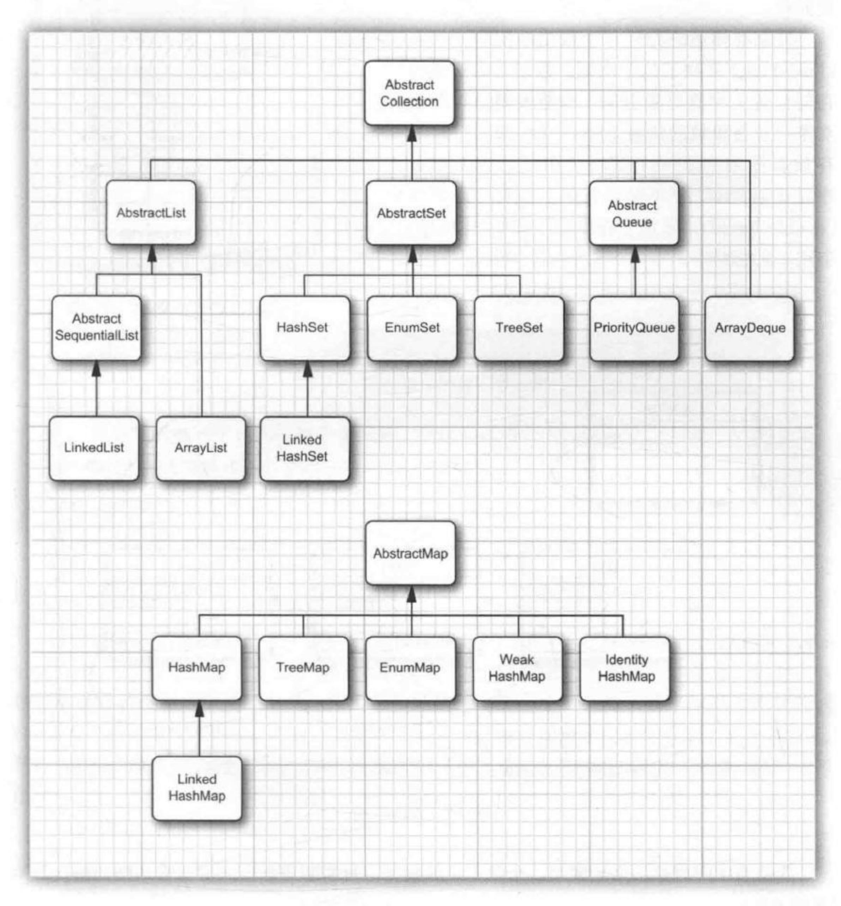

图 9-5 集合框架中的类

## 93.1 链表

本书的很多示例中已经使用了数组和它的动态 "兄弟,ArrayList 不过,数组和数组

列表都有一个重大的缺陷。这就是从数组中间删除一个元素开销很大,其原因是数组中位于

被删除元素之后的所有元素都要向数组的前端 移动(见图 9-6)。在数组中间插入一个元素也 是如此口

大家都知道的另外一个数据结构——链表 (linked list)解决了这个问题。数组是在连续的 存储位置上存放对象引用,而链表则是将每个 对象存放在单独的链接(link)中。每个链接还 存放着序列中下一个链接的引用。在 Java 程 序设计语言中, 所有链表实际上都有双向便接 ( doubly linked), 即每个链接还存储着其前骄的 引用(见图 9-7).


图%6 从数组中删除一个元素

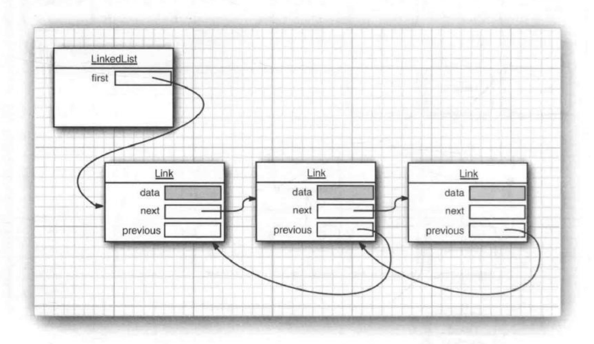

从链表中间删除一个元素是一个很轻松的操作,只需要更新所删除元素周围的链接即可 (见图 9-8)。

也许你曾经在数据结构课程中学习过如何实现链表口 在链表中添加或删除元素时,绕来 绕去的链接可能给你留下了糟糕的印象口 如果真是如此的话,你肯定会为 Java 集合类库提供 了一个可以直接使用的 LinkedList 类而感到高兴。

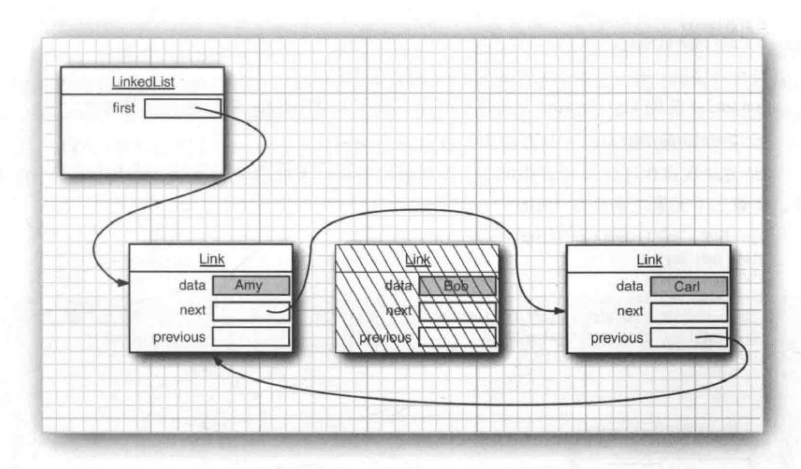

图 9-8 从链表中删除一个元素

在下面的代码示例中, 先添加 3 个元素, 然后再将第 2 个元素删除:

```
var staff = new LinkedList<String>();
staff.add("Amy");
staff.add("Bob");
staff.add("Carl");
Iterator<String> iter = staff.iterator();
String first = iter.next(); // visit first element
String second = iter.next(); // visit second element\niter.remove(); // remove last visited element
```

不过,链表与泛型集合之间有一个重要的区别。链表是一个有序集合(ordered collection),每个对象的位置十分重要。LinkedList.add 方法将对象添加到链表的尾部。但是,常常需要将元素添加到链表的中间。因为迭代器描述了集合中的位置,所以这种依赖于位置的 add 方法将由迭代器负责。不过,只有对自然有序的集合使用迭代器来添加元素才有意义。例如,下一节将要讨论的集(set)数据类型中,元素是完全无序的。因此,Iterator 接口中没有 add 方法。实际上,集合类库提供了一个子接口 ListIterator,其中包含 add 方法:

```
interface ListIterator<E> extends Iterator<E>
{
   void add(E element);
}
```

与 Collection.add 不同,这个方法不返回 boolean 类型的值,它假定 add 操作总会改变链表。

另外, ListIterator接口有两个方法可以用来反向遍历链表。

E previous()
boolean hasPrevious()

与 next 方法一样, previous 方法会返回越过的对象。

LinkedList 类的 listIterator 方法返回一个实现了 ListIterator 接口的迭代器对象。

ListIterator<String> iter = staff.listIterator();

add 方法在迭代器位置之前添加一个新对象。例如,下面的代码将越过链表中的第一个元素,在第二个元素之前添加 "Juliet"(见图 9-9):

```
var staff = new LinkedList<String>();
staff.add("Amy");
staff.add("Bob");
staff.add("Carl");
ListIterator<String> iter = staff.listIterator();\niter.next(); // skip past first element\niter.add("Juliet");
```

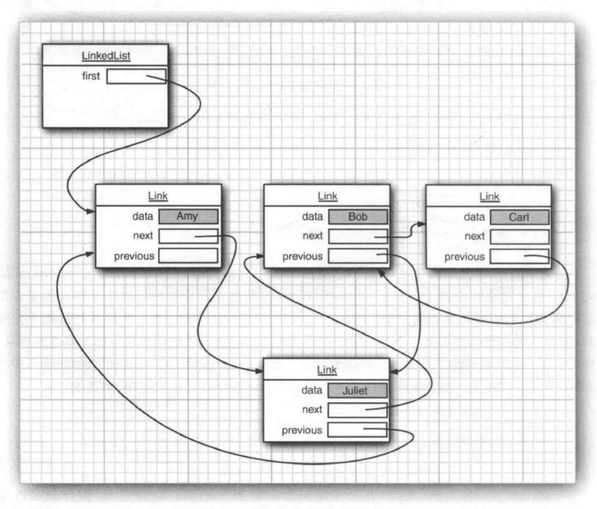

图 9-9 将一个元素添加到链表中

如果多次调用 add 方法,将按照提供元素的次序把元素添加到链表中。它们被依次添加

到迭代器当前位置之前。

当用一个刚由 listIterator 方法返回并指向链表表头的迭代器来调用 add 操作时,新添加的元素将变成列表的新表头。当迭代器越过链表的最后一个元素时(即 hasNext 返回 false时),添加的元素将成为列表的新表尾。如果链表有n个元素,会有n+1个位置可以添加新元素。这些位置与迭代器的n+1个可能的位置相对应。例如,如果链表包含 3 个元素,A、B、C,就有 4 个位置(标记为)可以插入新元素:

|ABC A|BC AB|C ABC|

i 注释: 在用"光标"做类比时要当心。remove 操作与退格(Backspace)键的工作方式不太一样。在调用 next 之后, remove 方法确实会删除迭代器左侧的元素, 这与退格键一样。但是, 如果调用了 previous, 则会删除迭代器右侧的元素。而且不能连续调用两次 remove。

add 方法只依赖于迭代器的位置,而 remove 方法不同,它依赖于迭代器的状态。

最后需要说明, set 方法会用一个新元素替换调用 next 或 previous 方法返回的上一个元素。例如,下面的代码将用一个新值替换列表的第一个元素:

ListIterator<String> iter = list.listIterator();
String oldValue = iter.next(); // returns first element\niter.set(newValue); // sets first element to newValue

可以想象,如果在某个迭代器修改集合时,另一个迭代器却在遍历这个集合,可能就会出现混乱。例如,假设一个迭代器指向一个元素前面的位置,而另一个迭代器刚刚删除了这个元素,现在前一个迭代器就是无效的,不能再使用。链表迭代器设计为可以检测到这种修改。如果一个迭代器发现它的集合被另一个迭代器修改了,或是被该集合自身的某个方法修改了,就会抛出一个 ConcurrentModificationException 异常。例如,考虑下面这段代码:

List<String> list = . . .;
ListIterator<String> iter1 = list.listIterator();
ListIterator<String> iter2 = list.listIterator();\niter1.next();\niter1.remove();\niter2.next(); // throws ConcurrentModificationException

因为 iter2 检测出这个列表被外部修改, 所以调用 iter2.next 会抛出一个 ConcurrentModificationException 异常。

为了避免发生并发修改异常,请遵循这样一个简单的规则:可以根据需要为一个集合关联多个迭代器,前提是这些迭代器只能读取集合。或者,可以关联一个能同时读写的迭代器。

检测并发修改的做法很简单。集合会跟踪更改操作(诸如添加或删除元素)的次数。每个迭代器都会为它负责的更改操作维护一个单独的更改操作数。在每个迭代器方法的开始处,迭代器会检查它自己的更改操作数与集合的更改操作数是否相等。如果不一致,就抛出

一个 ConcurrentModificationException 异常。

i 注释:不过,对于并发修改的检测有一个奇怪的例外。链表只跟踪对列表的结构性修改,例如,添加和删除链接。set方法不被视为结构性修改。可以为一个链表关联多个迭代器,所有迭代器都可以调用 set 方法改变现有链接的内容。本章后面介绍的Collections 类的许多算法都需要使用这个功能。

现在我们已经了解了 LinkedList 类的基本方法。可以使用 ListIterator 类从前后两个方向 遍历链表中的元素,以及添加和删除元素。

在 9.2 节已经看到, Collection 接口还声明了操作链表的很多其他有用的方法。其中大部分方法都是在 LinkedList 类的超类 AbstractCollection 中实现的。例如, toString 方法会调用所有元素的 toString, 并生成一个格式为 [A, B, C] 的长字符串。这为调试工作提供了便利。可以使用 contains 方法检测某个元素是否出现在链表中。例如, 如果链表中已经包含一个等于 "Harry" 的字符串, 调用 staff.contains("Harry") 将会返回 true。

Java 类库还提供了许多理论上存在一定争议的方法。链表不支持快速随机访问。如果要查看链表中的第n个元素,就必须从头开始,越过n-1个元素。没有捷径可走。鉴于这个原因,需要按整数索引访问元素时,程序员通常不选用链表。

然而, LinkedList 类还是提供了一个 get 方法, 用来访问某个特定元素:

LinkedList<String> list = . . .;
String obj = list.get(n);

当然,这个方法的效率不太高。如果你发现自己正在使用这个方法,说明对于所要解决的问题,你可能使用了错误的数据结构。

绝对不要使用这个"虚假"的随机访问方法来遍历链表。下面这段代码的效率极低:

for (int i = 0; i < list.size(); i++)
 do something with list.get(i);</pre>

每次查找一个元素都要从列表开头重新开始搜索。LinkedList 对象根本不会缓存位置信息。

註释: get 方法做了一个微小的优化:如果索引大于等于 size()/2,就从列表尾端开始搜索元素。

列表迭代器接口还有一个方法,可以告诉你当前位置的索引。实际上,从概念上讲,因为 Java 迭代器指向两个元素之间的位置,所以可以有两个索引: nextIndex 方法返回下一次调用 next 方法时所返回元素的整数索引; previousIndex 方法返回下一次调用 previous 方法时所返回元素的整数索引。当然,这个索引只比 nextIndex 返回的索引值小 1。这两个方法的效率非常高,因为迭代器会维护当前位置的计数值。最后需要说明一点,如果有一个整数索引 n,list.listIterator(n) 将返回一个迭代器,这个迭代器指向索引为 n 的元素前面的位置。也就是说,调用 next 与调用 list.get(n) 会得到同一个元素,只是获得迭代器的效率比较低。

如果链表中只有很少几个元素,就完全没有必要为 get 方法和 set 方法的开销而烦恼。但是,既然如此,最初为什么要使用链表呢?使用链表的唯一理由是尽可能地减少在列表中间

插入或删除元素的开销。如果列表只有很少几个元素,就完全可以使用 ArrayList。

建议一定要远离所有使用整数索引表示链表中位置的方法。如果需要对集合进行随机访问,就使用数组或 ArrayList,而不要使用链表。

程序清单 9-1 中的程序具体使用了链表。它创建了两个列表,将它们合并在一起,然后从第二个列表中每隔一个元素删除一个元素,最后测试 removeAll 方法。建议跟踪一下程序流程,要特别注意迭代器。可以画出迭代器位置示意图,你会发现这很有帮助,如下所示:

```
|ACE |BDFG

A|CE |BDFG

AB|CE B|DFG

...

注意以下调用:

System.out.println(a);
```

这会调用 AbstractCollection 类中的 toString 方法打印链表 a 中的所有元素。

#### 程序清单 9-1 linkedList/LinkedListTest.java

```
package linkedList;
   import java.util.*;
    * This program demonstrates operations on linked lists.
    * @version 1.12 2018-04-10
    * @author Cay Horstmann
   public class LinkedListTest
11 {
      public static void main(String[] args)
12
13
         var a = new LinkedList<String>();
14
         a.add("Amy");
15
         a.add("Carl");
16
         a.add("Erica");
17
18
         var b = new LinkedList<String>();
19
         b.add("Bob");
29
         b.add("Doug");
21
         b.add("Frances");
22
         b.add("Gloria");
23
24
         // merge the words from b into a
25
26
         ListIterator<String> aIter = a.listIterator();
27
         Iterator<String> bIter = b.iterator();
28
29
         while (bIter.hasNext())
30
31
             if (aIter.hasNext()) aIter.next();
32
             aIter.add(bIter.next());
33
```

394

```
35
         System.out.println(a);
36
37
         // remove every second word from b
         bIter = b.iterator();
         while (bIter.hasNext())
42
            bIter.next(); // skip one element
43
            if (bIter.hasNext())
45
               bIter.next(); // skip next element
               bIter.remove(); // remove that element
         System.out.println(b);
51
52
         // bulk operation: remove all words in b from a
53
         a.removeAll(b);
55
56
         System.out.println(a);
57
58
59 }
```

#### API java.util.List<E> 1.2

- ListIterator<E> listIterator()
   返回一个列表迭代器,用来访问列表中的元素。
- ListIterator<E> listIterator(int index)
   返回一个列表迭代器,用来访问列表中的元素,第一次调用这个迭代器的 next 会返回 给定索引的元素。
- void add(int i, E element)
   在指定位置添加一个元素。
- void addAll(int i, Collection<? extends E> elements) 将一个集合中的所有元素添加到指定位置。
- E remove(int i) 删除并返回指定位置的元素。
- E get(int i)
   获取指定位置的元素。
- E set(int i, E element) 用一个新元素替换指定位置的元素,并返回原来那个元素。
- int indexOf(Object element)
   返回与指定元素相等的元素在列表中第一次出现的位置,如果没有匹配的元素将返

<sup>回</sup>L

•int last!ndexOf(Object element) 返回与指定元素相等的元素在列表中最后一次出现的位置. 如果没有匹配的元素将返 回 -1Q

## **\w| java1utiLLi5tIterator<E> 1.2**

- •void add <sup>任</sup> newElement) 在当前位置前添加一个元素小
- •void set(E newElement) 用 <sup>一</sup> 个新元素替换 next 或 previous 访问的上一个元素口 如果在 上一个 next 或 previous 调用之后列表结构被修改了,将抛出一个 HSgdlS也teExc即tion 异常口
- •boolean hasPreviousO 当反向迭代处理列表时,如果还有可以访问的元素,返回 true。
- <sup>E</sup> previous() 返回前一个对象口如果已经到达列表开头, 就抛出一个 NoSuchElementExceptiom 异常.
- •int nextlndex() 返回下一次调用 next 方法时将返回的元素的索引口
- •int previouslndex() 返回下一次调用 previous 方法时将返回的元素的索引。

## ah] **java,utiLLinkedList<E> L2**

- •LinkedListf) 构造一个空链表。
- •LinkedList(CoUection<? extends E> elements) 构造一个链表,并将一个集合中所有的元素添加到这个链表中。
- •void addFirstlE element)
- •void addLast (E element) 将某个元素添加到列表的开头或末尾口
- <sup>E</sup> getFirst()
- <sup>E</sup> getLast() 返回列表开头或末尾的元素。
- E removeFirst()
- E removeLastl) 删除并返回列表开头或末尾的元素。

## 9.3.2 数组列表

在上一节中,我们了解了 List 接口和实现了这个接口的 LinkedList 类 List 接口描述一个

有序集合,其中每个元素的位置很重要,有两种访问元素的协议:一种是通过迭代器,另一 种是通过 get 和 set 方法随机访问。后者不适用于链表,但当然 get 和 set 方法对数组很有用. 集合类库提供了我们熟悉的 A"型List 类. 这个类也实现了 Li5t 接口。AirayList 封装了一个动 态再分配的对象数组。

国 注释:对于一个经验丰富的 Java 程序员 来说,需要一个动态数组时,可能会使用 Vector 类。为什么要用 ArrayList 而不是 Vector 呢?原因彳艮简单:Vectu「类的所有方法都 是同步的 可以安全地从两个线程访问一个 Vector 对象. 但是,如果只从一个战程访 问 Vector(这种情况更为常见), 代码就会在同步操作上白白浪费大量的时间 而与之 不同,ArrayList 方法不是同步的,因此,不需要同 步时建议使用 A「「ayList, 而 不要使 用 Vetto%

## 9.3.3 散列集

链表和数组允许你根据意愿指定元素的次序「但是,如果想耍查找某个特定的元素,却 又不记得它的位置,就需要访问所有元素,直到找到匹配的元素为止口 如果集合中包含的元 素很多. 这就会耗费很长时间。如果不在意元素的顺序,还有几种数据结构允许你更快速地 查找元素。缺点是,这些数据结构不允许你控制元素出现的次序,它们会按照对自己最方便 的方式组织元素』

有一种众所周知的数据结构,可以用于快速地查找对象,这就是散列表(hashtablez 散

列表为每个对象计算一个整数. 称为般列码(hash co击)。 散列码是以某种方式由对象的实例字段得 出的一个整数,这种方式可以尽可能保证有不同数 据的对象将生成不同的散列码口 表 9-2 列出了几个 散列码的示例, 它们是由 String 类的 hashCode 方法 得到的。

表 9-2 hashC。加 方法得到的散列码

| 字符串   | 散列码   |  |
|-------|-------|--|
| 叫眸,   | 76268 |  |
|       | 187期  |  |
| "eel" | 1的3%  |  |

如果定义你自己的类,你就要负责实现自己的帕5Mode 方法。有关帕5hS北 方法的详细内 容请参见第 5 章。注意,你的实现应该与铭阳心 方法兼容,即如果 a.equm时 为什哈 那么日 与 <sup>b</sup> 必须有相同的散列码口

现在,重要的是要能够快速地计算出散列码,并且这个计算只与要计算散列的那个对象 的状态有关. 与散列表中的其他对象无关。

在 Java 中,散列表实现为链表数组。每个列表被称为桶( bucket, 参见图 9-10% 要想 查找一个对象在表中的位置,就要先计算它的散列码,然后与桶的总数取余, 所得到的数就 是保存这个元素的那个桶的索引0 例如, 如果某个对象的散列码为 76268, 总共有 128 个桶, 那么这个对象应该保存在第 108 号桶中(因为 76 268%128 的余数是 108)。或许很幸运,这 个桶中没有其他元素,此时将元素直接插人这个桶中就可以了。当然,有时候会遇到桶已经 填充了元素的情况。这种现象被称为散列冲突(hashcollision)<sup>口</sup> 这时,需要将新对象与那个

桶中的所有对象进行比较,查看这个对象是否已经存在口 如果散列码合理地随机分布,而且 桶的数目足够大,需要比较的次数就会很少,

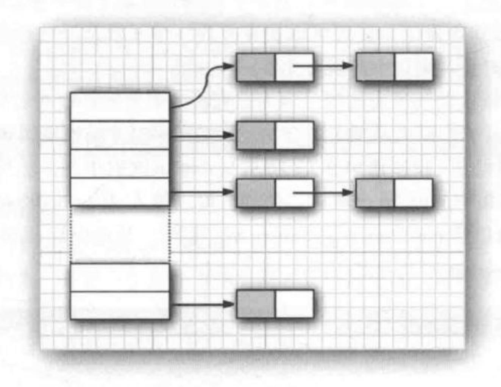

图%10 散列表

- Q 注释:在 Java <sup>8</sup> 中,桶满时会从链表变为平衡二叉树口 如果选择的散列函数不好,会 产 生很多 冲突,或者如果有恶意代码试图在散列表中填充多个有相同散列码的值,改 为平衡二又树能提高性能。
- 提示:散列表的犍要尽可能属于一个 实现了 S叩"油12 接口的关口 这样一来,就能保 证不会由于假列码分布不均勾 而导致性能低下Q

如果想更多地控制散列表的性能,可以指定一个初始的桶数0 桶数是指用于收集有相同 散列值的桶的数目二 如果要插入到散列表中的元素太多,冲突数就会增加,这会降低检索 性能。

如果大致知道最终会有多少个元素要插入散列表中,就可以设置桶数,通常. 要将桶数 设置为预计元素个数的 75% 150%。有些研究人员认为:将桶数设置为一个素数是一个好 主意,以防止键的聚集口 不过,对此并没有确凿的证据. 标准类库使用的桶数是 2 的幕,默 认值为 16(为表大小提供的任何值都将自动调整为 2 的下一个幕值几

当然,并不总是能够知道需要存储多少个元素,也有可能最初的估计过低。如果散列 表太满,就需要再散列( rehashed)。如果要对散列表再散列,就需要创建一个桶数更多的 表,并将所有元素插人这个新表中,然后丢弃原来的表。装填因子(loadfactor)可以确定何 时对散列表进行再散列. 例如,如果装填因子为 0.75 ( 默认值), 而表中已经填满了 75% 以 上,就会自动再散列,新表的桶数是原来的两倍,对于大多数应用来说,装填因子为 0.75 是 合理的。

散列表可以用于实现很多重要的数据结构。其中最简单的是集类型o 集是没有重复元素

的元素集合。集的 add 方法首先尝试在这个集中查找要添加的对象,只有这个元素不存在时才会添加这个对象。

Java 集合类库提供了一个 HashSet 类,它基于散列表实现了一个集。可以用 add 方法添加元素。contains 方法被重新定义,以便可以快速查找一个元素是否已经在集中。它只查看一个桶中的元素,而不必查看集合中的所有元素。

散列集迭代器将依次访问所有的桶。因为散列将元素分散存放在表中,所以会以一种看起来随机的顺序访问元素。只有不关心集合中元素的顺序时才应该使用 HashSet。

本节末尾的示例程序(程序清单 9-2)将从 System.in 读取单词,然后将它们添加到一个集中,最后再打印出集中的前 20 个单词。例如,可以输入 Alice in Wonderland (《爱丽丝漫游仙境》)的文本(可以从 http://www.gutenberg.org 找到),从命令行 shell 运行这个程序:

java SetTest < alice30.txt</pre>

#### 程序清单 9-2 set/SetTest.java

```
package set;
3 import java.util.*;
5 /**
* This program uses a set to print all unique words in System.in.
    * @version 1.12 2015-06-21
    * @author Cay Horstmann
  public class SetTest
11 {
      public static void main(String[] args)
13
         var words = new HashSet<String>();
14
         long totalTime = 0;
15
16
         try (var in = new Scanner(System.in))
17
18
            while (in.hasNext())
19
20
               String word = in.next();
21
               long callTime = System.currentTimeMillis();
22
               words.add(word);
23
               callTime = System.currentTimeMillis() - callTime;
24
               totalTime += callTime;
25
26
27
28
         Iterator<String> iter = words.iterator();
29
         for (int i = 1; i <= 20 && iter.hasNext(); i++)
38
            System.out.println(iter.next());
31
         System.out.println(". . .");
32
         System.out.println(words.size() + " distinct words. " + totalTime + " milliseconds.");
33
34
35 }
```

这个程序将读取输入的所有单词,将它们添加到散列集中。然后迭代处理散列集中的不同单词,最后打印出单词的数量(Alice in Wonderland 共有 5909 个不同的单词,包括开头的版权声明)。单词以随机的顺序出现。

● 警告: 在更改集中的元素时要格外小心。如果元素的散列码发生了改变,这个元素在数据结构中的位置也会变化。

#### API java.util.HashSet<E> 1.2

- HashSet()
   构造一个空散列集。
- HashSet(Collection<? extends E> elements)
   构造一个散列集,并将一个集合中的所有元素添加到这个散列集中。
- HashSet(int initialCapacity)
   构造一个具有指定容量(桶数)的空散列集。
- HashSet(int initialCapacity, float loadFactor)
   构造一个有指定的容量和装填因子的空散列集。如果大小/容量比大于这个装填因子, 散列表会再散列为一个更大的散列表。

## API java.lang.Object 1.0

int hashCode()

返回这个对象的散列码。散列码可以是任何整数,包括正数或负数。equals 和 hashCode 的定义必须兼容,即如果 x.equals(y)为 true, x.hashCode()必须等于 y.hashCode()。

## 9.3.4 树集

TreeSet 类与散列集十分类似,不过,它比散列集有所改进。树集是一个有序集合(sorted collection)。可以以任意顺序将元素插入集合中。在对集合进行遍历时,值将自动地按照排序后的顺序出现。例如,假设插入3个字符串,然后访问添加的所有元素。

```
var sorter = new TreeSet<String>();
sorter.add("Bob");
sorter.add("Amy");
sorter.add("Carl");
for (String s : sorter) System.out.println(s);
```

这时,值将按照有序顺序打印: Amy Bob Carl。正如 TreeSet 类名所示,排序是用一个树数据结构完成的(当前实现使用的是红黑树 (red-black tree)。有关红黑树的详细介绍请参见 Introduction to Algorithms<sup>®</sup>,作者是 Thomas Cormen、Charles Leiserson、Ronald Rivest 和 Clifford Stein [The MIT Press, 2009])。每次将一个元素添加到树中时,都会将其放置在正确的排序位置上。因此,迭代器总是以有序的顺序访问每个元素。

<sup>○</sup> 此书中文版《算法导论》已由机械工业出版社引进出版, ISBN: 978-7-111-40701-0。 ——编辑注

将一个元素添加到树中要比添加到散列表中慢,参见表 9-3 中的比较,但是,与检查数组或链表中的重复元素相比,使用树还是会快得多。如果树中包含n个元素,查找新元素的正确位置平均需要  $\log_2 n$  次比较。例如,如果一棵树包含了 1000 个元素,添加一个新元素大约需要比较 10 次。

|                           | 12 3-3 17 | 儿系加加到权列朱祁 | 內朱      |         |
|---------------------------|-----------|-----------|---------|---------|
| 文 档                       | 单词总数      | 不同单词个数    | HashSet | TreeSet |
| Alice in Wonderland       | 28 195    | 5 909     | 5秒      | 7秒      |
| The Count of Monte Cristo | 466 300   | 37 545    | 75 秒    | 98 秒    |

表 9-3 将元素添加到散列集和树集

注释:要使用树集,必须能够比较元素。这些元素必须实现 Comparable 接口,或者构造集时必须提供一个 Comparator (Comparable 和 Comparator 接口在第6章介绍过)。

回头看表 9-3, 你可能很想知道是否应该总是使用树集而不是散列集。毕竟,添加元素 所花费的时间看上去并没有增加太多,而且元素会自动排序。答案取决于所要收集的数据。 如果不需要数据有序,就没有必要付出排序的开销。更重要的是,对于某些数据来说,对其 进行排序要比给出一个散列函数更加困难。散列函数只需要将对象适当地打乱存放,而比较 函数必须精确地区分各个对象。

为了具体地了解它们之间的差异,可以考虑收集一个矩形集的任务。如果使用 TreeSet,就需要提供 Comparator<Rectangle>。如何比较两个矩形呢?按面积比较吗?这行不通。可能会有两个不同的矩形,它们的坐标不同,但面积却相同。树的排序顺序必须是全序(total ordering)。也就是说,任意两个元素都必须是可比较的,只有在两个元素相等时比较结果才为 0。矩形确实有一种排序方式(按照坐标的词典顺序排序),但这很牵强,而且计算很烦琐。相比之下,已经为 Rectangle 类定义了散列函数,它直接对坐标计算散列。

注释:从Java 6起, TreeSet 类实现了 NavigableSet 接口。这个接口增加了几个便利方法,用于查找元素以及反向遍历。详细信息请参见 API 注释。

程序清单 9-3 的程序中创建了 Item 对象的两个树集。第一个按照部件编号排序,这是 Item 对象的默认排序顺序。第二个使用一个定制比较器按照描述信息排序。程序清单 9-4 中是 Item 对象。

#### 程序清单 9-3 treeSet/TreeSetTest.java

```
package treeSet;
```

<sup>3</sup> import java.util.\*;

<sup>5 /\*\*</sup> 

<sup>\*</sup> This program sorts a set of Item objects by comparing their descriptions.

<sup>\* @</sup>version 1.13 2018-04-10

<sup>\* @</sup>author Cay Horstmann

<sup>9 \*/</sup> 

```
public class TreeSetTest
11 {
      public static void main(String[] args)
12
13
         var parts = new TreeSet<Item>();
14
         parts.add(new Item("Toaster", 1234));
15
         parts.add(new Item("Widget", 4562));
16
         parts.add(new Item("Modem", 9912));
17
         System.out.println(parts);
18
19
         var sortByDescription = new TreeSet<Item>(Comparator.comparing(Item::getDescription));
20
21
         sortByDescription.addAll(parts);
22
         System.out.println(sortByDescription);
23
24
25 }
```

#### 程序清单 9-4 treeSet/Item.java

```
package treeSet;
  import java.util.*;
   /**
    * An item with a description and a part number.
   public class Item implements Comparable<Item>
9
      private String description;
10
      private int partNumber;
11
12
      /**
13
       * Constructs an item.
14
       * @param aDescription the item's description
       * @param aPartNumber the item's part number
16
17
      public Item(String aDescription, int aPartNumber)
18
19
         description = aDescription;
20
         partNumber = aPartNumber;
21
22
23
24
       * Gets the description of this item.
25
       * @return the description
26
27
      public String getDescription()
28
29
         return description;
30
31
32
      public String toString()
33
34
         return "[description=" + description + ", partNumber=" + partNumber + "]";
35
```

```
36
37
      public boolean equals(Object otherObject)
38
39
         if (this == otherObject) return true;
         if (otherObject == null) return false;
         if (getClass() != otherObject.getClass()) return false;
         var other = (Item) otherObject;
         return Objects.equals(description, other.description) && partNumber == other.partNumber;
45
46
      public int hashCode()
47
         return Objects.hash(description, partNumber);
50
51
      public int compareTo(Item other)
52
53
         int diff = Integer.compare(partNumber, other.partNumber);
54
         return diff != θ ? diff : description.compareTo(other.description);
55
56
```

#### API java.util.TreeSet<E> 1.2

- TreeSet()
- TreeSet(Comparator<? super E> comparator)
   构造一个空树集。
- TreeSet(Collection<? extends E> elements)
- TreeSet(SortedSet<E> s)
   构造一个树集,并增加一个集合或有序集中的所有元素(对于后一种情况,要使用同样的顺序)。

## API java.util.SortedSet<E> 1.2

- Comparator<? super E> comparator()
   返回用于对元素进行排序的比较器。如果元素用 Comparable 接口的 compareTo 方法进行比较则返回 null。
- E first()
- E last() 返回有序集中的最小元素或最大元素。

## API java.util.NavigableSet<E> 6

- E higher(E value)
- E lower(E value)

返回大于 value 的最小元素或小于 value 的最大元素,如果没有这样的元素则返回 null。

- E ceiling(E value)
- E floor(E value)
   返回大于等于 value 的最小元素或小于等于 value 的最大元素,如果没有这样的元素则返回 null。
- E pollFirst()
- E pollLast()
   删除并返回这个集中的最大元素或最小元素,这个集为空时返回 null。
- Iterator<E> descendingIterator()
   返回一个按照降序遍历集中元素的迭代器。

#### 9.3.5 队列与双端队列

前面已经讨论过,队列允许高效地在队尾添加元素,并在队头删除元素。双端队列 (deuqe) 在队头和队尾都能高效地添加或删除元素。不支持在队列中间添加元素。Java 6 中引 人了 Deque 接口,ArrayDeque 和 LinkedList 类实现了这个接口。这两个类都可以提供双端队列,其大小可以根据需要扩展。第 12 章会介绍限定队列和限定双端队列。

#### API java.util.Queue<E> 5

- boolean add(E element)
- boolean offer(E element)
   如果队列没有满,将给定的元素添加到这个队列的队尾并返回 true。如果队列已满, 第一个方法将抛出一个 IllegalStateException,而第二个方法返回 false。
- E remove()
- E poll()

如果队列不为空,删除并返回这个队列队头的元素。如果队列是空的,第一个方法抛出 NoSuchElementException,而第二个方法返回 null。

- E element()
- E peek()

如果队列不为空,返回这个队列队头的元素,但不删除这个元素。如果队列为空,第一个方法将抛出一个 NoSuchElementException,而第二个方法返回 null。

## API java.util.Deque<E> 6

- void addFirst(E element)
- void addLast(E element)
- boolean offerFirst(E element)
- boolean offerLast(E element)

将给定的对象添加到双端队列的队头或队尾。如果这个双端队列已满,前面两个方法将抛出一个 IllegalStateException,而后面两个方法返回 false。

- E removeFirst()
- E removeLast()
- E pollFirst()
- E pollLast()

如果这个双端队列不为空,删除并返回双端队列队头的元素。如果双端队列为空,前面两个方法将抛出一个 NoSuchElement Exception,而后面两个方法返回 null。

- E getFirst()
- E getLast()
- E peekFirst()
- E peekLast()

如果这个双端队列非空,返回双端队列队头的元素,但不删除这个元素。如果双端队列为空,前面两个方法将抛出一个 NoSuchElementException,而后面两个方法返回 null。

## API java.util.ArrayDeque<E> 6

- ArrayDeque()
- ArrayDeque(int initialCapacity)
   用初始容量 16 或给定的初始容量构造一个无限定双端队列。

## 9.3.6 优先队列

优先队列(priority queue)中的元素可以按照任意的顺序插入,但会按照有序的顺序获取。也就是说,调用 remove 方法时,总会获得当前优先队列中最小的元素。不过,优先队列并没有对所有元素进行排序。如果迭代处理这些元素,并不需要对它们进行排序。优先队列使用了一个精巧且高效的数据结构,称为堆(heap)。堆是一个自组织的二叉树,其添加(add)和删除(remove)操作会让最小的元素移动到根,而不必花费时间对元素进行排序。

与 TreeSet 一样,优先队列既可以包含实现了 Comparable 接口的类对象,也可以包含构造器中提供的 Comparator 对象。

优先队列的典型用法是任务调度。每一个任务有一个优先级,任务以随机顺序添加到队列中。每当启动一个新的任务时,将从队列中删除优先级最高的任务(因为习惯将1作为"最高"优先级,所以 remove 操作将删除最小的元素)。

程序清单 9-5 显示了一个优先队列的具体使用。与 TreeSet 中的迭代不同,这里的迭代并不是按照有序顺序来访问元素。不过,删除操作总是删除剩余元素中最小的那个元素。

## 程序清单 9-5 priorityQueue/PriorityQueueTest.java

```
package priorityQueue;
\nimport java.util.*;\nimport java.time.*;

/**
```

```
* This program demonstrates the use of a priority queue.
    * @version 1.02 2015-06-20
    * @author Cay Horstmann
10
   public class PriorityQueueTest
12
      public static void main(String[] args)
13
14
         var pq = new PriorityQueue<LocalDate>();
15
         pq.add(LocalDate.of(1906, 12, 9)); // G. Hopper
15
         pq.add(LocalDate.of(1815, 12, 10)); // A. Lovelace
17
         pq.add(LocalDate.of(1903, 12, 3)); // J. von Neumann
18
         pq.add(LocalDate.of(1910, 6, 22)); // K. Zuse
19
28
         System.out.println("Iterating over elements . . . ");
21
         for (LocalDate date : pq)
22
            System.out.println(date);
23
         System.out.println("Removing elements . . . ");
24
         while (!pq.isEmpty())
25
            System.out.println(pq.remove());
26
27
28 }
```

## API java.util.PriorityQueue 5

- PriorityQueue()
- PriorityQueue(int initialCapacity)
   构造一个存放 Comparable 对象的优先队列。
- PriorityQueue(int initialCapacity, Comparator<? super E> c)
   构造一个优先队列,并使用指定的比较器对元素进行排序。

## 9.4 映射

作为一个集合,集允许你快速地查找现有的元素。但是,要查找一个元素,需要有所查找的那个元素的准确副本。这不是一种常见的查找方式。通常,我们知道某些关键信息,希望查找与之关联的元素。映射(map)数据结构就是为此设计的。映射用来存放键/值对。如果提供了键,可以查找一个值。例如,可以存储一个员工记录表,其中键为员工ID,值为Employee 对象。在下面的小节中,我们会学习如何使用映射。

## 9.4.1 基本映射操作

Java 类库为映射提供了两个通用的实现: HashMap 和 TreeMap。这两个类都实现了 Map 接口。 散列映射对键进行散列,树映射根据键的顺序将它们组织为一个搜索树。散列或比较函数只应用于键。与键关联的值不进行散列或比较。

应该选择散列映射还是树映射呢?与集一样,散列稍微快一些,如果不需要按照有序的

顺序访问键,最好选择散列映射。

可以如下建立一个散列映射来存储员工信息:

```
var staff = new HashMap<String, Employee>(); // HashMap implements Map
var harry = new Employee("Harry Hacker");
staff.put("987-98-9996", harry);
```

每当向映射中添加一个对象时,必须同时提供一个键。在这里,键是一个字符串,对应的值是 Employee 对象。

要获取一个对象,必须使用键(因此必须记住键)。

```
var id = "987-98-9996";
Employee e = staff.get(id); // gets harry
```

如果映射中没有存储与指定键对应的信息, get 将返回 null。

null 返回值可能并不方便。有时对于没有出现在映射中的键,可以有一个合适的默认值。 然后使用 get0rDefault 方法。

```
Map<String, Integer> scores = . . .;\nint score = scores.getOrDefault(id, 0); // gets 0 if the id is not present
```

键必须是唯一的。不能对同一个键存放两个值。如果用同一个键调用两次 put 方法,第二个值就会取代第一个值。实际上, put 将返回与这个键参数关联的上一个值。

remove 方法从映射中删除给定键对应的元素。size 方法返回映射中的元素数。

要迭代处理映射的键和值,最容易的方法是使用 forEach 方法。可以提供一个接收键和值的 lambda 表达式。映射中的每一项会依序调用这个表达式。

```
scores.forEach((k, v) ->
   System.out.println("key=" + k + ", value=" + v));
```

程序清单 9-6 显示了映射的具体使用。首先将键 / 值对添加到映射中。然后,从映射中删除一个键,同时与之关联的值也会删除。接下来,修改与某一个键关联的值,并调用 get 方法查找一个值。最后,迭代处理元素集。

#### 程序清单 9-6 map/MapTest.java

```
package map;
\nimport java.util.*;

/**

* This program demonstrates the use of a map with key type String and value type Employee.

* @version 1.12 2015-06-21

* @author Cay Horstmann

*/

public class MapTest

{
    public static void main(String[] args)
    {
        var staff = new HashMap<String, Employee>();
        staff.put("144-25-5464", new Employee("Amy Lee"));
}
```

```
staff.put("567-24-2546", new Employee("Harry Hacker"));
16
         staff.put("157-62-7935", new Employee("Gary Cooper"));
17
         staff.put("456-62-5527", new Employee("Francesca Cruz"));
18
19
         // print all entries
20
21
         System.out.println(staff);
22
23
         // remove an entry
24
25
         staff.remove("567-24-2546");
26
27
         // replace an entry
28
29
         staff.put("456-62-5527", new Employee("Francesca Miller"));
38
31
         // look up a value
32
33
         System.out.println(staff.get("157-62-7935"));
34
35
         // iterate through all entries
36
37
         staff.forEach((k, v) ->
38
            System.out.println("key=" + k + ", value=" + v));
39
48
41 }
```

#### API java.util.Map<K, V> 1.2

- V get(Object key)
  - 获得与键关联的值;返回与键关联的对象,或者如果在映射中没有找到这个键,则返回 null。实现类可能禁止键为 null。
- default V getOrDefault(Object key, V defaultValue)
   获得与键关联的值;返回与键关联的对象,或者如果在映射中没有找到这个键,则返回 defaultValue。
- V put(K key, V value)
  - 将关联的一对键和值放到映射中。如果这个键已经存在,新对象将取代之前与这个键关联的对象。这个方法将返回键对应的旧值。如果之前没有这个键,则返回 null。实现类可能禁止键或值为 null。
- void putAll(Map<? extends K, ? extends V> entries) 将指定映射中的所有映射条目添加到这个映射中。
- boolean containsKey(Object key)
   如果映射中有这个键,返回 true。
- boolean containsValue(Object value) 如果映射中有这个值,返回 true。
- default void forEach(BiConsumer<? super K,? super V> action) 8

对这个映射中的所有键/值对应用这个动作。

#### API java.util.HashMap<K, V> 1.2

- HashMap()
- HashMap(int initialCapacity)
- HashMap(int initialCapacity, float loadFactor)
   构造一个空散列映射,它具有指定的容量和装填因子(装填因子是一个0.0~1.0之间的数。这个数确定散列表填充到多大比例时就要再散列到一个更大的散列表)。默认的装填因子是0.75。

### API java.util.TreeMap<K,V> 1.2

TreeMap()

为实现 Comparable 接口的键构造一个空的树映射。

- TreeMap(Comparator<? super K> c)
   构造一个树映射,并使用一个指定的比较器对键进行排序。
- TreeMap(Map<? extends K, ? extends V> entries)
   构造一个树映射,并增加一个映射中的所有映射条目。
- TreeMap(SortedMap<? extends K, ? extends V> entries)
   构造一个树映射,增加一个有序映射中的所有映射条目,并使用与给定有序映射相同的比较器。

## API java.util.SortedMap<K, V> 1.2

- Comparator<? super K> comparator()
   返回对键进行排序所用的比较器。如果用 Comparable 接口的 compareTo 方法对键进行比较,则返回 null。
- K firstKey()
- K lastKey()
   返回映射中的最小或最大键。

## 9.4.2 更新映射条目

处理映射的一个难点是更新映射条目。正常情况下,可以得到与一个键关联的旧值,更新这个值,再放回更新后的值。不过,必须考虑一个特殊情况,即键第一次出现。下面来看一个例子,考虑使用映射来统计一个单词在文件中出现的频度。看到一个单词(word)时,我们将计数器增1,如下所示:

counts.put(word, counts.get(word) + 1);

这是可以的,不过有一种情况除外:就是第一次看到 word 时。在这种情况下, get 会返回 null,因此会出现一个 NullPointerException 异常。

一种简单的补救是使用 getOrDefault 方法:

counts <sup>&</sup>gt;put(word <sup>j</sup> counts.getOrtefault(word, G) <sup>+</sup> 】);

另一种方法是首先调用 putHAbscnt 方法。只有当键原先不存在 (或者映射到 null) 时才放 人一个值。

counts.putIfAbsent (word, 9};

counts.put(word, counts.get(word) <sup>+</sup> 1); // now we know that get will succeed

不过还可以做得更好。me卵方法可以简化这个常见操作心 如果键原先不存在,下面的 调用:

counts.merge(word. 1, Integer: tsum);

将把mrd <sup>与</sup> 1关联,否则使用 Integer-:sum 函数组合原值和 1(也就是将原值与 1求和)。 API 注释还描述了另外一些更新映射条目的方法,不过这些方法不太常用口

# 回jmva.SiLHm时,户 1\*2

•default <sup>V</sup> uergelK key, <sup>V</sup> value, BiFunction<? <sup>5</sup>叩「<sup>e</sup> V,? super %? extends V>「艮限叩ingFunction) 8

如果 key 与一个非 null 值 v 关联,将函数应用到 v 和 value, 将 key 与结果关联,或者 如果结果为 null, 则删除这个键,否则,将 key 与向晚 关联,返回 get(key%

- •default <sup>V</sup> compute (K key, BiFunction<? super KJ §叩2「 Vf? extends V> remappingFunction) 8 将函数应用到 key 和 get(key)。将 key 与结果关联,或者如果结果为 null, 则删除这个 键口 返回 get(key}0
- •default <sup>V</sup> computelfPresent (K keyr BiFunction<? super K,? super %? extends V> remappingFunction) 8

如果 key 与一个非 nuU 值 <sup>v</sup> 关联,将函数应用到 key 和 v, 将 key 与结果关联. 或者如 果结果为 null, 则删除这个键。返回 get(ke九

- •default <sup>V</sup> computelfAbsent (K key, Fimctiofx? super KJ extends V> mappingFunction) <sup>8</sup> 将这个函数应用到网. 除非 key 与一个非 null 值关联。将何 与结果关联,或者如果 结果为mI,则删除这个键口 返回 gmt{key)。
- •default void replaceAU(BiFunction<? super KJ super %? extends V> function) <sup>8</sup> 在所有映射条目上调用这个函数,将键与非 null 结果关联,如果结果为 null, 则将相 应的键删除。
- •default <sup>V</sup> pi/tIfAbsent(K key, <sup>V</sup> value) <sup>8</sup> 如果烟不存在或者与 null 关联,则将它与⑹ue 关联,并返回 null。否则返回关联 的值。

## 9.4.3 映射视图

集合框架不认为映射本身是一个集合。(其他数据结构框架则认为映射是一个键 / 值对集 合,或者是按键索引的值集合口) 不过,可以得到映射的视图 (view) ——实现了 CoVL电tion<sup>接</sup> 口或某个子接口的对象。

有3种视图:键集、值集合(不是一个集)以及键/值对集。键和键/值对可以构成一个集,因为映射中一个键只能有一个副本。下面的方法:

```
Set<K> keySet()
Collection<V> values()
Set<Map.Entry<K, V>> entrySet()
```

会分别返回这3个视图。(映射条目集的元素是实现了Map.Entry接口的类的对象。)

需要说明的是, keySet 不是 HashSet 或 TreeSet, 而是实现了 Set 接口的另外某个类的对象。 Set 接口扩展了 Collection 接口。因此,可以像使用任何集合一样使用 keySet。

例如,可以枚举一个映射的所有键:

```
Set<String> keys = map.keySet();
for (String key : keys)
{
    do something with key
}

如果想同时查看键和值,可以通过枚举映射条目来避免查找值。可以使用以下代码:
for (Map.Entry<String, Employee> entry : staff.entrySet())
{
    String k = entry.getKey();
    Employee v = entry.getValue();
    do something with k, v
}
```

```
☑ 提示: 通过使用 var 声明可以避免笨拙的 Map.Entry。
for (var entry: map.entrySet())
{
    do something with entry.getKey(), entry.getValue()
}

或者直接使用 forEach 方法:
    map.forEach((k, v) ->
    {
        do something with k, v
});
```

如果在键集视图上调用迭代器的 remove 方法,实际上会从映射中删除这个键和与它关联的值。不过,不能向键集视图中添加元素。另外,如果只添加一个键而没有同时添加值也是没有意义的。如果试图调用 add 方法,它会抛出一个 UnsupportedOperationException。映射条目集视图有同样的限制,尽管理论上好像可以增加新的键/值对,但实际上并不允许。

## API java.util.Map<K, V> 1.2

Set<Map.Entry<K, V>> entrySet()

返回 Map. Entry 对象(映射中的键/值对)的一个集视图。可以从这个集中删除元素,它们也将从映射中删除,但是不能添加任何元素。

#### Set<K> keySet()

返回映射中所有键的一个集视图。可以从这个集中删除元素,这些键和相关联的值也将从映射中删除,但是不能添加任何元素。

Collection
 values()
 返回映射中所有值的一个集合视图。可以从这个集合中删除元素,所删除的值及相应的键也将从映射中删除,不过不能添加任何元素。

#### API java.util.Map.Entry<K, V> 1.2

- K getKey()
- V getValue()
   返回这个映射条目的键或值。
- V setValue(V newValue)
   将关联映射中的值改为新值,并返回原来的值。
- static <K, V> Map.Entry<K,V> copyOf(Map.Entry<? extends K,? extends V> map) 17
   生成给定映射条目的一个副本。不同于映射条目集的元素,这个副本不是"活动的"。
   调用 setValue 不会更新任何映射。

#### 9.4.4 弱散列映射

在集合类库中有几个专用的映射类,我们将在这一节和后面几节中对它们做简要介绍。

设计 WeakHashMap 类是为了解决一个有趣的问题。如果有一个值,它对应的键已经不再在程序中的任何地方使用,将会出现什么情况?假设对某个键的最后一个引用已经消失,那么再没有任何途径可以引用这个值对象了。但是,由于程序中的任何部分都不再有这个键,因此无法从映射中删除这个键/值对。为什么垃圾回收器不能删除它呢?删除无用的对象不就是垃圾回收器的工作吗?

遗憾的是,事情没有这么简单。垃圾回收器会跟踪活动的对象。只要映射对象是活动的,其中的所有桶就是活动的,它们就不能被回收。因此,需要由程序负责从长期存活的映射中删除那些无用的值。或者,你可以使用 WeakHashMap。当键的唯一引用来自散列表条目时,这个数据结构将与垃圾回收器合作删除键/值对。

下面介绍这种机制的内部工作原理。WeakHashMap使用弱引用(weak reference)保存键。WeakReference 对象将包含另一个对象的引用,在这里,就是一个散列表键。对于这种类型的对象,垃圾回收器采用一种特殊的方式进行处理。正常情况下,如果垃圾回收器发现某个特定的对象已经没有引用了,就会将其回收。不过,如果这个对象只能由一个WeakReference引用,垃圾回收器也会将其回收,但会将引用这个对象的弱引用放入一个队列。WeakHashMap的操作会定期地检查这个队列,查找新加入的弱引用。一个弱引用进入这个队列意味着这个键不再由任何人使用,并且已经回收。于是,WeakHashMap将删除相关联的映射条目。

#### 9.4.5 链接散列集与映射

LinkedHashSet 和 LinkedHashMap 类会记住插入元素项的顺序。这样可以避免散列表中看起来随机的元素顺序。在散列表中插入元素项时,它们会加入一个双向链表中(见图 9-11)。

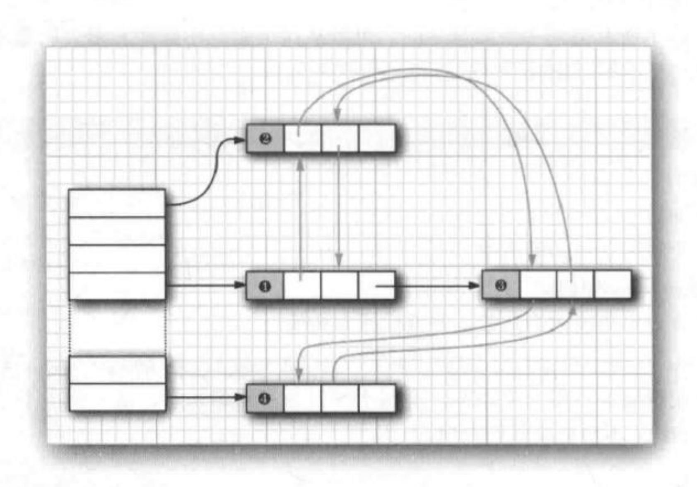

图 9-11 链接散列表

例如,考虑程序清单9-6中的以下映射插入操作:

```
var staff = new LinkedHashMap<String, Employee>();
staff.put("144-25-5464", new Employee("Amy Lee"));
staff.put("567-24-2546", new Employee("Harry Hacker"));
staff.put("157-62-7935", new Employee("Gary Cooper"));
staff.put("456-62-5527", new Employee("Francesca Cruz"));
```

然后, staff.keySet().iterator()会以下面的顺序枚举键:

144-25-5464

567-24-2546

157-62-7935

456-62-5527

staff.values().iterator()以下面的顺序枚举值:

Amy Lee Harry Hacker Gary Cooper Francesca Cruz

或者,链接散列映射可以使用访问顺序(access order)而不是插入顺序来迭代处理映射条目。每次调用 get 或 put 时,受到影响的条目将从当前位置删除,并放在条目链表的末尾(只影响条目链表中的位置,而不影响散列表的桶。一个映射条目总是在键散列码对应的桶中)。要构造这样一个散列映射,需要调用

LinkedHashMap<K, V>(initialCapacity, loadFactor, true)

访问顺序对于实现缓存的"最近最少使用"原则十分重要.例如,你可能希望将访问频 率高的元素放在内存中,而从数据库读取访问频率低的元素。如果在映射表中没有找到某个 元素,而且此时映射表已经很满, 可以得到映射表的一个迭代器,并删除它枚举的前几个元 素,它们是最近最少使用的几个元素。

甚至可以自动完成这一过程。构造 LinkedHash厢p 的一个子类,然后覆盖下面这个方法: protected boolean renioveEldestEntry(Map.Entry<K <sup>r</sup> V> eldest)

每当这个方法返回 true 时,添加一个新映射条目就会导致删除mdest 映射条目。例如, 下面的缓存最多可以存放 100 个元素:

```
var cache = new LinkedHashMap<K( 0J5F( true)
  {
  protected boolean renioveEldestEnt ry(Map.Entry<K, V> eldest}
  (
     return sized > 1随;
  }
};
```

或者, 还可以考虑 el加5t 映射条目来决定是否将它删除口 例如,可以检查随这个映射条 目存储的一个时间戳。

## 9.4.6 枚举集与映射

EnumSet 是一个高效的集实现, 其元素属于一个枚举类型。因为枚举类型只有有限个实 例,所以 EnumSet 在内部实现为一个位序列。如果对应的值在集中出现,相应的位则置为 1。 EnumSet 类没有公共构造器. 要使用静态工厂方法构造这个集:

```
enum Weekday { MONDAY, TUESOAY, WEDNESDAY, THURSDAY. FRIDAY, SATURDAY, SUNDAY };
Enum$et<Weekday> always = EnunSet.aU0f(Weekday.class);
EnumSet<Weekday> never = £numSet .noneOf (Weekday.class);
Enum5et<Weekday> workday = EnvmSeti rangefWeekday.MONDAY ( Weekday <FRIDAY);
EnumSet<Weekday> mwf = EnumSet.of (Weekday .MONDAY, Weekday .WEDNESDAY, Weekday .FRIDAY);
```

可以使用 <sup>S</sup>缸接口的常用方法来修改 Enum5eto

Emi州而 是一个映射,它的键属于一个枚举类型。Enu响ap 可以简单高效地实现为一个值数 组。需要在构造器中指定键类型:

var personlnCharge = new Enuntlap<tfeekdayp Employee(Weekday,class);

0 注释:在 EnumSet 的 AP<sup>I</sup> 文档中,会看到形如 <sup>E</sup> extends EnunxE) 的奇怪的类型 参数0 <sup>简</sup> 单地说,它的意思就是 "E 是一个枚举类型J 所有枚举类型都扩展了泛型 Enum 类。例 4口, Weekday 扩展了 EnunwWeekda^c

## 9.4.7 标识散列映射

IdentityMhM即有一个很特殊的用途口 在这里,键的散列值不是用怕shC。由函数计算的, 而是用 Systcm.identityHaehCode 方法计算的◎ Object.hashcode 根据对象的内存地址计算散列码时

就使用了这个方法。另外,对两个对象进行比较时,IdentityHashMap使用了=,而不是 equals。也就是说,不同的键对象即使内容相同,也被视为不同的对象。在实现对象遍历算法(如对象串行化)时,如果你想跟踪哪些对象已经遍历过,这个类就很有用。

#### API java.util.WeakHashMap<K, V> 1.2

- WeakHashMap()
- WeakHashMap(int initialCapacity)
- WeakHashMap(int initialCapacity, float loadFactor)
   用给定的容量和装填因子构造一个空散列映射。

## java.util.LinkedHashSet<E> 1.4

- LinkedHashSet()
- LinkedHashSet(int initialCapacity)
- LinkedHashSet(int initialCapacity, float loadFactor)
   用给定的容量和装填因子构造一个空链接散列集。

#### API java.util.LinkedHashMap<K, V> 1.4

- LinkedHashMap()
- LinkedHashMap(int initialCapacity)
- LinkedHashMap(int initialCapacity, float loadFactor)
- LinkedHashMap(int initialCapacity, float loadFactor, boolean accessOrder)
   用给定的容量、装填因子和顺序构造一个空链接散列映射。accessOrder 参数为 true 时表示访问顺序,为 false 时表示插入顺序。
- protected boolean removeEldestEntry(Map.Entry<K, V> eldest)
  如果想删除 eldest 元素,就要覆盖为返回 true。eldest 参数是预期可能要删除的元素。这个方法在向映射中添加一个元素之后调用。默认实现会返回 false。即在默认情况下,不会删除老元素。不过,可以重新定义这个方法,从而有选择地返回 true。例如,如果最老的元素符合某个条件,或者如果映射超过了一定大小,则返回 true。

## par java.util.EnumSet<E extends Enum<E>> 5

- static <E extends Enum<E>> EnumSet<E> allOf(Class<E> enumType)
   返回一个可变集,包含给定枚举类型的所有值。
- static <E extends Enum<E>> EnumSet<E> noneOf(Class<E> enumType)
   返回一个初始为空的可变集。
- static <E extends Enum<E>> EnumSet<E> range(E from, E to)
   返回一个可变集,包含 from ~ to 之间的所有值(包括 from 和 to)。
- static <E extends Enum<E>> EnumSet<E> of(E e)

- static <E extends Enum<E>> EnumSet<E> of(E e1, E e2, E e3, E e4, E e5)
- static <E extends Enum<E>> EnumSet<E> of(E first, E... rest) 返回一个可变集,包括不为 null 的给定元素。
- public static <E extends Enum<E>> EnumSet<E> copyOf(EnumSet<E> s)
- public static <E extends Enum<E>> EnumSet<E>> copyOf(Collection<E>> c)
   创建一个初始包含给定元素的可变集。在第二个方法中,c必须是一个 EnumSet 或者非空(以确定元素类型)。

#### API java.util.EnumMap<K extends Enum<K>, V> 5

EnumMap(Class<K> keyType)
 构造一个键为给定类型的空的可变映射。

## API java.util.IdentityHashMap<K, V> 1.4

- IdentityHashMap()
- IdentityHashMap(int expectedMaxSize)
   构造一个空的标识散列映射集,其容量是大于 1.5 x expectedMaxSize 的最小的 2 的幂值 (expectedMaxSize 的默认值是 21)。

#### API java.lang.System 1.0

 static int identityHashCode(Object obj) 1.1
 返回 Object.hashCode 计算的相同散列码(根据对象的内存地址得出),即使 obj 所属的 类已经重新定义了 hashCode 方法。

## 9.5 副本与视图

如果查看图 9-4 和图 9-5,可能会认为用如此多的接口和抽象类来实现数量并不多的具体集合类似乎没有太大必要。不过,这两个图并没有展示出全部。通过使用视图 (view),可以得到其他实现了 Collection 接口或 Map 接口的对象。你已经见过使用映射类 keySet 方法的这样一个例子。初看起来,好像这个方法创建了一个新集,并填入映射中的所有键,然后返回这个集。但是,情况并非如此。实际上,keySet 方法返回一个实现了 Set 接口的类对象,这个类的方法可以操纵原映射。这种集合称为视图。

视图技术在集合框架中有许多非常有用的应用。下面几节将讨论这些应用。

## 9.5.1 小集合

Java 9 引入了一些静态方法,可以生成给定元素的集或列表,以及给定键/值对的映射。例如,

List<String> names = List.of("Peter", "Paul", "Mary");
Set<Integer> numbers = Set.of(2, 3, 5);

会分别生成包含 3 个元素的一个列表和一个集。对于映射,需要指定键和值,如下所示:

Map<StringP Integer> scores = Map.of( "Peter"r 2, "PauU, *3t* \*Mary\ 5);

元素、键或值不能为 null。集和映射键不能重复:

numbers = Set.of(13, null); // Error-null element scores <sup>=</sup> Map,of("Peter\ 4. "Peter", 2); // Error-duplicate key

0 警告:对于这些集和映射中的迭代顺序,并没有任何保证口 实际上,会有意用每次虚 拟机启动时随机得到的一个种子搅乱这个顺序中 来看看 jshMl 的两次运行:

```
$ jsheU -q
jshell> Set.of( "Peter" # *Paul\ ^Mary")
$1 => [Peter, Maryr Paulj
jshell〉/exit
$ jshell -q
jshelb Set .of("Peter*, "Paul% "Hary")
$1 ==> (Paul, 帕ry, Peter]
```

有些 Java 程序员编写程序时,其程序的正确性依赖 于一个假设,即认为实现细节 永远不会改变。这样会让实现类库的程序员很难对实现做有用的修改 在这里,道理 很明昆,编写程序时不要对元素顺序做任何假设

List 和 5et 接口有 1】 个 of 方法,分别有 0 到 10 个参数,另外还有一个参数个数可变的 Of 方法凸 提供这种特定性是为了提高效率.

对于 Map 接口,则无法提供一个参数可变的版本,因为参数类型会交替为键类型和值类 型。不过它有一个静态方法ofEnt「ies, 能接受任意多个 W.Ent「y<K, V> 对象 (可以用静态方法 entry 创建这些对象)。例如,

```
import static java*util.Map.*;
Map<string, Integer* scores 二 ofEntriesf
   entry("Peter", 2),
   entry("Paul", 3),
   entry(*Hary\ 5));
```

of 和口fEntries 方法可以生成某些类的对象,这些类对于每个元素会有一个实例变量,或 者有一个后备数组提供支持。

这些集合对象是不可修改的 ( unmodifiableh 如果试图改变它们的内容,会导致一个 UnsupportedOpeQtionException 异常。

如果需要一个可更改的集合,可以把这个不可修改的集合传递到构造器:

var names <sup>=</sup> new ArrayListo(List.of ("Peter", "Paul" <sup>f</sup> "Mary"));〃<sup>A</sup> mutable list of names

以下方法调用

Collections.nCopies(n, anObject)

会返回一个实现了 List 接口的不可变对象,给人一种错觉:就像有 n 个元素,每个元素看起 来是一个 anObject"

例如,下面的调用将创建一个包含 100 个字符串的 List,每个串都设置为 "DEFAULT": List<String> settings = Collections.nCopies(100, "DEFAULT");

这样存储开销很小。对象只存储一次。

- 注释: of 方法是 Java 9 新引入的。之前有一个静态方法 Arrays.asList,它会返回一个可更改但是大小不可变的列表。也就是说,在这个列表上可以调用 set,但是不能使用 add 或 remove。另外还有遗留方法 Collections.emptySet 和 Collections.singleton。
- 注释: Collections 类包含很多实用方法,这些方法的参数或返回值是集合。不要将它与 Collection 接口混淆。
- 一提示: Java 没有 Pair 类,有些程序员会使用 Map.Entry 作为对组 (pair),但这种做法并不好。在 Java 9 之前,这会很麻烦,你必须使用 new AbstractMap.SimpleImmutableEntry (first, second)构造对象。不过现在可以调用 Map.entry(first, second)。

#### 9.5.2 不可修改的副本和视图

为了建立一个集合的不可修改的副本 (unmodifiable copy), 可以使用集合类型的 copyOf 方法:

ArrayList<String> names = . . .;

Set<String> nameSet = Set.copyOf(names); // The names as an unmodifiable set

List<String> nameList = List.copyOf(names); // The names as an unmodifiable list 每个 copyOf 方法会建立集合的一个副本。如果修改了原集合,这个副本不受影响。

如果原集合恰好是不可修改的,而且类型正确,copyOf则会直接返回原集合:

Set<String> names = Set.of("Peter", "Paul", "Mary");

Set<String> nameSet = Set.copyOf(names); // No need to make a copy: names == nameSet

Collections 类还有一些方法可以生成集合的不可修改的视图(unmodifiable view)。这些视图对现有集合增加了一个运行时检查。如果检测到试图修改不可修改的集合,就抛出一个异常。

不过,如果原集合改变,视图会反映这些变化。这正是视图与副本的区别。可以使用下面 8 个方法来获得不可修改的视图:

Collections.unmodifiableCollection

Collections.unmodifiableList

Collections.unmodifiableSet

Collections.unmodifiableSortedSet

Collections.unmodifiableNavigableSet

Collections.unmodifiableMap

Collections.unmodifiableSortedMap

Collections.unmodifiableNavigableMap

每个方法都定义为处理一个接口。例如, Collections.unmodifiableList 可以处理 ArrayList、LinkedList 或者实现了 List 接口的任何其他类。

例如, 假设想要让你的某些代码查看(但不修改)一个集合的内容, 可以如下实现:

**var staff** = **new LinkedList<5tring>();**

**lookAtf Collections.unmo(ilfiableLi5t(staff));**

Collections.urrodifiableList 方法将返回实现了 List 接口的一个类的对象。其访问器方法将 从 staff 集合中获取值。当然,lookAt 方法可以调用 List 接口中的所有方法,而不只是访问器口 但是所有的更改器方法 (例如,add) 已经重新定义为抛出一个 加叩portedd阳「ationExaption 异 常,而不是将调用传递给底层集合。

不可修改的视图并不会让集合本身变为不可变。仍然可以通过集合的原始引用 (在这里 就是 Etkf) 修改这个集合,并且仍然可以对集合的元素调用更改器方法。

因为视图只是包装了接口而不是具体的集合对象,所以同能访问接口中定义的方法. 例 如,LinkedLi5t 类有一些便利方法,如 addFi「st 和己ddLaEt, 它们不是 List 接口的方法,不能通 过不可修改的视图访问这些方法口

警告:unmodifiableCollection 方法 (以及本 节稍后 讨论的 synchronizedCollection 和 checked Collection 方法) 将返回一个集合,它的 equals 方 法不调用底层集合的 equals 方法、实际上,它 继承了 Obj8t 类的 equals 方法,这个方法只是检测两个对象是否是 同一个对象口 如果将集或列表转换成集合,就再也无法检测其内容是否相同了 视图 采用了这种工作方式,因 为这个层次上的相等性检测没有明确定义 视图会以同样的 方式处理 hashCode 方法,

不过,unmodifiableSet 和 unmodifiableList 方 法会使 用底层集合的 equals 方法和 hashCode 方法口

## 9.5.3 子范围

可以为很多集合建立子范围 ( subrange) 视图。例如,假设有一个列表 staff, 想从中取 出第 10 个第 19 个元素。可以使用 subLi5t 方法来获得这个列表子范围的视图。

**List<Employee>** 「oup2 **<sup>g</sup>** = **staff -subList**(10, 测;

第一个索引包含在内,而不包含第二个索引。这与 String 类如Mtrlng 操作中的参数类似。 可以对子范围应用任何操作,而且这些操作会自动反映到整个列表.例如,可以删除整 个子范围:

**group2. clear!);** // **staff reduction**

这些元素会自动地从 staff 列表中清除,并且「<sup>g</sup> 0叩2 变为空口

对于有序集和映射,可以使用排序顺序而不是元素位置建立子范围。5o「tmSut 接口声明 了 3 个方法:

**SortedSet<B> subSet(E from, E to) SortedSet<E> headSet (E to} SortedSet<E> tail\$et(E from)**

这些方法将返回大于等于 <sup>行</sup>w且小于 to 的所有元素构成的子集。有序映射也有类似的方法:

SortedMap<K, V> subMap(K from, K to)
SortedMap<K, V> headMap(K to)
SortedMap<K, V> tailMap(K from)

这些方法会返回映射的视图,其中包含落在指定范围内的键相应的所有元素。

Java 6 引入的 NavigableSet 接口允许对这些子范围操作有更多控制。可以指定是否包括边界:

NavigableSet<E> subSet(E from, boolean fromInclusive, E to, boolean toInclusive)
NavigableSet<E> headSet(E to, boolean toInclusive)
NavigableSet<E> tailSet(E from, boolean fromInclusive)

#### 9.5.4 检查型视图

检查型视图用来对泛型类型可能出现的问题提供调试支持。如同第8章中所述,实际上 将错误类型的元素混入泛型集合中的情况极有可能发生。例如:

var strings = new ArrayList<String>();
ArrayList rawList = strings; // warning only, not an error,

这个错误的 add 命令在运行时检测不到。实际上,只有当另一部分代码调用 get 方法,并将结果强制转换为 String 时,才会出现一个类强制转换异常。

检查型视图可以探测这类问题。下面定义了一个安全列表:

List<String> safeStrings = Collections.checkedList(strings, String.class);

这个视图的 add 方法将检查插入的对象是否属于给定的类。如果不属于给定的类,就立即抛出一个 ClassCastException。这样做的好处是会在正确的位置报告错误:

ArrayList rawList = safeStrings;
rawList.add(new Date()); // checked list throws a ClassCastException

● 警告:检查型视图受限于虚拟机可以完成的运行时检查。例如,对于ArrayList<Pair <String>>,就无法阻止插入 Pair <Date>,因为虚拟机有一个"原始" Pair 类。

## 9.5.5 同步视图

如果从多个线程访问集合,就必须确保集合不会被意外地破坏。例如,如果一个线程试图为散列表增加元素,同时另一个线程正在对元素进行再散列,其结果将是灾难性的。

类库的设计者使用视图机制来确保常规集合是线程安全的,而没有实现线程安全的集合类。例如,Collections类的静态 synchronizedMap 方法可以将任何一个映射转换成有同步访问方法的 Map:

var map = Collections.synchronizedMap(new HashMap<String, Employee>());

现在就可以从多线程访问这个 map 对象了。get 和 put 等方法是同步的,即每个方法调用必须完全结束,另一个线程才能调用另一个方法。第 12 章将会详细地讨论同步访问数据结

构的问题口

## 9.5.6 关于可选操作的说明

通常,视图有一些限制,可能只读,可能无法改变大小,或者可能只支持删除而不 支持插人 (如映射的键视图)。如果试图执行不恰当的操作,受限制的视图就会抛出一个 UnsupportedOperationException ..

在集合和迭代器接口的 API 文档中,许多方法描述为 "可选操作工 这看起来与接口的 概念有冲突。毕竟,接口的设计目的难道不就是明确一个类必须实现的方法吗?确实. 从理 论的角度看,这种安排不太令人满意「 一个更好的解决方案是为只读视图和不能改变集合大 小的视图建立单独的接口。不过,这将会使接口的数量增至原来的三倍,这让类库设计者无 法接受。

是否应该将 "可选"方法这一技术扩展到你自己的设计中呢?我们认为不应该: 尽管集 合被频繁地使用,但实现集合的编码方式未必适用于其他问题领域,集合类库的设计者必须 解决一组极其严格而且相互冲突的需求口 用户希望类库应该易于学习,使用方便 、彻底泛型 化、具有通用性,同时又与手写算法一样高效。要同时达到所有这些目标,或者甚至尽量兼 顾所有目标都是不可能的。但是,在你百己的编程问题中,很少遇到这种极端的约束 你应 该能够找到合适的解决方案,而不必依赖 "可选"接口操作这种极端做法.

# [w] java,util,List 1,2

- •static <E> List<E> off) <sup>9</sup>
- •static <E> List<E> of(E el) <sup>9</sup>
- •static <E> List<E> of{E el, <sup>E</sup> e2( <sup>E</sup> e3( <sup>E</sup> e4, <sup>E</sup> <sup>E</sup> 曲』<sup>E</sup> e7『 <sup>E</sup> e8, <sup>E</sup> e9, <sup>E</sup> elG) <sup>9</sup>
- •static <E> List<E> of{E.. . elements} <sup>9</sup> 生成给定元素的一个不可修改的列表,元素不能为 null.
- •static <E> List<E> copyOf {CoUection<? extends E> coll) <sup>10</sup> 生成给定集合的一个不可修改的副本口

## [mJ java.util.Set 1.2

- •static <E> Set<E> off) <sup>9</sup>
- •static <E> Set<E> of{E el) <sup>9</sup>
- •static <E> Set<E> of(E el, <sup>E</sup> e2( <sup>E</sup> b, <sup>E</sup> M, <sup>E</sup> e5, <sup>E</sup> <sup>丽</sup> ' <sup>E</sup> 由,<sup>E</sup> <sup>E</sup> e9# <sup>E</sup> elB) 9
- •static <E> 5et<E> of(E\_. elements) <sup>9</sup> 生成给定元素的一个不可修改的集,元素不能为 null。
- static <E> Set心 copyOflCollection<? extends E> coll) 10 生成给定集合的一个不可修改的副本。

### API java.util.Map 1.2

- static <K, V> Map<K, V> of()
- static <K, V> Map<K, V> of(K k1, V v1)
- static <K,V> Map<K,V> of(K k1, V v1, K k2, V v2, K k3, V v3, K k4, V v4, K k5, V v5, K k6, V v6, K k7, V v7, K k8, V v8, K k9, V v9, K k10, V v10)
   生成给定键和值的一个不可修改的映射,键和值不能为 null。
- static <K,V> Map.Entry<K,V> entry(K k, V v) 9
   生成给定键和值的一个不可修改的映射条目,键和值不能为 null。
- static <K,V> Map<K,V> ofEntries(Map.Entry<? extends K,? extends V>... entries) 9 生成给定映射条目的一个不可修改的映射。
- static <K, V> Map<K,V> copyOf(Map<? extends K,? extends V> map) 10 生成给定映射的一个不可修改的副本。

#### API java.util.Collections 1.2

- static <E> Collection unmodifiableCollection(Collection<E> c)
- static <E> List unmodifiableList(List<E> c)
- static <E> Set unmodifiableSet(Set<E> c)
- static <E> SortedSet unmodifiableSortedSet(SortedSet<E> c)
- static <E> SortedSet unmodifiableNavigableSet(NavigableSet<E> c) 8
- static <K, V> Map unmodifiableMap(Map<K, V> c)
- static <K, V> SortedMap unmodifiableSortedMap(SortedMap<K, V> c)
- static <K, V> SortedMap unmodifiableNavigableMap(NavigableMap<K, V> c) 8
   构造一个集合视图;视图的更改器方法抛出一个 UnsupportedOperationException。
- static <E> Collection<E> synchronizedCollection(Collection<E> c)
- static <E> List synchronizedList(List<E> c)
- static <E> Set synchronizedSet(Set<E> c)
- static <E> SortedSet synchronizedSortedSet(SortedSet<E> c)
- static <E> NavigableSet synchronizedNavigableSet(NavigableSet<E> c) 8
- static <K, V> Map<K, V> synchronizedMap(Map<K, V> c)
- static <K, V> SortedMap<K, V> synchronizedSortedMap(SortedMap<K, V> c)
- static <K, V> NavigableMap<K, V> synchronizedNavigableMap(NavigableMap<K, V> c) 8
   构造一个集合视图;视图的方法是同步的。
- static <E> Collection checkedCollection(Collection<E> c, Class<E> elementType)
- static <E> List checkedList(List<E> c, Class<E> elementType)
- static <E> Set checkedSet(Set<E> c, Class<E> elementType)
- static <E> SortedSet checkedSortedSet(SortedSet<E> c, Class<E> elementType)

- static <E> NavigableSet checkedNavigableSet(NavigableSet<E> c, Class<E> elementType) 8
- static <K, V> Map checkedMap(Map<K, V> c, Class<K> keyType, Class<V> valueType)
- static <K, V> SortedMap checkedSortedMap(SortedMap<K, V> c, Class<K> keyType, Class<V> valueType)
- static <K, V> NavigableMap checkedNavigableMap(NavigableMap<K, V> c, Class<K> keyType,
   Class<V> valueType) 8
- static <E> Queue<E> checkedQueue(Queue<E> queue, Class<E> elementType) 8
   构造一个集合视图;如果插入一个错误类型的元素,视图的方法抛出一个 ClassCast-Exception。
- static <E> List<E> nCopies(int n, E value)
   生成一个不可修改的列表,包含 n 个相等的值。
- static <E> List<E> singletonList(E value)
- static <E> Set<E> singleton(E value)
- static <K, V> Map<K, V> singletonMap(K key, V value)
   生成一个单例列表、集或映射。在 Java 9 中,要使用相应的 of 方法。
- static <E> List<E> emptyList()
- static <T> Set<T> emptySet()
- static <E> SortedSet<E> emptySortedSet()
- static NavigableSet<E> emptyNavigableSet()
- static <K,V> Map<K,V> emptyMap()
- static <K,V> SortedMap<K,V> emptySortedMap()
- static <K,V> NavigableMap<K,V> emptyNavigableMap()
- static <T> Enumeration<T> emptyEnumeration()
- static <T> Iterator<T> emptyIterator()
- \* static <T> ListIterator<T> emptyListIterator() 生成一个空集合、映射或迭代器。

## API java.util.Arrays 1.2

static <E> List<E> asList(E... array)
 返回一个数组中元素的列表视图。这个数组是可修改的,但其大小不可变。

#### API java.util.List<E> 1.2

• List<E> subList(int firstIncluded, int firstExcluded) 返回给定位置范围内的所有元素的列表视图。

## API java.util.SortedSet<E> 1.2

- SortedSet<E> subSet(E firstIncluded, E firstExcluded)
- SortedSet<E> headSet(E firstExcluded)

SortedSet<E> tailSet(E firstIncluded)
 返回给定范围内元素的视图。

#### API java.util.NavigableSet<E> 6

- NavigableSet<E> subSet(E from, boolean fromIncluded, E to, boolean toIncluded)
- NavigableSet<E> headSet(E to, boolean toIncluded)
- NavigableSet<E> tailSet(E from, boolean fromIncluded)
   返回给定范围内元素的视图。boolean 标志决定这个视图是否包含边界。

#### API java.util.SortedMap<K, V> 1.2

- SortedMap<K, V> subMap(K firstIncluded, K firstExcluded)
- SortedMap<K, V> headMap(K firstExcluded)
- SortedMap<K, V> tailMap(K firstIncluded)
   返回映射条目的一个映射视图,这些条目的键在给定范围内。

#### API java.util.NavigableMap<K, V> 6

- NavigableMap<K, V> subMap(K from, boolean fromIncluded, K to, boolean toIncluded)
- NavigableMap<K, V> headMap(K from, boolean fromIncluded)
- NavigableMap<K, V> tailMap(K to, boolean toIncluded)
   返回映射条目的一个映射视图,这些条目的键在给定范围内。boolean 标志决定这个视图是否包含边界。

## 9.6 算法

除了实现集合类, Java 集合框架还提供了一些有用的算法。在下面的小节中, 你会了解如何使用这些算法, 以及如何编写适用于集合框架的你自己的算法。

## 9.6.1 为什么使用泛型算法

泛型集合接口有一个很大的优点,即算法只需要实现一次。例如,考虑计算集合中最大 元素的一个简单算法。使用传统方式,程序设计人员可能会用循环实现这个算法。可以如下 找出数组中最大的元素。

```
if (a.length == 0) throw new NoSuchElementException();
T largest = a[0];
for (int i = 1; i < a.length; i++)
  if (largest.compareTo(a[i]) < 0)
    largest = a[i];</pre>
```

当然,要找出数组列表中的最大元素,编写的代码会稍有差别。

```
if (v.size() == θ) throw new NoSuchElementException();
T largest = v.get(θ);
```

```
for (int i = 1; i < v.size(); i++)
  if (largest.compareTo(v.get(i)) < 0)
    largest = v.get(i);</pre>
```

链表呢?链表没有高效的随机访问操作,不过可以使用迭代器。

```
if (l.isEmpty()) throw new NoSuchElementException();
Iterator<T> iter = l.iterator();
T largest = iter.next();
while (iter.hasNext())
{
    T next = iter.next();
    if (largest.compareTo(next) < 0)
        largest = next;
}</pre>
```

编写这些循环很烦琐,而且比较容易出错。是否存在"差1"错误(off-by-one error)? 这些循环对于空容器能正常工作吗?对于只含有一个元素的容器又会发生什么情况呢?我们不希望每次都测试和调试这些代码,也不想实现如下的一系列方法:

```
static <T extends Comparable> T max(T[] a)
static <T extends Comparable> T max(ArrayList<T> v)
static <T extends Comparable> T max(LinkedList<T> l)
```

这里就可以使用集合接口。请考虑为了高效地执行这个算法所需要的最小集合接口。使用 get 和 set 方法的随机访问要比直接迭代的层次高。在计算链表中最大元素的过程中已经看到,这项任务并不需要随机访问。可以直接迭代处理元素来得出最大元素。因此,可以将max 方法实现为能够接收任何实现了 Collection 接口的对象。

```
public static <T extends Comparable> T max(Collection<T> c)
{
   if (c.isEmpty()) throw new NoSuchElementException();
   Iterator<T> iter = c.iterator();
   T largest = iter.next();
   while (iter.hasNext())
   {
      T next = iter.next();
      if (largest.compareTo(next) < 0)
            largest = next;
   }
   return largest;
}</pre>
```

现在就可以使用一个方法来计算链表、数组列表或数组中的最大元素了。

这是一个功能很强大的概念。事实上,标准 C++ 类库有几十个有用的算法,每个算法都可以处理泛型集合。Java 类库中的算法没有那么丰富,但是确实包含了一些基本的算法:排序、二分查找和一些实用算法。

## 9.6.2 排序与混排

计算机行业的前辈们有时会回忆起他们当年不得不使用穿孔卡片以及手动编写排序算法的情形。当然,如今排序算法已经成为大多数编程语言标准库中的一个组成部分,Java程序

设计语言也不例外。

Collections 类中的 sort 方法可以对实现了 List 接口的集合进行排序。

var staff = new LinkedList<String>();
fill collection
Collections.sort(staff);

这个方法假定列表元素实现了 Comparable 接口。如果想采用其他方式对列表进行排序,可以使用 List 接口的 sort 方法并传入一个 Comparator 对象。可以如下按工资对一个员工列表排序:

staff.sort(Comparator.comparingDouble(Employee::getSalary));

如果想按照降序对列表进行排序,可以使用静态的便利方法 Collections.reverseOrder()。这个方法将返回一个比较器,这个比较器将返回 b.compareTo(a)。例如,

staff.sort(Comparator.reverseOrder());

这个方法将根据元素类型的 compareTo 方法所给定的排序顺序,按逆序对列表 staff 中的元素进行排序。同样地,

staff.sort(Comparator.comparingDouble(Employee::getSalary).reversed());

将按工资逆序排序。

你可能会对 sort 方法如何对列表进行排序感到好奇。通常,在查看有关算法书籍中的排序算法时,会发觉介绍的都是有关数组的排序算法,而且使用的是随机访问方式。但是,链表的随机访问效率很低。实际上,可以使用一种归并排序对链表高效地排序。不过,Java 程序设计语言中的实现并不是这样做的。它只是将所有元素都放在一个数组,对这个数组进行排序,然后再将排序后的序列复制回列表。

集合类库中使用的排序算法比快速排序(QuickSort)要慢一些,快速排序是一种传统的通用排序算法选择。不过,集合类库中使用的排序算法有一个主要的优点:它是稳定的,也就是说,它不会改变相等元素的顺序。为什么要关注相等元素的顺序呢?下面来看一种常见的情况。假设有一个已经按照姓名排序的员工列表。现在,要按照工资再进行排序。如果两个员工的工资相等会发生什么情况?如果采用稳定的排序算法,将会保留按名字排序的顺序。换句话说,排序的结果是得到一个首先按照工资排序再按照姓名排序的列表。

集合不需要实现所有的"可选"方法,因此,所有接受集合参数的方法必须描述什么时候可以安全地将集合传递给算法。例如,显然不能将 unmodifiableList 列表传递给 sort 算法。那么,可以传递什么类型的列表呢?根据文档说明,列表必须是可修改的,但不一定可以改变大小。

下面是有关的术语定义:

- 如果列表支持 set 方法,这个列表则是可修改的 (modifiable)。
- 如果列表支持 add 和 remove 方法,这个列表则是可改变大小的 (resizable)。

Collections 类有一个算法 shuffle, 其功能与排序刚好相反, 它会随机地混排列表中元素的顺序。例如:

ArrayList<Card> cards = . . .;
Collections.shuffle(cards);

如果提供的列表没有实现 RandomAccess 接口, shuffle 方法会将元素复制到数组中, 然后打乱数组元素的顺序, 最后再将打乱顺序后的元素复制回列表。

程序清单 9-7 中的程序用 1 ~ 49 之间的 49 个 Integer 对象填充数组。然后,随机地混排列表,并从混排后的列表中选择前 6 个值。最后再将选择的数值进行排序并打印。

#### 程序清单 9-7 shuffle/ShuffleTest.java

```
package shuffle;
  import java.util.*;
    * This program demonstrates the random shuffle and sort algorithms.
    * @version 1.12 2018-04-10
    * @author Cay Horstmann
   public class ShuffleTest
11
      public static void main(String[] args)
12
13
         var numbers = new ArrayList<Integer>();
14
         for (int i = 1; i \le 49; i++)
            numbers.add(i);
         Collections.shuffle(numbers);
         List<Integer> winningCombination = numbers.subList(0, 6);
18
         Collections.sort(winningCombination);
         System.out.println(winningCombination);
21
22 }
```

#### API java.util.Collections 1.2

- static <T extends Comparable<? super T>> void sort(List<T> elements)
   使用一种稳定的排序算法对列表中的元素进行排序。这个算法的时间复杂度是 O(n log n), 其中 n 为列表的长度。
- static void shuffle(List<?> elements)
- static void shuffle(List<?> elements, Random r)
   随机地混排列表中的元素。这个算法的时间复杂度是 O(n a(n)), n 是列表的长度, a(n) 是访问元素的平均时间。

#### API java.util.List<E> 1.2

default void sort(Comparator<? super T> comparator) 8
 使用给定比较器对列表排序。

#### API java.util.Comparator<T> 1.2

static <T extends Comparable<? super T>> Comparator<T>> reverseOrder() 8
 生成一个比较器,将逆置 Comparable 接口提供的顺序。

default Comparator<T> reversed() 8
 生成一个比较器,将逆置这个比较器提供的顺序。

#### 9.6.3 二分查找

要想在数组中查找一个对象,通常要依次访问数组中的每个元素,直到找到匹配的元素。不过,如果数组是有序的,可以检查中间的元素,查看是否大于要查找的元素。如果是,就在数组的前半部分继续查找;否则,在数组的后半部分继续查找。这样就可以将问题规模缩减一半,并以同样的方式继续下去。例如,如果数组中有1024个元素,那么10步之后就能找到匹配(或者可以确认数组中不存在这个元素),而线性查找平均需要512步(如果元素存在);倘若元素不存在,需要1024步才能够确认。

Collections 类的 binarySearch 方法实现了这个算法。注意,集合必须是有序的,否则算法会返回错误的答案。要想查找某个元素,必须提供集合(这个集合要实现 List 接口,下面还会更加详细地介绍这个问题)以及要查找的元素。如果集合没有采用 Comparable 接口的 compareTo 方法进行排序,那么还要提供一个比较器对象。

- i = Collections.binarySearch(c, element);
- i = Collections.binarySearch(c, element, comparator);

如果 binarySearch 方法返回一个非负的值,这表示匹配对象的索引。也就是说,c.get(i)等于在这个比较顺序下的 element。如果返回负值,则表示没有匹配的元素。不过,可以利用这个返回值来计算应该将 element 插入集合的哪个位置,以保持集合的有序性。插入的位置是

insertionPoint = -i - 1;

而不是简单的-i, 因为 0 值有二义性。也就是说, 下面这个操作:

if (i < 0)
 c.add(-i - 1, element);</pre>

将把元素插入正确的位置。

只有采用随机访问方式,二分查找才有意义。如果必须依次查找链表的一半元素来找到中间元素,就会完全失去二分查找的优势。因此,如果为 binarySearch 算法提供了一个链表,它将退化为线性查找。

## API java.util.Collections 1.2

- static <T extends Comparable<? super T>> int binarySearch(List<T> elements, T key)
- static <T> int binarySearch(List<T> elements, T key, Comparator<? super T> c) 从有序列表中搜索一个键,如果元素类型实现了 RandomAccess 接口,就使用二分查找,其他情况下都使用线性查找。这个方法的时间复杂度为 O (a(n) log n), n 是列表的长度, a(n) 是访问一个元素的平均时间。这个方法将返回这个键在列表中的索引,如果列表中不存在这个键,将返回负值 i。在这种情况下,这个键应该插入索引 -i 1 的位置,以保持列表的有序性。

#### 9.6.4 简单算法

428

Collections 类中包含几个简单但很有用的算法。这一节最前面介绍的例子就是这样一个算法,即查找集合中的最大元素。其他算法还包括:将一个列表中的元素复制到另外一个列表中;用一个常量值填充容器;逆置一个列表的元素顺序。

为什么在标准类库中提供这些简单算法呢? 大多数程序员肯定都能很容易地采用简单的循环实现这些任务。我们之所以喜欢这些算法,是因为它们可以让程序员更轻松地读代码。 当阅读别人实现的一个循环时,必须揣摩编程者的意图。例如,请看下面这个循环:

```
for (int i = 0; i < words.size(); i++)
  if (words.get(i).equals("C++")) words.set(i, "Java");</pre>
```

现在将这个循环与以下调用进行比较:

Collections.replaceAll(words, "C++", "Java");

看到这个方法调用时, 你马上就能知道这个代码要做什么。

本节最后的 API 注释描述了 Collections 类中的简单算法。

默认方法 Collection.removeIf 和 List.replaceAll 稍有些复杂。要提供一个 lambda 表达式来测试或转换元素。例如,下面的代码将删除所有短单词,并把其余单词改为小写:

```
words.removeIf(w -> w.length() <= 3);
words.replaceAll(String::toLowerCase);</pre>
```

#### API java.util.Collections 1.2

- static <T extends Comparable<? super T>> T min(Collection<T> elements)
- static <T extends Comparable<? super T>> T max(Collection<T> elements)
- static <T> min(Collection<T> elements, Comparator<? super T> c)
- static <T> max(Collection<T> elements, Comparator<? super T> c)
   返回集合中最小的或最大的元素(为清楚起见,参数限定有所简化)。
- static <T> void copy(List<? super T> to, List<T> from)
   将原列表中的所有元素复制到目标列表的相同位置上。目标列表的长度至少与原列表一样。
- static <T> void fill(List<? super T> l, T value) 为列表中的所有位置设置相同的值。
- static <T> boolean addAll(Collection<? super T> c, T... values) **5** 将所有的值添加到给定的集合中。如果集合因此有改变,则返回 true。
- static <T> boolean replaceAll(List<T> l, T oldValue, T newValue) 1.4
   用 newValue 替换所有等于 oldValue 的元素。
- static int indexOfSubList(List<?> l, List<?> s) 1.4
- static int lastIndexOfSubList(List<?> l, List<?> s) 1.4
   返回l中第一个或最后一个等于 s 的子列表的索引。如果l中不存在等于 s 的子列表,

则返回 -1。例如, l 为 [s, t, a, r], s 为 [t, a, r], 两个方法都将返回索引 1。

- static void swap(List<?> l, int i, int j) 1.4
   交换给定偏移位置的两个元素。
- static void reverse(List<?> l)
   逆置列表中元素的顺序。例如,逆置列表 [t, a, r] 后将得到列表 [r, a, t]。这个方法的时间复杂度为 O(n), n 为列表的长度。
- static void rotate(List<?> l, int d) 1.4
   旋转列表中的元素,将索引i的元素移动到位置(i+d)%l.size()。例如,将列表[t,a,r]旋转移2个位置后会得到[a,r,t]。这个方法的时间复杂度为O(n),n为列表的长度。
- static int frequency(Collection<?> c, Object o) 5
   返回 c 中与对象 o 相等的元素的个数。
- boolean disjoint(Collection<?> c1, Collection<?> c2) 5
   如果两个集合没有共同的元素,则返回 true。

#### API java.util.Collection<T> 1.2

default boolean removeIf(Predicate<? super E> filter) 8
 删除所有匹配的元素。

## API java.util.List<E> 1.2

default void replaceAll(UnaryOperator<E> op) 8
 对这个列表的所有元素应用这个操作。

## 9.6.5 批操作

很多操作会"成批"复制或删除元素。以下调用 coll1.removeAll(coll2);

将从 coll1 中删除 coll2 中出现的所有元素。与之相反, coll1.retainAll(coll2);

会从 coll1 中删除所有未在 coll2 中出现的元素。下面是一个典型的应用。

假设希望找出两个集的交集(intersection),也就是两个集中共有的元素。首先,建立一个新集来存放结果:

var result = new HashSet<String>(firstSet);

在这里,我们利用了一个事实:每一个集合都有这样一个构造器,其参数是包含初始值的另一个集合。

现在来使用 retainAll 方法:

result.retainAll(secondSet);

这会保留两个集中都出现的所有元素。这样就构成了交集,而无须编写循环。

可以按这个思路更进一步,对视图应用一个批操作。例如,假设有一个映射,将员工ID映射到员工对象,另外有一个集包含不再聘用的所有员工的ID。

Map<String, Employee> staffMap = . . .;
Set<String> terminatedIDs = . . .;

只需要建立一个键集,并删除终止聘用关系的所有员工的 ID。

staffMap.keySet().removeAll(terminatedIDs);

因为键集是映射的一个视图, 所以键和相关联的员工名会自动从映射中删除。

通过使用子范围视图,可以限制批操作仅应用于子列表和子集。例如,假设希望把一个列表的前 10 个元素增加到另一个容器,可以建立一个子列表选出前 10 个元素:

relocated.addAll(staff.subList(0, 10));

这个子范围还可以完成更改操作。

staff.subList(0, 10).clear();

#### 9.6.6 集合与数组的转换

因为 Java 平台 API 的大部分内容都是在集合框架创建之前设计的, 所以有时候需要在传统数组和更现代的集合之间进行转换。

如果需要把一个数组转换为集合, List.of 包装器可以达到这个目的。例如:

String[] names = . . .;
List<String> staff = List.of(names);

从集合得到数组会更困难一些。当然,可以使用 toArray 方法:

Object[] names = staff.toArray();

不过,这样做的结果是一个对象数组。尽管你知道集合中包含的是一个特定类型的对象,但不能使用强制类型转换:

String[] names = (String[]) staff.toArray(); // ERROR

toArray 方法返回的数组创建为一个 Object[] 数组,不能改变它的类型。实际上,要向toArray 方法传入一个数组构造器表达式。这样一来,返回的数组就会有正确的数组类型:

String[] values = staff.toArray(String[]::new);

注释: 在 JDK 11 之前,必须使用另一种形式的 toArray 方法,要传入有正确类型的数组: String[] values = staff.toArray(new String[θ]);

这个 toArray 方法会构造有相同类型的另一个数组。或者,如果数组足够长,则会重用原数组:

staff.toArray(new String[staff.size()]);

这种情况下,不会创建新数组。

## 9.6.7 编写自己的算法

如果编写自己的算法 (实际上,或者是以一个集合作为参数的任何方法), 应该尽可能使 用接口,而不要使用具体的实现口 例如,假设你想处理集合元素. 当然,可以实现类似下面 的方法:

```
public void processitems (ArrayList<Item> items)
{
   for (Item item ;items)
      do something with item
J
```

但是,这样会限制方法的调用者. 即调用者必须在 <sup>A</sup>「rayList 中提供元素。如果这些元素 正好在另一个集合中,首先必须对它们重新包装,因此,最好接受一个更加通用的集合。

要问问自己:完成这项工作的最通用的集合接口是什么?你关心顺序吗?如果顺序很重 要,就应当接受 List。不过,如果顺序不重要,那么可以接受任意类型的集合:

```
public void processItems(Collection<Item> items)
{
   for (Item item : items)
      do something with item
```

现在,任何人都可以用 ArmyLi5t 或 LinkedLi5t (甚至用 List.of 方法调用包装的数组) 调用 这个方法。

& 提示:在这里,甚至还可以做得更好:可以接受一个 Ite「meQtema Itemble 接口有一 个抽象方法 ite「htor, 增强的 依「循环在底层就使用了这个方法 Collection 接口扩展了 Iterable

反过来,如果你的方法返回多个元素,你肯定不希望限制将来的改进. 例如,考虑下面 的代码:

```
public Arr&yList<Iteiit> lookupltenis(. , .)
(
   var result - new ArrayList<Ite(n>();
   return result;
}
```

这个方法承诺返回一个 「rayLi5t. <sup>A</sup> 尽管调用者并不关心它是什么类型的列表。如果你 返回一个 List, 任何时候都可以增加一个分支. 通过调用LiStE 返回一个空列表或单例 列表口

Q 注释:既然将集合接口作为方法参数和返回类型是个很好的想法,为什么 Java 类库不 一致地遵循这个规则呢?例如,JtomboBox 有两个构造器:

```
JComboBox{Ob]ect[] items)
JComboBox(Vectar<?> items)
```

之所以没有这样做,原因很简单:时间问题」Swing 类库是在集合类库之前创建的<sup>c</sup>

## 9.7 遗留的集合

从 Java 第 1 版问世以来,在集合框架出现之前已经存在大量"遗留的"容器类。 这些类已经集成到集合框架中,如图 9-12 所示。下面各节将简要介绍这些遗留的集合类。

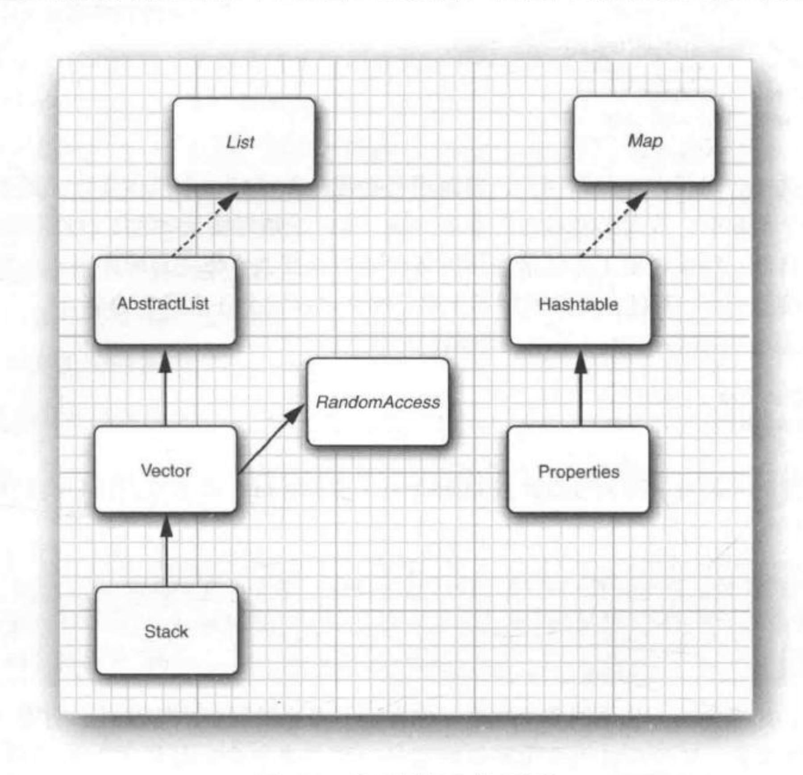

图 9-12 集合框架中的遗留类

#### 9.7.1 Hashtable 类

经典的 Hashtable 类与 HashMap 类的作用一样,实际上,接口也基本相同。类似 Vector 类的方法,Hashtable 方法也是同步的。如果不需要与遗留代码的兼容性,就应该使用 HashMap。如果需要并发访问,则要使用 Concurrent HashMap,参见第 12 章。

## 9.7.2 枚举

遗留的集合使用 Enumeration 接口遍历元素序列。Enumeration 接口有两个方法:hasMore-Elements 和 nextElement。这两个方法完全类似于 Iterator 接口的 hasNext 方法和 next 方法。

如果发现遗留的类实现了这个接口,可以使用 Collections. list 将元素收集到一个 ArrayList 中。例如, LogManager 类只想将登录者的名字提供为一个 Enumeration。可以如下得到所有登录者的名字:

ArrayList<String> loggerNames = Collections.list(LogManager.getLoggerNames());

或者, 在 Java 9 中, 可以把一个枚举转换为一个迭代器:

LogManager.getLoggerNames().asIterator().forEachRemaining(n -> { . . . });

有时还会遇到希望得到一个枚举参数的遗留方法。静态方法 Collections.enumeration 将生成一个枚举对象,它会枚举集合中的元素。例如:

List<InputStream> streams = . . .;
var in = new SequenceInputStream(Collections.enumeration(streams));
 // the SequenceInputStream constructor expects an enumeration

□ 注释:在 C++中,用迭代器作为参数十分普遍。幸好,在 Java 平台上,只有极少的程序员沿用这种习惯。传递集合要比传递迭代器更为明智。集合对象的用途更大。如果需要,接受者总能从集合获得迭代器,而且,还可以随时使用集合的所有方法。不过,你可能会在某些遗留代码中发现枚举,因为在 Java 1.2 的集合框架出现之前,这是唯一可以使用的泛型集合机制。

#### API java.util.Enumeration<E> 1.0

- boolean hasMoreElements()
   如果还有更多可以查看的元素,则返回 true。
- E nextElement()
   返回下一个要查看的元素。如果 hasMoreElements()返回 false,则不要调用这个方法。
- default Iterator<E> asIterator() 9
   生成一个迭代器,可以迭代处理枚举的元素。

## API java.util.Collections 1.2

- static <T> Enumeration<T> enumeration(Collection<T> c)
   返回一个枚举,可以枚举 c 的元素。
- public static <T> ArrayList<T> list(Enumeration<T> e)
   返回一个数组列表,其中包含 e 枚举的元素。

## 9.7.3 属性映射

属性映射 (property map) 是一个特殊类型的映射结构。它有下面 3 个特性:

- 键与值都是字符串。
- 这个映射可以很容易地保存到文件以及从文件加载。
- 有一个二级表存放默认值。

实现属性映射的 Java 平台类名为 Properties。属性映射对于指定程序的配置选项很有用。例如:

var settings = new Properties();
settings.setProperty("width", "600.0");
settings.setProperty("filename", "/home/cay/books/cj12/code/vlch09/raven.html");

可以使用 store 方法将属性映射列表保存到一个文件中。在这里,我们将属性映射保存在文件 program.properties 中。第二个参数是包含在这个文件中的一个注释。

var out = new FileWriter("program.properties", StandardCharsets.UTF\_8);
settings.store(out, "Program Properties");

这个示例会给出以下输出:

#Program Properties #Sun Dec 31 12:54:19 PST 2017 top=227.0 left=1286.0 width=423.0

height=547.0

filename=/home/cay/books/cj12/code/v1ch09/raven.html

要从文件加载属性,可以使用以下调用:

var in = new FileReader("program.properties", StandardCharsets.UTF\_8);
settings.load(in);

● 警告:如果使用 load 和 store 方法时提供了输入/输出流,则会使用古老的 ISO 8859-1 字符编码。>U+00FF 的字符会保存为 Unicode 转义字符。对于 UTF-8,要像以上代码一样使用读取器/书写器。

System.getProperties 方法会生成一个 Properties 对象来描述系统信息。例如,主目录包含键 "user.home"。可以用 getProperties 方法读取这个信息,它将这个键对应的信息作为一个字符串返回:

String userDir = System.getProperty("user.home");

警告: 出于历史原因, Properties 类实现了 Map<Object, Object>。因此, 可以使用 Map 接口的 get 和 put 方法。不过, get 方法返回类型为 Object, 而 put 方法允许插入任意的对象。所以最好坚持使用处理字符串而不是对象的 getProperty 和 setProperty 方法。

要得到虚拟机的 Java 版本,可以查找 "java.version" 属性。你会得到一个诸如 "17.0.1" 的字符串(不过, Java 8 之前的形式为 "1.8.0")。

☑ 提示: 可以看到, Java 9 中版本编号发生了变化。这个看起来很小的改变却让大量依赖于老版本格式的工具无法正常工作。如果要解析版本字符串,一定要好好看看 JEP 322 (http://openjdk.java.net/jeps/322), 了解将来(至少是版本编号机制再次改变之前)版本字符串会采用怎样的格式。

Properties 类有两种提供默认值的机制。第一种方法是,只要查找一个字符串的值,可以指定一个默认值,当查找的键不存在时就会自动使用这个默认值。

String filename = settings.getProperty("filename", "");

如果属性映射中有一个 "filename" 属性, filename 就会设置为相应的字符串。否则, filename 会设置为空串。

如果觉得在每个 getProperty 调用中指定默认值太麻烦,可以把所有默认值都放在一个二级属性映射中,并在主属性映射的构造器中提供这个二级映射。

```
var defaultSettings = new Properties();
defaultSettings.setProperty("width", "600");
defaultSettings.setProperty("height", "400");
defaultSettings.setProperty("filename", "");
...
var settings = new Properties(defaultSettings);
```

没错,如果为 defaultSettings 构造器提供另一个属性映射参数,甚至可以为默认值指定默认值,不过一般不会这么做。

本书随附代码提供了一个示例程序,展示了如何使用属性存储和加载程序状态。这个程序使用第 2 章的 ImageViewer 程序,可以记住帧窗口位置、大小和最后加载的文件。运行这个程序,加载一个文件,然后移动窗口和调整窗口大小。再关闭程序,然后重新打开,看它是否记住了你的文件和你喜欢的窗口配置。还可以手动编辑主目录中的 .corejava/ImageViewer.properties 文件。

属性是没有层次结构的简单表格。通常会用类似 window.main.color、window.main.title 等键名引入一个假想的层次结构。不过 Properties 类没有方法来帮助组织这样一个层次结构。如果要存储复杂的配置信息,就应该改为使用 Preferences 类,参见第 10 章的介绍。

## API java.util.Properties 1.0

- Properties()
   创建一个空的属性映射。
- Properties(Properties defaults)
   用一个默认值映射创建一个空的属性映射。
- String getProperty(String key)
   获得一个属性。返回与键(key)关联的字符串,或者如果这个键未在表中出现,则返回默认值表中与这个键关联的字符串,或者如果键在默认值表中也未出现,则返回 null。
- String getProperty(String key, String defaultValue)
   如果键未找到,获得一个有默认值的属性。返回与键关联的字符串,或者如果键在表中未出现,则返回默认字符串。
- Object setProperty(String key, String value)
   设置一个属性。返回给定键之前设置的值。
- Set<String> stringPropertyNames() 6
   返回所有键的一个集,包括默认映射中的键。
- void load(Reader in) throws IOException 6
   从一个读取器加载一个属性映射。
- void store(Writer out, String header) 6

将一个属性映射保存到一个书写器。header 是所存储文件的第一行。

### API java.lang.System 1.0

- Properties getProperties()
   获取所有系统属性。应用必须有权限获取所有属性,否则会抛出一个安全异常。
- String getProperty(String key)
   获取给定键名对应的系统属性。应用必须有权限获取这个属性,否则会抛出一个安全 异常。以下属性总是允许获取:

```
java.version
java.vendor
ava.vendor.url
ava.home
java.class.path
java.library.path
java.class.version
os.name
os.version
os.arch
file.separator
path.separator
line.separator
java.io.tempdir
user.name
user.home
user.dir
java.compiler
java.specification.version
java.specification.vendor
java.specification.name
java.vm.specification.version
java.vm.specification.vendor
java.vm.specification.name
java.vm.version
java.vm.vendor
java.vm.name
```

## 9.7.4 栈

从 1.0 版开始,标准类库中就包含了 Stack 类,其中有大家熟悉的 push 方法和 pop 方法。但是,Stack 类扩展了 Vector 类,从理论角度看,Vector 类并不太令人满意,对于 Vector,你甚至可以使用并非栈操作的 insert 和 remove 方法在任何位置插入和删除值,而不只是在栈顶。

## API java.util.Stack<E> 1.0

- E push(E item)将 item 压入栈并返回 item。
- E pop()弹出并返回栈顶的元素。如果栈为空,不要调用这个方法。
- E peek()

返回栈顶元素,但不弹出。如果栈为空,不要调用这个方法。

#### 9.7.5 位集

Java 平台的 BitSet 类会存储一个位序列(它不是数学意义上的集,如果称为位向量(bitvector)或位数组(bitarray)可能更为合适)。如果需要高效地存储一个位序列(例如,标志),就可以使用位集。由于位集将位包装在字节里,因此使用位集要比使用 Boolean 对象的 ArrayList 高效得多。

BitSet 类提供了一个用于读取、设置或重置各个位的很方便的接口。使用这个接口可以避免掩码和其他调整位的操作,如果将位存储在 int 或 long 变量中就必须做这些烦琐的操作。

例如,对于一个名为 bucketOfBits 的 BitSet,

bucketOfBits.get(i)

如果第 i 位处于"开"状态,就返回 true;否则返回 false。类似地,

bucketOfBits.set(i)

将第 i 位置为 "开"。最后,

bucketOfBits.clear(i)

将第 i 位置为"关"。

C++ 注释: C++ 中的 bitset 模板与 Java 平台中的 BitSet 功能相同。

## API java.util.BitSet 1.0

- BitSet(int initialCapacity)
   构造一个位集。
- int cardinality() 1.4
   返回设置的位数,或者,如果认为是一个整数集,则返回元素个数。
- int length() 1.2
   返回位集的"逻辑长度"(即1加上位集的最高位索引),这对于迭代处理元素很有用。
- int size() 返回内部数据结构中当前可用的位数,而不是集合元素数。
- boolean get(int bit)获得一个位。
- void set(int bit)设置一个位。
- void clear(int bit)清除一个位。
- void and(BitSet set)
   这个位集与另一个位集进行逻辑"与"。
- void or(BitSet set)

这个位集与另一个位集进行逻辑"或"。

- void xor(BitSet set) 这个位集与另一个位集进行逻辑"异或"。
- void andNot(BitSet set)
   对应另一个位集中设置为 1 的所有位,清除这个位集中相应的位。
- IntStream stream() 8
   对于已设置的位,生成这些位索引值的一个流,或者如果认为是一个整数集,则生成相应元素的一个流。

作为位集应用的一个示例,这里给出一个"埃拉托色尼筛选法"算法的实现,这个算法 用来查找素数(素数是指只能被1和本身整除的数,例如2、3或5,"埃拉托色尼筛选法" 是最早发现的用来枚举这些基本素数的方法之一)。这并不是查找素数的一种非常好的方法, 但是由于某些原因,它已经成为测试编译器性能的一种流行的基准(这也不是一个很好的测试基准,因为它主要用于测试位操作)。

在此,我们要向传统致敬,给出这个算法的一个实现。这个程序将计算 2 ~ 2 000 000 之间的所有素数(一共有 148 933 个素数,所以你可能不希望把它们全部打印出来)。

这里并不想深入程序的细节,关键是要遍历一个包含 200 万个位的位集。首先将所有的位"打开",然后将已知素数的倍数所对应的位都置为"关"。经过这个操作后保留下来的位对应的就是素数。程序清单 9-8 是用 Java 程序设计语言实现的程序,程序清单 9-9 是用 C++ 实现的代码。

- □ 注释:尽管这个筛选法并不是一种好的测试基准,不过我还是利用它测试了这个算法两个实现的运行时间。下面是在 Intel i5-8265U 处理器和 16GB 内存(运行 Ubuntu 20.04)条件下的运行时间结果:
  - C++ (g++ 9.3.0): 115 毫秒
  - Java (Java 17): 31 毫秒

我们已经对《Java 核心技术》的 11 个版本进行了这项测试,在最近的 7 个版本中, Java 轻松地战胜了 C++。公平地说,如果提高 C++ 编译器的优化级别,会比 Java 快 14 毫秒。只有当程序运行的时间长到触发 Hotspot 即时编译器时, Java 才能与之相当。

## 程序清单 9-8 sieve/Sieve.java

```
package sieve;\nimport java.util.*;

/**

* This program runs the Sieve of Erathostenes benchmark. It computes all primes

* up to 2,000,000.

* @version 1.22 2021-06-17

* @author Cay Horstmann

*/
```

```
public class Sieve
12 {
      public static void main(String[] s)
13
14
         int n = 2000000;
15
         long start = System.currentTimeMillis();
16
         var bitSet = new BitSet(n + 1);
17
         int i;
18
         for (i = 2; i <= n; i++)
19
            bitSet.set(i);
28
         i = 2;
21
         while (i * i \le n)
22
23
            if (bitSet.get(i))
24
25
               int k = i * i;
26
               while (k <= n)
27
28
                   bitSet.clear(k);
29
                   k += i;
38
31
32
            i++;
33
34
         long end = System.currentTimeMillis();
35
         System.out.println(bitSet.cardinality() + " primes");
36
         System.out.println((end - start) + " milliseconds");
37
38
39 }
```

## 程序清单 9-9 sieve/Sieve.cpp

```
1 /**
   * @version 1.22 2021-06-17
    * @author Cay Horstmann
  #include <bitset>
   #include <iostream>
   #include <ctime>
   using namespace std;
11
   int main()
13
      const int N = 2000000;
14
      clock_t cstart = clock();
15
16
      bitset<N + 1> b;
17
      int i;
18
      for (i = 2; i \le N; i++)
19
         b.set(i);
20
      i = 2;
21
      while (i * i \le N)
22
23
```

```
if (b.test(i))
24
25
            int k = i * i;
26
            while (k <= N)
27
28
                b.reset(k);
29
                k += i;
31
32
         1++;
33
34
35
      clock t cend = clock();
36
      double millis = 1000.0 * (cend - cstart) / CLOCKS PER SEC;
38
      cout << b.count() << " primes\n" << millis << " milliseconds\n";</pre>
39
      return θ;
42 }
```

到此为止, Java 集合框架的旅程就结束了。正如你所看到的, Java 类库提供了大量集合类以适应程序设计的需要。在下一章中, 我们要学习如何编写图形用户界面。

# 第 10章 图形用户界面程序设计

- A Java 用户界面工具包简史 事件处理
- 在组件中显示信息

- A 显示窗体 首选项 API

Java 诞生时. 大多数计算机用户都在使用有图形化用户界面(GUI)的桌面应用口 如今, 基于浏览器的应用以及移动应用则要常见得多,不过, 有些时候还是有必要提供一个桌面应 用。另外,很多老师和学生都很喜欢通过 GUI 应用来学习 Java <sup>o</sup> 在本章和下一章中,我们将 讨论使用 Swing 工具包实现用户界面编程的基础知识口 或者,如果你对编写 GUI 程序不感兴 趣,那么完全可以跳过这两章.

# 10.1 Java 用户界面工具包简史

在 Java L0 刚刚出现的时候,它包含了一个用于基本 GUI 程序设计的类库,名为抽象窗 口工具包(Abstract Window Toolkit, AWT)。基本 AWT 库将处理用户界面元素的任务委托 给各个目标平台(Windows、Solaris. Macin2sh 等)上的原生 GUI 工具包,由原生 GU[工具 包负责用户界面元素的创建和行为。例如,如果使用最初的 AWT 在 Java 窗口中放置一个文 本框,就会有一个底层的"对等"文本框具体处理文本输人口 从理论上说,所得到的程序可 以运行在任何平台上,而且有目标平台的观感(look and 命el,

对于简单的应用,这种基于"对等元素"的方法是可行的台 但是,要想依赖于原生用户 界面元素编写高质量,可移植的图形库,显然极其困难。例如,在不同的平台上,菜单 <sup>1</sup> <sup>滚</sup> 动条和文本域这些用户界面元素的行为存在着一些微妙的差别。因此,要想利用这种方法为 用户提供一致的、可预见性的体验是相当困难的。而且,有些图形环境(如 Xll/Motif)并 没有像 Windows 或 Macintosh 那样提供丰富的用户界面组件集合。这就进一步限制了基于 "最小公分母"方法实现的可移植库。因此,使用 AWT 构建的 GUI 应用看起来没有原生的 Wind5Vs 或 Macintosh 应用那么漂亮,也没有提供那些平台用户所期望的功能:更加糟糕的 是,不同平台上的 AWT 用户界面库中存在着不同的 bug。开发人员总是抱怨必须在每一个 平台上测试他们的应用, 因此人们嘲弄地把这种做法称为"一次编写,到处调试工

1996 年,Netscape 创建了一种称为 IFC( Internet Foundation Class)的 GUI 库. 它采用 了与 AWT 完全不同的工作方式。它将按钮、菜单等用户界面元素绘制在空白窗口上。底层 窗口系统所需的唯一功能就是能够显示一个窗口,并在这个窗口中绘制口 因此,不论程序在 哪个平台上运行. Netscape 的 1FC 部件都有着相同的外观和行为。Sun 公司与 Netscape 合作 完善了这种方法,创建了一个名为"Swing"的用户界面库。Swing 最初作为 Java 1.1 的一个扩展,现已成为 Java 1.2 标准库的一部分。

Swing 现在是不基于对等元素的 GUI 工具包的官方名字。

注释: Swing 不是完全替代 AWT, 而是构建在 AWT 架构之上。Swing 只是提供了更加强大的用户界面组件。编写 Swing 程序时,还是在使用 AWT 的基本机制,特别是事件处理。从现在开始,我们谈到 Swing 时是指"绘制的"用户界面类;而谈到"AWT"时是指窗口工具包的底层机制,如事件处理。

Swing 必须努力绘制用户界面的每一个像素。Swing 最早发布时,用户曾抱怨它的速度太慢了。(如果你在一个类似 Raspberry Pi 的硬件上运行 Swing 应用,仍然能感受到这个问题)。后来,桌面计算机变得越来越快,用户又开始抱怨 Swing 太丑了,确实,与带动画和华丽效果的原生部件相比,Swing 很落后。对 Swing 更不利的是,人们越来越多地使用Adobe Flash 来创建效果更酷炫的用户界面,甚至根本不使用任何原生控件。

2007年,Sun Microsystems 引入了一种完全不同的用户界面工具包,名为 JavaFX,希望与 Flash 竞争。JavaFX 在 Java 虚拟机上运行,不过有自己的编程语言,名为 JavaFX 脚本语言。这种语言专门为实现动画和华丽效果做了优化。这一回,程序员又开始抱怨还得学习一种新语言,所以他们并不愿意使用这个工具包。到了 2011年,Oracle 发布了一个新版本,JavaFX 2.0,它提供了一个 Java API,不再需要一种单独的编程语言了。从 Java 7 update 6 开始,JavaFX 已经与 JDK 和 JRE 一起打包。不过,写作本书时,Oracle 宣布从 Java 11 开始,JavaFX 将不再打包到 Java 中。

由于本书介绍的是核心 Java 语言和 API, 所以我们将重点讨论使用 Swing 实现用户界面编程。

## 10.2 显示窗体

在 Java 中, 顶层窗口(就是没有包含在其他窗口中的窗口) 称为窗体(frame)。AWT 库中有一个名为 Frame 的类, 用于描述这个顶层窗口。这个类的 Swing 版本名为 JFrame, 它扩展了 Frame 类。JFrame 是极少数几个不在画布上绘制的 Swing 组件之一。因此,它的修饰部件(按钮、标题栏、图标等)由用户的窗口系统绘制,而不是由 Swing 绘制。

● 警告: 绝大多数 Swing 组件类都以"J"开头,例如,JButton、JFrame等。在 Java 中也有 Button和 Frame 这样的类,但它们属于 AWT 组件。如果不小心忘记加上"J",程序仍然可以编译和运行,但是将 Swing和 AWT 组件混合在一起使用将会导致视觉和行为的不一致。

## 10.2.1 创建窗体

在本节中,我们将介绍使用 Swing JFrame 的最常见的方法。程序清单 10-1 给出了在屏幕

中显示一个空窗体的简单程序,如图 10-1 所示。

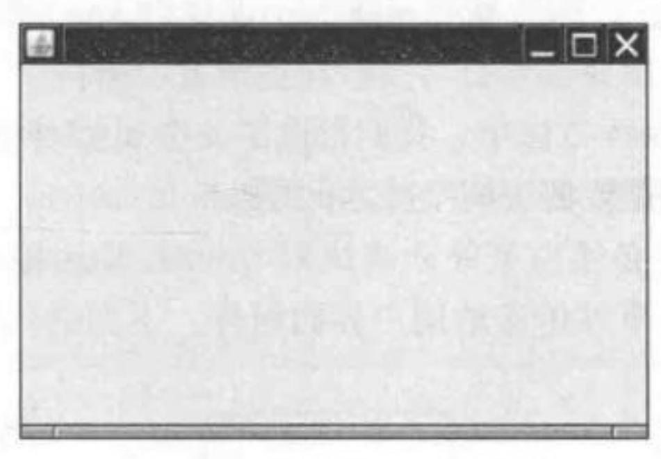

图 10-1 最简单的可见窗体

## 程序清单 10-1 simpleFrame/SimpleFrameTest.java

```
package simpleFrame;
   import java.awt.*;
   import javax.swing.*;
    * @version 1.34 2018-04-10
    * @author Cay Horstmann
   public class SimpleFrameTest
11
      public static void main(String[] args)
12
13
         EventQueue.invokeLater(() ->
14
15
               var frame = new SimpleFrame();
16
               frame.setDefaultCloseOperation(JFrame.EXIT ON CLOSE);
17
               frame.setVisible(true);
18
            });
19
28
21
22
   class SimpleFrame extends JFrame
24
      private static final int DEFAULT WIDTH = 300;
25
      private static final int DEFAULT HEIGHT = 200;
26
27
      public SimpleFrame()
28
29
         setSize(DEFAULT_WIDTH, DEFAULT_HEIGHT);
36
31
32 }
```

下面来逐行分析这个程序。

Swing 类位于 javax.swing 包中。包名 javax 表示这是一个 Java 扩展包,而不是核心包。出于历史原因 Swing 被认为是一个扩展。不过从 1.2 版本开始,每个 Java 实现中都包含这些类。

在默认情况下. 窗体的大小为 0X0像素,这样的窗体没有什么实际意义。这里我们定 义了一个子类 Si呷1所3%,它的构造器将窗体大小设置为 300x200 像素。这是 Si呷1M「日账 和 JFrame 之间唯一的差别.

在 Si呷1叶2能在5t 类的 main 方法中, 我们构造了一个 5impleFrmme 对象并使它可见心

在每个 Swing 程序中,需要解决两个技术问题凸

首先,所有 Swing 组件必须由事件分派线程 ( event dispatch thread) 配置,这是控制线 程,它将鼠标点击和按键等事件传递给用户界面组件。下面的代码段用来在事件分派线程中 执行语句:

```
Eventflueue,invokeLater( { }
                             *
   {
      statements
   Dr
```

直 注释:你会看到,很多 Swing 程序并没有在事件分派线程中初始化用户 界面,原先 完全可以接受在主线程中完成初始化。遗憾的是,随着 Swing 组件变得越来越复杂, JDK 开发人员无法保证这种才法的安全性口 <sup>虽</sup> 然发生错误的概率非常小,但任何人都 不愿意成为遭遇这种间歇性问题的少数倒霉蛋之一口 最好采用正确的做法,即使代码 看起来有些神秘。

接下来,定义用户关闭这个窗体时会发生什么。对于这个程序而言,我们只是让程序简 单地退出口 要选择这个行为,可以使用以下语句:

fraHie.setOefaultCloseOperation(JFrame.EXIT\_ON\_CLOSE);

在包含多个窗体的其他程序中,你肯定不希望用户关闭其中一个窗体时程序就退出。在 默认情况下,用户关闭窗体时只是将窗体隐藏起来,而程序并没有终止 (一旦最后一个窗体 不可见,程序才终止,这样处理比较合适,但 Swing 并不是这样工作的)。

如果只是构造窗体,并不会自动显示这个窗体口 窗体起初是不可见的. 这就给了程序员 一个机会, 可以在窗体第一次显示之前向其中添加组件。为了显示窗体,main 方法需要调用 窗体的 5etVi5ible 方法。

完成了初始化语句后,mai口方法退出口 需要注意,退出哈in 并没有终止程序<sup>f</sup> 终止的只 是主线程已 事件分派线程会保持程序处于激活状态,直到通过关闭窗体或调用 System.exit 方 法终止程序。

图 10-1 中址示的是运行程序清单 10-1 的结果,它只是一个很乏味的顶层窗口口 在这个 图中可以看到,标题栏和外框装饰 (比如,重置窗口大小的拐角) 都是由操作系统绘制的, 而不是 Swing 库口 Swing 库负责绘制窗体内的所有内容。在这个程序中、它只是用一个默认 的背景色填充了窗体口

# 1022 窗体属性

JFq映类本身只包含若干个改变窗体外观的方法。当然,利用继承的魔力,大多数处理

窗体大小和位置的方法都来自 甘「日肥 的各个超类. 其中最重要的有以下方法:

- **• setLocation** 方法和 **setBounds** 方法用于设置窗体的位置。
- **• setro**m**nage** 方法用于告诉窗口系统在标题栏、任务切换窗口等位置显示哪个图标
- **• setTitle** 方法用于改变标题栏的文字口
- **• setResizable** 接受一个 **boolean** 值来确定是否允许用户改变窗体的大小口

图 **10-2** 给出了」F「dme 类的继承层次结构,

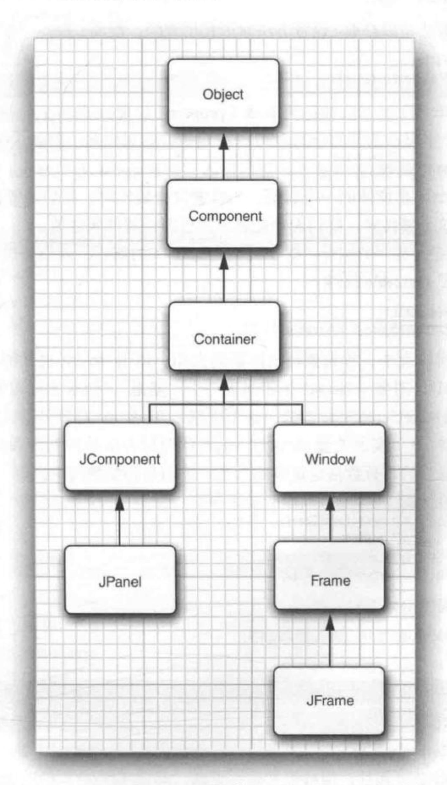

图 10-2 AWT 和 Swing 中窗体和组件类的继承层次结构

正像 **API** 注解中所示,需要在 **Component** 类(是所有 **GUI** 对象的祖先)和 **Window** 类( **Frame**

类的超类)中寻找调整窗体大小和改变窗体形状的方法。例如, Component 类中的 setLocation 方法是一个重新指定组件位置的方法。如果调用

setLocation(x, y)

则窗口左上角位于水平向右 x 像素,垂直向下 y 像素的位置,坐标 (0,0)是屏幕的左上角位置。类似地,Component 中的 setBounds 方法可以一步同时调整组件 (特别是 JFrame)的大小和位置,例如:

setBounds(x, y, width, height)

组件类的很多方法是以获取/设置方法对形式出现的,例如,Frame类的以下方法:

public String getTitle()
public void setTitle(String title)

这样的一对获取/设置方法被称为属性 (property)。属性有一个名和一个类型。将 get 或 set 之后的第一个字母改为小写字母就可以得到相应的属性名。例如,Frame 类有一个名为 title 且类型为 String 的属性。

从概念上讲, title 是窗体的一个属性。当设置这个属性时,我们希望用户屏幕上的标题能够改变。当获取这个属性时,我们希望能够返回已经设置的属性值。

关于 get/set 约定,有一个例外:对于类型为 boolean 的属性,获取方法以 is 开头。例如,下面两个方法定义了 resizable 属性:

public boolean isResizable()
public void setResizable(boolean resizable)

要确定适当的窗体大小,首先要得出屏幕的大小。调用 Toolkit 类的静态方法 getDefault-Toolkit 得到一个 Toolkit 对象(Toolkit 类相当于一个"基地",包含大量与原生窗口系统交互的方法)。然后,调用 getScreenSize 方法,这个方法以 Dimension 对象的形式返回屏幕的大小。Dimension 对象用公共(!)实例变量 width 和 height 同时保存屏幕的宽度和高度。然后可以使用屏幕大小的一个适当的百分数指定窗体的大小。下面是相关的代码:

Toolkit kit = Toolkit.getDefaultToolkit();
Dimension screenSize = kit.getScreenSize();\nint screenWidth = screenSize.width;\nint screenHeight = screenSize.height;
setSize(screenWidth / 2, screenHeight / 2);

另外,还可以提供窗体图标:

Image img = new ImageIcon("icon.gif").getImage();
setIconImage(img);

## API java.awt.Component 1.0

- boolean isVisible()
- void setVisible(boolean b)
   获取或设置 visible 属性。组件最初是可见的,但顶层组件(如 JFrame)例外。
- void setSize(int width, int height) 1.1 将组件大小调整为给定的宽度和高度。

- void setLocation(int x, int y) 1.1
   将组件移到一个新的位置。如果这个组件不是顶层组件, x 和 y 坐标使用容器的坐标;
   否则如果组件是顶层组件(例如: JFrame), x 和 y 坐标就使用屏幕坐标。
- void setBounds(int x, int y, int width, int height) 1.1
   移动并调整组件的大小。
- Dimension getSize() 1.1
- void setSize(Dimension d) 1.1
   获取或设置当前组件的 size 属性。

#### API java.awt.Window 1.0

- boolean isLocationByPlatform() 5
- void setLocationByPlatform(boolean b) 5
   获取或设置 locationByPlatform 属性。在窗口显示之前设置这个属性时,将由平台选择一个合适的位置。

#### API java.awt.Frame 1.0

- boolean isResizable()
- void setResizable(boolean b)
   获取或设置 resizable 属性。设置了这个属性时,用户可以调整窗体的大小。
- String getTitle()
- void setTitle(String s)
   获取或设置 title 属性,这个属性确定窗体标题栏中的文字。
- Image getIconImage()
- void setIconImage(Image image)
   获取或设置 iconImage 属性,这个属性确定窗体的图标。窗口系统可能会显示图标作为窗体装饰的一部分,或者显示在其他位置。

#### API java.awt.Toolkit 1.0

- static Toolkit getDefaultToolkit()
   返回默认的工具箱。
- Dimension getScreenSize() 返回用户屏幕的大小。

## API javax.swing.ImageIcon 1.2

- ImageIcon(String filename)
   构造一个图标,其图像存储在一个文件中。
- Image getImage()
   获得该图标的图像。

#### 448

## 10.3 在组件中显示信息

本节将介绍如何在窗体中显示信息(如图 10-3 所示)。

可以将消息字符串直接绘制在窗体中,但这并不是一种好的编程习惯。在 Java 中,窗体实际上设计为组件的容器,如菜单栏和其他用户界面元素。在通常情况下,应该在添加到窗体的另一个组件上绘制信息。


图 10-3 显示信息的窗体

JFrame 的结构相当复杂。图 10-4 中显示了 JFrame 的组成 可以看到 在 JFrame 中有四层窗格 其中的相窗

的组成。可以看到,在 JFrame 中有四层窗格。其中的根窗格、层级窗格和玻璃窗格我们不太感兴趣;它们要用来组织菜单栏和内容窗格以及实现观感。Swing 程序员最关心的是内容窗格(content pane)。添加到窗体的所有组件都会自动放在内容窗格中:

Component c = . . .;frame.add(c); // added to the content pane

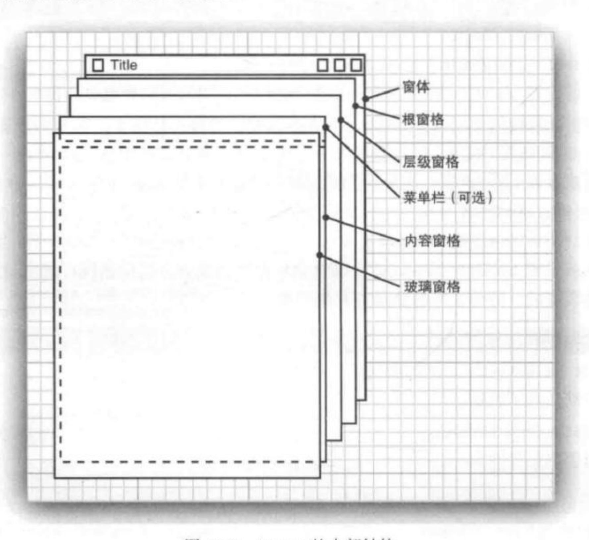

图 10-4 JFrame 的内部结构

在这里,我们打算将一个组件添加到窗体中,并在这个组件上绘制消息。要在一个组件上进行绘制,需要定义一个扩展 JComponent 的类,并覆盖其中的 paintComponent 方法。

paintComponent 方法有一个 Graphics 类型的参数, Graphics 对象保存着用于绘制图像和文本的一组设置,例如,你设置的字体或当前的颜色。在 Java 中,所有的绘制都必须通过 Graphics 对象完成,其中包含了绘制图案、图像和文本的方法。

可以如下创建一个能够进行绘制的组件:

```
class MyComponent extends JComponent
{
   public void paintComponent(Graphics g)
   {
      code for drawing
   }
}
```

无论何种原因,每次窗口需要重新绘制时,事件处理器就会通知组件,从而引发执行所有组件的 paintComponent 方法。

绝对不要自己调用 paintComponent 方法。只要应用的某个部分需要重新绘制,就会自动调用这个方法,不要人为干预这个自动的过程。

哪些动作会触发这个自动响应呢?例如,用户扩大窗口时,或者极小化窗口后又恢复窗口的大小时,就会引发绘制。如果用户弹出了另外一个窗口,并且这个窗口覆盖了一个已有的窗口,然后让这个上层窗口消失,此时被覆盖的那个窗口已被破坏,需要重新绘制(图形系统不保存下层的像素)。当然,窗口第一次显示时,需要处理一些代码,指定如何绘制以及在哪里绘制初始的元素。

● 提示:如果需要强制重新绘制屏幕,需要调用 repaint 方法而不是 paint Component 方法。repaint 方法将引发采用适当配置的 Graphics 对象调用所有组件的 paint Component 方法。

从以上代码片段可以看到, paintComponent 方法只有一个 Graphics 类型的参数。对于屏幕显示来说, Graphics 对象的度量单位是像素。坐标 (0, 0) 指示所绘制组件的左上角(我们要在这个组件的表面绘制)。

Graphics 类有很多绘制方法,显示文本被认为是一种特殊的绘制。我们的 paintComponent 方法如下所示:

```
public class NotHelloWorldComponent extends JComponent
{
   public static final int MESSAGE_X = 75;
   public static final int MESSAGE_Y = 100;

   public void paintComponent(Graphics g)
   {
      g.drawString("Not a Hello, World program", MESSAGE_X, MESSAGE_Y);
   }
}
```

最后,组件要告诉用户它会有多大。覆盖 getPreferredSize 方法,返回一个包含首选宽度和高度的 Dimension 类对象:

```
public class NotHelloWorldComponent extends JComponent
{
   private static final int DEFAULT_WIDTH = 300;
   private static final int DEFAULT_HEIGHT = 200;
   public Dimension getPreferredSize()
   {
      return new Dimension(DEFAULT_WIDTH, DEFAULT_HEIGHT);
   }
}
```

在窗体中填入一个或多个组件时,如果你只想使用它们的首选大小,可以调用 pack 方法而不是 setSize 方法:

```
class NotHelloWorldFrame extends JFrame
{
   public NotHelloWorldFrame()
   {
     add(new NotHelloWorldComponent());
     pack();
   }
}
```

程序清单 10-2 给出了完整的代码。

#### 程序清单 10-2 notHelloWorld/NotHelloWorld.java

```
package notHelloWorld;
3 import javax.swing.*;
 4 import java.awt.*;
    * @version 1.34 2018-04-10
    * @author Cay Horstmann
    */
10 public class NotHelloWorld
11 {
      public static void main(String[] args)
12
13
         EventQueue.invokeLater(() ->
14
               var frame = new NotHelloWorldFrame();
16
               frame.setTitle("NotHelloWorld");
17
               frame.setDefaultCloseOperation(JFrame.EXIT ON CLOSE);
               frame.setVisible(true);
19
            });
20
21
22
23
24
    * A frame that contains a message panel.
27 class NotHelloWorldFrame extends JFrame
28 {
```

```
public NotHelloWorldFrame()
29
30
         add(new NotHelloWorldComponent());
31
         pack();
32
33
34
35
36
    * A component that displays a message.
37
38
   class NotHelloWorldComponent extends JComponent
39
40
      public static final int MESSAGE X = 75;
41
      public static final int MESSAGE Y = 100;
42
43
      private static final int DEFAULT_WIDTH = 300;
44
      private static final int DEFAULT_HEIGHT = 200;
45
46
      public void paintComponent(Graphics g)
47
48
         g.drawString("Not a Hello, World program", MESSAGE X, MESSAGE Y);
49
50
51
      public Dimension getPreferredSize()
52
53
         return new Dimension(DEFAULT WIDTH, DEFAULT HEIGHT);
54
55
56
```

#### API javax.swing.JFrame 1.2

Component add(Component c)
 将一个给定的组件添加到该窗体的内容窗格中,并返回这个组件。

## API java.awt.Component 1.0

- void repaint() 导致"尽可能快地"重新绘制组件。
- Dimension getPreferredSize()
   覆盖这个方法来返回这个组件的首选大小。

## API javax.swing.JComponent 1.2

void paintComponent(Graphics g)
 覆盖这个方法来描述需要如何绘制组件。

## API java.awt.Window 1.0

• void pack() 调整窗口大小,要考虑其组件的首选大小。

#### 10.3.1 处理 2D 图形

从 Java 版本 1.0 以来, Graphics 类就包含绘制直线、矩形和椭圆等方法。但是,这些绘制图形的操作非常有限。我们将使用 Java 2D 库的图形类。

要想使用 Java 2D 库绘制图形,需要获得 Graphics2D 类的一个对象。这个类是 Graphics 类的子类。自从 Java 1.2 版本以来, paintComponent 等方法会自动地接收一个 Graphics2D 类对象。只需要使用一个类型强制转换,如下所示:

```
public void paintComponent(Graphics g)
{
    Graphics2D g2 = (Graphics2D) g;
    . . .
}
```

Java 2D 库采用面向对象方式组织几何图形。具体来说,它提供了表示直线、矩形和椭圆的类:

Line2D Rectangle2D Ellipse2D

这些类都实现了 Shape 接口。Java 2D 库支持更加复杂的图形,例如圆弧、二次曲线、三次曲线和通用路径(本章不讨论这些内容)。

要想绘制一个图形,首先要创建一个实现了 Shape 接口的类的对象,然后调用 Graphics2D 类的 draw 方法。例如:

```
Rectangle2D rect = . . .;
g2.draw(rect);
```

Java 2D 库针对像素采用的是浮点数坐标,而不是整数坐标。内部计算采用单精度 float 来完成。单精度就足够了,毕竟,几何计算的最终目的是要在屏幕或打印机上设置像素。只要舍入误差限制在一个像素的范围内,视觉效果就不会受到影响。

不过,对程序员来说,有时候处理 float 并不太方便,这是因为 Java 将 double 值转换成 float 值时必须进行强制类型转换。例如,考虑以下语句:

float f = 1.2; // ERROR--possible loss of precision

这条语句无法通过编译,因为常量 1.2 为 double 类型,而编译器不允许损失精度。解决方法是给浮点数常量添加一个后缀 F:

float f = 1.2F; // OK

现在,来看下面这条语句:

float f = r.getWidth(); // ERROR

这条语句也无法通过编译,其原因与前面一样。getWidth 方法的返回类型是 double。这一次的补救办法是提供一个强制类型转换:

```
float f = (float) r.getWidth(); // OK
```

加后缀和强制类型转换都有点麻烦,所以 2D 库的设计者决定为每个图形类提供两个版本:一个是为那些想节省空间的程序员提供的版本,要使用 float 类型的坐标;另一个是为那些懒惰的程序员提供的版本,会使用 double 类型的坐标(本书采用的是第二个版本,即尽可能使用 double 类型的坐标)。

这个库的设计者采用了一种古怪的机制对这些选择进行打包。请考虑 Rectangle2D 类, 这是一个抽象类, 有两个具体子类, 这两个具体子类也是静态内部类:

Rectangle2D.Float Rectangle2D.Double

图 10-5 显示了它们的继承图。

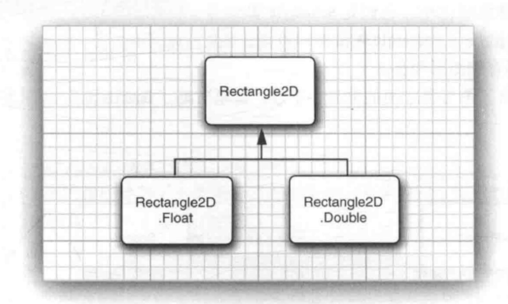

图 10-5 2D 矩形类

最好先不要考虑这两个具体类是静态内部类的事实,这个技巧只是为了避免使用类似 FloatRectangle2D 和 DoubleRectangle2D 的名字。

当构造一个 Rectangle2D. Float 对象时,要为坐标提供 float 数。而构造 Rectangle2D. Double 对象时,应该提供 double 数。

var floatRect = new Rectangle2D.Float(10.0F, 25.0F, 22.5F, 20.0F);
var doubleRect = new Rectangle2D.Double(10.0, 25.0, 22.5, 20.0);

构造参数表示矩形的左上角位置以及矩形的宽和高。

Rectangle2D 方法的参数和返回值均使用 double 类型。例如,尽管 Rectangle2D.Float 对象将宽度存储为一个 float 值,但 getWidth 方法会返回一个 double 值。

☑ 提示: 直接使用 Double 图形类完全避免处理 float 类型的值。不过如果需要构造上千个图形对象,为节省存储空间,可以考虑使用 Float 类。

前面对 Rectangle2D 类的讨论也适用于其他图形类。另外,Point2D 类也有两个子类 Point2D. Float 和 Point2D. Double。可以如下构造一个点对象:

var p = new Point2D.Double(10, 20);

Rectangle2D 和 Ellipse2D 类都继承公共的超类 RectangularShape。无可否认,椭圆不是矩形,但椭圆有一个外接矩形 (bounding rectangle),如图 10-6 所示。

RectangularShape 类定义了这些图形公共的 20 多个方法,其中很有用的一些方法包括 getWidth、getHeight、getCenterX、getCenterY(不过很遗憾,在写作本书时,还没有一个返回中心位置(作为一个 Point2D 对象)的 getCenter 方法)。

最后,从Java 1.0 遗留下来的两个类也被放置在图形类的继承层次中。它们是 Rectangle 和 Point 类,分别扩展了 Rectangle 2D 和 Point 2D 类,它们用整型坐标存储矩形和点。

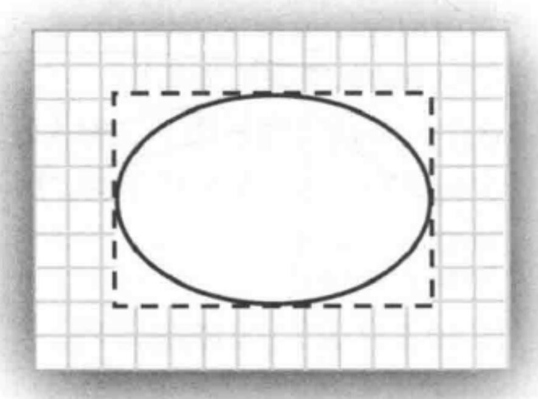

图 10-6 椭圆的外接矩形

图 10-7 给出了图形类之间的关系。不过,这里省略了 Double 和 Float 子类。图中的遗留 类用灰色填充。

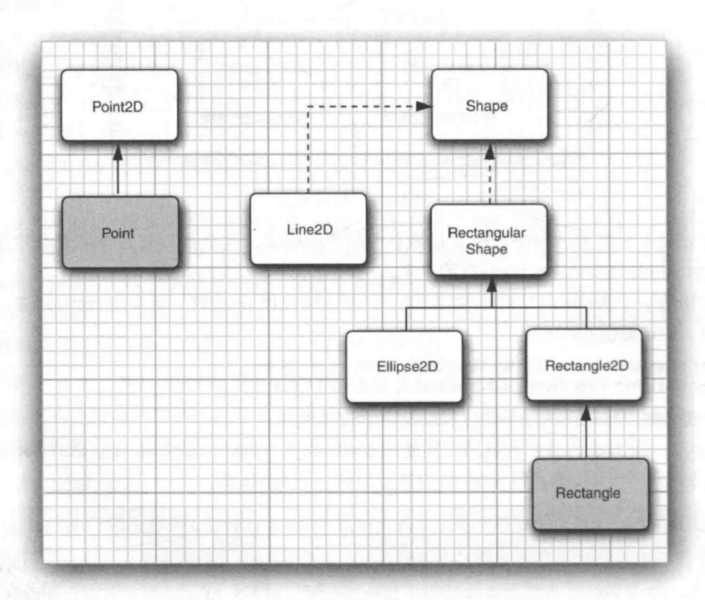

图 10-7 图形类之间的关系

Rectangle2D 和 Ellipse2D 对象很容易构造。需要指定

- 左上角的 x 和 y 坐标;
- 宽和高。

对于椭圆,这些表示外接矩形的属性。例如,

var e = new Ellipse2D.Double(150, 200, 100, 50);

这会构造一个椭圆,它的外接矩形左上角位于(150,200)、宽为100、高为50。

构造椭圆时,通常知道椭圆的中心、宽和高,而不是外接矩形的四角顶点(这些顶点甚至不在椭圆上)。setFrameFromCenter方法使用中心点,但仍然需要给出四个顶点中的一个。因此,通常采用以下方式构造椭圆:

var ellipse =
 new Ellipse2D.Double(centerX - width / 2, centerY - height / 2, width, height);

要想构造一条直线,需要提供起点和终点。这两个点既可以使用 Point2D 对象表示,也可以表示为一对数值:

var line = new Line2D.Double(start, end);

#### 或者

var line = new Line2D.Double(startX, startY, endX, endY);

程序清单 10-3 中的程序绘制了一个矩形、这个矩形的内接椭圆、矩形的一条对角线以及以矩形中心为圆点的圆。图 10-8 显示了结果。

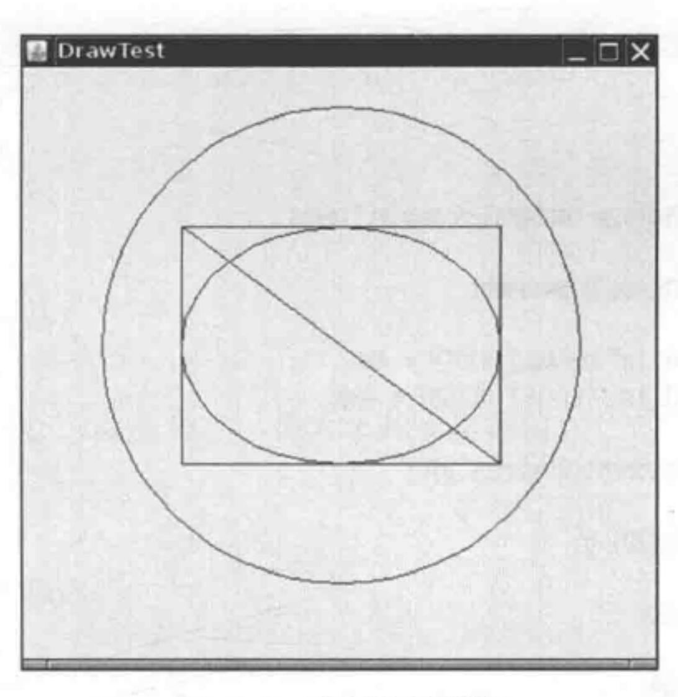

图 10-8 绘制几何图形

## 程序清单 10-3 draw/DrawTest.java

- 1 package draw;
- 3 import java.awt.\*;
- 4 import java.awt.geom.\*;
- 5 import javax.swing.\*;

```
456
```

```
7
    * @version 1.34 2018-04-10
    * @author Cay Horstmann
   public class DrawTest
12
      public static void main(String[] args)
13
14
         EventQueue.invokeLater(() ->
15
16
                var frame = new DrawFrame();
17
                frame.setTitle("DrawTest");
18
                frame.setDefaultCloseOperation(JFrame.EXIT_ON_CLOSE);
19
               frame.setVisible(true);
28
21
23
24
25
    * A frame that contains a panel with drawings.
27
   class DrawFrame extends JFrame
29
      public DrawFrame()
30
31
         add(new DrawComponent());
32
         pack();
33
34
35
36
37
    * A component that displays rectangles and ellipses.
   class DrawComponent extends JComponent
41 {
      private static final int DEFAULT_WIDTH = 400;
42
      private static final int DEFAULT_HEIGHT = 400;
43
44
      public void paintComponent(Graphics g)
45
46
         var g2 = (Graphics2D) g;
47
         // draw a rectangle
49
5θ
         double leftX = 100;
51
         double topY = 100;
52
         double width = 200;
53
         double height = 150;
54
55
         var rect = new Rectangle2D.Double(leftX, topY, width, height);
56
         g2.draw(rect);
57
58
         // draw the enclosed ellipse
59
```

```
60
         var ellipse = new Ellipse2D.Double();
61
         ellipse.setFrame(rect);
62
         g2.draw(ellipse);
63
64
         // draw a diagonal line
65
66
         g2.draw(new Line2D.Double(leftX, topY, leftX + width, topY + height));
67
68
         // draw a circle with the same center
69
70
         double centerX = rect.getCenterX();
71
         double centerY = rect.getCenterY();
72
         double radius = 150;
73
74
         var circle = new Ellipse2D.Double();
75
         circle.setFrameFromCenter(centerX, centerY, centerX + radius, centerY + radius);
76
         g2.draw(circle);
77
78
79
      public Dimension getPreferredSize()
80
81
         return new Dimension(DEFAULT WIDTH, DEFAULT HEIGHT);
82
83
84 }
```

#### API java.awt.geom.RectangularShape 1.2

- double getCenterX()
- double getCenterY()
- double getMinX()
- double getMinY()
- double getMaxX()
- double getMaxY()
   返回闭合矩形的中心,以及最小、最大x和y坐标值。
- double getWidth()
- double getHeight()返回闭合矩形的宽和高。
- double getX()
- double getY()
   返回闭合矩形左上角的 x 和 y 坐标。

#### API java.awt.geom.Rectangle2D.Double 1.2

Rectangle2D.Double(double x, double y, double w, double h)
 利用给定的左上角、宽和高构造一个矩形。

## API java.awt.geom.Ellipse2D.Double 1.2

Ellipse2D.Double(double x, double y, double w, double h)
 利用有给定左上角、宽和高的外接矩形构造一个椭圆。

#### API java.awt.geom.Point2D.Double 1.2

Point2D.Double(double x, double y)
 利用给定坐标构造一个点。

#### API java.awt.geom.Line2D.Double 1.2

- Line2D.Double(Point2D start, Point2D end)
- Line2D.Double(double startX, double startY, double endX, double endY)
   使用给定的起点和终点构造一条直线。

#### 10.3.2 使用颜色

使用 Graphics2D 类的 setPaint 方法可以为图形上下文上所有后续的绘制操作选择颜色。例如:

g2.setPaint(Color.RED);

g2.drawString("Warning!", 100, 100);

可以用一种颜色填充一个闭合图形(例如,矩形或椭圆)的内部。为此,只需要将调用 draw 替换为调用 fill:

Rectangle2D rect = . . .;
g2.setPaint(Color.RED);
g2.fill(rect); // fills rect with red

要想用多种颜色绘制,就需要选择一个颜色、绘制图形、再选择另外一种颜色、再绘制图形。

**注释:** fill 方法会在右侧和下方少绘制一个像素。例如,如果绘制一个 new Rectangle2D. Double(0, 0, 10, 20),绘制的矩形将包括 x=10 和 y=20 的像素。如果填充这个矩形,则不会绘制 x=10 和 y=20 的像素。

Color 类用于定义颜色。java.awt.Color 类中提供了 13 个预定义的常量,分别表示 13 种标准颜色。

BLACK, BLUE, CYAN, DARK GRAY, GRAY, GREEN, LIGHT GRAY, MAGENTA, ORANGE, PINK, RED, WHITE, YELLOW

可以根据红、绿、蓝三个颜色分量来创建 Color 对象,从而指定一个定制颜色。红、绿、蓝色分量取值为 0 ~ 255 的整数:

g2.setPaint(new Color(0, 128, 128)); // a dull blue-green
g2.drawString("Welcome!", 75, 125);

注释:除了纯色以外,还可以调用 setPaint 并提供实现了 Paint 接口的类实例作为参数。这样绘制时可以支持灰度和纹理。

要想设置背景颜色,需要使用 Component 类中的 setBackground 方法。Component 类是 JComponent 类的祖先。

var component = new MyComponent();
component.setBackground(Color.PINK);

另外,还有一个 setForeground 方法,它会指定在组件上进行绘制时使用的默认颜色。

#### API java.awt.Color 1.0

Color(int r, int g, int b)
 用给定的红、绿、蓝分量(取值为0~255)创建一个颜色对象。

## API java.awt.Graphics2D 1.2

- Paint getPaint()
- void setPaint(Paint p)
   获取或设置这个图形上下文的绘制属性。Color 类实现了 Paint 接口。因此,可以使用 这个方法将绘制属性设置为一个纯色。
- void fill(Shape s)用当前的颜料填充图形。

## API java.awt.Component 1.0

- Color getForeground()
- Color getBackground()
- void setForeground(Color c)
- void setBackground(Color c)
   获取或设置前景或背景颜色。

## 10.3.3 使用字体

在本章开始的"Not a Hello World"程序中用默认字体显示了一个字符串。有时,你可能希望用不同的字体显示文本。可以通过字体名(font face name)指定一种字体。字体名由字体族名(font family name,如"Helvetica")和一个可选的后缀(如"Bold")组成。例如,"Helvetica"和"Helvetica Bold"都属于名为"Helvetica"字体族的字体。

要想知道某个特定计算机上有哪些可用的字体,可以调用 GraphicsEnvironment 类的 getAvailableFontFamilyNames 方法。这个方法将返回一个字符串数组,其中包含所有可用的字体名。GraphicsEnvironment 类描述了用户系统的图形上下文,为了得到这个类的对象,需要调用静态的 getLocalGraphicsEnvironment 方法。下面这个程序将打印出你的系统上的所有字体名:

```
import java.awt.*;

public class ListFonts
{
   public static void main(String[] args)
```

```
String[] fontNames = GraphicsEnvironment
        .getLocalGraphicsEnvironment()
         .getAvailableFontFamilyNames();
      for (String fontName : fontNames)
        System.out.println(fontName);
AWT 定义了 5 个逻辑 (logical) 字体名:
```

SansSerif Serif Monospaced Dialog DialogInput

这些字体名总是映射到客户机器上的某些实际字体。例如,在 Windows 系统中, SansSerif 将映射到 Arial。

另外, Oracle JDK 总是包含 3 个字体族, 名为 "Lucida Sans" "Lucida Bright" 和 "Lucida Sans Typewriter" o

要使用某种字体绘制字符,必须首先创建 Font 类的一个对象。需要指定字体名、字体风 格和字体大小。下面是构造一个 Font 对象的例子:

var sansbold14 = new Font("SansSerif", Font.BOLD, 14);

第三个参数是以点数度量的字体大小。排版中普遍使用点数指示字体大小, 每英寸包含 72 个点。

在 Font 构造器中,可以使用逻辑字体名取代具体字体名。可以把 Font 构造器的第二个参 数设置为以下值来指定字体的风格(常规、加粗、斜体或加粗斜体):

Font.PLAIN Font.BOLD Font.ITALIC Font.BOLD + Font.ITALIC

常规字体的字体大小为 1 点。可以使用 deriveFont 方法得到所需大小的字体:

Font f = f1.deriveFont(14.0F);

警告: deriveFont 方法有两个重载版本。一个(有一个 float 参数)设置字体的大小;另 一个(有一个int参数)设置字体风格。所以f1.deriveFont(14)设置的是字体风格、而 不是大小(其结果为斜体,因为14的二进制表示中ITALIC位为1,而BOLD位为0)。

下面这段代码将使用系统中的标准 sans serif 字体(14点加粗)显示字符串 "Hello, World":

```
var sansbold14 = new Font("SansSerif", Font.BOLD, 14);
g2.setFont(sansbold14);
var message = "Hello, World!";
g2.drawString(message, 75, 100);
```

接下来,将这个字符串在其组件中居中,而不是绘制在任意位置。因此,需要知道字符

串占据的宽度和高度(像素数)。这两个值取决于下面三个因素:

- 使用的字体 (在这个例子中为 sans serif, 加粗, 14点);
- 字符串(在这个例子中为"Hello, World");
- 绘制字体的设备(在这个例子中为用户屏幕)。

要想得到表示屏幕设备字体属性的对象,需要调用 Graphics2D 类中的 getFontRenderContext 方法。它将返回 FontRenderContext 类的一个对象。可以直接将这个对象传递给 Font 类的 getStringBounds 方法:

FontRenderContext context = g2.getFontRenderContext();
Rectangle2D bounds = sansbold14.getStringBounds(message, context);

getStringBounds 方法将返回包围字符串的矩形。

为了解释这个矩形的大小,需要清楚几个基本的排版术语(如图 10-9 所示)。基线 (baseline)是一条虚构的线,例如,字母 "e"所在的底线。上坡度(ascent)是从基线到坡顶 (ascenter)的距离(坡顶是 "b""k"或大写字母的上面部分)。下坡度(descent)是从基线到坡底 (descenter)的距离(坡底是 "p"或 "g"等字母的下面部分)。

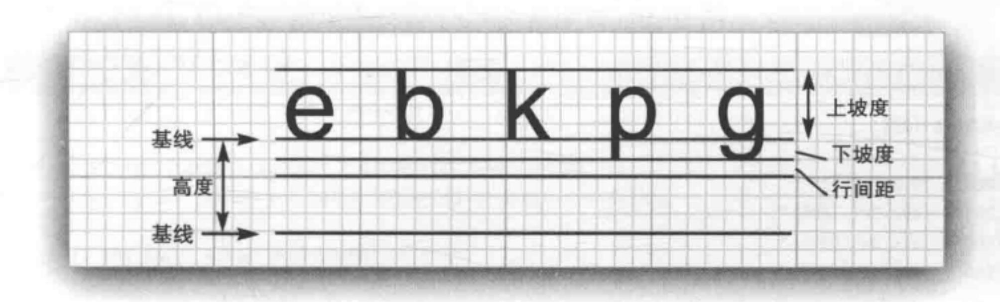

图 10-9 排版术语解释

行间距(leading)是某一行的坡底与其下一行的坡顶之间的空隙(这个术语源于打字机 分隔行的间隔带)。字体的高度是连续两个基线之间的距离,它等于下坡度+行间距+上 坡度。

getStringBounds 方法返回的矩形宽度是字符串水平方向的宽度。矩形的高度是上坡度、下坡度和行间距的总和。这个矩形始于字符串的基线,矩形顶部的y坐标为负值。因此,可以使用下面的方法获得字符串的宽度、高度和上坡度:

double stringWidth = bounds.getWidth();
double stringHeight = bounds.getHeight();
double ascent = -bounds.getY();

如果需要知道下坡度或行间距,可以使用 Font 类的 getLineMetrics 方法。这个方法将返回 LineMetrics 类的一个对象,其中包含获得下坡度和行间距的方法:

LineMetrics metrics = f.getLineMetrics(message, context);
float descent = metrics.getDescent();
float leading = metrics.getLeading();

注释:如果需要在paintComponent 方法外部计算布局大小,不能从Graphics2D 对象得到字体绘制上下文。应该换作调用 JComponent 类的 getFontMetrics 方法,然后调用 getFontRenderContext:

FontRenderContext context = getFontMetrics(f).getFontRenderContext();

为了说明位置是正确的,程序清单 10-4 中的示例程序将字符串在窗体中居中,并绘制了基线和包围这个字符串的矩形。图 10-10 给出了屏幕显示结果。


图 10-10 绘制基线和字符串外围矩形

#### 程序清单 10-4 font/FontTest.java

```
package font;
3 import java.awt.*;
4 import java.awt.font.*;
5 import java.awt.geom.*;
6 import javax.swing.*;
     @version 1.35 2018-04-10
     @author Cay Horstmann
11
  public class FontTest
13
      public static void main(String[] args)
14
15
         EventQueue.invokeLater(() ->
16
17
               var frame = new FontFrame();
18
               frame.setTitle("FontTest");
19
               frame.setDefaultCloseOperation(JFrame.EXIT_ON_CLOSE);
28
               frame.setVisible(true);
21
            });
22
23
24
25
26
    * A frame with a text message component.
28
   class FontFrame extends JFrame
```

```
38
      public FontFrame()
31
32
         add(new FontComponent());
33
         pack();
34
35
36
37
38
    * A component that shows a centered message in a box.
39
   class FontComponent extends JComponent
42
      private static final int DEFAULT WIDTH = 300;
43
      private static final int DEFAULT HEIGHT = 200;
45
      public void paintComponent(Graphics g)
46
47
         var g2 = (Graphics2D) g;
48
49
         String message = "Hello, World!";
50
51
         var f = new Font("Serif", Font.BOLD, 36);
52
         g2.setFont(f);
53
54
         // measure the size of the message
55
56
         FontRenderContext context = g2.getFontRenderContext();
57
         Rectangle2D bounds = f.getStringBounds(message, context);
58
59
         // set (x,y) = top left corner of text
60
61
         double x = (getWidth() - bounds.getWidth()) / 2;
62
         double y = (getHeight() - bounds.getHeight()) / 2;
63
64
         // add ascent to y to reach the baseline
65
66
         double ascent = -bounds.getY();
67
         double baseY = y + ascent;
68
69
         // draw the message
70
71
         g2.drawString(message, (int) x, (int) baseY);
72
73
         g2.setPaint(Color.LIGHT GRAY);
74
75
         // draw the baseline
76
77
         g2.draw(new Line2D.Double(x, baseY, x + bounds.getWidth(), baseY));
78
79
         // draw the enclosing rectangle
88
81
         var rect = new Rectangle2D.Double(x, y, bounds.getWidth(), bounds.getHeight());
82
         g2.draw(rect);
83
```

```
84  }
85
86  public Dimension getPreferredSize()
87  {
88   return new Dimension(DEFAULT_WIDTH, DEFAULT_HEIGHT);
89  }
98 }
```

#### API java.awt.Font 1.0

464

- Font(String name, int style, int size)
  - 创建一个新字体对象。字体名可以是具体的字体名(例如, "Helvetica Bold"), 或者逻辑字体名(例如, "Serif""SansSerif")。字体风格可以是 Font.PLAIN、Font.BOLD、Font.ITALIC或 Font.BOLD+Font.ITALIC。
- String getFontName()
   获得字体名,例如, "Helvetica Bold"。
- String getFamily()
   获得字体族名,例如, "Helvetica"。
- String getName()

如果字体采用逻辑字体名创建,这个方法将获得逻辑字体名,例如, "SansSerif";否则,获得具体字体名。

- Rectangle2D getStringBounds(String s, FontRenderContext context) 1.2
   返回包围这个字符串的矩形。矩形的起点为基线。矩形顶端的y坐标等于上坡度的负值。矩形的高度等于上坡度、下坡度和行间距之和。宽度等于字符串的宽度。
- LineMetrics getLineMetrics(String s, FontRenderContext context) 1.2
   返回确定字符串宽度的一个度量对象。
- Font deriveFont(int style) 1.2
- Font deriveFont(float size) 1.2
- Font deriveFont(int style, float size) 1.2
   返回一个新字体,除了有给定的大小和字体风格外,其余属性都与原字体一样。

## am java.awt.font.LineMetrics 1.2

- float getAscent()
   获得字体的上坡度——从基线到大写字母顶端的距离。
- float getDescent()获得字体的下坡度——从基线到坡底的距离。
- float getLeading()获得字体的行间距——从一行文本底端到下一行文本顶端之间的空隙。
- float getHeight()
   获得字体的总高度——两行文本的基线之间的距离(下坡度+行间距+上坡度)。

## API java.awt.Graphics2D 1.2

- FontRenderContext getFontRenderContext()
   获得一个字体绘制上下文,该字体指定了这个图形上下文中的字体属性。
- void drawString(String str, float x, float y) 采用当前的字体和颜色绘制一个字符串。

## API javax.swing.JComponent 1.2

FontMetrics getFontMetrics(Font f) 5
 获得给定字体的字体度量对象。FontMetrics 类是 LineMetrics 类的前身。

#### API java.awt.FontMetrics 1.0

FontRenderContext getFontRenderContext() 1.2
 获得字体的字体绘制上下文。

### 10.3.4 显示图像

可以使用 ImageIcon 类从文件读取图像:

Image image = new ImageIcon(filename).getImage();

现在变量 image 包含一个封装了图像数据的对象的引用。可以使用 Graphics 类的 drawImage 方法显示这个图像。

```
public void paintComponent(Graphics g)
{
          ...
          g.drawImage(image, x, y, null);
}
```

可以再进一步,在一个窗口中平铺显示图像。结果如图 10-11 所示。这里采用 paintComponent 方法实现平铺显示。首先在左上角显示图像的一个副本,然后使用 copyArea 调用将其复制到整个窗口:

```
for (int i = 0; i * imageWidth <= getWidth(); i++)
  for (int j = 0; j * imageHeight <= getHeight(); j++)
    if (i + j > 0)
      g.copyArea(0, 0, imageWidth, imageHeight, i * imageWidth, j * imageHeight);
```

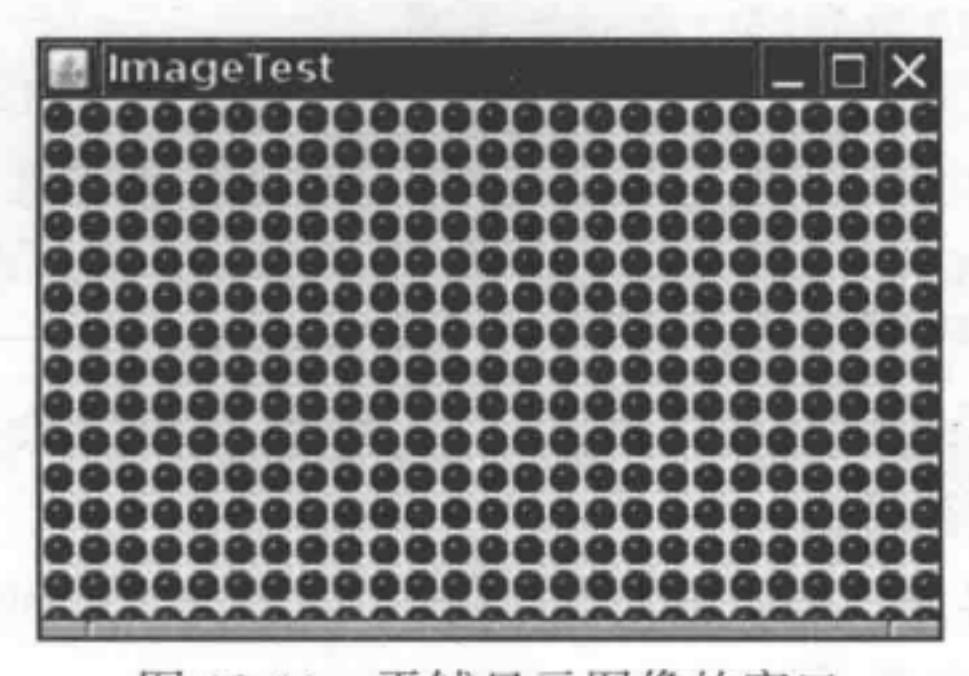

图 10-11 平铺显示图像的窗口

#### API java.awt.Graphics 1.0

- boolean drawImage(Image img, int x, int y, ImageObserver observer)
- boolean drawImage(Image img, int x, int y, int width, int height, ImageObserver observer)
   绘制一个不缩放或缩放的图像。注意: 这个调用可能会在图像绘制完毕前就返回。它会向 imageObserver 对象通知绘制的进展。这在很久以前是一个很有用的特性。不过现在只需要传递 null 作为观察者就可以了。
- void copyArea(int x, int y, int width, int height, int dx, int dy) 复制屏幕的一个区域。dx 和 dy 是源区域到目标区域的距离。

## 10.4 事件处理

任何支持 GUI 的操作环境会持续监视按键或点击鼠标之类的事件。这些事件再报告给正 在运行的程序。每个程序将决定如何对这些事件做出响应(如果确实有事件发生)。

#### 10.4.1 基本事件处理概念

在 Java AWT 中,事件源(如按钮或滚动条)有一些方法,允许你注册事件监听器(event listener),这些对象会对事件做出所需的响应。

通知一个事件监听器发生了某个事件时,这个事件的相关信息会封装在一个事件对象 (event object)中。在 Java 中,所有的事件对象最终都派生于 java.util.Event0bject 类。当然,对应各个事件类型有相应的子类,例如,ActionEvent和 WindowEvent。

不同的事件源可以产生不同类型的事件。例如,按钮可以发送 ActionEvent 对象,而窗口会发送 WindowEvent 对象。

综上所述,下面给出 AWT 事件处理机制的概要说明:

- 事件监听器是一个实现了监听器接口 (listener interface) 的类的实例。
- 事件源对象能够注册监听器对象并向其发送事件对象。
- 当事件发生时,事件源将事件对象发送给所有注册的监听器。
- 监听器对象再使用事件对象中的信息决定如何对事件做出响应。

图 10-12 显示了事件处理类和接口之间的关系。

下面是指定监听器的一个示例:

ActionListener listener = . . .;
var button = new JButton("OK");
button.addActionListener(listener);

现在,只要按钮产生了一个"动作事件", listener 对象就会得到通知。对于按钮来说,可以想见,动作事件就是按钮点击。

要实现 ActionListener 接口, 监听器类必须有一个名为 actionPerformed 的方法, 该方法接收一个 ActionEvent 对象作为参数。

```
class MyListener implements ActionListener
{
    public void actionPerformed(ActionEvent event)
    {
        // reaction to button click goes here
    }
}
```

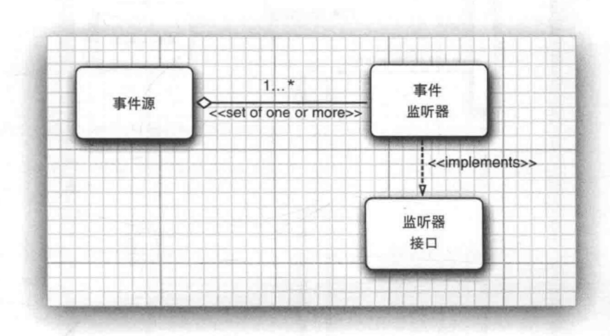

图 10-12 事件源和监听器之间的关系

只要用户点击按钮, JButton 对象就会创建一个 ActionEvent 对象, 然后调用 listener. actionPerformed (event), 并传入这个事件对象。一个事件源(如按钮)可以有多个监听器。在这种情况下,只要用户点击按钮,按钮就会调用所有监听器的 actionPerformed 方法。

图 10-13 显示了事件源、事件监听器和事件对象之间的交互。

## 10.4.2 实例: 处理按钮点击事件

为了加深对事件委托模型的理解,下面以一个响应按钮点击事件的简单示例来说明所需的所有细节。在这个示例中,我们想要在一个面板中放置三个按钮,另外添加三个监听器对象作为这些按钮的动作监听器。

在这个情况下,只要用户点击面板上的任何一个按钮,相关的监听器对象就会接收到一个 ActionEvent 对象,指示点击了某个按钮。在示例程序中,监听器对象将改变面板的背景颜色。

在介绍监听按钮点击事件的程序之前,首先需要解释如何创建按钮,以及如何将它们添加到面板。

要想创建一个按钮,需要在按钮构造器中指定一个标签字符串或一个图标,或者两项都指定。下面是两个示例:

```
var yellowButton = new JButton("Yellow");
var blueButton = new JButton(new ImageIcon("blue-ball.gif"));
```

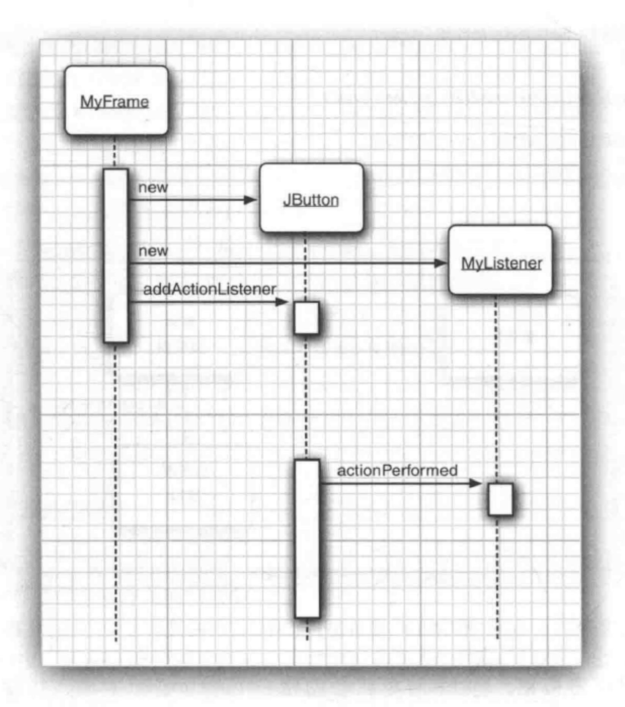

图 10-13 事件通知

## 调用 add 方法将按钮添加到面板中:

var yellowButton = new JButton("Yellow");
var blueButton = new JButton("Blue");
var redButton = new JButton("Red");

buttonPanel.add(yellowButton);
buttonPanel.add(blueButton);
buttonPanel.add(redButton);

## 图 10-14 显示了结果。

接下来需要添加监听这些按钮的代码。这需要一个实现了ActionListener接口的类。如前所述,这个类应该包含一个actionPerformed方法,方法签名为:

public void actionPerformed(ActionEvent event)

在所有情况下,使用 ActionListener 接口的方式都是一样的: actionPerformed 方法(ActionListener 中

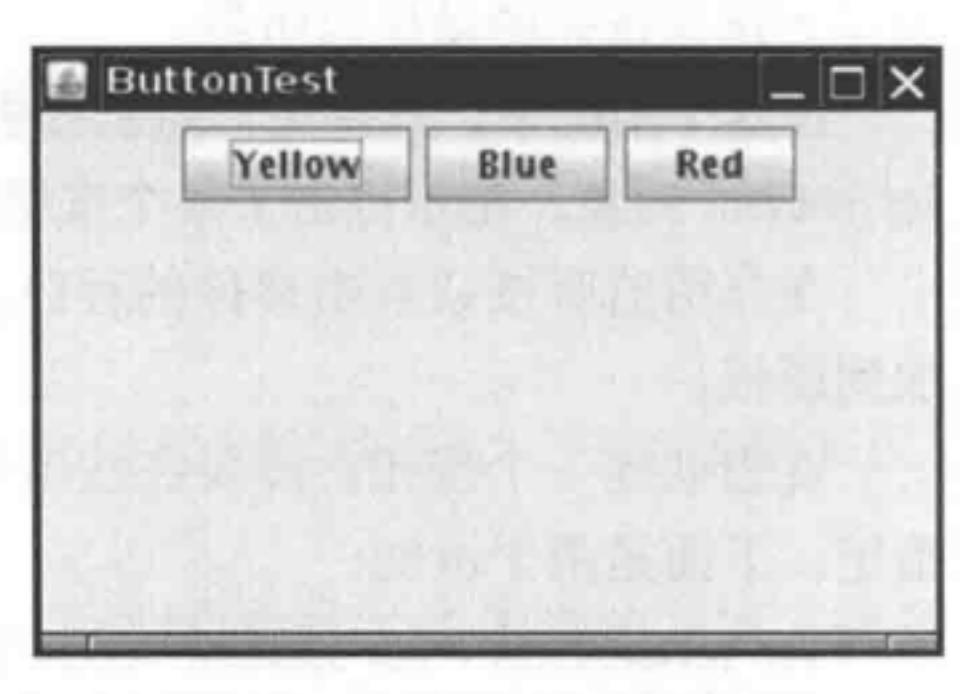

图 10-14 填充了按钮的面板

的唯一方法)将接收一个 ActionEvent 类型的对象作为参数。这个事件对象包含了所发生事件的相关信息。

点击按钮时,我们希望将面板的背景颜色改为指定的颜色。我们把所需的颜色存储在监 听器类中:

```
class ColorAction implements ActionListener {
    private Color backgroundColor;
    public ColorAction(Color c) {
        backgroundColor = c;
    }
    public void actionPerformed(ActionEvent event) {
            // set panel background color
```

例如,如果一个用户点击了标有"Yellow"的按钮,就会调用 yellowAction 对象的 action-Performed 方法。这个对象的 backgroundColor 实例字段会设置为 Color.YELLOW,现在就会将面板的背景色设置为黄色。

这里还有一个需要考虑的问题。ColorAction 对象不能访问 buttonPanel 变量。可以采用两种方法解决这个问题。一种方法是将面板存储在 ColorAction 对象中,并在 ColorAction 的构造器中设置它;或者,更方便的方法是将 ColorAction 设计为 ButtonFrame 类的一个内部类,这样一来,它的方法就自动地能够访问外部面板了。

程序清单 10-5 包含了完整的窗体类。只要点击任何一个按钮,对应的动作监听器就会修改面板的背景颜色。

#### 程序清单 10-5 button/ButtonFrame.java

```
package button;
\nimport java.awt.*;\nimport java.awt.event.*;\nimport javax.swing.*;

/**

* A frame with a button panel.
*/
```

```
10 public class ButtonFrame extends JFrame
11 {
      private JPanel buttonPanel;
12
      private static final int DEFAULT WIDTH = 300;
13
      private static final int DEFAULT HEIGHT = 200;
14
15
      public ButtonFrame()
16
17
         setSize(DEFAULT_WIDTH, DEFAULT_HEIGHT);
18
19
         // create buttons
20
         var yellowButton = new JButton("Yellow");
21
         var blueButton = new JButton("Blue");
22
         var redButton = new JButton("Red");
23
24
         buttonPanel = new JPanel();
25
26
         // add buttons to panel
27
         buttonPanel.add(yellowButton);
28
         buttonPanel.add(blueButton);
29
         buttonPanel.add(redButton);
30
31
         // add panel to frame
32
         add(buttonPanel);
33
34
         // create button actions
35
         var yellowAction = new ColorAction(Color.YELLOW);
36
         var blueAction = new ColorAction(Color.BLUE);
37
         var redAction = new ColorAction(Color.RED);
38
39
         // associate actions with buttons
         yellowButton.addActionListener(yellowAction);
41
         blueButton.addActionListener(blueAction);
42
         redButton.addActionListener(redAction);
        * An action listener that sets the panel's background color.
47
      private class ColorAction implements ActionListener
50
         private Color backgroundColor;
51
52
         public ColorAction(Color c)
53
54
             backgroundColor = c;
57
          public void actionPerformed(ActionEvent event)
59
             buttonPanel.setBackground(backgroundColor);
61
62
63 }
```

#### API javax.swing.JButton 1.2

- JButton(String label)
- JButton(Icon icon)
- JButton(String label, Icon icon)
   构造一个按钮。标签字符串可以是常规的文本或 HTML。例如, "<html><b>0k</b></html>"。

#### API java.awt.Container 1.0

Component add(Component c)
 将组件 c 添加到这个容器中。

#### 10.4.3 简洁地指定监听器

在10.4.2 节中, 我们为事件监听器定义了一个类并构造了这个类的 3 个对象。一个监听器类有多个实例的情况并不多见。更常见的情况是:每个监听器执行一个单独的动作。在这种情况下,没有必要建立单独的类。只需要使用一个 lambda 表达式:

exitButton.addActionListener(event -> System.exit(θ));

现在考虑这样一种情况:有多个相互关联的动作,如 10.4.2 节中的颜色按钮。在这种情况下,可以实现一个辅助方法:

```
public void makeButton(String name, Color backgroundColor)
{
   var button = new JButton(name);
   buttonPanel.add(button);
   button.addActionListener(event ->
      buttonPanel.setBackground(backgroundColor));
}
```

需要说明的是, lambda 表达式指示参数变量 backgroundColor。

然后只需要调用:

```
makeButton("yellow", Color.YELLOW);
makeButton("blue", Color.BLUE);
makeButton("red", Color.RED);
```

在这里,我们构造了3个监听器对象,分别对应一种颜色,但并没有显式定义一个类。每次调用这个辅助方法时,它会建立实现了ActionListener接口的一个类的实例。它的actionPerformed 动作会引用实际上随监听器对象存储的 backGroundColor 值。不过,所有这些会自动完成,而无须你显式定义监听器类、实例变量或设置这些变量的构造器。

# ■ 注释: 在较早的代码中, 通常会看到使用匿名类:

```
exitButton.addActionListener(new ActionListener()
```

```
472
```

});

当然,现在已经不再需要这种烦琐的代码了。使用 lambda 表达式更简单,也更简洁。

### 10.4.4 适配器类

并不是所有事件的处理都像按钮点击那样简单。假设你想监视用户何时想要关闭主窗体,从而弹出一个对话框,只有在用户确认之后才退出程序。

当程序用户试图关闭一个窗口时, JFrame 对象就是 WindowEvent 的事件源。如果希望捕获这个事件,就必须有一个合适的监听器对象,并将它添加到窗体的窗口监听器列表中。

```
WindowListener listener = . . .;
frame.addWindowListener(listener);
```

窗口监听器必须是实现 WindowListener 接口的类的一个对象。WindowListener 接口中实际上包含 7 个方法。窗体将调用这些方法响应 7 个不同的窗口事件。从它们的名字就可以得知这些方法的作用,只有一点需要说明:在 Windows 下,通常将图标化(iconified)称为最小化(minimized)。下面是完整的 WindowListener 接口:

```
public interface WindowListener
{
   void windowOpened(WindowEvent e);
   void windowClosing(WindowEvent e);
   void windowClosed(WindowEvent e);
   void windowIconified(WindowEvent e);
   void windowDeiconified(WindowEvent e);
   void windowActivated(WindowEvent e);
   void windowDeactivated(WindowEvent e);
}
```

当然,我们可以定义一个实现这个接口的类,在 windowClosing 方法中添加一个 System. exit(0) 调用,并为其他 6 个方法编写什么也不做的函数。不过,为 6 个没有任何操作的方法写代码显然是一个乏味的工作,没有人喜欢这样做。为了简化这个任务,每个包含多个方法的 AWT 监听器接口都配有一个适配器(adapter)类,这个类实现了接口中的所有方法,但每个方法并不做任何事情。例如,WindowAdapter 有 7 个什么也不做的方法。可以扩展适配器类来指定对某些事件的响应动作,而不必实现接口中的每一个方法(类似 ActionListener 的接口只有一个方法,因此不需要适配器类)。

可以如下定义一个窗口监听器,它覆盖了 windowClosing 方法:

```
class Terminator extends WindowAdapter
{
   public void windowClosing(WindowEvent e)
   {
      if (user agrees)
          System.exit(0);
   }
}
```

现在,可以注册一个 Terminator 类型的对象作为事件监听器:

var listener = new Terminator();
frame.addWindowListener(listener);

直注释:如今,可能有人会把 WindowListener 接口中什么也不做的方法实现为默认方法。 不过,Swing 早在有默认方法很多年之前就已经问世了。

#### API java.awt.event.WindowListener 1.1

- void windowOpened(WindowEvent e)
   窗口打开后调用这个方法。
- void windowClosing(WindowEvent e)
   用户发出一个窗口管理器命令要关闭窗口时调用这个方法。需要注意的是,仅当调用hide 或 dispose 方法后窗口才会关闭。
- void windowClosed(WindowEvent e)
   窗口关闭后调用这个方法。
- void windowIconified(WindowEvent e)
   窗口最小化后调用这个方法。
- void windowDeiconified(WindowEvent e)
   窗口取消最小化后调用这个方法。
- void windowActivated(WindowEvent e)
   激活窗口后调用这个方法。只有窗体或对话框可以被激活。通常窗口管理器会对活动窗口进行修饰,比如,高亮显示标题栏。
- void windowDeactivated(WindowEvent e)
   窗口变为未激活状态后调用这个方法。

## java.awt.event.WindowStateListener 1.4

void windowStateChanged(WindowEvent event)
 窗口最大化、最小化或恢复为正常大小时调用这个方法。

## 10.4.5 动作

通常,启动同一个命令可以有多种方式。用户可以通过菜单、按键或工具栏上的按钮选择特定的功能。在AWT事件模型中这非常容易实现:将所有事件关联到同一个监听器。例如,假设 blueAction 是一个动作监听器,它的 actionPerformed 方法可以将背景颜色变成蓝色。可以关联这一个对象作为多个事件源的监听器:

- 标记"Blue"的工具栏按钮
- 标记"Blue"的菜单项
- 按下组合键 Ctrl+B

然后,无论是通过点击按钮、选择菜单还是按键,都会采用统一的方式处理这个改变背景颜色的命令。

Swing 包提供了一种非常实用的机制来封装命令,并将它们关联到多个事件源,这就是Action接口。动作(action)是封装以下内容的一个对象:

- 命令的描述 (一个文本字符串和一个可选的图标);
- 执行命令所需要的参数(例如,以上示例中所请求的颜色)。

Action 接口包含以下方法:

void actionPerformed(ActionEvent event)
void setEnabled(boolean b)
boolean isEnabled()
void putValue(String key, Object value)
Object getValue(String key)

void addPropertyChangeListener(PropertyChangeListener listener)
void removePropertyChangeListener(PropertyChangeListener listener)

第一个方法是 ActionListener 接口中我们很熟悉的一个方法:实际上, Action 接口扩展了 Action Listener 接口,因此,任何需要 ActionListener 对象的地方都可以使用 Action 对象。

接下来的两个方法允许启用或禁用这个动作,并检查这个动作当前是否启用。当一个动作关联到菜单或工具栏而且这个动作禁用时,相应选项就会置灰。

putValue 和 getvalue 方法允许存储和获取动作对象中的任意名 / 值对。有两个重要的预定义字符串: Action.NAME 和 Action.SMALL ICON, 用于将动作的名字和图标存储到一个动作对象中:

action.putValue(Action.NAME, "Blue");
action.putValue(Action.SMALL\_ICON, new ImageIcon("blue-ball.gif"));

表 10-1 给出了所有预定义的动作表名。

| 名 称                | 值                                          |  |
|--------------------|--------------------------------------------|--|
| NAME               | 动作名,显示在按钮和菜单项上                             |  |
| SMALL_ICON         | 存储小图标的地方,显示在按钮、菜单项或工具栏中                    |  |
| SHORT_DESCRIPTION  | 图标的一个简短描述,显示在工具提示中                         |  |
| LONG_DESCRIPTION   | 图标的详细描述;可能用在联机帮助中。没有 Swing 组件使用这个值         |  |
| MNEMONIC_KEY       | 快捷键缩写; 显示在菜单项中                             |  |
| ACCELERATOR_KEY    | 存储加速键的地方;没有 Swing 组件使用这个值                  |  |
| ACTION_COMMAND_KEY | 原先在 registerKeyboardAction 方法中使用,但这个方法已经过时 |  |
| DEFAULT            | 可能很有用的"全能型"属性;没有 Swing 组件使用这个值             |  |
|                    |                                            |  |

表 10-1 预定义动作表名

如果动作对象添加到菜单或工具栏上,会自动获取它的名称和图标,并显示在菜单项或工具栏按钮中。SHORT DESCRIPTION 值会转换成工具提示。

Action 接口的最后两个方法能够让其他对象(尤其是触发动作的菜单或工具栏)在动作对象的属性发生变化时得到通知。例如,如果增加一个菜单作为动作对象的属性变更监听器,而这个动作对象随后被禁用,就会调用这个菜单,并将动作名置灰。

需要注意, Action 是一个接口, 而不是一个类。实现这个接口的所有类都必须实现刚才讨论的7个方法。庆幸的是, 有好心人已经提供了一个类 AbstractAction, 这个类实现了除

actionPerformed 方法之外的所有其他方法。这个类负责存储所有名 / 值对,并管理属性变更监听器。我们可以直接扩展 AbstractAction 类,并提供一个 actionPerformed 方法。

下面构造一个可以执行改变颜色命令的动作对象。首先存储这个命令的名字、图标和所需的颜色。将颜色存储在 AsbstractAction 类提供的名 / 值对表中。下面是 ColorAction 类的代码。构造器设置名 / 值对,而 actionPerformed 方法执行改变颜色的动作。

```
public class ColorAction extends AbstractAction
{
   public ColorAction(String name, Icon icon, Color c)
   {
      putValue(Action.NAME, name);
      putValue(Action.SMALL_ICON, icon);
      putValue("color", c);
      putValue(Action.SHORT_DESCRIPTION, "Set panel color to " + name.toLowerCase());
   }
   public void actionPerformed(ActionEvent event)
   {
      Color c = (Color) getValue("color");
      buttonPanel.setBackground(c);
   }
}
```

在测试程序中, 创建了这个类的三个对象, 如下所示:

var blueAction = new ColorAction("Blue", new ImageIcon("blue-ball.gif"), Color.BLUE);

接下来,将这个动作与一个按钮关联起来。这很容易,因为我们可以使用接受一个Action 对象的 JButton 构造器:

var blueButton = new JButton(blueAction);

构造器读取动作的名字和图标,设置简要描述作为工具提示,并将动作设置为监听器。 在图 10-15 中可以看到图标和工具提示。

在下一章中我们会看到,将这个动作添加到菜 单也非常容易。

最后,我们想要为按键添加动作对象,使得用户键入一个键盘命令时会执行相应的动作。为了将动作与按键关联,首先需要生成 KeyStroke 类对象。这是一个很方便的类,它封装了对按键的描述。要想生成一个 KeyStroke 对象,不要调用构造器,而应当调用 KeyStroke 类中的静态 getKeyStroke 方法:

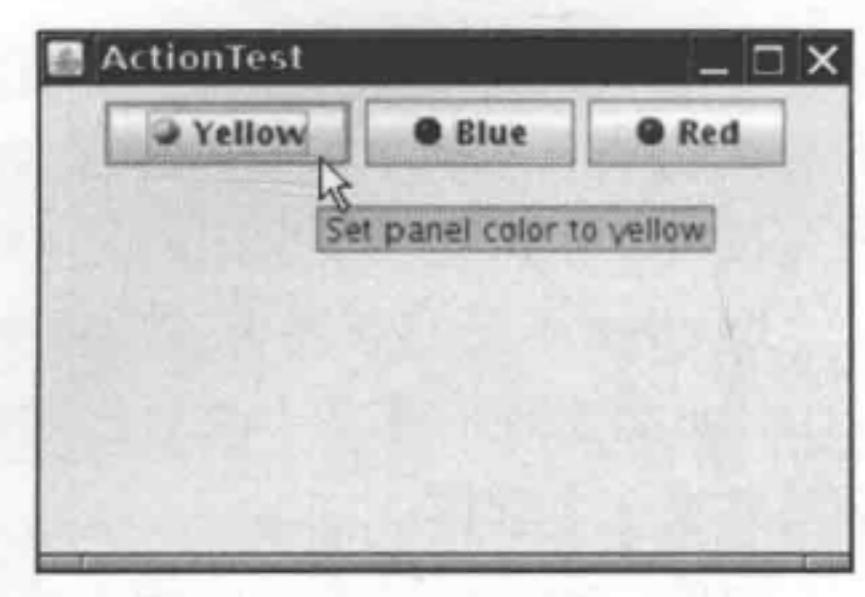

图 10-15 按钮显示动作对象中的图标

KeyStroke ctrlBKey = KeyStroke.getKeyStroke("ctrl B");

为了理解下一个步骤,需要知道键盘焦点(keyboard focus)的概念。用户界面中可能有许多按钮、菜单、滚动条以及其他的组件。当用户按键时,这个动作会被发送给拥有焦点的组件。通常可以从外观上看出拥有焦点的组件(但并不总是这样),例如,在Java观感中,有焦点的按钮在按钮文本周围有一个很细的矩形边框。可以使用Tab键在组件之间移动焦

点。当按下空格键时,就会点击拥有焦点的按钮。还有一些按键会执行其他的动作,例如, 箭头键可以移动滚动条。

不过,在这里的示例中,我们并不希望将按键发送给拥有焦点的组件。否则,每个按钮都需要知道如何处理组合键 Ctrl + Y、Ctrl + B 和 Ctrl + R。

这是一个常见的问题, Swing 设计者给出了一种很便捷的解决方案。每个 JComponent 有三个输入映射 (imput map), 分别将 KeyStroke 对象映射到关联的动作。这三个输入映射对应着三个不同的条件(请参见表 10-2)。

|   | な 10-2 相別 ( N                      |                             |  |  |
|---|------------------------------------|-----------------------------|--|--|
|   | 标 志                                | 调用动作                        |  |  |
|   | WHEN_FOCUSED                       | 当这个组件拥有键盘焦点时                |  |  |
|   | WHEN_ANCESTOR_OF_FOCUSED_COMPONENT | 当这个组件包含拥有键盘焦点的组件时           |  |  |
| Т | WHEN IN FOCUSED WINDOW             | 当这个组件包含在拥有键盘焦点的组件所在的同一个窗口中时 |  |  |

表 10-2 输入映射条件

按键处理将按照以下顺序检查这些映射:

- 1. 检查有输入焦点的组件的 WHEN\_FOCUSED 映射。如果这个按键存在,而且启用了相应的动作,则执行这个动作,并停止处理。
- 2. 从有输入焦点的组件开始,检查其父组件的 WHEN\_ANCESTOR\_OF\_FOCUSED\_COMPONENT 映射。一旦找到这个按键的映射,而且相应的动作已经启用,就执行这个动作,并停止处理。
- 3. 查看有输入焦点的窗口中的所有可见和已启用的组件,看是否在一个WHEN\_IN\_FOCUSED\_WINDOW 映射中注册了这个按键。给这些组件一个机会来执行相应的动作(按照按键注册的顺序)。一旦执行第一个启用的动作,就停止处理。

可以使用 getInputMap 方法从组件得到一个输入映射。例如:

InputMap imap = panel.getInputMap(JComponent.WHEN\_FOCUSED);

WHEN\_FOCUSED 条件意味着在当前组件拥有键盘焦点时会查看这个映射。在这里,这不是我们想要的映射。某个按钮拥有输入焦点,而不是面板。另外两个映射都能够很好地增加颜色改变按键。示例程序中使用的是 WHEN\_ANCESTOR\_OF\_FOCUSED\_COMPONENT。

InputMap 不是直接将 KeyStroke 对象映射到 Action 对象,而是先映射到任意对象,然后由 ActionMap 类实现的第 2 个映射将对象映射到动作。这样可以更容易地在不同输入映射中的按键间共享一个动作。

因此,每个组件有三个输入映射和一个动作映射。为了将它们关联起来,需要为动作命名。可以如下将键关联到一个动作:

imap.put(KeyStroke.getKeyStroke("ctrl Y"), "panel.yellow");
ActionMap amap = panel.getActionMap();
amap.put("panel.yellow", yellowAction);

习惯上,会使用字符串 "none" 表示空动作。这样可以轻松地取消一个按键:

imap.put(KeyStroke.getKeyStroke("ctrl C"), "none");

● 警告: JDK 文档提倡使用动作名作为动作键。我们并不认为这是一个好主意。动作名显示在按钮和菜单项上,所以 UI 设计者可以随心所欲地更改,也可以将其翻译成多种语言。这种不稳定的字符串作为查找键不是一种好的选择,所以我们建议提供独立于显示名的动作名。

下面总结如何完成相同的动作来响应按钮、菜单项或按键:

- 1. 实现一个扩展 AbstractAction 类的类。可以使用同一个类表示多个相关的动作。
- 2. 构造动作类的一个对象。
- 3. 从动作对象构造一个按钮或菜单项。构造器将从动作对象读取标签文本和图标。
- 4. 对于能够由按键触发的动作,必须额外多执行几步。首先找到窗口的顶层组件,例如,包含所有其他组件的面板。
- 5. 然后,得到顶层组件的 WHEN\_ANCESTOR\_OF\_FOCUS\_COMPONENT 输入映射。为需要的按键创建一个 KeyStroke 对象。创建一个动作键对象,如描述动作的一个字符串。将(按键,动作键)对添加到输入映射中。
  - 6. 最后,得到顶层组件的动作映射。将(动作键,动作对象)对添加到映射中。

## API javax.swing.Action 1.2

- boolean isEnabled()
- void setEnabled(boolean b)
   获得或设置这个动作的 enabled 属性。
- void putValue(String key, Object value)
   将键/值对放在动作对象中。键可以是任意的字符串,不过很多名字已经有预定义的含义,参见表 10-1。
- Object getValue(String key)
   返回所存储的名/值对的值。

#### API javax.swing.KeyStroke 1.2

static KeyStroke getKeyStroke(String description)

根据一个人类可读的描述(由空白符分隔的字符串序列)构造一个按键。这个描述以 0 个或多个修饰符(shift、control、ctrl、meta、alt、altGraph) 开始,以字符串 typed 和紧跟在后面的一个单字符字符串(例如: "typed a")结尾,或者以一个可选的事件说明符(pressed 或 released,默认为 pressed)和紧跟在后面的一个键码结束。如果键码以 VK\_前缀开头,应该对应一个 KeyEvent 常量,例如,"INSERT" 对应 KeyEvent.VK\_INSERT。

## API javax.swing.JComponent 1.2

- ActionMap getActionMap() 1.3
   返回关联动作映射键(可以是任意的对象)和 Action 对象的映射。
- InputMap getInputMap(int flag) 1.3

获得将按键映射到动作映射键的输入映射。标志(flag)为表 10-2 中的某个值。

#### 10.4.6 鼠标事件

如果只希望用户能够点击一个按钮或菜单,那么不需要显式地处理鼠标事件。这些鼠标操作将由用户界面中的各种组件内部处理。不过,如果希望用户能使用鼠标画图,就需要捕获鼠标移动、点击和拖动事件。

在本节中,我们将展示一个简单的图形编辑器应用,它允许用户在画布上放置、移动和擦除方块(如图 10-16 所示)。

用户点击鼠标按钮时,会调用三个监听器方法: 鼠标第一次被按下时调用 mousePressed; 松开鼠标时调用 mouseReleased; 最后调用 mouseClicked。如果只对最终的点击事件感兴趣,则可以忽略前两个方法。以 MouseEvent 类对象作为参数,调用 getX 和 getY 方法可以获得点击鼠标时鼠标指针所在的 x 和 y 坐标。要想区分单击、双击和三击(!),需要使用 getClickCount 方法。

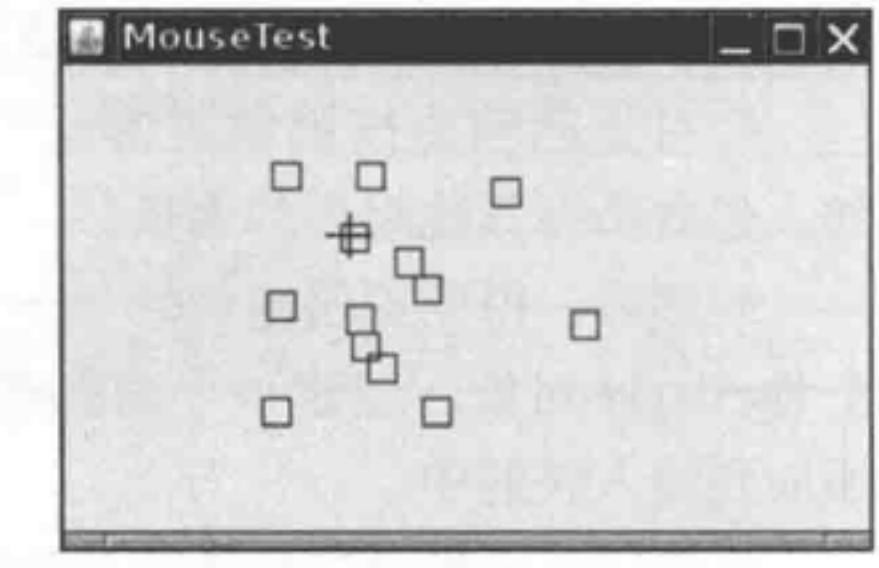

图 10-16 鼠标测试程序

在我们的示例程序中,提供了 mousePressed 和 mouse-

Clicked 方法。当鼠标点击的像素在所有已绘制的小方块之外时,就会增加一个新的小方块。 这个操作是在 mousePressed 方法中实现的,这样用户可以立即得到反馈,而不必等到松开鼠 标按钮。如果用户在某个小方块中双击鼠标,就会将这个小方块擦除。由于需要知道点击次 数,所以这个操作在 mouseClicked 方法中实现。

```
public void mousePressed(MouseEvent event)
{
    current = find(event.getPoint());
    if (current == null) // not inside a square
        add(event.getPoint());
}

public void mouseClicked(MouseEvent event)
{
    current = find(event.getPoint());
    if (current != null && event.getClickCount() >= 2)
        remove(current);
}
```

当鼠标在窗口上移动时,窗口将会收到一连串的鼠标移动事件。请注意:有两个独立的接口 MouseListener 和 MouseMotionListener。这样做有利于提高效率。当用户移动鼠标时,会有大量鼠标事件,只关心鼠标点击(click)的监听器就不会被多余的鼠标移动事件所干扰。

这里给出的测试程序将捕获鼠标移动事件,光标位于一个小方块之上时变成另外一种形状(十字)。这是使用 Cursor 类中的 getPredefinedCursor 方法完成的。表 10-3 列出了这个方法使用的常量以及 Windows 环境下相应的光标形状。

| 图标                                                                                                                                                                                                                                                                                                                                                                                                                                                                                                                                                                                                                                                                                                                                                                                                                                                                                                                                                                                                                                                                                                                                                                                                                                                                                                                                                                                                                                                                                                                                                                                                                                                                                                                                                                                                                                                                                                                                                                                                                                                                                                                            | 常 量              | 图标                | 常量               |
|-------------------------------------------------------------------------------------------------------------------------------------------------------------------------------------------------------------------------------------------------------------------------------------------------------------------------------------------------------------------------------------------------------------------------------------------------------------------------------------------------------------------------------------------------------------------------------------------------------------------------------------------------------------------------------------------------------------------------------------------------------------------------------------------------------------------------------------------------------------------------------------------------------------------------------------------------------------------------------------------------------------------------------------------------------------------------------------------------------------------------------------------------------------------------------------------------------------------------------------------------------------------------------------------------------------------------------------------------------------------------------------------------------------------------------------------------------------------------------------------------------------------------------------------------------------------------------------------------------------------------------------------------------------------------------------------------------------------------------------------------------------------------------------------------------------------------------------------------------------------------------------------------------------------------------------------------------------------------------------------------------------------------------------------------------------------------------------------------------------------------------|------------------|-------------------|------------------|
| De la companya de la companya de la companya de la companya de la companya de la companya de la companya de la companya de la companya de la companya de la companya de la companya de la companya de la companya de la companya de la companya de la companya de la companya de la companya de la companya de la companya de la companya de la companya de la companya de la companya de la companya de la companya de la companya de la companya de la companya de la companya de la companya de la companya de la companya de la companya de la companya de la companya de la companya de la companya de la companya de la companya della companya della companya de la companya della companya della companya della companya della companya della companya della companya della companya della companya della companya della companya della companya della companya della companya della companya della companya della companya della companya della companya della companya della companya della companya della companya della companya della companya della companya della companya della companya della companya della companya della companya della companya della companya della companya della companya della companya della companya della companya della companya della companya della companya della companya della companya della companya della companya della companya della companya della companya della companya della companya della companya della companya della companya della companya della companya della companya della companya della companya della companya della companya della companya della companya della companya della companya della companya della companya della companya della companya della companya della companya della companya della companya della companya della companya della companya della companya della companya della companya della companya della companya della companya della companya della companya della companya della companya della companya della companya della companya della companya della companya della companya della companya della companya della | DEFAULT_CURSOR   | ~                 | NE_RESIZE_CURSOR |
| +                                                                                                                                                                                                                                                                                                                                                                                                                                                                                                                                                                                                                                                                                                                                                                                                                                                                                                                                                                                                                                                                                                                                                                                                                                                                                                                                                                                                                                                                                                                                                                                                                                                                                                                                                                                                                                                                                                                                                                                                                                                                                                                             | CROSSHAIR_CURSOR | ↔                 | E_RESIZE_CURSOR  |
| 4m                                                                                                                                                                                                                                                                                                                                                                                                                                                                                                                                                                                                                                                                                                                                                                                                                                                                                                                                                                                                                                                                                                                                                                                                                                                                                                                                                                                                                                                                                                                                                                                                                                                                                                                                                                                                                                                                                                                                                                                                                                                                                                                            | HAND_CURSOR      | 5                 | SE_RESIZE_CURSOR |
| <b>‡</b>                                                                                                                                                                                                                                                                                                                                                                                                                                                                                                                                                                                                                                                                                                                                                                                                                                                                                                                                                                                                                                                                                                                                                                                                                                                                                                                                                                                                                                                                                                                                                                                                                                                                                                                                                                                                                                                                                                                                                                                                                                                                                                                      | MOVE_CURSOR      | 1                 | S_RESIZE_CURSOR  |
| I                                                                                                                                                                                                                                                                                                                                                                                                                                                                                                                                                                                                                                                                                                                                                                                                                                                                                                                                                                                                                                                                                                                                                                                                                                                                                                                                                                                                                                                                                                                                                                                                                                                                                                                                                                                                                                                                                                                                                                                                                                                                                                                             | TEXT_CURSOR      | ~                 | SW_RESIZE_CURSOR |
| $\overline{\mathbb{Z}}$                                                                                                                                                                                                                                                                                                                                                                                                                                                                                                                                                                                                                                                                                                                                                                                                                                                                                                                                                                                                                                                                                                                                                                                                                                                                                                                                                                                                                                                                                                                                                                                                                                                                                                                                                                                                                                                                                                                                                                                                                                                                                                       | WAIT_CURSOR      | $\leftrightarrow$ | W_RESIZE_CURSOR  |
| <b>‡</b>                                                                                                                                                                                                                                                                                                                                                                                                                                                                                                                                                                                                                                                                                                                                                                                                                                                                                                                                                                                                                                                                                                                                                                                                                                                                                                                                                                                                                                                                                                                                                                                                                                                                                                                                                                                                                                                                                                                                                                                                                                                                                                                      | N_RESIZE_CURSOR  | 5                 | NW_RESIZE_CURSOR |

表 10-3 光标形状示例

下面是示例程序中 MouseMotionListener 类的 mouseMoved 方法:

```
public void mouseMoved(MouseEvent event)
{
   if (find(event.getPoint()) == null)
      setCursor(Cursor.getDefaultCursor());
   else
      setCursor(Cursor.getPredefinedCursor(Cursor.CROSSHAIR_CURSOR));
}
```

如果用户在移动鼠标的同时按下鼠标按钮,就会生成 mouseDragged 调用而不是 mouseMoved 调用。在测试应用中,用户可以拖动光标下的小方块。我们只是更新当前拖动的方块,让它以鼠标位置为中心。然后,重新绘制画布,以显示新的鼠标位置。

```
public void mouseDragged(MouseEvent event)
{
   if (current != null)
   {
      int x = event.getX();
      int y = event.getY();

      current.setFrame(x - SIDELENGTH / 2, y - SIDELENGTH / 2, SIDELENGTH, SIDELENGTH);
      repaint();
   }
}
```

□ 注释:只有鼠标停留在一个组件内部才会调用 mouseMoved 方法。不过,即使鼠标拖动到组件外面,也会调用 mouseDragged 方法。

还有另外两个鼠标事件方法: mouseEntered 和 mouseExited。这两个方法会在鼠标进入或移出组件时调用。

最后来解释如何监听鼠标事件。鼠标点击由 mouseClicked 方法报告,它是 MouseListener 接口的一个方法。很多应用只对鼠标点击感兴趣,而对鼠标移动不感兴趣,由于鼠标移动事件发生的频率很高,因此鼠标移动事件与拖动事件定义在一个单独的 MouseMotionListener 接口中。

在示例程序中,我们对这两种类型的鼠标事件都感兴趣。这里定义了两个内部类: MouseHandler 和 MouseMotionHandler。MouseHandler 类扩展了 MouseAdapter 类,因为它只定义了 5个 MouseListener 方法中的 2个。(MouseAdapter 类将 5个 MouseListener 方法都定义为无操作的方法)。MouseMotionHandler 实现了 MouseMotionListener 接口,并定义了这个接口的两个方法。程序清单 10-6 给出了这个程序的清单。

#### 程序清单 10-6 mouse/MouseComponent.java

```
1 package mouse;
3 import java.awt.*;
4 import java.awt.event.*;
5 import java.awt.geom.*;
6 import java.util.*;
7 import javax.swing.*;
   /**
    * A component with mouse operations for adding and removing squares.
11
   public class MouseComponent extends JComponent
13
      private static final int DEFAULT WIDTH = 300;
14
      private static final int DEFAULT HEIGHT = 200;
15
16
      private static final int SIDELENGTH = 10;
17
      private ArrayList<Rectangle2D> squares;
18
      private Rectangle2D current; // the square containing the mouse cursor
20
      public MouseComponent()
21
22
         squares = new ArrayList<>();
23
         current = null;
24
25
         addMouseListener(new MouseHandler());
26
         addMouseMotionListener(new MouseMotionHandler());
27
28
29
      public Dimension getPreferredSize()
30
31
         return new Dimension(DEFAULT WIDTH, DEFAULT HEIGHT);
32
33
34
      public void paintComponent(Graphics g)
35
36
         var g2 = (Graphics2D) g;
38
         // draw all squares
         for (Rectangle2D r : squares)
            g2.draw(r);
43
       * Finds the first square containing a point.
45
```

```
* @param p a point
46
       * @return the first square that contains p
47
48
      public Rectangle2D find(Point2D p)
49
50
         for (Rectangle2D r : squares)
51
52
            if (r.contains(p)) return r;
53
54
         return null;
55
56
57
      1**
58
       * Adds a square to the collection.
59
       * @param p the center of the square
68
       */
61
      public void add(Point2D p)
62
63
         double x = p.getX();
64
         double y = p.getY();
65
66
         current = new Rectangle2D.Double(x - SIDELENGTH / 2, y - SIDELENGTH / 2,
67
            SIDELENGTH, SIDELENGTH);
68
         squares.add(current);
69
         repaint();
70
71
72
      /**
73
       * Removes a square from the collection.
74
       * @param s the square to remove
75
       */
76
      public void remove(Rectangle2D s)
77
78
         if (s == null) return;
79
         if (s == current) current = null;
         squares.remove(s);
81
         repaint();
82
83
84
      private class MouseHandler extends MouseAdapter
85
86
         public void mousePressed(MouseEvent event)
87
88
            // add a new square if the cursor isn't inside a square
89
            current = find(event.getPoint());
90
            if (current == null) add(event.getPoint());
91
92
93
         public void mouseClicked(MouseEvent event)
94
95
            // remove the current square if double clicked
96
            current = find(event.getPoint());
97
            if (current != null && event.getClickCount() >= 2) remove(current);
99
```

```
100
101
      private class MouseMotionHandler implements MouseMotionListener
102
103
         public void mouseMoved(MouseEvent event)
104
105
            // set the mouse cursor to cross hairs if it is inside a rectangle
106
187
            if (find(event.getPoint()) == null) setCursor(Cursor.getDefaultCursor());
108
            else setCursor(Cursor.getPredefinedCursor(Cursor.CROSSHAIR CURSOR));
109
110
111
         public void mouseDragged(MouseEvent event)
112
113
            if (current != null)
114
115
                int x = event.getX();
116
                int y = event.getY();
117
118
                // drag the current rectangle to center it at (x, y)
119
                current.setFrame(x - SIDELENGTH / 2, y - SIDELENGTH / 2, SIDELENGTH, SIDELENGTH);
120
                repaint();
121
122
123
124
125 }
```

#### API java.awt.event.MouseEvent 1.1

- int getX()
- int getY()
- Point getPoint()
   返回事件发生时点(鼠标点击位置)相对于事件源组件左上角的x(水平)和y(竖直) 坐标。
- int getClickCount()
   返回与事件关联的鼠标连击次数("连击"的时间间隔与具体系统有关)。

#### API java.awt.Component 1.0

public void setCursor(Cursor cursor) 1.1
 为指定光标设置光标图像。

#### 10.4.7 AWT 事件继承层次结构

EventObject 类有一个子类 AWTEvent, 它是所有 AWT 事件类的父类。图 10-17 显示了 AWT 事件的继承图。

有些 Swing 组件会生成更多其他事件类型的事件对象;它们都直接扩展自 EventObject,而不是 AWTEvent。

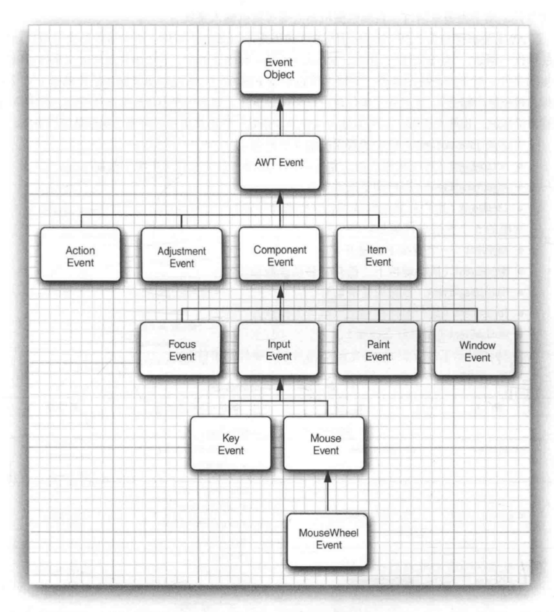

图 10-17 AWT 事件类的继承图

事件对象封装了事件源与监听器通信的有关事件信息。在必要的时候,可以对传递给监听器对象的事件对象进行分析,我们在按钮例子中就利用 getSource 和 getActionCommand 方法分析了事件对象。

有些 AWT 事件类对 Java 程序员来说并不实用。例如,AWT 会把 PaintEvent 对象插入事件队列中,但这些对象并没有传递给监听器。Java 程序员并不监听绘制事件,实际上,它们会覆盖 paintComponent 方法来控制重新绘制。另外,AWT 还会生成很多只对系统程序员有用