的事件,用于为表意语言、自动检测机器人等等提供输入系统。

AWT 将事件分为底层(low-level)事件和语义(semantic)事件。语义事件是表示用户动作的事件,例如,"点击按钮";因此,ActionEvent是一种语义事件。底层事件是使语义事件得以发生的事件。对于点击按钮事件,底层事件包括按下鼠标、一系列移动鼠标和松开鼠标(仅当鼠标在按钮区内松开)。或者底层事件也可以是按键事件,如果用户用 Tab 键选择按钮,再用空格键激活按钮,也能点击按钮。类似地,调整滚动条是一种语义事件,但拖动鼠标是底层事件。

下面是 java.awt.event 包中最常用的语义事件类:

- ActionEvent (对应按钮点击、菜单选择、选择列表项或在文本域中按回车);
- AdjustmentEvent (用户调整滚动条);
- ItemEvent (用户从复选框或列表框中选择一项)。

常用的5个底层事件类是:

- KeyEvent (一个键按下或松开);
- · MouseEvent (鼠标键按下、松开、移动或拖动);
- MouseWheelEvent (鼠标滚轮滚动);
- FocusEvent (某个组件获得焦点或失去焦点);
- WindowEvent (窗口状态改变)。

表 10-4 显示了最重要的 AWT 监听器接口、事件和事件源。

表 10-4 事件处理总结

| 接口                 | 方 法                                   | 参数/访问方法                                                                                  | 事件源                                       |
|--------------------|---------------------------------------|------------------------------------------------------------------------------------------|-------------------------------------------|
| ActionListener     | actionPerformed                       | ActionEvent • getActionCommand • getModifiers                                            | AbstractButton JComboBox JTextField Timer |
| AdjustmentListener | adjustmentValueChanged                | AdjustmentEvent  • getAdjustable  • getAdjustmentType  • getValue                        | JScrollbar                                |
| ItemListener       | itemStateChanged                      | ItemEvent • getItem • getItemSelectable • getStateChange                                 | AbstractButton<br>JComboBox               |
| FocusListener      | focusCost                             | FocusEvent • isTemporary                                                                 | Component                                 |
| KeyListener        | keyPressed<br>keyReleased<br>keyTyped | KeyEvent  • getKeyChar  • getKeyCode  • getKeyModifiersText  • getKeyText  • isActionKey | Component                                 |

(续)

| 接口                  | 方 法                                                                                           | 参数/访问方法                                                               | 事件源       |
|---------------------|-----------------------------------------------------------------------------------------------|-----------------------------------------------------------------------|-----------|
| MouseListener       | mousePressed mouseReleased mouseEntered mouseExited mouseClicked                              | MouseEvent • getClickCount • getX • getY • getPoint • translatePoint  | Component |
| MouseMotionListener | mouseDragged<br>mouseMoved                                                                    | MouseEvent                                                            | Component |
| MouseWheelListener  | mouseWheelMoved                                                                               | MouseWheelEvent • getWheelRotation • getScrollAmount                  | Component |
| WindowListener      | windowOpened windowIconified windowDeiconified windowClosed windowActivated windowDeactivated | WindowEvent • getWindow                                               | Window    |
| WindowFocusListener | windowGainedFocus<br>windowLostFocus                                                          | <ul><li>WindowEvent</li><li>getOppositeWindow</li></ul>               | Window    |
| WindowStateListener | windowStateChanged                                                                            | <ul><li>WindowEvent</li><li>getOldState</li><li>getNewState</li></ul> | Window    |

## 10.5 首选项 API

本章的最后我们来讨论 java.util.prefsAPI。在桌面程序中,你通常都会存储用户首选项,如用户最后处理的文件、窗口的最后位置,等等。

在第9章我们已经看到,利用 Properties 类可以很容易地加载和保存程序的配置信息。 不过,使用属性文件有以下缺点:

- 有些操作系统没有主目录的概念, 所以很难为配置文件找到一个统一的位置。
- 关于配置文件的命名没有标准约定,用户安装多个 Java 应用时,就更容易发生命名冲突。

有些操作系统有一个存储配置信息的中心存储库。最著名的例子就是 Microsoft Windows 中的注册表。Preferences 类以一种平台无关的方式提供了这样一个中心存储库。在 Windows 中, Preferences 类使用注册表来存储信息;在 Linux 上,信息则存储在本地文件系统中。当然,存储库实现对使用 Preferences 类的程序员是透明的。

Preferences 存储库有一个树状结构,节点路径名类似于 /com/mycompany/myapp。类似于包名,

只要程序员用逆置的域名作为路径的开头,就可以避免命名冲突。实际上,API的设计者就建议配置节点路径要与程序中的包名一致。

存储库的各个节点分别有一个单独的键/值对表,可以用来存储数值、字符串或字节数组,但不能存储可串行化的对象。API设计者认为对长期存储来说,串行化格式过于脆弱,并不合适。当然,如果你不同意这种看法,也可以用字节数组保存串行化对象。

为了增加灵活性,可以有多个并行的树。每个程序用户分别有一棵树;另外还有一棵系统树,可以用于存放所有用户的公共信息。Preferences 类使用操作系统的"当前用户"概念来访问相应的用户树。

若要访问树中的一个节点,需要从用户或系统根开始:

Preferences root = Preferences.userRoot();

或

Preferences root = Preferences.systemRoot();

然后访问节点。可以直接提供一个节点路径名:

Preferences node = root.node("/com/mycompany/myapp");

如果节点的路径名等于类的包名,还有一种便捷方式可以获得这个节点。只需要得到这个类的一个对象,然后调用

Preferences node = Preferences.userNodeForPackage(obj.getClass());

或

Preferences node = Preferences.systemNodeForPackage(obj.getClass());

- 一般来说, obj 往往是 this 引用。
- 一旦得到了节点,可以用以下方法访问键/值表:

String get(String key, String defval)\nint getInt(String key, int defval)
long getLong(String key, long defval)
float getFloat(String key, float defval)
double getDouble(String key, double defval)
boolean getBoolean(String key, boolean defval)
byte[] getByteArray(String key, byte[] defval)

需要说明的是,读取信息时必须指定一个默认值,以防止没有可用的存储库数据。之所以必须有默认值,有很多原因。可能由于用户从未指定过首选项,所以没有相应的数据。某些资源受限的平台可能没有存储库,移动设备有可能与存储库暂时断开了连接。

相对应地,可以用如下的 put 方法向存储库写数据:

put(String key, String value)
putInt(String key, int value)

可以用以下方法枚举一个节点中存储的所有键:

String[] keys()

目前没有办法找出一个特定键相应的值类型。

## 註释: 节点名和键都最多只能有80个字符,字符串值最多可以有8192个字符。

以往类似 Windows 注册表的中心存储库存在两个问题:

- 它们会变成充斥着过期信息的"垃圾场"。
- 配置数据与存储库纠缠在一起,所以很难把首选项迁移到新平台。

Preferences 类为第二个问题提供了解决方案。可以调用以下方法导出一个子树(或者比较少见的,也可以是一个节点)的首选项:

```
void exportSubtree(OutputStream out)
void exportNode(OutputStream out)
```

数据用 XML 格式保存。可以通过调用以下方法将这些数据导入到另一个存储库:

void importPreferences(InputStream in)

下面是一个示例文件:

```
<?xml version="1.0" encoding="UTF-8"?>
<!DOCTYPE preferences SYSTEM "http://java.sun.com/dtd/preferences.dtd">
references EXTERNAL XML VERSION="1.0">
   <root type="user">
      <map/>
      <node name="com">
         <map/>
         <node name="horstmann">
            <map/>
            <node name="corejava">
               <map>
            <entry key="height" value="200.0"/>
            <entry key="left" value="1027.0"/>
            <entry key="filename" value="/home/cay/books/cj11/code/vlch11/raven.html"/>
            <entry key="top" value="380.0"/>
            <entry key="width" value="300.0"/>
               </map>
            </node>
        </node>
      </node>
   </root>
</preferences>
```

如果你的程序使用首选项,要让用户有机会导出和导入首选项,从而可以很容易地将设置从一台计算机迁移到另一台计算机。程序清单 10-7 中的程序展示了这种技术。这个程序只保存了窗口的位置和最后加载的文件名。试着调整窗口的大小,然后导出你的首选项,移动窗口,退出并重启应用。窗口的状态应该与之前退出时是一样的。导入你的首选项,窗口会恢复到之前的位置。

#### 程序清单 10-7 preferences/ImageViewer.java

```
package preferences;\nimport java.awt.EventQueue;\nimport java.awt.event.*;\nimport java.io.*;
```

```
6 import java.util.prefs.*;
   import javax.swing.*;
8
   /**
9
    * A program to test preference settings. The program remembers the
    * frame position, size, and last selected file.
    * @version 1.10 2018-04-10
12
    * @author Cay Horstmann
13
14
   public class ImageViewer
16
      public static void main(String[] args)
17
18
         EventQueue.invokeLater(() ->
19
20
               var frame = new ImageViewerFrame();
21
               frame.setTitle("ImageViewer");
22
               frame.setDefaultCloseOperation(JFrame.EXIT ON CLOSE);
23
               frame.setVisible(true);
24
            });
25
26
27
28
29
    * An image viewer that restores position, size, and image from user
    * preferences and updates the preferences upon exit.
31
    */
32
   class ImageViewerFrame extends JFrame
34
      private static final int DEFAULT_WIDTH = 300;
35
      private static final int DEFAULT HEIGHT = 200;
36
      private String image;
37
38
      public ImageViewerFrame()
39
         Preferences root = Preferences.userRoot();
         Preferences node = root.node("/com/horstmann/corejava/ImageViewer");
42
         // get position, size, title from properties
43
         int left = node.getInt("left", 0);
         int top = node.getInt("top", 0);
         int width = node.getInt("width", DEFAULT_WIDTH);
46
         int height = node.getInt("height", DEFAULT HEIGHT);
         setBounds(left, top, width, height);
48
         image = node.get("image", null);
49
         var label = new JLabel();
50
         if (image != null) label.setIcon(new ImageIcon(image));
51
52
         addWindowListener(new WindowAdapter()
53
54
            public void windowClosing(WindowEvent event)
55
56
                node.putInt("left", getX());
57
                node.putInt("top", getY());
58
                node.putInt("width", getWidth());
59
```

```
node.putInt("height", getHeight());
60
                if (image != null) node.put("image", image);
61
62
         });
63
64
         // use a label to display the images
65
         add(label);
66
67
         // set up the file chooser
68
         var chooser = new JFileChooser();
69
         chooser.setCurrentDirectory(new File("."));
70
71
         // set up the menu bar
72
         var menuBar = new JMenuBar();
73
         setJMenuBar(menuBar);
74
75
         var menu = new JMenu("File");
76
         menuBar.add(menu);
77
78
         var openItem = new JMenuItem("Open");
79
         menu.add(openItem);
80
         openItem.addActionListener(event ->
81
82
                // show file chooser dialog
83
                int result = chooser.showOpenDialog(null);
84
85
                // if file selected, set it as icon of the label
86
                if (result == JFileChooser.APPROVE OPTION)
87
88
                   image = chooser.getSelectedFile().getPath();
89
                   label.setIcon(new ImageIcon(image));
90
91
            });
92
93
          var exitItem = new JMenuItem("Exit");
         menu.add(exitItem);
95
         exitItem.addActionListener(event -> System.exit(0));
96
97
98
```

#### API java.util.prefs.Preferences 1.4

- Preferences userRoot()
   返回调用程序的用户的首选项根节点。
- Preferences systemRoot()
   返回系统范围的首选项根节点。
- Preferences node(String path)
   返回从当前节点由给定路径可以到达的节点。如果 path 是绝对路径(也就是说,以一个/开头),则从包含这个首选项节点的树的根节点开始查找。如果给定路径不存在相应的节点,则创建这样一个节点。

- 490
  - Preferences userNodeForPackage(Class cl)
  - Preferences systemNodeForPackage(Class cl)
     返回当前用户树或系统树中的一个节点,其绝对节点路径对应类 cl 的包名。
  - String[] keys()返回属于这个节点的所有键。
  - String get(String key, String defval)
  - int getInt(String key, int defval)
  - long getLong(String key, long defval)
  - float getFloat(String key, float defval)
  - double getDouble(String key, double defval)
  - boolean getBoolean(String key, boolean defval)
  - byte[] getByteArray(String key, byte[] defval)
     返回与给定键关联的值,或者如果没有值与这个键关联、关联的值类型不正确或首选项存储库不可用,则返回所提供的默认值。
  - void put(String key, String value)
  - void putInt(String key, int value)
  - void putLong(String key, long value)
  - void putFloat(String key, float value)
  - void putDouble(String key, double value)
  - void putBoolean(String key, boolean value)
  - void putByteArray(String key, byte[] value)
     在这个节点存储一个键/值对。
  - void exportSubtree(OutputStream out)
     将这个节点及其子节点的首选项写至指定的流。
  - void exportNode(OutputStream out)
     将这个节点(但不包括其子节点)的首选项写至指定的流。
  - void importPreferences(InputStream in)
     导入指定流中包含的首选项。

这一章简要介绍了图形用户界面程序设计。在下一章中,我们将学习如何使用最常用的 Swing 组件。

# 第11章 Swing用户界面组件

- ▲ Swing 和模型 视图 控制器设计模式
- ▲ 布局管理概述
- ▲ 文本输入
- ▲ 选择组件

- ▲ 菜单
- ▲ 复杂的布局管理
- ▲ 对话框

上一章主要介绍了如何使用 Java 中的事件模型。通过学习,你已经初步了解了如何构建一个图形用户界面(GUI)。本章将介绍构造功能更完备的图形用户界面所需要的最重要的工具。

我们首先介绍 Swing 的底层架构。要想弄清楚如何有效地使用更高级的组件,了解底层的基础非常重要。然后,我们会介绍 Swing 中最常用的用户界面组件,如文本域、单选按钮以及菜单等。接下来,你会了解如何使用布局管理器排列这些组件。最后,我们将介绍如何在 Swing 中实现对话框。

本章涵盖基本的 Swing 组件,如文本组件、按钮和滑动条等,这些都是最常用的基本用户界面组件。高级 Swing 组件将在卷 II 中介绍。

## 11.1 Swing 和模型 - 视图 - 控制器设计模式

先简单回顾一下,考虑构成用户界面组件(如按钮、复选框、文本域或复杂的树控件)的各个组成部分。每个组件都有三个特征:

- 内容, 如, 按钮的状态(是否按下), 或者文本域中的文本。
- 外观(颜色,大小等)。
- 行为(对事件的反应)。

这三个特征之间存在相当复杂的交互,即使是最简单的组件(如按钮)也能体现出这一点。很明显,按钮的外观显示取决于它的观感。Metal 按钮的外观与 Windows 按钮或者 Motif 按钮的外观就不一样。另外,外观显示还取决于按钮的状态:当按钮被按下时,按钮需要重新绘制,使它看起来不一样。状态取决于按钮接收到的事件。当用户在按钮上点击鼠标时,按钮就被按下。

当然,在程序中使用按钮时,只需要简单地把它看成一个按钮,而不需要太多地考虑它的内部工作原理和特征。毕竟,这些是实现按钮的程序员的工作。不过,实现按钮以及所有其他用户界面组件的程序员要更仔细地考虑这些组件的实现,使得无论实际观感如何,这些组件都能正常工作。

为了做到这一点, Swing 设计者采用了一种很有名的设计模式 (design pattern): 模型 – 视图 – 控制器 (model-view-controller, MVC) 模式。这种设计模式要求我们提供三个不同的对象:

- 模型 (model): 存储内容。
- 视图 (view): 显示内容。
- 控制器 (controller): 处理用户输入。

这种模式明确地规定了三个对象如何交互。模型存储内容,它没有用户界面。按钮的内容非常简单,只有很少的一组标志,用来表示当前按钮是否按下,是否处于活动状态,等等。文本域的内容更有意思,这是一个字符串对象,包含当前文本。它与内容的视图不同——如果内容的长度大于文本域的大小,用户就只能看到可以显示的那一部分文本,如图 11-1 所示。


图 11-1 文本域的模型和视图

模型必须实现改变内容和查找内容的方法。例如,一个文本模型会提供一些方法,用来在当前文本中添加或者删除字符,以及把当前文本作为一个字符串返回。重申一次,要记住模型是完全不可见的。显示存储在模型中的数据是视图的工作。

註釋: "模型" 这个术语可能不太贴切,因为人们通常把模型视为一个抽象概念的具体表示。汽车和飞机的设计者制造模型来模拟真实的汽车和飞机。但这种类比可能会使你对模型 - 视图 - 控制器模式产生误解。在这个设计模式中,模型存储完整的内容,视图给出内容的(完整或者不完整的)可视化显示。一个更恰当的比喻应当是模特为画家摆好姿势。此时,就要看画家如何看模特,并由此来画一幅画(即视图)。那幅画是一幅规矩的肖像画,或是一幅印象派作品,还是一幅立体派作品(以古怪的曲线来描绘四肢),则完全取决于画家。

模型 - 视图 - 控制器模式的一个优点是,一个模型可以有多个视图,其中每个视图可以显示全部内容的不同部分或不同方面。例如,一个 HTML 编辑器可以为同一内容同时提供两个视图: 一个 WYSIWYG (所见即所得) 视图和一个"原始标记"视图 (见图 11-2)。当通过某一个视图的控制器对模型进行更新时,模型会通知关联的两个视图发生了改变。视图得到通知以后就会自动地刷新。当然,对于一个简单的用户界面组件 (如按钮),并不需要为同一个模型提供多个视图。

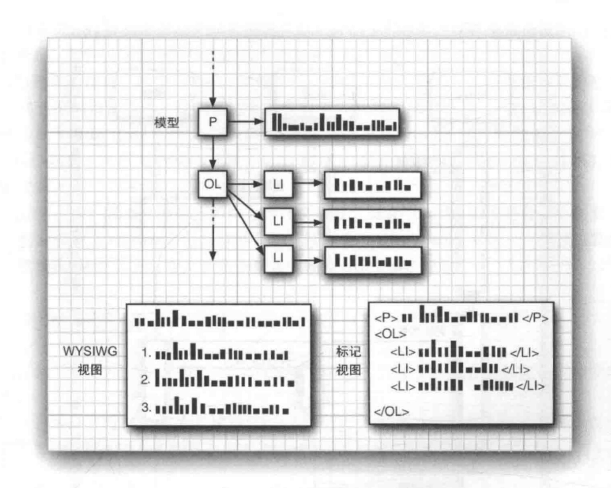

图 11-2 同一个模型的两个不同视图

控制器负责处理用户输入事件,如点击鼠标和按键,然后决定是否把这些事件转换成对模型或视图的更改。例如,如果用户在一个文本框中按下了一个字符键,控制器调用模型的"插入字符"命令,然后模型告诉视图进行更新,而视图永远不会知道文本为什么改变了。但是如果用户按下了一个箭头键,那么控制器会通知视图滚动。滚动视图对底层文本不会有任何影响,因此模型永远不会知道这个事件的发生。

图 11-3 显示了模型、视图和控制器对象之间的交互。

对大多数 Swing 组件来说,模型类将实现一个名字以 Model 结尾的接口,在这里,接口就名为 ButtonModel。实现了此接口的类可以定义各种按钮的状态。实际上,按钮并不复杂,Swing 库中有一个名为 DefaultButtonModel 的类实现了这个接口。

可以通过查看 ButtonModel 接口的属性来了解按钮模型维护了哪些数据(参见表 11-1)。每个 JButton 对象都存储着一个按钮模型对象,可以如下访问。

var button = new JButton("Blue");
ButtonModel model = button.getModel();

实际上, 你不必关心按钮状态的细节, 只有绘制它的视图才对此感兴趣。所有重要的信息(如按钮是否启用)可以通过 JButton 类得到(当然, JButton 类会向它的模型获取这些信息)。

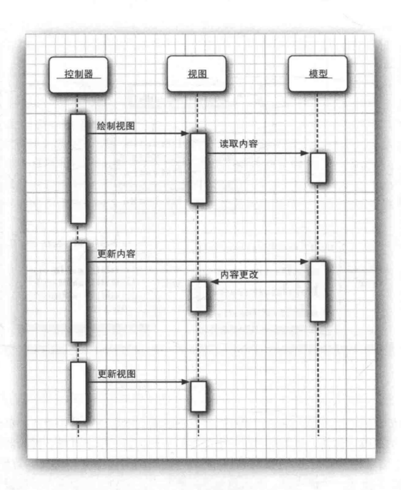

图 11-3 模型、视图、控制器对象之间的交互

表 11-1 ButtonModel 接口的属性

| 属性名           | 值                            |
|---------------|------------------------------|
| actionCommand | 与按钮关联的动作命令字符串                |
| mnemonic      | 按钮的助记快捷键                     |
| armed         | 如果按钮按下且鼠标仍在按钮上则为 true        |
| enabled       | 如果按钮是可选择的则为 true             |
| pressed       | 如果按钮按下且鼠标按键没有松开则为 true       |
| rollover      | 如果鼠标在按钮上则为 true              |
| selected      | 如果按钮已经被选择(用于复选框和单选按钮)则为 true |

下面再来查看 ButtonModel 接口中不包含哪些信息。模型不存储按钮标签或者图标。对于

一个按钮来说,仅查看模型无法知道按钮上显示什么(实际上,在有关单选按钮的11.4.2节中将会看到,这种设计的纯粹性会给程序员带来一些麻烦)。

另外还需要注意,同样的模型 (例如 DefaultButtonModel) 可用于下压按钮、单选按钮、复选框,甚至菜单项。当然,这些按钮都有各自不同的视图和控制器。当使用 Metal 观感时, JButton 类用 BasicButtonUI 类作为其视图;用 ButtonUIListener 类作为其控制器。通常,每个 Swing 组件都有一个相关的视图对象 (以 UI 结尾),但并不是所有的 Swing 组件都有专用的控制器对象。

在简单了解了 JButton 的底层工作之后,你可能想知道: JButton 究竟是什么?事实上,它就是一个继承自 JComponent 的包装器类,其中包含 DefaultButtonModel 对象,一些视图数据(例如按钮标签和图标)以及一个对按钮视图负责的 BasicButtonUI 对象。

## 11.2 布局管理概述

在讨论各个 Swing 组件(例如文本域和单选按钮)之前,首先介绍如何在窗体中排列这些组件。

当然, Java 开发环境提供了拖放式 GUI 生成器。不过,弄清楚底层的实现方式非常重要,因为即使最好的工具也往往需要手动调整。

## 11.2.1 布局管理器

先来回顾程序清单 10-4 中的程序, 在那个程序中, 我们使用按钮来改变窗体的背景颜色。

这几个按钮包含在一个 JPanel 对象中,用流布局管理器 (flow layout manager) 管理,这是面板的默认布局管理器。图 11-4 展示了向面板中添加更多按钮后的效果。可以看到,当一行的空间不够时,会显示在新的一行上。

另外, 按钮总是在面板中居中, 即使用户调整了窗体大小也是如此, 如图 11-5 所示。

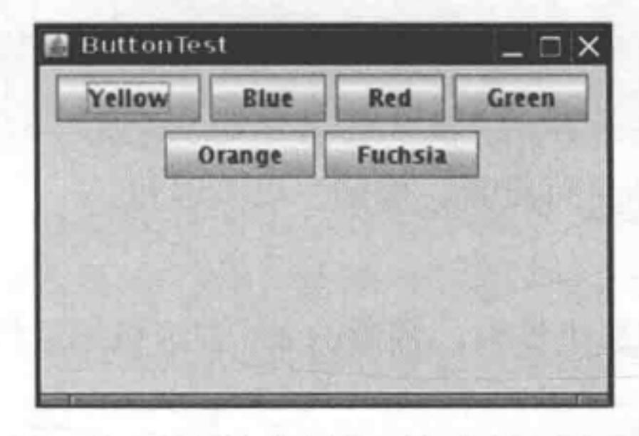

图 11-4 采用流布局管理六个按钮的面板

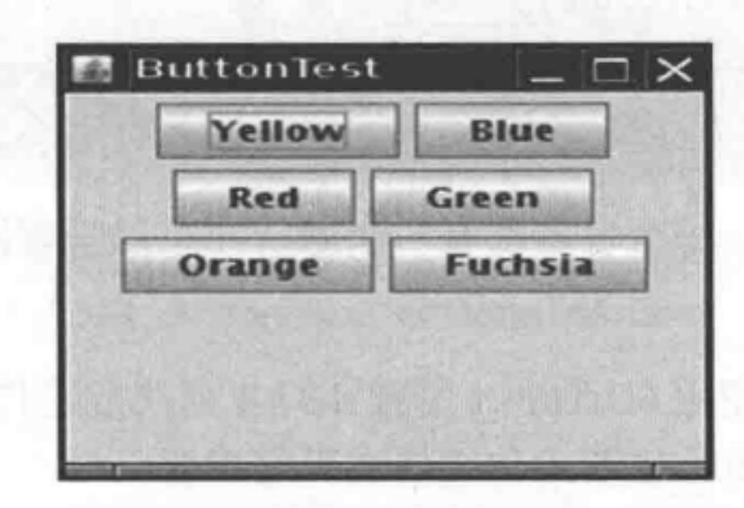

图 11-5 改变面板大小会自动重新排列按钮

通常,组件放置在容器中,布局管理器决定容器中组件的位置和大小。

按钮、文本域和其他的用户界面元素都会扩展 Component 类, 组件可以放置在容器 (如

496

面板)中。由于 Container 类扩展了 Component 类, 所以容器本身也可以放置在另一个容器中。图 11-6 显示了 Component 的继承层次结构。

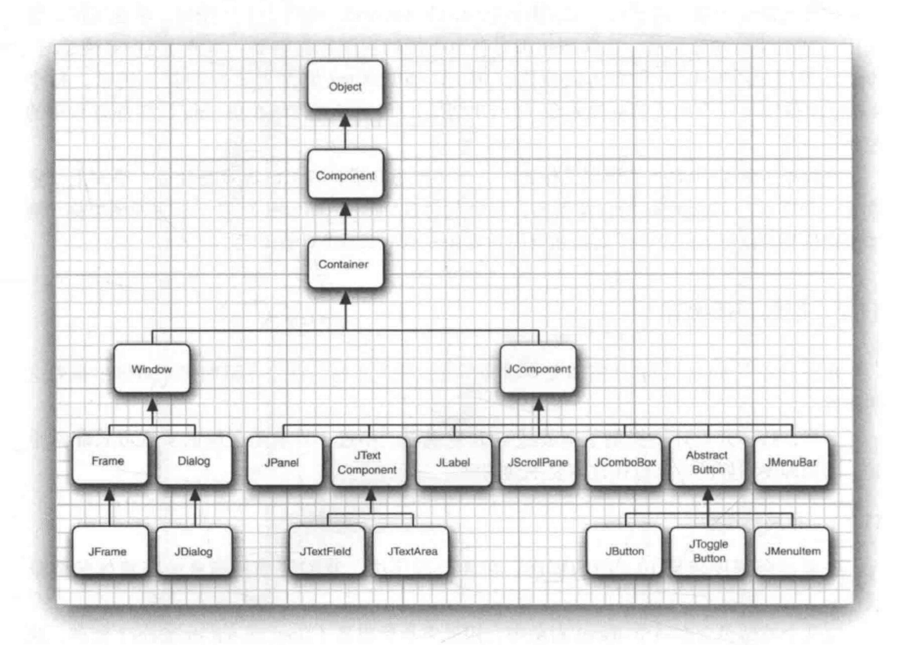

图 11-6 Component 类的继承层次结构

注释:遗憾的是,这个继承层次结构在两方面有些不太清楚。首先,顶层窗口(如 JFrame)是 Container 的子类,所以也是 Component 的子类,却不能放在其他容器内。另外, JComponent 是 Container 的子类,而不是 Component 的子类,因此,可以将其他组件添加到 JButton 中。(但这些组件不会显示。)

每个容器都有一个默认的布局管理器,但可以重新进行设置。例如,以下语句: panel.setLayout(new GridLayout(4, 4));

会使用 GridLayout 类按 4 行 4 列摆放组件。往容器中添加组件时,容器的 add 方法将把组件和 所有位置要求传递给布局管理器。

#### API java.awt.Container 1.0

void setLayout(LayoutManager m)为容器设置布局管理器。

- Component add(Component c)
- Component add(Component c, Object constraints) **1.1** 将组件添加到容器中,并返回组件引用。

## API java.awt.FlowLayout 1.0

- FlowLayout()
- FlowLayout(int align)
- FlowLayout(int align, int hgap, int vgap)
   构造一个新的 FlowLayout 对象。align 参数可以是 LEFT、CENTER 或者 RIGHT。

#### 11.2.2 边框布局

边框布局管理器(border layout manager)是每个 JFrame 的内容窗格的默认布局管理器。 流布局管理器会完全控制每个组件的位置,边框布局

管理器则不然,它允许你为每个组件选择一个位置。可以选择把组件放在内容窗格的中间、北部、南部、东部或者西部。如图 11-7 所示。

例如:

frame.add(component, BorderLayout.SOUTH);

先放置边缘组件,剩余的可用空间由中间组件占据。当容器调整大小时,边缘组件的尺寸不会改变,而中间组件的大小会发生变化。添加组件时可以指定 BorderLayout 类的 CENTER、NORTH、SOUTH、EAST 和 WEST 常量。不是所有的位置都需要占据,如果没有提供任何值,则默认为 CENTER。

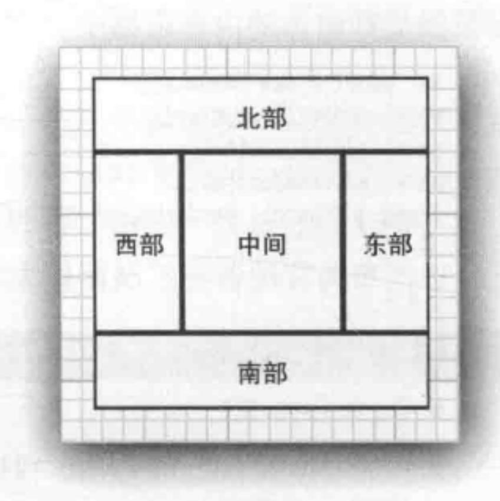

图 11-7 边框布局

注释: BorderLayout 常量定义为字符串。例如, BorderLayout.SOUTH 定义为字符串 "SOUTH"。 这比使用字符串要更安全。如果字符串不慎拼写有误,例如写为 frame.add (component, "south"),编译器不会捕获这个错误。

与流布局不同,边框布局会扩展所有组件的尺寸从而填满可用空间(流布局将维持每个组件的最佳尺寸)。添加一个按钮时,这会有问题:

frame.add(yellowButton, BorderLayout.SOUTH); // don't

图 11-8 显示了执行上述语句的结果。按钮会扩展至填满窗体的整个南部区域。而且,如果再将另外一个按钮添加到南部区域,就会取代第一个按钮。

解决这个问题的常见方法是使用另外的面板 (panel), 例如, 如图 11-9 所示。屏幕底部 的三个按钮全部包含在一个面板中。这个面板放置在内容窗格的南部区域。


图 11-8 边框布局管理一个按钮

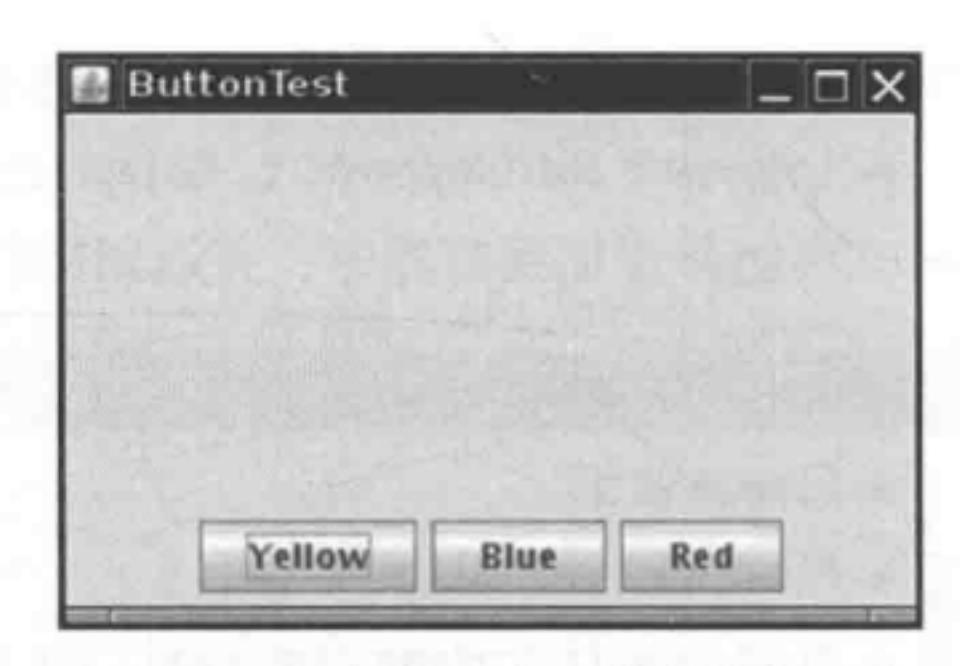

图 11-9 面板放置在窗体的南部区域

要想得到这种配置,首先需要创建一个新的 JPanel 对象,然后将各个按钮添加到这个面板中。面板的默认布局管理器是 FlowLayout,在这里这是个不错的选择。随后使用前面已经见过的 add 方法将每个按钮添加到面板中。每个按钮的位置和大小完全由 FlowLayout 布局管理器控制。这意味着这些按钮将在面板中居中,并不会扩展至填满整个面板区域。最后,将这个面板添加到窗体的内容窗格中。

```
var panel = new JPanel();
panel.add(yellowButton);
panel.add(blueButton);
panel.add(redButton);
frame.add(panel, BorderLayout.SOUTH);
```

边框布局管理器将扩展面板大小, 以填满整个南部区域。

## API java.awt.BorderLayout 1.0

- BorderLayout()
- BorderLayout(int hgap, int vgap)
   构造一个新的 BorderLayout 对象。

## 11.2.3 网格布局

网格布局像电子数据表格一样,按行列排列所有的组件。所有组件的大小都是一样的。 图 11-10 显示的计算器程序就使用了网格布局来排列计算器按钮。

当调整窗口大小时,计算器按钮将随之变大或变小,但所有按钮的尺寸始终保持一致。

在网格布局对象的构造器中,需要指定所需的行数和列数: panel.setLayout(new GridLayout(4, 4));

添加组件,从第一行的第一项开始,然后是第一行的第二项, 以此类推。

```
| Calculator
```

图 11-10 计算器

panel.add(new JButton("1"));
panel.add(new JButton("2"));

当然,极少应用会有像计算器这样整齐的布局。在实际中,小网格(通常只有一行或者

一列)对于组织窗口的部分区域会很有用。例如,如果想放置一行大小相等的按钮,就可以将这些按钮放置在一个面板中,而且这个面板使用只有一行的网格布局进行管理。

## API java.awt.GridLayout 1.0

- GridLayout(int rows, int columns)
- GridLayout(int rows, int columns, int hgap, int vgap)
   构造一个新的 GridLayout 对象。rows 或者 columns 可以为零,但不能同时为零,指示每行或每列任意的组件数。

## 11.3 文本输入

终于可以开始介绍 Swing 用户界面组件了。首先来介绍允许用户输入和编辑文本的组件。可以使用文本域(JTextField)和文本区(JTextArea)组件输入文本。文本域只能接受单行文本,而文本区能够接受多行文本。JPasswordField 也只能接受单行文本,但不会将输入的内容显示出来。

这三个类都继承自 JTextComponent 类。由于 JTextComponent 是一个抽象类,所以你自己不能构造这个类的对象。另外,在 Java 中常会看到这种情况,查看 API 文档时,你可能发现所找的方法实际上来自父类 JTextComponent,而不是来自派生类自身。例如,获取或设置一个文本域或文本区中文本的方法实际上都是 JTextComponent 类中的方法。

## API javax.swing.text.JTextComponent 1.2

- String getText()
- void setText(String text)
   获取或设置文本组件的文本。
- boolean isEditable()
- void setEditable(boolean b)
   获取或设置 editable 属性,这个属性决定了用户是否可以编辑这个文本组件的内容。

## 11.3.1 文本域

把文本域添加到窗口的常用办法是将它添加到一个面板或者其他容器中,这与添加按钮完全一样:

var panel = new JPanel();
var textField = new JTextField("Default input", 20);
panel.add(textField);

这段代码将添加一个文本域,初始化时在其中放入字符串 "Default input"。构造器的第二个参数设置了文本域的宽度。在这个示例中,宽度值为 20 "列"。但是,这里所说的列不是一个精确的度量单位。一列是指按当前使用的字体一个字符的宽度。其想法是,如果希望文本域最多能够输入n个字符,就应该把宽度设置为n列。但在实际中,这样做效果并不理

想,为稳妥一些,最好将最大输入长度再多加 1 ~ 2 个字符。另外要记住,列数只是给 AWT 的一个提示,提供了首选(preferred)大小。如果布局管理器需要缩放这个文本域,它会调整文本域的大小。在 JTextField 的构造器中设定的列宽并不是用户能输入的字符个数的上限。用户仍然可以输入更长的字符串,但是当文本长度超过文本域长度时输入就会滚动。用户通常不喜欢滚动文本域,因此应该尽量把文本域设置得宽一些。如果需要在运行时重新设置列数,可以使用 setColumns 方法。

● 提示:使用 setColumns 方法改变一个文本框的大小之后,需要调用外围容器的 revalidate 方法。

textField.setColumns(10);
panel.revalidate();

revalidate 方法会重新计算容器内所有组件的大小,并且对它们重新进行布局。调用 revalidate 方法后,布局管理器会调整容器的大小,然后就可以看到改变大小后的文本域了。

revalidate 方法是 JComponent 类中的方法。它并不是立即改变组件大小,而只是将组件标记为要改变大小。这种方法可以避免多个组件请求调整大小时带来的重复计算。但是,如果想重新计算一个 JFrame 中的所有组件,就必须调用 validate 方法—— JFrame 没有扩展 JComponent。

通常情况下,用户会在文本域中添加文本(或者编辑已有的文本)。这些文本域一般初始为空白。要构造一个空白文本域,只需要省略 JTextField 构造器的字符串参数:

var textField = new JTextField(20);

可以在任何时候调用 setText 方法来改变文本域的内容,之前提到过,这个方法是从 JTextComponent 父类继承而来的。例如:

textField.setText("Hello!");

另外,正如之前提到的,可以调用 getText 方法来获取用户键入的文本。这个方法原样返回用户输入的文本。如果想要去掉文本域数据中前后多余的空格,可以对 getText 的返回值应用 strip 方法:

String text = textField.getText().strip();

如果想改变显示文本的字体,可以使用 setFont 方法。

## API javax.swing.JTextField 1.2

- JTextField(int cols)
   构造一个有指定列数的空 JTextField 对象。
- JTextField(String text, int cols)
   构造一个有初始字符串和指定列数的 JTextField 对象。
- int getColumns()

void setColumns(int cols)
 获得或设置文本域使用的列数。

#### API javax.swing.JComponent 1.2

- void revalidate()
   导致重新计算组件的位置和大小。
- void setFont(Font f)
   设置这个组件的字体。

## API java.awt.Component 1.0

- void validate()
   重新计算组件的位置和大小。如果组件是容器,容器中包含的所有组件的位置和大小也会重新计算。
- Font getFont()获得组件的字体。

## 11.3.2 标签和标签组件

标签是容纳文本的组件,它们没有任何修饰(例如没有边界),也不能响应用户输入。可以利用标签标识组件。例如,与按钮不同,文本域没有标识它们的标签。要对这种本身不带标识的组件加标签,应该:

- 1. 用正确的文本构造一个 JLabel 组件。
- 2. 将它放置在与所要标识的组件足够近的地方,以便用户看到这个标签标识的组件。

JLabel 的构造器允许指定初始文本和图标,可选地,也可以指定内容的对齐方式。可以用 SwingConstants 接口中的常量来指定对齐方式。这个接口中定义了一些很有用的常量,如 LEFT、RIGHT、CENTER、NORTH、EAST等。JLabel 类是实现这个接口的众多 Swing 类之一。因此,可以如下指定右对齐标签:

var label = new JLabel("User name: ", SwingConstants.RIGHT);

## 或者

var label = new JLabel("User name: ", JLabel.RIGHT);

利用 setText 和 setIcon 方法可以在运行期间设置标签的文本和图标。

● 提示:可以在按钮、标签和菜单项上使用纯文本或 HTML 文本。我们不推荐在按钮上使用 HTML 文本——这样会影响观感。但是标签中使用 HTML 文本很有意义。只需要简单地将标签字符串包围在 <a href="html">html</a>>之间,如下所示:

label = new JLabel("<html><b>Required</b> entry:</html>");

需要说明的是,包含HTML标签的第一个组件需要延迟一段时间才能显示出来,这是因为需要加载相当复杂的HTML渲染代码。

与其他组件一样,标签也可以放在容器中。这就是说,可以利用前面介绍的技术将标签 放置在任何需要的地方。

#### API javax.swing.JLabel 1.2

- JLabel(String text)
- JLabel(Icon icon)
- JLabel(String text, int align)
- JLabel(String text, Icon icon, int align)
   构造一个标签。align 参数是一个 SwingConstants 常量: LEFT (默认)、CENTER 或者 RIGHT。
- String getText()
- void setText(String text)
   获得或设置标签的文本。
- Icon getIcon()
- void setIcon(Icon icon)
   获得或设置标签的图标。

#### 11.3.3 密码域

密码域是一种特殊的文本域。为了避免有不良企图的人站在一旁看到密码,用户输入的字符不真正显示出来。每个输入的字符都用回显字符(echo character)表示,如星号(\*)。 Swing 提供了 JPasswordField 类来实现这样的文本域。

密码域也是一个体现模型 - 视图 - 控制器架构模式强大功能的例子。密码域使用与常规 文本域相同的模型来存储数据, 但是, 它的视图改为将所有字符显示为回显字符。

## API javax.swing.JPasswordField 1.2

- JPasswordField(String text, int columns)
   构造一个新的密码域。
- void setEchoChar(char echo)
   为密码域设置回显字符。这只是建议性的;特定的观感可能坚持使用自己的回显字符。值0会重新设置为默认的回显字符。
- char[] getPassword()
   返回密码域中包含的文本。为了得到更好的安全性,在使用之后应该覆写所返回数组的内容(密码并不是作为 String 返回,这是因为字符串在被垃圾回收之前会一直驻留在虚拟机中)。

#### 11.3.4 文本区

有时,用户的输入可能超过一行。正像前面提到的,可以使用 JTextArea 组件来接收这样的输入。在程序中放置一个文本区组件时,用户就可以输入多行文本,并用回车键换行。每

行都以一个 '\n' 结尾。图 11-11 显示了一个正在使用的文本区。

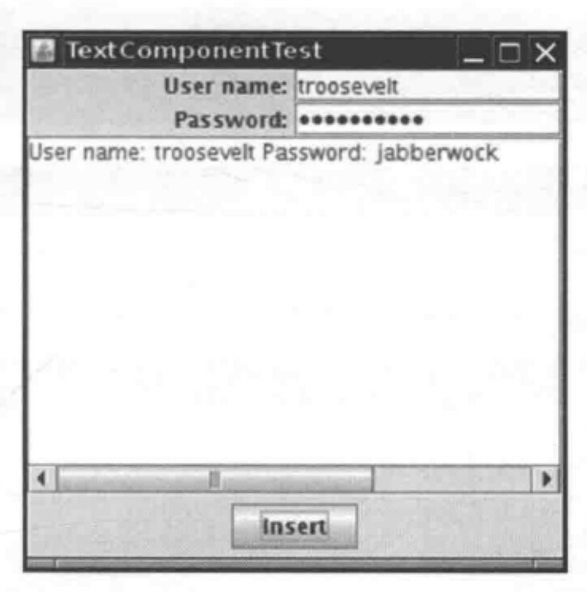

图 11-11 文本组件

在 JTextArea 组件的构造器中,可以指定文本区的行数和列数。例如:

textArea = new JTextArea(8, 40); // 8 lines of 40 columns each

这里参数 columns 与之前的做法相同,而且出于稳妥的考虑,应该再增加几列。另外,用户并不受限于指定的行数和列数。当输入过长时,文本会滚动。还可以用 setColumns 方法改变列数,用 setRows 方法改变行数。这些值只是指示首选大小——布局管理器可能还会对文本区进行缩放。

如果文本区的文本超出了可显示的范围,那么剩下的文本就会被剪裁掉。可以通过开启自动换行属性来避免裁剪长文本行:

textArea.setLineWrap(true); // long lines are wrapped

自动换行只是视觉效果,文档中的文本没有改变,并没有在文本中自动插入 '\n' 字符。

## 11.3.5 滚动窗格

在 Swing 中,文本区没有滚动条。如果需要滚动条,必须将文本区放在滚动窗格(scroll pane)中。

textArea = new JTextArea(8, 40);
var scrollPane = new JScrollPane(textArea);

现在滚动窗格管理文本区的视图。如果文本超出了文本区可以显示的范围,滚动条就会自动出现,删除部分文本后,如果剩余文本能够在文本区范围内显示,滚动条会再次消失。滚动是由滚动窗格内部处理的,编写程序时无须处理滚动事件。

这是一种适用于所有组件的通用机制,而不是文本区特有的。也就是说,要想为组件添加滚动条,只需将它们放入一个滚动窗格中即可。

程序清单 11-1 展示了各种文本组件。这个程序显示了一个文本域、一个密码域和一个带滚

动条的文本区。文本域和密码域都有标签。点击"Insert"会将输入域中的内容插入到文本区中。

i 注释: JTextArea 组件只显示纯文本,没有特殊字体或者格式。如果想显示格式化文本 (如 HTML),就需要使用 JEditorPane 类,这将在卷Ⅱ中详细讨论。

#### 程序清单 11-1 text/TextComponentFrame.java

```
package text;
 import java.awt.BorderLayout;
  import java.awt.GridLayout;
   import javax.swing.JButton;
7 import javax.swing.JFrame;
8 import javax.swing.JLabel;
9 import javax.swing.JPanel;
import javax.swing.JPasswordField;
 import javax.swing.JScrollPane;
  import javax.swing.JTextArea;
   import javax.swing.JTextField;
   import javax.swing.SwingConstants;
15
16
    * A frame with sample text components.
18
   public class TextComponentFrame extends JFrame
20
      public static final int TEXTAREA ROWS = 8;
21
      public static final int TEXTAREA_COLUMNS = 20;
22
23
      public TextComponentFrame()
24
25
         var textField = new JTextField();
26
         var passwordField = new JPasswordField();
28
         var northPanel = new JPanel();
29
         northPanel.setLayout(new GridLayout(2, 2));
30
         northPanel.add(new JLabel("User name: ", SwingConstants.RIGHT));
31
         northPanel.add(textField);
32
         northPanel.add(new JLabel("Password: ", SwingConstants.RIGHT));
33
         northPanel.add(passwordField);
34
35
         add(northPanel, BorderLayout.NORTH);
36
37
         var textArea = new JTextArea(TEXTAREA ROWS, TEXTAREA COLUMNS);
38
         var scrollPane = new JScrollPane(textArea);
39
48
         add(scrollPane, BorderLayout.CENTER);
41
42
         // add button to append text into the text area
44
         var southPanel = new JPanel();
45
```

```
var insertButton = new JButton("Insert");
         southPanel.add(insertButton);
48
         insertButton.addActionListener(event ->
49
            textArea.append("User name: " + textField.getText() + " Password: "
50
               + new String(passwordField.getPassword()) + "\n"));
51
52
         add(southPanel, BorderLayout.SOUTH);
53
         pack();
54
55
56
```

## API javax.swing.JTextArea 1.2

- JTextArea()
- JTextArea(int rows, int cols)
- JTextArea(String text, int rows, int cols)
   构造一个新的文本区。
- void setColumns(int cols)
   设置文本区要使用的首选列数。
- void setRows(int rows)
   设置文本区要使用的首选行数。
- void append(String newText)
   将给定的文本追加到文本区中已有文本的末尾。
- void setLineWrap(boolean wrap)
   打开或关闭自动换行。
- void setWrapStyleWord(boolean word)
   如果 word 是 true,长文本行会在单词边界自动换行。如果为 false,长文本行会直接截断而不考虑单词边界。
- void setTabSize(int c)
   每c列设置一个制表符(tab stop)。注意,制表符不会被转换为空格,但会让文本对 齐到下一个制表符处。

## API javax.swing.JScrollPane 1.2

 JScrollPane(Component c)
 创建一个滚动窗格,用来显示指定组件的内容。当组件内容超过可显示的范围时,会 提供滚动条。

## 11.4 选择组件

现在我们已经了解了如何收集用户输入的文本。不过,在很多情况下,可能更应该为用户提供有限的一组选项,而不是让用户在文本组件中输入数据。可以使用一组按钮或者选项

列表让用户做出选择(这样也免去了检查错误的麻烦)。在本节中,将介绍如何编写程序来使用复选框、单选按钮、选项列表以及滑动条。

#### 11.4.1 复选框

如果想要收集的输入只是"是"或"否",就可以使用复选框组件。复选框自动提供标签作为标识。用户通过点击一个复选框将它选中,再次点击可以取消选中。当复选框获得焦点时,按下空格键也可以切换复选框的选中状态。

图 11-12 所示的简单程序中有两个复选框,其中一个用于打开或关闭字体倾斜属性,而

另一个用于控制加粗属性。注意,第二个复选框有 焦点,这一点由标签周围的矩形框可以看出。每次 用户点击其中一个复选框时,就会使用新的字体属 性刷新屏幕。

复选框需要一个紧邻的标签来明确其用途。在构造器中指定标签文本。

bold = new JCheckBox("Bold");

可以使用 setSelected 方法来选中或取消选中复选框。例如:


图 11-12 复选框

bold.setSelected(true);

isSelected 方法将获取每个复选框的当前状态。如果没有选中则为 false, 如果选中这个复选框则为 true。

用户点击复选框时将触发一个动作事件。与以往一样,可以为复选框关联一个动作监听器。在这个程序中,两个复选框使用了同一个动作监听器。

```
ActionListener listener = . . .;
bold.addActionListener(listener);\nitalic.addActionListener(listener);
```

监听器查询 bold 和 italic 复选框的状态,并且把面板中的字体设置为常规、加粗、倾斜或者粗斜字体。

```
ActionListener listener = event ->
{
   int mode = 0;
   if (bold.isSelected()) mode += Font.BOLD;
   if (italic.isSelected()) mode += Font.ITALIC;
   label.setFont(new Font(Font.SERIF, mode, FONTSIZE));
};
```

程序清单 11-2 给出了这个复选框例子的全部代码。

## 程序清单 11-2 checkBox/ CheckBoxFrame.java

1 package checkBox;

```
3 import java.awt.*;
  import java.awt.event.*;
  import javax.swing.*;
   /**
    * A frame with a sample text label and check boxes for selecting font
    * attributes.
10
   public class CheckBoxFrame extends JFrame
12 {
      private JLabel label;
13
      private JCheckBox bold;
14
      private JCheckBox italic;
15
      private static final int FONTSIZE = 24;
16
17
      public CheckBoxFrame()
18
19
         // add the sample text label
20
21
         label = new JLabel("The quick brown fox jumps over the lazy dog.");
22
         label.setFont(new Font("Serif", Font.BOLD, FONTSIZE));
23
         add(label, BorderLayout.CENTER);
24
25
         // this listener sets the font attribute of
26
         // the label to the check box state
27
28
         ActionListener listener = event ->
29
38
                int mode = \theta;
31
                if (bold.isSelected()) mode += Font.BOLD;
32
                if (italic.isSelected()) mode += Font.ITALIC;
33
               label.setFont(new Font("Serif", mode, FONTSIZE));
34
            };
35
36
37
         // add the check boxes
         var buttonPanel = new JPanel();
38
39
         bold = new JCheckBox("Bold");
48
         bold.addActionListener(listener);
41
         bold.setSelected(true);
42
         buttonPanel.add(bold);
43
44
         italic = new JCheckBox("Italic");
45
         italic.addActionListener(listener);
46
         buttonPanel.add(italic);
47
48
         add(buttonPanel, BorderLayout.SOUTH);
49
         pack();
50
51
52
```

## API javax.swing.JCheckBox 1.2

JCheckBox(String label)

- JCheckBox(String label, Icon icon)
   构造一个复选框,初始未选中。
- JCheckBox(String label, boolean state)
   用给定的标签和初始状态构造一个复选框。
- boolean isSelected()
- void setSelected(boolean state)
   获得或设置复选框的选择状态。

#### 11.4.2 单选按钮

在前一个例子中,对于这两个复选框,用户既可以选择一个、两个,也可以两个都不选。在很多情况下,我们需要用户只选择几个选项当中的一个。当用户选择另一项的时候,

前一项就自动地取消选中。这样一组选项通常称为单选按钮组(radio button group),这是因为这些按钮的工作很像收音机上的电台选钮。当按下一个按钮时,前一个按下的按钮就会自动弹起。图 11-13 给出了一个典型的例子。这里允许用户在多个选择中选择一个字体大小,即小(Small)、中(Medium)、大(Large)和超大(Extra large),但是,当然每次只允许用户选择一个字体大小。


图 11-13 单选按钮组

在 Swing 中实现单选按钮组非常简单。为每组单选按钮构造一个 ButtonGroup 类型的对象。然后,再为这个按钮组添加 JRadioButton 类型的对象。按钮组对象负责在点击一个新按钮时取消前一个选中按钮的选中状态。

```
var group = new ButtonGroup();
var smallButton = new JRadioButton("Small", false);
group.add(smallButton);
var mediumButton = new JRadioButton("Medium", true);
group.add(mediumButton);
```

对于初始要选中的按钮,构造器的第二个参数为 true,对于其他按钮,这个参数为 false。注意,按钮组只控制按钮的行为,如果为了布局想把这些按钮分组在一起,还需要把它们添加到一个容器中(如 JPanel)。

如果再看图 11-12 和图 11-13, 你会发现,单选按钮与复选框的外观是不一样的。复选框 为正方形,如果被选中,这个正方形中会出现一个对勾符号。单选按钮是圆形,选中后圆圈 内包含一个圆点。

单选按钮的事件通知机制与其他按钮一样。当用户点击一个单选按钮时,这个按钮将产

生一个动作事件。在这里的示例程序中,我们定义了一个动作监听器,会把字体大小设置为一个特定值:

```
ActionListener listener = event ->
  label.setFont(new Font("Serif", Font.PLAIN, size));
```

将这个监听器与复选框示例的监听器做一个对比。每个单选按钮会得到一个不同的监听器对象。每个监听器对象都非常清楚所要做的事情——把字体大小设置为一个特定值。对于复选框,使用的是一种不同的方法:两个复选框共享同一个动作监听器,这个监听器调用一个方法来检查两个复选框的当前状态。

对于单选按钮可以使用同样的方法吗?我们也可以使用一个监听器来计算字体大小,如 下所示:

```
if (smallButton.isSelected()) size = 8;\nelse if (mediumButton.isSelected()) size = 12;
```

不过,我们更愿意使用单独的动作监听器,因为这样可以将大小值与按钮更紧密地绑定 在一起。

注释:如果有一组单选按钮,可以知道它们之中只能有一个被选中。要是能够不查询组内所有的按钮就可以很快地知道哪个按钮被选中就好了。由于ButtonGroup对象控制着所有的按钮,所以如果这个对象能够提供选中按钮的引用就方便多了。事实上,ButtonGroup类中有一个getSelection方法,但是这个方法并不返回被选中的单选按钮,而是返回与那个按钮关联的模型的ButtonModel引用。很遗憾,ButtonModel的所有方法都没有什么帮助。ButtonModel接口从ItemSelectable接口继承了一个getSelectedObjects方法,但是这个方法没有用,它只返回null。getActionCommand方法看起来似乎可用,这是因为一个单选按钮的"动作命令"是它的文本标签,但是它的模型的动作命令是null。只有用 setActionCommand 方法明确地为所有单选按钮设定了动作命令,才会设置模型的动作命令值。然后可以调用方法 buttonGroup.getSelection().getActionCommand() 获得当前选中的按钮的动作命令。

程序清单 11-3 是一个用于选择字体大小的程序的完整代码,这里使用了一组单选按钮。

#### 程序清单 11-3 radioButton/RadioButtonFrame.java

```
package radioButton;
\nimport java.awt.*;
\nimport java.awt.event.*;
\nimport javax.swing.*;

/**

* A frame with a sample text label and radio buttons for selecting font sizes.

*/

public class RadioButtonFrame extends JFrame

{
```

```
private JPanel buttonPanel;
12
      private ButtonGroup group;
13
      private JLabel label;
14
      private static final int DEFAULT_SIZE = 36;
15
16
      public RadioButtonFrame()
17
18
         // add the sample text label
19
20
         label = new JLabel("The quick brown fox jumps over the lazy dog.");
21
         label.setFont(new Font("Serif", Font.PLAIN, DEFAULT_SIZE));
22
         add(label, BorderLayout.CENTER);
23
24
         // add the radio buttons
25
26
         buttonPanel = new JPanel();
27
         group = new ButtonGroup();
28
29
         addRadioButton("Small", 8);
30
         addRadioButton("Medium", 12);
31
         addRadioButton("Large", 18);
32
         addRadioButton("Extra large", 36);
33
34
         add(buttonPanel, BorderLayout.SOUTH);
35
         pack();
36
37
38
39
       * Adds a radio button that sets the font size of the sample text.
40
       * @param name the string to appear on the button
41
       * @param size the font size that this button sets
42
43
      public void addRadioButton(String name, int size)
44
45
         boolean selected = size == DEFAULT SIZE;
         var button = new JRadioButton(name, selected);
         group.add(button);
          buttonPanel.add(button);
50
         // this listener sets the label font size
51
52
         ActionListener listener = event -> label.setFont(new Font("Serif", Font.PLAIN, size));
53
54
          button.addActionListener(listener);
55
56
57 }
```

## API javax.swing.JRadioButton 1.2

- JRadioButton(String label, Icon icon)
   构造一个初始没有选中的单选按钮。
- JRadioButton(String label, boolean state)

用给定的标签和初始状态构造一个单选按钮。

## API javax. swing. Button Group 1.2

- void add(AbstractButton b)
   将按钮添加到组中。
- ButtonModel getSelection()
   返回选中按钮的按钮模型。

## API javax.swing.ButtonModel 1.2

String getActionCommand()
 返回按钮模型的动作命令。

## API javax.swing.AbstractButton 1.2

void setActionCommand(String s)
 设置按钮及其模型的动作命令。

## 11.4.3 边框

如果在一个窗口中有多组单选按钮,你可能希望用可见的方式来指明哪些按钮属于同一组。Swing 提供了一组很有用的边框(border)来解决这个问题。可以对任何扩展了 JComponent 的组件应用边框。最常见的用法是在面板周围放置一个边框,然后用其他用户界面元素(如单选按钮)填充面板。

有很多不同的边框可供选择,不过使用它们的步骤完全一样。

- 1. 调用 BorderFactory 的静态方法创建边框。可以选择以下风格(如图 11-14 所示):
- 凹斜面
- 凸斜面
- 蚀刻
- 直线
- 蒙版
- 空(只是在组件外围创建一些空白空间)

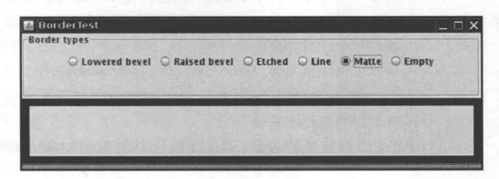

图 11-14 测试边框类型

- 2. 如果愿意的话,可以为边框加标题,为此要将边框传递到 BroderFactory.createTitled-Border。
- 3. 如果确实想充分使用边框,可以调用以下方法组合多种边框: BorderFactory.createCompound-Border。
  - 4. 调用 JComponent 类的 setBorder 方法将得到的边框添加到组件。

例如,下面的代码展示了如何把一个带标题的蚀刻边框添加到一个面板:

```
Border etched = BorderFactory.createEtchedBorder();
Border titled = BorderFactory.createTitledBorder(etched, "A Title");
panel.setBorder(titled);
```

不同的边框有不同的选项用于设置边框的宽度和颜色。详情请参见 API 注释。偏爱使用 边框的人会很高兴地发现,还有一个 SoftBevelBorder 类用于构造有柔和圆角的斜面边框,另 外还有一个 LineBorder 类也可以有圆角。只能使用类的某个构造器构造这些边框,它们没有 相应的 BorderFactory 方法。

#### API javax.swing.BorderFactory 1.2

- static Border createLineBorder(Color color)
- static Border createLineBorder(Color color, int thickness) 创建一个简单的直线边框。
- static MatteBorder createMatteBorder(int top, int left, int bottom, int right, Color color)
- static MatteBorder createMatteBorder(int top, int left, int bottom, int right, Icon tileIcon) 创建一个用颜色或重复图标填充的粗边框。
- static Border createEmptyBorder()
- static Border createEmptyBorder(int top, int left, int bottom, int right)
   创建一个空边框。
- static Border createEtchedBorder()
- static Border createEtchedBorder(Color highlight, Color shadow)
- static Border createEtchedBorder(int type)
- static Border createEtchedBorder(int type, Color highlight, Color shadow)
   创建一个具有 3D 效果的直线边框。type 参数可以是常量 EtchedBorder.RAISED 或 EtchedBorder.LOWERED。
- static Border createBevelBorder(int type)
- static Border createBevelBorder(int type, Color highlight, Color shadow)
- static Border createLoweredBevelBorder()
- static Border createRaisedBevelBorder()
   创建一个具有凹面或凸面效果的边框。type 参数可以是 BevelBorder.LOWERED 或 Bevel-Border.RAISED。
- static TitledBorder createTitledBorder(String title)

- static TitledBorder createTitledBorder(Border border)
- static TitledBorder createTitledBorder(Border border, String title)
- static TitledBorder createTitledBorder(Border border, String title, int justification, int position)
- static TitledBorder createTitledBorder(Border border, String title, int justification, int position, Font font)
- static TitledBorder createTitledBorder(Border border, String title, int justification, int position, Font font, Color color)
   创建一个有指定属性的带标题的边框。justification 参数是 TitledBorder 常量 LEFT、CENTER、RIGHT、LEADING、TRAILING 或 DEFAULT\_JUSTIFICATION(左对齐)之一, position 是 ABOVE\_TOP、TOP、BELOW TOP、ABOVE BOTTOM、BOTTOM、BELOW BOTTOM或 DEFAULT POSITION(上)之一。
- static CompoundBorder createCompoundBorder(Border outsideBorder, Border insideBorder) 将两个边框组合成一个新的边框。

#### API javax.swing.border.SoftBevelBorder 1.2

- SoftBevelBorder(int type)
- SoftBevelBorder(int type, Color highlight, Color shadow)
   创建一个有柔和圆角的斜面边框。type 参数可以是 BevelBorder.LOWERED 或 BevelBorder. RAISED。

#### API javax.swing.border.LineBorder 1.2

public LineBorder(Color color, int thickness, boolean roundedCorners)
 用指定的颜色和粗细创建一个直线边框。如果 roundedCorners 为 true,则边框有圆角。

## API javax.swing.JComponent 1.2

void setBorder(Border border)
 设置这个组件的边框。

## 11.4.4 组合框

如果有较多选择项,使用单选按钮就不太适合了,因为它们会占据太多屏幕空间。这时就可以选择组合框。当用户点击这个组件时,会下拉一个选择列表,用户可以从中选择一项(见图 11-15)。

如果下拉列表框被设置成可编辑(editable),则可以编辑当前的选项,就好像这是一个文本域一样。鉴于这个原因,这种组件被称为组合框(combobox),它组合了文本域的灵活性与一组预定义的选项。JComboBox类提供了组合框组件。

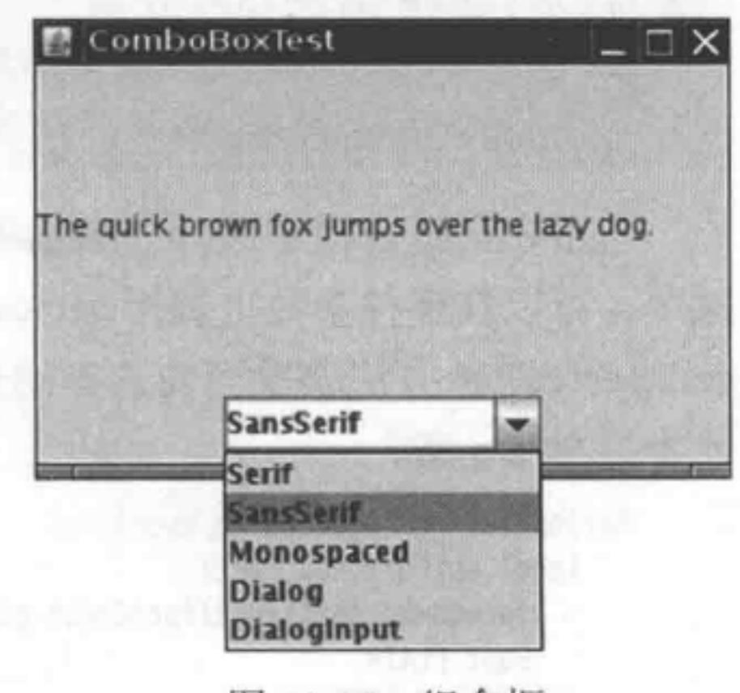

图 11-15 组合框

514

在 Java 7 中, JComboBox 类是一个泛型类。例如, JCombo-Box<String>包含 String 类型的对象, JComboBox<Integer>包含整数。

调用 setEditable 方法会设置组合框可编辑。注意,编辑只会影响所选择的项,而不会改变选项列表。

可以调用 getSelectedItem 方法获得当前的选项,如果组合框是可编辑的,当前选项可能已经编辑过。不过,对于可编辑组合框,其中的选项可以是任何类型,这取决于编辑器(编辑器要接受用户编辑并将结果转换为一个对象)。(关于编辑器的讨论请参见卷II中的第6章。)如果组合框不是可编辑的,最好调用:

combo.getItemAt(combo.getSelectedIndex())

这会为所选择的选项提供正确的类型。

在示例程序中,用户可以从字体列表(Serif、SansSerif、Monospaced 等)中选择一种字体,用户也可以键入其他的字体。

可以用 addItem 方法增加选项。在示例程序中,只在构造器中调用了 addItem 方法,实际上,可以在任何时候调用这个方法。

```
var faceCombo = new JComboBox<String>();
faceCombo.addItem("Serif");
faceCombo.addItem("SansSerif");
```

这个方法将字符串添加到列表末尾。可以使用 insertItemAt 方法在列表的任何位置插入新选项: faceCombo.insertItemAt("Monospaced", 0); // add at the beginning

可以增加任何类型的选项,组合框会调用每个选项的 toString 方法显示这个选项。

如果需要在运行时删除某些选项,可以使用 removeItem 或者 removeItemAt 方法,使用哪个方法取决于参数提供的是想要删除的选项,还是选项位置。

```
faceCombo.removeItem("Monospaced");
faceCombo.removeItemAt(0); // remove first item
removeAllItems 方法会一次删除所有的选项。
```

● 提示:如果需要在组合框中添加大量选项,addItem方法的性能会很差。实际上,可以构造一个DefaultComboBoxModel,并调用addElement方法填充这个模型,然后再调用JComboBox的setModel方法。

当用户从组合框中选择一个选项时,组合框将产生一个动作事件。为了得出选择了哪个选项,可以在事件参数上调用 getSource 方法来得到发送这个事件的组合框的引用,接着调用 getSelectedItem 方法获取当前选择的选项。需要把这个方法的返回值强制转换为适当的类型,通常是 String 型。

```
ActionListener listener = event ->
  label.setFont(new Font(
     faceCombo.getItemAt(faceCombo.getSelectedIndex()),
     Font.PLAIN,
     DEFAULT SIZE));
```

程序清单 11-4 给出了完整的程序。

#### 程序清单 11-4 comboBox/ComboBoxFrame.java

```
package comboBox;
   import java.awt.BorderLayout;
  import java.awt.Font;
   import javax.swing.JComboBox;
   import javax.swing.JFrame;
   import javax.swing.JLabel;
   import javax.swing.JPanel;
10
   /**
11
    * A frame with a sample text label and a combo box for selecting font faces.
13
   public class ComboBoxFrame extends JFrame
15
      private JComboBox<String> faceCombo;
16
      private JLabel label;
17
      private static final int DEFAULT SIZE = 24;
18
19
      public ComboBoxFrame()
20
21
         // add the sample text label
22
23
         label = new JLabel("The quick brown fox jumps over the lazy dog.");
24
         label.setFont(new Font("Serif", Font.PLAIN, DEFAULT_SIZE));
25
         add(label, BorderLayout.CENTER);
26
27
         // make a combo box and add face names
28
29
         faceCombo = new JComboBox<>();
30
         faceCombo.addItem("Serif");
31
         faceCombo.addItem("SansSerif");
32
         faceCombo.addItem("Monospaced");
33
         faceCombo.addItem("Dialog");
34
         faceCombo.addItem("DialogInput");
35
36
         // the combo box listener changes the label font to the selected face name
37
38
         faceCombo.addActionListener(event ->
39
            label.setFont(
40
               new Font(faceCombo.getItemAt(faceCombo.getSelectedIndex()),
                  Font.PLAIN, DEFAULT SIZE)));
42
43
         // add combo box to a panel at the frame's southern border
44
45
         var comboPanel = new JPanel();
         comboPanel.add(faceCombo);
47
         add(comboPanel, BorderLayout.SOUTH);
         pack();
50
51 }
```

#### API javax.swing.JComboBox 1.2

- boolean isEditable()
- void setEditable(boolean b)
   获得或设置组合框的 editable 属性。
- void addItem(Object item)
   把一个选项添加到选项列表中。
- void insertItemAt(Object item, int index)
   将一个选项插入到选项列表的指定索引位置。
- void removeItem(Object item)
   从选项列表中删除一个选项。
- void removeItemAt(int index) 删除指定索引位置的选项。
- void removeAllItems()
   从选项列表中删除所有选项。
- Object getSelectedItem() 返回当前选择的选项。

## 11.4.5 滑动条

组合框允许用户从一组离散值中进行选择。滑动条则允许从连续值中选择,例如,1~100的任意数值。

构造滑动条最常用的方法如下所示:

var slider = new JSlider(min, max, initialValue);

如果省略最小值、最大值和初始值,其默认值分别为 0、100 和 50。

或者如果需要垂直滑动条,可以调用以下构造器:

var slider = new JSlider(SwingConstants.VERTICAL, min, max, initialValue);

这些构造器会创建一个无格式的滑动条,如图 11-16 中最上面的滑动条。下面来看如何 为滑动条添加装饰。

当用户滑动滑动条时,滑动条的值会在最小值和最大值之间变化。当值发生变化时,会向所有变更监听器发送一个 ChangeEvent。为了得到变更通知,需要调用 addChangeListener 方法并且安装一个实现了 ChangeListener 接口的对象。在回调中,获取滑动条的值:

```
ChangeListener listener = event ->
{
    JSlider slider = (JSlider) event.getSource();
    int value = slider.getValue();
    . . .
};
```

可以通过显示刻度(tick)对滑动条进行修饰。例如,在示例程序中,第二个滑动条使用

#### 了下面的设置:

slider.setMajorTickSpacing(20);
slider.setMinorTickSpacing(5);

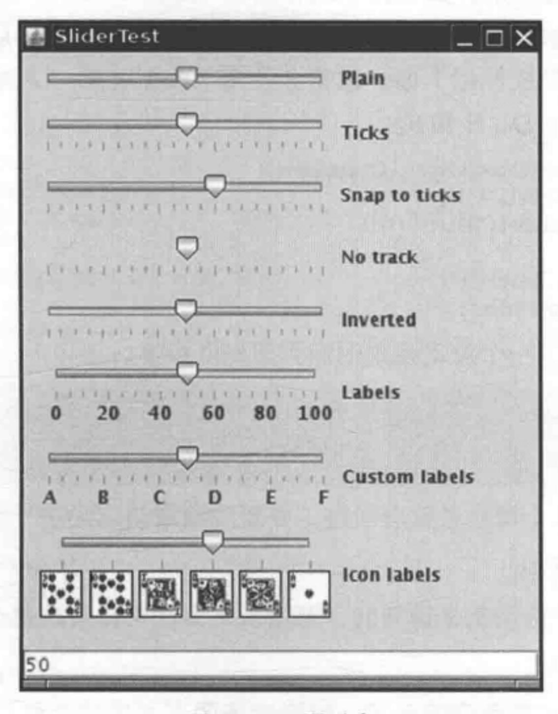

图 11-16 滑动条

这个滑动条在每20个单位的位置显示一个大刻度标记,每5个单位的位置显示一个小刻度标记。这里的单位是指滑动条值,而不是像素。

这些指令只设置了刻度标记的单位数,要想将它们真正显示出来,还需要调用:

slider.setPaintTicks(true);

大刻度和小刻度标记是相互独立的。例如,可以每20个单位设置一个大刻度标记,同时每7个单位设置一个小刻度尺标记,但是这样设置滑动条看起来会显得非常凌乱。

可以强制滑块对齐刻度(snap to tick)。这样一来,只要用户采用对齐模式完成拖放滑块的操作,它就会立即移到最接近的刻度。激活这种模式需要调用:

slider.setSnapToTicks(true);

● 警告: "对齐刻度"的行为与你想象的做法并不太一样。在滑块真正对齐之前,变更监听器报告的滑动条值并没有对应刻度。如果点击滑块附近,这个动作通常会让滑块向着点击的方向移动一小段距离,"对齐刻度"的滑块并不移动到下一个刻度。

可以调用以下方法为大刻度添加刻度标记标签 (tick mark label):

slider.setPaintLabels(true);

例如,对于一个范围为 0 到 100 的滑动条,如果大刻度的间距是 20,每个大刻度就应该分别标为 0、20、40、60、80 和 100。

还可以提供其他刻度标记,如字符串或者图标(见图 11-16)。这个过程有些烦琐。首先需要填充一个键为 Integer 类型且值为 Component 类型的散列表。然后再调用 setLabelTable 方法,这些组件会放置在刻度标记下面。通常会使用 JLabel 对象。下面的代码说明了如何将刻度标签设置为 A、B、C、D、E 和 F。

```
var labelTable = new Hashtable<Integer, Component>();
labelTable.put(0, new JLabel("A"));
labelTable.put(20, new JLabel("B"));
...
labelTable.put(100, new JLabel("F"));
slider.setLabelTable(labelTable);
```

程序清单 11-5 显示了一个滑动条用图标作为刻度标签。

● 提示: 如果刻度的标记或者标签没有显示,请检查确认是否调用了 setPaintTicks(true)
和 setPaintLabels(true)。

在图 11-16 中,第 4 个滑动条没有轨迹。要想隐藏滑块移动的"轨迹",可以调用: slider.setPaintTrack(false);

图 11-16 中的第 5 个滑动条是逆向的,调用以下方法可以实现这个效果:

slider.setInverted(true);

程序清单 11-5 中的示例程序演示了一组滑动条的不同视觉效果。每个滑动条都安装了一个变更事件监听器,它负责把当前的滑动条值显示到窗体底部的文本域中。

#### 程序清单 11-5 slider/SliderFrame.java

```
package slider;
2
   import java.awt.*;
   import java.util.*;
5 import javax.swing.*;
   import javax.swing.event.*;
     A frame with many sliders and a text field to show slider values.
   public class SliderFrame extends JFrame
12
      private JPanel sliderPanel;
13
      private JTextField textField;
      private ChangeListener listener;
15
16
      public SliderFrame()
17
18
         sliderPanel = new JPanel();
19
         sliderPanel.setLayout(new GridBagLayout());
20
21
```

```
// common listener for all sliders
22
         listener = event ->
23
24
               // update text field when the slider value changes
25
               JSlider source = (JSlider) event.getSource();
26
               textField.setText("" + source.getValue());
27
            };
28
29
         // add a plain slider
30
31
         var slider = new JSlider();
32
         addSlider(slider, "Plain");
33
34
         // add a slider with major and minor ticks
35
36
         slider = new JSlider();
37
         slider.setPaintTicks(true);
38
         slider.setMajorTickSpacing(20);
39
         slider.setMinorTickSpacing(5);
48
         addSlider(slider, "Ticks");
41
42
         // add a slider that snaps to ticks
43
44
         slider = new JSlider();
45
         slider.setPaintTicks(true);
46
         slider.setSnapToTicks(true);
47
         slider.setMajorTickSpacing(20);
48
         slider.setMinorTickSpacing(5);
         addSlider(slider, "Snap to ticks");
50
51
         // add a slider with no track
52
53
         slider = new JSlider();
54
         slider.setPaintTicks(true);
55
         slider.setMajorTickSpacing(20);
56
         slider.setMinorTickSpacing(5);
57
         slider.setPaintTrack(false);
58
         addSlider(slider, "No track");
59
60
         // add an inverted slider
61
62
         slider = new JSlider();
63
         slider.setPaintTicks(true);
64
         slider.setMajorTickSpacing(20);
65
         slider.setMinorTickSpacing(5);
66
         slider.setInverted(true);
67
         addSlider(slider, "Inverted");
68
69
         // add a slider with numeric labels
70
71
         slider = new JSlider();
72
          slider.setPaintTicks(true);
73
          slider.setPaintLabels(true);
74
          slider.setMajorTickSpacing(20);
75
```

```
slider.setMinorTickSpacing(5);
76
         addSlider(slider, "Labels");
77
78
         // add a slider with alphabetic labels
79
80
         slider = new JSlider();
81
         slider.setPaintLabels(true);
82
         slider.setPaintTicks(true);
83
         slider.setMajorTickSpacing(20);
84
         slider.setMinorTickSpacing(5);
85
86
         var labelTable = new Hashtable<Integer, Component>();
87
         labelTable.put(0, new JLabel("A"));
         labelTable.put(20, new JLabel("B"));
89
         labelTable.put(40, new JLabel("C"));
90
         labelTable.put(60, new JLabel("D"));
91
         labelTable.put(80, new JLabel("E"));
92
         labelTable.put(100, new JLabel("F"));
93
94
         slider.setLabelTable(labelTable);
95
         addSlider(slider, "Custom labels");
         // add a slider with icon labels
         slider = new JSlider();
100
         slider.setPaintTicks(true);
101
         slider.setPaintLabels(true);
102
         slider.setSnapToTicks(true);
103
         slider.setMajorTickSpacing(20);
104
         slider.setMinorTickSpacing(20);
105
106
         labelTable = new Hashtable<Integer, Component>();
187
108
         // add card images
109
110
         labelTable.put(0, new JLabel(new ImageIcon("nine.gif")));
111
         labelTable.put(20, new JLabel(new ImageIcon("ten.gif")));
112
         labelTable.put(40, new JLabel(new ImageIcon("jack.gif")));
113
         labelTable.put(60, new JLabel(new ImageIcon("queen.gif")));
114
         labelTable.put(80, new JLabel(new ImageIcon("king.gif")));
115
         labelTable.put(100, new JLabel(new ImageIcon("ace.gif")));
116
117
         slider.setLabelTable(labelTable);
118
         addSlider(slider, "Icon labels");
119
120
         // add the text field that displays the slider value
121
122
         textField = new JTextField();
123
         add(sliderPanel, BorderLayout.CENTER);
124
         add(textField, BorderLayout.SOUTH);
125
         pack();
126
      }
127
128
129
```

```
* Adds a slider to the slider panel and hooks up the listener
130
       * @param slider the slider
131
       * @param description the slider description
132
133
      public void addSlider(JSlider slider, String description)
134
135
         slider.addChangeListener(listener);
136
         var panel = new JPanel();
137
         panel.add(slider);
138
         panel.add(new JLabel(description));
139
         panel.setAlignmentX(Component.LEFT ALIGNMENT);
140
         var gbc = new GridBagConstraints();
141
         gbc.gridy = sliderPanel.getComponentCount();
142
         gbc.anchor = GridBagConstraints.WEST;
143
         sliderPanel.add(panel, gbc);
144
145
146
```

#### API javax.swing.JSlider 1.2

- JSlider()
- JSlider(int direction)
- JSlider(int min, int max)
- JSlider(int min, int max, int initialValue)
- JSlider(int direction, int min, int max, int initialValue)
  用给定的方向、最大值、最小值和初始值构造一个水平滑动条。direction 参数是 Swing-Constants.HORIZONTAL 或 SwingConstants.VERTICAL。默认为水平方向。滑动条的最小值、初始值和最大值的默认值分别为 0、50 和 100。
- void setPaintTicks(boolean b) 如果 b 为 true,显示刻度。
- void setMajorTickSpacing(int units)
- void setMinorTickSpacing(int units)
   用给定的滑动条单位的倍数设置最大刻度和最小刻度。
- void setPaintLabels(boolean b)
   如果 b 是 true,显示刻度标签。
- void setLabelTable(Dictionary table)
   设置用作刻度标签的组件。表中的每一个键/值对采用 Integer.valueOf(value)/component
   形式。
- void setSnapToTicks(boolean b)
   如果 b 是 true,每一次调整后滑块都对齐到最接近的刻度。
- void setPaintTrack(boolean b)
   如果 b 是 true,显示滑块滑动的轨迹。

## 11.5 菜单

前面介绍了可能想放在窗口中的几种最常用的组件, 如各种按钮、文本域以及组合框

等。Swing 还支持另一种用户界面元素,即 GUI 应用中我们很熟悉的下拉式菜单。

位于窗口顶部的菜单栏(menu bar)包含各个下拉菜单的名字。点击一个名字会打开包含菜单项(menu item)和子菜单(submenu)的菜单。当用户点击一个菜单项时,所有的菜单都关闭,并向程序发送一个消息。图 11-17 显示了一个带子菜单的典型菜单。

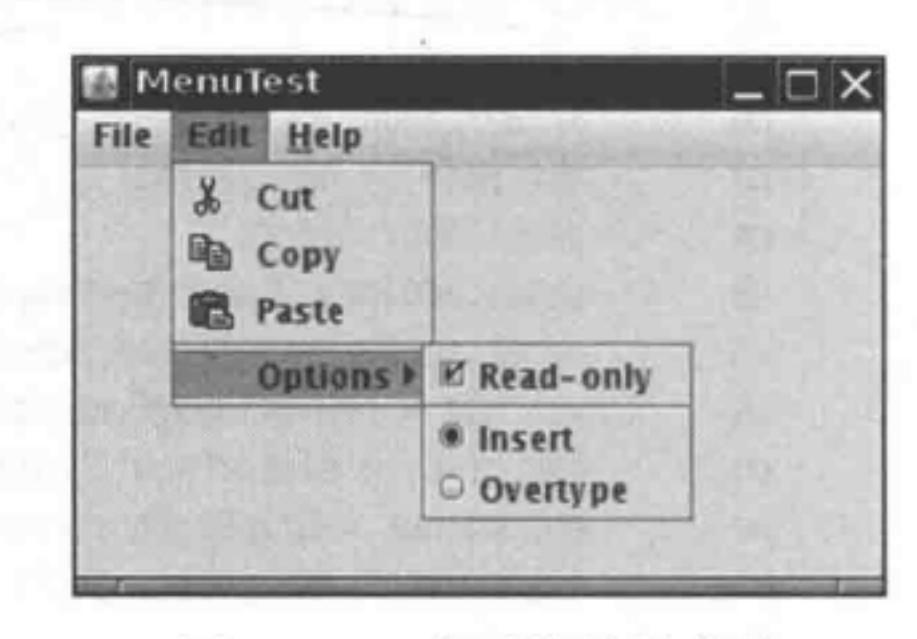

图 11-17 有子菜单的菜单

## 11.5.1 菜单构建

构建菜单是一件非常容易的事情。首先要创建一个菜单栏:

var menuBar = new JMenuBar();

菜单栏是一个可以添加到任何位置的组件。正常情况下会放置在窗体的顶部。可以调用 setJMenuBar 方法将菜单栏添加到那里:

frame.setJMenuBar(menuBar);

需要为每个菜单创建一个菜单对象:

var editMenu = new JMenu("Edit");

然后将顶层菜单添加到菜单栏:

menuBar.add(editMenu);

向菜单对象添加菜单项、分隔线和子菜单:

var pasteItem = new JMenuItem("Paste");\neditMenu.add(pasteItem);\neditMenu.addSeparator();
JMenu optionsMenu = . . .; // a submenu\neditMenu.add(optionsMenu);

可以看到图 11-17 中位于 Paste 和 Read-only 菜单项之间的分隔线。

用户选择一个菜单项时,将触发一个动作事件。需要为每个菜单项安装一个动作监 听器:

ActionListener listener = . . .;
pasteItem.addActionListener(listener);

JMenu.add(String s) 方法可以很方便地将一个菜单项增加到菜单末尾,例如:

editMenu.add("Paste");

add 方法会返回所创建的菜单, 所以可以获取这个菜单项, 并添加监听器, 如下所示:

```
JMenuItem pasteItem = editMenu.add("Paste");
pasteItem.addActionListener(listener);
```

在通常情况下,菜单项触发的命令也可以通过其他用户界面元素(如工具栏按钮)激活。在 10.4.5 节中,我们已经看到了如何通过 Action 对象来指定命令。要定义一个实现 Action 接口的类,为此通常会扩展 AbstractAction 便利类,在 AbstractAction 对象的构造器中指定菜单项标签,并且覆盖 actionPerformed 方法来指定菜单动作处理器。例如:

```
var exitAction = new AbstractAction("Exit") // menu item text goes here
{
    public void actionPerformed(ActionEvent event)
    {
        // action code goes here
        System.exit(0);
    }
};
```

然后将这个动作添加到菜单:

JMenuItem exitItem = fileMenu.add(exitAction);

这个命令会用动作名为菜单增加一个菜单项。这个动作对象将作为它的监听器。上面这条语句是下面两条语句的快捷形式:

```
var exitItem = new JMenuItem(exitAction);
fileMenu.add(exitItem);
```

#### API javax.swing.JMenu 1.2

- JMenu(String label)
   用给定标签构造一个菜单。
- JMenuItem add(JMenuItem item)
   添加一个菜单项(或一个菜单)。
- JMenuItem add(String label)
   为这个菜单增加一个有给定标签的菜单项,并返回这个菜单项。
- JMenuItem add(Action a)
   为这个菜单增加一个有给定动作的菜单项,并返回这个菜单项。
- void addSeparator()
   为菜单增加一个分隔线 (separator line)。
- JMenuItem insert(JMenuItem menu, int index)
   将一个新菜单项(或子菜单)添加到菜单的指定索引位置。
- JMenuItem insert(Action a, int index)
   将有指定动作的新菜单项增加到菜单的指定索引位置。
- void insertSeparator(int index)
   将一个分隔线添加到菜单的指定索引位置。

- void remove(int index)
- void remove(JMenuItem item)
   从菜单中删除指定的菜单项。

#### API javax.swing.JMenuItem 1.2

- JMenuItem(String label)
   用给定标签构造一个菜单项。
- JMenuItem(Action a) 1.3
   为给定动作构造一个菜单项。

#### API javax.swing.AbstractButton 1.2

void setAction(Action a) 1.3
 为这个按钮或菜单项设置动作。

## API javax.swing.JFrame 1.2

void setJMenuBar(JMenuBar menubar)
 为这个窗体设置菜单栏。

#### 11.5.2 菜单项中的图标

菜单项与按钮很相似。实际上, JMenuItem 类扩展了 AbstractButton 类。与按钮一样, 菜单可以只包含文本标签、只包含图标,或者两者都包含。可以使用 JMenuItem(String, Icon)或者 JMenuItem(Icon)构造器为菜单指定一个图标,也可以使用 JMenuItem 类从 AbstractButton 类继承的 setIcon 方法设置一个图标。例如:

var cutItem = new JMenuItem("Cut", new ImageIcon("cut.gif"));

在图 11-17 中可以看到多个菜单项旁边的图标。在默认情况下,菜单项文本放在图标的右侧。如果喜欢将文本放置在左侧,可以调用 JMenuItem 类从 AbstractButton 类继承的 setHorizontal-TextPosition 方法。例如:

cutItem.setHorizontalTextPosition(SwingConstants.LEFT);

这个调用把菜单项文本移动到图标的左侧。

也可以为动作增加一个图标:

cutAction.putValue(Action.SMALL ICON, new ImageIcon("cut.gif"));

当使用动作构造菜单项时, Action.NAME 值将会作为菜单项的文本, 而 Action.SMALL\_ICON 值 将会作为图标。

或者,可以在 AbstractAction 构造器中设置图标:

```
cutAction = new
  AbstractAction("Cut", new ImageIcon("cut.gif"))
  {
    public void actionPerformed(ActionEvent event)
```

```
{
}
};
```

#### API javax.swing.JMenuItem 1.2

JMenuItem(String label, Icon icon)
 用给定的标签和图标构造一个菜单项。

## API javax.swing.AbstractButton 1.2

void setHorizontalTextPosition(int pos)
 设置文本相对于图标的水平位置。pos 参数可以是 SwingConstants.RIGHT(文本在图标的右侧)或 SwingConstants.LEFT。

## API javax.swing.AbstractAction 1.2

AbstractAction(String name, Icon smallIcon)
 用给定的名字和图标构造一个抽象动作。

#### 11.5.3 复选框和单选按钮菜单项

复选框和单选按钮菜单项会在菜单名旁边显示了一个复选框或一个单选按钮(参见图 11-17)。 当用户选择一个菜单项时,相应的复选框或单选按钮会自动切换选择状态。

除了按钮装饰外,复选框和单选按钮菜单项同其他菜单项的处理一样。例如,可以如下 创建复选框菜单项:

```
var readonlyItem = new JCheckBoxMenuItem("Read-only");
optionsMenu.add(readonlyItem);
```

单选按钮菜单项与普通单选按钮的工作方式一样,必须将它们加入到按钮组中。当按钮组中的一个按钮被选中时,其他按钮都会自动地变为未选中。

```
var group = new ButtonGroup();
var insertItem = new JRadioButtonMenuItem("Insert");\ninsertItem.setSelected(true);
var overtypeItem = new JRadioButtonMenuItem("Overtype");
group.add(insertItem);
group.add(overtypeItem);
optionsMenu.add(insertItem);
optionsMenu.add(overtypeItem);
```

使用这些菜单项,不需要立刻得到用户选择菜单项的通知。实际上,可以使用 isSelected 方法来测试菜单项的当前状态(当然,这意味着应该保留这个菜单项的一个引用,保存在一个实例字段中)。可以使用 setSelected 方法设置状态。

## API javax.swing.JCheckBoxMenuItem 1.2

JCheckBoxMenuItem(String label)
 用给定的标签构造一个复选框菜单项。

JCheckBoxMenuItem(String label, boolean state)
 用给定的标签和给定的初始状态(true 为选中)构造一个复选框菜单。

## API javax.swing.JRadioButtonMenuItem 1.2

- JRadioButtonMenuItem(String label)
   用给定的标签构造一个单选按钮菜单项。
- JRadioButtonMenuItem(String label, boolean state)
   用给定的标签和给定的初始状态(true 为选中)构造一个单选按钮菜单项。

### API javax.swing.AbstractButton 1.2

- boolean isSelected()
- void setSelected(boolean state)

获得或设置这个菜单项的选择状态(true 为选中)。

#### 11.5.4 弹出菜单

弹出菜单 (pop-up menu) 是不固定在菜单栏中而是随处浮动的菜单 (参见图 11-18)。

创建一个弹出菜单与创建一个常规菜单的方法类似,只不过弹出菜单没有标题。

var popup = new JPopupMenu();

然后用常规的方法添加菜单项:

var item = new JMenuItem("Cut");\nitem.addActionListener(listener);
popup.add(item);

弹出菜单不像常规菜单栏那样总是显示在窗体的顶部,必须调用 show 方法显式地显示弹出菜单。需要指


图 11-18 弹出菜单

定父组件,并使用父组件的坐标系统指定弹出菜单的位置。例如: popup.show(panel, x, y);

通常,你可能希望当用户点击某个鼠标键时弹出一个菜单,这就是所谓的弹出式触发器 (pop-up trigger)。在 Windows 或者 Linux 中,弹出式触发器是鼠标次键(通常是右键)。要使用弹出式解发器在用户点击一个组件时弹出一个菜单,可以调用以下方法:

component.setComponentPopupMenu(popup);

偶尔可能会把一个组件放在另一个有弹出菜单的组件中。通过调用以下方法,这个子组件可以继承父组件的弹出菜单:

child.setInheritsPopupMenu(true);

## javax.swing.JPopupMenu 1.2

void show(Component c, int x, int y)
 在组件 c 上显示弹出菜单,组件 c 的左上角坐标为 (x, y) (c 的坐标空间内)。

boolean isPopupTrigger(MouseEvent event) 1.3

如果鼠标事件是弹出菜单触发器,则返回 true。

## API java.awt.event.MouseEvent 1.1

boolean isPopupTrigger()
 如果鼠标事件是弹出菜单触发器,则返回 true。

## API javax.swing.JComponent 1.2

- JPopupMenu getComponentPopupMenu() 5
- void setComponentPopupMenu(JPopupMenu popup) 5
   获得或设置这个组件的弹出菜单。
- boolean getInheritsPopupMenu()
- void setInheritsPopupMenu(boolean b) 5
   获得或设置 inheritsPopupMenu 属性。如果这个属性设置为 true 而且这个组件的弹出菜单为 null,则使用其父组件的弹出菜单。

#### 11.5.5 键盘助记符和加速器

对于有经验的用户来说,通过键盘助记符(keyboard mnomonic)选择菜单项确实非常便捷。可以在菜单项构造器中指定一个助记字母来为菜单项创建一个键盘助记符:

var aboutItem = new JMenuItem("About", 'A');

键盘助记符会在菜单中自动显示,助记字母下面有一条下画线(如图 11-19 所示)。例如,

在上面的例子中,菜单项中的标签显示为"About",字母A带有一个下画线。菜单显示时,用户只需要按下"A"键就可以选择这个菜单项(如果助记字母不在菜单字符串中,同样可以按下这个字母选择菜单项,不过助记符不会在菜单中显示。很自然地,这种不可见的助记符没有多大作用)。

有时候不希望将菜单项中第一个与助记符匹配的字母加下画线。例如,如果对于菜单项"Save As"有一个助记符"A",则在第二个"A"(Save As)下面加下


图 11-19 键盘助记符

画线更为合理。可以调用 setDisplayedMnemonicIndex 方法指定希望对哪个字符加下画线。

如果有一个 Action 对象,可以增加助记符作为 Action. MNEMONIC\_KEY 键的值。如:

aboutAction.putValue(Action.MNEMONIC\_KEY, Integer.valueOf('A'));

只能在菜单项的构造器中提供助记字母,而不是在菜单构造器中。如果想为菜单关联助记符,需要调用 setMnemonic 方法:

var helpMenu = new JMenu("Help");
helpMenu.setMnemonic('H');

528

要从菜单栏选择一个顶层菜单,可以同时按下 Alt 键和那个菜单的助记字母。例如,按下组合键 Alt + H 可以从菜单栏选择 Help 菜单。

利用键盘助记符,可以从当前打开的菜单中选择一个子菜单或者菜单项。与之不同,键盘加速器是在不打开菜单的情况下选择菜单项的快捷键。例如很多程序把加速器 Ctrl + O 和 Ctrl + S 关联到 File 菜单中的 Open 和 Save 菜单项。可以使用 setAccelerator 方法将加速器按键关联到一个菜单项。这个方法使用 KeyStroke 类型的对象作为参数。例如,下面的调用将加速器 Ctrl + O 关联到 OpenItem 菜单项。

openItem.setAccelerator(KeyStroke.getKeyStroke("ctrl 0"));

当用户按下加速器按键组合时,就会自动地选择相应的菜单项,并激活一个动作事件,就好像用户手动地选择了这个菜单项一样。

加速器只能关联到菜单项,不能关联到菜单。加速 键并不真正打开菜单。实际上,它们会直接触发与菜 单关联的动作事件。

从概念上讲,把加速器添加到菜单项就类似于为 Swing 组件增加加速器的技术。但是,当加速器添加 到菜单项时,会自动在菜单中显示它的按键组合(见 图 11-20)。

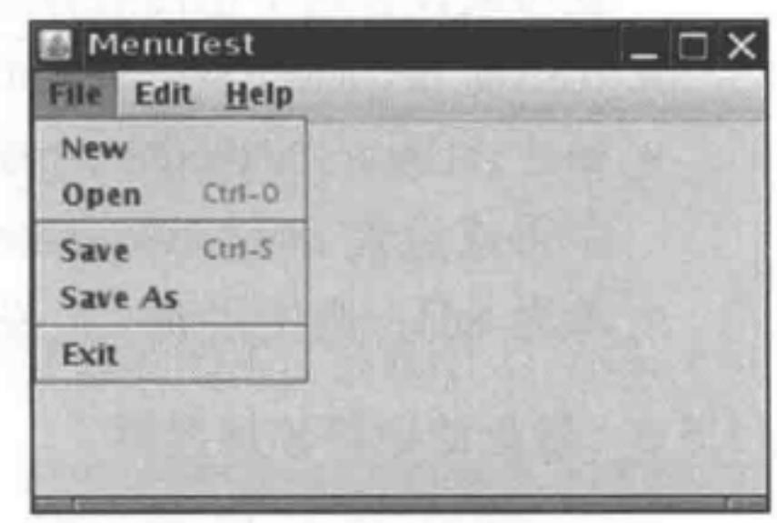

图 11-20 加速器

**注释**:在Windows下,组合键Alt+F4用于关闭窗口。但这不是Java程序设定的加速器,而是操作系统定义的快捷键。这个按键组合总会触发活动窗口的WindowClosing事件,而不论菜单上是否有Close(关闭)菜单项。

## API javax.swing.JMenuItem 1.2

- JMenuItem(String label, int mnemonic)
   用给定的标签和助记符构造一个菜单项。
- void setAccelerator(KeyStroke k)
   将 k 键设置为这个菜单项的加速器。加速键显示在标签旁边。

## API javax.swing.AbstractButton 1.2

- void setMnemonic(int mnemonic)
   设置按钮的助记字符。标签中该字符会加下画线。
- void setDisplayedMnemonicIndex(int index) 1.4
   设置按钮文本中加下画线字符的索引。如果不希望第一个出现的助记字符带下画线,就可以使用这个方法。

## 11.5.6 启用和禁用菜单项

有些时候,某个特定的菜单项可能只在某种特定的环境下才能选择。例如,当文档以只

读方式打开时, Save 菜单项就没有意义。当然,可以使用 JMenu. remove 方法将这个菜单项从

菜单中删掉,但用户会对内容不断变化的菜单感到奇怪。实际上,最好禁用这个菜单项,以免触发暂时不适用的命令。被禁用的菜单项显示为灰色,不允许选择(见图 11-21)。

启用或禁用菜单项需要调用 setEnabled 方法:

saveItem.setEnabled(false);

启用和禁用菜单项有两种策略。每次环境发生变化时,就可以对相关的菜单项或动作调用 setEnabled。例

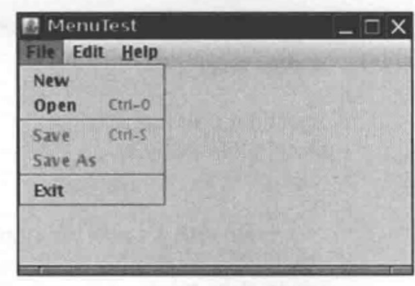

图 11-21 禁用菜单项

如:一旦文档设置为只读模式,就可以找到并禁用 Save 和 Save As 菜单项。另一种方法是在显示菜单之前禁用这些菜单项。为此,必须为"菜单选中"事件注册一个监听器。javax. swing.event 包定义了一个 MenuListener 接口,它包含三个方法:

```
void menuSelected(MenuEvent event)
void menuDeselected(MenuEvent event)
void menuCanceled(MenuEvent event)
```

menuSelected 方法在菜单显示之前调用,所以可以用这个方法禁用或启用菜单项。下面的代码显示了选中只读复选框菜单项时如何禁用 Save 和 Save As 动作。

```
public void menuSelected(MenuEvent event)
{
    saveAction.setEnabled(!readonlyItem.isSelected());
    saveAsAction.setEnabled(!readonlyItem.isSelected());
}
```

● 警告:在显示菜单之前禁用菜单项是一种明智的选择,但这种方式不适用于带有加速键的菜单项。这是因为按下加速键时并没有打开菜单,动作没有被禁用,加速键还会触发这个动作。

## API javax.swing.JMenuItem 1.2

void setEnabled(boolean b)
 启用或禁用菜单项。

## API javax.swing.event.MenuListener 1.2

- void menuSelected(MenuEvent e)
   选择菜单时调用这个方法(打开菜单之前)。
- void menuDeselected(MenuEvent e)
   取消选择菜单时调用这个方法(关闭菜单之后)。
- void menuCanceled(MenuEvent e)
   取消菜单时调用这个方法。例如,用户点击菜单以外的区域。

程序清单 11-6 的示例程序创建了一组菜单。这个程序演示了本节介绍的所有特性,包括

嵌套菜单、禁用菜单项、复选框和单选按钮菜单项、弹出菜单以及键盘助记符和加速器。

#### 程序清单 11-6 menu/MenuFrame.java

```
1 package menu;
3 import java.awt.event.*;
4 import javax.swing.*;
5
    * A frame with a sample menu bar.
9 public class MenuFrame extends JFrame
10
      private static final int DEFAULT WIDTH = 300;
11
      private static final int DEFAULT HEIGHT = 200;
      private Action saveAction;
      private Action saveAsAction;
14
      private JCheckBoxMenuItem readonlyItem;
      private JPopupMenu popup;
17
      /**
18
       * A sample action that prints the action name to System.out.
19
20
      class TestAction extends AbstractAction
21
22
         public TestAction(String name)
23
24
            super(name);
25
26
27
         public void actionPerformed(ActionEvent event)
28
29
            System.out.println(getValue(Action.NAME) + " selected.");
31
32
33
      public MenuFrame()
34
35
         setSize(DEFAULT_WIDTH, DEFAULT_HEIGHT);
36
37
         var fileMenu = new JMenu("File");
38
         fileMenu.add(new TestAction("New"));
39
         // demonstrate accelerators
41
42
         var openItem = fileMenu.add(new TestAction("Open"));
43
         openItem.setAccelerator(KeyStroke.getKeyStroke("ctrl 0"));
44
45
         fileMenu.addSeparator();
46
         saveAction = new TestAction("Save");
48
         JMenuItem saveItem = fileMenu.add(saveAction);
49
         saveItem.setAccelerator(KeyStroke.getKeyStroke("ctrl S"));
50
51
```

```
saveAsAction = new TestAction("Save As");
52
         fileMenu.add(saveAsAction);
53
         fileMenu.addSeparator();
54
55
         fileMenu.add(new AbstractAction("Exit")
56
57
                public void actionPerformed(ActionEvent event)
58
59
                   System.exit(\theta);
60
61
            });
62
63
         // demonstrate checkbox and radio button menus
64
65
         readonlyItem = new JCheckBoxMenuItem("Read-only");
66
         readonlyItem.addActionListener(new ActionListener()
67
68
                public void actionPerformed(ActionEvent event)
69
78
                   boolean saveOk = !readonlyItem.isSelected();
71
                   saveAction.setEnabled(saveOk);
72
                   saveAsAction.setEnabled(saveOk);
73
74
            });
75
76
         var group = new ButtonGroup();
77
78
         var insertItem = new JRadioButtonMenuItem("Insert");
79
         insertItem.setSelected(true);
88
         var overtypeItem = new JRadioButtonMenuItem("Overtype");
81
82
         group.add(insertItem);
83
         group.add(overtypeItem);
84
85
         // demonstrate icons
86
87
         var cutAction = new TestAction("Cut");
88
         cutAction.putValue(Action.SMALL ICON, new ImageIcon("cut.gif"));
89
         var copyAction = new TestAction("Copy");
90
         copyAction.putValue(Action.SMALL ICON, new ImageIcon("copy.gif"));
91
         var pasteAction = new TestAction("Paste");
92
         pasteAction.putValue(Action.SMALL ICON, new ImageIcon("paste.gif"));
93
94
         var editMenu = new JMenu("Edit");
95
         editMenu.add(cutAction);
         editMenu.add(copyAction);
97
         editMenu.add(pasteAction);
98
99
         // demonstrate nested menus
100
101
         var optionMenu = new JMenu("Options");
102
103
         optionMenu.add(readonlyItem);
104
         optionMenu.addSeparator();
105
```

532

```
optionMenu.add(insertItem);
106
         optionMenu.add(overtypeItem);
107
108
         editMenu.addSeparator();
109
         editMenu.add(optionMenu);
110
111
         // demonstrate mnemonics
112
113
         var helpMenu = new JMenu("Help");
114
         helpMenu.setMnemonic('H');
115
116
         var indexItem = new JMenuItem("Index");
117
         indexItem.setMnemonic('I');
118
         helpMenu.add(indexItem);
119
120
         // you can also add the mnemonic key to an action
121
         var aboutAction = new TestAction("About");
122
         aboutAction.putValue(Action.MNEMONIC_KEY, Integer.valueOf('A'));
123
         helpMenu.add(aboutAction);
124
125
         // add all top-level menus to menu bar
126
127
         var menuBar = new JMenuBar();
128
         setJMenuBar(menuBar);
129
130
         menuBar.add(fileMenu);
131
         menuBar.add(editMenu);
132
         menuBar.add(helpMenu);
133
134
         // demonstrate pop-ups
135
136
         popup = new JPopupMenu();
137
         popup.add(cutAction);
138
          popup.add(copyAction);
139
          popup.add(pasteAction);
140
141
         var panel = new JPanel();
142
         panel.setComponentPopupMenu(popup);
143
```

#### 11.5.7 工具栏

144

145

146 }

add(panel);

工具栏是一个按钮栏,通过它可以快速访问程序中 最常用的命令,如图 11-22 所示。

工具栏的特殊之处在于可以将它随处移动。可以将工具栏拖曳到窗体的四个边框上,如图 11-23 所示。 松开鼠标按钮后,工具栏将会落在新的位置上,如图 11-24 所示。


图 11-22 工具栏

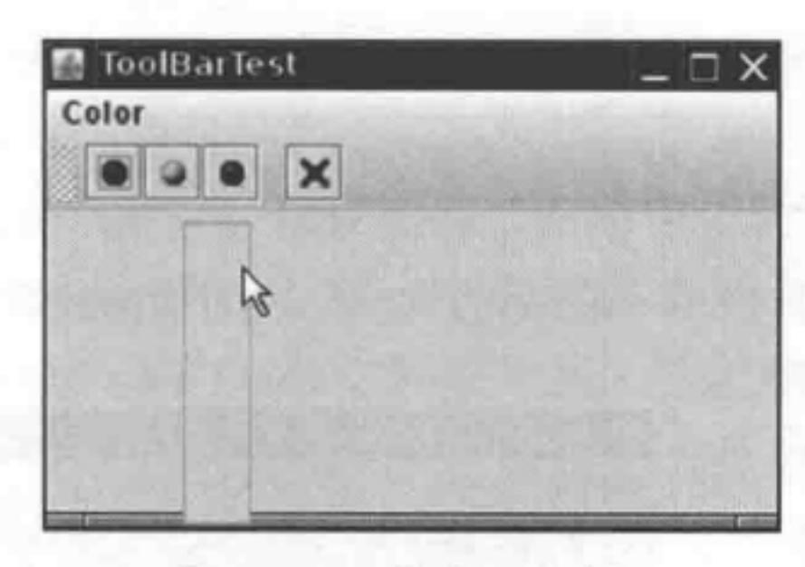

图 11-23 拖曳工具栏


图 11-24 将工具栏拖曳到另一个边框

註釋: 只有当工具栏位于采用边框布局(或者任何支持 North、East、South 和 West 约束的其他布局管理器)的容器内才能够拖曳。

工具栏甚至可以完全脱离窗体。这种分离的工具栏包含在自己的窗体中,如图 11-25 所

示。关闭包含分离式工具栏的窗体时,工具栏会回到 原窗体中。

工具栏代码很容易编写。可以将组件添加到工具栏:

var toolbar = new JToolBar();
toolbar.add(blueButton);

JToolBar 类还有一个添加 Action 对象的方法,可以用 Action 对象填充工具栏,如下所示:

toolbar.add(blueAction);

这个动作的小图标将会出现在工具栏中。

可以用分隔线将按钮分组:

toolbar.addSeparator();

例如,图 11-22 中的工具栏有一个分隔线,它位于第 3 个按钮和第 4 个按钮之间。 然后,将工具栏添加到窗体:

add(toolbar, BorderLayout.NORTH);

还可以指定工具栏的标题, 当工具栏未固定时就会显示这个标题:

toolbar = new JToolBar(titleString);

在默认情况下,工具栏初始为水平的。如果希望工具栏初始是垂直的,可以使用以下代码:

toolbar = new JToolBar(SwingConstants.VERTICAL)

## 或者

toolbar = new JToolBar(titleString, SwingConstants.VERTICAL)

按钮是工具栏中最常用的组件。不过对于工具栏中可以增加哪些组件并没有任何限制。

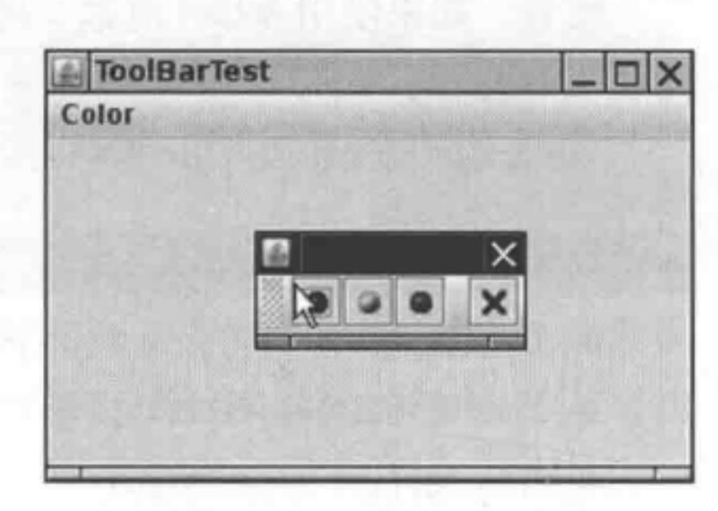

图 11-25 分离工具栏

例如, 你出可以在工具栏中加入组合框。

#### 11.5.8 工具提示

工具栏有一个缺点,这就是用户常常需要猜测工具栏中小图标的含义。为了解决这个问

题,用户界面设计者发明了工具提示(tooltip)。当光标在一个按钮上停留片刻时,就会激活工具提示。工具提示文本显示在一个有颜色的矩形里。当用户移开鼠标时,工具提示就会消失。如图 11-26 所示。

在 Swing 中,可以调用 setToolTipText 方法为任何 JComponent 增加工具提示:

exitButton.setToolTipText("Exit");

或者,如果使用 Action 对象,可以用 SHORT\_DESCRIPTION 关联工具提示:

exitAction.putValue(Action.SHORT\_DESCRIPTION, "Exit");

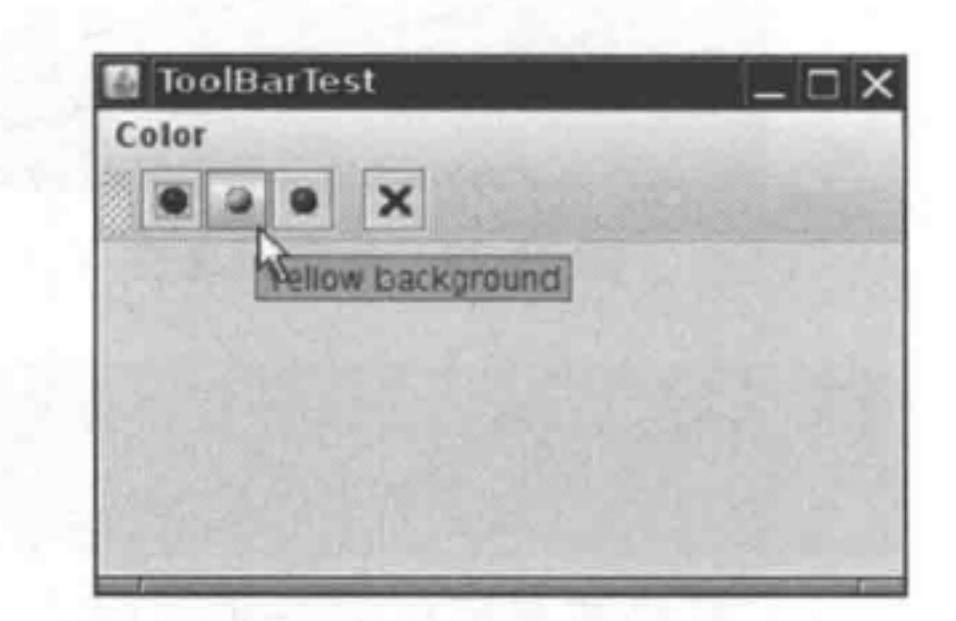

图 11-26 工具提示

## API javax.swing.JToolBar 1.2

- JToolBar()
- JToolBar(String titleString)
- JToolBar(int orientation)
- JToolBar(String titleString, int orientation)
   用给定的标题字符串和方向构造一个工具栏。orientation 可以是 SwingConstants. HORIZONTAL
   (默认)或 SwingConstants.VERTICAL。
- JButton add(Action a)
   在工具栏中用给定动作的名字、图标、简要描述和动作回调构造一个新按钮,并把这个按钮增加到工具栏末尾。
- void addSeparator()
   将一个分隔线添加到工具栏的末尾。

## API javax.swing.JComponent 1.2

void setToolTipText(String text)
 设置当鼠标停留在组件上时要作为工具提示显示的文本。

## 11.6 复杂的布局管理

迄今为止,在示例应用的用户界面中,我们只使用了边框布局、流布局和网格布局。对于更复杂的任务,只有这些还不够。

从 Java 1.0 以来, AWT 就含有网格包布局 (grid bag layout), 这种布局将组件按行和列排列。行和列的大小可以灵活改变,而且组件可以跨多行多列。这种布局管理器非常灵活,但也非常复杂。仅仅提到"网格包布局"一词就会让一些 Java 程序员胆战心惊。

Swing 设计者有一个失败的尝试:他们想设计一个布局管理器,能够将程序员从使用网格包布局的麻烦中解脱出来,为此他们提出了一种箱式布局(box layout)。根据 BoxLayout 类的 JDK 文档所述:"采用水平和垂直[原文如此]的不同组合嵌套多个面板可以获得与GridBagLayout 类似的效果,而且降低了复杂度。"不过,由于每个箱子是独立放置的,所以不能使用箱式布局排列水平和垂直方向都相邻的组件。

Java 1.4 还做了一个尝试:设计网格包布局的一种替代布局——弹性布局(spring layout)。这种布局使用假想的弹簧连接一个容器中的组件。当容器改变大小时,弹簧会伸展或收缩,从而调整组件的位置。这听起来似乎很枯燥而且让人很困惑,其实也确实如此。弹性布局很快就变得销声匿迹。

NetBeans IDE 组合了一个布局工具(名为"Matisse")和一个布局管理器。用户界面设计者可以使用这个工具将组件拖放到一个容器中,并指出哪些组件要对齐。工具再将设计者的意图转换成组布局管理器(group layout manager)可以理解的指令。与手动编写布局管理代码相比,这样要便捷得多。

在接下来的小节中,我们将介绍网格包布局,因为这种布局很常用,而且依然是编程生成布局代码的最简单的机制。我们会介绍一种策略,在通常情况下可以让网格包布局使用相对简单些。

最后, 你会了解如何编写自己的布局管理器。

## 11.6.1 网格包布局

网格包布局是所有布局管理器之母。可以将网格包布局看成没有任何限制的网格布局。 在网格包布局中,行和列的大小可以改变。可以将相邻的单元合并以容纳较大的组件(很多

字处理器以及 HTML 都为表格提供了类似的功能:可以先建立一个表格,然后根据需要合并相邻的单元格)。 组件不需要填充整个单元格区域,而且可以指定它们在 单元格内的对齐方式。

考虑图 11-27 中所示的字体选择器,其中包含下面的组件:

- 两个用于指定字体和字体大小的组合框
- 两个组合框的标签
- 两个用于选择粗体和斜体的复选框
- 一个用于显示示例字符串的文本区

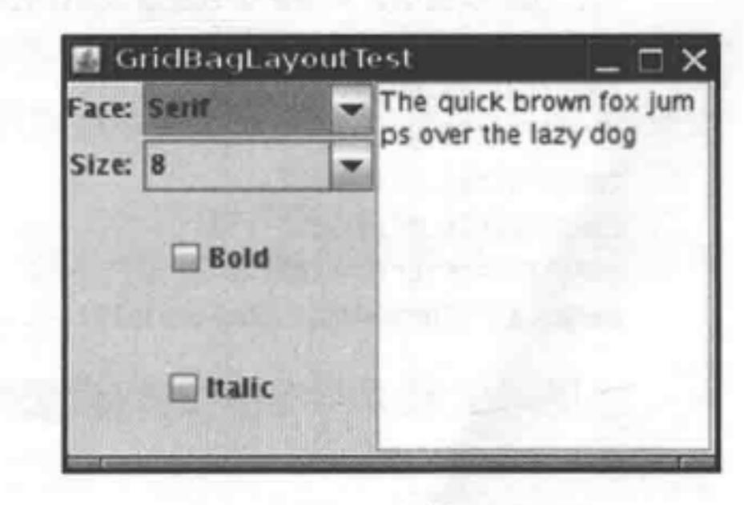

图 11-27 字体选择器

现在将容器分解为由单元格组成的网格,如图 11-28 所示(行和列的大小不必相同)。每个复选框横跨两列,文本区跨四行。

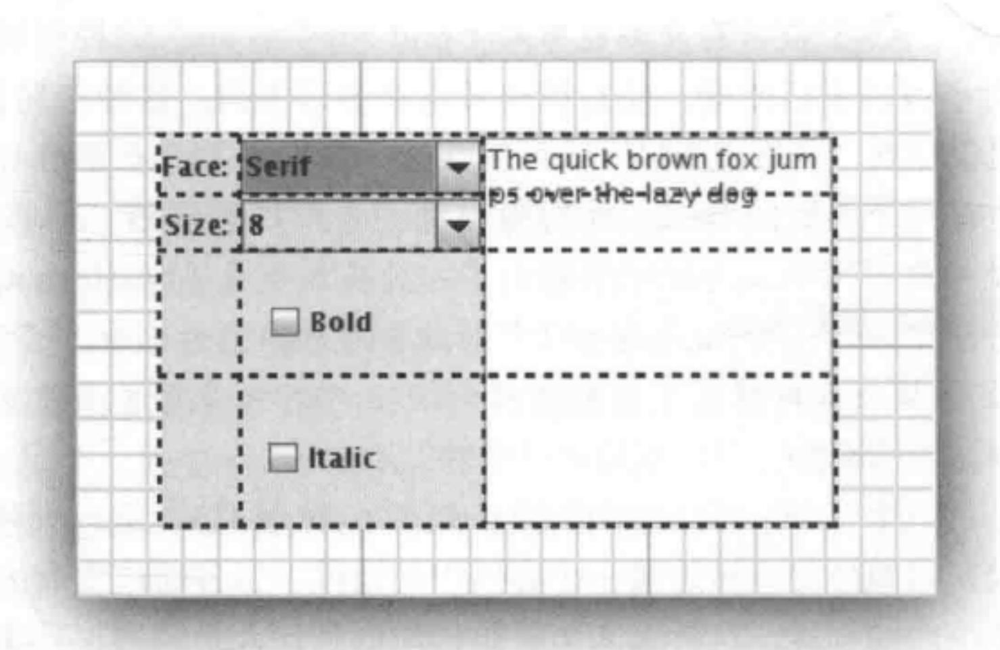

图 11-28 设计中使用的对话框网格

为了向网格包管理器描述这个布局,需要完成以下过程:

- 1. 创建一个 GridBagLayout 类型的对象。不需要指定底层网格的行数和列数。实际上,布局管理器会根据后面所给的信息猜测行数和列数。
  - 2. 将这个 GridBagLayout 对象设置为组件的布局管理器。
- 3. 对于每个组件,创建一个 GridBagConstraints 类型的对象。设置 GridBagConstraints 对象的字段值来指定组件在网格包中如何摆放。
  - 4. 最后,通过下面的调用为各个组件增加约束:

add(component, constraints);

下面给出所需的示例代码(稍后将更加详细地介绍各种约束,所以如果现在不明白某些约束的作用,也不必担心)。

```
var layout = new GridBagLayout();
panel.setLayout(layout);
var constraints = new GridBagConstraints();
constraints.weightx = 100;
constraints.weighty = 100;
constraints.gridx = 0;
constraints.gridy = 2;
constraints.gridwidth = 2;
constraints.gridwidth = 1;
panel.add(component, constraints);
```

这里的关键是要知道如何设置 GridBagConstraints 对象的状态。在后面的小节中将讨论这个对象。

## 11.6.1.1 gridx、gridy、gridwidth和 gridheight 参数

gridx、gridy、gridwidth 和 gridheight 约束定义了组件在网格中的位置。gridx 和 gridy 值指定了所添加组件左上角的行、列位置。gridwidth 和 gridheight 值确定组件占据的行数和列数。

网格的坐标从 0 开始。具体地, gridx=0 和 gridy=0 指示最左上角。例如,示例程序中,文

本区的 gridx=2, gridy=0。这是因为这个文本区起始于 0 行 2 列 (即第 3 列), 它的 girdwidth=1, gridheight=4, 因为它占据 4 行 1 列。

#### 11.6.1.2 权重字段

总是需要为网格包布局中的每个区域设置权重字段(weightx 和 weighty)。如果将权重设置为 0,那么这个区域在该方向上永远为初始大小,不会扩大或收缩。在图 11-27 所示的网格包布局中,我们将标签的 weightx 设置为 0,所以在调整窗口大小时,标签大小始终保持不变。另一方面,如果将所有区域的权重都设置为 0,所有区域就会挤在容器所分配区域的中间,而不会拉伸来填充空间。

从概念上讲,权重参数的问题在于权重是行和列的属性,而不是各个单元格的属性。但你需要为单元格指定权重,因为网格包布局并不提供行和列。行和列的权重计算为每行或每列中单元格权重的最大值。因此,如果想让一行或一列的大小保持不变,就需要将其中所有组件的权重都设置为0。

注意,权重并不实际给出列的相对大小。当容器大小超过首选大小时,权重会指出"闲散"空间按什么比例分配给各个区域。这么说不太直观。我们建议将所有的权重设置为100,然后运行程序,查看布局情况。调整这个对话框的大小,来看行和列是如何调整的。如果发现某行或某列不应该扩大,就将那一行或那一列中的所有组件的权重设置为0。也可以调整为其他权重值,但是那么做的意义不大。

## 11.6.1.3 fill 和 anchor 参数

如果不希望一个组件拉伸至填满整个区域,就需要设置 fill 约束。这个参数有 4 个可取值: GridBagConstraints.NONE、GridBagConstraints.HORIZONTAL、GridBagConstraints.VERTICAL 和 GridBagConstraints.BOTH。

如果组件没有填充整个区域,可以通过设置 anchor 字段指定它在这个区域中的位置。有效值为 GridBagConstraints.CENTER (默认值)、GridBagConstraints.NORTH、GridBagConstraints.NORTHEAST和 GridBagConstraints.EAST等。

## 11.6.1.4 边距

可以通过设置 GridBagConstraints 的 insets 字段在组件周围增加额外的空白区域。可以设置 Insets 对象的 left、top、right 和 bottom 值指定你希望的组件周围的空间大小。这称作外边距 (external padding)。

ipadx 和 ipady 值可以指定内边距(internal padding)。这些值会增加到组件的最小宽度和最小高度上,这样可以保证组件不会收缩至其最小尺寸以下。

## 11.6.1.5 指定 gridx、gridy、gridwidth 和 gridheight 参数的候选方法

AWT 文档建议不要将 gridx 和 gridy 设置为绝对位置,而应该将它们设置为常量 GridBag-Constraints.RELATIVE。然后,按照标准的顺序将组件添加到网格包布局中,即首先在第一行从左向右增加,然后再转到下一行,如此继续。

还需要为 gridheight 和 gridwidth 字段提供适当的值来指定组件所跨的行数和列数。不过,如果组件扩展至最后一行或最后一列,则不需要指定具体的数,而是可以使用常量 GridBag-

Constraints.REMAINDER, 这样会告诉布局管理器这个组件是该行上的最后一个组件。

这种方案看起来是可行的,但似乎有点笨拙。这是因为这样做会对布局管理器隐藏具体的位置信息,并希望它能够重新发现这些信息。

## 11.6.1.6 网格包布局技巧

538

在实际中,利用下面的技巧,可以让网格包布局的使用没那么麻烦:

- 1. 在纸上画出组件布局草图。
  - 2. 找出一个网格, 其中小组件分别包含在一个单元格内, 较大的组件跨越多个单元格。
- 3. 用 0, 1, 2, 3·····标记网格的行和列。现在可以得出 gridx、gridy、gridwidth 和 gridheight 的值。
- 4. 对于每个组件,需要考虑以下问题:是否需要水平或者垂直填充它所在的单元格?如果不需要,希望如何对齐?这样就能得到 fill 和 anchor 参数的值。
- 5. 将所有的权重设置为 100。不过,如果希望某行或某列始终保持默认的大小,就将这行或这列中所有组件的 weightx 和 weighty 设置为 0。
- 6. 编写代码。仔细地检查 GridBagConstraints 的设置。一个错误的约束可能会毁了你的整个布局。
  - 7. 编译并运行, 你会看到满意的布局。

#### 11.6.1.7 使用辅助类管理网格包约束

网格包布局最麻烦的方面就是要编写代码设置约束。为此,大多数程序员会编写辅助函数或者一个小辅助类。下面将在字体对话框示例的完整代码后面给出一个辅助类。这个类有以下特性:

- 名字简短:是 GBC 而不是 GridBagConstraints。
- 它扩展了 GridBagConstraints, 因此常量可以使用更短的名字, 如 GBC.EAST。
- 当添加组件时,使用GBC对象,如: add(component, new GBC(1, 2));
- 有两个构造器可以用来设置最常用的参数: gridx 和 gridy,或者 gridx、gridy、gridwidth和 gridheight。

add(component, new GBC(1, 2, 1, 4));

- 对于采用 x/y 值对形式的字段,提供了便捷的设置方法: add(component, new GBC(1, 2).setWeight(100, 100));
- 设置器方法将返回 this, 所以可以把这些方法调用串起来:
   add(component, new GBC(1, 2).setAnchor(GBC.EAST).setWeight(100, 100));
- setInsets 方法将为你构造 Insets 对象。要得到 1 个像素的边距,只需要调用:
   add(component, new GBC(1, 2).setAnchor(GBC.EAST).setInsets(1));

程序清单 11-7 显示了字体对话框示例的窗体类。GBC 辅助类见程序清单 11-8。下面是将组件添加到网格包中的代码:

```
add(faceLabel, new GBC(0, 0).setAnchor(GBC.EAST));
add(face, new GBC(1, 0).setFill(GBC.HORIZONTAL).setWeight(100, 0).setInsets(1));
add(sizeLabel, new GBC(0, 1).setAnchor(GBC.EAST));
add(size, new GBC(1, 1).setFill(GBC.HORIZONTAL).setWeight(100, 0).setInsets(1));
add(bold, new GBC(0, 2, 2, 1).setAnchor(GBC.CENTER).setWeight(100, 100));
add(italic, new GBC(0, 3, 2, 1).setAnchor(GBC.CENTER).setWeight(100, 100));
add(sample, new GBC(2, 0, 1, 4).setFill(GBC.BOTH).setWeight(100, 100));
```

一旦理解了网格包约束,就会发现这些代码很容易阅读和调试。

#### 程序清单 11-7 gridbag/FontFrame.java

```
package gridbag;
2
   import java.awt.Font;
   import java.awt.GridBagLayout;
   import java.awt.event.ActionListener;
6
   import javax.swing.BorderFactory;
  import javax.swing.JCheckBox;
   import javax.swing.JComboBox;
   import javax.swing.JFrame;
   import javax.swing.JLabel;
  import javax.swing.JTextArea;
13
14
    * A frame that uses a grid bag layout to arrange font selection components.
15
16
   public class FontFrame extends JFrame
17
18
      public static final int TEXT ROWS = 10;
19
      public static final int TEXT COLUMNS = 20;
20
21
      private JComboBox<String> face;
22
      private JComboBox<Integer> size;
23
      private JCheckBox bold;
24
      private JCheckBox italic;
25
      private JTextArea sample;
26
27
      public FontFrame()
28
29
         var layout = new GridBagLayout();
30
         setLayout(layout);
31
32
         ActionListener listener = event -> updateSample();
33
34
         // construct components
35
36
         var faceLabel = new JLabel("Face: ");
37
38
         face = new JComboBox<>(new String[] { "Serif", "SansSerif", "Monospaced",
39
             "Dialog", "DialogInput" });
48
41
         face.addActionListener(listener);
42
43
```

```
var sizeLabel = new JLabel("Size: ");
45
         size = new JComboBox<>(new Integer[] { 8, 10, 12, 15, 18, 24, 36, 48 });
46
47
         size.addActionListener(listener);
48
49
         bold = new JCheckBox("Bold");
50
         bold.addActionListener(listener);
51
52
         italic = new JCheckBox("Italic");
53
         italic.addActionListener(listener);
54
55
         sample = new JTextArea(TEXT ROWS, TEXT COLUMNS);
56
         sample.setText("The quick brown fox jumps over the lazy dog");
57
         sample.setEditable(false);
58
         sample.setLineWrap(true);
59
         sample.setBorder(BorderFactory.createEtchedBorder());
60
61
         // add components to grid, using GBC convenience class
62
63
         add(faceLabel, new GBC(0, 0).setAnchor(GBC.EAST));
64
         add(face, new GBC(1, 0).setFill(GBC.HORIZONTAL).setWeight(100, 0).setInsets(1));
65
         add(sizeLabel, new GBC(0, 1).setAnchor(GBC.EAST));
66
         add(size, new GBC(1, 1).setFill(GBC.HORIZONTAL).setWeight(100, 0).setInsets(1));
67
         add(bold, new GBC(0, 2, 2, 1).setAnchor(GBC.CENTER).setWeight(100, 100));
68
         add(italic, new GBC(0, 3, 2, 1).setAnchor(GBC.CENTER).setWeight(100, 100));
69
         add(sample, new GBC(2, 0, 1, 4).setFill(GBC.BOTH).setWeight(100, 100));
70
         pack();
71
         updateSample();
72
73
74
      public void updateSample()
75
76
         var fontFace = (String) face.getSelectedItem();
77
         int fontStyle = (bold.isSelected() ? Font.BOLD : 0)
78
            + (italic.isSelected() ? Font.ITALIC : 0);
79
         int fontSize = size.getItemAt(size.getSelectedIndex());
88
         var font = new Font(fontFace, fontStyle, fontSize);
81
         sample.setFont(font);
82
         sample.repaint();
83
84
85 }
```

## 程序清单 11-8 gridbag/GBC.java

```
package gridbag;\nimport java.awt.*;

/**

* This class simplifies the use of the GridBagConstraints class.

* @version 1.01 2004-05-06

* @author Cay Horstmann

*/
```

```
10 public class GBC extends GridBagConstraints
11 {
      /**
12
       * Constructs a GBC with a given gridx and gridy position and all other grid
13
       * bag constraint values set to the default.
14
       * @param gridx the gridx position
15
       * @param gridy the gridy position
16
17
      public GBC(int gridx, int gridy)
18
19
         this.gridx = gridx;
20
         this.gridy = gridy;
21
22
23
24
       * Constructs a GBC with given gridx, gridy, gridwidth, gridheight and all
25
       * other grid bag constraint values set to the default.
26
       * @param gridx the gridx position
27
       * @param gridy the gridy position
28
       * @param gridwidth the cell span in x-direction
29
       * @param gridheight the cell span in y-direction
30
31
      public GBC(int gridx, int gridy, int gridwidth, int gridheight)
32
33
         this.gridx = gridx;
34
         this.gridy = gridy;
35
         this.gridwidth = gridwidth;
36
         this.gridheight = gridheight;
37
38
39
40
       * Sets the anchor.
41
       * @param anchor the anchor value
42
       * @return this object for further modification
43
       */
44
      public GBC setAnchor(int anchor)
45
46
         this.anchor = anchor;
47
         return this;
48
49
50
51
       * Sets the fill direction.
52
       * @param fill the fill direction
53
       * @return this object for further modification
54
       */
55
      public GBC setFill(int fill)
56
57
         this.fill = fill;
58
         return this;
59
60
61
62
       * Sets the cell weights.
63
```

```
* @param weightx the cell weight in x-direction
64
       * @param weighty the cell weight in y-direction
65
       * @return this object for further modification
66
       */
67
      public GBC setWeight(double weightx, double weighty)
68
69
         this.weightx = weightx;
70
         this.weighty = weighty;
71
         return this;
72
73
74
      /**
75
       * Sets the insets of this cell.
76
       * @param distance the spacing to use in all directions
77
       * @return this object for further modification
78
79
      public GBC setInsets(int distance)
88
81
         this.insets = new Insets(distance, distance, distance, distance);
82
         return this;
83
84
85
       /**
86
       * Sets the insets of this cell.
87
       * @param top the spacing to use on top
88
       * @param left the spacing to use to the left
89
       * @param bottom the spacing to use on the bottom
98
       * @param right the spacing to use to the right
91
       * @return this object for further modification
92
93
      public GBC setInsets(int top, int left, int bottom, int right)
94
95
         this.insets = new Insets(top, left, bottom, right);
96
          return this;
97
99
       /**
100
       * Sets the internal padding
101
       * @param ipadx the internal padding in x-direction
102
       * @param ipady the internal padding in y-direction
103
       * @return this object for further modification
104
105
       public GBC setIpad(int ipadx, int ipady)
106
107
          this.ipadx = ipadx;
108
          this.ipady = ipady;
109
          return this;
110
111
112 }
```

## pp java.awt.GridBagConstraints 1.0

int gridx, gridy
 指定单元格的起始行和列。默认值为 θ。

- int gridwidth, gridheight
   指定单元格的行和列大小。默认值为 1。
- double weightx, weighty
   指定单元格扩大的容量。默认值为 θ。
- int anchor

表示组件在单元格内的对齐方式。可以选择的绝对位置包括:

NORTHWEST NORTH NORTHEAST
WEST CENTER EAST
SOUTHWEST SOUTH SOUTHEAST

或者可以使用与方向无关的位置:

FIRST\_LINE\_START LINE\_START FIRST\_LINE\_END

PAGE\_START CENTER PAGE\_END

LAST\_LINE\_START LINE\_END LAST\_LINE\_END

如果你的应用要本地化为从右向左或者从上向下排列文本,就应该使用后者。默认值为 CENTER。

- int fill
   指定组件在单元格内的填充行为,可取值为 NONE、BOTH、HORIZONTAL 或者 VERTICAL。默认值为 NONE。
- int ipadx, ipady
   指定组件周围的"内"边距。默认值为 0。
- Insets insets 指定单元格边框周围的"外"边距。默认为无边距。
- GridBagConstraints(int gridx, int gridy, int gridwidth, int gridheight, double weightx, double weighty, int anchor, int fill, Insets insets, int ipadx, int ipady) 1.2 用参数中指定的所有字段值构造 GridBagConstraints。这个构造器只用于自动代码生成器,因为它会让你的源代码很难阅读。

## 11.6.2 定制布局管理器

可以设计你自己的 LayoutManager 类以一种特殊的方式管理组件。作为一个有趣的例子,可以将容器中的所有组件摆成一个圆形。如图 11-29 所示。

定制布局管理器必须实现 LayoutManager 接口,并且需要覆盖下面 5 个方法:

void addLayoutComponent(String s, Component c)
void removeLayoutComponent(Component c)
Dimension preferredLayoutSize(Container parent)
Dimension minimumLayoutSize(Container parent)
void layoutContainer(Container parent)

添加或删除一个组件时会调用前面两个方法。如果不需要保存组件的任何附加信息,那

么可以让这两个方法什么都不做。接下来的两个方法计算组件的最小布局和首选布局所需要的空间。这二者通常是相等的。第5个方法具体完成工作,会调用所有组件的 setBounds 方法。

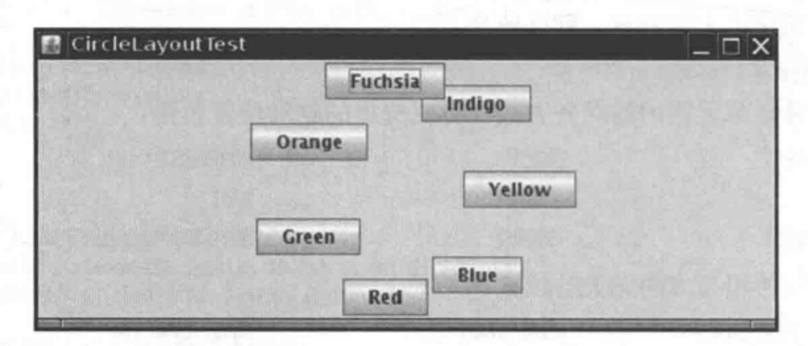

图 11-29 圆形布局

注释: AWT还有第二个接口 LayoutManager2, 其中包含10个需要实现的方法, 而不是5个。这个 LayoutManager2接口的主要特点是允许使用带有约束的 add 方法。例如, BorderLayout 和 GridBagLayout 都实现了 LayoutManager2接口。

程序清单 11-9 显示了 CircleLayout 管理器的代码,会在父组件中沿着一个圆形摆放组件。这个管理器很有趣,但是没有什么实用价值。示例程序的窗体类见程序清单 11-10。

## 程序清单 11-9 circleLayout/CircleLayout.java

```
package circleLayout;
  import java.awt.*;
5 /**
    * A layout manager that lays out components along a circle.
  public class CircleLayout implements LayoutManager
9
      private int minWidth = 0;
10
      private int minHeight = \theta;
11
      private int preferredWidth = 0;
12
      private int preferredHeight = 0;
13
      private boolean sizesSet = false;
14
      private int maxComponentWidth = 0;
15
      private int maxComponentHeight = 0;
16
17
      public void addLayoutComponent(String name, Component comp)
18
19
20
21
      public void removeLayoutComponent(Component comp)
22
23
24
```

```
public void setSizes(Container parent)
26
27
         if (sizesSet) return;
28
         int n = parent.getComponentCount();
29
30
         preferredWidth = 0;
31
         preferredHeight = 0;
32
         minWidth = 0;
33
         minHeight = 0;
34
         maxComponentWidth = 0;
35
         maxComponentHeight = 0;
36
37
         // compute the maximum component widths and heights
38
         // and set the preferred size to the sum of the component sizes
39
         for (int i = 0; i < n; i++)
48
41
            Component c = parent.getComponent(i);
42
            if (c.isVisible())
43
44
                Dimension d = c.getPreferredSize();
45
                maxComponentWidth = Math.max(maxComponentWidth, d.width);
46
                maxComponentHeight = Math.max(maxComponentHeight, d.height);
47
                preferredWidth += d.width;
48
                preferredHeight += d.height;
49
50
51
         minWidth = preferredWidth / 2;
52
         minHeight = preferredHeight / 2;
53
         sizesSet = true;
54
55
56
      public Dimension preferredLayoutSize(Container parent)
57
58
         setSizes(parent);
59
         Insets insets = parent.getInsets();
60
         int width = preferredWidth + insets.left + insets.right;
61
          int height = preferredHeight + insets.top + insets.bottom;
62
          return new Dimension(width, height);
63
64
65
      public Dimension minimumLayoutSize(Container parent)
66
67
          setSizes(parent);
68
          Insets insets = parent.getInsets();
69
          int width = minWidth + insets.left + insets.right;
70
          int height = minHeight + insets.top + insets.bottom;
71
          return new Dimension(width, height);
72
73
74
       public void layoutContainer(Container parent)
75
76
          setSizes(parent);
77
78
          // compute center of the circle
79
```

```
86
         Insets insets = parent.getInsets();
81
         int containerWidth = parent.getSize().width - insets.left - insets.right;
82
         int containerHeight = parent.getSize().height - insets.top - insets.bottom;
83
84
         int xcenter = insets.left + containerWidth / 2;
85
         int ycenter = insets.top + containerHeight / 2;
86
87
         // compute radius of the circle
88
89
         int xradius = (containerWidth - maxComponentWidth) / 2;
90
         int yradius = (containerHeight - maxComponentHeight) / 2;
91
         int radius = Math.min(xradius, yradius);
92
93
         // lay out components along the circle
94
95
         int n = parent.getComponentCount();
96
         for (int i = 0; i < n; i++)
97
98
            Component c = parent.getComponent(i);
99
            if (c.isVisible())
100
101
               double angle = 2 * Math.PI * i / n;
102
103
               // center point of component
104
               int x = xcenter + (int) (Math.cos(angle) * radius);
105
               int y = ycenter + (int) (Math.sin(angle) * radius);
106
107
               // move component so that its center is (x, y)
108
               // and its size is its preferred size
109
               Dimension d = c.getPreferredSize();
110
               c.setBounds(x - d.width / 2, y - d.height / 2, d.width, d.height);
111
112
113
114
115 }
```

#### 程序清单 11-10 circleLayout/CircleLayoutFrame.java

```
package circleLayout;
2
   import javax.swing.*;
4
5
    * A frame that shows buttons arranged along a circle.
   public class CircleLayoutFrame extends JFrame
9
      public CircleLayoutFrame()
10
11
         setLayout(new CircleLayout());
12
         add(new JButton("Yellow"));
13
         add(new JButton("Blue"));
14
         add(new JButton("Red"));
15
         add(new JButton("Green"));
16
```

```
add(new JButton("Orange"));
add(new JButton("Fuchsia"));
add(new JButton("Indigo"));
pack();

pack();
}
```

## API java.awt.LayoutManager 1.0

- void addLayoutComponent(String name, Component comp)
   为布局增加一个组件。
- void removeLayoutComponent(Component comp)
   从布局删除一个组件。
- Dimension preferredLayoutSize(Container cont)
   返回这个布局中容器的首选尺寸。
- Dimension minimumLayoutSize(Container cont)
   返回这个布局中容器的最小尺寸。
- void layoutContainer(Container cont)
   在容器中摆放组件。

## 11.7 对话框

在 GUI 应用中,通常希望弹出单独的对话框向用户显示信息或者获取用户提供的信息。

与大多数窗口系统一样,AWT也区分了模式(modal)对话框和无模式(modeless)对话框。所谓模式对话框是指,在结束对这个对话框的处理之前,不允许用户与应用的其余窗口进行交互。如果需要先获取用户提供的信息,程序才能继续运行,这种情况下就要使用模式对话框。例如,用户想要读取一个文件时,就会弹出一个模式文件对话框。用户必须指定一个文件名,然后程序才能够开始读操作。只有用户关闭这个模式对话框之后,应用才能够继续执行。

无模式对话框允许用户在这个对话框中输入信息,同时也允许在应用的其他部分输入信息。工具栏就是无模式对话框的一个例子。只要需要,就可以显示工具栏,用户可以同时与应用窗口和工具栏进行交互。

本节从最简单的对话框开始介绍——只有一个消息的模式对话框。Swing 有一个很便利的类 JOptionPane, 利用这个类, 无须编写任何特殊的对话框代码, 就可以创建一个简单的对话框。随后, 你将看到如何实现自己的对话框窗口来编写更复杂的对话框。最后, 我们将介绍如何在应用程序与对话框之间来回传递数据。

之后, 我们会介绍 Swing 的 JFileChooser 来结束有关对话框的讨论。

## 11.7.1 选项对话框

Swing 有一组现成的简单对话框,足以让用户提供一些信息。JOptionPane 有 4 个静态方

法来显示这些简单的对话框:

548

- showMessageDialog: 显示一条消息并等待用户点击 OK;
- showConfirmDialog: 显示一条消息并得到用户确认 (如 OK/Cancel);
- showOptionDialog: 显示一条消息并获得用户在一组选项中的选择;
- showInputDialog:显示一条消息并获得用户输入的一行文本。

图 11-30 显示了一个典型的对话框。可以看到,对话框有以下组件:

- 一个图标
- 一条消息
- 一个或多个选项按钮

输入对话框有一个额外的组件用于接收用户输入。 这可能是一个文本域,用户可以输入任意的字符串,也 可能是一个组合框,用户可以从中选择一项。

这些对话框的具体布局和标准消息类型选择的图标都取决于可插拔式观感 (pluggable look-and-feel)。

左侧的图标取决于下面 5 种消息类型:

- ERROR MESSAGE
- INFORMATION MESSAGE
- WARNING MESSAGE
- QUESTION MESSAGE
- PLAIN MESSAGE

PLAIN\_MESSAGE 类型没有图标。每个对话框类型还有一个方法,可以用来提供你自己的图标,以替代原来的图标。

可以为每个对话框类型指定一条消息。这里的消息既可以是字符串、图标、用户界面组件,或者任何其他类型的对象。可以如下显示消息对象:

- String: 绘制字符串;
- Icon:显示图标;
- Component: 显示组件;
- Object[]: 显示数组中的所有对象, 依次叠加;
- 任何其他对象:应用 toString 方法来显示结果字符串。

当然,提供字符串消息是目前为止最常见的情况,而提供一个 Component 会得到最大的灵活性,这是因为可以让 paintComponent 方法绘制你想要的任何内容。

位于底部的按钮取决于对话框类型和选项类型(option type)。当调用 showMessageDialog和 showInputDialog时,只能看到一组标准按钮(分别是 OK 和 OK/Cancel)。当调用 showConfirm-Dialog时,可以在下面四种选项类型中选择:

- DEFAULT OPTION
- YES NO OPTION


图 11-30 选项对话框

- YES NO CANCEL OPTION
- OK CANCEL OPTION

使用 showOptionDialog 时,可以指定一组任意的选项。你要提供一个对象数组作为选项。每个数组元素会如下显示:

- String: 创建一个按钮, 使用字符串作为标签;
- Icon: 创建一个按钮, 使用图标作为标签;
- Component: 显示这个组件;
- 其他类型的对象:应用 toString 方法,然后创建一个按钮,用结果字符串作为标签。
   这些方法的返回值如下:
- showMessageDialog: 无;
- showConfirmDialog: 表示所选选项的一个整数;
- showOptionDialog: 表示所选选项的一个整数;
- showInputDialog: 用户提供或选择的一个字符串。

showConfirmDialog 和 showOptionDialog 返回一个整数,表示用户选择了哪个按钮。对于选项对话框来说,这个值就是所选选项的索引值,或者如果用户没有选择选项,而是关闭了对话框,则返回 CLOSED\_OPTION。对于确认对话框,返回值可以是以下值之一:

- OK OPTION
- CANCEL\_OPTION
- YES\_OPTION
- NO\_OPTION
- CLOSED\_OPTION

看起来这些选择让人眼花缭乱,但实际上很简单。步骤如下:

- 1. 选择对话框的类型(消息、确认、选项或者输入对话框)。
- 2. 选择图标(错误、信息、警告、问题、无或者自定义)。
- 3. 选择消息(字符串、图标、自定义组件或者它们的组合)。
- 4. 对于确认对话框,选择选项类型(默认、Yes/No、Yes/No/Cancel或者 OK/Cancel)。
- 5. 对于选项对话框, 选择选项(字符串、图标或者自定义组件)和默认选项。
- 6. 对于输入对话框,选择文本域或者组合框。
- 7. 调用 JOptionPane API 中的相应方法。

例如,假设需要显示图 11-30 所示的对话框。这个对话框显示了一条消息,并请求用户确认或者取消。所以,这是一个确认对话框。图标是一个问题图标,消息是字符串,选项类型是 0K CANCEL OPTION。调用如下:

int selection = JOptionPane.showConfirmDialog(parent,
 "Message", "Title",
 JOptionPane.OK\_CANCEL\_OPTION,
 JOptionPane.QUESTION\_MESSAGE);\nif (selection == JOptionPane.OK\_OPTION) . . .

## び 提示: 消息字符串中可以包含换行符('\n')。这样一个字符串会多行显示。

#### API javax.swing.JOptionPane 1.2

- static void showMessageDialog(Component parent, Object message, String title, int messageType,
   Icon icon)
- static void showMessageDialog(Component parent, Object message, String title, int messageType)
- static void showMessageDialog(Component parent, Object message)
- static void showInternalMessageDialog(Component parent, Object message, String title, int messageType, Icon icon)
- static void showInternalMessageDialog(Component parent, Object message, String title, int messageType)
- static void showInternalMessageDialog(Component parent, Object message)
   显示一个消息对话框或者一个内部消息对话框(内部对话框完全显示在其父组件窗体内)。父组件可以为 null。显示在对话框中的消息可以是字符串、图标、组件或者它们的一个数组。messageType 参数取值为 ERROR\_MESSAGE、INFORMATION\_MESSAGE、WARNING\_MESSAGE、QUESTION MESSAGE 和 PLAIN MESSAGE 之一。
- static int showConfirmDialog(Component parent, Object message, String title, int optionType, int messageType, Icon icon)
- static int showConfirmDialog(Component parent, Object message, String title, int optionType, int messageType)
- static int showConfirmDialog(Component parent, Object message, String title, int optionType)
- static int showConfirmDialog(Component parent, Object message)
- static int showInternalConfirmDialog(Component parent, Object message, String title, int optionType, int messageType, Icon icon)
- static int showInternalConfirmDialog(Component parent, Object message, String title, int optionType, int messageType)
- static int showInternalConfirmDialog(Component parent, Object message, String title, int optionType)
- static int showInternalConfirmDialog(Component parent, Object message) 显示一个确认对话框或者内部确认对话框(内部对话框完全显示在其父组件窗体内)。返回用户选择的选项(取值为 OK\_OPTION、CANCEL\_OPTION、YES\_OPTION、NO\_OPTION之一);或者如果用户关闭了对话框则返回 CLOSED\_OPTION。父组件可以为 null。显示在对话框中的消息可以是字符串、图标、组件或者它们的一个数组。messageType 参数取值为 ERROR\_MESSAGE、INFORMATION\_MESSAGE、WARNING\_MESSAGE、QUESTION\_MESSAGE、PLAIN\_MESSAGE之一。optionType 取值为 DEFAULT OPTION、YES NO OPTION、YES NO CANCEL OPTION、OK CANCEL OPTION之一。
- static int showOptionDialog(Component parent, Object message, String title, int optionType, int messageType, Icon icon, Object[] options, Object default)

- static int showInternalOptionDialog(Component parent, Object message, String title, int optionType, int messageType, Icon icon, Object[] options, Object default) 显示一个选项对话框或者内部选项对话框(内部对话框完全显示在其父组件窗体内)。返回用户所选选项的索引;或者如果用户取消了对话框则返回 CLOSED\_OPTION。父组件可以为 null。显示在对话框中的消息可以是字符串、图标、组件或者它们的一个数组。messageType参数取值为 ERROR\_MESSAGE、INFORMATION\_MESSAGE、WARNING\_MESSAGE、QUESTION\_MESSAGE、PLAIN\_MESSAGE之一。optionType 取值为 DEFAULT\_OPTION、YES\_NO\_OPTION、YES\_NO\_CANCEL\_OPTION、OK\_CANCEL\_OPTION之一。options 参数是字符串、图标或者组件的一个数组。
- static Object showInputDialog(Component parent, Object message, String title, int messageType,
   Icon icon, Object[] values, Object default)
- static String showInputDialog(Component parent, Object message, String title, int messageType)
- static String showInputDialog(Component parent, Object message)
- static String showInputDialog(Object message)
- static String showInputDialog(Component parent, Object message, Object default) 1.4
- static String showInputDialog(Object message, Object default) 1.4
- static Object showInternalInputDialog(Component parent, Object message, String title, int messageType, Icon icon, Object[] values, Object default)
- static String showInternalInputDialog(Component parent, Object message, String title, int messageType)
- static String showInternalInputDialog(Component parent, Object message)
  显示一个输入对话框或者内部输入对话框(内部对话框完全显示在其父组件窗体内)。
  返回用户输入的字符串;或者如果用户取消了对话框则返回 null。父组件可以为 null。
  显示在对话框中的消息可以是字符串、图标、组件或者它们的一个数组。messageType
  参数取值为 ERROR\_MESSAGE、INFORMATION\_MESSAGE、WARNING\_MESSAGE、QUESTION\_MESSAGE、PLAIN\_
  MESSAGE 之一。

## 11.7.2 创建对话框

在11.7.1 节中, 我们了解了如何使用 J0ptionPane 类来显示一个简单的对话框。这一节将介绍如何手动创建这样一个对话框。

图 11-31 显示了一个典型的模式对话框。当用户点击 About 按钮时就会出现这样一个显示程序信息的对话框。

要想实现一个对话框,需要扩展 JDialog 类。这与应用的主窗口扩展 JFrame 的过程基本上是一样的。具体

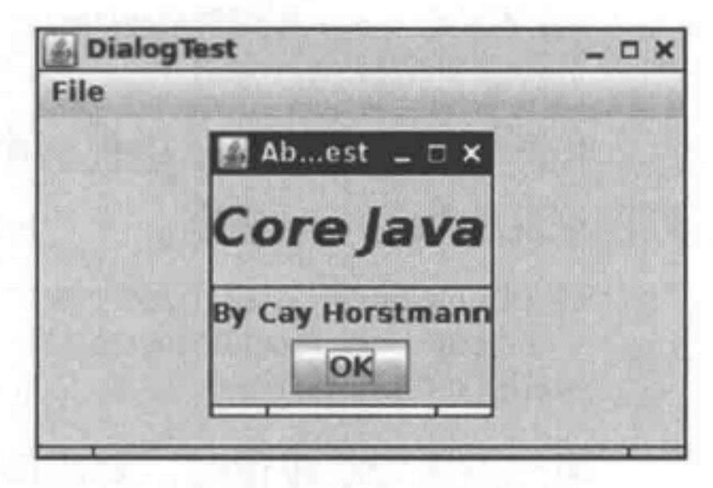

图 11-31 About 对话框

#### 过程如下:

- 1. 在对话框构造器中,调用超类 JDialog 的构造器。
- 2. 添加对话框的用户界面组件。
- 3. 添加事件处理器。
- 4. 设置对话框的大小。

调用超类构造器时,需要提供所有者窗体(owner frame)、对话框标题及模式特征(modality)。 所有者窗体控制对话框的显示位置,如果提供 null 作为所有者,那么这个对话框将属于 一个隐藏窗体。

模式特征将指定显示这个对话框时,将阻塞应用的哪些其他窗口。无模式对话框不会阻塞其他窗口,而模式对话框将阻塞应用的所有其他窗口(当前对话框的子窗口除外)。用户经常使用的工具栏要用无模式对话框实现。另一方面,如果想强制用户在继续操作之前必须提供一些必要的信息,就应该使用模式对话框。

下面是一个对话框的代码:

```
public AboutDialog extends JDialog
{
   public AboutDialog(JFrame owner)
   {
      super(owner, "About DialogTest", true);
      add(new JLabel(
          "<html><h1><i>Core Java</i></h1><hr>BorderLayout.CENTER);
      var panel = new JPanel();
      var ok = new JButton("OK");

      ok.addActionListener(event -> setVisible(false));
      panel.add(ok);
      add(panel, BorderLayout.SOUTH);
      setSize(250, 150);
   }
}
```

可以看到,构造器添加了用户界面组件,在本例中添加的是标签和一个按钮,并且为按钮添加了处理器,然后还设置了对话框的大小。

要想显示对话框,需要创建一个新的对话框对象,并让它可见:

```
var dialog = new AboutDialog(this);
dialog.setVisible(true);
```

实际上,在下面的示例代码中只创建了一次对话框,无论用户何时点击 About 按钮,都可以重复使用这个对话框。

```
if (dialog == null) // first time
  dialog = new AboutDialog(this);
dialog.setVisible(true);
```

用户点击 OK 按钮时,对话框要关闭。这会在 OK 按钮的事件处理器中处理:

```
ok.addActionListener(event -> setVisible(false));
```

当用户点击 Close 按钮关闭对话框时,对话框也会隐藏起来。与 JFrame 一样,可以用 setDefaultCloseOperation 方法覆盖这个行为。

程序清单 11-11 是测试程序窗体类的代码。程序清单 11-12 显示了对话框类。

#### 程序清单 11-11 dialog/DialogFrame.java

```
package dialog;
   import javax.swing.JFrame;
   import javax.swing.JMenu;
   import javax.swing.JMenuBar;
   import javax.swing.JMenuItem;
   /**
    * A frame with a menu whose File->About action shows a dialog.
10
   public class DialogFrame extends JFrame
12
      private static final int DEFAULT WIDTH = 300;
13
      private static final int DEFAULT HEIGHT = 200;
14
      private AboutDialog dialog;
15
16
      public DialogFrame()
17
18
         setSize(DEFAULT WIDTH, DEFAULT HEIGHT);
19
20
         // construct a File menu
21
22
         var menuBar = new JMenuBar();
23
         setJMenuBar(menuBar);
24
         var fileMenu = new JMenu("File");
25
         menuBar.add(fileMenu);
26
27
         // add About and Exit menu items
29
         // the About item shows the About dialog
30
31
         var aboutItem = new JMenuItem("About");
32
         aboutItem.addActionListener(event ->
33
34
               if (dialog == null) // first time
35
                  dialog = new AboutDialog(DialogFrame.this);
36
               dialog.setVisible(true); // pop up dialog
37
            });
38
         fileMenu.add(aboutItem);
39
40
         // the Exit item exits the program
41
42
         var exitItem = new JMenuItem("Exit");
43
         exitItem.addActionListener(event -> System.exit(0));
44
         fileMenu.add(exitItem);
45
47 }
```

#### 程序清单 11-12 dialog/AboutDialog.java

```
package dialog;
   import java.awt.BorderLayout;
   import javax.swing.JButton;
  import javax.swing.JDialog;
  import javax.swing.JFrame;
   import javax.swing.JLabel;
   import javax.swing.JPanel;
10
11
    * A sample modal dialog that displays a message and waits for the user to click
12
    * the OK button.
13
14
   public class AboutDialog extends JDialog
16
      public AboutDialog(JFrame owner)
17
18
         super(owner, "About DialogTest", true);
19
20
         // add HTML label to center
21
22
         add(
23
            new JLabel(
24
                "<html><h1><i>Core Java</i></h1><hr>By Cay Horstmann</html>"),
25
            BorderLayout.CENTER);
26
27
         // OK button closes the dialog
28
29
         var ok = new JButton("OK");
30
         ok.addActionListener(event -> setVisible(false));
31
32
         // add OK button to southern border
33
34
         var panel = new JPanel();
35
         panel.add(ok);
36
         add(panel, BorderLayout.SOUTH);
37
38
         pack();
39
41 }
```

## API javax.swing.JDialog 1.2

public JDialog(Frame parent, String title, boolean modal)
 构造一个对话框。在显式地显示对话框之前,这个对话框是不可见的。

## 11.7.3 数据交换

使用对话框最常见的原因是获取用户的输入信息。在前面已经看到,构造对话框对象非常简单:只需要提供初始数据,然后调用 setVisible(true) 在屏幕上显示对话框。下面来看如

何将数据传入传出对话框。

考虑如图 11-32 所示的对话框,这个对话框可以用来获得用户名和密码来连接某个在线服务。

你的对话框应该提供设置默认数据的方法。例如,示例程序中的 PasswordChooser 类提供了一个 setUser 方法,在输入域中放入默认值:

```
public void setUser(User u)
{
   username.setText(u.getName());
}
```

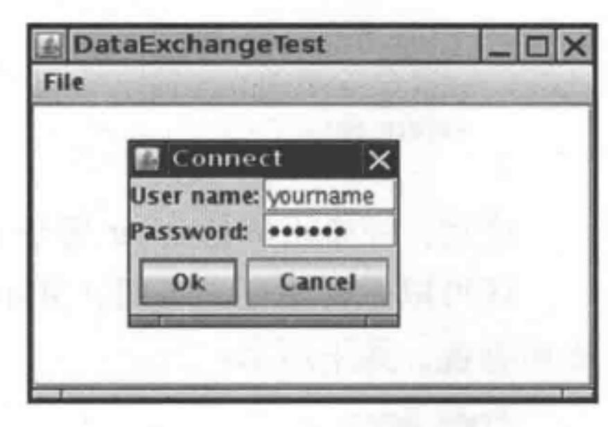

图 11-32 密码对话框

一旦设置了默认值(如果需要),可以调用 setVisible(true)显示对话框。现在对话框会显示在屏幕上。

然后用户输入信息,点击 OK 或者 Cancel 按钮。这两个按钮的事件处理器都会调用 setVisible(false),这会终止 setVisible(true)调用。或者,用户也可能关闭对话框。如果没有 为对话框安装窗口监听器,就会执行默认的窗口关闭操作:对话框变为不可见,这也会终止 setVisible(true)调用。

有一点很重要:在用户关闭这个对话框之前, setVisible(true)调用会阻塞。这样就能很容易地实现模式对话框。

你希望知道用户是接受还是取消了这个对话框。示例代码中设置了 ok 标志, 在显示对话框之前 ok 标志设置为 false。只有 OK 按钮的事件处理器将 ok 标志设置为 true, 我们就是利用这种方法从对话框获取用户输入。

註释:从无模式对话框传输数据就没有那么简单了。显示一个无模式对话框时,setVisible(true)调用并不阻塞,对话框显示的同时,程序会继续运行。如果用户选择了无模式对话框中的一项,然后点击 OK,对话框需要向程序中的某个监听器发送一个事件。

示例程序中还包含另外一个很有用的改进。构造一个 JDialog 对象时,需要指定所有者窗体。但是,在很多情况下,你往往希望在不同的所有者窗体中显示同一个对话框,所以最好在准备显示对话框时再选择所有者窗体,而不是在构造 PasswordChooser 对象时指定所有者。

这里的技巧是让 PasswordChooser 扩展 JPanel, 而不是扩展 JDialog, 在 showDialog 方法中动态构建一个 JDialog 对象:

```
public boolean showDialog(Frame owner, String title)
{
  ok = false;
\nif (dialog == null || dialog.getOwner() != owner)
  {
    dialog = new JDialog(owner, true);
    dialog.add(this);
    dialog.pack();
}
```

```
dialog.setTitle(title);
dialog.setVisible(true);
return ok;
}
```

注意,完全可以让 owner 等于 null。

还可以做得更好。有时,并不总能得到所有者窗体。不过可以很容易地从 parent 组件得出所有者,如下所示:

```
Frame owner;\nif (parent instanceof Frame)
  owner = (Frame) parent;\nelse
  owner = (Frame) SwingUtilities.getAncestorOfClass(Frame.class, parent);
```

我们在示例程序中使用了这个改进。JOptionPane 类也使用了这种机制。

很多对话框都有一个默认按钮(default button)。如果用户按下触发键(大多数"观感"实现中,触发键通常是回车键),就会自动地选择这个默认按钮。默认按钮有特殊的标记,通常有加粗的轮廓。

可以在对话框的根窗格 (root pane) 中设置默认按钮:

dialog.getRootPane().setDefaultButton(okButton);

如果遵循在面板中放置对话框的建议,就必须特别小心,只有将这个面板包装为一个对话框后才能设置默认按钮。面板本身没有根窗格。

程序清单 11-13 是程序的窗体类,这个程序展示了对话框如何传入传出数据。程序清单 11-14 给出了对话框类。

## 程序清单 11-13 dataExchange/DataExchangeFrame.java

```
1 package dataExchange;
3 import java.awt.*;
4 import java.awt.event.*;
  import javax.swing.*;
   /**
     A frame with a menu whose File->Connect action shows a password dialog.
   public class DataExchangeFrame extends JFrame
11 {
      public static final int TEXT_ROWS = 20;
12
      public static final int TEXT COLUMNS = 40;
13
      private PasswordChooser dialog = null;
14
      private JTextArea textArea;
15
16
      public DataExchangeFrame()
17
18
         // construct a File menu
19
20
```

```
var mbar = new JMenuBar();
21
         setJMenuBar(mbar);
22
         var fileMenu = new JMenu("File");
23
         mbar.add(fileMenu);
24
25
         // add Connect and Exit menu items
26
27
         var connectItem = new JMenuItem("Connect");
28
         connectItem.addActionListener(new ConnectAction());
29
         fileMenu.add(connectItem);
30
31
         // the Exit item exits the program
32
33
         var exitItem = new JMenuItem("Exit");
34
         exitItem.addActionListener(event -> System.exit(θ));
35
         fileMenu.add(exitItem);
36
37
         textArea = new JTextArea(TEXT_ROWS, TEXT_COLUMNS);
38
         add(new JScrollPane(textArea), BorderLayout.CENTER);
39
         pack();
48
41
42
43
       * The Connect action pops up the password dialog.
44
45
      private class ConnectAction implements ActionListener
46
47
         public void actionPerformed(ActionEvent event)
48
49
            // if first time, construct dialog
5θ
51
             if (dialog == null) dialog = new PasswordChooser();
52
53
             // set default values
54
             dialog.setUser(new User("yourname", null));
55
56
             // pop up dialog
57
             if (dialog.showDialog(DataExchangeFrame.this, "Connect"))
58
59
                // if accepted, retrieve user input
60
                User u = dialog.getUser();
61
                textArea.append("user name = " + u.getName() + ", password = "
62
                   + (new String(u.getPassword())) + "\n");
63
64
65
66
67 }
```

## 程序清单 11-14 dataExchange/PasswordChooser.java

```
package dataExchange;\nimport java.awt.BorderLayout;\nimport java.awt.Component;
```

```
import java.awt.Frame;
   import java.awt.GridLayout;
   import javax.swing.JButton;
   import javax.swing.JDialog;
  import javax.swing.JLabel;
import javax.swing.JPanel;
import javax.swing.JPasswordField;
import javax.swing.JTextField;
   import javax.swing.SwingUtilities;
15
   /**
16
    * A password chooser that is shown inside a dialog.
18
   public class PasswordChooser extends JPanel
20
      private JTextField username;
21
      private JPasswordField password;
22
      private JButton okButton;
23
      private boolean ok;
24
      private JDialog dialog;
25
26
      public PasswordChooser()
27
28
         setLayout(new BorderLayout());
29
30
         // construct a panel with user name and password fields
31
32
         var panel = new JPanel();
33
         panel.setLayout(new GridLayout(2, 2));
34
         panel.add(new JLabel("User name:"));
         panel.add(username = new JTextField(""));
36
         panel.add(new JLabel("Password:"));
37
         panel.add(password = new JPasswordField(""));
38
         add(panel, BorderLayout.CENTER);
40
         // create Ok and Cancel buttons that terminate the dialog
41
42
         okButton = new JButton("0k");
43
         okButton.addActionListener(event ->
44
45
                ok = true;
46
                dialog.setVisible(false);
47
            });
48
49
         var cancelButton = new JButton("Cancel");
50
         cancelButton.addActionListener(event -> dialog.setVisible(false));
51
52
         // add buttons to southern border
53
54
         var buttonPanel = new JPanel();
55
         buttonPanel.add(okButton);
56
         buttonPanel.add(cancelButton);
57
         add(buttonPanel, BorderLayout.SOUTH);
58
```

```
59
60
      /**
61
       * Sets the dialog defaults.
62
       * @param u the default user information
63
64
      public void setUser(User u)
65
66
         username.setText(u.getName());
67
68
69
       /**
70
       * Gets the dialog entries.
71
       * @return a User object whose state represents the dialog entries
72
73
      public User getUser()
74
75
         return new User(username.getText(), password.getPassword());
76
77
78
       /**
79
       * Show the chooser panel in a dialog.
80
       * @param parent a component in the owner frame or null
81
       * @param title the dialog window title
82
83
      public boolean showDialog(Component parent, String title)
84
85
         ok = false;
86
87
         // locate the owner frame
88
89
         Frame owner = null;
98
          if (parent instanceof Frame)
91
             owner = (Frame) parent;
92
         else
93
             owner = (Frame) SwingUtilities.getAncestorOfClass(Frame.class, parent);
94
95
          // if first time, or if owner has changed, make new dialog
96
97
          if (dialog == null || dialog.getOwner() != owner)
98
99
             dialog = new JDialog(owner, true);
100
             dialog.add(this);
101
             dialog.getRootPane().setDefaultButton(okButton);
102
             dialog.pack();
103
184
105
          // set title and show dialog
106
107
          dialog.setTitle(title);
108
          dialog.setVisible(true);
109
          return ok;
110
111
112 }
```

#### API javax.swing.SwingUtilities 1.2

Container getAncestorOfClass(Class c, Component comp)
 返回属于给定类或其某个子类的给定组件的最内层父容器。

#### API javax.swing.JComponent 1.2

JRootPane getRootPane()
 获得包含这个组件的根窗格,如果这个组件没有带根窗格的祖先,则返回 null。

#### API javax.swing.JRootPane 1.2

void setDefaultButton(JButton button)
 设置根窗格的默认按钮。要想禁用默认按钮,可以提供 null 参数来调用这个方法。

## API javax.swing.JButton 1.2

boolean isDefaultButton()
 如果这个按钮是其根窗格的默认按钮,返回 true。

#### 11.7.4 文件对话框

在一个应用中,通常希望可以打开和保存文件。一个好的文件对话框应该可以显示文件和目录,允许用户浏览文件系统,这样一个文件对话框很难编写,你肯定不愿意从头做起。很幸运,Swing 中提供了 JFileChooser 类,它显示的文件对话框类似于大多数原生应用所用的对话框。JFileChooser 对话框总是模式对话框。注意,JFileChooser 类并不是 JDialog 类的子类。需要调用 showOpenDialog 显示打开文件的对话框,或者调用 showSaveDialog 显示保存文件的对话框,而不是调用 setVisible(true)。接收文件的按钮会自动地使用标签 Open 或者 Save。也可以调用 showDialog 方法为按钮提供你自己的标签。图 11-33 显示了文件选择器对话框的一个示例。

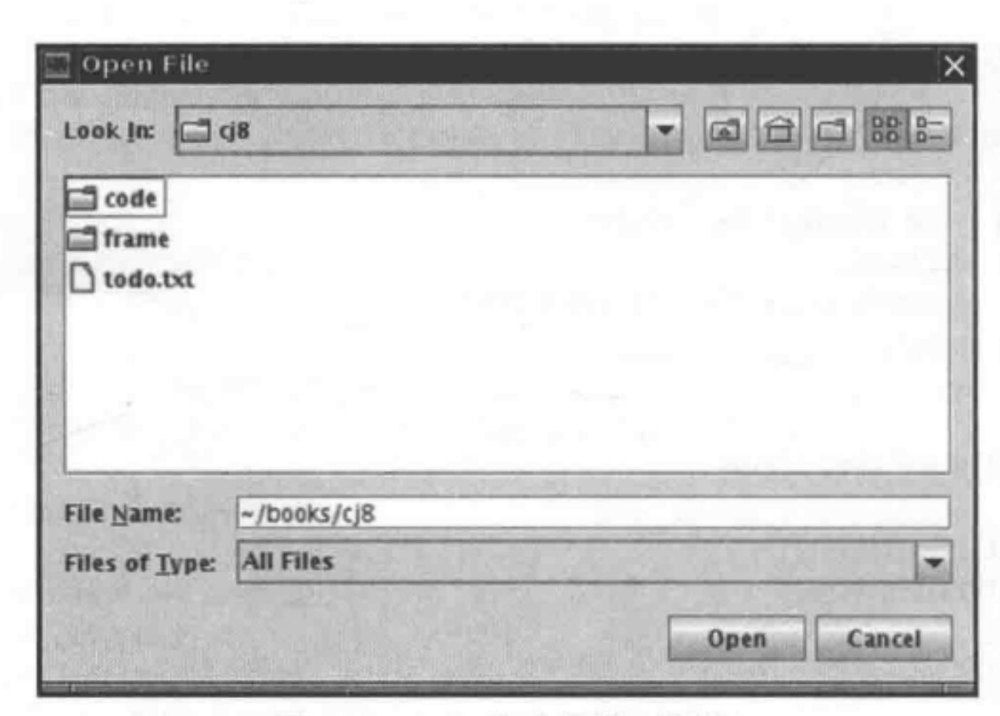

图 11-33 文件选择器对话框

下面是建立文件对话框并获取用户选择信息的步骤:

1. 建立一个 JFileChooser 对象。与 JDialog 类的构造器不同,不需要提供父组件。这就允许你在多个窗体中重用一个文件选择器。例如:

var chooser = new JFileChooser();

- 提示: 重用文件选择器对象是一个很好的想法,其原因是 JFileChooser 构造器可能相当慢。特别是在 Windows 上,用户有可能映射了很多网络驱动器。
  - 2. 调用 setCurrentDirectory 方法设置目录。

例如,要使用当前工作目录:

chooser.setCurrentDirectory(new File("."));

需要提供一个 File 对象。File 对象将在卷Ⅱ的第2章中详细介绍。这里只需要知道构造器 File(String fileName) 能够将一个文件或目录名转换为一个 File 对象。

3. 如果有一个希望用户选择的默认文件名,可以使用 setSelectedFile 方法指定:

chooser.setSelectedFile(new File(filename));

4. 如果允许用户在对话框中选择多个文件,需要调用 setMultiSelectionEnabled 方法。当然,这是可选的,而且并不常见。

chooser.setMultiSelectionEnabled(true);

- 5. 如果想限制对话框只显示某种特定类型的文件(如,所有扩展名为.gif的文件),需要设置文件过滤器(file filter),本节稍后将会讨论文件过滤器。
- 6. 在默认情况下,用户只能在文件选择器中选择文件。如果希望用户选择目录,需要使用 setFileSelectionMode 方法。调用时可以提供以下参数: JFileChooser.FILES\_ONLY(默认值), JFileChooser.DIRECTORIES ONLY或者 JFileChooser.FILES AND DIRECTORIES。
- 7. 调用 showOpenDialog 或者 showSaveDialog 方法显示对话框。在这些调用中必须提供父组件:

int result = chooser.showOpenDialog(parent);

或者

int result = chooser.showSaveDialog(parent);

这些调用的唯一区别是"确认按钮"的标签不同。"确认按钮"就是用户点击来完成文件选择的那个按钮。也可以调用 showDialog 方法,并为确认按钮传入一个显式的文本:

int result = chooser.showDialog(parent, "Select");

仅当用户确认、取消或者关闭对话框时这些调用才返回。返回值可以是 JFileChooser. APPROVE\_OPTION、JFileChooser.CANCEL\_OPTION或者 JFileChooser.ERROR\_OPTION。

8. 调用 getSelectedFile() 或者 getSelectedFiles() 方法获得用户选择的一个或多个文件。这些方法将返回一个 File 对象或者一个 File 对象数组。如果需要知道文件对象名,可以调用

getPath 方法。例如:

String filename = chooser.getSelectedFile().getPath();

在大多数情况下,这些步骤都很简单。使用文件对话框的主要困难在于指定一个文件子集,让用户从中选择文件。例如,假设用户应该选择 GIF 图像文件。那么,文件选择器应该只显示扩展名为 .gif 的文件。另外,还应该为用户提供某种反馈信息,指出所显示的文件属于某个特定文件类别,如 "GIF 图像"。不过,情况有可能会更加复杂。如果用户应该选择 JPEG 图像文件,扩展名就可以是 .jpg 或者 .jpeg。文件选择器的设计者没有编写代码来实现这种复杂性,而是提供了一种更优雅的机制:要想限制所显示的文件,可以提供一个扩展了抽象类 javax.swing.filechooser.FileFilter 的对象。文件选择器将各个文件传递到这个文件过滤器,只显示文件过滤器接受的文件。

在写本书的时候,提供了两个子类:一个是可以接受所有文件的默认过滤器,另一个过滤器可以接受有给定扩展名的所有文件。不过,很容易编写专用的文件过滤器,只需实现 FileFilter 超类中的两个抽象方法:

public boolean accept(File f); public String getDescription();

第一个方法检测是否应该接受一个文件,第二个方法返回可以在文件选择对话框中显示的文件类型的一个描述。

注释: java.io 包中有一个无关的 FileFilter 接口, 其中只包含一个方法: boolean accept (File f)。File 类中的 listFiles 方法利用它列出一个目录中的文件。我们不知道 Swing 的设计者为什么不扩展这个接口, 可能是因为 Java 类库现在变得过于复杂, 以致 Sun 的程序员也不了解所有的标准类和接口。

如果同时导入了 javax.io 包和 javax.swing.filechooser 包,就需要解决这两个同名类型的命名冲突问题。最简单的补救方法是导入 javax.swing.filechooser.FileFilter,而不是 javax.swing.filechooser.\*。

一旦有了文件过滤器对象,可以调用 JFileChooser 类的 setFileFilter 方法,将这个对象安装到文件选择器对象中:

chooser.setFileFilter(new FileNameExtensionFilter("Image files", "gif", "jpg"));

可以为一个文件选择器安装多个过滤器,如下:

chooser.addChoosableFileFilter(filter1);
chooser.addChoosableFileFilter(filter2);

用户可以从文件对话框底部的组合框中选择过滤器。在默认情况下,组合框中总是显示 "All files"过滤器。这是一个好主意,因为使用这个程序的用户可能需要选择一个有非标准 扩展名的文件。不过,如果你想禁用"All files"过滤器,需要调用:

chooser.setAcceptAllFileFilterUsed(false)

## ● 警告: 如果重用一个文件选择器加载和保存不同类型的文件, 就需要调用:

chooser.resetChoosableFilters()

在添加新的文件过滤器之前清除老的文件过滤器。

最后,可以为文件选择器显示的每个文件提供特定的图标和文件描述来定制文件选择器。为此,需要提供一个类对象,这个类要扩展 javax.swing.filechooser 包中的 FileView 类。这确实是一种高级技术。通常情况下,你并不需要提供文件视图——可插拔式观感会为你提供一个视图。不过,如果想为特殊的文件类型显示不同的图标,也可以安装你自己的文件视图。需要扩展 FileView 类并实现下面 5 个方法:

- Icon getIcon(File f)
- String getName(File f)
- String getDescription(File f)
- String getTypeDescription(File f)
- Boolean isTraversable(File f)

然后,使用 setFileView 方法将文件视图安装到文件选择器中。

文件选择器会为希望显示的每个文件或目录调用这些方法。如果方法返回的图标、名字或描述信息为 null,那么文件选择器会使用观感(look-and-feel)的默认文件视图。这种做法很好,因为这意味着只需要处理那些希望有不同显示的文件类型。

文件选择器调用 isTraversable 方法来决定用户点击一个目录时是否打开这个目录。请注意,这个方法返回一个 Boolean 对象,而不是 boolean 值。看起来似乎有点怪,但实际上很方便——如果只需要使用默认文件视图而不关心其他视图,则返回 null。文件选择器就会使用默认的文件视图。换句话说,这个方法返回的 Boolean 对象能给出 3 种选择:真(Boolean. TRUE)、假(Boolean.FALSE)和不关心(null)。

示例程序中包含了一个简单的文件视图类。只要一个文件匹配文件过滤器,这个类将会显示一个特定的图标。可以利用这个类为所有图像文件显示一个调色板图标。

```
class FileIconView extends FileView
{
   private FileFilter filter;
   private Icon icon;

public FileIconView(FileFilter aFilter, Icon anIcon)
   {
      filter = aFilter;
      icon = anIcon;
   }

public Icon getIcon(File f)
   {
      if (!f.isDirectory() && filter.accept(f))
          return icon;
      else return null;
   }
}
```

可以调用 setFileView 方法将这个文件视图安装到文件选择器:

```
chooser.setFileView(new FileIconView(filter,
    new ImageIcon("palette.gif")));
```

文件选择器会在通过 filter 过滤的所有文件旁边显示调色板图标,而使用默认的文件视图显示所有其他文件。很自然地,我们使用了文件选择器中设置的过滤器。

最后,可以添加一个附件(accessory)组件来定制文件对话框。例如,图 11-34 在文件列表旁边显示了一个预览附件。这个附件显示了当前选中文件的一个缩略视图。

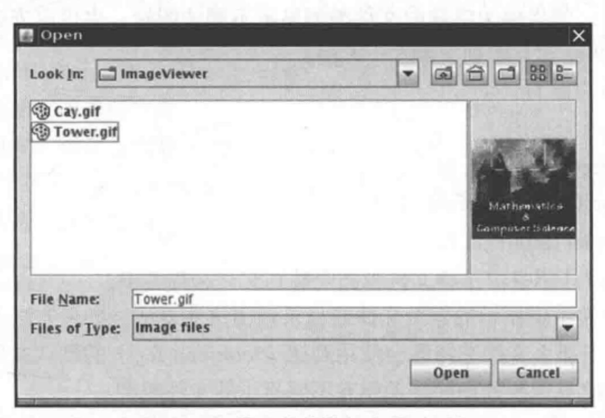

图 11-34 带预览附件的文件对话框

附件可以是任何 Swing 组件。在这个示例中,我们扩展了 JLabel 类,并将它的图标设置 为图像文件的一个缩小副本。

```
class ImagePreviewer extends JLabel
{
  public ImagePreviewer(JFileChooser chooser)
  {
    setPreferredSize(new Dimension(100, 100));
    setBorder(BorderFactory.createEtchedBorder());
}

public void loadImage(File f)
  {
    var icon = new ImageIcon(f.getPath());
    if(icon.getIconWidth() > getWidth())
        icon = new ImageIcon(icon.getImage().getScaledInstance(
```

这里还有一个挑战。我们希望只要用户选择不同的文件就更新预览图像。文件选择器使用了"JavaBeans"机制:只要某个属性发生变化,就会通知感兴趣的监听器。选中的文件是一个属性,可以通过安装 PropertyChangeListener 来监听。需要下面的代码来捕获通知:

```
chooser.addPropertyChangeListener(event ->
{
    if (event.getPropertyName() == JFileChooser.SELECTED_FILE_CHANGED_PROPERTY)
    {
       var newFile = (File) event.getNewValue();
       // update the accessory
```

#### API javax.swing.JFileChooser 1.2

- JFileChooser()
   创建一个可用于多个窗体的文件选择器对话框。
- void setCurrentDirectory(File dir)
   设置文件对话框的初始目录。
- void setSelectedFile(File file)
- void setSelectedFiles(File[] file)
   设置文件对话框的默认文件选择。
- void setMultiSelectionEnabled(boolean b)
   设置或清除多选模式。
- void setFileSelectionMode(int mode)
   允许用户只选择文件(默认),只选择目录,或者文件和目录均可以选择。mode 参数的取值可以是 JFileChooser.FILES\_ONLY、JFileChooser.DIRECTORIES\_ONLY和 JFileChooser.FILES\_AND\_DIRECTORIES之一。
- int showOpenDialog(Component parent)
- int showSaveDialog(Component parent)
- int showDialog(Component parent, String approveButtonText)
  显示一个对话框,其中确认按钮标签为"Open""Save"或者 approveButtonText字符串,并返回 APPROVE\_OPTION、CANCEL\_OPTION(如果用户选择取消按钮或者关闭了对话框)或者 ERROR OPTION(如果发生错误)。
- File getSelectedFile()
- File[] getSelectedFiles() 获得用户选择的一个文件或多个文件(如果用户没有选择文件,返回 null)。
- void setFileFilter(FileFilter filter)
   设置文件对话框的文件过滤器。所有让 filter.accept 返回 true 的文件都会显示。另外 将这个过滤器添加到可选择过滤器列表中。
- void addChoosableFileFilter(FileFilter filter)
   将一个文件过滤器添加到可选择过滤器列表中。
- void setAcceptAllFileFilterUsed(boolean b)

566

在过滤器组合框中包括或者取消 "All files" 过滤器。

- void resetChoosableFileFilters() 清除可选择过滤器列表。除非显式地取消了"All files"过滤器,否则它仍然保留。
- void setFileView(FileView view)
   设置一个文件视图来提供文件选择器显示的文件的有关信息。
- void setAccessory(JComponent component)
   设置一个附件组件。

#### API javax.swing.filechooser.FileFilter 1.2

- boolean accept(File f)
   如果文件选择器要显示这个文件,返回 true。
- String getDescription()
   返回这个文件过滤器的一个描述,例如,"Image files (\*.gif, \*.jpeg)"。

## javax.swing.filechooser.FileNameExtensionFilter 6

FileNameExtensionFilter(String description, String... extensions)
 利用给定的描述构造一个文件过滤器,它接受名字以特定方式结尾的所有目录和文件,即有一个点号,后面紧跟给定的扩展名字符串之一。

## API javax.swing.filechooser.FileView 1.2

- String getName(File f)
   返回文件 f 的文件名,或者返回 null。正常情况下这个方法会简单地返回 f.getName()。
- String getDescription(File f)
   返回文件 f 的人类可读的一个描述,或者返回 null。例如,如果 f 是 HTML 文档,那
   么这个方法可能返回它的标题。
- String getTypeDescription(File f)
   对于文件 f 的类型,返回人类可读的一个描述,或者返回 null。例如,如果文件 f 是 HTML 文档,那么这个方法可能返回字符串 "Hypertext document"。
- Icon getIcon(File f)
- 返回文件 f 的图标,或者返回 null。例如,如果 f 是 JPEG 文件,那么这个方法可能返回一个缩略图标。
- Boolean isTraversable(File f)
   如果f是用户可以打开的目录,返回Boolean.TRUE。如果一个目录在概念上是复合文档,那么这个方法可能返回Boolean.false。与所有的FileView方法一样,这个方法有可能返回null,表示文件选择器应该使用默认视图。

这样我们就结束了关于 Swing 编程的讨论。卷Ⅱ将介绍更高级的 Swing 组件和复杂的图形技术。

## 第12章 并 发

- ▲ 什么是线程
- ▲ 线程状态
- ▲ 线程属性
- ▲同步

- ▲ 线程安全的集合
- ▲ 任务和线程池
- ▲ 异步计算
- ▲ 进程

你可能已经很熟悉多任务(multitasking),这是操作系统的一种能力,看起来可以在同一时刻运行多个程序。例如,你在编辑或下载电子邮件的同时可以打印文件。如今,人们往往使用多 CPU 的计算机,但是,并发执行的进程数并不受限于 CPU 数。操作系统会为每个进程分配 CPU 时间片,给人并行处理的感觉。

多线程程序在更低一层扩展了多任务的概念:单个程序看起来在同时完成多个任务。每个任务在一个线程(thread)中执行,线程是控制线程的简称。如果一个程序可以同时运行多个线程,则称这个程序是多线程程序(multithreaded)。

那么,多进程(process)与多线程有什么区别呢?本质的区别在于每个进程都拥有自己的一整套变量,线程则共享数据。这听起来似乎有些风险,的确是这样,本章稍后将介绍这个问题。不过,共享变量使线程之间的通信比进程之间的通信更高效、更容易。此外,在有些操作系统中,与进程相比较,线程更"轻量级",创建、撤销单个线程比启动新进程的开销要小得多。

在实际应用中,多线程非常有用。例如,一个浏览器应该能够同时下载多个图片。一个 Web 服务器需要能够同时服务并发的请求。图形用户界面(GUI)程序用一个独立的线程从 主机操作环境收集用户界面事件。本章将介绍如何为 Java 应用添加多线程功能。

温馨提示:多线程编程可能会变得相当复杂。本章涵盖了应用程序员可能需要的所有工具。尽管如此,对于更复杂的系统级编程,建议参见更高级的参考文献,例如,Brian Goetz 等撰写的 *Java Concurrency in Practice* (Addison-Wesley Professional, 2006)。

## 12.1 什么是线程

首先来看一个使用了两个线程的简单程序。这个程序可以在银行账户之间完成资金转账。我们使用了一个 Bank 类,它可以存储给定数目的账户的余额。transfer 方法将一定金额从一个账户转移到另一个账户。具体实现见程序清单 12-2。

<sup>○</sup> 此书中文版《Java 并发编程实战》已由机械工业出版社引进出版, ISBN: 978-7-111-37004-8。——编辑注

在第一个线程中, 我们将钱从账户 0 转移到账户 1。第二个线程将钱从账户 2 转移到账户 3。

下面是在一个单独的线程中运行一个任务的简单过程:

1. 将执行这个任务的代码放在一个类的 run 方法中,这个类要实现 Runnable 接口。Runnable 接口非常简单,只有一个方法:

```
public interface Runnable {
    void run();
}
由于 Runnable 是一个函数式接口,可以用一个 lambda 表达式创建一个实例:
Runnable r = () ->
    {
        task code
    };

2. 从这个 Runnable 构造一个 Thread 对象:
    var t = new Thread(r);
```

3. 启动线程:

t.start();

为了创建单独的线程来完成转账,我们只需要把转账代码放在一个 Runnable 的 run 方法中,然后启动一个线程:

```
Runnable r = () ->
{
    try
    {
        for (int i = 0; i < STEPS; i++)
        {
            double amount = MAX_AMOUNT * Math.random();
            bank.transfer(0, 1, amount);
            Thread.sleep((int) (DELAY * Math.random()));
        }
    }
    catch (InterruptedException e)
    {
     }
};
var t = new Thread(r);
t.start();</pre>
```

在一个 for 循环中(对于给定的步数 STEPS),这个线程会转账一个随机金额,然后休眠随机的延迟时间。

我们要捕获 sleep 方法有可能抛出的 InterruptedException 异常。这个异常将在 12.3.1 节讨论。一般来说,中断用来请求终止一个线程。相应地,出现 InterruptedException 时,run 方法会退出。

这个程序还会启动第二个线程,它从账户2向账户3转账。运行这个程序时,可以得到

## 类似这样的输出:

```
Thread[Thread-1,5,main]
                            606.77 from 2 to 3 Total Balance:
                                                                400000.00
Thread[Thread-0,5,main]
                             98.99 from 0 to 1 Total Balance:
                                                                400000.00
Thread[Thread-1,5,main]
                            476.78 from 2 to 3 Total Balance:
                                                               400000.00
Thread[Thread-0,5,main]
                            653.64 from 0 to 1 Total Balance:
                                                               400000.00
                            807.14 from 2 to 3 Total Balance:
Thread[Thread-1,5,main]
                                                                400000.00
Thread[Thread-0,5,main]
                            481.49 from 0 to 1 Total Balance:
                                                                400000.00
Thread[Thread-0,5,main]
                            203.73 from 0 to 1 Total Balance:
                                                                400000.00
                            111.76 from 2 to 3 Total Balance:
Thread[Thread-1,5,main]
                                                                400000.00
                            794.88 from 2 to 3 Total Balance:
Thread[Thread-1,5,main]
                                                                400000.00
```

可以看到,两个线程的输出是交错的,这说明它们在并发运行。实际上,两个输出行交错显示时,输出有时会有些混乱。

你要了解的就是这些!现在你已经知道了如何并发地运行任务。这一章余下的部分会介 绍如何控制线程之间的交互。

这个程序的完整代码见程序清单 12-1。

注释: 还可以通过建立 Thread 类的一个子类来定义线程,如下所示:

```
class MyThread extends Thread
{
   public void run()
   {
     task code
   }
}
```

然后可以构造这个子类的一个对象,并调用它的 start 方法。不过,现在不再推荐这种方法。应当把要并行运行的任务与运行机制解耦合。如果有多个任务,为每个任务分别创建一个单独的线程开销太大。实际上,可以使用一个线程池,参见 12.6.2 节的介绍。

● 警告: 不要调用 Thread 类或 Runnable 对象的 run 方法。直接调用 run 方法只会在同一个 线程中执行这个任务,而没有启动新的线程。实际上,应当调用 Thread.start 方法,这 会创建一个新线程来执行 run 方法。

## 程序清单 12-1 threads/ThreadTest.java

```
package threads;

/**

* @version 1.30 2004-08-01

* @author Cay Horstmann

*/
public class ThreadTest

public static final int DELAY = 10;
public static final int STEPS = 100;
public static final double MAX AMOUNT = 1000;
```

```
12
      public static void main(String[] args)
13
14
         var bank = new Bank(4, 100000);
15
         Runnable task1 = () ->
16
17
                try
18
19
                   for (int i = 0; i < STEPS; i++)
20
21
                      double amount = MAX_AMOUNT * Math.random();
22
                      bank.transfer(0, 1, amount);
23
                      Thread.sleep((int) (DELAY * Math.random()));
24
25
26
                catch (InterruptedException e)
27
28
29
            };
30
31
         Runnable task2 = () ->
32
33
                try
34
35
                   for (int i = 0; i < STEPS; i++)
36
37
                      double amount = MAX_AMOUNT * Math.random();
38
                      bank.transfer(2, 3, amount);
39
                      Thread.sleep((int) (DELAY * Math.random()));
41
42
                catch (InterruptedException e)
43
44
45
         new Thread(task1).start();
         new Thread(task2).start();
5θ
51 }
```

## 程序清单 12-2 threads/Bank.java

```
package threads;\nimport java.util.*;

/**
 * A bank with a number of bank accounts.

public class Bank
public class Bank
private final double[] accounts;
```

```
/**
12
       * Constructs the bank.
13
       * @param n the number of accounts
14
       * @param initialBalance the initial balance for each account
15
       */
16
      public Bank(int n, double initialBalance)
17
18
         accounts = new double[n];
19
         Arrays.fill(accounts, initialBalance);
20
21
22
23
       * Transfers money from one account to another.
24
       * @param from the account to transfer from
25
       * @param to the account to transfer to
26
       * @param amount the amount to transfer
27
       */
28
      public void transfer(int from, int to, double amount)
29
30
         if (accounts[from] < amount) return;
31
         System.out.print(Thread.currentThread());
32
         accounts[from] -= amount;
33
         System.out.printf(" %10.2f from %d to %d", amount, from, to);
34
         accounts[to] += amount;
35
         System.out.printf(" Total Balance: %10.2f%n", getTotalBalance());
36
37
38
39
       * Gets the sum of all account balances.
40
       * @return the total balance
41
42
      public double getTotalBalance()
43
44
         double sum = 0;
45
46
         for (double a : accounts)
47
            sum += a;
48
49
         return sum;
5θ
51
52
      /**
53
       * Gets the number of accounts in the bank.
54
       * @return the number of accounts
55
56
      public int size()
57
58
         return accounts.length;
59
60
61 }
```

## API java.lang.Thread 1.0

构造一个新线程, 它会调用指定目标的 run() 方法。

- void start()
   启动这个线程,从而调用 run()方法。这个方法将立即返回。新线程会并发运行。
- void run() 调用相关 Runnable 的 run 方法。
- static void sleep(long millis)
   休眠指定的毫秒数。

### API java.lang.Runnable 1.0

void run()必须覆盖这个方法,提供你希望执行的任务指令。

## 12.2 线程状态

线程可以有如下6种状态:

- New (新建)
- Runnable (可运行)
- Blocked (阻塞)
- Waiting (等待)
- Timed waiting (计时等待)
- Terminated (终止)

下面几节分别对每一种状态进行解释。

要确定一个线程的当前状态,只需要调用 getState 方法。

## 12.2.1 新建线程

当用 new 操作符创建一个新线程时,如 new Thread(r),这个线程还没有开始运行。这意味着它的状态是新建(new)。当一个线程处于新建状态时,程序还没有开始运行线程中的代码。线程可以运行之前还有一些基础工作要做。

## 12.2.2 可运行线程

- 一旦调用 start 方法,线程就处于可运行(runnable)状态。一个可运行的线程可能正在运行也可能没有运行。要由操作系统为线程提供具体的运行时间。(不过,Java 规范没有将"正在运行"作为一个单独的状态。一个正在运行的线程仍然处于可运行状态。)
- 一旦一个线程开始运行,它不一定始终保持运行。事实上,运行中的线程有时需要暂停,让其他线程有机会运行。线程调度的细节依赖于操作系统提供的服务。抢占式调度系统给每一个可运行线程一个时间片来执行任务。当时间片用完时,操作系统会剥夺该线程的运行权,并给另一个线程一个机会来运行(见图 12-2)。当选择下一个线程时,操作系统会考

虑线程的优先级 (priority) ——更多的内容见 12.3.5 节。

所有现代桌面和服务器操作系统都使用抢占式调度。但是,像手机这样的小型设备可能使用协作式调度。在这样的设备中,一个线程只有在调用 yield 方法或者被阻塞或等待时才失去控制权。

在有多个处理器的机器上,每个处理器可以运行一个线程,而且可以有多个线程并行运行。当然,如果线程数多于处理器的数目,调度器还是需要分配时间片。

一定要记住,在任何给定时刻,一个可运行的线程可能正在运行也可能没有运行(正是出于该原因,这个状态称为"可运行"而不是"正在运行")。

## API java.lang.Thread 1.0

static void yield()
 使当前正在执行的线程向另一个线程交出运行权。注意这是一个静态方法。

## 12.2.3 阻塞和等待线程

当线程处于阻塞或等待状态时,它暂时是不活动的。它不执行任何代码,并且消耗最少的资源。要由线程调度器重新激活这个线程。具体细节取决于它是怎样到达非活动状态的。

- 当一个线程试图获取一个内部的对象锁(而不是 java.util.concurrent 库中的 Lock),而 这个锁目前被其他线程占有,该线程就会被阻塞(我们将在 12.4.3 节讨论 java.util. concurrent 锁,并在 12.4.5 节讨论内部对象锁)。当所有其他线程都释放了这个锁,并 且线程调度器允许该线程持有这个锁时,它将变成非阻塞状态。
- 当线程等待另一个线程通知调度器出现某个条件时,这个线程会进入等待状态。我们会在12.4.4节讨论条件。调用 Object.wait 方法或 Thread.join 方法,或者是等待 java. util.concurrent 库中的 Lock或 Condition 时,就会出现这种情况。实际上,阻塞状态与等待状态并没有太大区别。
- 有几个方法有超时参数,调用这些方法会让线程进入计时等待(timed waiting)状态。这一状态将一直保持到超时期满或者接收到适当的通知。带有超时参数的方法有Thread.sleep和计时版的Object.wait、Thread.join、Lock.tryLock以及Condition.await。

图 12-1 展示了线程可能的状态以及从一个状态到另一个状态可能的转换。当一个线程阻塞或等待时(或者终止时),可以调度另一个线程运行。当一个线程被重新激活(例如,因为超时期满或成功地获得了一个锁),调度器检查它是否具有比当前运行线程更高的优先级。如果是这样,调度器会剥夺某个当前运行线程的运行权,选择运行一个新线程。

## 12.2.4 终止线程

线程会由于以下两个原因之一而终止:

- 由于 run 方法正常退出, 线程自然终止。
- 因为一个没有捕获的异常终止了 run 方法, 使线程意外终止。

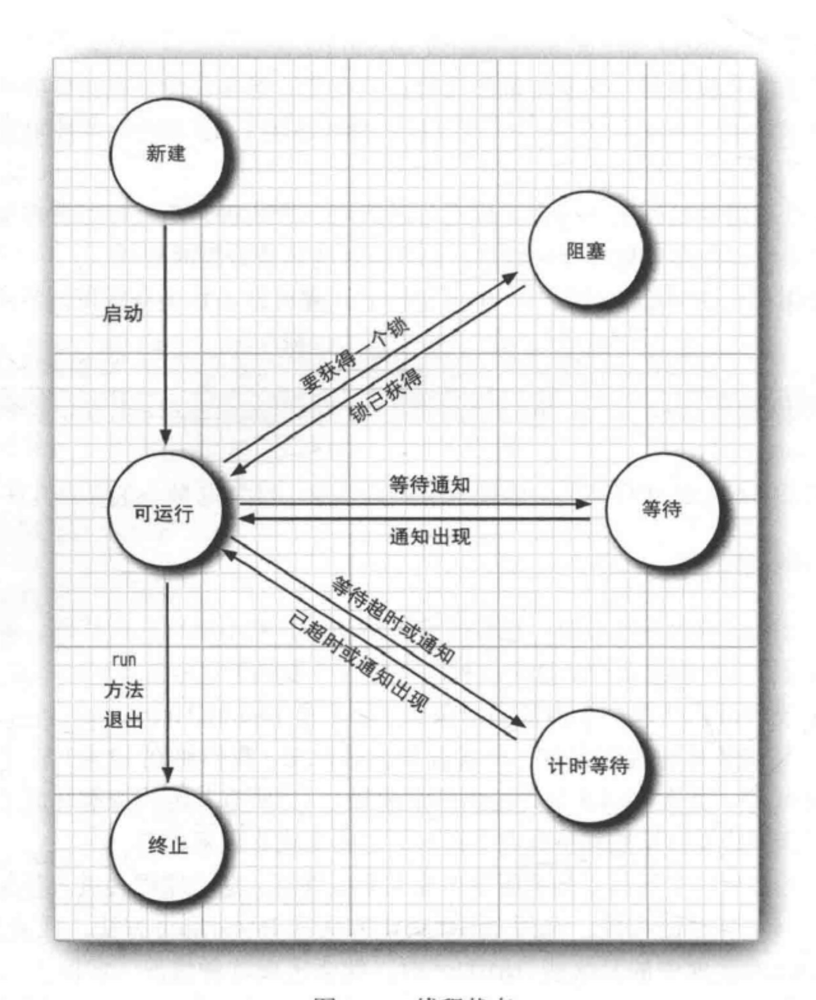

图 12-1 线程状态

具体来说,可以调用线程的 stop 方法杀死一个线程。该方法抛出一个 ThreadDeath 错误对象,这会杀死线程。不过, stop 方法已经废弃,不要在你自己的代码中调用这个方法。

## API java.lang.Thread 1.0

- void join()等待指定的线程终止。
- void join(long millis)等待指定的线程终止或者等待经过指定的毫秒数。
- Thread.State getState() 5
   得到这个线程的状态:取值为 NEW、RUNNABLE、BLOCKED、WAITING、TIMED\_WAITING或 TERMINATED。
- void stop()停止该线程。这个方法已经废弃。

- void suspend()暂停这个线程的执行。这个方法已经废弃,将来会删除。
- void resume()
   恢复线程。这个方法只能在调用 suspend() 之后使用。这个方法已经废弃,将来会删除。

## 12.3 线程属性

下面几节将讨论线程的各种属性,包括中断的状态、守护线程、未捕获异常的处理器以及不应使用的一些遗留特性。

#### 12.3.1 中断线程

当一个线程的 run 方法返回时(执行了方法体中最后一条语句后,执行 return 语句返回),或者如果出现方法中未捕获的异常,这个线程将终止。在 Java 的早期版本中,还有一个 stop 方法,其他线程可以调用这个方法来终止一个线程。但是,这个方法现在已经废弃。12.4.12 节将讨论它被废弃的缘由。

除了已经废弃的 stop 方法,没有办法强制一个线程终止。不过,interrupt 方法可以用来请求终止一个线程。

当对一个线程调用 interrupt 方法时,就会设置线程的中断状态(interrupted status)。这是每个线程都有的一个 boolean 标志。各个线程都应该不时地检查这个标志,以判断线程是否被中断。

要确定是否设置了中断状态,首先调用静态方法 Thread.currentThread 获得当前线程,然后调用 isInterrupted 方法:

```
while (!Thread.currentThread().isInterrupted() && more work to do)
{
   do more work
}
```

但是,如果线程被阻塞,就无法检查中断状态。这里就要引入 InterruptedException 异常。在一个被 sleep 或 wait 调用阻塞的线程上调用 interrupt 方法时,那个阻塞调用(即 sleep 或 wait 调用)将被一个 InterruptedException 异常中断。(有一些阻塞 I/O 调用不能被中断,对此应该考虑选择可中断的调用。有关细节请参见卷 II 的第 2 章和第 4 章。)

Java 语言并没有要求中断的线程应当终止。中断一个线程只是要引起它的注意。被中断的线程可以决定如何响应中断。某些线程非常重要,所以应该处理这个异常,然后再继续执行。但是,更普遍的情况是,线程只希望将中断解释为一个终止请求。这种线程的 run 方法有如下形式:

```
Runnable r = () \rightarrow
```

```
try
{
    ...
    while (!Thread.currentThread().isInterrupted() && more work to do)
    {
        do more work
    }
}
catch(InterruptedException e)
{
        // thread was interrupted during sleep or wait
}
finally
{
        cleanup, if required
}
// exiting the run method terminates the thread
};
```

如果在每次工作迭代之后都调用 sleep 方法(或者其他可中断方法), isInterrupted 检查既没有必要也没有用处。如果设置了中断状态,此时倘若调用 sleep 方法,它不会休眠。实际上,它会清除中断状态(!)并抛出 InterruptedException。因此,如果你的循环调用了 sleep,不要检查中断状态,而应当捕获 InterruptedException 异常,如下所示:

```
Runnable r = () ->
{
    try
    {
        while (more work to do)
        {
            do more work
            Thread.sleep(delay);
        }
    }
    catch(InterruptedException e)
    {
            // thread was interrupted during sleep
    }
    finally
    {
            cleanup, if required
    }
      // exiting the run method terminates the thread
};
```

注释:有两个非常类似的方法, interrupted 和 isInterrupted。interrupted 方法是一个静态方法, 它检查当前线程是否被中断。而且, 调用 interrupted 方法会清除该线程的中断状态。另一方面, isInterrupted 方法是一个实例方法, 可以用来检查是否有线程被中断。调用这个方法不会改变中断状态。

你可能会发现以前发布的大量代码在底层抑制了 InterruptedException 异常,如下所示:

```
void mySubTask()
{
    try
    {
       sleep(delay);
    }
    catch (InterruptedException e)
    {
    }
    // don't ignore!
}
```

不要这样做!如果想不出在 catch 子句中可以做什么有意义的工作,仍然有两个合理的选择:

在 catch 子句中调用 Thread.currentThread().interrupt()来设置中断状态。这样一来,调用者就可以检测中断状态。

```
void mySubTask()
{
    try
{
      sleep(delay);
}
    catch (InterruptedException e)
{
      Thread.currentThread().interrupt();
}
}
```

• 或者, 更好的选择是, 用 throws InterruptedException 标记你的方法, 并去掉 try 语句块。这样一来, 调用者(或者最终的 run 方法)就可以捕获这个异常。

```
void mySubTask() throws InterruptedException
{
    ...
    sleep(delay);
}
```

## API java.lang.Thread 1.0

- void interrupt()
  - 向线程发送中断请求。线程的中断状态将被设置为 true。如果当前该线程被一个 sleep 调用阻塞,则抛出一个 InterruptedException 异常。
- static boolean interrupted()
   测试当前线程(即正在执行这个指令的线程)是否被中断。注意,这是一个静态方法。
   这个调用有一个副作用——它会将当前线程的中断状态重置为 false。
- boolean isInterrupted()

测试一个线程是否被中断。与 static interrupted 方法不同,这个调用不改变线程的中断状态。

static Thread currentThread()
 返回表示当前正在执行的线程的 Thread 对象。

#### 12.3.2 守护线程

可以通过调用

t.setDaemon(true);

将一个线程转换为守护线程(daemon thread)。守护线程并没有什么魔力,它的唯一用途是为其他线程提供服务。计时器线程就是一个例子,它定时地向其他线程发送"计时器嘀嗒"信号,另外清空过时缓存项的线程也是守护线程。只剩下守护线程时,虚拟机就会退出。因为如果只剩下守护线程,就没必要继续运行程序了。

#### API java.lang.Thread 1.0

void setDaemon(boolean isDaemon)
 标记该线程为守护线程或用户线程。这一方法必须在线程启动之前调用。

#### 12.3.3 线程名

默认情况下,线程有容易记的名字,如 Thread-2。可以用 setName 方法为线程设置任何名字:

var t = new Thread(runnable);
t.setName("Web crawler");

这在线程转储时可能很有用。

## 12.3.4 未捕获异常的处理器

线程的 run 方法不能抛出任何检查型异常,但是,非检查型异常可能会导致线程终止。 在这种情况下,线程会死亡。

不过,对于可以传播的异常,并没有任何 catch 子句。实际上,在线程死亡之前,异常会传递到一个用于处理未捕获异常的处理器。

这个处理器必须属于一个实现了 Thread. Uncaught Exception Handler 接口的类。这个接口只有一个方法。

void uncaughtException(Thread t, Throwable e)

可以用 setUncaughtExceptionHandler 方法为任何线程安装一个处理器。也可以用 Thread 类的静态方法 setDefaultUncaughtExceptionHandler 为所有线程安装一个默认的处理器。替代处理器可以使用日志 API 将未捕获异常的报告发送到一个日志文件。

如果没有安装默认处理器,默认处理器则为 null。但是,如果没有为单个线程安装处理

器,那么处理器就是该线程的 ThreadGroup 对象。

註釋: 线程组是可以一起管理的线程的集合。默认情况下,你创建的所有线程都属于同一个线程组,不过也可以建立其他线程组。由于现在引入了更好的特性来处理线程集合,所以建议不要在你自己的程序中使用线程组。

ThreadGroup 类实现了 Thread.UncaughtExceptionHandler 接口。它的 uncaughtException 方法执行以下操作:

- 1. 如果该线程组有父线程组,那么调用父线程组的 uncaught Exception 方法。
- 2. 否则,如果 Thread.getDefaultUncaughtExceptionHandler 方法返回一个非 null 的处理器,则调用该处理器。
  - 3. 否则,如果 Throwable 是 ThreadDeath 的一个实例,什么都不做。
  - 4. 否则,将线程的名字以及 Throwable 的栈轨迹输出到 System.err。你在程序中肯定看到过许多这样的栈轨迹。

#### API java.lang.Thread 1.0

- static void setDefaultUncaughtExceptionHandler(Thread.UncaughtExceptionHandler handler) 5
- static Thread.UncaughtExceptionHandler getDefaultUncaughtExceptionHandler() 5
   设置或获得未捕获异常的默认处理器。
- void setUncaughtExceptionHandler(Thread.UncaughtExceptionHandler handler)
- Thread.UncaughtExceptionHandler getUncaughtExceptionHandler() 5
   设置或获得未捕获异常的处理器。如果没有安装处理器,则将线程组对象作为处理器。

## API java.lang.Thread.UncaughtExceptionHandler 5

void uncaughtException(Thread t, Throwable e)
 当线程因一个未捕获异常而终止时,要记录一个定制报告。

## API java.lang.ThreadGroup 1.0

void uncaughtException(Thread t, Throwable e)
 如果有父线程组,调用父线程组的这个方法,或者,如果有默认处理器,就调用
 Thread类的默认处理器,否则,将栈轨迹打印到标准错误流(不过,如果 e 是一个
 ThreadDeath 对象,则会抑制栈轨迹。ThreadDeath 对象由已经废弃的 stop 方法生成)。

## 12.3.5 线程优先级

在 Java 程序设计语言中,每一个线程有一个优先级。默认情况下,一个线程会继承构造它的那个线程的优先级。可以用 setPriority 方法提高或降低任何一个线程的优先级。可以将优先级设置为 MIN\_PRIORITY (在 Thread 类中定义为 1)与 MAX\_PRIORITY (定义为 10)之间的任何值。NORM\_PRIORITY 定义为 5。

每当线程调度器有机会选择新线程时,它首先选择有较高优先级的线程。但是,线程优

先级高度依赖于系统。当虚拟机依赖于主机平台的线程实现时, Java 线程的优先级会映射到 主机平台的优先级,平台的线程优先级可能有更多级别,也可能更少。

例如, Windows 有 7 个优先级别。Java 的一些优先级会映射到相同的操作系统优先级。 在面向 Linux 的 Oracle JVM 中, 会完全忽略线程优先级,即所有线程都有相同的优先级。

在没有使用操作系统线程的 Java 早期版本中,线程优先级可能很有用。不过现在不要使用线程优先级了。

#### API java.lang.Thread 1.0

- void setPriority(int newPriority)
   设置这个线程的优先级。优先级必须在 Thread.MIN\_PRIORITY 与 Thread.MAX\_PRIORITY 之间。
   一般使用 Thread.NORM\_PRIORITY 优先级。
- static int MIN\_PRIORITY
   这是 Thread 可以有的最小优先级。最小优先级的值为 1。
- static int NORM\_PRIORITY
   这是 Thread 的默认优先级。默认优先级为 5。
- static int MAX\_PRIORITY
   这是 Thread 可以有的最大优先级。最大优先级的值为 10。

## 12.4 同步

在大多数实际的多线程应用中,两个或两个以上的线程需要共享存取相同的数据。如果两个线程存取同一个对象,并且每个线程分别调用了一个修改该对象状态的方法,会发生什么呢?可以想见,这两个线程会相互覆盖。取决于线程访问数据的次序,可能会导致对象被破坏。这种情况通常称为竞态条件 (race condition)。

## 12.4.1 竞态条件的一个例子

为了避免多线程破坏共享数据,必须学习如何同步存取(synchronize the access)。在本节中,你会看到如果没有使用同步会发生什么。在12.4.2节中,你将会看到如何同步数据存取。

在下面的测试程序中,还是考虑我们模拟的银行。与12.1节中的例子不同,我们要随机地选择从哪个源账户转账到哪个目标账户。由于这会产生问题,所以下面再来仔细查看 Bank 类 transfer 方法的代码。

```
public void transfer(int from, int to, double amount)
   // CAUTION: unsafe when called from multiple threads
{
   System.out.print(Thread.currentThread());
   accounts[from] -= amount;
   System.out.printf(" %10.2f from %d to %d", amount, from, to);
   accounts[to] += amount;
   System.out.printf(" Total Balance: %10.2f%n", getTotalBalance());
}
```

下面是 Runnable 实例的代码。run 方法不断地从一个给定银行账户取钱。在每次迭代中,run 方法选择一个随机的目标账户和一个随机金额,调用 bank 对象的 transfer 方法,然后休眠。

```
Runnable r = () ->
{
    try
    {
        while (true)
        {
            int toAccount = (int) (bank.size() * Math.random());
            double amount = MAX_AMOUNT * Math.random();
            bank.transfer(fromAccount, toAccount, amount);
        Thread.sleep((int) (DELAY * Math.random()));
    }
}
catch (InterruptedException e)
{
}
```

这个模拟程序运行时,我们不清楚在某一时刻某个银行账户中有多少钱,但是我们知道 所有账户的总金额应该保持不变,因为我们所做的只是把钱从一个账户转移到另一个账户。

每一次交易结束时, transfer 方法会重新计算总金额并打印出来。

这个程序永远不会结束。只能按下组合键 Ctrl+C 来终止这个程序。

下面是典型的输出:

```
588.48 from 11 to 44 Total Balance:
Thread[Thread-11,5,main]
                                                                   100000.00
Thread[Thread-12,5,main]
                             976.11 from 12 to 22 Total Balance:
                                                                  100000.00
Thread[Thread-14,5,main]
                             521.51 from 14 to 22 Total Balance:
                                                                  100000.00
Thread[Thread-13,5,main]
                             359.89 from 13 to 81 Total Balance:
                                                                  100000.00
Thread[Thread-36,5,main]
                             401.71 from 36 to 73 Total Balance:
                                                                    99291.06
Thread[Thread-35,5,main]
                             691.46 from 35 to 77 Total Balance:
                                                                    99291.06
Thread[Thread-37,5,main]
                            78.64 from 37 to 3 Total Balance:
                                                                   99291.06
Thread[Thread-34,5,main]
                             197.11 from 34 to 69 Total Balance:
                                                                   99291.06
                              85.96 from 36 to 4 Total Balance:
Thread[Thread-36,5,main]
                                                                   99291.06
Thread[Thread-4,5,main]Thread[Thread-33,5,main]
                                                      7.31 from 31 to 32 Total Balance:
99979.24
     627.50 from 4 to 5 Total Balance: 99979.24
```

可以看到,这里出现了错误。对于最初的几次交易,银行余额保持在\$100 000,这是正确的,因为共100个账户,每个账户\$1000。不过,经过一段时间后,余额有细微的变化。运行这个程序的时候,可能很快就能发现出错了,有时则可能需要很长的时间才能发现余额不对。这种情况很影响人们的信任,你可能不希望将辛苦挣来的钱存进这样一个银行。

看你能不能找出程序清单 12-3 和程序清单 12-2 中 Bank 类的问题。12.4.2 节就会揭晓答案。

## 程序清单 12-3 unsynch/UnsynchBankTest.java

```
1 package unsynch;
    * This program shows data corruption when multiple threads access a data structure.
    * @version 1.32 2018-04-10
    * @author Cay Horstmann
8 public class UnsynchBankTest
9 {
      public static final int NACCOUNTS = 100;
10
      public static final double INITIAL BALANCE = 1000;
11
      public static final double MAX_AMOUNT = 1000;
12
      public static final int DELAY = 10;
13
14
      public static void main(String[] args)
15
16
         var bank = new Bank(NACCOUNTS, INITIAL BALANCE);
17
         for (int i = 0; i < NACCOUNTS; i++)
18
19
            int fromAccount = i;
20
            Runnable r = () \rightarrow
21
22
                   try
23
24
                      while (true)
25
26
                         int toAccount = (int) (bank.size() * Math.random());
27
                         double amount = MAX AMOUNT * Math.random();
28
                         bank.transfer(fromAccount, toAccount, amount);
29
                         Thread.sleep((int) (DELAY * Math.random()));
31
32
                   catch (InterruptedException e)
34
35
            var t = new Thread(r);
            t.start();
38
41 }
```

#### 12.4.2 竞态条件详解

12.4.1 节中运行了一个程序,其中有多个线程更新银行账户余额。一段时间之后,不知不觉地出现了错误,可能有些钱会丢失,也可能凭空有钱进账。当两个线程试图同时更新同一个账户时,就会出现这个问题。假设两个线程同时执行指令

```
accounts[to] += amount;
```

问题在于这不是原子操作。这个指令可能如下处理:

- 1. 将 accounts[to] 加载到寄存器。
- 2. 增加 amount。
- 3. 将结果写回 accounts[to]。

现在, 假定第1个线程执行步骤1和步骤2, 然后, 它的运行权被抢占。再假设第2个线程被唤醒, 更新 account 数组中的同一个元素。然后, 第1个线程被唤醒并完成其第3步。

这个动作会抹去第2个线程所做的修改。这样一来,总金额就不再正确了(见图 12-2)。

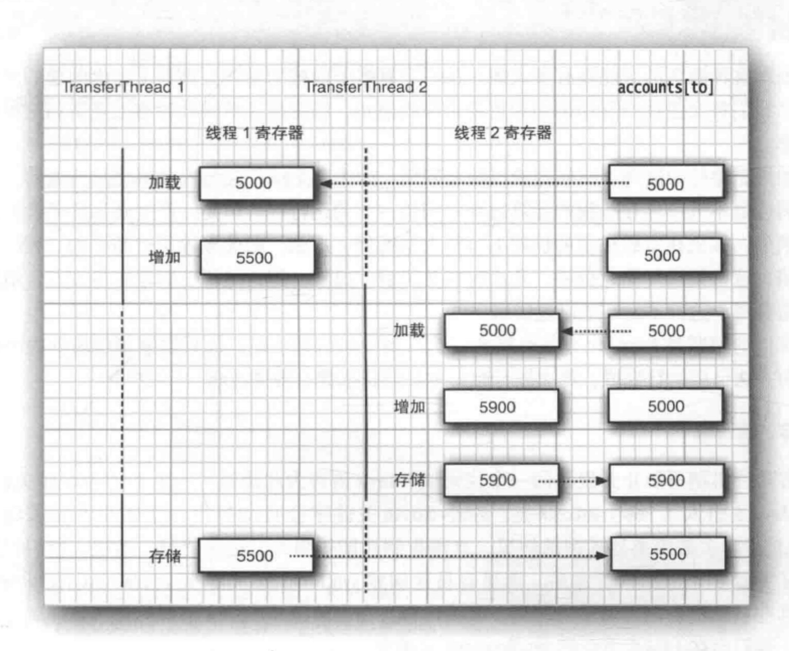

图 12-2 两个线程同时访问

我们的测试程序可以检测到这种破坏。(当然,如果线程在完成测试时被中断,尽管概率 很小,不过确实有可能出现误报!)

注释:实际上可以查看执行这个类中每一个语句的虚拟机字节码。运行以下命令javap - c - v Bank
对 Bank.class 文件进行反编译。例如,以下代码行

accounts[to] += amount;

会转换为下面的字节码:

aload 0

```
getfield #2; //Field accounts:[D\niload_2
dup2
daload
dload_3
dadd
dastore
```

这些代码的含义无关紧要。重要的是这个自增命令是由多条指令组成的,执行这些指令的线程有可能在任何一条指令上被中断。

出现这种破坏的可能性有多大呢?在一个有多个内核的现代处理器上,出问题的风险相当高。我们将交错执行打印语句和更新余额的语句,以提高在单核处理器上观察到这种问题的概率。

如果删除打印语句,出问题的风险会降低,因为每个线程在再次休眠之前所做的工作很少,调度器不太可能在线程的计算过程中间抢占它的运行权。但是,产生破坏的风险并没有完全消失。如果在负载很重的机器上运行大量线程,那么,即使删除了打印语句,程序依然会出错。这种错误可能几分钟、几小时或几天后才出现。坦白地说,对程序员而言,最糟糕的事情莫过于这种不定期地出现错误。

真正的问题是 transfer 方法可能会在执行到中间时被中断。如果能够确保线程失去控制权之前方法已经运行完成,那么银行账户对象的状态就不会被破坏。

## 12.4.3 锁对象

有两种机制可防止并发访问一个代码块。Java 语言为此提供了一个 synchronized 关键字,另外 Java 5 引入了 ReentrantLock 类。synchronized 关键字会自动提供一个锁以及相关的"条件",对于大多数需要显式锁的情况,这种机制功能很强大,也很便利。不过,我们相信在分别了解锁和条件的内容之后,能更容易地理解 synchronized 关键字。java.util.concurrent 框架为这些基础机制提供了单独的类,有关内容会在本节以及 12.4.4 节解释。一旦理解了这些基础,我们会在 12.4.5 节介绍 synchronized 关键字。

用 ReentrantLock 保护代码块的基本结构如下:

```
myLock.lock(); // a ReentrantLock object
try
{
    critical section
}
finally
{
    myLock.unlock(); // make sure the lock is unlocked even if an exception is thrown
}
```

这个结构确保任何时刻只有一个线程进入临界区。一旦一个线程锁定了锁对象,任何其他线程都无法通过 lock 语句。当其他线程调用 lock 时,它们会暂停,直到第一个线程释放这个锁对象。

- 警告:要把 unlock 操作包在 finally 子句中,这一点至关重要。如果临界区中的代码抛出一个异常,必须释放锁。否则,其他线程将永远阻塞。
- 注释:使用锁时,就不能使用 try-with-resources 语句。首先,解锁方法名不是 close。不过,即使将它重命名 (例如,重命名为 close), try-with-resources 语句也无法正常工作。它的首部希望声明一个新变量。但是如果使用一个锁,你可能想使用由多个线程共享的同一个变量,而不是使用一个新变量。

下面使用一个锁来保护 Bank 类的 transfer 方法。

```
public class Bank
{
    private Lock bankLock = new ReentrantLock();
    ...
    public void transfer(int from, int to, int amount)
    {
        bankLock.lock();
        try
        {
            System.out.print(Thread.currentThread());
            accounts[from] -= amount;
            System.out.printf(" %10.2f from %d to %d", amount, from, to);
            accounts[to] += amount;
            System.out.printf(" Total Balance: %10.2f%n", getTotalBalance());
        }
        finally
        {
            bankLock.unlock();
        }
    }
}
```

假设一个线程调用了 transfer, 但是在执行结束前被抢占。再假设第二个线程也调用了 transfer, 由于第二个线程不能获得锁,将在调用 lock 方法时被阻塞。它会暂停,必须等待第一个线程执行完 transfer 方法。当第一个线程释放锁时,第二个线程才能开始运行(见图 12-3)。

尝试一下。把加锁代码增加到 transfer 方法并再次运行程序。这个程序可以一直运行下去,银行余额绝对不会有错误。

注意每个 Bank 对象都有自己的 ReentrantLock 对象。如果两个线程试图访问同一个 Bank 对象,那么锁可以用来保证串行化访问。不过,如果两个线程访问不同的 Bank 对象,每个线程会得到不同的锁对象,两个线程都不会阻塞。本该如此,因为线程在处理不同的 Bank 实例时,线程之间不会相互影响。

这个锁称为重入(reentrant)锁,因为线程可以反复获得已拥有的锁。锁有一个持有计数 (hold count)来跟踪对 lock 方法的嵌套调用。线程每一次调用 lock 后都要调用 unlock 来释放锁。由于这个特性,由一个锁保护的代码可以调用另一个同样使用这个锁的方法。

例如, transfer 方法调用 getTotalBalance 方法,这也会锁定 bankLock 对象,此时 bankLock 对象的持有计数为 2。当 getTotalBalance 方法退出时,持有计数变回 1。当 transfer 方法退出的

时候,持有计数变为0,线程释放锁。

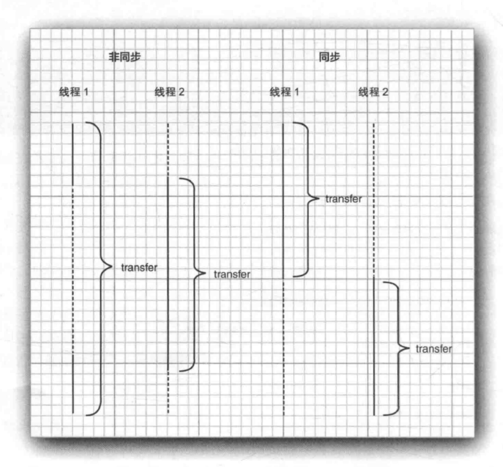

图 12-3 非同步线程与同步线程的比较

通常我们可能希望保护会更新或检查共享对象的代码块,从而能确信当前操作执行完之 后其他线程才能使用同一个对象。

● 警告:要注意确保不能由于抛出异常而绕过临界区中的代码。如果在临界区代码结束 之前抛出了异常, finally子句将释放锁,但是对象可能处于被破坏的状态。

## java.util.concurrent.locks.Lock 5

- void lock() 获得这个锁;如果锁当前被另一个线程占有,则阻塞。
- void unlock()释放这个锁。

## java.util.concurrent.locks.ReentrantLock 5

ReentrantLock()

构造一个重入锁,可以用来保护一个临界区。

- ReentrantLock(boolean fair)
   构造一个采用公平策略的锁。一个公平锁倾向于等待时间最长的线程。不过,这种公平保证可能严重影响性能。所以,默认情况下,不要求锁是公平的。
- 警告: 听起来公平锁很不错,但是公平锁要比常规锁慢得多。只有当你确实了解自己要做什么,而且对于你要解决的问题,有一个特定的理由确实要考虑公平性时,才应使用公平锁。即使使用公平锁,也不能保证线程调度器是公平的。如果线程调度器选择忽略一个已经为锁等待很长时间的线程,它就没有机会得到锁的公平处理。

## 12.4.4 条件对象

通常,线程进入临界区后却发现只有满足了某个条件之后它才能执行。可以使用一个条件对象 (condition object)来管理那些已经获得了一个锁却不能有效工作的线程。在这一节里,我们会介绍 Java 库中条件对象的实现 [由于历史原因,条件对象经常被称为条件变量 (conditional variable)]。

现在来优化银行的模拟程序。如果一个账户没有足够的资金用于转账,则我们不希望从这样的账户转出资金。注意不能使用类似下面的代码:

```
if (bank.getBalance(from) >= amount)
bank.transfer(from, to, amount);
```

在成功地通过这个测试之后,但在调用 transfer 方法之前,当前线程完全有可能被中断。

```
if (bank.getBalance(from) >= amount)
   // thread might be deactivated at this point
bank.transfer(from, to, amount);
```

在这个线程再次运行时,账户余额可能已经低于提款金额。必须确保在检查余额与转账动作之间没有其他线程修改余额。为此,可以使用一个锁来保护这个测试和转账动作:

```
public void transfer(int from, int to, int amount)
{
    bankLock.lock();
    try
    {
        while (accounts[from] < amount)
        {
            // wait
```

现在,当账户中没有足够的资金时,我们会做什么呢?我们会等待,直到另一个线程增加了该账户的资金。但是,这个线程刚刚获得了对 bankLock 的独占访问权,因此别的线程没有存款的机会。这里就要引入条件对象。

一个锁对象可以有一个或多个关联的条件对象。可以用 newCondition 方法获得一个条件对象。习惯上会给每个条件对象一个合适的名字来反映它表示的条件。例如,在这里我们建立了一个条件对象来表示"资金充足"条件。

```
class Bank
{
    private Condition sufficientFunds;
    ...
    public Bank()
    {
        sufficientFunds = bankLock.newCondition();
    }
}
```

如果 transfer 方法发现资金不足,它会调用

sufficientFunds.await();

当前线程现在暂停,并放弃锁。这就允许另一个线程执行,我们希望它能增加账户 余额。

等待获得锁的线程和调用了 await 方法的线程存在本质上的不同。一旦一个线程调用了 await 方法,它就进入这个条件的等待集(wait set)。当锁可用时,该线程并不会变为可运行状态。实际上,它仍保持非活动状态,直到另一个线程在同一条件上调用 signalAll 方法。

当另一个线程完成转账时,它应该调用

sufficientFunds.signalAll();

这个调用会重新激活等待这个条件的所有线程。当这些线程从等待集中移出时,它们再次变为可运行状态,调度器最终将它们再次激活。同时,它们会尝试重新进入该对象。一旦锁可用,它们中的某个线程将从 await 调用返回,得到这个锁,并从之前暂停的地方继续执行。

此时,线程应当再次测试条件。不能保证现在一定满足条件——signalAll 方法仅仅是通知等待的线程:现在有可能满足条件,有必要再次检查条件。

```
注释: 通常, await 调用应该放在如下形式的一个循环中: while (!(OK to proceed)) condition.await();
```

最终需要有某个其他线程调用 signalAll 方法,这一点至关重要。当一个线程调用 await 时,它没有办法自行重新激活。它寄希望于其他线程。如果没有其他线程来重新激活这个等待的线程,它就再也不能运行了。这将导致令人不快的死锁(deadlock)现象。如果所有其他线程都被阻塞,最后一个活动线程调用了 await 方法但没有先解除另外某个线程的阻塞,现

在这个线程也会阻塞。此时没有线程可以解除其他线程的阻塞状态,程序会永远挂起。

应该什么时候调用 signalAll 呢? 从经验上讲,只要一个对象的状态有变化,而且可能有利于正在等待的线程,就可以调用 signalAll。例如,当一个账户余额发生改变时,就应该再给等待的线程一个机会来检查余额。在这个例子中,完成转账时,我们就会调用 signalAll 方法。

```
public void transfer(int from, int to, int amount)
{
   bankLock.lock();
   try
   {
      while (accounts[from] < amount)
            sufficientFunds.await();
      // transfer funds
            sufficientFunds.signalAll();
   }
   finally
   {
      bankLock.unlock();
   }
}</pre>
```

注意 signalAll 调用不会立即激活一个等待的线程。它只是解除等待线程的阻塞,使这些 线程可以在当前线程释放锁之后竞争访问对象。

另一个方法 signal 只是随机选择等待集中的一个线程,并解除这个线程的阻塞状态。这比解除所有线程的阻塞更高效,但也存在危险。如果随机选择的线程发现自己仍然不能运行,它就会再次阻塞。如果没有其他线程再次调用 signal,系统就会进入死锁。

● 警告: 只有当线程拥有一个条件的锁时,它才能在这个条件上调用 await、signalAll 或 signal 方法。

如果运行程序清单 12-4 中的程序, 你会注意到不再有任何错误。总余额永远是 \$100 000。任何账户都不会出现负的余额(同样地, 还是需要按下组合键 Ctrl + C来终止程序)。你可能还会注意到,这个程序运行起来要慢一些——这是为实现同步机制所涉及的额外工作付出的代价。

实际上,正确使用条件很有挑战性。开始实现你自己的条件对象之前,应该考虑使用 12.5 节中描述的某个结构。

## 程序清单 12-4 synch/Bank.java

```
package synch;\nimport java.util.*;\nimport java.util.concurrent.locks.*;

/**
 * A bank with a number of bank accounts that uses locks for serializing access.
 */
public class Bank
```

```
10
      private final double[] accounts;
11
      private Lock bankLock;
12
      private Condition sufficientFunds;
13
14
15
       * Constructs the bank.
16
       * @param n the number of accounts
17
       * @param initialBalance the initial balance for each account
18
       */
19
      public Bank(int n, double initialBalance)
20
21
         accounts = new double[n];
22
         Arrays.fill(accounts, initialBalance);
23
         bankLock = new ReentrantLock();
24
         sufficientFunds = bankLock.newCondition();
25
26
27
28
       * Transfers money from one account to another.
29
       * @param from the account to transfer from
30
       * @param to the account to transfer to
31
       * @param amount the amount to transfer
32
33
      public void transfer(int from, int to, double amount) throws InterruptedException
34
35
         bankLock.lock();
36
         try
37
38
             while (accounts[from] < amount)
39
                sufficientFunds.await();
40
             System.out.print(Thread.currentThread());
41
             accounts[from] -= amount;
42
             System.out.printf(" %10.2f from %d to %d", amount, from, to);
43
             accounts[to] += amount:
             System.out.printf(" Total Balance: %10.2f%n", getTotalBalance());
45
             sufficientFunds.signalAll();
47
          finally
48
49
             bankLock.unlock();
50
51
52
53
54
        * Gets the sum of all account balances.
55
        * @return the total balance
56
57
       public double getTotalBalance()
58
59
          bankLock.lock();
60
          try
61
62
             double sum = \theta;
63
```

```
for (double a : accounts)
65
                sum += a;
66
             return sum;
68
69
          finally.
79
71
             bankLock.unlock();
72
73
74
75
76
        * Gets the number of accounts in the bank.
77
        * @return the number of accounts
78
79
       public int size()
80
81
          return accounts.length;
82
83
84 }
```

#### API java.util.concurrent.locks.Lock 5

Condition newCondition()
 返回一个与这个锁相关联的条件对象。

## java.util.concurrent.locks.Condition 5

- void await()将该线程放在这个条件的等待集中。
- void signalAll()解除该条件等待集中所有线程的阻塞状态。
- void signal()从该条件的等待集中随机选择一个线程,解除其阻塞状态。

## 12.4.5 synchronized 关键字

在前面的小节中,我们已经了解了如何使用 Lock 和 Condition 对象。在进一步深入之前, 先对锁和条件的要点做一个总结:

- 锁用来保护代码段,一次只允许一个线程执行被保护的代码。
- 锁可以管理试图进入被保护代码段的线程。
- 一个锁可以有一个或多个关联的条件对象。
- 每个条件对象管理那些已经进入被保护代码段但还不能运行的线程。

Lock 和 Condition 接口允许程序员充分控制锁定。不过,大多数情况下,你并不需要那样控制,完全可以使用 Java 语言内置的一种机制。从 1.0 版开始,Java 中的每个对象都有一个内部锁 (intrinsic lock)。如果一个方法声明时有 synchronized 关键字,那么对象的锁将保护整

个方法。也就是说,要调用这个方法,线程必须获得内部对象锁。 换句话说,

```
public synchronized void method()
{
    method body
}

等价于

public void method()
{
    this.intrinsicLock.lock();
    try
    {
        method body
    }
    finally
    {
        this.intrinsicLock.unlock();
    }
}
```

例如,可以简单地将 Bank 类的 transfer 方法声明为 synchronized,而不必使用一个显式的锁。 内部对象锁只有一个关联条件。wait 方法将一个线程增加到等待集中,notifyAll/notify 方法可以解除等待线程的阻塞。换句话说,调用 wait 或 notifyAll 等价于

```
intrinsicCondition.await();\nintrinsicCondition.signalAll();
```

注释: wait、notifyAll 以及 notify 方法是 Object 类的 final 方法。Condition 方法必须命 名为 await、signalAll 和 signal, 从而不会与那些方法发生冲突。

例如,可以用 Java 如下实现 Bank 类:

```
class Bank
{
   private double[] accounts;

public synchronized void transfer(int from, int to, int amount)
```

可以看到,使用 synchronized 关键字可以得到更为简洁的代码。当然,要理解这个代码,

你必须知道每个对象都有一个内部锁,并且这个锁有一个内部条件。这个锁会管理试图进入 synchronized 方法的线程,这个条件会管理调用了 wait 的线程。

● 提示:同步方法相当简单。但是,初学者常常对条件感到困惑。在使用 wait/notifyAll 之前,应该考虑使用 12.5 节描述的某个结构。

将静态方法声明为同步也是合法的。如果调用这样一个方法,它会获得关联类对象的内部锁。例如,如果 Bank 类有一个静态同步方法,调用这个方法时,会锁定 Bank.class 对象的锁。因此,没有其他线程可以调用 Bank 类的这个方法或任何其他同步静态方法。

内部锁和条件存在一些限制。包括:

- 不能中断一个正在尝试获得锁的线程。
- 不能指定尝试获得锁的超时时间。
- 每个锁只有一个条件, 这很低效。

在代码中应该使用哪一种做法呢? Lock 和 Condition 对象还是同步方法? 下面是我们的一些建议:

- 最好既不使用 Lock/Condition 也不使用 synchronized 关键字。在许多情况下,可以使用 java.util.concurrent 包中的某种机制,它会为你处理所有的锁定。例如,在 12.5.1 节中,你会看到如何使用阻塞队列来同步那些完成一个共同任务的线程。还应当研究并行流,有关内容参见卷 Ⅱ 第 1 章。
- 如果 synchronized 关键字适合你的程序,那么尽量使用这种做法,这样可以减少编写的代码量,还能减少出错。程序清单 12-5 给出了用同步方法实现的银行示例。
- 如果特别需要 Lock/Condition 结构提供的额外能力,则使用 Lock/Condition。

#### 程序清单 12-5 synch2/Bank.java

```
package synch2;
   import java.util.*;
     A bank with a number of bank accounts that uses synchronization primitives.
   public class Bank
9
      private final double[] accounts;
10
11
12
       * Constructs the bank.
13
       * @param n the number of accounts
14
       * @param initialBalance the initial balance for each account
15
16
      public Bank(int n, double initialBalance)
17
18
         accounts = new double[n];
19
         Arrays.fill(accounts, initialBalance);
20
21
```

```
23
       * Transfers money from one account to another.
24
       * @param from the account to transfer from
25
       * @param to the account to transfer to
26
       * @param amount the amount to transfer
27
28
      public synchronized void transfer(int from, int to, double amount)
29
            throws InterruptedException
30
31
         while (accounts[from] < amount)
32
            wait();
         System.out.print(Thread.currentThread());
34
         accounts[from] -= amount;
35
         System.out.printf(" %10.2f from %d to %d", amount, from, to);
36
         accounts[to] += amount;
37
         System.out.printf(" Total Balance: %10.2f%n", getTotalBalance());
38
         notifyAll();
39
41
      /**
42
       * Gets the sum of all account balances.
43
       * @return the total balance
      public synchronized double getTotalBalance()
46
47
         double sum = \theta;
49
         for (double a : accounts)
50
             sum += a;
51
52
         return sum;
53
54
55
       * Gets the number of accounts in the bank.
57
       * @return the number of accounts
58
       */
59
      public int size()
60
61
         return accounts.length;
62
63
64 }
```

## API java.lang.Object 1.0

void notifyAll()

解除在这个对象上调用 wait 方法的那些线程的阻塞状态。该方法只能在同步方法或同步块中调用。如果当前线程不是对象锁的所有者,该方法会抛出一个 IllegalMonitor-StateException 异常。

• void notify() 随机选择一个在这个对象上调用 wait 方法的线程,解除其阻塞状态。该方法只能在一

个同步方法或同步块中调用。如果当前线程不是对象锁的所有者,该方法会抛出一个 IllegalMonitorStateException 异常。

- void wait()
  - 导致一个线程进入等待状态,直到它得到通知。该方法只能在一个同步方法或同步块中调用。如果当前线程不是对象锁的所有者,该方法会抛出一个 IllegalMonitorStateException 异常。
- void wait(long millis)
- void wait(long millis, int nanos)

导致一个线程进入等待状态,直到它得到通知或者经过了指定的时间。这些方法只能在一个同步方法或同步块中调用。如果当前线程不是对象锁的所有者,这些方法会抛出 IllegalMonitorStateException 异常。纳秒数不能超过 1 000 000。

## 12.4.6 同步块

正如前面讨论的,每个 Java 对象都有一个锁。线程可以通过调用同步方法获得这个锁。 还有另一种机制可以获得这个锁:即进入一个同步块(synchronized block)。当线程进入有如 下形式的一个块时:

```
synchronized (obj) // this is the syntax for a synchronized block
{
    critical section
}
```

它会获得 obj 的锁。

有时我们会看到一些"专用"(ad hoc)锁,例如:

```
public class Bank
{
    private double[] accounts;
    private Lock lock = new Object();
    ...
    public void transfer(int from, int to, int amount)
    {
        synchronized (lock) // an ad-hoc lock
        {
            accounts[from] -= amount;
            accounts[to] += amount;
        }
        System.out.println(. . .);
    }
}
```

在这里, 创建 lock 对象只是为了使用每个 Java 对象拥有的锁。

● 警告: 使用同步块时,要注意锁对象。例如,下面的代码是有问题的:

```
private final String lock = "LOCK";
...
synchronized (lock) { . . . } // Don't lock on string literal!
```

如果这个代码在同一个程序中出现两次,锁将是同一个对象,因为字符串字面量会共享。这可能导致死锁。

另外,要避免使用基本类型包装器作为锁:

private final Integer lock = new Integer(42); // Don't lock on wrappers

构造器调用 new Integer(0) 已经废弃,而且你也不希望维护程序的程序员将这个调用改为 Integer.valueOf(42)。如果将同一个魔法数使用两次,这会意外地共享锁。

如果需要修改一个静态字段,会从特定的类上获得锁,而不是从 getClass() 返回的值上获得:

```
synchronized (MyClass.class) { staticCounter++; } // OK
synchronized (getClass()) { staticCounter++; } // Don't
```

如果从一个子类调用包含这个代码的方法, getClass()会返回一个不同的 Class 对象! 这就不再能保证互斥!

一般来讲,如果必须使用同步块,一定要了解你的锁对象!必须对所有受保护的 访问路径使用相同的锁,而且别人不能使用你的锁。

有时程序员使用一个对象的锁来实现额外的原子操作,这种做法称为客户端锁定(client-side locking)。例如,考虑 Vector 类,这是一个列表,它的方法是同步的。现在,假设我们将银行余额存储在一个 Vector <Double> 中。下面是 transfer 方法的一个原生实现:

```
public void transfer(Vector<Double> accounts, int from, int to, int amount) // ERROR
{
   accounts.set(from, accounts.get(from) - amount);
   accounts.set(to, accounts.get(to) + amount);
   System.out.println(. . .);
}
```

Vector 类的 get 和 set 方法是同步的,但是,这对于我们并没有什么帮助。一个线程完全有可能在 transfer 方法中执行完第一个 get 调用之后被抢占。然后另一个线程可能会在相同的位置存储一个不同的值。不过,我们可以截获这个锁:

```
public void transfer(Vector<Double> accounts, int from, int to, int amount)
{
    synchronized (accounts)
    {
        accounts.set(from, accounts.get(from) - amount);
        accounts.set(to, accounts.get(to) + amount);
    }
    System.out.println(. . .);
}
```

这个方法是可行的,但是完全依赖于这样一个事实: Vector 类会对自己的所有更改器方法使用内部锁。不过,确实如此吗? Vector 类的文档没有给出这样的承诺。你必须仔细研究源代码,而且还得希望将来的版本不会引入非同步的更改器方法。可以看到,客户端锁定是非常脆弱的,通常不建议使用。

■ 注释: Java 虚拟机对同步方法提供了内置支持。不过,同步块会编译为很长的字节码序列来管理内部锁。

### 12.4.7 监视器概念

锁和条件是实现线程同步的强大工具,但是,严格地讲,它们不是面向对象的。多年来,研究人员在努力寻找方法,希望不要求程序员考虑显式锁就可以保证多线程的安全性。最成功的解决方案之一是监视器 (monitor),这一概念最早是由 Per Brinch Hansen 和 Tony Hoare 在 20 世纪 70 年代提出的。用 Java 的术语来讲,监视器有如下属性:

- 监视器是只包含私有字段的类。
- 监视器类的每个对象有一个关联的锁。
- 所有方法由这个锁锁定。换句话说,如果客户端调用 obj.method(),那么在方法调用 开始时会自动获得 obj 对象的锁,并在方法返回时自动释放这个锁。因为所有的字段 是私有的,这样的安排可以确保一个线程处理字段时,没有其他线程能够访问这些 字段。
- 锁可以有任意多个关联的条件。

监视器的早期版本只有单一的条件,使用一种很优雅的语法。可以简单地调用 await accounts[from] >= amount, 而不使用任何显式的条件变量。不过, 研究表明, 盲目地重新测试条件是很低效的。可以利用显式的条件变量解决这一问题, 每一个条件变量管理单独的一组线程。

Java 设计者以不太严格的方式调整了监视器概念, Java 中的每一个对象都有一个内部锁和一个内部条件。如果一个方法用 synchronized 关键字声明,那么,它表现得就像是一个监视器方法。可以通过调用 wait/notifyAll/notify 来访问条件变量。

不过, Java 对象在以下 3 个重要方面不同于监视器, 这削弱了线程安全性:

- 字段不要求是 private。
- 方法不要求是 synchronized。
- 内部锁对客户是可用的。

对安全性的这种轻视让 Per Brinch Hansen 大为光火。在对 Java 中多线程原语的一个严厉评论中,他写道:"这实在是令我震惊,在监视器和 Concurrent Pascal 出现四分之一个世纪后, Java 的这种不安全的并行机制仍被编程社区所接受。这没有任何益处。"[Java's Insecure Parallelism, ACM SIGPLAN Notices 34:38-45, April 1999.]

## 12.4.8 volatile 字段

有时,如果只是为了读写一两个实例字段而使用同步,所带来的开销好像有些不合算。 毕竟,怎么可能出错呢?遗憾的是,由于使用现代的处理器与编译器,出错的可能性很大。

有多处理器的计算机能够暂时在寄存器或本地内存缓存中保存内存值。其结果是,运行在不同处理器上的线程可能看到同一个内存位置有不同的值。

 编译器可能改变指令执行的顺序以得到最大的吞吐量。编译器不会选择可能改变代码 语义的顺序,但是编译器有一个假定,认为内存值只在代码中有显式的修改指令时才 会改变。不过,内存值有可能被另一个线程改变!

如果你使用锁来保护可能被多个线程访问的代码,那么不存在这些问题。编译器必须遵守锁的要求,为此要在必要的时候刷新输出本地缓存,而且不能不适当地重排指令顺序。详细的解释见 JSR 133 的 Java 内存模型和线程规范(参见 http://www.jcp.org/en/jsr/detail?id=133)。该规范的大部分内容都很复杂而且技术性很强,不过这个文档中还包含很多解释得很清楚的例子。Brian Goetz 写了一个更易懂的概述文章(www.ibm.com/developerworks/library/j-jtp02244)。

□ 注释: Brian Goetz 创造了以下"同步格言": "如果写一个变量,而这个变量接下来可能会被另一个线程读取,或者,如果读一个变量,而这个变量可能已经被另一个线程写入值,那么必须使用同步。"

volatile 关键字为实例字段的同步访问提供了一种免锁机制。如果声明一个字段为 volatile, 那么编译器和虚拟机就会考虑到该字段可能被另一个线程并发更新。

例如,假设一个对象有一个 boolean 标记 done,它的值由一个线程设置,而由另一个线程查询,如同我们讨论过的,你可以使用锁:

```
private boolean done;
public synchronized boolean isDone() { return done; }
public synchronized void setDone() { done = true; }
```

或许使用内部对象锁不是个好主意。如果另一个线程已经对该对象加锁, isDone 和 setDone 方法可能会阻塞。如果这是个问题,可以只为这个变量使用一个单独的锁。但是,这会很麻烦。

在这种情况下,将字段声明为 volatile 就很合适:

```
private volatile boolean done;
public boolean isDone() { return done; }
public void setDone() { done = true; }
```

编译器会插入适当的代码,以确保如果一个线程中对 done 变量做了修改,这个修改对读取这个变量的所有其他线程都可见。

● 警告: volatile 变量不能提供原子性。例如,方法 public void flipDone() { done = !done; } // not atomic 不能确保将字段中的值取反。无法保证读取、取反和写入不被中断。

## 12.4.9 final 变量

12.4.8 节已经了解到,除非使用锁或 volatile 修饰符,否则无法从多个线程安全地读取一个字段。

还有一种情况可以安全地访问一个共享字段,即这个字段声明为 final 时。考虑以下声明: final var accounts = new HashMap<String, Double>();

其他线程会在构造器完成构造之后才看到这个 accounts 变量。

如果不使用 final,就不能保证其他线程看到的是 accounts 更新后的值,它们可能都只是看到 null,而不是新构造的 HashMap。

当然,映射的操作并不是线程安全的。如果有多个线程更改和读取这个映射,仍然需要进行同步。

#### 12.4.10 原子性

假设对共享变量除了赋值之外并不做其他操作,那么可以将这些共享变量声明为 volatile。java.util.concurrent.atomic 包中有很多类使用了很高效的机器级指令来保证其他操作的原子性(而没有使用锁)。例如,AtomicInteger 类提供了方法 incrementAndGet 和 decrementAndGet,它们分别以原子方式对一个整数完成自增或自减操作。例如,可以安全地生成一个数值序列,如下所示:

public static AtomicLong nextNumber = new AtomicLong();
// in some thread. . .
long id = nextNumber.incrementAndGet();

incrementAndGet 方法以原子方式将 AtomicLong 自增,并返回自增后的值。也就是说,获得值、增1、设置值和生成新值的操作不会被中断。可以保证即使是多个线程并发地访问同一个实例,也会计算并返回正确的值。

有很多方法可以以原子方式设置和增减值,不过,如果希望完成更复杂的更新,就必须使用 compareAndSet 方法。例如,假设希望跟踪不同线程观察的最大值。下面的代码是不可行的:

public static AtomicLong largest = new AtomicLong();
// in some thread. . .
largest.set(Math.max(largest.get(), observed)); // ERROR--race condition!

这个更新不是原子的。实际上,可以提供一个 lambda 表达式更新变量,它会为你完成更新。对于这个例子,我们可以调用:

largest.updateAndGet(x -> Math.max(x, observed));

或

largest.accumulateAndGet(observed, Math::max);

accumulateAndGet 方法利用一个二元操作符来合并原子值和所提供的参数。 还有 getAndUpdate 和 getAndAccumulate 方法可以返回原值。

注释: 类 AtomicInteger、AtomicIntegerArray、AtomicIntegerFieldUpdater、AtomicLongArray、AtomicLongFieldUpdater、AtomicReference、AtomicReferenceArray和 AtomicReferenceFieldUpdater也提供了这些方法。

如果有大量线程要访问相同的原子值,性能会大幅下降,因为乐观更新需要太多次重试。LongAdder 和 LongAccumulator 类解决了这个问题。LongAdder 包括多个变量(加数),其总和为当前值。可以有多个线程更新不同的加数,线程数增加时会自动提供新的加数。通常情况下,只有当所有工作都完成之后才需要总和的值,对于这种情况,这种方法会很高效。性能会有显著的提升。

如果预期可能存在大量竞争,只需要使用 LongAdder 而不是 AtomicLong。方法名稍有区别。要调用 increment 让一个计数器自增,或者调用 add 来增加一个量,另外调用 sum 来获取总和。

```
var adder = new LongAdder();
for (. . .)
    pool.submit(() ->
```

注释: 当然, increment 方法不返回原值。这样做会消除将求和分解到多个加数所带来的性能提升。

LongAccumulator 将这种思想推广到任意的累加操作。在构造器中,可以提供这个操作以及它的零元素。要加入新的值,可以调用 accumulate。调用 get 来获得当前值。下面的代码可以得到与 LongAdder 同样的效果:

```
var adder = new LongAccumulator(Long::sum, 0);
// in some thread. . .
adder.accumulate(value);
```

在内部,这个累加器包含变量  $a_1$ ,  $a_2$ , …,  $a_n$ 。每个变量初始化为零元素(这个例子中零元素为0)。

调用 accumulate 并提供值 v 时,其中一个变量会以原子方式更新为  $a_i = a_i$  op v,这里 op 是中缀形式的累加操作。在我们这个例子中,调用 accumulate 会对某个 i 计算  $a_i = a_i + v$ 。

get 的结果是  $a_1$  op  $a_2$  op ··· op  $a_n$ 。在我们的例子中,这就是累加器的总和:  $a_1 + a_2 + \cdots + a_n$ 。如果选择一个不同的操作,可以计算最小值或最大值。一般来说,这个操作必须满足结合律和交换律。这说明,最终结果不能依赖于以什么顺序结合这些中间值。

另外 DoubleAdder 和 DoubleAccumulator 做法也相同,只不过处理的是 double 值。

#### 12.4.11 死锁

锁和条件不能解决多线程中可能出现的所有问题。考虑下面的情况:

1. 账户 1: \$200

- 2. 账户 2: \$300
- 3. 线程 1: 从账户 1 转 \$300 到账户 2
- 4. 线程 2: 从账户 2 转 \$400 到账户 1

如图 12-4 所示,线程 1 和线程 2 显然都被阻塞。因为账户 1 以及账户 2 中的余额都不足以进行转账,两个线程都无法继续执行。

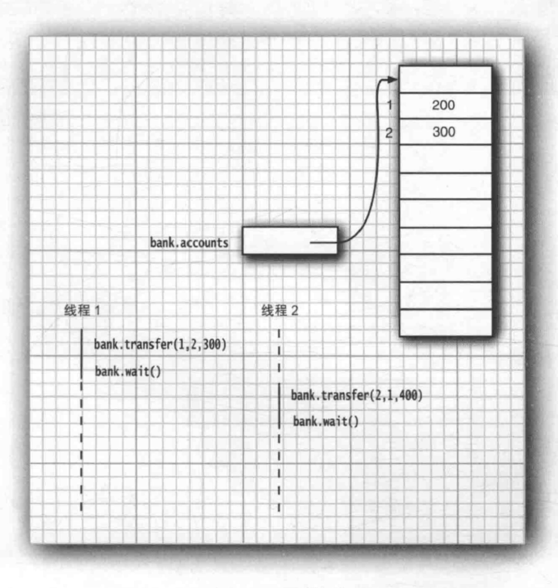

图 12-4 死锁情况

有可能因为每一个线程都在等待更多的钱款存入而导致所有线程都被阻塞。这样的状态称为死锁(deadlock)。

在这个程序里,死锁不会发生,原因很简单。每一次转账金额至多\$1000。因为总共有100个账户,而且所有账户的总金额是\$100000,在任意时刻,至少有一个账户的余额高于\$1000。所以,从该账户转账的线程可以继续运行。

但是,如果修改线程的 run 方法,把每次转账至多 \$1000 的限制去掉,很快就会发生死锁。试试看。将 NACCOUNTS 设置为 10。使用 max 值 2 \* INITIAL\_BALANCE 构造各个转账线程。然后运行该程序。程序运行一段时间后就会挂起。

● 提示: 当程序挂起时,按下组合键 Ctrl + \, 将得到一个线程转储,这会列出所有线程。每一个线程有一个栈轨迹,告诉你线程当前在哪里阻塞。如第7章所述,可以运行 jconsole 并查看线程 (Threads) 面板 (见图 12-5)。

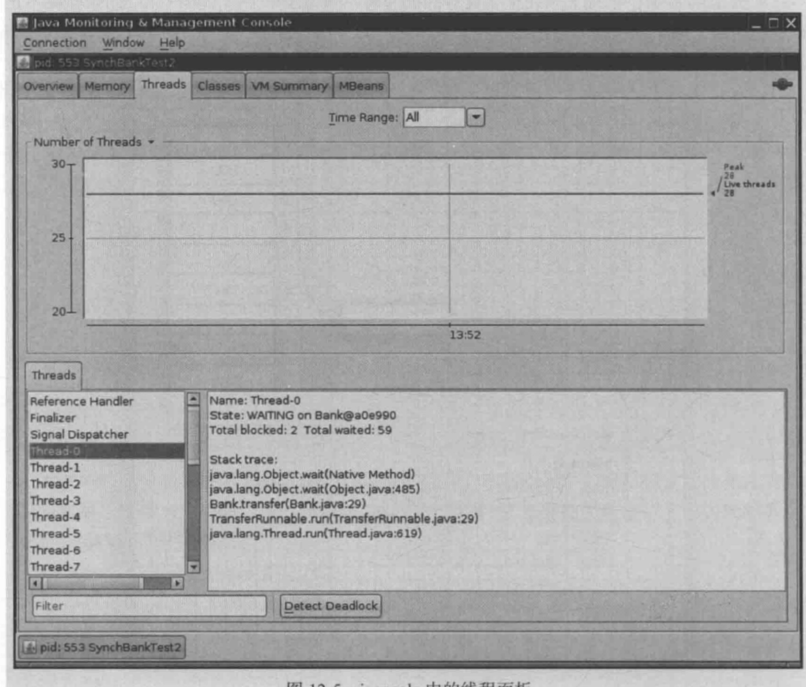

图 12-5 jconsole 中的线程面板

还有一种做法会导致死锁,让第 i 个线程负责向第 i 个账户存钱,而不是从第 i 个账户取钱。这样一来,有可能所有线程都集中到一个账户上,每一个线程都试图从这个账户中取出大于该账户余额的钱。试试看。在 SynchBankTest 程序中,来看 TransferRunnable 类的 run 方法。在 transfer 调用中,交换 fromAccount 和 toAccount。运行程序,会看到它几乎会立即死锁。

还有一种很容易导致死锁的情况:在 SynchBankTest 程序中,将 signalAll 方法改为 signal 方法,会发现程序最终会挂起。(同样,将 NACCOUNTS 设为 10 可以更快地看到这个结果。) signalAll 方法会通知所有等待增加资金的线程,与此不同, signal 方法只解除一个线程的阻塞。如果该线程不能继续运行,所有的线程都会阻塞。考虑下面的场景,这就可能发生死锁:

1. 账户 1: \$1990

- 2. 所有其他账户: 分别有 \$990
- 3. 线程 1: 从账户 1 转 \$995 到账户 2
- 4. 所有其他线程: 从它们的账户转 \$995 到另一个账户

显然,除了线程1,所有的线程都被阻塞,因为它们的账户中没有足够的金额。

线程1继续执行,现在情况如下:

- 1. 账户 1: \$995
- 2. 账户 2: \$1985
- 3. 所有其他账户: 分别有 \$990

然后,线程1调用 signal 方法。signal 方法随机选择一个线程将它解除阻塞。假定它选择了线程3。该线程被唤醒,发现在它的账户里没有足够的金额,它再次调用 await。但是,线程1仍在运行,将随机地产生一个新的交易,例如,

1. 线程 1: 从账户 1 转 \$997 到账户 2

现在,线程1也调用 await, 所有的线程都被阻塞。系统死锁。

这里的罪魁祸首是 signal 调用。它只为一个线程解除阻塞,而且,它很可能选择一个根本不能继续运行的线程(在我们的例子中,线程 2 必须从账户 2 中取钱)。

遗憾的是, Java 程序设计语言中没有提供任何特性可以避免或打破这些死锁。你必须仔细设计程序,确保不会出现死锁。

## 12.4.12 为什么废弃 stop 和 suspend 方法

最初的 Java 版本定义了一个 stop 方法来终止一个线程,另外还有一个 suspend 方法来阻塞一个线程直至另一个线程调用 resume。stop 和 suspend 方法有一些共同点:它们都试图控制一个给定线程的行为,而没有线程的互操作。

stop、suspend 和 resume 方法已经被废弃。stop 方法天生就不安全, 经验证明, suspend 方法经常会导致死锁。在本节中, 你将看到这些方法为什么有问题, 以及怎样避免这些问题。

首先来看看 stop 方法,该方法会终止所有未完成的方法,包括 run 方法。一个线程终止时,它会立即释放被它锁定的所有对象的锁。这会导致对象处于不一致的状态。例如,假设一个 TransferRunnable 在从一个账户向另一个账户转账的过程中被终止,钱已经取出,但还没有存入目标账户,现在银行对象就被破坏了。因为锁已经释放,其他未停止的线程也可以观察到这种破坏。

当一个线程想要终止另一个线程时,它无法知道什么时候调用 stop 方法是安全的,而什么时候会导致对象被破坏。因此,这个方法已经被废弃。希望停止一个线程的时候应该中断该线程,然后被中断的线程可以在安全的时候终止。

注释:一些作者声称 stop 方法被废弃是因为它会导致对象被一个已停止的线程永久锁定。但是,这一说法是错误的。从技术上讲,停止的线程会抛出 ThreadDeath 异常,从而退出它调用的所有同步方法。因此,这个线程会释放它持有的内部对象锁。

接下来看看 suspend 方法有什么问题。与 stop 不同, suspend 不会破坏对象。但是,如果用 suspend 挂起一个持有锁的线程,那么,在这个线程恢复运行之前这个锁是不可用的。如果调用 suspend 方法的线程试图获得同一个锁,程序就会死锁:被挂起的线程等着被恢复,而将其挂起的线程等待获得锁。

在图形用户界面中经常出现这种情况。假设我们有一个图形化的银行模拟程序。Pause 按钮用来挂起转账线程,还有一个 Resume 按钮用来恢复线程。

```
pauseButton.addActionListener(event ->
{
    for (int i = 0; i < threads.length; i++)
        threads[i].suspend(); // don't do this
});

resumeButton.addActionListener(event ->
    {
    for (int i = 0; i < threads.length; i++)
        threads[i].resume();
});</pre>
```

假设有一个 paintComponent 方法,它通过调用 getBalances 方法获得一个余额数组,从而绘制每个账户的一个图表。

就像在 12.7.3 节将要看到的,按钮动作和重绘动作都在同一个线程中,即事件分派线程 (event dispatch thread)。考虑下面的情况:

- 1. 某个转账线程获得 bank 对象的锁。
- 2. 用户点击 Pause 按钮。
- 3. 所有转账线程被挂起; 其中之一仍然持有 bank 对象的锁。
- 4. 因为某种原因,需要重新绘制账户图表。
- 5. paintComponent 方法调用 getBalances 方法。
- 6. 该方法试图获得 bank 对象的锁。

现在程序会被冻结。

事件分派线程不能继续运行,因为锁由一个挂起的线程持有。因此,用户不能点击 Resume 按钮,这些线程永远无法恢复。

如果想安全地挂起线程,可以引入一个变量 suspendRequested,并在 run 方法的某个安全的地方测试这个变量,安全的地方是指在这里该线程没有锁定其他线程需要的对象。当该线程发现 suspendRequested 变量已经设置,就要继续等待,直到再次可用。

## 12.4.13 按需初始化

有时候,对于某些数据结构,你可能希望第一次需要它时才进行初始化。而且你希望确保这种初始化只发生一次。与其设计你自己的机制,不如利用这样一个事实:虚拟机会在第一次使用类时执行一个静态初始化器,而且只执行一次。虚拟机利用一个锁来确保这一点,所以你不需要自己编程实现。

```
public class OnDemandData
{
    // private constructor to ensure only one object is constructed
    private OnDemandData()
    {
        public static OnDemandData getInstance()
        {
            return Holder.INSTANCE;
        }

        // only initialized on first use, i.e. in the first call to getInstance
        private static Holder
        {
```

● 警告:要采用这种用法,必须确保构造器不会抛出任何异常。虚拟机不会做第二次尝试来初始化 Holder 类。

#### 12.4.14 线程局部变量

前面几节中,我们讨论了在线程间共享变量的风险。有时可能要避免共享变量,使用ThreadLocal 辅助类为各个线程提供各自的实例。例如,SimpleDateFormat 类不是线程安全的。假设有一个静态变量:

public static final SimpleDateFormat dateFormat = new SimpleDateFormat("yyyy-MM-dd");

如果两个线程都执行以下操作:

String dateStamp = dateFormat.format(new Date());

结果可能很混乱,因为 dateFormat 使用的内部数据结构可能会被并发访问所破坏。当然可以使用同步,但这样开销很大;或者也可以在需要时构造一个局部 SimpleDateFormat 对象,不过这也很浪费。

要为每个线程构造一个实例,可以使用以下代码:

public static final ThreadLocal<SimpleDateFormat> dateFormat =
 ThreadLocal.withInitial(() -> new SimpleDateFormat("yyyy-MM-dd"));

要访问具体的格式化方法,可以调用:

String dateStamp = dateFormat.get().format(new Date());

在一个给定线程中首次调用 get 时,会调用构造器中的 lambda 表达式。在此之后, get 方法会返回属于当前线程的那个实例。

在多个线程中生成随机数也存在类似的问题。java.util.Random类是线程安全的,但是如果多个线程需要等待一个共享的随机数生成器,这会很低效。

可以使用 ThreadLocal 辅助类为各个线程提供一个单独的生成器,不过 Java 7 还另外提供了一个便利类。只需要调用以下方法:

int random = ThreadLocalRandom.current().nextInt(upperBound);

ThreadLocalRandom.current()调用会返回特定于当前线程的一个随机数生成器实例。

线程局部变量有时用于向协作完成某个任务的所有方法提供对象,而不必在调用者之间 传递这个对象。例如,假设你想共享一个数据库连接。声明以下变量:

public static final ThreadLocal<Connection> connection =
 ThreadLocal.withInitial(() -> null);

任务开始时,为这个线程初始化这个连接:

connection.set(connect(url, username, password));

任务调用某些方法,所有方法都在同一个线程中,最终其中一个方法需要这个连接: var result = connection.get().executeQuery(query);

需要说明,同一个调用可以出现在多个线程中。每个线程会得到它自己的连接对象。

● 警告: 在前面的例子中, 至关重要的一点是: 只有一个任务使用线程。如果使用一个 线程池执行任务, 你可能不希望向共享相同线程的其他任务提供你的数据库连接。

#### API java.lang.ThreadLocal<T> 1.2

• T get()

606

得到这个线程的当前值。如果是首次调用 get,会调用 initialize 来得到这个值。

- void set(T t) 为这个线程设置一个新值。
- void remove()删除对应这个线程的值。
- static <S> ThreadLocal<S> withInitial(Supplier<? extends S> supplier) 8 创建一个线程局部变量,其初始值通过调用给定的提供者(supplier)生成。

## API java.util.concurrent.ThreadLocalRandom 7

static ThreadLocalRandom current()
 返回特定于当前线程的 Random 类的一个实例。

## 12.5 线程安全的集合

如果多个线程要并发地修改一个数据结构,例如散列表,那么很容易破坏这个数据结构 (有关散列表的详细信息见第9章)。例如,一个线程可能开始向表中插入一个新元素。假设在 调整散列表各个桶之间的链接关系的过程中,这个线程的控制权被抢占。如果另一个线程开始 遍历同一个散列表,可能会使用无效的链接并造成混乱,有可能抛出异常或者陷入无限循环。 可以通过提供锁来保护共享的数据结构,但是通常更容易的做法是选择线程安全的实现。在下面各小节中,将讨论 Java 类库提供的另外一些线程安全的集合。

#### 12.5.1 阻塞队列

很多线程问题可以使用一个或多个队列以优雅而安全的方式来解决。生产者线程向队列插入元素,消费者线程则获取元素。使用队列,可以安全地从一个线程向另一个线程传递数据。例如,考虑银行转账程序,转账线程可以将转账指令对象插入一个队列,而不是直接访问银行对象。另一个线程从队列中取出指令并完成转账。只有这个线程可以访问银行对象的内部。因此不需要同步。(当然,线程安全的队列类的实现者必须考虑锁和条件,但那是他们的问题,而不是你要考虑的问题。)

当试图向队列添加元素而队列已满,或是想从队列移出元素而队列为空的时候,阻塞队列(blocking queue)将导致线程阻塞。在协调多个线程的工作时,阻塞队列是一个有用的工具。工作线程可以周期性地将中间结果存储在阻塞队列中。其他工作线程移除中间结果,并进一步修改。队列会自动地平衡负载。如果第一组线程运行得比第二组慢,第二组在等待结果时会阻塞。如果第一组线程运行得更快,队列会填满,直到第二组赶上来。表 12-1 给出了阻塞队列的方法。

| 方 法     | 正常动作           | 特殊情况下的动作                            |
|---------|----------------|-------------------------------------|
| add     | 添加一个元素         | 如果队列满,则抛出 IllegalStateException 异常  |
| element | 返回队头元素         | 如果队列空,则抛出 NoSuchElementException 异常 |
| offer   | 添加一个元素并返回 true | 如果队列满,则返回 false                     |
| peek    | 返回队头元素         | 如果队列空,则返回 null                      |
| poll    | 移除并返回队头元素      | 如果队列空,则返回 null                      |
| put     | 添加一个元素         | 如果队列满,则阻塞                           |
| remove  | 移除并返回队头元素      | 如果队列空,则抛出 NoSuchElementException 异常 |
| take    | 移除并返回队头元素      | 如果队列空,则阻塞                           |

表 12-1 阻塞队列方法

阻塞队列方法分为以下 3 类,它们的区别在于当队列满或空时它们完成的动作。如果使用队列作为线程管理工具,要用到 put 和 take 方法。试图向满队列添加元素或者想从空队列得到队头元素时,add、remove 和 element 操作会抛出异常。当然,在一个多线程程序中,队列可能会在任何时候变空或变满,因此,你可能更想使用 offer、poll 和 peek 方法。如果不能完成任务,这些方法只是返回一个错误提示而不会抛出异常。

注释: poll 和 peek 方法返回 null 来指示失败。因此,向这些队列中插入 null 值是非法的。

还有带有超时时间的 offer 方法和 poll 方法。例如,下面的调用:

boolean success = q.offer(x, 100, TimeUnit.MILLISECONDS);

尝试在 100 毫秒时间内在队尾插入一个元素。如果成功返回 true; 否则, 如果超时,则返回 false。类似地,下面的调用:

Object head = q.poll(100, TimeUnit.MILLISECONDS);

尝试在 100 毫秒时间内移除队头元素;如果成功返回队头元素,否则,如果超时,则返回 null。

如果队列满,则 put 方法阻塞;如果队列空,则 take 方法阻塞。它们与不带超时参数的 offer 和 poll 方法等效。

java.util.concurrent 包提供了阻塞队列的几个变体。默认情况下,LinkedBlockingQueue 的容量没有上界,但是,也可以选择指定一个最大容量。LinkedBlockingDeque 是一个双端队列。ArrayBlockingQueue 在构造时需要指定容量,另外可以有一个可选的参数来指定是否需要公平性。若指定了公平性,那么等待了最长时间的线程会优先得到处理。与以往一样,公平性会降低性能,应当在确实非常需要时才使用公平性参数。

PriorityBlockingQueue 是一个优先队列,而不是先进先出队列。元素按照它们的优先级顺序移除。这个队列没有容量上限,但是,如果队列是空的,获取元素的操作会阻塞。(有关优先队列的详细内容参见第9章。)

DelayQueue 包含实现了 Delayed 接口的对象:

```
interface Delayed extends Comparable<Delayed>
{
   long getDelay(TimeUnit unit);
}
```

getDelay 方法返回对象的剩余延迟。负值表示延迟已经结束。元素只有在延迟结束的情况下才能从 DelayQueue 移除。还需要实现 compareTo 方法。DelayQueue 使用这个方法对元素排序。

Java 7 增加了一个 TransferQueue 接口,允许生产者线程等待,直到消费者准备就绪可以接收元素。如果生产者调用

q.transfer(item);

这个调用会阻塞,直到另一个线程将元素删除。LinkedTransferQueue 类实现了这个接口。

程序清单 12-6 中的程序展示了如何使用阻塞队列来控制一组线程。程序在一个目录及其所有子目录下搜索所有文件,打印出包含指定关键字的行。

#### 程序清单 12-6 blockingQueue/BlockingQueueTest.java

```
package blockingQueue;\nimport java.io.*;\nimport java.nio.charset.*;\nimport java.nio.file.*;\nimport java.util.*;\nimport java.util.concurrent.*;\nimport java.util.stream.*;
```

```
9
   /**
10
    * @version 1.03 2018-03-17
11
    * @author Cay Horstmann
12
    */
13
   public class BlockingQueueTest
14
15
      private static final int FILE_QUEUE_SIZE = 10;
16
      private static final int SEARCH THREADS = 100;
17
      private static final Path DUMMY = Path.of("");
18
      private static BlockingQueue<Path> queue = new ArrayBlockingQueue<>(FILE QUEUE SIZE);
19
20
      public static void main(String[] args)
21
22
         try (var in = new Scanner(System.in))
23
24
            System.out.print("Enter base directory (e.g. /opt/jdk-11-src): ");
25
            String directory = in.nextLine();
26
            System.out.print("Enter keyword (e.g. volatile): ");
27
            String keyword = in.nextLine();
28
29
            Runnable enumerator = () ->
30
31
                   try
32
33
                      enumerate(Path.of(directory));
34
                      queue.put(DUMMY);
35
36
                   catch (IOException e)
37
38
                      e.printStackTrace();
39
40
                   catch (InterruptedException e)
41
42
43
                };
44
45
             new Thread(enumerator).start();
46
             for (int i = 1; i <= SEARCH_THREADS; i++)
47
48
                Runnable searcher = () ->
50
51
52
                         boolean done = false;
53
                         while (!done)
54
55
                             Path file = queue.take();
56
                             if (file == DUMMY)
57
58
                                queue.put(file);
59
                                done = true;
61
                             else search(file, keyword);
62
```

```
63
64
                      catch (IOException e)
65
66
                         e.printStackTrace();
67
68
                      catch (InterruptedException e)
69
71
72
                new Thread(searcher).start();
73
74
75
76
        * Recursively enumerates all files in a given directory and its subdirectories.
79
       * See Chapters 1 and 2 of Volume II for the stream and file operations.
       * @param directory the directory in which to start
81
82
      public static void enumerate(Path directory) throws IOException, InterruptedException
83
84
         try (Stream<Path> children = Files.list(directory))
85
86
             for (Path child : children.toList())
87
88
                if (Files.isDirectory(child))
89
                   enumerate(child);
90
                else
91
                   queue.put(child);
92
93
94
95
96
        * Searches a file for a given keyword and prints all matching lines.
       * @param file the file to search
       * @param keyword the keyword to search for
101
      public static void search(Path file, String keyword) throws IOException
102
103
         try (var in = new Scanner(file, StandardCharsets.UTF 8))
104
105
             int lineNumber = 0;
106
             while (in.hasNextLine())
108
                lineNumber++;
109
                String line = in.nextLine();
110
                if (line.contains(keyword))
111
                   System.out.printf("%s:%d:%s%n", file, lineNumber, line);
112
113
114
115
116 }
```

生产者线程枚举所有子目录下的所有文件并把它们放到一个阻塞队列中。这个操作很快,如果队列没有上限的话,很快就会包含文件系统中的所有文件。

我们同时启动了大量搜索线程。每个搜索线程从队列中取出一个文件,打开它,打印包含指定关键字的所有行,然后取出下一个文件。我们使用了一个小技巧,从而在没有更多工作时终止这个应用。为了发出完成信号,枚举线程会在队列中放置一个虚拟对象(这就像在行李传送带上放一个标着"last bag"的虚拟行李箱)。当搜索线程取到这个虚拟对象时,将其放回并终止。

注意,这里不需要显式的线程同步。在这个应用中,我们使用了队列数据结构作为一种同步机制。

## api java.util.concurrent.ArrayBlockingQueue<E> 5

- ArrayBlockingQueue(int capacity)
- ArrayBlockingQueue(int capacity, boolean fair)
   用指定的容量和公平性设置构造一个阻塞队列。队列实现为一个循环数组。

# java.util.concurrent.LinkedBlockingQueue<E> 5 java.util.concurrent.LinkedBlockingDeque<E> 6

- LinkedBlockingQueue()
- LinkedBlockingDeque()构造一个无上限的阻塞队列或双向队列,实现为一个链表。
- LinkedBlockingQueue(int capacity)
- LinkedBlockingDeque(int capacity)
   根据指定容量构建一个有上限的阻塞队列或双向队列,实现为一个链表。

## java.util.concurrent.DelayQueue<E extends Delayed> 5

DelayQueue()

构造一个包含 Delayed 元素的无上限阻塞队列。只有那些延迟结束的元素可以从队列中移除。

## API java.util.concurrent.Delayed 5

long getDelay(TimeUnit unit)
 得到该对象的延迟,用给定的时间单位度量。

## API java.util.concurrent.PriorityBlockingQueue<E> 5

- PriorityBlockingQueue()
- PriorityBlockingQueue(int initialCapacity)
- PriorityBlockingQueue(int initialCapacity, Comparator<? super E> comparator)
   构造一个无上限阻塞优先队列,实现为一个堆。优先队列的默认初始容量为11。如果

没有指定比较器,则元素必须实现 Comparable 接口。

#### API java.util.concurrent.BlockingQueue<E> 5

void put(E element)
 添加元素,在必要时阻塞。

612

- E take() 移除并返回队头元素,必要时阻塞。
- boolean offer(E element, long time, TimeUnit unit)
   添加给定的元素,如果成功返回true,必要时阻塞,直至元素已经添加或者时间已到。
- E poll(long time, TimeUnit unit) 移除并返回队头元素,必要时阻塞,直至元素可用或时间已到。失败时返回 null。

## API java.util.concurrent.BlockingDeque<E> 6

- void putFirst(E element)
- void putLast(E element)
   添加元素,必要时阻塞。
- E takeFirst()
- E takeLast() 移除并返回队头或队尾元素,必要时阻塞。
- boolean offerFirst(E element, long time, TimeUnit unit)
- boolean offerLast(E element, long time, TimeUnit unit)
   添加给定的元素,成功时返回 true,必要时阻塞,直至元素已经添加或时间已到。
- E pollFirst(long time, TimeUnit unit)
- E pollLast(long time, TimeUnit unit)
   移除并返回队头或队尾元素,必要时阻塞,直至元素可用或时间已到。失败时返回 null。

## API java.util.concurrent.TransferQueue<E> 7

- void transfer(E element)
- boolean tryTransfer(E element, long time, TimeUnit unit)
   传输一个值,或者尝试在给定的超时时间内传输这个值,这个调用将阻塞,直到另一个线程将元素删除。第二个方法会在调用成功时返回 true。

## 12.5.2 高效的映射、集和队列

java.util.concurrent 包提供了映射、有序集和队列的高效实现: ConcurrentHashMap、Concurrent-SkipListMap、ConcurrentSkipListSet 和 ConcurrentLinkedQueue。

这些集合使用复杂的算法,通过允许并发地访问数据结构的不同部分尽可能减少竞争。 与大多数集合不同,这些类的 size 方法不一定在常量时间内完成操作。确定这些集合的 当前大小通常需要遍历。

注释:有些应用使用庞大的并发散列映射,这些映射太过庞大,以至于无法用 size 方法得到它的大小,因为这个方法只能返回 int。如果一个映射包含超过 20 亿个条目,该如何处理? mappingCount 方法可以把大小作为 long 返回。

集合返回弱一致性(weakly consistent)的迭代器。这意味着迭代器不一定能反映出它们构造之后所做的全部更改,但是,它们不会将同一个值返回两次,也不会抛出ConcurrentModificationException异常。

注释:与之形成对照的是,对于 java.util 包中的集合,如果集合在迭代器构造之后发生改变,集合的迭代器将抛出一个 Concurrent Modification Exception 异常。

并发散列映射可以高效地支持大量阅读器线程和有限的书写器线程。

■ 注释: 散列映射将有相同散列码的所有条目放在同一个"桶"中。有些应用使用的散列函数不太好,以至于所有条目最后都放在很少的桶中,这会使性能严重恶化。即使是通常还算合理的散列函数,如 String 类的散列函数,也可能存在问题。例如,攻击者可以制造大量能得出相同散列值的字符串,让程序速度减慢。在较新的 Java 版本中,并发散列映射将桶组织为树,而不是列表,键类型实现 Comparable,从而可以保证 O(log(n)) 的性能。

## java.util.concurrent.ConcurrentLinkedQueue<E> 5

ConcurrentLinkedQueue<E>()
 构造一个可以由多个线程安全访问的无上限非阻塞的队列。

## API java.util.concurrent.ConcurrentSkipListSet<E> 6

- ConcurrentSkipListSet<E>()
- ConcurrentSkipListSet<E>(Comparator<? super E> comp)
   构造一个可以由多个线程安全访问的有序集。第一个构造器要求元素实现 Comparable 接口。

# java.util.concurrent.ConcurrentHashMap<K, V> 5 java.util.concurrent.ConcurrentSkipListMap<K, V> 6

- ConcurrentHashMap<K, V>()
- ConcurrentHashMap<K, V>(int initialCapacity)
- ConcurrentHashMap<K, V>(int initialCapacity, float loadFactor, int concurrencyLevel) 构造一个可以由多个线程安全访问的散列映射。默认的初始容量为 16。如果每个桶的

平均负载超过装填因子,表的大小会重新调整。装填因子默认值为 0.75。并发级别是估计的并发书写器线程数。

- ConcurrentSkipListMap<K, V>()
- ConcurrentSkipListSet<K, V>(Comparator<? super K> comp)
   构造一个可以由多个线程安全访问的有序映射。第一个构造器要求键实现 Comparable 接口。

#### 12.5.3 映射条目的原子更新

ConcurrentHashMap 原来的版本只有为数不多的方法可以实现原子更新,这使得编程有些麻烦。假设我们希望统计观察到某些特性的频度。作为一个简单的例子,假设多个线程会遇到单词,我们想统计它们的频率。

可以使用 ConcurrentHashMap<String, Long> 吗? 考虑让计数自增的代码。显然,下面的代码不是线程安全的:

```
Long oldValue = map.get(word);

Long newValue = oldValue == null ? 1 : oldValue + 1;

map.put(word, newValue); // ERROR--might not replace oldValue
```

可能会有另一个线程在同时更新同一个计数。

注释:有些程序员很奇怪为什么原本线程安全的数据结构会允许非线程安全的操作。有两种完全不同的情况。如果多个线程修改一个普通的 HashMap,它们可能会破坏内部结构(一个链表数组)。有些链接可能丢失,或者甚至会构成环,使得这个数据结构不再可用。对于 ConcurrentHashMap 绝对不会发生这种情况。在上面的例子中, get 和 put 代码永远不会破坏数据结构。不过,由于操作序列不是原子的,所以结果不可预知。

在老版本的 Java 中,必须使用 replace 操作,它会以原子方式用一个新值替换原值,前提是之前没有其他线程把原值替换为其他值。必须一直这么做,直到替换成功:

```
do
{
   oldValue = map.get(word);
   newValue = oldValue == null ? 1 : oldValue + 1;
}
while (!map.replace(word, oldValue, newValue));
```

或者,可以使用一个 ConcurrentHashMap<String, AtomicLong>,以及以下更新代码:

```
map.putIfAbsent(word, new AtomicLong());
map.get(word).incrementAndGet();
```

很遗憾,这会为每个自增构造一个新的 AtomicLong, 而不管是否需要。

如今, Java API 提供了一些新方法,可以更方便地完成原子更新。调用 compute 方法时可以提供一个键和一个计算新值的函数。这个函数接收键和相关联的值(如果没有值,则为null),它会计算新值。例如,可以如下更新一个整数计数器映射:

map.compute(word,  $(k, v) \rightarrow v == null ? 1 : v + 1);$ 

注释: ConcurrentHashMap 中不允许有 null 值。很多方法都使用 null 值来指示映射中某个 给定的键不存在。

另外还有 computeIfPresent 和 computeIfAbsent 方法,它们分别只在已经有原值的情况下计算新值,或者只在没有原值的情况下计算新值。可以如下更新一个 LongAdder 计数器映射:

map.computeIfAbsent(word, k -> new LongAdder()).increment();

这与之前看到的 putIfAbsent 调用几乎是一样的,不过 LongAdder 构造器只在确实需要一个新的计数器时才会调用。

首次增加一个键时通常需要做些特殊的处理。利用 merge 方法可以非常方便地做到这一点。这个方法有一个参数表示键不存在时使用的初始值。否则,就会调用你提供的函数来结合原值与初始值。(与 compute 不同, 这个函数不处理键。)

map.merge(word, 1L, (existingValue, newValue) -> existingValue + newValue);

或者,可以简单地写为:

map.merge(word, 1L, Long::sum);

再不能比这更简洁了。

- 注释:如果传入 compute 或 merge 的函数返回 null,将从映射中删除现有的条目。
- 警告:使用 compute 或 merge 时,要记住你提供的函数不能做太多工作。这个函数运行时,可能会阻塞对映射的其他更新。当然,这个函数也不能更新映射的其他部分。

程序清单 12-7 中的程序使用了一个并发散列映射来统计一个目录树的 Java 文件中的所有单词。

## 程序清单 12-7 concurrentHashMap/CHMDemo.java

```
package concurrentHashMap;
   import java.io.*;
   import java.nio.file.*;
   import java.util.*;
   import java.util.concurrent.*;
   import java.util.stream.*;
   /**
9
    * This program demonstrates concurrent hash maps.
10
    * @version 1.0 2018-01-04
11
    * @author Cay Horstmann
12
13
   public class CHMDemo
15
      public static ConcurrentHashMap<String, Long> map = new ConcurrentHashMap<>();
16
17
```

616

```
/**
18
       * Adds all words in the given file to the concurrent hash map.
19
       * @param file a file
20
21
      public static void process(Path file)
22
23
         try (var in = new Scanner(file))
24
25
            while (in.hasNext())
26
27
               String word = in.next();
28
               map.merge(word, 1L, Long::sum);
29
30
31
         catch (IOException e)
33
            e.printStackTrace();
35
36
37
      /**
38
       * Returns all descendants of a given directory--see Chapters 1 and 2 of Volume II
39
       * @param rootDir the root directory
40
       * @return a set of all descendants of the root directory
41
42
      public static Set<Path> descendants(Path rootDir) throws IOException
43
44
         try (Stream<Path> entries = Files.walk(rootDir))
45
46
            return entries.collect(Collectors.toSet());
47
48
49
50
      public static void main(String[] args)
51
            throws InterruptedException, ExecutionException, IOException
53
         int processors = Runtime.getRuntime().availableProcessors();
54
         ExecutorService executor = Executors.newFixedThreadPool(processors);
55
         Path pathToRoot = Path.of(".");
56
         for (Path p : descendants(pathToRoot))
57
58
            if (p.getFileName().toString().endsWith(".java"))
59
               executor.execute(() -> process(p));
60
61
         executor.shutdown();
62
         executor.awaitTermination(10, TimeUnit.MINUTES);
63
         map.forEach((k, v) ->
64
65
               if (v >= 10)
66
                   System.out.println(k + " occurs " + v + " times");
67
            });
68
69
70 }
```

## 12.5.4 并发散列映射的批操作

Java API 为并发散列映射提供了批操作,即使有其他线程在处理映射,这些操作也能安全地执行。批操作会遍历映射,处理遍历过程中找到的元素。这里不会冻结映射的当前快照。除非你恰好知道批操作运行时映射不会被修改,否则就要把结果看作映射状态的一个近似。

有 3 种不同的操作:

- search (搜索)为每个键和/或值应用一个函数,直到函数生成一个非 null 的结果。然后搜索终止,返回这个函数的结果。
- reduce (归约)组合所有键和/或值,这里要使用所提供的一个累加函数。
- forEach 为所有键和/或值应用一个函数。

每个操作都有 4 个版本:

- operationKeys: 处理键。
- operation Values: 处理值。
- operation: 处理键和值。
- operationEntries: 处理 Map.Entry 对象。

对于上述各个操作,需要指定一个参数化阈值(parallelism threshold)。如果映射包含的元素多于这个阈值,就会并行完成批操作。如果希望批操作在一个线程中运行,可以使用阈值 Long.MAX\_VALUE。如果希望用尽可能多的线程运行批操作,可以使用阈值 1。

下面先来看 search 方法。有以下版本:

U searchKeys(long threshold, Function<? super K, ? extends U> f)

U searchValues(long threshold, Function<? super V, ? extends U> f)

U search(long threshold, BiFunction<? super K, ? super V,? extends U> f)

U searchEntries(long threshold, Function<Map.Entry<K, V>, ? extends U> f)

例如, 假设我们希望找出第一个出现次数超过 1000 次的单词。需要搜索键和值:

String result = map.search(threshold, (k, v) -> v > 1000 ? k : null);

result 会设置为第一个匹配的单词,或者如果搜索函数对所有输入都返回 null,则返回 null。

forEach 方法有两种形式。第一种形式只对各个映射条目应用一个消费者函数,例如:

map.forEach(threshold,

(k, v) -> System.out.println(k + " -> " + v));

第二种形式还接受一个额外的转换器(transformer)函数作为参数,要先应用这个函数, 其结果会传递到消费者:

map.forEach(threshold,

 $(k, v) \rightarrow k + " \rightarrow " + v, // transformer$ 

System.out::println); // consumer

转换器可以用作一个过滤器。只要转换器返回 null,这个值就会被悄无声息地跳过。例如,下面只打印值很大的条目:

map.forEach(threshold,

 $(k, v) \rightarrow v > 1000 ? k + " \rightarrow " + v : null, // filter and transformer System.out::println); // the nulls are not passed to the consumer$ 

reduce 操作用一个累加函数组合其输入。例如,可以如下计算所有值的总和:

Long sum = map.reduceValues(threshold, Long::sum);

与 forEach 类似,也可以提供一个转换器函数。可以如下计算最长的键的长度:

Integer maxlength = map.reduceKeys(threshold,

String::length, // transformer
Integer::max); // accumulator

转换器可以作为一个过滤器,通过返回 null 来排除不想要的输入。在这里,我们要统计 多少个条目的值 > 1000:

Long count = map.reduceValues(threshold, v -> v > 1000 ? 1L : null, Long::sum);

注释:如果映射为空,或者所有条目都被过滤掉,reduce操作会返回 null。如果只有一个元素,则返回其转换结果,不会应用累加器。

对于 int、long 和 double 输出还有相应的特殊化操作,分别有后缀 ToInt、ToLong 和 ToDouble。需要把输入转换为一个基本类型值,并指定一个默认值和一个累加器函数。映射为空时返回默认值。

long sum = map.reduceValuesToLong(threshold,

Long::longValue, // transformer to primitive type

0, // default value for empty map

Long::sum); // primitive type accumulator

◆ 警告: 这些特殊化版本与对象版本的操作有所不同,对象版本的操作中只考虑一个元素。这里不是返回转换得到的元素,而是要与默认值累加。因此,默认值必须是累加器的零元素。

#### 12.5.5 并发集视图

假设你想要的是一个很大的线程安全的集而不是映射。并没有 ConcurrentHashSet 类,而且你肯定不想自己创建这样一个类。当然,可以使用包含"假"值的 ConcurrentHashMap,不过这会得到一个映射而不是集,而且不能应用 Set 接口的操作。

静态 newKeySet 方法会生成一个 Set<K>, 这实际上是 ConcurrentHashMap<K, Boolean> 的一个包装器。(所有映射值都为 Boolean.TRUE, 不过因为只是要把它用作一个集, 所以并不关心映射值。)

Set<String> words = ConcurrentHashMap.<String>newKeySet();

当然,如果原来有一个映射,keySet方法可以生成这个映射的键集。这个集是可更改的。如果删除这个集的元素,键(以及相应的值)也会从映射中删除。不过,向键集增加元素没有意义,因为没有相应的值可以增加。ConcurrentHashMap还有第二个keySet方法,它包含一个

默认值,为集增加元素时可以使用这个方法:

Set<String> words = map.keySet(1L);
words.add("Java");

如果 "Java" 在 words 中不存在, 现在它会有一个值 1。

#### 12.5.6 写时拷贝数组

CopyOnWriteArrayList 和 CopyOnWriteArraySet 是线程安全的集合,其中所有更改器会建立底层数组的一个副本。如果迭代访问集合的线程数超过更改集合的线程数,这样的安排会很有用。构造一个迭代器时,它包含当前数组的一个引用。如果这个数组后来被更改了,迭代器仍然引用原来的数组,但是,集合的数组已经替换。因而,原来的迭代器可以访问一致的(但可能过时的)视图,而不存在任何同步开销。

#### 12.5.7 并行数组算法

Arrays 类提供了大量并行化操作。静态 Arrays.parallelSort 方法可以对一个基本类型值或对象的数组排序。例如,

var contents = new String(Files.readAllBytes(
 Path.of("alice.txt")), StandardCharsets.UTF\_8); // read file into string
String[] words = contents.split("[\\P{L}]+"); // split along nonletters
Arrays.parallelSort(words);

对对象排序时,可以提供一个 Comparator。

Arrays.parallelSort(words, Comparator.comparing(String::length));

对于所有方法都可以提供一个范围的边界,如:

Arrays.parallelSort(words, words.length / 2, words.length); // sort the upper half

注释: 乍一看,这些方法名中的 parallel 可能有些奇怪,因为用户不用关心排序具体怎样完成。不过,API设计者希望清楚地指出这里的排序是并行化的。这样一来,用户就会注意避免使用有副作用的比较器。

parallelSetAll 方法会用由一个函数计算得到的值填充一个数组。这个函数接收元素索引,然后计算相应位置上的值。

Arrays.parallelSetAll(values, i -> i % 10);
// fills values with 0 1 2 3 4 5 6 7 8 9 0 1 2 . . .

显然,并行化对这个操作很有好处。这个操作对于所有基本类型数组和对象数组都有相应的版本。

最后还有一个 parallelPrefix 方法,它会用一个给定结合操作的前缀累加结果替换各个数组元素。这是什么意思?这里给出一个例子。考虑数组 [1, 2, 3, 4, . . .]和  $\times$ 操作。执行 Arrays.parallelPrefix(values, (x, y) -> x \* y) 之后,数组将包含:

 $[1, 1 \times 2, 1 \times 2 \times 3, 1 \times 2 \times 3 \times 4, ...]$ 

620

看起来可能很奇怪,不过这个计算确实可以并行化。首先,结合相邻元素,如下所示:

```
[1, 1 \times 2, 3, 3 \times 4, 5, 5 \times 6, 7, 7 \times 8]
```

灰值保持不变。显然,可以在不同的数组区中并行完成这个计算。下一步中,更新所指示的元素,将它们与下面一个或两个位置上的元素相乘:

```
[1, 1 \times 2, 1 \times 2 \times 3, 1 \times 2 \times 3 \times 4, 5, 5 \times 6, 5 \times 6 \times 7, 5 \times 6 \times 7 \times 8]
```

这同样可以并行完成。log(n) 步之后,这个过程结束。如果有足够多的处理器,这会远远胜过直接的线性计算。这个算法在特殊用途的硬件上很常用,使用这些硬件的用户很有创造力,会相应地调整算法来解决各种不同的问题。

#### 12.5.8 较早的线程安全集合

从 Java 的初始版本开始, Vector 和 Hashtable 类就提供了动态数组和散列表的线程安全的实现。现在这些类被认为已经过时, 而被 ArrayList 和 HashMap 类所取代。不过, 那些类不是线程安全的, 实际上, 集合库中提供了一种不同的机制。任何集合类都可以通过使用同步包装器 (synchronization wrapper) 变成线程安全的:

```
List<E> synchArrayList = Collections.synchronizedList(new ArrayList<E>());
Map<K, V> synchHashMap = Collections.synchronizedMap(new HashMap<K, V>());
```

所得到的集合的方法会用一个锁加以保护,可以提供线程安全的访问。

应该确保没有任何线程通过原始的非同步方法访问数据结构。要确保这一点,最容易的 方法是不要保存原始对象的任何引用,就像我们的例子中所做的那样,可以简单地构造一个 集合并立即传递给包装器。

如果希望迭代访问一个集合,同时另一个线程仍有机会更改这个集合,那么还需要使用 "客户端"锁定:

```
synchronized (synchHashMap)
{
   Iterator<K> iter = synchHashMap.keySet().iterator();
   while (iter.hasNext()) . . .;
}
```

如果使用"for each"循环,就必须使用同样的代码,因为循环使用了一个迭代器。注意:在迭代过程中,如果另一个线程更改了集合,迭代器会失效,抛出 ConcurrentModification-Exception 异常。同步仍然是需要的,这样才能可靠地检测到并发修改。

通常最好使用 java.util.concurrent 包中定义的集合,而不是同步包装器。特别是, Concurrent-HashMap 经过了精心实现,假如多个线程访问的是不同的桶,那么它们都能访问 Concurrent-HashMap 而不会相互阻塞。经常更改的数组列表是一个例外。在这种情况下,同步的 ArrayList 要胜过 CopyOnWriteArrayList。

## API java.util.Collections 1.2

static <E> Collection<E> synchronizedCollection(Collection<E> c)

- static <E> List synchronizedList(List<E> c)
- static <E> Set synchronizedSet(Set<E> c)
- static <E> SortedSet synchronizedSortedSet(SortedSet<E> c)
- static <K, V> Map<K, V> synchronizedMap(Map<K, V> c)
- static <K, V> SortedMap<K, V> synchronizedSortedMap(SortedMap<K, V> c)
   构造集合的一个视图,其方法是同步的。

## 12.6 任务和线程池

构造一个新的线程开销有些大,因为这涉及与操作系统的交互。如果你的程序中创建了大量的生命期很短的线程,那么不应该把每个任务映射到一个单独的线程,而应该使用线程池 (thread pool)。线程池中包含许多准备运行的线程。为线程池提供一个 Runnable,其中会有一个线程调用 run 方法。当 run 方法退出时,这个线程不会死亡,而是留在池中准备为下一个请求提供服务。

在后面几节中, 你将了解 Java 并发框架为协调并发任务提供的一些工具。

#### 12.6.1 Callable 与 Future

Runnable 封装了一个异步运行的任务,可以把它想象成一个没有参数和返回值的异步方法。Callable 与 Runnable 类似,但是有返回值。Callable 接口是一个参数化类型,只有一个方法 call。

```
public interface Callable<V>
{
    V call() throws Exception;
}
```

类型参数是返回值的类型。例如, Callable<Integer> 表示一个最终返回 Integer 对象的异步计算。

Future 保存异步计算的结果。可以启动一个计算,将 Future 对象交给某个方法,然后忘掉它。那个计算得出结果时,Future 对象的所有者就会得到这个结果。

Future<V>接口有下面的方法:

```
V get()
V get(long timeout, TimeUnit unit)
void cancel(boolean mayInterrupt)
boolean isCancelled()
boolean isDone()
```

第一个 get 方法的调用会阻塞,直到计算完成。第二个 get 方法也会阻塞,不过在计算完成之前如果调用超时,会抛出一个 TimeoutException 异常。如果运行该计算的线程被中断,这两个方法都将抛出 InterruptedException。如果计算已经完成, get 方法立即返回。

如果计算还在进行, isDone 方法返回 false; 如果已经完成, 则返回 true。

可以用 cancel 方法取消计算。如果计算还没有开始,它会被取消而且永远不会开始。如

622

果计算正在进行, 当 mayInterrupt 参数为 true 时, 计算会被中断。

● 警告: 取消一个任务涉及两个步骤。必须找到并中断底层线程。另外任务实现(在 call 方法中)必须感知到中断,并放弃它的工作。如果一个 Future 对象不知道任务在 哪个线程中执行,或者如果任务没有监视执行该任务的线程的中断状态,那么取消任务没有任何效果。

执行 Callable 的一种方法是使用 FutureTask,它实现了 Future 和 Runnable 接口,所以可以构造一个线程来运行这个任务:

Callable<Integer> task = . . .;
var futureTask = new FutureTask<Integer>(task);
var t = new Thread(futureTask); // it's a Runnable
t.start();

Integer result = futureTask.get(); // it's a Future

更常见的情况是,可以将一个 Callable 传递到一个执行器。这个主题将在 12.6.2 节介绍。

#### API java.util.concurrent.Callable<V> 5

• V call() 运行一个任务,它将生成一个结果。

#### API java.util.concurrent.Future<V> 5

- V get()
- V get(long time, TimeUnit unit)
   获取结果,这个方法会阻塞,直到结果可用或者超过了指定的时间。如果不成功,第二个方法会抛出 TimeoutException 异常。
- boolean cancel(boolean mayInterrupt)
   尝试取消这个任务的运行。如果任务已经开始,并且 mayInterrupt 参数值为 true,它就会被中断。如果成功执行了取消操作,则返回 true。
- boolean isCancelled()
   如果任务在完成前被取消,则返回 true。
- boolean isDone() 如果任务结束,无论是正常完成、中途取消,还是发生异常,都返回 true。

## java.util.concurrent.FutureTask<V> 5

- FutureTask(Callable<V> task)
- FutureTask(Runnable task, V result)
   构造一个既是 Future<V> 又是 Runnable 的对象。

## 12.6.2 执行器

执行器(Executors)类有许多用来构造线程池的静态工厂方法,表 12-2 中对这些方法进

#### 行了汇总。

|                                  | 衣 12-2 7011有工厂方法                                                   |
|----------------------------------|--------------------------------------------------------------------|
| 方 法                              | 描述                                                                 |
| newCachedThreadPool              | 必要时创建新线程;空闲线程会保留60秒                                                |
| newFixedThreadPool               | 池中包含固定数目的线程;空闲线程会一直保留                                              |
| newWorkStealingPool              | 一种适合"fork-join"任务(参见12.6.4节)的线程池,其中复杂的任务会分解为更简单的任务,空闲线程会"密取"较简单的任务 |
| newSingleThreadExecutor          | 只有一个线程的"池",会顺序地执行所提交的任务                                            |
| newScheduledThreadPool           | 用于调度执行的固定线程池                                                       |
| newSingleThreadScheduledExecutor | 用于调度执行的单线程"池"                                                      |

表 12-2 执行者工厂方法

newCachedThreadPool 方法构造一个线程池,会立即执行各个任务,如果有空闲线程可用,就使用现有空闲线程执行任务;否则如果没有可用的空闲线程,则创建一个新线程。newFixedThreadPool 方法构造一个有固定大小的线程池。如果提交的任务数多于空闲线程数,就把未得到服务的任务放到队列中。当其他任务完成以后再运行这些排队的任务。newSingleThreadExecutor 是一个退化的大小为 1 的线程池:由一个线程顺序地执行所提交的任务(一个接着一个执行)。这 3 个方法返回一个实现了 ExecutorService 接口的 ThreadPoolExecutor类的对象。

如果线程生存期很短,或者大量时间都在阻塞,那么可以使用一个缓存线程池。不过,如果线程在努力工作而并不阻塞,你肯定不希望运行太多线程。

为了得到最优的运行速度,并发线程数等于处理器内核数。在这种情况下,就应当使用 固定线程池,即并发线程总数有一个上限。

单线程执行器对于性能分析很有帮助。如果临时用一个单线程池替换缓存或固定线程池,可以测量不使用并发的情况下应用的运行速度会慢多少。

注释: Java EE 提供了一个 Managed Executor Service 子类,很适用于 Java EE 环境中的并发任务。类似地,诸如 Play 的 Web 框架也提供了适用于该框架内任务的执行器服务。

可以用下面的方法之一向 ExecutorService 提交一个 Runnable 或 Callable 对象:

- Future<T> submit(Callable<T> task)
- Future<?> submit(Runnable task)
- Future<T> submit(Runnable task, T result)

线程池会在方便的时候尽早执行提交的任务。调用 submit 时,会得到一个 Future 对象,可用来得到结果或者取消任务。

第二个 submit 方法返回一个看起来有些奇怪的 Future<?>。可以使用这样一个对象来调用 isDone、cancel 或 isCancelled。但是, get 方法在完成的时候只是简单地返回 null。

第三个版本的 Submit 也生成一个 Future, 它的 get 方法会在完成的时候返回指定的 result 对象。

624

使用完一个线程池时,调用 shutdown。这个方法启动线程池的关闭序列。被关闭的执行器不再接受新的任务。当所有任务都完成时,线程池中的线程死亡。另一种方法是调用 shutdownNow。线程池会取消所有尚未开始的任务。

下面总结了使用连接池时所做的工作:

- 1. 调用 Executors 类的静态方法 newCachedThreadPool 或 newFixedThreadPool。
- 2. 调用 submit 提交 Runnable 或 Callable 对象。
- 3. 保留返回的 Future 对象,以便得到结果或者取消任务。
- 4. 不想再提交任何任务时,调用 shutdown。

ScheduledExecutorService 接口为调度执行或重复执行的任务提供了一些方法。这是对支持线程池的 java.util.Timer 的泛化。Executors 类的 newScheduledThreadPool 和 newSingleThread-ScheduledExecutor 方法会返回实现了 ScheduledExecutorService 接口的对象。

可以调度 Runnable 或 Callable 在一个初始延迟之后运行一次。也可以调度 Runnable 定期运行。有关详细内容参见 API 注释。

#### API java.util.concurrent.Executors 5

- ExecutorService newCachedThreadPool()
   返回一个缓存线程池,会在必要的时候创建线程,如果线程已经空闲 60 秒则终止该线程。
- ExecutorService newFixedThreadPool(int threads)
   返回一个线程池,使用给定数目的线程执行任务。
- ExecutorService newSingleThreadExecutor()
   返回一个执行器,它在一个单独的线程中顺序地执行任务。
- ScheduledExecutorService newScheduledThreadPool(int threads)
   返回一个线程池,使用给定数目的线程调度任务。
- ScheduledExecutorService newSingleThreadScheduledExecutor()
   返回一个执行器,在一个单独的线程中调度任务。

## API java.util.concurrent.ExecutorService 5

- Future<T> submit(Callable<T> task)
- Future<T> submit(Runnable task, T result)
- Future<?> submit(Runnable task)
   提交指定的任务来执行。
- void shutdown()关闭服务,完成已经提交的任务但不再接受新提交的任务。

## am java.util.concurrent.ThreadPoolExecutor 5

int getLargestPoolSize()
 返回该执行器生命周期中线程池的最大大小。

#### API java.util.concurrent.ScheduledExecutorService 5

- ScheduledFuture<V> schedule(Callable<V> task, long time, TimeUnit unit)
- ScheduledFuture<?> schedule(Runnable task, long time, TimeUnit unit) 调度给定任务在指定的时间之后执行。
- ScheduledFuture<?> scheduleAtFixedRate(Runnable task, long initialDelay, long period, TimeUnit unit)

调度给定任务在初始延迟之后周期性地运行,周期为 period 个单位。

 ScheduledFuture<?> scheduleWithFixedDelay(Runnable task, long initialDelay, long delay, TimeUnit unit)

调度给定任务在初始延迟之后周期性地运行,在一次调用完成和下一次调用开始之间有一个延迟,长度为 delay 个单位。

#### 12.6.3 控制任务组

我们已经了解了如何使用一个执行器服务作为线程池来提高任务执行的效率。有时,使用执行器有更策略性的原因:需要控制一组相关的任务。例如,可以使用 shutdownNow 方法取消执行器中的所有任务。

invokeAny 方法提交一个 Callable 对象集合中的所有对象,并返回某个已完成任务的结果。 我们不知道返回的究竟是哪个任务的结果,这往往是最快完成的那个任务。对于搜索问题, 如果我们愿意接受任何一种答案,就可以使用这个方法。例如,假设需要对一个大整数进行 因数分解,这是 RSA 解码时需要完成的一种计算。可以提交很多任务,每个任务尝试对不 同范围内的数进行分解。只要其中一个任务得到了答案,计算就可以停止了。

invokeAll 方法提交一个 Callable 对象集合中的所有对象,这个方法会阻塞,直到所有任务都完成,并返回表示所有任务答案的一个 Future 对象列表。得到计算结果后,可以进行处理,如下所示:

```
List<Callable<T>> tasks = . . .;
List<Future<T>> results = executor.invokeAll(tasks);
for (Future<T> result : results)
   processFurther(result.get());
```

在 for 循环中,第一个 result.get()调用会阻塞,直到第一个结果可用。如果所有任务几乎同时完成,这不会有问题。不过,很有必要按计算出结果的顺序得到这些结果。这可以利用 ExecutorCompletionService 来管理。

首先以通常的方式得到一个执行器。然后构造一个 Executor Completion Service。将任务提交到这个完成服务。该服务会管理 Future 对象的一个阻塞队列,其中包含所提交任务的结果 (一旦结果可用,就会放入队列)。因此,要完成之前的计算,以下组织更为高效:

```
var service = new ExecutorCompletionService<T>(executor);
for (Callable<T> task : tasks) service.submit(task);
for (int i = 0; i < tasks.size(); i++)
    processFurther(service.take().get());</pre>
```

程序清单 12-8 中的程序展示了如何使用 Callable 和执行器。在第一个计算中,我们统计了一个目录树中包含一个给定单词的文件数。为每个文件创建了一个单独的任务:

```
Set<Path> files = descendants(Path.of(start));
var tasks = new ArrayList<Callable<Long>>();
for (Path file : files)
{
    Callable<Long> task = () -> occurrences(word, file);
    tasks.add(task);
}

然后把这些任务传递到一个执行器服务:

ExecutorService executor = Executors.newCachedThreadPool();
List<Future<Long>> results = executor.invokeAll(tasks);
```

为了得到组合后的统计结果,要将所有结果相加,这个工作会阻塞,直到所有结果都可用:

```
long total = 0;
for (Future<Long> result : results)
  total += result.get();
```

这个程序还会显示搜索过程所花费的时间。将 JDK 源代码解压缩到某个位置,然后运行这个搜索程序。再用一个单线程执行器替换执行器服务,再次尝试运行,看看并发计算是否更快。

在程序的第二部分,要搜索包含指定单词的第一个文件。我们使用 invokeAny 来并行化这个搜索。在这里,更要注意任务的建立。一旦有任务返回,invokeAny 方法就会终止。所以不能让搜索任务返回一个 boolean 来指示成功或失败。我们不希望一个任务失败时就停止搜索。实际上,失败的任务要抛出一个 NoSuchElementException 异常。另外,当一个任务成功时,其他任务就要取消。因此,我们要监视中断状态。如果底层线程被中断,搜索任务在终止之前要打印一个消息,使我们能看到取消操作确实生效。

```
public static Callable<Path> searchForTask(String word, Path path)
{
    return () ->
    {
        try (var in = new Scanner(path))
        {
            while (in.hasNext())
            {
                 if (in.next().equals(word)) return path;
                 if (Thread.currentThread().isInterrupted())
                  {
```

为了提供更多信息,这个程序会打印执行期间线程池的最大大小。这个信息无法由 Executor-Service 接口提供。出于这个原因,我们必须把线程池对象强制转换为 ThreadPoolExecutor 类。

● 提示:读这个程序时,你会发现执行器服务非常有用。在你自己的程序中,应当使用执行器服务来管理线程而不要单个地启动线程。

#### 程序清单 12-8 executors/ExecutorDemo.java

```
package executors;
3 import java.io.*;
4 import java.nio.file.*;
5 import java.time.*;
6 import java.util.*;
7 import java.util.concurrent.*;
8 import java.util.stream.*;
   /**
10
    * This program demonstrates the Callable interface and executors.
    * @version 1.01 2021-05-30
    * @author Cay Horstmann
14
   public class ExecutorDemo
16
17
       * Counts occurrences of a given word in a file.
18
       * @return the number of times the word occurs in the given word
19
       */
20
      public static long occurrences(String word, Path path)
21
22
         try (var in = new Scanner(path))
23
24
            int count = 0;
25
            while (in.hasNext())
26
               if (in.next().equals(word)) count++;
27
            return count;
28
29
         catch (IOException ex)
30
31
            return 0;
32
33
34
35
      /**
36
       * Returns all descendants of a given directory--see Chapters 1 and 2 of Volume II.
37
       * @param rootDir the root directory
38
       * @return a set of all descendants of the root directory
39
       */
48
      public static Set<Path> descendants(Path rootDir) throws IOException
41
42
         try (Stream<Path> entries = Files.walk(rootDir))
43
44
            return entries.filter(Files::isRegularFile)
45
```

```
.collect(Collectors.toSet());
49
50
       * Yields a task that searches for a word in a file.
51
       * @param word the word to search
52
       * @param path the file in which to search
53
       * @return the search task that yields the path upon success
54
55
      public static Callable<Path> searchForTask(String word, Path path)
56
57
         return () ->
58
59
               try (var in = new Scanner(path))
60
                  while (in.hasNext())
62
63
                      if (in.next().equals(word)) return path;
                      if (Thread.currentThread().isInterrupted())
66
                         System.out.println("Search in " + path + " canceled.");
67
                         return null;
70
                   throw new NoSuchElementException();
71
72
            };
73
74
75
      public static void main(String[] args)
76
            throws InterruptedException, ExecutionException, IOException
77
78
         try (var in = new Scanner(System.in))
79
            System.out.print("Enter base directory (e.g. /opt/jdk-9-src): ");
81
            String start = in.nextLine();
82
            System.out.print("Enter keyword (e.g. volatile): ");
83
             String word = in.nextLine();
84
85
            Set<Path> files = descendants(Path.of(start));
86
            var tasks = new ArrayList<Callable<Long>>();
87
             for (Path file : files)
88
89
                Callable<Long> task = () -> occurrences(word, file);
90
                tasks.add(task);
91
92
             ExecutorService executor = Executors.newCachedThreadPool();
93
             // use a single thread executor instead to see if multiple threads
             // speed up the search
95
             // ExecutorService executor = Executors.newSingleThreadExecutor();
96
97
             Instant startTime = Instant.now();
98
             List<Future<Long>> results = executor.invokeAll(tasks);
```

```
long total = \theta;
100
             for (Future<Long> result : results)
101
                total += result.get();
102
             Instant endTime = Instant.now();
103
             System.out.println("Occurrences of " + word + ": " + total);
104
             System.out.println("Time elapsed: "
105
                + Duration.between(startTime, endTime).toMillis() + " ms");
106
107
             var searchTasks = new ArrayList<Callable<Path>>();
108
             for (Path file : files)
109
                searchTasks.add(searchForTask(word, file));
110
             Path found = executor.invokeAny(searchTasks);
111
             System.out.println(word + " occurs in: " + found);
112
113
             if (executor instanceof ThreadPoolExecutor tpExecutor)
114
                // the single thread executor isn't
115
                System.out.println("Largest pool size: "
116
                   + tpExecutor.getLargestPoolSize();
117
             executor.shutdown();
118
119
120
121 }
```

#### API java.util.concurrent.ExecutorService 5

- T invokeAny(Collection<Callable<T>> tasks)
- T invokeAny(Collection<Callable<T>> tasks, long timeout, TimeUnit unit)
  执行给定的任务,返回其中一个任务的结果。如果超时,第二个方法会抛出一个TimeoutException异常。
- List<Future<T>> invokeAll(Collection<Callable<T>> tasks)
- List<Future<T>> invokeAll(Collection<Callable<T>> tasks, long timeout, TimeUnit unit) 执行给定的任务,返回所有任务的结果。如果超时,第二个方法会抛出一个 Timeout-Exception 异常。

## java.util.concurrent.ExecutorCompletionService<V> 5

- ExecutorCompletionService(Executor e)
   构造一个执行器完成服务来收集给定执行器的结果。
- Future<V> submit(Callable<V> task)
- Future<V> submit(Runnable task, V result)
   向底层执行器提交一个任务。
- Future<V> take() 移除下一个已完成的结果,如果没有可用的已完成结果,则阻塞。
- Future<V> poll()
- Future<V> poll(long time, TimeUnit unit)

移除并返回下一个已完成的结果,如果没有可用的已完成结果,则返回 null。第二个方法会等待给定的时间。

## 12.6.4 fork-join 框架

有些应用使用了大量线程,但其中大多数都是空闲的。举例来说,一个 Web 服务器可能会为每个连接分别使用一个线程。另外一些应用可能对每个处理器内核分别使用一个线程,来完成计算密集型任务,如图像或视频处理。Java 7 中新引入了 fork-join 框架,专门用来支持后一类应用。假设有一个处理任务,它可以很自然地分解为子任务,如下所示:

```
if (problemSize < threshold)
    solve problem directly\nelse
{
    break problem into subproblems
    recursively solve each subproblem
    combine the results
}</pre>
```

图像处理就是这样一个例子。要增强一个图像,可以变换上半部分和下半部分。如果有足够多空闲的处理器,这些操作可以并行运行(除了分解为两部分外,还需要做一些额外的工作,不过这属于技术细节,我们不做讨论)。

在这里,我们将讨论一个更简单的例子。假设想统计一个数组中有多少个元素满足某个特定的属性。可以将这个数组一分为二,分别对这两部分进行统计,再将结果相加。

要采用框架可用的一种形式完成这种递归计算,需要提供一个扩展 RecursiveTask<T> 的类 (如果计算会生成一个类型为 T 的结果)或者提供一个扩展 RecursiveAction 的类 (如果不生成任何结果)。再覆盖 compute 方法来生成并调用子任务,然后合并其结果。

```
class Counter extends RecursiveTask<Integer>
{
    ...
    protected Integer compute()
    {
        if (to - from < THRESHOLD)
        {
            solve problem directly
        }
        else
        {
            int mid = from + (to - from) / 2;
            var first = new Counter(values, from, mid, filter);
            var second = new Counter(values, mid, to, filter);
            invokeAll(first, second);
            return first.join() + second.join();
        }
    }
}</pre>
```

在这里, invokeAll 方法接收到很多任务并阻塞, 直到所有这些任务全部完成。join 方法将生成结果。我们对每个子任务应用 join, 并返回其总和。

註释:还有一个get方法可以得到当前结果,不过一般不太使用,因为它可能抛出检查型异常,而在 compute 方法中不允许抛出这种异常。

程序清单 12-9 给出了完整的示例代码。

#### 程序清单 12-9 forkJoin/ForkJoinTest.java

```
package forkJoin;
   import java.util.concurrent.*;
  import java.util.function.*;
    * This program demonstrates the fork-join framework.
    * @version 1.02 2021-06-17
    * @author Cay Horstmann
10
  public class ForkJoinTest
12
      public static void main(String[] args)
13
14
         final int SIZE = 10000000;
15
         var numbers = new double[SIZE];
16
         for (int i = 0; i < SIZE; i++) numbers[i] = Math.random();</pre>
17
         var counter = new Counter(numbers, 0, numbers.length, x \rightarrow x > 0.5);
18
         var pool = new ForkJoinPool();
19
         pool.invoke(counter);
20
         System.out.println(counter.join());
21
22
23
   class Counter extends RecursiveTask<Integer>
      public static final int THRESHOLD = 1000;
      private double[] values;
28
      private int from;
29
      private int to;
30
      private DoublePredicate filter;
31
32
      public Counter(double[] values, int from, int to, DoublePredicate filter)
33
34
         this.values = values;
35
         this.from = from;
36
         this.to = to;
37
         this.filter = filter;
38
39
40
      protected Integer compute()
41
42
         if (to - from < THRESHOLD)
43
44
             int count = \theta;
45
             for (int i = from; i < to; i++)
47
```

```
if (filter.test(values[i])) count++;
            return count;
51
         else
52
53
            int mid = from + (to - from) / 2;
54
            var first = new Counter(values, from, mid, filter);
            var second = new Counter(values, mid, to, filter);
            invokeAll(first, second);
57
            return first.join() + second.join();
58
59
60
61 }
```

在后台, fork-join 框架使用了一种有效的启发式方法来平衡可用线程的工作负载,这种方法称为工作密取(work stealing)。每个工作线程都有任务的一个双端队列(deque)。一个工作线程将子任务压入其双端队列的队头。(只有一个线程可以访问队头,所以不需要加锁。)一个工作线程空闲时,它会从另一个双端队列的队尾"密取"一个任务。由于大的子任务都在队尾,这种密取很少见。

● 警告: fork-join 池是针对非阻塞工作负载优化的。如果向一个 fork-join 池增加很多阻塞任务,会让它无法有效工作。可以让任务实现 ForkJoinPool.ManagedBlocker 接口来解决这个问题,不过这是一种高级技术,在这里不做讨论。

## 12.7 异步计算

到目前为止,我们的并发计算方法都是先分解一个任务,然后等待,直到所有部分都已经完成。不过等待并不总是个好主意。在接下来几节中,你会了解如何实现无等待或异步的计算。

## 12.7.1 可完成 Future

如果有一个 Future 对象,需要调用 get 来获得值,这个方法会阻塞,直到值可用。CompletableFuture 类实现了 Future 接口,它提供了获得结果的另一种机制。你要注册一个回调 (callback),一旦结果可用,就会(在某个线程中)利用该结果调用这个回调。

```
CompletableFuture<String> f = . . .;
f.thenAccept(s -> Process the result string s);
```

采用这种方式,一旦结果可用就可以对结果进行处理而无须阻塞。

有一些 API 方法会返回 CompletableFuture 对象。例如,可以用 HttpClient 类异步地获取一个网页,这个类会在卷Ⅱ的第 4 章介绍:

```
HttpClient client = HttpClient.newHttpClient();
HttpRequest request = HttpRequest.newBuilder(URI.create(urlString)).GET().build();
CompletableFuture<HttpResponse<String>> f = client.sendAsync(
    request, BodyHandlers.ofString());
```

如果能有方法生成一个现成的 CompletableFuture 就好了,不过,大多数情况下,你都需要建立自己的 CompletableFuture。要想异步运行任务并得到 CompletableFuture,不要把它直接提交给执行器服务,而应当调用静态方法 CompletableFuture.supplyAsync。如果不利用 HttpClient 类,可以如下读取网页:

```
public CompletableFuture

{
    return CompletableFuture.supplyAsync(() ->
    {
        try
        {
            return new String(url.openStream().readAllBytes(), "UTF-8");
        }
        catch (IOException e)
        {
            throw new UncheckedIOException(e);
        }
        }, executor);
}
```

如果省略执行器,任务会在一个默认执行器(具体就是 ForkJoinPool.commonPool()返回的执行器)上运行。通常你可能并不希望这么做。

● 警告: 注意 supplyAsync 方法的第一个参数是一个 Supplier<T>, 而不是 Callable<T>。这两个接口都描述了无参数而且返回值类型为 T 的函数, 不过 Supplier 函数不能抛出检查型异常。从上面的代码可以看到, 这不是一个令人鼓舞的选择。

CompletableFuture 可能以两种方式完成:得到一个结果,或者有一个未捕获的异常。要处理这两种情况,可以使用 whenComplete 方法。对结果(或者如果没有就为 null)和异常(或者如果没有就为 null)调用所提供的函数。

```
f.whenComplete((s, t) ->
{
    if (t == null)
    {
        Process the result s;
    }
    else
    {
        Process the Throwable t;
    }
});
```

CompletableFuture 之所以被称为是可完成的(completable),是因为你可以手动地设置一个完成值。(在其他并发库中,这样的对象称为承诺(promise)。) 当然,用 supplyAsync 创建一个CompletableFuture 时,任务完成时就会隐式地设置完成值。不过,显式地设置结果可以提供更大的灵活性。例如,两个任务可以同时计算一个答案:

```
var f = new CompletableFuture<Integer>();\nexecutor.execute(() ->
{
```

```
int n = workHard(arg);
    f.complete(n);
});\nexecutor.execute(() ->
    {
    int n = workSmart(arg);
    f.complete(n);
    });

要用一个异常完成 future, 需要调用:
```

Throwable t = . . .;
f.completeExceptionally(t);

注释:可以在多个线程中对同一个 future 安全地调用 complete 或 complete Exceptionally。如果这个 future 已经完成,这些调用没有任何作用。

isDone 方法指出一个 Future 对象是否已经完成(正常完成或者产生一个异常)。在前面的例子中,如果结果已经由另一个方法得出,workHard 和 workSmart 方法可以使用这个信息停止工作。

● 警告: 与普通的 Future 不同,调用 cancel 方法时,Completable Future 的计算不会中断。取消只会把这个 Future 对象设置为以异常方式完成 (有一个 Cancellation Exception 异常)。一般来讲,这是有道理的,因为 Completable Future 可能没有一个线程负责它的完成。不过,这个限制也适用于 supply Async 等方法返回的 Completable Future 实例,这些方法原则上讲是可以中断的。

#### 12.7.2 组合可完成 Future

非阻塞调用通过回调来实现。程序员为任务完成之后要出现的动作注册一个回调。当然,如果下一个动作也是异步的,在它之后的下一个动作就会在一个不同的回调中。尽管程序员会以"先做步骤1,然后完成步骤2,再完成步骤3"的思路考虑,但实际上程序逻辑会分散到不同的回调中。如果必须增加错误处理,情况会更糟糕。假设步骤2是"用户登录"。可能需要重复这个步骤,因为用户输入凭据时可能会出错。要尝试在一组回调中实现这样一个控制流,或者想要理解这样实现的控制流,会很有难度。

CompletableFuture 类提供了一种机制来解决这个问题,可以将异步任务组合为一个处理流水线。

例如,假设我们希望从一个 Web 页面抽取所有图像。假设有这样一个方法: public CompletableFuture<String> readPage(URL url)

Web 页面可用时,这会生成这个页面的文本。如果方法: public List<URL> getImageURLs(String page)

可以生成一个 HTML 页面中图像的 URL,可以调度当页面可用时调用这个方法:

CompletableFuture<String> contents = readPage(url);
CompletableFuture<List<URL>> imageURLs = contents.thenApply(this::getLinks);

thenApply 方法也不会阻塞。它会返回另一个 future。第一个 future 完成时,其结果会提供给 getImageURLs 方法,这个方法的返回值就是最终的结果。

利用可完成 future,可以指定你希望做什么,以及希望以什么顺序执行这些工作。当然,这不会立即发生,不过重要的是所有代码都放在一个地方。

从概念上讲, CompletableFuture 是一个简单 API, 不过有很多不同形式的方法来组合可完成 future。下面先来看处理单个 future 的方法 (如表 12-3 所示)。在这个表中, 我使用了简写记法来表示复杂的函数式接口, 这里会把 Function<? super T, U> 写为 T -> U。当然这并不是真正的 Java 类型。

对于这里所示的每个方法,还有相应的两个 Async 形式(不过这里没有显示),其中一种形式使用一个公共的 ForkJoinPool,另一种形式有一个 Executor 参数。

你已经见过 thenApply 方法。假设 f 是一个函数,接收类型为 T 的值,并返回类型为 U 的值。以下调用:

CompletableFuture<U> future.thenApply(f);
CompletableFuture<U> future.thenApplyAsync(f, executor);

会返回一个 future, 结果可用时,会对 future 的结果应用函数 f。第二个调用会用另一个执行器运行 f。

thenCompose 方法不是接受将T映射到U的一个函数,而是接受一个将T映射到Completable-Future<U>的函数。这听上去相当抽象,不过实际上也很自然。考虑从一个给定URL读取一个Web页面的动作。不用提供以下方法:

public String blockingReadPage(URL url)

更精巧的做法是让方法返回一个 future:

public CompletableFuture<String> readPage(URL url)

现在,假设我们还有一个方法可以从用户输入得到 URL,这可能从一个对话框得到,而在用户点击 OK 按钮之前不会得到答案。这也是将来的一个事件:

public CompletableFuture<URL> getURLInput(String prompt)

这里我们有两个函数 T ->CompletableFuture<U> 和 U ->CompletableFuture<V>。显然,如果第二个函数在第一个函数已经完成时调用,它们就可以组合为一个函数 T ->CompletableFuture<V>。 这正是 thenCompose 所做的。

在12.7.1 节中,我们已经了解 whenComplete 方法用于处理异常。还有一个 handle 方法,它需要一个函数处理结果或异常,并计算一个新结果。在很多情况下,更简单的做法是调用 exceptionally 方法。出现一个异常时,这个方法会计算一个虚值 (dummy value):

CompletableFuture<List<URL>> imageURLs = readPage(url)

.exceptionally(ex -> "<html></html>")

.thenApply(this::getImageURLs)

## 可以采用同样的方式处理超时:

CompletableFuture<List<URL>> imageURLs = readPage(url)

.completeOnTimeout("<html></html>", 30, TimeUnit.SECONDS)

.thenApply(this::getImageURLs)

或者, 也可以在超时的时候抛出一个异常:

CompletableFuture<String> = readPage(url).orTimeout(30, TimeUnit.SECONDS)

表 12-3 中结果为 void 的方法通常都在处理流水线的最后使用。

| 方 法                  | 参 数                                   | 描述                              |
|----------------------|---------------------------------------|---------------------------------|
| thenApply            | T -> U                                | 对结果应用一个函数                       |
| thenAccept           | T -> void                             | 类似于 thenApply, 不过结果为 void       |
| thenCompose          | T ->CompletableFuture <u></u>         | 对结果调用函数并执行返回的 future            |
| thenRun              | Runnable                              | 执行 Runnable, 结果为 void           |
| handle               | (T, Throwable) -> U                   | 处理结果或错误, 生成一个新结果                |
| whenComplete         | (T, Throwable) -> void                | 类似于 handle, 不过结果为 void          |
| exceptionally        | Throwable -> T                        | 从错误计算一个结果                       |
| exceptionallyCompose | Throwable ->CompletableFuture <u></u> | 对异常调用函数并执行返回的 future            |
| completeOnTimeout    | T, long, TimeUnit                     | 如果超时, 生成给定值作为结果                 |
| orTimeout            | long, TimeUnit                        | 如果超时, 生成一个 Timeout Exception 异常 |

表 12-3 为 CompletableFuture<T> 对象增加一个动作

下面来看组合多个 future 的方法 (见表 12-4)。

| 方 法            | 参 数                                          | 描述                             |
|----------------|----------------------------------------------|--------------------------------|
| thenCombine    | CompletableFuture <u>, (T, U) -&gt; V</u>    | 执行两个动作并用给定函数组合结果               |
| thenAcceptBoth | CompletableFuture <u>, (T, U) -&gt; void</u> | 与 thenCombine 类似,不过结果为 void    |
| runAfterBoth   | CompletableFuture , Runnable                 | 两个动作都完成后执行 runnable            |
| applyToEither  | CompletableFuture <t>, T -&gt; V</t>         | 其中一个动作的结果可用时,将它传入给定的函数         |
| acceptEither   | CompletableFuture <t>, T -&gt; void</t>      | 与 applyToEither 类似,不过结果为 void  |
| runAfterEither | CompletableFuture , Runnable                 | 其中一个动作完成后执行 runnable           |
| static allOf   | CompletableFuture                            | 所有给定的 future 都完成后则完成, 结果为 void |
| static anyOf   | CompletableFuture                            | 任意给定的 future 完成后则完成, 结果为 void  |

表 12-4 组合多个组合对象

前3个方法并发运行一个 CompletableFuture<T> 和一个 CompletableFuture<U> 动作,并组合结果。

接下来 3 个方法并发运行两个 CompletableFuture<T> 动作。一旦其中一个动作完成,就传递它的结果,并忽略另一个结果。

最后的静态 allof 和 anyof 方法接受数目可变的一组可完成 future, 并生成一个 Completable-Future-Void, 这个可完成 future 会在所有这些 future 都完成时或者其中任意一个 future 完成时

完成。allof 方法不会生成任何结果。anyOf 方法不会终止其余的任务。

注释: 理论上讲,这一节介绍的方法接受 CompletionStage 类型的参数,而不是 Completable-Future。这个 CompletionStage 接口描述了如何组合异步计算,而 Future 接口强调的是计算的结果。CompletableFuture 既是 CompletionStage 也是 Future。

程序清单 12-10 给出了一个完整的程序,它会读取一个 Web 页面、扫描页面得到其中的图像,加载图像并保存在本地。注意所有耗时的方法都返回一个 CompletableFuture。为了启动异步计算,我们使用了一个小技巧。这里没有直接调用 readPage 方法,而是用 URL 参数建立了一个完成的 future,然后将这个 future 与 this::readPage 组合。这样一来,这个流水线看起来很一致:

```
CompletableFuture.completedFuture(url)
   .thenComposeAsync(this::readPage, executor)
   .thenApply(this::getImageURLs)
   .thenCompose(this::getImages)
   .thenAccept(this::saveImages);
```

## 程序清单 12-10 completableFutures/CompletableFutureDemo.java

```
package completableFutures;
3 import java.awt.image.*;
4 import java.io.*;
5 import java.net.*;
6 import java.nio.charset.*;
7 import java.util.*;
8 import java.util.concurrent.*;
  import java.util.regex.*;
import javax.imageio.*;
  public class CompletableFutureDemo
14
      private static final Pattern IMG PATTERN = Pattern.compile(
15
         "[<]\\s*[iI][mM][gG]\\s*[^>]*[sS][rR][cC]\\s*[=]\\s*['\"]([^'\"]*)['\"][^>]*[>]");
16
      private ExecutorService executor = Executors.newCachedThreadPool();
17
      private URL urlToProcess;
18
19
      public CompletableFuture<String> readPage(URL url)
28
21
         return CompletableFuture.supplyAsync(() ->
22
23
               try
24
25
                  var contents = new String(url.openStream().readAllBytes(),
26
                     StandardCharsets.UTF 8);
27
                  System.out.println("Read page from " + url);
28
                  return contents;
29
30
               catch (IOException e)
31
32
```

```
throw new UncheckedIOException(e);
33
34
            }, executor);
35
36
37
      public List<URL> getImageURLs(String webpage) // not time consuming
38
         try
            var result = new ArrayList<URL>();
42
            Matcher matcher = IMG PATTERN.matcher(webpage);
43
            while (matcher.find())
               var url = new URL(urlToProcess, matcher.group(1));
                result.add(url);
            System.out.println("Found URLs: " + result);
            return result;
51
         catch (IOException e)
52
53
            throw new UncheckedIOException(e);
55
56
57
      public CompletableFuture<List<BufferedImage>> getImages(List<URL> urls)
58
59
         return CompletableFuture.supplyAsync(() ->
61
                try
62
                   var result = new ArrayList<BufferedImage>();
64
                   for (URL url : urls)
65
                      result.add(ImageIO.read(url));
                      System.out.println("Loaded " + url);
                   return result;
71
                catch (IOException e)
72
                   throw new UncheckedIOException(e);
75
             }, executor);
76
      }
77
78
      public void saveImages(List<BufferedImage> images)
79
         System.out.println("Saving " + images.size() + " images");
81
         try
             for (int i = 0; i < images.size(); i++)
                String filename = "/tmp/image" + (i + 1) + ".png";
```

```
ImageIO.write(images.get(i), "PNG", new File(filename));
87
88
89
         catch (IOException e)
90
91
            throw new UncheckedIOException(e);
92
93
         executor.shutdown();
94
95
96
      public void run(URL url)
97
            throws IOException, InterruptedException
98
99
         urlToProcess = url;
100
          CompletableFuture.completedFuture(url)
101
             .thenComposeAsync(this::readPage, executor)
102
             .thenApply(this::getImageURLs)
103
             .thenCompose(this::getImages)
104
             .thenAccept(this::saveImages);
105
106
         /*
197
         // or use the HTTP client:
198
109
         HttpClient client = HttpClient.newBuilder().build();
110
         HttpRequest request = HttpRequest.newBuilder(urlToProcess.toURI()).GET()
111
             .build();
112
          client.sendAsync(request, BodyProcessors.ofString())
113
             .thenApply(HttpResponse::body)
114
             .thenApply(this::getImageURLs)
115
             .thenCompose(this::getImages)
116
             .thenAccept(this::saveImages);
117
          */
118
119
120
      public static void main(String[] args)
121
             throws IOException, InterruptedException
122
123
         new CompletableFutureDemo().run(new URL("http://horstmann.com/index.html"));
124
125
126 }
```

## 12.7.3 用户界面回调中的长时间运行任务

在程序中使用线程的理由之一是为了提高程序的响应性。对于有用户界面的应用,这一点尤其重要。当程序需要做某些耗时的工作时,不能在用户界面线程完成这些工作,否则用户界面会冻结。应该启动另一个工作线程。

例如,如果希望用户点击一个按钮时读取一个文件,不要这么做:

```
var open = new JButton("Open");
open.addActionListener(event ->
{ // BAD--long-running action is executed on UI thread
   var in = new Scanner(file);
```

```
while (in.hasNextLine())
{
    String line = in.nextLine();
}
});

而应该在一个单独的线程中完成这个工作:

open.addActionListener(event ->
{ // G00D--long-running action in separate thread Runnable task = () ->
    {
       var in = new Scanner(file);
       while (in.hasNextLine())
      {
          String line = in.nextLine();
       }
      };
      executor.execute(task);
});
```

不过,如果工作线程要执行长时间运行的任务,就不要从这样一个工作线程更新用户界面。Swing、JavaFX或 Android等用户界面都不是线程安全的。不能从多个线程操纵用户界面元素,否则它们有可能会被破坏。实际上,JavaFX和 Android 会检查这一点,如果你试图从 UI 线程以外的某个线程访问用户界面,会抛出一个异常。

因此,需要调度所有 UI 更新都在 UI 线程中执行。每个用户界面库都提供了一些机制,可以调度一个 Runnable 在 UI 线程中执行。例如,在 Swing 中,要调用:

EventQueue.invokeLater(() -> label.setText(percentage + "% complete"));

在工作线程中实现用户反馈很烦琐,所以每个用户界面库都提供了某种辅助类来管理有关的细节,如 Swing 中的 SwingWorker、JavaFX 中的 Task 以及 Android 中的 AsyncTask。你要为长时间运行的任务(在一个单独的线程中运行)指定动作,还要指定进度更新以及最终的布

局(这在UI线程中运行)。

程序清单 12-11 中的程序提供了加载 文本文件的命令和取消加载过程的命令。 应该用一个长文件来测试这个程序,例 如 The Count of Monte Cristo (基督山伯爵)的全文,本书随附代码的 gutenberg 目录下提供了这个文件。该文件在一个单独的线程中加载。在读取文件的过程中,Open 菜单项被禁用,Cancel 菜单项为启用状态(见图 12-6)。读取每一行后,状态栏中的行计数器会更新。读取过程完成之后,Open 菜单项重新启用,Cancel


图 12-6 在一个单独的线程中加载文件

项被禁用,状态栏文本置为 Done。

这个例子展示了后台任务的典型 UI 活动:

- 在每一个工作单元完成之后, 更新 UI 来显示进度。
- 整个工作完成之后,对 UI 做最后的修改。

SwingWorker 类使得实现这个任务轻而易举。覆盖 doInBackground 方法来完成耗时的工作,不时地调用 publish 来报告工作进度。这个方法在一个工作线程中执行。publish 方法会导致在事件分派线程中执行一个 process 方法来处理进度数据。当工作完成时,在事件分派线程中调用 done 方法从而能完成 UI 的更新。

每当要在工作线程中做一些工作时,可以构造一个新的工作器(worker)。(每个工作器对象只使用一次。)然后调用 execute 方法。通常会在事件分派线程中调用 execute,但对此没有严格的要求。

假设工作器要生成某种类型的结果;因此,SwingWorker<T,V>实现Future<T>。这个结果可以通过Future接口的get方法获得。由于get方法会一直阻塞,直到结果可用,因此不要在调用 execute 之后马上调用它。对此有一个好主意:只有当你知道工作已经完成时再调用get。一般来说,可以从done方法调用get。(没有要求必须调用get,有时只需要处理进度数据。)

中间的进度数据以及最终的结果可以是任何类型。SwingWorker 类使用这些类型作为类型参数。SwingWorker<T, V> 会生成类型为 T 的结果以及类型为 V 的进度数据。

要取消正在进行的工作,可以使用 Future 接口的 cancel 方法。工作取消的时候,get 方法会抛出一个 CancellationException 异常。

正如前面已经提到的,工作线程中的 publish 调用会导致在事件分派线程中调用 process。为了提高效率,几个 publish 调用的结果可以用一个 process 调用成批处理。process 方法接收一个 List<V>,其中包含所有中间结果。

下面利用这个机制来读取文本文件。正如我们看到的, JTextArea 相当慢。从一个很长的文本文件(比如, The Count of Monte Cristo)追加文本行会花费相当长的时间。

为了向用户展示进度,我们想在状态栏中显示读入的行数。因此,进度数据包含当前行号以及当前文本行。我们将它们打包到一个简单的内部类中:

```
private class ProgressData
{
   public int number;
   public String line;
}
```

最后的结果是读入 StringBuilder 的文本。因此,需要一个 SwingWorker<StringBuilder, Progress-Data>。

在 doInBackground 方法中,要读取一个文件,一次读入一行。在读取每一行之后,调用 publish 方法发布行号和当前行的文本。

```
@Override public StringBuilder doInBackground() throws IOException, InterruptedException
{
  int lineNumber = 0;
```

```
var in = new Scanner(new FileInputStream(file), StandardCharsets.UTF_8);
while (in.hasNextLine())
{
    String line = in.nextLine();
    lineNumber++;
    text.append(line).append("\n");
    var data = new ProgressData();
    data.number = lineNumber;
    data.line = line;
    publish(data);
    Thread.sleep(1); // to test cancellation; no need to do this in your programs
}
return text;
}
```

读取每一行之后还要休眠 1 毫秒,以便检测取消操作,而不会太紧张,不过,你可能不希望由于休眠减慢程序的速度。如果把这一行注释掉,你会发现 The Count of Monte Cristo 的加载其实相当快,只有几次批量用户界面更新。

在 process 方法中,忽略除最后一行之外的所有行号,然后,我们把所有的行拼接在一起来完成文本区的一次更新。

```
@Override public void process(List<ProgressData> data)
{
   if (isCancelled()) return;
   var b = new StringBuilder();
   statusLine.setText("" + data.get(data.size() - 1).number);
   for (ProgressData d : data) b.append(d.line).append("\n");
   textArea.append(b.toString());
}
```

在 done 方法中,文本区会更新为完整的文本,而且 Cancel 菜单项将会被禁用。 注意如何在 Open 菜单项的事件监听器中启动工作器。

利用这个简单的技术,就能在执行耗时任务的同时,保证用户界面仍能响应用户。

## 程序清单 12-11 swingWorker/SwingWorkerTest.java

```
package swingWorker;
  import java.awt.*;
  import java.io.*;
  import java.nio.charset.*;
   import java.util.*;
  import java.util.List;
  import java.util.concurrent.*;
   import javax.swing.*;
11
12
    * This program demonstrates a worker thread that runs a potentially time-consuming task.
13
    * @version 1.12 2018-03-17
    * @author Cay Horstmann
15
16
   public class SwingWorkerTest
```

```
18 {
      public static void main(String[] args) throws Exception
19
20
         EventQueue.invokeLater(() ->
21
22
               var frame = new SwingWorkerFrame();
23
               frame.setDefaultCloseOperation(JFrame.EXIT ON CLOSE);
24
               frame.setVisible(true);
25
            });
26
27
28
29
30
    * This frame has a text area to show the contents of a text file, a menu to open a file and
     cancel the opening process, and a status line to show the file loading progress.
32
33
   class SwingWorkerFrame extends JFrame
34
35
      private JFileChooser chooser;
36
      private JTextArea textArea;
37
      private JLabel statusLine;
38
      private JMenuItem openItem;
39
      private JMenuItem cancelItem;
40
      private SwingWorker<StringBuilder, ProgressData> textReader;
41
      public static final int TEXT ROWS = 20;
42
      public static final int TEXT COLUMNS = 60;
43
44
      public SwingWorkerFrame()
45
46
         chooser = new JFileChooser();
47
         chooser.setCurrentDirectory(new File("."));
48
49
         textArea = new JTextArea(TEXT_ROWS, TEXT_COLUMNS);
50
         add(new JScrollPane(textArea));
51
52
         statusLine = new JLabel(" ");
53
         add(statusLine, BorderLayout.SOUTH);
54
55
         var menuBar = new JMenuBar();
56
         setJMenuBar(menuBar);
57
58
         var menu = new JMenu("File");
59
         menuBar.add(menu);
60
61
         openItem = new JMenuItem("Open");
62
         menu.add(openItem);
63
         openItem.addActionListener(event ->
64
65
               // show file chooser dialog
66
               int result = chooser.showOpenDialog(null);
67
68
               // if file selected, set it as icon of the label
69
               if (result == JFileChooser.APPROVE OPTION)
70
71
```

```
textArea.setText("");
72
                   openItem.setEnabled(false);
73
                   textReader = new TextReader(chooser.getSelectedFile());
74
                   textReader.execute();
75
                   cancelItem.setEnabled(true);
76
77
            });
78
79
         cancelItem = new JMenuItem("Cancel");
80
         menu.add(cancelItem);
81
         cancelItem.setEnabled(false);
82
         cancelItem.addActionListener(event -> textReader.cancel(true));
83
         pack();
84
85
86
      private class ProgressData
87
88
         public int number;
89
         public String line;
90
91
92
      private class TextReader extends SwingWorker<StringBuilder, ProgressData>
93
94
         private File file;
95
         private StringBuilder text = new StringBuilder();
96
97
         public TextReader(File file)
98
99
            this.file = file;
100
101
102
         // the following method executes in the worker thread; it doesn't touch Swing components
103
104
          public StringBuilder doInBackground() throws IOException, InterruptedException
105
             int lineNumber = 0;
107
             try (var in = new Scanner(new FileInputStream(file), StandardCharsets.UTF_8))
108
109
                while (in.hasNextLine())
110
111
                   String line = in.nextLine();
112
                   lineNumber++;
113
                   text.append(line).append("\n");
114
                   var data = new ProgressData();
115
                   data.number = lineNumber;
116
                   data.line = line;
117
                   publish(data);
118
                   Thread.sleep(1); // to test cancellation; no need to do this in your programs
119
120
121
             return text;
122
123
124
          // the following methods execute in the event dispatch thread
125
```

```
126
         public void process(List<ProgressData> data)
127
128
            if (isCancelled()) return;
129
            var builder = new StringBuilder();
130
            statusLine.setText("" + data.get(data.size() - 1).number);
131
            for (ProgressData d : data) builder.append(d.line).append("\n");
132
            textArea.append(builder.toString());
133
134
135
         public void done()
136
137
            try
138
139
                StringBuilder result = get();
140
                textArea.setText(result.toString());
141
                statusLine.setText("Done");
142
143
            catch (InterruptedException ex)
144
145
146
             catch (CancellationException ex)
147
148
                textArea.setText("");
149
                statusLine.setText("Cancelled");
150
151
             catch (ExecutionException ex)
152
153
                statusLine.setText("" + ex.getCause());
154
155
156
             cancelItem.setEnabled(false);
157
            openItem.setEnabled(true);
158
159
      };
160
161 }
```

## API javax.swing.SwingWorker<T, V> 6

- abstract T doInBackground()
   要覆盖这个方法来执行后台任务并返回这个工作的结果。
- void process(List<V> data)
   要覆盖这个方法在事件分派线程中处理中间进度数据。
- void publish(V... data)
   将中间进度数据转发到事件分派线程。通过 doInBackground 调用这个方法。
- void execute()
   调度这个工作器在一个工作线程中执行。
- SwingWorker.StateValue getState()
   得到这个工作器的状态,可以是 PENDING、STARTED 或 DONE。

## 12.8 进程

到目前为止,我们已经了解了如何在同一个程序的不同线程中执行 Java 代码。有时你还需要执行另一个程序。为此,可以使用 ProcessBuilder 和 Process 类。Process 类在一个单独的操作系统进程(process)中执行一个命令,允许我们与标准输入、输出和错误流交互。ProcessBuilder 类允许我们配置 Process 对象。

直 注释: ProcessBuilder 类可以取代 Runtime.exec 调用, 而且更为灵活。

#### 12.8.1 建立进程

首先指定你想要执行的命令。可以提供一个 List<String>, 或者直接提供命令字符串。 var builder = new ProcessBuilder("gcc", "myapp.c");

● 警告: 第一个字符串必须是一个可执行的命令,而不是一个 shell 内置命令。例如,要在 Windows 中运行 dir 命令,就需要提供字符串 "cmd.exe" "/C" 和 "dir" 来建立进程。

每个进程都有一个工作目录,用来解析相对目录名。默认情况下,进程的工作目录与虚拟机相同,通常是启动 java 程序的那个目录。可以用 directory 方法改变工作目录:

builder = builder.directory(path.toFile());

注释:配置 ProcessBuilder 的各个方法都返回其自身,所以可以把命令串起来。最终会调用:

Process p = new ProcessBuilder(command).directory(file)....start();

接下来,要指定如何处理进程的标准输入、输出和错误流。默认情况下,它们分别是一个管道,可以用以下方法访问:

```
OutputStream processIn = p.getOutputStream();
InputStream processOut = p.getInputStream();
InputStream processErr = p.getErrorStream();
```

注意,进程的输入流是 JVM 的一个输出流!我们会写这个流,而我们写的内容会成为进程的输入。反过来,我们会读取进程写入输出和错误流的内容。对我们来说,它们都是输入流。

可以指定新进程的输入、输出和错误流与 JVM 的这 3 个流相同。如果用户在一个控制台运行 JVM, 所有用户输入都会转发到进程, 而进程的输出将显示在控制台上。可以调用:

builder.inheritIO()

为这3个流指定这个设置。如果你只想继承其中某些流,可以把值:

ProcessBuilder.Redirect.INHERIT

传入 redirectInput、redirectOutput 或 redirectError 方法。例如,

builder.redirectOutput(ProcessBuilder.Redirect.INHERIT);

通过提供 File 对象,可以将进程流重定向到文件:

```
builder.redirectInput(inputFile)
    .redirectOutput(outputFile)
    .redirectError(errorFile)
```

进程启动时,会创建或删除输出和错误文件。要追加到现有的文件,可以使用:

builder.redirectOutput(ProcessBuilder.Redirect.appendTo(outputFile));

合并输出和错误流通常很有用,这样就能按进程生成消息的顺序显示输出和错误消息。 可以调用:

builder.redirectErrorStream(true)

启用合并。如果这样做,就不能再在 ProcessBuilder 上调用 redirectError,也不能在 Process 上调用 getErrorStream。

你可能还想修改进程的环境变量。在这里,构建器的串链语法就不能用了。你需要得到构建器的环境(由运行 JVM 的那个进程的环境变量初始化),然后加入或删除环境变量条目。

```
Map<String, String> env = builder.environment();\nenv.put("LANG", "fr_FR");\nenv.remove("JAVA_HOME");
Process p = builder.start();
```

如果希望利用管道将一个进程的输出作为另一个进程的输入(类似于 shell 中的 | 操作符), Java 9 提供了一个 startPipeline 方法。可以传入一个进程构建器列表,并从最后一个进程读取结果。下面给出一个例子,这里会枚举一个目录树中不同的扩展:

```
List<Process> processes = ProcessBuilder.startPipeline(List.of(
   new ProcessBuilder("find", "/opt/jdk-17"),
   new ProcessBuilder("grep", "-o", "\\.[^./]*$"),
   new ProcessBuilder("sort"),
   new ProcessBuilder("uniq")
));
Process last = processes.get(processes.size() - 1);
var result = new String(last.getInputStream().readAllBytes());
```

当然,对于这个特定的任务,用 Java 建立目录遍历 (directory walk)来解决要比运行 4个进程更高效。卷Ⅱ的第 2 章会介绍如何实现。

## 12.8.2 运行进程

配置了构建器之后,要调用它的 start 方法启动进程。如果把输入、输出和错误流配置为管道,现在可以写输入流,并读取输出和错误流。例如,

```
Process process = new ProcessBuilder("/bin/ls", "-l")
    .directory(Path.of("/tmp").toFile())
    .start();
try (var in = new Scanner(process.getInputStream()))
{
    while (in.hasNextLine())
        System.out.println(in.nextLine());
}
```

● 警告: 进程流的缓冲空间是有限的。不能写入太多输入,而且要及时读取输出。如果有大量输入和输出,可能需要在单独的线程中生产和消费这些输入和输出。

要等待进程完成,可以调用:

```
int result = process.waitFor();
```

或者, 如果不想无限期地等待, 可以这样做:

```
long delay = . . .;\nif (process.waitFor(delay, TimeUnit.SECONDS))
{
   int result = process.exitValue();
}\nelse
{
   process.destroyForcibly();
}
```

第一个waitFor调用返回过程的退出值(按惯例,0表示成功,或者返回一个非0的错误码)。如果进程没有超时,第二个调用返回true。然后需要调用exitValue方法获取退出值。

你可能并不会等待进程结束,而只是让它继续运行,不时调用 isAlive 来查看进程是否仍存活。要杀死这个进程,可以调用 destroy 或 destroyForcibly。这两个调用之间的区别取决于平台。在 UNIX 上,前者会以 SIGTERM 终止进程,后者会以 SIGKILL 终止进程。(如果 destroy 方法可以正常终止进程,supportsNormalTermination 方法将返回 true。)

最后会在进程完成时接收到一个异步通知。调用 process.onExit() 会生成一个 Completable-Future<Process>,可以用来调度任何动作。

```
process.onExit().thenAccept(
   p -> System.out.println("Exit value: " + p.exitValue()));
```

## 12.8.3 进程句柄

要获得程序启动的一个进程的更多信息,或者想更多地了解你的计算机上正在运行的任何其他进程,可以使用 ProcessHandle 接口。可以用 4 种方式得到一个 ProcessHandle:

- 1. 给定一个 Process 对象 p, p.toHandle() 会生成它的 ProcessHandle。
- 2. 给定一个 long 类型的操作系统进程 ID, ProcessHandle.of(id) 可以生成这个进程的句柄。
- 3. Process.current() 是运行这个 Java 虚拟机的进程的句柄。
- 4. ProcessHandle.allProcesses()可以生成对当前进程可见的所有操作系统进程的Stream<ProcessHandle>。

给定一个进程句柄,可以得到它的进程 ID、父进程、子进程和后代进程:

```
long pid = handle.pid();
Optional<ProcessHandle> parent = handle.parent();
Stream<ProcessHandle> children = handle.children();
Stream<ProcessHandle> descendants = handle.descendants();
```

注释: allProcesses、children 和 descendants 方法返回的 Stream<ProcessHandle>实例只是当时的快照。流中的一些进程在你看到它们的时候可能已经终止了,另外在此期间可能又启动了原本不在流中的其他进程。

info 方法生成一个 ProcessHandle. Info 对象,它提供了一些方法来获得进程的有关信息。

Optional<String[]> arguments()
Optional<String> command()
Optional<String> commandLine()
Optional<String> startInstant()
Optional<String> totalCpuDuration()
Optional<String> user()

所有这些方法都返回 Optional 值,因为可能某个特定的操作系统不能报告这个信息。与 Process 类一样,要监视或强制进程终止,ProcessHandle 接口也有 isAlive、supportsNormal-Termination、destroy、destroyForcibly 和 onExit 方法。不过,没有对应 waitFor 的方法。

#### API java.lang.ProcessBuilder 5

- ProcessBuilder(String... command)
- ProcessBuilder(List<String> command)
   用给定的命令和参数构造一个进程构建器。
- ProcessBuilder directory(File directory)
   设置进程的工作目录。
- ProcessBuilder inheritIO() 9
   让进程使用虚拟机的标准输入、输出和错误流。
- ProcessBuilder redirectErrorStream(boolean redirectErrorStream)
   如果 redirectErrorStream 为 true, 进程的标准错误流与标准输出流合并。
- ProcessBuilder redirectInput(File file) 7
- ProcessBuilder redirectOutput(File file) 7
- ProcessBuilder redirectError(File file) 7
   将进程的标准输入、输出和错误流重定向到给定的文件。
- ProcessBuilder redirectInput(ProcessBuilder.Redirect source)
- ProcessBuilder redirectOutput(ProcessBuilder.Redirect destination) 7
- ProcessBuilder redirectError(ProcessBuilder.Redirect destination) 7
   重定向进程的标准输入、输出和错误流,目标(destination)可以是:
  - Redirect.PIPE——默认行为,通过 Process 对象访问
  - Redirect.INHERIT——虚拟机的流
  - Redirect.DISCARD
  - Redirect.from(file)
  - Redirect.to(file)

- Redirect.appendTo(file)
- Map<String, String> environment()
   生成一个可更改的映射,用于为进程设置环境变量。
- Process start()
   启动进程,并生成它的 Process 对象。
- static List<Process> startPipeline(List<ProcessBuilder> builders) 9
   启动一个进程流水线,将各个进程的标准输出连接到下一个进程的标准输入。

#### API java.lang.Process 1.0

650

- abstract OutputStream getOutputStream()
   得到一个流,用于写进程的输入流。
- abstract InputStream getInputStream()
- abstract InputStream getErrorStream()
   得到一个输入流,用于读取进程的输出或错误流。
- abstract int waitFor() 等待进程完成并生成退出值。
- boolean waitFor(long timeout, TimeUnit unit) 8
   等待进程完成,不过不能超出给定的超时时间。如果进程退出,则返回 true。
- abstract int exitValue()
   返回进程的退出值。按惯例,非0的退出值表示一个错误。
- boolean isAlive() 8
   检查这个进程是否仍存活。
- abstract void destroy()
- Process destroyForcibly() 8
   终止这个进程,可能正常终止,也可能强制终止。
- boolean supportsNormalTermination() 9
   检查这个进程是否可以正常终止,或者是否必须强制撤销。
- ProcessHandle toHandle() 9
   生成描述这个进程的 ProcessHandle。
- CompletableFuture<Process> onExit() 9
   生成一个 CompletableFuture, 会在这个进程退出时执行。

## API java.lang.ProcessHandle 9

- static Optional<ProcessHandle> of(long pid)
- static Stream<ProcessHandle> allProcesses()
- static ProcessHandle current()
   生成有给定 PID 的进程、所有进程或者虚拟机进程的进程句柄。

- Stream<ProcessHandle> children()
- Stream<ProcessHandle> descendants()
   生成这个进程的子进程或后代进程的进程句柄。
- long pid()
   生成这个进程的 PID。
- ProcessHandle.Info info()
   生成这个进程的详细信息。

#### API java.lang.ProcessHandle.Info 9

- Optional<String[]> arguments()
- Optional<String> command()
- Optional<String> commandLine()
- Optional<Instant> startInstant()
- Optional<Instant> totalCpuDuration()
- Optional<String> user()
   生成给定的详细信息(如果可用)。

现在你已经读完了这套书的卷 I。这一卷涵盖了 Java 程序设计语言的基础知识以及大多数编程项目需要的标准库内容。希望你喜欢这个 Java 基础知识学习之旅,并从中获得了有用的信息。有关高级主题,如 Java 平台模块系统、网络、高级用户界面和图形编程、安全性以及国际化,请阅读卷 II。

# 附录 Java 关键字

本附录列出了 Java 语言的所有关键字和"类关键字的单词"。"受限关键字"是指,它们只在模块声明中是关键字,在其他情况下则是标识符。"受限标识符"是指,除非用在某些特定位置,否则它们只是标识符。例如,var一般都是标识符,除非它出现在需要指定类型的位置上。符号 null、false 和 true 不是关键字而是字面量。

附表 1 Java 关键字

| 关键字      | 含 义                    | 类 型   | 参见的章号  |
|----------|------------------------|-------|--------|
| abstract | 抽象类或方法                 | 关键字   | 5      |
| assert   | 用来查找内部程序错误             | 关键字   | 7      |
| boolean  | 布尔类型                   | 关键字   | 3      |
| break    | 跳出一个 switch 语句或循环      | 关键字   | 3      |
| byte     | 8 位整数类型                | 关键字   | 3      |
| case     | switch 的一个分支           | 关键字   | 3      |
| catch    | try 语句块中捕获异常的子句        | 关键字   | 7 7    |
| char     | Unicode 字符类型           | 关键字   | 3      |
| class    | 定义一个类类型                | 关键字   | 4      |
| const    | 未使用                    | 关键字   |        |
| continue | 在循环末尾继续                | 关键字   | 3      |
| default  | switch 的默认子句,或者接口的默认方法 | 关键字   | 3, 6   |
| do       | do/while 循环最前面的语句      | 关键字   | 3      |
| double   | 双精度浮点数类型               | 关键字   | 3      |
| else     | if 语句的 else 子句         | 关键字   | 3      |
| enum     | 枚举类型                   | 关键字   | 3      |
| exports  | 导出一个模块的包               | 受限关键字 | 9 (卷Ⅱ) |
| extends  | 定义一个类的父类,或者一个通配符的上界    | 关键字   | 4      |
| false    | 两个布尔值之一                | 字面量   | 3      |
| final    | 一个常量,或一个不能覆盖的类或方法      | 关键字   | 5      |
| finally  | try 语句块中总会执行的部分        | 关键字   | 7      |
| float    | 单精度浮点数类型               | 关键字   | 3      |
| for      | 一种循环类型                 | 关键字   | 3      |
| goto     | 未使用                    | 关键字   |        |
| if       | 一个条件语句                 | 关键字   | 3      |

(续)

|              |                               |       | 1-5/    |
|--------------|-------------------------------|-------|---------|
| 关键字          | 含 义                           | 类 型   | 参见的章号   |
| implements   | 定义一个类实现的接口                    | 关键字   | 6       |
| import       | 导人一个包                         | 关键字   | 4       |
| instanceof   | 测试一个对象是否为一个类的实例               | 关键字   | 5       |
| int          | 32 位整数类型                      | 关键字   | 3       |
| interface    | 一种抽象类型,其中包含可以由类实现的方法          | 关键字   | 6       |
| long         | 64 位长整数类型                     | 关键字   | 3       |
| native       | 由宿主系统实现的一个方法                  | 关键字   | 12 (卷Ⅱ) |
| new          | 分配一个新对象或数组                    | 关键字   | 3       |
| non-sealed   | 密封类型的一个子类型,可以构造它的任意子类型        | 关键字   | 5       |
| null         | 一个空引用                         | 字面量   | 3       |
| module       | 声明一个模块                        | 受限关键字 | 9(卷Ⅱ)   |
| open         | 修改一个 module 声明                | 受限关键字 | 9(卷Ⅱ)   |
| opens        | 打开一个模块的包                      | 受限关键字 | 9 (卷Ⅱ)  |
| package      | 包含类的一个包                       | 关键字   | 4       |
| permits      | 引入密封类允许的子类型的一个列表              | 受限关键字 | 3       |
| private      | 这个特性只能由该类的方法访问                | 关键字   | 4       |
| protected    | 这个特性只能由该类、其子类以及同一个包中的其他类的方法访问 | 关键字   | 5       |
| provides     | 指示一个模块使用一个服务                  | 受限关键字 | 9(卷Ⅱ)   |
| public       | 这个特性可以由所有类的方法访问               | 关键字   | 4       |
| record       | 声明一个类,它有一组给定的 final 实例变量      | 受限关键字 | 4       |
| return       | 从一个方法返回                       | 关键字   | 3       |
| sealed       | 这个类型有一组受控制的直接子类型              | 受限关键字 | 5       |
| short        | 16 位整数类型                      | 关键字   | 3       |
| static       | 这个特性是类或接口特有的,而不属于类的实例         | 关键字   | 3, 6    |
| strictfp     | 对浮点数计算使用严格的规则(过时)             | 关键字   | 2       |
| super        | 超类对象或构造器,或一个通配符的下界            | 关键字   | 5       |
| switch       | 一个选择语句或表达式                    | 关键字   | 3       |
| synchronized | 对线程而言具有原子性的方法或代码块             | 关键字   | 12      |
| this         | 当前类的一个方法或构造器的隐式参数             | 关键字   | 4       |
| throw        | 抛出一个异常                        | 关键字   | 7       |
| throws       | 一个方法可能抛出的异常                   | 关键字   | 7       |
| to           | exports 或 opens 声明的一部分        | 受限关键字 | 9(卷Ⅱ)   |
| transient    | 标记非永久的数据                      | 关键字   | 2 (卷Ⅱ)  |
| transitive   | 修饰一个 requires 声明              | 受限关键字 | 9 (卷Ⅱ)  |

(续)

| 关键字      | 含 义                   | 类 型   | 参见的章号  |
|----------|-----------------------|-------|--------|
| true     | 两个布尔值之一               | 字面量   | 3      |
| try      | 捕获异常的代码块              | 关键字   | 7      |
| uses     | 指示一个模块使用一个服务          | 受限关键字 | 9 (卷Ⅱ) |
| var      | 声明一个变量的类型是推导得出的       | 受限关键字 | 3      |
| void     | 指示一个方法不返回任何值          | 关键字   | 3      |
| volatile | 确保一个字段可以由多个线程一致地访问    | 关键字   | 12     |
| while    | 一种循环                  | 关键字   | 3      |
| with     | 在一个 provides 语句中定义服务类 | 受限关键字 | 9 (卷Ⅱ) |
| yield    | 生成 switch 表达式的值       | 受限关键字 | 3      |
| _ (下画线)  | 当前未使用                 | 关键字   |        |

## 推荐阅读

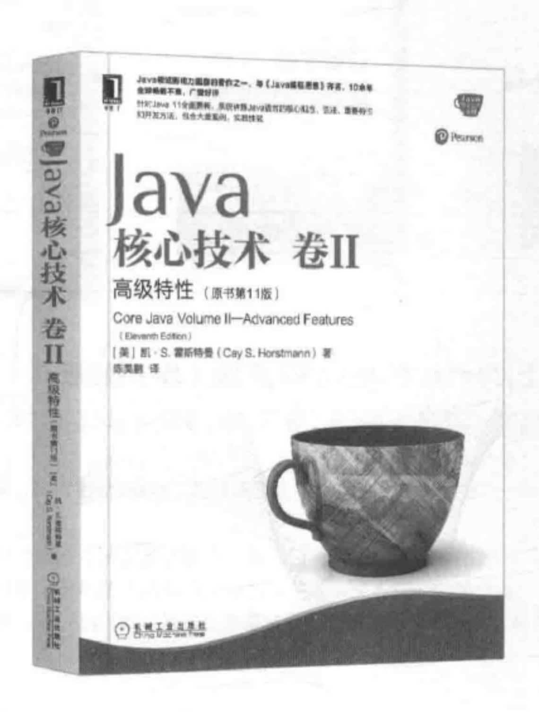

## Java核心技术 卷II 高级特性(原书第11版)

作者: [美] 凯·S. 霍斯特曼 (Cay S. Horstmann ) 著 ISBN: 978-7-111-64343-2 定价: 149.00元

Java领域影响力超群的著作之一,与《Java编程思想》齐名,10余年全球畅销不衰,广受好评;针对Java 11全面更新,系统讲解Java语言的核心概念、语法、重要特性和开发方法,包含大量案例,实践性强。

本书针对Java 11进行了修订,涵盖了完整的对高级UI特性、企业编程、网络、安全和Java强大的模块系统等内容的讨论。

书中对Java复杂的新特性进行了深入而全面的研究,展示了如何使用它们来构建具有专业品质的应用程序,作者所设计的经过全面完整测试的示例反映了当今的Java风格和最佳实践,这些示例设计精心,使其易于理解并且实践价值极高,从而使读者可以以这些示例为基础来编写自己的代码。


Java核心技术 卷II 高级特性(原书第12版) 敬请期待!

## 推荐阅读

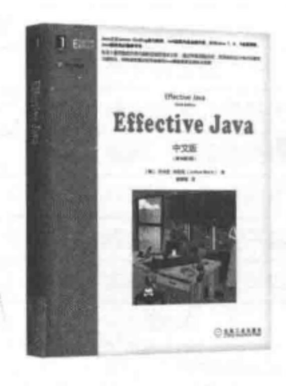

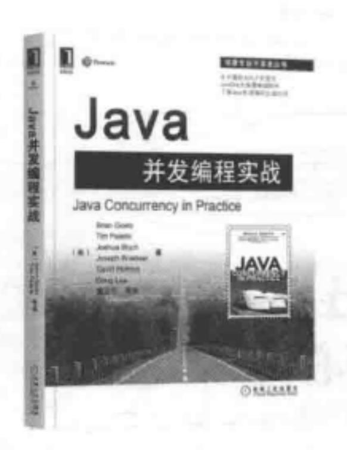


## Effective Java中文版(原书第3版)

作者: [美] 约书亚·布洛克 ( Joshua Bloch ) 著 ISBN: 978-7-111-61272-8 定价: 119.00元

Java之父James Gosling鼎力推荐、Jolt获奖作品全新升级,针对Java 7、8、9全面更新,Java程序 员必备参考书。

本书包含大量完整的示例代码和透彻的技术分析,通过90条经验规则,这些规则反映了最有经验的优秀程序员在实践中常用的一些有益的做法,探索新的设计模式和语言习惯用法,帮助读者更加有效地使用Java编程语言及其基本类库。全书以一种比较松散的方式将这些条目组织成11章,每一章都涉及软件设计的一个主要方面。

## Java并发编程实战

作者: [美] Brian Goetz, Tim Peierls 等著 ISBN: 978-7-111-37004-8 定价: 69.00元

本书中不仅讲解了并发的理论基础,还介绍各种实际的开发技术,这些知识对于构建可靠的、可伸缩的以及可维护的并发应用程序来说是非常有用的。本书并不仅是简单地罗列出各种并发API以及机制,而是详细地介绍了许多设计原则,设计模式以及思维模式,这些内容使得开发人员更容易构建出正确的并且高性能的并发程序。本书涵盖的内容包括: 并发性与线程安全性的基本概念;构建及组合各种线程安全类的技术;使用java.util.concurrent包中的各种并发构建基础模块;性能优化中的注意事项;如何测试并发程序以及一些高级主题,包括原子变量,无阻塞算法以及Java内存模型。

## Java虚拟机规范 (Java SE 8版)

作者:蒂姆·林霍尔姆(Tim Lindholm) 弗兰克·耶林(Frank Yellin)等著 ISBN:978-7-111-50159-6 定价:79.00元

本书完整而准确地阐释了Java虚拟机各方面的细节,围绕Java虚拟机整体架构、编译器、class文件格式、加载、链接与初始化、指令集等核心主题对Java虚拟机进行全面而深入的分析,深刻揭示Java虚拟机的工作原理。同时,书中不仅完整地讲述了由Java SE 8所引入的新特性,例如对包含默认实现代码的接口方法所做的调用,还讲述了为支持类型注解及方法参数注解而对class文件格式所做的扩展,并阐明了class文件中各属性的含义,以及字节码验证的规则。