**Java**核心技术系列


涵盖**Java 17** 新特性

Core Java, Volume I:Fundamentals, Twelfth Edition

# 核 心技术 <sup>卷</sup>I<sup>开</sup> 国书第12版)

[美]凯・S. 霍斯特曼 ( Cay S. Horstmann ) 著 林琪 苏钮涵 译


**ORACLe** 今 <sup>机</sup> 械工业 出版社 匚/ China Machine Press

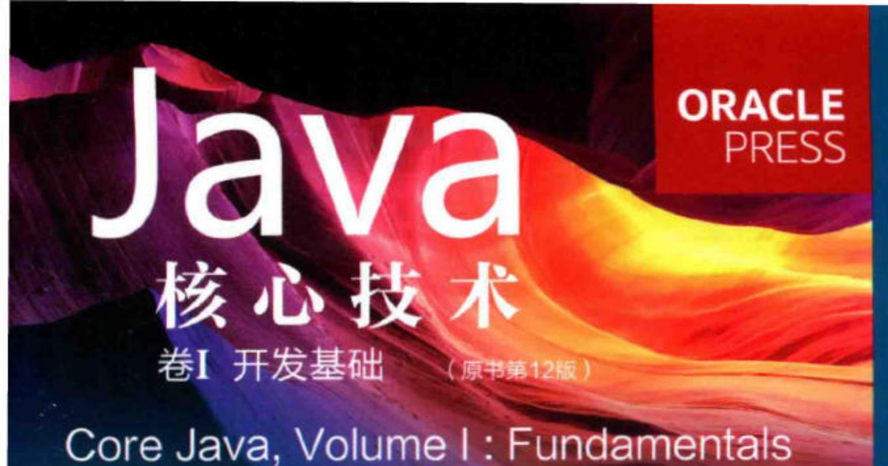

本书经全面修订,以涵盖Java 17的新特性。新版延续之前版本的优良传统,利用清晰明了的示例加以解释,着力让读者在充分理解Java语言和Java类库的基础上,灵活应用Java提供的高级特性,具体包括面向对象程序设计、反射与代理、接口与内部类、异常处理、

泛型程序设计、集合框架、事件监听器模型、图形用户界面设计和并

发。整本书不仅可以让读者深入了解设计和实现Java应用程序涉及的 所有基础知识和Java特性,还会帮助读者掌握开发Java程序所需的全

部基本技能。

Twelfth Edition

要想了解有关Java 17的高级特性,包括企业特性、模块系统、 网络、安全和高级UI编程,请期待《Java核心技术 卷 Ⅱ 高级特性(原 书第12版)》。

#### 本书特点

- 除JDK和Java IDE外,详细介绍如何使用JShell工具快速、方便地尝试Java代码。
- 利用丰富示例全面介绍Java的基本语法。
- 详细解释Java语言封装机制,并 提供面向对象程序设计(OOP) 建议。
- 利用示例讲解Java继承的设计 技巧。
- 通过清晰明了的介绍,帮助读者 充分理解并有效使用相对复杂的 反射。
- 利用接口和lambda表达式,帮助 读者提升Java面向对象编程能力。
- 全面介绍Java异常处理,并提供 实用的调试技巧。
- 重点强调泛型程序设计和强类型机制,避免不安全的强制类型转换。
- 帮助读者有效使用Java平台的集 合框架和预建标准集合。
- 提供GUI程序设计和Swing GUI工 具包使用指南,指导读者创建跨平 台的图形用户界面。
- 全面介绍Java并发和多线程编程 所需的工具。

Pearson

www.pearson.com

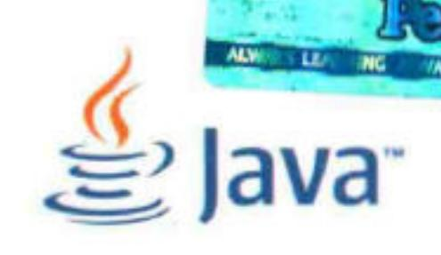


定价: 149.00元

投稿热线: (010) 88379604 读者信箱: hzjsj@hzbook.com

客服电话: (010) 88361066 88379833 68326294

华章网站: www.hzbook.com 网上购书: www.china-pub.com 数字阅读: www.hzmedia.com.cn CoreJava, Volume <sup>I</sup>:Fundamentals, Twelfth Edition

# Java 核 心技术

卷I 开发基础 (原书第12版)

[美]凯 • S. 霍斯特曼 ( Cay S. Horstmann ) 著 林琪 苏钮涵 译

#### 图书在版编目(CIP)数据

Java 核心技术:原书第 12 版, 卷I, 开发基础 /(美)凯・S.霍斯特曼(Cay S.Horstmann)著; 林琪,苏锤涵译 北京:机械工业出版社,2022.5

(Java 核心技术系列)

书名原文:Core Java, Volume I:Fundamentals, 12e

ISBN 978-7-111-70641-0

I. <sup>J</sup>… n. <sup>此</sup> JAVA 语言-程序设计 M TP312.8

中国版本图书馆 CIP 数据核字( 2022 )第 068396 号

北京市版权局著作权合同登记 图字:01-2022-1597 号。

Authorized translation from the English language edition, entitled Core Java. Volume 1: Fundamentals, Twelfth Edition, ISBN:9780137673629, by Cay <sup>工</sup> Horstmann, published by Pearson Education, Inc.. Copyright C 2022 Pearson Education Inc\*t Portions copyright.1996^2013 Oracle and/or its affiliates.

All rights reserved. No part of this book may be reproduced or transmitted in any form or by any means, electronic or mechanical, including photocopying, recording or by any information storage retrieval system, without permission from Pearson Education,Inc.

Chinese simplified language edition published by China Machine Press,Copyright © 2022.

本书中文简体字版由 Narmn Education(培生教育出版集团)授权机械工业出版社在中国大陆地区(不包括香 港、漠门特别行政区及台湾地区)独家出版发行。未经出版者书面许可,不得以任何方式抄袭、复制或节录本书中的 任何部分。

本书封底贴有 Pearse Education <sup>I</sup>培生教育出版集团)激光防为标签,无标空者不得销售。

#### Java 核心技术 卷 <sup>I</sup> 开发基础(原书第 12 版)

出版发行:机械工业出版社(北京市西城区百万庄大街 <sup>22</sup> <sup>号</sup> 椰政编码:100037】

责任编辑:王 颖 冯秀泳 责任校对二 马荣敏

印 刷: 北京诚信伟业印刷有限公司 版 次: 2022 年 6 月第 1 版第 1 次印刷

开 本:186mm x 240mm 1/16 印 张:43

书 号:ISEN 978-7-111-70641-0 定 价:149.00 元

客眼电话:{ 010 )88361066 88379833 68326294 投福热线:(010)88379604

华章网站:www.hzbookxom 读者信箱:hzjsj@hzbook.com

版权所有 • 侵权必究 封底无防伪标均为盗版

# 译者序

书写 Java 传奇的 Sun 公司曾经堪称"日不落"帝国,但服务器市场的萎缩让这个声名赫 赫的庞大帝国从蓬勃走向没落口 在 2009 年被 Oracle 公司收购之后,Sun 公司逐渐淡出了人 们的视线,而与此同时,我们也在很长一段时间内没能看到 Java 当初活跃的身影。

Java 就这样退出历史舞台了吗?当然不是! Sun 公司从 2006 年 12 月发布 Java 6 后,经 过 5 年多的不懈努力,2011 年 7 月底发布了 Java 7 正式版0 3 年后,被冠名为"跳票王"的 Oracle 公司终于发布了 Java 8 的正式版, 又是 3 年后,Java 9 发布。从 2018 年开始,为了更 快地引入新特性,每 6 个月就会发布一个 Java 版本,目前最新的长期支持版本是 Java 17。

值得一提的是,伴随着 Java 的成长,《Java 核心技术》也从第 <sup>1</sup> 版到第 <sup>11</sup> 版一路走来, 得到了广大 Java 程序设计人员的青睐. 成为一本畅销不衰的 Java 经典图书。2022 年,针对 Java 17,( Java 核心技术》第 <sup>12</sup> 版问世。这一版涵盖了 Java <sup>17</sup> 的最新特性,相应调整了部 分内容结构,同时延续之前版本的优良传统,利用清晰明了的示例加以解释,并提供了全部 示例代码,以便读者学习和灵活应用。它将续写从前的辉煌,使人们能及时跟上 Java 前进的 步伐。

本书由林琪、苏桂涵翻译。书中文字与内容力求忠实原书,不过由于译者水平有限,译 文肯定有不当之处,敬请批评指正。

> 译者 2022 年 4 月 于北京

#### 4 刖 言

#### 致读者

1995 年年底,Java 语言在 Internet 舞台一亮相便名声大噪。Java 技术承诺成为连接用户 与信息的万能胶,而不论这些信息来自 Web 服务器、数据库、信息提供商,还是任何其他可 以想象的渠道,事实上,就兑现这个承诺而言,Java 具有独特的优势和地位。它是一种完全 可信赖的程序设计语言,并得到了广泛认可。其固有的可靠性与安全特性不仅令 Java 程序员 放心,也令使用 Java 程序的用户放心。Java 内建了对网络编程、数据库连接和并发等高级程 序设计任务的支持。

1995 年以来,已经发布了 Java 开发工具包(Java Development Kit)的 12 个主要版本, 在过去的 25 年中,应用程序编程接口(API)也从 200 个类扩展到超过 4000 个类。现在这些 API 覆盖了用户界面构建、数据库管理、国际化、安全性以及 XML 处理等各个不同的领域,

你手上的这本书是《 Java 核心技术》第 <sup>12</sup> 版的卷 <sup>I</sup>。《 Java 核心技术》的每个版本都紧 随 J3四开发工具包的最新版本,并进行全面修订,以涵盖 Java 的最新特性。这一版经过更 新,将反映 Java 17 的特性。

与本书以前的版本一样,这一版仍然将读者群定位为那些打算将 Java 应用到实际项目中 的程序员。这里假设读者是具有程序设计语言(除 Java 之外)坚实背景知识的程序员,而且 不希望书中充斥着玩具式的示例(诸如,烤面包机、动物园的动物或神经质的跳动文本)。这 些绝时不会在这本书中出现0 本书的目标是让读者充分理解 Java 语言及 Java 类库,而不是 让读者产生误解,

本书提供大量示例代码来演示 Java 的几乎每一个语言特性和类库特性。这里有意使用简 单的示例程序以突出重点,不过,大部分示例都不是虚构的,也没有偷工减料口 在编写代码 时,这些示例可以作为很好的起点。

我们假定读者愿意(甚至渴望)学习 Java 提供的所有高级特性。例如,本书将详细介绍 以下内容:

- 面向对象程序设计
- 反射与代理
- 接口与内部类
- 异常处理
- 泛型程序设计
- 集合框架
- 事件监听器模型

- 图形用户界面设计
- 并发

随着 Java 类库的爆炸式增长,只用一卷无法涵盖程序员需要了解的所有 Java 特性。因此,我们决定将本书分为两卷。卷 I(本书)集中介绍 Java 语言的基本概念以及用户界面程序设计的基础知识。卷 II(高级特性)进一步介绍企业特性以及高级的用户界面程序设计,其中详细讨论以下内容:

- · 流 API
- 文件处理与正则表达式
- 数据库
- XML 处理
- 注解
- 国际化
- 网络编程
- · 高级 GUI 组件
- 高级图形
- 原生方法

写书时难免出现错误和不准确的地方。我们很想知道有哪些错误,不过,也希望同一个问题只被告知一次。我们在 http://horstmann.com/corejava 中给出了一个常见问题和 bug 修正列表。在勘误页的最后(建议先阅读勘误页)附有一个表单,可以用来报告 bug 和提出改进意见。如果我们没能回答每一个问题或者没有及时回复,请不要失望。我们确实会阅读所有电子邮件,而且非常感谢你的建议,这会使本书后续版本更清晰、更全面。

#### 关于本书

第1章概述 Java 与其他程序设计语言不同的功能,解释这种语言的设计初衷,以及在哪些方面达到了预期。然后,简要叙述 Java 的历史,介绍 Java 是如何诞生和演进的。

第2章介绍如何下载和安装 JDK 以及本书的程序示例,然后指导读者编译和运行一个控制台应用和一个图形应用。你将了解如何使用 JDK、Java IDE 和 JShell 工具。

第3章开始讨论 Java 语言。这一章会介绍一些基础知识,包括变量、循环和简单的函数。对于 C 或 C++ 程序员来说,学习这一章的内容会感觉一帆风顺,因为这些语言特性的语法基本上与 C 语言相同。如果你没有 C 语言背景,但使用过其他程序设计语言(如 Visual Basic),可能需要仔细阅读这一章。

面向对象程序设计(Object-Oriented Programming, OOP)是当今程序设计的主流,而 Java 是一种面向对象程序设计语言。第 4 章将介绍面向对象两大基石中的第一个概念——封装,以及 Java 语言实现封装的机制,即类与方法。除了 Java 语言规则之外,还对如何实现完善的 OOP 给出了建议。最后,会介绍奇妙的 javadoc 工具,它能将代码注释转换为一组包含超链接的网页。熟悉 C++ 的程序员可以快速浏览这一章,而对于没有面向对象程序设计背

景的程序员,在进一步学习 Java 之前应当先花一些时间了解 OOP 的有关概念。

类和封装只是 OOP 的一部分,第 5 章将介绍另一部分——继承 (inheritance)。继承允许利用现有的类,并根据需要进行修改。这是 Java 程序设计中的一个基础技术。Java 中的继承机制与 C++ 的继承机制十分相似。重申一次,C++ 程序员可以只关注这两种语言的不同之处。

第6章介绍如何使用 Java 的接口(interface)。接口允许你超越第5章中的简单继承模型。掌握接口会让你充分获得 Java 面向对象程序设计方法的强大能力。介绍接口之后,我们将转而介绍 lambda 表达式(lambda expression),这是一种简洁的表示方法,用来表示可以在以后某个时间点执行的代码块。接下来还会讲解 Java 的一个有用的技术特性——内部类(inner class)。

第7章讨论异常处理(exception handling),这是 Java 处理异常情况的一种健壮机制,用于处理正常程序可能出现意外的情况。异常提供了一种将正常处理代码与错误处理代码分开的有效手段。当然,即使通过处理所有异常条件来强化程序,程序仍然有可能不按预期的方式工作。这一章的最后一节将给出一组实用的调试技巧。

第8章概要介绍泛型程序设计。泛型程序设计可以让程序更可读、更安全。我们会展示如何使用强类型机制,而舍弃不好看也不安全的强制类型转换,以及如何处理与 Java 老版本兼容所带来的复杂问题。

第9章讨论的是 Java 平台的集合框架。如果希望收集多个对象,并在以后获取这些对象,就应当使用最适用的集合,而不是简单地把这些元素放在一个数组中。这一章会介绍如何充分利用预建的标准集合。

第 10 章介绍 GUI 程序设计,展示如何创建窗口、如何在窗口中绘图、如何利用几何图形绘图、如何采用多种字体格式化文本,以及如何显示图像。接下来介绍如何编写代码来响应事件,如鼠标单击事件或按键事件。

第 11 章详细讨论 Swing GUI 工具包。Swing 工具包允许你建立跨平台的图形用户界面。还将介绍各种按钮、文本组件、边框、滑动条、列表框、菜单以及对话框的有关内容。不过,一些更高级的组件会在卷 Ⅱ 中讨论。

第 12 章是本书的最后一章,这一章将讨论并发,即编写并行执行的任务。当前,大多数处理器都有多个内核,而且我们希望这些内核都保持忙碌,所以并发是 Java 技术的一个重要且令人振奋的应用。

附录列出了 Java 语言的保留字。

#### 约定

与很多计算机图书一样,本书使用等宽字体(monospace type)表示计算机代码。

- 注释:"注释"信息会用这样的图标标志。
- ☑ 提示: "提示"信息会用这样的图标标志。
- 警告:对于可能出现的危险,我们用这样的图标做出警示。
- C++ 注释: 在本书中有许多用来解释 Java 与 C++ 之间差别的 C++ 注释。没有 C++ 背景或者不擅长 C++ 编程并把它当作一场噩梦不愿再想起的程序员可以跳过这些注释。

Java 提供了一个庞大的程序设计库,即应用程序编程接口(API)。第一次使用 API 调用时,我们会在那一节末尾给出它的概要描述。这些描述不太正式,但我们希望它们能够比官方的联机 API 文档提供更多信息。类、接口或方法名后面的编号是引入该特性的 JDK 版本号,如下例所示:

#### API 应用程序编程接口 9

本书英文版网站上提供了书中一些程序的源代码,这些程序在书中会以程序清单的形式 给出,例如:

#### 程序清单 1-1 InputTest/InputTest.java

#### 示例代码

本书英文版网站 http://horstmann.com/corejava 提供了书中的所有示例代码。有关安装 Java 开发工具包和示例代码的详细信息请参看第 2 章。

### 致 谢

写一本书需要投人大量的精力,升级一本书也不像想象的那样轻松,尤其是 Java 技术一 直在持续不断地更新。出版一本书会让很多人耗费大量心血,在此衷心地感谢《 Java 核心技 术》团队的每一位成员。

Pearson 公司的许多人提供了非常有价值的帮助,却甘愿做幕后英雄口 在此,希望大家都 能知道我对他们辛勤工作的感谢。与以往一样,我要衷心感谢本书编辑 GregDoench, 从本书 的写作到出版,他一直在给予指导,同时感谢那些不知姓名的为本书做出贡献的人们。非常感 谢 Julie Nahil 在图书制作方面给予的支持,感谢 Dmitry Kirsanov 和 Alina Kirsanova 完成手稿的 编辑与排版工作口 还要感谢早期版本中我的合作者 Gary Cornell,他已经投身到其他行业。

感谢早期版本的许多读者,他们指出了很多错误,并给出了很多有建设性的改进意见。我 还要特别感谢优秀的审校团队,他们极其仔细地审阅了我的手稿,避免了很多令人尴尬的错误。

本书及早期版本的审校人员包括:Chuck Allison (尤他谷大学)、Lance Andersen ( Oracle)^ Gail Anderson ( Anderson Software Group Paul Anderson ( Anderson Software Group). Alec Beaton ( IBM )、 Cliff Be唱、Andrew Binstock ( Oracle )、 Joshua Bloch、David Brown、Corky Cartwright % Frank Cohen ( PushToTest), Chris Crane ( devXsolution)^ Dr. Nicholas J. De Lillo (曼哈顿学 院 )、 Rakesh Dhoopar ( Oracle )、David Geary ( Clarity Training )、 Jim Gish ( Oracle)、Brian Goetz (Oracle)、Angela Gordon <sup>x</sup> Dan Gordon ( Electric Cloud), Rob Gordon、John Gray (哈特福德大 学)、Cameron Gregory ( olabs.com )s Marty Hal】( ccireservlets.com公司)、Vincent Hardy ( Adobe Systems). Dan Harkey (圣何塞州立大学)、William Higgins ( IBM). Marc Hoffmann ( mtrail), Vladimir Ivanovic (PointBase)、Jerry Jackson ( CA Technologies). Heinz Kabutz ( Java Specialists Stepan V. Kalinin ( I-Teco/Servionica LTD ). Tim Kimmet ( Walmart Chris Laffra 、 Charlie Lai ( Apple)、Angelika Langer、Jeff Langr ( Langr Software Solutions)、Doug Langston、Hang Lau (麦 吉尔大学)、Mark Lawrence、Doug Lea ( SUNY Oswego)、 Gregory Longshore、Bob Lynch ( Lynch Associates )、 Philip Milne (顾问)、Mark Morrissey (俄勒冈州研究生院 )、 Mahesh Neelakanta (佛罗里达大西洋大学)、Jose Paumard (Oracle) Hao Pham、Paul Philion . Blake Ragsdell <sup>s</sup> Stuart Reges (亚利桑那大学)、Simon Ritter ( Azul Systems Rich Rosen ( Interactive Data Corporation Peter Sanders (法国尼斯索菲亚安提波利斯大学)、Dr Pau) Sanghera (圣何塞州立大学布鲁克斯 学院)、Paul Sevinc (Teamup AG)S Devang Shah ( Sun Microsystems Yoshiki Shibata. Bradley A. Smith、Steven Stelting ( Oracle). Christopher Taylor^ Luke Taylor ( Valtech). George Thimvathukal KimTopley ( StreamingEdge)^ Janet Traub、Pauliyma (顾问)、Peter van der Linden . Christian UHenboom、Burt Walsh Dan Xu (Oracle) 和 John Zavgren ( Oracle) <sup>o</sup>

> Cay Horstmann 2021 年 10 月于德国柏林

#### 目 录

| 译者序                                          | 28<br>注释<br>3.2                         |
|----------------------------------------------|-----------------------------------------|
| 前言                                           | 数据类型<br>28<br>3.3                       |
| 致谢                                           | 3.3.1<br>29<br>整型                       |
|                                              | 33.2<br>30<br>浮点类型                      |
| 」<br>Java<br>程序设计概述<br>1 章<br>第              | 333<br>Ch"类型<br>31                      |
| 程序设计平台<br>1.1<br>Java<br>/                   | 334<br>31<br>类型<br>Unicode<br>和<br>char |
| 2<br>1.2<br>白皮书的关键术语<br>Java                 | bool卸类型<br>33.5<br>32                   |
| 121<br>2<br>简单性                              | 33<br>3.4<br>变量与常量                      |
| 122<br>3<br>面向对象                             | 341<br>声明变量<br>33                       |
| 123<br>3<br>分布式                              | 342<br>初始化变量<br>34                      |
| 124<br>3<br>健壮性                              | 343<br>35<br>常量                         |
| 125<br>3<br>安全性                              | 344<br>35<br>枚举类型                       |
| 126<br>体系结构中立<br>4                           | 36<br>运算符<br>3.5                        |
| 127<br>4<br>可移植性                             | 351<br>36<br>算术运算符                      |
| 128<br>5<br>解释性                              | 352<br>36<br>数学函数与常量                    |
| 129<br>5<br>高性能                              | 353<br>38<br>数值类型之间的转换                  |
| 1.2J0<br>5<br>多线程                            | 354<br>39<br>强制类型转换                     |
| 1211<br>6<br>动态性                             | 355<br>39<br>赋值                         |
| 6<br>applet<br>Internet<br>1.3<br>Java<br>与  | 自增与自减运算符<br>40<br>3.5.6                 |
| 7<br>发展简史<br>1.4<br>Java                     | 357<br>关系和<br>40<br>运算符<br>boolean      |
| L5<br>关于<br>的常见误解<br>10<br>Java              | 358<br>条件运算符<br>41                      |
| 2<br>12<br>Java<br>编程环境<br>章<br>第            | 4/<br>3.5.9<br>表达式<br>switch            |
| J2<br>2.1<br>开发工具包<br>安装<br>Java             | 3510<br>42<br>位运算符                      |
| 下载<br>/2<br>2.1.1<br>JDK                     | 3.5J1<br>括号与运算符级别<br>43                 |
| 设置<br>13<br>2.1.2<br>JDK                     | 字符串<br>44<br>3.6                        |
| 2,1.3<br>15<br>安装源文件和文档                      | 361<br>子串<br>44                         |
| 22<br>使用命令行工具<br>15                          | 拼接<br>3.6.2<br>44                       |
| 19<br>使用集成开发环境<br>2.3                        | 363<br>字符串不可变<br>45                     |
| 22<br>2.4<br>JShell                          | 364<br>46<br>检测字符串是否相等                  |
| 3<br>章<br>Java<br>的基本程序设计结构<br>25<br>•…<br>第 | 365<br>47<br>空串与<br>Null<br>串           |
| 25<br>一个简单的<br>3.1<br>Java<br>程序             | 47<br>3.6.6<br>码点与代码单元                  |

| 3.6.7 String API 49                 | 4.3.1 Employee 类 ······ 104       |
|-------------------------------------|-----------------------------------|
| 3.6.8 阅读联机 API 文档 51                | 4.3.2 使用多个源文件 106                 |
| 3.6.9 构建字符串 53                      | 4.3.3 剖析 Employee 类 107           |
| 3.6.10 文本块 54                       | 4.3.4 从构造器开始 108                  |
| 3.7 输入与输出 56                        | 4.3.5 用 var 声明局部变量 109            |
| 3.7.1 读取输入 56                       | 4.3.6 使用 null 引用 109              |
| 3.7.2 格式化输出 58                      | 4.3.7 隐式参数与显式参数 110               |
| 3.7.3 文件输入与输出 60                    | 4.3.8 封装的优点 111                   |
| 3.8 控制流程 62                         | 4.3.9 基于类的访问权限 113                |
| 3.8.1 块作用域 62                       | 4.3.10 私有方法114                    |
| 3.8.2 条件语句 63                       | 4.3.11 final 实例字段 ······ 114      |
| 3.8.3 循环 64                         | 4.4 静态字段与静态方法 115                 |
| 3.8.4 确定性循环 68                      | 4.4.1 静态字段115                     |
| 3.8.5 多重选择: switch 语句 71            | 4.4.2 静态常量116                     |
| 3.8.6 中断控制流程的语句 75                  | 4.4.3 静态方法 116                    |
| 3.9 大数 77                           | 4.4.4 工厂方法117                     |
| 3.10 数组 79                          | 4.4.5 main 方法 ······ 118          |
| 3.10.1 声明数组 79                      | 4.5 方法参数120                       |
| 3.10.2 访问数组元素81                     | 4.6 对象构造125                       |
| 3.10.3 for each 循环 ······ 81        | 4.6.1 重载126                       |
| 3.10.4 数组拷贝82                       | 4.6.2 默认字段初始化 126                 |
| 3.10.5 命令行参数83                      | 4.6.3 无参数的构造器 126                 |
| 3.10.6 数组排序 84                      | 4.6.4 显式字段初始化 127                 |
| 3.10.7 多维数组 86                      | 4.6.5 参数名128                      |
| 3.10.8 不规则数组 89                     | 4.6.6 调用另一个构造器 129                |
| 第 4 章 对象与类92                        | 4.6.7 初始化块129                     |
| 4.1 面向对象程序设计概述 92                   | 4.6.8 对象析构与 finalize 方法 ····· 133 |
| 4.1.1 类                             | 4.7 记录134                         |
| 4.1.2 对象94                          | 4.7.1 记录概念134                     |
| 4.1.3 识别类 94                        | 4.7.2 构造器:标准、自定义和                 |
| 4.1.4 类之间的关系95                      | 简洁136                             |
| 4.2 使用预定义类96                        | 4.8 包                             |
| 4.2.1 对象与对象变量96                     | 4.8.1 包名                          |
| 4.2.2 Java 类库中的 LocalDate 类 ···· 99 | 4.8.2 类的导入 138                    |
| 4.2.3 更改器方法与访问器方法101                | 4.8.3 静态导入140                     |
| 4.3 自定义类 104                        | 4.8.4 在包中增加类 140                  |

| 485                                 | 泛型数组列表                                 |
|-------------------------------------|----------------------------------------|
| 包访问                                 | 186                                    |
| 143                                 | 5.3                                    |
| /44                                 | "7                                     |
| 类路径                                 | 531                                    |
| 4*8.6                               | 声明数组列表                                 |
| 487                                 | 189                                    |
| 那6                                  | 访问数组列表元素                               |
| 设置类路径                               | 5.3.2                                  |
| 146<br>文件<br>JAR<br>4*9             | 533<br>类型化与原始数组列表的                     |
| "6<br>491<br>创建<br>文件<br>JAR        | /92<br>兼容性                             |
| 492                                 | 193                                    |
| 147                                 | 对象包装器与自动装箱                             |
| 清单文件                                | 5.4                                    |
| 148<br>可执行<br>文件<br>JAR<br>4.9.3    | 196<br>参数个数可变的方法<br>5.5                |
| 494<br>那9<br>多版本<br>文件<br>JAR       | 197<br>抽象类<br>5.6                      |
| 495                                 | 枚举类                                    |
| 关于命令行选项的说明                          | 201                                    |
| 150                                 | 5.7                                    |
| 文档注释                                | 203                                    |
| /5/                                 | 密圭寸类                                   |
| 4.10                                | 5.8                                    |
| 151                                 | 208                                    |
| 注释的插入                               | 反射                                     |
| 4.10.1                              | 5.9                                    |
| 152                                 | 591                                    |
| 类注释                                 | 209                                    |
| 4.10,2                              | Class 类                                |
| 方法注释                                | 592                                    |
| 152                                 | 声明异常人门                                 |
| 4.10.3                              | 211                                    |
| 字段注释                                | 593                                    |
| 153                                 | 212                                    |
| 4.10.4                              | 资源                                     |
| 通用注释                                | 594                                    |
| 153                                 | …,•… 213                               |
| 4.10.5                              | 利用反射分析类的能力                             |
| /54<br>包注释<br>4.10.6                | 595<br>使用反射在运行时分析                      |
| 4J0J<br>154<br>注释提取                 | 220<br>对象                              |
| 755<br>类设计技巧<br>4.11                | 596<br>使用反射编写泛型数组                      |
| 5<br>158<br>继承<br>章<br>第            | 224<br>代码                              |
| 类、超类和子类                             | 597                                    |
| 158                                 | …••…227                                |
| 5.1                                 | 调用任意方法和构造器                             |
| 5.LI                                | 继承的设计技巧                                |
| 158                                 | 23J                                    |
| 定义子类                                | 5.10                                   |
| 覆盖方法<br>160<br>5.1.2                | 6<br>接口、lambda<br>章<br>表达式与<br>第       |
| 子类构造器<br>16/<br>5.L3                | 内部类<br>233                             |
| 165                                 | 6J                                     |
| 继承层次结构                              | 233                                    |
| 5.L4                                | 接口                                     |
| 多态                                  | 6.LI                                   |
| 165                                 | 接口的概念                                  |
| 5.1.5                               | 233                                    |
| 166                                 | 239                                    |
| 理解方法调用                              | 接口的属性                                  |
| 5.1.6                               | 6.L2                                   |
| 类和方法…169<br>final<br>阻止继承:<br>5.1.7 | 240<br>6.L3<br>接口与抽象类                  |
| 170                                 | 241                                    |
| 强制类型转换                              | 6.L4                                   |
| 5.L8                                | 静态和私有方法                                |
| 模式匹配<br>172<br>5.1.9<br>instanceof  | 默认方法<br>241<br>6.1.5                   |
| 173                                 | 242                                    |
| 受保护访问                               | 解决默认方法冲突                               |
| 5.1.10                              | 6.1.6                                  |
| 174                                 | 6」.7                                   |
| Object:所有类的超类                       | 接口与回调                                  |
| 5.2                                 | 244                                    |
| "4<br>类型的变量<br>5.2.1<br>Object      | 246<br>6.1.8<br>Comparator             |
| 175<br>方法<br>明uals<br>5.2.2         | 247<br>对象克隆<br>6.L9                    |
| 二6<br>相等测试与继承<br>5.2.3              | 252<br>表达式<br>6,2<br>lambda            |
| 524<br>hashCode 方法                  | 621<br>… 253<br>为什么引人<br>表达式<br>lambda |
| 525                                 | 254                                    |
| 181                                 | 表达式的语法                                 |
| 方法                                  | 6.2.2                                  |
| toString                            | lambda                                 |

| 623                                 | 742                          |
|-------------------------------------|------------------------------|
| 256                                 | 313                          |
| 函数式接口                               | 启用和禁用断言                      |
| 624                                 | 743                          |
| 258                                 | 3/3                          |
| 方法引用                                | 使用断言完成参数检查•…•…               |
| 625                                 | 744                          |
| 260                                 | 314                          |
| 构造器引用                               | 使用断言提供假设文档                   |
| 626                                 | 3J5                          |
| 261                                 | 日志                           |
| 变量作用域                               | 7.5                          |
| 263<br>处理<br>表达式<br>6.2.7<br>lambda | 316<br>基本日志<br>7.5.1         |
| 628<br>266<br>再谈<br>Comparator      | 752<br>316<br>高级日志           |
| 63                                  | 753                          |
| 267                                 | 3/8                          |
| 内部类                                 | 修改日志管理器配置                    |
| 631<br>使用内部类访问对象状态…267              | 754<br>320<br>本地化            |
| 270                                 | 32/                          |
| 内部类的特殊语法规则                          | 处理器                          |
| 6.3.2                               | 7.5.5                        |
| 633<br>内部类是否有用、必要和                  | 756<br>324<br>过滤器            |
| 271<br>安全                           | 757<br>324<br>格式化器           |
| 273                                 | 324                          |
| 局部内部类                               | 日志技巧                         |
| 6.3.4                               | 7.5.8                        |
| 635                                 | 332                          |
| 274                                 | 调试技巧                         |
| 由外部方法访问变量                           | 7.6                          |
| 636<br>275<br>匿名内部类                 | 337<br>8<br>泛型程序设计<br>章<br>第 |
| 637                                 | ,337                         |
| 278                                 | 8J                           |
| 静态内部类                               | 为什么要使用泛型程序设计                 |
| 281                                 | 337                          |
| 服务加载器                               | 类型参数的好处                      |
| 6.4                                 | 8.1.1                        |
| 283                                 | 338                          |
| 代理                                  | 8.L2                         |
| 6.5                                 | 谁想成为泛型程序员                    |
| 284                                 | 339                          |
| 何时使用代理                              | 定义简单泛型类                      |
| 6.5.1                               | 8.2                          |
| 652                                 | 341                          |
| 284                                 | 8.3                          |
| 创建代理对象                              | 泛型方法                         |
| 653                                 | 342                          |
| 2阳                                  | 类型变量的限定                      |
| 代理类的特性                              | 8.4                          |
| 7<br>290<br>异常、断言和日志<br>章<br>第      | 344<br>泛型代码和虚拟机<br>8.5       |
| 290                                 | 851                          |
| 7.1                                 | 344                          |
| 处理错误                                | 类型擦除                         |
| 7.LI                                | 852                          |
| 291                                 | 346                          |
| 异常分类                                | 转换泛型表达式                      |
| 293                                 | 853                          |
| 7.L2                                | 346                          |
| 声明检查型异常                             | 转换泛型方法                       |
| 295                                 | 854                          |
| 如何抛出异常                              | 348                          |
| 7.1.3                               | 调用遗留代码                       |
| 296                                 | 349                          |
| 创建异常类                               | 限制与局限性                       |
| 7.1.4                               | 8.6                          |
| 297<br>捕获异常<br>7.2                  | 不能用基本类型实例化类型<br>8.6.1        |
| 297<br>捕获异常概述<br>7.2.1              | 349<br>参数                    |
| 722<br>299<br>捕获多个异常                | 862<br>运行时类型查询只适用于           |
| 723<br>300<br>再次抛出异常与异常链            | 原始类型<br>349                  |
| 301<br>finally<br>子句<br>7.2.4       | 863<br>349<br>不能创建参数化类型的数组…  |
| 725                                 | 864                          |
| 303                                 | 350                          |
| 语句                                  | 警告                           |
| try-with-Resources                  | Varargs                      |
| 726                                 | 35,                          |
| 305                                 | 不能实例化类型变量                    |
| 分析栈轨迹元素                             | 8.6.5                        |
| 308                                 | 352                          |
| 使用异常的技巧                             | 不能构造泛型数组                     |
| 7.3                                 | 8.6.6                        |
| 使用断言<br>311<br>7.4                  | 867<br>泛型类的静态上下文中类型          |
| 741<br>312<br>断言的概念                 | 353<br>变量无效                  |

| 8.6.8 不能抛出或捕获泛型类的              | 9.4.5 链接散列集与映射 412           |
|--------------------------------|------------------------------|
| 实例 354                         | 9.4.6 枚举集与映射 413             |
| 8.6.9 可以取消对检查型异常的              | 9.4.7 标识散列映射 413             |
| 检查354                          | 9.5 副本与视图 415                |
| 8.6.10 注意擦除后的冲突 356            | 9.5.1 小集合 415                |
| 8.7 泛型类型的继承规则 357              | 9.5.2 不可修改的副本和视图 417         |
| 8.8 通配符类型 359                  | 9.5.3 子范围 418                |
| 8.8.1 通配符概念 359                | 9.5.4 检查型视图 419              |
| 8.8.2 通配符的超类型限定 360            | 9.5.5 同步视图 419               |
| 8.8.3 无限定通配符 363               | 9.5.6 关于可选操作的说明 420          |
| 8.8.4 通配符捕获 363                | 9.6 算法                       |
| 8.9 反射和泛型 365                  | 9.6.1 为什么使用泛型算法 423          |
| 8.9.1 泛型 Class 类 ······· 365   | 9.6.2 排序与混排424               |
| 8.9.2 使用 Class <t> 参数进行类型</t>  | 9.6.3 二分查找 427               |
| 匹酉366                          | 9.6.4 简单算法 428               |
| 8.9.3 虚拟机中的泛型类型信息 … 367        | 9.6.5 批操作 429                |
| 8.9.4 类型字面量 370                | 9.6.6 集合与数组的转换 430           |
| 第 9 章 集合 376                   | 9.6.7 编写自己的算法 431            |
| 9.1 Java 集合框架 ····· 376        | 9.7 遗留的集合 432                |
| 9.1.1 集合接口与实现分离 376            | 9.7.1 Hashtable 类 ······ 432 |
| 9.1.2 Collection 接口 ······ 379 | 9.7.2 枚举432                  |
| 9.1.3 迭代器 379                  | 9.7.3 属性映射433                |
| 9.1.4 泛型实用方法 382               | 9.7.4 栈                      |
| 9.2 集合框架中的接口 384               | 9.7.5 位集 437                 |
| 9.3 具体集合 386                   | 第10章 图形用户界面程序设计 441          |
| 9.3.1 链表 387                   | 10.1 Java 用户界面工具包简史 441      |
| 9.3.2 数组列表 395                 | 10.2 显示窗体442                 |
| 9.3.3 散列集 396                  | 10.2.1 创建窗体 442              |
| 9.3.4 树集399                    | 10.2.2 窗体属性 444              |
| 9.3.5 队列与双端队列 403              | 10.3 在组件中显示信息 448            |
| 9.3.6 优先队列404                  | 10.3.1 处理 2D 图形452           |
| 9.4 映射405                      | 10.3.2 使用颜色458               |
| 9.4.1 基本映射操作 405               | 10.3.3 使用字体459               |
| 9.4.2 更新映射条目 408               | 10.3.4 显示图像465               |
| 9.4.3 映射视图 409                 | 10.4 事件处理 466                |
| 9.4.4 弱散列映射411                 | 10.4.1 基本事件处理概念 466          |

| 1042<br>实例:处理按钮点击事件…467                | 1161<br>535<br>网格包布局                   |
|----------------------------------------|----------------------------------------|
| 1043                                   | 1162                                   |
| 471                                    | 543                                    |
| 简洁地指定监听器                               | 定制布局管理器                                |
| 472                                    | 547                                    |
| 适配器类                                   | 对话框                                    |
| 10.4.4                                 | 1L7                                    |
| 1045                                   | 547                                    |
| 473                                    | 1171                                   |
| 动作                                     | 选项对话框                                  |
| 478                                    | 1172                                   |
| 鼠标事件                                   | 55/                                    |
| 10.4.6                                 | 创建对话框                                  |
| 1047<br>…482<br>事件继承层次结构<br>AWT        | 554<br>数据交换<br>11.7.3                  |
| 485<br>首选项<br>API<br>10.5              | 560<br>文件对话框<br>11.7.4                 |
| 491<br>用户界面组件<br>章<br>Swing<br>第<br>11 | 567<br>12<br>并发<br>章<br>第              |
| 和模型-<br>视图-<br>控制器<br>Swing<br>11.1    | 567<br>什么是线程<br>12,1                   |
| 491<br>设计模式                            | 572<br>线程状态<br>12.2                    |
| 495                                    | 572                                    |
| 布局管理概述                                 | 新建线程                                   |
| 1L2                                    | 12.2.1                                 |
| 1121                                   | 572                                    |
| 495                                    | 可运行线程                                  |
| 布局管理器                                  | 12.2.2                                 |
| 1122                                   | 1223                                   |
| 497                                    | 573                                    |
| 边框布局                                   | 阻塞和等待线程                                |
| 1123                                   | 573                                    |
| 498                                    | 终止线程                                   |
| 网格布局                                   | 12.2.4                                 |
| 499                                    | 575                                    |
| 文本输入                                   | 线程属性                                   |
| 11.3                                   | 12.3                                   |
| 1131                                   | 1231                                   |
| 499                                    | 575                                    |
| 文本域                                    | 中断线程                                   |
| 1132                                   | 1232                                   |
| 501                                    | 守护线程                                   |
| 标签和标签组件                                | 578                                    |
| 1133                                   | 1233                                   |
| 502                                    | 578                                    |
| 密码域                                    | 线程名                                    |
| 502                                    | 578                                    |
| 文本区                                    | 未捕获异常的处理器                              |
| 11.3.4                                 | 123.4                                  |
| 1135                                   | 579                                    |
| 503                                    | 线程优先级                                  |
| 滚动窗格                                   | 12.3.5                                 |
| 505                                    | 580                                    |
| 选择组件                                   | 同步                                     |
| 11.4                                   | 12.4                                   |
| 506                                    | 1241                                   |
| 复选框                                    | 580                                    |
| 11.4.1                                 | 竞态条件的一个例子                              |
| 1142                                   | 1242                                   |
| 508                                    | 582                                    |
| 单选按钮                                   | 竞态条件详解                                 |
| 1143                                   | 584                                    |
| 511                                    | 锁对象                                    |
| 边框                                     | 12.4.3                                 |
| 1144                                   | 1244                                   |
| 5/3                                    | 587                                    |
| 组合框                                    | 条件对象                                   |
| 1145<br>-516<br>滑动条                    | 1245<br>591<br>关键字<br>synchronized     |
| 522                                    | 595                                    |
| 菜单                                     | 同步块                                    |
| 11.5                                   | 12.4.6                                 |
| 1151                                   | 监视器概念                                  |
| 522                                    | *597                                   |
| 菜单构建                                   | 12.4.7                                 |
| 1152<br>524<br>菜单项中的图标                 | 1248<br>597<br>字段<br>volatile          |
| 1153<br>… 525<br>复选框和单选按钮菜单项           | 598<br>final<br>变量<br>12*4.9           |
| 1154                                   | 12410                                  |
| 526                                    | 599                                    |
| 弹出菜单                                   | 原子性                                    |
| 1155                                   | 600                                    |
| 527                                    | 死锁                                     |
| 键盘助记符和加速器                              | 12,4.11                                |
| 1156<br>528<br>启用和禁用菜单项                | 12412<br>和<br>为什么废弃<br>stop<br>suspend |
| 1157<br>532<br>工具栏                     | 603<br>方法                              |
| 534                                    | 12413                                  |
| 工具提示                                   | 604                                    |
| 11.5.8                                 | 按需初始化                                  |
| 534                                    | 12414                                  |
| 复杂的布局管理                                | 605                                    |
| 1L6                                    | 线程局部变量                                 |

| 12,5 |        | 线程安全的集合<br>606                 |      | 1263   | 625<br>控制任务组           |
|------|--------|--------------------------------|------|--------|------------------------|
|      | 12.5.1 | 阻塞队列<br>607                    |      | 12.6.4 | 630<br>框架<br>fbrk-join |
|      | 12.5.2 | 612<br>高效的映射、集和队列<br>          | 12.7 |        | 异步计算<br>632            |
|      | 1253   | 映射条目的原子更新<br>614               |      | 12.7.1 | 可完成<br>632<br>Future   |
|      | 1254   | 并发散列映射的批操作<br>617              |      | 1272   | 组合可完成<br>634<br>Future |
|      | 1255   | 6/8<br>并发集视图                   |      | 1273   | 用户界面向调中的长时间            |
|      | 1256   | 写时拷贝数组<br>619                  |      |        | 运行任务<br>639            |
|      | 1257   | 并行数组算法<br>619                  | 12.8 | 进程     | 646                    |
|      | 12.5.8 | 较早的线程安全集合<br>620               |      | 12.84  | 建立进程<br>646            |
| 12.6 |        | 任务和线程池<br>621                  |      | 1282   | 647<br>运行进程            |
|      | 1261   | 62】<br>与<br>Callable<br>Future |      | 12.8.3 | 648<br>进程句柄            |
|      | 1262   | 622<br>执行器                     | 附录   | Java   | 关键字<br>652             |

## 第 1 章 Java 程序设计概述

- A Java 程序设计平台 Java 发展简史
- Java 白皮书的关键术语 关于 Java 的常见误解
- A Java applet 与 Internet

1996 年 Java 第一次发布就引起了人们的极大兴趣。关注 Wva 的人士不仅限于计算机出 版界,还有诸如《纽约时报》《华盛顿邮报》和《商业周刊》这样的主流媒体。Java 是第一个 也是唯一一个在 National Public Radio 上占用了 10 分钟时间进行介绍的程序设计语言,并且 还得到了 100 000 000 美元的风险投资基金臼 这些基金全部用来支持用这种特别的计算机语 言开发的产品。你可能想了解 Java 语言的发展,这一章就会带你简单地重温这段历史。

#### 1.1 Java 程序设计平台

在本书的第 1 版中,我和合著者 Gary Cornell 是这样描述 Java 的:

"作 为一种计算机语言,hva 的广告词确实 有点夸大其词。当然,Java 的确是 一种优秀的程序设计语言。作为一个名副其 实的程序设计人员,使用 Java 无疑 是一个比较好的选择〉我们认为:Java 本来有潜力成为一种卓越的程序设计语 言,但可能有些为时过晚,一旦一种语言得到广泛应用,与现存代码尴尬的兼 容性问题就摆在了人们的面前口 "

关于这段文字,我们的编辑受到 Suo 公司某高层人士的严厉批评(Sun 是最早开发 Java 的公司)◎ Java 有许多非常优秀的语言特性. 本章稍后会详细地讨论这些特性口但它确实也 有缺点,由于兼容性需求,新增的一些特性就没有原有的特性那么精巧

但是, 正像我们在第 <sup>1</sup> 版中所说的,Java 并不只是一种语言。在此之前出现的那么多种 语言都没有引起那么大的表动。Java 是一个完整的平台,有一个庞大的库,其中包含了大量 可重用的代码,还有一个提供诸如安全性、跨操作系统的可移植性以及自动垃圾收集等服务 的执行环境,

作为一名程序设计人员,你可能希望能有这样一种语言,既要有令人舒适的语法,也要 有易于理解的语义(C++ 就不是这样的语言)。Java 完全满足这些要求, 另外还有很多其他 优秀语言也能满足要求。不过尽管有些语言提供了可移植性、垃圾收集等特性,但它们没有 提供一个丰富的库。如果你想要酷炫的绘图功能、网络连接或数据库存取特性,就必须自己 动手编写代码。而 Java一应俱全,它具备所有这些特性,是一种功能齐全的出色语言和一个 高质量的执行环境,同时有一个庞大的库。正是因为 Java 集多种优势于一身, 所以对广大程

序设计人员有着不可抗拒的吸引力.

#### 1.2 Java白皮书的关犍术语

Java的设计者编写了一个颇有影响力的白皮书,来解释设计初衷以及完成的情况,他们 还发布了一个简短的摘要。这个摘要按以下 II 个关键术语进行组织:

1)简单性 7)可移植性

2)面向对象 8)解释性

3)分布式 9)高性能

4 )健壮性 10)多线程

5 )安全性 II )动态性

6)体系结构中立

在后面的小节中. 我们将提供一个小结,给出白皮书中的相关说明(这是 Java 设计者对 各个关键术语的描述), 另外我还会根据使用 Java 当前版本的经验, 给出对这些术语的理解,

Q 注释:白皮书可以在 www.oracle.coEn/technetwork/java/langenv-14915Lhtml 上找到口 关于 <sup>1</sup><sup>1</sup> 个关4<sup>皂</sup> 术语的概述请参见 http://horstmann.com/cQrejava/java-an-overview/7Gosling.pdf <sup>o</sup>

#### 12.1 简单性

我们希望构建一个无须深奥的专业训练就可以进行编程的 系统,并且要符合当 今的标准惯例。因此,尽管我们发现 CH 不太适用,但在设计 Java 的时候还 是尽可能地接近 C++, 以使系统 更易于理解。hva 剔除了 CH 中许多 很少使 用、难以理解、容易混淆的特性。在我们看来,这些特性带来的问题远远多于 它们的好处。

的确,Java语法是 C++ 语法的一个 "纯净" 版本。这里没有头文件、指针运算(甚至没 有指针语法)、结构、联合、操作符重载、虚基类等(请参阅本书各个章节给出的 CH注释. 其中比较详细地解释了 Java 与 C++ 之间的区别)。不过,Java 设计者并没有试图修正 C++ 中 所有不适当的特性口 例如,switch 语句的语法在 Java 中就没有改变。如果你了解 CH, 会发 现可以轻而易举地转换到 Java 语法。

Java 发布时. 实际上 CH并不是最常用的程序设计语言中 很多开发人员都在使用 Visual Basic 和它的拖放式编程环境。这些开发人员并不觉得 Java 简单。很多年之后 Java 开发环境 才迎头赶上\* 如今,Java 开发环境已经远远超越了大多数其他编程语言的开发环境:

"简 单"的另一面是"小 Java 的目标之一是支持开发能低在小型机器上独立 运行的软件口 基本的解释器和类 支持大豹仅为 40KB, 再加上基础的标准类库 和线程支持(基本上是一个自包含的微内核), 大约需要增加 175KB.;

在当时,这是一个了不起的成就』当然,由于不断的扩展,类库已经相当庞大了。现在

还有一些带有较小类库的独立版本,这些版本适用于嵌人式设备和智能卡。

#### 1.2.2 面向对象

简单地讲,面向对象设计是一种程序设计技术, 它将重点放在教据(即对象) 和时象的接口上口 用木匠打一个比方:一个 "面向对象的"木匠主要关注的是 所制作的椅子,其次才是使用的工具;一个 "非 面向对象的" 木匠主要考虑的 则是使用的工具。在本质上. Java 的面向对象能力与 C++ 是一样的。

开发 Java 时面向对象技术已经相当成熟亡 Java 的面向对象特性与 C十十 旗鼓相当。Java 与 CH 的主要不同点在于多重继承,在 Java 中,取而代之的是更简单的接口概念。与 C++ 相比,Java 提供了更丰富的运行时自省功能(有关内容将在第 5 章中讨论)。

#### 123 分布式

Java 有一个丰富的例程库,用 于处理 HTTP 和 FTP 之类的 TCP/IP 协议已 Java 应用程序能嫌通过 URL 打开和访问网上的 对象. 其便捷程度就好像访问本地文 件一样。

如今,这一点被认为是理所当然的,不过在 1995 年主要还是从 C++ 或 Visual Basic 程序 连接 Web 服务器1

#### 1.2.4 健壮性

Java 的设计目 标之一是要让用 Java 编写的程序具有多方 面的可靠性二 Java 非常 强调进行早期的问题检测、后期的动态(运行时)检测,以及消除容易出错的 情况……Java 与 C/C++ 最 大的不同在于 Java 采用的指针模型 可以消除重写 内 存和损坏数据的可能性。

Jaw 编译器能够检测许多其他语言中仅在运行时才能够检测出来的问题白 至于第二点, 对于曾经花费几个小时来检查由于指针 bug 而引起内存冲突的人来说,一定很喜欢 Java 的这 一特性。

#### 125 安全性

Java 要适用于网络/ 分布式环境。为了实现这个目标,安全性颇受重视『 使用 Java 可以构建防病毒、防篡改的系统台

从一开始,Java 就设计成能够防范各种攻击,其中包括:

- 运行时堆栈溢出,这是蠕虫和病毒常用的攻击手段。
- 破坏自己的进程空间之外的内存。
- 未经授权读写文件。

起初,Java 对下载代码的态度是"尽管来吧!什 不可信代码在沙箱环境中执行,在这里 它不会影响主系统。用户可以确信不会发生不好的事情,因为 Eva 代码不论来自哪里,都不 能逃离这个沙箱。

不过. Java 的安全模型很复杂。Java 开发包 ( Java Development Kit, JDK) 的第~ 版发 布之后不久,普林斯顿大学的一些安全专家就发现一些小bug 会允许不可信的代码攻击主 系统。

最初安全bug 可以快速修复。遗憾的是,经过一段时间之后,黑客已经很擅长找出安全 体系结构实现中的小漏洞口 Sun 公司以及之后的 Oracle 公司为不断修复 bug经历了一段很是 艰难的日子。

遭遇多次高调攻击之后,浏览器开发商和 Oracle公司变得越来越谨慎. 有一段时间,远 程代码必须有数字签名。如今, 通过浏览器交付 Java 应用已经是很遥远的记忆。

Q 注释:现在看来,尽管 Java 安全模型没有原先预想的那么成功,但 Java 在那个时代 确 实相当超前二 微软公司提出了一种与之竞争的代码交付机制,称为 ActiveX, 其安 全性完全依赖 于数字签名口 显然这是不够的,因为微软公司的产品的任何用户都可以 证实,一些知名开发商的程序瑞实会崩溃并对系统产生危害口

#### 1.2.6 体系结构中立

编译器生成一个体系结构中立的目标文件格式,这是一种编译型代码,这些编 译型代码可以在很多 处理器 上运行 (只要它们有 Java 运行时系统)DJava 编译 器通过生成与特定计算机体系结构无关的字节码指令来实现这一特性口 精心设 计的字节码不仅可以很容易地在任何机器上解释执行,而且可以很容易地动态 转换为原生机器代码口

当时,为"虚拟机"生成代码并不是一个新思路,诸如 Lisp、Smalltalk 和 Pascal 等编程 语言多年前就已经采用了这种技术。

当然,解 释虚拟机指令肯定比全速运行机器指令慢很多口 不过,虚拟机有一个选 项,可以将执行最频繁的字节码序列转换成机器码,这一过程称为即时编译 ( jusUn-timu compilation)o

Java 虚拟机还有其他一些优点口 它可以检查指令序列的行为,从而增强安全性,

#### 1.2.7 可移植性

与 C 和 C++ 不同,Java 规范中没有"依赖具体实现"的地方口 基本数据类型的 大小以及有关运算的行为都是明确的口

例如,Java 中的 im总是 <sup>32</sup> 位整数,而在 OC"中,int 可能是 <sup>16</sup> 位整数、<sup>32</sup> 位整数, 也可能是编译器开发商指定的任何其他大小。唯一的限制是,int 类型的字节数不能低于 short int, 并且不能高于 long s1 <sup>在</sup> Java 中,数值类型有固定的字节数,这消除了代码移植 时一个令人头痛的主要问题。二进制数据以固定的格式进行存储和传输,消除了有关字节顺 序的困扰。字符串则采用标准的 Unicode 格式存储。

作为系统组成部分的类库定义了可移植的接口口 例如,有一个抽象 Window 类, 并给出了 面向 UNIX. Windows 和 Macintosh 环境的不同 实现」

选择 Window 类作为例子可能并不太合适。凡是尝试过的人都知道,要编写一个在 Windows、Macintosh 和 10 种不同风格的 UNIX 上看起来都不错的程序是多么困难。Java 1.0 就尝试着做了这么一个壮举,发布了一个简单的工具包, 为多个不同平台提供了常用的用户 界面元素:遗憾的是,尽管花费了大量的心血,结果却不尽如人意,这个库并不能在不同系 统上都提供让人接受的结果。原先的用户界面工具包已经重写,而且后来 又再次重写,跨平 台的可移植性仍然是个问题。

不过,除了与用户界面有关的部分外,所有其他 Java 库确实能很好地支持平台独立性. 你可以处理文件、正则表达式、XML、日期和时间、数据库、网络连接、线程等,而不用操 心底层操作系统口 不仅程序是可移植的,Java API 往往也比原生 API 质量更高。

#### 128 解释性

Java 解释器可以在任何移植了解释器的机器上直接执行 Java 字节码。由于链接 (linking)是一个增量式的轻量级过程,所以,开发过程也会更加快捷,更具有 探索性。

这看上去很不错口 用过 Lisp、Smalltalk、Visual Basic . Python、<sup>R</sup> <sup>或</sup> Scala 的人都知道 "快捷而且具有探索性"的开发过程是怎样的. 你可以做些尝试,然后立即就能看到结果-; 在 Java 发展的前 20 年里,开发环境并没有把重点放在这种体验上。直到 Java 9 才提供了 jshell 工具来支持快捷而且具有探索性的编程.

#### 1.2.9 高性能

尽管解释型字节码的性能通常已经足够让人满意,但在有些场合下还需要更高 的性能。字节码可以(在运行时)动态转换为面向运行这个应用的特定 CPU 的 机器码.

使用Java 的头几年,许多用户不同意"性能已经足够让人满意"的说法。不过,现在的 即时编译器已经非常出色,可以与传统编译器相媲美,而且在某些情况下甚至超越了传统编 译器,原因是它们有更多的可用信息。例如,即时编译器可以监控哪些代码频繁执行,并优 化这些代码以提高速度。更为复杂的优化是消除函数调用(即"内联 即时编译器知道已 经加载了哪些类。基于当前加载的类集合,如果一个特定的函数不会被覆盖,就可以使用内 联。必要时,以后还可以撤销这种优化口

#### 1210 多线程

多线程可以带来更好的交互响应和实时行为,

如今,我们非常关注并发性,因为摩尔定律即将走到尽头。我们不再追求更快的处理 器,而是着眼于获得更多的处理器,而且要让它们保持繁忙。不过,可以看到, 大多数编程 语言对于这个问题并没有显示出足够的重视。

Java 在当时很超前口 它是第一个支持并发程序设计的主流语言。从白皮书中可以看到, 它的出发点稍有些不同中 当时,多核处理器还很神秘,而 Web 编程才刚刚起步,处理器要花 很长时间等待服务器的响应,需要并发程序设计来确保用户界面没有"冻住工

并发程序设计绝非易事,不过 Java 在这方面表现很出色,可以很好地管理这个工作。

#### 12.11 动态性

从很多方面 来看,Java 与 C 或 C++ 相比吏具有动态性(3 Java 设计为能够适应 不断演进的环境口 库可以自由地添加新方法和实例变量,而对客户端没有任何 影响中 在 Java 中找出运行时类型信息十分简单凸

需要为正在运行的程序增加代码时,动态性将是一个非常重要的特性,一个很好的例 子是:在浏览器中运行从 Internet 下载的代码。如果使用 C 或 C++, 这确实难度很大,不过 Java 设计者很清楚动态语言可以很容易地让一个正在运行的程序实现演进。最终,他们将这 一特性引人到这个主流程序设计语言中。

同 注释:Java 成功地推出后不久,微软就发布了一个叫作 Jh 的产品,它与 Java 有几乎 相同的编程语言和虚拟机。现在,微软不再支持 J++, 取而代之的是另一个名为 C移的 语言口 C# 与 Java 有很多相似之处,不过在一个不同的虚拟机上运行0 本书不准备介 绍 J++ 或 C# 语言。

#### 1.3 Java applet 与 Internet

这里的想法很简单:用户从 Inlemet 下载 Java 字节码,并在自己的机器上运行。在网页 中运行的 Java 程序称为叩pH。要使用叩plet, 只需要一个启用 Java 的 Web 浏览器,它会为 你执行字节码口 不需要安装任何软件。只要你访问包含 applet 的网页,都会得到这个程序的 最新版本口 最重要的是,归功于虚拟机的安全性,我们不必担心来自恶意代码的攻击。

在网页中插入一个叩plet 就如同在网页中嵌人一幅图片。叩plet 会成为页面的一部分。 文本环绕在 applet占据的空间周围口 关键是,这个图片是活动的(alive)。它会对用户命令做 出响应,改变外观,在显示它的计算机和提供它的计算机之间交换数据电

图 14 展示了 Jmol applet, 它会显示分子结构口 可以利用鼠标旋转和放大各个分子,从 而更好地理解分子结构。在发明叩plet 的时代,用网页是无法实现这种直接的操作的,那时 只有基本的 JavaScript 而没有 HTML 画布。

applet 首次出现时,人们欣喜若狂。许多人相信叩plet 的魅力会让 Java 迅速流行起来, 然而,初期的兴奋很快就变成了沮丧。不同版本的 Netscape 与 Internet Expls 行不同 版本的 Java, 其中有些早已过时, 这种糟糕的情况导致更加难以利用Java 的最新版本开发 applet. 实际上,为了在浏览器中得到动态效果,Adobe 的 Flagh 技术变得相当流行。后来, Java 受到严重安全问题的困扰时,浏览器也放弃了对 applet 的支持。当然,Flash 的命运也

好不到哪里去。

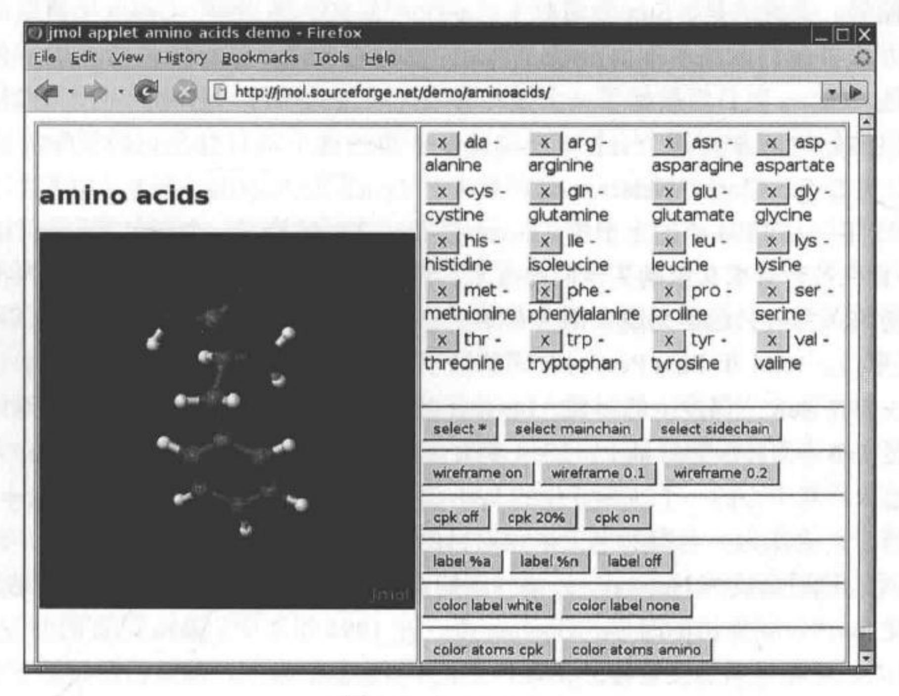

图 1-1 Jmol applet

#### L4 Java 发展简史

本节将介绍 Java 的发展简史。这些内容来自很多已发布的资料(最重要的是 孔丹论"d 的在线杂志 1995 年 7 月刊上对 Java 创始人的专访)。

Java 的历史要追溯到 1991 年口 由 Patrick Naughton 和 James Gosling(一个全能的计算机 奇才,Sun 公司会士)带领的 Sun 公司的一个工程师小组想要设计一种小型的计算机语言, 希望用于有线电视转换盒之类的消费设备. 由于这些消费设备的处理能力和内存都很有限, 所以这个语言必须非常小,而且要能够生成很紧凑的代码。另外,由于不同的厂商会选择不 同的中央处理器(CPU), 因此很重要的一点是这种语言不应与任何特定的体系结构绑定。这 个项目被命名为 <sup>u</sup> Green tTo

代码短小、紧凑且与平台无关,这些要求促使开发团队设计出一个可移植的语言,可以 为虚拟机生成中间代码口

Sun公司的人都有 UNIX 的应用背景。因此,所开发的语言以 C++ 为基础,而不是 Lisp、Smalltalk 或 PascaL 不过+ 正如 Gosling 在专访中谈道:"毕竟,语言只是实现目标的 工具,而不是目标本身J Gosling 把这种语言称为 "Oak"(这么起名大概是因为他非常喜欢 他在 Suu公司的办公室窗外的一棵橡树八 Sun公司的人后来发现,已经有另外一个计算机语 言取名为 Oak, 于是,他们将这个语言改名为 Jav心 事实证明这是一个很有灵感的选择。

<sup>1992</sup> 年,Green 项目发布了它的第一个产品,称之为 " 力".这个产品可以提供非常智 能的远程控制。遗憾的是,Sun 公司对生产这个产品并不感兴趣,Green 项目组的人员必须 找到其他方法将他们的技术推向市场。然而,也没有任何一家标准消费品电子公司对此感 兴趣。于是,Green 项目组投标了一个设计有线电视盒的项目,它能提供视频点播等新型有 线服务,但他们没能拿到这个合同(有趣的是,得到这个项目的公司的领导人恰恰是开创 Netscape 公司的 Jim Clark0 Netscape 公司后来对 Java 的成功做出了很大贡献3

<sup>在</sup> <sup>1993</sup> 年以及 <sup>1994</sup> 年的上半年,Green 项目(这时候换了一个新名字—— "First Person 公司")一直在苦苦寻求买家购买他们的技术。然而,一个也没有找到(Patrick Naughton—— 项目组的创始人之一,也是完成大部分营销工作的人,声称为了销售这项技术,累计飞行了 300 000 英里0)。1994 年 First Person 公司解散了。

当这一切在 Sim 公司发生的时候,Internet 的万维网也在日渐发展壮大。万维网的关键是 浏览器把超文本页面转换到屏幕上。1994 年大多数人都在使用 Mosaic, 这是 1993 年出自伊利 诺伊大学超级计算中心的一个非商业化的 Web 浏览器( Mosaic 的一部分是由 Marc Andreessen 编写的。当时,他作为一名参加半工半读项目的本科生,编写了这个软件,每小时的薪水只 有 6.85 美元。他后来成为 Netscape 公司的创始人之一和技术总监,可谓名利双收)<sup>0</sup>

在接受网m吸Hd 采访的时候,Gosling 说. 在1994 年年中,Java 语言的开发者意识到: "我们能建立一个相当酷的浏览器。在客户/ 服务器主流框架中,浏览器恰好需要我们已经完 成的一些工作:体系结构中立、实时、可靠、安全——这些问题在工作站环境并不太重要, 所以,我们决定开发浏览器J

实际的浏览器是由 Patrick Naughton 和 Jonathan Payne 开发的,并演变为 HotJava 浏览 器。HotJava 浏览器采用 Java 编写,以炫耀 Java 语言超强的能力。这个浏览器能够在网页中 执行内嵌的 Java 代码。这一"技术证明"在 1995 年 5 月 23 日的 SunWoHd'95 大会上展示, 引发了人们对 Java 的狂热追逐并延续至今。

1996 年年初,Sun 公司发布了 Java 的第 <sup>1</sup> 个 版本。人们很快地意识到 Java L0 不能 用来完成真正的应用开发。的确,可以使用 Java 1.0 实现在画布上随机跳动的 "神经质文 本"applet, 但它没有提供打印功能。坦率地说,Java 1.0 的确没有为其黄金时期的到来做好 准备。后来的 Java L1 弥补了大多明显的缺陷,大大改进了反射能力,并为 GUI 编程增加了 新的事件处理模型。不过它仍然有很大的局限性口

1998 年 JavaOrw 会议的头号新闻是即将发布 Java 1.2 版. 这个版本将早期玩具式的 GUI 和图形工具包代之以复杂而且可伸缩的工具包口 在 1998 年 12 月 Java 12发布仅 3 天之后, Sun 公司市场部将它改名为更加吸引人的 "Java <sup>2</sup> 标准版软件开发包 L2 版,

除了"标准版"(Standard Edition)之外,Sim 公司还推出了另外两个版本:一个是用于 手机等嵌入式设备的"微型版"(Miero Edition); 另一个是用于服务器端处理的"企业版" (Enterprise Edition)o 本书主要介绍标准版口

<sup>©</sup> <sup>I</sup> 英里约为 <sup>1609</sup> 米。——编辑注

标准版的 L3 和 1.4 版本对最初的 Java2 版本做出了增量式的改进,提供了不断扩展的 标准类库,提高了性能,当然,还修正了一些 bug。在此期间,原先对 Java applet 和客户端 应用的炒作逐渐消退,但 Java 成了服务器端应用的首选平台口

5.0 版是自 L1 版以来第一个对 Java 语言做出重大改进的版本(这一版本原来定为 】.5 版,但在 2004 年的 JavaOne 会议之后,版本号直接升至 5.0 几 经过多年的研究,这个版本 添加了泛型类型(generic type, 大致相当于 C++ 的模板), 其挑战性在于添加这一特性而不 需要对虚拟机做任何修改中 另外,受到 C# 的启发,还增加了几个很有用的语言特性:"for each" 循环、自动装箱和注解口

6 版《没有后缀 .0)于 2006 年年底发布。同样,这个版本没有对语言方面再进行修改, 而是做了另外一些性能改进,并增强了类库。

随着数据中心越来越依赖于商业硬件而不是专用服务器,Sun 公司终于陷入困境,于 2009 年被 Org伯公司收购。Jnva 的开发停滞了很长一段时间。直到 2011 年 Orack公司发布 <sup>了</sup> Java 的一个新版本——Java 7, 其中只做了一些简单的改进<sup>0</sup>

2014 年,Java 8 终于发布,在近 20 年中这个版本的改变最大。Java <sup>区</sup> 包含了一种"函数 式"编程方式,可以很容易地表述能并发执行的计算口 所有编程语言都必须与时俱进,Java 在这方面显示出了非凡的能力口

Java 9 的主要特性要一直追溯到 2008 年。那时, Java 平台的首席工程师 Mark Reinhold 开始着力解析这个庞大的 Java 平台。为此引人了模块(module), 模块是提供一个特定功能 的自包含代码单元q 设计和实现一个适用于 Java 平台的模块系统前后用了 "年,而它是否 也适用于 Java 应用和类库还有待观察。Java <sup>9</sup> <sup>于</sup> 2017 年发布,它还提供了另外一些吸引人 的特性,我们将在本书中介绍这些特性.

从 2018 年开始,每 6 个月就会发布一个 Java 版本,以支持更快地引人新特性。每过一 段时间,会把某个版本(如 Java 11 和 Java 17)指定为长期支持版本金 中间版本提供了一种 试验新特性的机制。

<sup>表</sup> 1」展示了 Java 语言及类库的演进。可以看到t API 的规模有了惊人的增长口

| 版<br>本 | 份<br>年 | 新语言特性                                                 | 类与接口的数量  |
|--------|--------|-------------------------------------------------------|----------|
| L0     | 1996   | 语言本身                                                  | 21】      |
| 1.1    | 1997   | 内部类                                                   | 477      |
| 1.2    | 1998   | strictfp 修饰符                                          | 1 524    |
| L3     | 2000   | 无                                                     | 1 840    |
| L4     | 2002   | 断;<br>i                                               | 2<br>723 |
| 5.0    | 2004   | 泛型类.<br>循环、可变参数,自动装箱,元数据,枚<br>"for<br>each"<br>举、静态导人 | 3<br>279 |
| 6      | 2006   | 无                                                     | 3<br>793 |
| 7      | 2011   | 基于字符串的<br>Switch 语句、菱形运算符、二进制字面属、异常<br>姓理增强           | 4<br>024 |

表 1-1 J曰va 语言及类库的演进

(续)

| 版<br>本 | 份<br>年 | 新语言特性                                                               | 类与接口的数量  |
|--------|--------|---------------------------------------------------------------------|----------|
| g      | 2014   | Lambda 表达式、包含默认方法的接口,流和日期/时间库                                       | 4 240    |
| 9      | 2017   | 模块、其他的语言和类库增强                                                       | 6<br>005 |
| 11     | 2018   | Java FX、JNLP,<br>局部变量类型推导(<br>HTTP 客户端、移除<br>Java EE 重叠模块和<br>CORRA | 4410     |
| 17     | 2021   | 表达式、文本块、instanceof<br>模式匹配,记录、密封类<br>switch                         | 4<br>859 |

#### 1.5 关于Java 的常见误解

在结束本章之前,我们将列出关于 Java 的一些常见误解,同时给出解释口

L Java 是 HTML 的扩展0

Java 是一种程序设计语言,HTML 是一种描述网页结构的方式。除了用于在网页上放置 Java applet 的 HTML 扩展之外,两者没有任何共同之处。

2.我使用 XML, 所以不需要 Java o

Java 是一种程序设计语言, XML 是一种描述数据的方式。可以使用任何一种程序设计 语言处理 XML 数据,而 Java API 对 XML 处理提供了很好的支持二 此外,许多重要的 XML 工具都是用 Java 实现的。有关的更多信息请参见卷

3Java 是一种非常容易学习的程序设计语言。

像 Jawa 这种功能强大的语言大多都不太容易学习。首先,必须将编写玩具式程序的轻松 与开发实际项目的艰难区分开来. 另外,需要注意的是:本书只用了 7 章讨论 Java 语言,其 余几章和卷 II 都在介绍如何使用Java 类库来具体应用 Java 语言。Java 类库包含数千个类和 接口,还有数万个函数。好在,你不需要知道其中的每一个类或函数,不过,要想用 Java 解 决实际问题,还是需要了解不少内容的。

4. Java 将成为适用 于所有平台的通用编程语言口

从理论上讲,这是完全有可能的。但在实际中,某些领域其他语言有更出色的表现,比 如,Objectiveg 和后来的 Swift 在 iOS 设备上就有着无可取代的地位占 浏览器中的处理几乎 完全由 Jav社Script 掌控。Windows 程序通常都用 C++ 或 C# 编写。Java 在服务器端编程和跨 平台客户端应用领域则很有优势。

5. Java 只不过是另外一种程序设计语言口

Java 是一种很好的程序设计语言,很多程序设计人员喜欢 Java 胜过 C++ 和 C#<sup>口</sup> 有 几百种很好的程序设计语言没有广泛流行,而有明显缺陷的语言(如 C++ 和 Visual Basic)却 大行其道。

这是为什么呢?程序设计语言的成功更多地取决于其支持系统(support system)的能力, 而不是语法的精巧性口 人们主要关注的是:是否提供了有用、便捷和标准的库来实现所需要 的特性?是否有工具开发商建立了强大的编程和调试环境?语言和工具集是否与计算基础架

构的其他部分有效整合? Java 的成功缘于其类库能够让人们轻松地完成原本有一定难度的工 作,例如网络连接、Web 应用和并发电 Java 减少了指针错误,这是一个额外的好处,因此使 用 Java 编程的效率更高口 但这些并不是 Java 成功的全部原因凸

6. Java 是专 用的,应该避免使用小

最初创建 Java 时,Sun 公司为发布者和最终用户提供了免费许可口 尽管 Sun 公司对 Java 拥有最终的控制权,不过在语言版本的不断发展和新库的设计过程中还涉及很多其他公司。 虚拟机和类库的源代码可以免费获得,不过仅限于查看,而不能修改和再发布。Java 是 "闭 源的,不过可以很好地使用工

这种状况在 2007 年发生了巨大变化,Sun 公司宣布 Java 未来的版本将在 General Public License( GPL)下发布( Linux 也使用同样的开放源代码许可)" Oracle 公司一直致力于保持 Jam 开源口 目前有多个开源 Java 实现提供商,分别提供不同级别的承诺和支持。

是解释性的,因此对于关键应用速度太慢了。

早期的 Java 确实是解释性的. 现在 Java 虚拟机使用了即时编译器,因此用 Java 编写的 "热点"代码运行速度与 C++ 相差无几,有些情况下甚至更快口

8. 所有的 Java 程序都在网 页中运行0

有一段时间,Java applet 在 Web 浏览器中运行。如今,Java 程序是运行在 Web 浏览器之 外的独立应用。实际上,大多数 Java 程序都在服务器上运行,为网页生成代码或者计算业务 逻辑。

9. Java 程序存在重大安全风险。

对于早期的 Java, 有过关于 Java 安全系统失效的报道,曾经引起过公众关注。研究人员 努力找出 Java 的漏洞,并质疑 applet 安全模型的强度和复杂度,将这视为一种挑战。人们很 快就解决了所发现的技术问题。后来又发现了更严重的漏洞,而 Sun 公司以及后来的 Oracle 公司反应却很迟缓。浏览器制造商禁用了 Java applet 支持。促成叩plet 的安全管理器体系结 构现在已经过时。如今,Java 应用与其他应用同样安全。由于虚拟机提供的保护,Java 应用 比用C 或 C++ 编写的应用要安全得多.

<sup>1</sup> 0+ JavaScript 是 Java 的简易版。

JavaScript 是一种可以在网页中使用的脚本语言,它由 Netsc叩e 发明,最初的名字是 LiveScripj JavaScript 的语法让人想到 Java, 因为名字也有些相像,但除此之外,两者并 无任何关系。尤其是,Java 是强类 型的, 编译器能捕获类型滥用导致的很多错误。而在 JavaScript 中,只有当程序运行时才能发现这些错误,所以消除错误要费劲得多。

1L 使用 Java 时,可以用廉价的 "Internet 设备" 取代桌面计算机口

Java 刚刚发布的时候,一些人打赌这肯定会发生。一些公司已经生产出支持 Java 的网 络计算机原型. 不过用户还不打算放弃功能强大且方便的桌面计算机,而去使用没有本地存 储而且功能有限的网络计算机。当然,如今世界已经发生改变,对于大多数最终用户,常用 的平台往往是手机或平板电脑。这些设备大多使用 Amimid(安卓)平台口 学习 Java 编程对 Android 编程也很有帮助。

# 第 2 章 Java 编程环境

- 安装 Java 开发工具包 使用集成开发环境
- 使用命令行工具 A JShell

这一章主要介绍如何安装 Java 开发工具包(JDK), 以及如何编译和运行 Java 程序,可 以在终端窗口中键人命令来运行 JDK 工具心 不过,很多程序员更喜欢使用集成开发环境,你 会了解如何使用一个免费的开发环境编译和运行 Java 程序。一旦掌握了本章的技术, 并选定 开发工具,就可以继续学习第 3 章,开始研究 Java 程序设计语言。

#### 2.1 安装 Java 开发工具包

原先,Oracle公司会提供最新、最完备的 Java 开发工具包( JDK)版本。如今,很多不同 公司(包括 Microsoft.Amazon 、 Red Hat <sup>和</sup> Azul)都提供了最新的 OpenJDK 构建版本,有些 公司的许可条件比 Oracle 公司更宽松口 我写这一章时. 最喜欢访问的网站是 https:"adoptium, net, 这个网站由开发商、开发人员和用户组共同组成的一个社区运营,为 Linux、Mac OS 和 Windows 提供了免费的构建版本。

#### 2,1.1 下裁 JDK

可以从 http5:"而ptium.net 下载 Java 开发工具包,或者也可以从 Oracle 公司网站 www. oracle .com/technetwork/java/]avase/downloads 或其他提供商下载口 要使用 Java SE <sup>17</sup>(LTS)JDL 表 2-1 总结了在下载网站上可能遇到的缩略语和术语。

术语名 缩 写 解 释 Java Development Kit(Java 开发工具包) JDK 编写 Java 程序的程序员使用的软件 Java Runtime Environment(Java 运行时 JRE 用来运行 Jna 程序的软件,不带开发工具. 这不是你想 环境) 要的 Standard Edition(标准版) £E 用于桌面或简单服务器应用的 Java 平台 这亮你想要的 Micro Edition(微型版) ME 用于小型设备的 Java 平台 OpenJDK <sup>h</sup> — Java SE 的一个免费开源实现 Hotspot -— Oracle 开发的 "即时"编译器,如果要你选择,请选择这 个选项 OpcnJ9 — IBM 开发的另一个"即时"编译器 Long Term Support( 长期支持版本) LTS 很多车都支持的一个版本,这不同于每 6 个月发布的那些 展示新特性的版本:要选择最新的 LTE 版本

表 2-1 Java 术语

#### 2.1.2 设置 JDK

下载 JDK 之后,需要安装这个开发工具包并确定要安装在哪里,后面还会需要这个信息。

- 在 Windows 上,启动安装程序,会询问你要把 JDK 安装到哪里口 最好不要接受默 认位置(这个路径名中有空格), iin c:\Program Files\Java\jdk-17.9.xo 取出路径名中的 Program Files 部分就可以了1
- 在 Mac 上\* 运行安装 程序口 这会把软件安装到 /Lib「ary/J日va/%YWi「tudlMaKhines/jdk" 17,机x.jdk/Conterrts/Hoin^ 可以用 Finder 找到这个目录口
- 在 Linux 上,只需要把 出「以 文件解压缩到你选择的某个位置,如你的主目录或者 /opt 如果从 RPM 文件安装,则要仔细确认安装到 /usr/java/jdk47.0.x 中,,

在本书中,安装目录用j或表示。例如,涉及 <sup>的</sup> bin 目录时, 是指/叩t/jdk-De4/bin c:\Java\jdk-17,9,4\bin 目录。

可以如下测试安装是否成功. 打开一个终端窗口,键入

**javac --version**

然后按回车键口 应该能看到显示以下信息:

**javac 17.9\*4**

如果得到诸如 "javac: command not found (javac:命令未找到}或"The name specified iw not recognized as an internal or external command, operable program or batch file"(指定名不 是一个内部或外部命令、可执行程序或批文件)的信息,则需要仔细检查安装口

<sup>在</sup> Windows <sup>或</sup> Linux 上安装 JDK 时,还需要完成另外一个步骤:将J业的 bin 目录添加 到可执行路径中——可执行路径是操作系统查找可执行文件时所遍历的目录列表。

• 在 Linux 中,需要在 Vtbash rc 或 -/,bash\_profile 文件的最后增加这样一行:

**export PATH**可湫州**ih\$PATH**

- 一定要使用正确的 JDK 路径,如 /Qpt/jdk l7.0.4-
- 在 Windows 10 中,在 Windows Settings( Windows 设置)的搜索栏中键入 environment (环境). 选择 Edit environment variables for your account(编辑账户的环境变量, 参 见图 2-1)。会出现一^ Environment Variables(环境变量)对话框白(它可能隐藏在 Wmdows 设置对话框后面。如果实在找不到,可以同时按住 Windows 和 R 键打开 Run(运行)对话框,从这个对话框运行 打就m.卬I. 然后选择 Advanced(高级)标签 贞,再单击 Environment Variables(环境变量)按钮1)it User Variables(用户变量) 列表中找到并选择一个名为 Path 的变量. 单击 Edit(编辑)按钮,再单击 New(新 建)按钮,增加一个变量,值为 jdk 的 bm目录《参见图 2-2)。

保存所做的设置. 之后新打开的所有命令提示窗口都会有正确的路径口

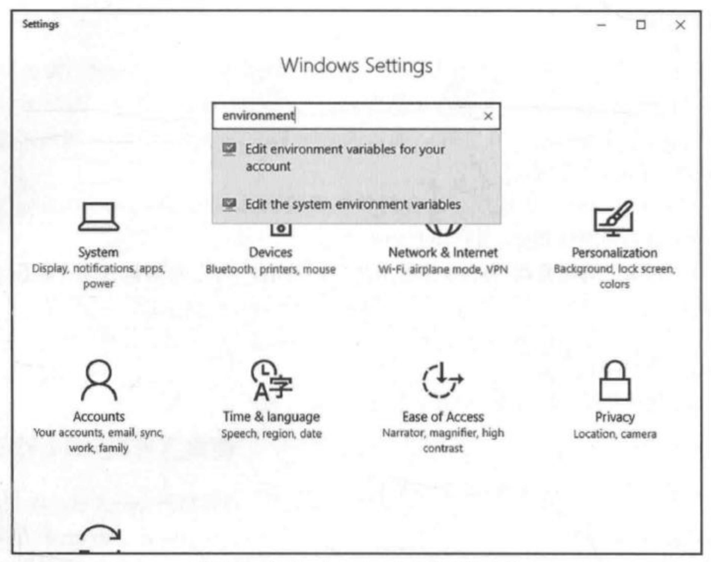

图 2-1 在 Windows 10 中设置系统属性

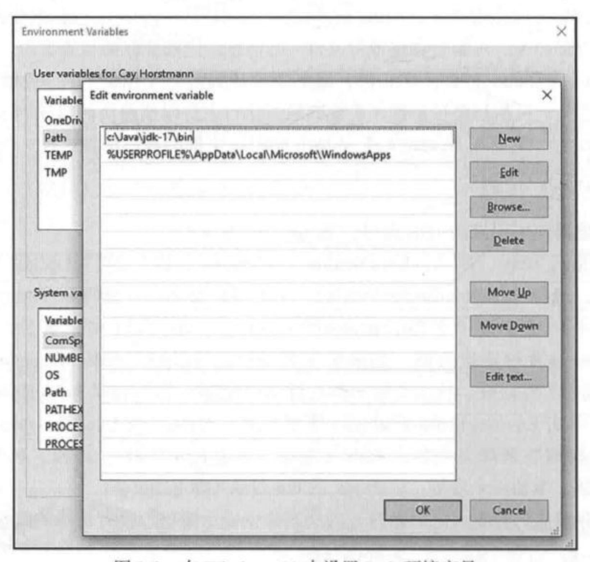

图 2-2 在 Windows 10 中设置 Path 环境变量

#### 2.1.3 安装源文件和文档

类库源文件在 JDK 中以压缩文件 lib/src.zip 的形式发布,解压缩这个文件来得到源代码。为此只需完成以下步骤:

- 1. 确保 JDK 已经安装, 而且 jdk/bin 目录在可执行路径中。
- 2. 在主目录中创建一个目录 javasrc。如果愿意,可以从一个终端窗口创建这个目录。 mkdir javasrc
- 3. 在 jdk/lib 目录下找到文件 src.zip。
- 4. 将 src.zip 文件解压缩到 javasrc 目录。在一个终端窗口中,可以执行以下命令:

cd javasrc
jar xvf jdk/lib/src.zip
cd ..

び 提示: Src. zip 文件中包含了所有公共类库的源代码。要想获得更多的源代码(例如编译器、虚拟机、原生方法以及私有辅助类的源代码),请访问网站 http://openjdk.java.net。

文档包含在独立于 JDK 的一个压缩文件中。可以直接从网站 www.oracle.com/technetwork/java/javase/downloads 下载文档。步骤如下:

- 1. 下载文档压缩文件。这个文件名为 jdk-17.0.x doc-all.zip。
- 2. 解压缩这个文件,将 doc 目录重命名为一个更有描述性的名字,如 javadoc。如果愿意,可以从命令行完成这个工作:

jar xvf Downloads/jdk-17.0.x\_doc-all.zip mv docs jdk-17-docs

3. 在浏览器中导航到 jdk-17-docs/index.html,将这个页面增加到书签。

还要安装本书的程序示例。可以从 http://horstmann.com/corejava 下载示例。这些程序打包 在一个 zip 文件 corejava.zip 中。可以将程序解压缩到主目录。它们会放在目录 corejava 中。如果愿意,可以从命令行完成这个工作:

jar xvf Downloads/corejava.zip

#### 2.2 使用命令行工具

如果以前有过使用 Microsoft Visual Studio 等开发环境编程的经验,你可能会习惯于开发系统有一个内置的文本编辑器、用于编译和启动程序的菜单以及一个调试工具。JDK 完全没有这些功能。所有工作都要在终端窗口中通过键人命令来完成。这看起来很麻烦,不过确实是一个基本技能。第一次安装 Java 时,希望在安装开发环境之前先检查 Java 的安装是否正确。另外,通过执行这些基本步骤,可以更好地理解开发环境在后台的工作。

不过,掌握了编译和运行 Java 程序的基本步骤之后,你可能就会希望使用专业的开发环境。下一节会介绍如何使用开发环境。

首先介绍比较难的方法:从命令行编译并运行 Java 程序。

- 1. 打开一个终端窗口。
- 2. 进入 corejava/v1ch02/Welcome 目录(corejava 是安装本书示例源代码的目录,请参见 2.1.3 节的解释)。
  - 3. 键入下面的命令:

```
javac Welcome.java
java Welcome
```

然后,将会在终端窗口中看到图 2-3 所示的输出。

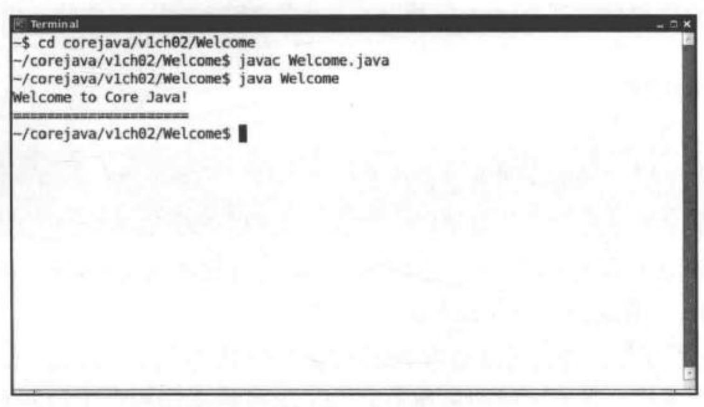

图 2-3 编译并运行 Welcome. java

祝贺你! 你已经编译并运行了第一个 Java 程序。

那么,刚才都发生了什么? javac 程序是一个 Java 编译器,它将文件 Welcome.java 编译成 Welcome.class。java 程序启动 Java 虚拟机,虚拟机执行编译器编译到类文件中的字节码。

Welcome 程序非常简单,它只是向终端输出了一条消息。你可能想查看这个程序中的代码,如程序清单 2-1 所示。下一章中将解释它是如何工作的。

#### 程序清单 2-1 Welcome/Welcome.java

```
1 /**
    * This program displays a greeting for the reader.
    * @version 1.30 2014-02-27
    * @author Cay Horstmann
   public class Welcome
      public static void main(String[] args)
8
         String greeting = "Welcome to Core Java!";
10
         System.out.println(greeting);
11
         for (int i = 0; i < greeting.length(); i++)
12
            System.out.print("=");
13
         System.out.println();
14
15
16 }
```

在使用集成开发环境的年代,许多程序员对于在终端窗口中运行程序已经很生疏了。常常会出现很多错误,最后得到令人沮丧的结果。

#### 一定要注意以下几点:

- 如果手动输入源程序,一定要确保正确地输入大小写。例如,类名为 Welcome,而不是 welcome 或 WELCOME。
- 编译器需要一个文件名(Welcome.java), 而运行程序时, 只需要指定类名(Welcome), 不要带扩展名.java或.class。
- 如果看到诸如"Bad command or file name"或"javac:command not found"之类的消息,就要返回去仔细检查安装是否有问题,特别是可执行路径的设置。
- 如果 javac 报告了一个错误,指出无法找到 Welcome.java,就应该检查目录中是否存在 这个文件。

在 Linux 环境下,检查 Welcome. java 是否正确地以大写字母开头。

在 Windows 环境下,使用命令 dir,而不要使用图形化资源管理器工具。有些文本编辑器 (特别是 Notepad) 会在每个文件名后面添加扩展名 .txt。如果使用 Notepad 编辑 Welcome.java,实际上会把它保存为 Welcome.java.txt。如果采用默认的 Windows 设置,资源管理器会与 Notepad "勾结",隐藏 .txt 扩展名,因为这属于"已知的文件类型"。对于这种情况,需要使用命令 ren 重新命名这个文件,或是另存一次,在文件名两边加双引号,如:"Welcome.java"。

运行程序之后,如果收到关于 java.lang.NoClassDefFoundError 的错误消息,就应该仔细检查出问题的类名。

如果收到关于 welcome (w 为小写)的错误消息,就应该重新执行命令: java Welcome (W 为大写)。记住, Java 区分大小写。

如果收到有关 Welcome/java 的错误信息,这说明你错误地键入了 java Welcome.java,应该重新执行命令 java Welcome。

- 如果键入 java Welcome, 而虚拟机没有找到 Welcome 类, 就应该检查是否有人设置了系统的 CLASSPATH 环境变量(不提倡全局设置这个变量, 不过 Windows 中有些比较差的软件安装程序确实会这样做)。可以像设置 Path 环境变量一样设置 CLASSPATH, 不过这里将删除这个设置。
- 提示: 在 http://docs.oracle.com/javase/tutorial/getStarted/cupojava/上有一个很好的教程,其中更详细地介绍了初学者容易犯的一些错误。
- 注释:如果只有一个源文件,可以不执行 javac 命令。这个特性是为了支持 shell 脚本 (以"shebang"行#!/path/to/java 开头的脚本),可能也用于简单的学生程序。一旦程序变得更复杂,就需要使用 javac 命令了。

这个 Welcome 程序没有太大意思。接下来再来尝试一个图形化应用。这个程序是一个简单的图像文件查看器,可以加载和显示一个图像。与前面一样,从命令行编译和运行这个程序。

- 1. 打开一个终端窗口。
- 2. 切换到目录 corejava/v1ch02/ImageViewer。
- 3. 输入以下命令:

```
javac ImageViewer.java
java ImageViewer
```

会弹出一个新的程序窗口(ImageViewer 应用)。现在选择 File  $\rightarrow$  Open,找到一个要打开的图像文件。(这个目录下有两个示例文件。)然后会显示这个文件(参见图 2-4)。要关闭这个程序,可以单击标题栏上的关闭钮,或者从菜单选择 File  $\rightarrow$  Exit。

可以简单浏览这个源代码(程序清单 2-2)。这个程序比第一个程序长多了,但只要想一想用 C 或 C++ 编写类似功能的应用程序所需要的代码量,就不会觉得它复杂了。当然,如今编写带图形用户界面的桌面应用并不常见,不过,如果你感兴趣,可在第 10 章学习更多详细内容。

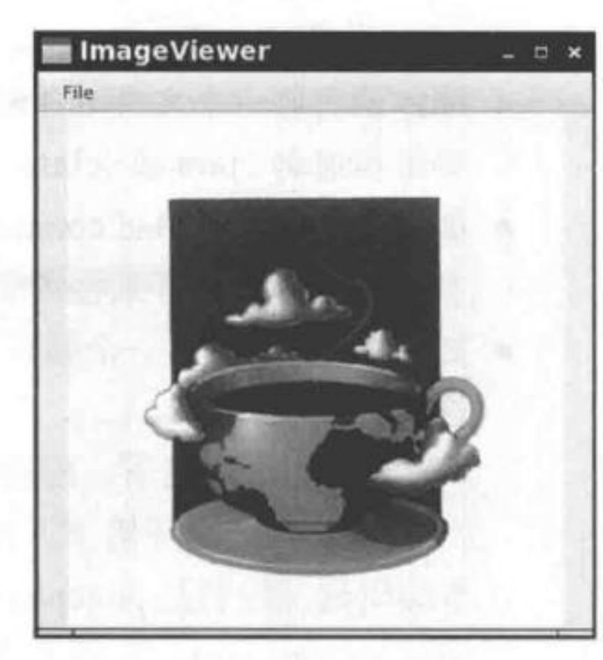

图 2-4 运行 ImageViewer 应用

#### 程序清单 2-2 ImageViewer/ImageViewer.java

```
import java.awt.*;
2 import java.io.*;
3 import javax.swing.*;
    * A program for viewing images.
    * @version 1.31 2018-04-10
    * @author Cay Horstmann
   public class ImageViewer
11
      public static void main(String[] args)
12
13
         EventQueue.invokeLater(() ->
14
15
               var frame = new ImageViewerFrame();
16
               frame.setTitle("ImageViewer");
17
               frame.setDefaultCloseOperation(JFrame.EXIT ON CLOSE);
18
               frame.setVisible(true);
19
28
21
22
23
24
    * A frame with a label to show an image.
26
   class ImageViewerFrame extends JFrame
```

```
28 {
      private static final int DEFAULT WIDTH = 300;
29
      private static final int DEFAULT HEIGHT = 400;
30
31
      public ImageViewerFrame()
32
33
         setSize(DEFAULT_WIDTH, DEFAULT_HEIGHT);
34
35
         // use a label to display the images
36
         var label = new JLabel();
37
         add(label);
38
39
         // set up the file chooser
         var chooser = new JFileChooser();
41
         chooser.setCurrentDirectory(new File("."));
42
43
         // set up the menu bar
         var menuBar = new JMenuBar();
         setJMenuBar(menuBar);
46
47
         var menu = new JMenu("File");
48
         menuBar.add(menu);
49
50
         var openItem = new JMenuItem("Open");
51
         menu.add(openItem);
52
         openItem.addActionListener(event ->
53
54
               // show file chooser dialog
55
               int result = chooser.showOpenDialog(null);
56
57
               // if file selected, set it as icon of the label
58
               if (result == JFileChooser.APPROVE OPTION)
59
68
                   String name = chooser.getSelectedFile().getPath();
61
                   label.setIcon(new ImageIcon(name));
62
63
            });
65
         var exitItem = new JMenuItem("Exit");
66
         menu.add(exitItem);
67
         exitItem.addActionListener(event -> System.exit(0));
69
78 }
```

#### 2.3 使用集成开发环境

上一节中,你已经了解了如何从命令行编译和运行一个 Java 程序。这是一个很有用的排错技能,不过对于大多数日常工作来说,还是应当使用集成开发环境。这些环境非常强大,也很方便,不使用这些集成开发环境简直有些不合情理。我们可以免费得到一些很棒的开发环境,如 Eclipse、IntelliJ IDEA 和 NetBeans。这一章中,我们将学习如何从 Eclipse 起步。

当然,如果你喜欢其他开发环境,学习本书时也完全可以使用你喜欢的环境。

首先从网站 http://eclipse.org/downloads 下载 Eclipse。Eclipse 提供了面向 Linux、Mac OS X

和 Windows 的版本。运行安装程序,并选择 "Eclipse IDE for Java Developers"。

下面是用 Eclipse 编写程序的一般步骤:

- 1. 启动 Eclipse 之后, 从菜单选择 File → New → Project。
- 2. 从向导对话框中选择 "Java Project" (如图 2-5 所示)。
- 3. 单击 Next 按钮,不选中"Use default location"复选框。单击 Browse 导航到 corejava/v1ch02/Welcome 目录(见图 2-6)。

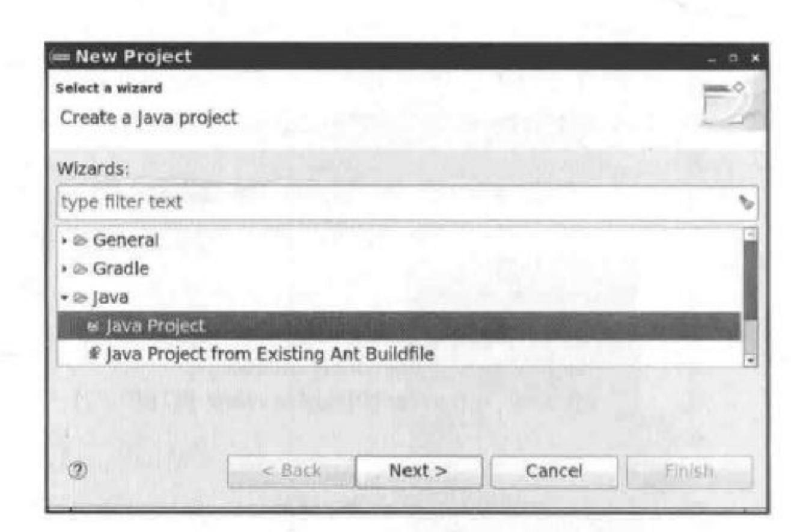

图 2-5 Eclipse 中的 New Project (新建项目) 对话框

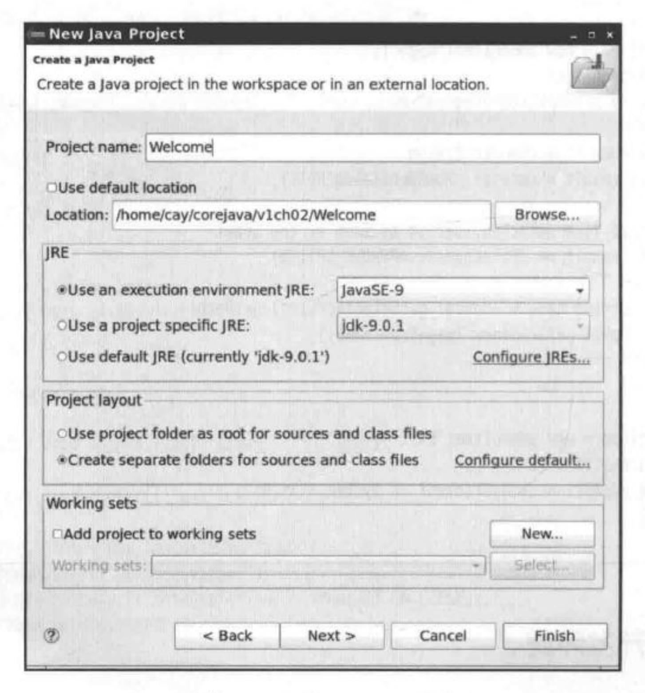

图 2-6 配置 Eclipse 项目

- 4. 单击 Finish 按钮。这样就创建了这个项目。
- 5. 单击项目左边窗格中的三角,直到找到 Welcome. java 并双击这个文件。现在应该会看到

一个包含程序代码的窗格(如图 2-7 所示)。

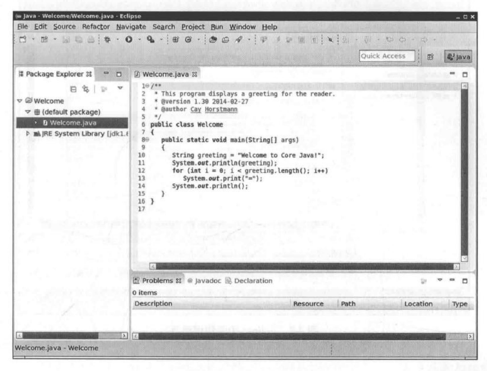

图 2-7 使用 Eclipse 编辑源文件

6. 用鼠标右键单击左侧窗格中的项目名 (Welcome),选择 Run → Run As → Java Application。程序输出会显示在控制台窗格中。

之前我们假定这个程序没有输入错误或 bug (毕竟,这里只有几行代码)。不过为了说明问题,假设代码中意外包含一个录入错误(或者甚至一个语法错误)。试着修改原来的程序,例如,故意将 String 的大小写弄错:

string greeting = "Welcome to Core Java!";

注意图 2-8 中 string下面的波浪线。单击源代码下面的 Problems 标签页,展开小三角,直到看到一个错误消息指出有一个未知的 string 类型(见图 2-8)。单击这个错误消息。光标会移到编辑窗格中相应的代码行,可以在这里纠正错误。利用这个特性可以快速地修正错误。

び提示:通常, Eclipse 错误报告会伴随一个灯泡图标。单击灯泡图标可以得到修正这个错误的一组建议方案。

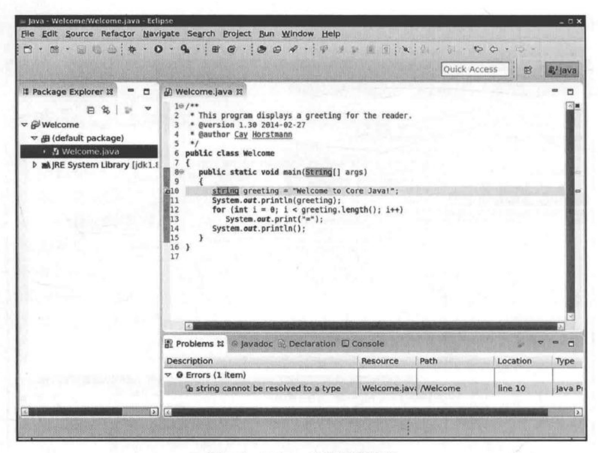

图 2-8 Eclipse 中的错误消息

#### 2.4 JShell

上一节中,你已经看到了如何编译和运行一个 Java 程序。Java 9引入了另一种使用 Java 的方法。JShell 程序提供了一个"读取 - 评估 - 打印循环"(Read-Evaluate-Print Loop, REPL)。键入一个 Java 表达式,JShell 会评估输入,打印结果,并等待下一个输入。

要启动 JShell,只需要在终端窗口中键入 jshell (参见图 2-9)。

JShell 首先显示一个问候语,后面是一个提示符:

| Welcome to JShell -- Version 17.0.4 | For an introduction type: /help intro

jshell>

现在键入一个表达式,如下:

"Core Java".length()

JShell 会回应一个结果——在这里就是字符串 "Core Java"中的字符个数。

\$1 ==> 9

注意,你并没有键入 System.out.println。JShell 会自动打印你输入的每一个表达式的值。

```
☐ Terminal ~$

-$ jshell
  Welcome to JShell -- Version 17
  For an introduction type: /help intro
jshell> "Core Java".length()
$1 ==> 9
jshell> 5 * $1 - 3
$2 ==> 42
jshell > int answer = 6 * 7
answer ==> 42
jshell> Math.
                   IEEEremainder(
                                      PI
                                                         abs(
absExact(
                   acos(
                                      addExact(
                                                         asin(
                   atan2(
                                      cbrt(
                                                         ceil(
atan(
                                                         cosh(
class
                   copySign(
                                      cos(
decrementExact(
                   exp(
                                      expm1(
                                                         floor(
                  floorMod(
floorDiv(
                                      fma(
                                                         getExponent(
                   incrementExact(
                                                         log10(
hypot(
                                      log(
                                                         multiplyExact(
logip(
                   max(
                                      min(
                                     negateExact(
multiplyFull(
                   multiplyHigh(
                                                         nextAfter(
nextDown(
                   nextUp(
                                      pow(
                                                         random()
                                                         signum(
rint(
                                      scalb(
                   round(
                                                         subtractExact(
sin(
                   sinh(
                                      sgrt(
                                      toDegrees(
                                                         toIntExact(
tan(
                   tanh(
toRadians(
                   ulp(
jshell> Math.
```

图 2-9 运行 JShell

输出中的 \$1 表示这个结果可以用于进一步的计算。例如,如果你键入:

5 \* \$1 - 3

就会得到:

\$2 ==> 42

如果需要多次使用一个变量,可以给它指定一个容易记忆的名字。一定要遵循 Java 语法 (我们将在第 3 章介绍语法),指定类型,然后指定变量名。例如,

```
jshell> int answer = 6 * 7 answer ==> 42
```

另一个有用的特性是"tab 补全"。如果键入:

Math.

然后再按一次 Tab 键。你会得到用 Math 类调用的所有方法的一个列表:

| EEEremainder(  | PI                                                                                         | abs (                                                                                                                                                    |
|----------------|--------------------------------------------------------------------------------------------|----------------------------------------------------------------------------------------------------------------------------------------------------------|
| cos (          | addExact(                                                                                  | asin(                                                                                                                                                    |
| tan2(          | cbrt(                                                                                      | ceil(                                                                                                                                                    |
| opySign(       | cos(                                                                                       | cosh(                                                                                                                                                    |
| xp(            | expm1(                                                                                     | floor(                                                                                                                                                   |
| loorMod(       | fma(                                                                                       | getExponent(                                                                                                                                             |
| ncrementExact( | log(                                                                                       | log10(                                                                                                                                                   |
| ax(            | min(                                                                                       | multiplyExact(                                                                                                                                           |
| ultiplyHigh(   | negateExact(                                                                               | nextAfter(                                                                                                                                               |
| extUp(         | pow(                                                                                       | random()                                                                                                                                                 |
| ound (         | scalb(                                                                                     | signum(                                                                                                                                                  |
| inh(           | sqrt(                                                                                      | subtractExact(                                                                                                                                           |
| anh (          | toDegrees(                                                                                 | toIntExact(                                                                                                                                              |
| lp(            |                                                                                            |                                                                                                                                                          |
|                | cos( tan2( opySign( xp( loorMod( ncrementExact( ax(\nultiplyHigh(\nextUp( ound(\ninh( anh( | cos( addExact( cbrt( opySign( cos( expm1( loorMod( fma( ncrementExact( log( ax( min( ultiplyHigh( negateExact( extUp( ound( scalb( sqrt( anh( toDegrees( |

现在键入 l, 然后再按一次 Tab 键。方法名会补全为 log, 现在你会得到一个比较小的列表:

jshell> Math.log
log( log10( log1p(

24

接下来你可以手动填入其余的代码:

jshell> Math.log10(0.001) \$3 ==> -3.0

要重复运行一个命令,可以连续按↑键,直到看到想要重新运行或编辑的命令行。可以用←和→键移动命令行中的光标位置,然后增加或删除字符。编辑完命令后再按回车键。例如,把命令行中的 0.001 替换为 1000,然后按回车键:

jshell> Math.log10(1000) \$4 ==> 3.0

JShell 会让 Java 语言和类库的学习变得轻松而有趣,它不要求你启动一个庞大的开发环境,不会让你再为 public static void main 而困扰。

在本章中,我们学习了编译和运行 Java 程序的机制。现在可以进入第 3 章开始学习 Java 语言了。

# 第 3章 Java 的基本程序设计结构

- 一个简单的 Java 程序 字符串

- 变量与常量 大数

- 输人与输出
- 数据类型 控制流程
- 运算符 数组

现在,你应该已经成功地安装了 JDK, 并且能够执行第 2 章中的示例程序。下面升始介 绍程序设计。本章主要介绍如何在 Java 中实现基本程序设计概念(如数据类型、分支以及循 环)。

#### 3.1 一个简单的 Java 程序

下面仔细分析一个最简单的 程序. 它只是向控制台打印一个消息:

```
public class FirstSample
{
   public static void main(String[] args)
  {
      Systeii.out.prlntln("We will not use 'Hello, World!'*);
   }
```

这个程序虽然很简单,但这些内容在所有 Java 应用中都会出现,因此还是值得花一些时 间来研究的。首先,Java 区分大小写。如果出现了大小写拼写错误(例如,将 main 拼写成 Main), 程序将无法运行。

下面逐行地查看这段源代码口 关键字 public 称为访问修饰符( acce殴 modifier), 这些修 饰符用于控制程序的其他部分对这段代码的访问级别。在第 5 章中将会更详细地介绍访问修 饰符的有关内容。关键字 cl3ss 表明 Java 程序中的全部内容都包含在类中。下一章你会更多 地了解 Java 类,不过现在只需要将类看作是程序逻辑的一个容器,定义了应用程序的行为。 正如第 <sup>1</sup> 章所述,类是所有 Java 应用的构建模块。Java 程序中的所有内容都必须放在类中。

关键字 class 后面紧跟类名。Java 中定义类名的规则很宽松。类名必须以字母开头,后 面可以跟字母和数字的任意组合. 长度基本上没有限制。但是不能使用Java 保留字(例如, public 或 class)作为类名(保留字列表请参见附录)。

标准命名约定为:类名是以大写字母开头的名词(类名 FiES如pie 就使用了这个命名 约定)。如果名字由多个单词组成,每个单词的第一个字母都应该大写。这种在一个单词 中间使用大写字母的方式有时称为骆驼命名法(camel case)。以其自身为例,应该写为 CamelCase。

源代码的文件名必须与公共类的类名相同,并用.java作为扩展名。因此,存储这个代码时,文件名必须为FirstSample.java(再次提醒大家注意,大小写非常重要,千万不能写成firstsample.java)。

如果已经正确地命名文件,并且源代码中没有任何录入错误,在编译这个源代码之后,会得到一个包含这个类字节码的文件。Java 编译器将这个字节码文件自动地命名为 FirstSample. class,并存储在源文件所在的同一个目录下。最后,使用下面这个命令运行这个程序:

java FirstSample

(请记住,不要加,class扩展名。)程序执行之后,控制台上将会显示"We will not use 'Hello,World'!"。

当使用以下命令

java ClassName

运行一个已编译的程序时, Java 虚拟机总是从指定类中 main 方法的代码开始执行(这里的"方法"就是 Java 中对"函数"的叫法), 因此为了能够执行代码, 类的源代码中必须包含一个 main 方法。当然, 也可以将你自己的方法添加到类中, 并从 main 方法调用这些方法(第4章将介绍如何编写你自己的方法)。

**注释:** 根据 Java 语言规范, main 方法必须声明为 public (Java 语言规范是描述 Java 语言的官方文档。可以从网站 http://docs.oracle.com/javase/specs 阅读或下载)。

不过,即使 main 方法没有声明为 public,有些版本的 Java 解释器也会执行 Java 程序。有个程序员报告了这个 bug。如果感兴趣,可以访问 https://bugs.openjdk.java.net/browse/JDK-4252539 查看这个 bug。1999 年,这个 bug 被标记为"关闭,不予修复"(Closed, Will not be fixed)。Sun 公司的一个工程师解释说: Java 虚拟机规范并没有强制要求 main 方法一定是 public,并且"修复这个 bug 有可能带来其他的隐患"。好在,这个问题最终得到了解决。在 Java 1.4 及以后的版本中,Java 解释器强制要求 main 方法必须是 public。

当然,让质量保证工程师对 bug 报告做出决定不仅让人生疑,也让他们自己很头疼,因为他们的工作量很大,而且他们对 Java 的所有细节也未必了解得很清楚。不过,Sun 公司在 Java 开源很久以前就把 bug 报告及其解决方案放在网站上让所有人监督检查,这是一个非常了不起的举措。

注意源代码中的大括号 { }。在 Java 中,像在 C/C++ 中一样,用大括号划分程序的各个部分(通常称为块)。Java 中任何方法的代码都必须以"{"开始,用"}"结束。

大括号的使用风格曾经引发过许多无意义的争论。我们的习惯是把匹配的大括号对齐。 不过,由于 Java 编译器会忽略空白符,所以你可以选用自己喜欢的任何大括号风格。 我们暂且不考虑关键字 static void, 只把它们当作编译 Java 程序必要的部分就行了。在学习完第 4 章后,这些部分的作用就会揭晓。现在需要记住的重点是:每个 Java 应用都必须有一个 main 方法,其声明格式如下所示:

```
public class ClassName
{
   public static void main(String[] args)
   {
      program statements
   }
}
```

6 C++ 注释: 作为一名 C++ 程序员, 你一定知道类是什么。Java 的类与 C++ 的类很相似, 但有些差异还是会使人感到困惑。例如, Java 中的所有函数都是某个类的方法 (标准术语将其称为方法, 而不是成员函数)。因此, Java 中的 main 方法必须有一个外壳 (shell) 类。你可能对 C++ 中的静态成员函数 (static member function) 也很熟悉。它们是类中定义的成员函数, 而且不对对象进行操作。Java 中的 main 方法总是静态的。最后, 与 C/C++ 一样, 关键字 void 表示这个方法不返回值, 但与 C/C++ 不同的是, main 方法不会为操作系统返回一个"退出码"。如果 main 方法正常退出, 那么 Java 程序的退出码为 0,表示成功地运行了程序。如果要以其他退出码终止程序,则需要使用 System.exit 方法。

#### 来看以下代码片段:

```
{
    System.out.println("We will not use 'Hello, World!'");
}
```

一对大括号表示方法体的开始与结束,这个方法中只包含一条语句。与大多数程序设计语言一样,可以将 Java 语句看成是这个语言中的句子。在 Java 中,每个语句必须用分号结束。特别需要说明,回车不是语句的结束标志,因此,如果需要,一条语句可以跨多行。

这个 main 方法体中只包含一条语句, 其功能是将一个文本行输出到控制台。

在这里,我们使用 System.out 对象并调用了它的 println 方法。注意,点号(.)用于调用方法。Java 使用的通用语法是

object.method(parameters)

这等价于一个函数调用。

在这个示例中, println 方法接收一个字符串参数。这个方法将这个字符串参数显示在控制台上。然后, 终止这个输出行, 所以每次调用 println 都会在新的一行上显示输出。需要注意一点, Java 与 C/C++一样, 都使用双引号界定字符串。(本章稍后会介绍更多有关字符串的知识。)

与其他程序设计语言中的函数一样, Java 中的方法可以没有参数,也可以有一个或多个参数(有的程序员把参数叫作实参(argument))。即使一个方法没有参数,也需要使用空括号。例如,不带参数的 println 方法只打印一个空行。可以使用下面的语句来调用:

System.out.printlnO;

国 注释:5Ktem.out 还有一个 print 方法,它不在输出之后增加换行符. 例如,System.out . print!-Hello") "HeUq<sup>w</sup> 之后不换行,下一个输出将紧跟在字母 飞"之后口

#### 3.2 注释

与大多数程序设计语言一样,Java 中的注释不会出现在可执行程序中。因此,可以在源 程序中根据需要添加任意多的注释, 而不必担心代码膨胀,在 Java中,有 3 种标记注释的方 式, 最常用的方式是使用仇 使用这种方式时,从 "开始到本行结尾都是注释。

Systeni.out.printin( "We will not use 'Hello. World! tp); // is this too cute?

当需要更长的注释时,可以在每一行注释的前面加",或者也可以使用户和 \*/注释界定 符将一段比较长的注释括起来。

最后,第 3 种注释可以用来自动生成文档。这种注释以\*\* 开始,以号结束口 在程序清 单 3-1 中可以看到这种注释。有关这种注释以及自动生成文档的更多内容请参见第 4 章口

#### 程序清单 3-1 FirstSample/FirstSample, java

```
2 *
     This is the first sample program in Core Java Chapter 3
3
   *
     ^version LBl 1997-63-22
4 *
     @author Gary Cornell
s */
6 public class FirstSample
7 {
s public static void main(String11 args)
g {
» System,out.printlnf'We will not use 'Hello, World! '**);
n }
```

0 警告:在 Java 中,/\*\*/ 注释不能嵌套.也就是说,不能简 单地把代码用 产和\*/括起 来作为注释,因 为这段代码本身可能包含一个刊界定符.

#### 3.3 数据类型

Java 是一种强类型语言。这就意味着必须为每一个变量声明一个类型。在 Java 中,一共有 8 种基本类型 (primitwerype), 其中有 4 种整型、2 种浮点类型、1 种字符类型char(用于表示 Unico击编码的代码单元,请参见 333 <sup>节</sup> "而「类型") <sup>和</sup> <sup>1</sup> 种用于表示真值的 M1间类型口

H 注释:Java 有一个能够表示任意精度的算术包,所谓的"大数"( big number) <sup>是</sup> Java 对象 ,而 不是一个基本 Java 类型 本章稍后将会详细地介绍如何使用大教「

#### 3.3.1 整型

整型用于表示没有小数部分的数,可以是负数。Java 提供了 4 种整型,如表 3-1 所示。

| 类 型   | 存储需求 | 取值范围                                                   |
|-------|------|--------------------------------------------------------|
| int   | 4字节  | -2 147 483 648 ~ 2 147 483 647 (略高于 20 亿)              |
| short | 2字节  | -32 768 ~ 32 767                                       |
| long  | 8 字节 | -9 223 372 036 854 775 808 ~ 9 223 372 036 854 775 807 |
| byte  | 1字节  | -128 ~ 127                                             |

表 3-1 Java 整型

在通常情况下, int 类型最常用。但如果想要表示整个地球的居住人口, 就需要使用 long 类型了。byte 和 short 类型主要用于特定的应用场合, 例如, 底层的文件处理或者存储空间有限时的大数组。

在 Java 中,整型的范围与运行 Java 代码的机器无关。这就解决了软件从一个平台移植到另一个平台时(或者甚至在同一个平台中不同操作系统之间移植时)让程序员头疼的主要问题。与此相反,C和C++程序会针对不同的处理器选择最高效的整型,这样一来,一个在 32 位处理器上运行得很好的 C程序在 16 位系统上运行时可能会发生整数溢出。由于 Java 程序必须保证在所有机器上都能够得到相同的运行结果,所以各种数据类型的取值范围是固定的。

长整型数值有一个后级L或1(如4000000000L)。十六进制数值有一个前级0x或0X(如0xCAFE)。八进制有一个前级0(例如,010对应十进制中的8)。显然,八进制表示法比较容易混淆,所以很少有程序员使用八进制常数。

加上前缀 0b 或 0B 还可以写二进制数。例如, 0b1001 就是 9。另外, 可以为数字字面量加下画线, 如用 1\_000\_000 (或 0b1111\_0100\_0010\_0100\_0000) 表示 100 万。这些下画线只是为了让人更易读。Java 编译器会去除这些下画线。

C++ 注释: 在 C和 C++ 中, int 和 long 等类型的大小与目标平台相关。在 8086 这样的 16 位处理器上,整数占 2 字节;不过,在 32 位处理器上(比如 Pentium 或 SPARC),整数则为 4 字节。类似地,在 32 位处理器上 long 值为 4 字节,在 64 位处理器上则为 8 字节。由于存在这些差别,这给编写跨平台程序带来了很大难度。在 Java 中,所有数值类型的大小都与平台无关。

注意, Java 没有无符号 (unsigned) 形式的 int、long、short 或 byte 类型。

■ 注释:如果使用不可能为负的整数值而且确实需要额外的一位(bit),也可以把有符号整数值解释为无符号数,但是要非常仔细。例如,一个byte值b可以不表示-128~127的范围,如果你想表示0~255的范围,也可以存储在一个byte中。基于二进制算术运算的性质,只要不溢出,加法、减法和乘法都能正常计算。但对于其他运算,需要调用Byte.toUnsignedInt(b)来得到一个0~255的int值,然后处理这个整数值,再把它转换回byte。Integer和Long类都提供了处理无符号除法和求余数的方法。

#### 30

#### 3.3.2 浮点类型

浮点类型用于表示有小数部分的数值。在 Java 中有两种浮点类型,如表 3-2 所示。

| 类 型    | 存储需求 | 取值范围                                                         |
|--------|------|--------------------------------------------------------------|
| loat   | 4字节  | 大约 ± 3.402 823 47 × 1038 (6~7 位有效数字)                         |
| double | 8字节  | 大约 ± 1.797 693 134 862 315 70 × 10 <sup>308</sup> (15 位有效数字) |

表 3-2 浮点类型

double 表示这种类型的数值精度是 float 类型的两倍 (有人称之为双精度数 (double-precision))。很多情况下, float 类型的精度 (6~7位有效数字)都不能满足需求。实际上, 只有很少的情况适合使用 float 类型, 例如, 所使用的库需要单精度数,或者需要存储大量单精度数时。

float 类型的数值有一个后缀 F 或 f (例如, 3.14F)。没有后缀 F 的浮点数值(如 3.14)总是默认为 double 类型。可选地,也可以在 double 数值后面添加后缀 D 或 d (例如, 3.14D)。

註释:可以使用十六进制表示浮点数字面量。例如,0.125 = 2⁻³可以写为 θx1.θp-3。在十六进制表示法中,使用 p表示指数,而不是 e。(e是一个十六进制数位。)注意,尾数采用十六进制,指数采用十进制。指数的基数是 2,而不是 10。

所有的浮点数计算都遵循 IEEE 754 规范。具体来说,有 3 个特殊的浮点数值表示溢出和出错情况:

- 正无穷大
- 负无穷大
- NaN (不是一个数)

例如,一个正整数除以 0 的结果为正无穷大。计算 0/0 或者负数的平方根结果为 NaN。

注释:常量 Double.POSITIVE\_INFINITY、Double.NEGATIVE\_INFINITY 和 Double.NaN (以及相应的 Float 类型常量) 分别表示这三个特殊的值,但在实际中很少用到。特别要说明的是,不能如下检测一个特定结果是否等于 Double.NaN:

if (x == Double.NaN) // is never true

所有 NaN 的值都认为是不相同的。不过,可以使用 Double.isNaN 方法来判断:

if (Double.isNaN(x)) // check whether x is "not a number"

● 警告: 浮点数值不适用于无法接受舍入误差的金融计算。例如,命令 System.out.println (2.0-1.1) 将打印出 0.8999999999999999999999999999999999999

#### 3.3.3 char 类型

char 类型原本用于表示单个字符。不过,现在情况已经有所变化。如今,有些 Unicode 字符可以用一个 char 值描述,另外一些 Unicode 字符则需要两个 char 值。有关的详细信息请阅读下一节。

char 类型的字面量值要用单引号括起来。例如: 'A' 是编码值为 65 的字符常量。它与 "A" 不同, "A" 是包含一个字符的字符串。char 类型的值可以表示为十六进制值, 其范围从 \u0000 ~ \uFFF。例如, \u2122表示商标符号(™), \u0300表示希腊字母 π。

除了转义序列 \u 之外,还有一些用于表示特殊字符的转义序列,请见表 3-3。可以在加引号的字符字面量或字符串中使用这些转义序列。例如,'\u2122'或 "Hello\n"。转义序列 \u 还可以在加引号字符常量或字符串之外使用(而其他所有转义序列不可以)。例如:

public static void main(String\u005B\u005D args)

就是完全合法的, \u005B和\u005D分别是[和]的编码。

| 转义序列 | 名 称 | Unicode 值 | 转义序列     | 名 称                     | Unicode 值 |
|------|-----|-----------|----------|-------------------------|-----------|
| \b   | 退格  | # \u0008  | \\'      | 单引号                     | \u0027    |
| \t   | 制表  | \u0009    | 1/       | 反斜线                     | \u005c    |
| \n   | 换行  | \u000a    | \s       | 空格。在文本块中用来<br>保留末尾空白符   | \u0020    |
| \r   | 回车  | \u000d    | \newline | 只在文本块中使用: 连<br>接这一行和下一行 |           |
| \f   | 换页  | \u000c    | _        |                         | -         |
| /"   | 双引号 | \u0022    | _        |                         | 411-      |

表 3-3 特殊字符的转义序列

● 警告: Unicode 转义序列会在解析代码之前处理。例如, "\u0022+\u0022"并不是一个由引号(U+0022)包围加号构成的字符串。实际上, \u0022会在解析之前转换为", 这会得到""+"", 也就是一个空串。

更隐秘地,一定要当心注释中的\u。以下注释

// \u000A is a newline

会产生一个语法错误,因为读程序时\u000A会替换为一个换行符。类似地,下面这个注释

// look inside c:\users

也会产生一个语法错误, 因为\U后面并没有跟着4位十六进制数。

#### 3.3.4 Unicode 和 char 类型

要想弄清 char 类型,就必须了解 Unicode 编码机制,它打破了传统字符编码机制的限制。在 Unicode 出现之前,已经有许多种不同的标准:美国的 ASCII、西欧语言的 ISO 8859-

1、俄罗斯的 KOI-8、中国的 GB 18030 和 BIG-5 等。这样就产生了下面两个问题:一个是对于一个特定的代码值,在不同的编码机制中可能对应不同的字母;二是采用大字符集的语言其编码长度有可能不同。例如,有些常用的字符采用单字节编码,而另外一些字符则需要两个或多个字节编码。

设计 Unicode 编码的目的就是要解决这些问题。在 20 世纪 80 年代开始启动统一工作时, 人们认为两字节的代码宽度足以对世界上各种语言的所有字符进行编码,并有足够的空间留 给未来扩展,当时所有人都这么想。在 1991 年发布了 Unicode 1.0,当时仅占用 65 536 个代 码值中不到一半的部分。设计 Java 时决定采用 16 位的 Unicode 字符集,这比使用 8 位字符 集的其他程序设计语言有了很大的改进。

遗憾的是,经过一段时间后,不可避免的事情发生了。Unicode 字符超过了 65 536 个,其主要原因是增加了汉语、日语和韩语中的大量表意文字。现在,16 位的 char 类型已经不足以描述所有 Unicode 字符了。

下面利用一些专用术语来解释 Java 语言是如何解决这个问题的。码点(code point)是指与一个编码表中的某个字符对应的代码值。在 Unicode 标准中,码点采用十六进制书写,并加上前缀 U+,例如 U+0041 就是拉丁字母 A 的码点。Unicode 的码点可以分成 17 个代码平面(code plane)。第一个代码平面称为基本多语言平面(basic multilingual plane),包括码点从 U+0000 到 U+FFFF 的 "经典" Unicode 代码;其余的 16 个平面的码点从 U+10000 到 U+10FFFF,包含各种辅助字符(supplementary character)。

UTF-16 编码采用不同长度的代码表示所有 Unicode 码点。在基本多语言平面中,每个字符用 16 位表示,通常称为代码单元(code unit);而辅助字符编码为一对连续的代码单元。采用这种编码对表示的每个值都属于基本多语言平面中未用的 2048 个值范围,通常称为替代区域(surrogate area)(U+D800 ~ U+DBFF 用于第一个代码单元,U+DC00 ~ U+DFFF 用于第二个代码单元)。这样设计十分巧妙,因为我们可以很快知道一个代码单元是一个字符的编码,还是一个辅助字符的第一或第二部分。例如,②是八元数集(http://math.ucr.edu/home/baez/octonions)的数学符号,码点为 U+ID546,编码为两个代码单元 U+D835 和 U+D046。(关于编码算法的具体描述见 https://tools.ietf.org/html/rfc2781。)

在 Java 中, char 类型描述了采用 UTF-16 编码的一个代码单元。

强烈建议不要在程序中使用 char 类型,除非确实需要处理 UTF-16 代码单元。最好将字符串作为抽象数据类型来处理(有关这方面的内容将在 3.6 节讨论)。

#### 3.3.5 boolean 类型

boolean (布尔) 类型有两个值: false 和 true, 用来判定逻辑条件。整型值和布尔值之间不能进行相互转换。

C++ 注释: 在 C++ 中, 数值甚至指针可以代替布尔值。值 θ 相当于布尔值 false, 非 0 值相当于布尔值 true。在 Java 中则不是这样。因此, Java 程序员不会遇到以下麻烦:

if (x = 0) // oops... meant x == 0

在C++中这个测试可以编译运行,其结果总是 false。而在 Java 中,这个测试将不能通过编译,其原因是整数表达式 x=0 不能转换为布尔值。

#### 3.4 变量与常量

与所有程序设计语言一样, Java 也使用变量来存储值。常量就是值不变的变量。在下面几节中, 你会了解如何声明变量和常量。

#### 3.4.1 声明变量

在 Java 中,每个变量都有一个类型(type)。声明一个变量时,先指定变量的类型,然后是变量名。这里给出一些声明变量的示例:

double salary;\nint vacationDays;
long earthPopulation;
boolean done;

注意每个声明都以分号结束。由于声明是一个完整的 Java 语句,而所有 Java 语句都以分号结束,所以这里的分号是必须的。

作为变量名(以及其他名字)的标识符由字母、数字、货币符号以及"标点连接符"组成。第一个字符不能是数字。

'+'和'©'之类的符号不能出现在变量名中,空格也不行。字母区分大小写: main 和 Main 是不同的标识符。标识符的长度基本上没有限制。

与大多数程序设计语言相比, Java 中"字母""数字"和"货币符号"的范围更大。字母是指一种语言中表示字母的任何 Unicode 字符。例如,德国用户可以在变量名中使用字母 'ä'; 讲希腊语的人可以使用 π。类似地,数字包括 'θ'~'9' 和表示一位数字的任何 Unicode 字符。货币符号为 \$、€、¥等。标点连接符包括下画线字符\_、"波浪线" \_\_以及其他一些符号。实际上大多数程序员都总是使用 A-Z、a-z、θ-9 和下画线 \_。

- 提示: 如果想要知道标识符中可以使用哪些 Unicode 字符, 可以使用 Character 类的 isJavaIdentifierStart 和 isJavaIdentifierPart 方法来检查。
- 提示:尽管\$是一个合法的标识符字符,但不要在你自己的代码中使用这个字符。它只用于Java编译器或其他工具生成的名字。

另外,不能使用 Java 关键字作为变量名。

在 Java 9 中,单下画线 \_ 是一个保留字。将来的版本可能使用 \_ 作为通配符。可以在一行中声明多个变量:

int i, j; // both are integers

不过,不提倡使用这种风格。分别声明每一个变量可以提高程序的可读性。

注释:如前所述,名字是区分大小写的,例如,hireday和hireDay是两个不同的名字。一般来讲,两个名字不应该只是大小写有区别。不过,有些时候,可能确实很难给变量取一个好名字。于是,许多程序员就以类型名为变量命名,例如:

Box box; // "Box" is the type and "box" is the variable name 还有一些程序员更喜欢在变量名前加上前缀 "a":

Box aBox;

#### 3.4.2 初始化变量

声明一个变量之后,必须用赋值语句显式地初始化变量,千万不要使用未初始化的变量的值。例如, Java 编译器会认为下面的语句序列有错误:

int vacationDays;

System.out.println(vacationDays); // ERROR--variable not initialized

要想对一个已声明的变量进行赋值,需要将变量名放在等号(=)左侧,再把一个有适当值的 Java 表达式放在等号的右侧。

int vacationDays;
vacationDays = 12;

也可以将变量的声明和初始化放在同一行中。例如:

int vacationDays = 12;

最后, Java 中可以将声明放在代码中的任何地方。例如,以下代码在 Java 中都是合法的:

double salary = 65000.0;

System.out.println(salary);

int vacationDays = 12; // OK to declare a variable here

在 Java 中,变量的声明要尽可能靠近第一次使用这个变量的地方,这是一种很好的编程 风格。

註釋:从Java 10 开始,对于局部变量,如果可以从变量的初始值推断出它的类型,就不再需要声明类型。只需要使用关键字 var 而无须指定类型:

var vacationDays = 12; // vacationDays is an int
var greeting = "Hello"; // greeting is a String

下一章会看到,这个特性可以让对象声明更为简洁。

● C++ 注释: C和 C++ 区分变量的声明和定义。例如:

int i = 10;

是一个定义,而

extern int i;

是一个声明。在 Java 中,并不区分变量的声明和定义。

#### 3.4.3 常量

```
在 Java 中,可以用关键字 final 指示常量。例如:

public class Constants
{

public static void main(String[] args)
{

final double CM_PER_INCH = 2.54;

double paperWidth = 8.5;

double paperHeight = 11;

System.out.println("Paper size in centimeters: "

+ paperWidth * CM_PER_INCH + " by " + paperHeight * CM_PER_INCH);

}
}
```

关键字 final 表示这个变量只能被赋值一次。一旦赋值,就不能再更改了。习惯上,常量名使用全大写。

在 Java 中,可能经常需要创建一个常量以便在一个类的多个方法中使用,通常将这些常量称为类常量(class constant)。可以使用关键字 static final 设置一个类常量。下面是使用类常量的一个例子:

```
public class Constants2
{
    public static final double CM_PER_INCH = 2.54;

    public static void main(String[] args)
    {
        double paperWidth = 8.5;
        double paperHeight = 11;
        System.out.println("Paper size in centimeters: "
```

需要注意,类常量的定义位于 main 方法之外。这样一来,同一个类的其他方法也可以使用这个常量。另外,如果一个常量被声明为 public (如这个例子中所示),那么其他类的方法也可以使用这个常量。对于这个例子,其他类可以通过 Constants2.CM\_PER-INCH 使用这个类常量。

C++ 注释: const 是 Java 保留的关键字,但目前并没有使用。在 Java 中,必须使用 final 声明常量。

#### 3.4.4 枚举类型

有时候,一个变量只包含有限的一组值。例如,销售的服装或比萨只有小、中、大和超大这四种尺寸。当然,可以将这些尺寸分别编码为整数1、2、3、4或字符5、M、L、X。但这种设置很容易出错。很可能在变量中保存一个错误的值(如0或m)。

针对这种情况,可以自定义枚举类型(enumerated type)。枚举类型包括有限个命名值。例如,

**enum Size { SMALL MEDIUM, LARGE, EXTRA.LARGE };**

现在. 可以声明这种类型的变量:

**Size s** = **Size.**MEDIUM;

Si把类型的变量只能存储这个类型声明中所列的某个值,或者特殊值 null, null 表示这 个变量没有设置任何值。

第 5 章将更详细地讨论枚举类型。

#### **3.5** 运算符

运算符用于连接值口 在后面几节可以看到. Java 提供了一组丰富的算术和逻辑运算符以 及数学函数。

#### 3.5.1 算术运算符

<sup>在</sup> Java 中,使用通常的算术运算符 <sup>K</sup> -,\ / 分别表示加、减、乘、除运算。当参与/ 运算的两个操作数都是整数时, / 表示整数除法;否则,这表示浮点除法。整数的求余操作 (有时称为取模 ( modulus)) 用用 表示。例如,15/2 等于 7, <sup>15</sup>喧等于 <sup>L</sup> <sup>15</sup> &2 等于 75)

需要注意,整数被 0 除将产生一个异常,而浮点数被 0除将会得到一个无穷大或NaN结果。

图 注释:可移植性是 Java 程序设计语言的设计目标之一,无论在哪个虚拟机上运行,同 一运算应该得到同样的结果」对于浮点数的算术运算,实现这样的可移植性是相当困 难的o double 类型使用 64 位存储一个数值,而有些处理 器使用 80 位浮点寄存器) 这 些寄存器增加了 中间步骤的计算精度一

不过,结果可能与始终使用 64 位计算的结果不一样,为了提高可移植性,Java 虚 拟机的最初规范规定所有的中间计算都必须完成截断口 这种做法遭到了数值社区的反 对,二 常用处理器上的裁断操作会耗费 时间,所以计算速度会减慢口 因此,Java 程序设 计语言认识到最优性能与理想的可再生性之间存在冲突,井做出了相应改进口 允许虚 拟机设计者对中间计算采用犷展精度。不过,用 strictfp 关犍字标记的方法必须使用 严格的浮点计算来生成可再生的结果口

如今,处理器已经非常灵活,它们可以高效地完成 64 位运算。在 Java 17 中,再 次要求虚拟机完成严格的 64 位运算,允「iotfp 关键字现在已经过时了,

#### 35.2 数学函数与常量

**Mdth** 类中包含你可能会用到的各种数学函数,这取决于你要编写什么类型的程序。 要想计算一个数的平方根,可以使用 加口方法:

**double <sup>x</sup>** = 4; **double <sup>y</sup>** = **Math.sqrt(x); System\*out\*printIn(y); " prints 2.8** Q 注释:p「intln 方法和 sqrt 方法 有一个微小的 差异o priMln <sup>方</sup> 法处理 Sy对em.CHJt <sup>对</sup> 象,而怕th 类中的 sqrt 方法并不处理任何对象,这样的方法被称为静态方法 (程皿记 method). 有关静态方法的详细内容请参见第 4 章二

在 Java 中, 没有完成赛运算的运算符,因此必须使用 Math 类的 pow 方法。以下语句: **double <sup>y</sup> - Math.pw(xf a);**

将 y 的值设置为 <sup>x</sup> 的 <sup>a</sup> 次塞 ( f)。pow 方法有两个 double 类型的参数,其返回结果也为 doublE 类型。

flm出口<sup>d</sup> 方法是为了解决一个长期存在的有关整数余数的问题。考虑表达式 <sup>n</sup> \* 2\* 所有人 都知道,如果 <sup>n</sup> 是偶数,这个表达式为如 如果 <sup>n</sup> 是奇数,这个表达式则为 10 当然,除非 <sup>n</sup> 是负奇数: 如果是这样,这个表达式则为门口 为什么呢?设计最早的计算机时,必须有人制 定规则,明确整数除法和求余操作对负数操作数该如何处理, 数学家们几百年来都知道这样 一个最优规则 (或称"欧几里得规则H3 余数总是要NO。不过,最早制定规则的人并没有 翻开数学书好好研究,而是提出了一些看似合理但实际上很不方便的规则。

下面考虑这样一个问题:计算一个时钟时针的位置。这里要做一个调整,你想归一化为 一个 <sup>G</sup> 11之间的数。这很简单:(position + adjustment) % 120 不过,如果这个调整为负数会 怎么样呢?你可能会得到一个负数。所以要引入一个分支,或者使用{(positiun+adju由ent)与 12 + 12)%120 不管怎样都很麻烦。

flooEod 方法就让这个问题变得容易了:floorMod(position <sup>+</sup> adjustment, 12) 总会得到一个 0 11之间的数<sup>g</sup> (遗憾的是,对于负除数,floorttod 会得到负数结果,不过这种情况在实际 中不常出现J

Hath 类提供了一些常用的三角函数:

**Math. sin**

**Math. cos**

**Math.tan**

**Math.atan**

**Hath.atan2**

还提供了指数函数以及它的反函数 ——自然对数和以 <sup>10</sup> 为底的对数;

**Hath.exp**

**Math.log**

**Math.logie**

最后,还提供了两个常量来表示 <sup>小</sup> 和 e 常量最接近的近似值:

**MathPI**

**Hath,E**

提示:不必在数学方法名和常量名前添加前缀 "Math二 只要在源 文件最上面加上下面 这行代码就可以了。

**import static javaAang.Math,\*;**

例如:

System.out ,printIn( "The square root of \uG3t® is \* + sqrt(PI));

第 4 章中将讨论铮态导入。

- H 注群:在 Hath 类中,为 了达到 最佳的性能,所有的方法都使用计算机浮点单元中的例 程。如果得到一个完全可预测的结果比运行速度更重要的话,就应该使用 StrictMath 类口 它实现了 "可匈 由分发敷学库 ( FreelyDistributable Math Library, FDLIBM)" (www.netlib,org/fdlibn») 的算法,确保在所有平台上得到相同的结果"
- Q 注释:Math 类提供了一些方法使整数运算更安全口 如果一个计算溢出,数学运算符只 是悄悄地返回错误的鳍果而不做任何提醒。例如,10 亿乘以 3 (109的场的<sup>0</sup> <sup>单</sup> 3)的计算 结果将是 -1294 967 296, 因为 最大的 int 值也只是刚刚超过 20 亿口 不过,如果调用 Math,iwltiplyExact(1099000906, 3), 就会生成一个异常。你 可以捕获这个异常或 者让程 序终止,而不是允许它给出一个错误的结果然后悄无声息地继续运行。另外,还有一 些方法 ( addEx就,subtractExactv increnientExact. decreirentExacts negateExact ataExact) 也可以正确地处理 int 和 long 参数口

#### 3.5.3 数值类型之间的转换

经常需要将一种数值类型转换为另一种数值类型o 图 34 给出了数值类型之间的合法 转换。

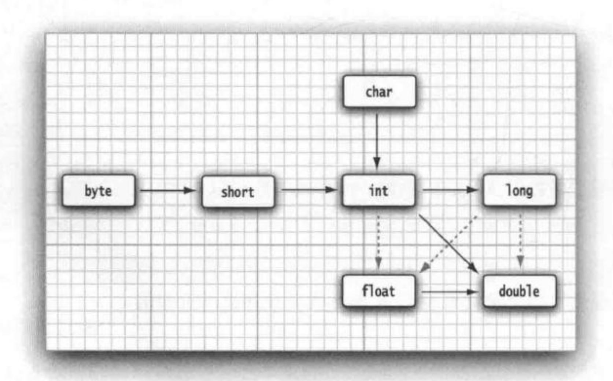

图 3-1 数值类型之间的合法转换

在图 3-1 中有 6 个实线箭头,表示无信息丢失的转换;另外有 3 个虚线箭头,表示可能 有精度损失的转换。例如,123456789 是一个大整数, 它包含的位数多于 代。就类型所能表示的

位数。将这个整数转换为 float 类型时,数量级是正确的,但是会损失一些精度。

**int n** = **1234567B9;**

**float f** = **n;** // **f is 1.23456792E8**

当用一个二元运算符连接两个值时(例如 <sup>n</sup> <sup>+</sup> f, <sup>n</sup> 是整数,f 是浮点数),先要将两个操作 数转换为同一种类型,然后再进行计算电

- 如果两个操作数中有一个是 double 类型,另一个操作数就会转换为 double 类型。
- 否则,如果其中一个操作数是 float 类型,另一个操作数将会转换为 float 类型。
- 否则,如果其中一个操作数是 h<sup>理</sup> 类型,另一个操作数将会转换为 long 类型。
- 否则,两个操作数都将被转换为 int 类型。

#### 3,54 强制类型转换

在上一小节中我们看到,在必要的时候,int 类型的值将会自动地转换为 double 类型。 但另一方面,有时也需要将 double 类型转换成 int 类型。在 Java 中,允许进行这种数值转换, 不过当然可能会丢失一些信息。这种可能损失信息的转换要通过强制类型转换( cast)来完 成。强制类型转换的语法格式是在圆括号中指定想要转换的目标类型,后面紧跟待转换的变 量名。例如:

**double x** = **9.997; int nx** =(int)**x;**

这样,变量 nx 的值为 9, 因为强制类型转换通过截断小数部分将浮点值转换为整型。

如果想舍入(round)一个浮点数来得到最接近的整数(大多数情况下,这种操作更有 用), 可以使用Math.round 方法:

**double x** = **9.997; int nx =**(int)**Math.round**(x);

现在,变量 nx 的值为 10。调用 round 时,仍然需要使用强制类型转换( int )。原因是 「ound 方法的返回值是 long 类型,由于存在信息丢失的可能性,所以只有使用显式的强制类型 转换才能够将一个 long 值赋给 int 类型的变量。

- 0 警告:如果试图将一个数从一种类型强制转换为 另一种类型,而 又超出了目标类型的 表示范围,结果就会截断成一个完全不同的值. 例如,(byte)36日 实际上会得到 <sup>440</sup>
- 由 C++ 注释:不要在 boolean 类型与任何数值类型之间进行强制类型转换,这样可以防止 发生一些常见的错误,只有极少数的情况下需要将一个 book加值转换为一个数,此时 可以使用条件表达式 b? 1:0O

#### 3.5.5 赋值

可以在赋值中使用二元运算符,为此有一种很方便的简写形式。例如,

**<sup>x</sup>** += 4;

等价于:

x = x + 4;

(一般来说,要把运算符放在=号左边,如\*=或%)。

● 警告:如果运算符得到一个值,其类型与左侧操作数的类型不同,就会发生强制类型转换。例如,如果 X 是一个 int,则以下语句

x += 3.5;

是合法的, 将把 x 设置为 (int)(x+3.5)。

需要说明,在Java中,赋值是一个表达式(expression)。也就是说,它有一个值,具体来讲就是所赋的那个值。可以使用这个值完成一些操作,例如,可以把它赋给另一个变量。考虑以下语句:

int x = 1; int y = x += 4;

x += 4 的值是 5, 因为这是赋给 x 的值。然后将这个值赋给 y。

很多程序员发现这种嵌套赋值很容易混淆,他们更喜欢分别清楚地写出这些赋值,如下 所示:

int x = 1; x += 4; int y = x;

#### 3.5.6 自增与自减运算符

当然,程序员都知道加 1、减 1 是数值变量最常见的操作。在 Java 中,借鉴了 C 和 C++中的做法,也提供了自增、自减运算符: n++将变量 n 的当前值加 1, n--则将 n 的值减 1。例如,以下代码:

int n = 12; n++;

将 n 的值改为 13。由于这些运算符会改变变量的值,所以不能对数值本身应用这些运算符。例如,4++ 就不是一个合法的语句。

这些运算符有两种形式;上面介绍的是运算符放在操作数后面的"后缀"形式。还有一种"前缀"形式: ++n。后缀和前缀形式都会使变量值加1或减1。但用在表达式中时,二者就有区别了。前缀形式会先完成加1;而后缀形式会使用变量原来的值。

int m = 7;\nint n = 7;\nint a = 2 \* ++m; // now a is 16, m is 8\nint b = 2 \* n++; // now b is 14, n is 8

很多程序员认为这种行为容易让人困惑。在 Java 中, 很少在表达式中使用 ++。

#### 3.5.7 关系和 boolean 运算符

Java 包含丰富的关系运算符。要检测相等性,可以使用两个等号 ==。例如,

3 == 7

的值为 false。

另外可以使用!=检测不相等。例如,

3 != 7

的值为 true。

最后,还有经常使用的 < (小于)、> (大于)、<= (小于等于)和 >= (大于等于)运算符。 Java 沿用了 C++ 的做法,使用 && 表示逻辑 "与"运算符,使用 || 表示逻辑 "或"运算符。从 != 运算符可以想到,感叹号!就是逻辑非运算符。 && 和 || 运算符是按照"短路"方式来求值的:如果第一个操作数已经能够确定表达式的值,第二个操作数就不必计算了。如果用 && 运算符结合两个表达式,

expression<sub>1</sub> && expression<sub>2</sub>

而且已经计算得到第一个表达式的真值为 false, 那么结果就不可能为 true。因此, 第二个表达式就不必计算了。可以利用这种行为来避免错误。例如, 在下面的表达式中:

x != 0 && 1 / x > x + y // no division by 0

如果 x 等于 0, 那么第二部分就不会计算。因此, 如果 x 为 0, 也就不会计算 1 / x, 就不会出现除以 0 的错误。

类似地,如果第一个表达式为 true, expression<sub>1</sub> || expression<sub>2</sub> 的值就自动为 true,而无须 计算第二个表达式。

#### 3.5.8 条件运算符

Java 提供了 conditional ?: 运算符,可以根据一个布尔表达式选择一个值。如果条件 (condition) 为 true,表达式

condition? expression1: expression2

就计算为第一个表达式的值, 否则为第二个表达式的值。例如,

```
x < y ? x : y
```

会返回x和y中较小的一个。

#### 3.5.9 switch 表达式

需要在两个以上的值中做出选择时,可以使用 switch 表达式(这是 Java 14 中引入的)。如下所示:

```
String seasonName = switch (seasonCode)
{
    case 0 -> "Spring";
    case 1 -> "Summer";
    case 2 -> "Fall";
    case 3 -> "Winter";
    default -> "???";
};
```

case 标签还可以是字符串或枚举类型常量。

- □ 注释:与所有表达式类似, switch 表达式也有一个值。注意各个分支中箭头→放在值前面。
- □ 注释:在 Java 14 中, switch 有 4 种形式。这一节重点讨论最有用的一种形式。参见 3.8.5 节,其中全面讨论了所有不同形式的 switch 表达式和语句。

可以为各个 case 提供多个标签,用逗号分隔:

```
int numLetters = switch (seasonName)
{
    case "Spring", "Summer", "Winter" -> 6;
    case "Fall" -> 4;
    default -> -1;
};
```

switch 表达式中使用枚举常量时,不需要为各个标签提供枚举名,这可以从 switch 值推导得出。例如: enum Size { SMALL, MEDIUM, LARGE, EXTRA\_LARGE };

```
enum Size { SMALL, MEDIUM, LARGE, EXTRA_LARGE };
. . . .
Size itemSize = . . .;
String label = switch (itemSize)
```

在这个例子中,完全可以省略 default,因为每一个可能的值都有相应的一个 case。

- 警告:使用整数或 String 操作数的 switch 表达式必须有一个 default,因为不论操作数值是什么,这个表达式都必须生成一个值。
- 警告: 如果操作数为 null, 会抛出一个 NullPointerException。

#### 3.5.10 位运算符

处理整型类型时,还有一些运算符可以直接处理组成整数的各个位。这意味着可以使用 掩码技术得到一个数中的各个位。位运算符包括:

```
& ("and") | ("or") ^ ("xor") ~ ("not")
```

这些运算符按位模式操作。例如,如果 n 是一个整数变量,而且 n 的二进制表示中从右边数第 4 位为 1,则

int fourthBitFromRight = (n & 0b1000) / 0b1000;

会返回1,否则返回0。利用&并结合适当的2的幂,可以屏蔽其他位,而只留下其中的某一位。

註釋:应用在布尔值上时, &和 | 运算符也会得到一个布尔值。这些运算符与 &&和 | 运算符很类似,不过 &和 | 运算符不采用"短路"方式来求值,也就是说,计算结果之前,两个操作数都需要计算。

另外,还有 >> 和 << 运算符可以将位模式左移或右移。需要建立位模式来完成位掩码时,这两个运算符会很方便:

int fourthBitFromRight = (n & (1 << 3)) >> 3;

最后, >>> 运算符会用 0 填充高位, 这与 >> 不同, >> 会用符号位填充高位。不存在 <<< 运算符。

- 警告:移位运算符的右操作数要完成模 32 的运算(除非左操作数是 long 类型,在这种情况下需要对右操作数完成模 64 运算)。例如,1 < 35 的值等同于1 < 3 或 8。
- C++注释:在C/C++中,不能保证>>是完成算术移位(扩展符号位)还是逻辑移位 (填充0)。实现者可以选择其中更高效的任何一种做法。这意味着 C/C++中的>>运 算符对负数生成的结果可能会依赖于具体的实现。Java 则消除了这种不确定性。

#### 3.5.11 括号与运算符级别

表 3-4 给出了运算符的优先级。如果不使用圆括号,就按照这里给出的运算符优先级次序进行计算。同一个级别的运算符按照从左到右的次序进行计算(但右结合运算符除外,如表中所示)。例如,由于 & 的优先级比 || 的优先级高,所以表达式

a && b || c

等价于

(a && b) || c

因为 += 是右结合运算符, 所以表达式

a += b += c

等价于

a += (b += c)

也就是将 b += c 的结果 (完成加法后 b 的值) 加到 a 上。

6 C++ 注释: 与 C 或 C++ 不同, Java 不使用逗号运算符。不过, 可以在 for 语句的第 1 和第 3 部分中使用逗号分隔表达式列表。

| 主 2 4         | <b>运</b> 95444 | ı. |
|---------------|----------------|----|
| <b>衣を 3-4</b> | 运算符优先级         | Z  |

| 运算符                                       | 结合性  |  |
|-------------------------------------------|------|--|
| [].()(方法调用)                               | 从左向右 |  |
| ! ~ ++ + (一元运算) - (一元运算) ( ) (强制类型转换) new | 从右向左 |  |
| */%                                       | 从左向右 |  |

(续)

| 运算符                                | 结合性  |  |
|------------------------------------|------|--|
| + -                                | 从左向右 |  |
| << >> >>>                          | 从左向右 |  |
| <<=>>= instanceof                  | 从左向右 |  |
| == !=                              | 从左向右 |  |
| &                                  | 从左向右 |  |
| ^                                  | 从左向右 |  |
|                                    | 从左向右 |  |
| 8.6.                               | 从左向右 |  |
|                                    | 从左向右 |  |
| 7:                                 | 从右向左 |  |
| = += -= *= /= %= &=  = ^= <<= >>>= | 从右向左 |  |

#### 3.6 字符串

从概念上讲, Java 字符串就是 Unicode 字符序列。例如,字符串 "Java\u2122" 由 5 个 Unicode 字符 J、a、v、a 和™组成。Java 没有内置的字符串类型,而是标准 Java 类库中提供了一个预定义类,很自然地叫作 String。每个用双引号括起来的字符串都是 String 类的一个实例:

String e = ""; // an empty string
String greeting = "Hello";

#### 3.6.1 子串

String 类的 substring 方法可以从一个较大的字符串提取出一个子串。例如:

String greeting = "Hello"; String s = greeting.substring(0, 3);

会创建一个由字符 "Hel" 组成的字符串。

#### ■ 注释:类似于 C 和 C++, Java 字符串中的代码单元和码点从 0 开始计数。

substring 方法的第二个参数是你不想复制的第一个位置。这里要复制位置为 0、1 和 2 (从 0 到 2,包括 0 和 2)的字符。substring 会计数,这说明会从 0 开始,直到 3 为止,但不包含 3。substring 的工作方式有一个优点:很容易计算子串的长度。字符串 s.substring(a, b)的长度为 b-a。例如,子串 "Hel"的长度为 3-0=3。

#### 3.6.2 拼接

与绝大多数程序设计语言一样, Java 语言允许使用 + 号连接(拼接)两个字符串。

String expletive = "Expletive";
String PG13 = "deleted";
String message = expletive + PG13;

上述代码将字符串 "Expletivedeleted" 赋给变量 message (注意,单词之间没有空格,+号完全按照给定的次序将两个字符串拼接起来)。

当将一个字符串与一个非字符串的值进行拼接时,后者会转换成字符串(在第5章中可以看到,任何一个Java对象都可以转换成字符串)。例如:

int age = 13; String rating = "PG" + age;

将把 rating 设置为 "PG13"。

这个特性通常用在输出语句中。例如:

System.out.println("The answer is " + answer);

这是一条合法的语句,会打印出你希望的结果(因为单词 is 后面加了一个空格,输出时也会有这个空格)。

如果需要把多个字符串放在一起,用一个界定符分隔,可以使用静态 join 方法:

String all = String.join(" / ", "S", "M", "L", "XL");
 // all is the string "S / M / L / XL"

在 Java 11 中, 还提供了一个 repeat 方法:

String repeated = "Java".repeat(3); // repeated is "JavaJavaJava"

#### 3.6.3 字符串不可变

String 类没有提供任何方法来修改字符串中的某个字符。如果希望将 greeting 的内容修改为 "Help!",不能直接将 greeting 的最后两个位置的字符修改为 'p' 和 '!'。对于 C 程序员来说,这会让他们茫然无措。如何修改这个字符串呢?在 Java 中这很容易实现。可以提取想要保留的子串,再与希望替换的字符拼接:

String greeting = "Hello";
greeting = greeting.substring(θ, 3) + "p!";

上面这条语句将把 greeting 变量的当前值修改为 "Help!"。

由于不能修改 Java 字符串中的单个字符, 所以在 Java 文档中将 String 类对象称为是不可变的 (immutable), 如同数字 3 永远是数字 3 一样,字符串 "Hello" 永远包含字符 H、e、l、l 和 o 的代码单元序列。你不能修改这些值,不过,我们已经看到,可以修改字符串变量 greeting 的内容,让它指向另外一个字符串,这就如同可以让原本存放 3 的数值变量改成存放 4 一样。

这样做难道不会大大降低效率吗?看起来好像修改代码单元要比从头创建一个新字符串更简单。答案是:也对,也不对。的确,通过拼接 "Hel" 和 "p!"来生成一个新字符串的效率确实不高。但是,不可变字符串有一个很大的优点:编译器可以让字符串共享。

为了弄清具体如何工作,可以想象各个字符串存放一个在公共存储池中。字符串变量指向存储池中相应的位置。如果复制一个字符串变量,原始字符串和复制的字符串共享相同的字符。

总而言之, Java 的设计者认为共享带来的高效率远远超过编辑字符串(提取子串和拼

接字符串) 所带来的低效率「 可以看看你自己的程序,你会发现,大多数情况下都不会修改 字符串,而只是需要对字符串进行比较小 (有一种例外情况,将来自文件或键盘的单个字符 或较短字符串组装成更大的字符串口 为此,Java 提供了一个单独的类,在 369 节中将详细 介绍)口

@ C++ 注释:C 程序员第一次接触 Jwa 字符串的时候,常常会感到迷惑,因为他们总是 将字符串认为是字符数组:

char greeting!) = "Hello";

这样对比是错误的,实际上,Java 字符串大致类似于 char\* 指针,

char\* greeting <sup>=</sup> "Hello";

当把 greeting 替换为 <sup>另</sup> 一个字符串的时候,Java 代码大致完成以下操作:

char\* temp = ma;Uoc(6); strncpy(tempf greetingd 3); strncpy(temp + 3, "p!"』3); greeting = temp;

的确,现在 greeting 指向字符串 "Help!i 即使最顽固的 C 程序员也得承认 Java 语 法比一连串的 stmepy 调用要简洁得多口 不过,如果再对 greeting 赋值会怎么样呢?

greeting = "Howdy":

不会产生内存泄漏吗?毕竟,原始字符串在堆中分配,, 十分幸运,Java 会 直动完 成垃圾回收 如果一个内存块不再使用了,系统最终会将其回收。

如果你是 CH 程序员,并使用 ANSI C++ 定义的 string 类,会感 觉使用 Java <sup>的</sup> St「ing 类型更舒服:O+ string 对象也会自劫完成内存的分配与回收。要通过构造器、 赋值操作符和析构器显式完成内存管理口 不过,C++ 字符串是可修改的,也就是说, 可以修改字符 串中的单个字符。

#### 3.6.4 检测字符串是否相等

可以使用 equals 方法检测两个字符串是否相等。对于表达式:

s.equals(t)

如果字符串 ,与字符串 t 相等,则返回「吃t 否则,返回 fats% 需要注意的是,<sup>5</sup> 与 t <sup>可</sup> 以是字符串变量,也可以是字符串字面量。例如,以下表达式是合法的工

lhHeUo".equals(greeting)

要想检测两个字符串是否相等,而不区分大小写,可以使用 equahlgnorKase 方法。

"HelloJ,- equalsIgnoreCasel"hello")

不要使用 == 运算符检测两个字符串是否相等!这个运算符只能够确定两个字符串是否 存放在同一个位置上。当然,如果字符串在同一个位置上,它们必然相等已但是. 完全有可 能将多个相等的字符串副本存放在不同的位置上.

```
String greeting = "Hello"; // initialize greeting to a string\nif (greeting == "Hello") . . .
   // probably true\nif (greeting.substring(θ, 3) == "Hel") . . .
   // probably false
```

如果虚拟机总是共享相等的字符串,则可以使用 == 运算符检测字符串是否相等。但实际上只有字符串字面量会共享,而 + 或 substring 等操作得到的字符串并不共享。因此,千万不要使用 == 运算符测试字符串的相等性,否则程序中会出现最糟糕的一种 bug,这种 bug 可能会间歇性地随机出现。

6 C++ 注释: 对于习惯使用 C++ string 类的人来说,在完成相等性检测时一定要特别小心。C++ 的 string 类重载了 == 运算符,从而能检测字符串内容的相等性。可惜 Java 没有采用这种方式,尽管它的字符串"外观"看起来就像数值一样,但进行相等性测试时,则表现得类似于指针。Java 语言的设计者也可以像对+那样进行特殊处理,为字符串重新定义 == 运算符。当然,每一种语言都会存在一些不太一致的地方。

C程序员从不使用 == 对字符串进行比较,而是使用 strcmp 函数。Java 的 compareTo 方法就类似于 strcmp,因此,可以如下这样使用:

if (greeting.compareTo("Hello") == 0) . . .

不过,使用 equals 看起来更为清晰。

#### 3.6.5 空串与 Null 串

空串 "" 是长度为 0 的字符串。可以调用以下代码检查一个字符串是否为空:

if (str.length() == 0)

或

if (str.equals(""))

空串是一个 Java 对象,有自己的串长度(0)和内容(空)。不过,String 变量还可以存放一个特殊的值,名为 null,表示目前没有任何对象与该变量关联(关于 null 的更多信息请参见第 4 章)。要检查一个字符串是否为 null,可以使用以下代码:

if (str == null)

有时要检查一个字符串既不是 null 也不是空串,这种情况下可以使用:

if (str != null && str.length() != 0)

首先要检查 str 不为 null。在第 4 章会看到,如果在一个 null 值上调用方法,会出现错误。

#### 3.6.6 码点与代码单元

Java 字符串是一个 char 值序列。从 3.3.3 节已经看到, char 数据类型是采用 UTF-16 编码表示 Unicode 码点的一个代码单元。最常用的 Unicode 字符可以用一个代码单元表示, 而辅助字符需要一对代码单元表示。

length 方法将返回采用 UTF-16 编码表示给定字符串所需要的代码单元个数。例如:

String greeting = "Hello";\nint n = greeting.length(); // is 5

要想得到实际长度,即码点个数,可以调用:

int cpCount = greeting.codePointCount(0, greeting.length());

调用 s.charAt(n) 将返回位置 n 的代码单元, n 介于 0 ~ s.length()-1之间。例如:

char first = greeting.charAt(0); // first is 'H'
char last = greeting.charAt(4); // last is 'o'

要想得到第 i 个码点,可以使用以下语句:

int index = greeting.offsetByCodePoints(0, i);\nint cp = greeting.codePointAt(index);

为什么会对代码单元如此大惊小怪?请考虑下面这个句子:

O is the set of octonions.

使用 UTF-16 编码表示字符(D (U+10546) 需要两个代码单元。调用

char ch = sentence.charAt(1)

返回的不是一个空格,而是◎的第二个代码单元。为了避免这个问题,不要使用 char 类型。这太底层了。

注释:不要以为可以忽略代码单元在U+FFFF以上的奇怪字符,喜欢 emoji表情符号的用户可能会在字符串中加入类似题(U+1F37A,啤酒杯)的字符。

如果想要遍历一个字符串,并且依次查看每一个码点,可以使用以下语句:

int cp = sentence.codePointAt(i);\ni += Character.charCount(cp);

可以使用以下语句实现反向遍历:

i--;\nif (Character.isSurrogate(sentence.charAt(i))) i--;\nint cp = sentence.codePointAt(i);

显然,这很麻烦。更容易的办法是使用 codePoints 方法,它会生成 int 值的一个"流",每个 int 值对应一个码点。(流在卷Ⅱ中介绍。)可以将流转换为一个数组(见 3.10 节),再完成遍历。

int[] codePoints = str.codePoints().toArray();

反之,要把一个码点数组转换为一个字符串,可以使用构造器(我们将在第4章详细讨论构造器和 new 操作符)。

String str = new String(codePoints, 0, codePoints.length);

要把单个码点转换为一个字符串,可以使用 Character.toString(int) 方法:

int codePoint = 0x1F37A;
str = Character.toString(codePoint);

注释:虚拟机不一定把字符串实现为代码单元序列。在 Java 9 中使用了一个更紧凑的表示。只包含单字节代码单元的字符串使用 byte 数组实现,所有其他字符串使用 char 数组。

#### 3.6.7 String API

Java 中的 String 类包含近 100 个方法。下面的 API 注释汇总了最常用的一些方法。

本书中给出的 API 注释可以帮助你理解 Java 应用程序编程接口(API)。每一个 API 注释首先给出类名,如 java.lang.String。(java.lang 包名的重要性将在第 4 章给出解释。)类名之后是一个或多个方法的名字、解释和参数描述。

API 注释不会列出一个特定类的所有方法,而是会以简洁的方式给出最常用的一些方法,完整的方法列表请参见联机文档(请参见 3.6.8 节)。

类名后面的编号是引入这个类的 JDK 版本号。如果某个方法是之后添加的,那么这个方法后面还会给出一个单独的版本号。

#### API java.lang.String 1.0

- char charAt(int index)
   返回给定位置的代码单元。除非对底层的代码单元感兴趣,否则不需要调用这个方法。
- int codePointAt(int index) 5
   返回从给定位置开始的码点。
- int offsetByCodePoints(int startIndex, int cpCount) 5
   返回从 startIndex 码点开始, cpCount 个码点后的码点索引。
- int compareTo(String other)
   按照字典顺序,如果字符串位于 other 之前,返回一个负数;如果字符串位于 other 之后,返回一个正数;如果两个字符串相等,返回 θ。
- IntStream codePoints() 8
   将这个字符串的码点作为一个流返回。调用 toArray 将它们放在一个数组中。
- new String(int[] codePoints, int offset, int count) 5
   用数组中从 offset 开始的 count 个码点构造一个字符串。
- boolean isEmpty()
   boolean isBlank() 11
   如果字符串为空或者由空白符组成,返回 true。
- boolean equals(Object other)
   如果字符串与 other 相等,返回 true。
- boolean equalsIgnoreCase(String other)
   如果字符串与 other 相等(忽略大小写), 返回 true。
- boolean startsWith(String prefix)
- boolean endsWith(String suffix)

如果字符串以 prefix 开头或以 suffix 或结尾, 则返回 true。

- int indexOf(String str)
- int indexOf(String str, int fromIndex)
- int indexOf(int cp)
- int indexOf(int cp, int fromIndex)
   返回与字符串 str 或码点 cp 相等的第一个子串的开始位置。从索引 0 或 fromIndex 开始 匹配。如果 str 或 cp 不在字符串中,则返回 -1。
- int lastIndexOf(String str)
- int lastIndexOf(String str, int fromIndex)
- int lastindexOf(int cp)
- int lastindexOf(int cp, int fromIndex)
   返回与字符串 str 或码点 cp 相等的最后一个子串的开始位置。从字符串末尾或 fromIndex 开始匹配。如果 str 或 cp 不在字符串中,则返回 -1。
- int length() 返回字符串代码单元的个数。
- int codePointCount(int startIndex, int endIndex) 5
   返回 startIndex 到 endIndex-1之间的码点个数。
- String replace(CharSequence oldString, CharSequence newString)
   返回一个新字符串,这是用 newString 替换原始字符串中与 oldString 匹配的所有子串得到的。可以用 String 或 StringBuilder 对象作为 CharSequence 参数。
- String substring(int beginIndex)
- String substring(int beginIndex, int endIndex)
   返回一个新字符串,这个字符串包含原始字符串中从 beginIndex 到字符串末尾或 endIndex-1的所有代码单元。
- String toLowerCase()
- String toUpperCase()

返回一个新字符串,这个字符串包含原始字符串中的所有字符,不过将原始字符串中的大写字母改为小写,或者将原始字符串中的小写字母改成大写母。

• String strip() 11

String stripLeading() 11

String stripTrailing() 11

返回一个新字符串,这个字符串要删除原始字符串头部和尾部或者只是头部或尾部的空白符。要使用这些方法,而不要使用古老的 trim 方法删除小于等于 U+0020 的字符。

• String join(CharSequence delimiter, CharSequence... elements) 8 返回一个新字符串,用给定的定界符连接所有元素。

- String repeat(int count) **11** 返回一个字符串,将当前字符串重复 count 次臼
- 国 注释:在 API 注释中,有一些 CharSequence 类型的参数. 这是一种接口类型,所 有字符 串都属于这个接口 <sup>第</sup> 6 章将介绍更 多有关接口类型的内容现在只需要知道,当看到 —<sup>个</sup> CharSequence 形参(parameter)时,完全可以传入 String 类型的实参(argument),.

#### 3.6.8 阅读联机 API 文档

正如前面看到的,5t「ing 类包含许多方法口 而且,标准库中有几千个类,方法数量更加 惊人。要想记住所有有用的类和方法显然不太可能〉因此,学会使用联机 API 文档十分重 要,从中可以查找标准类库的所有类和方法口 可以从 Oracle 下载 API 文档,并保存在本地口 也可以在浏览器中访问 https://docs,oracle.com/en/java/javase/17/docs/api -

在 Java9 中,API 文档有一个搜索框(见图 3-2)0 较老的版本会有一些帧窗口包含包列 表和类列表0 仍然可以单击 Frames 菜单项得到这些列表。例如,要获得有关 String 类方法 的更多信息,可以在搜索框中键人 "String", 选择类型和就I的g,String, 或者在帧窗口中找 到类名的相应链接,并单击这个链接.你会看到这个类的描述,如图 3-3 所示。

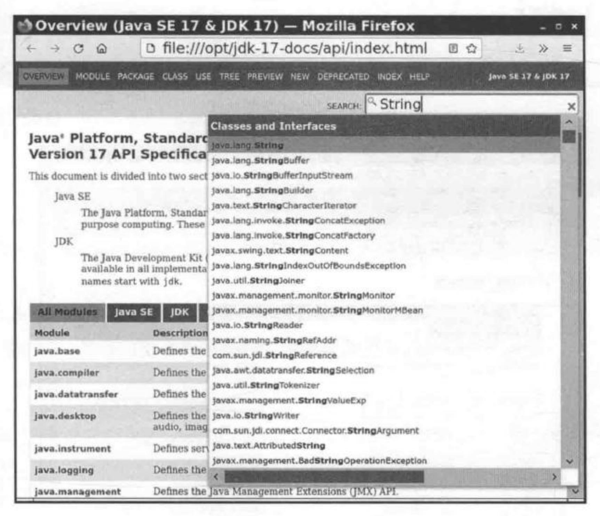

图 **3-2 Java API** 文挡

接下来,向下滚动,直到看见按字母顺序排列的所有方法的小结(参见图 3T)。单击任 何一个方法名可以查看这个方法的详细描述(参见图工5 )。例如,如果单击mpdrenigoorKase

链接, 就会看到 compareToIgnareCase 方法的描述

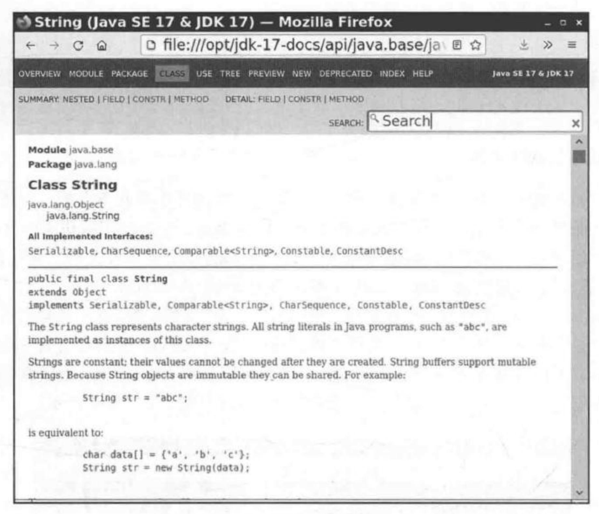

图 3-3 5t「ing 类的描述

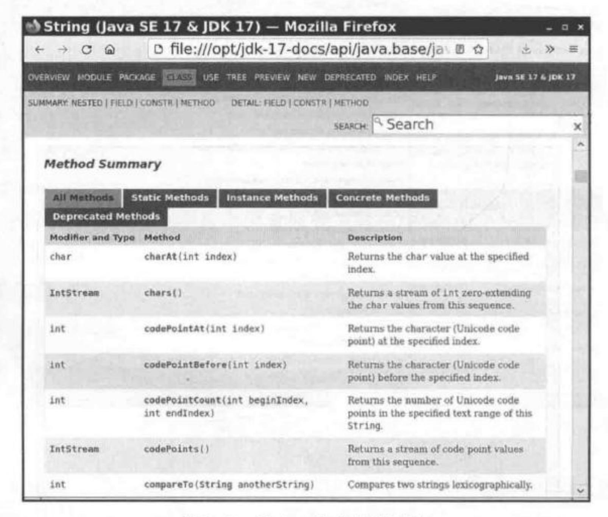

图 3.4 String 类方法的小结

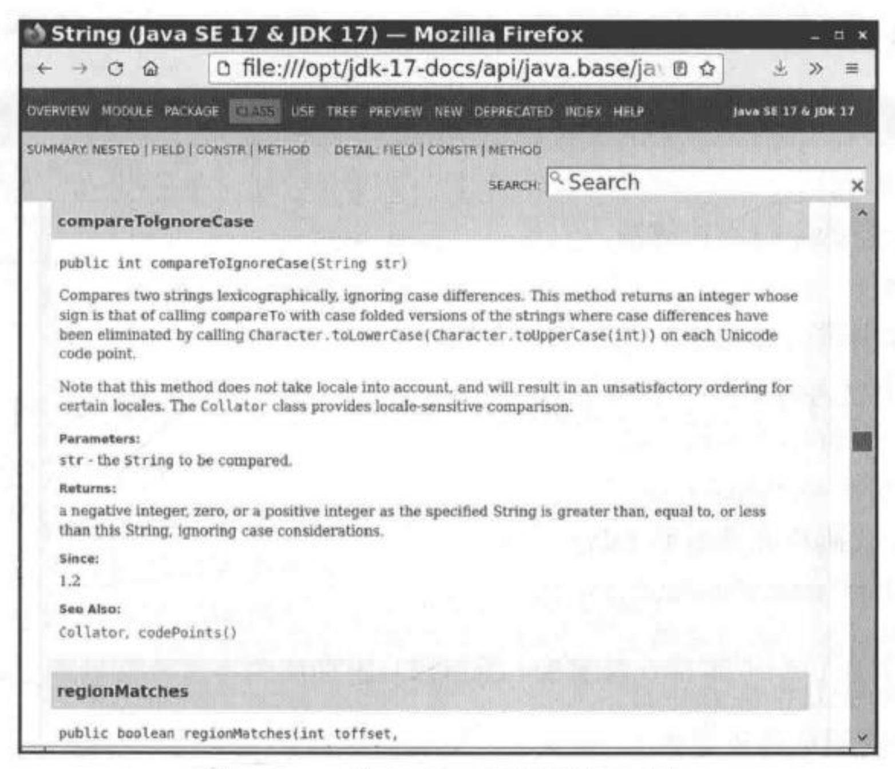

图 3-5 一个 String 方法的详细描述

● 提示:如果还没有下载 JDK 文档,现在就请按第2章中的介绍下载 JDK 文档。在浏览器中为这个文档的 index.html 页面建一个书签,就是现在,不要迟疑!

#### 3.6.9 构建字符串

有些时候,需要由较短的字符串构建字符串,例如,按键或文件中的单词。如果采用字符串拼接的方式来达到这个目的,效率会比较低。每次拼接字符串时,都会构建一个新的String 对象,既耗时,又浪费空间。使用 StringBuilder 类就可以避免这个问题。

如果需要用许多小字符串来构建一个字符串,可以采用以下步骤。首先,构建一个空的字符串构建器:

StringBuilder builder = new StringBuilder();

当每次需要添加另外一部分时,就调用 append 方法。

builder.append(ch); // appends a single character builder.append(str); // appends a string

字符串构建完成时,调用 toString 方法。你会得到一个 String 对象,其中包含了构建器中的字符序列。

String completedString = builder.toString();

**注释:** StringBuffer 类的效率不如 StringBuilder 类,不过它允许采用多线程的方式添加或删除字符。如果所有字符串编辑操作都在单个线程中执行(通常都是这样),则应当使用 StringBuilder 类。这两个类的 API 是一样的。

下面的 API 注释包含了 StringBuilder 类中最重要的方法。

#### API java.lang.StringBuilder 5

- StringBuilder()构造一个空的字符串构建器。
- int length() 返回构建器或缓冲器中的代码单元个数。
- StringBuilder append(String str) 追加一个字符串并返回 this。
- StringBuilder append(char c) 追加一个代码单元并返回 this。
- StringBuilder appendCodePoint(int cp)
   追加一个码点,将它转换为一个或两个代码单元并返回 this。
- void setCharAt(int i, char c)
   将第i个代码单元设置为 c。
- StringBuilder insert(int offset, String str) 在 offset 位置插入一个字符串并返回 this。
- StringBuilder insert(int offset, char c) 在 offset 位置插入一个代码单元并返回 this。
- StringBuilder delete(int startIndex, int endIndex)
   删除从 startIndex 到 endIndex-1 的代码单元并返回 this。
- String toString()
   返回一个字符串,其数据与构建器或缓冲器内容相同。

#### 3.6.10 文本块

利用 Java 15 新增的文本块(text block)特性,可以很容易地提供跨多行的字符串字面量。 文本块以 """ 开头(这是开始 """),后面是一个换行符,并以另一个 """ 结尾(这是结束 """):

String greeting = """
Hello
World
""":

文本块比相应的字符串字面量更易于读写:

"Hello\nWorld\n"

这个字符串包含两个 \n: 一个在 Hello 后面,另一个在 World 后面。开始 "" 后面的换行符不作为字符串字面量的一部分。

如果不想要最后一行后面的换行符,可以让结束 "" 紧跟在最后一个字符后面:

String prompt = """

```
Hello, my name is Hal.
Please enter your name: """;
```

文本块特别适合包含用其他语言编写的代码,如 SQL或 HTML。可以直接将那些代码 粘贴到一对三重引号之间:

```
String html = """
<div class="Warning">
    Beware of those who say "Hello" to the world
</div>
""":
```

需要说明的是,一般不用对引号转义。只有两种情况下需要对引号转义:

- 文本块以一个引号结尾。
- 文本块中包含三个或更多引号组成的一个序列。

遗憾的是, 所有反斜线都需要转义。

常规字符串中的所有转义序列在文本块中也有同样的作用。

有一个转义序列只能在文本块中使用。行尾的\会把这一行与下一行连接起来。例如:

```
Hello, my name is Hal. \
Please enter your name: """;
```

#### 等同于:

"Hello, my name is Hal. Please enter your name: "

文本块会对行结束符进行标准化,删除末尾的空白符,并把 Windows 的行结束符(\r\n)改为简单的换行符(\n)。尽管不太可能,不过假如确实需要保留末尾的空格,这种情况下可以把最后一个空格转换为一个\s 转义序列。

对于前导空白符则更为复杂。考虑一个从左边界缩进的典型的变量声明。文本块也可以缩进:

```
String html = """
```

将去除文本块中所有行的公共缩进。实际字符串为:

"<div class=\"Warning\">\n Beware of those who say \"Hello\" to the world\n</div>\n"

注意,第一行和第三行没有缩进。

你的 IDE 很可能会使用制表符、空格或者制表符以及空格缩进所有文本块。

Java 很清晰,它没有规定制表符的宽度。空白符前缀必须与文本块中的所有行完全匹配。 去除缩进过程中不考虑空行。不过,结束"""前面的空白符很重要。一定要缩进到想要 去除的空白符的末尾。

● 警告:要当心缩进文本块的公共前缀中混用制表符和空格的情况。不小心漏掉一个空格很容易得到一个缩进错误的字符串。

び提示:如果一个文本块中包含非Java代码,实际上最好沿左边界效置。这样可以与 Java代码区分开,而且可以为长代码行留出更多空间。

#### 3.7 输入与输出

为了增加后面示例程序的趣味性,我们希望程序能够接收输入,并适当地格式化程序输出。当然,现代的程序都使用 GUI 收集用户输入,然而,编写这样一个界面需要使用更多工具与技术,目前还不具备这些条件。我们的第一要务是熟悉 Java 程序设计语言,因此我们将使用基本的控制台来实现输入和输出。

#### 3.7.1 读取输入

前面已经看到,将输出打印到"标准输出流"(即控制台窗口)是一件非常容易的事情,只需要调用 System.out.println。不过,读取"标准输入流" System.in 就没有那么简单了。要想读取控制台输入,首先需要构造一个与"标准输入流" System.in 关联的 Scanner 对象。

Scanner in = new Scanner(System.in);

(构造器和 new 操作符将在第 4 章中详细介绍。)

现在,就可以使用 Scanner 类的各种方法读取输入了。例如, nextLine 方法将读取一行输入。

System.out.print("What is your name? ");
String name = in.nextLine();

在这里,使用 nextLine 方法是因为输入行中有可能包含空格。要想读取一个单词(以空白符作为分隔符),可以调用

String firstName = in.next();

要想读取一个整数,要使用 nextInt 方法。

System.out.print("How old are you? ");\nint age = in.nextInt();

与此类似, nextDouble 方法可以读取下一个浮点数。

在程序清单 3-2 的程序中,首先询问用户姓名和年龄,然后打印一条如下的消息:

Hello, Cay. Next year, you'll be 57

最后,在程序的最前面添加一行代码:

import java.util.\*;

Scanner 类在 java.util 包中定义。当使用的类不是定义在基本 java.lang 包中时,需要使用 import 指令导入相应的包。有关包与 import 指令的详细描述请参见第 4 章。

#### 程序清单 3-2 InputTest/InputTest.java

import java.util.\*;

```
/**
3
    * This program demonstrates console input.
    * @version 1.10 2004-02-10
    * @author Cay Horstmann
   public class InputTest
9
      public static void main(String[] args)
10
11
         Scanner in = new Scanner(System.in);
12
13
         // get first input
14
         System.out.print("What is your name? ");
15
         String name = in.nextLine();
16
17
         // get second input
18
         System.out.print("How old are you? ");
19
         int age = in.nextInt();
20
21
         // display output on console
22
         System.out.println("Hello, " + name + ". Next year, you'll be " + (age + 1));
23
24
25 }
```

□ 注释:因为输入对所有人都可见,所以Scanner类不适用于从控制台读取密码。可以使用 Console 类来达到这个目的。要想读取一个密码,可以使用以下代码:

```
Console cons = System.console();
String username = cons.readLine("User name: ");
char[] passwd = cons.readPassword("Password: ");
```

为安全起见,将返回的密码存放在一个字符数组中,而不是字符串中。完成对密码的处理之后,应该马上用一个填充值覆盖数组元素(数组处理将在3.10节介绍)。

使用 Console 对象处理输入不如使用 Scanner 方便。必须一次读取一行输入,而且 Console 类没有提供方法来读取单个单词或数字。

#### API java.util.Scanner 5

- Scanner(InputStream in)
   用给定的输入流构造一个 Scanner 对象。
- String nextLine()
   读取下一行输入。
- String next()读取输入的下一个单词(以空白符作为分隔符)。
- int nextInt()
- double nextDouble()
   读取并转换下一个表示整数或浮点数的字符序列。

- 58
  - boolean hasNext()
     检测输入中是否还有其他单词。
  - boolean hasNextInt()
  - boolean hasNextDouble()
     检测下一个字符序列是否表示一个整数或浮点数。

#### API java.lang.System 1.0

static Console console() 6
 如果有可能进行交互操作,就通过控制台窗口为交互的用户返回一个 Console 对象,否则返回 null。对于任何一个在控制台窗口启动的程序,都可使用 Console 对象。否则,是否可用取决于所使用的系统。

#### API java.io.Console 6

- static char[] readPassword(String prompt, Object... args)
- static String readLine(String prompt, Object... args)
   显示提示符(prompt)并读取用户输入,直到输入行结束。可选的 args 参数用来提供格式参数。有关这部分内容将在下一节中介绍。

#### 3.7.2 格式化输出

可以使用 System.out.print(x) 语句将数值 x 输出到控制台。这个命令将以 x 的类型所允许的最大非 0 位数打印 x。例如:

double x = 10000.0 / 3.0; System.out.print(x);

会打印

3333.333333333333

如果希望显示美元、美分数,这就会有问题。

这个问题可以利用 printf 方法来解决,它沿用了 C 语言函数库中的古老约定。例如,以下调用

System.out.printf("%8.2f", x);

打印 x 时字段宽度 (field width) 为 8 个字符, 精度为 2 个字符。也就是说,结果包含一个前导的空格和 7 个字符,如下所示:

3333.33

可以为 printf 提供多个参数,例如:

System.out.printf("Hello, %s. Next year, you'll be %d", name, age);

每一个以%字符开头的格式说明符(format specifiers)都替换为相应的参数。格式说明符末尾的转换字符(conversion character)指示要格式化的数值的类型:f表示浮点数,s表示

字符串,d表示十进制整数。表 3-5 列出了用于 printf 的转换字符。

大写形式会生成大写字母。例如, "%8.2E" 将 3333.33 格式化为 3.33E+03, 这里有一个大写的 E。

| 转换字符  | 类 型                                        | 示 例        | 转换字符    | 类 型                                       | 示 例     |
|-------|--------------------------------------------|------------|---------|-------------------------------------------|---------|
| d     | 十进制整数                                      | 159        | s或S     | 字符串                                       | Hello   |
| x或X   | 十六进制整数。要想对十六进制格式化有更多控制,可以使用<br>HexFormat 类 | 9f         | c或C     | 字符                                        | н       |
| 0     | 八进制整数                                      | 237        | b或B     | 布尔                                        | true    |
| f或F   | 定点浮点数                                      | 15.9       | h或H     | 散列码                                       | 42628b2 |
| e 或 E | 指数浮点数                                      | 1.59e+01   | tx 或 Tx | 遗留的日期时间格式化。应当改为<br>使用 java.time 类,参见卷Ⅱ第6章 | _       |
| g 或 G | 通用浮点数 (e 和 f 中较短的一个)                       | _          | %       | 百分号                                       | %       |
| a或A   | 十六进制浮点数                                    | 0x1.fccdp3 | n       | 与平台有关的行分隔符                                | _       |

表 3-5 用于 printf 的转换字符

注释:可以使用 5 转换字符格式化任意的对象。如果一个任意对象实现了 Formattable 接口,会调用这个对象的 formatTo 方法。否则,会调用 toString 方法将这个对象转换为一个字符串。toString 方法将在第 5 章讨论,第 6 章将介绍接口。

另外,还可以指定控制格式化输出外观的各种标志(flag)。表 3-6 列出了用于 printf 的标志。例如,逗号标志会增加分组分隔符。即

System.out.printf("%,.2f", 10000.0 / 3.0);

会打印

3,333.33

可以使用多个标志,例如, "%,(.2f"会使用分组分隔符,并将负数包围在括号内。

|            | ACOO III DIIIII HIING                                                 |           |
|------------|-----------------------------------------------------------------------|-----------|
| 标 志        | 作用                                                                    | 示 例       |
| +          | 打印正数和负数的符号                                                            | +3333.33  |
| 空格         | 在正数前面增加一个空格                                                           | 3333.33   |
| θ          | 增加前导 0                                                                | 003333.33 |
|            | 字段左对齐                                                                 | 3333.33   |
| (          | 将负数包围在括号内                                                             | (3333.33) |
| ,          | 增加分组分隔符                                                               | 3,333.33  |
| #(对于f格式)   | 总是包含一个小数点                                                             | 3,333.    |
| #(对于x或0格式) | 添加前缀 0x 或 0                                                           | 0xcafe    |
| \$         | 指定要格式化的参数索引。例如, %1\$d %1\$x 将以十进制和十六进制格式打印第1个参数                       | 159 9F    |
| <          | 格式化前面指定的同一个值。例如,%d% <x td="" 将以十进制和十六进制打印同一个数<=""><td>159 9F</td></x> | 159 9F    |

表 3-6 用于 printf 的标志

可以使用静态的 String.format 方法创建一个格式化的字符串,而不打印输出: String message = String.format("Hello, %s. Next year, you'll be %d", name, age + 1);

注释: 在 Java 15 中, 可以使用 formatted 方法, 这样可以少敲 5 个字符: String message = "Hello, %s. Next year, you'll be %d".formatted(name, age + 1);

现在,我们已经了解了 printf 方法的所有特性。图 3-6 给出了格式说明符的语法图。

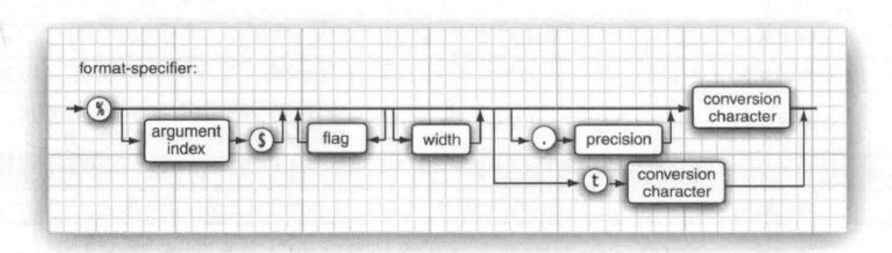

图 3-6 格式说明符语法

註释:格式化规则是特定于本地化环境的。例如,在德国,分组分隔符是点号而不是 逗号。在卷Ⅱ第7章中将介绍如何控制应用的国际化行为。

#### 3.7.3 文件输入与输出

要想读取一个文件,需要构造一个 Scanner 对象,如下所示:

Scanner in = new Scanner(Path.of("myfile.txt"), StandardCharsets.UTF\_8);

如果文件名中包含反斜线符号,记住要在每个反斜线之前再加一个额外的反斜线转义: "c:\\mydirectory\\myfile.txt"。

现在就可以使用之前见过的任何 Scanner 方法读取这个文件了。

- 註释:这里指定了UTF-8字符编码,这对于互联网上的文件很常见(不过并不是普遍适用)。读取一个文本文件时,要知道它的字符编码(更多信息参见卷Ⅱ第2章)。如果省略字符编码,则会使用运行这个Java程序的机器的"默认编码"。这不是一个好主意,如果在不同的机器上运行这个程序,可能会有不同的表现。
- 警告:可以提供一个字符串参数来构造一个 Scanner, 但这个 Scanner 会把字符串解释为数据, 而不是文件名。例如, 如果调用:

Scanner in = new Scanner("myfile.txt"); // ERROR?

这个 scanner 会将参数看作是包含 10 个字符('m'、'y'、'f'等)的数据。这可能不是我们的原意。

要想写入文件,需要构造一个 PilntWriter 对象: 在构造器 ( comtructor) 中,需要提供文 件名和字符编码:

Printwriter out = new PrintWriterC^yfile.txt\*1, StandardCharsets.UTF 8) ;

如果文件不存在,则创建该文件。可以像输出到 5ystemmt一样使用print、priMh以及 printf 命令1

F| 注释二 当指定一个相对文件 名时,铜如,"myfile.txt"、"niydi「ectory/niyfile・txt" <sup>或</sup> J myfil已txt", 文件将相对于启动 Java 虚拟机的那个目 录放置 如果从一个命令 shell 执 行以下命令启动程序:

java MyProg

启动目录就是命令 shell 的当前目录口 不过, 如果使用集成开发环境,那么启动目 录将由 IDE 控制 可以使用下面的调用找到这个目录的位置:

String dir = System.getProperty( "user Jir\*);

如果觉得文件定位大麻烦,可以考虑使用绝对路径名,例如:"f:\\mydir€Ctory\\ iByfile.txt" 或者 ,7home/ine/mydirectory/ffiyfileltxt"0

如你所见,访问文件与使用 Syetemin 和 System.out 一样容易白 要记住一点:如果用一个 不存在的文件构造一个 Scanner 或者用一个无法创建的文件名构造一个 <sup>P</sup>「intH「iter, 就会产 生异常。Java 编译器认为这些异常比"被零除"异常更严重。在第 7章中,你会学习各种处 理异常的方法。至于现在,只需要告诉编译舞:你已经知道有可能出现 "输入/ 输出"异常。 为此,要用一个 throws 子句标记 main 方法,如下所示:

```
public static void main(String[] args) throws lOException
{
   Scanner in - new Scanner(Pathlofrmyfile.txt1,)P StandardCharsets UTF B) ;
}
    ' '
```

现在你已经学习了如何读写包含文本数据的文件. 对于更高级的内容,例如, 处理不同 的字符编码、处理二进制数据、读取目录以及写 zip 压缩文件,请参见卷 【<sup>1</sup> 第 2章。

Q 注释:从命令 ghell 启动一个程序时,可以利用 shell 的重定向语法将任意文件关联到 System,in 和 System.out:

java MyProg < myfile.txt > output.txt

这样,就不 必担心处理 lOException 异常了。

#### \*utiLScanner 5

- Scanner(Path pf String encoding) 构造一个 Scanne「使用给定字符编码从给定路径读取数据。
- ScannerfString data} 构造一个 Scanner 从给定字符串读取数据0

#### **java.io.Printwriter 1.1**

• PrintWriter(String fileName) 构造一个 「intWHte <sup>P</sup> 「将数据写入指定文件。

#### 回java.fliOr file,Peth

•static Path of (String pathname) <sup>11</sup> 由给定的路径名构造一个 Path。

#### 3.8 控制流程

与任何程序设计语言一样,Java 支持使用条件语句和循环结构来确定控制流程。这里首先讨 论条件语句,然后介绍循环语句,最后介绍 5Witth 语句,它可以用来检测一个表达式的多个值。

由 C++ 注释:Java 的控制流程结构与 <sup>C</sup> <sup>和</sup> C++ 的控制流程结构基本相同,只有很少几 个例外<sup>D</sup> Java 中没有 goto 语句,但 break 语句 可以带标签,可以利用它从嵌套循环中 跳出(对于这种情况,C 语言中可能就要使用 goto 语句 了)。 最后,还有一种变形的 fo「循环,有点类似于 C++ 中基于范围的 fo「循环和 C# 中的 fo「既ch 循环。

#### 3.8.1 块作用域

在学习控制结构之前,需要了解块(block)的概念。

块(即复合语句)由若干条 Java 语句组成,并用一对大括号括起来。块确定了变量的作 用域。一个块可以嵌套在另一个块中。下面就是嵌套在响in 方法块中的一个块口

```
public static void main(String[] args)
{
   int n;
   j
       '
      int k;
   } // k is only defined up to here
}
```

但是,不能在嵌套的两个块中声明同名的变量。例如,下面的代码就有错误,而无法通 过编译:

```
public static void main(String[] args)
{
   int n;
  (
      int k;
      int n; // ERROR- -can't redeclare n in inner block
   }
}
```

C++ 注释: 在 C++ 中,可以在嵌套的块中重定义一个变量。在内层定义的变量会遮蔽 (shadow) 在外层定义的变量。这就有可能带来编程错误,因此 Java 中不允许这样做。

#### 3.8.2 条件语句

在 Java 中,条件语句的形式为

if (condition) statement

这里的条件必须用小括号括起来。

与大多数程序设计语言一样,在 Java 中,常常希望在某个条件为真时执行多条语句。在这种情况下,就可以使用块语句(block statement),形式如下:

```
{
    statement_1
    statement_2
}

例如:
\nif (yourSales >= target)
{
    performance = "Satisfactory";
    bonus = 100;
}
```

当 yourSales 大于或等于 target 时,将执行大括号中的所有语句(请参见图 3-7)。

■ 注释:使用块(有时称为复合语句)可以在 Java 程序结构中原本只能放置一条(简单) 语句的地方放置多条语句。

在 Java 中, 更一般的条件语句如下所示 (请参见图 3-8):

if (condition) statement<sub>1</sub> else statement<sub>2</sub>

```
例如:
```

```
if (yourSales >= target)
{
   performance = "Satisfactory";
   bonus = 100 + 0.01 * (yourSales - target);
}\nelse
{
   performance = "Unsatisfactory";
   bonus = 0;
}
```

其中 else 部分总是可选的。else 子句与最邻近的 if 构成一组。因此,在以下语句中:

```
if (x \le \theta) if (x == \theta) sign = \theta; else sign = -1;
```

else与第2个if配对。当然,使用大括号可以让这段代码更加清晰:

```
if (x \le 0) { if (x == 0) sign = 0; else sign = -1; }
```

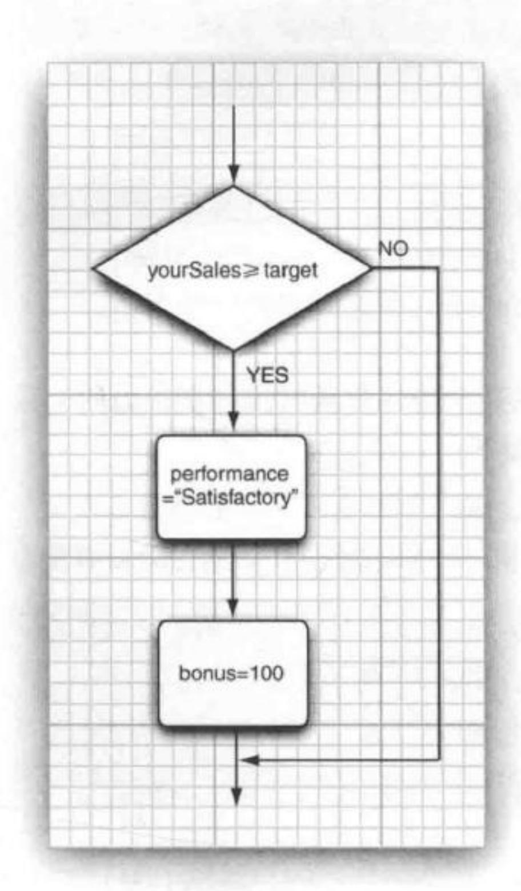

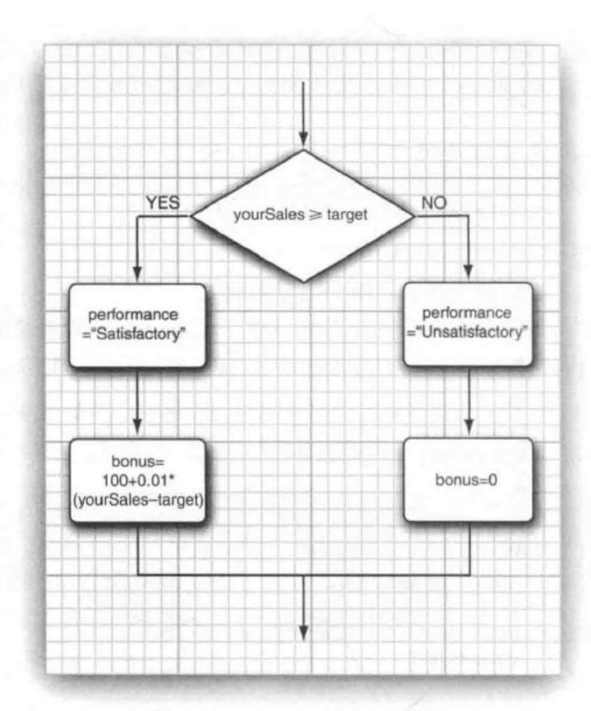

图 3-7 if 语句的流程图

图 3-8 if/else 语句的流程图

反复使用 if...else if... 很常见 (如图 3-9 所示)。例如:

```
if (yourSales >= 2 * target)
{
    performance = "Excellent";
    bonus = 1000;
}\nelse if (yourSales >= 1.5 * target)
{
    performance = "Fine";
    bonus = 500;
}\nelse if (yourSales >= target)
{
    performance = "Satisfactory";
    bonus = 100;
}\nelse
{
    System.out.println("You're fired");
}
```

#### 3.8.3 循环

while 循环会在条件为 true 时执行一个语句(也可以是一个块语句)。一般形式如下: while (condition) statement

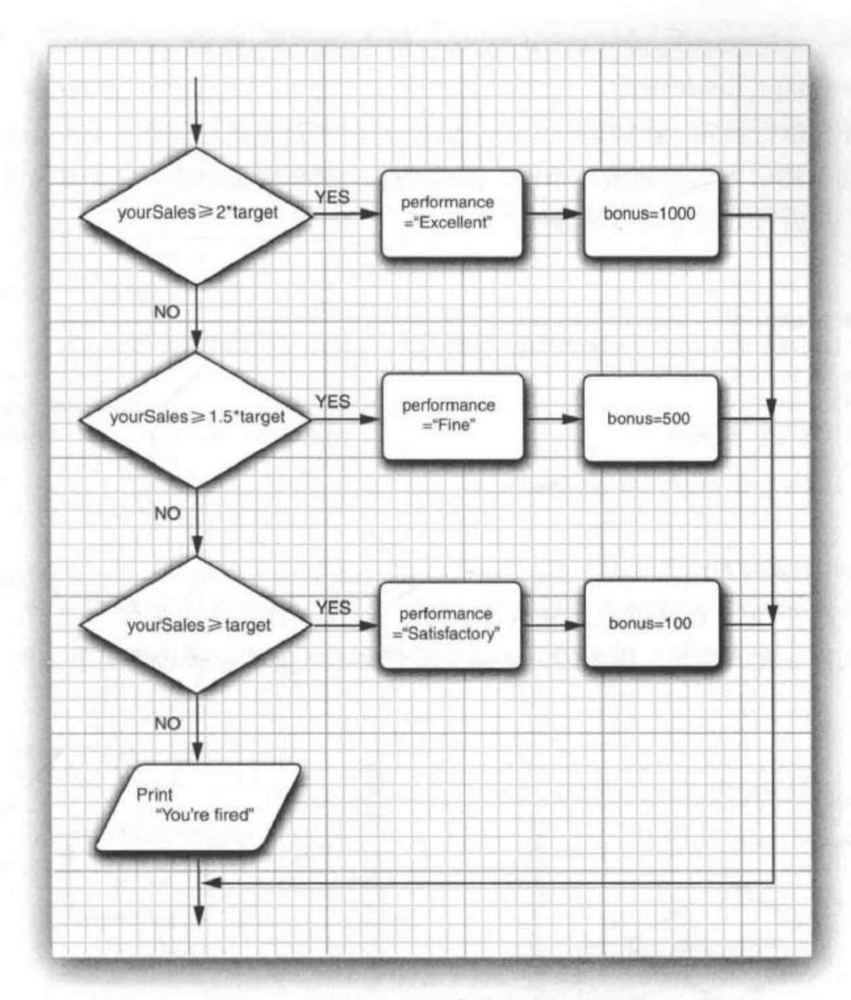

<sup>图</sup> 3-9 if/else if (多分支}的流程图

如果开始时循环条件就为 false. 那么 <sup>扁</sup>1k 循环一次也不执行 (请参见图 3-10

程序清单 3-3 中的程序将计算需要多长时间才能够存下一定数量的退休金. 假定每年存 人相同金额,而且利率是固定的。

在这个示例中,我们会让一个计数器递增,并在循环体中更新当前的累积金额,直到总 金额超过目标金额为止。

```
while (balance < goal)
{
   balance += payment ;
   double interest = balance *
                               interestate / 1眺;
   balance interest;
   year5++;
}
System .out ,printin(years + " years?);
```

(千万不要依赖这个程序安排退休计划. 这里没有考虑通货膨胀和你期望的生活水准。) while 循环语句在最前面检测循环条件。因此,循环体中的代码有可能一次都不执行口 <sup>如</sup> 果希望循环体至少执行一次,需要使用 do/while 循环将检测放在最后。它的语法如下:

do statement while (condition);

这种循环先执行语句(通常是一个语句块),然后再检查循环条件。如果条件为 true,就重复执行语句,然后再次检测循环条件,依此类推。在程序清单 3-4 中,首先计算退休账户中新的余额,然后再询问是否打算退休:

```
balance += payment;
  double interest = balance * interestRate / 100;
  balance += interest;
  years++;
  // print current balance
  // ask if ready to retire and get input
}
while (input.equals("N"));
```

只要用户回答 "N",循环就会重复执行(见图 3-11)。这是一个很好的例子,它展示了一个至少需要执行一次的循环,因为用户必须先看到余额才能决定是否满足退休所用。

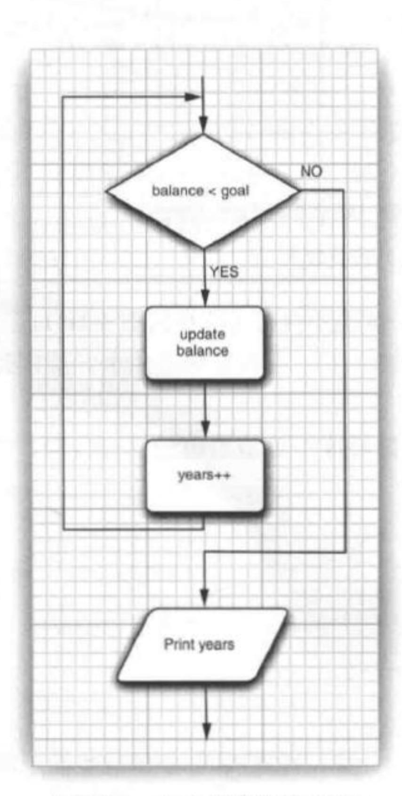

图 3-10 while 语句的流程图

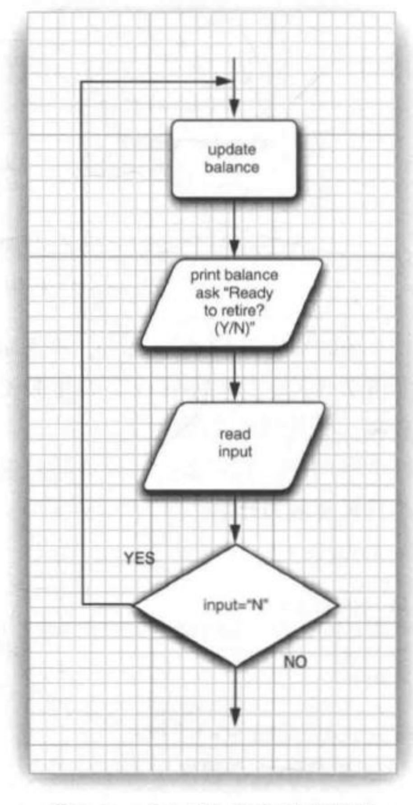

图 3-11 do/while 语句的流程图

#### 程序清单 3-3 Retirement/Retirement.java

```
import java.util.*;
2
  /**
   * This program demonstrates a <code>while</code> loop.
   * @version 1.20 2004-02-10
   * @author Cay Horstmann
  public class Retirement
9
      public static void main(String[] args)
10
11
         // read inputs
12
         Scanner in = new Scanner(System.in);
13
14
         System.out.print("How much money do you need to retire? ");
15
         double goal = in.nextDouble();
16
17
         System.out.print("How much money will you contribute every year? ");
18
         double payment = in.nextDouble();
19
20
         System.out.print("Interest rate in %: ");
21
         double interestRate = in.nextDouble();
22
23
         double balance = \theta;
24
         int years = 0;
25
26
         // update account balance while goal isn't reached
27
         while (balance < goal)
28
29
            // add this year's payment and interest
30
            balance += payment;
31
            double interest = balance * interestRate / 100;
32
            balance += interest;
             years++;
34
35
36
         System.out.println("You can retire in " + years + " years.");
37
38
39 }
```

#### 程序清单 3-4 Retirement2/Retirement2.java

```
import java.util.*;

/**

* This program demonstrates a <code>do/while</code> loop.

* @version 1.20 2004-02-10

* @author Cay Horstmann

*/

public class Retirement2

public static void main(String[] args)
```

```
Scanner in = new Scanner(System.in);
12
13
         System.out.print("How much money will you contribute every year? ");
14
         double payment = in.nextDouble();
15
16
         System.out.print("Interest rate in %: ");
17
         double interestRate = in.nextDouble();
18
19
         double balance = \theta;
20
         int year = 0;
21
22
         String input;
23
         // update account balance while user isn't ready to retire
25
         do
26
27
            // add this year's payment and interest
28
            balance += payment;
29
            double interest = balance * interestRate / 100;
38
            balance += interest;
31
32
            year++;
33
34
            // print current balance
35
            System.out.printf("After year %d, your balance is %,.2f%n", year, balance);
36
37
            // ask if ready to retire and get input
38
            System.out.print("Ready to retire? (Y/N) ");
39
            input = in.next();
48
41
         while (input.equals("N"));
42
43
44
```

#### 3.8.4 确定性循环

for 循环语句是支持迭代的一种通用结构,它由一个计数器或类似的变量控制迭代次数,每次迭代后这个变量将会更新。如图 3-12 所示,下面的循环将在屏幕上显示出打印数字 1 ~ 10:

```
for (int i = 1; i <= 10; i++)
System.out.println(i);</pre>
```

for 语句的第 1 部分通常是对计数器初始化; 第 2 部分给出每次新一轮循环执行前要检测的循环条件; 第 3 部分指定如何更新计数器。

与 C++ 类似,尽管 Java 允许在 for 循环的各个部分放置任何表达式,但有一条不成文的规则: for 语句的 3 个部分应该对同一个计数器变量进行初始化、检测和更新。若不遵守这一规则,所写的循环很可能晦涩难懂。

即使受这个规则所限,仍有无尽可能,你可以写各种各样的 for 循环。例如,可以编写

#### 下面这个倒计数的循环:

```
for (int i = 10; i > 0; i--)
   System.out.println("Counting down . . . " + i);
System.out.println("Blastoff!");
```

● 警告: 在循环中, 检测两个浮点数是否相等需要格外小心。下面的 for 循环:

```
for (double x = 0; x != 10; x += 0.1) . . .
```

可能永远不会结束。由于存在含入误差,可能永远达不到精确的最终值。在这个例子中,因为0.1 无法精确地用二进制表示,所以,x将从9.9999999999839999999999999999999999999

在 for 语句的第 1 部分中声明一个变量之后,这个变量的作用域会扩展到这个 for 循环体的末尾。

```
for (int i = 1; i <= 10; i++)
{
```

特别指出,如果在 for 语句内部定义一个变量,这个变量就不能在循环体之外使用。因此,如果希望在 for 循环体之外使用循环计数器的最终值,就要确保在循环体之外声明这个变量。

```
int i;
for (i = 1; i <= 10; i++)
{
```

for (int i = 1;  $i \le 10$ ; i++)

另一方面,可以在不同的 for 循环中定义同名的变量:

```
{
    ...
for (int i = 11; i <= 20; i++) // OK to define another variable named i
    {
    ...
}
for 循环语句只是 while 循环的一种简化形式。例如,
```

for (int i = 10; i > 0; i--)
System.out.println("Counting down . . . " + i);

可以重写为:

int i = 10;

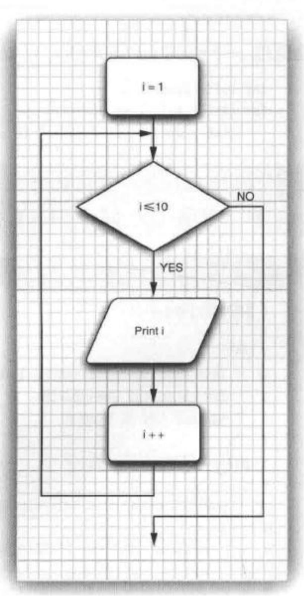

图 3-12 for 语句的流程图

```
while (i > 0)
{
    System.out.println("Counting down . . . " + i);
    i--;
}
```

程序清单 3-5 给出了一个 for 循环的典型示例。

这个程序用来计算抽奖中奖的概率。例如,如果必须从 $1\sim50$ 的数字中取6个数字来抽奖,那么会有( $50\times49\times48\times47\times46\times45$ )/( $1\times2\times3\times4\times5\times6$ )种可能的结果,所以中奖的概率是 1/15 890 700。祝你好运!

一般情况下,如果从n个数字中抽取k个数字,就会有

$$\frac{n \times (n-1) \times (n-2) \times \cdots \times (n-k+1)}{1 \times 2 \times 3 \times 4 \times \cdots \times k}$$

种可能。下面的 for 循环语句可以计算这个值:

```
int lotteryOdds = 1;
for (int i = 1; i <= k; i++)
  lotteryOdds = lotteryOdds * (n - i + 1) / i;</pre>
```

注释: 3.10.3 节将会介绍"泛型 for 循环"(又称为 for each 循环),利用这个循环可以很方便地访问一个数组或集合中的所有元素。

#### 程序清单 3-5 LotteryOdds/LotteryOdds.java

```
import java.util.*;
2
   * This program demonstrates a <code>for</code> loop.
    * @version 1.20 2004-02-10
    * @author Cay Horstmann
8 public class LotteryOdds
9 {
      public static void main(String[] args)
10
11
         Scanner in = new Scanner(System.in);
12
13
         System.out.print("How many numbers do you need to draw? ");
14
         int k = in.nextInt();
15
16
         System.out.print("What is the highest number you can draw? ");
17
         int n = in.nextInt();
18
19
20
          * compute binomial coefficient n*(n-1)*(n-2)*...*(n-k+1)/(1*2*3*...*k)
21
          */
22
23
         int lotteryOdds = 1;
24
         for (int i = 1; i \le k; i++)
25
            lotteryOdds = lotteryOdds * (n - i + 1) / i;
26
27
```

```
System.out.println("Your odds are 1 in " + lotteryOdds + ". Good luck!");

30 }
```

#### 3.8.5 多重选择: switch 语句

在处理同一个表达式的多个选项时,使用 if/else 结构会显得有些笨拙。switch 语句会让这个工作变得容易,特别是采用 Java 14 引入的形式时会更简单。

例如,如果建立一个如图 3-13 所示的菜单系统,其中包含 4 个选项,可以使用以下代码:

```
Scanner in = new Scanner(System.in);
System.out.print("Select an option (1, 2, 3, 4) ");\nint choice = in.nextInt();
switch (choice)
{
   case 1 ->
      case 2 ->
      case 3 ->
      case 4 ->
      System.out.println("Bad input");
}
```

case 标签可以是:

- 类型为 char、byte、short 或 int 的常量表达式
- 枚举常量
- 字符串字面量
- 多个字符串,用逗号分隔

#### 例如:

```
String input = . . .;
switch (input.toLowerCase())
{
   case "yes", "y" ->
        case "no", "n" ->
        default ->
        . . .
}
```

switch 语句的"经典"形式可以追溯到 C 语言, 从 Java 1.0 开始就支持这种形式。具体形式如下:

```
int choice = . . .;
switch (choice)
{
   case 1:
```

```
匚ase 2:
   break;
   break;
case 4:
   break;
default:
   // bad input
   break;
case 3:
```

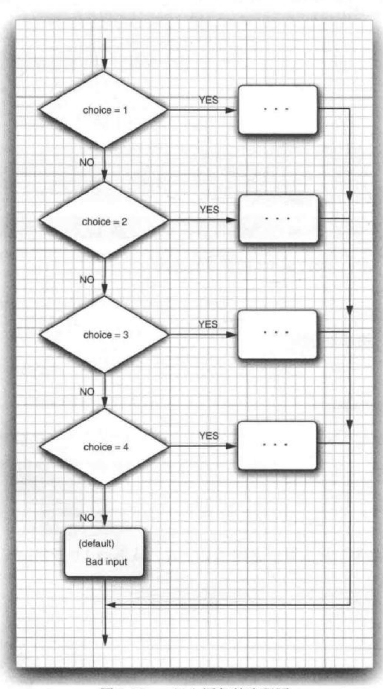

图 3-13 Switch 语句的流程图

switch 语句从与选项值相匹配的 case 标签开始执行,直到遇到下一个 break 语句,或者执行到 switch 语句结束。如果没有匹配的 case 标签,则执行 default 子句(如果有 default 子句)。

● 警告: 有可能触发多个分支。如果忘记在一个分支末尾增加 break 语句,就会接着执行下一个分支! 这种情况相当危险,常常会引发错误。

为了检测这种问题,编译代码时可以加上-Xlint:fallthrough选项,如下所示:

javac -Xlint:fallthrough Test.java

这样一来,如果某个分支最后缺少一个 break 语句,编译器就会给出一个警告。

如果你确实是想使用这种"直通式"(fallthrough)行为,可以为其外围方法加一个注解@SuppressWarnings("fallthrough")。这样就不会对这个方法生成警告了。(注解是为编译器或处理 Java 源文件或类文件的工具提供信息的一种机制。卷 II 会深入介绍注解。)

这两种 switch 形式都是语句。在 3.5.9 节中,我们已经见过一个 switch 表达式,它会生成一个值。switch 表达式没有"直通式"行为。

为了对称, Java 14 还引入了一个有直通行为的 switch 表达式, 所以总共有 4 种不同形式的 switch。表 3-7 给出了这 4 种形式。

在有直通行为的形式中,每个 case 以一个冒号结束。如果 case 以箭头 -> 结束,则没有直通行为。不能在一个 switch 语句中混合使用冒号和箭头。

注意 switch 表达式中的 yield 关键字。与 break 类似, yield 会终止执行。但与 break 不同的是, yield 还会生成一个值, 这就是表达式的值。

要在 switch 表达式的一个分支中使用语句而不想有直通行为,就必须使用大括号和 yield,如表中示例所示,这个例子将为一个分支增加日志语句:

```
case "Spring" ->
{
    System.out.println("spring time!");
    yield 6;
}
```

switch 表达式的每个分支必须生成一个值。最常见的做法是,各个值跟在一个箭头 -> 后面: case "Summer", "Winter" -> 6;

如果无法做到,则使用 yield 语句。

表 3-7 4 种 switch 形式

```
表达式
                                                                                                          句
                                                                                     switch (seasonName)
                                          int numLetters = switch (seasonName)
                                                                                        case "Spring" ->
                                                case "Spring" ->
                                                                                              System.out.println(
                                                                                                 "spring time!");
                                                      System.out.println(
                                                                                              numLetters = 6;
                                                         "spring time!");
无直通行为
                                                      yield 6;
                                                                                        case "Summer", "Winter" ->
                                                                                           numLetters = 6:
                                                case "Summer", "Winter" -> 6;
                                                                                        case "Fall" ->
                                                case "Fall" -> 4;
                                                                                           numLetters = 4;
                                                default -> -1;
                                                                                        default ->
                                                                                           numLetters = -1;
```

74

```
表达式
                                                                                                         句
                                                                                    switch (seasonName)
                                          int numLetters = switch (seasonName)
                                                                                       case "Spring":
                                               case "Spring":
                                                                                         System.out.println(
                                                                                             "spring time!");
                                                  System.out.println(
                                                     "spring time!");
                                                                                       case "Summer", "Winter":
                                               case "Summer", "Winter":
                                                                                          numLetters = 6;
有直通行为
                                                  yield 6;
                                                                                          break;
                                               case "Fall":
                                                                                       case "Fall":
                                                  yield 4;
                                                                                          numLetters = 4;
                                               default:
                                                                                          break;
                                                                                       default:
                                                  yield -1;
                                                                                          numLetters = -1;
                                             };
```

注释: 完全可以在 switch 表达式的一个分支中抛出异常。例如: default -> throw new IllegalArgumentException("Not a valid season"); 异常将在第7章详细介绍。

● 警告: switch 表达式的关键是生成一个值(或者产生一个异常而失败)。不允许"跳出" switch 表达式:

default -> { return -1; } // ERROR

具体来讲,不能在 switch 表达式中使用 return、break 或 continue 语句。(后面两个语句 参见 3.8.6 节的介绍)。

switch有这么多种形式,要如何选择呢?

switch 表达式优于语句。如果每个分支会为一个变量赋值或方法调用计算值,则用一个表达式生成值,然后使用这个值。例如:

```
numLetters = switch (seasonName)
{
    case "Spring", "Summer", "Winter" -> 6
    case "Fall" -> 4
    default -> -1
};

要优于

switch (seasonName)
{
    case "Spring", "Summer", "Winter" ->
        numLetters = 6;
    case "Fall" ->
        numLetters = 4;
    default ->
        numLetters = -1;
}
```

只有在确实需要直通行为时,或者必须为一个 switch 表达式增加语句时,才需要使用

break 或 yield。不过这些情况非常少见。

#### 3.8.6 中断控制流程的语句

尽管 Java 的设计者将 goto 仍作为一个保留字,但实际上并不打算在语言中包含 goto。通常,使用 goto 语句会被认为是一种拙劣的程序设计风格。也有一些程序员认为反对 goto 的呼声似乎有些过分(例如,Donald Knuth 就曾写过一篇名为 Structured Programming with goto statements 的著名文章)。他们认为,无限制地使用 goto 语句确实很容易导致错误,但在有些情况下,偶尔使用 goto 跳出循环还是有益处的。Java 设计者同意这种看法,甚至在 Java 语言中增加了一条新的语句:带标签的 break,以此来支持这种程序设计风格。

下面首先来看不带标签的 break 语句。与用于退出 switch 语句的 break 语句一样,它也可以用于退出循环。例如,

```
while (years <= 100)
{
   balance += payment;
   double interest = balance * interestRate / 100;
   balance += interest;
   if (balance >= goal) break;
   years++;
}
```

循环开始时,如果 years > 100,或者如果循环中间 balance ≥ goal,则退出循环。当然,也可以在不使用 break 的情况下计算 years 的值,如下所示:

```
while (years <= 100 && balance < goal)
{
   balance += payment;
   double interest = balance * interestRate / 100;
   balance += interest;
\nif (balance < goal)
   years++;
}</pre>
```

但是需要注意,在这个版本中,检测了两次 balance < goal。为了避免重复检测,有些程序员更偏爱使用 break 语句。

与 C++ 不同, Java 还提供了一种带标签的 break 语句,允许跳出多重嵌套的循环。有时候,在嵌套很深的循环语句中会发生一些不可预料的事情。此时你可能希望完全跳出所有嵌套循环。如果只是为各层循环检测添加一些额外的条件,这会很不方便。

下面的例子展示了 break 语句如何工作。请注意,标签必须放在你想跳出的最外层循环之前,并且必须紧跟一个冒号。

```
Scanner in = new Scanner(System.in);\nint n;
read_data:
while (. . .) // this loop statement is tagged with the label
{
```

```
for (. . .) // this inner loop is not labeled
{
    System.out.print("Enter a number >= 0: ");
    n = in.nextInt();
    if (n < 0) // should never happen-can't go on
        break read_data;
        // break out of read_data loop
        . . .
}
}
// this statement is executed immediately after the labeled break\nif (n < 0) // check for bad situation
{
    // deal with bad situation
}\nelse
{
    // carry out normal processing
}</pre>
```

如果输入有误,执行带标签的 break 会跳转到带标签的语句块末尾。与任何使用 break 语句的代码一样,接下来需要检测循环是正常退出,还是由于 break 提前退出。

□ 注释:有意思的是,可以将标签应用到任何语句,甚至可以应用到 if 语句或者块语句,如下所示:

```
label:
{
    if (condition) break label; // exits block
    . . .
}
// jumps here when the break statement executes
```

因此,如果确实希望使用 goto 语句,而且一个代码块恰好在你想要跳转到的位置之前结束,就可以使用 break 语句! 当然,我并不提倡使用这种方法。另外需要注意,只能跳出语句块,而不能跳入语句块。

最后,还有一个 continue 语句。与 break 语句一样,它将中断正常的控制流程。continue 语句将控制转移到最内层外围循环的首部。例如:

```
Scanner in = new Scanner(System.in);
while (sum < goal)
{
    System.out.print("Enter a number: ");
    n = in.nextInt();
    if (n < 0) continue;
    sum += n; // not executed if n < 0
}</pre>
```

如果 n<0,则 continue 语句会越过当前循环体的剩余部分,直接跳到循环首部。如果在 for 循环中使用 continue 语句,会跳转到 for 循环的"更新"部分。例如:

```
for (count = 1; count <= 100; count++)
```

```
{
    System.out.print("Enter a number, -1 to quit: ");
    n = in.nextInt();
    if (n < 0) continue;
    sum += n; // not executed if n < 0
}</pre>
```

如果 n<0,则 continue 语句将跳转到 count++ 语句。

还有一种带标签的 continue 语句,将跳转到有匹配标签的循环的首部。

● 提示: 许多程序员发现 break 和 continue 语句很容易混淆。这些语句完全是可选的,即不使用这些语句也能表达同样的逻辑。在本书中,所有程序都不会使用 break 和 continue。

#### 3.9 大数

如果基本的整数和浮点数精度不足以满足需求,那么可以使用 java.math 包中两个很有用的类: BigInteger 和 BigDecimal。这两个类可以处理包含任意长度数字序列的数值。BigInteger 类实现任意精度的整数运算,BigDecimal 实现任意精度的浮点数运算。

使用静态的 valueOf 方法可以将一个普通的数转换为大数:

BigInteger a = BigInteger.valueOf(100);

对于更长的数,可以使用一个带字符串参数的构造器:

BigInteger reallyBig

= new BigInteger("222232244629420445529739893461909967206666939096499764990979600");

另外还有一些常量: BigInteger.ZERO、BigInteger.ONE 和 BigInteger.TEN, Java 9 之后还增加了 BigInteger.TWO。

- 警告:对于BigDecimal类,总是应当使用带一个字符串参数的构造器。还有一个BigDecimal(double)构造器,不过这个构造器本质上很容易产生含入误差,例如,new BigDecimal(θ.1)会得到以下数位:
  - 0.1000000000000000055511151231257827021181583404541015625

遗憾的是,不能使用人们熟悉的算术运算符(如:+和\*)来组合大数,而需要使用大数 类中的 add 和 multiply 方法。

```
BigInteger c = a.add(b); // c = a + b
BigInteger d = c.multiply(b.add(BigInteger.valueOf(2))); // d = c * (b + 2)
```

C++ 注释: 与 C++ 不同, Java 不能通过编程实现运算符重载。使用 BigInteger 类的程序员无法重定义+和\*运算符来提供 BigInteger 类的 add 和 multiply 运算。Java 语言的设计者重载了+运算符来完成字符串的拼接,但没有重载其他的运算符,也没有给Java 程序员提供机会在他们自己的类中重载运算符。

程序清单 3-6 是对程序清单 3-5 中彩概率程序的改进,更新为使用大数。例如,假设你被邀请参加抽奖活动,并从 490 个可能的数中抽取 60 个,这个程序会告诉你中彩的概率是1/716395843461995557415116222540092933411717612789263493493351013459481104668848。祝你好运!

```
在程序清单 3-5 中,会计算以下语句:
lotteryOdds = lotteryOdds * (n - i + 1) / i;
如果对 lotteryOdds 和 n 使用大数,则相应的语句为:
lotteryOdds = lotteryOdds
.multiply(n.subtract(BigInteger.valueOf(i - 1)))
.divide(BigInteger.valueOf(i));
```

#### 程序清单 3-6 BigIntegerTest/BigIntegerTest.java

```
import java.math.*;
   import java.util.*;
   /**
    * This program uses big numbers to compute the odds of winning the grand prize in a lottery.
    * @version 1.20 2004-02-10
    * @author Cay Horstmann
9 public class BigIntegerTest
10 {
      public static void main(String[] args)
11
12
         Scanner in = new Scanner(System.in);
13
14
         System.out.print("How many numbers do you need to draw? ");
15
         int k = in.nextInt();
16
17
         System.out.print("What is the highest number you can draw? ");
18
         BigInteger n = in.nextBigInteger();
19
         /*
21
          * compute binomial coefficient n*(n-1)*(n-2)*...*(n-k+1)/(1*2*3*...*k)
22
          */
23
24
         BigInteger lotteryOdds = BigInteger.ONE;
25
26
         for (int i = 1; i \le k; i++)
27
            lotteryOdds = lotteryOdds
28
                .multiply(n.subtract(BigInteger.valueOf(i - 1)))
29
                .divide(BigInteger.valueOf(i));
31
         System.out.printf("Your odds are 1 in %s. Good luck!%n", lotteryOdds);
32
33
34 }
```

#### java.math.BigInteger 1.1

- BigInteger add(BigInteger other)
- BigInteger subtract(BigInteger other)

- BigInteger multiply(BigInteger other)
- BigInteger divide(BigInteger other)
- BigInteger mod(BigInteger other)
   返回这个大整数和另一个大整数 other 的和、差、积、商以及余数。
- BigInteger sqrt() 9
   得到这个 BigInteger 的平方根。
- int compareTo(BigInteger other)
   如果这个大整数与另一个大整数 other 相等,返回 0;如果这个大整数小于另一个大整数 other,返回负数;否则,返回正数。
- static BigInteger valueOf(long x)
   返回值等于 x 的大整数。

#### API java.math.BigDecimal 1.1

- BigDecimal(String digits)
   用给定数位构造一个大实数。
- BigDecimal add(BigDecimal other)
- BigDecimal subtract(BigDecimal other)
- BigDecimal multiply(BigDecimal other)
- BigDecimal divide(BigDecimal other)
- BigDecimal divide(BigDecimal other, RoundingMode mode) 5
   返回这个大实数与另一个大实数 other 的和、差、积、商。如果商是一个无限小数,第一个 divide 方法会抛出一个异常。要得到一个舍入的结果,就要使用第二个方法。RoundingMode.HALF\_UP 是我们在学校里学习的四舍五入方式(即,0到4舍去,5到9进位)。它适用于常规的计算。其他舍入方式请参见 API 文档。
- int compareTo(BigDecimal other)
   如果这个大实数与另一个大实数 other 相等,返回 θ;如果这个大实数小于 other,返回负数;否则,返回正数。

#### 3.10 数组

数组存储相同类型值的序列。下面几小节中,我们将学习在 Java 中如何使用数组。

#### 3.10.1 声明数组

数组是一种数据结构,用来存储同一类型值的集合。通过一个整型索引(index,或称下标)可以访问数组中的每一个值。例如,如果 a 是一个整型数组, a[i] 就是数组中索引为 i 的整数。

在声明数组变量时,需要指出数组类型(元素类型后面紧跟[])和数组变量名。例如,下面声明了整型数组 a:

int[] a;

不过,这条语句只声明了变量 a,并没有将 a 初始化为一个真正的数组。应该使用 new 操作符创建数组。

int[] a = new int[100]; // or var a = new int[100];

这条语句声明并初始化了一个可以存储 100 个整数的数组。

数组长度不要求是常量: new int[n] 会创建一个长度为 n 的数组。

一旦创建了数组,就不能再改变它的长度(不过,当然可以改变单个数组元素)。如果程序运行中需要经常扩展数组的大小,就应该使用另一种数据结构——数组列表(array list)。有关数组列表的详细内容请参见第5章。

#### ☐ 注释:可以使用下面两种形式定义一个数组变量:

int[] a;

或

int a[];

大多数 Java 程序员喜欢使用第一种风格,因为它可以将类型 int[](整型数组)与变量名清晰地分开。

在 Java 中,提供了一种创建数组对象并同时提供初始值的简写形式。下面是一个例子: int[] smallPrimes = { 2, 3, 5, 7, 11, 13 };

请注意,这个语法中不需要使用 new,甚至不用指定长度。

最后一个值后面允许有逗号,如果你要不断为数组增加值,这样会很方便:

```
String[] authors =
    {
        "James Gosling",
        "Bill Joy",
        "Guy Steele",
        // add more names here and put a comma after each name
};
```

还可以声明一个匿名数组 (anonymous array):

new int[] { 17, 19, 23, 29, 31, 37 };

这个表达式会分配一个新数组并填入大括号中提供的值。它会统计初始值个数,并相应 地设置数组大小。可以使用这种语法重新初始化一个数组而无须创建新变量。例如:

smallPrimes = new int[] { 17, 19, 23, 29, 31, 37 };

这是以下语句的简写形式:

```
int[] anonymous = { 17, 19, 23, 29, 31, 37 };
smallPrimes = anonymous;
```

這 注释:在 Java 中,允许有长度为 0 的数组。编写一个结果为数组的方法时,如果碰巧结果为空,这样一个长度为 0 的数组就很有用。可以如下构造一个长度为 0 的数组:

new elementType[0]

或

new elementType[] {}

注意,长度为0的数组与null并不相同。

#### 3.10.2 访问数组元素

数组元素从 0 开始编号。最后一个合法的索引为数组长度减 1。在下面的例子中,索引值为 0 ~ 99。一旦创建了数组,就可以在数组中填入元素。例如,可以使用一个循环:

int[] a = new int[100];
for (int i = 0; i < 100; i++)
 a[i] = i; // fills the array with numbers 0 to 99</pre>

创建一个数字数组时,所有元素都初始化为 0。boolean 数组的元素会初始化为 false。对象数组的元素则初始化为一个特殊值 null,表示这些元素(还)未存放任何对象。初学者对此可能有些不解。例如,

String[] names = new String[10];

会创建一个包含 10 个字符串的数组, 所有字符串都为 null。如果希望这个数组包含空串, 则必须为元素提供空串:

for (int i = 0; i < 10; i++) names[i] = "";

● 警告:如果创建了一个包含 100 个元素的数组,然后试图访问元素 a[100] (或在 0~99 之外的任何其他索引),就会出现"array index out of bounds"(数组索引越界)异常。

要想获得数组中的元素个数,可以使用 array.length。例如,

for (int i = 0; i < a.length; i++)
 System.out.println(a[i]);</pre>

#### 3.10.3 for each 循环

Java 有一种功能很强的循环结构,可以用来依次处理数组(或者任何其他元素集合)中的每个元素,而不必考虑指定索引值。

这种增强的 for 循环形式如下:

for (variable: collection) statement

它将给定变量(variable)设置为集合中的每一个元素,然后执行语句(statement)(当然,也可以是语句块)。collection 表达式必须是一个数组或者是一个实现了 Iterable 接口的类对象(例如 ArrayList)。有关数组列表的内容将在第5章中讨论,另外 Iterable 接口将在第9章中讨论。

例如,

for (int element : a)
 System.out.println(element);

会打印数组 a 的每一个元素, 一个元素占一行。

这个循环应该读作"循环 a 中的每一个元素"(for each element in a)。Java 语言的设计者也曾考虑过使用诸如 foreach 和 in 这样的关键字,但这种循环并不是最初就包含在 Java 语言中,而是后来添加的,没有人希望破坏已经包含同名方法或变量(例如 System.in)的老代码。

当然,使用传统的 for 循环也可以获得同样的效果:

for (int i = 0; i < a.length; i++)
 System.out.println(a[i]);</pre>

但是, "for each"循环更加简洁、更不易出错, 因为你不必为起始和终止索引值而操心。

注释: "for each"循环的循环变量将会遍历数组中的每个元素,而不是索引值。

如果需要处理一个集合中的所有元素,相比传统循环,"for each"循环是个让人欣喜的改进。不过,很多情况下还是需要使用传统的 for 循环。例如,可能不希望遍历整个集合,或者可能需要在循环内部使用索引值。

● 提示: 有一个更容易的方法可以打印数组中的所有值,即利用 Arrays 类的 toString 方法。调用 Arrays.toString(a) 会返回一个包含数组元素的字符串,这些元素包围在中括号内,并用逗号分隔,例如,"[2,3,5,7,11,13]"。要想打印数组,只需要调用

System.out.println(Arrays.toString(a));

#### 3.10.4 数组拷贝

在 Java 中,允许将一个数组变量拷贝到另一个数组变量。这时,两个变量将引用同一个数组:

int[] luckyNumbers = smallPrimes; luckyNumbers[5] = 12; // now smallPrimes[5] is also 12

图 3-14 显示了拷贝的结果。

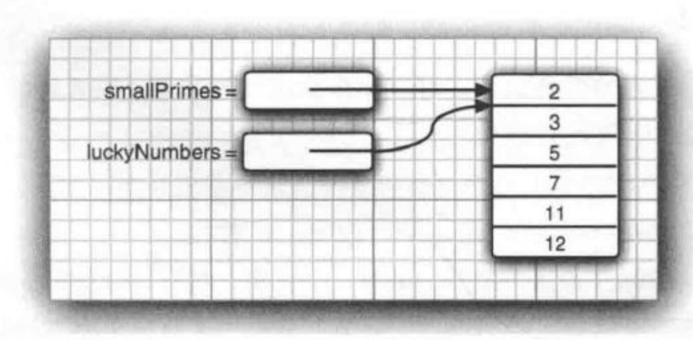

图 3-14 拷贝一个数组变量

如果确实希望将一个数组的所有值拷贝到一个新的数组中,就要使用 Arrays 类的 copy0f 方法:

int[] copiedLuckyNumbers = Arrays.copyOf(luckyNumbers, luckyNumbers.length);

第2个参数是新数组的长度。这个方法通常用来增加数组的大小:

luckyNumbers = Arrays.copyOf(luckyNumbers, 2 \* luckyNumbers.length);

如果数组元素是数值型,那么新增的元素将填入θ;如果数组元素是布尔型,则填入 false。相反,如果长度小于原数组的长度,则只拷贝前面的值。

C++ 注释: Java 数组与堆栈上的 C++ 数组有很大不同,但基本上与在堆(heap)上分配的数组指针一样。也就是说,

```
int[] a = new int[100]; // Java
不同于
int a[100]; // C++
而等同于
int* a = new int[100]; // C++
```

Java 中的 [] 运算符预定义为会完成越界检查 (bounds checking)。另外,没有指针运算,就意味着不能通过 a 加 1 得到数组中的下一个元素。

#### 3.10.5 命令行参数

前面已经看到一个例子,其中一个 Java 数组重复出现过很多次。每一个 Java 程序都有一个带 String arg[] 参数的 main 方法。这个参数表明 main 方法将接收一个字符串数组,也就是命令行上指定的参数。

```
例如,来看下面这个程序:

public class Message
{
    public static void main(String[] args)
    {
        if (args.length == 0 || args[0].equals("-h"))
            System.out.print("Hello,");
        else if (args[0].equals("-g"))
            System.out.print("Goodbye,");
        // print the other command-line arguments
        for (int i = 1; i < args.length; i++)
            System.out.print(" " + args[i]);
        System.out.println("!");
    }
}

如果如下调用这个程序:
java Message -g cruel world
args 数组将包含以下内容:
```

args[0]: "-g"
args[1]: "cruel"
args[2]: "world"

这个程序会显示下面这个消息:

Goodbye, cruel world!

C++ 注释: 在 Java 程序的 main 方法中,程序名并不存储在 args 数组中。例如,从命令行如下运行一个程序时

java Message -h world

args[0] 是 "-h", 而不是 "Message" 或 "java"。

#### 3.10.6 数组排序

要想对数值型数组进行排序,可以使用 Arrays 类中的 sort 方法:

int[] a = new int[10000];

Arrays.sort(a)

这个方法使用了优化的快速排序(QuickSort)算法。快速排序算法对于大多数数据集都很高效。Arrays类还提供了另外一些很便捷的方法,在这一节最后的 API 注释中将介绍这些方法。

程序清单 3-7 中的程序具体使用了数组,它会为一个抽彩游戏生成一个随机的数字组合。例如,假如从49个数字中抽取6个数,那么程序可能的输出结果为:

Bet the following combination. It'll make you rich!

4

8

19

30

44

要想选择这样一组随机的数字, 首先将值 1,2, ..., n 填入数组 numbers 中:

```
int[] numbers = new int[n];
for (int i = 0; i < numbers.length; i++)
  numbers[i] = i + 1;</pre>
```

第二个数组存放抽取出来的数:

int[] result = new int[k];

现在可以开始抽取 k 个数了。Math.random 方法将返回一个 0 到 1 之间(包含 0、不包含 1)的随机浮点数。用 n 乘以这个浮点数,可以得到从 0 到 n-1 之间的一个随机数。

```
int r = (int) (Math.random() * n);
```

下面将 result 的第 i 个元素设置为该索引对应的数 (numbers[r]),最初是 r+1,但正如所看到的,numbers 数组的内容在每一次抽取之后都会发生变化。

```
result[i] = numbers[r];
```

现在,必须确保不会再次抽到那个数,因为所有抽彩数字必须各不相同。因此,这里用数组中的最后一个数覆盖 number[r],并将 n 减 1。

```
numbers[r] = numbers[n - 1];
n--;
```

关键在于每次抽取的都是索引,而不是实际的值。这个索引指向一个数组,其中包含尚未抽取过的值。

在抽取了 k 个数之后, 可以对 result 数组进行排序, 来得到更美观的输出:

```
Arrays.sort(result);
for (int r : result)
   System.out.println(r);
```

#### 程序清单 3-7 LotteryDrawing/LotteryDrawing.java

```
import java.util.*;
2
    * This program demonstrates array manipulation.
     @version 1.20 2004-02-10
     @author Cay Horstmann
  public class LotteryDrawing
9
      public static void main(String[] args)
10
11
         Scanner in = new Scanner(System.in);
12
13
         System.out.print("How many numbers do you need to draw? ");
14
         int k = in.nextInt();
15
16
         System.out.print("What is the highest number you can draw? ");
         int n = in.nextInt();
18
19
         // fill an array with numbers 1 2 3 . . . n
20
         int[] numbers = new int[n];
21
         for (int i = 0; i < numbers.length; <math>i++)
22
            numbers[i] = i + 1;
23
24
         // draw k numbers and put them into a second array
25
         int[] result = new int[k];
26
         for (int i = 0; i < result.length; i++)
27
28
            // make a random index between 0 and n - 1
29
            int r = (int) (Math.random() * n);
30
31
            // pick the element at the random location
32
            result[i] = numbers[r];
33
34
            // move the last element into the random location
35
            numbers[r] = numbers[n - 1];
36
            n --;
37
```

```
38  }
39
40    // print the sorted array
41    Arrays.sort(result);
42    System.out.println("Bet the following combination. It'll make you rich!");
43    for (int r : result)
44         System.out.println(r);
45    }
46 }
```

#### API java.util.Arrays 1.2

- static String toString(xxx[] a) 5
  - 返回一个字符串,其中包含 a 中的元素,这些元素用中括号包围,并用逗号分隔。在这个方法以及后面的方法中,数组元素类型 xxx 可以是 int、long、short、char、byte、boolean、float 或 double。
- static xxx[] copyOf(xxx[] a, int end) 6
- static xxx[] copyOfRange(xxx[] a, int start, int end) 6
   返回与a类型相同的一个数组,其长度为 end 或者 end-start,并填入a的值。如果 end 大于a.length,结果会填充0或 false 值。
- static void sort(xxx[] a)
   使用优化的快速排序算法对数组进行排序。
- static int binarySearch(xxx[] a, xxx v)
- static int binarySearch(xxx[] a, int start, int end, xxx v) 6
   使用二分查找算法在有序数组 a 中查找值 v。如果找到 v,则返回相应的索引;否则,返回一个负数值 r。-r-1 是 v 应插入的位置(为保持 a 有序)。
- static void fill(xxx[] a, xxx v)
   将数组的所有元素设置为 v。
- static boolean equals(xxx[] a, xxx[] b)
   如果两个数组长度相同,并且相同索引对应的元素都相同,则返回 true。

#### 3.10.7 多维数组

多维数组使用多个索引访问数组元素,它适用于表格或其他更复杂的排列形式。你可以 先跳过这一节的内容,等真正需要使用这种存储机制时再返回来学习。

假设需要建立一个数值表格,用来显示在不同利率下投资 10 000 美元有多少收益,利息 每年兑现并复投(见表 3-8)。

| 10%       | 11%       | 12%       | 13%       | 14%       | 15%       |
|-----------|-----------|-----------|-----------|-----------|-----------|
| 10 000.00 | 10 000.00 | 10 000.00 | 10 000.00 | 10 000.00 | 10 000.00 |
| 11 000.00 | 11 100.00 | 11 200.00 | 11 300.00 | 11 400.00 | 11 500.00 |

表 3-8 不同利率下的投资收益情况

| 10%       | 11%       | 12%       | 13%        | 14%       | 15%       |
|-----------|-----------|-----------|------------|-----------|-----------|
| 12 100.00 | 12 321.00 | 12 544.00 | 12 769.00  | 12 996.00 | 13 225.00 |
| 13 310.00 | 13 676.31 | 14 049.28 | 14 428.97  | 14 815.44 | 15 208.75 |
| 14 641 00 | 15 180.70 | 15 735.19 | 16 304.74  | 16 889.60 | 17 490.06 |
| 16 105.10 | 16 850.58 | 17 623.42 | 18 424 .35 | 19 254.15 | 20 113.57 |
| 17 715.61 | 18 704.15 | 19 738.23 | 20 819.52  | 21 949.73 | 23 130.61 |
| 19 487.17 | 20 761.60 | 22 106.81 | 23 526.05  | 25 022.69 | 26 600.20 |
| 21 435.89 | 23 045.38 | 24 759.63 | 26 584.44  | 28 525.86 | 30 590.23 |
| 23 579.48 | 25 580.37 | 27 730.79 | 30 040.42  | 32 519.49 | 35 178.76 |
|           |           |           |            |           |           |

(续)

可以使用一个二维数组(也称为矩阵)来存储这些信息,名为 balances。

在 Java 中,声明一个二维数组相当简单。例如:

double[][] balances;

数组在进行初始化之前是不能使用的。在这里可以如下初始化:

balances = new double[NYEARS][NRATES];

其他情况下,如果知道数组元素,可以不调用 new,而直接使用一种简写形式对多维数组进行初始化。例如:

```
int[][] magicSquare =
{
     {16, 3, 2, 13},
     {5, 10, 11, 8},
     {9, 6, 7, 12},
     {4, 15, 14, 1}
};
```

一旦初始化数组,就可以利用两对中括号访问单个元素,例如,balances[i][j]。

在示例程序中用到了一个存储利率的一维数组 interest 和一个存储账户余额的二维数组 balances (对应每个年度和利率分别有一个余额),使用初始余额来初始化这个数组的第一行:

```
for (int j = 0; j < balances[0].length; j++)
balances[0][j] = 10000;

然后计算其他行,如下所示:

for (int i = 1; i < balances.length; i++)
{
   for (int j = 0; j < balances[i].length; j++)
   {
     double oldBalance = balances[i - 1][j];
     double interest = . . .;
     balances[i][j] = oldBalance + interest;
}
}
```

程序清单 3-8 给出了完整的程序。

□ 注释: "for each"循环语句不会自动循环处理二维数组的所有元素。它会循环处理行, 而这些行本身就是一维数组。要想访问二维数组 a 的所有元素,需要使用两个嵌套的 循环,如下所示:

for (double[] row : a)
 for (double value : row)
 do something with value

☑ 提示:要想快速地打印一个二维数组的元素列表,可以调用:
System.out.println(Arrays.deepToString(a));
输出格式为:

[[16, 3, 2, 13], [5, 10, 11, 8], [9, 6, 7, 12], [4, 15, 14, 1]]

#### 程序清单 3-8 CompoundInterest/CompoundInterest.java

```
1 /**
    * This program shows how to store tabular data in a 2D array.
    * @version 1.40 2004-02-10
    * @author Cay Horstmann
6 public class CompoundInterest
      public static void main(String[] args)
         final double STARTRATE = 10;
10
         final int NRATES = 6;
11
         final int NYEARS = 10;
12
13
         // set interest rates to 10 . . . 15%
14
         double[] interestRate = new double[NRATES];
15
         for (int j = 0; j < interestRate.length; j++)</pre>
16
           interestRate[j] = (STARTRATE + j) / 100.0;
17
18
         double[][] balances = new double[NYEARS][NRATES];
19
20
         // set initial balances to 10000
21
         for (int j = 0; j < balances[0].length; j++)</pre>
22
             balances[0][j] = 10000;
23
24
         // compute interest for future years
25
         for (int i = 1; i < balances.length; i++)
26
27
             for (int j = 0; j < balances[i].length; j++)</pre>
28
29
                // get last year's balances from previous row
30
                double oldBalance = balances[i - 1][j];
31
32
                // compute interest
33
                double interest = oldBalance * interestRate[j];
34
35
                // compute this year's balances
36
                balances[i][j] = oldBalance + interest;
37
38
```

```
39
40
         // print one row of interest rates
41
         for (int j = 0; j < interestRate.length; j++)
42
            System.out.printf("%9.0f%%", 100 * interestRate[j]);
43
44
         System.out.println();
45
         // print balance table
47
         for (double[] row : balances)
48
49
            // print table row
50
            for (double b : row)
51
               System.out.printf("%10.2f", b);
52
53
            System.out.println();
54
55
56
57 }
```

#### 3.10.8 不规则数组

到目前为止,我们看到的数组与其他程序设计语言中的数组没有多大区别。但在底层实际存在着一些细微的差异,有时你可以充分利用这一点: Java 实际上没有多维数组,只有一维数组。多维数组被解释为"数组的数组"。

例如,在前面的示例中,balances 数组实际上是一个包含 10 个元素的数组,而每个元素 又是一个由 6 个浮点数组成的数组(请参见图 3-15)。

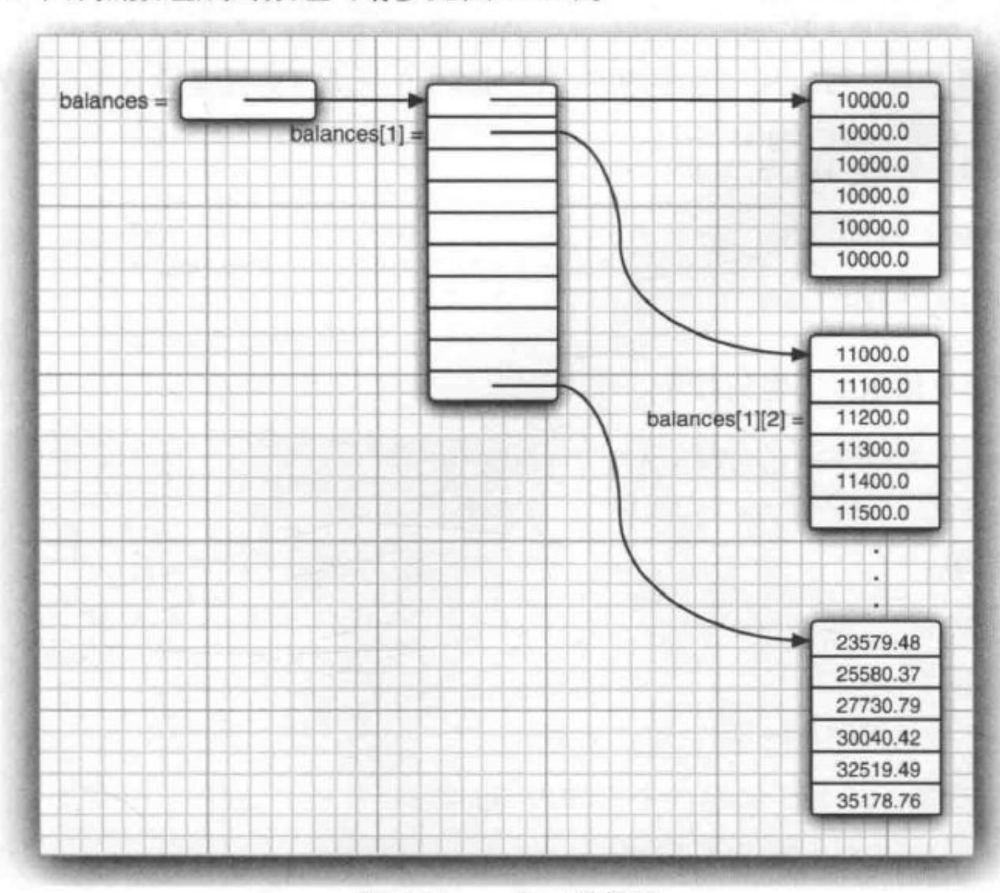

图 3-15 一个二维数组

表达式 balances[i] 指示第 i 个子数组,也就是表格的第 i 行。它本身也是一个数组,balances[i][j] 指示这个数组的第 j 个元素。

由于可以单独地访问数组的某一行, 所以可以让两行交换。

```
double[] temp = balances[i];
balances[i] = balances[i + 1];
balances[i + 1] = temp;
```

还可以很容易地构造一个"不规则"数组,即数组的每一行有不同的长度。下面是一个标准的示例。我们将创建一个数组,第i行第j列的元素将存放"从i个数中抽取j个数"可能的结果数。

```
1 1 1 1 1 1 1 1 1 1 1 1 1 1 1 1 1 1 1
```

由于j不可能大于i,所以矩阵是三角形的。第i行有i+1个元素(允许抽取0个元素,这种选择只有一种可能)。要想创建这样一个不规则的数组,首先需要分配一个数组包含这些行:

```
final int NMAX = 10;\nint[][] odds = new int[NMAX + 1][];
接下来,分配这些行:
for (int n = 0; n <= NMAX; n++)
    odds[n] = new int[n + 1];

分配了数组之后,可以采用通常的方式访问其中的元素(前提是没有超出边界):
for (int n = 0; n < odds.length; n++)
    for (int k = 0; k < odds[n].length; k++)
{
        // compute lotteryOdds
```

程序清单 3-9 给出了完整的程序。

```
(b) C++ 注释: 在 C++ 中, Java 声明
```

```
然后,这个指针数组的每一个元素会填充一个包含6个数字的数组:
```

```
for (i = 0; i < 10; i++)
  balances[i] = new double[6];</pre>
```

庆幸的是, 当调用 new double[10][6] 时, 这个循环是自动的。需要不规则的数组时, 只能单独地分配行数组。

#### 程序清单 3-9 LotteryArray/LotteryArray.java

```
1 /**
   * This program demonstrates a triangular array.
* @version 1.20 2004-02-10
   * @author Cay Horstmann
   */
   public class LotteryArray
7 {
      public static void main(String[] args)
9
         final int NMAX = 10;
10
11
         // allocate triangular array
12
         int[][] odds = new int[NMAX + 1][];
13
         for (int n = 0; n \le NMAX; n++)
14
            odds[n] = new int[n + 1];
15
16
         // fill triangular array
17
         for (int n = 0; n < odds.length; n++)
18
            for (int k = 0; k < odds[n].length; k++)
19
20
21
                * compute binomial coefficient n*(n-1)*(n-2)*...*(n-k+1)/(1*2*3*...*k)
22
23
24
               int lotteryOdds = 1;
               for (int i = 1; i \le k; i++)
25
                   lotteryOdds = lotteryOdds * (n - i + 1) / i;
26
27
               odds[n][k] = lottery0dds;
28
29
30
         // print triangular array
31
         for (int[] row : odds)
32
33
            for (int odd : row)
34
               System.out.printf("%4d", odd);
35
            System.out.println();
36
37
38
39 }
```

现在,我们已经了解了 Java 语言的基本程序结构,下一章将介绍 Java 面向对象程序设计。

# 第 4 章 对 象与类

- 面向对象程序设计概述
- 使用预定义类
- 自定义类
- 静态字段与静态方法
- 方法参数
- 对象构造

- 记录
- **A** 包
- **A** JAR 文件
- **A** 文档注释
- 类设计技巧

这一章将主要介绍如下内容:

- 面向对象程序设计人门;
- 如何创建标准 Java 类库中类的对象;
- 如何编写自己的类.

如果你没有面向对象程序设计背景,那么一定要认真地阅读本章的内容占 面向对象程序 设计与面向过程的语言在思维方式上存在着很大的差别: 改变思维方式并不是一件很容易的 事情,但是为了继续学习 Java, 一定要熟悉对象的概念。

对于有经验的 C++ 程序员来说,与上一章一样,对本章的内容不会感到太陌生,但这两 种语言还是存在着很多不同之处,所以要认真阅读本章的后半部分内容,你将发现 "C++ 注 释" 对于你粘换思维方式会很有帮助电

#### 4.1 面向对象程序设计概述

面向对象程序设计 ( ObjeckOriunted Programming. OOP) 是当今的主流程序设计范型, 它取代了 20 世纪 70 年代的 "结构化"或过程式编程技术。由于 Java 是面向对象的,所以你 必须熟悉 OOP 才能够很好地使用 Javao

面向对象的程序是由对象组成的,每个对象包含对用户公开的特定功能和隐藏的实现。 程序中的很多对象是来自标准类库的"成品二 还有一些是自定义的口 究竟是自己构造对象, 还是从外界购买,这完全取决于开发项目的预算和时间。但是,从根本 上说,只要对象能够 满足要求. 就不必关心其功能到底是如何实现的。

传统的结构化程序设计通过设计一系列的过程 (即算法) 来求解问题。一旦确定了这些 过程,下一步往往要考虑存储数据的适当方式中 这就是 Pascal 语言的设计者 Niklwu<sup>回</sup> Wirth 将 其著作命名为《算法 + 数据结构 = 程序》( Algorithms + Data Structures = Programs, Prentice Hall, <sup>1</sup> 975 ) 的原因。需要注意的是, 在 Wirth 的这个书名中,算法是第一位的,数据结构排

在第二位,这也反映了当时程序员的工作方式。首先,他们会确定操作数据的过程,然后再决定如何组织数据的结构,以便于操作数据。而 OOP 却调换了这个次序,将数据放在第一位,然后再考虑操作数据的算法。

对于一些规模较小的问题,将其分解为过程的做法是合适的,而对象更适合解决规模较大的问题。考虑一个简单的 Web 浏览器,实现这个浏览器可能需要大约 2000 个过程,这些过程需要对一组全局数据进行操作。采用面向对象风格时,可能需要大约 100 个类,每个类平均包含 20 个方法(如图 4-1 所示)。这种结构更易于程序员掌握,也更容易查找 bug。假设一个特定对象的数据出错了,在访问这个数据项的 20 个方法中查找"罪魁祸首"要比在 2000 个过程中查找容易得多。

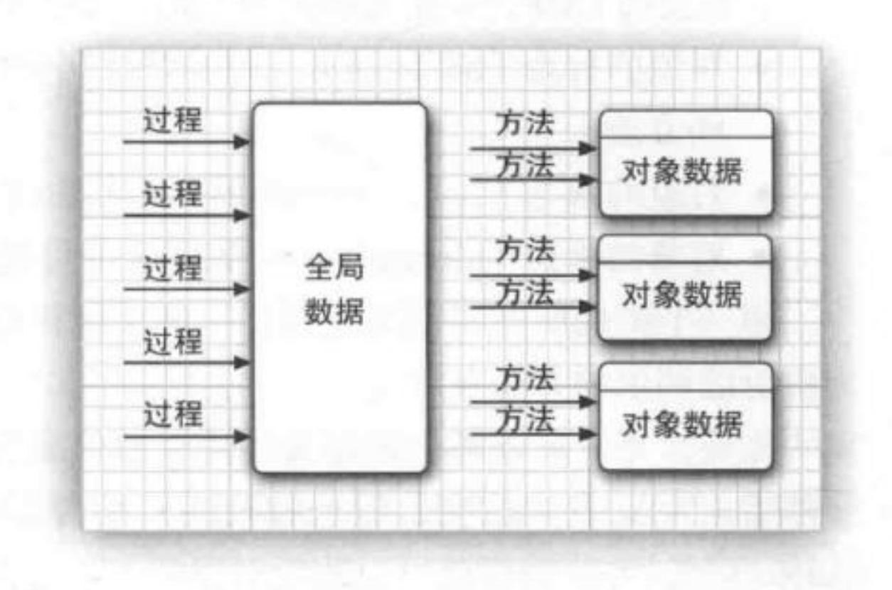

图 4-1 过程式程序设计与面向对象程序设计

#### 4.1.1 类

类(class)指定了如何构造对象。可以将类想象成制作小甜饼的模具,将对象想象为小甜饼。由一个类构造(construct)对象的过程称为创建这个类的一个实例(instance)。

正如前面所看到的,用 Java 编写的所有代码都在某个类中。标准 Java 库提供了几千个类,可用于各种目的,如用户界面设计、日期和日历,以及网络编程。尽管如此,在 Java 中你还需要创建一些自己的类,来描述你的应用相应问题领域中的对象。

封装(encapsulation,有时称为信息隐藏)是处理对象的一个重要概念。从形式上看,封装就是将数据和行为组合在一个包中,并对对象的使用者隐藏具体的实现细节。对象中的数据称为实例字段(instance field),操作数据的过程称为方法(method)。作为一个类的实例,一个特定对象有一组特定的实例字段值。这些值的集合就是这个对象的当前状态(state)。只要在对象上调用一个方法,它的状态就有可能发生改变。

实现封装的关键在于,绝对不能让其他类中的方法直接访问这个类的实例字段。程序只能通过对象的方法与对象数据进行交互。封装为对象赋予了"黑盒"特征,这是提高重用性和可靠性的关键。这意味着一个类可以完全改变存储数据的方式,只要仍旧使用同样的方法操作数据,其他对象就不会知道也不用关心这个类所发生的变化。

OOP 的另一个原则会让用户自定义 Java 类变得更为容易,这就是:可以通过扩展其他类来构建新类。事实上, Java 提供了一个"神通广大的超类",名为 Object。所有其他类都扩展自这个 Object 类。在下一章中,你会了解更多有关 Object 类的内容。

扩展一个已有的类时,这个新类具有被扩展的那个类的全部属性和方法。你只需要在新类中提供适用于这个新类的新方法和实例字段。通过扩展一个类来得到另外一个类的概念称

为继承 (inheritance), 有关继承的详细内容请参见下一章口

#### 4.1.2 对象

要想使用 OOP, 一定要清楚对象的三个主要特性:

- 对象的行为 (behavior)——可以对这个对象做哪些操作,或者可以对这个对象应用哪 些方法?
- 对象的状态 (state) ——调用那些方法时,对象会如何响应?
- 对象的标识 (identity) ——如何区分可能有相同行为和状态的不同对象》

同一个类的所有实例对象都有一种家族相似性, 它们都支持相同的行为口 一个对象的行 为由所能调用的方法来定义。

此外,每个对象都会保存着描述当前状况的信息. 这就是对象的状态。对象的状态可能 会随着时间而发生改变,但这种改变不是自发的。对象状态的改变必然是调用方法的结果 (如果不经过方法调用就可以改变对象状态. 这说明破坏了封装性)。

但是,对象的状态并不能完全描述一个对象,因为每个对象都有一个唯一的标识 ( identity, 或称身份 h 例如. 在一个订单处理系统中,任何两个订单都是不同的,即使它们 订购的商品完全相同。需要注意,作为同一个类的实例,每个对象的标识总是不同的, 状态 也通常有所不同口

对象的这些关键特性会彼此相互影响。例如,对象的状态会影响它的行为 (如果一个 订单"已发货"或"已付款二 就应该拒绝要求增删商品的方法调用。反过来,如果订单是 "空的工 即还没有订购任何商品,就不应该允许"发货

#### 4,1.3 识别类

传统的过程式程序中,必须从最上面的 main 函数开始编写程序a 设计一个面向对象系统 时,则没有所谓的"最上面,因此,学习 OOP 的初学者常常会感觉无从下手。答案是:首 先从识别类开始,然后再为各个类添加方法。

识别类的一个简单经验是在分析问题的过程中寻找名词,而方法对应动词: 例如,在订单处理系统中,有这样一些名词:

- 商品 (Item);
- •订单 (Order);
- 发货地址 (Shipping address);
- •付款 (Payment);
- •账户(Aocoimt)<sup>口</sup>

从这些名词就可以得到类 Item、Order 等0

接下来查找动词。商品要添加 (add)到订单中,订单可以发货 (ship) 或取消 (cancel). 另外可以对订单完成付款 (apply) <sup>o</sup> 对于每一个动词. <sup>如</sup> "添加""发货""取消" 或者 "完成 付款外,要识别出负责完成相应动作的对象<sup>c</sup> 例如,当一个新商品添加到订单中时,订单对 象就是负责的对象,因为它知道如何存储商品以及如何对商品进行排序。也就是说, add 应 该是 Order 类的一个方法,它接受一个 Item 对象作为参数。

当然,这种"名词与动词"原则只是一种经验,在创建类的时候,只有经验能帮助你确 定哪些名词和动词重要。

#### 4.1.4 类之间的关系

类之间最常见的关系有

- 依赖 ("uses-a"):
- 聚合 ("has-a");
- 继承 ("is-a")。

依赖 (dependence), 即"uses-a"关系,是一种最明显的也最一般的关系。例如, Order 类使用了 Account 类, 因为 Order 对象需要访问 Account 对象来查看信用状态。但是 Item 类不依 赖于 Account 类, 因为 Item 对象不需要考虑客户账户。因此, 如果一个类的方法要使用或操作 另一个类的对象,我们就说前一个类依赖于后一个类。

应当尽可能减少相互依赖的类。这里的关键是,如果类A不知道B的存在,它就不会关 心 B 的任何改变(这意味着 B 的改变不会在 A 中引入 bug)。用软件工程的术语来说,就是要 尽可能减少类之间的耦合 (coupling)。

聚合 (aggregation), 即 "has-a"关系,很容易理解,因为这种关系很具体。例如,一个 Order 对象包含一些 Item 对象。包含关系意味着类 A 的对象包含类 B 的对象。

■ 注释:有些方法学家不喜欢聚合这个概念,而更喜欢使用更一般的"关联"关系。从 建模的角度看,这是可以理解的。但对于程序员来说,"has-a"关系更加形象。我喜 欢使用聚合还有另一个原因:关联的标准记法不是很清楚,请参见表 4-1。

| 关 系  | UML 连接符 |  |
|------|---------|--|
| 继承   |         |  |
| 接口实现 |         |  |
| 依赖   |         |  |
| 聚合   |         |  |
| 关联   |         |  |
| 直接关联 |         |  |

事 1.1 事 法 米 兰 至 的 I I M I 记 注

继承 (inheritance), 即"is-a"关系,表示一个更特殊的类与一个更一般的类之间的关 系。例如, RushOrder 类继承了 Order 类。在特殊化的 RushOrder 类中包含一些用于优先处理的 特殊方法,还提供了一个计算运费的不同方法;而其他的方法,如添加商品、生成账单等都 是从 Order 类继承来的。一般而言,如果类 D扩展了类 C,类 D会继承类 C的方法,另外还会 有一些额外的功能(下一章将详细讨论这个重要的概念)。

很多程序员采用 UML (Unified Modeling Language, 统一建模语言) 绘制类图,来描述 类之间的关系。图 4-2 就是这样一个例子。类用矩形表示,类之间的关系用带有各种修饰的 箭头表示。表 4-1 给出了 UML 中最常见的箭头样式。

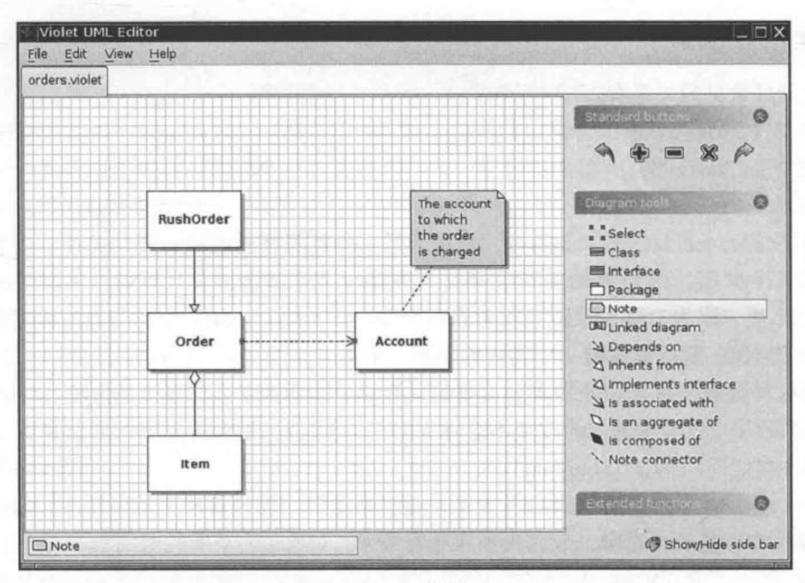

图 4-2 类图

#### 4.2 使用预定义类

在 Java 中,没有类就无法做任何事情,我们前面曾经接触过几个类。然而,并不是所有的类都表现出面向对象的典型特征。以 Math 类为例。你已经看到,可以直接使用 Math 类的方法,如 Math.random,而不必了解它具体是如何实现的,你只需要知道方法名和参数(如果有的话)。这正是封装的关键所在,当然所有类都是这样。但 Math 类只封装了功能,它不需要也不必隐藏数据。由于没有数据,因此也不必考虑创建对象和初始化它们的实例字段,因为根本没有实例字段!

下一节将会介绍一个更典型的类——Date 类,从中可以了解如何构造对象,以及如何调用类的方法。

#### 4.2.1 对象与对象变量

要想使用对象,首先必须构造对象,并指定其初始状态。然后对对象应用方法。

在 Java 程序设计语言中,要使用构造器(constructor,或称构造函数)构造新实例。构造器是一种特殊的方法,其作用是构造并初始化对象。下面来看一个例子。标准 Java 库中包含

一个 Date 类口 它的对象可以描述一个时间点, 例如,"December 31,1999,23:59:59GMTL

国 注释:你可能会感到奇怪:为 什么用类表示日期,而不是像其他语言中那样用一个内置 (built-in)美型来表示?例如,Visual Basic 中有一个内置的 date 类型,程序 员可以采用 #12/31/199琳格式指定日期。看起来这似乎很方便. 程序员只需要使用内置的 由健 类型, 而不用考虑类。但实际上,Visual Basic 这样设计合适吗?在有些地区,日期表示为月/ 日 /年,而另 外一些地区则表示为 H / 月/ 年。语言设计者是否能够预见这些问题呢? 如果没有处理好这类问题,语言就有可能陷入混乱,对此感到不满的程序员也会甚失使 用这种语言的热情;如果使用类,这些设计任务就交给了类库的设计者 如果类设计得 不 完善,那么其他程序员可以很容易地编写自己的类,改进或替代( replace)这些系统 类(作为印证:Java 的日期类库开始时有些混乱,现在已经重新设计了两次)。

构造器总是与类同名口 因此,Date 类的构造器就名为 0让鼠 要想构造一个 协归 对象,需 要在构造器前面加上 new 操作符,如下所示:

**new** Date。

这个表达式会构造一个新对象。这个对象初始化为当前的日期和时间。 如果需要的话,可以将这个对象传递给一个方法工

**System.out.printlnfnew** Dated):

或者,可以对刚构造的对象应用一个方法。期在 类中有一个 toString 方法。这个方法将 生成日期的一个字符串描述。可以如下对新构造的 加壮 对象应用 toSt「ing方法:

**String <sup>s</sup>** = **new Dated** .toStringO:

在这两个例子中,构造的对象仅使用了一次。通常,你可能希望保留所构造的对象从而 能继续使用,为此,需要将对象存放在一个变量中:

**Date rightNow** = **new** Date。;

图 4-3 显示了对象变量 rightNow, 它引用了新构造的对象。

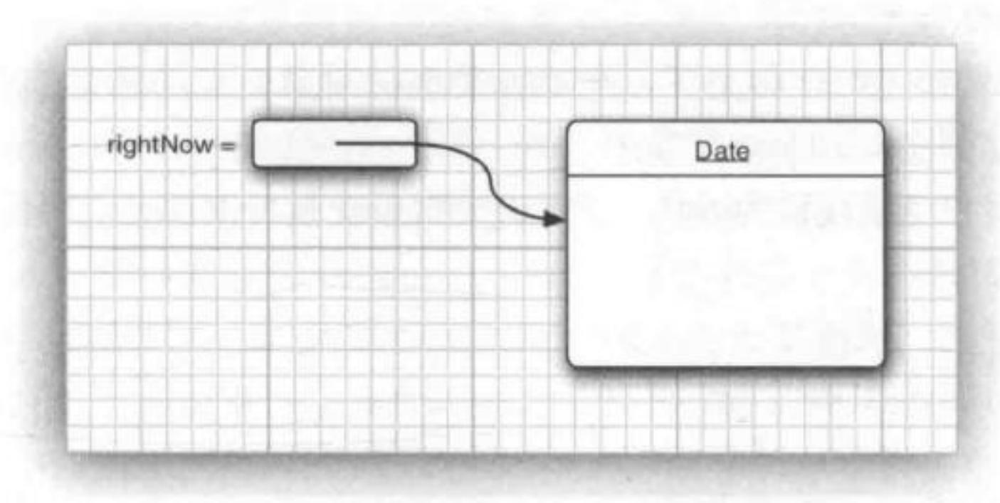

<sup>图</sup> 4-3 创建 f 个新对象

对象与对象变量之间存在着一个重要的区别白 例如,以下语句 **Date startTime; " startTime doesn't refer to any object**

定义了一个对象变量就"用呢,它可以引用gw 类型的对象。但是, 一定要认识到:变量 stdrtTime 不是一个对象, 而且实际上它甚至还没有引用任何对象。此时不能在这个变量上使 用任何 的依 方法。下面的语句

¥ = **start!ime+ toString!)**;**// not yet**

将产生编译错误口

必须首先初始化 startTime 变量. 这里有两个选择。当然. 可以初始化这个变量,让它引 用一个新构造的对象:

**startTine** = **new** Dated;

也可以设置这个变量, 让它引用一个已有的对象:

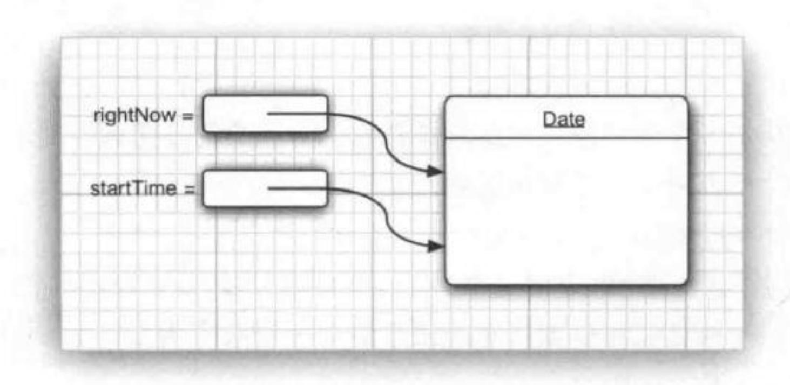

要认识到重要的一点:对象变量并不实际包含一个对象,它只是引用一个对象。

在 Java 中,任何对象变量的值都是一个引用,指向存储在另外一个地方的某个对象口 new 操作符的返回值也是一个引用中 下面的语句:

**Date startTime** = **new Dated;**

有两个部分。表达式 new Dated 构造了一个 Date 类型的对象, 它的值是新创建对象的一个引 用心 再将这个引用存储在 startTi猊变量中。

可以显式地将对象变量设置为 null, 指示这个对象变量目前没有引用任何对象。

**startTiwe** = **null;**

**if (startTime != null) System.out\*printlnf startTine);**

我们将在 436 节更详细地讨论 nullo

0 C++ 注释:很多人错误地认为 Java 中的对象变量就相当于 C++ 中的引用口 然而,C++ 中没有 null 引用,而且引用不能赋值。应当把 Java 中的对象变量看作类似于 C++ 的对 象指针。例如,

Date rightNow; // Java

实际上等同于

Date\* rightNow; // C++

一旦建立了这种关联,一切就清楚了。当然,只有使用了 new 调用后 Date\* 指针才会初始化。就这一点而言, C++ 与 Java 的语法几乎是一样的。

Date\* rightNow = new Date(); // C++

如果把一个变量复制到另一个变量,两个变量就指向同一个日期,即它们是同一个对象的指针。Java中的null引用对应于C++中的NULL指针。

所有的Java对象都存储在堆中。当一个对象包含另一个对象变量时,它只是包含另一个堆对象的指针。

在C++中,指针十分令人头疼,因为它们很容易出错。稍不小心就会创建一个错误的指针,或者使内存管理出问题。在Java语言中,这些问题都不复存在。如果使用一个没有初始化的指针,那么运行时系统将会产生一个运行时错误,而不是生成随机的结果。另外,你不必担心内存管理问题,垃圾回收器会处理相关的事宜。

C++确实做了很大的努力,它通过支持复制构造器和赋值运算符来实现对象的自动复制。例如,一个链表 (linked list)的副本是一个新链表,其内容与原始链表相同,但是有一组独立的链接。这样一来就可以适当地设计类,使它们与内置类型有相同的复制行为。在 Java 中,必须使用 clone 方法获得一个对象的完整副本。

#### 4.2.2 Java 类库中的 LocalDate 类

在前面的例子中,我们使用了 Java 标准类库中的 Date 类。Date 类的实例有一个状态,也就是一个特定的时间点。

尽管在使用 Date 类时不必知道这一点,但时间是用距离一个固定时间点的毫秒数(可正可负)表示的,这个时间点就是所谓的纪元(epoch),它是 UTC 时间 1970 年 1 月 1 日 00:00:00。 UTC 就是 Coordinated Universal Time (国际协调时间),与大家熟悉的 GMT (即 Greenwich Mean Time,格林尼治时间)一样,是一种实用的科学标准时间。

但是,Date 类对于处理人类记录日期的日历信息并不是很有用,如"December 31, 1999"。这个特定的日期描述遵循 Gregorian 阳历,这是世界上大多数国家使用的日历。但是,同样的这个时间点采用中国或希伯来的阴历来描述会大不相同,倘若我们有来自火星的顾客,基于他们使用的火星历来描述这个时间点就更不一样了。

注释:有史以来,人类的文明与历法的设计息息相关,日历要为日期指定名字,指定太阳和月亮的周期次序。要了解有关世界上各种日历的有趣解释,从法国大革命的日历到玛雅人计算日期的方法,请参见 Nachum Dershowitz和 Edward M. Reingold 编写的《Calendrical Calculations》第 4 版 (

100

类库设计者决定将保存时间与给时间点命名分开。所以,标准 Java 类库分别包含了两个类:一个是用来表示时间点的 Date 类;另一个是用大家熟悉的日历表示法表示日期的 LocalDate 类。Java 8 引入了另外一些类来处理日期和时间的不同方面——有关内容参见卷Ⅱ第 6 章。

将时间度量与日历分开是一种很好的面向对象设计。通常,最好使用不同的类表示不同的概念。

不要使用构造器来构造 LocalDate 类的对象。实际上,应当使用静态工厂方法 (factory method),它会代表你调用构造器。下面的表达式:

LocalDate.now()

会构造一个新对象,表示构造这个对象时的日期。

可以提供年、月和日来构造对应一个特定日期的对象:

LocalDate.of(1999, 12, 31)

当然,通常我们都希望将构造的对象保存在一个对象变量中:

LocalDate newYearsEve = LocalDate.of(1999, 12, 31);

一旦有了一个 LocalDate 对象,可以用方法 getYear、getMonthValue 和 getDayOfMonth 得到年、月和日:

int year = newYearsEve.getYear(); // 1999\nint month = newYearsEve.getMonthValue(); // 12\nint day = newYearsEve.getDayOfMonth(); // 31

看起来这似乎没有多大的意义,因为这正是构造对象时使用的那些值。不过,有时可能有一个计算得到的日期,然后你希望调用这些方法来了解它的更多信息。例如,plusDays 方法会生成一个新的 LocalDate,如果把应用这个方法的对象称为当前对象,那么这个新日期对象则是距当前对象指定天数的一个新日期:

LocalDate aThousandDaysLater = newYearsEve.plusDays(1000); year = aThousandDaysLater.getYear(); // 2002 month = aThousandDaysLater.getMonthValue(); // 09 day = aThousandDaysLater.getDayOfMonth(); // 26

LocalDate 类封装了一些实例字段来维护所设置的日期。如果不查看源代码,就不可能知道类内部的日期表示。当然,封装的意义就在于内部表示并不重要,重要的是类对外提供的方法。

注释:实际上, Date 类也有得到日、月、年的方法,分别是 getDay、getMonth 以及 getYear,不过这些方法已经废弃。当类库设计者意识到某个方法最初就不该引入时,就把它标记为废弃,不鼓励使用。

类库设计者意识到应当单独提供类来处理日历,不过在此之前这些方法已经是Date 类的一部分了。Java 1.1 中引入较早的一组日历类时,Date 方法被标记为废弃。虽然仍然可以在程序中使用这些方法,不过如果这样做,编译时会出现警告。最好不要使用废弃的方法,因为将来的某个类库版本很有可能会将它们完全删除。

● 提示: JDK 提供了 jdeprscan 工具来检查你的代码中是否使用了 Java API 已经废弃的特性。有关说明参见 https://docs.oracle.com/en/java/javase/17/docs/specs/man/jdeprscan.html。

#### 4.2.3 更改器方法与访问器方法

再来看上一节中的 plusDays 方法调用:

LocalDate aThousandDaysLater = newYearsEve.plusDays(1000);

这个调用之后 newYearsEve 会有什么变化? 它会改为 1000 天之后的日期吗?事实上,并没有。plusDays 方法会生成一个新的 LocalDate 对象,然后把这个新对象赋给 aThousandDaysLater变量。原来的对象不做任何改动。我们说 plusDays 方法没有更改 (mutate)调用这个方法的对象。(这类似于第 3 章中见过的 String 类的 toUpperCase 方法。在一个字符串上调用 toUpperCase时,这个字符串仍保持不变,并返回一个包含大写字符的新字符串。)

Java 库的一个较早版本曾经有另一个处理日历的类,名为 Gregorian Calendar。可以如下为这个类表示的一个日期增加 1000 天:

GregorianCalendar someDay = new GregorianCalendar(1999, 11, 31);
 // odd feature of that class: month numbers go from 0 to 11
someDay.add(Calendar.DAY\_OF\_MONTH, 1000);

与 LocalDate.plusDays 方法不同, GregorianCalendar.add 方法是一个更改器方法(mutator method)。 调用这个方法后, someDay 对象的状态会改变。可以如下查看新状态:

year = someDay.get(Calendar.YEAR); // 2002
month = someDay.get(Calendar.MONTH) + 1; // 09
day = someDay.get(Calendar.DAY\_OF\_MONTH); // 26

正是因为这个原因,我们将变量命名为 someDay 而不是 newYearsEve——调用这个更改器方法之后,它不再是新年前夜。

相反,只访问对象而不修改对象的方法有时称为访问器方法(accessor method)。例如,LocalDate.getYear 和 GregorianCalendar.get 就是访问器方法。

C++ 注释: 在 C++ 中, 带有 const 后缀的方法是访问器方法; 没有声明为 const 的方法 默认为更改器方法。但是, 在 Java 语言中, 访问器方法与更改器方法在语法上没有明显的区别。

下面用一个具体应用 LocalDate 类的程序来结束这一节。这个程序将显示当前月的日历,格式如下:

Mon Tue Wed Thu Fri Sat Sun

2

当前日期标记有一个\*号。可以看到,这个程序需要知道如何计算某月份的天数以及一个给定日期是星期几。

下面来看这个程序的关键步骤。首先构造一个对象,并用当前的日期初始化。

```
LocalDate date = LocalDate.now();
```

下面获得当前的月份和日期。

```
int month = date.getMonthValue();\nint today = date.getDayOfMonth();
```

然后,将 date 设置为这个月的第一天,并得到这一天为星期几。

```
date = date.minusDays(today - 1); // set to start of month
DayOfWeek weekday = date.getDayOfWeek();\nint value = weekday.getValue(); // 1 = Monday, . . . , 7 = Sunday
```

变量 weekday 设置为 DayOfWeek 类型的对象。我们调用这个对象的 getValue 方法来得到对应 星期几的一个数值。这会得到一个整数,这里遵循国际惯例,即周末是一周的结束,星期一 就返回 1,星期二返回 2,依此类推。星期日则返回 7。

注意,日历的第一行是缩进的,使当月第一天对应正确的星期几。下面的代码会打印表 头和第一行的缩进:

```
System.out.println("Mon Tue Wed Thu Fri Sat Sun");
for (int i = 1; i < value; i++)
   System.out.print(" ");</pre>
```

现在我们来打印日历的主体。进入一个循环,其中 date 遍历一个月中的每一天。

每次迭代中,我们要打印日期值。如果 date 是当前日期,这个日期则用一个\*标记。接下来,把 date 推进到下一天。如果到达新的一周的第一天,则换行打印:

```
while (date.getMonthValue() == month)
{
    System.out.printf("%3d", date.getDayOfMonth());
    if (date.getDayOfMonth() == today)
        System.out.print("*");
    else
        System.out.print(" ");
    date = date.plusDays(1);
    if (date.getDayOfWeek().getValue() == 1) System.out.println();
}
```

什么时候结束呢?我们不知道这个月有几天,是 31 天、30 天、29 天还是 28 天?实际上,只要 date 还在当月就要继续迭代。

程序清单 4-1 给出了完整的程序。

可以看到,利用 LocalDate 类可以编写一个日历程序,它能处理星期几以及各月天数不同等复杂问题。你并不需要知道 LocalDate 类如何计算月和星期几,只需要使用这个类的接口,也就是诸如 plusDays 和 getDayOfWeek 等方法。

这个示例程序的重点是向你展示如何使用一个类的接口来完成相当复杂的任务,而无须 了解实现细节。

#### 程序清单 4-1 CalendarTest/CalendarTest.java

```
import java.time.*;
2
   /**
    * @version 1.5 2015-05-08
    * @author Cay Horstmann
  public class CalendarTest
8
      public static void main(String[] args)
9
10
         LocalDate date = LocalDate.now();
11
         int month = date.getMonthValue();
12
         int today = date.getDayOfMonth();
13
14
         date = date.minusDays(today - 1); // set to start of month
15
         DayOfWeek weekday = date.getDayOfWeek();
16
         int value = weekday.getValue(); // 1 = Monday, . . . , 7 = Sunday
17
18
         System.out.println("Mon Tue Wed Thu Fri Sat Sun");
19
         for (int i = 1; i < value; i++)
20
            System.out.print(" ");
21
         while (date.getMonthValue() == month)
22
23
            System.out.printf("%3d", date.getDayOfMonth());
24
            if (date.getDayOfMonth() == today)
25
               System.out.print("*");
26
            else
27
               System.out.print(" ");
28
            date = date.plusDays(1);
29
            if (date.getDayOfWeek().getValue() == 1) System.out.println();
30
31
         if (date.getDayOfWeek().getValue() != 1) System.out.println();
32
34 }
```

#### API java.time.LocalDate 8

- static LocalDate now()
   构造一个表示当前日期的对象。
- static LocalDate of(int year, int month, int day) 构造一个表示给定日期的对象。
- int getYear()
- int getMonthValue()
- int getDayOfMonth()得到当前日期的年、月和日。
- DayOfWeek getDayOfWeek()
   得到当前日期是星期几,作为 DayOfWeek 类的一个实例返回。在 DayOfWeek 实例上调用

getValue 来得到 1~7之间的一个数,表示这是星期几,1表示星期一,7表示星期日。

- LocalDate plusDays(int n)
- LocalDate minusDays(int n)
   生成当前日期之后或之前n天的日期。

#### 4.3 自定义类

在第3章中,我们已经开始编写一些简单的类。但是,那些类都只包含一个简单的 main 方法。现在来学习如何编写更复杂的应用所需要的那种主力类(workhorse class)。通常,这些类没有 main 方法,而有自己的实例字段和实例方法。要想构建一个完整的程序,会结合使用多个类,其中只有一个类有 main 方法。

#### 4.3.1 Employee 类

```
在 Java 中, 最简单的类定义形式为:
class ClassName
   field<sub>1</sub>
   field2
   constructor<sub>1</sub>
   constructor2
   method1
   method2
           个非常简单的 Employee 类,编写工资管理系统时可能会用到:
class Employee
   // instance fields
   private String name;
   private double salary;
   private LocalDate hireDay;
   // constructor
   public Employee(String n, double s, int year, int month, int day)
      name = n;
      salary = s;
      hireDay = LocalDate.of(year, month, day);
   // a method
   public String getName()
      return name;
```

```
// more methods
```

这里将这个类的实现分成以下几个部分,并分别在稍后的几节中介绍。不过,首先来看程序清单 4-2,这个程序展示了 Employee 类的实际使用。

#### 程序清单 4-2 EmployeeTest/EmployeeTest.java

```
import java.time.*;
2
3 /**
    * This program tests the Employee class.
    * @version 1.13 2018-04-10
    * @author Cay Horstmann
  public class EmployeeTest
9
      public static void main(String[] args)
10
11
         // fill the staff array with three Employee objects
12
         Employee[] staff = new Employee[3];
13
14
         staff[0] = new Employee("Carl Cracker", 75000, 1987, 12, 15);
15
         staff[1] = new Employee("Harry Hacker", 50000, 1989, 10, 1);
16
         staff[2] = new Employee("Tony Tester", 40000, 1990, 3, 15);
17
18
         // raise everyone's salary by 5%
19
         for (Employee e : staff)
20
            e.raiseSalary(5);
21
22
         // print out information about all Employee objects
23
         for (Employee e : staff)
24
            System.out.println("name=" + e.getName() + ",salary=" + e.getSalary() + ",hireDay="
25
               + e.getHireDay());
27
28
29
   class Employee
31
      private String name;
32
      private double salary;
33
      private LocalDate hireDay;
34
35
      public Employee(String n, double s, int year, int month, int day)
36
37
         name = n;
38
         salary = s;
39
         hireDay = LocalDate.of(year, month, day);
40
41
42
      public String getName()
43
44
         return name;
45
46
47
```

```
public double getSalary()
49
          return salary;
58
51
52
      public LocalDate getHireDay()
53
          return hireDay;
55
56
57
      public void raiseSalary(double byPercent)
59
         double raise = salary * byPercent / 100;
         salary += raise;
61
62
63 }
```

在这个程序中, 我们构造了一个 Employee 数组, 并填入了 3 个 Employee 对象:

```
Employee[] staff = new Employee[3];

staff[0] = new Employee("Carl Cracker", . . .);

staff[1] = new Employee("Harry Hacker", . . .);

staff[2] = new Employee("Tony Tester", . . .);

接下来,使用 Employee 类的 raiseSalary 方法将每个员工的薪水提高 5%:

for (Employee e : staff)
    e.raiseSalary(5);
```

最后,调用 getName 方法、getSalary 方法和 getHireDay 方法打印各个员工的信息:

```
for (Employee e : staff)
   System.out.println("name=" + e.getName()
```

注意,在这个示例程序中包含两个类: Employee 类和带有 public 访问修饰符的 EmployeeTest 类。EmployeeTest 类包含 main 方法,其中使用了前面介绍的代码。

源文件名是 EmployeeTest.java, 这是因为文件名必须与 public 类的名字匹配。一个源文件中只能有一个公共类,但可以有任意数目的非公共类。

接下来,编译这段源代码的时候,编译器将在目录中创建两个类文件: EmployeeTest.class和 Employee.class。

然后启动这个程序,为字节码解释器提供程序中包含 main 方法的那个类的类名:

java EmployeeTest

字节码解释器开始运行 EmployeeTest 类的 main 方法中的代码。这个代码会先后构造 3 个新 Employee 对象,并显示它们的状态。

#### 4.3.2 使用多个源文件

在程序清单 4-2 中,一个源文件包含了两个类。许多程序员习惯将各个类放在一个单独

的源文件中。例如, 将 Employee 类存放在文件 Employee java 中, 而将 EmployeeTest 类存放在文 件 EmployeeTest\*jsva 中口

如果喜欢这样组织文件,可以有两种编译源程序的方法。一种是使用通配符调用 Java 编 译器:

javac Employee\*Ja\fa

这样一来, 所有与通配符匹配的源文件都将被编译成类文件。或者可以简单地键人以下 命令:

javac EmployeeTest. java

你可能会感到惊讶. 使用第二种方式时并没有显式地编洋 Emphyeojava。不过. 当 Java 编译器发现 EmployeeTest.java 中使用了 Employee 类时,它会查找名为 Employee.class 的文件。如果 没有找到这个类文件,就会自动搜索 Eploy斜抑<sup>a</sup> 并编译这个文件。另外,如果 Employeejava 的版本较已有的 Employee.class 文件版本更新,Java 编译器就会自动地重新编译这个文件。

FI 注释:如果熟悉 UNIX <sup>的</sup> make 工具 (或者是 Windows 中的相应工具,如 nmakc), 那么 可以认为 Java 编译器内置了 <sup>m</sup>油e 功能小

#### 4.3.3 剖析 Employ线类

下面各小节将对 Employee 类进行剖析. 首先从这个类的方法开始。通过查看源代码会发 现,这个类包含一个构造器和 4 个方法:

public Employee!String <sup>储</sup> double % int year, int month, int day) public String getNamef) public double get\$aVary() public LocalDate getHireDayO public void raiseSalaryf double byPercent)

这个类的所有方法都被标记为 public. 关键字 public 意味着任何类的任何方法都可以调 用这些方法 (共有 4 种访问级别,将在本章和下一章中介绍)口

接下来,需要注意在 Employee 类的实例中有 3 个实例字段. 用来存放将要操作的数据:

private String naine; private double salary; private LocaWate hireDay;

关键字 private 确保只有 Employee 类本身的方法能够访问这些实例字段,任何其他类的方 法都不能读写这些字段。

图 注释:可以用 pubHc 标记实例 字段,但这是一种很不好的做法o public 实例字段允许 程序的任何部分都能对其进行读取和修改,这就完全破坏了封装0 任何类的任何方法 都可以修改 public 字段,从我们的经脸来看,有些代码将利用这种做法存取权限,而 这是我们最不希望看到的」因此,这里强烈建议将实例字段标记为 private。

最后,请注意, 有两 个实例字段本身就是对象:name 字段是 String 类对象的引用,

hireDay 字段是 LocalDate 类对象的引用。类经常包含类类型的实例字段。

#### 4.3.4 从构造器开始

```
下面先看看 Employee 类的构造器:

public Employee(String n, double s, int year, int month, int day)
{
    name = n;
    salary = s;
    hireDay = LocalDate.of(year, month, day);
}
```

可以看到,构造器与类同名。构造 Employee 类的对象时,构造器会运行,这会将实例字段初始化为所希望的初始状态。

例如,使用下面这个代码创建 Employee 类的一个实例时:

new Employee("James Bond", 100000, 1950, 1, 1)

#### 将如下设置实例字段:

```
name = "James Bond";
salary = 100000;
hireDay = LocalDate.of(1950, 1, 1); // January 1, 1950
```

构造器与其他方法有一个重要的不同。构造器总是结合 new 操作符来调用。不能对一个已经存在的对象调用构造器来重新设置实例字段。例如,

james.Employee("James Bond", 250000, 1950, 1, 1) // ERROR

将产生编译错误。

本章稍后还会更详细地介绍有关构造器的内容。现在只需要记住:

- 构造器与类同名。
- 每个类可以有一个以上的构造器。
- 构造器可以有 0 个、1 个或多个参数。
- 构造器没有返回值。
- 构造器总是结合 new 操作符一起调用。
- C++ 注释: Java 中构造器的工作方式与 C++ 中相同。但是,要记住所有 Java 对象都是在堆中构造的,构造器总是结合 new 操作符一起使用。C++ 程序员最易犯的错误就是忘记 new 操作符:

Employee number007("James Bond", 100000, 1950, 1, 1); // C++, not Java 这条语句在 C++ 中能够正常运行, 但在 Java 中却不行。

● 警告:请注意,不要引入与实例字段同名的局部变量。例如,下面的构造器将不会设置 name 或 salary 实例字段:

```
public Employee(String n, double s, . . .)
{
   String name = n; // ERROR
```

double salary = s; // ERROR

}

这个构造器声明了局部变量 name 和 salary。这些变量只能在构造器内部访问,它们会遮蔽 (shadow) 同名的实例字段。有些程序员偶尔会不假思索地写出这类代码,因为他们的手指会不自觉地增加数据类型。这种错误很难检查出来,因此,必须注意在所有的方法中都不要使用与实例字段同名的变量。

#### 4.3.5 用 var 声明局部变量

在 Java 10 中,如果可以从变量的初始值推导出它们的类型,那么可以用 var 关键字声明局部变量,而无须指定类型。例如,可以不这样声明:

Employee harry = new Employee("Harry Hacker", 50000, 1989, 10, 1); 只需要写为:

var harry = new Employee("Harry Hacker", 50000, 1989, 10, 1);

这一点很好,因为这样可以避免重复写类型名 Employee。

从现在开始,倘若无须了解 Java API 就能从等号右边明显看出类型,在这种情况下我们都将使用 var 表示法。不过我们不会对数值类型使用 var, 如 int、long 或 double, 这样你就不用当心 0、0L 和 0.0 之间的区别。对 Java API 有了更多经验后,你可能会希望更多地使用 var 关键字。

注意 var 关键字只能用于方法中的局部变量。参数和字段的类型必须声明。

#### 4.3.6 使用 null 引用

在 4.2.1 节中我们已经了解到,对象变量包含一个对象的引用,或者包含一个特殊值 null,后者表示没有引用任何对象。

听上去这是一种处理特殊情况的便捷机制,如未知的名字或雇用日期。不过使用 null 值时要非常小心。

如果对 null 值应用一个方法,会产生一个 NullPointerException 异常。

LocalDate rightNow = null;

String s = rightNow.toString(); // NullPointerException

这是一个很严重的错误,类似于"索引越界"异常。如果你的程序没有"捕获"异常,那么程序就会终止。正常情况下,程序并不捕获这些异常,而是依赖于程序员从一开始就不要带来异常。

● 提示:程序因 NullPointerException 异常终止时,栈轨迹会显示问题出现在哪一行代码中。
从 Java 17 开始,错误消息会包含有 null值的变量或方法名。例如,在以下调用中:

String s = e.getHireDay().toString();

错误消息会告诉你 e 是否为 null 或者 getHireDay 是否返回 null。

定义一个类时,最好清楚地知道哪些字段可能为 null。在我们的例子中,我们不希望 name 或 hireDay 字段为 null。(不用担心 salary 字段,这个字段是基本类型,所以不可能是 null。)

hireDay 字段肯定是非 null 的,因为它初始化为一个新的 LocalDate 对象。但是 name 可能为 null,如果调用构造器时为 n 提供的实参是 null, name 就会是 null。

对此有两种解决方法。"宽容"方法是把 null 参数转换为一个适当的非 null 值:

```
if (n == null) name = "unknown"; else name = n;

Objects 类对此提供了一个便利方法:

public Employee(String n, double s, int year, int month, int day) {
    name = Objects.requireNonNullElse(n, "unknown");
    }

"严格" 方法则干脆拒绝 null 参数:

public Employee(String n, double s, int year, int month, int day) {
    name = Objects.requireNonNull(n, "The name cannot be null");
    . . . .
}
```

如果用 null 名字构造一个 Employee 对象,就会产生 NullPointerException 异常。乍看上去这种补救方法好像不太有用,不过这种方法有两个好处:

- 1. 异常报告会提供这个问题的描述。
- 2. 异常报告会准确地指出问题所在的位置,否则 NullPointerException 异常会出现在其他地方,而很难追踪到真正导致问题的构造器参数。
- □ 注释:如果要接受一个对象引用作为构造参数,就要问问自己:是不是真的希望接受可有可无的值。如果不是,那么"严格"方法更合适。

#### 4.3.7 隐式参数与显式参数

```
方法会操作对象并访问它们的实例字段。例如,以下方法
public void raiseSalary(double byPercent)
{
    double raise = salary * byPercent / 100;
    salary += raise;
}
```

将调用这个方法的对象的 salary 实例字段设置为一个新值。考虑下面这个调用:

```
number007.raiseSalary(5);
```

其作用是将 number007.salary 字段的值增加 5%。具体地说,这个调用将执行以下指令:

```
double raise = number007.salary * 5 / 100;
number007.salary += raise;
```

raiseSalary 方法有两个参数。第一个参数称为隐式(implicit)参数,是出现在方法名

前的 Employ同 类型的对象口 第二个参数是位于方法名后面括号中的数值,这是一个显式 (explicit) 参数。(有人把隐式参数称为方法调用的目标或接收者,)

可以看到,显式参数显式地列在方法声明中,例如 doublebyPergit。隐式参数则没有出 现在方法声明中。

```
在每一个方法中,关键字 this 指示隐式参数》如果愿意,可以如下改写「a达明白心卬 方法:
public void r^iseSalaryt double byPercent}
{
  double raise = this.salary *
                        byPercent / 10G;
  this.salary += raise;
}
```

有些程序员更偏爱这样的风格,因为这样可以将实例字段与局部变量明显地区分开来。

```
•
  C++ 注释:在 中,通常在类的外面定义方法:
```

```
void Employee::raiseSalaryldouble byPercent) // C++f not Java
{
}
  ,
如果在类的内部定义方法,那么这个方法将自动成为内联 (inline) 方法亡
class Employee
(
  int ^etNamed { return name; } // inline in C++
}
```

在 Java 中,所 有的方法都必须在类的内部定义,但这并不表示它们是内联方法。 是否将某个方法设置 为内联方法是 Java 虚拟机的 任务口 即时编译器会关 注那些简短、 经常调用而且没有被覆盖的才法调用,并进行优化。

#### 4.3.8 封装的优点

最后再仔细看一下非常筒单的 getName 方法、getSalary 方法和 getHiregy 方法之

```
public String getNamef)
{
   return name;
}
public double getSalaryO
{
   return salary;
}
public LocalDate getHireDay()
(
   return hireDay;
}
```

这些都是典型的访问器方法。由于它们只返回实例字段的值,因此乂称为字段访问器

( field accessor)o

如果将词映、羽3<sup>可</sup> <sup>和</sup> hi「eDay 字段标记为公共,而不是编写单独的访问器方法,不是更 容易一些吗?

不过,他配是一个只读字段,一旦在构造器中设置,就没有办法能够修改这个字段。这 样我们可以确保 name 字段不会受到外界的破坏。

虽然 Emlary 不是只读字段,但是它只能用 QiseSalary 方法修改。具体地,如果这个值出 现了错误,那么只需要调试这个「M565小"方法就可以了。如果 salary 字段是公共的,破坏 这个字段值的罪魁祸首有可能出没在任何地方《那就很难调试了)。

有些时候,可能想要获得或设置实例字段的值,那么你需要提供下面三项内容:

- 一个私有的实例字段;
- 一个公共的字段访问器方法;
- 一个公共的字段更改器方法。

这样做要比提供一个简单的公共实例字段复杂些,但有很多明显的好姓。

首先,可以改变内部实现,而不影响该类方法之外的任何其他代码口 例如,如果将存储 姓名的字段改为:

**String firstName; String lastName;**

**\***

那么 get南配方法可以改为返回

**firstName** <sup>+</sup> **\* "** + **lastName**

这个修改对于程序的其余部分是完全不可见的.

当然,为了进行新旧数据表示之间的转换, 访问器方法和更改器方法可能需要做许多工 作。这将为我们带来第二点好处:更改器方法可以完成错误检查,而只对字段赋值的代码不 会费心这么做。例如,setSmlary 方法可以检查工资是否小于 0。

0 警告:注意不要编写返回可变对象引用的访问器方法」在本书之前的一版中,我们的 Employee 类 就违反了这个设计原则,其中的 getHireDay 方 法返回了一个 Date 类 对象:

```
class Employee
{
   private Date hireDay;
   public Date getHireDay(}
   {
       return hireOay; // BAD
```

LoslDate 类没有更改器方法,与之不同,Date 类有一个更改器方法 <sup>s</sup>就tirne, 可以设 置毫秒数。

Date 对象是可变的,这一点就破坏了封装性!考虑下面这段有问题的代码:

```
Employee harry = . , j
 Date d = harry.getHireDayO;
 double tenYearsInflilliseconds = 19 •365.25 *
                                                24 *
                                                     6& *
                                                          69 * IB她
 d,setTin>e(dfgetTime() - (long) tenYearsInMiUiseconds};
〃let's give Harry ten years of added seniority
```

出错的原因很微妙**<sup>o</sup> <sup>d</sup>** 和 ha「ry,hireD西引用同一个对象 (如图 **4-5** 所示)。对 **<sup>d</sup>** 调用 更改器方法会自动改变这个 **Employee** 对象的私有状态!

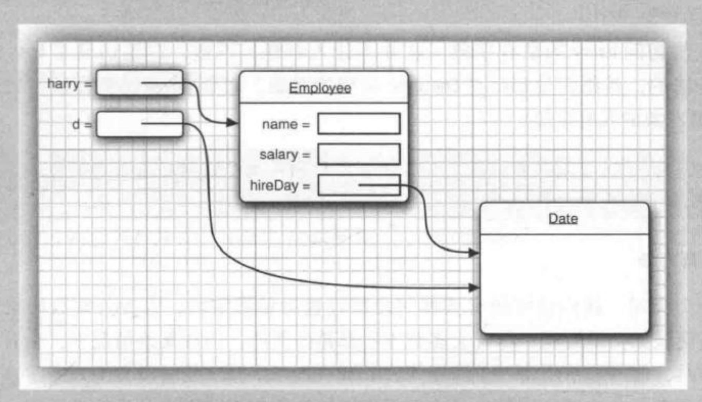

如果需要返回一个可变 对象的引用,首先应该对它进行克隆 ( clone)。对象克隆 是指存放在另一个新位置上的对象副本〃 有关对象克隆的详细内容将在第 6 章中讨论。 下面是修改后的代码;

```
class Employee
{
   « «
   public Date getHireOay()
   {
      return (Date) hir^Ddy. cloned;〃OK
   }
       •
}
```

这里有一个经验,如果需要返回一个可变字段的副本,就应该使用 **cion**心

#### **4.3.9** 基于类的访问权限

从前面已经知道. 方法可以访问调用这个方法的对象的私有数据。一个类的方法可以访 问这个类的所有叶象的私有数据,这令很多人感到奇怪。例如,下面来看用来比较两个员工 的 **equals** 方法。

**class Employee**

**if {harry.equals(boss)) \* . .**

这个方法访问 hairy 的私有字段,这并不让人奇怪,不过,它还访问了 boss 的私有字 段,这是合法的,其原因是 boss <sup>是</sup> Employ<sup>把</sup> 类型的对象. <sup>而</sup> <sup>E</sup>叩loyee 类的方法可以访问任何 Employee 类型对象的私有字段中

@ C++ 注释:CH 也有同样的规员八 方法可以访问所属类任何对象的私有特性 (比ature), 而不仅限于隐式参数。

#### 4.3.10 私有方法

实现一个类时,我们会将所有实例字段都设置为私有字段,因为公共数据很危险。不 过,方法又应该如何设置呢?尽管大多数方法都是公共的,但在某些情况下,私有方法可能 很有用工 有时,你可能希望将一个计算代码分解成若干个独立的辅助方法。通常,这些辅助 方法不应该成为公共接口的一部分,这是因为它们往往与当前实现关系非常紧密,或者需要 一个特殊协议或调用次序. 最好将这样的方法实现为私有方法。

在 Java 中,要实现一个私有方法,只需相关键字 public 改为 private 即可。

如果将一个方法设置为私有, 倘若你改变了方法的具体实现,并没有义务保证这个方法依然 可用。如果数据的表示发生了变化,那么这个方法可能变得更难实现, 或者不再需要;这并不重 要办 重点在于,只要方法是私有的,类的设计者就可以确信它不会在别处使用,所以可以将其 删去。如果一个方法是公共的,就不能简单地将其删除,因为可能会有其他代码依赖这个方法。

#### 4311 finh 实例字段

可以将实例字段定义为 行旧、这样的字段必须在构造对象时初始化。也就是说,必须 确保在每一个构造器执行之后,这个字段的值已经设置,并旦以后不能再修改这个字段。例 如,可以将 Employ臾 类中的 name 字段声明为 final, 因为在对象构造之后,这个值不会再改 变,即没有 settle 方法。

```
class Employ螃
{
   private final String name;
}
```

final 修饰符对于类型为基本类型或者不可变类的字段尤其有用口 ( 如果类中的所有方法都 不会改变其对象,这样的类就是不可变类。例如,St「h<sup>g</sup> 类就是不可变的J

对于可变类,使用 final 修饰符可能会造成混乱。例如,考虑以下字段: **private final StringBuilder evaluations;**

#### 它在 Employee 构造器中初始化为

```
evaluations 二 new 5t「ingBuilderf);
```

fi面关键字只是表示存储在 evaluations 变量中的对象引用不会再指示另一个不同的 StringBuilde「对象口 不过这个对象可以更改:

```
public void giveGoldStarC)
{
   evaluations - append (LocalDate .now( ) + Gold star[\n,);
```

#### 4.4 静态字段与静态方法

在前面给出的示例程序中,main 方法都标记了 stat<sup>找</sup> 修饰符.下面来讨论这个修饰符的 含义。

#### 4.4.1 静态字段

如果将一个字段定义为 static, 那么这个字段并不出现在每个类的对象中。每个静态字 段只有一个副本。可以认为静态字段属于类,而不属于单个对象。例如,假设需要为每一个 员工分配唯一的标识码,这里为 Employee 类添加一个实例字段 id 和一个静态字段 nextld:

```
class Employee
{
   private static int nextld = 1;
   private int id;
}
```

现在,每一个 Employ既对象都有自己的 id 字段,但这个类的所有实例将共享一个 riBXtld 字段口 换句话说,如果有 1009 个 Employ的类对象,则有 1000 个实例字段 id, 每个对象有一 个实例字段 id。但是,只有一个静态字段 nextld。即使没有 Empl口yee 对象. 静态字段 nextld 也 存在。它属于类,而不属于任何单个对象。

图 注释:在一些面向对象程序设计语言中,静态字段被称为类字段。术语 "静态" 只是 沿用了 C十+的叫法,并无实际意义<sup>G</sup>

在构造器中,我们为新 Employ既对象分配下一个可用的 ID, 然后将其增 L

```
id - nextId;
nextld++;
```

假设我们构造了对象 harry。ha「「y 的 id字段设置为静态字段 nextld的当前值,并将静态 字段 nextld 的值加 1:

```
harry.id = Employee.nextld;
Employee.nextId++;
```

#### 4.4.2 静态常量

静态变量使用得比较少,但静态常量却很常用。例如,Math 类中定义了一个静态常量:

```
public class Math
{
   public static final double PI 岸 3.14159265358979323846;
}
```

在你的程序中,可以用 Mdth.PI 来访问这个常量。

如果省略关键字 static, 那么 PI 就变成了附th 类的一个实例字段。也就是说. 需要通过 Math 类的一个对象来访问 PI, 并且每一个 Math 对象都有它白己的一个 PI 副本。

另一个你已经多次使用的静态常量是 System.out <sup>o</sup> 它在 System 类中声明如下:

```
public class System
{
   public static final Printstream out = , .
}
     * '
```

前面曾经多次提到过,最好不要有公共字段,因为谁都可以修改公共字段。不过,公共 常量(即 final 字段)却没问题。因为 out 被声明为付演,所以,不允许再将它重新赋值为另 一个打印流:

**System,out** = **new PrintStreamf.** .»);// **ERROR--out is final**

图 注释:如果查看 System 类,就会发现有一个 sctOut 方法可以将 Systen.out 设置为不同的 流中 你可能会感到奇怪,为什 么这个方法可以修改 final 变量的值, 原因在于,setOiit 方 法是一个原生方法,而 不是在 Java 语言中实现的 原生方法可以绕过 Java 语言的 访问控制机制. 这是一种特殊的解决方法,你自己编写程序时不要模仿这种做法

#### 4.4.3 静态方法

静态方法是不操作对象的方法。例如,Math 类的 pow 方法就是一个静态方法,以下表达式: flath.powfx, a)

会计算幕 <sup>x</sup>)它并不使用任何怕th 对象来完成这个任务。换句话说,它没有隐式参数.

可以认为静态方法是没有 this 参数的方法(在一个非静态方法中,this 参数指示这个方 法的隐式参数,参见 437节)。

Employee 类的静态方法不能访问 id实例字段,因为富并不操作对象。但是,静态方法可 以访问静态字段。下面是这样一个静态方法的示例:

```
public static int advanceId()
{
   int r = nextId; // obtain next available id
   nextId++;
   return r;
}
```

要调用这个方法,需要提供类名:

int n = Employee.advanceId();

这个方法可以省略关键字 static 吗? 答案是肯定的。但是,这样一来,你就需要通过 Employee 类型的对象引用来调用这个方法。

注释:可以使用对象调用静态方法,这是合法的。例如,如果 harry 是一个 Employee 对象,那么可以调用 harry.advanceId()而不是 Employee.advanceId()。不过,我发现这种写法很容易造成混淆,其原因是 advanceId 方法计算的结果与 harry 毫无关系。我们建议使用类名而不是对象来调用静态方法。

下面两种情况可以使用静态方法:

- 方法不需要访问对象状态,因为它需要的所有参数都通过显式参数提供(例如 Math.pow)。
- 方法只需要访问类的静态字段(例如 Employee. advanceId)。
- C++ 注释: Java 中的静态字段与静态方法在功能上与 C++ 相同。但是,语法稍有所不同。在 C++ 中,要使用::操作符访问作用域之外的静态字段或静态方法,如 Math::PI。术语"静态"有一段不寻常的历史。起初,C引入关键字 static 是为了表示退出一个块后依然存在的局部变量。在这种情况下,术语"静态"是有意义的:变量一直保留,当再次进入这个块时它仍然存在。随后, static 在 C 中有了第二种含义,表示不能从其他文件访问的全局变量和函数。重用关键字 static 只是为了避免引入一个新的关键字。最后,C++ 第三次重用了这个关键字,与之前赋予的含义完全无关,它指示属于类而不属于任何特定类对象的变量和函数。这与 Java 中这个关键字的含义相同。

#### 4.4.4 工厂方法

静态方法还有另外一种常见的用途。类似 LocalDate 和 NumberFormat 的类使用静态工厂方法 (factory method)来构造对象。你已经见过工厂方法 LocalDate.now 和 LocalDate.of。可以如下得到不同样式的格式化对象:

```
NumberFormat currencyFormatter = NumberFormat.getCurrencyInstance();
NumberFormat percentFormatter = NumberFormat.getPercentInstance();
double x = 0.1;
System.out.println(currencyFormatter.format(x)); // prints $0.10
System.out.println(percentFormatter.format(x)); // prints 10%
```

为什么 NumberFormat 类不使用构造器来创建对象呢? 这有两个原因:

无法为构造器命名。构造器的名字总是要与类名相同。但是,这里希望有两个不同的名字,分别得到货币实例和百分比实例。

• 使用构造器时,无法改变所构造对象的类型。而工厂方法实际上将返回 DecimalFormat 类的对象,这是继承 NumberFormat 的一个子类(有关继承的更多详细内容请参见第5章)。

#### 4.4.5 main 方法

需要指出,可以调用静态方而不需要任何对象。例如,不需要构造 Math 类的任何对象就可以调用 Math.pow。

```
同理, main 方法也是一个静态方法。
public class Application
{
   public static void main(String[] args)
   {
      // construct objects here
   }
}
```

main 方法不对任何对象进行操作。事实上,启动程序时还没有任何对象。将执行静态 main 方法,并构造程序所需要的对象。

```
♂ 提示:每一个类都可以有一个 main 方法。这是为类增加演示代码的一个技巧。例如,
   可以在 Employee 类中添加一个 main 方法:
       class Employee
          public Employee(String n, double s, int year, int month, int day)
            name = n;
            salary = s;
            hireDay = LocalDate.of(year, month, day);
          public static void main(String[] args) // unit test
            var e = new Employee("Romeo", 50000, 2003, 3, 31);
            e.raiseSalary(10);
            System.out.println(e.getName() + " " + e.getSalary());
       要看 Employee 类的演示, 只需要执行
       java Employee
       如果 Employee 类是一个更大的应用的一部分,那么可以使用以下命令运行这个应用:
       java Application
   Employee 类的 main 方法永远不会执行。
```

程序清单 4-3 中的程序包含了 Employee 类的一个简单版本,其中有一个静态字段 nextId 和一个静态方法 advanceId。这里将三个 Employee 对象填入一个数组,然后打印员工信息。最后,

#### 打印下一个可用的员工标识码来展示静态方法。

#### 程序清单 4-3 StaticTest/StaticTest.java

```
1 /**
    * This program demonstrates static methods.
     @version 1.02 2008-04-10
     @author Cay Horstmann
   public class StaticTest
7
      public static void main(String[] args)
8
9
         // fill the staff array with three Employee objects
18
         var staff = new Employee[3];
11
12
         staff[0] = new Employee("Tom", 40000);
13
         staff[1] = new Employee("Dick", 60000);
14
         staff[2] = new Employee("Harry", 65000);
15
16
         // print out information about all Employee objects
17
         for (Employee e : staff)
18
19
            System.out.println("name=" + e.getName() + ",id=" + e.getId() + ",salary="
20
               + e.getSalary());
21
22
23
         int n = Employee.getNextId(); // calls static method
24
         System.out.println("Next available id=" + n);
25
26
27
28
   class Employee
38
      private static int nextId = 1;
32
      private String name;
33
      private double salary;
34
      private int id;
35
36
      public Employee(String n, double s)
37
38
         name = n;
39
         salary = s;
48
         id = advanceId();
41
42
43
      public String getName()
44
45
46
47
48
      public double getSalary()
49
50
         return salary;
51
```

```
52
53
      public int getId()
54
55
         return id;
57
58
      public static int advanceId()
         int r = nextId; // obtain next available id
         nextId++;
62
         return r;
63
      public static void main(String[] args) // unit test
67
         var e = new Employee("Harry", 50000);
         System.out.println(e.getName() + " " + e.getSalary());
78
71 }
```

需要注意, Employee 类也有一个静态 main 方法用于单元测试。试着运行 java Employee

和

java StaticTest

执行两个 main 方法。

#### API java.util.Objects 7

- static <T> void requireNonNull(T obj)
- static <T> void requireNonNull(T obj, String message)
- static <T> void requireNonNull(T obj, Supplier<String> messageSupplier) 8 如果 obj 为 null, 这些方法会抛出一个 NullPointerException 异常而没有任何消息,或者有给定的消息。(第6章会解释如何利用供应者以懒方式得到一个值。第8章会解释 <T> 语法。)
- static <T> T requireNonNullElse(T obj, T defaultObj) 9
- static <T> T requireNonNullElseGet(T obj, Supplier<T> defaultSupplier) 9 如果 obj 不为 null 则返回 obj, 或者如果 obj 为 null 则返回默认对象。

#### 4.5 方法参数

首先来回顾在程序设计语言中关于如何将参数传递到方法(或函数)的一些专业术语。按值调用(call by value)表示方法接收的是调用者提供的值。而接引用调用(call by reference)表示方法接收的是调用者提供的变量位置(location)。所以,方法可以修改按引用传递的变量的值,而不能修改按值传递的变量的值。"按……调用"(call by)是一个标准的计算机科学

术语,用来描述各种程序设计语言 (不只是 Java) 中方法参数的行为 (事实上,以前还有一 种按名调用 (cal! by name), Algol 程序设计语言是最古老的高级语言之一,它就采用了按名 调用方式。不过,这种传递方式已经成为历史)。

Java 程序设计语言总是采用按值调用。也就是说,方法会得到所有参数值的一个副本口 具体来讲,方法不能修改传递给它的任何参数变量的内容口

例如,考虑下面的调用:

```
double percent = 18;
harry.raiseSalaryIpercent);
```

不论这个方法具体如何实现. 我们知道,在这个方法调用之后.pe「cant 的值还是 下面再仔细研究一下这种情况。假定一个方法试图将一个参数值增加至 3 倍:

```
public static mid tripleValue(double 灯〃doesn't work
{
   x 1
      3 * 用
}
```

然后调用这个方法士

double percent = 10; tripleValue(percent(;

不过\* 这并不起作用。调用这个方法之后, perznt 的值还是 1九 下面来看发生了什么:

- <sup>1</sup>. <sup>x</sup> 初始化为 percent 值的一^副本 (也就是 <sup>10</sup>
- 21乘以 <sup>3</sup> 后等于 38, 但是 percent 仍然是 " 前 (如图 4-6 所示)。
  - 3.这个方法结束之后,参数变量 <sup>x</sup> 不再使用0 不过,有两种不同类型的方法参数:
  - 基本数据类型 (数字、布尔值)口
  - 对象引用口

你已经看到,一个方法不可能修改基本数据 类型的参数. 而对象参数就不同了,可以很容易 地实现一个方法将一个员工的工资增至 3 倍:

```
public static void tripleSaLary(Employee x)〃works
(
   x.raiseSalary(2Gfl);
}
如下调用这个方法时,
harry =
       new Employee!
                    - ・ };
tripleSalary(harry);
```

#### 具体的执行过程为:

Lx 初始化为 harry 值的一个副本,这里就是一个对象引用0

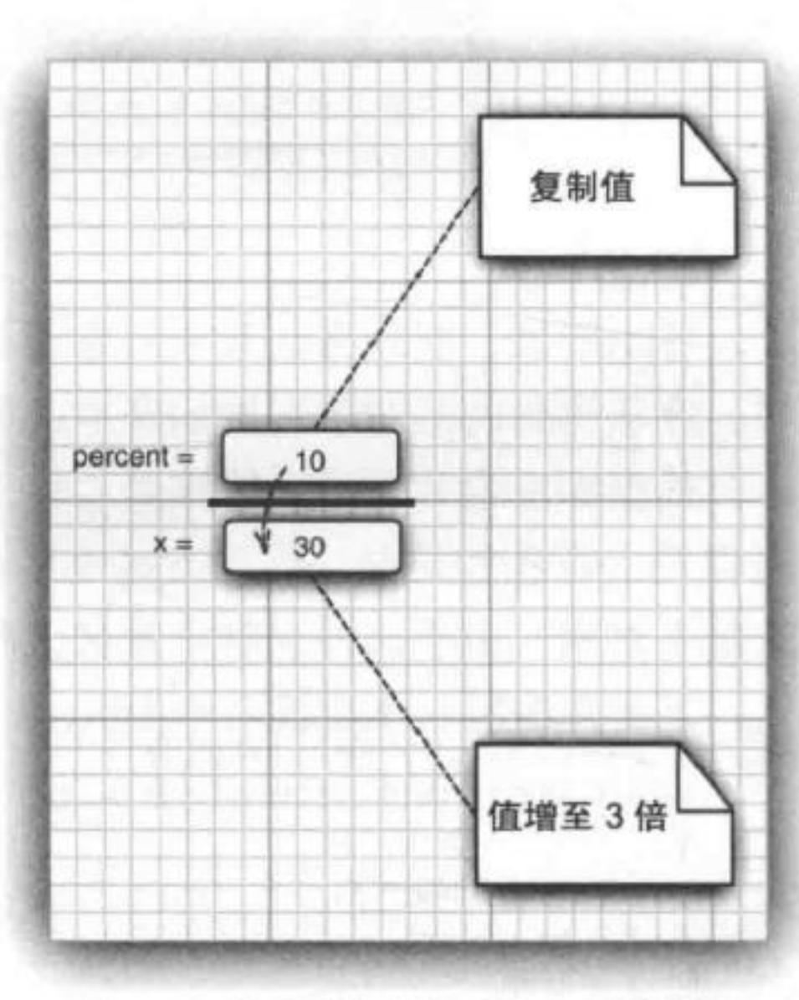

图 4-6 修改参数变量没有持续效果

- **2**「**.** aiseSmla「y 方法应用于这个对象引用<sup>g</sup> **<sup>x</sup>** 和 **hairy** 同时引用的那个 **Employee** 对象的工资 提高了 200%。
- 3.方法结束后,参数变量 <sup>X</sup> 不再使用,当然,对象变量 **harry** 继续引用那个工资增至 3 倍 的员工对象(如图 4-7 所示)。

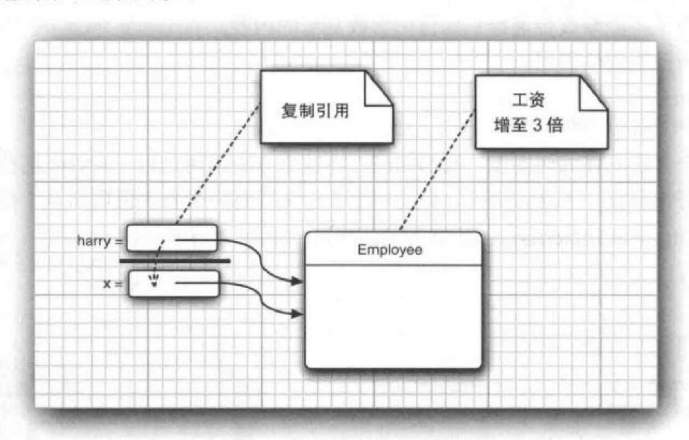

图 **4-7** 修改参数引用的对象有持续效果

可以看到,实现方法改变对象参数的状态是完全可以的,实际上也相当常见口 理由很简 单,方法得到的是对象引用的副本,原来的对象引用和这个副本都引用同一个对象。

很多程序设计语言(特别是 **C++** 和 Pascal)提供了两种参数传递方式:按值调用和按引 用调用口 有些程序员(甚至有些书的作者)声称 **Java** 对对象采用的是按引用调用,实际上, 这是不对的「 由于这种误解很常见,所以很有必要给出一个反例来详细地说明这个问题.

下面来编写一个交换两个 **Employee** 对象的方法:

```
public static void swap(Employee x. Employee y)// doesn't work
{
   Employee temp - x;
   x = y;
   y = temp;
}
```

如果 **Java** 对对象采用的是按引用调用,那么这个方法就应该能够实现交换:

```
var a = new Employee!-Alice\
 var b = new Employee!*Bob\ .
                               -
 swap(ar b);
〃does a now refer to Bob, b to Alice?
```

但是,这个方法并没有改变存储在变量 d和 **<sup>b</sup>** 中的对象引用p **swap** 方法的参数 **<sup>x</sup>** 和 **<sup>y</sup>** 初始 化为两个对象引用的副本,这个方法交换的是这两个副本。

```
// x refers to Alice, y to Bob
Employee temp = 引
```

**y = temp; // now <sup>x</sup> refers to Bob, <sup>y</sup> to Alice**

最终, 白费力气。方法结束时,参数变量 <sup>x</sup> 和 <sup>y</sup> 被丢弃了。原来的变量已和 <sup>b</sup> 仍然引用 这个方法调用之前所引用的对象(如图 44 所示几

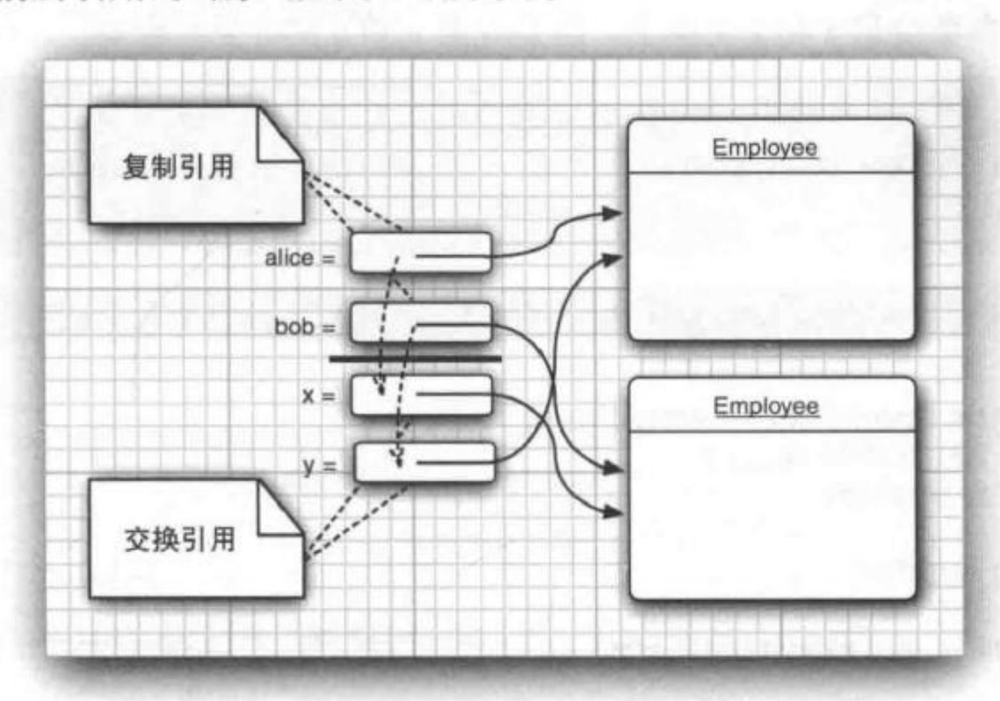

图 45 交换参数变量没有持续效果

这说明:Javw 程序设计语言对对象采用的不是按引用调用口 实际上,对象引用( object reference)是按值传递的0

下面来总结在 Java 中对方法参数能做什么和不能做什么:

- 方法不能修改基本数据类型的参数(即数值型或布尔型)。
- 方法可以改变对象参数的状态。
- 方法不能让一个对象参数引用一个新对象。

程序清单 4.4 中的程序展示了这几点。在这个程序中,首先试图将一个数值参数的值增 至 3 倍,但没有成功:

**Testing tripleValue:** Before:**percent=lfi,e End of** method:**x=3fl,6 After: percent=ie,9**

随后,成功地将一个员工的工资增至 3 倍:

**Testing tripleSalary: Before: salary=50&e0\*6**

**End of** method:**salary=15G0B6.6**

**After: 5alary=15G&e0,0**

方法结束之后,ha「ry引用的对象的状态发生了改变。这是因为这个方法可以通过对象引 用的副本修改所引用对象的状态。

最后,程序演示了界即方法的失败结果:

**Testing swap: Before; a=Alice** Before: b=Bob End of method: x=Bob End of method: y=Alice After: a=Alice After: b=Bob

可以看出,参数变量 x 和 y 交换了,但是变量 a 和 b 没有受到影响。

C++ 注释: C++ 中有按值调用和按引用调用。引用参数标有&符号。例如,可以轻松地实现 void tripleValue(double&x) 方法或 void swap(Employee&x, Employee&y) 方法来修改它们的引用参数。

#### 程序清单 4-4 ParamTest/ParamTest.java

```
1 /**
   * This program demonstrates parameter passing in Java.
   * @version 1.01 2018-04-10
    * @author Cay Horstmann
6 public class ParamTest
7 {
      public static void main(String[] args)
          * Test 1: Methods can't modify numeric parameters
11
12
         System.out.println("Testing tripleValue:");
         double percent = 10;
14
         System.out.println("Before: percent=" + percent);
15
         tripleValue(percent);
16
         System.out.println("After: percent=" + percent);
17
18
19
          * Test 2: Methods can change the state of object parameters
20
21
         System.out.println("\nTesting tripleSalary:");
22
         var harry = new Employee("Harry", 50000);
23
         System.out.println("Before: salary=" + harry.getSalary());
24
         tripleSalary(harry);
25
         System.out.println("After: salary=" + harry.getSalary());
26
27
         /*
28
          * Test 3: Methods can't attach new objects to object parameters
29
          */
30
         System.out.println("\nTesting swap:");
31
         var a = new Employee("Alice", 70000);
32
         var b = new Employee("Bob", 60000);
33
         System.out.println("Before: a=" + a.getName());
34
         System.out.println("Before: b=" + b.getName());
35
         swap(a, b);
36
         System.out.println("After: a=" + a.getName());
37
         System.out.println("After: b=" + b.getName());
38
39
49
      public static void tripleValue(double x) // doesn't work
41
```

```
42
         x = 3 * x;
43
         System.out.println("End of method: x=" + x);
44
45
46
      public static void tripleSalary(Employee x) // works
47
48
         x.raiseSalary(200);
49
         System.out.println("End of method: salary=" + x.getSalary());
50
51
52
      public static void swap(Employee x, Employee y)
53
54
         Employee temp = x;
55
         x = y;
56
         y = temp;
57
         System.out.println("End of method: x=" + x.getName());
58
         System.out.println("End of method: y=" + y.getName());
59
60
61
62
   class Employee // simplified Employee class
64 {
      private String name;
65
      private double salary;
66
67
      public Employee(String n, double s)
68
69
         name = n;
70
         salary = s;
71
72
73
      public String getName()
74
75
76
          return name;
77
78
      public double getSalary()
79
88
         return salary;
81
82
83
      public void raiseSalary(double byPercent)
85
          double raise = salary * byPercent / 100;
86
         salary += raise;
87
88
89 }
```

#### 4.6 对象构造

前面已经学习了如何编写简单的构造器来定义对象的初始状态。不过,由于对象构造非

常重要,所以Java 提供了多种编写构造器的机制。下面几节将详细介绍这些机制。

#### 4.6.1 重载

有些类有多个构造器。例如,可以如下构造一个空的 StringBuilder 对象:

var messages = new StringBuilder();

或者,可以指定一个初始字符串:

var todoList = new StringBuilder("To do:\n");

这种功能叫作重载(overloading)。如果多个方法(比如,StringBuilder 构造器方法)有相同的方法名但有不同的参数,便出现了重载。编译器必须挑选出具体调用哪个方法。它用各个方法首部中的参数类型与特定方法调用中所使用的值类型进行匹配,来选出正确的方法。如果编译器无法匹配参数,就会产生编译时错误,这可能因为根本不存在匹配,或者所有重载方法中没有一个相对更好的方法(这个查找匹配的过程称为重载解析(overloading resolution))。

注释: Java 允许重载任何方法,而不只是构造器方法。因此,要完整地描述一个方法,需要指定方法名以及参数类型,这叫作方法的签名(signature)。例如, String 类有 4 个 2 为 index 0 f 的 公共方法。它们的签名是

indexOf(int)\nindexOf(int, int)\nindexOf(String)\nindexOf(String, int)

返回类型不是方法签名的一部分。也就是说,不能有两个名字相同、参数类型也相同却有不同返回类型的方法。

#### 4.6.2 默认字段初始化

如果在构造器中没有显式地为一个字段设置初始值,就会将它自动设置为默认值:数值将设置为0,布尔值为 false,对象引用为 null。有些人认为依赖默认值的做法是一种不好的编程实践。确实,如果不明确地对字段进行初始化,就会影响程序代码的可读性。

i 注释: 这是字段与局部变量的一个重要区别。方法中的局部变量必须明确地初始化。但是在类中,如果没有初始化类中的字段,将会自动初始化为默认值(θ、false或 null)。

例如,考虑 Employee 类。假定没有在构造器中指定如何初始化某些字段,默认情况下,就会将 salary 字段初始化为 0,将 name 和 hireDay 字段初始化为 null。

但是,这并不是一个好主意。如果有人调用 getName 方法或 getHireDay 方法,就会得到一个 null 引用,这可能不是他们想要的结果:

LocalDate h = harry.getHireDay();\nint year = h.getYear(); // throws exception if h is null

#### 4.6.3 无参数的构造器

很多类都包含无参数的构造器,由无参数构造器创建对象时,对象的状态会设置为适当

的默认值。例如,以下是 Employee 类的一个无参数构造器:

```
public Employee()
{
   name = "";
   salary = 0;
   hireDay = LocalDate.now();
}
```

如果你写的类没有构造器,就会为你提供一个无参数构造器。这个构造器将所有的实例字段设置为相应的默认值。所以,实例字段中的所有数值型数据会设置为 0,所有布尔值设置为 false,所有对象变量将设置为 null。

如果类中提供了至少一个构造器,但是没有提供无参数构造器,那么构造对象时就必须提供参数,否则就是不合法的。例如,程序清单 4-2 中的 Employee 类提供了一个构造器:

public Employee(String n, double s, int year, int month, int day)

对于这个类,构造默认的员工就是不合法的。也就是说,以下调用 e = new Employee();

将产生错误。

● 警告:请记住,仅当类没有任何其他构造器的时候,你才会得到一个默认的无参数构造器。编写类的时候,如果写了一个你自己的构造器,要想让这个类的使用者能够通过以下调用创建一个实例:

new ClassName()

你就必须提供一个无参数的构造器。当然,如果接受所有字段设置为默认值,则只需要提供以下代码:

```
public ClassName()
{
}
```

C++ 注释: C++ 对于构造字段有一种特殊的初始化器列表语法,如下所示:

```
Employee::Employee(String n, double s, int y, int m, int d) // C++
: name(n),
    salary(s),
    hireDay(y, m, d)
{
}
```

C++ 使用这种特殊语法来避免不必要地调用无参数构造器。在 Java 中, 不需要这种语法, 因为对象没有子对象, 只有其他对象的引用。

#### 4.6.4 显式字段初始化

通过重载类的构造器方法,可以采用多种形式设置类实例字段的初始状态。不论调用哪个构造器,每个实例字段都要设置为一个有意义的初始值,确保这一点总是一个好主意。

可以在类定义中直接为任何字段赋值。例如:

```
class Employee
{
   private String name = **;
}
```

在执行构造器之前完成这个赋值』如果一个类的所有构造器都需要把某个特定的实例字 段设置为同一个值,那么这个语法尤其有用口

初始值不一定是常量值。在下面的例子中,就是利用方法调用初始化一个字段。考虑以 下 <sup>E</sup>呼loyee 类,其中每个员工有一个 id 字段口 可以使用以下方式进行初始化:

```
class Employee
{
   private static int nextId;
   private int id = advanceldl);
   private static int advanceldO
   {
      int r -
               nextld;
      nextld++;
      return r;
```

#### 4,6.5 参数名

在编写很小的构造器时(这十分常见),在为参数命名时再能有些困惑。 我们通常喜欢用单个字母作为参数名:

```
public Employee{String nf double £)
{
 name = n;
 salary = s; *
}
```

但这祥做有一个缺点:只有阅读代码才能够了解参数 n 和参数 <sup>s</sup> 的含义口 有些程序员在每个参数前面加上一个前缀 "7

```
public Eiployee(String aName, double aSalary)
{
   name = aKane;
   salary -
            aSatary;
}
```

这样更好一些。读者一眼就能够看懂参数的含义』

还一种常用的技巧,它基于这样的事实:参数变量会遮蔽同名的实例字段。例如,如 果将参数命名为 5dla「y, 那么 sal"y 将指示这个参数,而不是实例字段口 但是,还是可以用 this.salary 访问实例字段口 回想一下, this 指示隐式参数,也就是所构造的对象。下面来看 一个示例:

```
public Employee(String naner double salary)
{
   this.name = name;
   this.salary = salary;
}
```

C++ 注释:在 C++ 中,经常 用下画线或某 个固定的字母 (一般选用 e或 K) 作为实例 字段的前缀0 例如,salary 字展可能被命名为 said「八 mSalary 或 xSala「yo Java 程序员 通常不这样做口

#### 4.6.6 调用另一个构造器

关键字 this 指示一个方法的隐式参数。不过,这个关键字还有另外一个含义。

如果构造 器的第一个语句形如 this 这个构造器将调用同一个类的另一个构造器。 下面是一个典型的例子:

```
public Employee(double $)
{
 〃calls EmployeefString, double}
   thisI1*Employee + nextld, s);
   nextld++;
}
```

当调用 new Employee(60966) 时, Employee(double) 构造器将调用 Employee(String, double) 构 造器。

采用这种方式使用 this 关键字非常有用,这样只需要写一次公共构造代码口

生 C++ 注释:在 Java 中,廿达 引用等价于 C++ 中的 thi\$ 指针口 但是,在 C++ 中,一个 构造器不能调用另一个构造器口 如果在 C++ 中想抽取出公共的初始化代码,则必须编 写一个单独的方法。

#### 4.6.7 初始化块

前面已经介绍过两种初始化实例字段的方法:

- 在构造器中设置值;
- 在声明中赋值。

实际上,Java 还有第三种机制,称为初始化块 ( initializationblockh 在一个类的声明 中,可以包含任意的代码块: 构造这个类的对象时,这些块就会执行。例如,

```
ciass Employee
{
   private static int nextid;
   private int id;
   private String name;
   private doubh salary;
   // object initialization block
```

```
id =
            nextld;
      nextld++;
   }
   public Employee{String nr double s)
   {
      name = n;
      salary 二 s;
   )
   public Employee()
   {
      name = "*;
      salary - 8;
   }
}
```

在这个示例中,无论使用哪个构造器构造对象,id 字段都会在对象初始化块中初始化。 首先运行初始化块,然后才运行构造器的主体部分,

这种机制不是必需的,也不常见口 通常会直接将初始化代码放在构造器中。

目注释:可以在初始化块中设置字段,即使这些字段在类后面才 定义,这是合法的。但 是,为了避免循环定义,不允许读取在后面初始化的 字段口 具体规则请参见 Java 语言 规范的 833 <sup>节</sup> ( http://docs.oracle com/javase/specs) <sup>o</sup> 这些规则 太过复杂,让编译器的 实现者都很头疼,所以较早的 Java 版本中这些规则的实现存在一些小错误,因此,建 议总是将初始化块放在字段定义之后」

由于初始化实例字段有多种途径,所以列出构造过程的所有路径可能让人很费解口 下面 是调用构造器时的具体处理步骤:

- 1. 如果构造器的第一行调用了另一个构造器,则基于所提供的参数执行第二个构造器。
- 2,否则,
- a) 所有实例字段初始化为其默认值 (八砧ke或 nullz
- b) 按照在类声明中出现的顺序,执行所有字段初始化方法和初始化块二
- 3. 执行构造器主体代码,

当然,最好精心地组织初始化代码,以便其他程序员轻松理解,而不要求他们都是语言 专家也 例如,如果让类的构造器依赖于实例字段声明的顺序,那就会显得很奇怪并且容易引 起错误,

可以通过提供一个初始值. 或者使用一个静态的初始化块来初始化静态字段口 前面已经 介绍过第一种机制:

「ivat& <sup>p</sup> static int nextld = 1:

如果类的静态字段需要很复杂的初始化代码,那么可以使用静态的初始化块.

将代码放在一个块中,并标记关键字 static。下面是一个示例。我们希望将员工 ID 的起 始值赋为一个小于 10 000 的随机整数二

在类第一次加载的时候,会完成静态字段的初始化。与实例字段一样,除非将静态字段显式地设置成其他值,否则默认的初始值为 0、false或 null。所有的静态字段初始化方法以及静态初始化块都将依照类声明中出现的顺序执行。

■ 注释: 让人惊讶的是,在JDK 6之前,完全可以用 Java 编写一个没有 main 方法的 "Hello, World"程序。

```
public class Hello
{
    static
    {
        System.out.println("Hello, World");
    }
}
```

当用 java Hello 调用这个类时,就会加载这个类,静态初始化块将会打印"Hello,World"。在此之后才会显示一个消息指出 main 未定义。从 Java 7 以后, java 程序会首 先检查是否有一个 main 方法。

这个例子使用了 Random 类来生成随机数。从 JDK 17 开始, java.util.random 包提供了考虑 多种因素的强算法的实现。阅读 java.util.random 包的 API 文档, 其中对如何选择算法给出了 建议。然后通过提供算法名来得到一个实例, 如下所示:

RandomGenerator generator = RandomGenerator.of("L64X128MixRandom");

调用 generator.nextInt(n) 或其他 RandomGenerator 方法来生成随机数。(RandomGenerator 是一个接口, 第 6 章将介绍接口概念。Random 类的对象可以使用所有 RandomGenerator 方法。)

程序清单 4-5 中的程序展示了本节讨论的很多特性:

- 重载构造器;
- 用 this(...) 调用另一个构造器;
- 无参数构造器;
- 对象初始化块;
- 静态初始化块;
- 实例字段初始化。

#### 程序清单 4-5 ConstructorTest/ConstructorTest.java

```
import java.util.*;

/**

* This program demonstrates object construction.

* @version 1.02 2018-04-10
```

```
@author Cay Horstmann
   public class ConstructorTest
9
      public static void main(String[] args)
18
11
         // fill the staff array with three Employee objects
12
         var staff = new Employee[3];
13
14
         staff[0] = new Employee("Harry", 40000);
15
         staff[1] = new Employee(60000);
         staff[2] = new Employee();
17
18
         // print out information about all Employee objects
19
         for (Employee e : staff)
20
            System.out.println("name=" + e.getName() + ",id=" + e.getId() + ",salary="
21
               + e.getSalary());
22
23
24 }
25
26 class Employee
27
      private static int nextId;
28
29
      private int id;
30
      private String name = ""; // instance field initialization
31
      private double salary;
32
33
      private static Random generator = new Random();
34
35
      // static initialization block
36
      static
37
38
         // set nextId to a random number between 0 and 9999
39
         nextId = generator.nextInt(10000);
42
      // object initialization block
43
44
         id = nextId;
45
         nextId++;
47
48
    // three overloaded constructors
      public Employee(String n, double s)
58
51
         name = n;
52
         salary = s;
53
54
55
      public Employee(double s)
57
         // calls the Employee(String, double) constructor
58
         this("Employee #" + nextId, s);
59
60
```

```
61
      // the default constructor
      public Employee()
63
64
          // name initialized to ""--see above
65
         // salary not explicitly set--initialized to 0
66
         // id initialized in initialization block
67
68
69
      public String getName()
78
71
          return name;
72
73
74
      public double getSalary()
75
76
          return salary;
77
78
79
      public int getId()
88
81
          return id;
83
84 }
```

#### API java.util.Random 1.0

Random()构造一个新的随机数生成器。

#### API java.util.random.RandomGenerator 17

- int nextInt(int n)
   返回一个0~n-1之间的随机数。
- static RandomGenerator of(String name)
   由给定算法名生成一个随机数生成器。算法"L64X128MixRandom"对大多数应用都适用。

#### 4.6.8 对象析构与 finalize 方法

有些面向对象的程序设计语言(特别是 C++)有显式的析构器方法,其中放置一些清理代码,当对象不再使用可能需要执行这些清理代码。在析构器中,最常见的操作是回收分配给对象的存储空间。由于 Java 会完成自动的垃圾回收,不需要人工回收内存,所以 Java 不支持析构器。

当然,某些对象使用了内存之外的其他资源,例如,文件或使用系统资源的另一个对象的句柄。在这种情况下,当资源不再需要时,将其回收和再利用就十分重要。

如果一个资源一旦使用完就需要立即关闭,那么应当提供一个 close 方法来完成必要的清理工作。可以在对象使用完时调用这个 close 方法。第7章将介绍如何确保自动调用这个方法。