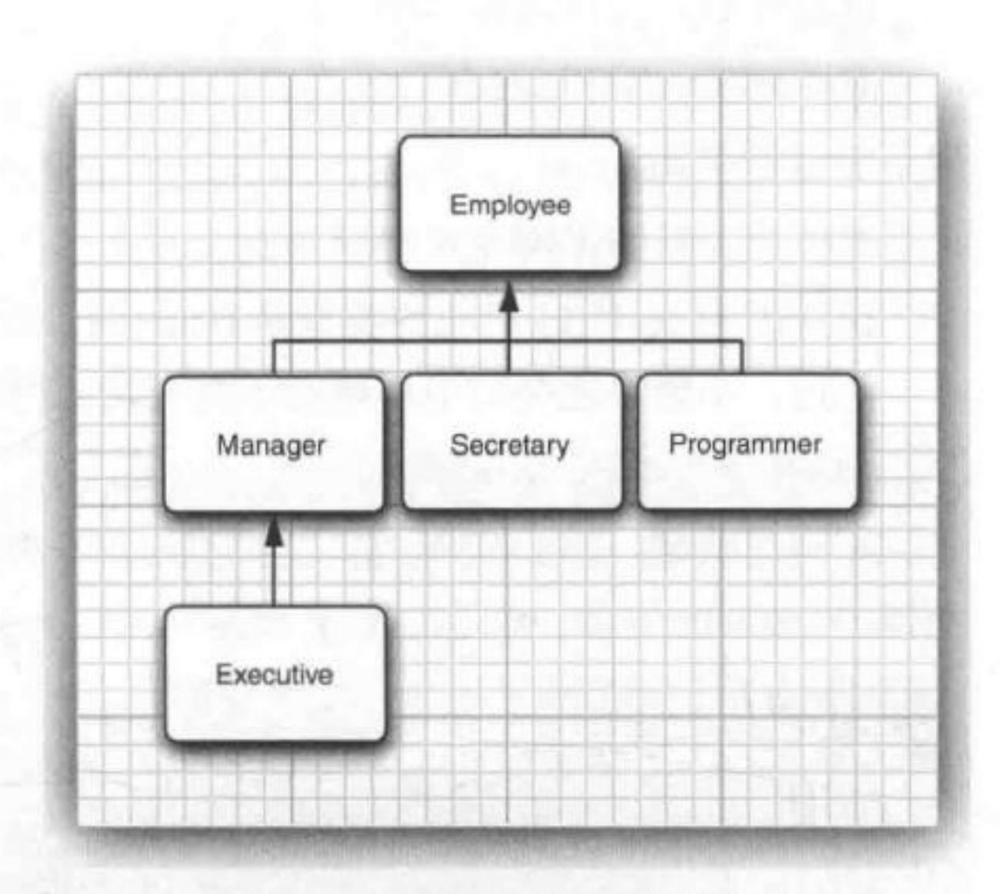
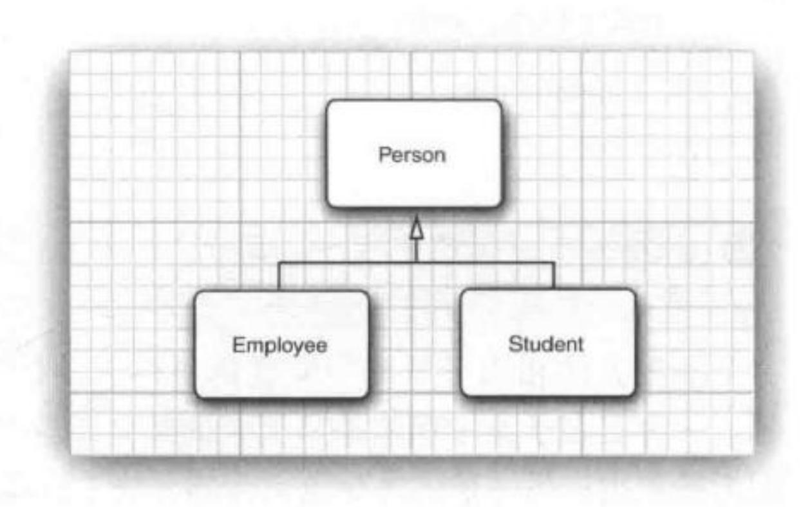
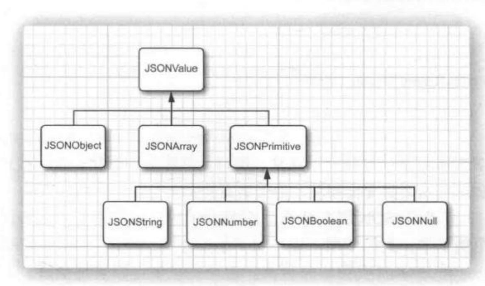
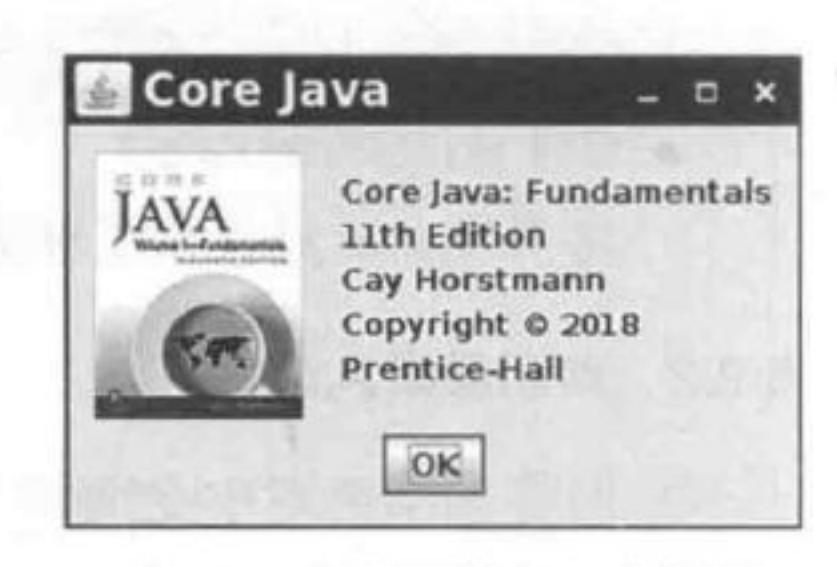
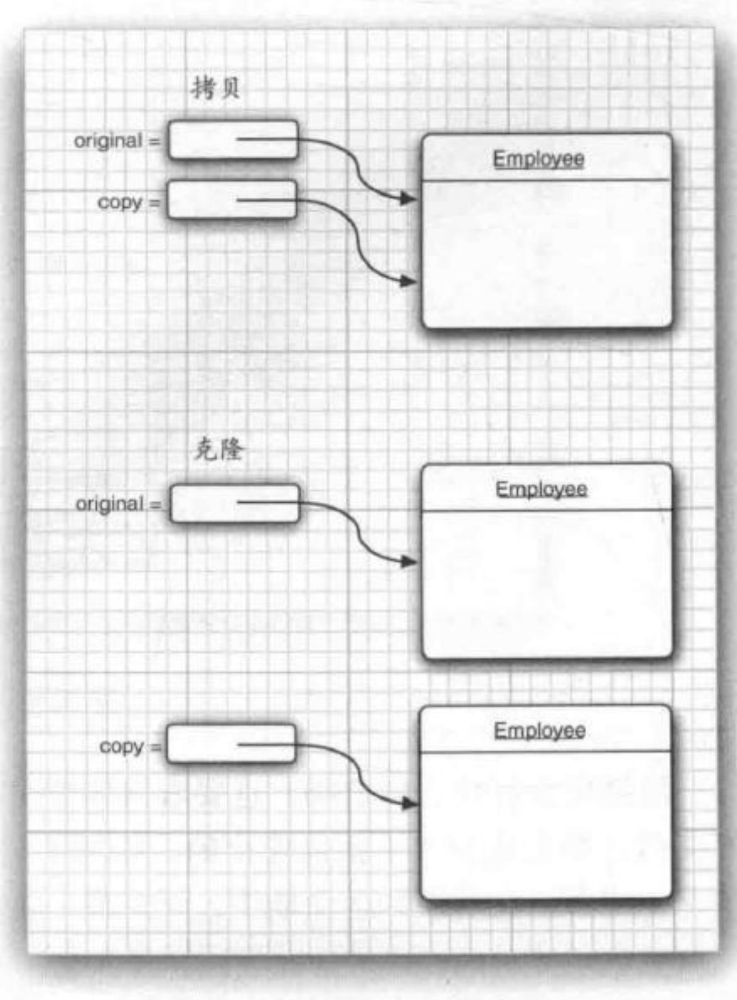
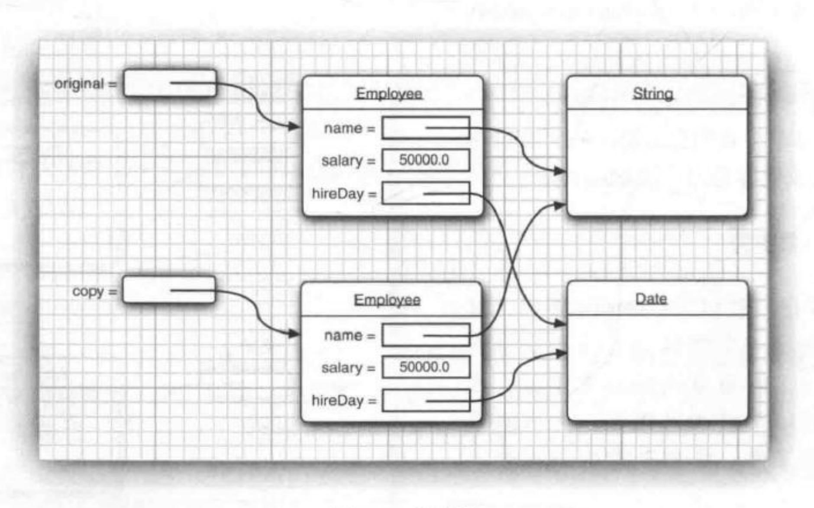
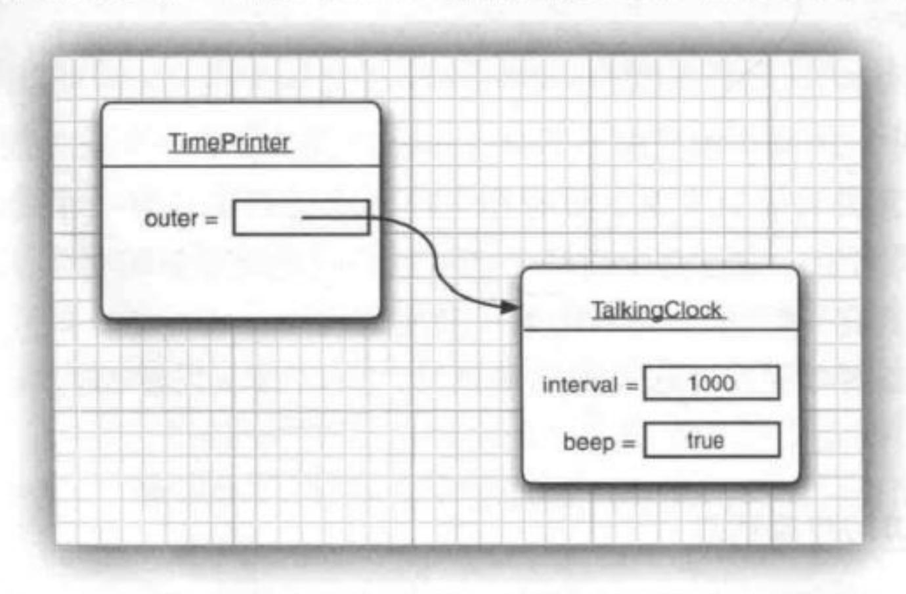

如果可以等到虚拟机退出,那么可以用方法 Runtime.addShutdownHook 增加一个"关闭钩" (shutdown hook)。在 Java 9 中,可以使用 Cleaner 类注册一个动作,当对象不再可达时(除了清洁器还能访问,其他对象都无法访问这个对象),就会完成这个动作。在实际中这些情况很少见。可以参见 API 文档来了解这两种方法的详细内容。

● 警告:不要使用 finalize 方法来完成清理。这个方法原本要在垃圾回收器清理对象之前调用。不过,你并不能知道这个方法到底什么时候调用,而且该方法已经被废弃。

### 4.7 记录

有时,数据就只是数据,而面向对象程序设计提供的数据隐藏有些碍事。考虑一个类 Point,这个类描述平面上的一个点,有x和y坐标。

当然,可以如下创建一个类:

```
class Point
{
   private final double x;
   private final double y;
   public Point(double x, double y) { this.x = x; this.y = y; }
   public getX() { return x; }
   public getY() { return y; }
   public String toString() { return "Point[x=%d, y=%d]".formatted(x, y); }
   // More methods . . .
}
```

这里隐藏了 x 和 y, 然后通过获取方法来获得这些值,不过,这种做法对我们确实有好处吗?

我们将来想改变 Point 的实现吗? 当然,还有极坐标,不过对于图形 API,你可能不会使用极坐标。在实际中,平面上的一个点就用x和y坐标来描述。

为了更简洁地定义这些类, JDK 14 引入了一个预览特性: "记录"。最终版本在 JDK 16 中发布。

### 4.7.1 记录概念

记录(record)是一种特殊形式的类,其状态不可变,而且公共可读。可以如下将 Point 定义为一个记录:

```
record Point(double x, double y) { }
```

其结果是有以下实例字段的类:

```
private final double x;
private final double y;
```

在 Java 语言规范中,一个记录的实例字段称为组件(component)。

这个类有一个构造器:

```
Point(double x, double y)
```

### 和以下访问器方法:

```
public double x()
public double y()
```

注意,访问器方法名为 x 和 y,而不是 getX 和 getY。(Java 中实例字段可以与方法同名,这是合法的。)

```
var p = new Point(3, 4);
System.out.println(p.x() + " " + p.y());
```

注释: Java 没有遵循 get 约定,因为那有些麻烦。对于布尔字段,通常使用 is 而不是 get。而且首字母大写可能有问题。如果一个类既有 x 字段又有 X 字段,会发生什么?有些程序员不太满意,因为他们原先的类不能轻松地变为记录。不过实际上,那些遗留类中,很多都是可变的,所以并不适合转换为记录。

除了字段访问器方法,每个记录有 3 个自动定义的方法: toString、equals 和 hashCode。下一章会更多地了解这些方法。

● 警告:对于这些自动提供的方法,也可以定义你自己的版本,只要它们有相同的参数和返回类型。例如,下面的定义就是合法的:

```
record Point(double x, double y)
{
   public double x() { return y; } // BAD
}

不过,这并不是一个好主意。
```

可以为一个记录增加你自己的方法:

```
record Point(double x, double y)
{
    public double distanceFromOrigin() { return Math.hypot(x, y); }
}
与所有其他类一样,记录可以有静态字段和方法:
record Point(double x, double y)
{
    public static Point ORIGIN = new Point(0, 0);
    public static double distance(Point p, Point q)
    {
        return Math.hypot(p.x - q.x, p.y - q.y);
    }
    ...
}

不过,不能为记录增加实例字段:
record Point(double x, double y)
{
    private double r; // ERROR
```

警告: 记录的实例字段自动为 final 字段。不过,它们可能是可变对象的引用。 record PointInTime(double x, double y, Date when) { } 这样记录实例将是可变的: var pt = new PointInTime(θ, θ, new Date()); pt.when().setTime(θ); 如果希望记录实例是不可变的,那么字段就不能使用可变的类型。

● 提示: 对于完全由一组变量表示的不可变数据,要使用记录而不是类。如果数据是可变的,或者数据表示可能随时间改变,则使用类。记录更易读、更高效,而且在并发程序中更安全。

#### 4.7.2 构造器:标准、自定义和简洁

自动定义地设置所有实例字段的构造器称为标准构造器 (canonical constructor)。

还可以定义另外的自定义构造器(custom constructor)。这种构造器的第一个语句必须调用另一个构造器,所以最终会调用标准构造器。下面来看一个例子:

```
record Point(double x, double y)
{
    public Point() { this(0, 0); }
}

这个记录有两个构造器: 标准构造器和一个生成原点的无参数构造器。
如果标准构造器需要完成额外的工作, 那么可以提供你自己的实现:
record Range(int from, int to)
{
    public Range(int from, int to)
    {
        if (from <= to)
        {
            this.from = from;
            this.to = to;
        }
        else
        {
            this.from = to;
            this.to = from;
        }
    }
```

不过,实现标准构造器时,建议使用一种简洁(compact)形式(见程序清单 4-6)。不用指定参数列表:

```
record Range(int from, int to)
{
   public Range // Compact form
   {
      if (from > to) // Swap the bounds
      {
       int temp = from;
   }
}
```

```
from = to;
to = temp;
}
}
```

简洁形式的主体是标准构造器的"前奏"。它只是在为实例字段 this.from 和 this.to 赋值之前修改参数变量 from 和 to。不能在简洁构造器的主体中读取或修改实例字段。

#### 程序清单 4-6 RecordTest/RecordTest.java

```
import java.util.*;
2
   /**
    * This program demonstrates records.
    * @version 1.0 2021-05-13
    * @author Cay Horstmann
   public class RecordTest
9
      public static void main(String[] args)
10
11
         var p = new Point(3, 4);
12
         System.out.println("Coordinates of p: " + p.x() + " " + p.y());
13
         System.out.println("Distance from origin: " + p.distanceFromOrigin());
14
         // Same computation with static field and method
15
         System.out.println("Distance from origin: " + Point.distance(Point.ORIGIN, p));
17
         // A mutable record
18
         var pt = new PointInTime(3, 4, new Date());
19
         System.out.println("Before: " + pt);
20
         pt.when().setTime(0);
21
         System.out.println("After: " + pt);
22
23
         // Invoking a compact constructor
25
         var r = new Range(4, 3);
26
         System.out.println("r: " + r);
27
28
29
38
   record Point(double x, double y)
32
      // A custom constructor
33
      public Point() { this(0, 0); }
34
      // A method
35
      public double distanceFromOrigin()
36
37
         return Math.hypot(x, y);
38
39
      // A static field and method
48
      public static Point ORIGIN = new Point();
41
      public static double distance(Point p, Point q)
42
43
         return Math.hypot(p.x - q.x, p.y - q.y);
```

```
46
47
   record PointInTime(double x, double y, Date when) { }
   record Range(int from, int to)
51
      // A compact constructor
52
      public Range
54
         if (from > to) // Swap the bounds
55
            int temp = from;
            from = to;
58
            to = temp;
59
62
```

### 4.8 包

Java 允许使用包(package)将类组织在一个集合中。借助包可以方便地组织你的代码, 并将你自己的代码与其他人提供的代码库分开。下面我们将介绍如何使用和创建包。

### 4.8.1 包名

使用包的主要原因是确保类名的唯一性。假如两个程序员不约而同地提供了 Employee 类,只要他们将自己的类放置在不同的包中,就不会产生冲突。事实上,为了保证包名的绝对唯一性,可以使用一个因特网域名(这显然是唯一的)以逆序的形式作为包名,然后对于不同的项目使用不同的子包。例如,考虑域名 horstmann.com。如果逆序来写,就得到了包名 com. horstmann。然后可以追加一个项目名,如 com.horstmann.corejava。如果再把 Employee 类放在这个包里,那么这个类的"完全限定"名就是 com.horstmann.corejava.Employee。

注释:从编译器的角度来看, 嵌套的包之间没有任何关系。例如, java.util 包与 java. util.jar 包毫无关系。每一个包都是独立的类集合。

### 4.8.2 类的导入

一个类可以使用所属包(这个类所在的包)中的所有类,以及其他包中的公共类(public class)。

我们可以采用两种方式访问另一个包中的公共类。第一种方式是使用完全限定名(fully qualified name),也就是包名后面跟着类名。例如:

java.time.LocalDate today = java.time.LocalDate.now();

这显然很烦琐。更简单且更常用的方式是使用 import 语句。import 语句的关键是可以提

供一种简写方式来引用包中各个类。一旦增加了 import 语句,在使用类时,就不必写出类的全名了。

可以使用 import 语句导入一个特定的类或者整个包。import 语句应该位于源文件的顶部 (但位于 package 语句的后面)。例如,可以使用下面这条语句导入 java.time 包中的所有类。

import java.time.\*;

然后,就可以使用

LocalDate today = LocalDate.now();

而不需要在前面加上包前缀。还可以导入一个包中的特定类:

import java.time.LocalDate;

java.time.\*的语法比较简单,对代码的规模也没有任何负面影响。不过,如果能够明确地指出所导入的类,那么代码的读者就能更加准确地知道你使用了哪些类。

● 提示: 在 Eclipse 中,可以使用菜单选项 Source → Organize Imports。诸如 import java. util.\*;等包语句将会自动扩展为一组特定的导入语句,如:

import java.util.ArrayList;\nimport java.util.Date;

这是一个十分便捷的特性。

但是,需要注意的是,只能使用星号(\*)导入一个包,而不能使用 import java.\*或 import java.\*.\*导入以 java 为前缀的所有包。

在大多数情况下,可以只导入你需要的包,并无须过多考虑。但在发生命名冲突的时候,就要注意包了。例如, java.util 和 java.sql 包都有 Date 类。假设在程序中导入了这两个包:

import java.util.\*;\nimport java.sql.\*;

在程序中使用 Date 类的时候,就会出现一个编译错误:

Date today; // ERROR--java.util.Date or java.sql.Date?

此时,编译器无法确定你想使用的是哪一个 Date 类。可以增加一个特定的 import 语句来解决这个问题:

import java.util.\*;\nimport java.sql.\*;\nimport java.util.Date;

如果这两个 Date 类都需要使用,又该怎么办呢?答案是,在每个类名的前面加上完整的包名。

var startTime = new java.util.Date();
var today = new java.sql.Date(. . .);

在包中定位类是编译器(compiler)的工作。类文件中的字节码总是使用完整的包名来引用其他类。

6 C++ 注释: C++ 程序员有时会将 import 与 #include 弄混。实际上,这两者之间并没有 共同之处。在 C++ 中,必须使用 #include 来包含外部特性的声明,这是因为,除了正 在编译的文件以及显式包含的头文件, C++ 编译器不会查看任何其他文件。Java 编译 器则不同,只要你告诉它文件在哪里,它很乐于查看其他文件。

在 Java 中, 通过显式地给出完整的类名, 如 java.util.Date, 可以完全避免使用 import 机制; 而在 C++ 中, 则无法避免使用 #include 指令。

import 语句唯一的好处是简捷。可以使用简短的名字而不是完整的包名来引用一个类。例如,在 import java.util.\*(或 import java.util.Date)语句之后,可以只用 Date 来引用 java.util.Date 类。

在 C++ 中,与包机制类似的是命名空间 (namespace)特性。可以认为 Java 中的 package 和 import 语句类似于 C++ 中的 namespace 和 using 指令。

#### 4.8.3 静态导入

有一种 import 语句允许导入静态方法和静态字段,而不只是类。例如,如果在源文件最上面添加一条指令:

import static java.lang.System.\*;

就可以使用 System 类的静态方法和静态字段,而不必加类名前缀:

out.println("Goodbye, World!"); // i.e., System.out exit(0); // i.e., System.exit

另外, 还可以导入特定的方法或字段:

import static java.lang.System.out;

实际上,是否有很多程序员想要用简写 System.out 或 System.exit,这一点很让人怀疑。这样写出的代码看起来不太清晰。不过,

sqrt(pow(x, 2) + pow(y, 2))

### 看起来则比

Math.sqrt(Math.pow(x, 2) + Math.pow(y, 2))

简洁得多。

### 4.8.4 在包中增加类

要想将类放入包中,就必须将包名放在源文件的开头,即放在定义这个包中各个类的代码之前。例如,程序清单 4-8 中的文件 Employee. java 开头是这样的:

package com.horstmann.corejava;

```
public class Employee
{
    ...
}
```

如果没有在源文件中放置 package 语句,那么这个源文件中的类就属于无名包(unnamed package)。无名包没有包名。到目前为止,我们定义的所有类都在无名包中。

将源文件放到与完整包名匹配的子目录中。例如, com.horstmann.corejava 包中的所有源文件应该放置在子目录 com/horstmann/corejava 中(Windows 中则是 com/horstmann/corejava)。编译器将类文件也放在相同的目录结构中。

程序清单 4-7 和程序清单 4-8 中的程序分别放在两个包中: PackageTest 类属于无名包; Employee 类属于 com.horstmann.corejava 包。因此, Employee.java 文件必须在子目录 com/horstmann/corejava 中。换句话说, 目录结构如下所示:

```
. (base directory)

- PackageTest.java
- PackageTest.class
com/
- horstmann/
- corejava/
- Employee.java
- Employee.class
```

要想编译这个程序,只需切换到基目录,并运行以下命令

javac PackageTest.java

编译器就会自动地查找文件 com/horstmann/corejava/Employee.java 并进行编译。

下面看一个更加实际的例子。在这里没有使用无名包,而是将类分别放在不同的包中 (com. horstmann.corejava 和 com.mycompany)。

```
. (base directory)

com/
horstmann/
corejava/
Employee.java
Employee.class
mycompany/
PayrollApp.java
PayrollApp.class
```

在这种情况下,仍然要从基目录编译和运行类,即包含 com 目录的目录:

```
javac com/mycompany/PayrollApp.java
java com.mycompany.PayrollApp
```

再次强调,编译器处理文件(带有文件分隔符和扩展名.java的文件),而 Java 解释器加载类(带有.分隔符)。

- 提示:从下一章开始,我们将对源代码使用包。这样一来,就可以为各章建立一个IDE项目,而不是各小节分别建立项目。
- 警告:编译器在编译源文件的时候不检查目录结构。例如,假设一个源文件开头有以下指令:

package com.mycompany;

即使这个源文件不在子目录 com/mycompany 下,这个文件也可以编译。如果它不依赖于其他包,就可以通过编译而不会出现编译错误。但是,最终的程序将无法运行,除非先将所有类文件移到正确的位置上。如果包与目录不匹配,虚拟机就找不到这些类。

#### 程序清单 4-7 PackageTest/PackageTest.java

```
import com.horstmann.corejava.*;
2 // the Employee class is defined in that package
4 import static java.lang.System.*;
    * This program demonstrates the use of packages.
    * @version 1.11 2004-02-19
9 * @author Cay Horstmann
11 public class PackageTest
12 {
      public static void main(String[] args)
13
14
         // because of the import statement, we don't have to use
15
         // com.horstmann.corejava.Employee here
         var harry = new Employee("Harry Hacker", 50000, 1989, 10, 1);
17
         harry.raiseSalary(5);
19
20
         // because of the static import statement, we don't have to use System.out here
21
         out.println("name=" + harry.getName() + ",salary=" + harry.getSalary());
22
23
24
```

### 程序清单 4-8 PackageTest/com/horstmann/corejava/Employee.java

```
package com.horstmann.corejava;
  // the classes in this file are part of this package
   import java.time.*;
   // import statements come after the package statement
    * @version 1.11 2015-05-08
    * @author Cay Horstmann
12
   public class Employee
14
      private String name;
15
      private double salary;
16
      private LocalDate hireDay;
17
18
      public Employee(String name, double salary, int year, int month, int day)
19
```

```
28
          this.name = name;
21
          this.salary = salary;
22
          hireDay = LocalDate.of(year, month, day);
23
24
25
       public String getName()
26
27
          return name;
28
29
30
       public double getSalary()
31
32
          return salary;
33
34
35
       public LocalDate getHireDay()
36
37
          return hireDay;
38
39
48
       public void raiseSalary(double byPercent)
41
42
          double raise = salary * byPercent / 100;
43
          salary += raise;
44
45
46
```

### 4.8.5 包访问

前面已经见过访问修饰符 public 和 private。标记为 public 的部分可以由任意类使用;标记为 private 的部分只能由定义它们的类使用。如果没有指定 public 或 private,这个部分(类、方法或变量)可以由同一个包中的所有方法访问。

下面再来考虑程序清单 4-2。在这个程序中,没有将 Employee 类定义为公共类,因此只有在同一个包(在此是无名包)中的其他类(例如 EmployeeTest)可以访问这个类。对于类来说,这种默认方式是合乎情理的。但是,对于变量来说就有些不适宜了,变量必须显式地标记为private,不然的话将默认为包可访问。显然,这样会破坏封装性。问题是人们经常忘记键入关键字 private。以 java.awt 包中的 Window 类为例 (java.awt 包是 JDK 提供的源代码的一部分):

```
public class Window extends Container
{
    String warningString;
    . . .
```

请注意,这里的 warningString 变量不是 private! 这意味着 java.awt 包中的所有类的方法都可以访问该变量,并将它设置为任意值 (例如, "Trust me!")。实际上,只有 Window 类的方法访问这个变量,因此本应该将它设置为私有变量才合适。可能是程序员敲代码时匆忙之中忘记 private 修饰符了?也可能没有人关心这个问题?已经 20 多年了,这个变量仍然不是私

有变量。不仅如此,这个类还陆续增加了一些新的字段,而其中大约有一半也不是私有的。

这可能会成为一个问题。在默认情况下,包不是封闭的实体。也就是说,任何人都可以向包中添加更多的类。当然,有恶意或糟糕的程序员很可能利用包访问添加一些能修改变量的代码。例如,在 Java 程序设计语言的早期版本中,只需要将以下这条语句放在类文件的开头,就可以很容易地在 java.awt 包中混入其他类:

package java.awt;

然后,把得到的类文件放置在类路径上某处的 java/awt 子目录下,这样就可以访问 java.awt 包的内部了。使用这一手段,完全可以修改警告字符串(如图 4-9 所示)。

从 1.2 版开始, JDK 的实现者修改了类加载器, 明确地禁止加载包名以 "java." 开头的用户自定义的类! 当然, 用户自定义的类无法从这种保护中受益。另一种机制是让 JAR 文件声明包为密封的 (sealed), 以防止第三方修改, 但这种机制已经过时。现在应当使用模块封装包。我们会在卷 II 的第 9 章详细讨论模块。


图 4-9 在一个 applet 窗口 中修改警告字符串

#### 4.8.6 类路径

在前面已经看到, 类存储在文件系统的子目录中。类的路径必须与包名匹配。

另外,类文件也可以存储在 JAR (Java 归档)文件中。在一个 JAR 文件中,可以包含多个压缩格式的类文件和子目录,这样既可以节省空间又可以改善性能。在程序中用到第三方的库时,你通常会得到一个或多个需要包含的 JAR 文件。第 11 章将介绍如何创建你自己的 JAR 文件。

● 提示: JAR 文件使用 ZIP 格式组织文件和子目录。可以使用任何 ZIP 工具查看 JAR 文件。

为了使类能够被多个程序共享,需要做到下面几点:

- 1. 把类文件放到一个目录中,例如 /home/user/classdir。需要注意,这个目录是包树状结构的基目录。如果希望增加 com.horstmann.corejava.Employee 类,那么 Employee.class 类文件就必须位于子目录 /home/user/classdir/com/horstmann/corejava 中。
  - 2. 将 JAR 文件放在一个目录中,例如 /home/user/archives。
  - 3. 设置类路径 (class path)。类路径是所有包含类文件的路径的集合。

在 UNIX 环境中, 类路径中的各项之间用冒号(:)分隔:

/home/user/classdir:.:/home/user/archives/archive.jar

而在 Windows 环境中,则以分号(;)分隔:

c:\classdir;.;c:\archives\archive.jar

不论是 UNIX 还是 Windows, 都用句点(.)表示当前目录。 类路径包括:

• 基目录 /home/user/classdir或 c:\classdir;

- 当前目录(.);
- JAR 文件 /home/user/archives/archive.jar 或 c:\archives\archive.jar。

从 Java 6 开始,可以为 JAR 文件目录指定一个通配符,如下:

/home/user/classdir:.:/home/user/archives/'\*'

#### 或者

c:\classdir;.;c:\archives\\*

在 UNIX 中, \*必须转义以防止 shell 扩展。

archives 目录中的所有 JAR 文件 (但不包括 .class 文件) 都包含在这个类路径中。由于总是会搜索 Java API 的类, 所以不必显式地包含在类路径中。

◆ 警告: javac 编译器总是在当前目录中查找文件,但只有当类路径中包含"."目录时,
java 虚拟机才会查看当前目录。如果你没有设置类路径,那么没有什么问题,因为默认的类路径会包含"."目录。但是如果你设置了类路径却忘记包含"."目录,那么尽管你的程序可以没有错误地通过编译,但不能运行。

类路径所列出的目录和归档文件是搜寻类的起始点。下面看一个类路径示例:

/home/user/classdir:.:/home/user/archives/archive.jar

假定虚拟机要搜寻 com.horstmann.corejava.Employee 类的类文件。它首先要查看 Java API 类。显然,在那里找不到相应的类文件,所以转而查看类路径。它会查找以下文件:

- /home/user/classdir/com/horstmann/corejava/Employee.class
- com/horstmann/corejava/Employee.class (从当前目录开始)
- com/horstmann/corejava/Employee.class (/home/user/archives/archive.jar 中)

编译器查找文件要比虚拟机复杂得多。如果引用了一个类,而没有指定这个类的包,那么编译器将首先查找包含这个类的包。它会查看所有的 import 指令,确定其中是否包含这个类。例如,假定源文件包含指令:

import java.util.\*;\nimport com.horstmann.corejava.\*;

并且源代码引用了 Employee 类。编译器将尝试查找 java.lang.Employee (因为总是会默认导入 java.lang 包)、java.util.Employee、com.horstmann.corejava.Employee 和 当前包中的 Employee。它会在类路径所有位置中搜索以上各个类。如果找到了一个以上的类,就会产生编译时错误(因为完全限定类名必须是唯一的,所以 import 语句的次序并不重要)。

编译器的任务不止这些,它还要查看添文件是否比类文件新。如果是这样的话,那么源文件就会自动地重新编译。在前面已经知道,只可以导入其他包中的公共类。一个源文件只能包含一个公共类,并且文件名与公共类名必须匹配。因此,编译器很容易找到公共类的源文件。不过,还可以从当前包中导入非公共类。这些类有可能在与类名不同的源文件中定义。如果从当前包中导入一个类,那么编译器就要搜索当前包中的所有源文件,查看哪个源文件定义了这个类。

#### 4.8.7 设置类路径

最好使用 -classpath (或 -cp, 或者 Java 9 中的 --class-path) 选项指定类路径:

java -classpath /home/user/classdir:.:/home/user/archives/archive.jar MyProg

#### 或者

java -classpath c:\classdir;.;c:\archives\archive.jar MyProg

整个指令必须写在一行中。将这样一个很长的命令行放在一个 shell 脚本或一个批处理文件中是个不错的主意。

利用 -classpath 选项设置类路径是首选的方法,另一种方法是通过设置 CLASSPATH 环境变量来指定类路径。具体细节依赖于所使用的 shell。在 Bourne Again shell (bash)中,命令如下:

export CLASSPATH=/home/user/classdir:.:/home/user/archives/archive.jar

在 Windows shell 中,命令如下:

set CLASSPATH=c:\classdir;.;c:\archives\archive.jar

直到退出 shell 为止,类路径设置均有效。

- 警告:有人建议永久地设置 CLASSPATH 环境变量。一般来说这是一个糟糕的想法。人们有可能会忘记全局设置,因此,当他们的类没有正确地加载时,就会感到很奇怪。一个颇受诟病的示例是 Windows 中 Apple QuickTime 安装程序。很多年来,它都将CLASSPATH 全局设置为指向它需要的一个 JAR 文件,而没有在类路径中包含当前目录。因此,当程序编译后却不能运行时,无数 Java 程序员不得不花费很多精力去解决这个问题。
- 警告: 过去,有人建议完全绕过类路径,将所有的JAR文件都放在 jre/lib/ext 目录中。这种机制在 Java 9 中已经过时,不过不管怎样这都是一个不好的建议。从扩展目录加载一些已经遗忘很久的类时,这会让人非常困惑。
- 直 注释:在 Java 9 中,还可以从模块路径加载类。本书卷Ⅱ的第 9 章将讨论模块和模块路径。

### 4.9 JAR 文件

在将应用程序打包时,你希望只向用户提供一个单独的文件,而不是一个包含大量类文件的目录结构,Java 归档(JAR)文件就是为此目的而设计的。JAR 文件既可以包含类文件,也可以包含诸如图像和声音等其他类型的文件。此外,JAR 文件是压缩的,它使用了我们熟悉的 ZIP 压缩格式。

### 4.9.1 创建 JAR 文件

可以使用 jar 工具制作 JAR 文件 (在默认的 JDK 安装中,这个工具位于 jdk/bin 目录

#### 下)。创建一个新 JAR 文件最常用的命令使用以下语法:

jar cvf jarFileName file1 file2 . . .

例如:

jar cvf CalculatorClasses.jar \*.class icon.gif

通常, jar 命令的格式如下:

jar options file1 file2 . . .

表 4-2 列出了 jar 程序的所有选项。它们类似于 UNIX tar 命令的选项。

表 4-2 jar 程序选项

| 选项 | 说明                                                                                           |
|----|----------------------------------------------------------------------------------------------|
| С  | 创建一个新的或者空的存档文件并加入文件。如果指定的文件名是目录,jar 程序将会对它们进行递归处理                                            |
|    | 临时改变目录,例如:                                                                                   |
| C  | jar cvf jarFileName.jar -C classes *.class                                                   |
|    | 切换到 classes 子目录以便增加类文件                                                                       |
| е  | 在清单文件中创建一个入口点(请参见 4.9.3 节)                                                                   |
| f  | 指定 JAR 文件名作为第二个命令行参数。如果没有这个参数,jar 命令会将结果写至标准输出(在创建<br>JAR 文件时)或者从标准输入读取输入(在解压或者列出 JAR 文件内容时) |
| i  | 创建索引文件(用于加快大型归档中的查找)                                                                         |
| m  | 将一个清单文件添加到 JAR 文件中。清单文件是对归档内容和来源的一个说明。每个归档有一个默认的清单文件。但是,如果想验证归档文件的内容,可以提供你自己的清单文件            |
| М  | 不为条目创建清单文件                                                                                   |
| t  | 显示内容表                                                                                        |
| u  | 更新一个已有的 JAR 文件                                                                               |
| V  | 生成详细的输出                                                                                      |
| X  | 解压文件。如果提供一个或多个文件名,只解压这些文件;否则,解压所有文件                                                          |
| 0  | 存储,但不进行 ZIP 压缩                                                                               |

可以将应用程序和代码库打包在 JAR 文件中。例如,如果想在一个 Java 程序中发送邮件,可以使用打包在文件 javax.mail.jar 中的一个库。

### 4.9.2 清单文件

除了类文件、图像和其他资源外,每个 JAR 文件还包含一个清单文件(manifest),用于描述归档文件的特殊特性。

清单文件被命名为 MANIFEST.MF,它位于 JAR 文件的一个特殊的 META-INF 子目录中。合法的最小清单文件极其简单:

Manifest-Version: 1.0

复杂的清单文件可能包含更多条目。这些清单条目被分组为多个节。第一节被称为主节

(main section )o 它作用于整个 JAR 文件』随后的条目可以指定命名实体的属性,如单个文 件、包或者 URLJ它们都必须以一个 随肥 条目开始。节与节之间用空行分开。例如:

**Manifest-Version: LB**

*lines describing this archive*

**Name: Moozle,class** *lines describing this file* **Name: com/myccmpany/inypkg/** *lines describing this package*

要想编辑清单文件,需要将希望添加到清单文件中的行放到文本文件中,然后运行 **jar cfm** *jarFileName manifestFileName . . ,*

例如,要创建一个包含清单文件的 JAR 文件,应该运行

**jar cfnt MyArchive, jar manifest,mf com/mycompany/trypkg/ \* <sup>b</sup> class**

要想更新一个已有的 JAR 文件的清单,则需要将增加的部分放置到一个文本文件中,然 后执行以下命令:

**jar ufm MyArchive\* jar manifest-additions.inf**

同 注释:请参见 https://docs.orade.com/javase/lfi/docs/specs/jar/jar.html 获得有关 JAR <sup>文</sup> 件和清单文件格式的更 <sup>多</sup> 信息。

# 493 可执行 JAR 文件

可以使用 jar 命令中的 <sup>e</sup> 选项指定程序的入口点,即通常调用 java 执行程序时指定的类: jj「 **cvfe HyProgramjar conimycompmny.mypkg.MainAppCIass** *files to* **udd**

或者,可以在清单文件中指定程序的主类,包括以下形式的语句:

**Main-Class: com.nyconpany.nypkg.HainAppClass**

不要为主类名加扩展名 .claES。

警告:清单文件的最后一行必须以换行符结束,否则,将无法正确地读取济单文件。 常见的一个错误是创建了一个只包含 Jtain-Cla弱行而没有行结束符的文本文件?

不论使用哪一种方法,用户都可以简单地通过下面的命令来启动程序:

**java -jar MyProgramjar**

取决于操作系统的配置,用户甚至可以通过双击 JAR 文件图标来启动应用程序. 下面是 各种操作系统的操作方式工

- 在 Windows 平台中. Java 运行时安装程序将为 七限 扩展名创建一个文件关联,会 用 javaw -jar 命令启动文件(与 挪日命令不同,javah 命令不打开 shell 窗口)\*
- ,在 MacOSX 平台中,操作系统能够识别 :ja「"扩展名文件。双击 JAR 文件时就会执 行 Java 程序中

不过,人们对 JAR 文件中的 Java 程序与原生应用还是感觉不同。在 Windows 平台中,可以使用第三方的包装器工具将 JAR 文件转换成 Windows 可执行文件。包装器是一个 Windows 程序,有大家熟悉的扩展名 .exe,它可以查找和加载 Java 虚拟机 (JVM),或者在 没有找到 JVM 时会告诉用户应该做些什么。有许多商业的和开源的产品,例如,Launch4J (http://launch4j.sourceforge.net)和 IzPack (http://izpack.org)。

#### 4.9.4 多版本 JAR 文件

随着模块和包强封装的引入,之前可以访问的一些内部 API 不再可用。这可能要求库提供商为不同 Java 版本发布不同的代码。为此,Java 9 引入了多版本 JAR (multi-release JAR)。

为了保证向后兼容,特定于版本的类文件放在 META-INF/versions 目录中:

```
Application.class
BuildingBlocks.class
Util.class
META-INF

MANIFEST.MF (with line Multi-Release: true)
versions

9
Application.class
BuildingBlocks.class

10
BuildingBlocks.class
```

假设 Application 类使用了 CssParser 类,那么遗留版本的 Application.class 文件可以使用 com.sun.javafx.css.CssParser,而 Java 9 版本可以使用 javafx.css.CssParser。

Java 8 完全不知道 META-INF/versions 目录,它只会加载遗留的类。Java 9 读取这个 JAR 文件时,则会使用新版本。

要增加不同版本的类文件,可以使用 --release 标志:

jar uf MyProgram.jar --release 9 Application.class

要从头构建一个多版本 JAR 文件,可以使用 -C 选项,对应每个版本要切换到一个不同的类文件目录:

jar cf MyProgram.jar -C bin/8 . --release 9 -C bin/9 Application.class

面向不同版本编译时,要使用 --release 标志和 -d 标志来指定输出目录:

javac -d bin/8 --release 8 . . .

在 Java 9 中, -d 选项会创建这个目录(如果原先该目录不存在)。

--release 标志也是 Java 9 新增的。在较早的版本中,需要使用 -source、-target 和 -bootclasspath 标志。JDK 现在为之前的两个 API 版本提供了符号文件。在 Java 9 中,编译时可以将 --release 设置为 9、8 或 7。

多版本 JAR 并不适用于不同版本的程序或库。对于不同的版本,所有类的公共 API 都应当是一样的。多版本 JAR 的唯一作用是使你的某个特定版本的程序或库能够使用多个不同的 JDK 版本。如果你增加了功能或者改变了一个 API, 就应当提供一个新版本的 JAR。

**注释:** javap 之类的工具并没有改造为可以处理多版本 JAR 文件。如果调用 javap -classpath MyProgram.jar Application.class

你会得到类的基本版本(毕竟,它与更新的版本应该有相同的公共 API)。如果必须查看更新的版本,则可以调用:

javap -classpath MyProgram.jar\!/META-INF/versions/9/Application.class

### 4.9.5 关于命令行选项的说明

Java 开发包(JDK)的命令行选项一直以来都使用单个短横线加多字母选项名的形式,如:

java -jar . . .
javac -Xlint:unchecked -classpath . . .

但 jar 命令是个例外,这个命令遵循经典的 tar 命令选项格式,而没有短横线: jar cvf . . .

从 Java 9 开始, Java 工具开始转向一种更常用的选项格式, 多字母选项名前面加两个短横线, 另外对于常用的选项可以使用单字母快捷方式。例如, 调用 Linux ls 命令时可以提供一个"human-readable"选项:

ls --human-readable

或者

ls -h

在 Java 9 中,可以使用 --version 而不是 -version,另外可以使用 --class-path 而不是 -classpath。在本书卷Ⅱ的第 9 章中可以看到, --module-path 选项有一个快捷方式 -p。

详细内容可以参见 JEP 293 增强请求 (http://openjdk.java.net/jeps/293)。在所有清理工作中,作者还提出要标准化选项参数。带 -- 和多字母选项的参数用空格或者一个等号 (=)分隔: javac --class-path /home/user/classdir . . .

或

javac --class-path=/home/user/classdir . . .

单字母选项的参数可以用空格分隔,或者直接跟在选项后面:

javac -p moduledir . . .

或

javac -pmoduledir . . .

● 警告: 后一种方式现在不能使用,而且一般来讲这也不是一个好主意。如果模块目录恰好是 arameters 或 rocessor, 这就很容易与遗留的选项 (parameters 或 processor) 发生冲突,这又何必呢?

无参数的单字母选项可以组合在一起:

**jar -cvf MyProgranJar -e mypackage.HyProgram ♦/\*.class**

**0** 警告:目前不能使用这种方式,这肯定会带来混淆口 假设 **jdVM** 有一个 <sup>人</sup> 选项,那么 **jmvac ・cp** 是指 **javac -c** 叩 还是 **-cp** ?

这就会带来一些混乱,希望过段时间能够解决这个问题」尽管我们想要远离这些古老的 **jar** 选项,但最好还是等到尘埃落定为妙。不过,如果你想做到最现代化,那么可以安全地 使用 **j**前 命令的长选项:

**jar --create - -verbose —file** *jarFileName file^ file2* ・ *. •*

对于单字母选项,如果不组合,也是可以使用的:

**jar -c -v -f** *jarFileNamefile^ file^ . . <sup>t</sup>*

## 4.10 文档注释

**JDK** 包含一个很有用的工具,叫作 **javadoc,** 它可以由源文件生成一个 **HTML** 文档。事 实上,在第 3 章介绍的联机 **API** 文档就是通过对标准 **Java** 类库的源代码运行 **javadoc** 生成的。

如果在源代码中添加以特殊定界符 /\*\* 开始的注释,那么你也可以很容易地生成一个看 上去具有专业水准的文档。这是一种很好的方法,因为这样可以将代码与注释放在一个地 方。应该知道,如果将文档存放在一个单独的文件中,随着时间的推移,代码和注释很可能 出现不一致口 不过,如果文档注释与源代码在同一个文件中,就可以很容易地同时修改源代 码和注释,然后重新运行 **javadoj**

### **4.10.1** 注释的插入

**javadoc** 实用工具从下面几项中抽取信息:

- 模块;
- 包;
- 公共类与接口;
- 公共的和受保护的字段;
- 公共的和受保护的构造器及方法。

第 5 章中将介绍受保护特性,第 6 章中将介绍接口,模块在卷 **n**的第 9 章介绍口

可以 (而且应该) 为以上各个特性编写注释。各个注释放置在所描述特性的前面。注释 以 /科 开始. 并以\*/结束。

每个 产一 . \*/ 文档注释包含标记以及之后紧跟着的自由格式文本 ( **free-form text)o** 标 记以 @ 开始,如 @ **since** 或 **®**)aramo

自由格式文本的第一个句子应该是一个概要陈述。**javadoc** 工具自动地将这些句子抽取出 来生成概要页。

在自由格式文本中,可以使用 HTML 修饰符,例如,用于强调的 <em>...</em>、用于着重强调的 <strong>...</strong>、用于项目符号列表的 //以及用于包含图像的 等。要键入等宽代码,需要使用 {@code ... } 而不是 <code>...</code>——这样一来,就不用操心对代码中的 <字符转义了。

注释:如果文档中有到其他文件的链接,如图像文件(例如,图表或用户界面组件的图像),就应该将这些文件放到包含源文件的目录下的一个子目录 doc-files 中。javadoc 工具将从源目录将 doc-files 目录及其内容复制到文档目录中。在链接中需要使用 doc-files 目录,例如 。

#### 4.10.2 类注释

类注释必须放在 import 语句之后, class 定义之前。 下面是一个类注释的例子:

```
/**
 * A {@code Card} object represents a playing card, such
 * as "Queen of Hearts". A card has a suit (Diamond, Heart,
 * Spade or Club) and a value (1 = Ace, 2 . . . 10, 11 = Jack,
 * 12 = Queen, 13 = King)
 */
public class Card
{
```

■ 注释:没有必要在每一行的开始都添加\*,例如,以下注释同样是合法的:

```
A <code>Card</code> object represents a playing card, such as "Queen of Hearts". A card has a suit (Diamond, Heart, Spade or Club) and a value (1 = Ace, 2 . . . 10, 11 = Jack, 12 = Queen, 13 = King).
```

不过,大部分IDE会自动提供星号,而且换行改变时,还会重新放置星号。

### 4.10.3 方法注释

每个方法注释必须放在所描述的方法之前。除了通用标记之外,还可以使用下面的标记:

• @param variable description

这个标记将给当前方法的"parameters"(参数)部分添加一个条目。这个描述可以占据多行,并且可以使用 HTML 标记。一个方法的所有 @param 标记必须放在一起。

• @return description

这个标记将给当前方法添加 "returns"(返回)部分。这个描述可以跨多行,并且可以使用 HTML 标记。

#### · @throws class description

这个标记将添加一个注释,表示这个方法有可能抛出异常。有关异常的详细内容将在第 7章中讨论。

下面是一个方法注释的示例:

```
/**
 * Raises the salary of an employee.
 * @param byPercent the percentage by which to raise the salary (e.g., 10 means 10%)
 * @return the amount of the raise
 */
public double raiseSalary(double byPercent)
{
    double raise = salary * byPercent / 100;
    salary += raise;
    return raise;
}
```

### 4.10.4 字段注释

只需要对公共字段(通常指的是静态常量)增加文档注释。例如,

```
/**
 * The "Hearts" card suit
 */
public static final int HEARTS = 1;
```

#### 4.10.5 通用注释

标记 @since text 会建立一个 "since" (始于) 条目。text (文本) 可以是对引入这个特性的版本的描述。例如,@since 1.7.1。

类文档注释中可以使用下面的标记:

Qauthor name

这个标记将建立一个"author"(作者)条目。可以有多个@author标记,每个@author标记 对应一个作者。并不是非得使用这个标记,你的版本控制系统能够更好地跟踪作者。

@version text

这个标记将建立一个"version"(版本)条目。这里的 text 可以是对当前版本的任何描述。

通过 @see 和 @link 标记,可以使用超链接,链接到 javadoc 文档的相关部分或外部文档。标记 @see reference 将在"see also"(参见)部分增加一个超链接。它可以用于类中,也可以用于方法中。这里的 reference (引用)可以有以下选择:

```
package.class#feature label
<a href="...">label</a>
"text"
```

第一种情况是最有用的。只要提供类、方法或变量的名字, javadoc 就在文档中插入一个超链接。例如,

**@see com. horstmann. corejava.Eniployee#raiseSalary{**double)

会建立一个超链接,链接到 con,horstgnrr eorejaaEmployee 类的「日及Salary(double)方法二 可以 省略包名,甚至把包名和类名都省去,这样一来,这会位于当前包或当前类。

需要注意,一定要使用井号(#), 而不要使用句号(,)分隔类名与方法名(或类名与变 量名)。Java 编译器自身可以熟练地确定句点在分隔包、子包、类,内部类以及方法和变量 时的不同含义。但是 javadoc 工具就没有这么聪明了,因此必须对它提供帮助亡

如果 @se 标记后面有一个〈字符,就需要指定一个超链接。可以超链接到任何 URL<sup>口</sup> 例如:

邂既 q **href=M www . horstmann .com/corejava \* html">The Core Java home page</a>**

在上述各种情况下,都可以指定一个可选的标签(label), 这会显示为链接锚 Cink anchor)<sup>o</sup> 如果省略了标签,则用户看到的锚就是目标代码名或 URL。

如果 @5鸵标记后面有一个双引号「)字符,文本就会显示在 <sup>飞</sup>eako" 部分。例如,

**@see 'Core Java** 2 **volume 2'**

可以为一个特性添加多个 俗研标记,但必须耨它们放在一起。

如果愿意,可以在任何文档注释中放置指向其他类或方法的超链接口 可以在注释中的任 何位置插人一个形式如下的特殊标记:

**{©link** package.dass^feature label}

这里的特性描述规则与 @5保标记的规则相同。

最后,在 Java 9 中,还可以使用{也ndexc加号}标记为搜索框增加一个条目凸

### 4J0.6 包注释

可以直接将类、方法和变量的注释放置在 Java 源文件中. 只要用 .一\*/文档注释界 定就可以了。但是,要想产生包注释,就需要在每一个包目录中添加一个单独的文件口 可以 有如下两个选择:

- L 提供一个名为 packagednfo.java的 Java 文件口 这个文件必须包含一个初始的 Javadoc 注 释,以 产 和\*/ 界定,后面是一个冲kagc 语句。它不能包含更多的代码或注释。
  - 2. 提供一个名为 package,html 的 HTML 文件,抽取标记 <bodyn- Mbodya 之间的所有文本力

### 4.10,7 注释提取

在这里,假设你希望 HTML 文件将放在名为 docDirectory 的目录下口 执行以下步骤:

- L 切换到源文件目录,其中包含想要生成文档的源文件。如果有嵌套的包要生成文档, 例如 comHorstmannt corejava, 就必须切换到包含子目录mi的目录(如果提供 werview.html 文件 的话,这就是这个文件所在的目录)。
  - 2.如果是一个包,应该运行命令:

**javadoc -d** docDirectory natneO/Package

或者,如果要为多个包生成文档,运行:

javadoc -d *docDirectory nameOfPackage} nameOfPackage2\** , .

如果你的文件在无名包中,则应该运行:

javadoc d *docDirectory* \* Java

如果省略了 4d docDi准cS9 选项,HTML 文件就会提取到当前目录下© 这样可能很混 乱,因此我不提倡这种做法口

可以使用很多命令行选项对挪adoc 程序进行微调;例如,可以使用 athor 和 wrEion 选 项在文档中包含命utho「和如「siQn <sup>e</sup> 标记(默认情况下,这些标记会被省略九 另一个很有用的 选项是 Jink, 用来为标准类添加超链接。例如,如果使用命令

javadoc 4ink http://docs.oracle.eom/javase/9/docs/api <sup>日</sup>va

那么. 所有的标准类库的类都会自动地链接到 Oracle 网站的文档3

如果使用 JMksource 选项,那么每个源文件将会转换为 HTML(不对代码着色,但包含 行号),并且每个类和方法名将变为指向源代码的超链接.

还可以为所有源文件提供一个概要注释<sup>c</sup> 把它放在一个类似。8「view,ht成的文件中,运 行 javadoc 工具,并提供命令行选项 \* overview*filenamez,* 将抽取标记 <body>… </body> 之间的所 有文本。当用户从导航栏中选择 "Overview"时, 就会显示这些内容。

有关其他的选项. 请查阅 javadoc 工具的联机文档 https://docs.oracle.com/]avase/9/javadoc/ javadoc.htmr?

# 4.11 类设计技巧

我们不会面面俱到,也不希望过于沉闷,所以在这一章结束之前再简单地介绍几点技 巧。应用这些技巧可以使你设计的类更能得到专业 OOP 圈子的认可.

L-定要保证数据私有口

这是最重要的;绝对不要破坏封装性. 有时候. 可能需要编写一个访问器方法或更改器 方法,但是最好还是保持实例字段的私有性口 很多惨痛的教训告诉我们,数据的表示形式很 可能会改变।但它们的使用方式却不会经常变化。当数据保持私有时. 表示形式的变化不会 对类的使用者产生影响,而且也更容易检测 bug。

2.一定要初始化敷据中

Java 不会为你初始化局部变量,但是会对对象的实例字段进行初始化。最好不要依赖于 系统的默认值,而是应该显式地初始化所有变量,可以提供默认值,也可以在所有构造器中 设置默认值.

工 不要在美中使用过多的基本类型,

其想法是要用其他的类,而不是使用多个相关的基本类型。这祥会使类更易于理解,也 更易于修改已 例如,可以用一个名为 Address 的新类替换一个 Cgtome「类中的以下实例字段:

```
private String street;
private String city;
private String state;
private int zip;
```

这样一来,可以很容易地处理地址的变化,例如,可能需要处理国际地址。

4. 不是所有的字段都需要单独的字段访问器和更改器。

你可能需要获得或设置员工的工资。而一旦构造了员工对象,肯定不需要更改雇用日期。另外,在对象中,常常包含一些不希望别人获得或设置的实例字段,例如,Address类中的州缩写数组。

5. 分解有过多职责的类。

这样说似乎有点含糊,究竟多少算是"过多"?每个人的看法都不同。但是,如果明显 地可以将一个复杂的类分解成两个概念上更为简单的类,就应该进行分解。(但另一方面,也 不要走极端。如果设计10个类,每个类只有一个方法,显然就有些矫枉过正了。)

下面是一个反面的设计示例。

```
public class CardDeck // bad design
{
   private int[] value;
   private int[] suit;

public CardDeck() { . . . }
   public void shuffle() { . . . }
   public int getTopValue() { . . . }
   public int getTopSuit() { . . . }
   public void draw() { . . . }
}
```

实际上,这个类实现了两个独立的概念:一副牌(包含 shuffle 方法和 draw 方法)和一张牌(包含查看面值和花色的方法)。最好引入一个表示一张牌的 Card 类。现在有两个类,每个类分别完成自己的职责:

```
public class CardDeck
{
    private Card[] cards;

    public CardDeck() { . . . }
    public void shuffle() { . . . }
    public Card getTop() { . . . }
    public void draw() { . . . }
}

public class Card
{
    private int value;
    private int suit;

    public Card(int aValue, int aSuit) { . . . }
    public int getValue() { . . . }
    public int getSuit() { . . . }
}
```

6.类名和方法名要能够体现它们的取责

变量应该有一个能够反映其含义的名字,类似地,类也应该如此(在标准类库中,确实 存在着一些含义不明确的例子,如 历定 类实际上是一个描述时间的类)。

对此有一个很好的惯例:类名应当是一个名词( Orde「), 或者是前面有形容词修饰的名词 ( RushOrder), 或者是有动名词(有 "-ing" 后缀)修饰的名词(例如,BillingAddress)0 对于方 法来说,要遵循标准惯例:访问器方法用小写 get 开头( get%la「y), 更改器方法用小写的 set 开头(setsalary)o

7,优先使用不可变的类口

LocalDate 类以及 java.time 包中的其他类是不可变的——没有方法能修改对象的状态0 <sup>类</sup> 似 plusDays 的方法并不会更改对象, 而是会返回状态已修改的新对象,

更改对象的问题在于,如果多个线程试图同时更新一个对象,就会发生并发更改,其结 果是不可预料的。如果类是不可变的,就可以安全地在多个线程间共享其对象匚

因此,要尽可能让类是不可变的,这是一个很好的想法,对于表示值的类,如一个字符 申或一个时间点,这尤其容易。计算会生成新值,而不是更新原来的值。

当然,并不是所有类都应当是不可变的. 如果员工加薪时让ase5alary 方法返回一个新 的 Employee 对象,这会很奇怪。

本章介绍了有关对象和类的基础知识,这使得 Java 可以作为一种"基于对象"的语言。 要真正做到面向对象,程序设计语言还必须支持继承和多态。Java 提供了对这些特性的支 持,具体内容将在下一章中介绍。

# 第 5章 继 承

- 类、超类和子类
- Object:所有类的超类
- 泛型数组列表
- A 对象包装器与自动装箱
- 参数个数可变的方法

- 抽象类
- 枚举类
- 密封类
- A 反射
- 继承的设计技巧

第 4 章介绍了类和对象的概念,本章将学习面向对象程序设计的另外一个基本概念:继 承( inhe由政8)。继承的基本思想是,可以基于已有的类创建新的类。继承已存在的类就是 复用(继承)这些类的方法,而且可以增加一些新的方法和字段,使新类能够适应新的情况。 这是 Java 程序设计中的一项核心技术。

另外,本章还会介绍反射( refaction)的概念。反射是指在程序运行期间更多地了解类 及其属性的能力。反射是一个功能强大的特性,不过,不可否认它也相当复杂. 由于主要是 开发软件工具而不是编写应用的程序员对反射更感兴趣,因此对于这部分内容, 可以先浏览 一下,待日后再返回来学习。

### 5.1 类、超类和子类

现在让我们回忆一下在前一章中讨论过的 <sup>E</sup>呷loyee 类。假设你在某个公司工作,这个公 司里经理的待遇与普通员工的待遇存在着一些差异。不过,当然他们之间也存在着很多相同 的地方,例如,他们都领取薪水。只是普通员工在完成本职任务之后仅领取薪水,而经理在 完成了预期的业绩之后还能得到奖金。这种情形就需要使用继承。为什么呢?因为需要为经 理定义一个新类幅口叫打, 并增加一些新功能,但可以重用 Employee 类中已经编写的部分代码. 并保留原来 Employ洸类中的所有字段口 从理论上讲,在附nage「与 EmpSyee 之间存在着明显的 "心也"(是)关系,每个经理都是一个员工: "La" 关系是继承的一个明显特征。

E1 注释:本章中,我们使用了员工和经理的经典示例,不过必须提醒你的是对这个例子 要有所保留。在真实世界里,员工也可能会成为 经理,所以你建模时可能希望经理也 是员工,而不是员工的一个子类。不过,在我们的例子中. 假设公司里只有两类人: 一类人永远是员工,另一类人一直是经理。

# 511 定义子类

可以使用如下代码继承 Eployee 类来定义 Manager^, 这里使用关键字 extends 表示继承:

```
public class Manager extends Employee
{
   added methods and fields
}
```

C++ 注释: Java 与 C++ 定义继承的方式十分相似。Java 用关键字 extends 代替了 C++ 中的冒号(:)。在 Java 中, 所有的继承都是公共继承, 而没有 C++ 中的私有继承和保护继承。

关键字 extends 指示正在构造的新类派生于一个已存在的类。这个已存在的类称为超类 (superclass)、基类 (base class) 或父类 (parent class);新类称为子类 (subclass/child class) 或 派生类 (derived class)。超类和子类是 Java 程序员最常用的两个术语,而了解其他语言的程序员可能更加偏爱父 / 子类的叫法,这也能很贴切地体现"继承"。

尽管 Employee 类是一个超类,但并不是因为它优于子类或者拥有比子类更多的功能。实际上恰恰相反,子类比超类拥有的功能更多。例如,看过 Manager 类的源代码之后就会发现,Manager 类比超类 Employee 封装了更多的数据,拥有更多的功能。

■ 注释:前缀"超"(super)和"子"(sub)来源于计算机科学与数学理论中集合语言的术语。所有员工组成的集合包含所有经理组成的集合。所以可以说,员工集合是经理集合的超集;也可以说,经理集合是员工集合的子集。

在 Manager 类中,增加了一个用于存储奖金信息的字段,以及一个用于设置这个字段的新方法:

```
public class Manager extends Employee
{
    private double bonus;
    . . .
    public void setBonus(double bonus)
    {
        this.bonus = bonus;
    }
}
```

这些方法和字段并没有什么特别之处。如果有一个 Manager 对象,就可以使用 setBonus 方法。

Manager boss = . . .;
boss.setBonus(5000);

当然,如果有一个 Employee 对象,则不能使用 setBonus 方法,这不是 Employee 类中定义的方法。不过,尽管在 Manager 类中没有显式地定义 getName 和 getHireDay 等方法,但是可以对 Manager 对象使用这些方法,这是因为 Manager 类自动地继承了超类 Employee 中的这些方法。

每个 Manager 对象有 4 个字段: name、salary、hireDay 和 bonus。其中, name、salary 和 hireDay 字段是从超类得来的。

□ 注释: Java 语言规范指出:"声明为私有的类成员不会被这个类的子类继承"。多年来读者一直对此感到困惑。规范中狭义地使用了"继承"一词。它认为私有字段不会继

承,因为 Manage「类不能直接访问这些私有字段。所以,每个 Manager 对象有超类中的 3 个字段,但是 Manager 类并没有 "继承" 这些字段。

通过扩展超类定义子类的时候,只需要指出子类与超类的不同之处」因此,在设计类的 时候,应该将最一般的方法放在超类中, 而将更特殊的方法放在子类中,这种将通用功能抽 取到超类的做法在面向对象程序设计中十分普遍。

国 注释:第 <sup>4</sup> 章中我们学习了记录,也就是状态完全由构造器参数定义的类二 <sup>不</sup> 能扩展 记录,而且记录也不能扩展其他类。

### 5.1.2 覆盖方法

超类中的有些方法对子类 Manager 并不一定适用。具体来说,Manage「类中的 getSalary 方法 应该返回薪水和奖金的总和。为此,需要提供一个新的方法来覆盖 (ovenide) 超类中的这个 方法:

```
public class Manager extends Employee
{
   public double getSalaryO
```

应该如何实现这个方法呢?乍看起来似乎很简单,只要返回 salary 和 bonus 字段的总和就 可以了:

```
public double getSalaryO
{
   return salary + bonus; // won't work
)
```

不过,这样做是不行的。回想一下,只有 Employee 方法能直接访问 Employee 类的私有字 段。这意味着,伽那「类的 getSalary 方法不能直接访问 salary 字段。如果 Manage <sup>r</sup> 类的方法想 要访问那些私有字段,就必须像所有其他方法一样使用公共接口,在这里就是要使用 Employee 类中的公共方法 getSalaryo

现在,再试一下。你需要调用get5alary 方法而不是直接访问 saldry 字段:

```
public double getSalaryO
{
   double baseSalary = getSalaryO; // still won't work
   return baseSalary + bonus;
}
```

上面这段代码仍然有问题。问题出现在调用 getSalary 的语句上,它只是在调用自身,这 是因为 痴理「类也有一个 getSala「y 方法 (就是我们正在实现的这个方法),所以这条语句将 会导致无限地调用自己,直到整个程序最终崩溃。

这里需要指出:我们希望调用超类 Employee 中的 get5ala「y 方法,而不是当前类的这个方 法。为此,可以使用特殊的关键字 <sup>5</sup>叩打解决这个问题:

```
super.getSalary(>
```

这个语句调用的是 <sup>E</sup>叩 <sup>女</sup> 类中的 getSalary 方法」下面是伽西「<sup>e</sup> 类中 getSalary 方法的正 确版本:

```
public double getSalaryO
{
   double baseSalary = super^ getSalary! );
   return baseSalary + bonus;
}
```

自注释:有些人认为 <sup>S</sup>叩「与<sup>E</sup> this 引用是类似的概念,实际上,这样对比并不太恰当、 这是因为 super 不是一个对徽的引用,例如,不能将值 super 喊给另一个对象变量口 事 实上,wpe「只是一个指示编译器谓用超类方法的特殊关健字。

正如前面所看到的那样,子类可以增加字段、增加方法或覆盖超类的方法,不过,继承 绝对不会删除任何字段或方法口

净 C++ 注释:在 中使用 关键字 super 调用超类的方法,而在 C++ <sup>中</sup> 则采用超类名 加 ::操作符的形式;例如,Man明er 类的 getSalary 方法要调用 Employee: :gMSala「y 而 不 是 <sup>s</sup>叩e「\*getSalary<sup>口</sup>

### **5.1.3** 子类构造器

```
在这个例子的最后. 我们来提供一个构造器。
```

```
public Manager(String name, double salary, int year, int month, int day)
{
   super(ndmeP salary, year, month, day);
   bonus = 机
}
```

这里的关键字削p"具有不同的含义。语句

**super(naneP salaryf year, month, day);**

<sup>是</sup> "调用超类 Employee 中带有 <sup>n</sup>、k year、month <sup>和</sup> day 参数的构造器"的简写形式口

由于 Manw「类的 <sup>e</sup> 构造器不能访问 Employee 类的私有字段,所以必须通过一个构造器来初 始化这些私有字段。可以利用特殊的 supe「语法调用这个构造器。使用 supe「调用构造器的语 句必须是子类构造器的第一条语句。

如果构造子类对象时没有显式地调用超类的构造器,那么超类必须有一个无参数构造 器。这个构造器要在子类构造之前调用口

H 注称:回想一下,关键字 this 有两个含义:一是指示隐式参数的引用,二是调用该类 的其他构造器.类似地,super 关键字也有两个含义:一是调用超类的方法,二是调用 超类的构造器。用来调用构造器的时候, this 和 super 这两个关键字紧密相关。调用构造器的语句只能作为另一个构造器的第一条语句出现。构造器参数可以传递给当前类 (this)的另一个构造器, 也可以传递给超类 (super)的构造器。

C++ 注释: 在 C++ 的构造器中,会使用初始化列表语法来构造超类,而不是调用 super。在 C++ 中, Manager 的构造器如下所示:

```
// C++
Manager::Manager(String name, double salary, int year, int month, int day)
: Employee(name, salary, year, month, day)
{
  bonus = 0;
}
```

重新定义 Manager 对象的 getSalary 方法之后, 奖金就会自动地添加到经理的薪水中。 下面给出一个例子来说明这个类的使用。我们要创建一个新经理, 并设置他的奖金:

Manager boss = new Manager("Carl Cracker", 80000, 1987, 12, 15);
boss.setBonus(5000);

下面定义一个包含3个员工的数组:

var staff = new Employee[3];

在数组中混合填入经理和员工:

```
staff[0] = boss;
staff[1] = new Employee("Harry Hacker", 50000, 1989, 10, 1);
staff[2] = new Employee("Tony Tester", 40000, 1990, 3, 15);
```

输出每个人的薪水:

```
for (Employee e : staff)
   System.out.println(e.getName() + " " + e.getSalary());
```

运行这条循环语句将会输出以下数据:

```
Carl Cracker 85000.0
Harry Hacker 50000.0
Tommy Tester 40000.0
```

这里的 staff[1] 和 staff[2] 仅输出了基本薪水,这是因为它们是 Employee 对象,而 staff[0] 是一个 Manager 对象,它的 getSalary 方法会将奖金与基本薪水相加。

令人赞叹的是,以下调用

```
e.getSalary()
```

会选出正确的 getSalary 方法。需要指出,尽管这里将 e 声明为 Employee 类型,但实际上 e 既可以引用 Employee 类型的对象,也可以引用 Manager 类型的对象。

当 e 引用 Employee 对象时, e.getSalary() 调用的是 Employee 类中的 getSalary 方法; 当 e 引用 Manager 对象时, e.getSalary() 调用的则是 Manager 类中的 getSalary 方法。虚拟机知道 e 实际引用的对象类型, 因此能够调用正确的方法。

- 一个对象变量(例如,变量 e)可以指示多种实际类型,这一点称为多态(polymorphism)。 在运行时能够自动地选择适当的方法,这称为动态绑定(dynamic binding)。在本章中将详细 地讨论这两个概念。
- C++ 注释: 在 C++ 中,如果希望实现动态绑定,则需要将成员函数声明为 virtual。在 Java 中,动态绑定是默认的行为。如果不希望让一个方法是虚拟的,则可以将它标记 为 final (本章稍后将介绍关键字 final)。

程序清单 5-1 的程序展示了 Employee 对象(见程序清单 5-2)与 Manager 对象(见程序清单 5-3)在薪水计算上的区别。

#### 程序清单 5-1 inheritance/ManagerTest.java

```
package inheritance;
2
    * This program demonstrates inheritance.
    * @version 1.21 2004-02-21
    * @author Cay Horstmann
   public class ManagerTest
      public static void main(String[] args)
10
11
         // construct a Manager object
12
         var boss = new Manager("Carl Cracker", 80000, 1987, 12, 15);
13
         boss.setBonus(5000);
14
15
         var staff = new Employee[3];
16
17
         // fill the staff array with Manager and Employee objects
18
19
         staff[0] = boss;
20
         staff[1] = new Employee("Harry Hacker", 50000, 1989, 10, 1);
21
         staff[2] = new Employee("Tommy Tester", 40000, 1990, 3, 15);
22
23
         // print out information about all Employee objects
24
         for (Employee e : staff)
25
            System.out.println("name=" + e.getName() + ",salary=" + e.getSalary());
26
27
28 }
```

### 程序清单 5-2 inheritance/Employee.java

```
package inheritance;
\nimport java.time.*;

public class Employee

function of the private String name;
private double salary;
```

164

```
private LocalDate hireDay;
10
      public Employee(String name, double salary, int year, int month, int day)
11
12
         this.name = name;
13
         this.salary = salary;
14
         hireDay = LocalDate.of(year, month, day);
15
16
17
      public String getName()
18
19
         return name;
28
21
22
      public double getSalary()
23
24
         return salary;
25
26
27
      public LocalDate getHireDay()
28
29
         return hireDay;
38
31
32
      public void raiseSalary(double byPercent)
33
34
         double raise = salary * byPercent / 100;
35
         salary += raise;
36
37
38
```

### 程序清单 5-3 inheritance/Manager.java

```
package inheritance;
  public class Manager extends Employee
      private double bonus;
      /**
       * @param name the employee's name
       * @param salary the salary
       * @param year the hire year
10
       * @param month the hire month
11
       * @param day the hire day
12
13
      public Manager(String name, double salary, int year, int month, int day)
14
15
         super(name, salary, year, month, day);
16
         bonus = \theta;
17
18
19
      public double getSalary()
20
21
```

```
double baseSalary = super.getSalary();
22
         return baseSalary + bonus;
23
24
25
      public void setBonus(double b)
26
27
         bonus = b;
28
29
30
```

#### 5.1.4 继承层次结构

继承并不仅限于一个层次。例如,可 以由 Manager 类派生 Executive 类。由一个 公共超类派生出来的所有类的集合称为 继承层次结构 (inheritance hierarchy), 如 图 5-1 所示。在继承层次结构中, 从某个 特定的类到其祖先的路径称为该类的继 承链 (inheritance chain)。

通常,一个祖先类可以有多个子孙 链。例如,可以由 Employee 类派生出子类 Programmer 和 Secretary, 它们与 Manager 类 没有任何关系(它们彼此之间也没有任何 关系)。必要的话,可以将这个过程一直 延续下去。



Employee 继承层次结构 图 5-1

C++ 注释: 在 C++ 中, 一个类可以有多个超类。Java 不支持多重继承, 但提供了一些 类似多重继承的功能,有关内容请参见6.1节有关接口的讨论。

### 5.1.5 多态

有一个简单的规则可以用来判断是否应该将数据设计为继承关系,这就是"is-a"规则, 它指出子类的每个对象也是超类的对象。例如,每个经理都是员工,因此,将 Manager 类设计 为 Employee 类的子类是有道理的;反之则不然,并不是每一名员工都是经理。

"is-a"规则的另一种表述是替换原则(substitution principle)。它指出程序中需要超类对 象的任何地方都可以使用子类对象替换。

例如,可以将子类的对象赋给超类变量。

Employee e;

e = new Employee(. . .); // Employee object expected

e = new Manager(. . .); // OK, Manager can be used as well

在 Java 程序设计语言中,对象变量是多态的 (polymorphic)。一个 Employee 类型的变量 既可以引用一个 Employee 类型的对象,也可以引用 Employee 类的任何一个子类的对象(例如 Manager、Executive、Secretary 等)。

在程序清单 5-1 中, 我们就利用了这个替换原则:

Manager boss = new Manager(. . .); Employee[] staff = new Employee[3]; staff[θ] = boss;

在这个例子中,变量 staff[0] 与 boss 引用同一个对象。但编译器只将 staff[0] 看成是一个 Employee 对象。

这意味着,可以这样调用

boss.setBonus(5000); // OK

#### 但不能这样调用

staff[0].setBonus(5000); // ERROR

这是因为 staff[0] 声明的类型是 Employee, 而 setBonus 不是 Employee 类的方法。

不过,不能将超类的引用赋给子类变量。例如,下面的赋值是非法的:

Manager m = staff[i]; // ERROR

原因很清楚:不是所有的员工都是经理。如果赋值成功,那么m有可能引用了一个不是经理的 Employee 对象,而在后面有可能会调用 m. setBonus(...),这就会发生运行时错误。

● 警告:在 Java 中,子类引用数组可以转换成超类引用数组,而不需要使用强制类型转换。例如,下面是一个经理数组

Manager[] managers = new Manager[10];

将它转换成 Employee[] 数组完全是合法的:

Employee[] staff = managers; // OK

这样做肯定不会有问题,请思考一下其中的缘由。毕竟,如果 manager[i] 是一个 Manager,它也一定是一个 Employee。不过,实际上会发生一些令人惊讶的事情。要切记 managers 和 Staff 引用的是同一个数组。现在看一下这条语句:

staff[0] = new Employee("Harry Hacker", . . .);

编译器竟然接纳了这个赋值操作。但在这里, staff[0]与 manager[0]是相同的引用, 似乎我们把一个普通员工擅自归入经理行列中了。这非常糟糕, 当调用 managers[0]. setBonus(1000)的时候,将会试图访问一个不存在的实例字段,进而搅乱相邻存储空间的内容。

为了确保不发生这类破坏,所有数组都要牢记创建时的元素类型,并负责监督仅将类型兼容的引用存储到数组中。例如,使用 new Manager[10]创建的数组是一个经理数组。如果试图存储一个 Employee 类型的引用就会引发 ArrayStoreException 异常。

#### 5.1.6 理解方法调用

准确地理解如何在对象上应用方法调用非常重要。下面假设要调用 x.f(args), 隐式参数

x声明为类C的一个对象。下面是调用过程的详细描述:

1. 编译器查看对象的声明类型和方法名。需要注意的是:有可能存在多个名字为f但参数类型不一样的方法。例如,可能存在方法f(int)和方法f(String)。编译器将会一一列举 C 类中所有名为f 的方法和其超类中所有名为f 而且可访问的方法(超类的私有方法不可访问)。

至此,编译器已知所有可能要调用的候选方法。

2. 接下来,编译器要确定方法调用中提供的参数类型。如果在所有名为f的方法中存在一个与所提供参数类型完全匹配的方法,就选择这个方法。这个过程称为重载解析(overloading resolution)。例如,对于调用 x.f("Hello"),编译器将会挑选 f(String),而不是f(int)。由于允许类型转换(int可以转换成 double, Manager 可以转换成 Employee,等等),所以情况可能会变得很复杂。如果编译器没有找到与参数类型匹配的方法,或者发现经过类型转换后有多个方法与之匹配,编译器就会报告一个错误。

至此,编译器已经知道需要调用的方法的名字和参数类型。

注释: 前面曾经说过,方法的名字和参数列表称为方法的签名(signature)。例如, f(int)和 f(String)是两个有相同名字、不同签名的方法。如果在子类中定义了一个与超类签名相同的方法,那么子类中的这个方法就会覆盖(override)超类中有相同签名的方法。

返回类型不是签名的一部分。不过在覆盖一个方法时,需要保证返回类型的兼容性。允许子类将覆盖方法的返回类型改为原返回类型的子类型。例如,假设 Employee 类有以下方法:

public Employee getBuddy() { . . . }

经理不会想找底层员作为工作搭档。为了反映这一点,在子类 Manager 中,可以如下代码覆盖这个方法:

public Manager getBuddy() { . . . } // OK to change return type 我们说,这两个 getBuddy 方法有协变 (covariant) 的返回类型。

- 3. 如果是 private 方法、static 方法、final 方法(final 修饰符将在下一节解释)或者构造器,那么编译器可以准确地知道应该调用哪个方法。这称为静态绑定(static binding)。与此对应的是,如果要调用的方法依赖于隐式参数的实际类型,那么必须在运行时使用动态绑定。在我们的示例中,编译器会利用动态绑定生成一个调用 f (String) 的指令。
- 4. 程序运行并且采用动态绑定调用方法时,虚拟机必须调用与x所引用对象的实际类型对应的那个方法。假设x的实际类型是D,它是C类的子类。如果D类定义了方法f(String),就会调用这个方法;否则,将在D类的超类中寻找f(String),依此类推。

每次调用方法都要完成这个搜索,时间开销相当大。因此,虚拟机预先为每个类计算了一个方法表 (method table),其中列出了所有方法的签名和要调用的实际方法。

虚拟机加载一个类之后可以构建这个方法表,为此要结合它在类文件中找到的方法以及

超类的方法表。

这样一来,真正调用方法的时候,虚拟机仅查找这个表就行了。在前面的例子中,虚拟机搜索 D类的方法表,寻找与 f(Sting) 相匹配的方法。这个方法既有可能是 D.f(String),也有可能是 X.f(String),这里的 X 是 D 的某个超类。这种情况下需要提醒一点,如果调用是 super. f(param),那么编译器将搜索超类的方法表。

现在来详细分析程序清单 5-1 中调用 e.getSalary() 的过程。e 声明为 Employee 类型。Employee 类只有一个名叫 getSalary 的方法,这个方法没有参数。因此,在这里不必担心重载解析的问题。

由于 getSalary 不是 private 方法、static 方法或 final 方法,所以将采用动态绑定。虚拟机为 Employee 和 Manager 类生成方法表。在 Employee 的方法表中列出了这个 Employee 类本身定义的所有方法:

#### Employee:

getName() -> Employee.getName()
getSalary() -> Employee.getSalary()
getHireDay() -> Employee.getHireDay()
raiseSalary(double) -> Employee.raiseSalary(double)

实际上,上面列出的方法并不完整,稍后会看到 Employee 类有一个超类 Object, Employee 类从这个超类中还继承了大量方法,在此,我们略去了 Object 方法。

Manager 方法表稍微有些不同。其中有三个方法是继承而来的,一个方法是重新定义的,还有一个方法是新增的。

#### Manager:

getName() -> Employee.getName()
getSalary() -> Manager.getSalary()
getHireDay() -> Employee.getHireDay()
raiseSalary(double) -> Employee.raiseSalary(double)
setBonus(double) -> Manager.setBonus(double)

在运行时,调用 e.getSalary()的解析过程为:

- 1. 首先,虚拟机获取 e 的实际类型的方法表。这可能是 Employee、Manager 的方法表,也可能是 Employee 类的其他子类的方法表。
- 2. 接下来,虚拟机查找定义了 getSalary() 签名的类。此时,虚拟机已经知道应该调用哪个方法。
  - 3. 最后,虚拟机调用这个方法。

动态绑定有一个非常重要的特性:无须修改现有的代码就可以对程序进行扩展。假设增加一个新类 Executive,并且变量 e 有可能引用这个类的对象,我们不需要对包含调用 e.getSalary()的代码重新进行编译。如果 e 恰好引用一个 Executive 类的对象,就会自动地调用 Executive.getSalary()方法。

● 警告:在覆盖一个方法的时候,子类方法不能低于超类方法的可见性。具体地,如果超类方法是 public, 子类方法必须也要声明为 public。经常会发生这类错误:子类方法不小心遗漏了 public 修饰符。此时,编译器就会报错,指出你试图提供更严格的访问权限。

### 5.17 阻止继承:final 类和方法

有时候,我们可能希望阻止人们定义某个类的子类口 不允许扩展的类被称为 fin矶类口 如果在类定义中使用了 final 修饰符,就表明这个类是 行做类。例如,假设希望阻止人们派 生 Executive 类的子类. 只需要在声明这个类的时候使用 fin爪修饰符。声明格式如下所示:

```
public final class Executive extends Manager
{
)
```

也可以将类中的某个特定方法声明为 finaL 如果这样做,那么所有子类都不能覆盖这个 方法 什如凯 类中的所有方法自动地成为 fin<sup>八</sup> 方法八 例如:

```
public class Employee
{
   public final String getNamef)
   {
      return name;
   }
```

后 注释:前 面曾经说过,字段也可以 声明为 fi的L 对于 包他1 字段来说,构造对象之 后就不允许改 变了。不过,如果将一个类声明为 付的1, 只有其 中的方法自动地成为 final, 而不包括字段已

将方 法或类声明为 fi间只有一个原因:确保它们不会 在子类中改变语义。例如, Calendar 类中的 getTi<sup>肥</sup> 和 setTime 方法都声明为 final. 这表明 Slenda<sup>r</sup> 类的设计者负责实现 Date 类与日历状态之间的转换. 而不允许子类来添乱。类似地,String 类也是 final 类,这意 味着不允许任何人定义 Stri叫的子类。换言之,如果有一个 string引用,它引用的一定是一 个 String 对象,而不可能是其他类的对象。

有些程序员认为:除非有足够的理由使用多态性,否则应该将所有的方法都声明为 final。 事实上,在 CH<sup>和</sup> C# 中,如果没有特别声明,所有的方法都不使用多态性。这两种做法可能 都有些偏激.我们提倡在设计类层次结构时. 要仔细地考虑应该将哪些方法和类声明为 final。

在早期的 java中,有些程序员为了避免动态绑定带来的系统开销而使用 final关键字。 如果一个方法没有被覆盖并且很短,编译器就能够对它进行优化处理,则这个过程称为内联 (inlining)。例如,内联调用ag例附帐()将把它替换为访问字段 aname。这是一项很有意义的 改进,CPU 在处理当前指令时,分支会扰乱预取指令的策略、所以,CPU 不喜欢分支口 不 过,如果求tNd嘿可能在另外一个类中被覆盖,那么编译器就无法知道覆盖代码将会做什么操 作,因此也就不能对它进行内联处理。

幸运的是,虚拟机中的即时编译器比传统编译器的处理能力强得多。即时编译器可以准 确地知道哪些类扩展了一个给定类,并且能够检查是否有类确实覆盖了给定的方法口 如果 方法很简短、被频繁调用而且确实没有被覆盖,那么即时编译器就会对这个方法进行内联处

理。如果虚拟机加载了另外一个子类,而这个子类覆盖了一个内联方法,那么将会发生什么情况呢?优化器必须取消对这个方法的内联。这很耗时,不过很少会发生这种情况。

■ 注释: 枚举和记录总是 final, 它们不允许扩展。

#### 5.1.8 强制类型转换

第3章曾经讲过,将一个类型强制转换成另外一个类型的过程称为强制类型转换 (casting)。Java 程序设计语言为强制类型转换提供了一种特殊的表示法。例如:

double x = 3.405; int nx = (int) x;

将表达式 x 的值转换成整数类型, 舍弃了小数部分。

正像有时候需要将浮点数转换成整数一样,可能还需要将某个类的对象引用转换成另外一个类的对象引用。再以混合有 Employee 和 Manager 对象的数组为例:

var staff = new Employee[3];
staff[0] = new Manager("Carl Cracker", 80000, 1987, 12, 15);
staff[1] = new Employee("Harry Hacker", 50000, 1989, 10, 1);
staff[2] = new Employee("Tony Tester", 40000, 1990, 3, 15);

要完成对象引用的强制类型转换,转换语法与数值表达式的强制类型转换类似。用一对圆括号将目标类名括起来,并放置在需要转换的对象引用之前。例如:

Manager boss = (Manager) staff[0];

进行强制类型转换的唯一原因是:要在暂时忘记对象的实际类型之后使用对象的全部功能。例如,在 ManagerTest 类中,staff 数组必须是 Employee 对象的数组,因为它的一些元素是普通员工。我们需要将数组中引用经理的元素复原成 Manager 对象,从而能够访问它的所有新变量(需要注意,在第一节的示例代码中,为了避免强制类型转换,我们做了一些特别的处理。将 boss 变量存入数组之前,先将它初始化为一个 Manager 对象。我需要正确的类型来设置经理的奖金)。

我们知道,在 Java 中,每个对象变量都有一个类型。类型描述了这个变量引用哪种对象以及它能做什么。例如, staff[i]引用一个 Employee 对象(因此它还可以引用 Manager 对象)。

将一个值存入一个变量时,编译器将检查你是否承诺过多。如果将一个子类引用赋给一个超类变量,你的承诺较少,编译器是允许的。但将一个超类引用赋给一个子类变量时,就承诺过多了。必须进行强制类型转换,这样才能够通过运行时的检查。

如果试图在继承链上进行向下的强制类型转换,并且"谎报"对象包含的内容,会发生 什么情况呢?

Manager boss = (Manager) staff[1]; // ERROR

运行这个程序时, Java 运行时系统将注意到你的承诺不符,并产生一个 ClassCastException 异常。如果没有捕获这个异常,那么程序就会终止。因此,应该养成这样一个良好的编程习惯:在进行强制类型转换之前,先查看是否能够成功地转换。为此只需要使用 instanceof 操

作符。例如:

```
if (staff[i] instanceof Manager)
{
   boss = (Manager) staff[i];
   . . .
}
```

最后,如果这个类型转换不可能成功,那么编译器就不会让你完成这个转换。例如,下面这个强制类型转换:

String c = (String) staff[i];

将会产生编译错误,这是因为 String 不是 Employee 的子类。

综上所述:

- 只能在继承层次结构内进行强制类型转换。
- · 在将超类强制转换成子类之前,应该使用 instanceof 进行检查。
- 直 注释:如果 x 为 null,则进行以下测试

x instanceof C

不会产生异常,只是返回 false。这样处理是有道理的:因为 null 没有引用任何对象, 当然也不会引用 C 类型的对象。

实际上,通过强制类型转换来转换对象的类型通常并不是一个好主意。在我们的示例中,大多数情况并不需要将 Employee 对象强制转换成 Manager 对象,两个类的对象都能够正确地调用 getSalary 方法,这是因为实现多态性的动态绑定机制能够自动地找到正确的方法。

只有在使用 Manager 中特有的方法时才需要进行强制类型转换,例如 setBonus 方法。如果出于某种原因发现需要在 Employee 对象上调用 setBonus 方法,那么就应该自问超类的设计是否有问题。可能有必要重新设计超类,并添加一个 setBonus 方法。请记住,一个未捕获的 ClassCastException 异常就会导致程序终止。一般情况下,最好尽量少用强制类型转换和 instanceof 操作符。

C++ 注释: Java 使用的强制类型转换语法来源于 C 语言"古老的过去", 但处理过程却有些像 C++ 的安全 dynamic\_cast 操作。例如,

Manager boss = (Manager) staff[i]; // Java

等价于

Manager\* boss = dynamic\_cast<Manager\*>(staff[i]); // C++

它们之间只有一点重要的区别: 当强制类型转换失败时, Java 不会生成 null 对象, 而是抛出一个异常。从这个意义上讲, 有点像 C++ 中的引用 (reference) 转换。真是令人头疼。在 C++ 中, 可以在一个操作中完成类型测试和类型转换。

Manager\* boss = dynamic\_cast<Manager\*>(staff[i]); // C++\nif (boss != NULL) . . .

#### 5.1.9 instanceof 模式匹配

172

```
下面的代码
\nif (staff[i] instanceof Manager)

{

   Manager boss = (Manager) staff[i];

   boss.setBonus(5000);

}
```

实在有些冗长。我们真的需要反复提到子类 Manager 3 次吗?

在 Java 16 中,还有一种更简便的方法。可以直接在 instanceof 测试中声明子类变量:

```
if (staff[i] instanceof Manager boss)
{
   boss.setBonus(5000);
}
```

如果 staff[i] 是 Manager 类的一个实例,则变量 boss 设置为 staff[i],可以将其作为一个 Manager。这样可以跳过强制类型转换。

如果 staff[i] 并非引用一个 Manager, 那么不会设置 boss, instanceof 操作符会生成 false 值。这样一来,将跳过 if 语句的主体。

● 提示:使用 instanceof 的大多数情况下,都需要应用一个子类方法。这就可以使用 instanceof 的这种"模式匹配"形式,而不是使用强制类型转换。

没有用的 instanceof 模式会是个错误:

```
Manager boss = . . .;\nif (boss instanceof Employee e) . . . // ERROR: Of course it's an Employee
```

if (boss instanceof Employee) . . .

同样没有用,但这是允许的。

当 instanceof 模式引入一个变量时,可以立即在同一个表达式中使用这个变量:

```
Employee e;\nif (e instanceof Manager m && m.getBonus() > 10000) . . .
```

这是可以的,因为只有当 & 表达式的左边为 true 时,才会计算 & 表达式的右边。如果会计算右边,说明 m 必然为一个 Manager 实例。

不过,下面的代码会生成一个编译错误:

if (e instanceof Manager m || m.getBonus() > 10000) . . . // ERROR

当 || 的左边为 false 时,才会计算 || 的右边,所以变量 m 并没有绑定到 Manager 实例。 下面是使用条件运算符的另一个例子:

double bonus = e instanceof Manager m ? m.getBonus() : 0;

变量 m 在?后面的子表达式中定义,而不是在:后面的子表达式中定义。

■ 注释: 声明变量的 instanceof 形式称为"模式匹配", 这是因为它类似于 switch 中的类型模式, 这是 Java 17 中的一个"预览"特性。我不会详细讨论预览特性, 不过可以给出这个语法的一个例子:

```
String description = switch (e) {
    case Executive exec -> "An executive with a fancy title of " + exec.getTitle();
    case Manager m -> "A manager with a bonus of " + m.getBonus();
    default -> "A lowly employee with a salary of " + e.getSalary();
}
与 instanceof 模式类似,每个类型模式会声明一个变量。
```

● 警告: 类似于其他局部变量, instanceof 模式定义的局部变量会遮蔽字段。例如:

```
class Value
{
   private double v;
   public boolean equals(Value other)
   {
      if (other instanceof LabeledValue v)
          // v is the same as other
      else
          // v denotes the field
   }
   . . .
}
```

### 5.1.10 受保护访问

大家都知道,最好将类中的字段标记为 private,而方法标记为 public。任何声明为 private 的特性都不允许其他类访问。本章最前面已经解释过,这对于子类也同样适用,即子类也不能访问超类的私有字段。

不过,有些时候,你可能希望限制超类中的某个方法只允许子类访问,或者更少见地,可能希望允许子类的方法访问超类的某个字段。在这种情况下,可以将一个类特性(方法或字段)声明为受保护(protected)。例如,如果将超类 Employee 中的 hireDay 字段声明为 protected,而不是 private,Manager 方法就可以直接访问这个字段。

在 Java 中, 受保护字段只能由同一个包中的类访问。现在考虑一个 Administrator 子类, 这个子类在另一个不同的包中。Administrator 类中的方法只能查看 Administrator 对象自己的 hireDay 字段, 而不能查看其他 Employee 对象的这个字段。有了这个限制, 就能避免滥用

protected 机制随意地派生子类来访问受保护的字段。

在实际应用中,要谨慎使用受保护字段。假设你的类要提供给其他程序员使用,而你在 设计这个类时设置了一些受保护字段。你不知道的是,其他程序员可能会由这个类派生新 类,并开始访问你的受保护字段。在这种情况下,如果你想修改你的类的实现,就势必会影 响那些程序员,招致他们的不满。这违背了 OOP 提倡数据封装的精神。

受保护的方法更有意义。如果一个类的某个方法使用很棘手,就可以将它声明为 protected。 这表明可以相信子类(可能很熟悉祖先类)能正确地使用这个方法,而其他类则不行。

这种方法的一个很好的示例就是 Object 类中的 clone 方法,有关的详细内容请参见第 6 章。

C++ 注释: 前面已经提到, Java 中的受保护特性允许所有子类以及同一个包中的所有 其他类访问。这与 C++ 中受保护的含义稍有不同, Java 中的 protected 概念不如 C++ 中的安全。

下面对 Java 中的 4 个访问控制修饰符做个小结:

- 1. 仅本类可以访问——private。
- 2. 可由外部访问——public。
- 3. 本包和所有子类可以访问——protected。
- 4. 本包中可以访问——默认(很遗憾),不需要修饰符。

#### Object: 所有类的超类 5.2

Object 类是 Java 中所有类的始祖, Java 中的每一个类都扩展了 Object。但是并不需要这样写: public class Employee extends Object

如果没有明确地指出超类,那么理所当然 Object 就是这个类的超类。由于在 Java 中每个 类都是由 Object 类扩展而来的, 所以, 熟悉这个类提供的服务十分重要。本章将介绍一些基 本的内容,没有提到的部分请参见后面的章节或联机文档(Object 中有几个方法只在处理并 发时才会用到,有关的内容请参见第12章)。

### 5.2.1 Object 类型的变量

可以使用 Object 类型的变量引用任何类型的对象:

Object obj = new Employee("Harry Hacker", 35000);

当然, Object 类型的变量只能用于作为任意值的一个泛型容器。要想对其中的内容进行 具体的操作,还需要清楚对象的原始类型,并进行相应的强制类型转换:

Employee e = (Employee) obj;

在 Java 中,只有基本类型 (primitive type) 不是对象,例如,数值、字符和布尔类型的 值都不是对象。

所有的数组类型(不管是对象数组还是基本类型的数组)都扩展了 Object 类的类类型。

```
Employee[] staff = new Employee[10];
obj = staff; // OK
obj = new int[10]; // OK
```

6 C++ 注释: 在 C++ 中没有所有类的根类, 不过, 每个指针都可以转换成 void\* 指针。

### 5.2.2 equals 方法

Object 类中的 equals 方法用于检测一个对象是否等于另外一个对象。Object 类中实现的 equals 方法将确定两个对象引用是否相同。这是一个合理的默认行为:如果两个对象相同,则这两个对象肯定就相等。对于很多类来说,这已经足够了。例如,比较两个 PrintStream 对象是否相等并没有多大的意义。不过,经常需要基于状态检测对象的相等性,也就是说,如果两个对象有相同的状态,则认为这两个对象是相等的。

例如,如果两个员工对象的姓名、薪水和雇用日期都一样,就认为它们是相等的(在实际的员工数据库中,比较 ID 才更有意义。我们主要用这个示例展示 equals 方法的实现机制)。

```
public class Employee
{
    ...
    public boolean equals(Object otherObject)
    {
        // a quick test to see if the objects are identical
        if (this == otherObject) return true;

        // must return false if the explicit parameter is null
        if (otherObject == null) return false;

        // if the classes don't match, they can't be equal
        if (getClass() != otherObject.getClass())
            return false;

        // now we know otherObject is a non-null Employee
        Employee other = (Employee) otherObject;

        // test whether the fields have identical values
        return name.equals(other.name)
            && salary == other.salary
            && hireDay.equals(other.hireDay);
    }
}
```

getClass 方法将返回一个对象所属的类,有关这个方法的详细内容稍后进行介绍。在我们的检测中,只有当两个对象属于同一个类时,才有可能相等。

變提示: 为了防备 name 或 hireDay 可能为 null 的情况,需要使用 Objects.equals 方法。如果两个参数都为 null, Objects.equals(a, b) 调用将返回 true;如果其中一个参数为 null,则返回 false;否则,如果两个参数都不为 null,则调用 a.equals(b)。利用这个方法,Employee.equals 方法的最后一条语句要改写为:

```
return Objects.equals(name, other.name)
&& salary == other.salary
&& Objects.equals(hireDay, other.hireDay);
```

在子类中定义 equals 方法时,首先调用超类的 equals。 如果检测失败,那么对象就不可 能相等。如果超类中的字段都相等,则可以继续比较子类中的实例字段.

```
public class Manager extends Employee
{
   public boolean equals (Object otherObject)
      if ( Isuper.equals (otherObject) ) return false;
      // super.equals checked that this and otherObject belong to the same class
      Manager other 工 (Manager) otherObject;
      return bonus = other.bonus;
   }
}
```

Q 注释:第 <sup>4</sup> 章介绍过,记录是一种特殊形式的不可变类,其状态完全由"标准" 构造 <sup>器</sup> 中设置的字段来定义,记录会自动定义一个比较宇段的 equals 方法台 两个记录实例 中相应字段值相等时,这两个记录实例就相等0

### 5.2.3 相等测试与继承

如果隐式和显式的参数不属于同一个类,equals 方法将如何处理呢?这是一个很有争议 的问题。在前面的例子中,如果发现类不能完全匹配,equals 方法就返回 false。但是,许多 程序员喜欢使用 ietanceof 进行检测:

if (I(otherObject instanceof Employee) ) return false;

这样就允许 0the「Object 属于一个子类。但是这种方法可能会招致一些麻烦。下面会解释 原因。Java 语言规范要求 equals 方法具有下述性质已

- 1,自反性:对于任何非 null引用 x, x.equ虱s(x) 应该返回 「ueu t
- 2.对称性:对于任何引用 <sup>x</sup> 和 y, 当且仅当 y.Equals(x) 返回 true 时,x.equals(y) 返回 true0
- 3.传递性;对于任何引用人 y 和 z, 如果 x,equals(y) 返回 true, lequals true, 则 x.equals(z) 也应该返回 trueo
- 4,一致性:如果 x 和 y 引用的对象没有发生变化,则反复调用 K.equ3ls(y) 应该返回同样 的结果。
  - 5. 对于任意非 null引用 x, x.equals(null) 应该返回 falseo

这些规则当然很合理。你肯定不希望类库实现者在查找数据结构中的一个元素时纠结调 用 x.equals(y) 还是调用 y,equals(x)o

不过,就对称性规则来说,当参数属于不同的类时会有一些微妙的结果。请看下面这个 调用:

e.equalsfm)

这里的 <sup>e</sup> 是一个 <sup>E</sup>呷loy国对象. <sup>m</sup> 是一个厢nager 对象,并且这两个对象恰好有相同的姓名、 薪水和雇用日期。如果在 Employee.equdls 使用 instanceof 进行检测,则这个调用将返回 true0 不过这意味着,如果反过来调用:

iH.equalste)

也需要返回 true。对称性规则不允许这个方法调用返回 伯He 或者抛出异常。

这就使得 Manager 类陷人困境。这个类的 equals 方法必须愿意将自己与任何一个 Employee 对象进行比较,而不考虑经理特有的那部分信息!猛然间这让人感觉 instanceof 测试并不是 那么好。

有些作者认为 gEClase 检测是有问题的,因为它违反了替换原则已 有一个经常提到的例 子,就是应tracts缸类的 卿凯<sup>s</sup> 方法,它将检测两个集合是否有相同的元素。AbstractSet 有两个具体子类:Tree5et 和 Hash5M<sup>0</sup> 它们分别使用不同的算法查找集合元素。你肯定希望能 够比较任意的两个集合,而不论它们如何实现。

不过,这个集合例子非常特殊,最好将 Ab市actSet.equals 声明为 final, 因为不应该重新 定义集合的相等语义 (但事实上,这个方法并没有声明为 WidL 这是为了让子类实现更高效 的算法来完成相等性检测八

就现在来看,有两种完全不同的情形:

- 如果子类可能有自己的相等性概念,则对称性需求强制使用 非其心打 检测。
- 如果由超类决定相等性概念,那么可以使用 instwof 检测,这样不同子类的对象也 可能相等。

在员工和经理的例子中,只要对应的字段相等. 就认为两个对象相等。如果两个 Manager 对象的姓名、薪水和雇用日期均相等,而奖金不相等,就认为它们不同. 因此,我们要使用 getciass 检测。

但是. 假设使用员工的ID 来检测相等性,并且这个相等性概念适用于所有的子类,就 可以使用 instanceof 检测,而且应该将 Employee.equals 声明为 final。

国 注释:在标准 Java <sup>库</sup> 中包含 <sup>150</sup> 多个 equals <sup>方</sup> 法的实 现,包括使用 Instanceof 检测、 调用 gbtCl招s、捕获 ClassCastExc印tion 或者什 么也不做等各种不同做法口 可以查看mva. sqLTime5t珈<sup>p</sup> 类的 API 文档,在这里 实现人员不无尴尬地指出,他们让自己陷入了困 境 Tinestamp <sup>类</sup> 继承自 java.util.Date, <sup>而</sup> 后者的 equals <sup>方</sup> 法使用了一个 instanceof 检 测,这样一来就无法覆盖 equah, 使之同时做到对称且正确,

下面给出编写完美 equals 方法的技巧:

- 1. 将显式参数命名为 otherflbjHt, 稍后需要将它强制转换成另一个名为 other 的变量。
- 2.检测 this <sup>与</sup> otherObject 是否相同:
- **if (this** == **otherObject) return true;**

这条语句只是一个优化。实际上,这种情况很常见,因为检查同一性要比逐个比较字段 开销小。

- 3. 检测 otherObject 是否为 null, 如果为 null, 则返回 false。这个检测是必要的。
- **if (otherObject** = **null) return false;**
- 4. 比较 this 与 otherObject 的类口 如果 equals 的语义可以在子类中改变,就使用 getciass 检测:

if (getClass() != otherObject.getClass()) return false; ClassName other = (ClassName) otherObject;

如果所有的子类都有相同的相等性语义,则可以使用 instanceof 检测:

if (!(otherObject instanceof ClassName other)) return false;

注意,如果 instanceof 检测成功,它会把 other 设置为 other Object。不再需要强制类型转换。

5. 现在根据相等性概念的要求来比较字段。使用 == 比较基本类型字段,使用 Objects. equals 比较对象字段。如果所有的字段都匹配,就返回 true;否则,返回 false。

```
return field1 == other.field1
&& Objects.equals(field2, other.field2)
&& . . .;
```

如果在子类中重新定义 equals, 就要在其中包含一个 super.equals(other) 调用。

- 提示:对于数组类型的字段,可以使用静态的 Arrays.equals 方法检查相应的数组元素是否相等。对于多维数组,可以使用 Arrays.deepEquals 方法。
- 警告: 下面是实现 equals 方法时常见的一个错误。你能找到其中的问题吗?

```
public class Employee
{
   public boolean equals(Employee other)
   {
      return other != null
      && getClass() == other.getClass()
      && Objects.equals(name, other.name)
      && salary == other.salary
      && Objects.equals(hireDay, other.hireDay);
   }
   ...
}
```

这个方法声明的显式参数类型是 Employee。因此,它没有覆盖 Object 类的 equals 方法,而是定义了一个完全无关的方法。

为了避免发生这种错误,可以使用 @Override 标记要覆盖超类方法的那些子类方法: @Override public boolean equals(Object other)

如果犯了错误,没有覆盖方法而是在定义一个新方法,编译器就会报告一个错误。 例如,假设将下面的声明添加到 Employee 类中:

@Override public boolean equals(Employee other)

就会报告一个错误,因为这个方法并不会覆盖超类 Object 中的任何方法。

### API java.util.Arrays 1.2

static boolean equals(xxx[] a, xxx[] b) 5
 如果两个数组长度相同,并且对应位置上的元素也相同,则返回 true。数组的元素类型 xxx 可以是 Object、int、long、short、char、byte、boolean、float 或 double。

### API java.util.Objects 7

 static boolean equals(Object a, Object b)
 如果 a 和 b 都 为 null,则返回 true;如果只有其中之一为 null,则返回 false;否则, 返回 a.equals(b)。

#### 5.2.4 hashCode 方法

散列码(hash code)是由对象导出的一个整型值。散列码是没有规律的。如果 x 和 y 是两个不同的对象,那么 x.hashCode()与 y.hashCode()基本上不会相同。表 5-1 中列出了通过调用 String 类的 hashCode 方法得到的几个散列码示例。

字符串 散列码
Hello 69609650
Harry 69496448
Hacker -2141031506

表 5-1 hashCode 方法得到的散列码

String 类使用以下算法计算散列码:

```
int hash = 0;
for (int i = 0; i < length(); i++)
  hash = 31 * hash + charAt(i);</pre>
```

由于 hashCode 方法定义在 Object 类中,因此每个对象都有一个默认的散列码,其值由对象的存储地址得出。来看下面这个例子:

```
var s = "0k";
var sb = new StringBuilder(s);
System.out.println(s.hashCode() + " " + sb.hashCode());
var t = new String("0k");
var tb = new StringBuilder(t);
System.out.println(t.hashCode() + " " + tb.hashCode());
```

表 5-2 列出了结果。

| 对象 | 散列码      | 对象 | 散列码      |
|----|----------|----|----------|
| S  | 2556     | t  | 2556     |
| sb | 20526976 | tb | 20527144 |

请注意,字符串 s 与 t 有相同的散列码,这是因为字符串的散列码是由内容导出的。而字符串构建器 sb 与 tb 却有着不同的散列码,因为在 StringBuilder 类中没有定义 hashCode 方法,而 Object 类的默认 hashCode 方法会从对象的存储地址得出散列码。

如果重新定义了 equals 方法,还必须为用户可能插入散列表的对象重新定义 hashCode 方法 (有关散列表的内容将在第9章中讨论)。

hashCode 方法应该返回一个整数(可以是负数)。要合理地组合实例字段的散列码,使得

不同对象的散列码尽量分散开。

```
例如,下面是 Employee 类的 hashCode 方法:

public class Employee
{
   public int hashCode()
   {
     return 7 * name.hashCode()
        + 11 * Double.valueOf(salary).hashCode()
        + 13 * hireDay.hashCode();
   }
}
```

不过,还可以做得更好。首先,最好使用 null 安全的方法 Objects.hashCode。如果其参数为 <math>null,则这个方法会返回 0;否则,返回对参数调用 hashCode 的结果。另外,可以使用静态方法 Double.hashCode 来避免创建 Double 对象:

```
public int hashCode()
{
   return 7 * Objects.hashCode(name)
        + 11 * Double.hashCode(salary)
        + 13 * Objects.hashCode(hireDay);
}
```

还有更好的做法是,需要组合多个散列值时,可以调用 Objects.hash 并提供所有这些值作为参数。这个方法会对各个参数调用 Objects.hashCode, 并组合这些散列值。这样, Employee. hashCode 方法可以简单地写为:

```
public int hashCode()
{
   return Objects.hash(name, salary, hireDay);
}
```

equals 与 hashCode 的定义必须相容:如果 x.equals(y)返回 true,那么 x.hashCode()就必须返回与 y.hashCode()相同的值。例如,如果定义 Employee.equals 来比较员工的 ID,那么 hashCode 方法就需要对 ID 计算散列值,而不考虑员工姓名或存储地址。

- ☑ 提示:如果有数组类型的字段,那么可以使用静态的 Arrays.hashCode 方法计算一个散列码,这个散列码由数组元素的散列码组成。
- 直 注释: record 类型会自动提供一个 hashCode 方法, 它会由字段值的散列码得出一个散列码。
- 警告:如果实例变量的取值范围很小,那么你需要得到尽可能不同的散列码。考虑对日历日期计算散列码。如果计算 7 \* year + 11 \* month + 13 \* day,这会产生很多冲突。相比之下,31 \* 12 \* year + 31 \* month + day则是一个"完美的散列函数"。假设有一个合理的年份范围,任意两个日期都不会有相同的散列码(LocalDate 类实际的 hashCode 方法支持 ±999 999 999 范围内的年份,这个方法更为复杂)。

#### API java.lang.Object 1.0

int hashCode()

返回对象的散列码。散列码可以是任意的整数,包括正数或负数。两个相等的对象要求返回相同的散列码。

#### API java.util.Objects 7

- static int hash(Object... objects)
   返回散列码,由提供的所有对象的散列码组合得到。
- static int hashCode(Object a)
   如果 a 为 null, 返回 0; 否则, 返回 a.hashCode()。

### java.lang.(Integer|Long|Short|Byte|Double|Float|Character|Boolean) 1.0

static int hashCode(xxx value) 8
 返回给定值的散列码。这里 xxx 是对应给定包装器类型的基本类型。

### API java.util.Arrays 1.2

static int hashCode(xxx[] a) 5
 计算数组 a 的散列码。这个数组的元素类型 xxx 可以是 Object、int、long、short、char、byte、boolean、float 或 double。

### 5.2.5 toString 方法

Object 中还有一个重要的方法,就是 toString 方法,它会返回一个字符串,表示这个对象的值。下面是一个典型的例子。Point 类的 toString 方法将返回类似下面的字符串:

```
java.awt.Point[x=10,y=20]
```

绝大多数(但不是全部) toString 方法都遵循这样的格式:首先是类名,随后是一对方括号括起来的字段值。下面是 Employee 类中的 toString 方法的一个实现:

```
public String toString()
{
   return "Employee[name=" + name
```

实际上,最好通过调用 getClass().getName() 获得类名的字符串,而不要将类名硬编码写到 toString 方法中。

```
public String toString()
{
   return getClass().getName()
        + "[name=" + name
```

这样的 toString 方法也适用于子类。

当然,设计子类的程序员应该定义自己的 toString 方法,并加入子类的字段。如果超类使用了 getClass().getName(),那么子类只要调用 super.toString()就可以了。例如,下面是 Manager 类中的 toString 方法:

```
public class Manager extends Employee
{
    public String toString()
    {
       return super.toString()
```

现在, Manager 对象将打印为:

Manager[name=. . ., salary=. . ., hireDay=. . .][bonus=. . .]

toString 方法无处不在,这有一个重要的原因:只要对象与一个字符串通过操作符"+"拼接起来,Java 编译器就会自动地调用 toString 方法来获得这个对象的字符串描述。例如:

```
var p = new Point(10, 20);
String message = "The current position is " + p;
  // automatically invokes p.toString()
```

● 提示:可以不写为 x.toString(),而写作""+x。这条语句将一个空串与 x 的字符串表示 (也就是 x.toString()) 拼接起来。与 toString 不同的是,即使 x 是基本类型,这条语句 也能正常工作。

如果 x 是一个任意对象, 并调用

System.out.println(x);

println 方法就会简单地调用 x.toString(), 并打印得到的字符串。

Object 类定义了 toString 方法,会打印对象的类名和散列码。例如,调用

System.out.println(System.out)

将生成以下输出:

java.io.PrintStream@2f6684

之所以得到这样的结果,是因为 PrintStream 类的实现者没有覆盖 toString 方法。

● 警告:令人烦恼的是,数组继承了 Object 类的 toString 方法,更有甚者,数组类型将采用一种古老的格式打印。例如:

```
int[] luckyNumbers = { 2, 3, 5, 7, 11, 13 };
String s = "" + luckyNumbers;
```

会生成字符串"[I@la46e30"(前缀[I表示这是一个整型数组)。补救方法是调用静态方

法 Arrays.toString。以下代码:

String s = Arrays.toString(luckyNumbers);

将生成字符串 "[2,3,5,7,11,13]"。

要想正确地打印多维数组(即数组的数组),则需要调用 Arrays.deepToString 方法。

toString 方法是一种非常有用的调试工具。在标准类库中,许多类都定义了 toString 方法,以便用户能够获得有关对象状态的有用信息。这在记录日志消息时尤其有用:

System.out.println("Current position = " + position);

在第7章中将会看到,更好的解决方法是使用 Logger 类的一个对象并调用 Logger.global.info("Current position = " + position);

び提示:强烈建议为你自定义的每一个类添加 toString 方法。这样做不仅自己受益,而且使用这个类的其他程序员也会从这个日志记录支持中受益匪浅。

程序清单 5-4 的程序测试了 Employee 类(见程序清单 5-5)和 Manager 类(见程序清单 5-6)的 equals、hashCode 和 toString 方法。

#### 程序清单 5-4 equals/EqualsTest.java

```
1 package equals;
    * This program demonstrates the equals method.
   * @version 1.12 2012-01-26
    * @author Cay Horstmann
  public class EqualsTest
      public static void main(String[] args)
10
11
         var alicel = new Employee("Alice Adams", 75000, 1987, 12, 15);
12
         var alice2 = alice1;
13
         var alice3 = new Employee("Alice Adams", 75000, 1987, 12, 15);
14
         var bob = new Employee("Bob Brandson", 50000, 1989, 10, 1);
15
16
         System.out.println("alice1 == alice2: " + (alice1 == alice2));
17
18
         System.out.println("alice1 == alice3: " + (alice1 == alice3));
19
20
         System.out.println("alice1.equals(alice3): " + alice1.equals(alice3));
21
22
         System.out.println("alicel.equals(bob): " + alicel.equals(bob));
23
24
         System.out.println("bob.toString(): " + bob);
25
26
         var carl = new Manager("Carl Cracker", 80000, 1987, 12, 15);
27
         var boss = new Manager("Carl Cracker", 80000, 1987, 12, 15);
28
         boss.setBonus(5000);
29
```

```
184
```

```
System.out.println("boss.toString(): " + boss);
System.out.println("carl.equals(boss): " + carl.equals(boss));
System.out.println("alice1.hashCode(): " + alice1.hashCode());
System.out.println("alice3.hashCode(): " + alice3.hashCode());
System.out.println("bob.hashCode(): " + bob.hashCode());
System.out.println("carl.hashCode(): " + carl.hashCode());
System.out.println("carl.hashCode(): " + carl.hashCode());
```

#### 程序清单 5-5 equals/Employee.java

```
package equals;
  import java.time.*;
  import java.util.Objects;
  public class Employee
7
      private String name;
      private double salary;
      private LocalDate hireDay;
11
      public Employee(String name, double salary, int year, int month, int day)
12
13
         this.name = name;
14
         this.salary = salary;
15
         hireDay = LocalDate.of(year, month, day);
16
17
18
      public String getName()
19
28
         return name;
21
22
23
      public double getSalary()
24
25
         return salary;
26
27
28
      public LocalDate getHireDay()
29
38
         return hireDay;
31
32
33
      public void raiseSalary(double byPercent)
34
35
         double raise = salary * byPercent / 100;
36
         salary += raise;
37
38
39
      public boolean equals(Object otherObject)
48
41
         // a quick test to see if the objects are identical
42
         if (this == otherObject) return true;
```

```
44
         // must return false if the explicit parameter is null
45
         if (otherObject == null) return false;
46
47
         // if the classes don't match, they can't be equal
48
         if (getClass() != otherObject.getClass()) return false;
49
50
         // now we know otherObject is a non-null Employee
51
         var other = (Employee) otherObject;
52
53
         // test whether the fields have identical values
54
         return Objects.equals(name, other.name)
55
            && salary == other.salary && Objects.equals(hireDay, other.hireDay);
56
57
58
      public int hashCode()
59
50
         return Objects.hash(name, salary, hireDay);
61
62
63
      public String toString()
64
65
         return getClass().getName() + "[name=" + name + ",salary=" + salary + ",hireDay="
66
            + hireDay + "]";
67
68
69 }
```

### 程序清单 5-6 equals/Manager.java

```
package equals;
2
   public class Manager extends Employee
      private double bonus;
5
6
      public Manager(String name, double salary, int year, int month, int day)
         super(name, salary, year, month, day);
         bonus = \theta;
10
11
12
      public double getSalary()
13
14
         double baseSalary = super.getSalary();
15
         return baseSalary + bonus;
16
17
18
      public void setBonus(double bonus)
19
20
         this.bonus = bonus;
21
22
23
      public boolean equals(Object otherObject)
24
25
```

```
if (!super.equals(otherObject)) return false;
26
         var other = (Manager) otherObject;
27
         // super.equals checked that this and other belong to the same class
28
         return bonus == other.bonus;
29
38
31
      public int hashCode()
32
33
         return java.util.Objects.hash(super.hashCode(), bonus);
34
35
36
      public String toString()
37
38
         return super.toString() + "[bonus=" + bonus + "]";
39
41 }
```

#### API java.lang.Object 1.0

Class getClass()

返回一个类对象,其中包含有关对象的信息。本章稍后会看到 Java 提供了类的运行时表示,封装在 Class 类中。

- boolean equals(Object otherObject)
   比较两个对象是否相等,如果两个对象指向相同的存储区域,则这个方法返回 true;
   否则,返回 false。要在你自己的类中覆盖这个方法。
- String toString()
   返回一个字符串,表示这个对象的值。要在你自己的类中覆盖这个方法。

### API java.lang.Class 1.0

- String getName()
   返回这个类的名字。
- Class getSuperclass()
   以 Class 对象的形式返回这个类的超类。

### 5.3 泛型数组列表

在一些程序设计语言(如 C 或 C++)中,必须在编译时就确定所有数组的大小。程序员对此十分反感,因为这样做将迫使他们做出一些不情愿的折中。例如,一个部门会有多少员工?肯定不会超过100人。一旦出现一个拥有150名员工的大型部门呢?另外,你愿意为那些仅有10名员工的部门浪费90个存储空间吗?

在 Java 中,情况就好多了。它允许在运行时确定数组的大小。

```
int actualSize = . . .;
var staff = new Employee[actualSize];
```

当然,这个代码并没有完全解决运行时动态修改数组的问题。一旦确定了数组的大小,就无法再轻松地改变了。在 Java 中,要处理这个常见的情况,可以使用 Java 中的另外一个类,名为 ArrayList。ArrayList 类与数组类似,但在添加或删除元素时,它能够自动地调整容量,而不需要为此额外编写代码。

ArrayList 是一个有类型参数(type parameter)的泛型类(generic class)。为了指定数组列表保存的元素对象的类型,需要用一对尖括号将类名括起来追加到 ArrayList 后面,例如 ArrayList Employee>。在第8章中将看到如何自定义一个泛型类,不过使用 ArrayList 类型并不要求了解它的任何技术细节。

下面几节将介绍如何处理数组列表。

#### 5.3.1 声明数组列表

可以如下声明和构造一个保存 Employee 对象的数组列表:

ArrayList<Employee> staff = new ArrayList<Employee>();

在 Java 10 中, 最好使用 var 关键字以避免重复写类名:

var staff = new ArrayList<Employee>();

如果没有使用 var 关键字,则可以省略右边的类型参数:

ArrayList<Employee> staff = new ArrayList<>();

这称为"菱形"语法,因为空尖括号 就像是一个菱形。可以结合 new 操作符使用菱形语法。编译器会检查新值要做什么。如果赋值给一个变量,或传递给某个方法,或者从某个方法返回,编译器会检查这个变量、参数或方法的泛型类型,然后将这个类型放在 中。在这个例子中,new ArrayList () 将赋值给一个类型为 ArrayList Employee > 的变量,所以泛型类型为 Employee。

● 警告: 如果使用 var 声明 ArrayList, 就不要使用菱形语法。以下声明 var elements = new ArrayList<>();

会生成一个 ArrayList<0bject>。

- i 注释: Java 5 以前的版本没有提供泛型类,而是有一个保存 Object 类型元素的 ArrayList 类,它是一个"自适应大小"(one-size-fits-all)的集合。你仍然可以使用没有后缀 <...>的 ArrayList。它被认为是一个擦除了类型参数的"原始"类型。
- 注释: 在更老的 Java 版本中,程序员使用 Vector 类实现动态数组。不过, ArrayList 类更加高效,没有任何理由再使用 Vector 类。

使用 add 方法可以将元素添加到数组列表中。例如,下面展示了如何将 Employee 对象添加到一个数组列表中:

```
staff.add(new Employee("Harry Hacker", . . .));
staff.add(new Employee("Tony Tester", . . .));
```

数组列表管理着一个内部的对象引用数组。最终,这个数组的空间有可能全部用尽。这时就显现出数组列表的魅力了:如果调用 add 而内部数组已经满了,数组列表就会自动地创建一个更大的数组,并将所有对象从较小的数组拷贝到较大的数组中。

如果已经知道或能够估计出数组可能存储的元素数量,就可以在填充数组之前调用 ensureCapacity 方法:

staff.ensureCapacity(100);

这个方法调用将分配一个包含 100 个对象的内部数组。这样一来, 前 100 次 add 调用不会带来开销很大的重新分配空间。

另外,还可以把初始容量传递给 ArrayList 构造器:

ArrayList<Employee> staff = new ArrayList<>(100);

### ● 警告:如下分配数组列表:

new ArrayList<>(100) // capacity is 100

这与分配一个新数组有所不同:

new Employee[100] // size is 100

数组列表的容量与数组的大小有一个非常重要的区别。如果分配一个有100个元素的数组,数组就有100个空位置(槽)可以使用。而容量为100个元素的数组列表只是可能保存100个元素(实际上也可以超过100,不过要以重新分配空间为代价),但是在一开始,甚至完成初始化构造之后,数组列表并不包含任何元素。

size 方法将返回数组列表中包含的实际元素个数。例如,

staff.size()

将返回 staff 数组列表的当前元素个数,它等价于数组 a 的 a.length。

- 一旦能够确认数组列表的大小将保持恒定,不再发生变化,就可以调用 trimToSize 方法。这个方法将内存块的大小调整为保存当前元素数量所需要的存储空间。垃圾回收器将回收多余的存储空间。
- 一旦削减了数组列表的大小,添加新元素就需要再次移动内存块,这很耗费时间,所以应当只有在确认不会再向数组列表添加任何元素时才调用 trimToSize。
- C++ 注释: ArrayList 类似于 C++ 的 vector 模板。ArrayList 与 vector 都是泛型类型。但是 C++ 的 vector 模板重载了 [] 操作符以便于访问元素。由于 Java 没有操作符重载,所以必须调用显式的方法。此外, C++ 向量是按值复制。如果 a 和 b 是两个向量,赋值操作 a = b 将会构造一个与 b 长度相同的新向量 a,并将所有的元素由 b 复制到 a。而在 Java 中,这条赋值语句的操作结果是让 a 和 b 引用同一个数组列表。

### API java.util.ArrayList<E> 1.2

ArrayList<E>()

构造一个空数组列表。

- ArrayList<E>(int initialCapacity)
   构造一个有指定容量的空数组列表。
- boolean add(E obj)
   在数组列表的末尾追加 obj。总是返回 true。
- int size()
   返回当前存储在数组列表中的元素个数。(当然,这个值永远不会大于数组列表的容量。)
- void ensureCapacity(int capacity)
   确保数组列表在不重新分配内部存储数组的情况下,有足够的容量存储给定数量的 元素。
- void trimToSize()
   将数组列表的存储容量削减到其当前大小。

### 5.3.2 访问数组列表元素

很遗憾,天下没有免费的午餐。为了提供数组列表自动扩展容量的便利,这要求使用一种更复杂的语法来访问元素。其原因是 ArrayList 类并不是 Java 程序设计语言的一部分,它只是由某个人编写并放在标准库中的一个实用工具类。

不能使用我们喜爱的[]语法格式访问或改变数组的元素,而要使用 get 和 set 方法。例如,要设置第 i 个元素,可以使用

staff.set(i, harry);

它等价于对数组 a 的元素赋值(与数组一样,索引值从 0 开始):

a[i] = harry;

● 警告: 只有当数组列表的大小大于i时,才能够调用 list.set(i,x)。例如,下面这段代码是错误的:

var list = new ArrayList<Employee>(100); // capacity 100, size 0
list.set(0, x); // no element 0 yet

要使用 add 方法为数组添加新元素,而不是 set 方法, set 方法只是用来替换数组中之前增加的一个元素。

要得到一个数组列表的元素,可以使用

Employee e = staff.get(i);

这等价于

Employee e = a[i];

注释:没有泛型类时,原始 ArrayList 类提供的 get 方法别无选择,只能返回 Object。因此, get 方法的调用者必须将返回值强制转换为所需的类型:

Employee e = (Employee) staff.get(i);

原始 ArrayList 还存在一定的危险性。它的 add 和 set 方法接受任意类型的对象。对于下面这个调用

```
staff.set(i, "Harry Hacker");
```

它能正常编译而不会给出任何警告,只有在获取对象并试图对它进行强制类型转换时,才会发现有问题。如果使用 ArrayList<Employee>,编译器就会检测到这个错误。

下面这个技巧可以一举两得,既可以灵活地扩展数组,又可以方便地访问数组元素。首先,创建一个数组列表,并添加所有的元素:

```
var list = new ArrayList<X>();
while (. . .)
{
    x = . .;
    list.add(x);
}
```

执行完上述操作后,使用 toArray 方法将数组元素复制到一个数组中:

```
var a = new X[list.size()];
list.toArray(a);
```

有时需要在数组列表的中间增加元素,为此可以使用 add 方法并提供一个索引参数:

```
int n = staff.size() / 2;
staff.add(n, e);
```

位置 n 及之后的所有元素都要向后移动一个位置,为新元素留出空间。插入新元素后,如果数组列表的新大小超过了容量,数组列表就会重新分配它的存储数组。

类似地,可以从数组列表中间删除一个元素:

Employee e = staff.remove(n);

位于这个位置之后的所有元素都向前移动一个位置,并且数组的大小减1。

插入和删除元素的效率很低。对于较小的数组列表来说,不必担心这个问题。但如果存储的元素很多,又经常需要在中间插入和删除元素,就应该考虑使用链表了。有关如何用链表编程的内容将在第9章介绍。

可以使用"for each"循环遍历数组列表的内容:

```
for (Employee e : staff)
do something with e
```

这个循环和以下代码具有相同的效果:

```
for (int i = 0; i < staff.size(); i++)
{
   Employee e = staff.get(i);
   do something with e
}</pre>
```

程序清单 5-7 对第 4 章中的 EmployeeTest 做了修改。在这里,将 Employee[]数组替换成了

ArrayList<Employee>。请注意下面的变化:

- 不必指定数组的大小。
- 使用 add 增加任意多个元素。
- 使用 size() 而不是 length 统计元素个数。
- 使用 a.get(i) 而不是 a[i] 来访问元素。

### 程序清单 5-7 arrayList/ArrayListTest.java

```
package arrayList;
   import java.util.*;
    * This program demonstrates the ArrayList class.
    * @version 1.11 2012-01-26
    * @author Cay Horstmann
   public class ArrayListTest
11
      public static void main(String[] args)
12
13
         // fill the staff array list with three Employee objects
14
         var staff = new ArrayList<Employee>();
15
16
         staff.add(new Employee("Carl Cracker", 75000, 1987, 12, 15));
17
         staff.add(new Employee("Harry Hacker", 50000, 1989, 10, 1));
18
         staff.add(new Employee("Tony Tester", 40000, 1990, 3, 15));
19
20
         // raise everyone's salary by 5%
21
         for (Employee e : staff)
22
            e.raiseSalary(5);
23
24
         // print out information about all Employee objects
25
         for (Employee e : staff)
26
            System.out.println("name=" + e.getName() + ",salary=" + e.getSalary() + ",hireDay="
27
               + e.getHireDay());
28
29
38
```

### API java.util.ArrayList<E> 1.2

- E set(int index, E obj) 将值 obj 放置在数组列表的指定索引位置,返回之前的内容。
- E get(int index) 得到指定索引位置存储的值。
- void add(int index, E obj)
   后移元素从而将 obj 插入指定索引位置。
- E remove(int index) 删除指定索引位置的元素,并将后面的所有元素前移。返回所删除的元素。

#### 5.3.3 类型化与原始数组列表的兼容性

在你自己的代码中,你可能总是想用类型参数来增加安全性。在本节中,你会了解如何与遗留代码(没有使用类型参数)互操作。

假设有以下遗留类:

```
public class EmployeeDB
{
   public void update(ArrayList list) { . . . }
   public ArrayList find(String query) { . . . }
}
```

可以将一个类型化的数组列表传递给 update 方法,但并不需要进行任何强制类型转换。

```
ArrayList<Employee> staff = . . .;\nemployeeDB.update(staff);
```

staff 对象直接传递到 update 方法。

◆ 警告:尽管编译器没有给出任何错误信息或警告,但是这样调用并不太安全。update 方法可能会在数组列表中增加不是 Employee 类型的元素。访问这些元素时就会出现异常。听起来似乎很吓人,但考虑一下就会发现,这种行为与 Java 中引入泛型之前是一样的。虚拟机的完整性并没有受到威胁。在这种情形下,没有降低安全性,但也没能从编译时检查中受益。

相反,将一个原始 ArrayList 赋给一个类型化 ArrayList 时,会得到一个警告。

ArrayList<Employee> result = employeeDB.find(query); // yields warning

注释: 为了能够看到警告的文本信息, 编译时要提供选项 -Xlint:unchecked。

使用强制类型转换并不能避免出现警告。

ArrayList<Employee> result = (ArrayList<Employee>) employeeDB.find(query);
 // yields another warning

这样将会得到另外一个警告信息,指出类型转换有误。

这就是 Java 中不尽如人意的泛型类型限制所带来的结果。出于兼容性的考虑,编译器检查到没有发现违反规则的现象之后,就将所有类型化数组列表转换成原始 ArrayList 对象。在程序运行时,所有的数组列表都是一样的,即虚拟机中没有类型参数。因此,强制类型转换 (ArrayList) 和 (ArrayList<Employee>) 将执行相同的运行时检查。

在这种情形下,你并不能做什么。在与遗留的代码交互时,要研究编译器的警告,确保这些警告不太严重。

一旦确保问题不太严重,可以用 @SuppressWarnings("unchecked") 注解来标记接受强制类型 转换的变量,如下所示:

@SuppressWarnings("unchecked") ArrayList<Employee> result

### 5.4 对象包装器与自动装箱

有时,需要将 int 这样的基本类型转换为对象。所有的基本类型都有一个与之对应的类。例如,Integer 类对应基本类型 int。通常,这些类称为包装器(wrapper)。这些包装器类有显而易见的名字: Integer、Long、Float、Double、Short、Byte、Character 和 Boolean(前 6 个类派生于公共超类 Number)。包装器类是不可变的,即一旦构造了包装器,就不允许更改包装在其中的值。同时,包装器类还是 final,因此不能派生它们的子类。

假设想要定义一个整型数组列表。遗憾的是,尖括号中的类型参数不允许是基本类型,也就是说,不允许写成 ArrayList**-int**>。这里就可以用到 Integer 包装器类。我们可以声明一个 Integer 对象的数组列表。

var list = new ArrayList<Integer>();

● 警告:由于每个值分别包装在一个对象中,所以ArrayList<Integer>的效率远远低于int[]数组。因此,只有当程序员操作的方便性比执行效率更重要的时候,才会考虑对较小的集合使用这种构造。

幸运的是,有一个很有用的特性,从而可以很容易地向 ArrayList<Integer> 添加 int 类型的元素。下面这个调用

list.add(3);

### 将自动地转换成

list.add(Integer.valueOf(3));

这种转换称为自动装箱 (autoboxing)。

□ 注释: 你可能认为自动包装 (autowrapping)与包装器更一致,不过"装箱" (boxing) 这个词源于 C#。

反过来,当将一个 Integer 对象赋给一个 int 值时,将会自动拆箱 (unboxed)。也就是说,编译器将以下语句

int n = list.get(i);

### 转换成

int n = list.get(i).intValue();

自动装箱和自动拆箱甚至也适用于算术表达式。例如,可以将自增运算符应用于一个包装器引用:

Integer n = 3;
n++;

编译器将自动地插入指令对对象拆箱,然后将结果值增1,最后再将其装箱。

大多数情况下容易有一种假象,认为基本类型与它们的对象包装器是一样的。但它们有一点有很大不同:同一性。大家知道,==运算符可以应用于包装器对象,不过检测的是对象

是否有相同的内存位置,因此,下面的比较可能会失败:

Integer a = 1000; Integer b = 1000; if (a == b) . . .

194

不过, Java 实现可以(如果选择这么做)将经常出现的值包装到相同的对象中,这样一来,以上比较就可能成功。但这种不确定性并不是我们想要的。解决这个问题的办法是在比较两个包装器对象时调用 equals 方法。

- 直注释: 自动装箱规范要求 boolean、byte、char (≤ 127), 介于-128 和 127 之间的 short 和 int 包装到固定的对象中。例如,在前面的例子中,如果将 a 和 b 初始化为 100,那么它们的比较结果一定会成功。
- 提示: 绝对不要依赖包装器对象的同一性。不要用 == 比较包装器对象,也不要将包装器对象作为锁(参见第12章)。

不要使用包装器类构造器,它们已被弃用,并将被完全删除。例如,可以使用 Integer. valueOf(1000),而绝对不要使用 new Integer(1000)。或者,可以依赖自动装箱: Integer a = 1000。

关于自动装箱还有几点需要说明。首先,由于包装器类引用可以为 null, 所以自动装箱 有可能会抛出一个 NullPointerException 异常:

Integer n = null;

System.out.println(2 \* n); // throws NullPointerException

另外,如果在一个条件表达式中混合使用 Integer 和 Double 类型,则 Integer 值就会拆箱,提升为 double,再装箱为 Double:

Integer n = 1;

Double x = 2.0;

System.out.println(true ? n : x); // prints 1.0

最后强调一下,装箱和拆箱是编译器要做的工作,而不是虚拟机。编译器生成类的字节码的会插入必要的方法调用。虚拟机只是执行这些字节码。

注释: Java 将来的版本可能允许类似基本类型的用户自定义类型, 其值并不存储在对象中。例如, 基本类型 Point 的值 (包含 double 字段 x 和 y) 只是内存中一个 16 字节的块, 并且有两个相邻的 double 值。可以复制这个值, 但不能有它的引用。

如果需要一个引用,可以使用一个自动生成的伴随类(在当前提案中,这个类名为 Point.ref)。装箱和拆箱是自动的,这与当前的基本类型相同。

将来某个时候,基本包装器类将与那些类统一起来。例如, Double 将是 double.ref 的一个别名。

使用数值包装器通常还有一个原因。Java 设计者发现,可以将某些基本方法放在包装器中,这会很方便,例如将一个数字字符串转换成数值。

要想将字符串转换成整型,可以使用下面这条语句:

int x = Integer.parseInt(s);

这里与 Integer 对象没有任何关系,parseInt 是一个静态方法。但 Integer 类是放置这个方法的一个好地方。

API 注释展示了 Integer 类中一些比较重要的方法。其他数值类也实现了相应的方法。

● 警告: 有些人认为包装器类可以用来实现能修改数值参数的方法,不过这是错误的。 在第4章中曾经讲到,由于Java方法的参数总是按值传递的,所以不可能编写一个能 够让整型参数自增的Java方法。

```
public static void triple(int x) // won't work {
    x = 3 * x; // modifies local variable }

将 int 替换成 Integer 能解决这个问题吗?

public static void triple(Integer x) // won't work {
    . . . . . . . . . . . . . . . . .
```

问题在于Integer对象是不可变的:包含在包装器中的信息不会改变。所以,不能使用这些包装器类来创建修改数值参数的方法。

### API java.lang.Integer 1.0

- int intValue()
  - 将这个 Integer 对象的值作为一个 int 返回 (覆盖 Number 类中的 intValue 方法)。
- static String toString(int i)
   返回一个新的 String 对象,表示指定数值 i 的十进制表示。
- static String toString(int i, int radix)
   返回数值i的一个表示(采用 radix 参数指定的进制)。
- static int parseInt(String s)
- static int parseInt(String s, int radix)
   返回一个整数,其数位包含在字符串 s 中。指定字符串必须表示一个十进制整数(第一种方法),或者采用 radix 参数指定的进制(第二种方法)。
- static Integer valueOf(String s)
- static Integer valueOf(String s, int radix)
   返回一个新的 Integer 对象,初始化为一个整数,其数位包含在字符串 s 中。指定字符串必须表示一个十进制整数(第一种方法),或者采用 radix 参数指定的进制(第二种方法)。

### API java.text.NumberFormat 1.1

Number parse(String s)
 返回一个数值,假设给定的 String表示一个数。

### 5.5 参数个数可变的方法

可以提供参数个数可变的方法(有时,这些方法被称为"变参"(varargs)方法)。 前面已经看到过这样一个方法: printf。例如,下面的方法调用

System.out.printf("%d", n);

和

System.out.printf("%d %s", n, "widgets");

这两条语句都调用同一个方法,不过一个调用有 2 个参数,另一个调用有 3 个参数。 printf 方法是这样定义的:

```
public class PrintStream
{
   public PrintStream printf(String fmt, Object... args)
   {
      return format(fmt, args);
   }
}
```

这里的省略号 ... 是 Java 代码的一部分,它表明这个方法可以接收任意数量的对象(除fmt 参数以外)。

实际上, printf 方法接收两个参数, 一个是格式字符串, 另一个是 0bject[] 数组, 其中保存着所有其他参数(如果调用者提供的是整数或者其他基本类型的值, 则会把它们自动装箱为对象)。现在, 不可避免地要扫描 fmt 字符串, 并将第 i 个格式说明符与 args[i] 的值匹配。

换句话说,对于 printf 的实现者来说, Object...参数类型与 Object[]完全一样。 编译器需要转换每个 printf 调用,将参数打包到一个数组中,并根据需要自动装箱:

System.out.printf("%d %s", new Object[] { Integer.valueOf(n), "widgets" } );

你自己也可以定义有可变参数的方法,可以为参数指定任意类型,甚至是基本类型。下面是一个简单的示例,这个函数会计算若干个数值中的最大值(数值个数可变)。

```
public static double max(double... values)
{
    double largest = Double.NEGATIVE_INFINITY;
    for (double v : values) if (v > largest) largest = v;
    return largest;
}

可以像下面这样调用这个函数:
double m = max(3.1, 40.4, -5);
编译器将 new double[] {3.1, 40.4, -5} 传递给 max 函数。
```

■ 注释:允许将数组作为最后一个参数传递给有可变参数的方法。例如:

System.out.printf("%d %s", new Object[] { Integer.valueOf(1), "widgets" } );

因此,如果一个已有函数的最后一个参数是数组,则可以把它重新定义 为有可 变参数的 方法,而不会破坏任何已有的代码,例如. Java <sup>5</sup> 中就采用这种方式增强了 MessageFormat. format , 如果愿意,甚至可以将 main 才 法声明 为以下形式:

**public static void main (String.,** , **args)**

## 5.6 抽象类

如果自下而上在类的继承层次结构中 上移,那么位于上层的类更具有一般性, 也可能更加抽象。从某种角度看,祖先类 更有一般性. 人们只将它作为派生其他类 的基类,而不是用来构造你想使用的特定 实例0 例如,考虑扩展 Employee 类层次结 构。员工是一个人,学生也是一个人。下 面扩展我们的类层次结构来加人类能「son 和类 Studenti 图 5-2 显示了这三个类之间 的继承关系。



图 5-2 Pezon 及其子类的继承图

为什么要那么麻烦提供这样一个高层次的抽象呢?每个人都有一些属性,如姓名。学生 与员工都有姓名,通过引入一个公共的超类,我们就可以把弹曲帕方法放在继承层次结构中 更高的一层。

现在,再增加一个明tDescription 方法,它可以返回对一个人的简短描述,例如 **an employee with <sup>a</sup> salary of \$5**瓦辨**B.**朋 **<sup>a</sup> student majoring in computer science**

在 Employ贝类和 Student 类中实现这个方法很容易。但是在 Person 类中你能提供什么信息 呢?除了姓名之外,Person 类对这个人一无所知口 当然,可以实现 Perfon.getDesc「iption() 来返 回一个空字符串。不过还有一个更好的方法,如果使用 ab5t「act 关键字,这样就根本不需要 实现这个方法了。

**public abstract String getDescriptionf); // no implementation required**

为了提高程序的清晰性,包含一个或多个抽象方法的类本身必须被声明为抽象的。

**public abstract class Person < public abstract String** getDescription(); **}**

除了抽象方法之外,抽象类还可以包含字段和具体方法. 例如,Per5w 类还保存着一个 人的姓名,另外有一个返回姓名的具体方法。

```
public abstract class Person
{
   private String name;

   public Person(String name)
   {
      this.name = name;
   }

   public abstract String getDescription();

   public String getName()
   {
      return name;
   }
}
```

● 提示:有些程序员认为,在抽象类中不能包含具体方法。建议尽量将通用的字段和方法(不管是否为抽象类)放在超类(不管是否为抽象类)中。

抽象方法相当于子类中实现的具体方法的占位符。扩展一个抽象类时,可以有两种选择。一种是在子类中保留抽象类中的部分或所有抽象方法仍未定义,这样就必须将子类也标记为抽象类;另一种做法是定义全部方法,这样一来,子类就不再是抽象的。

例如,我们将定义 Student 类来扩展抽象 Person 类,并实现 getDescription 方法。由于在 Student 类中不再含有抽象方法,所以不需要将这个类声明为抽象类。

即使不含抽象方法,也可以将类声明为 abstract。

抽象类不能实例化。也就是说,如果将一个类声明为 abstract,就不能创建这个类的对象。例如,以下表达式

new Person("Vince Vu")

是错误的, 但可以创建具体子类的对象。

需要注意,仍然可以创建一个抽象类的对象变量(object variable),但是这样一个变量只能引用非抽象子类的对象。例如,

Person p = new Student("Vince Vu", "Economics");

这里的 p 是抽象类型 Person 的一个变量,它引用了非抽象子类 Student 的一个实例。

**C++ 注释**: 在 C++ 中, 抽象方法称为纯虚函数 (pure virtual function), 要在末尾用 =0 标记, 例如:

```
class Person // C++
{
public:
    virtual string getDescription() = 0;
    . . .
```

如果至少有一个纯虚函数,这个C++类就是抽象类。在C++中,没有用于表示抽象类的特殊关键字。

下面定义一个扩展抽象类 Person 的具体子类 Student:

```
public class Student extends Person
{
   private String major;

   public Student(String name, String major)
   {
      super(name);
      this.major = major;
   }

   public String getDescription()
   {
      return "a student majoring in " + major;
   }
}
```

Student 类定义了 getDescription 方法。因此,在 Student 类中的全部方法都是具体的,这个类不再是抽象类。

程序清单 5-8 中的程序中定义了抽象超类 Person (见程序清单 5-9)和两个具体子类 Employee (见程序清单 5-10)及 Student (见程序清单 5-11)。下面用员工和学生对象填充一个 Person 引用数组。

```
var people = new Person[2];
people[0] = new Employee(. . .);
people[1] = new Student(. . .);

然后,输出这些对象的姓名和描述:
for (Person p : people)
    System.out.println(p.getName() + ", " + p.getDescription());

有些人可能对下面这个调用感到困惑
p.getDescription()
```

这不是调用了一个没有定义的方法吗?要记住,由于不可能构造抽象类 Person 的对象,所以变量 p 永远不会引用 Person 对象,而总是引用一个具体子类(如 Employee 或 Student)的对象。这些对象中都定义了 getDescription 方法。

是否可以干脆省略 Person 超类中的抽象方法,而仅在 Employee 和 Student 子类中定义 getDescription 方法呢?如果这样做,就不能在变量 p 上调用 getDescription 方法了。编译器只允许调用在类中声明的方法。

在 Java 程序设计语言中,抽象方法是一个重要的概念。在接口(interface)中将会看到更多的抽象方法。有关接口的更多信息请参见第 6 章。

#### 程序清单 5-8 abstractClasses/PersonTest.java

```
package abstractClasses;

/**

* This program demonstrates abstract classes.

* @version 1.01 2004-02-21

* @author Cay Horstmann
```

```
public class PersonTest
9
      public static void main(String[] args)
10
11
         var people = new Person[2];
12
13
         // fill the people array with Student and Employee objects
14
         people[0] = new Employee("Harry Hacker", 50000, 1989, 10, 1);
15
         people[1] = new Student("Maria Morris", "computer science");
16
17
         // print out names and descriptions of all Person objects
18
         for (Person p : people)
19
            System.out.println(p.getName() + ", " + p.getDescription());
28
21
22 }
```

#### 程序清单 5-9 abstractClasses/Person.java

```
package abstractClasses;
   public abstract class Person
      public abstract String getDescription();
      private String name;
      public Person(String name)
         this.name = name;
10
11
12
      public String getName()
13
14
         return name;
15
16
17 }
```

### 程序清单 5-10 abstractClasses/Employee.java

```
package abstractClasses;
\nimport java.time.*;

public class Employee extends Person

f private double salary;
private LocalDate hireDay;

public Employee(String name, double salary, int year, int month, int day)

super(name);
this.salary = salary;
hireDay = LocalDate.of(year, month, day);
```

```
15
16
      public double getSalary()
17
18
         return salary;
19
28
21
      public LocalDate getHireDay()
22
23
         return hireDay;
24
25
26
      public String getDescription()
27
28
         return "an employee with a salary of $%.2f".formatted(salary);
29
38
31
      public void raiseSalary(double byPercent)
32
33
         double raise = salary * byPercent / 100;
34
         salary += raise;
35
36
37 }
```

### 程序清单 5-11 abstractClasses/Student.java

```
package abstractClasses;
   public class Student extends Person
      private String major;
       * @param name the student's name
       * @param major the student's major
9
10
      public Student(String name, String major)
11
12
         // pass name to superclass constructor
13
         super(name);
14
         this.major = major;
15
16
17
      public String getDescription()
18
19
         return "a student majoring in " + major;
20
21
22 }
```

### 5.7 枚举类

我们在第3章已经看到如何定义枚举类型。下面是一个典型的例子:

**public enum Size { SMALL, MEDIUM, LARGE. EXTRA\_LARGE }**

实际上,这个声明定义的类型是一个类,它刚好有 4 个实例,不可能构造新的对象。

因此,在比较枚举类型的值时. 并不需要使用 equals, 可以直接使用 =来比较中

如果需要的话,可以为枚举类型增加构造器、方法和字段。当然,构造器只是在构造枚 举常量的时候调用。下面是一个示例:

```
public enum Size
{
   SMALL! HEDIUM("r}, LARGE(V), EXTRA_LARGE[ "XLP):
   private String abbreviation;
   Size(String abbreviation) { this.abbreviation = abbreviation; }
      // automatically private
   public String getAbbreviationO { return abbreviation;}
}
```

枚举的构造器总是私有的。可以像前例中一样省略 Pfivjte 修饰符口 如果声明一个 即如 构 造器为 public 或 protected, 则会出现语法错误:

所有的枚举类型都是抽象类 Erw 的子类中 它们继承了这个类的许多方法. 其中,最有用的 一个是 tQString, 这个方法会返回枚举常量名。例如,Size,SMALL. t。和ing() 将返回字符串。SMALL: to5tring 的逆方法是静态方法 valm)九 例如,以下语句

**Size <sup>s</sup>** = **Enum.valueOf**(**Size.classr "SHALL');**

将 s 设置成 Size.SMALL,

每个枚举类型都有一个静态的 values 方法,它将返回一个包含全部枚举值的数组口 例如, 如下调用

**Size[] values** = **Size. values!);**

将返回包含元素 5im5MALL、Size.MEDIUM. SimLARGE 和幺ZdEXTRA LARGE 的数组口

oBinal 方法返回一个枚举常量在 enum 声明中的位置,位置从 <sup>0</sup> 开始计数.例如,Size. MEDIUM, ordinal()返回 lo

程序清单 5-12 中的小程序演示了如何处理枚举类型。

国 注释:Enum 类有一个类型参数,不过为简单起见,我们省略了这个类型参敷:例如, 实际上枚举类型 Size 扩展了 Enum<Size> 类型参数会在 compareTo 方法中使用 ( conpareTo 方法将在第 6 章中介绍,类型参数将在第 8 章中介绍)\*

#### 程序清单 5-12 enums/EnumTest.java

```
1 package enums;
2
3 import j削日.utilJ;
5 /**
6 * This program demonstrates enumerated types.
```

```
* @version 1.0 2004-05-24
     @author Cay Horstmann
   public class EnumTest
11
      public static void main(String[] args)
12
13
         var in = new Scanner(System.in);
14
         System.out.print("Enter a size: (SMALL, MEDIUM, LARGE, EXTRA_LARGE) ");
15
         String input = in.next().toUpperCase();
16
         Size size = Enum.valueOf(Size.class, input);
17
         System.out.println("size=" + size);
18
         System.out.println("abbreviation=" + size.getAbbreviation());
19
         if (size == Size.EXTRA_LARGE)
29
            System.out.println("Good job--you paid attention to the .");
21
22
23
24
   enum Size
26
      SMALL("S"), MEDIUM("M"), LARGE("L"), EXTRA LARGE("XL");
27
28
      private Size(String abbreviation) { this.abbreviation = abbreviation; }
29
      public String getAbbreviation() { return abbreviation; }
30
31
      private String abbreviation;
32
33 }
```

### API java.lang.Enum<E> 5

- static Enum valueOf(Class enumClass, String name)
   返回给定类中有指定名字的枚举常量。
- String toString()
   返回枚举常量名。
- int ordinal() 返回枚举常量在 enum 声明中的位置,位置从 0 开始计数。
- int compareTo(E other)
   如果枚举常量出现在 other 之前,则返回一个负整数;如果 this==other,则返回 0;否则,返回一个正整数。枚举常量的出现次序在 enum 声明中给出。

### 5.8 密封类

除非一个类声明为 final, 否则任何人都可以派生这个类的子类。如果想对它有更多控制权呢? 例如, 假设需要编写你自己的 JSON 库, 因为现有的库都不能完全满足你的需要。

JSON 标准指出, JSON 值是一个数组、数值、字符串、布尔值、对象或 null。对此,显然可以使用 JSONArray、JSONNumber 等类来表示,它们都扩展一个抽象类 JSONValue:

```
public abstract class JSONValue
{
    // Methods that apply to all JSON values
}

public final class JSONArray extends JSONValue
{
    ...
}

public final class JSONNumber extends JSONValue
{
    ...
}
```

通过将 JSONArray、JSONNumber 等类声明为 final,可以确保没有人能派生它们的子类。但我们无法阻止人们派生 JSONValue 的另一个子类。

为什么我们想要控制这一点呢? 考虑以下代码:

```
JSONValue v = . . .;\nif (v instanceof JSONArray a) . . .\nelse if (v instanceof JSONNumber n) . . .\nelse if (v instanceof JSONString s) . . .\nelse if (v instanceof JSOBoolean b) . . .\nelse if (v instanceof JSONObject o) . . .\nelse if (v instanceof JSONObject o) . . .
```

在这里,从控制流程可以看出,我们知道 JSONValue 的所有直接子类。这不是一个开放性的层次结构。JSON 标准不会改变,如果确实有改变,作为库实现者,我们完全可以增加第7个子类。我们不希望别人搅乱这个类层次结构。

在 Java 中,密封类 (sealed class)会控制哪些类可以继承它。Java 15 中作为一个预览特性增加了密封类,并在 Java 17 中最终确定了这个特性。

可以如下将 JSONValue 类声明为密封类:

```
public abstract sealed class JSONValue permits JSONArray, JSONNumber, JSONString, JSONBoolean, JSONObject, JSONNull {
```

这是有道理的,因为 JSON 不支持注释。所以,密封类可以准确地描述领域约束。

一个密封类允许的子类必须是可访问的。它们不能是嵌套在另一个类中的私有类,也不 能是位于另一个包中的包可见的类。

对于允许的公共子类,规则要更为严格。它们必须与密封类在同一个包中。不过,如果使用模块(参见卷Ⅱ的第9章),则必须在同一个模块中。

注释:声明密封类可以不加 permits 子句。这样一来,它的所有直接子类都必须在同一

个文件中声明。不能访问这个文件的程序员就不能派生它的子类。

一个文件最多只能有一个 public 类, 所以看起来只有当子类不会公共使用时, 这种组织(即所有子类都在同一个文件中) 才有用。

不过,下一章会看到,可以使用内联类作为公共子类。

使用密封类的一个重要原因是编译时检查。考虑 JSONValue 类的以下这个方法,其中使用了一个带模式匹配的 switch 表达式(这是 Java 17 中的一个预览特性):

```
public String type()
{
   return switch (this)
   {
     case JSONArray j -> "array";
     case JSONNumber j -> "number";
     case JSONString j -> "string";
     case JSONBoolean j -> "boolean";
     case JSONObject j -> "object";
     case JSONNull j -> "null";
     // No default needed here
   };
}
```

编译器可以检查出这里不需要 default 子句,因为 JSONValue 的所有直接子类都已经出现在 case 分支中。

注释:前面的 type 方法看起来不太具有面向对象特点。按照 OOP 的精神,这 6 个类应当提供自己的 type 方法,应该依赖多态性而不是一个 switch。对于一个开放性的层次结构,这是一种好方法。不过,对于一组固定的类,通常更方便的做法是在一个方法中处理所有候选类。

乍一看,似乎密封类的子类必须是 final 类。但对于穷尽测试,我们只需要知道所有直接子类。如果那些类有自己的子类,那么这并没有问题。例如,我们的 JSON 层次结构如图 5-3 所示。



图 5-3 表示 JSON 值的类的完整层次结构

206

```
在这个层次结构中, JSONValue 允许有 3 个子类:

public abstract sealed class JSONValue permits JSONObject, JSONArray, JSONPrimitive {
```

密封类的子类必须指定它是 sealed、final,还是允许继续派生子类。对于最后一种情况,必须声明为 non-sealed。

注释: non-sealed 关键字是第一个带连字符的 Java 关键字。这可能是将来的一个趋势。 在语言中增加关键字总是会带来风险。现有的代码可能无法再编译。由于这个原因, sealed 是一个"有上下文的"关键字。仍然可以声明名为 sealed 的变量或方法:

int sealed = 1; // OK to use contextual keyword as identifier
利用带连字符的关键字,我们可以不用担心这个问题。唯一可能产生二义性的是减法:\nint non = 0;
non = non-sealed; // Subtraction, not keyword

```
为什么想要使用一个 non-sealed 子类呢? 考虑一个 XML 节点类,它有 6 个直接子类:
public abstract sealed class Node permits Element, Text, Comment,
```

我们允许任意派生 Element 的子类:

```
public non-sealed class Element extends Node
{
    ...
}

public class HTMLDivElement extends Element
{
    ...
}
```

本节介绍了密封类。下一章将介绍接口,接口是抽象类的泛化。Java 接口还可以有子类型。密封接口的做法与密封类完全相同,会控制直接子类型。

程序清单 5-13 实现了 JSON 层次结构。JSONObject 的实现使用了一个 HashMap,这会在第 9 章介绍。在这个例子中,我们使用了接口而不是抽象类,所以 JSONNumber 和 JSONString 可以是记录, JSONBoolean 和 JSONNull 类可以是枚举。记录和枚举可以实现接口,不过它们不能扩展类。

### 程序清单 5-13 sealed/SealedTest.java

```
1 package sealed;
   import java.util.*;
  sealed interface JSONValue permits JSONArray, JSONObject, JSONPrimitive
6
      public default String type()
7
         if (this instanceof JSONArray) return "array";
9
         else if (this instanceof JSONObject) return "object";
10
         else if (this instanceof JSONNumber) return "number";
11
         else if (this instanceof JSONString) return "string";
12
         else if (this instanceof JSONBoolean) return "boolean";
13
         else return "null";
14
15
16
17
   final class JSONArray extends ArrayList<JSONValue> implements JSONValue {}
19
   final class JSONObject extends HashMap<String, JSONValue> implements JSONValue
20
21
      public String toString()
22
23
         StringBuilder result = new StringBuilder();
24
         result.append("{");
25
         for (Map.Entry<String, JSONValue> entry : entrySet())
26
27
            if (result.length() > 1) result.append(",");
28
            result.append(" \"");
29
            result.append(entry.getKey());
30
            result.append("\": ");
31
            result.append(entry.getValue());
32
         result.append(" }");
34
         return result.toString();
35
36
37
38
   sealed interface JSONPrimitive extends JSONValue
         permits JSONNumber, JSONString, JSONBoolean, JSONNull
48
41
42
43
   final record JSONNumber(double value) implements JSONPrimitive
45
      public String toString() { return "" + value; }
46
48
   final record JSONString(String value) implements JSONPrimitive
58
      public String toString() { return "\"" + value.translateEscapes() + "\""; }
51
52 }
53
```

```
enum JSONBoolean implements JSONPrimitive
55
      FALSE, TRUE;
56
      public String toString() { return super.toString().toLowerCase(); }
57
58
59
   enum JSONNull implements JSONPrimitive
61
      INSTANCE;
62
      public String toString() { return "null"; }
63
  }
64
65
   public class SealedTest
67
      public static void main(String[] args)
68
69
         JSONObject obj = new JSONObject();
70
         obj.put("name", new JSONString("Harry"));
71
         obj.put("salary", new JSONNumber(90000));
72
         obj.put("married", JSONBoolean.FALSE);
73
         JSONArray arr = new JSONArray();
74
         arr.add(new JSONNumber(13));
75
         arr.add(JSONNull.INSTANCE);
76
77
         obj.put("luckyNumbers", arr);
78
         System.out.println(obj);
79
         System.out.println(obj.type());
86
81
82 }
```

### 5.9 反射

反射库(reflection library)提供了一个丰富且精巧的工具集,可以用来编写动态操纵 Java 代码的程序。使用反射, Java 可以支持用户界面生成器、对象关系映射器以及很多其他需要动态查询类能力的开发工具。

能够分析类能力的程序称为可反射(reflective)。反射机制的功能极其强大,如下几节所示,可以用它来:

- 在运行时分析类的能力。
- 在运行时检查对象,例如,编写一个适用于所有类的 toString 方法。
- 实现泛型数组操作代码。
- 利用 Method 对象,这个对象很像 C++ 中的函数指针。

反射是一种功能强大且复杂的机制,不过,主要是开发工具的程序员对它感兴趣,一般的应用程序员并不需要考虑反射机制。如果你只对编写应用程序感兴趣,而不是要为其他 Java 程序员构建工具,那么可以跳过本章的剩余部分,等以后再返回来学习。

#### 5.9.1 Class 类

在程序运行期间, Java 运行时系统始终为所有对象维护一个运行时类型标识(runtime type identification)。这个信息会跟踪每个对象所属的类。虚拟机利用运行时类型信息选择要执行的正确方法。

不过,还可以使用一个特殊的 Java 类访问这些信息。保存这些信息的类名为 Class,这个名字有些让人困惑。Object 类中的 getClass() 方法将会返回一个 Class 类型的实例。

Employee e;

Class cl = e.getClass();

就像 Employee 对象描述一个特定员工的属性一样,Class 对象会描述一个特定类的属性。可能最常用的 Class 方法就是 getName。这个方法将返回类的名字。例如,下面这条语句:

System.out.println(e.getClass().getName() + " " + e.getName());

如果 e 是一个员工,则会输出:

Employee Harry Hacker

如果 e 是经理,则会输出:

Manager Harry Hacker

如果类在一个包里,包名也作为类名的一部分:

var generator = new Random();

Class cl = generator.getClass();

String name = cl.getName(); // name is set to "java.util.Random"

还可以使用静态方法 forName 获得类名对应的 Class 对象。

String className = "java.util.Random";
Class cl = Class.forName(className);

如果类名保存在一个字符串中,这个字符串会在运行时变化,就可以使用这个方法。如果 className 是一个类名或接口名,这个方法可以正常执行。否则,forName 方法将抛出一个检查型异常 (checked exception)。无论何时使用这个方法,都应该提供一个异常处理器 (exception handler)。关于如何提供异常处理器,请参见下一节。

获得 Class 类对象的第三种方法是一个很方便的快捷方式。如果 T 是任意的 Java 类型 (或 void 关键字), T.class 将是匹配的类对象。例如:

Class cl1 = Random.class; // if you import java.util.\*;

Class cl2 = int.class;

Class cl3 = Double[].class;

请注意, Class 对象实际上描述的是一个类型,这可能是类,也可能不是类。例如,int 不是类,但 int.class 确实是一个 Class 类型的对象。

注释: Class 类实际上是一个泛型类。例如, Employee.class 的类型是 Class<Employee>。我们没有深究这个问题, 这是因为它会让已经很抽象的概念变得更加复杂。在大多数实

210

际应用中,可以忽略类型参数,而使用原始的Class类。有关这个问题更详细的介绍请参见第8章。

- 警告: 鉴于历史原因, getName 方法对数组类型会返回有些奇怪的名字:
  - Double[].class.getName() 返回 "[Ljava.lang.Double;"。
  - int[].class.getName() 返回 "[I"。

虚拟机为每个类型管理一个唯一的 Class 对象。因此,可以使用 = 运算符比较两个类对象。例如,

if (e.getClass() == Employee.class) . . .

如果 e 是一个 Employee 实例,则这个测试将通过。与条件 e instanceof Employee 不同,如果 e 是某个子类(如 Manager)的实例,则这个测试将失败。

如果有一个 Class 类型的对象,可以用它构造类的实例。调用 getConstructor 方法将得到一个 Constructor 类型的对象,然后使用 newInstance 方法来构造一个实例。例如:

var className = "java.util.Random"; // or any other name of a class with

Object obj = cl.getConstructor().newInstance();

如果这个类没有无参数的构造器,则 getConstructor 方法会抛出一个异常。可以参见 5.9.7 节了解如何调用其他构造器。

- 注释:有一个已经废弃的 Class.toInstance 方法,它也可以利用无参数构造器构造一个实例。不过,如果构造器抛出一个检查型异常,那么这个异常将不做任何检查重新抛出。这违反了编译时异常检查的原则。与之不同,Constructor.newInstance 会把所有构造器异常包装到一个 InvocationTargetException 中。
- C++ 注释: newInstance 方法相当于 C++ 中的虚拟构造器概念。不过, C++ 中的虚拟构造器不是一个语言特性, 而是需要一个专业库支持的习惯用法。Class 类类似于 C++ 中的 type\_info 类, getClass 方法则等价于 typeid 操作符。不过, Java 的 Class 比 type\_info 功能更全面。C++ 的 type\_info 只能给出表示类型名的一个字符串, 而不能创建那个类型的新对象。

### API java.lang.Class 1.0

- static Class forName(String className)
   返回一个 Class 对象,表示名为 className 的类。
- Constructor getConstructor(Class... parameterTypes) 1.1
   生成一个对象,描述有指定参数类型的构造器。参见 5.9.7 节了解如何提供参数类型的更多信息。

#### API java.lang.reflect.Constructor 1.1

 Object newInstance(Object... params)
 将 params 传递到构造器,来构造这个构造器声明类的一个新实例。参见 5.9.7 节更多 地了解如何提供参数。

#### API java.lang.Throwable 1.0

void printStackTrace()
 将 Throwable 对象和栈轨迹打印到标准错误流。

#### 5.9.2 声明异常入门

我们将在第7章中全面地介绍异常处理机制,但现在时常遇到一些可能抛出异常的方法。

当运行时发生错误时,程序就会"抛出一个异常"。抛出异常比终止程序要灵活得多,这是因为你可以提供一个处理器(handler)"捕获"这个异常并进行处理。

如果没有提供处理器,程序就会终止,并在控制台上打印出一个消息,给出异常的类型。你可能在前面已经看到过一些异常报告,例如,不小心使用了null引用或者数组越界时。

异常有两种类型: 非检查型(unchecked)异常和检查型(checked)异常。对于检查型异常,编译器将会检查你(程序员)是否知道这个异常并做好准备来处理后果。不过,有很多常见的异常(例如,越界错误或者访问 null 引用)都属于非检查型异常。编译器并不期望你为这些异常提供处理器。毕竟,你应该集中精力避免这些错误的发生,而不是为它们编写处理器。

不是所有的错误都是可以避免的。如果竭尽全力还是可能发生异常,大多数 Java API 都会抛出一个检查型异常。Class. forName 方法就是一个例子。没有办法确保有指定名字的类一定存在。在第7章中,将会看到几种异常处理策略。现在,我们只介绍最简单的一个策略。

如果一个方法包含一条可能抛出检查型异常的语句,则在方法名上增加一个 throws 子句。

```
public static void doSomethingWithClass(String name)
```

调用这个方法的任何方法也都需要一个 throws 声明,这也包括 main 方法。如果一个异常确实出现,则 main 方法将终止并提供一个栈轨迹。(在第7章中,你将了解如何捕获异常而不是因异常终止程序。)

只需要为检查型异常提供一个 throws 子句。很容易找出哪些方法会抛出检查型异常——只要你调用了一个可能抛出检查型异常的方法而没有提供相应的异常处理器,编译器就会报错。

### 5.9.3 资源

类通常有一些关联的数据文件. 例如:

- 图像和声音文件。
- 包含消息字符串和按钮标签的文本文件凸

在 Java 中,这些关联的文件被称为资源(resource)<sup>口</sup> 例如,考虑一个显示消息的对话框,如图 5-4 所示。

当然,对于本书的下一版,这个面板中显示的书名和 版权年会改变。为了便于追踪这个变化,我们将把这个文 本放在一个文件中. 而不是作为一个字符串硬编码写到代 码中。

但是,应该将类 似命口ut,txt 的文件放在哪儿呢?当 然,将它与其他程序文件一起放在 JAR 文件中会很方便门



图多4 显示图像和文本资源

Class 类提供了一个很有用的服务可以查找资源文件。下面给出必要的步骤:

- L 获得拥有资源的类的 Cass 对象,例如 ResourceTest.class-,
- 2.有些方法(如 Imagelcon 类的 getl吨<sup>e</sup> 方法)接受描述资源位置的 URJ 那么,可以调用 **URL url** <sup>=</sup> **cl.getResourcef "about .gif "**)**;**
- 3. 否则,使用 getResourceAsStream 方法得到一个输人流来读取文件中的数据.

这里的重点在于 Java 虚拟机知道如何查找一个类,所以它能搜索相同位置上的关联资 源。例如,假设 ResourceTest 类在一个 咫叫「ces 包中已 ResourceTestxlass 文件就位于 resources 目录中,可以把一个图标文件放在同一个目录下0

除了可以将资源文件与类文件放在同一个目录中,还可以提供一个相对或绝对路径,如: **data/about.txt Zcorejava/title.txt**

文件的自动装载是利用资源加载特性完成的」没有标准的方法来解释资源文件的内容口 每个程序必须有自己的方法来解释它的资源文件。

另一个经常使用资源的地方是程序的国际化。与语言相关的字符串(如消息和用户界面 标签)都存放在资源文件中,每种语言对应一个文件<sup>c</sup> 国际化 API( intemat沁nalization API) 将在卷 tf 的第 7 章中讨论。它支持一种标准方法来组织和访问这些本地化文件中

程序清单 5/4 的程序展示了资源加载。(先不用担心读取文本和显示对话框的代码, 这 些内容稍后会详细介绍。)编译、构建一个 JAR 文件并执行:

**javac resource/ResourceTest java jar cvfe ResourceTest.] ar resources .ResourceTest \ resources/\*. class resources/\*.gif resources/data/\*.txt core java/\*.txt javm -jar ResourceTest. jar**

将 JAR 文件移到另外一个不同的目录中,再次运行,以确认程序是从 JAR 文件而不是 从当前目录读取资源。

### 程序清单 5-14 resources/ResourceTest.java

```
package resources;
2
3 import java.io.*;
  import java.net.*;
  import java.nio.charset.*;
  import javax.swing.*;
8
     @version 1.5 2018-03-15
    * @author Cay Horstmann
11
   public class ResourceTest
13
      public static void main(String[] args) throws IOException
14
15
         Class cl = ResourceTest.class;
16
         URL aboutURL = cl.getResource("about.gif");
17
         var icon = new ImageIcon(aboutURL);
18
19
         InputStream stream = cl.getResourceAsStream("data/about.txt");
20
         var about = new String(stream.readAllBytes(), "UTF-8");
21
22
         InputStream stream2 = cl.getResourceAsStream("/corejava/title.txt");
23
         var title = new String(stream2.readAllBytes(), StandardCharsets.UTF_8).strip();
24
25
         JOptionPane.showMessageDialog(
26
            null, about, title, JOptionPane.INFORMATION MESSAGE, icon);
27
28
29 }
```

#### API java.lang.Class 1.0

- URL getResource(String name) 1.1
- InputStream getResourceAsStream(String name) 1.1
   找到与类位于同一位置的资源,然后返回一个 URL 或者输入流,可以用来加载这个资源。如果没有找到资源,则返回 null,所以不会对 I/O 错误抛出异常。

### 5.9.4 利用反射分析类的能力

下面简要介绍反射机制最重要的内容,这允许你检查类的结构。

java.lang.reflect 包中有三个类 Field、Method 和 Constructor,分别用于描述类的字段、方法和构造器。这三个类都有一个名为 getName 的方法,用来返回字段、方法或构造器的名字。Field 类有一个 getType 方法,用来返回描述字段类型的一个对象,这个对象的类型同样是 Class。Method 和 Constructor 类有报告参数类型的方法,Method 类还有一个报告返回类型的方法。这三个类都有一个名为 getModifiers 的方法,它将返回一个整数,用不同的 0/1 位描述所使用的修饰符,如 public 和 static。然后,可以利用 java.lang.reflect 包中 Modifier 类的静态方法分析 getModifiers 返回的这个整数。例如,可以使用 Modifier 类中的 isPublic、isPrivate 或

isFinal 判断一个方法或构造器是 public、private 还是 final。我们需要做的就是在 getModifiers 返回的整数上调用 Modifier 类中适当的方法。另外,还可以利用 Modifier.toString 方法打印修饰符。

Class 类中的 getFields、getMethods 和 getConstructors 方法将分别返回这个类支持的公共字段、方法和构造器的数组,其中包括超类的公共成员。Class 类的 getDeclaredFields、getDeclaredMethods 和 getDeclaredConstructors 方法将分别返回这个类中声明的全部字段、方法和构造器组成的数组,其中包括私有成员、包成员和受保护成员,以及有包访问权限的成员,但不包括超类的成员。

程序清单 5-15 显示了如何打印一个类的全部信息。这个程序提示用户输入一个类名,然后输出类中所有的方法和构造器的签名,以及全部实例字段名。例如,如果输入

java.lang.Double

#### 这个程序将会输出:

```
public final class java.lang.Double extends java.lang.Number
   public java.lang.Double(double);
  public java.lang.Double(java.lang.String);
   public boolean equals(java.lang.Object);
   public static java.lang.String toString(double);
   public java.lang.String toString();
   public static int hashCode(double);
   public int hashCode();
   public static double min(double, double);
   public static double max(double, double);
   public static native long doubleToRawLongBits(double);
   public static long doubleToLongBits(double);
   public static native double longBitsToDouble(long);
   public int compareTo(java.lang.Double);
   public volatile int compareTo(java.lang.Object);
   public static int compare(double, double);
   public byte byteValue();
   public short shortValue();
   public int intValue();
   public long longValue();
   public float floatValue();
   public double doubleValue();
   public static java.lang.Double valueOf(java.lang.String);
   public static java.lang.Double valueOf(double);
   public static java.lang.String toHexString(double);
   public volatile java.lang.Object resolveConstantDesc(
     java.lang.invoke.MethodHandles$Lookup);
   public java.lang.Double resolveConstantDesc(java.lang.invoke.MethodHandles$Lookup);
   public java.util.Optional describeConstable();
   public boolean isNaN();
   public static boolean isNaN(double);
   public static double sum(double, double);
   public boolean isInfinite();
   public static boolean isInfinite(double);
   public static boolean isFinite(double);
```

```
public static double parseDouble(java.lang.String);

public static final double POSITIVE_INFINITY;
public static final double NEGATIVE_INFINITY;
public static final double NAN;
public static final double MAX_VALUE;
public static final double MIN_NORMAL;
public static final double MIN_VALUE;
public static final int MAX_EXPONENT;
public static final int MIN_EXPONENT;
public static final int SIZE;
public static final int BYTES;
public static final java.lang.Class TYPE;
private final double value;
private static final long serialVersionUID;
```

令人赞叹的是,这个程序可以分析 Java 解释器能加载的任何类,而不仅仅是编译程序时可用的类。在下一章中,还将使用这个程序查看 Java 编译器自动生成的内部类。

#### 程序清单 5-15 reflection/ReflectionTest.java

```
package reflection;
2
   import java.util.*;
  import java.lang.reflect.*;
   * This program uses reflection to print all features of a class.
    * @version 1.12 2021-06-15
    * @author Cay Horstmann
   public class ReflectionTest
11
      public static void main(String[] args)
12
            throws ReflectiveOperationException
13
14
         // read class name from command line args or user input
15
         String name;
16
         if (args.length > 0) name = args[0];
17
         else
18
19
            var in = new Scanner(System.in);
20
            System.out.println("Enter class name (e.g. java.util.Date): ");
21
            name = in.next();
22
23
24
         // print class modifiers, name, and superclass name (if != Object)
25
         Class cl = Class.forName(name);
26
         String modifiers = Modifier.toString(cl.getModifiers());
27
         if (modifiers.length() > θ) System.out.print(modifiers + " ");
28
         if (cl.isSealed())
29
            System.out.print("sealed ");
38
         if (cl.isEnum())
31
            System.out.print("enum " + name);
32
         else if (cl.isRecord())
33
            System.out.print("record " + name);
34
```

```
else if (cl.isInterface())
35
            System.out.print("interface " + name);
36
         else
37
            System.out.print("class " + name);
38
         Class supercl = cl.getSuperclass();
39
         if (supercl != null && supercl != Object.class) System.out.print(" extends "
48
               + supercl.getName());
41
42
         printInterfaces(cl);
43
         printPermittedSubclasses(cl);
44
45
         System.out.print("\n{\n");
46
         printConstructors(cl);
47
         System.out.println();
         printMethods(cl);
         System.out.println();
58
         printFields(cl);
51
         System.out.println("}");
52
53
54
55
       * Prints all constructors of a class
       * @param cl a class
57
58
      public static void printConstructors(Class cl)
68
         Constructor[] constructors = cl.getDeclaredConstructors();
61
62
         for (Constructor c : constructors)
63
64
            String name = c.getName();
65
            System.out.print(" ");
            String modifiers = Modifier.toString(c.getModifiers());
67
            if (modifiers.length() > 0) System.out.print(modifiers + " ");
            System.out.print(name + "(");
78
            // print parameter types
71
            Class[] paramTypes = c.getParameterTypes();
72
            for (int j = 0; j < paramTypes.length; j++)</pre>
73
74
               if (j > 0) System.out.print(", ");
75
                System.out.print(paramTypes[j].getName());
75
77
            System.out.println(");");
78
79
88
81
      /**
82
       * Prints all methods of a class
83
       * @param cl a class
84
85
      public static void printMethods(Class cl)
86
87
         Method[] methods = cl.getDeclaredMethods();
88
89
```

```
for (Method m : methods)
91
            Class retType = m.getReturnType();
92
            String name = m.getName();
93
94
            System.out.print(" ");
95
            // print modifiers, return type and method name
96
            String modifiers = Modifier.toString(m.getModifiers());
97
            if (modifiers.length() > 0) System.out.print(modifiers + " ");
98
            System.out.print(retType.getName() + " " + name + "(");
99
100
            // print parameter types
101
            Class[] paramTypes = m.getParameterTypes();
102
            for (int j = \theta; j < paramTypes.length; <math>j++)
193
184
               if (j > 0) System.out.print(", ");
105
               System.out.print(paramTypes[j].getName());
106
107
            System.out.println(");");
188
109
110
111
      /**
112
       * Prints all fields of a class
113
       * @param cl a class
114
115
      public static void printFields(Class cl)
116
117
         Field[] fields = cl.getDeclaredFields();
118
119
         for (Field f : fields)
120
121
            Class type = f.getType();
122
            String name = f.getName();
123
            System.out.print(" ");
124
            String modifiers = Modifier.toString(f.getModifiers());
125
            if (modifiers.length() > 0) System.out.print(modifiers + " ");
126
            System.out.println(type.getName() + " " + name + ";");
127
128
129
130
      /**
131
       * Prints all permitted subtypes of a sealed class
132
       * @param cl a class
133
134
      public static void printPermittedSubclasses(Class cl)
135
136
         if (cl.isSealed())
137
138
            Class<?>[] permittedSubclasses = cl.getPermittedSubclasses();
139
            for (int i = 0; i < permittedSubclasses.length; i++)
148
141
                if (i == 0)
142
                   System.out.print(" permits ");
143
                else
144
```

```
System.out.print(", ");
145
                System.out.print(permittedSubclasses[i].getName());
146
147
148
149
150
151
       * Prints all directly implemented interfaces of a class
152
       * @param cl a class
153
154
      public static void printInterfaces(Class cl)
155
156
         Class<?>[] interfaces = cl.getInterfaces();
157
         for (int i = 0; i < interfaces.length; i++)
158
159
            if (i == 0)
160
                System.out.print(cl.isInterface() ? " extends " : " implements ");
161
             else
162
                System.out.print(", ");
163
             System.out.print(interfaces[i].getName());
164
165
166
167 }
```

### API java.lang.Class 1.0

- Field[] getFields() 1.1
- Field[] getDeclaredFields() 1.1
   getFields 方法将返回一个包含 Field 对象的数组,这些对象对应这个类或其超类的公

共字段。getDeclaredField方法也返回一个包含 Field 对象的数组,这些对象对应这个类的全部字段。如果类中没有这样的字段,或者如果 Class 对象表示基本类型或数组类型,则这些方法将返回一个长度为 0 的数组。

- Method[] getMethods() 1.1
- Method[] getDeclaredMethods() 1.1

返回一个包含 Method 对象的数组: getMethods 将返回所有的公共方法,包括从超类继承的公共方法; getDeclaredMethods 返回这个类或接口的全部方法,但不包括由超类继承的方法。

- Constructor[] getConstructors() 1.1
- Constructor[] getDeclaredConstructors() 1.1
   返回一个包含 Constructor 对象的数组,其中包含所有公共构造器(getConstructors)或Class 对象所表示的类的全部构造器(getDeclaredConstructors)。
- isInterface()
   如果这个 Class 对象描述一个 interface,则返回 true (参见第 6 章对接口的介绍)。
- isEnum() 1.5
   如果这个 Class 对象描述一个 enum,则返回 true。

- •isRecordO 16 如果这个口白55 对象描述一个 record. 则返回「吹t
- RecordComponent[] getRecordComponentsf} 16 返回一个包含 ResHComponent 对象的数组,这些对象描述了记录字段,或者如果这个 类不是一个记录,则返回 nulL
- String getPackageNameO 9 得到包含这个类型的包的包名,如果这个类型是一个数组类型. 则返回元素类型所属 的包,或者如果这个类型是一个基本类型. 则返回

### **java.lang.reflect.Field Id java.lang.reflect.Method 1.1 java.lang.reflect.Constructor 1.1**

- Class getDeclaringClassl) 返回一个 Class 对象,表示定义了这个构造器、方法或字段的类。
- Classi] getExceptionTypes() (in Constructor and Method classes) 返回一个 Class 对象数组,其中各个对象表示这个方法所抛出异常的类型
- - int getModifiersI) 返回一个整数,描述这个构造器、方法或字段的修饰符.使用Modifier 类中的方法来 分析这个返回值1
- String getfemeO 返回一个表示构造器名、方法名或字段名的字符串。
- Class[] getParameterTypes() (in Constructor and Method classes) 返回一个 Class 对象数组,其中各个对象表示参数的类型。
- Class getReturnType() (in Method class) 返回一个表示返回类型的 Class 对象。

# 向**java.lang.reflect.RetordComponent <sup>16</sup>**

- String getNameO
- Class<?> getType() 获得这个记录组件的名字和类型。
- Method getAccessorO 返回 Method 对象来访问这个记录组件。

### **java.lang.reflect.Modifier 1.1**

- •static String toStringlint modifiers <sup>J</sup> 返回一个字符串,包含 modifiers 中设置的二进制位所对应的修饰符。
- •static boolean isAbstractfint modifiers)
- •static boolean isFinalfint modifiers!

- static boolean isInterface(int modifiers)
- static boolean isNative(int modifiers)

220

- static boolean isPrivate(int modifiers)
- static boolean isProtected(int modifiers)
- static boolean isPublic(int modifiers)
- static boolean isStatic(int modifiers)
- static boolean isStrict(int modifiers)
- static boolean isSynchronized(int modifiers)
- static boolean isVolatile(int modifiers)
   这些方法将检测 modifiers 值中与方法名中修饰符对应的二进制位。

#### 5.9.5 使用反射在运行时分析对象

从前面一节中, 我们已经知道如何查看任意对象实例字段的名字和类型:

- · 获得对应的 Class 对象。
- 在这个 Class 对象上调用 getDeclaredFields。

本节将进一步具体查看字段的内容。当然,在编写程序时,如果知道想要查看的字段名和类型,查看对象中指定字段的内容是一件很容易的事情。而利用反射机制可以查看在编译时还不知道的对象字段。

要做到这一点,关键方法是 Field 类中的 get 方法。如果 f 是一个 Field 类型的对象(例如,通过 getDeclaredFields 得到的对象), obj 是某个包含 f 字段的类的对象,则 f.get(obj)将返回一个对象,其值为 obj 的当前字段值。这样说起来显得有点抽象,下面来看一个例子。

```
var harry = new Employee("Harry Hacker", 50000, 10, 1, 1989);
Class cl = harry.getClass();
   // the class object representing Employee
Field f = cl.getDeclaredField("name");
   // the name field of the Employee class
Object v = f.get(harry);
   // the value of the name field of the harry object, i.e.,
   // the String object "Harry Hacker"
```

当然,不仅可以获得值,也可以设置值。调用 f.set(obj,value) 将把对象 obj 中 f表示的字段设置为新值。

实际上,这段代码存在一个问题。由于 name 是一个私有字段,所以 get 和 set 方法会抛出一个 IllegalAccessException。只能对可以访问的字段使用 get 和 set 方法。Java 安全机制允许查看一个对象有哪些字段,但是除非拥有访问权限,否则不允许读写那些字段的值。

反射机制的默认行为受限于 Java 的访问控制。不过,可以调用 Field、Method 或 Constructor 对象的 setAccessible 方法覆盖 Java 的访问控制。例如,

f.setAccessible(true); // now OK to call f.get(harry)

setAccessible 方法是 AccessibleObject 类中的一个方法,它是 Field、Method 和 Constructor 类

的公共超类。这个特性是为调试、持久存储和类似机制提供的。本节稍后将用它编写一个通用的 toString 方法。

如果不允许访问, setAccessible 调用会抛出一个异常。访问可能被模块系统(见卷Ⅱ的第9章)或安全管理器(卷Ⅱ的第10章)拒绝。安全管理器并不常用,而且在 Java 17 后已被废弃。不过,在 Java 9 中,由于 Java API 是模块化的,每个程序都包含模块。

例如,本节最后的示例程序会查看 ArrayList 和 Integer 对象的内部。在 Java 9 直到 Java 16 中运行这个程序时,会出现以下警告消息:

WARNING: An illegal reflective access operation has occurred

WARNING: Illegal reflective access by objectAnalyzer.ObjectAnalyzer (file:/home/cay

/books/cjll/code/vlch05/bin/) to field java.util.ArrayList.serialVersionUID

WARNING: Please consider reporting this to the maintainers of

objectAnalyzer.ObjectAnalyzer

WARNING: Use --illegal-access=warn to enable warnings of further illegal

reflective access operations

WARNING: All illegal access operations will be denied in a future release

在 Java 17 中运行这个程序时,会出现一个 InaccessibleObjectException 异常。

要让程序继续运行,需要把 java.base 模块中的 java.util 和 java.lang 包 "打开"到 "无名模块"。详细内容参见卷Ⅱ的第9章。语法如下:

java --add-opens java.base/java.util=ALL-UNNAMED \
 --add-opens java.base/java.lang=ALL-UNNAMED \
 objectAnalyzer.ObjectAnalyzerTest

注释:将来的库有可能使用可变句柄 (variable handle)而不是反射来读写字段。VarHandle 与 Field 类似,可以用它读写一个特定类任意实例的特定字段。不过,要得到一个 VarHandle,库代码需要一个 Lookup 对象:

```
public Object getFieldValue(Object obj, String fieldName, Lookup lookup)
```

如果生成这个 Lookup 对象的模块有访问这个字段的权限,那么这种做法是可行的。模块中有些方法会直接调用 MethodHandles.lookup(),这会得到封装了调用者访问权限的一个对象。采用这种方式,一个模块可以为另一个模块提供访问私有成员的权限。实际问题是如何能在提供这些权限的同时尽量减少麻烦。

尽管仍然可以这么做,不过我们来看一个可用于任意类的通用 toString 方法(见程序清单 5-16)。这个通用 toString 方法使用 getDeclaredFileds 获得所有实例字段,然后使用 setAccessible 便利方法将所有的字段设置为可访问的。对于每个字段,将获得名字和值。通过递归调用 toString 方法,将每个值转换成字符串。

这个通用的 toString 方法需要解决几个复杂的问题。引用循环有可能导致无限递归。因此, ObjectAnalyzer (见程序清单 5-17) 会跟踪已访问过的对象。另外, 为了能够查看数组内部,需要采用一种不同的方法。有关这种方法的具体内容将在下一节中详细介绍。

可以使用这个 toString 方法查看任意对象的内部信息。例如,下面这个调用

```
var squares = new ArrayList<Integer>();
for (int i = 1; i <= 5; i++) squares.add(i * i);
System.out.println(new ObjectAnalyzer().toString(squares));</pre>
```

#### 将生成以下结果:

```
java.util.ArrayList[elementData=class java.lang.Object[]{java.lang.Integer[value=1][][], java.lang.Integer[value=4][][], java.lang.Integer[value=16][][], java.lang.Integer[value=25][][], null, null, null, null, null, null, null, null, null, null, null, null, null, null, null, null, null, null, null, null, null, null, null, null, null, null, null, null, null, null, null, null, null, null, null, null, null, null, null, null, null, null, null, null, null, null, null, null, null, null, null, null, null, null, null, null, null, null, null, null, null, null, null, null, null, null, null, null, null, null, null, null, null, null, null, null, null, null, null, null, null, null, null, null, null, null, null, null, null, null, null, null, null, null, null, null, null, null, null, null, null, null, null, null, null, null, null, null, null, null, null, null, null, null, null, null, null, null, null, null, null, null, null, null, null, null, null, null, null, null, null, null, null, null, null, null, null, null, null, null, null, null, null, null, null, null, null, null, null, null, null, null, null, null, null, null, null, null, null, null, null, null, null, null, null, null, null, null, null, null, null, null, null, null, null, null, null, null, null, null, null, null, null, null, null, null, null, null, null, null, null, null, null, null, null, null, null, null, null, null, null, null, null, null, null, null, null, null, null, null, null, null, null, null, null, null, null, null, null, null, null, null, null, null, null, null, null, null, null, null, null, null, null, null, null, null, null, null, null, null, null, null, null, null, null, null, null, null, null, null, null, null, null, null, null, null, null, null, null, null, null, null, null, null, null, null, null, null, null, null, null, null, null, null, null, null, null, null, null, null, null, null, null, null, null, null, null, null, null, null, null, null, null, null, null, null, null, null, null, null, null, null, null, null, null, null, null, null, null, null
```

这样可以轻松地提供一个通用 toString 方法,无疑也很有用。不过,先不要高兴得太早,不要以为再也不用实现 toString 了,记住:能够不受控地访问类内部的日子将屈指可数。

#### 程序清单 5-16 objectAnalyzer/ObjectAnalyzerTest.java

```
package objectAnalyzer;
  import java.util.*;
    * This program uses reflection to spy on objects.
    * @version 1.13 2018-03-16
    * @author Cay Horstmann
   public class ObjectAnalyzerTest
11
      public static void main(String[] args)
12
            throws ReflectiveOperationException
13
14
         var squares = new ArrayList<Integer>();
         for (int i = 1; i \le 5; i++)
16
            squares.add(i * i);
17
         System.out.println(new ObjectAnalyzer().toString(squares));
19
20
```

### 程序清单 5-17 objectAnalyzer/ObjectAnalyzer.java

```
package objectAnalyzer;\nimport java.lang.reflect.AccessibleObject;\nimport java.lang.reflect.Array;
```

```
5 import java.lang.reflect.Field;
  import java.lang.reflect.Modifier;
   import java.util.ArrayList;
  public class ObjectAnalyzer
10
      private ArrayList<Object> visited = new ArrayList<>();
11
12
      /**
13
       * Converts an object to a string representation that lists all fields.
14
       * @param obj an object
15
       * @return a string with the object's class name and all field names and values
16
17
      public String toString(Object obj)
18
            throws ReflectiveOperationException
19
20
         if (obj == null) return "null";
21
         if (visited.contains(obj)) return "...";
22
         visited.add(obj);
23
         Class cl = obj.getClass();
24
         if (cl == String.class) return (String) obj;
25
         if (cl.isArray())
26
27
            String r = cl.getComponentType() + "[]{";
28
            for (int i = 0; i < Array.getLength(obj); i++)
29
30
                if (i > 0) r += ",";
31
                Object val = Array.get(obj, i);
32
                if (cl.getComponentType().isPrimitive()) r += val;
33
                else r += toString(val);
34
35
             return r + "}";
36
37
38
          String r = cl.getName();
39
          // inspect the fields of this class and all superclasses
48
          do
41
42
             r += "[";
43
             Field[] fields = cl.getDeclaredFields();
44
             AccessibleObject.setAccessible(fields, true);
45
             // get the names and values of all fields
46
             for (Field f : fields)
47
48
                if (!Modifier.isStatic(f.getModifiers()))
49
50
                   if (!r.endsWith("[")) r += ",";
51
                   r += f.getName() + "=";
52
                   Class t = f.getType();
53
                   Object val = f.get(obj);
54
                   if (t.isPrimitive()) r += val;
55
                   else r += toString(val);
56
57
58
             r += "]";
59
```

```
cl = cl.getSuperclass();
cl = cl.getSuperclass();
while (cl != null);
return r;
cl = cl.getSuperclass();
return r;
cl = cl.getSuperclass();
return r;
cl = cl.getSuperclass();
return r;
cl = null);
cl = null);
cl = null);
cl = null);
cl = null);
cl = null);
cl = null);
cl = null);
cl = null);
cl = null);
cl = null);
cl = null);
cl = null);
cl = null);
cl = null);
cl = null);
cl = null);
cl = null);
cl = null);
cl = null);
cl = null);
cl = null);
cl = null);
cl = null);
cl = null);
cl = null);
cl = null);
cl = null);
cl = null);
cl = null);
cl = null);
cl = null);
cl = null);
cl = null);
cl = null);
cl = null);
cl = null);
cl = null);
cl = null);
cl = null);
cl = null);
cl = null);
cl = null);
cl = null);
cl = null);
cl = null);
cl = null);
cl = null);
cl = null);
cl = null);
cl = null);
cl = null);
cl = null);
cl = null);
cl = null);
cl = null);
cl = null);
cl = null);
cl = null);
cl = null);
cl = null);
cl = null);
cl = null);
cl = null);
cl = null);
cl = null);
cl = null);
cl = null);
cl = null);
cl = null);
cl = null);
cl = null);
cl = null);
cl = null);
cl = null);
cl = null);
cl = null);
cl = null);
cl = null);
cl = null);
cl = null);
cl = null);
cl = null);
cl = null);
cl = null);
cl = null);
cl = null);
cl = null);
cl = null);
cl = null);
cl = null);
cl = null);
cl = null);
cl = null);
cl = null);
cl = null);
cl = null);
cl = null);
cl = null);
cl = null);
cl = null);
cl = null);
cl = null);
cl = null);
cl = null);
cl = null);
cl = null);
cl = null);
cl = null);
cl = null);
cl = null);
cl = null);
cl = null);
cl = null);
cl = null);
cl = null);
cl = null);
cl = null);
cl = null);
cl = null);
cl = null);
cl = null);
cl = null);
cl = null);
cl = null);
cl = null);
cl = null);
cl = null);
cl = null);
cl = null);
cl = null);
cl = null);
cl = null);
cl = null);
cl = null);
cl = null);
cl = null);
cl = null);
cl = null);
cl = null);
cl = null);
cl = null);
cl = null);
cl = null);
cl = null);
cl = null);
cl = null);
cl = null);
cl = null);
cl = null);
cl = null);
cl = null);
cl = null);
cl = null);
cl = nul
```

### API java.lang.reflect.AccessibleObject 1.2

- void setAccessible(boolean flag)
   设置或取消这个可访问对象的可访问标志,如果拒绝访问则抛出一个 IllegalAccessException 异常。
- boolean trySetAccessible() 9
   为这个可访问对象设置可访问标志,如果拒绝访问则返回 false。
- boolean canAccess(Object obj) 9
   检查调用者是否可以通过这个字段、方法或构造器对象访问 obj。对于静态字段或方法传入 null, 另外对于构造器也要传入 null。
- static void setAccessible(AccessibleObject[] array, boolean flag)
   这是一个便利方法,用于设置一个对象数组的可访问标志。

### API java.lang.Class 1.1

- Field getField(String name)
- Field[] getFields()得到指定名的公共字段,或所有字段的一个数组。
- Field getDeclaredField(String name)
- Field[] getDeclaredFields()
   得到类中声明的指定名的字段,或者所有字段的一个数组。

### app java.lang.reflect.Field 1.1

- Object get(Object obj)
   返回 obj 对象中用这个 Field 对象描述的字段的值。
- void set(Object obj, Object newValue)
   将 obj 对象中这个 Field 对象描述的字段设置为一个新值。

### 5.9.6 使用反射编写泛型数组代码

java.lang.reflect 包中的 Array 类允许动态地创建数组。例如, Arrays 类的 copyOf 方法实现中就使用了这个类。应该记得,这个方法可以用于扩展一个已经填满的数组。

```
var a = new Employee[100];
...
// array is full
a = Arrays.copyOf(a, 2 * a.length);
```

如何编写这样一个通用的方法呢? 好在 Employee[] 数组能够转换为 Object[] 数组,这听起来很有希望。下面进行第一次尝试:

```
public static Object[] badCopyOf(Object[] a, int newLength) // not useful
{
  var newArray = new Object[newLength];
  System.arraycopy(a, 0, newArray, 0, Math.min(a.length, newLength));
  return newArray;
}
```

不过,在实际使用得到的数组时会遇到一个问题。这段代码返回的数组类型是一个对象数组(0bject[]),这是因为我们使用了下面这行代码来创建这个数组:

new Object[newLength]

对象数组不能强制转换成员工数组(Employee[])。如果这样做,Java 虚拟机会在运行时生成一个 ClassCastException 异常。这里的关键是,前面已经提到,Java 数组会记住每个元素的类型,即创建数组时 new 表达式中使用的元素类型。将一个 Employee[] 临时转换成 Object[] 数组,然后再把它转换回来是可以的,但一个从开始就是 Object[] 的数组却永远不能转换成 Employee[] 数组。为了编写这类通用的数组代码,需要能够创建与原数组类型相同的新数组。为此,需要使用 java.lang.reflect 包中 Array 类的一些方法。其中,最关键的是 Array 类的静态方法 newInstance,这个方法能够构造一个新数组。在调用这个方法时必须提供两个参数,一个是数组的元素类型,另一个是期望的数组长度。

Object newArray = Array.newInstance(componentType, newLength);

为了具体执行这个调用,需要获得新数组的长度和元素类型。

可以通过调用 Array.getLength(a) 获得数组的长度。Array 类的静态 getLength 方法会返回一个数组的长度。要获得新数组的元素类型,需要完成以下工作:

- 1. 首先获得 a 的类对象。
- 2. 确认它确实是一个数组。
- 3. 使用 Class 类的 getComponentType 方法 (只为表示数组的类对象定义了这个方法) 得到数组的正确类型。
  - 4. 反过来,对于表示类 C的 Class 对象, arrayType 方法会生成表示 C[]的 Class 对象。

为什么 getLength 是 Array 的方法,而 getComponentType 是 Class 的方法呢? 我们也不清楚——反射方法的分布有时候确实显得有点古怪。

下面给出这段代码:

```
public static Object goodCopyOf(Object a, int newLength)
{
   Class cl = a.getClass();
   if (!cl.isArray()) return null;
   Class componentType = cl.getComponentType();
   int length = Array.getLength(a);
   Object newArray = Array.newInstance(componentType, newLength);
   System.arraycopy(a, 0, newArray, 0, Math.min(length, newLength));
   return newArray;
```

请注意,这个CopyOf方法可以用来扩展任意类型的数组,而不仅是对象数组。

```
int[] a = { 1, 2, 3, 4, 5 };
a = (int[]) goodCopyOf(a, 10);
```

为了使用这个方法,要将 goodCopyOf 的参数声明为 Object 类型,而不是一个对象数组 (Object[])。整型数组类型 int[]可以转换为一个 Object,而不是转换成对象数组!

程序清单 5-18 展示了两个方法的具体使用。请注意,如果对 badCopyOf 的返回值进行强制类型转换,将抛出一个异常。

#### 程序清单 5-18 arrays/CopyOfTest.java

```
package arrays;
import java.lang.reflect.*;
4 import java.util.*;
    * This program demonstrates the use of reflection for manipulating arrays.
   * @version 1.2 2012-05-04
   * @author Cay Horstmann
10
11 public class CopyOfTest
12 {
      public static void main(String[] args)
14
         int[] a = { 1, 2, 3 };
15
         a = (int[]) goodCopyOf(a, 10);
         System.out.println(Arrays.toString(a));
17
         String[] b = { "Tom", "Dick", "Harry" };
19
         b = (String[]) goodCopyOf(b, 10);
20
         System.out.println(Arrays.toString(b));
21
22
         System.out.println("The following call will generate an exception.");
         b = (String[]) badCopyOf(b, 10);
24
25
26
27
       * This method attempts to grow an array by allocating a new array and
28
       * copying all elements.
29
       * @param a the array to grow
30
       * @param newLength the new length
31
       * @return a larger array that contains all elements of a. However, the returned
32
       * array has type Object[], not the same type as a
33
34
      public static Object[] badCopyOf(Object[] a, int newLength) // not useful
35
36
         var newArray = new Object[newLength];
37
         System.arraycopy(a, θ, newArray, θ, Math.min(a.length, newLength));
38
         return newArray;
39
40
41
42
       * This method grows an array by allocating a new array of the same type and
43
```

```
* copying all elements.
       * @param a the array to grow. This can be an object array or a primitive
45
       * type array
       * @return a larger array that contains all elements of a
47
48
      public static Object goodCopyOf(Object a, int newLength)
49
50
         Class cl = a.getClass();
51
         if (!cl.isArray()) return null;
52
         Class componentType = cl.getComponentType();
53
         int length = Array.getLength(a);
         Object newArray = Array.newInstance(componentType, newLength);
55
         System.arraycopy(a, 0, newArray, 0, Math.min(length, newLength));
         return newArray;
58
59
```

#### API java.lang.Class 1.1

- boolean isArray()
   如果这个对象表示一个数组类型,则返回 true。
- Class<?> getComponentType()
   Class<?> componentType() 12
   如果这个对象表示一个数组类型,则返回描述元素类型的 Class;否则,返回 null。
- Class<?> arrayType() 12
   返回描述数组类型的 Class (这个数组的元素类型由这个对象表示)。

#### API java.lang.reflect.Array 1.1

- static Object get(Object array, int index)
- static xxx getXxx(Object array, int index)
   (xxx 是 boolean、byte、char、double、float、int、long 或 short 中的一种基本类型。) 这 些方法将返回给定数组中存储在给定索引位置上的值。
- static void set(Object array, int index, Object newValue)
- static setXxx(Object array, int index, xxx newValue)
   (xxx 是 boolean、byte、char、double、float、int、long 或 short 中的一种基本类型。) 这
   些方法将一个新值存储到给定数组中的给定索引位置上。
- static int getLength(Object array)
   返回给定数组的长度。
- static Object newInstance(Class componentType, int length)
- static Object newInstance(Class componentType, int[] lengths)
   返回一个有给定元素类型、给定大小的新数组。

### 5.9.7 调用任意方法和构造器

在 C 和 C++ 中,可以通过一个函数指针执行任意函数。从表面上看, Java 没有提供方

法指针,也就是说,Java 没有提供途径将一个方法的存储地址传给另外一个方法,以便第二个方法以后调用。事实上,Java 的设计者曾说过:方法指针很危险,而且很容易出错。他们认为Java 的接口(interface)和 lambda 表达式(将在下一章讨论)是一种更好的解决方案。不过,反射机制允许你调用任意的方法。

回想一下,可以用 Field 类的 get 方法查看一个对象的字段。与之类似, Method 类有一个 invoke 方法,允许你调用包装在当前 Method 对象中的方法。invoke 方法的签名为

Object invoke(Object obj, Object... args)

第一个参数是隐式参数,其余的对象提供了显式参数。

对于静态方法,第一个参数会忽略,即可以将它设置为 null。

例如,假设用 ml 表示 Employee 类的 getName 方法,下面这条语句显示了如何调用这个方法: String n = (String) ml.invoke(harry);

如果返回类型是基本类型,则 invoke 方法会返回其包装器类型。例如,假设 m2表示 Employee 类的 getSalary 方法,那么返回的对象实际上是一个 Double,必须相应地完成强制类型 转换。可以使用自动拆箱将它转换为一个 double:

double s = (Double) m2.invoke(harry);

如何得到 Method 对象呢? 当然,可以调用 getDeclaredMethods 方法,然后搜索返回的 Method 对象数组,直到发现想要的方法为止。也可以调用 Class 类的 getMethod 方法。这与 getField 方法类似。getField 方法接受一个表示字段名的字符串,返回一个 Field 对象。不过,有可能存在若干个同名的方法,因此要准确地得到想要的那个方法必须格外小心。有鉴于此,还必须提供想要的方法的参数类型。getMethod 的签名为

Method getMethod(String name, Class... parameterTypes)

例如,下面展示了如何获得 Employee 类的 getName 方法和 raiseSalary 方法的方法指针:

Method m1 = Employee.class.getMethod("getName");

Method m2 = Employee.class.getMethod("raiseSalary", double.class);

可以使用类似的方法调用任意的构造器。将构造器的参数类型提供给 Class.getConstructor 方法,并为 Constructor.newInstance 方法提供参数值:

Class cl = Random.class; // or any other class with a constructor that
// accepts a long parameter
Constructor cons = cl.getConstructor(long.class);
Object obj = cons.newInstance(42L);

注释: Method 和 Constructor 类扩展了 Executable 类。在 Java 17 中, Executable 类是密封类, 只允许 Method 和 Constructor 作为子类。

到此为止,我们已经了解了使用 Method 对象的规则。下面来看如何具体使用。程序清单 5-19 中的程序会打印一个数学函数(如 Math.sqrt 或 Math.sin)的取值表。打印的结果如下所示:

public static native double java.lang.Math.sqrt(double)

1.0000 | 1.0000 2.0000 | 1.4142

3.0000 | 1.7321

```
4.0000 | 2.0000
5.0000 | 2.2361
6.0000 | 2.4495
7.0000 | 2.6458
8.0000 | 2.8284
9.0000 | 3.0000
10.0000 | 3.1623
```

当然, 打印表格的代码与表格中计算的数学函数无关。

```
double dx = (to - from) / (n - 1);
for (double x = from; x <= to; x += dx)
{
   double y = (Double) f.invoke(null, x);
   System.out.printf("%10.4f | %10.4f%n", x, y);
}</pre>
```

在这里, f是一个 Method 类型的对象。由于我们调用的方法是一个静态方法, 所以 invoke 的第一个参数是 null。

要打印 Math.sqrt 函数的取值表,可以如下设置 f:

Math.class.getMethod("sqrt", double.class)

这是 Math 类的一个方法, 名为 sqrt, 有一个 double 类型的参数。

程序清单 5-19 给出了这个通用取值表程序和两个测试的完整代码。

### 程序清单 5-19 methods/MethodTableTest.java

```
1 package methods;
   import java.lang.reflect.*;
    * This program shows how to invoke methods through reflection.
    * @version 1.2 2012-05-04
    * @author Cay Horstmann
   public class MethodTableTest
11
      public static void main(String[] args)
12
            throws ReflectiveOperationException
13
14
         // get method pointers to the square and sqrt methods
15
         Method square = MethodTableTest.class.getMethod("square", double.class);
16
         Method sqrt = Math.class.getMethod("sqrt", double.class);
17
18
         // print tables of x- and y-values
19
         printTable(1, 10, 10, square);
20
         printTable(1, 10, 10, sqrt);
21
22
23
24
       * Returns the square of a number
25
       * @param x a number
26
       * @return x squared
27
```

```
28
      public static double square(double x)
29
30
         return x * x;
31
32
33
34
       * Prints a table with x- and y-values for a method
35
         @param from the lower bound for the x-values
36
       * @param to the upper bound for the x-values
37
       * @param n the number of rows in the table
38
       * @param f a method with a double parameter and double return value
39
48
      public static void printTable(double from, double to, int n, Method f)
41
            throws ReflectiveOperationException
42
43
         // print out the method as table header
44
         System.out.println(f);
45
46
         double dx = (to - from) / (n - 1);
47
         for (double x = from; x \le to; x += dx)
49
58
            double y = (Double) f.invoke(null, x);
51
            System.out.printf("%10.4f | %10.4f%n", x, y);
52
54
55 }
```

这个例子清楚地表明,利用 Method 对象可以实现 C 语言中函数指针(或 C# 中的委托)所能完成的所有操作。同 C 中一样,这种编程风格不是很方便,而且总是很容易出错。如果在调用方法的时候提供了错误的参数会发生什么? invoke 方法将会抛出一个异常。

另外, invoke 的参数和返回值必须是 Object 类型。这就意味着必须来回进行多次强制类型转换。这样一来,编译器会丧失检查代码的机会,以至于等到测试阶段才会发现错误,而这个时候查找和修正错误会麻烦得多。不仅如此,使用反射获得方法指针的代码要比直接调用方法的代码慢得多。

有鉴于此,建议仅在绝对必要的时候才在你自己的程序中使用 Method 对象。通常,更好的做法是使用接口以及 Java 8 引入的 lambda 表达式 (第 6 章中介绍)。特别要强调:我们建议 Java 开发人员不要使用回调函数的 Method 对象。可以使用回调的接口,这样不仅代码的执行速度更快,也更易于维护。

### java.lang.reflect.Method 1.1

public Object invoke(Object implicitParameter, Object[] explicitParameters)
 调用这个对象描述的方法,传入给定参数,并返回那个方法的返回值。对于静态方法,传入 null 作为隐式参数。使用包装器传递基本类型值。基本类型的返回值必须拆包。

### 5.10 继承的设计技巧

在本章的最后,我会给出使用继承时很有用的一些技巧。

1. 将公共操作和字段放在超类中。

正是因为这个原因,我们将姓名字段放在 Person 类中,而没有将它重复放在 Employee 和 Student 类中。

2. 不要使用受保护的字段。

有些程序员认为,将大多数的实例字段定义为 protected 是一个不错的主意,"以防万一",这样子类就能够在需要的时候访问这些字段。不过, protected 机制并不能提供太多保护,这有两方面的原因。第一,子类集合是无限制的,任何一个人都能够由你的类派生一个子类,然后编写代码直接访问 protected 实例字段,从而破坏封装性。第二,在 Java 中,同一个包中的所有类都可以访问 protected 字段,而不论它们是否为这个类的子类。

不过,有些方法不打算作为通用方法,要在子类中重新定义,protected方法对于指示这种方法可能很有用。

3. 使用继承实现"is-a"关系。

使用继承很容易达到节省代码量的目的,但有时候也会被人们滥用。例如,假设需要定义一个 Contractor 类。钟点工有姓名和雇用日期,但是没有工资。他们按小时计薪,并且不会因为拖延时间而获得加薪。这似乎在诱导人们由 Employee 派生出子类 Contractor,然后再增加一个 hourlyWage 字段。

```
public class Contractor extends Employee
{
    private double hourlyWage;
    . . .
}
```

不过,这并不是一个好主意。因为这样一来,每个钟点工对象中都同时包含了工资和时薪这两个字段。在实现打印薪水或税单的方法时,这会带来无尽的麻烦。与不使用继承相比,使用继承的做法最后反而会多写很多代码。

钟点工与员工之间不是一种"is-a"关系。钟点工不是员工的一个特例。

4. 除非所有继承的方法都有意义, 否则不要使用继承。

假设我们想编写一个Holiday类。毫无疑问,每个假日也是一天,并且一天可以用GregorianCalendar类的实例表示,因此可以使用继承。

class Holiday extends GregorianCalendar { . . . }

很遗憾,在继承的操作中,假日集合不是闭合的。GregorianCalendar中有一个公共方法add,这个方法可以将假日转换成非假日:

```
Holiday christmas;
christmas.add(Calendar.DAY_OF_MONTH, 12);
```

因此,继承对于这个例子来说不太适合。

需要指出,如果扩展一个不可变的类,就不会出现这个问题』假设有一个不可变的日期 类,类似 LoqID流<sup>e</sup> 但不是 findl 类口 如果派生一个 Holiday 子类,就没有任何方法能够把假口 变成非假日。

5.覆盖方法时,不要改变预期的行为0

替换原则不仅应用于语法,更重要的是,它也适用于行为。覆盖一个方法的时候,不应 该毫无缘由地改变它的行为口 就这一点而言,编译器不会提供任何帮助. 编译器不会检查你 重新定义的行为是否有意义白 例如,可以重新定义 add 来"修正" Holid四类中 add 方法的问 题,可能让它什么也不做,或者抛出一个异常,或者是前进到下一个假日。

不过, 这种 "修正"会违反替换原则. 对于以下语句序列

**int dl** = **<sup>x</sup> . get**(**Calendar.OAYOF MONTH ); x add{Calendar.DAY OF MONTH? 1J; int d2 = x.get(Calendar.DAY\_OF** MONTH); **System.out\* println(d2 - dl);**

不管 <sup>x</sup> 的类型是 <sup>G</sup>「EgQ「iaMalend"还是Holiday, 执行 上述语句都应该有预期的行为.

当然,这是个难题口 理智和不理智的人们可能就预期行为是什么争论不休。例如,有些 人争论说,替换原则要求 Man呼「月向5 忽略 bonus 字段,因为 Employee.equals 就忽略了这个字 段。实际上,凭空讨论这些问题毫无意义.归根结底,关键在于在子类中覆盖方法时,不要 偏离最初的设计初衷口

6.使用 多态,而 不要使用类型信息。

只要看到以下形式的代码

**if (x** *is of type* **1) else if** *is of type* **2]** *actioniW* ;

都应该考虑使用多态.

础血小与呢而强 表示的是一个通用概念吗?如果是,就应该将这个概念定义为这两个类 型的公共超类或接口中的一个方法口 然后,就可以调用

并利用多态性固有的动态分派机制执行正确的动作口

与使用多个类型检测的代码相比,使用多态方法或接口实现的代码更易于维护和扩展。 7. 不要滥用反射。

反射机制使人们可以在运行时查看字段和方法,从而能编写出极具通用性的程序口 这种 功能对于系统编程极其有用,但是通常并不适合编写应用程序口 反射很脆弱,如果使用反 射. 编译器将无法帮助你查找编程错误,宜到运行时才会发现错误并导致异常。

现在你已经了解了 Java 如何支持面向对象编程的基础:类、继承和多态。下一章中我们 将介绍两个高级主题:接口和 lambda 表达式。它们对于有效地使用 Java 非常重要。

# 第6章接口、lambda表达式与内部类

▲ 接口

▲ 服务加载器

▲ lambda 表达式

▲ 代理

▲ 内部类

到目前为止,你已经学习了Java中面向对象编程的核心概念:类和继承。本章将介绍几种常用的高级技术。尽管这些内容可能不太容易理解,但一定要掌握,以完善你的Java工具箱。

首先介绍第一种技术,即接口(interface),接口用来描述类应该做什么,而不指定它们具体应该如何做。一个类可以实现(implement)一个或多个接口。只要符合所要求的接口,就可以使用实现了这个接口的类(即实现类)的对象。讨论接口以后,我们会继续介绍lambda表达式,这是一种简洁的方法,用来创建可以在将来某个时间点执行的代码块。通过使用 lambda表达式,可以用一种精巧而简洁的方式表示使用回调或可变行为的代码。

接下来,我们将讨论内部类(inner class)机制。理论上讲,内部类有些复杂,内部类定义在另外一个类的内部,它们的方法可以访问其外部类的字段。内部类技术在设计合作类集合时很有用。

在本章的最后还将介绍代理 (proxy), 这是实现任意接口的对象。代理是一种非常专业的构造,可以用来构建系统级的工具。如果是第一次阅读本书,可以先跳过那一节。

### 6.1 接口

在下面的小节中, 你会了解 Java 接口是什么以及如何使用, 另外还会了解 Java 最新的几个版本中接口的功能有怎样的提升。

### 6.1.1 接口的概念

在 Java 程序设计语言中,接口不是类,而是对希望符合这个接口的类的一组需求。

我们经常听到某个服务的提供商这样说:"如果你的类符合某个特定接口,我就会履行这项服务。"下面给出一个具体的示例。Arrays 类中的 sort 方法承诺可以对对象数组进行排序,但要求满足下面这个条件:对象所属的类必须实现 Comparable 接口。

下面是 Comparable 接口的代码:

```
public interface Comparable
{
   int compareTo(Object other);
}
```

在这个接口中, compareTo 方法是抽象的, 它没有具体实现。任何实现 Comparable 接口的 类都需要包含一个 compareTo 方法, 这个方法必须接受一个 Object 参数, 并返回一个整数。否则, 这个类也应当是抽象的, 也就是说, 你不能构造这个类的对象。

```
注释: 在 Java 5 中, Comparable 接口已经提升为一个泛型类型。
public interface Comparable<T>
{
   int compareTo(T other); // parameter has type T
```

例如,在实现Comparable<Employee>接口的类中,必须提供以下方法

int compareTo(Employee other)

仍然可以使用不带类型参数的"原始"Comparable 类型。这样一来,compareTo方法就有一个Object 类型的参数,你必须手动将compareTo方法的这个参数强制转换为所希望的类型。稍后我们再做这个工作,所以不用担心同时学习两个新概念。

接口中的所有方法都自动是 public 方法。因此,在接口中声明方法时,不必提供关键字 public。

当然,还有一个接口没有明确说明的额外要求:调用 x.compareTo(y)的时候,这个 compareTo 方法实际上必须能够比较两个对象,并返回比较的结果,即 x 和 y 哪一个更大。当 x 小于 y 时,返回一个负数;当 x 等于 y 时,返回 0;否则返回一个正数。

这个特定接口只有一个方法,而有些接口可能包含多个方法。稍后可以看到,接口还可以定义常量。不过,更重要的是要知道接口不能提供什么。接口绝不会有实例字段,在 Java 8 之前,接口中的方法都是抽象方法。(在 6.1.4 节和 6.1.5 节中可以看到,现在接口中还可以有其他方法。当然,那些方法不能引用实例字段——接口没有实例。)

现在,假设希望使用 Arrays 类的 sort 方法对 Employee 对象数组进行排序,Employee 类就必须实现 Comparable 接口。

为了让类实现一个接口,需要完成下面两个步骤:

- 1. 将类声明为实现给定的接口。
- 2. 对接口中的所有方法提供定义。

要声明一个类实现某个接口,需要使用关键字 implements:

class Employee implements Comparable

当然,现在 Employee 类需要提供 compareTo 方法。假设我们希望根据员工的薪水进行比较。以下是 compareTo 方法的一个实现:

```
public int compareTo(Object otherObject)
{
    Employee other = (Employee) otherObject;
    return Double.compare(salary, other.salary);
}
```

在这里,我们使用了静态 Double.compare 方法。如果第一个参数小于第二个参数,它会返

回一个负值;如果二者相等则返回0;否则返回一个正值。

● 警告: 在接口声明中,没有将 compareTo 方法声明为 public,这是因为,接口中的所有方法都自动是 public 方法。不过,在实现接口时,必须把方法声明为 public;否则,编译器将认为这个方法的访问属性是包可访问,这是类中默认的访问属性,之后编译器就会报错,指出你试图提供更严格的访问权限。

我们可以做得更好一些。可以为泛型 Comparable 接口提供一个类型参数。

```
class Employee implements Comparable<Employee>
{
   public int compareTo(Employee other)
   {
      return Double.compare(salary, other.salary);
   }
}
```

请注意,对 Object 参数进行强制类型转换总是让人感觉不太顺眼,但现在已经不见了。

● 提示: Comparable 接口中的 compareTo 方法将返回一个整数。如果两个对象不相等,返回哪个正值或者负值并不重要。在对两个整数字段进行比较时,这种灵活性非常有用。例如,假设每个员工都有一个唯一的整数 id,你希望根据员工 ID 号进行排序,那么可以直接返回 id-other.id。如果第一个 ID 号小于另一个 ID,这个值将是一个负值;如果两个 ID 相等,这个值就是 0;否则,这将是一个正值。但有一点需要注意:整数的范围要足够小,以避免减法运算溢出。如果能够确信 ID 为非负数,或者它们的绝对值不会超过 (Integer.MAX\_VALUE-1)/2,就不会出现问题。否则,可以调用静态 Integer.compare 方法。

当然,这里的相减技巧不适用于浮点数。因为如果 salary 和 other.salary 很接近但又不相等,它们的差经过四舍五入后有可能变成 0。如果 x < y, Double.compare(x, y) 调用会返回 -1; 如果 x > y 则返回 1。

**注释**: Comparable 接口的文档建议 compareTo 方法应当与 equals 方法兼容。也就是说,当 x.equals(y) 时 x.compareTo(y) 就应当等于 0。Java API 中大多数实现 Comparable 接口的类都遵从了这个建议。不过有一个重要的例外,就是 BigDecimal。考虑 x = new BigDecimal ("1.0") 和 y = new BigDecimal("1.00")。这里 x.equals(y) 为 false,因为两个数的精度不同。 不过 x.compareTo(y) 为 0。理想情况下应该不返回 0,但是没有明确的方法能够确定这两个数哪一个更大。

现在,我们已经看到,要让一个类使用排序服务必须让它实现 compareTo 方法。这是理所当然的,因为要向 sort 方法提供对象的比较方式。但是为什么不能在 Employee 类中直接提供一个 compareTo 方法 (而不实现 Comparable 接口) 呢?

使用接口的主要原因在于: Java 程序设计语言是一种强类型 (strongly typed)语言。调

用方法时,编译器要能检查这个方法确实存在。在 sort 方法中可能会有类似下面的语句:

```
if (a[i].compareTo(a[j]) > 0)
{
    // rearrange a[i] and a[j]
    . . .
}
```

编译器必须确认 a[i] 一定有一个 compareTo 方法。如果 a 是一个 Comparable 对象的数组, 就可以确保肯定有 compareTo 方法, 因为每个实现 Comparable 接口的类都必须提供这个方法。

注释: 你可能认为,如果将 Arrays 类中的 sort 方法定义为接受一个 Comparable[] 数组, 倘若有人调用 sort 方法时所提供数组的元素类型没有实现 Comparable 接口,编译器就 能报错。遗憾的是,事实并非如此。实际上, sort 方法接受一个 Object[] 数组,并使 用一个笨拙的强制类型转换:

```
// approach used in the standard library--not recommended\nif (((Comparable) a[i]).compareTo(a[j]) > 0)
{
   // rearrange a[i] and a[j]
}
```

如果 a[i] 不属于一个实现了 Comparable 接口的类,虚拟机就会抛出一个异常。

程序清单 6-1 给出了对 Employee 类 (见程序清单 6-2 ) 实例数组进行排序的完整代码。

### 程序清单 6-1 interfaces/EmployeeSortTest.java

```
package interfaces;
3 import java.util.*;
* This program demonstrates the use of the Comparable interface.
     @version 1.30 2004-02-27
     @author Cay Horstmann
   public class EmployeeSortTest
11 {
      public static void main(String[] args)
12
13
         var staff = new Employee[3];
14
         staff[0] = new Employee("Harry Hacker", 35000);
16
         staff[1] = new Employee("Carl Cracker", 75000);
17
         staff[2] = new Employee("Tony Tester", 38000);
         Arrays.sort(staff);
20
21
         // print out information about all Employee objects
22
         for (Employee e : staff)
23
            System.out.println("name=" + e.getName() + ",salary=" + e.getSalary());
25
26 }
```

#### 程序清单 6-2 interfaces/Employee.java

```
package interfaces;
   public class Employee implements Comparable<Employee>
      private String name;
      private double salary;
      public Employee(String name, double salary)
         this.name = name;
18
         this.salary = salary;
11
12
13
      public String getName()
14
15
         return name;
16
17
18
      public double getSalary()
19
20
         return salary;
21
22
23
      public void raiseSalary(double byPercent)
24
25
         double raise = salary * byPercent / 100;
26
         salary += raise;
27
28
29
30
       * Compares employees by salary
31
       * @param other another Employee object
32
       * @return a negative value if this employee has a lower salary than
       * otherObject, 0 if the salaries are the same, a positive value otherwise
34
35
      public int compareTo(Employee other)
36
37
         return Double.compare(salary, other.salary);
38
39
48 }
```

### API java.lang.Comparable<T> 1.0

int compareTo(T other)
 对这个对象与 other 进行比较。如果这个对象小于 other 则返回一个负整数;如果二者相等则返回 0;否则返回一个正整数。

### API java.util.Arrays 1.2

static void sort(Object[] a)
 对数组 a 中的元素进行排序。要求数组中的元素必须属于实现了 Comparable 接口的类,

并且元素之间必须是可比较的。

#### API java.lang.Integer 1.0

static int compare(int x, int y) 7
 如果 x < y 返回一个负整数;如果 x 和 y 相等,则返回 θ;否则返回一个正整数。</li>

### API java.lang.Double 1.0

- static int compare(double x, double y) 1.4
   如果 x < y 返回一个负整数;如果 x 和 y 相等则返回 θ;否则返回一个正整数。</li>
- 注释:语言标准规定:"对于任意的 x 和 y, 实现者必须确保 sgn(x.compareTo(y)) = -sgn(y.compareTo(x))。(也就是说,如果 y.compareTo(x) 抛出一个异常,那么 x.compareTo(y) 也应该抛出一个异常。)"这里的 sgn 是一个数的符号:如果 n 是负值,sgn(n) 为 -1;如果 n 等于 0,sgn(n) 为 0;如果 n 是正值,sgn(n) 为 1。简单地讲,如果翻转 compareTo 的参数,结果的符号也应该翻转(但具体值不一定)。

与 equals 方法一样,使用继承时有可能会出现问题。

这是因为 Manager 扩展了 Employee, 而 Employee 实现了 Comparable<Employee>, 而不是 Comparable<Manager>。如果 Manager 要盖 compareTo, 就必须做好准备比较经理与员工, 绝不能简单地将员工强制转换成经理:

```
class Manager extends Employee
{
   public int compareTo(Employee other)
   {
      Manager otherManager = (Manager) other; // NO
      . . .
}
```

违反了"反对称"规则。如果 x 是一个 Employee 对象, y 是一个 Manager 对象, 调用 x.compareTo(y) 不会抛出异常,它只是将 x 和 y 都作为员工进行比较。但是反过来, y.compareTo(x) 将会抛出一个 ClassCastException。

这种情况与第5章中讨论的 equals 方法一样,补救方式也一样。有两种不同的情况。如果不同子类中的比较有不同的含义,就应该将属于不同类的对象之间的比较视为非法。每个 compareTo 方法首先都应该进行以下检测:

if (getClass() != other.getClass()) throw new ClassCastException();

如果存在一个比较子类对象的通用算法,那么只需要在超类中提供一个 compareTo 方法,并将这个方法声明为 final。

例如,假设你希望经理大于普通员工,而不论薪水多少,那么诸如 Executive 和 Secretary 等其他子类呢?如果要按照职位排序,那就应该在 Employee 类中提供一个 rank 方法。让每个子类覆盖 rank,并实现一个考虑 rank 值的 compareTo 方法。

#### 6.1.2 接口的属性

接口不是类。具体来说,不能使用 new 操作符实例化一个接口:

x = new Comparable(. . .); // ERROR

不过,尽管不能构造接口对象,但仍然能声明接口变量:

Comparable x; // OK

接口变量必须引用实现了这个接口的一个类对象:

x = new Employee(. . .); // OK provided Employee implements Comparable

接下来,如同使用 instanceof 检查一个对象是否属于某个特定类一样,也可以使用 instanceof 检查一个对象是否实现了某个特定的接口:

```
if (anObject instanceof Comparable) { . . . }
```

与建立类的继承层次结构一样,也可以扩展接口。这里允许有多条接口链,从通用性较高的接口扩展到专用性较高的接口。例如,假设有一个名为 Moveable 的接口:

```
public interface Moveable
{
    void move(double x, double y);
}
然后,可以假设一个名为 Powered 的接口扩展了以上 Moveable 接口:
public interface Powered extends Moveable
{
    double milesPerGallon();
}
虽然接口中不能包含实例字段,但是可以包含常量。例如:
public interface Powered extends Moveable
{
    double milesPerGallon();
    double SPEED_LIMIT = 95; // a public static final constant
}
```

接口中的方法都自动为 public, 类似地,接口中的字段总是 public static final。

注释:可以将接口方法显式标记为 public,将字段标记为 public static final,这是合法的。有些程序员出于习惯或者提高清晰度的考虑,可能会这样做。但 Java 语言规范建议不要提供冗余的关键字,本书也采纳了这个建议。

尽管每个类只能有一个超类,但可以实现多个接口。这就为定义类的行为提供了极大的灵活性。例如,Java 程序设计语言有一个非常重要的内置接口,名为 Cloneable (将在 6.1.9 节中详细讨论)。如果你的类实现了这个 Cloneable 接口,Object 类中的 clone 方法就可以创建你的类对象的一个完全副本。如果你希望自己设计的类既能够克隆又能够比较,只要实现这两个接口就可以了。可以使用逗号将想要实现的各个接口分隔开。

class Employee implements Cloneable, Comparable

- 註釋: 记录和枚举类不能扩展其他类(因为它们隐式地扩展了 Record 和 Enum 类)。不过,它们可以实现接口。
- □ 注释:接口可以是密封的(sealed.)。与密封类一样,直接子类型(可以是类或接口) 必须在permits子句中声明,或者要放在同一个源文件中。

#### 6.1.3 接口与抽象类

240

如果阅读了第5章中有关抽象类的那一节,可能会产生这样一个疑问:为什么 Java 程序设计语言的设计者要那么麻烦地引入接口概念呢?为什么不将 Comparable 直接设计成一个抽象类呢?如下所示:

```
abstract class Comparable // why not?
{
    public abstract int compareTo(Object other);
}

这样一来, Employee 类只需要扩展这个抽象类, 并提供 compareTo 方法:
class Employee extends Comparable // why not?
{
    public int compareTo(Object other) { . . . }
}
```

非常遗憾,使用抽象基类表示通用属性存在一个严重的问题。每个类只能扩展一个类。 假设 Employee 类已经扩展了另一个类,例如 Person,它就不能再扩展第二个类了。

class Employee extends Person, Comparable // ERROR

但每个类可以实现任意多个接口,如下所示:

class Employee extends Person implements Comparable // OK

其他程序设计语言(尤其是 C++)允许一个类有多个超类。这个特性称为多重继承 (multiple inheritance)。Java 的设计者选择不支持多重继承,其主要原因是多重继承会让语言变得非常复杂 (如 C++),或者效率会降低 (如 Eiffel)。

实际上,接口可以提供多重继承的大多数好处,同时还能避免多重继承的复杂性和低效性。

- C++ 注释: C++ 允许多重继承,随之也带来了一些复杂的特性,如虚基类、控制规则和横向指针类型转换,等等。很少有 C++ 程序员使用多重继承,甚至有些人说就不应该使用多重继承。也有些程序员建议只对"混合"风格的继承使用多重继承。在"混合"风格中,一个主要基类描述父对象,其他的基类(所谓的混合类)提供辅助特性。这种风格类似于一个 Java 类扩展一个超类并实现多个接口。
- 提示: 第3章中我们已经见过 CharSequence 接口。String和 StringBuilder (以及另外一些神秘的"类字符串" (string-like)类)都实现了这个接口。这个接口包含所有管理字符。

序列的类的公共方法。有一个共同的接口会鼓励程序员编写使用 CharSequence 接口的方法。那些方法可以处理 String、StringBuilder 和其他"类字符串"类的实例。

可惜 CharSequence 接口很简单。你可以得到字符序列的长度、迭代处理码点或代码单元,提取子序列以及按字典顺序比较两个序列。Java 17 增加了一个 is Empty 方法。

如果你要处理字符串,而那些操作已经能满足你的任务要求,则可以接受 CharSequence 实例而不是字符串。

#### 6.1.4 静态和私有方法

在 Java 8 中,允许在接口中增加静态方法。理论上讲,没有任何理由认为这是不合法的。只是这似乎有违于将接口作为抽象规范的初衷。

目前为止,通常的做法都是将静态方法放在伴随类中。在标准库中,你会看到成对出现的接口和实用工具类,如 Collection/Collections 或 Path/Paths。

可以由一个 URI 或者字符串序列构造一个文件或目录的路径,如 Paths.get("jdk-17", "conf", "security")。在 Java 11 中,Path 接口提供了等价的方法:

```
public interface Path
{
   public static Path of(URI uri) { . . . }
   public static Path of(String first, String... more) { . . . }
}
```

这样一来, Paths 类就不再是必要的了。

类似地,实现你自己的接口时,没有理由再为实用工具方法另外提供一个伴随类。

在 Java 9 中,接口中的方法可以是 private 方法。private 方法可以是静态方法或实例方法。由于私有方法只能在接口本身的方法中使用,所以它们的用途很有限,只是作为接口中其他方法的辅助方法。

### 6.1.5 默认方法

```
可以为任何接口方法提供一个默认实现。必须用 default 修饰符标记这样一个方法
public interface Comparable<T>
{
    default int compareTo(T other) { return θ; }
    // by default, all elements are the same
}
```

当然,这并没有太大用处,因为 Comparable 的每一个具体实现都会覆盖这个方法。不过有些情况下,默认方法可能很有用。例如,在第 9 章会看到一个 Iterator 接口,用于访问一个数据结构中的元素。这个接口声明了一个 remove 方法,如下所示:

```
public interface Iterator<E>
{
   boolean hasNext();
```

```
E next();
default void remove() { throw new UnsupportedOperationException("remove"); }
. . .
```

如果你要实现一个迭代器,就需要提供 hasNext 和 next 方法。这些方法没有默认实现一它们依赖于你要遍历访问的数据结构。不过,如果你的迭代器是只读的,就不用操心实现 remove 方法。

默认方法可以调用其他方法。例如, Collection 接口可以定义一个便利方法:

```
public interface Collection
{
   int size(); // an abstract method
   default boolean isEmpty() { return size() == 0; }
   . . .
}
```

这样实现 Collection 的程序员就不用再操心实现 is Empty 方法了。

注释: Java API 中的 Collection 接口并没有这样做。实际上,有一个 AbstractCollection 类实现了 Collection, 并利用 size 定义了 is Empty。建议实现集合的程序员扩展 AbstractCollection。不过那个技术已经过时,现在可以直接在接口中实现方法。

默认方法的一个重要用法是"接口演化"(interface evolution)。以 Collection 接口为例, 这个接口作为 Java 的一部分已经有很多年了。假设很久以前你提供了这样一个类:

public class Bag implements Collection

后来,在Java8中,又为这个接口增加了一个stream方法。

假设 stream 方法不是一个默认方法,那么 Bag 类将不能编译,因为它没有实现这个新方法。为接口增加一个非默认方法不能保证"源代码兼容"(source compatible)。

不过,假设不重新编译这个类,而只是使用原先的一个包含这个类的 JAR 文件。这个类仍能正常加载,尽管没有这个新方法。程序仍然可以正常构造 Bag 实例,不会有意外发生。(为接口增加方法可以做到"二进制兼容"。)不过,如果一个程序在一个 Bag 实例上调用 stream 方法,就会出现一个 AbstractMethodError。

将方法实现为一个默认(default)方法就可以解决这两个问题。Bag 类又能正常编译了。 另外如果没有重新编译而直接加载这个类,并在一个Bag 实例上调用 stream 方法,则会调用 Collection.stream 方法。

### 6.1.6 解决默认方法冲突

如果先在一个接口中将一个方法定义为默认方法,然后又在超类或另一个接口中定义了同样的方法,会发生什么情况?诸如 Scala 和 C++等语言对于解决这种二义性有一些复杂的规则。幸运的是, Java 的相应规则要简单得多。规则如下:

1. 超类优先。如果超类提供了一个具体方法,同名而且有相同参数类型的默认方法会被忽略。

2. 接口冲突。如果一个接口提供了一个默认方法,另一个接口提供了一个同名而且参数 类型相同的方法(不论是否是默认方法),必须覆盖这个方法来解决冲突。

下面来看第二个规则。考虑两个包含 getName 方法的接口:

```
interface Person {
    default String getName() { return ""; };
}
\ninterface Named {
    default String getName() { return getClass().getName() + "_" + hashCode(); }
}

如果有一个类同时实现了这两个接口会怎么样呢?

class Student implements Person, Named { . . . . }
```

这个类会继承 Person 和 Named 接口提供的两个不一致的 getName 方法。并不是从中选择一个, Java 编译器会报告一个错误, 让程序员来解决这个二义性问题。只需要在 Student 类中提供一个 getName 方法即可。在这个方法中,可以选择两个冲突方法中的一个,如下所示:

```
class Student implements Person, Named
{
   public String getName() { return Person.super.getName(); }
}

现在假设 Named 接口没有为 getName 提供默认实现:\ninterface Named
{
   String getName();
}
```

Student 类会从 Person 接口继承默认方法吗?这好像挺合理,不过, Java 设计者决定更强调一致性。两个接口如何冲突并不重要。如果至少有一个接口提供了一个实现,编译器就会报告错误,必须由程序员解决这个二义性。

□ 注释: 当然,如果两个接口都没有为共享方法提供默认实现,那么就与 Java 8 之前的情况一样,这里不存在冲突。实现类可以有两个选择:实现这个方法,或者干脆不实现。如果是后一种情况,这个类本身就是抽象的。

我们只讨论了两个接口的命名冲突。现在来考虑另一种情况,一个类扩展了一个超类,同时实现了一个接口,并从超类和接口继承了相同的方法。例如,假设 Person 是一个类,Student 定义为:

class Student extends Person implements Named { . . . }

在这种情况下,只会考虑超类方法,接口的所有默认方法都会被忽略。在我们的例子中,Student 从 Person 继承了 getName 方法, Named 接口是否为 getName 提供了默认实现并不会带来什么区别。这正是"类优先"规则。

"类优先"规则可以确保与 Java 7 的兼容性。如果为一个接口增加默认方法,这对于有默认方法之前能正常工作的代码不会有任何影响。

● 警告: 绝对不能创建一个默认方法重新定义 Object 类中的某个方法。例如,不能为 toString 或 equals 定义默认方法,尽管对于 List 之类的接口这可能很有吸引力。由于 "类优先"规则,这样的方法绝对无法超越 Object.toString 或 Objects.equals。

### 6.1.7 接口与回调

244

回调(callback)是一种常见的程序设计模式。在这种模式中,可以指定某个特定事件发生时应该采取的动作。例如,点击一个按钮或选择某个菜单项时,你可能希望完成某个特定的动作。不过,由于目前还没有介绍如何实现用户界面,所以我们来考虑一种类似但更简单的情况。

在 java.swing 包中有一个 Timer 类,如果希望经过一定时间间隔就得到通知,Timer 类就很有用。例如,假如程序中有一个时钟,你可以请求每秒通知一次,以便更新时钟的表盘。

构造定时器时,需要设置一个时间间隔,并告诉定时器经过这个时间间隔时要做些什么。

如何告诉定时器要做什么呢? 在很多程序设计语言中,可以提供一个函数名,定时器要定期地调用这个函数。但是, Java 标准类库中的类采用了一种面向对象方法。你可以向定时器传入某个类的对象,然后,定时器调用这个对象的某个方法。由于对象可以携带额外的信息,所以传递一个对象比传递一个函数要灵活得多。

当然,定时器需要知道要调用哪一个方法。它要求你指定一个类的对象,这个类要实现 java.awt.event 包的 ActionListener 接口。下面是这个接口:

```
public interface ActionListener
{
    void actionPerformed(ActionEvent event);
}
```

当达到指定的时间间隔时,定时器就调用 actionPerformed 方法。

假设你希望每秒打印一条消息"At the tone, the time is ...", 然后响一声, 那么可以定义一个实现 ActionListener 接口的类, 然后将想要执行的语句放在 actionPerformed 方法中。

```
class TimePrinter implements ActionListener
{
   public void actionPerformed(ActionEvent event)
   {
      System.out.println("At the tone, the time is "
```

需要注意 actionPerformed 方法的 ActionEvent 参数。这个参数提供了事件的相关信息,例如,发生这个事件的时间。event.getWhen()调用会返回这个事件时间,表示为"纪元"(1970

年1月1日)以来的毫秒数。如果把它传入静态方法 Instant.ofEpochMilli, 可以得到一个更可读的描述。

接下来,构造这个类的一个对象,并将它传递到 Timer 构造器。

```
var listener = new TimePrinter();
Timer t = new Timer(1000, listener);
```

Timer 构造器的第一个参数是一个时间间隔(单位是毫秒),即经过多长时间通知一次。这里希望每秒通知一次。第二个参数是监听器对象。

最后, 启动定时器:

```
t.start();
```

每过1秒就会显示下面的消息,然后响一声铃。

At the tone, the time is 2017-12-16T05:01:49.550Z

### ● 警告: 一定要导入 javax.swing.Timer。另外还有一个稍有区别的 java.util.Timer 类。

程序清单 6-3 展示了定时器和动作监听器的具体使用。定时器启动以后,程序将弹出一个消息对话框,并等待用户点击 Ok 按钮来终止程序。在程序等待用户操作的同时,每秒显示一次当前的时间。(如果关闭这个对话框,一旦 main 方法退出,程序就终止。)

### 程序清单 6-3 timer/TimerTest.java

```
package timer;
      Oversion 1.02 2017-12-14
      @author Cay Horstmann
   import java.awt.*;
   import java.awt.event.*;
   import java.time.*;
   import javax.swing.*;
12
   public class TimerTest
13
14
      public static void main(String[] args)
15
16
         var listener = new TimePrinter();
17
18
         // construct a timer that calls the listener once every second
19
         var timer = new Timer(1000, listener);
20
         timer.start();
21
22
         // keep program running until the user selects "OK"
23
         JOptionPane.showMessageDialog(null, "Quit program?");
24
         System.exit(0);
25
26
27
28
```

### API javax.swing.JOptionPane 1.2

246

static void showMessageDialog(Component parent, Object message)
 显示一个对话框,包含一条提示消息和一个 OK 按钮。这个对话框位于 parent 组件的中央。如果 parent 为 null,对话框将显示在屏幕的中央。

### AM javax.swing.Timer 1.2

- Timer(int interval, ActionListener listener)
   构造一个定时器,每经过 interval 毫秒通知 listener 一次。
- void start()
   启动定时器。一旦启动,定时器将调用监听器的 actionPerformed。
- void stop()
   停止定时器。一旦停止,定时器将不再调用监听器的 actionPerformed。

### API java.awt.Toolkit 1.0

- static Toolkit getDefaultToolkit()
   获得默认的工具箱。工具箱包含有关 GUI 环境的信息。
- void beep()发出一声铃响。

### 6.1.8 Comparator接口

6.1.1 节中,我们已经了解了如何对一个对象数组进行排序,前提是这些对象是实现了Comparable 接口的类的实例。例如,可以对一个字符串数组排序,因为String类实现了Comparable <String>,而且String.compareTo方法可以按字典顺序比较字符串。

现在假设我们希望按长度递增的顺序对字符串进行排序,而不是按字典顺序进行排序。 肯定不能让 String 类用两种不同的方式实现 compareTo 方法——更何况, String 类也不应由我们来修改。

要处理这种情况, Arrays.sort 方法还有第二个版本,接受一个数组和一个比较器(comparator)作为参数,比较器是实现了Comparator接口的类的实例。

```
public interface Comparator<T>
{
   int compare(T first, T second);
}
```

要按长度比较字符串,可以如下定义一个实现 Comparator<String> 的类:

```
class LengthComparator implements Comparator<String>
{
    public int compare(String first, String second)
    {
        return first.length() - second.length();
    }
}

具体完成比较时,需要建立一个实例:
var comp = new LengthComparator();
```

if (comp.compare(words[i], words[j]) > 0) . . .

将这个调用与words[i].compareTo(words[j]) 做个比较。这个 compare 方法要在比较器对象上调用,而不是在字符串本身调用。

□ 注释: 尽管 LengthComparator 对象没有状态,不过还是需要创建一个对象实例。我们需要这个实例来调用 compare 方法——它不是一个静态方法。

要对一个数组排序,需要为 Arrays.sort 方法传入一个 LengthComparator 对象:

```
String[] friends = { "Peter", "Paul", "Mary" };
Arrays.sort(friends, new LengthComparator());
```

现在这个数组可能是 ["Paul", "Mary", "Peter"] 或 ["Mary", "Paul", "Peter"]。

在 6.2 节中我们会了解,利用 lambda 表达式可以更容易地使用 Comparator。

### 6.1.9 对象克隆

本节我们会讨论 Cloneable 接口,这个接口表示一个类提供了一个安全的 clone 方法。由于克隆并不太常见,而且有关的细节技术性很强,你可能只是想稍做了解,等真正需要时再深入学习。

要了解克隆的具体含义, 先来回忆 为一个包含对象引用的变量建立副本时 会发生什么(这就是拷贝)。原变量和副 本都是同一个对象的引用(见图 6-1)。 这说明, 任何一个变量的改变都会影响 另一个变量。



图 6-1 拷贝和克隆

var original = new Employee("John Public", 50000); Employee copy = original; copy.raiseSalary(10); // oops--also changed original

如果希望 copy 是一个新对象,它的初始状态与 original 相同,但是之后它们的状态可能不同,这种情况下就要使用 clone 方法(即克隆)。

Employee copy = original.clone();
copy.raiseSalary(10); // OK--original unchanged

不过并没有这么简单。clone 方法是 Object 的一个 protected 方法,这说明你的代码不能直接调用这个方法。只有 Employee 类可以克隆 Employee 对象。这个限制是有原因的。想想看 Object 类如何实现 clone。它对于这个对象一无所知,所以只能逐个字段地进行拷贝。如果对象中的所有实例字段都是数值或其他基本类型,拷贝这些字段没有任何问题。但是如果对象包含子对象的引用,拷贝字段就会得到相同子对象的另一个引用,这样一来,原对象和克隆的对象仍然会共享一些信息。

为了更直观地说明这个问题,考虑第 4 章介绍过的 Employee 类。图 6-2 显示了使用 Object 类的 clone 方法克隆这样一个 Employee 对象会发生什么。可以看到,默认的克隆操作是"浅拷贝",并没有克隆对象中引用的其他对象。(这个图显示了一个共享的 Date 对象。出于某种原因(稍后就会解释这个原因),这个例子使用了 Employee 类的老版本,其中的雇佣日期仍用 Date 表示。)



图 6-2 浅拷贝

浅拷贝会有什么影响吗?这要看具体情况。如果原对象和浅克隆对象共享的子对象是不可变的,那么这种共享就是安全的。如果子对象属于一个不可变的类,如 String,就是这种情况;或者,在对象的生命期中,子对象一直保持不变,没有更改器方法改变它,也没有方法会生成它的引用,这种情况下同样是安全的。

不过,通常子对象都是可变的,必须重新定义 clone 方法来建立一个深拷贝 (deep copy),

这会克隆所有子对象。在这个例子中, hireDay 字段是一个 Date, 这是可变的, 所以它也必须克隆。(正是由于这个原因, 这个例子使用 Date 类型的字段而不是 LocalDate 来展示克隆过程。如果 hireDay 是不可变的 LocalDate 类的一个实例, 就无须我们做任何操作了。)

对于每一个类,需要确定以下选项是否成立:

- 1. 默认的 clone 方法就能满足要求;
- 2. 可以在可变的子对象上调用 clone 来弥补默认的 clone 方法;
- 3. 不该使用 clone。

实际上第3个选项是默认选项。如果选择第1项或第2项,类必须:

- 1. 实现 Cloneable 接口;
- 2. 重新定义 clone 方法,并指定 public 访问修饰符。
- 注释: Object 类中的 clone 方法声明为 protected, 所以你的代码不能直接调用 anObject. clone()。但是, 不是所有子类都能访问受保护方法吗? 不是所有类都是 Object 的子类吗? 幸运的是, 受保护访问的规则比较微妙 (见第5章)。子类只能调用受保护的 clone 方法来克隆它自己的对象。必须重新定义 clone 为 public 才允许所有方法克隆对象。

在这里, Cloneable 接口的出现与接口的正常使用并没有关系。具体来说,它没有指定 clone 方法,这个方法是从 Object 类继承的。这个接口只是作为一个标记,指示类设计者了解 克隆过程。对象对于克隆很"偏执",如果一个对象请求克隆,但是没有实现这个接口,就会生成一个检查型异常。

注释: Cloneable 接口是 Java 提供的少数标记接口(tagging interface)之一。(有些程序员称之为记号接口(marker interface)。)应该记得, Comparable 等接口的通常用途是确保一个类实现一个特定的方法或一组方法。标记接口不包含任何方法,它唯一的作用就是允许在类型查询中使用 instanceof:

if (obj instanceof Cloneable) . . .

建议你自己的程序中不要使用标记接口。

即使 clone 的默认(浅拷贝)实现能够满足要求,还是需要实现 Cloneable 接口,将 clone 重新定义为 public,再调用 super.clone()。下面给出一个例子:

```
class Employee implements Cloneable
{
    // public access, change return type
    public Employee clone() throws CloneNotSupportedException
    {
        return (Employee) super.clone();
    }
    ...
}
```

注释:在 Java 1.4 之前, clone 方法的返回类型总是 Object, 而现在可以为你的 clone 方法指定正确的返回类型。这是协变返回类型的一个例子(参见第5章)。

与 0bject.clone 提供的浅拷贝相比, 前面看到的 clone 方法并没有增加任何功能。这里只是让这个方法是公共的。要建立深拷贝,还需要做更多工作,克隆对象中可变的实例字段。

下面来看创建深拷贝的 clone 方法的一个例子:

```
class Employee implements Cloneable
{
    ...
    public Employee clone() throws CloneNotSupportedException
    {
        // call Object.clone()
        Employee cloned = (Employee) super.clone();

        // clone mutable fields
        cloned.hireDay = (Date) hireDay.clone();
        return cloned;
    }
}
```

Object 类的 clone 方法有可能抛出一个 CloneNotSupportedException,如果在一个对象上调用 clone,但这个对象的类并没有实现 Cloneable 接口,就会发生这种情况。当然,Employee 和 Date 类实现了 Cloneable 接口,所以不会抛出这个异常。不过,编译器并不知道这一点,因此,我们声明了这个异常:

public Employee clone() throws CloneNotSupportedException

// this won't happen, since we are Cloneable

```
i 注释: 捕获这个异常是不是更好一些?(关于捕获异常的详细介绍请参见第7章。)

public Employee clone()
{
    try
{
    Employee cloned = (Employee) super.clone();
    }
    catch (CloneNotSupportedException e) { return null; }
```

这适用于 final 类。否则,最好还是保留 throws 说明符。这样就允许子类在不支持 克隆时选择抛出一个 CloneNotSupportedException。

必须当心子类的克隆。例如,一旦为 Employee 类定义了 clone 方法,任何人都可能用它来克隆 Manager 对象。Employee 的克隆方法能完成这个任务吗?这取决于 Manager 类的字段。在这里是没有问题的,因为 bonus 字段是基本类型。但是 Manager 可能有需要深拷贝的字段或者不可克隆的字段。不能保证子类的实现者一定会修正 clone 方法让它正确地完成工作。出于这个原因,在 Object 类中 clone 方法声明为 protected。不过,如果希望你的类的使用者调用 clone,这就做不到了。

要不要在自己的类中实现 clone 呢? 如果你的客户需要建立深拷贝,可能就应当实现这个方法。有些人认为应该完全避免使用 clone,而实现另一个方法来达到同样的目的。clone

相当别扭,这一点我们也同意,不过如果让另一个方法来完成这个工作,还是会遇到同样的问题。毕竟,克隆没有你想象中那么常用。标准库中只有不到 5% 的类实现了 clone。

程序清单 6-4 中的程序克隆了 Employee 类(见程序清单 6-5)的一个实例,然后调用两个更改器方法。raiseSalary 方法会改变 salary 字段的值,而 setHireDay 方法会改变 hireDay 字段的状态。这两个更改器方法都不会影响原来的对象,因为 clone 定义为建立一个深拷贝。

□ 注释: 所有数组类型都有一个公共的 clone 方法, 而不是受保护的。可以用这个方法 建立一个新数组,包含原数组所有元素的副本。例如:

```
int[] luckyNumbers = { 2, 3, 5, 7, 11, 13 };\nint[] cloned = luckyNumbers.clone();
cloned[5] = 12; // doesn't change luckyNumbers[5]
```

直 注释:卷Ⅱ的第2章将展示克隆对象的另一种机制,其中使用了Java的对象串行化特性。这个机制很容易实现,而且很安全,但效率不高。

#### 程序清单 6-4 clone/CloneTest.java

```
package clone;
3 /**
* This program demonstrates cloning.
* @version 1.11 2018-03-16
   * @author Cay Horstmann
   public class CloneTest
9
      public static void main(String[] args) throws CloneNotSupportedException
11
         var original = new Employee("John Q. Public", 50000);
         original.setHireDay(2000, 1, 1);
13
         Employee copy = original.clone();
14
         copy.raiseSalary(10);
15
         copy.setHireDay(2002, 12, 31);
16
         System.out.println("original=" + original);
17
         System.out.println("copy=" + copy);
18
19
20 }
```

### 程序清单 6-5 clone/Employee.java

```
package clone;
\nimport java.util.Date;\nimport java.util.GregorianCalendar;

public class Employee implements Cloneable

full private String name;
```

252

```
private double salary;
      private Date hireDay;
10
11
      public Employee(String name, double salary)
12
13
         this.name = name;
14
         this.salary = salary;
15
         hireDay = new Date();
16
17
18
      public Employee clone() throws CloneNotSupportedException
19
28
         // call Object.clone()
21
         Employee cloned = (Employee) super.clone();
22
23
         // clone mutable fields
24
         cloned.hireDay = (Date) hireDay.clone();
25
26
         return cloned;
27
28
29
30
       * Set the hire day to a given date.
31
       * @param year the year of the hire day
32
       * @param month the month of the hire day
33
       * @param day the day of the hire day
34
       */
35
      public void setHireDay(int year, int month, int day)
36
37
         Date newHireDay = new GregorianCalendar(year, month - 1, day).getTime();
38
39
          // example of instance field mutation
          hireDay.setTime(newHireDay.getTime());
41
42
      public void raiseSalary(double byPercent)
44
45
          double raise = salary * byPercent / 100;
          salary += raise;
47
      public String toString()
50
51
          return "Employee[name=" + name + ",salary=" + salary + ",hireDay=" + hireDay + "]";
54 }
```

### 6.2 lambda 表达式

接下来几节中, 你会了解如何使用 lambda 表达式采用一种简洁的语法定义代码块, 以及如何编写处理 lambda 表达式的代码。

#### 6.2.1 为什么引入 lambda 表达式

lambda 表达式是一个可传递的代码块,可以在以后执行一次或多次。在具体介绍语法(甚至解释这个让人好奇的名字)之前,下面先退一步,观察一下我们在 Java 中的哪些地方用过这种代码块。

在 6.1.7 节中, 你已经了解了如何按指定时间间隔完成工作。将这个工作放在一个 ActionListener 的 actionPerformed 方法中:

```
class Worker implements ActionListener
{
   public void actionPerformed(ActionEvent event)
   {
      // do some work
   }
}
```

然后,想要反复执行这个代码时,可以构造 Worker 类的一个实例。再把这个实例提交到一个 Timer 对象。

这里的重点是 actionPerformed 方法包含希望以后执行的代码。

或者可以考虑如何用一个定制比较器完成排序。如果想按长度而不是默认的字典顺序对字符串进行排序,可以向 sort 方法传入一个 Comparator 对象:

```
class LengthComparator implements Comparator<String>
{
   public int compare(String first, String second)
   {
      return first.length() - second.length();
   }
}
Arrays.sort(strings, new LengthComparator());
```

compare 方法并不是立即调用。实际上,在数组完成排序之前,sort 方法会一直调用 compare 方法,只要元素的顺序不正确就会重新排列元素。将比较元素所需的代码段放在 sort 方法中,这个代码将与其余的排序逻辑集成(你可能不打算重新实现其余的这部分逻辑)。

这两个例子有一些共同点,都是将一个代码块传递到某个目标(一个定时器,或者一个sort 方法)。这个代码块会在将来某个时间调用。

到目前为止,在 Java 中传递一个代码段并不容易,你不能直接传递代码段。Java 是一种面向对象语言,所以必须构造一个对象,这个对象的类要有一个方法包含所需的代码。

在其他语言中,可以直接处理代码块。Java设计者很长时间以来一直拒绝增加这个特性。毕竟,Java的强大之处就在于其简单性和一致性。倘若只要一个特性能够让代码稍简洁一些,就把这个特性增加到语言中,那么这个语言很快就会变得一团糟,无法管理。不过,在另外那些语言中,并不只是创建线程或注册按钮点击事件处理器更容易;它们的大部分API都更简单、更一致而且更强大。在 Java 中,也可以编写类似的 API 处理实现了某个特定接口的类对象,不过这种 API 使用可能很不方便。

就现在来说,问题已经不是是否增强 Java 来支持函数式编程,而是要如何做到这一点。设计者们做了多年的尝试,终于找到一种适合 Java 的设计。下一节中,你会了解在 Java 中如何处理代码块。

#### 6.2.2 lambda 表达式的语法

再来考虑上一节讨论的排序例子。我们传入代码来检查一个字符串是否比另一个字符串 短。这里要计算:

first.length() - second.length()

first 和 second 是什么?它们都是字符串。Java 是一种强类型语言,所以我们还要指定它们的类型:

```
(String first, String second) ->
  first.length() - second.length()
```

这就是你看到的第一个 lambda 表达式。lambda 表达式就是一个代码块,以及必须传入代码的所有变量的规范。

为什么起这个名字呢? 很多年前,那时还没有计算机,逻辑学家 Alonzo Church 想要形式化地表示能有效计算的数学函数。(奇怪的是,有些函数已经知道是存在的,但是没有人知道该如何计算这些函数的值。)他使用了希腊字母 lambda(λ)来标记参数。如果他知道 Java API,可能就会写为

Afirst.λsecond.first.length() - second.length()

i 注释: 为什么是字母 λ? Church 已经把字母表里的所有其他字母都用完了吗? 实际上, 权威的《数学原理》(Principia Mathematica) 一书中就使用重音符 ^ 来表示自由变量, 受此启发, Church 使用大写 lambda (Λ)表示参数。不过, 最后他还是改为使用小写的 lambda(λ)。从那以后,带参数变量的表达式就被称为 lambda 表达式。

你已经见过 Java 中一种简单的 lambda 表达式形式:参数,箭头(->)以及一个表达式。如果代码要完成的计算无法放在一个表达式中,就可以像写方法一样,把这些代码放在 {}中,并包含显式的 return 语句。例如:

```
(String first, String second) ->
{
   if (first.length() < second.length()) return -1;
   else if (first.length() > second.length()) return 1;
   else return 0;
}
```

即使 lambda 表达式没有参数,仍然要提供空括号,就像无参数方法一样:

```
() -> { for (int i = 100; i >= 0; i --) System.out.println(i); }
```

如果可以推导出一个 lambda 表达式的参数类型,则可以忽略其类型。例如:

```
Comparator<String> comp =
  (first, second) // same as (String first, String second) ->
    first.length() - second.length();
```

在这里,编译器可以推导出 first 和 second 必然是字符串,因为这个 lambda 表达式将赋给一个字符串比较器。(下一节会更详细地分析这个赋值。)

如果方法只有一个参数,而且这个参数的类型可以推导得出,那么甚至还可以省略小括号:

```
ActionListener listener = event ->
System.out.println("The time is "
+ Instant.ofEpochMilli(event.getWhen()));
// instead of (event) -> . . . or (ActionEvent event) -> . . .
```

无须指定 lambda 表达式的返回类型。lambda 表达式的返回类型总是会由上下文推导得出。例如,下面的表达式

(String first, String second) -> first.length() - second.length()

可以在需要 int 类型结果的上下文中使用。

最后,可以使用 var 指示一个推导的类型。这不常见。发明这个语法是为了关联注解 (参见卷Ⅱ的第8章):

(@NonNull var first, @NonNull var second) -> first.length() - second.length()

i 注释: 如果一个 lambda 表达式只在某些分支返回一个值, 而另外一些分支不返回值, 这是不合法的。例如, (int x) -> { if (x >= θ) return 1; } 就不合法。

程序清单 6-6 中的程序显示了如何对一个比较器和一个动作监听器使用 lambda 表达式。

#### 程序清单 6-6 lambda/LambdaTest.java

```
package lambda;
3 import java.util.*;
4 import javax.swing.*;
5 import javax.swing.Timer;
   /**
     This program demonstrates the use of lambda expressions.
     @version 1.0 2015-05-12
     @author Cay Horstmann
10
11
   public class LambdaTest
13
      public static void main(String[] args)
14
15
         var planets = new String[] { "Mercury", "Venus", "Earth", "Mars",
16
            "Jupiter", "Saturn", "Uranus", "Neptune" };
17
         System.out.println(Arrays.toString(planets));
18
         System.out.println("Sorted in dictionary order:");
19
         Arrays.sort(planets);
28
         System.out.println(Arrays.toString(planets));
21
         System.out.println("Sorted by length:");
22
         Arrays.sort(planets, (first, second) -> first.length() - second.length());
23
         System.out.println(Arrays.toString(planets));
24
25
```

```
var timer = new Timer(1000, event ->
```

#### 6.2.3 函数式接口

前面已经讨论过, Java 中有很多封装代码块的接口, 如 ActionListener 或 Comparator。lambda 表达式与这些接口是兼容的。

对于只有一个抽象方法的接口,需要这种接口的对象时,就可以提供一个 lambda 表达式。这种接口称为函数式接口 (functional interface)。

註释:你可能想知道为什么函数式接口必须有一个抽象方法。不是接口中的所有方法都是抽象的吗?实际上,接口完全有可能重新声明 Object 类的方法,如 toString或 clone,这些声明有可能会让方法不再是抽象的。(Java API 中的一些接口会重新声明 Object 方法来附加 javadoc 注释。Comparator API 就是这样一个例子。)更重要的是,正如 6.1.5 节所述,接口可以声明非抽象方法。

为了展示如何转换为函数式接口,下面考虑 Arrays.sort 方法。它的第二个参数需要一个Comparator 实例, Comparator 就是只有一个方法的接口,所以可以提供一个 lambda 表达式:

```
Arrays.sort(words,
  (first, second) -> first.length() - second.length());
```

在底层, Arrays.sort 方法会接收实现了 Comparator String 的某个类的对象。在这个对象上调用 compare 方法会执行这个 lambda 表达式的体。这些对象和类的管理完全取决于具体实现,与使用传统的内联类相比,这样可能要高效得多。最好把 lambda 表达式看作是一个函数,而不是一个对象,另外要接受一个事实: lambda 表达式可以传递到函数式接口。

lambda 表达式可以转换为接口,这一点让 lambda 表达式很有吸引力。具体的语法很简短。下面再来看一个例子:

```
var timer = new Timer(1000, event ->
{
    System.out.println("At the tone, the time is "
```

与使用实现了 ActionListener 接口的类相比,这段代码的可读性要好得多。

实际上,在 Java 中,对 lambda 表达式所能做的也只是转换为函数式接口。在其他支持函数字面量的程序设计语言中,可以声明函数类型(如 (String, String) -> int),声明这些类型

的变量,还可以使用变量保存函数表达式。不过,Java设计者还是决定保持我们熟悉的接口概念,而没有为Java语言增加函数类型。

注释: 甚至不能把 lambda 表达式赋给类型为 Object 的变量, Object 不是一个函数式接口。

Java API 在 java.util.function 包中定义了很多非常通用的函数式接口。其中一个接口 BiFunction<T, U, R> 描述了参数类型为 T 和 U 而且返回类型为 R 的函数。可以把我们的字符串比较 lambda 表达式保存在这个类型的变量中:

```
BiFunction<String, String, Integer> comp =
  (first, second) -> first.length() - second.length();
```

不过,这对于排序并没有帮助。没有哪个 Arrays.sort 方法想要接收一个 BiFunction。如果你之前用过某种函数式编程语言,可能会发现这很奇怪。不过,对于 Java 程序员而言,这非常自然。类似 Comparator 的接口往往有一个特定的用途,而不只是提供一个有指定参数和返回类型的方法。想要用 lambda 表达式做某些处理时,还是希望谨记表达式的用途,为它建立一个特定的函数式接口。

```
java.util.function 包中有一个尤其有用的接口 Predicate:

public interface Predicate<T>
{
   boolean test(T t);
   // additional default and static methods
}
```

ArrayList 类有一个 removeIf 方法,它的参数就是一个 Predicate。这个接口专门用来传递 lambda 表达式。例如,下面的语句将从一个数组列表删除所有 null 值:

```
list.removeIf(e -> e == null);
另一个有用的函数式接口是 Supplier<T>:
public interface Supplier<T>
{
    T get();
}
```

供应者(supplier)没有参数,调用时会生成一个T类型的值。供应者用于实现懒计算(lazy evaluation)。例如,考虑以下调用:

```
LocalDate hireDay = Objects.requireNonNullElse(day, LocalDate.of(1970, 1, 1));
```

这不是最优的。我们预计 day 很少为 null, 所以希望只在必要时才构造默认的 LocalDate。通过使用供应者,我们就能延迟这个计算:

```
LocalDate hireDay = Objects.requireNonNullElseGet(day,
```

requireNonNullOrElseGet 方法只在需要值时才调用供应者。

### 6.24 方法引用

有时,怙mbda 表达式涉及一个方法. 例如,假设你希望只要出现一个定时器事件就打印 这个事件对象.当然,为此也可以调用:

var timer <sup>=</sup> new Timer!leeo, event •> Syste®.out.printin(event));

但是,如果直接把 printin方法传递到 Timer 构造器就更好了。具体做法如下:

var timer <sup>=</sup> new Timer!1099, System.out: ^rintln);

表达式 SysteniEt::println 是一个方法引用 ( method re企rence),它指示编译器生成一个函 数式接口的实例,覆盖这个接口的抽象方法来调用给定的方法. 在这个例子中,会生成一个 Actionlistener, 它的 actionPerformed(ActionEvent e) 方法要调用 System.out.printin(e)o

- 画 注释:类似于 lambda 表达式,方法引用也不是一个对象。不过,为一个类型为函数式 接口的变量赋值时会生成一个对象。
- 国 注释:PrintStream <sup>类</sup> ( System.out 就是 PrintSt「eam 类的一个 实例) 中有 <sup>10</sup> <sup>个</sup> 重载的 printin 方法。编译器需要根据上下文确定使用哪一个方法口 在我们的例子中,方法引 用 System.out::printin 必须转换为一个包含以下方法的 ActionListener 实例 :

void actionPerformed(ActionEvent e)

这样会从 10 个 重栽的 printin 方法 中选出 println(Object x) 方法,因为 Object 与 ActionEve堆最匹配。调用 actionPe「fo「med 方法时,就会打印这个事件对象中

现在假设我们把同样的这个方法引用赋至一个不同的函数式接口:

Runnable task = System.out::printin;

这个 Runnable 函数式接口有一个无参数的抽象方法:

void run()

在这种情况下,会选择无参数的 printing 方法」调用 task.run()会向 System.out 4t 印一个空行二

再来看一个例子,假设你想对字符串进行排序,而不考虑字母的大小写。可以传递以下 方法表达式:

Arrays.sort(strings, String:;compareToIgnoreCase)

从这些例子可以看出,要用::操作符分隔方法名与对象或类名。主要有 3 种情况:

- <sup>L</sup> *object:*;*instanceMethad*
- 2, *Class::instanceMethod*
- 3. *Class::staticMethod*

在第 1 种情况下,方法引用等价于一个 lambda 表达式,其参数要传递到方法。对于 System.out::printin, 对象是 System.out, 所以这个方法表达式等价于 <sup>x</sup> ->5ystem.out.printl.n(x)0

对于第 2 种情况,第 1 个参数会成为方法的隐式参数。例如,String::compareToIgnoreCase

等同于 (x, y) ->x.compareToIgnoreCase(y)。

在第3种情况下,所有参数都传递到静态方法: Math::pow 等价于(x, y) ->Math.pow(x, y)。表 6-1 提供了更多示例。

注意,只有当 lambda 表达式的体只调用一个方法而不做其他操作时,才能把 lambda 表达式重写为方法引用。考虑以下 lambda 表达式:

 $s \rightarrow s.length() == 0$ 

这里有一个方法调用。但是还有一个比较, 所以这里不能使用方法引用。

- 注释:如果有多个同名的重载方法,编译器就会尝试从上下文中找出你指的是哪一个方法。例如,Math.max 方法有两个版本,一个用于整数,另一个用于 double 值。选择哪一个版本取决于 Math: max 转换为哪个函数式接口的方法参数。类似于 lambda 表达式,方法引用不会独立存在,总是会转换为函数式接口的实例。
- 注释:有时API包含一些专门用作方法引用的方法。例如,Objects类有一个方法isNull,用于测试一个对象引用是否为null。乍看上去这好像没有什么用,因为测试 obj = null 比 Objects.isNull(obj)更有可读性。不过可以把方法引用传递到任何有Predicate 参数的方法。例如,要从一个列表删除所有null 引用,就可以调用:

list.removeIf(Objects::isNull);
// A bit easier to read than list.removeIf(e -> e == null);

表 6-1 方法引用示例

| 方法引用              | 等价的 lambda 表达式                                                                    | 说 明                                                                                                    |
|-------------------|-----------------------------------------------------------------------------------|--------------------------------------------------------------------------------------------------------|
| separator::equals | x ->separator.equals(x)                                                           | 这是包含一个对象和一个实例方法的方法表达式。lambda 参数<br>作为这个方法的显式参数传入                                                       |
| String::trim      | x ->x.strip()                                                                     | 这是包含一个类和一个实例方法的方法表达式。lambda 表达式<br>会成为隐式参数                                                             |
| String::concat    | (x, y) ->x.concat(y)                                                              | 同样,这里有一个实例方法,不过这一次有一个显式参数。与前面一样,第一个 lambda 参数会成为隐式参数,其余的参数会传递到方法                                       |
| Integer.valueOf   | x -> Integer.valueOf(x)                                                           | 这是包含一个静态方法的方法表达式。lambda 参数会传递到这个静态方法                                                                   |
| Integer.sum       | $(\mathbf{x}, \mathbf{y}) \rightarrow \text{Integer.sum}(\mathbf{x}, \mathbf{y})$ | 这是另一个静态方法,不过这一次有两个参数。两个 lambda 参数都传递到这个静态方法。Integer.sum 方法专门创建为作为一个方法引用。对于 lambda 表达式,可以直接写作(x,y)->x+y |
| String::new       | x -> new String(x)                                                                | 这是一个构造器引用,参见 6.2.5 节。lambda 参数传递到这个<br>构造器                                                             |
| String[]::new     | n -> new String[n]                                                                | 这是一个数组构造器引用,参见 6.2.5 节。lambda 参数是数组<br>长度                                                              |

☐ 注释:包含对象的方法引用与等价的 lambda 表达式还有一个细微的差别。考虑一个方

法引用,如 separator::equals。如果 separator为 null,构造 separator::equals 时就会立即 抛出一个 NullPointerException 异常。而 lambda 表达式 x ->separator.equals(x) 只在调用 时才会抛出 NullPointerException。

可以在方法引用中使用 this 参数。例如, this::equals 等同于 x ->this.equals(x)。使用 super 也是合法的。下面的方法表达式

super::instanceMethod

使用 this 作为目标,会调用给定方法的超类版本。为了展示这一点,下面给出一个假想的例子:

```
class Greeter
{
    public void greet(ActionEvent event)
    {
        System.out.println("Hello, the time is "
```

RepeatedGreeter.greet 方法开始执行时,会构造一个 Timer,每次定时器滴答时会执行 super::greet 方法。

### 6.2.5 构造器引用

构造器引用与方法引用很类似,只不过方法名为 new。例如, Person: new 是 Person 构造器的一个引用。哪一个构造器呢?这取决于上下文。假设你有一个字符串列表。可以在各个字符串上调用构造器,把这个字符串列表转换为一个 Person 对象数组,调用如下:

```
ArrayList<String> names = . . .;
Stream<Person> stream = names.stream().map(Person::new);
List<Person> people = stream.toList();
```

我们将在卷Ⅱ的第1章讨论 stream、map 和 toList 方法的详细内容。就现在来说,重点是map 方法会为各个列表元素调用 Person(String) 构造器。如果有多个 Person 构造器,编译器会选择有一个 String 参数的构造器,因为它从上下文推导出这是在调用带一个字符串的构造器。

可以用数组类型建立构造器引用。例如, int[]::new 是一个构造器引用, 它有一个参数:数组的长度。这等价于 lambda 表达式 x -> new int[x]。

第8章中将会看到, Java 有一个限制: 无法构造泛型类型 T的数组。数组构造器引用对

于克服这个限制很有用。(表达式 new T[n] 会产生错误, 因为这会" 擦除 "为 <sup>n</sup><sup>则</sup> Objectm <sup>北</sup> 对于开发类库的人来说,这是一个问题:例如,假设我们需要一个 Person 对象数组.Stream 接口有一个 toArray 方法可以返回 Object 数组:

**ObjectlJ people** = **stream- toArray();**

不过,这并不让人满意。用户希望得到一个 Person引用数组,而不是 Obj<sup>既</sup>t引用数组4 流库利用构造器引用解决了这个问题。可以把 Pw「SQn[]::Fiew 传人 tMrrdy方法:

**Person!] people** = **stream.toArray**(**Person** :**new** );

toArray 方法调用这个构造器来得到一个有正确类型的数组。然后填充并返回这个数组。

### 6.2.6 变量作用域

通常, 你可能希望能够在 lambda 表达式中访问外围方法或类中的变量口 考虑下面这个例子: **public static void repeatNessage{String text, int delay)**

```
{
   ActionListener listener = event ->
      {
         Systen.out »println{text);
         Toolkit.getDefaultToolkit() . beep();
      };
   new Timerfdelay, listener}.start!);
}
```

来看这样一个调用:

**repeatHessaget "Hello" <sup>f</sup> 1W6); // prints Hello every lfBM milliseconds**

现在来看 lambda 表达式中的变量 texto 注意这个变量并不是在这个 lambda 表达式中定 义的电 实际上,这是「epe沆Mussdgw 方法的一个参数变量。

再想想看,这里好像有问题. 尽管不那么明显o lambda 表达式的代码可能在「epe/MesEaga 调用返回很久以后才运行,而那时这个参数变量已经不存在了o text 变量是如何保留下来的呢?

要了解到底发生了什么,下面来巩固一下我们对 lambda 表达式的理解,lambda 表达式 有 3 个部分:

- L 一个代码块;
- 2.参数;
- 3,自由变量的值,这是指非参数而且不在代码中定义的变量口

在我们的例子中, 这个 lambda 表达式有一个自由变量 text。表示 lambda 表达式的数据 结构必须存储自由变量的值,在这里就是字符串 "Hello" 我们说这些值被 lambda 表达式捕获 (c叩hired)。(这是一个具体的实现细节. 例如,可以把一个 lambda 表达式转换为包含一个方 法的对象,这样自由变量的值就会复制到这个对象的实例变量中

日注释:关于代码块连同自由变量值有一个术语:闭包 (closure)。如果有人炫耀他们的语 言有闭包,现在你也可以自信地说 Java 也有闭包口 在 Java 中,lambda 表达式就是闭包口 可以看到, lambda 表达式可以捕获外围作用域中变量的值。在 Java 中, 为了确保所捕获的值是明确定义的, 这里有一个重要的限制。在 lambda 表达式中, 只能引用值不会改变的变量。例如, 下面的做法是不合法的:

```
public static void countDown(int start, int delay)
{
    ActionListener listener = event ->
     {
        start--; // ERROR: Can't mutate captured variable
        System.out.println(start);
     };
    new Timer(delay, listener).start();
}
```

这个限制是有原因的。如果在 lambda 表达式中更改变量,并发执行多个动作时就会不安全。对于目前为止我们看到的动作不会发生这种情况,不过一般来讲,这确实是一个严重的问题。关于这个重要问题的更多内容参见第 12 章。

另外如果在 lambda 表达式中引用一个变量,而这个变量可能在外部改变,这也是不合法的。例如,下面就是不合法的:

```
public static void repeat(String text, int count)
{
    for (int i = 1; i <= count; i++)
    {
        ActionListener listener = event ->
        {
            System.out.println(i + ": " + text);
```

这里有一条规则: lambda 表达式中捕获的变量必须是事实最终变量(effectively final)。 事实最终变量是指,这个变量初始化之后就不会再为它赋新值。在这里, text 总是指示同一个 String 对象,所以捕获这个变量是可以的。不过, i 的值会改变,因此不能捕获 i。

lambda 表达式的体与嵌套块有相同的作用域。这里同样适用命名冲突和遮蔽的有关规则。在 lambda 表达式中声明与一个局部变量同名的参数或局部变量是不合法的。

```
Path first = Path.of("/usr/bin");
Comparator<String> comp =
   (first, second) -> first.length() - second.length();
   // ERROR: Variable first already defined
```

在一个方法中,不能有两个同名的局部变量,因此,lambda表达式中同样也不能有同名的局部变量。

在一个 lambda 表达式中使用 this 关键字时,是指创建这个 lambda 表达式的方法的 this 参数。例如,考虑下面的代码:

```
public class Application
```

```
public void init()
{
    ActionListener listener = event ->
        {
        System.out.println(this.toString());
        ...
}
...
}
```

表达式 this.toString() 会调用 Application 对象的 toString 方法,而不是 ActionListener 实例的方法。在 lambda 表达式中, this 的使用并没有任何特殊之处。lambda 表达式的作用域嵌套在 init 方法中,不论 this 在 lambda 表达式中,还是出现在这个方法中的其他位置,其含义并没有不同。

#### 6.2.7 处理 lambda 表达式

到目前为止,你已经了解了如何生成 lambda 表达式,以及如何把 lambda 表达式传递到需要一个函数式接口的方法。下面来看如何编写方法处理 lambda 表达式。

使用 lambda 表达式的重点是延迟执行 (deferred execution)。毕竟,如果想要立即执行代码,完全可以直接执行,而无须把它包装在一个 lambda 表达式中。之所以希望以后再执行代码,这有很多原因,如:

- 在一个单独的线程中运行代码;
- 多次运行代码;
- 在算法的适当位置运行代码(例如,排序中的比较操作);
- 发生某种情况时运行代码(如,点击了一个按钮,数据已经到达,等等);
- 只在必要时才运行代码。

下面来看一个简单的例子。假设你想要重复一个动作 n 次。将这个动作和重复次数传递到一个 repeat 方法:

repeat(10, () -> System.out.println("Hello, World!"));

要接受这个 lambda 表达式,需要选择(偶尔可能需要提供)一个函数式接口。表 6-2 列出了 Java API 中提供的最重要的函数式接口。在这里,我们可以使用 Runnable 接口:

```
public static void repeat(int n, Runnable action)
{
  for (int i = 0; i < n; i++) action.run();
}</pre>
```

表 6-2 常用函数式接口

| 函数式接口    | 参数类型 | 返回类型 | 抽象方法名 | 描述                 | 其他方法 |
|----------|------|------|-------|--------------------|------|
| Runnable | 无    | void | run   | 运行一个无参数或返回值的<br>动作 |      |

(续)

| 函数式接口                           | 参数类型 | 返回类型    | 抽象方法名  | 描述          | 其他方法                       |
|---------------------------------|------|---------|--------|-------------|----------------------------|
| Supplier <t></t>                | 无    | T       | geţ    | 提供一个T类型的值   |                            |
| Consumer <t></t>                | T    | void    | accept | 处理一个 T 类型的值 | andThen                    |
| BiConsumer <t, u=""></t,>       | T, U | void    | accept | 处理T和U类型的值   | andThen                    |
| Function <t, r=""></t,>         | T    | R       | apply  | 有一个T类型参数的函数 | compose, andThen, identity |
| BiFunction <t, r="" u,=""></t,> | T, U | R       | apply  | 有T和U类型参数的函数 | andThen                    |
| UnaryOperator <t></t>           | T    | T       | apply  | 类型T上的一元操作符  | compose, andThen, identity |
| BinaryOperator <t></t>          | Т, Т | T       | apply  | 类型T上的二元操作符  | andThen, maxBy, minBy      |
| Predicate <t></t>               | T    | boolean | test   | 布尔值函数       | and, or, negate, isEqual   |
| BiPredicate <t, u=""></t,>      | T, U | boolean | test   | 有两个参数的布尔值函数 | and, or, negate            |

需要说明, 调用 action.run() 时会执行这个 lambda 表达式的主体。

现在让这个例子更复杂一些。我们希望告诉这个动作它出现在哪一次迭代中。为此,需要选择一个合适的函数式接口,其中要包含一个方法,这个方法有一个 int 参数而且返回类型为 void。处理 int 值的标准接口如下:

```
public interface IntConsumer
{
    void accept(int value);
}

下面给出 repeat 方法的改进版本:

public static void repeat(int n, IntConsumer action)
{
    for (int i = 0; i < n; i++) action.accept(i);
}</pre>
```

可以如下调用:

repeat(10, i -> System.out.println("Countdown: " + (9 - i)));

表 6-3 列出了基本类型 int、long 和 double 的 34 个可用的特殊化接口。在第 8 章会了解到,使用这些特殊化接口比使用通用接口更高效。出于这个原因,我在上一节的例子中使用了 IntConsumer 而不是 Consumer<Integer>。

| 函数式接口                         | 参数类型 | 返回类型    | 抽象方法名        |
|-------------------------------|------|---------|--------------|
| BooleanSupplier               | 无    | boolean | getAsBoolean |
| <i>P</i> Supplier             | 无    | p       | getAsP       |
| PConsumer -                   | p    | void    | accept       |
| 0bj <i>P</i> Consumer <t></t> | T, p | void    | accept       |
| PFunction <t></t>             | p    | T       | apply        |
| PToQFunction                  | p    | q       | applyAs $Q$  |
| ToPFunction <t></t>           | Т    | p       | applyAs $P$  |
|                               |      |         |              |

表 6-3 基本类型的函数式接口

(续)

| 函数式接口                        | 参数类型 | 返回类型    | 抽象方法名       |  |
|------------------------------|------|---------|-------------|--|
| ToPBiFunction <t, u=""></t,> | T, U | p       | applyAsP    |  |
| PUnaryOperator               | p    | p       | applyAsP    |  |
| PBinaryOperator              | p, p | p       | applyAs $P$ |  |
| PPredicate                   | p    | boolean | test        |  |

注: p、q是 int、long、double; P、Q是 Int、Long、Double

- ☑ 提示: 最好使用表 6-2 或表 6-3 中的接口。例如,假设要编写一个方法来处理满足某个特定条件的文件。对此有一个遗留接口 java.io.FileFilter,不过最好使用标准的Predicate<File>。只有一种情况下可以不这么做,那就是你已经有很多有用的方法可以生成 FileFilter 实例。
- 注释:大多数标准函数式接口都提供了非抽象方法来生成或合并函数。例如, Predicate.isEqual(a)等同于a::equals, 不过如果 a 为 null 也能正常工作。已经提供了默认方法 and、or 和 negate 来合并谓词。例如, Predicate.isEqual(a).or(Predicate.isEqual(b))就等同于 x ->a.equals(x) || b.equals(x)。
- 註释:如果设计你自己的接口,其中只有一个抽象方法,可以用 @FunctionalInterface 注解来标记这个接口。这样做有两个优点。如果你无意中增加了另一个抽象方法,编 译器会给出一个错误消息。另外 javadoc 页中会指出你的接口是一个函数式接口。

并不是必须使用注解。根据定义,任何只有一个抽象方法的接口都是函数式接口。 不过使用@FunctionalInterface注解确实是一个好主意。

■ 注释: 有些程序员喜欢将方法调用串起来, 如:

String input = " 618970019642690137449562111 ";
boolean isPrime = input.strip().transform(BigInteger::new).isProbablePrime(20);

String 类的 transform 方法 (Java 12 中新增) 对字符串应用一个 Function, 并生成结果。同样地, 这些调用也可以写为:

boolean prime = new BigInteger(input.strip()).isProbablePrime(20);

不过这样一来,你的视线必须左右跳来跳去,要找出哪一个先执行,哪一个后执行;首先调用 strip,然后构造 BigInteger,最后检测它是否是一个可能的素数。

我不确定视线左右跳来跳去算不算严重的问题,不过如果你更喜欢按顺序从左向右串链的方法调用,transform会是你的能力助手。

遗憾的是,它只适用于字符串。为什么Object 类中没有一个 transform(java.util. function.Function) 方法呢? Java API 的设计者反应不够快。曾经有一个机会摆在他们面前——在 Java 8 中,在 API 中增加 java.util.function.Function接口时完全可以增加这样一个方法。那时,没有人能够在自己的类中增加 transform(java.util.function.

Function) 才法白 不过到了 Java 12. 就已经为时太晚了。也许有人在他们的类中定义了 transform( java.util.function.Function), 但有不同的含义口 必须永认,这种情况不 大可能 发生,不过世事难料.

这就是 Java 的做法,它很认真地对待自己的承诺, 不会为了方便而背弃承诺:

# 628 再谈 Comparator

Comparator 接口包含很多方便的静态方法来创建比较器口 这些方法可以用于 lambda 表达 式或方法引用。

静态 co叩aEg 方法接受一个"键提取器" 函数,它将类型 <sup>T</sup> 映射为一个可比较的类型 (如 String)。对要比较的对象应用这个函数,然后对返回的键完成比较门 例如,假设有一个 Person 对象数组,可以如下按名字对这些对象进行排序:

**Arrays .sort (people, Ccmpa rator. comparing(Person**::**get Name ));**

与手动实现一个 Comparator 相比. 这当然要容易得多。另外,代码也更为清晰,因为显 然我们都希望按人名来进行比莪<sup>0</sup>

可以把比较器与 thenCompaHng 方法串起来,来处理比较结果相同的情况。例如,

**Arrays.sort(people <sup>t</sup>**

**Comparator.coffiparingl** Person:;**getLastNane) ,thenComparing(Person**::**getFirstName } ) ;**

如果两个人的姓相同,就会使用第二个比较器口

这些方法有很多变体形式口 可以为 comparing <sup>和</sup> then。o<sup>呷</sup>m叫方法提取的键指定一个比较 器。例如,可以如下根据人名长度完成排序:

**Arrays, sort (people, Smpa** rato「,**co**呷己**ring(Person;;getNam\*** (**5,t) Integer,compare( <sup>s</sup> .length( ) , t,length())});**

另外,comparing 和 thenCompd「ing 方法都有变体形式,可以避免 int, tong 或 double 值的装 箱口 要完成前一个操作,还有一种更容易的做法;

**Arrays -sart{people**( **Comparator \* comparinglnt (p -> p,getName()Aength()));**

如果键函数可能返回加ll, 可能就要用到 <sup>血</sup>1寸订5t <sup>和</sup> nuH5L火适配器。这些静态方法 会修改现有的比较器,从而在遇到 null 值时不会抛出异常,而是将这个值标记为小于或大于 正常值n 例如<sup>T</sup> 假设一个人没有中名时 gutMiddleNd眦会返回一个 null, 就可以使用 *Comparator,* comparing(Person::getMiddleName( ),Comparator.nuUsFirstf ...})o

nullsF订st 方法需要一个比校器,在这里就是比较两个字符串的比较器口 <sup>仅</sup>tumtW网方法 可以为任何实现了 Compambl史的类建立一个比较器口 在这里,Comparator \* <String>naturalOrder( ) 正是我们需要的。下面是一个完整的调用, 可以按可能为 nW 的中名进行排序口 这里使用了 一个静态导人向a.util.Compact。「产, 使这个表达式更为简洁,更便于阅读口 注意伽BlOrde「 的类型会推导得出。

**Arrays sort(people, comparing**(**Per**\$**on**;;**getMiddIeName # nullsFirst(naturalOrder(})));** 静态 reverse0rder 方法会提供自然顺序的逆序。要让比较器逆序比较,可以使用 reversed 实例方法。例如 natural0rder().reversed() 等同于 reverse0rder()。

### 6.3 内部类

内部类 (inner class) 是定义在另一个类中的类。为什么需要使用内部类呢? 主要有两个原因:

- 内部类可以对同一个包中的其他类隐藏。
- 内部类方法可以访问定义这些方法的作用域中的数据,包括原本私有的数据。

内部类原先对于简洁地实现回调非常重要,不过如今 lambda 表达式在这方面可以做得更好。但内部类对于构建代码还是很有用的。下面几节将详细介绍内部类。

C++注释: C++有嵌套类 (nested class)。被嵌套的类包含在外围类的作用域内。下面是一个典型的例子,一个链表类定义了一个类来保存链接,还包含一个类定义迭代器位置。

```
class LinkedList
{
  public:
    class Iterator // a nested class
  {
    public:
       void insert(int x);
       int erase();
       ...
    private:
       Link* current;
       LinkedList* owner;
    };
    ...
private:
    Link* head;
    Link* tail;
};
```

嵌套类与 Java 中的内部类很类似。不过,Java 内部类还有一个额外的特性,这使得 Java 内部类比 C++ 的嵌套类功能更丰富、更有用。内部类的对象会有一个隐式引用,指向实例 化这个对象的外部类对象。通过这个指针,它可以访问外部对象的全部状态。例如,在 Java 中,Iterator 类不需要它所指的 LinkedList 的一个显式指针。

在 Java 中, 静态内部类没有这个附加的指针, 所以 Java 的静态内部类就相当于 C++ 中的嵌套类。

### 6.3.1 使用内部类访问对象状态

内部类的语法相当复杂。鉴于这个原因,我们选择一个简单但不太实用的例子来说明内

部类的使用。我们将重构 TimerTest 示例,提取出一个 TalkingClock 类。构造一个语音时钟时需要提供两个参数:发出通知的间隔和开关铃声的标志。

```
public class TalkingClock
{
   private int interval;
   private boolean beep;
   public TalkingClock(int interval, boolean beep) { . . . }
   public void start() { . . . }

   public class TimePrinter implements ActionListener
```

需要注意,这里的 TimePrinter 类位于 TalkingClock 类内部。这并不意味着每个 TalkingClock 都有一个 TimePrinter 实例字段。如前所示, TimePrinter 对象是由 TalkingClock 类的方法构造的。

下面是 TimePrinter 类的详细内容。需要注意一点, actionPerformed 方法在发出铃声之前会检查 beep 标志。

```
public class TimePrinter implements ActionListener
{
   public void actionPerformed(ActionEvent event)
   {
      System.out.println("At the tone, the time is "
```

令人惊讶的事情发生了。TimePrinter类没有实例字段或者名为 beep 的变量,实际上, beep 指示创建这个 TimePrinter 的 TalkingClock 对象中的字段。可以看到,一个内部类方法可以访问自身的实例字段,也可以访问创建它的外部类对象的实例字段。

为此,内部类的对象总有一个隐式引用,指向创建它的外部类对象,如图 6-3 所示。



图 6-3 内部类对象有一个外部类对象的引用

这个引用在内部类的定义中是不可见的。不过,为了说明这个概念,我们将外部类对象的引用称为 outer。于是 actionPerformed 方法将等价于以下代码:

```
public void actionPerformed(ActionEvent event)
{
    System.out.println("At the tone, the time is "
```

外部类的引用在构造器中设置。编译器会修改所有的内部类构造器,添加一个对应外部类引用的参数。因为 TimePrinter 类没有定义构造器,所以编译器为这个类生成了一个无参数构造器,生成的代码如下所示:

```
public TimePrinter(TalkingClock clock) // automatically generated code
{
   outer = clock;
}
```

再次强调,注意 outer 不是 Java 的关键字。我们只是用它说明内部类的有关机制。

在 start 方法中构造一个 TimePrinter 对象后,编译器就会将当前语音时钟的 this 引用传递给这个构造器:

var listener = new TimePrinter(this); // parameter automatically added

程序清单 6-7 给出了测试这个内部类的完整程序。下面我们再来看访问控制。如果 TimePrinter 类是一个普通的类,它就需要通过 TalkingClock 类的公共方法访问 beep 标志,而使用内部类是一个改进,现在就不再需要提供只有另外一个类感兴趣的访问器了。

注释: 我们也可以把 TimePrinter 类声明为私有 (private)。这样一来,只有 TalkingClock 方法才能够构造 TimePrinter 对象。只有内部类可以是私有的,而常规类可以有包可见性或公共可见性。

#### 程序清单 6-7 innerClass/InnerClassTest.java

```
package innerClass;
\nimport java.awt.*;
\nimport java.awt.event.*;
\nimport java.time.*;
\nimport javax.swing.*;

/**

* This program demonstrates the use of inner classes.

* @version 1.11 2017-12-14

* @author Cay Horstmann

*/

public class InnerClassTest

{
    public static void main(String[] args)
```

```
17
         var clock = new TalkingClock(1000, true);
18
         clock.start();
19
28
         // keep program running until the user selects "OK"
21
         JOptionPane.showMessageDialog(null, "Quit program?");
22
         System.exit(0);
23
24
25
26
27
    * A clock that prints the time in regular intervals.
29
   class TalkingClock
31
      private int interval;
32
      private boolean beep;
33
34
35
       * Constructs a talking clock
36
       * @param interval the interval between messages (in milliseconds)
37
       * @param beep true if the clock should beep
38
       */
39
      public TalkingClock(int interval, boolean beep)
40
41
         this.interval = interval;
42
         this.beep = beep;
43
44
45
      /**
46
       * Starts the clock.
47
      public void start()
49
50
         var listener = new TimePrinter();
51
         var timer = new Timer(interval, listener);
52
         timer.start();
53
54
55
      public class TimePrinter implements ActionListener
56
57
         public void actionPerformed(ActionEvent event)
58
59
             System.out.println("At the tone, the time is "
60
                + Instant.ofEpochMilli(event.getWhen()));
61
             if (beep) Toolkit.getDefaultToolkit().beep();
62
63
64
65
```

#### 6.3.2 内部类的特殊语法规则

在上一节中,我们解释了内部类有一个外部类的引用,我们把它叫作 outer。事实上,这

### 个外部类引用的正规语法还要更复杂一些。表达式

OuterClassAhis

表示外部类引用。例如,可以像下面这样编写 TimeP「inte「内部类的 actignPerfQmed方法: **public void actionPerformed(ActionEvent event) {**

**if (TalkingClock.this.beep) Toolkit LgetDefaultToolkit().beep();**

反过来,可以采用以下语法更加明确地编写内部类对象的构造器:

InnerClass(construction parameters}

例如,

**}**

**ActionListener listener - this.new TimePrinterf);**

在这里,新构造的 Ti帕Printer 对象的外部类引用被设置为创建内部类对象的方法的 this 引用 这是最常见的情况。通常, this.限定符是多余的. 不过,也有可能通过显式地命名将 外部类引用设置为其他对象。例如,由于 TinePrintur 是一个公共内部类,可以为任意的语音 时钟构造一个 TimePrinter:

**var jabberer** = **new TalkingClock{18M, true); TalkingClock <sup>&</sup>lt; IimePrinter listener = jabberer.new TimePrinter!);**

需要注意,在外部类的作用域之外,可以这样引用内部类:

OuterClass.InnerClass

国 注释:内部类中声明的所有静态字段都必须是 final, 并初始化为一个编译时常量 <sup>如</sup> 果这个字段不是一个常量,就可能不唯一.

内部类 不能有 static 方法中 Java 语言规范对这个限制没有做任何解释。按理说, 也可以有只能访问外围类静态字段和方法的静态方法口 但显然,Java 设计者认为相对 于复杂性来说,它带来的好处有些得不偿失口

### 6,3.3 内部类是否有用、必要和安全

当 J.视 语言在 Java L1中增加内部类时,很多程序员认为这是一项很重要的新特性,但 这违背了 Java 要比 Ch更加简单的设计理念.不能否认,内部类的语法很复杂 (本章稍后 介绍匿名内部类时,语法还会更加复杂八 内部类与 Java 语言的其他特性 (如访问控制和安 全性) 之间如何交互不是很明确凸

内部类将转换为常规的类文件,用\$(美元符号) 分隔外部类名与内部类名。例如, TalkingClock 类内部的 TimePrinter 类将转换成类 文件 TalkingClock\$TimePrinterTclass0 为了查 看它的实际工作,可以尝试下面的实验:运行第 5 章中的程序明供用0近53 并提供类 TmlkingCl(Kk\$TiineP「inter 来完成反射口 或者,也可以直接使用 javap 工具,如下所示:

**javap -private** Classl^ame

i 注释:如果使用 UNIX,并在命令行上提供类名,要记住将 \$ 字符进行转义。也就是说,应该如下运行 ReflectionTest 或 javap 程序:

```
java --classpath .:../v1ch05 reflection.ReflectionTest \\ninnerClass.TalkingClock\$TimePrinter

或
javap -private innerClass.TalkingClock\$TimePrinter
```

会得到以下输出结果:

```
public class innerClass.TalkingClock$TimePrinter
    implements java.awt.event.ActionListener
{
    final innerClass.TalkingClock this$0;
    public innerClass.TalkingClock$TimePrinter(innerClass.TalkingClock);
    public void actionPerformed(java.awt.event.ActionEvent);
}
```

可以清楚地看到,编译器生成了一个额外的实例字段 this\$0,对应外部类的引用。(名字 this\$0 是编译器合成的,在你自己编写的代码中不能引用这个字段。)另外,还可以看到构造器的 TalkingClock 参数。

如果编译器能够自动完成这个转换,那么能不能自己编写程序实现这种机制呢?让我们试试看。将 TimePrinter 定义成一个常规类,把它置于 TalkingClock 类的外部。在构造 TimePrinter 对象的时候,传入创建它的对象的 this 指针。

```
class TalkingClock
{
    public void start()
    {
        var listener = new TimePrinter(this);
        var timer = new Timer(interval, listener);
        timer.start();
    }
}
class TimePrinter implements ActionListener
{
    private TalkingClock outer;
    public TimePrinter(TalkingClock clock)
    {
        outer = clock;
    }
}
```

现在来看 actionPerformed 方法,它需要访问 outer.beep。

```
if (outer.beep) . . . // ERROR
```

这就遇到了一个问题。内部类可以访问外部类的私有数据,但我们的外部 TimePrinter 类

则不行。

可见,由于内部类拥有更大的访问权限,所以天生就比常规类功能更加强大。

可能有人会好奇,内部类如何得到那些额外的访问权限呢?在 Java 11 之前,内部类纯粹是一种编译器现象,虚拟机对它们并没有任何特别的了解。那时,如果用 ReflectionTest 程序查看 TalkingClock 类,或者使用 javap 并提供-private 选项来查看,会显示以下结果:

```
class TalkingClock
{
   private int interval;
   private boolean beep;

public TalkingClock(int, boolean);

static boolean access$0(TalkingClock); // Prior to Java 11
   public void start();
}
```

请注意编译器在外部类中添加的静态方法 access\$0。它将返回作为参数传递的那个对象的beep 字段。(方法名可能稍有不同,如可能是 access\$000,这取决于你的编译器。)

这会有一个潜在的安全风险,而且会让分析类文件的工具工作越发复杂。在 Java 11 中,虚拟机了解类之间的嵌套关系,不再生成访问方法。

#### 6.3.4 局部内部类

如果仔细查看 TalkingClock 示例的代码就会发现,类型 TimePrinter 的名字只出现了一次:就是在 start 方法中创建这个类型的对象时使用了一次。

在类似这样的情况下,可以在一个方法中局部地定义这个类。

```
public void start()
{
    class TimePrinter implements ActionListener
    {
        public void actionPerformed(ActionEvent event)
        {
            System.out.println("At the tone, the time is "
```

声明局部类时不能有访问说明符(即 public 或 private)。局部类的作用域总是限定在声明这个局部类的块中。

局部类有一个很大的优势,即对外部世界完全隐藏,甚至 TalkingClock 类中的其他代码也不能访问它。除 start 方法之外,没有任何方法知道 TimePrinter 类的存在。

### 6.3.5 由外部方法访问变量

与其他内部类相比较,局部类还有另外一个优点。它们不仅能够访问外部类的字段,还 可以访问局部变量!不过,那些局部变量必须是事实最终变量(effectively final)。这说明, 它们一旦赋值就绝不会改变。

下面是一个典型的示例。这里,将 TalkingClock 构造器的参数 interval 和 beep 移至 start 方法。

```
public void start(int interval, boolean beep)
  class TimePrinter implements ActionListener
      public void actionPerformed(ActionEvent event)
         System.out.println("At the tone, the time is "
            + Instant.ofEpochMilli(event.getWhen()));
         if (beep) Toolkit.getDefaultToolkit().beep();
   var listener = new TimePrinter();
   var timer = new Timer(interval, listener);
   timer.start();
```

请注意, TalkingClock 类不再需要存储 beep 实例字段。它只是引用 start 方法的 beep 参数 变量。

这看起来好像没什么值得大惊小怪的。毕竟,下面这行代码

```
if (beep) . . .
```

最后总会在 start 方法中, 为什么不能访问 beep 变量的值呢?

为了能够清楚地看到这里一个微妙的问题,让我们仔细考虑这个控制流程。

- 1. 调用 start 方法。
- 2. 调用内部类 TimePrinter 的构造器,从而初始化对象变量 listener。
- 3. 将 listener 引用传递给 Timer 构造器, 定时器开始计时, start 方法退出。此时, start 方法的 beep 参数变量不复存在。
  - 4.1 秒之后, actionPerformed 方法执行 if (beep)...。

要让 actionPerformed 方法中的代码正常工作, TimePrinter 类必须在 beep 参数值消失之前将 beep 字段复制为 start 方法的一个局部变量。实际上也是这样做的。在我们的例子中,编译器 为局部内部类合成了名字 TalkingClock\$TimePrinter。如果再次使用 ReflectionTest 程序或者 javap 工具查看 TalkingClock\$Time Printer 类,就会看到以下结果:

```
class TalkingClock$1TimePrinter
  TalkingClock$1TimePrinter();
  public void actionPerformed(java.awt.event.ActionEvent);
   final boolean val$beep;
```

```
final TalkingClock this$0;
```

创建一个对象的时候, beep 变量的当前值会存储在 val\$beep 字段中。在 Java 11 中,可以利用"嵌套伴侣"(nest mate)访问来实现。之前,内部类构造器有一个额外的参数来设置这个字段。不论采用哪种方法,即使局部变量出了作用域,内部类字段都将持久保存。

#### 6.3.6 匿名内部类

使用局部内部类时,通常还可以再进一步。假如只想创建这个类的一个对象,甚至不需要为类指定名字。这样一个类被称为匿名内部类 (anonymous inner class)。

```
public void start(int interval, boolean beep)
{
    var listener = new ActionListener()
    {
        public void actionPerformed(ActionEvent event)
        {
            System.out.println("At the tone, the time is "
```

这个语法确实很晦涩难懂。它的含义是: 创建一个类的新对象,这个类实现了 ActionListener 接口,需要实现的方法 actionPerformed 是大括号 {} 中定义的方法。

```
一般地,语法如下:
```

```
new SuperType(construction parameters)
{
    inner class methods and data
}
```

在这里, SuperType 可以是接口,如 ActionListener,如果是这样,内部类就要实现这个接口。SuperType 也可以是一个类,如果是这样,内部类就要扩展这个类。

由于构造器的名字必须与类名相同,而匿名内部类没有类名,所以,匿名内部类不能有构造器。实际上,构造参数要传递给超类(superclass)构造器。具体地,只要内部类实现一个接口,就不能有任何构造参数。不过,仍然要提供一组小括号,如下所示:

```
new InterfaceType()
{
    methods and data
}
```

必须仔细研究构造一个类的新对象与构造一个匿名内部类(扩展了那个类)的对象之间有什么区别。

```
var queen = new Person("Mary");
   // a Person object
var count = new Person("Dracula") { . . . };
   // an object of an inner class extending Person
```

如果构造参数列表的结束小括号后面跟一个开始大括号,就是在定义匿名内部类。

註釋: 尽管匿名类不能有构造器,但可以提供一个对象初始化块:

```
var count = new Person("Dracula")
{
     { initialization }
     . . .
};
```

程序清单 6-8 包含了有一个匿名内部类的语音时钟程序的完整源代码。将这个程序与程序清单 6-7 相比较,就会发现在这种情况下,使用匿名内部类的解决方案比较简短,而且多加练习之后,你会发现这也很容易理解。

多年来, Java 程序员习惯的做法是用匿名内部类实现事件监听器和其他回调。如今最好还是使用 lambda 表达式。例如,本节最前面给出的 start 方法用 lambda 表达式来编写会简洁得多,如下所示:

```
public void start(int interval, boolean beep)
{
    var timer = new Timer(interval, event ->
        {
            System.out.println(
```

直 注释:如果将一个匿名类实例存储在用 var 定义的一个变量中,这个变量会了解增加的方法或字段:

```
var bob = new Object() { String name = "Bob"; }
System.out.println(bob.name);
```

如果声明 bob 的类型为 Object, bob.name 将无法编译。

用 new Object() { String name = "Bob"; } 构造的对象类型为 "有一个 Sting name 字段的 Object"。这是一个 "不可指示的" (nondenotable) 类型,即无法用 Java 语法表示的一个类型。不过,编译器理解这个类型,可以为 bob 变量设置这个类型。

□ 注释:下面的技巧称为"双括号初始化"(double brace initialization),这里利用了内部类语法。假设你想构造一个数组列表,并将它传递到一个方法:

```
var friends = new ArrayList<String>();
friends.add("Harry");
friends.add("Tony");\ninvite(friends);
```

如果不再需要这个数组列表,最好让它作为一个匿名列表。不过作为一个匿名列表,该如何为它添加元素呢?方法如下:

invite(new ArrayList<String>() {{ add("Harry"); add("Tony"); }});

注意这里的双括号。外层括号建立了 ArrayList 的一个匿名子类。内层括号则是一个对象初始化块(见第4章)。

在实际中,这个技巧很少使用。大多数情况下,invite 方法会接受任何 List<String>, 所以可以直接传入 List.of("Harry", "Tony")。

● 警告:建立一个与超类大体类似(但不完全相同)的匿名子类通常会很方便。不过,对于 equals 方法要特别当心。第5章中,我们曾建议 equals 方法使用以下测试:

if (getClass() != other.getClass()) return false;

但是对于匿名子类,这个测试会失败。

☑ 提示: 生成日志或调试消息时, 通常希望包含当前类的类名, 如:

System.err.println("Something awful happened in " + getClass());

不过,这对于静态方法不奏效。毕竟,调用 getClass 时调用的是 this.getClass(),而静态方法没有 this。所以应该使用以下表达式:

new Object(){}.getClass().getEnclosingClass() // gets class of static method

在这里, new Object(){} 会建立 Object 的匿名子类的一个匿名对象, getEnclosingClass则得到其外围类,也就是包含这个静态方法的类。

### 程序清单 6-8 anonymousInnerClass/AnonymousInnerClassTest.java

```
package anonymousInnerClass;
3 import java.awt.*;
  import java.awt.event.*;
  import java.time.*;
   import javax.swing.*;
    * This program demonstrates anonymous inner classes.
    * @version 1.12 2017-12-14
    * @author Cay Horstmann
12
13
   public class AnonymousInnerClassTest
15
      public static void main(String[] args)
16
17
         var clock = new TalkingClock();
18
         clock.start(1000, true);
19
20
         // keep program running until the user selects "OK"
21
         JOptionPane.showMessageDialog(null, "Quit program?");
22
         System.exit(0);
23
```

```
25
26
27
    * A clock that prints the time in regular intervals.
   class TalkingClock
31
      /**
32
       * Starts the clock.
33
       * @param interval the interval between messages (in milliseconds)
34
       * @param beep true if the clock should beep
35
36
      public void start(int interval, boolean beep)
37
38
         var listener = new ActionListener()
39
40
                public void actionPerformed(ActionEvent event)
41
42
                   System.out.println("At the tone, the time is "
43
                      + Instant.ofEpochMilli(event.getWhen()));
44
                   if (beep) Toolkit.getDefaultToolkit().beep();
45
46
            };
47
         var timer = new Timer(interval, listener);
48
         timer.start();
49
50
51 }
```

### 6.3.7 静态内部类

有时候,使用内部类只是为了把一个类隐藏在另外一个类的内部,并不需要内部类有外部类对象的一个引用。为此,可以将内部类声明为 static,这样就不会生成那个引用。

下面是一个想要使用静态内部类的典型例子。考虑这样一个任务: 计算数组中的最小值和最大值。当然,可以编写两个方法,一个方法用于计算最小值,另一个方法用于计算最大值。在调用这两个方法的时候,数组被遍历两次。如果只遍历数组一次,同时计算出最小值和最大值,这样会更为高效。

```
double min = Double.POSITIVE_INFINITY;
double max = Double.NEGATIVE_INFINITY;
for (double v : values)
{
    if (min > v) min = v;
    if (max < v) max = v;
}

不过,这个方法必须返回两个数,为此,可以定义一个包含两个值的类 Pair:
class Pair
{
    private double first;
    private double second;
```

```
public Pair(double f, double s)
{
    first = f;
    second = s;
}
public double getFirst() { return first; }
public double getSecond() { return second; }
}
minmax 方法可以返回一个 Pair 类型的对象。
class ArrayAlg
{
    public static Pair minmax(double[] values)
{
        return new Pair(min, max);
}
}

这个方法的调用者可以使用 getFirst 和 getSecond 方法获得答案:
Pair p = ArrayAlg.minmax(d);
System.out.println("min = " + p.getFirst());
System.out.println("max = " + p.getSecond());

***Mathematical Systems**
**Note: **Pair ***
```

当然,Pair 是一个十分大众化的名字。在大型项目中,其他程序员也很有可能使用这个名字,只不过可能会定义一个Pair 类包含一对字符串。这样就会产生名字冲突,解决这个问题的办法是将Pair 定义为ArrayAlg 的一个公共内部类。这样一来,就可以通过ArrayAlg.Pair 访问这个类了:

ArrayAlg.Pair p = ArrayAlg.minmax(d);

不过,与前面例子中所使用的内部类不同,我们不希望 Pair 对象中有其他对象的引用,为此,可以将这个内部类声明为 static,从而不生成那个引用:

```
class ArrayAlg
{
   public static class Pair
   {
      . . .
}
. . . .
}
```

当然,只有内部类可以声明为 static。静态内部类就类似于其他内部类,只不过静态内部类的对象没有其外部类对象的引用。在我们的示例中,必须使用静态内部类,这是因为内部类对象是在一个静态方法中构造的:

```
public static Pair minmax(double[] d)
{
    ...
    return new Pair(min, max);
}
```

如果没有将 Pair 类声明为 static, 那么编译器将会报错, 指出没有可用的 ArrayAlg 类型

280

- 註釋: 只要内部类不需要访问外部类对象,就应该使用静态内部类。有些程序员用嵌套类 (nested class)表示静态内部类。
- 注释:与常规内部类不同,静态内部类可以有静态字段和方法。
- 注释: 在接口中声明的内部类自动是 static 和 public。
- 注释: 类中声明的接口、记录和枚举都自动为 static。

程序清单 6-9 包含 ArrayAlg 类和嵌套 Pair 类的全部源代码。

#### 程序清单 6-9 staticInnerClass/StaticInnerClassTest.java

```
package staticInnerClass;
2
    * This program demonstrates the use of static inner classes.
    * @version 1.02 2015-05-12
    * @author Cay Horstmann
  public class StaticInnerClassTest
      public static void main(String[] args)
11
         var values = new double[20];
12
         for (int i = 0; i < values.length; i++)
13
            values[i] = 100 * Math.random();
14
         ArrayAlg.Pair p = ArrayAlg.minmax(values);
15
         System.out.println("min = " + p.getFirst());
16
         System.out.println("max = " + p.getSecond());
17
19
20
   class ArrayAlg
21
22
      /**
23
       * A pair of floating-point numbers
24
25
      public static class Pair
26
27
         private double first;
28
         private double second;
29
30
         /**
31
          * Constructs a pair from two floating-point numbers
32
          * @param f the first number
33
          * @param s the second number
34
          */
35
         public Pair(double f, double s)
36
37
```

```
first = f;
38
            second = s;
39
49
41
42
          * Returns the first number of the pair
43
          * @return the first number
44
45
         public double getFirst()
46
47
            return first;
48
49
50
51
          * Returns the second number of the pair
52
          * @return the second number
53
          */
54
         public double getSecond()
55
56
            return second;
57
58
59
60
61
       * Computes both the minimum and the maximum of an array
62
       * @param values an array of floating-point numbers
63
       * @return a pair whose first element is the minimum and whose second element
64
       * is the maximum
65
66
      public static Pair minmax(double[] values)
67
68
         double min = Double.POSITIVE INFINITY;
69
         double max = Double.NEGATIVE INFINITY;
70
         for (double v : values)
71
72
            if (min > v) min = v;
73
            if (max < v) max = v;
74
75
         return new Pair(min, max);
76
77
78 }
```

### 6.4 服务加载器

有时你会采用一个服务架构开发一个应用。有些平台支持这种方法,如 OSGi(http://osgi.org),可以用于开发环境、应用服务器和其他复杂的应用。这些平台超出了本书讨论的范畴,不过 JDK 也提供了一个加载服务的简单机制(这里会介绍)。这种机制由 Java 平台模块系统提供支持,详细内容参见本书卷Ⅱ第9章。

提供一个服务时,程序通常希望服务设计者对于如何实现这个服务的特性能有一些自

由。另外还希望有多个实现可供选择。利用 ServiceLoader 类可以很容易地加载符合一个公共接口的服务。

定义一个接口(或者,如果愿意,也可以定义一个超类),其中包含这个服务的各个实例 应当提供的方法。例如,假设你的服务要提供加密。

```
package serviceLoader;
public interface Cipher
   byte[] encrypt(byte[] source, byte[] key);
   byte[] decrypt(byte[] source, byte[] key);
   int strength();
服务提供者可以提供一个或多个实现这个服务的类,例如:
package serviceLoader.impl;
public class CaesarCipher implements Cipher
   public byte[] encrypt(byte[] source, byte[] key)
      var result = new byte[source.length];
      for (int i = 0; i < source.length; <math>i++)
         result[i] = (byte)(source[i] + key[0]);
      return result;
   public byte[] decrypt(byte[] source, byte[] key)
      return encrypt(source, new byte[] { (byte) -key[θ] });
   public int strength() { return 1; }
```

实现类可以放在任意的包中,而不一定是服务接口所在的包。每个实现类必须有一个无 参数构造器。

现在把这些类的类名增加到 META-INF/services 目录下的一个 UTF-8 编码的文本文件中, 文件名必须与接口的完全限定名一致。在我们的例子中, 文件 META-INF/services/serviceLoader. Cipher 必须包含这样一行:

serviceLoader.impl.CaesarCipher

在这个例子中,我们提供了一个实现类。你也可以提供多个类,以后可以从中选择。完成这个准备工作之后,程序可以如下初始化一个服务加载器:

public static ServiceLoader<Cipher> cipherLoader = ServiceLoader.load(Cipher.class);

这个初始化工作只在程序中完成一次。

服务加载器的 iterator 方法会返回一个迭代器来迭代处理所提供的所有服务实现。(有关迭代器的更多信息参见第9章。)最容易的做法是使用一个增强的 for 循环进行遍历。在循环中,选择一个适当的对象来完成服务。

```
public static Cipher getCipher(int minStrength)
{
   for (Cipher cipher : cipherLoader) // implicitly calls cipherLoader.iterator()
   {
      if (cipher.strength() >= minStrength) return cipher;
   }
   return null;
}
```

或者,也可以使用流(见本书卷II的第1章)查找所要的服务。stream 方法会生成 ServiceLoader. Provider 实例的一个流。这个接口包含 type 和 get 方法,可以用来得到提供者类和提供者实例。如果按类型选择一个提供者,只需要调用 type,而没有必要实例化任何服务实例。

```
public static Optional<Cipher> getCipher2(int minStrength)
{
    return cipherLoader.stream()
        .filter(descr -> descr.type() == serviceLoader.impl.CaesarCipher.class)
        .findFirst()
        .map(ServiceLoader.Provider::get);
}
最后,如果想要得到任何服务实例,只需要调用 findFirst:
Optional<Cipher> cipher = cipherLoader.findFirst();
Optional 类会在本书卷 II 的第 1 章详细解释。
```

### API java.util.ServiceLoader<S> 1.6

- static <S> ServiceLoader<S> load(Class<S> service)
   创建一个服务加载器来加载实现了给定服务接口的类。
- Iterator<S> iterator() 生成一个以"懒"方式加载服务类的迭代器。也就是说, 迭代器推进时才会加载类。
- Stream<ServiceLoader.Provider<S>>> stream() 9 返回提供者描述符的一个流,从而可以采用懒方式加载所需类的提供者。
- Optional<S> findFirst() 9
   查找第一个可用的服务提供者(如果有)。

### API java.util.ServiceLoader.Provider<S> 9

- Class<? extends S> type()
   获得这个提供者的类型。
- S get()
   获得这个提供者的实例。

### 6.5 代理

在本章的最后,我们来讨论代理 (proxy)。利用代理可以在运行时创建实现了一组给定