#### 上市10年,累计销量超过30万册,公认经典,原创计算机图书领域不可逾越的丰碑 根据JDK新版本全面升级,新增内容近50%,从Java技术体系、自动内存管理、虚

根据JDK新版本全面升级,新增内容近50%,从Java技术体系、自动内存管理、虚拟机执行子系统、程序编译与代码优化、高效并发5个维度全面分析JVM


第3版

# 深入理解 13/3 虚拟机

JVM高级特性与最佳实践

Understanding the JVM
Advanced Features and Best Practices, Third Edition

周志明 著


#### 华章原创精品

# 深入理解Java虚拟机:JVM高级特性与最佳实践(第3版)

#### 周志明 著

#### ISBN:978-7-111-64124-7

本书纸版由机械工业出版社于2019年出版,电子版由华章分社(北京华章图文信息有限公司,北京奥 维博世图书发行有限公司)全球范围内制作与发行。

版权所有,侵权必究

客服热线:+ 86-10-68995265

客服信箱:service@bbbvip.com

官方网址:www.hzmedia.com.cn

新浪微博 @华章数媒

微信公众号 华章电子书(微信号:hzebook)

#### 前言 致谢

#### 第一部分 走近Java

- 第1章 走近Java
  - 1.1 概述
  - 1.2 Java技术体系
  - 1.3 Java发展史
  - 1.4 Java虚拟机家族
    - 1.4.1 虚拟机始祖:Sun Classic/Exact VM
    - 1.4.2 武林盟主:HotSpot VM
    - 1.4.3 小家碧玉:Mobile/Embedded VM
    - 1.4.4 天下第二:BEA JRockit/IBM J9 VM
    - 1.4.5 软硬合璧:BEA Liquid VM/Azul VM
    - 1.4.6 挑战者:Apache Harmony/Google Android Dalvik VM
    - 1.4.7 没有成功,但并非失败:Microsoft JVM及其他
    - 1.4.8 百家争鸣
  - 1.5 展望Java技术的未来
    - 1.5.1 无语言倾向
    - 1.5.2 新一代即时编译器
    - 1.5.3 向Native迈进
    - 1.5.4 灵活的胖子
    - 1.5.5 语言语法持续增强
  - 1.6 实战:自己编译JDK
    - 1.6.1 获取源码
    - 1.6.2 系统需求
    - 1.6.3 构建编译环境
    - 1.6.4 进行编译
    - 1.6.5 在IDE工具中进行源码调试
  - 1.7 本章小结
- 第二部分 自动内存管理
  - 第2章 Java内存区域与内存溢出异常
    - 2.1 概述
    - 2.2 运行时数据区域
      - 2.2.1 程序计数器
      - 2.2.2 Java虚拟机栈
      - 2.2.3 本地方法栈
      - 2.2.4 Java堆
      - 2.2.5 方法区
      - 2.2.6 运行时常量池
      - 2.2.7 直接内存
    - 2.3 HotSpot虚拟机对象探秘

- 2.3.1 对象的创建
- 2.3.2 对象的内存布局
- 2.3.3 对象的访问定位
- 2.4 实战:OutOfMemoryError异常
  - 2.4.1 Java堆溢出
  - 2.4.2 虚拟机栈和本地方法栈溢出
  - 2.4.3 方法区和运行时常量池溢出
- 2.4.4 本机直接内存溢出
- 2.5 本章小结
- 第3章 垃圾收集器与内存分配策略
  - 3.1 概述
  - 3.2 对象已死?
  - 3.2.1 引用计数算法
    - 3.2.2 可达性分析算法
  - 3.2.3 再谈引用
  - 3.2.4 生存还是死亡?
  - 3.2.5 回收方法区
  - 3.3 垃圾收集算法
    - 3.3.1 分代收集理论
    - 3.3.2 标记-清除算法
    - 3.3.3 标记-复制算法
    - 3.3.4 标记-整理算法
  - 3.4 HotSpot的算法细节实现
    - 3.4.1 根节点枚举
    - 3.4.2 安全点
    - 3.4.3 安全区域
    - 3.4.4 记忆集与卡表
    - 3.4.5 写屏障
    - 3.4.6 并发的可达性分析
  - 3.5 经典垃圾收集器
    - 3.5.1 Serial收集器
    - 3.5.2 ParNew收集器
    - 3.5.3 Parallel Scavenge收集器
    - 3.5.4 Serial Old收集器
    - 3.5.5 Parallel Old收集器
    - 3.5.6 CMS收集器
  - 3.5.7 Garbage First收集器
  - 3.6 低延迟垃圾收集器
    - 3.6.1 Shenandoah收集器
    - 3.6.2 ZGC收集器
  - 3.7 选择合适的垃圾收集器
    - 3.7.1 Epsilon收集器
    - 3.7.2 收集器的权衡

- 3.7.3 虚拟机及垃圾收集器日志
- 3.7.4 垃圾收集器参数总结
- 3.8 实战:内存分配与回收策略
  - 3.8.1 对象优先在Eden分配
  - 3.8.2 大对象直接进入老年代
  - 3.8.3 长期存活的对象将进入老年代
  - 3.8.4 动态对象年龄判定
  - 3.8.5 空间分配担保
- 3.9 本章小结
- 第4章 虚拟机性能监控、故障处理工具
  - 4.1 概述
  - 4.2 基础故障处理工具
    - 4.2.1 jps:虚拟机进程状况工具
    - 4.2.2 jstat:虚拟机统计信息监视工具
    - 4.2.3 jinfo:Java配置信息工具
    - 4.2.4 jmap:Java内存映像工具
    - 4.2.5 jhat:虚拟机堆转储快照分析工具
    - 4.2.6 jstack:Java堆栈跟踪工具
    - 4.2.7 基础工具总结
  - 4.3 可视化故障处理工具
    - 4.3.1 JHSDB:基于服务性代理的调试工具
    - 4.3.2 JConsole:Java监视与管理控制台
    - 4.3.3 VisualVM:多合-故障处理工具
    - 4.3.4 Java Mission Control:可持续在线的监控工具
  - 4.4 HotSpot虚拟机插件及工具
  - 4.5 本章小结
- 第5章 调优案例分析与实战
  - 5.1 概述
  - 5.2 案例分析
    - 5.2.1 大内存硬件上的程序部署策略
    - 5.2.2 集群间同步导致的内存溢出
    - 5.2.3 堆外内存导致的溢出错误
    - 5.2.4 外部命令导致系统缓慢
    - 5.2.5 服务器虚拟机进程崩溃
    - 5.2.6 不恰当数据结构导致内存占用过大
    - 5.2.7 由Windows虚拟内存导致的长时间停顿
    - 5.2.8 由安全点导致长时间停顿
  - 5.3 实战:Eclipse运行速度调优
    - 5.3.1 调优前的程序运行状态
    - 5.3.2 升级JDK版本的性能变化及兼容问题
    - 5.3.3 编译时间和类加载时间的优化
    - 5.3.4 调整内存设置控制垃圾收集频率
    - 5.3.5 选择收集器降低延迟

#### 5.4 本章小结

#### 第三部分 虚拟机执行子系统

#### 第6章 类文件结构

- 6.1 概述
- 6.2 无关性的基石
- 6.3 Class类文件的结构
  - 6.3.1 魔数与Class文件的版本
  - 6.3.2 常量池
  - 6.3.3 访问标志
  - 6.3.4 类索引、父类索引与接口索引集合
  - 6.3.5 字段表集合
  - 6.3.6 方法表集合
  - 6.3.7 属性表集合
- 6.4 字节码指令简介
  - 6.4.1 字节码与数据类型
  - 6.4.2 加载和存储指令
  - 6.4.3 运算指令
  - 6.4.4 类型转换指令
  - 6.4.5 对象创建与访问指令
  - 6.4.6 操作数栈管理指令
  - 6.4.7 控制转移指令
  - 6.4.8 方法调用和返回指令
  - 6.4.9 异常处理指令
  - 6.4.10 同步指令
- 6.5 公有设计,私有实现
- 6.6 Class文件结构的发展
- 6.7 本章小结
- 第7章 虚拟机类加载机制
  - 7.1 概述
  - 7.2 类加载的时机
  - 7.3 类加载的过程
    - 7.3.1 加载
    - 7.3.2 验证
    - 7.3.3 准备
    - 7.3.4 解析
    - 7.3.5 初始化
  - 7.4 类加载器
    - 7.4.1 类与类加载器
    - 7.4.2 双亲委派模型
    - 7.4.3 破坏双亲委派模型
  - 7.5 Java模块化系统
    - 7.5.1 模块的兼容性
    - 7.5.2 模块化下的类加载器

- 7.6 本章小结
- 第8章 虚拟机字节码执行引擎
  - 8.1 概述
  - 8.2 运行时栈帧结构
    - 8.2.1 局部变量表
    - 8.2.2 操作数栈
    - 8.2.3 动态连接
    - 8.2.4 方法返回地址
    - 8.2.5 附加信息
  - 8.3 方法调用
    - 8.3.1 解析
    - 8.3.2 分派
  - 8.4 动态类型语言支持
    - 8.4.1 动态类型语言
    - 8.4.2 Java与动态类型
    - 8.4.3 java.lang.invoke包
    - 8.4.4 invokedynamic指令
    - 8.4.5 实战:掌控方法分派规则
  - 8.5 基于栈的字节码解释执行引擎
    - 8.5.1 解释执行
    - 8.5.2 基于栈的指令集与基于寄存器的指令集
    - 8.5.3 基于栈的解释器执行过程
  - 8.6 本章小结
- 第9章 类加载及执行子系统的案例与实战
  - 9.1 概述
  - 9.2 案例分析
    - 9.2.1 Tomcat:正统的类加载器架构
    - 9.2.2 OSGi:灵活的类加载器架构
    - 9.2.3 字节码生成技术与动态代理的实现
    - 9.2.4 Backport工具:Java的时光机器
  - 9.3 实战:自己动手实现远程执行功能
    - 9.3.1 目标
    - 9.3.2 思路
    - 9.3.3 实现
    - 9.3.4 验证
  - 9.4 本章小结
- 第四部分 程序编译与代码优化
  - 第10章 前端编译与优化
    - 10.1 概述
    - 10.2 Javac编译器
      - 10.2.1 Javac的源码与调试
      - 10.2.2 解析与填充符号表
      - 10.2.3 注解处理器

- 10.2.4 语义分析与字节码生成
- 10.3 Java语法糖的味道
  - 10.3.1 泛型
  - 10.3.2 自动装箱、拆箱与遍历循环
  - 10.3.3 条件编译
- 10.4 实战:插入式注解处理器
  - 10.4.1 实战目标
  - 10.4.2 代码实现
  - 10.4.3 运行与测试
  - 10.4.4 其他应用案例
- 10.5 本章小结
- 第11章 后端编译与优化
  - 11.1 概述
  - 11.2 即时编译器
    - 11.2.1 解释器与编译器
    - 11.2.2 编译对象与触发条件
    - 11.2.3 编译过程
    - 11.2.4 实战:查看及分析即时编译结果
  - 11.3 提前编译器
    - 11.3.1 提前编译的优劣得失
    - 11.3.2 实战:Jaotc的提前编译
  - 11.4 编译器优化技术
    - 11.4.1 优化技术概览
    - 11.4.2 方法内联
    - 11.4.3 逃逸分析
    - 11.4.4 公共子表达式消除
    - 11.4.5 数组边界检查消除
  - 11.5 实战:深入理解Graal编译器
    - 11.5.1 历史背景
    - 11.5.2 构建编译调试环境
    - 11.5.3 JVMCI编译器接口
    - 11.5.4 代码中间表示
    - 11.5.5 代码优化与生成
  - 11.6 本章小结
- 第五部分 高效并发
  - 第12章 Java内存模型与线程
    - 12.1 概述
    - 12.2 硬件的效率与一致性
    - 12.3 Java内存模型
      - 12.3.1 主内存与工作内存
      - 12.3.2 内存间交互操作
      - 12.3.3 对于volatile型变量的特殊规则
      - 12.3.4 针对long和double型变量的特殊规则

- 12.3.5 原子性、可见性与有序性
- 12.3.6 先行发生原则
- 12.4 Java与线程
  - 12.4.1 线程的实现
  - 12.4.2 Java线程调度
  - 12.4.3 状态转换
- 12.5 Java与协程
  - 12.5.1 内核线程的局限
  - 12.5.2 协程的复苏
  - 12.5.3 Java的解决方案
- 12.6 本章小结
- 第13章 线程安全与锁优化
  - 13.1 概述
  - 13.2 线程安全
    - 13.2.1 Java语言中的线程安全
    - 13.2.2 线程安全的实现方法
  - 13.3 锁优化
    - 13.3.1 自旋锁与自适应自旋
    - 13.3.2 锁消除
    - 13.3.3 锁粗化
    - 13.3.4 轻量级锁
    - 13.3.5 偏向锁
  - 13.4 本章小结

附录A 在Windows系统下编译OpenJDK 6

附录B 展望Java技术的未来(2013年版)

附录C 虚拟机字节码指令表

附录D 对象查询语言(OQL)简介

附录E JDK历史版本轨迹

# 前言

Java是目前用户最多、使用范围最广的软件开发技术,Java的技术体系主要由支撑Java程序运行的 虚拟机、提供各开发领域接口支持的Java类库、Java编程语言及许许多多的第三方Java框架(如 Spring、MyBatis等)构成。在国内,有关Java类库API、Java语言语法及第三方框架的技术资料和书籍 非常丰富,相比而言,有关Java虚拟机的资料却显得异常贫乏。

这种状况很大程度上是由Java开发技术本身的一个重要优点导致的:在虚拟机层面隐藏了底层技 术的复杂性以及机器与操作系统的差异性。运行程序的物理机千差万别,而Java虚拟机则在千差万别 的物理机上面建立了统一的运行平台,实现了在任意一台Java虚拟机上编译的程序,都能在任何其他 Java虚拟机上正常运行。这一极大的优势使得Java应用的开发比传统C/C++应用的开发更高效快捷,程 序员可以把主要精力放在具体业务逻辑,而不是放在保障物理硬件的兼容性上。通常情况下,一个程 序员只要了解了必要的Java类库API、Java语法,学习适当的第三方开发框架,就已经基本满足日常开 发的需要了。虚拟机会在用户不知不觉中完成对硬件平台的兼容及对内存等资源的管理工作。因此, 了解虚拟机的运作并不是普通开发人员必备的,或者说首要学习的知识。

然而,凡事都具备两面性。随着Java技术的不断发展,它已被应用于越来越多的领域之中。其中 一些领域,如互联网、能源、金融、通信等,对程序的性能、稳定性和扩展性方面会有极高的要求。 一段程序很可能在10个人同时使用时完全正常,但是在10000个人同时使用时就会缓慢、死锁甚至崩 溃。毫无疑问,要满足10000个人同时使用,需要更高性能的物理硬件,但是在绝大多数情况下,提升 硬件性能无法等比例提升程序的运行性能和并发能力,甚至有可能对程序运行状况没有任何改善。这 里面有Java虚拟机的原因:为了达到"所有硬件提供一致的虚拟平台"的目的,牺牲了一些硬件相关的 性能特性。更重要的是人为原因:如果开发人员不了解虚拟机诸多技术特性的运行原理,就无法写出 最适合虚拟机运行和自优化的代码。

其实,目前商用的高性能Java虚拟机都提供了相当多的优化参数和调节手段,用于满足应用程序 在实际生产环境中对性能和稳定性的要求。如果只是为了入门学习,让程序在自己的机器上正常工 作,那么这些特性可以说是可有可无的;但是,如果用于生产开发,尤其是大规模的、企业级的生产 开发,就迫切需要开发人员中至少有一部分人对虚拟机的特性及调节方法具有很清晰的认识。所以在 Java开发体系中,对架构师、系统调优师、高级程序员等角色的需求一直都非常大。学习虚拟机中各 种自动运作特性的原理也成为Java程序员成长路上最终必然会接触到的一课。通过本书,读者可以以 一个相对轻松的方式学到虚拟机的运作原理。

#### 本书面向的读者

#### (1)使用Java技术体系的中、高级开发人员

Java虚拟机作为中、高级开发人员修炼的必要知识,有着较高的学习门槛,本书可作为学习虚拟 机的教材。

#### (2)系统调优师

系统调优师是最近几年才兴起并迅速流行起来的职业,本书中的大量案例、代码和调优实战将会 对系统调优师的日常工作有直接的参考作用。

#### (3)系统架构师

保障系统的性能、并发和伸缩等能力是系统架构师的主要职责之一,而这部分与虚拟机的运作密 不可分,本书可以作为他们制定应用系统底层框架的参考资料。

#### 如何阅读本书

本书一共分为五个部分:走近Java、自动内存管理、虚拟机执行子系统、程序编译与代码优化、 高效并发。各个部分之间基本上是互相独立的,没有必然的前后依赖关系,读者可以从任何一个感兴 趣的专题开始阅读,但是每个部分各个章节间则有先后顺序。

这里并没有假定所有读者都在Java领域具备特别专业的技术水平,因此会在保证逻辑完整、描述 准确的前提下,尽量用通俗的语言和案例去讲述虚拟机中与开发关系最为密切的内容。但是,本书毕 竟是在探讨虚拟机的工作原理,不可避免地需要读者有一定的技术基础,而且本书的读者定位是中、 高级程序员群体,对于一些常用的开发框架、Java类库API和Java语法等基础知识点,将假设读者已有 所了解。

本书介绍的Java虚拟机并不局限于某一个特定发行商或者某一款特定虚拟机,只是由于 OracleJDK/OpenJDK在市场占有率上的绝对优势,其中的HotSpot虚拟机不可避免地成为本书主要分 析、讲解的对象,书中在涉及Java虚拟机自身实现相关的内容时,大多将以HotSpot虚拟机为目标对象 来进行讲解。但撰写本书的意图并不是去做HotSpot的源码导读或者解析,书中所讲述的内容多为Java 虚拟机的通用原理,即使读者使用了HotSpot之外的其他Java虚拟机实现,也会有所收获。

最后,非常希望读者能跟随本书的讲解,把与实践相关的内容亲自验证一遍,其中用到的代码清 单可以从华章图书的网站(http://www.hzbook.com/)上下载。

#### 语言约定

开始阅读本书之前,在语言和技术上先与读者建立如下约定:

- ·JDK从1.5版本开始,其官方的正式文档与宣传材料中的发行版本号启用了JDK 5、6、7……的新 命名方式;从2018年3月发布的JDK 10起,JDK的开发版本号(如java-version)也放弃了以前1.x的命 名形式,改为按发布的日期时间命名。本书为了行文一致,所有场合统一采用发行版本号来指代所述 的JDK版本。
- ·由于版面原因,本书中的许多示例代码都没有遵循最优的程序编写风格,如使用的流没有关闭 流、直接使用System.out输出日志等,请读者在阅读时注意这一点。
- ·本书讲解中涉及JDK 7以前HotSpot虚拟机、JRockit虚拟机、WebLogic服务器等产品的所有者时, 仍然会使用BEA和Sun公司的名称,而不是Oracle。实际上BEA和Sun分别于2008年和2010年被Oracle公 司收购,现在已经不存在这两个商标了,但是它们毫无疑问都是在Java领域中做出过卓越贡献的、值 得程序员们纪念的先驱企业。
- ·本书第3版撰写于2019年中期,此时JDK 13已有了技术预览版(Early Access),但尚未正式发 布。本书中所有的讲解、讨论都是基于这个时间点的Java技术的,但并不针对特定的JDK版本。如涉 及JDK新版本中加入的功能,或在不同版本中有所变化的特性,笔者都会明确指出JDK的版本号,或

专门阐述各个版本间的差异。

#### 内容特色与更新

本书的第2版成文于2011至2012年间,出版于2013年,撰写时是基于早期版本的JDK 7,彼时正值 Oracle全面替代Sun公司领导Java技术发展的起点。经过将近十年的时间,今天JDK版本已经发展到了 JDK 12及预览版的JDK 13,整个Java技术体系一改Sun时代的迟缓作风,出现了许多激烈的变革,也 涌现了不少令人欣喜的新变化、新风潮。我在撰写本书第3版时,期望能把这些新的变化融合到已有的 知识框架中,修改第2版中读者反馈的问题,提升叙述的准确性与可读性,这些期望中的更新使得本书 字数从原有的24万增加到35万。因此,在前言部分,笔者针对每章列举出主要更新的内容,以便阅读 过第2版的读者可以快速定位,获取到新的知识。当然,如果你尚有余暇,不妨从头阅读一次本书,相 信会有与阅读第2版时不一样的体验和收获。

#### 第一部分 走近Java

本书的第一部分为后文的研究和讲解建立了良好的基础。虽然了解Java技术的来龙去脉,以及编 译自己的OpenJDK对于读者理解Java虚拟机并不是必须的,但是这些准备过程可以为走近Java技术和 Java虚拟机提供良好的引导。第一部分只有第1章:

第1章 介绍了Java技术体系过去、现在的情况以及未来的发展趋势,并在实践中介绍了如何自己 编译一个OpenJDK 12。

第3版更新:续写了Java技术发展史,这几年Java世界着实发生了很多值得记录的大事件;完全 重写了第2版对未来Java的展望预测,当时畅想的Java新发展新变化全部如约而至,是时候把聚光灯交 给下一个十年的Java了;OpenJDK开发、编译也发生过不小的变动,本次更新将OpenJDK编译的版本 提升到12。

#### 第二部分 自动内存管理

因为程序员把控制内存的权力交给了Java虚拟机,所以可以在编码的时候享受自动内存管理的诸 多优势,不过也正因为这个原因,一旦出现内存泄漏和溢出方面的问题,如果不了解虚拟机是怎样使 用内存的,那排查错误将会成为一项异常艰难的工作。第二部分包括第2~5章:

第2章 介绍了虚拟机中内存是如何划分的,哪部分区域、什么样的代码和操作可能导致内存溢出 异常,并讲解了各个区域出现内存溢出异常的常见原因。

第3版更新:Java运行期数据区域是虚拟机的基础结构,尽管JDK版本在快速发展,这块内容 仍然保持了相对的稳定,主要的变化是JDK 8时期的永久代的落幕和元空间的登场;除此以外,本章 着重修正了第2版中对Java虚拟机栈描述的含糊与偏差之处,还更新了部分测试代码,避免因JDK版本 更迭导致与书中不一样的结果。

第3章 介绍了垃圾收集的算法和HotSpot虚拟机中提供的几款垃圾收集器的特点及运作原理。通 过代码实例验证了Java虚拟机中自动内存分配及回收的主要规则。

第3版更新:由于撰写第2版时JDK 7刚刚发布,G1收集器尚无实践数据可查,书中对此讲述得 比较含糊,本次更新完全重写了这部分内容,并重点增加了JDK 11、12中新出现的ZGC和Shenandoah 两款低延迟全并发收集器的详细原理解析,这是垃圾收集器未来的发展方向。对其他与收集器相关的 更新,如统一收集器接口、Epsilon等也都做了对应介绍。此外,针对HotSpot中收集器实现的几个关 键技术点,如解决跨代引用的记忆集与卡表、解决并发标记的增量更新和原始快照算法,还有内存 读、写屏障等技术都增加了专门的小节来进行介绍,以便帮读者在后续深入阅读HotSpot设计与源码时 打下良好的理论基础。

第4章 介绍了随JDK发布的基础命令行工具与可视化的故障处理工具的使用方法。

第3版更新:Java虚拟机的各种监控、管理等辅助工具的功能日益强大,几乎每个版本在这些 工具的数量、功能上都会或多或少有所变化,除了将第2版涉及的工具的变化依照JDK版本进行升级 外,本章还新增了对JDK 9中加入的JHSDB的使用讲解,并增加了对JFR和JMC的工作原理和使用方法 的介绍,以及对部分JDK外部的工具(如JIT Watch)的简要介绍。

第5章 分享了几个比较有代表性的实际案例,还准备了一个所有开发人员都能"亲身实战"的练 习,希望读者能通过实践来获得故障处理和调优的经验。

第3版更新:对案例部分进行了更新和增补,着重补充了与前3章新增内容相对应的问题处理案 例。不过对实战部分,软件版本的落后并未影响笔者要表达的内容,原有的实战目前仍具有相同的实 战价值,在第3版里笔者也并未刻意将Eclipse和HotSpot升级后重写一次。

#### 第三部分 虚拟机执行子系统

执行子系统是虚拟机中必不可少的组成部分,了解了虚拟机如何执行程序,才能更好地理解怎样 才能写出优秀的代码。第三部分包括第6~9章:

第6章 讲解了Class文件结构中的各个组成部分,以及每个部分的定义、数据结构和使用方法, 以实战的方式演示了Class的数据是如何存储和访问的。

第3版更新:笔者认为本章内容更适合以"技术手册"的形式存在,即适合查阅多于适合阅读, 但因为Class文件格式是虚拟机的基础知识,所以尽管枯燥却无法回避。本次更新将Class文件格式的版 本跟进到了JDK 12,《Java虚拟机规范》对Class文件格式进行的增强也会在本章中反映,内容相对琐 碎。例如,为了实现JDK 9的Java模块化系统,属性表中新增了Module、ModulePackages、 ModuleMain-Class三项新属性,常量池中加入了CONSTANT\_Module\_info和CONSTANT\_Package\_info 两个常量。为了实现JDK 11新增的嵌套内(Java中的内部类)访问控制的API,属性表中又增加了 NestHost和NestMembers两项属性。为进一步加强动态语言支持,CONSTANT\_Dynamic\_info常量也在 JDK 11期间加入常量池……

第7章 介绍了类加载过程的"加载""验证""准备""解析"和"初始化"五个阶段中虚拟机分别进行了 哪些动作,还介绍了类加载器的工作原理及其对虚拟机的意义。

第3版更新:随着Class文件格式的发展,类加载的各个过程都发生了一些细节性变动,本章将

会按照JDK 12版本的《Java虚拟机规范》的标准来同步更新这些内容。此外,在JDK 9时引入了Java模 块化系统,这是近年来Java技术的一次重要升级,也是对类加载部分影响巨大的一项变革,在本章将 加入专门的小节对其进行讲述。

第8章 分析了虚拟机在执行代码时,如何找到正确的方法、如何执行方法内的字节码,以及执行 代码时涉及的内存结构。

第3版更新:本章讲述的是Java虚拟机执行子系统的概念模型,这部分属于相对稳定的内容, 变化不大,本次主要更新了Java虚拟机对动态类型语言支持的增强。

第9章 通过几个类加载及执行子系统的案例,介绍了使用类加载器和处理字节码的一些值得欣赏 和借鉴的思路,并通过一个实战练习加深读者对前面理论知识的理解。

第3版更新:原有章节所涉及的案例中,程序、类库、工具的版本已经较为陈旧,本次更新对 这些案例涉及的版本进行了升级,以反映在模块化、Lambda表达式、动态语言等新技术出现后它们的 相应变化。

#### 第四部分 程序编译与代码优化

Java程序从源码编译成字节码,再从字节码编译成本地机器码的这两个过程,从整体来看其实等 同于一个传统编译器所执行的编译前端、后端过程。第四部分包括第10~11章:

第10章 分析了Java语言中泛型、主动装箱拆箱、条件编译等多种语法糖的前因后果,并实战练 习了如何使用插入式注解处理器来完成一个检查程序命名规范的编译器插件。

第3版更新:对第2版介绍泛型的小节进行了全文重写,描述了不同语言里泛型实现的方式、 Java泛型出现的历史背景和使用类型擦除来实现泛型所带来的一些限制,并介绍了未来可能会在Java中 出现的值类型等内容。

第11章 讲解了虚拟机的热点探测方法、HotSpot的即时编译器、编译触发条件,以及如何从虚拟 机外部观察和分析即时编译的数据和结果,还选择了几种常见的编译期优化技术进行讲解。

第3版更新:专门增加了介绍提前编译器的章节;由于HotSpot中新的Graal编译器的加入,书 中除了同步增加Graal编译器、JVMCI接口等内容,为了使读者可以在HotSpot编译器上进行实战练 习,在本书第3版中还新增了许多编译器的实战内容。

#### 第五部分 高效并发

Java语言和虚拟机提供了原生的、完善的多线程支持,使得它天生就适合开发多线程并发的应用 程序。不过我们不能期望系统来完成所有与并发相关的处理,了解并发的内幕也是成为一位高级程序 员不可缺少的课程。第五部分包括第12~13章:

第12章 讲解了虚拟机Java内存模型的结构及操作,以及原子性、可见性和有序性在Java内存模型 中的体现;介绍了先行发生原则的规则及使用,以及线程在Java语言之中是如何实现的;还提前介绍

了目前仍然在实验室状态的Java协程的相关内容。

第3版更新:重写了原有的对Java内存模型部分过时和过于晦涩的描述,增加了面向Java未来基 于协程的新并发模型的介绍。

第13章 介绍了线程安全所涉及的概念和分类、同步实现的方式及虚拟机的底层运作原理,并且 介绍了虚拟机实现高效并发所做的一系列锁优化措施。

第3版更新:本章主体内容并没有过多变化,但对不少细节进行了修饰,对一些读者疑问较多 的地方进行了补充讲解。

#### 参考资料

本书名为"深入理解Java虚拟机",但要想真的深入理解虚拟机,仅凭一本书肯定是远远不够的, 读者可以通过以下方式查找到更多关于Java虚拟机方面的资料。笔者在写作此书的时候,也从下面这 些参考资料中得到过很大的帮助。

#### 1.书籍

#### ·《Java虚拟机规范》

要学习虚拟机,《Java虚拟机规范》无论如何都是必须读的。这本书的概念和细节描述与Sun的早 期虚拟机(Sun Classic虚拟机)高度吻合,随着技术的发展,高性能虚拟机真正的细节实现方式已经 渐渐与虚拟机规范所描述的方式差距越来越大,如果只能选择一本参考书来了解Java虚拟机,那必然 是这本书。

#### ·《Java语言规范》

虽然Java虚拟机并不是Java语言专有的,但是了解Java语言的各种细节规定对虚拟机的行为也是很 有帮助的,它与《Java虚拟机规范》一样都是Oracle官方直接出版的书籍,而且这本书还是由Java之父 James Gosling亲自执笔撰写。

·《垃圾回收算法手册:自动内存管理的艺术》

2016年3月由机械工业出版社引进翻译,这是一本真正的教科书式的学术著作,是垃圾收集技术领 域中的唯一必读的书籍。该书从硬件与软件的发展给垃圾回收所带来的新挑战出发,探讨了这些挑战 给高性能垃圾回收器的设计者与实现者所带来的影响,涵盖了并行垃圾回收、增量式垃圾回收、并发 垃圾回收以及实时垃圾回收,描述各种算法与概念。唯一缺点是由于过于专业,所以显得比较晦涩, 不适合作为入门书籍使用。

·《Virtual Machines:Versatile Platforms for Systems and Processes》

这是一本虚拟化技术的百科全书,帮助读者理解"虚拟机"一词到底指代什么,有什么不同类型, 大概有哪些实现方法等。此书并不直接针对Java虚拟机,出版于2005年,而且国内并没有中文版,但 即使有这些因素限制,仍然推荐读者阅读此书以建立对虚拟机的全局性观念。

#### ·《Java性能优化权威指南》

此书是"The Java"系列(该系列中最出名的《Effective Java》许多人都读过)图书中最新的一本, 但也有一定的历史了。2011年10月出版,2014年3月由人民邮电出版社引进翻译。这本书并非全部都围 绕Java虚拟机展开(只有第3、4、7章直接与Java虚拟机相关),而是从操作系统到基于Java的上层程 序性能度量和调优进行全面介绍。其中涉及Java虚拟机的内容具备一定深度和很好的可实践性。

#### 2.网站资源

·高级语言虚拟机圈子:http://hllvm.group.iteye.com/。

里面有一些关于虚拟机的讨论,并不只限于Java虚拟机,包括了所有针对高级语言虚拟机(High-Level Language Virtual Machine)的讨论,不过该网站针对Java虚拟机的讨论还是绝对的主流。圈主 RednaxelaFX(莫枢)的博客(http://rednaxelafx.iteye.com/)是另外一个非常有价值的虚拟机及编译原 理等资料的分享园地。

·HotSpot Internals:https://wiki.openjdk.java.net/display/HotSpot/Main。

这是一个关于OpenJDK的Wiki网站,许多文章都由JDK的开发团队编写,更新很慢,但是有很大 的参考价值。

·The HotSpot Group:http://openjdk.java.net/groups/hotspot/。

HotSpot组群,里面有关于虚拟机开发、编译器、垃圾收集和运行时四个邮件组,包含了关于 HotSpot虚拟机最新的讨论。

#### 联系作者

在本书交稿的时候,我并没有想象中那样兴奋或放松,写作之时那种"战战兢兢、如履薄冰"的感 觉依然萦绕在心头。在每一章、每一节落笔之时,我都在考虑如何才能把各个知识点更有条理地讲述 出来,都在担心会不会由于自己理解有偏差而误导了大家。囿于我的写作水平和写作时间,书中难免 存在不妥之处,所以特地开通了一个读者邮箱(under-standingjvm@gmail.com),大家如有任何意见或 建议欢迎与我联系。相信写书与写程序一样,作品一定都是不完美的,因为不完美,我们才有不断追 求完美的动力。

# 致谢

首先要感谢我的家人,在本书写作期间全靠他们对我的悉心照顾,才让我能够全身心地投入到写 作之中,而无后顾之忧。

其次要感谢本书第1、2版的读者们,因你们的支持,让本书成为国内畅销的原创编程书籍之一, 累计印刷36次,销量超过30万册;因你们的反馈,让我能够在新版中修正前两版里若干不成熟、不完 整,乃至不正确的地方。

同时要感谢我的工作单位远光软件,公司为我提供了宝贵的工作、学习和实践的环境,书中的许 多知识点都来自于工作实践;也感谢与我一起工作的同事们,非常荣幸能与你们一起在这个富有激情 的团队中共同奋斗。

还要专门感谢莫枢(@RednaxelaFX),我认为他是国内对高级语言虚拟机知识普及最有贡献的几 个人之一。尤其感谢他在百忙之中抽空审阅本书,提出了许多宝贵的建议和意见。

最后,感谢机械工业出版社华章公司的编辑,本书能够顺利出版,离不开他们的敬业精神和一丝 不苟的工作态度。

周志明

# 第一部分 走近Java

·第1章 走近Java

# 第1章 走近Java

世界上并没有完美的程序,但我们并不因此而沮丧,因为写程序本来就是一个不断追求完美的过 程。

#### 1.1 概述

Java不仅仅是一门编程语言,它还是一个由一系列计算机软件和规范组成的技术体系,这个技术 体系提供了完整的用于软件开发和跨平台部署的支持环境,并广泛应用于嵌入式系统、移动终端、企 业服务器、大型机等多种场合,如图1-1所示。时至今日,Java技术体系已经吸引了600多万软件开发 者,这是全球最大的软件开发团队。使用Java的设备已经超过了45亿,其中包括8亿多台个人计算机、 21亿部移动电话及其他手持设备、35亿个智能卡,以及大量机顶盒、导航系统和其他设备[1]。


图1-1 Java技术的广泛应用

Java能获得如此广泛的认可,除了它拥有一门结构严谨、面向对象的编程语言之外,还有许多不 可忽视的优点:它摆脱了硬件平台的束缚,实现了"一次编写,到处运行"的理想;它提供了一种相对 安全的内存管理和访问机制,避免了绝大部分内存泄漏和指针越界问题;它实现了热点代码检测和运 行时编译及优化,这使得Java应用能随着运行时间的增长而获得更高的性能;它有一套完善的应用程 序接口,还有无数来自商业机构和开源社区的第三方类库来帮助用户实现各种各样的功能……Java带 来的这些好处,让软件的开发效率得到了极大的提升。作为一名Java程序员,在编写程序时除了尽情 发挥Java的各种优势外,还会情不自禁地想去了解和思考一下Java技术体系中这些优秀的技术特性是如 何出现及怎样实现的。认识这些技术运行的本质,是自己思考"程序这样写好不好"的必要基础与前 提。当我们在使用一门技术时,不再依赖书本和他人就能得到这些问题的答案,那才算升华到了"不 惑"的境界。

本书将会与读者一起分析Java技术体系中那些最基础、最重要特性的实现原理。在本章中,笔者 将重点讲述Java技术体系所囊括的内容,以及Java的历史、现状和未来的发展趋势。

[1] 这些数据是Java的广告词,它们来源于:http://www.java.com/zh\_CN/about/。

# 1.2 Java技术体系

从广义上讲,Kotlin、Clojure、JRuby、Groovy等运行于Java虚拟机上的编程语言及其相关的程序 都属于Java技术体系中的一员。如果仅从传统意义上来看,JCP官方[1]所定义的Java技术体系包括了以 下几个组成部分:

- ·Java程序设计语言
- ·各种硬件平台上的Java虚拟机实现
- ·Class文件格式
- ·Java类库API
- ·来自商业机构和开源社区的第三方Java类库

我们可以把Java程序设计语言、Java虚拟机、Java类库这三部分统称为JDK(Java Development Kit),JDK是用于支持Java程序开发的最小环境,本书中为行文方便,在不产生歧义的地方常以JDK 来代指整个Java技术体系[2]。可以把Java类库API中的Java SE API子集[3]和Java虚拟机这两部分统称为 JRE(Java Runtime Environment),JRE是支持Java程序运行的标准环境。图1-2展示了Java技术体系所 包括的内容,以及JDK和JRE所涵盖的范围。

以上是根据Java各个组成部分的功能来进行划分,如果按照技术所服务的领域来划分,或者按照 技术关注的重点业务来划分的话,那Java技术体系可以分为以下四条主要的产品线:

·Java Card:支持Java小程序(Applets)运行在小内存设备(如智能卡)上的平台。

|     | Java语言  |                   |            |                      |       | Jav                   | a L | anguage         |           |                      |                        |        |                  |           |
|-----|---------|-------------------|------------|----------------------|-------|-----------------------|-----|-----------------|-----------|----------------------|------------------------|--------|------------------|-----------|
| JDK | 工具及     | java              | javac      | javadoc apt          |       | jar                   |     | javap           | avap JPDA |                      | JCo                    | nsole  | Java<br>VisualVM |           |
|     | 工具API   | Security          | Int'I      | RMI                  | IDL   | Deploy                | M   | onitoring       | Troub     | oleshoot             | Scri                   | pting  | JVM TI           |           |
|     | 程序发布    | De                | Deployment |                      |       | Java Web Start        |     |                 |           |                      | Java                   | a Plug | g-In             |           |
|     | 用户界面    |                   | AW         | T T                  |       | Swing                 |     |                 |           |                      |                        | Java 2 | 2D               | 38        |
|     | 相关技术    | Accessib          | ility      | Drag n Dr            |       | Input N               | 1et | thods Image I/O |           | /O Pr                | rint Service           |        | Sound            |           |
|     | 集成库     | IDL               | JI         | DBC                  |       | NDI RMI RMI-          |     | -IIOP           |           | Sci                  | ripting                |        |                  |           |
|     | JRE 其他  | Beans             |            | Intl Support         |       | I/O                   |     | JMX             |           | JN                   | 11                     |        | Math             | Jav<br>SF |
|     | 基础库     | Networkir         | ng         | Overrido<br>Mechanis |       | Securit               | у   | Serialization   |           |                      | Extension<br>Mechanism |        | XML JAXP         | AP        |
|     | 语言和工具   | lang and          | util C     | Collections          |       | ncurrenc<br>Utilities | у   | JAR             |           | Logging N            |                        | M      | anagement        |           |
|     | 基础库     | Preference<br>API | ces        | Ref<br>Objects       |       | eflection             | i i | Regu            |           | Version              | ning                   | Zip    | Instrument       |           |
|     | Java虚拟机 | J                 | Java H     | otspot Cli           | ent V | M                     |     |                 | Java l    | va Hotspot Server VM |                        |        |                  |           |
|     | 操作系统    |                   | Solari     | s                    | ]     | Linux                 |     |                 | Windo     | ows                  |                        | (      | Other            |           |

图1-2 Java技术体系所包括的内容

·Java ME(Micro Edition):支持Java程序运行在移动终端(手机、PDA)上的平台,对Java API 有所精简,并加入了移动终端的针对性支持,这条产品线在JDK 6以前被称为J2ME。有一点读者请勿 混淆,现在在智能手机上非常流行的、主要使用Java语言开发程序的Android并不属于Java ME。

·Java SE(Standard Edition):支持面向桌面级应用(如Windows下的应用程序)的Java平台,提 供了完整的Java核心API,这条产品线在JDK 6以前被称为J2SE。

·Java EE(Enterprise Edition):支持使用多层架构的企业应用(如ERP、MIS、CRM应用)的 Java平台,除了提供Java SE API外,还对其做了大量有针对性的扩充[4],并提供了相关的部署支持, 这条产品线在JDK 6以前被称为J2EE,在JDK 10以后被Oracle放弃,捐献给Eclipse基金会管理,此后被 称为Jakarta EE。

- [1] JCP:Java Community Process,就是人们常说的"Java社区",这是一个由业界多家技术巨头组成的 社区组织,用于定义和发展Java的技术规范。
- [2] 本书将以OpenJDK/OracleJDK中的HotSpot虚拟机为主脉络进行讲述,这是目前业界占统治地位的 JDK和虚拟机,但它们并非唯一的选择,当本书中涉及其他厂商的JDK和其他Java虚拟机的内容时, 笔者会指明上下文中JDK的全称。
- [3] Java SE API范围:https://docs.oracle.com/en/java/javase/12/docs/api/index.html。
- [4] 这些扩展一般以javax.\*作为包名,而以java.\*为包名的包都是Java SE API的核心包,但由于历史原 因,一部分曾经是扩展包的API后来进入了核心包中,因此核心包中也包含了不少javax.\*开头的包名。

### 1.3 Java发展史

从Java的第一个版本诞生到现在已经有二十余年的时间,白驹过隙,沧海桑田,转眼已过了四分 之一个世纪,在图1-3所示的时间线里,我们看到JDK的版本已经发展到了JDK 13。这二十多年里诞生 过无数与Java相关的产品、技术与标准。现在让我们走入时间隧道,从孕育Java语言的时代开始,再来 回顾一下Java的发展轨迹和历史变迁。

1991年4月,由James Gosling博士领导的绿色计划(Green Project)开始启动,此计划最初的目标 是开发一种能够在各种消费性电子产品(如机顶盒、冰箱、收音机等)上运行的程序架构。这个计划 的产品就是Java语言的前身:Oak(得名于James Gosling办公室外的一棵橡树)。Oak当时在消费品市 场上并不算成功,但随着1995年互联网潮流的兴起,Oak迅速找到了最适合自己发展的市场定位并蜕 变成为Java语言。

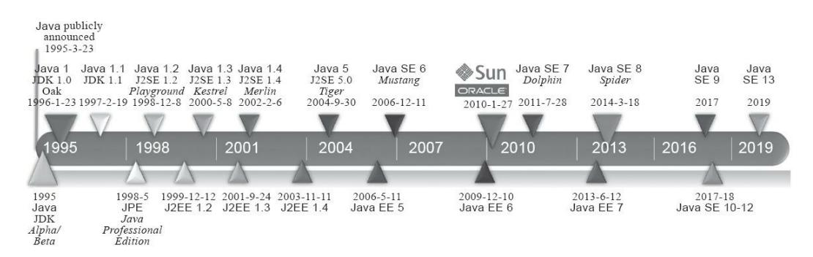

图1-3 Java技术发展的时间线

1995年5月23日,Oak语言改名为Java,并且在SunWorld大会上正式发布Java 1.0版本。Java语言第 一次提出了"Write Once,Run Anywhere"的口号。

1996年1月23日,JDK 1.0发布,Java语言有了第一个正式版本的运行环境。JDK 1.0提供了一个纯 解释执行的Java虚拟机实现(Sun Classic VM)。JDK 1.0版本的代表技术包括:Java虚拟机、Applet、 AWT等。

1996年4月,十个最主要的操作系统和计算机供应商声明将在其产品中嵌入Java技术。同年9月, 已有大约8.3万个网页应用了Java技术来制作。在1996年5月底,Sun于美国旧金山举行了首届JavaOne大 会,从此JavaOne成为全世界数百万Java语言开发者每年一度的技术盛会。

1997年2月19日,Sun公司发布了JDK 1.1,Java里许多最基础的技术支撑点(如JDBC等)都是在 JDK 1.1版本中提出的,JDK 1.1版的技术代表有:JAR文件格式、JDBC、JavaBeans、RMI等。Java语 言的语法也有了一定的增强,如内部类(Inner Class)和反射(Reflection)都是在这时候出现的。

直到1999年4月8日,JDK 1.1一共发布了1.1.0至1.1.8这9个版本。从1.1.4以后,每个JDK版本都有 一个属于自己的名字(工程代号),分别为:JDK 1.1.4-Sparkler(宝石)、JDK 1.1.5-Pumpkin(南

瓜)、JDK 1.1.6-Abigail(阿比盖尔,女子名)、JDK 1.1.7-Brutus(布鲁图,古罗马政治家和将军) 和JDK 1.1.8-Chelsea(切尔西,城市名)。

1998年12月4日,JDK迎来了一个里程碑式的重要版本:工程代号为Playground(竞技场)的JDK 1.2,Sun在这个版本中把Java技术体系拆分为三个方向,分别是面向桌面应用开发的J2SE(Java 2 Platform,Standard Edition)、面向企业级开发的J2EE(Java 2 Platform,Enterprise Edition)和面向手 机等移动终端开发的J2ME(Java 2 Platform,Micro Edition)。在这个版本中出现的代表性技术非常 多,如EJB、Java Plug-in、Java IDL、Swing等,并且这个版本中Java虚拟机第一次内置了JIT(Just In Time)即时编译器(JDK 1.2中曾并存过三个虚拟机,Classic VM、HotSpot VM和Exact VM,其中 Exact VM只在Solaris平台出现过;后面两款虚拟机都是内置了JIT即时编译器的,而之前版本所带的 Classic VM只能以外挂的形式使用即时编译器)。在语言和API层面上,Java添加了strictfp关键字, Java类库添加了现在Java编码之中极为常用的一系列Collections集合类等。在1999年3月和7月,分别有 JDK 1.2.1和JDK 1.2.2两个小升级版本发布。

1999年4月27日,HotSpot虚拟机诞生。HotSpot最初由一家名为"Longview Techno-logies"的小公司 开发,由于HotSpot的优异表现,这家公司在1997年被Sun公司收购。Hot-Spot虚拟机刚发布时是作为 JDK 1.2的附加程序提供的,后来它成为JDK 1.3及之后所有JDK版本的默认Java虚拟机。

2000年5月8日,工程代号为Kestrel(美洲红隼)的JDK 1.3发布。相对于JDK 1.2,JDK 1.3的改进 主要体现在Java类库上(如数学运算和新的Timer API等),JNDI服务从JDK 1.3开始被作为一项平台 级服务提供(以前JNDI仅仅是一项扩展服务),使用CORBA IIOP来实现RMI的通信协议,等等。这 个版本还对Java 2D做了很多改进,提供了大量新的Java 2D API,并且新添加了JavaSound类库。JDK 1.3有1个修正版本JDK 1.3.1,工程代号为Ladybird(瓢虫),于2001年5月17日发布。

自从JDK 1.3开始,Sun公司维持着稳定的研发节奏:大约每隔两年发布一个JDK的主版本,以动 物命名,期间发布的各个修正版本则以昆虫作为工程代号。

2002年2月13日,JDK 1.4发布,工程代号为Merlin(灰背隼)。JDK 1.4是标志着Java真正走向成 熟的一个版本,Compaq、Fujitsu、SAS、Symbian、IBM等著名公司都有参与功能规划,甚至实现自己 独立发行的JDK 1.4。哪怕是在近二十年后的今天,仍然有一些主流应用能直接运行在JDK 1.4之上, 或者继续发布能运行在1.4上的版本。JDK 1.4同样带来了很多新的技术特性,如正则表达式、异常 链、NIO、日志类、XML解析器和XSLT转换器,等等。JDK 1.4有两个后续修正版:2002年9月16日发 布的工程代号为Grasshopper(蚱蜢)的JDK 1.4.1与2003年6月26日发布的工程代号为Mantis(螳螂) 的JDK 1.4.2。

2002年前后还发生了一件与Java没有直接关系,但事实上对Java的发展进程影响很大的事件,就是 微软的.NET Framework发布。这个无论是技术实现还是目标用户上都与Java有很多相近之处的技术平 台给Java带来了很多讨论、比较与竞争,.NET平台和Java平台之间声势浩大的孰优孰劣的论战到今天 为止都仍然没有完全平息。

2004年9月30日,JDK 5发布,工程代号为Tiger(老虎)。Sun公司从这个版本开始放弃了谦逊 的"JDK 1.x"的命名方式,将产品版本号修改成了"JDK x" [1]。从JDK 1.2以来,Java在语法层面上的变 动一直很小,而JDK 5在Java语法易用性上做出了非常大的改进。如:自动装箱、泛型、动态注解、枚 举、可变长参数、遍历循环(foreach循环)等语法特性都是在JDK 5中加入的。在虚拟机和API层面

上,这个版本改进了Java的内存模型(Java Memory Model,JMM)、提供了java.util.concurrent并发包 等。另外,JDK 5是官方声明可以支持Windows 9x操作系统的最后一个JDK版本。

2006年12月11日,JDK 6发布,工程代号为Mustang(野马)。在这个版本中,Sun公司终结了从 JDK 1.2开始已经有八年历史的J2EE、J2SE、J2ME的产品线命名方式,启用Java EE 6、Java SE 6、Java ME 6的新命名来代替。JDK 6的改进包括:提供初步的动态语言支持(通过内置Mozilla JavaScript Rhino引擎实现)、提供编译期注解处理器和微型HTTP服务器API,等等。同时,这个版本对Java虚拟 机内部做了大量改进,包括锁与同步、垃圾收集、类加载等方面的实现都有相当多的改动。

在2006年11月13日的JavaOne大会上,Sun公司宣布计划要把Java开源,在随后的一年多时间内, 它陆续地将JDK的各个部分在GPLv2(GNU General Public License v2)协议下公开了源码,并建立了 OpenJDK组织对这些源码进行独立管理。除了极少量的产权代码(Encumbered Code,这部分代码所有 权不属于Sun公司,Sun本身也无权进行开源处理)外,OpenJDK几乎拥有了当时SunJDK 7的全部代 码,OpenJDK的质量主管曾经表示在JDK 7中,SunJDK和OpenJDK除了代码文件头的版权注释之外, 代码几乎是完全一样的,所以OpenJDK 7与SunJDK 7本质上就是同一套代码库出来的产品。

JDK 6发布以后,由于代码复杂性的增加、Java开源、开发JavaFX、世界经济危机及Oracle对Sun 的收购案等原因,Sun公司在发展Java以外的事情上耗费了太多精力和资源,JDK的更新没有能够继续 维持两年发布一个主版本的研发速度,这导致了JDK 6的生命周期异常的长,一共发布了211个更新升 级补丁,最后的版本为Java SE 6 Update 211,于2018年10月18日发布。

2009年2月19日,工程代号为Dolphin(海豚)的JDK 7完成了其第一个里程碑版本。按照JDK 7最 初的功能规划,一共会设置十个里程碑。最后一个里程碑版本原计划定于2010年9月9日结束,但由于 各种原因,JDK 7最终无法按计划完成。

从JDK 7最原始的功能清单来看,它本应是一个包含许多重要改进的JDK版本,其中规划的子项 目都为Java业界翘首以盼,包括:

- ·Lambda项目:支持Lambda表达式,支持函数式编程。
- ·Jigsaw项目:虚拟机层面的模块化支持。
- ·动态语言支持:Java是静态语言,为其他运行在Java虚拟机上的动态语言提供支持。
- ·Garbage-First收集器。
- ·Coin项目:Java语法细节进化。

令人惋惜的是,在JDK 7开发期间,Sun公司相继在技术竞争和商业竞争中陷入泥潭,公司的股票 市值跌至仅有高峰时期的3%,已无力推动JDK 7的研发工作按计划继续进行。为了尽快结束JDK 7长 期跳票的问题,Oracle收购Sun公司后随即宣布马上实行"B计划",大幅裁剪了JDK 7预定目标,以保证 JDK 7的正式版能够于2011年7月28日准时发布。"B计划"的主要措施是把不能按时完成的Lambda项 目、Jigsaw项目和Coin项目的部分改进延迟到JDK 8之中。最终,JDK 7包含的改进有:提供新的G1收 集器(G1在发布时依然处于Experimental状态,直至2012年4月的Update 4中才正式商用)、加强对非 Java语言的调用支持(JSR-292,这项特性在到JDK 11还有改动)、可并行的类加载架构等。

Oracle公司接手了JDK开发工作以后,迅速展现出了完全不同于Sun时期的、极具商业化的处事风 格。面对Java中使用最广泛而又一直免费的Java SE产品线,Oracle很快定义了一套新的Java SE Support [2]产品计划,把JDK的更新支持作为一项商业服务。JDK 7发布的前80个更新仍然免费面向所 有用户提供,但后续的其他更新包,用户[3]只能从"将Java SE升级到Java SE Support"与"将JDK 7升级 到最新版本"两个选项里挑一个。JDK 7计划维护至2022年,迄今(面向付费用户)已发布了超过两百 个更新补丁,最新版本为JDK 7 Update 221。

对于JDK 7,还有一点值得提起的是,从JDK 7 Update 4起,Java SE的核心功能正式开始为Mac OS X操作系统提供支持,并在JDK 7 Update 6中达到所有功能与Mac OS X完全兼容的程度;同时, JDK 7 Update 6还对ARM指令集架构提供了支持。至此,官方提供的JDK可以运行于Windows(不含 Windows 9x)、Linux、Solaris和Mac OS X操作系统上,支持ARM、x86、x86-64和SPARC指令集架 构,JDK 7也是可以支持Windows XP操作系统的最后一个版本[4]。

2009年4月20日,Oracle宣布正式以74亿美元的价格收购市值曾超过2000亿美元的Sun公司,传奇 的Sun Microsystems从此落幕成为历史,Java商标正式划归Oracle所有(Java语言本身并不属于哪间公 司所有,它由JCP组织进行管理,尽管在JCP中Sun及后来的Oracle的话语权很大)。由于此前Oracle已 经收购了另外一家大型的中间件企业BEA公司,当完成对Sun公司的收购之后,Oracle分别从BEA和 Sun手中取得了世界三大商用虚拟机的其中两个:JRockit和HotSpot。当时Oracle宣布要在未来一至两 年的时间内,把这两个优秀的Java虚拟机合二为一[5]。两者合并的结果只能说差强人意,JRockit的监 控工具Java Mission Control被移植到了HotSpot,作为收费功能提供给购买了Java SE Advanced产品计划 的用户,其他功能由于两者架构的差异性明显,HotSpot能够直接借鉴融合的功能寥寥无几[6]。

JDK 8的第一个正式版本原定于2013年9月发布,最终还是跳票到了2014年3月18日,尽管仍然是 没有赶上正点,但比起JDK 7那种以年作为计时单位、直接把公司跳崩的研发状况已是大有改善。为 了保证日后JDK研发能更顺利地进行,从JDK 8开始,Oracle启用JEP(JDK Enhancement Proposals)来 定义和管理纳入新版JDK发布范围的功能特性。JDK 8提供了那些曾在JDK 7中规划过,但最终未能在 JDK 7中完成的功能,主要包括:

·JEP 126:对Lambda表达式的支持,这让Java语言拥有了流畅的函数式表达能力。

·JEP 104:内置Nashorn JavaScript引擎的支持。

·JEP 150:新的时间、日期API。

·JEP 122:彻底移除HotSpot的永久代。

·……

"B计划"中原本说好的会在JDK 8提供的Jigsaw模块化功能再次被延期到了JDK 9,不得不说,即 使放到整个Java发展史里看,Jigsaw都能算是天字第一号的大坑。Java的模块化系统本身面临的技术挑 战就很艰巨,从微软的DLL技术开始,到Java自己的JAR,再到.NET的Assembly,工程庞大起来都无 一例外会陷入"模块地狱" [7]的困境之中,而Jigsaw面临的更大困难是厂商之间以标准话语权为目的, 以技术为"找茬"手段的激烈竞争。

原本JDK 9是计划在2016年发布的,但在2016年伊始,Oracle就宣布JDK 9肯定要延期至2017年, 后来又连续经过了两次短时间的跳票,最终到2017年9月21日才得以艰难面世。后两次跳票的原因是以 IBM和RedHat为首[8]的十三家企业在JCP执行委员会上联手否决了Oracle提出的Jigsaw作为Java模块化 规范进入JDK 9发布范围的提案[9]。凭良心说,Java确实有模块化的刚需,不论是JDK自身(例如拆分 出Java SE Embedded这样规模较小的产品)抑或是Java应用都需要用到模块化。这方面IBM本身就是各 大Java发行厂商中做得最好的,它不仅让自家的JDK实现了高度模块化,还带头成立了OSGi联盟,制 订了Java框架层面模块化的事实标准,所以它当然会想把OSGi推到Java规范里去争个"名份",而不是 被Jigsaw革掉"性命"。可是Oracle对此没有丝毫退让,不惜向JCP发去公开信[10],直言如果提案最后无 法通过,那Oracle将摒弃JSR专家组,独立发展带Jigsaw的Java版本,Java顿时面临如Python 2与Python 3那般分裂的危机。

不论如何,经过前后六轮投票,经历桌上桌下的斗争与妥协,Java没有分裂,JDK 9总算是带着 Jigsaw最终发布了,除了Jigsaw外,JDK 9还增强了若干工具(JS Shell、JLink、JHSDB等),整顿了 HotSpot各个模块各自为战的日志系统,支持HTTP 2客户单API等91个JEP。

JDK 9发布后,Oracle随即宣布Java将会以持续交付的形式和更加敏捷的研发节奏向前推进,以后 JDK将会在每年的3月和9月各发布一个大版本[11],目的就是为避免众多功能特性被集中捆绑到一个 JDK版本上而引发交付风险。这次改革确实从根源上解决了跳票问题,但也为Java的用户和发行商带 来了颇大的压力,不仅程序员感慨"Java新版本还没开始用就已经过时了",Oracle自己对着一堆JDK版 本分支也在挠头,不知道该如何维护更新,该如何提供技术支持。Oracle的解决方案是顺理成章地终 结掉"每个JDK版本最少维护三年"的优良传统,从此以后,每六个JDK大版本中才会被划出一个长期 支持(Long Term Support,LTS)版,只有LTS版的JDK能够获得为期三年的支持和更新,普通版的 JDK就只有短短六个月的生命周期。JDK 8和JDK 11会是LTS版,再下一个就到2021年发布的JDK 17 了。

2018年3月20日,JDK 10如期发布,这版本的主要研发目标是内部重构,诸如统一源仓库、统一 垃圾收集器接口、统一即时编译器接口(JVMCI在JDK 9已经有了,这里是引入新的Graal即时编译 器)等,这些都将会是对未来Java发展大有裨益的改进,但对普通用户来说JDK 10的新特性就显得乏 善可陈,毕竟它只包含了12个JEP,而且其中只有本地类型推断这一个编码端可见的改进。尽管JDK 10可见的改进有限,但2018这一年Java圈丝毫不缺乏谈资,相继发生了几件与"金钱"相关的历史性大 事件。

首先是2018年3月27日,Android的Java侵权案有了最终判决,法庭裁定Google赔偿Oracle合计88亿 美元,要知道2009年Oracle收购Sun也就只花了74亿,收购完成后随即就用Sun的专利把Google告上了法 庭,经过Oracle法务部的几轮神操作,一场官司的赔偿让收购Sun公司等同免费。对此事Java技术圈多 数吃瓜群众是站在Google这边的,认为Oracle这样做是自绝Java的发展前景,毕竟当年Android刚刚起步 的时候可是Sun向Google抛去的橄榄枝,Android的流行也巩固了Java"第一编程语言"的行业地位。摒弃 对企业的好恶情感,就事论事,Google采用Java的语法和API类库,开发出来的程序却不能运行在其他 Java虚拟机之上,这事情无论怎样都是有违Java技术的精神原旨的,也肯定违反了Java的使用协议 [12]。如果说Oracle控告Google"不厚道",那当年微软用J++做了同样的事情(借用语法和API,但程序 不兼容标准Java虚拟机),被Sun告到登报道歉,一边赔款一边割地,声明放弃J++语言和Windows平 台上的内置虚拟机,这又该找谁说理去?

按常理说Java刚给Oracle赚了88亿美金,该颇为受宠才对,可Oracle是典型只谈利益不讲情怀的公 司,InfoWorld披露的一封Oracle高管邮件表明[13],Java体系中被认为无法盈利也没有太多战略前景的 部分会逐渐被"按计划报废"(Planned Obsolescence)。这事的第一刀落下是在2018年3月,Oracle正式 宣告Java EE成为历史名词。虽然Java SE、Java EE和Java ME三条产品线里确实只有Java SE称得上成 功,但Java EE毕竟无比辉煌过,现在其中还持有着JDBC、JMS、Servlet等使用极为广泛的基础组件, 然而Oracle仍选择把它"扫地出门",所有权直接赠送给Eclipse基金会,唯一的条件是以后不准再使 用"Java"这个商标[14],所以取而代之的将是Jakarta EE。

2018年10月,JavaOne 2018在旧金山举行,此前没有人想过这会是最后一届JavaOne大会,这个在 1996年伴随着Java一同诞生、成长的开发者年度盛会,竟是Oracle下一个裁撤的对象[15],此外还有 Java Mission Control的开发团队,也在2018年6月被Oracle解散。

2018年9月25日,JDK 11发布,这是一个LTS版本的JDK,包含17个JEP,其中有ZGC这样的革命 性的垃圾收集器出现,也有把JDK 10中的类型推断加入Lambda语法这种可见的改进,但都比不过它发 布时爆出来的谣言轰动:"Java要开始收费啦!"

随着JDK 11发布,Oracle同时调整了JDK的授权许可证,里面包含了好几个动作。首先,Oracle从 JDK 11起把以前的商业特性[16]全部开源给OpenJDK,这样OpenJDK 11和OracleJDK 11的代码和功 能,在本质上就是完全相同的(官方原文是Essentially Identical)[17]。然后,Oracle宣布以后将会同时 发行两个JDK:一个是以GPLv2+CE协议下由Oracle发行的OpenJDK(本书后面章节称其为Oracle OpenJDK),另一个是在新的OTN协议下发行的传统的OracleJDK,这两个JDK共享绝大部分源码, 在功能上是几乎一样的[18],核心差异是前者可以免费在开发、测试或生产环境中使用,但是只有半 年时间的更新支持;后者个人依然可以免费使用,但若在生产环境中商用就必须付费,可以有三年时 间的更新支持。如果说由此能得出"Java要收费"的结论,那是纯属标题党,最多只能说Oracle在迫使商 业用户要么不断升级JDK的版本,要么就去购买商业支持[19]。

2019年2月,在JDK 12发布前夕,Oracle果然如之前宣布那样在六个月之后就放弃了对上一个版本 OpenJDK的维护,RedHat同时从Oracle手上接过OpenJDK 8和OpenJDK 11的管理权利和维护职责 [20]。Oracle不愿意在旧版本上继续耗费资源,而RedHat或者说它背后的IBM又乐意扩大自己在Java社 区的影响力,这是一笔双赢的交易。RedHat代替Oracle成为JDK历史版本的维护者,应该有利于Java的 持续稳定,但从技术发展角度来看,这并不能为Oracle领导Java社区的局面带来根本性的改变,毕竟要 添加新的或实验性的功能,仅会针对Java的最新版本,而不会在旧版本上动手。

2019年3月20日,JDK 12发布,只包含8个JEP,其中主要有Switch表达式、Java微测试套件 (JMH)等新功能,最引人注目的特性无疑是加入了由RedHat领导开发的Shen-andoah垃圾收集器。 Shenandoah作为首个由非Oracle开发的垃圾收集器,其目标又与Oracle在JDK 11中发布的ZGC几乎完全 一致,两者天生就存在竞争。Oracle马上用实际行动抵制了这个新收集器,在JDK 11发布时才说应尽 可能保证OracleJDK和OpenJDK的兼容一致,转眼就在OracleJDK 12里把Shenandoah的代码通过条件编 译强行剔除掉,使其成为历史上唯一进入了OpenJDK发布清单,但在OracleJDK中无法使用的功能。

Oracle收购Sun是Java发展历史上一道明显的分界线。在Sun掌舵的前十几年里,Java获得巨大成 功,同时也渐渐显露出来语言演进的缓慢与社区决策的老朽;而在Oracle主导Java后,引起竞争的同时 也带来新的活力,Java发展的速度要显著高于Sun时代。Java的未来是继续向前、再攀高峰,还是由盛 转衰、锋芒挫缩,你我拭目以待。

Java面临的危机挑战前所未有的艰巨,属于Java的未来也从未如此充满想象与可能。

- [1] Java从1.5版本开始,官方在正式文档与宣传上已经不再使用类似"JDK 1.5"的命名,只有程序员内 部使用的开发版本号(Developer Version,例如java-version的输出)中才继续沿用1.5、1.6、1.7这样的 版本号,而公开版本号(Product Version)则是改为JDK 5.0、JDK 6、JDK 7的命名方式,JDK 5.0 中".0"的后缀从JDK 6起也被移除掉,本书为了行文统一,同样以JDK 5来指代JDK 5.0。
- [2] 除了Java SE Support外,还有面向独立软件提供商的Java SE Advanced & Suite产品线,差别是后者 带有JMC等监控工具,详细内容可以参见本书第4章。
- [3] 特指商业用户,个人使用仍然是可以免费获得这些更新包的。
- [4] 这是官方的声明,而事实上直到JDK 8 Update 21之前在Windows XP上仍可正常运行。
- [5] "HotRockit"项目的相关介绍:http://hirt.se/presentations/WhatToExpect.ppt。
- [6] 除了JMC和JFR,HotSpot用本地内存代替永久代实现方法区,支持本地内存使用情况追踪 (NMT)等功能是从JRockit借鉴过来的。
- [7] 来自于以前的"DLL Hell",如果读者不清楚什么是模块地狱的话,打开你计算机的windows目录或 者windows\system32目录就明白了。
- [8] 其实就是以IBM为首,IBM一直与RedHat有密切合作,2018年IBM以340亿美元天价收购了 RedHat。
- [9] 投票记录:https://jcp.org/en/jsr/results?id=5959。
- [10] 公开信:https://www.infoq.cn/article/2017/05/jigsaw-open-letter。
- [11] 也改掉了在开发版号中1.7、1.8的命名,从JDK 10后将是年份加月份作为开发版本号,譬如18.3, 即表示2018年3月的大版本。
- [12] Oracle与Google的官司主要焦点在于Java API的版权问题,而不在程序是否能运行在标准Java虚拟 机上。
- [13] 资料来源:https://www.infoworld.com/article/2987529/insider-oracle-lost-interest-in-java.html。
- [14] 最大的争议点是Oracle要求包名中不能出现java字样,导致一堆javax.\*开头的包一旦修改或添加新 代码,就必须重新命名,这将让用到它们的代码都受到影响。资料来源:

https://www.infoq.cn/article/2018/02/from-javaee-to-jakartaee。

- [15] Java One大会从2019年起停办,合并入Oracle CodeOne大会中。
- [16] 需要使用+XX:+UnlockCommercialFeatures解锁的特性,包括JMC、JFR、NMT、AppCDS和 ZGC等。
- [17] 资料来源:https://blogs.oracle.com/java-platform-group/oracle-jdk-releases-for-java-11-and-later。
- [18] JDK 11中仅有的微小差别是OpenJDK少了几个Module(如JavaFX),且不提供安装包,以压缩包 形式发行。但在JDK 12又产生了新的分歧,OpenJDK的Shenandoah垃圾收集器被排除在OracleJDK之 外,详见第4章的相关内容。
- [19] 这里的商业支持不限定于Oracle公司,如Azul ZingJDK、AdoptOpenJDK等都能提供商业支持。
- [20] Red Hat此前已经是OpenJDK 6(自2013年起)和OpenJDK 7(自2015年起)的维护者。

#### 1.4 Java虚拟机家族

上一节我们以JDK版本演进过程为线索,回顾了Java技术的发展历史,体会过其中企业与技术的 成败兴衰,现在,我们将聚焦到本书的主题"Java虚拟机"。许多Java程序员都会潜意识地把Java虚拟机 与OracleJDK的HotSpot虚拟机等同看待,也许还有一些程序员会注意到BEA JRockit和IBM J9虚拟机, 但绝大多数人对Java虚拟机的认识就仅限于此了。从1996年初Sun发布的JDK 1.0中包含的Sun Classic虚 拟机到今天,曾经涌现、湮灭过许多或经典,或优秀,或有特色,或有争议的虚拟机实现,在这一节 中,我们仍先把代码与技术放下,一起来回顾Java虚拟机家族的发展轨迹和历史变迁。

### 1.4.1 虚拟机始祖:Sun Classic/Exact VM

以今天的视角来看,Sun Classic虚拟机的技术已经相当原始,这款虚拟机的使命也早已终结。但 仅凭它"世界上第一款商用Java虚拟机"的头衔,就足够有令历史记住它的理由。

1996年1月23日,Sun发布JDK 1.0,Java语言首次拥有了商用的正式运行环境,这个JDK中所带的 虚拟机就是Classic VM。这款虚拟机只能使用纯解释器方式来执行Java代码,如果要使用即时编译器那 就必须进行外挂,但是假如外挂了即时编译器的话,即时编译器就会完全接管虚拟机的执行系统,解 释器便不能再工作了。在JDK 1.2及之前,用户用Classic虚拟机执行java-version命令,将会看到类似下 面这行的输出:

java version "1.2.2" Classic VM (build JDK-1.2.2-001, green threads, sunwjit)

其中的"sunwjit"(Sun Workshop JIT)就是Sun提供的外挂编译器,其他类似的外挂编译器还有 Symantec JIT和shuJIT等。由于解释器和编译器不能配合工作,这就意味着如果要使用编译执行,编译 器就不得不对每一个方法、每一行代码都进行编译,而无论它们执行的频率是否具有编译的价值。基 于程序响应时间的压力,这些编译器根本不敢应用编译耗时稍高的优化技术,因此这个阶段的虚拟机 虽然用了即时编译器输出本地代码,其执行效率也和传统的C/C++程序有很大差距,"Java语言很慢"的 印象就是在这阶段开始在用户心中树立起来的。

Sun的虚拟机团队努力去解决Classic虚拟机所面临的各种问题,提升运行效率,在JDK 1.2时,曾 在Solaris平台上发布过一款名为Exact VM的虚拟机,它的编译执行系统已经具备现代高性能虚拟机雏 形,如热点探测、两级即时编译器、编译器与解释器混合工作模式等。

Exact VM因它使用准确式内存管理(Exact Memory Management,也可以叫Non-Conservative/Accurate Memory Management)而得名。准确式内存管理是指虚拟机可以知道内存中某个位 置的数据具体是什么类型。譬如内存中有一个32bit的整数123456,虚拟机将有能力分辨出它到底是一 个指向了123456的内存地址的引用类型还是一个数值为123456的整数,准确分辨出哪些内存是引用类 型,这也是在垃圾收集时准确判断堆上的数据是否还可能被使用的前提。由于使用了准确式内存管 理,Exact VM可以抛弃掉以前Classic VM基于句柄(Handle)的对象查找方式(原因是垃圾收集后对 象将可能会被移动位置,如果地址为123456的对象移动到654321,在没有明确信息表明内存中哪些数 据是引用类型的前提下,那虚拟机肯定是不敢把内存中所有为123456的值改成654321的,所以要使用 句柄来保持引用值的稳定),这样每次定位对象都少了一次间接查找的开销,显著提升执行性能。

虽然Exact VM的技术相对Classic VM来说先进了许多,但是它的命运显得十分英雄气短,在商业 应用上只存在了很短暂的时间就被外部引进的HotSpot VM所取代,甚至还没有来得及发布Windows和 Linux平台下的商用版本。而Classic VM的生命周期则相对要长不少,它在JDK 1.2之前是JDK中唯一的 虚拟机,在JDK 1.2时,它与HotSpot VM并存,但默认是使用Classic VM(用户可用java-hotspot参数 切换至HotSpot VM),而在JDK 1.3时,HotSpot VM成为默认虚拟机,它仍作为虚拟机的"备用选 择"发布(使用java-classic参数切换),直到JDK 1.4的时候,Classic VM才完全退出商用虚拟机的历史 舞台,与Exact VM一起进入了Sun Labs Research VM之中。

### 1.4.2 武林盟主:HotSpot VM

相信所有Java程序员都听说过HotSpot虚拟机,它是Sun/OracleJDK和OpenJDK中的默认Java虚拟 机,也是目前使用范围最广的Java虚拟机。但不一定所有人都知道的是,这个在今天看起来"血统纯 正"的虚拟机在最初并非由Sun公司所开发,而是由一家名为"Longview Technologies"的小公司设计;甚 至这个虚拟机最初并非是为Java语言而研发的,它来源于Strongtalk虚拟机,而这款虚拟机中相当多的 技术又是来源于一款为支持Self语言实现"达到C语言50%以上的执行效率"的目标而设计的Self虚拟机, 最终甚至可以追溯到20世纪80年代中期开发的Berkeley Smalltalk上。Sun公司注意到这款虚拟机在即时 编译等多个方面有着优秀的理念和实际成果,在1997年收购了Longview Technologies公司,从而获得了 HotSpot虚拟机。

HotSpot既继承了Sun之前两款商用虚拟机的优点(如前面提到的准确式内存管理),也有许多自 己新的技术优势,如它名称中的HotSpot指的就是它的热点代码探测技术(这里的描写带有"历史由胜 利者书写"的味道,其实HotSpot与Exact虚拟机基本上是同时期的独立产品,HotSpot出现得还稍早一 些,一开始HotSpot就是基于准确式内存管理的,而Exact VM之中也有与HotSpot几乎一样的热点探测 技术,为了Exact VM和HotSpot VM哪个该成为Sun主要支持的虚拟机,在Sun公司内部还争吵过一场, HotSpot击败Exact并不能算技术上的胜利),HotSpot虚拟机的热点代码探测能力可以通过执行计数器 找出最具有编译价值的代码,然后通知即时编译器以方法为单位进行编译。如果一个方法被频繁调 用,或方法中有效循环次数很多,将会分别触发标准即时编译和栈上替换编译(On-Stack

Replacement,OSR)行为[1]。通过编译器与解释器恰当地协同工作,可以在最优化的程序响应时间与 最佳执行性能中取得平衡,而且无须等待本地代码输出才能执行程序,即时编译的时间压力也相对减 小,这样有助于引入更复杂的代码优化技术,输出质量更高的本地代码。

2006年,Sun陆续将SunJDK的各个部分在GPLv2协议下开放了源码,形成了Open-JDK项目,其中 当然也包括HotSpot虚拟机。HotSpot从此成为Sun/OracleJDK和OpenJDK两个实现极度接近的JDK项目 的共同虚拟机。Oracle收购Sun以后,建立了HotRockit项目来把原来BEA JRockit中的优秀特性融合到 HotSpot之中。到了2014年的JDK 8时期,里面的HotSpot就已是两者融合的结果,HotSpot在这个过程 里移除掉永久代,吸收了JRockit的Java Mission Control监控工具等功能。

得益于Sun/OracleJDK在Java应用中的统治地位,HotSpot理所当然地成为全世界使用最广泛的Java 虚拟机,是虚拟机家族中毫无争议的"武林盟主"。

[1] 在本书第11章会专门讲解即时编译的内容。

### 1.4.3 小家碧玉:Mobile/Embedded VM

Sun/Oracle公司所研发的虚拟机可不仅包含前面介绍到的服务器、桌面领域的商用虚拟机,面对移 动和嵌入式市场,也有专门的Java虚拟机产品。

由于Java ME产品线的发展相对Java SE来说并不那么成功,所以Java ME中的Java虚拟机相比 HotSpot要低调得多。Oracle公司在Java ME这条产品线上的虚拟机名为CDC-HI(C Virtual Machine, CVM)和CLDC-HI(Monty VM)。其中CDC/CLDC全称是Connected(Limited)Device Configuration,这是一组在JSR-139及JSR-218规范中进行定义的Java API子集,这组规范希望能够在手 机、电子书、PDA等移动设备上建立统一的Java编程接口,CDC-HI VM和CLDC-HI VM就是JSR-139 及JSR-218规范的参考实现,后面的HI则是HotSpot Implementation的缩写,但它们并不是由HotSpot直 接裁剪而来,只是借鉴过其中一些技术,并没有血缘关系,充其量能叫有所渊源。

Java ME中的Java虚拟机现在处于比较尴尬的位置,所面临的局面远不如服务器和桌面领域乐观, 它最大的一块市场——智能手机已被Android和iOS二分天下[1],现在CDC在智能手机上略微有点声音 的产品是Oracle ADF Mobile,原本它提出的卖点是智能手机上的跨平台("Developing with Java on iOS and Android"),不过用Java在Android上开发应用还要再安装个CDC虚拟机,这事情听着就觉得别 扭,有多此一举的嫌疑,在iOS上倒确实还有一些人在用。

而在嵌入式设备上,Java ME Embedded又面临着自家Java SE Embedded(eJDK)的直接竞争和侵 蚀,主打高端的CDC-HI经过多年来的扩充,在核心部分其实已经跟Java SE非常接近,能用Java SE的 地方大家自然就不愿意用Java ME,所以市场在快速萎缩,Oracle也基本上砍掉了CDC-HI的所有项 目,把它们都划归到了Java SE Embedded下。Java SE Embedded里带的Java虚拟机当然还是HotSpot,但 这是为了适应嵌入式环境专门定制裁剪的版本,尽可能在支持完整的Java SE功能的前提下向着减少内 存消耗的方向优化,譬如只留下了客户端编译器(C1),去掉了服务端编译器(C2);只保留 Serial/Serial Old垃圾收集器,去掉了其他收集器等。

面向更低端设备的CLDC-HI倒是在智能控制器、传感器等领域还算能维持自己的一片市场,现在 也还在继续发展,但前途并不乐观。目前CLDC中活得最好的产品反而是原本早该被CLDC-HI淘汰的 KVM,国内的老人手机和出口到经济欠发达国家的功能手机(Feature Phone)还在广泛使用这种更加 简单、资源消耗也更小的上一代Java ME虚拟机。

[1] 严格来说这种提法并不十分准确,笔者写下这段文字时(2019年),在中国,传音手机的出货量超 过小米、OPPO、VIVO等智能手机巨头,仅次于华为(含荣耀品牌)排行全国第二。传音手机做的是 功能机,销售市场主要在非洲,上面仍然用着Java ME的KVM。

#### 1.4.4 天下第二:BEA JRockit/IBM J9 VM

前面三节介绍的都是由Sun/Oracle公司研发的Java虚拟机,历史上除了Sun/Oracle公司以外,也有其 他组织、公司开发过虚拟机的实现。如果说HotSpot是天下第一的武林盟主,那曾经与HotSpot并称"三 大商业Java虚拟机"的另外两位,毫无疑问就该是天下第二了,它们分别是BEA System公司的JRockit与 IBM公司的IBM J9。

JRockit虚拟机曾经号称是"世界上速度最快的Java虚拟机"(广告词,IBM J9虚拟机也这样宣传 过,总体上三大虚拟机的性能是交替上升的),它是BEA在2002年从Appeal Virtual Machines公司收购 获得的Java虚拟机。BEA将其发展为一款专门为服务器硬件和服务端应用场景高度优化的虚拟机,由 于专注于服务端应用,它可以不太关注于程序启动速度,因此JRockit内部不包含解释器实现,全部代 码都靠即时编译器编译后执行。除此之外,JRockit的垃圾收集器和Java Mission Control故障处理套件 等部分的实现,在当时众多的Java虚拟机中也处于领先水平。JRockit随着BEA被Oracle收购,现已不再 继续发展,永远停留在R28版本,这是JDK 6版JRockit的代号。

IBM J9虚拟机并不是IBM公司唯一的Java虚拟机,不过目前IBM主力发展无疑就是J9。J9这个名 字最初只是内部开发代号而已,开始选定的正式名称是"IBM Technology for Java Virtual Machine",简 称IT4J,但这个名字太拗口,接受程度远不如J9。J9虚拟机最初是由IBM Ottawa实验室的一个 SmallTalk虚拟机项目扩展而来,当时这个虚拟机有一个Bug是因为8KB常量值定义错误引起,工程师们 花了很长时间终于发现并解决了这个错误,此后这个版本的虚拟机就被称为K8,后来由其扩展而来、 支持Java语言的虚拟机就被命名为J9。与BEA JRockit只专注于服务端应用不同,IBM J9虚拟机的市场 定位与HotSpot比较接近[1],它是一款在设计上全面考虑服务端、桌面应用,再到嵌入式的多用途虚 拟机,开发J9的目的是作为IBM公司各种Java产品的执行平台,在和IBM产品(如IBM WebSphere等) 搭配以及在IBM AIX和z/OS这些平台上部署Java应用。

IBM J9直至今天仍旧非常活跃,IBM J9虚拟机的职责分离与模块化做得比HotSpot更优秀,由J9 虚拟机中抽象封装出来的核心组件库(包括垃圾收集器、即时编译器、诊断监控子系统等)就单独构 成了IBM OMR项目,可以在其他语言平台如Ruby、Python中快速组装成相应的功能。从2016年起, IBM逐步将OMR项目和J9虚拟机进行开源,完全开源后便将它们捐献给了Eclipse基金会管理,并重新 命名为Eclipse OMR和OpenJ9 [2]。如果为了学习虚拟机技术而去阅读源码,更加模块化的OpenJ9代码 其实是比HotSpot更好的选择。如果为了使用Java虚拟机时多一种选择,那可以通过AdoptOpenJDK来 获得采用OpenJ9搭配上OpenJDK其他类库组成的完整JDK。

除BEA和IBM公司外,其他一些大公司也号称有自己的专属JDK和虚拟机,但是它们要么是通过 从Sun/Oracle公司购买版权的方式获得的(如HP、SAP等),要么是基于OpenJDK项目改进而来的 (如阿里巴巴、Twitter等),都并非自己独立开发。

- [1] 严格来说,J9能够支持的市场定位比HotSpot更加广泛,J9最初是为嵌入式领域设计的,后来逐渐 扩展为IBM所有平台共用的虚拟机,嵌入式、桌面、服务器端都用它,而HotSpot在嵌入式领域使用的 是CDC/CLDC以及Java SE Embedded,这也从侧面体现了J9的模块化和通用性做得非常好。
- [2] 尽管OpenJ9名称上看起来与OpenJDK类似,但它只是一个单独的Java虚拟机,不包括JDK中的其他 内容,实际应该与HotSpot相对应。

# 1.4.5 软硬合璧:BEA Liquid VM/Azul VM

我们平时所提及的"高性能Java虚拟机"一般是指HotSpot、JRockit、J9这类在通用硬件平台上运行 的商用虚拟机,但其实还有一类与特定硬件平台绑定、软硬件配合工作的专有虚拟机,往往能够实现 更高的执行性能,或提供某些特殊的功能特性。这类专有虚拟机的代表是BEA Liquid VM和Azul VM。

Liquid VM也被称为JRockit VE(Virtual Edition,VE),它是BEA公司开发的可以直接运行在自家 Hypervisor系统上的JRockit虚拟机的虚拟化版本,Liquid VM不需要操作系统的支持,或者说它自己本 身实现了一个专用操作系统的必要功能,如线程调度、文件系统、网络支持等。由虚拟机越过通用操 作系统直接控制硬件可以获得很多好处,如在线程调度时,不需要再进行内核态/用户态的切换,这样 可以最大限度地发挥硬件的能力,提升Java程序的执行性能。随着JRockit虚拟机终止开发,Liquid VM 项目也已经停止了。

Azul VM是Azul Systems公司在HotSpot基础上进行大量改进,运行于Azul Systems公司的专有硬 件Vega系统上的Java虚拟机,每个Azul VM实例都可以管理至少数十个CPU和数百GB的内存的硬件资 源,并提供在巨大内存范围内停顿时间可控的垃圾收集器(即业内赫赫有名的PGC和C4收集器),为 专有硬件优化的线程调度等优秀特性。2010年起,Azul公司的重心逐渐开始从硬件转向软件,发布了 自己的Zing虚拟机,可以在通用x86平台上提供接近于Vega系统的性能和一致的功能特性。

随着虚拟机技术的不断发展,Java虚拟机变得越来越强大的同时也越来越复杂,要推动在专有硬 件上的Java虚拟机升级发展,难以直接借助开源社区的力量,往往需要耗费更高昂的成本,在商业上 的缺陷使得专有虚拟机逐渐没落,Azul Systems公司最终也放弃了Vega产品线,把全部精力投入到Zing 和Zulu产品线中。

Zing虚拟机是一个从HotSpot某旧版代码分支基础上独立出来重新开发的高性能Java虚拟机,它可 以运行在通用的Linux/x86-64平台上。Azul公司为它编写了新的垃圾收集器,也修改了HotSpot内的许 多实现细节,在要求低延迟、快速预热等场景中,Zing VM都要比HotSpot表现得更好。Zing的PGC、 C4收集器可以轻易支持TB级别的Java堆内存,而且保证暂停时间仍然可以维持在不超过10毫秒的范围 里,HotSpot要一直到JDK 11和JDK 12的ZGC及Shenandoah收集器才达到了相同的目标,而且目前效 果仍然远不如C4。Zing的ReadyNow!功能可以利用之前运行时收集到的性能监控数据,引导虚拟机 在启动后快速达到稳定的高性能水平,减少启动后从解释执行到即时编译的等待时间。Zing自带的 ZVision/ZVRobot功能可以方便用户监控Java虚拟机的运行状态,从找出代码热点到对象分配监控、锁 竞争监控等。Zing能让普通用户无须了解垃圾收集等底层调优,就可以使得Java应用享有低延迟、快 速预热、易于监控的功能,这是Zing的核心价值和卖点,很多Java应用都可以通过长期努力在应用、 框架层面优化来提升性能,但使用Zing的话就可以把精力更多集中在业务方面。

### 1.4.6 挑战者:Apache Harmony/Google Android Dalvik VM

这节介绍的Harmony虚拟机(准确地说是Harmony里的DRLVM)和Dalvik虚拟机只能称作"虚拟 机",而不能称作"Java虚拟机",但是这两款虚拟机以及背后所代表的技术体系曾经对Java世界产生了 非常大的影响和挑战,当时甚至有悲观的人认为成熟的Java生态系统都有分裂和崩溃的可能。

Apache Harmony是一个Apache软件基金会旗下以Apache License协议开源的实际兼容于JDK 5和 JDK 6的Java程序运行平台,它含有自己的虚拟机和Java类库API,用户可以在上面运行Eclipse、 Tomcat、Maven等常用的Java程序。但是,它并没有通过TCK认证,所以我们不得不用一长串冗长拗 口的语言来介绍它,而不能用一句"Apache的JDK"或者"Apache的Java虚拟机"来直接代指。

如果一个公司要宣称自己的运行平台"兼容于Java技术体系",那该运行平台就必须要通过 TCK(Technology Compatibility Kit)的兼容性测试,Apache基金会曾要求当时的Sun公司提供TCK的 使用授权,但是一直遭到各种理由的拖延和搪塞,直到Oracle收购了Sun公司之后,双方关系越闹越 僵,最终导致Apache基金会愤然退出JCP组织,这是Java社区有史以来最严重的分裂事件之一。

当Sun公司把自家的JDK开源形成OpenJDK项目之后,Apache Harmony开源的优势被极大地抵 消,以至于连Harmony项目的最大参与者IBM公司也宣布辞去Harmony项目管理主席的职位,转而参 与OpenJDK的开发。虽然Harmony没有真正地被大规模商业运用过,但是它的许多代码(主要是Java 类库部分的代码)被吸纳进IBM的JDK 7实现以及Google Android SDK之中,尤其是对Android的发展 起了很大推动作用。

说到Android,这个时下最热门的移动数码设备平台在最近十年所取得的成果已经远远超越了Java ME在过去二十多年所获得的成果,Android让Java语言真正走进了移动数码设备领域,只是走得并非 Sun公司原本想象的那一条路。

Dalvik虚拟机曾经是Android平台的核心组成部分之一,它的名字来源于冰岛一个名为Dalvik的小 渔村。Dalvik虚拟机并不是一个Java虚拟机,它没有遵循《Java虚拟机规范》,不能直接执行Java的 Class文件,使用寄存器架构而不是Java虚拟机中常见的栈架构。但是它与Java却又有着千丝万缕的联 系,它执行的DEX(Dalvik Executable)文件可以通过Class文件转化而来,使用Java语法编写应用程 序,可以直接使用绝大部分的Java API等。在Android发展的早期,Dalvik虚拟机随着Android的成功迅 速流行,在Android 2.2中开始提供即时编译器实现,执行性能又有了进一步提高。不过到了Android 4.4时代,支持提前编译(Ahead of Time Compilation,AOT)的ART虚拟机迅速崛起,在当时性能还 不算特别强大的移动设备上,提前编译要比即时编译更容易获得高性能,所以在Android 5.0里ART就 全面代替了Dalvik虚拟机。

# 1.4.7 没有成功,但并非失败:Microsoft JVM及其他

在Java虚拟机二十几年的发展历程中,除去上面介绍的那些被大规模商业应用过的Java虚拟机外, 还有许多虚拟机是不为人知地默默沉寂,或者曾经绚丽过但最终夭折湮灭的。我们以其中Microsoft公 司的Java虚拟机为代表来介绍一下。

在Java语言诞生的初期(1996年~1998年,以JDK1.2发布之前为分界),它的主要应用之一是在 浏览器中运行Java Applets程序,微软为了在Internet Explorer 3浏览器中支持Java Applets应用而开发了 自己的Java虚拟机,虽然这款虚拟机只有Windows平台的版本,"一次编译,到处运行"根本无从谈起, 但却是当时Windows系统下性能最好的Java虚拟机,它在1997年和1998年连续获得了《PC Magazine》 杂志的"编辑选择奖"。但是好景不长,在1997年10月,Sun公司正式以侵犯商标、不正当竞争等罪名控 告微软,在随后对微软公司的垄断调查之中,这款虚拟机也曾作为证据之一被呈送法庭。官司的结果 是微软向Sun公司(最终微软因垄断赔偿给Sun公司的总金额高达10亿美元)赔偿2000万美金,承诺终 止其Java虚拟机的发展,并逐步在产品中移除Java虚拟机相关功能。而最令人感到讽刺的是,到后来在 Windows XP SP3中Java虚拟机被完全抹去的时候,Sun公司却又到处登报希望微软不要这样做[1]。 Windows XP高级产品经理Jim Cullinan称:"我们花费了三年的时间和Sun公司打官司,当时他们试图阻 止我们在Windows中支持Java,现在我们这样做了,可他们又在抱怨,这太具有讽刺意味了。"

我们试想一下,如果当年Sun公司没有起诉微软公司,微软继续保持着对Java技术的热情,那Java 的世界会变得更好还是更坏?.NET技术是否还会发展起来?

[1] Sun公司在《纽约时报》《圣约瑟商业新闻》和《华尔街周刊》上刊登了整页的广告,在广告词中 Sun公司号召消费者"要求微软公司继续在其Windows XP系统包括Java平台"。

# 1.4.8 百家争鸣

还有一些Java虚拟机天生就注定不会应用在主流领域,或者不是单纯为了用于生产,甚至在设计 之初就没有抱着商用的目的,仅仅是用于研究、验证某种技术和观点,又或者是作为一些规范的标准 实现。这些虚拟机对于大多数不从事相关领域开发的Java程序员来说可能比较陌生,笔者列举几款较 为有影响的:

#### ·KVM[1]

KVM中的K是"Kilobyte"的意思,它强调简单、轻量、高度可移植,但是运行速度比较慢。在 Android、iOS等智能手机操作系统出现前曾经在手机平台上得到非常广泛应用。

#### ·Java Card VM

JCVM是Java虚拟机很小的一个子集,裁减了许多模块但通常支持绝大多数的常用加密算法。 JCVM必须精简到能放入智能卡、SIM卡、银行信用卡、借记卡内,负责对Java Applet程序进行解释执 行。

#### ·Squawk VM

Squawk VM是由Sun开发,运行于Sun SPOT(Sun Small Programmable Object Tech-nology,一种手 持的Wi-Fi设备),也曾经运用于Java Card。这是一个Java代码比重很高的嵌入式虚拟机实现,其中诸 如类加载器、字节码验证器、垃圾收集器、解释器、编译器和线程调度都是用Java语言完成的,仅仅 靠C语言来编写设备I/O和必要的本地代码。

#### ·JavaInJava

JavaInJava是Sun公司在1997年~1998年间所研发的一个实验室性质的虚拟机,从名字就可以看 出,它试图以Java语言来实现Java语言本身的运行环境,既所谓的"元循环"(Meta-Circular,是指使用 语言自身来实现其运行环境)虚拟机。它必须运行在另外一个宿主虚拟机之上,内部没有即时编译 器,代码只能以解释模式执行。在上世纪末主流原生的Java虚拟机都未能很好解决性能问题的时代, 开发这种项目,其执行速度大家可想而知,不过通过元循环证明一门语言可以自举,是具有它的研究 价值的。

#### ·Maxine VM

Maxine VM和上面的JavaInJava非常相似,它也是一个几乎全部以Java代码实现(只有用于启动 Java虚拟机的加载器使用C语言编写)的元循环Java虚拟机。这个项目于2005年开始,到现在仍然在发 展之中,比起JavaInJava,Maxine VM的执行效率就显得靠谱得多,它有先进的即时编译器和垃圾收集 器,可在宿主模式或独立模式下执行,其执行效率已经接近HotSpot虚拟机Client模式的水平。后来有 了从C1X编译器演进而来的Graal编译器的支持,就更加如虎添翼,执行效率有了进一步飞跃。Graal编 译器现在已经是HotSpot的默认组件,是未来代替HotSpot中服务端编译器的希望。

#### ·Jikes RVM

Jikes RVM是IBM开发的专门用来研究Java虚拟机实现技术的项目。曾用名为Jalapeño。与 JavaInJava和Maxine一样,它也是一个元循环虚拟机。

#### ·IKVM.NET

这是一个基于微软.NET框架实现的Java虚拟机,并借助Mono获得一定的跨平台能力。IKVM.NET 的目标第一眼看起来的确很奇怪,可能在某些特殊情况下,在.NET上使用某些流行的Java库也许真的 不算是伪需求?IKVM.NET可以将Class文件编译成.NET Assembly,在任意的CLI上运行。

其他在本文中没有介绍到的Java虚拟机还有许多,笔者将自己所知的列举如下:

·JamVM:http://jamvm.sourceforge.net/

·CacaoVM:http://www.cacaovm.org/

·SableVM:http://www.sablevm.org/

·Kaffe:http://www.kaffe.org/

·Jelatine JVM:http://jelatine.sourceforge.net/

·NanoVM:http://www.harbaum.org/till/nanovm/index.shtml

·MRP:https://github.com/codehaus/mrp

·Moxie JVM:http://moxie.sourceforge.net/

[1] 这里把Java ME里面的虚拟机列为"少数派"是从大多数Java程序员的了解程度出发的,从虚拟机部 署数量来讲,Java ME远比Java SE、Java EE的虚拟机多,毕竟服务器应用是无法在数量上和移动、嵌 入式设备比较的。

### 1.5 展望Java技术的未来

本书第1、2版中的"展望Java技术的未来"分别成文于2011年和2013年,将近十年时间已经过去, 当时畅想的Java新发展新变化全部如约而至,这部分内容已不再有"展望"的价值。笔者在更新第3版时 重写了本节全部内容,并把第2版的"展望"的原文挪到附录之中。倘若Java的未来依旧灿烂精彩,倘若 下一个十年本书还更新第4、第5版,亦希望届时能在附录中回首今日,去回溯哪些预测成为现实,哪 些改进中途夭折。

如1.3节结尾所言,今天的Java正处于机遇与挑战并存的时期,Java未来能否继续壮大发展,某种 程度上取决于如何应对当下已出现的挑战,本文将按照这个脉络来组织,向读者介绍现在仍处于 Oracle Labs中的Graal VM、Valhalla、Amber、Loom、Panama等面向未来的研究项目。

# 1.5.1 无语言倾向

网上每隔一段时间就能见到几条"未来X语言将会取代Java"的新闻,此处"X"可以用Kotlin、 Golang、Dart、JavaScript、Python等各种编程语言来代入。这大概就是长期占据编程语言榜单第一 位[1]的烦恼,天下第一总避免不了挑战者相伴。

如果Java有拟人化的思维,它应该从来没有惧怕过被哪一门语言所取代,Java"天下第一"的底气不 在于语法多么先进好用,而是来自它庞大的用户群和极其成熟的软件生态,这在朝夕之间难以撼动。 不过,既然有那么多新、旧编程语言的兴起躁动,说明必然有其需求动力所在,譬如互联网之于 JavaScript、人工智能之于Python,微服务风潮之于Golang等。大家都清楚不太可能有哪门语言能在每 一个领域都尽占优势,Java已是距离这个目标最接近的选项,但若"天下第一"还要百尺竿头更进一步 的话,似乎就只能忘掉Java语言本身,踏入无招胜有招的境界。

2018年4月,Oracle Labs新公开了一项黑科技:Graal VM,如图1-4所示,从它的口号"Run Programs Faster Anywhere"就能感觉到一颗蓬勃的野心,这句话显然是与1995年Java刚诞生时的"Write Once,Run Anywhere"在遥相呼应。

Graal VM被官方称为"Universal VM"和"Polyglot VM",这是一个在HotSpot虚拟机基础上增强而成 的跨语言全栈虚拟机,可以作为"任何语言"的运行平台使用,这里"任何语言"包括了Java、Scala、 Groovy、Kotlin等基于Java虚拟机之上的语言,还包括了C、C++、Rust等基于LLVM的语言,同时支 持其他像JavaScript、Ruby、Python和R语言等。Graal VM可以无额外开销地混合使用这些编程语言, 支持不同语言中混用对方的接口和对象,也能够支持这些语言使用已经编写好的本地库文件。

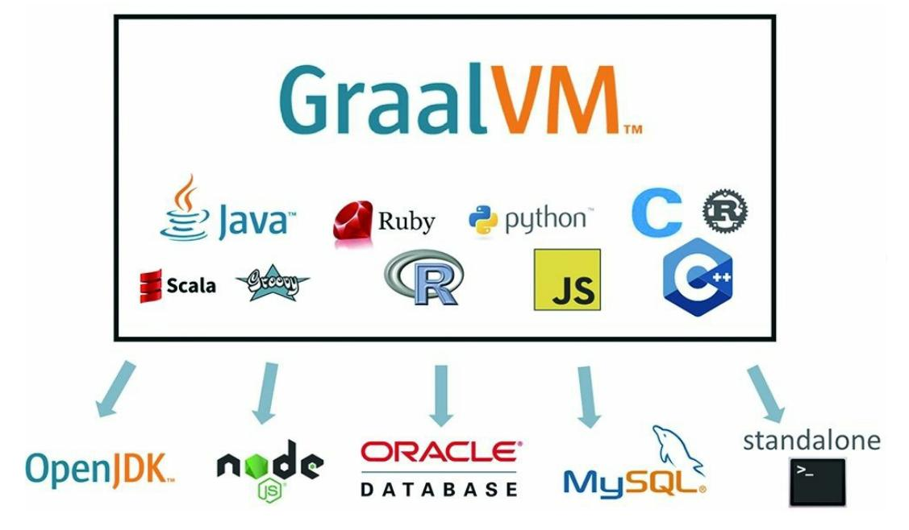

图1-4 Graal VM

Graal VM的基本工作原理是将这些语言的源代码(例如JavaScript)或源代码编译后的中间格式 (例如LLVM字节码)通过解释器转换为能被Graal VM接受的中间表示(Intermediate Representation, IR),譬如设计一个解释器专门对LLVM输出的字节码进行转换来支持C和C++语言,这个过程称为程 序特化(Specialized,也常被称为Partial Evaluation)。Graal VM提供了Truffle工具集来快速构建面向一 种新语言的解释器,并用它构建了一个称为Sulong的高性能LLVM字节码解释器。

从更严格的角度来看,Graal VM才是真正意义上与物理计算机相对应的高级语言虚拟机,理由是 它与物理硬件的指令集一样,做到了只与机器特性相关而不与某种高级语言特性相关。Oracle Labs的 研究总监Thomas Wuerthinger在接受InfoQ采访时谈到:"随着GraalVM 1.0的发布,我们已经证明了拥 有高性能的多语言虚拟机是可能的,并且实现这个目标的最佳方式不是通过类似Java虚拟机和微软 CLR那样带有语言特性的字节码[2]。"对于一些本来就不以速度见长的语言运行环境,由于Graal VM 本身能够对输入的中间表示进行自动优化,在运行时还能进行即时编译优化,因此使用Graal VM实现 往往能够获得比原生编译器更优秀的执行效率,譬如Graal.js要优于Node.js [3],Graal.Python要优于 CPtyhon [4],TruffleRuby要优于Ruby MRI,FastR要优于R语言等。

对Java而言,Graal VM本来就是在HotSpot基础上诞生的,天生就可作为一套完整的符合Java SE 8 标准的Java虚拟机来使用。它和标准的HotSpot的差异主要在即时编译器上,其执行效率、编译质量目 前与标准版的HotSpot相比也是互有胜负。但现在Oracle Labs和美国大学里面的研究院所做的最新即时 编译技术的研究全部都迁移至基于Graal VM之上进行了,其发展潜力令人期待。如果Java语言或者 HotSpot虚拟机真的有被取代的一天,那从现在看来Graal VM是希望最大的一个候选项,这场革命很

可能会在Java使用者没有明显感觉的情况下悄然而来,Java世界所有的软件生态都没有发生丝毫变化, 但天下第一的位置已经悄然更迭。

- [1] 参见TIOBE编程语言排行榜:https://www.tiobe.com/tiobe-index/。
- [2] 资料来源:https://www.infoq.com/news/2018/04/oracle-graalvm-v1/。
- [3] Graal.js能否比Node.js更快目前为止还存有很大争议,Node.js背靠Google的V8引擎、执行性能优 异,要超越绝非易事。
- [4] Python的运行环境PyPy其实做了与Graal VM差不多的工作,只是仅针对Python而没有为其他高级 语言提供解释器。

# 1.5.2 新一代即时编译器

对需要长时间运行的应用来说,由于经过充分预热,热点代码会被HotSpot的探测机制准确定位捕 获,并将其编译为物理硬件可直接执行的机器码,在这类应用中Java的运行效率很大程度上取决于即 时编译器所输出的代码质量。

HotSpot虚拟机中含有两个即时编译器,分别是编译耗时短但输出代码优化程度较低的客户端编译 器(简称为C1)以及编译耗时长但输出代码优化质量也更高的服务端编译器(简称为C2),通常它们 会在分层编译机制下与解释器互相配合来共同构成HotSpot虚拟机的执行子系统(这部分具体内容将在 本书第11章展开讲解)。

自JDK 10起,HotSpot中又加入了一个全新的即时编译器:Graal编译器,看名字就可以联想到它 是来自于前一节提到的Graal VM。Graal编译器是以C2编译器替代者的身份登场的。C2的历史已经非 常长了,可以追溯到Cliff Click大神读博士期间的作品,这个由C++写成的编译器尽管目前依然效果拔 群,但已经复杂到连Cliff Click本人都不愿意继续维护的程度。而Graal编译器本身就是由Java语言写 成,实现时又刻意与C2采用了同一种名为"Sea-of-Nodes"的高级中间表示(High IR)形式,使其能够 更容易借鉴C2的优点。Graal编译器比C2编译器晚了足足二十年面世,有着极其充沛的后发优势,在保 持输出相近质量的编译代码的同时,开发效率和扩展性上都要显著优于C2编译器,这决定了C2编译器 中优秀的代码优化技术可以轻易地移植到Graal编译器上,但是反过来Graal编译器中行之有效的优化在 C2编译器里实现起来则异常艰难。这种情况下,Graal的编译效果短短几年间迅速追平了C2,甚至某些 测试项中开始逐渐反超C2编译器。Graal能够做比C2更加复杂的优化,如"部分逃逸分析"(Partial Escape Analysis),也拥有比C2更容易使用激进预测性优化(Aggressive Speculative Optimization)的 策略,支持自定义的预测性假设等。

今天的Graal编译器尚且年幼,还未经过足够多的实践验证,所以仍然带着"实验状态"的标签,需 要用开关参数去激活[1],这让笔者不禁联想起JDK 1.3时代,HotSpot虚拟机刚刚横空出世时的场景, 同样也是需要用开关激活,也是作为Classic虚拟机的替代品的一段历史。

Graal编译器未来的前途可期,作为Java虚拟机执行代码的最新引擎,它的持续改进,会同时为 HotSpot与Graal VM注入更快更强的驱动力。

[1] 使用-XX:+UnlockExperimentalVMOptions-XX:+UseJVMCICompiler参数来启用Graal编译器。

# 1.5.3 向Native迈进

对不需要长时间运行的,或者小型化的应用而言,Java(而不是指Java ME)天生就带有一些劣 势,这里并不只是指跑个HelloWorld也需要百多兆的JRE之类的问题,更重要的是指近几年在从大型单 体应用架构向小型微服务应用架构发展的技术潮流下,Java表现出来的不适应。

在微服务架构的视角下,应用拆分后,单个微服务很可能就不再需要面对数十、数百GB乃至TB 的内存,有了高可用的服务集群,也无须追求单个服务要7×24小时不间断地运行,它们随时可以中断 和更新;但相应地,Java的启动时间相对较长,需要预热才能达到最高性能等特点就显得相悖于这样 的应用场景。在无服务架构中,矛盾则可能会更加突出,比起服务,一个函数的规模通常会更小,执 行时间会更短,当前最热门的无服务运行环境AWS Lambda所允许的最长运行时间仅有15分钟。

一直把软件服务作为重点领域的Java自然不可能对此视而不见,在最新的几个JDK版本的功能清 单中,已经陆续推出了跨进程的、可以面向用户程序的类型信息共享(Application Class Data Sharing,AppCDS,允许把加载解析后的类型信息缓存起来,从而提升下次启动速度,原本CDS只支 持Java标准库,在JDK 10时的AppCDS开始支持用户的程序代码)、无操作的垃圾收集器(Epsilon, 只做内存分配而不做回收的收集器,对于运行完就退出的应用十分合适)等改善措施。而酝酿中的一 个更彻底的解决方案,是逐步开始对提前编译(Ahead of Time Compilation,AOT)提供支持。

提前编译是相对于即时编译的概念,提前编译能带来的最大好处是Java虚拟机加载这些已经预编 译成二进制库之后就能够直接调用,而无须再等待即时编译器在运行时将其编译成二进制机器码。理 论上,提前编译可以减少即时编译带来的预热时间,减少Java应用长期给人带来的"第一次运行慢"的 不良体验,可以放心地进行很多全程序的分析行为,可以使用时间压力更大的优化措施[1]。

但是提前编译的坏处也很明显,它破坏了Java"一次编写,到处运行"的承诺,必须为每个不同的 硬件、操作系统去编译对应的发行包;也显著降低了Java链接过程的动态性,必须要求加载的代码在 编译期就是全部已知的,而不能在运行期才确定,否则就只能舍弃掉已经提前编译好的版本,退回到 原来的即时编译执行状态。

早在JDK 9时期,Java就提供了实验性的Jaotc命令来进行提前编译,不过多数人试用过后都颇感失 望,大家原本期望的是类似于Excelsior JET那样的编译过后能生成本地代码完全脱离Java虚拟机运行的 解决方案,但Jaotc其实仅仅是代替即时编译的一部分作用而已,仍需要运行于HotSpot之上。

直到Substrate VM出现,才算是满足了人们心中对Java提前编译的全部期待。Substrate VM是在 Graal VM 0.20版本里新出现的一个极小型的运行时环境,包括了独立的异常处理、同步调度、线程管 理、内存管理(垃圾收集)和JNI访问等组件,目标是代替HotSpot用来支持提前编译后的程序执行。 它还包含了一个本地镜像的构造器(Native Image Generator),用于为用户程序建立基于Substrate VM 的本地运行时镜像。这个构造器采用指针分析(Points-To Analysis)技术,从用户提供的程序入口出 发,搜索所有可达的代码。在搜索的同时,它还将执行初始化代码,并在最终生成可执行文件时,将 已初始化的堆保存至一个堆快照之中。这样一来,Substrate VM就可以直接从目标程序开始运行,而 无须重复进行Java虚拟机的初始化过程。但相应地,原理上也决定了Substrate VM必须要求目标程序是 完全封闭的,即不能动态加载其他编译器不可知的代码和类库。基于这个假设,Substrate VM才能探

索整个编译空间,并通过静态分析推算出所有虚方法调用的目标方法。

Substrate VM带来的好处是能显著降低内存占用及启动时间,由于HotSpot本身就会有一定的内存 消耗(通常约几十MB),这对最低也从几GB内存起步的大型单体应用来说并不算什么,但在微服务 下就是一笔不可忽视的成本。根据Oracle官方给出的测试数据,运行在Substrate VM上的小规模应用, 其内存占用和启动时间与运行在HotSpot上相比有5倍到50倍的下降,具体结果如图1-5和图1-6所示。

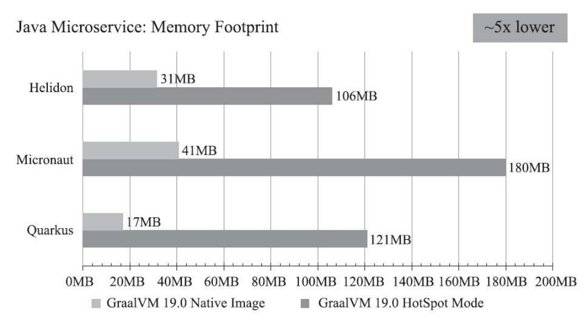

图1-5 内存占用对比

Substrate VM补全了Graal VM"Run Programs Faster Anywhere"愿景蓝图里的最后一块拼图,让 Graal VM支持其他语言时不会有重量级的运行负担。譬如运行JavaScript代码,Node.js的V8引擎执行效 率非常高,但即使是最简单的HelloWorld,它也要使用约20MB的内存,而运行在Substrate VM上的 Graal.js,跑一个HelloWorld则只需要4.2MB内存,且运行速度与V8持平。Substrate VM的轻量特性,使 得它十分适合嵌入其他系统,譬如Oracle自家的数据库就已经开始使用这种方式支持用不同的语言代 替PL/SQL来编写存储过程[2]。在本书第11章还会再详细讨论提前编译的相关内容。

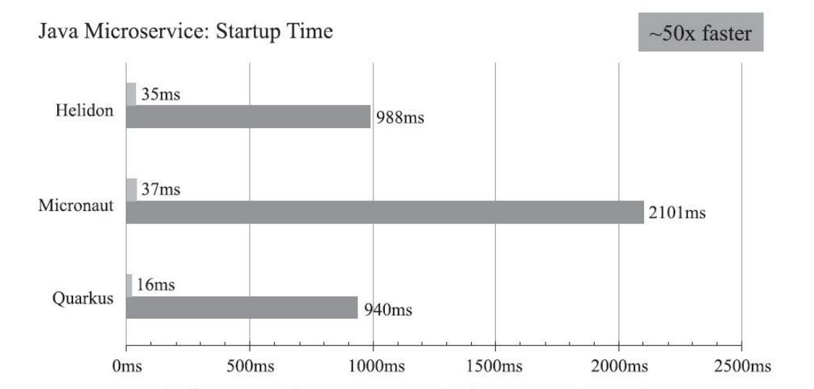

图1-6 启动时间对比

- [1] 由于AOT编译没有运行时的监控信息,很多由运行信息统计进行向导的优化措施不能使用,所以 尽管没有编译时间的压力,效果也不一定就比JIT更好。
- [2] Oracle Database MLE,从Oracle 12c开始支持,详见https://oracle.github.io/oracle-db-mle。

# 1.5.4 灵活的胖子

即使HotSpot最初设计时考虑得再长远,大概也不会想到这个虚拟机将在未来的二十年内一直保持 长盛不衰。这二十年间有无数改进和功能被不断地添加到HotSpot的源代码上,致使它成长为今天这样 的庞然大物。

HotSpot的定位是面向各种不同应用场景的全功能Java虚拟机[1],这是一个极高的要求,仿佛是让 一个胖子能拥有敏捷的身手一样的矛盾。如果是持续跟踪近几年OpenJDK的代码变化的人,相信都感 觉到了HotSpot开发团队正在持续地重构着HotSpot的架构,让它具有模块化的能力和足够的开放性。 模块化[2]方面原本是HotSpot的弱项,监控、执行、编译、内存管理等多个子系统的代码相互纠缠。 而IBM的J9就一直做得就非常好,面向Java ME的J9虚拟机与面向Java EE的J9虚拟机可以是完全由同一 套代码库编译出来的产品,只有编译时选择的模块配置有所差别。

现在,HotSpot虚拟机也有了与J9类似的能力,能够在编译时指定一系列特性开关,让编译输出的 HotSpot虚拟机可以裁剪成不同的功能,譬如支持哪些编译器,支持哪些收集器,是否支持JFR、 AOT、CDS、NMT等都可以选择。能够实现这些功能特性的组合拆分,反映到源代码不仅仅是条件编 译,更关键的是接口与实现的分离。

早期(JDK 1.4时代及之前)的HotSpot虚拟机为了提供监控、调试等不会在《Java虚拟机规范》 中约定的内部功能和数据,就曾开放过Java虚拟机信息监控接口(Java Virtual Machine Profiler Interface,JVMPI)与Java虚拟机调试接口(Java Virtual Machine Debug Interface,JVMDI)供运维和性 能监控、IDE等外部工具使用。到了JDK 5时期,又抽象出了层次更高的Java虚拟机工具接口(Java Virtual Machine Tool Interface,JVMTI)来为所有Java虚拟机相关的工具提供本地编程接口集合,到 JDK 6时JVMTI就完全整合代替了JVMPI和JVMDI的作用。

在JDK 9时期,HotSpot虚拟机开放了Java语言级别的编译器接口[3](Java Virtual Machine Compiler Interface,JVMCI),使得在Java虚拟机外部增加、替换即时编译器成为可能,这个改进实现起来并不 费劲,但比起之前JVMPI、JVMDI和JVMTI却是更深层次的开放,它为不侵入HotSpot代码而增加或 修改HotSpot虚拟机的固有功能逻辑提供了可行性。Graal编译器就是通过这个接口植入到HotSpot之 中。

到了JDK 10,HotSpot又重构了Java虚拟机的垃圾收集器接口[4](Java Virtual Machine Compiler Interface),统一了其内部各款垃圾收集器的公共行为。有了这个接口,才可能存在日后(今天尚未) 某个版本中的CMS收集器退役,和JDK 12中Shenandoah这样由Oracle以外其他厂商领导开发的垃圾收 集器进入HotSpot中的事情。如果未来这个接口完全开放的话,甚至有可能会出现其他独立于HotSpot 的垃圾收集器实现。

经过一系列的重构与开放,HotSpot虚拟机逐渐从时间的侵蚀中挣脱出来,虽然代码复杂度还在增 长,体积仍在变大,但其架构并未老朽,而是拥有了越来越多的开放性和扩展性,使得HotSpot成为一 个能够联动外部功能,能够应对各种场景,能够学会十八般武艺的身手灵活敏捷的"胖子"。

[1] 定位J9做到了,HotSpot实际上并未做到,譬如在Java ME中的虚拟机就不是HotSpot,而是CDC-

#### HI/CLDC-HI。

- [2] 这里指虚拟机本身的模块化,与Jigsaw无关。
- [3] 并不是指内部代码上统一C1、C2的编译器接口,而是特指会开放给外部的、使用Java语言实现的编 译器接口。
- [4] 这个接口目前只在HotSpot内部使用,并未对外开放,所以也就没有JVMGI的提法。

### 1.5.5 语言语法持续增强

笔者将语言的功能特性和语法放到最后来讲,因为它是相对最不重要的改进点,毕竟连JavaScript 这种"反人类"的语法都能获得如此巨大的成功,而比Java语法先进优雅得多的挑战者C#现在已经"江湖 日下",成了末路英雄[1]。

但一门语言的功能、语法又是影响语言生产力和效率的重要因素,很多语言特性和语法糖不论有 没有,程序也照样能写,但即使只是可有可无的语法糖,也是直接影响语言使用者的幸福感程度的关 键指标。JDK 7的Coins项目结束以后,Java社区又创建了另外一个新的语言特性改进项目Amber,JDK 10至13里面提供的新语法改进基本都来自于这个项目,譬如:

- ·JEP 286:Local-Variable Type Inference,在JDK 10中提供,本地类型变量推断。
- ·JEP 323:Local-Variable Syntax for Lambda Parameters,在JDK 11中提供,JEP 286的加强,使它可 以用在Lambda中。
  - ·JEP 325:Switch Expressions,在JDK 13中提供,实现switch语句的表达式支持。
- ·JEP 335:Text Blocks,在JDK 13中提供,支持文本块功能,可以节省拼接HTML、SQL等场景里 大量的"+"操作。

还有一些是仍然处于草稿状态或者暂未列入发布范围的JEP,可供我们窥探未来Java语法的变化, 譬如:

- ·JEP 301:Enhanced Enums,允许常量类绑定数据类型,携带额外的信息。
- ·JEP 302:Lambda Leftovers,用下划线来表示Lambda中的匿名参数。
- ·JEP 305:Pattern Matching for instanceof,用instanceof判断过的类型,在条件分支里面可以不需要 做强类型转换就能直接使用。

除语法糖以外,语言的功能也在持续改进之中,以下几个项目是目前比较明确的,也是受到较多 关注的功能改进计划:

·Project Loom:现在的Java做并发处理的最小调度单位是线程,Java线程的调度是直接由操作系统 内核提供的(这方面的内容可见本书第12章),会有核心态、用户态的切换开销。而很多其他语言都 提供了更加轻量级的、由软件自身进行调度的用户线程(曾经非常早期的Java也有绿色线程),譬如 Golang的Groutine、D语言的Fiber等。Loom项目就准备提供一套与目前Thread类API非常接近的Fiber实 现。

·Project Valhalla:提供值类型和基本类型的泛型支持,并提供明确的不可变类型和非引用类型的声 明。值类型的作用和价值在本书第10章会专门讨论,而不可变类型在并发编程中能带来很多好处,没 有数据竞争风险带来了更好的性能。一些语言(如Scala)就有明确的不可变类型声明,而Java中只能 在定义类时将全部字段声明为final来间接实现。基本类型的范型支持是指在泛型中引用基本数据类型

不需要自动装箱和拆箱,避免性能损耗。

·Project Panama:目的是消弭Java虚拟机与本地代码之间的界线。现在Java代码可以通过JNI来调用 本地代码,这点在与硬件交互频繁的场合尤其常用(譬如Android)。但是JNI的调用方式充其量只能 说是达到能用的标准而已,使用起来仍相当烦琐,频繁执行的性能开销也非常高昂,Panama项目的目 标就是提供更好的方式让Java代码与本地代码进行调用和传输数据。

随着Java每半年更新一次的节奏,新版本的Java中会出现越来越多其他语言里已有的优秀特性,相 信博采众长的Java,还能继续保持现在的勃勃生机相当长时间。

[1] 笔者个人观点,读者请勿从"反人类""江湖日下"这些词语中挑起语言战争。毕竟"PHP是世界上最 好的语言"(梗)。

### 1.6 实战:自己编译JDK

想要窥探Java虚拟机内部的实现原理,最直接的一条路径就是编译一套自己的JDK,通过阅读和 跟踪调试JDK源码来了解Java技术体系的运作,虽然这样门槛会比阅读资料更高一点,但肯定也会比 阅读各种文章、书籍来得更加贴近本质。此外,Java类库里的很多底层方法都是Native的,在了解这些 方法的运作过程,或对JDK进行Hack(根据需要进行定制微调)的时候,都需要有能自行编译、调试 虚拟机代码的能力。

现在网络上有不少开源的JDK实现可以供我们选择,但毫无疑问OpenJDK是使用得最广泛的 JDK,我们也将选择OpenJDK来进行这次编译实战。

# 1.6.1 获取源码

编译源码之前,我们要先明确OpenJDK和OracleJDK之间、OpenJDK的各个不同版本之间存在什 么联系,这有助于确定接下来编译要使用的JDK版本和源码分支,也有助于理解我们编译出来的JDK 与Oracle官方提供的JDK有什么差异。

从前面介绍的Java发展史中我们已经知道OpenJDK是Sun公司在2006年年末把Java开源而形成的项 目,这里的"开源"是通常意义上的源码开放形式,即源码是可被复用的,例如OracleJDK、Oracle OpenJDK、AdoptOpenJDK、Azul Zulu、SAP SapMachine、Amazon Corretto、IcedTea、UltraViolet等 都是从OpenJDK源码衍生出的发行版。但如果仅从"开源"字面意义(开放可阅读的源码)上讲的话, 其实Sun公司自JDK 5时代起就曾经以JRL(Java Research License)的形式公开过Java的源码,主要是开 放给研究人员阅读使用,这种JRL许可证的开放源码一直持续到JDK 6 Update 23才因OpenJDK项目日 渐成熟而终止。如果拿OpenJDK中的源码跟对应版本的JRL许可证形式开放的Sun/OracleJDK源码互相 比较的话,会发现除了文件头的版权注释之外,其余代码几乎都是相同的,只有少量涉及引用第三方 的代码存在差异,如字体栅格化渲染,这部分内容OracleJDK采用了商业实现,源码版权不属于Oracle 自己,所以也无权开源,而OpenJDK中使用的是同样开源的FreeType代替。

当然,笔者说的"代码相同"必须建立在两者共有的组件基础之上,OpenJDK中的源码仓库只包含 了标准Java SE的源代码,而一些额外的模块,典型的如JavaFX,虽然后来也是被Oracle开源并放到 OpenJDK组织进行管理(OpenJFX项目),但是它是存放在独立的源码仓库中,因此OracleJDK的安 装包中会包含JavaFX这种独立的模块,而用OpenJDK的话则需要单独下载安装。

此外,在JDK 11以前,OracleJDK中还会存在一些OpenJDK没有的、闭源的功能,即OracleJDK 的"商业特性"。例如JDK 8起从JRockit移植改造而来的Java Flight Recorder和Java Mission Control组件、 JDK 10中的应用类型共享功能(AppCDS)和JDK 11中的ZGC收集器,这些功能在JDK 11时才全部开 源到了OpenJDK中。到了这个阶段,我们已经可以认为OpenJDK与OracleJDK代码实质上[1]已达到完 全一致的程度。

根据Oracle的项目发布经理Joe Darcy在OSCON大会上对两者关系的介绍[2]也证实了OpenJDK和 OracleJDK在程序上是非常接近的,两者共用了绝大部分相同的代码(如图1-7所示,注意图中的英文 提示了两者共同代码的占比要远高于图形上看到的比例),所以我们编译的OpenJDK,基本上可以认 为性能、功能和执行逻辑上都和官方的OracleJDK是一致的。

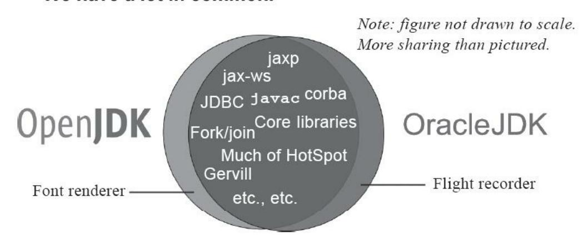

图1-7 OpenJDK和OracleJDK之间的关系

下面再来看一下OpenJDK内部不同版本之间的关系,在OpenJDK接收Sun公司移交的JDK源码 时,Java正处于JDK 6时代的初期,JDK 6 Update 1才刚刚发布不久,JDK 7则还完全处于研发状态的 半成品。OpenJDK的第一个版本就是来自于当时Sun公司正在开发的JDK 7,考虑到OpenJDK 7的状况 在当时完全不足以支持实际的生产部署,因此又在OpenJDK 7 Build 22的基础上建立了一条新的 OpenJDK 6分支,剥离掉所有JDK 7新功能的代码,形成一个可以通过TCK 6测试的独立分支,先把 OpenJDK 6发布出去给公众使用。等到OpenJDK 7达到了可正式对外发布的状态之后,就从OpenJDK 7的主分支延伸出用于研发下一代Java版本的OpenJDK 8以及用于发布更新补丁的OpenJDK 7 Update两 条子分支,按照开发习惯,新的功能或Bug修复通常是在最新分支上进行的,当功能或修复在最新分 支上稳定之后会同步到其他老版本的维护分支上。后续的JDK 8和JDK 9都重复延续着类似的研发流 程。通过图1-8(依然是从Joe Darcy的OSCON演示稿截取的图片)可以比较清楚地理解不同版本分支 之间的关系。

到了JDK 10及以后的版本,在组织上出现了一些新变化,此时全部开发工作统一归属到JDK和 JDK Updates两条主分支上,主分支不再带版本号,在内部再用子分支来区分具体的JDK版本。 OpenJDK不同版本的源码都可以在它们的主页(http://openjdk.java.net/)上找到,在本次编译实践中, 笔者选用的版本是OpenJDK 12。

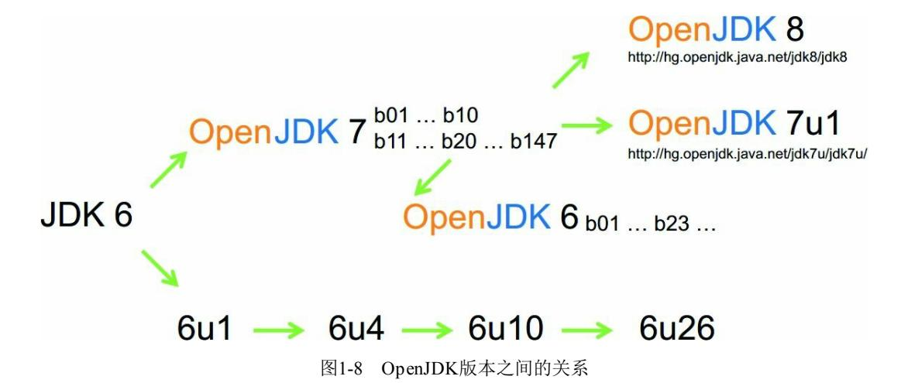

获取OpenJDK源码有两种方式。一是通过Mercurial代码版本管理工具从Repository中直接取得源 码(Repository地址:https://hg.openjdk.java.net/jdk/jdk12),获取过程如以下命令所示:

hg clone https://hg.openjdk.java.net/jdk/jdk12

这是直接取得OpenJDK源码的方式,从版本管理中看变更轨迹也能够更精确地了解到Java代码发 生的变化,但弊端是在中国访问的速度实在太慢,虽然代码总量只有几百MB,无奈文件数量将近十 万,而且仓库没有国内的CDN节点。以笔者的网络状况,不科学上网的话,全部复制到本地需要耗费 数小时时间。另外,考虑到Mercurial远不如Git常用,甚至普及程度还不如SVN、ClearCase以及更古老 的CVS等版本控制工具,对于大多数读者,笔者建议采用第二种方式,即直接在仓库中打包出源码压 缩包,再进行下载。

读者可以直接访问准备下载的JDK版本的仓库页面(譬如本例中OpenJDK 12的页面 为https://hg.openjdk.java.net/jdk/jdk12/),然后点击左边菜单中的"Browse",将显示如图1-9的源码根目 录页面。

此时点击左边的"zip"链接即可下载当前版本打包好的源码,到本地直接解压即可。在国内使用这 种方式下载比起从Mercurial复制一堆零散文件要快非常多。笔者下载的OpenJDK 12源码包大小为 171MB,解压之后约为579MB。

- [1] 严格来说,这里"实质上"可以理解为除去一些版权信息(如java-version的输出)、除去针对Oracle 自身特殊硬件平台的适配、除去JDK 12中OracleJDK排除了Shenandoah这类特意设置的差异之外是一致 的。
- [2] 全文地址:https://blogs.oracle.com/darcy/resource/OSCON/oscon2011\_OpenJDKState.pdf。

# 1.6.2 系统需求

如果可能,笔者建议尽量在Linux或者MacOS上构建OpenJDK,这两个系统在准备构建工具链和依 赖项上要比在Windows或Solaris平台上要容易许多,本篇实践中笔者将以Ubuntu 18.04 LTS为平台进行 构建。如果读者确实有在Windows平台上完成编译的需求,或需要编译较老版本的OpenJDK,可参考 本书附录A,这篇附录是本书第1版中介绍如何在Windows下编译OpenJDK 6的实践例子,虽然里面的 部分内容已经过时了(例如安装Plug部分),但对Windows上构建安装环境和较老版本的OpenJDK编 译还是有一定参考意义的,所以笔者并没有把它删除掉,而是挪到附录之中。


图1-9 JDK 12的根目录

无论在什么平台下进行编译,都建议读者认真阅读一遍源码中的doc/building.html文档,编译过程 中需要注意的细节较多,如果读者是第一次编译OpenJDK,那有可能会在一些小问题上耗费许多时 间。在本次编译中采用的是64位操作系统,默认参数下编译出来的也是64位的OpenJDK,如果需要编 译32位版本,笔者同样推荐在64位的操作系统上进行,理由是编译过程可以使用更大内存(32位系统 受4G内存限制),通过编译参数(--with-target-bits=32)来指定需要生成32位编译结果即可。在官方 文档上要求编译OpenJDK至少需要2~4GB的内存空间(CPU核心数越多,需要的内存越大),而且 至少要6~8GB的空闲磁盘空间,不要看OpenJDK源码的大小只有不到600MB,要完成编译,过程中 会产生大量的中间文件,并且编译出不同优化级别(Product、FastDebug、SlowDebug)的HotSpot虚 拟机可能要重复生成这些中间文件,这都会占用大量磁盘空间。

对系统环境的最后一点建议是,所有的文件,包括源码和依赖项目,都不要放在包含中文的目录 里面,这样做不是一定会产生不可解决的问题,只是没有必要给自己找麻烦。

# 1.6.3 构建编译环境

在MacOS [1]和Linux上构建OpenJDK编译环境相对简单,对于MacOS,需要MacOS X 10.13版本以 上,并安装好最新版本的XCode和Command Line Tools for XCode(在Apple Developer网站[2]上可以免 费下载),这两个SDK提供了OpenJDK所需的CLang编译器以及Makefile中用到的其他外部命令。

对于Linux系统,要准备的依赖与MacOS类似,在MacOS中CLang编译器来源于XCode SDK,而 Ubuntu里用户可以自行选择安装GCC或CLang来进行编译,但必须确保最低的版本为GCC 4.8或者 CLang 3.2以上,官方推荐使用GCC 7.8或者CLang 9.1来完成编译。在Ubuntu系统上安装GCC的命令 为:

sudo apt-get install build-essential

在编译过程中需要依赖FreeType、CUPS等若干第三方库,OpenJDK全部的依赖库已在表1-1中列 出,读者可执行相应的安装命令完成安装。

| 工具       | 库 名 称                                       | 安装命令                                                                                                |
|----------|---------------------------------------------|-----------------------------------------------------------------------------------------------------|
| FreeType | The FreeType Project                        | sudo apt-get install libfreetype6-dev                                                               |
| CUPS     | Common UNIX Printing System                 | sudo apt-get install libcups2-dev.                                                                  |
| X11      | X Window System                             | sudo apt-get install libx11-dev libxext-dev libxrender-<br>dev libxrandr-dev libxtst-dev libxt-dev. |
| ALSA     | Advanced Linux Sound Architecture           | sudo apt-get install libasound2-dev.                                                                |
| libffi   | Portable Foreign Function Interface Library | sudo apt-get install libffi-dev.                                                                    |
| Autoconf | Extensible Package of M4 Macros             | sudo apt-get install autoconf.                                                                      |

表1-1 OpenJDK编译依赖库

最后,假设要编译大版本号为N的JDK,我们还要另外准备一个大版本号至少为N-1的、已经编译 好的JDK,这是因为OpenJDK由多个部分(HotSpot、JDK类库、JAXWS、JAXP……)构成,其中一 部分(HotSpot)代码使用C、C++编写,而更多的代码则是使用Java语言来实现,因此编译这些Java代 码就需要用到另一个编译期可用的JDK,官方称这个JDK为"Bootstrap JDK"。编译OpenJDK 12时, Bootstrap JDK必须使用JDK 11及之后的版本。在Ubuntu中使用以下命令安装OpenJDK 11:

sudo apt-get install openjdk-11-jdk

<sup>[1]</sup> 注意,在OpenJDK 7u4和之后的版本才能编译出MacOS系统下的JDK包,之前的版本虽然在源码和 编译脚本中也包含了MacOS目录,但是尚未完善。

<sup>[2]</sup> https://developer.apple.com/。

# 1.6.4 进行编译

需要下载的编译环境和依赖项目都齐备后,我们就可以按照默认配置来开始编译了,但通常我们 编译OpenJDK的目的都不仅仅是为了得到在自己机器中诞生的编译成品,而是带着调试、定制化等需 求,这样就必须了解OpenJDK提供的编译参数才行,这些参数可以使用"bash configure--help"命令查询 到,笔者对它们中最有用的部分简要说明如下:

- ·--with-debug-level=<level>:设置编译的级别,可选值为release、fastdebug、slowde-bug,越往后进 行的优化措施就越少,带的调试信息就越多。还有一些虚拟机调试参数必须在特定模式下才可以使 用。默认值为release。
  - ·--enable-debug:等效于--with-debug-level=fastdebug。
- ·--with-native-debug-symbols=<method>:确定调试符号信息的编译方式,可选值为none、 internal、external、zipped。
- ·--with-version-string=<string>:设置编译JDK的版本号,譬如java-version的输出就会显示该信息。 这个参数还有--with-version-<part>=<value>的形式,其中part可以是pre、opt、build、major、minor、 security、patch之一,用于设置版本号的某一个部分。
- ·--with-jvm-variants=<variant>[,<variant>...]:编译特定模式(Variants)的HotSpot虚拟机,可以 多个模式并存,可选值为server、client、minimal、core、zero、custom。
- ·--with-jvm-features=<feature>[,<feature>...]:针对--with-jvm-variants=custom时的自定义虚拟机特 性列表(Features),可以多个特性并存,由于可选值较多,请参见help命令输出。
- ·--with-target-bits=<bits>:指明要编译32位还是64位的Java虚拟机,在64位机器上也可以通过交叉 编译生成32位的虚拟机。
- ·--with-<lib>=<path>:用于指明依赖包的具体路径,通常使用在安装了多个不同版本的Bootstrap JDK和依赖包的情况。其中lib的可选值包括boot-jd、freetype、cups、x、alsa、libffi、jtreg、libjpeg、 giflib、libpng、lcms、zlib。
- ·--with-extra-<flagtype>=<flags>:用于设定C、C++和Java代码编译时的额外编译器参数,其中 flagtype可选值为cflags、cxxflags、ldflags,分别代表C、C++和Java代码的参数。
- ·--with-conf-name=<name>:指定编译配置名称,OpenJDK支持使用不同的配置进行编译,默认会 根据编译的操作系统、指令集架构、调试级别自动生成一个配置名称,譬如"linux-x86\_64-serverrelease",如果在这些信息都相同的情况下保存不同的编译参数配置,就需要使用这个参数来自定义配 置名称。
- 以上是configure命令的部分参数,其他未介绍到的可以使用"bash configure--help"来查看,所有参 数均通过以下形式使用:

#### 譬如,编译FastDebug版、仅含Server模式的HotSpot虚拟机,命令应为:

```
bash configure --enable-debug --with-jvm-variants=server
```

configure命令承担了依赖项检查、参数配置和构建输出目录结构等多项职责,如果编译过程中需 要的工具链或者依赖项有缺失,命令执行后将会得到明确的提示,并且给出该依赖的安装命令,这比 编译旧版OpenJDK时的"make sanity"检查要友好得多,譬如以下例子所示:

```
configure: error: Could not find fontconfig! You might be able to fix this by running 'sudo apt-get install libfontconfig1-dev'.
configure exiting with result code 1
```

如果一切顺利的话,就会收到配置成功的提示,并且输出调试级别,Java虚拟机的模式、特性, 使用的编译器版本等配置摘要信息,如下所示:

```
A new configuration has been successfully created in
/home/icyfenix/develop/java/jdk12/build/linux-x86_64-server-release
using default settings.
Configuration summary:
* Debug level: release
* HS debug level: product
* JVM variants: server
* JVM features: server: 'aot cds cmsgc compiler1 compiler2 epsilongc g1gc graal jfr jni-check jvmci jvmti management nmt parallelgc serialgc services shenandoahgc vm-structs zgc'
* OpenJDK target: OS: linux, CPU architecture: x86, address length: 64
* Version string: 12-internal+0-adhoc.icyfenix.jdk12 (12-internal)
Tools summary:
* Boot JDK: openjdk version "11.0.3" 2019-04-16 OpenJDK Runtime Environment (build 11.0.3+7-Ubuntu-1ubuntu218.04.1) OpenJDK 64-Bit Server VM (build 11.0.3+7-Ubuntu-1ubuntu218.04.1, mixed mode, sharing) (at /usr/lib/jvm/java-11-openjdk-amd64)
* Toolchain: gcc (GNU Compiler Collection)
* C Compiler: Version 7.4.0 (at /usr/bin/gcc)
* C++ Compiler: Version 7.4.0 (at /usr/bin/g++)
Build performance summary:
* Cores to use: 4
* Memory limit: 7976 MB
```

在configure命令以及后面的make命令的执行过程中,会在"build/配置名称"目录下产生如下目录结 构。不常使用C/C++的读者要特别注意,如果多次编译,或者目录结构成功产生后又再次修改了配 置,必须先使用"make clean"和"make dist-clean"命令清理目录,才能确保新的配置生效。编译产生的目 录结构以及用途如下所示:

```
buildtools/:用于生成、存放编译过程中用到的工具
hotspot/:HotSpot虚拟机编译的中间文件
images/:使用make *-image产生的镜像存放在这里
jdk/:编译后产生的JDK就放在这里
support/:存放编译时产生的中间文件
test-results/:存放编译后的自动化测试结果
configure-support/:这三个目录是存放执行configure、make和test的临时文件
make-support/
test-support/
```

依赖检查通过后便可以输入"make images"执行整个OpenJDK编译了,这里"images"是"productimages"编译目标(Target)的简写别名,这个目标的作用是编译出整个JDK镜像,除了"productimages"以外,其他编译目标还有:

hotspot:只编译HotSpot虚拟机

hotspot-<variant>:只编译特定模式的HotSpot虚拟机

docs-image:产生JDK的文档镜像

test-image:产生JDK的测试镜像 all-images:相当于连续调用product、docs、test三个编译目标

bootcycle-images:编译两次JDK,其中第二次使用第一次的编译结果作为Bootstrap JDK

clean:清理make命令产生的临时文件

dist-clean:清理make和configure命令产生的临时文件

笔者使用Oracle VM VirtualBox虚拟机,启动4条编译线程,8GB内存,全量编译整个OpenJDK 12 大概需近15分钟时间,如果之前已经全量编译过,只是修改了少量文件的话,增量编译可以在数十秒 内完成。编译完成之后,进入OpenJDK源码的"build/配置名称/jdk"目录下就可以看到OpenJDK的完整 编译结果了,把它复制到JAVA\_HOME目录,就可以作为一个完整的JDK来使用,如果没有人为设置 过JDK开发版本的话,这个JDK的开发版本号里默认会带上编译的机器名,如下所示:

> ./java -version

openjdk version "12-internal" 2019-03-19

OpenJDK Runtime Environment (build 12-internal+0-adhoc.icyfenix.jdk12)

OpenJDK 64-Bit Server VM (build 12-internal+0-adhoc.icyfenix.jdk12, mixed mode)

# 1.6.5 在IDE工具中进行源码调试

我们在阅读OpenJDK源码的过程中,肯定会运行和跟踪调试程序来帮助理解。现在我们已学会了 如何编译一个可调试版本HotSpot虚拟机,并禁用优化,带有符号信息,这样的编译结果已经可以直接 使用GDB在命令行中进行调试了。据笔者所知,不少对Java虚拟机研发接触比较多的开发人员确实就 是使用GDB和VIM编辑器来开发、修改HotSpot源码的,不过相信大多数读者都还是更倾向于在IDE环 境而不是纯文本下阅读、跟踪HotSpot源码。为此,本节将会讲解如何在IDE中进行HotSpot源码调 试。

在本次实战里,笔者采用的IDE是JetBrains的CLion 2019.1,读者可以在JetBrains网站[1]上直接下 载并免费使用30天,如果希望使用其他IDE,譬如Eclipst CDT或者Net-Beans,可以参考本书第2版中 相同章节的内容,为节省篇幅笔者就没有把它放到附录中了。

CLion安装后,新建一个项目,选择"New CMake Project from Sources",在源码文件夹中填入 OpenJDK源码根目录,此时,CLion已经自动选择好了需要导入的源码,如图1-10所示。点击OK按钮 就会导入源码并自动创建好CMakeLists.txt文件。

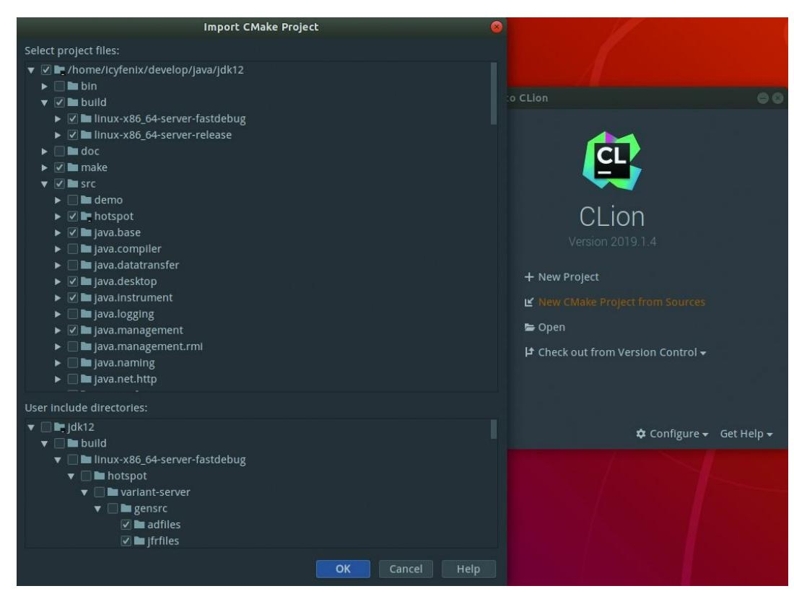

图1-10 在CLion中创建HotSpot项目(1)

这份自动生成的CMakeLists.txt并不能直接使用,OpenJDK本身也没有为任何IDE提供支持,但如 果只是为了能够在CLion中跟踪、阅读源码,而不需要修改重新编译的话,那直接在Run/Debug Configurations中增加一个CMake Application,然后Executable选择我们刚才编译出来的FastDebug或者 SlowDebug版的java命令,运行参数加上-version或者某个Class文件的路径,再把Before launch里面的 Build去掉,就可以开始运行调试了,如图1-11所示。

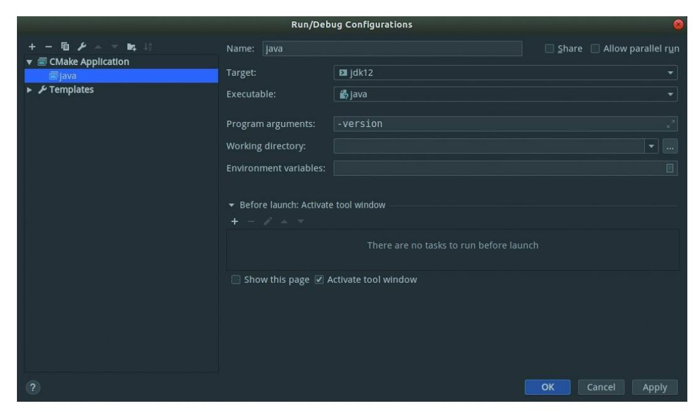

图1-11 在NetBeans中创建HotSpot项目(2)

不过如果读者需要在CLion中修改源码,并重新编译产生新的JDK,又或者不想阅读时看见一堆头 文件缺失提示的话,那还是需要把CMakeLists.txt修好,在GitHub上已经有现成的[2]参考,读者可以 直接下载,内容较多,篇幅所限,笔者就不在本文中列出了。

读者在调试Java代码执行时,如果要跟踪具体Java代码在虚拟机中是如何执行的,一开始可能会觉 得有些无处入手,因为目前HotSpot在主流的操作系统上,都采用模板解释器来执行字节码,它与即时 编译器一样,最终执行的汇编代码都是运行期间产生的,无法直接设置断点,所以HotSpot增加了以下 参数来方便开发人员调试解释器:

-XX:+TraceBytecodes -XX:StopInterpreterAt=<n>

这组参数的作用是当遇到序号为<n>的字节码指令时,便会中断程序执行,进入断点调试。调试 解释器部分代码时,把这两个参数加到java命令的参数后面即可。

完成以上配置之后,一个可修改、编译、调试的HotSpot工程就完全建立起来了,Hot-Spot虚拟机 启动器的执行入口是java.c的JavaMain()方法,读者可以设置断点单步跟踪,如图1-12所示。

图1-12 在CLion中创建HotSpot项目(3)

- [1] 官网地址:https://www.jetbrains.com/clion/。
- [2] https://github.com/ojdkbuild/ojdkbuild/blob/master/src/java-12-openjdk/CMakeLists.txt。

### 1.7 本章小结

本章介绍了Java技术体系的过去、现在和未来的发展趋势,并在实践中介绍了如何自己编译一个 OpenJDK 12。作为全书的引言部分,本章建立了后文研究所必需的环境。在了解Java技术的来龙去脉 后,后面章节将分为四部分去介绍Java在"自动内存管理""Class文件结构与执行引擎""编译器优 化"及"多线程并发"方面的实现原理。

# 第二部分 自动内存管理

·第2章 Java内存区域与内存溢出异常

·第3章 垃圾收集器与内存分配策略

·第4章 虚拟机性能监控、故障处理工具

·第5章 调优案例分析与实战

# 第2章 Java内存区域与内存溢出异常

Java与C++之间有一堵由内存动态分配和垃圾收集技术所围成的高墙,墙外面的人想进去,墙里 面的人却想出来。

#### 2.1 概述

对于从事C、C++程序开发的开发人员来说,在内存管理领域,他们既是拥有最高权力的"皇帝", 又是从事最基础工作的劳动人民——既拥有每一个对象的"所有权",又担负着每一个对象生命从开始 到终结的维护责任。

对于Java程序员来说,在虚拟机自动内存管理机制的帮助下,不再需要为每一个new操作去写配对 的delete/free代码,不容易出现内存泄漏和内存溢出问题,看起来由虚拟机管理内存一切都很美好。不 过,也正是因为Java程序员把控制内存的权力交给了Java虚拟机,一旦出现内存泄漏和溢出方面的问 题,如果不了解虚拟机是怎样使用内存的,那排查错误、修正问题将会成为一项异常艰难的工作。

本章是第二部分的第1章,笔者将从概念上介绍Java虚拟机内存的各个区域,讲解这些区域的作 用、服务对象以及其中可能产生的问题,这也是翻越虚拟机内存管理这堵围墙的第一步。

# 2.2 运行时数据区域

Java虚拟机在执行Java程序的过程中会把它所管理的内存划分为若干个不同的数据区域。这些区域 有各自的用途,以及创建和销毁的时间,有的区域随着虚拟机进程的启动而一直存在,有些区域则是 依赖用户线程的启动和结束而建立和销毁。根据《Java虚拟机规范》的规定,Java虚拟机所管理的内存 将会包括以下几个运行时数据区域,如图2-1所示。

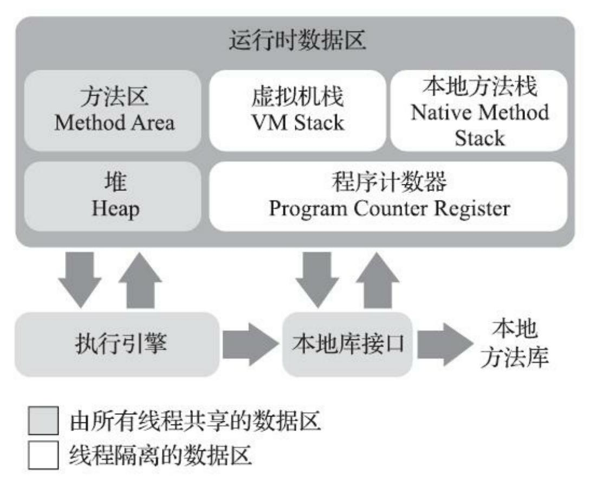

图2-1 Java虚拟机运行时数据区

# 2.2.1 程序计数器

程序计数器(Program Counter Register)是一块较小的内存空间,它可以看作是当前线程所执行的 字节码的行号指示器。在Java虚拟机的概念模型里[1],字节码解释器工作时就是通过改变这个计数器 的值来选取下一条需要执行的字节码指令,它是程序控制流的指示器,分支、循环、跳转、异常处 理、线程恢复等基础功能都需要依赖这个计数器来完成。

由于Java虚拟机的多线程是通过线程轮流切换、分配处理器执行时间的方式来实现的,在任何一 个确定的时刻,一个处理器(对于多核处理器来说是一个内核)都只会执行一条线程中的指令。因 此,为了线程切换后能恢复到正确的执行位置,每条线程都需要有一个独立的程序计数器,各条线程 之间计数器互不影响,独立存储,我们称这类内存区域为"线程私有"的内存。

如果线程正在执行的是一个Java方法,这个计数器记录的是正在执行的虚拟机字节码指令的地 址;如果正在执行的是本地(Native)方法,这个计数器值则应为空(Undefined)。此内存区域是唯 一一个在《Java虚拟机规范》中没有规定任何OutOfMemoryError情况的区域。

[1] "概念模型"这个词会经常被提及,它代表了所有虚拟机的统一外观,但各款具体的Java虚拟机并不 一定要完全照着概念模型的定义来进行设计,可能会通过一些更高效率的等价方式去实现它。

# 2.2.2 Java虚拟机栈

与程序计数器一样,Java虚拟机栈(Java Virtual Machine Stack)也是线程私有的,它的生命周期 与线程相同。虚拟机栈描述的是Java方法执行的线程内存模型:每个方法被执行的时候,Java虚拟机都 会同步创建一个栈帧[1](Stack Frame)用于存储局部变量表、操作数栈、动态连接、方法出口等信 息。每一个方法被调用直至执行完毕的过程,就对应着一个栈帧在虚拟机栈中从入栈到出栈的过程。

经常有人把Java内存区域笼统地划分为堆内存(Heap)和栈内存(Stack),这种划分方式直接继 承自传统的C、C++程序的内存布局结构,在Java语言里就显得有些粗糙了,实际的内存区域划分要比 这更复杂。不过这种划分方式的流行也间接说明了程序员最关注的、与对象内存分配关系最密切的区 域是"堆"和"栈"两块。其中,"堆"在稍后笔者会专门讲述,而"栈"通常就是指这里讲的虚拟机栈,或 者更多的情况下只是指虚拟机栈中局部变量表部分。

局部变量表存放了编译期可知的各种Java虚拟机基本数据类型(boolean、byte、char、short、int、 float、long、double)、对象引用(reference类型,它并不等同于对象本身,可能是一个指向对象起始 地址的引用指针,也可能是指向一个代表对象的句柄或者其他与此对象相关的位置)和returnAddress 类型(指向了一条字节码指令的地址)。

这些数据类型在局部变量表中的存储空间以局部变量槽(Slot)来表示,其中64位长度的long和 double类型的数据会占用两个变量槽,其余的数据类型只占用一个。局部变量表所需的内存空间在编 译期间完成分配,当进入一个方法时,这个方法需要在栈帧中分配多大的局部变量空间是完全确定 的,在方法运行期间不会改变局部变量表的大小。请读者注意,这里说的"大小"是指变量槽的数量, 虚拟机真正使用多大的内存空间(譬如按照1个变量槽占用32个比特、64个比特,或者更多)来实现一 个变量槽,这是完全由具体的虚拟机实现自行决定的事情。

在《Java虚拟机规范》中,对这个内存区域规定了两类异常状况:如果线程请求的栈深度大于虚 拟机所允许的深度,将抛出StackOverflowError异常;如果Java虚拟机栈容量可以动态扩展[2],当栈扩 展时无法申请到足够的内存会抛出OutOfMemoryError异常。

- [1] 栈帧是方法运行期很重要的基础数据结构,在本书的第8章中还会对帧进行详细讲解。
- [2] HotSpot虚拟机的栈容量是不可以动态扩展的,以前的Classic虚拟机倒是可以。所以在HotSpot虚拟 机上是不会由于虚拟机栈无法扩展而导致OutOfMemoryError异常——只要线程申请栈空间成功了就不 会有OOM,但是如果申请时就失败,仍然是会出现OOM异常的,后面的实战中笔者也演示了这种情 况。本书第2版时这里的描述是有误的,请阅读过第2版的读者特别注意。

# 2.2.3 本地方法栈

本地方法栈(Native Method Stacks)与虚拟机栈所发挥的作用是非常相似的,其区别只是虚拟机 栈为虚拟机执行Java方法(也就是字节码)服务,而本地方法栈则是为虚拟机使用到的本地(Native) 方法服务。

《Java虚拟机规范》对本地方法栈中方法使用的语言、使用方式与数据结构并没有任何强制规 定,因此具体的虚拟机可以根据需要自由实现它,甚至有的Java虚拟机(譬如Hot-Spot虚拟机)直接 就把本地方法栈和虚拟机栈合二为一。与虚拟机栈一样,本地方法栈也会在栈深度溢出或者栈扩展失 败时分别抛出StackOverflowError和OutOfMemoryError异常。

### 2.2.4 Java堆

对于Java应用程序来说,Java堆(Java Heap)是虚拟机所管理的内存中最大的一块。Java堆是被所 有线程共享的一块内存区域,在虚拟机启动时创建。此内存区域的唯一目的就是存放对象实例,Java 世界里"几乎"所有的对象实例都在这里分配内存。在《Java虚拟机规范》中对Java堆的描述是:"所有 的对象实例以及数组都应当在堆上分配[1]",而这里笔者写的"几乎"是指从实现角度来看,随着Java语 言的发展,现在已经能看到些许迹象表明日后可能出现值类型的支持,即使只考虑现在,由于即时编 译技术的进步,尤其是逃逸分析技术的日渐强大,栈上分配、标量替换[2]优化手段已经导致一些微妙 的变化悄然发生,所以说Java对象实例都分配在堆上也渐渐变得不是那么绝对了。

Java堆是垃圾收集器管理的内存区域,因此一些资料中它也被称作"GC堆"(Garbage Collected Heap,幸好国内没翻译成"垃圾堆")。从回收内存的角度看,由于现代垃圾收集器大部分都是基于分 代收集理论设计的,所以Java堆中经常会出现"新生代""老年代""永久代""Eden空间""From Survivor空 间""To Survivor空间"等名词,这些概念在本书后续章节中还会反复登场亮相,在这里笔者想先说明的 是这些区域划分仅仅是一部分垃圾收集器的共同特性或者说设计风格而已,而非某个Java虚拟机具体 实现的固有内存布局,更不是《Java虚拟机规范》里对Java堆的进一步细致划分。不少资料上经常写着 类似于"Java虚拟机的堆内存分为新生代、老年代、永久代、Eden、Survivor……"这样的内容。在十年 之前(以G1收集器的出现为分界),作为业界绝对主流的HotSpot虚拟机,它内部的垃圾收集器全部 都基于"经典分代" [3]来设计,需要新生代、老年代收集器搭配才能工作,在这种背景下,上述说法还 算是不会产生太大歧义。但是到了今天,垃圾收集器技术与十年前已不可同日而语,HotSpot里面也出 现了不采用分代设计的新垃圾收集器,再按照上面的提法就有很多需要商榷的地方了。

如果从分配内存的角度看,所有线程共享的Java堆中可以划分出多个线程私有的分配缓冲区 (Thread Local Allocation Buffer,TLAB),以提升对象分配时的效率。不过无论从什么角度,无论如 何划分,都不会改变Java堆中存储内容的共性,无论是哪个区域,存储的都只能是对象的实例,将Java 堆细分的目的只是为了更好地回收内存,或者更快地分配内存。在本章中,我们仅仅针对内存区域的 作用进行讨论,Java堆中的上述各个区域的分配、回收等细节将会是下一章的主题。

根据《Java虚拟机规范》的规定,Java堆可以处于物理上不连续的内存空间中,但在逻辑上它应该 被视为连续的,这点就像我们用磁盘空间去存储文件一样,并不要求每个文件都连续存放。但对于大 对象(典型的如数组对象),多数虚拟机实现出于实现简单、存储高效的考虑,很可能会要求连续的 内存空间。

Java堆既可以被实现成固定大小的,也可以是可扩展的,不过当前主流的Java虚拟机都是按照可扩 展来实现的(通过参数-Xmx和-Xms设定)。如果在Java堆中没有内存完成实例分配,并且堆也无法再 扩展时,Java虚拟机将会抛出OutOfMemoryError异常。

- [1] 《Java虚拟机规范》中的原文:The heap is the runtime data area from which memory for all class instances and arrays is allocated。
- [2] 逃逸分析与标量替换的相关内容,请参见第11章的相关内容。
- [3] 指新生代(其中又包含一个Eden和两个Survivor)、老年代这种划分,源自UC Berkeley在20世纪80

年代中期开发的Berkeley Smalltalk。历史上有多款虚拟机采用了这种设计,包括HotSpot和它的前身Self 和Strongtalk虚拟机(见第1章),原始论文是:https://dl.acm.org/citation.cfm?id=808261。

# 2.2.5 方法区

方法区(Method Area)与Java堆一样,是各个线程共享的内存区域,它用于存储已被虚拟机加载 的类型信息、常量、静态变量、即时编译器编译后的代码缓存等数据。虽然《Java虚拟机规范》中把 方法区描述为堆的一个逻辑部分,但是它却有一个别名叫作"非堆"(Non-Heap),目的是与Java堆区 分开来。

说到方法区,不得不提一下"永久代"这个概念,尤其是在JDK 8以前,许多Java程序员都习惯在 HotSpot虚拟机上开发、部署程序,很多人都更愿意把方法区称呼为"永久代"(Permanent Generation),或将两者混为一谈。本质上这两者并不是等价的,因为仅仅是当时的HotSpot虚拟机设 计团队选择把收集器的分代设计扩展至方法区,或者说使用永久代来实现方法区而已,这样使得 HotSpot的垃圾收集器能够像管理Java堆一样管理这部分内存,省去专门为方法区编写内存管理代码的 工作。但是对于其他虚拟机实现,譬如BEA JRockit、IBM J9等来说,是不存在永久代的概念的。原则 上如何实现方法区属于虚拟机实现细节,不受《Java虚拟机规范》管束,并不要求统一。但现在回头 来看,当年使用永久代来实现方法区的决定并不是一个好主意,这种设计导致了Java应用更容易遇到 内存溢出的问题(永久代有-XX:MaxPermSize的上限,即使不设置也有默认大小,而J9和JRockit只要 没有触碰到进程可用内存的上限,例如32位系统中的4GB限制,就不会出问题),而且有极少数方法 (例如String::intern())会因永久代的原因而导致不同虚拟机下有不同的表现。当Oracle收购BEA获得了 JRockit的所有权后,准备把JRockit中的优秀功能,譬如Java Mission Control管理工具,移植到HotSpot 虚拟机时,但因为两者对方法区实现的差异而面临诸多困难。考虑到HotSpot未来的发展,在JDK 6的 时候HotSpot开发团队就有放弃永久代,逐步改为采用本地内存(Native Memory)来实现方法区的计 划了[1],到了JDK 7的HotSpot,已经把原本放在永久代的字符串常量池、静态变量等移出,而到了 JDK 8,终于完全废弃了永久代的概念,改用与JRockit、J9一样在本地内存中实现的元空间(Metaspace)来代替,把JDK 7中永久代还剩余的内容(主要是类型信息)全部移到元空间中。

《Java虚拟机规范》对方法区的约束是非常宽松的,除了和Java堆一样不需要连续的内存和可以选 择固定大小或者可扩展外,甚至还可以选择不实现垃圾收集。相对而言,垃圾收集行为在这个区域的 确是比较少出现的,但并非数据进入了方法区就如永久代的名字一样"永久"存在了。这区域的内存回 收目标主要是针对常量池的回收和对类型的卸载,一般来说这个区域的回收效果比较难令人满意,尤 其是类型的卸载,条件相当苛刻,但是这部分区域的回收有时又确实是必要的。以前Sun公司的Bug列 表中,曾出现过的若干个严重的Bug就是由于低版本的HotSpot虚拟机对此区域未完全回收而导致内存 泄漏。

根据《Java虚拟机规范》的规定,如果方法区无法满足新的内存分配需求时,将抛出 OutOfMemoryError异常。

[1] JEP 122-Remove the Permanent Generation:http://openjdk.java.net/jeps/122。

### 2.2.6 运行时常量池

运行时常量池(Runtime Constant Pool)是方法区的一部分。Class文件中除了有类的版本、字 段、方法、接口等描述信息外,还有一项信息是常量池表(Constant Pool Table),用于存放编译期生 成的各种字面量与符号引用,这部分内容将在类加载后存放到方法区的运行时常量池中。

Java虚拟机对于Class文件每一部分(自然也包括常量池)的格式都有严格规定,如每一个字节用 于存储哪种数据都必须符合规范上的要求才会被虚拟机认可、加载和执行,但对于运行时常量池, 《Java虚拟机规范》并没有做任何细节的要求,不同提供商实现的虚拟机可以按照自己的需要来实现 这个内存区域,不过一般来说,除了保存Class文件中描述的符号引用外,还会把由符号引用翻译出来 的直接引用也存储在运行时常量池中[1]。

运行时常量池相对于Class文件常量池的另外一个重要特征是具备动态性,Java语言并不要求常量 一定只有编译期才能产生,也就是说,并非预置入Class文件中常量池的内容才能进入方法区运行时常 量池,运行期间也可以将新的常量放入池中,这种特性被开发人员利用得比较多的便是String类的 intern()方法。

既然运行时常量池是方法区的一部分,自然受到方法区内存的限制,当常量池无法再申请到内存 时会抛出OutOfMemoryError异常。

[1] 关于Class文件格式、符号引用等概念可参见第6章。

#### 2.2.7 直接内存

直接内存(Direct Memory)并不是虚拟机运行时数据区的一部分,也不是《Java虚拟机规范》中 定义的内存区域。但是这部分内存也被频繁地使用,而且也可能导致OutOfMemoryError异常出现,所 以我们放到这里一起讲解。

在JDK 1.4中新加入了NIO(New Input/Output)类,引入了一种基于通道(Channel)与缓冲区 (Buffer)的I/O方式,它可以使用Native函数库直接分配堆外内存,然后通过一个存储在Java堆里面的 DirectByteBuffer对象作为这块内存的引用进行操作。这样能在一些场景中显著提高性能,因为避免了 在Java堆和Native堆中来回复制数据。

显然,本机直接内存的分配不会受到Java堆大小的限制,但是,既然是内存,则肯定还是会受到 本机总内存(包括物理内存、SWAP分区或者分页文件)大小以及处理器寻址空间的限制,一般服务 器管理员配置虚拟机参数时,会根据实际内存去设置-Xmx等参数信息,但经常忽略掉直接内存,使得 各个内存区域总和大于物理内存限制(包括物理的和操作系统级的限制),从而导致动态扩展时出现 OutOfMemoryError异常。

# 2.3 HotSpot虚拟机对象探秘

介绍完Java虚拟机的运行时数据区域之后,我们大致明白了Java虚拟机内存模型的概况,相信读者 了解过内存中放了什么,也许就会更进一步想了解这些虚拟机内存中数据的其他细节,譬如它们是如 何创建、如何布局以及如何访问的。对于这样涉及细节的问题,必须把讨论范围限定在具体的虚拟机 和集中在某一个内存区域上才有意义。基于实用优先的原则,笔者以最常用的虚拟机HotSpot和最常用 的内存区域Java堆为例,深入探讨一下HotSpot虚拟机在Java堆中对象分配、布局和访问的全过程。

# 2.3.1 对象的创建

Java是一门面向对象的编程语言,Java程序运行过程中无时无刻都有对象被创建出来。在语言层面 上,创建对象通常(例外:复制、反序列化)仅仅是一个new关键字而已,而在虚拟机中,对象(文 中讨论的对象限于普通Java对象,不包括数组和Class对象等)的创建又是怎样一个过程呢?

当Java虚拟机遇到一条字节码new指令时,首先将去检查这个指令的参数是否能在常量池中定位到 一个类的符号引用,并且检查这个符号引用代表的类是否已被加载、解析和初始化过。如果没有,那 必须先执行相应的类加载过程,本书第7章将探讨这部分细节。

在类加载检查通过后,接下来虚拟机将为新生对象分配内存。对象所需内存的大小在类加载完成 后便可完全确定(如何确定将在2.3.2节中介绍),为对象分配空间的任务实际上便等同于把一块确定 大小的内存块从Java堆中划分出来。假设Java堆中内存是绝对规整的,所有被使用过的内存都被放在一 边,空闲的内存被放在另一边,中间放着一个指针作为分界点的指示器,那所分配内存就仅仅是把那 个指针向空闲空间方向挪动一段与对象大小相等的距离,这种分配方式称为"指针碰撞"(Bump The Pointer)。但如果Java堆中的内存并不是规整的,已被使用的内存和空闲的内存相互交错在一起,那 就没有办法简单地进行指针碰撞了,虚拟机就必须维护一个列表,记录上哪些内存块是可用的,在分 配的时候从列表中找到一块足够大的空间划分给对象实例,并更新列表上的记录,这种分配方式称 为"空闲列表"(Free List)。选择哪种分配方式由Java堆是否规整决定,而Java堆是否规整又由所采用 的垃圾收集器是否带有空间压缩整理(Compact)的能力决定。因此,当使用Serial、ParNew等带压缩 整理过程的收集器时,系统采用的分配算法是指针碰撞,既简单又高效;而当使用CMS这种基于清除 (Sweep)算法的收集器时,理论上[1]就只能采用较为复杂的空闲列表来分配内存。

除如何划分可用空间之外,还有另外一个需要考虑的问题:对象创建在虚拟机中是非常频繁的行 为,即使仅仅修改一个指针所指向的位置,在并发情况下也并不是线程安全的,可能出现正在给对象 A分配内存,指针还没来得及修改,对象B又同时使用了原来的指针来分配内存的情况。解决这个问题 有两种可选方案:一种是对分配内存空间的动作进行同步处理——实际上虚拟机是采用CAS配上失败 重试的方式保证更新操作的原子性;另外一种是把内存分配的动作按照线程划分在不同的空间之中进 行,即每个线程在Java堆中预先分配一小块内存,称为本地线程分配缓冲(Thread Local Allocation Buffer,TLAB),哪个线程要分配内存,就在哪个线程的本地缓冲区中分配,只有本地缓冲区用完 了,分配新的缓存区时才需要同步锁定。虚拟机是否使用TLAB,可以通过-XX:+/-UseTLAB参数来 设定。

内存分配完成之后,虚拟机必须将分配到的内存空间(但不包括对象头)都初始化为零值,如果 使用了TLAB的话,这一项工作也可以提前至TLAB分配时顺便进行。这步操作保证了对象的实例字段 在Java代码中可以不赋初始值就直接使用,使程序能访问到这些字段的数据类型所对应的零值。

接下来,Java虚拟机还要对对象进行必要的设置,例如这个对象是哪个类的实例、如何才能找到 类的元数据信息、对象的哈希码(实际上对象的哈希码会延后到真正调用Object::hashCode()方法时才 计算)、对象的GC分代年龄等信息。这些信息存放在对象的对象头(Object Header)之中。根据虚拟 机当前运行状态的不同,如是否启用偏向锁等,对象头会有不同的设置方式。关于对象头的具体内 容,稍后会详细介绍。

在上面工作都完成之后,从虚拟机的视角来看,一个新的对象已经产生了。但是从Java程序的视 角看来,对象创建才刚刚开始——构造函数,即Class文件中的<init>()方法还没有执行,所有的字段都 为默认的零值,对象需要的其他资源和状态信息也还没有按照预定的意图构造好。一般来说(由字节 码流中new指令后面是否跟随invokespecial指令所决定,Java编译器会在遇到new关键字的地方同时生成 这两条字节码指令,但如果直接通过其他方式产生的则不一定如此),new指令之后会接着执行<init> ()方法,按照程序员的意愿对对象进行初始化,这样一个真正可用的对象才算完全被构造出来。

下面代码清单2-1是HotSpot虚拟机字节码解释器(bytecodeInterpreter.cpp)中的代码片段。这个 解释器实现很少有机会实际使用,大部分平台上都使用模板解释器;当代码通过即时编译器执行时差 异就更大了。不过这段代码(以及笔者添加的注释)用于了解HotSpot的运作过程是没有什么问题的。

#### 代码清单2-1 HotSpot解释器代码片段

```
// 确保常量池中存放的是已解释的类
if (!constants->tag_at(index).is_unresolved_klass()) {
   // 断言确保是klassOop和instanceKlassOop(这部分下一节介绍)
   oop entry = (klassOop) *constants->obj_at_addr(index);
   assert(entry->is_klass(), "Should be resolved klass");
   klassOop k_entry = (klassOop) entry;
   assert(k_entry->klass_part()->oop_is_instance(), "Should be instanceKlass");
   instanceKlass* ik = (instanceKlass*) k_entry->klass_part();
   // 确保对象所属类型已经经过初始化阶段
   if ( ik->is_initialized() && ik->can_be_fastpath_allocated() ) {
       // 取对象长度
       size_t obj_size = ik->size_helper();
       oop result = NULL;
       // 记录是否需要将对象所有字段置零值
       bool need_zero = !ZeroTLAB;
       // 是否在TLAB中分配对象
       if (UseTLAB) {
           result = (oop) THREAD->tlab().allocate(obj_size);
       if (result == NULL) {
           need_zero = true;
           // 直接在eden中分配对象
retry:
           HeapWord* compare_to = *Universe::heap()->top_addr();
           HeapWord* new_top = compare_to + obj_size;
           // cmpxchg是x86中的CAS指令,这里是一个C++方法,通过CAS方式分配空间,并发失败的
              话,转到retry中重试直至成功分配为止
           if (new_top <= *Universe::heap()->end_addr()) {
               if (Atomic::cmpxchg_ptr(new_top, Universe::heap()->top_addr(), compare_to) != compare_to) {
                   goto retry;
               }
               result = (oop) compare_to;
           }
       if (result != NULL) {
           // 如果需要,为对象初始化零值
           if (need_zero ) {
               HeapWord* to_zero = (HeapWord*) result + sizeof(oopDesc) / oopSize;
               obj_size -= sizeof(oopDesc) / oopSize;
               if (obj_size > 0 ) {
                   memset(to_zero, 0, obj_size * HeapWordSize);
               }
           }
           // 根据是否启用偏向锁,设置对象头信息
           if (UseBiasedLocking) {
               result->set_mark(ik->prototype_header());
           } else {
               result->set_mark(markOopDesc::prototype());
           }
           result->set_klass_gap(0);
           result->set_klass(k_entry);
           // 将对象引用入栈,继续执行下一条指令
           SET_STACK_OBJECT(result, 0);
```

```
UPDATE_PC_AND_TOS_AND_CONTINUE(3, 1);
```

[1] 强调"理论上"是因为在CMS的实现里面,为了能在多数情况下分配得更快,设计了一个叫作Linear Allocation Buffer的分配缓冲区,通过空闲列表拿到一大块分配缓冲区之后,在它里面仍然可以使用指 针碰撞方式来分配。

# 2.3.2 对象的内存布局

在HotSpot虚拟机里,对象在堆内存中的存储布局可以划分为三个部分:对象头(Header)、实例 数据(Instance Data)和对齐填充(Padding)。

HotSpot虚拟机对象的对象头部分包括两类信息。第一类是用于存储对象自身的运行时数据,如哈 希码(HashCode)、GC分代年龄、锁状态标志、线程持有的锁、偏向线程ID、偏向时间戳等,这部 分数据的长度在32位和64位的虚拟机(未开启压缩指针)中分别为32个比特和64个比特,官方称它 为"Mark Word"。对象需要存储的运行时数据很多,其实已经超出了32、64位Bitmap结构所能记录的 最大限度,但对象头里的信息是与对象自身定义的数据无关的额外存储成本,考虑到虚拟机的空间效 率,Mark Word被设计成一个有着动态定义的数据结构,以便在极小的空间内存储尽量多的数据,根 据对象的状态复用自己的存储空间。例如在32位的HotSpot虚拟机中,如对象未被同步锁锁定的状态 下,Mark Word的32个比特存储空间中的25个比特用于存储对象哈希码,4个比特用于存储对象分代年 龄,2个比特用于存储锁标志位,1个比特固定为0,在其他状态(轻量级锁定、重量级锁定、GC标 记、可偏向)[1]下对象的存储内容如表2-1所示。

| 存储内容                 | 标 志 位 | 状 态        |
|----------------------|-------|------------|
| 对象哈希码、对象分代年龄         | 01    | 未锁定        |
| 指向锁记录的指针             | 00    | 轻量级锁定      |
| 指向重量级锁的指针            | 10    | 膨胀 (重量级锁定) |
| 空,不需要记录信息            | 11    | GC 标记      |
| 偏向线程 ID、偏向时间戳、对象分代年龄 | 01    | 可偏向        |

表2-1 HotSpot虚拟机对象头Mark Word

对象头的另外一部分是类型指针,即对象指向它的类型元数据的指针,Java虚拟机通过这个指针 来确定该对象是哪个类的实例。并不是所有的虚拟机实现都必须在对象数据上保留类型指针,换句话 说,查找对象的元数据信息并不一定要经过对象本身,这点我们会在下一节具体讨论。此外,如果对 象是一个Java数组,那在对象头中还必须有一块用于记录数组长度的数据,因为虚拟机可以通过普通 Java对象的元数据信息确定Java对象的大小,但是如果数组的长度是不确定的,将无法通过元数据中的 信息推断出数组的大小。

代码清单2-2为HotSpot虚拟机代表Mark Word中的代码(markOop.cpp)注释片段,它描述了32位 虚拟机Mark Word的存储布局:

#### 代码清单2-2 markOop.cpp片段

```
// Bit-format of an object header (most significant first, big endian layout below):
// 32 bits:
// --------
// hash:25 ------------>| age:4 biased_lock:1 lock:2 (normal object)
```

```
// JavaThread*:23 epoch:2 age:4 biased_lock:1 lock:2 (biased object)
// size:32 ------------------------------------------>| (CMS free block)
// PromotedObject*:29 ---------->| promo_bits:3 ----->| (CMS promoted object)
```

接下来实例数据部分是对象真正存储的有效信息,即我们在程序代码里面所定义的各种类型的字 段内容,无论是从父类继承下来的,还是在子类中定义的字段都必须记录起来。这部分的存储顺序会 受到虚拟机分配策略参数(-XX:FieldsAllocationStyle参数)和字段在Java源码中定义顺序的影响。 HotSpot虚拟机默认的分配顺序为longs/doubles、ints、shorts/chars、bytes/booleans、oops(Ordinary Object Pointers,OOPs),从以上默认的分配策略中可以看到,相同宽度的字段总是被分配到一起存 放,在满足这个前提条件的情况下,在父类中定义的变量会出现在子类之前。如果HotSpot虚拟机的 +XX:CompactFields参数值为true(默认就为true),那子类之中较窄的变量也允许插入父类变量的空 隙之中,以节省出一点点空间。

对象的第三部分是对齐填充,这并不是必然存在的,也没有特别的含义,它仅仅起着占位符的作 用。由于HotSpot虚拟机的自动内存管理系统要求对象起始地址必须是8字节的整数倍,换句话说就是 任何对象的大小都必须是8字节的整数倍。对象头部分已经被精心设计成正好是8字节的倍数(1倍或者 2倍),因此,如果对象实例数据部分没有对齐的话,就需要通过对齐填充来补全。

[1] 关于轻量级锁、重量级锁等信息,可参见本书第13章的相关内容。

# 2.3.3 对象的访问定位

创建对象自然是为了后续使用该对象,我们的Java程序会通过栈上的reference数据来操作堆上的具 体对象。由于reference类型在《Java虚拟机规范》里面只规定了它是一个指向对象的引用,并没有定义 这个引用应该通过什么方式去定位、访问到堆中对象的具体位置,所以对象访问方式也是由虚拟机实 现而定的,主流的访问方式主要有使用句柄和直接指针两种:

·如果使用句柄访问的话,Java堆中将可能会划分出一块内存来作为句柄池,reference中存储的就 是对象的句柄地址,而句柄中包含了对象实例数据与类型数据各自具体的地址信息,其结构如图2-2所 示。

·如果使用直接指针访问的话,Java堆中对象的内存布局就必须考虑如何放置访问类型数据的相关 信息,reference中存储的直接就是对象地址,如果只是访问对象本身的话,就不需要多一次间接访问 的开销,如图2-3所示。

这两种对象访问方式各有优势,使用句柄来访问的最大好处就是reference中存储的是稳定句柄地 址,在对象被移动(垃圾收集时移动对象是非常普遍的行为)时只会改变句柄中的实例数据指针,而 reference本身不需要被修改。

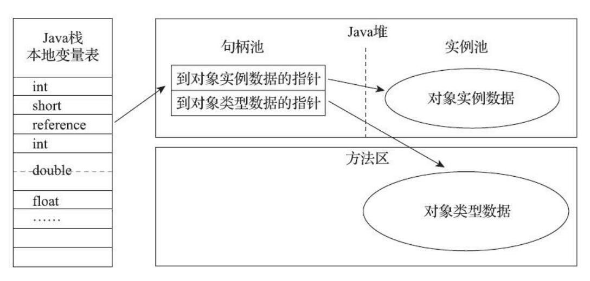

图2-2 通过句柄访问对象

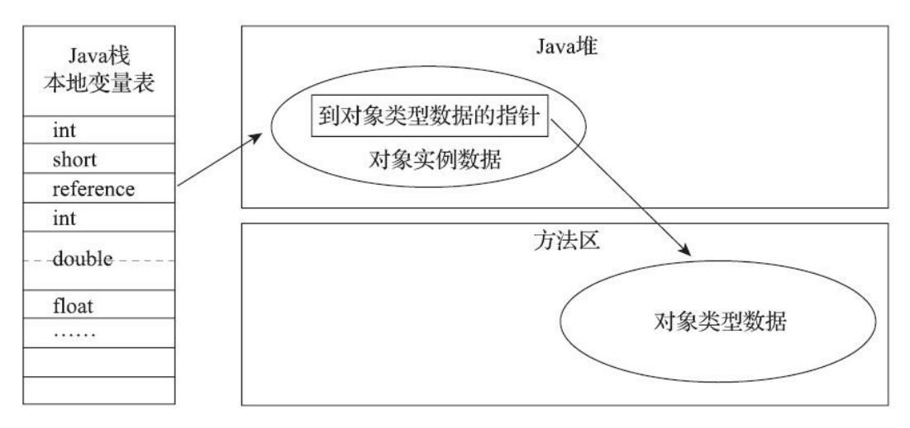

图2-3 通过直接指针访问对象

使用直接指针来访问最大的好处就是速度更快,它节省了一次指针定位的时间开销,由于对象访 问在Java中非常频繁,因此这类开销积少成多也是一项极为可观的执行成本,就本书讨论的主要虚拟 机HotSpot而言,它主要使用第二种方式进行对象访问(有例外情况,如果使用了Shenandoah收集器的 话也会有一次额外的转发,具体可参见第3章),但从整个软件开发的范围来看,在各种语言、框架中 使用句柄来访问的情况也十分常见。

#### 2.4 实战:OutOfMemoryError异常

在《Java虚拟机规范》的规定里,除了程序计数器外,虚拟机内存的其他几个运行时区域都有发 生OutOfMemoryError(下文称OOM)异常的可能,本节将通过若干实例来验证异常实际发生的代码 场景(代码清单2-3~2-9),并且将初步介绍若干最基本的与自动内存管理子系统相关的HotSpot虚拟 机参数。

本节实战的目的有两个:第一,通过代码验证《Java虚拟机规范》中描述的各个运行时区域储存 的内容;第二,希望读者在工作中遇到实际的内存溢出异常时,能根据异常的提示信息迅速得知是哪 个区域的内存溢出,知道怎样的代码可能会导致这些区域内存溢出,以及出现这些异常后该如何处 理。

本节代码清单开头都注释了执行时需要设置的虚拟机启动参数(注释中"VM Args"后面跟着的参 数),这些参数对实验的结果有直接影响,请读者调试代码的时候不要忽略掉。如果读者使用控制台 命令来执行程序,那直接跟在Java命令之后书写就可以。如果读者使用Eclipse,则可以参考图2-4在 Debug/Run页签中的设置,其他IDE工具均有类似的设置。

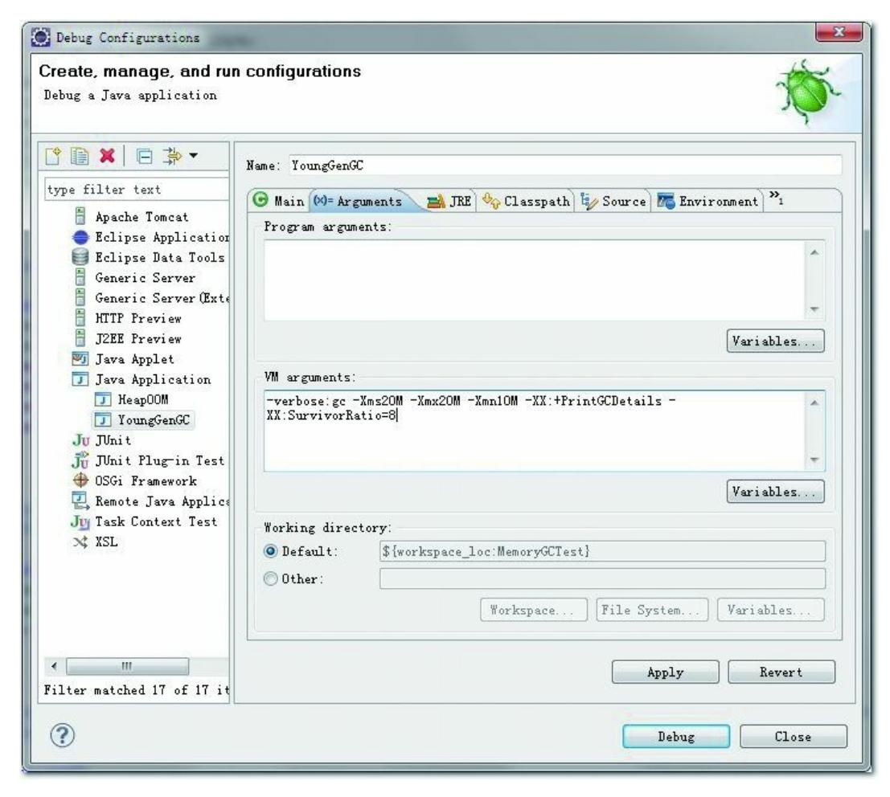

图2-4 在Eclipse的Debug页签中设置虚拟机参数

本节所列的代码均由笔者在基于OpenJDK 7中的HotSpot虚拟机上进行过实际测试,如无特殊说 明,对其他OpenJDK版本也应当适用。不过读者需意识到内存溢出异常与虚拟机本身的实现细节密切 相关,并非全是Java语言中约定的公共行为。因此,不同发行商、不同版本的Java虚拟机,其需要的参 数和程序运行的结果都很可能会有所差别。

# 2.4.1 Java堆溢出

Java堆用于储存对象实例,我们只要不断地创建对象,并且保证GC Roots到对象之间有可达路径 来避免垃圾回收机制清除这些对象,那么随着对象数量的增加,总容量触及最大堆的容量限制后就会 产生内存溢出异常。

代码清单2-3中限制Java堆的大小为20MB,不可扩展(将堆的最小值-Xms参数与最大值-Xmx参数 设置为一样即可避免堆自动扩展),通过参数-XX:+HeapDumpOnOutOf-MemoryError可以让虚拟机 在出现内存溢出异常的时候Dump出当前的内存堆转储快照以便进行事后分析[1]。

代码清单2-3 Java堆内存溢出异常测试

```
/**
 * VM Args:-Xms20m -Xmx20m -XX:+HeapDumpOnOutOfMemoryError
 * @author zzm
 */
public class HeapOOM {
    static class OOMObject {
    public static void main(String[] args) {
        List<OOMObject> list = new ArrayList<OOMObject>();
        while (true) {
            list.add(new OOMObject());
```

#### 运行结果:

```
java.lang.OutOfMemoryError: Java heap space
Dumping heap to java_pid3404.hprof ...
Heap dump file created [22045981 bytes in 0.663 secs]
```

Java堆内存的OutOfMemoryError异常是实际应用中最常见的内存溢出异常情况。出现Java堆内存 溢出时,异常堆栈信息"java.lang.OutOfMemoryError"会跟随进一步提示"Java heap space"。

要解决这个内存区域的异常,常规的处理方法是首先通过内存映像分析工具(如Eclipse Memory Analyzer)对Dump出来的堆转储快照进行分析。第一步首先应确认内存中导致OOM的对象是否是必 要的,也就是要先分清楚到底是出现了内存泄漏(Memory Leak)还是内存溢出(Memory Overflow)。图2-5显示了使用Eclipse Memory Analyzer打开的堆转储快照文件。

如果是内存泄漏,可进一步通过工具查看泄漏对象到GC Roots的引用链,找到泄漏对象是通过怎 样的引用路径、与哪些GC Roots相关联,才导致垃圾收集器无法回收它们,根据泄漏对象的类型信息 以及它到GC Roots引用链的信息,一般可以比较准确地定位到这些对象创建的位置,进而找出产生内 存泄漏的代码的具体位置。

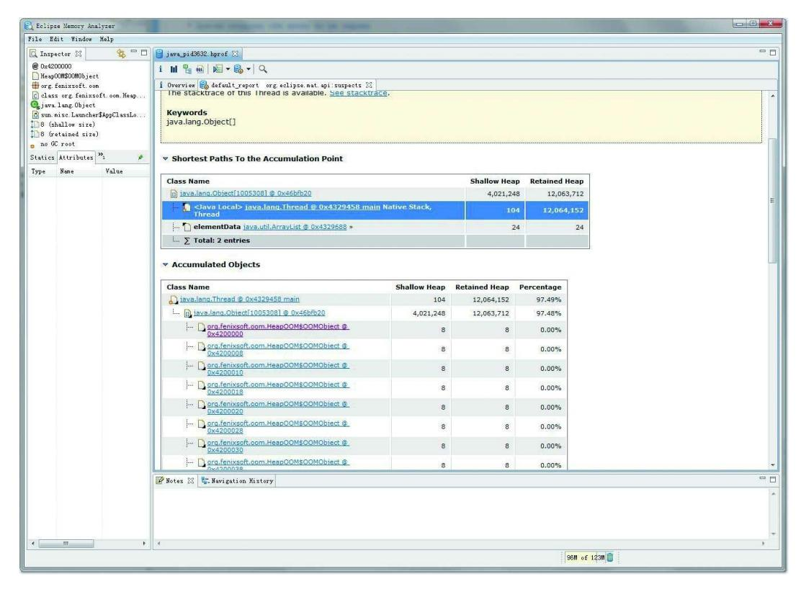

图2-5 使用Eclipse Memory Analyzer打开的堆转储快照文件

如果不是内存泄漏,换句话说就是内存中的对象确实都是必须存活的,那就应当检查Java虚拟机 的堆参数(-Xmx与-Xms)设置,与机器的内存对比,看看是否还有向上调整的空间。再从代码上检查 是否存在某些对象生命周期过长、持有状态时间过长、存储结构设计不合理等情况,尽量减少程序运 行期的内存消耗。

以上是处理Java堆内存问题的简略思路,处理这些问题所需要的知识、工具与经验是后面三章的 主题,后面我们将会针对具体的虚拟机实现、具体的垃圾收集器和具体的案例来进行分析,这里就先 暂不展开。

[1] 关于堆转储快照文件分析方面的内容,可参见第4章。

# 2.4.2 虚拟机栈和本地方法栈溢出

由于HotSpot虚拟机中并不区分虚拟机栈和本地方法栈,因此对于HotSpot来说,-Xoss参数(设置 本地方法栈大小)虽然存在,但实际上是没有任何效果的,栈容量只能由-Xss参数来设定。关于虚拟 机栈和本地方法栈,在《Java虚拟机规范》中描述了两种异常:

- 1)如果线程请求的栈深度大于虚拟机所允许的最大深度,将抛出StackOverflowError异常。
- 2)如果虚拟机的栈内存允许动态扩展,当扩展栈容量无法申请到足够的内存时,将抛出 OutOfMemoryError异常。

《Java虚拟机规范》明确允许Java虚拟机实现自行选择是否支持栈的动态扩展,而HotSpot虚拟机 的选择是不支持扩展,所以除非在创建线程申请内存时就因无法获得足够内存而出现 OutOfMemoryError异常,否则在线程运行时是不会因为扩展而导致内存溢出的,只会因为栈容量无法 容纳新的栈帧而导致StackOverflowError异常。

为了验证这点,我们可以做两个实验,先将实验范围限制在单线程中操作,尝试下面两种行为是 否能让HotSpot虚拟机产生OutOfMemoryError异常:

·使用-Xss参数减少栈内存容量。

结果:抛出StackOverflowError异常,异常出现时输出的堆栈深度相应缩小。

·定义了大量的本地变量,增大此方法帧中本地变量表的长度。

结果:抛出StackOverflowError异常,异常出现时输出的堆栈深度相应缩小。

首先,对第一种情况进行测试,具体如代码清单2-4所示。

代码清单2-4 虚拟机栈和本地方法栈测试(作为第1点测试程序)

```
/**
 * VM Args:-Xss128k
 * @author zzm
 */
public class JavaVMStackSOF {
    private int stackLength = 1;
    public void stackLeak() {
        stackLength++;
        stackLeak();
    public static void main(String[] args) throws Throwable {
        JavaVMStackSOF oom = new JavaVMStackSOF();
        try {
            oom.stackLeak();
        } catch (Throwable e) {
            System.out.println("stack length:" + oom.stackLength);
            throw e;
```

#### 运行结果:

```
stack length:2402
Exception in thread "main" java.lang.StackOverflowError
   at org.fenixsoft.oom. JavaVMStackSOF.leak(JavaVMStackSOF.java:20)
   at org.fenixsoft.oom. JavaVMStackSOF.leak(JavaVMStackSOF.java:21)
   at org.fenixsoft.oom. JavaVMStackSOF.leak(JavaVMStackSOF.java:21)
……后续异常堆栈信息省略
```

对于不同版本的Java虚拟机和不同的操作系统,栈容量最小值可能会有所限制,这主要取决于操 作系统内存分页大小。譬如上述方法中的参数-Xss128k可以正常用于32位Windows系统下的JDK 6,但 是如果用于64位Windows系统下的JDK 11,则会提示栈容量最小不能低于180K,而在Linux下这个值则 可能是228K,如果低于这个最小限制,HotSpot虚拟器启动时会给出如下提示:

```
The Java thread stack size specified is too small. Specify at least 228k
```

我们继续验证第二种情况,这次代码就显得有些"丑陋"了,为了多占局部变量表空间,笔者不得 不定义一长串变量,具体如代码清单2-5所示。

代码清单2-5 虚拟机栈和本地方法栈测试(作为第2点测试程序)

```
/**
 * @author zzm
 */
public class JavaVMStackSOF {
    private static int stackLength = 0;
    public static void test() {
        long unused1, unused2, unused3, unused4, unused5,
             unused6, unused7, unused8, unused9, unused10,
             unused11, unused12, unused13, unused14, unused15,
             unused16, unused17, unused18, unused19, unused20,
             unused21, unused22, unused23, unused24, unused25,
             unused26, unused27, unused28, unused29, unused30,
             unused31, unused32, unused33, unused34, unused35,
             unused36, unused37, unused38, unused39, unused40,
             unused41, unused42, unused43, unused44, unused45,
             unused46, unused47, unused48, unused49, unused50,
             unused51, unused52, unused53, unused54, unused55,
             unused56, unused57, unused58, unused59, unused60,
             unused61, unused62, unused63, unused64, unused65,
             unused66, unused67, unused68, unused69, unused70,
             unused71, unused72, unused73, unused74, unused75,
             unused76, unused77, unused78, unused79, unused80,
             unused81, unused82, unused83, unused84, unused85,
             unused86, unused87, unused88, unused89, unused90,
             unused91, unused92, unused93, unused94, unused95,
             unused96, unused97, unused98, unused99, unused100;
        stackLength ++;
        test();
        unused1 = unused2 = unused3 = unused4 = unused5 =
        unused6 = unused7 = unused8 = unused9 = unused10 =
        unused11 = unused12 = unused13 = unused14 = unused15 =
        unused16 = unused17 = unused18 = unused19 = unused20 =
        unused21 = unused22 = unused23 = unused24 = unused25 =
```

```
unused26 = unused27 = unused28 = unused29 = unused30 =
    unused31 = unused32 = unused33 = unused34 = unused35 =
    unused36 = unused37 = unused38 = unused39 = unused40 =
    unused41 = unused42 = unused43 = unused44 = unused45 =
    unused46 = unused47 = unused48 = unused49 = unused50 =
    unused51 = unused52 = unused53 = unused54 = unused55 =
    unused56 = unused57 = unused58 = unused59 = unused60 =
    unused61 = unused62 = unused63 = unused64 = unused65 =
    unused66 = unused67 = unused68 = unused69 = unused70 =
    unused71 = unused72 = unused73 = unused74 = unused75 =
    unused76 = unused77 = unused78 = unused79 = unused80 =
    unused81 = unused82 = unused83 = unused84 = unused85 =
    unused86 = unused87 = unused88 = unused89 = unused90 =
    unused91 = unused92 = unused93 = unused94 = unused95 =
    unused96 = unused97 = unused98 = unused99 = unused100 = 0;
public static void main(String[] args) {
    try {
        test();
    }catch (Error e){
        System.out.println("stack length:" + stackLength);
        throw e;
```

#### 运行结果:

```
stack length:5675
Exception in thread "main" java.lang.StackOverflowError
   at org.fenixsoft.oom. JavaVMStackSOF.leak(JavaVMStackSOF.java:27)
   at org.fenixsoft.oom. JavaVMStackSOF.leak(JavaVMStackSOF.java:28)
   at org.fenixsoft.oom. JavaVMStackSOF.leak(JavaVMStackSOF.java:28)
……后续异常堆栈信息省略
```

实验结果表明:无论是由于栈帧太大还是虚拟机栈容量太小,当新的栈帧内存无法分配的时候, HotSpot虚拟机抛出的都是StackOverflowError异常。可是如果在允许动态扩展栈容量大小的虚拟机 上,相同代码则会导致不一样的情况。譬如远古时代的Classic虚拟机,这款虚拟机可以支持动态扩展 栈内存的容量,在Windows上的JDK 1.0.2运行代码清单2-5的话(如果这时候要调整栈容量就应该改 用-oss参数了),得到的结果是:

```
stack length:3716
java.lang.OutOfMemoryError
   at org.fenixsoft.oom. JavaVMStackSOF.leak(JavaVMStackSOF.java:27)
   at org.fenixsoft.oom. JavaVMStackSOF.leak(JavaVMStackSOF.java:28)
   at org.fenixsoft.oom. JavaVMStackSOF.leak(JavaVMStackSOF.java:28)
……后续异常堆栈信息省略
```

可见相同的代码在Classic虚拟机中成功产生了OutOfMemoryError而不是StackOver-flowError异 常。如果测试时不限于单线程,通过不断建立线程的方式,在HotSpot上也是可以产生内存溢出异常 的,具体如代码清单2-6所示。但是这样产生的内存溢出异常和栈空间是否足够并不存在任何直接的关 系,主要取决于操作系统本身的内存使用状态。甚至可以说,在这种情况下,给每个线程的栈分配的 内存越大,反而越容易产生内存溢出异常。

原因其实不难理解,操作系统分配给每个进程的内存是有限制的,譬如32位Windows的单个进程 最大内存限制为2GB。HotSpot虚拟机提供了参数可以控制Java堆和方法区这两部分的内存的最大值, 那剩余的内存即为2GB(操作系统限制)减去最大堆容量,再减去最大方法区容量,由于程序计数器 消耗内存很小,可以忽略掉,如果把直接内存和虚拟机进程本身耗费的内存也去掉的话,剩下的内存 就由虚拟机栈和本地方法栈来分配了。因此为每个线程分配到的栈内存越大,可以建立的线程数量自 然就越少,建立线程时就越容易把剩下的内存耗尽,代码清单2-6演示了这种情况。

#### 代码清单2-6 创建线程导致内存溢出异常

```
/**
 * VM Args:-Xss2M (这时候不妨设大些,请在32位系统下运行)
 * @author zzm
 */
public class JavaVMStackOOM {
    private void dontStop() {
        while (true) {
    public void stackLeakByThread() {
        while (true) {
            Thread thread = new Thread(new Runnable() {
                @Override
                public void run() {
                    dontStop();
                }
            });
            thread.start();
    public static void main(String[] args) throws Throwable {
        JavaVMStackOOM oom = new JavaVMStackOOM();
        oom.stackLeakByThread();
```

注意 重点提示一下,如果读者要尝试运行上面这段代码,记得要先保存当前的工作,由于在 Windows平台的虚拟机中,Java的线程是映射到操作系统的内核线程上[1],无限制地创建线程会对操 作系统带来很大压力,上述代码执行时有很高的风险,可能会由于创建线程数量过多而导致操作系统 假死。

在32位操作系统下的运行结果:

Exception in thread "main" java.lang.OutOfMemoryError: unable to create native thread

出现StackOverflowError异常时,会有明确错误堆栈可供分析,相对而言比较容易定位到问题所 在。如果使用HotSpot虚拟机默认参数,栈深度在大多数情况下(因为每个方法压入栈的帧大小并不是 一样的,所以只能说大多数情况下)到达1000~2000是完全没有问题,对于正常的方法调用(包括不能 做尾递归优化的递归调用),这个深度应该完全够用了。但是,如果是建立过多线程导致的内存溢 出,在不能减少线程数量或者更换64位虚拟机的情况下,就只能通过减少最大堆和减少栈容量来换取 更多的线程。这种通过"减少内存"的手段来解决内存溢出的方式,如果没有这方面处理经验,一般比 较难以想到,这一点读者需要在开发32位系统的多线程应用时注意。也是由于这种问题较为隐蔽,从 JDK 7起,以上提示信息中"unable to create native thread"后面,虚拟机会特别注明原因可能是"possibly

out of memory or process/resource limits reached"。

[1] 关于虚拟机线程实现方面的内容可以参考本书第12章。

### 2.4.3 方法区和运行时常量池溢出

由于运行时常量池是方法区的一部分,所以这两个区域的溢出测试可以放到一起进行。前面曾经 提到HotSpot从JDK 7开始逐步"去永久代"的计划,并在JDK 8中完全使用元空间来代替永久代的背景 故事,在此我们就以测试代码来观察一下,使用"永久代"还是"元空间"来实现方法区,对程序有什么 实际的影响。

String::intern()是一个本地方法,它的作用是如果字符串常量池中已经包含一个等于此String对象的 字符串,则返回代表池中这个字符串的String对象的引用;否则,会将此String对象包含的字符串添加 到常量池中,并且返回此String对象的引用。在JDK 6或更早之前的HotSpot虚拟机中,常量池都是分配 在永久代中,我们可以通过-XX:PermSize和-XX:MaxPermSize限制永久代的大小,即可间接限制其 中常量池的容量,具体实现如代码清单2-7所示,请读者测试时首先以JDK 6来运行代码。

代码清单2-7 运行时常量池导致的内存溢出异常

```
/**
* VM Args:-XX:PermSize=6M -XX:MaxPermSize=6M
* @author zzm
*/
public class RuntimeConstantPoolOOM {
   public static void main(String[] args) {
       // 使用Set保持着常量池引用,避免Full GC回收常量池行为
       Set<String> set = new HashSet<String>();
       // 在short范围内足以让6MB的PermSize产生OOM了
       short i = 0;
       while (true) {
           set.add(String.valueOf(i++).intern());
```

#### 运行结果:

```
Exception in thread "main" java.lang.OutOfMemoryError: PermGen space
    at java.lang.String.intern(Native Method)
    at org.fenixsoft.oom.RuntimeConstantPoolOOM.main(RuntimeConstantPoolOOM.java: 18)
```

从运行结果中可以看到,运行时常量池溢出时,在OutOfMemoryError异常后面跟随的提示信息 是"PermGen space",说明运行时常量池的确是属于方法区(即JDK 6的HotSpot虚拟机中的永久代)的 一部分。

而使用JDK 7或更高版本的JDK来运行这段程序并不会得到相同的结果,无论是在JDK 7中继续使 用-XX:MaxPermSize参数或者在JDK 8及以上版本使用-XX:MaxMeta-spaceSize参数把方法区容量同 样限制在6MB,也都不会重现JDK 6中的溢出异常,循环将一直进行下去,永不停歇[1]。出现这种变 化,是因为自JDK 7起,原本存放在永久代的字符串常量池被移至Java堆之中,所以在JDK 7及以上版 本,限制方法区的容量对该测试用例来说是毫无意义的。这时候使用-Xmx参数限制最大堆到6MB就能 够看到以下两种运行结果之一,具体取决于哪里的对象分配时产生了溢出:

```
// OOM异常一:
Exception in thread "main" java.lang.OutOfMemoryError: Java heap space
    at java.base/java.lang.Integer.toString(Integer.java:440)
    at java.base/java.lang.String.valueOf(String.java:3058)
    at RuntimeConstantPoolOOM.main(RuntimeConstantPoolOOM.java:12)
// OOM异常二:
Exception in thread "main" java.lang.OutOfMemoryError: Java heap space
    at java.base/java.util.HashMap.resize(HashMap.java:699)
    at java.base/java.util.HashMap.putVal(HashMap.java:658)
    at java.base/java.util.HashMap.put(HashMap.java:607)
    at java.base/java.util.HashSet.add(HashSet.java:220)
    at RuntimeConstantPoolOOM.main(RuntimeConstantPoolOOM.java from InputFile-Object:14)
```

关于这个字符串常量池的实现在哪里出现问题,还可以引申出一些更有意思的影响,具体见代码 清单2-8所示。

#### 代码清单2-8 String.intern()返回引用的测试

```
public class RuntimeConstantPoolOOM {
    public static void main(String[] args) {
        String str1 = new StringBuilder("计算机").append("软件").toString();
        System.out.println(str1.intern() == str1);
        String str2 = new StringBuilder("ja").append("va").toString();
        System.out.println(str2.intern() == str2);
```

这段代码在JDK 6中运行,会得到两个false,而在JDK 7中运行,会得到一个true和一个false。产 生差异的原因是,在JDK 6中,intern()方法会把首次遇到的字符串实例复制到永久代的字符串常量池 中存储,返回的也是永久代里面这个字符串实例的引用,而由StringBuilder创建的字符串对象实例在 Java堆上,所以必然不可能是同一个引用,结果将返回false。

而JDK 7(以及部分其他虚拟机,例如JRockit)的intern()方法实现就不需要再拷贝字符串的实例 到永久代了,既然字符串常量池已经移到Java堆中,那只需要在常量池里记录一下首次出现的实例引 用即可,因此intern()返回的引用和由StringBuilder创建的那个字符串实例就是同一个。而对str2比较返 回false,这是因为"java" [2]这个字符串在执行String-Builder.toString()之前就已经出现过了,字符串常量 池中已经有它的引用,不符合intern()方法要求"首次遇到"的原则,"计算机软件"这个字符串则是首次 出现的,因此结果返回true。

我们再来看看方法区的其他部分的内容,方法区的主要职责是用于存放类型的相关信息,如类 名、访问修饰符、常量池、字段描述、方法描述等。对于这部分区域的测试,基本的思路是运行时产 生大量的类去填满方法区,直到溢出为止。虽然直接使用Java SE API也可以动态产生类(如反射时的 GeneratedConstructorAccessor和动态代理等),但在本次实验中操作起来比较麻烦。在代码清单2-8里 笔者借助了CGLib [3]直接操作字节码运行时生成了大量的动态类。

值得特别注意的是,我们在这个例子中模拟的场景并非纯粹是一个实验,类似这样的代码确实可 能会出现在实际应用中:当前的很多主流框架,如Spring、Hibernate对类进行增强时,都会使用到 CGLib这类字节码技术,当增强的类越多,就需要越大的方法区以保证动态生成的新类型可以载入内

存。另外,很多运行于Java虚拟机上的动态语言(例如Groovy等)通常都会持续创建新类型来支撑语 言的动态性,随着这类动态语言的流行,与代码清单2-9相似的溢出场景也越来越容易遇到。

#### 代码清单2-9 借助CGLib使得方法区出现内存溢出异常

```
/**
 * VM Args:-XX:PermSize=10M -XX:MaxPermSize=10M
 * @author zzm
 */
public class JavaMethodAreaOOM {
    public static void main(String[] args) {
        while (true) {
            Enhancer enhancer = new Enhancer();
            enhancer.setSuperclass(OOMObject.class);
            enhancer.setUseCache(false);
            enhancer.setCallback(new MethodInterceptor() {
                public Object intercept(Object obj, Method method, Object[] args, MethodProxy proxy) throws Throwable {
                    return proxy.invokeSuper(obj, args);
                }
            });
            enhancer.create();
    static class OOMObject {
```

#### 在JDK 7中的运行结果:

```
Caused by: java.lang.OutOfMemoryError: PermGen space
    at java.lang.ClassLoader.defineClass1(Native Method)
    at java.lang.ClassLoader.defineClassCond(ClassLoader.java:632)
    at java.lang.ClassLoader.defineClass(ClassLoader.java:616)
    ... 8 more
```

方法区溢出也是一种常见的内存溢出异常,一个类如果要被垃圾收集器回收,要达成的条件是比 较苛刻的。在经常运行时生成大量动态类的应用场景里,就应该特别关注这些类的回收状况。这类场 景除了之前提到的程序使用了CGLib字节码增强和动态语言外,常见的还有:大量JSP或动态产生JSP 文件的应用(JSP第一次运行时需要编译为Java类)、基于OSGi的应用(即使是同一个类文件,被不同 的加载器加载也会视为不同的类)等。

在JDK 8以后,永久代便完全退出了历史舞台,元空间作为其替代者登场。在默认设置下,前面 列举的那些正常的动态创建新类型的测试用例已经很难再迫使虚拟机产生方法区的溢出异常了。不过 为了让使用者有预防实际应用里出现类似于代码清单2-9那样的破坏性的操作,HotSpot还是提供了一 些参数作为元空间的防御措施,主要包括:

·-XX:MaxMetaspaceSize:设置元空间最大值,默认是-1,即不限制,或者说只受限于本地内存 大小。

·-XX:MetaspaceSize:指定元空间的初始空间大小,以字节为单位,达到该值就会触发垃圾收集 进行类型卸载,同时收集器会对该值进行调整:如果释放了大量的空间,就适当降低该值;如果释放 了很少的空间,那么在不超过-XX:MaxMetaspaceSize(如果设置了的话)的情况下,适当提高该

- ·-XX:MinMetaspaceFreeRatio:作用是在垃圾收集之后控制最小的元空间剩余容量的百分比,可 减少因为元空间不足导致的垃圾收集的频率。类似的还有-XX:Max-MetaspaceFreeRatio,用于控制最 大的元空间剩余容量的百分比。
- [1] 正常情况下是永不停歇的,如果机器内存紧张到连几MB的Java堆都挤不出来的这种极端情况就不 讨论了。
- [2] 它是在加载sun.misc.Version这个类的时候进入常量池的。本书第2版并未解释java这个字符串此前是 哪里出现的,所以被批评"挖坑不填了"(无奈地摊手)。如读者感兴趣是如何找出来的,可参考RednaxelaFX的知乎回答(https://www.zhihu.com/question/51102308/answer/124441115)。
- [3] CGLib开源项目:http://cglib.sourceforge.net/。

# 2.4.4 本机直接内存溢出

直接内存(Direct Memory)的容量大小可通过-XX:MaxDirectMemorySize参数来指定,如果不 去指定,则默认与Java堆最大值(由-Xmx指定)一致,代码清单2-10越过了DirectByteBuffer类直接通 过反射获取Unsafe实例进行内存分配(Unsafe类的getUnsafe()方法指定只有引导类加载器才会返回实 例,体现了设计者希望只有虚拟机标准类库里面的类才能使用Unsafe的功能,在JDK 10时才将Unsafe 的部分功能通过VarHandle开放给外部使用),因为虽然使用DirectByteBuffer分配内存也会抛出内存溢 出异常,但它抛出异常时并没有真正向操作系统申请分配内存,而是通过计算得知内存无法分配就会 在代码里手动抛出溢出异常,真正申请分配内存的方法是Unsafe::allocateMemory()。

#### 代码清单2-10 使用unsafe分配本机内存

```
/**
 * VM Args:-Xmx20M -XX:MaxDirectMemorySize=10M
 * @author zzm
 */
public class DirectMemoryOOM {
    private static final int _1MB = 1024 * 1024;
    public static void main(String[] args) throws Exception {
        Field unsafeField = Unsafe.class.getDeclaredFields()[0];
        unsafeField.setAccessible(true);
        Unsafe unsafe = (Unsafe) unsafeField.get(null);
        while (true) {
            unsafe.allocateMemory(_1MB);
```

#### 运行结果:

```
Exception in thread "main" java.lang.OutOfMemoryError
    at sun.misc.Unsafe.allocateMemory(Native Method)
    at org.fenixsoft.oom.DMOOM.main(DMOOM.java:20)
```

由直接内存导致的内存溢出,一个明显的特征是在Heap Dump文件中不会看见有什么明显的异常 情况,如果读者发现内存溢出之后产生的Dump文件很小,而程序中又直接或间接使用了 DirectMemory(典型的间接使用就是NIO),那就可以考虑重点检查一下直接内存方面的原因了。

### 2.5 本章小结

到此为止,我们明白了虚拟机里面的内存是如何划分的,哪部分区域、什么样的代码和操作可能 导致内存溢出异常。虽然Java有垃圾收集机制,但内存溢出异常离我们并不遥远,本章只是讲解了各 个区域出现内存溢出异常的原因,下一章将详细讲解Java垃圾收集机制为了避免出现内存溢出异常都 做了哪些努力。

# 第3章 垃圾收集器与内存分配策略

Java与C++之间有一堵由内存动态分配和垃圾收集技术所围成的高墙,墙外面的人想进去,墙里 面的人却想出来。

#### 3.1 概述

说起垃圾收集(Garbage Collection,下文简称GC),有不少人把这项技术当作Java语言的伴生产 物。事实上,垃圾收集的历史远远比Java久远,在1960年诞生于麻省理工学院的Lisp是第一门开始使 用内存动态分配和垃圾收集技术的语言。当Lisp还在胚胎时期时,其作者John McCarthy就思考过垃圾 收集需要完成的三件事情:

- ·哪些内存需要回收?
- ·什么时候回收?
- ·如何回收?

经过半个世纪的发展,今天的内存动态分配与内存回收技术已经相当成熟,一切看起来都进入 了"自动化"时代,那为什么我们还要去了解垃圾收集和内存分配?答案很简单:当需要排查各种内存 溢出、内存泄漏问题时,当垃圾收集成为系统达到更高并发量的瓶颈时,我们就必须对这些"自动 化"的技术实施必要的监控和调节。

把时间从大半个世纪以前拨回到现在,舞台也回到我们熟悉的Java语言。第2章介绍了Java内存运 行时区域的各个部分,其中程序计数器、虚拟机栈、本地方法栈3个区域随线程而生,随线程而灭,栈 中的栈帧随着方法的进入和退出而有条不紊地执行着出栈和入栈操作。每一个栈帧中分配多少内存基 本上是在类结构确定下来时就已知的(尽管在运行期会由即时编译器进行一些优化,但在基于概念模 型的讨论里,大体上可以认为是编译期可知的),因此这几个区域的内存分配和回收都具备确定性, 在这几个区域内就不需要过多考虑如何回收的问题,当方法结束或者线程结束时,内存自然就跟随着 回收了。

而Java堆和方法区这两个区域则有着很显著的不确定性:一个接口的多个实现类需要的内存可能 会不一样,一个方法所执行的不同条件分支所需要的内存也可能不一样,只有处于运行期间,我们才 能知道程序究竟会创建哪些对象,创建多少个对象,这部分内存的分配和回收是动态的。垃圾收集器 所关注的正是这部分内存该如何管理,本文后续讨论中的"内存"分配与回收也仅仅特指这一部分内 存。

### 3.2 对象已死?

在堆里面存放着Java世界中几乎所有的对象实例,垃圾收集器在对堆进行回收前,第一件事情就 是要确定这些对象之中哪些还"存活"着,哪些已经"死去"("死去"即不可能再被任何途径使用的对 象)了。

# 3.2.1 引用计数算法

很多教科书判断对象是否存活的算法是这样的:在对象中添加一个引用计数器,每当有一个地方 引用它时,计数器值就加一;当引用失效时,计数器值就减一;任何时刻计数器为零的对象就是不可 能再被使用的。笔者面试过很多应届生和一些有多年工作经验的开发人员,他们对于这个问题给予的 都是这个答案。

客观地说,引用计数算法(Reference Counting)虽然占用了一些额外的内存空间来进行计数,但 它的原理简单,判定效率也很高,在大多数情况下它都是一个不错的算法。也有一些比较著名的应用 案例,例如微软COM(Component Object Model)技术、使用ActionScript 3的FlashPlayer、Python语 言以及在游戏脚本领域得到许多应用的Squirrel中都使用了引用计数算法进行内存管理。但是,在Java 领域,至少主流的Java虚拟机里面都没有选用引用计数算法来管理内存,主要原因是,这个看似简单 的算法有很多例外情况要考虑,必须要配合大量额外处理才能保证正确地工作,譬如单纯的引用计数 就很难解决对象之间相互循环引用的问题。

举个简单的例子,请看代码清单3-1中的testGC()方法:对象objA和objB都有字段instance,赋值令 objA.instance=objB及objB.instance=objA,除此之外,这两个对象再无任何引用,实际上这两个对象已 经不可能再被访问,但是它们因为互相引用着对方,导致它们的引用计数都不为零,引用计数算法也 就无法回收它们。

代码清单3-1 引用计数算法的缺陷

```
/**
* testGC()方法执行后,objA和objB会不会被GC呢?
* @author zzm
*/
public class ReferenceCountingGC {
   public Object instance = null;
   private static final int _1MB = 1024 * 1024;
   /**
    * 这个成员属性的唯一意义就是占点内存,以便能在GC日志中看清楚是否有回收过
    */
   private byte[] bigSize = new byte[2 * _1MB];
   public static void testGC() {
       ReferenceCountingGC objA = new ReferenceCountingGC();
       ReferenceCountingGC objB = new ReferenceCountingGC();
       objA.instance = objB;
       objB.instance = objA;
       objA = null;
       objB = null;
       // 假设在这行发生GC,objA和objB是否能被回收?
       System.gc();
```

#### 运行结果:

```
[Full GC (System) [Tenured: 0K->210K(10240K), 0.0149142 secs] 4603K->210K(19456K), [Perm : 2999K->2999K(21248K)], 0.0150007 secs] [Times: user=0.01 sys=0.00, real=0.02 secs]
Heap
```

```
def new generation total 9216K, used 82K [0x00000000055e0000, 0x0000000005fe0000, 0x0000000005fe0000)
Eden space 8192K, 1% used [0x00000000055e0000, 0x00000000055f4850, 0x0000000005de0000)
from space 1024K, 0% used [0x0000000005de0000, 0x0000000005de0000, 0x0000000005ee0000)
to space 1024K, 0% used [0x0000000005ee0000, 0x0000000005ee0000, 0x0000000005fe0000)
tenured generation total 10240K, used 210K [0x0000000005fe0000, 0x00000000069e0000, 0x00000000069e0000)
the space 10240K, 2% used [0x0000000005fe0000, 0x0000000006014a18, 0x0000000006014c00, 0x00000000069e0000)
compacting perm gen total 21248K, used 3016K [0x00000000069e0000, 0x0000000007ea0000, 0x000000000bde0000)
the space 21248K, 14% used [0x00000000069e0000, 0x0000000006cd2398, 0x0000000006cd2400, 0x0000000007ea0000)
No shared spaces configured.
```

从运行结果中可以清楚看到内存回收日志中包含"4603K->210K",意味着虚拟机并没有因为这两 个对象互相引用就放弃回收它们,这也从侧面说明了Java虚拟机并不是通过引用计数算法来判断对象 是否存活的。

# 3.2.2 可达性分析算法

当前主流的商用程序语言(Java、C#,上溯至前面提到的古老的Lisp)的内存管理子系统,都是 通过可达性分析(Reachability Analysis)算法来判定对象是否存活的。这个算法的基本思路就是通过 一系列称为"GC Roots"的根对象作为起始节点集,从这些节点开始,根据引用关系向下搜索,搜索过 程所走过的路径称为"引用链"(Reference Chain),如果某个对象到GC Roots间没有任何引用链相连, 或者用图论的话来说就是从GC Roots到这个对象不可达时,则证明此对象是不可能再被使用的。

如图3-1所示,对象object 5、object 6、object 7虽然互有关联,但是它们到GC Roots是不可达的, 因此它们将会被判定为可回收的对象。

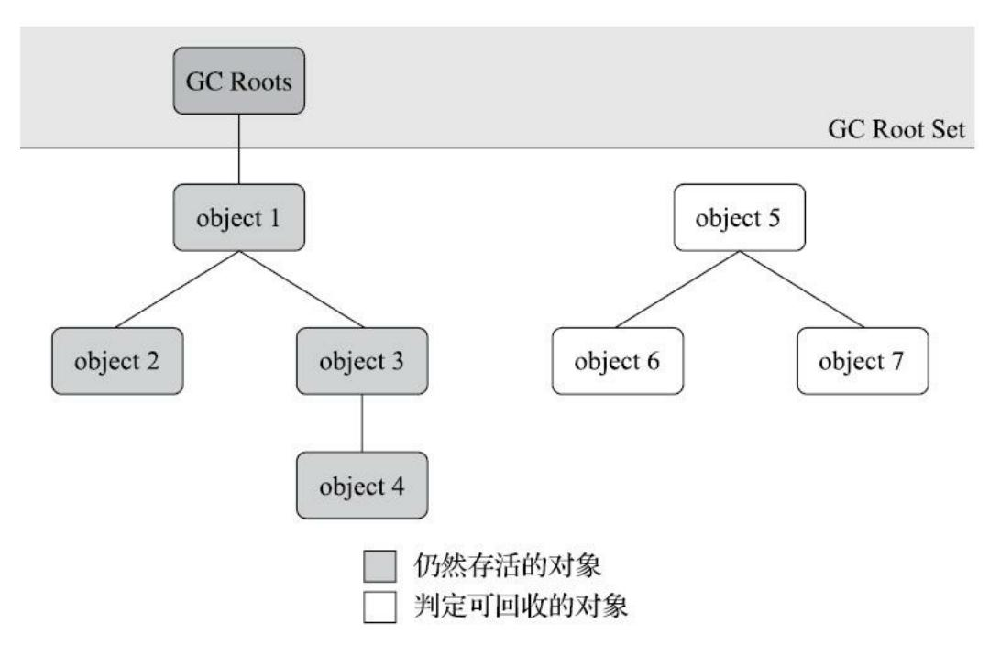

图3-1 利用可达性分析算法判定对象是否可回收

在Java技术体系里面,固定可作为GC Roots的对象包括以下几种:

- ·在虚拟机栈(栈帧中的本地变量表)中引用的对象,譬如各个线程被调用的方法堆栈中使用到的 参数、局部变量、临时变量等。
  - ·在方法区中类静态属性引用的对象,譬如Java类的引用类型静态变量。
  - ·在方法区中常量引用的对象,譬如字符串常量池(String Table)里的引用。

- ·在本地方法栈中JNI(即通常所说的Native方法)引用的对象。
- ·Java虚拟机内部的引用,如基本数据类型对应的Class对象,一些常驻的异常对象(比如 NullPointExcepiton、OutOfMemoryError)等,还有系统类加载器。
  - ·所有被同步锁(synchronized关键字)持有的对象。
  - ·反映Java虚拟机内部情况的JMXBean、JVMTI中注册的回调、本地代码缓存等。

除了这些固定的GC Roots集合以外,根据用户所选用的垃圾收集器以及当前回收的内存区域不 同,还可以有其他对象"临时性"地加入,共同构成完整GC Roots集合。譬如后文将会提到的分代收集 和局部回收(Partial GC),如果只针对Java堆中某一块区域发起垃圾收集时(如最典型的只针对新生 代的垃圾收集),必须考虑到内存区域是虚拟机自己的实现细节(在用户视角里任何内存区域都是不 可见的),更不是孤立封闭的,所以某个区域里的对象完全有可能被位于堆中其他区域的对象所引 用,这时候就需要将这些关联区域的对象也一并加入GC Roots集合中去,才能保证可达性分析的正确 性。

目前最新的几款垃圾收集器[1]无一例外都具备了局部回收的特征,为了避免GC Roots包含过多对 象而过度膨胀,它们在实现上也做出了各种优化处理。关于这些概念、优化技巧以及各种不同收集器 实现等内容,都将在本章后续内容中一一介绍。

[1] 如OpenJDK中的G1、Shenandoah、ZGC以及Azul的PGC、C4这些收集器。

# 3.2.3 再谈引用

无论是通过引用计数算法判断对象的引用数量,还是通过可达性分析算法判断对象是否引用链可 达,判定对象是否存活都和"引用"离不开关系。在JDK 1.2版之前,Java里面的引用是很传统的定义: 如果reference类型的数据中存储的数值代表的是另外一块内存的起始地址,就称该reference数据是代表 某块内存、某个对象的引用。这种定义并没有什么不对,只是现在看来有些过于狭隘了,一个对象在 这种定义下只有"被引用"或者"未被引用"两种状态,对于描述一些"食之无味,弃之可惜"的对象就显 得无能为力。譬如我们希望能描述一类对象:当内存空间还足够时,能保留在内存之中,如果内存空 间在进行垃圾收集后仍然非常紧张,那就可以抛弃这些对象——很多系统的缓存功能都符合这样的应 用场景。

在JDK 1.2版之后,Java对引用的概念进行了扩充,将引用分为强引用(Strongly Re-ference)、软 引用(Soft Reference)、弱引用(Weak Reference)和虚引用(Phantom Reference)4种,这4种引用强 度依次逐渐减弱。

·强引用是最传统的"引用"的定义,是指在程序代码之中普遍存在的引用赋值,即类似"Object obj=new Object()"这种引用关系。无论任何情况下,只要强引用关系还存在,垃圾收集器就永远不会回 收掉被引用的对象。

·软引用是用来描述一些还有用,但非必须的对象。只被软引用关联着的对象,在系统将要发生内 存溢出异常前,会把这些对象列进回收范围之中进行第二次回收,如果这次回收还没有足够的内存, 才会抛出内存溢出异常。在JDK 1.2版之后提供了SoftReference类来实现软引用。

·弱引用也是用来描述那些非必须对象,但是它的强度比软引用更弱一些,被弱引用关联的对象只 能生存到下一次垃圾收集发生为止。当垃圾收集器开始工作,无论当前内存是否足够,都会回收掉只 被弱引用关联的对象。在JDK 1.2版之后提供了WeakReference类来实现弱引用。

·虚引用也称为"幽灵引用"或者"幻影引用",它是最弱的一种引用关系。一个对象是否有虚引用的 存在,完全不会对其生存时间构成影响,也无法通过虚引用来取得一个对象实例。为一个对象设置虚 引用关联的唯一目的只是为了能在这个对象被收集器回收时收到一个系统通知。在JDK 1.2版之后提供 了PhantomReference类来实现虚引用。

# 3.2.4 生存还是死亡?

即使在可达性分析算法中判定为不可达的对象,也不是"非死不可"的,这时候它们暂时还处于"缓 刑"阶段,要真正宣告一个对象死亡,至少要经历两次标记过程:如果对象在进行可达性分析后发现没 有与GC Roots相连接的引用链,那它将会被第一次标记,随后进行一次筛选,筛选的条件是此对象是 否有必要执行finalize()方法。假如对象没有覆盖finalize()方法,或者finalize()方法已经被虚拟机调用 过,那么虚拟机将这两种情况都视为"没有必要执行"。

如果这个对象被判定为确有必要执行finalize()方法,那么该对象将会被放置在一个名为F-Queue的 队列之中,并在稍后由一条由虚拟机自动建立的、低调度优先级的Finalizer线程去执行它们的finalize() 方法。这里所说的"执行"是指虚拟机会触发这个方法开始运行,但并不承诺一定会等待它运行结束。 这样做的原因是,如果某个对象的finalize()方法执行缓慢,或者更极端地发生了死循环,将很可能导 致F-Queue队列中的其他对象永久处于等待,甚至导致整个内存回收子系统的崩溃。finalize()方法是对 象逃脱死亡命运的最后一次机会,稍后收集器将对F-Queue中的对象进行第二次小规模的标记,如果对 象要在finalize()中成功拯救自己——只要重新与引用链上的任何一个对象建立关联即可,譬如把自己 (this关键字)赋值给某个类变量或者对象的成员变量,那在第二次标记时它将被移出"即将回收"的集 合;如果对象这时候还没有逃脱,那基本上它就真的要被回收了。从代码清单3-2中我们可以看到一个 对象的finalize()被执行,但是它仍然可以存活。

代码清单3-2 一次对象自我拯救的演示

```
/**
* 此代码演示了两点:
* 1.对象可以在被GC时自我拯救。
* 2.这种自救的机会只有一次,因为一个对象的finalize()方法最多只会被系统自动调用一次
* @author zzm
*/
public class FinalizeEscapeGC {
   public static FinalizeEscapeGC SAVE_HOOK = null;
   public void isAlive() {
       System.out.println("yes, i am still alive :)");
   @Override
   protected void finalize() throws Throwable {
       super.finalize();
       System.out.println("finalize method executed!");
       FinalizeEscapeGC.SAVE_HOOK = this;
   public static void main(String[] args) throws Throwable {
       SAVE_HOOK = new FinalizeEscapeGC();
       //对象第一次成功拯救自己
       SAVE_HOOK = null;
       System.gc();
       // 因为Finalizer方法优先级很低,暂停0.5秒,以等待它
       Thread.sleep(500);
       if (SAVE_HOOK != null) {
           SAVE_HOOK.isAlive();
       } else {
           System.out.println("no, i am dead :(");
       // 下面这段代码与上面的完全相同,但是这次自救却失败了
```

```
SAVE_HOOK = null;
System.gc();
// 因为Finalizer方法优先级很低,暂停0.5秒,以等待它
Thread.sleep(500);
if (SAVE_HOOK != null) {
   SAVE_HOOK.isAlive();
} else {
   System.out.println("no, i am dead :(");
```

#### 运行结果:

```
finalize method executed!
yes, i am still alive :)
no, i am dead :(
```

从代码清单3-2的运行结果可以看到,SAVE\_HOOK对象的finalize()方法确实被垃圾收集器触发 过,并且在被收集前成功逃脱了。

另外一个值得注意的地方就是,代码中有两段完全一样的代码片段,执行结果却是一次逃脱成 功,一次失败了。这是因为任何一个对象的finalize()方法都只会被系统自动调用一次,如果对象面临 下一次回收,它的finalize()方法不会被再次执行,因此第二段代码的自救行动失败了。

还有一点需要特别说明,上面关于对象死亡时finalize()方法的描述可能带点悲情的艺术加工,笔 者并不鼓励大家使用这个方法来拯救对象。相反,笔者建议大家尽量避免使用它,因为它并不能等同 于C和C++语言中的析构函数,而是Java刚诞生时为了使传统C、C++程序员更容易接受Java所做出的一 项妥协。它的运行代价高昂,不确定性大,无法保证各个对象的调用顺序,如今已被官方明确声明为 不推荐使用的语法。有些教材中描述它适合做"关闭外部资源"之类的清理性工作,这完全是对finalize() 方法用途的一种自我安慰。finalize()能做的所有工作,使用try-finally或者其他方式都可以做得更好、 更及时,所以笔者建议大家完全可以忘掉Java语言里面的这个方法。

# 3.2.5 回收方法区

有些人认为方法区(如HotSpot虚拟机中的元空间或者永久代)是没有垃圾收集行为的,《Java虚 拟机规范》中提到过可以不要求虚拟机在方法区中实现垃圾收集,事实上也确实有未实现或未能完整 实现方法区类型卸载的收集器存在(如JDK 11时期的ZGC收集器就不支持类卸载),方法区垃圾收集 的"性价比"通常也是比较低的:在Java堆中,尤其是在新生代中,对常规应用进行一次垃圾收集通常 可以回收70%至99%的内存空间,相比之下,方法区回收囿于苛刻的判定条件,其区域垃圾收集的回 收成果往往远低于此。

方法区的垃圾收集主要回收两部分内容:废弃的常量和不再使用的类型。回收废弃常量与回收 Java堆中的对象非常类似。举个常量池中字面量回收的例子,假如一个字符串"java"曾经进入常量池 中,但是当前系统又没有任何一个字符串对象的值是"java",换句话说,已经没有任何字符串对象引用 常量池中的"java"常量,且虚拟机中也没有其他地方引用这个字面量。如果在这时发生内存回收,而且 垃圾收集器判断确有必要的话,这个"java"常量就将会被系统清理出常量池。常量池中其他类(接 口)、方法、字段的符号引用也与此类似。

判定一个常量是否"废弃"还是相对简单,而要判定一个类型是否属于"不再被使用的类"的条件就 比较苛刻了。需要同时满足下面三个条件:

- ·该类所有的实例都已经被回收,也就是Java堆中不存在该类及其任何派生子类的实例。
- ·加载该类的类加载器已经被回收,这个条件除非是经过精心设计的可替换类加载器的场景,如 OSGi、JSP的重加载等,否则通常是很难达成的。
- ·该类对应的java.lang.Class对象没有在任何地方被引用,无法在任何地方通过反射访问该类的方 法。

Java虚拟机被允许对满足上述三个条件的无用类进行回收,这里说的仅仅是"被允许",而并不是 和对象一样,没有引用了就必然会回收。关于是否要对类型进行回收,HotSpot虚拟机提供了-Xnoclassgc参数进行控制,还可以使用-verbose:class以及-XX:+TraceClass-Loading、-XX: +TraceClassUnLoading查看类加载和卸载信息,其中-verbose:class和-XX:+TraceClassLoading可以在 Product版的虚拟机中使用,-XX:+TraceClassUnLoading参数需要FastDebug版[1]的虚拟机支持。

在大量使用反射、动态代理、CGLib等字节码框架,动态生成JSP以及OSGi这类频繁自定义类加载 器的场景中,通常都需要Java虚拟机具备类型卸载的能力,以保证不会对方法区造成过大的内存压 力。

[1] Product版、FastDebug版HotSpot虚拟机的差别可参见前文1.6节。

# 3.3 垃圾收集算法

垃圾收集算法的实现涉及大量的程序细节,且各个平台的虚拟机操作内存的方法都有差异,在本 节中我们暂不过多讨论算法实现,只重点介绍分代收集理论和几种算法思想及其发展过程。如果读者 对其中的理论细节感兴趣,推荐阅读Richard Jones撰写的《垃圾回收算法手册》[1]的第2~4章的相关 内容。

从如何判定对象消亡的角度出发,垃圾收集算法可以划分为"引用计数式垃圾收集"(Reference Counting GC)和"追踪式垃圾收集"(Tracing GC)两大类,这两类也常被称作"直接垃圾收集"和"间接 垃圾收集"。由于引用计数式垃圾收集算法在本书讨论到的主流Java虚拟机中均未涉及,所以我们暂不 把它作为正文主要内容来讲解,本节介绍的所有算法均属于追踪式垃圾收集的范畴。

[1] 原著名为《The Garbage Collection Handbook》,2011年出版,中文版在2016年由机械工业出版社翻 译引进国内。

# 3.3.1 分代收集理论

当前商业虚拟机的垃圾收集器,大多数都遵循了"分代收集"(Generational Collection)[1]的理论进 行设计,分代收集名为理论,实质是一套符合大多数程序运行实际情况的经验法则,它建立在两个分 代假说之上:

- 1)弱分代假说(Weak Generational Hypothesis):绝大多数对象都是朝生夕灭的。
- 2)强分代假说(Strong Generational Hypothesis):熬过越多次垃圾收集过程的对象就越难以消 亡。

这两个分代假说共同奠定了多款常用的垃圾收集器的一致的设计原则:收集器应该将Java堆划分 出不同的区域,然后将回收对象依据其年龄(年龄即对象熬过垃圾收集过程的次数)分配到不同的区 域之中存储。显而易见,如果一个区域中大多数对象都是朝生夕灭,难以熬过垃圾收集过程的话,那 么把它们集中放在一起,每次回收时只关注如何保留少量存活而不是去标记那些大量将要被回收的对 象,就能以较低代价回收到大量的空间;如果剩下的都是难以消亡的对象,那把它们集中放在一块, 虚拟机便可以使用较低的频率来回收这个区域,这就同时兼顾了垃圾收集的时间开销和内存的空间有 效利用。

在Java堆划分出不同的区域之后,垃圾收集器才可以每次只回收其中某一个或者某些部分的区域 ——因而才有了"Minor GC""Major GC""Full GC"这样的回收类型的划分;也才能够针对不同的区域安 排与里面存储对象存亡特征相匹配的垃圾收集算法——因而发展出了"标记-复制算法""标记-清除算 法""标记-整理算法"等针对性的垃圾收集算法。这里笔者提前提及了一些新的名词,它们都是本章的 重要角色,稍后都会逐一登场,现在读者只需要知道,这一切的出现都始于分代收集理论。

把分代收集理论具体放到现在的商用Java虚拟机里,设计者一般至少会把Java堆划分为新生代 (Young Generation)和老年代(Old Generation)两个区域[2]。顾名思义,在新生代中,每次垃圾收集 时都发现有大批对象死去,而每次回收后存活的少量对象,将会逐步晋升到老年代中存放。如果读者 有兴趣阅读HotSpot虚拟机源码的话,会发现里面存在着一些名为"\*Generation"的实现, 如"DefNewGeneration"和"ParNewGeneration"等,这些就是HotSpot的"分代式垃圾收集器框架"。原本 HotSpot鼓励开发者尽量在这个框架内开发新的垃圾收集器,但除了最早期的两组四款收集器之外,后 来的开发者并没有继续遵循。导致此事的原因有很多,最根本的是分代收集理论仍在不断发展之中, 如何实现也有许多细节可以改进,被既定的代码框架约束反而不便。其实我们只要仔细思考一下,也 很容易发现分代收集并非只是简单划分一下内存区域那么容易,它至少存在一个明显的困难:对象不 是孤立的,对象之间会存在跨代引用。

假如要现在进行一次只局限于新生代区域内的收集(Minor GC),但新生代中的对象是完全有可 能被老年代所引用的,为了找出该区域中的存活对象,不得不在固定的GC Roots之外,再额外遍历整 个老年代中所有对象来确保可达性分析结果的正确性,反过来也是一样[3]。遍历整个老年代所有对象 的方案虽然理论上可行,但无疑会为内存回收带来很大的性能负担。为了解决这个问题,就需要对分 代收集理论添加第三条经验法则:

3)跨代引用假说(Intergenerational Reference Hypothesis):跨代引用相对于同代引用来说仅占极 少数。

这其实是可根据前两条假说逻辑推理得出的隐含推论:存在互相引用关系的两个对象,是应该倾 向于同时生存或者同时消亡的。举个例子,如果某个新生代对象存在跨代引用,由于老年代对象难以 消亡,该引用会使得新生代对象在收集时同样得以存活,进而在年龄增长之后晋升到老年代中,这时 跨代引用也随即被消除了。

依据这条假说,我们就不应再为了少量的跨代引用去扫描整个老年代,也不必浪费空间专门记录 每一个对象是否存在及存在哪些跨代引用,只需在新生代上建立一个全局的数据结构(该结构被称 为"记忆集",Remembered Set),这个结构把老年代划分成若干小块,标识出老年代的哪一块内存会 存在跨代引用。此后当发生Minor GC时,只有包含了跨代引用的小块内存里的对象才会被加入到GC Roots进行扫描。虽然这种方法需要在对象改变引用关系(如将自己或者某个属性赋值)时维护记录数 据的正确性,会增加一些运行时的开销,但比起收集时扫描整个老年代来说仍然是划算的。

- 注意 刚才我们已经提到了"Minor GC",后续文中还会出现其他针对不同分代的类似名词, 为避免读者产生混淆,在这里统一定义:
  - ·部分收集(Partial GC):指目标不是完整收集整个Java堆的垃圾收集,其中又分为:
  - ■新生代收集(Minor GC/Young GC):指目标只是新生代的垃圾收集。
- ■老年代收集(Major GC/Old GC):指目标只是老年代的垃圾收集。目前只有CMS收集器会有单 独收集老年代的行为。另外请注意"Major GC"这个说法现在有点混淆,在不同资料上常有不同所指, 读者需按上下文区分到底是指老年代的收集还是整堆收集。
- ■混合收集(Mixed GC):指目标是收集整个新生代以及部分老年代的垃圾收集。目前只有G1收 集器会有这种行为。
  - ·整堆收集(Full GC):收集整个Java堆和方法区的垃圾收集。
- [1] 值得注意的是,分代收集理论也有其缺陷,最新出现(或在实验中)的几款垃圾收集器都展现出了 面向全区域收集设计的思想,或者可以支持全区域不分代的收集的工作模式。
- [2] 新生代(Young)、老年代(Old)是HotSpot虚拟机,也是现在业界主流的命名方式。在IBM J9虚 拟机中对应称为婴儿区(Nursery)和长存区(Tenured),名字不同但其含义是一样的。
- [3] 通常能单独发生收集行为的只是新生代,所以这里"反过来"的情况只是理论上允许,实际上除了 CMS收集器,其他都不存在只针对老年代的收集。

# 3.3.2 标记-清除算法

最早出现也是最基础的垃圾收集算法是"标记-清除"(Mark-Sweep)算法,在1960年由Lisp之父 John McCarthy所提出。如它的名字一样,算法分为"标记"和"清除"两个阶段:首先标记出所有需要回 收的对象,在标记完成后,统一回收掉所有被标记的对象,也可以反过来,标记存活的对象,统一回 收所有未被标记的对象。标记过程就是对象是否属于垃圾的判定过程,这在前一节讲述垃圾对象标记 判定算法时其实已经介绍过了。

之所以说它是最基础的收集算法,是因为后续的收集算法大多都是以标记-清除算法为基础,对其 缺点进行改进而得到的。它的主要缺点有两个:第一个是执行效率不稳定,如果Java堆中包含大量对 象,而且其中大部分是需要被回收的,这时必须进行大量标记和清除的动作,导致标记和清除两个过 程的执行效率都随对象数量增长而降低;第二个是内存空间的碎片化问题,标记、清除之后会产生大 量不连续的内存碎片,空间碎片太多可能会导致当以后在程序运行过程中需要分配较大对象时无法找 到足够的连续内存而不得不提前触发另一次垃圾收集动作。标记-清除算法的执行过程如图3-2所示。

| 回收前状态: |      |     |     |    |    |  |  |
|--------|------|-----|-----|----|----|--|--|
|        |      |     |     |    |    |  |  |
| 回收后状态: |      |     |     |    |    |  |  |
|        |      |     |     |    |    |  |  |
|        | 存活对象 | į H | 「回收 | 未任 | 吏用 |  |  |

图3-2 "标记-清除"算法示意图

# 3.3.3 标记-复制算法

标记-复制算法常被简称为复制算法。为了解决标记-清除算法面对大量可回收对象时执行效率低 的问题,1969年Fenichel提出了一种称为"半区复制"(Semispace Copying)的垃圾收集算法,它将可用 内存按容量划分为大小相等的两块,每次只使用其中的一块。当这一块的内存用完了,就将还存活着 的对象复制到另外一块上面,然后再把已使用过的内存空间一次清理掉。如果内存中多数对象都是存 活的,这种算法将会产生大量的内存间复制的开销,但对于多数对象都是可回收的情况,算法需要复 制的就是占少数的存活对象,而且每次都是针对整个半区进行内存回收,分配内存时也就不用考虑有 空间碎片的复杂情况,只要移动堆顶指针,按顺序分配即可。这样实现简单,运行高效,不过其缺陷 也显而易见,这种复制回收算法的代价是将可用内存缩小为了原来的一半,空间浪费未免太多了一 点。标记-复制算法的执行过程如图3-3所示。

| 回收前状态:   |      |     |   |    |     |   |  |
|----------|------|-----|---|----|-----|---|--|
| LIVIN W. |      |     |   |    |     |   |  |
|          |      |     |   |    |     |   |  |
| 回收后状态:   |      |     |   |    |     |   |  |
|          |      |     |   |    |     |   |  |
|          | 存活对象 | 可回收 | 未 | 使用 | 保留区 | 域 |  |

图3-3 标记-复制算法示意图

现在的商用Java虚拟机大多都优先采用了这种收集算法去回收新生代,IBM公司曾有一项专门研 究对新生代"朝生夕灭"的特点做了更量化的诠释——新生代中的对象有98%熬不过第一轮收集。因此 并不需要按照1∶1的比例来划分新生代的内存空间。

在1989年,Andrew Appel针对具备"朝生夕灭"特点的对象,提出了一种更优化的半区复制分代策 略,现在称为"Appel式回收"。HotSpot虚拟机的Serial、ParNew等新生代收集器均采用了这种策略来设 计新生代的内存布局[1]。Appel式回收的具体做法是把新生代分为一块较大的Eden空间和两块较小的 Survivor空间,每次分配内存只使用Eden和其中一块Survivor。发生垃圾搜集时,将Eden和Survivor中仍 然存活的对象一次性复制到另外一块Survivor空间上,然后直接清理掉Eden和已用过的那块Survivor空

间。HotSpot虚拟机默认Eden和Survivor的大小比例是8∶1,也即每次新生代中可用内存空间为整个新 生代容量的90%(Eden的80%加上一个Survivor的10%),只有一个Survivor空间,即10%的新生代是会 被"浪费"的。当然,98%的对象可被回收仅仅是"普通场景"下测得的数据,任何人都没有办法百分百 保证每次回收都只有不多于10%的对象存活,因此Appel式回收还有一个充当罕见情况的"逃生门"的安 全设计,当Survivor空间不足以容纳一次Minor GC之后存活的对象时,就需要依赖其他内存区域(实 际上大多就是老年代)进行分配担保(Handle Promotion)。

内存的分配担保好比我们去银行借款,如果我们信誉很好,在98%的情况下都能按时偿还,于是 银行可能会默认我们下一次也能按时按量地偿还贷款,只需要有一个担保人能保证如果我不能还款 时,可以从他的账户扣钱,那银行就认为没有什么风险了。内存的分配担保也一样,如果另外一块 Survivor空间没有足够空间存放上一次新生代收集下来的存活对象,这些对象便将通过分配担保机制直 接进入老年代,这对虚拟机来说就是安全的。关于对新生代进行分配担保的内容,在稍后的3.8.5节介 绍垃圾收集器执行规则时还会再进行讲解。

[1] 这里需要说明一下,HotSpot中的这种分代方式从最初就是这种布局,和IBM的研究并没有什么实 际关系。这里笔者列举IBM的研究只是为了说明这种分代布局的意义所在。

# 3.3.4 标记-整理算法

标记-复制算法在对象存活率较高时就要进行较多的复制操作,效率将会降低。更关键的是,如果 不想浪费50%的空间,就需要有额外的空间进行分配担保,以应对被使用的内存中所有对象都100%存 活的极端情况,所以在老年代一般不能直接选用这种算法。

针对老年代对象的存亡特征,1974年Edward Lueders提出了另外一种有针对性的"标记-整 理"(Mark-Compact)算法,其中的标记过程仍然与"标记-清除"算法一样,但后续步骤不是直接对可 回收对象进行清理,而是让所有存活的对象都向内存空间一端移动,然后直接清理掉边界以外的内 存,"标记-整理"算法的示意图如图3-4所示。

标记-清除算法与标记-整理算法的本质差异在于前者是一种非移动式的回收算法,而后者是移动 式的。是否移动回收后的存活对象是一项优缺点并存的风险决策:

| 回收前状态:     |      |   |    |    |    |  |  |
|------------|------|---|----|----|----|--|--|
|            |      |   |    |    |    |  |  |
| 回收后状态:     |      |   |    |    |    |  |  |
| 四权/117(78) |      |   |    |    |    |  |  |
|            |      |   |    |    |    |  |  |
|            | 存活对象 | 可 | 回收 | 未任 | 使用 |  |  |

图3-4 "标记-整理"算法示意图

如果移动存活对象,尤其是在老年代这种每次回收都有大量对象存活区域,移动存活对象并更新 所有引用这些对象的地方将会是一种极为负重的操作,而且这种对象移动操作必须全程暂停用户应用 程序才能进行[1],这就更加让使用者不得不小心翼翼地权衡其弊端了,像这样的停顿被最初的虚拟机 设计者形象地描述为"Stop The World" [2]。

但如果跟标记-清除算法那样完全不考虑移动和整理存活对象的话,弥散于堆中的存活对象导致的 空间碎片化问题就只能依赖更为复杂的内存分配器和内存访问器来解决。譬如通过"分区空闲分配链 表"来解决内存分配问题(计算机硬盘存储大文件就不要求物理连续的磁盘空间,能够在碎片化的硬盘

上存储和访问就是通过硬盘分区表实现的)。内存的访问是用户程序最频繁的操作,甚至都没有之 一,假如在这个环节上增加了额外的负担,势必会直接影响应用程序的吞吐量。

基于以上两点,是否移动对象都存在弊端,移动则内存回收时会更复杂,不移动则内存分配时会 更复杂。从垃圾收集的停顿时间来看,不移动对象停顿时间会更短,甚至可以不需要停顿,但是从整 个程序的吞吐量来看,移动对象会更划算。此语境中,吞吐量的实质是赋值器(Mutator,可以理解为 使用垃圾收集的用户程序,本书为便于理解,多数地方用"用户程序"或"用户线程"代替)与收集器的 效率总和。即使不移动对象会使得收集器的效率提升一些,但因内存分配和访问相比垃圾收集频率要 高得多,这部分的耗时增加,总吞吐量仍然是下降的。HotSpot虚拟机里面关注吞吐量的Parallel Scavenge收集器是基于标记-整理算法的,而关注延迟的CMS收集器则是基于标记-清除算法的,这也从 侧面印证这点。

另外,还有一种"和稀泥式"解决方案可以不在内存分配和访问上增加太大额外负担,做法是让虚 拟机平时多数时间都采用标记-清除算法,暂时容忍内存碎片的存在,直到内存空间的碎片化程度已经 大到影响对象分配时,再采用标记-整理算法收集一次,以获得规整的内存空间。前面提到的基于标 记-清除算法的CMS收集器面临空间碎片过多时采用的就是这种处理办法。

- [1] 最新的ZGC和Shenandoah收集器使用读屏障(Read Barrier)技术实现了整理过程与用户线程的并发 执行,稍后将会介绍这种收集器的工作原理。
- [2] 通常标记-清除算法也是需要停顿用户线程来标记、清理可回收对象的,只是停顿时间相对而言要 来的短而已。

# 3.4 HotSpot的算法细节实现

3.2、3.3节从理论原理上介绍了常见的对象存活判定算法和垃圾收集算法,Java虚拟机实现这些算 法时,必须对算法的执行效率有严格的考量,才能保证虚拟机高效运行。本章设置这部分内容主要是 为了稍后介绍各款垃圾收集器时做前置知识铺垫,如果读者对这部分内容感到枯燥或者疑惑,不妨先 跳过去,等后续遇到要使用它们的实际场景、实际问题时再结合问题,重新翻阅和理解。

# 3.4.1 根节点枚举

我们以可达性分析算法中从GC Roots集合找引用链这个操作作为介绍虚拟机高效实现的第一个例 子。固定可作为GC Roots的节点主要在全局性的引用(例如常量或类静态属性)与执行上下文(例如 栈帧中的本地变量表)中,尽管目标明确,但查找过程要做到高效并非一件容易的事情,现在Java应 用越做越庞大,光是方法区的大小就常有数百上千兆,里面的类、常量等更是恒河沙数,若要逐个检 查以这里为起源的引用肯定得消耗不少时间。

迄今为止,所有收集器在根节点枚举这一步骤时都是必须暂停用户线程的,因此毫无疑问根节点 枚举与之前提及的整理内存碎片一样会面临相似的"Stop The World"的困扰。现在可达性分析算法耗时 最长的查找引用链的过程已经可以做到与用户线程一起并发(具体见3.4.6节),但根节点枚举始终还 是必须在一个能保障一致性的快照中才得以进行——这里"一致性"的意思是整个枚举期间执行子系统 看起来就像被冻结在某个时间点上,不会出现分析过程中,根节点集合的对象引用关系还在不断变化 的情况,若这点不能满足的话,分析结果准确性也就无法保证。这是导致垃圾收集过程必须停顿所有 用户线程的其中一个重要原因,即使是号称停顿时间可控,或者(几乎)不会发生停顿的CMS、G1、 ZGC等收集器,枚举根节点时也是必须要停顿的。

由于目前主流Java虚拟机使用的都是准确式垃圾收集(这个概念在第1章介绍Exact VM相对于 Classic VM的改进时介绍过),所以当用户线程停顿下来之后,其实并不需要一个不漏地检查完所有 执行上下文和全局的引用位置,虚拟机应当是有办法直接得到哪些地方存放着对象引用的。在HotSpot 的解决方案里,是使用一组称为OopMap的数据结构来达到这个目的。一旦类加载动作完成的时候, HotSpot就会把对象内什么偏移量上是什么类型的数据计算出来,在即时编译(见第11章)过程中,也 会在特定的位置记录下栈里和寄存器里哪些位置是引用。这样收集器在扫描时就可以直接得知这些信 息了,并不需要真正一个不漏地从方法区等GC Roots开始查找。

下面代码清单3-3是HotSpot虚拟机客户端模式下生成的一段String::hashCode()方法的本地代码,可 以看到在0x026eb7a9处的call指令有OopMap记录,它指明了EBX寄存器和栈中偏移量为16的内存区域 中各有一个普通对象指针(Ordinary Object Pointer,OOP)的引用,有效范围为从call指令开始直到 0x026eb730(指令流的起始位置)+142(OopMap记录的偏移量)=0x026eb7be,即hlt指令为止。

代码清单3-3 String.hashCode()方法编译后的本地代码

```
[Verified Entry Point]
0x026eb730: mov %eax,-0x8000(%esp)
;; ImplicitNullCheckStub slow case
0x026eb7a9: call 0x026e83e0 ; OopMap{ebx=Oop [16]=Oop off=142}
                                  ; *caload
                                  ; - java.lang.String::hashCode@48 (line 1489)
                                  ; {runtime_call}
   0x026eb7ae: push $0x83c5c18 ; {external_word}
   0x026eb7b3: call 0x026eb7b8
   0x026eb7b8: pusha
   0x026eb7b9: call 0x0822bec0 ; {runtime_call}
   0x026eb7be: hlt
```

# 3.4.2 安全点

在OopMap的协助下,HotSpot可以快速准确地完成GC Roots枚举,但一个很现实的问题随之而 来:可能导致引用关系变化,或者说导致OopMap内容变化的指令非常多,如果为每一条指令都生成 对应的OopMap,那将会需要大量的额外存储空间,这样垃圾收集伴随而来的空间成本就会变得无法 忍受的高昂。

实际上HotSpot也的确没有为每条指令都生成OopMap,前面已经提到,只是在"特定的位置"记录 了这些信息,这些位置被称为安全点(Safepoint)。有了安全点的设定,也就决定了用户程序执行时 并非在代码指令流的任意位置都能够停顿下来开始垃圾收集,而是强制要求必须执行到达安全点后才 能够暂停。因此,安全点的选定既不能太少以至于让收集器等待时间过长,也不能太过频繁以至于过 分增大运行时的内存负荷。安全点位置的选取基本上是以"是否具有让程序长时间执行的特征"为标准 进行选定的,因为每条指令执行的时间都非常短暂,程序不太可能因为指令流长度太长这样的原因而 长时间执行,"长时间执行"的最明显特征就是指令序列的复用,例如方法调用、循环跳转、异常跳转 等都属于指令序列复用,所以只有具有这些功能的指令才会产生安全点。

对于安全点,另外一个需要考虑的问题是,如何在垃圾收集发生时让所有线程(这里其实不包括 执行JNI调用的线程)都跑到最近的安全点,然后停顿下来。这里有两种方案可供选择:抢先式中断 (Preemptive Suspension)和主动式中断(Voluntary Suspension),抢先式中断不需要线程的执行代码 主动去配合,在垃圾收集发生时,系统首先把所有用户线程全部中断,如果发现有用户线程中断的地 方不在安全点上,就恢复这条线程执行,让它一会再重新中断,直到跑到安全点上。现在几乎没有虚 拟机实现采用抢先式中断来暂停线程响应GC事件。

而主动式中断的思想是当垃圾收集需要中断线程的时候,不直接对线程操作,仅仅简单地设置一 个标志位,各个线程执行过程时会不停地主动去轮询这个标志,一旦发现中断标志为真时就自己在最 近的安全点上主动中断挂起。轮询标志的地方和安全点是重合的,另外还要加上所有创建对象和其他 需要在Java堆上分配内存的地方,这是为了检查是否即将要发生垃圾收集,避免没有足够内存分配新 对象。

由于轮询操作在代码中会频繁出现,这要求它必须足够高效。HotSpot使用内存保护陷阱的方式, 把轮询操作精简至只有一条汇编指令的程度。下面代码清单3-4中的test指令就是HotSpot生成的轮询指 令,当需要暂停用户线程时,虚拟机把0x160100的内存页设置为不可读,那线程执行到test指令时就会 产生一个自陷异常信号,然后在预先注册的异常处理器中挂起线程实现等待,这样仅通过一条汇编指 令便完成安全点轮询和触发线程中断了。

#### 代码清单3-4 轮询指令

```
0x01b6d627: call 0x01b2b210 ; OopMap{[60]=Oop off=460}
                                  ; *invokeinterface size
                                  ; - Client1::main@113 (line 23)
                                  ; {virtual_call}
   0x01b6d62c: nop ; OopMap{[60]=Oop off=461}
                                  ; *if_icmplt
                                  ; - Client1::main@118 (line 23)
   0x01b6d62d: test %eax,0x160100 ; {poll}
   0x01b6d633: mov 0x50(%esp),%esi
```

0x01b6d637: cmp %eax,%esi

# 3.4.3 安全区域

使用安全点的设计似乎已经完美解决如何停顿用户线程,让虚拟机进入垃圾回收状态的问题了, 但实际情况却并不一定。安全点机制保证了程序执行时,在不太长的时间内就会遇到可进入垃圾收集 过程的安全点。但是,程序"不执行"的时候呢?所谓的程序不执行就是没有分配处理器时间,典型的 场景便是用户线程处于Sleep状态或者Blocked状态,这时候线程无法响应虚拟机的中断请求,不能再走 到安全的地方去中断挂起自己,虚拟机也显然不可能持续等待线程重新被激活分配处理器时间。对于 这种情况,就必须引入安全区域(Safe Region)来解决。

安全区域是指能够确保在某一段代码片段之中,引用关系不会发生变化,因此,在这个区域中任 意地方开始垃圾收集都是安全的。我们也可以把安全区域看作被扩展拉伸了的安全点。

当用户线程执行到安全区域里面的代码时,首先会标识自己已经进入了安全区域,那样当这段时 间里虚拟机要发起垃圾收集时就不必去管这些已声明自己在安全区域内的线程了。当线程要离开安全 区域时,它要检查虚拟机是否已经完成了根节点枚举(或者垃圾收集过程中其他需要暂停用户线程的 阶段),如果完成了,那线程就当作没事发生过,继续执行;否则它就必须一直等待,直到收到可以 离开安全区域的信号为止。

# 3.4.4 记忆集与卡表

讲解分代收集理论的时候,提到了为解决对象跨代引用所带来的问题,垃圾收集器在新生代中建 立了名为记忆集(Remembered Set)的数据结构,用以避免把整个老年代加进GC Roots扫描范围。事 实上并不只是新生代、老年代之间才有跨代引用的问题,所有涉及部分区域收集(Partial GC)行为的 垃圾收集器,典型的如G1、ZGC和Shenandoah收集器,都会面临相同的问题,因此我们有必要进一步 理清记忆集的原理和实现方式,以便在后续章节里介绍几款最新的收集器相关知识时能更好地理解。

记忆集是一种用于记录从非收集区域指向收集区域的指针集合的抽象数据结构。如果我们不考虑 效率和成本的话,最简单的实现可以用非收集区域中所有含跨代引用的对象数组来实现这个数据结 构,如代码清单3-5所示:

代码清单3-5 以对象指针来实现记忆集的伪代码

```
Class RememberedSet {
    Object[] set[OBJECT_INTERGENERATIONAL_REFERENCE_SIZE];
```

这种记录全部含跨代引用对象的实现方案,无论是空间占用还是维护成本都相当高昂。而在垃圾 收集的场景中,收集器只需要通过记忆集判断出某一块非收集区域是否存在有指向了收集区域的指针 就可以了,并不需要了解这些跨代指针的全部细节。那设计者在实现记忆集的时候,便可以选择更为 粗犷的记录粒度来节省记忆集的存储和维护成本,下面列举了一些可供选择(当然也可以选择这个范 围以外的)的记录精度:

·字长精度:每个记录精确到一个机器字长(就是处理器的寻址位数,如常见的32位或64位,这个 精度决定了机器访问物理内存地址的指针长度),该字包含跨代指针。

- ·对象精度:每个记录精确到一个对象,该对象里有字段含有跨代指针。
- ·卡精度:每个记录精确到一块内存区域,该区域内有对象含有跨代指针。

其中,第三种"卡精度"所指的是用一种称为"卡表"(Card Table)的方式去实现记忆集[1],这也是 目前最常用的一种记忆集实现形式,一些资料中甚至直接把它和记忆集混为一谈。前面定义中提到记 忆集其实是一种"抽象"的数据结构,抽象的意思是只定义了记忆集的行为意图,并没有定义其行为的 具体实现。卡表就是记忆集的一种具体实现,它定义了记忆集的记录精度、与堆内存的映射关系等。 关于卡表与记忆集的关系,读者不妨按照Java语言中HashMap与Map的关系来类比理解。

卡表最简单的形式可以只是一个字节数组[2],而HotSpot虚拟机确实也是这样做的。以下这行代 码是HotSpot默认的卡表标记逻辑[3]:

字节数组CARD\_TABLE的每一个元素都对应着其标识的内存区域中一块特定大小的内存块,这个 内存块被称作"卡页"(Card Page)。一般来说,卡页大小都是以2的N次幂的字节数,通过上面代码可 以看出HotSpot中使用的卡页是2的9次幂,即512字节(地址右移9位,相当于用地址除以512)。那如 果卡表标识内存区域的起始地址是0x0000的话,数组CARD\_TABLE的第0、1、2号元素,分别对应了 地址范围为0x0000~0x01FF、0x0200~0x03FF、0x0400~0x05FF的卡页内存块[4],如图3-5所示。

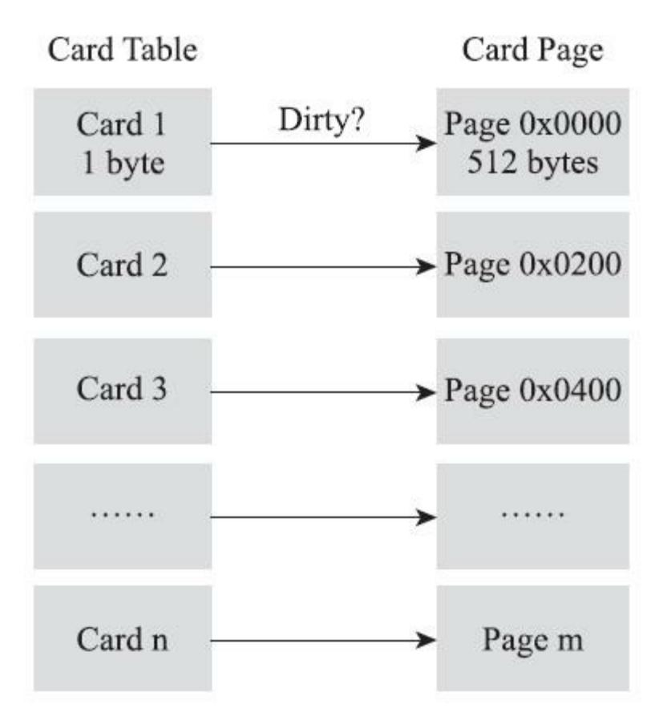

图3-5 卡表与卡页对应示意图

一个卡页的内存中通常包含不止一个对象,只要卡页内有一个(或更多)对象的字段存在着跨代 指针,那就将对应卡表的数组元素的值标识为1,称为这个元素变脏(Dirty),没有则标识为0。在垃 圾收集发生时,只要筛选出卡表中变脏的元素,就能轻易得出哪些卡页内存块中包含跨代指针,把它 们加入GC Roots中一并扫描。

- [1] 由Antony Hosking在1993年发表的论文《Remembered sets can also play cards》中提出。
- [2] 之所以使用byte数组而不是bit数组主要是速度上的考量,现代计算机硬件都是最小按字节寻址的, 没有直接存储一个bit的指令,所以要用bit的话就不得不多消耗几条shift+mask指令。具体可见HotSpot

应用写屏障实现记忆集的原始论文《A Fast Write Barrier for Generational Garbage Collectors》 (http://www.hoelzle.org/publications/write-barrier.pdf)。

- [3] 引用来源为http://psy-lob-saw.blogspot.com/2014/10/the-jvm-write-barrier-card-marking.html。
- [4] 十六进制数200、400分别为十进制的512、1024,这3个内存块为从0开始、512字节容量的相邻区 域。

### 3.4.5 写屏障

我们已经解决了如何使用记忆集来缩减GC Roots扫描范围的问题,但还没有解决卡表元素如何维 护的问题,例如它们何时变脏、谁来把它们变脏等。

卡表元素何时变脏的答案是很明确的——有其他分代区域中对象引用了本区域对象时,其对应的 卡表元素就应该变脏,变脏时间点原则上应该发生在引用类型字段赋值的那一刻。但问题是如何变 脏,即如何在对象赋值的那一刻去更新维护卡表呢?假如是解释执行的字节码,那相对好处理,虚拟 机负责每条字节码指令的执行,有充分的介入空间;但在编译执行的场景中呢?经过即时编译后的代 码已经是纯粹的机器指令流了,这就必须找到一个在机器码层面的手段,把维护卡表的动作放到每一 个赋值操作之中。

在HotSpot虚拟机里是通过写屏障(Write Barrier)技术维护卡表状态的。先请读者注意将这里提 到的"写屏障",以及后面在低延迟收集器中会提到的"读屏障"与解决并发乱序执行问题中的"内存屏 障" [1]区分开来,避免混淆。写屏障可以看作在虚拟机层面对"引用类型字段赋值"这个动作的AOP切 面[2],在引用对象赋值时会产生一个环形(Around)通知,供程序执行额外的动作,也就是说赋值的 前后都在写屏障的覆盖范畴内。在赋值前的部分的写屏障叫作写前屏障(Pre-Write Barrier),在赋值 后的则叫作写后屏障(Post-Write Barrier)。HotSpot虚拟机的许多收集器中都有使用到写屏障,但直 至G1收集器出现之前,其他收集器都只用到了写后屏障。下面这段代码清单3-6是一段更新卡表状态 的简化逻辑:

#### 代码清单3-6 写后屏障更新卡表

```
void oop_field_store(oop* field, oop new_value) {
   // 引用字段赋值操作
   *field = new_value;
   // 写后屏障,在这里完成卡表状态更新
   post_write_barrier(field, new_value);
```

应用写屏障后,虚拟机就会为所有赋值操作生成相应的指令,一旦收集器在写屏障中增加了更新 卡表操作,无论更新的是不是老年代对新生代对象的引用,每次只要对引用进行更新,就会产生额外 的开销,不过这个开销与Minor GC时扫描整个老年代的代价相比还是低得多的。

除了写屏障的开销外,卡表在高并发场景下还面临着"伪共享"(False Sharing)问题。伪共享是处 理并发底层细节时一种经常需要考虑的问题,现代中央处理器的缓存系统中是以缓存行(Cache Line) 为单位存储的,当多线程修改互相独立的变量时,如果这些变量恰好共享同一个缓存行,就会彼此影 响(写回、无效化或者同步)而导致性能降低,这就是伪共享问题。

假设处理器的缓存行大小为64字节,由于一个卡表元素占1个字节,64个卡表元素将共享同一个缓 存行。这64个卡表元素对应的卡页总的内存为32KB(64×512字节),也就是说如果不同线程更新的对 象正好处于这32KB的内存区域内,就会导致更新卡表时正好写入同一个缓存行而影响性能。为了避免 伪共享问题,一种简单的解决方案是不采用无条件的写屏障,而是先检查卡表标记,只有当该卡表元

素未被标记过时才将其标记为变脏,即将卡表更新的逻辑变为以下代码所示:

```
if (CARD_TABLE [this address >> 9] != 0)
    CARD_TABLE [this address >> 9] = 0;
```

在JDK 7之后,HotSpot虚拟机增加了一个新的参数-XX:+UseCondCardMark,用来决定是否开启 卡表更新的条件判断。开启会增加一次额外判断的开销,但能够避免伪共享问题,两者各有性能损 耗,是否打开要根据应用实际运行情况来进行测试权衡。

- [1] 这个语境上的内存屏障(Memory Barrier)的目的是为了指令不因编译优化、CPU执行优化等原因 而导致乱序执行,它也是可以细分为仅确保读操作顺序正确性和仅确保写操作顺序正确性的内存屏障 的。关于并发问题中内存屏障的介绍,可以参考本书第12章中关于volatile型变量的讲解。
- [2] AOP为Aspect Oriented Programming的缩写,意为面向切面编程,通过预编译方式和运行期动态代 理实现程序功能的统一维护的一种技术。后面提到的"环形通知"也是AOP中的概念,使用过Spring的 读者应该都了解这些基础概念。

# 3.4.6 并发的可达性分析

在3.2节中曾经提到了当前主流编程语言的垃圾收集器基本上都是依靠可达性分析算法来判定对象 是否存活的,可达性分析算法理论上要求全过程都基于一个能保障一致性的快照中才能够进行分析, 这意味着必须全程冻结用户线程的运行。在根节点枚举(见3.4.1节)这个步骤中,由于GC Roots相比 起整个Java堆中全部的对象毕竟还算是极少数,且在各种优化技巧(如OopMap)的加持下,它带来 的停顿已经是非常短暂且相对固定(不随堆容量而增长)的了。可从GC Roots再继续往下遍历对象 图,这一步骤的停顿时间就必定会与Java堆容量直接成正比例关系了:堆越大,存储的对象越多,对 象图结构越复杂,要标记更多对象而产生的停顿时间自然就更长,这听起来是理所当然的事情。

要知道包含"标记"阶段是所有追踪式垃圾收集算法的共同特征,如果这个阶段会随着堆变大而等 比例增加停顿时间,其影响就会波及几乎所有的垃圾收集器,同理可知,如果能够削减这部分停顿时 间的话,那收益也将会是系统性的。

想解决或者降低用户线程的停顿,就要先搞清楚为什么必须在一个能保障一致性的快照上才能进 行对象图的遍历?为了能解释清楚这个问题,我们引入三色标记(Tri-color Marking)[1]作为工具来辅 助推导,把遍历对象图过程中遇到的对象,按照"是否访问过"这个条件标记成以下三种颜色:

·白色:表示对象尚未被垃圾收集器访问过。显然在可达性分析刚刚开始的阶段,所有的对象都是 白色的,若在分析结束的阶段,仍然是白色的对象,即代表不可达。

·黑色:表示对象已经被垃圾收集器访问过,且这个对象的所有引用都已经扫描过。黑色的对象代 表已经扫描过,它是安全存活的,如果有其他对象引用指向了黑色对象,无须重新扫描一遍。黑色对 象不可能直接(不经过灰色对象)指向某个白色对象。

·灰色:表示对象已经被垃圾收集器访问过,但这个对象上至少存在一个引用还没有被扫描过。

关于可达性分析的扫描过程,读者不妨发挥一下想象力,把它看作对象图上一股以灰色为波峰的 波纹从黑向白推进的过程,如果用户线程此时是冻结的,只有收集器线程在工作,那不会有任何问 题。但如果用户线程与收集器是并发工作呢?收集器在对象图上标记颜色,同时用户线程在修改引用 关系——即修改对象图的结构,这样可能出现两种后果。一种是把原本消亡的对象错误标记为存活, 这不是好事,但其实是可以容忍的,只不过产生了一点逃过本次收集的浮动垃圾而已,下次收集清理 掉就好。另一种是把原本存活的对象错误标记为已消亡,这就是非常致命的后果了,程序肯定会因此 发生错误,下面表3-1演示了这样的致命错误具体是如何产生的。

表3-1 并发出现"对象消失"问题的示意[2]

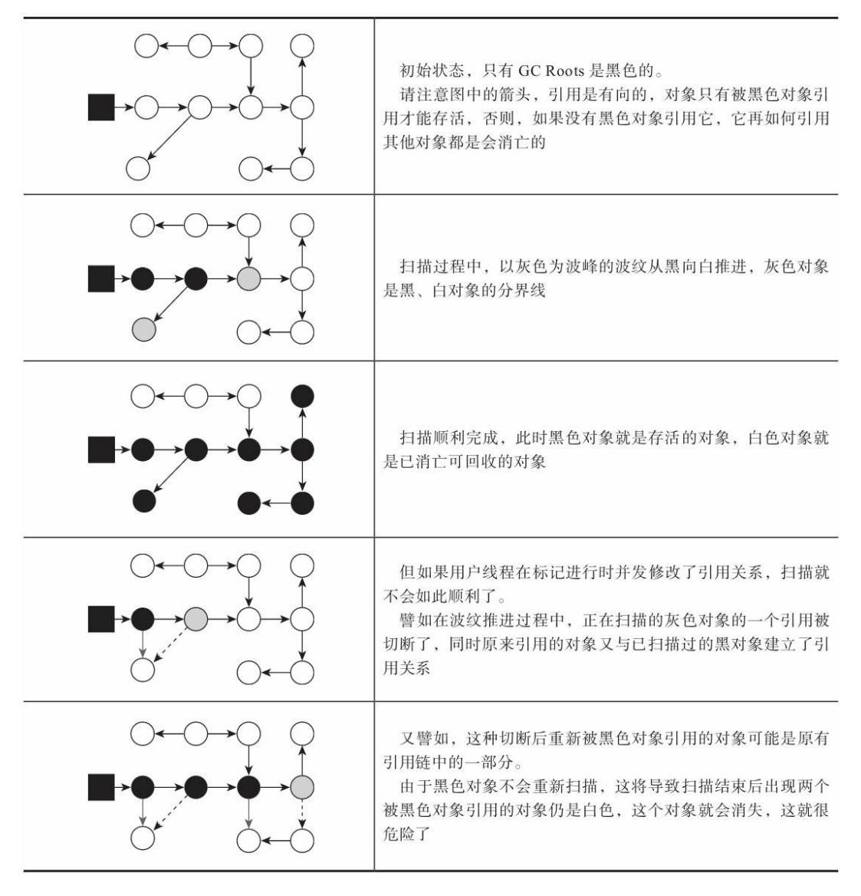

Wilson于1994年在理论上证明了,当且仅当以下两个条件同时满足时,会产生"对象消失"的问 题,即原本应该是黑色的对象被误标为白色:

- ·赋值器插入了一条或多条从黑色对象到白色对象的新引用;
- ·赋值器删除了全部从灰色对象到该白色对象的直接或间接引用。

因此,我们要解决并发扫描时的对象消失问题,只需破坏这两个条件的任意一个即可。由此分别 产生了两种解决方案:增量更新(Incremental Update)和原始快照(Snapshot At The Beginning, SATB)。

增量更新要破坏的是第一个条件,当黑色对象插入新的指向白色对象的引用关系时,就将这个新 插入的引用记录下来,等并发扫描结束之后,再将这些记录过的引用关系中的黑色对象为根,重新扫 描一次。这可以简化理解为,黑色对象一旦新插入了指向白色对象的引用之后,它就变回灰色对象 了。

原始快照要破坏的是第二个条件,当灰色对象要删除指向白色对象的引用关系时,就将这个要删 除的引用记录下来,在并发扫描结束之后,再将这些记录过的引用关系中的灰色对象为根,重新扫描 一次。这也可以简化理解为,无论引用关系删除与否,都会按照刚刚开始扫描那一刻的对象图快照来 进行搜索。

以上无论是对引用关系记录的插入还是删除,虚拟机的记录操作都是通过写屏障实现的。在 HotSpot虚拟机中,增量更新和原始快照这两种解决方案都有实际应用,譬如,CMS是基于增量更新 来做并发标记的,G1、Shenandoah则是用原始快照来实现。

到这里,笔者简要介绍了HotSpot虚拟机如何发起内存回收、如何加速内存回收,以及如何保证回 收正确性等问题,但是虚拟机如何具体地进行内存回收动作仍然未涉及。因为内存回收如何进行是由 虚拟机所采用哪一款垃圾收集器所决定的,而通常虚拟机中往往有多种垃圾收集器,下面笔者将逐一 介绍HotSpot虚拟机中出现过的垃圾收集器。

- [1] 三色标记的介绍可参见https://en.wikipedia.org/wiki/Tracing\_garbage\_collection#Tri-color\_marking。
- [2] 此例子中的图片引用了Aleksey Shipilev在DEVOXX 2017上的主题演讲:《Shenandoah GC Part I: The Garbage Collector That Could》。

# 3.5 经典垃圾收集器

如果说收集算法是内存回收的方法论,那垃圾收集器就是内存回收的实践者。《Java虚拟机规 范》中对垃圾收集器应该如何实现并没有做出任何规定,因此不同的厂商、不同版本的虚拟机所包含 的垃圾收集器都可能会有很大差别,不同的虚拟机一般也都会提供各种参数供用户根据自己的应用特 点和要求组合出各个内存分代所使用的收集器。

本节标题中"经典"二字并非情怀,它其实是讨论范围的限定语,这里讨论的是在JDK 7 Update 4 之后(在这个版本中正式提供了商用的G1收集器,此前G1仍处于实验状态)、JDK 11正式发布之 前,OracleJDK中的HotSpot虚拟机[1]所包含的全部可用的垃圾收集器。使用"经典"二字是为了与几款 目前仍处于实验状态,但执行效果上有革命性改进的高性能低延迟收集器区分开来,这些经典的收集 器尽管已经算不上是最先进的技术,但它们曾在实践中千锤百炼,足够成熟,基本上可认为是现在到 未来两、三年内,能够在商用生产环境上放心使用的全部垃圾收集器了。各款经典收集器之间的关系 如图3-6所示。

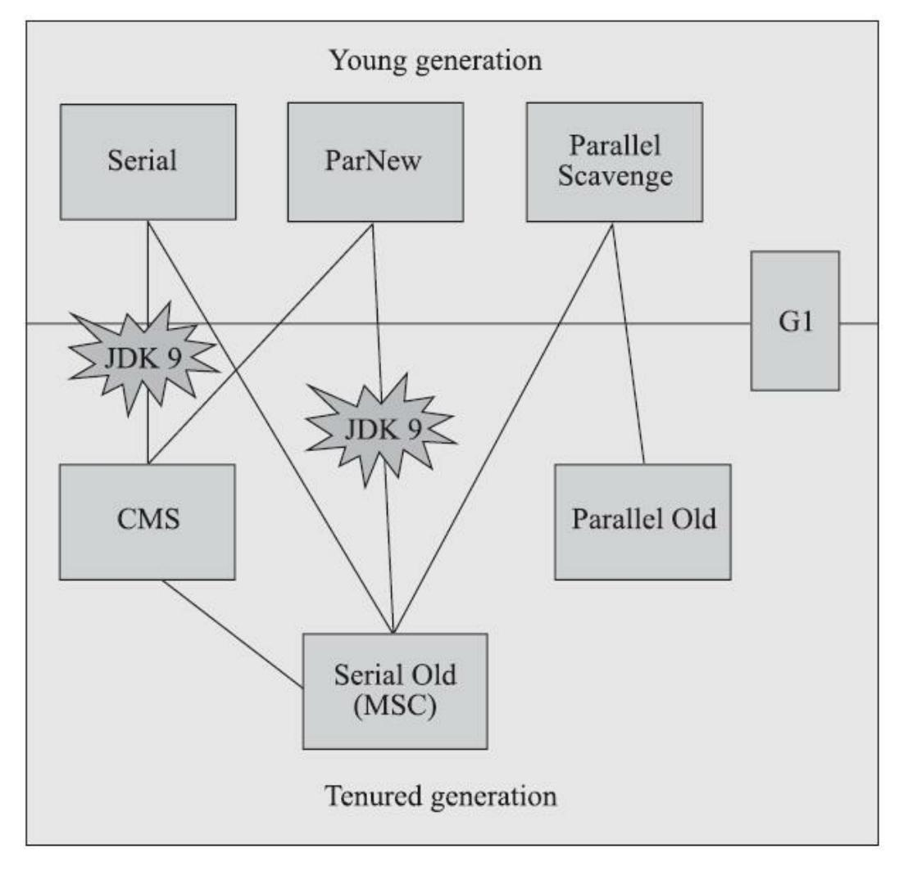

图3-6 HotSpot虚拟机的垃圾收集器[2]

图3-6展示了七种作用于不同分代的收集器,如果两个收集器之间存在连线,就说明它们可以搭配 使用[3],图中收集器所处的区域,则表示它是属于新生代收集器抑或是老年代收集器。接下来笔者将 逐一介绍这些收集器的目标、特性、原理和使用场景,并重点分析CMS和G1这两款相对复杂而又广泛 使用的收集器,深入了解它们的部分运作细节。

在介绍这些收集器各自的特性之前,让我们先来明确一个观点:虽然我们会对各个收集器进行比 较,但并非为了挑选一个最好的收集器出来,虽然垃圾收集器的技术在不断进步,但直到现在还没有 最好的收集器出现,更加不存在"万能"的收集器,所以我们选择的只是对具体应用最合适的收集器。

这点不需要多加论述就能证明:如果有一种放之四海皆准、任何场景下都适用的完美收集器存在, HotSpot虚拟机完全没必要实现那么多种不同的收集器了。

- [1] 这里专门强调了OracleJDK是因为要把OpenJDK,尤其是OpenJDK-Shenandoah-JDK8这种Backports 项目排除在外,在本书故事的时间线里,Shenandoah要到OpenJDK 12才会登场,请读者耐心等待。
- [2] 图片来源:https://blogs.oracle.com/jonthecollector/our\_collectors。
- [3] 这个关系不是一成不变的,由于维护和兼容性测试的成本,在JDK 8时将Serial+CMS、 ParNew+Serial Old这两个组合声明为废弃(JEP 173),并在JDK 9中完全取消了这些组合的支持(JEP 214)。

### 3.5.1 Serial收集器

Serial收集器是最基础、历史最悠久的收集器,曾经(在JDK 1.3.1之前)是HotSpot虚拟机新生代 收集器的唯一选择。大家只看名字就能够猜到,这个收集器是一个单线程工作的收集器,但它的"单线 程"的意义并不仅仅是说明它只会使用一个处理器或一条收集线程去完成垃圾收集工作,更重要的是强 调在它进行垃圾收集时,必须暂停其他所有工作线程,直到它收集结束。"Stop The World"这个词语也 许听起来很酷,但这项工作是由虚拟机在后台自动发起和自动完成的,在用户不可知、不可控的情况 下把用户的正常工作的线程全部停掉,这对很多应用来说都是不能接受的。读者不妨试想一下,要是 你的电脑每运行一个小时就会暂停响应五分钟,你会有什么样的心情?图3-7示意了Serial/Serial Old收 集器的运行过程。

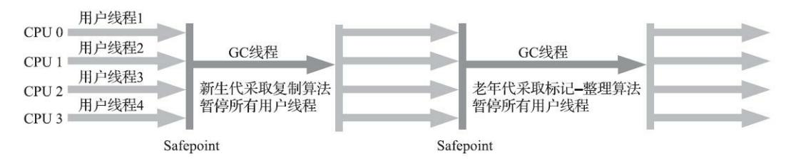

图3-7 Serial/Serial Old收集器运行示意图

对于"Stop The World"带给用户的恶劣体验,早期HotSpot虚拟机的设计者们表示完全理解,但也 同时表示非常委屈:"你妈妈在给你打扫房间的时候,肯定也会让你老老实实地在椅子上或者房间外待 着,如果她一边打扫,你一边乱扔纸屑,这房间还能打扫完?"这确实是一个合情合理的矛盾,虽然垃 圾收集这项工作听起来和打扫房间属于一个工种,但实际上肯定还要比打扫房间复杂得多!

从JDK 1.3开始,一直到现在最新的JDK 13,HotSpot虚拟机开发团队为消除或者降低用户线程因 垃圾收集而导致停顿的努力一直持续进行着,从Serial收集器到Parallel收集器,再到Concurrent Mark Sweep(CMS)和Garbage First(G1)收集器,最终至现在垃圾收集器的最前沿成果Shenandoah和ZGC 等,我们看到了一个个越来越构思精巧,越来越优秀,也越来越复杂的垃圾收集器不断涌现,用户线 程的停顿时间在持续缩短,但是仍然没有办法彻底消除(这里不去讨论RTSJ中的收集器),探索更优 秀垃圾收集器的工作仍在继续。

写到这里,笔者似乎已经把Serial收集器描述成一个最早出现,但目前已经老而无用,食之无味, 弃之可惜的"鸡肋"了,但事实上,迄今为止,它依然是HotSpot虚拟机运行在客户端模式下的默认新生 代收集器,有着优于其他收集器的地方,那就是简单而高效(与其他收集器的单线程相比),对于内 存资源受限的环境,它是所有收集器里额外内存消耗(Memory Footprint)[1]最小的;对于单核处理 器或处理器核心数较少的环境来说,Serial收集器由于没有线程交互的开销,专心做垃圾收集自然可以 获得最高的单线程收集效率。在用户桌面的应用场景以及近年来流行的部分微服务应用中,分配给虚 拟机管理的内存一般来说并不会特别大,收集几十兆甚至一两百兆的新生代(仅仅是指新生代使用的 内存,桌面应用甚少超过这个容量),垃圾收集的停顿时间完全可以控制在十几、几十毫秒,最多一 百多毫秒以内,只要不是频繁发生收集,这点停顿时间对许多用户来说是完全可以接受的。所以,

Serial收集器对于运行在客户端模式下的虚拟机来说是一个很好的选择。

[1] Memory Footprint:内存占用,此语境中指为保证垃圾收集能够顺利高效地进行而存储的额外信 息。

### 3.5.2 ParNew收集器

ParNew收集器实质上是Serial收集器的多线程并行版本,除了同时使用多条线程进行垃圾收集之 外,其余的行为包括Serial收集器可用的所有控制参数(例如:-XX:SurvivorRatio、-XX: PretenureSizeThreshold、-XX:HandlePromotionFailure等)、收集算法、Stop The World、对象分配规 则、回收策略等都与Serial收集器完全一致,在实现上这两种收集器也共用了相当多的代码。ParNew收 集器的工作过程如图3-8所示。

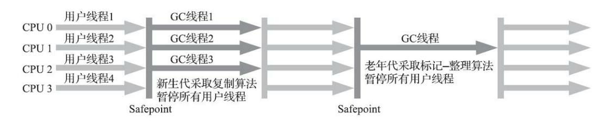

图3-8 ParNew/Serial Old收集器运行示意图

ParNew收集器除了支持多线程并行收集之外,其他与Serial收集器相比并没有太多创新之处,但它 却是不少运行在服务端模式下的HotSpot虚拟机,尤其是JDK 7之前的遗留系统中首选的新生代收集 器,其中有一个与功能、性能无关但其实很重要的原因是:除了Serial收集器外,目前只有它能与CMS 收集器配合工作。

在JDK 5发布时,HotSpot推出了一款在强交互应用中几乎可称为具有划时代意义的垃圾收集器 ——CMS收集器。这款收集器是HotSpot虚拟机中第一款真正意义上支持并发的垃圾收集器,它首次 实现了让垃圾收集线程与用户线程(基本上)同时工作。

遗憾的是,CMS作为老年代的收集器,却无法与JDK 1.4.0中已经存在的新生代收集器Parallel Scavenge配合工作[1],所以在JDK 5中使用CMS来收集老年代的时候,新生代只能选择ParNew或者 Serial收集器中的一个。ParNew收集器是激活CMS后(使用-XX:+UseConcMarkSweepGC选项)的默 认新生代收集器,也可以使用-XX:+/-UseParNewGC选项来强制指定或者禁用它。

可以说直到CMS的出现才巩固了ParNew的地位,但成也萧何败也萧何,随着垃圾收集器技术的不 断改进,更先进的G1收集器带着CMS继承者和替代者的光环登场。G1是一个面向全堆的收集器,不 再需要其他新生代收集器的配合工作。所以自JDK 9开始,ParNew加CMS收集器的组合就不再是官方 推荐的服务端模式下的收集器解决方案了。官方希望它能完全被G1所取代,甚至还取消了ParNew加 Serial Old以及Serial加CMS这两组收集器组合的支持(其实原本也很少人这样使用),并直接取消了-XX:+UseParNewGC参数,这意味着ParNew和CMS从此只能互相搭配使用,再也没有其他收集器能 够和它们配合了。读者也可以理解为从此以后,ParNew合并入CMS,成为它专门处理新生代的组成部 分。ParNew可以说是HotSpot虚拟机中第一款退出历史舞台的垃圾收集器。

ParNew收集器在单核心处理器的环境中绝对不会有比Serial收集器更好的效果,甚至由于存在线程 交互的开销,该收集器在通过超线程(Hyper-Threading)技术实现的伪双核处理器环境中都不能百分

之百保证超越Serial收集器。当然,随着可以被使用的处理器核心数量的增加,ParNew对于垃圾收集时 系统资源的高效利用还是很有好处的。它默认开启的收集线程数与处理器核心数量相同,在处理器核 心非常多(譬如32个,现在CPU都是多核加超线程设计,服务器达到或超过32个逻辑核心的情况非常 普遍)的环境中,可以使用-XX:ParallelGCThreads参数来限制垃圾收集的线程数。

注意 从ParNew收集器开始,后面还将会接触到若干款涉及"并发"和"并行"概念的收集器。 在大家可能产生疑惑之前,有必要先解释清楚这两个名词。并行和并发都是并发编程中的专业名词, 在谈论垃圾收集器的上下文语境中,它们可以理解为:

·并行(Parallel):并行描述的是多条垃圾收集器线程之间的关系,说明同一时间有多条这样的线 程在协同工作,通常默认此时用户线程是处于等待状态。

·并发(Concurrent):并发描述的是垃圾收集器线程与用户线程之间的关系,说明同一时间垃圾 收集器线程与用户线程都在运行。由于用户线程并未被冻结,所以程序仍然能响应服务请求,但由于 垃圾收集器线程占用了一部分系统资源,此时应用程序的处理的吞吐量将受到一定影响。

[1] 除了一个面向低延迟一个面向高吞吐量的目标不一致外,技术上的原因是Parallel Scavenge收集器及 后面提到的G1收集器等都没有使用HotSpot中原本设计的垃圾收集器的分代框架,而选择另外独立实 现。Serial、ParNew收集器则共用了这部分的框架代码,详细可参考: https://blogs.oracle.com/jonthecollector/our\_collectors。

# 3.5.3 Parallel Scavenge收集器

Parallel Scavenge收集器也是一款新生代收集器,它同样是基于标记-复制算法实现的收集器,也是 能够并行收集的多线程收集器……Parallel Scavenge的诸多特性从表面上看和ParNew非常相似,那它有 什么特别之处呢?

Parallel Scavenge收集器的特点是它的关注点与其他收集器不同,CMS等收集器的关注点是尽可能 地缩短垃圾收集时用户线程的停顿时间,而Parallel Scavenge收集器的目标则是达到一个可控制的吞吐 量(Throughput)。所谓吞吐量就是处理器用于运行用户代码的时间与处理器总消耗时间的比值, 即:

如果虚拟机完成某个任务,用户代码加上垃圾收集总共耗费了100分钟,其中垃圾收集花掉1分 钟,那吞吐量就是99%。停顿时间越短就越适合需要与用户交互或需要保证服务响应质量的程序,良 好的响应速度能提升用户体验;而高吞吐量则可以最高效率地利用处理器资源,尽快完成程序的运算 任务,主要适合在后台运算而不需要太多交互的分析任务。

Parallel Scavenge收集器提供了两个参数用于精确控制吞吐量,分别是控制最大垃圾收集停顿时间 的-XX:MaxGCPauseMillis参数以及直接设置吞吐量大小的-XX:GCTimeRatio参数。

- -XX:MaxGCPauseMillis参数允许的值是一个大于0的毫秒数,收集器将尽力保证内存回收花费的 时间不超过用户设定值。不过大家不要异想天开地认为如果把这个参数的值设置得更小一点就能使得 系统的垃圾收集速度变得更快,垃圾收集停顿时间缩短是以牺牲吞吐量和新生代空间为代价换取的: 系统把新生代调得小一些,收集300MB新生代肯定比收集500MB快,但这也直接导致垃圾收集发生得 更频繁,原来10秒收集一次、每次停顿100毫秒,现在变成5秒收集一次、每次停顿70毫秒。停顿时间 的确在下降,但吞吐量也降下来了。
- -XX:GCTimeRatio参数的值则应当是一个大于0小于100的整数,也就是垃圾收集时间占总时间的 比率,相当于吞吐量的倒数。譬如把此参数设置为19,那允许的最大垃圾收集时间就占总时间的5% (即1/(1+19)),默认值为99,即允许最大1%(即1/(1+99))的垃圾收集时间。

由于与吞吐量关系密切,Parallel Scavenge收集器也经常被称作"吞吐量优先收集器"。除上述两个 参数之外,Parallel Scavenge收集器还有一个参数-XX:+UseAdaptiveSizePolicy值得我们关注。这是一 个开关参数,当这个参数被激活之后,就不需要人工指定新生代的大小(-Xmn)、Eden与Survivor区 的比例(-XX:SurvivorRatio)、晋升老年代对象大小(-XX:PretenureSizeThreshold)等细节参数 了,虚拟机会根据当前系统的运行情况收集性能监控信息,动态调整这些参数以提供最合适的停顿时 间或者最大的吞吐量。这种调节方式称为垃圾收集的自适应的调节策略(GC Ergonomics)[1]。如果读 者对于收集器运作不太了解,手工优化存在困难的话,使用Parallel Scavenge收集器配合自适应调节策 略,把内存管理的调优任务交给虚拟机去完成也许是一个很不错的选择。只需要把基本的内存数据设 置好(如-Xmx设置最大堆),然后使用-XX:MaxGCPauseMillis参数(更关注最大停顿时间)或-XX:GCTimeRatio(更关注吞吐量)参数给虚拟机设立一个优化目标,那具体细节参数的调节工作就 由虚拟机完成了。自适应调节策略也是Parallel Scavenge收集器区别于ParNew收集器的一个重要特性。

[1] 官方介绍:http://download.oracle.com/javase/1.5.0/docs/guide/vm/gc-ergonomics.html。

# 3.5.4 Serial Old收集器

Serial Old是Serial收集器的老年代版本,它同样是一个单线程收集器,使用标记-整理算法。这个收 集器的主要意义也是供客户端模式下的HotSpot虚拟机使用。如果在服务端模式下,它也可能有两种用 途:一种是在JDK 5以及之前的版本中与Parallel Scavenge收集器搭配使用[1],另外一种就是作为CMS 收集器发生失败时的后备预案,在并发收集发生Concurrent Mode Failure时使用。这两点都将在后面的 内容中继续讲解。Serial Old收集器的工作过程如图3-9所示。

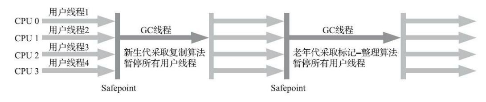

图3-9 Serial/Serial Old收集器运行示意图

[1] 需要说明一下,Parallel Scavenge收集器架构中本身有PS MarkSweep收集器来进行老年代收集,并非 直接调用Serial Old收集器,但是这个PS MarkSweep收集器与Serial Old的实现几乎是一样的,所以在官 方的许多资料中都是直接以Serial Old代替PS MarkSweep进行讲解,这里笔者也采用这种方式。

### 3.5.5 Parallel Old收集器

Parallel Old是Parallel Scavenge收集器的老年代版本,支持多线程并发收集,基于标记-整理算法实 现。这个收集器是直到JDK 6时才开始提供的,在此之前,新生代的Parallel Scavenge收集器一直处于相 当尴尬的状态,原因是如果新生代选择了Parallel Scavenge收集器,老年代除了Serial Old(PS MarkSweep)收集器以外别无选择,其他表现良好的老年代收集器,如CMS无法与它配合工作。由于 老年代Serial Old收集器在服务端应用性能上的"拖累",使用Parallel Scavenge收集器也未必能在整体上 获得吞吐量最大化的效果。同样,由于单线程的老年代收集中无法充分利用服务器多处理器的并行处 理能力,在老年代内存空间很大而且硬件规格比较高级的运行环境中,这种组合的总吞吐量甚至不一 定比ParNew加CMS的组合来得优秀。

直到Parallel Old收集器出现后,"吞吐量优先"收集器终于有了比较名副其实的搭配组合,在注重 吞吐量或者处理器资源较为稀缺的场合,都可以优先考虑Parallel Scavenge加Parallel Old收集器这个组 合。Parallel Old收集器的工作过程如图3-10所示。

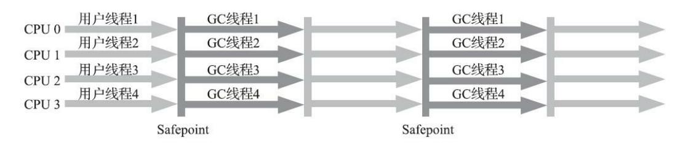

图3-10 Parallel Scavenge/Parallel Old收集器运行示意图

# 3.5.6 CMS收集器

CMS(Concurrent Mark Sweep)收集器是一种以获取最短回收停顿时间为目标的收集器。目前很 大一部分的Java应用集中在互联网网站或者基于浏览器的B/S系统的服务端上,这类应用通常都会较为 关注服务的响应速度,希望系统停顿时间尽可能短,以给用户带来良好的交互体验。CMS收集器就非 常符合这类应用的需求。

从名字(包含"Mark Sweep")上就可以看出CMS收集器是基于标记-清除算法实现的,它的运作 过程相对于前面几种收集器来说要更复杂一些,整个过程分为四个步骤,包括:

- 1)初始标记(CMS initial mark)
- 2)并发标记(CMS concurrent mark)
- 3)重新标记(CMS remark)
- 4)并发清除(CMS concurrent sweep)

其中初始标记、重新标记这两个步骤仍然需要"Stop The World"。初始标记仅仅只是标记一下GC Roots能直接关联到的对象,速度很快;并发标记阶段就是从GC Roots的直接关联对象开始遍历整个对 象图的过程,这个过程耗时较长但是不需要停顿用户线程,可以与垃圾收集线程一起并发运行;而重 新标记阶段则是为了修正并发标记期间,因用户程序继续运作而导致标记产生变动的那一部分对象的 标记记录(详见3.4.6节中关于增量更新的讲解),这个阶段的停顿时间通常会比初始标记阶段稍长一 些,但也远比并发标记阶段的时间短;最后是并发清除阶段,清理删除掉标记阶段判断的已经死亡的 对象,由于不需要移动存活对象,所以这个阶段也是可以与用户线程同时并发的。

由于在整个过程中耗时最长的并发标记和并发清除阶段中,垃圾收集器线程都可以与用户线程一 起工作,所以从总体上来说,CMS收集器的内存回收过程是与用户线程一起并发执行的。通过图3-11 可以比较清楚地看到CMS收集器的运作步骤中并发和需要停顿的阶段。

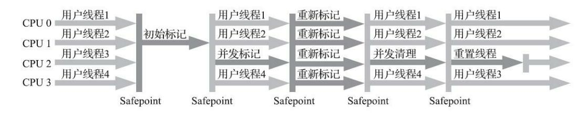

图3-11 Concurrent Mark Sweep收集器运行示意图

CMS是一款优秀的收集器,它最主要的优点在名字上已经体现出来:并发收集、低停顿,一些官 方公开文档里面也称之为"并发低停顿收集器"(Concurrent Low Pause Collector)。CMS收集器是 HotSpot虚拟机追求低停顿的第一次成功尝试,但是它还远达不到完美的程度,至少有以下三个明显的 缺点:

首先,CMS收集器对处理器资源非常敏感。事实上,面向并发设计的程序都对处理器资源比较敏 感。在并发阶段,它虽然不会导致用户线程停顿,但却会因为占用了一部分线程(或者说处理器的计 算能力)而导致应用程序变慢,降低总吞吐量。CMS默认启动的回收线程数是(处理器核心数量 +3)/4,也就是说,如果处理器核心数在四个或以上,并发回收时垃圾收集线程只占用不超过25%的 处理器运算资源,并且会随着处理器核心数量的增加而下降。但是当处理器核心数量不足四个时, CMS对用户程序的影响就可能变得很大。如果应用本来的处理器负载就很高,还要分出一半的运算能 力去执行收集器线程,就可能导致用户程序的执行速度忽然大幅降低。为了缓解这种情况,虚拟机提 供了一种称为"增量式并发收集器"(Incremental Concurrent Mark Sweep/i-CMS)的CMS收集器变种, 所做的事情和以前单核处理器年代PC机操作系统靠抢占式多任务来模拟多核并行多任务的思想一样, 是在并发标记、清理的时候让收集器线程、用户线程交替运行,尽量减少垃圾收集线程的独占资源的 时间,这样整个垃圾收集的过程会更长,但对用户程序的影响就会显得较少一些,直观感受是速度变 慢的时间更多了,但速度下降幅度就没有那么明显。实践证明增量式的CMS收集器效果很一般,从 JDK 7开始,i-CMS模式已经被声明为"deprecated",即已过时不再提倡用户使用,到JDK 9发布后i-CMS模式被完全废弃。

然后,由于CMS收集器无法处理"浮动垃圾"(Floating Garbage),有可能出现"Con-current Mode Failure"失败进而导致另一次完全"Stop The World"的Full GC的产生。在CMS的并发标记和并发清理阶 段,用户线程是还在继续运行的,程序在运行自然就还会伴随有新的垃圾对象不断产生,但这一部分 垃圾对象是出现在标记过程结束以后,CMS无法在当次收集中处理掉它们,只好留待下一次垃圾收集 时再清理掉。这一部分垃圾就称为"浮动垃圾"。同样也是由于在垃圾收集阶段用户线程还需要持续运 行,那就还需要预留足够内存空间提供给用户线程使用,因此CMS收集器不能像其他收集器那样等待 到老年代几乎完全被填满了再进行收集,必须预留一部分空间供并发收集时的程序运作使用。在JDK 5的默认设置下,CMS收集器当老年代使用了68%的空间后就会被激活,这是一个偏保守的设置,如果 在实际应用中老年代增长并不是太快,可以适当调高参数-XX:CMSInitiatingOccu-pancyFraction的值 来提高CMS的触发百分比,降低内存回收频率,获取更好的性能。到了JDK 6时,CMS收集器的启动 阈值就已经默认提升至92%。但这又会更容易面临另一种风险:要是CMS运行期间预留的内存无法满 足程序分配新对象的需要,就会出现一次"并发失败"(Concurrent Mode Failure),这时候虚拟机将不 得不启动后备预案:冻结用户线程的执行,临时启用Serial Old收集器来重新进行老年代的垃圾收集, 但这样停顿时间就很长了。所以参数-XX:CMSInitiatingOccupancyFraction设置得太高将会很容易导致 大量的并发失败产生,性能反而降低,用户应在生产环境中根据实际应用情况来权衡设置。

还有最后一个缺点,在本节的开头曾提到,CMS是一款基于"标记-清除"算法实现的收集器,如果 读者对前面这部分介绍还有印象的话,就可能想到这意味着收集结束时会有大量空间碎片产生。空间 碎片过多时,将会给大对象分配带来很大麻烦,往往会出现老年代还有很多剩余空间,但就是无法找 到足够大的连续空间来分配当前对象,而不得不提前触发一次Full GC的情况。为了解决这个问题, CMS收集器提供了一个-XX:+UseCMS-CompactAtFullCollection开关参数(默认是开启的,此参数从 JDK 9开始废弃),用于在CMS收集器不得不进行Full GC时开启内存碎片的合并整理过程,由于这个 内存整理必须移动存活对象,(在Shenandoah和ZGC出现前)是无法并发的。这样空间碎片问题是解 决了,但停顿时间又会变长,因此虚拟机设计者们还提供了另外一个参数-XX:CMSFullGCsBefore-Compaction(此参数从JDK 9开始废弃),这个参数的作用是要求CMS收集器在执行过若干次(数量 由参数值决定)不整理空间的Full GC之后,下一次进入Full GC前会先进行碎片整理(默认值为0,表 示每次进入Full GC时都进行碎片整理)。

### 3.5.7 Garbage First收集器

Garbage First(简称G1)收集器是垃圾收集器技术发展历史上的里程碑式的成果,它开创了收集 器面向局部收集的设计思路和基于Region的内存布局形式。早在JDK 7刚刚确立项目目标、Oracle公司 制定的JDK 7 RoadMap里面,G1收集器就被视作JDK 7中HotSpot虚拟机的一项重要进化特征。从JDK 6 Update 14开始就有Early Access版本的G1收集器供开发人员实验和试用,但由此开始G1收集器的"实 验状态"(Experimental)持续了数年时间,直至JDK 7 Update 4,Oracle才认为它达到足够成熟的商用 程度,移除了"Experimental"的标识;到了JDK 8 Update 40的时候,G1提供并发的类卸载的支持,补 全了其计划功能的最后一块拼图。这个版本以后的G1收集器才被Oracle官方称为"全功能的垃圾收集 器"(Fully-Featured Garbage Collector)。

G1是一款主要面向服务端应用的垃圾收集器。HotSpot开发团队最初赋予它的期望是(在比较长 期的)未来可以替换掉JDK 5中发布的CMS收集器。现在这个期望目标已经实现过半了,JDK 9发布之 日,G1宣告取代Parallel Scavenge加Parallel Old组合,成为服务端模式下的默认垃圾收集器,而CMS则 沦落至被声明为不推荐使用(Deprecate)的收集器[1]。如果对JDK 9及以上版本的HotSpot虚拟机使用 参数-XX:+UseConcMarkSweepGC来开启CMS收集器的话,用户会收到一个警告信息,提示CMS未 来将会被废弃:

Java HotSpot(TM) 64-Bit Server VM warning: Option UseConcMarkSweepGC was deprecated in version 9.0 and will likely be removed in a future release.

但作为一款曾被广泛运用过的收集器,经过多个版本的开发迭代后,CMS(以及之前几款收集 器)的代码与HotSpot的内存管理、执行、编译、监控等子系统都有千丝万缕的联系,这是历史原因导 致的,并不符合职责分离的设计原则。为此,规划JDK 10功能目标时,HotSpot虚拟机提出了"统一垃 圾收集器接口" [2],将内存回收的"行为"与"实现"进行分离,CMS以及其他收集器都重构成基于这套 接口的一种实现。以此为基础,日后要移除或者加入某一款收集器,都会变得容易许多,风险也可以 控制,这算是在为CMS退出历史舞台铺下最后的道路了。

作为CMS收集器的替代者和继承人,设计者们希望做出一款能够建立起"停顿时间模型"(Pause Prediction Model)的收集器,停顿时间模型的意思是能够支持指定在一个长度为M毫秒的时间片段 内,消耗在垃圾收集上的时间大概率不超过N毫秒这样的目标,这几乎已经是实时Java(RTSJ)的中 软实时垃圾收集器特征了。

那具体要怎么做才能实现这个目标呢?首先要有一个思想上的改变,在G1收集器出现之前的所有 其他收集器,包括CMS在内,垃圾收集的目标范围要么是整个新生代(Minor GC),要么就是整个老 年代(Major GC),再要么就是整个Java堆(Full GC)。而G1跳出了这个樊笼,它可以面向堆内存任 何部分来组成回收集(Collection Set,一般简称CSet)进行回收,衡量标准不再是它属于哪个分代,而 是哪块内存中存放的垃圾数量最多,回收收益最大,这就是G1收集器的Mixed GC模式。

G1开创的基于Region的堆内存布局是它能够实现这个目标的关键。虽然G1也仍是遵循分代收集理 论设计的,但其堆内存的布局与其他收集器有非常明显的差异:G1不再坚持固定大小以及固定数量的 分代区域划分,而是把连续的Java堆划分为多个大小相等的独立区域(Region),每一个Region都可以

根据需要,扮演新生代的Eden空间、Survivor空间,或者老年代空间。收集器能够对扮演不同角色的 Region采用不同的策略去处理,这样无论是新创建的对象还是已经存活了一段时间、熬过多次收集的 旧对象都能获取很好的收集效果。

Region中还有一类特殊的Humongous区域,专门用来存储大对象。G1认为只要大小超过了一个 Region容量一半的对象即可判定为大对象。每个Region的大小可以通过参数-XX:G1HeapRegionSize设 定,取值范围为1MB~32MB,且应为2的N次幂。而对于那些超过了整个Region容量的超级大对象, 将会被存放在N个连续的Humongous Region之中,G1的大多数行为都把Humongous Region作为老年代 的一部分来进行看待,如图3-12所示。

虽然G1仍然保留新生代和老年代的概念,但新生代和老年代不再是固定的了,它们都是一系列区 域(不需要连续)的动态集合。G1收集器之所以能建立可预测的停顿时间模型,是因为它将Region作 为单次回收的最小单元,即每次收集到的内存空间都是Region大小的整数倍,这样可以有计划地避免 在整个Java堆中进行全区域的垃圾收集。更具体的处理思路是让G1收集器去跟踪各个Region里面的垃 圾堆积的"价值"大小,价值即回收所获得的空间大小以及回收所需时间的经验值,然后在后台维护一 个优先级列表,每次根据用户设定允许的收集停顿时间(使用参数-XX:MaxGCPauseMillis指定,默 认值是200毫秒),优先处理回收价值收益最大的那些Region,这也就是"Garbage First"名字的由来。 这种使用Region划分内存空间,以及具有优先级的区域回收方式,保证了G1收集器在有限的时间内获 取尽可能高的收集效率。

|                         | 1 | Е |   |   | S  |   |    |   |   | Е |   |
|-------------------------|---|---|---|---|----|---|----|---|---|---|---|
|                         |   |   |   |   |    |   |    |   |   |   |   |
|                         |   |   |   |   |    |   | Е  |   |   |   |   |
|                         |   |   |   | Е |    |   |    | Е |   |   | Е |
|                         |   | Е |   |   |    |   |    |   |   | Е |   |
| Contiguous<br>Java Heap |   |   |   | Е |    | Е |    |   |   |   |   |
| Java Heap               | \ |   |   |   |    |   | ** |   |   |   |   |
|                         |   |   | S |   | 25 | S |    |   | Н |   |   |
|                         | 1 |   |   |   |    |   |    |   |   |   |   |
|                         |   |   |   |   |    |   | Н  |   |   |   |   |
|                         |   |   |   |   |    |   |    |   |   |   |   |

图3-12 G1收集器Region分区示意图[3]

G1将堆内存"化整为零"的"解题思路",看起来似乎没有太多令人惊讶之处,也完全不难理解,但 其中的实现细节可是远远没有想象中那么简单,否则就不会从2004年Sun实验室发表第一篇关于G1的 论文后一直拖到2012年4月JDK 7 Update 4发布,用将近10年时间才倒腾出能够商用的G1收集器来。 G1收集器至少有(不限于)以下这些关键的细节问题需要妥善解决:

·譬如,将Java堆分成多个独立Region后,Region里面存在的跨Region引用对象如何解决?解决的思 路我们已经知道(见3.3.1节和3.4.4节):使用记忆集避免全堆作为GC Roots扫描,但在G1收集器上记 忆集的应用其实要复杂很多,它的每个Region都维护有自己的记忆集,这些记忆集会记录下别的Region 指向自己的指针,并标记这些指针分别在哪些卡页的范围之内。G1的记忆集在存储结构的本质上是一 种哈希表,Key是别的Region的起始地址,Value是一个集合,里面存储的元素是卡表的索引号。这 种"双向"的卡表结构(卡表是"我指向谁",这种结构还记录了"谁指向我")比原来的卡表实现起来更 复杂,同时由于Region数量比传统收集器的分代数量明显要多得多,因此G1收集器要比其他的传统垃 圾收集器有着更高的内存占用负担。根据经验,G1至少要耗费大约相当于Java堆容量10%至20%的额 外内存来维持收集器工作。

·譬如,在并发标记阶段如何保证收集线程与用户线程互不干扰地运行?这里首先要解决的是用户

线程改变对象引用关系时,必须保证其不能打破原本的对象图结构,导致标记结果出现错误,该问题 的解决办法笔者已经抽出独立小节来讲解过(见3.4.6节):CMS收集器采用增量更新算法实现,而G1 收集器则是通过原始快照(SATB)算法来实现的。此外,垃圾收集对用户线程的影响还体现在回收过 程中新创建对象的内存分配上,程序要继续运行就肯定会持续有新对象被创建,G1为每一个Region设 计了两个名为TAMS(Top at Mark Start)的指针,把Region中的一部分空间划分出来用于并发回收过 程中的新对象分配,并发回收时新分配的对象地址都必须要在这两个指针位置以上。G1收集器默认在 这个地址以上的对象是被隐式标记过的,即默认它们是存活的,不纳入回收范围。与CMS中 的"Concurrent Mode Failure"失败会导致Full GC类似,如果内存回收的速度赶不上内存分配的速度, G1收集器也要被迫冻结用户线程执行,导致Full GC而产生长时间"Stop The World"。

·譬如,怎样建立起可靠的停顿预测模型?用户通过-XX:MaxGCPauseMillis参数指定的停顿时间 只意味着垃圾收集发生之前的期望值,但G1收集器要怎么做才能满足用户的期望呢?G1收集器的停顿 预测模型是以衰减均值(Decaying Average)为理论基础来实现的,在垃圾收集过程中,G1收集器会记 录每个Region的回收耗时、每个Region记忆集里的脏卡数量等各个可测量的步骤花费的成本,并分析得 出平均值、标准偏差、置信度等统计信息。这里强调的"衰减平均值"是指它会比普通的平均值更容易 受到新数据的影响,平均值代表整体平均状态,但衰减平均值更准确地代表"最近的"平均状态。换句 话说,Region的统计状态越新越能决定其回收的价值。然后通过这些信息预测现在开始回收的话,由 哪些Region组成回收集才可以在不超过期望停顿时间的约束下获得最高的收益。

如果我们不去计算用户线程运行过程中的动作(如使用写屏障维护记忆集的操作),G1收集器的 运作过程大致可划分为以下四个步骤:

·初始标记(Initial Marking):仅仅只是标记一下GC Roots能直接关联到的对象,并且修改TAMS 指针的值,让下一阶段用户线程并发运行时,能正确地在可用的Region中分配新对象。这个阶段需要 停顿线程,但耗时很短,而且是借用进行Minor GC的时候同步完成的,所以G1收集器在这个阶段实际 并没有额外的停顿。

·并发标记(Concurrent Marking):从GC Root开始对堆中对象进行可达性分析,递归扫描整个堆 里的对象图,找出要回收的对象,这阶段耗时较长,但可与用户程序并发执行。当对象图扫描完成以 后,还要重新处理SATB记录下的在并发时有引用变动的对象。

·最终标记(Final Marking):对用户线程做另一个短暂的暂停,用于处理并发阶段结束后仍遗留 下来的最后那少量的SATB记录。

·筛选回收(Live Data Counting and Evacuation):负责更新Region的统计数据,对各个Region的回 收价值和成本进行排序,根据用户所期望的停顿时间来制定回收计划,可以自由选择任意多个Region 构成回收集,然后把决定回收的那一部分Region的存活对象复制到空的Region中,再清理掉整个旧 Region的全部空间。这里的操作涉及存活对象的移动,是必须暂停用户线程,由多条收集器线程并行 完成的。

从上述阶段的描述可以看出,G1收集器除了并发标记外,其余阶段也是要完全暂停用户线程的, 换言之,它并非纯粹地追求低延迟,官方给它设定的目标是在延迟可控的情况下获得尽可能高的吞吐 量,所以才能担当起"全功能收集器"的重任与期望[4]。

从Oracle官方透露出来的信息可获知,回收阶段(Evacuation)其实本也有想过设计成与用户程序 一起并发执行,但这件事情做起来比较复杂,考虑到G1只是回收一部分Region,停顿时间是用户可控 制的,所以并不迫切去实现,而选择把这个特性放到了G1之后出现的低延迟垃圾收集器(即ZGC) 中。另外,还考虑到G1不是仅仅面向低延迟,停顿用户线程能够最大幅度提高垃圾收集效率,为了保 证吞吐量所以才选择了完全暂停用户线程的实现方案。通过图3-13可以比较清楚地看到G1收集器的运 作步骤中并发和需要停顿的阶段。

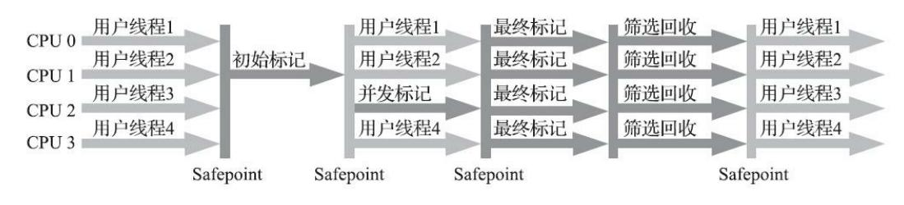

图3-13 G1收集器运行示意图

毫无疑问,可以由用户指定期望的停顿时间是G1收集器很强大的一个功能,设置不同的期望停顿 时间,可使得G1在不同应用场景中取得关注吞吐量和关注延迟之间的最佳平衡。不过,这里设置 的"期望值"必须是符合实际的,不能异想天开,毕竟G1是要冻结用户线程来复制对象的,这个停顿时 间再怎么低也得有个限度。它默认的停顿目标为两百毫秒,一般来说,回收阶段占到几十到一百甚至 接近两百毫秒都很正常,但如果我们把停顿时间调得非常低,譬如设置为二十毫秒,很可能出现的结 果就是由于停顿目标时间太短,导致每次选出来的回收集只占堆内存很小的一部分,收集器收集的速 度逐渐跟不上分配器分配的速度,导致垃圾慢慢堆积。很可能一开始收集器还能从空闲的堆内存中获 得一些喘息的时间,但应用运行时间一长就不行了,最终占满堆引发Full GC反而降低性能,所以通常 把期望停顿时间设置为一两百毫秒或者两三百毫秒会是比较合理的。

从G1开始,最先进的垃圾收集器的设计导向都不约而同地变为追求能够应付应用的内存分配速率 (Allocation Rate),而不追求一次把整个Java堆全部清理干净。这样,应用在分配,同时收集器在收 集,只要收集的速度能跟得上对象分配的速度,那一切就能运作得很完美。这种新的收集器设计思路 从工程实现上看是从G1开始兴起的,所以说G1是收集器技术发展的一个里程碑。

G1收集器常会被拿来与CMS收集器互相比较,毕竟它们都非常关注停顿时间的控制,官方资料 [5]中将它们两个并称为"The Mostly Concurrent Collectors"。在未来,G1收集器最终还是要取代CMS 的,而当下它们两者并存的时间里,分个高低优劣就无可避免。

相比CMS,G1的优点有很多,暂且不论可以指定最大停顿时间、分Region的内存布局、按收益动 态确定回收集这些创新性设计带来的红利,单从最传统的算法理论上看,G1也更有发展潜力。与CMS 的"标记-清除"算法不同,G1从整体来看是基于"标记-整理"算法实现的收集器,但从局部(两个Region 之间)上看又是基于"标记-复制"算法实现,无论如何,这两种算法都意味着G1运作期间不会产生内存 空间碎片,垃圾收集完成之后能提供规整的可用内存。这种特性有利于程序长时间运行,在程序为大 对象分配内存时不容易因无法找到连续内存空间而提前触发下一次收集。

不过,G1相对于CMS仍然不是占全方位、压倒性优势的,从它出现几年仍不能在所有应用场景中

代替CMS就可以得知这个结论。比起CMS,G1的弱项也可以列举出不少,如在用户程序运行过程 中,G1无论是为了垃圾收集产生的内存占用(Footprint)还是程序运行时的额外执行负载 (Overload)都要比CMS要高。

就内存占用来说,虽然G1和CMS都使用卡表来处理跨代指针,但G1的卡表实现更为复杂,而且 堆中每个Region,无论扮演的是新生代还是老年代角色,都必须有一份卡表,这导致G1的记忆集(和 其他内存消耗)可能会占整个堆容量的20%乃至更多的内存空间;相比起来CMS的卡表就相当简单, 只有唯一一份,而且只需要处理老年代到新生代的引用,反过来则不需要,由于新生代的对象具有朝 生夕灭的不稳定性,引用变化频繁,能省下这个区域的维护开销是很划算的[6]。

在执行负载的角度上,同样由于两个收集器各自的细节实现特点导致了用户程序运行时的负载会 有不同,譬如它们都使用到写屏障,CMS用写后屏障来更新维护卡表;而G1除了使用写后屏障来进行 同样的(由于G1的卡表结构复杂,其实是更烦琐的)卡表维护操作外,为了实现原始快照搜索 (SATB)算法,还需要使用写前屏障来跟踪并发时的指针变化情况。相比起增量更新算法,原始快照 搜索能够减少并发标记和重新标记阶段的消耗,避免CMS那样在最终标记阶段停顿时间过长的缺点, 但是在用户程序运行过程中确实会产生由跟踪引用变化带来的额外负担。由于G1对写屏障的复杂操作 要比CMS消耗更多的运算资源,所以CMS的写屏障实现是直接的同步操作,而G1就不得不将其实现 为类似于消息队列的结构,把写前屏障和写后屏障中要做的事情都放到队列里,然后再异步处理。

以上的优缺点对比仅仅是针对G1和CMS两款垃圾收集器单独某方面的实现细节的定性分析,通常 我们说哪款收集器要更好、要好上多少,往往是针对具体场景才能做的定量比较。按照笔者的实践经 验,目前在小内存应用上CMS的表现大概率仍然要会优于G1,而在大内存应用上G1则大多能发挥其 优势,这个优劣势的Java堆容量平衡点通常在6GB至8GB之间,当然,以上这些也仅是经验之谈,不 同应用需要量体裁衣地实际测试才能得出最合适的结论,随着HotSpot的开发者对G1的不断优化,也 会让对比结果继续向G1倾斜。

- [1] JEP 291:Deprecate the Concurrent Mark Sweep(CMS)Garbage Collector。
- [2] JEP 304:Garbage Collector Interface。
- [3] 图片来源:https://www.infoq.com/articles/G1-One-Garbage-Collector-To-Rule-Them-All。
- [4] 原文是:It meets garbage collection pause time goals with a high probability,while achieving high throughput。
- [5] 资料来源:https://docs.oracle.com/en/java/javase/11/gctuning/available-collectors.html。
- [6] 代价就是当CMS发生Old GC时(所有收集器中只有CMS有针对老年代的Old GC),要把整个新生 代作为GC Roots来进行扫描。

#### 3.6 低延迟垃圾收集器

HotSpot的垃圾收集器从Serial发展到CMS再到G1,经历了逾二十年时间,经过了数百上千万台服 务器上的应用实践,已经被淬炼得相当成熟了,不过它们距离"完美"还是很遥远。怎样的收集器才算 是"完美"呢?这听起来像是一道主观题,其实不然,完美难以实现,但是我们确实可以把它客观描述 出来。

衡量垃圾收集器的三项最重要的指标是:内存占用(Footprint)、吞吐量(Throughput)和延迟 (Latency),三者共同构成了一个"不可能三角[1]"。三者总体的表现会随技术进步而越来越好,但是 要在这三个方面同时具有卓越表现的"完美"收集器是极其困难甚至是不可能的,一款优秀的收集器通 常最多可以同时达成其中的两项。

在内存占用、吞吐量和延迟这三项指标里,延迟的重要性日益凸显,越发备受关注。其原因是随 着计算机硬件的发展、性能的提升,我们越来越能容忍收集器多占用一点点内存;硬件性能增长,对 软件系统的处理能力是有直接助益的,硬件的规格和性能越高,也有助于降低收集器运行时对应用程 序的影响,换句话说,吞吐量会更高。但对延迟则不是这样,硬件规格提升,准确地说是内存的扩 大,对延迟反而会带来负面的效果,这点也是很符合直观思维的:虚拟机要回收完整的1TB的堆内 存,毫无疑问要比回收1GB的堆内存耗费更多时间。由此,我们就不难理解为何延迟会成为垃圾收集 器最被重视的性能指标了。现在我们来观察一下现在已接触过的垃圾收集器的停顿状况,如图3-14所 示。

图3-14中浅色阶段表示必须挂起用户线程,深色表示收集器线程与用户线程是并发工作的。由图 3-14可见,在CMS和G1之前的全部收集器,其工作的所有步骤都会产生"Stop The World"式的停顿; CMS和G1分别使用增量更新和原始快照(见3.4.6节)技术,实现了标记阶段的并发,不会因管理的堆 内存变大,要标记的对象变多而导致停顿时间随之增长。但是对于标记阶段之后的处理,仍未得到妥 善解决。CMS使用标记-清除算法,虽然避免了整理阶段收集器带来的停顿,但是清除算法不论如何优 化改进,在设计原理上避免不了空间碎片的产生,随着空间碎片不断淤积最终依然逃不过"Stop The World"的命运。G1虽然可以按更小的粒度进行回收,从而抑制整理阶段出现时间过长的停顿,但毕竟 也还是要暂停的。

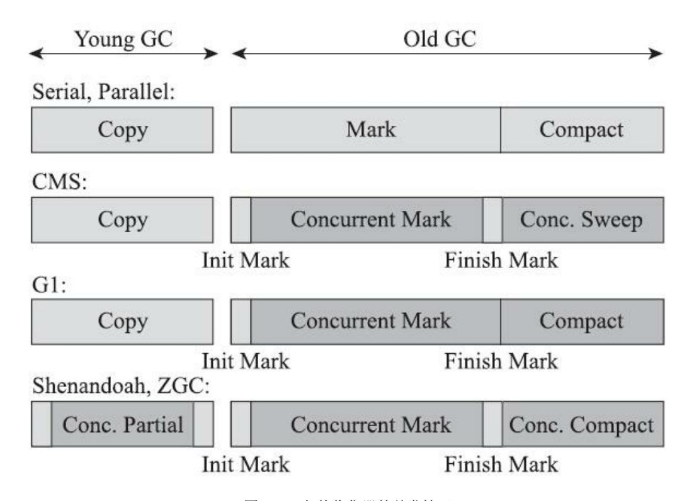

图3-14 各款收集器的并发情况

读者肯定也从图3-14中注意到了,最后的两款收集器,Shenandoah和ZGC,几乎整个工作过程全 部都是并发的,只有初始标记、最终标记这些阶段有短暂的停顿,这部分停顿的时间基本上是固定 的,与堆的容量、堆中对象的数量没有正比例关系。实际上,它们都可以在任意可管理的(譬如现在 ZGC只能管理4TB以内的堆)堆容量下,实现垃圾收集的停顿都不超过十毫秒这种以前听起来是天方 夜谭、匪夷所思的目标。这两款目前仍处于实验状态的收集器,被官方命名为"低延迟垃圾收集 器"(Low-Latency Garbage Collector或者Low-Pause-Time Garbage Collector)。

[1] 不可能三角:https://zh.wikipedia.org/wiki/三元悖论。

# 3.6.1 Shenandoah收集器

在本书所出现的众多垃圾收集器里,Shenandoah大概是最"孤独"的一个。现代社会竞争激烈,连 一个公司里不同团队之间都存在"部门墙",那Shenandoah作为第一款不由Oracle(包括以前的Sun)公 司的虚拟机团队所领导开发的HotSpot垃圾收集器,不可避免地会受到一些来自"官方"的排挤。在笔者 撰写这部分内容时[1],Oracle仍明确拒绝在OracleJDK 12中支持Shenandoah收集器,并执意在打包 OracleJDK时通过条件编译完全排除掉了Shenandoah的代码,换句话说,Shenandoah是一款只有 OpenJDK才会包含,而OracleJDK里反而不存在的收集器,"免费开源版"比"收费商业版"功能更多,这 是相对罕见的状况[2]。如果读者的项目要求用到Oracle商业支持的话,就不得不把Shenandoah排除在选 择范围之外了。

最初Shenandoah是由RedHat公司独立发展的新型收集器项目,在2014年RedHat把Shenandoah贡献 给了OpenJDK,并推动它成为OpenJDK 12的正式特性之一,也就是后来的JEP 189。这个项目的目标 是实现一种能在任何堆内存大小下都可以把垃圾收集的停顿时间限制在十毫秒以内的垃圾收集器,该 目标意味着相比CMS和G1,Shenandoah不仅要进行并发的垃圾标记,还要并发地进行对象清理后的整 理动作。

从代码历史渊源上讲,比起稍后要介绍的有着Oracle正朔血统的ZGC,Shenandoah反而更像是G1 的下一代继承者,它们两者有着相似的堆内存布局,在初始标记、并发标记等许多阶段的处理思路上 都高度一致,甚至还直接共享了一部分实现代码,这使得部分对G1的打磨改进和Bug修改会同时反映 在Shenandoah之上,而由于Shenandoah加入所带来的一些新特性,也有部分会出现在G1收集器中,譬 如在并发失败后作为"逃生门"的Full GC [3],G1就是由于合并了Shenandoah的代码才获得多线程Full GC的支持。

那Shenandoah相比起G1又有什么改进呢?虽然Shenandoah也是使用基于Region的堆内存布局,同样 有着用于存放大对象的Humongous Region,默认的回收策略也同样是优先处理回收价值最大的 Region……但在管理堆内存方面,它与G1至少有三个明显的不同之处,最重要的当然是支持并发的整 理算法,G1的回收阶段是可以多线程并行的,但却不能与用户线程并发,这点作为Shenandoah最核心 的功能稍后笔者会着重讲解。其次,Shenandoah(目前)是默认不使用分代收集的,换言之,不会有 专门的新生代Region或者老年代Region的存在,没有实现分代,并不是说分代对Shenandoah没有价值, 这更多是出于性价比的权衡,基于工作量上的考虑而将其放到优先级较低的位置上。最后, Shenandoah摒弃了在G1中耗费大量内存和计算资源去维护的记忆集,改用名为"连接矩阵"(Connection Matrix)的全局数据结构来记录跨Region的引用关系,降低了处理跨代指针时的记忆集维护消耗,也降 低了伪共享问题(见3.4.4节)的发生概率。连接矩阵可以简单理解为一张二维表格,如果Region N有 对象指向Region M,就在表格的N行M列中打上一个标记,如图3-15所示,如果Region 5中的对象Baz 引用了Region 3的Foo,Foo又引用了Region 1的Bar,那连接矩阵中的5行3列、3行1列就应该被打上标 记。在回收时通过这张表格就可以得出哪些Region之间产生了跨代引用。

Shenandoah收集器的工作过程大致可以划分为以下九个阶段(此处以Shenandoah在2016年发表的原 始论文[4]进行介绍。在最新版本的Shenandoah 2.0中,进一步强化了"部分收集"的特性,初始标记之前 还有Initial Partial、Concurrent Partial和Final Partial阶段,它们可以不太严谨地理解为对应于以前分代收

| Region<br>Number | 1 | 2 | 3 | 4 | 5 | 6 | 7 |
|------------------|---|---|---|---|---|---|---|
| 1                |   | × |   |   |   |   |   |
| 2                |   |   |   |   |   |   |   |
| 3                |   |   |   |   | × |   |   |
| 4                |   |   |   |   |   |   |   |
| 5                |   |   |   |   |   |   |   |
| 6                |   |   |   |   |   |   |   |
| 7                |   |   |   |   |   |   |   |

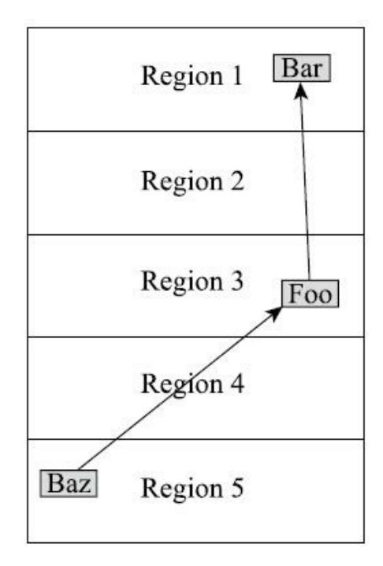

图3-15 Shenandoah收集器的连接矩阵示意图

- ·初始标记(Initial Marking):与G1一样,首先标记与GC Roots直接关联的对象,这个阶段仍 是"Stop The World"的,但停顿时间与堆大小无关,只与GC Roots的数量相关。
- ·并发标记(Concurrent Marking):与G1一样,遍历对象图,标记出全部可达的对象,这个阶段 是与用户线程一起并发的,时间长短取决于堆中存活对象的数量以及对象图的结构复杂程度。
- ·最终标记(Final Marking):与G1一样,处理剩余的SATB扫描,并在这个阶段统计出回收价值 最高的Region,将这些Region构成一组回收集(Collection Set)。最终标记阶段也会有一小段短暂的停 顿。
- ·并发清理(Concurrent Cleanup):这个阶段用于清理那些整个区域内连一个存活对象都没有找到 的Region(这类Region被称为Immediate Garbage Region)。
- ·并发回收(Concurrent Evacuation):并发回收阶段是Shenandoah与之前HotSpot中其他收集器的 核心差异。在这个阶段,Shenandoah要把回收集里面的存活对象先复制一份到其他未被使用的Region之 中。复制对象这件事情如果将用户线程冻结起来再做那是相当简单的,但如果两者必须要同时并发进 行的话,就变得复杂起来了。其困难点是在移动对象的同时,用户线程仍然可能不停对被移动的对象 进行读写访问,移动对象是一次性的行为,但移动之后整个内存中所有指向该对象的引用都还是旧对

象的地址,这是很难一瞬间全部改变过来的。对于并发回收阶段遇到的这些困难,Shenandoah将会通 过读屏障和被称为"Brooks Pointers"的转发指针来解决(讲解完Shenandoah整个工作过程之后笔者还要 再回头介绍它)。并发回收阶段运行的时间长短取决于回收集的大小。

·初始引用更新(Initial Update Reference):并发回收阶段复制对象结束后,还需要把堆中所有指 向旧对象的引用修正到复制后的新地址,这个操作称为引用更新。引用更新的初始化阶段实际上并未 做什么具体的处理,设立这个阶段只是为了建立一个线程集合点,确保所有并发回收阶段中进行的收 集器线程都已完成分配给它们的对象移动任务而已。初始引用更新时间很短,会产生一个非常短暂的 停顿。

·并发引用更新(Concurrent Update Reference):真正开始进行引用更新操作,这个阶段是与用户 线程一起并发的,时间长短取决于内存中涉及的引用数量的多少。并发引用更新与并发标记不同,它 不再需要沿着对象图来搜索,只需要按照内存物理地址的顺序,线性地搜索出引用类型,把旧值改为 新值即可。

·最终引用更新(Final Update Reference):解决了堆中的引用更新后,还要修正存在于GC Roots 中的引用。这个阶段是Shenandoah的最后一次停顿,停顿时间只与GC Roots的数量相关。

·并发清理(Concurrent Cleanup):经过并发回收和引用更新之后,整个回收集中所有的Region已 再无存活对象,这些Region都变成Immediate Garbage Regions了,最后再调用一次并发清理过程来回收 这些Region的内存空间,供以后新对象分配使用。

以上对Shenandoah收集器这九个阶段的工作过程的描述可能拆分得略为琐碎,读者只要抓住其中 三个最重要的并发阶段(并发标记、并发回收、并发引用更新),就能比较容易理清Shenandoah是如 何运作的了。图3-16 [5]中黄色的区域代表的是被选入回收集的Region,绿色部分就代表还存活的对 象,蓝色就是用户线程可以用来分配对象的内存Region了。图3-16中不仅展示了Shenandoah三个并发阶 段的工作过程,还能形象地表示出并发标记阶段如何找出回收对象确定回收集,并发回收阶段如何移 动回收集中的存活对象,并发引用更新阶段如何将指向回收集中存活对象的所有引用全部修正,此后 回收集便不存在任何引用可达的存活对象了。

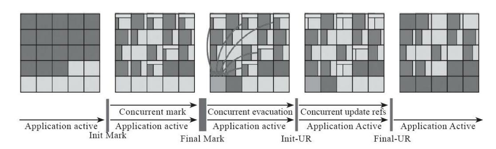

图3-16 Shenandoah收集器的工作过程

学习了Shenandoah收集器的工作过程,我们再来聊一下Shenandoah用以支持并行整理的核心概念

——Brooks Pointer。"Brooks"是一个人的名字。1984年,Rodney A.Brooks在论文《Trading Data Space for Reduced Time and Code Space in Real-Time Garbage Collection on Stock Hardware》中提出了使用转发 指针(Forwarding Pointer,也常被称为Indirection Pointer)来实现对象移动与用户程序并发的一种解决 方案。此前,要做类似的并发操作,通常是在被移动对象原有的内存上设置保护陷阱(Memory Protection Trap),一旦用户程序访问到归属于旧对象的内存空间就会产生自陷中段,进入预设好的异 常处理器中,再由其中的代码逻辑把访问转发到复制后的新对象上。虽然确实能够实现对象移动与用 户线程并发,但是如果没有操作系统层面的直接支持,这种方案将导致用户态频繁切换到核心态[6], 代价是非常大的,不能频繁使用[7]。

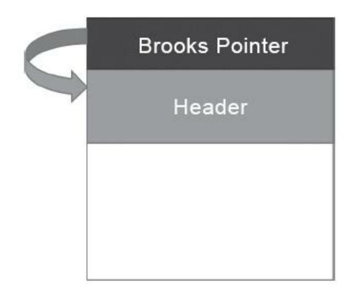

图3-17 Brooks Pointers示意图(一)

Brooks提出的新方案不需要用到内存保护陷阱,而是在原有对象布局结构的最前面统一增加一个 新的引用字段,在正常不处于并发移动的情况下,该引用指向对象自己,如图3-17所示。

从结构上来看,Brooks提出的转发指针与某些早期Java虚拟机使用过的句柄定位(关于对象定位 详见第2章)有一些相似之处,两者都是一种间接性的对象访问方式,差别是句柄通常会统一存储在专 门的句柄池中,而转发指针是分散存放在每一个对象头前面。

有了转发指针之后,有何收益暂且不论,所有间接对象访问技术的缺点都是相同的,也是非常显 著的——每次对象访问会带来一次额外的转向开销,尽管这个开销已经被优化到只有一行汇编指令的 程度,譬如以下所示:

mov r13,QWORD PTR [r12+r14\*8-0x8]

阱的方案已经好了很多。转发指针加入后带来的收益自然是当对象拥有了一份新的副本时,只需要修 改一处指针的值,即旧对象上转发指针的引用位置,使其指向新对象,便可将所有对该对象的访问转 发到新的副本上。这样只要旧对象的内存仍然存在,未被清理掉,虚拟机内存中所有通过旧引用地址 访问的代码便仍然可用,都会被自动转发到新对象上继续工作,如图3-18所示。

需要注意,Brooks形式的转发指针在设计上决定了它是必然会出现多线程竞争问题的,如果收集 器线程与用户线程发生的只是并发读取,那无论读到旧对象还是新对象上的字段,返回的结果都应该 是一样的,这个场景还可以有一些"偷懒"的处理余地;但如果发生的是并发写入,就一定必须保证写 操作只能发生在新复制的对象上,而不是写入旧对象的内存中。读者不妨设想以下三件事情并发进行 时的场景:

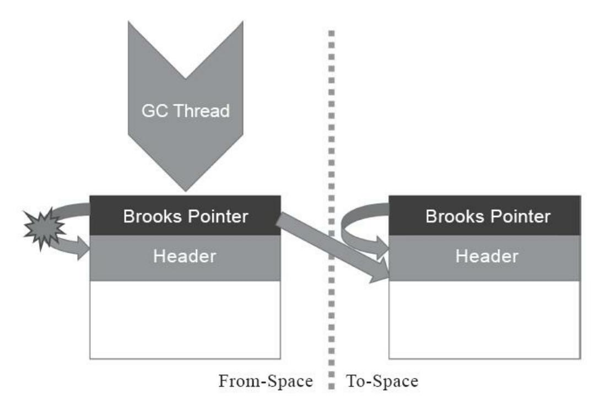

图3-18 Brooks Pointers示意图(二)

- 1)收集器线程复制了新的对象副本;
- 2)用户线程更新对象的某个字段;
- 3)收集器线程更新转发指针的引用值为新副本地址。

如果不做任何保护措施,让事件2在事件1、事件3之间发生的话,将导致的结果就是用户线程对对 象的变更发生在旧对象上,所以这里必须针对转发指针的访问操作采取同步措施,让收集器线程或者

用户线程对转发指针的访问只有其中之一能够成功,另外一个必须等待,避免两者交替进行。实际上 Shenandoah收集器是通过比较并交换(Compare And Swap,CAS)操作[8]来保证并发时对象的访问正 确性的。

转发指针另一点必须注意的是执行频率的问题,尽管通过对象头上的Brooks Pointer来保证并发时 原对象与复制对象的访问一致性,这件事情只从原理上看是不复杂的,但是"对象访问"这四个字的分 量是非常重的,对于一门面向对象的编程语言来说,对象的读取、写入,对象的比较,为对象哈希值 计算,用对象加锁等,这些操作都属于对象访问的范畴,它们在代码中比比皆是,要覆盖全部对象访 问操作,Shenandoah不得不同时设置读、写屏障去拦截。

之前介绍其他收集器时,或者是用于维护卡表,或者是用于实现并发标记,写屏障已被使用多 次,累积了不少的处理任务了,这些写屏障有相当一部分在Shenandoah收集器中依然要被使用到。除 此以外,为了实现Brooks Pointer,Shenandoah在读、写屏障中都加入了额外的转发处理,尤其是使用 读屏障的代价,这是比写屏障更大的。代码里对象读取的出现频率要比对象写入的频率高出很多,读 屏障数量自然也要比写屏障多得多,所以读屏障的使用必须更加谨慎,不允许任何的重量级操作。 Shenandoah是本书中第一款使用到读屏障的收集器,它的开发者也意识到数量庞大的读屏障带来的性 能开销会是Shenandoah被诟病的关键点之一[9],所以计划在JDK 13中将Shenandoah的内存屏障模型改 进为基于引用访问屏障(Load Reference Barrier)[10]的实现,所谓"引用访问屏障"是指内存屏障只拦 截对象中数据类型为引用类型的读写操作,而不去管原生数据类型等其他非引用字段的读写,这能够 省去大量对原生类型、对象比较、对象加锁等场景中设置内存屏障所带来的消耗。

最后来谈谈Shenandoah在实际应用中的性能表现,Shenandoah的开发团队或者其他第三方测试者在 网上都公布了一系列测试,结果各有差异。笔者在此选择展示了一份RedHat官方在2016年所发表的 Shenandoah实现论文中给出的应用实测数据,测试内容是使用ElasticSearch对200GB的维基百科数据进 行索引[11],如表3-2所示。从结果来看,应该说2016年做该测试时的Shenandoah并没有完全达成预定 目标,停顿时间比其他几款收集器确实有了质的飞跃,但也并未实现最大停顿时间控制在十毫秒以内 的目标,而吞吐量方面则出现了很明显的下降,其总运行时间是所有测试收集器中最长的。读者可以 从这个官方的测试结果来对Shenandoah的弱项(高运行负担使得吞吐量下降)和强项(低延迟时间) 建立量化的概念,并对比一下稍后介绍的ZGC的测试结果。

| 收 集 器             | 运行时间     | 总 停 顿  | 最 大 停 顿 | 平均停顿     |
|-------------------|----------|--------|---------|----------|
| Shenandoah        | 387.602s | 320ms  | 89.79ms | 53.01ms  |
| G1                | 312.052s | 11.7s  | 1.24s   | 450.12ms |
| CMS               | 285.264s | 12.78s | 4.39s   | 852.26ms |
| Parallel Scavenge | 260.092s | 6.59s  | 3.04s   | 823.75ms |

表3-2 Shenandoah在实际应用中的测试数据

Shenandoah收集器作为第一款由非Oracle开发的垃圾收集器,一开始就预计到了缺乏Oracle公司那 样富有经验的研发团队可能会遇到很多困难。所以Shenandoah采取了"小步快跑"的策略,将最终目标 进行拆分,分别形成Shenandoah 1.0、2.0、3.0……这样的小版本计划,在每个版本中迭代改进,现在

已经可以看到Shenandoah的性能在日益改善,逐步接近"Low-Pause"的目标。此外,RedHat也积极拓展 Shenandoah的使用范围,将其Backport到JDK 11甚至是JDK 8之上,让更多不方便升级JDK版本的应用 也能够享受到垃圾收集器技术发展的最前沿成果。

- [1] 这部分内容的撰写时间是2019年5月,以后的版本中双方博弈可能存在变数。相关内容可参见: https://bugs.openjdk.java.net/browse/JDK-8215030。
- [2] 这里主要是调侃,OpenJDK和OracleJDK之间的关系并不仅仅是收费和免费的问题,详情可参见本 书第1章。
- [3] JEP 307:Parallel Full GC for G1。
- [4] 论文地址:https://www.researchgate.net/publication/306112816\_Shenandoah\_An\_opensource\_concurrent\_compacting\_garbage\_collector\_for\_OpenJDK。
- [5] 此例子中的图片引用了Aleksey Shipilev在DEVOXX 2017上的主题演讲:《Shenandoah GC Part I: The Garbage Collector That Could》,地址为https://shipilev.net/talks/devoxx-Nov2017-shenandoah.pdf。因 本书是黑白印刷,颜色可能难以分辨,读者可以下载原文查看。
- [6] 用户态、核心态是一种操作系统内核模式,具体见:https://zh.wikipedia.org/wiki/核心态。
- [7] 但如果能有来自操作系统内核的支持的话,就不是没有办法解决,业界公认最优秀的Azul C4收集 器就使用了这种方案。
- [8] 关于临界区、锁、CAS等概念,是计算机体系的基础知识,如果读者对此不了解的话,可以参考第 13章中的相关介绍。
- [9] Roman Kennke(JEP 189的Owner):It resolves one major point of criticism against Shenandoah,that is their expensive primitive read-barriers。
- [10] 资料来源:https://rkennke.wordpress.com/2019/05/15/shenandoah-gc-in-jdk13-part-i-load-referencebarriers/。
- [11] 该论文是以2014~2015年间最初版本的Shenandoah为测试对象,在2017年,Christine Flood在Java-One的演讲中,进行了相同测试,Shenandoah的运行时间已经优化到335秒。相信在读者阅读到这段文 字时,Shenandoah的实际表现在多数应用中均会优于结果中反映的水平。

# 3.6.2 ZGC收集器

ZGC("Z"并非什么专业名词的缩写,这款收集器的名字就叫作Z Garbage Collector)是一款在 JDK 11中新加入的具有实验性质[1]的低延迟垃圾收集器,是由Oracle公司研发的。2018年Oracle创建了 JEP 333将ZGC提交给OpenJDK,推动其进入OpenJDK 11的发布清单之中。

ZGC和Shenandoah的目标是高度相似的,都希望在尽可能对吞吐量影响不太大的前提下[2],实现 在任意堆内存大小下都可以把垃圾收集的停顿时间限制在十毫秒以内的低延迟。但是ZGC和 Shenandoah的实现思路又是差异显著的,如果说RedHat公司开发的Shen-andoah像是Oracle的G1收集器 的实际继承者的话,那Oracle公司开发的ZGC就更像是Azul System公司独步天下的PGC(Pauseless GC)和C4(Concurrent Continuously CompactingCollector)收集器的同胞兄弟。

早在2005年,运行在Azul VM上的PGC就已经实现了标记和整理阶段都全程与用户线程并发运行 的垃圾收集,而运行在Zing VM上的C4收集器是PGC继续演进的产物,主要增加了分代收集支持,大 幅提升了收集器能够承受的对象分配速度。无论从算法还是实现原理上来讲,PGC和C4肯定算是一脉 相承的,而ZGC虽然并非Azul公司的产品,但也应视为这条脉络上的另一个节点,因为ZGC几乎所有 的关键技术上,与PGC和C4都只存在术语称谓上的差别,实质内容几乎是一模一样的。相信到这里读 者应该已经对Java虚拟机收集器常见的专业术语都有所了解了,如果不避讳专业术语的话,我们可以 给ZGC下一个这样的定义来概括它的主要特征:ZGC收集器是一款基于Region内存布局的,(暂时) 不设分代的,使用了读屏障、染色指针和内存多重映射等技术来实现可并发的标记-整理算法的,以低 延迟为首要目标的一款垃圾收集器。接下来,笔者将逐项来介绍ZGC的这些技术特点。

首先从ZGC的内存布局说起。与Shenandoah和G1一样,ZGC也采用基于Region的堆内存布局,但 与它们不同的是,ZGC的Region(在一些官方资料中将它称为Page或者ZPage,本章为行文一致继续称 为Region)具有动态性——动态创建和销毁,以及动态的区域容量大小。在x64硬件平台下,ZGC的 Region可以具有如图3-19所示的大、中、小三类容量:

- ·小型Region(Small Region):容量固定为2MB,用于放置小于256KB的小对象。
- ·中型Region(Medium Region):容量固定为32MB,用于放置大于等于256KB但小于4MB的对 象。
- ·大型Region(Large Region):容量不固定,可以动态变化,但必须为2MB的整数倍,用于放置 4MB或以上的大对象。每个大型Region中只会存放一个大对象,这也预示着虽然名字叫作"大型 Region",但它的实际容量完全有可能小于中型Region,最小容量可低至4MB。大型Region在ZGC的实 现中是不会被重分配(重分配是ZGC的一种处理动作,用于复制对象的收集器阶段,稍后会介绍到) 的,因为复制一个大对象的代价非常高昂。


图3-19 ZGC的堆内存布局

接下来是ZGC的核心问题——并发整理算法的实现。Shenandoah使用转发指针和读屏障来实现并 发整理,ZGC虽然同样用到了读屏障,但用的却是一条与Shenandoah完全不同,更加复杂精巧的解题 思路。

ZGC收集器有一个标志性的设计是它采用的染色指针技术(Colored Pointer,其他类似的技术中可 能将它称为Tag Pointer或者Version Pointer)。从前,如果我们要在对象上存储一些额外的、只供收集 器或者虚拟机本身使用的数据,通常会在对象头中增加额外的存储字段(详见2.3.2节的内容),如对 象的哈希码、分代年龄、锁记录等就是这样存储的。这种记录方式在有对象访问的场景下是很自然流 畅的,不会有什么额外负担。但如果对象存在被移动过的可能性,即不能保证对象访问能够成功呢? 又或者有一些根本就不会去访问对象,但又希望得知该对象的某些信息的应用场景呢?能不能从指针 或者与对象内存无关的地方得到这些信息,譬如是否能够看出来对象被移动过?这样的要求并非不合 理的刁难,先不去说并发移动对象可能带来的可访问性问题,此前我们就遇到过这样的要求——追踪 式收集算法的标记阶段就可能存在只跟指针打交道而不必涉及指针所引用的对象本身的场景。例如对 象标记的过程中需要给对象打上三色标记(见3.4.6节),这些标记本质上就只和对象的引用有关,而 与对象本身无关——某个对象只有它的引用关系能决定它存活与否,对象上其他所有的属性都不能够 影响它的存活判定结果。HotSpot虚拟机的几种收集器有不同的标记实现方案,有的把标记直接记录在 对象头上(如Serial收集器),有的把标记记录在与对象相互独立的数据结构上(如G1、Shenandoah使 用了一种相当于堆内存的1/64大小的,称为BitMap的结构来记录标记信息),而ZGC的染色指针是最 直接的、最纯粹的,它直接把标记信息记在引用对象的指针上,这时,与其说可达性分析是遍历对象

图来标记对象,还不如说是遍历"引用图"来标记"引用"了。

染色指针是一种直接将少量额外的信息存储在指针上的技术,可是为什么指针本身也可以存储额 外信息呢?在64位系统中,理论可以访问的内存高达16EB(2的64次幂)字节[3]。实际上,基于需求 (用不到那么多内存)、性能(地址越宽在做地址转换时需要的页表级数越多)和成本(消耗更多晶 体管)的考虑,在AMD64架构[4]中只支持到52位(4PB)的地址总线和48位(256TB)的虚拟地址空 间,所以目前64位的硬件实际能够支持的最大内存只有256TB。此外,操作系统一侧也还会施加自己 的约束,64位的Linux则分别支持47位(128TB)的进程虚拟地址空间和46位(64TB)的物理地址空 间,64位的Windows系统甚至只支持44位(16TB)的物理地址空间。

尽管Linux下64位指针的高18位不能用来寻址,但剩余的46位指针所能支持的64TB内存在今天仍 然能够充分满足大型服务器的需要。鉴于此,ZGC的染色指针技术继续盯上了这剩下的46位指针宽 度,将其高4位提取出来存储四个标志信息。通过这些标志位,虚拟机可以直接从指针中看到其引用对 象的三色标记状态、是否进入了重分配集(即被移动过)、是否只能通过finalize()方法才能被访问 到,如图3-20所示。当然,由于这些标志位进一步压缩了原本就只有46位的地址空间,也直接导致 ZGC能够管理的内存不可以超过4TB(2的42次幂)[5]。

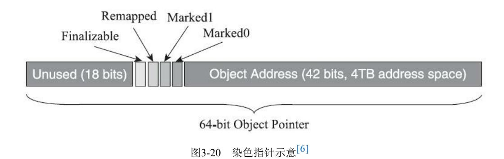

虽然染色指针有4TB的内存限制,不能支持32位平台,不能支持压缩指针(-XX: +UseCompressedOops)等诸多约束,但它带来的收益也是非常可观的,在JEP 333的描述页[7]中, ZGC的设计者Per Liden在"描述"小节里花了全文过半的篇幅来陈述染色指针的三大优势:

·染色指针可以使得一旦某个Region的存活对象被移走之后,这个Region立即就能够被释放和重用 掉,而不必等待整个堆中所有指向该Region的引用都被修正后才能清理。这点相比起Shenandoah是一个 颇大的优势,使得理论上只要还有一个空闲Region,ZGC就能完成收集,而Shenandoah需要等到引用 更新阶段结束以后才能释放回收集中的Region,这意味着堆中几乎所有对象都存活的极端情况,需要 1∶1复制对象到新Region的话,就必须要有一半的空闲Region来完成收集。至于为什么染色指针能够导 致这样的结果,笔者将在后续解释其"自愈"特性的时候进行解释。

·染色指针可以大幅减少在垃圾收集过程中内存屏障的使用数量,设置内存屏障,尤其是写屏障的 目的通常是为了记录对象引用的变动情况,如果将这些信息直接维护在指针中,显然就可以省去一些 专门的记录操作。实际上,到目前为止ZGC都并未使用任何写屏障,只使用了读屏障(一部分是染色

指针的功劳,一部分是ZGC现在还不支持分代收集,天然就没有跨代引用的问题)。内存屏障对程序 运行时性能的损耗在前面章节中已经讲解过,能够省去一部分的内存屏障,显然对程序运行效率是大 有裨益的,所以ZGC对吞吐量的影响也相对较低。

·染色指针可以作为一种可扩展的存储结构用来记录更多与对象标记、重定位过程相关的数据,以 便日后进一步提高性能。现在Linux下的64位指针还有前18位并未使用,它们虽然不能用来寻址,却可 以通过其他手段用于信息记录。如果开发了这18位,既可以腾出已用的4个标志位,将ZGC可支持的 最大堆内存从4TB拓展到64TB,也可以利用其余位置再存储更多的标志,譬如存储一些追踪信息来让 垃圾收集器在移动对象时能将低频次使用的对象移动到不常访问的内存区域。

不过,要顺利应用染色指针有一个必须解决的前置问题:Java虚拟机作为一个普普通通的进程, 这样随意重新定义内存中某些指针的其中几位,操作系统是否支持?处理器是否支持?这是很现实的 问题,无论中间过程如何,程序代码最终都要转换为机器指令流交付给处理器去执行,处理器可不会 管指令流中的指针哪部分存的是标志位,哪部分才是真正的寻址地址,只会把整个指针都视作一个内 存地址来对待。这个问题在Solaris/SPARC平台上比较容易解决,因为SPARC硬件层面本身就支持虚拟 地址掩码,设置之后其机器指令直接就可以忽略掉染色指针中的标志位。但在x86-64平台上并没有提 供类似的黑科技,ZGC设计者就只能采取其他的补救措施了,这里面的解决方案要涉及虚拟内存映射 技术,让我们先来复习一下这个x86计算机体系中的经典设计。

在远古时代的x86计算机系统里面,所有进程都是共用同一块物理内存空间的,这样会导致不同进 程之间的内存无法相互隔离,当一个进程污染了别的进程内存后,就只能对整个系统进行复位后才能 得以恢复。为了解决这个问题,从Intel 80386处理器开始,提供了"保护模式"用于隔离进程。在保护模 式下,386处理器的全部32条地址寻址线都有效,进程可访问最高也可达4GB的内存空间,但此时已不 同于之前实模式下的物理内存寻址了,处理器会使用分页管理机制把线性地址空间和物理地址空间分 别划分为大小相同的块,这样的内存块被称为"页"(Page)。通过在线性虚拟空间的页与物理地址空 间的页之间建立的映射表,分页管理机制会进行线性地址到物理地址空间的映射,完成线性地址到物 理地址的转换[8]。如果读者对计算机结构体系了解不多的话,不妨设想这样一个场景来类比:假如你 要去"中山一路3号"这个地址拜访一位朋友,根据你所处城市的不同,譬如在广州或者在上海,是能够 通过这个"相同的地址"定位到两个完全独立的物理位置的,这时地址与物理位置是一对多关系映射。

不同层次的虚拟内存到物理内存的转换关系可以在硬件层面、操作系统层面或者软件进程层面实 现,如何完成地址转换,是一对一、多对一还是一对多的映射,也可以根据实际需要来设计。 Linux/x86-64平台上的ZGC使用了多重映射(Multi-Mapping)将多个不同的虚拟内存地址映射到同一 个物理内存地址上,这是一种多对一映射,意味着ZGC在虚拟内存中看到的地址空间要比实际的堆内 存容量来得更大。把染色指针中的标志位看作是地址的分段符,那只要将这些不同的地址段都映射到 同一个物理内存空间,经过多重映射转换后,就可以使用染色指针正常进行寻址了,效果如图3-21所 示。

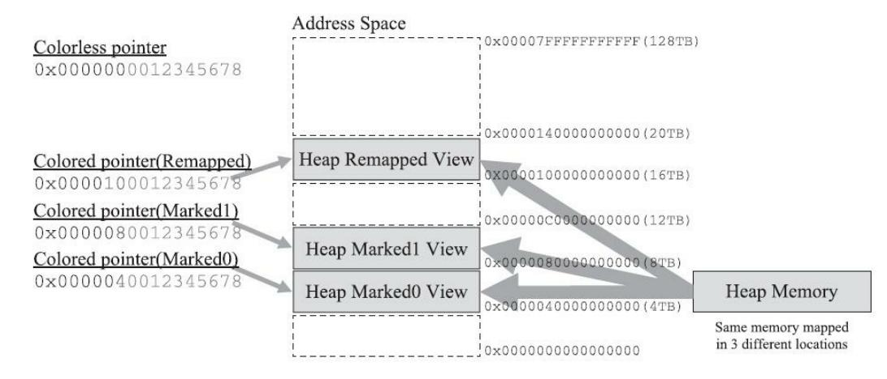

图3-21 多重映射下的寻址

在某些场景下,多重映射技术确实可能会带来一些诸如复制大对象时会更容易这样的额外好处, 可从根源上讲,ZGC的多重映射只是它采用染色指针技术的伴生产物,并不是专门为了实现其他某种 特性需求而去做的。

接下来,我们来学习ZGC收集器是如何工作的。ZGC的运作过程大致可划分为以下四个大的阶 段。全部四个阶段都是可以并发执行的,仅是两个阶段中间会存在短暂的停顿小阶段,这些小阶段, 譬如初始化GC Root直接关联对象的Mark Start,与之前G1和Shenandoah的Initial Mark阶段并没有什么 差异,笔者就不再单独解释了。ZGC的运作过程具体如图3-22所示。

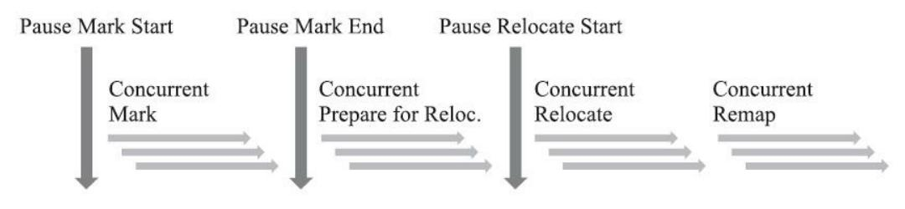

图3-22 ZGC运作过程

·并发标记(Concurrent Mark):与G1、Shenandoah一样,并发标记是遍历对象图做可达性分析的 阶段,前后也要经过类似于G1、Shenandoah的初始标记、最终标记(尽管ZGC中的名字不叫这些)的 短暂停顿,而且这些停顿阶段所做的事情在目标上也是相类似的。与G1、Shenandoah不同的是,ZGC 的标记是在指针上而不是在对象上进行的,标记阶段会更新染色指针中的Marked 0、Marked 1标志 位。

·并发预备重分配(Concurrent Prepare for Relocate):这个阶段需要根据特定的查询条件统计得出 本次收集过程要清理哪些Region,将这些Region组成重分配集(Relocation Set)。重分配集与G1收集器 的回收集(Collection Set)还是有区别的,ZGC划分Region的目的并非为了像G1那样做收益优先的增

量回收。相反,ZGC每次回收都会扫描所有的Region,用范围更大的扫描成本换取省去G1中记忆集的 维护成本。因此,ZGC的重分配集只是决定了里面的存活对象会被重新复制到其他的Region中,里面 的Region会被释放,而并不能说回收行为就只是针对这个集合里面的Region进行,因为标记过程是针对 全堆的。此外,在JDK 12的ZGC中开始支持的类卸载以及弱引用的处理,也是在这个阶段中完成的。

·并发重分配(Concurrent Relocate):重分配是ZGC执行过程中的核心阶段,这个过程要把重分 配集中的存活对象复制到新的Region上,并为重分配集中的每个Region维护一个转发表(Forward Table),记录从旧对象到新对象的转向关系。得益于染色指针的支持,ZGC收集器能仅从引用上就明 确得知一个对象是否处于重分配集之中,如果用户线程此时并发访问了位于重分配集中的对象,这次 访问将会被预置的内存屏障所截获,然后立即根据Region上的转发表记录将访问转发到新复制的对象 上,并同时修正更新该引用的值,使其直接指向新对象,ZGC将这种行为称为指针的"自愈"(Self-Healing)能力。这样做的好处是只有第一次访问旧对象会陷入转发,也就是只慢一次,对比 Shenandoah的Brooks转发指针,那是每次对象访问都必须付出的固定开销,简单地说就是每次都慢, 因此ZGC对用户程序的运行时负载要比Shenandoah来得更低一些。还有另外一个直接的好处是由于染 色指针的存在,一旦重分配集中某个Region的存活对象都复制完毕后,这个Region就可以立即释放用于 新对象的分配(但是转发表还得留着不能释放掉),哪怕堆中还有很多指向这个对象的未更新指针也 没有关系,这些旧指针一旦被使用,它们都是可以自愈的。

·并发重映射(Concurrent Remap):重映射所做的就是修正整个堆中指向重分配集中旧对象的所 有引用,这一点从目标角度看是与Shenandoah并发引用更新阶段一样的,但是ZGC的并发重映射并不 是一个必须要"迫切"去完成的任务,因为前面说过,即使是旧引用,它也是可以自愈的,最多只是第 一次使用时多一次转发和修正操作。重映射清理这些旧引用的主要目的是为了不变慢(还有清理结束 后可以释放转发表这样的附带收益),所以说这并不是很"迫切"。因此,ZGC很巧妙地把并发重映射 阶段要做的工作,合并到了下一次垃圾收集循环中的并发标记阶段里去完成,反正它们都是要遍历所 有对象的,这样合并就节省了一次遍历对象图[9]的开销。一旦所有指针都被修正之后,原来记录新旧 对象关系的转发表就可以释放掉了。

ZGC的设计理念与Azul System公司的PGC和C4收集器一脉相承[10],是迄今垃圾收集器研究的最 前沿成果,它与Shenandoah一样做到了几乎整个收集过程都全程可并发,短暂停顿也只与GC Roots大 小相关而与堆内存大小无关,因而同样实现了任何堆上停顿都小于十毫秒的目标。

相比G1、Shenandoah等先进的垃圾收集器,ZGC在实现细节上做了一些不同的权衡选择,譬如G1 需要通过写屏障来维护记忆集,才能处理跨代指针,得以实现Region的增量回收。记忆集要占用大量 的内存空间,写屏障也对正常程序运行造成额外负担,这些都是权衡选择的代价。ZGC就完全没有使 用记忆集,它甚至连分代都没有,连像CMS中那样只记录新生代和老年代间引用的卡表也不需要,因 而完全没有用到写屏障,所以给用户线程带来的运行负担也要小得多。可是,必定要有优有劣才会称 作权衡,ZGC的这种选择[11]也限制了它能承受的对象分配速率不会太高,可以想象以下场景来理解 ZGC的这个劣势:ZGC准备要对一个很大的堆做一次完整的并发收集,假设其全过程要持续十分钟以 上(请读者切勿混淆并发时间与停顿时间,ZGC立的Flag是停顿时间不超过十毫秒),在这段时间里 面,由于应用的对象分配速率很高,将创造大量的新对象,这些新对象很难进入当次收集的标记范 围,通常就只能全部当作存活对象来看待——尽管其中绝大部分对象都是朝生夕灭的,这就产生了大 量的浮动垃圾。如果这种高速分配持续维持的话,每一次完整的并发收集周期都会很长,回收到的内 存空间持续小于期间并发产生的浮动垃圾所占的空间,堆中剩余可腾挪的空间就越来越小了。目前唯

一的办法就是尽可能地增加堆容量大小,获得更多喘息的时间。但是若要从根本上提升ZGC能够应对 的对象分配速率,还是需要引入分代收集,让新生对象都在一个专门的区域中创建,然后专门针对这 个区域进行更频繁、更快的收集。Azul的C4收集器实现了分代收集后,能够应对的对象分配速率就比 不分代的PGC收集器提升了十倍之多。

ZGC还有一个常在技术资料上被提及的优点是支持"NUMA-Aware"的内存分配。NUMA(Non-Uniform Memory Access,非统一内存访问架构)是一种为多处理器或者多核处理器的计算机所设计的 内存架构。由于摩尔定律逐渐失效,现代处理器因频率发展受限转而向多核方向发展,以前原本在北 桥芯片中的内存控制器也被集成到了处理器内核中,这样每个处理器核心所在的裸晶(DIE)[12]都有 属于自己内存管理器所管理的内存,如果要访问被其他处理器核心管理的内存,就必须通过Inter-Connect通道来完成,这要比访问处理器的本地内存慢得多。在NUMA架构下,ZGC收集器会优先尝 试在请求线程当前所处的处理器的本地内存上分配对象,以保证高效内存访问。在ZGC之前的收集器 就只有针对吞吐量设计的Parallel Scavenge支持NUMA内存分配[13],如今ZGC也成为另外一个选择。

在性能方面,尽管目前还处于实验状态,还没有完成所有特性,稳定性打磨和性能调优也仍在进 行,但即使是这种状态下的ZGC,其性能表现已经相当亮眼,从官方给出的测试结果[14]来看,用"令 人震惊的、革命性的ZGC"来形容都不为过。

图3-23和图3-24是ZGC与Parallel Scavenge、G1三款收集器通过SPECjbb 2015 [15]的测试结果。在 ZGC的"弱项"吞吐量方面,以低延迟为首要目标的ZGC已经达到了以高吞吐量为目标Parallel Scavenge 的99%,直接超越了G1。如果将吞吐量测试设定为面向SLA(Service Level Agreements)应用 的"Critical Throughput"的话[16],ZGC的表现甚至还反超了Parallel Scavenge收集器。

而在ZGC的强项停顿时间测试上,它就毫不留情地与Parallel Scavenge、G1拉开了两个数量级的差 距。不论是平均停顿,还是95%停顿、99%停顿、99.9%停顿,抑或是最大停顿时间,ZGC均能毫不费 劲地控制在十毫秒之内,以至于把它和另外两款停顿数百近千毫秒的收集器放到一起对比,就几乎显 示不了ZGC的柱状条(图3-24a),必须把结果的纵坐标从线性尺度调整成对数尺度(图3-24b,纵坐 标轴的尺度是对数增长的)才能观察到ZGC的测试结果。

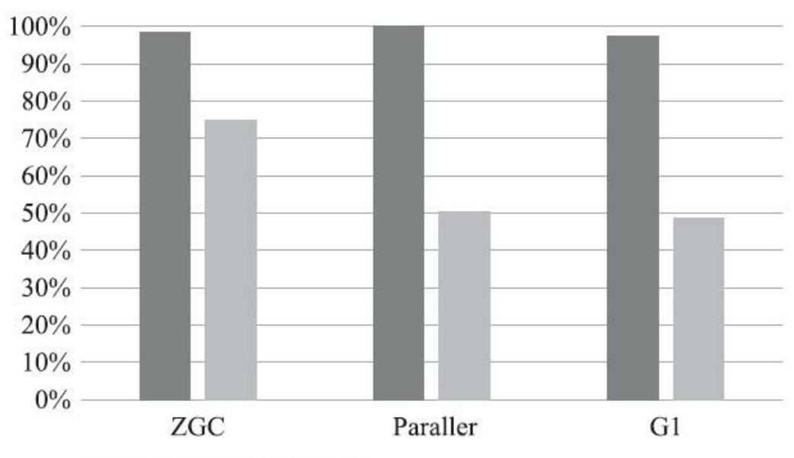

图3-23 ZGC的吞吐量测试

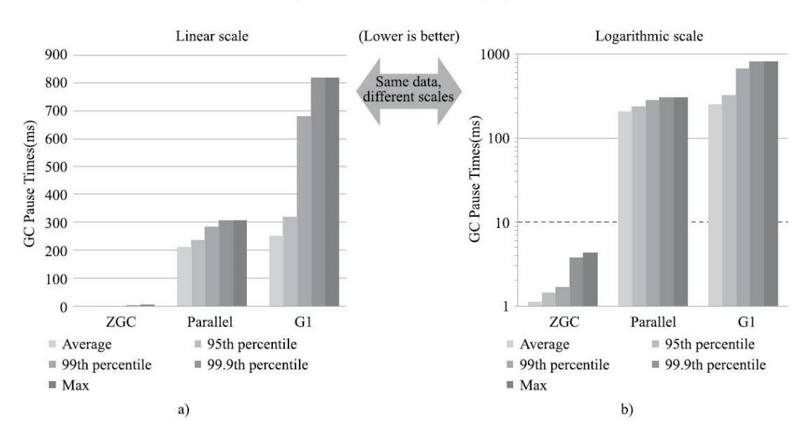

图3-24 ZGC的停顿时间测试

ZGC原本是Oracle作为一项商业特性(如同JFR、JMC这些功能)来设计和实现的,只不过在它横 空出世的JDK 11时期,正好适逢Oracle调整许可证授权,把所有商业特性都开源给了OpenJDK(详情 见第1章Java发展史),所以用户对其商业性并没有明显的感知。ZGC有着令所有开发人员趋之若鹜的 优秀性能,让以前大多数人只是听说,但从未用过的"Azul式的垃圾收集器"一下子飞入寻常百姓家, 笔者相信它完全成熟之后,将会成为服务端、大内存、低延迟应用的首选收集器的有力竞争者。

- [1] 这里的"实验性质"特指ZGC目前尚未具备全部商用收集器应有的特征,如暂不提供全平台的支持 (目前仅支持Linux/x86-64),暂不支持类卸载(JDK 11时不支持,JDK 12的ZGC已经支持),暂不 支持新的Graal编译器配合工作等,但这些局限主要是人力资源与工作量上的限制,可能读者在阅读到 这部分内容的时候已经有了新的变化。
- [2] 在JEP 333中把ZGC的"吞吐量下降不大"明确量化为相比起使用G1收集器,吞吐量下降不超过 15%。不过根据Oracle公开的现阶段SPECjbb 2015测试结果来看,ZGC在这方面要比Shenandoah优秀得 多,测得的吞吐量居然比G1还高,甚至已经接近了Parallel Scavenge的成绩。
- [3] 1EB=1024PB,1PB=1024TB。
- [4] AMD64这个名字的意思不是指只有AMD的处理器使用,它就是现在主流的x86-64架构,由于Intel Itanium的失败,现行的64位标准是由AMD公司率先制定的,Intel通过交叉授权获得该标准的授权,所 以叫作AMD64。
- [5] JDK 13计划是要扩展到最大支持16TB的,本章撰写时JDK 13尚未正式发布,还没有明确可靠的信 息,所以这里按照ZGC目前的状态来介绍。
- [6] 此图片以及后续关于ZGC执行阶段的几张图片,均来自Per Liden在Jfokus VM 2018大会上的演讲: 《The Z Garbage Collector:Low Latency GC for OpenJDK》。
- [7] 页面地址:https://openjdk.java.net/jeps/333。
- [8] 实际上现代的x86操作系统中的虚拟地址是操作系统加硬件两级翻译的,在进程中访问的逻辑地址 要通过MMU中的分段单元翻译为线性地址,然后再通过分页单元翻译成物理地址。这部分并非本书 所关注的话题,读者简单了解即可。
- [9] 如果不是由于两个阶段合并考虑,其实做重映射不需要按照对象图的顺序去做,只需线性地扫描整 个堆来清理旧引用即可。
- [10] 笔者心中的词语其实是"一模一样",只是这怎么听起来似乎像是对Oracle的嘲讽?Oracle公司也并 未在任何公开资料中承认参考过Azul System的论文或者实现。
- [11] 根据Per Liden的解释,目前ZGC不分代完全是从节省工作量角度所做出的选择,并非单纯技术上 的权衡。来源:https://www.zhihu.com/question/287945354/answer/458761494。
- [12] 裸晶这个名字用的较少,通常都直接称呼为DIE: https://en.wikipedia.org/wiki/Die\_(integrated\_circuit)。
- [13] 当"JEP 345:NUMA-Aware Memory Allocation for G1"被纳入某个版本的JDK发布范围后,G1也 会支持NUMA分配。
- [14] 数据来自Jfokus VM 2018中Per liden的演讲《The Z Garbage Collector:Low Latency GC for OpenJDK》。
- [15] http://spec.org/jbb2015/。
- [16] Critical Throughput就是要求最大延迟不超过某个设置值(10毫秒到100毫秒)下测得的吞吐量。

# 3.7 选择合适的垃圾收集器

HotSpot虚拟机提供了种类繁多的垃圾收集器,选择太多反而令人踌躇难决,若只挑最先进的显然 不可能满足全部应用场景,但只用一句"必须因地制宜,按需选用"又未免有敷衍的嫌疑,本节我们就 来探讨一下如何选择合适的垃圾收集器。

# 3.7.1 Epsilon收集器

在G1、Shenandoah或者ZGC这些越来越复杂、越来越先进的垃圾收集器相继出现的同时,也有一 个"反其道而行"的新垃圾收集器出现在JDK 11的特征清单中——Epsilon,这是一款以不能够进行垃圾 收集为"卖点"的垃圾收集器,这种话听起来第一感觉就十分违反逻辑,这种"不干活"的收集器要它何 用?

Epsilon收集器由RedHat公司在JEP 318中提出,在此提案里Epsilon被形容成一个无操作的收集器 (A No-Op Garbage Collector),而事实上只要Java虚拟机能够工作,垃圾收集器便不可能是真正"无操 作"的。原因是"垃圾收集器"这个名字并不能形容它全部的职责,更贴切的名字应该是本书为这一部分 所取的标题——"自动内存管理子系统"。一个垃圾收集器除了垃圾收集这个本职工作之外,它还要负 责堆的管理与布局、对象的分配、与解释器的协作、与编译器的协作、与监控子系统协作等职责,其 中至少堆的管理和对象的分配这部分功能是Java虚拟机能够正常运作的必要支持,是一个最小化功能 的垃圾收集器也必须实现的内容。从JDK 10开始,为了隔离垃圾收集器与Java虚拟机解释、编译、监 控等子系统的关系,RedHat提出了垃圾收集器的统一接口,即JEP 304提案,Epsilon是这个接口的有效 性验证和参考实现,同时也用于需要剥离垃圾收集器影响的性能测试和压力测试。

在实际生产环境中,不能进行垃圾收集的Epsilon也仍有用武之地。很长一段时间以来,Java技术 体系的发展重心都在面向长时间、大规模的企业级应用和服务端应用,尽管也有移动平台(指Java ME而不是Android)和桌面平台的支持,但使用热度上与前者相比要逊色不少。可是近年来大型系统 从传统单体应用向微服务化、无服务化方向发展的趋势已越发明显,Java在这方面比起Golang等后起 之秀来确实有一些先天不足,使用率正渐渐下降。传统Java有着内存占用较大,在容器中启动时间 长,即时编译需要缓慢优化等特点,这对大型应用来说并不是什么太大的问题,但对短时间、小规模 的服务形式就有诸多不适。为了应对新的技术潮流,最近几个版本的JDK逐渐加入了提前编译、面向 应用的类数据共享等支持。Epsilon也是有着类似的目标,如果读者的应用只要运行数分钟甚至数秒, 只要Java虚拟机能正确分配内存,在堆耗尽之前就会退出,那显然运行负载极小、没有任何回收行为 的Epsilon便是很恰当的选择。

# 3.7.2 收集器的权衡

如果算上Epsilon,本书中已经介绍过十款HotSpot虚拟机的垃圾收集器了,此外还涉及Azul System公司的PGC、C4等收集器,再加上本章中并没有出现,但其实也颇为常用的OpenJ9中的垃圾收 集器,把这些收集器罗列出来就仿佛是一幅琳琅画卷、一部垃圾收集的技术演进史。现在可能有读者 要犯选择困难症了,我们应该如何选择一款适合自己应用的收集器呢?这个问题的答案主要受以下三 个因素影响:

- ·应用程序的主要关注点是什么?如果是数据分析、科学计算类的任务,目标是能尽快算出结果, 那吞吐量就是主要关注点;如果是SLA应用,那停顿时间直接影响服务质量,严重的甚至会导致事务 超时,这样延迟就是主要关注点;而如果是客户端应用或者嵌入式应用,那垃圾收集的内存占用则是 不可忽视的。
- ·运行应用的基础设施如何?譬如硬件规格,要涉及的系统架构是x86-32/64、SPARC还是 ARM/Aarch64;处理器的数量多少,分配内存的大小;选择的操作系统是Linux、Solaris还是Windows 等。
- ·使用JDK的发行商是什么?版本号是多少?是ZingJDK/Zulu、OracleJDK、Open-JDK、OpenJ9抑 或是其他公司的发行版?该JDK对应了《Java虚拟机规范》的哪个版本?
- 一般来说,收集器的选择就从以上这几点出发来考虑。举个例子,假设某个直接面向用户提供服 务的B/S系统准备选择垃圾收集器,一般来说延迟时间是这类应用的主要关注点,那么:
- ·如果你有充足的预算但没有太多调优经验,那么一套带商业技术支持的专有硬件或者软件解决方 案是不错的选择,Azul公司以前主推的Vega系统和现在主推的Zing VM是这方面的代表,这样你就可以 使用传说中的C4收集器了。
- ·如果你虽然没有足够预算去使用商业解决方案,但能够掌控软硬件型号,使用较新的版本,同时 又特别注重延迟,那ZGC很值得尝试。
- ·如果你对还处于实验状态的收集器的稳定性有所顾虑,或者应用必须运行在Win-dows操作系统 下,那ZGC就无缘了,试试Shenandoah吧。
- ·如果你接手的是遗留系统,软硬件基础设施和JDK版本都比较落后,那就根据内存规模衡量一 下,对于大概4GB到6GB以下的堆内存,CMS一般能处理得比较好,而对于更大的堆内存,可重点考 察一下G1。
- 当然,以上都是仅从理论出发的分析,实战中切不可纸上谈兵,根据系统实际情况去测试才是选 择收集器的最终依据。

#### 3.7.3 虚拟机及垃圾收集器日志

阅读分析虚拟机和垃圾收集器的日志是处理Java虚拟机内存问题必备的基础技能,垃圾收集器日志是一系列人为设定的规则,多少有点随开发者编码时的心情而定,没有任何的"业界标准"可言,换句话说,每个收集器的日志格式都可能不一样。除此以外还有一个麻烦,在JDK 9以前,HotSpot并没有提供统一的日志处理框架,虚拟机各个功能模块的日志开关分布在不同的参数上,日志级别、循环日志大小、输出格式、重定向等设置在不同功能上都要单独解决。直到JDK 9,这种混乱不堪的局面才终于消失,HotSpot所有功能的日志都收归到了"-Xlog"参数上,这个参数的能力也相应被极大拓展了:

-Xlog[:[selector][:[output][:[decorators][:output-options]]]]

命令行中最关键的参数是选择器(Selector),它由标签(Tag)和日志级别(Level)共同组成。标签可理解为虚拟机中某个功能模块的名字,它告诉日志框架用户希望得到虚拟机哪些功能的日志输出。垃圾收集器的标签名称为"gc",由此可见,垃圾收集器日志只是HotSpot众多功能日志的其中一项,全部支持的功能模块标签名如下所示:

add, age, alloc, annotation, aot, arguments, attach, barrier, biasedlocking, blocks, bot, breakpoint, bytecoc

日志级别从低到高,共有Trace, Debug, Info, Warning, Error, Off六种级别,日志级别决定了输出信息的详细程度,默认级别为Info, HotSpot的日志规则与Log4j、SLF4j这类Java日志框架大体上是一致的。另外,还可以使用修饰器(Decorator)来要求每行日志输出都附加上额外的内容,支持附加在日志行上的信息包括:

·time: 当前日期和时间。

uptime: 虚拟机启动到现在经过的时间,以秒为单位。

·timemillis: 当前时间的毫秒数,相当于System.currentTimeMillis()的输出。

uptimemillis: 虚拟机启动到现在经过的毫秒数。

·timenanos: 当前时间的纳秒数,相当于System.nanoTime()的输出。

·uptimenanos:虚拟机启动到现在经过的纳秒数。

·pid: 进程ID。

·tid: 线程ID。

·level: 日志级别。

·tags:日志输出的标签集。

如果不指定,默认值是uptime、level、tags这三个,此时日志输出类似于以下形式:

```
[3.080s][info][gc,cpu] GC(5) User=0.03s Sys=0.00s Real=0.01s
```

下面笔者举几个例子,展示在JDK 9统一日志框架前、后是如何获得垃圾收集器过程的相关信 息,以下均以JDK 9的G1收集器(JDK 9下默认收集器就是G1,所以命令行中没有指定收集器)为 例。

1)查看GC基本信息,在JDK 9之前使用-XX:+PrintGC,JDK 9后使用-Xlog:gc:

```
bash-3.2$ java -Xlog:gc GCTest
[0.222s][info][gc] Using G1
[2.825s][info][gc] GC(0) Pause Young (G1 Evacuation Pause) 26M->5M(256M) 355.623ms
[3.096s][info][gc] GC(1) Pause Young (G1 Evacuation Pause) 14M->7M(256M) 50.030ms
[3.385s][info][gc] GC(2) Pause Young (G1 Evacuation Pause) 17M->10M(256M) 40.576ms
```

2)查看GC详细信息,在JDK 9之前使用-XX:+PrintGCDetails,在JDK 9之后使用-X-log:gc\*, 用通配符\*将GC标签下所有细分过程都打印出来,如果把日志级别调整到Debug或者Trace(基于版面 篇幅考虑,例子中并没有),还将获得更多细节信息:

```
bash-3.2$ java -Xlog:gc* GCTest
[0.233s][info][gc,heap] Heap region size: 1M
[0.383s][info][gc ] Using G1
[0.383s][info][gc,heap,coops] Heap address: 0xfffffffe50400000, size: 4064 MB, Compressed Oops mode: Non-zero based:
0xfffffffe50000000, Oop shift amount: 3
[3.064s][info][gc,start ] GC(0) Pause Young (G1 Evacuation Pause)
gc,task ] GC(0) Using 23 workers of 23 for evacuation
[3.420s][info][gc,phases ] GC(0) Pre Evacuate Collection Set: 0.2ms
[3.421s][info][gc,phases ] GC(0) Evacuate Collection Set: 348.0ms
gc,phases ] GC(0) Post Evacuate Collection Set: 6.2ms
[3.421s][info][gc,phases ] GC(0) Other: 2.8ms
gc,heap ] GC(0) Eden regions: 24->0(9)
[3.421s][info][gc,heap ] GC(0) Survivor regions: 0->3(3)
[3.421s][info][gc,heap ] GC(0) Old regions: 0->2
[3.421s][info][gc,heap ] GC(0) Humongous regions: 2->1
[3.421s][info][gc,metaspace ] GC(0) Metaspace: 4719K->4719K(1056768K)
[3.421s][info][gc ] GC(0) Pause Young (G1 Evacuation Pause) 26M->5M(256M) 357.743ms
[3.422s][info][gc,cpu ] GC(0) User=0.70s Sys=5.13s Real=0.36s
[3.648s][info][gc,start ] GC(1) Pause Young (G1 Evacuation Pause)
[3.648s][info][gc,task ] GC(1) Using 23 workers of 23 for evacuation
[3.699s][info][gc,phases ] GC(1) Pre Evacuate Collection Set: 0.3ms
gc,phases ] GC(1) Evacuate Collection Set: 45.6ms
gc,phases ] GC(1) Post Evacuate Collection Set: 3.4ms
gc,phases ] GC(1) Other: 1.7ms
gc,heap ] GC(1) Eden regions: 9->0(10)
[3.699s][info][gc,heap ] GC(1) Survivor regions: 3->2(2)
[3.699s][info][gc,heap ] GC(1) Old regions: 2->5
[3.700s][info][gc,heap ] GC(1) Humongous regions: 1->1
[3.700s][info][gc,metaspace ] GC(1) Metaspace: 4726K->4726K(1056768K)
[3.700s][info][gc ] GC(1) Pause Young (G1 Evacuation Pause) 14M->7M(256M) 51.872ms
[3.700s][info][gc,cpu ] GC(1) User=0.56s Sys=0.46s Real=0.05s
```

3)查看GC前后的堆、方法区可用容量变化,在JDK 9之前使用-XX:+PrintHeapAtGC,JDK 9之 后使用-Xlog:gc+heap=debug:

```
bash-3.2$ java -Xlog:gc+heap=debug GCTest
[0.113s][info][gc,heap] Heap region size: 1M
[0.113s][debug][gc,heap] Minimum heap 8388608 Initial heap 268435456 Maximum heap 4261412864
[2.529s][debug][gc,heap] GC(0) Heap before GC invocations=0 (full 0):
[2.529s][debug][gc,heap] GC(0) garbage-first heap total 262144K, used 26624K [0xfffffffe50400000, 0xfffffffe50500800,
0xffffffff4e400000)
[2.529s][debug][gc,heap] GC(0) region size 1024K, 24 young (24576K), 0 survivors (0K)
[2.530s][debug][gc,heap] GC(0) Metaspace used 4719K, capacity 4844K, committed 5120K, reserved 1056768K
[2.530s][debug][gc,heap] GC(0) class space used 413K, capacity 464K, committed 512K, reserved 1048576K
[2.892s][info ][gc,heap] GC(0) Eden regions: 24->0(9)
[2.892s][info ][gc,heap] GC(0) Survivor regions: 0->3(3)
[2.892s][info ][gc,heap] GC(0) Old regions: 0->2
[2.892s][info ][gc,heap] GC(0) Humongous regions: 2->1
[2.893s][debug][gc,heap] GC(0) Heap after GC invocations=1 (full 0):
[2.893s][debug][gc,heap] GC(0) garbage-first heap total 262144K, used 5850K [0xfffffffe50400000, 0xfffffffe50500800, 0xffffffff4e400000)
[2.893s][debug][gc,heap] GC(0) region size 1024K, 3 young (3072K), 3 survivors (3072K)
[2.893s][debug][gc,heap] GC(0) Metaspace used 4719K, capacity 4844K, committed 5120K, reserved 1056768K
[2.893s][debug][gc,heap] GC(0) class space used 413K, capacity 464K, committed 512K, reserved 1048576K
```

4)查看GC过程中用户线程并发时间以及停顿的时间,在JDK 9之前使用-XX:+Print-GCApplicationConcurrentTime以及-XX:+PrintGCApplicationStoppedTime,JDK 9之后使用-Xlog: safepoint:

```
bash-3.2$ java -Xlog:safepoint GCTest
[1.376s][info][safepoint] Application time: 0.3091519 seconds
[1.377s][info][safepoint] Total time for which application threads were stopped: 0.0004600 seconds, Stopping threads took:
0.0002648 seconds
[2.386s][info][safepoint] Application time: 1.0091637 seconds
[2.387s][info][safepoint] Total time for which application threads were stopped: 0.0005217 seconds, Stopping threads took:
0.0002297 seconds
```

5)查看收集器Ergonomics机制(自动设置堆空间各分代区域大小、收集目标等内容,从Parallel收 集器开始支持)自动调节的相关信息。在JDK 9之前使用-XX:+PrintAdaptive-SizePolicy,JDK 9之后 使用-Xlog:gc+ergo\*=trace:

```
bash-3.2$ java -Xlog:gc+ergo*=trace GCTest [0.122s][debug][gc,ergo,refine] Initial Refinement Zones: green: 23, yellow:
69, red: 115, min yellow size: 46
[0.142s][debug][gc,ergo,heap ] Expand the heap. requested expansion amount:268435456B expansion amount:268435456B
[2.475s][trace][gc,ergo,cset ] GC(0) Start choosing CSet. pending cards: 0 predicted base time: 10.00ms remaining time:
190.00ms target pause time: 200.00ms
[2.476s][trace][gc,ergo,cset ] GC(0) Add young regions to CSet. eden: 24 regions, survivors: 0 regions, predicted young
region time: 367.19ms, target pause time: 200.00ms
[2.476s][debug][gc,ergo,cset ] GC(0) Finish choosing CSet. old: 0 regions, predicted old region time: 0.00ms, time
remaining: 0.00
[2.826s][debug][gc,ergo ] GC(0) Running G1 Clear Card Table Task using 1 workers for 1 units of work for 24 regions.
[2.827s][debug][gc,ergo ] GC(0) Running G1 Free Collection Set using 1 workers for collection set length 24
[2.828s][trace][gc,ergo,refine] GC(0) Updating Refinement Zones: update_rs time: 0.004ms, update_rs buffers: 0, update_rs
goal time: 19.999ms
```

6)查看熬过收集后剩余对象的年龄分布信息,在JDK 9前使用-XX:+PrintTenuring-Distribution, JDK 9之后使用-Xlog:gc+age=trace:

```
bash-3.2$ java -Xlog:gc+age=trace GCTest
[2.406s][debug][gc,age] GC(0) Desired survivor size 1572864 bytes, new threshold 15 (max threshold 15)
[2.745s][trace][gc,age] GC(0) Age table with threshold 15 (max threshold 15)
[2.745s][trace][gc,age] GC(0) - age 1: 3100640 bytes, 3100640 total
[4.700s][debug][gc,age] GC(5) Desired survivor size 2097152 bytes, new threshold 15 (max threshold 15)
[4.810s][trace][gc,age] GC(5) Age table with threshold 15 (max threshold 15)
```

囿于篇幅原因,不再一一列举,表3-3给出了全部在JDK 9中被废弃的日志相关参数及它们在JDK 9后使用-Xlog的代替配置形式。

表3-3 JDK 9前后日志参数变化

| JDK 9 前日志参数                                              | JDK 9 后配置形式                                                                                        |
|----------------------------------------------------------|----------------------------------------------------------------------------------------------------|
| G1PrintHeapRegions                                       | Xlog:gc+region=trace                                                                               |
| G1PrintRegionLivenessInfo                                | Xlog:gc+liveness=trace                                                                             |
| G1SummarizeConcMark                                      | Xlog:gc+marking=trace                                                                              |
| G1SummarizeRSetStats                                     | Xlog:gc+remset*=trace                                                                              |
| GCLogFileSize, NumberOfGCLogFiles, UseGCLogFile Rotation | Xlog:gc*:file= <file>::filecount=<count>,filesize=<file in="" kb="" size=""></file></count></file> |

| JDK 9 前日志参数                         | JDK 9 后配置形式                   |  |  |  |
|-------------------------------------|-------------------------------|--|--|--|
| PrintAdaptiveSizePolicy             | Xlog:gc+ergo*=trace           |  |  |  |
| PrintClassHistogramAfterFullGC      | Xlog:classhisto*=trace        |  |  |  |
| PrintClassHistogramBeforeFullGC     | Xlog:classhisto*=trace        |  |  |  |
| PrintGCApplicationConcurrentTime    | Xlog:safepoint                |  |  |  |
| PrintGCApplicationStoppedTime       | Xlog:safepoint                |  |  |  |
| PrintGCDateStamps                   | 使用 time 修饰器                   |  |  |  |
| PrintGCTaskTimeStamps               | Xlog:gc+task=trace            |  |  |  |
| PrintGCTimeStamps                   | 使用 uptime 修饰器                 |  |  |  |
| PrintHeapAtGC                       | Xlog:gc+heap=debug            |  |  |  |
| PrintHeapAtGCExtended               | Xlog:gc+heap=trace            |  |  |  |
| PrintJNIGCStalls                    | Xlog:gc+jni=debug             |  |  |  |
| PrintOldPLAB                        | Xlog:gc+plab=trace            |  |  |  |
| PrintParallelOldGCPhaseTimes        | Xlog:gc+phases=trace          |  |  |  |
| PrintPLAB                           | Xlog:gc+plab=trace            |  |  |  |
| PrintPromotionFailure               | Xlog:gc+promotion=debug       |  |  |  |
| PrintReferenceGC                    | Xlog:gc+ref=debug             |  |  |  |
| PrintStringDeduplicationStatistics  | Xlog:gc+stringdedup           |  |  |  |
| PrintTaskqueue                      | Xlog:gc+task+stats=trace      |  |  |  |
| PrintTenuringDistribution           | Xlog:gc+age=trace             |  |  |  |
| PrintTerminationStats               | Xlog:gc+task+stats=debug      |  |  |  |
| PrintTLAB                           | Xlog:gc+tlab=trace            |  |  |  |
| TraceAdaptiveGCBoundary             | Xlog:heap+ergo=debug          |  |  |  |
| TraceDynamicGCThreads               | Xlog:gc+task=trace            |  |  |  |
| TraceMetadataHumongousAllocation    | Xlog:gc+metaspace+alloc=debug |  |  |  |
| G1TraceConcRefinement               | Xlog:gc+refine=debug          |  |  |  |
| G1TraceEagerReclaimHumongousObjects | Xlog:gc+humongous=debug       |  |  |  |
| G1TraceStringSymbolTableScrubbing   | Xlog:ge+stringtable=trace     |  |  |  |

#### 3.7.4 垃圾收集器参数总结

HotSpot虚拟机中的各种垃圾收集器到此全部介绍完毕,在描述过程中提到了很多虚拟机非稳定的 运行参数,下面表3-4中整理了这些参数,供读者实践时参考。

表3-4 垃圾收集相关的常用参数

| 参数                             | 描述                                                                                                                        |
|--------------------------------|---------------------------------------------------------------------------------------------------------------------------|
| UseSerialGC                    | 虚拟机运行在 Client 模式下的默认值,打开此开关后,使用 Serial + Serial Old 的收集器组合进行内存回收                                                          |
| UseParNewGC                    | 打开此开关后,使用 ParNew + Serial Old 的收集器组合进行内存回收,在<br>JDK 9 后不再支持                                                               |
| UseConcMarkSweepGC             | 打开此开关后,使用 ParNew + CMS + Serial Old 的收集器组合进行内存<br>回收。Serial Old 收集器将作为 CMS 收集器出现 "Concurrent Mode Failure"<br>失败后的后备收集器使用 |
| UseParallelGC                  | JDK 9之前虚拟机运行在 Server 模式下的默认值, 打开此开关后, 使用<br>Parallel Scavenge + Serial Old (PS MarkSweep) 的收集器组合进行内存回收                    |
| UseParallelOldGC               | 打开此开关后,使用 Parallel Scavenge + Parallel Old 的收集器组合进行内存回收                                                                   |
| SurvivorRatio                  | 新生代中 Eden 区域与 Survivor 区域的容量比值,默认为 8,代表 Eden:<br>Survivor=8:1                                                             |
| PretenureSizeThreshold         | 直接晋升到老年代的对象大小,设置这个参数后,大于这个参数的对象将<br>直接在老年代分配                                                                              |
| MaxTenuringThreshold           | 晋升到老年代的对象年龄。每个对象在坚持过一次 Minor GC 之后,年龄<br>就增加 1,当超过这个参数值时就进入老年代                                                            |
| UseAdaptiveSizePolicy          | 动态调整 Java 堆中各个区域的大小以及进入老年代的年龄                                                                                             |
| HandlePromotionFailure         | 是否允许分配担保失败,即老年代的剩余空间不足以应付新生代的整个<br>Eden 和 Survivor 区的所有对象都存活的极端情况                                                         |
| ParallelGCThreads              | 设置并行 GC 时进行内存回收的线程数                                                                                                       |
| GCTimeRatio                    | GC 时间占总时间的比率,默认值为 99, 即允许 1%的 GC 时间。仅在使用 Parallel Scavenge 收集器时生效                                                         |
| MaxGCPauseMillis               | 设置 GC 的最大停顿时间。仅在使用 Parallel Scavenge 收集器时生效                                                                               |
| CMSInitiatingOccupancyFraction | 设置 CMS 收集器在老年代空间被使用多少后触发垃圾收集。默认值为68%,仅在使用 CMS 收集器时生效                                                                      |
| UseCMSCompactAtFullCollection  | 设置 CMS 收集器在完成垃圾收集后是否要进行一次内存碎片整理。仅在使用 CMS 收集器时生效,此参数从 JDK 9 开始废弃                                                           |
| CMSFullGCsBeforeCompaction     | 设置 CMS 收集器在进行若干次垃圾收集后再启动一次内存碎片整理。仅<br>在使用 CMS 收集器时生效,此参数从 JDK 9 开始废弃                                                      |
| UseG1GC                        | 使用 G1 收集器,这个是 JDK 9 后的 Server 模式默认值                                                                                       |
| G1HeapRegionSize=n             | 设置 Region 大小,并非最终值                                                                                                        |
| MaxGCPauseMillis               | 设置 G1 收集过程目标时间,默认值是 200ms, 不是硬性条件                                                                                         |
| G1NewSizePercent               | 新生代最小值,默认值是5%                                                                                                             |
| G1MaxNewSizePercent            | 新生代最大值, 默认值是 60%                                                                                                          |
| ParallelGCThreads              | 用户线程冻结期间并行执行的收集器线程数                                                                                                       |

| 参数                               | 描 述                                                                                                                                   |
|----------------------------------|---------------------------------------------------------------------------------------------------------------------------------------|
| ConcGCThreads=n                  | 并发标记、并发整理的执行线程数,对不同的收集器,根据其能够并发的<br>阶段,有不同的含义                                                                                         |
| Initiating HeapOccupancy Percent | 设置触发标记周期的 Java 堆占用率阈值。默认值是 45%。这里的 java 堆占比指的是 non_young_capacity_bytes,包括 old+humongous                                              |
| UseShenandoahGC                  | 使用 Shenandoah 收集器。这个选项在 OracleJDK 中不被支持,只能在OpenJDK 12 或者某些支持 Shenandoah 的 Backport 发行版本使用。目前仍然要配合 -XX:+UnlockExperimentalVMOptions 使用 |
| ShenandoahGCHeuristics           | Shenandoah 何时启动一次 GC 过程,其可选值有 adaptive、static、compact、passive、aggressive                                                              |
| UseZGC                           | 使用 ZGC 收集器,目前仍然要配合 -XX:+UnlockExperimentalVMOptions 使用                                                                                |
| UseNUMA                          | 启用 NUMA 内存分配支持,目前只有 Parallel 和 ZGC 支持,以后 G1 收集器可能也会支持该选项                                                                              |

# 3.8 实战:内存分配与回收策略

Java技术体系的自动内存管理,最根本的目标是自动化地解决两个问题:自动给对象分配内存以 及自动回收分配给对象的内存。关于回收内存这方面,笔者已经使用了大量篇幅去介绍虚拟机中的垃 圾收集器体系以及运作原理,现在我们来探讨一下关于给对象分配内存的那些事儿。

对象的内存分配,从概念上讲,应该都是在堆上分配(而实际上也有可能经过即时编译后被拆散 为标量类型并间接地在栈上分配[1])。在经典分代的设计下,新生对象通常会分配在新生代中,少数 情况下(例如对象大小超过一定阈值)也可能会直接分配在老年代。对象分配的规则并不是固定的, 《Java虚拟机规范》并未规定新对象的创建和存储细节,这取决于虚拟机当前使用的是哪一种垃圾收 集器,以及虚拟机中与内存相关的参数的设定。

接下来的几小节内容,笔者将会讲解若干最基本的内存分配原则,并通过代码去验证这些原则。 本节出现的代码如无特别说明,均使用HotSpot虚拟机,以客户端模式运行。由于并未指定收集器组 合,因此,本节验证的实际是使用Serial加Serial Old客户端默认收集器组合下的内存分配和回收的策 略,这种配置和收集器组合也许是开发人员做研发时的默认组合(其实现在研发时很多也默认用服务 端虚拟机了),但在生产环境中一般不会这样用,所以大家主要去学习的是分析方法,而列举的分配 规则反而只是次要的。读者也不妨根据自己项目中使用的收集器编写一些程序去实践验证一下使用其 他几种收集器的内存分配规则。

[1] 即时编译器的栈上分配优化可参见第11章。

# 3.8.1 对象优先在Eden分配

大多数情况下,对象在新生代Eden区中分配。当Eden区没有足够空间进行分配时,虚拟机将发起 一次Minor GC。

HotSpot虚拟机提供了-XX:+PrintGCDetails这个收集器日志参数,告诉虚拟机在发生垃圾收集行 为时打印内存回收日志,并且在进程退出的时候输出当前的内存各区域分配情况。在实际的问题排查 中,收集器日志常会打印到文件后通过工具进行分析,不过本节实验的日志并不多,直接阅读就能看 得很清楚。

在代码清单3-7的testAllocation()方法中,尝试分配三个2MB大小和一个4MB大小的对象,在运行 时通过-Xms20M、-Xmx20M、-Xmn10M这三个参数限制了Java堆大小为20MB,不可扩展,其中 10MB分配给新生代,剩下的10MB分配给老年代。-XX:Survivor-Ratio=8决定了新生代中Eden区与一 个Survivor区的空间比例是8∶1,从输出的结果也清晰地看到"eden space 8192K、from space 1024K、to space 1024K"的信息,新生代总可用空间为9216KB(Eden区+1个Survivor区的总容量)。

执行testAllocation()中分配allocation4对象的语句时会发生一次Minor GC,这次回收的结果是新生 代6651KB变为148KB,而总内存占用量则几乎没有减少(因为allocation1、2、3三个对象都是存活 的,虚拟机几乎没有找到可回收的对象)。产生这次垃圾收集的原因是为allocation4分配内存时,发现 Eden已经被占用了6MB,剩余空间已不足以分配allocation4所需的4MB内存,因此发生Minor GC。垃 圾收集期间虚拟机又发现已有的三个2MB大小的对象全部无法放入Survivor空间(Survivor空间只有 1MB大小),所以只好通过分配担保机制提前转移到老年代去。

这次收集结束后,4MB的allocation4对象顺利分配在Eden中。因此程序执行完的结果是Eden占用 4MB(被allocation4占用),Survivor空闲,老年代被占用6MB(被allocation1、2、3占用)。通过GC 日志可以证实这一点。

#### 代码清单3-7 新生代Minor GC

```
private static final int _1MB = 1024 * 1024;
/**
 * VM参数:-verbose:gc -Xms20M -Xmx20M -Xmn10M -XX:+PrintGCDetails -XX:SurvivorRatio=8
 */
public static void testAllocation() {
    byte[] allocation1, allocation2, allocation3, allocation4;
    allocation1 = new byte[2 * _1MB];
    allocation2 = new byte[2 * _1MB];
    allocation3 = new byte[2 * _1MB];
    allocation4 = new byte[4 * _1MB]; // 出现一次Minor GC
```

#### 运行结果:

```
[GC [DefNew: 6651K->148K(9216K), 0.0070106 secs] 6651K->6292K(19456K), 0.0070426 secs] [Times: user=0.00 sys=0.00, real=0.00 secs]
Heap
   def new generation total 9216K, used 4326K [0x029d0000, 0x033d0000, 0x033d0000)
       eden space 8192K, 51% used [0x029d0000, 0x02de4828, 0x031d0000)
```

from space 1024K, 14% used [0x032d0000, 0x032f5370, 0x033d0000) to space 1024K, 0% used [0x031d0000, 0x031d0000, 0x032d0000) tenured generation total 10240K, used 6144K [0x033d0000, 0x03dd0000, 0x03dd0000) the space 10240K, 60% used [0x033d0000, 0x039d0030, 0x039d0200, 0x03dd0000) compacting perm gen total 12288K, used 2114K [0x03dd0000, 0x049d0000, 0x07dd0000) the space 12288K, 17% used [0x03dd0000, 0x03fe0998, 0x03fe0a00, 0x049d0000) No shared spaces configured.

# 3.8.2 大对象直接进入老年代

大对象就是指需要大量连续内存空间的Java对象,最典型的大对象便是那种很长的字符串,或者 元素数量很庞大的数组,本节例子中的byte[]数组就是典型的大对象。大对象对虚拟机的内存分配来说 就是一个不折不扣的坏消息,比遇到一个大对象更加坏的消息就是遇到一群"朝生夕灭"的"短命大对 象",我们写程序的时候应注意避免。在Java虚拟机中要避免大对象的原因是,在分配空间时,它容易 导致内存明明还有不少空间时就提前触发垃圾收集,以获取足够的连续空间才能安置好它们,而当复 制对象时,大对象就意味着高额的内存复制开销。HotSpot虚拟机提供了-XX:PretenureSizeThreshold 参数,指定大于该设置值的对象直接在老年代分配,这样做的目的就是避免在Eden区及两个Survivor区 之间来回复制,产生大量的内存复制操作。

执行代码清单3-8中的testPretenureSizeThreshold()方法后,我们看到Eden空间几乎没有被使用,而 老年代的10MB空间被使用了40%,也就是4MB的allocation对象直接就分配在老年代中,这是因为-XX:PretenureSizeThreshold被设置为3MB(就是3145728,这个参数不能与-Xmx之类的参数一样直接 写3MB),因此超过3MB的对象都会直接在老年代进行分配。

注意 -XX:PretenureSizeThreshold参数只对Serial和ParNew两款新生代收集器有效,HotSpot 的其他新生代收集器,如Parallel Scavenge并不支持这个参数。如果必须使用此参数进行调优,可考虑 ParNew加CMS的收集器组合。

#### 代码清单3-8 大对象直接进入老年代

```
private static final int _1MB = 1024 * 1024;
/**
* VM参数:-verbose:gc -Xms20M -Xmx20M -Xmn10M -XX:+PrintGCDetails -XX:SurvivorRatio=8
* -XX:PretenureSizeThreshold=3145728
*/
public static void testPretenureSizeThreshold() {
   byte[] allocation;
   allocation = new byte[4 * _1MB]; //直接分配在老年代中
```

#### 运行结果:

```
Heap
   def new generation total 9216K, used 671K [0x029d0000, 0x033d0000, 0x033d0000)
       eden space 8192K, 8% used [0x029d0000, 0x02a77e98, 0x031d0000)
       from space 1024K, 0% used [0x031d0000, 0x031d0000, 0x032d0000)
       to space 1024K, 0% used [0x032d0000, 0x032d0000, 0x033d0000)
   tenured generation total 10240K, used 4096K [0x033d0000, 0x03dd0000, 0x03dd0000)
           the space 10240K, 40% used [0x033d0000, 0x037d0010, 0x037d0200, 0x03dd0000)
   compacting perm gen total 12288K, used 2107K [0x03dd0000, 0x049d0000, 0x07dd0000)
           the space 12288K, 17% used [0x03dd0000, 0x03fdefd0, 0x03fdf000, 0x049d0000)
No shared spaces configured.
```

# 3.8.3 长期存活的对象将进入老年代

HotSpot虚拟机中多数收集器都采用了分代收集来管理堆内存,那内存回收时就必须能决策哪些存 活对象应当放在新生代,哪些存活对象放在老年代中。为做到这点,虚拟机给每个对象定义了一个对 象年龄(Age)计数器,存储在对象头中(详见第2章)。对象通常在Eden区里诞生,如果经过第一次 Minor GC后仍然存活,并且能被Survivor容纳的话,该对象会被移动到Survivor空间中,并且将其对象 年龄设为1岁。对象在Survivor区中每熬过一次Minor GC,年龄就增加1岁,当它的年龄增加到一定程 度(默认为15),就会被晋升到老年代中。对象晋升老年代的年龄阈值,可以通过参数-XX: MaxTenuringThreshold设置。

读者可以试试分别以-XX:MaxTenuringThreshold=1和-XX:MaxTenuringThreshold=15两种设置来 执行代码清单3-9中的testTenuringThreshold()方法,此方法中allocation1对象需要256KB内存,Survivor 空间可以容纳。当-XX:MaxTenuringThreshold=1时,allocation1对象在第二次GC发生时进入老年代, 新生代已使用的内存在垃圾收集以后非常干净地变成0KB。而当-XX:MaxTenuringThreshold=15时, 第二次GC发生后,allocation1对象则还留在新生代Survivor空间,这时候新生代仍然有404KB被占用。

#### 代码清单3-9 长期存活的对象进入老年代

```
private static final int _1MB = 1024 * 1024;
/**
* VM参数:-verbose:gc -Xms20M -Xmx20M -Xmn10M -XX:+PrintGCDetails -XX:Survivor-
  Ratio=8 -XX:MaxTenuringThreshold=1
* -XX:+PrintTenuringDistribution
*/
@SuppressWarnings("unused")
public static void testTenuringThreshold() {
   byte[] allocation1, allocation2, allocation3;
   allocation1 = new byte[_1MB / 4]; // 什么时候进入老年代决定于XX:MaxTenuring-
                                                  Threshold设置
   allocation2 = new byte[4 * _1MB];
   allocation3 = new byte[4 * _1MB];
   allocation3 = null;
   allocation3 = new byte[4 * _1MB];
```

#### 以-XX:MaxTenuringThreshold=1参数来运行的结果:

```
[GC [DefNew
Desired Survivor size 524288 bytes, new threshold 1 (max 1)
- age 1: 414664 bytes, 414664 total
: 4859K->404K(9216K), 0.0065012 secs] 4859K->4500K(19456K), 0.0065283 secs] [Times: user=0.02 sys=0.00, real=0.02 secs]
[GC [DefNew
Desired Survivor size 524288 bytes, new threshold 1 (max 1)
: 4500K->0K(9216K), 0.0009253 secs] 8596K->4500K(19456K), 0.0009458 secs] [Times: user=0.00 sys=0.00, real=0.00 secs]
Heap
   def new generation total 9216K, used 4178K [0x029d0000, 0x033d0000, 0x033d0000)
       eden space 8192K, 51% used [0x029d0000, 0x02de4828, 0x031d0000)
       from space 1024K, 0% used [0x031d0000, 0x031d0000, 0x032d0000)
       to space 1024K, 0% used [0x032d0000, 0x032d0000, 0x033d0000)
   tenured generation total 10240K, used 4500K [0x033d0000, 0x03dd0000, 0x03dd0000)
           the space 10240K, 43% used [0x033d0000, 0x03835348, 0x03835400, 0x03dd0000)
   com\pacting perm gen total 12288K, used 2114K [0x03dd0000, 0x049d0000, 0x07dd0000)
           the space 12288K, 17% used [0x03dd0000, 0x03fe0998, 0x03fe0a00, 0x049d0000)
No shared spaces configured.
```

#### 以-XX:MaxTenuringThreshold=15参数来运行的结果:

```
[GC [DefNew
Desired Survivor size 524288 bytes, new threshold 15 (max 15)
- age 1: 414664 bytes, 414664 total
: 4859K->404K(9216K), 0.0049637 secs] 4859K->4500K(19456K), 0.0049932 secs] [Times: user=0.00 sys=0.00, real=0.00 secs]
[GC [DefNew
Desired Survivor size 524288 bytes, new threshold 15 (max 15)
- age 2: 414520 bytes, 414520 total
: 4500K->404K(9216K), 0.0008091 secs] 8596K->4500K(19456K), 0.0008305 secs] [Times: user=0.00 sys=0.00, real=0.00 secs]
Heap
   def new generation total 9216K, used 4582K [0x029d0000, 0x033d0000, 0x033d0000)
       eden space 8192K, 51% used [0x029d0000, 0x02de4828, 0x031d0000)
       from space 1024K, 39% used [0x031d0000, 0x03235338, 0x032d0000)
       to space 1024K, 0% used [0x032d0000, 0x032d0000, 0x033d0000)
   tenured generation total 10240K, used 4096K [0x033d0000, 0x03dd0000, 0x03dd0000)
           the space 10240K, 40% used [0x033d0000, 0x037d0010, 0x037d0200, 0x03dd0000)
   compacting perm gen total 12288K, used 2114K [0x03dd0000, 0x049d0000, 0x07dd0000)
           the space 12288K, 17% used [0x03dd0000, 0x03fe0998, 0x03fe0a00, 0x049d0000)
No shared spaces configured.
```

# 3.8.4 动态对象年龄判定

为了能更好地适应不同程序的内存状况,HotSpot虚拟机并不是永远要求对象的年龄必须达到-XX:MaxTenuringThreshold才能晋升老年代,如果在Survivor空间中相同年龄所有对象大小的总和大于 Survivor空间的一半,年龄大于或等于该年龄的对象就可以直接进入老年代,无须等到-XX: MaxTenuringThreshold中要求的年龄。

执行代码清单3-10中的testTenuringThreshold2()方法,并将设置-XX:MaxTenuring-Threshold=15, 发现运行结果中Survivor占用仍然为0%,而老年代比预期增加了6%,也就是说allocation1、allocation2 对象都直接进入了老年代,并没有等到15岁的临界年龄。因为这两个对象加起来已经到达了512KB, 并且它们是同年龄的,满足同年对象达到Survivor空间一半的规则。我们只要注释掉其中一个对象的 new操作,就会发现另外一个就不会晋升到老年代了。

#### 代码清单3-10 动态对象年龄判定

```
private static final int _1MB = 1024 * 1024;
/**
 * VM参数:-verbose:gc -Xms20M -Xmx20M -Xmn10M -XX:+PrintGCDetails -XX:SurvivorRatio=8
   -XX:MaxTenuringThreshold=15
 * -XX:+PrintTenuringDistribution
 */
@SuppressWarnings("unused")
public static void testTenuringThreshold2() {
    byte[] allocation1, allocation2, allocation3, allocation4;
    allocation1 = new byte[_1MB / 4]; // allocation1+allocation2大于survivo空间一半
    allocation2 = new byte[_1MB / 4];
    allocation3 = new byte[4 * _1MB];
    allocation4 = new byte[4 * _1MB];
    allocation4 = null;
    allocation4 = new byte[4 * _1MB];
```

#### 运行结果:

```
[GC [DefNew
Desired Survivor size 524288 bytes, new threshold 1 (max 15)
- age 1: 676824 bytes, 676824 total
: 5115K->660K(9216K), 0.0050136 secs] 5115K->4756K(19456K), 0.0050443 secs] [Times: user=0.00 sys=0.01, real=0.01 secs]
[GC [DefNew
Desired Survivor size 524288 bytes, new threshold 15 (max 15)
: 4756K->0K(9216K), 0.0010571 secs] 8852K->4756K(19456K), 0.0011009 secs] [Times: user=0.00 sys=0.00, real=0.00 secs]
Heap
   def new generation total 9216K, used 4178K [0x029d0000, 0x033d0000, 0x033d0000)
       eden space 8192K, 51% used [0x029d0000, 0x02de4828, 0x031d0000)
       from space 1024K, 0% used [0x031d0000, 0x031d0000, 0x032d0000)
       to space 1024K, 0% used [0x032d0000, 0x032d0000, 0x033d0000)
   tenured generation total 10240K, used 4756K [0x033d0000, 0x03dd0000, 0x03dd0000)
           the space 10240K, 46% used [0x033d0000, 0x038753e8, 0x03875400, 0x03dd0000)
   compacting perm gen total 12288K, used 2114K [0x03dd0000, 0x049d0000, 0x07dd0000)
       the space 12288K, 17% used [0x03dd0000, 0x03fe09a0, 0x03fe0a00, 0x049d0000)
No shared spaces configured.
```

# 3.8.5 空间分配担保

在发生Minor GC之前,虚拟机必须先检查老年代最大可用的连续空间是否大于新生代所有对象总 空间,如果这个条件成立,那这一次Minor GC可以确保是安全的。如果不成立,则虚拟机会先查看-XX:HandlePromotionFailure参数的设置值是否允许担保失败(Handle Promotion Failure);如果允 许,那会继续检查老年代最大可用的连续空间是否大于历次晋升到老年代对象的平均大小,如果大 于,将尝试进行一次Minor GC,尽管这次Minor GC是有风险的;如果小于,或者-XX: HandlePromotionFailure设置不允许冒险,那这时就要改为进行一次Full GC。

解释一下"冒险"是冒了什么风险:前面提到过,新生代使用复制收集算法,但为了内存利用率, 只使用其中一个Survivor空间来作为轮换备份,因此当出现大量对象在Minor GC后仍然存活的情况 ——最极端的情况就是内存回收后新生代中所有对象都存活,需要老年代进行分配担保,把Survivor无 法容纳的对象直接送入老年代,这与生活中贷款担保类似。老年代要进行这样的担保,前提是老年代 本身还有容纳这些对象的剩余空间,但一共有多少对象会在这次回收中活下来在实际完成内存回收之 前是无法明确知道的,所以只能取之前每一次回收晋升到老年代对象容量的平均大小作为经验值,与 老年代的剩余空间进行比较,决定是否进行Full GC来让老年代腾出更多空间。

取历史平均值来比较其实仍然是一种赌概率的解决办法,也就是说假如某次Minor GC存活后的对 象突增,远远高于历史平均值的话,依然会导致担保失败。如果出现了担保失败,那就只好老老实实 地重新发起一次Full GC,这样停顿时间就很长了。虽然担保失败时绕的圈子是最大的,但通常情况下 都还是会将-XX:HandlePromotionFailure开关打开,避免Full GC过于频繁。参见代码清单3-11,请读 者先以JDK 6 Update 24之前的HotSpot运行测试代码。

#### 代码清单3-11 空间分配担保

```
private static final int _1MB = 1024 * 1024;
/**
 * VM参数:-Xms20M -Xmx20M -Xmn10M -XX:+PrintGCDetails -XX:SurvivorRatio=8 -XX:-Handle-
   PromotionFailure
 */
@SuppressWarnings("unused")
public static void testHandlePromotion() {
    byte[] allocation1, allocation2, allocation3, allocation4, allocation5, alloca-tion6, allocation7;
    allocation1 = new byte[2 * _1MB];
    allocation2 = new byte[2 * _1MB];
    allocation3 = new byte[2 * _1MB];
    allocation1 = null;
    allocation4 = new byte[2 * _1MB];
    allocation5 = new byte[2 * _1MB];
    allocation6 = new byte[2 * _1MB];
    allocation4 = null;
    allocation5 = null;
    allocation6 = null;
    allocation7 = new byte[2 * _1MB];
```

#### 以-XX:HandlePromotionFailure=false参数来运行的结果:

#### 以-XX:HandlePromotionFailure=true参数来运行的结果:

```
[GC [DefNew: 6651K->148K(9216K), 0.0054913 secs] 6651K->4244K(19456K), 0.0055327 secs] [Times: user=0.00 sys=0.00, real=0.00 secs]
[GC [DefNew: 6378K->148K(9216K), 0.0006584 secs] 10474K->4244K(19456K), 0.0006857 secs] [Times: user=0.00 sys=0.00, real=0.00 secs]
```

在JDK 6 Update 24之后,这个测试结果就有了差异,-XX:HandlePromotionFailure参数不会再影 响到虚拟机的空间分配担保策略,观察OpenJDK中的源码变化(见代码清单3-12),虽然源码中还定 义了-XX:HandlePromotionFailure参数,但是在实际虚拟机中已经不会再使用它。JDK 6 Update 24之 后的规则变为只要老年代的连续空间大于新生代对象总大小或者历次晋升的平均大小,就会进行 Minor GC,否则将进行Full GC。

#### 代码清单3-12 HotSpot中空间分配检查的代码片段

```
bool TenuredGeneration::promotion_attempt_is_safe(size_t
max_promotion_in_bytes) const {
   // 老年代最大可用的连续空间
   size_t available = max_contiguous_available();
   // 每次晋升到老年代的平均大小
   size_t av_promo = (size_t)gc_stats()->avg_promoted()->padded_average();
   // 老年代可用空间是否大于平均晋升大小,或者老年代可用空间是否大于当此GC时新生代所有对象容量
   bool res = (available >= av_promo) || (available >=
max_promotion_in_bytes);
   return res;
```

# 3.9 本章小结

本章介绍了垃圾收集的算法、若干款HotSpot虚拟机中提供的垃圾收集器的特点以及运作原理。通 过代码实例验证了Java虚拟机中自动内存分配及回收的主要规则。

垃圾收集器在许多场景中都是影响系统停顿时间和吞吐能力的重要因素之一,虚拟机之所以提供 多种不同的收集器以及大量的调节参数,就是因为只有根据实际应用需求、实现方式选择最优的收集 方式才能获取最好的性能。没有固定收集器、参数组合,没有最优的调优方法,虚拟机也就没有什么 必然的内存回收行为。因此学习虚拟机内存知识,如果要到实践调优阶段,必须了解每个具体收集器 的行为、优势劣势、调节参数。在接下来的两章中,作者将会介绍内存分析的工具和一些具体调优的 案例。

# 第4章 虚拟机性能监控、故障处理工具

Java与C++之间有一堵由内存动态分配和垃圾收集技术所围成的高墙,墙外面的人想进去,墙里 面的人却想出来。

#### 4.1 概述

经过前面两章对于虚拟机内存分配与回收技术各方面的介绍,相信读者已经建立了一个比较系 统、完整的理论基础。理论总是作为指导实践的工具,把这些知识应用到实际工作中才是我们的最终 目的。接下来的两章,我们将从实践的角度去认识虚拟机内存管理的世界。

给一个系统定位问题的时候,知识、经验是关键基础,数据是依据,工具是运用知识处理数据的 手段。这里说的数据包括但不限于异常堆栈、虚拟机运行日志、垃圾收集器日志、线程快照 (threaddump/javacore文件)、堆转储快照(heapdump/hprof文件)等。恰当地使用虚拟机故障处理、 分析的工具可以提升我们分析数据、定位并解决问题的效率,但我们在学习工具前,也应当意识到工 具永远都是知识技能的一层包装,没有什么工具是"秘密武器",拥有了就能"包治百病"。

# 4.2 基础故障处理工具

Java开发人员肯定都知道JDK的bin目录中有java.exe、javac.exe这两个命令行工具,但并非所有程序 员都了解过JDK的bin目录下其他各种小工具的作用。随着JDK版本的更迭,这些小工具的数量和功能 也在不知不觉地增加与增强。除了编译和运行Java程序外,打包、部署、签名、调试、监控、运维等 各种场景都可能会用到它们,这些工具如图4-1所示。

| 11.0.3_windows-x64_bin → jdk-11.0 |                  | ^    |        |
|-----------------------------------|------------------|------|--------|
| 名称                                | 修改日期             | 类型   | 大小     |
| server                            | 2019-06-25 10:45 | 文件夹  |        |
| iabswitch.exe                     | 2019-04-02 4:54  | 应用程序 | 41 KB  |
| iaccessinspector.exe              | 2019-04-02 4:54  | 应用程序 | 100 KB |
| iaccesswalker.exe                 | 2019-04-02 4:54  | 应用程序 | 65 KB  |
| 🔳 jaotc.exe                       | 2019-04-02 4:54  | 应用程序 | 22 KB  |
| 🔢 jar.exe                         | 2019-04-02 4:54  | 应用程序 | 20 KB  |
| 📧 jarsigner.exe                   | 2019-04-02 4:54  | 应用程序 | 21 KB  |
| 🖺 java.exe                        | 2019-04-02 4:54  | 应用程序 | 273 KB |
| 📧 javac.exe                       | 2019-04-02 4:54  | 应用程序 | 21 KB  |
| 🔢 javadoc.exe                     | 2019-04-02 4:54  | 应用程序 | 21 KB  |
| 🔢 javap.exe                       | 2019-04-02 4:54  | 应用程序 | 21 KB  |
| 🖺 javaw.exe                       | 2019-04-02 4:54  | 应用程序 | 273 KB |
| 💷 jcmd.exe                        | 2019-04-02 4:54  | 应用程序 | 21 KB  |
| iconsole.exe                      | 2019-04-02 4:54  | 应用程序 | 21 KB  |
| idb.exe                           | 2019-04-02 4:54  | 应用程序 | 21 KB  |
| ideprscan.exe                     | 2019-04-02 4:54  | 应用程序 | 21 KE  |
| 📧 jdeps.exe                       | 2019-04-02 4:54  | 应用程序 | 21 KB  |
| ihsdb.exe                         | 2019-04-02 4:54  | 应用程序 | 21 KB  |

图4-1 JDK自带工具

在本章,笔者将介绍这些工具中的一部分,主要是用于监视虚拟机运行状态和进行故障处理的工 具。这些故障处理工具并不单纯是被Oracle公司作为"礼物"附赠给JDK的使用者,根据软件可用性和授 权的不同,可以把它们划分成三类:

·商业授权工具:主要是JMC(Java Mission Control)及它要使用到的JFR(Java Flight Recorder),JMC这个原本来自于JRockit的运维监控套件从JDK 7 Update 40开始就被集成到OracleJDK 中,JDK 11之前都无须独立下载,但是在商业环境中使用它则是要付费的[1]。

·正式支持工具:这一类工具属于被长期支持的工具,不同平台、不同版本的JDK之间,这类工具 可能会略有差异,但是不会出现某一个工具突然消失的情况[2]。

·实验性工具:这一类工具在它们的使用说明中被声明为"没有技术支持,并且是实验性质 的"(Unsupported and Experimental)产品,日后可能会转正,也可能会在某个JDK版本中无声无息地 消失。但事实上它们通常都非常稳定而且功能强大,也能在处理应用程序性能问题、定位故障时发挥 很大的作用。

读者如果比较细心的话,还可能会注意到这些工具程序大多数体积都异常小。假如之前没注意 到,现在不妨再看看图4-1中的最后一列"大小",各个工具的体积基本上都稳定在21KB左右。并非 JDK开发团队刻意把它们制作得如此精炼、统一,而是因为这些命令行工具大多仅是一层薄包装而 已,真正的功能代码是实现在JDK的工具类库中的,读者把图4-1和图4-2两张图片对比一下就可以看 得很清楚[3]。假如读者使用的是Linux版本的JDK,还可以发现这些工具中不少是由Shell脚本直接写 成,可以用文本编辑器打开并编辑修改它们。

| 11.0.3_windows-x64_bin | > | jdk-11.0.3 | > | jmods |
|------------------------|---|------------|---|-------|
|                        |   |            |   |       |

| 名称                    | 修改日期            | 类型      | 大小       |
|-----------------------|-----------------|---------|----------|
| 🔇 jdk.javadoc.jmod    | 2019-04-02 4:51 | JMOD 文件 | 1,596 KB |
| 🔇 jdk.jcmd.jmod       | 2019-04-02 4:51 | JMOD 文件 | 145 KB   |
| 🔇 jdk.jconsole.jmod   | 2019-04-02 4:51 | JMOD 文件 | 456 KB   |
| 🔇 jdk.jdeps.jmod      | 2019-04-02 4:51 | JMOD 文件 | 711 KB   |
| 🔇 jdk.jdi.jmod        | 2019-04-02 4:51 | JMOD 文件 | 842 KB   |
| 🔇 jdk.jdwp.agent.jmod | 2019-04-02 4:51 | JMOD 文件 | 121 KB   |
| 🕥 jdk.jfr.jmod        | 2019-04-02 4:51 | JMOD 文件 | 414 KB   |
| 🔇 jdk.jlink.jmod      | 2019-04-02 4:52 | JMOD 文件 | 389 KB   |
| 🔇 jdk.jshell.jmod     | 2019-04-02 4:51 | JMOD 文件 | 626 KB   |
| 🔇 jdk.jsobject.jmod   | 2019-04-02 4:51 | JMOD 文件 | 6 KE     |
| 🔇 jdk.jstatd.jmod     | 2019-04-02 4:51 | JMOD 文件 | 34 KB    |

图4-2 JDK类库中的工具模块

JDK开发团队选择采用Java语言本身来实现这些故障处理工具是有特别用意的:当应用程序部署 到生产环境后,无论是人工物理接触到服务器还是远程Telnet到服务器上都可能会受到限制。借助这些 工具类库里面的接口和实现代码,开发者可以选择直接在应用程序中提供功能强大的监控分析功能 [4]。

本章所讲解的工具大多基于Windows平台下的JDK进行演示,如果读者选用的JDK版本、操作系 统不同,那么工具不仅可能数量上有所差别,同一个工具所支持的功能范围和效果都可能会不一样。 本章提及的工具,如无特别说明,是JDK 5中就已经存在的,但为了避免运行环境带来的差异和兼容 性问题,建议读者使用更高版本的JDK来验证本章介绍的内容。通常高版本JDK的工具有可能向下兼

容运行于低版本JDK的虚拟机上的程序,反之则一般不行。

注意 如果读者在工作中需要监控运行于JDK 5的虚拟机之上的程序,在程序启动时请添加参 数"-Dcom.sun.management.jmxremote"开启JMX管理功能,否则由于大部分工具都是基于或者要用到 JMX(包括下一节的可视化工具),它们都将无法使用,如果被监控程序运行于JDK 6或以上版本的 虚拟机之上,那JMX管理默认是开启的,虚拟机启动时无须再添加任何参数。

- [1] 无论是GPL、BCL还是OTN协议,JMC在个人开发环境中使用是免费的。
- [2] 这并不意味着永久存在,只是被移除前会有"deprecated"的过渡期,正式工具被移除的数量并不比 实验性工具来得少。
- [3] 图4-2中展示的是JDK 9模块化改造之后的类库形式,在JDK 9前,这些代码实现在jdk\lib\tools.jar 中。
- [4] 有一部分工具的实现并不属于Java SE的标准API,如果引入这些类库,就意味着你的程序只能运行 于HotSpot(或一些从Oracle买了JDK的源码许可证的虚拟机)上面,又或者在部署程序时需要一起部 署这些工具类库。

# 4.2.1 jps:虚拟机进程状况工具

JDK的很多小工具的名字都参考了UNIX命令的命名方式,jps(JVM Process Status Tool)是其中 的典型。除了名字像UNIX的ps命令之外,它的功能也和ps命令类似:可以列出正在运行的虚拟机进 程,并显示虚拟机执行主类(Main Class,main()函数所在的类)名称以及这些进程的本地虚拟机唯一 ID(LVMID,Local Virtual Machine Identifier)。虽然功能比较单一,但它绝对是使用频率最高的JDK 命令行工具,因为其他的JDK工具大多需要输入它查询到的LVMID来确定要监控的是哪一个虚拟机进 程。对于本地虚拟机进程来说,LVMID与操作系统的进程ID(PID,Process Identifier)是一致的,使 用Windows的任务管理器或者UNIX的ps命令也可以查询到虚拟机进程的LVMID,但如果同时启动了 多个虚拟机进程,无法根据进程名称定位时,那就必须依赖jps命令显示主类的功能才能区分了。

#### jps命令格式:

jps [ options ] [ hostid ]

#### jps执行样例:

jps -l

2388 D:\Develop\glassfish\bin\..\modules\admin-cli.jar

2764 com.sun.enterprise.glassfish.bootstrap.ASMain

3788 sun.tools.jps.Jps

jps还可以通过RMI协议查询开启了RMI服务的远程虚拟机进程状态,参数hostid为RMI注册表中 注册的主机名。jps的其他常用选项见表4-1。

表4-1 jps工具主要选项

| 选 项 | 作用                                |
|-----|-----------------------------------|
| -q  | 只输出 LVMID,省略主类的名称                 |
| -m  | 输出虚拟机进程启动时传递给主类 main() 函数的参数      |
| -1  | 输出主类的全名,如果进程执行的是 JAR 包,则输出 JAR 路径 |
| -V  | 输出虚拟机进程启动时的 JVM 参数                |

# 4.2.2 jstat:虚拟机统计信息监视工具

jstat(JVM Statistics Monitoring Tool)是用于监视虚拟机各种运行状态信息的命令行工具。它可 以显示本地或者远程[1]虚拟机进程中的类加载、内存、垃圾收集、即时编译等运行时数据,在没有 GUI图形界面、只提供了纯文本控制台环境的服务器上,它将是运行期定位虚拟机性能问题的常用工 具。

jstat命令格式为:

jstat [ option vmid [interval[s|ms] [count]] ]

对于命令格式中的VMID与LVMID需要特别说明一下:如果是本地虚拟机进程,VMID与LVMID 是一致的;如果是远程虚拟机进程,那VMID的格式应当是:

[protocol:][//]lvmid[@hostname[:port]/servername]

参数interval和count代表查询间隔和次数,如果省略这2个参数,说明只查询一次。假设需要每250 毫秒查询一次进程2764垃圾收集状况,一共查询20次,那命令应当是:

jstat -gc 2764 250 20

选项option代表用户希望查询的虚拟机信息,主要分为三类:类加载、垃圾收集、运行期编译状 况。详细请参考表4-2中的描述。

表4-2 jstat工具主要选项

| 选项                | 作 用                                                               |
|-------------------|-------------------------------------------------------------------|
| -class            | 监视类加载、卸载数量、总空间以及类装载所耗费的时间                                         |
| -gc               | 监视 Java 堆状况,包括 Eden 区、2 个 Survivor 区、老年代、永久代等的容量,已用空间,垃圾收集时间合计等信息 |
| -gccapacity       | 监视内容与-gc 基本相同,但输出主要关注 Java 堆各个区域使用到的最大、最小空间                       |
| -gcutil           | 监视内容与-gc 基本相同,但输出主要关注已使用空间占总空间的百分比                                |
| -gccause          | 与-gcutil 功能一样,但是会额外输出导致上一次垃圾收集产生的原因                               |
| -gcnew            | 监视新生代垃圾收集状况                                                       |
| -gcnewcapacity    | 监视内容与-gcnew 基本相同,输出主要关注使用到的最大、最小空间                                |
| -gcold            | 监视老年代垃圾收集状况                                                       |
| -gcoldcapacity    | 监视内容与-gcold 基本相同,输出主要关注使用到的最大、最小空间                                |
| -gcpermcapacity   | 输出永久代使用到的最大、最小空间                                                  |
| -compiler         | 输出即时编译器编译过的方法、耗时等信息                                               |
| -printcompilation | 输出已经被即时编译的方法                                                      |

jstat监视选项众多,囿于版面原因无法逐一演示,这里仅举一个在命令行下监视一台刚刚启动的 GlassFish v3服务器的内存状况的例子,用以演示如何查看监视结果。监视参数与输出结果如代码清单 4-1所示。

代码清单4-1 jstat执行样例

|      | jstat -gcutil 2764 |      |       |       |     |       |     |       |       |
|------|--------------------|------|-------|-------|-----|-------|-----|-------|-------|
| S0   | S1                 | E    | O     | P     | YGC | YGCT  | FGC | FGCT  | GCT   |
| 0.00 | 0.00               | 6.20 | 41.42 | 47.20 | 16  | 0.105 | 3   | 0.472 | 0.577 |

查询结果表明:这台服务器的新生代Eden区(E,表示Eden)使用了6.2%的空间,2个Survivor区 (S0、S1,表示Survivor0、Survivor1)里面都是空的,老年代(O,表示Old)和永久代(P,表示 Permanent)则分别使用了41.42%和47.20%的空间。程序运行以来共发生Minor GC(YGC,表示Young GC)16次,总耗时0.105秒;发生Full GC(FGC,表示Full GC)3次,总耗时(FGCT,表示Full GC Time)为0.472秒;所有GC总耗时(GCT,表示GC Time)为0.577秒。

使用jstat工具在纯文本状态下监视虚拟机状态的变化,在用户体验上也许不如后文将会提到的 JMC、VisualVM等可视化的监视工具直接以图表展现那样直观,但在实际生产环境中不一定可以使用 图形界面,而且多数服务器管理员也都已经习惯了在文本控制台工作,直接在控制台中使用jstat命令 依然是一种常用的监控方式。

[1] 需要远程主机提供RMI支持,JDK中提供了jstatd工具可以很方便地建立远程RMI服务器。