### 4.2.3 jinfo:Java配置信息工具

jinfo(Configuration Info for Java)的作用是实时查看和调整虚拟机各项参数。使用jps命令的-v参 数可以查看虚拟机启动时显式指定的参数列表,但如果想知道未被显式指定的参数的系统默认值,除 了去找资料外,就只能使用jinfo的-flag选项进行查询了(如果只限于JDK 6或以上版本的话,使用java-XX:+PrintFlagsFinal查看参数默认值也是一个很好的选择)。jinfo还可以使用-sysprops选项把虚拟机 进程的System.getProperties()的内容打印出来。这个命令在JDK 5时期已经随着Linux版的JDK发布,当 时只提供了信息查询的功能,JDK 6之后,jinfo在Windows和Linux平台都有提供,并且加入了在运行期 修改部分参数值的能力(可以使用-flag[+|-]name或者-flag name=value在运行期修改一部分运行期可写的 虚拟机参数值)。在JDK 6中,jinfo对于Windows平台功能仍然有较大限制,只提供了最基本的-flag选 项。

jinfo命令格式:

jinfo [ option ] pid

执行样例:查询CMSInitiatingOccupancyFraction参数值

jinfo -flag CMSInitiatingOccupancyFraction 1444 -XX:CMSInitiatingOccupancyFraction=85

# 4.2.4 jmap:Java内存映像工具

jmap(Memory Map for Java)命令用于生成堆转储快照(一般称为heapdump或dump文件)。如 果不使用jmap命令,要想获取Java堆转储快照也还有一些比较"暴力"的手段:譬如在第2章中用过的-XX:+HeapDumpOnOutOfMemoryError参数,可以让虚拟机在内存溢出异常出现之后自动生成堆转储 快照文件,通过-XX:+HeapDumpOnCtrlBreak参数则可以使用[Ctrl]+[Break]键让虚拟机生成堆转储快 照文件,又或者在Linux系统下通过Kill-3命令发送进程退出信号"恐吓"一下虚拟机,也能顺利拿到堆转 储快照。

jmap的作用并不仅仅是为了获取堆转储快照,它还可以查询finalize执行队列、Java堆和方法区的 详细信息,如空间使用率、当前用的是哪种收集器等。

和jinfo命令一样,jmap有部分功能在Windows平台下是受限的,除了生成堆转储快照的-dump选项 和用于查看每个类的实例、空间占用统计的-histo选项在所有操作系统中都可以使用之外,其余选项都 只能在Linux/Solaris中使用。

jmap命令格式:

jmap [ option ] vmid

option选项的合法值与具体含义如表4-3所示。

表4-3 jmap工具主要选项

| 选项             | 作用                                                                                               |
|----------------|--------------------------------------------------------------------------------------------------|
| -dump          | 生成 Java 堆转储快照。格式为 -dump:[live,]format=b,file= <filename>,其中 live 子参数说明是否只 dump 出存活的对象</filename> |
| -finalizerinfo | 显示在 F-Queue 中等待 Finalizer 线程执行 finalize 方法的对象。只在 Linux/Solaris 平台下有效                             |
| -heap          | 显示 Java 堆详细信息,如使用哪种回收器、参数配置、分代状况等。只在 Linux/Solaris 平台下有效                                         |
| -histo         | 显示堆中对象统计信息,包括类、实例数量、合计容量                                                                         |
| -permstat      | 以 ClassLoader 为统计口径显示永久代内存状态。只在 Linux/Solaris 平台下有效                                              |
| -F             | 当虚拟机进程对 -dump 选项没有响应时,可使用这个选项强制生成 dump 快照。只在 Linux/Solaris 平台下有效                                 |

代码清单4-2是使用jmap生成一个正在运行的Eclipse的堆转储快照文件的例子,例子中的3500是通 过jps命令查询到的LVMID。

### 代码清单4-2 使用jmap生成dump文件

jmap -dump:format=b,file=eclipse.bin 3500 Dumping heap to C:\Users\IcyFenix\eclipse.bin ... Heap dump file created

# 4.2.5 jhat:虚拟机堆转储快照分析工具

JDK提供jhat(JVM Heap Analysis Tool)命令与jmap搭配使用,来分析jmap生成的堆转储快照。 jhat内置了一个微型的HTTP/Web服务器,生成堆转储快照的分析结果后,可以在浏览器中查看。不过 实事求是地说,在实际工作中,除非手上真的没有别的工具可用,否则多数人是不会直接使用jhat命令 来分析堆转储快照文件的,主要原因有两个方面。一是一般不会在部署应用程序的服务器上直接分析 堆转储快照,即使可以这样做,也会尽量将堆转储快照文件复制到其他机器[1]上进行分析,因为分析 工作是一个耗时而且极为耗费硬件资源的过程,既然都要在其他机器上进行,就没有必要再受命令行 工具的限制了。另外一个原因是jhat的分析功能相对来说比较简陋,后文将会介绍到的VisualVM,以 及专业用于分析堆转储快照文件的Eclipse Memory Analyzer、IBM HeapAnalyzer [2]等工具,都能实现 比jhat更强大专业的分析功能。代码清单4-3演示了使用jhat分析上一节采用jmap生成的Eclipse IDE的内 存快照文件。

### 代码清单4-3 使用jhat分析dump文件

jhat eclipse.bin Reading from eclipse.bin... Dump file created Fri Nov 19 22:07:21 CST 2010 Snapshot read, resolving... Resolving 1225951 objects... Chasing references, expect 245 dots.... Eliminating duplicate references... Snapshot resolved. Started HTTP server on port 7000 Server is ready.

屏幕显示"Server is ready."的提示后,用户在浏览器中输入http://localhost:7000/可以看到分析结 果,如图4-3所示。

分析结果默认以包为单位进行分组显示,分析内存泄漏问题主要会使用到其中的"Heap Histogram"(与jmap-histo功能一样)与OQL页签的功能,前者可以找到内存中总容量最大的对象,后 者是标准的对象查询语言,使用类似SQL的语法对内存中的对象进行查询统计。如果读者需要了解具 体OQL的语法和使用方法,可参见本书附录D的内容。

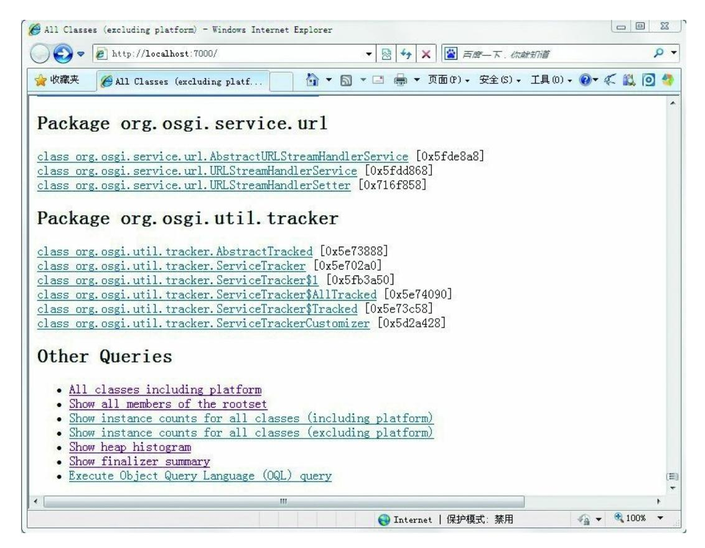

图4-3 jhat的分析结果

- [1] 用于分析的机器一般也是服务器,由于加载dump快照文件需要比生成dump更大的内存,所以一般 在64位JDK、大内存的服务器上进行。
- [2] IBM HeapAnalyzer用于分析IBM J9虚拟机生成的映像文件,各个虚拟机产生的映像文件格式并不 一致,所以分析工具也不能通用。

# 4.2.6 jstack:Java堆栈跟踪工具

jstack(Stack Trace for Java)命令用于生成虚拟机当前时刻的线程快照(一般称为threaddump或者 javacore文件)。线程快照就是当前虚拟机内每一条线程正在执行的方法堆栈的集合,生成线程快照的 目的通常是定位线程出现长时间停顿的原因,如线程间死锁、死循环、请求外部资源导致的长时间挂 起等,都是导致线程长时间停顿的常见原因。线程出现停顿时通过jstack来查看各个线程的调用堆栈, 就可以获知没有响应的线程到底在后台做些什么事情,或者等待着什么资源。

### jstack命令格式:

jstack [ option ] vmid

option选项的合法值与具体含义如表4-4所示。

| 选 项 | 作用                         |
|-----|----------------------------|
| -F  | 当正常输出的请求不被响应时,强制输出线程堆栈     |
| -1  | 除堆栈外,显示关于锁的附加信息            |
| -m  | 如果调用到本地方法的话,可以显示 C/C++ 的堆栈 |

代码清单4-4是使用jstack查看Eclipse线程堆栈的例子,例子中的3500是通过jps命令查询到的 LVMID。

代码清单4-4 使用jstack查看线程堆栈(部分结果)

```
jstack -l 3500
2010-11-19 23:11:26
Full thread dump Java HotSpot(TM) 64-Bit Server VM (17.1-b03 mixed mode):
"[ThreadPool Manager] - Idle Thread" daemon prio=6 tid=0x0000000039dd4000 nid= 0xf50 in Object.wait() [0x000000003c96f000]
    java.lang.Thread.State: WAITING (on object monitor)
        at java.lang.Object.wait(Native Method)
        - waiting on <0x0000000016bdcc60> (a org.eclipse.equinox.internal.util.impl.tpt.threadpool.Executor)
        at java.lang.Object.wait(Object.java:485)
        at org.eclipse.equinox.internal.util.impl.tpt.threadpool.Executor.run (Executor. java:106)
        - locked <0x0000000016bdcc60> (a org.eclipse.equinox.internal.util.impl.tpt.threadpool.Executor)
    Locked ownable synchronizers:
        - None
```

从JDK 5起,java.lang.Thread类新增了一个getAllStackTraces()方法用于获取虚拟机中所有线程的 StackTraceElement对象。使用这个方法可以通过简单的几行代码完成jstack的大部分功能,在实际项目 中不妨调用这个方法做个管理员页面,可以随时使用浏览器来查看线程堆栈,如代码清单4-5所示,这 也算是笔者的一个小经验。

### 代码清单4-5 查看线程状况的JSP页面

```
<%@ page import="java.util.Map"%>
<html>
<head>
<title>服务器线程信息</title>
</head>
<body>
<pre>
<%
    for (Map.Entry<Thread, StackTraceElement[]> stackTrace : Thread.getAllStack-Traces().entrySet()) {
        Thread thread = (Thread) stackTrace.getKey();
        StackTraceElement[] stack = (StackTraceElement[]) stackTrace.getValue();
        if (thread.equals(Thread.currentThread())) {
            continue;
        out.print("\n线程:" + thread.getName() + "\n");
        for (StackTraceElement element : stack) {
            out.print("\t"+element+"\n");
%>
</pre>
</body>
</html>
```

### 4.2.7 基础工具总结

下面表4-5~表4-14中罗列了JDK附带的全部(包括曾经存在但已经在最新版本中被移除的)工具 及其简要用途,限于篇幅,本节只讲解了6个常用的命令行工具。笔者选择这几个工具除了因为它们是 最基础的命令外,还因为它们已经有很长的历史,能适用于大多数读者工作、学习中使用的JDK版 本。在高版本的JDK中,这些工具大多已有了功能更为强大的替代品,譬如JCMD、JHSDB的命令行 模式,但使用方法也是相似的,无论JDK发展到了什么版本,学习这些基础的工具命令并不会过时和 浪费。

·基础工具:用于支持基本的程序创建和运行(见表4-5)

表4-5 基础工具

| 名 称          | 主要作用                                      |  |
|--------------|-------------------------------------------|--|
| appletviewer | 在不使用 Web 浏览器的情况下运行和调试 Applet, JDK 11 中被移除 |  |
| extcheck     | 检查 JAR 冲突的工具,从 JDK 9 中被移除                 |  |
| jar          | 创建和管理 JAR 文件                              |  |
| java         | Java 运行工具,用于运行 Class 文件或 JAR 文件           |  |
| javac        | 用于 Java 编程语言的编译器                          |  |
| javadoc      | Java 的 API 文档生成器                          |  |
| javah        | C 语言头文件和 Stub 函数生成器,用于编写 JNI 方法           |  |
| javap        | Java 字节码分析工具                              |  |
| jlink        | 将 Module 和它的依赖打包成一个运行时镜像文件                |  |
| jdb          | 基于 JPDA 协议的调试器,以类似于 GDB 的方式进行调试 Java 代码   |  |
| jdeps        | Java 类依赖性分析器                              |  |
| jdeprscan    | 用于搜索 JAR 包中使用了"deprecated"的类,从 JDK 9 开始提供 |  |

·安全:用于程序签名、设置安全测试等(见表4-6)

表4-6 安全工具

| 名 称        | 主要作用                                                                       |
|------------|----------------------------------------------------------------------------|
| keytool    | 管理密钥库和证书。主要用于获取或缓存 Kerberos 协议的票据授权票据。允许用户查看本地凭据缓存和密钥表中的条目(用于 Kerberos 协议) |
| jarsigner  | 生成并验证 JAR 签名                                                               |
| policytool | 管理策略文件的 GUI 工具,用于管理用户策略文件 (.java.policy), 在 JDK 10 中被移除                    |

·国际化:用于创建本地语言文件(见表4-7)

表4-7 国际化工具

| 名 称          | 主要作用                                                                                            |
|--------------|-------------------------------------------------------------------------------------------------|
| native2ascii | 本地编码到 ASCII 编码的转换器(Native-to-ASCII Converter),用于"任意受支持的字符编码"和与之对应的"ASCII 编码和 Unicode 转义"之间的相互转换 |

·远程方法调用:用于跨Web或网络的服务交互(见表4-8)

表4-8 远程方法调用工具

| 名 称         | 主要作用                                                                       |
|-------------|----------------------------------------------------------------------------|
| rmic        | Java RMI 编译器,为使用 JRMP 或 IIOP 协议的远程对象生成 Stub、Skeleton 和 Tie 类,也用于生成 OMG IDL |
| rmiregistry | 远程对象注册表服务,用于在当前主机的指定端口上创建并启动一个远程对象注册表                                      |
| rmid        | 启动激活系统守护进程,允许在虚拟机中注册或激活对象                                                  |
| serialver   | 生成并返回指定类的序列化版本 ID                                                          |

·Java IDL与RMI-IIOP:在JDK 11中结束了十余年的CORBA支持,这些工具不再提供[1](见表4- 9)

表4-9 Java IDL与RMI-IIOP

| 名 称        | 主要作用                                                                                                                                                                                                      |
|------------|-----------------------------------------------------------------------------------------------------------------------------------------------------------------------------------------------------------|
| tnameserv  | 提供对命名服务的访问                                                                                                                                                                                                |
| idlj       | IDL 转 Java 编译器(IDL-to-Java Compiler),生成映射 OMG IDL 接口的 Java 源文件,并启用以 Java 编程语言编写的使用 CORBA 功能的应用程序的 Java 源文件。IDL 意即接口定义语言(Interface Definition Language)                                                    |
| orbd       | 对象请求代理守护进程(Object Request Broker Daemon),提供从客户端查找和调用 CORBA 环境服务端上的持久化对象的功能。使用 ORBD 代替瞬态命名服务 tnameserv。ORBD 包括瞬态命名服务和持久命名服务。ORBD 工具集成了服务器管理器、互操作命名服务和引导名称服务器的功能。当客户端想进行服务器时定位、注册和激活功能时,可以与 servertool 一起使用 |
| servertool | 为应用程序注册、注销、启动和关闭服务器提供易用的接口                                                                                                                                                                                |

·部署工具:用于程序打包、发布和部署(见表4-10)

表4-10 部署工具

| 名 称          | 主要作用                                                                           |
|--------------|--------------------------------------------------------------------------------|
| javapackager | 打包、签名 Java 和 JavaFX 应用程序,在 JDK 11 中被移除                                         |
| pack200      | 使用 Java GZIP 压缩器将 JAR 文件转换为压缩的 Pack200 文件。压缩的压缩文件是高度压缩的 JAR,可以直接部署,节省带宽并减少下载时间 |
| unpack200    | 将 Pack200 生成的打包文件解压提取为 JAR 文件                                                  |

·Java Web Start(见表4-11)

表4-11 Java Web Start

| 名 称    | 主要作用                                       |
|--------|--------------------------------------------|
| javaws | 启动 Java Web Start 并设置各种选项的工具。在 JDK 11 中被移除 |

·性能监控和故障处理:用于监控分析Java虚拟机运行信息,排查问题(见表4-12)

表4-12 性能监控和故障处理工具

| 名 称       | 主要作用                                                                                                                                                                                        |
|-----------|---------------------------------------------------------------------------------------------------------------------------------------------------------------------------------------------|
| jps       | JVM Process Status Tool,显示指定系统内所有的 HotSpot 虚拟机进程                                                                                                                                            |
| jstat     | JVM Statistics Monitoring Tool,用于收集 Hotspot 虚拟机各方面的运行数据                                                                                                                                     |
| jstatd    | JVM Statistics Monitoring Tool Daemon, jstat 的守护程序,启动一个 RMI 服务器应用程序,用于监视测试的 HotSpot 虚拟机的创建和终止,并提供一个界面,允许远程监控工具附加到在本地系统上运行的虚拟机。在 JDK 9 中集成到了 JHSDB 中                                         |
| jinfo     | Configuration Info for Java,显示虚拟机配置信息。在 JDK 9 中集成到了 JHSDB 中                                                                                                                                 |
| jmap      | Memory Map for Java, 生成虚拟机的内存转储快照(heapdump 文件)。在 JDK 9 中集成到了 JHSDB 中                                                                                                                        |
| jhat      | JVM Heap Analysis Tool,用于分析堆转储快照,它会建立一个 HTTP/Web 服务器,让用户可以在浏览器上查看分析结果。在 JDK 9 中被 JHSDB 代替                                                                                                   |
| jstack    | Stack Trace for Java,显示虚拟机的线程快照。在 JDK 9 中集成到了 JHSDB 中                                                                                                                                       |
| jhsdb     | Java HotSpot Debugger,一个基于 Serviceability Agent 的 HotSpot 进程调试器,从 JDK 9 开始提供                                                                                                                |
| jsadebugd | Java Serviceability Agent Debug Daemon,适用于 Java 的可维护性代理调试守护程序,主要用于附加到指定的 Java 进程、核心文件,或充当一个调试服务器                                                                                            |
| jemd      | JVM Command, 虚拟机诊断命令工具, 将诊断命令请求发送到正在运行的 Java 虚拟机。从JDK 7 开始提供                                                                                                                                |
| jconsole  | Java Console,用于监控 Java 虚拟机的使用 JMX 规范的图形工具。它可以监控本地和远程 Java 虚拟机,还可以监控和管理应用程序                                                                                                                  |
| jme       | Java Mission Control,包含用于监控和管理 Java 应用程序的工具,而不会引入与这些工具相关联的性能开销。开发者可以使用 jmc 命令来创建 JMC 工具,从 JDK 7 Update 40 开始集成到 OracleJDK 中                                                                 |
| jvisualvm | Java VisualVM, 一种图形化工具,可在 Java 虚拟机中运行时提供有关基于 Java 技术的应用程序 (Java 应用程序)的详细信息。Java VisualVM 提供内存和 CPU 分析、堆转储分析、内存泄漏检测、MBean 访问和垃圾收集。从 JDK 6 Update 7 开始提供;从 JDK 9 开始不再打包入 JDK中,但仍保持更新发展,可以独立下载 |

·WebService工具:与CORBA一起在JDK 11中被移除(见表4-13)

表4-13 WebService工具

| 名 称       | 主 要 作 用                                                               |
|-----------|-----------------------------------------------------------------------|
| schemagen | 用于 XML 绑定的 Schema 生成器,用于生成 XML Schema 文件                              |
| wsgen     | XML Web Service 2.0 的 Java API,生成用于 JAX-WS Web Service 的 JAX-WS 便携式产物 |
| wsimport  | XML Web Service 2.0 的 Java API,主要用于根据服务端发布的 WSDL 文件生成客户端              |
| xjc       | 主要用于根据 XML Schema 文件生成对应的 Java 类                                      |

### ·REPL和脚本工具(见表4-14)

表4-14 REPL和脚本工具

| 名 称        | 主要作用                                                                            |  |
|------------|---------------------------------------------------------------------------------|--|
| jshell     | 基于 Java 的 Shell REPL (Read-Eval-Print Loop) 交互工具                                |  |
| jjs        | 对 Nashorn 引擎的调用人口。Nashorn 是基于 Java 实现的一个轻量级高性能 JavaScript 运行环境                  |  |
| jrunscript | Java 命令行脚本外壳工具(Command Line Script Shell),主要用于解释执行 JavaScript、Groovy、Ruby 等脚本语言 |  |

[1] 详细信息见http://openjdk.java.net/jeps/320。

### 4.3 可视化故障处理工具

JDK中除了附带大量的命令行工具外,还提供了几个功能集成度更高的可视化工具,用户可以使 用这些可视化工具以更加便捷的方式进行进程故障诊断和调试工作。这类工具主要包括JConsole、 JHSDB、VisualVM和JMC四个。其中,JConsole是最古老,早在JDK 5时期就已经存在的虚拟机监控 工具,而JHSDB虽然名义上是JDK 9中才正式提供,但之前已经以sa-jdi.jar包里面的HSDB(可视化工 具)和CLHSDB(命令行工具)的形式存在了很长一段时间[1]。它们两个都是JDK的正式成员,随着 JDK一同发布,无须独立下载,使用也是完全免费的。

VisualVM在JDK 6 Update 7中首次发布,直到JRockit Mission Control与OracleJDK的融合工作完成 之前,它都曾是Oracle主力推动的多合一故障处理工具,现在它已经从OracleJDK中分离出来,成为一 个独立发展的开源项目[2]。VisualVM已不是JDK中的正式成员,但仍是可以免费下载、使用的。

Java Mission Control,曾经是大名鼎鼎的来自BEA公司的图形化诊断工具,随着BEA公司被Oracle 收购,它便被融合进OracleJDK之中。在JDK 7 Update 40时开始随JDK一起发布,后来Java SE

Advanced产品线建立,Oracle明确区分了Oracle OpenJDK和OracleJDK的差别[3],JMC从JDK 11开始又 被移除出JDK。虽然在2018年Oracle将JMC开源并交付给OpenJDK组织进行管理,但开源并不意味着 免费使用,JMC需要与HotSpot内部的"飞行记录仪"(Java Flight Recorder,JFR)配合才能工作,而在 JDK 11以前,JFR的开启必须解锁OracleJDK的商业特性支持(使用JCMD的

VM.unlock\_commercial\_features或启动时加入-XX:+UnlockCommercialFeatures参数),所以这项功能 在生产环境中仍然是需要付费才能使用的商业特性。

为避免本节讲解的内容变成对软件说明文档的简单翻译,笔者准备了一些代码样例,大多数是笔 者特意编写的反面教材。稍后将会使用几款工具去监控、分析这些代码存在的问题,算是本节简单的 实战演练。读者可以把在可视化工具观察到的数据、现象,与前面两章中讲解的理论知识进行互相验 证。

- [1] 准确来说是Linux和Solaris在OracleJDK 6就可以使用HSDB和CLHSDB了,Windows上要到Oracle-JDK 7才可以用。
- [2] VisualVM官方站点:https://visualvm.github.io。
- [3] 详见https://blogs.oracle.com/java-platform-group/oracle-jdk-releases-for-java-11-and-later。

# 4.3.1 JHSDB:基于服务性代理的调试工具

JDK中提供了JCMD和JHSDB两个集成式的多功能工具箱,它们不仅整合了上一节介绍到的所有 基础工具所能提供的专项功能,而且由于有着"后发优势",能够做得往往比之前的老工具们更好、更 强大,表4-15所示是JCMD、JHSDB与原基础工具实现相同功能的简要对比。

| 基础工具                        | JCMD                                 | JHSDB                |
|-----------------------------|--------------------------------------|----------------------|
| jps -lm                     | jemd                                 | N/A                  |
| jmap -dump <pid></pid>      | jcmd <pid> GC.heap_dump</pid>        | jhsdb jmapbinaryheap |
| jmap -histo <pid></pid>     | jcmd <pid> GC.class_histogram</pid>  | jhsdb jmaphisto      |
| jstack <pid></pid>          | jcmd <pid> Thread.print</pid>        | jhsdb jstacklocks    |
| jinfo -sysprops <pid></pid> | jcmd <pid>VM.system_properties</pid> | jhsdb infosysprops   |
| jinfo -flags <pid></pid>    | jcmd <pid> VM.flags</pid>            | jhsdb jinfoflags     |

表4-15 JCMD、JHSDB和基础工具的对比

本节的主题是可视化的故障处理,所以JCMD及JHSDB的命令行模式就不再作重点讲解了,读者 可参考上一节的基础命令,再借助它们在JCMD和JHSDB中的help去使用,相信是很容易举一反三、 触类旁通的。接下来笔者要通过一个实验来讲解JHSDB的图形模式下的功能。

JHSDB是一款基于服务性代理(Serviceability Agent,SA)实现的进程外调试工具。服务性代理是 HotSpot虚拟机中一组用于映射Java虚拟机运行信息的、主要基于Java语言(含少量JNI代码)实现的 API集合。服务性代理以HotSpot内部的数据结构为参照物进行设计,把这些C++的数据抽象出Java模 型对象,相当于HotSpot的C++代码的一个镜像。通过服务性代理的API,可以在一个独立的Java虚拟 机的进程里分析其他HotSpot虚拟机的内部数据,或者从HotSpot虚拟机进程内存中dump出来的转储快 照里还原出它的运行状态细节。服务性代理的工作原理跟Linux上的GDB或者Windows上的Windbg是相 似的。本次,我们要借助JHSDB来分析一下代码清单4-6中的代码[1],并通过实验来回答一个简单问 题:staticObj、instanceObj、localObj这三个变量本身(而不是它们所指向的对象)存放在哪里?

代码清单4-6 JHSDB测试代码

```
/**
* staticObj、instanceObj、localObj存放在哪里?
*/
public class JHSDB_TestCase {
   static class Test {
       static ObjectHolder staticObj = new ObjectHolder();
       ObjectHolder instanceObj = new ObjectHolder();
       void foo() {
           ObjectHolder localObj = new ObjectHolder();
           System.out.println("done"); // 这里设一个断点
```

```
private static class ObjectHolder {}
public static void main(String[] args) {
    Test test = new JHSDB_TestCase.Test();
    test.foo();
```

答案读者当然都知道:staticObj随着Test的类型信息存放在方法区,instanceObj随着Test的对象实 例存放在Java堆,localObject则是存放在foo()方法栈帧的局部变量表中。这个答案是通过前两章学习的 理论知识得出的,现在要做的是通过JHSDB来实践验证这一点。

首先,我们要确保这三个变量已经在内存中分配好,然后将程序暂停下来,以便有空隙进行实 验,这只要把断点设置在代码中加粗的打印语句上,然后在调试模式下运行程序即可。由于JHSDB本 身对压缩指针的支持存在很多缺陷,建议用64位系统的读者在实验时禁用压缩指针,另外为了后续操 作时可以加快在内存中搜索对象的速度,也建议读者限制一下Java堆的大小。本例中,笔者采用的运 行参数如下:

-Xmx10m -XX:+UseSerialGC -XX:-UseCompressedOops

程序执行后通过jps查询到测试程序的进程ID,具体如下:

```
jps -l
8440 org.jetbrains.jps.cmdline.Launcher
11180 JHSDB_TestCase
15692 jdk.jcmd/sun.tools.jps.Jps
```

使用以下命令进入JHSDB的图形化模式,并使其附加进程11180:

jhsdb hsdb --pid 11180

命令打开的JHSDB的界面如图4-4所示。

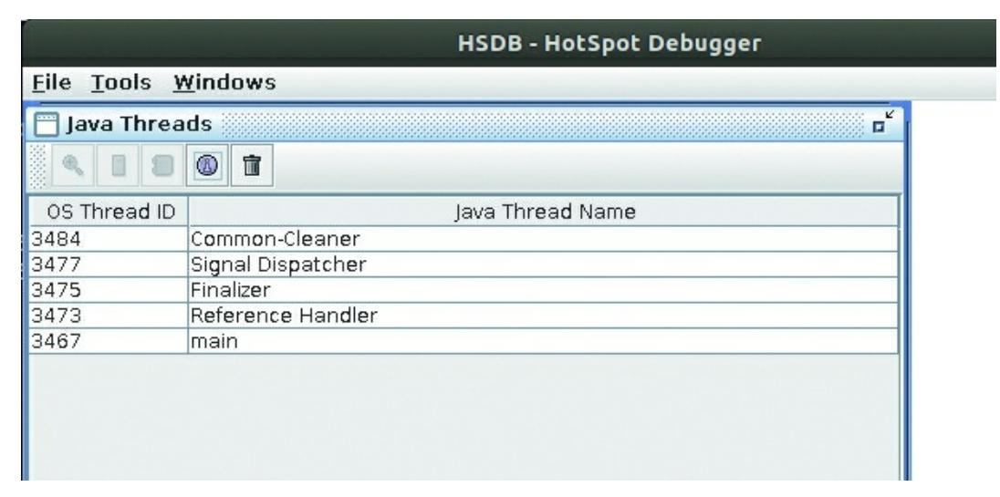

图4-4 JHSDB的界面

阅读代码清单4-6可知,运行至断点位置一共会创建三个ObjectHolder对象的实例,只要是对象实 例必然会在Java堆中分配,既然我们要查找引用这三个对象的指针存放在哪里,不妨从这三个对象开 始着手,先把它们从Java堆中找出来。

首先点击菜单中的Tools->Heap Parameters [2],结果如图4-5所示,因为笔者的运行参数中指定了使 用的是Serial收集器,图中我们看到了典型的Serial的分代内存布局,Heap Parameters窗口中清楚列出了 新生代的Eden、S1、S2和老年代的容量(单位为字节)以及它们的虚拟内存地址起止范围。

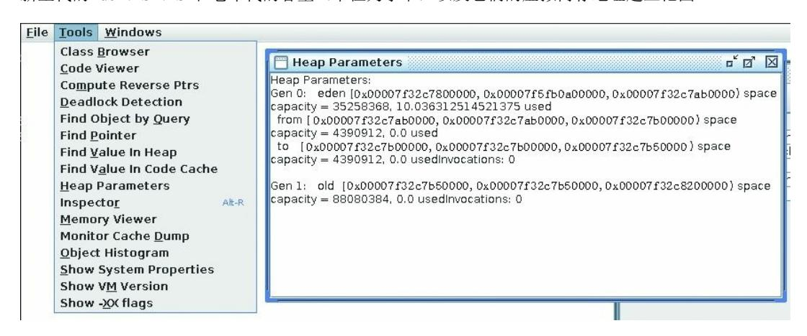

图4-5 Serial收集器的堆布局

如果读者实践时不指定收集器,即使用JDK默认的G1的话,得到的信息应该类似如下所示:

```
Heap Parameters:
garbage-first heap [0x00007f32c7800000, 0x00007f32c8200000] region size 1024K
```

请读者注意一下图中各个区域的内存地址范围,后面还要用到它们。打开Windows->Console窗 口,使用scanoops命令在Java堆的新生代(从Eden起始地址到To Survivor结束地址)范围内查找 ObjectHolder的实例,结果如下所示:

```
hsdb>scanoops 0x00007f32c7800000 0x00007f32c7b50000 JHSDB_TestCase$ObjectHolder
0x00007f32c7a7c458 JHSDB_TestCase$ObjectHolder
0x00007f32c7a7c480 JHSDB_TestCase$ObjectHolder
0x00007f32c7a7c490 JHSDB_TestCase$ObjectHolder
```

果然找出了三个实例的地址,而且它们的地址都落到了Eden的范围之内,算是顺带验证了一般情 况下新对象在Eden中创建的分配规则。再使用Tools->Inspector功能确认一下这三个地址中存放的对 象,结果如图4-6所示。

| Inspector          |                                                            |                                             | o [□] | × |
|--------------------|------------------------------------------------------------|---------------------------------------------|-------|---|
| Previous Oop       | Address / C++ Expression:                                  | 0x00007f32c7a7c458                          |       | - |
| ☐ Oop for JHSDB_Te | estCase\$ObjectHolder @ 0x000                              | 007f32c7a7c458                              |       |   |
| — 🗋 _mark: 5       |                                                            | -teater of an include on weak and the first |       |   |
| r ☐ _metadatak     | lass: InstanceKlass f <mark>o</mark> r JHSDB_ <sup>*</sup> | TestCase\$ObjectHolder                      |       |   |
| ⊶ 🛅 _super: Ins    | stanceKlass for java/lang/Objec                            | t                                           |       |   |
| - ] _layout_he     | lper: 16                                                   |                                             |       |   |
| - 🗋 _access_fla    | ags: 538968096                                             |                                             |       |   |
| – 🗋 _subklass:     | null                                                       |                                             |       |   |
| ∽ 🗂 _next_siblii   | n <b>g:</b> InstanceKlass for JHSDB_Te                     | estCas <b>e</b> \$T <b>e</b> st             |       |   |
| vtable_ler         | n: 5                                                       |                                             |       |   |
| – 🗋 _array_klas    | ss <b>e</b> s: null                                        |                                             |       |   |
| — 🚺 _nonstatic     | _field_size: 0                                             |                                             |       |   |
| - 🗋 _static_fiel   | d_size: 0                                                  |                                             |       |   |
| — 🗋 _static_oo     | p_field_count: 0                                           |                                             |       |   |
| — 🗋 _nonstatic     | _oop_map_size: 0                                           |                                             |       |   |
| — 🗋 _is_marked     | d_dependent: 0                                             |                                             |       |   |
| - 🗋 _init_state    | : 4                                                        |                                             |       |   |
| itable_len         | : 2                                                        |                                             |       |   |
|                    | Compute Liveness                                           |                                             |       |   |

### 图4-6 查看对象实例数据

Inspector为我们展示了对象头和指向对象元数据的指针,里面包括了Java类型的名字、继承关 系、实现接口关系,字段信息、方法信息、运行时常量池的指针、内嵌的虚方法表(vtable)以及接口 方法表(itable)等。由于我们的确没有在ObjectHolder上定义过任何字段,所以图中并没有看到任何 实例字段数据,读者在做实验时不妨定义一些不同数据类型的字段,观察它们在HotSpot虚拟机里面是 如何存储的。

接下来要根据堆中对象实例地址找出引用它们的指针,原本JHSDB的Tools菜单中有Compute Reverse Ptrs来完成这个功能,但在笔者的运行环境中一点击它就出现Swing的界面异常,看后台日志是 报了个空指针,这个问题只是界面层的异常,跟虚拟机关系不大,所以笔者没有继续去深究,改为使 用命令来做也很简单,先拿第一个对象来试试看:

hsdb> revptrs 0x00007f32c7a7c458 Computing reverse pointers... Done. Oop for java/lang/Class @ 0x00007f32c7a7b180

果然找到了一个引用该对象的地方,是在一个java.lang.Class的实例里,并且给出了这个实例的地 址,通过Inspector查看该对象实例,可以清楚看到这确实是一个java.lang.Class类型的对象实例,里面 有一个名为staticObj的实例字段,如图4-7所示。

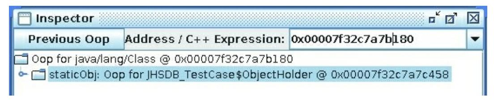

图4-7 Class对象

从《Java虚拟机规范》所定义的概念模型来看,所有Class相关的信息都应该存放在方法区之中, 但方法区该如何实现,《Java虚拟机规范》并未做出规定,这就成了一件允许不同虚拟机自己灵活把 握的事情。JDK 7及其以后版本的HotSpot虚拟机选择把静态变量与类型在Java语言一端的映射Class对 象存放在一起,存储于Java堆之中,从我们的实验中也明确验证了这一点[3]。接下来继续查找第二个 对象实例:

hsdb>revptrs 0x00007f32c7a7c480 Computing reverse pointers... Done.

Oop for JHSDB\_TestCase\$Test @ 0x00007f32c7a7c468

这次找到一个类型为JHSDB\_TestCase\$Test的对象实例,在Inspector中该对象实例显示如图4-8所 示。

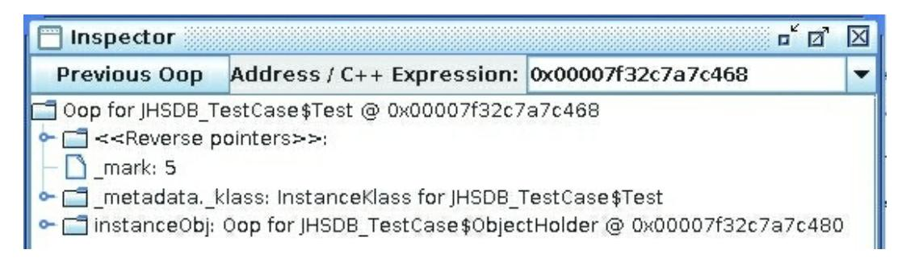

图4-8 JHSDB\_TestCase\$Test对象

这个结果完全符合我们的预期,第二个ObjectHolder的指针是在Java堆中JHSDB\_TestCase\$Test对 象的instanceObj字段上。但是我们采用相同方法查找第三个ObjectHolder实例时,JHSDB返回了一个 null,表示未查找到任何结果:

```
hsdb> revptrs 0x00007f32c7a7c490
null
```

看来revptrs命令并不支持查找栈上的指针引用,不过没有关系,得益于我们测试代码足够简洁, 人工也可以来完成这件事情。在Java Thread窗口选中main线程后点击Stack Memory按钮查看该线程的 栈内存,如图4-9所示。

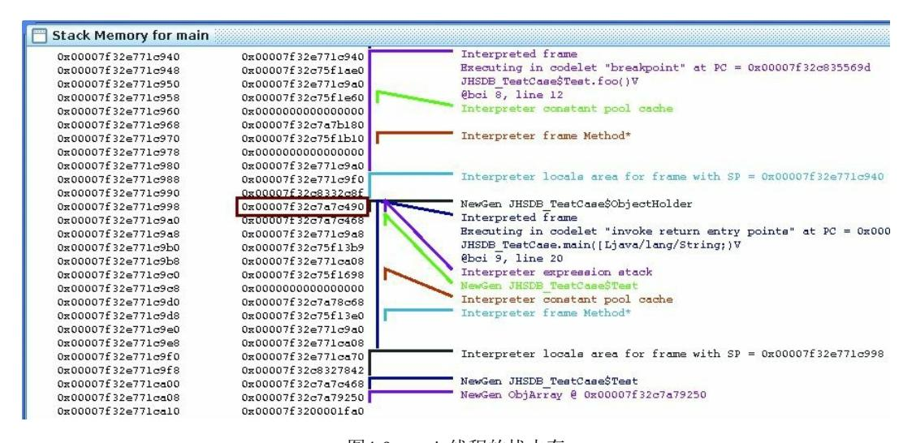

图4-9 main线程的栈内存

这个线程只有两个方法栈帧,尽管没有查找功能,但通过肉眼观察在地址0x00007f32e771c998上 的值正好就是0x00007f32c7a7c490,而且JHSDB在旁边已经自动生成注释,说明这里确实是引用了一

个来自新生代的JHSDB\_TestCase\$ObjectHolder对象。至此,本次实验中三个对象均已找到,并成功追 溯到引用它们的地方,也就实践验证了开篇中提出的这些对象的引用是存储在什么地方的问题。

JHSDB提供了非常强大且灵活的命令和功能,本节的例子只是其中一个很小的应用,读者在实际 开发、学习时,可以用它来调试虚拟机进程或者dump出来的内存转储快照,以积累更多的实际经验。

- [1] 本小节的原始案例来自RednaxelaFX的博客https://rednaxelafx.iteye.com/blog/1847971。
- [2] 效果与在Windows->Console中输入universe命令是等价的,JHSDB的图形界面中所有操作都可以通 过命令行完成,读者感兴趣的话,可以在控制台中输入help命令查看更多信息。
- [3] 在JDK 7以前,即还没有开始"去永久代"行动时,这些静态变量是存放在永久代上的,JDK 7起把 静态变量、字符常量这些从永久代移除出去。

### 4.3.2 JConsole:Java监视与管理控制台

JConsole(Java Monitoring and Management Console)是一款基于JMX(Java Manage-ment Extensions)的可视化监视、管理工具。它的主要功能是通过JMX的MBean(Managed Bean)对系统进 行信息收集和参数动态调整。JMX是一种开放性的技术,不仅可以用在虚拟机本身的管理上,还可以 运行于虚拟机之上的软件中,典型的如中间件大多也基于JMX来实现管理与监控。虚拟机对JMX MBean的访问也是完全开放的,可以使用代码调用API、支持JMX协议的管理控制台,或者其他符合 JMX规范的软件进行访问。

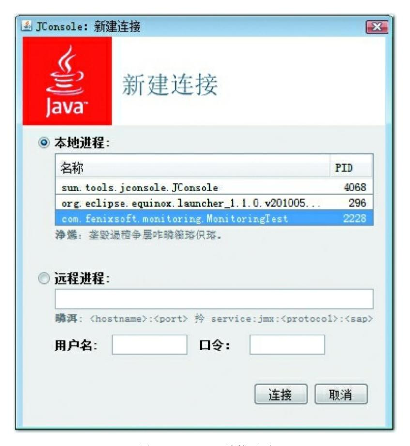

图4-10 JConsole连接页面

### 1.启动JConsole

通过JDK/bin目录下的jconsole.exe启动JCon-sole后,会自动搜索出本机运行的所有虚拟机进程,而

不需要用户自己使用jps来查询,如图4-10所示。双击选择其中一个进程便可进入主界面开始监控。 JMX支持跨服务器的管理,也可以使用下面的"远程进程"功能来连接远程服务器,对远程虚拟机进行 监控。

图4-10中可以看到笔者的机器现在运行了Eclipse、JConsole、MonitoringTest三个本地虚拟机进 程,这里MonitoringTest是笔者准备的"反面教材"代码之一。双击它进入JConsole主界面,可以看到主 界面里共包括"概述""内存""线程""类""VM摘要""MBean"六个页签,如图4-11所示。

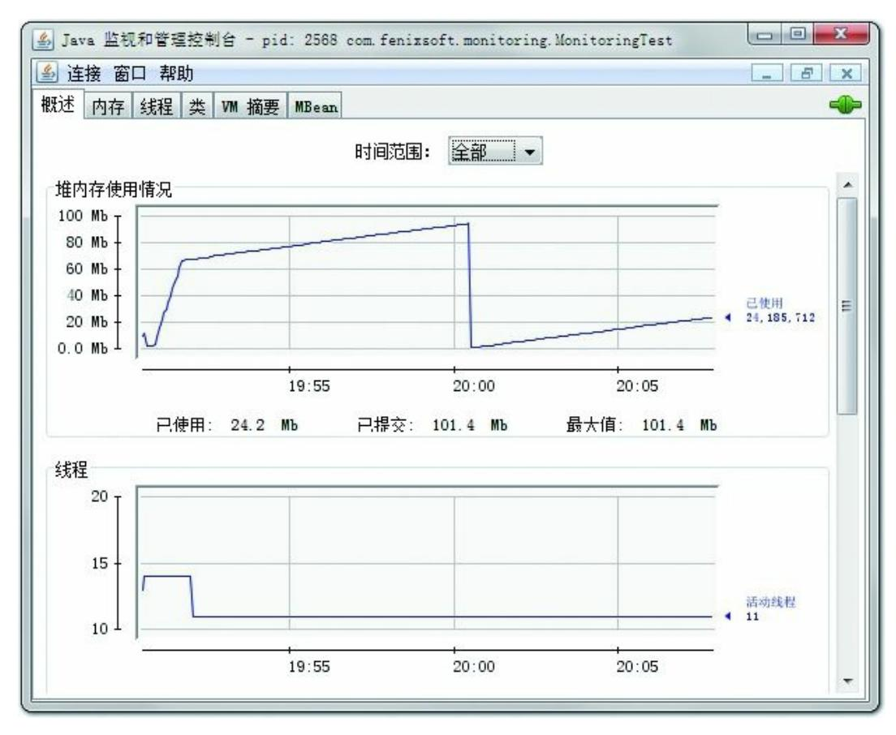

图4-11 JConsole主界面

"概述"页签里显示的是整个虚拟机主要运行数据的概览信息,包括"堆内存使用情况""线 程""类""CPU使用情况"四项信息的曲线图,这些曲线图是后面"内存""线程""类"页签的信息汇总,具 体内容将在稍后介绍。

### 2.内存监控

"内存"页签的作用相当于可视化的jstat命令,用于监视被收集器管理的虚拟机内存(被收集器直 接管理的Java堆和被间接管理的方法区)的变化趋势。我们通过运行代码清单4-7中的代码来体验一下 它的监视功能。运行时设置的虚拟机参数为:

-Xms100m -Xmx100m -XX:+UseSerialGC

#### 代码清单4-7 JConsole监视代码

```
/**
* 内存占位符对象,一个OOMObject大约占64KB
*/
static class OOMObject {
   public byte[] placeholder = new byte[64 * 1024];
public static void fillHeap(int num) throws InterruptedException {
   List<OOMObject> list = new ArrayList<OOMObject>();
   for (int i = 0; i < num; i++) {
       // 稍作延时,令监视曲线的变化更加明显
       Thread.sleep(50);
       list.add(new OOMObject());
   System.gc();
public static void main(String[] args) throws Exception {
   fillHeap(1000);
```

这段代码的作用是以64KB/50ms的速度向Java堆中填充数据,一共填充1000次,使用JConsole 的"内存"页签进行监视,观察曲线和柱状指示图的变化。

程序运行后,在"内存"页签中可以看到内存池Eden区的运行趋势呈现折线状,如图4-12所示。监 视范围扩大至整个堆后,会发现曲线是一直平滑向上增长的。从柱状图可以看到,在1000次循环执行 结束,运行了System.gc()后,虽然整个新生代Eden和Survivor区都基本被清空了,但是代表老年代的柱 状图仍然保持峰值状态,说明被填充进堆中的数据在System.gc()方法执行之后仍然存活。笔者的分析 就到此为止,提两个小问题供读者思考一下,答案稍后公布。

- 1)虚拟机启动参数只限制了Java堆为100MB,但没有明确使用-Xmn参数指定新生代大小,读者 能否从监控图中估算出新生代的容量?
- 2)为何执行了System.gc()之后,图4-12中代表老年代的柱状图仍然显示峰值状态,代码需要如何 调整才能让System.gc()回收掉填充到堆中的对象?

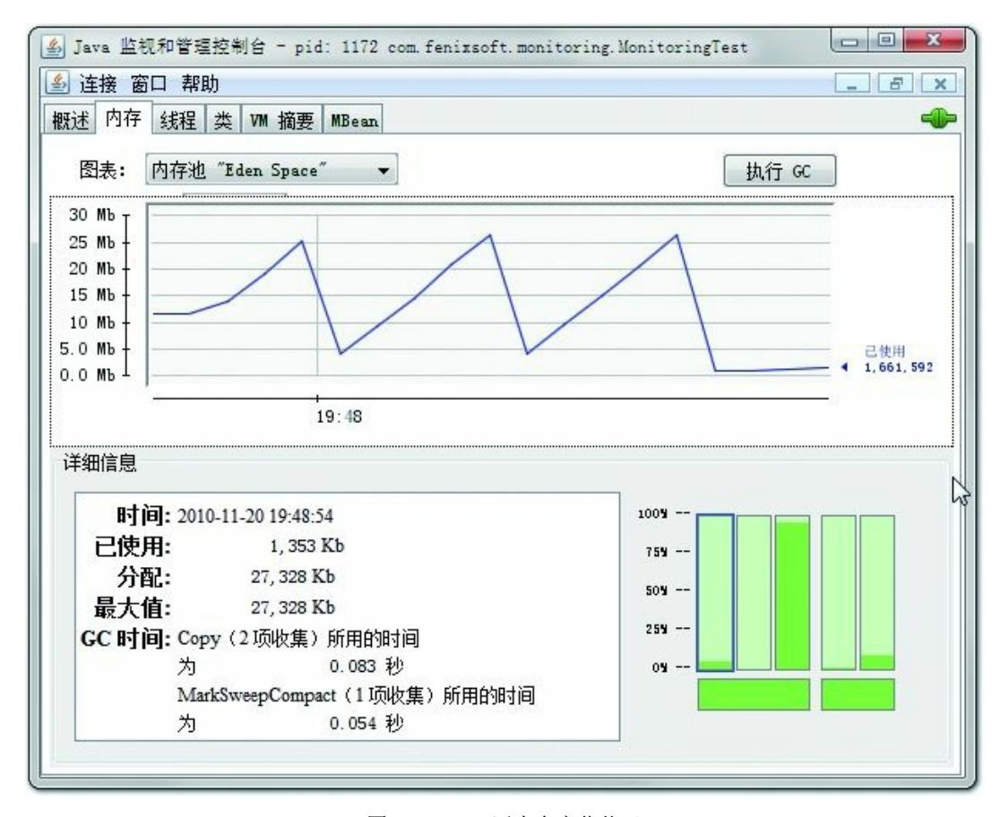

图4-12 Eden区内存变化状况

问题1答案:图4-12显示Eden空间为27328KB,因为没有设置-XX:SurvivorRadio参数,所以Eden 与Survivor空间比例的默认值为8∶1,因此整个新生代空间大约为27328KB×125%=34160KB。

问题2答案:执行System.gc()之后,空间未能回收是因为List<OOMObject>list对象仍然存活, fillHeap()方法仍然没有退出,因此list对象在System.gc()执行时仍然处于作用域之内[1]。如果把 System.gc()移动到fillHeap()方法外调用就可以回收掉全部内存。

#### 3.线程监控

如果说JConsole的"内存"页签相当于可视化的jstat命令的话,那"线程"页签的功能就相当于可视化 的jstack命令了,遇到线程停顿的时候可以使用这个页签的功能进行分析。前面讲解jstack命令时提到 线程长时间停顿的主要原因有等待外部资源(数据库连接、网络资源、设备资源等)、死循环、锁等 待等,代码清单4-8将分别演示这几种情况。

```
/**
 * 线程死循环演示
 */
public static void createBusyThread() {
Thread thread = new Thread(new Runnable() {
    @Override
    public void run() {
        while (true) // 第41行
            ;
}, "testBusyThread");
thread.start();
/**
 * 线程锁等待演示
 */
public static void createLockThread(final Object lock) {
Thread thread = new Thread(new Runnable() {
    @Override
    public void run() {
        synchronized (lock) {
            try {
                lock.wait();
            } catch (InterruptedException e) {
                e.printStackTrace();
            }
}, "testLockThread");
thread.start();
public static void main(String[] args) throws Exception {
    BufferedReader br = new BufferedReader(new InputStreamReader(System.in));
    br.readLine();
    createBusyThread();
    br.readLine();
    Object obj = new Object();
    createLockThread(obj);
```

程序运行后,首先在"线程"页签中选择main线程,如图4-13所示。堆栈追踪显示BufferedReader的 readBytes()方法正在等待System.in的键盘输入,这时候线程为Runnable状态,Runnable状态的线程仍会 被分配运行时间,但readBytes()方法检查到流没有更新就会立刻归还执行令牌给操作系统,这种等待 只消耗很小的处理器资源。

接着监控testBusyThread线程,如图4-14所示。testBusyThread线程一直在执行空循环,从堆栈追 踪中看到一直在MonitoringTest.java代码的41行停留,41行的代码为while(true)。这时候线程为Runnable 状态,而且没有归还线程执行令牌的动作,所以会在空循环耗尽操作系统分配给它的执行时间,直到 线程切换为止,这种等待会消耗大量的处理器资源。

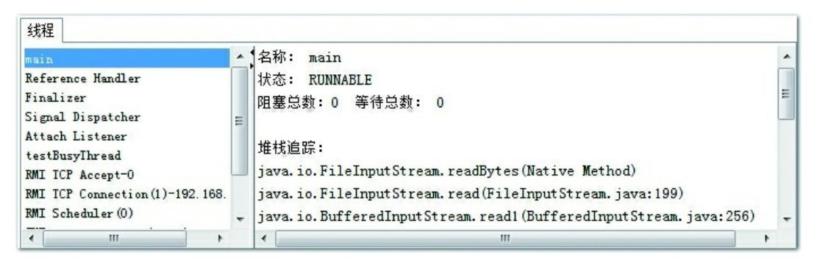

图4-13 main线程

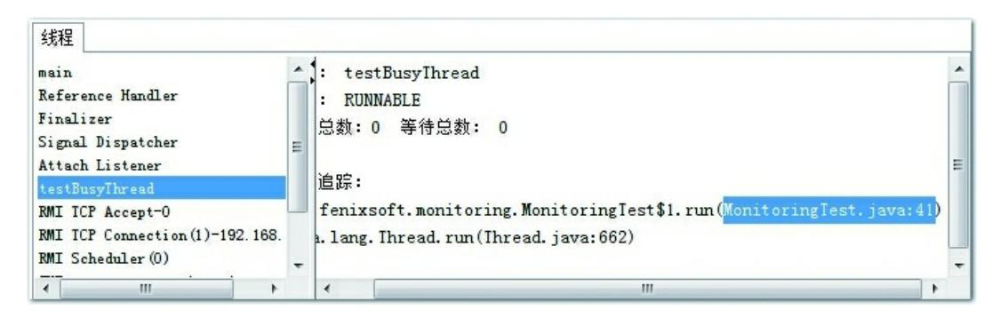

图4-14 testBusyThread线程

图4-15显示testLockThread线程在等待lock对象的notify()或notifyAll()方法的出现,线程这时候处于 WAITING状态,在重新唤醒前不会被分配执行时间。

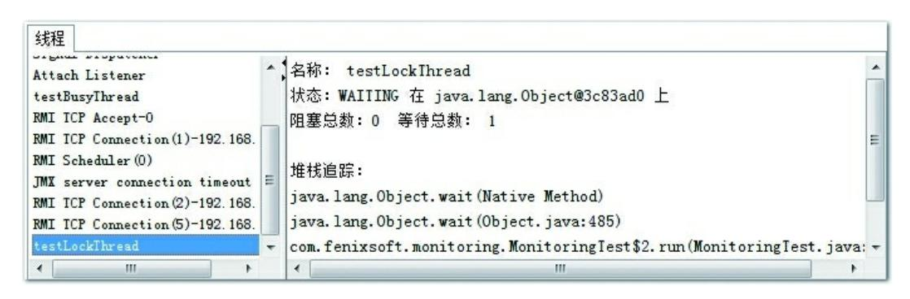

图4-15 testLockThread线程

testLockThread线程正处于正常的活锁等待中,只要lock对象的notify()或notifyAll()方法被调用, 这个线程便能激活继续执行。代码清单4-9演示了一个无法再被激活的死锁等待。

```
/**
 * 线程死锁等待演示
 */
static class SynAddRunalbe implements Runnable {
    int a, b;
    public SynAddRunalbe(int a, int b) {
        this.a = a;
        this.b = b;
    @Override
    public void run() {
        synchronized (Integer.valueOf(a)) {
            synchronized (Integer.valueOf(b)) {
                System.out.println(a + b);
            }
public static void main(String[] args) {
    for (int i = 0; i < 100; i++) {
        new Thread(new SynAddRunalbe(1, 2)).start();
        new Thread(new SynAddRunalbe(2, 1)).start();
```

这段代码开了200个线程去分别计算1+2以及2+1的值,理论上for循环都是可省略的,两个线程也 可能会导致死锁,不过那样概率太小,需要尝试运行很多次才能看到死锁的效果。如果运气不是特别 差的话,上面带for循环的版本最多运行两三次就会遇到线程死锁,程序无法结束。造成死锁的根本原 因是Integer.valueOf()方法出于减少对象创建次数和节省内存的考虑,会对数值为-128~127之间的 Integer对象进行缓存[2],如果valueOf()方法传入的参数在这个范围之内,就直接返回缓存中的对象。 也就是说代码中尽管调用了200次Integer.valueOf()方法,但一共只返回了两个不同的Integer对象。假如 某个线程的两个synchronized块之间发生了一次线程切换,那就会出现线程A在等待被线程B持有的 Integer.valueOf(1),线程B又在等待被线程A持有的Integer.valueOf(2),结果大家都跑不下去的情况。

出现线程死锁之后,点击JConsole线程面板的"检测到死锁"按钮,将出现一个新的"死锁"页签,如 图4-16所示。

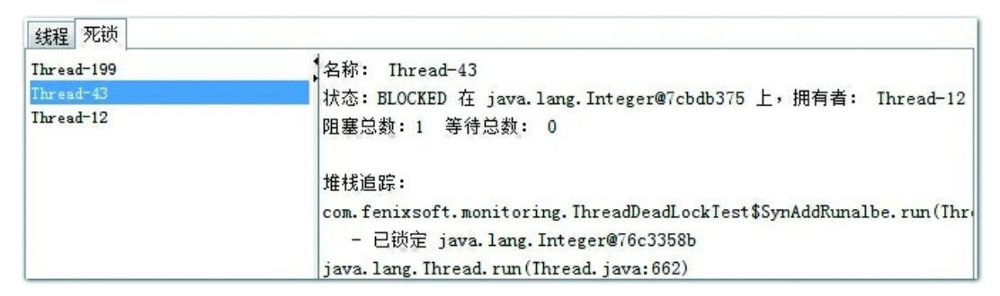

图4-16 线程死锁

图4-16中很清晰地显示,线程Thread-43在等待一个被线程Thread-12持有的Integer对象,而点击线 程Thread-12则显示它也在等待一个被线程Thread-43持有的Integer对象,这样两个线程就互相卡住,除 非牺牲其中一个,否则死锁无法释放。

- [1] 准确地说,只有虚拟机使用解释器执行的时候,"在作用域之内"才能保证它不会被回收,因为这里 的回收还涉及局部变量表变量槽的复用、即时编译器介入时机等问题,具体读者可参考第8章的代码清 单8-1。
- [2] 这是《Java虚拟机规范》中明确要求缓存的默认值,实际值可以调整,具体取决于 java.lang.Integer.Integer-Cache.high参数的设置。

# 4.3.3 VisualVM:多合-故障处理工具

VisualVM(All-in-One Java Troubleshooting Tool)是功能最强大的运行监视和故障处理程序之一, 曾经在很长一段时间内是Oracle官方主力发展的虚拟机故障处理工具。Oracle曾在VisualVM的软件说明 中写上了"All-in-One"的字样,预示着它除了常规的运行监视、故障处理外,还将提供其他方面的能 力,譬如性能分析(Profiling)。VisualVM的性能分析功能比起JProfiler、YourKit等专业且收费的 Profiling工具都不遑多让。而且相比这些第三方工具,VisualVM还有一个很大的优点:不需要被监视的 程序基于特殊Agent去运行,因此它的通用性很强,对应用程序实际性能的影响也较小,使得它可以直 接应用在生产环境中。这个优点是JProfiler、YourKit等工具无法与之媲美的。

#### 1.VisualVM兼容范围与插件安装

VisualVM基于NetBeans平台开发工具,所以一开始它就具备了通过插件扩展功能的能力,有了插 件扩展支持,VisualVM可以做到:

- ·显示虚拟机进程以及进程的配置、环境信息(jps、jinfo)。
- ·监视应用程序的处理器、垃圾收集、堆、方法区以及线程的信息(jstat、jstack)。
- ·dump以及分析堆转储快照(jmap、jhat)。
- ·方法级的程序运行性能分析,找出被调用最多、运行时间最长的方法。
- ·离线程序快照:收集程序的运行时配置、线程dump、内存dump等信息建立一个快照,可以将快 照发送开发者处进行Bug反馈。
  - ·其他插件带来的无限可能性。

VisualVM在JDK 6 Update 7中首次发布,但并不意味着它只能监控运行于JDK 6上的程序,它具备 很优秀的向下兼容性,甚至能向下兼容至2003年发布的JDK 1.4.2版本[1],这对无数处于已经完成实 施、正在维护的遗留项目很有意义。当然,也并非所有功能都能完美地向下兼容,主要功能的兼容性 见表4-16所示。

| 特 性    | JDK 1.4.2 | JDK 5        | JDK 6 local | JDK 6 remote |
|--------|-----------|--------------|-------------|--------------|
| 运行环境信息 | <b>√</b>  | $\checkmark$ | √           | V            |
| 系统属性   |           |              | <b>√</b>    |              |
| 监视面板   | √         | $\checkmark$ | <b>√</b>    | V            |

表4-16 VisualVM主要功能兼容性列表

| 特 性         | JDK 1.4.2 | JDK 5        | JDK 6 local  | JDK 6 remote |
|-------------|-----------|--------------|--------------|--------------|
| 线程面板        |           | <b>√</b>     | <b>√</b>     | $\checkmark$ |
| 性能监控        |           |              | $\checkmark$ |              |
| 堆、线程 Dump   |           |              | $\checkmark$ |              |
| MBean 管理    |           | $\checkmark$ | $\checkmark$ | <b>√</b>     |
| JConsole 插件 |           | <b>√</b>     | V            | V            |

首次启动VisualVM后,读者先不必着急找应用程序进行监测,初始状态下的VisualVM并没有加载 任何插件,虽然基本的监视、线程面板的功能主程序都以默认插件的形式提供,但是如果不在 VisualVM上装任何扩展插件,就相当于放弃它最精华的功能,和没有安装任何应用软件的操作系统差 不多。

VisualVM的插件可以手工进行安装,在网站[2]上下载nbm包后,点击"工具->插件->已下载"菜 单,然后在弹出对话框中指定nbm包路径便可完成安装。独立安装的插件存储在VisualVM的根目录, 譬如JDK 9之前自带的VisulalVM,插件安装后是放在JDK\_HOME/lib/visualvm中的。手工安装插件并 不常用,VisualVM的自动安装功能已可找到大多数所需的插件,在有网络连接的环境下,点击"工具-> 插件菜单",弹出如图4-17所示的插件页签,在页签的"可用插件"及"已安装"中列举了当前版本 VisualVM可以使用的全部插件,选中插件后在右边窗口会显示这个插件的基本信息,如开发者、版 本、功能描述等。

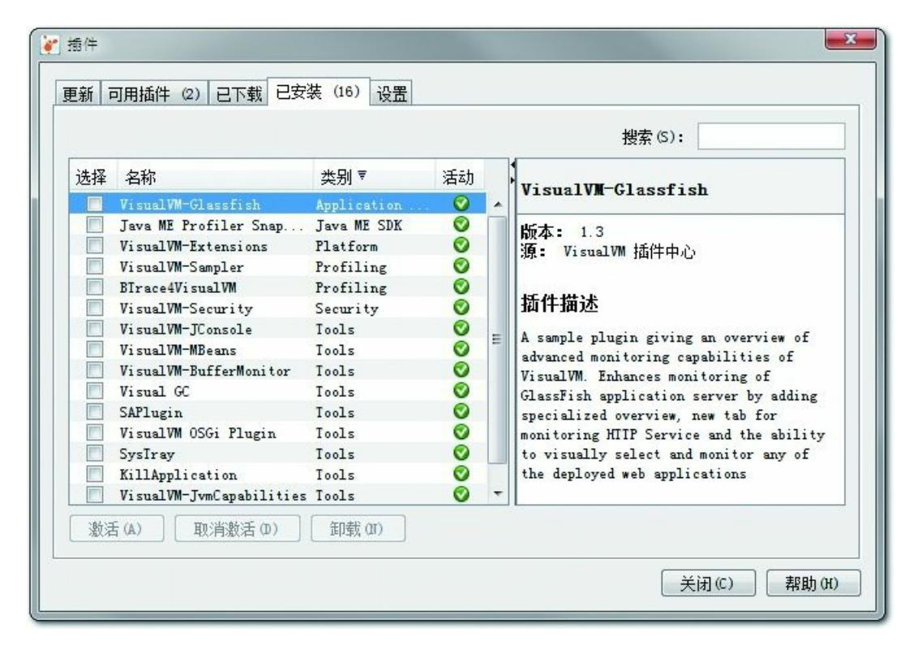

图4-17 VisualVM插件页签

读者可根据自己的工作需要和兴趣选择合适的插件,然后点击"安装"按钮,弹出如图4-18所示的 下载进度窗口,跟着提示操作即可完成安装。

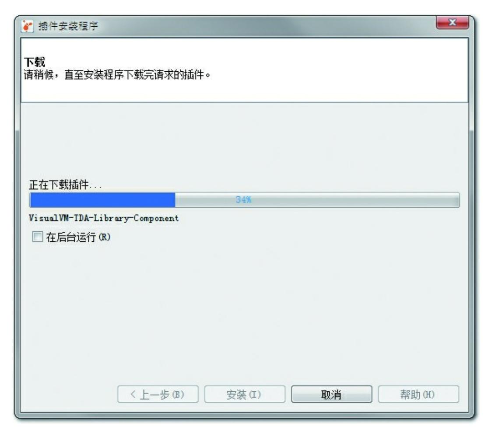

图4-18 VisualVM插件安装过程

选择一个需要监视的程序就可以进入程序的主界面了,如图4-19所示。由于VisualVM的版本以及 选择安装插件数量的不同,读者看到的页签可能和笔者的截图有所差别。

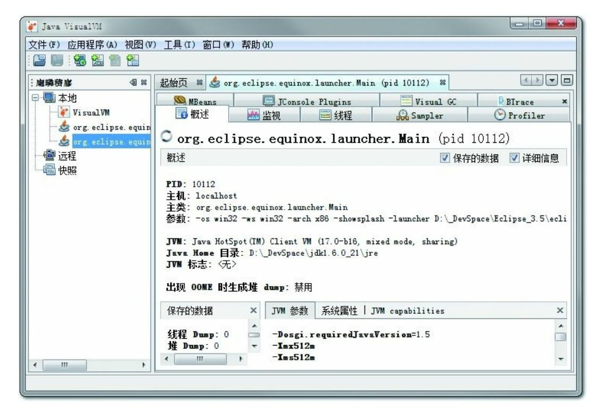

图4-19 VisualVM主界面

VisualVM中"概述""监视""线程""MBeans"的功能与前面介绍的JConsole差别不大,读者可根据上 一节内容类比使用,这里笔者挑选几个有特色的功能和插件进行简要介绍。

### 2.生成、浏览堆转储快照

在VisualVM中生成堆转储快照文件有两种方式,可以执行下列任一操作:

·在"应用程序"窗口中右键单击应用程序节点,然后选择"堆Dump"。

·在"应用程序"窗口中双击应用程序节点以打开应用程序标签,然后在"监视"标签中单击"堆 Dump"。

生成堆转储快照文件之后,应用程序页签会在该堆的应用程序下增加一个以[heap-dump]开头的子 节点,并且在主页签中打开该转储快照,如图4-20所示。如果需要把堆转储快照保存或发送出去,就 应在heapdump节点上右键选择"另存为"菜单,否则当VisualVM关闭时,生成的堆转储快照文件会被当 作临时文件自动清理掉。要打开一个由已经存在的堆转储快照文件,通过文件菜单中的"装入"功能, 选择硬盘上的文件即可。

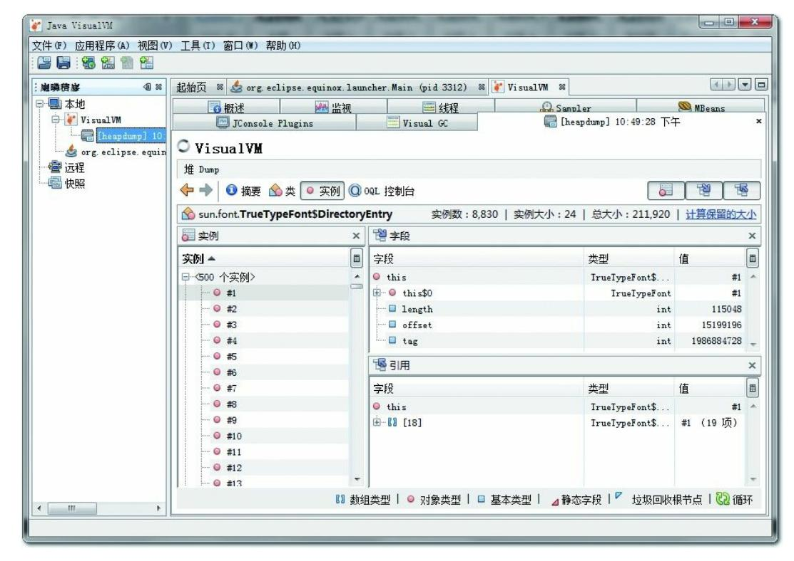

图4-20 浏览dump文件

堆页签中的"摘要"面板可以看到应用程序dump时的运行时参数、System.getPro-perties()的内容、 线程堆栈等信息;"类"面板则是以类为统计口径统计类的实例数量、容量信息;"实例"面板不能直接 使用,因为VisualVM在此时还无法确定用户想查看哪个类的实例,所以需要通过"类"面板进入, 在"类"中选择一个需要查看的类,然后双击即可在"实例"里面看到此类的其中500个实例的具体属性信 息;"OQL控制台"面板则是运行OQL查询语句的,同jhat中介绍的OQL功能一样。如果读者想要了解 具体OQL的语法和使用方法,可参见本书附录D的内容。

### 3.分析程序性能

在Profiler页签中,VisualVM提供了程序运行期间方法级的处理器执行时间分析以及内存分析。做 Profiling分析肯定会对程序运行性能有比较大的影响,所以一般不在生产环境使用这项功能,或者改用 JMC来完成,JMC的Profiling能力更强,对应用的影响非常轻微。

要开始性能分析,先选择"CPU"和"内存"按钮中的一个,然后切换到应用程序中对程序进行操 作,VisualVM会记录这段时间中应用程序执行过的所有方法。如果是进行处理器执行时间分析,将会 统计每个方法的执行次数、执行耗时;如果是内存分析,则会统计每个方法关联的对象数以及这些对 象所占的空间。等要分析的操作执行结束后,点击"停止"按钮结束监控过程,如图4-21所示。

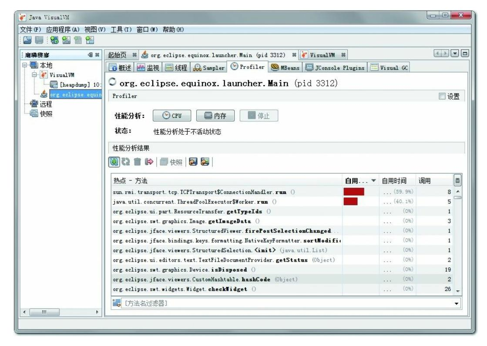

图4-21 对应用程序进行CPU执行时间分析

注意 在JDK 5之后,在客户端模式下的虚拟机加入并且自动开启了类共享——这是一个在多 虚拟机进程共享rt.jar中类数据以提高加载速度和节省内存的优化,而根据相关Bug报告的反映, VisualVM的Profiler功能会因为类共享而导致被监视的应用程序崩溃,所以读者进行Profiling前,最好在 被监视程序中使用-Xshare:off参数来关闭类共享优化。

图4-21中是对Eclipse IDE一段操作的录制和分析结果,读者分析自己的应用程序时,可根据实际 业务复杂程度与方法的时间、调用次数做比较,找到最优化价值方法。

### 4.BTrace动态日志跟踪

BTrace [3]是一个很神奇的VisualVM插件,它本身也是一个可运行的独立程序。BTrace的作用是在 不中断目标程序运行的前提下,通过HotSpot虚拟机的Instrument功能[4]动态加入原本并不存在的调试 代码。这项功能对实际生产中的程序很有意义:如当程序出现问题时,排查错误的一些必要信息时 (譬如方法参数、返回值等),在开发时并没有打印到日志之中以至于不得不停掉服务时,都可以通 过调试增量来加入日志代码以解决问题。

在VisualVM中安装了BTrace插件后,在应用程序面板中右击要调试的程序,会出现"Trace

Application…"菜单,点击将进入BTrace面板。这个面板看起来就像一个简单的Java程序开发环境,里 面甚至已经有了一小段Java代码,如图4-22所示。

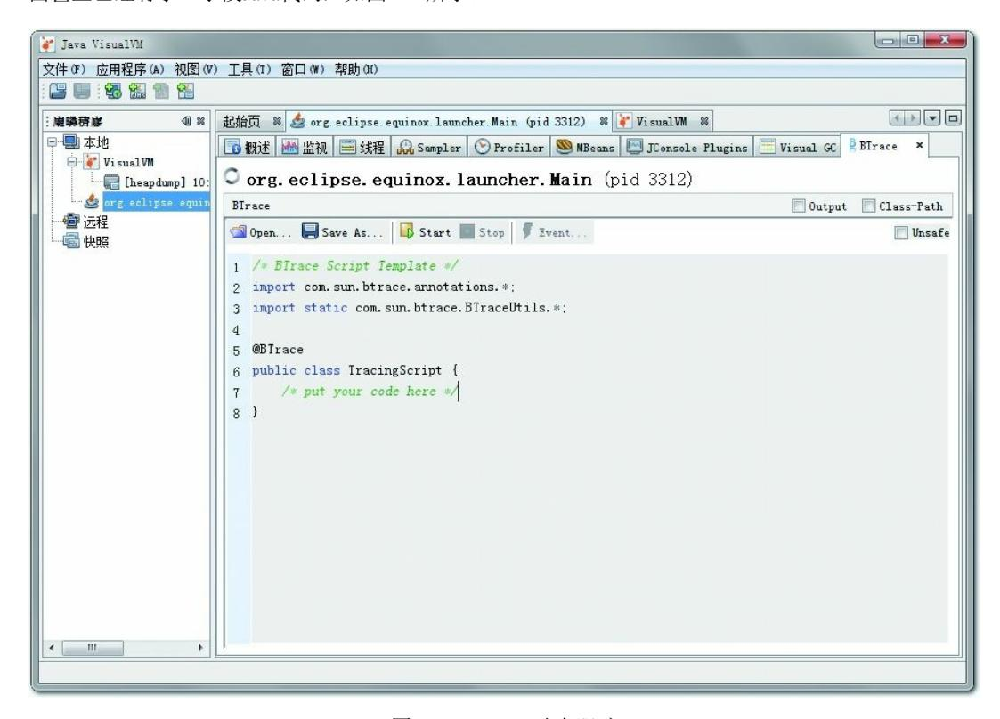

图4-22 BTrace动态跟踪

笔者准备了一段简单的Java代码来演示BTrace的功能:产生两个1000以内的随机整数,输出这两 个数字相加的结果,如代码清单4-10所示。

#### 代码清单4-10 BTrace跟踪演示

```
public class BTraceTest {
    public int add(int a, int b) {
        return a + b;
    public static void main(String[] args) throws IOException {
        BTraceTest test = new BTraceTest();
        BufferedReader reader = new BufferedReader(new InputStreamReader(System.in));
        for (int i = 0; i < 10; i++) {
            reader.readLine();
            int a = (int) Math.round(Math.random() * 1000);
            int b = (int) Math.round(Math.random() * 1000);
            System.out.println(test.add(a, b));
```

假设这段程序已经上线运行,而我们现在又有了新的需求,想要知道程序中生成的两个随机数是 什么,但程序并没有在执行过程中输出这一点。此时,在VisualVM中打开该程序的监视,在BTrace页 签填充TracingScript的内容,输入调试代码,如代码清单4-11所示,即可在不中断程序运行的情况下做 到这一点。

### 代码清单4-11 BTrace调试代码

```
/* BTrace Script Template */
import com.sun.btrace.annotations.*;
import static com.sun.btrace.BTraceUtils.*;
@BTrace
public class TracingScript {
        @OnMethod(
    clazz="org.fenixsoft.monitoring.BTraceTest",
    method="add",
    location=@Location(Kind.RETURN)
)
public static void func(@Self org.fenixsoft.monitoring.BTraceTest instance,int a, int b,@Return int result) {
    println("调用堆栈:");
    jstack();
    println(strcat("方法参数A:",str(a)));
    println(strcat("方法参数B:",str(b)));
    println(strcat("方法结果:",str(result)));
```

点击Start按钮后稍等片刻,编译完成后,Output面板中会出现"BTrace code successfuly deployed"的字样。当程序运行时将会在Output面板输出如图4-23所示的调试信息。

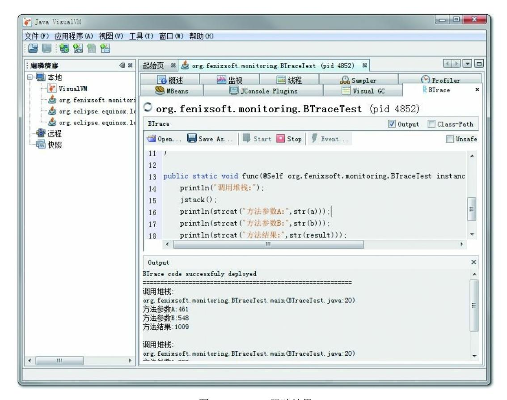

图4-23 BTrace跟踪结果

BTrace的用途很广泛,打印调用堆栈、参数、返回值只是它最基础的使用形式,在它的网站上有 使用BTrace进行性能监视、定位连接泄漏、内存泄漏、解决多线程竞争问题等的使用案例,有兴趣的 读者可以去网上了解相关信息。

BTrace能够实现动态修改程序行为,是因为它是基于Java虚拟机的Instrument开发的。Instrument是 Java虚拟机工具接口(Java Virtual Machine Tool Interface,JVMTI)的重要组件,提供了一套代理

(Agent)机制,使得第三方工具程序可以以代理的方式访问和修改Java虚拟机内部的数据。阿里巴巴 开源的诊断工具Arthas也通过Instrument实现了与BTrace类似的功能。

- [1] 早于JDK 6的平台,需要打开-Dcom.sun.management.jmxremote参数才能被VisualVM管理。
- [2] 插件中心地址:https://visualvm.github.io/pluginscenters.html。
- [3] 官方主页:https://github.com/btraceio/btrace。
- [4] 是JVMTI中的主要组成部分,HotSpot虚拟机允许在不停止运行的情况下,更新已经加载的类的代 码。

# 4.3.4 Java Mission Control:可持续在线的监控工具

除了大家熟知的面向通用计算(General Purpose Computing)可免费使用的Java SE外,Oracle公司 还开辟过带商业技术支持的Oracle Java SE Support和面向独立软件供应商(ISV)的Oracle Java SE Advanced & Suite产品线。

除去带有7×24小时的技术支持以及可以为企业专门定制安装包这些非技术类的增强服务外, Oracle Java SE Advanced & Suite [1]与普通Oracle Java SE在功能上的主要差别是前者包含了一系列的监 控、管理工具,譬如用于企业JRE定制管理的AMC(Java Advanced Management Console)控制台、 JUT(Java Usage Tracker)跟踪系统,用于持续收集数据的JFR(Java Flight Recorder)飞行记录仪和用 于监控Java虚拟机的JMC(Java Mission Control)。这些功能全部都是需要商业授权才能在生产环境中 使用,但根据Oracle Binary Code协议,在个人开发环境中,允许免费使用JMC和JFR,本节笔者将简 要介绍它们的原理和使用。

JFR是一套内建在HotSpot虚拟机里面的监控和基于事件的信息搜集框架,与其他的监控工具(如 JProfiling)相比,Oracle特别强调它"可持续在线"(Always-On)的特性。JFR在生产环境中对吞吐量 的影响一般不会高于1%(甚至号称是Zero Performance Overhead),而且JFR监控过程的开始、停止都 是完全可动态的,即不需要重启应用。JFR的监控对应用也是完全透明的,即不需要对应用程序的源 码做任何修改,或者基于特定的代理来运行。

JMC最初是BEA公司的产品,因此并没有像VisualVM那样一开始就基于自家的Net-Beans平台来开 发,而是选择了由IBM捐赠的Eclipse RCP作为基础框架,现在的JMC不仅可以下载到独立程序,更常 见的是作为Eclipse的插件来使用。JMC与虚拟机之间同样采取JMX协议进行通信,JMC一方面作为 JMX控制台,显示来自虚拟机MBean提供的数据;另一方面作为JFR的分析工具,展示来自JFR的数 据。启动后JMC的主界面如图4-24所示。

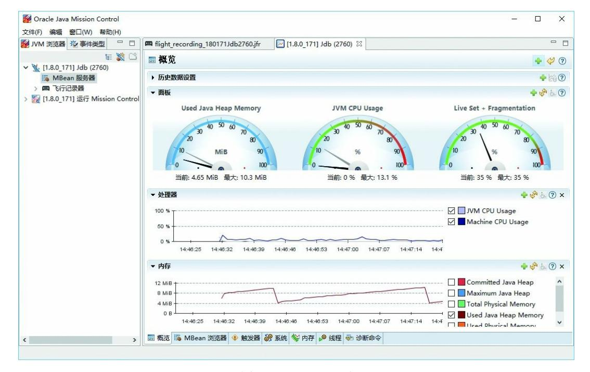

图4-24 JMC主界面

在左侧的"JVM浏览器"面板中自动显示了通过JDP协议(Java Discovery Protocol)找到的本机正 在运行的HotSpot虚拟机进程,如果需要监控其他服务器上的虚拟机,可在"文件->连接"菜单中创建远 程连接,如图4-25所示。

| 🌠 连接   |                                                |        |      | ×   |
|--------|------------------------------------------------|--------|------|-----|
| JVM 连接 | 接<br>详细信息。单击"完成"创建连接,或单击"下一步"立即连接到它。           |        |      | Ø   |
| 主机: lo | calhost                                        |        |      |     |
| 端口: 70 | 91                                             |        |      |     |
|        |                                                | 定制 JMX | 服务 U | IRL |
| 用户:    |                                                |        |      |     |
| □令:    |                                                |        |      |     |
|        | □ 在设置文件中存储身份证明<br>(详细信息)                       |        |      |     |
| 连接名称:  | localhost                                      |        |      |     |
| 状态:    | 未经测试                                           |        | 测试道  | 接   |
| 提示: 请参 | 阅 Java Mission Control <u>常见问题</u> , 了解常见连接问题。 |        |      |     |
|        | <上一步(B) 下一步(N)> 完成(F)                          |        | 取消   |     |

图4-25 JMC建立连接界面

这里要填写的信息应该在被监控虚拟机进程启动的时候以虚拟机参数的形式指定,以下是一份被 监控端的启动参数样例:

<sup>-</sup>Dcom.sun.management.jmxremote.port=9999

<sup>-</sup>Dcom.sun.management.jmxremote.ssl=false

<sup>-</sup>Dcom.sun.management.jmxremote.authenticate=false

本地虚拟机与远程虚拟机进程的差别只限于创建连接这个步骤,连接成功创建以后的操作就是完 全一样的了。把"JVM浏览器"面板中的进程展开后,可以看到每个进程的数据都有MBean和JFR两个 数据来源。关于MBean这部分数据,与JConsole和VisualVM上取到的内容是一样的,只是展示形式上 有些差别,笔者就不再重复了,后面着重介绍JFR的数据记录。

双击"飞行记录器",将会出现"启动飞行记录"窗口(如果第一次使用,还会收到解锁商业功能的 警告窗),如图4-26所示。


图4-26 启用飞行记录

在启动飞行记录时,可以进行记录时间、垃圾收集器、编译器、方法采样、线程记录、异常记 录、网络和文件I/O、事件记录等选项和频率设定,这部分比较琐碎,笔者就不一一截图讲解了。点 击"完成"按钮后马上就会开始记录,记录时间结束以后会生成飞行记录报告,如图4-27所示。

飞行记录报告里包含以下几类信息:

- ·一般信息:关于虚拟机、操作系统和记录的一般信息。
- ·内存:关于内存管理和垃圾收集的信息。
- ·代码:关于方法、异常错误、编译和类加载的信息。
- ·线程:关于应用程序中线程和锁的信息。
- ·I/O:关于文件和套接字输入、输出的信息。
- ·系统:关于正在运行Java虚拟机的系统、进程和环境变量的信息。
- ·事件:关于记录中的事件类型的信息,可以根据线程或堆栈跟踪,按照日志或图形的格式查看。

JFR的基本工作逻辑是开启一系列事件的录制动作,当某个事件发生时,这个事件的所有上下文 数据将会以循环日志的形式被保存至内存或者指定的某个文件当中,循环日志相当于数据流被保留在 一个环形缓存中,所以只有最近发生的事件的数据才是可用的。JMC从虚拟机内存或者文件中读取并 展示这些事件数据,并通过这些数据进行性能分析。

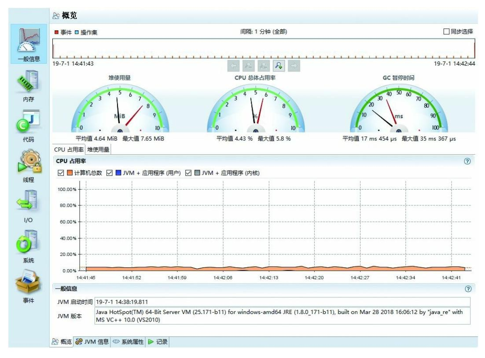

图4-27 飞行记录报告

即使不考虑对被测试程序性能影响方面的优势,JFR提供的数据质量通常也要比其他工具通过代 理形式采样获得或者从MBean中取得的数据高得多。以垃圾搜集为例,HotSpot的MBean中一般有各个 分代大小、收集次数、时间、占用率等数据(根据收集器不同有所差别),这些都属于"结果"类的信 息,而JFR中还可以看到内存中这段时间分配了哪些对象、哪些在TLAB中(或外部)分配、分配速率 和压力大小如何、分配归属的线程、收集时对象分代晋升的情况等,这些就是属于"过程"类的信息, 对排查问题的价值是难以估量的。

[1] Advanced是"Advanced Monitoring & Management of Java in the Enterprise"的缩写。

### 4.4 HotSpot虚拟机插件及工具

HotSpot虚拟机发展了二十余年,现在已经是一套很复杂的软件系统,如果深入挖掘HotSpot的源 码,可以发现在HotSpot的研发过程中,开发团队曾经编写(或者收集)过不少虚拟机的插件和辅助工 具,它们存放在HotSpot源码hotspot/src/share/tools目录下,包括(含曾经有过但新版本中已被移除 的):

·Ideal Graph Visualizer:用于可视化展示C2即时编译器是如何将字节码转化为理想图,然后转化为 机器码的。

·Client Compiler Visualizer [1]:用于查看C1即时编译器生成高级中间表示(HIR),转换成低级中 间表示(LIR)和做物理寄存器分配的过程。

·MakeDeps:帮助处理HotSpot的编译依赖的工具。

·Project Creator:帮忙生成Visual Studio的.project文件的工具。

·LogCompilation:将-XX:+LogCompilation输出的日志整理成更容易阅读的格式的工具。

·HSDIS:即时编译器的反汇编插件。

关于Client Compiler Visualizer和Ideal Graph Visualizer,在本书第11章会有专门的使用介绍,而 Project Creator、LogCompilation、MakeDeps这三个工具对本书的讲解和实验帮助有限,最后一个 HSDIS是学习、实践本书第四部分"程序编译与代码优化"的有力辅助工具,借本章讲解虚拟机工具的 机会,简要介绍其使用方法。

### HSDIS:JIT生成代码反汇编

在《Java虚拟机规范》里详细定义了虚拟机指令集中每条指令的语义,尤其是执行过程前后对操 作数栈、局部变量表的影响。这些细节描述与早期Java虚拟机(Sun Classic虚拟机)高度吻合,但随着 技术的发展,高性能虚拟机真正的细节实现方式已经渐渐与《Java虚拟机规范》所描述的内容产生越 来越大的偏差,《Java虚拟机规范》中的规定逐渐成为Java虚拟机实现的"概念模型",即实现只保证与 规范描述等效,而不一定是按照规范描述去执行。由于这个原因,我们在讨论程序的执行语义问题 (虚拟机做了什么)时,在字节码层面上分析完全可行,但讨论程序的执行行为问题(虚拟机是怎样 做的、性能如何)时,在字节码层面上分析就没有什么意义了,必须通过其他途径解决。

至于分析程序如何执行,使用软件调试工具(GDB、Windbg等)来进行断点调试是一种常见的方 式,但是这样的调试方式在Java虚拟机中也遇到了很大麻烦,因为大量执行代码是通过即时编译器动 态生成到代码缓存中的,并没有特别简单的手段来处理这种混合模式的调试,不得不通过一些曲线的 间接方法来解决问题。在这样的背景下,本节的主角——HSDIS插件就正式登场了。

HSDIS是一个被官方推荐的HotSpot虚拟机即时编译代码的反汇编插件,它包含在HotSpot虚拟机 的源码当中[2],在OpenJDK的网站[3]也可以找到单独的源码下载,但并没有提供编译后的程序。

HSDIS插件的作用是让HotSpot的-XX:+PrintAssembly指令调用它来把即时编译器动态生成的本 地代码还原为汇编代码输出,同时还会自动产生大量非常有价值的注释,这样我们就可以通过输出的 汇编代码来从最本质的角度分析问题。读者可以根据自己的操作系统和处理器型号,从网上直接搜 索、下载编译好的插件,直接放到JDK\_HOME/jre/bin/server目录(JDK 9以下)或 JDK\_HOME/lib/amd64/server(JDK 9或以上)中即可使用。如果读者确实没有找到所采用操作系统的 对应编译成品[4],那就自己用源码编译一遍(网上能找到各种操作系统下的编译教程)。

另外还有一点需要注意,如果读者使用的是SlowDebug或者FastDebug版的HotSpot,那可以直接通 过-XX:+PrintAssembly指令使用的插件;如果读者使用的是Product版的HotSpot,则还要额外加入一 个-XX:+UnlockDiagnosticVMOptions参数才可以工作。笔者以代码清单4-12中的测试代码为例简单演 示一下如何使用这个插件。

#### 代码清单4-12 测试代码

```
public class Bar {
    int a = 1;
    static int b = 2;
    public int sum(int c) {
        return a + b + c;
    public static void main(String[] args) {
        new Bar().sum(3);
```

#### 编译这段代码,并使用以下命令执行:

```
java -XX:+PrintAssembly -Xcomp -XX:CompileCommand=dontinline,*Bar.sum -XX:Compile-Command=compileonly,*Bar.sum test.Bar
```

其中,参数-Xcomp是让虚拟机以编译模式执行代码,这样不需要执行足够次数来预热就能触发即 时编译。两个-XX:CompileCommand的意思是让编译器不要内联sum()并且只编译sum(),-XX: +PrintAssembly就是输出反汇编内容。如果一切顺利的话,屏幕上会出现类似代码清单4-13所示的内 容。

#### 代码清单4-13 测试代码

```
[Disassembling for mach='i386']
[Entry Point]
[Constants]
   # {method} 'sum' '(I)I' in 'test/Bar'
   # this: ecx = 'test/Bar'
   # parm0: edx = int
   # [sp+0x20] (sp of caller)
   0x01cac407: cmp 0x4(%ecx),%eax
   0x01cac40a: jne 0x01c6b050 ; {runtime_call}
[Verified Entry Point]
   0x01cac410: mov %eax,-0x8000(%esp)
   0x01cac417: push %ebp
   0x01cac418: sub $0x18,%esp ; *aload_0
                                         ; - test.Bar::sum@0 (line 8)
```

```
;; block B0 [0, 10]
   0x01cac41b: mov 0x8(%ecx),%eax ; *getfield a
                                     ; - test.Bar::sum@1 (line 8)
   0x01cac41e: mov $0x3d2fad8,%esi ; {oop(a
'java/lang/Class' = 'test/Bar')}
   0x01cac423: mov 0x68(%esi),%esi ; *getstatic b
                                     ; - test.Bar::sum@4 (line 8)
   0x01cac426: add %esi,%eax
   0x01cac428: add %edx,%eax
   0x01cac42a: add $0x18,%esp
   0x01cac42d: pop %ebp
   0x01cac42e: test %eax,0x2b0100 ; {poll_return}
   0x01cac434: ret
```

虽然是汇编,但代码并不多,我们一句一句来阅读:

- 1)mov%eax,-0x8000(%esp):检查栈溢。
- 2)push%ebp:保存上一栈帧基址。
- 3)sub\$0x18,%esp:给新帧分配空间。
- 4)mov 0x8(%ecx),%eax:取实例变量a,这里0x8(%ecx)就是ecx+0x8的意思,前面代码片 段"[Constants]"中提示了"this:ecx='test/Bar'",即ecx寄存器中放的就是this对象的地址。偏移0x8是越 过this对象的对象头,之后就是实例变量a的内存位置。这次是访问Java堆中的数据。
  - 5)mov\$0x3d2fad8,%esi:取test.Bar在方法区的指针。
  - 6)mov 0x68(%esi),%esi:取类变量b,这次是访问方法区中的数据。
- 7)add%esi,%eax、add%edx,%eax:做2次加法,求a+b+c的值,前面的代码把a放在eax中,把b 放在esi中,而c在[Constants]中提示了,"parm0:edx=int",说明c在edx中。
  - 8)add\$0x18,%esp:撤销栈帧。
  - 9)pop%ebp:恢复上一栈帧。
  - 10)test%eax,0x2b0100:轮询方法返回处的SafePoint。
  - 11)ret:方法返回。

在这个例子中测试代码比较简单,肉眼直接看日志中的汇编输出是可行的,但在正式环境中-XX:+PrintAssembly的日志输出量巨大,且难以和代码对应起来,这就必须使用工具来辅助了。

JITWatch [5]是HSDIS经常搭配使用的可视化的编译日志分析工具,为便于在JITWatch中读取,读 者可使用以下参数把日志输出到logfile文件:

<sup>-</sup>XX:+UnlockDiagnosticVMOptions

<sup>-</sup>XX:+TraceClassLoading

<sup>-</sup>XX:+LogCompilation

<sup>-</sup>XX:LogFile=/tmp/logfile.log

<sup>-</sup>XX:+PrintAssembly

在JITWatch中加载日志后,就可以看到执行期间使用过的各种对象类型和对应调用过的方法了,界面如图4-28所示。

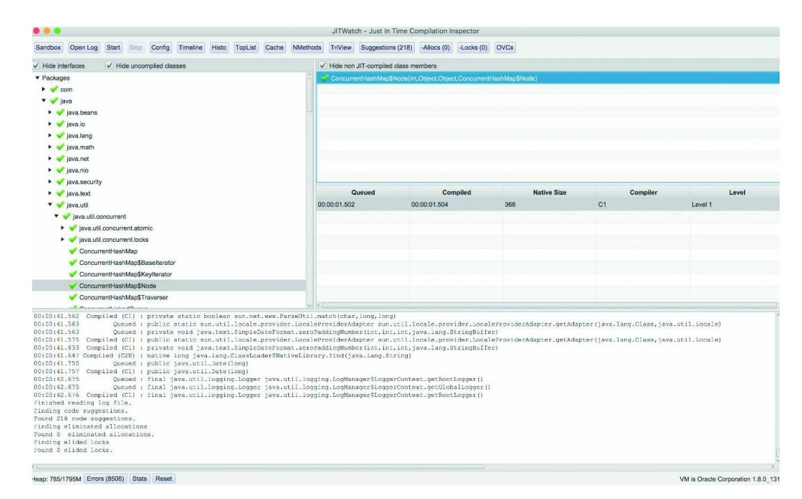

图4-28 JITWatch主界面

选择想要查看的类和方法,即可查看对应的Java源代码、字节码和即时编译器生成的汇编代码, 如图4-29所示。

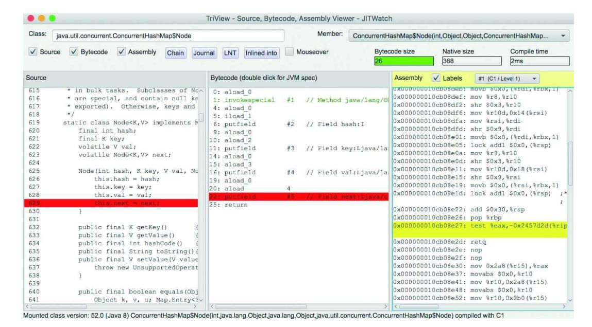

图4-29 查看方法代码

- [1] 不同于Ideal Graph Visualizer,Client Compiler Visualizer的源码其实从未进入过HotSpot的代码仓库, 不过为了C1、C2配对,还是把它列在这里。
- [2] OpenJDK中的源码位置:hotspot/src/share/tools/hsdis/。
- [3] 地址:http://hg.openjdk.java.net/jdk7u/jdk7u/hotspot/file/tip/src/share/tools/hsdis/。也可以在GitHub上 搜索HSDIS得到。
- [4] HLLVM圈子中有已编译好的,地址:http://hllvm.group.iteye.com/。
- [5] 下载地址:https://github.com/AdoptOpenJDK/jitwatch。

### 4.5 本章小结

本章介绍了随JDK发布的6个命令行工具与4个可视化的故障处理工具,灵活使用这些工具,可以为处理问题带来很大的便利。除了本章涉及的OpenJDK中自带的工具之外,还有很多其他监控和故障处理工具,如何进行监控和故障诊断,这并不是《Java虚拟机规范》中定义的内容,而是取决于虚拟机实现自身的设计,因此每种处理工具都有针对的目标范围,如果读者使用的是非HotSpot系的虚拟机,就更需要使用对应的工具进行分析,如:

·IBM的Support Assistant [1]、Heap Analyzer [2]、Javacore Analyzer [3]、Garbage Collector Analyzer [4]适用于IBM J9/OpenJ9 VM。

·HP的HPjmeter、HPjtune适用于HP-UX、SAP、HotSpot VM。

·Eclipse的Memory Analyzer Tool<sup>[5]</sup>(MAT)适用于HP-UX、SAP、HotSpot VM,安装IBM DTFJ<sup>[6]</sup>插件后可支持IBM J9虚拟机。

- [1] http://www-01.ibm.com/software/support/isa/。
- [2] http://www.alphaworks.ibm.com/tech/heapanalyzer/download.
- [3] http://www.alphaworks.ibm.com/tech/jca/download.
- [4] http://www.alphaworks.ibm.com/tech/pmat/download.
- [5] http://www.eclipse.org/mat/。
- [6] http://www.ibm.com/developerworks/java/jdk/tools/dtfj.html.

# 第5章 调优案例分析与实战

Java与C++之间有一堵由内存动态分配和垃圾收集技术所围成的高墙,墙外面的人想进去,墙里 面的人却想出来。

# 5.1 概述

在前面3章笔者系统性地介绍了处理Java虚拟机内存问题的知识与工具,在处理应用中的实际问题 时,除了知识与工具外,经验同样是一个很重要的因素。在本章,将会与读者分享若干较有代表性的 实际案例。

考虑到虚拟机的故障处理与调优主要面向各类服务端应用,而大多数Java程序员较少有机会直接 接触生产环境的服务器,因此本章还准备了一个所有开发人员都能够进行"亲身实战"的练习,希望大 家通过实践能获得故障处理、调优的经验。

### 5.2 案例分析

本章中的案例一部分来源于笔者处理过的实际问题,还有另一部分来源于网上有特色和代表性的 案例总结。出于对客户商业信息保护的原因,在不影响前后逻辑的前提下,笔者对实际环境和用户业 务做了一些屏蔽和精简。

本章内容将着重考虑如何在应用部署层面去解决问题,有不少案例中的问题的确可以在设计和开 发阶段就先行避免,但这并不是本书要讨论的话题。也有一些问题可以直接通过升级硬件或者使用最 新JDK版本里的新技术去解决,但我们同时也会探讨如何在不改变已有软硬件版本和规格的前提下, 调整部署和配置策略去解决或者缓解问题。

# 5.2.1 大内存硬件上的程序部署策略

这是笔者很久之前处理过的一个案例,但今天仍然具有代表性。一个15万PV/日左右的在线文档类 型网站最近更换了硬件系统,服务器的硬件为四路志强处理器、16GB物理内存,操作系统为64位 CentOS 5.4,Resin作为Web服务器。整个服务器暂时没有部署别的应用,所有硬件资源都可以提供给 这访问量并不算太大的文档网站使用。软件版本选用的是64位的JDK 5,管理员启用了一个虚拟机实 例,使用-Xmx和-Xms参数将Java堆大小固定在12GB。使用一段时间后发现服务器的运行效果十分不 理想,网站经常不定期出现长时间失去响应。

监控服务器运行状况后发现网站失去响应是由垃圾收集停顿所导致的,在该系统软硬件条件下, HotSpot虚拟机是以服务端模式运行,默认使用的是吞吐量优先收集器,回收12GB的Java堆,一次Full GC的停顿时间就高达14秒。由于程序设计的原因,访问文档时会把文档从磁盘提取到内存中,导致内 存中出现很多由文档序列化产生的大对象,这些大对象大多在分配时就直接进入了老年代,没有在 Minor GC中被清理掉。这种情况下即使有12GB的堆,内存也很快会被消耗殆尽,由此导致每隔几分 钟出现十几秒的停顿,令网站开发、管理员都对使用Java技术开发网站感到很失望。

分析此案例的情况,程序代码问题这里不延伸讨论,程序部署上的主要问题显然是过大的堆内存 进行回收时带来的长时间的停顿。经调查,更早之前的硬件使用的是32位操作系统,给HotSpot虚拟机 只分配了1.5GB的堆内存,当时用户确实感觉到使用网站比较缓慢,但还不至于发生长达十几秒的明 显停顿,后来将硬件升级到64位系统、16GB内存希望能提升程序效能,却反而出现了停顿问题,尝试 过将Java堆分配的内存重新缩小到1.5GB或者2GB,这样的确可以避免长时间停顿,但是在硬件上的投 资就显得非常浪费。

每一款Java虚拟机中的每一款垃圾收集器都有自己的应用目标与最适合的应用场景,如果在特定 场景中选择了不恰当的配置和部署方式,自然会事倍功半。目前单体应用在较大内存的硬件上主要的 部署方式有两种:

- 1)通过一个单独的Java虚拟机实例来管理大量的Java堆内存。
- 2)同时使用若干个Java虚拟机,建立逻辑集群来利用硬件资源。

此案例中的管理员采用了第一种部署方式。对于用户交互性强、对停顿时间敏感、内存又较大的 系统,并不是一定要使用Shenandoah、ZGC这些明确以控制延迟为目标的垃圾收集器才能解决问题 (当然不可否认,如果情况允许的话,这是最值得考虑的方案),使用Parallel Scavenge/Old收集器,并 且给Java虚拟机分配较大的堆内存也是有很多运行得很成功的案例的,但前提是必须把应用的Full GC 频率控制得足够低,至少要低到不会在用户使用过程中发生,譬如十几个小时乃至一整天都不出现一 次Full GC,这样可以通过在深夜执行定时任务的方式触发Full GC甚至是自动重启应用服务器来保持内 存可用空间在一个稳定的水平。

控制Full GC频率的关键是老年代的相对稳定,这主要取决于应用中绝大多数对象能否符合"朝生 夕灭"的原则,即大多数对象的生存时间不应当太长,尤其是不能有成批量的、长生存时间的大对象产 生,这样才能保障老年代空间的稳定。

在许多网站和B/S形式的应用里,多数对象的生存周期都应该是请求级或者页面级的,会话级和全 局级的长生命对象相对较少。只要代码写得合理,实现在超大堆中正常使用没有Full GC应当并不困 难,这样的话,使用超大堆内存时,应用响应速度才可能会有所保证。除此之外,如果读者计划使用 单个Java虚拟机实例来管理大内存,还需要考虑下面可能面临的问题:

- ·回收大块堆内存而导致的长时间停顿,自从G1收集器的出现,增量回收得到比较好的应用[1], 这个问题有所缓解,但要到ZGC和Shenandoah收集器成熟之后才得到相对彻底地解决。
- ·大内存必须有64位Java虚拟机的支持,但由于压缩指针、处理器缓存行容量(Cache Line)等因 素,64位虚拟机的性能测试结果普遍略低于相同版本的32位虚拟机。
- ·必须保证应用程序足够稳定,因为这种大型单体应用要是发生了堆内存溢出,几乎无法产生堆转 储快照(要产生十几GB乃至更大的快照文件),哪怕成功生成了快照也难以进行分析;如果确实出了 问题要进行诊断,可能就必须应用JMC这种能够在生产环境中进行的运维工具。
- ·相同的程序在64位虚拟机中消耗的内存一般比32位虚拟机要大,这是由于指针膨胀,以及数据类 型对齐补白等因素导致的,可以开启(默认即开启)压缩指针功能来缓解。

鉴于上述这些问题,现阶段仍然有一些系统管理员选择第二种方式来部署应用:同时使用若干个 虚拟机建立逻辑集群来利用硬件资源。做法是在一台物理机器上启动多个应用服务器进程,为每个服 务器进程分配不同端口,然后在前端搭建一个负载均衡器,以反向代理的方式来分配访问请求。这里 无须太在意均衡器转发所消耗的性能,即使是使用第一个部署方案,多数应用也不止有一台服务器, 因此应用中前端的负载均衡器总是免不了的。

考虑到我们在一台物理机器上建立逻辑集群的目的仅仅是尽可能利用硬件资源,并不是要按职 责、按领域做应用拆分,也不需要考虑状态保留、热转移之类的高可用性需求,不需要保证每个虚拟 机进程有绝对准确的均衡负载,因此使用无Session复制的亲合式集群是一个相当合适的选择。仅仅需 要保障集群具备亲合性,也就是均衡器按一定的规则算法(譬如根据Session ID分配)将一个固定的用 户请求永远分配到一个固定的集群节点进行处理即可,这样程序开发阶段就几乎不必为集群环境做任 何特别的考虑。

- 当然,第二种部署方案也不是没有缺点的,如果读者计划使用逻辑集群的方式来部署程序,可能 会遇到下面这些问题:
- ·节点竞争全局的资源,最典型的就是磁盘竞争,各个节点如果同时访问某个磁盘文件的话(尤其 是并发写操作容易出现问题),很容易导致I/O异常。
- ·很难最高效率地利用某些资源池,譬如连接池,一般都是在各个节点建立自己独立的连接池,这 样有可能导致一些节点的连接池已经满了,而另外一些节点仍有较多空余。尽管可以使用集中式的 JNDI来解决,但这个方案有一定复杂性并且可能带来额外的性能代价。
- ·如果使用32位Java虚拟机作为集群节点的话,各个节点仍然不可避免地受到32位的内存限制,在 32位Windows平台中每个进程只能使用2GB的内存,考虑到堆以外的内存开销,堆最多一般只能开到 1.5GB。在某些Linux或UNIX系统(如Solaris)中,可以提升到3GB乃至接近4GB的内存,但32位中仍 然受最高4GB(2的32次幂)内存的限制。

·大量使用本地缓存(如大量使用HashMap作为K/V缓存)的应用,在逻辑集群中会造成较大的内 存浪费,因为每个逻辑节点上都有一份缓存,这时候可以考虑把本地缓存改为集中式缓存。

介绍完这两种部署方式,重新回到这个案例之中,最后的部署方案并没有选择升级JDK版本,而 是调整为建立5个32位JDK的逻辑集群,每个进程按2GB内存计算(其中堆固定为1.5GB),占用了 10GB内存。另外建立一个Apache服务作为前端均衡代理作为访问门户。考虑到用户对响应速度比较关 心,并且文档服务的主要压力集中在磁盘和内存访问,处理器资源敏感度较低,因此改为CMS收集器 进行垃圾回收。部署方式调整后,服务再没有出现长时间停顿,速度比起硬件升级前有较大提升。

[1] 以前CMS也有i-CMS的增量回收模式,但与G1的增量回收并不相同,而且并不好用,已被废弃。

# 5.2.2 集群间同步导致的内存溢出

一个基于B/S的MIS系统,硬件为两台双路处理器、8GB内存的HP小型机,应用中间件是WebLogic 9.2,每台机器启动了3个WebLogic实例,构成一个6个节点的亲合式集群。由于是亲合式集群,节点之 间没有进行Session同步,但是有一些需求要实现部分数据在各个节点间共享。最开始这些数据是存放 在数据库中的,但由于读写频繁、竞争很激烈,性能影响较大,后面使用JBossCache构建了一个全局 缓存。全局缓存启用后,服务正常使用了一段较长的时间。但在最近不定期出现多次的内存溢出问 题。

在内存溢出异常不出现的时候,服务内存回收状况一直正常,每次内存回收后都能恢复到一个稳 定的可用空间。开始怀疑是程序某些不常用的代码路径中存在内存泄漏,但管理员反映最近程序并未 更新、升级过,也没有进行什么特别操作。只好让服务带着-XX:+HeapDumpOnOutOfMemoryError 参数运行了一段时间。在最近一次溢出之后,管理员发回了堆转储快照,发现里面存在着大量的 org.jgroups.protocols.pbcast.NAKACK对象。

JBossCache是基于自家的JGroups进行集群间的数据通信,JGroups使用协议栈的方式来实现收发 数据包的各种所需特性自由组合,数据包接收和发送时要经过每层协议栈的up()和down()方法,其中 的NAKACK栈用于保障各个包的有效顺序以及重发。

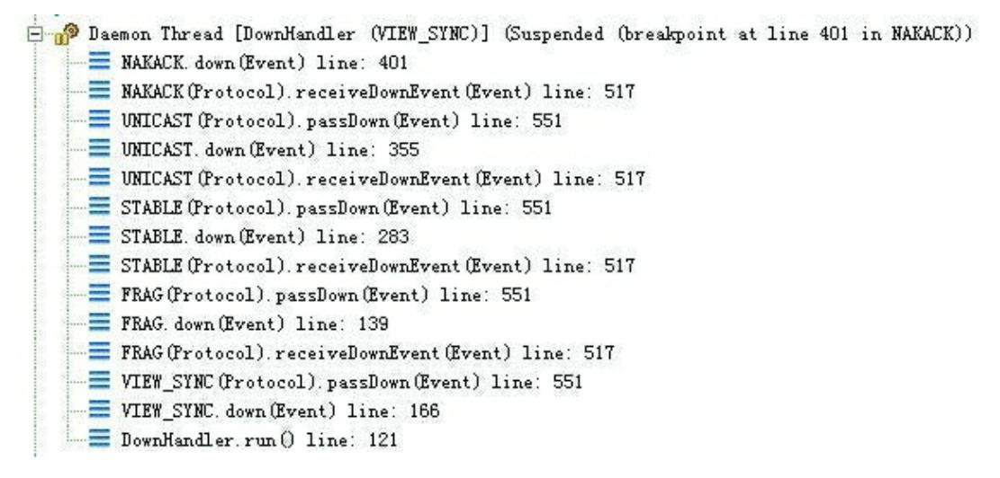

图5-1 JBossCache协议栈

由于信息有传输失败需要重发的可能性,在确认所有注册在GMS(Group Membership Service)的 节点都收到正确的信息前,发送的信息必须在内存中保留。而此MIS的服务端中有一个负责安全校验 的全局过滤器,每当接收到请求时,均会更新一次最后操作时间,并且将这个时间同步到所有的节点 中去,使得一个用户在一段时间内不能在多台机器上重复登录。在服务使用过程中,往往一个页面会 产生数次乃至数十次的请求,因此这个过滤器导致集群各个节点之间网络交互非常频繁。当网络情况

不能满足传输要求时,重发数据在内存中不断堆积,很快就产生了内存溢出。

这个案例中的问题,既有JBossCache的缺陷,也有MIS系统实现方式上的缺陷。JBoss-Cache官方 的邮件讨论组中讨论过很多次类似的内存溢出异常问题,据说后续版本也有了改进。而更重要的缺陷 是,这一类被集群共享的数据要使用类似JBossCache这种非集中式的集群缓存来同步的话,可以允许 读操作频繁,因为数据在本地内存有一份副本,读取的动作不会耗费多少资源,但不应当有过于频繁 的写操作,会带来很大的网络同步的开销。

# 5.2.3 堆外内存导致的溢出错误

这是一个学校的小型项目:基于B/S的电子考试系统,为了实现客户端能实时地从服务器端接收考 试数据,系统使用了逆向AJAX技术(也称为Comet或者Server Side Push),选用CometD 1.1.1作为服 务端推送框架,服务器是Jetty 7.1.4,硬件为一台很普通PC机,Core i5 CPU,4GB内存,运行32位 Windows操作系统。

测试期间发现服务端不定时抛出内存溢出异常,服务不一定每次都出现异常,但假如正式考试时 崩溃一次,那估计整场电子考试都会乱套。网站管理员尝试过把堆内存调到最大,32位系统最多到 1.6GB基本无法再加大了,而且开大了基本没效果,抛出内存溢出异常好像还更加频繁。加入-XX: +HeapDumpOnOutOfMemoryError参数,居然也没有任何反应,抛出内存溢出异常时什么文件都没有 产生。无奈之下只好挂着jstat紧盯屏幕,发现垃圾收集并不频繁,Eden区、Survivor区、老年代以及方 法区的内存全部都很稳定,压力并不大,但就是照样不停抛出内存溢出异常。最后,在内存溢出后从 系统日志中找到异常堆栈如代码清单5-1所示。

### 代码清单5-1 异常堆栈

[org.eclipse.jetty.util.log] handle failed java.lang.OutOfMemoryError: null

- at sun.misc.Unsafe.allocateMemory(Native Method)
- at java.nio.DirectByteBuffer.<init>(DirectByteBuffer.java:99)
- at java.nio.ByteBuffer.allocateDirect(ByteBuffer.java:288)
- at org.eclipse.jetty.io.nio.DirectNIOBuffer.<init>

如果认真阅读过本书第2章,看到异常堆栈应该就清楚这个抛出内存溢出异常是怎么回事了。我们 知道操作系统对每个进程能管理的内存是有限制的,这台服务器使用的32位Windows平台的限制是 2GB,其中划了1.6GB给Java堆,而Direct Memory耗用的内存并不算入这1.6GB的堆之内,因此它最大 也只能在剩余的0.4GB空间中再分出一部分而已。在此应用中导致溢出的关键是垃圾收集进行时,虚 拟机虽然会对直接内存进行回收,但是直接内存却不能像新生代、老年代那样,发现空间不足了就主 动通知收集器进行垃圾回收,它只能等待老年代满后Full GC出现后,"顺便"帮它清理掉内存的废弃对 象。否则就不得不一直等到抛出内存溢出异常时,先捕获到异常,再在Catch块里面通过System.gc()命 令来触发垃圾收集。但如果Java虚拟机再打开了-XX:+DisableExplicitGC开关,禁止了人工触发垃圾 收集的话,那就只能眼睁睁看着堆中还有许多空闲内存,自己却不得不抛出内存溢出异常了。而本案 例中使用的CometD 1.1.1框架,正好有大量的NIO操作需要使用到直接内存。

从实践经验的角度出发,在处理小内存或者32位的应用问题时,除了Java堆和方法区之外,我们 注意到下面这些区域还会占用较多的内存,这里所有的内存总和受到操作系统进程最大内存的限制:

·直接内存:可通过-XX:MaxDirectMemorySize调整大小,内存不足时抛出OutOf-MemoryError或 者OutOfMemoryError:Direct buffer memory。

·线程堆栈:可通过-Xss调整大小,内存不足时抛出StackOverflowError(如果线程请求的栈深度大 于虚拟机所允许的深度)或者OutOfMemoryError(如果Java虚拟机栈容量可以动态扩展,当栈扩展时 无法申请到足够的内存)。

·Socket缓存区:每个Socket连接都Receive和Send两个缓存区,分别占大约37KB和25KB内存,连接 多的话这块内存占用也比较可观。如果无法分配,可能会抛出IOException:Too many open files异常。

·JNI代码:如果代码中使用了JNI调用本地库,那本地库使用的内存也不在堆中,而是占用Java虚 拟机的本地方法栈和本地内存的。

·虚拟机和垃圾收集器:虚拟机、垃圾收集器的工作也是要消耗一定数量的内存的。

# 5.2.4 外部命令导致系统缓慢

一个数字校园应用系统,运行在一台四路处理器的Solaris 10操作系统上,中间件为GlassFish服务 器。系统在做大并发压力测试的时候,发现请求响应时间比较慢,通过操作系统的mpstat工具发现处 理器使用率很高,但是系统中占用绝大多数处理器资源的程序并不是该应用本身。这是个不正常的现 象,通常情况下用户应用的处理器占用率应该占主要地位,才能说明系统是在正常工作。

通过Solaris 10的dtrace脚本可以查看当前情况下哪些系统调用花费了最多的处理器资源,dtrace运 行后发现最消耗处理器资源的竟然是"fork"系统调用。众所周知,"fork"系统调用是Linux用来产生新进 程的,在Java虚拟机中,用户编写的Java代码通常最多只会创建新的线程,不应当有进程的产生,这又 是个相当不正常的现象。

通过联系该系统的开发人员,最终找到了答案:每个用户请求的处理都需要执行一个外部Shell脚 本来获得系统的一些信息。执行这个Shell脚本是通过Java的Runtime.getRuntime().exec()方法来调用的。 这种调用方式可以达到执行Shell脚本的目的,但是它在Java虚拟机中是非常消耗资源的操作,即使外 部命令本身能很快执行完毕,频繁调用时创建进程的开销也会非常可观。Java虚拟机执行这个命令的 过程是首先复制一个和当前虚拟机拥有一样环境变量的进程,再用这个新的进程去执行外部命令,最 后再退出这个进程。如果频繁执行这个操作,系统的消耗必然会很大,而且不仅是处理器消耗,内存 负担也很重。

用户根据建议去掉这个Shell脚本执行的语句,改为使用Java的API去获取这些信息后,系统很快恢 复了正常。

# 5.2.5 服务器虚拟机进程崩溃

一个基于B/S的MIS系统,硬件为两台双路处理器、8GB内存的HP系统,服务器是WebLogic 9.2(与第二个案例中那套是同一个系统)。正常运行一段时间后,最近发现在运行期间频繁出现集群 节点的虚拟机进程自动关闭的现象,留下了一个hs\_err\_pid###.log文件后,虚拟机进程就消失了,两台 物理机器里的每个节点都出现过进程崩溃的现象。从系统日志中注意到,每个节点的虚拟机进程在崩 溃之前,都发生过大量相同的异常,见代码清单5-2。

### 代码清单5-2 异常堆栈2

```
java.net.SocketException: Connection reset
at java.net.SocketInputStream.read(SocketInputStream.java:168)
at java.io.BufferedInputStream.fill(BufferedInputStream.java:218)
at java.io.BufferedInputStream.read(BufferedInputStream.java:235)
at org.apache.axis.transport.http.HTTPSender.readHeadersFromSocket(HTTPSender.java:583)
at org.apache.axis.transport.http.HTTPSender.invoke(HTTPSender.java:143)
... 99 more
```

这是一个远端断开连接的异常,通过系统管理员了解到系统最近与一个OA门户做了集成,在MIS 系统工作流的待办事项变化时,要通过Web服务通知OA门户系统,把待办事项的变化同步到OA门户 之中。通过SoapUI测试了一下同步待办事项的几个Web服务,发现调用后竟然需要长达3分钟才能返 回,并且返回结果都是超时导致的连接中断。

由于MIS系统的用户多,待办事项变化很快,为了不被OA系统速度拖累,使用了异步的方式调用 Web服务,但由于两边服务速度的完全不对等,时间越长就累积了越多Web服务没有调用完成,导致在 等待的线程和Socket连接越来越多,最终超过虚拟机的承受能力后导致虚拟机进程崩溃。通知OA门户 方修复无法使用的集成接口,并将异步调用改为生产者/消费者模式的消息队列实现后,系统恢复正 常。

# 5.2.6 不恰当数据结构导致内存占用过大

一个后台RPC服务器,使用64位Java虚拟机,内存配置为-Xms4g-Xmx8g-Xmn1g,使用ParNew加 CMS的收集器组合。平时对外服务的Minor GC时间约在30毫秒以内,完全可以接受。但业务上需要每 10分钟加载一个约80MB的数据文件到内存进行数据分析,这些数据会在内存中形成超过100万个 HashMap<Long,Long>Entry,在这段时间里面Minor GC就会造成超过500毫秒的停顿,对于这种长度 的停顿时间就接受不了了,具体情况如下面的收集器日志所示。

```
{Heap before GC invocations=95 (full 4):
par new generation total 903168K, used 803142K [0x00002aaaae770000, 0x00002aaaebb70000, 0x00002aaaebb70000)
   eden space 802816K, 100% used [0x00002aaaae770000, 0x00002aaadf770000, 0x00002aaadf770000)
   from space 100352K, 0% used [0x00002aaae5970000, 0x00002aaae59c1910, 0x00002aaaebb70000)
   to space 100352K, 0% used [0x00002aaadf770000, 0x00002aaadf770000, 0x00002aaae5970000)
concurrent mark-sweep generation total 5845540K, used 3898978K [0x00002aaaebb70000, 0x00002aac507f9000, 0x00002aacae770000)
concurrent-mark-sweep perm gen total 65536K, used 40333K [0x00002aacae770000, 0x00002aacb2770000, 0x00002aacb2770000)
2011-10-28T11:40:45.162+0800: 226.504: [GC 226.504: [ParNew: 803142K-> 100352K(903168K), 0.5995670 secs] 4702120K->4056332K(6748708K), 0.5997560 secs] [Times: user=1.46 sys=0.04, real=0.60 secs]
Heap after GC invocations=96 (full 4):
par new generation total 903168K, used 100352K [0x00002aaaae770000, 0x00002-aaaebb70000, 0x00002aaaebb70000)
   eden space 802816K, 0% used [0x00002aaaae770000, 0x00002aaaae770000, 0x00002aaadf770000)
   from space 100352K, 100% used [0x00002aaadf770000, 0x00002aaae5970000, 0x00002aaae5970000)
   to space 100352K, 0% used [0x00002aaae5970000, 0x00002aaae5970000, 0x00002aaaebb70000)
concurrent mark-sweep generation total 5845540K, used 3955980K [0x00002aaaebb70000, 0x00002aac507f9000, 0x00002aacae770000)
concurrent-mark-sweep perm gen total 65536K, used 40333K [0x00002aacae770000, 0x00002aacb2770000, 0x00002aacb2770000)
Total time for which application threads were stopped: 0.6070570 seconds
```

观察这个案例的日志,平时Minor GC时间很短,原因是新生代的绝大部分对象都是可清除的,在 Minor GC之后Eden和Survivor基本上处于完全空闲的状态。但是在分析数据文件期间,800MB的Eden 空间很快被填满引发垃圾收集,但Minor GC之后,新生代中绝大部分对象依然是存活的。我们知道 ParNew收集器使用的是复制算法,这个算法的高效是建立在大部分对象都"朝生夕灭"的特性上的,如 果存活对象过多,把这些对象复制到Survivor并维持这些对象引用的正确性就成为一个沉重的负担,因 此导致垃圾收集的暂停时间明显变长。

如果不修改程序,仅从GC调优的角度去解决这个问题,可以考虑直接将Survivor空间去掉(加入 参数-XX:SurvivorRatio=65536、-XX:MaxTenuringThreshold=0或者-XX:+Always-Tenure),让新生 代中存活的对象在第一次Minor GC后立即进入老年代,等到Major GC的时候再去清理它们。这种措施 可以治标,但也有很大副作用;治本的方案必须要修改程序,因为这里产生问题的根本原因是用 HashMap<Long,Long>结构来存储数据文件空间效率太低了。

我们具体分析一下HashMap空间效率,在HashMap<Long,Long>结构中,只有Key和Value所存放 的两个长整型数据是有效数据,共16字节(2×8字节)。这两个长整型数据包装成java.lang.Long对象之 后,就分别具有8字节的Mark Word、8字节的Klass指针,再加8字节存储数据的long值。然后这2个 Long对象组成Map.Entry之后,又多了16字节的对象头,然后一个8字节的next字段和4字节的int型的 hash字段,为了对齐,还必须添加4字节的空白填充,最后还有HashMap中对这个Entry的8字节的引 用,这样增加两个长整型数字,实际耗费的内存为(Long(24byte)×2)+Entry(32byte)+HashMap Ref(8byte)=88byte,空间效率为有效数据除以全部内存空间,即16字节/88字节=18%,这确实太低了。

# 5.2.7 由Windows虚拟内存导致的长时间停顿[1]

有一个带心跳检测功能的GUI桌面程序,每15秒会发送一次心跳检测信号,如果对方30秒以内都 没有信号返回,那就认为和对方程序的连接已经断开。程序上线后发现心跳检测有误报的可能,查询 日志发现误报的原因是程序会偶尔出现间隔约一分钟的时间完全无日志输出,处于停顿状态。

因为是桌面程序,所需的内存并不大(-Xmx256m),所以开始并没有想到是垃圾收集导致的程序 停顿,但是加入参数-XX:+PrintGCApplicationStoppedTime-XX:+PrintGCDate-Stamps-Xloggc: gclog.log后,从收集器日志文件中确认了停顿确实是由垃圾收集导致的,大部分收集时间都控制在100 毫秒以内,但偶尔就出现一次接近1分钟的长时间收集过程。

```
Total time for which application threads were stopped: 0.0112389 seconds
Total time for which application threads were stopped: 0.0001335 seconds
Total time for which application threads were stopped: 0.0003246 seconds
Total time for which application threads were stopped: 41.4731411 seconds
Total time for which application threads were stopped: 0.0489481 seconds
Total time for which application threads were stopped: 0.1110761 seconds
Total time for which application threads were stopped: 0.0007286 seconds
Total time for which application threads were stopped: 0.0001268 seconds
```

从收集器日志中找到长时间停顿的具体日志信息(再添加了-XX:+PrintReferenceGC参数),找 到的日志片段如下所示。从日志中看到,真正执行垃圾收集动作的时间不是很长,但从准备开始收 集,到真正开始收集之间所消耗的时间却占了绝大部分。

```
2012-08-29T19:14:30.968+0800: 10069.800: [GC10099.225: [SoftReference, 0 refs, 0.0000109 secs]10099.226: [WeakReference, 4072 refs, 0.0012099 secs]10099.227: [FinalReference, 984 refs, 1.5822450 secs]10100.809: [PhantomReference, 251 refs, 0.0001394 secs]10100.809: [JNI Weak Reference, 0.0994015 secs] [PSYoungGen: 175672K->8528K(167360K)] 251523K->100182K(353152K), 31.1580402 secs] [Times: user=0.61 sys=0.52, real=31.16 secs]
```

除收集器日志之外,还观察到这个GUI程序内存变化的一个特点,当它最小化的时候,资源管理 中显示的占用内存大幅度减小,但是虚拟内存则没有变化,因此怀疑程序在最小化时它的工作内存被 自动交换到磁盘的页面文件之中了,这样发生垃圾收集时就有可能因为恢复页面文件的操作导致不正 常的垃圾收集停顿。

在MSDN上查证[2]确认了这种猜想,在Java的GUI程序中要避免这种现象,可以加入参数"- Dsun.awt.keepWorkingSetOnMinimize=true"来解决。这个参数在许多AWT的程序上都有应用,例如 JDK(曾经)自带的VisualVM,启动配置文件中就有这个参数,保证程序在恢复最小化时能够立即响 应。在这个案例中加入该参数,问题马上得到解决。

- [1] 本案例来源于ITEye HLLVM群组的讨论:http://hllvm.group.iteye.com/group/topic/28745。
- [2] http://support.microsoft.com/default.aspx?scid=kb;en-us;293215。

# 5.2.8 由安全点导致长时间停顿[1]

有一个比较大的承担公共计算任务的离线HBase集群,运行在JDK 8上,使用G1收集器。每天都 有大量的MapReduce或Spark离线分析任务对其进行访问,同时有很多其他在线集群Replication过来的 数据写入,因为集群读写压力较大,而离线分析任务对延迟又不会特别敏感,所以将-XX: MaxGCPauseMillis参数设置到了500毫秒。不过运行一段时间后发现垃圾收集的停顿经常达到3秒以 上,而且实际垃圾收集器进行回收的动作就只占其中的几百毫秒,现象如以下日志所示。

```
[Times: user=1.51 sys=0.67, real=0.14 secs]
2019-06-25T 12:12:43.376+0800: 3448319.277: Total time for which application threads were stopped: 2.2645818 seconds
```

考虑到不是所有读者都了解计算机体系和操作系统原理,笔者先解释一下user、sys、real这三个时 间的概念:

·user:进程执行用户态代码所耗费的处理器时间。

·sys:进程执行核心态代码所耗费的处理器时间。

·real:执行动作从开始到结束耗费的时钟时间。

请注意,前面两个是处理器时间,而最后一个是时钟时间,它们的区别是处理器时间代表的是线 程占用处理器一个核心的耗时计数,而时钟时间就是现实世界中的时间计数。如果是单核单线程的场 景下,这两者可以认为是等价的,但如果是多核环境下,同一个时钟时间内有多少处理器核心正在工 作,就会有多少倍的处理器时间被消耗和记录下来。

在垃圾收集调优时,我们主要依据real时间为目标来优化程序,因为最终用户只关心发出请求到得 到响应所花费的时间,也就是响应速度,而不太关心程序到底使用了多少个线程或者处理器来完成任 务。

日志显示这次垃圾收集一共花费了0.14秒,但其中用户线程却足足停顿了有2.26秒,两者差距已经 远远超出了正常的TTSP(Time To Safepoint)耗时的范畴。所以先加入参数-XX:

+PrintSafepointStatistics和-XX:PrintSafepointStatisticsCount=1去查看安全点日志,具体如下所示:

```
vmop [threads: total initially_running wait_to_block]
65968.203: ForceAsyncSafepoint [931 1 2]
[time: spin block sync cleanup vmop] page_trap_count
[2255 0 2255 11 0] 1
```

日志显示当前虚拟机的操作(VM Operation,VMOP)是等待所有用户线程进入到安全点,但是 有两个线程特别慢,导致发生了很长时间的自旋等待。日志中的2255毫秒自旋(Spin)时间就是指由 于部分线程已经走到了安全点,但还有一些特别慢的线程并没有到,所以垃圾收集线程无法开始工 作,只能空转(自旋)等待。

解决问题的第一步是把这两个特别慢的线程给找出来,这个倒不困难,添加-XX: +SafepointTimeout和-XX:SafepointTimeoutDelay=2000两个参数,让虚拟机在等到线程进入安全点的 时间超过2000毫秒时就认定为超时,这样就会输出导致问题的线程名称,得到的日志如下所示:

```
# SafepointSynchronize::begin: Timeout detected:
# SafepointSynchronize::begin: Timed out while spinning to reach a safepoint.
# SafepointSynchronize::begin: Threads which did not reach the safepoint:
# "RpcServer.listener,port=24600" #32 daemon prio=5 os_prio=0 tid=0x00007f4c14b22840
  nid=0xa621 runnable [0x0000000000000000]
java.lang.Thread.State: RUNNABLE
# SafepointSynchronize::begin: (End of list)
```

从错误日志中顺利得到了导致问题的线程名称为"RpcServer.listener,port=24600"。但是为什么它 们会出问题呢?有什么因素可以阻止线程进入安全点?在第3章关于安全点的介绍中,我们已经知道安 全点是以"是否具有让程序长时间执行的特征"为原则进行选定的,所以方法调用、循环跳转、异常跳 转这些位置都可能会设置有安全点,但是HotSpot虚拟机为了避免安全点过多带来过重的负担,对循环 还有一项优化措施,认为循环次数较少的话,执行时间应该也不会太长,所以使用int类型或范围更小 的数据类型作为索引值的循环默认是不会被放置安全点的。这种循环被称为可数循环(Counted Loop),相对应地,使用long或者范围更大的数据类型作为索引值的循环就被称为不可数循环 (Uncounted Loop),将会被放置安全点。通常情况下这个优化措施是可行的,但循环执行的时间不 单单是由其次数决定,如果循环体单次执行就特别慢,那即使是可数循环也可能会耗费很多的时间。

HotSpot原本提供了-XX:+UseCountedLoopSafepoints参数去强制在可数循环中也放置安全点,不 过这个参数在JDK 8下有Bug [2],有导致虚拟机崩溃的风险,所以就不得不找到RpcServer线程里面的 缓慢代码来进行修改。最终查明导致这个问题是HBase中一个连接超时清理的函数,由于集群会有多 个MapReduce或Spark任务进行访问,而每个任务又会同时起多个Mapper/Reducer/Executer,其每一个 都会作为一个HBase的客户端,这就导致了同时连接的数量会非常多。更为关键的是,清理连接的索 引值就是int类型,所以这是一个可数循环,HotSpot不会在循环中插入安全点。当垃圾收集发生时, 如果RpcServer的Listener线程刚好执行到该函数里的可数循环时,则必须等待循环全部跑完才能进入安 全点,此时其他线程也必须一起等着,所以从现象上看就是长时间的停顿。找到了问题,解决起来就 非常简单了,把循环索引的数据类型从int改为long即可,但如果不具备安全点和垃圾收集的知识,这 种问题是很难处理的。

- [1] 原始案例来自"小米云技术"公众号,原文地址为https://juejin.im/post/5d1b1fc46fb9a07ef7108d82,笔 者做了一些改动。
- [2] https://bugs.openjdk.java.net/browse/JDK-8161147。

# 5.3 实战:Eclipse运行速度调优

很多Java开发人员都有一种错觉,认为系统调优的工作都是针对服务端应用的,规模越大的系 统,就需要越专业的调优运维团队参与。这个观点不能说不对,只是有点狭隘了。上一节中笔者所列 举的案例确实大多是服务端运维、调优的例子,但不只服务端需要调优,其他应用类型也是需要的, 作为一个普通的Java开发人员,学习到的各种虚拟机的原理和最佳实践方法距离我们并不遥远,开发 者身边就有很多场景可以使用上这些知识。下面就通过一个普通程序员日常工作中可以随时接触到的 开发工具开始这次实战[1]。

[1] 此实战是本书第2版时编写的内容,今天看来里面的Eclipse和HotSpot版本已经较旧,不过软件版本 的落后并未影响笔者要表达的意图,本案例目前也仍然有相同的实战价值,所以在第3版里笔者并未刻 意将Eclipse和HotSpot升级后重写一次。

# 5.3.1 调优前的程序运行状态

笔者使用Eclipse作为日常工作中的主要IDE工具,由于安装的插件比较大(如Kloc-work、 ClearCase LT等)、代码也很多,启动Eclipse直到所有项目编译完成需要四五分钟。一直对开发环境的 速度感觉到不满意,趁着编写这本书的机会,决定对Eclipse进行"动刀"调优。

笔者机器的Eclipse运行平台是32位Windows 7系统,虚拟机为HotSpot 1.5 b64。硬件为ThinkPad X201,Intel i5 CPU,4GB物理内存。在初始的配置文件eclipse.ini中,除了指定JDK的路径、设置最大 堆为512MB以及开启了JMX管理(需要在VisualVM中收集原始数据)外,未作任何改动,原始配置内 容如代码清单5-3所示。

### 代码清单5-3 Eclipse 3.5初始配置

```
-vm
D:/_DevSpace/jdk1.5.0/bin/javaw.exe
-startup
plugins/org.eclipse.equinox.launcher_1.0.201.R35x_v20090715.jar
--launcher.library
plugins/org.eclipse.equinox.launcher.win32.win32.x86_1.0.200.v20090519
-product
org.eclipse.epp.package.jee.product
--launcher.XXMaxPermSize
256M
-showsplash
org.eclipse.platform
-vmargs
-Dosgi.requiredJavaVersion=1.5
-Xmx512m
-Dcom.sun.management.jmxremote
```

为了与调优后的结果进行量化对比,调优开始前笔者先做了一次初始数据测试。测试用例很简 单,就是收集从Eclipse启动开始,直到所有插件加载完成为止的总耗时以及运行状态数据,虚拟机的 运行数据通过VisualVM及其扩展插件VisualGC进行采集。测试过程中反复启动数次Eclipse直到测试结 果稳定后,取最后一次运行的结果作为数据样本(为了避免操作系统未能及时进行磁盘缓存而产生的 影响),数据样本如图5-2所示。

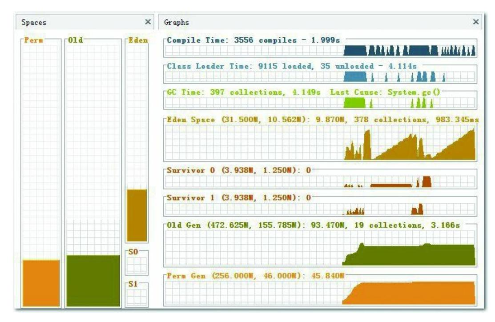

图5-2 Eclipse原始运行数据

Eclipse启动的总耗时没有办法从监控工具中直接获得,因为VisualVM不可能知道Eclipse运行到什 么阶段算是启动完成。为了测试的准确性,笔者写了一个简单的Eclipse插件,用于统计Eclipse的启动 耗时。由于代码十分简单,且本书并不是Eclipse RCP的开发教程,所以只列出代码清单5-4供读者参 考,不再延伸。如果读者需要这个插件,可以使用下面的代码自己编译即可。

代码清单5-4 Eclipse启动耗时统计插件

```
ShowTime.java代码:
import org.eclipse.jface.dialogs.MessageDialog;
import org.eclipse.swt.widgets.Display;
import org.eclipse.swt.widgets.Shell;
import org.eclipse.ui.IStartup;
/**
 * 统计Eclipse启动耗时
 * @author zzm
 */
public class ShowTime implements IStartup {
public void earlyStartup() {
    Display.getDefault().syncExec(new Runnable() {
        public void run() {
            long eclipseStartTime = Long.parseLong(System.getProperty("eclipse.startTime"));
            long costTime = System.currentTimeMillis() - eclipseStartTime;
            Shell shell = Display.getDefault().getActiveShell();
            String message = "Eclipse启动耗时:" + costTime + "ms";
            MessageDialog.openInformation(shell, "Information", message);
```

```
});
plugin.xml代码:
<?xml version="1.0" encoding="UTF-8"?>
<?eclipse version="3.4"?>
<plugin>
   <extension
         point="org.eclipse.ui.startup">
         <startup class="eclipsestarttime.actions.ShowTime"/>
   </extension>
</plugin>
```

上述代码打包成JAR后放到Eclipse的plugins目录,反复启动几次后,插件显示的平均时间稳定在 15秒左右,如图5-3所示。


图5-3 耗时统计插件运行效果

根据VisualGC和Eclipse插件收集到的信息,总结原始配置下的测试结果如下:

- ·整个启动过程平均耗时约15秒。
- ·最后一次启动的数据样本中,垃圾收集总耗时4.149秒,其中:
- ■Full GC被触发了19次,共耗时3.166秒;
- ■Minor GC被触发了378次,共耗时0.983秒。
- ·加载类9115个,耗时4.114秒。
- ·即时编译时间1.999秒。
- ·交给虚拟机的512MB堆内存被分配为40MB的新生代(31.5MB的Eden空间和2个4MB的Survivor 空间)以及472MB的老年代。

客观地说,考虑到该机器硬件的条件,15秒的启动时间其实还在可接受范围以内,但是从 VisualGC中反映的数据上看,存在的问题是非用户程序时间(图5-2中的Compile Time、Class Load Time、GC Time)占比非常之高,占了整个启动过程耗时的一半以上(这里存在少许夸张成分,因为 如即时编译等动作是在后台线程完成的,用户程序在此期间也正常并发执行,最多就是速度变慢,所 以并没有占用一半以上的绝对时间)。虚拟机后台占用太多时间也直接导致Eclipse在启动后的使用过 程中经常有卡顿的感觉,进行调优还是有较大价值的。

# 5.3.2 升级JDK版本的性能变化及兼容问题

对Eclipse进行调优的第一步就是先对虚拟机的版本进行升级,希望能先从虚拟机版本身上得到一 些"免费的"性能提升。

每次JDK的大版本发布时,发行商通常都会宣称虚拟机的运行速度比上一版本有了多少比例的提 高,这虽然是个广告性质的宣言,常被使用者从更新列表或者技术白皮书中直接忽略,但技术进步确 实会促使性能改进,从国内外的第三方评测数据来看,版本升级至少在某些方面确实带来了一定性能 改善[1]。以下是一个第三方网站对JDK 5、6、7三个版本做的性能评测,分别测试了以下4个用例[2]。

- 1)生成500万个字符串。
- 2)500万次ArrayList<String>数据插入,使用第一点生成的数据。
- 3)生成500万个HashMap<String,Integer>,每个键-值对通过并发线程计算,测试并发能力。
- 4)打印500万个ArrayList<String>中的值到文件,并重读回内存。
- 三个版本的JDK分别运行这4个用例的测试程序,测试结果如图5-4所示。

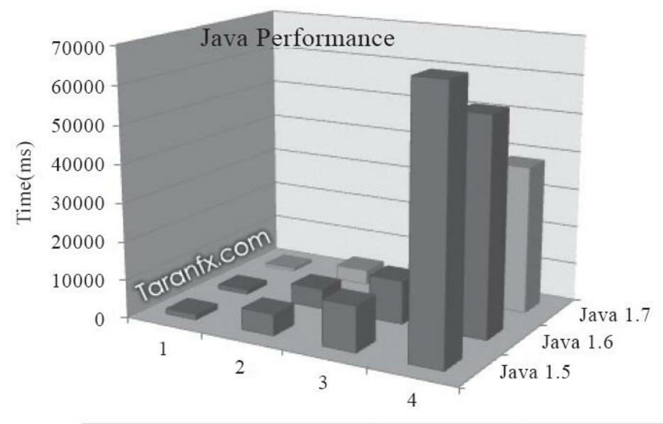

|            | 1    | 2    | 3     | 4     |
|------------|------|------|-------|-------|
| Java 1.5   | 1453 | 5600 | 11844 | 68140 |
| ■ Java 1.6 | 1250 | 5282 | 11328 | 56156 |
| ■ Java 1.7 | 860  | 3895 | 9859  | 38349 |

图5-4 JDK横向性能对比

从这4个用例的测试结果来看,在每一个测试场景中新版的JDK性能都有改进,譬如JDK 6比JDK 5有大约15%的平均性能提升。尽管对JDK仅测试这四个用例并不能说明什么问题,甚至要通过测试数据来量化描述一个JDK比旧版提升了多少本身就是很难做到特别科学准确的(要做稍微靠谱一点的测试,可以使用SPECjvm 2015<sup>[3]</sup>之类的软件来完成,或者把相应版本的TCK<sup>[4]</sup>中数万个测试用例的性能数据对比一下可能稍有说服力),但笔者还是选择相信这次"软广告"性质的测试,把JDK版本升级到JDK 6 Update 21,升级没有选择JDK 7或者其他版本的最主要理由是:本书后续故事剧情发展需要。

与所有小说作者(嗯……知道,本书不是小说)设计的故事情节一样,获得最后的胜利之前总是要经历各种各样的挫折,这次升级到JDK 6之后,性能有什么变化先暂且不谈,在使用几分钟之后,笔者的Eclipse就和前面几个服务端的案例一样非常"不负众望"地发生了内存溢出,如图5-5所示。


图5-5 Eclipse OutOfMemoryError

这次内存溢出开始是完全出乎笔者意料的:决定对Eclipse做调优是因为速度慢,但笔者的开发环 境一直都很稳定,至少没有出现过内存溢出的问题,而这次升级除了修改了eclipse.ini中的Java虚拟机 路径之外,还未进行任何运行参数的调整,Eclipse居然进去主界面之后随便开了几个文件就抛出内存 溢出异常了,难道JDK 6 Update21有哪个类库的API出现了严重的泄漏问题吗?

事实上并不是JDK 6出现了什么问题,否则以Java的影响力,它早就上新闻了。根据前面三章中介 绍讲解的原理和工具,我们要查明这个异常的原因并且解决它一点也不困难。打开VisualVM,监视页 签中的内存曲线部分如图5-6、图5-7所示。

在Java堆中监视曲线里,"堆大小"的曲线与"使用的堆"的曲线一直都有很大的间隔距离,每当两 条曲线开始出现互相靠近的趋势时,"堆大小"的曲线就会快速向上转向,而"使用的堆"的曲线会向下 转向。"堆大小"的曲线向上代表的是虚拟机内部在进行堆扩容,因为运行参数中并没有指定最小堆(- Xms)的值与最大堆(-Xmx)相等,所以堆容量一开始并没有扩展到最大值,而是根据使用情况进行 伸缩扩展。"使用的堆"的曲线向下是因为虚拟机内部触发了一次垃圾收集,一些废弃对象的空间被回 收后,内存用量相应减少。从图形上看,Java堆运作是完全正常的。但永久代的监视曲线就很明显有 问题了,"PermGen大小"的曲线与"使用的PermGen"的曲线几乎完全重合在一起,这说明永久代中已经 没有可回收的资源了,所以"使用的PermGen"的曲线不会向下发展,并且永久代中也没有空间可以扩 展了,所以"PermGen大小"的曲线不能向上发展,说明这次内存溢出很明显是永久代导致的内存溢 出。


图5-6 Java堆监视曲线


图5-7 永久代监视曲线

再注意到图5-7中永久代的最大容量"67108864字节",也就是64MB,这恰好是JDK在未使用-XX:MaxPermSize参数明确指定永久代最大容量时的默认值,无论JDK 5还是JDK 6,这个默认值都是 64MB。对于Eclipse这种规模的Java程序来说,64MB的永久代内存空间显然是不够的,内存溢出是肯 定的,但为何在JDK 5中没有发生过溢出呢?

在VisualVM的"概述>JVM参数"页签中,分别检查使用JDK 5和JDK 6运行Eclipse时的Java虚拟机 启动参数,发现使用JDK 6时,只有三个启动参数,如代码清单5-5所示。

代码清单5-5 JDK 1.6的Eclipse运行期参数

```
-Dcom.sun.management.jmxremote
```

而使用JDK 5运行时,就有四个启动参数,其中多出来的一个正好就是设置永久代最大容量的-XX:MaxPermSize=256M,如代码清单5-6所示。

代码清单5-6 JDK 1.5的Eclipse运行期参数

<sup>-</sup>Dosgi.requiredJavaVersion=1.5

<sup>-</sup>Xmx512m

<sup>-</sup>Dcom.sun.management.jmxremote

<sup>-</sup>Dosgi.requiredJavaVersion=1.5

为什么会这样呢?笔者从Eclipse的Bug List网站[5]上找到答案:使用JDK 5时之所以有永久代容量 这个参数,是因为在eclipse.ini中存在"--launcher.XXMaxPermSize 256M"这项设置,当launcher——也就 是Windows下的可执行程序eclipse.exe,检测到Eclipse是运行在Sun公司的虚拟机上的话,就会把参数值 转化为-XX:MaxPermSize传递给虚拟机进程。因为世界三大商用虚拟机中只有Sun公司的虚拟机才有 永久代的概念,也就是只有JDK 8以前的HotSpot虚拟机才需要设置这个参数,JRockit虚拟机和J9虚拟 机都是不需要设置的,所以这个参数才会有检测虚拟机后进行设置的过程。

2010年4月10日,Oracle正式完成对Sun公司的收购,此后无论是网页还是具体程序产品,提供商 都从Sun变为了Oracle,而eclipse.exe就是根据程序提供商来判断是否Sun公司的虚拟机的,当JDK 1.6 Update 21中java.exe、javaw.exe的"Company"属性从"Sun Microsystems Inc."变为"Oracle Corporation"后,Eclipse就不再认识这个虚拟机了,因此没有把最大永久代的参数传递过去。

查明了原因,解决方案就简单了,launcher不认识就只好由人来告诉它,在eclipse.ini中明确指定-XX:MaxPermSize=256M这个参数,问题随即解决。

- [1] 版本升级也有不少性能倒退的案例,受程序、第三方包兼容性以及中间件限制,在企业应用中升级 JDK版本是一件需要慎重考虑的事情。
- [2] 测试用例、数据及图片来源于http://www.taranfx.com/java-7-whats-new-performance-benchmark-1-5-1- 6-1-7。
- [3] 官方网站:http://www.spec.org/jvm2008/docs/UserGuide.html。
- [4] TCK(Technology Compatibility Kit)是一套由一组测试用例和相应的测试工具组成的工具包,用 于保证一个使用Java技术的实现能够完全遵守其适用的Java平台规范,并且符合相应的参考实现。
- [5] https://bugs.eclipse.org/bugs/show\_bug.cgi?id=319514。

# 5.3.3 编译时间和类加载时间的优化

从Eclipse启动时间来看,升级到JDK 6所带来的性能提升是……嗯?基本上没有提升。多次测试 的平均值与JDK 5的差距完全在实验误差范围之内。

各位读者不必失望,Sun公司给的JDK 6性能白皮书[1]描述的众多相对于JDK 5的提升并不至于全 部是广告词,尽管总启动时间并没有减少,但在查看运行细节的时候,却发现了一件很令人玩味的事 情:在JDK 6中启动完Eclipse所消耗的类加载时间比JDK 5长了接近一倍,读者注意不要看反了,这里 写的是JDK 6的类加载比JDK 5慢一倍,测试结果见代码清单5-7,反复测试多次仍然是相似的结果。

代码清单5-7 JDK 5、JDK 6中的类加载时间对比

```
使用JDK 6的类加载时间:
C:\Users\IcyFenix>jps
3552
6372 org.eclipse.equinox.launcher_1.0.201.R35x_v20090715.jar
6900 Jps
C:\Users\IcyFenix>jstat -class 6372
Loaded Bytes Unloaded Bytes Time
 7917 10190.3 0 0.0 8.18
使用JDK 5类加载时间:
C:\Users\IcyFenix>jps
3552
7272 Jps
7216 org.eclipse.equinox.launcher_1.0.201.R35x_v20090715.jar
C:\Users\IcyFenix>jstat -class 7216
Loaded Bytes Unloaded Bytes Time
 7902 9691.2 3 2.6 4.34
```

在本例中类加载时间上的差距并不能作为一个具有普适性的测试结论去说明JDK 6的类加载必然 比JDK 5慢,笔者测试了自己机器上的Tomcat和GlassFish启动过程,并没有出现类似的差距。在国内 最大的Java社区中,笔者发起过关于此问题的讨论[2]。从参与者反馈的测试结果来看,此问题只在一 部分机器上存在,而且在JDK 6的各个更新包之间,测试结果也存在很大差异。

经多轮试验后,发现在笔者机器上两个JDK进行类加载时,字节码验证部分耗时差距尤其严重, 暂且认为是JDK 6中新加入类型检查验证器时,可能在某些机器上会影响到以前类型检查验证器的工 作[3]。考虑到实际情况,Eclipse使用者甚多,它的编译代码我们可以认为是安全可靠的,可以不需要 在加载的时候再进行字节码验证,因此通过参数-Xverify:none禁止掉字节码验证过程也可作为一项优 化措施。加入这个参数后,两个版本的JDK类加载速度都有所提高,此时JDK 6的类加载速度仍然比 JDK 5要慢,但是两者的耗时已经接近了很多,测试结果如代码清单5-8所示。

代码清单5-8 JDK 1.5、1.6中取消字节码验证后的类加载时间对比

```
C:\Users\IcyFenix>jps
5512 org.eclipse.equinox.launcher_1.0.201.R35x_v20090715.jar
5596 Jps
C:\Users\IcyFenix>jstat -class 5512
Loaded Bytes Unloaded Bytes Time
 6749 8837.0 0 0.0 3.94
使用JDK 1.5的类加载时间:
C:\Users\IcyFenix>jps
4724 org.eclipse.equinox.launcher_1.0.201.R35x_v20090715.jar
5412 Jps
C:\Users\IcyFenix>jstat -class 4724
Loaded Bytes Unloaded Bytes Time
 6885 9109.7 3 2.6 3.10
```

关于类与类加载的话题,譬如刚刚提到的字节码验证是怎么回事,本书专门规划了两个章节进行 详细讲解,在此暂不再展开了。

在取消字节码验证之后,JDK 5的平均启动下降到了13秒,而在JDK 6的测试数据平均比JDK 5快 了1秒左右,下降到平均12秒,如图5-8所示。在类加载时间仍然落后的情况下,依然可以看到JDK 6在 性能上确实比JDK 5略有优势,说明至少在Eclipse启动这个测试用例上,升级JDK版本确实能带来一 些"免费的"性能提升。


图5-8 运行在JDK 6下取消字节码验证的启动时间

前面提到过,除了类加载时间以外,在VisualGC中监视曲线中显示了两项很大的非用户程序耗 时:编译时间(Compile Time)和垃圾收集时间(GC Time)。垃圾收集时间读者应该非常清楚了,而 编译时间是什么东西?程序在运行之前不是已经编译了吗?

虚拟机的即时编译与垃圾收集一样,是本书的一个重点部分,后面有专门章节讲解,这里先简要 介绍一下:编译时间是指虚拟机的即时编译器(Just In Time Compiler)编译热点代码(Hot Spot Code)的耗时。我们知道Java语言为了实现跨平台的特性,Java代码编译出来后形成Class文件中储存 的是字节码(Byte Code),虚拟机通过解释方式执行字节码命令,比起C/C++编译成本地二进制代码 来说,速度要慢不少。为了解决程序解释执行的速度问题,JDK 1.2以后,HotSpot虚拟机内置了两个 即时编译器[4],如果一段Java方法被调用次数到达一定程度,就会被判定为热代码交给即时编译器即 时编译为本地代码,提高运行速度(这就是HotSpot虚拟机名字的来由)。而且完全有可能在运行期动 态编译比C/C++的编译期静态编译出来的结果要更加优秀,因为运行期的编译器可以收集很多静态编 译器无法得知的信息,也可以采用一些激进的优化手段,针对"大多数情况"而忽略"极端情况"进行假

设优化,当优化条件不成立的时候再逆优化退回到解释状态或者重新编译执行。所以Java程序只要代 码编写没有问题(典型的是各种泄漏问题,如内存泄漏、连接泄漏),随着运行时间增长,代码被编 译得越来越彻底,运行速度应当是越运行越快的。不过,Java的运行期编译的一大缺点就是它进行编 译需要消耗机器的计算资源,影响程序正常的运行时间,这也就是上面所说的"编译时间"。

HotSpot虚拟机提供了一个参数-Xint来禁止编译器运作,强制虚拟机对字节码采用纯解释方式执 行。如果读者想使用这个参数省下Eclipse启动中那2秒的编译时间获得一个哪怕只是"更好看"的启动成 绩的话,那恐怕要大失所望了,加上这个参数之后虽然编译时间确实下降到零,但Eclipse启动的总时 间却剧增到27秒,就是因为没有即时编译的支持,执行速度大幅下降了。现在这个参数最大的作用, 除了某些场景调试上的需求外,似乎就剩下让用户缅怀一下JDK 1.2之前Java语言那令人心酸心碎的运 行速度了。

与解释执行相对应的另一方面,HotSpot虚拟机还有另一个力度更强的即时编译器:当虚拟机运行 在客户端模式的时候,使用的是一个代号为C1的轻量级编译器,另外还有一个代号为C2的相对重量级 的服务端编译器能提供更多的优化措施。由于本次实战所采用的HotSpot版本还不支持多层编译,所以 虚拟机只会单独使用其中一种即时编译器,如果使用客户端模式的虚拟机启动Eclipse将会使用到C2编 译器,这时从VisualGC可以看到启动过程中虚拟机使用了超过15秒的时间去进行代码编译。如果读者 的工作习惯是长时间不会关闭Eclipse的话,服务端编译器所消耗的额外编译时间最终是会在运行速度 的提升上"赚"回来的,这样使用服务端模式是一个相当不错的选择。不过至少在本次实战中,我们还 是继续选用客户端虚拟机来运行Eclipse。

- [1] 白皮书:http://java.sun.com/performance/reference/whitepapers/6\_performance.html。
- [2] 笔者发起的关于JDK 6与JDK 5在Eclipse启动时类加载速度差异的讨论: http://www.javaeye.com/topic/826542。
- [3] 这部分内容可常见第7章关于类加载过程的介绍。
- [4] JDK 1.2之前也可以使用外挂JIT编译器进行本地编译,但只能与解释器二选其一,不能同时工作。

# 5.3.4 调整内存设置控制垃圾收集频率

三大块非用户程序时间中,还剩下"GC时间"没有调整,而"GC时间"却又是其中最重要的一块, 并不单单因为它是耗时最长的一块,更因为它是一个稳定持续的消耗。由于我们做的测试是在测程序 的启动时间,类加载和编译时间的影响力在这项测试里被大幅放大了。在绝大多数的应用中,都不可 能出现持续不断的类被加载和卸载。在程序运行一段时间后,随着热点方法被不断编译,新的热点方 法数量也总会下降,这都会让类加载和即时编译的影响随运行时间增长而下降,但是垃圾收集则是随 着程序运行而持续运作的,所以它对性能的影响才显得最为重要。

在Eclipse启动的原始数据样本中,短短15秒,类共发生了19次Full GC和378次Minor GC,一共397 次GC共造成了超过4秒的停顿,也就是超过1/4的时间都是在做垃圾收集,这样的运行数据看起来实在 太糟糕了。

首先来解决新生代中的Minor GC,尽管垃圾收集的总时间只有不到1秒,但却发生了378次之多。 从VisualGC的线程监视中看到Eclipse启动期间一共发起了超过70条线程,同时在运行的线程数超过25 条,每当发生一次垃圾收集,所有用户线程[1]都必须跑到最近的一个安全点然后挂起线程来等待垃圾 回收。这样过于频繁的垃圾收集就会导致很多没有必要的线程挂起及恢复动作。

新生代垃圾收集频繁发生,很明显是由于虚拟机分配给新生代的空间太小导致,Eden区加上一个 Survivor区的总大小还不到35MB。所以完全有必要使用-Xmn参数手工调整新生代的大小。

再来看一看那19次Full GC,看起来19次相对于378次Minor GC来说并"不多",但总耗时有3.166 秒,占了绝大部分的垃圾收集时间,降低垃圾收集停顿时间的主要目标就是要降低Full GC这部分时 间。从VisualGC的曲线图上看得不够精确,这次直接从收集器日志[2]中分析一下这些Full GC是如何产 生的,代码清单5-9中是启动最开始的2.5秒内发生的10次Full GC记录。

#### 代码清单5-9 Full GC记录

```
0.278: [GC 0.278: [DefNew: 574K->33K(576K), 0.0012562 secs]0.279: [Tenured: 1467K->997K(1536K), 0.0181775 secs] 1920K->997K(2112K), 0.0195257 secs]
0.312: [GC 0.312: [DefNew: 575K->64K(576K), 0.0004974 secs]0.312: [Tenured: 1544K->1608K(1664K), 0.0191592 secs] 1980K->1608K(2240K), 0.0197396 secs]
0.590: [GC 0.590: [DefNew: 576K->64K(576K), 0.0006360 secs]0.590: [Tenured: 2675K->2219K(2684K), 0.0256020 secs] 3090K->2219K(3260K), 0.0263501 secs]
0.958: [GC 0.958: [DefNew: 551K->64K(576K), 0.0011433 secs]0.959: [Tenured: 3979K->3470K(4084K), 0.0419335 secs] 4222K->3470K(4660K), 0.0431992 secs]
1.575: [Full GC 1.575: [Tenured: 4800K->5046K(5784K), 0.0543136 secs] 5189K->5046K(6360K), [Perm : 12287K->12287K(12288K)], 0.0544163 secs]
1.703: [GC 1.703: [DefNew: 703K->63K(704K), 0.0012609 secs]1.705: [Tenured: 8441K->8505K(8540K), 0.0607638 secs] 8691K->8505K(9244K), 0.0621470 secs]
1.837: [GC 1.837: [DefNew: 1151K->64K(1152K), 0.0020698 secs]1.839: [Tenured: 14616K->14680K(14688K), 0.0708748 secs] 15035K->14680K(15840K), 0.0730947 secs]
2.144: [GC 2.144: [DefNew: 1856K->191K(1856K), 0.0026810 secs]2.147: [Tenured: 25092K->24656K(25108K), 0.1112429 secs] 26172K->24656K(26964K), 0.1141099 secs]
2.337: [GC 2.337: [DefNew: 1914K->0K(3136K), 0.0009697 secs]2.338: [Tenured: 41779K->27347K(42056K), 0.0954341 secs] 42733K->27347K(45192K), 0.0965513 secs]
2.465: [GC 2.465: [DefNew: 2490K->0K(3456K), 0.0011044 secs]2.466: [Tenured: 46379K->27635K(46828K), 0.0956937 secs] 47621K->27635K(50284K), 0.0969918 secs]
```

括号中加粗的数字代表着老年代的容量,这组GC日志显示,10次Full GC发生的原因全部都是老 年代空间耗尽,每发生一次Full GC都伴随着一次老年代空间扩容:1536KB→1664KB→2684KB→… →42056KB→46828KB。10次GC以后老年代容量从起始的1536KB扩大到46828KB,当15秒后Eclipse启 动完成时,老年代容量扩大到了103428KB,代码编译开始后,老年代容量到达顶峰473MB,整个Java 堆到达最大容量512MB。

日志还显示有些时候内存回收状况很不理想,空间扩容成为获取可用内存的最主要手段,譬如这 一句:

Tenured: 25092K->24656K(25108K) , 0.1112429 secs

代表老年代当前容量为25108KB,内存使用到25092KB的时候发生了Full GC,花费0.11秒把内存 使用降低到24656KB,只回收了不到500KB的内存,这次垃圾收集基本没有什么回收效果,仅仅做了 扩容,扩容过程相比起回收过程可以看作是基本不需要花费时间的,所以说这0.11秒几乎是平白浪费 了。

由上述分析可以得出结论:Eclipse启动时Full GC大多数是由于老年代容量扩展而导致的,由永久 代空间扩展而导致的也有一部分。为了避免这些扩展所带来的性能浪费,我们可以把-Xms和-XX: PermSize参数值设置为-Xmx和-XX:MaxPermSize参数值一样,这样就强制虚拟机在启动的时候就把老 年代和永久代的容量固定下来,避免运行时自动扩展[3]。

根据以上分析,优化计划确定为:把新生代容量提升到128MB,避免新生代频繁发生Minor GC; 把Java堆、永久代的容量分别固定为512MB和96MB [4],避免内存扩展。这几个数值都是根据机器硬 件和Eclipse插件、工程数量决定,读者实战的时候应依据VisualGC和日志里收集到的实际数据进行设 置。改动后的eclipse.ini配置如代码清单5-10所示。

代码清单5-10 内存调整后的Eclipse配置文件

```
-vm
D:/_DevSpace/jdk1.6.0_21/bin/javaw.exe
-startup
plugins/org.eclipse.equinox.launcher_1.0.201.R35x_v20090715.jar
--launcher.library
plugins/org.eclipse.equinox.launcher.win32.win32.x86_1.0.200.v20090519
-product
org.eclipse.epp.package.jee.product
-showsplash
org.eclipse.platform
-vmargs
-Dosgi.requiredJavaVersion=1.5
-Xverify:none
-Xmx512m
-Xms512m
-Xmn128m
-XX:PermSize=96m
-XX:MaxPermSize=96m
```

现在这个配置之下,垃圾收集的次数已经大幅度降低,图5-9是Eclipse启动后一分钟的监视曲线, 只发生了8次Minor GC和4次Full GC,总耗时为1.928秒。

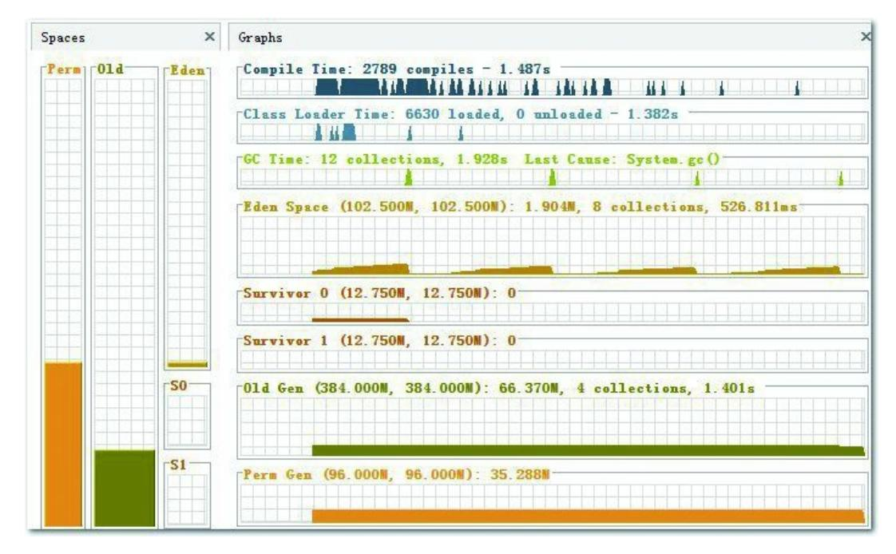

图5-9 GC调整后的运行数据

这个结果已经算是基本正常,但是还存在一点瑕疵:从Old Gen的曲线上看,老年代直接固定在 384MB,而内存使用量只有66MB,并且一直很平滑,完全不应该发生Full GC才对,那4次Full GC是 怎么来的?使用jstat-gccause查询一下最近一次GC的原因,见代码清单5-11。

### 代码清单5-11 查询GC原因

```
C:\Users\IcyFenix>jps
9772 Jps
4068 org.eclipse.equinox.launcher_1.0.201.R35x_v20090715.jar
C:\Users\IcyFenix>jstat -gccause 4068
   S0 S1 E O P YGC YGCT FGC FGCT GCT
LGCC GCC
   0.00 0.00 1.00 14.81 39.29 6 0.422 20 5.992 6.414
System.gc() No GC
```

从LGCC(Last GC Cause)中看到原来是代码调用System.gc()显式触发的垃圾收集,在内存设置调 整后,这种显式垃圾收集不符合我们的期望,因此在eclipse.ini中加入参数-XX:+DisableExplicitGC屏 蔽掉System.gc()。再次测试发现启动期间的Full GC已经完全没有了,只发生了6次Minor GC,总共耗 时417毫秒,与调优前4.149秒的测试结果相比,正好是十分之一。进行GC调优后Eclipse的启动时间下 降非常明显,比整个垃圾收集时间降低的绝对值还大,现在启动只需要7秒多,如图5-10所示。


图5-10 Eclipse启动时间

- [1] 严格来说,不包括正在执行native代码的用户线程,因为native代码一般不会改变Java对象的引用关 系,所以没有必要挂起它们来等待垃圾回收。
- [2] 可以通过以下几个参数要求虚拟机生成GC日志:-XX:+PrintGCTimeStamps(打印GC停顿时 间)、-XX:+PrintGCDetails(打印GC详细信息)、-verbose:gc(打印GC信息,输出内容已被前一 个参数包括,可以不写)、-Xloggc:gc.log。
- [3] 需要说明一点,虚拟机启动的时候就会把参数中所设定的内存全部划为私有,即使扩容前有一部分 内存不会被用户代码用到,这部分内存也不会交给其他进程使用。这部分内存在虚拟机中被标识 为"Virtual"内存。
- [4] 512MB和96MB两个数值对于笔者的应用情况来说依然偏少,但由于笔者需要同时开VMware虚拟 机工作,所以需要预留较多内存,读者在实际调优时不妨再设置大一些。

# 5.3.5 选择收集器降低延迟

现在Eclipse启动已经比较迅速了,但我们的调优实战还没有结束,毕竟Eclipse是拿来写程序用 的,不是拿来测试启动速度的。我们不妨再在Eclipse中进行一个非常常用但又比较耗时的操作:代码 编译。图5-11是当前配置下,Eclipse进行代码编译时的运行数据,从图中可以看到,新生代每次回收 耗时约65毫秒,老年代每次回收耗时约725毫秒。对于用户来说,新生代垃圾收集的耗时也还好,65毫 秒的停顿在使用中基本无法察觉到,而老年代每次垃圾收集要停顿接近1秒钟,虽然较长时间才会出现 一次,但这样的停顿已经是可以被人感知了,会影响到体验。

再注意看一下编译期间的处理器资源使用状况,图5-12是Eclipse在编译期间的处理器使用率曲线 图,整个编译过程中平均只使用了不到30%的处理器资源,垃圾收集的处理器使用率曲线更是几乎与 坐标横轴紧贴在一起,这说明处理器资源还有很多可利用的余地。

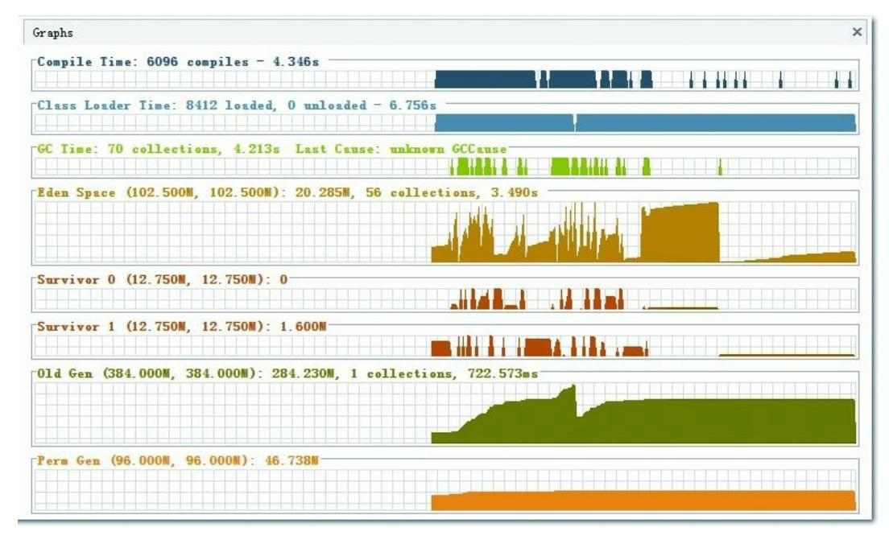

图5-11 编译期间运行数据


图5-12 编译期间CPU曲线

列举垃圾收集的停顿时间、处理器资源富余的目的,都是为了给接下来替换掉客户端模式的虚拟 机中默认的新生代、老年代串行收集器做个铺垫。

Eclipse应当算是与使用者交互非常频繁的应用程序,由于代码太多,笔者习惯在做全量编译或者 清理动作的时候,使用"Run in Background"功能一边编译一边继续工作。回顾一下在第3章提到的几种 收集器,很容易想到在JDK 6版本下提供的收集器里,CMS是最符合这类场景的选择。我们在 eclipse.ini中再加入这两个参数,-XX:+UseConc-MarkSweepGC和-XX:+UseParNewGC(ParNew是 使用CMS收集器后的默认新生代收集器,写上仅是为了配置更加清晰),要求虚拟机在新生代和老年 代分别使用ParNew和CMS收集器进行垃圾回收。指定收集器之后,再次测试的结果如图5-13所示,与 原来使用串行收集器对比,新生代停顿从每次65毫秒下降到了每次53毫秒,而老年代的停顿时间更是 从725毫秒大幅下降到了36毫秒。

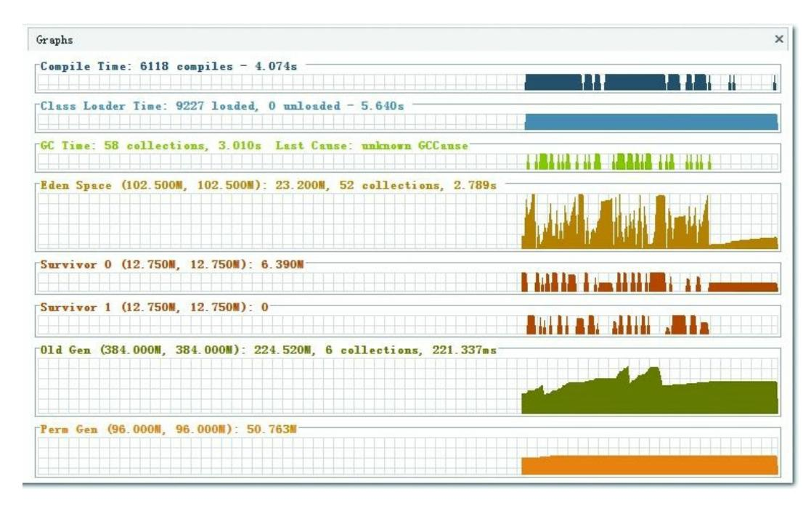

图5-13 指定ParNew和CMS收集器后的GC数据

当然,由于CMS的停顿时间只是整个收集过程中的一小部分,大部分收集行为是与用户程序并发 进行的,所以并不是真的把垃圾收集时间从725毫秒直接缩短到36毫秒了。在收集器日志中可以看到 CMS与程序并发的时间约为400毫秒,这样收集器的运行结果就比较令人满意了。

到这里为止,对于虚拟机内存的调优基本就结束了,这次实战可以看作一次简化的服务端调优过 程,服务端调优有可能还会在更多方面,如数据库、资源池、磁盘I/O等,但对于虚拟机内存部分的优 化,与这次实战中的思路没有什么太大差别。即使读者实际工作中不接触到服务器,根据自己工作环 境做一些试验,总结几个参数让自己日常工作环境速度有较大幅度提升也是很能提升工作幸福感的。 最终eclipse.ini的配置如代码清单5-12所示。

### 代码清单5-12 修改收集器配置后的Eclipse配置

```
-vm
D:/_DevSpace/jdk1.6.0_21/bin/javaw.exe
-startup
plugins/org.eclipse.equinox.launcher_1.0.201.R35x_v20090715.jar
--launcher.library
plugins/org.eclipse.equinox.launcher.win32.win32.x86_1.0.200.v20090519
-product
org.eclipse.epp.package.jee.product
-showsplash
org.eclipse.platform
-vmargs
-Dcom.sun.management.jmxremote
-Dosgi.requiredJavaVersion=1.5
-Xverify:none
-Xmx512m
```

- -Xms512m
- -Xmn128m
- -XX:PermSize=96m
- -XX:MaxPermSize=96m
- -XX:+DisableExplicitGC
- -Xnoclassgc
- -XX:+UseParNewGC
- -XX:+UseConcMarkSweepGC
- -XX:CMSInitiatingOccupancyFraction=85

# 5.4 本章小结

Java虚拟机的内存管理与垃圾收集是虚拟机结构体系中最重要的组成部分,对程序的性能和稳定 有着非常大的影响。在本书的第2~5章里,笔者从理论知识、异常现象、代码、工具、案例、实战等 几个方面对其进行讲解,希望读者能有所收获。

本书关于虚拟机内存管理部分到此就结束了,下一章我们将开始学习Class文件与虚拟机执行子系 统方面的知识。

# 第三部分 虚拟机执行子系统

·第6章 类文件结构

·第7章 虚拟机类加载机制

·第8章 虚拟机字节码执行引擎

·第9章 类加载及执行子系统的案例与实战

# 第6章 类文件结构

代码编译的结果从本地机器码转变为字节码,是存储格式发展的一小步,却是编程语言发展的一 大步。

### 6.1 概述

曾记得在第一堂计算机程序课上老师就讲过:"计算机只认识0和1,所以我们写的程序需要被编译 器翻译成由0和1构成的二进制格式才能被计算机执行。"十多年过去了,今天的计算机仍然只能识别0 和1,但由于最近十年内虚拟机以及大量建立在虚拟机之上的程序语言如雨后春笋般出现并蓬勃发展, 把我们编写的程序编译成二进制本地机器码(Native Code)已不再是唯一的选择,越来越多的程序语 言选择了与操作系统和机器指令集无关的、平台中立的格式作为程序编译后的存储格式。

# 6.2 无关性的基石

如果全世界所有计算机的指令集就只有x86一种,操作系统就只有Windows一种,那也许就不会有 Java语言的出现。Java在刚刚诞生之时曾经提出过一个非常著名的宣传口号"一次编写,到处运行 (Write Once,Run Anywhere)",这句话充分表达了当时软件开发人员对冲破平台界限的渴求。在每 时每刻都充满竞争的IT业界,不可能只有Wintel [1]存在,我们也不希望出现只有Wintel而没有竞争者的 世界,各种不同的硬件体系结构、各种不同的操作系统肯定将会长期并存发展。"与平台无关"的理想 最终只有实现在操作系统以上的应用层:Oracle公司以及其他虚拟机发行商发布过许多可以运行在各 种不同硬件平台和操作系统上的Java虚拟机,这些虚拟机都可以载入和执行同一种平台无关的字节 码,从而实现了程序的"一次编写,到处运行"。

各种不同平台的Java虚拟机,以及所有平台都统一支持的程序存储格式——字节码(Byte Code) 是构成平台无关性的基石,但本节标题中笔者刻意省略了"平台"二字,那是因为笔者注意到虚拟机的 另外一种中立特性——语言无关性正在越来越被开发者所重视。直到今天,或许还有相当一部分程序 员认为Java虚拟机执行Java程序是一件理所当然和天经地义的事情。但在Java技术发展之初,设计者们 就曾经考虑过并实现了让其他语言运行在Java虚拟机之上的可能性,他们在发布规范文档的时候,也 刻意把Java的规范拆分成了《Java语言规范》(The Java Language Specification)及《Java虚拟机规范》 (The Java Virtual Machine Specification)两部分。并且早在1997年发表的第一版《Java虚拟机规范》中 就曾经承诺过:"在未来,我们会对Java虚拟机进行适当的扩展,以便更好地支持其他语言运行于Java 虚拟机之上"(In the future,we will consider bounded extensions to the Java virtual machine to provide better support for other languages)。Java虚拟机发展到今天,尤其是在2018年,基于HotSpot扩展而来 的GraalVM公开之后,当年的虚拟机设计者们已经基本兑现了这个承诺。

时至今日,商业企业和开源机构已经在Java语言之外发展出一大批运行在Java虚拟机之上的语言, 如Kotlin、Clojure、Groovy、JRuby、JPython、Scala等。相比起基数庞大的Java程序员群体,使用过这 些语言的开发者可能还不是特别多,但是听说过的人肯定已经不少,随着时间的推移,谁能保证日后 Java虚拟机在语言无关性上的优势不会赶上甚至超越它在平台无关性上的优势呢?

实现语言无关性的基础仍然是虚拟机和字节码存储格式。Java虚拟机不与包括Java语言在内的任何 程序语言绑定,它只与"Class文件"这种特定的二进制文件格式所关联,Class文件中包含了Java虚拟机 指令集、符号表以及若干其他辅助信息。基于安全方面的考虑,《Java虚拟机规范》中要求在Class文 件必须应用许多强制性的语法和结构化约束,但图灵完备的字节码格式,保证了任意一门功能性语言 都可以表示为一个能被Java虚拟机所接受的有效的Class文件。作为一个通用的、与机器无关的执行平 台,任何其他语言的实现者都可以将Java虚拟机作为他们语言的运行基础,以Class文件作为他们产品 的交付媒介。例如,使用Java编译器可以把Java代码编译为存储字节码的Class文件,使用JRuby等其他 语言的编译器一样可以把它们的源程序代码编译成Class文件。虚拟机丝毫不关心Class的来源是什么语 言,它与程序语言之间的关系如图6-1所示。

Java语言中的各种语法、关键字、常量变量和运算符号的语义最终都会由多条字节码指令组合来 表达,这决定了字节码指令所能提供的语言描述能力必须比Java语言本身更加强大才行。因此,有一 些Java语言本身无法有效支持的语言特性并不代表在字节码中也无法有效表达出来,这为其他程序语 言实现一些有别于Java的语言特性提供了发挥空间。

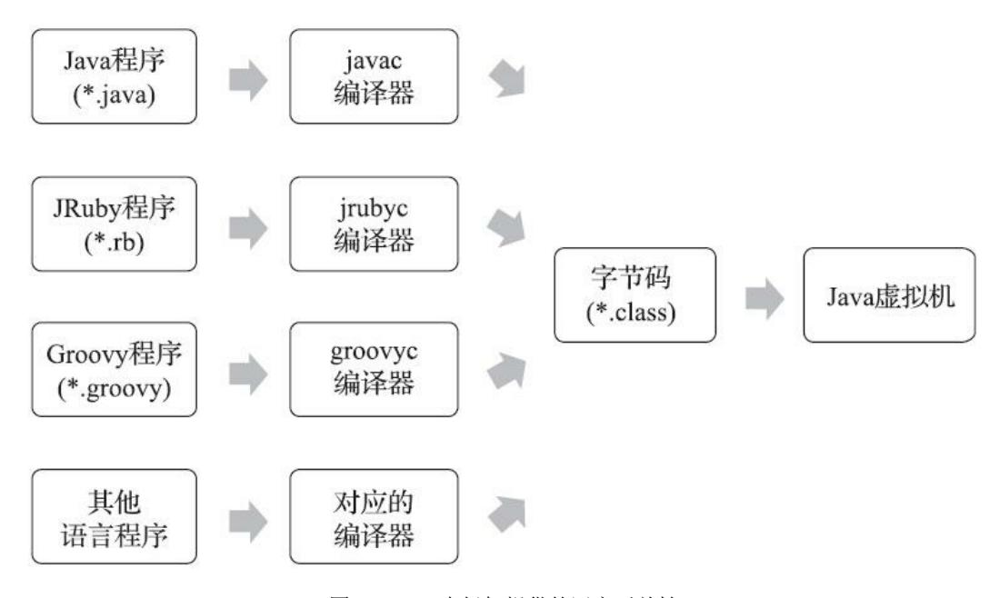

图6-1 Java虚拟机提供的语言无关性

[1] Wintel指微软的Windows与Intel的芯片相结合,曾经是业界最强大的联盟。

### 6.3 Class类文件的结构

解析Class文件的数据结构是本章的最主要内容。笔者曾经在前言中阐述过本书的写作风格:力求 在保证逻辑准确的前提下,用尽量通俗的语言和案例去讲述虚拟机中与开发关系最为密切的内容。但 是,对文件格式、结构方面的学习,有点类似于"读字典",读者阅读本章时,大概会不可避免地感到 比较枯燥,但这部分内容又是Java虚拟机的重要基础之一,是了解虚拟机的必经之路,如果想比较深 入地学习虚拟机相关知识,这部分是无法回避的。

Java技术能够一直保持着非常良好的向后兼容性,Class文件结构的稳定功不可没,任何一门程序 语言能够获得商业上的成功,都不可能去做升级版本后,旧版本编译的产品就不再能够运行这种事 情。本章所讲述的关于Class文件结构的内容,绝大部分都是在第一版的《Java虚拟机规范》(1997年 发布,对应于JDK 1.2时代的Java虚拟机)中就已经定义好的,内容虽然古老,但时至今日,Java发展 经历了十余个大版本、无数小更新,那时定义的Class文件格式的各项细节几乎没有出现任何改变。尽 管不同版本的《Java虚拟机规范》对Class文件格式进行了几次更新,但基本上只是在原有结构基础上 新增内容、扩充功能,并未对已定义的内容做出修改。

注意 任何一个Class文件都对应着唯一的一个类或接口的定义信息[1],但是反过来说,类或 接口并不一定都得定义在文件里(譬如类或接口也可以动态生成,直接送入类加载器中)。本章中, 笔者只是通俗地将任意一个有效的类或接口所应当满足的格式称为"Class文件格式",实际上它完全不 需要以磁盘文件的形式存在。

Class文件是一组以8个字节为基础单位的二进制流,各个数据项目严格按照顺序紧凑地排列在文 件之中,中间没有添加任何分隔符,这使得整个Class文件中存储的内容几乎全部是程序运行的必要数 据,没有空隙存在。当遇到需要占用8个字节以上空间的数据项时,则会按照高位在前[2]的方式分割 成若干个8个字节进行存储。

根据《Java虚拟机规范》的规定,Class文件格式采用一种类似于C语言结构体的伪结构来存储数 据,这种伪结构中只有两种数据类型:"无符号数"和"表"。后面的解析都要以这两种数据类型为基 础,所以这里笔者必须先解释清楚这两个概念。

·无符号数属于基本的数据类型,以u1、u2、u4、u8来分别代表1个字节、2个字节、4个字节和8个 字节的无符号数,无符号数可以用来描述数字、索引引用、数量值或者按照UTF-8编码构成字符串 值。

·表是由多个无符号数或者其他表作为数据项构成的复合数据类型,为了便于区分,所有表的命名 都习惯性地以"\_info"结尾。表用于描述有层次关系的复合结构的数据,整个Class文件本质上也可以视 作是一张表,这张表由表6-1所示的数据项按严格顺序排列构成。

| 类 型            | 名 称                 | 数量                    |  |  |  |  |  |
|----------------|---------------------|-----------------------|--|--|--|--|--|
| u4             | magic               | 1                     |  |  |  |  |  |
| u2             | minor_version       | 1                     |  |  |  |  |  |
| u2             | major_version       | 1                     |  |  |  |  |  |
| u2             | constant_pool_count | 1                     |  |  |  |  |  |
| cp_info        | constant_pool       | constant_pool_count-1 |  |  |  |  |  |
| u2             | access_flags        | 1                     |  |  |  |  |  |
| u2             | this_class          | 1                     |  |  |  |  |  |
| u2             | super_class         | 1                     |  |  |  |  |  |
| u2             | interfaces_count    | 1                     |  |  |  |  |  |
| u2             | interfaces          | interfaces_count      |  |  |  |  |  |
| u2             | fields_count        | 1                     |  |  |  |  |  |
| field_info     | fields              | fields_count          |  |  |  |  |  |
| u2             | methods_count       | 1                     |  |  |  |  |  |
| method_info    | methods             | methods_count         |  |  |  |  |  |
| u2             | attributes_count    | Ī                     |  |  |  |  |  |
| attribute_info | attributes          | attributes_count      |  |  |  |  |  |

无论是无符号数还是表,当需要描述同一类型但数量不定的多个数据时,经常会使用一个前置的 容量计数器加若干个连续的数据项的形式,这时候称这一系列连续的某一类型的数据为某一类型的"集 合"。

本节结束之前,笔者需要再强调一次,Class的结构不像XML等描述语言,由于它没有任何分隔符 号,所以在表6-1中的数据项,无论是顺序还是数量,甚至于数据存储的字节序(Byte Ordering,Class 文件中字节序为Big-Endian)这样的细节,都是被严格限定的,哪个字节代表什么含义,长度是多少, 先后顺序如何,全部都不允许改变。接下来,我们将一起看看这个表中各个数据项的具体含义。

- [1] 其实也有反例,譬如package-info.class、module-info.class这些文件就属于完全描述性的。
- [2] 这种顺序称为"Big-Endian",具体顺序是指按高位字节在地址最低位,最低字节在地址最高位来存 储数据,它是SPARC、PowerPC等处理器的默认多字节存储顺序,而x86等处理器则是使用了相反 的"Little-Endian"顺序来存储数据。

# 6.3.1 魔数与Class文件的版本

每个Class文件的头4个字节被称为魔数(Magic Number),它的唯一作用是确定这个文件是否为 一个能被虚拟机接受的Class文件。不仅是Class文件,很多文件格式标准中都有使用魔数来进行身份识 别的习惯,譬如图片格式,如GIF或者JPEG等在文件头中都存有魔数。使用魔数而不是扩展名来进行 识别主要是基于安全考虑,因为文件扩展名可以随意改动。文件格式的制定者可以自由地选择魔数 值,只要这个魔数值还没有被广泛采用过而且不会引起混淆。Class文件的魔数取得很有"浪漫气息", 值为0xCAFEBABE(咖啡宝贝?)。这个魔数值在Java还被称作"Oak"语言的时候(大约是1991年前 后)就已经确定下来了。它还有一段很有趣的历史,据Java开发小组最初的关键成员Patrick Naughton 所说:"我们一直在寻找一些好玩的、容易记忆的东西,选择0xCAFEBABE是因为它象征着著名咖啡 品牌Peet's Coffee深受欢迎的Baristas咖啡。" [1]这个魔数似乎也预示着日后"Java"这个商标名称的出 现。

紧接着魔数的4个字节存储的是Class文件的版本号:第5和第6个字节是次版本号(Minor Version),第7和第8个字节是主版本号(Major Version)。Java的版本号是从45开始的,JDK 1.1之后 的每个JDK大版本发布主版本号向上加1(JDK 1.0~1.1使用了45.0~45.3的版本号),高版本的JDK能 向下兼容以前版本的Class文件,但不能运行以后版本的Class文件,因为《Java虚拟机规范》在Class文 件校验部分明确要求了即使文件格式并未发生任何变化,虚拟机也必须拒绝执行超过其版本号的Class 文件。

例如,JDK 1.1能支持版本号为45.0~45.65535的Class文件,无法执行版本号为46.0以上的Class文 件,而JDK 1.2则能支持45.0~46.65535的Class文件。目前最新的JDK版本为13,可生成的Class文件主 版本号最大值为57.0。

为了讲解方便,笔者准备了一段最简单的Java代码(如代码清单6-1所示),本章后面的内容都将 以这段程序使用JDK 6编译输出的Class文件为基础来进行讲解,建议读者不妨用较新版本的JDK跟随 本章的实验流程自己动手测试一遍。

#### 代码清单6-1 简单的Java代码

```
package org.fenixsoft.clazz;
public class TestClass {
    private int m;
    public int inc() {
        return m + 1;
```

图6-2显示的是使用十六进制编辑器WinHex打开这个Class文件的结果,可以清楚地看见开头4个字 节的十六进制表示是0xCAFEBABE,代表次版本号的第5个和第6个字节值为0x0000,而主版本号的值 为0x0032,也即是十进制的50,该版本号说明这个是可以被JDK 6或以上版本虚拟机执行的Class文 件。

| Offset               | 0  | 1  | 2  | 3  | 4  | 5  | 6  | 7  | 8     | 9         | A    | В | C | D  | E  | F  |                  |
|----------------------|----|----|----|----|----|----|----|----|-------|-----------|------|---|---|----|----|----|------------------|
| 00000000             | CA | FE | BA | BE | 00 | 00 | 00 | 32 | 00    | 16        | 07   |   |   |    |    |    | 漱壕2              |
| 00000010             | 6F | 72 | 67 | 2F | 66 | 65 | 6E | 69 | 数据部   | 2 555 555 |      | - | R | 2F | 63 | 6C | org/fenixsoft/cl |
| 00000020<br>00000030 | 61 | 7A | 7A | 2F | 54 | 65 | 73 | 74 | 30.70 | 11-00     |      |   |   | 07 | 00 | 04 | azz/TestClass    |
| 00000030             | 01 | 00 | 10 | 6A | 61 | 76 | 61 | 2F | 8 E   | Sit (+)   | : 50 |   |   | 4F | 62 | 6A | java/lang/Obj    |

图6-2 Java Class文件的结构

表6-2列出了从JDK 1.1到13之间,主流JDK版本编译器输出的默认的和可支持的Class文件版本 号。

表6-2 Class文件版本号

| JDK 版本       | -target 参数                                                           | -source 参数    | 版本号  |
|--------------|----------------------------------------------------------------------|---------------|------|
| JDK 1.1.8    | 不支持 target 参数                                                        | 不支持 source 参数 | 45.3 |
| JDK 1.2.2    | 不带 (默认为 -target 1.1 )                                                | 1.1~1.2       | 45.3 |
| JDK 1.2.2    | -target 1.2                                                          | 1.1~1.2       | 46.0 |
| JDK 1.3.1_19 | 不带 (默认为 -target 1.1 )                                                | 1.1~1.3       | 45.3 |
| JDK 1.3.1_19 | -target 1.3                                                          | 1.1~1.3       | 47.0 |
| JDK 1.4.2_10 | 不带 (默认为 -target 1.2)                                                 | 1.1~1.4       | 46.0 |
| JDK 1.4.2_10 | -target 1.4                                                          | 1.1~1.4       | 48.0 |
| JDK 5.0_11   | 不带 (默认为 -target 1.5 ),后续版本不带 target 参数<br>默认编译的 Class 文件均与其 JDK 版本相同 | 1.1~1.5       | 49.0 |
| JDK 5.0_11   | -target 1.4 -source 1.4                                              | 1.1~1.5       | 48.0 |
| JDK 6        | 不带 (默认为 -target 6)                                                   | 1.1~6         | 50.0 |
| JDK 7        | 不带 (默认为 -target 7)                                                   | 1.1~7         | 51.0 |
| JDK 8        | 不带 (默认为 -target 8)                                                   | 1.1~8         | 52.0 |
| JDK 9        | 不带(默认为 -target 9)                                                    | 6~9⊖          | 53.0 |
| JDK 10       | 不带 (默认为 -target 10 )                                                 | 6~10          | 54.0 |
| JDK 11       | 不带(默认为 -target 11)                                                   | 6~11          | 55.0 |
| JDK 12       | 不带 (默认为 -target 12)                                                  | 6~12          | 56.0 |
| JDK 13       | 不带 (默认为 -target 13)                                                  | 6~13          | 57.0 |

注:从JDK 9开始,Javac编译器不再支持使用-source参数编译版本号小于1.5的源码。

关于次版本号,曾经在现代Java(即Java 2)出现前被短暂使用过,JDK 1.0.2支持的版本45.0~ 45.3(包括45.0~45.3)。JDK 1.1支持版本45.0~45.65535,从JDK 1.2以后,直到JDK 12之前次版本 号均未使用,全部固定为零。而到了JDK 12时期,由于JDK提供的功能集已经非常庞大,有一些复杂 的新特性需要以"公测"的形式放出,所以设计者重新启用了副版本号,将它用于标识"技术预览版"功 能特性的支持。如果Class文件中使用了该版本JDK尚未列入正式特性清单中的预览功能,则必须把次 版本号标识为65535,以便Java虚拟机在加载类文件时能够区分出来。

[1] 根据Java之父James Gosling的解释,当时还定义了"CAFEDEAD"用作另一种对象持久化文件格式的 魔数,只是后来该格式被废弃掉了,所以并未流传开来。

### 6.3.2 常量池

紧接着主、次版本号之后的是常量池入口,常量池可以比喻为Class文件里的资源仓库,它是Class 文件结构中与其他项目关联最多的数据,通常也是占用Class文件空间最大的数据项目之一,另外,它 还是在Class文件中第一个出现的表类型数据项目。

由于常量池中常量的数量是不固定的,所以在常量池的入口需要放置一项u2类型的数据,代表常 量池容量计数值(constant\_pool\_count)。与Java中语言习惯不同,这个容量计数是从1而不是0开始 的,如图6-3所示,常量池容量(偏移地址:0x00000008)为十六进制数0x0016,即十进制的22,这就 代表常量池中有21项常量,索引值范围为1~21。在Class文件格式规范制定之时,设计者将第0项常量 空出来是有特殊考虑的,这样做的目的在于,如果后面某些指向常量池的索引值的数据在特定情况下 需要表达"不引用任何一个常量池项目"的含义,可以把索引值设置为0来表示。Class文件结构中只有 常量池的容量计数是从1开始,对于其他集合类型,包括接口索引集合、字段表集合、方法表集合等的 容量计数都与一般习惯相同,是从0开始。

| Offset   | 0  | 1  | 2  | 3  | 4  | 5  | 6  | 7  | 8   | 9   | Α          | В    | C  | D  | E  | F  |                       |
|----------|----|----|----|----|----|----|----|----|-----|-----|------------|------|----|----|----|----|-----------------------|
| 00000000 | CA | FE | BA | BE | 00 | 00 | 00 | 32 | 00  | 16  | 07         | 00   | 02 | 01 | 00 | 1D | 漱壕2                   |
| 00000010 | 6F | 72 | 67 | 2F | 66 | 65 | 6E | 69 | 78  | 73  | 6F         | 66   | 74 | 2F | 63 | 6C | org/fenixsoft/cl      |
| 00000020 | 61 | 7A | 7A | 2F | 54 | 65 | 73 | 74 | 43  | 6C  | 61         | 73   | 73 | 07 | 00 | 04 | azz/TestClass         |
| 00000030 | 01 | 00 | 10 | 6A | 61 | 76 | 61 | 2F | 6 🕏 | 女据制 | <b>等释器</b> |      |    | 83 | 62 | 6A | java/lang/Obj         |
| 00000040 | 65 | 63 | 74 | 01 | 00 | 01 | 6D | 01 |     | 8 F | (+)        | . 22 |    | Ĭ  | 3C | 69 | ectmI <i< td=""></i<> |
| 00000050 | 6E | 69 | 74 | ЗE | 01 | 00 | 03 | 28 | 2   |     | JIL ( - )  | . 22 | -  | _  | 6F | 64 | nit>()VCod            |

图6-3 常量池结构

常量池中主要存放两大类常量:字面量(Literal)和符号引用(Symbolic References)。字面量比 较接近于Java语言层面的常量概念,如文本字符串、被声明为final的常量值等。而符号引用则属于编译 原理方面的概念,主要包括下面几类常量:

- ·被模块导出或者开放的包(Package)
- ·类和接口的全限定名(Fully Qualified Name)
- ·字段的名称和描述符(Descriptor)
- ·方法的名称和描述符
- ·方法句柄和方法类型(Method Handle、Method Type、Invoke Dynamic)
- ·动态调用点和动态常量(Dynamically-Computed Call Site、Dynamically-Computed Constant)

Java代码在进行Javac编译的时候,并不像C和C++那样有"连接"这一步骤,而是在虚拟机加载Class 文件的时候进行动态连接(具体见第7章)。也就是说,在Class文件中不会保存各个方法、字段最终 在内存中的布局信息,这些字段、方法的符号引用不经过虚拟机在运行期转换的话是无法得到真正的

内存入口地址,也就无法直接被虚拟机使用的。当虚拟机做类加载时,将会从常量池获得对应的符号 引用,再在类创建时或运行时解析、翻译到具体的内存地址之中。关于类的创建和动态连接的内容, 在下一章介绍虚拟机类加载过程时再详细讲解。

常量池中每一项常量都是一个表,最初常量表中共有11种结构各不相同的表结构数据,后来为了 更好地支持动态语言调用,额外增加了4种动态语言相关的常量[1],为了支持Java模块化系统 (Jigsaw),又加入了CONSTANT\_Module\_info和CONSTANT\_Package\_info两个常量,所以截至JDK 13,常量表中分别有17种不同类型的常量。

这17类表都有一个共同的特点,表结构起始的第一位是个u1类型的标志位(tag,取值见表6-3中标 志列),代表着当前常量属于哪种常量类型。17种常量类型所代表的具体含义如表6-3所示。

表6-3 常量池的项目类型

| 类型                          | 标 志 | 描述              |
|-----------------------------|-----|-----------------|
| CONSTANT_InvokeDynamic_info | 18  | 表示一个动态方法调用点     |
| CONSTANT_Module_info        | 19  | 表示一个模块          |
| CONSTANT_Package_info       | 20  | 表示一个模块中开放或者导出的包 |

之所以说常量池是最烦琐的数据,是因为这17种常量类型各自有着完全独立的数据结构,两两之

间并没有什么共性和联系,因此只能逐项进行讲解。

请读者回头看看图6-3中常量池的第一项常量,它的标志位(偏移地址:0x0000000A)是0x07,查 表6-3的标志列可知这个常量属于CONSTANT\_Class\_info类型,此类型的常量代表一个类或者接口的符 号引用。CONSTANT\_Class\_info的结构比较简单,如表6-4所示。

|    | 名 称        | 数量 |
|----|------------|----|
| u1 | tag        | 1  |
| u2 | name_index | 1. |

表6-4 CONSTANT\_Class\_info型常量的结构

tag是标志位,它用于区分常量类型;name\_index是常量池的索引值,它指向常量池中一个 CONSTANT\_Utf8\_info类型常量,此常量代表了这个类(或者接口)的全限定名,本例中的 name\_index值(偏移地址:0x0000000B)为0x0002,也就是指向了常量池中的第二项常量。继续从图6- 3中查找第二项常量,它的标志位(地址:0x0000000D)是0x01,查表6-3可知确实是一个 CONSTANT\_Utf8\_info类型的常量。CONSTANT\_Utf8\_info类型的结构如表6-5所示。

| 类型 | 名 称    | 数量     |
|----|--------|--------|
| u1 | tag    | Î.     |
| u2 | length | 1      |
| u1 | bytes  | length |

表6-5 CONSTANT\_Utf8\_info型常量的结构

length值说明了这个UTF-8编码的字符串长度是多少字节,它后面紧跟着的长度为length字节的连 续数据是一个使用UTF-8缩略编码表示的字符串。UTF-8缩略编码与普通UTF-8编码的区别是: 从'\u0001'到'\u007f'之间的字符(相当于1~127的ASCII码)的缩略编码使用一个字节表示, 从'\u0080'到'\u07ff'之间的所有字符的缩略编码用两个字节表示,从'\u0800'开始到'\uffff'之间的所有字符 的缩略编码就按照普通UTF-8编码规则使用三个字节表示。

顺便提一下,由于Class文件中方法、字段等都需要引用CONSTANT\_Utf8\_info型常量来描述名 称,所以CONSTANT\_Utf8\_info型常量的最大长度也就是Java中方法、字段名的最大长度。而这里的 最大长度就是length的最大值,既u2类型能表达的最大值65535。所以Java程序中如果定义了超过64KB 英文字符的变量或方法名,即使规则和全部字符都是合法的,也会无法编译。

本例中这个字符串的length值(偏移地址:0x0000000E)为0x001D,也就是长29个字节,往后29 个字节正好都在1~127的ASCII码范围以内,内容为"org/fenixsoft/clazz/TestClass",有兴趣的读者可以 自己逐个字节换算一下,换算结果如图6-4中选中的部分所示。

| Offset   | 0  | 1  | 2  | 3  | 4  | 5  | 6  | 7  | 8  | 9  | Α  | В  | C  | D  | E  | F  |                  |
|----------|----|----|----|----|----|----|----|----|----|----|----|----|----|----|----|----|------------------|
| 00000000 | CA | FE | ВА | BE | 00 | 00 | 00 | 32 | 00 | 16 | 07 | 00 | 02 | 01 | 00 | 1D | 漱壕2              |
| 00000010 | 6F | 72 | 67 | 2F | 66 | 65 | 6E | 69 | 78 | 73 | 6F | 66 | 74 | 2F | 63 | 6C | org/fenixsoft/cl |
| 00000020 | 61 | 7A | 7A | 2F | 54 | 65 | 73 | 74 | 43 | 6C | 61 | 73 | 73 | 07 | 00 | 04 | azz/TestClass    |
| 00000030 | 01 | 00 | 10 | 6A | 61 | 76 | 61 | 2F | 6C | 61 | 6E | 67 | 2F | 4F | 62 | 6A | java/lang/Obj    |

图6-4 常量池UTF-8字符串结构

到此为止,我们仅仅分析了TestClass.class常量池中21个常量中的两个,还未提到的其余19个常量 都可以通过类似的方法逐一计算出来,为了避免计算过程占用过多的版面篇幅,后续的19个常量的计 算过程就不手工去做了,而借助计算机软件来帮忙完成。在JDK的bin目录中,Oracle公司已经为我们 准备好一个专门用于分析Class文件字节码的工具:javap。代码清单6-2中列出了使用javap工具的verbose参数输出的TestClass.class文件字节码内容(为节省篇幅,此清单中省略了常量池以外的信 息)。笔者曾经提到过Class文件中还有很多数据项都要引用常量池中的常量,建议读者不妨在本页做 个记号,因为代码清单6-2中的内容在后续的讲解之中会频繁使用到。

代码清单6-2 使用javap命令输出常量表

```
C:\>javap -verbose TestClass
Compiled from "TestClass.java"
public class org.fenixsoft.clazz.TestClass extends java.lang.Object
   SourceFile: "TestClass.java"
   minor version: 0
   major version: 50
   Constant pool:
const #1 = class #2; // org/fenixsoft/clazz/TestClass
const #2 = Asciz org/fenixsoft/clazz/TestClass;
const #3 = class #4; // java/lang/Object
const #4 = Asciz java/lang/Object;
const #5 = Asciz m;
const #6 = Asciz I;
const #7 = Asciz <init>;
const #8 = Asciz ()V;
const #9 = Asciz Code;
const #10 = Method #3.#11; // java/lang/Object."<init>":()V
const #11 = NameAndType #7:#8;// "<init>":()V
const #12 = Asciz LineNumberTable;
const #13 = Asciz LocalVariableTable;
const #14 = Asciz this;
const #15 = Asciz Lorg/fenixsoft/clazz/TestClass;;
const #16 = Asciz inc;
const #17 = Asciz ()I;
const #18 = Field #1.#19; // org/fenixsoft/clazz/TestClass.m:I
const #19 = NameAndType #5:#6; // m:I
const #20 = Asciz SourceFile;
const #21 = Asciz TestClass.java;
```

从代码清单6-2中可以看到,计算机已经帮我们把整个常量池的21项常量都计算了出来,并且第 1、2项常量的计算结果与我们手工计算的结果完全一致。仔细看一下会发现,其中有些常量似乎从来 没有在代码中出现过,如"I""V""<init>""LineNumberTable""LocalVariableTable"等,这些看起来在源代 码中不存在的常量是哪里来的?

这部分常量的确不来源于Java源代码,它们都是编译器自动生成的,会被后面即将讲到的字段表 (field\_info)、方法表(method\_info)、属性表(attribute\_info)所引用,它们将会被用来描述一些不 方便使用"固定字节"进行表达的内容,譬如描述方法的返回值是什么,有几个参数,每个参数的类型

是什么。因为Java中的"类"是无穷无尽的,无法通过简单的无符号数来描述一个方法用到了什么类, 因此在描述方法的这些信息时,需要引用常量表中的符号引用进行表达。这部分内容将在后面进一步 详细阐述。最后,笔者将17种常量项的结构定义总结为表6-6。

表6-6 常量池中的17种数据类型的结构总表

| 常量                    | 项 目    | 类 型 | 描述                        |
|-----------------------|--------|-----|---------------------------|
|                       | tag    | u1  | 值为1                       |
| CONSTANT_Utf8_info    | length | u2  | UTF-8 编码的字符串占用了字节数        |
|                       | bytes  | u1  | 长度为 length 的 UTF-8 编码的字符串 |
| CONSTANT Interes info | tag    | u1  | 值为3                       |
| CONSTANT_Integer_info | bytes  | u4  | 按照高位在前存储的 int 值           |
| CONCTANT Flort info   | tag    | u1  | 值为 4                      |
| CONSTANT_Float_info   | bytes  | u4  | 按照高位在前存储的 float 值         |
| CONCEANE I . C        | tag    | u1  | 值为 5                      |
| CONSTANT_Long_info    | bytes  | u8  | 按照高位在前存储的 long 值          |
| CONCTANT D 11 ' C     | tag    | ul  | 值为 6                      |
| CONSTANT_Double_info  | bytes  | u8  | 按照高位在前存储的 double 值        |
| CONCTANT Classics     | tag    | ul  | 值为 7                      |
| CONSTANT_Class_info   | index  | u2  | 指向全限定名常量项的索引              |

| 常量                                    | 项 目                             | 类 型 | 描述                                                                         |
|---------------------------------------|---------------------------------|-----|----------------------------------------------------------------------------|
| CONSTINUE OF 1 1 4                    | tag                             | ul  | 值为8                                                                        |
| CONSTANT_String_info                  | index                           | u2  | 指向字符串字面量的索引                                                                |
|                                       | tag                             | ul  | 值为9                                                                        |
| CONSTANT_Fieldref_info                | index                           | u2  | 指向声明字段的类或者接口描述符<br>CONSTANT_Class_info 的索引项                                |
|                                       | index                           | u2  | 指向字段描述符 CONSTANT_Name-<br>AndType 的索引项                                     |
|                                       | tag                             | ul  | 值为 10                                                                      |
| CONSTANT_Methodref_info               | index                           | u2  | 指向声明方法的类描述符 CONSTANT_<br>Class_info 的索引项                                   |
|                                       | index                           | u2  | 指向名称及类型描述符 CONSTANT_<br>NameAndType 的索引项                                   |
|                                       | tag                             | u1  | 值为 11                                                                      |
| CONSTANT_InterfaceMethod-<br>ref_info | index                           | u2  | 指向声明方法的接口描述符 CON-<br>STANT_Class_info 的索引项                                 |
|                                       | index                           | u2  | 指向名称及类型描述符 CONSTANT_<br>NameAndType 的索引项                                   |
|                                       | tag                             | ul  | 值为 12                                                                      |
| CONSTANT_NameAndType_<br>info         | index                           | u2  | 指向该字段或方法名称常量项的索引                                                           |
|                                       | index                           | u2  | 指向该字段或方法描述符常量项的索引                                                          |
|                                       | tag                             | u1  | 值为 15                                                                      |
| $CONSTANT\_MethodHandle\_\\info$      | reference_kind                  | ul  | 值必须在1至9之间(包括1和9),<br>它决定了方法句柄的类型。方法句柄类<br>型的值表示方法句柄的字节码行为                  |
|                                       | reference_index                 | u2  | 值必须是对常量池的有效索引                                                              |
|                                       | tag                             | u1  | 值为 16                                                                      |
| $CONSTANT\_MethodType\_info$          | descriptor_index                | u2  | 值必须是对常量池的有效索引,常量<br>池在该索引处的项必须是 CONSTANT_<br>Utf8_info 结构,表示方法的描述符         |
|                                       | tag                             | u1  | 值为 17                                                                      |
|                                       | bootstrap_method_attr_<br>index | u2  | 值必须是对当前 Class 文件中引导方法<br>表的 bootstrap_methods[] 数组的有效索引                    |
| CONSTANT_Dynamic_info                 | name_and_type_index             | u2  | 值必须是对当前常量池的有效索引,常量池在该索引处的项必须是 CONSTANT_<br>NameAndType_info 结构,表示方法名和方法描述符 |

| 常量                     | 项 目                             | 类 型 | 描述                                                                                |
|------------------------|---------------------------------|-----|-----------------------------------------------------------------------------------|
|                        | tag                             | ul  | 值为 18                                                                             |
| CONSTANT InvokeDynamic | bootstrap_method_attr_<br>index | u2  | 值必须是对当前 Class 文件中引导方法<br>表的 bootstrap_methods[] 数组的有效索引                           |
| info                   | name_and_type_index             | u2  | 值必须是对当前常量池的有效索引,<br>常量池在该索引处的项必须是CON-<br>STANT_NameAndType_info结构,表示<br>方法名和方法描述符 |
|                        | tag                             | ul  | 值为 19                                                                             |
| CONSTANT_Module_info   | name_index                      | u2  | 值必须是对常量池的有效索引,常量<br>池在该索引处的项必须是 CONSTANT_<br>Utf8_info 结构,表示模块名字                  |
|                        | tag                             | u1  | 值为 20                                                                             |
| CONSTANT_Package_info  | name_index                      | u2  | 值必须是对常量池的有效索引,常量<br>池在该索引处的项必须是 CONSTANT_<br>Utf8_info 结构,表示包名称                   |

[1] JDK 7时增加了前三种:CONSTANT\_MethodHandle\_info、CONSTANT\_MethodType\_info和 CONSTANT\_InvokeDynamic\_info。出于性能和易用性的考虑(JDK 7设计时已经考虑到,预留了17个 常量标志位),在JDK 11中又增加了第四种常量CONSTANT\_Dynamic\_info。本章不会涉及这4种新增 的类型,留待第8章介绍字节码执行和方法调用时详细讲解。

# 6.3.3 访问标志

在常量池结束之后,紧接着的2个字节代表访问标志(access\_flags),这个标志用于识别一些类或 者接口层次的访问信息,包括:这个Class是类还是接口;是否定义为public类型;是否定义为abstract 类型;如果是类的话,是否被声明为final;等等。具体的标志位以及标志的含义见表6-7。

| 标志名称           | 标志值    | 含 义                                                                                                                |
|----------------|--------|--------------------------------------------------------------------------------------------------------------------|
| ACC_PUBLIC     | 0x0001 | 是否为 public 类型                                                                                                      |
| ACC_FINAL      | 0x0010 | 是否被声明为 final, 只有类可设置                                                                                               |
| ACC_SUPER      | 0x0020 | 是否允许使用 invokespecial 字节码指令的新语义, invokespecial 指令的语义在 JDK 1.0.2 发生过改变, 为了区别这条指令使用哪种语义, JDK 1.0.2 之后编译出来的类的这个标志都必须为真 |
| ACC_INTERFACE  | 0x0200 | 标识这是一个接口                                                                                                           |
| ACC_ABSTRACT   | 0x0400 | 是否为 abstract 类型,对于接口或者抽象类来说,此标志值为真,其他类型值为假                                                                         |
| ACC_SYNTHETIC  | 0x1000 | 标识这个类并非由用户代码产生的                                                                                                    |
| ACC_ANNOTATION | 0x2000 | 标识这是一个注解                                                                                                           |
| ACC_ENUM       | 0x4000 | 标识这是一个枚举                                                                                                           |
| ACC_MODULE     | 0x8000 | 标识这是一个模块                                                                                                           |

表6-7 访问标志

access\_flags中一共有16个标志位可以使用,当前只定义了其中9个[1],没有使用到的标志位要求一 律为零。以代码清单6-1中的代码为例,TestClass是一个普通Java类,不是接口、枚举、注解或者模 块,被public关键字修饰但没有被声明为final和abstract,并且它使用了JDK 1.2之后的编译器进行编 译,因此它的ACC\_PUBLIC、ACC\_SUPER标志应当为真,而ACC\_FINAL、ACC\_INTERFACE、 ACC\_ABSTRACT、ACC\_SYNTHETIC、ACC\_ANNOTATION、ACC\_ENUM、ACC\_MODULE这七 个标志应当为假,因此它的access\_flags的值应为:0x0001|0x0020=0x0021。从图6-5中看到,access\_flags 标志(偏移地址:0x000000EF)的确为0x0021。

| 000000D0 | 06 | 01 | 00 | 0A | 53 | 6F | 75 | 72 | 63 | 65 | 46 | 69 | 6C | 65 | 01 | 00 | SourceFile       |
|----------|----|----|----|----|----|----|----|----|----|----|----|----|----|----|----|----|------------------|
| 000000E0 | 0E | 54 | 65 | 73 | 74 | 43 | 6C | 61 | 73 | 73 | 2E | 6A | 61 | 76 | 61 | 00 | .TestClass.java. |
| 000000F0 | 21 | 00 | 01 | 00 | 03 | 00 | 00 | 00 | 01 | 00 | 02 | 00 | 05 | 00 | 06 | 00 | 1                |
| 00000100 | 00 | 00 | 02 | 00 | 01 | 00 | 07 | 00 | 08 | 00 | 01 | 00 | 09 | 00 | 00 | 00 |                  |

图6-5 access\_flags标志

[1] 在原始的《Java虚拟机规范》初版中,只定义了开头5种标志。JDK 5中增加了后续3种。这些标志 为在JSR-202规范之中声明,是对《Java虚拟机规范》第2版的补充。JDK 9发布之后,增加了第9种。

# 6.3.4 类索引、父类索引与接口索引集合

类索引(this\_class)和父类索引(super\_class)都是一个u2类型的数据,而接口索引集合 (interfaces)是一组u2类型的数据的集合,Class文件中由这三项数据来确定该类型的继承关系。类索 引用于确定这个类的全限定名,父类索引用于确定这个类的父类的全限定名。由于Java语言不允许多 重继承,所以父类索引只有一个,除了java.lang.Object之外,所有的Java类都有父类,因此除了 java.lang.Object外,所有Java类的父类索引都不为0。接口索引集合就用来描述这个类实现了哪些接 口,这些被实现的接口将按implements关键字(如果这个Class文件表示的是一个接口,则应当是 extends关键字)后的接口顺序从左到右排列在接口索引集合中。

类索引、父类索引和接口索引集合都按顺序排列在访问标志之后,类索引和父类索引用两个u2类 型的索引值表示,它们各自指向一个类型为CONSTANT\_Class\_info的类描述符常量,通过 CONSTANT\_Class\_info类型的常量中的索引值可以找到定义在CONSTANT\_Utf8\_info类型的常量中的 全限定名字符串。图6-6演示了代码清单6-1中代码的类索引查找过程。

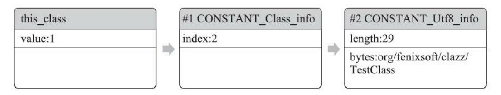

图6-6 类索引查找全限定名的过程

对于接口索引集合,入口的第一项u2类型的数据为接口计数器(interfaces\_count),表示索引表 的容量。如果该类没有实现任何接口,则该计数器值为0,后面接口的索引表不再占用任何字节。代码 清单6-1中的代码的类索引、父类索引与接口表索引的内容如图6-7所示。

图6-7 类索引、父类索引、接口索引集合

从偏移地址0x000000F1开始的3个u2类型的值分别为0x0001、0x0003、0x0000,也就是类索引为 1,父类索引为3,接口索引集合大小为0。查询前面代码清单6-2中javap命令计算出来的常量池,找出 对应的类和父类的常量,结果如代码清单6-3所示。

代码清单6-3 部分常量池内容

```
const #1 = class #2; // org/fenixsoft/clazz/TestClass
const #2 = Asciz org/fenixsoft/clazz/TestClass;
const #3 = class #4; // java/lang/Object
```

# 6.3.5 字段表集合

字段表(field\_info)用于描述接口或者类中声明的变量。Java语言中的"字段"(Field)包括类级变 量以及实例级变量,但不包括在方法内部声明的局部变量。读者可以回忆一下在Java语言中描述一个 字段可以包含哪些信息。字段可以包括的修饰符有字段的作用域(public、private、protected修饰 符)、是实例变量还是类变量(static修饰符)、可变性(final)、并发可见性(volatile修饰符,是否 强制从主内存读写)、可否被序列化(transient修饰符)、字段数据类型(基本类型、对象、数组)、 字段名称。上述这些信息中,各个修饰符都是布尔值,要么有某个修饰符,要么没有,很适合使用标 志位来表示。而字段叫做什么名字、字段被定义为什么数据类型,这些都是无法固定的,只能引用常 量池中的常量来描述。表6-8中列出了字段表的最终格式。

| 类 型 | 名 称              | 数 量 | 类型             | 名 称              | 数 量              |
|-----|------------------|-----|----------------|------------------|------------------|
| u2  | access_flags     | 1   | u2             | attributes_count | 1                |
| u2  | u2 name_index    |     | attribute_info | attributes       | attributes_count |
| u2  | descriptor_index | 1   |                |                  |                  |

表6-8 字段表结构

字段修饰符放在access\_flags项目中,它与类中的access\_flags项目是非常类似的,都是一个u2的数 据类型,其中可以设置的标志位和含义如表6-9所示。

| 标志名称          | 标志值    | 含 义            | 标志名称          | 标志值    | 含 义              |
|---------------|--------|----------------|---------------|--------|------------------|
| ACC_PUBLIC    | 0x0001 | 字段是否 public    | ACC_VOLATILE  | 0x0040 | 字段是否 volatile    |
| ACC_PRIVATE   | 0x0002 | 字段是否 private   | ACC_TRANSIENT | 0x0080 | 字段是否 transient   |
| ACC_PROTECTED | 0x0004 | 字段是否 protected | ACC_SYNTHETIC | 0x1000 | 字段是否由编译器<br>自动产生 |
| ACC_STATIC    | 0x0008 | 字段是否 static    | ACC_ENUM      | 0x4000 | 字段是否 enum        |
| ACC_FINAL     | 0x0010 | 字段是否 final     |               |        |                  |

表6-9 字段访问标志

很明显,由于语法规则的约束,ACC\_PUBLIC、ACC\_PRIVATE、ACC\_PROTECTED三个标志最 多只能选择其一,ACC\_FINAL、ACC\_VOLATILE不能同时选择。接口之中的字段必须有 ACC\_PUBLIC、ACC\_STATIC、ACC\_FINAL标志,这些都是由Java本身的语言规则所导致的。

跟随access\_flags标志的是两项索引值:name\_index和descriptor\_index。它们都是对常量池项的引 用,分别代表着字段的简单名称以及字段和方法的描述符。现在需要解释一下"简单名称""描述符"以 及前面出现过多次的"全限定名"这三种特殊字符串的概念。

全限定名和简单名称很好理解,以代码清单6-1中的代码为例,"org/fenixsoft/clazz/TestClass"是这

个类的全限定名,仅仅是把类全名中的"."替换成了"/"而已,为了使连续的多个全限定名之间不产生混 淆,在使用时最后一般会加入一个";"号表示全限定名结束。简单名称则就是指没有类型和参数修饰 的方法或者字段名称,这个类中的inc()方法和m字段的简单名称分别就是"inc"和"m"。

相比于全限定名和简单名称,方法和字段的描述符就要复杂一些。描述符的作用是用来描述字段 的数据类型、方法的参数列表(包括数量、类型以及顺序)和返回值。根据描述符规则,基本数据类 型(byte、char、double、float、int、long、short、boolean)以及代表无返回值的void类型都用一个大 写字符来表示,而对象类型则用字符L加对象的全限定名来表示,详见表6-10。

| 标识字符 | 含 义         | 标识字符 | 含 义                       |
|------|-------------|------|---------------------------|
| В    | 基本类型 byte   | J    | 基本类型 long                 |
| С    | 基本类型 char   | S    | 基本类型 short                |
| D    | 基本类型 double | Z    | 基本类型 boolean              |
| F    | 基本类型 float  | VΘ   | 特殊类型 void                 |
| I    | 基本类型 int    | L    | 对象类型,如 Ljava/lang/Object; |

表6-10 描述符标识字符含义

注:void类型在《Java虚拟机规范》之中单独列出为"VoidDescriptor",笔者为了结构统一,将其列 在基本数据类型中一起描述。

对于数组类型,每一维度将使用一个前置的"["字符来描述,如一个定义为"java.lang.String[][]"类型 的二维数组将被记录成"[[Ljava/lang/String;",一个整型数组"int[]"将被记录成"[I"。

用描述符来描述方法时,按照先参数列表、后返回值的顺序描述,参数列表按照参数的严格顺序 放在一组小括号"()"之内。如方法void inc()的描述符为"()V",方法java.lang.String toString()的描述符 为"()Ljava/lang/String;",方法int indexOf(char[]source,int sourceOffset,int sourceCount,char[]target, int targetOffset,int targetCount,int fromIndex)的描述符为"([CII[CIII)I"。

对于代码清单6-1所编译的TestClass.class文件来说,字段表集合从地址0x000000F8开始,第一个u2 类型的数据为容量计数器fields\_count,如图6-8所示,其值为0x0001,说明这个类只有一个字段表数 据。接下来紧跟着容量计数器的是access\_flags标志,值为0x0002,代表private修饰符的ACC\_PRIVATE 标志位为真(ACC\_PRIVATE标志的值为0x0002),其他修饰符为假。代表字段名称的name\_index的值 为0x0005,从代码清单6-2列出的常量表中可查得第五项常量是一个CONSTANT\_Utf8\_info类型的字符 串,其值为"m",代表字段描述符的descriptor\_index的值为0x0006,指向常量池的字符串"I"。根据这些 信息,我们可以推断出原代码定义的字段为"private int m;"。

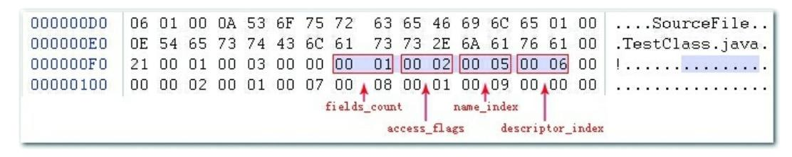

### 图6-8 字段表结构实例

字段表所包含的固定数据项目到descriptor\_index为止就全部结束了,不过在descrip-tor\_index之后 跟随着一个属性表集合,用于存储一些额外的信息,字段表可以在属性表中附加描述零至多项的额外 信息。对于本例中的字段m,它的属性表计数器为0,也就是没有需要额外描述的信息,但是,如果将 字段m的声明改为"final static int m=123;",那就可能会存在一项名称为ConstantValue的属性,其值指 向常量123。关于attribute\_info的其他内容,将在6.3.7节介绍属性表的数据项目时再做进一步讲解。

字段表集合中不会列出从父类或者父接口中继承而来的字段,但有可能出现原本Java代码之中不 存在的字段,譬如在内部类中为了保持对外部类的访问性,编译器就会自动添加指向外部类实例的字 段。另外,在Java语言中字段是无法重载的,两个字段的数据类型、修饰符不管是否相同,都必须使 用不一样的名称,但是对于Class文件格式来讲,只要两个字段的描述符不是完全相同,那字段重名就 是合法的。

# 6.3.6 方法表集合

如果理解了上一节关于字段表的内容,那本节关于方法表的内容将会变得很简单。Class文件存储 格式中对方法的描述与对字段的描述采用了几乎完全一致的方式,方法表的结构如同字段表一样,依 次包括访问标志(access\_flags)、名称索引(name\_index)、描述符索引(descriptor\_index)、属性表 集合(attributes)几项,如表6-11所示。这些数据项目的含义也与字段表中的非常类似,仅在访问标 志和属性表集合的可选项中有所区别。

| 类 型 | 名 称              | 数量 | 类型             | 名 称              | 数 量              |
|-----|------------------|----|----------------|------------------|------------------|
| u2  | access_flags     | 1  | u2             | attributes_count | 1                |
| u2  | u2 name_index    |    | attribute_info | attributes       | attributes_count |
| u2  | descriptor_index | 1  |                |                  |                  |

表6-11 方法表结构

因为volatile关键字和transient关键字不能修饰方法,所以方法表的访问标志中没有了 ACC\_VOLATILE标志和ACC\_TRANSIENT标志。与之相对,synchronized、native、strictfp和abstract 关键字可以修饰方法,方法表的访问标志中也相应地增加了ACC\_SYNCHRONIZED、 ACC\_NATIVE、ACC\_STRICTFP和ACC\_ABSTRACT标志。对于方法表,所有标志位及其取值可参见 表6-12。

| 标 志 名 称          | 标志值    | 含 义                |  |  |
|------------------|--------|--------------------|--|--|
| ACC_PUBLIC       | 0x0001 | 方法是否为 public       |  |  |
| ACC_PRIVATE      | 0x0002 | 方法是否为 private      |  |  |
| ACC_PROTECTED    | 0x0004 | 方法是否为 protected    |  |  |
| ACC_STATIC       | 0x0008 | 方法是否为 static       |  |  |
| ACC_FINAL        | 0x0010 | 方法是否为 final        |  |  |
| ACC_SYNCHRONIZED | 0x0020 | 方法是否为 synchronized |  |  |
| ACC_BRIDGE       | 0x0040 | 方法是不是由编译器产生的桥接方法   |  |  |
| ACC_VARARGS      | 0x0080 | 方法是否接受不定参数         |  |  |
| ACC_NATIVE       | 0x0100 | 方法是否为 native       |  |  |
| ACC_ABSTRACT     | 0x0400 | 方法是否为 abstract     |  |  |
| Loo omprom       |        | 2-14 H T N         |  |  |

表6-12 方法访问标志

行文至此,也许有的读者会产生疑问,方法的定义可以通过访问标志、名称索引、描述符索引来 表达清楚,但方法里面的代码去哪里了?方法里的Java代码,经过Javac编译器编译成字节码指令之 后,存放在方法属性表集合中一个名为"Code"的属性里面,属性表作为Class文件格式中最具扩展性的 一种数据项目,将在下一节中详细讲解。

我们继续以代码清单6-1中的Class文件为例对方法表集合进行分析。如图6-9所示,方法表集合的 入口地址为0x00000101,第一个u2类型的数据(即计数器容量)的值为0x0002,代表集合中有两个方 法,这两个方法为编译器添加的实例构造器<init>和源码中定义的方法inc()。第一个方法的访问标志值 为0x0001,也就是只有ACC\_PUBLIC标志为真,名称索引值为0x0007,查代码清单6-2的常量池得方法 名为"<init>",描述符索引值为0x0008,对应常量为"()V",属性表计数器attributes\_count的值为 0x0001,表示此方法的属性表集合有1项属性,属性名称的索引值为0x0009,对应常量为"Code",说明 此属性是方法的字节码描述。

图6-9 方法表结构实例

与字段表集合相对应地,如果父类方法在子类中没有被重写(Override),方法表集合中就不会出 现来自父类的方法信息。但同样地,有可能会出现由编译器自动添加的方法,最常见的便是类构造 器"<clinit>()"方法和实例构造器"<init>()"方法[1]。

在Java语言中,要重载(Overload)一个方法,除了要与原方法具有相同的简单名称之外,还要求 必须拥有一个与原方法不同的特征签名[2]。特征签名是指一个方法中各个参数在常量池中的字段符号 引用的集合,也正是因为返回值不会包含在特征签名之中,所以Java语言里面是无法仅仅依靠返回值 的不同来对一个已有方法进行重载的。但是在Class文件格式之中,特征签名的范围明显要更大一些, 只要描述符不是完全一致的两个方法就可以共存。也就是说,如果两个方法有相同的名称和特征签 名,但返回值不同,那么也是可以合法共存于同一个Class文件中的。

- [1] <init>()和<clinit>()的详细内容见本书的下一部分"前端编译与优化"。
- [2] 在《Java虚拟机规范》第2版的4.4.4节及《Java语言规范》第3版的8.4.2节中分别都定义了字节码层 面的方法特征签名以及Java代码层面的方法特征签名,Java代码的方法特征签名只包括方法名称、参数 顺序及参数类型,而字节码的特征签名还包括方法返回值以及受查异常表,请读者根据上下文语境注 意区分。

# 6.3.7 属性表集合

属性表(attribute\_info)在前面的讲解之中已经出现过数次,Class文件、字段表、方法表都可以 携带自己的属性表集合,以描述某些场景专有的信息。

与Class文件中其他的数据项目要求严格的顺序、长度和内容不同,属性表集合的限制稍微宽松一 些,不再要求各个属性表具有严格顺序,并且《Java虚拟机规范》允许只要不与已有属性名重复,任 何人实现的编译器都可以向属性表中写入自己定义的属性信息,Java虚拟机运行时会忽略掉它不认识 的属性。为了能正确解析Class文件,《Java虚拟机规范》最初只预定义了9项所有Java虚拟机实现都应 当能识别的属性,而在最新的《Java虚拟机规范》的Java SE 12版本中,预定义属性已经增加到29项, 这些属性具体见表6-13。后文中将对这些属性中的关键的、常用的部分进行讲解。

表6-13 虚拟机规范预定义的属性

| 属性名称                   | 使用位置      | 含 义                                                                                                                                                                                             |
|------------------------|-----------|-------------------------------------------------------------------------------------------------------------------------------------------------------------------------------------------------|
| Code                   | 方法表       | Java 代码编译成的字节码指令                                                                                                                                                                                |
| ConstantValue          | 字段表       | 由 final 关键字定义的常量值                                                                                                                                                                               |
| Deprecated             | 类、方法表、字段表 | 被声明为 deprecated 的方法和字段                                                                                                                                                                          |
| Exceptions             | 方法表       | 方法抛出的异常列表                                                                                                                                                                                       |
| EnclosingMethod        | 类文件       | 仅当一个类为局部类或者匿名类时才能拥有这个<br>属性,这个属性用于标示这个类所在的外围方法                                                                                                                                                  |
| InnerClasses           | 类文件       | 内部类列表                                                                                                                                                                                           |
| LineNumberTable        | Code 属性   | Java 源码的行号与字节码指令的对应关系                                                                                                                                                                           |
| LocalVariableTable     | Code 属性   | 方法的局部变量描述                                                                                                                                                                                       |
| StackMapTable          | Code 属性   | JDK 6 中新增的属性,供新的类型检查验证器<br>(Type Checker)检查和处理目标方法的局部变量和操<br>作数栈所需要的类型是否匹配                                                                                                                      |
| Signature              | 类、方法表、字段表 | JDK 5 中新增的属性,用于支持范型情况下的方法签名。在 Java 语言中,任何类、接口、初始化方法或成员的泛型签名如果包含了类型变量(Type Variables)或参数化类型(Parameterized Types),则Signature 属性会为它记录泛型签名信息。由于 Java 的范型采用擦除法实现,为了避免类型信息被擦除后导致签名混乱,需要这个属性记录范型中的相关信息 |
| SourceFile             | 类文件       | 记录源文件名称                                                                                                                                                                                         |
| SourceDebugExtension   | 类文件       | JDK 5 中新增的属性,用于存储额外的调试信息。<br>譬如在进行 JSP 文件调试时,无法通过 Java 堆栈来<br>定位到 JSP 文件的行号,JSR 45 提案为这些非 Java<br>语言编写,却需要编译成字节码并运行在 Java 虚拟<br>机中的程序提供了一个进行调试的标准机制,使用该<br>属性就可以用于存储这个标准所新加入的调试信息               |
| Synthetic              | 类、方法表、字段表 | 标识方法或字段为编译器自动生成的                                                                                                                                                                                |
| LocalVariableTypeTable | 类         | JDK 5 中新增的属性,它使用特征签名代替描述符,是为了引入泛型语法之后能描述泛型参数化类型而添加                                                                                                                                              |

| 属性名称                                      | 使用位置                  | 含 义                                                                                                           |
|-------------------------------------------|-----------------------|---------------------------------------------------------------------------------------------------------------|
| RuntimeVisibleAnnotations                 | 类、方法表、字段表             | JDK 5 中新增的属性, 为动态注解提供支持。该属性用于指明哪些注解是运行时(实际上运行时就是进行反射调用)可见的                                                    |
| RuntimeInvisibleAnnotations               | 类、方法表、字段表             | JDK 5 中新增的属性,与 Runtime Visible Annotations 属性作用刚好相反,用于指明哪些注解是运行时不可见的                                          |
| RuntimeVisibleParameterAnnotations        | 方法表                   | JDK 5 中新增的属性,作用与RuntimeVisible-Annotations属性类似,只不过作用对象为方法参数                                                   |
| RuntimeInvisibleParameter-<br>Annotations | 方法表                   | JDK 5 中新增的属性,作用与 RuntimeInvisible-<br>Annotations 属性类似,只不过作用对象为方法参数                                           |
| AnnotationDefault                         | 方法表                   | JDK 5 中新增的属性,用于记录注解类元素的默认值                                                                                    |
| BootstrapMethods                          | 类文件                   | JDK 7 中新增的属性,用于保存 invokedynamic 指令引用的引导方法限定符                                                                  |
| RuntimeVisibleTypeAnnotations             | 类、方法表、字段表,<br>Code 属性 | JDK 8 中新增的属性, 为实现 JSR 308 中新增的类型注解提供的支持, 用于指明哪些类注解是运行时(实际上运行时就是进行反射调用)可见的                                     |
| RuntimeInvisibleTypeAnnotations           | 类、方法表、字段表,<br>Code 属性 | JDK 8 中新增的属性,为实现 JSR 308 中新增的<br>类型注解提供的支持,与 RuntimeVisibleTypeAnno-<br>tations 属性作用刚好相反,用于指明哪些注解是运行<br>时不可见的 |
| MethodParameters                          | 方法表                   | JDK 8 中新增的属性,用于支持(编译时加上-parameters 参数)将方法名称编译进 Class 文件中,并可运行时获取。此前要获取方法名称(典型的如IDE 的代码提示)只能通过 JavaDoc 中得到     |
| Module                                    | 类                     | JDK 9 中新增的属性,用于记录一个 Module 的名称以及相关信息 (requires、exports、opens、uses、provides)                                   |
| ModulePackages                            | 类                     | JDK 9 中新增的属性,用于记录一个模块中所有被 exports 或者 opens 的包                                                                 |
| ModuleMainClass                           | 类                     | JDK 9 中新增的属性,用于指定一个模块的主类                                                                                      |
| NestHost                                  | 类                     | JDK 11 中新增的属性,用于支持嵌套类 (Java 中的内部类)的反射和访问控制的 API,一个内部类通过该属性得知自己的宿主类                                            |
| NestMembers                               | 类                     | JDK 11 中新增的属性,用于支持嵌套类 (Java 中的内部类)的反射和访问控制的 API,一个宿主类通过该属性得知自己有哪些内部类                                          |

对于每一个属性,它的名称都要从常量池中引用一个CONSTANT\_Utf8\_info类型的常量来表示, 而属性值的结构则是完全自定义的,只需要通过一个u4的长度属性去说明属性值所占用的位数即可。 一个符合规则的属性表应该满足表6-14中所定义的结构。

表6-14 属性表结构

| 类型 | 名 称                  | 数量               |
|----|----------------------|------------------|
| u2 | attribute_name_index | 1                |
| u4 | attribute_length     | 1                |
| ul | info                 | attribute_length |

#### 1.Code属性

Java程序方法体里面的代码经过Javac编译器处理之后,最终变为字节码指令存储在Code属性内。 Code属性出现在方法表的属性集合之中,但并非所有的方法表都必须存在这个属性,譬如接口或者抽 象类中的方法就不存在Code属性,如果方法表有Code属性存在,那么它的结构将如表6-15所示。

表6-15 Code属性表的结构

| 类型             | 名 称                    | 数量                     |
|----------------|------------------------|------------------------|
| u2             | attribute_name_index   | 1                      |
| u4             | attribute_length       | Ī                      |
| u2             | max_stack              | 1                      |
| u2             | max_locals             | Ī                      |
| u4             | code_length            | 1                      |
| ul             | code                   | code_length            |
| u2             | exception_table_length | 1                      |
| exception_info | exception_table        | exception_table_length |
| u2             | attributes_count       | 1                      |
| attribute_info | attributes             | attributes_count       |

attribute\_name\_index是一项指向CONSTANT\_Utf8\_info型常量的索引,此常量值固定为"Code",它 代表了该属性的属性名称,attribute\_length指示了属性值的长度,由于属性名称索引与属性长度一共为 6个字节,所以属性值的长度固定为整个属性表长度减去6个字节。

max\_stack代表了操作数栈(Operand Stack)深度的最大值。在方法执行的任意时刻,操作数栈都 不会超过这个深度。虚拟机运行的时候需要根据这个值来分配栈帧(Stack Frame)中的操作栈深度。

max\_locals代表了局部变量表所需的存储空间。在这里,max\_locals的单位是变量槽(Slot),变量 槽是虚拟机为局部变量分配内存所使用的最小单位。对于byte、char、float、int、short、boolean和 returnAddress等长度不超过32位的数据类型,每个局部变量占用一个变量槽,而double和long这两种64 位的数据类型则需要两个变量槽来存放。方法参数(包括实例方法中的隐藏参数"this")、显式异常处 理程序的参数(Exception Handler Parameter,就是try-catch语句中catch块中所定义的异常)、方法体中 定义的局部变量都需要依赖局部变量表来存放。注意,并不是在方法中用了多少个局部变量,就把这 些局部变量所占变量槽数量之和作为max\_locals的值,操作数栈和局部变量表直接决定一个该方法的栈 帧所耗费的内存,不必要的操作数栈深度和变量槽数量会造成内存的浪费。Java虚拟机的做法是将局 部变量表中的变量槽进行重用,当代码执行超出一个局部变量的作用域时,这个局部变量所占的变量 槽可以被其他局部变量所使用,Javac编译器会根据变量的作用域来分配变量槽给各个变量使用,根据 同时生存的最大局部变量数量和类型计算出max\_locals的大小。

code\_length和code用来存储Java源程序编译后生成的字节码指令。code\_length代表字节码长度, code是用于存储字节码指令的一系列字节流。既然叫字节码指令,那顾名思义每个指令就是一个u1类 型的单字节,当虚拟机读取到code中的一个字节码时,就可以对应找出这个字节码代表的是什么指 令,并且可以知道这条指令后面是否需要跟随参数,以及后续的参数应当如何解析。我们知道一个u1 数据类型的取值范围为0x00~0xFF,对应十进制的0~255,也就是一共可以表达256条指令。目前, 《Java虚拟机规范》已经定义了其中约200条编码值对应的指令含义,编码与指令之间的对应关系可查 阅本书的附录C"虚拟机字节码指令表"。

关于code\_length,有一件值得注意的事情,虽然它是一个u4类型的长度值,理论上最大值可以达 到2的32次幂,但是《Java虚拟机规范》中明确限制了一个方法不允许超过65535条字节码指令,即它 实际只使用了u2的长度,如果超过这个限制,Javac编译器就会拒绝编译。一般来讲,编写Java代码时 只要不是刻意去编写一个超级长的方法来为难编译器,是不太可能超过这个最大值的限制的。但是, 某些特殊情况,例如在编译一个很复杂的JSP文件时,某些JSP编译器会把JSP内容和页面输出的信息归 并于一个方法之中,就有可能因为方法生成字节码超长的原因而导致编译失败。

Code属性是Class文件中最重要的一个属性,如果把一个Java程序中的信息分为代码(Code,方法 体里面的Java代码)和元数据(Metadata,包括类、字段、方法定义及其他信息)两部分,那么在整 个Class文件里,Code属性用于描述代码,所有的其他数据项目都用于描述元数据。了解Code属性是学 习后面两章关于字节码执行引擎内容的必要基础,能直接阅读字节码也是工作中分析Java代码语义问 题的必要工具和基本技能,为此,笔者准备了一个比较详细的实例来讲解虚拟机是如何使用这个属性 的。

继续以代码清单6-1的TestClass.class文件为例,如图6-10所示,这是上一节分析过的实例构造 器"<init>()"方法的Code属性。它的操作数栈的最大深度和本地变量表的容量都为0x0001,字节码区域 所占空间的长度为0x0005。虚拟机读取到字节码区域的长度后,按照顺序依次读入紧随的5个字节,并 根据字节码指令表翻译出所对应的字节码指令。翻译"2A B7000A B1"的过程为:

- 1)读入2A,查表得0x2A对应的指令为aload\_0,这个指令的含义是将第0个变量槽中为reference类 型的本地变量推送到操作数栈顶。
- 2)读入B7,查表得0xB7对应的指令为invokespecial,这条指令的作用是以栈顶的reference类型的 数据所指向的对象作为方法接收者,调用此对象的实例构造器方法、private方法或者它的父类的方

法。这个方法有一个u2类型的参数说明具体调用哪一个方法,它指向常量池中的一个 CONSTANT\_Methodref\_info类型常量,即此方法的符号引用。

- 3)读入000A,这是invokespecial指令的参数,代表一个符号引用,查常量池得0x000A对应的常量 为实例构造器"<init>()"方法的符号引用。
- 4)读入B1,查表得0xB1对应的指令为return,含义是从方法的返回,并且返回值为void。这条指 令执行后,当前方法正常结束。

图6-10 Code属性结构实例

这段字节码虽然很短,但我们可以从中看出它执行过程中的数据交换、方法调用等操作都是基于 栈(操作数栈)的。我们可以初步猜测,Java虚拟机执行字节码应该是基于栈的体系结构。但又发现 与通常基于栈的指令集里都是无参数的又不太一样,某些指令(如invokespecial)后面还会带有参数, 关于虚拟机字节码执行的讲解是后面两章的话题,我们不妨把这里的疑问放到第8章去解决。

我们再次使用javap命令把此Class文件中的另一个方法的字节码指令也计算出来,结果如代码清单 6-4所示。

#### 代码清单6-4 用Javap命令计算字节码指令

```
// 原始Java代码
public class TestClass {
   private int m;
   public int inc() {
       return m + 1;
C:\>javap -verbose TestClass
// 常量表部分的输出见代码清单6-1,因版面原因这里省略掉
{
public org.fenixsoft.clazz.TestClass();
   Code:
       Stack=1, Locals=1, Args_size=1
       0: aload_0
       1: invokespecial #10; //Method java/lang/Object."<init>":()V
       4: return
   LineNumberTable:
       line 3: 0
   LocalVariableTable:
       Start Length Slot Name Signature
       0 5 0 this Lorg/fenixsoft/clazz/TestClass;
public int inc();
   Code:
       Stack=2, Locals=1, Args_size=1
       0: aload_0
```

```
1: getfield #18; //Field m:I
   4: iconst_1
   5: iadd
   6: ireturn
LineNumberTable:
   line 8: 0
LocalVariableTable:
   Start Length Slot Name Signature
   0 7 0 this Lorg/fenixsoft/clazz/TestClass;
```

如果大家注意到javap中输出的"Args\_size"的值,可能还会有疑问:这个类有两个方法——实例构 造器<init>()和inc(),这两个方法很明显都是没有参数的,为什么Args\_size会为1?而且无论是在参数列 表里还是方法体内,都没有定义任何局部变量,那Locals又为什么会等于1?如果有这样疑问的读者, 大概是忽略了一条Java语言里面的潜规则:在任何实例方法里面,都可以通过"this"关键字访问到此方 法所属的对象。这个访问机制对Java程序的编写很重要,而它的实现非常简单,仅仅是通过在Javac编 译器编译的时候把对this关键字的访问转变为对一个普通方法参数的访问,然后在虚拟机调用实例方法 时自动传入此参数而已。因此在实例方法的局部变量表中至少会存在一个指向当前对象实例的局部变 量,局部变量表中也会预留出第一个变量槽位来存放对象实例的引用,所以实例方法参数值从1开始计 算。这个处理只对实例方法有效,如果代码清单6-1中的inc()方法被声明为static,那Args\_size就不会等 于1而是等于0了。

在字节码指令之后的是这个方法的显式异常处理表(下文简称"异常表")集合,异常表对于Code 属性来说并不是必须存在的,如代码清单6-4中就没有异常表生成。

如果存在异常表,那它的格式应如表6-16所示,包含四个字段,这些字段的含义为:如果当字节 码从第start\_pc行[1]到第end\_pc行之间(不含第end\_pc行)出现了类型为catch\_type或者其子类的异常 (catch\_type为指向一个CONSTANT\_Class\_info型常量的索引),则转到第handler\_pc行继续处理。当 catch\_type的值为0时,代表任意异常情况都需要转到handler\_pc处进行处理。

| 类 型 | 名 称      | 数量 | 类 型 | 名 称        | 数量 |
|-----|----------|----|-----|------------|----|
| u2  | start_pc | 1  | u2  | handler_pc | 1  |
| u2  | end_pc   | 1  | u2  | catch_type | Ī  |

表6-16 属性表结构

异常表实际上是Java代码的一部分,尽管字节码中有最初为处理异常而设计的跳转指令,但《Java 虚拟机规范》中明确要求Java语言的编译器应当选择使用异常表而不是通过跳转指令来实现Java异常及 finally处理机制[2]。

代码清单6-5是一段演示异常表如何运作的例子,这段代码主要演示了在字节码层面try-catchfinally是如何体现的。阅读字节码之前,大家不妨先看看下面的Java源码,想一下这段代码的返回值在 出现异常和不出现异常的情况下分别应该是多少?

代码清单6-5 异常表运作演示

```
// Java源码
public int inc() {
   int x;
   try {
      x = 1;
      return x;
   } catch (Exception e) {
      x = 2;
      return x;
   } finally {
      x = 3;
// 编译后的ByteCode字节码及异常表
public int inc();
   Code:
      Stack=1, Locals=5, Args_size=1
      0: iconst_1 // try块中的x=1
      1: istore_1
      2: iload_1 // 保存x到returnValue中,此时x=1
      3: istore 4
      5: iconst_3 // finaly块中的x=3
      6: istore_1
      7: iload 4 // 将returnValue中的值放到栈顶,准备给ireturn返回
      9: ireturn
      10: astore_2 // 给catch中定义的Exception e赋值,存储在变量槽 2中
      11: iconst_2 // catch块中的x=2
      12: istore_1
      13: iload_1 // 保存x到returnValue中,此时x=2
      14: istore 4
      16: iconst_3 // finaly块中的x=3
      17: istore_1
      18: iload 4 // 将returnValue中的值放到栈顶,准备给ireturn返回
      20: ireturn
      21: astore_3 // 如果出现了不属于java.lang.Exception及其子类的异常才会走到这里
      22: iconst_3 // finaly块中的x=3
      23: istore_1
      24: aload_3 // 将异常放置到栈顶,并抛出
      25: athrow
   Exception table:
   from to target type
      0 5 10 Class java/lang/Exception
      0 5 21 any
      10 16 21 any
```

编译器为这段Java源码生成了三条异常表记录,对应三条可能出现的代码执行路径。从Java代码的 语义上讲,这三条执行路径分别为:

- ·如果try语句块中出现属于Exception或其子类的异常,转到catch语句块处理;
- ·如果try语句块中出现不属于Exception或其子类的异常,转到finally语句块处理;
- ·如果catch语句块中出现任何异常,转到finally语句块处理。

返回到我们上面提出的问题,这段代码的返回值应该是多少?熟悉Java语言的读者应该很容易说 出答案:如果没有出现异常,返回值是1;如果出现了Exception异常,返回值是2;如果出现了 Exception以外的异常,方法非正常退出,没有返回值。我们一起来分析一下字节码的执行过程,从字 节码的层面上看看为何会有这样的返回结果。

字节码中第0~4行所做的操作就是将整数1赋值给变量x,并且将此时x的值复制一份副本到最后一 个本地变量表的变量槽中(这个变量槽里面的值在ireturn指令执行前将会被重新读到操作栈顶,作为

方法返回值使用。为了讲解方便,笔者给这个变量槽起个名字:returnValue)。如果这时候没有出现异 常,则会继续走到第5~9行,将变量x赋值为3,然后将之前保存在returnValue中的整数1读入到操作栈 顶,最后ireturn指令会以int形式返回操作栈顶中的值,方法结束。如果出现了异常,PC寄存器指针转 到第10行,第10~20行所做的事情是将2赋值给变量x,然后将变量x此时的值赋给returnValue,最后再 将变量x的值改为3。方法返回前同样将returnValue中保留的整数2读到了操作栈顶。从第21行开始的代 码,作用是将变量x的值赋为3,并将栈顶的异常抛出,方法结束。

尽管大家都知道这段代码出现异常的概率非常之小,但是并不影响它为我们演示异常表的作用。 如果大家到这里仍然对字节码的运作过程比较模糊,其实也不要紧,关于虚拟机执行字节码的过程, 本书第8章中将会有更详细的讲解。

### 2.Exceptions属性

这里的Exceptions属性是在方法表中与Code属性平级的一项属性,读者不要与前面刚刚讲解完的异 常表产生混淆。Exceptions属性的作用是列举出方法中可能抛出的受查异常(Checked Excepitons),也 就是方法描述时在throws关键字后面列举的异常。它的结构见表6-17。

| 类型 | 名 称                   | 数量                   |
|----|-----------------------|----------------------|
| u2 | attribute_name_index  | 1                    |
| u4 | attribute_length      | 1                    |
| u2 | number_of_exceptions  | 1                    |
| u2 | exception_index_table | number_of_exceptions |

表6-17 Exceptions属性结构

此属性中的number\_of\_exceptions项表示方法可能抛出number\_of\_exceptions种受查异常,每一种受 查异常使用一个exception\_index\_table项表示;exception\_index\_table是一个指向常量池中 CONSTANT\_Class\_info型常量的索引,代表了该受查异常的类型。

#### 3.LineNumberTable属性

LineNumberTable属性用于描述Java源码行号与字节码行号(字节码的偏移量)之间的对应关系。 它并不是运行时必需的属性,但默认会生成到Class文件之中,可以在Javac中使用-g:none或-g:lines 选项来取消或要求生成这项信息。如果选择不生成LineNumberTable属性,对程序运行产生的最主要影 响就是当抛出异常时,堆栈中将不会显示出错的行号,并且在调试程序的时候,也无法按照源码行来 设置断点。LineNumberTable属性的结构如表6-18所示。

表6-18 LineNumberTable属性结构

| 类 型              | 名 称                      | 数量                       |
|------------------|--------------------------|--------------------------|
| u2               | attribute_name_index     | 1                        |
| u4               | attribute_length         | 1                        |
| u2               | line_number_table_length | 1                        |
| line_number_info | line_number_table        | line_number_table_length |

line\_number\_table是一个数量为line\_number\_table\_length、类型为line\_number\_info的集合, line\_number\_info表包含start\_pc和line\_number两个u2类型的数据项,前者是字节码行号,后者是Java源 码行号。

### 4.LocalVariableTable及LocalVariableTypeTable属性

LocalVariableTable属性用于描述栈帧中局部变量表的变量与Java源码中定义的变量之间的关系,它 也不是运行时必需的属性,但默认会生成到Class文件之中,可以在Javac中使用-g:none或-g:vars选项 来取消或要求生成这项信息。如果没有生成这项属性,最大的影响就是当其他人引用这个方法时,所 有的参数名称都将会丢失,譬如IDE将会使用诸如arg0、arg1之类的占位符代替原有的参数名,这对程 序运行没有影响,但是会对代码编写带来较大不便,而且在调试期间无法根据参数名称从上下文中获 得参数值。LocalVariableTable属性的结构如表6-19所示。

表6-19 LocalVariableTable属性结构

| 类型                  | 名 称                         | 数量                          |
|---------------------|-----------------------------|-----------------------------|
| u2                  | attribute_name_index        | 1                           |
| u4                  | attribute_length            | 1                           |
| u2                  | local_variable_table_length | 1                           |
| local_variable_info | local_variable_table        | local_variable_table_length |

其中local\_variable\_info项目代表了一个栈帧与源码中的局部变量的关联,结构如表6-20所示。

表6-20 local\_variable\_info项目结构

| 类 型 | 名 称              | 数量 |
|-----|------------------|----|
| u2  | start_pc         | 1  |
| u2  | length           | Ī  |
| u2  | name_index       | Ī  |
| u2  | descriptor_index | 1  |
| u2  | index            | 1  |

start\_pc和length属性分别代表了这个局部变量的生命周期开始的字节码偏移量及其作用范围覆盖 的长度,两者结合起来就是这个局部变量在字节码之中的作用域范围。

name\_index和descriptor\_index都是指向常量池中CONSTANT\_Utf8\_info型常量的索引,分别代表了 局部变量的名称以及这个局部变量的描述符。

index是这个局部变量在栈帧的局部变量表中变量槽的位置。当这个变量数据类型是64位类型时 (double和long),它占用的变量槽为index和index+1两个。

顺便提一下,在JDK 5引入泛型之后,LocalVariableTable属性增加了一个"姐妹属性"—— LocalVariableTypeTable。这个新增的属性结构与LocalVariableTable非常相似,仅仅是把记录的字段描述 符的descriptor\_index替换成了字段的特征签名(Signature)。对于非泛型类型来说,描述符和特征签名 能描述的信息是能吻合一致的,但是泛型引入之后,由于描述符中泛型的参数化类型被擦除掉[3],描 述符就不能准确描述泛型类型了。因此出现了LocalVariableTypeTable属性,使用字段的特征签名来完 成泛型的描述。

#### 5.SourceFile及SourceDebugExtension属性

SourceFile属性用于记录生成这个Class文件的源码文件名称。这个属性也是可选的,可以使用Javac 的-g:none或-g:source选项来关闭或要求生成这项信息。在Java中,对于大多数的类来说,类名和文 件名是一致的,但是有一些特殊情况(如内部类)例外。如果不生成这项属性,当抛出异常时,堆栈 中将不会显示出错代码所属的文件名。这个属性是一个定长的属性,其结构如表6-21所示。

| 类 型 | 名 称                  | 数量 |
|-----|----------------------|----|
| u2  | attribute_name_index | 1  |
| u4  | attribute_length     | 1  |
| u2  | sourcefile_index     | 1  |

表6-21 SourceFile属性结构

sourcefile\_index数据项是指向常量池中CONSTANT\_Utf8\_info型常量的索引,常量值是源码文件的 文件名。

为了方便在编译器和动态生成的Class中加入供程序员使用的自定义内容,在JDK 5时,新增了 SourceDebugExtension属性用于存储额外的代码调试信息。典型的场景是在进行JSP文件调试时,无法 通过Java堆栈来定位到JSP文件的行号。JSR 45提案为这些非Java语言编写,却需要编译成字节码并运 行在Java虚拟机中的程序提供了一个进行调试的标准机制,使用SourceDebugExtension属性就可以用于 存储这个标准所新加入的调试信息,譬如让程序员能够快速从异常堆栈中定位出原始JSP中出现问题的 行号。SourceDebugExtension属性的结构如表6-22所示。

### 表6-22 SourceDebugExtension属性结构

| 类 型 | 名 称                               | 数量 |
|-----|-----------------------------------|----|
| u2  | attribute_name_index              | 1  |
| u4  | attribute_length                  | 1  |
| u1  | debug_extension[attribute_length] | 1  |

其中debug\_extension存储的就是额外的调试信息,是一组通过变长UTF-8格式来表示的字符串。一 个类中最多只允许存在一个SourceDebugExtension属性。

### 6.ConstantValue属性

ConstantValue属性的作用是通知虚拟机自动为静态变量赋值。只有被static关键字修饰的变量(类 变量)才可以使用这项属性。类似"int x=123"和"static int x=123"这样的变量定义在Java程序里面是非 常常见的事情,但虚拟机对这两种变量赋值的方式和时刻都有所不同。对非static类型的变量(也就是 实例变量)的赋值是在实例构造器<init>()方法中进行的;而对于类变量,则有两种方式可以选择:在 类构造器<clinit>()方法中或者使用ConstantValue属性。目前Oracle公司实现的Javac编译器的选择是,如 果同时使用final和static来修饰一个变量(按照习惯,这里称"常量"更贴切),并且这个变量的数据类 型是基本类型或者java.lang.String的话,就将会生成ConstantValue属性来进行初始化;如果这个变量没 有被final修饰,或者并非基本类型及字符串,则将会选择在<clinit>()方法中进行初始化。

虽然有final关键字才更符合"ConstantValue"的语义,但《Java虚拟机规范》中并没有强制要求字段 必须设置ACC\_FINAL标志,只要求有ConstantValue属性的字段必须设置ACC\_STATIC标志而已,对 final关键字的要求是Javac编译器自己加入的限制。而对ConstantValue的属性值只能限于基本类型和 String这点,其实并不能算是什么限制,这是理所当然的结果。因为此属性的属性值只是一个常量池的 索引号,由于Class文件格式的常量类型中只有与基本属性和字符串相对应的字面量,所以就算 ConstantValue属性想支持别的类型也无能为力。ConstantValue属性的结构如表6-23所示。

| 类型 | 名 称                  | 数量 |
|----|----------------------|----|
| u2 | attribute_name_index | 1  |
| u4 | attribute_length     | 1  |
| u2 | constantvalue_index  | 1  |

表6-23 ConstantValue属性结构

从数据结构中可以看出ConstantValue属性是一个定长属性,它的attribute\_length数据项值必须固定 为2。constantvalue\_index数据项代表了常量池中一个字面量常量的引用,根据字段类型的不同,字面 量可以是CONSTANT\_Long\_info、CONSTANT\_Float\_info、CONSTANT\_Double\_info、 CONSTANT\_Integer\_info和CONSTANT\_String\_info常量中的一种。

#### 7.InnerClasses属性

InnerClasses属性用于记录内部类与宿主类之间的关联。如果一个类中定义了内部类,那编译器将 会为它以及它所包含的内部类生成InnerClasses属性。InnerClasses属性的结构如表6-24所示。

表6-24 InnerClasses属性结构

| 类型                 | 名 称                  | 数量                |
|--------------------|----------------------|-------------------|
| u2                 | attribute_name_index | 1                 |
| u4                 | attribute_length     | 1                 |
| u2                 | number_of_classes    | 1                 |
| inner_classes_info | inner_classes        | number_of_classes |

数据项number\_of\_classes代表需要记录多少个内部类信息,每一个内部类的信息都由一个 inner\_classes\_info表进行描述。inner\_classes\_info表的结构如表6-25所示。

表6-25 inner\_classes\_info表的结构

| 类型 | 名 称                      | 数量 |
|----|--------------------------|----|
| u2 | inner_class_info_index   | 1  |
| u2 | outer_class_info_index   | 1  |
| u2 | inner_name_index         | 1  |
| u2 | inner_class_access_flags | 1  |

inner\_class\_info\_index和outer\_class\_info\_index都是指向常量池中CONSTANT\_Class\_info型常量的索 引,分别代表了内部类和宿主类的符号引用。

inner\_name\_index是指向常量池中CONSTANT\_Utf8\_info型常量的索引,代表这个内部类的名称, 如果是匿名内部类,这项值为0。

inner\_class\_access\_flags是内部类的访问标志,类似于类的access\_flags,它的取值范围如表6-26所 示。

表6-26 inner\_class\_access\_flags标志

| 标志名称           | 标志值    | 含 义              |
|----------------|--------|------------------|
| ACC_PUBLIC     | 0x0001 | 内部类是否为 public    |
| ACC_PRIVATE    | 0x0002 | 内部类是否为 private   |
| ACC_PROTECTED  | 0x0004 | 内部类是否为 protected |
| ACC_STATIC     | 0x0008 | 内部类是否为 static    |
| ACC_FINAL      | 0x0010 | 内部类是否为 final     |
| ACC_INTERFACE  | 0x0020 | 内部类是否为接口         |
| ACC_ABSTRACT   | 0x0400 | 内部类是否为 abstract  |
| ACC_SYNTHETIC  | 0x1000 | 内部类是否并非由用户代码产生的  |
| ACC_ANNOTATION | 0x2000 | 内部类是不是一个注解       |
| ACC ENUM       | 0x4000 | 内部类是不是一个枚举       |

### 8.Deprecated及Synthetic属性

Deprecated和Synthetic两个属性都属于标志类型的布尔属性,只存在有和没有的区别,没有属性值 的概念。

Deprecated属性用于表示某个类、字段或者方法,已经被程序作者定为不再推荐使用,它可以通 过代码中使用"@deprecated"注解进行设置。

Synthetic属性代表此字段或者方法并不是由Java源码直接产生的,而是由编译器自行添加的,在 JDK 5之后,标识一个类、字段或者方法是编译器自动产生的,也可以设置它们访问标志中的 ACC\_SYNTHETIC标志位。编译器通过生成一些在源代码中不存在的Synthetic方法、字段甚至是整个 类的方式,实现了越权访问(越过private修饰器)或其他绕开了语言限制的功能,这可以算是一种早 期优化的技巧,其中最典型的例子就是枚举类中自动生成的枚举元素数组和嵌套类的桥接方法

(Bridge Method)。所有由不属于用户代码产生的类、方法及字段都应当至少设置Synthetic属性或者 ACC\_SYNTHETIC标志位中的一项,唯一的例外是实例构造器"<init>()"方法和类构造器"<clinit>()"方 法。

Deprecated和Synthetic属性的结构非常简单,如表6-27所示。

表6-27 Deprecated及Synthetic属性结构

| 类型 | 名 称                  | 数量 |
|----|----------------------|----|
| u2 | attribute_name_index | 1  |
| u4 | attribute_length     | 1  |

其中attribute\_length数据项的值必须为0x00000000,因为没有任何属性值需要设置。

### 9.StackMapTable属性

StackMapTable属性在JDK 6增加到Class文件规范之中,它是一个相当复杂的变长属性,位于Code 属性的属性表中。这个属性会在虚拟机类加载的字节码验证阶段被新类型检查验证器(Type Checker)使用(详见第7章字节码验证部分),目的在于代替以前比较消耗性能的基于数据流分析的 类型推导验证器。

这个类型检查验证器最初来源于Sheng Liang(听名字似乎是虚拟机团队中的华裔成员)实现为Java ME CLDC实现的字节码验证器。新的验证器在同样能保证Class文件合法性的前提下,省略了在运行 期通过数据流分析去确认字节码的行为逻辑合法性的步骤,而在编译阶段将一系列的验证类型

(Verification Type)直接记录在Class文件之中,通过检查这些验证类型代替了类型推导过程,从而大 幅提升了字节码验证的性能。这个验证器在JDK 6中首次提供,并在JDK 7中强制代替原本基于类型推 断的字节码验证器。关于这个验证器的工作原理,《Java虚拟机规范》在Java SE 7版中新增了整整120 页的篇幅来讲解描述,其中使用了庞大而复杂的公式化语言去分析证明新验证方法的严谨性,笔者在 此就不展开赘述了。

StackMapTable属性中包含零至多个栈映射帧(Stack Map Frame),每个栈映射帧都显式或隐式地 代表了一个字节码偏移量,用于表示执行到该字节码时局部变量表和操作数栈的验证类型。类型检查 验证器会通过检查目标方法的局部变量和操作数栈所需要的类型来确定一段字节码指令是否符合逻辑 约束。StackMapTable属性的结构如表6-28所示。

| 类型              | 名 称                     | 数量                |
|-----------------|-------------------------|-------------------|
| u2              | attribute_name_index    | 1                 |
| u4              | attribute_length        | 1                 |
| u2              | number_of_entries       | 1                 |
| stack_map_frame | stack_map_frame entries | number_of_entries |

表6-28 StackMapTable属性结构

在Java SE 7版之后的《Java虚拟机规范》中,明确规定对于版本号大于或等于50.0的Class文件,如 果方法的Code属性中没有附带StackMapTable属性,那就意味着它带有一个隐式的StackMap属性,这 个StackMap属性的作用等同于number\_of\_entries值为0的StackMapTable属性。一个方法的Code属性最 多只能有一个StackMapTable属性,否则将抛出ClassFormatError异常。

### 10.Signature属性

Signature属性在JDK 5增加到Class文件规范之中,它是一个可选的定长属性,可以出现于类、字段 表和方法表结构的属性表中。在JDK 5里面大幅增强了Java语言的语法,在此之后,任何类、接口、初 始化方法或成员的泛型签名如果包含了类型变量(Type Variable)或参数化类型(Parameterized Type),则Signature属性会为它记录泛型签名信息。之所以要专门使用这样一个属性去记录泛型类 型,是因为Java语言的泛型采用的是擦除法实现的伪泛型,字节码(Code属性)中所有的泛型信息编 译(类型变量、参数化类型)在编译之后都通通被擦除掉。使用擦除法的好处是实现简单(主要修改 Javac编译器,虚拟机内部只做了很少的改动)、非常容易实现Backport,运行期也能够节省一些类型 所占的内存空间。但坏处是运行期就无法像C#等有真泛型支持的语言那样,将泛型类型与用户定义的 普通类型同等对待,例如运行期做反射时无法获得泛型信息。Signature属性就是为了弥补这个缺陷而

增设的,现在Java的反射API能够获取的泛型类型,最终的数据来源也是这个属性。关于Java泛型、 Signature属性和类型擦除,在第10章讲编译器优化的时候我们会通过一个更具体的例子来讲解。 Signature属性的结构如表6-29所示。

|  | 表6-29 | Signature属性结构 |
|--|-------|---------------|
|--|-------|---------------|

| 类 型 | 名 称                  | 数量 |
|-----|----------------------|----|
| u2  | attribute_name_index | 1  |
| u4  | attribute_length     | 1  |
| u2  | signature_index      | 1  |

其中signature\_index项的值必须是一个对常量池的有效索引。常量池在该索引处的项必须是 CONSTANT\_Utf8\_info结构,表示类签名或方法类型签名或字段类型签名。如果当前的Signature属性 是类文件的属性,则这个结构表示类签名,如果当前的Signature属性是方法表的属性,则这个结构表 示方法类型签名,如果当前Signature属性是字段表的属性,则这个结构表示字段类型签名。

### 11.BootstrapMethods属性

BootstrapMethods属性在JDK 7时增加到Class文件规范之中,它是一个复杂的变长属性,位于类 文件的属性表中。这个属性用于保存invokedynamic指令引用的引导方法限定符。

根据《Java虚拟机规范》(从Java SE 7版起)的规定,如果某个类文件结构的常量池中曾经出现 过CONSTANT\_InvokeDynamic\_info类型的常量,那么这个类文件的属性表中必须存在一个明确的 BootstrapMethods属性,另外,即使CONSTANT\_InvokeDynamic\_info类型的常量在常量池中出现过多 次,类文件的属性表中最多也只能有一个BootstrapMethods属性。BootstrapMethods属性和JSR-292中 的InvokeDynamic指令和java.lang.Invoke包关系非常密切,要介绍这个属性的作用,必须先讲清楚 InovkeDynamic指令的运作原理,笔者将在第8章专门花一整节篇幅去介绍它们,在此先暂时略过。

虽然JDK 7中已经提供了InovkeDynamic指令,但这个版本的Javac编译器还暂时无法支持 InvokeDynamic指令和生成BootstrapMethods属性,必须通过一些非常规的手段才能使用它们。直到 JDK 8中Lambda表达式和接口默认方法的出现,InvokeDynamic指令才算在Java语言生成的Class文件中 有了用武之地。BootstrapMethods属性的结构如表6-30所示。

表6-30 BootstrapMethods属性结构

| 类型               | 名 称                   | 数 量                   |
|------------------|-----------------------|-----------------------|
| u2               | attribute_name_index  | 1                     |
| u4               | attribute_length      | 1                     |
| u2               | num_bootstrap_methods | 1                     |
| bootstrap_method | bootstrap_methods     | num_bootstrap_methods |

其中引用到的bootstrap\_method结构如表6-31所示。

表6-31 bootstrap\_method属性结构

| 类型 | 名 称                     | 数 量                     |
|----|-------------------------|-------------------------|
| u2 | bootstrap_method_ref    | 1                       |
| u2 | num_bootstrap_arguments | 1                       |
| u2 | bootstrap_arguments     | num_bootstrap_arguments |

BootstrapMethods属性里,num\_bootstrap\_methods项的值给出了bootstrap\_methods[]数组中的引导 方法限定符的数量。而bootstrap\_methods[]数组的每个成员包含了一个指向常量池 CONSTANT\_MethodHandle结构的索引值,它代表了一个引导方法。还包含了这个引导方法静态参数 的序列(可能为空)。bootstrap\_methods[]数组的每个成员必须包含以下三项内容:

·bootstrap\_method\_ref:bootstrap\_method\_ref项的值必须是一个对常量池的有效索引。常量池在该 索引处的值必须是一个CONSTANT\_MethodHandle\_info结构。

·num\_bootstrap\_arguments:num\_bootstrap\_arguments项的值给出了bootstrap\_argu-ments[]数组成员 的数量。

·bootstrap\_arguments[]:bootstrap\_arguments[]数组的每个成员必须是一个对常量池的有效索引。 常量池在该索引出必须是下列结构之一:CONSTANT\_String\_info、CONSTANT\_Class\_info、 CONSTANT\_Integer\_info、CONSTANT\_Long\_info、CONSTANT\_Float\_info、 CONSTANT\_Double\_info、CONSTANT\_MethodHandle\_info或CONSTANT\_MethodType\_info。

### 12.MethodParameters属性

MethodParameters是在JDK 8时新加入到Class文件格式中的,它是一个用在方法表中的变长属性。 MethodParameters的作用是记录方法的各个形参名称和信息。

最初,基于存储空间的考虑,Class文件默认是不储存方法参数名称的,因为给参数起什么名字对 计算机执行程序来说是没有任何区别的,所以只要在源码中妥当命名就可以了。随着Java的流行,这 点确实为程序的传播和二次复用带来了诸多不便,由于Class文件中没有参数的名称,如果只有单独的 程序包而不附加上JavaDoc的话,在IDE中编辑使用包里面的方法时是无法获得方法调用的智能提示 的,这就阻碍了JAR包的传播。后来,"-g:var"就成为了Javac以及许多IDE编译Class时采用的默认 值,这样会将方法参数的名称生成到LocalVariableTable属性之中。不过此时问题仍然没有全部解决, LocalVariableTable属性是Code属性的子属性——没有方法体存在,自然就不会有局部变量表,但是对于 其他情况,譬如抽象方法和接口方法,是理所当然地可以不存在方法体的,对于方法签名来说,还是 没有找到一个统一完整的保留方法参数名称的地方。所以JDK 8中新增的这个属性,使得编译器可以 (编译时加上-parameters参数)将方法名称也写进Class文件中,而且MethodParameters是方法表的属 性,与Code属性平级的,可以运行时通过反射API获取。MethodParameters的结构如表6-32所示。

| 类 型       | 名 称                    | 数量               |  |  |
|-----------|------------------------|------------------|--|--|
| u2        | attribute_name_index 1 |                  |  |  |
| u4        | attribute_length       | 1                |  |  |
| u1        | parameters_count       | 1                |  |  |
| parameter | parameters             | parameters_count |  |  |

其中,引用到的parameter结构如表6-33所示。

表6-33 parameter属性结构

| 类 型 | 名 称          | 数量 |
|-----|--------------|----|
| u2  | name_index   | 1  |
| u2  | access_flags | 1  |

其中,name\_index是一个指向常量池CONSTANT\_Utf8\_info常量的索引值,代表了该参数的名 称。而access\_flags是参数的状态指示器,它可以包含以下三种状态中的一种或多种:

·0x0010(ACC\_FINAL):表示该参数被final修饰。

·0x1000(ACC\_SYNTHETIC):表示该参数并未出现在源文件中,是编译器自动生成的。

·0x8000(ACC\_MANDATED):表示该参数是在源文件中隐式定义的。Java语言中的典型场景是 this关键字。

### 13.模块化相关属性

JDK 9的一个重量级功能是Java的模块化功能,因为模块描述文件(module-info.java)最终是要编 译成一个独立的Class文件来存储的,所以,Class文件格式也扩展了Module、ModulePackages和 ModuleMainClass三个属性用于支持Java模块化相关功能。

Module属性是一个非常复杂的变长属性,除了表示该模块的名称、版本、标志信息以外,还存储 了这个模块requires、exports、opens、uses和provides定义的全部内容,其结构如表6-34所示。

表6-34 Module属性结构

| 类型      | 名 称                  | 数量             |  |
|---------|----------------------|----------------|--|
| u2      | attribute_name_index | 1              |  |
| u4      | attribute_length     | 1              |  |
| u2      | module_name_index    | 1              |  |
| u2      | module_flags         | 1              |  |
| u2      | module_version_index | 1              |  |
| u2      | requires_count       | 1              |  |
| require | requires             | requires_count |  |
| u2      | exports_count        | 1.             |  |
| export  | exports              | exports_count  |  |
| u2      | opens_count          | 1              |  |
| open    | opens                | opens_count    |  |
| u2      | uses_count           | 1              |  |
| use     | uses_index           | uses_count     |  |
| u2      | provides_count       | 1              |  |
| provide | provides             | provides_count |  |

其中,module\_name\_index是一个指向常量池CONSTANT\_Utf8\_info常量的索引值,代表了该模块 的名称。而module\_flags是模块的状态指示器,它可以包含以下三种状态中的一种或多种:

·0x0020(ACC\_OPEN):表示该模块是开放的。

·0x1000(ACC\_SYNTHETIC):表示该模块并未出现在源文件中,是编译器自动生成的。

·0x8000(ACC\_MANDATED):表示该模块是在源文件中隐式定义的。

module\_version\_index是一个指向常量池CONSTANT\_Utf8\_info常量的索引值,代表了该模块的版 本号。

后续的几个属性分别记录了模块的requires、exports、opens、uses和provides定义,由于它们的结 构是基本相似的,为了节省版面,笔者仅介绍其中的exports,该属性结构如表6-35所示。

| 类  型   | 名 称                | 数 量              |  |
|--------|--------------------|------------------|--|
| u2     | exports_index      | 1                |  |
| u2     | exports_flags      | 1                |  |
| u2     | exports_to_count 1 |                  |  |
| export | exports_to_index   | exports_to_count |  |

exports属性的每一元素都代表一个被模块所导出的包,exports\_index是一个指向常量池 CONSTANT\_Package\_info常量的索引值,代表了被该模块导出的包。exports\_flags是该导出包的状态指 示器,它可以包含以下两种状态中的一种或多种:

·0x1000(ACC\_SYNTHETIC):表示该导出包并未出现在源文件中,是编译器自动生成的。

·0x8000(ACC\_MANDATED):表示该导出包是在源文件中隐式定义的。

exports\_to\_count是该导出包的限定计数器,如果这个计数器为零,这说明该导出包是无限定的 (Unqualified),即完全开放的,任何其他模块都可以访问该包中所有内容。如果该计数器不为零, 则后面的exports\_to\_index是以计数器值为长度的数组,每个数组元素都是一个指向常量池中 CONSTANT\_Module\_info常量的索引值,代表着只有在这个数组范围内的模块才被允许访问该导出包 的内容。

ModulePackages是另一个用于支持Java模块化的变长属性,它用于描述该模块中所有的包,不论是 不是被export或者open的。该属性的结构如表6-36所示。

| 类 型 | 名 称                  | 数量            |
|-----|----------------------|---------------|
| u2  | attribute_name_index | 1             |
| u4  | attribute_length     | 1             |
| u2  | package_count        | 1             |
| u2  | package_index        | package_count |

表6-36 ModulePackages属性结构

package\_count是package\_index数组的计数器,package\_index中每个元素都是指向常量池 CONSTANT\_Package\_info常量的索引值,代表了当前模块中的一个包。

最后一个ModuleMainClass属性是一个定长属性,用于确定该模块的主类(Main Class),其结构 如表6-37所示。

| 类型                  | 名 称                  | 数量 |
|---------------------|----------------------|----|
| u2                  | attribute_name_index | 1  |
| u4 attribute_length |                      | 1  |
| u2                  | main_class_index     | 1  |

表6-37 ModuleMainClass属性结构

其中,main\_class\_index是一个指向常量池CONSTANT\_Class\_info常量的索引值,代表了该模块的 主类。

#### 14.运行时注解相关属性

早在JDK 5时期,Java语言的语法进行了多项增强,其中之一是提供了对注解(Annotation)的支 持。为了存储源码中注解信息,Class文件同步增加了RuntimeVisibleAnnotations、

RuntimeInvisibleAnnotations、RuntimeVisibleParameterAnnotations和RuntimeInvisibleParameter-

Annotations四个属性。到了JDK 8时期,进一步加强了Java语言的注解使用范围,又新增类型注解 (JSR 308),所以Class文件中也同步增加了RuntimeVisibleTypeAnnotations和

RuntimeInvisibleTypeAnnotations两个属性。由于这六个属性不论结构还是功能都比较雷同,因此我们 把它们合并到一起,以RuntimeVisibleAnnotations为代表进行介绍。

RuntimeVisibleAnnotations是一个变长属性,它记录了类、字段或方法的声明上记录运行时可见注 解,当我们使用反射API来获取类、字段或方法上的注解时,返回值就是通过这个属性来取到的。 RuntimeVisibleAnnotations属性的结构如表6-38所示。

| 类型         | 名 称                  | 数量              |
|------------|----------------------|-----------------|
| u2         | attribute_name_index | 1               |
| u4         | attribute_length     | 1               |
| u2         | num_annotations      | 1               |
| annotation | annotations          | num_annotations |

表6-38 RuntimeVisibleAnnotations属性结构

num\_annotations是annotations数组的计数器,annotations中每个元素都代表了一个运行时可见的注 解,注解在Class文件中以annotation结构来存储,具体如表6-39所示。

| 类型                 | 名 称                     | 数量                      |
|--------------------|-------------------------|-------------------------|
| u2                 | type_index              | 1                       |
| u2                 | num_element_value_pairs | 1                       |
| element_value_pair | element_value_pairs     | num_element_value_pairs |

表6-39 annotation属性结构

type\_index是一个指向常量池CONSTANT\_Utf8\_info常量的索引值,该常量应以字段描述符的形式 表示一个注解。num\_element\_value\_pairs是element\_value\_pairs数组的计数器,element\_value\_pairs中每 个元素都是一个键值对,代表该注解的参数和值。

- [1] 此处字节码的"行"是一种形象的描述,指的是字节码相对于方法体开始的偏移量,而不是Java源码 的行号,下同。
- [2] 在JDK 1.4.2之前的Javac编译器采用了jsr和ret指令实现finally语句,但1.4.2之后已经改为编译器在每 段分支之后都将finally语句块的内容冗余生成一遍来实现。从JDK 7起,已经完全禁止Class文件中出现 jsr和ret指令,如果遇到这两条指令,虚拟机会在类加载的字节码校验阶段抛出异常。
- [3] 详见10.3节的内容。

# 6.4 字节码指令简介

Java虚拟机的指令由一个字节长度的、代表着某种特定操作含义的数字(称为操作码,Opcode) 以及跟随其后的零至多个代表此操作所需的参数(称为操作数,Operand)构成。由于Java虚拟机采用 面向操作数栈而不是面向寄存器的架构(这两种架构的执行过程、区别和影响将在第8章中探讨),所 以大多数指令都不包含操作数,只有一个操作码,指令参数都存放在操作数栈中。

字节码指令集可算是一种具有鲜明特点、优势和劣势均很突出的指令集架构,由于限制了Java虚 拟机操作码的长度为一个字节(即0~255),这意味着指令集的操作码总数不能够超过256条;又由于 Class文件格式放弃了编译后代码的操作数长度对齐,这就意味着虚拟机在处理那些超过一个字节的数 据时,不得不在运行时从字节中重建出具体数据的结构,譬如要将一个16位长度的无符号整数使用两 个无符号字节存储起来(假设将它们命名为byte1和byte2),那它们的值应该是这样的:

(byte1 << 8) | byte2

这种操作在某种程度上会导致解释执行字节码时将损失一些性能,但这样做的优势也同样明显: 放弃了操作数长度对齐[1],就意味着可以省略掉大量的填充和间隔符号;用一个字节来代表操作码, 也是为了尽可能获得短小精干的编译代码。这种追求尽可能小数据量、高传输效率的设计是由Java语 言设计之初主要面向网络、智能家电的技术背景所决定的,并一直沿用至今。

如果不考虑异常处理的话,那Java虚拟机的解释器可以使用下面这段伪代码作为最基本的执行模 型来理解,这个执行模型虽然很简单,但依然可以有效正确地工作:

do { 自动计算PC寄存器的值加1; 根据PC寄存器指示的位置,从字节码流中取出操作码; if (字节码存在操作数) 从字节码流中取出操作数; 执行操作码所定义的操作; } while (字节码流长度 > 0);

[1] 字节码指令流基本上都是单字节对齐的,只有"tableswitch"和"lookupswitch"两条指令例外,由于它 们的操作数比较特殊,是以4字节为界划分开的,所以这两条指令也需要预留出相应的空位填充来实现 对齐。

### 6.4.1 字节码与数据类型

在Java虚拟机的指令集中,大多数指令都包含其操作所对应的数据类型信息。举个例子,iload指 令用于从局部变量表中加载int型的数据到操作数栈中,而fload指令加载的则是float类型的数据。这两 条指令的操作在虚拟机内部可能会是由同一段代码来实现的,但在Class文件中它们必须拥有各自独立 的操作码。

对于大部分与数据类型相关的字节码指令,它们的操作码助记符中都有特殊的字符来表明专门为 哪种数据类型服务:i代表对int类型的数据操作,l代表long,s代表short,b代表byte,c代表char,f代表 float,d代表double,a代表reference。也有一些指令的助记符中没有明确指明操作类型的字母,例如 arraylength指令,它没有代表数据类型的特殊字符,但操作数永远只能是一个数组类型的对象。还有另 外一些指令,例如无条件跳转指令goto则是与数据类型无关的指令。

因为Java虚拟机的操作码长度只有一字节,所以包含了数据类型的操作码就为指令集的设计带来 了很大的压力:如果每一种与数据类型相关的指令都支持Java虚拟机所有运行时数据类型的话,那么 指令的数量恐怕就会超出一字节所能表示的数量范围了。因此,Java虚拟机的指令集对于特定的操作 只提供了有限的类型相关指令去支持它,换句话说,指令集将会被故意设计成非完全独立的。

(《Java虚拟机规范》中把这种特性称为"Not Orthogonal",即并非每种数据类型和每一种操作都有对 应的指令。)有一些单独的指令可以在必要的时候用来将一些不支持的类型转换为可被支持的类型。

表6-40列举了Java虚拟机所支持的与数据类型相关的字节码指令,通过使用数据类型列所代表的 特殊字符替换opcode列的指令模板中的T,就可以得到一个具体的字节码指令。如果在表中指令模板 与数据类型两列共同确定的格为空,则说明虚拟机不支持对这种数据类型执行这项操作。例如load指 令有操作int类型的iload,但是没有操作byte类型的同类指令。

表6-40 Java虚拟机指令集所支持的数据类型

| opcode  | byte    | short   | int     | long    | float   | double  | char    | reference |
|---------|---------|---------|---------|---------|---------|---------|---------|-----------|
| Tipush  | bipush  | sipush  |         |         |         |         |         |           |
| Tconst  |         |         | iconst  | lconst  | fconst  | dconst  |         | aconst    |
| Tload   |         |         | iload   | lload   | fload   | dload   |         | aload     |
| Tstore  |         |         | istore  | lstore  | fstore  | dstore  |         | astore    |
| Tinc    |         |         | iinc    |         |         |         |         |           |
| Taload  | baload  | saload  | iaload  | laload  | faload  | daload  | caload  | aaload    |
| Tastore | bastore | sastore | iastore | lastore | fastore | dastore | castore | aastore   |
| Tadd    |         |         | iadd    | ladd    | fadd    | dadd    |         |           |
| Tsub    |         |         | isub    | lsub    | fsub    | dsub    |         |           |
| Tmul    |         |         | imul    | lmul    | fmul    | dmul    |         |           |
| Tdiv    |         |         | idiv    | ldiv    | fdiv    | ddiv    |         |           |
| Trem    |         |         | irem    | lrem    | frem    | drem    |         |           |
| Tneg    |         |         | ineg    | lneg    | fneg    | dneg    |         |           |
| Tshl    |         |         | ishl    | lshl    |         |         |         |           |
| Tshr    |         |         | ishr    | lshr    |         |         |         |           |

|           |      |       |           |         |         |         |      | 1.        |
|-----------|------|-------|-----------|---------|---------|---------|------|-----------|
| opcode    | byte | short | int       | long    | float   | double  | char | reference |
| Tushr     |      |       | iushr     | lushr   |         |         |      |           |
| Tand      |      |       | iand      | land    |         |         |      |           |
| Tor       |      |       | ior       | lor     |         |         |      |           |
| Txor      |      |       | ixor      | lxor    |         |         |      |           |
| i2T       | i2b  | i2s   |           | i21     | i2f     | i2d     |      |           |
| 12T       |      |       | 12i       |         | 12f     | 12d     |      |           |
| f2T       |      |       | f2i       | f21     |         | f2d     |      |           |
| d2T       |      |       | d2i       | d21     | d2f     |         |      |           |
| Temp      |      |       | İ         | lcmp    |         |         |      |           |
| Templ     |      |       | Ī         |         | fcmpl   | dcmpl   |      |           |
| Tempg     |      |       |           |         | fcmpg   | dcmpg   |      |           |
| if_TcmpOP |      |       | if_icmpOP |         |         |         |      | if_acmpOP |
| Treturn   |      |       | ireturn   | lreturn | freturn | dreturn |      | areturn   |

请注意,从表6-40中看来,大部分指令都没有支持整数类型byte、char和short,甚至没有任何指令 支持boolean类型。编译器会在编译期或运行期将byte和short类型的数据带符号扩展(Sign-Extend)为 相应的int类型数据,将boolean和char类型数据零位扩展(Zero-Extend)为相应的int类型数据。与之类 似,在处理boolean、byte、short和char类型的数组时,也会转换为使用对应的int类型的字节码指令来 处理。因此,大多数对于boolean、byte、short和char类型数据的操作,实际上都是使用相应的对int类 型作为运算类型(Computational Type)来进行的。

在本书里,受篇幅所限,无法对字节码指令集中每条指令逐一讲解,但阅读字节码作为了解Java 虚拟机的基础技能,是一项应当熟练掌握的能力。笔者将字节码操作按用途大致分为9类,下面按照分 类来为读者概略介绍这些指令的用法。如果读者希望了解更详细的信息,可以阅读由Oracle官方授 权、由笔者翻译的《Java虚拟机规范(Java SE 7)》中文版(字节码的介绍可见此书第6章)。

# 6.4.2 加载和存储指令

加载和存储指令用于将数据在栈帧中的局部变量表和操作数栈(见第2章关于内存区域的介绍)之 间来回传输,这类指令包括:

·将一个局部变量加载到操作栈:iload、iload\_<n>、lload、lload\_<n>、fload、fload\_<n>、dload、 dload\_<n>、aload、aload\_<n>

·将一个数值从操作数栈存储到局部变量表:istore、istore\_<n>、lstore、lstore\_<n>、fstore、 fstore\_<n>、dstore、dstore\_<n>、astore、astore\_<n>

·将一个常量加载到操作数栈:bipush、sipush、ldc、ldc\_w、ldc2\_w、aconst\_null、iconst\_m1、 iconst\_<i>、lconst\_<l>、fconst\_<f>、dconst\_<d>

·扩充局部变量表的访问索引的指令:wide

存储数据的操作数栈和局部变量表主要由加载和存储指令进行操作,除此之外,还有少量指令, 如访问对象的字段或数组元素的指令也会向操作数栈传输数据。

上面所列举的指令助记符中,有一部分是以尖括号结尾的(例如iload\_<n>),这些指令助记符实 际上代表了一组指令(例如iload\_<n>,它代表了iload\_0、iload\_1、iload\_2和iload\_3这几条指令)。这 几组指令都是某个带有一个操作数的通用指令(例如iload)的特殊形式,对于这几组特殊指令,它们 省略掉了显式的操作数,不需要进行取操作数的动作,因为实际上操作数就隐含在指令中。除了这点 不同以外,它们的语义与原生的通用指令是完全一致的(例如iload\_0的语义与操作数为0时的iload指令 语义完全一致)。这种指令表示方法,在本书和《Java虚拟机规范》中都是通用的。

# 6.4.3 运算指令

算术指令用于对两个操作数栈上的值进行某种特定运算,并把结果重新存入到操作栈顶。大体上 运算指令可以分为两种:对整型数据进行运算的指令与对浮点型数据进行运算的指令。整数与浮点数 的算术指令在溢出和被零除的时候也有各自不同的行为表现。无论是哪种算术指令,均是使用Java虚 拟机的算术类型来进行计算的,换句话说是不存在直接支持byte、short、char和boolean类型的算术指 令,对于上述几种数据的运算,应使用操作int类型的指令代替。所有的算术指令包括:

- ·加法指令:iadd、ladd、fadd、dadd
- ·减法指令:isub、lsub、fsub、dsub
- ·乘法指令:imul、lmul、fmul、dmul
- ·除法指令:idiv、ldiv、fdiv、ddiv
- ·求余指令:irem、lrem、frem、drem
- ·取反指令:ineg、lneg、fneg、dneg
- ·位移指令:ishl、ishr、iushr、lshl、lshr、lushr
- ·按位或指令:ior、lor
- ·按位与指令:iand、land
- ·按位异或指令:ixor、lxor
- ·局部变量自增指令:iinc
- ·比较指令:dcmpg、dcmpl、fcmpg、fcmpl、lcmp

Java虚拟机的指令集直接支持了在《Java语言规范》中描述的各种对整数及浮点数操作(详情参见 《Java语言规范》4.2.2节和4.2.4节)的语义。数据运算可能会导致溢出,例如两个很大的正整数相 加,结果可能会是一个负数,这种数学上不可能出现的溢出现象,对于程序员来说是很容易理解的, 但其实《Java虚拟机规范》中并没有明确定义过整型数据溢出具体会得到什么计算结果,仅规定了在 处理整型数据时,只有除法指令(idiv和ldiv)以及求余指令(irem和lrem)中当出现除数为零时会导致 虚拟机抛出ArithmeticException异常,其余任何整型数运算场景都不应该抛出运行时异常。

《Java虚拟机规范》要求虚拟机实现在处理浮点数时,必须严格遵循IEEE 754规范中所规定行为 和限制,也就是说Java虚拟机必须完全支持IEEE 754中定义的"非正规浮点数值"(Denormalized Floating-Point Number)和"逐级下溢"(Gradual Underflow)的运算规则。这些规则将会使某些数值算 法处理起来变得明确,不会出现模棱两可的困境。譬如以上规则要求Java虚拟机在进行浮点数运算 时,所有的运算结果都必须舍入到适当的精度,非精确的结果必须舍入为可被表示的最接近的精确

值;如果有两种可表示的形式与该值一样接近,那将优先选择最低有效位为零的。这种舍入模式也是 IEEE 754规范中的默认舍入模式,称为向最接近数舍入模式。而在把浮点数转换为整数时,Java虚拟 机使用IEEE 754标准中的向零舍入模式,这种模式的舍入结果会导致数字被截断,所有小数部分的有 效字节都会被丢弃掉。向零舍入模式将在目标数值类型中选择一个最接近,但是不大于原值的数字来 作为最精确的舍入结果。

另外,Java虚拟机在处理浮点数运算时,不会抛出任何运行时异常(这里所讲的是Java语言中的异 常,请读者勿与IEEE 754规范中的浮点异常互相混淆,IEEE 754的浮点异常是一种运算信号),当一 个操作产生溢出时,将会使用有符号的无穷大来表示;如果某个操作结果没有明确的数学定义的话, 将会使用NaN(Not a Number)值来表示。所有使用NaN值作为操作数的算术操作,结果都会返回 NaN。

在对long类型数值进行比较时,Java虚拟机采用带符号的比较方式,而对浮点数值进行比较时 (dcmpg、dcmpl、fcmpg、fcmpl),虚拟机会采用IEEE 754规范所定义的无信号比较(Nonsignaling Comparison)方式进行。

# 6.4.4 类型转换指令

类型转换指令可以将两种不同的数值类型相互转换,这些转换操作一般用于实现用户代码中的显 式类型转换操作,或者用来处理本节开篇所提到的字节码指令集中数据类型相关指令无法与数据类型 一一对应的问题。

Java虚拟机直接支持(即转换时无须显式的转换指令)以下数值类型的宽化类型转换(Widening Numeric Conversion,即小范围类型向大范围类型的安全转换):

- ·int类型到long、float或者double类型
- ·long类型到float、double类型
- ·float类型到double类型

与之相对的,处理窄化类型转换(Narrowing Numeric Conversion)时,就必须显式地使用转换指 令来完成,这些转换指令包括i2b、i2c、i2s、l2i、f2i、f2l、d2i、d2l和d2f。窄化类型转换可能会导致 转换结果产生不同的正负号、不同的数量级的情况,转换过程很可能会导致数值的精度丢失。

在将int或long类型窄化转换为整数类型T的时候,转换过程仅仅是简单丢弃除最低位N字节以外的 内容,N是类型T的数据类型长度,这将可能导致转换结果与输入值有不同的正负号。对于了解计算机 数值存储和表示的程序员来说这点很容易理解,因为原来符号位处于数值的最高位,高位被丢弃之 后,转换结果的符号就取决于低N字节的首位了。

Java虚拟机将一个浮点值窄化转换为整数类型T(T限于int或long类型之一)的时候,必须遵循以 下转换规则:

- ·如果浮点值是NaN,那转换结果就是int或long类型的0。
- ·如果浮点值不是无穷大的话,浮点值使用IEEE 754的向零舍入模式取整,获得整数值v。如果v在 目标类型T(int或long)的表示范围之类,那转换结果就是v;否则,将根据v的符号,转换为T所能表 示的最大或者最小正数。

从double类型到float类型做窄化转换的过程与IEEE 754中定义的一致,通过IEEE 754向最接近数舍 入模式舍入得到一个可以使用float类型表示的数字。如果转换结果的绝对值太小、无法使用float来表 示的话,将返回float类型的正负零;如果转换结果的绝对值太大、无法使用float来表示的话,将返回 float类型的正负无穷大。对于double类型的NaN值将按规定转换为float类型的NaN值。

尽管数据类型窄化转换可能会发生上限溢出、下限溢出和精度丢失等情况,但是《Java虚拟机规 范》中明确规定数值类型的窄化转换指令永远不可能导致虚拟机抛出运行时异常。

# 6.4.5 对象创建与访问指令

虽然类实例和数组都是对象,但Java虚拟机对类实例和数组的创建与操作使用了不同的字节码指 令(在下一章会讲到数组和普通类的类型创建过程是不同的)。对象创建后,就可以通过对象访问指 令获取对象实例或者数组实例中的字段或者数组元素,这些指令包括:

- ·创建类实例的指令:new
- ·创建数组的指令:newarray、anewarray、multianewarray
- ·访问类字段(static字段,或者称为类变量)和实例字段(非static字段,或者称为实例变量)的 指令:getfield、putfield、getstatic、putstatic
- ·把一个数组元素加载到操作数栈的指令:baload、caload、saload、iaload、laload、faload、 daload、aaload
- ·将一个操作数栈的值储存到数组元素中的指令:bastore、castore、sastore、iastore、fastore、 dastore、aastore
  - ·取数组长度的指令:arraylength
  - ·检查类实例类型的指令:instanceof、checkcast

# 6.4.6 操作数栈管理指令

如同操作一个普通数据结构中的堆栈那样,Java虚拟机提供了一些用于直接操作操作数栈的指 令,包括:

- ·将操作数栈的栈顶一个或两个元素出栈:pop、pop2
- ·复制栈顶一个或两个数值并将复制值或双份的复制值重新压入栈顶:dup、dup2、dup\_x1、 dup2\_x1、dup\_x2、dup2\_x2
  - ·将栈最顶端的两个数值互换:swap

# 6.4.7 控制转移指令

控制转移指令可以让Java虚拟机有条件或无条件地从指定位置指令(而不是控制转移指令)的下 一条指令继续执行程序,从概念模型上理解,可以认为控制指令就是在有条件或无条件地修改PC寄存 器的值。控制转移指令包括:

·条件分支:ifeq、iflt、ifle、ifne、ifgt、ifge、ifnull、ifnonnull、if\_icmpeq、if\_icmpne、if\_icmplt、 if\_icmpgt、if\_icmple、if\_icmpge、if\_acmpeq和if\_acmpne

- ·复合条件分支:tableswitch、lookupswitch
- ·无条件分支:goto、goto\_w、jsr、jsr\_w、ret

在Java虚拟机中有专门的指令集用来处理int和reference类型的条件分支比较操作,为了可以无须明 显标识一个数据的值是否null,也有专门的指令用来检测null值。

与前面算术运算的规则一致,对于boolean类型、byte类型、char类型和short类型的条件分支比较 操作,都使用int类型的比较指令来完成,而对于long类型、float类型和double类型的条件分支比较操 作,则会先执行相应类型的比较运算指令(dcmpg、dcmpl、fcmpg、fcmpl、lcmp,见6.4.3节),运算 指令会返回一个整型值到操作数栈中,随后再执行int类型的条件分支比较操作来完成整个分支跳转。 由于各种类型的比较最终都会转化为int类型的比较操作,int类型比较是否方便、完善就显得尤为重 要,而Java虚拟机提供的int类型的条件分支指令是最为丰富、强大的。

# 6.4.8 方法调用和返回指令

方法调用(分派、执行过程)将在第8章具体讲解,这里仅列举以下五条指令用于方法调用:

·invokevirtual指令:用于调用对象的实例方法,根据对象的实际类型进行分派(虚方法分派), 这也是Java语言中最常见的方法分派方式。

·invokeinterface指令:用于调用接口方法,它会在运行时搜索一个实现了这个接口方法的对象,找 出适合的方法进行调用。

·invokespecial指令:用于调用一些需要特殊处理的实例方法,包括实例初始化方法、私有方法和 父类方法。

·invokestatic指令:用于调用类静态方法(static方法)。

·invokedynamic指令:用于在运行时动态解析出调用点限定符所引用的方法。并执行该方法。前面 四条调用指令的分派逻辑都固化在Java虚拟机内部,用户无法改变,而invokedynamic指令的分派逻辑 是由用户所设定的引导方法决定的。

方法调用指令与数据类型无关,而方法返回指令是根据返回值的类型区分的,包括ireturn(当返 回值是boolean、byte、char、short和int类型时使用)、lreturn、freturn、dreturn和areturn,另外还有一 条return指令供声明为void的方法、实例初始化方法、类和接口的类初始化方法使用。

# 6.4.9 异常处理指令

在Java程序中显式抛出异常的操作(throw语句)都由athrow指令来实现,除了用throw语句显式抛 出异常的情况之外,《Java虚拟机规范》还规定了许多运行时异常会在其他Java虚拟机指令检测到异常 状况时自动抛出。例如前面介绍整数运算中,当除数为零时,虚拟机会在idiv或ldiv指令中抛出 ArithmeticException异常。

而在Java虚拟机中,处理异常(catch语句)不是由字节码指令来实现的(很久之前曾经使用jsr和 ret指令来实现,现在已经不用了),而是采用异常表来完成。

# 6.4.10 同步指令

Java虚拟机可以支持方法级的同步和方法内部一段指令序列的同步,这两种同步结构都是使用管 程(Monitor,更常见的是直接将它称为"锁")来实现的。

方法级的同步是隐式的,无须通过字节码指令来控制,它实现在方法调用和返回操作之中。虚拟 机可以从方法常量池中的方法表结构中的ACC\_SYNCHRONIZED访问标志得知一个方法是否被声明为 同步方法。当方法调用时,调用指令将会检查方法的ACC\_SYNCHRONIZED访问标志是否被设置,如 果设置了,执行线程就要求先成功持有管程,然后才能执行方法,最后当方法完成(无论是正常完成 还是非正常完成)时释放管程。在方法执行期间,执行线程持有了管程,其他任何线程都无法再获取 到同一个管程。如果一个同步方法执行期间抛出了异常,并且在方法内部无法处理此异常,那这个同 步方法所持有的管程将在异常抛到同步方法边界之外时自动释放。

同步一段指令集序列通常是由Java语言中的synchronized语句块来表示的,Java虚拟机的指令集中 有monitorenter和monitorexit两条指令来支持synchronized关键字的语义,正确实现synchronized关键字 需要Javac编译器与Java虚拟机两者共同协作支持,譬如有代码清单6-6所示的代码。

### 代码清单6-6 代码同步演示

```
void onlyMe(Foo f) {
    synchronized(f) {
        doSomething();
```

#### 编译后,这段代码生成的字节码序列如下:

```
Method void onlyMe(Foo)
0 aload_1 // 将对象f入栈
1 dup // 复制栈顶元素(即f的引用)
2 astore_2 // 将栈顶元素存储到局部变量表变量槽 2中
3 monitorenter // 以栈定元素(即f)作为锁,开始同步
4 aload_0 // 将局部变量槽 0(即this指针)的元素入栈
5 invokevirtual #5 // 调用doSomething()方法
8 aload_2 // 将局部变量Slow 2的元素(即f)入栈
9 monitorexit // 退出同步
10 goto 18 // 方法正常结束,跳转到18返回
13 astore_3 // 从这步开始是异常路径,见下面异常表的Taget 13
14 aload_2 // 将局部变量Slow 2的元素(即f)入栈
15 monitorexit // 退出同步
16 aload_3 // 将局部变量Slow 3的元素(即异常对象)入栈
17 athrow // 把异常对象重新抛出给onlyMe()方法的调用者
18 return // 方法正常返回
Exception table:
FromTo Target Type
 4 10 13 any
 13 16 13 any
```

编译器必须确保无论方法通过何种方式完成,方法中调用过的每条monitorenter指令都必须有其对 应的monitorexit指令,而无论这个方法是正常结束还是异常结束。

从代码清单6-6的字节码序列中可以看到,为了保证在方法异常完成时monitorenter和monitorexit指 令依然可以正确配对执行,编译器会自动产生一个异常处理程序,这个异常处理程序声明可处理所有 的异常,它的目的就是用来执行monitorexit指令。

# 6.5 公有设计,私有实现

《Java虚拟机规范》描绘了Java虚拟机应有的共同程序存储格式:Class文件格式以及字节码指令 集。这些内容与硬件、操作系统和具体的Java虚拟机实现之间是完全独立的,虚拟机实现者可能更愿 意把它们看作程序在各种Java平台实现之间互相安全地交互的手段。

理解公有设计与私有实现之间的分界线是非常有必要的,任何一款Java虚拟机实现都必须能够读 取Class文件并精确实现包含在其中的Java虚拟机代码的语义。拿着《Java虚拟机规范》一成不变地逐 字实现其中要求的内容当然是一种可行的途径,但一个优秀的虚拟机实现,在满足《Java虚拟机规 范》的约束下对具体实现做出修改和优化也是完全可行的,并且《Java虚拟机规范》中明确鼓励实现 者这样去做。只要优化以后Class文件依然可以被正确读取,并且包含在其中的语义能得到完整保持, 那实现者就可以选择以任何方式去实现这些语义,虚拟机在后台如何处理Class文件完全是实现者自己 的事情,只要它在外部接口上看起来与规范描述的一致即可[1]。

虚拟机实现者可以使用这种伸缩性来让Java虚拟机获得更高的性能、更低的内存消耗或者更好的 可移植性,选择哪种特性取决于Java虚拟机实现的目标和关注点是什么,虚拟机实现的方式主要有以 下两种:

·将输入的Java虚拟机代码在加载时或执行时翻译成另一种虚拟机的指令集;

·将输入的Java虚拟机代码在加载时或执行时翻译成宿主机处理程序的本地指令集(即即时编译器 代码生成技术)。

精确定义的虚拟机行为和目标文件格式,不应当对虚拟机实现者的创造性产生太多的限制,Java 虚拟机是被设计成可以允许有众多不同的实现,并且各种实现可以在保持兼容性的同时提供不同的新 的、有趣的解决方案。

[1] 这里其实多少存在一些例外,譬如调试器(Debugger)、性能监视器(Profiler)和即时编译器 (Just-In-Time Code Generator)等都可能需要访问一些通常被认为是"虚拟机后台"的元素。

### 6.6 Class文件结构的发展

Class文件结构自《Java虚拟机规范》初版订立以来,已经有超过二十年的历史。这二十多年间, Java技术体系有了翻天覆地的改变,JDK的版本号已经从1.0提升到了13。相对于语言、API以及Java技 术体系中其他方面的变化,Class文件结构一直处于一个相对比较稳定的状态,Class文件的主体结构、 字节码指令的语义和数量几乎没有出现过变动[1],所有对Class文件格式的改进,都集中在访问标志、 属性表这些设计上原本就是可扩展的数据结构中添加新内容。

如果以《Java虚拟机规范(第2版)》(对应于JDK 1.4,是Java 2的奠基版本)为基准进行比较的 话,在后续Class文件格式的发展过程中,访问标志新加入了ACC\_SYNTHETIC、

ACC\_ANNOTATION、ACC\_ENUM、ACC\_BRIDGE、ACC\_VARARGS共五个标志。属性表集合中, 在JDK 5到JDK 12发展过程中一共增加了20项新属性,这些属性大部分是用于支持Java中许多新出现 的语言特性,如枚举、变长参数、泛型、动态注解等。还有一些是为了支持性能改进和调试信息,譬 如JDK 6的新类型校验器的StackMapTable属性和对非Java代码调试中用到的SourceDebugExtension属 性。

Class文件格式所具备的平台中立(不依赖于特定硬件及操作系统)、紧凑、稳定和可扩展的特 点,是Java技术体系实现平台无关、语言无关两项特性的重要支柱。

[1] 二十余年间,字节码的数量和语义只发生过屈指可数的几次变动,例如JDK 1.0.2时改动过 invokespecial指令的语义,JDK 7增加了invokedynamic指令,禁止了ret和jsr指令。

# 6.7 本章小结

Class文件是Java虚拟机执行引擎的数据入口,也是Java技术体系的基础支柱之一。了解Class文件 的结构对后面进一步了解虚拟机执行引擎有很重要的意义。

本章详细讲解了Class文件结构中的各个组成部分,以及每个部分的定义、数据结构和使用方法。 通过代码清单6-1的Java代码及其Class文件样例,以实战的方式演示了Class的数据是如何存储和访问 的。从下一章开始,我们将以动态的、运行时的角度去看看字节码流在虚拟机执行引擎中是如何被解 释执行的。

# 第7章 虚拟机类加载机制

代码编译的结果从本地机器码转变为字节码,是存储格式发展的一小步,却是编程语言发展的一 大步。

### 7.1 概述

上一章我们学习了Class文件存储格式的具体细节,在Class文件中描述的各类信息,最终都需要加 载到虚拟机中之后才能被运行和使用。而虚拟机如何加载这些Class文件,Class文件中的信息进入到虚 拟机后会发生什么变化,这些都是本章将要讲解的内容。

Java虚拟机把描述类的数据从Class文件加载到内存,并对数据进行校验、转换解析和初始化,最 终形成可以被虚拟机直接使用的Java类型,这个过程被称作虚拟机的类加载机制。与那些在编译时需 要进行连接的语言不同,在Java语言里面,类型的加载、连接和初始化过程都是在程序运行期间完成 的,这种策略让Java语言进行提前编译会面临额外的困难,也会让类加载时稍微增加一些性能开销, 但是却为Java应用提供了极高的扩展性和灵活性,Java天生可以动态扩展的语言特性就是依赖运行期动 态加载和动态连接这个特点实现的。例如,编写一个面向接口的应用程序,可以等到运行时再指定其 实际的实现类,用户可以通过Java预置的或自定义类加载器,让某个本地的应用程序在运行时从网络 或其他地方上加载一个二进制流作为其程序代码的一部分。这种动态组装应用的方式目前已广泛应用 于Java程序之中,从最基础的Applet、JSP到相对复杂的OSGi技术,都依赖着Java语言运行期类加载才 得以诞生。

为了避免语言表达中可能产生的偏差,在正式开始本章以前,笔者先设立两个语言上的约定:

第一,在实际情况中,每个Class文件都有代表着Java语言中的一个类或接口的可能,后文中直接 对"类型"的描述都同时蕴含着类和接口的可能性,而需要对类和接口分开描述的场景,笔者会特别指 明;

第二,与前面介绍Class文件格式时的约定一致,本章所提到的"Class文件"也并非特指某个存在于 具体磁盘中的文件,而应当是一串二进制字节流,无论其以何种形式存在,包括但不限于磁盘文件、 网络、数据库、内存或者动态产生等。

# 7.2 类加载的时机

一个类型从被加载到虚拟机内存中开始,到卸载出内存为止,它的整个生命周期将会经历加载 (Loading)、验证(Verification)、准备(Preparation)、解析(Resolution)、初始化 (Initialization)、使用(Using)和卸载(Unloading)七个阶段,其中验证、准备、解析三个部分统称 为连接(Linking)。这七个阶段的发生顺序如图7-1所示。

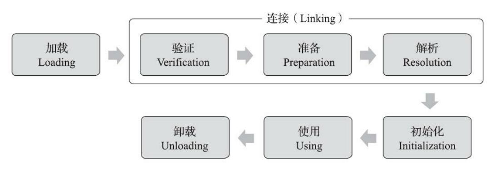

图7-1 类的生命周期

图7-1中,加载、验证、准备、初始化和卸载这五个阶段的顺序是确定的,类型的加载过程必须按 照这种顺序按部就班地开始,而解析阶段则不一定:它在某些情况下可以在初始化阶段之后再开始, 这是为了支持Java语言的运行时绑定特性(也称为动态绑定或晚期绑定)。请注意,这里笔者写的是 按部就班地"开始",而不是按部就班地"进行"或按部就班地"完成",强调这点是因为这些阶段通常都 是互相交叉地混合进行的,会在一个阶段执行的过程中调用、激活另一个阶段。

关于在什么情况下需要开始类加载过程的第一个阶段"加载",《Java虚拟机规范》中并没有进行 强制约束,这点可以交给虚拟机的具体实现来自由把握。但是对于初始化阶段,《Java虚拟机规范》 则是严格规定了有且只有六种情况必须立即对类进行"初始化"(而加载、验证、准备自然需要在此之 前开始):

- 1)遇到new、getstatic、putstatic或invokestatic这四条字节码指令时,如果类型没有进行过初始 化,则需要先触发其初始化阶段。能够生成这四条指令的典型Java代码场景有:
  - ·使用new关键字实例化对象的时候。
- ·读取或设置一个类型的静态字段(被final修饰、已在编译期把结果放入常量池的静态字段除外) 的时候。
  - ·调用一个类型的静态方法的时候。
- 2)使用java.lang.reflect包的方法对类型进行反射调用的时候,如果类型没有进行过初始化,则需 要先触发其初始化。

- 3)当初始化类的时候,如果发现其父类还没有进行过初始化,则需要先触发其父类的初始化。
- 4)当虚拟机启动时,用户需要指定一个要执行的主类(包含main()方法的那个类),虚拟机会先 初始化这个主类。
- 5)当使用JDK 7新加入的动态语言支持时,如果一个java.lang.invoke.MethodHandle实例最后的解 析结果为REF\_getStatic、REF\_putStatic、REF\_invokeStatic、REF\_newInvokeSpecial四种类型的方法句 柄,并且这个方法句柄对应的类没有进行过初始化,则需要先触发其初始化。
- 6)当一个接口中定义了JDK 8新加入的默认方法(被default关键字修饰的接口方法)时,如果有 这个接口的实现类发生了初始化,那该接口要在其之前被初始化。

对于这六种会触发类型进行初始化的场景,《Java虚拟机规范》中使用了一个非常强烈的限定语 ——"有且只有",这六种场景中的行为称为对一个类型进行主动引用。除此之外,所有引用类型的方 式都不会触发初始化,称为被动引用。下面举三个例子来说明何为被动引用,分别见代码清单7-1、代 码清单7-2和代码清单7-3。

代码清单7-1 被动引用的例子之一

```
package org.fenixsoft.classloading;
/**
* 被动使用类字段演示一:
* 通过子类引用父类的静态字段,不会导致子类初始化
**/
public class SuperClass {
   static {
       System.out.println("SuperClass init!");
   public static int value = 123;
public class SubClass extends SuperClass {
   static {
       System.out.println("SubClass init!");
/**
* 非主动使用类字段演示
**/
public class NotInitialization {
   public static void main(String[] args) {
       System.out.println(SubClass.value);
```

上述代码运行之后,只会输出"SuperClass init!",而不会输出"SubClass init!"。对于静态字段, 只有直接定义这个字段的类才会被初始化,因此通过其子类来引用父类中定义的静态字段,只会触发 父类的初始化而不会触发子类的初始化。至于是否要触发子类的加载和验证阶段,在《Java虚拟机规 范》中并未明确规定,所以这点取决于虚拟机的具体实现。对于HotSpot虚拟机来说,可通过-XX: +TraceClassLoading参数观察到此操作是会导致子类加载的。

```
package org.fenixsoft.classloading;
/**
* 被动使用类字段演示二:
* 通过数组定义来引用类,不会触发此类的初始化
**/
public class NotInitialization {
   public static void main(String[] args) {
       SuperClass[] sca = new SuperClass[10];
```

为了节省版面,这段代码复用了代码清单7-1中的SuperClass,运行之后发现没有输出"SuperClass init!",说明并没有触发类org.fenixsoft.classloading.SuperClass的初始化阶段。但是这段代码里面触发了 另一个名为"[Lorg.fenixsoft.classloading.SuperClass"的类的初始化阶段,对于用户代码来说,这并不是 一个合法的类型名称,它是一个由虚拟机自动生成的、直接继承于java.lang.Object的子类,创建动作由 字节码指令newarray触发。

这个类代表了一个元素类型为org.fenixsoft.classloading.SuperClass的一维数组,数组中应有的属性 和方法(用户可直接使用的只有被修饰为public的length属性和clone()方法)都实现在这个类里。Java语 言中对数组的访问要比C/C++相对安全,很大程度上就是因为这个类包装了数组元素的访问[1],而 C/C++中则是直接翻译为对数组指针的移动。在Java语言里,当检查到发生数组越界时会抛出 java.lang.ArrayIndexOutOfBoundsException异常,避免了直接造成非法内存访问。

### 代码清单7-3 被动引用的例子之三

```
package org.fenixsoft.classloading;
/**
* 被动使用类字段演示三:
* 常量在编译阶段会存入调用类的常量池中,本质上没有直接引用到定义常量的类,因此不会触发定义常量的
  类的初始化
**/
public class ConstClass {
   static {
       System.out.println("ConstClass init!");
   public static final String HELLOWORLD = "hello world";
/**
* 非主动使用类字段演示
**/
public class NotInitialization {
   public static void main(String[] args) {
       System.out.println(ConstClass.HELLOWORLD);
```

ConstClass类的常量HELLOWORLD,但其实在编译阶段通过常量传播优化,已经将此常量的值"hello world"直接存储在NotInitialization类的常量池中,以后NotInitialization对常量 ConstClass.HELLOWORLD的引用,实际都被转化为NotInitialization类对自身常量池的引用了。也就是 说,实际上NotInitialization的Class文件之中并没有ConstClass类的符号引用入口,这两个类在编译成 Class文件后就已不存在任何联系了。

接口的加载过程与类加载过程稍有不同,针对接口需要做一些特殊说明:接口也有初始化过程, 这点与类是一致的,上面的代码都是用静态语句块"static{}"来输出初始化信息的,而接口中不能使 用"static{}"语句块,但编译器仍然会为接口生成"<clinit>()"类构造器[2],用于初始化接口中所定义的 成员变量。接口与类真正有所区别的是前面讲述的六种"有且仅有"需要触发初始化场景中的第三种: 当一个类在初始化时,要求其父类全部都已经初始化过了,但是一个接口在初始化时,并不要求其父 接口全部都完成了初始化,只有在真正使用到父接口的时候(如引用接口中定义的常量)才会初始 化。

- [1] 准确地说,越界检查不是封装在数组元素访问的类中,而是封装在数组访问的xaload、xastore字节 码指令中。
- [2] 关于类构造器<clinit>()和方法构造器<init>()的生成过程和作用,可参见第10章的相关内容。

# 7.3 类加载的过程

接下来我们会详细了解Java虚拟机中类加载的全过程,即加载、验证、准备、解析和初始化这五 个阶段所执行的具体动作。

# 7.3.1 加载

"加载"(Loading)阶段是整个"类加载"(Class Loading)过程中的一个阶段,希望读者没有混淆 这两个看起来很相似的名词。在加载阶段,Java虚拟机需要完成以下三件事情:

- 1)通过一个类的全限定名来获取定义此类的二进制字节流。
- 2)将这个字节流所代表的静态存储结构转化为方法区的运行时数据结构。
- 3)在内存中生成一个代表这个类的java.lang.Class对象,作为方法区这个类的各种数据的访问入 口。

《Java虚拟机规范》对这三点要求其实并不是特别具体,留给虚拟机实现与Java应用的灵活度都是 相当大的。例如"通过一个类的全限定名来获取定义此类的二进制字节流"这条规则,它并没有指明二 进制字节流必须得从某个Class文件中获取,确切地说是根本没有指明要从哪里获取、如何获取。仅仅 这一点空隙,Java虚拟机的使用者们就可以在加载阶段搭构建出一个相当开放广阔的舞台,Java发展历 程中,充满创造力的开发人员则在这个舞台上玩出了各种花样,许多举足轻重的Java技术都建立在这 一基础之上,例如:

- ·从ZIP压缩包中读取,这很常见,最终成为日后JAR、EAR、WAR格式的基础。
- ·从网络中获取,这种场景最典型的应用就是Web Applet。
- ·运行时计算生成,这种场景使用得最多的就是动态代理技术,在java.lang.reflect.Proxy中,就是用 了ProxyGenerator.generateProxyClass()来为特定接口生成形式为"\*\$Proxy"的代理类的二进制字节流。
  - ·由其他文件生成,典型场景是JSP应用,由JSP文件生成对应的Class文件。
- ·从数据库中读取,这种场景相对少见些,例如有些中间件服务器(如SAP Netweaver)可以选择 把程序安装到数据库中来完成程序代码在集群间的分发。
- ·可以从加密文件中获取,这是典型的防Class文件被反编译的保护措施,通过加载时解密Class文 件来保障程序运行逻辑不被窥探。

·……

相对于类加载过程的其他阶段,非数组类型的加载阶段(准确地说,是加载阶段中获取类的二进 制字节流的动作)是开发人员可控性最强的阶段。加载阶段既可以使用Java虚拟机里内置的引导类加 载器来完成,也可以由用户自定义的类加载器去完成,开发人员通过定义自己的类加载器去控制字节 流的获取方式(重写一个类加载器的findClass()或loadClass()方法),实现根据自己的想法来赋予应用 程序获取运行代码的动态性。

对于数组类而言,情况就有所不同,数组类本身不通过类加载器创建,它是由Java虚拟机直接在 内存中动态构造出来的。但数组类与类加载器仍然有很密切的关系,因为数组类的元素类型(Element Type,指的是数组去掉所有维度的类型)最终还是要靠类加载器来完成加载,一个数组类(下面简称 为C)创建过程遵循以下规则:

·如果数组的组件类型(Component Type,指的是数组去掉一个维度的类型,注意和前面的元素类 型区分开来)是引用类型,那就递归采用本节中定义的加载过程去加载这个组件类型,数组C将被标 识在加载该组件类型的类加载器的类名称空间上(这点很重要,在7.4节会介绍,一个类型必须与类加 载器一起确定唯一性)。

·如果数组的组件类型不是引用类型(例如int[]数组的组件类型为int),Java虚拟机将会把数组C 标记为与引导类加载器关联。

·数组类的可访问性与它的组件类型的可访问性一致,如果组件类型不是引用类型,它的数组类的 可访问性将默认为public,可被所有的类和接口访问到。

加载阶段结束后,Java虚拟机外部的二进制字节流就按照虚拟机所设定的格式存储在方法区之中 了,方法区中的数据存储格式完全由虚拟机实现自行定义,《Java虚拟机规范》未规定此区域的具体 数据结构。类型数据妥善安置在方法区之后,会在Java堆内存中实例化一个java.lang.Class类的对象, 这个对象将作为程序访问方法区中的类型数据的外部接口。

加载阶段与连接阶段的部分动作(如一部分字节码文件格式验证动作)是交叉进行的,加载阶段 尚未完成,连接阶段可能已经开始,但这些夹在加载阶段之中进行的动作,仍然属于连接阶段的一部 分,这两个阶段的开始时间仍然保持着固定的先后顺序。

### 7.3.2 验证

验证是连接阶段的第一步,这一阶段的目的是确保Class文件的字节流中包含的信息符合《Java虚 拟机规范》的全部约束要求,保证这些信息被当作代码运行后不会危害虚拟机自身的安全。

Java语言本身是相对安全的编程语言(起码对于C/C++来说是相对安全的),使用纯粹的Java代码 无法做到诸如访问数组边界以外的数据、将一个对象转型为它并未实现的类型、跳转到不存在的代码 行之类的事情,如果尝试这样去做了,编译器会毫不留情地抛出异常、拒绝编译。但前面也曾说过, Class文件并不一定只能由Java源码编译而来,它可以使用包括靠键盘0和1直接在二进制编辑器中敲出 Class文件在内的任何途径产生。上述Java代码无法做到的事情在字节码层面上都是可以实现的,至少 语义上是可以表达出来的。Java虚拟机如果不检查输入的字节流,对其完全信任的话,很可能会因为 载入了有错误或有恶意企图的字节码流而导致整个系统受攻击甚至崩溃,所以验证字节码是Java虚拟 机保护自身的一项必要措施。

验证阶段是非常重要的,这个阶段是否严谨,直接决定了Java虚拟机是否能承受恶意代码的攻 击,从代码量和耗费的执行性能的角度上讲,验证阶段的工作量在虚拟机的类加载过程中占了相当大 的比重。但是《Java虚拟机规范》的早期版本(第1、2版)对这个阶段的检验指导是相当模糊和笼统 的,规范中仅列举了一些对Class文件格式的静态和结构化的约束,要求虚拟机验证到输入的字节流如 不符合Class文件格式的约束,就应当抛出一个java.lang.VerifyError异常或其子类异常,但具体应当检查 哪些内容、如何检查、何时进行检查等,都没有足够具体的要求和明确的说明。直到2011年《Java虚 拟机规范(Java SE 7版)》出版,规范中大幅增加了验证过程的描述(篇幅从不到10页增加到130 页),这时验证阶段的约束和验证规则才变得具体起来。受篇幅所限,本书中无法逐条规则去讲解, 但从整体上看,验证阶段大致上会完成下面四个阶段的检验动作:文件格式验证、元数据验证、字节 码验证和符号引用验证。

#### 1.文件格式验证

第一阶段要验证字节流是否符合Class文件格式的规范,并且能被当前版本的虚拟机处理。这一阶 段可能包括下面这些验证点:

- ·是否以魔数0xCAFEBABE开头。
- ·主、次版本号是否在当前Java虚拟机接受范围之内。
- ·常量池的常量中是否有不被支持的常量类型(检查常量tag标志)。
- ·指向常量的各种索引值中是否有指向不存在的常量或不符合类型的常量。
- ·CONSTANT\_Utf8\_info型的常量中是否有不符合UTF-8编码的数据。
- ·Class文件中各个部分及文件本身是否有被删除的或附加的其他信息。

·……

实际上第一阶段的验证点还远不止这些,上面所列的只是从HotSpot虚拟机源码[1]中摘抄的一小 部分内容,该验证阶段的主要目的是保证输入的字节流能正确地解析并存储于方法区之内,格式上符 合描述一个Java类型信息的要求。这阶段的验证是基于二进制字节流进行的,只有通过了这个阶段的 验证之后,这段字节流才被允许进入Java虚拟机内存的方法区中进行存储,所以后面的三个验证阶段 全部是基于方法区的存储结构上进行的,不会再直接读取、操作字节流了。

#### 2.元数据验证

第二阶段是对字节码描述的信息进行语义分析,以保证其描述的信息符合《Java语言规范》的要 求,这个阶段可能包括的验证点如下:

- ·这个类是否有父类(除了java.lang.Object之外,所有的类都应当有父类)。
- ·这个类的父类是否继承了不允许被继承的类(被final修饰的类)。
- ·如果这个类不是抽象类,是否实现了其父类或接口之中要求实现的所有方法。
- ·类中的字段、方法是否与父类产生矛盾(例如覆盖了父类的final字段,或者出现不符合规则的方 法重载,例如方法参数都一致,但返回值类型却不同等)。

第二阶段的主要目的是对类的元数据信息进行语义校验,保证不存在与《Java语言规范》定义相 悖的元数据信息。

#### 3.字节码验证

·……

第三阶段是整个验证过程中最复杂的一个阶段,主要目的是通过数据流分析和控制流分析,确定 程序语义是合法的、符合逻辑的。在第二阶段对元数据信息中的数据类型校验完毕以后,这阶段就要 对类的方法体(Class文件中的Code属性)进行校验分析,保证被校验类的方法在运行时不会做出危害 虚拟机安全的行为,例如:

- ·保证任意时刻操作数栈的数据类型与指令代码序列都能配合工作,例如不会出现类似于"在操作 栈放置了一个int类型的数据,使用时却按long类型来加载入本地变量表中"这样的情况。
  - ·保证任何跳转指令都不会跳转到方法体以外的字节码指令上。
- ·保证方法体中的类型转换总是有效的,例如可以把一个子类对象赋值给父类数据类型,这是安全 的,但是把父类对象赋值给子类数据类型,甚至把对象赋值给与它毫无继承关系、完全不相干的一个 数据类型,则是危险和不合法的。

如果一个类型中有方法体的字节码没有通过字节码验证,那它肯定是有问题的;但如果一个方法 体通过了字节码验证,也仍然不能保证它一定就是安全的。即使字节码验证阶段中进行了再大量、再 严密的检查,也依然不能保证这一点。这里涉及了离散数学中一个很著名的问题——"停机问

·……

题"(Halting Problem)[2],即不能通过程序准确地检查出程序是否能在有限的时间之内结束运行。在 我们讨论字节码校验的上下文语境里,通俗一点的解释是通过程序去校验程序逻辑是无法做到绝对准 确的,不可能用程序来准确判定一段程序是否存在Bug。

由于数据流分析和控制流分析的高度复杂性,Java虚拟机的设计团队为了避免过多的执行时间消 耗在字节码验证阶段中,在JDK 6之后的Javac编译器和Java虚拟机里进行了一项联合优化,把尽可能 多的校验辅助措施挪到Javac编译器里进行。具体做法是给方法体Code属性的属性表中新增加了一项名 为"StackMapTable"的新属性,这项属性描述了方法体所有的基本块(Basic Block,指按照控制流拆分 的代码块)开始时本地变量表和操作栈应有的状态,在字节码验证期间,Java虚拟机就不需要根据程 序推导这些状态的合法性,只需要检查StackMapTable属性中的记录是否合法即可。这样就将字节码验 证的类型推导转变为类型检查,从而节省了大量校验时间。理论上StackMapTable属性也存在错误或被 篡改的可能,所以是否有可能在恶意篡改了Code属性的同时,也生成相应的StackMapTable属性来骗过 虚拟机的类型校验,则是虚拟机设计者们需要仔细思考的问题。

JDK 6的HotSpot虚拟机中提供了-XX:-UseSplitVerifier选项来关闭掉这项优化,或者使用参数-XX:+FailOverToOldVerifier要求在类型校验失败的时候退回到旧的类型推导方式进行校验。而到了 JDK 7之后,尽管虚拟机中仍然保留着类型推导验证器的代码,但是对于主版本号大于50(对应JDK 6)的Class文件,使用类型检查来完成数据流分析校验则是唯一的选择,不允许再退回到原来的类型 推导的校验方式。

#### 4.符号引用验证

最后一个阶段的校验行为发生在虚拟机将符号引用转化为直接引用[3]的时候,这个转化动作将在 连接的第三阶段——解析阶段中发生。符号引用验证可以看作是对类自身以外(常量池中的各种符号 引用)的各类信息进行匹配性校验,通俗来说就是,该类是否缺少或者被禁止访问它依赖的某些外部 类、方法、字段等资源。本阶段通常需要校验下列内容:

- ·符号引用中通过字符串描述的全限定名是否能找到对应的类。
- ·在指定类中是否存在符合方法的字段描述符及简单名称所描述的方法和字段。

·符号引用中的类、字段、方法的可访问性(private、protected、public、<package>)是否可被当 前类访问。

·……

符号引用验证的主要目的是确保解析行为能正常执行,如果无法通过符号引用验证,Java虚拟机 将会抛出一个java.lang.IncompatibleClassChangeError的子类异常,典型的如: java.lang.IllegalAccessError、java.lang.NoSuchFieldError、java.lang.NoSuchMethodError等。

验证阶段对于虚拟机的类加载机制来说,是一个非常重要的、但却不是必须要执行的阶段,因为 验证阶段只有通过或者不通过的差别,只要通过了验证,其后就对程序运行期没有任何影响了。如果 程序运行的全部代码(包括自己编写的、第三方包中的、从外部加载的、动态生成的等所有代码)都 已经被反复使用和验证过,在生产环境的实施阶段就可以考虑使用-Xverify:none参数来关闭大部分的 类验证措施,以缩短虚拟机类加载的时间。

- [1] JDK 12源码中的位置:src\hotspot\share\classfile\classFileParser.cpp。
- [2] 停机问题就是判断任意一个程序是否会在有限的时间之内结束运行的问题。如果这个问题可以在有 限的时间之内解决,可以有一个程序判断其本身是否会停机并做出相反的行为。这时候显然不管停机 问题的结果是什么都不会符合要求,所以这是一个不可解的问题。具体的证明过程可参考链接 http://zh.wikipedia.org/zh/停机问题。
- [3] 关于符号引用和直接引用的具体解释,见7.3.4节。

### 7.3.3 准备

准备阶段是正式为类中定义的变量(即静态变量,被static修饰的变量)分配内存并设置类变量初 始值的阶段,从概念上讲,这些变量所使用的内存都应当在方法区中进行分配,但必须注意到方法区 本身是一个逻辑上的区域,在JDK 7及之前,HotSpot使用永久代来实现方法区时,实现是完全符合这 种逻辑概念的;而在JDK 8及之后,类变量则会随着Class对象一起存放在Java堆中,这时候"类变量在 方法区"就完全是一种对逻辑概念的表述了,关于这部分内容,笔者已在4.3.1节介绍并且验证过。

关于准备阶段,还有两个容易产生混淆的概念笔者需要着重强调,首先是这时候进行内存分配的 仅包括类变量,而不包括实例变量,实例变量将会在对象实例化时随着对象一起分配在Java堆中。其 次是这里所说的初始值"通常情况"下是数据类型的零值,假设一个类变量的定义为:

public static int value = 123;

那变量value在准备阶段过后的初始值为0而不是123,因为这时尚未开始执行任何Java方法,而把 value赋值为123的putstatic指令是程序被编译后,存放于类构造器<clinit>()方法之中,所以把value赋值 为123的动作要到类的初始化阶段才会被执行。表7-1列出了Java中所有基本数据类型的零值。

| 数据类型  | 零 值       | 数据类型      | 零值    |
|-------|-----------|-----------|-------|
| int   | 0         | boolean   | false |
| long  | 0L        | float     | 0.0f  |
| short | (short) 0 | double    | 0.0d  |
| char  | '\u0000'  | reference | null  |
| byte  | (byte) 0  |           |       |

表7-1 基本数据类型的零值

上面提到在"通常情况"下初始值是零值,那言外之意是相对的会有某些"特殊情况":如果类字段 的字段属性表中存在ConstantValue属性,那在准备阶段变量值就会被初始化为ConstantValue属性所指定 的初始值,假设上面类变量value的定义修改为:

public static final int value = 123;

编译时Javac将会为value生成ConstantValue属性,在准备阶段虚拟机就会根据Con-stantValue的设置 将value赋值为123。

# 7.3.4 解析

解析阶段是Java虚拟机将常量池内的符号引用替换为直接引用的过程,符号引用在第6章讲解Class 文件格式的时候已经出现过多次,在Class文件中它以CONSTANT\_Class\_info、

CONSTANT\_Fieldref\_info、CONSTANT\_Methodref\_info等类型的常量出现,那解析阶段中所说的直接 引用与符号引用又有什么关联呢?

·符号引用(Symbolic References):符号引用以一组符号来描述所引用的目标,符号可以是任何 形式的字面量,只要使用时能无歧义地定位到目标即可。符号引用与虚拟机实现的内存布局无关,引 用的目标并不一定是已经加载到虚拟机内存当中的内容。各种虚拟机实现的内存布局可以各不相同, 但是它们能接受的符号引用必须都是一致的,因为符号引用的字面量形式明确定义在《Java虚拟机规 范》的Class文件格式中。

·直接引用(Direct References):直接引用是可以直接指向目标的指针、相对偏移量或者是一个能 间接定位到目标的句柄。直接引用是和虚拟机实现的内存布局直接相关的,同一个符号引用在不同虚 拟机实例上翻译出来的直接引用一般不会相同。如果有了直接引用,那引用的目标必定已经在虚拟机 的内存中存在。

《Java虚拟机规范》之中并未规定解析阶段发生的具体时间,只要求了在执行ane-warray、 checkcast、getfield、getstatic、instanceof、invokedynamic、invokeinterface、invoke-special、 invokestatic、invokevirtual、ldc、ldc\_w、ldc2\_w、multianewarray、new、putfield和putstatic这17个用于 操作符号引用的字节码指令之前,先对它们所使用的符号引用进行解析。所以虚拟机实现可以根据需 要来自行判断,到底是在类被加载器加载时就对常量池中的符号引用进行解析,还是等到一个符号引 用将要被使用前才去解析它。

类似地,对方法或者字段的访问,也会在解析阶段中对它们的可访问性(public、protected、 private、<package>)进行检查,至于其中的约束规则已经是Java语言的基本常识,笔者就不再赘述 了。

对同一个符号引用进行多次解析请求是很常见的事情,除invokedynamic指令以外,虚拟机实现可 以对第一次解析的结果进行缓存,譬如在运行时直接引用常量池中的记录,并把常量标识为已解析状 态,从而避免解析动作重复进行。无论是否真正执行了多次解析动作,Java虚拟机都需要保证的是在 同一个实体中,如果一个符号引用之前已经被成功解析过,那么后续的引用解析请求就应当一直能够 成功;同样地,如果第一次解析失败了,其他指令对这个符号的解析请求也应该收到相同的异常,哪 怕这个请求的符号在后来已成功加载进Java虚拟机内存之中。

不过对于invokedynamic指令,上面的规则就不成立了。当碰到某个前面已经由invokedynamic指令 触发过解析的符号引用时,并不意味着这个解析结果对于其他invokedynamic指令也同样生效。因为 invokedynamic指令的目的本来就是用于动态语言支持[1],它对应的引用称为"动态调用点限定符

(Dynamically-Computed Call Site Specifier)",这里"动态"的含义是指必须等到程序实际运行到这条指 令时,解析动作才能进行。相对地,其余可触发解析的指令都是"静态"的,可以在刚刚完成加载阶 段,还没有开始执行代码时就提前进行解析。

解析动作主要针对类或接口、字段、类方法、接口方法、方法类型、方法句柄和调用点限定符这7 类符号引用进行,分别对应于常量池的CONSTANT\_Class\_info、CON-STANT\_Fieldref\_info、 CONSTANT\_Methodref\_info、CONSTANT\_InterfaceMethodref\_info、 CONSTANT\_MethodType\_info、CONSTANT\_MethodHandle\_info、CONSTANT\_Dyna-mic\_info和 CONSTANT\_InvokeDynamic\_info 8种常量类型[2]。下面笔者将讲解前4种引用的解析过程,对于后4 种,它们都和动态语言支持密切相关,由于Java语言本身是一门静态类型语言,在没有讲解清楚 invokedynamic指令的语意之前,我们很难将它们直观地和现在的Java语言语法对应上,因此笔者将延 后到第8章介绍动态语言调用时一起分析讲解。

### 1.类或接口的解析

假设当前代码所处的类为D,如果要把一个从未解析过的符号引用N解析为一个类或接口C的直接 引用,那虚拟机完成整个解析的过程需要包括以下3个步骤:

- 1)如果C不是一个数组类型,那虚拟机将会把代表N的全限定名传递给D的类加载器去加载这个 类C。在加载过程中,由于元数据验证、字节码验证的需要,又可能触发其他相关类的加载动作,例 如加载这个类的父类或实现的接口。一旦这个加载过程出现了任何异常,解析过程就将宣告失败。
- 2)如果C是一个数组类型,并且数组的元素类型为对象,也就是N的描述符会是类 似"[Ljava/lang/Integer"的形式,那将会按照第一点的规则加载数组元素类型。如果N的描述符如前面所 假设的形式,需要加载的元素类型就是"java.lang.Integer",接着由虚拟机生成一个代表该数组维度和元 素的数组对象。
- 3)如果上面两步没有出现任何异常,那么C在虚拟机中实际上已经成为一个有效的类或接口了, 但在解析完成前还要进行符号引用验证,确认D是否具备对C的访问权限。如果发现不具备访问权限, 将抛出java.lang.IllegalAccessError异常。

针对上面第3点访问权限验证,在JDK 9引入了模块化以后,一个public类型也不再意味着程序任 何位置都有它的访问权限,我们还必须检查模块间的访问权限。

如果我们说一个D拥有C的访问权限,那就意味着以下3条规则中至少有其中一条成立:

- ·被访问类C是public的,并且与访问类D处于同一个模块。
- ·被访问类C是public的,不与访问类D处于同一个模块,但是被访问类C的模块允许被访问类D的 模块进行访问。
  - ·被访问类C不是public的,但是它与访问类D处于同一个包中。

在后续涉及可访问性时,都必须考虑模块间访问权限隔离的约束,即以上列举的3条规则,这些内 容在后面就不再复述了。

### 2.字段解析

要解析一个未被解析过的字段符号引用,首先将会对字段表内class\_index [3]项中索引的 CONSTANT\_Class\_info符号引用进行解析,也就是字段所属的类或接口的符号引用。如果在解析这个 类或接口符号引用的过程中出现了任何异常,都会导致字段符号引用解析的失败。如果解析成功完 成,那把这个字段所属的类或接口用C表示,《Java虚拟机规范》要求按照如下步骤对C进行后续字段 的搜索:

- 1)如果C本身就包含了简单名称和字段描述符都与目标相匹配的字段,则返回这个字段的直接引 用,查找结束。
- 2)否则,如果在C中实现了接口,将会按照继承关系从下往上递归搜索各个接口和它的父接口, 如果接口中包含了简单名称和字段描述符都与目标相匹配的字段,则返回这个字段的直接引用,查找 结束。
- 3)否则,如果C不是java.lang.Object的话,将会按照继承关系从下往上递归搜索其父类,如果在父 类中包含了简单名称和字段描述符都与目标相匹配的字段,则返回这个字段的直接引用,查找结束。
  - 4)否则,查找失败,抛出java.lang.NoSuchFieldError异常。

如果查找过程成功返回了引用,将会对这个字段进行权限验证,如果发现不具备对字段的访问权 限,将抛出java.lang.IllegalAccessError异常。

以上解析规则能够确保Java虚拟机获得字段唯一的解析结果,但在实际情况中,Javac编译器往往 会采取比上述规范更加严格一些的约束,譬如有一个同名字段同时出现在某个类的接口和父类当中, 或者同时在自己或父类的多个接口中出现,按照解析规则仍是可以确定唯一的访问字段,但Javac编译 器就可能直接拒绝其编译为Class文件。在代码清单7-4中演示了这种情况,如果注释了Sub类中 的"public static int A=4;",接口与父类同时存在字段A,那Oracle公司实现的Javac编译器将提示"The field Sub.A is ambiguous",并且会拒绝编译这段代码。

### 代码清单7-4 字段解析

```
package org.fenixsoft.classloading;
public class FieldResolution {
    interface Interface0 {
        int A = 0;
    interface Interface1 extends Interface0 {
        int A = 1;
    interface Interface2 {
        int A = 2;
    static class Parent implements Interface1 {
        public static int A = 3;
    static class Sub extends Parent implements Interface2 {
        public static int A = 4;
    public static void main(String[] args) {
        System.out.println(Sub.A);
```

### 3.方法解析

方法解析的第一个步骤与字段解析一样,也是需要先解析出方法表的class\_index [4]项中索引的方 法所属的类或接口的符号引用,如果解析成功,那么我们依然用C表示这个类,接下来虚拟机将会按 照如下步骤进行后续的方法搜索:

- 1)由于Class文件格式中类的方法和接口的方法符号引用的常量类型定义是分开的,如果在类的 方法表中发现class\_index中索引的C是个接口的话,那就直接抛出java.lang.IncompatibleClassChangeError 异常。
- 2)如果通过了第一步,在类C中查找是否有简单名称和描述符都与目标相匹配的方法,如果有则 返回这个方法的直接引用,查找结束。
- 3)否则,在类C的父类中递归查找是否有简单名称和描述符都与目标相匹配的方法,如果有则返 回这个方法的直接引用,查找结束。
- 4)否则,在类C实现的接口列表及它们的父接口之中递归查找是否有简单名称和描述符都与目标 相匹配的方法,如果存在匹配的方法,说明类C是一个抽象类,这时候查找结束,抛出 java.lang.AbstractMethodError异常。
  - 5)否则,宣告方法查找失败,抛出java.lang.NoSuchMethodError。

最后,如果查找过程成功返回了直接引用,将会对这个方法进行权限验证,如果发现不具备对此 方法的访问权限,将抛出java.lang.IllegalAccessError异常。

### 4.接口方法解析

接口方法也是需要先解析出接口方法表的class\_index [5]项中索引的方法所属的类或接口的符号引 用,如果解析成功,依然用C表示这个接口,接下来虚拟机将会按照如下步骤进行后续的接口方法搜 索:

- 1)与类的方法解析相反,如果在接口方法表中发现class\_index中的索引C是个类而不是接口,那 么就直接抛出java.lang.IncompatibleClassChangeError异常。
- 2)否则,在接口C中查找是否有简单名称和描述符都与目标相匹配的方法,如果有则返回这个方 法的直接引用,查找结束。
- 3)否则,在接口C的父接口中递归查找,直到java.lang.Object类(接口方法的查找范围也会包括 Object类中的方法)为止,看是否有简单名称和描述符都与目标相匹配的方法,如果有则返回这个方 法的直接引用,查找结束。
- 4)对于规则3,由于Java的接口允许多重继承,如果C的不同父接口中存有多个简单名称和描述符 都与目标相匹配的方法,那将会从这多个方法中返回其中一个并结束查找,《Java虚拟机规范》中并 没有进一步规则约束应该返回哪一个接口方法。但与之前字段查找类似地,不同发行商实现的Javac编

译器有可能会按照更严格的约束拒绝编译这种代码来避免不确定性。

5)否则,宣告方法查找失败,抛出java.lang.NoSuchMethodError异常。

在JDK 9之前,Java接口中的所有方法都默认是public的,也没有模块化的访问约束,所以不存在 访问权限的问题,接口方法的符号解析就不可能抛出java.lang.IllegalAccessError异常。但在JDK 9中增 加了接口的静态私有方法,也有了模块化的访问约束,所以从JDK 9起,接口方法的访问也完全有可 能因访问权限控制而出现java.lang.IllegalAccessError异常。

- [1] invokedynamic指令是在JDK 7时加入到字节码中的,当时确实只为了做动态语言(如JRuby、 Scala)支持,Java语言本身并不会用到它。而到了JDK 8时代,Java有了Lambda表达式和接口的默认方 法,它们在底层调用时就会用到invokedynamic指令,这时再提动态语言支持其实已不完全切合,我们 就只把它当个代称吧。笔者将会在第8章中介绍这部分内容。
- [2] 严格来说,CONSTANT\_String\_info这种类型的常量也有解析过程,但是很简单而且直观,不再做 独立介绍。
- [3] 参见第6章中关于CONSTANT\_Fieldref\_info常量的相关内容。
- [4] 参见第6章关于CONSTANT\_Methodref\_info常量的相关内容。
- [5] 参见第6章中关于CONSTANT\_InterfaceMethodref\_info常量的相关内容。

# 7.3.5 初始化

类的初始化阶段是类加载过程的最后一个步骤,之前介绍的几个类加载的动作里,除了在加载阶 段用户应用程序可以通过自定义类加载器的方式局部参与外,其余动作都完全由Java虚拟机来主导控 制。直到初始化阶段,Java虚拟机才真正开始执行类中编写的Java程序代码,将主导权移交给应用程 序。

进行准备阶段时,变量已经赋过一次系统要求的初始零值,而在初始化阶段,则会根据程序员通 过程序编码制定的主观计划去初始化类变量和其他资源。我们也可以从另外一种更直接的形式来表 达:初始化阶段就是执行类构造器<clinit>()方法的过程。<clinit>()并不是程序员在Java代码中直接编写 的方法,它是Javac编译器的自动生成物,但我们非常有必要了解这个方法具体是如何产生的,以及 <clinit>()方法执行过程中各种可能会影响程序运行行为的细节,这部分比起其他类加载过程更贴近于 普通的程序开发人员的实际工作[1]。

·<clinit>()方法是由编译器自动收集类中的所有类变量的赋值动作和静态语句块(static{}块)中的 语句合并产生的,编译器收集的顺序是由语句在源文件中出现的顺序决定的,静态语句块中只能访问 到定义在静态语句块之前的变量,定义在它之后的变量,在前面的静态语句块可以赋值,但是不能访 问,如代码清单7-5所示。

#### 代码清单7-5 非法前向引用变量

```
public class Test {
   static {
       i = 0; // 给变量复制可以正常编译通过
       System.out.print(i); // 这句编译器会提示"非法向前引用"
   static int i = 1;
```

·<clinit>()方法与类的构造函数(即在虚拟机视角中的实例构造器<init>()方法)不同,它不需要显 式地调用父类构造器,Java虚拟机会保证在子类的<clinit>()方法执行前,父类的<clinit>()方法已经执行 完毕。因此在Java虚拟机中第一个被执行的<clinit>()方法的类型肯定是java.lang.Object。

·由于父类的<clinit>()方法先执行,也就意味着父类中定义的静态语句块要优先于子类的变量赋值 操作,如代码清单7-6中,字段B的值将会是2而不是1。

### 代码清单7-6 <clinit>()方法执行顺序

```
static class Parent {
    public static int A = 1;
    static {
        A = 2;
static class Sub extends Parent {
    public static int B = A;
```

```
public static void main(String[] args) {
    System.out.println(Sub.B);
```

·<clinit>()方法对于类或接口来说并不是必需的,如果一个类中没有静态语句块,也没有对变量的 赋值操作,那么编译器可以不为这个类生成<clinit>()方法。

·接口中不能使用静态语句块,但仍然有变量初始化的赋值操作,因此接口与类一样都会生成 <clinit>()方法。但接口与类不同的是,执行接口的<clinit>()方法不需要先执行父接口的<clinit>()方法, 因为只有当父接口中定义的变量被使用时,父接口才会被初始化。此外,接口的实现类在初始化时也 一样不会执行接口的<clinit>()方法。

·Java虚拟机必须保证一个类的<clinit>()方法在多线程环境中被正确地加锁同步,如果多个线程同 时去初始化一个类,那么只会有其中一个线程去执行这个类的<clinit>()方法,其他线程都需要阻塞等 待,直到活动线程执行完毕<clinit>()方法。如果在一个类的<clinit>()方法中有耗时很长的操作,那就 可能造成多个进程阻塞[2],在实际应用中这种阻塞往往是很隐蔽的。代码清单7-7演示了这种场景。

### 代码清单7-7 字段解析

```
static class DeadLoopClass {
    static {
        // 如果不加上这个if语句,编译器将提示"Initializer does not complete normally"
           并拒绝编译
        if (true) {
            System.out.println(Thread.currentThread() + "init DeadLoopClass");
            while (true) {
            }
public static void main(String[] args) {
    Runnable script = new Runnable() {
        public void run() {
            System.out.println(Thread.currentThread() + "start");
            DeadLoopClass dlc = new DeadLoopClass();
            System.out.println(Thread.currentThread() + " run over");
    };
    Thread thread1 = new Thread(script);
    Thread thread2 = new Thread(script);
    thread1.start();
    thread2.start();
```

运行结果如下,一条线程在死循环以模拟长时间操作,另外一条线程在阻塞等待:

```
Thread[Thread-0,5,main]start
Thread[Thread-1,5,main]start
Thread[Thread-0,5,main]init DeadLoopClass
```

- [1] 这里的讨论只限于Java语言编译产生的Class文件,不包括其他Java虚拟机语言。
- [2] 需要注意,其他线程虽然会被阻塞,但如果执行<clinit>()方法的那条线程退出<clinit>()方法

后,其他线程唤醒后则不会再次进入<clinit>()方法。同一个类加载器下,一个类型只会被初始化一 次。

### 7.4 类加载器

Java虚拟机设计团队有意把类加载阶段中的"通过一个类的全限定名来获取描述该类的二进制字节 流"这个动作放到Java虚拟机外部去实现,以便让应用程序自己决定如何去获取所需的类。实现这个动 作的代码被称为"类加载器"(Class Loader)。

类加载器可以说是Java语言的一项创新,它是早期Java语言能够快速流行的重要原因之一。类加载 器最初是为了满足Java Applet的需求而设计出来的,在今天用在浏览器上的Java Applet技术基本上已 经被淘汰[1],但类加载器却在类层次划分、OSGi、程序热部署、代码加密等领域大放异彩,成为Java 技术体系中一块重要的基石,可谓是失之桑榆,收之东隅。

[1] 特指浏览器上的Java Applets,在其他领域,如智能卡上,Java Applets仍然有很广阔的市场。

# 7.4.1 类与类加载器

类加载器虽然只用于实现类的加载动作,但它在Java程序中起到的作用却远超类加载阶段。对于 任意一个类,都必须由加载它的类加载器和这个类本身一起共同确立其在Java虚拟机中的唯一性,每 一个类加载器,都拥有一个独立的类名称空间。这句话可以表达得更通俗一些:比较两个类是否"相 等",只有在这两个类是由同一个类加载器加载的前提下才有意义,否则,即使这两个类来源于同一个 Class文件,被同一个Java虚拟机加载,只要加载它们的类加载器不同,那这两个类就必定不相等。

这里所指的"相等",包括代表类的Class对象的equals()方法、isAssignableFrom()方法、isInstance() 方法的返回结果,也包括了使用instanceof关键字做对象所属关系判定等各种情况。如果没有注意到类 加载器的影响,在某些情况下可能会产生具有迷惑性的结果,代码清单7-8中演示了不同的类加载器对 instanceof关键字运算的结果的影响。

代码清单7-8 不同的类加载器对instanceof关键字运算的结果的影响

```
/**
 * 类加载器与instanceof关键字演示
 *
 * @author zzm
 */
public class ClassLoaderTest {
    public static void main(String[] args) throws Exception {
        ClassLoader myLoader = new ClassLoader() {
            @Override
            public Class<?> loadClass(String name) throws ClassNotFoundException {
                try {
                    String fileName = name.substring(name.lastIndexOf(".") + 1)+".class";
                    InputStream is = getClass().getResourceAsStream(fileName);
                    if (is == null) {
                        return super.loadClass(name);
                    }
                    byte[] b = new byte[is.available()];
                    is.read(b);
                    return defineClass(name, b, 0, b.length);
                } catch (IOException e) {
                    throw new ClassNotFoundException(name);
                }
            }
        };
        Object obj = myLoader.loadClass("org.fenixsoft.classloading.ClassLoaderTest").newInstance();
        System.out.println(obj.getClass());
        System.out.println(obj instanceof org.fenixsoft.classloading.ClassLoaderTest);
```

#### 运行结果:

```
class org.fenixsoft.classloading.ClassLoaderTest
false
```

代码清单7-8中构造了一个简单的类加载器,尽管它极为简陋,但是对于这个演示来说已经足够。

它可以加载与自己在同一路径下的Class文件,我们使用这个类加载器去加载了一个名 为"org.fenixsoft.classloading.ClassLoaderTest"的类,并实例化了这个类的对象。

两行输出结果中,从第一行可以看到这个对象确实是类org.fenixsoft.classloading.ClassLoaderTest实 例化出来的,但在第二行的输出中却发现这个对象与类org.fenixsoft.classloading.ClassLoaderTest做所属 类型检查的时候返回了false。这是因为Java虚拟机中同时存在了两个ClassLoaderTest类,一个是由虚拟 机的应用程序类加载器所加载的,另外一个是由我们自定义的类加载器加载的,虽然它们都来自同一 个Class文件,但在Java虚拟机中仍然是两个互相独立的类,做对象所属类型检查时的结果自然为 false。

# 7.4.2 双亲委派模型

站在Java虚拟机的角度来看,只存在两种不同的类加载器:一种是启动类加载器(Bootstrap ClassLoader),这个类加载器使用C++语言实现[1],是虚拟机自身的一部分;另外一种就是其他所有 的类加载器,这些类加载器都由Java语言实现,独立存在于虚拟机外部,并且全都继承自抽象类 java.lang.ClassLoader。

站在Java开发人员的角度来看,类加载器就应当划分得更细致一些。自JDK 1.2以来,Java一直保 持着三层类加载器、双亲委派的类加载架构,尽管这套架构在Java模块化系统出现后有了一些调整变 动,但依然未改变其主体结构,我们将在7.5节中专门讨论模块化系统下的类加载器。

本节内容将针对JDK 8及之前版本的Java来介绍什么是三层类加载器,以及什么是双亲委派模型。 对于这个时期的Java应用,绝大多数Java程序都会使用到以下3个系统提供的类加载器来进行加载。

·启动类加载器(Bootstrap Class Loader):前面已经介绍过,这个类加载器负责加载存放在 <JAVA\_HOME>\lib目录,或者被-Xbootclasspath参数所指定的路径中存放的,而且是Java虚拟机能够 识别的(按照文件名识别,如rt.jar、tools.jar,名字不符合的类库即使放在lib目录中也不会被加载)类 库加载到虚拟机的内存中。启动类加载器无法被Java程序直接引用,用户在编写自定义类加载器时, 如果需要把加载请求委派给引导类加载器去处理,那直接使用null代替即可,代码清单7-9展示的就是 java.lang.ClassLoader.getClassLoader()方法的代码片段,其中的注释和代码实现都明确地说明了以null值 来代表引导类加载器的约定规则。

代码清单7-9 ClassLoader.getClassLoader()方法的代码片段

```
/**
Returns the class loader for the class. Some implementations may use null to represent the bootstrap class loader. This method will return null in such implementations if this class was loaded by the bootstrap class loader.
*/
public ClassLoader getClassLoader() {
    ClassLoader cl = getClassLoader0();
    if (cl == null)
        return null;
    SecurityManager sm = System.getSecurityManager();
    if (sm != null) {
        ClassLoader ccl = ClassLoader.getCallerClassLoader();
        if (ccl != null && ccl != cl && !cl.isAncestor(ccl)) {
            sm.checkPermission(SecurityConstants.GET_CLASSLOADER_PERMISSION);
    return cl;
```

·扩展类加载器(Extension Class Loader):这个类加载器是在类sun.misc.Launcher\$ExtClassLoader 中以Java代码的形式实现的。它负责加载<JAVA\_HOME>\lib\ext目录中,或者被java.ext.dirs系统变量所 指定的路径中所有的类库。根据"扩展类加载器"这个名称,就可以推断出这是一种Java系统类库的扩 展机制,JDK的开发团队允许用户将具有通用性的类库放置在ext目录里以扩展Java SE的功能,在JDK 9之后,这种扩展机制被模块化带来的天然的扩展能力所取代。由于扩展类加载器是由Java代码实现 的,开发者可以直接在程序中使用扩展类加载器来加载Class文件。

·应用程序类加载器(Application Class Loader):这个类加载器由 sun.misc.Launcher\$AppClassLoader来实现。由于应用程序类加载器是ClassLoader类中的getSystem-ClassLoader()方法的返回值,所以有些场合中也称它为"系统类加载器"。它负责加载用户类路径 (ClassPath)上所有的类库,开发者同样可以直接在代码中使用这个类加载器。如果应用程序中没有 自定义过自己的类加载器,一般情况下这个就是程序中默认的类加载器。

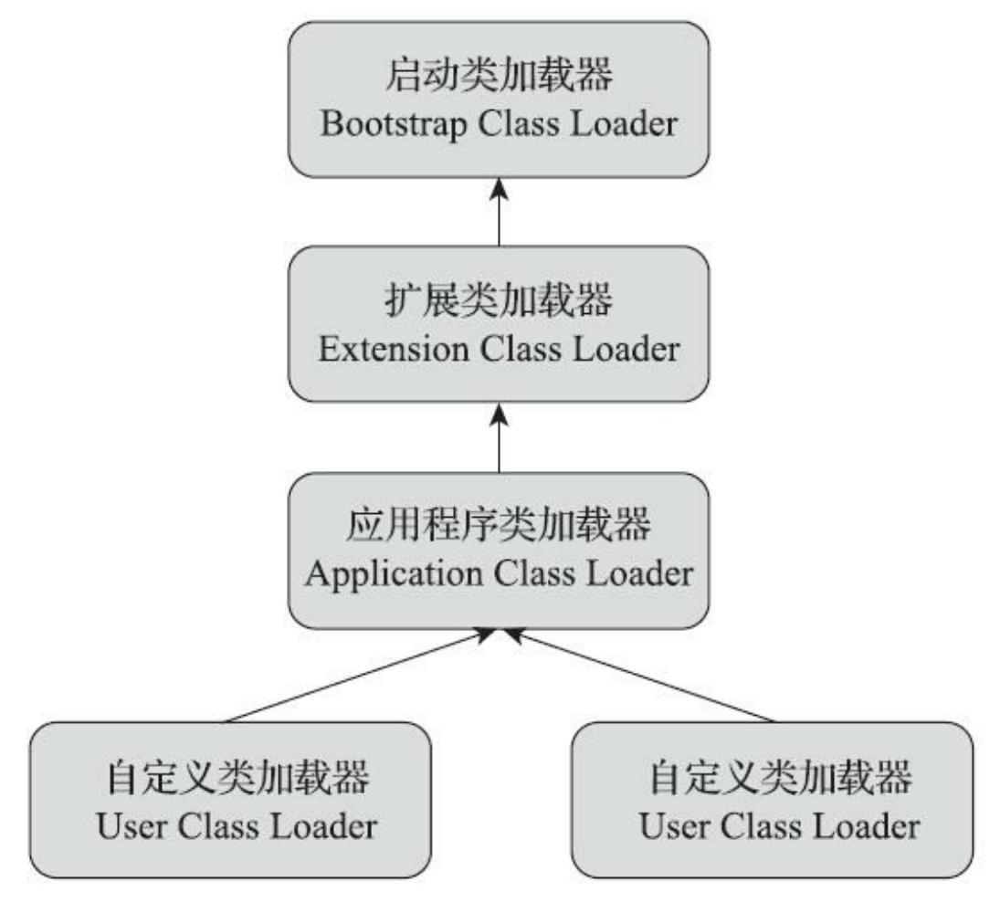

图7-2 类加载器双亲委派模型

JDK 9之前的Java应用都是由这三种类加载器互相配合来完成加载的,如果用户认为有必要,还可 以加入自定义的类加载器来进行拓展,典型的如增加除了磁盘位置之外的Class文件来源,或者通过类 加载器实现类的隔离、重载等功能。这些类加载器之间的协作关系"通常"会如图7-2所示。

图7-2中展示的各种类加载器之间的层次关系被称为类加载器的"双亲委派模型(Parents Delegation Model)"。双亲委派模型要求除了顶层的启动类加载器外,其余的类加载器都应有自己的父类加载 器。不过这里类加载器之间的父子关系一般不是以继承(Inheritance)的关系来实现的,而是通常使用 组合(Composition)关系来复用父加载器的代码。

读者可能注意到前面描述这种类加载器协作关系时,笔者专门用双引号强调这是"通常"的协作关 系。类加载器的双亲委派模型在JDK 1.2时期被引入,并被广泛应用于此后几乎所有的Java程序中,但 它并不是一个具有强制性约束力的模型,而是Java设计者们推荐给开发者的一种类加载器实现的最佳 实践。

双亲委派模型的工作过程是:如果一个类加载器收到了类加载的请求,它首先不会自己去尝试加 载这个类,而是把这个请求委派给父类加载器去完成,每一个层次的类加载器都是如此,因此所有的 加载请求最终都应该传送到最顶层的启动类加载器中,只有当父加载器反馈自己无法完成这个加载请 求(它的搜索范围中没有找到所需的类)时,子加载器才会尝试自己去完成加载。

使用双亲委派模型来组织类加载器之间的关系,一个显而易见的好处就是Java中的类随着它的类 加载器一起具备了一种带有优先级的层次关系。例如类java.lang.Object,它存放在rt.jar之中,无论哪一 个类加载器要加载这个类,最终都是委派给处于模型最顶端的启动类加载器进行加载,因此Object类 在程序的各种类加载器环境中都能够保证是同一个类。反之,如果没有使用双亲委派模型,都由各个 类加载器自行去加载的话,如果用户自己也编写了一个名为java.lang.Object的类,并放在程序的 ClassPath中,那系统中就会出现多个不同的Object类,Java类型体系中最基础的行为也就无从保证,应 用程序将会变得一片混乱。如果读者有兴趣的话,可以尝试去写一个与rt.jar类库中已有类重名的Java 类,将会发现它可以正常编译,但永远无法被加载运行[2]。

双亲委派模型对于保证Java程序的稳定运作极为重要,但它的实现却异常简单,用以实现双亲委 派的代码只有短短十余行,全部集中在java.lang.ClassLoader的loadClass()方法之中,如代码清单7-10所 示。

#### 代码清单7-10 双亲委派模型的实现

```
protected synchronized Class<?> loadClass(String name, boolean resolve) throws ClassNotFoundException
{
   // 首先,检查请求的类是否已经被加载过了
   Class c = findLoadedClass(name);
   if (c == null) {
       try {
       if (parent != null) {
           c = parent.loadClass(name, false);
       } else {
           c = findBootstrapClassOrNull(name);
       } catch (ClassNotFoundException e) {
           // 如果父类加载器抛出ClassNotFoundException
           // 说明父类加载器无法完成加载请求
       if (c == null) {
           // 在父类加载器无法加载时
           // 再调用本身的findClass方法来进行类加载
           c = findClass(name);
   if (resolve) {
       resolveClass(c);
```

这段代码的逻辑清晰易懂:先检查请求加载的类型是否已经被加载过,若没有则调用父加载器的 loadClass()方法,若父加载器为空则默认使用启动类加载器作为父加载器。假如父类加载器加载失败, 抛出ClassNotFoundException异常的话,才调用自己的findClass()方法尝试进行加载。

- [1] 这里只限于HotSpot,像MRP、Maxine这些虚拟机,整个虚拟机本身都是由Java编写的,自然Bootstrap ClassLoader也是由Java语言而不是C++实现的。退一步说,除了HotSpot外的其他两个高性能虚拟 机JRockit和J9都有一个代表Bootstrap ClassLoader的Java类存在,但是关键方法的实现仍然是使用JNI回 调到C(而不是C++)的实现上,这个Bootstrap ClassLoader的实例也无法被用户获取到。在JDK 9以 后,HotSpot虚拟机也采用了类似的虚拟机与Java类互相配合来实现Bootstrap ClassLoader的方式,所以 在JDK 9后HotSpot也有一个无法获取实例的代表Bootstrap ClassLoader的Java类存在了。
- [2] 即使自定义了自己的类加载器,强行用defineClass()方法去加载一个以"java.lang"开头的类也不会成 功。如果读者尝试这样做的话,将会收到一个由Java虚拟机内部抛出的"java.lang.SecurityException: Prohibited package name:java.lang"异常。

# 7.4.3 破坏双亲委派模型

上文提到过双亲委派模型并不是一个具有强制性约束的模型,而是Java设计者推荐给开发者们的 类加载器实现方式。在Java的世界中大部分的类加载器都遵循这个模型,但也有例外的情况,直到Java 模块化出现为止,双亲委派模型主要出现过3次较大规模"被破坏"的情况。

双亲委派模型的第一次"被破坏"其实发生在双亲委派模型出现之前——即JDK 1.2面世以前的"远 古"时代。由于双亲委派模型在JDK 1.2之后才被引入,但是类加载器的概念和抽象类 java.lang.ClassLoader则在Java的第一个版本中就已经存在,面对已经存在的用户自定义类加载器的代 码,Java设计者们引入双亲委派模型时不得不做出一些妥协,为了兼容这些已有代码,无法再以技术 手段避免loadClass()被子类覆盖的可能性,只能在JDK 1.2之后的java.lang.ClassLoader中添加一个新的 protected方法findClass(),并引导用户编写的类加载逻辑时尽可能去重写这个方法,而不是在 loadClass()中编写代码。上节我们已经分析过loadClass()方法,双亲委派的具体逻辑就实现在这里面, 按照loadClass()方法的逻辑,如果父类加载失败,会自动调用自己的findClass()方法来完成加载,这样 既不影响用户按照自己的意愿去加载类,又可以保证新写出来的类加载器是符合双亲委派规则的。

双亲委派模型的第二次"被破坏"是由这个模型自身的缺陷导致的,双亲委派很好地解决了各个类 加载器协作时基础类型的一致性问题(越基础的类由越上层的加载器进行加载),基础类型之所以被 称为"基础",是因为它们总是作为被用户代码继承、调用的API存在,但程序设计往往没有绝对不变 的完美规则,如果有基础类型又要调用回用户的代码,那该怎么办呢?

这并非是不可能出现的事情,一个典型的例子便是JNDI服务,JNDI现在已经是Java的标准服务, 它的代码由启动类加载器来完成加载(在JDK 1.3时加入到rt.jar的),肯定属于Java中很基础的类型 了。但JNDI存在的目的就是对资源进行查找和集中管理,它需要调用由其他厂商实现并部署在应用程 序的ClassPath下的JNDI服务提供者接口(Service Provider Interface,SPI)的代码,现在问题来了,启 动类加载器是绝不可能认识、加载这些代码的,那该怎么办?

为了解决这个困境,Java的设计团队只好引入了一个不太优雅的设计:线程上下文类加载器 (Thread Context ClassLoader)。这个类加载器可以通过java.lang.Thread类的setContext-ClassLoader()方 法进行设置,如果创建线程时还未设置,它将会从父线程中继承一个,如果在应用程序的全局范围内 都没有设置过的话,那这个类加载器默认就是应用程序类加载器。

有了线程上下文类加载器,程序就可以做一些"舞弊"的事情了。JNDI服务使用这个线程上下文类 加载器去加载所需的SPI服务代码,这是一种父类加载器去请求子类加载器完成类加载的行为,这种行 为实际上是打通了双亲委派模型的层次结构来逆向使用类加载器,已经违背了双亲委派模型的一般性 原则,但也是无可奈何的事情。Java中涉及SPI的加载基本上都采用这种方式来完成,例如JNDI、 JDBC、JCE、JAXB和JBI等。不过,当SPI的服务提供者多于一个的时候,代码就只能根据具体提供 者的类型来硬编码判断,为了消除这种极不优雅的实现方式,在JDK 6时,JDK提供了 java.util.ServiceLoader类,以META-INF/services中的配置信息,辅以责任链模式,这才算是给SPI的加 载提供了一种相对合理的解决方案。

双亲委派模型的第三次"被破坏"是由于用户对程序动态性的追求而导致的,这里所说的"动态

性"指的是一些非常"热"门的名词:代码热替换(Hot Swap)、模块热部署(Hot Deployment)等。说白了就是希望Java应用程序能像我们的电脑外设那样,接上鼠标、U盘,不用重启机器就能立即使用,鼠标有问题或要升级就换个鼠标,不用关机也不用重启。对于个人电脑来说,重启一次其实没有什么大不了的,但对于一些生产系统来说,关机重启一次可能就要被列为生产事故,这种情况下热部署就对软件开发者,尤其是大型系统或企业级软件开发者具有很大的吸引力。

早在2008年,在Java社区关于模块化规范的第一场战役里,由Sun/Oracle公司所提出的JSR-294<sup>[1]</sup>、JSR-277<sup>[2]</sup>规范提案就曾败给以IBM公司主导的JSR-291(即OSGi R4.2)提案。尽管Sun/Oracle并不甘心就此失去Java模块化的主导权,随即又再拿出Jigsaw项目迎战,但此时OSGi已经站稳脚跟,成为业界"事实上"的Java模块化标准<sup>[3]</sup>。曾经在很长一段时间内,IBM凭借着OSGi广泛应用基础让Jigsaw吃尽苦头,其影响一直持续到Jigsaw随JDK 9面世才算告一段落。而且即使Jigsaw现在已经是Java的标准功能了,它仍需小心翼翼地避开OSGi运行期动态热部署上的优势,仅局限于静态地解决模块间封装隔离和访问控制的问题,这部分内容笔者在7.5节中会继续讲解,现在我们先来简单看一看OSGi是如何通过类加载器实现热部署的。

OSGi实现模块化热部署的关键是它自定义的类加载器机制的实现,每一个程序模块(OSGi中称为Bundle)都有一个自己的类加载器,当需要更换一个Bundle时,就把Bundle连同类加载器一起换掉以实现代码的热替换。在OSGi环境下,类加载器不再双亲委派模型推荐的树状结构,而是进一步发展为更加复杂的网状结构,当收到类加载请求时,OSGi将按照下面的顺序进行类搜索:

- 1)将以java.\*开头的类,委派给父类加载器加载。
- 2) 否则,将委派列表名单内的类,委派给父类加载器加载。
- 3) 否则,将Import列表中的类,委派给Export这个类的Bundle的类加载器加载。
- 4) 否则, 查找当前Bundle的ClassPath, 使用自己的类加载器加载。
- 5)否则,查找类是否在自己的Fragment Bundle中,如果在,则委派给Fragment Bundle的类加载器加载。
  - 6)否则,查找Dynamic Import列表的Bundle,委派给对应Bundle的类加载器加载。
  - 7) 否则,类查找失败。

上面的查找顺序中只有开头两点仍然符合双亲委派模型的原则,其余的类查找都是在平级的类加载器中进行的,关于OSGi的其他内容,笔者就不再展开了。

本节中笔者虽然使用了"被破坏"这个词来形容上述不符合双亲委派模型原则的行为,但这里"被破坏"并不一定是带有贬义的。只要有明确的目的和充分的理由,突破旧有原则无疑是一种创新。正如OSGi中的类加载器的设计不符合传统的双亲委派的类加载器架构,且业界对其为了实现热部署而带来的额外的高复杂度还存在不少争议,但对这方面有了解的技术人员基本还是能达成一个共识,认为OSGi中对类加载器的运用是值得学习的,完全弄懂了OSGi的实现,就算是掌握了类加载器的精粹。

[1] JSR-294: Improved Modularity Support in the Java Programming Language(Java编程语言中的改进模

块性支持)。

- [2] JSR-277:Java Module System(Java模块系统)。
- [3] 如果读者对Java模块化之争或者OSGi本身感兴趣,欢迎阅读笔者的另一本书《深入理解OSGi: Equinox原理、应用与最佳实践》。

# 7.5 Java模块化系统

在JDK 9中引入的Java模块化系统(Java Platform Module System,JPMS)是对Java技术的一次重 要升级,为了能够实现模块化的关键目标——可配置的封装隔离机制,Java虚拟机对类加载架构也做 出了相应的变动调整,才使模块化系统得以顺利地运作。JDK 9的模块不仅仅像之前的JAR包那样只是 简单地充当代码的容器,除了代码外,Java的模块定义还包含以下内容:

- ·依赖其他模块的列表。
- ·导出的包列表,即其他模块可以使用的列表。
- ·开放的包列表,即其他模块可反射访问模块的列表。
- ·使用的服务列表。
- ·提供服务的实现列表。

可配置的封装隔离机制首先要解决JDK 9之前基于类路径(ClassPath)来查找依赖的可靠性问 题。此前,如果类路径中缺失了运行时依赖的类型,那就只能等程序运行到发生该类型的加载、链接 时才会报出运行的异常。而在JDK 9以后,如果启用了模块化进行封装,模块就可以声明对其他模块 的显式依赖,这样Java虚拟机就能够在启动时验证应用程序开发阶段设定好的依赖关系在运行期是否 完备,如有缺失那就直接启动失败,从而避免了很大一部分[1]由于类型依赖而引发的运行时异常。

可配置的封装隔离机制还解决了原来类路径上跨JAR文件的public类型的可访问性问题。JDK 9中 的public类型不再意味着程序的所有地方的代码都可以随意访问到它们,模块提供了更精细的可访问性 控制,必须明确声明其中哪一些public的类型可以被其他哪一些模块访问,这种访问控制也主要是在类 加载过程中完成的,具体内容笔者在前文对解析阶段的讲解中已经介绍过。

[1] 并不是说模块化下就不可能出现ClassNotFoundExcepiton这类异常了,假如将某个模块中的、原本 公开的包中把某些类型移除,但不修改模块的导出信息,这样程序能够顺利启动,但仍然会在运行期 出现类加载异常。

# 7.5.1 模块的兼容性

为了使可配置的封装隔离机制能够兼容传统的类路径查找机制,JDK 9提出了与"类路 径"(ClassPath)相对应的"模块路径"(ModulePath)的概念。简单来说,就是某个类库到底是模块还 是传统的JAR包,只取决于它存放在哪种路径上。只要是放在类路径上的JAR文件,无论其中是否包 含模块化信息(是否包含了module-info.class文件),它都会被当作传统的JAR包来对待;相应地,只 要放在模块路径上的JAR文件,即使没有使用JMOD后缀,甚至说其中并不包含module-info.class文 件,它也仍然会被当作一个模块来对待。

模块化系统将按照以下规则来保证使用传统类路径依赖的Java程序可以不经修改地直接运行在 JDK 9及以后的Java版本上,即使这些版本的JDK已经使用模块来封装了Java SE的标准类库,模块化系 统的这套规则也仍然保证了传统程序可以访问到所有标准类库模块中导出的包。

·JAR文件在类路径的访问规则:所有类路径下的JAR文件及其他资源文件,都被视为自动打包在 一个匿名模块(Unnamed Module)里,这个匿名模块几乎是没有任何隔离的,它可以看到和使用类路 径上所有的包、JDK系统模块中所有的导出包,以及模块路径上所有模块中导出的包。

·模块在模块路径的访问规则:模块路径下的具名模块(Named Module)只能访问到它依赖定义 中列明依赖的模块和包,匿名模块里所有的内容对具名模块来说都是不可见的,即具名模块看不见传 统JAR包的内容。

·JAR文件在模块路径的访问规则:如果把一个传统的、不包含模块定义的JAR文件放置到模块路 径中,它就会变成一个自动模块(Automatic Module)。尽管不包含module-info.class,但自动模块将 默认依赖于整个模块路径中的所有模块,因此可以访问到所有模块导出的包,自动模块也默认导出自 己所有的包。

以上3条规则保证了即使Java应用依然使用传统的类路径,升级到JDK 9对应用来说几乎(类加载 器上的变动还是可能会导致少许可见的影响,将在下节介绍)不会有任何感觉,项目也不需要专门为 了升级JDK版本而去把传统JAR包升级成模块。

除了向后兼容性外,随着JDK 9模块化系统的引入,更值得关注的是它本身面临的模块间的管理 和兼容性问题:如果同一个模块发行了多个不同的版本,那只能由开发者在编译打包时人工选择好正 确版本的模块来保证依赖的正确性。Java模块化系统目前不支持在模块定义中加入版本号来管理和约 束依赖,本身也不支持多版本号的概念和版本选择功能。前面这句话引来过很多的非议,但它确实是 Oracle官方对模块化系统的明确的目标说明[1]。我们不论是在Java命令、Java类库的API抑或是《Java 虚拟机规范》定义的Class文件格式里都能轻易地找到证据,表明模块版本应是编译、加载、运行期间 都可以使用的。譬如输入"java--list-modules",会得到明确带着版本号的模块列表:

java.base@12.0.1

java.compiler@12.0.1

java.datatransfer@12.0.1

java.desktop@12.0.1

java.instrument@12.0.1

java.logging@12.0.1

java.management@12.0.1

在JDK 9时加入Class文件格式的Module属性,里面有module\_version\_index这样的字段,用户可以 在编译时使用"javac--module-version"来指定模块版本,在Java类库API中也存在 java.lang.module.ModuleDescriptor.Version这样的接口可以在运行时获取到模块的版本号。这一切迹象都 证明了Java模块化系统对版本号的支持本可以不局限在编译期。而官方却在Jigsaw的规范文件、 JavaOne大会的宣讲和与专家的讨论列表中,都反复强调"JPMS的目的不是代替OSGi","JPMS不支持 模块版本"这样的话语,如图7-3所示。


图7-3 JavaOne 2017的演讲《JDK 9 Java Platform Module System》

Oracle给出的理由是希望维持一个足够简单的模块化系统,避免技术过于复杂。但结合JCP执行委 员会关于的Jigsaw投票中Oracle与IBM、RedHat的激烈冲突[2],实在很难让人信服这种设计只是单纯地 基于技术原因,而不是厂家之间互相博弈妥协的结果。Jigsaw仿佛在刻意地给OSGi让出一块生存空 间,以换取IBM支持或者说不去反对Jigsaw,其代价就是几乎宣告Java模块化系统不可能拥有像OSGi 那样支持多版本模块并存、支持运行时热替换、热部署模块的能力,可这却往往是一个应用进行模块 化的最大驱动力所在。如果要在JDK 9之后实现这种目的,就只能将OSGi和JPMS混合使用,如图7-4 所示,这无疑带来了更高的复杂度。模块的运行时部署、替换能力没有内置在Java模块化系统和Java虚 拟机之中,仍然必须通过类加载器去实现,实在不得不说是一个缺憾。

其实Java虚拟机内置的JVMTI接口(java.lang.instrument.Instrumentation)提供了一定程度的运行时 修改类的能力(RedefineClass、RetransformClass),但这种修改能力会受到很多限制[3],不可能直接 用来实现OSGi那样的热替换和多版本并存,用在IntelliJ IDE、Eclipse这些IDE上做HotSwap(是指IDE

编辑方法的代码后不需要重启即可生效)倒是非常的合适。也曾经有一个研究性项目Dynamic Code Evolution VM(DECVM)探索过在虚拟机内部支持运行时类型替换的可行性,允许任意修改已加载到 内存中的Class,并不损失任何性能,但可惜已经很久没有更新了,最新版只支持到JDK 7。

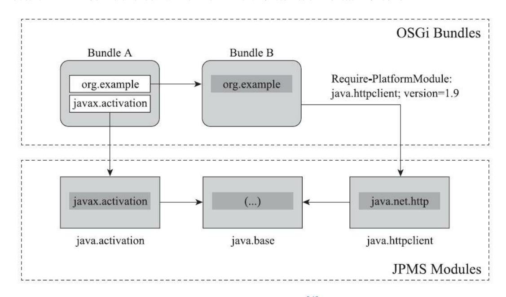

图7-4 OSGi与JPMS交互[4]

- [1] 源自Jigsaw本身的项目目标定义:http://openjdk.java.net/projects/jigsaw/goals-reqs/03#versioning。
- [2] 具体可参见1.3节对JDK 9期间描述的部分内容。
- [3] 譬如只能修改已有方法的方法体,而不能添加新成员、删除已有成员、修改已有成员的签名等。
- [4] 图片来源:https://www.infoq.com/articles/java9-osgi-future-modularity-part-2/。

# 7.5.2 模块化下的类加载器

为了保证兼容性,JDK 9并没有从根本上动摇从JDK 1.2以来运行了二十年之久的三层类加载器架 构以及双亲委派模型。但是为了模块化系统的顺利施行,模块化下的类加载器仍然发生了一些应该被 注意到变动,主要包括以下几个方面。

首先,是扩展类加载器(Extension Class Loader)被平台类加载器(Platform Class Loader)取代。 这其实是一个很顺理成章的变动,既然整个JDK都基于模块化进行构建(原来的rt.jar和tools.jar被拆分 成数十个JMOD文件),其中的Java类库就已天然地满足了可扩展的需求,那自然无须再保留 <JAVA\_HOME>\lib\ext目录,此前使用这个目录或者java.ext.dirs系统变量来扩展JDK功能的机制已经没 有继续存在的价值了,用来加载这部分类库的扩展类加载器也完成了它的历史使命。类似地,在新版 的JDK中也取消了<JAVA\_HOME>\jre目录,因为随时可以组合构建出程序运行所需的JRE来,譬如假 设我们只使用java.base模块中的类型,那么随时可以通过以下命令打包出一个"JRE":

jlink -p \$JAVA\_HOME/jmods --add-modules java.base --output jre

其次,平台类加载器和应用程序类加载器都不再派生自java.net.URLClassLoader,如果有程序直接 依赖了这种继承关系,或者依赖了URLClassLoader类的特定方法,那代码很可能会在JDK 9及更高版 本的JDK中崩溃。现在启动类加载器、平台类加载器、应用程序类加载器全都继承于 jdk.internal.loader.BuiltinClassLoader,在BuiltinClassLoader中实现了新的模块化架构下类如何从模块中 加载的逻辑,以及模块中资源可访问性的处理。两者的前后变化如图7-5和7-6所示。

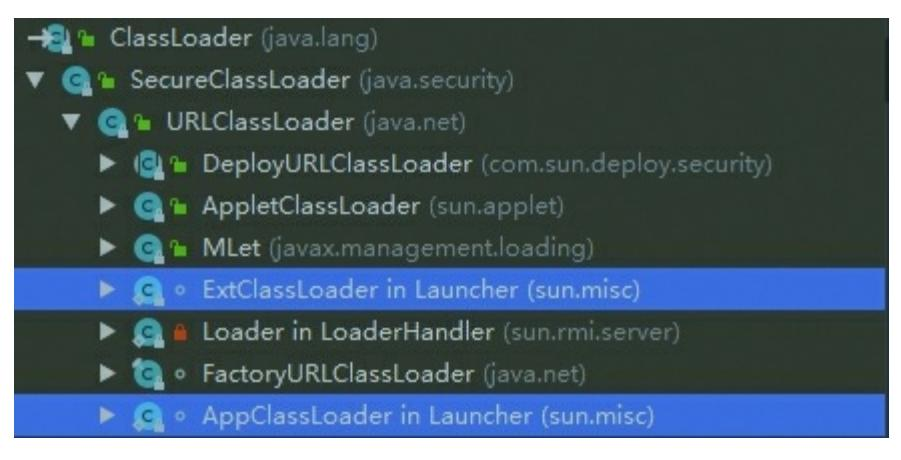

图7-5 JDK 9之前的类加载器继承架构

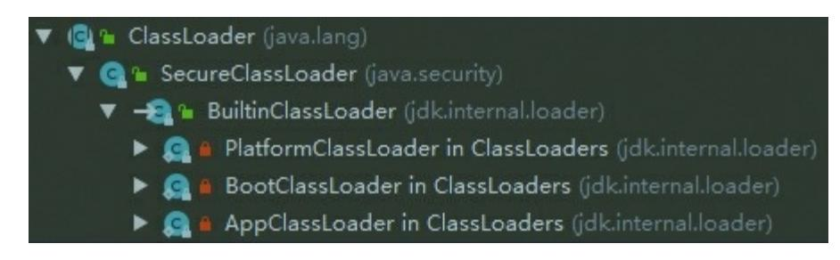

图7-6 JDK 9及以后的类加载器继承架构

另外,读者可能已经注意到图7-6中有"BootClassLoader"存在,启动类加载器现在是在Java虚拟机 内部和Java类库共同协作实现的类加载器,尽管有了BootClassLoader这样的Java类,但为了与之前的代 码保持兼容,所有在获取启动类加载器的场景(譬如Object.class.getClassLoader())中仍然会返回null来 代替,而不会得到BootClassLoader的实例。

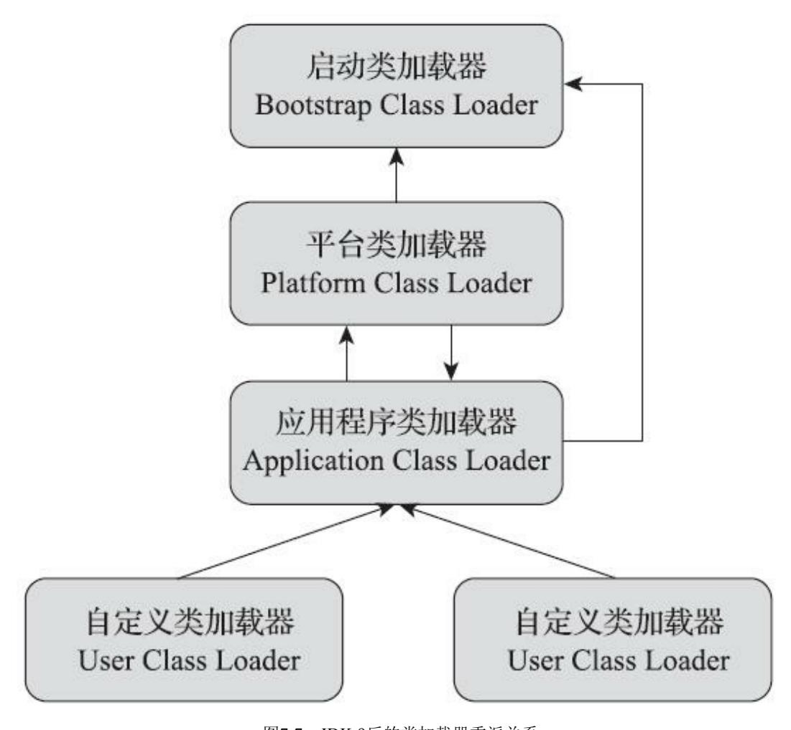

图7-7 JDK 9后的类加载器委派关系

最后,JDK 9中虽然仍然维持着三层类加载器和双亲委派的架构,但类加载的委派关系也发生了 变动。当平台及应用程序类加载器收到类加载请求,在委派给父加载器加载前,要先判断该类是否能 够归属到某一个系统模块中,如果可以找到这样的归属关系,就要优先委派给负责那个模块的加载器 完成加载,也许这可以算是对双亲委派的第四次破坏。在JDK 9以后的三层类加载器的架构如图7-7所 示,请读者对照图7-2进行比较。

在Java模块化系统明确规定了三个类加载器负责各自加载的模块,即前面所说的归属关系,如下 所示。

·启动类加载器负责加载的模块:

```
java.base java.security.sasl
java.datatransfer java.xml
java.desktop jdk.httpserver
java.instrument jdk.internal.vm.ci
java.logging jdk.management
java.management jdk.management.agent
java.management.rmi jdk.naming.rmi
java.naming jdk.net
java.prefs jdk.sctp
java.rmi jdk.unsupported
```

### ·平台类加载器负责加载的模块:

```
java.activation* jdk.accessibility
java.compiler* jdk.charsets
java.corba* jdk.crypto.cryptoki
java.scripting jdk.crypto.ec
java.se jdk.dynalink
java.se.ee jdk.incubator.httpclient
java.security.jgss jdk.internal.vm.compiler*
java.smartcardio jdk.jsobject
java.sql jdk.localedata
java.sql.rowset jdk.naming.dns
java.transaction* jdk.scripting.nashorn
java.xml.bind* jdk.security.auth
java.xml.crypto jdk.security.jgss
java.xml.ws* jdk.xml.dom
java.xml.ws.annotation* jdk.zipfs
```

### ·应用程序类加载器负责加载的模块:

```
jdk.aot jdk.jdeps
jdk.attach jdk.jdi
jdk.compiler jdk.jdwp.agent
jdk.editpad jdk.jlink
jdk.hotspot.agent jdk.jshell
jdk.internal.ed jdk.jstatd
jdk.internal.jvmstat jdk.pack
jdk.internal.le jdk.policytool
jdk.internal.opt jdk.rmic
jdk.jartool jdk.scripting.nashorn.shell
jdk.javadoc jdk.xml.bind*
jdk.jcmd jdk.xml.ws*
jdk.jconsole
```

### 7.6 本章小结

本章介绍了类加载过程的"加载""验证""准备""解析"和"初始化"这5个阶段中虚拟机进行了哪些动 作,还介绍了类加载器的工作原理及其对虚拟机的意义。

经过第6、7章的讲解,相信读者已经对如何在Class文件中定义类,以及如何将类加载到虚拟机之 中这两个问题有了一个比较系统的了解,第8章我们将探索Java虚拟机的执行引擎,一起来看看虚拟机 如何执行定义在Class文件里的字节码。

# 第8章 虚拟机字节码执行引擎

代码编译的结果从本地机器码转变为字节码,是存储格式发展的一小步,却是编程语言发展的一 大步。

### 8.1 概述

执行引擎是Java虚拟机核心的组成部分之一。"虚拟机"是一个相对于"物理机"的概念,这两种机 器都有代码执行能力,其区别是物理机的执行引擎是直接建立在处理器、缓存、指令集和操作系统层 面上的,而虚拟机的执行引擎则是由软件自行实现的,因此可以不受物理条件制约地定制指令集与执 行引擎的结构体系,能够执行那些不被硬件直接支持的指令集格式。

在《Java虚拟机规范》中制定了Java虚拟机字节码执行引擎的概念模型,这个概念模型成为各大发 行商的Java虚拟机执行引擎的统一外观(Facade)。在不同的虚拟机实现中,执行引擎在执行字节码的 时候,通常会有解释执行(通过解释器执行)和编译执行(通过即时编译器产生本地代码执行)两种 选择[1],也可能两者兼备,还可能会有同时包含几个不同级别的即时编译器一起工作的执行引擎。但 从外观上来看,所有的Java虚拟机的执行引擎输入、输出都是一致的:输入的是字节码二进制流,处 理过程是字节码解析执行的等效过程,输出的是执行结果,本章将主要从概念模型的角度来讲解虚拟 机的方法调用和字节码执行。

[1] 有一些虚拟机(如Sun Classic VM)的内部只存在解释器,只能解释执行,另外一些虚拟机(如 BEA JRockit)的内部只存在即时编译器,只能编译执行。

# 8.2 运行时栈帧结构

Java虚拟机以方法作为最基本的执行单元,"栈帧"(Stack Frame)则是用于支持虚拟机进行方法 调用和方法执行背后的数据结构,它也是虚拟机运行时数据区中的虚拟机栈(Virtual Machine Stack)[1]的栈元素。栈帧存储了方法的局部变量表、操作数栈、动态连接和方法返回地址等信息,如 果读者认真阅读过第6章,应该能从Class文件格式的方法表中找到以上大多数概念的静态对照物。每 一个方法从调用开始至执行结束的过程,都对应着一个栈帧在虚拟机栈里面从入栈到出栈的过程。

每一个栈帧都包括了局部变量表、操作数栈、动态连接、方法返回地址和一些额外的附加信息。 在编译Java程序源码的时候,栈帧中需要多大的局部变量表,需要多深的操作数栈就已经被分析计算 出来,并且写入到方法表的Code属性之中[2]。换言之,一个栈帧需要分配多少内存,并不会受到程序 运行期变量数据的影响,而仅仅取决于程序源码和具体的虚拟机实现的栈内存布局形式。

一个线程中的方法调用链可能会很长,以Java程序的角度来看,同一时刻、同一条线程里面,在 调用堆栈的所有方法都同时处于执行状态。而对于执行引擎来讲,在活动线程中,只有位于栈顶的方 法才是在运行的,只有位于栈顶的栈帧才是生效的,其被称为"当前栈帧"(Current Stack Frame),与 这个栈帧所关联的方法被称为"当前方法"(Current Method)。执行引擎所运行的所有字节码指令都只 针对当前栈帧进行操作,在概念模型上,典型的栈帧结构如图8-1所示。

图8-1所示的就是虚拟机栈和栈帧的总体结构,接下来,我们将会详细了解栈帧中的局部变量表、 操作数栈、动态连接、方法返回地址等各个部分的作用和数据结构。

- [1] 详细内容请参见2.2节的相关内容。
- [2] 详细内容请参见6.3.7节的相关内容。