# 8.2.1 局部变量表

局部变量表(Local Variables Table)是一组变量值的存储空间,用于存放方法参数和方法内部定义 的局部变量。在Java程序被编译为Class文件时,就在方法的Code属性的max\_locals数据项中确定了该方 法所需分配的局部变量表的最大容量。

局部变量表的容量以变量槽(Variable Slot)为最小单位,《Java虚拟机规范》中并没有明确指出 一个变量槽应占用的内存空间大小,只是很有导向性地说到每个变量槽都应该能存放一个boolean、 byte、char、short、int、float、reference或returnAddress类型的数据,这8种数据类型,都可以使用32位 或更小的物理内存来存储,但这种描述与明确指出"每个变量槽应占用32位长度的内存空间"是有本质 差别的,它允许变量槽的长度可以随着处理器、操作系统或虚拟机实现的不同而发生变化,保证了即 使在64位虚拟机中使用了64位的物理内存空间去实现一个变量槽,虚拟机仍要使用对齐和补白的手段 让变量槽在外观上看起来与32位虚拟机中的一致。

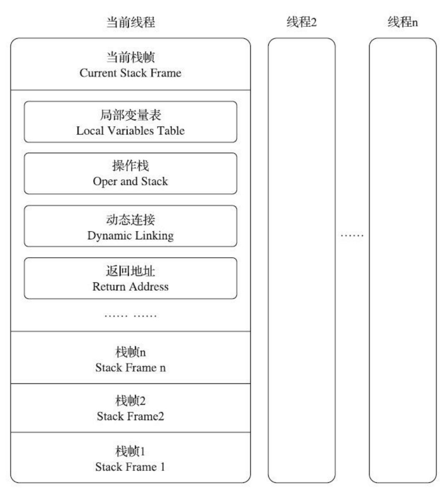

图8-1 栈帧的概念结构

既然前面提到了Java虚拟机的数据类型,在此对它们再简单介绍一下。一个变量槽可以存放一个 32位以内的数据类型,Java中占用不超过32位存储空间的数据类型有boolean、byte、char、short、int、 float、reference [1]和returnAddress这8种类型。前面6种不需要多加解释,读者可以按照Java语言中对应 数据类型的概念去理解它们(仅是这样理解而已,Java语言和Java虚拟机中的基本数据类型是存在本质

差别的),而第7种reference类型表示对一个对象实例的引用,《Java虚拟机规范》既没有说明它的长 度,也没有明确指出这种引用应有怎样的结构。但是一般来说,虚拟机实现至少都应当能通过这个引 用做到两件事情,一是从根据引用直接或间接地查找到对象在Java堆中的数据存放的起始地址或索 引,二是根据引用直接或间接地查找到对象所属数据类型在方法区中的存储的类型信息,否则将无法 实现《Java语言规范》中定义的语法约定[2]。第8种returnAddress类型目前已经很少见了,它是为字节 码指令jsr、jsr\_w和ret服务的,指向了一条字节码指令的地址,某些很古老的Java虚拟机曾经使用这几 条指令来实现异常处理时的跳转,但现在也已经全部改为采用异常表来代替了。

对于64位的数据类型,Java虚拟机会以高位对齐的方式为其分配两个连续的变量槽空间。Java语言 中明确的64位的数据类型只有long和double两种。这里把long和double数据类型分割存储的做法与"long 和double的非原子性协定"中允许把一次long和double数据类型读写分割为两次32位读写的做法有些类 似,读者阅读到本书关于Java内存模型的内容[3]时可以进行对比。不过,由于局部变量表是建立在线 程堆栈中的,属于线程私有的数据,无论读写两个连续的变量槽是否为原子操作,都不会引起数据竞 争和线程安全问题。

Java虚拟机通过索引定位的方式使用局部变量表,索引值的范围是从0开始至局部变量表最大的变 量槽数量。如果访问的是32位数据类型的变量,索引N就代表了使用第N个变量槽,如果访问的是64位 数据类型的变量,则说明会同时使用第N和N+1两个变量槽。对于两个相邻的共同存放一个64位数据 的两个变量槽,虚拟机不允许采用任何方式单独访问其中的某一个,《Java虚拟机规范》中明确要求 了如果遇到进行这种操作的字节码序列,虚拟机就应该在类加载的校验阶段中抛出异常。

当一个方法被调用时,Java虚拟机会使用局部变量表来完成参数值到参数变量列表的传递过程, 即实参到形参的传递。如果执行的是实例方法(没有被static修饰的方法),那局部变量表中第0位索 引的变量槽默认是用于传递方法所属对象实例的引用,在方法中可以通过关键字"this"来访问到这个隐 含的参数。其余参数则按照参数表顺序排列,占用从1开始的局部变量槽,参数表分配完毕后,再根据 方法体内部定义的变量顺序和作用域分配其余的变量槽。

为了尽可能节省栈帧耗用的内存空间,局部变量表中的变量槽是可以重用的,方法体中定义的变 量,其作用域并不一定会覆盖整个方法体,如果当前字节码PC计数器的值已经超出了某个变量的作用 域,那这个变量对应的变量槽就可以交给其他变量来重用。不过,这样的设计除了节省栈帧空间以 外,还会伴随有少量额外的副作用,例如在某些情况下变量槽的复用会直接影响到系统的垃圾收集行 为,请看代码清单8-1、代码清单8-2和代码清单8-3的3个演示。

代码清单8-1 局部变量表槽复用对垃圾收集的影响之一

```
public static void main(String[] args)() {
    byte[] placeholder = new byte[64 * 1024 * 1024];
    System.gc();
```

代码清单8-1中的代码很简单,向内存填充了64MB的数据,然后通知虚拟机进行垃圾收集。我们 在虚拟机运行参数中加上"-verbose:gc"来看看垃圾收集的过程,发现在System.gc()运行后并没有回收 掉这64MB的内存,下面是运行的结果:

代码清单8-1的代码没有回收掉placeholder所占的内存是能说得过去,因为在执行System.gc()时, 变量placeholder还处于作用域之内,虚拟机自然不敢回收掉placeholder的内存。那我们把代码修改一 下,变成代码清单8-2的样子。

代码清单8-2 局部变量表Slot复用对垃圾收集的影响之二

```
public static void main(String[] args)() {
    {
        byte[] placeholder = new byte[64 * 1024 * 1024];
    System.gc();
```

加入了花括号之后,placeholder的作用域被限制在花括号以内,从代码逻辑上讲,在执行 System.gc()的时候,placeholder已经不可能再被访问了,但执行这段程序,会发现运行结果如下,还是 有64MB的内存没有被回收掉,这又是为什么呢?

```
[GC 66846K->65888K(125632K), 0.0009397 secs]
[Full GC 65888K->65746K(125632K), 0.0051574 secs]
```

在解释为什么之前,我们先对这段代码进行第二次修改,在调用System.gc()之前加入一行"int a=0;",变成代码清单8-3的样子。

代码清单8-3 局部变量表Slot复用对垃圾收集的影响之三

```
public static void main(String[] args)() {
    {
        byte[] placeholder = new byte[64 * 1024 * 1024];
    int a = 0;
    System.gc();
```

这个修改看起来很莫名其妙,但运行一下程序,却发现这次内存真的被正确回收了:

```
[GC 66401K->65778K(125632K), 0.0035471 secs]
[Full GC 65778K->218K(125632K), 0.0140596 secs]
```

代码清单8-1至8-3中,placeholder能否被回收的根本原因就是:局部变量表中的变量槽是否还存有 关于placeholder数组对象的引用。第一次修改中,代码虽然已经离开了placeholder的作用域,但在此之 后,再没有发生过任何对局部变量表的读写操作,placeholder原本所占用的变量槽还没有被其他变量 所复用,所以作为GC Roots一部分的局部变量表仍然保持着对它的关联。这种关联没有被及时打断, 绝大部分情况下影响都很轻微。但如果遇到一个方法,其后面的代码有一些耗时很长的操作,而前面 又定义了占用了大量内存但实际上已经不会再使用的变量,手动将其设置为null值(用来代替那句int

a=0,把变量对应的局部变量槽清空)便不见得是一个绝对无意义的操作,这种操作可以作为一种在极 特殊情形(对象占用内存大、此方法的栈帧长时间不能被回收、方法调用次数达不到即时编译器的编 译条件)下的"奇技"来使用。Java语言的一本非常著名的书籍《Practical Java》中将把"不使用的对象 应手动赋值为null"作为一条推荐的编码规则(笔者并不认同这条规则),但是并没有解释具体原因, 很长时间里都有读者对这条规则感到疑惑。

虽然代码清单8-1至8-3的示例说明了赋null操作在某些极端情况下确实是有用的,但笔者的观点是 不应当对赋null值操作有什么特别的依赖,更没有必要把它当作一个普遍的编码规则来推广。原因有两 点,从编码角度讲,以恰当的变量作用域来控制变量回收时间才是最优雅的解决方法,如代码清单8-3 那样的场景除了做实验外几乎毫无用处。更关键的是,从执行角度来讲,使用赋null操作来优化内存回 收是建立在对字节码执行引擎概念模型的理解之上的,在第6章介绍完字节码之后,笔者在末尾还撰写 了一个小结"公有设计、私有实现"(6.5节)来强调概念模型与实际执行过程是外部看起来等效,内部 看上去则可以完全不同。当虚拟机使用解释器执行时,通常与概念模型还会比较接近,但经过即时编 译器施加了各种编译优化措施以后,两者的差异就会非常大,只保证程序执行的结果与概念一致。在 实际情况中,即时编译才是虚拟机执行代码的主要方式,赋null值的操作在经过即时编译优化后几乎是 一定会被当作无效操作消除掉的,这时候将变量设置为null就是毫无意义的行为。字节码被即时编译为 本地代码后,对GC Roots的枚举也与解释执行时期有显著差别,以前面的例子来看,经过第一次修改 的代码清单8-2在经过即时编译后,System.gc()执行时就可以正确地回收内存,根本无须写成代码清单 8-3的样子。

关于局部变量表,还有一点可能会对实际开发产生影响,就是局部变量不像前面介绍的类变量那 样存在"准备阶段"。通过第7章的学习,我们已经知道类的字段变量有两次赋初始值的过程,一次在准 备阶段,赋予系统初始值;另外一次在初始化阶段,赋予程序员定义的初始值。因此即使在初始化阶 段程序员没有为类变量赋值也没有关系,类变量仍然具有一个确定的初始值,不会产生歧义。但局部 变量就不一样了,如果一个局部变量定义了但没有赋初始值,那它是完全不能使用的。所以不要认为 Java中任何情况下都存在诸如整型变量默认为0、布尔型变量默认为false等这样的默认值规则。如代码 清单8-4所示,这段代码在Java中其实并不能运行(但是在其他语言,譬如C和C++中类似的代码是可 以运行的),所幸编译器能在编译期间就检查到并提示出这一点,即便编译能通过或者手动生成字节 码的方式制造出下面代码的效果,字节码校验的时候也会被虚拟机发现而导致类加载失败。

#### 代码清单8-4 未赋值的局部变量

```
public static void main(String[] args) {
    int a;
    System.out.println(a);
```

- [1] Java虚拟机规范中没有明确规定reference类型的长度,它的长度与实际使用32位还是64位虚拟机有 关,如果是64位虚拟机,还与是否开启某些对象指针压缩的优化有关,这里我们暂且只取32位虚拟机 的reference长度。
- [2] 并不是所有语言的对象引用都能满足这两点,例如C++语言,默认情况下(不开启RTTI支持的情 况),就只能满足第一点,而不满足第二点。这也是为何C++中无法提供Java语言里很常见的反射的 根本原因。
- [3] 这是Java内存模型中定义的内容,关于原子操作与"long和double的非原子性协定"等问题,将在本书

第12章中做详细讲解。

# 8.2.2 操作数栈

操作数栈(Operand Stack)也常被称为操作栈,它是一个后入先出(Last In First Out,LIFO) 栈。同局部变量表一样,操作数栈的最大深度也在编译的时候被写入到Code属性的max\_stacks数据项 之中。操作数栈的每一个元素都可以是包括long和double在内的任意Java数据类型。32位数据类型所占 的栈容量为1,64位数据类型所占的栈容量为2。Javac编译器的数据流分析工作保证了在方法执行的任 何时候,操作数栈的深度都不会超过在max\_stacks数据项中设定的最大值。

当一个方法刚刚开始执行的时候,这个方法的操作数栈是空的,在方法的执行过程中,会有各种 字节码指令往操作数栈中写入和提取内容,也就是出栈和入栈操作。譬如在做算术运算的时候是通过 将运算涉及的操作数栈压入栈顶后调用运算指令来进行的,又譬如在调用其他方法的时候是通过操作 数栈来进行方法参数的传递。举个例子,例如整数加法的字节码指令iadd,这条指令在运行的时候要 求操作数栈中最接近栈顶的两个元素已经存入了两个int型的数值,当执行这个指令时,会把这两个int 值出栈并相加,然后将相加的结果重新入栈。

操作数栈中元素的数据类型必须与字节码指令的序列严格匹配,在编译程序代码的时候,编译器 必须要严格保证这一点,在类校验阶段的数据流分析中还要再次验证这一点。再以上面的iadd指令为 例,这个指令只能用于整型数的加法,它在执行时,最接近栈顶的两个元素的数据类型必须为int型, 不能出现一个long和一个float使用iadd命令相加的情况。

另外在概念模型中,两个不同栈帧作为不同方法的虚拟机栈的元素,是完全相互独立的。但是在 大多虚拟机的实现里都会进行一些优化处理,令两个栈帧出现一部分重叠。让下面栈帧的部分操作数 栈与上面栈帧的部分局部变量表重叠在一起,这样做不仅节约了一些空间,更重要的是在进行方法调 用时就可以直接共用一部分数据,无须进行额外的参数复制传递了,重叠的过程如图8-2所示。

Java虚拟机的解释执行引擎被称为"基于栈的执行引擎",里面的"栈"就是操作数栈。后文会对基 于栈的代码执行过程进行更详细的讲解,介绍它与更常见的基于寄存器的执行引擎有哪些差别。

|         |      | 操作栈       |
|---------|------|-----------|
|         |      | 其他栈帧信息    |
|         |      | 局部变量表     |
| 操作栈共享区域 | 重叠区域 | 局部变量表共享区域 |
| 操作栈     |      |           |
| 其他栈帧信息  |      |           |
| 局部变量表   |      |           |

图8-2 两个栈帧之间的数据共享

# 8.2.3 动态连接

每个栈帧都包含一个指向运行时常量池[1]中该栈帧所属方法的引用,持有这个引用是为了支持方 法调用过程中的动态连接(Dynamic Linking)。通过第6章的讲解,我们知道Class文件的常量池中存 有大量的符号引用,字节码中的方法调用指令就以常量池里指向方法的符号引用作为参数。这些符号 引用一部分会在类加载阶段或者第一次使用的时候就被转化为直接引用,这种转化被称为静态解析。 另外一部分将在每一次运行期间都转化为直接引用,这部分就称为动态连接。关于这两个转化过程的 具体过程,将在8.3节中再详细讲解。

[1] 运行时常量池的相关内容详见第2章。

# 8.2.4 方法返回地址

当一个方法开始执行后,只有两种方式退出这个方法。第一种方式是执行引擎遇到任意一个方法 返回的字节码指令,这时候可能会有返回值传递给上层的方法调用者(调用当前方法的方法称为调用 者或者主调方法),方法是否有返回值以及返回值的类型将根据遇到何种方法返回指令来决定,这种 退出方法的方式称为"正常调用完成"(Normal Method Invocation Completion)。

另外一种退出方式是在方法执行的过程中遇到了异常,并且这个异常没有在方法体内得到妥善处 理。无论是Java虚拟机内部产生的异常,还是代码中使用athrow字节码指令产生的异常,只要在本方 法的异常表中没有搜索到匹配的异常处理器,就会导致方法退出,这种退出方法的方式称为"异常调用 完成(Abrupt Method Invocation Completion)"。一个方法使用异常完成出口的方式退出,是不会给它 的上层调用者提供任何返回值的。

无论采用何种退出方式,在方法退出之后,都必须返回到最初方法被调用时的位置,程序才能继 续执行,方法返回时可能需要在栈帧中保存一些信息,用来帮助恢复它的上层主调方法的执行状态。 一般来说,方法正常退出时,主调方法的PC计数器的值就可以作为返回地址,栈帧中很可能会保存这 个计数器值。而方法异常退出时,返回地址是要通过异常处理器表来确定的,栈帧中就一般不会保存 这部分信息。

方法退出的过程实际上等同于把当前栈帧出栈,因此退出时可能执行的操作有:恢复上层方法的 局部变量表和操作数栈,把返回值(如果有的话)压入调用者栈帧的操作数栈中,调整PC计数器的值 以指向方法调用指令后面的一条指令等。笔者这里写的"可能"是由于这是基于概念模型的讨论,只有 具体到某一款Java虚拟机实现,会执行哪些操作才能确定下来。

# 8.2.5 附加信息

《Java虚拟机规范》允许虚拟机实现增加一些规范里没有描述的信息到栈帧之中,例如与调试、 性能收集相关的信息,这部分信息完全取决于具体的虚拟机实现,这里不再详述。在讨论概念时,一 般会把动态连接、方法返回地址与其他附加信息全部归为一类,称为栈帧信息。

# 8.3 方法调用

方法调用并不等同于方法中的代码被执行,方法调用阶段唯一的任务就是确定被调用方法的版本 (即调用哪一个方法),暂时还未涉及方法内部的具体运行过程。在程序运行时,进行方法调用是最 普遍、最频繁的操作之一,但第7章中已经讲过,Class文件的编译过程中不包含传统程序语言编译的 连接步骤,一切方法调用在Class文件里面存储的都只是符号引用,而不是方法在实际运行时内存布局 中的入口地址(也就是之前说的直接引用)。这个特性给Java带来了更强大的动态扩展能力,但也使 得Java方法调用过程变得相对复杂,某些调用需要在类加载期间,甚至到运行期间才能确定目标方法 的直接引用。

# 8.3.1 解析

承接前面关于方法调用的话题,所有方法调用的目标方法在Class文件里面都是一个常量池中的符 号引用,在类加载的解析阶段,会将其中的一部分符号引用转化为直接引用,这种解析能够成立的前 提是:方法在程序真正运行之前就有一个可确定的调用版本,并且这个方法的调用版本在运行期是不 可改变的。换句话说,调用目标在程序代码写好、编译器进行编译那一刻就已经确定下来。这类方法 的调用被称为解析(Resolution)。

在Java语言中符合"编译期可知,运行期不可变"这个要求的方法,主要有静态方法和私有方法两 大类,前者与类型直接关联,后者在外部不可被访问,这两种方法各自的特点决定了它们都不可能通 过继承或别的方式重写出其他版本,因此它们都适合在类加载阶段进行解析。

调用不同类型的方法,字节码指令集里设计了不同的指令。在Java虚拟机支持以下5条方法调用字 节码指令,分别是:

- ·invokestatic。用于调用静态方法。
- ·invokespecial。用于调用实例构造器<init>()方法、私有方法和父类中的方法。
- ·invokevirtual。用于调用所有的虚方法。
- ·invokeinterface。用于调用接口方法,会在运行时再确定一个实现该接口的对象。

·invokedynamic。先在运行时动态解析出调用点限定符所引用的方法,然后再执行该方法。前面4 条调用指令,分派逻辑都固化在Java虚拟机内部,而invokedynamic指令的分派逻辑是由用户设定的引 导方法来决定的。

只要能被invokestatic和invokespecial指令调用的方法,都可以在解析阶段中确定唯一的调用版本, Java语言里符合这个条件的方法共有静态方法、私有方法、实例构造器、父类方法4种,再加上被final 修饰的方法(尽管它使用invokevirtual指令调用),这5种方法调用会在类加载的时候就可以把符号引 用解析为该方法的直接引用。这些方法统称为"非虚方法"(Non-Virtual Method),与之相反,其他方 法就被称为"虚方法"(Virtual Method)。

代码清单8-5演示了一种常见的解析调用的例子,该样例中,静态方法sayHello()只可能属于类型 StaticResolution,没有任何途径可以覆盖或隐藏这个方法。

代码清单8-5 方法静态解析演示

```
/**
 * 方法静态解析演示
 *
 * @author zzm
 */
public class StaticResolution {
    public static void sayHello() {
        System.out.println("hello world");
```

```
public static void main(String[] args) {
    StaticResolution.sayHello();
```

使用javap命令查看这段程序对应的字节码,会发现的确是通过invokestatic命令来调用sayHello()方 法,而且其调用的方法版本已经在编译时就明确以常量池项的形式固化在字节码指令的参数之中(代 码里的31号常量池项):

```
javap -verbose StaticResolution
public static void main(java.lang.String[]);
   Code:
       Stack=0, Locals=1, Args_size=1
       0: invokestatic #31; //Method sayHello:()V
       3: return
   LineNumberTable:
       line 15: 0
       line 16: 3
```

Java中的非虚方法除了使用invokestatic、invokespecial调用的方法之外还有一种,就是被final修饰 的实例方法。虽然由于历史设计的原因,final方法是使用invokevirtual指令来调用的,但是因为它也无 法被覆盖,没有其他版本的可能,所以也无须对方法接收者进行多态选择,又或者说多态选择的结果 肯定是唯一的。在《Java语言规范》中明确定义了被final修饰的方法是一种非虚方法。

解析调用一定是个静态的过程,在编译期间就完全确定,在类加载的解析阶段就会把涉及的符号 引用全部转变为明确的直接引用,不必延迟到运行期再去完成。而另一种主要的方法调用形式:分派 (Dispatch)调用则要复杂许多,它可能是静态的也可能是动态的,按照分派依据的宗量数可分为单 分派和多分派[1]。这两类分派方式两两组合就构成了静态单分派、静态多分派、动态单分派、动态多 分派4种分派组合情况,下面我们来看看虚拟机中的方法分派是如何进行的。

[1] 这里涉及的单分派、多分派及相关概念(如"宗量数")在后续章节有详细解释,如没有这方面基础 的读者暂时略过即可。

# 8.3.2 分派

众所周知,Java是一门面向对象的程序语言,因为Java具备面向对象的3个基本特征:继承、封装 和多态。本节讲解的分派调用过程将会揭示多态性特征的一些最基本的体现,如"重载"和"重写"在 Java虚拟机之中是如何实现的,这里的实现当然不是语法上该如何写,我们关心的依然是虚拟机如何 确定正确的目标方法。

#### 1.静态分派

在开始讲解静态分派[1]前,笔者先声明一点,"分派"(Dispatch)这个词本身就具有动态性,一 般不应用在静态语境之中,这部分原本在英文原版的《Java虚拟机规范》和《Java语言规范》里的说法 都是"Method Overload Resolution",即应该归入8.2节的"解析"里去讲解,但部分其他外文资料和国内 翻译的许多中文资料都将这种行为称为"静态分派",所以笔者在此特别说明一下,以免读者阅读英文 资料时遇到这两种说法产生疑惑。

为了解释静态分派和重载(Overload),笔者准备了一段经常出现在面试题中的程序代码,读者 不妨先看一遍,想一下程序的输出结果是什么。后面的话题将围绕这个类的方法来编写重载代码,以 分析虚拟机和编译器确定方法版本的过程。程序如代码清单8-6所示。

#### 代码清单8-6 方法静态分派演示

```
package org.fenixsoft.polymorphic;
/**
 * 方法静态分派演示
 * @author zzm
 */
public class StaticDispatch {
    static abstract class Human {
    static class Man extends Human {
    static class Woman extends Human {
    public void sayHello(Human guy) {
        System.out.println("hello,guy!");
    public void sayHello(Man guy) {
        System.out.println("hello,gentleman!");
    public void sayHello(Woman guy) {
        System.out.println("hello,lady!");
    public static void main(String[] args) {
        Human man = new Man();
        Human woman = new Woman();
        StaticDispatch sr = new StaticDispatch();
        sr.sayHello(man);
        sr.sayHello(woman);
```

#### 运行结果:

hello,guy! hello,guy!

代码清单8-6中的代码实际上是在考验阅读者对重载的理解程度,相信对Java稍有经验的程序员看 完程序后都能得出正确的运行结果,但为什么虚拟机会选择执行参数类型为Human的重载版本呢?在 解决这个问题之前,我们先通过如下代码来定义两个关键概念:

Human man = new Man();

我们把上面代码中的"Human"称为变量的"静态类型"(Static Type),或者叫"外观类 型"(Apparent Type),后面的"Man"则被称为变量的"实际类型"(Actual Type)或者叫"运行时类 型"(Runtime Type)。静态类型和实际类型在程序中都可能会发生变化,区别是静态类型的变化仅仅 在使用时发生,变量本身的静态类型不会被改变,并且最终的静态类型是在编译期可知的;而实际类 型变化的结果在运行期才可确定,编译器在编译程序的时候并不知道一个对象的实际类型是什么。笔 者猜想上面这段话读者大概会不太好理解,那不妨通过一段实际例子来解释,譬如有下面的代码:

```
// 实际类型变化
Human human = (new Random()).nextBoolean() ? new Man() : new Woman();
// 静态类型变化
sr.sayHello((Man) human)
sr.sayHello((Woman) human)
```

对象human的实际类型是可变的,编译期间它完全是个"薛定谔的人",到底是Man还是Woman,必 须等到程序运行到这行的时候才能确定。而human的静态类型是Human,也可以在使用时(如 sayHello()方法中的强制转型)临时改变这个类型,但这个改变仍是在编译期是可知的,两次sayHello() 方法的调用,在编译期完全可以明确转型的是Man还是Woman。

解释清楚了静态类型与实际类型的概念,我们就把话题再转回到代码清单8-6的样例代码中。 main()里面的两次sayHello()方法调用,在方法接收者已经确定是对象"sr"的前提下,使用哪个重载版 本,就完全取决于传入参数的数量和数据类型。代码中故意定义了两个静态类型相同,而实际类型不 同的变量,但虚拟机(或者准确地说是编译器)在重载时是通过参数的静态类型而不是实际类型作为 判定依据的。由于静态类型在编译期可知,所以在编译阶段,Javac编译器就根据参数的静态类型决定 了会使用哪个重载版本,因此选择了sayHello(Human)作为调用目标,并把这个方法的符号引用写到 main()方法里的两条invokevirtual指令的参数中。

所有依赖静态类型来决定方法执行版本的分派动作,都称为静态分派。静态分派的最典型应用表 现就是方法重载。静态分派发生在编译阶段,因此确定静态分派的动作实际上不是由虚拟机来执行 的,这点也是为何一些资料选择把它归入"解析"而不是"分派"的原因。

需要注意Javac编译器虽然能确定出方法的重载版本,但在很多情况下这个重载版本并不是"唯 一"的,往往只能确定一个"相对更合适的"版本。这种模糊的结论在由0和1构成的计算机世界中算是个 比较稀罕的事件,产生这种模糊结论的主要原因是字面量天生的模糊性,它不需要定义,所以字面量 就没有显式的静态类型,它的静态类型只能通过语言、语法的规则去理解和推断。代码清单8-7演示了 何谓"更加合适的"版本。

#### 代码清单8-7 重载方法匹配优先级

```
package org.fenixsoft.polymorphic;
public class Overload {
    public static void sayHello(Object arg) {
        System.out.println("hello Object");
    public static void sayHello(int arg) {
        System.out.println("hello int");
    public static void sayHello(long arg) {
        System.out.println("hello long");
    public static void sayHello(Character arg) {
        System.out.println("hello Character");
    public static void sayHello(char arg) {
        System.out.println("hello char");
    public static void sayHello(char... arg) {
        System.out.println("hello char ...");
    public static void sayHello(Serializable arg) {
        System.out.println("hello Serializable");
    public static void main(String[] args) {
        sayHello('a');
```

#### 上面的代码运行后会输出:

hello char

这很好理解,'a'是一个char类型的数据,自然会寻找参数类型为char的重载方法,如果注释掉 sayHello(char arg)方法,那输出会变为:

hello int

这时发生了一次自动类型转换,'a'除了可以代表一个字符串,还可以代表数字97(字符'a'的 Unicode数值为十进制数字97),因此参数类型为int的重载也是合适的。我们继续注释掉sayHello(int hello long

这时发生了两次自动类型转换,'a'转型为整数97之后,进一步转型为长整数97L,匹配了参数类型 为long的重载。笔者在代码中没有写其他的类型如float、double等的重载,不过实际上自动转型还能继 续发生多次,按照char>int>long>float>double的顺序转型进行匹配,但不会匹配到byte和short类型的重 载,因为char到byte或short的转型是不安全的。我们继续注释掉sayHello(long arg)方法,那输出会变 为:

hello Character

这时发生了一次自动装箱,'a'被包装为它的封装类型java.lang.Character,所以匹配到了参数类型为 Character的重载,继续注释掉sayHello(Character arg)方法,那输出会变为:

hello Serializable

这个输出可能会让人摸不着头脑,一个字符或数字与序列化有什么关系?出现hello Serializable, 是因为java.lang.Serializable是java.lang.Character类实现的一个接口,当自动装箱之后发现还是找不到装 箱类,但是找到了装箱类所实现的接口类型,所以紧接着又发生一次自动转型。char可以转型成int, 但是Character是绝对不会转型为Integer的,它只能安全地转型为它实现的接口或父类。Character还实现 了另外一个接口java.lang.Comparable<Character>,如果同时出现两个参数分别为Serializable和 Comparable<Character>的重载方法,那它们在此时的优先级是一样的。编译器无法确定要自动转型为 哪种类型,会提示"类型模糊"(Type Ambiguous),并拒绝编译。程序必须在调用时显式地指定字面 量的静态类型,如:sayHello((Comparable<Character>)'a'),才能编译通过。但是如果读者愿意花费一点 时间,绕过Javac编译器,自己去构造出表达相同语义的字节码,将会发现这是能够通过Java虚拟机的 类加载校验,而且能够被Java虚拟机正常执行的,但是会选择Serializable还是Comparable<Character>的 重载方法则并不能事先确定,这是《Java虚拟机规范》所允许的,在第7章介绍接口方法解析过程时曾 经提到过。

下面继续注释掉sayHello(Serializable arg)方法,输出会变为:

hello Object

这时是char装箱后转型为父类了,如果有多个父类,那将在继承关系中从下往上开始搜索,越接 上层的优先级越低。即使方法调用传入的参数值为null时,这个规则仍然适用。我们把sayHello(Object arg)也注释掉,输出将会变为:

hello char ...

7个重载方法已经被注释得只剩1个了,可见变长参数的重载优先级是最低的,这时候字符'a'被当 作了一个char[]数组的元素。笔者使用的是char类型的变长参数,读者在验证时还可以选择int类型、 Character类型、Object类型等的变长参数重载来把上面的过程重新折腾一遍。但是要注意的是,有一些 在单个参数中能成立的自动转型,如char转型为int,在变长参数中是不成立的[2]。

代码清单8-7演示了编译期间选择静态分派目标的过程,这个过程也是Java语言实现方法重载的本 质。演示所用的这段程序无疑是属于很极端的例子,除了用作面试题为难求职者之外,在实际工作中 几乎不可能存在任何有价值的用途,笔者拿来做演示仅仅是用于讲解重载时目标方法选择的过程,对 绝大多数下进行这样极端的重载都可算作真正的"关于茴香豆的茴有几种写法的研究"。无论对重载的 认识有多么深刻,一个合格的程序员都不应该在实际应用中写这种晦涩的重载代码。

另外还有一点读者可能比较容易混淆:笔者讲述的解析与分派这两者之间的关系并不是二选一的 排他关系,它们是在不同层次上去筛选、确定目标方法的过程。例如前面说过静态方法会在编译期确 定、在类加载期就进行解析,而静态方法显然也是可以拥有重载版本的,选择重载版本的过程也是通 过静态分派完成的。

#### 2.动态分派

了解了静态分派,我们接下来看一下Java语言里动态分派的实现过程,它与Java语言多态性的另外 一个重要体现[3]——重写(Override)有着很密切的关联。我们还是用前面的Man和Woman一起 sayHello的例子来讲解动态分派,请看代码清单8-8中所示的代码。

代码清单8-8 方法动态分派演示

```
package org.fenixsoft.polymorphic;
/**
 * 方法动态分派演示
 * @author zzm
 */
public class DynamicDispatch {
    static abstract class Human {
        protected abstract void sayHello();
    static class Man extends Human {
        @Override
        protected void sayHello() {
            System.out.println("man say hello");
    static class Woman extends Human {
        @Override
        protected void sayHello() {
            System.out.println("woman say hello");
    public static void main(String[] args) {
        Human man = new Man();
        Human woman = new Woman();
        man.sayHello();
        woman.sayHello();
        man = new Woman();
        man.sayHello();
```

#### 运行结果:

```
man say hello
woman say hello
woman say hello
```

这个运行结果相信不会出乎任何人的意料,对于习惯了面向对象思维的Java程序员们会觉得这是 完全理所当然的结论。我们现在的问题还是和前面的一样,Java虚拟机是如何判断应该调用哪个方法 的?

显然这里选择调用的方法版本是不可能再根据静态类型来决定的,因为静态类型同样都是Human 的两个变量man和woman在调用sayHello()方法时产生了不同的行为,甚至变量man在两次调用中还执行 了两个不同的方法。导致这个现象的原因很明显,是因为这两个变量的实际类型不同,Java虚拟机是 如何根据实际类型来分派方法执行版本的呢?我们使用javap命令输出这段代码的字节码,尝试从中寻 找答案,输出结果如代码清单8-9所示。

#### 代码清单8-9 main()方法的字节码

```
public static void main(java.lang.String[]);
   Code:
       Stack=2, Locals=3, Args_size=1
        0: new #16; //class org/fenixsoft/polymorphic/DynamicDispatch$Man
        3: dup
        4: invokespecial #18; //Method org/fenixsoft/polymorphic/Dynamic Dispatch$Man."<init>":()V
        7: astore_1
        8: new #19; //class org/fenixsoft/polymorphic/DynamicDispatch$Woman
       11: dup
       12: invokespecial #21; //Method org/fenixsoft/polymorphic/DynamicDispatch$Woman."<init>":()V
       15: astore_2
       16: aload_1
       17: invokevirtual #22; //Method org/fenixsoft/polymorphic/Dynamic Dispatch$Human.sayHello:()V
       20: aload_2
       21: invokevirtual #22; //Method org/fenixsoft/polymorphic/Dynamic Dispatch$Human.sayHello:()V
       24: new #19; //class org/fenixsoft/polymorphic/DynamicDispatch$Woman
       27: dup
       28: invokespecial #21; //Method org/fenixsoft/polymorphic/DynamicDispatch$Woman."<init>":()V
       31: astore_1
       32: aload_1
       33: invokevirtual #22; //Method org/fenixsoft/polymorphic/Dynamic Dispatch$Human.sayHello:()V
       36: return
```

0~15行的字节码是准备动作,作用是建立man和woman的内存空间、调用Man和Woman类型的实 例构造器,将这两个实例的引用存放在第1、2个局部变量表的变量槽中,这些动作实际对应了Java源 码中的这两行:

```
Human man = new Man();
Human woman = new Woman();
```

接下来的16~21行是关键部分,16和20行的aload指令分别把刚刚创建的两个对象的引用压到栈 顶,这两个对象是将要执行的sayHello()方法的所有者,称为接收者(Receiver);17和21行是方法调 用指令,这两条调用指令单从字节码角度来看,无论是指令(都是invokevirtual)还是参数(都是常量 池中第22项的常量,注释显示了这个常量是Human.sayHello()的符号引用)都完全一样,但是这两句指 令最终执行的目标方法并不相同。那看来解决问题的关键还必须从invokevirtual指令本身入手,要弄清 楚它是如何确定调用方法版本、如何实现多态查找来着手分析才行。根据《Java虚拟机规范》, invokevirtual指令的运行时解析过程[4]大致分为以下几步:

- 1)找到操作数栈顶的第一个元素所指向的对象的实际类型,记作C。
- 2)如果在类型C中找到与常量中的描述符和简单名称都相符的方法,则进行访问权限校验,如果 通过则返回这个方法的直接引用,查找过程结束;不通过则返回java.lang.IllegalAccessError异常。
  - 3)否则,按照继承关系从下往上依次对C的各个父类进行第二步的搜索和验证过程。
  - 4)如果始终没有找到合适的方法,则抛出java.lang.AbstractMethodError异常。

正是因为invokevirtual指令执行的第一步就是在运行期确定接收者的实际类型,所以两次调用中的 invokevirtual指令并不是把常量池中方法的符号引用解析到直接引用上就结束了,还会根据方法接收者 的实际类型来选择方法版本,这个过程就是Java语言中方法重写的本质。我们把这种在运行期根据实 际类型确定方法执行版本的分派过程称为动态分派。

既然这种多态性的根源在于虚方法调用指令invokevirtual的执行逻辑,那自然我们得出的结论就只 会对方法有效,对字段是无效的,因为字段不使用这条指令。事实上,在Java里面只有虚方法存在, 字段永远不可能是虚的,换句话说,字段永远不参与多态,哪个类的方法访问某个名字的字段时,该 名字指的就是这个类能看到的那个字段。当子类声明了与父类同名的字段时,虽然在子类的内存中两 个字段都会存在,但是子类的字段会遮蔽父类的同名字段。为了加深理解,笔者又编撰了一份"劣质面 试题式"的代码片段,请阅读代码清单8-10,思考运行后会输出什么结果。

#### 代码清单8-10 字段没有多态性

```
package org.fenixsoft.polymorphic;
/**
 * 字段不参与多态
 * @author zzm
 */
public class FieldHasNoPolymorphic {
    static class Father {
        public int money = 1;
        public Father() {
            money = 2;
            showMeTheMoney();
        public void showMeTheMoney() {
            System.out.println("I am Father, i have $" + money);
    static class Son extends Father {
        public int money = 3;
        public Son() {
            money = 4;
```

```
showMeTheMoney();
    public void showMeTheMoney() {
        System.out.println("I am Son, i have $" + money);
public static void main(String[] args) {
    Father gay = new Son();
    System.out.println("This gay has $" + gay.money);
```

#### 运行后输出结果为:

```
I am Son, i have $0
I am Son, i have $4
This gay has $2
```

输出两句都是"I am Son",这是因为Son类在创建的时候,首先隐式调用了Father的构造函数,而 Father构造函数中对showMeTheMoney()的调用是一次虚方法调用,实际执行的版本是 Son::showMeTheMoney()方法,所以输出的是"I am Son",这点经过前面的分析相信读者是没有疑问的 了。而这时候虽然父类的money字段已经被初始化成2了,但Son::showMeTheMoney()方法中访问的却 是子类的money字段,这时候结果自然还是0,因为它要到子类的构造函数执行时才会被初始化。 main()的最后一句通过静态类型访问到了父类中的money,输出了2。

#### 3.单分派与多分派

方法的接收者与方法的参数统称为方法的宗量,这个定义最早应该来源于著名的《Java与模式》 一书。根据分派基于多少种宗量,可以将分派划分为单分派和多分派两种。单分派是根据一个宗量对 目标方法进行选择,多分派则是根据多于一个宗量对目标方法进行选择。

单分派和多分派的定义读起来拗口,从字面上看也比较抽象,不过对照着实例看并不难理解其含 义,代码清单8-11中举了一个Father和Son一起来做出"一个艰难的决定[5]"的例子。

代码清单8-11 单分派和多分派

```
/**
 * 单分派、多分派演示
 * @author zzm
 */
public class Dispatch {
    static class QQ {}
    static class _360 {}
    public static class Father {
        public void hardChoice(QQ arg) {
            System.out.println("father choose qq");
        public void hardChoice(_360 arg) {
            System.out.println("father choose 360");
```

```
public static class Son extends Father {
    public void hardChoice(QQ arg) {
        System.out.println("son choose qq");
    public void hardChoice(_360 arg) {
        System.out.println("son choose 360");
public static void main(String[] args) {
    Father father = new Father();
    Father son = new Son();
    father.hardChoice(new _360());
    son.hardChoice(new QQ());
```

#### 运行结果:

father choose 360 son choose qq

在main()里调用了两次hardChoice()方法,这两次hardChoice()方法的选择结果在程序输出中已经显 示得很清楚了。我们关注的首先是编译阶段中编译器的选择过程,也就是静态分派的过程。这时候选 择目标方法的依据有两点:一是静态类型是Father还是Son,二是方法参数是QQ还是360。这次选择结 果的最终产物是产生了两条invokevirtual指令,两条指令的参数分别为常量池中指向 Father::hardChoice(360)及Father::hardChoice(QQ)方法的符号引用。因为是根据两个宗量进行选择,所以 Java语言的静态分派属于多分派类型。

再看看运行阶段中虚拟机的选择,也就是动态分派的过程。在执行"son.hardChoice(new QQ())"这 行代码时,更准确地说,是在执行这行代码所对应的invokevirtual指令时,由于编译期已经决定目标方 法的签名必须为hardChoice(QQ),虚拟机此时不会关心传递过来的参数"QQ"到底是"腾讯QQ"还是"奇 瑞QQ",因为这时候参数的静态类型、实际类型都对方法的选择不会构成任何影响,唯一可以影响虚 拟机选择的因素只有该方法的接受者的实际类型是Father还是Son。因为只有一个宗量作为选择依据, 所以Java语言的动态分派属于单分派类型。

根据上述论证的结果,我们可以总结一句:如今(直至本书编写的Java 12和预览版的Java 13)的 Java语言是一门静态多分派、动态单分派的语言。强调"如今的Java语言"是因为这个结论未必会恒久不 变,C#在3.0及之前的版本与Java一样是动态单分派语言,但在C#4.0中引入了dynamic类型后,就可以 很方便地实现动态多分派。JDK 10时Java语法中新出现var关键字,但请读者切勿将其与C#中的 dynamic类型混淆,事实上Java的var与C#的var才是相对应的特性,它们与dynamic有着本质的区别:var 是在编译时根据声明语句中赋值符右侧的表达式类型来静态地推断类型,这本质是一种语法糖;而 dynamic在编译时完全不关心类型是什么,等到运行的时候再进行类型判断。Java语言中与C#的 dynamic类型功能相对接近(只是接近,并不是对等的)的应该是在JDK 9时通过JEP 276引入的 jdk.dynalink模块[6],使用jdk.dynalink可以实现在表达式中使用动态类型,Javac编译器会将这些动态类 型的操作翻译为invokedynamic指令的调用点。

按照目前Java语言的发展趋势,它并没有直接变为动态语言的迹象,而是通过内置动态语言(如 JavaScript)执行引擎、加强与其他Java虚拟机上动态语言交互能力的方式来间接地满足动态性的需

求。但是作为多种语言共同执行平台的Java虚拟机层面上则不是如此,早在JDK 7中实现的JSR-292 [7] 里面就已经开始提供对动态语言的方法调用支持了,JDK 7中新增的invokedynamic指令也成为最复杂 的一条方法调用的字节码指令,稍后笔者将在本章中专门开一节来讲解这个与Java调用动态语言密切 相关的特性。

#### 4.虚拟机动态分派的实现

前面介绍的分派过程,作为对Java虚拟机概念模型的解释基本上已经足够了,它已经解决了虚拟 机在分派中"会做什么"这个问题。但如果问Java虚拟机"具体如何做到"的,答案则可能因各种虚拟机 的实现不同会有些差别。

动态分派是执行非常频繁的动作,而且动态分派的方法版本选择过程需要运行时在接收者类型的 方法元数据中搜索合适的目标方法,因此,Java虚拟机实现基于执行性能的考虑,真正运行时一般不 会如此频繁地去反复搜索类型元数据。面对这种情况,一种基础而且常见的优化手段是为类型在方法 区中建立一个虚方法表(Virtual Method Table,也称为vtable,与此对应的,在invokeinterface执行时也 会用到接口方法表——Interface Method Table,简称itable),使用虚方法表索引来代替元数据查找以 提高性能[8]。我们先看看代码清单8-11所对应的虚方法表结构示例,如图8-3所示。

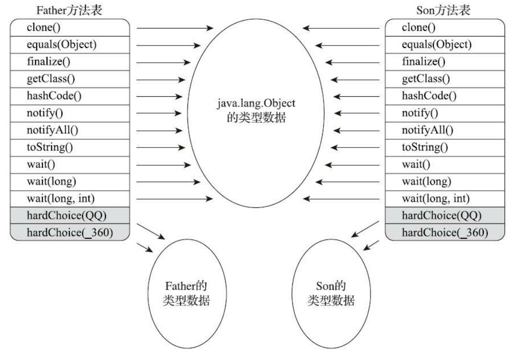

图8-3 方法表结构

虚方法表中存放着各个方法的实际入口地址。如果某个方法在子类中没有被重写,那子类的虚方 法表中的地址入口和父类相同方法的地址入口是一致的,都指向父类的实现入口。如果子类中重写了 这个方法,子类虚方法表中的地址也会被替换为指向子类实现版本的入口地址。在图8-3中,Son重写 了来自Father的全部方法,因此Son的方法表没有指向Father类型数据的箭头。但是Son和Father都没有 重写来自Object的方法,所以它们的方法表中所有从Object继承来的方法都指向了Object的数据类型。

为了程序实现方便,具有相同签名的方法,在父类、子类的虚方法表中都应当具有一样的索引序 号,这样当类型变换时,仅需要变更查找的虚方法表,就可以从不同的虚方法表中按索引转换出所需 的入口地址。虚方法表一般在类加载的连接阶段进行初始化,准备了类的变量初始值后,虚拟机会把 该类的虚方法表也一同初始化完毕。

上文中笔者提到了查虚方法表是分派调用的一种优化手段,由于Java对象里面的方法默认(即不 使用final修饰)就是虚方法,虚拟机除了使用虚方法表之外,为了进一步提高性能,还会使用类型继 承关系分析(Class Hierarchy Analysis,CHA)、守护内联(Guarded Inlining)、内联缓存(Inline Cache)等多种非稳定的激进优化来争取更大的性能空间,关于这几种优化技术的原理和运作过程,读 者可以参考第11章中的相关内容。

- [1] 维基百科中关于静态分派的解释:https://en.wikipedia.org/wiki/Static\_dispatch。
- [2] 重载中选择最合适方法的过程,可参见《Java语言规范》15.12.2节的相关内容。
- [3] 重写肯定是多态性的体现,但对于重载算不算多态,有一些概念上的争议,有观点认为必须是多个 不同类对象对同一签名的方法做出不同响应才算多态,也有观点认为只要使用同一形式的接口去实现 不同类的行为就算多态。笔者看来这种争论并无太大意义,概念仅仅是说明问题的一种工具而已。
- [4] 指普通方法的解析过程,有一些特殊情况(签名多态性方法)的解析过程会稍有区别,但这是用于 支持动态语言调用的,与本节话题关系不大。
- [5] 这是一个2010年诞生的老梗了,尽管当时很轰动,但现在可能很多人都并不了解事情始末,这并不 会影响本文的阅读。如有兴趣具体可参考:https://zhuanlan.zhihu.com/p/19609988。
- [6] JEP 276的Owner是Attila Szegedi,jdk.dynalink包实质就是把他自己写的开源项目dynalink变成了Java 标准的API,所以读者对jdk.dynalink感兴趣的话可以参考:https://github.com/szegedi/dynalink。
- [7] JSR-292:Supporting Dynamically Typed Languages on the Java Platform.(Java平台的动态语言支 持)。
- [8] 这里的"提高性能"是相对于直接搜索元数据来说的,实际上在HotSpot虚拟机的实现中,直接去查 itable和vtable已经算是最慢的一种分派,只在解释执行状态时使用,在即时编译执行时,会有更多的 性能优化措施,具体可常见第11章关于方法内联的内容。

# 8.4 动态类型语言支持

Java虚拟机的字节码指令集的数量自从Sun公司的第一款Java虚拟机问世至今,二十余年间只新增 过一条指令,它就是随着JDK 7的发布的字节码首位新成员——invokedynamic指令。这条新增加的指 令是JDK 7的项目目标:实现动态类型语言(Dynamically Typed Language)支持而进行的改进之一, 也是为JDK 8里可以顺利实现Lambda表达式而做的技术储备。在本节中,我们将详细了解动态语言支 持这项特性出现的前因后果和它的意义与价值。

# 8.4.1 动态类型语言

在介绍Java虚拟机的动态类型语言支持之前,我们要先弄明白动态类型语言是什么?它与Java语 言、Java虚拟机有什么关系?了解Java虚拟机提供动态类型语言支持的技术背景,对理解这个语言特性 是非常有必要的。

何谓动态类型语言[1]?动态类型语言的关键特征是它的类型检查的主体过程是在运行期而不是编 译期进行的,满足这个特征的语言有很多,常用的包括:APL、Clojure、Erlang、Groovy、 JavaScript、Lisp、Lua、PHP、Prolog、Python、Ruby、Smalltalk、Tcl,等等。那相对地,在编译期就 进行类型检查过程的语言,譬如C++和Java等就是最常用的静态类型语言。

如果读者觉得上面的定义过于概念化,那我们不妨通过两个例子以最浅显的方式来说明什么是"类 型检查"和什么叫"在编译期还是在运行期进行"。首先看下面这段简单的Java代码,思考一下它是否能 正常编译和运行?

```
public static void main(String[] args) {
    int[][][] array = new int[1][0][-1];
```

上面这段Java代码能够正常编译,但运行的时候会出现NegativeArraySizeException异常。在《Java 虚拟机规范》中明确规定了NegativeArraySizeException是一个运行时异常(Runtime Exception),通俗 一点说,运行时异常就是指只要代码不执行到这一行就不会出现问题。与运行时异常相对应的概念是 连接时异常,例如很常见的NoClassDefFoundError便属于连接时异常,即使导致连接时异常的代码放 在一条根本无法被执行到的路径分支上,类加载时(第7章解释过Java的连接过程不在编译阶段,而在 类加载阶段)也照样会抛出异常。

不过,在C语言里,语义相同的代码就会在编译期就直接报错,而不是等到运行时才出现异常:

```
int main(void) {
   int i[1][0][-1]; // GCC拒绝编译,报"size of array is negative"
   return 0;
```

由此看来,一门语言的哪一种检查行为要在运行期进行,哪一种检查要在编译期进行并没有什么 必然的因果逻辑关系,关键是在语言规范中人为设立的约定。

解答了什么是"连接时、运行时",笔者再举一个例子来解释什么是"类型检查",例如下面这一句 再普通不过的代码:

```
obj.println("hello world");
```

虽然正在阅读本书的每一位读者都能看懂这行代码要做什么,但对于计算机来讲,这一行"没头没

尾"的代码是无法执行的,它需要一个具体的上下文中(譬如程序语言是什么、obj是什么类型)才有 讨论的意义。

现在先假设这行代码是在Java语言中,并且变量obj的静态类型为java.io.PrintStream,那变量obj的 实际类型就必须是PrintStream的子类(实现了PrintStream接口的类)才是合法的。否则,哪怕obj属于 一个确实包含有println(String)方法相同签名方法的类型,但只要它与PrintStream接口没有继承关系,代 码依然不可能运行——因为类型检查不合法。

但是相同的代码在ECMAScript(JavaScript)中情况则不一样,无论obj具体是何种类型,无论其 继承关系如何,只要这种类型的方法定义中确实包含有println(String)方法,能够找到相同签名的方 法,调用便可成功。

产生这种差别产生的根本原因是Java语言在编译期间却已将println(String)方法完整的符号引用(本 例中为一项CONSTANT\_InterfaceMethodref\_info常量)生成出来,并作为方法调用指令的参数存储到 Class文件中,例如下面这个样子:

invokevirtual #4; //Method java/io/PrintStream.println:(Ljava/lang/String;)V

这个符号引用包含了该方法定义在哪个具体类型之中、方法的名字以及参数顺序、参数类型和方 法返回值等信息,通过这个符号引用,Java虚拟机就可以翻译出该方法的直接引用。而ECMAScript等 动态类型语言与Java有一个核心的差异就是变量obj本身并没有类型,变量obj的值才具有类型,所以编 译器在编译时最多只能确定方法名称、参数、返回值这些信息,而不会去确定方法所在的具体类型 (即方法接收者不固定)。"变量无类型而变量值才有类型"这个特点也是动态类型语言的一个核心特 征。

了解了动态类型和静态类型语言的区别后,也许读者的下一个问题就是动态、静态类型语言两者 谁更好,或者谁更加先进呢?这种比较不会有确切答案,它们都有自己的优点,选择哪种语言是需要 权衡的事情。静态类型语言能够在编译期确定变量类型,最显著的好处是编译器可以提供全面严谨的 类型检查,这样与数据类型相关的潜在问题就能在编码时被及时发现,利于稳定性及让项目容易达到 更大的规模。而动态类型语言在运行期才确定类型,这可以为开发人员提供极大的灵活性,某些在静 态类型语言中要花大量臃肿代码来实现的功能,由动态类型语言去做可能会很清晰简洁,清晰简洁通 常也就意味着开发效率的提升。

[1] 注意,动态类型语言与动态语言、弱类型语言并不是一个概念,需要区别对待。

# 8.4.2 Java与动态类型

现在我们回到本节的主题,来看看Java语言、Java虚拟机与动态类型语言之间有什么关系。Java虚 拟机毫无疑问是Java语言的运行平台,但它的使命并不限于此,早在1997年出版的《Java虚拟机规范》 第1版中就规划了这样一个愿景:"在未来,我们会对Java虚拟机进行适当的扩展,以便更好地支持其 他语言运行于Java虚拟机之上。"而目前确实已经有许多动态类型语言运行于Java虚拟机之上了,如 Clojure、Groovy、Jython和JRuby等,能够在同一个虚拟机之上可以实现静态类型语言的严谨与动态 类型语言的灵活,这的确是一件很美妙的事情。

但遗憾的是Java虚拟机层面对动态类型语言的支持一直都还有所欠缺,主要表现在方法调用方 面:JDK 7以前的字节码指令集中,4条方法调用指令(invokevirtual、invokespecial、invokestatic、 invokeinterface)的第一个参数都是被调用的方法的符号引用(CONSTANT\_Methodref\_info或者 CONSTANT\_InterfaceMethodref\_info常量),前面已经提到过,方法的符号引用在编译时产生,而动 态类型语言只有在运行期才能确定方法的接收者。这样,在Java虚拟机上实现的动态类型语言就不得 不使用"曲线救国"的方式(如编译时留个占位符类型,运行时动态生成字节码实现具体类型到占位符 类型的适配)来实现,但这样势必会让动态类型语言实现的复杂度增加,也会带来额外的性能和内存 开销。内存开销是很显而易见的,方法调用产生的那一大堆的动态类就摆在那里。而其中最严重的性 能瓶颈是在于动态类型方法调用时,由于无法确定调用对象的静态类型,而导致的方法内联无法有效 进行。在第11章里我们会讲到方法内联的重要性,它是其他优化措施的基础,也可以说是最重要的一 项优化。尽管也可以想一些办法(譬如调用点缓存)尽量缓解支持动态语言而导致的性能下降,但这 种改善毕竟不是本质的。譬如有类似以下代码:

```
var arrays = {"abc", new ObjectX(), 123, Dog, Cat, Car..}
for(item in arrays){
    item.sayHello();
```

在动态类型语言下这样的代码是没有问题,但由于在运行时arrays中的元素可以是任意类型,即使 它们的类型中都有sayHello()方法,也肯定无法在编译优化的时候就确定具体sayHello()的代码在哪里, 编译器只能不停编译它所遇见的每一个sayHello()方法,并缓存起来供执行时选择、调用和内联,如果 arrays数组中不同类型的对象很多,就势必会对内联缓存产生很大的压力,缓存的大小总是有限的,类 型信息的不确定性导致了缓存内容不断被失效和更新,先前优化过的方法也可能被不断替换而无法重 复使用。所以这种动态类型方法调用的底层问题终归是应当在Java虚拟机层次上去解决才最合适。因 此,在Java虚拟机层面上提供动态类型的直接支持就成为Java平台发展必须解决的问题,这便是JDK 7 时JSR-292提案中invokedynamic指令以及java.lang.invoke包出现的技术背景。

## 8.4.3 java.lang.invoke包

JDK 7时新加入的java.lang.invoke包[1]是JSR 292的一个重要组成部分,这个包的主要目的是在之前 单纯依靠符号引用来确定调用的目标方法这条路之外,提供一种新的动态确定目标方法的机制,称 为"方法句柄"(Method Handle)。这个表达听起来也不好懂?那不妨把方法句柄与C/C++中的函数指 针(Function Pointer),或者C#里面的委派(Delegate)互相类比一下来理解。举个例子,如果我们要 实现一个带谓词(谓词就是由外部传入的排序时比较大小的动作)的排序函数,在C/C++中的常用做 法是把谓词定义为函数,用函数指针来把谓词传递到排序方法,像这样:

```
void sort(int list[], const int size, int (*compare)(int, int))
```

但在Java语言中做不到这一点,没有办法单独把一个函数作为参数进行传递。普遍的做法是设计 一个带有compare()方法的Comparator接口,以实现这个接口的对象作为参数,例如Java类库中的 Collections::sort()方法就是这样定义的:

```
void sort(List list, Comparator c)
```

不过,在拥有方法句柄之后,Java语言也可以拥有类似于函数指针或者委托的方法别名这样的工 具了。代码清单8-12演示了方法句柄的基本用法,无论obj是何种类型(临时定义的ClassA抑或是实现 PrintStream接口的实现类System.out),都可以正确调用到println()方法。

代码清单8-12 方法句柄演示

```
import static java.lang.invoke.MethodHandles.lookup;
import java.lang.invoke.MethodHandle;
import java.lang.invoke.MethodType;
/**
* JSR 292 MethodHandle基础用法演示
* @author zzm
*/
public class MethodHandleTest {
   static class ClassA {
       public void println(String s) {
           System.out.println(s);
   public static void main(String[] args) throws Throwable {
       Object obj = System.currentTimeMillis() % 2 == 0 ? System.out : new ClassA();
       // 无论obj最终是哪个实现类,下面这句都能正确调用到println方法。
       getPrintlnMH(obj).invokeExact("icyfenix");
   private static MethodHandle getPrintlnMH(Object reveiver) throws Throwable {
       // MethodType:代表"方法类型",包含了方法的返回值(methodType()的第一个参数)和
          具体参数(methodType()第二个及以后的参数)。
       MethodType mt = MethodType.methodType(void.class, String.class);
       // lookup()方法来自于MethodHandles.lookup,这句的作用是在指定类中查找符合给定的方法
          名称、方法类型,并且符合调用权限的方法句柄。
```

```
// 因为这里调用的是一个虚方法,按照Java语言的规则,方法第一个参数是隐式的,代表该方法的接
   收者,也即this指向的对象,这个参数以前是放在参数列表中进行传递,现在提供了bindTo()
  方法来完成这件事情。
return lookup().findVirtual(reveiver.getClass(), "println", mt).bindTo(reveiver);
```

方法getPrintlnMH()中实际上是模拟了invokevirtual指令的执行过程,只不过它的分派逻辑并非固 化在Class文件的字节码上,而是通过一个由用户设计的Java方法来实现。而这个方法本身的返回值 (MethodHandle对象),可以视为对最终调用方法的一个"引用"。以此为基础,有了MethodHandle就 可以写出类似于C/C++那样的函数声明了:

void sort(List list, MethodHandle compare)

从上面的例子看来,使用MethodHandle并没有多少困难,不过看完它的用法之后,读者大概就会 产生疑问,相同的事情,用反射不是早就可以实现了吗?

确实,仅站在Java语言的角度看,MethodHandle在使用方法和效果上与Reflection有众多相似之 处。不过,它们也有以下这些区别:

·Reflection和MethodHandle机制本质上都是在模拟方法调用,但是Reflection是在模拟Java代码层次 的方法调用,而MethodHandle是在模拟字节码层次的方法调用。在MethodHandles.Lookup上的3个方法 findStatic()、findVirtual()、findSpecial()正是为了对应于invokestatic、invokevirtual(以及 invokeinterface)和invokespecial这几条字节码指令的执行权限校验行为,而这些底层细节在使用 Reflection API时是不需要关心的。

·Reflection中的java.lang.reflect.Method对象远比MethodHandle机制中的 java.lang.invoke.MethodHandle对象所包含的信息来得多。前者是方法在Java端的全面映像,包含了方法 的签名、描述符以及方法属性表中各种属性的Java端表示方式,还包含执行权限等的运行期信息。而 后者仅包含执行该方法的相关信息。用开发人员通俗的话来讲,Reflection是重量级,而MethodHandle 是轻量级。

·由于MethodHandle是对字节码的方法指令调用的模拟,那理论上虚拟机在这方面做的各种优化 (如方法内联),在MethodHandle上也应当可以采用类似思路去支持(但目前实现还在继续完善 中),而通过反射去调用方法则几乎不可能直接去实施各类调用点优化措施。

MethodHandle与Reflection除了上面列举的区别外,最关键的一点还在于去掉前面讨论施加的前 提"仅站在Java语言的角度看"之后:Reflection API的设计目标是只为Java语言服务的,而MethodHandle 则设计为可服务于所有Java虚拟机之上的语言,其中也包括了Java语言而已,而且Java在这里并不是主 角。

[1] 这个包曾经在不算短的时间里的名称是java.dyn,也曾经短暂更名为java.lang.mh,如果读者在其他 资料上看到这两个包名,可以把它们与java.lang.invoke理解为同一种东西。

# 8.4.4 invokedynamic指令

8.4节一开始就提到了JDK 7为了更好地支持动态类型语言,引入了第五条方法调用的字节码指令 invokedynamic,之后却一直没有再提起它,甚至把代码清单8-12使用MethodHandle的示例代码反编译 后也完全找不到invokedynamic的身影,这实在与invokedynamic作为Java诞生以来唯一一条新加入的字 节码指令的地位不相符,那么invokedynamic到底有什么应用呢?

某种意义上可以说invokedynamic指令与MethodHandle机制的作用是一样的,都是为了解决原有4 条"invoke\*"指令方法分派规则完全固化在虚拟机之中的问题,把如何查找目标方法的决定权从虚拟机 转嫁到具体用户代码之中,让用户(广义的用户,包含其他程序语言的设计者)有更高的自由度。而 且,它们两者的思路也是可类比的,都是为了达成同一个目的,只是一个用上层代码和API来实现, 另一个用字节码和Class中其他属性、常量来完成。因此,如果前面MethodHandle的例子看懂了,相信 读者理解invokedynamic指令并不困难。

每一处含有invokedynamic指令的位置都被称作"动态调用点(Dynamically-Computed Call Site)", 这条指令的第一个参数不再是代表方法符号引用的CONSTANT\_Methodref\_info常量,而是变为JDK 7 时新加入的CONSTANT\_InvokeDynamic\_info常量,从这个新常量中可以得到3项信息:引导方法 (Bootstrap Method,该方法存放在新增的BootstrapMethods属性中)、方法类型(MethodType)和 名称。引导方法是有固定的参数,并且返回值规定是java.lang.invoke.CallSite对象,这个对象代表了真 正要执行的目标方法调用。根据CONSTANT\_InvokeDynamic\_info常量中提供的信息,虚拟机可以找到 并且执行引导方法,从而获得一个CallSite对象,最终调用到要执行的目标方法上。我们还是照例不依

赖枯燥的概念描述,改用一个实际例子来解释这个过程吧,如代码清单8-13所示。

代码清单8-13 InvokeDynamic指令演示

```
import static java.lang.invoke.MethodHandles.lookup;
import java.lang.invoke.CallSite;
import java.lang.invoke.ConstantCallSite;
import java.lang.invoke.MethodHandle;
import java.lang.invoke.MethodHandles;
import java.lang.invoke.MethodType;
public class InvokeDynamicTest {
    public static void main(String[] args) throws Throwable {
        INDY_BootstrapMethod().invokeExact("icyfenix");
    public static void testMethod(String s) {
        System.out.println("hello String:" + s);
    public static CallSite BootstrapMethod(MethodHandles.Lookup lookup, String name, MethodType mt) throws Throwable {
        return new ConstantCallSite(lookup.findStatic(InvokeDynamicTest.class, name, mt));
    private static MethodType MT_BootstrapMethod() {
        return MethodType
                .fromMethodDescriptorString(
                        "(Ljava/lang/invoke/MethodHandles$Lookup;Ljava/lang/String; Ljava/lang/invoke/MethodType;)Ljava/lang/invoke/CallSite;", null);
    private static MethodHandle MH_BootstrapMethod() throws Throwable {
```

```
return lookup().findStatic(InvokeDynamicTest.class, "BootstrapMethod", MT_BootstrapMethod());
private static MethodHandle INDY_BootstrapMethod() throws Throwable {
    CallSite cs = (CallSite) MH_BootstrapMethod().invokeWithArguments(lookup(), "testMethod",
            MethodType.fromMethodDescriptorString("(Ljava/lang/String;)V", null));
    return cs.dynamicInvoker();
```

这段代码与前面MethodHandleTest的作用基本上是一样的,虽然笔者没有加以注释,但是阅读起 来应当也不困难。要是真没读懂也不要紧,笔者没写注释的主要原因是这段代码并非写给人看的,只 是为了方便编译器按照笔者的意愿来产生一段字节码而已。前文提到过,由于invokedynamic指令面向 的主要服务对象并非Java语言,而是其他Java虚拟机之上的其他动态类型语言,因此,光靠Java语言的 编译器Javac的话,在JDK 7时甚至还完全没有办法生成带有invokedynamic指令的字节码(曾经有一个 java.dyn.InvokeDynamic的语法糖可以实现,但后来被取消了),而到JDK 8引入了Lambda表达式和接 口默认方法后,Java语言才算享受到了一点invokedynamic指令的好处,但用Lambda来解释 invokedynamic指令运作就比较别扭,也无法与前面MethodHandle的例子对应类比,所以笔者采用一些 变通的办法:John Rose(JSR 292的负责人,以前Da Vinci Machine Project的Leader)编写过一个把程序 的字节码转换为使用invokedynamic的简单工具INDY [1]来完成这件事,我们要使用这个工具来产生最 终需要的字节码,因此代码清单8-13中的方法名称不能随意改动,更不能把几个方法合并到一起写, 因为它们是要被INDY工具读取的。

把上面的代码编译,再使用INDY转换后重新生成的字节码如代码清单8-14所示(结果使用javap输 出,因版面原因,精简了许多无关的内容)。

代码清单8-14 InvokeDynamic指令演示(2)

```
Constant pool:
   #121 = NameAndType #33:#30 // testMethod:(Ljava/lang/String;)V
   #123 = InvokeDynamic #0:#121 // #0:testMethod:(Ljava/lang/String;)V
public static void main(java.lang.String[]) throws java.lang.Throwable;
   Code:
     stack=2, locals=1, args_size=1
        0: ldc #23 // String abc
        2: invokedynamic #123, 0 // InvokeDynamic #0:testMethod: (Ljava/lang/String;)V
        7: nop
        8: return
public static java.lang.invoke.CallSite BootstrapMethod(java.lang.invoke.Method Handles$Lookup, java.lang.String, java.lang.invoke.MethodType) throws java.lang.Throwable;
   Code:
     stack=6, locals=3, args_size=3
        0: new #63 // class java/lang/invoke/ConstantCallSite
        3: dup
        4: aload_0
        5: ldc #1 // class org/fenixsoft/InvokeDynamicTest
        7: aload_1
        8: aload_2
        9: invokevirtual #65 // Method java/lang/invoke/MethodHandles$ Lookup.findStatic:(Ljava/lang/Class;Ljava/ lang/String;Ljava/lang/invoke/Method Type;)Ljava/lang/invoke/MethodHandle;
       12: invokespecial #71 // Method java/lang/invoke/ConstantCallSite. "<init>":(Ljava/lang/invoke/MethodHandle;)V
       15: areturn
```

从main()方法的字节码中可见,原本的方法调用指令已经被替换为invokedynamic了,它的参数为 第123项常量(第二个值为0的参数在虚拟机中不会直接用到,这与invokeinterface指令那个的值为0的 参数一样是占位用的,目的都是为了给常量池缓存留出足够的空间):

从常量池中可见,第123项常量显示"#123=InvokeDynamic#0:#121"说明它是一项 CONSTANT\_InvokeDynamic\_info类型常量,常量值中前面"#0"代表引导方法取Bootstrap Methods属性 表的第0项(javap没有列出属性表的具体内容,不过示例中仅有一个引导方法,即 BootstrapMethod()),而后面的"#121"代表引用第121项类型为CONSTANT\_NameAndType\_info的常 量,从这个常量中可以获取到方法名称和描述符,即后面输出的"testMethod: (Ljava/lang/String;)V"。

再看BootstrapMethod(),这个方法在Java源码中并不存在,是由INDY产生的,但是它的字节码很 容易读懂,所有逻辑都是调用MethodHandles\$Lookup的findStatic()方法,产生testMethod()方法的 MethodHandle,然后用它创建一个ConstantCallSite对象。最后,这个对象返回给invokedynamic指令实 现对testMethod()方法的调用,invokedynamic指令的调用过程到此就宣告完成了。

[1] INDY下载地址:http://blogs.oracle.com/jrose/entry/a\_modest\_tool\_for\_writing。

# 8.4.5 实战:掌控方法分派规则

invokedynamic指令与此前4条传统的"invoke\*"指令的最大区别就是它的分派逻辑不是由虚拟机决 定的,而是由程序员决定。在介绍Java虚拟机动态语言支持的最后一节中,笔者希望通过一个简单例 子(如代码清单8-15所示),帮助读者理解程序员可以掌控方法分派规则之后,我们能做什么以前无 法做到的事情。

#### 代码清单8-15 方法调用问题

```
class GrandFather {
   void thinking() {
       System.out.println("i am grandfather");
class Father extends GrandFather {
   void thinking() {
       System.out.println("i am father");
class Son extends Father {
   void thinking() {
      // 请读者在这里填入适当的代码(不能修改其他地方的代码)
      // 实现调用祖父类的thinking()方法,打印"i am grandfather"
```

在Java程序中,可以通过"super"关键字很方便地调用到父类中的方法,但如果要访问祖类的方法 呢?读者在往下阅读本书提供的解决方案之前,不妨自己思考一下,在JDK 7之前有没有办法解决这 个问题。

在拥有invokedynamic和java.lang.invoke包之前,使用纯粹的Java语言很难处理这个问题(使用ASM 等字节码工具直接生成字节码当然还是可以处理的,但这已经是在字节码而不是Java语言层面来解决 问题了),原因是在Son类的thinking()方法中根本无法获取到一个实际类型是GrandFather的对象引用, 而invokevirtual指令的分派逻辑是固定的,只能按照方法接收者的实际类型进行分派,这个逻辑完全固 化在虚拟机中,程序员无法改变。如果是JDK 7 Update 9之前,使用代码清单8-16中的程序就可以直接 解决该问题。

#### 代码清单8-16 使用MethodHandle来解决问题

```
import static java.lang.invoke.MethodHandles.lookup;
import java.lang.invoke.MethodHandle;
import java.lang.invoke.MethodType;
class Test {
class GrandFather {
    void thinking() {
        System.out.println("i am grandfather");
```

```
class Father extends GrandFather {
    void thinking() {
        System.out.println("i am father");
class Son extends Father {
    void thinking() {
        try {
                MethodType mt = MethodType.methodType(void.class);
                MethodHandle mh = lookup().findSpecial(GrandFather.class,
"thinking", mt, getClass());
                mh.invoke(this);
            } catch (Throwable e) {
            }
    public static void main(String[] args) {
        (new Test().new Son()).thinking();
```

#### 使用JDK 7 Update 9之前的HotSpot虚拟机运行,会得到如下运行结果:

i am grandfather

但是这个逻辑在JDK 7 Update 9之后被视作一个潜在的安全性缺陷修正了,原因是必须保证 findSpecial()查找方法版本时受到的访问约束(譬如对访问控制的限制、对参数类型的限制)应与使用 invokespecial指令一样,两者必须保持精确对等,包括在上面的场景中它只能访问到其直接父类中的方 法版本。所以在JDK 7 Update 10修正之后,运行以上代码只能得到如下结果:

i am father

由于本书的第2版是基于早期版本的JDK 7撰写的,所以印刷之后才发布的JDK更新就很难再及时 地同步修正了,这导致不少读者重现这段代码的运行结果时产生了疑惑,也收到了很多热心读者的邮 件,在此一并感谢。

那在新版本的JDK中,上面的问题是否能够得到解决呢?答案是可以的,如果读者去查看 MethodHandles.Lookup类的代码,将会发现需要进行哪些访问保护,在该API实现时是预留了后门 的。访问保护是通过一个allowedModes的参数来控制,而且这个参数可以被设置成"TRUSTED"来绕开 所有的保护措施。尽管这个参数只是在Java类库本身使用,没有开放给外部设置,但我们通过反射可 以轻易打破这种限制。由此,我们可以把代码清单8-16中子类的thinking()方法修改为如下所示的代码 来解决问题:

```
void thinking() {
    try {
        MethodType mt = MethodType.methodType(void.class);
        Field lookupImpl = MethodHandles.Lookup.class.getDeclaredField("IMPL_LOOKUP");
        lookupImpl.setAccessible(true);
        MethodHandle mh = ((MethodHandles.Lookup) lookupImpl.get(null)).findSpecial(GrandFather.class,"thinking", mt, GrandFather.class);
        mh.invoke(this);
    } catch (Throwable e) {
```

#### 运行以上代码,在目前所有JDK版本中均可获得如下结果:

i am grandfather

# 8.5 基于栈的字节码解释执行引擎

关于Java虚拟机是如何调用方法、进行版本选择的内容已经全部讲解完毕,从本节开始,我们来 探讨虚拟机是如何执行方法里面的字节码指令的。概述中曾提到过,许多Java虚拟机的执行引擎在执 行Java代码的时候都有解释执行(通过解释器执行)和编译执行(通过即时编译器产生本地代码执 行)两种选择,在本节中,我们将会分析在概念模型下的Java虚拟机解释执行字节码时,其执行引擎 是如何工作的。笔者在本章多次强调了"概念模型",是因为实际的虚拟机实现,譬如HotSpot的模板解 释器工作的时候,并不是按照下文中的动作一板一眼地进行机械式计算,而是动态产生每条字节码对 应的汇编代码来运行,这与概念模型中执行过程的差异很大,但是结果却能保证是一致的。

# 8.5.1 解释执行

Java语言经常被人们定位为"解释执行"的语言,在Java初生的JDK 1.0时代,这种定义还算是比较 准确的,但当主流的虚拟机中都包含了即时编译器后,Class文件中的代码到底会被解释执行还是编译 执行,就成了只有虚拟机自己才能准确判断的事。再后来,Java也发展出可以直接生成本地代码的编 译器(如Jaotc、GCJ [1],Excelsior JET),而C/C++语言也出现了通过解释器执行的版本(如 CINT [2]),这时候再笼统地说"解释执行",对于整个Java语言来说就成了几乎是没有意义的概念,只 有确定了谈论对象是某种具体的Java实现版本和执行引擎运行模式时,谈解释执行还是编译执行才会 比较合理确切。

无论是解释还是编译,也无论是物理机还是虚拟机,对于应用程序,机器都不可能如人那样阅 读、理解,然后获得执行能力。大部分的程序代码转换成物理机的目标代码或虚拟机能执行的指令集 之前,都需要经过图8-4中的各个步骤。如果读者对大学编译原理的相关课程还有印象的话,很容易就 会发现图8-4中下面的那条分支,就是传统编译原理中程序代码到目标机器代码的生成过程;而中间的 那条分支,自然就是解释执行的过程。

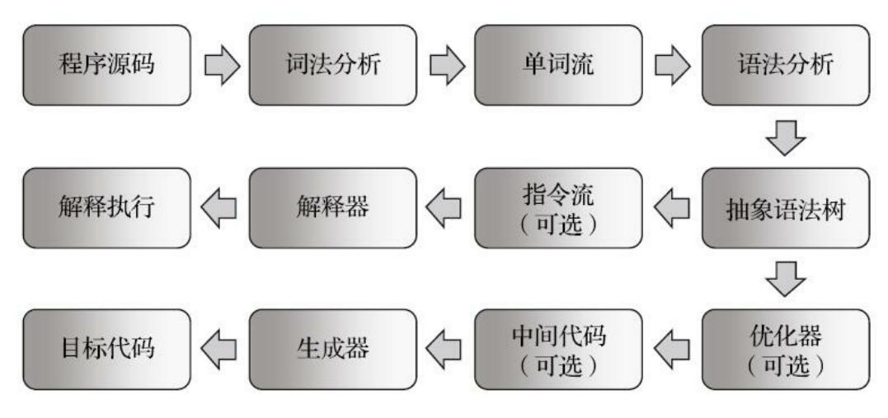

图8-4 编译过程

如今,基于物理机、Java虚拟机,或者是非Java的其他高级语言虚拟机(HLLVM)的代码执行过 程,大体上都会遵循这种符合现代经典编译原理的思路,在执行前先对程序源码进行词法分析和语法 分析处理,把源码转化为抽象语法树(Abstract Syntax Tree,AST)。对于一门具体语言的实现来说, 词法、语法分析以至后面的优化器和目标代码生成器都可以选择独立于执行引擎,形成一个完整意义 的编译器去实现,这类代表是C/C++语言。也可以选择把其中一部分步骤(如生成抽象语法树之前的 步骤)实现为一个半独立的编译器,这类代表是Java语言。又或者把这些步骤和执行引擎全部集中封 装在一个封闭的黑匣子之中,如大多数的JavaScript执行引擎。

在Java语言中,Javac编译器完成了程序代码经过词法分析、语法分析到抽象语法树,再遍历语法 树生成线性的字节码指令流的过程。因为这一部分动作是在Java虚拟机之外进行的,而解释器在虚拟 机的内部,所以Java程序的编译就是半独立的实现。

- [1] GCJ:http://gcc.gnu.org/java/。
- [2] CINT:http://root.cern.ch/drupal/content/cint。

# 8.5.2 基于栈的指令集与基于寄存器的指令集

Javac编译器输出的字节码指令流,基本上[1]是一种基于栈的指令集架构(Instruction Set Architecture,ISA),字节码指令流里面的指令大部分都是零地址指令,它们依赖操作数栈进行工 作。与之相对的另外一套常用的指令集架构是基于寄存器的指令集,最典型的就是x86的二地址指令 集,如果说得更通俗一些就是现在我们主流PC机中物理硬件直接支持的指令集架构,这些指令依赖寄 存器进行工作。那么,基于栈的指令集与基于寄存器的指令集这两者之间有什么不同呢?

举个最简单的例子,分别使用这两种指令集去计算"1+1"的结果,基于栈的指令集会是这样子的:

iconst\_1 iconst\_1 iadd istore\_0

两条iconst\_1指令连续把两个常量1压入栈后,iadd指令把栈顶的两个值出栈、相加,然后把结果 放回栈顶,最后istore\_0把栈顶的值放到局部变量表的第0个变量槽中。这种指令流中的指令通常都是 不带参数的,使用操作数栈中的数据作为指令的运算输入,指令的运算结果也存储在操作数栈之中。 而如果用基于寄存器的指令集,那程序可能会是这个样子:

mov eax, 1 add eax, 1

mov指令把EAX寄存器的值设为1,然后add指令再把这个值加1,结果就保存在EAX寄存器里面。 这种二地址指令是x86指令集中的主流,每个指令都包含两个单独的输入参数,依赖于寄存器来访问和 存储数据。

了解了基于栈的指令集与基于寄存器的指令集的区别后,读者可能会有个进一步的疑问,这两套 指令集谁更好一些呢?

应该说,既然两套指令集会同时并存和发展,那肯定是各有优势的,如果有一套指令集全面优于 另外一套的话,就是直接替代而不存在选择的问题了。

基于栈的指令集主要优点是可移植,因为寄存器由硬件直接提供[2],程序直接依赖这些硬件寄存 器则不可避免地要受到硬件的约束。例如现在32位80x86体系的处理器能提供了8个32位的寄存器,而 ARMv6体系的处理器(在智能手机、数码设备中相当流行的一种处理器)则提供了30个32位的通用寄 存器,其中前16个在用户模式中可以使用。如果使用栈架构的指令集,用户程序不会直接用到这些寄 存器,那就可以由虚拟机实现来自行决定把一些访问最频繁的数据(程序计数器、栈顶缓存等)放到 寄存器中以获取尽量好的性能,这样实现起来也更简单一些。栈架构的指令集还有一些其他的优点, 如代码相对更加紧凑(字节码中每个字节就对应一条指令,而多地址指令集中还需要存放参数)、编 译器实现更加简单(不需要考虑空间分配的问题,所需空间都在栈上操作)等。

栈架构指令集的主要缺点是理论上执行速度相对来说会稍慢一些,所有主流物理机的指令集都是 寄存器架构[3]也从侧面印证了这点。不过这里的执行速度是要局限在解释执行的状态下,如果经过即 时编译器输出成物理机上的汇编指令流,那就与虚拟机采用哪种指令集架构没有什么关系了。

在解释执行时,栈架构指令集的代码虽然紧凑,但是完成相同功能所需的指令数量一般会比寄存 器架构来得更多,因为出栈、入栈操作本身就产生了相当大量的指令。更重要的是栈实现在内存中, 频繁的栈访问也就意味着频繁的内存访问,相对于处理器来说,内存始终是执行速度的瓶颈。尽管虚 拟机可以采取栈顶缓存的优化方法,把最常用的操作映射到寄存器中避免直接内存访问,但这也只是 优化措施而不是解决本质问题的方法。因此由于指令数量和内存访问的原因,导致了栈架构指令集的 执行速度会相对慢上一点。

- [1] 使用"基本上",是因为部分字节码指令会带有参数,而纯粹基于栈的指令集架构中应当全部都是零 地址指令,也就是都不存在显式的参数。Java这样实现主要是考虑了代码的可校验性。
- [2] 这里说的是物理机器上的寄存器。也有基于寄存器的虚拟机,如Google Android平台的Dalvik虚拟 机。即使是基于寄存器的虚拟机,也会希望把虚拟机寄存器尽量映射到物理寄存器上以获取尽可能高 的性能。
- [3] Intel x86架构早期的数学协处理器x87(譬如与8086搭配工作的8087)就是基于栈的,只操作栈顶的 两个数据。但是实际常见的物理机处理器已经很久不用这种架构了。

# 8.5.3 基于栈的解释器执行过程

关于栈架构执行引擎的必要前置知识已经全部讲解完毕了,本节笔者准备了一段Java代码,以便 向读者实际展示在虚拟机里字节码是如何执行的。前面笔者曾经举过一个计算"1+1"的例子,那种小学 一年级的算数题目显然太过简单了,给聪明的读者练习的题目起码……嗯,笔者准备的是四则运算加 减乘除法,大概能达到三年级左右的数学水平,请看代码清单8-17。

代码清单8-17 一段简单的算术代码

```
public int calc() {
    int a = 100;
    int b = 200;
    int c = 300;
    return (a + b) * c;
```

这段代码从Java语言的角度没有任何谈论的必要,直接使用javap命令看看它的字节码指令,如代 码清单8-18所示。

代码清单8-18 一段简单的算术代码的字节码表示

```
public int calc();
   Code:
       Stack=2, Locals=4, Args_size=1
        0: bipush 100
        2: istore_1
        3: sipush 200
        6: istore_2
        7: sipush 300
       10: istore_3
       11: iload_1
       12: iload_2
       13: iadd
       14: iload_3
       15: imul
       16: ireturn
```

javap提示这段代码需要深度为2的操作数栈和4个变量槽的局部变量空间,笔者就根据这些信息画 了图8-5至图8-11共7张图片,来描述代码清单8-13执行过程中的代码、操作数栈和局部变量表的变化情 况。

| 偏移  | 助记符      |     |
|-----|----------|-----|
| 0:  | bipush   | 100 |
| 2:  | istore_1 |     |
| 3:  | sipush 2 | 200 |
| 6:  | istore_2 |     |
| 7:  | sipush 3 | 300 |
| 10: | istore_3 |     |
| 11: | iload_1  |     |
| 12: | iload_2  |     |
| 13: | iadd     |     |
| 14: | iload_3  |     |
| 15: | imul     |     |
| 16: | ireturn  |     |

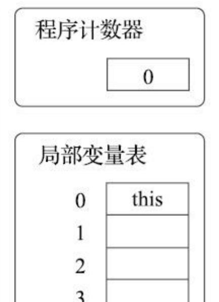

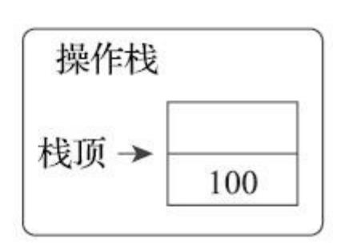

图8-5 执行偏移地址为0的指令的情况

首先,执行偏移地址为0的指令,Bipush指令的作用是将单字节的整型常量值(-128~127)推入 操作数栈顶,跟随有一个参数,指明推送的常量值,这里是100。

# 偏移 助记符

0: bipush 100

2: istore 1

3: sipush 200

6: istore\_2

7: sipush 300

10: istore\_3

11: iload\_1

12: iload\_2

13: iadd

14: iload\_3

15: imul

16: ireturn

# 程序计数器

2

# 局部变量表

| 0 | this |
|---|------|
| 1 | 100  |
| 2 |      |
| 3 |      |

操作栈

栈顶→

图8-6 执行偏移地址为1的指令的情况

执行偏移地址为2的指令, istore\_1指令的作用是将操作数栈顶的整型值出栈并存放到第1个局部变量槽中。后续4条指令(直到偏移为11的指令为止)都是做一样的事情,也就是在对应代码中把变量 a、b、c赋值为100、200、300。这4条指令的图示略过。

# 偏移 助记符

0: bipush 100

2: istore 1

3: sipush 200

6: istore 2

7: sipush 300

10: istore 3

11: iload\_1

12: iload\_2

13: iadd

14: iload\_3

15: imul

16: ireturn

# 程序计数器

11

# 局部变量表

| 0 | this |
|---|------|
| 1 | 100  |
| 2 | 200  |
| 3 | 300  |

操作栈

栈顶→ 100

图8-7 执行偏移地址为11的指令的情况

执行偏移地址为11的指令, iload\_1指令的作用是将局部变量表第1个变量槽中的整型值复制到操作数栈顶。

# 偏移 助记符

0: bipush 100

2: istore 1

3: sipush 200

6: istore 2

7: sipush 300

10: istore\_3

11: iload\_1

12: iload\_2

13: iadd

14: iload 3

15: imul

16: ireturn

# 程序计数器

12

# 局部变量表

| 0 | this |
|---|------|
| 1 | 100  |
| 2 | 200  |
| 3 | 300  |

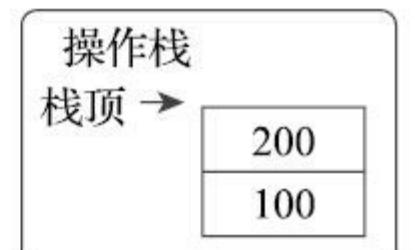

图8-8 执行偏移地址为12的指令的情况

执行偏移地址为12的指令,iload\_2指令的执行过程与iload\_1类似,把第2个变量槽的整型值入栈。 画出这个指令的图示主要是为了显示下一条iadd指令执行前的堆栈状况。 偏移 助记符

0: bipush 100

2: istore\_1

3: sipush 200

6: istore\_2

7: sipush 300

10: istore 3

11: iload\_1

12: iload 2

13: iadd

14: iload 3

15: imul

16: ireturn

程序计数器

局部变量表

0 this
1 100
2 200
3 300

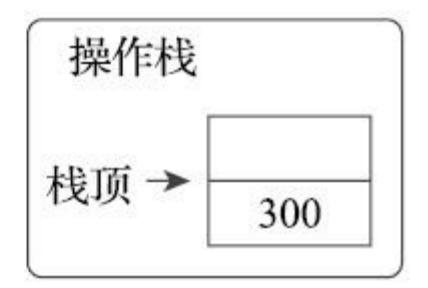

图8-9 执行偏移地址为13的指令的情况

执行偏移地址为13的指令,iadd指令的作用是将操作数栈中头两个栈顶元素出栈,做整型加法,然后把结果重新入栈。在iadd指令执行完毕后,栈中原有的100和200被出栈,它们的和300被重新入栈。


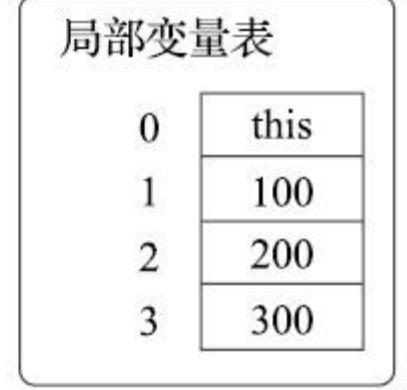

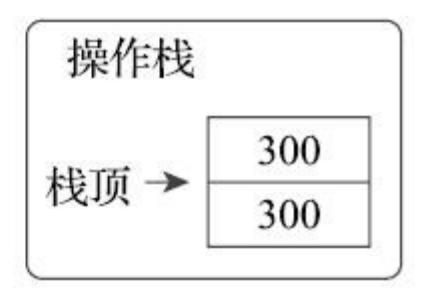

图8-10 执行偏移地址为14的指令的情况

执行偏移地址为14的指令,iload\_3指令把存放在第3个局部变量槽中的300入栈到操作数栈中。这 时操作数栈为两个整数300。下一条指令imul是将操作数栈中头两个栈顶元素出栈,做整型乘法,然后 把结果重新入栈,与iadd完全类似,所以笔者省略图示。


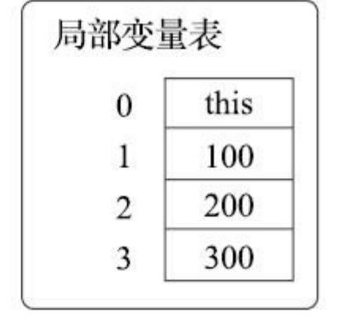

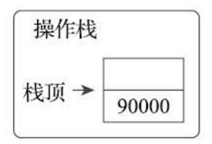

图8-11 执行偏移地址为16的指令的情况

执行偏移地址为16的指令,ireturn指令是方法返回指令之一,它将结束方法执行并将操作数栈顶 的整型值返回给该方法的调用者。到此为止,这段方法执行结束。

再次强调上面的执行过程仅仅是一种概念模型,虚拟机最终会对执行过程做出一系列优化来提高 性能,实际的运作过程并不会完全符合概念模型的描述。更确切地说,实际情况会和上面描述的概念 模型差距非常大,差距产生的根本原因是虚拟机中解析器和即时编译器都会对输入的字节码进行优 化,即使解释器中也不是按照字节码指令去逐条执行的。例如在HotSpot虚拟机中,就有很多 以"fast\_"开头的非标准字节码指令用于合并、替换输入的字节码以提升解释执行性能,即时编译器的 优化手段则更是花样繁多[1]。

不过我们从这段程序的执行中也可以看出栈结构指令集的一般运行过程,整个运算过程的中间变 量都以操作数栈的出栈、入栈为信息交换途径,符合我们在前面分析的特点。

[1] 具体可以参考第11章的相关内容。

# 8.6 本章小结

本章中,我们分析了虚拟机在执行代码时,如何找到正确的方法,如何执行方法内的字节码,以 及执行代码时涉及的内存结构。在第6~8章里面,我们针对Java程序是如何存储的、如何载入(创 建)的,以及如何执行的问题,把相关知识系统地介绍了一遍,第9章我们将一起看看这些理论知识在 具体开发之中的典型应用。

# 第9章 类加载及执行子系统的案例与实战

代码编译的结果从本地机器码转变为字节码,是存储格式发展的一小步,却是编程语言发展的一 大步。

## 9.1 概述

在Class文件格式与执行引擎这部分里,用户的程序能直接参与的内容并不太多,Class文件以何种 格式存储,类型何时加载、如何连接,以及虚拟机如何执行字节码指令等都是由虚拟机直接控制的行 为,用户程序无法对其进行改变。能通过程序进行操作的,主要是字节码生成与类加载器这两部分的 功能,但仅仅在如何处理这两点上,就已经出现了许多值得欣赏和借鉴的思路,这些思路后来成为许 多常用功能和程序实现的基础。在本章中,我们将看一下前面所学的知识在实际开发之中是如何应用 的。

# 9.2 案例分析

在案例分析部分,笔者准备了4个例子,关于类加载器和字节码的案例各有两个。并且这两个领域 的案例中又各有一个案例是大多数Java开发人员都使用过的工具或技术,另外一个案例虽然不一定每 个人都使用过,但却能特别精彩地演绎出这个领域中的技术特性。希望后面的案例能引起读者的思 考,并给读者的日常工作带来灵感。

# 9.2.1 Tomcat:正统的类加载器架构

主流的Java Web服务器,如Tomcat、Jetty、WebLogic、WebSphere或其他笔者没有列举的服务器, 都实现了自己定义的类加载器,而且一般还都不止一个。因为一个功能健全的Web服务器,都要解决 如下的这些问题:

·部署在同一个服务器上的两个Web应用程序所使用的Java类库可以实现相互隔离。这是最基本的 需求,两个不同的应用程序可能会依赖同一个第三方类库的不同版本,不能要求每个类库在一个服务 器中只能有一份,服务器应当能够保证两个独立应用程序的类库可以互相独立使用。

·部署在同一个服务器上的两个Web应用程序所使用的Java类库可以互相共享。这个需求与前面一 点正好相反,但是也很常见,例如用户可能有10个使用Spring组织的应用程序部署在同一台服务器 上,如果把10份Spring分别存放在各个应用程序的隔离目录中,将会是很大的资源浪费——这主要倒 不是浪费磁盘空间的问题,而是指类库在使用时都要被加载到服务器内存,如果类库不能共享,虚拟 机的方法区就会很容易出现过度膨胀的风险。

·服务器需要尽可能地保证自身的安全不受部署的Web应用程序影响。目前,有许多主流的Java Web服务器自身也是使用Java语言来实现的。因此服务器本身也有类库依赖的问题,一般来说,基于安 全考虑,服务器所使用的类库应该与应用程序的类库互相独立。

·支持JSP应用的Web服务器,十有八九都需要支持HotSwap功能。我们知道JSP文件最终要被编译 成Java的Class文件才能被虚拟机执行,但JSP文件由于其纯文本存储的特性,被运行时修改的概率远大 于第三方类库或程序自己的Class文件。而且ASP、PHP和JSP这些网页应用也把修改后无须重启作为一 个很大的"优势"来看待,因此"主流"的Web服务器都会支持JSP生成类的热替换,当然也有"非主 流"的,如运行在生产模式(Production Mode)下的WebLogic服务器默认就不会处理JSP文件的变化。

由于存在上述问题,在部署Web应用时,单独的一个ClassPath就不能满足需求了,所以各种Web服 务器都不约而同地提供了好几个有着不同含义的ClassPath路径供用户存放第三方类库,这些路径一般 会以"lib"或"classes"命名。被放置到不同路径中的类库,具备不同的访问范围和服务对象,通常每一 个目录都会有一个相应的自定义类加载器去加载放置在里面的Java类库。现在笔者就以Tomcat服务 器[1]为例,与读者一同分析Tomcat具体是如何规划用户类库结构和类加载器的。

在Tomcat目录结构中,可以设置3组目录(/common/\*、/server/\*和/shared/\*,但默认不一定是开放 的,可能只有/lib/\*目录存在)用于存放Java类库,另外还应该加上Web应用程序自身的"/WEB-INF/\*"目录,一共4组。把Java类库放置在这4组目录中,每一组都有独立的含义,分别是:

- ·放置在/common目录中。类库可被Tomcat和所有的Web应用程序共同使用。
- ·放置在/server目录中。类库可被Tomcat使用,对所有的Web应用程序都不可见。
- ·放置在/shared目录中。类库可被所有的Web应用程序共同使用,但对Tomcat自己不可见。
- ·放置在/WebApp/WEB-INF目录中。类库仅仅可以被该Web应用程序使用,对Tomcat和其他Web应

用程序都不可见。

为了支持这套目录结构,并对目录里面的类库进行加载和隔离,Tomcat自定义了多个类加载器, 这些类加载器按照经典的双亲委派模型来实现,其关系如图9-1所示。

### 启动类加载器 Bootstrap ClassLoader


扩展类加载器 Extension ClassLoader


应用程序类加载器 Application ClassLoader


Common类加载器 CommonClassLoader


Catalina类加载器 CatalinaClassLoader


Shared类加载器 SharedClassLoader


WebApp类加载器 WebappClassLoader


Jsp类加载器 JasperLoader

#### 图9-1 Tomcat服务器的类加载架构

灰色背景的3个类加载器是JDK(以JDK 9之前经典的三层类加载器为例)默认提供的类加载器, 这3个加载器的作用在第7章中已经介绍过了。而Common类加载器、Catalina类加载器(也称为Server类 加载器)、Shared类加载器和Webapp类加载器则是Tomcat自己定义的类加载器,它们分别加 载/common/\*、/server/\*、/shared/\*和/WebApp/WEB-INF/\*中的Java类库。其中WebApp类加载器和JSP类 加载器通常还会存在多个实例,每一个Web应用程序对应一个WebApp类加载器,每一个JSP文件对应 一个JasperLoader类加载器。

从图9-1的委派关系中可以看出,Common类加载器能加载的类都可以被Catalina类加载器和Shared 类加载器使用,而Catalina类加载器和Shared类加载器自己能加载的类则与对方相互隔离。WebApp类 加载器可以使用Shared类加载器加载到的类,但各个WebApp类加载器实例之间相互隔离。而 JasperLoader的加载范围仅仅是这个JSP文件所编译出来的那一个Class文件,它存在的目的就是为了被 丢弃:当服务器检测到JSP文件被修改时,会替换掉目前的JasperLoader的实例,并通过再建立一个新 的JSP类加载器来实现JSP文件的HotSwap功能。

本例中的类加载结构在Tomcat 6以前是它默认的类加载器结构,在Tomcat 6及之后的版本简化了默 认的目录结构,只有指定了tomcat/conf/catalina.properties配置文件的server.loader和share.loader项后才会 真正建立Catalina类加载器和Shared类加载器的实例,否则会用到这两个类加载器的地方都会用 Common类加载器的实例代替,而默认的配置文件中并没有设置这两个loader项,所以Tomcat 6之后也 顺理成章地把/common、/server和/shared这3个目录默认合并到一起变成1个/lib目录,这个目录里的类库 相当于以前/common目录中类库的作用,是Tomcat的开发团队为了简化大多数的部署场景所做的一项 易用性改进。如果默认设置不能满足需要,用户可以通过修改配置文件指定server.loader和share.loader 的方式重新启用原来完整的加载器架构。

Tomcat加载器的实现清晰易懂,并且采用了官方推荐的"正统"的使用类加载器的方式。如果读者 阅读完上面的案例后,毫不费力就能完全理解Tomcat设计团队这样布置加载器架构的用意,这就说明 你已经大致掌握了类加载器"主流"的使用方式,那么笔者不妨再提一个问题让各位读者思考一下:前 面曾经提到过一个场景,如果有10个Web应用程序都是用Spring来进行组织和管理的话,可以把Spring 放到Common或Shared目录下让这些程序共享。Spring要对用户程序的类进行管理,自然要能访问到用 户程序的类,而用户的程序显然是放在/WebApp/WEB-INF目录中的。那么被Common类加载器或 Shared类加载器加载的Spring如何访问并不在其加载范围内的用户程序呢?如果你读懂了本书第7章的 相关内容,相信回答这个问题一定会毫不费力。

[1] Tomcat是Apache基金会旗下一款开源的Java Web服务器,主页地址为:http://tomcat.apache.org。

# 9.2.2 OSGi:灵活的类加载器架构

曾经在Java程序社区中流传着这么一个观点:"学习Java EE规范,推荐去看JBoss源码;学习类加 载器的知识,就推荐去看OSGi源码。"尽管"Java EE规范"和"类加载器的知识"并不是一个对等的概 念,不过,既然这个观点能在部分程序员群体中流传开来,也从侧面说明了OSGi对类加载器的运用确 实有其独到之处。

OSGi [1](Open Service Gateway Initiative)是OSGi联盟(OSGi Alliance)制订的一个基于Java语言 的动态模块化规范(在JDK 9引入的JPMS是静态的模块系统),这个规范最初由IBM、爱立信等公司 联合发起,在早期连Sun公司都有参与。目的是使服务提供商通过住宅网关为各种家用智能设备提供服 务,后来这个规范在Java的其他技术领域也有相当不错的发展,现在已经成为Java世界中"事实上"的动 态模块化标准,并且已经有了Equinox、Felix等成熟的实现。根据OSGi联盟主页上的宣传资料,OSGi 现在的重点应用在智慧城市、智慧农业、工业4.0这些地方,而在传统Java程序员中最知名的应用案例 可能就数Eclipse IDE了,另外,还有许多大型的软件平台和中间件服务器都基于或声明将会基于OSGi 规范来实现,如IBM Jazz平台、GlassFish服务器、JBoss OSGi等。

OSGi中的每个模块(称为Bundle)与普通的Java类库区别并不太大,两者一般都以JAR格式进行 封装[2],并且内部存储的都是Java的Package和Class。但是一个Bundle可以声明它所依赖的Package(通 过Import-Package描述),也可以声明它允许导出发布的Package(通过Export-Package描述)。在OSGi 里面,Bundle之间的依赖关系从传统的上层模块依赖底层模块转变为平级模块之间的依赖,而且类库 的可见性能得到非常精确的控制,一个模块里只有被Export过的Package才可能被外界访问,其他的 Package和Class将会被隐藏起来。

以上这些静态的模块化特性原本也是OSGi的核心需求之一,不过它和后来出现的Java的模块化系 统互相重叠了,所以OSGi现在着重向动态模块化系统的方向发展。在今天,通常引入OSGi的主要理由 是基于OSGi架构的程序很可能(只是很可能,并不是一定会,需要考虑热插拔后的内存管理、上下文 状态维护问题等复杂因素)会实现模块级的热插拔功能,当程序升级更新或调试除错时,可以只停 用、重新安装然后启用程序的其中一部分,这对大型软件、企业级程序开发来说是一个非常有诱惑力 的特性,譬如Eclipse中安装、卸载、更新插件而不需要重启动,就使用到了这种特性。

OSGi之所以能有上述诱人的特点,必须要归功于它灵活的类加载器架构。OSGi的Bundle类加载器 之间只有规则,没有固定的委派关系。例如,某个Bundle声明了一个它依赖的Package,如果有其他 Bundle声明了发布这个Package后,那么所有对这个Package的类加载动作都会委派给发布它的Bundle类 加载器去完成。不涉及某个具体的Package时,各个Bundle加载器都是平级的关系,只有具体使用到某 个Package和Class的时候,才会根据Package导入导出定义来构造Bundle间的委派和依赖。

另外,一个Bundle类加载器为其他Bundle提供服务时,会根据Export-Package列表严格控制访问范 围。如果一个类存在于Bundle的类库中但是没有被Export,那么这个Bundle的类加载器能找到这个类, 但不会提供给其他Bundle使用,而且OSGi框架也不会把其他Bundle的类加载请求分配给这个Bundle来 处理。

我们可以举一个更具体些的简单例子来解释上面的规则,假设存在Bundle A、Bundle B、Bundle

C3个模块,并且这3个Bundle定义的依赖关系如下所示。

·Bundle A:声明发布了packageA,依赖了java.\*的包;

·Bundle B:声明依赖了packageA和packageC,同时也依赖了java.\*的包;

·Bundle C:声明发布了packageC,依赖了packageA。

那么,这3个Bundle之间的类加载器及父类加载器之间的关系如图9-2所示。

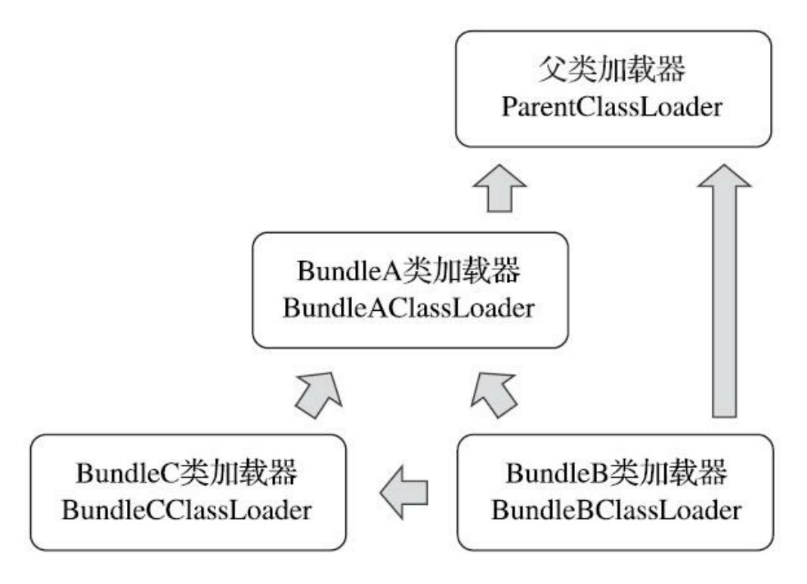

图9-2 OSGi的类加载器架构

由于没有涉及具体的OSGi实现,图9-2中的类加载器都没有指明具体的加载器实现,它只是一个 体现了加载器之间关系的概念模型,并且只是体现了OSGi中最简单的加载器委派关系。一般来说,在 OSGi里,加载一个类可能发生的查找行为和委派关系会远远比图9-2中显示的复杂,类加载时可能进 行的查找规则如下:

- ·以java.\*开头的类,委派给父类加载器加载。
- ·否则,委派列表名单内的类,委派给父类加载器加载。

- ·否则,Import列表中的类,委派给Export这个类的Bundle的类加载器加载。
- ·否则,查找当前Bundle的Classpath,使用自己的类加载器加载。
- ·否则,查找是否在自己的Fragment Bundle中,如果是则委派给Fragment Bundle的类加载器加载。
- ·否则,查找Dynamic Import列表的Bundle,委派给对应Bundle的类加载器加载。
- ·否则,类查找失败。

从图9-2中还可以看出,在OSGi中,加载器之间的关系不再是双亲委派模型的树形结构,而是已 经进一步发展成一种更为复杂的、运行时才能确定的网状结构。这种网状的类加载器架构在带来更优 秀的灵活性的同时,也可能会产生许多新的隐患。笔者曾经参与过将一个非OSGi的大型系统向Equinox OSGi平台迁移的项目,由于项目规模和历史原因,代码模块之间的依赖关系错综复杂,勉强分离出各 个模块的Bundle后,发现在高并发环境下经常出现死锁。我们很容易就找到了死锁的原因:如果出现 了Bundle A依赖Bundle B的Package B,而Bundle B又依赖了Bundle A的Package A,这两个Bundle进行类 加载时就有很高的概率发生死锁。具体情况是当Bundle A加载Package B的类时,首先需要锁定当前类 加载器的实例对象(java.lang.ClassLoader.loadClass()是一个同步方法),然后把请求委派给Bundle B的 加载器处理,但如果这时Bundle B也正好想加载Package A的类,它会先锁定自己的加载器再去请求 Bundle A的加载器处理,这样两个加载器都在等待对方处理自己的请求,而对方处理完之前自己又一 直处于同步锁定的状态,因此它们就互相死锁,永远无法完成加载请求了。Equinox的Bug List中有不 少关于这类问题的Bug [3],也提供了一个以牺牲性能为代价的解决方案——用户可以启用 osgi.classloader.singleThreadLoads参数来按单线程串行化的方式强制进行类加载动作。在JDK 7时才终于 出现了JDK层面的解决方案,类加载器架构进行了一次专门的升级,在ClassLoader中增加了 registerAsParallelCapable方法对可并行的类加载进行注册声明,把锁的级别从ClassLoader对象本身,降 低为要加载的类名这个级别,目的是从底层避免以上这类死锁出现的可能。

总体来说,OSGi描绘了一个很美好的模块化开发的目标,而且定义了实现这个目标所需的各种服 务,同时也有成熟框架对其提供实现支持。对于单个虚拟机下的应用,从开发初期就建立在OSGi上是 一个很不错的选择,这样便于约束依赖。但并非所有的应用都适合采用OSGi作为基础架构,OSGi在提 供强大功能的同时,也引入了额外而且非常高的复杂度,带来了额外的风险。

- [1] 官方站点:http://www.osgi.org/Main/HomePage。
- [2] OSGi R7开始支持JDK 9的JPMS,但只是兼容意义上的支持,并未将两者重合的特性互相融合。譬 如在R7中Bundle仍然是一个标准的JAR包,未封装成Module(即以Unnamed Module的形式存在)。
- [3] Bug-121737:https://bugs.eclipse.org/bugs/show\_bug.cgi?id=121737。

# 9.2.3 字节码生成技术与动态代理的实现

"字节码生成"并不是什么高深的技术,读者在看到"字节码生成"这个标题时也先不必去想诸如 Javassist、CGLib、ASM之类的字节码类库,因为JDK里面的Javac命令就是字节码生成技术的"老祖 宗",并且Javac也是一个由Java语言写成的程序,它的代码存放在OpenJDK的

jdk.compiler\share\classes\com\sun\tools\javac目录中[1]。要深入从Java源码到字节码编译过程,阅读Javac 的源码是个很好的途径,不过Javac对于我们这个例子来说太过庞大了。在Java世界里面除了Javac和字 节码类库外,使用到字节码生成的例子比比皆是,如Web服务器中的JSP编译器,编译时织入的AOP框 架,还有很常用的动态代理技术,甚至在使用反射的时候虚拟机都有可能会在运行时生成字节码来提 高执行速度。我们选择其中相对简单的动态代理技术来讲解字节码生成技术是如何影响程序运作的。

相信许多Java开发人员都使用过动态代理,即使没有直接使用过java.lang.reflect.Proxy或实现过 java.lang.reflect.InvocationHandler接口,应该也用过Spring来做过Bean的组织管理。如果使用过Spring, 那大多数情况应该已经不知不觉地用到动态代理了,因为如果Bean是面向接口编程,那么在Spring内 部都是通过动态代理的方式来对Bean进行增强的。动态代理中所说的"动态",是针对使用Java代码实 际编写了代理类的"静态"代理而言的,它的优势不在于省去了编写代理类那一点编码工作量,而是实 现了可以在原始类和接口还未知的时候,就确定代理类的代理行为,当代理类与原始类脱离直接联系 后,就可以很灵活地重用于不同的应用场景之中。

代码清单9-1演示了一个最简单的动态代理的用法,原始的代码逻辑是打印一句"hello world",代 理类的逻辑是在原始类方法执行前打印一句"welcome"。我们先看一下代码,然后再分析JDK是如何做 到的。

#### 代码清单9-1 动态代理的简单示例

```
public class DynamicProxyTest {
    interface IHello {
        void sayHello();
    static class Hello implements IHello {
        @Override
        public void sayHello() {
            System.out.println("hello world");
    static class DynamicProxy implements InvocationHandler {
        Object originalObj;
        Object bind(Object originalObj) {
            this.originalObj = originalObj;
            return Proxy.newProxyInstance(originalObj.getClass().getClassLoader(), originalObj.getClass().getInterfaces(), this);
        @Override
        public Object invoke(Object proxy, Method method, Object[] args) throws Throwable {
            System.out.println("welcome");
            return method.invoke(originalObj, args);
```

```
public static void main(String[] args) {
    IHello hello = (IHello) new DynamicProxy().bind(new Hello());
    hello.sayHello();
```

#### 运行结果如下:

```
welcome
hello world
```

在上述代码里,唯一的"黑匣子"就是Proxy::newProxyInstance()方法,除此之外再没有任何特殊之 处。这个方法返回一个实现了IHello的接口,并且代理了new Hello()实例行为的对象。跟踪这个方法的 源码,可以看到程序进行过验证、优化、缓存、同步、生成字节码、显式类加载等操作,前面的步骤 并不是我们关注的重点,这里只分析它最后调用sun.misc.ProxyGenerator::generateProxyClass()方法来完 成生成字节码的动作,这个方法会在运行时产生一个描述代理类的字节码byte[]数组。如果想看一看这 个在运行时产生的代理类中写了些什么,可以在main()方法中加入下面这句:

```
System.getProperties().put("sun.misc.ProxyGenerator.saveGeneratedFiles", "true");
```

加入这句代码后再次运行程序,磁盘中将会产生一个名为"\$Proxy0.class"的代理类Class文件,反 编译后可以看见如代码清单9-2所示的内容:

#### 代码清单9-2 反编译的动态代理类的代码

```
package org.fenixsoft.bytecode;
import java.lang.reflect.InvocationHandler;
import java.lang.reflect.Method;
import java.lang.reflect.Proxy;
import java.lang.reflect.UndeclaredThrowableException;
public final class $Proxy0 extends Proxy
    implements DynamicProxyTest.IHello
{
    private static Method m3;
    private static Method m1;
    private static Method m0;
    private static Method m2;
    public $Proxy0(InvocationHandler paramInvocationHandler)
        throws
    {
        super(paramInvocationHandler);
    public final void sayHello()
        throws
    {
        try
        {
            this.h.invoke(this, m3, null);
            return;
        catch (RuntimeException localRuntimeException)
        {
            throw localRuntimeException;
```

```
catch (Throwable localThrowable)
   {
       throw new UndeclaredThrowableException(localThrowable);
// 此处由于版面原因,省略equals()、hashCode()、toString()3个方法的代码
// 这3个方法的内容与sayHello()非常相似。
static
{
   try
   {
       m3 = Class.forName("org.fenixsoft.bytecode.DynamicProxyTest$IHello").getMethod("sayHello", new Class[0]);
       m1 = Class.forName("java.lang.Object").getMethod("equals", new Class[] { Class.forName("java.lang.Object") });
       m0 = Class.forName("java.lang.Object").getMethod("hashCode", new Class[0]);
       m2 = Class.forName("java.lang.Object").getMethod("toString", new Class[0]);
       return;
   catch (NoSuchMethodException localNoSuchMethodException)
   {
       throw new NoSuchMethodError(localNoSuchMethodException.getMessage());
   catch (ClassNotFoundException localClassNotFoundException)
   {
       throw new NoClassDefFoundError(localClassNotFoundException.getMessage());
```

这个代理类的实现代码也很简单,它为传入接口中的每一个方法,以及从java.lang.Object中继承来 的equals()、hashCode()、toString()方法都生成了对应的实现,并且统一调用了InvocationHandler对象的 invoke()方法(代码中的"this.h"就是父类Proxy中保存的InvocationHandler实例变量)来实现这些方法的 内容,各个方法的区别不过是传入的参数和Method对象有所不同而已,所以无论调用动态代理的哪一 个方法,实际上都是在执行InvocationHandler::invoke()中的代理逻辑。

这个例子中并没有讲到generateProxyClass()方法具体是如何产生代理类"\$Proxy0.class"的字节码 的,大致的生成过程其实就是根据Class文件的格式规范去拼装字节码,但是在实际开发中,以字节为 单位直接拼装出字节码的应用场合很少见,这种生成方式也只能产生一些高度模板化的代码。对于用 户的程序代码来说,如果有要大量操作字节码的需求,还是使用封装好的字节码类库比较合适。如果 读者对动态代理的字节码拼装过程确实很感兴趣,可以在OpenJDK的 java.base\share\classes\java\lang\reflect目录下找到sun.misc.ProxyGenerator的源码。

[1] 如何获取OpenJDK源码,请参见本书第1章的相关内容。

# 9.2.4 Backport工具:Java的时光机器

一般来说,以"做项目"为主的软件公司比较容易更新技术,在下一个项目中换一个技术框架、升 级到最时髦的JDK版本,甚至把Java换成C#、Golang来开发都是有可能的。但是当公司发展壮大,技 术有所积累,逐渐成为以"做产品"为主的软件公司后,自主选择技术的权利就会逐渐丧失,因为之前 积累的代码和技术都是用真金白银砸出来的,一个稳健的团队也不会随意地改变底层的技术。然而在 飞速发展的程序设计领域,新技术总是日新月异层出不穷,偏偏这些新技术又如鲜花之于蜜蜂一样, 对程序员们散发着天然的吸引力。

在Java世界里,每一次JDK大版本的发布,都会伴随着规模不等或大或小的技术革新,而对Java程 序编写习惯改变最大的,肯定是那些对Java语法做出重大改变的版本,譬如JDK 5时加入的自动装箱、 泛型、动态注解、枚举、变长参数、遍历循环(foreach循环);譬如JDK 8时加入的Lambda表达式、 Stream API、接口默认方法等。事实上在没有这些语法特性的年代,Java程序也照样能写,但是现在回 头看来,上述每一种语法的改进几乎都是"必不可少"的,如同用惯了32寸液晶、4K分辨率显示器的程 序员,就很难再在19寸显示器、1080P分辨率的显示器上编写代码了。但假如公司"不幸"因为要保护现 有投资、维持程序结构稳定等,必须使用JDK 5或者JDK 8以前的版本呢?幸好,我们没有办法把19寸 显示器变成32寸的,但却可以跨越JDK版本之间的沟壑,把高版本JDK中编写的代码放到低版本JDK 环境中去部署使用。为了解决这个问题,一种名为"Java逆向移植"的工具(Java Backporting Tools)应 运而生,Retrotranslator [1]和Retrolambda是这类工具中的杰出代表。

Retrotranslator的作用是将JDK 5编译出来的Class文件转变为可以在JDK 1.4或1.3上部署的版本, 它能很好地支持自动装箱、泛型、动态注解、枚举、变长参数、遍历循环、静态导入这些语法特性, 甚至还可以支持JDK 5中新增的集合改进、并发包及对泛型、注解等的反射操作。Retrolambda [2]的作 用与Retrotranslator是类似的,目标是将JDK 8的Lambda表达式和try-resources语法转变为可以在JDK 5、JDK 6、JDK 7中使用的形式,同时也对接口默认方法提供了有限度的支持。

了解了Retrotranslator和Retrolambda这种逆向移植工具的作用以后,相信读者更关心的是它是怎样 做到的?要想知道Backporting工具如何在旧版本JDK中模拟新版本JDK的功能,首先要搞清楚JDK升 级中会提供哪些新的功能。JDK的每次升级新增的功能大致可以分为以下五类:

- 1)对Java类库API的代码增强。譬如JDK 1.2时代引入的java.util.Collections等一系列集合类,在 JDK 5时代引入的java.util.concurrent并发包、在JDK 7时引入的java.lang.invoke包,等等。
- 2)在前端编译器层面做的改进。这种改进被称作语法糖,如自动装箱拆箱,实际上就是Javac编 译器在程序中使用到包装对象的地方自动插入了很多Integer.valueOf()、Float.valueOf()之类的代码;变 长参数在编译之后就被自动转化成了一个数组来完成参数传递;泛型的信息则在编译阶段就已经被擦 除掉了(但是在元数据中还保留着),相应的地方被编译器自动插入了类型转换代码[3]。
- 3)需要在字节码中进行支持的改动。如JDK 7里面新加入的语法特性——动态语言支持,就需要 在虚拟机中新增一条invokedynamic字节码指令来实现相关的调用功能。不过字节码指令集一直处于相 对稳定的状态,这种要在字节码层面直接进行的改动是比较少见的。

- 4)需要在JDK整体结构层面进行支持的改进,典型的如JDK 9时引入的Java模块化系统,它就涉 及了JDK结构、Java语法、类加载和连接过程、Java虚拟机等多个层面。
- 5)集中在虚拟机内部的改进。如JDK 5中实现的JSR-133 [4]规范重新定义的Java内存模型(Java Memory Model,JMM),以及在JDK 7、JDK 11、JDK 12中新增的G1、ZGC和Shenandoah收集器之 类的改动,这种改动对于程序员编写代码基本是透明的,只会在程序运行时产生影响。

上述的5类新功能中,逆向移植工具能比较完美地模拟了前两类,从第3类开始就逐步深入地涉及 了直接在虚拟机内部实现的改进了,这些功能一般要么是逆向移植工具完全无能为力,要么是不能完 整地或者在比较良好的运行效率上完成全部模拟。想想这也挺合理的,如果在语法糖和类库层面可以 完美解决的问题,Java虚拟机设计团队也没有必要舍近求远地改动处于JDK底层的虚拟机嘛。

在能够较好模拟的前两类功能中,第一类模拟相对更容易实现一些,如JDK 5引入的 java.util.concurrent包,实际是由多线程编程的大师Doug Lea开发的一套并发包,在JDK 5出现之前就已 经存在(那时候名字叫作dl.util.concurrent,引入JDK时由作者和JDK开发团队共同进行了一些改 进),所以要在旧的JDK中支持这部分功能,以独立类库的方式便可实现。Retrotranslator中就附带了 一个名叫"backport-util-concurrent.jar"的类库(由另一个名为"Backport to JSR 166"的项目所提供)来代 替JDK 5的并发包。

至于第二类JDK在编译阶段进行处理的那些改进,Retrotranslator则是使用ASM框架直接对字节码 进行处理。由于组成Class文件的字节码指令数量并没有改变,所以无论是JDK 1.3、JDK 1.4还是JDK 5,能用字节码表达的语义范围应该是一致的。当然,肯定不会是简单地把Class的文件版本号从49.0改 回48.0就能解决问题了,虽然字节码指令的数量没有变化,但是元数据信息和一些语法支持的内容还 是要做相应的修改。

以枚举为例,尽管在JDK 5中增加了enum关键字,但是Class文件常量池的CONSTANT\_Class\_info 类型常量并没有发生任何语义变化,仍然是代表一个类或接口的符号引用,没有加入枚举,也没有增 加过"CONSTANT\_Enum\_info"之类的"枚举符号引用"常量。所以使用enum关键字定义常量,尽管从 Java语法上看起来与使用class关键字定义类、使用interface关键字定义接口是同一层次的,但实际上这 是由Javac编译器做出来的假象,从字节码的角度来看,枚举仅仅是一个继承于java.lang.Enum、自动生 成了values()和valueOf()方法的普通Java类而已。

Retrotranslator对枚举所做的主要处理就是把枚举类的父类从"java.lang.Enum"替换为它运行时类库 中包含的"net.sf.retrotranslator.runtime.java.lang.Enum\_",然后再在类和字段的访问标志中抹去 ACC\_ENUM标志位。当然,这只是处理的总体思路,具体的实现要比上面说的复杂得多。可以想象 既然两个父类实现都不一样,values()和valueOf()的方法自然需要重写,常量池需要引入大量新的来自 父类的符号引用,这些都是实现细节。图9-3是一个使用JDK 5编译的枚举类与被Retrotranslator转换处 理后的字节码的对比图。

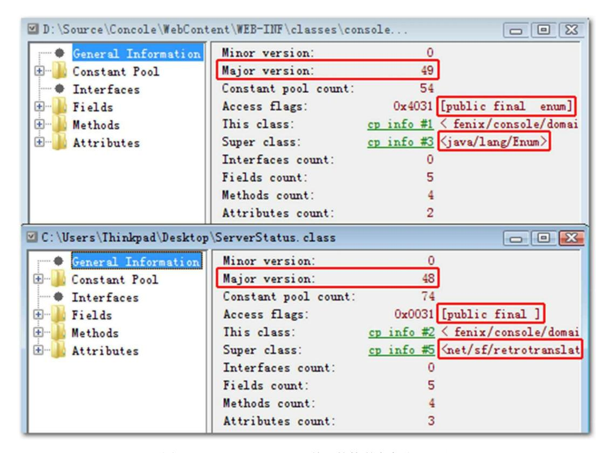

图9-3 Retrotranslator处理前后的枚举类字节码对比

用Retrolambda模拟JDK 8的Lambda表达式属于涉及字节码改动的第三类情况,Java为支持Lambda 会用到新的invokedynamic字节码指令,但幸好这并不是必须的,只是基于效率的考量。在JDK 8之 前,Lambda表达式就已经被其他运行在Java虚拟机的编程语言(如Scala)广泛使用了,那时候是怎么 生成字节码的现在照着做就是,不使用invokedynamic,除了牺牲一点效率外,可行性方面并没有太大 的障碍。

Retrolambda的Backport过程实质上就是生成一组匿名内部类来代替Lambda,里面会做一些优化措 施,譬如采用单例来保证无状态的Lambda表达式不会重复创建匿名类的对象。有一些Java IDE工具, 如IntelliJ IDEA和Eclipse里会包含将此过程反过来使用的功能特性,在低版本Java里把匿名内部类显示 成Lambda语法的样子,实际存在磁盘上的源码还是匿名内部类形式的,只是在IDE里可以把它显示为 Lambda表达式的语法,让人阅读起来比较简洁而已。

- [1] 官方站点:http://retrotranslator.sf.net。
- [2] 官方网站:https://github.com/luontola/retrolambda。
- [3] 如果想了解编译器在这个阶段所做的各种动作的详细信息,可以参考10.3节的内容。
- [4] JSR-133:Java Memory Model and Thread Specification Revision(Java内存模型和线程规范修订)。

# 9.3 实战:自己动手实现远程执行功能

不知道读者在做程序维护的时候是否遇到过这类情形:排查问题的过程中,想查看内存中的一些 参数值,却苦于没有方法把这些值输出到界面或日志中。又或者定位到某个缓存数据有问题,由于缺 少缓存的统一管理界面,不得不重启服务才能清理掉这个缓存。类似的需求有一个共同的特点,那就 是只要在服务中执行一小段程序代码,就可以定位或排除问题,但就是偏偏找不到可以让服务器执行 临时代码的途径,让人恨不得在服务器上装个后门。这是项目运维中的常见问题,通常解决类问题有 以下几种途径:

- 1)可以使用BTrace [1]这类JVMTI工具去动态修改程序中某一部分的运行代码,这部分在第4章有 简要的介绍,类似的JVMTI工具还有阿里巴巴的Arthas [2]等。
- 2)使用JDK 6之后提供了Compiler API,可以动态地编译Java程序,这样虽然达不到动态语言的 灵活度,但让服务器执行临时代码的需求是可以得到解决的。
- 3)也可以通过"曲线救国"的方式来做到,譬如写一个JSP文件上传到服务器,然后在浏览器中运 行它,或者在服务端程序中加入一个BeanShell Script、JavaScript等的执行引擎(如Mozilla Rhino [3]) 去执行动态脚本。
  - 4)在应用程序中内置动态执行的功能。

在本章的实战部分,我们将使用前面学到的关于类加载及虚拟机执行子系统的知识去完成在服务 端执行临时代码的功能。

- [1] 网站:https://github.com/btraceio/btrace。
- [2] 网站:https://github.com/alibaba/arthas。
- [3] 网站:http://www.mozilla.org/rhino/,Rhino已被收编入JDK 6中。

# 9.3.1 目标

首先,在实现"在服务端执行临时代码"这个需求之前,先来明确一下本次实战的具体目标,我们 希望最终的产品是这样的:

- ·不依赖某个JDK版本才加入的特性(包括JVMTI),能在目前还被普遍使用的JDK中部署,只要 是使用JDK 1.4以上的JDK都可以运行。
  - ·不改变原有服务端程序的部署,不依赖任何第三方类库。
  - ·不侵入原有程序,即无须改动原程序的任何代码。也不会对原有程序的运行带来任何影响。
- ·考虑到BeanShell Script或JavaScript等脚本与Java对象交互起来不太方便,"临时代码"应该直接支 持Java语言。
- ·"临时代码"应当具备足够的自由度,不需要依赖特定的类或实现特定的接口。这里写的是"不需 要"而不是"不可以",当"临时代码"需要引用其他类库时也没有限制,只要服务端程序能使用的类型和 接口,临时代码都应当能直接引用。
  - ·"临时代码"的执行结果能返回到客户端,执行结果可以包括程序中输出的信息及抛出的异常等。

看完上面列出的目标,读者觉得完成这个需求需要做多少工作量呢?也许答案比大多数人所想的 都要简单一些:5个类,250行代码(含注释),大约一个半小时左右的开发时间就可以了,现在就开 始编写程序吧!

## 9.3.2 思路

在程序实现的过程中,我们需要解决以下3个问题:

- ·如何编译提交到服务器的Java代码?
- ·如何执行编译之后的Java代码?
- ·如何收集Java代码的执行结果?

对于第一个问题,我们有两种方案可以选择。一种在服务器上编译,在JDK 6以后可以使用 Compiler API,在JDK 6以前可以使用tools.jar包(在JAVA\_HOME/lib目录下)中的 com.sun.tools.Javac.Main类来编译Java文件,它们其实和直接使用Javac命令来编译是一样的。这种思路 的缺点是引入了额外的依赖,而且把程序绑死在特定的JDK上了,要部署到其他公司的JDK中还得把 tools.jar带上(虽然JRockit和J9虚拟机也有这个JAR包,但它总不是标准所规定必须存在的)。另外一 种思路是直接在客户端编译好,把字节码而不是Java代码传到服务端,这听起来好像有点投机取巧, 一般来说确实不应该假定客户端一定具有编译代码的能力,也不能假定客户端就有编译出产品所需的 依赖项。但是既然程序员会写Java代码去给服务端排查问题,那么很难想象他的机器上会连编译Java程 序的环境都没有。

对于第二个问题:要执行编译后的Java代码,让类加载器加载这个类生成一个Class对象,然后反 射调用一下某个方法就可以了(因为不实现任何接口,我们可以借用一下Java中约定俗成的"main()"方 法)。但我们还应该考虑得更周全些:一段程序往往不是编写、运行一次就能达到效果,同一个类可 能要被反复地修改、提交、执行。另外,提交上去的类要能访问到服务端的其他类库才行。还有就是 既然提交的是临时代码,那提交的Java类在执行完后就应当能被卸载和回收掉。

最后一个问题,我们想把程序往标准输出(System.out)和标准错误输出(System.err)中打印的 信息收集起来。但标准输出设备是整个虚拟机进程全局共享的资源,如果使用 System.setOut()/System.setErr()方法把输出流重定向到自己定义的PrintStream对象上固然可以收集到输 出信息,但也会对原有程序产生影响:会把其他线程向标准输出中打印的信息也收集了。虽然这些并 不是不能解决的问题,不过为了达到完全不影响原程序的目的,我们可以采用另外一种办法:直接在 执行的类中把对System.out的符号引用替换为我们准备的PrintStream的符号引用,依赖前面学习到的知 识,做到这一点并不困难。

# 9.3.3 实现

在程序实现部分,我们主要看看代码和里面的注释。首先看看实现过程中需要用到的4个支持类。 第一个类用于实现"同一个类的代码可以被多次加载"这个需求,即用于解决9.2节列举的第二个问题的 HotSwapClassLoader,具体程序如代码清单9-3所示。

HotSwapClassLoader所做的事情仅仅是公开父类(即java.lang.ClassLoader)中的protected方法 defineClass(),我们将会使用这个方法把提交执行的Java类的byte[]数组转变为Class对象。 HotSwapClassLoader中并没有重写loadClass()或findClass()方法,因此如果不算外部手工调用loadByte() 方法的话,这个类加载器的类查找范围与它的父类加载器是完全一致的,在被虚拟机调用时,它会按 照双亲委派模型交给父类加载。构造函数中指定为加载HotSwapClassLoader类的类加载器作为父类加 载器,这一步是实现提交的执行代码可以访问服务端引用类库的关键,下面我们来看看代码清单9-3。

代码清单9-3 HotSwapClassLoader的实现

```
/**
* 为了多次载入执行类而加入的加载器
* 把defineClass方法开放出来,只有外部显式调用的时候才会使用到loadByte方法
* 由虚拟机调用时,仍然按照原有的双亲委派规则使用loadClass方法进行类加载
*
* @author zzm
*/
public class HotSwapClassLoader extends ClassLoader {
   public HotSwapClassLoader() {
       super(HotSwapClassLoader.class.getClassLoader());
   public Class loadByte(byte[] classByte) {
       return defineClass(null, classByte, 0, classByte.length);
```

第二个类是实现将java.lang.System替换为我们自己定义的HackSystem类的过程,它直接修改符合 Class文件格式的byte[]数组中的常量池部分,将常量池中指定内容的CONSTANT\_Utf8\_info常量替换 为新的字符串,具体代码如下面的代码清单9-4所示。ClassModifier中涉及对byte[]数组操作的部分, 主要是将byte[]与int和String互相转换,以及把对byte[]数据的替换操作封装在代码清单9-5所示的 ByteUtils中。

经过ClassModifier处理后的byte[]数组才会传给HotSwapClassLoader.loadByte()方法进行类加载, byte[]数组在这里替换符号引用之后,与客户端直接在Java代码中引用HackSystem类再编译生成的Class 是完全一样的。这样的实现既避免了客户端编写临时执行代码时要依赖特定的类(不然无法引入 HackSystem),又避免了服务端修改标准输出后影响到其他程序的输出。下面我们来看看代码清单9-4 和代码清单9-5。

代码清单9-4 ClassModifier的实现

```
* 修改Class文件,暂时只提供修改常量池常量的功能
* @author zzm
*/
public class ClassModifier {
   /**
    * Class文件中常量池的起始偏移
    */
   private static final int CONSTANT_POOL_COUNT_INDEX = 8;
   /**
    * CONSTANT_Utf8_info常量的tag标志
    */
   private static final int CONSTANT_Utf8_info = 1;
   /**
    * 常量池中11种常量所占的长度,CONSTANT_Utf8_info型常量除外,因为它不是定长的
    */
   private static final int[] CONSTANT_ITEM_LENGTH = { -1, -1, -1, 5, 5, 9, 9, 3, 3, 5, 5, 5, 5 };
   private static final int u1 = 1;
   private static final int u2 = 2;
   private byte[] classByte;
   public ClassModifier(byte[] classByte) {
       this.classByte = classByte;
   /**
    * 修改常量池中CONSTANT_Utf8_info常量的内容
    * @param oldStr 修改前的字符串
    * @param newStr 修改后的字符串
    * @return 修改结果
    */
   public byte[] modifyUTF8Constant(String oldStr, String newStr) {
       int cpc = getConstantPoolCount();
       int offset = CONSTANT_POOL_COUNT_INDEX + u2;
       for (int i = 0; i < cpc; i++) {
           int tag = ByteUtils.bytes2Int(classByte, offset, u1);
           if (tag == CONSTANT_Utf8_info) {
               int len = ByteUtils.bytes2Int(classByte, offset + u1, u2);
               offset += (u1 + u2);
               String str = ByteUtils.bytes2String(classByte, offset, len);
               if (str.equalsIgnoreCase(oldStr)) {
                   byte[] strBytes = ByteUtils.string2Bytes(newStr);
                   byte[] strLen = ByteUtils.int2Bytes(newStr.length(), u2);
                   classByte = ByteUtils.bytesReplace(classByte, offset - u2, u2, strLen);
                   classByte = ByteUtils.bytesReplace(classByte, offset, len, strBytes);
                   return classByte;
               } else {
                   offset += len;
               }
           } else {
               offset += CONSTANT_ITEM_LENGTH[tag];
           }
       return classByte;
   /**
    * 获取常量池中常量的数量
    * @return 常量池数量
    */
   public int getConstantPoolCount() {
       return ByteUtils.bytes2Int(classByte, CONSTANT_POOL_COUNT_INDEX, u2);
```

#### 代码清单9-5 ByteUtils的实现

```
* Bytes数组处理工具
 * @author
 */
public class ByteUtils {
    public static int bytes2Int(byte[] b, int start, int len) {
        int sum = 0;
        int end = start + len;
        for (int i = start; i < end; i++) {
            int n = ((int) b[i]) & 0xff;
            n <<= (--len) * 8;
            sum = n + sum;
        return sum;
    public static byte[] int2Bytes(int value, int len) {
        byte[] b = new byte[len];
        for (int i = 0; i < len; i++) {
            b[len - i - 1] = (byte) ((value >> 8 * i) & 0xff);
        return b;
    public static String bytes2String(byte[] b, int start, int len) {
        return new String(b, start, len);
    public static byte[] string2Bytes(String str) {
        return str.getBytes();
    public static byte[] bytesReplace(byte[] originalBytes, int offset, int len, byte[] replaceBytes) {
        byte[] newBytes = new byte[originalBytes.length + (replaceBytes.length - len)];
        System.arraycopy(originalBytes, 0, newBytes, 0, offset);
        System.arraycopy(replaceBytes, 0, newBytes, offset, replaceBytes.length);
        System.arraycopy(originalBytes, offset + len, newBytes, offset + replaceBytes.length, originalBytes.length - offset - len);
        return newBytes;
```

最后一个类就是前面提到过的用来代替java.lang.System的HackSystem,这个类中的方法看起来不 少,但其实除了把out和err两个静态变量改成使用ByteArrayOutputStream作为打印目标的同一个 PrintStream对象,以及增加了读取、清理ByteArrayOutputStream中内容的getBufferString()和 clearBuffer()方法外,就再没有其他新鲜的内容了。其余的方法全部都来自于System类的public方法, 方法名字、参数、返回值都完全一样,并且实现也是直接转调了System类的对应方法而已。保留这些 方法的目的,是为了在Sytem被替换成HackSystem之后,保证执行代码中调用的System的其余方法仍 然可以继续使用,HackSystem的实现如代码清单9-6所示。

#### 代码清单9-6 HackSystem的实现

```
/**
* 为Javaclass劫持java.lang.System提供支持
* 除了out和err外,其余的都直接转发给System处理
*
* @author zzm
*/
public class HackSystem {
   public final static InputStream in = System.in;
   private static ByteArrayOutputStream buffer = new ByteArrayOutputStream();
   public final static PrintStream out = new PrintStream(buffer);
   public final static PrintStream err = out;
```

```
public static String getBufferString() {
   return buffer.toString();
public static void clearBuffer() {
   buffer.reset();
public static void setSecurityManager(final SecurityManager s) {
   System.setSecurityManager(s);
public static SecurityManager getSecurityManager() {
   return System.getSecurityManager();
public static long currentTimeMillis() {
   return System.currentTimeMillis();
public static void arraycopy(Object src, int srcPos, Object dest, int destPos, int length) {
   System.arraycopy(src, srcPos, dest, destPos, length);
public static int identityHashCode(Object x) {
   return System.identityHashCode(x);
// 下面所有的方法都与java.lang.System的名称一样
// 实现都是字节转调System的对应方法
// 因版面原因,省略了其他方法
```

4个支持类已经讲解完毕,我们来看看最后一个类JavaclassExecuter,它是提供给外部调用的入 口,调用前面几个支持类组装逻辑,完成类加载工作。JavaclassExecuter只有一个execute()方法,用输 入的符合Class文件格式的byte[]数组替换掉java.lang.System的符号引用后,使用HotSwapClassLoader加 载生成一个Class对象,由于每次执行execute()方法都会生成一个新的类加载器实例,因此同一个类可 以实现重复加载。然后反射调用这个Class对象的main()方法,如果期间出现任何异常,将异常信息打 印到HackSystem.out中,最后把缓冲区中的信息作为方法的结果来返回。JavaclassExecuter的实现代码 如代码清单9-7所示。

代码清单9-7 JavaclassExecuter的实现

```
/**
* Javaclass执行工具
*
* @author zzm
*/
public class JavaclassExecuter {
   /**
    * 执行外部传过来的代表一个Java类的Byte数组<br>
    * 将输入类的byte数组中代表java.lang.System的CONSTANT_Utf8_info常量修改为劫持后的HackSystem类
    * 执行方法为该类的static main(String[] args)方法,输出结果为该类向System.out/err输出的信息
    * @param classByte 代表一个Java类的Byte数组
    * @return 执行结果
    */
   public static String execute(byte[] classByte) {
       HackSystem.clearBuffer();
       ClassModifier cm = new ClassModifier(classByte);
       byte[] modiBytes = cm.modifyUTF8Constant("java/lang/System", "org/fenixsoft/classloading/execute/HackSystem");
       HotSwapClassLoader loader = new HotSwapClassLoader();
       Class clazz = loader.loadByte(modiBytes);
       try {
           Method method = clazz.getMethod("main", new Class[] { String[].class });
```

```
method.invoke(null, new String[] { null });
} catch (Throwable e) {
    e.printStackTrace(HackSystem.out);
}
return HackSystem.getBufferString();
}
}
```

## 9.3.4 验证

远程执行功能的编码到此就完成了,接下来就要检验一下我们的劳动成果。只是测试的话,任意 写一个Java类,内容无所谓,只要向System.out输出信息即可,取名为TestClass,放到服务器C盘的根 目录中。然后建立一个JSP文件写上如代码清单9-8所示的内容,就可以在浏览器中看到这个类的运行 结果了。

#### 代码清单9-8 测试JSP

```
<%@ page import="java.lang.*" %>
<%@ page import="java.io.*" %>
<%@ page import="org.fenixsoft.classloading.execute.*" %>
<%
    InputStream is = new FileInputStream("c:/TestClass.class");
    byte[] b = new byte[is.available()];
    is.read(b);
    is.close();
    out.println("<textarea style='width:1000;height=800'>");
    out.println(JavaclassExecuter.execute(b));
    out.println("</textarea>");
%>
```

当然,上面的做法只是用于测试和演示,实际使用这个JavaExecuter执行器的时候,如果还要手工 复制一个Class文件到服务器上就完全失去意义了,总得给它配一个Class文件上传功能,这是一件很容 易做到的事情。

在工作中,笔者进一步给这个执行器写了一个"外壳",这是一个Eclipse插件,可以把Java文件编 译后传输到服务器中,然后把执行器的返回结果输出到Eclipse的Console窗口里,这样就可以在有灵感 的时候随时写几行调试代码,放到测试环境的服务器上立即运行了。实现虽然简单,但效果很不错, 对调试问题非常有用,如图9-4所示。

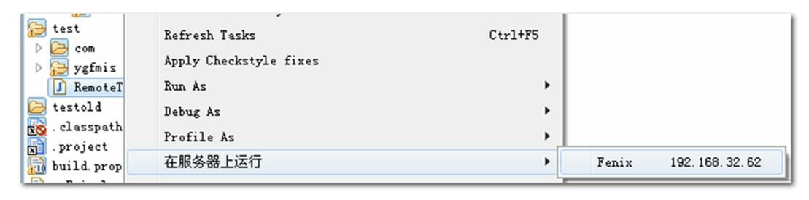

图9-4 JavaclassExecuter的使用

# 9.4 本章小结

第6章至第9章介绍了Class文件格式、类加载及虚拟机执行引擎这几部分内容,这些内容是虚拟机 中必不可少的组成部分,了解了虚拟机如何执行程序,才能更好地理解怎样才能写出优秀的代码。

关于虚拟机执行子系统的介绍就到此为止,通过这4章的讲解,我们描绘了一个虚拟机应该是怎样 运行Class文件的概念模型的,对于具体到某个虚拟机的实现,为了使实现简单清晰,或者为了更快的 运行速度,在虚拟机内部的运作与概念模型可能会有非常大的差异,但从最终的执行结果来看应该是 一致的。从第10章开始,我们将把目光从概念模型转到具体实现,去探索虚拟机在语法上和运行性能 上,是如何对程序编写做出各种优化的。

# 第四部分 程序编译与代码优化

·第10章 前端编译与优化

·第11章 后端编译与优化

# 第10章 前端编译与优化

从计算机程序出现的第一天起,对效率的追逐就是程序员天生的坚定信仰,这个过程犹如一场没 有终点、永不停歇的F1方程式竞赛,程序员是车手,技术平台则是在赛道上飞驰的赛车。

## 10.1 概述

在Java技术下谈"编译期"而没有具体上下文语境的话,其实是一句很含糊的表述,因为它可能是 指一个前端编译器(叫"编译器的前端"更准确一些)把\*.java文件转变成\*.class文件的过程;也可能是 指Java虚拟机的即时编译器(常称JIT编译器,Just In Time Compiler)运行期把字节码转变成本地机器 码的过程;还可能是指使用静态的提前编译器(常称AOT编译器,Ahead Of Time Compiler)直接把程 序编译成与目标机器指令集相关的二进制代码的过程。下面笔者列举了这3类编译过程里一些比较有代 表性的编译器产品:

- ·前端编译器:JDK的Javac、Eclipse JDT中的增量式编译器(ECJ)[1]。
- ·即时编译器:HotSpot虚拟机的C1、C2编译器,Graal编译器。
- ·提前编译器:JDK的Jaotc、GNU Compiler for the Java(GCJ)[2]、Excelsior JET [3]。

这3类过程中最符合普通程序员对Java程序编译认知的应该是第一类,本章标题中的"前端"指的也 是这种由前端编译器完成的编译行为。在本章后续的讨论里,笔者提到的全部"编译期"和"编译器"都 仅限于第一类编译过程,我们会把第二、三类编译过程留到第11章中去讨论。限制了"编译期"的范围 后,我们对于"优化"二字的定义也需要放宽一些,因为Javac这类前端编译器对代码的运行效率几乎没 有任何优化措施可言(在JDK 1.3之后,Javac的-O优化参数就不再有意义),哪怕是编译器真的采取 了优化措施也不会产生什么实质的效果。因为Java虚拟机设计团队选择把对性能的优化全部集中到运 行期的即时编译器中,这样可以让那些不是由Javac产生的Class文件(如JRuby、Groovy等语言的Class 文件)也同样能享受到编译器优化措施所带来的性能红利。但是,如果把"优化"的定义放宽,把对开 发阶段的优化也计算进来的话,Javac确实是做了许多针对Java语言编码过程的优化措施来降低程序员 的编码复杂度、提高编码效率。相当多新生的Java语法特性,都是靠编译器的"语法糖"来实现,而不 是依赖字节码或者Java虚拟机的底层改进来支持。我们可以这样认为,Java中即时编译器在运行期的优 化过程,支撑了程序执行效率的不断提升;而前端编译器在编译期的优化过程,则是支撑着程序员的 编码效率和语言使用者的幸福感的提高。

- [1] JDT官方站点:http://www.eclipse.org/jdt/。
- [2] GCJ官方站点:http://gcc.gnu.org/java/。
- [3] Excelsior JET:https://en.wikipedia.org/wiki/Excelsior\_JET。

### 10.2 Javac编译器

分析源码是了解一项技术的实现内幕最彻底的手段,Javac编译器不像HotSpot虚拟机那样使用 C++语言(包含少量C语言)实现,它本身就是一个由Java语言编写的程序,这为纯Java的程序员了解 它的编译过程带来了很大的便利。

# 10.2.1 Javac的源码与调试

在JDK 6以前,Javac并不属于标准Java SE API的一部分,它实现代码单独存放在tools.jar中,要在 程序中使用的话就必须把这个库放到类路径上。在JDK 6发布时通过了JSR 199编译器API的提案,使 得Javac编译器的实现代码晋升成为标准Java类库之一,它的源码就改为放在

JDK\_SRC\_HOME/langtools/src/share/classes/com/sun/tools/javac中[1]。到了JDK 9时,整个JDK所有的 Java类库都采用模块化进行重构划分,Javac编译器就被挪到了jdk.compiler模块(路径为:

JDK\_SRC\_HOME/src/jdk.compiler/share/classes/com/sun/tools/javac)里面。虽然程序代码的内容基本没 有变化,但由于本节的主题是源码解析,不可避免地会涉及大量的路径和包名,这就要选定JDK版本 来讨论了,本次笔者将会以JDK 9之前的代码结构来进行讲解。

Javac编译器除了JDK自身的标准类库外,就只引用了

JDK\_SRC\_HOME/langtools/src/share/classes/com/sun/\*里面的代码,所以我们的代码编译环境建立时基 本无须处理依赖关系,相当简单便捷。以Eclipse IDE作为开发工具为例,先建立一个名

为"Compiler\_javac"的Java工程,然后把JDK\_SRC\_HOME/langtools/src/share/classes/com/sun/\*目录下的 源文件全部复制到工程的源码目录中,如图10-1所示。

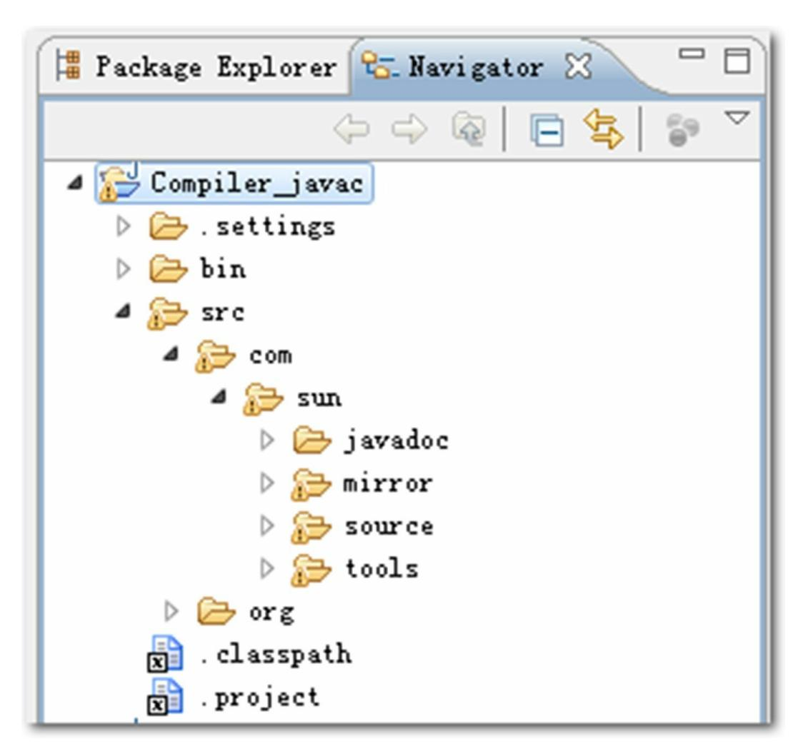

图10-1 Eclipse中的Javac工程

导入代码期间,源码文件"AnnotationProxyMaker.java"可能会提示"Access Restriction",被Eclipse 拒绝编译,如图10-2所示。

图10-2 AnnotationProxyMaker被拒绝编译

这是由于Eclipse为了避免开发人员引用非标准Java类库可能导致的兼容性问题,在"JRE System Library"设置中默认包含了一系列的代码访问规则(Access Rules),如果代码中引用了这些访问规则 所禁止引用的类,就会提示这个错误。我们可以通过添加一条允许访问JAR包中所有类的访问规则来 解决该问题,如图10-3所示。

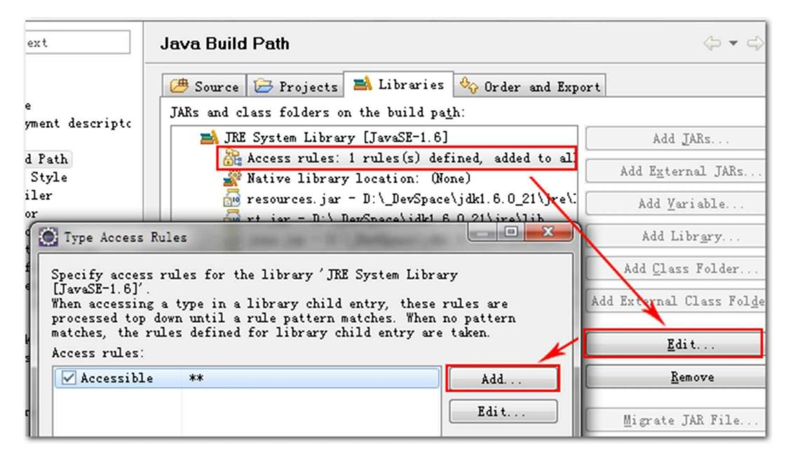

图10-3 设置访问规则

导入了Javac的源码后,就可以运行com.sun.tools.javac.Main的main()方法来执行编译了,可以使用 的参数与命令行中使用的Javac命令没有任何区别,编译的文件与参数在Eclipse的"Debug Configurations"面板中的"Arguments"页签中指定。

《Java虚拟机规范》中严格定义了Class文件格式的各种细节,可是对如何把Java源码编译为Class 文件却描述得相当宽松。规范里尽管有专门的一章名为"Compiling for the Java Virtual Machine",但这 章也仅仅是以举例的形式来介绍怎样的Java代码应该被转换为怎样的字节码,并没有使用编译原理中 常用的描述工具(如文法、生成式等)来对Java源码编译过程加以约束。这是给了Java前端编译器较大 的实现灵活性,但也导致Class文件编译过程在某种程度上是与具体的JDK或编译器实现相关的,譬如 在一些极端情况下,可能会出现某些代码在Javac编译器可以编译,但是ECJ编译器就不可以编译的问 题(反过来也有可能,后文中将会给出一些这样的例子)。

从Javac代码的总体结构来看,编译过程大致可以分为1个准备过程和3个处理过程,它们分别如下 所示。

- 1)准备过程:初始化插入式注解处理器。
- 2)解析与填充符号表过程,包括:
- ·词法、语法分析。将源代码的字符流转变为标记集合,构造出抽象语法树。
- ·填充符号表。产生符号地址和符号信息。

- 3)插入式注解处理器的注解处理过程:插入式注解处理器的执行阶段,本章的实战部分会设计一 个插入式注解处理器来影响Javac的编译行为。
  - 4)分析与字节码生成过程,包括:
  - ·标注检查。对语法的静态信息进行检查。
  - ·数据流及控制流分析。对程序动态运行过程进行检查。
  - ·解语法糖。将简化代码编写的语法糖还原为原有的形式。
  - ·字节码生成。将前面各个步骤所生成的信息转化成字节码。

上述3个处理过程里,执行插入式注解时又可能会产生新的符号,如果有新的符号产生,就必须转 回到之前的解析、填充符号表的过程中重新处理这些新符号,从总体来看,三者之间的关系与交互顺 序如图10-4所示。

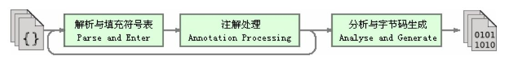

图10-4 Javac的编译过程[2]

我们可以把上述处理过程对应到代码中,Javac编译动作的入口是 com.sun.tools.javac.main.JavaCompiler类,上述3个过程的代码逻辑集中在这个类的compile()和compile2() 方法里,其中主体代码如图10-5所示,整个编译过程主要的处理由图中标注的8个方法来完成。

图10-5 Javac编译过程的主体代码

接下来,我们将对照Javac的源代码,逐项讲解上述过程。

- [1] 如何获取OpenJDK源码请参考本书第1章的相关内容。
- [2] 图片来源:http://openjdk.java.net/groups/compiler/doc/compilation-overview/index.html,笔者做了汉化 处理。

# 10.2.2 解析与填充符号表

解析过程由图10-5中的parseFiles()方法(图10-5中的过程1.1)来完成,解析过程包括了经典程序 编译原理中的词法分析和语法分析两个步骤。

#### 1.词法、语法分析

词法分析是将源代码的字符流转变为标记(Token)集合的过程,单个字符是程序编写时的最小元 素,但标记才是编译时的最小元素。关键字、变量名、字面量、运算符都可以作为标记,如"int a=b+2"这句代码中就包含了6个标记,分别是int、a、=、b、+、2,虽然关键字int由3个字符构成,但 是它只是一个独立的标记,不可以再拆分。在Javac的源码中,词法分析过程由 com.sun.tools.javac.parser.Scanner类来实现。

语法分析是根据标记序列构造抽象语法树的过程,抽象语法树(Abstract Syntax Tree,AST)是一 种用来描述程序代码语法结构的树形表示方式,抽象语法树的每一个节点都代表着程序代码中的一个 语法结构(SyntaxConstruct),例如包、类型、修饰符、运算符、接口、返回值甚至连代码注释等都 可以是一种特定的语法结构。

图10-6是Eclipse AST View插件分析出来的某段代码的抽象语法树视图,读者可以通过这个插件工 具生成的可视化界面对抽象语法树有一个直观的认识。在Javac的源码中,语法分析过程由 com.sun.tools.javac.parser.Parser类实现,这个阶段产出的抽象语法树是以com.sun.tools.javac.tree.JCTree 类表示的。

经过词法和语法分析生成语法树以后,编译器就不会再对源码字符流进行操作了,后续的操作都 建立在抽象语法树之上。

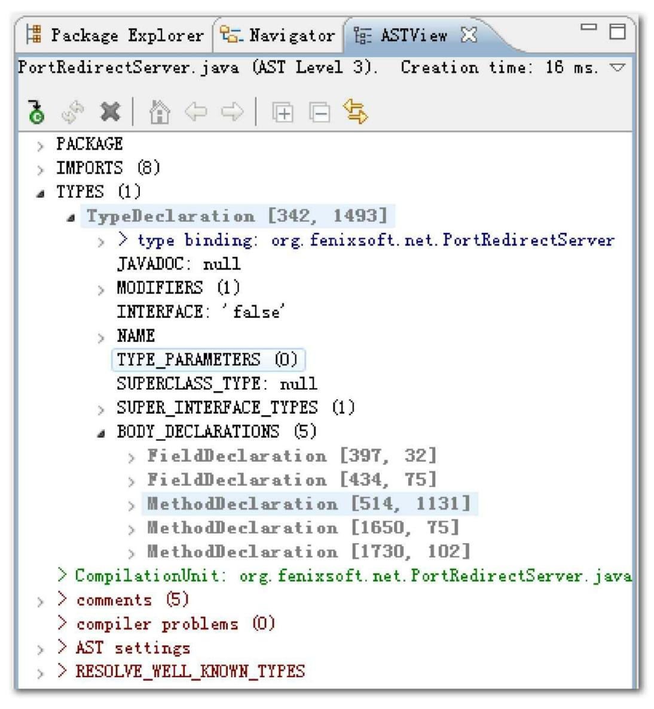

图10-6 抽象语法树结构视图

#### 2.填充符号表

完成了语法分析和词法分析之后,下一个阶段是对符号表进行填充的过程,也就是图10-5中 enterTrees()方法(图10-5中注释的过程1.2)要做的事情。符号表(Symbol Table)是由一组符号地址和 符号信息构成的数据结构,读者可以把它类比想象成哈希表中键值对的存储形式(实际上符号表不一

定是哈希表实现,可以是有序符号表、树状符号表、栈结构符号表等各种形式)。符号表中所登记的 信息在编译的不同阶段都要被用到。譬如在语义分析的过程中,符号表所登记的内容将用于语义检查 (如检查一个名字的使用和原先的声明是否一致)和产生中间代码,在目标代码生成阶段,当对符号 名进行地址分配时,符号表是地址分配的直接依据。

在Javac源代码中,填充符号表的过程由com.sun.tools.javac.comp.Enter类实现,该过程的产出物是 一个待处理列表,其中包含了每一个编译单元的抽象语法树的顶级节点,以及package-info.java(如果 存在的话)的顶级节点。

# 10.2.3 注解处理器

JDK 5之后,Java语言提供了对注解(Annotations)的支持,注解在设计上原本是与普通的Java代 码一样,都只会在程序运行期间发挥作用的。但在JDK 6中又提出并通过了JSR-269提案[1],该提案设 计了一组被称为"插入式注解处理器"的标准API,可以提前至编译期对代码中的特定注解进行处理, 从而影响到前端编译器的工作过程。我们可以把插入式注解处理器看作是一组编译器的插件,当这些 插件工作时,允许读取、修改、添加抽象语法树中的任意元素。如果这些插件在处理注解期间对语法 树进行过修改,编译器将回到解析及填充符号表的过程重新处理,直到所有插入式注解处理器都没有 再对语法树进行修改为止,每一次循环过程称为一个轮次(Round),这也就对应着图10-4的那个回环 过程。

有了编译器注解处理的标准API后,程序员的代码才有可能干涉编译器的行为,由于语法树中的 任意元素,甚至包括代码注释都可以在插件中被访问到,所以通过插入式注解处理器实现的插件在功 能上有很大的发挥空间。只要有足够的创意,程序员能使用插入式注解处理器来实现许多原本只能在 编码中由人工完成的事情。譬如Java著名的编码效率工具Lombok [2],它可以通过注解来实现自动产生 getter/setter方法、进行空置检查、生成受查异常表、产生equals()和hashCode()方法,等等,帮助开发人 员消除Java的冗长代码,这些都是依赖插入式注解处理器来实现的,本章最后会设计一个如何使用插 入式注解处理器的简单实战。

在Javac源码中,插入式注解处理器的初始化过程是在initPorcessAnnotations()方法中完成的,而它 的执行过程则是在processAnnotations()方法中完成。这个方法会判断是否还有新的注解处理器需要执 行,如果有的话,通过com.sun.tools.javac.processing.JavacProcessing-Environment类的doProcessing()方法 来生成一个新的JavaCompiler对象,对编译的后续步骤进行处理。

- [1] JSR-269:Pluggable Annotations Processing API(插入式注解处理API)。
- [2] 主页地址:https://projectlombok.org/。

# 10.2.4 语义分析与字节码生成

经过语法分析之后,编译器获得了程序代码的抽象语法树表示,抽象语法树能够表示一个结构正 确的源程序,但无法保证源程序的语义是符合逻辑的。而语义分析的主要任务则是对结构上正确的源 程序进行上下文相关性质的检查,譬如进行类型检查、控制流检查、数据流检查,等等。举个简单的 例子,假设有如下3个变量定义语句:

int a = 1; boolean b = false; char c = 2;

#### 后续可能出现的赋值运算:

int d = a + c; int d = b + c; char d = a + c;

后续代码中如果出现了如上3种赋值运算的话,那它们都能构成结构正确的抽象语法树,但是只有 第一种的写法在语义上是没有错误的,能够通过检查和编译。其余两种在Java语言中是不合逻辑的, 无法编译(是否合乎语义逻辑必须限定在具体的语言与具体的上下文环境之中才有意义。如在C语言 中,a、b、c的上下文定义不变,第二、三种写法都是可以被正确编译的)。我们编码时经常能在IDE 中看到由红线标注的错误提示,其中绝大部分都是来源于语义分析阶段的检查结果。

#### 1.标注检查

Javac在编译过程中,语义分析过程可分为标注检查和数据及控制流分析两个步骤,分别由图10-5 的attribute()和flow()方法(分别对应图10-5中的过程3.1和过程3.2)完成。

标注检查步骤要检查的内容包括诸如变量使用前是否已被声明、变量与赋值之间的数据类型是否 能够匹配,等等,刚才3个变量定义的例子就属于标注检查的处理范畴。在标注检查中,还会顺便进行 一个称为常量折叠(Constant Folding)的代码优化,这是Javac编译器会对源代码做的极少量优化措施 之一(代码优化几乎都在即时编译器中进行)。如果我们在Java代码中写下如下所示的变量定义:

# ■ INITIALIZER

- InfixExpression [105, 5]
  - Expression) type binding: int

NAME: 'int'

KEY: 'I'

IS RECOVERED: false

QUALIFIED NAME: 'int'

KIND: isPrimitive

> CREATE ARRAY TYPE (+1): int[]

BINARY NAME: 'I'

ANNOTATIONS (0)

>java element: null

Boxing: false; Unboxing: false

ConstantExpressionValue: 3

- LEFT OPERAND
  - > NumberLiteral [105, 1]

OPERATOR: '+'

- RIGHT OPERAND
  - > NumberLiteral [109, 1]

图10-7 常量折叠

则在抽象语法树上仍然能看到字面量"1""2"和操作符"+"号,但是在经过常量折叠优化之后,它们 将会被折叠为字面量"3",如图10-7所示,这个插入式表达式(Infix Expression)的值已经在语法树上 标注出来了(ConstantExpressionValue:3)。由于编译期间进行了常量折叠,所以在代码里面定 义"a=1+2"比起直接定义"a=3"来,并不会增加程序运行期哪怕仅仅一个处理器时钟周期的处理工作 量。

标注检查步骤在Javac源码中的实现类是com.sun.tools.javac.comp.Attr类和 com.sun.tools.javac.comp.Check类。

#### 2.数据及控制流分析

数据流分析和控制流分析是对程序上下文逻辑更进一步的验证,它可以检查出诸如程序局部变量 在使用前是否有赋值、方法的每条路径是否都有返回值、是否所有的受查异常都被正确处理了等问 题。编译时期的数据及控制流分析与类加载时的数据及控制流分析的目的基本上可以看作是一致的, 但校验范围会有所区别,有一些校验项只有在编译期或运行期才能进行。下面举一个关于final修饰符 的数据及控制流分析的例子,见代码清单10-1所示。

#### 代码清单10-1 final语义校验

```
// 方法一带有final修饰
public void foo(final int arg) {
   final int var = 0;
   // do something
// 方法二没有final修饰
public void foo(int arg) {
   int var = 0;
   // do something
```

在这两个foo()方法中,一个方法的参数和局部变量定义使用了final修饰符,另外一个则没有,在 代码编写时程序肯定会受到final修饰符的影响,不能再改变arg和var变量的值,但是如果观察这两段代 码编译出来的字节码,会发现它们是没有任何一点区别的,每条指令,甚至每个字节都一模一样。通 过第6章对Class文件结构的讲解我们已经知道,局部变量与类的字段(实例变量、类变量)的存储是 有显著差别的,局部变量在常量池中并没有CONSTANT\_Fieldref\_info的符号引用,自然就不可能存储 有访问标志(access\_flags)的信息,甚至可能连变量名称都不一定会被保留下来(这取决于编译时的 编译器的参数选项),自然在Class文件中就不可能知道一个局部变量是不是被声明为final了。因此, 可以肯定地推断出把局部变量声明为final,对运行期是完全没有影响的,变量的不变性仅仅由Javac编 译器在编译期间来保障,这就是一个只能在编译期而不能在运行期中检查的例子。在Javac的源码中, 数据及控制流分析的入口是图10-5中的flow()方法(图10-5中的过程3.2),具体操作由 com.sun.tools.javac.comp.Flow类来完成。

#### 3.解语法糖

语法糖(Syntactic Sugar),也称糖衣语法,是由英国计算机科学家Peter J.Landin发明的一种编程 术语,指的是在计算机语言中添加的某种语法,这种语法对语言的编译结果和功能并没有实际影响, 但是却能更方便程序员使用该语言。通常来说使用语法糖能够减少代码量、增加程序的可读性,从而

减少程序代码出错的机会。

Java在现代编程语言之中已经属于"低糖语言"(相对于C#及许多其他Java虚拟机语言来说),尤 其是JDK 5之前的Java。"低糖"的语法让Java程序实现相同功能的代码量往往高于其他语言,通俗地说 就是会显得比较"啰嗦",这也是Java语言一直被质疑是否已经"落后"了的一个浮于表面的理由。

Java中最常见的语法糖包括了前面提到过的泛型(其他语言中泛型并不一定都是语法糖实现,如 C#的泛型就是直接由CLR支持的)、变长参数、自动装箱拆箱,等等,Java虚拟机运行时并不直接支 持这些语法,它们在编译阶段被还原回原始的基础语法结构,这个过程就称为解语法糖。Java的这些 语法糖是如何实现的、被分解后会是什么样子,都将在10.3节中详细讲述。

在Javac的源码中,解语法糖的过程由desugar()方法触发,在com.sun.tools.javac.comp.TransTypes类 和com.sun.tools.javac.comp.Lower类中完成。

#### 4.字节码生成

字节码生成是Javac编译过程的最后一个阶段,在Javac源码里面由com.sun.tools.javac.jvm.Gen类来 完成。字节码生成阶段不仅仅是把前面各个步骤所生成的信息(语法树、符号表)转化成字节码指令 写到磁盘中,编译器还进行了少量的代码添加和转换工作。

例如前文多次登场的实例构造器<init>()方法和类构造器<clinit>()方法就是在这个阶段被添加到语 法树之中的。请注意这里的实例构造器并不等同于默认构造函数,如果用户代码中没有提供任何构造 函数,那编译器将会添加一个没有参数的、可访问性(public、protected、private或<package>)与当前 类型一致的默认构造函数,这个工作在填充符号表阶段中就已经完成。<init>()和<clinit>()这两个构造 器的产生实际上是一种代码收敛的过程,编译器会把语句块(对于实例构造器而言是"{}"块,对于类 构造器而言是"static{}"块)、变量初始化(实例变量和类变量)、调用父类的实例构造器(仅仅是实 例构造器,<clinit>()方法中无须调用父类的<clinit>()方法,Java虚拟机会自动保证父类构造器的正确执 行,但在<clinit>()方法中经常会生成调用java.lang.Object的<init>()方法的代码)等操作收敛到<init>()和 <clinit>()方法之中,并且保证无论源码中出现的顺序如何,都一定是按先执行父类的实例构造器,然 后初始化变量,最后执行语句块的顺序进行,上面所述的动作由Gen::normalizeDefs()方法来实现。除 了生成构造器以外,还有其他的一些代码替换工作用于优化程序某些逻辑的实现方式,如把字符串的 加操作替换为StringBuffer或StringBuilder(取决于目标代码的版本是否大于或等于JDK 5)的append()操 作,等等。

完成了对语法树的遍历和调整之后,就会把填充了所有所需信息的符号表交到 com.sun.tools.javac.jvm.ClassWriter类手上,由这个类的writeClass()方法输出字节码,生成最终的Class 文件,到此,整个编译过程宣告结束。

## 10.3 Java语法糖的味道

几乎所有的编程语言都或多或少提供过一些语法糖来方便程序员的代码开发,这些语法糖虽然不 会提供实质性的功能改进,但是它们或能提高效率,或能提升语法的严谨性,或能减少编码出错的机 会。现在也有一种观点认为语法糖并不一定都是有益的,大量添加和使用含糖的语法,容易让程序员 产生依赖,无法看清语法糖的糖衣背后,程序代码的真实面目。

总而言之,语法糖可以看作是前端编译器实现的一些"小把戏",这些"小把戏"可能会使效率得 到"大提升",但我们也应该去了解这些"小把戏"背后的真实面貌,那样才能利用好它们,而不是被它 们所迷惑。

# 10.3.1 泛型

泛型的本质是参数化类型(Parameterized Type)或者参数化多态(Parametric Polymorphism)的 应用,即可以将操作的数据类型指定为方法签名中的一种特殊参数,这种参数类型能够用在类、接口 和方法的创建中,分别构成泛型类、泛型接口和泛型方法。泛型让程序员能够针对泛化的数据类型编 写相同的算法,这极大地增强了编程语言的类型系统及抽象能力。

在2004年,Java和C#两门语言于同一年更新了一个重要的大版本,即Java 5.0和C#2.0,在这个大 版本中,两门语言又不约而同地各自添加了泛型的语法特性。不过,两门语言对泛型的实现方式却选 择了截然不同的路径。本来Java和C#天生就存在着比较和竞争,泛型这个两门语言在同一年、同一个 功能上做出的不同选择,自然免不了被大家对比审视一番,其结论是Java的泛型直到今天依然作为Java 语言不如C#语言好用的"铁证"被众人嘲讽。笔者在本节介绍Java泛型时,并不会去尝试推翻这个结 论,相反甚至还会去举例来揭示Java泛型的缺陷所在,但同时也必须向不了解Java泛型机制和历史的读 者说清楚,Java选择这样的泛型实现,是出于当时语言现状的权衡,而不是语言先进性或者设计者水 平不如C#之类的原因。

#### 1.Java与C#的泛型

Java选择的泛型实现方式叫作"类型擦除式泛型"(Type Erasure Generics),而C#选择的泛型实现 方式是"具现化式泛型"(Reified Generics)。具现化和特化、偏特化这些名词最初都是源于C++模版语 法中的概念,如果读者本身不使用C++的话,在本节的阅读中可不必太纠结其概念定义,把它当一个 技术名词即可,只需要知道C#里面泛型无论在程序源码里面、编译后的中间语言表示(Intermediate Language,这时候泛型是一个占位符)里面,抑或是运行期的CLR里面都是切实存在的,List<int>与 List<string>就是两个不同的类型,它们由系统在运行期生成,有着自己独立的虚方法表和类型数据。 而Java语言中的泛型则不同,它只在程序源码中存在,在编译后的字节码文件中,全部泛型都被替换 为原来的裸类型(Raw Type,稍后我们会讲解裸类型具体是什么)了,并且在相应的地方插入了强制 转型代码,因此对于运行期的Java语言来说,ArrayList<int>与ArrayList<String>其实是同一个类型,由 此读者可以想象"类型擦除"这个名字的含义和来源,这也是为什么笔者会把Java泛型安排在语法糖里 介绍的原因。

读者虽然无须纠结概念,但却要关注这两种实现方式会给使用者带来什么样的影响。Java的泛型 确实在实际使用中会有一些限制,如果读者是一名C#开发人员,可能很难想象代码清单10-2中的Java 代码都是不合法的。

#### 代码清单10-2 Java中不支持的泛型用法

```
public class TypeErasureGenerics<E> {
   public void doSomething(Object item) {
      if (item instanceof E) { // 不合法,无法对泛型进行实例判断
      E newItem = new E(); // 不合法,无法使用泛型创建对象
      E[] itemArray = new E[10]; // 不合法,无法使用泛型创建数组
```

上面这些是Java泛型在编码阶段产生的不良影响,如果说这种使用层次上的差别还可以通过多写 几行代码、方法中多加一两个类型参数来解决的话,性能上的差距则是难以用编码弥补的。C#2.0引入 了泛型之后,带来的显著优势之一便是对比起Java在执行性能上的提高,因为在使用平台提供的容器 类型(如List<T>,Dictionary<TKey,TValue>)时,无须像Java里那样不厌其烦地拆箱和装箱[1],如 果在Java中要避免这种损失,就必须构造一个与数据类型相关的容器类(譬如IntFloatHashMap这样的 容器)。显然,这除了引入更多代码造成复杂度提高、复用性降低之外,更是丧失了泛型本身的存在 价值。

Java的类型擦除式泛型无论在使用效果上还是运行效率上,几乎是全面落后于C#的具现化式泛 型,而它的唯一优势是在于实现这种泛型的影响范围上:擦除式泛型的实现几乎只需要在Javac编译器 上做出改进即可,不需要改动字节码、不需要改动Java虚拟机,也保证了以前没有使用泛型的库可以 直接运行在Java 5.0之上。但这种听起来节省工作量甚至可以说是有偷工减料嫌疑的优势就显得非常短 视,真的能在当年Java实现泛型的利弊权衡中胜出吗?答案的确是它胜出了,但我们必须在那时的泛 型历史背景中去考虑不同实现方式带来的代价。

#### 2.泛型的历史背景

泛型思想早在C++语言的模板(Template)功能中就开始生根发芽,而在Java语言中加入泛型的首 次尝试是出现在1996年。Martin Odersky(后来Scala语言的缔造者)当时是德国卡尔斯鲁厄大学编程 理论的教授,他想设计一门能够支持函数式编程的程序语言,又不想从头把编程语言的所有功能都再 做一遍,所以就注意到了刚刚发布一年的Java,并在它上面实现了函数式编程的3大特性:泛型、高阶 函数和模式匹配,形成了Scala语言的前身Pizza语言[2]。后来,Java的开发团队找到了Martin Odersky,表示对Pizza语言的泛型功能很感兴趣,他们就一起建立了一个叫作"Generic Java"的新项 目,目标是把Pizza语言的泛型单独拎出来移植到Java语言上,其最终成果就是Java 5.0中的那个泛型实 现[3],但是移植的过程并不是一开始就朝着类型擦除式泛型去的,事实上Pizza语言中的泛型更接近于 现在C#的泛型。Martin Odersky自己在采访自述[4]中提到,进行Generic Java项目的过程中他受到了重 重约束,甚至多次让他感到沮丧,最紧、最难的约束来源于被迫要完全向后兼容无泛型Java,即保 证"二进制向后兼容性"(Binary Backwards Compatibility)。二进制向后兼容性是明确写入《Java语言 规范》中的对Java使用者的严肃承诺,譬如一个在JDK 1.2中编译出来的Class文件,必须保证能够在 JDK 12乃至以后的版本中也能够正常运行[5]。这样,既然Java到1.4.2版之前都没有支持过泛型,而到 Java 5.0突然要支持泛型了,还要让以前编译的程序在新版本的虚拟机还能正常运行,就意味着以前没 有的限制不能突然间冒出来。

举个例子,在没有泛型的时代,由于Java中的数组是支持协变(Covariant)的[6],对应的集合类 也可以存入不同类型的元素,类似于代码清单10-3这样的代码尽管不提倡,但是完全可以正常编译成 Class文件。

代码清单10-3 以下代码可正常编译为Class

为了保证这些编译出来的Class文件可以在Java 5.0引入泛型之后继续运行,设计者面前大体上有两 条路可以选择:

- 1)需要泛型化的类型(主要是容器类型),以前有的就保持不变,然后平行地加一套泛型化版本 的新类型。
- 2)直接把已有的类型泛型化,即让所有需要泛型化的已有类型都原地泛型化,不添加任何平行于 已有类型的泛型版。

在这个分叉路口,C#走了第一条路,添加了一组System.Collections.Generic的新容器,以前的 System.Collections以及System.Collections.Specialized容器类型继续存在。C#的开发人员很快就接受了新 的容器,倒也没出现过什么不适应的问题,唯一的不适大概是许多.NET自身的标准库已经把老容器类 型当作方法的返回值或者参数使用,这些方法至今还保持着原来的老样子。

但如果相同的选择出现在Java中就很可能不会是相同的结果了,要知道当时.NET才问世两年,而 Java已经有快十年的历史了,再加上各自流行程度的不同,两者遗留代码的规模根本不在同一个数量 级上。而且更大的问题是Java并不是没有做过第一条路那样的技术决策,在JDK 1.2时,遗留代码规模 尚小,Java就引入过新的集合类,并且保留了旧集合类不动。这导致了直到现在标准类库中还有 Vector(老)和ArrayList(新)、有Hashtable(老)和HashMap(新)等两套容器代码并存,如果当 时再摆弄出像Vector(老)、ArrayList(新)、Vector<T>(老但有泛型)、ArrayList<T>(新且有泛 型)这样的容器集合,可能叫骂声会比今天听到的更响更大。

到了这里,相信读者已经能稍微理解为什么当时Java只能选择第二条路了。但第二条路也并不意 味着一定只能使用类型擦除来实现,如果当时有足够的时间好好设计和实现,是完全有可能做出更好 的泛型系统的,否则也不会有今天的Valhalla项目来还以前泛型偷懒留下的技术债了。下面我们就来看 看当时做的类型擦除式泛型的实现时到底哪里偷懒了,又带来了怎样的缺陷。

#### 3.类型擦除

我们继续以ArrayList为例来介绍Java泛型的类型擦除具体是如何实现的。由于Java选择了第二条 路,直接把已有的类型泛型化。要让所有需要泛型化的已有类型,譬如ArrayList,原地泛型化后变成 了ArrayList<T>,而且保证以前直接用ArrayList的代码在泛型新版本里必须还能继续用这同一个容 器,这就必须让所有泛型化的实例类型,譬如ArrayList<Integer>、ArrayList<String>这些全部自动成为 ArrayList的子类型才能可以,否则类型转换就是不安全的。由此就引出了"裸类型"(Raw Type)的概 念,裸类型应被视为所有该类型泛型化实例的共同父类型(Super Type),只有这样,像代码清单10- 4中的赋值才是被系统允许的从子类到父类的安全转型。

#### 代码清单10-4 裸类型赋值

ArrayList<Integer> ilist = new ArrayList<Integer>(); ArrayList<String> slist = new ArrayList<String>(); ArrayList list; // 裸类型 list = ilist; list = slist;

接下来的问题是该如何实现裸类型。这里又有了两种选择:一种是在运行期由Java虚拟机来自动 地、真实地构造出ArrayList<Integer>这样的类型,并且自动实现从ArrayList<Integer>派生自ArrayList 的继承关系来满足裸类型的定义;另外一种是索性简单粗暴地直接在编译时把ArrayList<Integer>还原 回ArrayList,只在元素访问、修改时自动插入一些强制类型转换和检查指令,这样看起来也是能满足 需要,这两个选择的最终结果大家已经都知道了。代码清单10-5是一段简单的Java泛型例子,我们可 以看一下它编译后的实际样子是怎样的。

#### 代码清单10-5 泛型擦除前的例子

```
public static void main(String[] args) {
    Map<String, String> map = new HashMap<String, String>();
    map.put("hello", "你好");
    map.put("how are you?", "吃了没?");
    System.out.println(map.get("hello"));
    System.out.println(map.get("how are you?"));
```

把这段Java代码编译成Class文件,然后再用字节码反编译工具进行反编译后,将会发现泛型都不 见了,程序又变回了Java泛型出现之前的写法,泛型类型都变回了裸类型,只在元素访问时插入了从 Object到String的强制转型代码,如代码清单10-6所示。

#### 代码清单10-6 泛型擦除后的例子

```
public static void main(String[] args) {
    Map map = new HashMap();
    map.put("hello", "你好");
    map.put("how are you?", "吃了没?");
    System.out.println((String) map.get("hello"));
    System.out.println((String) map.get("how are you?"));
```

类型擦除带来的缺陷前面已经提到过一些,为了系统性地讲述,笔者在此再举3个例子,把前面与 C#对比时简要提及的擦除式泛型的缺陷做更具体的说明。

首先,使用擦除法实现泛型直接导致了对原始类型(Primitive Types)数据的支持又成了新的麻 烦,譬如将代码清单10-2稍微修改一下,变成代码清单10-7这个样子。

代码清单10-7 原始类型的泛型(目前的Java不支持)

```
ArrayList<int> ilist = new ArrayList<int>();
ArrayList<long> llist = new ArrayList<long>();
ArrayList list;
list = ilist;
list = llist;
```

这种情况下,一旦把泛型信息擦除后,到要插入强制转型代码的地方就没办法往下做了,因为不 支持int、long与Object之间的强制转型。当时Java给出的解决方案一如既往的简单粗暴:既然没法转换 那就索性别支持原生类型的泛型了吧,你们都用ArrayList<Integer>、ArrayList<Long>,反正都做了自

动的强制类型转换,遇到原生类型时把装箱、拆箱也自动做了得了。这个决定后面导致了无数构造包 装类和装箱、拆箱的开销,成为Java泛型慢的重要原因,也成为今天Valhalla项目要重点解决的问题之 一。

第二,运行期无法取到泛型类型信息,会让一些代码变得相当啰嗦,譬如代码清单10-2中罗列的 几种Java不支持的泛型用法,都是由于运行期Java虚拟机无法取得泛型类型而导致的。像代码清单10-8 这样,我们去写一个泛型版本的从List到数组的转换方法,由于不能从List中取得参数化类型T,所以 不得不从一个额外参数中再传入一个数组的组件类型进去,实属无奈。

#### 代码清单10-8 不得不加入的类型参数

```
public static <T> T[] convert(List<T> list, Class<T> componentType) {
    T[] array = (T[])Array.newInstance(componentType, list.size());
```

最后,笔者认为通过擦除法来实现泛型,还丧失了一些面向对象思想应有的优雅,带来了一些模 棱两可的模糊状况,例如代码清单10-9的例子。

#### 代码清单10-9 当泛型遇见重载1

```
public class GenericTypes {
    public static void method(List<String> list) {
        System.out.println("invoke method(List<String> list)");
    public static void method(List<Integer> list) {
        System.out.println("invoke method(List<Integer> list)");
```

请读者思考一下,上面这段代码是否正确,能否编译执行?也许你已经有了答案,这段代码是不 能被编译的,因为参数List<Integer>和List<String>编译之后都被擦除了,变成了同一种的裸类型List, 类型擦除导致这两个方法的特征签名变得一模一样。初步看来,无法重载的原因已经找到了,但是真 的就是如此吗?其实这个例子中泛型擦除成相同的裸类型只是无法重载的其中一部分原因,请再接着 看一看代码清单10-10中的内容。

#### 代码清单10-10 当泛型遇见重载2

```
public class GenericTypes {
    public static String method(List<String> list) {
        System.out.println("invoke method(List<String> list)");
        return "";
    public static int method(List<Integer> list) {
        System.out.println("invoke method(List<Integer> list)");
        return 1;
    public static void main(String[] args) {
```

```
method(new ArrayList<String>());
method(new ArrayList<Integer>());
```

#### 执行结果:

invoke method(List<String> list) invoke method(List<Integer> list)

代码清单10-9与代码清单10-10的差别,是两个method()方法添加了不同的返回值,由于这两个返 回值的加入,方法重载居然成功了,即这段代码可以被编译和执行[7]了。这是我们对Java语言中返回 值不参与重载选择的基本认知的挑战吗?

代码清单10-10中的重载当然不是根据返回值来确定的,之所以这次能编译和执行成功,是因为两 个method()方法加入了不同的返回值后才能共存在一个Class文件之中。第6章介绍Class文件方法表 (method\_info)的数据结构时曾经提到过,方法重载要求方法具备不同的特征签名,返回值并不包含 在方法的特征签名中,所以返回值不参与重载选择,但是在Class文件格式之中,只要描述符不是完全 一致的两个方法就可以共存。也就是说两个方法如果有相同的名称和特征签名,但返回值不同,那它 们也是可以合法地共存于一个Class文件中的。

由于Java泛型的引入,各种场景(虚拟机解析、反射等)下的方法调用都可能对原有的基础产生 影响并带来新的需求,如在泛型类中如何获取传入的参数化类型等。所以JCP组织对《Java虚拟机规 范》做出了相应的修改,引入了诸如Signature、LocalVariableTypeTable等新的属性用于解决伴随泛型而 来的参数类型的识别问题,Signature是其中最重要的一项属性,它的作用就是存储一个方法在字节码 层面的特征签名[8],这个属性中保存的参数类型并不是原生类型,而是包括了参数化类型的信息。修 改后的虚拟机规范[9]要求所有能识别49.0以上版本的Class文件的虚拟机都要能正确地识别Signature参 数。

从上面的例子中可以看到擦除法对实际编码带来的不良影响,由于List<String>和List<Integer>擦 除后是同一个类型,我们只能添加两个并不需要实际使用到的返回值才能完成重载,这是一种毫无优 雅和美感可言的解决方案,并且存在一定语意上的混乱,譬如上面脚注中提到的,必须用JDK 6的 Javac才能编译成功,其他版本或者是ECJ编译器都有可能拒绝编译。

另外,从Signature属性的出现我们还可以得出结论,擦除法所谓的擦除,仅仅是对方法的Code属 性中的字节码进行擦除,实际上元数据中还是保留了泛型信息,这也是我们在编码时能通过反射手段 取得参数化类型的根本依据。

#### 4.值类型与未来的泛型

在2014年,刚好是Java泛型出现的十年之后,Oracle建立了一个名为Valhalla的语言改进项目[10], 希望改进Java语言留下的各种缺陷(解决泛型的缺陷就是项目主要目标其中之一)。原本这个项目是 计划在JDK 10中完成的,但在笔者撰写本节时(2019年8月,下个月JDK 13正式版都要发布了)也只 有少部分目标(譬如VarHandle)顺利实现并发布出去。它现在的技术预览版LW2(L-World 2)[11]是

基于未完成的JDK 14 EarlyAccess来运行的,所以本节内容很可能在将来会发生变动,请读者阅读时多 加注意。

在Valhalla项目中规划了几种不同的新泛型实现方案,被称为Model 1到Model 3,在这些新的泛型 设计中,泛型类型有可能被具现化,也有可能继续维持类型擦除以保持兼容(取决于采用哪种实现方 案),即使是继续采用类型擦除的方案,泛型的参数化类型也可以选择不被完全地擦除掉,而是相对 完整地记录在Class文件中,能够在运行期被使用,也可以指定编译器默认要擦除哪些类型。相对于使 用不同方式实现泛型,目前比较明确的是未来的Java应该会提供"值类型"(Value Type)的语言层面的 支持。

说起值类型,这点也是C#用户攻讦Java语言的常用武器之一,C#并没有Java意义上的原生数据类 型,在C#中使用的int、bool、double关键字其实是对应了一系列在.NET框架中预定义好的结构体 (Struct),如Int32、Boolean、Double等。在C#中开发人员也可以定义自己值类型,只要继承于 ValueType类型即可,而ValueType也是统一基类Object的子类,所以并不会遇到Java那样int不自动装箱 就无法转型为Object的尴尬。

值类型可以与引用类型一样,具有构造函数、方法或是属性字段,等等,而它与引用类型的区别 在于它在赋值的时候通常是整体复制,而不是像引用类型那样传递引用的。更为关键的是,值类型的 实例很容易实现分配在方法的调用栈上的,这意味着值类型会随着当前方法的退出而自动释放,不会 给垃圾收集子系统带来任何压力。

在Valhalla项目中,Java的值类型方案被称为"内联类型",计划通过一个新的关键字inline来定义, 字节码层面也有专门与原生类型对应的以Q开头的新的操作码(譬如iload对应qload)来支撑。现在的 预览版可以通过一个特制的解释器来保证这些未来可能加入的字节码指令能够被执行,要即时编译的 话,现在只支持C2编译器。即时编译器场景中是使用逃逸分析优化(见第11章)来处理内联类型的, 通过编码时标注以及内联类实例所具备的不可变性,可以很好地解决逃逸分析面对传统引用类型时难 以判断(没有足够的信息,或者没有足够的时间做全程序分析)对象是否逃逸的问题。

- [1] 这里有对这种性能损失会有多大的量化的讨论:http://fsharpnews.blogspot.com/2010/05/java-vsf.html。
- [2] 一般认为Scala的前身应该是Funnel,从Pizza语言中借鉴了一些技术和思想。
- [3] 准确地说Java 5.0的泛型还有一部分是由Gilad Bracha和奥胡斯大学独立开发的通配符功能。
- [4] 以上资料来源于Martin Odersky的自述:

https://www.artima.com/scalazine/articles/origins\_of\_scala.html。

- [5] 注意,保证的是二进制向后兼容性(即编译结果的兼容性),不是源码兼容性,也不保证(甚至是 不允许)高版本JDK的编译结果能前向兼容地运行在低版本Java虚拟机之上。
- [6] 现在Java数组也是具有协变性的,请读者不要误解成"有泛型的时代"之后这点就改变了。
- [7] 笔者在测试时使用了JDK 6的Javac编译器进行编译,前面提到前端编译器的实现在《Java虚拟机规 范》中的定义并不够具体,所以其他的前端编译器,如Eclipse JDT的ECJ编译器,仍然可能会拒绝编 译这段代码,ECJ编译时会提示"Method method(List<String>)has the same erasure method(List<E>)as another method in type GenericTypes"。
- [8] 在《Java虚拟机规范(第2版)》(JDK 5修改后的版本)的4.4.4节及《Java语言规范(第3版)》 的8.4.2节中都分别定义了字节码层面的方法特征签名,以及Java代码层面的方法特征签名,特征签名 最重要的任务就是作为方法独一无二不可重复的ID,在Java代码中的方法特征签名只包括了方法名

称、参数顺序及参数类型,而在字节码中的特征签名还包括方法返回值及受查异常表,本书中如果指 的是字节码层面的方法签名,笔者会加入限定语进行说明,也请读者根据上下文语境注意区分。

- [9] JDK 5对虚拟机规范修改:http://java.sun.com/docs/books/jvms/second\_edition/jvms-clarify.html。
- [10] 项目主页:https://wiki.openjdk.java.net/display/valhalla/Main。
- [11] Valhalla的LW2原型:https://wiki.openjdk.java.net/display/valhalla/LW2。

# 10.3.2 自动装箱、拆箱与遍历循环

就纯技术的角度而论,自动装箱、自动拆箱与遍历循环(for-each循环)这些语法糖,无论是实现 复杂度上还是其中蕴含的思想上都不能和10.3.1节介绍的泛型相提并论,两者涉及的难度和深度都有很 大差距。专门拿出一节来讲解它们只是因为这些是Java语言里面被使用最多的语法糖。我们通过代码 清单10-11和代码清单10-12中所示的代码来看看这些语法糖在编译后会发生什么样的变化。

#### 代码清单10-11 自动装箱、拆箱与遍历循环

```
public static void main(String[] args) {
    List<Integer> list = Arrays.asList(1, 2, 3, 4);
    int sum = 0;
    for (int i : list) {
        sum += i;
    System.out.println(sum);
```

#### 代码清单10-12 自动装箱、拆箱与遍历循环编译之后

```
public static void main(String[] args) {
    List list = Arrays.asList( new Integer[] {
        Integer.valueOf(1),
        Integer.valueOf(2),
        Integer.valueOf(3),
        Integer.valueOf(4) });
    int sum = 0;
    for (Iterator localIterator = list.iterator(); localIterator.hasNext(); ) {
        int i = ((Integer)localIterator.next()).intValue();
        sum += i;
    System.out.println(sum);
```

代码清单10-11中一共包含了泛型、自动装箱、自动拆箱、遍历循环与变长参数5种语法糖,代码 清单10-12则展示了它们在编译前后发生的变化。泛型就不必说了,自动装箱、拆箱在编译之后被转化 成了对应的包装和还原方法,如本例中的Integer.valueOf()与Integer.intValue()方法,而遍历循环则是把代 码还原成了迭代器的实现,这也是为何遍历循环需要被遍历的类实现Iterable接口的原因。最后再看看 变长参数,它在调用的时候变成了一个数组类型的参数,在变长参数出现之前,程序员的确也就是使 用数组来完成类似功能的。

这些语法糖虽然看起来很简单,但也不见得就没有任何值得我们特别关注的地方,代码清单10-13 演示了自动装箱的一些错误用法。

#### 代码清单10-13 自动装箱的陷阱

```
public static void main(String[] args) {
    Integer a = 1;
    Integer b = 2;
    Integer c = 3;
```

```
Integer d = 3;
Integer e = 321;
Integer f = 321;
Long g = 3L;
System.out.println(c == d);
System.out.println(e == f);
System.out.println(c == (a + b));
System.out.println(c.equals(a + b));
System.out.println(g == (a + b));
System.out.println(g.equals(a + b));
```

读者阅读完代码清单10-13,不妨思考两个问题:一是这6句打印语句的输出是什么?二是这6句打 印语句中,解除语法糖后参数会是什么样子?这两个问题的答案都很容易试验出来,笔者就暂且略去 答案,希望不能立刻做出判断的读者自己上机实践一下。无论读者的回答是否正确,鉴于包装类 的"=="运算在不遇到算术运算的情况下不会自动拆箱,以及它们equals()方法不处理数据转型的关系, 笔者建议在实际编码中尽量避免这样使用自动装箱与拆箱。

# 10.3.3 条件编译

许多程序设计语言都提供了条件编译的途径,如C、C++中使用预处理器指示符(#ifdef)来完成 条件编译。C、C++的预处理器最初的任务是解决编译时的代码依赖关系(如极为常用的#include预处 理命令),而在Java语言之中并没有使用预处理器,因为Java语言天然的编译方式(编译器并非一个个 地编译Java文件,而是将所有编译单元的语法树顶级节点输入到待处理列表后再进行编译,因此各个 文件之间能够互相提供符号信息)就无须使用到预处理器。那Java语言是否有办法实现条件编译呢?

Java语言当然也可以进行条件编译,方法就是使用条件为常量的if语句。如代码清单10-14所示, 该代码中的if语句不同于其他Java代码,它在编译阶段就会被"运行",生成的字节码之中只包 括"System.out.println("block 1");"一条语句,并不会包含if语句及另外一个分子中 的"System.out.println("block 2");"

#### 代码清单10-14 Java语言的条件编译

```
public static void main(String[] args) {
    if (true) {
        System.out.println("block 1");
    } else {
        System.out.println("block 2");
```

#### 该代码编译后Class文件的反编译结果:

```
public static void main(String[] args) {
    System.out.println("block 1");
```

只能使用条件为常量的if语句才能达到上述效果,如果使用常量与其他带有条件判断能力的语句 搭配,则可能在控制流分析中提示错误,被拒绝编译,如代码清单10-15所示的代码就会被编译器拒绝 编译。

#### 代码清单10-15 不能使用其他条件语句来完成条件编译

```
public static void main(String[] args) {
   // 编译器将会提示"Unreachable code"
   while (false) {
       System.out.println("");
```

Java语言中条件编译的实现,也是Java语言的一颗语法糖,根据布尔常量值的真假,编译器将会把 分支中不成立的代码块消除掉,这一工作将在编译器解除语法糖阶段(com.sun.tools.javac.comp.Lower 类中)完成。由于这种条件编译的实现方式使用了if语句,所以它必须遵循最基本的Java语法,只能写 在方法体内部,因此它只能实现语句基本块(Block)级别的条件编译,而没有办法实现根据条件调整

#### 整个Java类的结构。

除了本节中介绍的泛型、自动装箱、自动拆箱、遍历循环、变长参数和条件编译之外,Java语言 还有不少其他的语法糖,如内部类、枚举类、断言语句、数值字面量、对枚举和字符串的switch支 持、try语句中定义和关闭资源(这3个从JDK 7开始支持)、Lambda表达式(从JDK 8开始支持, Lambda不能算是单纯的语法糖,但在前端编译器中做了大量的转换工作),等等,读者可以通过跟踪 Javac源码、反编译Class文件等方式了解它们的本质实现,囿于篇幅,笔者就不再一一介绍了。

# 10.4 实战:插入式注解处理器

Java的编译优化部分在本书中并没有像前面两部分那样设置独立的、整章篇幅的实战,因为我们 开发程序,考虑的主要还是程序会如何运行,较少会涉及针对程序编译的特殊需求。也正因如此,在 JDK的编译子系统里面,暴露给用户直接控制的功能相对很少,除了第11章会介绍的虚拟机即时编译 的若干相关参数以外,我们就只有使用JSR-296中定义的插入式注解处理器API来对Java编译子系统的 行为施加影响。

但是笔者丝毫不认为相对于前两部分介绍的内存管理子系统和字节码执行子系统,编译子系统就 不那么重要了。一套编程语言中编译子系统的优劣,很大程度上决定了程序运行性能的好坏和编码效 率的高低,尤其在Java语言中,运行期即时编译与虚拟机执行子系统非常紧密地互相依赖、配合运作 (第11章我们将主要讲解这方面的内容)。了解JDK如何编译和优化代码,有助于我们写出适合Java 虚拟机自优化的程序。话题说远了,下面我们回到本章的实战中来,看看插入式注解处理器API能为 我们实现什么功能。

# 10.4.1 实战目标

通过阅读Javac编译器的源码,我们知道前端编译器在把Java程序源码编译为字节码的时候,会对 Java程序源码做各方面的检查校验。这些校验主要是以程序"写得对不对"为出发点,虽然也会产生一 些警告和提示类的信息,但总体来讲还是较少去校验程序"写得好不好"。有鉴于此,业界出现了许多 针对程序"写得好不好"的辅助校验工具,如CheckStyle、FindBug、Klocwork等。这些代码校验工具有 一些是基于Java的源码进行校验,有一些是通过扫描字节码来完成,在本节的实战中,我们将会使用 注解处理器API来编写一款拥有自己编码风格的校验工具:NameCheckProcessor。

当然,由于我们的实战都是为了学习和演示技术原理,而且篇幅所限,不可能做出一款能媲美 CheckStyle等工具的产品来,所以NameCheckProcessor的目标也仅定为对Java程序命名进行检查。根据 《Java语言规范》中6.8节的要求,Java程序命名推荐(而不是强制)应当符合下列格式的书写规范。

- ·类(或接口):符合驼式命名法,首字母大写。
- ·方法:符合驼式命名法,首字母小写。

#### ·字段:

- ■类或实例变量。符合驼式命名法,首字母小写。
- ■常量。要求全部由大写字母或下划线构成,并且第一个字符不能是下划线。

上文提到的驼式命名法(Camel Case Name),正如它的名称所表示的那样,是指混合使用大小写 字母来分割构成变量或函数的名字,犹如驼峰一般,这是当前Java语言中主流的命名规范,我们的实 战目标就是为Javac编译器添加一个额外的功能,在编译程序时检查程序名是否符合上述对类(或接 口)、方法、字段的命名要求。

# 10.4.2 代码实现

要通过注解处理器API实现一个编译器插件,首先需要了解这组API的一些基本知识。我们实现注 解处理器的代码需要继承抽象类javax.annotation.processing.AbstractProcessor,这个抽象类中只有一个 子类必须实现的抽象方法:"process()",它是Javac编译器在执行注解处理器代码时要调用的过程,我 们可以从这个方法的第一个参数"annotations"中获取到此注解处理器所要处理的注解集合,从第二个 参数"roundEnv"中访问到当前这个轮次(Round)中的抽象语法树节点,每个语法树节点在这里都表示 为一个Element。在javax.lang.model.ElementKind中定义了18类Element,已经包括了Java代码中可能出现 的全部元素,如:"包(PACKAGE)、枚举(ENUM)、类(CLASS)、注解 (ANNOTATION\_TYPE)、接口(INTERFACE)、枚举值(ENUM\_CONSTANT)、字段 (FIELD)、参数(PARAMETER)、本地变量(LOCAL\_VARIABLE)、异常 (EXCEPTION\_PARAMETER)、方法(METHOD)、构造函数(CONSTRUCTOR)、静态语句块 (STATIC\_INIT,即static{}块)、实例语句块(INSTANCE\_INIT,即{}块)、参数化类型 (TYPE\_PARAMETER,泛型尖括号内的类型)、资源变量(RESOURCE\_VARIABLE,try-resource 中定义的变量)、模块(MODULE)和未定义的其他语法树节点(OTHER)"。除了process()方法的 传入参数之外,还有一个很重要的实例变量"processingEnv",它是AbstractProcessor中的一个protected 变量,在注解处理器初始化的时候(init()方法执行的时候)创建,继承了AbstractProcessor的注解处理 器代码可以直接访问它。它代表了注解处理器框架提供的一个上下文环境,要创建新的代码、向编译

注解处理器除了process()方法及其参数之外,还有两个经常配合着使用的注解,分别是: @SupportedAnnotationTypes和@SupportedSourceVersion,前者代表了这个注解处理器对哪些注解感兴 趣,可以使用星号"\*"作为通配符代表对所有的注解都感兴趣,后者指出这个注解处理器可以处理哪些 版本的Java代码。

每一个注解处理器在运行时都是单例的,如果不需要改变或添加抽象语法树中的内容,process() 方法就可以返回一个值为false的布尔值,通知编译器这个轮次中的代码未发生变化,无须构造新的 JavaCompiler实例,在这次实战的注解处理器中只对程序命名进行检查,不需要改变语法树的内容,因 此process()方法的返回值一律都是false。

关于注解处理器的API,笔者就简单介绍这些,对这个领域有兴趣的读者可以阅读相关的帮助文 档。我们来看看注解处理器NameCheckProcessor的具体代码,如代码清单10-16所示。

代码清单10-16 注解处理器NameCheckProcessor

器输出信息、获取其他工具类等都需要用到这个实例变量。

```
// 可以用"*"表示支持所有Annotations
@SupportedAnnotationTypes("*")
// 只支持JDK 6的Java代码
@SupportedSourceVersion(SourceVersion.RELEASE_6)
public class NameCheckProcessor extends AbstractProcessor {
   private NameChecker nameChecker;
   /**
    * 初始化名称检查插件
    */
   @Override
```

```
public void init(ProcessingEnvironment processingEnv) {
   super.init(processingEnv);
   nameChecker = new NameChecker(processingEnv);
/**
* 对输入的语法树的各个节点进行名称检查
*/
@Override
public boolean process(Set<? extends TypeElement> annotations, RoundEnvironment roundEnv) {
   if (!roundEnv.processingOver()) {
       for (Element element : roundEnv.getRootElements())
           nameChecker.checkNames(element);
   return false;
```

从代码清单10-16中可以看到NameCheckProcessor能处理基于JDK 6的源码,它不限于特定的注 解,对任何代码都"感兴趣",而在process()方法中是把当前轮次中的每一个RootElement传递到一个名 为NameChecker的检查器中执行名称检查逻辑,NameChecker的代码如代码清单10-17所示。

#### 代码清单10-17 命名检查器NameChecker

```
/**
* 程序名称规范的编译器插件:<br>
* 如果程序命名不合规范,将会输出一个编译器的WARNING信息
*/
public class NameChecker {
   private final Messager messager;
   NameCheckScanner nameCheckScanner = new NameCheckScanner();
   NameChecker(ProcessingEnvironment processsingEnv) {
       this.messager = processsingEnv.getMessager();
   /**
    * 对Java程序命名进行检查,根据《Java语言规范》第三版第6.8节的要求,Java程序命名应当符合下列格式:
    *
    * <ul>
    * <li>类或接口:符合驼式命名法,首字母大写。
    * <li>方法:符合驼式命名法,首字母小写。
    * <li>字段:
    * <ul>
    * <li>类、实例变量: 符合驼式命名法,首字母小写。
    * <li>常量: 要求全部大写。
    * </ul>
    * </ul>
    */
   public void checkNames(Element element) {
       nameCheckScanner.scan(element);
   /**
    * 名称检查器实现类,继承了JDK 6中新提供的ElementScanner6<br>
    * 将会以Visitor模式访问抽象语法树中的元素
    */
   private class NameCheckScanner extends ElementScanner6<Void, Void> {
       /**
        * 此方法用于检查Java类
        */
       @Override
       public Void visitType(TypeElement e, Void p) {
          scan(e.getTypeParameters(), p);
          checkCamelCase(e, true);
          super.visitType(e, p);
```

```
return null;
/**
* 检查方法命名是否合法
*/
@Override
public Void visitExecutable(ExecutableElement e, Void p) {
   if (e.getKind() == METHOD) {
       Name name = e.getSimpleName();
       if (name.contentEquals(e.getEnclosingElement().getSimpleName()))
           messager.printMessage(WARNING, "一个普通方法 "" + name + ""不应当与类名重复,避免与构造函数产生混淆", e);
       checkCamelCase(e, false);
   }
   super.visitExecutable(e, p);
   return null;
/**
* 检查变量命名是否合法
*/
@Override
public Void visitVariable(VariableElement e, Void p) {
   // 如果这个Variable是枚举或常量,则按大写命名检查,否则按照驼式命名法规则检查
   if (e.getKind() == ENUM_CONSTANT || e.getConstantValue() != null || heuristicallyConstant(e))
       checkAllCaps(e);
   else
       checkCamelCase(e, false);
   return null;
/**
* 判断一个变量是否是常量
*/
private boolean heuristicallyConstant(VariableElement e) {
   if (e.getEnclosingElement().getKind() == INTERFACE)
       return true;
   else if (e.getKind() == FIELD && e.getModifiers().containsAll(EnumSet.of(PUBLIC, STATIC, FINAL)))
       return true;
   else {
       return false;
   }
/**
* 检查传入的Element是否符合驼式命名法,如果不符合,则输出警告信息
*/
private void checkCamelCase(Element e, boolean initialCaps) {
   String name = e.getSimpleName().toString();
   boolean previousUpper = false;
   boolean conventional = true;
   int firstCodePoint = name.codePointAt(0);
   if (Character.isUpperCase(firstCodePoint)) {
       previousUpper = true;
       if (!initialCaps) {
           messager.printMessage(WARNING, "名称"" + name + ""应当以小写字母开头", e);
           return;
       }
   } else if (Character.isLowerCase(firstCodePoint)) {
       if (initialCaps) {
           messager.printMessage(WARNING, "名称"" + name + ""应当以大写字母开头", e);
           return;
       }
   } else
       conventional = false;
   if (conventional) {
       int cp = firstCodePoint;
       for (int i = Character.charCount(cp); i < name.length(); i += Character.charCount(cp)) {
           cp = name.codePointAt(i);
           if (Character.isUpperCase(cp)) {
               if (previousUpper) {
                   conventional = false;
                   break;
```

```
previousUpper = true;
           } else
               previousUpper = false;
       }
   }
   if (!conventional)
       messager.printMessage(WARNING, "名称"" + name + ""应当符合驼式命名法(Camel Case Names)", e);
/**
* 大写命名检查,要求第一个字母必须是大写的英文字母,其余部分可以是下划线或大写字母
*/
private void checkAllCaps(Element e) {
   String name = e.getSimpleName().toString();
   boolean conventional = true;
   int firstCodePoint = name.codePointAt(0);
   if (!Character.isUpperCase(firstCodePoint))
       conventional = false;
   else {
       boolean previousUnderscore = false;
       int cp = firstCodePoint;
       for (int i = Character.charCount(cp); i < name.length(); i += Character.charCount(cp)) {
           cp = name.codePointAt(i);
           if (cp == (int) '_') {
               if (previousUnderscore) {
                   conventional = false;
                   break;
               }
               previousUnderscore = true;
           } else {
               previousUnderscore = false;
               if (!Character.isUpperCase(cp) && !Character.isDigit(cp)) {
                   conventional = false;
                   break;
               }
           }
       }
   }
   if (!conventional)
       messager.printMessage(WARNING, "常量"" + name + ""应当全部以大写字母或下划线命名,并且以字母开头", e);
```

NameChecker的代码看起来有点长,但实际上注释占了很大一部分,而且即使算上注释也不到190 行。它通过一个继承于javax.lang.model.util.ElementScanner6 [1]的NameCheckScanner类,以Visitor模式来 完成对语法树的遍历,分别执行visitType()、visitVariable()和visitExecutable()方法来访问类、字段和方 法,这3个visit\*()方法对各自的命名规则做相应的检查,checkCamelCase()与checkAllCaps()方法则用于 实现驼式命名法和全大写命名规则的检查。

整个注解处理器只需NameCheckProcessor和NameChecker两个类就可以全部完成,为了验证我们的 实战成果,代码清单10-18中提供了一段命名规范的"反面教材"代码,其中的每一个类、方法及字段的 命名都存在问题,但是使用普通的Javac编译这段代码时不会提示任意一条警告信息。

代码清单10-18 包含了多处不规范命名的代码样例

```
public class BADLY_NAMED_CODE {
    enum colors {
        red, blue, green;
```

```
static final int _FORTY_TWO = 42;
public static int NOT_A_CONSTANT = _FORTY_TWO;
protected void BADLY_NAMED_CODE() {
    return;
public void NOTcamelCASEmethodNAME() {
    return;
```

[1] 相应地,JDK中还有ElementScanner7、8、9等支持其他Java版本的扫描器供读者实验其他版本Java 代码时使用。

# 10.4.3 运行与测试

我们可以通过Javac命令的"-processor"参数来执行编译时需要附带的注解处理器,如果有多个注解 处理器的话,用逗号分隔。还可以使用-XprintRounds和-XprintProcessorInfo参数来查看注解处理器运 作的详细信息,本次实战中的NameCheckProcessor的编译及执行过程如代码清单10-19所示。

#### 代码清单10-19 注解处理器的运行过程

```
D:\src>javac org/fenixsoft/compile/NameChecker.java
D:\src>javac org/fenixsoft/compile/NameCheckProcessor.java
D:\src>javac -processor org.fenixsoft.compile.NameCheckProcessor org/fenixsoft/compile/BADLY_NAMED_CODE.java
org\fenixsoft\compile\BADLY_NAMED_CODE.java:3: 警告:名称"BADLY_NAMED_CODE"应当符合驼式命名法(Camel Case Names)
public class BADLY_NAMED_CODE {
      ^
org\fenixsoft\compile\BADLY_NAMED_CODE.java:5: 警告:名称"colors"应当以大写字母开头
       enum colors {
       ^
org\fenixsoft\compile\BADLY_NAMED_CODE.java:6: 警告:常量"red"应当全部以大写字母或下划线命名,并且以字母开头
              red, blue, green;
              ^
org\fenixsoft\compile\BADLY_NAMED_CODE.java:6: 警告:常量"blue"应当全部以大写字母或下划线命名,并且以字母开头
              red, blue, green;
                   ^
org\fenixsoft\compile\BADLY_NAMED_CODE.java:6: 警告:常量"green"应当全部以大写字母或下划线命名,并且以字母开头
              red, blue, green;
                         ^
org\fenixsoft\compile\BADLY_NAMED_CODE.java:9: 警告:常量"_FORTY_TWO"应当全部以大写字母或下划线命名,并且以字母开头
       static final int _FORTY_TWO = 42;
                       ^
org\fenixsoft\compile\BADLY_NAMED_CODE.java:11: 警告:名称"NOT_A_CONSTANT"应当以小写字母开头
       public static int NOT_A_CONSTANT = _FORTY_TWO;
                        ^
org\fenixsoft\compile\BADLY_NAMED_CODE.java:13: 警告:名称"Test"应当以小写字母开头
       protected void Test() {
                     ^
org\fenixsoft\compile\BADLY_NAMED_CODE.java:17: 警告:名称"NOTcamelCASEmethodNAME"应当以小写字母开头
       public void NOTcamelCASEmethodNAME() {
```

## 10.4.4 其他应用案例

NameCheckProcessor的实战例子只演示了JSR-269嵌入式注解处理API其中的一部分功能,基于这 组API支持的比较有名的项目还有用于校验Hibernate标签使用正确性的Hibernate Validator Annotation Processor [1](本质上与NameCheckProcessor所做的事情差不多)、自动为字段生成getter和setter方法等 辅助内容的Lombok [2](根据已有元素生成新的语法树元素)等,读者有兴趣的话可以参考它们官方站 点的相关内容。

- [1] 官方站点:http://www.hibernate.org/subprojects/validator.html。
- [2] 官方站点:http://projectlombok.org/。

# 10.5 本章小结

在本章中,我们从Javac编译器源码实现的层次上学习了Java源代码编译为字节码的过程,分析了 Java语言中泛型、主动装箱拆箱、条件编译等多种语法糖的前因后果,并实战练习了如何使用插入式 注解处理器来完成一个检查程序命名规范的编译器插件。如本章概述中所说的,在前端编译器中,"优 化"手段主要用于提升程序的编码效率,之所以把Javac这类将Java代码转变为字节码的编译器称作"前 端编译器",是因为它只完成了从程序到抽象语法树或中间字节码的生成,而在此之后,还有一组内置 于Java虚拟机内部的"后端编译器"来完成代码优化以及从字节码生成本地机器码的过程,即前面多次 提到的即时编译器或提前编译器,这个后端编译器的编译速度及编译结果质量高低,是衡量Java虚拟 机性能最重要的一个指标。在第11章中,我们将会一探后端编译器的运作和优化过程。

# 第11章 后端编译与优化

从计算机程序出现的第一天起,对效率的追逐就是程序员天生的坚定信仰,这个过程犹如一场没 有终点、永不停歇的F1方程式竞赛,程序员是车手,技术平台则是在赛道上飞驰的赛车。

## 11.1 概述

如果我们把字节码看作是程序语言的一种中间表示形式(Intermediate Representation,IR)的话, 那编译器无论在何时、在何种状态下把Class文件转换成与本地基础设施(硬件指令集、操作系统)相 关的二进制机器码,它都可以视为整个编译过程的后端。如果读者阅读过本书的第2版,可能会发现本 章的标题已经从"运行期编译与优化"悄然改成了"后端编译与优化",这是因为在2012年的Java世界 里,虽然提前编译(Ahead Of Time,AOT)早已有所应用,但相对而言,即时编译(Just In Time, JIT)才是占绝对主流的编译形式。不过,最近几年编译技术发展出现了一些微妙的变化,提前编译不 仅逐渐被主流JDK所支持,而且在Java编译技术的前沿研究中又重新成了一个热门的话题,所以再继 续只提"运行期"和"即时编译"就显得不够全面了,在本章中它们两者都是主角。

无论是提前编译器抑或即时编译器,都不是Java虚拟机必需的组成部分,《Java虚拟机规范》中从 来没有规定过虚拟机内部必须要包含这些编译器,更没有限定或指导这些编译器应该如何去实现。但 是,后端编译器编译性能的好坏、代码优化质量的高低却是衡量一款商用虚拟机优秀与否的关键指标 之一,它们也是商业Java虚拟机中的核心,是最能体现技术水平与价值的功能。在本章中,我们将走 进Java虚拟机的内部,探索后端编译器的运作过程和原理。

既然《Java虚拟机规范》没有具体的约束规则去限制后端编译器应该如何实现,那这部分功能就 完全是与虚拟机具体实现相关的内容,如无特殊说明,本章中所提及的即时编译器都是特指HotSpot虚 拟机内置的即时编译器,虚拟机也是特指HotSpot虚拟机。不过,本章虽然有大量的内容涉及了特定的 虚拟机和编译器的实现层面,但主流Java虚拟机中后端编译器的行为会有很多相似相通之处,因此对 其他虚拟机来说也具备一定的类比参考价值。

# 11.2 即时编译器

目前主流的两款商用Java虚拟机(HotSpot、OpenJ9)里,Java程序最初都是通过解释器 (Interpreter)进行解释执行的,当虚拟机发现某个方法或代码块的运行特别频繁,就会把这些代码认 定为"热点代码"(Hot Spot Code),为了提高热点代码的执行效率,在运行时,虚拟机将会把这些代 码编译成本地机器码,并以各种手段尽可能地进行代码优化,运行时完成这个任务的后端编译器被称 为即时编译器。本节我们将会了解HotSpot虚拟机内的即时编译器的运作过程,此外,我们还将解决以 下几个问题:

- ·为何HotSpot虚拟机要使用解释器与即时编译器并存的架构?
- ·为何HotSpot虚拟机要实现两个(或三个)不同的即时编译器?
- ·程序何时使用解释器执行?何时使用编译器执行?
- ·哪些程序代码会被编译为本地代码?如何编译本地代码?
- ·如何从外部观察到即时编译器的编译过程和编译结果?

# 11.2.1 解释器与编译器

尽管并不是所有的Java虚拟机都采用解释器与编译器并存的运行架构,但目前主流的商用Java虚拟 机,譬如HotSpot、OpenJ9等,内部都同时包含解释器与编译器[1],解释器与编译器两者各有优势: 当程序需要迅速启动和执行的时候,解释器可以首先发挥作用,省去编译的时间,立即运行。当程序 启动后,随着时间的推移,编译器逐渐发挥作用,把越来越多的代码编译成本地代码,这样可以减少 解释器的中间损耗,获得更高的执行效率。当程序运行环境中内存资源限制较大,可以使用解释执行 节约内存(如部分嵌入式系统中和大部分的JavaCard应用中就只有解释器的存在),反之可以使用编 译执行来提升效率。同时,解释器还可以作为编译器激进优化时后备的"逃生门"(如果情况允许, HotSpot虚拟机中也会采用不进行激进优化的客户端编译器充当"逃生门"的角色),让编译器根据概率 选择一些不能保证所有情况都正确,但大多数时候都能提升运行速度的优化手段,当激进优化的假设 不成立,如加载了新类以后,类型继承结构出现变化、出现"罕见陷阱"(Uncommon Trap)时可以通 过逆优化(Deoptimization)退回到解释状态继续执行,因此在整个Java虚拟机执行架构里,解释器与 编译器经常是相辅相成地配合工作,其交互关系如图11-1所示。

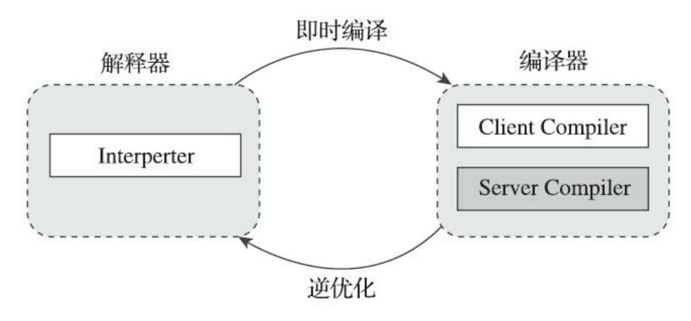

图11-1 解释器与编译器的交互

HotSpot虚拟机中内置了两个(或三个)即时编译器,其中有两个编译器存在已久,分别被称 为"客户端编译器"(Client Compiler)和"服务端编译器"(Server Compiler),或者简称为C1编译器和 C2编译器(部分资料和JDK源码中C2也叫Opto编译器),第三个是在JDK 10时才出现的、长期目标 是代替C2的Graal编译器。Graal编译器目前还处于实验状态,本章将安排出专门的小节对它讲解与实 战,在本节里,我们将重点关注传统的C1、C2编译器的工作过程。

在分层编译(Tiered Compilation)的工作模式出现以前,HotSpot虚拟机通常是采用解释器与其中 一个编译器直接搭配的方式工作,程序使用哪个编译器,只取决于虚拟机运行的模式,HotSpot虚拟机 会根据自身版本与宿主机器的硬件性能自动选择运行模式,用户也可以使用"-client"或"-server"参数去

强制指定虚拟机运行在客户端模式还是服务端模式。

无论采用的编译器是客户端编译器还是服务端编译器,解释器与编译器搭配使用的方式在虚拟机 中被称为"混合模式"(Mixed Mode),用户也可以使用参数"-Xint"强制虚拟机运行于"解释模 式"(Interpreted Mode),这时候编译器完全不介入工作,全部代码都使用解释方式执行。另外,也 可以使用参数"-Xcomp"强制虚拟机运行于"编译模式"(Compiled Mode),这时候将优先采用编译方 式执行程序,但是解释器仍然要在编译无法进行的情况下介入执行过程。可以通过虚拟机的" version"命令的输出结果显示出这三种模式,内容如代码清单11-1所示,请读者注意黑体字部分。

#### 代码清单11-1 虚拟机执行模式

```
$java -version
java version "11.0.3" 2019-04-16 LTS
Java(TM) SE Runtime Environment 18.9 (build 11.0.3+12-LTS)
Java HotSpot(TM) 64-Bit Server VM 18.9 (build 11.0.3+12-LTS, mixed mode)
$java -Xint -version
java version "11.0.3" 2019-04-16 LTS
Java(TM) SE Runtime Environment 18.9 (build 11.0.3+12-LTS)
Java HotSpot(TM) 64-Bit Server VM 18.9 (build 11.0.3+12-LTS, interpreted mode)
$java -Xcomp -version
java version "11.0.3" 2019-04-16 LTS
Java(TM) SE Runtime Environment 18.9 (build 11.0.3+12-LTS)
Java HotSpot(TM) 64-Bit Server VM 18.9 (build 11.0.3+12-LTS, compiled mode)
```

由于即时编译器编译本地代码需要占用程序运行时间,通常要编译出优化程度越高的代码,所花 费的时间便会越长;而且想要编译出优化程度更高的代码,解释器可能还要替编译器收集性能监控信 息,这对解释执行阶段的速度也有所影响。为了在程序启动响应速度与运行效率之间达到最佳平衡, HotSpot虚拟机在编译子系统中加入了分层编译的功能[2],分层编译的概念其实很早就已经提出,但 直到JDK 6时期才被初步实现,后来一直处于改进阶段,最终在JDK 7的服务端模式虚拟机中作为默认 编译策略被开启。分层编译根据编译器编译、优化的规模与耗时,划分出不同的编译层次,其中包 括:

- ·第0层。程序纯解释执行,并且解释器不开启性能监控功能(Profiling)。
- ·第1层。使用客户端编译器将字节码编译为本地代码来运行,进行简单可靠的稳定优化,不开启 性能监控功能。
  - ·第2层。仍然使用客户端编译器执行,仅开启方法及回边次数统计等有限的性能监控功能。
- ·第3层。仍然使用客户端编译器执行,开启全部性能监控,除了第2层的统计信息外,还会收集如 分支跳转、虚方法调用版本等全部的统计信息。
- ·第4层。使用服务端编译器将字节码编译为本地代码,相比起客户端编译器,服务端编译器会启 用更多编译耗时更长的优化,还会根据性能监控信息进行一些不可靠的激进优化。
- 以上层次并不是固定不变的,根据不同的运行参数和版本,虚拟机可以调整分层的数量。各层次 编译之间的交互、转换关系如图11-2所示。

实施分层编译后,解释器、客户端编译器和服务端编译器就会同时工作,热点代码都可能会被多 次编译,用客户端编译器获取更高的编译速度,用服务端编译器来获取更好的编译质量,在解释执行 的时候也无须额外承担收集性能监控信息的任务,而在服务端编译器采用高复杂度的优化算法时,客 户端编译器可先采用简单优化来为它争取更多的编译时间。

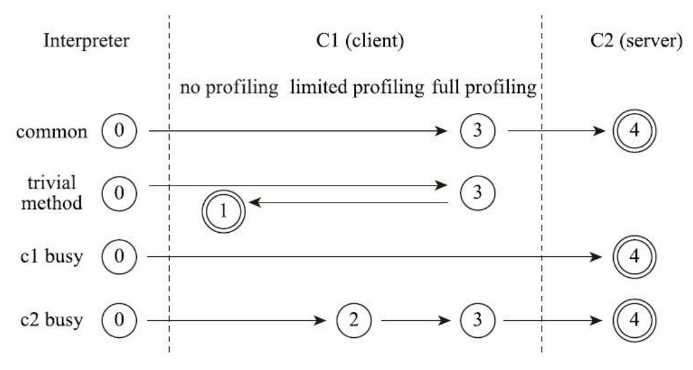

图11-2 分层编译的交互关系[3]

- [1] 作为曾经的三大商用虚拟机之一的JRockit是个例外,它内部没有解释器,因此会存在本书中所说 的"启动响应时间长"之类的缺点,但它主要是面向服务端的应用,这类应用一般不会重点关注启动时 间,而且JRockit目前已经不再发展了。
- [2] 分层编译在JDK 6时期出现,到JDK 7之前都需要使用-XX:+TieredCompilation参数来手动开启, 如果不开启分层编译策略,而虚拟机又运行在服务端模式,服务端编译器需要性能监控信息提供编译 依据,则是由解释器收集性能监控信息供服务端编译器使用。分层编译的相关资料可参见: http://weblogs.java.net/blog/forax/archive/2010/09/04/tiered-compilation。
- [3] 图片来源:https://www.infoq.cn/article/java-10-jit-compiler-graal/。

## 11.2.2 编译对象与触发条件

在本章概述中提到了在运行过程中会被即时编译器编译的目标是"热点代码",这里所指的热点代 码主要有两类,包括:

- ·被多次调用的方法。
- ·被多次执行的循环体。

前者很好理解,一个方法被调用得多了,方法体内代码执行的次数自然就多,它成为"热点代 码"是理所当然的。而后者则是为了解决当一个方法只被调用过一次或少量的几次,但是方法体内部存 在循环次数较多的循环体,这样循环体的代码也被重复执行多次,因此这些代码也应该认为是"热点代 码" [1]。

对于这两种情况,编译的目标对象都是整个方法体,而不会是单独的循环体。第一种情况,由于 是依靠方法调用触发的编译,那编译器理所当然地会以整个方法作为编译对象,这种编译也是虚拟机 中标准的即时编译方式。而对于后一种情况,尽管编译动作是由循环体所触发的,热点只是方法的一 部分,但编译器依然必须以整个方法作为编译对象,只是执行入口(从方法第几条字节码指令开始执 行)会稍有不同,编译时会传入执行入口点字节码序号(Byte Code Index,BCI)。这种编译方式因为 编译发生在方法执行的过程中,因此被很形象地称为"栈上替换"(On Stack Replacement,OSR),即 方法的栈帧还在栈上,方法就被替换了。

读者可能还会有疑问,在上面的描述里,无论是"多次执行的方法",还是"多次执行的代码块", 所谓"多次"只定性不定量,并不是一个具体严谨的用语,那到底多少次才算"多次"呢?还有一个问 题,就是Java虚拟机是如何统计某个方法或某段代码被执行过多少次的呢?解决了这两个问题,也就 解答了即时编译被触发的条件。

要知道某段代码是不是热点代码,是不是需要触发即时编译,这个行为称为"热点探测"(Hot Spot Code Detection),其实进行热点探测并不一定要知道方法具体被调用了多少次,目前主流的热点 探测判定方式有两种[2],分别是:

·基于采样的热点探测(Sample Based Hot Spot Code Detection)。采用这种方法的虚拟机会周期性 地检查各个线程的调用栈顶,如果发现某个(或某些)方法经常出现在栈顶,那这个方法就是"热点方 法"。基于采样的热点探测的好处是实现简单高效,还可以很容易地获取方法调用关系(将调用堆栈展 开即可),缺点是很难精确地确认一个方法的热度,容易因为受到线程阻塞或别的外界因素的影响而 扰乱热点探测。

·基于计数器的热点探测(Counter Based Hot Spot Code Detection)。采用这种方法的虚拟机会为 每个方法(甚至是代码块)建立计数器,统计方法的执行次数,如果执行次数超过一定的阈值就认为 它是"热点方法"。这种统计方法实现起来要麻烦一些,需要为每个方法建立并维护计数器,而且不能 直接获取到方法的调用关系。但是它的统计结果相对来说更加精确严谨。

这两种探测手段在商用Java虚拟机中都有使用到,譬如J9用过第一种采样热点探测,而在HotSpot

虚拟机中使用的是第二种基于计数器的热点探测方法,为了实现热点计数,HotSpot为每个方法准备了 两类计数器:方法调用计数器(Invocation Counter)和回边计数器(Back Edge Counter,"回边"的意思 就是指在循环边界往回跳转)。当虚拟机运行参数确定的前提下,这两个计数器都有一个明确的阈 值,计数器阈值一旦溢出,就会触发即时编译。

我们首先来看看方法调用计数器。顾名思义,这个计数器就是用于统计方法被调用的次数,它的 默认阈值在客户端模式下是1500次,在服务端模式下是10000次,这个阈值可以通过虚拟机参数-XX: CompileThreshold来人为设定。当一个方法被调用时,虚拟机会先检查该方法是否存在被即时编译过的 版本,如果存在,则优先使用编译后的本地代码来执行。如果不存在已被编译过的版本,则将该方法 的调用计数器值加一,然后判断方法调用计数器与回边计数器值之和是否超过方法调用计数器的阈 值。一旦已超过阈值的话,将会向即时编译器提交一个该方法的代码编译请求。

如果没有做过任何设置,执行引擎默认不会同步等待编译请求完成,而是继续进入解释器按照解 释方式执行字节码,直到提交的请求被即时编译器编译完成。当编译工作完成后,这个方法的调用入 口地址就会被系统自动改写成新值,下一次调用该方法时就会使用已编译的版本了,整个即时编译的 交互过程如图11-3所示。

在默认设置下,方法调用计数器统计的并不是方法被调用的绝对次数,而是一个相对的执行频 率,即一段时间之内方法被调用的次数。当超过一定的时间限度,如果方法的调用次数仍然不足以让 它提交给即时编译器编译,那该方法的调用计数器就会被减少一半,这个过程被称为方法调用计数器 热度的衰减(Counter Decay),而这段时间就称为此方法统计的半衰周期(Counter Half Life Time), 进行热度衰减的动作是在虚拟机进行垃圾收集时顺便进行的,可以使用虚拟机参数-XX:- UseCounterDecay来关闭热度衰减,让方法计数器统计方法调用的绝对次数,这样只要系统运行时间足 够长,程序中绝大部分方法都会被编译成本地代码。另外还可以使用-XX:CounterHalfLifeTime参数设

置半衰周期的时间,单位是秒。

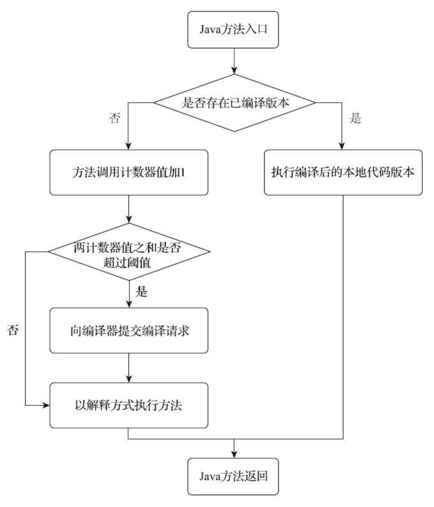

图11-3 方法调用计数器触发即时编译

现在我们再来看看另外一个计数器——回边计数器,它的作用是统计一个方法中循环体代码执行

的次数[3],在字节码中遇到控制流向后跳转的指令就称为"回边(Back Edge)",很显然建立回边计数 器统计的目的是为了触发栈上的替换编译。

关于回边计数器的阈值,虽然HotSpot虚拟机也提供了一个类似于方法调用计数器阈值-XX: CompileThreshold的参数-XX:BackEdgeThreshold供用户设置,但是当前的HotSpot虚拟机实际上并未 使用此参数,我们必须设置另外一个参数-XX:OnStackReplacePercentage来间接调整回边计数器的阈 值,其计算公式有如下两种。

·虚拟机运行在客户端模式下,回边计数器阈值计算公式为:方法调用计数器阈值(-XX: CompileThreshold)乘以OSR比率(-XX:OnStackReplacePercentage)除以100。其中-XX: OnStackReplacePercentage默认值为933,如果都取默认值,那客户端模式虚拟机的回边计数器的阈值为 13995。

·虚拟机运行在服务端模式下,回边计数器阈值的计算公式为:方法调用计数器阈值(-XX: CompileThreshold)乘以(OSR比率(-XX:OnStackReplacePercentage)减去解释器监控比率(-XX: InterpreterProfilePercentage)的差值)除以100。其中-XX:OnStack ReplacePercentage默认值为140,- XX:InterpreterProfilePercentage默认值为33,如果都取默认值,那服务端模式虚拟机回边计数器的阈 值为10700。

当解释器遇到一条回边指令时,会先查找将要执行的代码片段是否有已经编译好的版本,如果有 的话,它将会优先执行已编译的代码,否则就把回边计数器的值加一,然后判断方法调用计数器与回 边计数器值之和是否超过回边计数器的阈值。当超过阈值的时候,将会提交一个栈上替换编译请求, 并且把回边计数器的值稍微降低一些,以便继续在解释器中执行循环,等待编译器输出编译结果,整 个执行过程如图11-4所示。

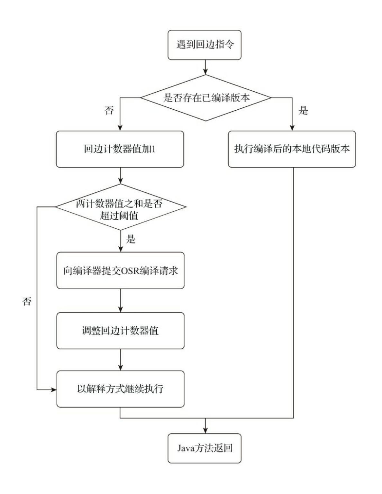

#### 图11-4 回边计数器触发即时编译

与方法计数器不同,回边计数器没有计数热度衰减的过程,因此这个计数器统计的就是该方法循 环执行的绝对次数。当计数器溢出的时候,它还会把方法计数器的值也调整到溢出状态,这样下次再 进入该方法的时候就会执行标准编译过程。

最后还要提醒一点,图11-2和图11-3都仅仅是描述了客户端模式虚拟机的即时编译方式,对于服务 端模式虚拟机来说,执行情况会比上面描述还要复杂一些。从理论上了解过编译对象和编译触发条件 后,我们还可以从HotSpot虚拟机的源码中简单观察一下这两个计数器,在MehtodOop.hpp(一个 methodOop对象代表了一个Java方法)中,定义了Java方法在虚拟机中的内存布局,如下所示:

```
// |------------------------------------------------------|
// | header |
// | klass |
// |------------------------------------------------------|
// | constMethodOop (oop) |
// | constants (oop) |
// |------------------------------------------------------|
// | methodData (oop) |
// | interp_invocation_count |
// |------------------------------------------------------|
// | access_flags |
// | vtable_index |
// |------------------------------------------------------|
// | result_index (C++ interpreter only) |
// |------------------------------------------------------|
// | method_size | max_stack |
// | max_locals | size_of_parameters |
// |------------------------------------------------------|
// |intrinsic_id| flags | throwout_count |
// |------------------------------------------------------|
// | num_breakpoints | (unused) |
// |------------------------------------------------------|
// | invocation_counter |
// | backedge_counter |
// |------------------------------------------------------|
// | prev_time (tiered only, 64 bit wide) |
// | |
// |------------------------------------------------------|
// | rate (tiered) |
// |------------------------------------------------------|
// | code (pointer) |
// | i2i (pointer) |
// | adapter (pointer) |
// | from_compiled_entry (pointer) |
// | from_interpreted_entry (pointer) |
// |------------------------------------------------------|
// | native_function (present only if native) |
// | signature_handler (present only if native) |
// |------------------------------------------------------|
```

在这段注释所描述的方法内存布局里,每一行表示占用32个比特,从中我们可以清楚看到方法调 用计数器和回边计数器所在的位置和数据宽度,另外还有from\_compiled\_entry和from\_interpreted\_entry 两个方法入口所处的位置。

- [1] 还有一个不太上台面但其实是Java虚拟机必须支持循环体触发编译的理由,是诸多跑分软件的测试 用力通常都属于第二种,如果不去支持跑分会显得成绩很不好看。
- [2] 除这两种方式外,还有其他热点代码的探测方式,如基于"踪迹"(Trace)的热点探测在最近相当流 行,像FireFox里的TraceMonkey和Dalvik里新的即时编译器都是用了这种热点探测方式。

[3] 准确地说,应当是回边的次数而不是循环次数,因为并非所有的循环都是回边,如空循环实际上就 可以视为自己跳转到自己的过程,因此并不算作控制流向后跳转,也不会被回边计数器统计。

# 11.2.3 编译过程

在默认条件下,无论是方法调用产生的标准编译请求,还是栈上替换编译请求,虚拟机在编译器 还未完成编译之前,都仍然将按照解释方式继续执行代码,而编译动作则在后台的编译线程中进行。 用户可以通过参数-XX:-BackgroundCompilation来禁止后台编译,后台编译被禁止后,当达到触发即 时编译的条件时,执行线程向虚拟机提交编译请求以后将会一直阻塞等待,直到编译过程完成再开始 执行编译器输出的本地代码。

那在后台执行编译的过程中,编译器具体会做什么事情呢?服务端编译器和客户端编译器的编译 过程是有所差别的。对于客户端编译器来说,它是一个相对简单快速的三段式编译器,主要的关注点 在于局部性的优化,而放弃了许多耗时较长的全局优化手段。

在第一个阶段,一个平台独立的前端将字节码构造成一种高级中间代码表示(High-Level Intermediate Representation,HIR,即与目标机器指令集无关的中间表示)。HIR使用静态单分配 (Static Single Assignment,SSA)的形式来代表代码值,这可以使得一些在HIR的构造过程之中和之后 进行的优化动作更容易实现。在此之前编译器已经会在字节码上完成一部分基础优化,如方法内联、 常量传播等优化将会在字节码被构造成HIR之前完成。

在第二个阶段,一个平台相关的后端从HIR中产生低级中间代码表示(Low-Level Intermediate Representation,LIR,即与目标机器指令集相关的中间表示),而在此之前会在HIR上完成另外一些优 化,如空值检查消除、范围检查消除等,以便让HIR达到更高效的代码表示形式。

最后的阶段是在平台相关的后端使用线性扫描算法(Linear Scan Register Allocation)在LIR上分配 寄存器,并在LIR上做窥孔(Peephole)优化,然后产生机器代码。客户端编译器大致的执行过程如图 11-5所示。

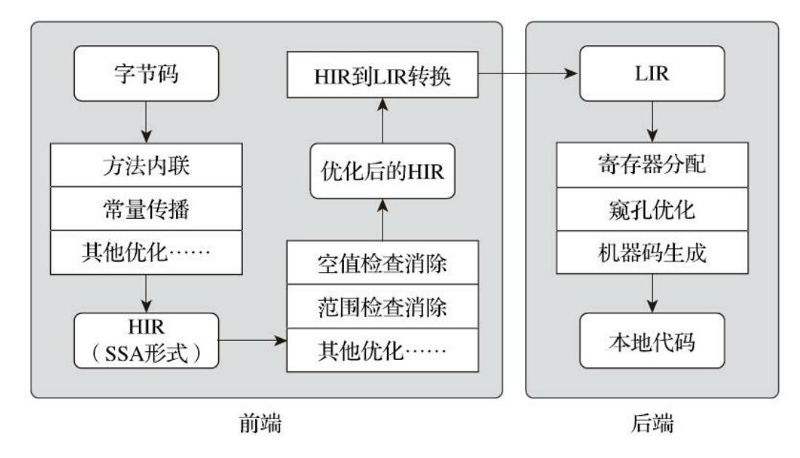

图11-5 Client Compiler架构

而服务端编译器则是专门面向服务端的典型应用场景,并为服务端的性能配置针对性调整过的编 译器,也是一个能容忍很高优化复杂度的高级编译器,几乎能达到GNU C++编译器使用-O2参数时的 优化强度。它会执行大部分经典的优化动作,如:无用代码消除(Dead Code Elimination)、循环展开 (Loop Unrolling)、循环表达式外提(Loop Expression Hoisting)、消除公共子表达式(Common Subexpression Elimination)、常量传播(Constant Propagation)、基本块重排序(Basic Block Reordering)等,还会实施一些与Java语言特性密切相关的优化技术,如范围检查消除(Range Check Elimination)、空值检查消除(Null Check Elimination,不过并非所有的空值检查消除都是依赖编译器 优化的,有一些是代码运行过程中自动优化了)等。另外,还可能根据解释器或客户端编译器提供的 性能监控信息,进行一些不稳定的预测性激进优化,如守护内联(Guarded Inlining)、分支频率预测 (Branch Frequency Prediction)等,本章的下半部分将会挑选上述的一部分优化手段进行分析讲解, 在此就先不做展开。

服务端编译采用的寄存器分配器是一个全局图着色分配器,它可以充分利用某些处理器架构(如 RISC)上的大寄存器集合。以即时编译的标准来看,服务端编译器无疑是比较缓慢的,但它的编译速 度依然远远超过传统的静态优化编译器,而且它相对于客户端编译器编译输出的代码质量有很大提 高,可以大幅减少本地代码的执行时间,从而抵消掉额外的编译时间开销,所以也有很多非服务端的 应用选择使用服务端模式的HotSpot虚拟机来运行。

在本节中出现了许多编译原理和代码优化中的概念名词,没有这方面基础的读者,可能阅读起来 会感觉到很抽象、很理论化。有这种感觉并不奇怪,一方面,即时编译过程本来就是一个虚拟机中最 能体现技术水平也是最复杂的部分,很难在几页纸的篇幅中介绍得面面俱到;另一方面,这个过程对 Java开发者来说是完全透明的,程序员平时无法感知它的存在。所幸,HotSpot虚拟机提供了两个可视

化的工具,让我们可以"看见"即时编译器的优化过程。下面笔者将实践演示这个过程。

# 11.2.4 实战:查看及分析即时编译结果

一般来说,Java虚拟机的即时编译过程对用户和程序都是完全透明的,虚拟机是通过解释来执行 代码还是通过编译来执行代码,对于用户来说并没有什么影响(对执行结果没有影响,速度上会有显 著差别),大多数情况下用户也没有必要知道。但是HotSpot虚拟机还是提供了一些参数用来输出即时 编译和某些优化措施的运行状况,以满足调试和调优的需要。本节将通过实战说明如何从外部观察 Java虚拟机的即时编译行为。

本节中提到的部分运行参数需要FastDebug或SlowDebug优化级别的HotSpot虚拟机才能够支持, Product级别的虚拟机无法使用这部分参数。如果读者使用的是根据第1章的教程自己编译的JDK,请 注意将"--with-debug-level"参数设置为"fastdebug"或者"slowdebug"。现在Oracle和OpenJDK网站上都已 经不再直接提供FastDebug的JDK下载了(从JDK 6 Update 25之后官网上就没有再提供下载),所以要 完成本节全部测试内容,读者除了自己动手编译外,就只能到网上搜索非官方编译的版本了。本次实 战中所有的测试都基于代码清单11-2所示的Java代码来进行。

#### 代码清单11-2 测试代码

```
public static final int NUM = 15000;
public static int doubleValue(int i) {
   // 这个空循环用于后面演示JIT代码优化过程
   for(int j=0; j<100000; j++);
   return i * 2;
public static long calcSum() {
   long sum = 0;
   for (int i = 1; i <= 100; i++) {
       sum += doubleValue(i);
   return sum;
public static void main(String[] args) {
   for (int i = 0; i < NUM; i++) {
       calcSum();
```

我们首先来运行这段代码,并且确认这段代码是否触发了即时编译。要知道某个方法是否被编译 过,可以使用参数-XX:+PrintCompilation要求虚拟机在即时编译时将被编译成本地代码的方法名称打 印出来,如代码清单11-3所示(其中带有"%"的输出说明是由回边计数器触发的栈上替换编译)。

#### 代码清单11-3 被即时编译的代码

```
VM option '+PrintCompilation'
   310 1 java.lang.String::charAt (33 bytes)
   329 2 org.fenixsoft.jit.Test::calcSum (26 bytes)
   329 3 org.fenixsoft.jit.Test::doubleValue (4 bytes)
   332 1% org.fenixsoft.jit.Test::main @ 5 (20 bytes)
```

从代码清单11-3输出的信息中可以确认,main()、calcSum()和doubleValue()方法已经被编译,我们 还可以加上参数-XX:+PrintInlining要求虚拟机输出方法内联信息,如代码清单11-4所示。

#### 代码清单11-4 内联信息

```
VM option '+PrintCompilation'
VM option '+PrintInlining'
   273 1 java.lang.String::charAt (33 bytes)
   291 2 org.fenixsoft.jit.Test::calcSum (26 bytes)
     @ 9 org.fenixsoft.jit.Test::doubleValue inline (hot)
   294 3 org.fenixsoft.jit.Test::doubleValue (4 bytes)
   295 1% org.fenixsoft.jit.Test::main @ 5 (20 bytes)
     @ 5 org.fenixsoft.jit.Test::calcSum inline (hot)
     @ 9 org.fenixsoft.jit.Test::doubleValue inline (hot)
```

从代码清单11-4的输出日志中可以看到,doubleValue()方法已被内联编译到calcSum()方法中,而 calcSum()方法又被内联编译到main()方法里面,所以虚拟机再次执行main()方法的时候(举例而已, main()方法当然不会运行两次),calcSum()和doubleValue()方法是不会再被实际调用的,没有任何方法 分派的开销,它们的代码逻辑都被直接内联到main()方法里面了。

除了查看哪些方法被编译之外,我们还可以更进一步看到即时编译器生成的机器码内容。不过如 果得到的是即时编译器输出一串0和1,对于我们人类来说是没法阅读的,机器码至少要反汇编成基本 的汇编语言才可能被人类阅读。虚拟机提供了一组通用的反汇编接口[1],可以接入各种平台下的反汇 编适配器,如使用32位x86平台应选用hsdis-i386适配器,64位则需要选用hsdis-amd64 [2],其余平台的 适配器还有如hsdis-sparc、hsdis-sparcv9和hsdis-aarch64等,读者可以下载或自己编译出与自己机器相 符合的反汇编适配器,之后将其放置在JAVA\_HOME/lib/amd64/server下[3],只要与jvm.dll或libjvm.so的 路径相同即可被虚拟机调用。为虚拟机安装了反汇编适配器之后,我们就可以使用-XX: +PrintAssembly参数要求虚拟机打印编译方法的汇编代码了,关于HSDIS插件更多的操作介绍,可以参 考第4章的相关内容。

如果没有HSDIS插件支持,也可以使用-XX:+PrintOptoAssembly(用于服务端模式的虚拟机) 或-XX:+PrintLIR(用于客户端模式的虚拟机)来输出比较接近最终结果的中间代码表示,代码清单 11-2所示代码被编译后部分反汇编(使用-XX:+PrintOptoAssembly)的输出结果如代码清单11-5所 示。对于阅读来说,使用-XX:+PrintOptoAssembly参数输出的伪汇编结果包含了更多的信息(主要 是注释),有利于人们阅读、理解虚拟机即时编译器的优化结果。

代码清单11-5 本地机器码反汇编信息(部分)

```
000 B1: # N1 <- BLOCK HEAD IS JUNK Freq: 1
000 pushq rbp
        subq rsp, #16 # Create frame
        nop # nop for patch_verified_entry
006 movl RAX, RDX # spill
008 sall RAX, #1
00a addq rsp, 16 # Destroy frame
        popq rbp
        testl rax, [rip + #offset_to_poll_page] # Safepoint: poll for GC
```

前面提到的使用-XX: +PrintAssembly参数输出反汇编信息需要FastDebug或SlowDebug优化级别的HotSpot虚拟机才能直接支持,如果使用Product版的虚拟机,则需要加入参数-XX: +UnlockDiagnosticVMOptions打开虚拟机诊断模式。

如果除了本地代码的生成结果外,还想再进一步跟踪本地代码生成的具体过程,那可以使用参数-XX: +PrintCFGToFile(用于客户端编译器)或-XX: PrintIdealGraphFile(用于服务端编译器)要求 Java虚拟机将编译过程中各个阶段的数据(譬如对客户端编译器来说包括字节码、HIR生成、LIR生成、寄存器分配过程、本地代码生成等数据)输出到文件中。然后使用Java HotSpot Client Compiler Visualizer<sup>[4]</sup>(用于分析客户端编译器)或Ideal Graph Visualizer<sup>[5]</sup>(用于分析服务端编译器)打开这些数据文件进行分析。接下来将以使用服务端编译器为例,讲解如何分析即时编译的代码生成过程。这里先把重点放在编译整体过程阶段及Ideal Graph Visualizer功能介绍上,在稍后在介绍Graal编译器的实战小节里,我们会使用Ideal Graph Visualizer来详细分析虚拟机进行代码优化和生成时的执行细节,届时我们将重点关注编译器是如何实现这些优化的。

服务端编译器的中间代码表示是一种名为理想图(Ideal Graph)的程序依赖图(Program Dependence Graph,PDG),在运行Java程序的FastDebug或SlowDebug优化级别的虚拟机上的参数中加入"-XX: PrintIdealGraphLevel=2-XX: PrintIdeal-GraphFile=ideal.xml",即时编译后将会产生一个名为ideal.xml的文件,它包含了服务端编译器编译代码的全过程信息,可以使用Ideal Graph Visualizer对这些信息进行分析。

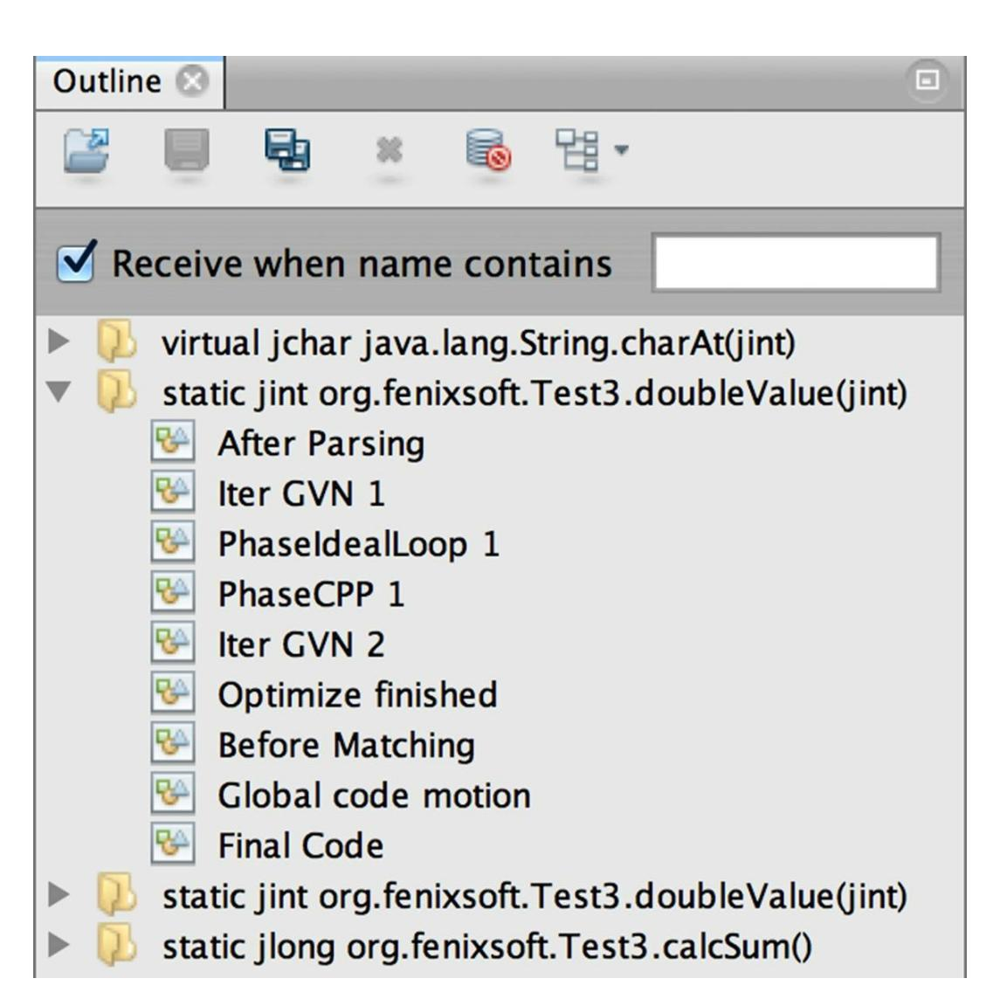

图11-6 编译过的方法列表

Ideal Graph Visualizer加载ideal.xml文件后,在Outline面板上将显示程序运行过程中编译过的方法列 表,如图11-6所示。这里列出的方法是代码清单11-2中所示的测试代码,其中doubleValue()方法出现了 两次,这是由于该方法的编译结果存在标准编译和栈上替换编译两个版本。在代码清单11-2中,专门 为doubleValue()方法增加了一个空循环,这个循环对方法的运算结果不会产生影响,但如果没有任何优 化,执行该循环就会耗费处理器时间。直到今天还有不少程序设计的入门教程会把空循环当作程序延 时的手段来介绍,下面我们就来看看在Java语言中这样的做法是否真的能起到延时的作用。

展开方法根节点,可以看到下面罗列了方法优化过程的各个阶段(根据优化措施的不同,每个方 法所经过的阶段也会有所差别)的理想图,我们先打开"After Parsing"这个阶段。前面提到,即时编译 器编译一个Java方法时,首先要把字节码解析成某种中间表示形式,然后才可以继续做分析和优化, 最终生成代码。"After Parsing"就是服务端编译器刚完成解析,还没有做任何优化时的理想图表示。打 开这个图后,读者会看到其中有很多有颜色的方块,如图11-7所示。每一个方块代表了一个程序的基 本块(Basic Block)。基本块是指程序按照控制流分割出来的最小代码块,它的特点是只有唯一的一 个入口和唯一的一个出口,只要基本块中第一条指令被执行了,那么基本块内所有指令都会按照顺序 全部执行一次。

图11-7 基本块图示(1)

代码清单11-2所示的doubleValue()方法虽然只有简单的两行字,但是按基本块划分后,形成的图形 结构却要比想象中复杂得多,这是因为一方面要满足Java语言所定义的安全需要(如类型安全、空指 针检查)和Java虚拟机的运作需要(如Safepoint轮询),另一方面有些程序代码中一行语句就可能形 成几个基本块(例如循环语句)。对于例子中的doubleValue()方法,如果忽略语言安全检查的基本块, 可以简单理解为按顺序执行了以下几件事情:

- 1)程序入口,建立栈帧。
- 2)设置j=0,进行安全点(Safepoint)轮询,跳转到4的条件检查。
- 3)执行j++。
- 4)条件检查,如果j<100000,跳转到3。

5)设置i=i\*2,进行安全点轮询,函数返回。

以上几个步骤反映到Ideal Graph Visualizer生成的图形上,就是图11-8所示的内容。这样我们若想 看空循环是否被优化掉,或者何时被优化掉,只要观察代表循环的基本块是否被消除掉,以及何时被 优化掉就可以了。

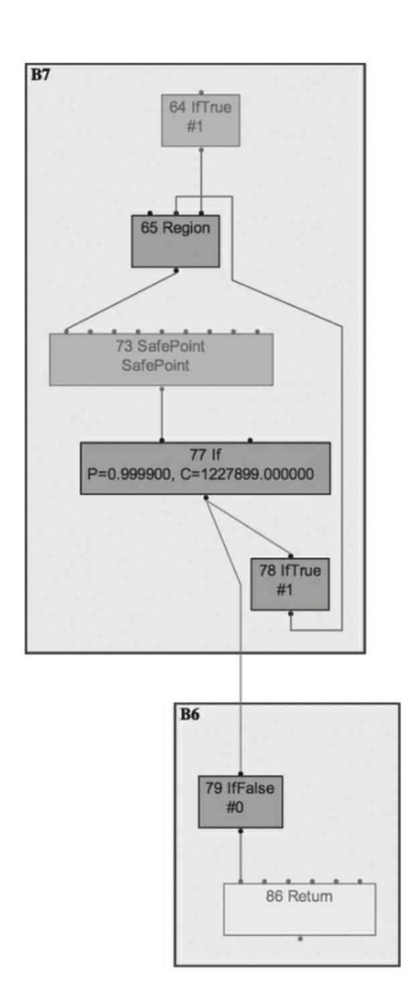

#### 图11-8 基本块图示(2)

要观察这一点,可以在Outline面板上右击"Difference to current graph",让软件自动分析指定阶段 与当前打开的理想图之间的差异,如果基本块被消除了,将会以红色显示。对"After Parsing"和"PhaseIdealLoop 1"阶段的理想图进行差异分析,会发现在"PhaseIdealLoop 1"阶段循环操作就 被消除了,如图11-9所示,这也就说明空循环在最终的本地代码里实际上是不会被执行的。

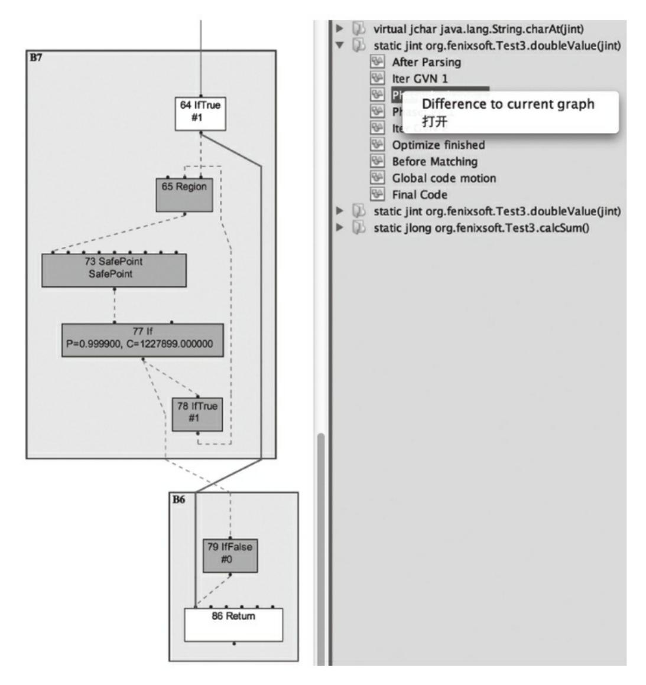

图11-9 基本块图示(3)

从"After Parsing"阶段开始,一直到最后的"Final Code"阶段都可以看到doubleValue()方法的理想图 从繁到简的变迁过程,这也反映了Java虚拟机即时编译器尽力优化代码的过程。到了最后的"Final Code"阶段,不仅空循环的开销被消除了,许多语言安全保障措施和GC安全点的轮询操作也被一起消 除了,因为编译器判断到即使不做这些保障措施,程序也能得到相同的结果,不会有可观察到的副作 用产生,虚拟机的运行安全也不会受到威胁。

- [1] 相关信息:https://wiki.openjdk.java.net/display/HotSpot/PrintAssembly。
- [2] HSDIS的源码可以从HotSpot虚拟机源码仓库中获取(路径为:src\utils\hsdis),具体可以参见第1 章。此源码需要执行编译,对于HSDIS的编译,读者可以参考AdoptOpenJDK的官方GitHub: https://github.com/AdoptOpenJDK/jitwatch/wiki/Building-hsdis/。如果不想自己编译,在GitHub上搜 索"hsdis-i386.so/dll""hsdis-amd64.so/dll"这样的关键词也可以找到不少编译好的Linux或Windows的 HSDIS插件。
- [3] 如果使用JDK 8或之前版本,应放在JRE\_HOME/bin/server目录下。
- [4] 官方站点:http://ssw.jku.at/Research/Projects/JVM/CCVis.html。
- [5] 官方站点:http://ssw.jku.at/General/Staff/TW/igv.html。

# 11.3 提前编译器

提前编译在Java技术体系中并不是新事物。1996年JDK 1.0发布,Java有了正式的运行环境,第一 个可以使用外挂即时编译器的Java版本是1996年7月发布的JDK 1.0.2,而Java提前编译器的诞生并没有 比这晚多少。仅几个月后,IBM公司就推出了第一款用于Java语言的提前编译器(IBM High Performance Compiler for Java)。在1998年,GNU组织公布了著名的GCC家族(GNU Compiler Collection)的新成员GNU Compiler for Java(GCJ,2018年从GCC家族中除名),这也是一款Java的提 前编译器[1],而且曾经被广泛应用。在OpenJDK流行起来之前,各种Linux发行版带的Java实现通常就 是GCJ。

但是提前编译很快又在Java世界里沉寂了下来,因为当时Java的一个核心优势是平台中立性,其宣 传口号是"一次编译,到处运行",这与平台相关的提前编译在理念上就是直接冲突的。GCJ出现之后 在长达15年的时间里,提前编译这条故事线上基本就再没有什么大的新闻和进展了。类似的状况一直 持续至2013年,直到在Android的世界里,剑走偏锋使用提前编译的ART(Android Runtime)横空出 世。ART一诞生马上就把使用即时编译的Dalvik虚拟机按在地上使劲蹂躏,仅经过Android 4.4一个版本 的短暂交锋之后,ART就迅速终结了Dalvik的性命[2],把它从Android系统里扫地出门。

尽管Android并不能直接等同于Java,但两者毕竟有着深厚渊源,提前编译在Android上的革命与崛 起也震撼到了Java世界。在某些领域、某些人眼里,只要能获得更好的执行性能,什么平台中立性、 字节膨胀[3]、动态扩展[4],一切皆可舍弃,唯一的问题就只有"提前编译真的会是获得更高性能的银 弹吗?"

- [1] GCJ其实包含了整个Java运行时,里面也有解释器和即时编译器存在。
- [2] ART干掉Dalvik之后,到Android 7.0时其内部也加入了解释执行和即时编译,这是后话。
- [3] 指提前编译的本地二进制码的体积会明显大于字节码的体积。
- [4] 指提前编译通常要求程序是封闭的,不能在外部动态加载新的字节码。

# 11.3.1 提前编译的优劣得失

本节希望同时向读者展示出一枚硬币的两面,解释清楚提前编译相对于即时编译有什么优势,又 有什么不足,还有即时编译器有没有办法得到这些优势,需要付出哪些努力等。

现在提前编译产品和对其的研究有着两条明显的分支,一条分支是做与传统C、C++编译器类似 的,在程序运行之前把程序代码编译成机器码的静态翻译工作;另外一条分支是把原本即时编译器在 运行时要做的编译工作提前做好并保存下来,下次运行到这些代码(譬如公共库代码在被同一台机器 其他Java进程使用)时直接把它加载进来使用。

我们先来说第一条,这是传统的提前编译应用形式,它在Java中存在的价值直指即时编译的最大 弱点:即时编译要占用程序运行时间和运算资源。即使现在先进的即时编译器已经足够快,以至于能 够容忍相当高的优化复杂度了(譬如Azul公司基于LLVM的Falcon JIT,就能够以相当于Clang-O3的优 化级别进行即时编译;又譬如OpenJ9的即时编译器Testarossa,它的静态版本同时也作为C、C++语言 的提前编译器使用,优化的复杂度自然也支持得非常高);即使现在先进的即时编译器架构有了分层 编译的支持,可以先用快速但低质量的即时编译器为高质量的即时编译器争取出更多编译时间,但 是,无论如何,即时编译消耗的时间都是原本可用于程序运行的时间,消耗的运算资源都是原本可用 于程序运行的资源,这个约束从未减弱,更不会消失,始终是悬在即时编译头顶的达摩克利斯之剑。

这里举个更具体的例子来帮助读者理解这种约束:在编译过程中最耗时的优化措施之一是通过"过 程间分析"(Inter-Procedural Analysis,IPA,也经常被称为全程序分析,即Whole Program Analysis)来 获得诸如某个程序点上某个变量的值是否一定为常量、某段代码块是否永远不可能被使用、在某个点 调用的某个虚方法是否只能有单一版本等的分析结论。这些信息对生成高质量的优化代码有着极为巨 大的价值,但是要精确(譬如对流敏感、对路径敏感、对上下文敏感、对字段敏感)得到这些信息, 必须在全程序范围内做大量极耗时的计算工作,目前所有常见的Java虚拟机对过程间分析的支持都相 当有限,要么借助大规模的方法内联来打通方法间的隔阂,以过程内分析(Intra-Procedural Analysis, 只考虑过程内部语句,不考虑过程调用的分析)来模拟过程间分析的部分效果;要么借助可假设的激 进优化,不求得到精确的结果,只求按照最可能的状况来优化,有问题再退回来解析执行。但如果是 在程序运行之前进行的静态编译,这些耗时的优化就可以放心大胆地进行了,譬如Graal VM中的 Substrate VM,在创建本地镜像的时候,就会采取许多原本在HotSpot即时编译中并不会做的全程序优 化措施[1]以获得更好的运行时性能,反正做镜像阶段慢一点并没有什么大影响。同理,这也是ART打 败Dalvik的主要武器之一,连副作用也是相似的。在Android 5.0和6.0版本,安装一个稍微大一点的 Android应用都是按分钟来计时的,以至于从Android 7.0版本起重新启用了解释执行和即时编译(但这 已与Dalvik无关,它彻底凉透了),等空闲时系统再在后台自动进行提前编译。

关于提前编译的第二条路径,本质是给即时编译器做缓存加速,去改善Java程序的启动时间,以 及需要一段时间预热后才能到达最高性能的问题。这种提前编译被称为动态提前编译(Dynamic AOT)或者索性就大大方方地直接叫即时编译缓存(JIT Caching)。在目前的Java技术体系里,这条 路径的提前编译已经完全被主流的商用JDK支持。在商业应用中,这条路径最早出现在JDK 6版本的 IBM J9虚拟机上,那时候在它的CDS(Class Data Sharing)功能的缓存中就有一块是即时编译缓 存[2]。不过这个缓存和CDS缓存一样是虚拟机运行时自动生成的,直接来源于J9的即时编译器,而且

为了进程兼容性,很多激进优化都不能肆意运用,所以编译输出的代码质量反而要低于即时编译器。 真正引起业界普遍关注的是OpenJDK/OracleJDK 9中所带的Jaotc提前编译器,这是一个基于Graal编译 器实现的新工具,目的是让用户可以针对目标机器,为应用程序进行提前编译。HotSpot运行时可以直 接加载这些编译的结果,实现加快程序启动速度,减少程序达到全速运行状态所需时间的目的。这里 面确实有比较大的优化价值,试想一下,各种Java应用最起码会用到Java的标准类库,如java.base等模 块,如果能够将这个类库提前编译好,并进行比较高质量的优化,显然能够节约不少应用运行时的编 译成本。关于这点,我们将在下一节做一个简单的实战练习,而在此要说明的是,这的确是很好的想 法,但实际应用起来并不是那么容易,原因是这种提前编译方式不仅要和目标机器相关,甚至还必须 与HotSpot虚拟机的运行时参数绑定。譬如虚拟机运行时采用了不同的垃圾收集器,这原本就需要即时 编译子系统的配合(典型的如生成内存屏障代码,见第3章相关介绍)才能正确工作,要做提前编译的 话,自然也要把这些配合的工作平移过去。至于前面提到过的提前编译破坏平台中立性、字节膨胀等 缺点当然还存在,这里就不重复了。尽管还有许多困难,但提前编译无疑已经成为一种极限榨取性能 (启动、响应速度)的手段,且被官方JDK关注,相信日后会更加灵活、更加容易使用,就如已经相 当成熟的CDS(AppCDS需要用户参与)功能那样,几乎不需要用户介入,可自动完成。

最后,我们还要思考一个问题:提前编译的代码输出质量,一定会比即时编译更高吗?提前编译 因为没有执行时间和资源限制的压力,能够毫无顾忌地使用重负载的优化手段,这当然是一个极大的 优势,但即时编译难道就没有能与其竞争的强项了吗?当然是有的,尽管即时编译在时间和运算资源 方面的劣势是无法忽视的,但其依然有自己的优势。接下来便要开始即时编译器的绝地反击了,笔者 将简要介绍三种即时编译器相对于提前编译器的天然优势。

首先,是性能分析制导优化(Profile-Guided Optimization,PGO)。上一节介绍HotSpot的即时编 译器时就多次提及在解释器或者客户端编译器运行过程中,会不断收集性能监控信息,譬如某个程序 点抽象类通常会是什么实际类型、条件判断通常会走哪条分支、方法调用通常会选择哪个版本、循环 通常会进行多少次等,这些数据一般在静态分析时是无法得到的,或者不可能存在确定且唯一的解, 最多只能依照一些启发性的条件去进行猜测。但在动态运行时却能看出它们具有非常明显的偏好性。 如果一个条件分支的某一条路径执行特别频繁,而其他路径鲜有问津,那就可以把热的代码集中放到 一起,集中优化和分配更好的资源(分支预测、寄存器、缓存等)给它。

其次,是激进预测性优化(Aggressive Speculative Optimization),这也已经成为很多即时编译优 化措施的基础。静态优化无论如何都必须保证优化后所有的程序外部可见影响(不仅仅是执行结果) 与优化前是等效的,不然优化之后会导致程序报错或者结果不对,若出现这种情况,则速度再快也是 没有价值的。然而,相对于提前编译来说,即时编译的策略就可以不必这样保守,如果性能监控信息 能够支持它做出一些正确的可能性很大但无法保证绝对正确的预测判断,就已经可以大胆地按照高概 率的假设进行优化,万一真的走到罕见分支上,大不了退回到低级编译器甚至解释器上去执行,并不 会出现无法挽救的后果。只要出错概率足够低,这样的优化往往能够大幅度降低目标程序的复杂度, 输出运行速度非常高的代码。譬如在Java语言中,默认方法都是虚方法调用,部分C、C++程序员(甚 至一些老旧教材)会说虚方法是不能内联的,但如果Java虚拟机真的遇到虚方法就去查虚表而不做内 联的话,Java技术可能就已经因性能问题而被淘汰很多年了。实际上虚拟机会通过类继承关系分析等 一系列激进的猜测去做去虚拟化(Devitalization),以保证绝大部分有内联价值的虚方法都可以顺利 内联。内联是最基础的一项优化措施,本章稍后还会对专门的Java虚拟机具体如何做虚方法内联进行 详细讲解。

最后,是链接时优化(Link-Time Optimization,LTO),Java语言天生就是动态链接的,一个个

Class文件在运行期被加载到虚拟机内存当中,然后在即时编译器里产生优化后的本地代码,这类事情 在Java程序员眼里看起来毫无违和之处。但如果类似的场景出现在使用提前编译的语言和程序上,譬 如C、C++的程序要调用某个动态链接库的某个方法,就会出现很明显的边界隔阂,还难以优化。这是 因为主程序与动态链接库的代码在它们编译时是完全独立的,两者各自编译、优化自己的代码。这些 代码的作者、编译的时间,以及编译器甚至很可能都是不同的,当出现跨链接库边界的调用时,那些 理论上应该要做的优化——譬如做对调用方法的内联,就会执行起来相当的困难。如果刚才说的虚方 法内联让C、C++程序员理解还算比较能够接受的话(其实C++编译器也可以通过一些技巧来做到虚方 法内联),那这种跨越动态链接库的方法内联在他们眼里可能就近乎于离经叛道了(但实际上依然是 可行的)。

经过以上的讨论,读者应该能够理解提前编译器的价值与优势所在了,但忽略具体的应用场景就 说它是万能的银弹,那肯定是有失偏颇的,提前编译有它的应用场景,也有它的弱项与不足,相信未 来很长一段时间内,即时编译和提前编译都会是Java后端编译技术的共同主角。

- [1] 相关资料:https://dl.acm.org/citation.cfm?id=2754185。
- [2] 相关资料:https://www.ibm.com/developerworks/library/j-sharedclasses。

# 11.3.2 实战:Jaotc的提前编译

JDK 9引入了用于支持对Class文件和模块进行提前编译的工具Jaotc,以减少程序的启动时间和到 达全速性能的预热时间,但由于这项功能必须针对特定物理机器和目标虚拟机的运行参数来使用,加 之限制太多,Java开发人员对此了解、使用普遍比较少,本节我们将用Jaotc来编译Java SE的基础库[1] (java.base模块),以改善本机Java环境的执行效率。

我们首先通过一段测试代码(什么代码都可以,最简单的HelloWorld都可以,内容笔者就不贴 了)来演示Jaotc的基本使用过程,操作如下:

```
$ javac HelloWorld.java
$ java HelloWorld
Hello World!
$ jaotc --output libHelloWorld.so HelloWorld.class
```

通过以上命令,就生成了一个名为libHelloWorld.so的库,我们可以使用Linux的ldd命令来确认这是 否是一个静态链接库,使用mn命令来确认其中是否包含了HelloWorld的构造函数和main()方法的入口信 息,操作如下:

```
$ ldd libHelloWorld.so
statically linked
$ nm libHelloWorld.so
0000000000002a20 t HelloWorld.()V
0000000000002b20 t HelloWorld.main([Ljava/lang/String;)V
```

现在我们就可以使用这个静态链接库而不是Class文件来输出HelloWorld了:

```
java -XX:AOTLibrary=./libHelloWorld.so HelloWorld
Hello World!
```

提前编译一个HelloWorld只具备演示价值,下一步我们来做更有实用意义的事情:把java.base模块 编译成类似的静态链接库。java.base包含的代码数量庞大,虽然其中绝大部分内容现在都能被Jaotc的 提前编译所支持了,但总还有那么几个"刺头"会导致编译异常。因此我们要建立一个编译命令文件来 排除这些目前还不支持提前编译的方法,笔者将此文件取名为java.base-list.txt,其具体内容如下:

```
# jaotc: java.lang.StackOverflowError
exclude sun.util.resources.LocaleNames.getContents()[[Ljava/lang/Object;
exclude sun.util.resources.TimeZoneNames.getContents()[[Ljava/lang/Object;
exclude sun.util.resources.cldr.LocaleNames.getContents()[[Ljava/lang/Object;
exclude sun.util.resources..*.LocaleNames_.*.getContents\(\)\[\[Ljava/lang/Object;
exclude sun.util.resources..*.LocaleNames_.*_.*.getContents\(\)\[\[Ljava/lang/Object;
exclude sun.util.resources..*.TimeZoneNames_.*.getContents\(\)\[\[Ljava/lang/Object;
exclude sun.util.resources..*.TimeZoneNames_.*_.*.getContents\(\)\[\[Ljava/lang/Object;
# java.lang.Error: Trampoline must not be defined by the bootstrap classloader
exclude sun.reflect.misc.Trampoline.<clinit>()V
```

```
exclude sun.reflect.misc.Trampoline.invoke(Ljava/lang/reflect/Method;Ljava/lang/Object;[Ljava/lang/Object;)Ljava/lang/Object;
# JVM asserts
exclude com.sun.crypto.provider.AESWrapCipher.engineUnwrap([BLjava/lang/String;I)Ljava/security/Key;
exclude sun.security.ssl.*
exclude sun.net.RegisteredDomain.<clinit>()V
# Huge methods
exclude jdk.internal.module.SystemModules.descriptors()[Ljava/lang/module/ModuleDescriptor;
```

然后我们就可以开始进行提前编译了,使用的命令如下所示:

```
jaotc -J-XX:+UseCompressedOops -J-XX:+UseG1GC -J-Xmx4g
--compile-for-tiered --info --compile-commands java.base-list.txt
--output libjava.base-coop.so --module java.base
```

上面Jaotc用了-J参数传递与目标虚拟机相关的运行时参数,这些运行时信息与编译的结果是直接 相关的,编译后的静态链接库只能支持运行在相同参数的虚拟机之上,如果需要支持多种虚拟机运行 参数(譬如采用不同垃圾收集器、是否开启压缩指针等)的话,可以花点时间为每一种可能用到的参 数组合编译出对应的静态链接库。此外,由于Jaotc是基于Graal编译器开发的,所以现在ZGC和 Shenandoah收集器还不支持Graal编译器,自然它们在Jaotc上也是无法使用的。事实上,目前Jaotc只支 持G1和Parallel(PS+PS Old)两种垃圾收集器。使用Jaotc编译java.base模块的输出结果如下所示:

```
$ jaotc -J-XX:+UseCompressedOops -J-XX:+UseG1GC -J-Xmx4g --compile-for-tiered --info --compile-commands java.base-list.txt --output libjava.base-coop.so --module java.base
Compiling libjava.base-coop.so...
6177 classes found (335 ms)
55845 methods total, 49575 methods to compile (1037 ms)
Compiling with 4 threads
49575 methods compiled, 0 methods failed (138821 ms)
Parsing compiled code (906 ms)
Processing metadata (10867 ms)
Preparing stubs binary (0 ms)
Preparing compiled binary (103 ms)
Creating binary: libjava.base-coop.o (2719 ms)
Creating shared library: libjava.base-coop.so (5812 ms)
Total time: 163609 ms
```

在笔者的i7-8750H、32GB内存的笔记本上,编译JDK 11的java.base大约花了三分钟的时间,生成 的libjava.base-coop.o库大小为366MB。JDK 9刚刚发布时,笔者做过相同的编译,当时耗时高达十分 钟。编译完成后,我们就可以使用提前编译版本的java.base模块来运行Java程序了,方法与前面运行 HelloWorld是一样的,用-XX:AOTLibrary来指定链接库位置即可,譬如:

```
java -XX:AOTLibrary=java_base/libjava.base-coop.so,./libHelloWorld.so HelloWorld
Hello World!
```

我们还可以使用-XX:+PrintAOT参数来确认哪些方法使用了提前编译的版本,从输出信息中可 以看到,如果不使用提前编译版本的java.base模块,就只有HelloWord的构造函数和main()方法是提前编 译版本的:

```
$ java -XX:+PrintAOT -XX:AOTLibrary=./libHelloWorld.so HelloWorld
    11 1 loaded ./libHelloWorld.so aot library
   105 1 aot[ 1] HelloWorld.()V
   105 2 aot[ 1] HelloWorld.main([Ljava/lang/String;)V
```

但如果加入libjava.base-coop.so,那使用到的几乎所有的标准Java SE API都是被提前编译好的,输 出如下:

```
java -XX:AOTLibrary=java_base/libjava.base-coop.so,./libHelloWorld.so HelloWorld
Hello World!
   13 1 loaded java_base/libjava.base-coop.so aot library
   13 2 loaded ./libHelloWorld.so aot library
[Found [Z in java_base/libjava.base-coop.so]
…… // 省略其他输出
[Found [J in java_base/libjava.base-coop.so]
   31 1 aot[ 1] java.lang.Object.()V
   31 2 aot[ 1] java.lang.Object.finalize()V
…… // 省略其他输出
```

目前状态的Jaotc还有许多需要完善的地方,仍难以直接编译SpringBoot、MyBatis这些常见的第三 方工具库,甚至在众多Java标准模块中,能比较顺利编译的也只有java.base模块而已。不过随着Graal编 译器的逐渐成熟,相信Jaotc前途还是可期的。

此外,本书虽然选择Jaotc来进行实战,但同样有发展潜力的Substrate VM也不应被忽视。Jaotc做 的提前编译属于本节开头所说的"第二条分支",即做即时编译的缓存;而Substrate VM则是选择的"第 一条分支",做的是传统的静态提前编译,关于Substrate VM的实战,建议读者自己去尝试一下。

[1] 本实战就源于JEP 295:Ahead-of-Time Compilation:https://openjdk.java.net/jeps/295。

# 11.4 编译器优化技术

经过前面对即时编译、提前编译的讲解,读者应该已经建立起一个认知:编译器的目标虽然是做 由程序代码翻译为本地机器码的工作,但其实难点并不在于能不能成功翻译出机器码,输出代码优化 质量的高低才是决定编译器优秀与否的关键。在本章之前的内容里出现过许多优化措施的专业名词, 有一些是编译原理中的基础知识,譬如方法内联,只要是计算机专业毕业的读者至少都有初步的概 念;但也有一些专业性比较强的名词,譬如逃逸分析,可能不少读者只听名字很难想象出来这个优化 会做什么事情。本节将介绍几种HotSpot虚拟机的即时编译器在生成代码时采用的代码优化技术,以小 见大,见微知著,让读者对编译器代码优化有整体理解。

# 11.4.1 优化技术概览

OpenJDK的官方Wiki上,HotSpot虚拟机设计团队列出了一个相对比较全面的、即时编译器中采用 的优化技术列表[1],如表11-1所示,其中有不少经典编译器的优化手段,也有许多针对Java语言,或 者说针对运行在Java虚拟机上的所有语言进行的优化。本节先对这些技术进行概览,在后面几节中, 将挑选若干最重要或最典型的优化,与读者一起看看优化前后的代码发生了怎样的变化。

表11-1 即时编译器优化技术一览

| 类型                                        | 优化技术                                             |  |
|-------------------------------------------|--------------------------------------------------|--|
|                                           | 延迟编译(Delayed Compilation)                        |  |
|                                           | 分层编译 (Tiered Compilation)                        |  |
| 编译器策略                                     | 栈上替换 (On-Stack Replacement)                      |  |
| (Compiler Tactics)                        | 延迟优化 (Delayed Reoptimization)                    |  |
|                                           | 程序依赖图表示(Program Dependence Graph Representation) |  |
|                                           | 静态单赋值表示(Static Single Assignment Representation) |  |
|                                           | 乐观空值断言(Optimistic Nullness Assertions)           |  |
|                                           | 乐观类型断言(Optimistic Type Assertions)               |  |
|                                           | 乐观类型增强(Optimistic Type Strengthening)            |  |
| 基于性能监控的优化技术                               | 乐观数组长度增强(Optimistic Array Length Strengthening)  |  |
| (Profile-Based Techniques)                | 裁剪未被选择的分支 (Untaken Branch Pruning)               |  |
|                                           | 乐观的多态内联 (Optimistic N-Morphic Inlining)          |  |
|                                           | 分支頻率預測 (Branch Frequency Prediction)             |  |
|                                           | 调用頻率預測(Call Frequency Prediction)                |  |
|                                           | 精确类型推断 (Exact Type Inference)                    |  |
|                                           | 内存值推断(Memory Value Inference)                    |  |
|                                           | 内存值跟踪(Memory Value Tracking)                     |  |
|                                           | 常量折叠(Constant Folding)                           |  |
|                                           | 重组 (Reassociation)                               |  |
| 基于证据的优化技术                                 | 操作符退化 (Operator Strength Reduction)              |  |
| (Proof-Based Techniques)                  | 空值检查消除 (Null Check Elimination)                  |  |
|                                           | 类型检测退化 (Type Test Strength Reduction)            |  |
|                                           | 类型检测消除 (Type Test Elimination)                   |  |
|                                           | 代数化简 (Algebraic Simplification)                  |  |
|                                           | 公共子表达式消除 (Common Subexpression Elimination)      |  |
| eda tizas keniz novemberator i des Arin t | 条件常量传播(Conditional Constant Propagation)         |  |
| 数据流敏感重写                                   | 基于流承载的类型缩减转换 (Flow-Carried Type Narrowing)       |  |
| (Flow-Sensitive Rewrites)                 | 无用代码消除 (Dead Code Elimination)                   |  |
|                                           | 类型继承关系分析 (Class Hierarchy Analysis)              |  |
|                                           | 去虚拟机化 (Devirtualization)                         |  |
| 语言相关的优化技术                                 | 符号常量传播(Symbolic Constant Propagation)            |  |
| Language-Specific Techniques)             | 自动装箱消除(Autobox Elimination)                      |  |
|                                           | 逃逸分析 (Escape Analysis)                           |  |
|                                           | 锁消除 (Lock Elision)                               |  |

| 类型                                             | 优化技术                                          |
|------------------------------------------------|-----------------------------------------------|
| 语言相关的优化技术                                      | 锁膨胀 (Lock Coarsening)                         |
| (Language-Specific Techniques)                 | 消除反射 (De-Reflection)                          |
|                                                | 表达式提升 (Expression Hoisting)                   |
|                                                | 表达式下沉 (Expression Sinking)                    |
| 内存及代码位置变换 Memory And Placement Transformation) | 冗余存储消除(Redundant Store Elimination)           |
| Wellory And Flacement Hallstoffhation/         | 相邻存储合并(Adjacent Store Fusion)                 |
|                                                | 交汇点分离(Merge-Point Splitting)                  |
|                                                | 循环展开(Loop Unrolling)                          |
|                                                | 循环剥离 (Loop Peeling)                           |
| 循环变换                                           | 安全点消除 (Safepoint Elimination)                 |
| (Loop Transformations)                         | 迭代范围分离(Iteration Range Splitting)             |
|                                                | 范围检查消除 (Range Check Elimination)              |
|                                                | 循环向量化(Loop Vectorization)                     |
|                                                | 内联 (Inlining)                                 |
| 全局代码调整                                         | 全局代码外提(Global Code Motion)                    |
| (Global Code Shaping)                          | 基于热度的代码布局 (Heat-Based Code Layout)            |
|                                                | Switch 调整 (Switch Balancing)                  |
|                                                | 本地代码编排 (Local Code Scheduling)                |
|                                                | 本地代码封包 (Local Code Bundling)                  |
|                                                | 延迟槽填充 (Delay Slot Filling)                    |
|                                                | 着色图寄存器分配 (Graph-Coloring Register Allocation) |
| 控制流图变换<br>(Control Flow Graph Transformation)  | 线性扫描寄存器分配 (Linear Scan Register Allocation)   |
|                                                | 复写聚合 (Copy Coalescing)                        |
|                                                | 常量分裂 (Constant Splitting)                     |
|                                                | 复写移除 (Copy Removal)                           |
|                                                | 地址模式匹配(Address Mode Matching)                 |
|                                                | 指令窥孔优化 (Instruction Peepholing)               |
|                                                | 基于确定有限状态机的代码生成 (DFA-Based Code Generator)     |

上述的优化技术看起来很多,而且名字看起来大多显得有点"高深莫测",实际上要实现这些优化 确实有不小的难度,但大部分优化技术理解起来都并不困难,为了消除读者对这些优化技术的陌生 感,笔者举一个最简单的例子:通过大家熟悉的Java代码变化来展示其中几种优化技术是如何发挥作 用的。不过首先需要明确一点,即时编译器对这些代码优化变换是建立在代码的中间表示或者是机器

码之上的,绝不是直接在Java源码上去做的,这里只是笔者为了方便讲解,使用了Java语言的语法来表 示这些优化技术所发挥的作用。

第一步,从原始代码开始,如代码清单11-6所示[2]。

代码清单11-6 优化前的原始代码

```
static class B {
    int value;
    final int get() {
        return value;
public void foo() {
    y = b.get();
    // ...do stuff...
    z = b.get();
    sum = y + z;
```

代码清单11-6所示的内容已经非常简化了,但是仍有不少优化的空间。首先,第一个要进行的优 化是方法内联,它的主要目的有两个:一是去除方法调用的成本(如查找方法版本、建立栈帧等); 二是为其他优化建立良好的基础。方法内联膨胀之后可以便于在更大范围上进行后续的优化手段,可 以获取更好的优化效果。因此各种编译器一般都会把内联优化放在优化序列最靠前的位置。内联后的 代码如代码清单11-7所示。

#### 代码清单11-7 内联后的代码

```
public void foo() {
    y = b.value;
    // ...do stuff...
    z = b.value;
    sum = y + z;
```

第二步进行冗余访问消除(Redundant Loads Elimination),假设代码中间注释掉的"…do stuff…"所代表的操作不会改变b.value的值,那么就可以把"z=b.value"替换为"z=y",因为上一 句"y=b.value"已经保证了变量y与b.value是一致的,这样就可以不再去访问对象b的局部变量了。如果 把b.value看作一个表达式,那么也可以把这项优化看作一种公共子表达式消除(Common Subexpression Elimination),优化后的代码如代码清单11-8所示。

#### 代码清单11-8 冗余存储消除的代码

```
public void foo() {
    y = b.value;
    // ...do stuff...
    z = y;
    sum = y + z;
```

第三步进行复写传播(Copy Propagation),因为这段程序的逻辑之中没有必要使用一个额外的变 量z,它与变量y是完全相等的,因此我们可以使用y来代替z。复写传播之后的程序如代码清单11-9所 示。

#### 代码清单11-9 复写传播的代码

```
public void foo() {
    y = b.value;
    // ...do stuff...
    y = y;
    sum = y + y;
```

第四步进行无用代码消除(Dead Code Elimination),无用代码可能是永远不会被执行的代码,也 可能是完全没有意义的代码。因此它又被很形象地称为"Dead Code",在代码清单11-9中,"y=y"是没 有意义的,把它消除后的程序如代码清单11-10所示。

#### 代码清单11-10 进行无用代码消除的代码

```
public void foo() {
    y = b.value;
    // ...do stuff...
    sum = y + y;
```

经过四次优化之后,代码清单11-10所示代码与代码清单11-6所示代码所达到的效果是一致的,但 是前者比后者省略了许多语句,体现在字节码和机器码指令上的差距会更大,执行效率的差距也会更 高。编译器的这些优化技术实现起来也许确实复杂,但是要理解它们的行为,对于一个初学者来说都 是没有什么困难的,完全不需要有任何的恐惧心理。

接下来,笔者挑选了四项有代表性的优化技术,与大家一起观察它们是如何运作的。它们分别 是:

- ·最重要的优化技术之一:方法内联。
- ·最前沿的优化技术之一:逃逸分析。
- ·语言无关的经典优化技术之一:公共子表达式消除。
- ·语言相关的经典优化技术之一:数组边界检查消除。
- [1] 地址:https://wiki.openjdk.java.net/display/HotSpot/PerformanceTacticIndex。
- [2] 本示例原型来自Oracle官方对编译器技术的介绍材料: http://download.oracle.com/docs/cd/E13150\_01/jrockit\_jvm/jrockit/geninfo/diagnos/underst\_jit.html。

# 11.4.2 方法内联

在前面的讲解中,我们多次提到方法内联,说它是编译器最重要的优化手段,甚至都可以不加 上"之一"。内联被业内戏称为优化之母,因为除了消除方法调用的成本之外,它更重要的意义是为其 他优化手段建立良好的基础,代码清单11-11所示的简单例子就揭示了内联对其他优化手段的巨大价 值:没有内联,多数其他优化都无法有效进行。例子里testInline()方法的内部全部是无用的代码,但如 果不做内联,后续即使进行了无用代码消除的优化,也无法发现任何"Dead Code"的存在。如果分开来 看,foo()和testInline()两个方法里面的操作都有可能是有意义的。

#### 代码清单11-11 未作任何优化的字节码

```
public static void foo(Object obj) {
    if (obj != null) {
        System.out.println("do something");
public static void testInline(String[] args) {
    Object obj = null;
    foo(obj);
```

方法内联的优化行为理解起来是没有任何困难的,不过就是把目标方法的代码原封不动地"复 制"到发起调用的方法之中,避免发生真实的方法调用而已。但实际上Java虚拟机中的内联过程却远没 有想象中容易,甚至如果不是即时编译器做了一些特殊的努力,按照经典编译原理的优化理论,大多 数的Java方法都无法进行内联。

无法内联的原因其实在第8章中讲解Java方法解析和分派调用的时候就已经解释过:只有使用 invokespecial指令调用的私有方法、实例构造器、父类方法和使用invokestatic指令调用的静态方法才会 在编译期进行解析。除了上述四种方法之外(最多再除去被final修饰的方法这种特殊情况,尽管它使 用invokevirtual指令调用,但也是非虚方法,《Java语言规范》中明确说明了这点),其他的Java方法 调用都必须在运行时进行方法接收者的多态选择,它们都有可能存在多于一个版本的方法接收者,简 而言之,Java语言中默认的实例方法是虚方法。

对于一个虚方法,编译器静态地去做内联的时候很难确定应该使用哪个方法版本,以将代码清单 11-7中所示b.get()直接内联为b.value为例,如果不依赖上下文,是无法确定b的实际类型是什么的。假 如有ParentB和SubB是两个具有继承关系的父子类型,并且子类重写了父类的get()方法,那么b.get()是 执行父类的get()方法还是子类的get()方法,这应该是根据实际类型动态分派的,而实际类型必须在实 际运行到这一行代码时才能确定,编译器很难在编译时得出绝对准确的结论。

更糟糕的情况是,由于Java提倡使用面向对象的方式进行编程,而Java对象的方法默认就是虚方 法,可以说Java间接鼓励了程序员使用大量的虚方法来实现程序逻辑。根据上面的分析可知,内联与 虚方法之间会产生"矛盾",那是不是为了提高执行性能,就应该默认给每个方法都使用final关键字去 修饰呢?C和C++语言的确是这样做的,默认的方法是非虚方法,如果需要用到多态,就用virtual关键 字来修饰,但Java选择了在虚拟机中解决这个问题。

为了解决虚方法的内联问题,Java虚拟机首先引入了一种名为类型继承关系分析(Class Hierarchy Analysis,CHA)的技术,这是整个应用程序范围内的类型分析技术,用于确定在目前已加载的类 中,某个接口是否有多于一种的实现、某个类是否存在子类、某个子类是否覆盖了父类的某个虚方法 等信息。这样,编译器在进行内联时就会分不同情况采取不同的处理:如果是非虚方法,那么直接进 行内联就可以了,这种的内联是有百分百安全保障的;如果遇到虚方法,则会向CHA查询此方法在当 前程序状态下是否真的有多个目标版本可供选择,如果查询到只有一个版本,那就可以假设"应用程序 的全貌就是现在运行的这个样子"来进行内联,这种内联被称为守护内联(Guarded Inlining)。不过由 于Java程序是动态连接的,说不准什么时候就会加载到新的类型从而改变CHA结论,因此这种内联属 于激进预测性优化,必须预留好"逃生门",即当假设条件不成立时的"退路"(Slow Path)。假如在程 序的后续执行过程中,虚拟机一直没有加载到会令这个方法的接收者的继承关系发生变化的类,那这 个内联优化的代码就可以一直使用下去。如果加载了导致继承关系发生变化的新类,那么就必须抛弃 已经编译的代码,退回到解释状态进行执行,或者重新进行编译。

假如向CHA查询出来的结果是该方法确实有多个版本的目标方法可供选择,那即时编译器还将进 行最后一次努力,使用内联缓存(Inline Cache)的方式来缩减方法调用的开销。这种状态下方法调用 是真正发生了的,但是比起直接查虚方法表还是要快一些。内联缓存是一个建立在目标方法正常入口 之前的缓存,它的工作原理大致为:在未发生方法调用之前,内联缓存状态为空,当第一次调用发生 后,缓存记录下方法接收者的版本信息,并且每次进行方法调用时都比较接收者的版本。如果以后进 来的每次调用的方法接收者版本都是一样的,那么这时它就是一种单态内联缓存(Monomorphic Inline Cache)。通过该缓存来调用,比用不内联的非虚方法调用,仅多了一次类型判断的开销而已。但如果 真的出现方法接收者不一致的情况,就说明程序用到了虚方法的多态特性,这时候会退化成超多态内 联缓存(Megamorphic Inline Cache),其开销相当于真正查找虚方法表来进行方法分派。

所以说,在多数情况下Java虚拟机进行的方法内联都是一种激进优化。事实上,激进优化的应用 在高性能的Java虚拟机中比比皆是,极为常见。除了方法内联之外,对于出现概率很小(通过经验数 据或解释器收集到的性能监控信息确定概率大小)的隐式异常、使用概率很小的分支等都可以被激进 优化"移除",如果真的出现了小概率事件,这时才会从"逃生门"回到解释状态重新执行。

# 11.4.3 逃逸分析

逃逸分析(Escape Analysis)是目前Java虚拟机中比较前沿的优化技术,它与类型继承关系分析一 样,并不是直接优化代码的手段,而是为其他优化措施提供依据的分析技术。

逃逸分析的基本原理是:分析对象动态作用域,当一个对象在方法里面被定义后,它可能被外部 方法所引用,例如作为调用参数传递到其他方法中,这种称为方法逃逸;甚至还有可能被外部线程访 问到,譬如赋值给可以在其他线程中访问的实例变量,这种称为线程逃逸;从不逃逸、方法逃逸到线 程逃逸,称为对象由低到高的不同逃逸程度。

如果能证明一个对象不会逃逸到方法或线程之外(换句话说是别的方法或线程无法通过任何途径 访问到这个对象),或者逃逸程度比较低(只逃逸出方法而不会逃逸出线程),则可能为这个对象实 例采取不同程度的优化,如:

·栈上分配[1](Stack Allocations):在Java虚拟机中,Java堆上分配创建对象的内存空间几乎是 Java程序员都知道的常识,Java堆中的对象对于各个线程都是共享和可见的,只要持有这个对象的引 用,就可以访问到堆中存储的对象数据。虚拟机的垃圾收集子系统会回收堆中不再使用的对象,但回 收动作无论是标记筛选出可回收对象,还是回收和整理内存,都需要耗费大量资源。如果确定一个对 象不会逃逸出线程之外,那让这个对象在栈上分配内存将会是一个很不错的主意,对象所占用的内存 空间就可以随栈帧出栈而销毁。在一般应用中,完全不会逃逸的局部对象和不会逃逸出线程的对象所 占的比例是很大的,如果能使用栈上分配,那大量的对象就会随着方法的结束而自动销毁了,垃圾收 集子系统的压力将会下降很多。栈上分配可以支持方法逃逸,但不能支持线程逃逸。

·标量替换(Scalar Replacement):若一个数据已经无法再分解成更小的数据来表示了,Java虚拟 机中的原始数据类型(int、long等数值类型及reference类型等)都不能再进一步分解了,那么这些数据 就可以被称为标量。相对的,如果一个数据可以继续分解,那它就被称为聚合量(Aggregate),Java 中的对象就是典型的聚合量。如果把一个Java对象拆散,根据程序访问的情况,将其用到的成员变量 恢复为原始类型来访问,这个过程就称为标量替换。假如逃逸分析能够证明一个对象不会被方法外部 访问,并且这个对象可以被拆散,那么程序真正执行的时候将可能不去创建这个对象,而改为直接创 建它的若干个被这个方法使用的成员变量来代替。将对象拆分后,除了可以让对象的成员变量在栈上 (栈上存储的数据,很大机会被虚拟机分配至物理机器的高速寄存器中存储)分配和读写之外,还可 以为后续进一步的优化手段创建条件。标量替换可以视作栈上分配的一种特例,实现更简单(不用考 虑整个对象完整结构的分配),但对逃逸程度的要求更高,它不允许对象逃逸出方法范围内。

·同步消除(Synchronization Elimination):线程同步本身是一个相对耗时的过程,如果逃逸分析 能够确定一个变量不会逃逸出线程,无法被其他线程访问,那么这个变量的读写肯定就不会有竞争, 对这个变量实施的同步措施也就可以安全地消除掉。

关于逃逸分析的研究论文早在1999年就已经发表,但直到JDK 6,HotSpot才开始支持初步的逃逸 分析,而且到现在这项优化技术尚未足够成熟,仍有很大的改进余地。不成熟的原因主要是逃逸分析 的计算成本非常高,甚至不能保证逃逸分析带来的性能收益会高于它的消耗。如果要百分之百准确地 判断一个对象是否会逃逸,需要进行一系列复杂的数据流敏感的过程间分析,才能确定程序各个分支

执行时对此对象的影响。前面介绍即时编译、提前编译优劣势时提到了过程间分析这种大压力的分析 算法正是即时编译的弱项。可以试想一下,如果逃逸分析完毕后发现几乎找不到几个不逃逸的对象, 那这些运行期耗用的时间就白白浪费了,所以目前虚拟机只能采用不那么准确,但时间压力相对较小 的算法来完成分析。

C和C++语言里面原生就支持了栈上分配(不使用new操作符即可),而C#也支持值类型,可以很 自然地做到标量替换(但并不会对引用类型做这种优化)。在灵活运用栈内存方面,确实是Java的一 个弱项。在现在仍处于实验阶段的Valhalla项目里,设计了新的inline关键字用于定义Java的内联类型, 目的是实现与C#中值类型相对标的功能。有了这个标识与约束,以后逃逸分析做起来就会简单很多。

下面笔者将通过一系列Java伪代码的变化过程来模拟逃逸分析是如何工作的,向读者展示逃逸分 析能够实现的效果。初始代码如下所示:

```
// 完全未优化的代码
public int test(int x) {
   int xx = x + 2;
   Point p = new Point(xx, 42);
   return p.getX();
```

此处笔者省略了Point类的代码,这就是一个包含x和y坐标的POJO类型,读者应该很容易想象它 的样子。

第一步,将Point的构造函数和getX()方法进行内联优化:

```
// 步骤1:构造函数内联后的样子
public int test(int x) {
  int xx = x + 2;
  Point p = point_memory_alloc(); // 在堆中分配P对象的示意方法
  p.x = xx; // Point构造函数被内联后的样子
  p.y = 42
  return p.x; // Point::getX()被内联后的样子
```

第二步,经过逃逸分析,发现在整个test()方法的范围内Point对象实例不会发生任何程度的逃逸, 这样可以对它进行标量替换优化,把其内部的x和y直接置换出来,分解为test()方法内的局部变量,从 而避免Point对象实例被实际创建,优化后的结果如下所示:

```
// 步骤2:标量替换后的样子
public int test(int x) {
   int xx = x + 2;
   int px = xx;
   int py = 42
   return px;
```

第三步,通过数据流分析,发现py的值其实对方法不会造成任何影响,那就可以放心地去做无效 代码消除得到最终优化结果,如下所示:

```
// 步骤3:做无效代码消除后的样子
public int test(int x) {
   return x + 2;
```

从测试结果来看,实施逃逸分析后的程序在MicroBenchmarks中往往能得到不错的成绩,但是在实 际的应用程序中,尤其是大型程序中反而发现实施逃逸分析可能出现效果不稳定的情况,或分析过程 耗时但却无法有效判别出非逃逸对象而导致性能(即时编译的收益)下降,所以曾经在很长的一段时 间里,即使是服务端编译器,也默认不开启逃逸分析[2],甚至在某些版本(如JDK 6 Update 18)中还 曾经完全禁止了这项优化,一直到JDK 7时这项优化才成为服务端编译器默认开启的选项。如果有需 要,或者确认对程序运行有益,用户也可以使用参数-XX:+DoEscapeAnalysis来手动开启逃逸分析, 开启之后可以通过参数-XX:+PrintEscapeAnalysis来查看分析结果。有了逃逸分析支持之后,用户可 以使用参数-XX:+EliminateAllocations来开启标量替换,使用+XX:+EliminateLocks来开启同步消 除,使用参数-XX:+PrintEliminateAllocations查看标量的替换情况。

尽管目前逃逸分析技术仍在发展之中,未完全成熟,但它是即时编译器优化技术的一个重要前进 方向,在日后的Java虚拟机中,逃逸分析技术肯定会支撑起一系列更实用、有效的优化技术。

- [1] 由于复杂度等原因,HotSpot中目前暂时还没有做这项优化,但一些其他的虚拟机(如Excelsior JET)使用了这项优化。
- [2] 从JDK 6 Update 23开始,服务端编译器中开始才默认开启逃逸分析。

# 11.4.4 公共子表达式消除

公共子表达式消除是一项非常经典的、普遍应用于各种编译器的优化技术,它的含义是:如果一 个表达式E之前已经被计算过了,并且从先前的计算到现在E中所有变量的值都没有发生变化,那么E 的这次出现就称为公共子表达式。对于这种表达式,没有必要花时间再对它重新进行计算,只需要直 接用前面计算过的表达式结果代替E。如果这种优化仅限于程序基本块内,便可称为局部公共子表达 式消除(Local Common Subexpression Elimination),如果这种优化的范围涵盖了多个基本块,那就称 为全局公共子表达式消除(Global Common Subexpression Elimination)。下面举个简单的例子来说明它 的优化过程,假设存在如下代码:

```
int d = (c * b) * 12 + a + (a + b * c);
```

如果这段代码交给Javac编译器则不会进行任何优化,那生成的代码将如代码清单11-12所示,是完 全遵照Java源码的写法直译而成的。

代码清单11-12 未作任何优化的字节码

```
iload_2 // b
imul // 计算b*c
bipush 12 // 推入12
imul // 计算(c * b) * 12
iload_1 // a
iadd // 计算(c * b) * 12 + a
iload_1 // a
iload_2 // b
iload_3 // c
imul // 计算b * c
iadd // 计算a + b * c
iadd // 计算(c * b) * 12 + a + a + b * c
istore 4
```

当这段代码进入虚拟机即时编译器后,它将进行如下优化:编译器检测到c\*b与b\*c是一样的表达 式,而且在计算期间b与c的值是不变的。

因此这条表达式就可能被视为:

int d = E \* 13 + a + a;

```
int d = E * 12 + a + (a + E);
```

这时候,编译器还可能(取决于哪种虚拟机的编译器以及具体的上下文而定)进行另外一种优化 ——代数化简(Algebraic Simplification),在E本来就有乘法运算的前提下,把表达式变为:

表达式进行变换之后,再计算起来就可以节省一些时间了。如果读者还对其他的经典编译优化技

术感兴趣,可以参考《编译原理》(俗称龙书)中的相关章节。

# 11.4.5 数组边界检查消除

数组边界检查消除(Array Bounds Checking Elimination)是即时编译器中的一项语言相关的经典优 化技术。我们知道Java语言是一门动态安全的语言,对数组的读写访问也不像C、C++那样实质上就是 裸指针操作。如果有一个数组foo[],在Java语言中访问数组元素foo[i]的时候系统将会自动进行上下界 的范围检查,即i必须满足"i>=0&&i<foo.length"的访问条件,否则将抛出一个运行时异常: java.lang.ArrayIndexOutOfBoundsException。这对软件开发者来说是一件很友好的事情,即使程序员没 有专门编写防御代码,也能够避免大多数的溢出攻击。但是对于虚拟机的执行子系统来说,每次数组 元素的读写都带有一次隐含的条件判定操作,对于拥有大量数组访问的程序代码,这必定是一种性能 负担。

无论如何,为了安全,数组边界检查肯定是要做的,但数组边界检查是不是必须在运行期间一次 不漏地进行则是可以"商量"的事情。例如下面这个简单的情况:数组下标是一个常量,如foo[3],只要 在编译期根据数据流分析来确定foo.length的值,并判断下标"3"没有越界,执行的时候就无须判断了。 更加常见的情况是,数组访问发生在循环之中,并且使用循环变量来进行数组的访问。如果编译器只 要通过数据流分析就可以判定循环变量的取值范围永远在区间[0,foo.length)之内,那么在循环中就可 以把整个数组的上下界检查消除掉,这可以节省很多次的条件判断操作。

把这个数组边界检查的例子放在更高的视角来看,大量的安全检查使编写Java程序比编写C和 C++程序容易了很多,比如:数组越界会得到ArrayIndexOutOfBoundsException异常;空指针访问会得 到NullPointException异常;除数为零会得到ArithmeticException异常……在C和C++程序中出现类似的 问题,一个不小心就会出现Segment Fault信号或者Windows编程中常见的"XXX内存不能为 Read/Write"之类的提示,处理不好程序就直接崩溃退出了。但这些安全检查也导致出现相同的程序, 从而使Java比C和C++要做更多的事情(各种检查判断),这些事情就会导致一些隐式开销,如果不处 理好它们,就很可能成为一项"Java语言天生就比较慢"的原罪。为了消除这些隐式开销,除了如数组 边界检查优化这种尽可能把运行期检查提前到编译期完成的思路之外,还有一种避开的处理思路—— 隐式异常处理,Java中空指针检查和算术运算中除数为零的检查都采用了这种方案。举个例子,程序 中访问一个对象(假设对象叫foo)的某个属性(假设属性叫value),那以Java伪代码来表示虚拟机访 问foo.value的过程为:

```
if (foo != null) {
    return foo.value;
}else{
    throw new NullPointException();
```

在使用隐式异常优化之后,虚拟机会把上面的伪代码所表示的访问过程变为如下伪代码:

```
try {
    return foo.value;
} catch (segment_fault) {
    uncommon_trap();
```

虚拟机会注册一个Segment Fault信号的异常处理器(伪代码中的uncommon\_trap(),务必注意这里 是指进程层面的异常处理器,并非真的Java的try-catch语句的异常处理器),这样当foo不为空的时 候,对value的访问是不会有任何额外对foo判空的开销的,而代价就是当foo真的为空时,必须转到异 常处理器中恢复中断并抛出NullPointException异常。进入异常处理器的过程涉及进程从用户态转到内 核态中处理的过程,结束后会再回到用户态,速度远比一次判空检查要慢得多。当foo极少为空的时 候,隐式异常优化是值得的,但假如foo经常为空,这样的优化反而会让程序更慢。幸好HotSpot虚拟 机足够聪明,它会根据运行期收集到的性能监控信息自动选择最合适的方案。

与语言相关的其他消除操作还有不少,如自动装箱消除(Autobox Elimination)、安全点消除 (Safepoint Elimination)、消除反射(Dereflection)等,这里就不再一一介绍了。

# 11.5 实战:深入理解Graal编译器

在本书刚开始介绍HotSpot即时编译器的时候曾经说过,从JDK 10起,HotSpot就同时拥有三款不 同的即时编译器。此前我们已经介绍了经典的客户端编译器和服务端编译器,在本节,我们将把目光 聚焦到HotSpot即时编译器以及提前编译器共同的最新成果——Graal编译器身上。

# 11.5.1 历史背景

在第1章展望Java技术的未来时,我们就听说过Graal虚拟机以及Graal编译器仍在实验室中尚未商 用,但未来其有望代替或成为HotSpot下一代技术基础。Graal编译器最初是在Maxine虚拟机[1]中作为 C1X编译器[2]的下一代编译器而设计的,所以它理所当然地使用于Java语言来编写。2012年,Graal编 译器从Maxine虚拟机项目中分离,成为一个独立发展的Java编译器项目[3],Oracle Labs希望它最终能 够成为一款高编译效率、高输出质量、支持提前编译和即时编译,同时支持应用于包括HotSpot在内的 不同虚拟机的编译器。由于这个编译器使用Java编写,代码清晰,又继承了许多来自HotSpot的服务端 编译器的高质量优化技术,所以无论是科技企业还是高校研究院,都愿意在它上面研究和开发新编译 技术。HotSpot服务端编译器的创造者Cliff Click自己就对Graal编译器十分推崇,并且公开表示再也不 会用C、C++去编写虚拟机和编译器了。Twitter的Java虚拟机团队也曾公开说过C2目前犹如一潭死水, 亟待一个替代品,因为在它上面开发、改进实在太困难了。

Graal编译器在JDK 9时以Jaotc提前编译工具的形式首次加入到官方的JDK中,从JDK 10起,Graal 编译器可以替换服务端编译器,成为HotSpot分层编译中最顶层的即时编译器。这种可替换的即时编译 器架构的实现,得益于HotSpot编译器接口的出现。

早期的Graal曾经同C1及C2一样,与HotSpot的协作是紧耦合的,这意味着每次编译Graal均需重新 编译整个HotSpot。JDK 9时发布的JEP 243:Java虚拟机编译器接口(Java-Level JVM Compiler Interface,JVMCI)使得Graal可以从HotSpot的代码中分离出来。JVMCI主要提供如下三种功能:

- ·响应HotSpot的编译请求,并将该请求分发给Java实现的即时编译器。
- ·允许编译器访问HotSpot中与即时编译相关的数据结构,包括类、字段、方法及其性能监控数据 等,并提供了一组这些数据结构在Java语言层面的抽象表示。
- ·提供HotSpot代码缓存(Code Cache)的Java端抽象表示,允许编译器部署编译完成的二进制机器 码。

综合利用上述三项功能,我们就可以把一个在HotSpot虚拟机外部的、用Java语言实现的即时编译 器(不局限于Graal)集成到HotSpot中,响应HotSpot发出的最顶层的编译请求,并将编译后的二进制 代码部署到HotSpot的代码缓存中。此外,单独使用上述第三项功能,又可以绕开HotSpot的即时编译 系统,让该编译器直接为应用的类库编译出二进制机器码,将该编译器当作一个提前编译器去使用 (如Jaotc)。

Graal和JVMCI的出现,为不直接从事Java虚拟机和编译器开发,但对Java虚拟机技术充满好奇心 的读者们提供一条窥探和尝试编译器技术的良好途径,现在我们就将开始基于Graal来实战HotSpot虚 拟机的即时编译与代码优化过程。

- [1] Maxine虚拟机在第1章的Java虚拟机家族里简单介绍过。
- [2] C1X是Maxine虚拟机照着HotSpot C1编译器实现的编译器。
- [3] 相关资料:https://jaxenter.com/oracle-championing-cause-for-graal-to-be-part-of-openjdk-104172.html。

# 11.5.2 构建编译调试环境

由于Graal编译器要同时支持Graal VM下的各种子项目,如Truffle、Substrate VM、Sulong等,还要 支持作为HotSpot和Maxine虚拟机的即时编译器,所以只用Maven或Gradle的话,配置管理过程会相当 复杂。为了降低代码管理、依赖项管理、编译和测试等环节的复杂度,Graal团队专门用Python 2写了 一个名为mx的小工具来自动化做好这些事情。我们要构建Graal的调试环境,第一步要先把构建工具mx 安装好,这非常简单,进行如下操作即可:

```
$ git clone https://github.com/graalvm/mx.git
$ export PATH=`pwd`/mx:$PATH
```

既然Graal编译器是以Java代码编写的,那第二步自然是要找一个合适的JDK来编译。考虑到Graal VM项目是基于OpenJDK 8开发的,而JVMCI接口又在JDK 9以后才会提供,所以Graal团队提供了一个 带有JVMCI功能的OpenJDK 8版本,我们可以选择这个版本的JDK 8来进行编译。当读者只关注Graal 编译器在HotSpot上的应用而不想涉及Graal VM其他方面时,可直接采用JDK 9及之后的标准

Open/OracleJDK。在本次实战中,笔者机器上使用的是带JVMCI的OpenJDK 8 [1],对于与其他JDK版 本有差别的步骤,笔者会特别说明。选择好JDK版本后,设置JAVA\_HOME环境变量即可,这是编译 过程中唯一需要手工处理的依赖:

export JAVA\_HOME=/usr/lib/jvm/oraclejdk1.8.0\_212-jvmci-20-b01

第三步是获取Graal编译器代码,编译器部分的代码是与整个Graal VM放在一块的,我们把Graal VM复制下来,大约有700MB,操作如下:

```
$ git clone https://github.com/graalvm/graal.git
```

其他目录中存放着Truffle、Substrate VM、Sulong等其他项目,这些在本次实战中不会涉及。进入 compiler子目录,使用mx构建Graal编译器,操作如下:

```
$ cd graal/compiler
$ mx build
```

由于整个构建过程需要的依赖项都可以自动处理,需要手动处理的只有OpenJDK一个,所以编译 一般不会出现什么问题,大概两三分钟编译即可完成。此时其实已经可以修改、调试Graal编译器了, 但写Java代码不同于C、C++,应该没有人会直接用VIM去做Java开发调试,我们还是需要一个IDE来 支持本次实战的。mx工具能够支持Eclipse、Intellij IDEA和NetBeans三种主流的Java IDE项目的创建, 由于Graal团队中使用Eclipse占多数,支持也最好,所以笔者也选择Eclipse来进行本次实战,创建 Eclipse项目的操作如下:

无论使用哪种IDE,都需要把IDE配置中使用的Java堆修改到2GB或以上,才能保证Graal在IDE中 的编译构建能够顺利进行,譬如Eclipse默认配置(eclipse.ini文件)下的Java堆最大为1GB,这是不够 的。设置完成后,在Eclipse中选择File->Open Projects from File System,再选择Graal项目的根目录,将 会导入整个Graal VM,导入的工程如图11-10所示。

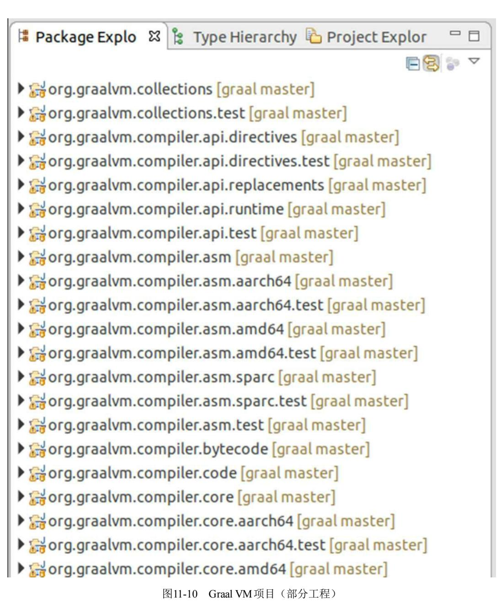

Environments->Java SE-1.8),此外,还需要手工将以其他版本号结尾的工程关闭,譬如图11-11所示。 这对于采用其他版本JDK来编译的读者也是一样的。

到此为止,整个编译、调试环境就已经构建完毕,下面可以开始探索Graal工作原理的内容了。

[1] 获取地址:https://github.com/graalvm/graal-jvmci-8。

# 11.5.3 JVMCI编译器接口

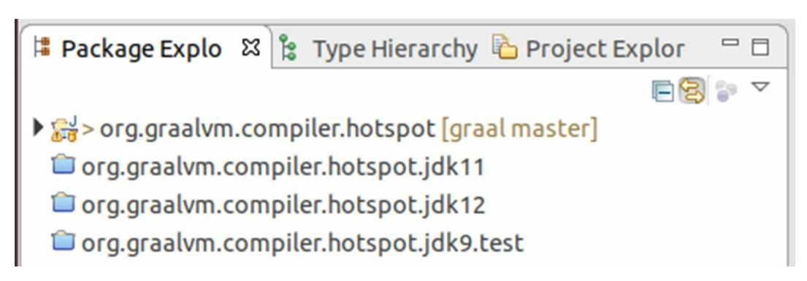

图11-11 手动关闭其他版本的工程

现在请读者来思考一下,如果让您来设计JVMCI编译器接口,它应该是怎样的?既然JVMCI面向 的是Java语言的编译器接口,那它至少在形式上是与我们已经见过无数次的Java接口是一样的。我们来 考虑即时编译器的输入是什么。答案当然是要编译的方法的字节码。既然叫字节码,顾名思义它就应 该是"用一个字节数组表示的代码"。那接下来它输出什么?这也很简单,即时编译器应该输出与方法 对应的二进制机器码,二进制机器码也应该是"用一个字节数组表示的代码"。这样的话,JVMCI接口 就应该看起来类似于下面这种样子:

```
interface JVMCICompiler {
    byte[] compileMethod(byte[] bytecode);
```

事实上JVMCI接口只比上面这个稍微复杂一点点,因为其输入除了字节码外,HotSpot还会向编 译器提供各种该方法的相关信息,譬如局部变量表中变量槽的个数、操作数栈的最大深度,还有分层 编译在底层收集到的统计信息等。因此JVMCI接口的核心内容实际就是代码清单11-13总所示的这些。

#### 代码清单11-13 JVMCI接口

```
interface JVMCICompiler {
    void compileMethod(CompilationRequest request);
interface CompilationRequest {
    JavaMethod getMethod();
interface JavaMethod {
    byte[] getCode();
    int getMaxLocals();
    int getMaxStackSize();
    ProfilingInfo getProfilingInfo();
    ... // 省略其他方法
```

我们在Eclipse中找到JVMCICompiler接口,通过继承关系分析,可以清楚地看到有一个实现类 HotSpotGraalCompiler实现了JVMCI,如图11-12所示,这个就是我们要分析的代码的入口。

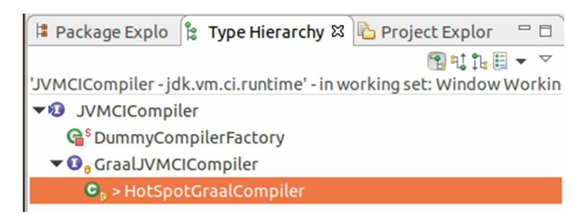

图11-12 JVMCI接口的继承关系

为了后续调试方便,我们先准备一段简单的代码,并让它触发HotSpot的即时编译,以便我们跟踪 观察编译器是如何工作对的。具体代码如清单11-14所示。

代码清单11-14 触发即时编译的示例代码[1]

```
public class Demo {
    public static void main(String[] args) {
        while (true) {
            workload(14, 2);
    private static int workload(int a, int b) {
        return a + b;
```

由于存在无限循环,workload()方法肯定很快就会被虚拟机发现是热点代码因而进行编译。实际上 除了workload()方法以外,这段简单的代码还会导致相当多的其他方法的编译,因为一个最简单的Java 类的加载和运行也会触发数百个类的加载。为了避免干扰信息太多,笔者加入了参数-XX:

CompileOnly来限制只允许workload()方法被编译。先采用以下命令,用标准的服务端编译器来运行清 单11-14中所示的程序。

```
$ javac Demo.java
$ java \
 -XX:+PrintCompilation \
 -XX:CompileOnly=Demo::workload \
 Demo
   193 1 3 Demo::workload (4 bytes)
   199 2 1 Demo::workload (4 bytes)
   199 1 3 Demo::workload (4 bytes) made not entrant
```

编译版本被丢弃过。从这段信息中我们清楚看到,分层编译机制及最顶层的服务端编译都已经正常工 作了,下一步就是用我们在Eclipse中的Graal编译器代替HotSpot的服务端编译器。

为简单起见,笔者加上-XX:-TieredCompilation关闭分层编译,让虚拟机只采用有一个JVMCI编 译器而不是由客户端编译器和JVMCI混合分层。然后使用参数-XX:+EnableJVMCI、-XX: +UseJVMCICompiler来启用JVMCI接口和JVMCI编译器。由于这些目前尚属实验阶段的功能,需要再 使用-XX:+UnlockExperimentalVMOptions参数进行解锁。最后,也是最关键的一个问题,如何让 HotSpot找到Graal编译器的位置呢?

如果采用特殊版的JDK 8,那虚拟机将会自动去查找JAVA\_HOME/jre/lib/jvmci目录。假如这个目录 不存在,那就会从-Djvmci.class.path.append参数中搜索。它查找的目标,即Graal编译器的JAR包,刚 才我们已经通过mx build命令成功编译出来,所以在JDK 8下笔者使用的启动参数如代码清单11-15所 示。

#### 代码清单11-15 JDK8的运行配置

```
-Djvmci.class.path.append=~/graal/compiler/mxbuild/dists/jdk1.8/graal.jar:~/graal/sdk/mxbuild/dists/jdk1.8/graal-sdk.jar
-XX:+UnlockExperimentalVMOptions
-XX:+EnableJVMCI
-XX:+UseJVMCICompiler
-XX:-TieredCompilation
-XX:+PrintCompilation
-XX:CompileOnly=Demo::workload
```

如果读者采用JDK 9或以上版本,那原本的Graal编译器是实现在jdk.internal.vm.compiler模块中 的,我们只要用--upgrade-module-path参数指定这个模块的升级包即可,具体如代码清单11-16所示。

代码清单11-16 JDK 9或以上版本的运行配置

```
--module-path=~/graal/sdk/mxbuild/dists/jdk11/graal.jar
--upgrade-module-path=~graal/compiler/mxbuild/dists/jdk11/jdk.internal.vm.compiler.jar
-XX:+UnlockExperimentalVMOptions
-XX:+EnableJVMCI
-XX:+UseJVMCICompiler
-XX:-TieredCompilation
-XX:+PrintCompilation
-XX:CompileOnly=Demo::workload
```

通过上述参数,HotSpot就能顺利找到并应用我们编译的Graal编译器了。为了确认效果,我们对 HotSpotGraalCompiler类的compileMethod()方法做一个简单改动,输出编译的方法名称和编译耗时,具 体如下(黑色加粗代码是笔者在源码中额外添加的内容):

```
public CompilationRequestResult compileMethod(CompilationRequest request) {
    long time = System.currentTimeMillis();
    CompilationRequestResult result = compileMethod(request, true, graalRuntime.getOptions());
    System.out.println("compile method:" + request.getMethod().getName());
    System.out.println("time used:" + (System.currentTimeMillis() - time));
    return result;
```

在Eclipse里面运行这段代码,不需要重新运行mx build,马上就可以看到类似如下所示的输出结 果:

97 1 Demo::workload (4 bytes)

compile method:workload time used:4081

[1] 本节部分示例和图片来自于Chris Seaton的文章《Understanding How Graal Works-a Java JIT Compiler Written in Java》:https://chrisseaton.com/truffleruby/jokerconf17/。

# 11.5.4 代码中间表示

Graal编译器在设计之初就刻意采用了与HotSpot服务端编译器一致(略有差异但已经非常接近) 的中间表示形式,也即是被称为Sea-of-Nodes的中间表示,或者与其等价的被称为理想图(Ideal Graph,在代码中称为Structured Graph)的程序依赖图(Program Dependence Graph,PDG)形式。在 11.2节即时编译器的实战中,我们已经通过可视化工具Ideal Graph Visualizer看到过在理想图上翻译和 优化输入代码的整体过程,从编译器内部来看即:字节码→理想图→优化→机器码(以Mach Node Graph表示)的转变过程。在那个实战里面,我们着重分析的是理想图转换优化的整体过程,对于多 数读者,尤其是不熟悉编译原理与编译器设计的读者,可能会不太容易读懂每个阶段所要做的工作。 在本节里面,我们以例子和对照Graal源码的形式,详细讲解输入代码与理想图的转化对应关系,以便 读者理解Graal是如何基于理想图去优化代码的。

理想图是一种有向图,用节点来表示程序中的元素,譬如变量、操作符、方法、字段等,而用边 来表示数据或者控制流。我们先从最简单的例子出发。譬如有一个表达式:x+y,在理想图中可以表 示为x、y两个节点的数据流流入加法操作符,表示相加操作读取了x、y的值,流出的便则表示数据流 的流向,即相加的结果会在哪里被使用,如图11-13所示。

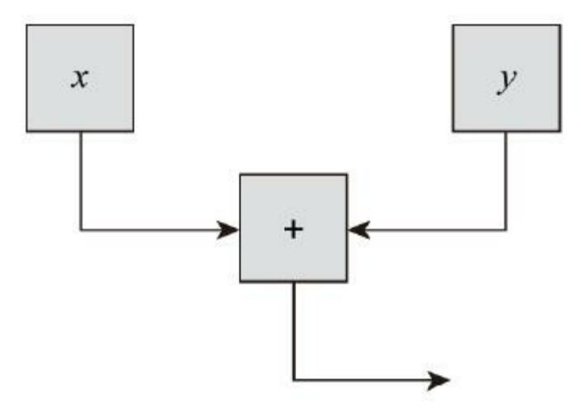

图11-13 构造理想图(1)

这很容易接受吧?那我们把例子稍微复杂化一些,把表达式x+y变为getX()+getY(),仍是用理想图 表达其计算过程,这时候除了数据流向之外,还必须要考虑方法调用的顺序。在理想图中用另外一条 边来表示方法的调用(为了便于区分,数据流笔者使用蓝色线(以虚线表示),控制流使用红色线 (以实线表示)),说明代码的执行顺序是先调用getX()方法,再调用getY()方法,如图11-14所示。

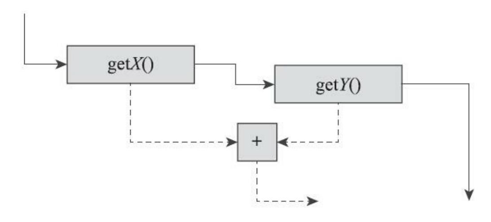

图11-14 构造理想图(2)

以上这些简单的前置知识就已经足以支撑我们本次实战的进行了,理想图本质上就是这种将数据 流图和控制流图以某种方式合并到一起,用一种边来表示数据流向,另一种边来表示控制流向的图形 表示。

现在我们在代码清单11-15或者代码清单11-16所示的基础上再增加一个参数-Dgraal.Dump,要求 Graal编译器把构造的理想图输出出来,加入后编译时将会产生类似如下的输出,提示了生成的理想图 的存储位置:

```
[Use -Dgraal.LogFile=<path> to redirect Graal log output to a file.]
Dumping IGV graphs in /home/icyfenix/develop/eclipse-workspace/A_GraalTest/graal_dumps/2019.08.18.16.51.23.073
```

我们可以使用mx igv命令来获得能够支持Graal编译器生成的理想图格式的新版本的Ideal Graph Visualizer工具[1],我们以下面这段简单代码的理想图的表示为例子:

```
int average(int a, int b) {
    return (a + b) / 2;
```

在Ideal Graph Visualizer工具中,将显示图11-15所示的样式的理想图。

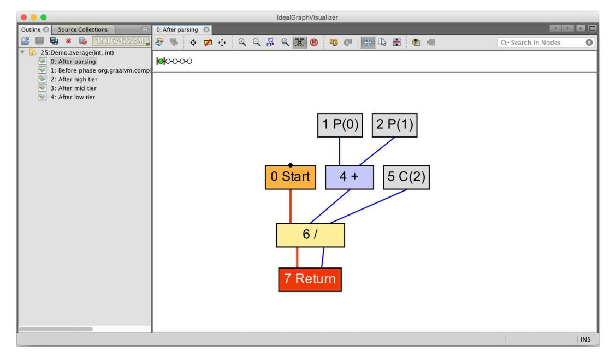

图11-15 构造理想图(3)

与图11-11和图11-12所示相比,虽然没有了箭头,但是节点上列明了代表执行顺序的序号,仍然是 蓝色线表示数据流、红色线表示控制流。从图中可以看到参数0(记作P(0))和参数1(记作P(1))是如 何送入加法操作的,然后结果是如何和常量2(记作C(2))一起送入除法操作的。

再下一步我们就会开始接触真实的代码编译和优化了。前面介绍编译器优化技术时提到过公共子 表达式消除,那我们来设计代码清单11-17所示的两段代码。

代码清单11-17 公共子表达式被消除的应用范围

```
// 以下代码的公共子表达式能够被消除
int workload(int a, int b) {
   return (a + b) * (a + b);
// 以下代码的公共子表达式是不可以被消除的
int workload() {
   return (getA() + getB()) * (getA() + getB());
```

对于第一段代码,a+b是公共子表达式,可以通过优化使其只计算一次而不会有任何的副作用。但 是对于第二段代码,由于getA()和getB()方法内部所蕴含的操作是不确定的,它是否被调用、调用次数 的不同都可能会产生不同返回值或者其他影响程序状态的副作用(譬如改变某个全局的状态变量), 这种代码只能内联了getA()和getB()方法之后才能考虑更进一步的优化措施,仍然保持函数调用的情况 下是无法做公共子表达式消除的。我们可以从Graal生成的理想图中清晰地看到这一点,对于第一段代 码,生成的理想图如图11-16所示。

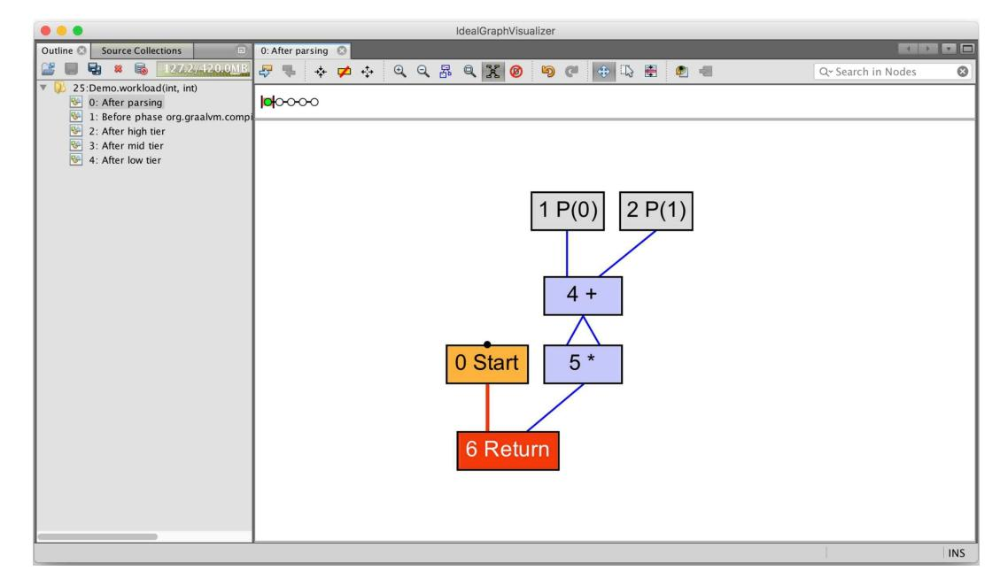

图11-16 构造理想图(4)

从图11-16所示中可以看到,参数1、2的加法操作只进行了一次,然后同时流出了两条数据流指向 乘法操作的输入中。而如果是第二段代码,则生成的理想图如图11-17所示。

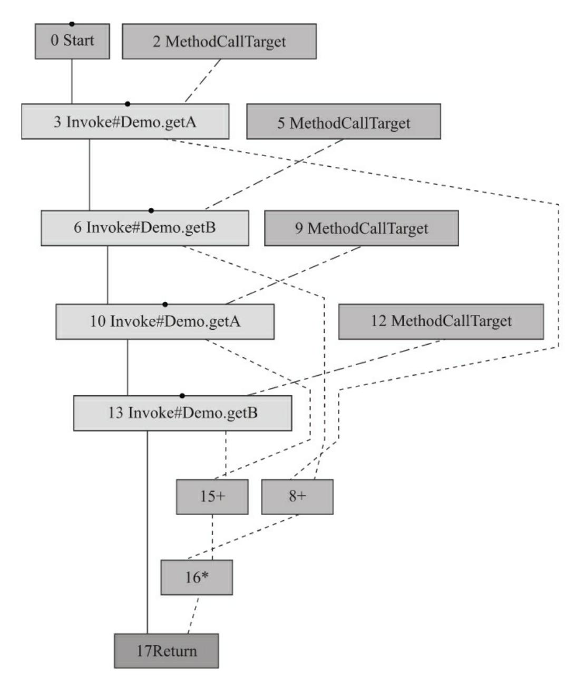

图11-17 构造理想图(5)

从图中代表控制流的红色边(以实线表示)可以看出,四次方法调用全部执行了,代表数据流的

蓝色边(以虚线表示)也明确看到了两个独立加法操作节点,由此看出这个版本是不会把它当作公共 子表达式来消除的。

[1] 在以下地址可以下载:https://www.oracle.com/technetwork/graalvm/downloads/index.html。

# 11.5.5 代码优化与生成

相信读者现在已经能够基本看明白Graal理想图的中间表示了,那对应到代码上,Graal编译器是如 何从字节码生成理想图?又如何在理想图基础上进行代码优化的呢?这时候就充分体现出了Graal编译 器在使用Java编写时对普通Java程序员来说具有的便捷性了,在Outline视图中找到创建理想图的方法是 greateGraph(),我们可以从Call Hierarchy视图中轻易地找到从JVMCI的入口方法compileMethod()到 greateGraph()之间的调用关系,如图11-18所示。

greateGraph()方法的代码也很清晰,里面调用了StructuredGraph::Builder()构造器来创建理想图。这 里要关注的关键点有两个:

#### 图11-18 构造理想图的方法

第一是理想图本身的数据结构。它是一组不为空的节点的集合,它的节点都是用ValueNode的不同 类型的子类节点来表示的。仍然以x+y表达式为例,譬如其中的加法操作,就由AddNode节点来表示, 从图11-19所示的Type Hierarchy视图中可以清楚地看到加法操作是二元算术操作节点

(BinaryArithmeticNode<OP>)的一种,而二元算术操作节点又是二元操作符(BinaryNode)的一 种,以此类推直到所有操作符的共同父类ValueNode(表示可以返回数据的节点)。

第二就是如何从字节码转换到理想图。该过程被封装在BytecodeParser类中,这个解析器我们可以 按照字节码解释器的思路去理解它。如果这真的是一个字节码解释器,执行一个整数加法操作,按照 《Java虚拟机规范》所定义的iadd操作码的规则,应该从栈帧中出栈两个操作数,然后相加,再将结果 入栈。而从BytecodeParser::genArithmeticOp()方法上我们可以看到,其实现与规则描述没有什么差异, 如图11-20所示。

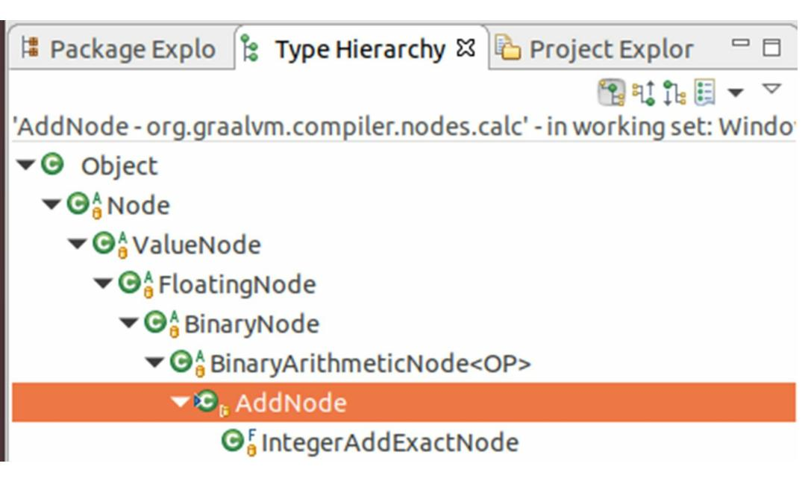

图11-19 节点继承关系

图11-20 字节码解析器实现的iadd操作码

其中,genIntegerAdd()方法中就只有一行代码,即调用AddNode节点的create()方法,将两个操作数 作为参数传入,创建出AddNode节点,如下所示:

```
protected ValueNode genIntegerAdd(ValueNode x, ValueNode y) {
    return AddNode.create(x, y, NodeView.DEFAULT);
```

每一个理想图的节点都有两个共同的主要操作,一个是规范化(Canonicalisation),另一个是生 成机器码(Generation)。生成机器码顾名思义,就不必解释了,规范化则是指如何缩减理想图的规 模,也即在理想图的基础上优化代码所要采取的措施。这两个操作对应了编译器两项最根本的任务: 代码优化与代码翻译。

AddNode节点的规范化是实现在canonical()方法中的,机器码生成则是实现在generate()方法中的, 从AddNode的创建方法上可以看到,在节点创建时会调用canonical()方法尝试进行规范化缩减图的规 模,如下所示:

```
public static ValueNode create(ValueNode x, ValueNode y, NodeView view) {
    BinaryOp<Add> op = ArithmeticOpTable.forStamp(x.stamp(view)).getAdd();
        Stamp stamp = op.foldStamp(x.stamp(view), y.stamp(view));
        ConstantNode tryConstantFold = tryConstantFold(op, x, y, stamp, view);
        if (tryConstantFold != null) {
            return tryConstantFold;
        if (x.isConstant() && !y.isConstant()) {
            return canonical(null, op, y, x, view);
        } else {
            return canonical(null, op, x, y, view);
```

从AddNode的canonical()方法中我们可以看到为了缩减理想图的规模而做的相当多的努力,即使只 是两个整数相加那么简单的操作,也尝试过了常量折叠(如果两个操作数都为常量,则直接返回一个 常量节点)、算术聚合(聚合树的常量子节点,譬如将(a+1)+2聚合为a+3)、符号合并(聚合树的相 反符号子节点,譬如将(a-b)+b或者b+(a-b)直接合并为a)等多种优化,canonical()方法的内容较多,请 读者自行参考源码,为节省版面这里就不贴出了。

对理想图的规范化并不局限于单个操作码的局部范围之内,很多的优化都是要立足于全局来进行 的,这类操作在CanonicalizerPhase类中完成。仍然以上一节的公共子表达式消除为例,这就是一个全 局性的优化,实现在CanonicalizerPhase::tryGlobalValueNumbering()方法中,其逻辑看起来已经非常清晰 了:如果理想图中发现了可以进行消除的算术子表达式,那就找出重复的节点,然后替换、删除。具 体代码如下所示:

```
public boolean tryGlobalValueNumbering(Node node, NodeClass<?> nodeClass) {
    if (nodeClass.valueNumberable()) {
        Node newNode = node.graph().findDuplicate(node);
        if (newNode != null) {
            assert !(node instanceof FixedNode || newNode instanceof FixedNode);
            node.replaceAtUsagesAndDelete(newNode);
            COUNTER_GLOBAL_VALUE_NUMBERING_HITS.increment(debug);
            debug.log("GVN applied and new node is %1s", newNode);
            return true;
    return false;
```

至于代码生成,Graal并不是直接由理想图转换到机器码,而是和其他编译器一样,会先生成低级 中间表示(LIR,与具体机器指令集相关的中间表示),然后再由HotSpot统一后端来产生机器码。譬 如涉及算术运算加法的操作,就在ArithmeticLIRGeneratorTool接口的emitAdd()方法里完成。从低级中 间表示的实现类上,我们可以看到Graal编译器能够支持的目标平台,目前它只提供了三种目标平台的 指令集(SPARC、x86-AMD64、ARMv8-AArch64)的低级中间表示,所以现在Graal编译器也就只能 支持这几种目标平台,如图11-21所示。

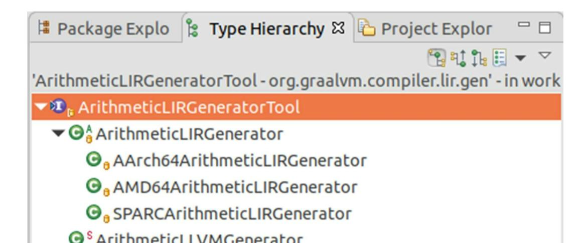

图11-21 Graal支持的目标平台生成器

为了验证代码阅读的成果,现在我们来对AddNode的代码生成做一些小改动,将原本生成加法汇 编指令修改为生成减法汇编指令,即按如下方式修改AddNode::generate()方法:

```
class AddNode {
   void generate(...) {
       ... gen.emitSub(op1, op2, false) ... // 原来这个方法是emitAdd()
```

然后在虚拟机运行参数中加上-XX:+PrintAssembly参数,因为从低级中间表示到真正机器码的转 换是由HotSpot统一负责的,所以11.2节中用到的HSDIS插件仍然能发挥作用,帮助我们输出汇编代 码。从输出的汇编中可以看到,在没有修改之前,AddNode节点输出的汇编代码如下所示:

```
0x000000010f71cda0: nopl 0x0(%rax,%rax,1)
0x000000010f71cda5: add %edx,%esi ;*iadd {reexecute=0 rethrow=0 return_oop=0}
                                       ; - Demo::workload@2 (line 10)
0x000000010f71cda7: mov %esi,%eax ;*ireturn {reexecute=0 rethrow=0 return_oop=0}
                                       ; - Demo::workload@3 (line 10)
0x000000010f71cda9: test %eax,-0xcba8da9(%rip) # 0x0000000102b74006
                                       ; {poll_return}
0x000000010f71cdaf: vzeroupper
0x000000010f71cdb2: retq
```

而被我们修改后,编译的结果已经变为:

```
0x0000000107f451a0: nopl 0x0(%rax,%rax,1)
0x0000000107f451a5: sub %edx,%esi ;*iadd {reexecute=0 rethrow=0 return_oop=0}
                                          ; - Demo::workload@2 (line 10)
0x0000000107f451a7: mov %esi,%eax ;*ireturn {reexecute=0 rethrow=0 return_oop=0}
                                          ; - Demo::workload@3 (line 10)
0x0000000107f451a9: test %eax,-0x1db81a9(%rip) # 0x000000010618d006
                                          ; {poll_return}
0x0000000107f451af: vzeroupper
0x0000000107f451b2: retq
```

我们的修改确实促使Graal编译器产生了不同的汇编代码,这也印证了我们代码分析的思路是正确 的。写到这里,笔者忍不住感慨,Graal编译器的出现对学习和研究虚拟机代码编译技术实在有着不可 估量的价值。在本书第2版编写时,只有C++编写的复杂无比的服务端编译器,要进行类似的实战是非 常困难的,即使勉强写出来,也会因为过度烦琐而失去阅读价值。

# 11.6 本章小结

在本章中,我们学习了与提前编译和即时编译器两大后端编译器相关的知识,了解了提前编译器 重新兴起的原因及其优劣势;还有与即时编译器相关的热点探测方法、编译触发条件及如何从虚拟机 外部观察和分析即时编译的数据和结果;还选择了几种常见的编译器优化技术进行讲解,对Java编译 器的深入了解,有助于在工作中分辨哪些代码是编译器可以帮我们处理的,哪些代码需要自己调节以 便更适合编译器的优化。

# 第五部分 高效并发

·第12章 Java内存模型与线程

·第13章 线程安全与锁优化

# 第12章 Java内存模型与线程

并发处理的广泛应用是Amdahl定律代替摩尔定律[1]成为计算机性能发展源动力的根本原因,也是 人类压榨计算机运算能力的最有力武器。

[1] Amdahl定律通过系统中并行化与串行化的比重来描述多处理器系统能获得的运算加速能力,摩尔 定律则用于描述处理器晶体管数量与运行效率之间的发展关系。这两个定律的更替代表了近年来硬件 发展从追求处理器频率到追求多核心并行处理的发展过程。

### 12.1 概述

多任务处理在现代计算机操作系统中几乎已是一项必备的功能了。在许多场景下,让计算机同时 去做几件事情,不仅是因为计算机的运算能力强大了,还有一个很重要的原因是计算机的运算速度与 它的存储和通信子系统的速度差距太大,大量的时间都花费在磁盘I/O、网络通信或者数据库访问上。 如果不希望处理器在大部分时间里都处于等待其他资源的空闲状态,就必须使用一些手段去把处理器 的运算能力"压榨"出来,否则就会造成很大的性能浪费,而让计算机同时处理几项任务则是最容易想 到,也被证明是非常有效的"压榨"手段。

除了充分利用计算机处理器的能力外,一个服务端要同时对多个客户端提供服务,则是另一个更 具体的并发应用场景。衡量一个服务性能的高低好坏,每秒事务处理数(Transactions Per Second, TPS)是重要的指标之一,它代表着一秒内服务端平均能响应的请求总数,而TPS值与程序的并发能力 又有非常密切的关系。对于计算量相同的任务,程序线程并发协调得越有条不紊,效率自然就会越 高;反之,线程之间频繁争用数据,互相阻塞甚至死锁,将会大大降低程序的并发能力。

服务端的应用是Java语言最擅长的领域之一,这个领域的应用占了Java应用中最大的一块份额 [1],不过如何写好并发应用程序却又是服务端程序开发的难点之一,处理好并发方面的问题通常需要 更多的编码经验来支持。幸好Java语言和虚拟机提供了许多工具,把并发编程的门槛降低了不少。各 种中间件服务器、各类框架也都努力地替程序员隐藏尽可能多的线程并发细节,使得程序员在编码时 能更关注业务逻辑,而不是花费大部分时间去关注此服务会同时被多少人调用、如何处理数据争用、 协调硬件资源。但是无论语言、中间件和框架再如何先进,开发人员都不应期望它们能独立完成所有 并发处理的事情,了解并发的内幕仍然是成为一个高级程序员不可缺少的课程。

"高效并发"是本书讲解Java虚拟机的最后一个部分,将会向读者介绍虚拟机如何实现多线程、多 线程之间由于共享和竞争数据而导致的一系列问题及解决方案。

[1] 必须以代码的总体规模来衡量,服务端应用不能与JavaCard、移动终端这些领域去比绝对数量。

# 12.2 硬件的效率与一致性

在正式讲解Java虚拟机并发相关的知识之前,我们先花费一点时间去了解一下物理计算机中的并 发问题。物理机遇到的并发问题与虚拟机中的情况有很多相似之处,物理机对并发的处理方案对虚拟 机的实现也有相当大的参考意义。

"让计算机并发执行若干个运算任务"与"更充分地利用计算机处理器的效能"之间的因果关系,看 起来理所当然,实际上它们之间的关系并没有想象中那么简单,其中一个重要的复杂性的来源是绝大 多数的运算任务都不可能只靠处理器"计算"就能完成。处理器至少要与内存交互,如读取运算数据、 存储运算结果等,这个I/O操作就是很难消除的(无法仅靠寄存器来完成所有运算任务)。由于计算机 的存储设备与处理器的运算速度有着几个数量级的差距,所以现代计算机系统都不得不加入一层或多 层读写速度尽可能接近处理器运算速度的高速缓存(Cache)来作为内存与处理器之间的缓冲:将运算 需要使用的数据复制到缓存中,让运算能快速进行,当运算结束后再从缓存同步回内存之中,这样处 理器就无须等待缓慢的内存读写了。

基于高速缓存的存储交互很好地解决了处理器与内存速度之间的矛盾,但是也为计算机系统带来 更高的复杂度,它引入了一个新的问题:缓存一致性(Cache Coherence)。在多路处理器系统中,每 个处理器都有自己的高速缓存,而它们又共享同一主内存(Main Memory),这种系统称为共享内存 多核系统(Shared Memory Multiprocessors System),如图12-1所示。当多个处理器的运算任务都涉及 同一块主内存区域时,将可能导致各自的缓存数据不一致。如果真的发生这种情况,那同步回到主内 存时该以谁的缓存数据为准呢?为了解决一致性的问题,需要各个处理器访问缓存时都遵循一些协 议,在读写时要根据协议来进行操作,这类协议有MSI、MESI(Illinois Protocol)、MOSI、 Synapse、Firefly及Dragon Protocol等。从本章开始,我们将会频繁见到"内存模型"一词,它可以理解 为在特定的操作协议下,对特定的内存或高速缓存进行读写访问的过程抽象。不同架构的物理机器可 以拥有不一样的内存模型,而Java虚拟机也有自己的内存模型,并且与这里介绍的内存访问操作及硬 件的缓存访问操作具有高度的可类比性。

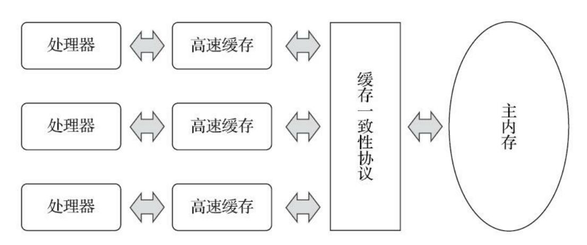

图12-1 处理器、高速缓存、主内存间的交互关系

除了增加高速缓存之外,为了使处理器内部的运算单元能尽量被充分利用,处理器可能会对输入 代码进行乱序执行(Out-Of-Order Execution)优化,处理器会在计算之后将乱序执行的结果重组,保 证该结果与顺序执行的结果是一致的,但并不保证程序中各个语句计算的先后顺序与输入代码中的顺 序一致,因此如果存在一个计算任务依赖另外一个计算任务的中间结果,那么其顺序性并不能靠代码 的先后顺序来保证。与处理器的乱序执行优化类似,Java虚拟机的即时编译器中也有指令重排序 (Instruction Reorder)优化。

# 12.3 Java内存模型

《Java虚拟机规范》[1]中曾试图定义一种"Java内存模型" [2](Java Memory Model,JMM)来屏 蔽各种硬件和操作系统的内存访问差异,以实现让Java程序在各种平台下都能达到一致的内存访问效 果。在此之前,主流程序语言(如C和C++等)直接使用物理硬件和操作系统的内存模型。因此,由于 不同平台上内存模型的差异,有可能导致程序在一套平台上并发完全正常,而在另外一套平台上并发 访问却经常出错,所以在某些场景下必须针对不同的平台来编写程序。

定义Java内存模型并非一件容易的事情,这个模型必须定义得足够严谨,才能让Java的并发内存访 问操作不会产生歧义;但是也必须定义得足够宽松,使得虚拟机的实现能有足够的自由空间去利用硬 件的各种特性(寄存器、高速缓存和指令集中某些特有的指令)来获取更好的执行速度。经过长时间 的验证和修补,直至JDK 5(实现了JSR-133 [3])发布后,Java内存模型才终于成熟、完善起来了。

- [1] 在《Java虚拟机规范》的第2版及之前,专门有一章"Threads and Locks"来描述内存模型,后来由于 这部分内容难以把握宽紧限度,被反复修正更新,从第3版(Java SE 7版)开始索性就被移除出规范, 独立以JSR形式维护。
- [2] 本书中的Java内存模型都特指目前正在使用的,在JDK 1.2之后建立起来并在JDK 5中完善过的内存 模型。
- [3] JSR-133:Java Memory Model and Thread Specification Revision(Java内存模型和线程规范修订)。

# 12.3.1 主内存与工作内存

Java内存模型的主要目的是定义程序中各种变量的访问规则,即关注在虚拟机中把变量值存储到 内存和从内存中取出变量值这样的底层细节。此处的变量(Variables)与Java编程中所说的变量有所区 别,它包括了实例字段、静态字段和构成数组对象的元素,但是不包括局部变量与方法参数,因为后 者是线程私有的[1],不会被共享,自然就不会存在竞争问题。为了获得更好的执行效能,Java内存模 型并没有限制执行引擎使用处理器的特定寄存器或缓存来和主内存进行交互,也没有限制即时编译器 是否要进行调整代码执行顺序这类优化措施。

Java内存模型规定了所有的变量都存储在主内存(Main Memory)中(此处的主内存与介绍物理 硬件时提到的主内存名字一样,两者也可以类比,但物理上它仅是虚拟机内存的一部分)。每条线程 还有自己的工作内存(Working Memory,可与前面讲的处理器高速缓存类比),线程的工作内存中保 存了被该线程使用的变量的主内存副本[2],线程对变量的所有操作(读取、赋值等)都必须在工作内 存中进行,而不能直接读写主内存中的数据[3]。不同的线程之间也无法直接访问对方工作内存中的变 量,线程间变量值的传递均需要通过主内存来完成,线程、主内存、工作内存三者的交互关系如图12- 2所示,注意与图12-1进行对比。

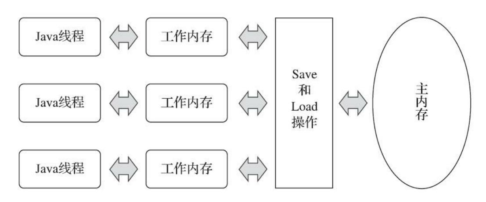

图12-2 线程、主内存、工作内存三者的交互关系(请与图12-1对比)

这里所讲的主内存、工作内存与第2章所讲的Java内存区域中的Java堆、栈、方法区等并不是同一 个层次的对内存的划分,这两者基本上是没有任何关系的。如果两者一定要勉强对应起来,那么从变 量、主内存、工作内存的定义来看,主内存主要对应于Java堆中的对象实例数据部分[4],而工作内存 则对应于虚拟机栈中的部分区域。从更基础的层次上说,主内存直接对应于物理硬件的内存,而为了 获取更好的运行速度,虚拟机(或者是硬件、操作系统本身的优化措施)可能会让工作内存优先存储 于寄存器和高速缓存中,因为程序运行时主要访问的是工作内存。

[1] 此处请读者注意区分概念:如果局部变量是一个reference类型,它引用的对象在Java堆中可被各个