线程共享,但是reference本身在Java栈的局部变量表中是线程私有的。

- [2] 有部分读者会对这段描述中的"副本"提出疑问,如"假设线程中访问一个10MB大小的对象,也会把 这10MB的内存复制一份出来吗?",事实上并不会如此,这个对象的引用、对象中某个在线程访问到 的字段是有可能被复制的,但不会有虚拟机把整个对象复制一次。
- [3] 根据《Java虚拟机规范》的约定,volatile变量依然有工作内存的拷贝,但是由于它特殊的操作顺序 性规定(后文会讲到),所以看起来如同直接在主内存中读写访问一般,因此这里的描述对于volatile 也并不存在例外。
- [4] 除了实例数据,Java堆还保存了对象的其他信息,对于HotSpot虚拟机来讲,有Mark Word(存储对 象哈希码、GC标志、GC年龄、同步锁等信息)、Klass Point(指向存储类型元数据的指针)及一些用 于字节对齐补白的填充数据(如果实例数据刚好满足8字节对齐,则可以不存在补白)。

# 12.3.2 内存间交互操作

关于主内存与工作内存之间具体的交互协议,即一个变量如何从主内存拷贝到工作内存、如何从 工作内存同步回主内存这一类的实现细节,Java内存模型中定义了以下8种操作来完成。Java虚拟机实 现时必须保证下面提及的每一种操作都是原子的、不可再分的(对于double和long类型的变量来说, load、store、read和write操作在某些平台上允许有例外,这个问题在12.3.4节会专门讨论)[1]。

·lock(锁定):作用于主内存的变量,它把一个变量标识为一条线程独占的状态。

·unlock(解锁):作用于主内存的变量,它把一个处于锁定状态的变量释放出来,释放后的变量 才可以被其他线程锁定。

·read(读取):作用于主内存的变量,它把一个变量的值从主内存传输到线程的工作内存中,以 便随后的load动作使用。

·load(载入):作用于工作内存的变量,它把read操作从主内存中得到的变量值放入工作内存的 变量副本中。

·use(使用):作用于工作内存的变量,它把工作内存中一个变量的值传递给执行引擎,每当虚 拟机遇到一个需要使用变量的值的字节码指令时将会执行这个操作。

·assign(赋值):作用于工作内存的变量,它把一个从执行引擎接收的值赋给工作内存的变量, 每当虚拟机遇到一个给变量赋值的字节码指令时执行这个操作。

·store(存储):作用于工作内存的变量,它把工作内存中一个变量的值传送到主内存中,以便随 后的write操作使用。

·write(写入):作用于主内存的变量,它把store操作从工作内存中得到的变量的值放入主内存的 变量中。

如果要把一个变量从主内存拷贝到工作内存,那就要按顺序执行read和load操作,如果要把变量从 工作内存同步回主内存,就要按顺序执行store和write操作。注意,Java内存模型只要求上述两个操作 必须按顺序执行,但不要求是连续执行。也就是说read与load之间、store与write之间是可插入其他指令 的,如对主内存中的变量a、b进行访问时,一种可能出现的顺序是read a、read b、load b、load a。除此 之外,Java内存模型还规定了在执行上述8种基本操作时必须满足如下规则:

·不允许read和load、store和write操作之一单独出现,即不允许一个变量从主内存读取了但工作内 存不接受,或者工作内存发起回写了但主内存不接受的情况出现。

·不允许一个线程丢弃它最近的assign操作,即变量在工作内存中改变了之后必须把该变化同步回 主内存。

·不允许一个线程无原因地(没有发生过任何assign操作)把数据从线程的工作内存同步回主内存 中。

- ·一个新的变量只能在主内存中"诞生",不允许在工作内存中直接使用一个未被初始化(load或 assign)的变量,换句话说就是对一个变量实施use、store操作之前,必须先执行assign和load操作。
- ·一个变量在同一个时刻只允许一条线程对其进行lock操作,但lock操作可以被同一条线程重复执 行多次,多次执行lock后,只有执行相同次数的unlock操作,变量才会被解锁。
- ·如果对一个变量执行lock操作,那将会清空工作内存中此变量的值,在执行引擎使用这个变量 前,需要重新执行load或assign操作以初始化变量的值。
- ·如果一个变量事先没有被lock操作锁定,那就不允许对它执行unlock操作,也不允许去unlock一个 被其他线程锁定的变量。
  - ·对一个变量执行unlock操作之前,必须先把此变量同步回主内存中(执行store、write操作)。

这8种内存访问操作以及上述规则限定,再加上稍后会介绍的专门针对volatile的一些特殊规定,就 已经能准确地描述出Java程序中哪些内存访问操作在并发下才是安全的。这种定义相当严谨,但也是 极为烦琐,实践起来更是无比麻烦。可能部分读者阅读到这里已经对多线程开发产生恐惧感了,后来 Java设计团队大概也意识到了这个问题,将Java内存模型的操作简化为read、write、lock和unlock四 种,但这只是语言描述上的等价化简,Java内存模型的基础设计并未改变,即使是这四操作种,对于 普通用户来说阅读使用起来仍然并不方便。不过读者对此无须过分担忧,除了进行虚拟机开发的团队 外,大概没有其他开发人员会以这种方式来思考并发问题,我们只需要理解Java内存模型的定义即 可。12.3.6节将介绍这种定义的一个等效判断原则——先行发生原则,用来确定一个操作在并发环境下 是否安全的。

[1] 基于理解难度和严谨性考虑,最新的JSR-133文档中,已经放弃了采用这8种操作去定义Java内存模 型的访问协议,缩减为4种(仅是描述方式改变了,Java内存模型并没有改变)。

### 12.3.3 对于volatile型变量的特殊规则

关键字volatile可以说是Java虚拟机提供的最轻量级的同步机制,但是它并不容易被正确、完整地 理解,以至于许多程序员都习惯去避免使用它,遇到需要处理多线程数据竞争问题的时候一律使用 synchronized来进行同步。了解volatile变量的语义对后面理解多线程操作的其他特性很有意义,在本节 中我们将多花费一些篇幅介绍volatile到底意味着什么。

Java内存模型为volatile专门定义了一些特殊的访问规则,在介绍这些比较拗口的规则定义之前, 先用一些不那么正式,但通俗易懂的语言来介绍一下这个关键字的作用。

当一个变量被定义成volatile之后,它将具备两项特性:第一项是保证此变量对所有线程的可见 性,这里的"可见性"是指当一条线程修改了这个变量的值,新值对于其他线程来说是可以立即得知 的。而普通变量并不能做到这一点,普通变量的值在线程间传递时均需要通过主内存来完成。比如, 线程A修改一个普通变量的值,然后向主内存进行回写,另外一条线程B在线程A回写完成了之后再对 主内存进行读取操作,新变量值才会对线程B可见。

关于volatile变量的可见性,经常会被开发人员误解,他们会误以为下面的描述是正确的:"volatile 变量对所有线程是立即可见的,对volatile变量所有的写操作都能立刻反映到其他线程之中。换句话 说,volatile变量在各个线程中是一致的,所以基于volatile变量的运算在并发下是线程安全的"。这句话 的论据部分并没有错,但是由其论据并不能得出"基于volatile变量的运算在并发下是线程安全的"这样 的结论。volatile变量在各个线程的工作内存中是不存在一致性问题的(从物理存储的角度看,各个线 程的工作内存中volatile变量也可以存在不一致的情况,但由于每次使用之前都要先刷新,执行引擎看 不到不一致的情况,因此可以认为不存在一致性问题),但是Java里面的运算操作符并非原子操作, 这导致volatile变量的运算在并发下一样是不安全的,我们可以通过一段简单的演示来说明原因,请看 代码清单12-1中演示的例子。

### 代码清单12-1 volatile的运算[1]

```
/**
 * volatile变量自增运算测试
 *
 * @author zzm
 */
public class VolatileTest {
    public static volatile int race = 0;
    public static void increase() {
        race++;
    private static final int THREADS_COUNT = 20;
    public static void main(String[] args) {
        Thread[] threads = new Thread[THREADS_COUNT];
        for (int i = 0; i < THREADS_COUNT; i++) {
            threads[i] = new Thread(new Runnable() {
                @Override
                public void run() {
                    for (int i = 0; i < 10000; i++) {
                        increase();
```

```
}
   });
   threads[i].start();
// 等待所有累加线程都结束
while (Thread.activeCount() > 1)
   Thread.yield();
System.out.println(race);
```

这段代码发起了20个线程,每个线程对race变量进行10000次自增操作,如果这段代码能够正确并 发的话,最后输出的结果应该是200000。读者运行完这段代码之后,并不会获得期望的结果,而且会 发现每次运行程序,输出的结果都不一样,都是一个小于200000的数字。这是为什么呢?

问题就出在自增运算"race++"之中,我们用Javap反编译这段代码后会得到代码清单12-2所示,发 现只有一行代码的increase()方法在Class文件中是由4条字节码指令构成(return指令不是由race++产生 的,这条指令可以不计算),从字节码层面上已经很容易分析出并发失败的原因了:当getstatic指令把 race的值取到操作栈顶时,volatile关键字保证了race的值在此时是正确的,但是在执行iconst\_1、iadd这 些指令的时候,其他线程可能已经把race的值改变了,而操作栈顶的值就变成了过期的数据,所以 putstatic指令执行后就可能把较小的race值同步回主内存之中。

#### 代码清单12-2 VolatileTest的字节码

```
public static void increase();
   Code:
       Stack=2, Locals=0, Args_size=0
       0: getstatic #13; //Field race:I
       3: iconst_1
       4: iadd
       5: putstatic #13; //Field race:I
       8: return
   LineNumberTable:
       line 14: 0
       line 15: 8
```

实事求是地说,笔者使用字节码来分析并发问题仍然是不严谨的,因为即使编译出来只有一条字 节码指令,也并不意味执行这条指令就是一个原子操作。一条字节码指令在解释执行时,解释器要运 行许多行代码才能实现它的语义。如果是编译执行,一条字节码指令也可能转化成若干条本地机器码 指令。此处使用-XX:+PrintAssembly参数输出反汇编来分析才会更加严谨一些,但是考虑到读者阅读 的方便性,并且字节码已经能很好地说明问题,所以此处使用字节码来解释。

由于volatile变量只能保证可见性,在不符合以下两条规则的运算场景中,我们仍然要通过加锁 (使用synchronized、java.util.concurrent中的锁或原子类)来保证原子性:

- ·运算结果并不依赖变量的当前值,或者能够确保只有单一的线程修改变量的值。
- ·变量不需要与其他的状态变量共同参与不变约束。

而在像代码清单12-3所示的这类场景中就很适合使用volatile变量来控制并发,当shutdown()方法被 调用时,能保证所有线程中执行的doWork()方法都立即停下来。

```
volatile boolean shutdownRequested;
public void shutdown() {
   shutdownRequested = true;
public void doWork() {
   while (!shutdownRequested) {
       // 代码的业务逻辑
```

使用volatile变量的第二个语义是禁止指令重排序优化,普通的变量仅会保证在该方法的执行过程 中所有依赖赋值结果的地方都能获取到正确的结果,而不能保证变量赋值操作的顺序与程序代码中的 执行顺序一致。因为在同一个线程的方法执行过程中无法感知到这点,这就是Java内存模型中描述的 所谓"线程内表现为串行的语义"(Within-Thread As-If-Serial Semantics)。

上面描述仍然比较拗口难明,我们还是继续通过一个例子来看看为何指令重排序会干扰程序的并 发执行。演示程序如代码清单12-4所示。

#### 代码清单12-4 指令重排序

```
Map configOptions;
char[] configText;
// 此变量必须定义为volatile
volatile boolean initialized = false;
// 假设以下代码在线程A中执行
// 模拟读取配置信息,当读取完成后
// 将initialized设置为true,通知其他线程配置可用
configOptions = new HashMap();
configText = readConfigFile(fileName);
processConfigOptions(configText, configOptions);
initialized = true;
// 假设以下代码在线程B中执行
// 等待initialized为true,代表线程A已经把配置信息初始化完成
while (!initialized) {
   sleep();
// 使用线程A中初始化好的配置信息
doSomethingWithConfig();
```

代码清单12-4中所示的程序是一段伪代码,其中描述的场景是开发中常见配置读取过程,只是我 们在处理配置文件时一般不会出现并发,所以没有察觉这会有问题。读者试想一下,如果定义 initialized变量时没有使用volatile修饰,就可能会由于指令重排序的优化,导致位于线程A中最后一条 代码"initialized=true"被提前执行(这里虽然使用Java作为伪代码,但所指的重排序优化是机器级的优 化操作,提前执行是指这条语句对应的汇编代码被提前执行),这样在线程B中使用配置信息的代码 就可能出现错误,而volatile关键字则可以避免此类情况的发生[2]。

指令重排序是并发编程中最容易导致开发人员产生疑惑的地方之一,除了上面伪代码的例子之 外,笔者再举一个可以实际操作运行的例子来分析volatile关键字是如何禁止指令重排序优化的。代码 清单12-5所示是一段标准的双锁检测(Double Check Lock,DCL)单例[3]代码,可以观察加入volatile 和未加入volatile关键字时所生成的汇编代码的差别(如何获得即时编译的汇编代码?请参考第4章关于 HSDIS插件的介绍)。

#### 代码清单12-5 DCL单例模式

```
public class Singleton {
    private volatile static Singleton instance;
    public static Singleton getInstance() {
        if (instance == null) {
            synchronized (Singleton.class) {
                if (instance == null) {
                    instance = new Singleton();
                }
            }
        return instance;
    public static void main(String[] args) {
            Singleton.getInstance();
```

编译后,这段代码对instance变量赋值的部分如代码清单12-6所示。

#### 代码清单12-6 对instance变量赋值

```
0x01a3de0f: mov $0x3375cdb0,%esi ;...beb0cd75 33
                                    ; {oop('Singleton')}
0x01a3de14: mov %eax,0x150(%esi) ;...89865001 0000
0x01a3de1a: shr $0x9,%esi ;...c1ee09
0x01a3de1d: movb $0x0,0x1104800(%esi) ;...c6860048 100100
0x01a3de24: lock addl $0x0,(%esp) ;...f0830424 00
                                    ;*putstatic instance
                                    ; - Singleton::getInstance@24
```

通过对比发现,关键变化在于有volatile修饰的变量,赋值后(前面mov%eax,0x150(%esi)这句便 是赋值操作)多执行了一个"lock addl\$0x0,(%esp)"操作,这个操作的作用相当于一个内存屏障 (Memory Barrier或Memory Fence,指重排序时不能把后面的指令重排序到内存屏障之前的位置,注 意不要与第3章中介绍的垃圾收集器用于捕获变量访问的内存屏障互相混淆),只有一个处理器访问内 存时,并不需要内存屏障;但如果有两个或更多处理器访问同一块内存,且其中有一个在观测另一 个,就需要内存屏障来保证一致性了。

这句指令中的"addl\$0x0,(%esp)"(把ESP寄存器的值加0)显然是一个空操作,之所以用这个空 操作而不是空操作专用指令nop,是因为IA32手册规定lock前缀不允许配合nop指令使用。这里的关键 在于lock前缀,查询IA32手册可知,它的作用是将本处理器的缓存写入了内存,该写入动作也会引起 别的处理器或者别的内核无效化(Invalidate)其缓存,这种操作相当于对缓存中的变量做了一次前面 介绍Java内存模式中所说的"store和write"操作[4]。所以通过这样一个空操作,可让前面volatile变量的 修改对其他处理器立即可见。

那为何说它禁止指令重排序呢?从硬件架构上讲,指令重排序是指处理器采用了允许将多条指令 不按程序规定的顺序分开发送给各个相应的电路单元进行处理。但并不是说指令任意重排,处理器必 须能正确处理指令依赖情况保障程序能得出正确的执行结果。譬如指令1把地址A中的值加10,指令2 把地址A中的值乘以2,指令3把地址B中的值减去3,这时指令1和指令2是有依赖的,它们之间的顺序 不能重排——(A+10)\*2与A\*2+10显然不相等,但指令3可以重排到指令1、2之前或者中间,只要保证 处理器执行后面依赖到A、B值的操作时能获取正确的A和B值即可。所以在同一个处理器中,重排序 过的代码看起来依然是有序的。因此,lock addl\$0x0,(%esp)指令把修改同步到内存时,意味着所有之 前的操作都已经执行完成,这样便形成了"指令重排序无法越过内存屏障"的效果。

解决了volatile的语义问题,再来看看在众多保障并发安全的工具中选用volatile的意义——它能让 我们的代码比使用其他的同步工具更快吗?在某些情况下,volatile的同步机制的性能确实要优于锁 (使用synchronized关键字或java.util.concurrent包里面的锁),但是由于虚拟机对锁实行的许多消除和 优化,使得我们很难确切地说volatile就会比synchronized快上多少。如果让volatile自己与自己比较,那 可以确定一个原则:volatile变量读操作的性能消耗与普通变量几乎没有什么差别,但是写操作则可能 会慢上一些,因为它需要在本地代码中插入许多内存屏障指令来保证处理器不发生乱序执行。不过即 便如此,大多数场景下volatile的总开销仍然要比锁来得更低。我们在volatile与锁中选择的唯一判断依 据仅仅是volatile的语义能否满足使用场景的需求。

本节的最后,我们再回头来看看Java内存模型中对volatile变量定义的特殊规则的定义。假定T表示 一个线程,V和W分别表示两个volatile型变量,那么在进行read、load、use、assign、store和write操作 时需要满足如下规则:

·只有当线程T对变量V执行的前一个动作是load的时候,线程T才能对变量V执行use动作;并且, 只有当线程T对变量V执行的后一个动作是use的时候,线程T才能对变量V执行load动作。线程T对变量 V的use动作可以认为是和线程T对变量V的load、read动作相关联的,必须连续且一起出现。

这条规则要求在工作内存中,每次使用V前都必须先从主内存刷新最新的值,用于保证能看见其 他线程对变量V所做的修改。

·只有当线程T对变量V执行的前一个动作是assign的时候,线程T才能对变量V执行store动作;并 且,只有当线程T对变量V执行的后一个动作是store的时候,线程T才能对变量V执行assign动作。线程 T对变量V的assign动作可以认为是和线程T对变量V的store、write动作相关联的,必须连续且一起出 现。

这条规则要求在工作内存中,每次修改V后都必须立刻同步回主内存中,用于保证其他线程可以 看到自己对变量V所做的修改。

·假定动作A是线程T对变量V实施的use或assign动作,假定动作F是和动作A相关联的load或store动 作,假定动作P是和动作F相应的对变量V的read或write动作;与此类似,假定动作B是线程T对变量W 实施的use或assign动作,假定动作G是和动作B相关联的load或store动作,假定动作Q是和动作G相应的 对变量W的read或write动作。如果A先于B,那么P先于Q。

这条规则要求volatile修饰的变量不会被指令重排序优化,从而保证代码的执行顺序与程序的顺序 相同。

- [1] 使用IntelliJ IDEA的读者请注意,在IDEA中运行这段程序,会由于IDE自动创建一条名为Monitor Ctrl-Break的线程(从名字看应该是监控Ctrl-Break中断信号的)而导致while循环无法结束,改为大于2 或者用Thread::join()方法代替可以解决该问题。
- [2] volatile屏蔽指令重排序的语义在JDK 5中才被完全修复,此前的JDK中即使将变量声明为volatile也 仍然不能完全避免重排序所导致的问题(主要是volatile变量前后的代码仍然存在重排序问题),这一 点也是在JDK 5之前的Java中无法安全地使用DCL(双锁检测)来实现单例模式的原因。
- [3] 双重锁定检查是一种在许多语言中都广泛流传的单例构造模式。
- [4] Doug Lea列出了各种处理器架构下的内存屏障指令:http://gee.cs.oswego.edu/dl/jmm/cookbook.html。

# 12.3.4 针对long和double型变量的特殊规则

Java内存模型要求lock、unlock、read、load、assign、use、store、write这八种操作都具有原子性, 但是对于64位的数据类型(long和double),在模型中特别定义了一条宽松的规定:允许虚拟机将没有 被volatile修饰的64位数据的读写操作划分为两次32位的操作来进行,即允许虚拟机实现自行选择是否 要保证64位数据类型的load、store、read和write这四个操作的原子性,这就是所谓的"long和double的非 原子性协定"(Non-Atomic Treatment of double and long Variables)。

如果有多个线程共享一个并未声明为volatile的long或double类型的变量,并且同时对它们进行读取 和修改操作,那么某些线程可能会读取到一个既不是原值,也不是其他线程修改值的代表了"半个变 量"的数值。不过这种读取到"半个变量"的情况是非常罕见的,经过实际测试[1],在目前主流平台下商 用的64位Java虚拟机中并不会出现非原子性访问行为,但是对于32位的Java虚拟机,譬如比较常用的32 位x86平台下的HotSpot虚拟机,对long类型的数据确实存在非原子性访问的风险。从JDK 9起, HotSpot增加了一个实验性的参数-XX:+AlwaysAtomicAccesses(这是JEP 188对Java内存模型更新的 一部分内容)来约束虚拟机对所有数据类型进行原子性的访问。而针对double类型,由于现代中央处 理器中一般都包含专门用于处理浮点数据的浮点运算器(Floating Point Unit,FPU),用来专门处理 单、双精度的浮点数据,所以哪怕是32位虚拟机中通常也不会出现非原子性访问的问题,实际测试也 证实了这一点。笔者的看法是,在实际开发中,除非该数据有明确可知的线程竞争,否则我们在编写 代码时一般不需要因为这个原因刻意把用到的long和double变量专门声明为volatile。

[1] 根据一篇文章(https://shipilev.net/blog/2014/all-accesses-are-atomic/)的介绍,对于这种情况,在 ARMv6、ARMv7、x86、x86-AMD64、PowerPC等平台上都进行了实际测试。

# 12.3.5 原子性、可见性与有序性

介绍完Java内存模型的相关操作和规则后,我们再整体回顾一下这个模型的特征。Java内存模型是 围绕着在并发过程中如何处理原子性、可见性和有序性这三个特征来建立的,我们逐个来看一下哪些 操作实现了这三个特性。

#### 1.原子性(Atomicity)

由Java内存模型来直接保证的原子性变量操作包括read、load、assign、use、store和write这六个, 我们大致可以认为,基本数据类型的访问、读写都是具备原子性的(例外就是long和double的非原子性 协定,读者只要知道这件事情就可以了,无须太过在意这些几乎不会发生的例外情况)。

如果应用场景需要一个更大范围的原子性保证(经常会遇到),Java内存模型还提供了lock和 unlock操作来满足这种需求,尽管虚拟机未把lock和unlock操作直接开放给用户使用,但是却提供了更 高层次的字节码指令monitorenter和monitorexit来隐式地使用这两个操作。这两个字节码指令反映到Java 代码中就是同步块——synchronized关键字,因此在synchronized块之间的操作也具备原子性。

#### 2.可见性(Visibility)

可见性就是指当一个线程修改了共享变量的值时,其他线程能够立即得知这个修改。上文在讲解 volatile变量的时候我们已详细讨论过这一点。Java内存模型是通过在变量修改后将新值同步回主内 存,在变量读取前从主内存刷新变量值这种依赖主内存作为传递媒介的方式来实现可见性的,无论是 普通变量还是volatile变量都是如此。普通变量与volatile变量的区别是,volatile的特殊规则保证了新值 能立即同步到主内存,以及每次使用前立即从主内存刷新。因此我们可以说volatile保证了多线程操作 时变量的可见性,而普通变量则不能保证这一点。

除了volatile之外,Java还有两个关键字能实现可见性,它们是synchronized和final。同步块的可见 性是由"对一个变量执行unlock操作之前,必须先把此变量同步回主内存中(执行store、write操 作)"这条规则获得的。而final关键字的可见性是指:被final修饰的字段在构造器中一旦被初始化完 成,并且构造器没有把"this"的引用传递出去(this引用逃逸是一件很危险的事情,其他线程有可能通 过这个引用访问到"初始化了一半"的对象),那么在其他线程中就能看见final字段的值。如代码清单 12-7所示,变量i与j都具备可见性,它们无须同步就能被其他线程正确访问。

#### 代码清单12-7 final与可见性

```
public static final int i;
public final int j;
static {
   i = 0;
   // 省略后续动作
{
   // 也可以选择在构造函数中初始化
   j = 0;
   // 省略后续动作
```

#### 3.有序性(Ordering)

Java内存模型的有序性在前面讲解volatile时也比较详细地讨论过了,Java程序中天然的有序性可以 总结为一句话:如果在本线程内观察,所有的操作都是有序的;如果在一个线程中观察另一个线程, 所有的操作都是无序的。前半句是指"线程内似表现为串行的语义"(Within-Thread As-If-Serial Semantics),后半句是指"指令重排序"现象和"工作内存与主内存同步延迟"现象。

Java语言提供了volatile和synchronized两个关键字来保证线程之间操作的有序性,volatile关键字本 身就包含了禁止指令重排序的语义,而synchronized则是由"一个变量在同一个时刻只允许一条线程对 其进行lock操作"这条规则获得的,这个规则决定了持有同一个锁的两个同步块只能串行地进入。

介绍完并发中三种重要的特性,读者是否发现synchronized关键字在需要这三种特性的时候都可以 作为其中一种的解决方案?看起来很"万能"吧?的确,绝大部分并发控制操作都能使用synchronized来 完成。synchronized的"万能"也间接造就了它被程序员滥用的局面,越"万能"的并发控制,通常会伴随 着越大的性能影响,关于这一点我们将在下一章讲解虚拟机锁优化时再细谈。

# 12.3.6 先行发生原则

如果Java内存模型中所有的有序性都仅靠volatile和synchronized来完成,那么有很多操作都将会变 得非常啰嗦,但是我们在编写Java并发代码的时候并没有察觉到这一点,这是因为Java语言中有一 个"先行发生"(Happens-Before)的原则。这个原则非常重要,它是判断数据是否存在竞争,线程是 否安全的非常有用的手段。依赖这个原则,我们可以通过几条简单规则一揽子解决并发环境下两个操 作之间是否可能存在冲突的所有问题,而不需要陷入Java内存模型苦涩难懂的定义之中。

现在就来看看"先行发生"原则指的是什么。先行发生是Java内存模型中定义的两项操作之间的偏 序关系,比如说操作A先行发生于操作B,其实就是说在发生操作B之前,操作A产生的影响能被操作B 观察到,"影响"包括修改了内存中共享变量的值、发送了消息、调用了方法等。这句话不难理解,但 它意味着什么呢?我们可以举个例子来说明一下。如代码清单12-8所示的这三条伪代码。

代码清单12-8 先行发生原则示例1

// 以下操作在线程A中执行 i = 1; // 以下操作在线程B中执行 j = i; // 以下操作在线程C中执行

i = 2;

假设线程A中的操作"i=1"先行发生于线程B的操作"j=i",那我们就可以确定在线程B的操作执行 后,变量j的值一定是等于1,得出这个结论的依据有两个:一是根据先行发生原则,"i=1"的结果可以 被观察到;二是线程C还没登场,线程A操作结束之后没有其他线程会修改变量i的值。现在再来考虑 线程C,我们依然保持线程A和B之间的先行发生关系,而C出现在线程A和B的操作之间,但是C与B没 有先行发生关系,那j的值会是多少呢?答案是不确定!1和2都有可能,因为线程C对变量i的影响可能 会被线程B观察到,也可能不会,这时候线程B就存在读取到过期数据的风险,不具备多线程安全性。

下面是Java内存模型下一些"天然的"先行发生关系,这些先行发生关系无须任何同步器协助就已 经存在,可以在编码中直接使用。如果两个操作之间的关系不在此列,并且无法从下列规则推导出 来,则它们就没有顺序性保障,虚拟机可以对它们随意地进行重排序。

·程序次序规则(Program Order Rule):在一个线程内,按照控制流顺序,书写在前面的操作先行 发生于书写在后面的操作。注意,这里说的是控制流顺序而不是程序代码顺序,因为要考虑分支、循 环等结构。

·管程锁定规则(Monitor Lock Rule):一个unlock操作先行发生于后面对同一个锁的lock操作。这 里必须强调的是"同一个锁",而"后面"是指时间上的先后。

·volatile变量规则(Volatile Variable Rule):对一个volatile变量的写操作先行发生于后面对这个变量 的读操作,这里的"后面"同样是指时间上的先后。

- ·线程启动规则(Thread Start Rule):Thread对象的start()方法先行发生于此线程的每一个动作。
- ·线程终止规则(Thread Termination Rule):线程中的所有操作都先行发生于对此线程的终止检 测,我们可以通过Thread::join()方法是否结束、Thread::isAlive()的返回值等手段检测线程是否已经终止 执行。
- ·线程中断规则(Thread Interruption Rule):对线程interrupt()方法的调用先行发生于被中断线程 的代码检测到中断事件的发生,可以通过Thread::interrupted()方法检测到是否有中断发生。
- ·对象终结规则(Finalizer Rule):一个对象的初始化完成(构造函数执行结束)先行发生于它的 finalize()方法的开始。
- ·传递性(Transitivity):如果操作A先行发生于操作B,操作B先行发生于操作C,那就可以得出 操作A先行发生于操作C的结论。

Java语言无须任何同步手段保障就能成立的先行发生规则有且只有上面这些,下面演示一下如何 使用这些规则去判定操作间是否具备顺序性,对于读写共享变量的操作来说,就是线程是否安全。读 者还可以从下面这个例子中感受一下"时间上的先后顺序"与"先行发生"之间有什么不同。演示例子如 代码清单12-9所示。

#### 代码清单12-9 先行发生原则示例2

```
private int value = 0;
pubilc void setValue(int value){
    this.value = value;
public int getValue(){
    return value;
```

代码清单12-9中显示的是一组再普通不过的getter/setter方法,假设存在线程A和B,线程A先(时 间上的先后)调用了setValue(1),然后线程B调用了同一个对象的getValue(),那么线程B收到的返回值 是什么?

我们依次分析一下先行发生原则中的各项规则。由于两个方法分别由线程A和B调用,不在一个线 程中,所以程序次序规则在这里不适用;由于没有同步块,自然就不会发生lock和unlock操作,所以管 程锁定规则不适用;由于value变量没有被volatile关键字修饰,所以volatile变量规则不适用;后面的线 程启动、终止、中断规则和对象终结规则也和这里完全没有关系。因为没有一个适用的先行发生规 则,所以最后一条传递性也无从谈起,因此我们可以判定,尽管线程A在操作时间上先于线程B,但是 无法确定线程B中getValue()方法的返回结果,换句话说,这里面的操作不是线程安全的。

那怎么修复这个问题呢?我们至少有两种比较简单的方案可以选择:要么把getter/setter方法都定 义为synchronized方法,这样就可以套用管程锁定规则;要么把value定义为volatile变量,由于setter方 法对value的修改不依赖value的原值,满足volatile关键字使用场景,这样就可以套用volatile变量规则来 实现先行发生关系。

通过上面的例子,我们可以得出结论:一个操作"时间上的先发生"不代表这个操作会是"先行发 生"。那如果一个操作"先行发生",是否就能推导出这个操作必定是"时间上的先发生"呢?很遗憾,这 个推论也是不成立的。一个典型的例子就是多次提到的"指令重排序",演示例子如代码清单12-10所 示。

代码清单12-10 先行发生原则示例3

// 以下操作在同一个线程中执行 int i = 1; int j = 2;

代码清单12-10所示的两条赋值语句在同一个线程之中,根据程序次序规则,"int i=1"的操作先行 发生于"int j=2",但是"int j=2"的代码完全可能先被处理器执行,这并不影响先行发生原则的正确性, 因为我们在这条线程之中没有办法感知到这一点。

上面两个例子综合起来证明了一个结论:时间先后顺序与先行发生原则之间基本没有因果关系, 所以我们衡量并发安全问题的时候不要受时间顺序的干扰,一切必须以先行发生原则为准。

# 12.4 Java与线程

并发不一定要依赖多线程(如PHP中很常见的多进程并发),但是在Java里面谈论并发,基本上 都与线程脱不开关系。既然本书探讨的是Java虚拟机的特性,那讲到Java线程,我们就从Java线程在虚 拟机中的实现开始讲起。

# 12.4.1 线程的实现

我们知道,线程是比进程更轻量级的调度执行单位,线程的引入,可以把一个进程的资源分配和 执行调度分开,各个线程既可以共享进程资源(内存地址、文件I/O等),又可以独立调度。目前线程 是Java里面进行处理器资源调度的最基本单位,不过如果日后Loom项目能成功为Java引入纤程 (Fiber)的话,可能就会改变这一点。

主流的操作系统都提供了线程实现,Java语言则提供了在不同硬件和操作系统平台下对线程操作 的统一处理,每个已经调用过start()方法且还未结束的java.lang.Thread类的实例就代表着一个线程。我 们注意到Thread类与大部分的Java类库API有着显著差别,它的所有关键方法都被声明为Native。在 Java类库API中,一个Native方法往往就意味着这个方法没有使用或无法使用平台无关的手段来实现 (当然也可能是为了执行效率而使用Native方法,不过通常最高效率的手段也就是平台相关的手 段)。正因为这个原因,本节的标题被定为"线程的实现"而不是"Java线程的实现",在稍后介绍的实 现方式中,我们也先把Java的技术背景放下,以一个通用的应用程序的角度来看看线程是如何实现 的。

实现线程主要有三种方式:使用内核线程实现(1:1实现),使用用户线程实现(1:N实现), 使用用户线程加轻量级进程混合实现(N:M实现)。

#### 1.内核线程实现

使用内核线程实现的方式也被称为1:1实现。内核线程(Kernel-Level Thread,KLT)就是直接由 操作系统内核(Kernel,下称内核)支持的线程,这种线程由内核来完成线程切换,内核通过操纵调 度器(Scheduler)对线程进行调度,并负责将线程的任务映射到各个处理器上。每个内核线程可以视 为内核的一个分身,这样操作系统就有能力同时处理多件事情,支持多线程的内核就称为多线程内核 (Multi-Threads Kernel)。

程序一般不会直接使用内核线程,而是使用内核线程的一种高级接口——轻量级进程(Light Weight Process,LWP),轻量级进程就是我们通常意义上所讲的线程,由于每个轻量级进程都由一个 内核线程支持,因此只有先支持内核线程,才能有轻量级进程。这种轻量级进程与内核线程之间1:1 的关系称为一对一的线程模型,如图12-3所示。

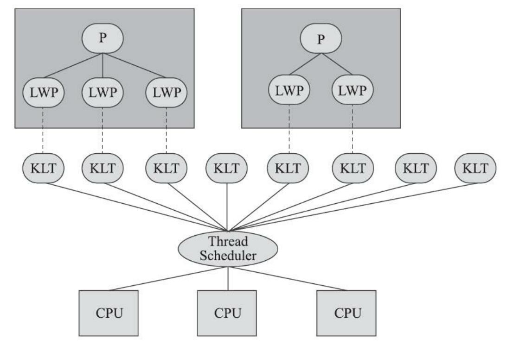

图12-3 轻量级进程与内核线程之间1:1的关系

由于内核线程的支持,每个轻量级进程都成为一个独立的调度单元,即使其中某一个轻量级进程 在系统调用中被阻塞了,也不会影响整个进程继续工作。轻量级进程也具有它的局限性:首先,由于 是基于内核线程实现的,所以各种线程操作,如创建、析构及同步,都需要进行系统调用。而系统调 用的代价相对较高,需要在用户态(User Mode)和内核态(Kernel Mode)中来回切换。其次,每个 轻量级进程都需要有一个内核线程的支持,因此轻量级进程要消耗一定的内核资源(如内核线程的栈 空间),因此一个系统支持轻量级进程的数量是有限的。

#### 2.用户线程实现

使用用户线程实现的方式被称为1:N实现。广义上来讲,一个线程只要不是内核线程,都可以认 为是用户线程(User Thread,UT)的一种,因此从这个定义上看,轻量级进程也属于用户线程,但轻 量级进程的实现始终是建立在内核之上的,许多操作都要进行系统调用,因此效率会受到限制,并不 具备通常意义上的用户线程的优点。

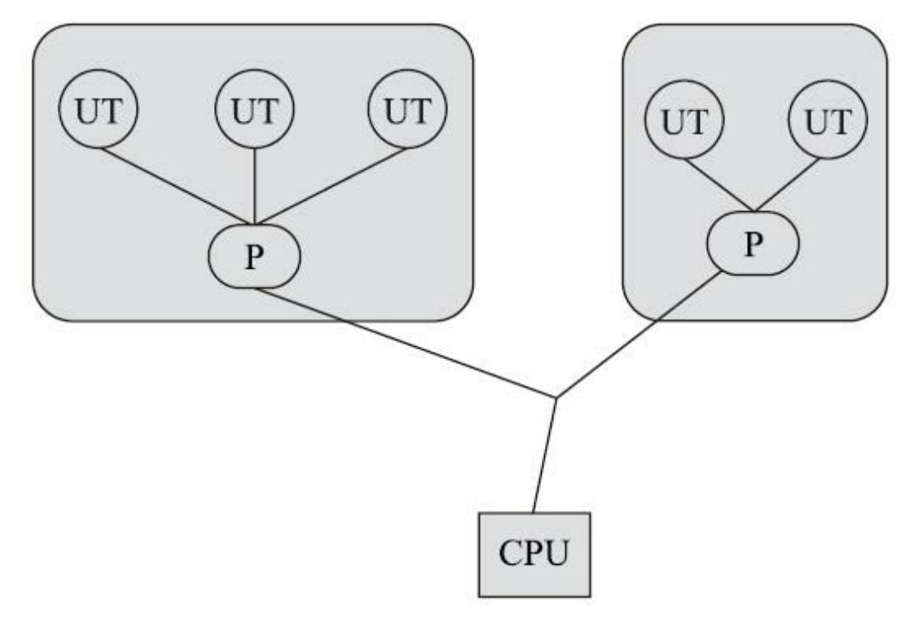

图12-4 进程与用户线程之间1:N的关系

而狭义上的用户线程指的是完全建立在用户空间的线程库上,系统内核不能感知到用户线程的存 在及如何实现的。用户线程的建立、同步、销毁和调度完全在用户态中完成,不需要内核的帮助。如 果程序实现得当,这种线程不需要切换到内核态,因此操作可以是非常快速且低消耗的,也能够支持 规模更大的线程数量,部分高性能数据库中的多线程就是由用户线程实现的。这种进程与用户线程之 间1:N的关系称为一对多的线程模型,如图12-4所示。

用户线程的优势在于不需要系统内核支援,劣势也在于没有系统内核的支援,所有的线程操作都 需要由用户程序自己去处理。线程的创建、销毁、切换和调度都是用户必须考虑的问题,而且由于操 作系统只把处理器资源分配到进程,那诸如"阻塞如何处理""多处理器系统中如何将线程映射到其他处 理器上"这类问题解决起来将会异常困难,甚至有些是不可能实现的。因为使用用户线程实现的程序通 常都比较复杂[1],除了有明确的需求外(譬如以前在不支持多线程的操作系统中的多线程程序、需要 支持大规模线程数量的应用),一般的应用程序都不倾向使用用户线程。Java、Ruby等语言都曾经使 用过用户线程,最终又都放弃了使用它。但是近年来许多新的、以高并发为卖点的编程语言又普遍支 持了用户线程,譬如Golang、Erlang等,使得用户线程的使用率有所回升。

#### 3.混合实现

线程除了依赖内核线程实现和完全由用户程序自己实现之外,还有一种将内核线程与用户线程一

起使用的实现方式,被称为N:M实现。在这种混合实现下,既存在用户线程,也存在轻量级进程。 用户线程还是完全建立在用户空间中,因此用户线程的创建、切换、析构等操作依然廉价,并且可以 支持大规模的用户线程并发。而操作系统支持的轻量级进程则作为用户线程和内核线程之间的桥梁, 这样可以使用内核提供的线程调度功能及处理器映射,并且用户线程的系统调用要通过轻量级进程来 完成,这大大降低了整个进程被完全阻塞的风险。在这种混合模式中,用户线程与轻量级进程的数量 比是不定的,是N:M的关系,如图12-5所示,这种就是多对多的线程模型。

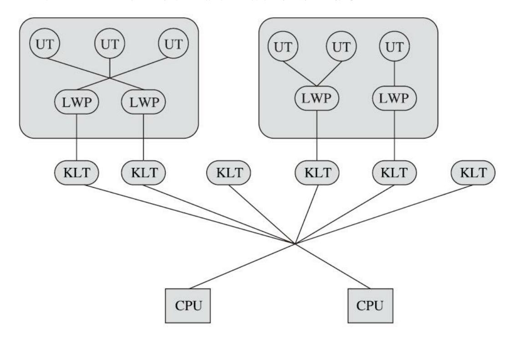

图12-5 用户线程与轻量级进程之间M:N的关系

许多UNIX系列的操作系统,如Solaris、HP-UX等都提供了M:N的线程模型实现。在这些操作系 统上的应用也相对更容易应用M:N的线程模型。

### 4.Java线程的实现

Java线程如何实现并不受Java虚拟机规范的约束,这是一个与具体虚拟机相关的话题。Java线程在 早期的Classic虚拟机上(JDK 1.2以前),是基于一种被称为"绿色线程"(Green Threads)的用户线程 实现的,但从JDK 1.3起,"主流"平台上的"主流"商用Java虚拟机的线程模型普遍都被替换为基于操作 系统原生线程模型来实现,即采用1:1的线程模型。

以HotSpot为例,它的每一个Java线程都是直接映射到一个操作系统原生线程来实现的,而且中间 没有额外的间接结构,所以HotSpot自己是不会去干涉线程调度的(可以设置线程优先级给操作系统提

供调度建议),全权交给底下的操作系统去处理,所以何时冻结或唤醒线程、该给线程分配多少处理 器执行时间、该把线程安排给哪个处理器核心去执行等,都是由操作系统完成的,也都是由操作系统 全权决定的。

前面强调是两个"主流",那就说明肯定还有例外的情况,这里举两个比较著名的例子,一个是用 于Java ME的CLDC HotSpot Implementation(CLDC-HI,介绍可见第1章)。它同时支持两种线程模 型,默认使用1:N由用户线程实现的线程模型,所有Java线程都映射到一个内核线程上;不过它也可 以使用另一种特殊的混合模型,Java线程仍然全部映射到一个内核线程上,但当Java线程要执行一个阻 塞调用时,CLDC-HI会为该调用单独开一个内核线程,并且调度执行其他Java线程,等到那个阻塞调 用完成之后再重新调度之前的Java线程继续执行。

另外一个例子是在Solaris平台的HotSpot虚拟机,由于操作系统的线程特性本来就可以同时支持 1:1(通过Bound Threads或Alternate Libthread实现)及N:M(通过LWP/Thread Based Synchronization 实现)的线程模型,因此Solaris版的HotSpot也对应提供了两个平台专有的虚拟机参数,即-XX: +UseLWPSynchronization(默认值)和-XX:+UseBoundThreads来明确指定虚拟机使用哪种线程模 型。

操作系统支持怎样的线程模型,在很大程度上会影响上面的Java虚拟机的线程是怎样映射的,这 一点在不同的平台上很难达成一致,因此《Java虚拟机规范》中才不去限定Java线程需要使用哪种线程 模型来实现。线程模型只对线程的并发规模和操作成本产生影响,对Java程序的编码和运行过程来 说,这些差异都是完全透明的。

[1] 此处所讲的"复杂"与"程序自己完成线程操作",并不限于程序直接编写了复杂的实现用户线程的代 码,使用用户线程的程序时,很多都依赖特定的线程库来完成基本的线程操作,这些复杂性都封装在 线程库之中。

### 12.4.2 Java线程调度

线程调度是指系统为线程分配处理器使用权的过程,调度主要方式有两种,分别是协同式 (Cooperative Threads-Scheduling)线程调度和抢占式(Preemptive Threads-Scheduling)线程调度。

如果使用协同式调度的多线程系统,线程的执行时间由线程本身来控制,线程把自己的工作执行 完了之后,要主动通知系统切换到另外一个线程上去。协同式多线程的最大好处是实现简单,而且由 于线程要把自己的事情干完后才会进行线程切换,切换操作对线程自己是可知的,所以一般没有什么 线程同步的问题。Lua语言中的"协同例程"就是这类实现。它的坏处也很明显:线程执行时间不可控 制,甚至如果一个线程的代码编写有问题,一直不告知系统进行线程切换,那么程序就会一直阻塞在 那里。很久以前的Windows 3.x系统就是使用协同式来实现多进程多任务的,那是相当不稳定的,只要 有一个进程坚持不让出处理器执行时间,就可能会导致整个系统崩溃。

如果使用抢占式调度的多线程系统,那么每个线程将由系统来分配执行时间,线程的切换不由线 程本身来决定。譬如在Java中,有Thread::yield()方法可以主动让出执行时间,但是如果想要主动获取 执行时间,线程本身是没有什么办法的。在这种实现线程调度的方式下,线程的执行时间是系统可控 的,也不会有一个线程导致整个进程甚至整个系统阻塞的问题。Java使用的线程调度方式就是抢占式 调度。与前面所说的Windows 3.x的例子相对,在Windows 9x/NT内核中就是使用抢占式来实现多进程 的,当一个进程出了问题,我们还可以使用任务管理器把这个进程杀掉,而不至于导致系统崩溃。

虽然说Java线程调度是系统自动完成的,但是我们仍然可以"建议"操作系统给某些线程多分配一 点执行时间,另外的一些线程则可以少分配一点——这项操作是通过设置线程优先级来完成的。Java 语言一共设置了10个级别的线程优先级(Thread.MIN\_PRIORITY至Thread.MAX\_PRIORITY)。在两 个线程同时处于Ready状态时,优先级越高的线程越容易被系统选择执行。

不过,线程优先级并不是一项稳定的调节手段,很显然因为主流虚拟机上的Java线程是被映射到 系统的原生线程上来实现的,所以线程调度最终还是由操作系统说了算。尽管现代的操作系统基本都 提供线程优先级的概念,但是并不见得能与Java线程的优先级一一对应,如Solaris中线程有 2147483648(2的31次幂)种优先级,但Windows中就只有七种优先级。如果操作系统的优先级比Java 线程优先级更多,那问题还比较好处理,中间留出一点空位就是了,但对于比Java线程优先级少的系 统,就不得不出现几个线程优先级对应到同一个操作系统优先级的情况了。表12-1显示了Java线程优 先级与Windows线程优先级之间的对应关系,Windows平台的虚拟机中使用了除 THREAD\_PRIORITY\_IDLE之外的其余6种线程优先级,因此在Windows下设置线程优先级为1和2、3

和4、6和7、8和9的效果是完全相同的。

表12-1 Java线程优先级与Windows线程优先级之间的对应关系

| Java 线程优先级              | Windows 线程优先级                 |
|-------------------------|-------------------------------|
| 1 (Thread.MIN_PRIORITY) | THREAD_ PRIORITY_LOWEST       |
| 2                       | THREAD_ PRIORITY_LOWEST       |
| 3                       | THREAD_PRIORITY_BELOW_NORMAL  |
| 4                       | THREAD_ PRIORITY_BELOW_NORMAL |

| Java 线程优先级               | Windows 线程优先级                  |  |
|--------------------------|--------------------------------|--|
| 5 (Thread.NORM_PRIORITY) | THREAD_ PRIORITY _NORMAL       |  |
| 6                        | THREAD_ PRIORITY _ABOVE_NORMAL |  |
| 7                        | THREAD_ PRIORITY _ABOVE_NORMAL |  |
| 8                        | THREAD_ PRIORITY _HIGHEST      |  |
| 9                        | THREAD_ PRIORITY _HIGHEST      |  |
| 10 (Thread.MAX_PRIORITY) | THREAD_PRIORITY_CRITICAL       |  |

线程优先级并不是一项稳定的调节手段,这不仅仅体现在某些操作系统上不同的优先级实际会变 得相同这一点上,还有其他情况让我们不能过于依赖线程优先级:优先级可能会被系统自行改变,例 如在Windows系统中存在一个叫"优先级推进器"的功能(Priority Boosting,当然它可以被关掉),大 致作用是当系统发现一个线程被执行得特别频繁时,可能会越过线程优先级去为它分配执行时间,从 而减少因为线程频繁切换而带来的性能损耗。因此,我们并不能在程序中通过优先级来完全准确判断 一组状态都为Ready的线程将会先执行哪一个。

# 12.4.3 状态转换

Java语言定义了6种线程状态,在任意一个时间点中,一个线程只能有且只有其中的一种状态,并 且可以通过特定的方法在不同状态之间转换。这6种状态分别是:

·新建(New):创建后尚未启动的线程处于这种状态。

·运行(Runnable):包括操作系统线程状态中的Running和Ready,也就是处于此状态的线程有可 能正在执行,也有可能正在等待着操作系统为它分配执行时间。

·无限期等待(Waiting):处于这种状态的线程不会被分配处理器执行时间,它们要等待被其他线 程显式唤醒。以下方法会让线程陷入无限期的等待状态:

- ■没有设置Timeout参数的Object::wait()方法;
- ■没有设置Timeout参数的Thread::join()方法;
- ■LockSupport::park()方法。

·限期等待(Timed Waiting):处于这种状态的线程也不会被分配处理器执行时间,不过无须等待 被其他线程显式唤醒,在一定时间之后它们会由系统自动唤醒。以下方法会让线程进入限期等待状 态:

- ■Thread::sleep()方法;
- ■设置了Timeout参数的Object::wait()方法;
- ■设置了Timeout参数的Thread::join()方法;
- ■LockSupport::parkNanos()方法;
- ■LockSupport::parkUntil()方法。

·阻塞(Blocked):线程被阻塞了,"阻塞状态"与"等待状态"的区别是"阻塞状态"在等待着获取到 一个排它锁,这个事件将在另外一个线程放弃这个锁的时候发生;而"等待状态"则是在等待一段时 间,或者唤醒动作的发生。在程序等待进入同步区域的时候,线程将进入这种状态。

·结束(Terminated):已终止线程的线程状态,线程已经结束执行。

上述6种状态在遇到特定事件发生的时候将会互相转换,它们的转换关系如图12-6所示。

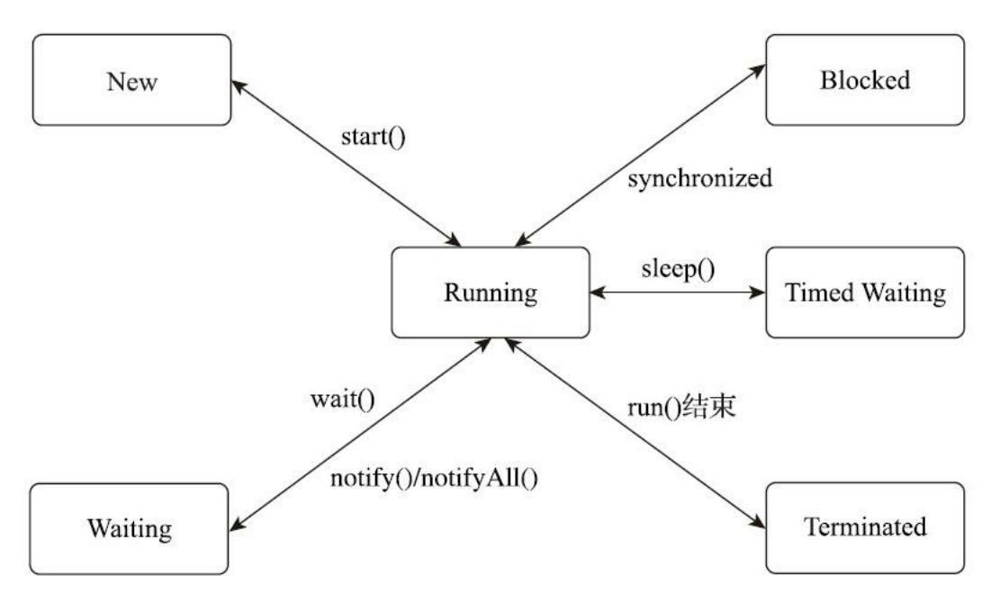

图12-6 线程状态转换关系

### 12.5 Java与协程

在Java时代的早期,Java语言抽象出来隐藏了各种操作系统线程差异性的统一线程接口,这曾经是 它区别于其他编程语言的一大优势。在此基础上,涌现过无数多线程的应用与框架,譬如在网页访问 时,HTTP请求可以直接与Servlet API中的一条处理线程绑定在一起,以"一对一服务"的方式处理由浏 览器发来的信息。语言与框架已经自动屏蔽了相当多同步和并发的复杂性,对于普通开发者而言,几 乎不需要专门针对多线程进行学习训练就能完成一般的并发任务。时至今日,这种便捷的并发编程方 式和同步的机制依然在有效地运作着,但是在某些场景下,却也已经显现出了疲态。

# 12.5.1 内核线程的局限

笔者可以通过一个具体场景来解释目前Java线程面临的困境。今天对Web应用的服务要求,不论是 在请求数量上还是在复杂度上,与十多年前相比已不可同日而语,这一方面是源于业务量的增长,另 一方面来自于为了应对业务复杂化而不断进行的服务细分。现代B/S系统中一次对外部业务请求的响 应,往往需要分布在不同机器上的大量服务共同协作来实现,这种服务细分的架构在减少单个服务复 杂度、增加复用性的同时,也不可避免地增加了服务的数量,缩短了留给每个服务的响应时间。这要 求每一个服务都必须在极短的时间内完成计算,这样组合多个服务的总耗时才不会太长;也要求每一 个服务提供者都要能同时处理数量更庞大的请求,这样才不会出现请求由于某个服务被阻塞而出现等 待。

Java目前的并发编程机制就与上述架构趋势产生了一些矛盾,1:1的内核线程模型是如今Java虚拟 机线程实现的主流选择,但是这种映射到操作系统上的线程天然的缺陷是切换、调度成本高昂,系统 能容纳的线程数量也很有限。以前处理一个请求可以允许花费很长时间在单体应用中,具有这种线程 切换的成本也是无伤大雅的,但现在在每个请求本身的执行时间变得很短、数量变得很多的前提下, 用户线程切换的开销甚至可能会接近用于计算本身的开销,这就会造成严重的浪费。

传统的Java Web服务器的线程池的容量通常在几十个到两百之间,当程序员把数以百万计的请求 往线程池里面灌时,系统即使能处理得过来,但其中的切换损耗也是相当可观的。现实的需求在迫使 Java去研究新的解决方案,同大家又开始怀念以前绿色线程的种种好处,绿色线程已随着Classic虚拟 机的消失而被尘封到历史之中,它还会有重现天日的一天吗?

# 12.5.2 协程的复苏

经过前面对不同线程实现方式的铺垫介绍,我们已经明白了各种线程实现方式的优缺点,所以多 数读者看到笔者写"因为映射到了系统的内核线程中,所以切换调度成本会比较高昂"时并不会觉得有 什么问题,但相信还是有一部分治学特别严谨的读者会提问:为什么内核线程调度切换起来成本就要 更高?

内核线程的调度成本主要来自于用户态与核心态之间的状态转换,而这两种状态转换的开销主要 来自于响应中断、保护和恢复执行现场的成本。请读者试想以下场景,假设发生了这样一次线程切 换:

线程A -> 系统中断 -> 线程B

处理器要去执行线程A的程序代码时,并不是仅有代码程序就能跑得起来,程序是数据与代码的 组合体,代码执行时还必须要有上下文数据的支撑。而这里说的"上下文",以程序员的角度来看,是 方法调用过程中的各种局部的变量与资源;以线程的角度来看,是方法的调用栈中存储的各类信息; 而以操作系统和硬件的角度来看,则是存储在内存、缓存和寄存器中的一个个具体数值。物理硬件的 各种存储设备和寄存器是被操作系统内所有线程共享的资源,当中断发生,从线程A切换到线程B去执 行之前,操作系统首先要把线程A的上下文数据妥善保管好,然后把寄存器、内存分页等恢复到线程B 挂起时候的状态,这样线程B被重新激活后才能仿佛从来没有被挂起过。这种保护和恢复现场的工 作,免不了涉及一系列数据在各种寄存器、缓存中的来回拷贝,当然不可能是一种轻量级的操作。

如果说内核线程的切换开销是来自于保护和恢复现场的成本,那如果改为采用用户线程,这部分 开销就能够省略掉吗?答案是"不能"。但是,一旦把保护、恢复现场及调度的工作从操作系统交到程 序员手上,那我们就可以打开脑洞,通过玩出很多新的花样来缩减这些开销。

有一些古老的操作系统(譬如DOS)是单人单工作业形式的,天生就不支持多线程,自然也不会 有多个调用栈这样的基础设施。而早在那样的蛮荒时代,就已经出现了今天被称为栈纠缠(Stack Twine)的、由用户自己模拟多线程、自己保护恢复现场的工作模式。其大致的原理是通过在内存里划 出一片额外空间来模拟调用栈,只要其他"线程"中方法压栈、退栈时遵守规则,不破坏这片空间即 可,这样多段代码执行时就会像相互缠绕着一样,非常形象。

到后来,操作系统开始提供多线程的支持,靠应用自己模拟多线程的做法自然是变少了许多,但 也并没有完全消失,而是演化为用户线程继续存在。由于最初多数的用户线程是被设计成协同式调度 (Cooperative Scheduling)的,所以它有了一个别名——"协程"(Coroutine)。又由于这时候的协程会 完整地做调用栈的保护、恢复工作,所以今天也被称为"有栈协程"(Stackfull Coroutine),起这样的 名字是为了便于跟后来的"无栈协程"(Stackless Coroutine)区分开。无栈协程不是本节的主角,不过 还是可以简单提一下它的典型应用,即各种语言中的await、async、yield这类关键字。无栈协程本质上 是一种有限状态机,状态保存在闭包里,自然比有栈协程恢复调用栈要轻量得多,但功能也相对更有 限。

协程的主要优势是轻量,无论是有栈协程还是无栈协程,都要比传统内核线程要轻量得多。如果

进行量化的话,那么如果不显式设置-Xss或-XX:ThreadStackSize,则在64位Linux上HotSpot的线程栈 容量默认是1MB,此外内核数据结构(Kernel Data Structures)还会额外消耗16KB内存。与之相对 的,一个协程的栈通常在几百个字节到几KB之间,所以Java虚拟机里线程池容量达到两百就已经不算 小了,而很多支持协程的应用中,同时并存的协程数量可数以十万计。

协程当然也有它的局限,需要在应用层面实现的内容(调用栈、调度器这些)特别多,这个缺点 就不赘述了。除此之外,协程在最初,甚至在今天很多语言和框架中会被设计成协同式调度,这样在 语言运行平台或者框架上的调度器就可以做得非常简单。不过有不少资料上显示,既然取了"协程"这 样的名字,它们之间就一定以协同调度的方式工作。笔者并没有查证到这种"规定"的出处,只能说这 种提法在今天太过狭隘了,非协同式、可自定义调度的协程的例子并不少见,而协同调度的优点与不 足在12.4.2节已经介绍过。

具体到Java语言,还会有一些别的限制,譬如HotSpot这样的虚拟机,Java调用栈跟本地调用栈是 做在一起的。如果在协程中调用了本地方法,还能否正常切换协程而不影响整个线程?另外,如果协 程中遇传统的线程同步措施会怎样?譬如Kotlin提供的协程实现,一旦遭遇synchronize关键字,那挂起 来的仍将是整个线程。

# 12.5.3 Java的解决方案

对于有栈协程,有一种特例实现名为纤程(Fiber),这个词最早是来自微软公司,后来微软还推 出过系统层面的纤程包来方便应用做现场保存、恢复和纤程调度。OpenJDK在2018年创建了Loom项 目,这是Java用来应对本节开篇所列场景的官方解决方案,根据目前公开的信息,如无意外,日后该 项目为Java语言引入的、与现在线程模型平行的新并发编程机制中应该也会采用"纤程"这个名字,不 过这显然跟微软是没有任何关系的。从Oracle官方对"什么是纤程"的解释里可以看出,它就是一种典型 的有栈协程,如图12-11所示。


#### 图12-7 JVMLS 2018大会上Oracle对纤程的介绍

Loom项目背后的意图是重新提供对用户线程的支持,但与过去的绿色线程不同,这些新功能不是 为了取代当前基于操作系统的线程实现,而是会有两个并发编程模型在Java虚拟机中并存,可以在程 序中同时使用。新模型有意地保持了与目前线程模型相似的API设计,它们甚至可以拥有一个共同的 基类,这样现有的代码就不需要为了使用纤程而进行过多改动,甚至不需要知道背后采用了哪个并发 编程模型。Loom团队在JVMLS 2018大会上公布了他们对Jetty基于纤程改造后的测试结果,同样在 5000QPS的压力下,以容量为400的线程池的传统模式和每个请求配以一个纤程的新并发处理模式进行 对比,前者的请求响应延迟在10000至20000毫秒之间,而后者的延迟普遍在200毫秒以下,具体结果如 图12-8所示。

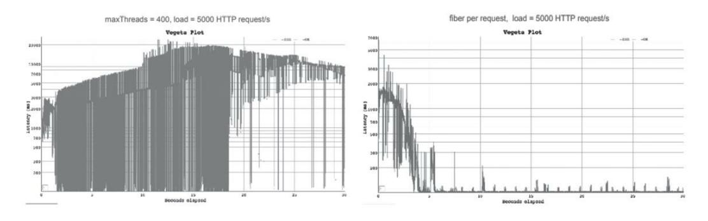

图12-8 Jetty在新并发模型下的压力测试

在新并发模型下,一段使用纤程并发的代码会被分为两部分——执行过程(Continuation)和调度 器(Scheduler)。执行过程主要用于维护执行现场,保护、恢复上下文状态,而调度器则负责编排所 有要执行的代码的顺序。将调度程序与执行过程分离的好处是,用户可以选择自行控制其中的一个或 者多个,而且Java中现有的调度器也可以被直接重用。事实上,Loom中默认的调度器就是原来已存在 的用于任务分解的Fork/Join池(JDK 7中加入的ForkJoinPool)。

Loom项目目前仍然在进行当中,还没有明确的发布日期,上面笔者介绍的内容日后都有被改动的 可能。如果读者现在就想尝试协程,那可以在项目中使用Quasar协程库[1],这是一个不依赖Java虚拟 机的独立实现的协程库。不依赖虚拟机来实现协程是完全可能的,Kotlin语言的协程就已经证明了这 一点。Quasar的实现原理是字节码注入,在字节码层面对当前被调用函数中的所有局部变量进行保存 和恢复。这种不依赖Java虚拟机的现场保护虽然能够工作,但很影响性能,对即时编译器的干扰也非 常大,而且必须要求用户手动标注每一个函数是否会在协程上下文被调用,这些都是未来Loom项目要 解决的问题。

[1] 如同JDK 5把Doug Lea的dl.util.concurrent项目引入,成为java.util.concurrent包,JDK 9时把Attila Szegedi的dynalink项目引入,成为jdk.dynalink模块。Loom项目的领导者Ron Pressler就是Quasar的作 者。

### 12.6 本章小结

本章中,我们了解了虚拟机Java内存模型的结构及操作,并且讲解了原子性、可见性、有序性在 Java内存模型中的体现,介绍了先行发生原则的规则及使用。另外,我们还了解了线程在Java语言之中 是如何实现的,以及代表Java未来多线程发展的新并发模型的工作原理。

关于"高效并发"这个话题,在本章中主要介绍了虚拟机如何实现"并发",在下一章中,我们的主 要关注点将是虚拟机如何实现"高效",以及虚拟机对我们编写的并发代码提供了什么样的优化手段。

# 第13章 线程安全与锁优化

并发处理的广泛应用是Amdahl定律代替摩尔定律成为计算机性能发展源动力的根本原因,也是人 类压榨计算机运算能力的最有力武器。

# 13.1 概述

在软件业发展的初期,程序编写都是以算法为核心的,程序员会把数据和过程分别作为独立的部 分来考虑,数据代表问题空间中的客体,程序代码则用于处理这些数据,这种思维方式直接站在计算 机的角度去抽象问题和解决问题,被称为面向过程的编程思想。与此相对,面向对象的编程思想则站 在现实世界的角度去抽象和解决问题,它把数据和行为都看作对象的一部分,这样可以让程序员能以 符合现实世界的思维方式来编写和组织程序。

面向对象的编程思想极大地提升了现代软件开发的效率和软件可以达到的规模,但是现实世界与 计算机世界之间不可避免地存在一些差异。例如,人们很难想象现实中的对象在一项工作进行期间, 会被不停地中断和切换,对象的属性(数据)可能会在中断期间被修改和变脏,而这些事件在计算机 世界中是再普通不过的事情。有时候,良好的设计原则不得不向现实做出一些妥协,我们必须保证程 序在计算机中正确无误地运行,然后再考虑如何将代码组织得更好,让程序运行得更快。对于本章的 主题"高效并发"来说,首先需要保证并发的正确性,然后在此基础上来实现高效。本章就先从如何保 证并发的正确性及如何实现线程安全说起。

### 13.2 线程安全

"线程安全"这个名称,相信稍有经验的程序员都听说过,甚至在代码编写和走查的时候可能还会 经常挂在嘴边,但是如何找到一个不太拗口的概念来定义线程安全却不是一件容易的事情。笔者尝试 在网上搜索它的概念,找到的是类似于"如果一个对象可以安全地被多个线程同时使用,那它就是线程 安全的"这样的定义——并不能说它不正确,但是它没有丝毫可操作性,无法从中获取到任何有用的信 息。

笔者认为《Java并发编程实战(Java Concurrency In Practice)》的作者Brian Goetz为"线程安全"做 出了一个比较恰当的定义:"当多个线程同时访问一个对象时,如果不用考虑这些线程在运行时环境下 的调度和交替执行,也不需要进行额外的同步,或者在调用方进行任何其他的协调操作,调用这个对 象的行为都可以获得正确的结果,那就称这个对象是线程安全的。"

这个定义就很严谨而且有可操作性,它要求线程安全的代码都必须具备一个共同特征:代码本身 封装了所有必要的正确性保障手段(如互斥同步等),令调用者无须关心多线程下的调用问题,更无 须自己实现任何措施来保证多线程环境下的正确调用。这点听起来简单,但其实并不容易做到,在许 多场景中,我们都会将这个定义弱化一些。如果把"调用这个对象的行为"限定为"单次调用",这个定 义的其他描述能够成立的话,那么就已经可以称它是线程安全了。为什么要弱化这个定义?现在先暂 且放下这个问题,稍后再详细探讨。

# 13.2.1 Java语言中的线程安全

我们已经有了线程安全的一个可操作的定义,那接下来就讨论一下:在Java语言中,线程安全具 体是如何体现的?有哪些操作是线程安全的?我们这里讨论的线程安全,将以多个线程之间存在共享 数据访问为前提。因为如果根本不存在多线程,又或者一段代码根本不会与其他线程共享数据,那么 从线程安全的角度上看,程序是串行执行还是多线程执行对它来说是没有什么区别的。

为了更深入地理解线程安全,在这里我们可以不把线程安全当作一个非真即假的二元排他选项来 看待,而是按照线程安全的"安全程度"由强至弱来排序,我们[1]可以将Java语言中各种操作共享的数 据分为以下五类:不可变、绝对线程安全、相对线程安全、线程兼容和线程对立。

#### 1.不可变

在Java语言里面(特指JDK 5以后,即Java内存模型被修正之后的Java语言),不可变 (Immutable)的对象一定是线程安全的,无论是对象的方法实现还是方法的调用者,都不需要再进行 任何线程安全保障措施。在第10章里我们讲解"final关键字带来的可见性"时曾经提到过这一点:只要 一个不可变的对象被正确地构建出来(即没有发生this引用逃逸的情况),那其外部的可见状态永远都 不会改变,永远都不会看到它在多个线程之中处于不一致的状态。"不可变"带来的安全性是最直接、 最纯粹的。

Java语言中,如果多线程共享的数据是一个基本数据类型,那么只要在定义时使用final关键字修饰 它就可以保证它是不可变的。如果共享数据是一个对象,由于Java语言目前暂时还没有提供值类型的 支持,那就需要对象自行保证其行为不会对其状态产生任何影响才行。如果读者没想明白这句话所指 的意思,不妨类比java.lang.String类的对象实例,它是一个典型的不可变对象,用户调用它的 substring()、replace()和concat()这些方法都不会影响它原来的值,只会返回一个新构造的字符串对象。

保证对象行为不影响自己状态的途径有很多种,最简单的一种就是把对象里面带有状态的变量都 声明为final,这样在构造函数结束之后,它就是不可变的,例如代码清单13-1中所示的java.lang.Integer 构造函数,它通过将内部状态变量value定义为final来保障状态不变。

#### 代码清单13-1 JDK中Integer类的构造函数

```
/**
 * The value of the <code>Integer</code>.
 * @serial
 */
private final int value;
/**
 * Constructs a newly allocated <code>Integer</code> object that
 * represents the specified <code>int</code> value.
 *
 * @param value the value to be represented by the
 * <code>Integer</code> object.
 */
public Integer(int value) {
    this.value = value;
```

在Java类库API中符合不可变要求的类型,除了上面提到的String之外,常用的还有枚举类型及 java.lang.Number的部分子类,如Long和Double等数值包装类型、BigInteger和BigDecimal等大数据类型。 但同为Number子类型的原子类AtomicInteger和AtomicLong则是可变的,读者不妨看看这两个原子类的 源码,想一想为什么它们要设计成可变的。

### 2.绝对线程安全

绝对的线程安全能够完全满足Brian Goetz给出的线程安全的定义,这个定义其实是很严格的,一 个类要达到"不管运行时环境如何,调用者都不需要任何额外的同步措施"可能需要付出非常高昂的, 甚至不切实际的代价。在Java API中标注自己是线程安全的类,大多数都不是绝对的线程安全。我们 可以通过Java API中一个不是"绝对线程安全"的"线程安全类型"来看看这个语境里的"绝对"究竟是什么 意思。

如果说java.util.Vector是一个线程安全的容器,相信所有的Java程序员对此都不会有异议,因为它 的add()、get()和size()等方法都是被synchronized修饰的,尽管这样效率不高,但保证了具备原子性、 可见性和有序性。不过,即使它所有的方法都被修饰成synchronized,也不意味着调用它的时候就永远 都不再需要同步手段了,请看看代码清单13-2中的测试代码。

#### 代码清单13-2 对Vector线程安全的测试

```
private static Vector<Integer> vector = new Vector<Integer>();
public static void main(String[] args) {
    while (true) {
        for (int i = 0; i < 10; i++) {
            vector.add(i);
        Thread removeThread = new Thread(new Runnable() {
            @Override
            public void run() {
                for (int i = 0; i < vector.size(); i++) {
                    vector.remove(i);
                }
            }
        });
        Thread printThread = new Thread(new Runnable() {
            @Override
            public void run() {
                for (int i = 0; i < vector.size(); i++) {
                    System.out.println((vector.get(i)));
                }
            }
        });
        removeThread.start();
        printThread.start();
        //不要同时产生过多的线程,否则会导致操作系统假死
        while (Thread.activeCount() > 20);
```

#### 运行结果如下:

```
Array index out of range: 17
    at java.util.Vector.remove(Vector.java:777)
    at org.fenixsoft.mulithread.VectorTest$1.run(VectorTest.java:21)
    at java.lang.Thread.run(Thread.java:662)
```

很明显,尽管这里使用到的Vector的get()、remove()和size()方法都是同步的,但是在多线程的环境 中,如果不在方法调用端做额外的同步措施,使用这段代码仍然是不安全的。因为如果另一个线程恰 好在错误的时间里删除了一个元素,导致序号i已经不再可用,再用i访问数组就会抛出一个 ArrayIndexOutOfBoundsException异常。如果要保证这段代码能正确执行下去,我们不得不把 removeThread和printThread的定义改成代码清单13-3所示的这样。

代码清单13-3 必须加入同步保证Vector访问的线程安全性

```
Thread removeThread = new Thread(new Runnable() {
    @Override
    public void run() {
        synchronized (vector) {
            for (int i = 0; i < vector.size(); i++) {
                vector.remove(i);
            }
});
Thread printThread = new Thread(new Runnable() {
    @Override
    public void run() {
        synchronized (vector) {
            for (int i = 0; i < vector.size(); i++) {
                System.out.println((vector.get(i)));
            }
});
```

假如Vector一定要做到绝对的线程安全,那就必须在它内部维护一组一致性的快照访问才行,每次 对其中元素进行改动都要产生新的快照,这样要付出的时间和空间成本都是非常大的。

#### 3.相对线程安全

相对线程安全就是我们通常意义上所讲的线程安全,它需要保证对这个对象单次的操作是线程安 全的,我们在调用的时候不需要进行额外的保障措施,但是对于一些特定顺序的连续调用,就可能需 要在调用端使用额外的同步手段来保证调用的正确性。代码清单13-2和代码清单13-3就是相对线程安 全的案例。

在Java语言中,大部分声称线程安全的类都属于这种类型,例如Vector、HashTable、Collections的 synchronizedCollection()方法包装的集合等。

#### 4.线程兼容

线程兼容是指对象本身并不是线程安全的,但是可以通过在调用端正确地使用同步手段来保证对 象在并发环境中可以安全地使用。我们平常说一个类不是线程安全的,通常就是指这种情况。Java类 库API中大部分的类都是线程兼容的,如与前面的Vector和HashTable相对应的集合类ArrayList和

#### HashMap等。

#### 5.线程对立

线程对立是指不管调用端是否采取了同步措施,都无法在多线程环境中并发使用代码。由于Java 语言天生就支持多线程的特性,线程对立这种排斥多线程的代码是很少出现的,而且通常都是有害 的,应当尽量避免。

- 一个线程对立的例子是Thread类的suspend()和resume()方法。如果有两个线程同时持有一个线程对 象,一个尝试去中断线程,一个尝试去恢复线程,在并发进行的情况下,无论调用时是否进行了同 步,目标线程都存在死锁风险——假如suspend()中断的线程就是即将要执行resume()的那个线程,那就 肯定要产生死锁了。也正是这个原因,suspend()和resume()方法都已经被声明废弃了。常见的线程对立 的操作还有System.setIn()、Sytem.setOut()和System.runFinalizersOnExit()等。
- [1] 这种划分方法也是Brian Goetz发表在IBM developWorkers上的一篇论文中提出的,这里写"我们"纯 粹是笔者下笔行文中的语言用法,并非由笔者首创。

# 13.2.2 线程安全的实现方法

了解过什么是线程安全之后,紧接着的一个问题就是我们应该如何实现线程安全。这听起来似乎 是一件由代码如何编写来决定的事情,不应该出现在讲解Java虚拟机的书里。确实,如何实现线程安 全与代码编写有很大的关系,但虚拟机提供的同步和锁机制也起到了至关重要的作用。在本节中,如 何编写代码实现线程安全,以及虚拟机如何实现同步与锁这两方面都会涉及,相对而言更偏重后者一 些,只要读者明白了Java虚拟机线程安全措施的原理与运作过程,自己再去思考代码如何编写就不是 一件困难的事情了。

#### 1.互斥同步

互斥同步(Mutual Exclusion & Synchronization)是一种最常见也是最主要的并发正确性保障手 段。同步是指在多个线程并发访问共享数据时,保证共享数据在同一个时刻只被一条(或者是一些, 当使用信号量的时候)线程使用。而互斥是实现同步的一种手段,临界区(Critical Section)、互斥量 (Mutex)和信号量(Semaphore)都是常见的互斥实现方式。因此在"互斥同步"这四个字里面,互斥 是因,同步是果;互斥是方法,同步是目的。

在Java里面,最基本的互斥同步手段就是synchronized关键字,这是一种块结构(Block Structured)的同步语法。synchronized关键字经过Javac编译之后,会在同步块的前后分别形成 monitorenter和monitorexit这两个字节码指令。这两个字节码指令都需要一个reference类型的参数来指明 要锁定和解锁的对象。如果Java源码中的synchronized明确指定了对象参数,那就以这个对象的引用作 为reference;如果没有明确指定,那将根据synchronized修饰的方法类型(如实例方法或类方法),来 决定是取代码所在的对象实例还是取类型对应的Class对象来作为线程要持有的锁。

根据《Java虚拟机规范》的要求,在执行monitorenter指令时,首先要去尝试获取对象的锁。如果 这个对象没被锁定,或者当前线程已经持有了那个对象的锁,就把锁的计数器的值增加一,而在执行 monitorexit指令时会将锁计数器的值减一。一旦计数器的值为零,锁随即就被释放了。如果获取对象 锁失败,那当前线程就应当被阻塞等待,直到请求锁定的对象被持有它的线程释放为止。

从功能上看,根据以上《Java虚拟机规范》对monitorenter和monitorexit的行为描述,我们可以得出 两个关于synchronized的直接推论,这是使用它时需特别注意的:

·被synchronized修饰的同步块对同一条线程来说是可重入的。这意味着同一线程反复进入同步块 也不会出现自己把自己锁死的情况。

·被synchronized修饰的同步块在持有锁的线程执行完毕并释放锁之前,会无条件地阻塞后面其他 线程的进入。这意味着无法像处理某些数据库中的锁那样,强制已获取锁的线程释放锁;也无法强制 正在等待锁的线程中断等待或超时退出。

从执行成本的角度看,持有锁是一个重量级(Heavy-Weight)的操作。在第10章中我们知道了在 主流Java虚拟机实现中,Java的线程是映射到操作系统的原生内核线程之上的,如果要阻塞或唤醒一条 线程,则需要操作系统来帮忙完成,这就不可避免地陷入用户态到核心态的转换中,进行这种状态转 换需要耗费很多的处理器时间。尤其是对于代码特别简单的同步块(譬如被synchronized修饰的getter()

或setter()方法),状态转换消耗的时间甚至会比用户代码本身执行的时间还要长。因此才说, synchronized是Java语言中一个重量级的操作,有经验的程序员都只会在确实必要的情况下才使用这种 操作。而虚拟机本身也会进行一些优化,譬如在通知操作系统阻塞线程之前加入一段自旋等待过程, 以避免频繁地切入核心态之中。稍后我们会专门介绍Java虚拟机锁优化的措施。

从上面的介绍中我们可以看到synchronized的局限性,除了synchronized关键字以外,自JDK 5起 (实现了JSR 166 [1]),Java类库中新提供了java.util.concurrent包(下文称J.U.C包),其中的 java.util.concurrent.locks.Lock接口便成了Java的另一种全新的互斥同步手段。基于Lock接口,用户能够 以非块结构(Non-Block Structured)来实现互斥同步,从而摆脱了语言特性的束缚,改为在类库层面 去实现同步,这也为日后扩展出不同调度算法、不同特征、不同性能、不同语义的各种锁提供了广阔 的空间。

重入锁(ReentrantLock)是Lock接口最常见的一种实现[2],顾名思义,它与synchronized一样是可 重入[3]的。在基本用法上,ReentrantLock也与synchronized很相似,只是代码写法上稍有区别而已。不 过,ReentrantLock与synchronized相比增加了一些高级功能,主要有以下三项:等待可中断、可实现公 平锁及锁可以绑定多个条件。

·等待可中断:是指当持有锁的线程长期不释放锁的时候,正在等待的线程可以选择放弃等待,改 为处理其他事情。可中断特性对处理执行时间非常长的同步块很有帮助。

·公平锁:是指多个线程在等待同一个锁时,必须按照申请锁的时间顺序来依次获得锁;而非公平 锁则不保证这一点,在锁被释放时,任何一个等待锁的线程都有机会获得锁。synchronized中的锁是非 公平的,ReentrantLock在默认情况下也是非公平的,但可以通过带布尔值的构造函数要求使用公平 锁。不过一旦使用了公平锁,将会导致ReentrantLock的性能急剧下降,会明显影响吞吐量。

·锁绑定多个条件:是指一个ReentrantLock对象可以同时绑定多个Condition对象。在synchronized 中,锁对象的wait()跟它的notify()或者notifyAll()方法配合可以实现一个隐含的条件,如果要和多于一 个的条件关联的时候,就不得不额外添加一个锁;而ReentrantLock则无须这样做,多次调用 newCondition()方法即可。

如果需要使用上述功能,使用ReentrantLock是一个很好的选择,那如果是基于性能考虑呢? synchronized对性能的影响,尤其在JDK 5之前是很显著的,为此在JDK 6中还专门进行过针对性的优 化。以synchronized和ReentrantLock的性能对比为例,Brian Goetz对这两种锁在JDK 5、单核处理器及 双Xeon处理器环境下做了一组吞吐量对比的实验[4],实验结果如图13-1和图13-2所示。

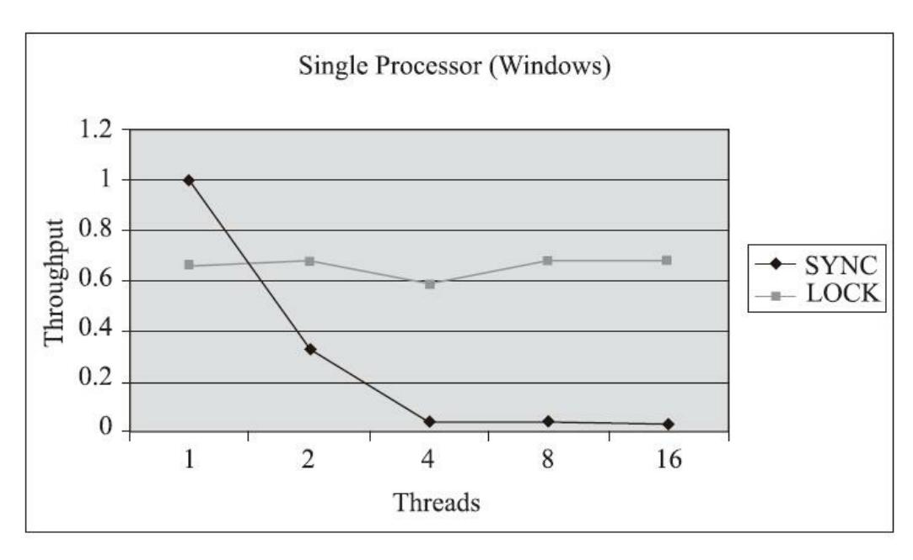

图13-1 JDK 5、单核处理器下两种锁的吞吐量对比

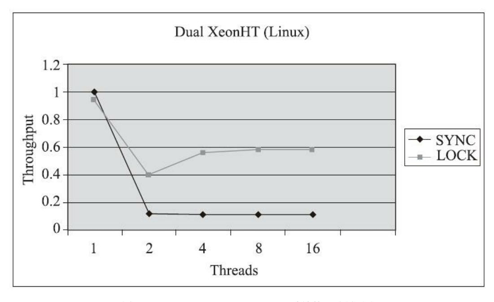

图13-2 JDK 5、双Xeon处理器下两种锁的吞吐量对比

从图13-1和图13-2中可以看出,多线程环境下synchronized的吞吐量下降得非常严重,而 ReentrantLock则能基本保持在同一个相对稳定的水平上。但与其说ReentrantLock性能好,倒不如说当 时的synchronized有非常大的优化余地,后续的技术发展也证明了这一点。当JDK 6中加入了大量针对 synchronized锁的优化措施(下一节我们就会讲解这些优化措施)之后,相同的测试中就发现 synchronized与ReentrantLock的性能基本上能够持平。相信现在阅读本书的读者所开发的程序应该都是 使用JDK 6或以上版本来部署的,所以性能已经不再是选择synchronized或者ReentrantLock的决定因 素。

根据上面的讨论,ReentrantLock在功能上是synchronized的超集,在性能上又至少不会弱于 synchronized,那synchronized修饰符是否应该被直接抛弃,不再使用了呢?当然不是,基于以下理 由,笔者仍然推荐在synchronized与ReentrantLock都可满足需要时优先使用synchronized:

·synchronized是在Java语法层面的同步,足够清晰,也足够简单。每个Java程序员都熟悉 synchronized,但J.U.C中的Lock接口则并非如此。因此在只需要基础的同步功能时,更推荐 synchronized。

·Lock应该确保在finally块中释放锁,否则一旦受同步保护的代码块中抛出异常,则有可能永远不 会释放持有的锁。这一点必须由程序员自己来保证,而使用synchronized的话则可以由Java虚拟机来确 保即使出现异常,锁也能被自动释放。

·尽管在JDK 5时代ReentrantLock曾经在性能上领先过synchronized,但这已经是十多年之前的胜利 了。从长远来看,Java虚拟机更容易针对synchronized来进行优化,因为Java虚拟机可以在线程和对象 的元数据中记录synchronized中锁的相关信息,而使用J.U.C中的Lock的话,Java虚拟机是很难得知具体 哪些锁对象是由特定线程锁持有的。

#### 2.非阻塞同步

互斥同步面临的主要问题是进行线程阻塞和唤醒所带来的性能开销,因此这种同步也被称为阻塞 同步(Blocking Synchronization)。从解决问题的方式上看,互斥同步属于一种悲观的并发策略,其总 是认为只要不去做正确的同步措施(例如加锁),那就肯定会出现问题,无论共享的数据是否真的会 出现竞争,它都会进行加锁(这里讨论的是概念模型,实际上虚拟机会优化掉很大一部分不必要的加 锁),这将会导致用户态到核心态转换、维护锁计数器和检查是否有被阻塞的线程需要被唤醒等开 销。随着硬件指令集的发展,我们已经有了另外一个选择:基于冲突检测的乐观并发策略,通俗地说 就是不管风险,先进行操作,如果没有其他线程争用共享数据,那操作就直接成功了;如果共享的数 据的确被争用,产生了冲突,那再进行其他的补偿措施,最常用的补偿措施是不断地重试,直到出现 没有竞争的共享数据为止。这种乐观并发策略的实现不再需要把线程阻塞挂起,因此这种同步操作被 称为非阻塞同步(Non-Blocking Synchronization),使用这种措施的代码也常被称为无锁(Lock-Free) 编程。

为什么笔者说使用乐观并发策略需要"硬件指令集的发展"?因为我们必须要求操作和冲突检测这 两个步骤具备原子性。靠什么来保证原子性?如果这里再使用互斥同步来保证就完全失去意义了,所 以我们只能靠硬件来实现这件事情,硬件保证某些从语义上看起来需要多次操作的行为可以只通过一 条处理器指令就能完成,这类指令常用的有:

- ·测试并设置(Test-and-Set);
- ·获取并增加(Fetch-and-Increment);
- ·交换(Swap);
- ·比较并交换(Compare-and-Swap,下文称CAS);
- ·加载链接/条件储存(Load-Linked/Store-Conditional,下文称LL/SC)。

其中,前面的三条是20世纪就已经存在于大多数指令集之中的处理器指令,后面的两条是现代处 理器新增的,而且这两条指令的目的和功能也是类似的。在IA64、x86指令集中有用cmpxchg指令完成 的CAS功能,在SPARC-TSO中也有用casa指令实现的,而在ARM和PowerPC架构下,则需要使用一对 ldrex/strex指令来完成LL/SC的功能。因为Java里最终暴露出来的是CAS操作,所以我们以CAS指令为例 进行讲解。

CAS指令需要有三个操作数,分别是内存位置(在Java中可以简单地理解为变量的内存地址,用V 表示)、旧的预期值(用A表示)和准备设置的新值(用B表示)。CAS指令执行时,当且仅当V符合 A时,处理器才会用B更新V的值,否则它就不执行更新。但是,不管是否更新了V的值,都会返回V的 旧值,上述的处理过程是一个原子操作,执行期间不会被其他线程中断。

在JDK 5之后,Java类库中才开始使用CAS操作,该操作由sun.misc.Unsafe类里面的 compareAndSwapInt()和compareAndSwapLong()等几个方法包装提供。HotSpot虚拟机在内部对这些方 法做了特殊处理,即时编译出来的结果就是一条平台相关的处理器CAS指令,没有方法调用的过程, 或者可以认为是无条件内联进去了[5]。不过由于Unsafe类在设计上就不是提供给用户程序调用的类 (Unsafe::getUnsafe()的代码中限制了只有启动类加载器(Bootstrap ClassLoader)加载的Class才能访问 它),因此在JDK 9之前只有Java类库可以使用CAS,譬如J.U.C包里面的整数原子类,其中的 compareAndSet()和getAndIncrement()等方法都使用了Unsafe类的CAS操作来实现。而如果用户程序也有 使用CAS操作的需求,那要么就采用反射手段突破Unsafe的访问限制,要么就只能通过Java类库API来 间接使用它。直到JDK 9之后,Java类库才在VarHandle类里开放了面向用户程序使用的CAS操作。

下面笔者将用一段在前面章节中没有解决的问题代码来介绍如何通过CAS操作避免阻塞同步。测 试的代码如代码清单12-1所示,为了节省版面笔者就不重复贴到这里了。这段代码里我们曾经通过20 个线程自增10000次的操作来证明volatile变量不具备原子性,那么如何才能让它具备原子性呢?之前我 们的解决方案是把race++操作或increase()方法用同步块包裹起来,这毫无疑问是一个解决方案,但是 如果改成代码清单13-4所示的写法,效率将会提高许多。

代码清单13-4 Atomic的原子自增运算

```
/**
* Atomic变量自增运算测试
*
* @author zzm
*/
public class AtomicTest {
   public static AtomicInteger race = new AtomicInteger(0);
```

```
public static void increase() {
    race.incrementAndGet();
private static final int THREADS_COUNT = 20;
public static void main(String[] args) throws Exception {
    Thread[] threads = new Thread[THREADS_COUNT];
    for (int i = 0; i < THREADS_COUNT; i++) {
        threads[i] = new Thread(new Runnable() {
            @Override
            public void run() {
                for (int i = 0; i < 10000; i++) {
                    increase();
                }
            }
        });
        threads[i].start();
    while (Thread.activeCount() > 1)
        Thread.yield();
    System.out.println(race);
```

#### 运行结果如下:

200000

使用AtomicInteger代替int后,程序输出了正确的结果,这一切都要归功于incrementAndGet()方法 的原子性。它的实现其实非常简单,如代码清单13-5所示。

#### 代码清单13-5 incrementAndGet()方法的JDK源码

```
/**
 * Atomically increment by one the current value.
 * @return the updated value
 */
public final int incrementAndGet() {
    for (;;) {
        int current = get();
        int next = current + 1;
        if (compareAndSet(current, next))
            return next;
```

incrementAndGet()方法在一个无限循环中,不断尝试将一个比当前值大一的新值赋值给自己。如 果失败了,那说明在执行CAS操作的时候,旧值已经发生改变,于是再次循环进行下一次操作,直到 设置成功为止。

尽管CAS看起来很美好,既简单又高效,但显然这种操作无法涵盖互斥同步的所有使用场景,并 且CAS从语义上来说并不是真正完美的,它存在一个逻辑漏洞:如果一个变量V初次读取的时候是A 值,并且在准备赋值的时候检查到它仍然为A值,那就能说明它的值没有被其他线程改变过了吗?这 是不能的,因为如果在这段期间它的值曾经被改成B,后来又被改回为A,那CAS操作就会误认为它从 来没有被改变过。这个漏洞称为CAS操作的"ABA问题"。J.U.C包为了解决这个问题,提供了一个带有

标记的原子引用类AtomicStampedReference,它可以通过控制变量值的版本来保证CAS的正确性。不过 目前来说这个类处于相当鸡肋的位置,大部分情况下ABA问题不会影响程序并发的正确性,如果需要 解决ABA问题,改用传统的互斥同步可能会比原子类更为高效。

#### 3.无同步方案

要保证线程安全,也并非一定要进行阻塞或非阻塞同步,同步与线程安全两者没有必然的联系。 同步只是保障存在共享数据争用时正确性的手段,如果能让一个方法本来就不涉及共享数据,那它自 然就不需要任何同步措施去保证其正确性,因此会有一些代码天生就是线程安全的,笔者简单介绍其 中的两类。

可重入代码(Reentrant Code):这种代码又称纯代码(Pure Code),是指可以在代码执行的任何 时刻中断它,转而去执行另外一段代码(包括递归调用它本身),而在控制权返回后,原来的程序不 会出现任何错误,也不会对结果有所影响。在特指多线程的上下文语境里(不涉及信号量等因 素[6]),我们可以认为可重入代码是线程安全代码的一个真子集,这意味着相对线程安全来说,可重 入性是更为基础的特性,它可以保证代码线程安全,即所有可重入的代码都是线程安全的,但并非所 有的线程安全的代码都是可重入的。

可重入代码有一些共同的特征,例如,不依赖全局变量、存储在堆上的数据和公用的系统资源, 用到的状态量都由参数中传入,不调用非可重入的方法等。我们可以通过一个比较简单的原则来判断 代码是否具备可重入性:如果一个方法的返回结果是可以预测的,只要输入了相同的数据,就都能返 回相同的结果,那它就满足可重入性的要求,当然也就是线程安全的。

线程本地存储(Thread Local Storage):如果一段代码中所需要的数据必须与其他代码共享,那就 看看这些共享数据的代码是否能保证在同一个线程中执行。如果能保证,我们就可以把共享数据的可 见范围限制在同一个线程之内,这样,无须同步也能保证线程之间不出现数据争用的问题。

符合这种特点的应用并不少见,大部分使用消费队列的架构模式(如"生产者-消费者"模式)都会 将产品的消费过程限制在一个线程中消费完,其中最重要的一种应用实例就是经典Web交互模型中 的"一个请求对应一个服务器线程"(Thread-per-Request)的处理方式,这种处理方式的广泛应用使得 很多Web服务端应用都可以使用线程本地存储来解决线程安全问题。

Java语言中,如果一个变量要被多线程访问,可以使用volatile关键字将它声明为"易变的";如果 一个变量只要被某个线程独享,Java中就没有类似C++中\_\_declspec(thread) [7]这样的关键字去修饰,不 过我们还是可以通过java.lang.ThreadLocal类来实现线程本地存储的功能。每一个线程的Thread对象中都 有一个ThreadLocalMap对象,这个对象存储了一组以ThreadLocal.threadLocalHashCode为键,以本地线 程变量为值的K-V值对,ThreadLocal对象就是当前线程的ThreadLocalMap的访问入口,每一个 ThreadLocal对象都包含了一个独一无二的threadLocalHashCode值,使用这个值就可以在线程K-V值对 中找回对应的本地线程变量。

- [1] JSR 166:Concurrency Utilities。
- [2] 还有另外一种常见的实现——重入读写锁(ReentrantReadWriteLock,尽管名字看起来很像,但它并 不是ReentrantLock的子类),由于本书的主题是Java虚拟机和不是Java并发编程,因此仅以 ReentrantLock为例来进行讲解,ReentrantReadWriteLock就不再介绍了。

- [3] 可重入性是指一条线程能够反复进入被它自己持有锁的同步块的特性,即锁关联的计数器,如果持 有锁的线程再次获得它,则将计数器的值加一,每次释放锁时计数器的值减一,当计数器的值为零 时,才能真正释放锁。
- [4] 本例中的数据及图片来源于Brian Goetz为IBM developerWorks撰写的文章:《Java theory and practice:More flexible,scalable locking in JDK 5.0》,原文地址是: http://www.ibm.com/developerworks/java/library/j-jtp10264/?S\_TACT=105AGX52&S\_CMP=cn-a-j。
- [5] 这种被虚拟机特殊处理的方法称为固有函数(Intrinsics)优化,类似的固有函数还有Math类的一系 列算数计算函数、Object的构造函数等,目前已有数百个,具体的清单(以JDK 9为例)可以见: https://gist.github.com/apangin/8bc69f06879a86163e490a61931b37e8。
- [6] 如果不加限制前提且考虑所有情况,那可重入性和线程安全性其实不是可以互相比较的性质。另 外,在维基百科上对可重入代码的判定中列举过"Reentrant but not thread-safe"的例子,但该例子中的 可重入代码与目前我们通常所说的可重入代码(不依赖全局资源)有差异,笔者并未采用维基百科上 的结论,而是在脚注中做出提示。
- [7] 在Visual C++中是"\_\_declspec(thread)"关键字,在GCC中是"\_\_thread"。

### 13.3 锁优化

高效并发是从JDK 5升级到JDK 6后一项重要的改进项,HotSpot虚拟机开发团队在这个版本上花 费了大量的资源去实现各种锁优化技术,如适应性自旋(Adaptive Spinning)、锁消除(Lock Elimination)、锁膨胀(Lock Coarsening)、轻量级锁(Lightweight Locking)、偏向锁(Biased Locking)等,这些技术都是为了在线程之间更高效地共享数据及解决竞争问题,从而提高程序的执行 效率。

# 13.3.1 自旋锁与自适应自旋

前面我们讨论互斥同步的时候,提到了互斥同步对性能最大的影响是阻塞的实现,挂起线程和恢 复线程的操作都需要转入内核态中完成,这些操作给Java虚拟机的并发性能带来了很大的压力。同 时,虚拟机的开发团队也注意到在许多应用上,共享数据的锁定状态只会持续很短的一段时间,为了 这段时间去挂起和恢复线程并不值得。现在绝大多数的个人电脑和服务器都是多路(核)处理器系 统,如果物理机器有一个以上的处理器或者处理器核心,能让两个或以上的线程同时并行执行,我们 就可以让后面请求锁的那个线程"稍等一会",但不放弃处理器的执行时间,看看持有锁的线程是否很 快就会释放锁。为了让线程等待,我们只须让线程执行一个忙循环(自旋),这项技术就是所谓的自 旋锁。

自旋锁在JDK 1.4.2中就已经引入,只不过默认是关闭的,可以使用-XX:+UseSpinning参数来开 启,在JDK 6中就已经改为默认开启了。自旋等待不能代替阻塞,且先不说对处理器数量的要求,自 旋等待本身虽然避免了线程切换的开销,但它是要占用处理器时间的,所以如果锁被占用的时间很 短,自旋等待的效果就会非常好,反之如果锁被占用的时间很长,那么自旋的线程只会白白消耗处理 器资源,而不会做任何有价值的工作,这就会带来性能的浪费。因此自旋等待的时间必须有一定的限 度,如果自旋超过了限定的次数仍然没有成功获得锁,就应当使用传统的方式去挂起线程。自旋次数 的默认值是十次,用户也可以使用参数-XX:PreBlockSpin来自行更改。

不过无论是默认值还是用户指定的自旋次数,对整个Java虚拟机中所有的锁来说都是相同的。在 JDK 6中对自旋锁的优化,引入了自适应的自旋。自适应意味着自旋的时间不再是固定的了,而是由 前一次在同一个锁上的自旋时间及锁的拥有者的状态来决定的。如果在同一个锁对象上,自旋等待刚 刚成功获得过锁,并且持有锁的线程正在运行中,那么虚拟机就会认为这次自旋也很有可能再次成 功,进而允许自旋等待持续相对更长的时间,比如持续100次忙循环。另一方面,如果对于某个锁,自 旋很少成功获得过锁,那在以后要获取这个锁时将有可能直接省略掉自旋过程,以避免浪费处理器资 源。有了自适应自旋,随着程序运行时间的增长及性能监控信息的不断完善,虚拟机对程序锁的状况 预测就会越来越精准,虚拟机就会变得越来越"聪明"了。

# 13.3.2 锁消除

锁消除是指虚拟机即时编译器在运行时,对一些代码要求同步,但是对被检测到不可能存在共享 数据竞争的锁进行消除。锁消除的主要判定依据来源于逃逸分析的数据支持(第11章已经讲解过逃逸 分析技术),如果判断到一段代码中,在堆上的所有数据都不会逃逸出去被其他线程访问到,那就可 以把它们当作栈上数据对待,认为它们是线程私有的,同步加锁自然就无须再进行。

也许读者会有疑问,变量是否逃逸,对于虚拟机来说是需要使用复杂的过程间分析才能确定的, 但是程序员自己应该是很清楚的,怎么会在明知道不存在数据争用的情况下还要求同步呢?这个问题 的答案是:有许多同步措施并不是程序员自己加入的,同步的代码在Java程序中出现的频繁程度也许 超过了大部分读者的想象。我们来看看如代码清单13-6所示的例子,这段非常简单的代码仅仅是输出 三个字符串相加的结果,无论是源代码字面上,还是程序语义上都没有进行同步。

#### 代码清单13-6 一段看起来没有同步的代码

```
public String concatString(String s1, String s2, String s3) {
    return s1 + s2 + s3;
```

我们也知道,由于String是一个不可变的类,对字符串的连接操作总是通过生成新的String对象来 进行的,因此Javac编译器会对String连接做自动优化。在JDK 5之前,字符串加法会转化为StringBuffer 对象的连续append()操作,在JDK 5及以后的版本中,会转化为StringBuilder对象的连续append()操作。 即代码清单13-6所示的代码可能会变成代码清单13-7所示的样子[1]。

#### 代码清单13-7 Javac转化后的字符串连接操作

```
public String concatString(String s1, String s2, String s3) {
    StringBuffer sb = new StringBuffer();
    sb.append(s1);
    sb.append(s2);
    sb.append(s3);
    return sb.toString();
```

现在大家还认为这段代码没有涉及同步吗?每个StringBuffer.append()方法中都有一个同步块,锁 就是sb对象。虚拟机观察变量sb,经过逃逸分析后会发现它的动态作用域被限制在concatString()方法内 部。也就是sb的所有引用都永远不会逃逸到concatString()方法之外,其他线程无法访问到它,所以这里 虽然有锁,但是可以被安全地消除掉。在解释执行时这里仍然会加锁,但在经过服务端编译器的即时 编译之后,这段代码就会忽略所有的同步措施而直接执行。

[1] 客观地说,既然谈到锁消除与逃逸分析,那虚拟机就不可能是JDK 5之前的版本,所以实际上会转 化为非线程安全的StringBuilder来完成字符串拼接,并不会加锁。但是这也不影响笔者用这个例子证明 Java对象中同步的普遍性。

### 13.3.3 锁粗化

原则上,我们在编写代码的时候,总是推荐将同步块的作用范围限制得尽量小——只在共享数据 的实际作用域中才进行同步,这样是为了使得需要同步的操作数量尽可能变少,即使存在锁竞争,等 待锁的线程也能尽可能快地拿到锁。

大多数情况下,上面的原则都是正确的,但是如果一系列的连续操作都对同一个对象反复加锁和 解锁,甚至加锁操作是出现在循环体之中的,那即使没有线程竞争,频繁地进行互斥同步操作也会导 致不必要的性能损耗。

代码清单13-7所示连续的append()方法就属于这类情况。如果虚拟机探测到有这样一串零碎的操作 都对同一个对象加锁,将会把加锁同步的范围扩展(粗化)到整个操作序列的外部,以代码清单13-7 为例,就是扩展到第一个append()操作之前直至最后一个append()操作之后,这样只需要加锁一次就可 以了。

### 13.3.4 轻量级锁

轻量级锁是JDK 6时加入的新型锁机制,它名字中的"轻量级"是相对于使用操作系统互斥量来实 现的传统锁而言的,因此传统的锁机制就被称为"重量级"锁。不过,需要强调一点,轻量级锁并不是 用来代替重量级锁的,它设计的初衷是在没有多线程竞争的前提下,减少传统的重量级锁使用操作系 统互斥量产生的性能消耗。

要理解轻量级锁,以及后面会讲到的偏向锁的原理和运作过程,必须要对HotSpot虚拟机对象的内 存布局(尤其是对象头部分)有所了解。HotSpot虚拟机的对象头(Object Header)分为两部分,第一 部分用于存储对象自身的运行时数据,如哈希码(HashCode)、GC分代年龄(Generational GC Age) 等。这部分数据的长度在32位和64位的Java虚拟机中分别会占用32个或64个比特,官方称它为"Mark Word"。这部分是实现轻量级锁和偏向锁的关键。另外一部分用于存储指向方法区对象类型数据的指 针,如果是数组对象,还会有一个额外的部分用于存储数组长度。这些对象内存布局的详细内容,我 们已经在第2章中学习过,在此不再赘述,只针对锁的角度做进一步细化。

由于对象头信息是与对象自身定义的数据无关的额外存储成本,考虑到Java虚拟机的空间使用效 率,Mark Word被设计成一个非固定的动态数据结构,以便在极小的空间内存储尽量多的信息。它会 根据对象的状态复用自己的存储空间。例如在32位的HotSpot虚拟机中,对象未被锁定的状态下, Mark Word的32个比特空间里的25个比特将用于存储对象哈希码,4个比特用于存储对象分代年龄,2 个比特用于存储锁标志位,还有1个比特固定为0(这表示未进入偏向模式)。对象除了未被锁定的正 常状态外,还有轻量级锁定、重量级锁定、GC标记、可偏向等几种不同状态,这些状态下对象头的存 储内容如表13-1所示。

| 锁状态            | 25                 | 25bit     |        | 1bit | 2bit |
|----------------|--------------------|-----------|--------|------|------|
|                | 23bit              | 2bit      | - 4bit | 偏向模式 | 标志位  |
| 未锁定            | 对象印                | 哈希码       | 分代年龄   | 0    | 01   |
| 轻量级锁定          | 指向调用栈中锁记录的指针       |           |        | 00   |      |
| 重量级锁定<br>(锁膨胀) |                    | 指向重量级锁的指针 |        |      | 10   |
| GC 标记          |                    | 空         |        |      | 11   |
| 可偏向            | 线程 ID Epoch 分代年龄 1 |           |        |      | 01   |

表13-1 HotSpot虚拟机对象头Mark Word

我们简单回顾了对象的内存布局后,接下来就可以介绍轻量级锁的工作过程了:在代码即将进入 同步块的时候,如果此同步对象没有被锁定(锁标志位为"01"状态),虚拟机首先将在当前线程的栈 帧中建立一个名为锁记录(Lock Record)的空间,用于存储锁对象目前的Mark Word的拷贝(官方为 这份拷贝加了一个Displaced前缀,即Displaced Mark Word),这时候线程堆栈与对象头的状态如图13- 3所示。

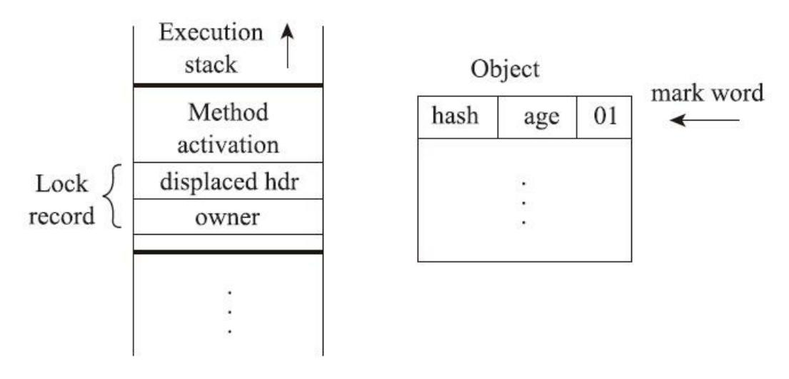

图13-3 轻量级锁CAS操作之前堆栈与对象的状态[1]

然后,虚拟机将使用CAS操作尝试把对象的Mark Word更新为指向Lock Record的指针。如果这个 更新动作成功了,即代表该线程拥有了这个对象的锁,并且对象Mark Word的锁标志位(Mark Word的 最后两个比特)将转变为"00",表示此对象处于轻量级锁定状态。这时候线程堆栈与对象头的状态如 图13-4所示。

如果这个更新操作失败了,那就意味着至少存在一条线程与当前线程竞争获取该对象的锁。虚拟 机首先会检查对象的Mark Word是否指向当前线程的栈帧,如果是,说明当前线程已经拥有了这个对 象的锁,那直接进入同步块继续执行就可以了,否则就说明这个锁对象已经被其他线程抢占了。如果 出现两条以上的线程争用同一个锁的情况,那轻量级锁就不再有效,必须要膨胀为重量级锁,锁标志 的状态值变为"10",此时Mark Word中存储的就是指向重量级锁(互斥量)的指针,后面等待锁的线 程也必须进入阻塞状态。

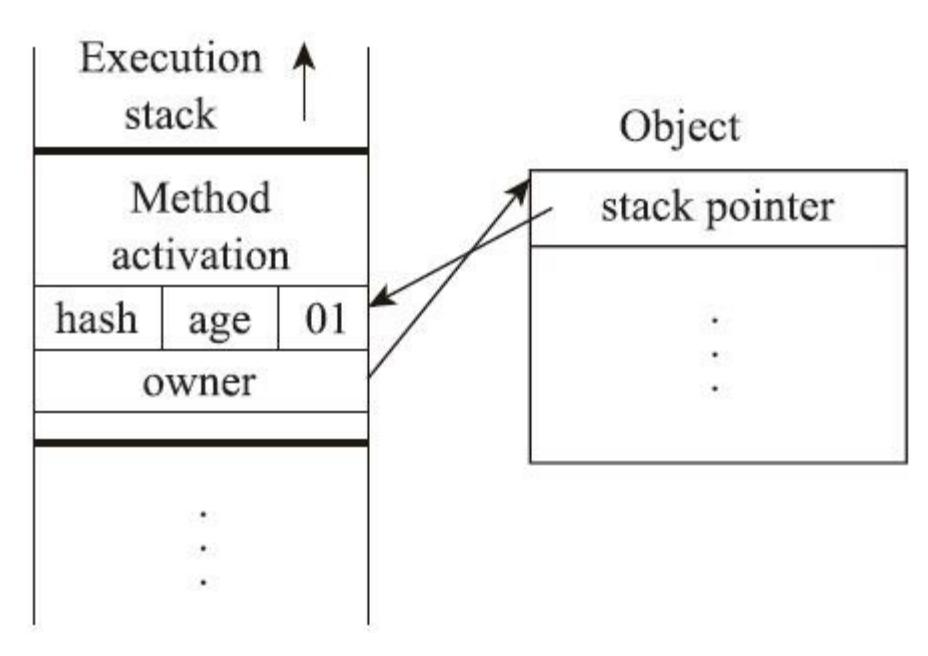

图13-4 轻量级锁CAS操作之后堆栈与对象的状态

上面描述的是轻量级锁的加锁过程,它的解锁过程也同样是通过CAS操作来进行的,如果对象的 Mark Word仍然指向线程的锁记录,那就用CAS操作把对象当前的Mark Word和线程中复制的Displaced Mark Word替换回来。假如能够成功替换,那整个同步过程就顺利完成了;如果替换失败,则说明有 其他线程尝试过获取该锁,就要在释放锁的同时,唤醒被挂起的线程。

轻量级锁能提升程序同步性能的依据是"对于绝大部分的锁,在整个同步周期内都是不存在竞争 的"这一经验法则。如果没有竞争,轻量级锁便通过CAS操作成功避免了使用互斥量的开销;但如果确 实存在锁竞争,除了互斥量的本身开销外,还额外发生了CAS操作的开销。因此在有竞争的情况下, 轻量级锁反而会比传统的重量级锁更慢。

[1] 图13-3和图13-4来源于HotSpot虚拟机的高级工程师Paul Hohensee所写的演示文档《The Hotspot Java Virtual Machine》。

# 13.3.5 偏向锁

偏向锁也是JDK 6中引入的一项锁优化措施,它的目的是消除数据在无竞争情况下的同步原语, 进一步提高程序的运行性能。如果说轻量级锁是在无竞争的情况下使用CAS操作去消除同步使用的互 斥量,那偏向锁就是在无竞争的情况下把整个同步都消除掉,连CAS操作都不去做了。

偏向锁中的"偏",就是偏心的"偏"、偏袒的"偏"。它的意思是这个锁会偏向于第一个获得它的线 程,如果在接下来的执行过程中,该锁一直没有被其他的线程获取,则持有偏向锁的线程将永远不需 要再进行同步。

如果读者理解了前面轻量级锁中关于对象头Mark Word与线程之间的操作过程,那偏向锁的原理 就会很容易理解。假设当前虚拟机启用了偏向锁(启用参数-XX:+UseBiased Locking,这是自JDK 6 起HotSpot虚拟机的默认值),那么当锁对象第一次被线程获取的时候,虚拟机将会把对象头中的标志 位设置为"01"、把偏向模式设置为"1",表示进入偏向模式。同时使用CAS操作把获取到这个锁的线程 的ID记录在对象的Mark Word之中。如果CAS操作成功,持有偏向锁的线程以后每次进入这个锁相关 的同步块时,虚拟机都可以不再进行任何同步操作(例如加锁、解锁及对Mark Word的更新操作 等)。

一旦出现另外一个线程去尝试获取这个锁的情况,偏向模式就马上宣告结束。根据锁对象目前是 否处于被锁定的状态决定是否撤销偏向(偏向模式设置为"0"),撤销后标志位恢复到未锁定(标志位 为"01")或轻量级锁定(标志位为"00")的状态,后续的同步操作就按照上面介绍的轻量级锁那样去 执行。偏向锁、轻量级锁的状态转化及对象Mark Word的关系如图13-5所示。

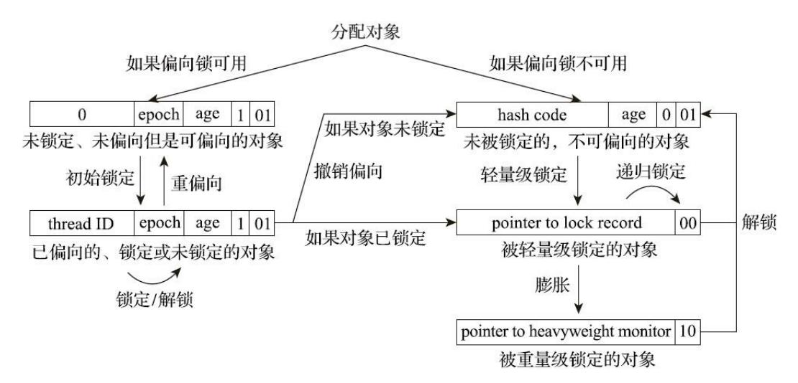

图13-5 偏向锁、轻量级锁的状态转化及对象Mark Word的关系

细心的读者看到这里可能会发现一个问题:当对象进入偏向状态的时候,Mark Word大部分的空

间(23个比特)都用于存储持有锁的线程ID了,这部分空间占用了原有存储对象哈希码的位置,那原 来对象的哈希码怎么办呢?

在Java语言里面一个对象如果计算过哈希码,就应该一直保持该值不变(强烈推荐但不强制,因 为用户可以重载hashCode()方法按自己的意愿返回哈希码),否则很多依赖对象哈希码的API都可能存 在出错风险。而作为绝大多数对象哈希码来源的Object::hashCode()方法,返回的是对象的一致性哈希 码(Identity Hash Code),这个值是能强制保证不变的,它通过在对象头中存储计算结果来保证第一 次计算之后,再次调用该方法取到的哈希码值永远不会再发生改变。因此,当一个对象已经计算过一 致性哈希码后,它就再也无法进入偏向锁状态了;而当一个对象当前正处于偏向锁状态,又收到需要 计算其一致性哈希码请求[1]时,它的偏向状态会被立即撤销,并且锁会膨胀为重量级锁。在重量级锁 的实现中,对象头指向了重量级锁的位置,代表重量级锁的ObjectMonitor类里有字段可以记录非加锁 状态(标志位为"01")下的Mark Word,其中自然可以存储原来的哈希码。

偏向锁可以提高带有同步但无竞争的程序性能,但它同样是一个带有效益权衡(Trade Off)性质 的优化,也就是说它并非总是对程序运行有利。如果程序中大多数的锁都总是被多个不同的线程访 问,那偏向模式就是多余的。在具体问题具体分析的前提下,有时候使用参数-XX:- UseBiasedLocking来禁止偏向锁优化反而可以提升性能。

[1] 注意,这里说的计算请求应来自于对Object::hashCode()或者System::identityHashCode(Object)方法的 调用,如果重写了对象的hashCode()方法,计算哈希码时并不会产生这里所说的请求。

### 13.4 本章小结

本章介绍了线程安全所涉及的概念和分类、同步实现的方式及虚拟机的底层运作原理,并且介绍 了虚拟机为实现高效并发所做的一系列锁优化措施。

能够写出高性能、高伸缩性的并发程序是一门艺术,而了解并发在系统底层是如何实现的,则是 掌握这门艺术的前提条件,也是成长为高级程序员的必备知识之一。

# 附录A 在Windows系统下编译OpenJDK 6

这是本书第1版中介绍如何在Windows下编译OpenJDK 6的例子,里面的部分内容现在已经过时了 (例如安装Plug部分),但对在Windows上构建安装环境和进行较老版本的OpenJDK编译还是有一定 参考意义的,所以笔者并没有把它删除,而是挪到附录之中。

# A.1 获取JDK源码

首先确定要使用的JDK版本,OpenJDK 6和OpenJDK 7都是开源的,源码都可以在它们的主页 (http://openjdk.java.net/)上找到。OpenJDK 6的源码其实是从OpenJDK 7的某个基线中引出的,然后 剥离JDK 1.7相关的代码,从而得到一份可以通过TCK 6的JDK 1.6实现,因此直接编译OpenJDK 7会 更加"原汁原味"一些,其实这两个版本的编译过程差异并不大。

获取源码有两种方式:一是通过Mercurial代码版本管理工具从Repository中直接取得源码 (Repository地址:http://hg.openjdk.java.net/jdk7/jdk7),这是最直接的方式,从版本管理中看变更轨 迹比看什么Release Note都来得实在,不过太麻烦了一些,尤其是Mercurial远不如SVN、ClearCase或 CVS之类的版本控制工具那样普及;另外一种就是直接下载官方打包好的源码包了,可以从Source Releases页面(地址:http://download.java.net/openjdk/jdk7/)取得打包好的源码,一般来说大概一个月 左右会更新一次,虽然不够及时,但的确方便了许多。笔者下载的是OpenJDK 7 Early Access Source Build b121版,2010年12月9日发布的,大概81.7MB,解压出来约308MB。

# A.2 系统需求

如果可能,笔者建议尽量在Linux或Solaris上构建OpenJDK,这要比在Windows平台上轻松许多, 而且网上能找到的资料绝大部分都是在Linux上编译的。如果一定要在Windows平台上编译,建议读者 认真阅读一下源码中的README-builds.html文档(无论在OpenJDK网站上还是在下载的源码包里面都 有这份文档),因为编译过程中需要注意的细节非常多。虽然不至于像文档上所描述的"Building the source code for the JDK requires a high level of technical expertise.Sun provides the source code primarily for technical experts who want to conduct research(编译JDK需要很高的专业技术,Sun提供JDK源码是为了 供技术专家进行研究之用)"那么夸张,但是如果读者是第一次编译,那在上面耗费一整天乃至更多的 时间都很正常。

笔者在本次实战中演示的是在32位Windows 7平台下编译x86版的OpenJDK(也就是32位的 JDK),如果需要编译x64版,那毫无疑问也需要一个64位的操作系统。另外编译涉及的所有文件都必 须存放在NTFS格式的文件系统中,因为FAT32格式无法支持大小写敏感的文件名。官方文档上写道: 编译至少需要512MB的内存和600MB的磁盘空间。如果读者耐心很好的话,512MB的内存也可以凑合 使用,不过600MB的磁盘空间仅仅是指存放OpenJDK源码和相关依赖项的空间,要完成编译,600MB 肯定是无论如何都不够的。这次实战中所下载的工具、依赖项、源码,全部安装、解压完成最少("最 少"是指只下载C++编译器,不下载VS的IDE)需要1GB的空间。

对系统的最后一点要求就是所有的文件,包括源码和依赖项目,都不要放在包含中文或空格的目 录里面,这样做不是一定不可以,只是这样会为后续建立CYGWIN环境带来很多额外的工作。这是由 于Linux和Windows的磁盘路径差别所导致的,我们也没有必要自己给自己找麻烦。

# A.3 构建编译环境

准备编译环境的第一步是安装一个CYGWIN [1]。这是一个在Windows平台下模拟Linux运行环境的 软件,提供了一系列的Linux命令支持。需要CYGWIN的原因是,在编译中要使用GNU Make来执行 Makefile文件(C/C++程序员肯定很熟悉,如果只使用Java,那把这个东西当成C++版本的ANT看待就 可以了)。安装CYGWIN时不能直接默认安装,因为表A-1中所示的工具都不会进行默认安装,但又 是编译过程中需要的,因此要在图A-1所示的安装界面中进行手工选择。

CYGWIN安装时的定制包选择界面如图A-1所示。

表A-1 需要手工选择安装的CYGWIN工具

| 文件名       | 分类           | 包                                                         | 描述                                                         |  |
|-----------|--------------|-----------------------------------------------------------|------------------------------------------------------------|--|
| ar.exe    | Devel        | binutils The GNU assembler, linker and binary utilities   |                                                            |  |
| make.exe  | Devel        | make The GNU version of the 'make' utility built for CYGV |                                                            |  |
| m4.exe    | Interpreters | m4                                                        | GNU implementation of the traditional Unix macro processor |  |
| cpio.exe  | Utils        | cpio                                                      | A program to manage archives of files                      |  |
| gawk.exe  | Utils        | awk                                                       | Pattern-directed scanning and processing language          |  |
| file.exe  | Utils        | file                                                      | Determines file type using 'magic' numbers                 |  |
| zip.exe   | Archive      | zip                                                       | Package and compress (archive) files                       |  |
| unzip.exe | Archive      | unzip                                                     | Extract compressed files in a ZIP archive                  |  |
| free.exe  | System       | procps                                                    | Display amount of free and used memory in the system       |  |

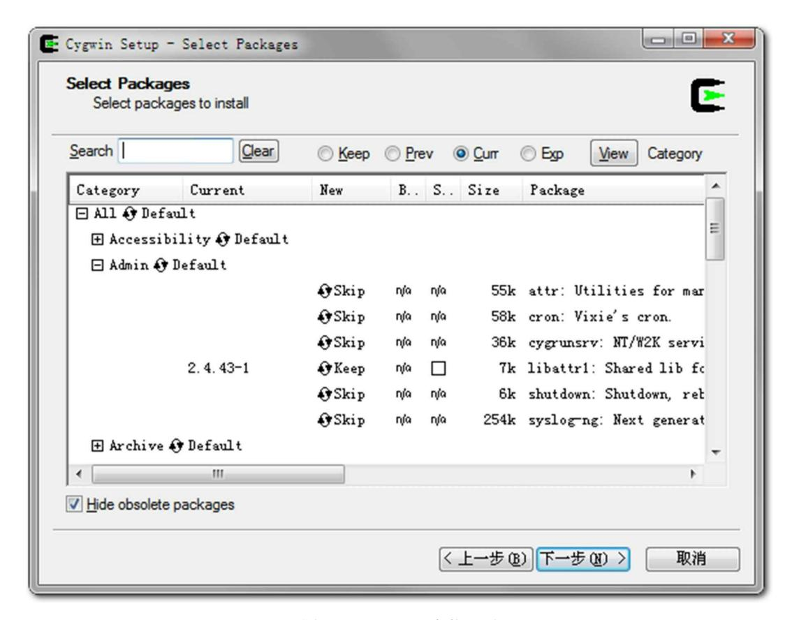

图A-1 CYGWIN安装界面

建立编译环境的第二步是安装编译器。JDK中最核心的代码(Java虚拟机及JDK中Native方法的实 现等)是使用C++语言及少量的C语言编写的,官方文档中说它们的内部开发环境是在Microsoft Visual Studio C++2003(VS2003)中进行编译的,同时也是在Microsoft Visual Studio C++2010(VS2010)中 测试过的,所以最好只选择这两个编译器之一进行编译。如果选择VS2010,那么要求在编译器之中已 经包含了Windows SDK v 7.0a,否则可能还要自己去下载这个SDK,并且更新PlatformSDK目录。由于 笔者没有购买Visual Studio 2010的IDE,所以仅下载了VS2010 Express中提取出来的C++编译器,这部 分是免费的,但单独安装好编译器比较麻烦。建议读者选择使用整套Visual Studio C++2010或Visual Studio C++2010 Express版进行编译。

需要特别注意的一点是:CYGWIN和VS2010安装之后都会在操作系统的PATH环境变量中写入自 己的bin目录路径,必须检查并保证VS2010的bin目录在CYGWIN的bin目录之前,因为这两个软件的bin 目录之中各自都有一个连接器"link.exe",但是只有VS2010中的连接器可以完成OpenJDK的编译。

准备JDK编译环境的第三步就是下载一个已经编译好的JDK。这听起来也许有点滑稽——要用鸡 蛋孵小鸡还真得必须先养一只母鸡呀?但仔细想想,其实这个步骤很合理:因为JDK包含的各个部分

(Hotspot、JDK API、JAXWS、JAXP……)有的是使用C++编写的,而更多的代码则是使用Java自 身实现的,因此编译这些Java代码需要用到一个可用的JDK,官方称这个JDK为Bootstrap JDK。而编 译OpenJDK 7的话,Bootstrap JDK必须使用JDK6 Update 14或之后的版本,笔者选用的是JDK6 Update 21。

最后一个步骤是下载一个Apache ANT,JDK中Java代码部分都是使用ANT脚本进行编译的,ANT 版本要求在1.6.5以上,这部分是Java的基础知识,对本书的读者来说应该没有难度,笔者不再详述。

# A.4 准备依赖项

前面说过,OpenJDK中开放的源码并没有达到100%,还有极少量的无法开源的产权代码存在。 OpenJDK承诺日后将逐步使用开源实现来替换掉这部分产权代码,但至少在今天,编译JDK还需要这 部分闭源包,官方称之为"JDK Plug" [2],它们从前面的Source Releases页面就可以下载到。Windows平 台的JDK Plug是以Jar包的形式提供的,通过下面这条命令可以安装它:

java –jar jdk-7-ea-plug-b121-windows-i586-09\_dec\_2010.jar

运行后将会显示图A-2所示的协议,点击"ACCEPT"接受协议,然后把Plug安装到指定目录即可。 安装完毕后建立一个环境变量ALT\_BINARY\_PLUGS\_PATH,变量值为此JDK Plug的安装路径,后面 编译程序时需要用到它。

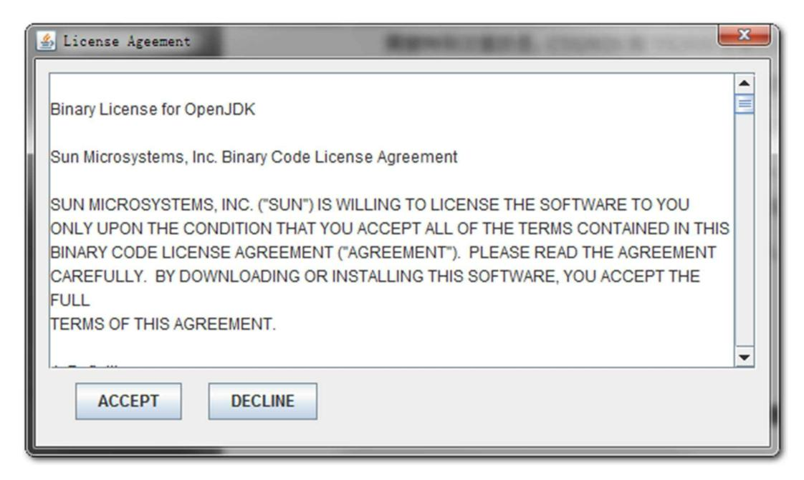

图A-2 JDK Plug安装协议

除了要用到JDK Plug外,编译时还需要引用JDK的运行时包,这是编译JDK中用Java代码编写的那 部分所需要的,如果仅仅是想编译一个HotSpot虚拟机则可以不用。官方文档把这部分称为Optional Import JDK,可以直接使用前面Bootstrap JDK的运行时包。我们需要建立一个名为 ALT\_JDK\_IMPORT\_PATH的环境变量指向JDK的安装目录。

然后,安装一个大于2.3版的FreeType [3],这是一个免费的字体渲染库,JDK的Swing部分和 JConsole这类工具会用到它。安装好后建立两个环境变量ALT\_FREETYPE\_LIB\_PATH和 ALT\_FREETYPE\_HEADERS\_PATH,分别指向FreeType安装目录下的bin目录和include目录。另外还有 一点是官方文档没有提到但必须要做的事情,那就是把FreeType的bin目录加入PATH环境变量中。

接着,下载Microsoft DirectX 9.0 SDK(Summer 2004),安装后大约有298MB,在微软官方网站 上搜索一下就可以找到下载地址,它是免费的。安装后建立环境变量ALT\_DXSDK\_PATH指向DirectX 9.0 SDK的安装目录。

最后,寻找一个名为MSVCR100.DLL的动态链接库,如果读者在前面安装了全套的Visual Studio 2010,那这个文件在本机就能找到,否则上网搜索一下也能找到单独的下载地址,大概有744KB。建 立环境变量ALT\_MSVCRNN\_DLL\_PATH指向这个文件所在的目录。如果读者选择的是VS2003,这个 文件名应当为MSVCR73.DLL,应该在很多软件中都包含有这个文件,如果找不到的话,前面下载的 Bootstrap JDK的bin目录中应该也有一个,直接拿来用吧。

# A.5 进行编译

现在需要下载的编译环境和依赖项目都准备齐全了,最后我们还需要对系统做一些设置以便编译 能够顺利通过。

首先执行VS2010中的VCVARS32.BAT,这个批处理文件的目的主要是设置INCLUDE、LIB和 PATH这几个环境变量,如果和笔者一样只是下载了编译器,则需要手工设置它们。各个环境变量的设 置值可以参考下面给出的代码清单A-1中的内容。批处理运行完之后建立ALT\_COMPILER\_PATH环境 变量,让Makefile知道在哪里可以找到编译器。

再建立ALT\_BOOTDIR和ALT\_JDK\_IMPORT\_PATH两个环境变量指向前面提到的JDK 1.6的安装 目录。建立ANT\_HOME指向Apache ANT的安装目录。建立的环境变量很多,为了避免遗漏,笔者写 了一个批处理文件以供读者参考,如代码清单A-1所示。

#### 代码清单A-1 环境变量设置

```
SET ALT_BOOTDIR=D:/_DevSpace/JDK 1.6.0_21
SET ALT_BINARY_PLUGS_PATH=D:/jdkBuild/jdk7plug/openjdk-binary-plugs
SET ALT_JDK_IMPORT_PATH=D:/_DevSpace/JDK 1.6.0_21
SET ANT_HOME=D:/jdkBuild/apache-ant-1.7.0
SET ALT_MSVCRNN_DLL_PATH=D:/jdkBuild/msvcr100
SET ALT_DXSDK_PATH=D:/jdkBuild/msdxsdk
SET ALT_COMPILER_PATH=D:/jdkBuild/vcpp2010.x86/bin
SET ALT_FREETYPE_HEADERS_PATH=D:/jdkBuild/freetype-2.3.5-1-bin/include
SET ALT_FREETYPE_LIB_PATH=D:/jdkBuild/freetype-2.3.5-1-bin/bin
SET INCLUDE=D:/jdkBuild/vcpp2010.x86/include;D:/jdkBuild/vcpp2010.x86/sdk/Include;%INCLUDE%
SET LIB=D:/jdkBuild/vcpp2010.x86/lib;D:/jdkBuild/vcpp2010.x86/sdk/Lib;%LIB%
SET LIBPATH=D:/jdkBuild/vcpp2010.x86/lib;%LIB%
SET PATH=D:/jdkBuild/vcpp2010.x86/bin;D:/jdkBuild/vcpp2010.x86/dll/x86;D:/Software/OpenSource/cygwin/bin;%ALT_FREETYPE_LIB_PATH%;%PATH%
```

最后还需要进行两项调整,官方文档没有说明这两项,但是必须要做完才能保证编译过程的顺利 完成:一是取消环境变量JAVA\_HOME,这点很简单;另外一项是尽量在英文的操作系统上编译。估 计大部分读者会感到比较为难吧?如果不能在英文的系统上编译就把系统的文字格式调整为"英语(美 国)",在控制面板-区域和语言选项的第一个页签中可以设置。如果这个设置还不能更改就建立一个 BUILD\_CORBA环境变量,将其值设置为false,取消编译CORBA部分。否则Java IDL(idlj.exe)为 \*.idl文件生成CORBA适配器代码的时候会产生中文注释,而这些中文注释会因为字符集的问题而导致 编译失败。

完成了上述烦琐的准备工作之后,我们终于可以开始编译了。进入控制台(Cmd.exe)后运行刚才 准备好的设置环境变量的批处理文件,然后输入bash进入Bourne Again Shell环境(习惯sh或ksh的读者 请自便)。如果JDK的安装源码中存在jdk\_generic\_profile.sh这个Shell脚本,先执行它,笔者下载的 OpenJDK 7 B121版没有这个文件了,所以直接输入make sanity来检查我们前面所做的设置是否全部正 确。如果一切顺利,几秒钟之后会有类似代码清单A-2所示的输出。

代码清单A-2 make sanity检查

```
bash-3.2$ make sanity
cygwin warning:
    MS-DOS style path detected: C:/Windows/system32/wscript.exe
    Preferred POSIX equivalent is: /cygdrive/c/Windows/system32/wscript.exe
    CYGWIN environment variable option "nodosfilewarning" turns off this warning.
    Consult the user's guide for more details about POSIX paths:
        http://cygwin.com/cygwin-ug-net/using.html#using-pathnames
( cd ./jdk/make && \
……因篇幅关系,中间省略了大量的输出内容……
OpenJDK-specific settings:
    FREETYPE_HEADERS_PATH = D:/jdkBuild/freetype-2.3.5-1-bin/include
        ALT_FREETYPE_HEADERS_PATH = D:/jdkBuild/freetype-2.3.5-1-bin/include
    FREETYPE_LIB_PATH = D:/jdkBuild/freetype-2.3.5-1-bin/bin
        ALT_FREETYPE_LIB_PATH = D:/jdkBuild/freetype-2.3.5-1-bin/bin
OPENJDK Import Binary Plug Settings:
    IMPORT_BINARY_PLUGS = true
    BINARY_PLUGS_JARFILE = D:/jdkBuild/jdk7plug/openjdk-binary-plugs/jre/lib/rt-closed.jar
        ALT_BINARY_PLUGS_JARFILE =
    BINARY_PLUGS_PATH = D:/jdkBuild/jdk7plug/openjdk-binary-plugs
        ALT_BINARY_PLUGS_PATH = D:/jdkBuild/jdk7plug/openjdk-binary-plugs
    BUILD_BINARY_PLUGS_PATH = J:/re/jdk/1.7.0/promoted/latest/openjdk/binaryplugs
        ALT_BUILD_BINARY_PLUGS_PATH =
    PLUG_LIBRARY_NAMES =
Previous JDK Settings:
    PREVIOUS_RELEASE_PATH = USING-PREVIOUS_RELEASE_IMAGE
        ALT_PREVIOUS_RELEASE_PATH =
    PREVIOUS_JDK_VERSION = 1.6.0
        ALT_PREVIOUS_JDK_VERSION =
    PREVIOUS_JDK_FILE =
        ALT_PREVIOUS_JDK_FILE =
    PREVIOUS_JRE_FILE =
        ALT_PREVIOUS_JRE_FILE =
    PREVIOUS_RELEASE_IMAGE = D:/_DevSpace/JDK 1.6.0_21
        ALT_PREVIOUS_RELEASE_IMAGE =
Sanity check passed.
```

Makefile的Sanity检查过程输出了编译所需的所有环境变量,如果看到"Sanity check passed."则说明 检查过程通过了,可以输入"make"执行整个Makefile,然后就去喝个下午茶再回来了。笔者Core i5/4GB RAM的机器编译整个JDK大概需要半个小时的时间。如果失败则需要根据系统输出的失败原 因,回头再检查一下对应的设置。最好在下一次编译之前先执行"make clean"来清理掉上次编译遗留的 文件。

编译完成之后,打开OpenJDK源码下的build目录,看看是不是已经有一个编译好的JDK在那里等 着了?执行一下"java-version",看到以自己机器命名的JDK了吧?很有成就感吧?

- [1] CYGWIN下载地址:http://www.cygwin.com/。
- [2] 在2011年,JDK Plug已经不再需要了,但在笔者写本次实战使用的2010年12月9日发布的OpenJDK b121版时还是需要这些JDK Plug的。
- [3] FreeType主页:http://www.freetype.org/。

# 附录B 展望Java技术的未来(2013年版)

本书第1版和2版中的"展望Java技术的未来"分别成文于2011年和2013年,近十年时间已经过去, 当时畅想的Java新发展新变化全部如约而至,这部分内容已不再有"展望"的价值。笔者在更新第3版时 重写了全部相关内容,并把第2版的"展望"的原文挪到附录之中。假若Java的未来依旧灿烂精彩,假若 下一个十年本书还会有第4、第5版,那希望届时能在附录中回首今日,去回溯哪些预测成为现实,哪 些改进中途夭折。

在2005年,Java语言诞生10周年的SunOne技术大会上,Java语言之父James Gosling做过题为《Java 技术下一个十年》的演讲。笔者不具备James Gosling博士那样高屋建瓴的视角,这里仅从Java平台中几 个新生的但已经开始展现出蓬勃之势的技术发展点来看一下后续一至两个JDK版本内的一些很有希望 的技术重点。

# B.1 模块化

模块化是解决应用系统与技术平台越来越复杂、越来越庞大的一个重要途径。无论是开发人员还 是产品最终用户,都不希望为了系统中一小块的功能而不得不下载、安装、部署及维护整套庞大的系 统。站在整个软件工业化的高度来看,模块化是建立各种功能标准件的前提。最近几年OSGi技术的迅 速发展、各个厂商在JCP中对模块化规范的激烈斗争[1],都能充分说明模块化技术的迫切和重要。

在未来的Java平台中,很可能会对模块化提出语法层面的支持。早在2007年,Sun公司就提出过 JSR-277:Java模块系统(Java Module System),试图建立Java平台的模块化标准,但受挫于以IBM为 主导的提交的JSR-291:Java SE动态组件支持(Dynamic Component Support for Java SE,实际就是 OSGi R4.1)。由于模块化规范主导权的重要性,Sun不能接受一个无法由它控制的规范,在整个Java SE 6期间都拒绝把任何模块化技术内置到JDK之中。在Java SE 7发展初期,Sun公司再次提交了一个新 的规范请求文档JSR-294:Java编程语言中的改进模块性支持(Improved Modularity Support in the Java Programming Language),尽管这个JSR仍然没有通过,但是Sun已经独立于JCP专家组在OpenJDK里建 立了一个名为Jigsaw(拼图)的子项目来将这个规范在Java平台中转变为具体的实现。Java的模块化之 争目前还没有结束,OSGi已经发布到R5.0版本,而Jigsaw从Java 7延迟至Java 8,在2012年7月又不得不 宣布推迟到Java 9中发布,从这一点看来,Sun在这场战争中处于劣势,但无论胜利者是哪一方,Java 模块化已经成为一股无法阻挡的变革潮流。

# B.2 混合语言

当单一的Java开发已经无法满足当前软件复杂的需求时,越来越多基于Java虚拟机的开发语言被应 用到软件项目中,Java平台上的多语言混合编程正成为主流,每种语言都可以针对自己擅长的方面更 好地解决问题。试想一下:在一个项目之中,并行处理用Clojure语言编写,展示层使用JRuby/Rails, 中间层则是Java,每个应用层都使用不同的编程语言来完成,而且,接口对每一层的开发者都是透明 的,各种语言之间的交互不存在任何困难,就像使用自己语言的原生API一样方便[2],因为他们最终 都运行在一个虚拟机之上。

在最近的几年里,Clojure、JRuby、Groovy等新生语言的使用人数如同滚动的雪球一般增长,而 运行在Java虚拟机之上的语言数量也在迅速膨胀,图B-1中列举了其中的一部分。这两点证明混合编程 在我们身边已经有所应用并被广泛认可。通过特定领域的语言去解决特定领域的问题是当前软件开发 应对日趋复杂的项目需求的一个方向。

除了催生大量的新语言外,许多已经有很长历史的程序语言也出现了基于Java虚拟机实现的版 本,这样混合编程对许多以前使用其他语言的"老"程序员也具备相当大的吸引力,软件企业投入了大 量资本的现有代码资产也能被很好地保护起来。表B-1中列举了常见语言的Java虚拟机实现版本。

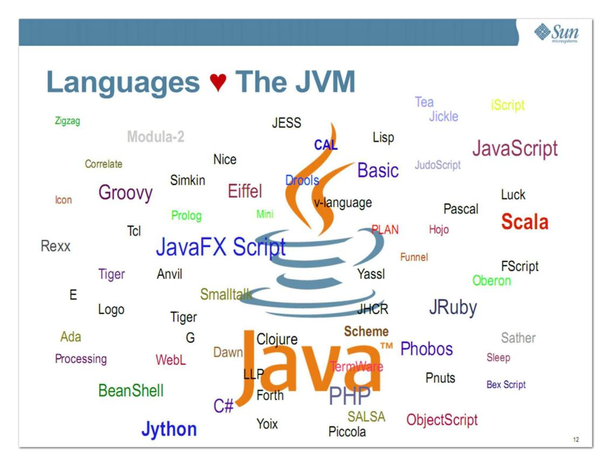

图B-1 可以运行在JVM之上的语言[3] 表B-1 常见语言的JVM实现版本

| 语言                     | 基于 JVM 实现的版本                                         |  |
|------------------------|------------------------------------------------------|--|
| Ada                    | JGNAT                                                |  |
| AWK                    | Jawk                                                 |  |
| С                      | C to Java Virtual Machine compilers                  |  |
| Cobol                  | Veryant isCobol                                      |  |
| ColdFusion             | Adobe ColdFusion , Railo , Open BlueDragon           |  |
| Common Lisp            | Armed Bear Common Lisp、CLforJava、Jatha (Common LISP) |  |
| Component Pascal       | Gardens Point Component Pascal                       |  |
| Erlang                 | Erjang                                               |  |
| Forth                  | myForth                                              |  |
| JavaScript             | Rhino                                                |  |
| LOGO                   | jLogo、XLogo                                          |  |
| Lua                    | Kahlua Luaj Jill                                     |  |
| Oberon-2               | Canterbury Oberon-2 for JVM                          |  |
| Objective Caml (OCaml) | OCaml-Java                                           |  |
| Pascal                 | Canterbury Pascal for JVM                            |  |

| 语言                                             | 基于 JVM 实现的版本                |
|------------------------------------------------|-----------------------------|
| PHP IBM WebSpheresMash PHP (P8) 、CauchoQuercus |                             |
| Python                                         | Jython                      |
| Rexx                                           | IBM NetRexx                 |
| Ruby                                           | JRuby                       |
| Scheme                                         | Bigloo, Kawa, SISC, JScheme |

对这些运行于Java虚拟机之上、Java之外的语言,来自系统级的、底层的支持正在迅速增强,以 JSR-292为核心的一系列项目和功能改进(如Da Vinci Machine项目、Nashorn引擎、InovkeDynamic指 令、java.lang.invoke包等),推动Java虚拟机从"Java语言的虚拟机"向"多语言虚拟机"的方向发展。

# B.3 多核并行

如今,CPU硬件的发展方向已经从高频率转变为多核心,随着多核时代的来临,软件开发越来越 关注并行编程的领域。早在JDK 1.5之中就已经引入java.util.concurrent包,实现了一个粗粒度的并发框 架。而JDK 1.7中加入的java.util.concurrent.forkjoin包则是对这个框架的一次重要扩充。Fork/Join模式是 处理并行编程的一个经典方法,如图B-2所示。虽然不能解决所有的问题,但是在它的适用范围之内, 能够轻松地利用多个CPU核心提供的计算资源来协作完成一个复杂的计算任务。通过利用Fork/Join模 式,我们能够更加顺畅地过渡到多核时代。

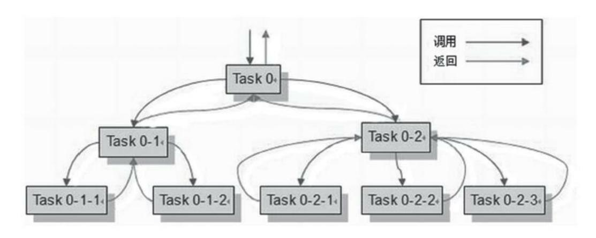

图B-2 Fork/Join模式示意图[4]

在Java 8中,将会提供Lambda支持,将会极大改善目前Java语言不适合函数式编程的现状(目前 Java语言使用函数式编程并不是不可以,只是会显得很臃肿),函数式编程的一个重要优点就是这样 的程序天然地适合并行运行,这样对Java语言在多核时代继续保持主流语言的地位有很大帮助。

另外并行计算中必须提及的还有OpenJDK的子项目Sumatra [5],目前显卡的算术运算能力、并行 能力已经远远超过了CPU,在图形领域以外发掘显卡的潜力是近几年计算机发展的方向之一,例如C 语言的CUDA。Sumatra项目就是为Java提供使用GPU(Graphics Processing Unit)和APU(Accelerated Processing Unit)运算能力的工具,以后它将会直接提供Java语言层面的API,或者为Lambda和其他 JVM语言提供底层的并行运算支持。

在JDK外围,也出现了专为实现并行计算需求的计算框架,如Apache的Hadoop Map/Reduce,这 是一个简单易懂的并行框架,能够运行在由上千个商用机器组成的大型集群上,并能以一种可靠的容 错方式并行处理TB级别的数据集。另外,还出现了诸如Scala、Clojure及Erlang等天生就具备并行计算 能力的语言。

# B.4 进一步丰富语法

Java 5曾经对Java语法进行了一次扩充,这次扩充加入了自动装箱、泛型、动态注解、枚举、可变 长参数、遍历循环等语法,使得Java语言的精确性和易用性有了很大的进步。在Java 7(由于进度压 力,许多改进已被推迟至Java 8)中,对Java语法进行了另一次大规模的扩充。Sun(Oracle)专门为改 进Java语法在OpenJDK中建立了Coin子项目[6]来统一处理Java语法的细节修改,如对二进制数的原生 支持、在switch语句中支持字符串、"<>"操作符、异常处理的改进、简化变长参数方法调用、面向资 源的try-catch-finally语句等都是在Coin项目之中提交的内容。

除了Coin项目之外,JSR-335(Lambda Expressions for the JavaTM Programming Language)中定义 的Lambda表达式[7],也将对Java的语法和语言习惯产生很大的影响,面向函数方式的编程可能会成为 主流。

# B.5 64位虚拟机

几年之前,主流的CPU就开始支持64位架构。Java虚拟机也在很早之前就推出了支持64位系统的 版本。但Java程序运行在64位虚拟机上需要付出比较大的额外代价:首先是内存问题,由于指针膨胀 和各种数据类型对齐补白的原因,运行于64位系统上的Java应用需要消耗更多的内存,通常要比32位 系统额外增加10%~30%的内存消耗;其次是多个机构的测试结果显示,64位虚拟机的运行速度在各 个测试项上几乎都全面落后于32位虚拟机,两者大约有15%的性能差距。

但是在Java EE方面,企业级应用经常需要使用超过4GB的内存,对于64位虚拟机的需求是非常迫 切的,但由于上述的原因,许多企业应用都仍然选择使用虚拟集群等方式继续在32位虚拟机中进行部 署。Sun也注意到了这些问题,并做出了一些改善,在JDK 1.6 Update 14之后,提供了普通对象指针压 缩功能(-XX:+UseCompressedOops,这个参数不建议显式设置,建议维持默认由虚拟机的 Ergonomics机制自动开启),在执行代码时,动态植入压缩指令以节省内存消耗。但是开启压缩指针 会增加执行代码数量,因为所有在Java堆里的、指向Java堆内对象的指针都会被压缩,这些指针的访问 就需要更多的代码才可以实现,而且并不仅只是读写字段才受影响,在实例方法调用、子类型检查等 操作中也受影响,因为对象实例指向对象类型的引用也被压缩了。随着硬件的进一步发展,计算机终 究会完全过渡到64位的时代,这是一件毫无疑问的事情,主流的虚拟机应用也终究会从32位发展至64 位,而虚拟机对64位的支持也将会进一步完善。

- [1] 如果读者对Java模块化之争感兴趣,可以阅读作者的另外一本书《深入理解OSGi》的第1章。
- [2] 在同一个虚拟机上跑的其他语言与Java之间的交互一般都比较容易,但非Java语言之间的交互一般 都比较烦琐。dynalang项目(http://dynalang.sourceforge.net/)就是为了解决这个问题而出现的。
- [3] 图片来源:http://wikis.sun.com/download/attachments/16418319/OOW-2009+Towards+A+Universal+VM.pdf。
- [4] 图片来源:http://www.ibm.com/developerworks/cn/java/j-lo-forkjoin/。
- [5] Sumatra项目:http://openjdk.java.net/projects/sumatra/。
- [6] Coin项目主页:https://openjdk.java.net/projects/coin。
- [7] Lambda项目主页:http://openjdk.java.net/projects/lambda/。

# 附录C 虚拟机字节码指令表

| 字节码 助记符 |             | 指令含义                                      |  |
|---------|-------------|-------------------------------------------|--|
| 0x00    | nop         | 什么都不做                                     |  |
| 0x01    | aconst_null | 将 null 推送至栈顶                              |  |
| 0x02    | iconst_m1   | 将 int 型 -1 推送至栈顶                          |  |
| 0x03    | iconst_0    | 将 int 型 0 推送至栈顶                           |  |
| 0x04    | iconst_1    | 将 int 型 1 推送至栈顶                           |  |
| 0x05    | iconst_2    | 将 int 型 2 推送至栈顶                           |  |
| 0x06    | iconst_3    | 将 int 型 3 推送至栈顶                           |  |
| 0x07    | iconst_4    | 将 int 型 4 推送至栈顶                           |  |
| 0x08    | iconst_5    | 将 int 型 5 推送至栈顶                           |  |
| 0x09    | lconst_0    | 将 long 型 0 推送至栈顶                          |  |
| 0x0a    | lconst_1    | 将 long 型 1 推送至栈顶                          |  |
| 0x0b    | fconst_0    | 将 float 型 0 推送至栈顶                         |  |
| 0x0c    | fconst_1    | 将 float 型 1 推送至栈顶                         |  |
| 0x0d    | fconst_2    | 将 float 型 2 推送至栈顶                         |  |
| 0x0e    | dconst_0    | 将 double 型 0 推送至栈顶                        |  |
| 0x0f    | dconst_1    | 将 double 型 1 推送至栈顶                        |  |
| 0x10    | bipush      | 将单字节的常量值(-128~127)推送至栈顶                   |  |
| 0x11    | sipush      | 将一个短整型常量值(-32 768~32 767)推送至栈顶            |  |
| 0x12    | ldc         | 将 int、float 或 String 型常量值从常量池中推送至栈顶       |  |
| 0x13    | ldc_w       | 将 int、float 或 String 型常量值从常量池中推送至栈顶 (宽索引) |  |
| 0x14    | ldc2 w      | 将 long 或 double 型常量值从常量池中推送至栈顶(宽索引)       |  |

| 字节码  | 助记符     | 指令含义                            |  |
|------|---------|---------------------------------|--|
| 0x15 | iload   | 将指定的 int 型本地变量推送至栈顶             |  |
| 0x16 | lload   | 将指定的 long 型本地变量推送至栈顶            |  |
| 0x17 | fload   | 将指定的 float 型本地变量推送至栈顶           |  |
| 0x18 | dload   | 将指定的 double 型本地变量推送至栈顶          |  |
| 0x19 | aload   | 将指定的引用类型本地变量推送至栈顶               |  |
| 0x1a | iload_0 | 将第一个 int 型本地变量推送至栈顶             |  |
| 0x1b | iload_1 | 将第二个 int 型本地变量推送至栈顶             |  |
| 0x1c | iload_2 | 将第三个 int 型本地变量推送至栈顶             |  |
| 0x1d | iload_3 | 将第四个 int 型本地变量推送至栈顶             |  |
| 0x1e | lload_0 | 将第一个 long 型本地变量推送至栈顶            |  |
| 0x1f | lload_1 | 将第二个 long 型本地变量推送至栈顶            |  |
| 0x20 | Iload_2 | 将第三个 long 型本地变量推送至栈顶            |  |
| 0x21 | lload_3 | 将第四个 long 型本地变量推送至栈顶            |  |
| 0x22 | fload_0 | 将第一个 float 型本地变量推送至栈顶           |  |
| 0x23 | fload_1 | 将第二个 float 型本地变量推送至栈顶           |  |
| 0x24 | fload_2 | 将第三个 float 型本地变量推送至栈顶           |  |
| 0x25 | fload_3 | 将第四个 float 型本地变量推送至栈顶           |  |
| 0x26 | dload_0 | 将第一个 double 型本地变量推送至栈顶          |  |
| 0x27 | dload_1 | 将第二个 double 型本地变量推送至栈顶          |  |
| 0x28 | dload_2 | 将第三个 double 型本地变量推送至栈顶          |  |
| 0x29 | dload_3 | 将第四个 double 型本地变量推送至栈顶          |  |
| 0x2a | aload_0 | 将第一个引用类型本地变量推送至栈顶               |  |
| 0x2b | aload_1 | 将第二个引用类型本地变量推送至栈顶               |  |
| 0x2c | aload_2 | 将第三个引用类型本地变量推送至栈顶               |  |
| 0x2d | aload_3 | 将第四个引用类型本地变量推送至栈顶               |  |
| 0x2e | iaload  | 将 int 型数组指定索引的值推送至栈顶            |  |
| 0x2f | laload  | 将 long 型数组指定索引的值推送至栈顶           |  |
| 0x30 | faload  | 将 float 型数组指定索引的值推送至栈顶          |  |
| 0x31 | daload  | 将 double 型数组指定索引的值推送至栈顶         |  |
| 0x32 | aaload  | 将引用型数组指定索引的值推送至栈顶               |  |
| 0x33 | baload  | 将 boolean 或 byte 型数组指定索引的值推送至栈顶 |  |
| 0x34 | caload  | 将 char 型数组指定索引的值推送至栈顶           |  |
| 0x35 | saload  | 将 short 型数组指定索引的值推送至栈顶          |  |
| 0x36 | istore  | 将栈顶 int 型数值存入指定本地变量             |  |
| 0x37 | Istore  | 将栈顶 long 型数值存入指定本地变量            |  |

| 字节码  | 助记符      | 指令含义                                              |
|------|----------|---------------------------------------------------|
| 0x38 | fstore   | 将栈顶 float 型数值存人指定本地变量                             |
| 0x39 | dstore   | 将栈顶 double 型数值存入指定本地变量                            |
| 0x3a | astore   | 将栈顶引用型数值存人指定本地变量                                  |
| 0x3b | istore_0 | 将栈顶 int 型数值存入第一个本地变量                              |
| 0x3c | istore_1 | 将栈顶 int 型数值存入第二个本地变量                              |
| 0x3d | istore_2 | 将栈顶 int 型数值存入第三个本地变量                              |
| 0x3e | istore_3 | 将栈顶 int 型数值存入第四个本地变量                              |
| 0x3f | lstore_0 | 将栈顶 long 型数值存入第一个本地变量                             |
| 0x40 | lstore_1 | 将栈顶 long 型数值存入第二个本地变量                             |
| 0x41 | lstore_2 | 将栈顶 long 型数值存入第三个本地变量                             |
| 0x42 | lstore_3 | 将栈顶 long 型数值存入第四个本地变量                             |
| 0x43 | fstore_0 | 将栈顶 float 型数值存入第一个本地变量                            |
| 0x44 | fstore_1 | 将栈顶 float 型数值存入第二个本地变量                            |
| 0x45 | fstore_2 | 将栈顶 float 型数值存入第三个本地变量                            |
| 0x46 | fstore_3 | 将栈顶 float 型数值存入第四个本地变量                            |
| 0x47 | dstore_0 | 将栈顶 double 型数值存人第一个本地变量                           |
| 0x48 | dstore_1 | 将栈顶 double 型数值存入第二个本地变量                           |
| 0x49 | dstore_2 | 将栈顶 double 型数值存入第三个本地变量                           |
| 0x4a | dstore_3 | 将栈顶 double 型数值存入第四个本地变量                           |
| 0x4b | astore_0 | 将栈顶引用型数值存入第一个本地变量                                 |
| 0x4c | astore_1 | 将栈顶引用型数值存入第二个本地变量                                 |
| 0x4d | astore_2 | 将栈顶引用型数值存入第三个本地变量                                 |
| 0x4e | astore_3 | 将栈顶引用型数值存入第四个本地变量                                 |
| 0x4f | iastore  | 将栈顶 int 型数值存入指定数组的指定索引位置                          |
| 0x50 | lastore  | 将栈顶 long 型数值存入指定数组的指定索引位置                         |
| 0x51 | fastore  | 将栈顶 float 型数值存入指定数组的指定索引位置                        |
| 0x52 | dastore  | 将栈顶 double 型数值存入指定数组的指定索引位置                       |
| 0x53 | aastore  | 将栈顶引用型数值存入指定数组的指定索引位置                             |
| 0x54 | bastore  | 将栈顶 boolean 或 byte 型数值存入指定数组的指定索引位置               |
| 0x55 | castore  | 将栈顶 char 型数值存入指定数组的指定索引位置                         |
| 0x56 | sastore  | 将栈顶 short 型数值存入指定数组的指定索引位置                        |
| 0x57 | pop      | 将栈顶数值弹出 (数值不能是 long 或 double 类型的)                 |
| 0x58 | pop2     | 将栈顶的一个(对于long或double类型)或两个数值(对于非long或double类型的)弹出 |
| 0x59 | dup      | 复制栈顶数值并将复制值压入栈顶                                   |
| 0x5a | dup_x1   | 复制栈顶数值并将两个复制值压入栈顶                                 |

| 字节码  | 助记符     | 指令含义                                                             |  |
|------|---------|------------------------------------------------------------------|--|
| 0x5b | dup_x2  | 复制栈顶数值并将三个(或两个)复制值压入栈顶                                           |  |
| 0x5c | dup2    | 复制栈顶一个 (对于 long 或 double 类型) 或两个 (对于非 lo double 类型的) 数值并将复制值压入栈顶 |  |
| 0x5d | dup2_x1 | dup_x1 指令的双倍版本                                                   |  |
| 0x5e | dup2_x2 | dup_x2 指令的双倍版本                                                   |  |
| 0x5f | swap    | 将栈最顶端的两个数值互换(数值不能是 long 或 double 类型)                             |  |
| 0x60 | iadd    | 将栈顶两 int 型数值相加并将结果压入栈顶                                           |  |
| 0x61 | ladd    | 将栈顶两 long 型数值相加并将结果压入栈顶                                          |  |
| 0x62 | fadd    | 将栈顶两 float 型数值相加并将结果压入栈顶                                         |  |
| 0x63 | dadd    | 将栈顶两 double 型数值相加并将结果压入栈顶                                        |  |
| 0x64 | isub    | 将栈顶两 int 型数值相减并将结果压入栈顶                                           |  |
| 0x65 | Isub    | 将栈顶两 long 型数值相减并将结果压入栈顶                                          |  |
| 0x66 | fsub    | 将栈顶两 float 型数值相减并将结果压入栈顶                                         |  |
| 0x67 | dsub    | 将栈顶两 double 型数值相减并将结果压入栈顶                                        |  |
| 0x68 | imul    | 将栈顶两 int 型数值相乘并将结果压入栈顶                                           |  |
| 0x69 | lmul    | 将栈顶两 long 型数值相乘并将结果压入栈顶                                          |  |
| 0x6a | fmul    | 将栈顶两 float 型数值相乘并将结果压入栈顶                                         |  |
| 0x6b | dmul    | 将栈顶两 double 型数值相乘并将结果压入栈顶                                        |  |
| 0x6c | idiv    | 将栈顶两 int 型数值相除并将结果压入栈顶                                           |  |
| 0x6d | ldiv    | 将栈顶两 long 型数值相除并将结果压入栈顶                                          |  |
| 0x6e | fdiv    | 将栈顶两 float 型数值相除并将结果压入栈顶                                         |  |
| 0x6f | ddiv    | 将栈顶两 double 型数值相除并将结果压入栈顶                                        |  |
| 0x70 | irem    | 将栈顶两 int 型数值进行取模运算并将结果压入栈顶                                       |  |
| 0x71 | Irem    | 将栈顶两 long 型数值进行取模运算并将结果压入栈顶                                      |  |
| 0x72 | frem    | 将栈顶两 float 型数值进行取模运算并将结果压入栈顶                                     |  |
| 0x73 | drem    | 将栈顶两 double 型数值进行取模运算并将结果压入栈顶                                    |  |
| 0x74 | ineg    | 将栈顶 int 型数值取负并将结果压入栈顶                                            |  |
| 0x75 | Ineg    | 将栈顶 long 型数值取负并将结果压入栈顶                                           |  |
| 0x76 | fneg    | 将栈顶 float 型数值取负并将结果压入栈顶                                          |  |
| 0x77 | dneg    | 将栈顶 double 型数值取负并将结果压入栈顶                                         |  |
| 0x78 | ishl    | 将 int 型数值左移指定位数并将结果压入栈顶                                          |  |
| 0x79 | IshI    | 将 long 型数值左移指定位数并将结果压入栈顶                                         |  |
| 0x7a | ishr    | 将 int 型数值右 (带符号) 移指定位数并将结果压入栈顶                                   |  |
| 0x7b | Ishr    | 将 long 型数值右 (带符号) 移指定位数并将结果压入栈顶                                  |  |
| 0x7c | iushr   | 将 int 型数值右 (无符号) 移指定位数并将结果压入栈顶                                   |  |
| 0x7d | lushr   | 将 long 型数值右 (无符号) 移指定位数并将结果压入栈顶                                  |  |

| 字节码  | 助记符   | 指令含义                                                            |  |
|------|-------|-----------------------------------------------------------------|--|
| 0x7e | iand  | 将栈顶两 int 型数值进行"按位与"运算并将结果压入栈顶                                   |  |
| 0x7f | land  | 将栈顶两 long 型数值进行"按位与"运算并将结果压入栈顶                                  |  |
| 0x80 | ior   | 将栈顶两 int 型数值进行"按位或"运算并将结果压入栈顶                                   |  |
| 0x81 | lor   | 将栈顶两 long 型数值进行"按位或"运算并将结果压人栈顶                                  |  |
| 0x82 | ixor  | 将栈顶两 int 型数值进行"按位异或"运算并将结果压入栈顶                                  |  |
| 0x83 | lxor  | 将栈顶两 long 型数值进行"按位异或"运算并将结果压人栈顶                                 |  |
| 0x84 | iine  | 将指定 int 型变量增加指定值 (如 i++、i、i+=2 等)                               |  |
| 0x85 | i21   | 将栈顶 int 型数值强制转换成 long 型数值并将结果压入栈顶                               |  |
| 0x86 | i2f   | 将栈顶 int 型数值强制转换成 float 型数值并将结果压入栈顶                              |  |
| 0x87 | i2d   | 将栈顶 int 型数值强制转换成 double 型数值并将结果压入栈顶                             |  |
| 0x88 | 12i   | 将栈顶 long 型数值强制转换成 int 型数值并将结果压入栈顶                               |  |
| 0x89 | 12f   | 将栈顶 long 型数值强制转换成 float 型数值并将结果压入栈顶                             |  |
| 0x8a | 12d   | 将栈顶 long 型数值强制转换成 double 型数值并将结果压入栈顶                            |  |
| 0x8b | f2i   | 将栈顶 float 型数值强制转换成 int 型数值并将结果压入栈顶                              |  |
| 0x8c | f21   | 将栈顶 float 型数值强制转换成 long 型数值并将结果压入栈顶                             |  |
| 0x8d | f2d   | 将栈顶 float 型数值强制转换成 double 型数值并将结果压入栈顶                           |  |
| 0x8e | d2i   | 将栈顶 double 型数值强制转换成 int 型数值并将结果压入栈顶                             |  |
| 0x8f | d21   | 将栈顶 double 型数值强制转换成 long 型数值并将结果压入栈I                            |  |
| 0x90 | d2f   | 将栈顶 double 型数值强制转换成 float 型数值并将结果压入栈顶                           |  |
| 0x91 | i2b   | 将栈顶 int 型数值强制转换成 byte 型数值并将结果压入栈顶                               |  |
| 0x92 | i2c   | 将栈顶 int 型数值强制转换成 char 型数值并将结果压入栈顶                               |  |
| 0x93 | i2s   | 将栈顶 int 型数值强制转换成 short 型数值并将结果压入栈顶                              |  |
| 0x94 | lemp  | 比较栈顶两 long 型数值的大小,并将结果(1、0或-1)压入栈顶                              |  |
| 0x95 | fempl | 比较栈顶两 float 型数值的大小,并将结果(1、0或-1)压入料顶;当其中一个数值为"NaN"时,将-1压人栈顶      |  |
| 0x96 | fcmpg | 比较栈顶两 float 型数值的大小,并将结果(1、0或-1)压入村顶;当其中一个数值为"NaN"时,将1压人栈顶       |  |
| 0x97 | dempl | 比较栈顶两 double 型数值的大小,并将结果(1、0或-1)压力<br>栈顶;当其中一个数值为"NaN"时,将-1压入栈顶 |  |
| 0x98 | dcmpg | 比较栈顶两 double 型数值的大小,并将结果(1、0或-1)压力<br>栈顶;当其中一个数值为"NaN"时,将1压入栈顶  |  |
| 0x99 | ifeq  | 当栈顶 int 型数值等于 0 时跳转                                             |  |
| 0x9a | ifne  | 当栈顶 int 型数值不等于 0 时跳转                                            |  |
| 0x9b | iflt  | 当栈顶 int 型数值小于 0 时跳转                                             |  |
| 0x9c | ifge  | 当栈顶 int 型数值大于或等于 0 时跳转                                          |  |
| 0x9d | ifgt  | 当栈顶 int 型数值大于 0 时跳转                                             |  |

| 字节码  | 助记符             | 指令含义                                                |  |
|------|-----------------|-----------------------------------------------------|--|
| 0x9e | ifle            | 当栈顶 int 型数值小于或等于 0 时跳转                              |  |
| 0x9f | if_icmpeq       | 比较栈顶两 int 型数值的大小, 当结果等于 0 时跳转                       |  |
| 0xa0 | if_icmpne       | 比较栈顶两 int 型数值的大小, 当结果不等于 0 时跳转                      |  |
| 0xa1 | if_icmplt       | 比较栈顶两 int 型数值的大小, 当结果小于 0 时跳转                       |  |
| 0xa2 | if_icmpge       | 比较栈顶两 int 型数值的大小,当结果大于等于 0 时跳转                      |  |
| 0xa3 | if_icmpgt       | 比较栈顶两 int 型数值的大小, 当结果大于 0 时跳转                       |  |
| 0xa4 | if_icmple       | 比较栈顶两 int 型数值的大小, 当结果小于或等于 0 时跳转                    |  |
| 0xa5 | if_acmpeq       | 比较栈顶两引用型数值,当结果相等时跳转                                 |  |
| 0xa6 | if_acmpne       | 比较栈顶两引用型数值,当结果不相等时跳转                                |  |
| 0xa7 | goto            | 无条件跳转                                               |  |
| 0xa8 | jsr             | 跳转至指定的 16 位 offset 位置,并将 jsr 的下一条指令地址压入<br>栈顶       |  |
| 0xa9 | ret             | 返回至本地变量指定的 index 的指令位置 (一般与 jsr 或 jsr_w 即合使用)       |  |
| 0xaa | tableswitch     | 用于 switch 条件跳转, case 值连续 (可变长度指令)                   |  |
| 0xab | lookupswitch    | 用于 switch 条件跳转, case 值不连续 (可变长度指令)                  |  |
| 0xac | ireturn         | 从当前方法返回 int                                         |  |
| 0xad | lreturn         | 从当前方法返回 long                                        |  |
| 0xae | freturn         | 从当前方法返回 float                                       |  |
| 0xaf | dreturn         | 从当前方法返回 double                                      |  |
| 0xb0 | areturn         | 从当前方法返回对象引用                                         |  |
| 0xb1 | return          | 从当前方法返回 void                                        |  |
| 0xb2 | getstatic       | 获取指定类的静态域,并将其值压人栈顶                                  |  |
| 0xb3 | putstatic       | 为指定类的静态域赋值                                          |  |
| 0xb4 | getfield        | 获取指定类的实例域,并将其值压人栈顶                                  |  |
| 0xb5 | putfield        | 为指定类的实例域赋值                                          |  |
| 0xb6 | invokevirtual   | 调用实例方法                                              |  |
| 0xb7 | invokespecial   | 调用超类构造方法,实例初始化方法、私有方法                               |  |
| 0xb8 | invokestatic    | 调用静态方法                                              |  |
| 0xb9 | invokeinterface | 调用接口方法                                              |  |
| 0xba | invokedynamic   | 调用动态方法                                              |  |
| 0xbb | new             | 创建一个对象,并将其引用值压入栈顶                                   |  |
| 0xbc | newarray        | 创建一个指定的原始类型 (如 int、float、char 等) 的数组,并将<br>其引用值压入栈顶 |  |
| 0xbd | anewarray       | 创建一个引用型(如类、接口、数组)的数组,并将其引用值压入<br>栈顶                 |  |

| 字节码  | 助记符            | 指令含义                                                |  |
|------|----------------|-----------------------------------------------------|--|
| 0xbe | arraylength    | 获得数组的长度值并压入栈顶                                       |  |
| 0xbf | athrow         | 将栈顶的异常抛出                                            |  |
| 0xc0 | checkcast      | 检验类型转换,检验未通过将抛出 ClassCastException                  |  |
| 0xc1 | instanceof     | 检验对象是否是指定类的实例,如果是将1压入栈顶,否则将0压入栈顶                    |  |
| 0xc2 | monitorenter   | 获得对象的锁,用于同步方法或同步块                                   |  |
| 0xc3 | monitorexit    | 释放对象的锁,用于同步方法或同步块                                   |  |
| 0xc4 | wide           | 扩展本地变量的宽度                                           |  |
| 0xc5 | multianewarray | 创建指定类型和指定维度的多维数组(执行该指令时,操作栈中必须包含各维度的长度值),并将其引用值压入栈顶 |  |
| 0xc6 | ifnull         | 为 null 时跳转                                          |  |
| 0xc7 | ifnonnull      | 不为 null 时跳转                                         |  |
| 0xc8 | goto_w         | 无条件跳转 (宽索引)                                         |  |
| 0xc9 | jsr_w          | 跳转至指定的 32 位 offset 位置,并将 jsr_w 的下一条指令地址<br>入栈顶      |  |

# 附录D 对象查询语言(OQL)简介[1]

# D.1 SELECT子句

SELECT子句用于确定查询语句需要从堆转储快照中选择什么内容。如果需要显示堆转储快照中 的对象,并且浏览这些对象的引用关系,可以使用"\*",这与传统SQL语句中的习惯是一致的,如:

SELECT \* FROM java.lang.String

#### 1.选择特定的显示列

查询也可以选择特定的需要显示的字段,如:

SELECT toString(s), s.count, s.value FROM java.lang.String s

查询可以通过"@"符号来使用Java对象的内存属性访问器。MAT提供了一系列的内置函数来获取 与分析相关的信息,如:

SELECT toString(s), s.@usedHeapSize, s.@retainedHeapSize FROM java.lang.String s

关于对象属性访问器的具体内容,可以参见下文的"属性访问器"。

#### 2.使用列别名

可以使用AS关键字来对选择的列进行命名,如:

SELECT toString(s) AS Value, s.@usedHeapSize AS "Shallow Size", s.@retainedHeapSize AS "Retained Size" FROM java.lang.String s

可以使用AS RETAINED SET关键字来获得与选择对象相关联的对象集合,如:

SELECT AS RETAINED SET \* FROM java.lang.String

### 3.拼合成为一个对象列表选择项目

可以使用OBJECTS关键字把SELECT子句中查找出来的数据项目转换为对象,如:

SELECT OBJECTS dominators(s) FROM java.lang.String s

上面例子中,dominators()函数将会返回一个对象数组,所以如果没有OBJECTS关键字,上面的查 询将返回一组二维的对象数组的列表。通过使用关键字OBJECTS,迫使OQL把查询结果缩减为一维的 对象列表。

#### 4.排除重复对象

使用DISTINCT关键字可以排除结果集中的重复对象,如:

SELECT DISTINCT classof(s) FROM java.lang.String s

上面的例子中,classof()函数的作用是返回对象所属的Java类,当然,所有字符串对象的所属类都 是java.lang.String,所以如果上面的查询中没有加入DISTINCT关键字,查询结果就会返回与快照中的 字符串数量一样多的行记录,并且每行记录的内容都是java.lang.String类型。

# D.2 FROM子句

#### 1.FROM子句指定需要查询的类

OQL查询需要在FROM子句定义的查询范围内进行操作。FROM子句可以接受的查询范围有下列 几种描述方式:

(1)通过类名进行查询,如:

SELECT \* FROM java.lang.String

(2)通过正则表达式匹配一组类名进行查询,如:

SELECT \* FROM "java\.lang\..\*"

(3)通过类对象在堆转储快照中的地址进行查询,如:

SELECT \* FROM 0xe14a100

(4)通过对象在堆转储快照中的ID进行查询,如:

SELECT \* FROM 3022

(5)在子查询中的结果集中进行查询,如:

SELECT \* FROM (SELECT \* FROM java.lang.Class c WHERE c implements org.eclipse.mat.snapshot.model.IClass)

上面的查询返回堆转储快照中所有实现了org.eclipse.mat.snapshot.model.IClass接口的类。下面的这 句查询语句使用属性访问器达到了同样的效果,它直接调用了ISnapshot对象的方法:

SELECT \* FROM \$snapshot.getClasses()

#### 2.包含子类

使用INSTANCEOF关键字把指定类的子类列入查询结果集之中,如:

SELECT \* FROM INSTANCEOF java.lang.ref.Reference

这个查询的结果集中将会包含WeakReference、SoftReference和PhantomReference类型的对象,因为 它们都继承自java.lang.ref.Reference。下面这句查询语句也有相同的结果:

SELECT \* FROM \$snapshot.getClassesByName("java.lang.ref.Reference", true)

#### 3.禁止查询类实例

在FROM子句中使用OBJECTS关键字可以禁止OQL把查询的范围解释为对象实例,如:

SELECT \* FROM OBJECTS java.lang.String

这个查询的结果不是返回快照中所有的字符串,而是只有一个对象,也就是与java.lang.String类对 应的Class对象。

# D.3 WHERE子句

#### 1.>=,<=,>,<,[NOT]LIKE,[NOT]IN(关系操作)

WHERE子句用于指定搜索的条件,即从查询结果中删除不需要的数据,如:

```
SELECT * FROM java.lang.String s WHERE s.count >= 100
SELECT * FROM java.lang.String s WHERE toString(s) LIKE ".*day"
SELECT * FROM java.lang.String s WHERE s.value NOT IN dominators(s)
```

#### 2.=,!=(等于操作)

```
SELECT * FROM java.lang.String s WHERE toString(s) = "monday"
```

#### 3.AND(条件与操作)

```
SELECT * FROM java.lang.String s WHERE s.count > 100 AND s.@retainedHeapSize > s.@usedHeapSize
```

#### 4.OR(条件或操作)

"条件或操作"可以应用于表达式、常量文本和子查询之中,如:

```
SELECT * FROM java.lang.String s WHERE s.count > 1000 OR s.value.@length > 1000
```

#### 5.文字表达式

文字表达式包括了布尔值、字符串、整型、长整型和null,如:

```
SELECT * FROM java.lang.String s
    WHERE ( s.count > 1000 ) = true
    WHERE toString(s) = "monday"
    WHERE dominators(s).size() = 0
    WHERE s.@retainedHeapSize > 1024L
    WHERE s.@GCRootInfo != null
```

# D.4 属性访问器

#### 1.访问堆转储快照中对象的字段

对象的内存属性可以通过传统的"点表示法"进行访问,格式为:

[<alias>.] <field>.<field>.<field>...

#### 2.访问Java Bean属性

格式为:

[<alias>.] @<attribute> ...

使用@符号,OQL可以访问底层Java对象的内存属性。下表列出了一些常用的Java属性。

| 目 标    | 接口      | 属 性              | 含 义              |  |
|--------|---------|------------------|------------------|--|
|        |         | objectId         | 快照中对象的 ID        |  |
|        |         | objectAddress    | 快照中对象的地址         |  |
| 万主战山北岳 | T-1.    | Class            | 对象所属的类           |  |
| 任意堆中对象 | Iobject | usedHeapSize     | 对象的 ShallowSize  |  |
|        |         | retainedHeapSize | 对象的 RetainedSize |  |
|        |         | displayName      | 对象的显示名称          |  |
| 类对象    | Iclass  | classLoaderId    | 类加载器的 ID         |  |
| 任意数组   | Iarray  | length 数组的长度     |                  |  |

#### 3.调用OQLJava方法

格式为:

[<alias>.]@<方法>([<表达式>,<表达式>])...

加"()"会将MAT解释为一个OQLJava方法调用。这个方法的调用是通过反射执行的。常见的OQL Java方法如下:

| 目 标          | 接口        | 方 法                                                      | 含 义                     |  |
|--------------|-----------|----------------------------------------------------------|-------------------------|--|
|              |           | getClasses()                                             | 获取所有类的集合                |  |
| \$snapshot   | Isnapshot | getClassesByName(String name, boolean includeSubClasses) | 获取指定类的集合                |  |
| Class object | Iclass    | hasSuperClass()                                          | 如果对象有父类,则返回 true        |  |
|              |           | isArrayType()                                            | 如果 Class 是数组类型,则返回 true |  |

### 4.OQL的内建函数

#### 格式为:

<function>(<parameter>)

| 函数名称                  | 作用                        |
|-----------------------|---------------------------|
| toHex( number )       | 以十六进制的形式打印数字              |
| toString( object )    | 返回对象的值,即用一个字符串表示对象的内容     |
| dominators( object )  | 返回直接持有指定对象的对象列表           |
| outbounds( object )   | 获取对象的外部引用                 |
| inbounds( object )    | 获取对象的内部引用                 |
| classof( object )     | 获取对象所属的类型对象               |
| dominatorof( object ) | 返回直接持有当前对象的对象列表,如果没有则返回-1 |

# D.5 OQL语言的BNF范式

| 目 标                                                                       | 接口  | 方 法                                                                                                                   |
|---------------------------------------------------------------------------|-----|-----------------------------------------------------------------------------------------------------------------------|
| SelectStatement                                                           | 11= | "SELECT" SelectList FromClause ( WhereClause )? ( UnionClause )?                                                      |
| SelectList                                                                | ::= | (( "DISTINCT"   "AS RETAINED SET" )? ( "*"   "OBJECTS" SelectItem   SelectItem ( "," SelectItem )* ))                 |
| SelectItem                                                                | ::= | ( PathExpression   EnvVarPathExpression ) ( "AS" ( <string_literal>   <identifier> ) )?</identifier></string_literal> |
| PathExpression ::= ( ObjectFacet   BuildInFunction ) ( "." ObjectFacet )* |     | ( ObjectFacet   BuildInFunction ) ( "." ObjectFacet )*                                                                |
| EnvVarPathExpression                                                      | ::= | ( "\$" <identifier> ) ( "." ObjectFacet )*</identifier>                                                               |

| 目 标                      | 接口                                                                                                                                                                                                                                         | 方 法                                                                                                                                                        |
|--------------------------|--------------------------------------------------------------------------------------------------------------------------------------------------------------------------------------------------------------------------------------------|------------------------------------------------------------------------------------------------------------------------------------------------------------|
| ObjectFacet              | ::=                                                                                                                                                                                                                                        | (("@")? <identifier> (ParameterList)?)</identifier>                                                                                                        |
| ParameterList            | ::=                                                                                                                                                                                                                                        | "(" ( ( PrimaryExpression ( "," PrimaryExpression )* ) )? ")"                                                                                              |
| FromClause               | ::=                                                                                                                                                                                                                                        | "FROM" ("OBJECTS")? ("INSTANCEOF")? (FromItem   "(" SelectStatement ")") ( <identifier> )?</identifier>                                                    |
| FromItem                 | ::=                                                                                                                                                                                                                                        | ( ClassName   <string_literal>   ObjectAddress ( "," ObjectAddress )*   ObjectId ( "," ObjectId )*   EnvVarPathExpression )</string_literal>               |
| ClassName                | ::=                                                                                                                                                                                                                                        | ( < IDENTIFIER > ( "." < IDENTIFIER > )* ( "[]" )* )                                                                                                       |
| ObjectAddress            | ::=                                                                                                                                                                                                                                        | <hex_literal></hex_literal>                                                                                                                                |
| ObjectId                 | ::=                                                                                                                                                                                                                                        | <integer_literal></integer_literal>                                                                                                                        |
| WhereClause              | ::=                                                                                                                                                                                                                                        | "WHERE" ConditionalOrExpression                                                                                                                            |
| ConditionalOrExpression  | ::=                                                                                                                                                                                                                                        | ConditionalAndExpression ( "or" ConditionalAndExpression )*                                                                                                |
| ConditionalAndExpression | ::=                                                                                                                                                                                                                                        | EqualityExpression ( "and" EqualityExpression )*                                                                                                           |
| EqualityExpression       | ::=                                                                                                                                                                                                                                        | RelationalExpression (("=" RelationalExpression   "!=" RelationalExpression ))*                                                                            |
| RelationalExpression     | ::=                                                                                                                                                                                                                                        | ( PrimaryExpression ( ( "<" PrimaryExpression   ">" PrimaryExpression   "<=" PrimaryExpression   ( LikeClause   InClause )   "implements" ClassName ) )? ) |
| LikeClause               | ::=                                                                                                                                                                                                                                        | ( "NOT" )? "LIKE" <string_literal></string_literal>                                                                                                        |
| InClause                 | ::=                                                                                                                                                                                                                                        | ( "NOT" )? "IN" PrimaryExpression                                                                                                                          |
| PrimaryExpression        | ::=                                                                                                                                                                                                                                        | Literal                                                                                                                                                    |
|                          | 1                                                                                                                                                                                                                                          | "(" ( ConditionalOrExpression   SubQuery ) ")                                                                                                              |
|                          | 1                                                                                                                                                                                                                                          | PathExpression                                                                                                                                             |
|                          | 1                                                                                                                                                                                                                                          | EnvVarPathExpression                                                                                                                                       |
| SubQuery                 | ::=                                                                                                                                                                                                                                        | SelectStatement                                                                                                                                            |
| Function                 | 487                                                                                                                                                                                                                                        | (("toHex"   "toString"   "dominators"   "outbounds"   "inbounds"   "classof"   "dominatorof") "(" ConditionalOrExpression ")")                             |
| Literal                  | ( <integer_literal>   <long_literal>   <floating_p ::="LITERAL">   <character_literal>   <string_liter )<="" booleanliteral="" nullliteral="" td=""  =""></string_liter></character_literal></floating_p></long_literal></integer_literal> |                                                                                                                                                            |
| BooleanLiteral           | ::=                                                                                                                                                                                                                                        | "true"                                                                                                                                                     |
|                          | Ţ                                                                                                                                                                                                                                          | "false"                                                                                                                                                    |
| NullLiteral              | ::==                                                                                                                                                                                                                                       | <null></null>                                                                                                                                              |
| UnionClause              | ::=                                                                                                                                                                                                                                        | ("UNION" "(" SelectStatement ")" )+                                                                                                                        |

[1] 本文翻译自Eclipse Memory Analyzer Tool(MAT,Eclipse出品的内存分析工具)的OQL帮助文档。

# 附录E JDK历史版本轨迹

本附录列出了从Java诞生开始直到2019年9月发布的JDK 13为止的Java全部更新版本、发布日期和 关键的更新内容。其中提及的绝大部分的JDK历史版本(JDK 1.1.6之后的版本),以及JDK所附带的 各种工具的历史版本,都可以从Oracle公司的归档网站[1]上下载到。

| 主版本     | 子版本及虚拟机版本                 | 发布日期       |
|---------|---------------------------|------------|
|         | JDK 1.0                   | 1996-01-23 |
| JDK 1.0 | JDK 1.0.1                 |            |
|         | JDK 1.0.2                 |            |
|         | JDK 1.1.0                 | 1997-02-18 |
|         | JDK 1.1.1                 |            |
|         | JDK 1.1.2                 |            |
|         | JDK 1.1.3                 |            |
| JDK 1.1 | JDK 1.1.4: 工程代号 Sparkler  | 1997-09-12 |
|         | JDK 1.1.5: 工程代号 Pumpkin   | 1997-12-03 |
|         | JDK 1.1.6: 工程代号 Abigail   | 1998-04-24 |
|         | JDK 1.1.7: 工程代号 Brutus    | 1998-09-28 |
|         | JDK 1.1.8: 工程代号 Chelsea   | 1999-04-08 |
|         | JDK 1.2.0;工程代号 Playground | 1998-12-04 |
| JDK 1.2 | JDK 1.2.1                 | 1999-03-30 |
|         | JDK 1.2.2: 工程代号 Cricket   | 1999-07-08 |

(续)

|         |                                             | (笶)        |
|---------|---------------------------------------------|------------|
| 主版本     | 子版本及虚拟机版本                                   | 发布日期       |
|         | JDK 1.3.0; 工程代号 Kestrel (HotSpot 1.3.0-C)   | 2000-05-08 |
|         | JDK 1.3.0 Update 1 (HotSpot 1.3.0_01 )      |            |
|         | JDK 1.3.0 Update 2 (HotSpot 1.3.0_02 )      |            |
|         | JDK 1.3.0 Update 3 (HotSpot 1.3.0_03 )      |            |
|         | JDK 1.3.0 Update 4 (HotSpot 1.3.0_04 )      |            |
|         | JDK 1.3.0 Update 5 (HotSpot 1.3.0_05 )      |            |
|         | JDK 1.3.1: 工程代号 Ladybird (HotSpot 1.3.1)    | 2001-05-17 |
|         | JDK 1.3.1 Update 1 (HotSpot 1.3.1_01 )      |            |
|         | JDK 1.3.1 Update 1a (HotSpot 1.3.1_01a)     |            |
| IDV 1.3 | JDK 1.3.1 Update 2 (HotSpot 1.3.1_02 )      |            |
| JDK 1.3 | JDK 1.3.1 Update 3 (HotSpot 1.3.1_03 )      |            |
|         | JDK 1.3.1 Update 4 (HotSpot 1.3.1_04)       |            |
|         | JDK 1.3.1 Update 5 (HotSpot 1.3.1_05 )      |            |
|         | JDK 1.3.1 Update 6 (HotSpot 1.3.1_06 )      |            |
|         | JDK 1.3.1 Update 7 (HotSpot 1.3.1_07)       |            |
|         | JDK 1.3.1 Update 8 (HotSpot 1.3.1_08)       |            |
|         | JDK 1.3.1 Update 9 (HotSpot 1.3.1_09 )      |            |
|         | JDK 1.3.1 Update 10 (HotSpot 1.3.1_10)      |            |
|         | JDK 1.3.1 Update 11 (HotSpot 1.3.1_11 )     |            |
|         | JDK 1.3.1 Update 12 (HotSpot 1.3.1_12)      |            |
|         | JDK 1.4.0;工程代号 Merlin (HotSpot 1.4.0)       | 2002-02-13 |
|         | JDK 1.4.0 Update 1 (HotSpot 1.4.0_01)       |            |
|         | JDK 1.4.0 Update 2 (HotSpot 1.4.0_02)       |            |
|         | JDK 1.4.0 Update 3 (HotSpot 1.4.0_03 )      |            |
|         | JDK 1.4.0 Update 4 (HotSpot 1.4.0_04)       |            |
|         | JDK 1.4.1: 工程代号 Grasshopper (HotSpot 1.4.1) | 2002-09-16 |
|         | JDK 1.4.1 Update 1 (HotSpot 1.4.1_01)       |            |
| IDV 1.4 | JDK 1.4.1 Update 2 (HotSpot 1.4.1_02 )      |            |
| JDK 1.4 | JDK 1.4.1 Update 3 (HotSpot 1.4.1_03 )      |            |
|         | JDK 1.4.1 Update 4 (HotSpot 1.4.1_04 )      |            |
|         | JDK 1.4.1 Update 5 (HotSpot 1.4.1_05 )      |            |
|         | JDK 1.4.1 Update 6 (HotSpot 1.4.1_06)       |            |
|         | JDK 1.4.1 Update 7 (HotSpot 1.4.1_07)       |            |
|         | JDK 1.4.2; 工程代号 Mantis (HotSpot 1.4.2-b28 ) | 2003-06-26 |
|         | JDK 1.4.2 Update 1 (HotSpot 1.4.2_01)       |            |
|         | JDK 1.4.2 Update 2 (HotSpot 1.4.2_02)       |            |
|         | 1                                           |            |

| 主版本                                                      | 子版本及虚拟机版本                                                                                                                                                                                                                                                | 发布日期       |
|----------------------------------------------------------|----------------------------------------------------------------------------------------------------------------------------------------------------------------------------------------------------------------------------------------------------------|------------|
| 5 35 75 3 77 75 3 77 75 75 75 75 75 75 75 75 75 75 75 75 | JDK 1.4.2 Update 3 (HotSpot 1.4.2_03)                                                                                                                                                                                                                    |            |
|                                                          | JDK 1.4.2 Update 4 (HotSpot 1.4.2_04)                                                                                                                                                                                                                    |            |
|                                                          | JDK 1.4.2 Update 5 (HotSpot 1.4.2 05)                                                                                                                                                                                                                    |            |
|                                                          | JDK 1.4.2 Update 6 (HotSpot 1.4.2_06)                                                                                                                                                                                                                    |            |
|                                                          | JDK 1.4.2 Update 7 (HotSpot 1.4.2_07)                                                                                                                                                                                                                    |            |
|                                                          | JDK 1.4.2 Update 8 (HotSpot 1.4.2_08-b03)                                                                                                                                                                                                                |            |
|                                                          | JDK 1.4.2 Update 9 (HotSpot 1.4.2_09-b05)                                                                                                                                                                                                                |            |
|                                                          | JDK 1.4.2 Update 10 (HotSpot 1.4.2_10-b03)                                                                                                                                                                                                               |            |
|                                                          | JDK 1.4.2 Update 11 (HotSpot 1.4.2 11-b06)                                                                                                                                                                                                               |            |
| JDK 1.4                                                  | JDK 1.4.2 Update 12 (HotSpot 1.4.2 12-b03)                                                                                                                                                                                                               |            |
|                                                          | JDK 1.4.2 Update 13 (HotSpot 1.4.2 13-b03)                                                                                                                                                                                                               |            |
|                                                          | JDK 1.4.2 Update 14 (HotSpot 1.4.2 14-b05)                                                                                                                                                                                                               |            |
|                                                          | JDK 1.4.2 Update 15 (HotSpot 1.4.2 15-b02)                                                                                                                                                                                                               |            |
|                                                          | JDK 1.4.2 Update 16 (HotSpot 1.4.2 16-b01)                                                                                                                                                                                                               |            |
|                                                          | JDK 1.4.2 Update 17 (HotSpot 1.4.2 17-b06)                                                                                                                                                                                                               |            |
|                                                          | JDK 1.4.2 Update 18 (HotSpot 1.4.2 18-b06)                                                                                                                                                                                                               |            |
|                                                          | JDK 1.4.2 Update 19 (HotSpot 1.4.2 19-b04)                                                                                                                                                                                                               |            |
|                                                          | JDK 1.4 开放资源和安全性更新于 2008 年 10 月终止。Oracle 客户的付费的安全                                                                                                                                                                                                        |            |
|                                                          | 性更新也在 2013 年 2 月结束                                                                                                                                                                                                                                       |            |
|                                                          | JDK 5.0: 工程代号 Tiger (HotSpot 1.5.0-b64) 泛型支持、对基础类型自动封箱和自动解封箱、加强 for 循环、枚举的类型、静态类别导人、格式化 I/O、变长参数和新的并发工具库。改进启动时间和存储占用量。在多个正在运行的 Java 虚拟机之间共享类型数据;远程监控和管理;新的 Java 虚拟机配置 API;过程化的堆栈追踪;支持 XML 1.1 的名空间、SAX 2.0.2、DOM L3 与 XSLT 1.1、XLSTC 的编译器。支持 Unicode 4.0 | 2004-09-29 |
|                                                          | JDK 5.0 Update 1 (HotSpot 1.5.0_01 )<br>包括 50 个漏洞修复                                                                                                                                                                                                      | 2004-12-25 |
| JDK 5.0                                                  | JDK 5.0 Update 2 (HotSpot 1.5.0_02-b09)<br>包括一些中断问题的修复。日历漏洞修复和其他漏洞修复                                                                                                                                                                                     | 2005-03-16 |
|                                                          | JDK 5.0 Update 3(HotSpot 1.5.0_03-b07)<br>修复了一些漏洞,包含 Linux Mozilla 外挂的中断性问题                                                                                                                                                                              | 2005-05-03 |
|                                                          | JDK 5.0 Update 4 (HotSpot 1.5.0_04-b05 )<br>支持 Windows Server 2003 x64 以 AMD64/EM64T 64 位模式运行                                                                                                                                                            | 2005-07-04 |
|                                                          | JDK 5.0 Update 5(HotSpot 1.5.0_05-b05)<br>对 Windows 95 和 Windows NT 4.0 最后的更新                                                                                                                                                                            | 2005-09-18 |
|                                                          | JDK 5.0 Update 6 (HotSpot 1.5.0_06-b05)<br>移除了 Java Applet 或应用程序自行选择运行的 JRE 版本的功能                                                                                                                                                                        | 2005-12-07 |
|                                                          | JDK 5.0 Update 7 (HotSpot 1.5.0_07-b03)                                                                                                                                                                                                                  | 2006-05-29 |

|         |                                                                                                                                                                                                                                                                                                                                                                                                                                                                                                                                                                                                                                                                                                                                                                                                                                                                                                                                                                                                                                                                                                                                                                                                                                                                                                                                                                                                                                                                                                                                                                                                                                                                                                                                                                                                                                                                                                                                                                                                                                                                                                                                | (奨)        |
|---------|--------------------------------------------------------------------------------------------------------------------------------------------------------------------------------------------------------------------------------------------------------------------------------------------------------------------------------------------------------------------------------------------------------------------------------------------------------------------------------------------------------------------------------------------------------------------------------------------------------------------------------------------------------------------------------------------------------------------------------------------------------------------------------------------------------------------------------------------------------------------------------------------------------------------------------------------------------------------------------------------------------------------------------------------------------------------------------------------------------------------------------------------------------------------------------------------------------------------------------------------------------------------------------------------------------------------------------------------------------------------------------------------------------------------------------------------------------------------------------------------------------------------------------------------------------------------------------------------------------------------------------------------------------------------------------------------------------------------------------------------------------------------------------------------------------------------------------------------------------------------------------------------------------------------------------------------------------------------------------------------------------------------------------------------------------------------------------------------------------------------------------|------------|
| 主版本     | 子版本及虚拟机版本                                                                                                                                                                                                                                                                                                                                                                                                                                                                                                                                                                                                                                                                                                                                                                                                                                                                                                                                                                                                                                                                                                                                                                                                                                                                                                                                                                                                                                                                                                                                                                                                                                                                                                                                                                                                                                                                                                                                                                                                                                                                                                                      | 发布日期       |
|         | JDK 5.0 Update 8 (HotSpot 1.5.0_08-b03 )                                                                                                                                                                                                                                                                                                                                                                                                                                                                                                                                                                                                                                                                                                                                                                                                                                                                                                                                                                                                                                                                                                                                                                                                                                                                                                                                                                                                                                                                                                                                                                                                                                                                                                                                                                                                                                                                                                                                                                                                                                                                                       | 2006-08-13 |
|         | JDK 5.0 Update 9 (HotSpot 1.5.0_09-b03 )                                                                                                                                                                                                                                                                                                                                                                                                                                                                                                                                                                                                                                                                                                                                                                                                                                                                                                                                                                                                                                                                                                                                                                                                                                                                                                                                                                                                                                                                                                                                                                                                                                                                                                                                                                                                                                                                                                                                                                                                                                                                                       | 2006-11-12 |
|         | JDK 5.0 Update 10 (HotSpot 1.5.0_10-b02 )<br>添加了由 Linux 2.6 内核提供的 Epoll I/O 事件通知                                                                                                                                                                                                                                                                                                                                                                                                                                                                                                                                                                                                                                                                                                                                                                                                                                                                                                                                                                                                                                                                                                                                                                                                                                                                                                                                                                                                                                                                                                                                                                                                                                                                                                                                                                                                                                                                                                                                                                                                                                               | 2006-12-22 |
|         | JDK 5.0 Update 11 (HotSpot 1.5.0_11-b03)                                                                                                                                                                                                                                                                                                                                                                                                                                                                                                                                                                                                                                                                                                                                                                                                                                                                                                                                                                                                                                                                                                                                                                                                                                                                                                                                                                                                                                                                                                                                                                                                                                                                                                                                                                                                                                                                                                                                                                                                                                                                                       | 2007-03-08 |
|         | JDK 5.0 Update 12 (HotSpot 1.5.0_12-b04)                                                                                                                                                                                                                                                                                                                                                                                                                                                                                                                                                                                                                                                                                                                                                                                                                                                                                                                                                                                                                                                                                                                                                                                                                                                                                                                                                                                                                                                                                                                                                                                                                                                                                                                                                                                                                                                                                                                                                                                                                                                                                       | 2007-06-11 |
|         | JDK 5.0 Update 13(HotSpot 1.5.0_13-b01)<br>修复多个 Java Web Start 中与本地文件访问相关的安全漏洞。修复了允许绕过网<br>络进入限制的 JRE 中的安全漏洞。修复其他几个安全问题                                                                                                                                                                                                                                                                                                                                                                                                                                                                                                                                                                                                                                                                                                                                                                                                                                                                                                                                                                                                                                                                                                                                                                                                                                                                                                                                                                                                                                                                                                                                                                                                                                                                                                                                                                                                                                                                                                                                                                                                        | 2007-10-05 |
|         | JDK 5.0 Update 14 (HotSpot 1.5.0_14-b03)                                                                                                                                                                                                                                                                                                                                                                                                                                                                                                                                                                                                                                                                                                                                                                                                                                                                                                                                                                                                                                                                                                                                                                                                                                                                                                                                                                                                                                                                                                                                                                                                                                                                                                                                                                                                                                                                                                                                                                                                                                                                                       |            |
|         | JDK 5.0 Update 15 (HotSpot 1.5.0_15-b04)<br>修复因缓冲堆溢出而导致的几个崩溃漏洞及一些其他小漏洞。来自 AOL、<br>DigiCert 和 TrustCenter 的新的根证书已经被包含在内 JDK 内                                                                                                                                                                                                                                                                                                                                                                                                                                                                                                                                                                                                                                                                                                                                                                                                                                                                                                                                                                                                                                                                                                                                                                                                                                                                                                                                                                                                                                                                                                                                                                                                                                                                                                                                                                                                                                                                                                                                                                                                   | 2008-03-06 |
| JDK 5.0 | JDK 5.0 Update 16 (HotSpot 1.5.0_16-b02) 修复了几个安全漏洞,例如 DoS 漏洞、缓冲器溢出和其他可能导致系统崩溃的漏洞。这些主要漏洞位于 Java Web Start、JMX 管理代理以及用于处理 XML 数据的函数中                                                                                                                                                                                                                                                                                                                                                                                                                                                                                                                                                                                                                                                                                                                                                                                                                                                                                                                                                                                                                                                                                                                                                                                                                                                                                                                                                                                                                                                                                                                                                                                                                                                                                                                                                                                                                                                                                                                                                                                             | 2008-07-23 |
|         | JDK 5.0 Update 17 (HotSpot 1.5.0_17-b04)<br>更新了 UTF-8 字符集,实现以非最短形式处理 UTF-8 字节序列,从而引入了与<br>以前版本不兼容的问题。添加了新的根证书                                                                                                                                                                                                                                                                                                                                                                                                                                                                                                                                                                                                                                                                                                                                                                                                                                                                                                                                                                                                                                                                                                                                                                                                                                                                                                                                                                                                                                                                                                                                                                                                                                                                                                                                                                                                                                                                                                                                                                                                                  | 2008-12-03 |
|         | JDK 5.0 Update 18 (HotSpot 1.5.0_18-b02 )<br>解决若干个安全问题。增加了在 LDAP 目录中访问 Java 对象的行为的 JNDI 功能。增加了 5 个新的根证书                                                                                                                                                                                                                                                                                                                                                                                                                                                                                                                                                                                                                                                                                                                                                                                                                                                                                                                                                                                                                                                                                                                                                                                                                                                                                                                                                                                                                                                                                                                                                                                                                                                                                                                                                                                                                                                                                                                                                                                                                        | 2009-03-25 |
|         | JDK 5.0 Update 19 (HotSpot 1.5.0_19-b02 )<br>为多个系统配置提供支持。增加了对服务标签 (Service Tag) 的支持                                                                                                                                                                                                                                                                                                                                                                                                                                                                                                                                                                                                                                                                                                                                                                                                                                                                                                                                                                                                                                                                                                                                                                                                                                                                                                                                                                                                                                                                                                                                                                                                                                                                                                                                                                                                                                                                                                                                                                                                                                            | 2009-05-29 |
|         | JDK 5.0 Update 20 (HotSpot 1.5.0_20-b02) 解决了几个安全漏洞,例如不受信任的小程序的潜在系统访问,以及图像处理和 Unpack200 中的整数溢出。添加了几个新的根证书                                                                                                                                                                                                                                                                                                                                                                                                                                                                                                                                                                                                                                                                                                                                                                                                                                                                                                                                                                                                                                                                                                                                                                                                                                                                                                                                                                                                                                                                                                                                                                                                                                                                                                                                                                                                                                                                                                                                                                                                                       | 2009-08-06 |
|         | JDK 5.0 Update 21 (HotSpot 1.5.0_21-b01)                                                                                                                                                                                                                                                                                                                                                                                                                                                                                                                                                                                                                                                                                                                                                                                                                                                                                                                                                                                                                                                                                                                                                                                                                                                                                                                                                                                                                                                                                                                                                                                                                                                                                                                                                                                                                                                                                                                                                                                                                                                                                       | 2009-09-09 |
|         | JDK 5.0 Update 22 (HotSpot 1.5.0_22-b03)<br>标记 Java 5 的支持周期已经终结 (End Of Service Life, EOSL), 是其最终的公<br>开版本。增加了两个新的根证书                                                                                                                                                                                                                                                                                                                                                                                                                                                                                                                                                                                                                                                                                                                                                                                                                                                                                                                                                                                                                                                                                                                                                                                                                                                                                                                                                                                                                                                                                                                                                                                                                                                                                                                                                                                                                                                                                                                                                                                                          | 2009-11-04 |
|         | JDK 5.1: 工程代号 Dragonfly                                                                                                                                                                                                                                                                                                                                                                                                                                                                                                                                                                                                                                                                                                                                                                                                                                                                                                                                                                                                                                                                                                                                                                                                                                                                                                                                                                                                                                                                                                                                                                                                                                                                                                                                                                                                                                                                                                                                                                                                                                                                                                        | 取消发布       |
| JDK 6   | JDK 6; 工程代号 Mustang (HotSpot 1.6.0-b105)<br>在 Web 服务、脚本和数据库、可插入的注解、安全性、以及质量、兼容性和稳<br>定性等领域增强了许多功能。也正式支持 JConsole,增加对 Java DB 的支持<br>继 JDK 1.4 变成 JDK 5.0 修改了版本号后,从 JDK 5.0 到 JDK 6 也去掉了版本号<br>中的".0"                                                                                                                                                                                                                                                                                                                                                                                                                                                                                                                                                                                                                                                                                                                                                                                                                                                                                                                                                                                                                                                                                                                                                                                                                                                                                                                                                                                                                                                                                                                                                                                                                                                                                                                                                                                                                                                                                                                           | 2006-12-11 |
|         | JDK 6 Update 1 (HotSpot 1.6.0_01-b06)                                                                                                                                                                                                                                                                                                                                                                                                                                                                                                                                                                                                                                                                                                                                                                                                                                                                                                                                                                                                                                                                                                                                                                                                                                                                                                                                                                                                                                                                                                                                                                                                                                                                                                                                                                                                                                                                                                                                                                                                                                                                                          | 2007-05-07 |
|         | The state of the state of the state of the state of the state of the state of the state of the state of the state of the state of the state of the state of the state of the state of the state of the state of the state of the state of the state of the state of the state of the state of the state of the state of the state of the state of the state of the state of the state of the state of the state of the state of the state of the state of the state of the state of the state of the state of the state of the state of the state of the state of the state of the state of the state of the state of the state of the state of the state of the state of the state of the state of the state of the state of the state of the state of the state of the state of the state of the state of the state of the state of the state of the state of the state of the state of the state of the state of the state of the state of the state of the state of the state of the state of the state of the state of the state of the state of the state of the state of the state of the state of the state of the state of the state of the state of the state of the state of the state of the state of the state of the state of the state of the state of the state of the state of the state of the state of the state of the state of the state of the state of the state of the state of the state of the state of the state of the state of the state of the state of the state of the state of the state of the state of the state of the state of the state of the state of the state of the state of the state of the state of the state of the state of the state of the state of the state of the state of the state of the state of the state of the state of the state of the state of the state of the state of the state of the state of the state of the state of the state of the state of the state of the state of the state of the state of the state of the state of the state of the state of the state of the state of the state of the state of the state of the state of the state of the s |            |

|       | ×                                                                                                                                                                                                        | (残)        |
|-------|----------------------------------------------------------------------------------------------------------------------------------------------------------------------------------------------------------|------------|
| 主版本   | 子版本及虚拟机版本                                                                                                                                                                                                | 发布日期       |
|       | JDK 6 Update 2                                                                                                                                                                                           | 2007-07-03 |
|       | JDK 6 Update 3                                                                                                                                                                                           | 2007-10-03 |
|       | JDK 6 Update 4 (HotSpot 10.0-b19)                                                                                                                                                                        | 2008-01-14 |
|       | JDK 6 Update 5 (HotSpot 10.0-b19 )<br>消除了几个安全漏洞。包括来自 AOL、DigiCert 和 TrustCenter 的新的根证书                                                                                                                   | 2008-03-05 |
|       | JDK 6 Update 6<br>引入了对 Xlib/XCB 锁定断言问题的解决方法。修复了以 LoginContext 使用<br>Kerberos 认证时内存泄漏的问题                                                                                                                  | 2008-04-16 |
|       | JDK 6 Update 7 (HotSpot 10.0-b23 ) Java SE 6 Update 7 是在 Windows 9x 系列操作系统上正常工作的最后一个 Java 版本                                                                                                             |            |
|       | JDK 6 Update 10 (HotSpot 11.0-b15)                                                                                                                                                                       | 2008-10-15 |
|       | JDK 6 Update 11                                                                                                                                                                                          | 2008-12-03 |
|       | JDK 6 Update 12<br>提供 64 位的 Java 插件; 支持 Windows Server 2008; 图形和 JavaFX 应用程序的<br>性能改进                                                                                                                    | 2008-12-12 |
|       | JDK 6 Update 13 (HotSpot 11.3-b02)<br>包括 7 个安全性漏洞修复,修改了 JNDI 访问 LDAP 中的 Java 对象,添加了 4<br>个新的根证书                                                                                                          | 2009-03-24 |
| JDK 6 | JDK 6 Update 14 (HotSpot 14.0-b16)<br>此版本包括对 JIT 编译器的大量性能更新,支持用于 64 位机器的压缩指针,以<br>及改进对 G1 (Garbage First) 低暂停的垃圾回收器的支持                                                                                   | 2009-05-28 |
|       | JDK 6 Update 15 (HotSpot 14.1-b02)<br>加入了 Patch-In-Place 功能                                                                                                                                              | 2009-08-04 |
|       | JDK 6 Update 16 (HotSpot 14.2-b01)<br>修复了 Update 14 中导致调试器错过断点的问题                                                                                                                                        | 2009-08-11 |
|       | JDK 6 Update 17 (HotSpot 14.3-b01)                                                                                                                                                                       | 2009-11-04 |
|       | JDK 6 Update 18 (HotSpot 16.0-b13)<br>支持 Ubuntu 8.04 LTS 桌面版、SLES 11、Windows 7、Red Hat Enterprise Linux 5.3、<br>Firefox 3.6、Visual VM 1.2;更新了 Java DB;还包含许多性能改进                                          | 2010-01-13 |
|       | JDK 6 Update 19 (HotSpot 16.2-b04) 安全性漏洞修复;根证书的一系列改动:新加入7个,删除3个,5个替换为更强的签署算法;对TLS 重新谈判攻击的临时修补                                                                                                            | 2010-03-30 |
|       | JDK 6 Update 20 (HotSpot 16,3-b01)                                                                                                                                                                       | 2010-04-15 |
|       | JDK 6 Update 21 (HotSpot 17.0-b17)<br>支持 Red Hat Enterprise Linux 5.4 和 5.5、Oracle Enterprise Linux 4.8, 5.4, 5.5、Google Chrome 4 与客制读取进度指示器(Customized Loading Progress Indicators);<br>Visual VM 1.2.2 | 2010-07-10 |
|       | JDK 6 Update 22 (HotSpot17.1-b03 )<br>29 个安全性漏洞修补;支持 RFC 5746                                                                                                                                            | 2010-10-12 |

(结)

|       |                                                                                                                           | (续)        |
|-------|---------------------------------------------------------------------------------------------------------------------------|------------|
| 主版本   | 子版本及虚拟机版本                                                                                                                 | 发布日期       |
|       | JDK 6 Update 23 (HotSpot 19.0-b09)                                                                                        | 2010-12-08 |
|       | JDK 6 Update 24                                                                                                           | 2011-02-15 |
|       | JDK 6 Update 25 (HotSpot 20.0)<br>支持 Internet Explorer 9、Firefox 4 和 Chrome 10;改进了 BigDecimal;支持分<br>层编译                  | 2011-03-21 |
|       | JDK 6 Update 26<br>包括 17 个新的安全性漏洞修补;最新的版本能够和 Windows Vista SPI 兼容                                                         | 2011-06-07 |
|       | JDK 6 Update 27<br>没有安全性漏洞修复;给 Firefox 5 提供新证书                                                                            | 2011-08-16 |
|       | JDK 6 Update 29                                                                                                           | 2011-10-18 |
|       | JDK 6 Update 30<br>没有安全性漏洞修复;支持 Red Hat Enterprise Linux 6                                                                | 2011-12-12 |
|       | JDK 6 Update 31                                                                                                           | 2012-02-14 |
|       | JDK 6 Update 32                                                                                                           | 2012-04-26 |
|       | JDK 6 Update 33<br>改善 Java 虚拟机配置文件的读取                                                                                     | 2012-06-12 |
|       | JDK 6 Update 34                                                                                                           | 2012-08-14 |
|       | JDK 6 Update 35                                                                                                           | 2012-08-30 |
|       | JDK 6 Update 37                                                                                                           | 2012-10-16 |
| JDK 6 | JDK 6 Update 38                                                                                                           | 2012-12-11 |
|       | JDK 6 Update 39                                                                                                           | 2013-2-1   |
|       | JDK 6 Update 41                                                                                                           | 2013-2-19  |
|       | JDK 6 Update 43                                                                                                           | 2013-3-4   |
|       | JDK 6 Update 45 这个补丁是 JDK 6 的最后一个公开更新,此后的更新包不能再从 Oracle 中下载获得                                                             | 2013-4-16  |
|       | JDK 6 Update 51<br>只能通过Java SE Support 计划获取,或者在 Apple Update for OS X Snow<br>Leopard、Lion和 Mountain Lion中提供;包含40个安全性漏洞修复 | 2013-6-18  |
|       | JDK 6 Update 65                                                                                                           | 2013-10-15 |
|       | JDK 6 Update 71                                                                                                           | 2014-1-14  |
|       | JDK 6 Update 75<br>只能透过 Java SE Support 计划和 Solaris 10 的 Recommended Patch Set Cluster 提<br>供; 修复 25 个安全性漏洞               | 2014-4-15  |
|       | JDK 6 Update 81                                                                                                           | 2014-7-15  |
|       | JDK 6 Update 85                                                                                                           | 2014-10-16 |
|       | JDK 6 Update 91                                                                                                           | 2015-1-21  |
|       | JDK 6 Update 95                                                                                                           | 2015-4-14  |
|       | JDK 6 Update 101                                                                                                          | 2015-7-15  |

|        | T                                                                                                                                                             | (残)        |
|--------|---------------------------------------------------------------------------------------------------------------------------------------------------------------|------------|
| 主版本    | 子版本及虚拟机版本                                                                                                                                                     | 发布日期       |
|        | JDK 6 Update 105                                                                                                                                              | 2015-10-20 |
|        | JDK 6 Update 111                                                                                                                                              | 2016-1-20  |
|        | JDK 6 Update 113                                                                                                                                              | 2016-2-5   |
| JDK 6  | JDK 6 Update 115                                                                                                                                              | 2016-4-21  |
| JDIC 0 | JDK 6 Update 121                                                                                                                                              | 2016-7-19  |
|        | JDK 6 Update 131 Java 6 在 2016 年 10 月到了它生命周期的尾部,此时所有公开 / 非公开的更新计划(包括安全更新)都被停止                                                                                 | 2016-10-18 |
|        | JDK 7: 工程代号 Dolphin (HotSpot 21)                                                                                                                              | 2011-07-28 |
|        | JDK 7 Update 1<br>包含 20 个安全漏洞修补和其他漏洞修补                                                                                                                        | 2011-10-18 |
|        | JDK 7 Update 2 (HotSpot 22 )<br>可靠性和性能改进;支持 Solaris 11 和 Firefox 5 之后的版本;改善了网页部署的应用程序                                                                         | 2011-12-12 |
|        | JDK 7 Update 3                                                                                                                                                | 2012-02-14 |
|        | JDK 7 Update 4 (HotSpot 23)<br>正式支持 Mac OS X                                                                                                                  | 2012-04-26 |
|        | JDK 7 Update 5                                                                                                                                                | 2012-06-12 |
|        | JDK 7 Update 6 JavaFX 和 Java Access Bridge 被包含在标准的 Java SE JDK 和 JRE 安装包里面, JavaFX 支持触屏和触摸板, JavaFX 支持 Linux, JDK 和 JRE 完全支持 Mac OS X, JDK 在 ARM 上支持 Linux 系统 | 2012-08-14 |
|        | JDK 7 Update 7                                                                                                                                                | 2012-08-30 |
| IDV 3  | JDK 7 Update 9                                                                                                                                                | 2012-10-16 |
| JDK 7  | JDK 7 Update 10<br>包含新的安全性功能,如禁用任何 Java 应用程序在浏览器中运行的能力,以及<br>当 JRE 处于不安全状况时发出警告的新对话框,另外也修复了一些漏洞                                                               | 2012-11-20 |
|        | JDK 7 Update 11<br>修复安装了 JavaFX 的独立版本的系统上的插件注册问题,Java Applet 和 Web 引导应用程序的默认安全级别已从"中"增加到"高"                                                                   | 2013-1-13  |
|        | JDK 7 Update 13                                                                                                                                               | 2013-2-1   |
|        | JDK 7 Update 15                                                                                                                                               | 2013-2-19  |
|        | JDK 7 Update 17                                                                                                                                               | 2013-3-4   |
|        | JDK 7 Update 21<br>包括 42 个安全漏洞修补,新的不包含插件的服务器 JRE,以及以 ARM 架构运行的 Linux 上的 JDK                                                                                   | 2013-4-16  |
|        | JDK 7 Update 25                                                                                                                                               | 2013-6-18  |
|        | JDK 7 Update 40<br>包括 621 个漏洞修补;新的安全性功能,hardfloat ARM,发布 Java Mission Control<br>5.2 和提供 Retina Display 支持                                                    | 2013-9-10  |

|       |                                                                                                                     | (奨)        |
|-------|---------------------------------------------------------------------------------------------------------------------|------------|
| 主版本   | 子版本及虚拟机版本                                                                                                           | 发布日期       |
|       | JDK 7 Update 45<br>包括 51 个安全漏洞修补; 防止 Java 应用程序在未经授权时的重新分发; 恢复安全提示; JAXP 变化; TimeZone.setDefault 的修改                 | 2013-10-15 |
|       | JDK 7 Update 51<br>包括 36 个安全漏洞修补;屏蔽没有表明身份的 Java Applet                                                              | 2014-1-14  |
|       | JDK 7 Update 55                                                                                                     | 2014-4-15  |
|       | JDK 7 Update 60<br>发布 Java Mission Control 5.3                                                                      | 2014-5-28  |
|       | JDK 7 Update 65                                                                                                     | 2014-7-15  |
|       | JDK 7 Update 67                                                                                                     | 2014-8-4   |
|       | JDK 7 Update 71                                                                                                     | 2014-10-14 |
|       | JDK 7 Update 72<br>与 Update 71 相同的发布日期,作为与 Java SE 7 相对应的补丁集进行更新<br>(Patch Set Update, PSU); 包含 36 个漏洞修补            | 2014-10-14 |
|       | JDK 7 Update 75<br>SSLv3 默认为禁用                                                                                      | 2015-1-20  |
| JDK 7 | JDK 7 Update 76<br>与 Update 75 相同的发布日期,作为与 Java SE 7 相对应的补丁集进行更新<br>(Patch Set Update, PSU);包含 97 个漏洞修补             | 2015-1-20  |
|       | JDK 7 Update 79                                                                                                     | 2015-4-14  |
|       | JDK 7 Update 80 Java 7 的最后一个公开版本;与 Update 79 相同的发布日期,作为与 Java SE 7 相对应的补丁集进行更新 (Patch Set Update, PSU);包含 104 个漏洞修补 | 2015-4-14  |
|       | JDK 7 Update 85<br>此后的更新都不再公开,只能通过 Java SE Support 计划和 Solaris 10 的 Recommended<br>Patch Set Cluster 提供             | 2015-7-15  |
|       | JDK 7 Update 91                                                                                                     | 2015-10-20 |
|       | JDK 7 Update 95                                                                                                     | 2016-1-19  |
|       | JDK 7 Update 97                                                                                                     | 2016-2-5   |
|       | JDK 7 Update 99                                                                                                     | 2016-3-23  |
|       | JDK 7 Update 101                                                                                                    | 2016-4-18  |
|       | JDK 7 Update 111                                                                                                    | 2016-7-19  |
|       | JDK 7 Update 121                                                                                                    | 2016-10-18 |
|       | JDK 8<br>官方声明 JDK 8 不再支持 Windows XP, 但实际上 JDK 8 Update 25 前仍然可以<br>在 Windows XP 上安装和运行                              | 2014-3-18  |
| JDK 8 | JDK 8 Update 5                                                                                                      | 2014-4-15  |
|       | JDK 8 Update 11<br>包含 Java 依赖性分析工具 ( Java Dependency Analysis Tool); 包含 18 个安全性<br>漏洞修补和 15 个漏洞修补                   | 2014-7-15  |

|        |                                                                      | (吳)        |
|--------|----------------------------------------------------------------------|------------|
| 主版本    | 子版本及虚拟机版本                                                            | 发布日期       |
|        | JDK 8 Update 20<br>发布 Java Mission Control 5.4                       | 2014-8-19  |
|        | JDK 8 Update 25                                                      | 2014-10-14 |
|        | JDK 8 Update 31                                                      | 2015-1-19  |
|        | JDK 8 Update 40                                                      | 2015-3-3   |
|        | JDK 8 Update 45                                                      | 2015-4-14  |
|        | JDK 8 Update 51<br>增加对 Windows 平台的原生沙盒的支持(但默认为禁用)                    | 2015-7-14  |
|        | JDK 8 Update 60                                                      | 2015-8-18  |
|        | JDK 8 Update 65                                                      | 2015-10-20 |
|        | JDK 8 Update 66                                                      | 2015-11-16 |
| JDK 8  | JDK 8 Update 71                                                      | 2016-1-19  |
|        | JDK 8 Update 72                                                      | 2016-1-19  |
|        | JDK 8 Update 73                                                      | 2016-2-3   |
|        | JDK 8 Update 74                                                      | 2016-2-3   |
|        | JDK 8 Update 77                                                      | 2016-3-23  |
|        | JDK 8 Update 91                                                      | 2016-4-19  |
|        | JDK 8 Update 92                                                      | 2016-4-19  |
|        | JDK 8 Update 101                                                     | 2016-7-19  |
|        | JDK 8 Update 102                                                     | 2016-7-19  |
|        | JDK 8 Update 111                                                     | 2016-10-18 |
|        | JDK 8 Update 112                                                     | 2016-10-18 |
|        | JDK 9<br>JDK 9的首个发布候选版于 2017 年 8 月 9 日发布,首个稳定版于 2017 年 9 月 21<br>日发布 | 2017-09-21 |
| JDK 9  | JDK 9.0.1<br>安全更新与严重漏洞修复                                             | 2017-10-17 |
|        | JDK 9.0.4<br>JDK 9 的最终版本,安全更新与严重漏洞修复                                 | 2018-01-16 |
|        | JDK 10                                                               | 2018-03-20 |
| JDK 10 | JDK 10.0.1<br>安全更新及五个漏洞修复                                            | 2018-04-17 |
|        | JDK 10.0.2                                                           | 2018-07-17 |

| 主版本    | 子版本及虚拟机版本                            | 发布日期       |
|--------|--------------------------------------|------------|
|        | JDK 11                               | 2018-09-25 |
|        | JDK 11.0.1                           | 2018-10-16 |
| JDK 11 | JDK 11.0.2                           | 2019-01-15 |
| JDK 11 | JDK 11.0.3                           | 2019-04-16 |
|        | JDK 11.0.4<br>支持 Windows Server 2019 | 2019-07-16 |
|        | JDK 12                               | 2019-03-19 |
| JDK 12 | JDK 12.0.1                           | 2019-04-16 |
|        | JDK 12.0.2                           | 2019-07-16 |
| JDK 13 | JDK 13                               | 2019-09    |

<sup>[1]</sup> 下载页面地址:http://www.oracle.com/technetwork/java/archive-139210.html